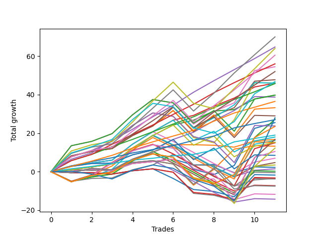

# Short Malinois 001 
- Symbol: ES
- Date Range: 03/18/2022 - 12/30/2022
- Trading Period: 8:30-12:30
- Number of Trades: 11



| Name | Win Percent | Profit | Avg Profit / Trade | Avg Time / Trade |      | Name | Win Percent | Profit | Avg Profit / Trade | Avg Time / Trade |
| ---- | ----------- | ------ | ------------------ | ---------------- | ---- | ---- | ----------- | ------ | ------------------ | ---------------- |
| Sorted By <br> Profit | | | | | | Sorted By <br> Win Percentage ||||
| TP-9 | 90.91 | 35000.00 | 3181.82 | 32:55 |     | TP-6 | 100.00 | 32375.00 | 2943.18 | 21:25 |
| TP-6 | 100.00 | 32375.00 | 2943.18 | 21:25 |     | TP-5 | 100.00 | 28000.00 | 2545.45 | 19:50 |
| TP-10 | 81.82 | 32000.00 | 2909.09 | 33:27 |     | BB-20 U/L 2SD C | 100.00 | 23000.00 | 2090.91 | 13:21 |
| TP-8 | 90.91 | 30250.00 | 2750.00 | 31:12 |     | TP-4 | 100.00 | 22875.00 | 2079.55 | 15:46 |
| TP-5 | 100.00 | 28000.00 | 2545.45 | 19:50 |     | BB-20 U/L 2SD | 100.00 | 19875.00 | 1806.82 | 13:18 |
| BB-50 U/L 2SD | 81.82 | 27250.00 | 2477.27 | 27:00 |     | TP-3 | 100.00 | 18250.00 | 1659.09 | 12:59 |
| TP-7 | 90.91 | 26000.00 | 2363.64 | 30:54 |     | TP-2 | 100.00 | 13500.00 | 1227.27 | 08:58 |
| BB-50 U/L 1SD | 90.91 | 23875.00 | 2170.45 | 21:58 |     | TP-1 | 100.00 | 9500.00 | 863.64 | 05:15 |
| NEWFI 000 | 72.73 | 23375.00 | 2125.00 | 36:30 |     | TP-9 | 90.91 | 35000.00 | 3181.82 | 32:55 |
| BB-20 U/L 2SD C | 100.00 | 23000.00 | 2090.91 | 13:21 |     | TP-8 | 90.91 | 30250.00 | 2750.00 | 31:12 |
| BB-100 Mid | 81.82 | 23000.00 | 2090.91 | 21:41 |     | TP-7 | 90.91 | 26000.00 | 2363.64 | 30:54 |
| V U/L 1SD | 63.64 | 23000.00 | 2090.91 | 35:06 |     | BB-50 U/L 1SD | 90.91 | 23875.00 | 2170.45 | 21:58 |
| TP-4 | 100.00 | 22875.00 | 2079.55 | 15:46 |     | BB-50 Mid | 90.91 | 19375.00 | 1761.36 | 12:39 |
| BB-20 U/L 2SD | 100.00 | 19875.00 | 1806.82 | 13:18 |     | TP-10 | 81.82 | 32000.00 | 2909.09 | 33:27 |
| BB-50 U/L 2SD SL-10 | 72.73 | 19875.00 | 1806.82 | 20:20 |     | BB-50 U/L 2SD | 81.82 | 27250.00 | 2477.27 | 27:00 |
| BB-50 Mid | 90.91 | 19375.00 | 1761.36 | 12:39 |     | BB-100 Mid | 81.82 | 23000.00 | 2090.91 | 21:41 |
| TP-3 | 100.00 | 18250.00 | 1659.09 | 12:59 |     | BB-50 U/L 1SD SL-10 | 81.82 | 16625.00 | 1511.36 | 15:42 |
| BB-50 U/L 1SD SL-10 | 81.82 | 16625.00 | 1511.36 | 15:42 |     | BB-20 U/L 2SD C SL-10 | 81.82 | 9000.00 | 818.18 | 11:30 |
| BB-100 Mid SL-10 | 72.73 | 14500.00 | 1318.18 | 14:59 |     | BB-20 U/L 2SD SL-10 | 81.82 | 7625.00 | 693.18 | 11:28 |
| BB-200 U/L 2SD | 63.64 | 13625.00 | 1238.64 | 51:25 |     | NEWFI 000 | 72.73 | 23375.00 | 2125.00 | 36:30 |
| TP-2 | 100.00 | 13500.00 | 1227.27 | 08:58 |     | BB-50 U/L 2SD SL-10 | 72.73 | 19875.00 | 1806.82 | 20:20 |
| BB-100 U/L 2SD | 63.64 | 12750.00 | 1159.09 | 49:04 |     | BB-100 Mid SL-10 | 72.73 | 14500.00 | 1318.18 | 14:59 |
| V U/L 1SD SL-10 | 54.55 | 11875.00 | 1079.55 | 28:16 |     | BB-50 Mid SL-10 | 72.73 | 4250.00 | 386.36 | 10:19 |
| TP-1 | 100.00 | 9500.00 | 863.64 | 05:15 |     | V U/L 1SD | 63.64 | 23000.00 | 2090.91 | 35:06 |
| BB-20 U/L 2SD C SL-10 | 81.82 | 9000.00 | 818.18 | 11:30 |     | BB-200 U/L 2SD | 63.64 | 13625.00 | 1238.64 | 51:25 |
| BB-20 U/L 1SD | 63.64 | 8375.00 | 761.36 | 09:40 |     | BB-100 U/L 2SD | 63.64 | 12750.00 | 1159.09 | 49:04 |
| BB-20 U/L 2SD SL-10 | 81.82 | 7625.00 | 693.18 | 11:28 |     | BB-20 U/L 1SD | 63.64 | 8375.00 | 761.36 | 09:40 |
| BB-200 Mid | 54.55 | 6625.00 | 602.27 | 19:51 |     | BB-20 U/L 1SD SL-10 | 63.64 | -1750.00 | -159.09 | 08:05 |
| BB-200 U/L 2SD SL-10 | 54.55 | 6125.00 | 556.82 | 43:13 |     | V U/L 1SD SL-10 | 54.55 | 11875.00 | 1079.55 | 28:16 |
| BB-100 U/L 2SD SL-10 | 54.55 | 5250.00 | 477.27 | 40:53 |     | BB-200 Mid | 54.55 | 6625.00 | 602.27 | 19:51 |
| BB-50 Mid SL-10 | 72.73 | 4250.00 | 386.36 | 10:19 |     | BB-200 U/L 2SD SL-10 | 54.55 | 6125.00 | 556.82 | 43:13 |
| BB-20 Mid | 54.55 | 1125.00 | 102.27 | 04:53 |     | BB-100 U/L 2SD SL-10 | 54.55 | 5250.00 | 477.27 | 40:53 |
| BB-20 U/L 1SD SL-10 | 63.64 | -1750.00 | -159.09 | 08:05 |     | BB-20 Mid | 54.55 | 1125.00 | 102.27 | 04:53 |
| BB-200 Mid SL-10 | 45.45 | -3750.00 | -340.91 | 13:03 |     | BB-20 Mid SL-10 | 54.55 | -5875.00 | -534.09 | 03:25 |
| BB-20 Mid SL-10 | 54.55 | -5875.00 | -534.09 | 03:25 |     | BB-200 Mid SL-10 | 45.45 | -3750.00 | -340.91 | 13:03 |

## NO STOPLOSS

### Test BB-20 Mid
* Sell when price hits the middle line of the 20p bollinger
* No Stoploss
* Results:
```
Total Trades: 11
Percent Up: 45.45
Percent Down: 54.55
Total Points Moved Down: 2.25
Potential Profit: 1125.00
Total Points Ups: 8.25 Count Ups: 5
Total Points Downs: 10.50 Count Downs: 6
```

<details><summary>Trades</summary>

<code>In: 2022-03-21 11:32:00		Out: 2022-03-21 11:40:40		Total Position Time: 08:40		Total Move Down: -0.00		Total to Date: 0.00</code> <br />
<code>In: 2022-07-18 08:48:00		Out: 2022-07-18 08:50:10		Total Position Time: 02:10		Total Move Down: 1.25		Total to Date: 1.25</code> <br />
<code>In: 2022-08-22 08:59:00		Out: 2022-08-22 09:00:10		Total Position Time: 01:10		Total Move Down: -0.75		Total to Date: 0.50</code> <br />
<code>In: 2022-08-23 10:36:00		Out: 2022-08-23 10:37:25		Total Position Time: 01:25		Total Move Down: 3.75		Total to Date: 4.25</code> <br />
<code>In: 2022-08-23 10:37:00		Out: 2022-08-23 10:38:10		Total Position Time: 01:10		Total Move Down: 1.00		Total to Date: 5.25</code> <br />
<code>In: 2022-09-16 12:11:00		Out: 2022-09-16 12:12:10		Total Position Time: 01:10		Total Move Down: 1.25		Total to Date: 6.50</code> <br />
<code>In: 2022-09-22 12:08:00		Out: 2022-09-22 12:19:50		Total Position Time: 11:50		Total Move Down: -3.00		Total to Date: 3.50</code> <br />
<code>In: 2022-09-26 11:58:00		Out: 2022-09-26 12:06:50		Total Position Time: 08:50		Total Move Down: 0.25		Total to Date: 3.75</code> <br />
<code>In: 2022-09-27 11:47:00		Out: 2022-09-27 12:00:05		Total Position Time: 13:05		Total Move Down: -4.25		Total to Date: -0.50</code> <br />
<code>In: 2022-09-29 08:59:00		Out: 2022-09-29 09:02:05		Total Position Time: 03:05		Total Move Down: 3.00		Total to Date: 2.50</code> <br />
<code>In: 2022-12-19 10:28:00		Out: 2022-12-19 10:29:10		Total Position Time: 01:10		Total Move Down: -0.25		Total to Date: 2.25</code> <br />


</details>

### Test BB-20 U/L 1SD
* Sell when the price hits the lower line of the 20p 1std bollinger
* No Stoploss
* Results:
```
Total Trades: 11
Percent Up: 36.36
Percent Down: 63.64
Total Points Moved Down: 16.75
Potential Profit: 8375.00
Total Points Ups: 1.50 Count Ups: 4
Total Points Downs: 18.25 Count Downs: 7
```

<details><summary>Trades</summary>

<code>In: 2022-03-21 11:32:00		Out: 2022-03-21 11:42:10		Total Position Time: 10:10		Total Move Down: 1.00		Total to Date: 1.00</code> <br />
<code>In: 2022-07-18 08:48:00		Out: 2022-07-18 09:05:10		Total Position Time: 17:10		Total Move Down: -0.25		Total to Date: 0.75</code> <br />
<code>In: 2022-08-22 08:59:00		Out: 2022-08-22 09:07:55		Total Position Time: 08:55		Total Move Down: 0.25		Total to Date: 1.00</code> <br />
<code>In: 2022-08-23 10:36:00		Out: 2022-08-23 10:43:05		Total Position Time: 07:05		Total Move Down: 5.50		Total to Date: 6.50</code> <br />
<code>In: 2022-08-23 10:37:00		Out: 2022-08-23 10:43:05		Total Position Time: 06:05		Total Move Down: 3.75		Total to Date: 10.25</code> <br />
<code>In: 2022-09-16 12:11:00		Out: 2022-09-16 12:14:25		Total Position Time: 03:25		Total Move Down: 3.75		Total to Date: 14.00</code> <br />
<code>In: 2022-09-22 12:08:00		Out: 2022-09-22 12:20:20		Total Position Time: 12:20		Total Move Down: -0.00		Total to Date: 14.00</code> <br />
<code>In: 2022-09-26 11:58:00		Out: 2022-09-26 12:12:05		Total Position Time: 14:05		Total Move Down: -0.25		Total to Date: 13.75</code> <br />
<code>In: 2022-09-27 11:47:00		Out: 2022-09-27 12:00:50		Total Position Time: 13:50		Total Move Down: -1.00		Total to Date: 12.75</code> <br />
<code>In: 2022-09-29 08:59:00		Out: 2022-09-29 09:10:55		Total Position Time: 11:55		Total Move Down: 3.25		Total to Date: 16.00</code> <br />
<code>In: 2022-12-19 10:28:00		Out: 2022-12-19 10:29:20		Total Position Time: 01:20		Total Move Down: 0.75		Total to Date: 16.75</code> <br />


</details>

### Test BB-20 U/L 2SD
* Sell when the price hits the lower line of the 20p 2std bollinger
* No Stoploss
* Results:
```
Total Trades: 11
Percent Up: 0.00
Percent Down: 100.00
Total Points Moved Down: 39.75
Potential Profit: 19875.00
Total Points Ups: 0.00 Count Ups: 0
Total Points Downs: 39.75 Count Downs: 11
```

<details><summary>Trades</summary>

<code>In: 2022-03-21 11:32:00		Out: 2022-03-21 11:42:20		Total Position Time: 10:20		Total Move Down: 1.00		Total to Date: 1.00</code> <br />
<code>In: 2022-07-18 08:48:00		Out: 2022-07-18 09:08:15		Total Position Time: 20:15		Total Move Down: 1.50		Total to Date: 2.50</code> <br />
<code>In: 2022-08-22 08:59:00		Out: 2022-08-22 09:08:15		Total Position Time: 09:15		Total Move Down: 1.50		Total to Date: 4.00</code> <br />
<code>In: 2022-08-23 10:36:00		Out: 2022-08-23 10:48:35		Total Position Time: 12:35		Total Move Down: 8.25		Total to Date: 12.25</code> <br />
<code>In: 2022-08-23 10:37:00		Out: 2022-08-23 10:48:35		Total Position Time: 11:35		Total Move Down: 6.50		Total to Date: 18.75</code> <br />
<code>In: 2022-09-16 12:11:00		Out: 2022-09-16 12:28:05		Total Position Time: 17:05		Total Move Down: 5.50		Total to Date: 24.25</code> <br />
<code>In: 2022-09-22 12:08:00		Out: 2022-09-22 12:22:20		Total Position Time: 14:20		Total Move Down: 2.50		Total to Date: 26.75</code> <br />
<code>In: 2022-09-26 11:58:00		Out: 2022-09-26 12:17:10		Total Position Time: 19:10		Total Move Down: 4.75		Total to Date: 31.50</code> <br />
<code>In: 2022-09-27 11:47:00		Out: 2022-09-27 12:01:50		Total Position Time: 14:50		Total Move Down: 0.75		Total to Date: 32.25</code> <br />
<code>In: 2022-09-29 08:59:00		Out: 2022-09-29 09:11:30		Total Position Time: 12:30		Total Move Down: 5.50		Total to Date: 37.75</code> <br />
<code>In: 2022-12-19 10:28:00		Out: 2022-12-19 10:32:30		Total Position Time: 04:30		Total Move Down: 2.00		Total to Date: 39.75</code> <br />


</details>

### Test BB-20 U/L 2SD C
* Sell when the price hits the lower line of the 20p 2std bollinger
* No Stoploss
* Results:
```
Total Trades: 11
Percent Up: 0.00
Percent Down: 100.00
Total Points Moved Down: 46.00
Potential Profit: 23000.00
Total Points Ups: 0.00 Count Ups: 0
Total Points Downs: 46.00 Count Downs: 11
```

<details><summary>Trades</summary>

<code>In: 2022-03-21 11:32:00		Out: 2022-03-21 11:42:30		Total Position Time: 10:30		Total Move Down: 3.00		Total to Date: 3.00</code> <br />
<code>In: 2022-07-18 08:48:00		Out: 2022-07-18 09:08:15		Total Position Time: 20:15		Total Move Down: 1.50		Total to Date: 4.50</code> <br />
<code>In: 2022-08-22 08:59:00		Out: 2022-08-22 09:08:15		Total Position Time: 09:15		Total Move Down: 1.50		Total to Date: 6.00</code> <br />
<code>In: 2022-08-23 10:36:00		Out: 2022-08-23 10:48:35		Total Position Time: 12:35		Total Move Down: 8.25		Total to Date: 14.25</code> <br />
<code>In: 2022-08-23 10:37:00		Out: 2022-08-23 10:48:35		Total Position Time: 11:35		Total Move Down: 6.50		Total to Date: 20.75</code> <br />
<code>In: 2022-09-16 12:11:00		Out: 2022-09-16 12:28:15		Total Position Time: 17:15		Total Move Down: 6.00		Total to Date: 26.75</code> <br />
<code>In: 2022-09-22 12:08:00		Out: 2022-09-22 12:22:20		Total Position Time: 14:20		Total Move Down: 2.50		Total to Date: 29.25</code> <br />
<code>In: 2022-09-26 11:58:00		Out: 2022-09-26 12:17:10		Total Position Time: 19:10		Total Move Down: 4.75		Total to Date: 34.00</code> <br />
<code>In: 2022-09-27 11:47:00		Out: 2022-09-27 12:01:55		Total Position Time: 14:55		Total Move Down: 4.25		Total to Date: 38.25</code> <br />
<code>In: 2022-09-29 08:59:00		Out: 2022-09-29 09:11:40		Total Position Time: 12:40		Total Move Down: 5.75		Total to Date: 44.00</code> <br />
<code>In: 2022-12-19 10:28:00		Out: 2022-12-19 10:32:30		Total Position Time: 04:30		Total Move Down: 2.00		Total to Date: 46.00</code> <br />


</details>

### Test BB-50 Mid
* Sell when price hits the middle line of the 50p bollinger
* No Stoploss
* Results:
```
Total Trades: 11
Percent Up: 9.09
Percent Down: 90.91
Total Points Moved Down: 38.75
Potential Profit: 19375.00
Total Points Ups: 0.25 Count Ups: 1
Total Points Downs: 39.00 Count Downs: 10
```

<details><summary>Trades</summary>

<code>In: 2022-03-21 11:32:00		Out: 2022-03-21 11:55:20		Total Position Time: 23:20		Total Move Down: 2.75		Total to Date: 2.75</code> <br />
<code>In: 2022-07-18 08:48:00		Out: 2022-07-18 09:08:15		Total Position Time: 20:15		Total Move Down: 1.50		Total to Date: 4.25</code> <br />
<code>In: 2022-08-22 08:59:00		Out: 2022-08-22 09:07:55		Total Position Time: 08:55		Total Move Down: 0.25		Total to Date: 4.50</code> <br />
<code>In: 2022-08-23 10:36:00		Out: 2022-08-23 10:39:25		Total Position Time: 03:25		Total Move Down: 4.25		Total to Date: 8.75</code> <br />
<code>In: 2022-08-23 10:37:00		Out: 2022-08-23 10:39:25		Total Position Time: 02:25		Total Move Down: 2.50		Total to Date: 11.25</code> <br />
<code>In: 2022-09-16 12:11:00		Out: 2022-09-16 12:19:05		Total Position Time: 08:05		Total Move Down: 5.50		Total to Date: 16.75</code> <br />
<code>In: 2022-09-22 12:08:00		Out: 2022-09-22 12:27:05		Total Position Time: 19:05		Total Move Down: 3.75		Total to Date: 20.50</code> <br />
<code>In: 2022-09-26 11:58:00		Out: 2022-09-26 12:17:30		Total Position Time: 19:30		Total Move Down: 6.00		Total to Date: 26.50</code> <br />
<code>In: 2022-09-27 11:47:00		Out: 2022-09-27 12:02:25		Total Position Time: 15:25		Total Move Down: 5.25		Total to Date: 31.75</code> <br />
<code>In: 2022-09-29 08:59:00		Out: 2022-09-29 09:16:35		Total Position Time: 17:35		Total Move Down: 7.25		Total to Date: 39.00</code> <br />
<code>In: 2022-12-19 10:28:00		Out: 2022-12-19 10:29:10		Total Position Time: 01:10		Total Move Down: -0.25		Total to Date: 38.75</code> <br />


</details>

### Test BB-50 U/L 1SD
* Sell when the price hits the lower line of the 50p 1std bollinger
* No Stoploss
* Results:
```
Total Trades: 11
Percent Up: 9.09
Percent Down: 90.91
Total Points Moved Down: 47.75
Potential Profit: 23875.00
Total Points Ups: 11.00 Count Ups: 1
Total Points Downs: 58.75 Count Downs: 10
```

<details><summary>Trades</summary>

<code>In: 2022-03-21 11:32:00		Out: 2022-03-21 11:57:15		Total Position Time: 25:15		Total Move Down: 8.25		Total to Date: 8.25</code> <br />
<code>In: 2022-07-18 08:48:00		Out: 2022-07-18 09:19:25		Total Position Time: 31:25		Total Move Down: 2.25		Total to Date: 10.50</code> <br />
<code>In: 2022-08-22 08:59:00		Out: 2022-08-22 09:08:20		Total Position Time: 09:20		Total Move Down: 1.50		Total to Date: 12.00</code> <br />
<code>In: 2022-08-23 10:36:00		Out: 2022-08-23 10:48:05		Total Position Time: 12:05		Total Move Down: 6.75		Total to Date: 18.75</code> <br />
<code>In: 2022-08-23 10:37:00		Out: 2022-08-23 10:48:05		Total Position Time: 11:05		Total Move Down: 5.00		Total to Date: 23.75</code> <br />
<code>In: 2022-09-16 12:11:00		Out: 2022-09-16 12:30:25		Total Position Time: 19:25		Total Move Down: 8.00		Total to Date: 31.75</code> <br />
<code>In: 2022-09-22 12:08:00		Out: 2022-09-22 12:47:00		Total Position Time: 39:00		Total Move Down: -11.00		Total to Date: 20.75</code> <br />
<code>In: 2022-09-26 11:58:00		Out: 2022-09-26 12:31:55		Total Position Time: 33:55		Total Move Down: 8.25		Total to Date: 29.00</code> <br />
<code>In: 2022-09-27 11:47:00		Out: 2022-09-27 12:25:50		Total Position Time: 38:50		Total Move Down: 4.25		Total to Date: 33.25</code> <br />
<code>In: 2022-09-29 08:59:00		Out: 2022-09-29 09:19:05		Total Position Time: 20:05		Total Move Down: 13.75		Total to Date: 47.00</code> <br />
<code>In: 2022-12-19 10:28:00		Out: 2022-12-19 10:29:20		Total Position Time: 01:20		Total Move Down: 0.75		Total to Date: 47.75</code> <br />


</details>

### Test BB-50 U/L 2SD
* Sell when the price hits the lower line of the 50p 2std bollinger
* No Stoploss
* Results:
```
Total Trades: 11
Percent Up: 18.18
Percent Down: 81.82
Total Points Moved Down: 54.50
Potential Profit: 27250.00
Total Points Ups: 12.75 Count Ups: 2
Total Points Downs: 67.25 Count Downs: 9
```

<details><summary>Trades</summary>

<code>In: 2022-03-21 11:32:00		Out: 2022-03-21 11:59:15		Total Position Time: 27:15		Total Move Down: 13.50		Total to Date: 13.50</code> <br />
<code>In: 2022-07-18 08:48:00		Out: 2022-07-18 09:26:30		Total Position Time: 38:30		Total Move Down: 2.25		Total to Date: 15.75</code> <br />
<code>In: 2022-08-22 08:59:00		Out: 2022-08-22 09:12:35		Total Position Time: 13:35		Total Move Down: 4.00		Total to Date: 19.75</code> <br />
<code>In: 2022-08-23 10:36:00		Out: 2022-08-23 10:51:40		Total Position Time: 15:40		Total Move Down: 9.75		Total to Date: 29.50</code> <br />
<code>In: 2022-08-23 10:37:00		Out: 2022-08-23 10:51:40		Total Position Time: 14:40		Total Move Down: 8.00		Total to Date: 37.50</code> <br />
<code>In: 2022-09-16 12:11:00		Out: 2022-09-16 12:47:00		Total Position Time: 36:00		Total Move Down: -1.75		Total to Date: 35.75</code> <br />
<code>In: 2022-09-22 12:08:00		Out: 2022-09-22 12:47:00		Total Position Time: 39:00		Total Move Down: -11.00		Total to Date: 24.75</code> <br />
<code>In: 2022-09-26 11:58:00		Out: 2022-09-26 12:39:00		Total Position Time: 41:00		Total Move Down: 6.50		Total to Date: 31.25</code> <br />
<code>In: 2022-09-27 11:47:00		Out: 2022-09-27 12:30:15		Total Position Time: 43:15		Total Move Down: 4.50		Total to Date: 35.75</code> <br />
<code>In: 2022-09-29 08:59:00		Out: 2022-09-29 09:22:45		Total Position Time: 23:45		Total Move Down: 16.75		Total to Date: 52.50</code> <br />
<code>In: 2022-12-19 10:28:00		Out: 2022-12-19 10:32:30		Total Position Time: 04:30		Total Move Down: 2.00		Total to Date: 54.50</code> <br />


</details>

### Test V U/L 1SD
* Sell when the price hits the lower line of the 1std VWAP
* No Stoploss
* Results:
```
Total Trades: 11
Percent Up: 36.36
Percent Down: 63.64
Total Points Moved Down: 46.00
Potential Profit: 23000.00
Total Points Ups: 15.75 Count Ups: 4
Total Points Downs: 61.75 Count Downs: 7
```

<details><summary>Trades</summary>

<code>In: 2022-03-21 11:32:00		Out: 2022-03-21 11:56:05		Total Position Time: 24:05		Total Move Down: 7.75		Total to Date: 7.75</code> <br />
<code>In: 2022-07-18 08:48:00		Out: 2022-07-18 09:48:55		Total Position Time: 60:55		Total Move Down: 3.25		Total to Date: 11.00</code> <br />
<code>In: 2022-08-22 08:59:00		Out: 2022-08-22 09:44:55		Total Position Time: 45:55		Total Move Down: 4.75		Total to Date: 15.75</code> <br />
<code>In: 2022-08-23 10:36:00		Out: 2022-08-23 10:48:35		Total Position Time: 12:35		Total Move Down: 8.25		Total to Date: 24.00</code> <br />
<code>In: 2022-08-23 10:37:00		Out: 2022-08-23 10:48:35		Total Position Time: 11:35		Total Move Down: 6.50		Total to Date: 30.50</code> <br />
<code>In: 2022-09-16 12:11:00		Out: 2022-09-16 12:47:00		Total Position Time: 36:00		Total Move Down: -1.75		Total to Date: 28.75</code> <br />
<code>In: 2022-09-22 12:08:00		Out: 2022-09-22 12:47:00		Total Position Time: 39:00		Total Move Down: -11.00		Total to Date: 17.75</code> <br />
<code>In: 2022-09-26 11:58:00		Out: 2022-09-26 12:47:00		Total Position Time: 49:00		Total Move Down: -2.75		Total to Date: 15.00</code> <br />
<code>In: 2022-09-27 11:47:00		Out: 2022-09-27 12:32:00		Total Position Time: 45:00		Total Move Down: 12.00		Total to Date: 27.00</code> <br />
<code>In: 2022-09-29 08:59:00		Out: 2022-09-29 09:59:55		Total Position Time: 60:55		Total Move Down: 19.25		Total to Date: 46.25</code> <br />
<code>In: 2022-12-19 10:28:00		Out: 2022-12-19 10:29:10		Total Position Time: 01:10		Total Move Down: -0.25		Total to Date: 46.00</code> <br />


</details>

### Test BB-100 Mid
* Move to BB100 Mid
* No Stoploss
* Results:
```
Total Trades: 11
Percent Up: 18.18
Percent Down: 81.82
Total Points Moved Down: 46.00
Potential Profit: 23000.00
Total Points Ups: 11.25 Count Ups: 2
Total Points Downs: 57.25 Count Downs: 9
```

<details><summary>Trades</summary>

<code>In: 2022-03-21 11:32:00		Out: 2022-03-21 11:56:35		Total Position Time: 24:35		Total Move Down: 8.25		Total to Date: 8.25</code> <br />
<code>In: 2022-07-18 08:48:00		Out: 2022-07-18 09:19:25		Total Position Time: 31:25		Total Move Down: 2.25		Total to Date: 10.50</code> <br />
<code>In: 2022-08-22 08:59:00		Out: 2022-08-22 09:08:20		Total Position Time: 09:20		Total Move Down: 1.50		Total to Date: 12.00</code> <br />
<code>In: 2022-08-23 10:36:00		Out: 2022-08-23 10:45:20		Total Position Time: 09:20		Total Move Down: 6.75		Total to Date: 18.75</code> <br />
<code>In: 2022-08-23 10:37:00		Out: 2022-08-23 10:45:20		Total Position Time: 08:20		Total Move Down: 5.00		Total to Date: 23.75</code> <br />
<code>In: 2022-09-16 12:11:00		Out: 2022-09-16 12:31:10		Total Position Time: 20:10		Total Move Down: 9.75		Total to Date: 33.50</code> <br />
<code>In: 2022-09-22 12:08:00		Out: 2022-09-22 12:47:00		Total Position Time: 39:00		Total Move Down: -11.00		Total to Date: 22.50</code> <br />
<code>In: 2022-09-26 11:58:00		Out: 2022-09-26 12:30:20		Total Position Time: 32:20		Total Move Down: 5.50		Total to Date: 28.00</code> <br />
<code>In: 2022-09-27 11:47:00		Out: 2022-09-27 12:30:40		Total Position Time: 43:40		Total Move Down: 6.75		Total to Date: 34.75</code> <br />
<code>In: 2022-09-29 08:59:00		Out: 2022-09-29 09:18:20		Total Position Time: 19:20		Total Move Down: 11.50		Total to Date: 46.25</code> <br />
<code>In: 2022-12-19 10:28:00		Out: 2022-12-19 10:29:10		Total Position Time: 01:10		Total Move Down: -0.25		Total to Date: 46.00</code> <br />


</details>

### Test BB-100 U/L 2SD
* Move to BB100 Upper Band
* No Stoploss
* Results:
```
Total Trades: 11
Percent Up: 36.36
Percent Down: 63.64
Total Points Moved Down: 25.50
Potential Profit: 12750.00
Total Points Ups: 20.75 Count Ups: 4
Total Points Downs: 46.25 Count Downs: 7
```

<details><summary>Trades</summary>

<code>In: 2022-03-21 11:32:00		Out: 2022-03-21 12:32:55		Total Position Time: 60:55		Total Move Down: -5.25		Total to Date: -5.25</code> <br />
<code>In: 2022-07-18 08:48:00		Out: 2022-07-18 09:48:55		Total Position Time: 60:55		Total Move Down: 3.25		Total to Date: -2.00</code> <br />
<code>In: 2022-08-22 08:59:00		Out: 2022-08-22 09:45:25		Total Position Time: 46:25		Total Move Down: 6.50		Total to Date: 4.50</code> <br />
<code>In: 2022-08-23 10:36:00		Out: 2022-08-23 11:36:55		Total Position Time: 60:55		Total Move Down: 6.25		Total to Date: 10.75</code> <br />
<code>In: 2022-08-23 10:37:00		Out: 2022-08-23 11:37:55		Total Position Time: 60:55		Total Move Down: 3.25		Total to Date: 14.00</code> <br />
<code>In: 2022-09-16 12:11:00		Out: 2022-09-16 12:47:00		Total Position Time: 36:00		Total Move Down: -1.75		Total to Date: 12.25</code> <br />
<code>In: 2022-09-22 12:08:00		Out: 2022-09-22 12:47:00		Total Position Time: 39:00		Total Move Down: -11.00		Total to Date: 1.25</code> <br />
<code>In: 2022-09-26 11:58:00		Out: 2022-09-26 12:47:00		Total Position Time: 49:00		Total Move Down: -2.75		Total to Date: -1.50</code> <br />
<code>In: 2022-09-27 11:47:00		Out: 2022-09-27 12:47:00		Total Position Time: 60:00		Total Move Down: 4.75		Total to Date: 3.25</code> <br />
<code>In: 2022-09-29 08:59:00		Out: 2022-09-29 09:59:55		Total Position Time: 60:55		Total Move Down: 19.25		Total to Date: 22.50</code> <br />
<code>In: 2022-12-19 10:28:00		Out: 2022-12-19 10:32:50		Total Position Time: 04:50		Total Move Down: 3.00		Total to Date: 25.50</code> <br />


</details>

### Test BB-200 Mid
* Move to BB200 Mid
* No Stoploss
* Results:
```
Total Trades: 11
Percent Up: 45.45
Percent Down: 54.55
Total Points Moved Down: 13.25
Potential Profit: 6625.00
Total Points Ups: 14.25 Count Ups: 5
Total Points Downs: 27.50 Count Downs: 6
```

<details><summary>Trades</summary>

<code>In: 2022-03-21 11:32:00		Out: 2022-03-21 11:33:10		Total Position Time: 01:10		Total Move Down: -0.50		Total to Date: -0.50</code> <br />
<code>In: 2022-07-18 08:48:00		Out: 2022-07-18 09:45:30		Total Position Time: 57:30		Total Move Down: 2.25		Total to Date: 1.75</code> <br />
<code>In: 2022-08-22 08:59:00		Out: 2022-08-22 09:00:10		Total Position Time: 01:10		Total Move Down: -0.75		Total to Date: 1.00</code> <br />
<code>In: 2022-08-23 10:36:00		Out: 2022-08-23 10:37:25		Total Position Time: 01:25		Total Move Down: 3.75		Total to Date: 4.75</code> <br />
<code>In: 2022-08-23 10:37:00		Out: 2022-08-23 10:38:10		Total Position Time: 01:10		Total Move Down: 1.00		Total to Date: 5.75</code> <br />
<code>In: 2022-09-16 12:11:00		Out: 2022-09-16 12:47:00		Total Position Time: 36:00		Total Move Down: -1.75		Total to Date: 4.00</code> <br />
<code>In: 2022-09-22 12:08:00		Out: 2022-09-22 12:47:00		Total Position Time: 39:00		Total Move Down: -11.00		Total to Date: -7.00</code> <br />
<code>In: 2022-09-26 11:58:00		Out: 2022-09-26 12:31:55		Total Position Time: 33:55		Total Move Down: 8.25		Total to Date: 1.25</code> <br />
<code>In: 2022-09-27 11:47:00		Out: 2022-09-27 12:31:50		Total Position Time: 44:50		Total Move Down: 10.50		Total to Date: 11.75</code> <br />
<code>In: 2022-09-29 08:59:00		Out: 2022-09-29 09:00:10		Total Position Time: 01:10		Total Move Down: 1.75		Total to Date: 13.50</code> <br />
<code>In: 2022-12-19 10:28:00		Out: 2022-12-19 10:29:10		Total Position Time: 01:10		Total Move Down: -0.25		Total to Date: 13.25</code> <br />


</details>

### Test BB-200 U/L 2SD
* Move to BB200 Upper Band
* No Stoploss
* Results:
```
Total Trades: 11
Percent Up: 36.36
Percent Down: 63.64
Total Points Moved Down: 27.25
Potential Profit: 13625.00
Total Points Ups: 20.75 Count Ups: 4
Total Points Downs: 48.00 Count Downs: 7
```

<details><summary>Trades</summary>

<code>In: 2022-03-21 11:32:00		Out: 2022-03-21 12:32:55		Total Position Time: 60:55		Total Move Down: -5.25		Total to Date: -5.25</code> <br />
<code>In: 2022-07-18 08:48:00		Out: 2022-07-18 09:48:55		Total Position Time: 60:55		Total Move Down: 3.25		Total to Date: -2.00</code> <br />
<code>In: 2022-08-22 08:59:00		Out: 2022-08-22 09:59:55		Total Position Time: 60:55		Total Move Down: 1.75		Total to Date: -0.25</code> <br />
<code>In: 2022-08-23 10:36:00		Out: 2022-08-23 11:36:55		Total Position Time: 60:55		Total Move Down: 6.25		Total to Date: 6.00</code> <br />
<code>In: 2022-08-23 10:37:00		Out: 2022-08-23 11:37:55		Total Position Time: 60:55		Total Move Down: 3.25		Total to Date: 9.25</code> <br />
<code>In: 2022-09-16 12:11:00		Out: 2022-09-16 12:47:00		Total Position Time: 36:00		Total Move Down: -1.75		Total to Date: 7.50</code> <br />
<code>In: 2022-09-22 12:08:00		Out: 2022-09-22 12:47:00		Total Position Time: 39:00		Total Move Down: -11.00		Total to Date: -3.50</code> <br />
<code>In: 2022-09-26 11:58:00		Out: 2022-09-26 12:47:00		Total Position Time: 49:00		Total Move Down: -2.75		Total to Date: -6.25</code> <br />
<code>In: 2022-09-27 11:47:00		Out: 2022-09-27 12:47:00		Total Position Time: 60:00		Total Move Down: 4.75		Total to Date: -1.50</code> <br />
<code>In: 2022-09-29 08:59:00		Out: 2022-09-29 09:59:55		Total Position Time: 60:55		Total Move Down: 19.25		Total to Date: 17.75</code> <br />
<code>In: 2022-12-19 10:28:00		Out: 2022-12-19 10:44:05		Total Position Time: 16:05		Total Move Down: 9.50		Total to Date: 27.25</code> <br />


</details>

## STOPLOSS OF 10

### Test BB-20 Mid SL-10
* Sell when price hits the middle line of the 20p bollinger
* Stoploss is -10 points
* Results:
```
Total Trades: 11
Percent Up: 45.45
Percent Down: 54.55
Total Points Moved Down: -11.75
Potential Profit: -5875.00
Total Points Ups: 22.25 Count Ups: 5
Total Points Downs: 10.50 Count Downs: 6
```

<details><summary>Trades</summary>

<code>In: 2022-03-21 11:32:00		Out: 2022-03-21 11:40:40		Total Position Time: 08:40		Total Move Down: -0.00		Total to Date: 0.00</code> <br />
<code>In: 2022-07-18 08:48:00		Out: 2022-07-18 08:50:10		Total Position Time: 02:10		Total Move Down: 1.25		Total to Date: 1.25</code> <br />
<code>In: 2022-08-22 08:59:00		Out: 2022-08-22 09:00:10		Total Position Time: 01:10		Total Move Down: -0.75		Total to Date: 0.50</code> <br />
<code>In: 2022-08-23 10:36:00		Out: 2022-08-23 10:37:25		Total Position Time: 01:25		Total Move Down: 3.75		Total to Date: 4.25</code> <br />
<code>In: 2022-08-23 10:37:00		Out: 2022-08-23 10:38:10		Total Position Time: 01:10		Total Move Down: 1.00		Total to Date: 5.25</code> <br />
<code>In: 2022-09-16 12:11:00		Out: 2022-09-16 12:12:10		Total Position Time: 01:10		Total Move Down: 1.25		Total to Date: 6.50</code> <br />
<code>In: 2022-09-22 12:08:00		Out: 2022-09-22 12:14:15		Total Position Time: 06:15		Total Move Down: -10.50		Total to Date: -4.00</code> <br />
<code>In: 2022-09-26 11:58:00		Out: 2022-09-26 12:06:50		Total Position Time: 08:50		Total Move Down: 0.25		Total to Date: -3.75</code> <br />
<code>In: 2022-09-27 11:47:00		Out: 2022-09-27 11:49:40		Total Position Time: 02:40		Total Move Down: -10.75		Total to Date: -14.50</code> <br />
<code>In: 2022-09-29 08:59:00		Out: 2022-09-29 09:02:05		Total Position Time: 03:05		Total Move Down: 3.00		Total to Date: -11.50</code> <br />
<code>In: 2022-12-19 10:28:00		Out: 2022-12-19 10:29:10		Total Position Time: 01:10		Total Move Down: -0.25		Total to Date: -11.75</code> <br />


</details>

### Test BB-20 U/L 1SD SL-10
* Sell when the price hits the lower line of the 20p 1std bollinger
* Stoploss is -10 points
* Results:
```
Total Trades: 11
Percent Up: 36.36
Percent Down: 63.64
Total Points Moved Down: -3.50
Potential Profit: -1750.00
Total Points Ups: 21.75 Count Ups: 4
Total Points Downs: 18.25 Count Downs: 7
```

<details><summary>Trades</summary>

<code>In: 2022-03-21 11:32:00		Out: 2022-03-21 11:42:10		Total Position Time: 10:10		Total Move Down: 1.00		Total to Date: 1.00</code> <br />
<code>In: 2022-07-18 08:48:00		Out: 2022-07-18 09:05:10		Total Position Time: 17:10		Total Move Down: -0.25		Total to Date: 0.75</code> <br />
<code>In: 2022-08-22 08:59:00		Out: 2022-08-22 09:07:55		Total Position Time: 08:55		Total Move Down: 0.25		Total to Date: 1.00</code> <br />
<code>In: 2022-08-23 10:36:00		Out: 2022-08-23 10:43:05		Total Position Time: 07:05		Total Move Down: 5.50		Total to Date: 6.50</code> <br />
<code>In: 2022-08-23 10:37:00		Out: 2022-08-23 10:43:05		Total Position Time: 06:05		Total Move Down: 3.75		Total to Date: 10.25</code> <br />
<code>In: 2022-09-16 12:11:00		Out: 2022-09-16 12:14:25		Total Position Time: 03:25		Total Move Down: 3.75		Total to Date: 14.00</code> <br />
<code>In: 2022-09-22 12:08:00		Out: 2022-09-22 12:14:15		Total Position Time: 06:15		Total Move Down: -10.50		Total to Date: 3.50</code> <br />
<code>In: 2022-09-26 11:58:00		Out: 2022-09-26 12:12:05		Total Position Time: 14:05		Total Move Down: -0.25		Total to Date: 3.25</code> <br />
<code>In: 2022-09-27 11:47:00		Out: 2022-09-27 11:49:40		Total Position Time: 02:40		Total Move Down: -10.75		Total to Date: -7.50</code> <br />
<code>In: 2022-09-29 08:59:00		Out: 2022-09-29 09:10:55		Total Position Time: 11:55		Total Move Down: 3.25		Total to Date: -4.25</code> <br />
<code>In: 2022-12-19 10:28:00		Out: 2022-12-19 10:29:20		Total Position Time: 01:20		Total Move Down: 0.75		Total to Date: -3.50</code> <br />


</details>

### Test BB-20 U/L 2SD SL-10
* Sell when the price hits the lower line of the 20p 2std bollinger
* Stoploss is -10 points
* Results:
```
Total Trades: 11
Percent Up: 18.18
Percent Down: 81.82
Total Points Moved Down: 15.25
Potential Profit: 7625.00
Total Points Ups: 21.25 Count Ups: 2
Total Points Downs: 36.50 Count Downs: 9
```

<details><summary>Trades</summary>

<code>In: 2022-03-21 11:32:00		Out: 2022-03-21 11:42:20		Total Position Time: 10:20		Total Move Down: 1.00		Total to Date: 1.00</code> <br />
<code>In: 2022-07-18 08:48:00		Out: 2022-07-18 09:08:15		Total Position Time: 20:15		Total Move Down: 1.50		Total to Date: 2.50</code> <br />
<code>In: 2022-08-22 08:59:00		Out: 2022-08-22 09:08:15		Total Position Time: 09:15		Total Move Down: 1.50		Total to Date: 4.00</code> <br />
<code>In: 2022-08-23 10:36:00		Out: 2022-08-23 10:48:35		Total Position Time: 12:35		Total Move Down: 8.25		Total to Date: 12.25</code> <br />
<code>In: 2022-08-23 10:37:00		Out: 2022-08-23 10:48:35		Total Position Time: 11:35		Total Move Down: 6.50		Total to Date: 18.75</code> <br />
<code>In: 2022-09-16 12:11:00		Out: 2022-09-16 12:28:05		Total Position Time: 17:05		Total Move Down: 5.50		Total to Date: 24.25</code> <br />
<code>In: 2022-09-22 12:08:00		Out: 2022-09-22 12:14:15		Total Position Time: 06:15		Total Move Down: -10.50		Total to Date: 13.75</code> <br />
<code>In: 2022-09-26 11:58:00		Out: 2022-09-26 12:17:10		Total Position Time: 19:10		Total Move Down: 4.75		Total to Date: 18.50</code> <br />
<code>In: 2022-09-27 11:47:00		Out: 2022-09-27 11:49:40		Total Position Time: 02:40		Total Move Down: -10.75		Total to Date: 7.75</code> <br />
<code>In: 2022-09-29 08:59:00		Out: 2022-09-29 09:11:30		Total Position Time: 12:30		Total Move Down: 5.50		Total to Date: 13.25</code> <br />
<code>In: 2022-12-19 10:28:00		Out: 2022-12-19 10:32:30		Total Position Time: 04:30		Total Move Down: 2.00		Total to Date: 15.25</code> <br />


</details>

### Test BB-20 U/L 2SD C SL-10
* Sell when the price hits the lower line of the 20p 2std bollinger
* Stoploss is -10 points
* Results:
```
Total Trades: 11
Percent Up: 18.18
Percent Down: 81.82
Total Points Moved Down: 18.00
Potential Profit: 9000.00
Total Points Ups: 21.25 Count Ups: 2
Total Points Downs: 39.25 Count Downs: 9
```

<details><summary>Trades</summary>

<code>In: 2022-03-21 11:32:00		Out: 2022-03-21 11:42:30		Total Position Time: 10:30		Total Move Down: 3.00		Total to Date: 3.00</code> <br />
<code>In: 2022-07-18 08:48:00		Out: 2022-07-18 09:08:15		Total Position Time: 20:15		Total Move Down: 1.50		Total to Date: 4.50</code> <br />
<code>In: 2022-08-22 08:59:00		Out: 2022-08-22 09:08:15		Total Position Time: 09:15		Total Move Down: 1.50		Total to Date: 6.00</code> <br />
<code>In: 2022-08-23 10:36:00		Out: 2022-08-23 10:48:35		Total Position Time: 12:35		Total Move Down: 8.25		Total to Date: 14.25</code> <br />
<code>In: 2022-08-23 10:37:00		Out: 2022-08-23 10:48:35		Total Position Time: 11:35		Total Move Down: 6.50		Total to Date: 20.75</code> <br />
<code>In: 2022-09-16 12:11:00		Out: 2022-09-16 12:28:15		Total Position Time: 17:15		Total Move Down: 6.00		Total to Date: 26.75</code> <br />
<code>In: 2022-09-22 12:08:00		Out: 2022-09-22 12:14:15		Total Position Time: 06:15		Total Move Down: -10.50		Total to Date: 16.25</code> <br />
<code>In: 2022-09-26 11:58:00		Out: 2022-09-26 12:17:10		Total Position Time: 19:10		Total Move Down: 4.75		Total to Date: 21.00</code> <br />
<code>In: 2022-09-27 11:47:00		Out: 2022-09-27 11:49:40		Total Position Time: 02:40		Total Move Down: -10.75		Total to Date: 10.25</code> <br />
<code>In: 2022-09-29 08:59:00		Out: 2022-09-29 09:11:40		Total Position Time: 12:40		Total Move Down: 5.75		Total to Date: 16.00</code> <br />
<code>In: 2022-12-19 10:28:00		Out: 2022-12-19 10:32:30		Total Position Time: 04:30		Total Move Down: 2.00		Total to Date: 18.00</code> <br />


</details>

### Test BB-50 Mid SL-10
* Sell when price hits the middle line of the 50p bollinger
* Stoploss is -10 points
* Results:
```
Total Trades: 11
Percent Up: 27.27
Percent Down: 72.73
Total Points Moved Down: 8.50
Potential Profit: 4250.00
Total Points Ups: 21.50 Count Ups: 3
Total Points Downs: 30.00 Count Downs: 8
```

<details><summary>Trades</summary>

<code>In: 2022-03-21 11:32:00		Out: 2022-03-21 11:55:20		Total Position Time: 23:20		Total Move Down: 2.75		Total to Date: 2.75</code> <br />
<code>In: 2022-07-18 08:48:00		Out: 2022-07-18 09:08:15		Total Position Time: 20:15		Total Move Down: 1.50		Total to Date: 4.25</code> <br />
<code>In: 2022-08-22 08:59:00		Out: 2022-08-22 09:07:55		Total Position Time: 08:55		Total Move Down: 0.25		Total to Date: 4.50</code> <br />
<code>In: 2022-08-23 10:36:00		Out: 2022-08-23 10:39:25		Total Position Time: 03:25		Total Move Down: 4.25		Total to Date: 8.75</code> <br />
<code>In: 2022-08-23 10:37:00		Out: 2022-08-23 10:39:25		Total Position Time: 02:25		Total Move Down: 2.50		Total to Date: 11.25</code> <br />
<code>In: 2022-09-16 12:11:00		Out: 2022-09-16 12:19:05		Total Position Time: 08:05		Total Move Down: 5.50		Total to Date: 16.75</code> <br />
<code>In: 2022-09-22 12:08:00		Out: 2022-09-22 12:14:15		Total Position Time: 06:15		Total Move Down: -10.50		Total to Date: 6.25</code> <br />
<code>In: 2022-09-26 11:58:00		Out: 2022-09-26 12:17:30		Total Position Time: 19:30		Total Move Down: 6.00		Total to Date: 12.25</code> <br />
<code>In: 2022-09-27 11:47:00		Out: 2022-09-27 11:49:40		Total Position Time: 02:40		Total Move Down: -10.75		Total to Date: 1.50</code> <br />
<code>In: 2022-09-29 08:59:00		Out: 2022-09-29 09:16:35		Total Position Time: 17:35		Total Move Down: 7.25		Total to Date: 8.75</code> <br />
<code>In: 2022-12-19 10:28:00		Out: 2022-12-19 10:29:10		Total Position Time: 01:10		Total Move Down: -0.25		Total to Date: 8.50</code> <br />


</details>

### Test BB-50 U/L 1SD SL-10
* Sell when the price hits the lower line of the 50p 1std bollinger
* Stoploss is -10 points
* Results:
```
Total Trades: 11
Percent Up: 18.18
Percent Down: 81.82
Total Points Moved Down: 33.25
Potential Profit: 16625.00
Total Points Ups: 21.25 Count Ups: 2
Total Points Downs: 54.50 Count Downs: 9
```

<details><summary>Trades</summary>

<code>In: 2022-03-21 11:32:00		Out: 2022-03-21 11:57:15		Total Position Time: 25:15		Total Move Down: 8.25		Total to Date: 8.25</code> <br />
<code>In: 2022-07-18 08:48:00		Out: 2022-07-18 09:19:25		Total Position Time: 31:25		Total Move Down: 2.25		Total to Date: 10.50</code> <br />
<code>In: 2022-08-22 08:59:00		Out: 2022-08-22 09:08:20		Total Position Time: 09:20		Total Move Down: 1.50		Total to Date: 12.00</code> <br />
<code>In: 2022-08-23 10:36:00		Out: 2022-08-23 10:48:05		Total Position Time: 12:05		Total Move Down: 6.75		Total to Date: 18.75</code> <br />
<code>In: 2022-08-23 10:37:00		Out: 2022-08-23 10:48:05		Total Position Time: 11:05		Total Move Down: 5.00		Total to Date: 23.75</code> <br />
<code>In: 2022-09-16 12:11:00		Out: 2022-09-16 12:30:25		Total Position Time: 19:25		Total Move Down: 8.00		Total to Date: 31.75</code> <br />
<code>In: 2022-09-22 12:08:00		Out: 2022-09-22 12:14:15		Total Position Time: 06:15		Total Move Down: -10.50		Total to Date: 21.25</code> <br />
<code>In: 2022-09-26 11:58:00		Out: 2022-09-26 12:31:55		Total Position Time: 33:55		Total Move Down: 8.25		Total to Date: 29.50</code> <br />
<code>In: 2022-09-27 11:47:00		Out: 2022-09-27 11:49:40		Total Position Time: 02:40		Total Move Down: -10.75		Total to Date: 18.75</code> <br />
<code>In: 2022-09-29 08:59:00		Out: 2022-09-29 09:19:05		Total Position Time: 20:05		Total Move Down: 13.75		Total to Date: 32.50</code> <br />
<code>In: 2022-12-19 10:28:00		Out: 2022-12-19 10:29:20		Total Position Time: 01:20		Total Move Down: 0.75		Total to Date: 33.25</code> <br />


</details>

### Test BB-50 U/L 2SD SL-10
* Sell when the price hits the lower line of the 50p 2std bollinger
* Stoploss is -10 points
* Results:
```
Total Trades: 11
Percent Up: 27.27
Percent Down: 72.73
Total Points Moved Down: 39.75
Potential Profit: 19875.00
Total Points Ups: 23.00 Count Ups: 3
Total Points Downs: 62.75 Count Downs: 8
```

<details><summary>Trades</summary>

<code>In: 2022-03-21 11:32:00		Out: 2022-03-21 11:59:15		Total Position Time: 27:15		Total Move Down: 13.50		Total to Date: 13.50</code> <br />
<code>In: 2022-07-18 08:48:00		Out: 2022-07-18 09:26:30		Total Position Time: 38:30		Total Move Down: 2.25		Total to Date: 15.75</code> <br />
<code>In: 2022-08-22 08:59:00		Out: 2022-08-22 09:12:35		Total Position Time: 13:35		Total Move Down: 4.00		Total to Date: 19.75</code> <br />
<code>In: 2022-08-23 10:36:00		Out: 2022-08-23 10:51:40		Total Position Time: 15:40		Total Move Down: 9.75		Total to Date: 29.50</code> <br />
<code>In: 2022-08-23 10:37:00		Out: 2022-08-23 10:51:40		Total Position Time: 14:40		Total Move Down: 8.00		Total to Date: 37.50</code> <br />
<code>In: 2022-09-16 12:11:00		Out: 2022-09-16 12:47:00		Total Position Time: 36:00		Total Move Down: -1.75		Total to Date: 35.75</code> <br />
<code>In: 2022-09-22 12:08:00		Out: 2022-09-22 12:14:15		Total Position Time: 06:15		Total Move Down: -10.50		Total to Date: 25.25</code> <br />
<code>In: 2022-09-26 11:58:00		Out: 2022-09-26 12:39:00		Total Position Time: 41:00		Total Move Down: 6.50		Total to Date: 31.75</code> <br />
<code>In: 2022-09-27 11:47:00		Out: 2022-09-27 11:49:40		Total Position Time: 02:40		Total Move Down: -10.75		Total to Date: 21.00</code> <br />
<code>In: 2022-09-29 08:59:00		Out: 2022-09-29 09:22:45		Total Position Time: 23:45		Total Move Down: 16.75		Total to Date: 37.75</code> <br />
<code>In: 2022-12-19 10:28:00		Out: 2022-12-19 10:32:30		Total Position Time: 04:30		Total Move Down: 2.00		Total to Date: 39.75</code> <br />


</details>

### Test V U/L 1SD SL-10
* Sell when the price hits the lower line of the 1std VWAP
* Stoploss is -10 points
* Results:
```
Total Trades: 11
Percent Up: 45.45
Percent Down: 54.55
Total Points Moved Down: 23.75
Potential Profit: 11875.00
Total Points Ups: 26.00 Count Ups: 5
Total Points Downs: 49.75 Count Downs: 6
```

<details><summary>Trades</summary>

<code>In: 2022-03-21 11:32:00		Out: 2022-03-21 11:56:05		Total Position Time: 24:05		Total Move Down: 7.75		Total to Date: 7.75</code> <br />
<code>In: 2022-07-18 08:48:00		Out: 2022-07-18 09:48:55		Total Position Time: 60:55		Total Move Down: 3.25		Total to Date: 11.00</code> <br />
<code>In: 2022-08-22 08:59:00		Out: 2022-08-22 09:44:55		Total Position Time: 45:55		Total Move Down: 4.75		Total to Date: 15.75</code> <br />
<code>In: 2022-08-23 10:36:00		Out: 2022-08-23 10:48:35		Total Position Time: 12:35		Total Move Down: 8.25		Total to Date: 24.00</code> <br />
<code>In: 2022-08-23 10:37:00		Out: 2022-08-23 10:48:35		Total Position Time: 11:35		Total Move Down: 6.50		Total to Date: 30.50</code> <br />
<code>In: 2022-09-16 12:11:00		Out: 2022-09-16 12:47:00		Total Position Time: 36:00		Total Move Down: -1.75		Total to Date: 28.75</code> <br />
<code>In: 2022-09-22 12:08:00		Out: 2022-09-22 12:14:15		Total Position Time: 06:15		Total Move Down: -10.50		Total to Date: 18.25</code> <br />
<code>In: 2022-09-26 11:58:00		Out: 2022-09-26 12:47:00		Total Position Time: 49:00		Total Move Down: -2.75		Total to Date: 15.50</code> <br />
<code>In: 2022-09-27 11:47:00		Out: 2022-09-27 11:49:40		Total Position Time: 02:40		Total Move Down: -10.75		Total to Date: 4.75</code> <br />
<code>In: 2022-09-29 08:59:00		Out: 2022-09-29 09:59:55		Total Position Time: 60:55		Total Move Down: 19.25		Total to Date: 24.00</code> <br />
<code>In: 2022-12-19 10:28:00		Out: 2022-12-19 10:29:10		Total Position Time: 01:10		Total Move Down: -0.25		Total to Date: 23.75</code> <br />


</details>

### Test BB-100 Mid SL-10
* Move to BB100 Mid
* Stoploss is -10 points
* Results:
```
Total Trades: 11
Percent Up: 27.27
Percent Down: 72.73
Total Points Moved Down: 29.00
Potential Profit: 14500.00
Total Points Ups: 21.50 Count Ups: 3
Total Points Downs: 50.50 Count Downs: 8
```

<details><summary>Trades</summary>

<code>In: 2022-03-21 11:32:00		Out: 2022-03-21 11:56:35		Total Position Time: 24:35		Total Move Down: 8.25		Total to Date: 8.25</code> <br />
<code>In: 2022-07-18 08:48:00		Out: 2022-07-18 09:19:25		Total Position Time: 31:25		Total Move Down: 2.25		Total to Date: 10.50</code> <br />
<code>In: 2022-08-22 08:59:00		Out: 2022-08-22 09:08:20		Total Position Time: 09:20		Total Move Down: 1.50		Total to Date: 12.00</code> <br />
<code>In: 2022-08-23 10:36:00		Out: 2022-08-23 10:45:20		Total Position Time: 09:20		Total Move Down: 6.75		Total to Date: 18.75</code> <br />
<code>In: 2022-08-23 10:37:00		Out: 2022-08-23 10:45:20		Total Position Time: 08:20		Total Move Down: 5.00		Total to Date: 23.75</code> <br />
<code>In: 2022-09-16 12:11:00		Out: 2022-09-16 12:31:10		Total Position Time: 20:10		Total Move Down: 9.75		Total to Date: 33.50</code> <br />
<code>In: 2022-09-22 12:08:00		Out: 2022-09-22 12:14:15		Total Position Time: 06:15		Total Move Down: -10.50		Total to Date: 23.00</code> <br />
<code>In: 2022-09-26 11:58:00		Out: 2022-09-26 12:30:20		Total Position Time: 32:20		Total Move Down: 5.50		Total to Date: 28.50</code> <br />
<code>In: 2022-09-27 11:47:00		Out: 2022-09-27 11:49:40		Total Position Time: 02:40		Total Move Down: -10.75		Total to Date: 17.75</code> <br />
<code>In: 2022-09-29 08:59:00		Out: 2022-09-29 09:18:20		Total Position Time: 19:20		Total Move Down: 11.50		Total to Date: 29.25</code> <br />
<code>In: 2022-12-19 10:28:00		Out: 2022-12-19 10:29:10		Total Position Time: 01:10		Total Move Down: -0.25		Total to Date: 29.00</code> <br />


</details>

### Test BB-100 U/L 2SD SL-10
* Move to BB100 Upper Band
* Stoploss is -10 points
* Results:
```
Total Trades: 11
Percent Up: 45.45
Percent Down: 54.55
Total Points Moved Down: 10.50
Potential Profit: 5250.00
Total Points Ups: 31.00 Count Ups: 5
Total Points Downs: 41.50 Count Downs: 6
```

<details><summary>Trades</summary>

<code>In: 2022-03-21 11:32:00		Out: 2022-03-21 12:32:55		Total Position Time: 60:55		Total Move Down: -5.25		Total to Date: -5.25</code> <br />
<code>In: 2022-07-18 08:48:00		Out: 2022-07-18 09:48:55		Total Position Time: 60:55		Total Move Down: 3.25		Total to Date: -2.00</code> <br />
<code>In: 2022-08-22 08:59:00		Out: 2022-08-22 09:45:25		Total Position Time: 46:25		Total Move Down: 6.50		Total to Date: 4.50</code> <br />
<code>In: 2022-08-23 10:36:00		Out: 2022-08-23 11:36:55		Total Position Time: 60:55		Total Move Down: 6.25		Total to Date: 10.75</code> <br />
<code>In: 2022-08-23 10:37:00		Out: 2022-08-23 11:37:55		Total Position Time: 60:55		Total Move Down: 3.25		Total to Date: 14.00</code> <br />
<code>In: 2022-09-16 12:11:00		Out: 2022-09-16 12:47:00		Total Position Time: 36:00		Total Move Down: -1.75		Total to Date: 12.25</code> <br />
<code>In: 2022-09-22 12:08:00		Out: 2022-09-22 12:14:15		Total Position Time: 06:15		Total Move Down: -10.50		Total to Date: 1.75</code> <br />
<code>In: 2022-09-26 11:58:00		Out: 2022-09-26 12:47:00		Total Position Time: 49:00		Total Move Down: -2.75		Total to Date: -1.00</code> <br />
<code>In: 2022-09-27 11:47:00		Out: 2022-09-27 11:49:40		Total Position Time: 02:40		Total Move Down: -10.75		Total to Date: -11.75</code> <br />
<code>In: 2022-09-29 08:59:00		Out: 2022-09-29 09:59:55		Total Position Time: 60:55		Total Move Down: 19.25		Total to Date: 7.50</code> <br />
<code>In: 2022-12-19 10:28:00		Out: 2022-12-19 10:32:50		Total Position Time: 04:50		Total Move Down: 3.00		Total to Date: 10.50</code> <br />


</details>

### Test BB-200 Mid SL-10
* Move to BB200 Mid
* Stoploss is -10 points
* Results:
```
Total Trades: 11
Percent Up: 54.55
Percent Down: 45.45
Total Points Moved Down: -7.50
Potential Profit: -3750.00
Total Points Ups: 24.50 Count Ups: 6
Total Points Downs: 17.00 Count Downs: 5
```

<details><summary>Trades</summary>

<code>In: 2022-03-21 11:32:00		Out: 2022-03-21 11:33:10		Total Position Time: 01:10		Total Move Down: -0.50		Total to Date: -0.50</code> <br />
<code>In: 2022-07-18 08:48:00		Out: 2022-07-18 09:45:30		Total Position Time: 57:30		Total Move Down: 2.25		Total to Date: 1.75</code> <br />
<code>In: 2022-08-22 08:59:00		Out: 2022-08-22 09:00:10		Total Position Time: 01:10		Total Move Down: -0.75		Total to Date: 1.00</code> <br />
<code>In: 2022-08-23 10:36:00		Out: 2022-08-23 10:37:25		Total Position Time: 01:25		Total Move Down: 3.75		Total to Date: 4.75</code> <br />
<code>In: 2022-08-23 10:37:00		Out: 2022-08-23 10:38:10		Total Position Time: 01:10		Total Move Down: 1.00		Total to Date: 5.75</code> <br />
<code>In: 2022-09-16 12:11:00		Out: 2022-09-16 12:47:00		Total Position Time: 36:00		Total Move Down: -1.75		Total to Date: 4.00</code> <br />
<code>In: 2022-09-22 12:08:00		Out: 2022-09-22 12:14:15		Total Position Time: 06:15		Total Move Down: -10.50		Total to Date: -6.50</code> <br />
<code>In: 2022-09-26 11:58:00		Out: 2022-09-26 12:31:55		Total Position Time: 33:55		Total Move Down: 8.25		Total to Date: 1.75</code> <br />
<code>In: 2022-09-27 11:47:00		Out: 2022-09-27 11:49:40		Total Position Time: 02:40		Total Move Down: -10.75		Total to Date: -9.00</code> <br />
<code>In: 2022-09-29 08:59:00		Out: 2022-09-29 09:00:10		Total Position Time: 01:10		Total Move Down: 1.75		Total to Date: -7.25</code> <br />
<code>In: 2022-12-19 10:28:00		Out: 2022-12-19 10:29:10		Total Position Time: 01:10		Total Move Down: -0.25		Total to Date: -7.50</code> <br />


</details>

### Test BB-200 U/L 2SD SL-10
* Move to BB200 Upper Band
* Stoploss is -10 points
* Results:
```
Total Trades: 11
Percent Up: 45.45
Percent Down: 54.55
Total Points Moved Down: 12.25
Potential Profit: 6125.00
Total Points Ups: 31.00 Count Ups: 5
Total Points Downs: 43.25 Count Downs: 6
```

<details><summary>Trades</summary>

<code>In: 2022-03-21 11:32:00		Out: 2022-03-21 12:32:55		Total Position Time: 60:55		Total Move Down: -5.25		Total to Date: -5.25</code> <br />
<code>In: 2022-07-18 08:48:00		Out: 2022-07-18 09:48:55		Total Position Time: 60:55		Total Move Down: 3.25		Total to Date: -2.00</code> <br />
<code>In: 2022-08-22 08:59:00		Out: 2022-08-22 09:59:55		Total Position Time: 60:55		Total Move Down: 1.75		Total to Date: -0.25</code> <br />
<code>In: 2022-08-23 10:36:00		Out: 2022-08-23 11:36:55		Total Position Time: 60:55		Total Move Down: 6.25		Total to Date: 6.00</code> <br />
<code>In: 2022-08-23 10:37:00		Out: 2022-08-23 11:37:55		Total Position Time: 60:55		Total Move Down: 3.25		Total to Date: 9.25</code> <br />
<code>In: 2022-09-16 12:11:00		Out: 2022-09-16 12:47:00		Total Position Time: 36:00		Total Move Down: -1.75		Total to Date: 7.50</code> <br />
<code>In: 2022-09-22 12:08:00		Out: 2022-09-22 12:14:15		Total Position Time: 06:15		Total Move Down: -10.50		Total to Date: -3.00</code> <br />
<code>In: 2022-09-26 11:58:00		Out: 2022-09-26 12:47:00		Total Position Time: 49:00		Total Move Down: -2.75		Total to Date: -5.75</code> <br />
<code>In: 2022-09-27 11:47:00		Out: 2022-09-27 11:49:40		Total Position Time: 02:40		Total Move Down: -10.75		Total to Date: -16.50</code> <br />
<code>In: 2022-09-29 08:59:00		Out: 2022-09-29 09:59:55		Total Position Time: 60:55		Total Move Down: 19.25		Total to Date: 2.75</code> <br />
<code>In: 2022-12-19 10:28:00		Out: 2022-12-19 10:44:05		Total Position Time: 16:05		Total Move Down: 9.50		Total to Date: 12.25</code> <br />


</details>

## TAKE PROFIT

### Test TP-1
* Take Profit of 1 Point
* No Stoploss
* Results:
```
Total Trades: 11
Percent Up: 0.00
Percent Down: 100.00
Total Points Moved Down: 19.00
Potential Profit: 9500.00
Total Points Ups: 0.00 Count Ups: 0
Total Points Downs: 19.00 Count Downs: 11
```

<details><summary>Trades</summary>

<code>In: 2022-03-21 11:32:00		Out: 2022-03-21 11:35:45		Total Position Time: 03:45		Total Move Down: 1.50		Total to Date: 1.50</code> <br />
<code>In: 2022-07-18 08:48:00		Out: 2022-07-18 08:50:10		Total Position Time: 02:10		Total Move Down: 1.25		Total to Date: 2.75</code> <br />
<code>In: 2022-08-22 08:59:00		Out: 2022-08-22 09:08:15		Total Position Time: 09:15		Total Move Down: 1.50		Total to Date: 4.25</code> <br />
<code>In: 2022-08-23 10:36:00		Out: 2022-08-23 10:37:10		Total Position Time: 01:10		Total Move Down: 1.75		Total to Date: 6.00</code> <br />
<code>In: 2022-08-23 10:37:00		Out: 2022-08-23 10:38:10		Total Position Time: 01:10		Total Move Down: 1.00		Total to Date: 7.00</code> <br />
<code>In: 2022-09-16 12:11:00		Out: 2022-09-16 12:12:10		Total Position Time: 01:10		Total Move Down: 1.25		Total to Date: 8.25</code> <br />
<code>In: 2022-09-22 12:08:00		Out: 2022-09-22 12:20:30		Total Position Time: 12:30		Total Move Down: 0.75		Total to Date: 9.00</code> <br />
<code>In: 2022-09-26 11:58:00		Out: 2022-09-26 12:06:55		Total Position Time: 08:55		Total Move Down: 2.25		Total to Date: 11.25</code> <br />
<code>In: 2022-09-27 11:47:00		Out: 2022-09-27 12:01:55		Total Position Time: 14:55		Total Move Down: 4.25		Total to Date: 15.50</code> <br />
<code>In: 2022-09-29 08:59:00		Out: 2022-09-29 09:00:10		Total Position Time: 01:10		Total Move Down: 1.75		Total to Date: 17.25</code> <br />
<code>In: 2022-12-19 10:28:00		Out: 2022-12-19 10:29:35		Total Position Time: 01:35		Total Move Down: 1.75		Total to Date: 19.00</code> <br />


</details>

### Test TP-2
* Take Profit of 2 Point
* No Stoploss
* Results:
```
Total Trades: 11
Percent Up: 0.00
Percent Down: 100.00
Total Points Moved Down: 27.00
Potential Profit: 13500.00
Total Points Ups: 0.00 Count Ups: 0
Total Points Downs: 27.00 Count Downs: 11
```

<details><summary>Trades</summary>

<code>In: 2022-03-21 11:32:00		Out: 2022-03-21 11:42:30		Total Position Time: 10:30		Total Move Down: 3.00		Total to Date: 3.00</code> <br />
<code>In: 2022-07-18 08:48:00		Out: 2022-07-18 09:19:25		Total Position Time: 31:25		Total Move Down: 2.25		Total to Date: 5.25</code> <br />
<code>In: 2022-08-22 08:59:00		Out: 2022-08-22 09:09:10		Total Position Time: 10:10		Total Move Down: 2.00		Total to Date: 7.25</code> <br />
<code>In: 2022-08-23 10:36:00		Out: 2022-08-23 10:37:20		Total Position Time: 01:20		Total Move Down: 2.50		Total to Date: 9.75</code> <br />
<code>In: 2022-08-23 10:37:00		Out: 2022-08-23 10:38:25		Total Position Time: 01:25		Total Move Down: 1.75		Total to Date: 11.50</code> <br />
<code>In: 2022-09-16 12:11:00		Out: 2022-09-16 12:12:40		Total Position Time: 01:40		Total Move Down: 2.00		Total to Date: 13.50</code> <br />
<code>In: 2022-09-22 12:08:00		Out: 2022-09-22 12:20:40		Total Position Time: 12:40		Total Move Down: 2.75		Total to Date: 16.25</code> <br />
<code>In: 2022-09-26 11:58:00		Out: 2022-09-26 12:06:55		Total Position Time: 08:55		Total Move Down: 2.25		Total to Date: 18.50</code> <br />
<code>In: 2022-09-27 11:47:00		Out: 2022-09-27 12:01:55		Total Position Time: 14:55		Total Move Down: 4.25		Total to Date: 22.75</code> <br />
<code>In: 2022-09-29 08:59:00		Out: 2022-09-29 09:00:15		Total Position Time: 01:15		Total Move Down: 2.25		Total to Date: 25.00</code> <br />
<code>In: 2022-12-19 10:28:00		Out: 2022-12-19 10:32:30		Total Position Time: 04:30		Total Move Down: 2.00		Total to Date: 27.00</code> <br />


</details>

### Test TP-3
* Take Profit of 3 Point
* No Stoploss
* Results:
```
Total Trades: 11
Percent Up: 0.00
Percent Down: 100.00
Total Points Moved Down: 36.50
Potential Profit: 18250.00
Total Points Ups: 0.00 Count Ups: 0
Total Points Downs: 36.50 Count Downs: 11
```

<details><summary>Trades</summary>

<code>In: 2022-03-21 11:32:00		Out: 2022-03-21 11:42:35		Total Position Time: 10:35		Total Move Down: 2.75		Total to Date: 2.75</code> <br />
<code>In: 2022-07-18 08:48:00		Out: 2022-07-18 09:46:15		Total Position Time: 58:15		Total Move Down: 2.75		Total to Date: 5.50</code> <br />
<code>In: 2022-08-22 08:59:00		Out: 2022-08-22 09:10:05		Total Position Time: 11:05		Total Move Down: 3.00		Total to Date: 8.50</code> <br />
<code>In: 2022-08-23 10:36:00		Out: 2022-08-23 10:37:25		Total Position Time: 01:25		Total Move Down: 3.75		Total to Date: 12.25</code> <br />
<code>In: 2022-08-23 10:37:00		Out: 2022-08-23 10:39:45		Total Position Time: 02:45		Total Move Down: 3.25		Total to Date: 15.50</code> <br />
<code>In: 2022-09-16 12:11:00		Out: 2022-09-16 12:14:20		Total Position Time: 03:20		Total Move Down: 3.00		Total to Date: 18.50</code> <br />
<code>In: 2022-09-22 12:08:00		Out: 2022-09-22 12:23:15		Total Position Time: 15:15		Total Move Down: 3.00		Total to Date: 21.50</code> <br />
<code>In: 2022-09-26 11:58:00		Out: 2022-09-26 12:17:10		Total Position Time: 19:10		Total Move Down: 4.75		Total to Date: 26.25</code> <br />
<code>In: 2022-09-27 11:47:00		Out: 2022-09-27 12:01:55		Total Position Time: 14:55		Total Move Down: 4.25		Total to Date: 30.50</code> <br />
<code>In: 2022-09-29 08:59:00		Out: 2022-09-29 09:00:20		Total Position Time: 01:20		Total Move Down: 3.00		Total to Date: 33.50</code> <br />
<code>In: 2022-12-19 10:28:00		Out: 2022-12-19 10:32:50		Total Position Time: 04:50		Total Move Down: 3.00		Total to Date: 36.50</code> <br />


</details>

### Test TP-4
* Take Profit of 4 Point
* No Stoploss
* Results:
```
Total Trades: 11
Percent Up: 0.00
Percent Down: 100.00
Total Points Moved Down: 45.75
Potential Profit: 22875.00
Total Points Ups: 0.00 Count Ups: 0
Total Points Downs: 45.75 Count Downs: 11
```

<details><summary>Trades</summary>

<code>In: 2022-03-21 11:32:00		Out: 2022-03-21 11:55:35		Total Position Time: 23:35		Total Move Down: 5.75		Total to Date: 5.75</code> <br />
<code>In: 2022-07-18 08:48:00		Out: 2022-07-18 09:48:55		Total Position Time: 60:55		Total Move Down: 3.25		Total to Date: 9.00</code> <br />
<code>In: 2022-08-22 08:59:00		Out: 2022-08-22 09:12:35		Total Position Time: 13:35		Total Move Down: 4.00		Total to Date: 13.00</code> <br />
<code>In: 2022-08-23 10:36:00		Out: 2022-08-23 10:39:15		Total Position Time: 03:15		Total Move Down: 3.75		Total to Date: 16.75</code> <br />
<code>In: 2022-08-23 10:37:00		Out: 2022-08-23 10:43:50		Total Position Time: 06:50		Total Move Down: 4.00		Total to Date: 20.75</code> <br />
<code>In: 2022-09-16 12:11:00		Out: 2022-09-16 12:14:30		Total Position Time: 03:30		Total Move Down: 4.00		Total to Date: 24.75</code> <br />
<code>In: 2022-09-22 12:08:00		Out: 2022-09-22 12:27:05		Total Position Time: 19:05		Total Move Down: 3.75		Total to Date: 28.50</code> <br />
<code>In: 2022-09-26 11:58:00		Out: 2022-09-26 12:17:10		Total Position Time: 19:10		Total Move Down: 4.75		Total to Date: 33.25</code> <br />
<code>In: 2022-09-27 11:47:00		Out: 2022-09-27 12:01:55		Total Position Time: 14:55		Total Move Down: 4.25		Total to Date: 37.50</code> <br />
<code>In: 2022-09-29 08:59:00		Out: 2022-09-29 09:02:20		Total Position Time: 03:20		Total Move Down: 4.00		Total to Date: 41.50</code> <br />
<code>In: 2022-12-19 10:28:00		Out: 2022-12-19 10:33:20		Total Position Time: 05:20		Total Move Down: 4.25		Total to Date: 45.75</code> <br />


</details>

### Test TP-5
* Take Profit of 5 Point
* No Stoploss
* Results:
```
Total Trades: 11
Percent Up: 0.00
Percent Down: 100.00
Total Points Moved Down: 56.00
Potential Profit: 28000.00
Total Points Ups: 0.00 Count Ups: 0
Total Points Downs: 56.00 Count Downs: 11
```

<details><summary>Trades</summary>

<code>In: 2022-03-21 11:32:00		Out: 2022-03-21 11:55:35		Total Position Time: 23:35		Total Move Down: 5.75		Total to Date: 5.75</code> <br />
<code>In: 2022-07-18 08:48:00		Out: 2022-07-18 09:48:55		Total Position Time: 60:55		Total Move Down: 3.25		Total to Date: 9.00</code> <br />
<code>In: 2022-08-22 08:59:00		Out: 2022-08-22 09:45:15		Total Position Time: 46:15		Total Move Down: 5.25		Total to Date: 14.25</code> <br />
<code>In: 2022-08-23 10:36:00		Out: 2022-08-23 10:42:10		Total Position Time: 06:10		Total Move Down: 5.00		Total to Date: 19.25</code> <br />
<code>In: 2022-08-23 10:37:00		Out: 2022-08-23 10:45:20		Total Position Time: 08:20		Total Move Down: 5.00		Total to Date: 24.25</code> <br />
<code>In: 2022-09-16 12:11:00		Out: 2022-09-16 12:19:05		Total Position Time: 08:05		Total Move Down: 5.50		Total to Date: 29.75</code> <br />
<code>In: 2022-09-22 12:08:00		Out: 2022-09-22 12:27:15		Total Position Time: 19:15		Total Move Down: 5.25		Total to Date: 35.00</code> <br />
<code>In: 2022-09-26 11:58:00		Out: 2022-09-26 12:17:30		Total Position Time: 19:30		Total Move Down: 6.00		Total to Date: 41.00</code> <br />
<code>In: 2022-09-27 11:47:00		Out: 2022-09-27 12:02:25		Total Position Time: 15:25		Total Move Down: 5.25		Total to Date: 46.25</code> <br />
<code>In: 2022-09-29 08:59:00		Out: 2022-09-29 09:02:40		Total Position Time: 03:40		Total Move Down: 5.00		Total to Date: 51.25</code> <br />
<code>In: 2022-12-19 10:28:00		Out: 2022-12-19 10:35:00		Total Position Time: 07:00		Total Move Down: 4.75		Total to Date: 56.00</code> <br />


</details>

### Test TP-6
* Take Profit of 6 Point
* No Stoploss
* Results:
```
Total Trades: 11
Percent Up: 0.00
Percent Down: 100.00
Total Points Moved Down: 64.75
Potential Profit: 32375.00
Total Points Ups: 0.00 Count Ups: 0
Total Points Downs: 64.75 Count Downs: 11
```

<details><summary>Trades</summary>

<code>In: 2022-03-21 11:32:00		Out: 2022-03-21 11:55:40		Total Position Time: 23:40		Total Move Down: 6.50		Total to Date: 6.50</code> <br />
<code>In: 2022-07-18 08:48:00		Out: 2022-07-18 09:48:55		Total Position Time: 60:55		Total Move Down: 3.25		Total to Date: 9.75</code> <br />
<code>In: 2022-08-22 08:59:00		Out: 2022-08-22 09:45:25		Total Position Time: 46:25		Total Move Down: 6.50		Total to Date: 16.25</code> <br />
<code>In: 2022-08-23 10:36:00		Out: 2022-08-23 10:43:55		Total Position Time: 07:55		Total Move Down: 5.75		Total to Date: 22.00</code> <br />
<code>In: 2022-08-23 10:37:00		Out: 2022-08-23 10:48:35		Total Position Time: 11:35		Total Move Down: 6.50		Total to Date: 28.50</code> <br />
<code>In: 2022-09-16 12:11:00		Out: 2022-09-16 12:19:10		Total Position Time: 08:10		Total Move Down: 6.00		Total to Date: 34.50</code> <br />
<code>In: 2022-09-22 12:08:00		Out: 2022-09-22 12:27:20		Total Position Time: 19:20		Total Move Down: 6.75		Total to Date: 41.25</code> <br />
<code>In: 2022-09-26 11:58:00		Out: 2022-09-26 12:17:30		Total Position Time: 19:30		Total Move Down: 6.00		Total to Date: 47.25</code> <br />
<code>In: 2022-09-27 11:47:00		Out: 2022-09-27 12:02:30		Total Position Time: 15:30		Total Move Down: 5.75		Total to Date: 53.00</code> <br />
<code>In: 2022-09-29 08:59:00		Out: 2022-09-29 09:11:40		Total Position Time: 12:40		Total Move Down: 5.75		Total to Date: 58.75</code> <br />
<code>In: 2022-12-19 10:28:00		Out: 2022-12-19 10:37:55		Total Position Time: 09:55		Total Move Down: 6.00		Total to Date: 64.75</code> <br />


</details>

### Test TP-7
* Take Profit of 7 Point
* No Stoploss
* Results:
```
Total Trades: 11
Percent Up: 9.09
Percent Down: 90.91
Total Points Moved Down: 52.00
Potential Profit: 26000.00
Total Points Ups: 11.00 Count Ups: 1
Total Points Downs: 63.00 Count Downs: 10
```

<details><summary>Trades</summary>

<code>In: 2022-03-21 11:32:00		Out: 2022-03-21 11:56:05		Total Position Time: 24:05		Total Move Down: 7.75		Total to Date: 7.75</code> <br />
<code>In: 2022-07-18 08:48:00		Out: 2022-07-18 09:48:55		Total Position Time: 60:55		Total Move Down: 3.25		Total to Date: 11.00</code> <br />
<code>In: 2022-08-22 08:59:00		Out: 2022-08-22 09:59:55		Total Position Time: 60:55		Total Move Down: 1.75		Total to Date: 12.75</code> <br />
<code>In: 2022-08-23 10:36:00		Out: 2022-08-23 10:48:05		Total Position Time: 12:05		Total Move Down: 6.75		Total to Date: 19.50</code> <br />
<code>In: 2022-08-23 10:37:00		Out: 2022-08-23 10:50:45		Total Position Time: 13:45		Total Move Down: 7.00		Total to Date: 26.50</code> <br />
<code>In: 2022-09-16 12:11:00		Out: 2022-09-16 12:30:15		Total Position Time: 19:15		Total Move Down: 7.25		Total to Date: 33.75</code> <br />
<code>In: 2022-09-22 12:08:00		Out: 2022-09-22 12:47:00		Total Position Time: 39:00		Total Move Down: -11.00		Total to Date: 22.75</code> <br />
<code>In: 2022-09-26 11:58:00		Out: 2022-09-26 12:31:55		Total Position Time: 33:55		Total Move Down: 8.25		Total to Date: 31.00</code> <br />
<code>In: 2022-09-27 11:47:00		Out: 2022-09-27 12:30:40		Total Position Time: 43:40		Total Move Down: 6.75		Total to Date: 37.75</code> <br />
<code>In: 2022-09-29 08:59:00		Out: 2022-09-29 09:16:35		Total Position Time: 17:35		Total Move Down: 7.25		Total to Date: 45.00</code> <br />
<code>In: 2022-12-19 10:28:00		Out: 2022-12-19 10:42:50		Total Position Time: 14:50		Total Move Down: 7.00		Total to Date: 52.00</code> <br />


</details>

### Test TP-8
* Take Profit of 8 Point
* No Stoploss
* Results:
```
Total Trades: 11
Percent Up: 9.09
Percent Down: 90.91
Total Points Moved Down: 60.50
Potential Profit: 30250.00
Total Points Ups: 11.00 Count Ups: 1
Total Points Downs: 71.50 Count Downs: 10
```

<details><summary>Trades</summary>

<code>In: 2022-03-21 11:32:00		Out: 2022-03-21 11:56:15		Total Position Time: 24:15		Total Move Down: 7.75		Total to Date: 7.75</code> <br />
<code>In: 2022-07-18 08:48:00		Out: 2022-07-18 09:48:55		Total Position Time: 60:55		Total Move Down: 3.25		Total to Date: 11.00</code> <br />
<code>In: 2022-08-22 08:59:00		Out: 2022-08-22 09:59:55		Total Position Time: 60:55		Total Move Down: 1.75		Total to Date: 12.75</code> <br />
<code>In: 2022-08-23 10:36:00		Out: 2022-08-23 10:48:35		Total Position Time: 12:35		Total Move Down: 8.25		Total to Date: 21.00</code> <br />
<code>In: 2022-08-23 10:37:00		Out: 2022-08-23 10:51:20		Total Position Time: 14:20		Total Move Down: 8.00		Total to Date: 29.00</code> <br />
<code>In: 2022-09-16 12:11:00		Out: 2022-09-16 12:30:25		Total Position Time: 19:25		Total Move Down: 8.00		Total to Date: 37.00</code> <br />
<code>In: 2022-09-22 12:08:00		Out: 2022-09-22 12:47:00		Total Position Time: 39:00		Total Move Down: -11.00		Total to Date: 26.00</code> <br />
<code>In: 2022-09-26 11:58:00		Out: 2022-09-26 12:31:55		Total Position Time: 33:55		Total Move Down: 8.25		Total to Date: 34.25</code> <br />
<code>In: 2022-09-27 11:47:00		Out: 2022-09-27 12:31:10		Total Position Time: 44:10		Total Move Down: 8.25		Total to Date: 42.50</code> <br />
<code>In: 2022-09-29 08:59:00		Out: 2022-09-29 09:17:25		Total Position Time: 18:25		Total Move Down: 8.75		Total to Date: 51.25</code> <br />
<code>In: 2022-12-19 10:28:00		Out: 2022-12-19 10:43:20		Total Position Time: 15:20		Total Move Down: 9.25		Total to Date: 60.50</code> <br />


</details>

### Test TP-9
* Take Profit of 9 Point
* No Stoploss
* Results:
```
Total Trades: 11
Percent Up: 9.09
Percent Down: 90.91
Total Points Moved Down: 70.00
Potential Profit: 35000.00
Total Points Ups: 11.00 Count Ups: 1
Total Points Downs: 81.00 Count Downs: 10
```

<details><summary>Trades</summary>

<code>In: 2022-03-21 11:32:00		Out: 2022-03-21 11:58:10		Total Position Time: 26:10		Total Move Down: 9.50		Total to Date: 9.50</code> <br />
<code>In: 2022-07-18 08:48:00		Out: 2022-07-18 09:48:55		Total Position Time: 60:55		Total Move Down: 3.25		Total to Date: 12.75</code> <br />
<code>In: 2022-08-22 08:59:00		Out: 2022-08-22 09:59:55		Total Position Time: 60:55		Total Move Down: 1.75		Total to Date: 14.50</code> <br />
<code>In: 2022-08-23 10:36:00		Out: 2022-08-23 10:50:50		Total Position Time: 14:50		Total Move Down: 9.00		Total to Date: 23.50</code> <br />
<code>In: 2022-08-23 10:37:00		Out: 2022-08-23 10:53:00		Total Position Time: 16:00		Total Move Down: 9.50		Total to Date: 33.00</code> <br />
<code>In: 2022-09-16 12:11:00		Out: 2022-09-16 12:30:50		Total Position Time: 19:50		Total Move Down: 9.50		Total to Date: 42.50</code> <br />
<code>In: 2022-09-22 12:08:00		Out: 2022-09-22 12:47:00		Total Position Time: 39:00		Total Move Down: -11.00		Total to Date: 31.50</code> <br />
<code>In: 2022-09-26 11:58:00		Out: 2022-09-26 12:43:45		Total Position Time: 45:45		Total Move Down: 9.25		Total to Date: 40.75</code> <br />
<code>In: 2022-09-27 11:47:00		Out: 2022-09-27 12:31:50		Total Position Time: 44:50		Total Move Down: 10.50		Total to Date: 51.25</code> <br />
<code>In: 2022-09-29 08:59:00		Out: 2022-09-29 09:17:30		Total Position Time: 18:30		Total Move Down: 9.50		Total to Date: 60.75</code> <br />
<code>In: 2022-12-19 10:28:00		Out: 2022-12-19 10:43:20		Total Position Time: 15:20		Total Move Down: 9.25		Total to Date: 70.00</code> <br />


</details>

### Test TP-10
* Take Profit of 10 Point
* No Stoploss
* Results:
```
Total Trades: 11
Percent Up: 18.18
Percent Down: 81.82
Total Points Moved Down: 64.00
Potential Profit: 32000.00
Total Points Ups: 13.75 Count Ups: 2
Total Points Downs: 77.75 Count Downs: 9
```

<details><summary>Trades</summary>

<code>In: 2022-03-21 11:32:00		Out: 2022-03-21 11:58:15		Total Position Time: 26:15		Total Move Down: 10.75		Total to Date: 10.75</code> <br />
<code>In: 2022-07-18 08:48:00		Out: 2022-07-18 09:48:55		Total Position Time: 60:55		Total Move Down: 3.25		Total to Date: 14.00</code> <br />
<code>In: 2022-08-22 08:59:00		Out: 2022-08-22 09:59:55		Total Position Time: 60:55		Total Move Down: 1.75		Total to Date: 15.75</code> <br />
<code>In: 2022-08-23 10:36:00		Out: 2022-08-23 10:51:55		Total Position Time: 15:55		Total Move Down: 10.00		Total to Date: 25.75</code> <br />
<code>In: 2022-08-23 10:37:00		Out: 2022-08-23 10:53:05		Total Position Time: 16:05		Total Move Down: 11.00		Total to Date: 36.75</code> <br />
<code>In: 2022-09-16 12:11:00		Out: 2022-09-16 12:31:10		Total Position Time: 20:10		Total Move Down: 9.75		Total to Date: 46.50</code> <br />
<code>In: 2022-09-22 12:08:00		Out: 2022-09-22 12:47:00		Total Position Time: 39:00		Total Move Down: -11.00		Total to Date: 35.50</code> <br />
<code>In: 2022-09-26 11:58:00		Out: 2022-09-26 12:47:00		Total Position Time: 49:00		Total Move Down: -2.75		Total to Date: 32.75</code> <br />
<code>In: 2022-09-27 11:47:00		Out: 2022-09-27 12:31:50		Total Position Time: 44:50		Total Move Down: 10.50		Total to Date: 43.25</code> <br />
<code>In: 2022-09-29 08:59:00		Out: 2022-09-29 09:17:35		Total Position Time: 18:35		Total Move Down: 10.25		Total to Date: 53.50</code> <br />
<code>In: 2022-12-19 10:28:00		Out: 2022-12-19 10:44:25		Total Position Time: 16:25		Total Move Down: 10.50		Total to Date: 64.00</code> <br />


</details>

## Indicator Exits

### Test NEWFI 000
* Newfi 0000
* No Stoploss
* Results:
```
Total Trades: 11
Percent Up: 27.27
Percent Down: 72.73
Total Points Moved Down: 46.75
Potential Profit: 23375.00
Total Points Ups: 15.50 Count Ups: 3
Total Points Downs: 62.25 Count Downs: 8
```

<details><summary>Trades</summary>

<code>In: 2022-03-21 11:32:00		Out: 2022-03-21 12:07:05		Total Position Time: 35:05		Total Move Down: 9.75		Total to Date: 9.75</code> <br />
<code>In: 2022-07-18 08:48:00		Out: 2022-07-18 09:48:55		Total Position Time: 60:55		Total Move Down: 3.25		Total to Date: 13.00</code> <br />
<code>In: 2022-08-22 08:59:00		Out: 2022-08-22 09:50:05		Total Position Time: 51:05		Total Move Down: 3.75		Total to Date: 16.75</code> <br />
<code>In: 2022-08-23 10:36:00		Out: 2022-08-23 10:57:05		Total Position Time: 21:05		Total Move Down: 10.25		Total to Date: 27.00</code> <br />
<code>In: 2022-08-23 10:37:00		Out: 2022-08-23 10:57:05		Total Position Time: 20:05		Total Move Down: 8.50		Total to Date: 35.50</code> <br />
<code>In: 2022-09-16 12:11:00		Out: 2022-09-16 12:47:00		Total Position Time: 36:00		Total Move Down: -1.75		Total to Date: 33.75</code> <br />
<code>In: 2022-09-22 12:08:00		Out: 2022-09-22 12:47:00		Total Position Time: 39:00		Total Move Down: -11.00		Total to Date: 22.75</code> <br />
<code>In: 2022-09-26 11:58:00		Out: 2022-09-26 12:47:00		Total Position Time: 49:00		Total Move Down: -2.75		Total to Date: 20.00</code> <br />
<code>In: 2022-09-27 11:47:00		Out: 2022-09-27 12:36:05		Total Position Time: 49:05		Total Move Down: 6.00		Total to Date: 26.00</code> <br />
<code>In: 2022-09-29 08:59:00		Out: 2022-09-29 09:26:05		Total Position Time: 27:05		Total Move Down: 14.50		Total to Date: 40.50</code> <br />
<code>In: 2022-12-19 10:28:00		Out: 2022-12-19 10:41:05		Total Position Time: 13:05		Total Move Down: 6.25		Total to Date: 46.75</code> <br />


</details>