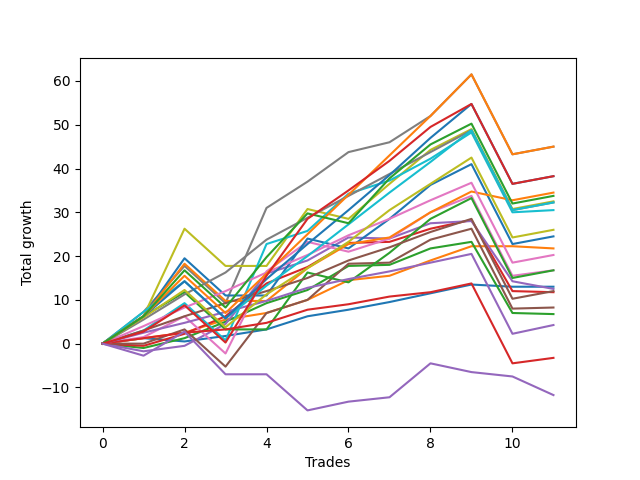

# Short Malinois 002 
- Symbol: ES
- Date Range: 03/18/2022 - 12/30/2022
- Trading Period: 8:30-12:30
- Number of Trades: 11



| Name | Win Percent | Profit | Avg Profit / Trade | Avg Time / Trade |      | Name | Win Percent | Profit | Avg Profit / Trade | Avg Time / Trade |
| ---- | ----------- | ------ | ------------------ | ---------------- | ---- | ---- | ----------- | ------ | ------------------ | ---------------- |
| Sorted By <br> Profit | | | | | | Sorted By <br> Win Percentage ||||
| TP-9 | 81.82 | 22500.00 | 2045.45 | 39:45 |     | TP-5 | 90.91 | 16125.00 | 1465.91 | 29:30 |
| V Mid | 81.82 | 22500.00 | 2045.45 | 34:18 |     | TP-4 | 90.91 | 10125.00 | 920.45 | 26:07 |
| NEWFI 000 | 81.82 | 19125.00 | 1738.64 | 44:21 |     | TP-3 | 90.91 | 6000.00 | 545.45 | 20:40 |
| TP-8 | 81.82 | 19125.00 | 1738.64 | 38:03 |     | TP-2 | 90.91 | 2125.00 | 193.18 | 16:45 |
| BB-100 Mid SL-10 | 81.82 | 18375.00 | 1670.45 | 26:39 |     | TP-1 | 90.91 | -1625.00 | -147.73 | 12:14 |
| V Mid SL-10 | 72.73 | 17500.00 | 1590.91 | 25:06 |     | TP-9 | 81.82 | 22500.00 | 2045.45 | 39:45 |
| BB-200 Mid | 72.73 | 17250.00 | 1568.18 | 35:14 |     | V Mid | 81.82 | 22500.00 | 2045.45 | 34:18 |
| TP-10 | 72.73 | 16875.00 | 1534.09 | 46:52 |     | NEWFI 000 | 81.82 | 19125.00 | 1738.64 | 44:21 |
| V U/L 1SD | 63.64 | 16250.00 | 1477.27 | 53:48 |     | TP-8 | 81.82 | 19125.00 | 1738.64 | 38:03 |
| TP-5 | 90.91 | 16125.00 | 1465.91 | 29:30 |     | BB-100 Mid SL-10 | 81.82 | 18375.00 | 1670.45 | 26:39 |
| TP-7 | 81.82 | 16125.00 | 1465.91 | 35:20 |     | TP-7 | 81.82 | 16125.00 | 1465.91 | 35:20 |
| BB-100 Mid | 81.82 | 15250.00 | 1386.36 | 34:10 |     | BB-100 Mid | 81.82 | 15250.00 | 1386.36 | 34:10 |
| TP-6 | 81.82 | 13000.00 | 1181.82 | 33:51 |     | TP-6 | 81.82 | 13000.00 | 1181.82 | 33:51 |
| BB-100 U/L 2SD | 63.64 | 12250.00 | 1113.64 | 54:15 |     | BB-20 U/L 1SD SL-10 | 81.82 | 10875.00 | 988.64 | 05:08 |
| BB-20 U/L 1SD SL-10 | 81.82 | 10875.00 | 988.64 | 05:08 |     | BB-20 U/L 1SD | 81.82 | 10875.00 | 988.64 | 05:08 |
| BB-20 U/L 1SD | 81.82 | 10875.00 | 988.64 | 05:08 |     | V Mid SL-10 | 72.73 | 17500.00 | 1590.91 | 25:06 |
| TP-4 | 90.91 | 10125.00 | 920.45 | 26:07 |     | BB-200 Mid | 72.73 | 17250.00 | 1568.18 | 35:14 |
| BB-50 U/L 2SD | 72.73 | 8375.00 | 761.36 | 39:39 |     | TP-10 | 72.73 | 16875.00 | 1534.09 | 46:52 |
| NEWFI 06 | 63.64 | 8375.00 | 761.36 | 56:34 |     | BB-50 U/L 2SD | 72.73 | 8375.00 | 761.36 | 39:39 |
| BB-200 U/L 2SD | 63.64 | 8375.00 | 761.36 | 56:34 |     | BB-20 U/L 1SD SL-5 | 72.73 | 7750.00 | 704.55 | 04:55 |
| BB-50 Mid SL-10 | 63.64 | 8125.00 | 738.64 | 17:08 |     | BB-20 Mid SL-10 | 72.73 | 6500.00 | 590.91 | 02:36 |
| BB-20 U/L 1SD SL-5 | 72.73 | 7750.00 | 704.55 | 04:55 |     | BB-20 Mid SL-5 | 72.73 | 6500.00 | 590.91 | 02:36 |
| V U/L 1SD SL-10 | 54.55 | 7750.00 | 704.55 | 44:20 |     | BB-20 Mid | 72.73 | 6500.00 | 590.91 | 02:36 |
| BB-200 Mid SL-10 | 63.64 | 7375.00 | 670.45 | 30:10 |     | BB-20 U/L 2SD C | 72.73 | 5875.00 | 534.09 | 20:44 |
| BB-20 Mid SL-10 | 72.73 | 6500.00 | 590.91 | 02:36 |     | BB-50 U/L 1SD | 72.73 | 4125.00 | 375.00 | 31:05 |
| BB-20 Mid SL-5 | 72.73 | 6500.00 | 590.91 | 02:36 |     | BB-20 U/L 2SD | 72.73 | 3375.00 | 306.82 | 19:11 |
| BB-20 Mid | 72.73 | 6500.00 | 590.91 | 02:36 |     | V U/L 1SD | 63.64 | 16250.00 | 1477.27 | 53:48 |
| BB-50 Mid | 63.64 | 6250.00 | 568.18 | 20:35 |     | BB-100 U/L 2SD | 63.64 | 12250.00 | 1113.64 | 54:15 |
| TP-3 | 90.91 | 6000.00 | 545.45 | 20:40 |     | NEWFI 06 | 63.64 | 8375.00 | 761.36 | 56:34 |
| BB-20 U/L 2SD C | 72.73 | 5875.00 | 534.09 | 20:44 |     | BB-200 U/L 2SD | 63.64 | 8375.00 | 761.36 | 56:34 |
| BB-50 U/L 1SD | 72.73 | 4125.00 | 375.00 | 31:05 |     | BB-50 Mid SL-10 | 63.64 | 8125.00 | 738.64 | 17:08 |
| BB-100 U/L 2SD SL-10 | 54.55 | 3750.00 | 340.91 | 44:47 |     | BB-200 Mid SL-10 | 63.64 | 7375.00 | 670.45 | 30:10 |
| BB-20 U/L 2SD | 72.73 | 3375.00 | 306.82 | 19:11 |     | BB-50 Mid | 63.64 | 6250.00 | 568.18 | 20:35 |
| BB-50 U/L 2SD SL-10 | 63.64 | 3000.00 | 272.73 | 30:25 |     | BB-50 U/L 2SD SL-10 | 63.64 | 3000.00 | 272.73 | 30:25 |
| TP-2 | 90.91 | 2125.00 | 193.18 | 16:45 |     | BB-20 U/L 2SD C SL-10 | 63.64 | 2000.00 | 181.82 | 16:33 |
| BB-20 U/L 2SD C SL-10 | 63.64 | 2000.00 | 181.82 | 16:33 |     | BB-50 U/L 1SD SL-10 | 63.64 | 625.00 | 56.82 | 22:01 |
| V Mid SL-5 | 45.45 | 1375.00 | 125.00 | 15:50 |     | BB-20 U/L 2SD SL-10 | 63.64 | -125.00 | -11.36 | 15:02 |
| BB-200 Mid SL-5 | 45.45 | 1125.00 | 102.27 | 16:08 |     | V U/L 1SD SL-10 | 54.55 | 7750.00 | 704.55 | 44:20 |
| BB-50 U/L 1SD SL-10 | 63.64 | 625.00 | 56.82 | 22:01 |     | BB-100 U/L 2SD SL-10 | 54.55 | 3750.00 | 340.91 | 44:47 |
| BB-20 U/L 2SD SL-10 | 63.64 | -125.00 | -11.36 | 15:02 |     | BB-200 U/L 2SD SL-10 | 54.55 | -125.00 | -11.36 | 47:05 |
| BB-200 U/L 2SD SL-10 | 54.55 | -125.00 | -11.36 | 47:05 |     | BB-20 U/L 2SD SL-5 | 54.55 | -875.00 | -79.55 | 09:58 |
| BB-20 U/L 2SD SL-5 | 54.55 | -875.00 | -79.55 | 09:58 |     | BB-50 Mid SL-5 | 54.55 | -4375.00 | -397.73 | 11:35 |
| TP-1 | 90.91 | -1625.00 | -147.73 | 12:14 |     | V Mid SL-5 | 45.45 | 1375.00 | 125.00 | 15:50 |
| BB-100 Mid SL-5 | 45.45 | -1750.00 | -159.09 | 14:26 |     | BB-200 Mid SL-5 | 45.45 | 1125.00 | 102.27 | 16:08 |
| V U/L 1SD SL-5 | 27.27 | -3625.00 | -329.55 | 27:13 |     | BB-100 Mid SL-5 | 45.45 | -1750.00 | -159.09 | 14:26 |
| BB-50 Mid SL-5 | 54.55 | -4375.00 | -397.73 | 11:35 |     | BB-20 U/L 2SD C SL-5 | 45.45 | -5250.00 | -477.27 | 11:17 |
| BB-20 U/L 2SD C SL-5 | 45.45 | -5250.00 | -477.27 | 11:17 |     | NEWFI 0000 | 36.36 | -5875.00 | -534.09 | 30:46 |
| NEWFI 0000 | 36.36 | -5875.00 | -534.09 | 30:46 |     | BB-50 U/L 1SD SL-5 | 36.36 | -9125.00 | -829.55 | 13:39 |
| BB-100 U/L 2SD SL-5 | 27.27 | -7000.00 | -636.36 | 26:10 |     | V U/L 1SD SL-5 | 27.27 | -3625.00 | -329.55 | 27:13 |
| BB-50 U/L 1SD SL-5 | 36.36 | -9125.00 | -829.55 | 13:39 |     | BB-100 U/L 2SD SL-5 | 27.27 | -7000.00 | -636.36 | 26:10 |
| BB-200 U/L 2SD SL-5 | 27.27 | -10875.00 | -988.64 | 28:28 |     | BB-200 U/L 2SD SL-5 | 27.27 | -10875.00 | -988.64 | 28:28 |
| BB-50 U/L 2SD SL-5 | 27.27 | -12625.00 | -1147.73 | 19:23 |     | BB-50 U/L 2SD SL-5 | 27.27 | -12625.00 | -1147.73 | 19:23 |

## NO STOPLOSS

### Test BB-20 Mid
* Sell when price hits the middle line of the 20p bollinger
* No Stoploss
* Results:
```
Total Trades: 11
Percent Up: 27.27
Percent Down: 72.73
Total Points Moved Down: 13.00
Potential Profit: 6500.00
Total Points Ups: 1.25 Count Ups: 3
Total Points Downs: 14.25 Count Downs: 8
```

<details><summary>Trades</summary>

<code>In: 2022-03-25 11:19:00		Out: 2022-03-25 11:20:10		Total Position Time: 01:10		Total Move Down: 1.25		Total to Date: 1.25</code> <br />
<code>In: 2022-03-25 11:58:00		Out: 2022-03-25 12:00:05		Total Position Time: 02:05		Total Move Down: -0.75		Total to Date: 0.50</code> <br />
<code>In: 2022-04-07 10:34:00		Out: 2022-04-07 10:37:30		Total Position Time: 03:30		Total Move Down: 1.25		Total to Date: 1.75</code> <br />
<code>In: 2022-05-10 11:07:00		Out: 2022-05-10 11:08:10		Total Position Time: 01:10		Total Move Down: 1.50		Total to Date: 3.25</code> <br />
<code>In: 2022-06-10 12:22:00		Out: 2022-06-10 12:23:10		Total Position Time: 01:10		Total Move Down: 3.00		Total to Date: 6.25</code> <br />
<code>In: 2022-07-12 08:34:00		Out: 2022-07-12 08:37:00		Total Position Time: 03:00		Total Move Down: 1.50		Total to Date: 7.75</code> <br />
<code>In: 2022-08-04 09:03:00		Out: 2022-08-04 09:04:10		Total Position Time: 01:10		Total Move Down: 1.75		Total to Date: 9.50</code> <br />
<code>In: 2022-08-04 10:40:00		Out: 2022-08-04 10:43:05		Total Position Time: 03:05		Total Move Down: 2.00		Total to Date: 11.50</code> <br />
<code>In: 2022-08-05 10:19:00		Out: 2022-08-05 10:20:10		Total Position Time: 01:10		Total Move Down: 2.00		Total to Date: 13.50</code> <br />
<code>In: 2022-11-17 08:42:00		Out: 2022-11-17 08:49:45		Total Position Time: 07:45		Total Move Down: -0.50		Total to Date: 13.00</code> <br />
<code>In: 2022-11-21 10:24:00		Out: 2022-11-21 10:27:25		Total Position Time: 03:25		Total Move Down: -0.00		Total to Date: 13.00</code> <br />


</details>

### Test BB-20 U/L 1SD
* Sell when the price hits the lower line of the 20p 1std bollinger
* No Stoploss
* Results:
```
Total Trades: 11
Percent Up: 18.18
Percent Down: 81.82
Total Points Moved Down: 21.75
Potential Profit: 10875.00
Total Points Ups: 0.50 Count Ups: 2
Total Points Downs: 22.25 Count Downs: 9
```

<details><summary>Trades</summary>

<code>In: 2022-03-25 11:19:00		Out: 2022-03-25 11:20:10		Total Position Time: 01:10		Total Move Down: 1.25		Total to Date: 1.25</code> <br />
<code>In: 2022-03-25 11:58:00		Out: 2022-03-25 12:00:45		Total Position Time: 02:45		Total Move Down: 1.25		Total to Date: 2.50</code> <br />
<code>In: 2022-04-07 10:34:00		Out: 2022-04-07 10:40:00		Total Position Time: 06:00		Total Move Down: 3.00		Total to Date: 5.50</code> <br />
<code>In: 2022-05-10 11:07:00		Out: 2022-05-10 11:08:10		Total Position Time: 01:10		Total Move Down: 1.50		Total to Date: 7.00</code> <br />
<code>In: 2022-06-10 12:22:00		Out: 2022-06-10 12:23:10		Total Position Time: 01:10		Total Move Down: 3.00		Total to Date: 10.00</code> <br />
<code>In: 2022-07-12 08:34:00		Out: 2022-07-12 08:38:10		Total Position Time: 04:10		Total Move Down: 4.50		Total to Date: 14.50</code> <br />
<code>In: 2022-08-04 09:03:00		Out: 2022-08-04 09:16:05		Total Position Time: 13:05		Total Move Down: 1.00		Total to Date: 15.50</code> <br />
<code>In: 2022-08-04 10:40:00		Out: 2022-08-04 10:43:15		Total Position Time: 03:15		Total Move Down: 3.50		Total to Date: 19.00</code> <br />
<code>In: 2022-08-05 10:19:00		Out: 2022-08-05 10:23:15		Total Position Time: 04:15		Total Move Down: 3.25		Total to Date: 22.25</code> <br />
<code>In: 2022-11-17 08:42:00		Out: 2022-11-17 08:52:30		Total Position Time: 10:30		Total Move Down: -0.00		Total to Date: 22.25</code> <br />
<code>In: 2022-11-21 10:24:00		Out: 2022-11-21 10:33:00		Total Position Time: 09:00		Total Move Down: -0.50		Total to Date: 21.75</code> <br />


</details>

### Test BB-20 U/L 2SD
* Sell when the price hits the lower line of the 20p 2std bollinger
* No Stoploss
* Results:
```
Total Trades: 11
Percent Up: 27.27
Percent Down: 72.73
Total Points Moved Down: 6.75
Potential Profit: 3375.00
Total Points Ups: 17.50 Count Ups: 3
Total Points Downs: 24.25 Count Downs: 8
```

<details><summary>Trades</summary>

<code>In: 2022-03-25 11:19:00		Out: 2022-03-25 12:00:55		Total Position Time: 41:55		Total Move Down: -1.00		Total to Date: -1.00</code> <br />
<code>In: 2022-03-25 11:58:00		Out: 2022-03-25 12:00:55		Total Position Time: 02:55		Total Move Down: 2.25		Total to Date: 1.25</code> <br />
<code>In: 2022-04-07 10:34:00		Out: 2022-04-07 10:45:15		Total Position Time: 11:15		Total Move Down: 3.75		Total to Date: 5.00</code> <br />
<code>In: 2022-05-10 11:07:00		Out: 2022-05-10 11:11:10		Total Position Time: 04:10		Total Move Down: 4.25		Total to Date: 9.25</code> <br />
<code>In: 2022-06-10 12:22:00		Out: 2022-06-10 12:42:45		Total Position Time: 20:45		Total Move Down: 3.00		Total to Date: 12.25</code> <br />
<code>In: 2022-07-12 08:34:00		Out: 2022-07-12 08:41:10		Total Position Time: 07:10		Total Move Down: 5.50		Total to Date: 17.75</code> <br />
<code>In: 2022-08-04 09:03:00		Out: 2022-08-04 09:38:50		Total Position Time: 35:50		Total Move Down: 0.25		Total to Date: 18.00</code> <br />
<code>In: 2022-08-04 10:40:00		Out: 2022-08-04 10:45:30		Total Position Time: 05:30		Total Move Down: 3.75		Total to Date: 21.75</code> <br />
<code>In: 2022-08-05 10:19:00		Out: 2022-08-05 10:49:30		Total Position Time: 30:30		Total Move Down: 1.50		Total to Date: 23.25</code> <br />
<code>In: 2022-11-17 08:42:00		Out: 2022-11-17 09:23:55		Total Position Time: 41:55		Total Move Down: -16.25		Total to Date: 7.00</code> <br />
<code>In: 2022-11-21 10:24:00		Out: 2022-11-21 10:33:10		Total Position Time: 09:10		Total Move Down: -0.25		Total to Date: 6.75</code> <br />


</details>

### Test BB-20 U/L 2SD C
* Sell when the price hits the lower line of the 20p 2std bollinger
* No Stoploss
* Results:
```
Total Trades: 11
Percent Up: 27.27
Percent Down: 72.73
Total Points Moved Down: 11.75
Potential Profit: 5875.00
Total Points Ups: 17.00 Count Ups: 3
Total Points Downs: 28.75 Count Downs: 8
```

<details><summary>Trades</summary>

<code>In: 2022-03-25 11:19:00		Out: 2022-03-25 12:01:15		Total Position Time: 42:15		Total Move Down: -0.50		Total to Date: -0.50</code> <br />
<code>In: 2022-03-25 11:58:00		Out: 2022-03-25 12:01:15		Total Position Time: 03:15		Total Move Down: 2.75		Total to Date: 2.25</code> <br />
<code>In: 2022-04-07 10:34:00		Out: 2022-04-07 10:48:00		Total Position Time: 14:00		Total Move Down: 4.00		Total to Date: 6.25</code> <br />
<code>In: 2022-05-10 11:07:00		Out: 2022-05-10 11:16:05		Total Position Time: 09:05		Total Move Down: 7.50		Total to Date: 13.75</code> <br />
<code>In: 2022-06-10 12:22:00		Out: 2022-06-10 12:43:10		Total Position Time: 21:10		Total Move Down: 3.75		Total to Date: 17.50</code> <br />
<code>In: 2022-07-12 08:34:00		Out: 2022-07-12 08:41:10		Total Position Time: 07:10		Total Move Down: 5.50		Total to Date: 23.00</code> <br />
<code>In: 2022-08-04 09:03:00		Out: 2022-08-04 09:38:50		Total Position Time: 35:50		Total Move Down: 0.25		Total to Date: 23.25</code> <br />
<code>In: 2022-08-04 10:40:00		Out: 2022-08-04 10:52:45		Total Position Time: 12:45		Total Move Down: 3.00		Total to Date: 26.25</code> <br />
<code>In: 2022-08-05 10:19:00		Out: 2022-08-05 10:50:35		Total Position Time: 31:35		Total Move Down: 2.00		Total to Date: 28.25</code> <br />
<code>In: 2022-11-17 08:42:00		Out: 2022-11-17 09:23:55		Total Position Time: 41:55		Total Move Down: -16.25		Total to Date: 12.00</code> <br />
<code>In: 2022-11-21 10:24:00		Out: 2022-11-21 10:33:10		Total Position Time: 09:10		Total Move Down: -0.25		Total to Date: 11.75</code> <br />


</details>

### Test BB-50 Mid
* Sell when price hits the middle line of the 50p bollinger
* No Stoploss
* Results:
```
Total Trades: 11
Percent Up: 36.36
Percent Down: 63.64
Total Points Moved Down: 12.50
Potential Profit: 6250.00
Total Points Ups: 17.50 Count Ups: 4
Total Points Downs: 30.00 Count Downs: 7
```

<details><summary>Trades</summary>

<code>In: 2022-03-25 11:19:00		Out: 2022-03-25 11:49:30		Total Position Time: 30:30		Total Move Down: -1.75		Total to Date: -1.75</code> <br />
<code>In: 2022-03-25 11:58:00		Out: 2022-03-25 12:00:45		Total Position Time: 02:45		Total Move Down: 1.25		Total to Date: -0.50</code> <br />
<code>In: 2022-04-07 10:34:00		Out: 2022-04-07 10:52:05		Total Position Time: 18:05		Total Move Down: 5.00		Total to Date: 4.50</code> <br />
<code>In: 2022-05-10 11:07:00		Out: 2022-05-10 11:16:20		Total Position Time: 09:20		Total Move Down: 11.50		Total to Date: 16.00</code> <br />
<code>In: 2022-06-10 12:22:00		Out: 2022-06-10 12:23:10		Total Position Time: 01:10		Total Move Down: 3.00		Total to Date: 19.00</code> <br />
<code>In: 2022-07-12 08:34:00		Out: 2022-07-12 08:38:20		Total Position Time: 04:20		Total Move Down: 5.25		Total to Date: 24.25</code> <br />
<code>In: 2022-08-04 09:03:00		Out: 2022-08-04 09:36:55		Total Position Time: 33:55		Total Move Down: -0.25		Total to Date: 24.00</code> <br />
<code>In: 2022-08-04 10:40:00		Out: 2022-08-04 10:55:50		Total Position Time: 15:50		Total Move Down: 3.50		Total to Date: 27.50</code> <br />
<code>In: 2022-08-05 10:19:00		Out: 2022-08-05 10:47:35		Total Position Time: 28:35		Total Move Down: 0.50		Total to Date: 28.00</code> <br />
<code>In: 2022-11-17 08:42:00		Out: 2022-11-17 09:33:35		Total Position Time: 51:35		Total Move Down: -13.75		Total to Date: 14.25</code> <br />
<code>In: 2022-11-21 10:24:00		Out: 2022-11-21 10:54:25		Total Position Time: 30:25		Total Move Down: -1.75		Total to Date: 12.50</code> <br />


</details>

### Test BB-50 U/L 1SD
* Sell when the price hits the lower line of the 50p 1std bollinger
* No Stoploss
* Results:
```
Total Trades: 11
Percent Up: 27.27
Percent Down: 72.73
Total Points Moved Down: 8.25
Potential Profit: 4125.00
Total Points Ups: 26.75 Count Ups: 3
Total Points Downs: 35.00 Count Downs: 8
```

<details><summary>Trades</summary>

<code>In: 2022-03-25 11:19:00		Out: 2022-03-25 12:01:35		Total Position Time: 42:35		Total Move Down: -0.00		Total to Date: 0.00</code> <br />
<code>In: 2022-03-25 11:58:00		Out: 2022-03-25 12:01:35		Total Position Time: 03:35		Total Move Down: 3.25		Total to Date: 3.25</code> <br />
<code>In: 2022-04-07 10:34:00		Out: 2022-04-07 11:34:55		Total Position Time: 60:55		Total Move Down: -8.50		Total to Date: -5.25</code> <br />
<code>In: 2022-05-10 11:07:00		Out: 2022-05-10 11:24:05		Total Position Time: 17:05		Total Move Down: 12.25		Total to Date: 7.00</code> <br />
<code>In: 2022-06-10 12:22:00		Out: 2022-06-10 12:42:40		Total Position Time: 20:40		Total Move Down: 3.00		Total to Date: 10.00</code> <br />
<code>In: 2022-07-12 08:34:00		Out: 2022-07-12 08:43:55		Total Position Time: 09:55		Total Move Down: 8.25		Total to Date: 18.25</code> <br />
<code>In: 2022-08-04 09:03:00		Out: 2022-08-04 09:38:50		Total Position Time: 35:50		Total Move Down: 0.25		Total to Date: 18.50</code> <br />
<code>In: 2022-08-04 10:40:00		Out: 2022-08-04 11:02:05		Total Position Time: 22:05		Total Move Down: 5.25		Total to Date: 23.75</code> <br />
<code>In: 2022-08-05 10:19:00		Out: 2022-08-05 10:52:05		Total Position Time: 33:05		Total Move Down: 2.50		Total to Date: 26.25</code> <br />
<code>In: 2022-11-17 08:42:00		Out: 2022-11-17 09:42:55		Total Position Time: 60:55		Total Move Down: -18.25		Total to Date: 8.00</code> <br />
<code>In: 2022-11-21 10:24:00		Out: 2022-11-21 10:59:25		Total Position Time: 35:25		Total Move Down: 0.25		Total to Date: 8.25</code> <br />


</details>

### Test BB-50 U/L 2SD
* Sell when the price hits the lower line of the 50p 2std bollinger
* No Stoploss
* Results:
```
Total Trades: 11
Percent Up: 27.27
Percent Down: 72.73
Total Points Moved Down: 16.75
Potential Profit: 8375.00
Total Points Ups: 29.00 Count Ups: 3
Total Points Downs: 45.75 Count Downs: 8
```

<details><summary>Trades</summary>

<code>In: 2022-03-25 11:19:00		Out: 2022-03-25 12:01:55		Total Position Time: 42:55		Total Move Down: 1.50		Total to Date: 1.50</code> <br />
<code>In: 2022-03-25 11:58:00		Out: 2022-03-25 12:01:55		Total Position Time: 03:55		Total Move Down: 4.75		Total to Date: 6.25</code> <br />
<code>In: 2022-04-07 10:34:00		Out: 2022-04-07 11:34:55		Total Position Time: 60:55		Total Move Down: -8.50		Total to Date: -2.25</code> <br />
<code>In: 2022-05-10 11:07:00		Out: 2022-05-10 11:27:05		Total Position Time: 20:05		Total Move Down: 18.75		Total to Date: 16.50</code> <br />
<code>In: 2022-06-10 12:22:00		Out: 2022-06-10 12:44:30		Total Position Time: 22:30		Total Move Down: 6.75		Total to Date: 23.25</code> <br />
<code>In: 2022-07-12 08:34:00		Out: 2022-07-12 09:34:55		Total Position Time: 60:55		Total Move Down: -2.25		Total to Date: 21.00</code> <br />
<code>In: 2022-08-04 09:03:00		Out: 2022-08-04 09:42:00		Total Position Time: 39:00		Total Move Down: 3.00		Total to Date: 24.00</code> <br />
<code>In: 2022-08-04 10:40:00		Out: 2022-08-04 11:10:15		Total Position Time: 30:15		Total Move Down: 6.00		Total to Date: 30.00</code> <br />
<code>In: 2022-08-05 10:19:00		Out: 2022-08-05 10:55:40		Total Position Time: 36:40		Total Move Down: 3.75		Total to Date: 33.75</code> <br />
<code>In: 2022-11-17 08:42:00		Out: 2022-11-17 09:42:55		Total Position Time: 60:55		Total Move Down: -18.25		Total to Date: 15.50</code> <br />
<code>In: 2022-11-21 10:24:00		Out: 2022-11-21 11:22:10		Total Position Time: 58:10		Total Move Down: 1.25		Total to Date: 16.75</code> <br />


</details>

### Test V Mid
* Sell when the price hits the middle line of the 1std VWAP
* No Stoploss
* Results:
```
Total Trades: 11
Percent Up: 18.18
Percent Down: 81.82
Total Points Moved Down: 45.00
Potential Profit: 22500.00
Total Points Ups: 26.75 Count Ups: 2
Total Points Downs: 71.75 Count Downs: 9
```

<details><summary>Trades</summary>

<code>In: 2022-03-25 11:19:00		Out: 2022-03-25 12:07:35		Total Position Time: 48:35		Total Move Down: 7.25		Total to Date: 7.25</code> <br />
<code>In: 2022-03-25 11:58:00		Out: 2022-03-25 12:07:35		Total Position Time: 09:35		Total Move Down: 10.50		Total to Date: 17.75</code> <br />
<code>In: 2022-04-07 10:34:00		Out: 2022-04-07 11:34:55		Total Position Time: 60:55		Total Move Down: -8.50		Total to Date: 9.25</code> <br />
<code>In: 2022-05-10 11:07:00		Out: 2022-05-10 11:27:40		Total Position Time: 20:40		Total Move Down: 21.75		Total to Date: 31.00</code> <br />
<code>In: 2022-06-10 12:22:00		Out: 2022-06-10 12:43:55		Total Position Time: 21:55		Total Move Down: 6.00		Total to Date: 37.00</code> <br />
<code>In: 2022-07-12 08:34:00		Out: 2022-07-12 08:41:50		Total Position Time: 07:50		Total Move Down: 6.75		Total to Date: 43.75</code> <br />
<code>In: 2022-08-04 09:03:00		Out: 2022-08-04 09:06:00		Total Position Time: 03:00		Total Move Down: 2.25		Total to Date: 46.00</code> <br />
<code>In: 2022-08-04 10:40:00		Out: 2022-08-04 11:10:15		Total Position Time: 30:15		Total Move Down: 6.00		Total to Date: 52.00</code> <br />
<code>In: 2022-08-05 10:19:00		Out: 2022-08-05 11:11:45		Total Position Time: 52:45		Total Move Down: 9.50		Total to Date: 61.50</code> <br />
<code>In: 2022-11-17 08:42:00		Out: 2022-11-17 09:42:55		Total Position Time: 60:55		Total Move Down: -18.25		Total to Date: 43.25</code> <br />
<code>In: 2022-11-21 10:24:00		Out: 2022-11-21 11:24:55		Total Position Time: 60:55		Total Move Down: 1.75		Total to Date: 45.00</code> <br />


</details>

### Test V U/L 1SD
* Sell when the price hits the lower line of the 1std VWAP
* No Stoploss
* Results:
```
Total Trades: 11
Percent Up: 36.36
Percent Down: 63.64
Total Points Moved Down: 32.50
Potential Profit: 16250.00
Total Points Ups: 29.00 Count Ups: 4
Total Points Downs: 61.50 Count Downs: 7
```

<details><summary>Trades</summary>

<code>In: 2022-03-25 11:19:00		Out: 2022-03-25 12:19:55		Total Position Time: 60:55		Total Move Down: 6.25		Total to Date: 6.25</code> <br />
<code>In: 2022-03-25 11:58:00		Out: 2022-03-25 12:33:10		Total Position Time: 35:10		Total Move Down: 20.00		Total to Date: 26.25</code> <br />
<code>In: 2022-04-07 10:34:00		Out: 2022-04-07 11:34:55		Total Position Time: 60:55		Total Move Down: -8.50		Total to Date: 17.75</code> <br />
<code>In: 2022-05-10 11:07:00		Out: 2022-05-10 12:07:55		Total Position Time: 60:55		Total Move Down: -0.00		Total to Date: 17.75</code> <br />
<code>In: 2022-06-10 12:22:00		Out: 2022-06-10 12:47:00		Total Position Time: 25:00		Total Move Down: 13.00		Total to Date: 30.75</code> <br />
<code>In: 2022-07-12 08:34:00		Out: 2022-07-12 09:34:55		Total Position Time: 60:55		Total Move Down: -2.25		Total to Date: 28.50</code> <br />
<code>In: 2022-08-04 09:03:00		Out: 2022-08-04 09:47:20		Total Position Time: 44:20		Total Move Down: 8.00		Total to Date: 36.50</code> <br />
<code>In: 2022-08-04 10:40:00		Out: 2022-08-04 11:40:55		Total Position Time: 60:55		Total Move Down: 7.75		Total to Date: 44.25</code> <br />
<code>In: 2022-08-05 10:19:00		Out: 2022-08-05 11:19:55		Total Position Time: 60:55		Total Move Down: 4.75		Total to Date: 49.00</code> <br />
<code>In: 2022-11-17 08:42:00		Out: 2022-11-17 09:42:55		Total Position Time: 60:55		Total Move Down: -18.25		Total to Date: 30.75</code> <br />
<code>In: 2022-11-21 10:24:00		Out: 2022-11-21 11:24:55		Total Position Time: 60:55		Total Move Down: 1.75		Total to Date: 32.50</code> <br />


</details>

### Test BB-100 Mid
* Move to BB100 Mid
* No Stoploss
* Results:
```
Total Trades: 11
Percent Up: 18.18
Percent Down: 81.82
Total Points Moved Down: 30.50
Potential Profit: 15250.00
Total Points Ups: 26.75 Count Ups: 2
Total Points Downs: 57.25 Count Downs: 9
```

<details><summary>Trades</summary>

<code>In: 2022-03-25 11:19:00		Out: 2022-03-25 12:02:30		Total Position Time: 43:30		Total Move Down: 3.00		Total to Date: 3.00</code> <br />
<code>In: 2022-03-25 11:58:00		Out: 2022-03-25 12:02:30		Total Position Time: 04:30		Total Move Down: 6.25		Total to Date: 9.25</code> <br />
<code>In: 2022-04-07 10:34:00		Out: 2022-04-07 11:34:55		Total Position Time: 60:55		Total Move Down: -8.50		Total to Date: 0.75</code> <br />
<code>In: 2022-05-10 11:07:00		Out: 2022-05-10 11:40:30		Total Position Time: 33:30		Total Move Down: 22.00		Total to Date: 22.75</code> <br />
<code>In: 2022-06-10 12:22:00		Out: 2022-06-10 12:23:10		Total Position Time: 01:10		Total Move Down: 3.00		Total to Date: 25.75</code> <br />
<code>In: 2022-07-12 08:34:00		Out: 2022-07-12 08:54:25		Total Position Time: 20:25		Total Move Down: 8.50		Total to Date: 34.25</code> <br />
<code>In: 2022-08-04 09:03:00		Out: 2022-08-04 09:42:00		Total Position Time: 39:00		Total Move Down: 3.00		Total to Date: 37.25</code> <br />
<code>In: 2022-08-04 10:40:00		Out: 2022-08-04 10:56:30		Total Position Time: 16:30		Total Move Down: 5.00		Total to Date: 42.25</code> <br />
<code>In: 2022-08-05 10:19:00		Out: 2022-08-05 10:56:25		Total Position Time: 37:25		Total Move Down: 6.00		Total to Date: 48.25</code> <br />
<code>In: 2022-11-17 08:42:00		Out: 2022-11-17 09:42:55		Total Position Time: 60:55		Total Move Down: -18.25		Total to Date: 30.00</code> <br />
<code>In: 2022-11-21 10:24:00		Out: 2022-11-21 11:22:05		Total Position Time: 58:05		Total Move Down: 0.50		Total to Date: 30.50</code> <br />


</details>

### Test BB-100 U/L 2SD
* Move to BB100 Upper Band
* No Stoploss
* Results:
```
Total Trades: 11
Percent Up: 36.36
Percent Down: 63.64
Total Points Moved Down: 24.50
Potential Profit: 12250.00
Total Points Ups: 29.00 Count Ups: 4
Total Points Downs: 53.50 Count Downs: 7
```

<details><summary>Trades</summary>

<code>In: 2022-03-25 11:19:00		Out: 2022-03-25 12:19:55		Total Position Time: 60:55		Total Move Down: 6.25		Total to Date: 6.25</code> <br />
<code>In: 2022-03-25 11:58:00		Out: 2022-03-25 12:21:35		Total Position Time: 23:35		Total Move Down: 13.25		Total to Date: 19.50</code> <br />
<code>In: 2022-04-07 10:34:00		Out: 2022-04-07 11:34:55		Total Position Time: 60:55		Total Move Down: -8.50		Total to Date: 11.00</code> <br />
<code>In: 2022-05-10 11:07:00		Out: 2022-05-10 12:07:55		Total Position Time: 60:55		Total Move Down: -0.00		Total to Date: 11.00</code> <br />
<code>In: 2022-06-10 12:22:00		Out: 2022-06-10 12:47:00		Total Position Time: 25:00		Total Move Down: 13.00		Total to Date: 24.00</code> <br />
<code>In: 2022-07-12 08:34:00		Out: 2022-07-12 09:34:55		Total Position Time: 60:55		Total Move Down: -2.25		Total to Date: 21.75</code> <br />
<code>In: 2022-08-04 09:03:00		Out: 2022-08-04 10:03:55		Total Position Time: 60:55		Total Move Down: 6.75		Total to Date: 28.50</code> <br />
<code>In: 2022-08-04 10:40:00		Out: 2022-08-04 11:40:55		Total Position Time: 60:55		Total Move Down: 7.75		Total to Date: 36.25</code> <br />
<code>In: 2022-08-05 10:19:00		Out: 2022-08-05 11:19:55		Total Position Time: 60:55		Total Move Down: 4.75		Total to Date: 41.00</code> <br />
<code>In: 2022-11-17 08:42:00		Out: 2022-11-17 09:42:55		Total Position Time: 60:55		Total Move Down: -18.25		Total to Date: 22.75</code> <br />
<code>In: 2022-11-21 10:24:00		Out: 2022-11-21 11:24:55		Total Position Time: 60:55		Total Move Down: 1.75		Total to Date: 24.50</code> <br />


</details>

### Test BB-200 Mid
* Move to BB200 Mid
* No Stoploss
* Results:
```
Total Trades: 11
Percent Up: 27.27
Percent Down: 72.73
Total Points Moved Down: 34.50
Potential Profit: 17250.00
Total Points Ups: 10.50 Count Ups: 3
Total Points Downs: 45.00 Count Downs: 8
```

<details><summary>Trades</summary>

<code>In: 2022-03-25 11:19:00		Out: 2022-03-25 12:19:55		Total Position Time: 60:55		Total Move Down: 6.25		Total to Date: 6.25</code> <br />
<code>In: 2022-03-25 11:58:00		Out: 2022-03-25 12:20:40		Total Position Time: 22:40		Total Move Down: 12.00		Total to Date: 18.25</code> <br />
<code>In: 2022-04-07 10:34:00		Out: 2022-04-07 11:34:55		Total Position Time: 60:55		Total Move Down: -8.50		Total to Date: 9.75</code> <br />
<code>In: 2022-05-10 11:07:00		Out: 2022-05-10 12:07:55		Total Position Time: 60:55		Total Move Down: -0.00		Total to Date: 9.75</code> <br />
<code>In: 2022-06-10 12:22:00		Out: 2022-06-10 12:45:45		Total Position Time: 23:45		Total Move Down: 7.50		Total to Date: 17.25</code> <br />
<code>In: 2022-07-12 08:34:00		Out: 2022-07-12 08:38:25		Total Position Time: 04:25		Total Move Down: 5.50		Total to Date: 22.75</code> <br />
<code>In: 2022-08-04 09:03:00		Out: 2022-08-04 09:04:15		Total Position Time: 01:15		Total Move Down: 1.50		Total to Date: 24.25</code> <br />
<code>In: 2022-08-04 10:40:00		Out: 2022-08-04 11:09:45		Total Position Time: 29:45		Total Move Down: 5.75		Total to Date: 30.00</code> <br />
<code>In: 2022-08-05 10:19:00		Out: 2022-08-05 11:19:55		Total Position Time: 60:55		Total Move Down: 4.75		Total to Date: 34.75</code> <br />
<code>In: 2022-11-17 08:42:00		Out: 2022-11-17 08:43:10		Total Position Time: 01:10		Total Move Down: -2.00		Total to Date: 32.75</code> <br />
<code>In: 2022-11-21 10:24:00		Out: 2022-11-21 11:24:55		Total Position Time: 60:55		Total Move Down: 1.75		Total to Date: 34.50</code> <br />


</details>

### Test BB-200 U/L 2SD
* Move to BB200 Upper Band
* No Stoploss
* Results:
```
Total Trades: 11
Percent Up: 36.36
Percent Down: 63.64
Total Points Moved Down: 16.75
Potential Profit: 8375.00
Total Points Ups: 29.00 Count Ups: 4
Total Points Downs: 45.75 Count Downs: 7
```

<details><summary>Trades</summary>

<code>In: 2022-03-25 11:19:00		Out: 2022-03-25 12:19:55		Total Position Time: 60:55		Total Move Down: 6.25		Total to Date: 6.25</code> <br />
<code>In: 2022-03-25 11:58:00		Out: 2022-03-25 12:47:00		Total Position Time: 49:00		Total Move Down: 5.50		Total to Date: 11.75</code> <br />
<code>In: 2022-04-07 10:34:00		Out: 2022-04-07 11:34:55		Total Position Time: 60:55		Total Move Down: -8.50		Total to Date: 3.25</code> <br />
<code>In: 2022-05-10 11:07:00		Out: 2022-05-10 12:07:55		Total Position Time: 60:55		Total Move Down: -0.00		Total to Date: 3.25</code> <br />
<code>In: 2022-06-10 12:22:00		Out: 2022-06-10 12:47:00		Total Position Time: 25:00		Total Move Down: 13.00		Total to Date: 16.25</code> <br />
<code>In: 2022-07-12 08:34:00		Out: 2022-07-12 09:34:55		Total Position Time: 60:55		Total Move Down: -2.25		Total to Date: 14.00</code> <br />
<code>In: 2022-08-04 09:03:00		Out: 2022-08-04 10:03:55		Total Position Time: 60:55		Total Move Down: 6.75		Total to Date: 20.75</code> <br />
<code>In: 2022-08-04 10:40:00		Out: 2022-08-04 11:40:55		Total Position Time: 60:55		Total Move Down: 7.75		Total to Date: 28.50</code> <br />
<code>In: 2022-08-05 10:19:00		Out: 2022-08-05 11:19:55		Total Position Time: 60:55		Total Move Down: 4.75		Total to Date: 33.25</code> <br />
<code>In: 2022-11-17 08:42:00		Out: 2022-11-17 09:42:55		Total Position Time: 60:55		Total Move Down: -18.25		Total to Date: 15.00</code> <br />
<code>In: 2022-11-21 10:24:00		Out: 2022-11-21 11:24:55		Total Position Time: 60:55		Total Move Down: 1.75		Total to Date: 16.75</code> <br />


</details>

## STOPLOSS OF 5

### Test BB-20 Mid SL-5
* Sell when price hits the middle line of the 20p bollinger
* Stoploss is -5 points
* Results:
```
Total Trades: 11
Percent Up: 27.27
Percent Down: 72.73
Total Points Moved Down: 13.00
Potential Profit: 6500.00
Total Points Ups: 1.25 Count Ups: 3
Total Points Downs: 14.25 Count Downs: 8
```

<details><summary>Trades</summary>

<code>In: 2022-03-25 11:19:00		Out: 2022-03-25 11:20:10		Total Position Time: 01:10		Total Move Down: 1.25		Total to Date: 1.25</code> <br />
<code>In: 2022-03-25 11:58:00		Out: 2022-03-25 12:00:05		Total Position Time: 02:05		Total Move Down: -0.75		Total to Date: 0.50</code> <br />
<code>In: 2022-04-07 10:34:00		Out: 2022-04-07 10:37:30		Total Position Time: 03:30		Total Move Down: 1.25		Total to Date: 1.75</code> <br />
<code>In: 2022-05-10 11:07:00		Out: 2022-05-10 11:08:10		Total Position Time: 01:10		Total Move Down: 1.50		Total to Date: 3.25</code> <br />
<code>In: 2022-06-10 12:22:00		Out: 2022-06-10 12:23:10		Total Position Time: 01:10		Total Move Down: 3.00		Total to Date: 6.25</code> <br />
<code>In: 2022-07-12 08:34:00		Out: 2022-07-12 08:37:00		Total Position Time: 03:00		Total Move Down: 1.50		Total to Date: 7.75</code> <br />
<code>In: 2022-08-04 09:03:00		Out: 2022-08-04 09:04:10		Total Position Time: 01:10		Total Move Down: 1.75		Total to Date: 9.50</code> <br />
<code>In: 2022-08-04 10:40:00		Out: 2022-08-04 10:43:05		Total Position Time: 03:05		Total Move Down: 2.00		Total to Date: 11.50</code> <br />
<code>In: 2022-08-05 10:19:00		Out: 2022-08-05 10:20:10		Total Position Time: 01:10		Total Move Down: 2.00		Total to Date: 13.50</code> <br />
<code>In: 2022-11-17 08:42:00		Out: 2022-11-17 08:49:45		Total Position Time: 07:45		Total Move Down: -0.50		Total to Date: 13.00</code> <br />
<code>In: 2022-11-21 10:24:00		Out: 2022-11-21 10:27:25		Total Position Time: 03:25		Total Move Down: -0.00		Total to Date: 13.00</code> <br />


</details>

### Test BB-20 U/L 1SD SL-5
* Sell when the price hits the lower line of the 20p 1std bollinger
* Stoploss is -5 points
* Results:
```
Total Trades: 11
Percent Up: 27.27
Percent Down: 72.73
Total Points Moved Down: 15.50
Potential Profit: 7750.00
Total Points Ups: 5.75 Count Ups: 3
Total Points Downs: 21.25 Count Downs: 8
```

<details><summary>Trades</summary>

<code>In: 2022-03-25 11:19:00		Out: 2022-03-25 11:20:10		Total Position Time: 01:10		Total Move Down: 1.25		Total to Date: 1.25</code> <br />
<code>In: 2022-03-25 11:58:00		Out: 2022-03-25 12:00:45		Total Position Time: 02:45		Total Move Down: 1.25		Total to Date: 2.50</code> <br />
<code>In: 2022-04-07 10:34:00		Out: 2022-04-07 10:40:00		Total Position Time: 06:00		Total Move Down: 3.00		Total to Date: 5.50</code> <br />
<code>In: 2022-05-10 11:07:00		Out: 2022-05-10 11:08:10		Total Position Time: 01:10		Total Move Down: 1.50		Total to Date: 7.00</code> <br />
<code>In: 2022-06-10 12:22:00		Out: 2022-06-10 12:23:10		Total Position Time: 01:10		Total Move Down: 3.00		Total to Date: 10.00</code> <br />
<code>In: 2022-07-12 08:34:00		Out: 2022-07-12 08:38:10		Total Position Time: 04:10		Total Move Down: 4.50		Total to Date: 14.50</code> <br />
<code>In: 2022-08-04 09:03:00		Out: 2022-08-04 09:13:45		Total Position Time: 10:45		Total Move Down: -5.25		Total to Date: 9.25</code> <br />
<code>In: 2022-08-04 10:40:00		Out: 2022-08-04 10:43:15		Total Position Time: 03:15		Total Move Down: 3.50		Total to Date: 12.75</code> <br />
<code>In: 2022-08-05 10:19:00		Out: 2022-08-05 10:23:15		Total Position Time: 04:15		Total Move Down: 3.25		Total to Date: 16.00</code> <br />
<code>In: 2022-11-17 08:42:00		Out: 2022-11-17 08:52:30		Total Position Time: 10:30		Total Move Down: -0.00		Total to Date: 16.00</code> <br />
<code>In: 2022-11-21 10:24:00		Out: 2022-11-21 10:33:00		Total Position Time: 09:00		Total Move Down: -0.50		Total to Date: 15.50</code> <br />


</details>

### Test BB-20 U/L 2SD SL-5
* Sell when the price hits the lower line of the 20p 2std bollinger
* Stoploss is -5 points
* Results:
```
Total Trades: 11
Percent Up: 45.45
Percent Down: 54.55
Total Points Moved Down: -1.75
Potential Profit: -875.00
Total Points Ups: 22.75 Count Ups: 5
Total Points Downs: 21.00 Count Downs: 6
```

<details><summary>Trades</summary>

<code>In: 2022-03-25 11:19:00		Out: 2022-03-25 11:31:15		Total Position Time: 12:15		Total Move Down: -5.00		Total to Date: -5.00</code> <br />
<code>In: 2022-03-25 11:58:00		Out: 2022-03-25 12:00:55		Total Position Time: 02:55		Total Move Down: 2.25		Total to Date: -2.75</code> <br />
<code>In: 2022-04-07 10:34:00		Out: 2022-04-07 10:45:15		Total Position Time: 11:15		Total Move Down: 3.75		Total to Date: 1.00</code> <br />
<code>In: 2022-05-10 11:07:00		Out: 2022-05-10 11:11:10		Total Position Time: 04:10		Total Move Down: 4.25		Total to Date: 5.25</code> <br />
<code>In: 2022-06-10 12:22:00		Out: 2022-06-10 12:24:35		Total Position Time: 02:35		Total Move Down: -5.25		Total to Date: 0.00</code> <br />
<code>In: 2022-07-12 08:34:00		Out: 2022-07-12 08:41:10		Total Position Time: 07:10		Total Move Down: 5.50		Total to Date: 5.50</code> <br />
<code>In: 2022-08-04 09:03:00		Out: 2022-08-04 09:13:45		Total Position Time: 10:45		Total Move Down: -5.25		Total to Date: 0.25</code> <br />
<code>In: 2022-08-04 10:40:00		Out: 2022-08-04 10:45:30		Total Position Time: 05:30		Total Move Down: 3.75		Total to Date: 4.00</code> <br />
<code>In: 2022-08-05 10:19:00		Out: 2022-08-05 10:49:30		Total Position Time: 30:30		Total Move Down: 1.50		Total to Date: 5.50</code> <br />
<code>In: 2022-11-17 08:42:00		Out: 2022-11-17 08:55:25		Total Position Time: 13:25		Total Move Down: -7.00		Total to Date: -1.50</code> <br />
<code>In: 2022-11-21 10:24:00		Out: 2022-11-21 10:33:10		Total Position Time: 09:10		Total Move Down: -0.25		Total to Date: -1.75</code> <br />


</details>

### Test BB-20 U/L 2SD C SL-5
* Sell when the price hits the lower line of the 20p 2std bollinger
* Stoploss is -5 points
* Results:
```
Total Trades: 11
Percent Up: 54.55
Percent Down: 45.45
Total Points Moved Down: -10.50
Potential Profit: -5250.00
Total Points Ups: 27.75 Count Ups: 6
Total Points Downs: 17.25 Count Downs: 5
```

<details><summary>Trades</summary>

<code>In: 2022-03-25 11:19:00		Out: 2022-03-25 11:31:15		Total Position Time: 12:15		Total Move Down: -5.00		Total to Date: -5.00</code> <br />
<code>In: 2022-03-25 11:58:00		Out: 2022-03-25 12:01:15		Total Position Time: 03:15		Total Move Down: 2.75		Total to Date: -2.25</code> <br />
<code>In: 2022-04-07 10:34:00		Out: 2022-04-07 10:48:00		Total Position Time: 14:00		Total Move Down: 4.00		Total to Date: 1.75</code> <br />
<code>In: 2022-05-10 11:07:00		Out: 2022-05-10 11:14:15		Total Position Time: 07:15		Total Move Down: -5.00		Total to Date: -3.25</code> <br />
<code>In: 2022-06-10 12:22:00		Out: 2022-06-10 12:24:35		Total Position Time: 02:35		Total Move Down: -5.25		Total to Date: -8.50</code> <br />
<code>In: 2022-07-12 08:34:00		Out: 2022-07-12 08:41:10		Total Position Time: 07:10		Total Move Down: 5.50		Total to Date: -3.00</code> <br />
<code>In: 2022-08-04 09:03:00		Out: 2022-08-04 09:13:45		Total Position Time: 10:45		Total Move Down: -5.25		Total to Date: -8.25</code> <br />
<code>In: 2022-08-04 10:40:00		Out: 2022-08-04 10:52:45		Total Position Time: 12:45		Total Move Down: 3.00		Total to Date: -5.25</code> <br />
<code>In: 2022-08-05 10:19:00		Out: 2022-08-05 10:50:35		Total Position Time: 31:35		Total Move Down: 2.00		Total to Date: -3.25</code> <br />
<code>In: 2022-11-17 08:42:00		Out: 2022-11-17 08:55:25		Total Position Time: 13:25		Total Move Down: -7.00		Total to Date: -10.25</code> <br />
<code>In: 2022-11-21 10:24:00		Out: 2022-11-21 10:33:10		Total Position Time: 09:10		Total Move Down: -0.25		Total to Date: -10.50</code> <br />


</details>

### Test BB-50 Mid SL-5
* Sell when price hits the middle line of the 50p bollinger
* Stoploss is -5 points
* Results:
```
Total Trades: 11
Percent Up: 45.45
Percent Down: 54.55
Total Points Moved Down: -8.75
Potential Profit: -4375.00
Total Points Ups: 27.25 Count Ups: 5
Total Points Downs: 18.50 Count Downs: 6
```

<details><summary>Trades</summary>

<code>In: 2022-03-25 11:19:00		Out: 2022-03-25 11:31:15		Total Position Time: 12:15		Total Move Down: -5.00		Total to Date: -5.00</code> <br />
<code>In: 2022-03-25 11:58:00		Out: 2022-03-25 12:00:45		Total Position Time: 02:45		Total Move Down: 1.25		Total to Date: -3.75</code> <br />
<code>In: 2022-04-07 10:34:00		Out: 2022-04-07 10:52:05		Total Position Time: 18:05		Total Move Down: 5.00		Total to Date: 1.25</code> <br />
<code>In: 2022-05-10 11:07:00		Out: 2022-05-10 11:14:15		Total Position Time: 07:15		Total Move Down: -5.00		Total to Date: -3.75</code> <br />
<code>In: 2022-06-10 12:22:00		Out: 2022-06-10 12:23:10		Total Position Time: 01:10		Total Move Down: 3.00		Total to Date: -0.75</code> <br />
<code>In: 2022-07-12 08:34:00		Out: 2022-07-12 08:38:20		Total Position Time: 04:20		Total Move Down: 5.25		Total to Date: 4.50</code> <br />
<code>In: 2022-08-04 09:03:00		Out: 2022-08-04 09:13:45		Total Position Time: 10:45		Total Move Down: -5.25		Total to Date: -0.75</code> <br />
<code>In: 2022-08-04 10:40:00		Out: 2022-08-04 10:55:50		Total Position Time: 15:50		Total Move Down: 3.50		Total to Date: 2.75</code> <br />
<code>In: 2022-08-05 10:19:00		Out: 2022-08-05 10:47:35		Total Position Time: 28:35		Total Move Down: 0.50		Total to Date: 3.25</code> <br />
<code>In: 2022-11-17 08:42:00		Out: 2022-11-17 08:55:25		Total Position Time: 13:25		Total Move Down: -7.00		Total to Date: -3.75</code> <br />
<code>In: 2022-11-21 10:24:00		Out: 2022-11-21 10:37:10		Total Position Time: 13:10		Total Move Down: -5.00		Total to Date: -8.75</code> <br />


</details>

### Test BB-50 U/L 1SD SL-5
* Sell when the price hits the lower line of the 50p 1std bollinger
* Stoploss is -5 points
* Results:
```
Total Trades: 11
Percent Up: 63.64
Percent Down: 36.36
Total Points Moved Down: -18.25
Potential Profit: -9125.00
Total Points Ups: 37.50 Count Ups: 7
Total Points Downs: 19.25 Count Downs: 4
```

<details><summary>Trades</summary>

<code>In: 2022-03-25 11:19:00		Out: 2022-03-25 11:31:15		Total Position Time: 12:15		Total Move Down: -5.00		Total to Date: -5.00</code> <br />
<code>In: 2022-03-25 11:58:00		Out: 2022-03-25 12:01:35		Total Position Time: 03:35		Total Move Down: 3.25		Total to Date: -1.75</code> <br />
<code>In: 2022-04-07 10:34:00		Out: 2022-04-07 10:56:05		Total Position Time: 22:05		Total Move Down: -5.00		Total to Date: -6.75</code> <br />
<code>In: 2022-05-10 11:07:00		Out: 2022-05-10 11:14:15		Total Position Time: 07:15		Total Move Down: -5.00		Total to Date: -11.75</code> <br />
<code>In: 2022-06-10 12:22:00		Out: 2022-06-10 12:24:35		Total Position Time: 02:35		Total Move Down: -5.25		Total to Date: -17.00</code> <br />
<code>In: 2022-07-12 08:34:00		Out: 2022-07-12 08:43:55		Total Position Time: 09:55		Total Move Down: 8.25		Total to Date: -8.75</code> <br />
<code>In: 2022-08-04 09:03:00		Out: 2022-08-04 09:13:45		Total Position Time: 10:45		Total Move Down: -5.25		Total to Date: -14.00</code> <br />
<code>In: 2022-08-04 10:40:00		Out: 2022-08-04 11:02:05		Total Position Time: 22:05		Total Move Down: 5.25		Total to Date: -8.75</code> <br />
<code>In: 2022-08-05 10:19:00		Out: 2022-08-05 10:52:05		Total Position Time: 33:05		Total Move Down: 2.50		Total to Date: -6.25</code> <br />
<code>In: 2022-11-17 08:42:00		Out: 2022-11-17 08:55:25		Total Position Time: 13:25		Total Move Down: -7.00		Total to Date: -13.25</code> <br />
<code>In: 2022-11-21 10:24:00		Out: 2022-11-21 10:37:10		Total Position Time: 13:10		Total Move Down: -5.00		Total to Date: -18.25</code> <br />


</details>

### Test BB-50 U/L 2SD SL-5
* Sell when the price hits the lower line of the 50p 2std bollinger
* Stoploss is -5 points
* Results:
```
Total Trades: 11
Percent Up: 72.73
Percent Down: 27.27
Total Points Moved Down: -25.25
Potential Profit: -12625.00
Total Points Ups: 39.75 Count Ups: 8
Total Points Downs: 14.50 Count Downs: 3
```

<details><summary>Trades</summary>

<code>In: 2022-03-25 11:19:00		Out: 2022-03-25 11:31:15		Total Position Time: 12:15		Total Move Down: -5.00		Total to Date: -5.00</code> <br />
<code>In: 2022-03-25 11:58:00		Out: 2022-03-25 12:01:55		Total Position Time: 03:55		Total Move Down: 4.75		Total to Date: -0.25</code> <br />
<code>In: 2022-04-07 10:34:00		Out: 2022-04-07 10:56:05		Total Position Time: 22:05		Total Move Down: -5.00		Total to Date: -5.25</code> <br />
<code>In: 2022-05-10 11:07:00		Out: 2022-05-10 11:14:15		Total Position Time: 07:15		Total Move Down: -5.00		Total to Date: -10.25</code> <br />
<code>In: 2022-06-10 12:22:00		Out: 2022-06-10 12:24:35		Total Position Time: 02:35		Total Move Down: -5.25		Total to Date: -15.50</code> <br />
<code>In: 2022-07-12 08:34:00		Out: 2022-07-12 09:34:55		Total Position Time: 60:55		Total Move Down: -2.25		Total to Date: -17.75</code> <br />
<code>In: 2022-08-04 09:03:00		Out: 2022-08-04 09:13:45		Total Position Time: 10:45		Total Move Down: -5.25		Total to Date: -23.00</code> <br />
<code>In: 2022-08-04 10:40:00		Out: 2022-08-04 11:10:15		Total Position Time: 30:15		Total Move Down: 6.00		Total to Date: -17.00</code> <br />
<code>In: 2022-08-05 10:19:00		Out: 2022-08-05 10:55:40		Total Position Time: 36:40		Total Move Down: 3.75		Total to Date: -13.25</code> <br />
<code>In: 2022-11-17 08:42:00		Out: 2022-11-17 08:55:25		Total Position Time: 13:25		Total Move Down: -7.00		Total to Date: -20.25</code> <br />
<code>In: 2022-11-21 10:24:00		Out: 2022-11-21 10:37:10		Total Position Time: 13:10		Total Move Down: -5.00		Total to Date: -25.25</code> <br />


</details>

### Test V Mid SL-5
* Sell when the price hits the middle line of the 1std VWAP
* Stoploss is -5 points
* Results:
```
Total Trades: 11
Percent Up: 54.55
Percent Down: 45.45
Total Points Moved Down: 2.75
Potential Profit: 1375.00
Total Points Ups: 32.25 Count Ups: 6
Total Points Downs: 35.00 Count Downs: 5
```

<details><summary>Trades</summary>

<code>In: 2022-03-25 11:19:00		Out: 2022-03-25 11:31:15		Total Position Time: 12:15		Total Move Down: -5.00		Total to Date: -5.00</code> <br />
<code>In: 2022-03-25 11:58:00		Out: 2022-03-25 12:07:35		Total Position Time: 09:35		Total Move Down: 10.50		Total to Date: 5.50</code> <br />
<code>In: 2022-04-07 10:34:00		Out: 2022-04-07 10:56:05		Total Position Time: 22:05		Total Move Down: -5.00		Total to Date: 0.50</code> <br />
<code>In: 2022-05-10 11:07:00		Out: 2022-05-10 11:14:15		Total Position Time: 07:15		Total Move Down: -5.00		Total to Date: -4.50</code> <br />
<code>In: 2022-06-10 12:22:00		Out: 2022-06-10 12:24:35		Total Position Time: 02:35		Total Move Down: -5.25		Total to Date: -9.75</code> <br />
<code>In: 2022-07-12 08:34:00		Out: 2022-07-12 08:41:50		Total Position Time: 07:50		Total Move Down: 6.75		Total to Date: -3.00</code> <br />
<code>In: 2022-08-04 09:03:00		Out: 2022-08-04 09:06:00		Total Position Time: 03:00		Total Move Down: 2.25		Total to Date: -0.75</code> <br />
<code>In: 2022-08-04 10:40:00		Out: 2022-08-04 11:10:15		Total Position Time: 30:15		Total Move Down: 6.00		Total to Date: 5.25</code> <br />
<code>In: 2022-08-05 10:19:00		Out: 2022-08-05 11:11:45		Total Position Time: 52:45		Total Move Down: 9.50		Total to Date: 14.75</code> <br />
<code>In: 2022-11-17 08:42:00		Out: 2022-11-17 08:55:25		Total Position Time: 13:25		Total Move Down: -7.00		Total to Date: 7.75</code> <br />
<code>In: 2022-11-21 10:24:00		Out: 2022-11-21 10:37:10		Total Position Time: 13:10		Total Move Down: -5.00		Total to Date: 2.75</code> <br />


</details>

### Test V U/L 1SD SL-5
* Sell when the price hits the lower line of the 1std VWAP
* Stoploss is -5 points
* Results:
```
Total Trades: 11
Percent Up: 72.73
Percent Down: 27.27
Total Points Moved Down: -7.25
Potential Profit: -3625.00
Total Points Ups: 39.75 Count Ups: 8
Total Points Downs: 32.50 Count Downs: 3
```

<details><summary>Trades</summary>

<code>In: 2022-03-25 11:19:00		Out: 2022-03-25 11:31:15		Total Position Time: 12:15		Total Move Down: -5.00		Total to Date: -5.00</code> <br />
<code>In: 2022-03-25 11:58:00		Out: 2022-03-25 12:33:10		Total Position Time: 35:10		Total Move Down: 20.00		Total to Date: 15.00</code> <br />
<code>In: 2022-04-07 10:34:00		Out: 2022-04-07 10:56:05		Total Position Time: 22:05		Total Move Down: -5.00		Total to Date: 10.00</code> <br />
<code>In: 2022-05-10 11:07:00		Out: 2022-05-10 11:14:15		Total Position Time: 07:15		Total Move Down: -5.00		Total to Date: 5.00</code> <br />
<code>In: 2022-06-10 12:22:00		Out: 2022-06-10 12:24:35		Total Position Time: 02:35		Total Move Down: -5.25		Total to Date: -0.25</code> <br />
<code>In: 2022-07-12 08:34:00		Out: 2022-07-12 09:34:55		Total Position Time: 60:55		Total Move Down: -2.25		Total to Date: -2.50</code> <br />
<code>In: 2022-08-04 09:03:00		Out: 2022-08-04 09:13:45		Total Position Time: 10:45		Total Move Down: -5.25		Total to Date: -7.75</code> <br />
<code>In: 2022-08-04 10:40:00		Out: 2022-08-04 11:40:55		Total Position Time: 60:55		Total Move Down: 7.75		Total to Date: 0.00</code> <br />
<code>In: 2022-08-05 10:19:00		Out: 2022-08-05 11:19:55		Total Position Time: 60:55		Total Move Down: 4.75		Total to Date: 4.75</code> <br />
<code>In: 2022-11-17 08:42:00		Out: 2022-11-17 08:55:25		Total Position Time: 13:25		Total Move Down: -7.00		Total to Date: -2.25</code> <br />
<code>In: 2022-11-21 10:24:00		Out: 2022-11-21 10:37:10		Total Position Time: 13:10		Total Move Down: -5.00		Total to Date: -7.25</code> <br />


</details>

### Test BB-100 Mid SL-5
* Move to BB100 Mid
* Stoploss is -5 points
* Results:
```
Total Trades: 11
Percent Up: 54.55
Percent Down: 45.45
Total Points Moved Down: -3.50
Potential Profit: -1750.00
Total Points Ups: 32.25 Count Ups: 6
Total Points Downs: 28.75 Count Downs: 5
```

<details><summary>Trades</summary>

<code>In: 2022-03-25 11:19:00		Out: 2022-03-25 11:31:15		Total Position Time: 12:15		Total Move Down: -5.00		Total to Date: -5.00</code> <br />
<code>In: 2022-03-25 11:58:00		Out: 2022-03-25 12:02:30		Total Position Time: 04:30		Total Move Down: 6.25		Total to Date: 1.25</code> <br />
<code>In: 2022-04-07 10:34:00		Out: 2022-04-07 10:56:05		Total Position Time: 22:05		Total Move Down: -5.00		Total to Date: -3.75</code> <br />
<code>In: 2022-05-10 11:07:00		Out: 2022-05-10 11:14:15		Total Position Time: 07:15		Total Move Down: -5.00		Total to Date: -8.75</code> <br />
<code>In: 2022-06-10 12:22:00		Out: 2022-06-10 12:23:10		Total Position Time: 01:10		Total Move Down: 3.00		Total to Date: -5.75</code> <br />
<code>In: 2022-07-12 08:34:00		Out: 2022-07-12 08:54:25		Total Position Time: 20:25		Total Move Down: 8.50		Total to Date: 2.75</code> <br />
<code>In: 2022-08-04 09:03:00		Out: 2022-08-04 09:13:45		Total Position Time: 10:45		Total Move Down: -5.25		Total to Date: -2.50</code> <br />
<code>In: 2022-08-04 10:40:00		Out: 2022-08-04 10:56:30		Total Position Time: 16:30		Total Move Down: 5.00		Total to Date: 2.50</code> <br />
<code>In: 2022-08-05 10:19:00		Out: 2022-08-05 10:56:25		Total Position Time: 37:25		Total Move Down: 6.00		Total to Date: 8.50</code> <br />
<code>In: 2022-11-17 08:42:00		Out: 2022-11-17 08:55:25		Total Position Time: 13:25		Total Move Down: -7.00		Total to Date: 1.50</code> <br />
<code>In: 2022-11-21 10:24:00		Out: 2022-11-21 10:37:10		Total Position Time: 13:10		Total Move Down: -5.00		Total to Date: -3.50</code> <br />


</details>

### Test BB-100 U/L 2SD SL-5
* Move to BB100 Upper Band
* Stoploss is -5 points
* Results:
```
Total Trades: 11
Percent Up: 72.73
Percent Down: 27.27
Total Points Moved Down: -14.00
Potential Profit: -7000.00
Total Points Ups: 39.75 Count Ups: 8
Total Points Downs: 25.75 Count Downs: 3
```

<details><summary>Trades</summary>

<code>In: 2022-03-25 11:19:00		Out: 2022-03-25 11:31:15		Total Position Time: 12:15		Total Move Down: -5.00		Total to Date: -5.00</code> <br />
<code>In: 2022-03-25 11:58:00		Out: 2022-03-25 12:21:35		Total Position Time: 23:35		Total Move Down: 13.25		Total to Date: 8.25</code> <br />
<code>In: 2022-04-07 10:34:00		Out: 2022-04-07 10:56:05		Total Position Time: 22:05		Total Move Down: -5.00		Total to Date: 3.25</code> <br />
<code>In: 2022-05-10 11:07:00		Out: 2022-05-10 11:14:15		Total Position Time: 07:15		Total Move Down: -5.00		Total to Date: -1.75</code> <br />
<code>In: 2022-06-10 12:22:00		Out: 2022-06-10 12:24:35		Total Position Time: 02:35		Total Move Down: -5.25		Total to Date: -7.00</code> <br />
<code>In: 2022-07-12 08:34:00		Out: 2022-07-12 09:34:55		Total Position Time: 60:55		Total Move Down: -2.25		Total to Date: -9.25</code> <br />
<code>In: 2022-08-04 09:03:00		Out: 2022-08-04 09:13:45		Total Position Time: 10:45		Total Move Down: -5.25		Total to Date: -14.50</code> <br />
<code>In: 2022-08-04 10:40:00		Out: 2022-08-04 11:40:55		Total Position Time: 60:55		Total Move Down: 7.75		Total to Date: -6.75</code> <br />
<code>In: 2022-08-05 10:19:00		Out: 2022-08-05 11:19:55		Total Position Time: 60:55		Total Move Down: 4.75		Total to Date: -2.00</code> <br />
<code>In: 2022-11-17 08:42:00		Out: 2022-11-17 08:55:25		Total Position Time: 13:25		Total Move Down: -7.00		Total to Date: -9.00</code> <br />
<code>In: 2022-11-21 10:24:00		Out: 2022-11-21 10:37:10		Total Position Time: 13:10		Total Move Down: -5.00		Total to Date: -14.00</code> <br />


</details>

### Test BB-200 Mid SL-5
* Move to BB200 Mid
* Stoploss is -5 points
* Results:
```
Total Trades: 11
Percent Up: 54.55
Percent Down: 45.45
Total Points Moved Down: 2.25
Potential Profit: 1125.00
Total Points Ups: 27.25 Count Ups: 6
Total Points Downs: 29.50 Count Downs: 5
```

<details><summary>Trades</summary>

<code>In: 2022-03-25 11:19:00		Out: 2022-03-25 11:31:15		Total Position Time: 12:15		Total Move Down: -5.00		Total to Date: -5.00</code> <br />
<code>In: 2022-03-25 11:58:00		Out: 2022-03-25 12:20:40		Total Position Time: 22:40		Total Move Down: 12.00		Total to Date: 7.00</code> <br />
<code>In: 2022-04-07 10:34:00		Out: 2022-04-07 10:56:05		Total Position Time: 22:05		Total Move Down: -5.00		Total to Date: 2.00</code> <br />
<code>In: 2022-05-10 11:07:00		Out: 2022-05-10 11:14:15		Total Position Time: 07:15		Total Move Down: -5.00		Total to Date: -3.00</code> <br />
<code>In: 2022-06-10 12:22:00		Out: 2022-06-10 12:24:35		Total Position Time: 02:35		Total Move Down: -5.25		Total to Date: -8.25</code> <br />
<code>In: 2022-07-12 08:34:00		Out: 2022-07-12 08:38:25		Total Position Time: 04:25		Total Move Down: 5.50		Total to Date: -2.75</code> <br />
<code>In: 2022-08-04 09:03:00		Out: 2022-08-04 09:04:15		Total Position Time: 01:15		Total Move Down: 1.50		Total to Date: -1.25</code> <br />
<code>In: 2022-08-04 10:40:00		Out: 2022-08-04 11:09:45		Total Position Time: 29:45		Total Move Down: 5.75		Total to Date: 4.50</code> <br />
<code>In: 2022-08-05 10:19:00		Out: 2022-08-05 11:19:55		Total Position Time: 60:55		Total Move Down: 4.75		Total to Date: 9.25</code> <br />
<code>In: 2022-11-17 08:42:00		Out: 2022-11-17 08:43:10		Total Position Time: 01:10		Total Move Down: -2.00		Total to Date: 7.25</code> <br />
<code>In: 2022-11-21 10:24:00		Out: 2022-11-21 10:37:10		Total Position Time: 13:10		Total Move Down: -5.00		Total to Date: 2.25</code> <br />


</details>

### Test BB-200 U/L 2SD SL-5
* Move to BB200 Upper Band
* Stoploss is -5 points
* Results:
```
Total Trades: 11
Percent Up: 72.73
Percent Down: 27.27
Total Points Moved Down: -21.75
Potential Profit: -10875.00
Total Points Ups: 39.75 Count Ups: 8
Total Points Downs: 18.00 Count Downs: 3
```

<details><summary>Trades</summary>

<code>In: 2022-03-25 11:19:00		Out: 2022-03-25 11:31:15		Total Position Time: 12:15		Total Move Down: -5.00		Total to Date: -5.00</code> <br />
<code>In: 2022-03-25 11:58:00		Out: 2022-03-25 12:47:00		Total Position Time: 49:00		Total Move Down: 5.50		Total to Date: 0.50</code> <br />
<code>In: 2022-04-07 10:34:00		Out: 2022-04-07 10:56:05		Total Position Time: 22:05		Total Move Down: -5.00		Total to Date: -4.50</code> <br />
<code>In: 2022-05-10 11:07:00		Out: 2022-05-10 11:14:15		Total Position Time: 07:15		Total Move Down: -5.00		Total to Date: -9.50</code> <br />
<code>In: 2022-06-10 12:22:00		Out: 2022-06-10 12:24:35		Total Position Time: 02:35		Total Move Down: -5.25		Total to Date: -14.75</code> <br />
<code>In: 2022-07-12 08:34:00		Out: 2022-07-12 09:34:55		Total Position Time: 60:55		Total Move Down: -2.25		Total to Date: -17.00</code> <br />
<code>In: 2022-08-04 09:03:00		Out: 2022-08-04 09:13:45		Total Position Time: 10:45		Total Move Down: -5.25		Total to Date: -22.25</code> <br />
<code>In: 2022-08-04 10:40:00		Out: 2022-08-04 11:40:55		Total Position Time: 60:55		Total Move Down: 7.75		Total to Date: -14.50</code> <br />
<code>In: 2022-08-05 10:19:00		Out: 2022-08-05 11:19:55		Total Position Time: 60:55		Total Move Down: 4.75		Total to Date: -9.75</code> <br />
<code>In: 2022-11-17 08:42:00		Out: 2022-11-17 08:55:25		Total Position Time: 13:25		Total Move Down: -7.00		Total to Date: -16.75</code> <br />
<code>In: 2022-11-21 10:24:00		Out: 2022-11-21 10:37:10		Total Position Time: 13:10		Total Move Down: -5.00		Total to Date: -21.75</code> <br />


</details>

## STOPLOSS OF 10

### Test BB-20 Mid SL-10
* Sell when price hits the middle line of the 20p bollinger
* Stoploss is -10 points
* Results:
```
Total Trades: 11
Percent Up: 27.27
Percent Down: 72.73
Total Points Moved Down: 13.00
Potential Profit: 6500.00
Total Points Ups: 1.25 Count Ups: 3
Total Points Downs: 14.25 Count Downs: 8
```

<details><summary>Trades</summary>

<code>In: 2022-03-25 11:19:00		Out: 2022-03-25 11:20:10		Total Position Time: 01:10		Total Move Down: 1.25		Total to Date: 1.25</code> <br />
<code>In: 2022-03-25 11:58:00		Out: 2022-03-25 12:00:05		Total Position Time: 02:05		Total Move Down: -0.75		Total to Date: 0.50</code> <br />
<code>In: 2022-04-07 10:34:00		Out: 2022-04-07 10:37:30		Total Position Time: 03:30		Total Move Down: 1.25		Total to Date: 1.75</code> <br />
<code>In: 2022-05-10 11:07:00		Out: 2022-05-10 11:08:10		Total Position Time: 01:10		Total Move Down: 1.50		Total to Date: 3.25</code> <br />
<code>In: 2022-06-10 12:22:00		Out: 2022-06-10 12:23:10		Total Position Time: 01:10		Total Move Down: 3.00		Total to Date: 6.25</code> <br />
<code>In: 2022-07-12 08:34:00		Out: 2022-07-12 08:37:00		Total Position Time: 03:00		Total Move Down: 1.50		Total to Date: 7.75</code> <br />
<code>In: 2022-08-04 09:03:00		Out: 2022-08-04 09:04:10		Total Position Time: 01:10		Total Move Down: 1.75		Total to Date: 9.50</code> <br />
<code>In: 2022-08-04 10:40:00		Out: 2022-08-04 10:43:05		Total Position Time: 03:05		Total Move Down: 2.00		Total to Date: 11.50</code> <br />
<code>In: 2022-08-05 10:19:00		Out: 2022-08-05 10:20:10		Total Position Time: 01:10		Total Move Down: 2.00		Total to Date: 13.50</code> <br />
<code>In: 2022-11-17 08:42:00		Out: 2022-11-17 08:49:45		Total Position Time: 07:45		Total Move Down: -0.50		Total to Date: 13.00</code> <br />
<code>In: 2022-11-21 10:24:00		Out: 2022-11-21 10:27:25		Total Position Time: 03:25		Total Move Down: -0.00		Total to Date: 13.00</code> <br />


</details>

### Test BB-20 U/L 1SD SL-10
* Sell when the price hits the lower line of the 20p 1std bollinger
* Stoploss is -10 points
* Results:
```
Total Trades: 11
Percent Up: 18.18
Percent Down: 81.82
Total Points Moved Down: 21.75
Potential Profit: 10875.00
Total Points Ups: 0.50 Count Ups: 2
Total Points Downs: 22.25 Count Downs: 9
```

<details><summary>Trades</summary>

<code>In: 2022-03-25 11:19:00		Out: 2022-03-25 11:20:10		Total Position Time: 01:10		Total Move Down: 1.25		Total to Date: 1.25</code> <br />
<code>In: 2022-03-25 11:58:00		Out: 2022-03-25 12:00:45		Total Position Time: 02:45		Total Move Down: 1.25		Total to Date: 2.50</code> <br />
<code>In: 2022-04-07 10:34:00		Out: 2022-04-07 10:40:00		Total Position Time: 06:00		Total Move Down: 3.00		Total to Date: 5.50</code> <br />
<code>In: 2022-05-10 11:07:00		Out: 2022-05-10 11:08:10		Total Position Time: 01:10		Total Move Down: 1.50		Total to Date: 7.00</code> <br />
<code>In: 2022-06-10 12:22:00		Out: 2022-06-10 12:23:10		Total Position Time: 01:10		Total Move Down: 3.00		Total to Date: 10.00</code> <br />
<code>In: 2022-07-12 08:34:00		Out: 2022-07-12 08:38:10		Total Position Time: 04:10		Total Move Down: 4.50		Total to Date: 14.50</code> <br />
<code>In: 2022-08-04 09:03:00		Out: 2022-08-04 09:16:05		Total Position Time: 13:05		Total Move Down: 1.00		Total to Date: 15.50</code> <br />
<code>In: 2022-08-04 10:40:00		Out: 2022-08-04 10:43:15		Total Position Time: 03:15		Total Move Down: 3.50		Total to Date: 19.00</code> <br />
<code>In: 2022-08-05 10:19:00		Out: 2022-08-05 10:23:15		Total Position Time: 04:15		Total Move Down: 3.25		Total to Date: 22.25</code> <br />
<code>In: 2022-11-17 08:42:00		Out: 2022-11-17 08:52:30		Total Position Time: 10:30		Total Move Down: -0.00		Total to Date: 22.25</code> <br />
<code>In: 2022-11-21 10:24:00		Out: 2022-11-21 10:33:00		Total Position Time: 09:00		Total Move Down: -0.50		Total to Date: 21.75</code> <br />


</details>

### Test BB-20 U/L 2SD SL-10
* Sell when the price hits the lower line of the 20p 2std bollinger
* Stoploss is -10 points
* Results:
```
Total Trades: 11
Percent Up: 36.36
Percent Down: 63.64
Total Points Moved Down: -0.25
Potential Profit: -125.00
Total Points Ups: 21.50 Count Ups: 4
Total Points Downs: 21.25 Count Downs: 7
```

<details><summary>Trades</summary>

<code>In: 2022-03-25 11:19:00		Out: 2022-03-25 12:00:55		Total Position Time: 41:55		Total Move Down: -1.00		Total to Date: -1.00</code> <br />
<code>In: 2022-03-25 11:58:00		Out: 2022-03-25 12:00:55		Total Position Time: 02:55		Total Move Down: 2.25		Total to Date: 1.25</code> <br />
<code>In: 2022-04-07 10:34:00		Out: 2022-04-07 10:45:15		Total Position Time: 11:15		Total Move Down: 3.75		Total to Date: 5.00</code> <br />
<code>In: 2022-05-10 11:07:00		Out: 2022-05-10 11:11:10		Total Position Time: 04:10		Total Move Down: 4.25		Total to Date: 9.25</code> <br />
<code>In: 2022-06-10 12:22:00		Out: 2022-06-10 12:25:30		Total Position Time: 03:30		Total Move Down: -10.25		Total to Date: -1.00</code> <br />
<code>In: 2022-07-12 08:34:00		Out: 2022-07-12 08:41:10		Total Position Time: 07:10		Total Move Down: 5.50		Total to Date: 4.50</code> <br />
<code>In: 2022-08-04 09:03:00		Out: 2022-08-04 09:38:50		Total Position Time: 35:50		Total Move Down: 0.25		Total to Date: 4.75</code> <br />
<code>In: 2022-08-04 10:40:00		Out: 2022-08-04 10:45:30		Total Position Time: 05:30		Total Move Down: 3.75		Total to Date: 8.50</code> <br />
<code>In: 2022-08-05 10:19:00		Out: 2022-08-05 10:49:30		Total Position Time: 30:30		Total Move Down: 1.50		Total to Date: 10.00</code> <br />
<code>In: 2022-11-17 08:42:00		Out: 2022-11-17 08:55:35		Total Position Time: 13:35		Total Move Down: -10.00		Total to Date: 0.00</code> <br />
<code>In: 2022-11-21 10:24:00		Out: 2022-11-21 10:33:10		Total Position Time: 09:10		Total Move Down: -0.25		Total to Date: -0.25</code> <br />


</details>

### Test BB-20 U/L 2SD C SL-10
* Sell when the price hits the lower line of the 20p 2std bollinger
* Stoploss is -10 points
* Results:
```
Total Trades: 11
Percent Up: 36.36
Percent Down: 63.64
Total Points Moved Down: 4.00
Potential Profit: 2000.00
Total Points Ups: 21.00 Count Ups: 4
Total Points Downs: 25.00 Count Downs: 7
```

<details><summary>Trades</summary>

<code>In: 2022-03-25 11:19:00		Out: 2022-03-25 12:01:15		Total Position Time: 42:15		Total Move Down: -0.50		Total to Date: -0.50</code> <br />
<code>In: 2022-03-25 11:58:00		Out: 2022-03-25 12:01:15		Total Position Time: 03:15		Total Move Down: 2.75		Total to Date: 2.25</code> <br />
<code>In: 2022-04-07 10:34:00		Out: 2022-04-07 10:48:00		Total Position Time: 14:00		Total Move Down: 4.00		Total to Date: 6.25</code> <br />
<code>In: 2022-05-10 11:07:00		Out: 2022-05-10 11:16:05		Total Position Time: 09:05		Total Move Down: 7.50		Total to Date: 13.75</code> <br />
<code>In: 2022-06-10 12:22:00		Out: 2022-06-10 12:25:30		Total Position Time: 03:30		Total Move Down: -10.25		Total to Date: 3.50</code> <br />
<code>In: 2022-07-12 08:34:00		Out: 2022-07-12 08:41:10		Total Position Time: 07:10		Total Move Down: 5.50		Total to Date: 9.00</code> <br />
<code>In: 2022-08-04 09:03:00		Out: 2022-08-04 09:38:50		Total Position Time: 35:50		Total Move Down: 0.25		Total to Date: 9.25</code> <br />
<code>In: 2022-08-04 10:40:00		Out: 2022-08-04 10:52:45		Total Position Time: 12:45		Total Move Down: 3.00		Total to Date: 12.25</code> <br />
<code>In: 2022-08-05 10:19:00		Out: 2022-08-05 10:50:35		Total Position Time: 31:35		Total Move Down: 2.00		Total to Date: 14.25</code> <br />
<code>In: 2022-11-17 08:42:00		Out: 2022-11-17 08:55:35		Total Position Time: 13:35		Total Move Down: -10.00		Total to Date: 4.25</code> <br />
<code>In: 2022-11-21 10:24:00		Out: 2022-11-21 10:33:10		Total Position Time: 09:10		Total Move Down: -0.25		Total to Date: 4.00</code> <br />


</details>

### Test BB-50 Mid SL-10
* Sell when price hits the middle line of the 50p bollinger
* Stoploss is -10 points
* Results:
```
Total Trades: 11
Percent Up: 36.36
Percent Down: 63.64
Total Points Moved Down: 16.25
Potential Profit: 8125.00
Total Points Ups: 13.75 Count Ups: 4
Total Points Downs: 30.00 Count Downs: 7
```

<details><summary>Trades</summary>

<code>In: 2022-03-25 11:19:00		Out: 2022-03-25 11:49:30		Total Position Time: 30:30		Total Move Down: -1.75		Total to Date: -1.75</code> <br />
<code>In: 2022-03-25 11:58:00		Out: 2022-03-25 12:00:45		Total Position Time: 02:45		Total Move Down: 1.25		Total to Date: -0.50</code> <br />
<code>In: 2022-04-07 10:34:00		Out: 2022-04-07 10:52:05		Total Position Time: 18:05		Total Move Down: 5.00		Total to Date: 4.50</code> <br />
<code>In: 2022-05-10 11:07:00		Out: 2022-05-10 11:16:20		Total Position Time: 09:20		Total Move Down: 11.50		Total to Date: 16.00</code> <br />
<code>In: 2022-06-10 12:22:00		Out: 2022-06-10 12:23:10		Total Position Time: 01:10		Total Move Down: 3.00		Total to Date: 19.00</code> <br />
<code>In: 2022-07-12 08:34:00		Out: 2022-07-12 08:38:20		Total Position Time: 04:20		Total Move Down: 5.25		Total to Date: 24.25</code> <br />
<code>In: 2022-08-04 09:03:00		Out: 2022-08-04 09:36:55		Total Position Time: 33:55		Total Move Down: -0.25		Total to Date: 24.00</code> <br />
<code>In: 2022-08-04 10:40:00		Out: 2022-08-04 10:55:50		Total Position Time: 15:50		Total Move Down: 3.50		Total to Date: 27.50</code> <br />
<code>In: 2022-08-05 10:19:00		Out: 2022-08-05 10:47:35		Total Position Time: 28:35		Total Move Down: 0.50		Total to Date: 28.00</code> <br />
<code>In: 2022-11-17 08:42:00		Out: 2022-11-17 08:55:35		Total Position Time: 13:35		Total Move Down: -10.00		Total to Date: 18.00</code> <br />
<code>In: 2022-11-21 10:24:00		Out: 2022-11-21 10:54:25		Total Position Time: 30:25		Total Move Down: -1.75		Total to Date: 16.25</code> <br />


</details>

### Test BB-50 U/L 1SD SL-10
* Sell when the price hits the lower line of the 50p 1std bollinger
* Stoploss is -10 points
* Results:
```
Total Trades: 11
Percent Up: 36.36
Percent Down: 63.64
Total Points Moved Down: 1.25
Potential Profit: 625.00
Total Points Ups: 30.75 Count Ups: 4
Total Points Downs: 32.00 Count Downs: 7
```

<details><summary>Trades</summary>

<code>In: 2022-03-25 11:19:00		Out: 2022-03-25 12:01:35		Total Position Time: 42:35		Total Move Down: -0.00		Total to Date: 0.00</code> <br />
<code>In: 2022-03-25 11:58:00		Out: 2022-03-25 12:01:35		Total Position Time: 03:35		Total Move Down: 3.25		Total to Date: 3.25</code> <br />
<code>In: 2022-04-07 10:34:00		Out: 2022-04-07 10:59:35		Total Position Time: 25:35		Total Move Down: -10.50		Total to Date: -7.25</code> <br />
<code>In: 2022-05-10 11:07:00		Out: 2022-05-10 11:24:05		Total Position Time: 17:05		Total Move Down: 12.25		Total to Date: 5.00</code> <br />
<code>In: 2022-06-10 12:22:00		Out: 2022-06-10 12:25:30		Total Position Time: 03:30		Total Move Down: -10.25		Total to Date: -5.25</code> <br />
<code>In: 2022-07-12 08:34:00		Out: 2022-07-12 08:43:55		Total Position Time: 09:55		Total Move Down: 8.25		Total to Date: 3.00</code> <br />
<code>In: 2022-08-04 09:03:00		Out: 2022-08-04 09:38:50		Total Position Time: 35:50		Total Move Down: 0.25		Total to Date: 3.25</code> <br />
<code>In: 2022-08-04 10:40:00		Out: 2022-08-04 11:02:05		Total Position Time: 22:05		Total Move Down: 5.25		Total to Date: 8.50</code> <br />
<code>In: 2022-08-05 10:19:00		Out: 2022-08-05 10:52:05		Total Position Time: 33:05		Total Move Down: 2.50		Total to Date: 11.00</code> <br />
<code>In: 2022-11-17 08:42:00		Out: 2022-11-17 08:55:35		Total Position Time: 13:35		Total Move Down: -10.00		Total to Date: 1.00</code> <br />
<code>In: 2022-11-21 10:24:00		Out: 2022-11-21 10:59:25		Total Position Time: 35:25		Total Move Down: 0.25		Total to Date: 1.25</code> <br />


</details>

### Test BB-50 U/L 2SD SL-10
* Sell when the price hits the lower line of the 50p 2std bollinger
* Stoploss is -10 points
* Results:
```
Total Trades: 11
Percent Up: 36.36
Percent Down: 63.64
Total Points Moved Down: 6.00
Potential Profit: 3000.00
Total Points Ups: 33.00 Count Ups: 4
Total Points Downs: 39.00 Count Downs: 7
```

<details><summary>Trades</summary>

<code>In: 2022-03-25 11:19:00		Out: 2022-03-25 12:01:55		Total Position Time: 42:55		Total Move Down: 1.50		Total to Date: 1.50</code> <br />
<code>In: 2022-03-25 11:58:00		Out: 2022-03-25 12:01:55		Total Position Time: 03:55		Total Move Down: 4.75		Total to Date: 6.25</code> <br />
<code>In: 2022-04-07 10:34:00		Out: 2022-04-07 10:59:35		Total Position Time: 25:35		Total Move Down: -10.50		Total to Date: -4.25</code> <br />
<code>In: 2022-05-10 11:07:00		Out: 2022-05-10 11:27:05		Total Position Time: 20:05		Total Move Down: 18.75		Total to Date: 14.50</code> <br />
<code>In: 2022-06-10 12:22:00		Out: 2022-06-10 12:25:30		Total Position Time: 03:30		Total Move Down: -10.25		Total to Date: 4.25</code> <br />
<code>In: 2022-07-12 08:34:00		Out: 2022-07-12 09:34:55		Total Position Time: 60:55		Total Move Down: -2.25		Total to Date: 2.00</code> <br />
<code>In: 2022-08-04 09:03:00		Out: 2022-08-04 09:42:00		Total Position Time: 39:00		Total Move Down: 3.00		Total to Date: 5.00</code> <br />
<code>In: 2022-08-04 10:40:00		Out: 2022-08-04 11:10:15		Total Position Time: 30:15		Total Move Down: 6.00		Total to Date: 11.00</code> <br />
<code>In: 2022-08-05 10:19:00		Out: 2022-08-05 10:55:40		Total Position Time: 36:40		Total Move Down: 3.75		Total to Date: 14.75</code> <br />
<code>In: 2022-11-17 08:42:00		Out: 2022-11-17 08:55:35		Total Position Time: 13:35		Total Move Down: -10.00		Total to Date: 4.75</code> <br />
<code>In: 2022-11-21 10:24:00		Out: 2022-11-21 11:22:10		Total Position Time: 58:10		Total Move Down: 1.25		Total to Date: 6.00</code> <br />


</details>

### Test V Mid SL-10
* Sell when the price hits the middle line of the 1std VWAP
* Stoploss is -10 points
* Results:
```
Total Trades: 11
Percent Up: 27.27
Percent Down: 72.73
Total Points Moved Down: 35.00
Potential Profit: 17500.00
Total Points Ups: 30.75 Count Ups: 3
Total Points Downs: 65.75 Count Downs: 8
```

<details><summary>Trades</summary>

<code>In: 2022-03-25 11:19:00		Out: 2022-03-25 12:07:35		Total Position Time: 48:35		Total Move Down: 7.25		Total to Date: 7.25</code> <br />
<code>In: 2022-03-25 11:58:00		Out: 2022-03-25 12:07:35		Total Position Time: 09:35		Total Move Down: 10.50		Total to Date: 17.75</code> <br />
<code>In: 2022-04-07 10:34:00		Out: 2022-04-07 10:59:35		Total Position Time: 25:35		Total Move Down: -10.50		Total to Date: 7.25</code> <br />
<code>In: 2022-05-10 11:07:00		Out: 2022-05-10 11:27:40		Total Position Time: 20:40		Total Move Down: 21.75		Total to Date: 29.00</code> <br />
<code>In: 2022-06-10 12:22:00		Out: 2022-06-10 12:25:30		Total Position Time: 03:30		Total Move Down: -10.25		Total to Date: 18.75</code> <br />
<code>In: 2022-07-12 08:34:00		Out: 2022-07-12 08:41:50		Total Position Time: 07:50		Total Move Down: 6.75		Total to Date: 25.50</code> <br />
<code>In: 2022-08-04 09:03:00		Out: 2022-08-04 09:06:00		Total Position Time: 03:00		Total Move Down: 2.25		Total to Date: 27.75</code> <br />
<code>In: 2022-08-04 10:40:00		Out: 2022-08-04 11:10:15		Total Position Time: 30:15		Total Move Down: 6.00		Total to Date: 33.75</code> <br />
<code>In: 2022-08-05 10:19:00		Out: 2022-08-05 11:11:45		Total Position Time: 52:45		Total Move Down: 9.50		Total to Date: 43.25</code> <br />
<code>In: 2022-11-17 08:42:00		Out: 2022-11-17 08:55:35		Total Position Time: 13:35		Total Move Down: -10.00		Total to Date: 33.25</code> <br />
<code>In: 2022-11-21 10:24:00		Out: 2022-11-21 11:24:55		Total Position Time: 60:55		Total Move Down: 1.75		Total to Date: 35.00</code> <br />


</details>

### Test V U/L 1SD SL-10
* Sell when the price hits the lower line of the 1std VWAP
* Stoploss is -10 points
* Results:
```
Total Trades: 11
Percent Up: 45.45
Percent Down: 54.55
Total Points Moved Down: 15.50
Potential Profit: 7750.00
Total Points Ups: 33.00 Count Ups: 5
Total Points Downs: 48.50 Count Downs: 6
```

<details><summary>Trades</summary>

<code>In: 2022-03-25 11:19:00		Out: 2022-03-25 12:19:55		Total Position Time: 60:55		Total Move Down: 6.25		Total to Date: 6.25</code> <br />
<code>In: 2022-03-25 11:58:00		Out: 2022-03-25 12:33:10		Total Position Time: 35:10		Total Move Down: 20.00		Total to Date: 26.25</code> <br />
<code>In: 2022-04-07 10:34:00		Out: 2022-04-07 10:59:35		Total Position Time: 25:35		Total Move Down: -10.50		Total to Date: 15.75</code> <br />
<code>In: 2022-05-10 11:07:00		Out: 2022-05-10 12:07:55		Total Position Time: 60:55		Total Move Down: -0.00		Total to Date: 15.75</code> <br />
<code>In: 2022-06-10 12:22:00		Out: 2022-06-10 12:25:30		Total Position Time: 03:30		Total Move Down: -10.25		Total to Date: 5.50</code> <br />
<code>In: 2022-07-12 08:34:00		Out: 2022-07-12 09:34:55		Total Position Time: 60:55		Total Move Down: -2.25		Total to Date: 3.25</code> <br />
<code>In: 2022-08-04 09:03:00		Out: 2022-08-04 09:47:20		Total Position Time: 44:20		Total Move Down: 8.00		Total to Date: 11.25</code> <br />
<code>In: 2022-08-04 10:40:00		Out: 2022-08-04 11:40:55		Total Position Time: 60:55		Total Move Down: 7.75		Total to Date: 19.00</code> <br />
<code>In: 2022-08-05 10:19:00		Out: 2022-08-05 11:19:55		Total Position Time: 60:55		Total Move Down: 4.75		Total to Date: 23.75</code> <br />
<code>In: 2022-11-17 08:42:00		Out: 2022-11-17 08:55:35		Total Position Time: 13:35		Total Move Down: -10.00		Total to Date: 13.75</code> <br />
<code>In: 2022-11-21 10:24:00		Out: 2022-11-21 11:24:55		Total Position Time: 60:55		Total Move Down: 1.75		Total to Date: 15.50</code> <br />


</details>

### Test BB-100 Mid SL-10
* Move to BB100 Mid
* Stoploss is -10 points
* Results:
```
Total Trades: 11
Percent Up: 18.18
Percent Down: 81.82
Total Points Moved Down: 36.75
Potential Profit: 18375.00
Total Points Ups: 20.50 Count Ups: 2
Total Points Downs: 57.25 Count Downs: 9
```

<details><summary>Trades</summary>

<code>In: 2022-03-25 11:19:00		Out: 2022-03-25 12:02:30		Total Position Time: 43:30		Total Move Down: 3.00		Total to Date: 3.00</code> <br />
<code>In: 2022-03-25 11:58:00		Out: 2022-03-25 12:02:30		Total Position Time: 04:30		Total Move Down: 6.25		Total to Date: 9.25</code> <br />
<code>In: 2022-04-07 10:34:00		Out: 2022-04-07 10:59:35		Total Position Time: 25:35		Total Move Down: -10.50		Total to Date: -1.25</code> <br />
<code>In: 2022-05-10 11:07:00		Out: 2022-05-10 11:40:30		Total Position Time: 33:30		Total Move Down: 22.00		Total to Date: 20.75</code> <br />
<code>In: 2022-06-10 12:22:00		Out: 2022-06-10 12:23:10		Total Position Time: 01:10		Total Move Down: 3.00		Total to Date: 23.75</code> <br />
<code>In: 2022-07-12 08:34:00		Out: 2022-07-12 08:54:25		Total Position Time: 20:25		Total Move Down: 8.50		Total to Date: 32.25</code> <br />
<code>In: 2022-08-04 09:03:00		Out: 2022-08-04 09:42:00		Total Position Time: 39:00		Total Move Down: 3.00		Total to Date: 35.25</code> <br />
<code>In: 2022-08-04 10:40:00		Out: 2022-08-04 10:56:30		Total Position Time: 16:30		Total Move Down: 5.00		Total to Date: 40.25</code> <br />
<code>In: 2022-08-05 10:19:00		Out: 2022-08-05 10:56:25		Total Position Time: 37:25		Total Move Down: 6.00		Total to Date: 46.25</code> <br />
<code>In: 2022-11-17 08:42:00		Out: 2022-11-17 08:55:35		Total Position Time: 13:35		Total Move Down: -10.00		Total to Date: 36.25</code> <br />
<code>In: 2022-11-21 10:24:00		Out: 2022-11-21 11:22:05		Total Position Time: 58:05		Total Move Down: 0.50		Total to Date: 36.75</code> <br />


</details>

### Test BB-100 U/L 2SD SL-10
* Move to BB100 Upper Band
* Stoploss is -10 points
* Results:
```
Total Trades: 11
Percent Up: 45.45
Percent Down: 54.55
Total Points Moved Down: 7.50
Potential Profit: 3750.00
Total Points Ups: 33.00 Count Ups: 5
Total Points Downs: 40.50 Count Downs: 6
```

<details><summary>Trades</summary>

<code>In: 2022-03-25 11:19:00		Out: 2022-03-25 12:19:55		Total Position Time: 60:55		Total Move Down: 6.25		Total to Date: 6.25</code> <br />
<code>In: 2022-03-25 11:58:00		Out: 2022-03-25 12:21:35		Total Position Time: 23:35		Total Move Down: 13.25		Total to Date: 19.50</code> <br />
<code>In: 2022-04-07 10:34:00		Out: 2022-04-07 10:59:35		Total Position Time: 25:35		Total Move Down: -10.50		Total to Date: 9.00</code> <br />
<code>In: 2022-05-10 11:07:00		Out: 2022-05-10 12:07:55		Total Position Time: 60:55		Total Move Down: -0.00		Total to Date: 9.00</code> <br />
<code>In: 2022-06-10 12:22:00		Out: 2022-06-10 12:25:30		Total Position Time: 03:30		Total Move Down: -10.25		Total to Date: -1.25</code> <br />
<code>In: 2022-07-12 08:34:00		Out: 2022-07-12 09:34:55		Total Position Time: 60:55		Total Move Down: -2.25		Total to Date: -3.50</code> <br />
<code>In: 2022-08-04 09:03:00		Out: 2022-08-04 10:03:55		Total Position Time: 60:55		Total Move Down: 6.75		Total to Date: 3.25</code> <br />
<code>In: 2022-08-04 10:40:00		Out: 2022-08-04 11:40:55		Total Position Time: 60:55		Total Move Down: 7.75		Total to Date: 11.00</code> <br />
<code>In: 2022-08-05 10:19:00		Out: 2022-08-05 11:19:55		Total Position Time: 60:55		Total Move Down: 4.75		Total to Date: 15.75</code> <br />
<code>In: 2022-11-17 08:42:00		Out: 2022-11-17 08:55:35		Total Position Time: 13:35		Total Move Down: -10.00		Total to Date: 5.75</code> <br />
<code>In: 2022-11-21 10:24:00		Out: 2022-11-21 11:24:55		Total Position Time: 60:55		Total Move Down: 1.75		Total to Date: 7.50</code> <br />


</details>

### Test BB-200 Mid SL-10
* Move to BB200 Mid
* Stoploss is -10 points
* Results:
```
Total Trades: 11
Percent Up: 36.36
Percent Down: 63.64
Total Points Moved Down: 14.75
Potential Profit: 7375.00
Total Points Ups: 22.75 Count Ups: 4
Total Points Downs: 37.50 Count Downs: 7
```

<details><summary>Trades</summary>

<code>In: 2022-03-25 11:19:00		Out: 2022-03-25 12:19:55		Total Position Time: 60:55		Total Move Down: 6.25		Total to Date: 6.25</code> <br />
<code>In: 2022-03-25 11:58:00		Out: 2022-03-25 12:20:40		Total Position Time: 22:40		Total Move Down: 12.00		Total to Date: 18.25</code> <br />
<code>In: 2022-04-07 10:34:00		Out: 2022-04-07 10:59:35		Total Position Time: 25:35		Total Move Down: -10.50		Total to Date: 7.75</code> <br />
<code>In: 2022-05-10 11:07:00		Out: 2022-05-10 12:07:55		Total Position Time: 60:55		Total Move Down: -0.00		Total to Date: 7.75</code> <br />
<code>In: 2022-06-10 12:22:00		Out: 2022-06-10 12:25:30		Total Position Time: 03:30		Total Move Down: -10.25		Total to Date: -2.50</code> <br />
<code>In: 2022-07-12 08:34:00		Out: 2022-07-12 08:38:25		Total Position Time: 04:25		Total Move Down: 5.50		Total to Date: 3.00</code> <br />
<code>In: 2022-08-04 09:03:00		Out: 2022-08-04 09:04:15		Total Position Time: 01:15		Total Move Down: 1.50		Total to Date: 4.50</code> <br />
<code>In: 2022-08-04 10:40:00		Out: 2022-08-04 11:09:45		Total Position Time: 29:45		Total Move Down: 5.75		Total to Date: 10.25</code> <br />
<code>In: 2022-08-05 10:19:00		Out: 2022-08-05 11:19:55		Total Position Time: 60:55		Total Move Down: 4.75		Total to Date: 15.00</code> <br />
<code>In: 2022-11-17 08:42:00		Out: 2022-11-17 08:43:10		Total Position Time: 01:10		Total Move Down: -2.00		Total to Date: 13.00</code> <br />
<code>In: 2022-11-21 10:24:00		Out: 2022-11-21 11:24:55		Total Position Time: 60:55		Total Move Down: 1.75		Total to Date: 14.75</code> <br />


</details>

### Test BB-200 U/L 2SD SL-10
* Move to BB200 Upper Band
* Stoploss is -10 points
* Results:
```
Total Trades: 11
Percent Up: 45.45
Percent Down: 54.55
Total Points Moved Down: -0.25
Potential Profit: -125.00
Total Points Ups: 33.00 Count Ups: 5
Total Points Downs: 32.75 Count Downs: 6
```

<details><summary>Trades</summary>

<code>In: 2022-03-25 11:19:00		Out: 2022-03-25 12:19:55		Total Position Time: 60:55		Total Move Down: 6.25		Total to Date: 6.25</code> <br />
<code>In: 2022-03-25 11:58:00		Out: 2022-03-25 12:47:00		Total Position Time: 49:00		Total Move Down: 5.50		Total to Date: 11.75</code> <br />
<code>In: 2022-04-07 10:34:00		Out: 2022-04-07 10:59:35		Total Position Time: 25:35		Total Move Down: -10.50		Total to Date: 1.25</code> <br />
<code>In: 2022-05-10 11:07:00		Out: 2022-05-10 12:07:55		Total Position Time: 60:55		Total Move Down: -0.00		Total to Date: 1.25</code> <br />
<code>In: 2022-06-10 12:22:00		Out: 2022-06-10 12:25:30		Total Position Time: 03:30		Total Move Down: -10.25		Total to Date: -9.00</code> <br />
<code>In: 2022-07-12 08:34:00		Out: 2022-07-12 09:34:55		Total Position Time: 60:55		Total Move Down: -2.25		Total to Date: -11.25</code> <br />
<code>In: 2022-08-04 09:03:00		Out: 2022-08-04 10:03:55		Total Position Time: 60:55		Total Move Down: 6.75		Total to Date: -4.50</code> <br />
<code>In: 2022-08-04 10:40:00		Out: 2022-08-04 11:40:55		Total Position Time: 60:55		Total Move Down: 7.75		Total to Date: 3.25</code> <br />
<code>In: 2022-08-05 10:19:00		Out: 2022-08-05 11:19:55		Total Position Time: 60:55		Total Move Down: 4.75		Total to Date: 8.00</code> <br />
<code>In: 2022-11-17 08:42:00		Out: 2022-11-17 08:55:35		Total Position Time: 13:35		Total Move Down: -10.00		Total to Date: -2.00</code> <br />
<code>In: 2022-11-21 10:24:00		Out: 2022-11-21 11:24:55		Total Position Time: 60:55		Total Move Down: 1.75		Total to Date: -0.25</code> <br />


</details>

## TAKE PROFIT

### Test TP-1
* Take Profit of 1 Point
* No Stoploss
* Results:
```
Total Trades: 11
Percent Up: 9.09
Percent Down: 90.91
Total Points Moved Down: -3.25
Potential Profit: -1625.00
Total Points Ups: 18.25 Count Ups: 1
Total Points Downs: 15.00 Count Downs: 10
```

<details><summary>Trades</summary>

<code>In: 2022-03-25 11:19:00		Out: 2022-03-25 11:20:10		Total Position Time: 01:10		Total Move Down: 1.25		Total to Date: 1.25</code> <br />
<code>In: 2022-03-25 11:58:00		Out: 2022-03-25 12:00:45		Total Position Time: 02:45		Total Move Down: 1.25		Total to Date: 2.50</code> <br />
<code>In: 2022-04-07 10:34:00		Out: 2022-04-07 10:35:15		Total Position Time: 01:15		Total Move Down: 0.75		Total to Date: 3.25</code> <br />
<code>In: 2022-05-10 11:07:00		Out: 2022-05-10 11:08:10		Total Position Time: 01:10		Total Move Down: 1.50		Total to Date: 4.75</code> <br />
<code>In: 2022-06-10 12:22:00		Out: 2022-06-10 12:23:10		Total Position Time: 01:10		Total Move Down: 3.00		Total to Date: 7.75</code> <br />
<code>In: 2022-07-12 08:34:00		Out: 2022-07-12 08:36:55		Total Position Time: 02:55		Total Move Down: 1.25		Total to Date: 9.00</code> <br />
<code>In: 2022-08-04 09:03:00		Out: 2022-08-04 09:04:10		Total Position Time: 01:10		Total Move Down: 1.75		Total to Date: 10.75</code> <br />
<code>In: 2022-08-04 10:40:00		Out: 2022-08-04 10:42:50		Total Position Time: 02:50		Total Move Down: 1.00		Total to Date: 11.75</code> <br />
<code>In: 2022-08-05 10:19:00		Out: 2022-08-05 10:20:10		Total Position Time: 01:10		Total Move Down: 2.00		Total to Date: 13.75</code> <br />
<code>In: 2022-11-17 08:42:00		Out: 2022-11-17 09:42:55		Total Position Time: 60:55		Total Move Down: -18.25		Total to Date: -4.50</code> <br />
<code>In: 2022-11-21 10:24:00		Out: 2022-11-21 11:22:10		Total Position Time: 58:10		Total Move Down: 1.25		Total to Date: -3.25</code> <br />


</details>

### Test TP-2
* Take Profit of 2 Point
* No Stoploss
* Results:
```
Total Trades: 11
Percent Up: 9.09
Percent Down: 90.91
Total Points Moved Down: 4.25
Potential Profit: 2125.00
Total Points Ups: 18.25 Count Ups: 1
Total Points Downs: 22.50 Count Downs: 10
```

<details><summary>Trades</summary>

<code>In: 2022-03-25 11:19:00		Out: 2022-03-25 12:02:00		Total Position Time: 43:00		Total Move Down: 2.50		Total to Date: 2.50</code> <br />
<code>In: 2022-03-25 11:58:00		Out: 2022-03-25 12:00:50		Total Position Time: 02:50		Total Move Down: 2.25		Total to Date: 4.75</code> <br />
<code>In: 2022-04-07 10:34:00		Out: 2022-04-07 10:39:50		Total Position Time: 05:50		Total Move Down: 2.50		Total to Date: 7.25</code> <br />
<code>In: 2022-05-10 11:07:00		Out: 2022-05-10 11:09:55		Total Position Time: 02:55		Total Move Down: 2.50		Total to Date: 9.75</code> <br />
<code>In: 2022-06-10 12:22:00		Out: 2022-06-10 12:23:10		Total Position Time: 01:10		Total Move Down: 3.00		Total to Date: 12.75</code> <br />
<code>In: 2022-07-12 08:34:00		Out: 2022-07-12 08:37:05		Total Position Time: 03:05		Total Move Down: 2.00		Total to Date: 14.75</code> <br />
<code>In: 2022-08-04 09:03:00		Out: 2022-08-04 09:05:00		Total Position Time: 02:00		Total Move Down: 1.75		Total to Date: 16.50</code> <br />
<code>In: 2022-08-04 10:40:00		Out: 2022-08-04 10:43:05		Total Position Time: 03:05		Total Move Down: 2.00		Total to Date: 18.50</code> <br />
<code>In: 2022-08-05 10:19:00		Out: 2022-08-05 10:20:10		Total Position Time: 01:10		Total Move Down: 2.00		Total to Date: 20.50</code> <br />
<code>In: 2022-11-17 08:42:00		Out: 2022-11-17 09:42:55		Total Position Time: 60:55		Total Move Down: -18.25		Total to Date: 2.25</code> <br />
<code>In: 2022-11-21 10:24:00		Out: 2022-11-21 11:22:25		Total Position Time: 58:25		Total Move Down: 2.00		Total to Date: 4.25</code> <br />


</details>

### Test TP-3
* Take Profit of 3 Point
* No Stoploss
* Results:
```
Total Trades: 11
Percent Up: 9.09
Percent Down: 90.91
Total Points Moved Down: 12.00
Potential Profit: 6000.00
Total Points Ups: 18.25 Count Ups: 1
Total Points Downs: 30.25 Count Downs: 10
```

<details><summary>Trades</summary>

<code>In: 2022-03-25 11:19:00		Out: 2022-03-25 12:02:30		Total Position Time: 43:30		Total Move Down: 3.00		Total to Date: 3.00</code> <br />
<code>In: 2022-03-25 11:58:00		Out: 2022-03-25 12:01:40		Total Position Time: 03:40		Total Move Down: 3.25		Total to Date: 6.25</code> <br />
<code>In: 2022-04-07 10:34:00		Out: 2022-04-07 10:40:00		Total Position Time: 06:00		Total Move Down: 3.00		Total to Date: 9.25</code> <br />
<code>In: 2022-05-10 11:07:00		Out: 2022-05-10 11:10:15		Total Position Time: 03:15		Total Move Down: 2.75		Total to Date: 12.00</code> <br />
<code>In: 2022-06-10 12:22:00		Out: 2022-06-10 12:23:10		Total Position Time: 01:10		Total Move Down: 3.00		Total to Date: 15.00</code> <br />
<code>In: 2022-07-12 08:34:00		Out: 2022-07-12 08:38:05		Total Position Time: 04:05		Total Move Down: 4.00		Total to Date: 19.00</code> <br />
<code>In: 2022-08-04 09:03:00		Out: 2022-08-04 09:42:00		Total Position Time: 39:00		Total Move Down: 3.00		Total to Date: 22.00</code> <br />
<code>In: 2022-08-04 10:40:00		Out: 2022-08-04 10:43:15		Total Position Time: 03:15		Total Move Down: 3.50		Total to Date: 25.50</code> <br />
<code>In: 2022-08-05 10:19:00		Out: 2022-08-05 10:20:45		Total Position Time: 01:45		Total Move Down: 3.00		Total to Date: 28.50</code> <br />
<code>In: 2022-11-17 08:42:00		Out: 2022-11-17 09:42:55		Total Position Time: 60:55		Total Move Down: -18.25		Total to Date: 10.25</code> <br />
<code>In: 2022-11-21 10:24:00		Out: 2022-11-21 11:24:55		Total Position Time: 60:55		Total Move Down: 1.75		Total to Date: 12.00</code> <br />


</details>

### Test TP-4
* Take Profit of 4 Point
* No Stoploss
* Results:
```
Total Trades: 11
Percent Up: 9.09
Percent Down: 90.91
Total Points Moved Down: 20.25
Potential Profit: 10125.00
Total Points Ups: 18.25 Count Ups: 1
Total Points Downs: 38.50 Count Downs: 10
```

<details><summary>Trades</summary>

<code>In: 2022-03-25 11:19:00		Out: 2022-03-25 12:03:00		Total Position Time: 44:00		Total Move Down: 4.00		Total to Date: 4.00</code> <br />
<code>In: 2022-03-25 11:58:00		Out: 2022-03-25 12:01:50		Total Position Time: 03:50		Total Move Down: 4.25		Total to Date: 8.25</code> <br />
<code>In: 2022-04-07 10:34:00		Out: 2022-04-07 10:45:15		Total Position Time: 11:15		Total Move Down: 3.75		Total to Date: 12.00</code> <br />
<code>In: 2022-05-10 11:07:00		Out: 2022-05-10 11:11:10		Total Position Time: 04:10		Total Move Down: 4.25		Total to Date: 16.25</code> <br />
<code>In: 2022-06-10 12:22:00		Out: 2022-06-10 12:23:15		Total Position Time: 01:15		Total Move Down: 4.00		Total to Date: 20.25</code> <br />
<code>In: 2022-07-12 08:34:00		Out: 2022-07-12 08:38:10		Total Position Time: 04:10		Total Move Down: 4.50		Total to Date: 24.75</code> <br />
<code>In: 2022-08-04 09:03:00		Out: 2022-08-04 09:46:45		Total Position Time: 43:45		Total Move Down: 3.75		Total to Date: 28.50</code> <br />
<code>In: 2022-08-04 10:40:00		Out: 2022-08-04 10:56:25		Total Position Time: 16:25		Total Move Down: 4.25		Total to Date: 32.75</code> <br />
<code>In: 2022-08-05 10:19:00		Out: 2022-08-05 10:55:45		Total Position Time: 36:45		Total Move Down: 4.00		Total to Date: 36.75</code> <br />
<code>In: 2022-11-17 08:42:00		Out: 2022-11-17 09:42:55		Total Position Time: 60:55		Total Move Down: -18.25		Total to Date: 18.50</code> <br />
<code>In: 2022-11-21 10:24:00		Out: 2022-11-21 11:24:55		Total Position Time: 60:55		Total Move Down: 1.75		Total to Date: 20.25</code> <br />


</details>

### Test TP-5
* Take Profit of 5 Point
* No Stoploss
* Results:
```
Total Trades: 11
Percent Up: 9.09
Percent Down: 90.91
Total Points Moved Down: 32.25
Potential Profit: 16125.00
Total Points Ups: 18.25 Count Ups: 1
Total Points Downs: 50.50 Count Downs: 10
```

<details><summary>Trades</summary>

<code>In: 2022-03-25 11:19:00		Out: 2022-03-25 12:07:20		Total Position Time: 48:20		Total Move Down: 5.50		Total to Date: 5.50</code> <br />
<code>In: 2022-03-25 11:58:00		Out: 2022-03-25 12:02:00		Total Position Time: 04:00		Total Move Down: 5.75		Total to Date: 11.25</code> <br />
<code>In: 2022-04-07 10:34:00		Out: 2022-04-07 10:52:05		Total Position Time: 18:05		Total Move Down: 5.00		Total to Date: 16.25</code> <br />
<code>In: 2022-05-10 11:07:00		Out: 2022-05-10 11:16:05		Total Position Time: 09:05		Total Move Down: 7.50		Total to Date: 23.75</code> <br />
<code>In: 2022-06-10 12:22:00		Out: 2022-06-10 12:43:25		Total Position Time: 21:25		Total Move Down: 5.00		Total to Date: 28.75</code> <br />
<code>In: 2022-07-12 08:34:00		Out: 2022-07-12 08:38:15		Total Position Time: 04:15		Total Move Down: 5.00		Total to Date: 33.75</code> <br />
<code>In: 2022-08-04 09:03:00		Out: 2022-08-04 09:47:00		Total Position Time: 44:00		Total Move Down: 5.00		Total to Date: 38.75</code> <br />
<code>In: 2022-08-04 10:40:00		Out: 2022-08-04 10:56:30		Total Position Time: 16:30		Total Move Down: 5.00		Total to Date: 43.75</code> <br />
<code>In: 2022-08-05 10:19:00		Out: 2022-08-05 10:56:05		Total Position Time: 37:05		Total Move Down: 5.00		Total to Date: 48.75</code> <br />
<code>In: 2022-11-17 08:42:00		Out: 2022-11-17 09:42:55		Total Position Time: 60:55		Total Move Down: -18.25		Total to Date: 30.50</code> <br />
<code>In: 2022-11-21 10:24:00		Out: 2022-11-21 11:24:55		Total Position Time: 60:55		Total Move Down: 1.75		Total to Date: 32.25</code> <br />


</details>

### Test TP-6
* Take Profit of 6 Point
* No Stoploss
* Results:
```
Total Trades: 11
Percent Up: 18.18
Percent Down: 81.82
Total Points Moved Down: 26.00
Potential Profit: 13000.00
Total Points Ups: 26.75 Count Ups: 2
Total Points Downs: 52.75 Count Downs: 9
```

<details><summary>Trades</summary>

<code>In: 2022-03-25 11:19:00		Out: 2022-03-25 12:07:25		Total Position Time: 48:25		Total Move Down: 6.00		Total to Date: 6.00</code> <br />
<code>In: 2022-03-25 11:58:00		Out: 2022-03-25 12:02:30		Total Position Time: 04:30		Total Move Down: 6.25		Total to Date: 12.25</code> <br />
<code>In: 2022-04-07 10:34:00		Out: 2022-04-07 11:34:55		Total Position Time: 60:55		Total Move Down: -8.50		Total to Date: 3.75</code> <br />
<code>In: 2022-05-10 11:07:00		Out: 2022-05-10 11:16:05		Total Position Time: 09:05		Total Move Down: 7.50		Total to Date: 11.25</code> <br />
<code>In: 2022-06-10 12:22:00		Out: 2022-06-10 12:44:00		Total Position Time: 22:00		Total Move Down: 6.00		Total to Date: 17.25</code> <br />
<code>In: 2022-07-12 08:34:00		Out: 2022-07-12 08:41:15		Total Position Time: 07:15		Total Move Down: 6.00		Total to Date: 23.25</code> <br />
<code>In: 2022-08-04 09:03:00		Out: 2022-08-04 09:47:10		Total Position Time: 44:10		Total Move Down: 7.25		Total to Date: 30.50</code> <br />
<code>In: 2022-08-04 10:40:00		Out: 2022-08-04 10:57:00		Total Position Time: 17:00		Total Move Down: 6.00		Total to Date: 36.50</code> <br />
<code>In: 2022-08-05 10:19:00		Out: 2022-08-05 10:56:20		Total Position Time: 37:20		Total Move Down: 6.00		Total to Date: 42.50</code> <br />
<code>In: 2022-11-17 08:42:00		Out: 2022-11-17 09:42:55		Total Position Time: 60:55		Total Move Down: -18.25		Total to Date: 24.25</code> <br />
<code>In: 2022-11-21 10:24:00		Out: 2022-11-21 11:24:55		Total Position Time: 60:55		Total Move Down: 1.75		Total to Date: 26.00</code> <br />


</details>

### Test TP-7
* Take Profit of 7 Point
* No Stoploss
* Results:
```
Total Trades: 11
Percent Up: 18.18
Percent Down: 81.82
Total Points Moved Down: 32.25
Potential Profit: 16125.00
Total Points Ups: 26.75 Count Ups: 2
Total Points Downs: 59.00 Count Downs: 9
```

<details><summary>Trades</summary>

<code>In: 2022-03-25 11:19:00		Out: 2022-03-25 12:07:35		Total Position Time: 48:35		Total Move Down: 7.25		Total to Date: 7.25</code> <br />
<code>In: 2022-03-25 11:58:00		Out: 2022-03-25 12:02:50		Total Position Time: 04:50		Total Move Down: 7.00		Total to Date: 14.25</code> <br />
<code>In: 2022-04-07 10:34:00		Out: 2022-04-07 11:34:55		Total Position Time: 60:55		Total Move Down: -8.50		Total to Date: 5.75</code> <br />
<code>In: 2022-05-10 11:07:00		Out: 2022-05-10 11:16:05		Total Position Time: 09:05		Total Move Down: 7.50		Total to Date: 13.25</code> <br />
<code>In: 2022-06-10 12:22:00		Out: 2022-06-10 12:44:10		Total Position Time: 22:10		Total Move Down: 6.75		Total to Date: 20.00</code> <br />
<code>In: 2022-07-12 08:34:00		Out: 2022-07-12 08:42:20		Total Position Time: 08:20		Total Move Down: 7.25		Total to Date: 27.25</code> <br />
<code>In: 2022-08-04 09:03:00		Out: 2022-08-04 09:47:10		Total Position Time: 44:10		Total Move Down: 7.25		Total to Date: 34.50</code> <br />
<code>In: 2022-08-04 10:40:00		Out: 2022-08-04 11:11:05		Total Position Time: 31:05		Total Move Down: 7.00		Total to Date: 41.50</code> <br />
<code>In: 2022-08-05 10:19:00		Out: 2022-08-05 10:56:50		Total Position Time: 37:50		Total Move Down: 7.25		Total to Date: 48.75</code> <br />
<code>In: 2022-11-17 08:42:00		Out: 2022-11-17 09:42:55		Total Position Time: 60:55		Total Move Down: -18.25		Total to Date: 30.50</code> <br />
<code>In: 2022-11-21 10:24:00		Out: 2022-11-21 11:24:55		Total Position Time: 60:55		Total Move Down: 1.75		Total to Date: 32.25</code> <br />


</details>

### Test TP-8
* Take Profit of 8 Point
* No Stoploss
* Results:
```
Total Trades: 11
Percent Up: 18.18
Percent Down: 81.82
Total Points Moved Down: 38.25
Potential Profit: 19125.00
Total Points Ups: 26.75 Count Ups: 2
Total Points Downs: 65.00 Count Downs: 9
```

<details><summary>Trades</summary>

<code>In: 2022-03-25 11:19:00		Out: 2022-03-25 12:19:55		Total Position Time: 60:55		Total Move Down: 6.25		Total to Date: 6.25</code> <br />
<code>In: 2022-03-25 11:58:00		Out: 2022-03-25 12:03:10		Total Position Time: 05:10		Total Move Down: 8.00		Total to Date: 14.25</code> <br />
<code>In: 2022-04-07 10:34:00		Out: 2022-04-07 11:34:55		Total Position Time: 60:55		Total Move Down: -8.50		Total to Date: 5.75</code> <br />
<code>In: 2022-05-10 11:07:00		Out: 2022-05-10 11:16:15		Total Position Time: 09:15		Total Move Down: 9.00		Total to Date: 14.75</code> <br />
<code>In: 2022-06-10 12:22:00		Out: 2022-06-10 12:45:40		Total Position Time: 23:40		Total Move Down: 8.00		Total to Date: 22.75</code> <br />
<code>In: 2022-07-12 08:34:00		Out: 2022-07-12 08:43:30		Total Position Time: 09:30		Total Move Down: 7.75		Total to Date: 30.50</code> <br />
<code>In: 2022-08-04 09:03:00		Out: 2022-08-04 09:47:20		Total Position Time: 44:20		Total Move Down: 8.00		Total to Date: 38.50</code> <br />
<code>In: 2022-08-04 10:40:00		Out: 2022-08-04 11:11:15		Total Position Time: 31:15		Total Move Down: 8.50		Total to Date: 47.00</code> <br />
<code>In: 2022-08-05 10:19:00		Out: 2022-08-05 11:10:50		Total Position Time: 51:50		Total Move Down: 7.75		Total to Date: 54.75</code> <br />
<code>In: 2022-11-17 08:42:00		Out: 2022-11-17 09:42:55		Total Position Time: 60:55		Total Move Down: -18.25		Total to Date: 36.50</code> <br />
<code>In: 2022-11-21 10:24:00		Out: 2022-11-21 11:24:55		Total Position Time: 60:55		Total Move Down: 1.75		Total to Date: 38.25</code> <br />


</details>

### Test TP-9
* Take Profit of 9 Point
* No Stoploss
* Results:
```
Total Trades: 11
Percent Up: 18.18
Percent Down: 81.82
Total Points Moved Down: 45.00
Potential Profit: 22500.00
Total Points Ups: 26.75 Count Ups: 2
Total Points Downs: 71.75 Count Downs: 9
```

<details><summary>Trades</summary>

<code>In: 2022-03-25 11:19:00		Out: 2022-03-25 12:19:55		Total Position Time: 60:55		Total Move Down: 6.25		Total to Date: 6.25</code> <br />
<code>In: 2022-03-25 11:58:00		Out: 2022-03-25 12:07:25		Total Position Time: 09:25		Total Move Down: 9.25		Total to Date: 15.50</code> <br />
<code>In: 2022-04-07 10:34:00		Out: 2022-04-07 11:34:55		Total Position Time: 60:55		Total Move Down: -8.50		Total to Date: 7.00</code> <br />
<code>In: 2022-05-10 11:07:00		Out: 2022-05-10 11:16:15		Total Position Time: 09:15		Total Move Down: 9.00		Total to Date: 16.00</code> <br />
<code>In: 2022-06-10 12:22:00		Out: 2022-06-10 12:45:50		Total Position Time: 23:50		Total Move Down: 9.00		Total to Date: 25.00</code> <br />
<code>In: 2022-07-12 08:34:00		Out: 2022-07-12 08:55:10		Total Position Time: 21:10		Total Move Down: 9.00		Total to Date: 34.00</code> <br />
<code>In: 2022-08-04 09:03:00		Out: 2022-08-04 09:48:45		Total Position Time: 45:45		Total Move Down: 9.00		Total to Date: 43.00</code> <br />
<code>In: 2022-08-04 10:40:00		Out: 2022-08-04 11:11:35		Total Position Time: 31:35		Total Move Down: 9.00		Total to Date: 52.00</code> <br />
<code>In: 2022-08-05 10:19:00		Out: 2022-08-05 11:11:45		Total Position Time: 52:45		Total Move Down: 9.50		Total to Date: 61.50</code> <br />
<code>In: 2022-11-17 08:42:00		Out: 2022-11-17 09:42:55		Total Position Time: 60:55		Total Move Down: -18.25		Total to Date: 43.25</code> <br />
<code>In: 2022-11-21 10:24:00		Out: 2022-11-21 11:24:55		Total Position Time: 60:55		Total Move Down: 1.75		Total to Date: 45.00</code> <br />


</details>

### Test TP-10
* Take Profit of 10 Point
* No Stoploss
* Results:
```
Total Trades: 11
Percent Up: 27.27
Percent Down: 72.73
Total Points Moved Down: 33.75
Potential Profit: 16875.00
Total Points Ups: 29.00 Count Ups: 3
Total Points Downs: 62.75 Count Downs: 8
```

<details><summary>Trades</summary>

<code>In: 2022-03-25 11:19:00		Out: 2022-03-25 12:19:55		Total Position Time: 60:55		Total Move Down: 6.25		Total to Date: 6.25</code> <br />
<code>In: 2022-03-25 11:58:00		Out: 2022-03-25 12:07:35		Total Position Time: 09:35		Total Move Down: 10.50		Total to Date: 16.75</code> <br />
<code>In: 2022-04-07 10:34:00		Out: 2022-04-07 11:34:55		Total Position Time: 60:55		Total Move Down: -8.50		Total to Date: 8.25</code> <br />
<code>In: 2022-05-10 11:07:00		Out: 2022-05-10 11:16:20		Total Position Time: 09:20		Total Move Down: 11.50		Total to Date: 19.75</code> <br />
<code>In: 2022-06-10 12:22:00		Out: 2022-06-10 12:46:05		Total Position Time: 24:05		Total Move Down: 10.00		Total to Date: 29.75</code> <br />
<code>In: 2022-07-12 08:34:00		Out: 2022-07-12 09:34:55		Total Position Time: 60:55		Total Move Down: -2.25		Total to Date: 27.50</code> <br />
<code>In: 2022-08-04 09:03:00		Out: 2022-08-04 09:49:15		Total Position Time: 46:15		Total Move Down: 10.25		Total to Date: 37.75</code> <br />
<code>In: 2022-08-04 10:40:00		Out: 2022-08-04 11:40:55		Total Position Time: 60:55		Total Move Down: 7.75		Total to Date: 45.50</code> <br />
<code>In: 2022-08-05 10:19:00		Out: 2022-08-05 11:19:55		Total Position Time: 60:55		Total Move Down: 4.75		Total to Date: 50.25</code> <br />
<code>In: 2022-11-17 08:42:00		Out: 2022-11-17 09:42:55		Total Position Time: 60:55		Total Move Down: -18.25		Total to Date: 32.00</code> <br />
<code>In: 2022-11-21 10:24:00		Out: 2022-11-21 11:24:55		Total Position Time: 60:55		Total Move Down: 1.75		Total to Date: 33.75</code> <br />


</details>

## Indicator Exits

### Test NEWFI 000
* Newfi 0000
* No Stoploss
* Results:
```
Total Trades: 11
Percent Up: 18.18
Percent Down: 81.82
Total Points Moved Down: 38.25
Potential Profit: 19125.00
Total Points Ups: 26.75 Count Ups: 2
Total Points Downs: 65.00 Count Downs: 9
```

<details><summary>Trades</summary>

<code>In: 2022-03-25 11:19:00		Out: 2022-03-25 12:13:05		Total Position Time: 54:05		Total Move Down: 2.75		Total to Date: 2.75</code> <br />
<code>In: 2022-03-25 11:58:00		Out: 2022-03-25 12:13:05		Total Position Time: 15:05		Total Move Down: 6.00		Total to Date: 8.75</code> <br />
<code>In: 2022-04-07 10:34:00		Out: 2022-04-07 11:34:55		Total Position Time: 60:55		Total Move Down: -8.50		Total to Date: 0.25</code> <br />
<code>In: 2022-05-10 11:07:00		Out: 2022-05-10 11:31:05		Total Position Time: 24:05		Total Move Down: 15.25		Total to Date: 15.50</code> <br />
<code>In: 2022-06-10 12:22:00		Out: 2022-06-10 12:47:00		Total Position Time: 25:00		Total Move Down: 13.00		Total to Date: 28.50</code> <br />
<code>In: 2022-07-12 08:34:00		Out: 2022-07-12 08:58:05		Total Position Time: 24:05		Total Move Down: 6.50		Total to Date: 35.00</code> <br />
<code>In: 2022-08-04 09:03:00		Out: 2022-08-04 10:03:55		Total Position Time: 60:55		Total Move Down: 6.75		Total to Date: 41.75</code> <br />
<code>In: 2022-08-04 10:40:00		Out: 2022-08-04 11:40:55		Total Position Time: 60:55		Total Move Down: 7.75		Total to Date: 49.50</code> <br />
<code>In: 2022-08-05 10:19:00		Out: 2022-08-05 11:00:05		Total Position Time: 41:05		Total Move Down: 5.25		Total to Date: 54.75</code> <br />
<code>In: 2022-11-17 08:42:00		Out: 2022-11-17 09:42:55		Total Position Time: 60:55		Total Move Down: -18.25		Total to Date: 36.50</code> <br />
<code>In: 2022-11-21 10:24:00		Out: 2022-11-21 11:24:55		Total Position Time: 60:55		Total Move Down: 1.75		Total to Date: 38.25</code> <br />


</details>

### Test NEWFI 0000
* Newfi 0000
* No Stoploss
* Results:
```
Total Trades: 11
Percent Up: 63.64
Percent Down: 36.36
Total Points Moved Down: -11.75
Potential Profit: -5875.00
Total Points Ups: 28.00 Count Ups: 7
Total Points Downs: 16.25 Count Downs: 4
```

<details><summary>Trades</summary>

<code>In: 2022-03-25 11:19:00		Out: 2022-03-25 11:34:05		Total Position Time: 15:05		Total Move Down: -2.75		Total to Date: -2.75</code> <br />
<code>In: 2022-03-25 11:58:00		Out: 2022-03-25 12:47:00		Total Position Time: 49:00		Total Move Down: 5.50		Total to Date: 2.75</code> <br />
<code>In: 2022-04-07 10:34:00		Out: 2022-04-07 11:05:05		Total Position Time: 31:05		Total Move Down: -9.75		Total to Date: -7.00</code> <br />
<code>In: 2022-05-10 11:07:00		Out: 2022-05-10 12:07:55		Total Position Time: 60:55		Total Move Down: -0.00		Total to Date: -7.00</code> <br />
<code>In: 2022-06-10 12:22:00		Out: 2022-06-10 12:30:05		Total Position Time: 08:05		Total Move Down: -8.25		Total to Date: -15.25</code> <br />
<code>In: 2022-07-12 08:34:00		Out: 2022-07-12 09:29:05		Total Position Time: 55:05		Total Move Down: 2.00		Total to Date: -13.25</code> <br />
<code>In: 2022-08-04 09:03:00		Out: 2022-08-04 09:16:05		Total Position Time: 13:05		Total Move Down: 1.00		Total to Date: -12.25</code> <br />
<code>In: 2022-08-04 10:40:00		Out: 2022-08-04 11:40:55		Total Position Time: 60:55		Total Move Down: 7.75		Total to Date: -4.50</code> <br />
<code>In: 2022-08-05 10:19:00		Out: 2022-08-05 10:39:05		Total Position Time: 20:05		Total Move Down: -2.00		Total to Date: -6.50</code> <br />
<code>In: 2022-11-17 08:42:00		Out: 2022-11-17 08:49:05		Total Position Time: 07:05		Total Move Down: -1.00		Total to Date: -7.50</code> <br />
<code>In: 2022-11-21 10:24:00		Out: 2022-11-21 10:42:05		Total Position Time: 18:05		Total Move Down: -4.25		Total to Date: -11.75</code> <br />


</details>

### Test NEWFI 06
* Newfi 06
* No Stoploss
* Results:
```
Total Trades: 11
Percent Up: 36.36
Percent Down: 63.64
Total Points Moved Down: 16.75
Potential Profit: 8375.00
Total Points Ups: 29.00 Count Ups: 4
Total Points Downs: 45.75 Count Downs: 7
```

<details><summary>Trades</summary>

<code>In: 2022-03-25 11:19:00		Out: 2022-03-25 12:19:55		Total Position Time: 60:55		Total Move Down: 6.25		Total to Date: 6.25</code> <br />
<code>In: 2022-03-25 11:58:00		Out: 2022-03-25 12:47:00		Total Position Time: 49:00		Total Move Down: 5.50		Total to Date: 11.75</code> <br />
<code>In: 2022-04-07 10:34:00		Out: 2022-04-07 11:34:55		Total Position Time: 60:55		Total Move Down: -8.50		Total to Date: 3.25</code> <br />
<code>In: 2022-05-10 11:07:00		Out: 2022-05-10 12:07:55		Total Position Time: 60:55		Total Move Down: -0.00		Total to Date: 3.25</code> <br />
<code>In: 2022-06-10 12:22:00		Out: 2022-06-10 12:47:00		Total Position Time: 25:00		Total Move Down: 13.00		Total to Date: 16.25</code> <br />
<code>In: 2022-07-12 08:34:00		Out: 2022-07-12 09:34:55		Total Position Time: 60:55		Total Move Down: -2.25		Total to Date: 14.00</code> <br />
<code>In: 2022-08-04 09:03:00		Out: 2022-08-04 10:03:55		Total Position Time: 60:55		Total Move Down: 6.75		Total to Date: 20.75</code> <br />
<code>In: 2022-08-04 10:40:00		Out: 2022-08-04 11:40:55		Total Position Time: 60:55		Total Move Down: 7.75		Total to Date: 28.50</code> <br />
<code>In: 2022-08-05 10:19:00		Out: 2022-08-05 11:19:55		Total Position Time: 60:55		Total Move Down: 4.75		Total to Date: 33.25</code> <br />
<code>In: 2022-11-17 08:42:00		Out: 2022-11-17 09:42:55		Total Position Time: 60:55		Total Move Down: -18.25		Total to Date: 15.00</code> <br />
<code>In: 2022-11-21 10:24:00		Out: 2022-11-21 11:24:55		Total Position Time: 60:55		Total Move Down: 1.75		Total to Date: 16.75</code> <br />


</details>