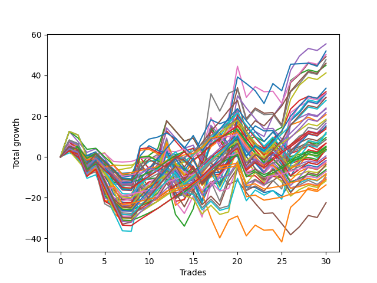

# Short Pointer 001 AB 
- Symbol: ES
- Date Range: 03/18/2022 - 07/15/2022
- Trading Period: 7:20-12:30
- Number of Trades: 30



| Name | Win Percent | Profit | Avg Profit / Trade | Avg Time / Trade |      | Name | Win Percent | Profit | Avg Profit / Trade | Avg Time / Trade |
| ---- | ----------- | ------ | ------------------ | ---------------- | ---- | ---- | ----------- | ------ | ------------------ | ---------------- |
| Sorted By <br> Profit | | | | | | Sorted By <br> Win Percentage ||||
| Four | 60.00 | 27750.00 | 925.00 | 20:24 |     | One Hundred Twenty-One | 80.00 | -1250.00 | -41.67 | 05:36 |
| Seventy-Three | 53.33 | 26000.00 | 866.67 | 09:03 |     | One Hundred Twenty-Six | 80.00 | -4125.00 | -137.50 | 05:42 |
| Six | 53.33 | 25125.00 | 837.50 | 25:17 |     | Eighty-One | 80.00 | -6875.00 | -229.17 | 07:25 |
| Five | 53.33 | 24625.00 | 820.83 | 24:32 |     | One Hundred Twenty-Two | 73.33 | 4250.00 | 141.67 | 08:07 |
| Seven | 53.33 | 23875.00 | 795.83 | 29:07 |     | Eighty-Two | 73.33 | 2375.00 | 79.17 | 10:22 |
| Eighty-Five | 66.67 | 23000.00 | 766.67 | 15:51 |     | One Hundred Twenty-Seven | 73.33 | 1875.00 | 62.50 | 08:12 |
| Two | 66.67 | 22500.00 | 750.00 | 17:30 |     | Three | 70.00 | 16000.00 | 533.33 | 14:56 |
| Sixty | 56.67 | 20625.00 | 687.50 | 17:03 |     | One | 70.00 | 10375.00 | 345.83 | 12:04 |
| One Hundred Twenty-Five | 63.33 | 16875.00 | 562.50 | 13:32 |     | One Hundred Twenty-Three | 70.00 | 9250.00 | 308.33 | 10:10 |
| Three | 70.00 | 16000.00 | 533.33 | 14:56 |     | Eighty-Three | 70.00 | 7375.00 | 245.83 | 12:25 |
| Sixty-Eight | 53.33 | 15625.00 | 520.83 | 15:04 |     | One Hundred Twenty-Eight | 70.00 | 6875.00 | 229.17 | 10:15 |
| Sixty-One | 50.00 | 15625.00 | 520.83 | 21:10 |     | One Hundred Eleven | 70.00 | -5375.00 | -179.17 | 03:08 |
| Sixty-Two | 50.00 | 15500.00 | 516.67 | 21:32 |     | One Hundred Sixteen | 70.00 | -5500.00 | -183.33 | 03:05 |
| One Hundred Thirty | 63.33 | 14625.00 | 487.50 | 12:49 |     | Eighty-Five | 66.67 | 23000.00 | 766.67 | 15:51 |
| Fifty-Eight | 63.33 | 14625.00 | 487.50 | 14:48 |     | Two | 66.67 | 22500.00 | 750.00 | 17:30 |
| One Hundred Twenty-Four | 66.67 | 13875.00 | 462.50 | 12:27 |     | One Hundred Twenty-Four | 66.67 | 13875.00 | 462.50 | 12:27 |
| Eighty-Four | 66.67 | 12000.00 | 400.00 | 14:42 |     | Eighty-Four | 66.67 | 12000.00 | 400.00 | 14:42 |
| Sixty-Six | 63.33 | 11750.00 | 391.67 | 13:21 |     | One Hundred Twenty-Nine | 66.67 | 10875.00 | 362.50 | 11:47 |
| One Hundred Twenty-Nine | 66.67 | 10875.00 | 362.50 | 11:47 |     | Fifty-Seven | 66.67 | 4250.00 | 141.67 | 09:30 |
| One | 70.00 | 10375.00 | 345.83 | 12:04 |     | Sixty-Five | 66.67 | 3375.00 | 112.50 | 09:19 |
| One Hundred Twenty-Three | 70.00 | 9250.00 | 308.33 | 10:10 |     | Sixty-Four | 66.67 | 2625.00 | 87.50 | 04:37 |
| Sixty-Nine | 46.67 | 8875.00 | 295.83 | 18:32 |     | Fifty-Six | 66.67 | 250.00 | 8.33 | 04:29 |
| Forty-Six | 40.00 | 8250.00 | 275.00 | 15:36 |     | Zero | 66.67 | -3500.00 | -116.67 | 06:22 |
| One Hundred Fifteen | 53.33 | 7625.00 | 254.17 | 08:38 |     | One Hundred Twenty-Five | 63.33 | 16875.00 | 562.50 | 13:32 |
| Eighty-Three | 70.00 | 7375.00 | 245.83 | 12:25 |     | One Hundred Thirty | 63.33 | 14625.00 | 487.50 | 12:49 |
| Fifty-Nine | 63.33 | 7250.00 | 241.67 | 11:50 |     | Fifty-Eight | 63.33 | 14625.00 | 487.50 | 14:48 |
| One Hundred Twenty-Eight | 70.00 | 6875.00 | 229.17 | 10:15 |     | Sixty-Six | 63.33 | 11750.00 | 391.67 | 13:21 |
| Seventy-One | 46.67 | 6000.00 | 200.00 | 20:42 |     | Fifty-Nine | 63.33 | 7250.00 | 241.67 | 11:50 |
| Seventy | 46.67 | 5875.00 | 195.83 | 18:19 |     | One Hundred Twelve | 63.33 | -250.00 | -8.33 | 05:20 |
| Sixty-Seven | 60.00 | 5625.00 | 187.50 | 11:34 |     | Forty | 63.33 | -2250.00 | -75.00 | 02:57 |
| One Hundred Fourteen | 56.67 | 5625.00 | 187.50 | 07:48 |     | Four | 60.00 | 27750.00 | 925.00 | 20:24 |
| Forty-Four | 43.33 | 4750.00 | 158.33 | 11:08 |     | Sixty-Seven | 60.00 | 5625.00 | 187.50 | 11:34 |
| One Hundred Twenty-Two | 73.33 | 4250.00 | 141.67 | 08:07 |     | One Hundred Thirteen | 60.00 | 1750.00 | 58.33 | 06:19 |
| Fifty-Seven | 66.67 | 4250.00 | 141.67 | 09:30 |     | Forty-One | 60.00 | 1500.00 | 50.00 | 06:22 |
| Sixty-Five | 66.67 | 3375.00 | 112.50 | 09:19 |     | One Hundred Seventeen | 60.00 | -3125.00 | -104.17 | 05:14 |
| Forty-Five | 40.00 | 3375.00 | 112.50 | 14:43 |     | Forty-Eight | 60.00 | -3500.00 | -116.67 | 02:37 |
| Sixty-Four | 66.67 | 2625.00 | 87.50 | 04:37 |     | Sixty | 56.67 | 20625.00 | 687.50 | 17:03 |
| Eighty-Two | 73.33 | 2375.00 | 79.17 | 10:22 |     | One Hundred Fourteen | 56.67 | 5625.00 | 187.50 | 07:48 |
| Fifty-Three | 40.00 | 2375.00 | 79.17 | 10:06 |     | One Hundred Eighteen | 56.67 | -250.00 | -8.33 | 06:07 |
| One Hundred Twenty-Seven | 73.33 | 1875.00 | 62.50 | 08:12 |     | Seventy-Three | 53.33 | 26000.00 | 866.67 | 09:03 |
| Fifty-Five | 40.00 | 1875.00 | 62.50 | 11:42 |     | Six | 53.33 | 25125.00 | 837.50 | 25:17 |
| One Hundred Thirteen | 60.00 | 1750.00 | 58.33 | 06:19 |     | Five | 53.33 | 24625.00 | 820.83 | 24:32 |
| Fifty-Four | 40.00 | 1750.00 | 58.33 | 10:14 |     | Seven | 53.33 | 23875.00 | 795.83 | 29:07 |
| Fifty-Two | 40.00 | 1750.00 | 58.33 | 08:20 |     | Sixty-Eight | 53.33 | 15625.00 | 520.83 | 15:04 |
| Forty-One | 60.00 | 1500.00 | 50.00 | 06:22 |     | One Hundred Fifteen | 53.33 | 7625.00 | 254.17 | 08:38 |
| Fifty-Six | 66.67 | 250.00 | 8.33 | 04:29 |     | Forty-Nine | 53.33 | -5125.00 | -170.83 | 05:19 |
| One Hundred Twelve | 63.33 | -250.00 | -8.33 | 05:20 |     | Sixty-One | 50.00 | 15625.00 | 520.83 | 21:10 |
| One Hundred Eighteen | 56.67 | -250.00 | -8.33 | 06:07 |     | Sixty-Two | 50.00 | 15500.00 | 516.67 | 21:32 |
| Forty-Two | 50.00 | -875.00 | -29.17 | 09:40 |     | Forty-Two | 50.00 | -875.00 | -29.17 | 09:40 |
| One Hundred Ninteen | 46.67 | -875.00 | -29.17 | 06:56 |     | Forty-Three | 50.00 | -1500.00 | -50.00 | 07:36 |
| One Hundred Twenty-One | 80.00 | -1250.00 | -41.67 | 05:36 |     | Sixty-Nine | 46.67 | 8875.00 | 295.83 | 18:32 |
| Forty-Three | 50.00 | -1500.00 | -50.00 | 07:36 |     | Seventy-One | 46.67 | 6000.00 | 200.00 | 20:42 |
| One Hundred Twenty | 43.33 | -1875.00 | -62.50 | 07:40 |     | Seventy | 46.67 | 5875.00 | 195.83 | 18:19 |
| Forty | 63.33 | -2250.00 | -75.00 | 02:57 |     | One Hundred Ninteen | 46.67 | -875.00 | -29.17 | 06:56 |
| One Hundred Seventeen | 60.00 | -3125.00 | -104.17 | 05:14 |     | Fifty-One | 46.67 | -4250.00 | -141.67 | 06:25 |
| Zero | 66.67 | -3500.00 | -116.67 | 06:22 |     | Sixty-Three | 46.67 | -4500.00 | -150.00 | 24:43 |
| Forty-Eight | 60.00 | -3500.00 | -116.67 | 02:37 |     | Fifty | 46.67 | -5875.00 | -195.83 | 07:18 |
| One Hundred Twenty-Six | 80.00 | -4125.00 | -137.50 | 05:42 |     | Forty-Four | 43.33 | 4750.00 | 158.33 | 11:08 |
| Fifty-One | 46.67 | -4250.00 | -141.67 | 06:25 |     | One Hundred Twenty | 43.33 | -1875.00 | -62.50 | 07:40 |
| Sixty-Three | 46.67 | -4500.00 | -150.00 | 24:43 |     | Forty-Six | 40.00 | 8250.00 | 275.00 | 15:36 |
| Forty-Nine | 53.33 | -5125.00 | -170.83 | 05:19 |     | Forty-Five | 40.00 | 3375.00 | 112.50 | 14:43 |
| One Hundred Eleven | 70.00 | -5375.00 | -179.17 | 03:08 |     | Fifty-Three | 40.00 | 2375.00 | 79.17 | 10:06 |
| One Hundred Sixteen | 70.00 | -5500.00 | -183.33 | 03:05 |     | Fifty-Five | 40.00 | 1875.00 | 62.50 | 11:42 |
| Fifty | 46.67 | -5875.00 | -195.83 | 07:18 |     | Fifty-Four | 40.00 | 1750.00 | 58.33 | 10:14 |
| Eighty-One | 80.00 | -6875.00 | -229.17 | 07:25 |     | Fifty-Two | 40.00 | 1750.00 | 58.33 | 08:20 |
| Forty-Seven | 36.67 | -11250.00 | -375.00 | 18:23 |     | Forty-Seven | 36.67 | -11250.00 | -375.00 | 18:23 |

## NO STOPLOSS

### Test Zero
* Sell when price hits the middle line of the 20p bollinger
* No Stoploss
* Results:
```
Total Trades: 30
Percent Up: 33.33
Percent Down: 66.67
Total Points Moved Down: -7.00
Potential Profit: -3500.00
Total Points Ups: 54.25 Count Ups: 10
Total Points Downs: 47.25 Count Downs: 20
```

<details><summary>Trades</summary>

<code>In: 2022-03-18 08:40:00		Out: 2022-03-18 08:40:50		Total Position Time: 00:50		Total Move Down: 4.00		Total to Date: 4.00</code> <br />
<code>In: 2022-03-18 10:14:00		Out: 2022-03-18 10:16:10		Total Position Time: 02:10		Total Move Down: 1.25		Total to Date: 5.25</code> <br />
<code>In: 2022-03-18 12:13:00		Out: 2022-03-18 12:37:20		Total Position Time: 24:20		Total Move Down: -9.00		Total to Date: -3.75</code> <br />
<code>In: 2022-03-23 08:28:00		Out: 2022-03-23 08:32:05		Total Position Time: 04:05		Total Move Down: 1.25		Total to Date: -2.50</code> <br />
<code>In: 2022-03-24 08:09:00		Out: 2022-03-24 08:09:10		Total Position Time: 00:10		Total Move Down: 0.75		Total to Date: -1.75</code> <br />
<code>In: 2022-03-25 07:26:00		Out: 2022-03-25 07:51:05		Total Position Time: 25:05		Total Move Down: -6.00		Total to Date: -7.75</code> <br />
<code>In: 2022-03-29 12:15:00		Out: 2022-03-29 12:18:55		Total Position Time: 03:55		Total Move Down: -0.25		Total to Date: -8.00</code> <br />
<code>In: 2022-04-04 11:50:00		Out: 2022-04-04 11:51:05		Total Position Time: 01:05		Total Move Down: 0.25		Total to Date: -7.75</code> <br />
<code>In: 2022-04-20 07:57:00		Out: 2022-04-20 08:00:10		Total Position Time: 03:10		Total Move Down: 1.50		Total to Date: -6.25</code> <br />
<code>In: 2022-04-20 10:18:00		Out: 2022-04-20 10:18:20		Total Position Time: 00:20		Total Move Down: 0.25		Total to Date: -6.00</code> <br />
<code>In: 2022-04-20 10:50:00		Out: 2022-04-20 10:50:10		Total Position Time: 00:10		Total Move Down: 0.50		Total to Date: -5.50</code> <br />
<code>In: 2022-04-27 09:46:00		Out: 2022-04-27 09:46:10		Total Position Time: 00:10		Total Move Down: 3.00		Total to Date: -2.50</code> <br />
<code>In: 2022-04-28 09:50:00		Out: 2022-04-28 10:19:55		Total Position Time: 29:55		Total Move Down: -17.25		Total to Date: -19.75</code> <br />
<code>In: 2022-04-28 10:42:00		Out: 2022-04-28 10:42:10		Total Position Time: 00:10		Total Move Down: 1.50		Total to Date: -18.25</code> <br />
<code>In: 2022-05-03 10:19:00		Out: 2022-05-03 10:23:35		Total Position Time: 04:35		Total Move Down: 3.25		Total to Date: -15.00</code> <br />
<code>In: 2022-05-04 11:03:00		Out: 2022-05-04 11:03:10		Total Position Time: 00:10		Total Move Down: 3.25		Total to Date: -11.75</code> <br />
<code>In: 2022-05-04 11:07:00		Out: 2022-05-04 11:07:10		Total Position Time: 00:10		Total Move Down: 4.25		Total to Date: -7.50</code> <br />
<code>In: 2022-05-24 10:58:00		Out: 2022-05-24 11:01:15		Total Position Time: 03:15		Total Move Down: -0.25		Total to Date: -7.75</code> <br />
<code>In: 2022-05-24 11:15:00		Out: 2022-05-24 11:18:25		Total Position Time: 03:25		Total Move Down: 6.25		Total to Date: -1.50</code> <br />
<code>In: 2022-05-24 11:41:00		Out: 2022-05-24 11:42:15		Total Position Time: 01:15		Total Move Down: 2.00		Total to Date: 0.50</code> <br />
<code>In: 2022-05-27 12:03:00		Out: 2022-05-27 12:32:55		Total Position Time: 29:55		Total Move Down: -15.25		Total to Date: -14.75</code> <br />
<code>In: 2022-05-31 10:58:00		Out: 2022-05-31 11:05:10		Total Position Time: 07:10		Total Move Down: -0.25		Total to Date: -15.00</code> <br />
<code>In: 2022-06-07 10:12:00		Out: 2022-06-07 10:25:15		Total Position Time: 13:15		Total Move Down: -2.50		Total to Date: -17.50</code> <br />
<code>In: 2022-06-07 11:38:00		Out: 2022-06-07 11:41:10		Total Position Time: 03:10		Total Move Down: 1.00		Total to Date: -16.50</code> <br />
<code>In: 2022-06-30 08:51:00		Out: 2022-06-30 09:03:10		Total Position Time: 12:10		Total Move Down: -2.75		Total to Date: -19.25</code> <br />
<code>In: 2022-07-05 07:41:00		Out: 2022-07-05 07:44:30		Total Position Time: 03:30		Total Move Down: 7.25		Total to Date: -12.00</code> <br />
<code>In: 2022-07-07 08:10:00		Out: 2022-07-07 08:10:35		Total Position Time: 00:35		Total Move Down: 1.00		Total to Date: -11.00</code> <br />
<code>In: 2022-07-07 09:37:00		Out: 2022-07-07 09:38:15		Total Position Time: 01:15		Total Move Down: 1.50		Total to Date: -9.50</code> <br />
<code>In: 2022-07-07 11:05:00		Out: 2022-07-07 11:16:30		Total Position Time: 11:30		Total Move Down: -0.75		Total to Date: -10.25</code> <br />
<code>In: 2022-07-12 10:03:00		Out: 2022-07-12 10:03:10		Total Position Time: 00:10		Total Move Down: 3.25		Total to Date: -7.00</code> <br />


</details>

### Test One
* Sell when the price hits the upper line of the 20p 1std bollinger
* No Stoploss
* Results:
```
Total Trades: 30
Percent Up: 30.00
Percent Down: 70.00
Total Points Moved Down: 20.75
Potential Profit: 10375.00
Total Points Ups: 67.75 Count Ups: 9
Total Points Downs: 88.50 Count Downs: 21
```

<details><summary>Trades</summary>

<code>In: 2022-03-18 08:40:00		Out: 2022-03-18 08:48:05		Total Position Time: 08:05		Total Move Down: 4.75		Total to Date: 4.75</code> <br />
<code>In: 2022-03-18 10:14:00		Out: 2022-03-18 10:41:35		Total Position Time: 27:35		Total Move Down: -1.50		Total to Date: 3.25</code> <br />
<code>In: 2022-03-18 12:13:00		Out: 2022-03-18 12:39:40		Total Position Time: 26:40		Total Move Down: -6.75		Total to Date: -3.50</code> <br />
<code>In: 2022-03-23 08:28:00		Out: 2022-03-23 08:35:15		Total Position Time: 07:15		Total Move Down: 2.75		Total to Date: -0.75</code> <br />
<code>In: 2022-03-24 08:09:00		Out: 2022-03-24 08:38:55		Total Position Time: 29:55		Total Move Down: -15.75		Total to Date: -16.50</code> <br />
<code>In: 2022-03-25 07:26:00		Out: 2022-03-25 07:53:50		Total Position Time: 27:50		Total Move Down: -4.50		Total to Date: -21.00</code> <br />
<code>In: 2022-03-29 12:15:00		Out: 2022-03-29 12:27:35		Total Position Time: 12:35		Total Move Down: 0.25		Total to Date: -20.75</code> <br />
<code>In: 2022-04-04 11:50:00		Out: 2022-04-04 11:52:05		Total Position Time: 02:05		Total Move Down: 0.50		Total to Date: -20.25</code> <br />
<code>In: 2022-04-20 07:57:00		Out: 2022-04-20 08:00:40		Total Position Time: 03:40		Total Move Down: 4.75		Total to Date: -15.50</code> <br />
<code>In: 2022-04-20 10:18:00		Out: 2022-04-20 10:19:05		Total Position Time: 01:05		Total Move Down: 2.75		Total to Date: -12.75</code> <br />
<code>In: 2022-04-20 10:50:00		Out: 2022-04-20 10:53:20		Total Position Time: 03:20		Total Move Down: 2.50		Total to Date: -10.25</code> <br />
<code>In: 2022-04-27 09:46:00		Out: 2022-04-27 09:50:25		Total Position Time: 04:25		Total Move Down: 3.75		Total to Date: -6.50</code> <br />
<code>In: 2022-04-28 09:50:00		Out: 2022-04-28 10:19:55		Total Position Time: 29:55		Total Move Down: -17.25		Total to Date: -23.75</code> <br />
<code>In: 2022-04-28 10:42:00		Out: 2022-04-28 10:44:10		Total Position Time: 02:10		Total Move Down: 3.25		Total to Date: -20.50</code> <br />
<code>In: 2022-05-03 10:19:00		Out: 2022-05-03 10:27:50		Total Position Time: 08:50		Total Move Down: 5.25		Total to Date: -15.25</code> <br />
<code>In: 2022-05-04 11:03:00		Out: 2022-05-04 11:07:20		Total Position Time: 04:20		Total Move Down: 10.75		Total to Date: -4.50</code> <br />
<code>In: 2022-05-04 11:07:00		Out: 2022-05-04 11:07:20		Total Position Time: 00:20		Total Move Down: 9.50		Total to Date: 5.00</code> <br />
<code>In: 2022-05-24 10:58:00		Out: 2022-05-24 11:01:40		Total Position Time: 03:40		Total Move Down: 3.25		Total to Date: 8.25</code> <br />
<code>In: 2022-05-24 11:15:00		Out: 2022-05-24 11:31:25		Total Position Time: 16:25		Total Move Down: 6.75		Total to Date: 15.00</code> <br />
<code>In: 2022-05-24 11:41:00		Out: 2022-05-24 11:43:15		Total Position Time: 02:15		Total Move Down: 4.75		Total to Date: 19.75</code> <br />
<code>In: 2022-05-27 12:03:00		Out: 2022-05-27 12:32:55		Total Position Time: 29:55		Total Move Down: -15.25		Total to Date: 4.50</code> <br />
<code>In: 2022-05-31 10:58:00		Out: 2022-05-31 11:13:25		Total Position Time: 15:25		Total Move Down: 0.25		Total to Date: 4.75</code> <br />
<code>In: 2022-06-07 10:12:00		Out: 2022-06-07 10:34:15		Total Position Time: 22:15		Total Move Down: -4.00		Total to Date: 0.75</code> <br />
<code>In: 2022-06-07 11:38:00		Out: 2022-06-07 11:43:00		Total Position Time: 05:00		Total Move Down: 3.75		Total to Date: 4.50</code> <br />
<code>In: 2022-06-30 08:51:00		Out: 2022-06-30 09:05:45		Total Position Time: 14:45		Total Move Down: -0.75		Total to Date: 3.75</code> <br />
<code>In: 2022-07-05 07:41:00		Out: 2022-07-05 07:45:55		Total Position Time: 04:55		Total Move Down: 12.00		Total to Date: 15.75</code> <br />
<code>In: 2022-07-07 08:10:00		Out: 2022-07-07 08:19:45		Total Position Time: 09:45		Total Move Down: 1.50		Total to Date: 17.25</code> <br />
<code>In: 2022-07-07 09:37:00		Out: 2022-07-07 09:45:00		Total Position Time: 08:00		Total Move Down: 2.25		Total to Date: 19.50</code> <br />
<code>In: 2022-07-07 11:05:00		Out: 2022-07-07 11:34:25		Total Position Time: 29:25		Total Move Down: -2.00		Total to Date: 17.50</code> <br />
<code>In: 2022-07-12 10:03:00		Out: 2022-07-12 10:03:10		Total Position Time: 00:10		Total Move Down: 3.25		Total to Date: 20.75</code> <br />


</details>

### Test Two
* Sell when the price hits the upper line of the 20p 2std bollinger
* No Stoploss
* Results:
```
Total Trades: 30
Percent Up: 33.33
Percent Down: 66.67
Total Points Moved Down: 45.00
Potential Profit: 22500.00
Total Points Ups: 79.75 Count Ups: 10
Total Points Downs: 124.75 Count Downs: 20
```

<details><summary>Trades</summary>

<code>In: 2022-03-18 08:40:00		Out: 2022-03-18 08:54:30		Total Position Time: 14:30		Total Move Down: 7.50		Total to Date: 7.50</code> <br />
<code>In: 2022-03-18 10:14:00		Out: 2022-03-18 10:43:55		Total Position Time: 29:55		Total Move Down: -1.75		Total to Date: 5.75</code> <br />
<code>In: 2022-03-18 12:13:00		Out: 2022-03-18 12:42:55		Total Position Time: 29:55		Total Move Down: -10.75		Total to Date: -5.00</code> <br />
<code>In: 2022-03-23 08:28:00		Out: 2022-03-23 08:42:15		Total Position Time: 14:15		Total Move Down: 2.75		Total to Date: -2.25</code> <br />
<code>In: 2022-03-24 08:09:00		Out: 2022-03-24 08:38:55		Total Position Time: 29:55		Total Move Down: -15.75		Total to Date: -18.00</code> <br />
<code>In: 2022-03-25 07:26:00		Out: 2022-03-25 07:54:10		Total Position Time: 28:10		Total Move Down: -3.50		Total to Date: -21.50</code> <br />
<code>In: 2022-03-29 12:15:00		Out: 2022-03-29 12:27:50		Total Position Time: 12:50		Total Move Down: 0.75		Total to Date: -20.75</code> <br />
<code>In: 2022-04-04 11:50:00		Out: 2022-04-04 12:03:40		Total Position Time: 13:40		Total Move Down: 0.75		Total to Date: -20.00</code> <br />
<code>In: 2022-04-20 07:57:00		Out: 2022-04-20 08:00:45		Total Position Time: 03:45		Total Move Down: 5.25		Total to Date: -14.75</code> <br />
<code>In: 2022-04-20 10:18:00		Out: 2022-04-20 10:47:55		Total Position Time: 29:55		Total Move Down: -6.25		Total to Date: -21.00</code> <br />
<code>In: 2022-04-20 10:50:00		Out: 2022-04-20 11:13:55		Total Position Time: 23:55		Total Move Down: 3.25		Total to Date: -17.75</code> <br />
<code>In: 2022-04-27 09:46:00		Out: 2022-04-27 10:00:10		Total Position Time: 14:10		Total Move Down: 6.75		Total to Date: -11.00</code> <br />
<code>In: 2022-04-28 09:50:00		Out: 2022-04-28 10:19:55		Total Position Time: 29:55		Total Move Down: -17.25		Total to Date: -28.25</code> <br />
<code>In: 2022-04-28 10:42:00		Out: 2022-04-28 11:11:55		Total Position Time: 29:55		Total Move Down: -5.75		Total to Date: -34.00</code> <br />
<code>In: 2022-05-03 10:19:00		Out: 2022-05-03 10:28:05		Total Position Time: 09:05		Total Move Down: 8.50		Total to Date: -25.50</code> <br />
<code>In: 2022-05-04 11:03:00		Out: 2022-05-04 11:07:40		Total Position Time: 04:40		Total Move Down: 17.25		Total to Date: -8.25</code> <br />
<code>In: 2022-05-04 11:07:00		Out: 2022-05-04 11:07:40		Total Position Time: 00:40		Total Move Down: 16.00		Total to Date: 7.75</code> <br />
<code>In: 2022-05-24 10:58:00		Out: 2022-05-24 11:01:50		Total Position Time: 03:50		Total Move Down: 4.25		Total to Date: 12.00</code> <br />
<code>In: 2022-05-24 11:15:00		Out: 2022-05-24 11:43:50		Total Position Time: 28:50		Total Move Down: 4.75		Total to Date: 16.75</code> <br />
<code>In: 2022-05-24 11:41:00		Out: 2022-05-24 11:43:50		Total Position Time: 02:50		Total Move Down: 6.75		Total to Date: 23.50</code> <br />
<code>In: 2022-05-27 12:03:00		Out: 2022-05-27 12:32:55		Total Position Time: 29:55		Total Move Down: -15.25		Total to Date: 8.25</code> <br />
<code>In: 2022-05-31 10:58:00		Out: 2022-05-31 11:22:35		Total Position Time: 24:35		Total Move Down: 1.75		Total to Date: 10.00</code> <br />
<code>In: 2022-06-07 10:12:00		Out: 2022-06-07 10:34:35		Total Position Time: 22:35		Total Move Down: -2.50		Total to Date: 7.50</code> <br />
<code>In: 2022-06-07 11:38:00		Out: 2022-06-07 11:43:25		Total Position Time: 05:25		Total Move Down: 4.75		Total to Date: 12.25</code> <br />
<code>In: 2022-06-30 08:51:00		Out: 2022-06-30 09:06:15		Total Position Time: 15:15		Total Move Down: 2.25		Total to Date: 14.50</code> <br />
<code>In: 2022-07-05 07:41:00		Out: 2022-07-05 08:01:10		Total Position Time: 20:10		Total Move Down: 23.00		Total to Date: 37.50</code> <br />
<code>In: 2022-07-07 08:10:00		Out: 2022-07-07 08:21:00		Total Position Time: 11:00		Total Move Down: 3.25		Total to Date: 40.75</code> <br />
<code>In: 2022-07-07 09:37:00		Out: 2022-07-07 09:48:20		Total Position Time: 11:20		Total Move Down: 2.00		Total to Date: 42.75</code> <br />
<code>In: 2022-07-07 11:05:00		Out: 2022-07-07 11:34:55		Total Position Time: 29:55		Total Move Down: -1.00		Total to Date: 41.75</code> <br />
<code>In: 2022-07-12 10:03:00		Out: 2022-07-12 10:03:10		Total Position Time: 00:10		Total Move Down: 3.25		Total to Date: 45.00</code> <br />


</details>

### Test Three
* Sell when price hits the middle line of the 50p bollinger
* No Stoploss
* Results:
```
Total Trades: 30
Percent Up: 30.00
Percent Down: 70.00
Total Points Moved Down: 32.00
Potential Profit: 16000.00
Total Points Ups: 67.50 Count Ups: 9
Total Points Downs: 99.50 Count Downs: 21
```

<details><summary>Trades</summary>

<code>In: 2022-03-18 08:40:00		Out: 2022-03-18 08:44:20		Total Position Time: 04:20		Total Move Down: 4.25		Total to Date: 4.25</code> <br />
<code>In: 2022-03-18 10:14:00		Out: 2022-03-18 10:43:55		Total Position Time: 29:55		Total Move Down: -1.75		Total to Date: 2.50</code> <br />
<code>In: 2022-03-18 12:13:00		Out: 2022-03-18 12:42:55		Total Position Time: 29:55		Total Move Down: -10.75		Total to Date: -8.25</code> <br />
<code>In: 2022-03-23 08:28:00		Out: 2022-03-23 08:42:15		Total Position Time: 14:15		Total Move Down: 2.75		Total to Date: -5.50</code> <br />
<code>In: 2022-03-24 08:09:00		Out: 2022-03-24 08:38:55		Total Position Time: 29:55		Total Move Down: -15.75		Total to Date: -21.25</code> <br />
<code>In: 2022-03-25 07:26:00		Out: 2022-03-25 07:55:55		Total Position Time: 29:55		Total Move Down: -2.50		Total to Date: -23.75</code> <br />
<code>In: 2022-03-29 12:15:00		Out: 2022-03-29 12:43:05		Total Position Time: 28:05		Total Move Down: -0.75		Total to Date: -24.50</code> <br />
<code>In: 2022-04-04 11:50:00		Out: 2022-04-04 12:03:50		Total Position Time: 13:50		Total Move Down: 1.00		Total to Date: -23.50</code> <br />
<code>In: 2022-04-20 07:57:00		Out: 2022-04-20 08:01:10		Total Position Time: 04:10		Total Move Down: 7.75		Total to Date: -15.75</code> <br />
<code>In: 2022-04-20 10:18:00		Out: 2022-04-20 10:19:10		Total Position Time: 01:10		Total Move Down: 3.50		Total to Date: -12.25</code> <br />
<code>In: 2022-04-20 10:50:00		Out: 2022-04-20 10:50:20		Total Position Time: 00:20		Total Move Down: 1.00		Total to Date: -11.25</code> <br />
<code>In: 2022-04-27 09:46:00		Out: 2022-04-27 10:00:10		Total Position Time: 14:10		Total Move Down: 6.75		Total to Date: -4.50</code> <br />
<code>In: 2022-04-28 09:50:00		Out: 2022-04-28 10:19:55		Total Position Time: 29:55		Total Move Down: -17.25		Total to Date: -21.75</code> <br />
<code>In: 2022-04-28 10:42:00		Out: 2022-04-28 10:52:25		Total Position Time: 10:25		Total Move Down: 0.75		Total to Date: -21.00</code> <br />
<code>In: 2022-05-03 10:19:00		Out: 2022-05-03 10:28:05		Total Position Time: 09:05		Total Move Down: 8.50		Total to Date: -12.50</code> <br />
<code>In: 2022-05-04 11:03:00		Out: 2022-05-04 11:07:15		Total Position Time: 04:15		Total Move Down: 6.75		Total to Date: -5.75</code> <br />
<code>In: 2022-05-04 11:07:00		Out: 2022-05-04 11:07:15		Total Position Time: 00:15		Total Move Down: 5.50		Total to Date: -0.25</code> <br />
<code>In: 2022-05-24 10:58:00		Out: 2022-05-24 11:20:25		Total Position Time: 22:25		Total Move Down: 1.50		Total to Date: 1.25</code> <br />
<code>In: 2022-05-24 11:15:00		Out: 2022-05-24 11:20:25		Total Position Time: 05:25		Total Move Down: 11.75		Total to Date: 13.00</code> <br />
<code>In: 2022-05-24 11:41:00		Out: 2022-05-24 11:43:25		Total Position Time: 02:25		Total Move Down: 6.50		Total to Date: 19.50</code> <br />
<code>In: 2022-05-27 12:03:00		Out: 2022-05-27 12:32:55		Total Position Time: 29:55		Total Move Down: -15.25		Total to Date: 4.25</code> <br />
<code>In: 2022-05-31 10:58:00		Out: 2022-05-31 11:22:40		Total Position Time: 24:40		Total Move Down: 2.25		Total to Date: 6.50</code> <br />
<code>In: 2022-06-07 10:12:00		Out: 2022-06-07 10:41:55		Total Position Time: 29:55		Total Move Down: -2.50		Total to Date: 4.00</code> <br />
<code>In: 2022-06-07 11:38:00		Out: 2022-06-07 11:43:35		Total Position Time: 05:35		Total Move Down: 5.00		Total to Date: 9.00</code> <br />
<code>In: 2022-06-30 08:51:00		Out: 2022-06-30 09:06:20		Total Position Time: 15:20		Total Move Down: 3.50		Total to Date: 12.50</code> <br />
<code>In: 2022-07-05 07:41:00		Out: 2022-07-05 07:45:30		Total Position Time: 04:30		Total Move Down: 11.00		Total to Date: 23.50</code> <br />
<code>In: 2022-07-07 08:10:00		Out: 2022-07-07 08:22:45		Total Position Time: 12:45		Total Move Down: 4.25		Total to Date: 27.75</code> <br />
<code>In: 2022-07-07 09:37:00		Out: 2022-07-07 09:48:20		Total Position Time: 11:20		Total Move Down: 2.00		Total to Date: 29.75</code> <br />
<code>In: 2022-07-07 11:05:00		Out: 2022-07-07 11:34:55		Total Position Time: 29:55		Total Move Down: -1.00		Total to Date: 28.75</code> <br />
<code>In: 2022-07-12 10:03:00		Out: 2022-07-12 10:03:10		Total Position Time: 00:10		Total Move Down: 3.25		Total to Date: 32.00</code> <br />


</details>

### Test Four
* Sell when the price hits the upper line of the 50p 1std bollinger
* No Stoploss
* Results:
```
Total Trades: 30
Percent Up: 40.00
Percent Down: 60.00
Total Points Moved Down: 55.50
Potential Profit: 27750.00
Total Points Ups: 85.25 Count Ups: 12
Total Points Downs: 140.75 Count Downs: 18
```

<details><summary>Trades</summary>

<code>In: 2022-03-18 08:40:00		Out: 2022-03-18 08:48:15		Total Position Time: 08:15		Total Move Down: 6.00		Total to Date: 6.00</code> <br />
<code>In: 2022-03-18 10:14:00		Out: 2022-03-18 10:43:55		Total Position Time: 29:55		Total Move Down: -1.75		Total to Date: 4.25</code> <br />
<code>In: 2022-03-18 12:13:00		Out: 2022-03-18 12:42:55		Total Position Time: 29:55		Total Move Down: -10.75		Total to Date: -6.50</code> <br />
<code>In: 2022-03-23 08:28:00		Out: 2022-03-23 08:43:10		Total Position Time: 15:10		Total Move Down: 5.00		Total to Date: -1.50</code> <br />
<code>In: 2022-03-24 08:09:00		Out: 2022-03-24 08:38:55		Total Position Time: 29:55		Total Move Down: -15.75		Total to Date: -17.25</code> <br />
<code>In: 2022-03-25 07:26:00		Out: 2022-03-25 07:55:55		Total Position Time: 29:55		Total Move Down: -2.50		Total to Date: -19.75</code> <br />
<code>In: 2022-03-29 12:15:00		Out: 2022-03-29 12:44:55		Total Position Time: 29:55		Total Move Down: -4.00		Total to Date: -23.75</code> <br />
<code>In: 2022-04-04 11:50:00		Out: 2022-04-04 12:19:55		Total Position Time: 29:55		Total Move Down: -0.25		Total to Date: -24.00</code> <br />
<code>In: 2022-04-20 07:57:00		Out: 2022-04-20 08:10:40		Total Position Time: 13:40		Total Move Down: 11.25		Total to Date: -12.75</code> <br />
<code>In: 2022-04-20 10:18:00		Out: 2022-04-20 10:26:35		Total Position Time: 08:35		Total Move Down: 5.00		Total to Date: -7.75</code> <br />
<code>In: 2022-04-20 10:50:00		Out: 2022-04-20 11:13:55		Total Position Time: 23:55		Total Move Down: 3.25		Total to Date: -4.50</code> <br />
<code>In: 2022-04-27 09:46:00		Out: 2022-04-27 10:01:20		Total Position Time: 15:20		Total Move Down: 13.75		Total to Date: 9.25</code> <br />
<code>In: 2022-04-28 09:50:00		Out: 2022-04-28 10:19:55		Total Position Time: 29:55		Total Move Down: -17.25		Total to Date: -8.00</code> <br />
<code>In: 2022-04-28 10:42:00		Out: 2022-04-28 11:11:55		Total Position Time: 29:55		Total Move Down: -5.75		Total to Date: -13.75</code> <br />
<code>In: 2022-05-03 10:19:00		Out: 2022-05-03 10:48:55		Total Position Time: 29:55		Total Move Down: 1.50		Total to Date: -12.25</code> <br />
<code>In: 2022-05-04 11:03:00		Out: 2022-05-04 11:07:25		Total Position Time: 04:25		Total Move Down: 13.50		Total to Date: 1.25</code> <br />
<code>In: 2022-05-04 11:07:00		Out: 2022-05-04 11:07:25		Total Position Time: 00:25		Total Move Down: 12.25		Total to Date: 13.50</code> <br />
<code>In: 2022-05-24 10:58:00		Out: 2022-05-24 11:27:55		Total Position Time: 29:55		Total Move Down: -8.50		Total to Date: 5.00</code> <br />
<code>In: 2022-05-24 11:15:00		Out: 2022-05-24 11:44:15		Total Position Time: 29:15		Total Move Down: 8.00		Total to Date: 13.00</code> <br />
<code>In: 2022-05-24 11:41:00		Out: 2022-05-24 11:44:15		Total Position Time: 03:15		Total Move Down: 10.00		Total to Date: 23.00</code> <br />
<code>In: 2022-05-27 12:03:00		Out: 2022-05-27 12:32:55		Total Position Time: 29:55		Total Move Down: -15.25		Total to Date: 7.75</code> <br />
<code>In: 2022-05-31 10:58:00		Out: 2022-05-31 11:26:15		Total Position Time: 28:15		Total Move Down: 4.75		Total to Date: 12.50</code> <br />
<code>In: 2022-06-07 10:12:00		Out: 2022-06-07 10:41:55		Total Position Time: 29:55		Total Move Down: -2.50		Total to Date: 10.00</code> <br />
<code>In: 2022-06-07 11:38:00		Out: 2022-06-07 11:47:25		Total Position Time: 09:25		Total Move Down: 10.00		Total to Date: 20.00</code> <br />
<code>In: 2022-06-30 08:51:00		Out: 2022-06-30 09:13:40		Total Position Time: 22:40		Total Move Down: 6.00		Total to Date: 26.00</code> <br />
<code>In: 2022-07-05 07:41:00		Out: 2022-07-05 07:55:15		Total Position Time: 14:15		Total Move Down: 16.50		Total to Date: 42.50</code> <br />
<code>In: 2022-07-07 08:10:00		Out: 2022-07-07 08:23:20		Total Position Time: 13:20		Total Move Down: 7.00		Total to Date: 49.50</code> <br />
<code>In: 2022-07-07 09:37:00		Out: 2022-07-07 09:50:05		Total Position Time: 13:05		Total Move Down: 3.75		Total to Date: 53.25</code> <br />
<code>In: 2022-07-07 11:05:00		Out: 2022-07-07 11:34:55		Total Position Time: 29:55		Total Move Down: -1.00		Total to Date: 52.25</code> <br />
<code>In: 2022-07-12 10:03:00		Out: 2022-07-12 10:03:10		Total Position Time: 00:10		Total Move Down: 3.25		Total to Date: 55.50</code> <br />


</details>

### Test Five
* Sell when the price hits the upper line of the 50p 2std bollinger
* No Stoploss
* Results:
```
Total Trades: 30
Percent Up: 46.67
Percent Down: 53.33
Total Points Moved Down: 49.25
Potential Profit: 24625.00
Total Points Ups: 97.50 Count Ups: 14
Total Points Downs: 146.75 Count Downs: 16
```

<details><summary>Trades</summary>

<code>In: 2022-03-18 08:40:00		Out: 2022-03-18 08:54:35		Total Position Time: 14:35		Total Move Down: 8.25		Total to Date: 8.25</code> <br />
<code>In: 2022-03-18 10:14:00		Out: 2022-03-18 10:43:55		Total Position Time: 29:55		Total Move Down: -1.75		Total to Date: 6.50</code> <br />
<code>In: 2022-03-18 12:13:00		Out: 2022-03-18 12:42:55		Total Position Time: 29:55		Total Move Down: -10.75		Total to Date: -4.25</code> <br />
<code>In: 2022-03-23 08:28:00		Out: 2022-03-23 08:57:55		Total Position Time: 29:55		Total Move Down: 1.75		Total to Date: -2.50</code> <br />
<code>In: 2022-03-24 08:09:00		Out: 2022-03-24 08:38:55		Total Position Time: 29:55		Total Move Down: -15.75		Total to Date: -18.25</code> <br />
<code>In: 2022-03-25 07:26:00		Out: 2022-03-25 07:55:55		Total Position Time: 29:55		Total Move Down: -2.50		Total to Date: -20.75</code> <br />
<code>In: 2022-03-29 12:15:00		Out: 2022-03-29 12:44:55		Total Position Time: 29:55		Total Move Down: -4.00		Total to Date: -24.75</code> <br />
<code>In: 2022-04-04 11:50:00		Out: 2022-04-04 12:19:55		Total Position Time: 29:55		Total Move Down: -0.25		Total to Date: -25.00</code> <br />
<code>In: 2022-04-20 07:57:00		Out: 2022-04-20 08:16:20		Total Position Time: 19:20		Total Move Down: 16.25		Total to Date: -8.75</code> <br />
<code>In: 2022-04-20 10:18:00		Out: 2022-04-20 10:47:55		Total Position Time: 29:55		Total Move Down: -6.25		Total to Date: -15.00</code> <br />
<code>In: 2022-04-20 10:50:00		Out: 2022-04-20 11:17:15		Total Position Time: 27:15		Total Move Down: 5.25		Total to Date: -9.75</code> <br />
<code>In: 2022-04-27 09:46:00		Out: 2022-04-27 10:09:25		Total Position Time: 23:25		Total Move Down: 13.25		Total to Date: 3.50</code> <br />
<code>In: 2022-04-28 09:50:00		Out: 2022-04-28 10:19:55		Total Position Time: 29:55		Total Move Down: -17.25		Total to Date: -13.75</code> <br />
<code>In: 2022-04-28 10:42:00		Out: 2022-04-28 11:11:55		Total Position Time: 29:55		Total Move Down: -5.75		Total to Date: -19.50</code> <br />
<code>In: 2022-05-03 10:19:00		Out: 2022-05-03 10:48:55		Total Position Time: 29:55		Total Move Down: 1.50		Total to Date: -18.00</code> <br />
<code>In: 2022-05-04 11:03:00		Out: 2022-05-04 11:07:40		Total Position Time: 04:40		Total Move Down: 17.25		Total to Date: -0.75</code> <br />
<code>In: 2022-05-04 11:07:00		Out: 2022-05-04 11:07:40		Total Position Time: 00:40		Total Move Down: 16.00		Total to Date: 15.25</code> <br />
<code>In: 2022-05-24 10:58:00		Out: 2022-05-24 11:27:55		Total Position Time: 29:55		Total Move Down: -8.50		Total to Date: 6.75</code> <br />
<code>In: 2022-05-24 11:15:00		Out: 2022-05-24 11:44:55		Total Position Time: 29:55		Total Move Down: 8.75		Total to Date: 15.50</code> <br />
<code>In: 2022-05-24 11:41:00		Out: 2022-05-24 11:49:15		Total Position Time: 08:15		Total Move Down: 18.50		Total to Date: 34.00</code> <br />
<code>In: 2022-05-27 12:03:00		Out: 2022-05-27 12:32:55		Total Position Time: 29:55		Total Move Down: -15.25		Total to Date: 18.75</code> <br />
<code>In: 2022-05-31 10:58:00		Out: 2022-05-31 11:27:55		Total Position Time: 29:55		Total Move Down: 5.25		Total to Date: 24.00</code> <br />
<code>In: 2022-06-07 10:12:00		Out: 2022-06-07 10:41:55		Total Position Time: 29:55		Total Move Down: -2.50		Total to Date: 21.50</code> <br />
<code>In: 2022-06-07 11:38:00		Out: 2022-06-07 12:07:55		Total Position Time: 29:55		Total Move Down: 0.25		Total to Date: 21.75</code> <br />
<code>In: 2022-06-30 08:51:00		Out: 2022-06-30 09:20:55		Total Position Time: 29:55		Total Move Down: -6.00		Total to Date: 15.75</code> <br />
<code>In: 2022-07-05 07:41:00		Out: 2022-07-05 08:00:50		Total Position Time: 19:50		Total Move Down: 20.75		Total to Date: 36.50</code> <br />
<code>In: 2022-07-07 08:10:00		Out: 2022-07-07 08:39:55		Total Position Time: 29:55		Total Move Down: 4.00		Total to Date: 40.50</code> <br />
<code>In: 2022-07-07 09:37:00		Out: 2022-07-07 09:55:20		Total Position Time: 18:20		Total Move Down: 5.50		Total to Date: 46.00</code> <br />
<code>In: 2022-07-07 11:05:00		Out: 2022-07-07 11:34:55		Total Position Time: 29:55		Total Move Down: -1.00		Total to Date: 45.00</code> <br />
<code>In: 2022-07-12 10:03:00		Out: 2022-07-12 10:04:20		Total Position Time: 01:20		Total Move Down: 4.25		Total to Date: 49.25</code> <br />


</details>

### Test Six
* Sell when the price hits the middle line of the 1std VWAP
* No Stoploss
* Results:
```
Total Trades: 30
Percent Up: 46.67
Percent Down: 53.33
Total Points Moved Down: 50.25
Potential Profit: 25125.00
Total Points Ups: 97.50 Count Ups: 14
Total Points Downs: 147.75 Count Downs: 16
```

<details><summary>Trades</summary>

<code>In: 2022-03-18 08:40:00		Out: 2022-03-18 08:54:50		Total Position Time: 14:50		Total Move Down: 12.50		Total to Date: 12.50</code> <br />
<code>In: 2022-03-18 10:14:00		Out: 2022-03-18 10:43:55		Total Position Time: 29:55		Total Move Down: -1.75		Total to Date: 10.75</code> <br />
<code>In: 2022-03-18 12:13:00		Out: 2022-03-18 12:42:55		Total Position Time: 29:55		Total Move Down: -10.75		Total to Date: 0.00</code> <br />
<code>In: 2022-03-23 08:28:00		Out: 2022-03-23 08:57:55		Total Position Time: 29:55		Total Move Down: 1.75		Total to Date: 1.75</code> <br />
<code>In: 2022-03-24 08:09:00		Out: 2022-03-24 08:38:55		Total Position Time: 29:55		Total Move Down: -15.75		Total to Date: -14.00</code> <br />
<code>In: 2022-03-25 07:26:00		Out: 2022-03-25 07:55:55		Total Position Time: 29:55		Total Move Down: -2.50		Total to Date: -16.50</code> <br />
<code>In: 2022-03-29 12:15:00		Out: 2022-03-29 12:44:55		Total Position Time: 29:55		Total Move Down: -4.00		Total to Date: -20.50</code> <br />
<code>In: 2022-04-04 11:50:00		Out: 2022-04-04 12:19:55		Total Position Time: 29:55		Total Move Down: -0.25		Total to Date: -20.75</code> <br />
<code>In: 2022-04-20 07:57:00		Out: 2022-04-20 08:05:05		Total Position Time: 08:05		Total Move Down: 8.50		Total to Date: -12.25</code> <br />
<code>In: 2022-04-20 10:18:00		Out: 2022-04-20 10:47:55		Total Position Time: 29:55		Total Move Down: -6.25		Total to Date: -18.50</code> <br />
<code>In: 2022-04-20 10:50:00		Out: 2022-04-20 11:17:50		Total Position Time: 27:50		Total Move Down: 5.75		Total to Date: -12.75</code> <br />
<code>In: 2022-04-27 09:46:00		Out: 2022-04-27 10:15:55		Total Position Time: 29:55		Total Move Down: 17.75		Total to Date: 5.00</code> <br />
<code>In: 2022-04-28 09:50:00		Out: 2022-04-28 10:19:55		Total Position Time: 29:55		Total Move Down: -17.25		Total to Date: -12.25</code> <br />
<code>In: 2022-04-28 10:42:00		Out: 2022-04-28 11:11:55		Total Position Time: 29:55		Total Move Down: -5.75		Total to Date: -18.00</code> <br />
<code>In: 2022-05-03 10:19:00		Out: 2022-05-03 10:48:55		Total Position Time: 29:55		Total Move Down: 1.50		Total to Date: -16.50</code> <br />
<code>In: 2022-05-04 11:03:00		Out: 2022-05-04 11:19:05		Total Position Time: 16:05		Total Move Down: 18.50		Total to Date: 2.00</code> <br />
<code>In: 2022-05-04 11:07:00		Out: 2022-05-04 11:19:05		Total Position Time: 12:05		Total Move Down: 17.25		Total to Date: 19.25</code> <br />
<code>In: 2022-05-24 10:58:00		Out: 2022-05-24 11:27:55		Total Position Time: 29:55		Total Move Down: -8.50		Total to Date: 10.75</code> <br />
<code>In: 2022-05-24 11:15:00		Out: 2022-05-24 11:44:55		Total Position Time: 29:55		Total Move Down: 8.75		Total to Date: 19.50</code> <br />
<code>In: 2022-05-24 11:41:00		Out: 2022-05-24 11:55:20		Total Position Time: 14:20		Total Move Down: 25.00		Total to Date: 44.50</code> <br />
<code>In: 2022-05-27 12:03:00		Out: 2022-05-27 12:32:55		Total Position Time: 29:55		Total Move Down: -15.25		Total to Date: 29.25</code> <br />
<code>In: 2022-05-31 10:58:00		Out: 2022-05-31 11:27:55		Total Position Time: 29:55		Total Move Down: 5.25		Total to Date: 34.50</code> <br />
<code>In: 2022-06-07 10:12:00		Out: 2022-06-07 10:41:55		Total Position Time: 29:55		Total Move Down: -2.50		Total to Date: 32.00</code> <br />
<code>In: 2022-06-07 11:38:00		Out: 2022-06-07 12:07:55		Total Position Time: 29:55		Total Move Down: 0.25		Total to Date: 32.25</code> <br />
<code>In: 2022-06-30 08:51:00		Out: 2022-06-30 09:20:55		Total Position Time: 29:55		Total Move Down: -6.00		Total to Date: 26.25</code> <br />
<code>In: 2022-07-05 07:41:00		Out: 2022-07-05 07:45:25		Total Position Time: 04:25		Total Move Down: 10.75		Total to Date: 37.00</code> <br />
<code>In: 2022-07-07 08:10:00		Out: 2022-07-07 08:39:55		Total Position Time: 29:55		Total Move Down: 4.00		Total to Date: 41.00</code> <br />
<code>In: 2022-07-07 09:37:00		Out: 2022-07-07 10:06:55		Total Position Time: 29:55		Total Move Down: 5.50		Total to Date: 46.50</code> <br />
<code>In: 2022-07-07 11:05:00		Out: 2022-07-07 11:34:55		Total Position Time: 29:55		Total Move Down: -1.00		Total to Date: 45.50</code> <br />
<code>In: 2022-07-12 10:03:00		Out: 2022-07-12 10:05:55		Total Position Time: 02:55		Total Move Down: 4.75		Total to Date: 50.25</code> <br />


</details>

### Test Seven
* Sell when the price hits the upper line of the 1std VWAP
* No Stoploss
* Results:
```
Total Trades: 30
Percent Up: 46.67
Percent Down: 53.33
Total Points Moved Down: 47.75
Potential Profit: 23875.00
Total Points Ups: 97.50 Count Ups: 14
Total Points Downs: 145.25 Count Downs: 16
```

<details><summary>Trades</summary>

<code>In: 2022-03-18 08:40:00		Out: 2022-03-18 09:09:55		Total Position Time: 29:55		Total Move Down: 3.50		Total to Date: 3.50</code> <br />
<code>In: 2022-03-18 10:14:00		Out: 2022-03-18 10:43:55		Total Position Time: 29:55		Total Move Down: -1.75		Total to Date: 1.75</code> <br />
<code>In: 2022-03-18 12:13:00		Out: 2022-03-18 12:42:55		Total Position Time: 29:55		Total Move Down: -10.75		Total to Date: -9.00</code> <br />
<code>In: 2022-03-23 08:28:00		Out: 2022-03-23 08:57:55		Total Position Time: 29:55		Total Move Down: 1.75		Total to Date: -7.25</code> <br />
<code>In: 2022-03-24 08:09:00		Out: 2022-03-24 08:38:55		Total Position Time: 29:55		Total Move Down: -15.75		Total to Date: -23.00</code> <br />
<code>In: 2022-03-25 07:26:00		Out: 2022-03-25 07:55:55		Total Position Time: 29:55		Total Move Down: -2.50		Total to Date: -25.50</code> <br />
<code>In: 2022-03-29 12:15:00		Out: 2022-03-29 12:44:55		Total Position Time: 29:55		Total Move Down: -4.00		Total to Date: -29.50</code> <br />
<code>In: 2022-04-04 11:50:00		Out: 2022-04-04 12:19:55		Total Position Time: 29:55		Total Move Down: -0.25		Total to Date: -29.75</code> <br />
<code>In: 2022-04-20 07:57:00		Out: 2022-04-20 08:20:10		Total Position Time: 23:10		Total Move Down: 18.00		Total to Date: -11.75</code> <br />
<code>In: 2022-04-20 10:18:00		Out: 2022-04-20 10:47:55		Total Position Time: 29:55		Total Move Down: -6.25		Total to Date: -18.00</code> <br />
<code>In: 2022-04-20 10:50:00		Out: 2022-04-20 11:19:55		Total Position Time: 29:55		Total Move Down: 8.75		Total to Date: -9.25</code> <br />
<code>In: 2022-04-27 09:46:00		Out: 2022-04-27 10:15:55		Total Position Time: 29:55		Total Move Down: 17.75		Total to Date: 8.50</code> <br />
<code>In: 2022-04-28 09:50:00		Out: 2022-04-28 10:19:55		Total Position Time: 29:55		Total Move Down: -17.25		Total to Date: -8.75</code> <br />
<code>In: 2022-04-28 10:42:00		Out: 2022-04-28 11:11:55		Total Position Time: 29:55		Total Move Down: -5.75		Total to Date: -14.50</code> <br />
<code>In: 2022-05-03 10:19:00		Out: 2022-05-03 10:48:55		Total Position Time: 29:55		Total Move Down: 1.50		Total to Date: -13.00</code> <br />
<code>In: 2022-05-04 11:03:00		Out: 2022-05-04 11:32:55		Total Position Time: 29:55		Total Move Down: 15.00		Total to Date: 2.00</code> <br />
<code>In: 2022-05-04 11:07:00		Out: 2022-05-04 11:34:00		Total Position Time: 27:00		Total Move Down: 29.00		Total to Date: 31.00</code> <br />
<code>In: 2022-05-24 10:58:00		Out: 2022-05-24 11:27:55		Total Position Time: 29:55		Total Move Down: -8.50		Total to Date: 22.50</code> <br />
<code>In: 2022-05-24 11:15:00		Out: 2022-05-24 11:44:55		Total Position Time: 29:55		Total Move Down: 8.75		Total to Date: 31.25</code> <br />
<code>In: 2022-05-24 11:41:00		Out: 2022-05-24 12:10:55		Total Position Time: 29:55		Total Move Down: 2.00		Total to Date: 33.25</code> <br />
<code>In: 2022-05-27 12:03:00		Out: 2022-05-27 12:32:55		Total Position Time: 29:55		Total Move Down: -15.25		Total to Date: 18.00</code> <br />
<code>In: 2022-05-31 10:58:00		Out: 2022-05-31 11:27:55		Total Position Time: 29:55		Total Move Down: 5.25		Total to Date: 23.25</code> <br />
<code>In: 2022-06-07 10:12:00		Out: 2022-06-07 10:41:55		Total Position Time: 29:55		Total Move Down: -2.50		Total to Date: 20.75</code> <br />
<code>In: 2022-06-07 11:38:00		Out: 2022-06-07 12:07:55		Total Position Time: 29:55		Total Move Down: 0.25		Total to Date: 21.00</code> <br />
<code>In: 2022-06-30 08:51:00		Out: 2022-06-30 09:20:55		Total Position Time: 29:55		Total Move Down: -6.00		Total to Date: 15.00</code> <br />
<code>In: 2022-07-05 07:41:00		Out: 2022-07-05 07:56:45		Total Position Time: 15:45		Total Move Down: 17.00		Total to Date: 32.00</code> <br />
<code>In: 2022-07-07 08:10:00		Out: 2022-07-07 08:39:55		Total Position Time: 29:55		Total Move Down: 4.00		Total to Date: 36.00</code> <br />
<code>In: 2022-07-07 09:37:00		Out: 2022-07-07 10:06:55		Total Position Time: 29:55		Total Move Down: 5.50		Total to Date: 41.50</code> <br />
<code>In: 2022-07-07 11:05:00		Out: 2022-07-07 11:34:55		Total Position Time: 29:55		Total Move Down: -1.00		Total to Date: 40.50</code> <br />
<code>In: 2022-07-12 10:03:00		Out: 2022-07-12 10:32:55		Total Position Time: 29:55		Total Move Down: 7.25		Total to Date: 47.75</code> <br />


</details>

## STOPLOSS OF 5

### Test Forty
* Sell when price hits the middle line of the 20p bollinger
* Stoploss is -5 points
* Results:
```
Total Trades: 30
Percent Up: 36.67
Percent Down: 63.33
Total Points Moved Down: -4.50
Potential Profit: -2250.00
Total Points Ups: 44.50 Count Ups: 11
Total Points Downs: 40.00 Count Downs: 19
```

<details><summary>Trades</summary>

<code>In: 2022-03-18 08:40:00		Out: 2022-03-18 08:40:50		Total Position Time: 00:50		Total Move Down: 4.00		Total to Date: 4.00</code> <br />
<code>In: 2022-03-18 10:14:00		Out: 2022-03-18 10:16:10		Total Position Time: 02:10		Total Move Down: 1.25		Total to Date: 5.25</code> <br />
<code>In: 2022-03-18 12:13:00		Out: 2022-03-18 12:19:35		Total Position Time: 06:35		Total Move Down: -5.25		Total to Date: 0.00</code> <br />
<code>In: 2022-03-23 08:28:00		Out: 2022-03-23 08:32:05		Total Position Time: 04:05		Total Move Down: 1.25		Total to Date: 1.25</code> <br />
<code>In: 2022-03-24 08:09:00		Out: 2022-03-24 08:09:10		Total Position Time: 00:10		Total Move Down: 0.75		Total to Date: 2.00</code> <br />
<code>In: 2022-03-25 07:26:00		Out: 2022-03-25 07:35:05		Total Position Time: 09:05		Total Move Down: -6.00		Total to Date: -4.00</code> <br />
<code>In: 2022-03-29 12:15:00		Out: 2022-03-29 12:18:55		Total Position Time: 03:55		Total Move Down: -0.25		Total to Date: -4.25</code> <br />
<code>In: 2022-04-04 11:50:00		Out: 2022-04-04 11:51:05		Total Position Time: 01:05		Total Move Down: 0.25		Total to Date: -4.00</code> <br />
<code>In: 2022-04-20 07:57:00		Out: 2022-04-20 08:00:10		Total Position Time: 03:10		Total Move Down: 1.50		Total to Date: -2.50</code> <br />
<code>In: 2022-04-20 10:18:00		Out: 2022-04-20 10:18:20		Total Position Time: 00:20		Total Move Down: 0.25		Total to Date: -2.25</code> <br />
<code>In: 2022-04-20 10:50:00		Out: 2022-04-20 10:50:10		Total Position Time: 00:10		Total Move Down: 0.50		Total to Date: -1.75</code> <br />
<code>In: 2022-04-27 09:46:00		Out: 2022-04-27 09:46:10		Total Position Time: 00:10		Total Move Down: 3.00		Total to Date: 1.25</code> <br />
<code>In: 2022-04-28 09:50:00		Out: 2022-04-28 10:00:45		Total Position Time: 10:45		Total Move Down: -5.00		Total to Date: -3.75</code> <br />
<code>In: 2022-04-28 10:42:00		Out: 2022-04-28 10:42:10		Total Position Time: 00:10		Total Move Down: 1.50		Total to Date: -2.25</code> <br />
<code>In: 2022-05-03 10:19:00		Out: 2022-05-03 10:23:35		Total Position Time: 04:35		Total Move Down: 3.25		Total to Date: 1.00</code> <br />
<code>In: 2022-05-04 11:03:00		Out: 2022-05-04 11:03:10		Total Position Time: 00:10		Total Move Down: 3.25		Total to Date: 4.25</code> <br />
<code>In: 2022-05-04 11:07:00		Out: 2022-05-04 11:07:10		Total Position Time: 00:10		Total Move Down: 4.25		Total to Date: 8.50</code> <br />
<code>In: 2022-05-24 10:58:00		Out: 2022-05-24 11:01:15		Total Position Time: 03:15		Total Move Down: -0.25		Total to Date: 8.25</code> <br />
<code>In: 2022-05-24 11:15:00		Out: 2022-05-24 11:18:25		Total Position Time: 03:25		Total Move Down: 6.25		Total to Date: 14.50</code> <br />
<code>In: 2022-05-24 11:41:00		Out: 2022-05-24 11:42:15		Total Position Time: 01:15		Total Move Down: 2.00		Total to Date: 16.50</code> <br />
<code>In: 2022-05-27 12:03:00		Out: 2022-05-27 12:05:30		Total Position Time: 02:30		Total Move Down: -6.00		Total to Date: 10.50</code> <br />
<code>In: 2022-05-31 10:58:00		Out: 2022-05-31 10:59:30		Total Position Time: 01:30		Total Move Down: -5.25		Total to Date: 5.25</code> <br />
<code>In: 2022-06-07 10:12:00		Out: 2022-06-07 10:16:25		Total Position Time: 04:25		Total Move Down: -5.00		Total to Date: 0.25</code> <br />
<code>In: 2022-06-07 11:38:00		Out: 2022-06-07 11:41:10		Total Position Time: 03:10		Total Move Down: 1.00		Total to Date: 1.25</code> <br />
<code>In: 2022-06-30 08:51:00		Out: 2022-06-30 08:58:15		Total Position Time: 07:15		Total Move Down: -5.25		Total to Date: -4.00</code> <br />
<code>In: 2022-07-05 07:41:00		Out: 2022-07-05 07:41:50		Total Position Time: 00:50		Total Move Down: -5.50		Total to Date: -9.50</code> <br />
<code>In: 2022-07-07 08:10:00		Out: 2022-07-07 08:10:35		Total Position Time: 00:35		Total Move Down: 1.00		Total to Date: -8.50</code> <br />
<code>In: 2022-07-07 09:37:00		Out: 2022-07-07 09:38:15		Total Position Time: 01:15		Total Move Down: 1.50		Total to Date: -7.00</code> <br />
<code>In: 2022-07-07 11:05:00		Out: 2022-07-07 11:16:30		Total Position Time: 11:30		Total Move Down: -0.75		Total to Date: -7.75</code> <br />
<code>In: 2022-07-12 10:03:00		Out: 2022-07-12 10:03:10		Total Position Time: 00:10		Total Move Down: 3.25		Total to Date: -4.50</code> <br />


</details>

### Test Forty-One
* Sell when the price hits the upper line of the 20p 1std bollinger
* Stoploss is -5 points
* Results:
```
Total Trades: 30
Percent Up: 40.00
Percent Down: 60.00
Total Points Moved Down: 3.00
Potential Profit: 1500.00
Total Points Ups: 62.50 Count Ups: 12
Total Points Downs: 65.50 Count Downs: 18
```

<details><summary>Trades</summary>

<code>In: 2022-03-18 08:40:00		Out: 2022-03-18 08:48:05		Total Position Time: 08:05		Total Move Down: 4.75		Total to Date: 4.75</code> <br />
<code>In: 2022-03-18 10:14:00		Out: 2022-03-18 10:29:30		Total Position Time: 15:30		Total Move Down: -5.00		Total to Date: -0.25</code> <br />
<code>In: 2022-03-18 12:13:00		Out: 2022-03-18 12:19:35		Total Position Time: 06:35		Total Move Down: -5.25		Total to Date: -5.50</code> <br />
<code>In: 2022-03-23 08:28:00		Out: 2022-03-23 08:35:15		Total Position Time: 07:15		Total Move Down: 2.75		Total to Date: -2.75</code> <br />
<code>In: 2022-03-24 08:09:00		Out: 2022-03-24 08:12:30		Total Position Time: 03:30		Total Move Down: -4.75		Total to Date: -7.50</code> <br />
<code>In: 2022-03-25 07:26:00		Out: 2022-03-25 07:35:05		Total Position Time: 09:05		Total Move Down: -6.00		Total to Date: -13.50</code> <br />
<code>In: 2022-03-29 12:15:00		Out: 2022-03-29 12:27:35		Total Position Time: 12:35		Total Move Down: 0.25		Total to Date: -13.25</code> <br />
<code>In: 2022-04-04 11:50:00		Out: 2022-04-04 11:52:05		Total Position Time: 02:05		Total Move Down: 0.50		Total to Date: -12.75</code> <br />
<code>In: 2022-04-20 07:57:00		Out: 2022-04-20 08:00:40		Total Position Time: 03:40		Total Move Down: 4.75		Total to Date: -8.00</code> <br />
<code>In: 2022-04-20 10:18:00		Out: 2022-04-20 10:19:05		Total Position Time: 01:05		Total Move Down: 2.75		Total to Date: -5.25</code> <br />
<code>In: 2022-04-20 10:50:00		Out: 2022-04-20 10:53:20		Total Position Time: 03:20		Total Move Down: 2.50		Total to Date: -2.75</code> <br />
<code>In: 2022-04-27 09:46:00		Out: 2022-04-27 09:50:25		Total Position Time: 04:25		Total Move Down: 3.75		Total to Date: 1.00</code> <br />
<code>In: 2022-04-28 09:50:00		Out: 2022-04-28 10:00:45		Total Position Time: 10:45		Total Move Down: -5.00		Total to Date: -4.00</code> <br />
<code>In: 2022-04-28 10:42:00		Out: 2022-04-28 10:44:10		Total Position Time: 02:10		Total Move Down: 3.25		Total to Date: -0.75</code> <br />
<code>In: 2022-05-03 10:19:00		Out: 2022-05-03 10:27:50		Total Position Time: 08:50		Total Move Down: 5.25		Total to Date: 4.50</code> <br />
<code>In: 2022-05-04 11:03:00		Out: 2022-05-04 11:03:45		Total Position Time: 00:45		Total Move Down: -7.50		Total to Date: -3.00</code> <br />
<code>In: 2022-05-04 11:07:00		Out: 2022-05-04 11:07:20		Total Position Time: 00:20		Total Move Down: 9.50		Total to Date: 6.50</code> <br />
<code>In: 2022-05-24 10:58:00		Out: 2022-05-24 11:01:40		Total Position Time: 03:40		Total Move Down: 3.25		Total to Date: 9.75</code> <br />
<code>In: 2022-05-24 11:15:00		Out: 2022-05-24 11:31:25		Total Position Time: 16:25		Total Move Down: 6.75		Total to Date: 16.50</code> <br />
<code>In: 2022-05-24 11:41:00		Out: 2022-05-24 11:43:15		Total Position Time: 02:15		Total Move Down: 4.75		Total to Date: 21.25</code> <br />
<code>In: 2022-05-27 12:03:00		Out: 2022-05-27 12:05:30		Total Position Time: 02:30		Total Move Down: -6.00		Total to Date: 15.25</code> <br />
<code>In: 2022-05-31 10:58:00		Out: 2022-05-31 10:59:30		Total Position Time: 01:30		Total Move Down: -5.25		Total to Date: 10.00</code> <br />
<code>In: 2022-06-07 10:12:00		Out: 2022-06-07 10:16:25		Total Position Time: 04:25		Total Move Down: -5.00		Total to Date: 5.00</code> <br />
<code>In: 2022-06-07 11:38:00		Out: 2022-06-07 11:43:00		Total Position Time: 05:00		Total Move Down: 3.75		Total to Date: 8.75</code> <br />
<code>In: 2022-06-30 08:51:00		Out: 2022-06-30 08:58:15		Total Position Time: 07:15		Total Move Down: -5.25		Total to Date: 3.50</code> <br />
<code>In: 2022-07-05 07:41:00		Out: 2022-07-05 07:41:50		Total Position Time: 00:50		Total Move Down: -5.50		Total to Date: -2.00</code> <br />
<code>In: 2022-07-07 08:10:00		Out: 2022-07-07 08:19:45		Total Position Time: 09:45		Total Move Down: 1.50		Total to Date: -0.50</code> <br />
<code>In: 2022-07-07 09:37:00		Out: 2022-07-07 09:45:00		Total Position Time: 08:00		Total Move Down: 2.25		Total to Date: 1.75</code> <br />
<code>In: 2022-07-07 11:05:00		Out: 2022-07-07 11:34:25		Total Position Time: 29:25		Total Move Down: -2.00		Total to Date: -0.25</code> <br />
<code>In: 2022-07-12 10:03:00		Out: 2022-07-12 10:03:10		Total Position Time: 00:10		Total Move Down: 3.25		Total to Date: 3.00</code> <br />


</details>

### Test Forty-Two
* Sell when the price hits the upper line of the 20p 2std bollinger
* Stoploss is -5 points
* Results:
```
Total Trades: 30
Percent Up: 50.00
Percent Down: 50.00
Total Points Moved Down: -1.75
Potential Profit: -875.00
Total Points Ups: 77.50 Count Ups: 15
Total Points Downs: 75.75 Count Downs: 15
```

<details><summary>Trades</summary>

<code>In: 2022-03-18 08:40:00		Out: 2022-03-18 08:54:30		Total Position Time: 14:30		Total Move Down: 7.50		Total to Date: 7.50</code> <br />
<code>In: 2022-03-18 10:14:00		Out: 2022-03-18 10:29:30		Total Position Time: 15:30		Total Move Down: -5.00		Total to Date: 2.50</code> <br />
<code>In: 2022-03-18 12:13:00		Out: 2022-03-18 12:19:35		Total Position Time: 06:35		Total Move Down: -5.25		Total to Date: -2.75</code> <br />
<code>In: 2022-03-23 08:28:00		Out: 2022-03-23 08:42:15		Total Position Time: 14:15		Total Move Down: 2.75		Total to Date: 0.00</code> <br />
<code>In: 2022-03-24 08:09:00		Out: 2022-03-24 08:12:30		Total Position Time: 03:30		Total Move Down: -4.75		Total to Date: -4.75</code> <br />
<code>In: 2022-03-25 07:26:00		Out: 2022-03-25 07:35:05		Total Position Time: 09:05		Total Move Down: -6.00		Total to Date: -10.75</code> <br />
<code>In: 2022-03-29 12:15:00		Out: 2022-03-29 12:27:50		Total Position Time: 12:50		Total Move Down: 0.75		Total to Date: -10.00</code> <br />
<code>In: 2022-04-04 11:50:00		Out: 2022-04-04 12:03:40		Total Position Time: 13:40		Total Move Down: 0.75		Total to Date: -9.25</code> <br />
<code>In: 2022-04-20 07:57:00		Out: 2022-04-20 08:00:45		Total Position Time: 03:45		Total Move Down: 5.25		Total to Date: -4.00</code> <br />
<code>In: 2022-04-20 10:18:00		Out: 2022-04-20 10:47:05		Total Position Time: 29:05		Total Move Down: -5.50		Total to Date: -9.50</code> <br />
<code>In: 2022-04-20 10:50:00		Out: 2022-04-20 11:13:55		Total Position Time: 23:55		Total Move Down: 3.25		Total to Date: -6.25</code> <br />
<code>In: 2022-04-27 09:46:00		Out: 2022-04-27 10:00:10		Total Position Time: 14:10		Total Move Down: 6.75		Total to Date: 0.50</code> <br />
<code>In: 2022-04-28 09:50:00		Out: 2022-04-28 10:00:45		Total Position Time: 10:45		Total Move Down: -5.00		Total to Date: -4.50</code> <br />
<code>In: 2022-04-28 10:42:00		Out: 2022-04-28 10:48:50		Total Position Time: 06:50		Total Move Down: -5.00		Total to Date: -9.50</code> <br />
<code>In: 2022-05-03 10:19:00		Out: 2022-05-03 10:28:05		Total Position Time: 09:05		Total Move Down: 8.50		Total to Date: -1.00</code> <br />
<code>In: 2022-05-04 11:03:00		Out: 2022-05-04 11:03:45		Total Position Time: 00:45		Total Move Down: -7.50		Total to Date: -8.50</code> <br />
<code>In: 2022-05-04 11:07:00		Out: 2022-05-04 11:07:40		Total Position Time: 00:40		Total Move Down: 16.00		Total to Date: 7.50</code> <br />
<code>In: 2022-05-24 10:58:00		Out: 2022-05-24 11:01:50		Total Position Time: 03:50		Total Move Down: 4.25		Total to Date: 11.75</code> <br />
<code>In: 2022-05-24 11:15:00		Out: 2022-05-24 11:35:30		Total Position Time: 20:30		Total Move Down: -5.50		Total to Date: 6.25</code> <br />
<code>In: 2022-05-24 11:41:00		Out: 2022-05-24 11:43:50		Total Position Time: 02:50		Total Move Down: 6.75		Total to Date: 13.00</code> <br />
<code>In: 2022-05-27 12:03:00		Out: 2022-05-27 12:05:30		Total Position Time: 02:30		Total Move Down: -6.00		Total to Date: 7.00</code> <br />
<code>In: 2022-05-31 10:58:00		Out: 2022-05-31 10:59:30		Total Position Time: 01:30		Total Move Down: -5.25		Total to Date: 1.75</code> <br />
<code>In: 2022-06-07 10:12:00		Out: 2022-06-07 10:16:25		Total Position Time: 04:25		Total Move Down: -5.00		Total to Date: -3.25</code> <br />
<code>In: 2022-06-07 11:38:00		Out: 2022-06-07 11:43:25		Total Position Time: 05:25		Total Move Down: 4.75		Total to Date: 1.50</code> <br />
<code>In: 2022-06-30 08:51:00		Out: 2022-06-30 08:58:15		Total Position Time: 07:15		Total Move Down: -5.25		Total to Date: -3.75</code> <br />
<code>In: 2022-07-05 07:41:00		Out: 2022-07-05 07:41:50		Total Position Time: 00:50		Total Move Down: -5.50		Total to Date: -9.25</code> <br />
<code>In: 2022-07-07 08:10:00		Out: 2022-07-07 08:21:00		Total Position Time: 11:00		Total Move Down: 3.25		Total to Date: -6.00</code> <br />
<code>In: 2022-07-07 09:37:00		Out: 2022-07-07 09:48:20		Total Position Time: 11:20		Total Move Down: 2.00		Total to Date: -4.00</code> <br />
<code>In: 2022-07-07 11:05:00		Out: 2022-07-07 11:34:55		Total Position Time: 29:55		Total Move Down: -1.00		Total to Date: -5.00</code> <br />
<code>In: 2022-07-12 10:03:00		Out: 2022-07-12 10:03:10		Total Position Time: 00:10		Total Move Down: 3.25		Total to Date: -1.75</code> <br />


</details>

### Test Forty-Three
* Sell when price hits the middle line of the 50p bollinger
* Stoploss is -5 points
* Results:
```
Total Trades: 30
Percent Up: 50.00
Percent Down: 50.00
Total Points Moved Down: -3.00
Potential Profit: -1500.00
Total Points Ups: 76.75 Count Ups: 15
Total Points Downs: 73.75 Count Downs: 15
```

<details><summary>Trades</summary>

<code>In: 2022-03-18 08:40:00		Out: 2022-03-18 08:44:20		Total Position Time: 04:20		Total Move Down: 4.25		Total to Date: 4.25</code> <br />
<code>In: 2022-03-18 10:14:00		Out: 2022-03-18 10:29:30		Total Position Time: 15:30		Total Move Down: -5.00		Total to Date: -0.75</code> <br />
<code>In: 2022-03-18 12:13:00		Out: 2022-03-18 12:19:35		Total Position Time: 06:35		Total Move Down: -5.25		Total to Date: -6.00</code> <br />
<code>In: 2022-03-23 08:28:00		Out: 2022-03-23 08:42:15		Total Position Time: 14:15		Total Move Down: 2.75		Total to Date: -3.25</code> <br />
<code>In: 2022-03-24 08:09:00		Out: 2022-03-24 08:12:30		Total Position Time: 03:30		Total Move Down: -4.75		Total to Date: -8.00</code> <br />
<code>In: 2022-03-25 07:26:00		Out: 2022-03-25 07:35:05		Total Position Time: 09:05		Total Move Down: -6.00		Total to Date: -14.00</code> <br />
<code>In: 2022-03-29 12:15:00		Out: 2022-03-29 12:33:35		Total Position Time: 18:35		Total Move Down: -5.25		Total to Date: -19.25</code> <br />
<code>In: 2022-04-04 11:50:00		Out: 2022-04-04 12:03:50		Total Position Time: 13:50		Total Move Down: 1.00		Total to Date: -18.25</code> <br />
<code>In: 2022-04-20 07:57:00		Out: 2022-04-20 08:01:10		Total Position Time: 04:10		Total Move Down: 7.75		Total to Date: -10.50</code> <br />
<code>In: 2022-04-20 10:18:00		Out: 2022-04-20 10:19:10		Total Position Time: 01:10		Total Move Down: 3.50		Total to Date: -7.00</code> <br />
<code>In: 2022-04-20 10:50:00		Out: 2022-04-20 10:50:20		Total Position Time: 00:20		Total Move Down: 1.00		Total to Date: -6.00</code> <br />
<code>In: 2022-04-27 09:46:00		Out: 2022-04-27 10:00:10		Total Position Time: 14:10		Total Move Down: 6.75		Total to Date: 0.75</code> <br />
<code>In: 2022-04-28 09:50:00		Out: 2022-04-28 10:00:45		Total Position Time: 10:45		Total Move Down: -5.00		Total to Date: -4.25</code> <br />
<code>In: 2022-04-28 10:42:00		Out: 2022-04-28 10:48:50		Total Position Time: 06:50		Total Move Down: -5.00		Total to Date: -9.25</code> <br />
<code>In: 2022-05-03 10:19:00		Out: 2022-05-03 10:28:05		Total Position Time: 09:05		Total Move Down: 8.50		Total to Date: -0.75</code> <br />
<code>In: 2022-05-04 11:03:00		Out: 2022-05-04 11:03:45		Total Position Time: 00:45		Total Move Down: -7.50		Total to Date: -8.25</code> <br />
<code>In: 2022-05-04 11:07:00		Out: 2022-05-04 11:07:15		Total Position Time: 00:15		Total Move Down: 5.50		Total to Date: -2.75</code> <br />
<code>In: 2022-05-24 10:58:00		Out: 2022-05-24 11:09:10		Total Position Time: 11:10		Total Move Down: -5.00		Total to Date: -7.75</code> <br />
<code>In: 2022-05-24 11:15:00		Out: 2022-05-24 11:20:25		Total Position Time: 05:25		Total Move Down: 11.75		Total to Date: 4.00</code> <br />
<code>In: 2022-05-24 11:41:00		Out: 2022-05-24 11:43:25		Total Position Time: 02:25		Total Move Down: 6.50		Total to Date: 10.50</code> <br />
<code>In: 2022-05-27 12:03:00		Out: 2022-05-27 12:05:30		Total Position Time: 02:30		Total Move Down: -6.00		Total to Date: 4.50</code> <br />
<code>In: 2022-05-31 10:58:00		Out: 2022-05-31 10:59:30		Total Position Time: 01:30		Total Move Down: -5.25		Total to Date: -0.75</code> <br />
<code>In: 2022-06-07 10:12:00		Out: 2022-06-07 10:16:25		Total Position Time: 04:25		Total Move Down: -5.00		Total to Date: -5.75</code> <br />
<code>In: 2022-06-07 11:38:00		Out: 2022-06-07 11:43:35		Total Position Time: 05:35		Total Move Down: 5.00		Total to Date: -0.75</code> <br />
<code>In: 2022-06-30 08:51:00		Out: 2022-06-30 08:58:15		Total Position Time: 07:15		Total Move Down: -5.25		Total to Date: -6.00</code> <br />
<code>In: 2022-07-05 07:41:00		Out: 2022-07-05 07:41:50		Total Position Time: 00:50		Total Move Down: -5.50		Total to Date: -11.50</code> <br />
<code>In: 2022-07-07 08:10:00		Out: 2022-07-07 08:22:45		Total Position Time: 12:45		Total Move Down: 4.25		Total to Date: -7.25</code> <br />
<code>In: 2022-07-07 09:37:00		Out: 2022-07-07 09:48:20		Total Position Time: 11:20		Total Move Down: 2.00		Total to Date: -5.25</code> <br />
<code>In: 2022-07-07 11:05:00		Out: 2022-07-07 11:34:55		Total Position Time: 29:55		Total Move Down: -1.00		Total to Date: -6.25</code> <br />
<code>In: 2022-07-12 10:03:00		Out: 2022-07-12 10:03:10		Total Position Time: 00:10		Total Move Down: 3.25		Total to Date: -3.00</code> <br />


</details>

### Test Forty-Four
* Sell when the price hits the upper line of the 50p 1std bollinger
* Stoploss is -5 points
* Results:
```
Total Trades: 30
Percent Up: 56.67
Percent Down: 43.33
Total Points Moved Down: 9.50
Potential Profit: 4750.00
Total Points Ups: 82.50 Count Ups: 17
Total Points Downs: 92.00 Count Downs: 13
```

<details><summary>Trades</summary>

<code>In: 2022-03-18 08:40:00		Out: 2022-03-18 08:48:15		Total Position Time: 08:15		Total Move Down: 6.00		Total to Date: 6.00</code> <br />
<code>In: 2022-03-18 10:14:00		Out: 2022-03-18 10:29:30		Total Position Time: 15:30		Total Move Down: -5.00		Total to Date: 1.00</code> <br />
<code>In: 2022-03-18 12:13:00		Out: 2022-03-18 12:19:35		Total Position Time: 06:35		Total Move Down: -5.25		Total to Date: -4.25</code> <br />
<code>In: 2022-03-23 08:28:00		Out: 2022-03-23 08:43:10		Total Position Time: 15:10		Total Move Down: 5.00		Total to Date: 0.75</code> <br />
<code>In: 2022-03-24 08:09:00		Out: 2022-03-24 08:12:30		Total Position Time: 03:30		Total Move Down: -4.75		Total to Date: -4.00</code> <br />
<code>In: 2022-03-25 07:26:00		Out: 2022-03-25 07:35:05		Total Position Time: 09:05		Total Move Down: -6.00		Total to Date: -10.00</code> <br />
<code>In: 2022-03-29 12:15:00		Out: 2022-03-29 12:33:35		Total Position Time: 18:35		Total Move Down: -5.25		Total to Date: -15.25</code> <br />
<code>In: 2022-04-04 11:50:00		Out: 2022-04-04 12:19:55		Total Position Time: 29:55		Total Move Down: -0.25		Total to Date: -15.50</code> <br />
<code>In: 2022-04-20 07:57:00		Out: 2022-04-20 08:10:40		Total Position Time: 13:40		Total Move Down: 11.25		Total to Date: -4.25</code> <br />
<code>In: 2022-04-20 10:18:00		Out: 2022-04-20 10:26:35		Total Position Time: 08:35		Total Move Down: 5.00		Total to Date: 0.75</code> <br />
<code>In: 2022-04-20 10:50:00		Out: 2022-04-20 11:13:55		Total Position Time: 23:55		Total Move Down: 3.25		Total to Date: 4.00</code> <br />
<code>In: 2022-04-27 09:46:00		Out: 2022-04-27 10:01:20		Total Position Time: 15:20		Total Move Down: 13.75		Total to Date: 17.75</code> <br />
<code>In: 2022-04-28 09:50:00		Out: 2022-04-28 10:00:45		Total Position Time: 10:45		Total Move Down: -5.00		Total to Date: 12.75</code> <br />
<code>In: 2022-04-28 10:42:00		Out: 2022-04-28 10:48:50		Total Position Time: 06:50		Total Move Down: -5.00		Total to Date: 7.75</code> <br />
<code>In: 2022-05-03 10:19:00		Out: 2022-05-03 10:48:55		Total Position Time: 29:55		Total Move Down: 1.50		Total to Date: 9.25</code> <br />
<code>In: 2022-05-04 11:03:00		Out: 2022-05-04 11:03:45		Total Position Time: 00:45		Total Move Down: -7.50		Total to Date: 1.75</code> <br />
<code>In: 2022-05-04 11:07:00		Out: 2022-05-04 11:07:25		Total Position Time: 00:25		Total Move Down: 12.25		Total to Date: 14.00</code> <br />
<code>In: 2022-05-24 10:58:00		Out: 2022-05-24 11:09:10		Total Position Time: 11:10		Total Move Down: -5.00		Total to Date: 9.00</code> <br />
<code>In: 2022-05-24 11:15:00		Out: 2022-05-24 11:35:30		Total Position Time: 20:30		Total Move Down: -5.50		Total to Date: 3.50</code> <br />
<code>In: 2022-05-24 11:41:00		Out: 2022-05-24 11:44:15		Total Position Time: 03:15		Total Move Down: 10.00		Total to Date: 13.50</code> <br />
<code>In: 2022-05-27 12:03:00		Out: 2022-05-27 12:05:30		Total Position Time: 02:30		Total Move Down: -6.00		Total to Date: 7.50</code> <br />
<code>In: 2022-05-31 10:58:00		Out: 2022-05-31 10:59:30		Total Position Time: 01:30		Total Move Down: -5.25		Total to Date: 2.25</code> <br />
<code>In: 2022-06-07 10:12:00		Out: 2022-06-07 10:16:25		Total Position Time: 04:25		Total Move Down: -5.00		Total to Date: -2.75</code> <br />
<code>In: 2022-06-07 11:38:00		Out: 2022-06-07 11:47:25		Total Position Time: 09:25		Total Move Down: 10.00		Total to Date: 7.25</code> <br />
<code>In: 2022-06-30 08:51:00		Out: 2022-06-30 08:58:15		Total Position Time: 07:15		Total Move Down: -5.25		Total to Date: 2.00</code> <br />
<code>In: 2022-07-05 07:41:00		Out: 2022-07-05 07:41:50		Total Position Time: 00:50		Total Move Down: -5.50		Total to Date: -3.50</code> <br />
<code>In: 2022-07-07 08:10:00		Out: 2022-07-07 08:23:20		Total Position Time: 13:20		Total Move Down: 7.00		Total to Date: 3.50</code> <br />
<code>In: 2022-07-07 09:37:00		Out: 2022-07-07 09:50:05		Total Position Time: 13:05		Total Move Down: 3.75		Total to Date: 7.25</code> <br />
<code>In: 2022-07-07 11:05:00		Out: 2022-07-07 11:34:55		Total Position Time: 29:55		Total Move Down: -1.00		Total to Date: 6.25</code> <br />
<code>In: 2022-07-12 10:03:00		Out: 2022-07-12 10:03:10		Total Position Time: 00:10		Total Move Down: 3.25		Total to Date: 9.50</code> <br />


</details>

### Test Forty-Five
* Sell when the price hits the upper line of the 50p 2std bollinger
* Stoploss is -5 points
* Results:
```
Total Trades: 30
Percent Up: 60.00
Percent Down: 40.00
Total Points Moved Down: 6.75
Potential Profit: 3375.00
Total Points Ups: 88.00 Count Ups: 18
Total Points Downs: 94.75 Count Downs: 12
```

<details><summary>Trades</summary>

<code>In: 2022-03-18 08:40:00		Out: 2022-03-18 08:54:35		Total Position Time: 14:35		Total Move Down: 8.25		Total to Date: 8.25</code> <br />
<code>In: 2022-03-18 10:14:00		Out: 2022-03-18 10:29:30		Total Position Time: 15:30		Total Move Down: -5.00		Total to Date: 3.25</code> <br />
<code>In: 2022-03-18 12:13:00		Out: 2022-03-18 12:19:35		Total Position Time: 06:35		Total Move Down: -5.25		Total to Date: -2.00</code> <br />
<code>In: 2022-03-23 08:28:00		Out: 2022-03-23 08:57:55		Total Position Time: 29:55		Total Move Down: 1.75		Total to Date: -0.25</code> <br />
<code>In: 2022-03-24 08:09:00		Out: 2022-03-24 08:12:30		Total Position Time: 03:30		Total Move Down: -4.75		Total to Date: -5.00</code> <br />
<code>In: 2022-03-25 07:26:00		Out: 2022-03-25 07:35:05		Total Position Time: 09:05		Total Move Down: -6.00		Total to Date: -11.00</code> <br />
<code>In: 2022-03-29 12:15:00		Out: 2022-03-29 12:33:35		Total Position Time: 18:35		Total Move Down: -5.25		Total to Date: -16.25</code> <br />
<code>In: 2022-04-04 11:50:00		Out: 2022-04-04 12:19:55		Total Position Time: 29:55		Total Move Down: -0.25		Total to Date: -16.50</code> <br />
<code>In: 2022-04-20 07:57:00		Out: 2022-04-20 08:16:20		Total Position Time: 19:20		Total Move Down: 16.25		Total to Date: -0.25</code> <br />
<code>In: 2022-04-20 10:18:00		Out: 2022-04-20 10:47:05		Total Position Time: 29:05		Total Move Down: -5.50		Total to Date: -5.75</code> <br />
<code>In: 2022-04-20 10:50:00		Out: 2022-04-20 11:17:15		Total Position Time: 27:15		Total Move Down: 5.25		Total to Date: -0.50</code> <br />
<code>In: 2022-04-27 09:46:00		Out: 2022-04-27 10:09:25		Total Position Time: 23:25		Total Move Down: 13.25		Total to Date: 12.75</code> <br />
<code>In: 2022-04-28 09:50:00		Out: 2022-04-28 10:00:45		Total Position Time: 10:45		Total Move Down: -5.00		Total to Date: 7.75</code> <br />
<code>In: 2022-04-28 10:42:00		Out: 2022-04-28 10:48:50		Total Position Time: 06:50		Total Move Down: -5.00		Total to Date: 2.75</code> <br />
<code>In: 2022-05-03 10:19:00		Out: 2022-05-03 10:48:55		Total Position Time: 29:55		Total Move Down: 1.50		Total to Date: 4.25</code> <br />
<code>In: 2022-05-04 11:03:00		Out: 2022-05-04 11:03:45		Total Position Time: 00:45		Total Move Down: -7.50		Total to Date: -3.25</code> <br />
<code>In: 2022-05-04 11:07:00		Out: 2022-05-04 11:07:40		Total Position Time: 00:40		Total Move Down: 16.00		Total to Date: 12.75</code> <br />
<code>In: 2022-05-24 10:58:00		Out: 2022-05-24 11:09:10		Total Position Time: 11:10		Total Move Down: -5.00		Total to Date: 7.75</code> <br />
<code>In: 2022-05-24 11:15:00		Out: 2022-05-24 11:35:30		Total Position Time: 20:30		Total Move Down: -5.50		Total to Date: 2.25</code> <br />
<code>In: 2022-05-24 11:41:00		Out: 2022-05-24 11:49:15		Total Position Time: 08:15		Total Move Down: 18.50		Total to Date: 20.75</code> <br />
<code>In: 2022-05-27 12:03:00		Out: 2022-05-27 12:05:30		Total Position Time: 02:30		Total Move Down: -6.00		Total to Date: 14.75</code> <br />
<code>In: 2022-05-31 10:58:00		Out: 2022-05-31 10:59:30		Total Position Time: 01:30		Total Move Down: -5.25		Total to Date: 9.50</code> <br />
<code>In: 2022-06-07 10:12:00		Out: 2022-06-07 10:16:25		Total Position Time: 04:25		Total Move Down: -5.00		Total to Date: 4.50</code> <br />
<code>In: 2022-06-07 11:38:00		Out: 2022-06-07 12:07:55		Total Position Time: 29:55		Total Move Down: 0.25		Total to Date: 4.75</code> <br />
<code>In: 2022-06-30 08:51:00		Out: 2022-06-30 08:58:15		Total Position Time: 07:15		Total Move Down: -5.25		Total to Date: -0.50</code> <br />
<code>In: 2022-07-05 07:41:00		Out: 2022-07-05 07:41:50		Total Position Time: 00:50		Total Move Down: -5.50		Total to Date: -6.00</code> <br />
<code>In: 2022-07-07 08:10:00		Out: 2022-07-07 08:39:55		Total Position Time: 29:55		Total Move Down: 4.00		Total to Date: -2.00</code> <br />
<code>In: 2022-07-07 09:37:00		Out: 2022-07-07 09:55:20		Total Position Time: 18:20		Total Move Down: 5.50		Total to Date: 3.50</code> <br />
<code>In: 2022-07-07 11:05:00		Out: 2022-07-07 11:34:55		Total Position Time: 29:55		Total Move Down: -1.00		Total to Date: 2.50</code> <br />
<code>In: 2022-07-12 10:03:00		Out: 2022-07-12 10:04:20		Total Position Time: 01:20		Total Move Down: 4.25		Total to Date: 6.75</code> <br />


</details>

### Test Forty-Six
* Sell when the price hits the middle line of the 1std VWAP
* Stoploss is -5 points
* Results:
```
Total Trades: 30
Percent Up: 60.00
Percent Down: 40.00
Total Points Moved Down: 16.50
Potential Profit: 8250.00
Total Points Ups: 88.00 Count Ups: 18
Total Points Downs: 104.50 Count Downs: 12
```

<details><summary>Trades</summary>

<code>In: 2022-03-18 08:40:00		Out: 2022-03-18 08:54:50		Total Position Time: 14:50		Total Move Down: 12.50		Total to Date: 12.50</code> <br />
<code>In: 2022-03-18 10:14:00		Out: 2022-03-18 10:29:30		Total Position Time: 15:30		Total Move Down: -5.00		Total to Date: 7.50</code> <br />
<code>In: 2022-03-18 12:13:00		Out: 2022-03-18 12:19:35		Total Position Time: 06:35		Total Move Down: -5.25		Total to Date: 2.25</code> <br />
<code>In: 2022-03-23 08:28:00		Out: 2022-03-23 08:57:55		Total Position Time: 29:55		Total Move Down: 1.75		Total to Date: 4.00</code> <br />
<code>In: 2022-03-24 08:09:00		Out: 2022-03-24 08:12:30		Total Position Time: 03:30		Total Move Down: -4.75		Total to Date: -0.75</code> <br />
<code>In: 2022-03-25 07:26:00		Out: 2022-03-25 07:35:05		Total Position Time: 09:05		Total Move Down: -6.00		Total to Date: -6.75</code> <br />
<code>In: 2022-03-29 12:15:00		Out: 2022-03-29 12:33:35		Total Position Time: 18:35		Total Move Down: -5.25		Total to Date: -12.00</code> <br />
<code>In: 2022-04-04 11:50:00		Out: 2022-04-04 12:19:55		Total Position Time: 29:55		Total Move Down: -0.25		Total to Date: -12.25</code> <br />
<code>In: 2022-04-20 07:57:00		Out: 2022-04-20 08:05:05		Total Position Time: 08:05		Total Move Down: 8.50		Total to Date: -3.75</code> <br />
<code>In: 2022-04-20 10:18:00		Out: 2022-04-20 10:47:05		Total Position Time: 29:05		Total Move Down: -5.50		Total to Date: -9.25</code> <br />
<code>In: 2022-04-20 10:50:00		Out: 2022-04-20 11:17:50		Total Position Time: 27:50		Total Move Down: 5.75		Total to Date: -3.50</code> <br />
<code>In: 2022-04-27 09:46:00		Out: 2022-04-27 10:15:55		Total Position Time: 29:55		Total Move Down: 17.75		Total to Date: 14.25</code> <br />
<code>In: 2022-04-28 09:50:00		Out: 2022-04-28 10:00:45		Total Position Time: 10:45		Total Move Down: -5.00		Total to Date: 9.25</code> <br />
<code>In: 2022-04-28 10:42:00		Out: 2022-04-28 10:48:50		Total Position Time: 06:50		Total Move Down: -5.00		Total to Date: 4.25</code> <br />
<code>In: 2022-05-03 10:19:00		Out: 2022-05-03 10:48:55		Total Position Time: 29:55		Total Move Down: 1.50		Total to Date: 5.75</code> <br />
<code>In: 2022-05-04 11:03:00		Out: 2022-05-04 11:03:45		Total Position Time: 00:45		Total Move Down: -7.50		Total to Date: -1.75</code> <br />
<code>In: 2022-05-04 11:07:00		Out: 2022-05-04 11:19:05		Total Position Time: 12:05		Total Move Down: 17.25		Total to Date: 15.50</code> <br />
<code>In: 2022-05-24 10:58:00		Out: 2022-05-24 11:09:10		Total Position Time: 11:10		Total Move Down: -5.00		Total to Date: 10.50</code> <br />
<code>In: 2022-05-24 11:15:00		Out: 2022-05-24 11:35:30		Total Position Time: 20:30		Total Move Down: -5.50		Total to Date: 5.00</code> <br />
<code>In: 2022-05-24 11:41:00		Out: 2022-05-24 11:55:20		Total Position Time: 14:20		Total Move Down: 25.00		Total to Date: 30.00</code> <br />
<code>In: 2022-05-27 12:03:00		Out: 2022-05-27 12:05:30		Total Position Time: 02:30		Total Move Down: -6.00		Total to Date: 24.00</code> <br />
<code>In: 2022-05-31 10:58:00		Out: 2022-05-31 10:59:30		Total Position Time: 01:30		Total Move Down: -5.25		Total to Date: 18.75</code> <br />
<code>In: 2022-06-07 10:12:00		Out: 2022-06-07 10:16:25		Total Position Time: 04:25		Total Move Down: -5.00		Total to Date: 13.75</code> <br />
<code>In: 2022-06-07 11:38:00		Out: 2022-06-07 12:07:55		Total Position Time: 29:55		Total Move Down: 0.25		Total to Date: 14.00</code> <br />
<code>In: 2022-06-30 08:51:00		Out: 2022-06-30 08:58:15		Total Position Time: 07:15		Total Move Down: -5.25		Total to Date: 8.75</code> <br />
<code>In: 2022-07-05 07:41:00		Out: 2022-07-05 07:41:50		Total Position Time: 00:50		Total Move Down: -5.50		Total to Date: 3.25</code> <br />
<code>In: 2022-07-07 08:10:00		Out: 2022-07-07 08:39:55		Total Position Time: 29:55		Total Move Down: 4.00		Total to Date: 7.25</code> <br />
<code>In: 2022-07-07 09:37:00		Out: 2022-07-07 10:06:55		Total Position Time: 29:55		Total Move Down: 5.50		Total to Date: 12.75</code> <br />
<code>In: 2022-07-07 11:05:00		Out: 2022-07-07 11:34:55		Total Position Time: 29:55		Total Move Down: -1.00		Total to Date: 11.75</code> <br />
<code>In: 2022-07-12 10:03:00		Out: 2022-07-12 10:05:55		Total Position Time: 02:55		Total Move Down: 4.75		Total to Date: 16.50</code> <br />


</details>

### Test Forty-Seven
* Sell when the price hits the upper line of the 1std VWAP
* Stoploss is -5 points
* Results:
```
Total Trades: 30
Percent Up: 63.33
Percent Down: 36.67
Total Points Moved Down: -22.50
Potential Profit: -11250.00
Total Points Ups: 92.75 Count Ups: 19
Total Points Downs: 70.25 Count Downs: 11
```

<details><summary>Trades</summary>

<code>In: 2022-03-18 08:40:00		Out: 2022-03-18 09:09:55		Total Position Time: 29:55		Total Move Down: 3.50		Total to Date: 3.50</code> <br />
<code>In: 2022-03-18 10:14:00		Out: 2022-03-18 10:29:30		Total Position Time: 15:30		Total Move Down: -5.00		Total to Date: -1.50</code> <br />
<code>In: 2022-03-18 12:13:00		Out: 2022-03-18 12:19:35		Total Position Time: 06:35		Total Move Down: -5.25		Total to Date: -6.75</code> <br />
<code>In: 2022-03-23 08:28:00		Out: 2022-03-23 08:57:55		Total Position Time: 29:55		Total Move Down: 1.75		Total to Date: -5.00</code> <br />
<code>In: 2022-03-24 08:09:00		Out: 2022-03-24 08:12:30		Total Position Time: 03:30		Total Move Down: -4.75		Total to Date: -9.75</code> <br />
<code>In: 2022-03-25 07:26:00		Out: 2022-03-25 07:35:05		Total Position Time: 09:05		Total Move Down: -6.00		Total to Date: -15.75</code> <br />
<code>In: 2022-03-29 12:15:00		Out: 2022-03-29 12:33:35		Total Position Time: 18:35		Total Move Down: -5.25		Total to Date: -21.00</code> <br />
<code>In: 2022-04-04 11:50:00		Out: 2022-04-04 12:19:55		Total Position Time: 29:55		Total Move Down: -0.25		Total to Date: -21.25</code> <br />
<code>In: 2022-04-20 07:57:00		Out: 2022-04-20 08:20:10		Total Position Time: 23:10		Total Move Down: 18.00		Total to Date: -3.25</code> <br />
<code>In: 2022-04-20 10:18:00		Out: 2022-04-20 10:47:05		Total Position Time: 29:05		Total Move Down: -5.50		Total to Date: -8.75</code> <br />
<code>In: 2022-04-20 10:50:00		Out: 2022-04-20 11:19:55		Total Position Time: 29:55		Total Move Down: 8.75		Total to Date: 0.00</code> <br />
<code>In: 2022-04-27 09:46:00		Out: 2022-04-27 10:15:55		Total Position Time: 29:55		Total Move Down: 17.75		Total to Date: 17.75</code> <br />
<code>In: 2022-04-28 09:50:00		Out: 2022-04-28 10:00:45		Total Position Time: 10:45		Total Move Down: -5.00		Total to Date: 12.75</code> <br />
<code>In: 2022-04-28 10:42:00		Out: 2022-04-28 10:48:50		Total Position Time: 06:50		Total Move Down: -5.00		Total to Date: 7.75</code> <br />
<code>In: 2022-05-03 10:19:00		Out: 2022-05-03 10:48:55		Total Position Time: 29:55		Total Move Down: 1.50		Total to Date: 9.25</code> <br />
<code>In: 2022-05-04 11:03:00		Out: 2022-05-04 11:03:45		Total Position Time: 00:45		Total Move Down: -7.50		Total to Date: 1.75</code> <br />
<code>In: 2022-05-04 11:07:00		Out: 2022-05-04 11:27:40		Total Position Time: 20:40		Total Move Down: -4.75		Total to Date: -3.00</code> <br />
<code>In: 2022-05-24 10:58:00		Out: 2022-05-24 11:09:10		Total Position Time: 11:10		Total Move Down: -5.00		Total to Date: -8.00</code> <br />
<code>In: 2022-05-24 11:15:00		Out: 2022-05-24 11:35:30		Total Position Time: 20:30		Total Move Down: -5.50		Total to Date: -13.50</code> <br />
<code>In: 2022-05-24 11:41:00		Out: 2022-05-24 12:10:55		Total Position Time: 29:55		Total Move Down: 2.00		Total to Date: -11.50</code> <br />
<code>In: 2022-05-27 12:03:00		Out: 2022-05-27 12:05:30		Total Position Time: 02:30		Total Move Down: -6.00		Total to Date: -17.50</code> <br />
<code>In: 2022-05-31 10:58:00		Out: 2022-05-31 10:59:30		Total Position Time: 01:30		Total Move Down: -5.25		Total to Date: -22.75</code> <br />
<code>In: 2022-06-07 10:12:00		Out: 2022-06-07 10:16:25		Total Position Time: 04:25		Total Move Down: -5.00		Total to Date: -27.75</code> <br />
<code>In: 2022-06-07 11:38:00		Out: 2022-06-07 12:07:55		Total Position Time: 29:55		Total Move Down: 0.25		Total to Date: -27.50</code> <br />
<code>In: 2022-06-30 08:51:00		Out: 2022-06-30 08:58:15		Total Position Time: 07:15		Total Move Down: -5.25		Total to Date: -32.75</code> <br />
<code>In: 2022-07-05 07:41:00		Out: 2022-07-05 07:41:50		Total Position Time: 00:50		Total Move Down: -5.50		Total to Date: -38.25</code> <br />
<code>In: 2022-07-07 08:10:00		Out: 2022-07-07 08:39:55		Total Position Time: 29:55		Total Move Down: 4.00		Total to Date: -34.25</code> <br />
<code>In: 2022-07-07 09:37:00		Out: 2022-07-07 10:06:55		Total Position Time: 29:55		Total Move Down: 5.50		Total to Date: -28.75</code> <br />
<code>In: 2022-07-07 11:05:00		Out: 2022-07-07 11:34:55		Total Position Time: 29:55		Total Move Down: -1.00		Total to Date: -29.75</code> <br />
<code>In: 2022-07-12 10:03:00		Out: 2022-07-12 10:32:55		Total Position Time: 29:55		Total Move Down: 7.25		Total to Date: -22.50</code> <br />


</details>

## TRAIL STOP OF 5

### Test Forty-Eight
* Sell when price hits the middle line of the 20p bollinger
* Trailing Stop is -5 points
* Results:
```
Total Trades: 30
Percent Up: 40.00
Percent Down: 60.00
Total Points Moved Down: -7.00
Potential Profit: -3500.00
Total Points Ups: 43.75 Count Ups: 12
Total Points Downs: 36.75 Count Downs: 18
```

<details><summary>Trades</summary>

<code>In: 2022-03-18 08:40:00		Out: 2022-03-18 08:40:50		Total Position Time: 00:50		Total Move Down: 4.00		Total to Date: 4.00</code> <br />
<code>In: 2022-03-18 10:14:00		Out: 2022-03-18 10:16:10		Total Position Time: 02:10		Total Move Down: 1.25		Total to Date: 5.25</code> <br />
<code>In: 2022-03-18 12:13:00		Out: 2022-03-18 12:19:45		Total Position Time: 06:45		Total Move Down: -5.50		Total to Date: -0.25</code> <br />
<code>In: 2022-03-23 08:28:00		Out: 2022-03-23 08:32:05		Total Position Time: 04:05		Total Move Down: 1.25		Total to Date: 1.00</code> <br />
<code>In: 2022-03-24 08:09:00		Out: 2022-03-24 08:09:10		Total Position Time: 00:10		Total Move Down: 0.75		Total to Date: 1.75</code> <br />
<code>In: 2022-03-25 07:26:00		Out: 2022-03-25 07:35:00		Total Position Time: 09:00		Total Move Down: -4.00		Total to Date: -2.25</code> <br />
<code>In: 2022-03-29 12:15:00		Out: 2022-03-29 12:18:55		Total Position Time: 03:55		Total Move Down: -0.25		Total to Date: -2.50</code> <br />
<code>In: 2022-04-04 11:50:00		Out: 2022-04-04 11:51:05		Total Position Time: 01:05		Total Move Down: 0.25		Total to Date: -2.25</code> <br />
<code>In: 2022-04-20 07:57:00		Out: 2022-04-20 08:00:10		Total Position Time: 03:10		Total Move Down: 1.50		Total to Date: -0.75</code> <br />
<code>In: 2022-04-20 10:18:00		Out: 2022-04-20 10:18:20		Total Position Time: 00:20		Total Move Down: 0.25		Total to Date: -0.50</code> <br />
<code>In: 2022-04-20 10:50:00		Out: 2022-04-20 10:50:10		Total Position Time: 00:10		Total Move Down: 0.50		Total to Date: 0.00</code> <br />
<code>In: 2022-04-27 09:46:00		Out: 2022-04-27 09:46:10		Total Position Time: 00:10		Total Move Down: 3.00		Total to Date: 3.00</code> <br />
<code>In: 2022-04-28 09:50:00		Out: 2022-04-28 09:53:15		Total Position Time: 03:15		Total Move Down: -0.50		Total to Date: 2.50</code> <br />
<code>In: 2022-04-28 10:42:00		Out: 2022-04-28 10:42:10		Total Position Time: 00:10		Total Move Down: 1.50		Total to Date: 4.00</code> <br />
<code>In: 2022-05-03 10:19:00		Out: 2022-05-03 10:22:05		Total Position Time: 03:05		Total Move Down: -4.25		Total to Date: -0.25</code> <br />
<code>In: 2022-05-04 11:03:00		Out: 2022-05-04 11:03:10		Total Position Time: 00:10		Total Move Down: 3.25		Total to Date: 3.00</code> <br />
<code>In: 2022-05-04 11:07:00		Out: 2022-05-04 11:07:10		Total Position Time: 00:10		Total Move Down: 4.25		Total to Date: 7.25</code> <br />
<code>In: 2022-05-24 10:58:00		Out: 2022-05-24 11:01:15		Total Position Time: 03:15		Total Move Down: -0.25		Total to Date: 7.00</code> <br />
<code>In: 2022-05-24 11:15:00		Out: 2022-05-24 11:18:25		Total Position Time: 03:25		Total Move Down: 6.25		Total to Date: 13.25</code> <br />
<code>In: 2022-05-24 11:41:00		Out: 2022-05-24 11:42:15		Total Position Time: 01:15		Total Move Down: 2.00		Total to Date: 15.25</code> <br />
<code>In: 2022-05-27 12:03:00		Out: 2022-05-27 12:05:30		Total Position Time: 02:30		Total Move Down: -6.00		Total to Date: 9.25</code> <br />
<code>In: 2022-05-31 10:58:00		Out: 2022-05-31 11:01:35		Total Position Time: 03:35		Total Move Down: -5.75		Total to Date: 3.50</code> <br />
<code>In: 2022-06-07 10:12:00		Out: 2022-06-07 10:16:25		Total Position Time: 04:25		Total Move Down: -5.00		Total to Date: -1.50</code> <br />
<code>In: 2022-06-07 11:38:00		Out: 2022-06-07 11:41:10		Total Position Time: 03:10		Total Move Down: 1.00		Total to Date: -0.50</code> <br />
<code>In: 2022-06-30 08:51:00		Out: 2022-06-30 08:55:00		Total Position Time: 04:00		Total Move Down: -4.50		Total to Date: -5.00</code> <br />
<code>In: 2022-07-05 07:41:00		Out: 2022-07-05 07:42:05		Total Position Time: 01:05		Total Move Down: -7.00		Total to Date: -12.00</code> <br />
<code>In: 2022-07-07 08:10:00		Out: 2022-07-07 08:10:35		Total Position Time: 00:35		Total Move Down: 1.00		Total to Date: -11.00</code> <br />
<code>In: 2022-07-07 09:37:00		Out: 2022-07-07 09:38:15		Total Position Time: 01:15		Total Move Down: 1.50		Total to Date: -9.50</code> <br />
<code>In: 2022-07-07 11:05:00		Out: 2022-07-07 11:16:30		Total Position Time: 11:30		Total Move Down: -0.75		Total to Date: -10.25</code> <br />
<code>In: 2022-07-12 10:03:00		Out: 2022-07-12 10:03:10		Total Position Time: 00:10		Total Move Down: 3.25		Total to Date: -7.00</code> <br />


</details>

### Test Forty-Nine
* Sell when the price hits the upper line of the 20p 1std bollinger
* Trailing Stop is -5 points
* Results:
```
Total Trades: 30
Percent Up: 46.67
Percent Down: 53.33
Total Points Moved Down: -10.25
Potential Profit: -5125.00
Total Points Ups: 61.00 Count Ups: 14
Total Points Downs: 50.75 Count Downs: 16
```

<details><summary>Trades</summary>

<code>In: 2022-03-18 08:40:00		Out: 2022-03-18 08:48:05		Total Position Time: 08:05		Total Move Down: 4.75		Total to Date: 4.75</code> <br />
<code>In: 2022-03-18 10:14:00		Out: 2022-03-18 10:26:15		Total Position Time: 12:15		Total Move Down: -3.25		Total to Date: 1.50</code> <br />
<code>In: 2022-03-18 12:13:00		Out: 2022-03-18 12:19:45		Total Position Time: 06:45		Total Move Down: -5.50		Total to Date: -4.00</code> <br />
<code>In: 2022-03-23 08:28:00		Out: 2022-03-23 08:35:15		Total Position Time: 07:15		Total Move Down: 2.75		Total to Date: -1.25</code> <br />
<code>In: 2022-03-24 08:09:00		Out: 2022-03-24 08:12:25		Total Position Time: 03:25		Total Move Down: -4.25		Total to Date: -5.50</code> <br />
<code>In: 2022-03-25 07:26:00		Out: 2022-03-25 07:35:00		Total Position Time: 09:00		Total Move Down: -4.00		Total to Date: -9.50</code> <br />
<code>In: 2022-03-29 12:15:00		Out: 2022-03-29 12:27:35		Total Position Time: 12:35		Total Move Down: 0.25		Total to Date: -9.25</code> <br />
<code>In: 2022-04-04 11:50:00		Out: 2022-04-04 11:52:05		Total Position Time: 02:05		Total Move Down: 0.50		Total to Date: -8.75</code> <br />
<code>In: 2022-04-20 07:57:00		Out: 2022-04-20 08:00:40		Total Position Time: 03:40		Total Move Down: 4.75		Total to Date: -4.00</code> <br />
<code>In: 2022-04-20 10:18:00		Out: 2022-04-20 10:19:05		Total Position Time: 01:05		Total Move Down: 2.75		Total to Date: -1.25</code> <br />
<code>In: 2022-04-20 10:50:00		Out: 2022-04-20 10:53:20		Total Position Time: 03:20		Total Move Down: 2.50		Total to Date: 1.25</code> <br />
<code>In: 2022-04-27 09:46:00		Out: 2022-04-27 09:46:45		Total Position Time: 00:45		Total Move Down: -1.50		Total to Date: -0.25</code> <br />
<code>In: 2022-04-28 09:50:00		Out: 2022-04-28 09:53:15		Total Position Time: 03:15		Total Move Down: -0.50		Total to Date: -0.75</code> <br />
<code>In: 2022-04-28 10:42:00		Out: 2022-04-28 10:44:10		Total Position Time: 02:10		Total Move Down: 3.25		Total to Date: 2.50</code> <br />
<code>In: 2022-05-03 10:19:00		Out: 2022-05-03 10:22:05		Total Position Time: 03:05		Total Move Down: -4.25		Total to Date: -1.75</code> <br />
<code>In: 2022-05-04 11:03:00		Out: 2022-05-04 11:03:45		Total Position Time: 00:45		Total Move Down: -7.50		Total to Date: -9.25</code> <br />
<code>In: 2022-05-04 11:07:00		Out: 2022-05-04 11:07:10		Total Position Time: 00:10		Total Move Down: 4.25		Total to Date: -5.00</code> <br />
<code>In: 2022-05-24 10:58:00		Out: 2022-05-24 11:01:40		Total Position Time: 03:40		Total Move Down: 3.25		Total to Date: -1.75</code> <br />
<code>In: 2022-05-24 11:15:00		Out: 2022-05-24 11:21:25		Total Position Time: 06:25		Total Move Down: 6.25		Total to Date: 4.50</code> <br />
<code>In: 2022-05-24 11:41:00		Out: 2022-05-24 11:43:15		Total Position Time: 02:15		Total Move Down: 4.75		Total to Date: 9.25</code> <br />
<code>In: 2022-05-27 12:03:00		Out: 2022-05-27 12:05:30		Total Position Time: 02:30		Total Move Down: -6.00		Total to Date: 3.25</code> <br />
<code>In: 2022-05-31 10:58:00		Out: 2022-05-31 11:01:35		Total Position Time: 03:35		Total Move Down: -5.75		Total to Date: -2.50</code> <br />
<code>In: 2022-06-07 10:12:00		Out: 2022-06-07 10:16:25		Total Position Time: 04:25		Total Move Down: -5.00		Total to Date: -7.50</code> <br />
<code>In: 2022-06-07 11:38:00		Out: 2022-06-07 11:43:00		Total Position Time: 05:00		Total Move Down: 3.75		Total to Date: -3.75</code> <br />
<code>In: 2022-06-30 08:51:00		Out: 2022-06-30 08:55:00		Total Position Time: 04:00		Total Move Down: -4.50		Total to Date: -8.25</code> <br />
<code>In: 2022-07-05 07:41:00		Out: 2022-07-05 07:42:05		Total Position Time: 01:05		Total Move Down: -7.00		Total to Date: -15.25</code> <br />
<code>In: 2022-07-07 08:10:00		Out: 2022-07-07 08:19:45		Total Position Time: 09:45		Total Move Down: 1.50		Total to Date: -13.75</code> <br />
<code>In: 2022-07-07 09:37:00		Out: 2022-07-07 09:45:00		Total Position Time: 08:00		Total Move Down: 2.25		Total to Date: -11.50</code> <br />
<code>In: 2022-07-07 11:05:00		Out: 2022-07-07 11:34:25		Total Position Time: 29:25		Total Move Down: -2.00		Total to Date: -13.50</code> <br />
<code>In: 2022-07-12 10:03:00		Out: 2022-07-12 10:03:10		Total Position Time: 00:10		Total Move Down: 3.25		Total to Date: -10.25</code> <br />


</details>

### Test Fifty
* Sell when the price hits the upper line of the 20p 2std bollinger
* Trailing Stop is -5 points
* Results:
```
Total Trades: 30
Percent Up: 53.33
Percent Down: 46.67
Total Points Moved Down: -11.75
Potential Profit: -5875.00
Total Points Ups: 64.00 Count Ups: 16
Total Points Downs: 52.25 Count Downs: 14
```

<details><summary>Trades</summary>

<code>In: 2022-03-18 08:40:00		Out: 2022-03-18 08:54:30		Total Position Time: 14:30		Total Move Down: 7.50		Total to Date: 7.50</code> <br />
<code>In: 2022-03-18 10:14:00		Out: 2022-03-18 10:26:15		Total Position Time: 12:15		Total Move Down: -3.25		Total to Date: 4.25</code> <br />
<code>In: 2022-03-18 12:13:00		Out: 2022-03-18 12:19:45		Total Position Time: 06:45		Total Move Down: -5.50		Total to Date: -1.25</code> <br />
<code>In: 2022-03-23 08:28:00		Out: 2022-03-23 08:42:15		Total Position Time: 14:15		Total Move Down: 2.75		Total to Date: 1.50</code> <br />
<code>In: 2022-03-24 08:09:00		Out: 2022-03-24 08:12:25		Total Position Time: 03:25		Total Move Down: -4.25		Total to Date: -2.75</code> <br />
<code>In: 2022-03-25 07:26:00		Out: 2022-03-25 07:35:00		Total Position Time: 09:00		Total Move Down: -4.00		Total to Date: -6.75</code> <br />
<code>In: 2022-03-29 12:15:00		Out: 2022-03-29 12:27:50		Total Position Time: 12:50		Total Move Down: 0.75		Total to Date: -6.00</code> <br />
<code>In: 2022-04-04 11:50:00		Out: 2022-04-04 12:03:40		Total Position Time: 13:40		Total Move Down: 0.75		Total to Date: -5.25</code> <br />
<code>In: 2022-04-20 07:57:00		Out: 2022-04-20 08:00:45		Total Position Time: 03:45		Total Move Down: 5.25		Total to Date: 0.00</code> <br />
<code>In: 2022-04-20 10:18:00		Out: 2022-04-20 10:35:45		Total Position Time: 17:45		Total Move Down: 0.50		Total to Date: 0.50</code> <br />
<code>In: 2022-04-20 10:50:00		Out: 2022-04-20 11:01:40		Total Position Time: 11:40		Total Move Down: -2.25		Total to Date: -1.75</code> <br />
<code>In: 2022-04-27 09:46:00		Out: 2022-04-27 09:46:45		Total Position Time: 00:45		Total Move Down: -1.50		Total to Date: -3.25</code> <br />
<code>In: 2022-04-28 09:50:00		Out: 2022-04-28 09:53:15		Total Position Time: 03:15		Total Move Down: -0.50		Total to Date: -3.75</code> <br />
<code>In: 2022-04-28 10:42:00		Out: 2022-04-28 10:46:55		Total Position Time: 04:55		Total Move Down: -1.75		Total to Date: -5.50</code> <br />
<code>In: 2022-05-03 10:19:00		Out: 2022-05-03 10:22:05		Total Position Time: 03:05		Total Move Down: -4.25		Total to Date: -9.75</code> <br />
<code>In: 2022-05-04 11:03:00		Out: 2022-05-04 11:03:45		Total Position Time: 00:45		Total Move Down: -7.50		Total to Date: -17.25</code> <br />
<code>In: 2022-05-04 11:07:00		Out: 2022-05-04 11:07:10		Total Position Time: 00:10		Total Move Down: 4.25		Total to Date: -13.00</code> <br />
<code>In: 2022-05-24 10:58:00		Out: 2022-05-24 11:01:50		Total Position Time: 03:50		Total Move Down: 4.25		Total to Date: -8.75</code> <br />
<code>In: 2022-05-24 11:15:00		Out: 2022-05-24 11:21:25		Total Position Time: 06:25		Total Move Down: 6.25		Total to Date: -2.50</code> <br />
<code>In: 2022-05-24 11:41:00		Out: 2022-05-24 11:43:50		Total Position Time: 02:50		Total Move Down: 6.75		Total to Date: 4.25</code> <br />
<code>In: 2022-05-27 12:03:00		Out: 2022-05-27 12:05:30		Total Position Time: 02:30		Total Move Down: -6.00		Total to Date: -1.75</code> <br />
<code>In: 2022-05-31 10:58:00		Out: 2022-05-31 11:01:35		Total Position Time: 03:35		Total Move Down: -5.75		Total to Date: -7.50</code> <br />
<code>In: 2022-06-07 10:12:00		Out: 2022-06-07 10:16:25		Total Position Time: 04:25		Total Move Down: -5.00		Total to Date: -12.50</code> <br />
<code>In: 2022-06-07 11:38:00		Out: 2022-06-07 11:43:25		Total Position Time: 05:25		Total Move Down: 4.75		Total to Date: -7.75</code> <br />
<code>In: 2022-06-30 08:51:00		Out: 2022-06-30 08:55:00		Total Position Time: 04:00		Total Move Down: -4.50		Total to Date: -12.25</code> <br />
<code>In: 2022-07-05 07:41:00		Out: 2022-07-05 07:42:05		Total Position Time: 01:05		Total Move Down: -7.00		Total to Date: -19.25</code> <br />
<code>In: 2022-07-07 08:10:00		Out: 2022-07-07 08:21:00		Total Position Time: 11:00		Total Move Down: 3.25		Total to Date: -16.00</code> <br />
<code>In: 2022-07-07 09:37:00		Out: 2022-07-07 09:48:20		Total Position Time: 11:20		Total Move Down: 2.00		Total to Date: -14.00</code> <br />
<code>In: 2022-07-07 11:05:00		Out: 2022-07-07 11:34:55		Total Position Time: 29:55		Total Move Down: -1.00		Total to Date: -15.00</code> <br />
<code>In: 2022-07-12 10:03:00		Out: 2022-07-12 10:03:10		Total Position Time: 00:10		Total Move Down: 3.25		Total to Date: -11.75</code> <br />


</details>

### Test Fifty-One
* Sell when price hits the middle line of the 50p bollinger
* Trailing Stop is -5 points
* Results:
```
Total Trades: 30
Percent Up: 53.33
Percent Down: 46.67
Total Points Moved Down: -8.50
Potential Profit: -4250.00
Total Points Ups: 66.25 Count Ups: 16
Total Points Downs: 57.75 Count Downs: 14
```

<details><summary>Trades</summary>

<code>In: 2022-03-18 08:40:00		Out: 2022-03-18 08:44:20		Total Position Time: 04:20		Total Move Down: 4.25		Total to Date: 4.25</code> <br />
<code>In: 2022-03-18 10:14:00		Out: 2022-03-18 10:26:15		Total Position Time: 12:15		Total Move Down: -3.25		Total to Date: 1.00</code> <br />
<code>In: 2022-03-18 12:13:00		Out: 2022-03-18 12:19:45		Total Position Time: 06:45		Total Move Down: -5.50		Total to Date: -4.50</code> <br />
<code>In: 2022-03-23 08:28:00		Out: 2022-03-23 08:42:15		Total Position Time: 14:15		Total Move Down: 2.75		Total to Date: -1.75</code> <br />
<code>In: 2022-03-24 08:09:00		Out: 2022-03-24 08:12:25		Total Position Time: 03:25		Total Move Down: -4.25		Total to Date: -6.00</code> <br />
<code>In: 2022-03-25 07:26:00		Out: 2022-03-25 07:35:00		Total Position Time: 09:00		Total Move Down: -4.00		Total to Date: -10.00</code> <br />
<code>In: 2022-03-29 12:15:00		Out: 2022-03-29 12:32:55		Total Position Time: 17:55		Total Move Down: -4.50		Total to Date: -14.50</code> <br />
<code>In: 2022-04-04 11:50:00		Out: 2022-04-04 12:03:50		Total Position Time: 13:50		Total Move Down: 1.00		Total to Date: -13.50</code> <br />
<code>In: 2022-04-20 07:57:00		Out: 2022-04-20 08:01:10		Total Position Time: 04:10		Total Move Down: 7.75		Total to Date: -5.75</code> <br />
<code>In: 2022-04-20 10:18:00		Out: 2022-04-20 10:19:10		Total Position Time: 01:10		Total Move Down: 3.50		Total to Date: -2.25</code> <br />
<code>In: 2022-04-20 10:50:00		Out: 2022-04-20 10:50:20		Total Position Time: 00:20		Total Move Down: 1.00		Total to Date: -1.25</code> <br />
<code>In: 2022-04-27 09:46:00		Out: 2022-04-27 09:46:45		Total Position Time: 00:45		Total Move Down: -1.50		Total to Date: -2.75</code> <br />
<code>In: 2022-04-28 09:50:00		Out: 2022-04-28 09:53:15		Total Position Time: 03:15		Total Move Down: -0.50		Total to Date: -3.25</code> <br />
<code>In: 2022-04-28 10:42:00		Out: 2022-04-28 10:46:55		Total Position Time: 04:55		Total Move Down: -1.75		Total to Date: -5.00</code> <br />
<code>In: 2022-05-03 10:19:00		Out: 2022-05-03 10:22:05		Total Position Time: 03:05		Total Move Down: -4.25		Total to Date: -9.25</code> <br />
<code>In: 2022-05-04 11:03:00		Out: 2022-05-04 11:03:45		Total Position Time: 00:45		Total Move Down: -7.50		Total to Date: -16.75</code> <br />
<code>In: 2022-05-04 11:07:00		Out: 2022-05-04 11:07:10		Total Position Time: 00:10		Total Move Down: 4.25		Total to Date: -12.50</code> <br />
<code>In: 2022-05-24 10:58:00		Out: 2022-05-24 11:07:25		Total Position Time: 09:25		Total Move Down: 0.50		Total to Date: -12.00</code> <br />
<code>In: 2022-05-24 11:15:00		Out: 2022-05-24 11:20:25		Total Position Time: 05:25		Total Move Down: 11.75		Total to Date: -0.25</code> <br />
<code>In: 2022-05-24 11:41:00		Out: 2022-05-24 11:43:25		Total Position Time: 02:25		Total Move Down: 6.50		Total to Date: 6.25</code> <br />
<code>In: 2022-05-27 12:03:00		Out: 2022-05-27 12:05:30		Total Position Time: 02:30		Total Move Down: -6.00		Total to Date: 0.25</code> <br />
<code>In: 2022-05-31 10:58:00		Out: 2022-05-31 11:01:35		Total Position Time: 03:35		Total Move Down: -5.75		Total to Date: -5.50</code> <br />
<code>In: 2022-06-07 10:12:00		Out: 2022-06-07 10:16:25		Total Position Time: 04:25		Total Move Down: -5.00		Total to Date: -10.50</code> <br />
<code>In: 2022-06-07 11:38:00		Out: 2022-06-07 11:43:35		Total Position Time: 05:35		Total Move Down: 5.00		Total to Date: -5.50</code> <br />
<code>In: 2022-06-30 08:51:00		Out: 2022-06-30 08:55:00		Total Position Time: 04:00		Total Move Down: -4.50		Total to Date: -10.00</code> <br />
<code>In: 2022-07-05 07:41:00		Out: 2022-07-05 07:42:05		Total Position Time: 01:05		Total Move Down: -7.00		Total to Date: -17.00</code> <br />
<code>In: 2022-07-07 08:10:00		Out: 2022-07-07 08:22:45		Total Position Time: 12:45		Total Move Down: 4.25		Total to Date: -12.75</code> <br />
<code>In: 2022-07-07 09:37:00		Out: 2022-07-07 09:48:20		Total Position Time: 11:20		Total Move Down: 2.00		Total to Date: -10.75</code> <br />
<code>In: 2022-07-07 11:05:00		Out: 2022-07-07 11:34:55		Total Position Time: 29:55		Total Move Down: -1.00		Total to Date: -11.75</code> <br />
<code>In: 2022-07-12 10:03:00		Out: 2022-07-12 10:03:10		Total Position Time: 00:10		Total Move Down: 3.25		Total to Date: -8.50</code> <br />


</details>

### Test Fifty-Two
* Sell when the price hits the upper line of the 50p 1std bollinger
* Trailing Stop is -5 points
* Results:
```
Total Trades: 30
Percent Up: 60.00
Percent Down: 40.00
Total Points Moved Down: 3.50
Potential Profit: 1750.00
Total Points Ups: 68.75 Count Ups: 18
Total Points Downs: 72.25 Count Downs: 12
```

<details><summary>Trades</summary>

<code>In: 2022-03-18 08:40:00		Out: 2022-03-18 08:48:15		Total Position Time: 08:15		Total Move Down: 6.00		Total to Date: 6.00</code> <br />
<code>In: 2022-03-18 10:14:00		Out: 2022-03-18 10:26:15		Total Position Time: 12:15		Total Move Down: -3.25		Total to Date: 2.75</code> <br />
<code>In: 2022-03-18 12:13:00		Out: 2022-03-18 12:19:45		Total Position Time: 06:45		Total Move Down: -5.50		Total to Date: -2.75</code> <br />
<code>In: 2022-03-23 08:28:00		Out: 2022-03-23 08:43:10		Total Position Time: 15:10		Total Move Down: 5.00		Total to Date: 2.25</code> <br />
<code>In: 2022-03-24 08:09:00		Out: 2022-03-24 08:12:25		Total Position Time: 03:25		Total Move Down: -4.25		Total to Date: -2.00</code> <br />
<code>In: 2022-03-25 07:26:00		Out: 2022-03-25 07:35:00		Total Position Time: 09:00		Total Move Down: -4.00		Total to Date: -6.00</code> <br />
<code>In: 2022-03-29 12:15:00		Out: 2022-03-29 12:32:55		Total Position Time: 17:55		Total Move Down: -4.50		Total to Date: -10.50</code> <br />
<code>In: 2022-04-04 11:50:00		Out: 2022-04-04 12:19:55		Total Position Time: 29:55		Total Move Down: -0.25		Total to Date: -10.75</code> <br />
<code>In: 2022-04-20 07:57:00		Out: 2022-04-20 08:10:40		Total Position Time: 13:40		Total Move Down: 11.25		Total to Date: 0.50</code> <br />
<code>In: 2022-04-20 10:18:00		Out: 2022-04-20 10:26:35		Total Position Time: 08:35		Total Move Down: 5.00		Total to Date: 5.50</code> <br />
<code>In: 2022-04-20 10:50:00		Out: 2022-04-20 11:01:40		Total Position Time: 11:40		Total Move Down: -2.25		Total to Date: 3.25</code> <br />
<code>In: 2022-04-27 09:46:00		Out: 2022-04-27 09:46:45		Total Position Time: 00:45		Total Move Down: -1.50		Total to Date: 1.75</code> <br />
<code>In: 2022-04-28 09:50:00		Out: 2022-04-28 09:53:15		Total Position Time: 03:15		Total Move Down: -0.50		Total to Date: 1.25</code> <br />
<code>In: 2022-04-28 10:42:00		Out: 2022-04-28 10:46:55		Total Position Time: 04:55		Total Move Down: -1.75		Total to Date: -0.50</code> <br />
<code>In: 2022-05-03 10:19:00		Out: 2022-05-03 10:22:05		Total Position Time: 03:05		Total Move Down: -4.25		Total to Date: -4.75</code> <br />
<code>In: 2022-05-04 11:03:00		Out: 2022-05-04 11:03:45		Total Position Time: 00:45		Total Move Down: -7.50		Total to Date: -12.25</code> <br />
<code>In: 2022-05-04 11:07:00		Out: 2022-05-04 11:07:10		Total Position Time: 00:10		Total Move Down: 4.25		Total to Date: -8.00</code> <br />
<code>In: 2022-05-24 10:58:00		Out: 2022-05-24 11:07:25		Total Position Time: 09:25		Total Move Down: 0.50		Total to Date: -7.50</code> <br />
<code>In: 2022-05-24 11:15:00		Out: 2022-05-24 11:21:25		Total Position Time: 06:25		Total Move Down: 6.25		Total to Date: -1.25</code> <br />
<code>In: 2022-05-24 11:41:00		Out: 2022-05-24 11:44:15		Total Position Time: 03:15		Total Move Down: 10.00		Total to Date: 8.75</code> <br />
<code>In: 2022-05-27 12:03:00		Out: 2022-05-27 12:05:30		Total Position Time: 02:30		Total Move Down: -6.00		Total to Date: 2.75</code> <br />
<code>In: 2022-05-31 10:58:00		Out: 2022-05-31 11:01:35		Total Position Time: 03:35		Total Move Down: -5.75		Total to Date: -3.00</code> <br />
<code>In: 2022-06-07 10:12:00		Out: 2022-06-07 10:16:25		Total Position Time: 04:25		Total Move Down: -5.00		Total to Date: -8.00</code> <br />
<code>In: 2022-06-07 11:38:00		Out: 2022-06-07 11:47:25		Total Position Time: 09:25		Total Move Down: 10.00		Total to Date: 2.00</code> <br />
<code>In: 2022-06-30 08:51:00		Out: 2022-06-30 08:55:00		Total Position Time: 04:00		Total Move Down: -4.50		Total to Date: -2.50</code> <br />
<code>In: 2022-07-05 07:41:00		Out: 2022-07-05 07:42:05		Total Position Time: 01:05		Total Move Down: -7.00		Total to Date: -9.50</code> <br />
<code>In: 2022-07-07 08:10:00		Out: 2022-07-07 08:23:20		Total Position Time: 13:20		Total Move Down: 7.00		Total to Date: -2.50</code> <br />
<code>In: 2022-07-07 09:37:00		Out: 2022-07-07 09:50:05		Total Position Time: 13:05		Total Move Down: 3.75		Total to Date: 1.25</code> <br />
<code>In: 2022-07-07 11:05:00		Out: 2022-07-07 11:34:55		Total Position Time: 29:55		Total Move Down: -1.00		Total to Date: 0.25</code> <br />
<code>In: 2022-07-12 10:03:00		Out: 2022-07-12 10:03:10		Total Position Time: 00:10		Total Move Down: 3.25		Total to Date: 3.50</code> <br />


</details>

### Test Fifty-Three
* Sell when the price hits the upper line of the 50p 2std bollinger
* Trailing Stop is -5 points
* Results:
```
Total Trades: 30
Percent Up: 60.00
Percent Down: 40.00
Total Points Moved Down: 4.75
Potential Profit: 2375.00
Total Points Ups: 68.75 Count Ups: 18
Total Points Downs: 73.50 Count Downs: 12
```

<details><summary>Trades</summary>

<code>In: 2022-03-18 08:40:00		Out: 2022-03-18 08:54:35		Total Position Time: 14:35		Total Move Down: 8.25		Total to Date: 8.25</code> <br />
<code>In: 2022-03-18 10:14:00		Out: 2022-03-18 10:26:15		Total Position Time: 12:15		Total Move Down: -3.25		Total to Date: 5.00</code> <br />
<code>In: 2022-03-18 12:13:00		Out: 2022-03-18 12:19:45		Total Position Time: 06:45		Total Move Down: -5.50		Total to Date: -0.50</code> <br />
<code>In: 2022-03-23 08:28:00		Out: 2022-03-23 08:55:15		Total Position Time: 27:15		Total Move Down: 0.50		Total to Date: 0.00</code> <br />
<code>In: 2022-03-24 08:09:00		Out: 2022-03-24 08:12:25		Total Position Time: 03:25		Total Move Down: -4.25		Total to Date: -4.25</code> <br />
<code>In: 2022-03-25 07:26:00		Out: 2022-03-25 07:35:00		Total Position Time: 09:00		Total Move Down: -4.00		Total to Date: -8.25</code> <br />
<code>In: 2022-03-29 12:15:00		Out: 2022-03-29 12:32:55		Total Position Time: 17:55		Total Move Down: -4.50		Total to Date: -12.75</code> <br />
<code>In: 2022-04-04 11:50:00		Out: 2022-04-04 12:19:55		Total Position Time: 29:55		Total Move Down: -0.25		Total to Date: -13.00</code> <br />
<code>In: 2022-04-20 07:57:00		Out: 2022-04-20 08:16:20		Total Position Time: 19:20		Total Move Down: 16.25		Total to Date: 3.25</code> <br />
<code>In: 2022-04-20 10:18:00		Out: 2022-04-20 10:35:45		Total Position Time: 17:45		Total Move Down: 0.50		Total to Date: 3.75</code> <br />
<code>In: 2022-04-20 10:50:00		Out: 2022-04-20 11:01:40		Total Position Time: 11:40		Total Move Down: -2.25		Total to Date: 1.50</code> <br />
<code>In: 2022-04-27 09:46:00		Out: 2022-04-27 09:46:45		Total Position Time: 00:45		Total Move Down: -1.50		Total to Date: 0.00</code> <br />
<code>In: 2022-04-28 09:50:00		Out: 2022-04-28 09:53:15		Total Position Time: 03:15		Total Move Down: -0.50		Total to Date: -0.50</code> <br />
<code>In: 2022-04-28 10:42:00		Out: 2022-04-28 10:46:55		Total Position Time: 04:55		Total Move Down: -1.75		Total to Date: -2.25</code> <br />
<code>In: 2022-05-03 10:19:00		Out: 2022-05-03 10:22:05		Total Position Time: 03:05		Total Move Down: -4.25		Total to Date: -6.50</code> <br />
<code>In: 2022-05-04 11:03:00		Out: 2022-05-04 11:03:45		Total Position Time: 00:45		Total Move Down: -7.50		Total to Date: -14.00</code> <br />
<code>In: 2022-05-04 11:07:00		Out: 2022-05-04 11:07:10		Total Position Time: 00:10		Total Move Down: 4.25		Total to Date: -9.75</code> <br />
<code>In: 2022-05-24 10:58:00		Out: 2022-05-24 11:07:25		Total Position Time: 09:25		Total Move Down: 0.50		Total to Date: -9.25</code> <br />
<code>In: 2022-05-24 11:15:00		Out: 2022-05-24 11:21:25		Total Position Time: 06:25		Total Move Down: 6.25		Total to Date: -3.00</code> <br />
<code>In: 2022-05-24 11:41:00		Out: 2022-05-24 11:49:15		Total Position Time: 08:15		Total Move Down: 18.50		Total to Date: 15.50</code> <br />
<code>In: 2022-05-27 12:03:00		Out: 2022-05-27 12:05:30		Total Position Time: 02:30		Total Move Down: -6.00		Total to Date: 9.50</code> <br />
<code>In: 2022-05-31 10:58:00		Out: 2022-05-31 11:01:35		Total Position Time: 03:35		Total Move Down: -5.75		Total to Date: 3.75</code> <br />
<code>In: 2022-06-07 10:12:00		Out: 2022-06-07 10:16:25		Total Position Time: 04:25		Total Move Down: -5.00		Total to Date: -1.25</code> <br />
<code>In: 2022-06-07 11:38:00		Out: 2022-06-07 11:53:55		Total Position Time: 15:55		Total Move Down: 7.25		Total to Date: 6.00</code> <br />
<code>In: 2022-06-30 08:51:00		Out: 2022-06-30 08:55:00		Total Position Time: 04:00		Total Move Down: -4.50		Total to Date: 1.50</code> <br />
<code>In: 2022-07-05 07:41:00		Out: 2022-07-05 07:42:05		Total Position Time: 01:05		Total Move Down: -7.00		Total to Date: -5.50</code> <br />
<code>In: 2022-07-07 08:10:00		Out: 2022-07-07 08:25:20		Total Position Time: 15:20		Total Move Down: 1.50		Total to Date: -4.00</code> <br />
<code>In: 2022-07-07 09:37:00		Out: 2022-07-07 09:55:20		Total Position Time: 18:20		Total Move Down: 5.50		Total to Date: 1.50</code> <br />
<code>In: 2022-07-07 11:05:00		Out: 2022-07-07 11:34:55		Total Position Time: 29:55		Total Move Down: -1.00		Total to Date: 0.50</code> <br />
<code>In: 2022-07-12 10:03:00		Out: 2022-07-12 10:04:20		Total Position Time: 01:20		Total Move Down: 4.25		Total to Date: 4.75</code> <br />


</details>

### Test Fifty-Four
* Sell when the price hits the middle line of the 1std VWAP
* Trailing Stop is -5 points
* Results:
```
Total Trades: 30
Percent Up: 60.00
Percent Down: 40.00
Total Points Moved Down: 3.50
Potential Profit: 1750.00
Total Points Ups: 68.75 Count Ups: 18
Total Points Downs: 72.25 Count Downs: 12
```

<details><summary>Trades</summary>

<code>In: 2022-03-18 08:40:00		Out: 2022-03-18 08:54:50		Total Position Time: 14:50		Total Move Down: 12.50		Total to Date: 12.50</code> <br />
<code>In: 2022-03-18 10:14:00		Out: 2022-03-18 10:26:15		Total Position Time: 12:15		Total Move Down: -3.25		Total to Date: 9.25</code> <br />
<code>In: 2022-03-18 12:13:00		Out: 2022-03-18 12:19:45		Total Position Time: 06:45		Total Move Down: -5.50		Total to Date: 3.75</code> <br />
<code>In: 2022-03-23 08:28:00		Out: 2022-03-23 08:55:15		Total Position Time: 27:15		Total Move Down: 0.50		Total to Date: 4.25</code> <br />
<code>In: 2022-03-24 08:09:00		Out: 2022-03-24 08:12:25		Total Position Time: 03:25		Total Move Down: -4.25		Total to Date: 0.00</code> <br />
<code>In: 2022-03-25 07:26:00		Out: 2022-03-25 07:35:00		Total Position Time: 09:00		Total Move Down: -4.00		Total to Date: -4.00</code> <br />
<code>In: 2022-03-29 12:15:00		Out: 2022-03-29 12:32:55		Total Position Time: 17:55		Total Move Down: -4.50		Total to Date: -8.50</code> <br />
<code>In: 2022-04-04 11:50:00		Out: 2022-04-04 12:19:55		Total Position Time: 29:55		Total Move Down: -0.25		Total to Date: -8.75</code> <br />
<code>In: 2022-04-20 07:57:00		Out: 2022-04-20 08:05:05		Total Position Time: 08:05		Total Move Down: 8.50		Total to Date: -0.25</code> <br />
<code>In: 2022-04-20 10:18:00		Out: 2022-04-20 10:35:45		Total Position Time: 17:45		Total Move Down: 0.50		Total to Date: 0.25</code> <br />
<code>In: 2022-04-20 10:50:00		Out: 2022-04-20 11:01:40		Total Position Time: 11:40		Total Move Down: -2.25		Total to Date: -2.00</code> <br />
<code>In: 2022-04-27 09:46:00		Out: 2022-04-27 09:46:45		Total Position Time: 00:45		Total Move Down: -1.50		Total to Date: -3.50</code> <br />
<code>In: 2022-04-28 09:50:00		Out: 2022-04-28 09:53:15		Total Position Time: 03:15		Total Move Down: -0.50		Total to Date: -4.00</code> <br />
<code>In: 2022-04-28 10:42:00		Out: 2022-04-28 10:46:55		Total Position Time: 04:55		Total Move Down: -1.75		Total to Date: -5.75</code> <br />
<code>In: 2022-05-03 10:19:00		Out: 2022-05-03 10:22:05		Total Position Time: 03:05		Total Move Down: -4.25		Total to Date: -10.00</code> <br />
<code>In: 2022-05-04 11:03:00		Out: 2022-05-04 11:03:45		Total Position Time: 00:45		Total Move Down: -7.50		Total to Date: -17.50</code> <br />
<code>In: 2022-05-04 11:07:00		Out: 2022-05-04 11:07:10		Total Position Time: 00:10		Total Move Down: 4.25		Total to Date: -13.25</code> <br />
<code>In: 2022-05-24 10:58:00		Out: 2022-05-24 11:07:25		Total Position Time: 09:25		Total Move Down: 0.50		Total to Date: -12.75</code> <br />
<code>In: 2022-05-24 11:15:00		Out: 2022-05-24 11:21:25		Total Position Time: 06:25		Total Move Down: 6.25		Total to Date: -6.50</code> <br />
<code>In: 2022-05-24 11:41:00		Out: 2022-05-24 11:55:20		Total Position Time: 14:20		Total Move Down: 25.00		Total to Date: 18.50</code> <br />
<code>In: 2022-05-27 12:03:00		Out: 2022-05-27 12:05:30		Total Position Time: 02:30		Total Move Down: -6.00		Total to Date: 12.50</code> <br />
<code>In: 2022-05-31 10:58:00		Out: 2022-05-31 11:01:35		Total Position Time: 03:35		Total Move Down: -5.75		Total to Date: 6.75</code> <br />
<code>In: 2022-06-07 10:12:00		Out: 2022-06-07 10:16:25		Total Position Time: 04:25		Total Move Down: -5.00		Total to Date: 1.75</code> <br />
<code>In: 2022-06-07 11:38:00		Out: 2022-06-07 11:53:55		Total Position Time: 15:55		Total Move Down: 7.25		Total to Date: 9.00</code> <br />
<code>In: 2022-06-30 08:51:00		Out: 2022-06-30 08:55:00		Total Position Time: 04:00		Total Move Down: -4.50		Total to Date: 4.50</code> <br />
<code>In: 2022-07-05 07:41:00		Out: 2022-07-05 07:42:05		Total Position Time: 01:05		Total Move Down: -7.00		Total to Date: -2.50</code> <br />
<code>In: 2022-07-07 08:10:00		Out: 2022-07-07 08:25:20		Total Position Time: 15:20		Total Move Down: 1.50		Total to Date: -1.00</code> <br />
<code>In: 2022-07-07 09:37:00		Out: 2022-07-07 10:02:40		Total Position Time: 25:40		Total Move Down: 0.75		Total to Date: -0.25</code> <br />
<code>In: 2022-07-07 11:05:00		Out: 2022-07-07 11:34:55		Total Position Time: 29:55		Total Move Down: -1.00		Total to Date: -1.25</code> <br />
<code>In: 2022-07-12 10:03:00		Out: 2022-07-12 10:05:55		Total Position Time: 02:55		Total Move Down: 4.75		Total to Date: 3.50</code> <br />


</details>

### Test Fifty-Five
* Sell when the price hits the upper line of the 1std VWAP
* Trailing Stop is -5 points
* Results:
```
Total Trades: 30
Percent Up: 60.00
Percent Down: 40.00
Total Points Moved Down: 3.75
Potential Profit: 1875.00
Total Points Ups: 68.75 Count Ups: 18
Total Points Downs: 72.50 Count Downs: 12
```

<details><summary>Trades</summary>

<code>In: 2022-03-18 08:40:00		Out: 2022-03-18 08:56:35		Total Position Time: 16:35		Total Move Down: 7.25		Total to Date: 7.25</code> <br />
<code>In: 2022-03-18 10:14:00		Out: 2022-03-18 10:26:15		Total Position Time: 12:15		Total Move Down: -3.25		Total to Date: 4.00</code> <br />
<code>In: 2022-03-18 12:13:00		Out: 2022-03-18 12:19:45		Total Position Time: 06:45		Total Move Down: -5.50		Total to Date: -1.50</code> <br />
<code>In: 2022-03-23 08:28:00		Out: 2022-03-23 08:55:15		Total Position Time: 27:15		Total Move Down: 0.50		Total to Date: -1.00</code> <br />
<code>In: 2022-03-24 08:09:00		Out: 2022-03-24 08:12:25		Total Position Time: 03:25		Total Move Down: -4.25		Total to Date: -5.25</code> <br />
<code>In: 2022-03-25 07:26:00		Out: 2022-03-25 07:35:00		Total Position Time: 09:00		Total Move Down: -4.00		Total to Date: -9.25</code> <br />
<code>In: 2022-03-29 12:15:00		Out: 2022-03-29 12:32:55		Total Position Time: 17:55		Total Move Down: -4.50		Total to Date: -13.75</code> <br />
<code>In: 2022-04-04 11:50:00		Out: 2022-04-04 12:19:55		Total Position Time: 29:55		Total Move Down: -0.25		Total to Date: -14.00</code> <br />
<code>In: 2022-04-20 07:57:00		Out: 2022-04-20 08:20:10		Total Position Time: 23:10		Total Move Down: 18.00		Total to Date: 4.00</code> <br />
<code>In: 2022-04-20 10:18:00		Out: 2022-04-20 10:35:45		Total Position Time: 17:45		Total Move Down: 0.50		Total to Date: 4.50</code> <br />
<code>In: 2022-04-20 10:50:00		Out: 2022-04-20 11:01:40		Total Position Time: 11:40		Total Move Down: -2.25		Total to Date: 2.25</code> <br />
<code>In: 2022-04-27 09:46:00		Out: 2022-04-27 09:46:45		Total Position Time: 00:45		Total Move Down: -1.50		Total to Date: 0.75</code> <br />
<code>In: 2022-04-28 09:50:00		Out: 2022-04-28 09:53:15		Total Position Time: 03:15		Total Move Down: -0.50		Total to Date: 0.25</code> <br />
<code>In: 2022-04-28 10:42:00		Out: 2022-04-28 10:46:55		Total Position Time: 04:55		Total Move Down: -1.75		Total to Date: -1.50</code> <br />
<code>In: 2022-05-03 10:19:00		Out: 2022-05-03 10:22:05		Total Position Time: 03:05		Total Move Down: -4.25		Total to Date: -5.75</code> <br />
<code>In: 2022-05-04 11:03:00		Out: 2022-05-04 11:03:45		Total Position Time: 00:45		Total Move Down: -7.50		Total to Date: -13.25</code> <br />
<code>In: 2022-05-04 11:07:00		Out: 2022-05-04 11:07:10		Total Position Time: 00:10		Total Move Down: 4.25		Total to Date: -9.00</code> <br />
<code>In: 2022-05-24 10:58:00		Out: 2022-05-24 11:07:25		Total Position Time: 09:25		Total Move Down: 0.50		Total to Date: -8.50</code> <br />
<code>In: 2022-05-24 11:15:00		Out: 2022-05-24 11:21:25		Total Position Time: 06:25		Total Move Down: 6.25		Total to Date: -2.25</code> <br />
<code>In: 2022-05-24 11:41:00		Out: 2022-05-24 11:57:25		Total Position Time: 16:25		Total Move Down: 20.00		Total to Date: 17.75</code> <br />
<code>In: 2022-05-27 12:03:00		Out: 2022-05-27 12:05:30		Total Position Time: 02:30		Total Move Down: -6.00		Total to Date: 11.75</code> <br />
<code>In: 2022-05-31 10:58:00		Out: 2022-05-31 11:01:35		Total Position Time: 03:35		Total Move Down: -5.75		Total to Date: 6.00</code> <br />
<code>In: 2022-06-07 10:12:00		Out: 2022-06-07 10:16:25		Total Position Time: 04:25		Total Move Down: -5.00		Total to Date: 1.00</code> <br />
<code>In: 2022-06-07 11:38:00		Out: 2022-06-07 11:53:55		Total Position Time: 15:55		Total Move Down: 7.25		Total to Date: 8.25</code> <br />
<code>In: 2022-06-30 08:51:00		Out: 2022-06-30 08:55:00		Total Position Time: 04:00		Total Move Down: -4.50		Total to Date: 3.75</code> <br />
<code>In: 2022-07-05 07:41:00		Out: 2022-07-05 07:42:05		Total Position Time: 01:05		Total Move Down: -7.00		Total to Date: -3.25</code> <br />
<code>In: 2022-07-07 08:10:00		Out: 2022-07-07 08:25:20		Total Position Time: 15:20		Total Move Down: 1.50		Total to Date: -1.75</code> <br />
<code>In: 2022-07-07 09:37:00		Out: 2022-07-07 10:02:40		Total Position Time: 25:40		Total Move Down: 0.75		Total to Date: -1.00</code> <br />
<code>In: 2022-07-07 11:05:00		Out: 2022-07-07 11:34:55		Total Position Time: 29:55		Total Move Down: -1.00		Total to Date: -2.00</code> <br />
<code>In: 2022-07-12 10:03:00		Out: 2022-07-12 10:30:50		Total Position Time: 27:50		Total Move Down: 5.75		Total to Date: 3.75</code> <br />


</details>

## STOPLOSS OF 10

### Test Fifty-Six
* Sell when price hits the middle line of the 20p bollinger
* Stoploss is -10 points
* Results:
```
Total Trades: 30
Percent Up: 33.33
Percent Down: 66.67
Total Points Moved Down: 0.50
Potential Profit: 250.00
Total Points Ups: 46.75 Count Ups: 10
Total Points Downs: 47.25 Count Downs: 20
```

<details><summary>Trades</summary>

<code>In: 2022-03-18 08:40:00		Out: 2022-03-18 08:40:50		Total Position Time: 00:50		Total Move Down: 4.00		Total to Date: 4.00</code> <br />
<code>In: 2022-03-18 10:14:00		Out: 2022-03-18 10:16:10		Total Position Time: 02:10		Total Move Down: 1.25		Total to Date: 5.25</code> <br />
<code>In: 2022-03-18 12:13:00		Out: 2022-03-18 12:25:50		Total Position Time: 12:50		Total Move Down: -10.00		Total to Date: -4.75</code> <br />
<code>In: 2022-03-23 08:28:00		Out: 2022-03-23 08:32:05		Total Position Time: 04:05		Total Move Down: 1.25		Total to Date: -3.50</code> <br />
<code>In: 2022-03-24 08:09:00		Out: 2022-03-24 08:09:10		Total Position Time: 00:10		Total Move Down: 0.75		Total to Date: -2.75</code> <br />
<code>In: 2022-03-25 07:26:00		Out: 2022-03-25 07:43:10		Total Position Time: 17:10		Total Move Down: -10.00		Total to Date: -12.75</code> <br />
<code>In: 2022-03-29 12:15:00		Out: 2022-03-29 12:18:55		Total Position Time: 03:55		Total Move Down: -0.25		Total to Date: -13.00</code> <br />
<code>In: 2022-04-04 11:50:00		Out: 2022-04-04 11:51:05		Total Position Time: 01:05		Total Move Down: 0.25		Total to Date: -12.75</code> <br />
<code>In: 2022-04-20 07:57:00		Out: 2022-04-20 08:00:10		Total Position Time: 03:10		Total Move Down: 1.50		Total to Date: -11.25</code> <br />
<code>In: 2022-04-20 10:18:00		Out: 2022-04-20 10:18:20		Total Position Time: 00:20		Total Move Down: 0.25		Total to Date: -11.00</code> <br />
<code>In: 2022-04-20 10:50:00		Out: 2022-04-20 10:50:10		Total Position Time: 00:10		Total Move Down: 0.50		Total to Date: -10.50</code> <br />
<code>In: 2022-04-27 09:46:00		Out: 2022-04-27 09:46:10		Total Position Time: 00:10		Total Move Down: 3.00		Total to Date: -7.50</code> <br />
<code>In: 2022-04-28 09:50:00		Out: 2022-04-28 10:07:20		Total Position Time: 17:20		Total Move Down: -10.25		Total to Date: -17.75</code> <br />
<code>In: 2022-04-28 10:42:00		Out: 2022-04-28 10:42:10		Total Position Time: 00:10		Total Move Down: 1.50		Total to Date: -16.25</code> <br />
<code>In: 2022-05-03 10:19:00		Out: 2022-05-03 10:23:35		Total Position Time: 04:35		Total Move Down: 3.25		Total to Date: -13.00</code> <br />
<code>In: 2022-05-04 11:03:00		Out: 2022-05-04 11:03:10		Total Position Time: 00:10		Total Move Down: 3.25		Total to Date: -9.75</code> <br />
<code>In: 2022-05-04 11:07:00		Out: 2022-05-04 11:07:10		Total Position Time: 00:10		Total Move Down: 4.25		Total to Date: -5.50</code> <br />
<code>In: 2022-05-24 10:58:00		Out: 2022-05-24 11:01:15		Total Position Time: 03:15		Total Move Down: -0.25		Total to Date: -5.75</code> <br />
<code>In: 2022-05-24 11:15:00		Out: 2022-05-24 11:18:25		Total Position Time: 03:25		Total Move Down: 6.25		Total to Date: 0.50</code> <br />
<code>In: 2022-05-24 11:41:00		Out: 2022-05-24 11:42:15		Total Position Time: 01:15		Total Move Down: 2.00		Total to Date: 2.50</code> <br />
<code>In: 2022-05-27 12:03:00		Out: 2022-05-27 12:08:20		Total Position Time: 05:20		Total Move Down: -9.75		Total to Date: -7.25</code> <br />
<code>In: 2022-05-31 10:58:00		Out: 2022-05-31 11:05:10		Total Position Time: 07:10		Total Move Down: -0.25		Total to Date: -7.50</code> <br />
<code>In: 2022-06-07 10:12:00		Out: 2022-06-07 10:25:15		Total Position Time: 13:15		Total Move Down: -2.50		Total to Date: -10.00</code> <br />
<code>In: 2022-06-07 11:38:00		Out: 2022-06-07 11:41:10		Total Position Time: 03:10		Total Move Down: 1.00		Total to Date: -9.00</code> <br />
<code>In: 2022-06-30 08:51:00		Out: 2022-06-30 09:03:10		Total Position Time: 12:10		Total Move Down: -2.75		Total to Date: -11.75</code> <br />
<code>In: 2022-07-05 07:41:00		Out: 2022-07-05 07:44:30		Total Position Time: 03:30		Total Move Down: 7.25		Total to Date: -4.50</code> <br />
<code>In: 2022-07-07 08:10:00		Out: 2022-07-07 08:10:35		Total Position Time: 00:35		Total Move Down: 1.00		Total to Date: -3.50</code> <br />
<code>In: 2022-07-07 09:37:00		Out: 2022-07-07 09:38:15		Total Position Time: 01:15		Total Move Down: 1.50		Total to Date: -2.00</code> <br />
<code>In: 2022-07-07 11:05:00		Out: 2022-07-07 11:16:30		Total Position Time: 11:30		Total Move Down: -0.75		Total to Date: -2.75</code> <br />
<code>In: 2022-07-12 10:03:00		Out: 2022-07-12 10:03:10		Total Position Time: 00:10		Total Move Down: 3.25		Total to Date: 0.50</code> <br />


</details>

### Test Fifty-Seven
* Sell when the price hits the upper line of the 20p 1std bollinger
* Stoploss is -10 points
* Results:
```
Total Trades: 30
Percent Up: 33.33
Percent Down: 66.67
Total Points Moved Down: 8.50
Potential Profit: 4250.00
Total Points Ups: 69.25 Count Ups: 10
Total Points Downs: 77.75 Count Downs: 20
```

<details><summary>Trades</summary>

<code>In: 2022-03-18 08:40:00		Out: 2022-03-18 08:48:05		Total Position Time: 08:05		Total Move Down: 4.75		Total to Date: 4.75</code> <br />
<code>In: 2022-03-18 10:14:00		Out: 2022-03-18 10:41:35		Total Position Time: 27:35		Total Move Down: -1.50		Total to Date: 3.25</code> <br />
<code>In: 2022-03-18 12:13:00		Out: 2022-03-18 12:25:50		Total Position Time: 12:50		Total Move Down: -10.00		Total to Date: -6.75</code> <br />
<code>In: 2022-03-23 08:28:00		Out: 2022-03-23 08:35:15		Total Position Time: 07:15		Total Move Down: 2.75		Total to Date: -4.00</code> <br />
<code>In: 2022-03-24 08:09:00		Out: 2022-03-24 08:25:50		Total Position Time: 16:50		Total Move Down: -10.75		Total to Date: -14.75</code> <br />
<code>In: 2022-03-25 07:26:00		Out: 2022-03-25 07:43:10		Total Position Time: 17:10		Total Move Down: -10.00		Total to Date: -24.75</code> <br />
<code>In: 2022-03-29 12:15:00		Out: 2022-03-29 12:27:35		Total Position Time: 12:35		Total Move Down: 0.25		Total to Date: -24.50</code> <br />
<code>In: 2022-04-04 11:50:00		Out: 2022-04-04 11:52:05		Total Position Time: 02:05		Total Move Down: 0.50		Total to Date: -24.00</code> <br />
<code>In: 2022-04-20 07:57:00		Out: 2022-04-20 08:00:40		Total Position Time: 03:40		Total Move Down: 4.75		Total to Date: -19.25</code> <br />
<code>In: 2022-04-20 10:18:00		Out: 2022-04-20 10:19:05		Total Position Time: 01:05		Total Move Down: 2.75		Total to Date: -16.50</code> <br />
<code>In: 2022-04-20 10:50:00		Out: 2022-04-20 10:53:20		Total Position Time: 03:20		Total Move Down: 2.50		Total to Date: -14.00</code> <br />
<code>In: 2022-04-27 09:46:00		Out: 2022-04-27 09:50:25		Total Position Time: 04:25		Total Move Down: 3.75		Total to Date: -10.25</code> <br />
<code>In: 2022-04-28 09:50:00		Out: 2022-04-28 10:07:20		Total Position Time: 17:20		Total Move Down: -10.25		Total to Date: -20.50</code> <br />
<code>In: 2022-04-28 10:42:00		Out: 2022-04-28 10:44:10		Total Position Time: 02:10		Total Move Down: 3.25		Total to Date: -17.25</code> <br />
<code>In: 2022-05-03 10:19:00		Out: 2022-05-03 10:27:50		Total Position Time: 08:50		Total Move Down: 5.25		Total to Date: -12.00</code> <br />
<code>In: 2022-05-04 11:03:00		Out: 2022-05-04 11:05:10		Total Position Time: 02:10		Total Move Down: -10.25		Total to Date: -22.25</code> <br />
<code>In: 2022-05-04 11:07:00		Out: 2022-05-04 11:07:20		Total Position Time: 00:20		Total Move Down: 9.50		Total to Date: -12.75</code> <br />
<code>In: 2022-05-24 10:58:00		Out: 2022-05-24 11:01:40		Total Position Time: 03:40		Total Move Down: 3.25		Total to Date: -9.50</code> <br />
<code>In: 2022-05-24 11:15:00		Out: 2022-05-24 11:31:25		Total Position Time: 16:25		Total Move Down: 6.75		Total to Date: -2.75</code> <br />
<code>In: 2022-05-24 11:41:00		Out: 2022-05-24 11:43:15		Total Position Time: 02:15		Total Move Down: 4.75		Total to Date: 2.00</code> <br />
<code>In: 2022-05-27 12:03:00		Out: 2022-05-27 12:08:20		Total Position Time: 05:20		Total Move Down: -9.75		Total to Date: -7.75</code> <br />
<code>In: 2022-05-31 10:58:00		Out: 2022-05-31 11:13:25		Total Position Time: 15:25		Total Move Down: 0.25		Total to Date: -7.50</code> <br />
<code>In: 2022-06-07 10:12:00		Out: 2022-06-07 10:34:15		Total Position Time: 22:15		Total Move Down: -4.00		Total to Date: -11.50</code> <br />
<code>In: 2022-06-07 11:38:00		Out: 2022-06-07 11:43:00		Total Position Time: 05:00		Total Move Down: 3.75		Total to Date: -7.75</code> <br />
<code>In: 2022-06-30 08:51:00		Out: 2022-06-30 09:05:45		Total Position Time: 14:45		Total Move Down: -0.75		Total to Date: -8.50</code> <br />
<code>In: 2022-07-05 07:41:00		Out: 2022-07-05 07:45:55		Total Position Time: 04:55		Total Move Down: 12.00		Total to Date: 3.50</code> <br />
<code>In: 2022-07-07 08:10:00		Out: 2022-07-07 08:19:45		Total Position Time: 09:45		Total Move Down: 1.50		Total to Date: 5.00</code> <br />
<code>In: 2022-07-07 09:37:00		Out: 2022-07-07 09:45:00		Total Position Time: 08:00		Total Move Down: 2.25		Total to Date: 7.25</code> <br />
<code>In: 2022-07-07 11:05:00		Out: 2022-07-07 11:34:25		Total Position Time: 29:25		Total Move Down: -2.00		Total to Date: 5.25</code> <br />
<code>In: 2022-07-12 10:03:00		Out: 2022-07-12 10:03:10		Total Position Time: 00:10		Total Move Down: 3.25		Total to Date: 8.50</code> <br />


</details>

### Test Fifty-Eight
* Sell when the price hits the upper line of the 20p 2std bollinger
* Stoploss is -10 points
* Results:
```
Total Trades: 30
Percent Up: 36.67
Percent Down: 63.33
Total Points Moved Down: 29.25
Potential Profit: 14625.00
Total Points Ups: 78.25 Count Ups: 11
Total Points Downs: 107.50 Count Downs: 19
```

<details><summary>Trades</summary>

<code>In: 2022-03-18 08:40:00		Out: 2022-03-18 08:54:30		Total Position Time: 14:30		Total Move Down: 7.50		Total to Date: 7.50</code> <br />
<code>In: 2022-03-18 10:14:00		Out: 2022-03-18 10:43:55		Total Position Time: 29:55		Total Move Down: -1.75		Total to Date: 5.75</code> <br />
<code>In: 2022-03-18 12:13:00		Out: 2022-03-18 12:25:50		Total Position Time: 12:50		Total Move Down: -10.00		Total to Date: -4.25</code> <br />
<code>In: 2022-03-23 08:28:00		Out: 2022-03-23 08:42:15		Total Position Time: 14:15		Total Move Down: 2.75		Total to Date: -1.50</code> <br />
<code>In: 2022-03-24 08:09:00		Out: 2022-03-24 08:25:50		Total Position Time: 16:50		Total Move Down: -10.75		Total to Date: -12.25</code> <br />
<code>In: 2022-03-25 07:26:00		Out: 2022-03-25 07:43:10		Total Position Time: 17:10		Total Move Down: -10.00		Total to Date: -22.25</code> <br />
<code>In: 2022-03-29 12:15:00		Out: 2022-03-29 12:27:50		Total Position Time: 12:50		Total Move Down: 0.75		Total to Date: -21.50</code> <br />
<code>In: 2022-04-04 11:50:00		Out: 2022-04-04 12:03:40		Total Position Time: 13:40		Total Move Down: 0.75		Total to Date: -20.75</code> <br />
<code>In: 2022-04-20 07:57:00		Out: 2022-04-20 08:00:45		Total Position Time: 03:45		Total Move Down: 5.25		Total to Date: -15.50</code> <br />
<code>In: 2022-04-20 10:18:00		Out: 2022-04-20 10:47:55		Total Position Time: 29:55		Total Move Down: -6.25		Total to Date: -21.75</code> <br />
<code>In: 2022-04-20 10:50:00		Out: 2022-04-20 11:13:55		Total Position Time: 23:55		Total Move Down: 3.25		Total to Date: -18.50</code> <br />
<code>In: 2022-04-27 09:46:00		Out: 2022-04-27 10:00:10		Total Position Time: 14:10		Total Move Down: 6.75		Total to Date: -11.75</code> <br />
<code>In: 2022-04-28 09:50:00		Out: 2022-04-28 10:07:20		Total Position Time: 17:20		Total Move Down: -10.25		Total to Date: -22.00</code> <br />
<code>In: 2022-04-28 10:42:00		Out: 2022-04-28 11:11:55		Total Position Time: 29:55		Total Move Down: -5.75		Total to Date: -27.75</code> <br />
<code>In: 2022-05-03 10:19:00		Out: 2022-05-03 10:28:05		Total Position Time: 09:05		Total Move Down: 8.50		Total to Date: -19.25</code> <br />
<code>In: 2022-05-04 11:03:00		Out: 2022-05-04 11:05:10		Total Position Time: 02:10		Total Move Down: -10.25		Total to Date: -29.50</code> <br />
<code>In: 2022-05-04 11:07:00		Out: 2022-05-04 11:07:40		Total Position Time: 00:40		Total Move Down: 16.00		Total to Date: -13.50</code> <br />
<code>In: 2022-05-24 10:58:00		Out: 2022-05-24 11:01:50		Total Position Time: 03:50		Total Move Down: 4.25		Total to Date: -9.25</code> <br />
<code>In: 2022-05-24 11:15:00		Out: 2022-05-24 11:43:50		Total Position Time: 28:50		Total Move Down: 4.75		Total to Date: -4.50</code> <br />
<code>In: 2022-05-24 11:41:00		Out: 2022-05-24 11:43:50		Total Position Time: 02:50		Total Move Down: 6.75		Total to Date: 2.25</code> <br />
<code>In: 2022-05-27 12:03:00		Out: 2022-05-27 12:08:20		Total Position Time: 05:20		Total Move Down: -9.75		Total to Date: -7.50</code> <br />
<code>In: 2022-05-31 10:58:00		Out: 2022-05-31 11:22:35		Total Position Time: 24:35		Total Move Down: 1.75		Total to Date: -5.75</code> <br />
<code>In: 2022-06-07 10:12:00		Out: 2022-06-07 10:34:35		Total Position Time: 22:35		Total Move Down: -2.50		Total to Date: -8.25</code> <br />
<code>In: 2022-06-07 11:38:00		Out: 2022-06-07 11:43:25		Total Position Time: 05:25		Total Move Down: 4.75		Total to Date: -3.50</code> <br />
<code>In: 2022-06-30 08:51:00		Out: 2022-06-30 09:06:15		Total Position Time: 15:15		Total Move Down: 2.25		Total to Date: -1.25</code> <br />
<code>In: 2022-07-05 07:41:00		Out: 2022-07-05 08:01:10		Total Position Time: 20:10		Total Move Down: 23.00		Total to Date: 21.75</code> <br />
<code>In: 2022-07-07 08:10:00		Out: 2022-07-07 08:21:00		Total Position Time: 11:00		Total Move Down: 3.25		Total to Date: 25.00</code> <br />
<code>In: 2022-07-07 09:37:00		Out: 2022-07-07 09:48:20		Total Position Time: 11:20		Total Move Down: 2.00		Total to Date: 27.00</code> <br />
<code>In: 2022-07-07 11:05:00		Out: 2022-07-07 11:34:55		Total Position Time: 29:55		Total Move Down: -1.00		Total to Date: 26.00</code> <br />
<code>In: 2022-07-12 10:03:00		Out: 2022-07-12 10:03:10		Total Position Time: 00:10		Total Move Down: 3.25		Total to Date: 29.25</code> <br />


</details>

### Test Fifty-Nine
* Sell when price hits the middle line of the 50p bollinger
* Stoploss is -10 points
* Results:
```
Total Trades: 30
Percent Up: 36.67
Percent Down: 63.33
Total Points Moved Down: 14.50
Potential Profit: 7250.00
Total Points Ups: 76.75 Count Ups: 11
Total Points Downs: 91.25 Count Downs: 19
```

<details><summary>Trades</summary>

<code>In: 2022-03-18 08:40:00		Out: 2022-03-18 08:44:20		Total Position Time: 04:20		Total Move Down: 4.25		Total to Date: 4.25</code> <br />
<code>In: 2022-03-18 10:14:00		Out: 2022-03-18 10:43:55		Total Position Time: 29:55		Total Move Down: -1.75		Total to Date: 2.50</code> <br />
<code>In: 2022-03-18 12:13:00		Out: 2022-03-18 12:25:50		Total Position Time: 12:50		Total Move Down: -10.00		Total to Date: -7.50</code> <br />
<code>In: 2022-03-23 08:28:00		Out: 2022-03-23 08:42:15		Total Position Time: 14:15		Total Move Down: 2.75		Total to Date: -4.75</code> <br />
<code>In: 2022-03-24 08:09:00		Out: 2022-03-24 08:25:50		Total Position Time: 16:50		Total Move Down: -10.75		Total to Date: -15.50</code> <br />
<code>In: 2022-03-25 07:26:00		Out: 2022-03-25 07:43:10		Total Position Time: 17:10		Total Move Down: -10.00		Total to Date: -25.50</code> <br />
<code>In: 2022-03-29 12:15:00		Out: 2022-03-29 12:43:05		Total Position Time: 28:05		Total Move Down: -0.75		Total to Date: -26.25</code> <br />
<code>In: 2022-04-04 11:50:00		Out: 2022-04-04 12:03:50		Total Position Time: 13:50		Total Move Down: 1.00		Total to Date: -25.25</code> <br />
<code>In: 2022-04-20 07:57:00		Out: 2022-04-20 08:01:10		Total Position Time: 04:10		Total Move Down: 7.75		Total to Date: -17.50</code> <br />
<code>In: 2022-04-20 10:18:00		Out: 2022-04-20 10:19:10		Total Position Time: 01:10		Total Move Down: 3.50		Total to Date: -14.00</code> <br />
<code>In: 2022-04-20 10:50:00		Out: 2022-04-20 10:50:20		Total Position Time: 00:20		Total Move Down: 1.00		Total to Date: -13.00</code> <br />
<code>In: 2022-04-27 09:46:00		Out: 2022-04-27 10:00:10		Total Position Time: 14:10		Total Move Down: 6.75		Total to Date: -6.25</code> <br />
<code>In: 2022-04-28 09:50:00		Out: 2022-04-28 10:07:20		Total Position Time: 17:20		Total Move Down: -10.25		Total to Date: -16.50</code> <br />
<code>In: 2022-04-28 10:42:00		Out: 2022-04-28 10:52:25		Total Position Time: 10:25		Total Move Down: 0.75		Total to Date: -15.75</code> <br />
<code>In: 2022-05-03 10:19:00		Out: 2022-05-03 10:28:05		Total Position Time: 09:05		Total Move Down: 8.50		Total to Date: -7.25</code> <br />
<code>In: 2022-05-04 11:03:00		Out: 2022-05-04 11:05:10		Total Position Time: 02:10		Total Move Down: -10.25		Total to Date: -17.50</code> <br />
<code>In: 2022-05-04 11:07:00		Out: 2022-05-04 11:07:15		Total Position Time: 00:15		Total Move Down: 5.50		Total to Date: -12.00</code> <br />
<code>In: 2022-05-24 10:58:00		Out: 2022-05-24 11:09:30		Total Position Time: 11:30		Total Move Down: -9.75		Total to Date: -21.75</code> <br />
<code>In: 2022-05-24 11:15:00		Out: 2022-05-24 11:20:25		Total Position Time: 05:25		Total Move Down: 11.75		Total to Date: -10.00</code> <br />
<code>In: 2022-05-24 11:41:00		Out: 2022-05-24 11:43:25		Total Position Time: 02:25		Total Move Down: 6.50		Total to Date: -3.50</code> <br />
<code>In: 2022-05-27 12:03:00		Out: 2022-05-27 12:08:20		Total Position Time: 05:20		Total Move Down: -9.75		Total to Date: -13.25</code> <br />
<code>In: 2022-05-31 10:58:00		Out: 2022-05-31 11:22:40		Total Position Time: 24:40		Total Move Down: 2.25		Total to Date: -11.00</code> <br />
<code>In: 2022-06-07 10:12:00		Out: 2022-06-07 10:41:55		Total Position Time: 29:55		Total Move Down: -2.50		Total to Date: -13.50</code> <br />
<code>In: 2022-06-07 11:38:00		Out: 2022-06-07 11:43:35		Total Position Time: 05:35		Total Move Down: 5.00		Total to Date: -8.50</code> <br />
<code>In: 2022-06-30 08:51:00		Out: 2022-06-30 09:06:20		Total Position Time: 15:20		Total Move Down: 3.50		Total to Date: -5.00</code> <br />
<code>In: 2022-07-05 07:41:00		Out: 2022-07-05 07:45:30		Total Position Time: 04:30		Total Move Down: 11.00		Total to Date: 6.00</code> <br />
<code>In: 2022-07-07 08:10:00		Out: 2022-07-07 08:22:45		Total Position Time: 12:45		Total Move Down: 4.25		Total to Date: 10.25</code> <br />
<code>In: 2022-07-07 09:37:00		Out: 2022-07-07 09:48:20		Total Position Time: 11:20		Total Move Down: 2.00		Total to Date: 12.25</code> <br />
<code>In: 2022-07-07 11:05:00		Out: 2022-07-07 11:34:55		Total Position Time: 29:55		Total Move Down: -1.00		Total to Date: 11.25</code> <br />
<code>In: 2022-07-12 10:03:00		Out: 2022-07-12 10:03:10		Total Position Time: 00:10		Total Move Down: 3.25		Total to Date: 14.50</code> <br />


</details>

### Test Sixty
* Sell when the price hits the upper line of the 50p 1std bollinger
* Stoploss is -10 points
* Results:
```
Total Trades: 30
Percent Up: 43.33
Percent Down: 56.67
Total Points Moved Down: 41.25
Potential Profit: 20625.00
Total Points Ups: 86.00 Count Ups: 13
Total Points Downs: 127.25 Count Downs: 17
```

<details><summary>Trades</summary>

<code>In: 2022-03-18 08:40:00		Out: 2022-03-18 08:48:15		Total Position Time: 08:15		Total Move Down: 6.00		Total to Date: 6.00</code> <br />
<code>In: 2022-03-18 10:14:00		Out: 2022-03-18 10:43:55		Total Position Time: 29:55		Total Move Down: -1.75		Total to Date: 4.25</code> <br />
<code>In: 2022-03-18 12:13:00		Out: 2022-03-18 12:25:50		Total Position Time: 12:50		Total Move Down: -10.00		Total to Date: -5.75</code> <br />
<code>In: 2022-03-23 08:28:00		Out: 2022-03-23 08:43:10		Total Position Time: 15:10		Total Move Down: 5.00		Total to Date: -0.75</code> <br />
<code>In: 2022-03-24 08:09:00		Out: 2022-03-24 08:25:50		Total Position Time: 16:50		Total Move Down: -10.75		Total to Date: -11.50</code> <br />
<code>In: 2022-03-25 07:26:00		Out: 2022-03-25 07:43:10		Total Position Time: 17:10		Total Move Down: -10.00		Total to Date: -21.50</code> <br />
<code>In: 2022-03-29 12:15:00		Out: 2022-03-29 12:44:55		Total Position Time: 29:55		Total Move Down: -4.00		Total to Date: -25.50</code> <br />
<code>In: 2022-04-04 11:50:00		Out: 2022-04-04 12:19:55		Total Position Time: 29:55		Total Move Down: -0.25		Total to Date: -25.75</code> <br />
<code>In: 2022-04-20 07:57:00		Out: 2022-04-20 08:10:40		Total Position Time: 13:40		Total Move Down: 11.25		Total to Date: -14.50</code> <br />
<code>In: 2022-04-20 10:18:00		Out: 2022-04-20 10:26:35		Total Position Time: 08:35		Total Move Down: 5.00		Total to Date: -9.50</code> <br />
<code>In: 2022-04-20 10:50:00		Out: 2022-04-20 11:13:55		Total Position Time: 23:55		Total Move Down: 3.25		Total to Date: -6.25</code> <br />
<code>In: 2022-04-27 09:46:00		Out: 2022-04-27 10:01:20		Total Position Time: 15:20		Total Move Down: 13.75		Total to Date: 7.50</code> <br />
<code>In: 2022-04-28 09:50:00		Out: 2022-04-28 10:07:20		Total Position Time: 17:20		Total Move Down: -10.25		Total to Date: -2.75</code> <br />
<code>In: 2022-04-28 10:42:00		Out: 2022-04-28 11:11:55		Total Position Time: 29:55		Total Move Down: -5.75		Total to Date: -8.50</code> <br />
<code>In: 2022-05-03 10:19:00		Out: 2022-05-03 10:48:55		Total Position Time: 29:55		Total Move Down: 1.50		Total to Date: -7.00</code> <br />
<code>In: 2022-05-04 11:03:00		Out: 2022-05-04 11:05:10		Total Position Time: 02:10		Total Move Down: -10.25		Total to Date: -17.25</code> <br />
<code>In: 2022-05-04 11:07:00		Out: 2022-05-04 11:07:25		Total Position Time: 00:25		Total Move Down: 12.25		Total to Date: -5.00</code> <br />
<code>In: 2022-05-24 10:58:00		Out: 2022-05-24 11:09:30		Total Position Time: 11:30		Total Move Down: -9.75		Total to Date: -14.75</code> <br />
<code>In: 2022-05-24 11:15:00		Out: 2022-05-24 11:44:15		Total Position Time: 29:15		Total Move Down: 8.00		Total to Date: -6.75</code> <br />
<code>In: 2022-05-24 11:41:00		Out: 2022-05-24 11:44:15		Total Position Time: 03:15		Total Move Down: 10.00		Total to Date: 3.25</code> <br />
<code>In: 2022-05-27 12:03:00		Out: 2022-05-27 12:08:20		Total Position Time: 05:20		Total Move Down: -9.75		Total to Date: -6.50</code> <br />
<code>In: 2022-05-31 10:58:00		Out: 2022-05-31 11:26:15		Total Position Time: 28:15		Total Move Down: 4.75		Total to Date: -1.75</code> <br />
<code>In: 2022-06-07 10:12:00		Out: 2022-06-07 10:41:55		Total Position Time: 29:55		Total Move Down: -2.50		Total to Date: -4.25</code> <br />
<code>In: 2022-06-07 11:38:00		Out: 2022-06-07 11:47:25		Total Position Time: 09:25		Total Move Down: 10.00		Total to Date: 5.75</code> <br />
<code>In: 2022-06-30 08:51:00		Out: 2022-06-30 09:13:40		Total Position Time: 22:40		Total Move Down: 6.00		Total to Date: 11.75</code> <br />
<code>In: 2022-07-05 07:41:00		Out: 2022-07-05 07:55:15		Total Position Time: 14:15		Total Move Down: 16.50		Total to Date: 28.25</code> <br />
<code>In: 2022-07-07 08:10:00		Out: 2022-07-07 08:23:20		Total Position Time: 13:20		Total Move Down: 7.00		Total to Date: 35.25</code> <br />
<code>In: 2022-07-07 09:37:00		Out: 2022-07-07 09:50:05		Total Position Time: 13:05		Total Move Down: 3.75		Total to Date: 39.00</code> <br />
<code>In: 2022-07-07 11:05:00		Out: 2022-07-07 11:34:55		Total Position Time: 29:55		Total Move Down: -1.00		Total to Date: 38.00</code> <br />
<code>In: 2022-07-12 10:03:00		Out: 2022-07-12 10:03:10		Total Position Time: 00:10		Total Move Down: 3.25		Total to Date: 41.25</code> <br />


</details>

### Test Sixty-One
* Sell when the price hits the upper line of the 50p 2std bollinger
* Stoploss is -10 points
* Results:
```
Total Trades: 30
Percent Up: 50.00
Percent Down: 50.00
Total Points Moved Down: 31.25
Potential Profit: 15625.00
Total Points Ups: 98.25 Count Ups: 15
Total Points Downs: 129.50 Count Downs: 15
```

<details><summary>Trades</summary>

<code>In: 2022-03-18 08:40:00		Out: 2022-03-18 08:54:35		Total Position Time: 14:35		Total Move Down: 8.25		Total to Date: 8.25</code> <br />
<code>In: 2022-03-18 10:14:00		Out: 2022-03-18 10:43:55		Total Position Time: 29:55		Total Move Down: -1.75		Total to Date: 6.50</code> <br />
<code>In: 2022-03-18 12:13:00		Out: 2022-03-18 12:25:50		Total Position Time: 12:50		Total Move Down: -10.00		Total to Date: -3.50</code> <br />
<code>In: 2022-03-23 08:28:00		Out: 2022-03-23 08:57:55		Total Position Time: 29:55		Total Move Down: 1.75		Total to Date: -1.75</code> <br />
<code>In: 2022-03-24 08:09:00		Out: 2022-03-24 08:25:50		Total Position Time: 16:50		Total Move Down: -10.75		Total to Date: -12.50</code> <br />
<code>In: 2022-03-25 07:26:00		Out: 2022-03-25 07:43:10		Total Position Time: 17:10		Total Move Down: -10.00		Total to Date: -22.50</code> <br />
<code>In: 2022-03-29 12:15:00		Out: 2022-03-29 12:44:55		Total Position Time: 29:55		Total Move Down: -4.00		Total to Date: -26.50</code> <br />
<code>In: 2022-04-04 11:50:00		Out: 2022-04-04 12:19:55		Total Position Time: 29:55		Total Move Down: -0.25		Total to Date: -26.75</code> <br />
<code>In: 2022-04-20 07:57:00		Out: 2022-04-20 08:16:20		Total Position Time: 19:20		Total Move Down: 16.25		Total to Date: -10.50</code> <br />
<code>In: 2022-04-20 10:18:00		Out: 2022-04-20 10:47:55		Total Position Time: 29:55		Total Move Down: -6.25		Total to Date: -16.75</code> <br />
<code>In: 2022-04-20 10:50:00		Out: 2022-04-20 11:17:15		Total Position Time: 27:15		Total Move Down: 5.25		Total to Date: -11.50</code> <br />
<code>In: 2022-04-27 09:46:00		Out: 2022-04-27 10:09:25		Total Position Time: 23:25		Total Move Down: 13.25		Total to Date: 1.75</code> <br />
<code>In: 2022-04-28 09:50:00		Out: 2022-04-28 10:07:20		Total Position Time: 17:20		Total Move Down: -10.25		Total to Date: -8.50</code> <br />
<code>In: 2022-04-28 10:42:00		Out: 2022-04-28 11:11:55		Total Position Time: 29:55		Total Move Down: -5.75		Total to Date: -14.25</code> <br />
<code>In: 2022-05-03 10:19:00		Out: 2022-05-03 10:48:55		Total Position Time: 29:55		Total Move Down: 1.50		Total to Date: -12.75</code> <br />
<code>In: 2022-05-04 11:03:00		Out: 2022-05-04 11:05:10		Total Position Time: 02:10		Total Move Down: -10.25		Total to Date: -23.00</code> <br />
<code>In: 2022-05-04 11:07:00		Out: 2022-05-04 11:07:40		Total Position Time: 00:40		Total Move Down: 16.00		Total to Date: -7.00</code> <br />
<code>In: 2022-05-24 10:58:00		Out: 2022-05-24 11:09:30		Total Position Time: 11:30		Total Move Down: -9.75		Total to Date: -16.75</code> <br />
<code>In: 2022-05-24 11:15:00		Out: 2022-05-24 11:44:55		Total Position Time: 29:55		Total Move Down: 8.75		Total to Date: -8.00</code> <br />
<code>In: 2022-05-24 11:41:00		Out: 2022-05-24 11:49:15		Total Position Time: 08:15		Total Move Down: 18.50		Total to Date: 10.50</code> <br />
<code>In: 2022-05-27 12:03:00		Out: 2022-05-27 12:08:20		Total Position Time: 05:20		Total Move Down: -9.75		Total to Date: 0.75</code> <br />
<code>In: 2022-05-31 10:58:00		Out: 2022-05-31 11:27:55		Total Position Time: 29:55		Total Move Down: 5.25		Total to Date: 6.00</code> <br />
<code>In: 2022-06-07 10:12:00		Out: 2022-06-07 10:41:55		Total Position Time: 29:55		Total Move Down: -2.50		Total to Date: 3.50</code> <br />
<code>In: 2022-06-07 11:38:00		Out: 2022-06-07 12:07:55		Total Position Time: 29:55		Total Move Down: 0.25		Total to Date: 3.75</code> <br />
<code>In: 2022-06-30 08:51:00		Out: 2022-06-30 09:20:55		Total Position Time: 29:55		Total Move Down: -6.00		Total to Date: -2.25</code> <br />
<code>In: 2022-07-05 07:41:00		Out: 2022-07-05 08:00:50		Total Position Time: 19:50		Total Move Down: 20.75		Total to Date: 18.50</code> <br />
<code>In: 2022-07-07 08:10:00		Out: 2022-07-07 08:39:55		Total Position Time: 29:55		Total Move Down: 4.00		Total to Date: 22.50</code> <br />
<code>In: 2022-07-07 09:37:00		Out: 2022-07-07 09:55:20		Total Position Time: 18:20		Total Move Down: 5.50		Total to Date: 28.00</code> <br />
<code>In: 2022-07-07 11:05:00		Out: 2022-07-07 11:34:55		Total Position Time: 29:55		Total Move Down: -1.00		Total to Date: 27.00</code> <br />
<code>In: 2022-07-12 10:03:00		Out: 2022-07-12 10:04:20		Total Position Time: 01:20		Total Move Down: 4.25		Total to Date: 31.25</code> <br />


</details>

### Test Sixty-Two
* Sell when the price hits the middle line of the 1std VWAP
* Stoploss is -10 points
* Results:
```
Total Trades: 30
Percent Up: 50.00
Percent Down: 50.00
Total Points Moved Down: 31.00
Potential Profit: 15500.00
Total Points Ups: 98.25 Count Ups: 15
Total Points Downs: 129.25 Count Downs: 15
```

<details><summary>Trades</summary>

<code>In: 2022-03-18 08:40:00		Out: 2022-03-18 08:54:50		Total Position Time: 14:50		Total Move Down: 12.50		Total to Date: 12.50</code> <br />
<code>In: 2022-03-18 10:14:00		Out: 2022-03-18 10:43:55		Total Position Time: 29:55		Total Move Down: -1.75		Total to Date: 10.75</code> <br />
<code>In: 2022-03-18 12:13:00		Out: 2022-03-18 12:25:50		Total Position Time: 12:50		Total Move Down: -10.00		Total to Date: 0.75</code> <br />
<code>In: 2022-03-23 08:28:00		Out: 2022-03-23 08:57:55		Total Position Time: 29:55		Total Move Down: 1.75		Total to Date: 2.50</code> <br />
<code>In: 2022-03-24 08:09:00		Out: 2022-03-24 08:25:50		Total Position Time: 16:50		Total Move Down: -10.75		Total to Date: -8.25</code> <br />
<code>In: 2022-03-25 07:26:00		Out: 2022-03-25 07:43:10		Total Position Time: 17:10		Total Move Down: -10.00		Total to Date: -18.25</code> <br />
<code>In: 2022-03-29 12:15:00		Out: 2022-03-29 12:44:55		Total Position Time: 29:55		Total Move Down: -4.00		Total to Date: -22.25</code> <br />
<code>In: 2022-04-04 11:50:00		Out: 2022-04-04 12:19:55		Total Position Time: 29:55		Total Move Down: -0.25		Total to Date: -22.50</code> <br />
<code>In: 2022-04-20 07:57:00		Out: 2022-04-20 08:05:05		Total Position Time: 08:05		Total Move Down: 8.50		Total to Date: -14.00</code> <br />
<code>In: 2022-04-20 10:18:00		Out: 2022-04-20 10:47:55		Total Position Time: 29:55		Total Move Down: -6.25		Total to Date: -20.25</code> <br />
<code>In: 2022-04-20 10:50:00		Out: 2022-04-20 11:17:50		Total Position Time: 27:50		Total Move Down: 5.75		Total to Date: -14.50</code> <br />
<code>In: 2022-04-27 09:46:00		Out: 2022-04-27 10:15:55		Total Position Time: 29:55		Total Move Down: 17.75		Total to Date: 3.25</code> <br />
<code>In: 2022-04-28 09:50:00		Out: 2022-04-28 10:07:20		Total Position Time: 17:20		Total Move Down: -10.25		Total to Date: -7.00</code> <br />
<code>In: 2022-04-28 10:42:00		Out: 2022-04-28 11:11:55		Total Position Time: 29:55		Total Move Down: -5.75		Total to Date: -12.75</code> <br />
<code>In: 2022-05-03 10:19:00		Out: 2022-05-03 10:48:55		Total Position Time: 29:55		Total Move Down: 1.50		Total to Date: -11.25</code> <br />
<code>In: 2022-05-04 11:03:00		Out: 2022-05-04 11:05:10		Total Position Time: 02:10		Total Move Down: -10.25		Total to Date: -21.50</code> <br />
<code>In: 2022-05-04 11:07:00		Out: 2022-05-04 11:19:05		Total Position Time: 12:05		Total Move Down: 17.25		Total to Date: -4.25</code> <br />
<code>In: 2022-05-24 10:58:00		Out: 2022-05-24 11:09:30		Total Position Time: 11:30		Total Move Down: -9.75		Total to Date: -14.00</code> <br />
<code>In: 2022-05-24 11:15:00		Out: 2022-05-24 11:44:55		Total Position Time: 29:55		Total Move Down: 8.75		Total to Date: -5.25</code> <br />
<code>In: 2022-05-24 11:41:00		Out: 2022-05-24 11:55:20		Total Position Time: 14:20		Total Move Down: 25.00		Total to Date: 19.75</code> <br />
<code>In: 2022-05-27 12:03:00		Out: 2022-05-27 12:08:20		Total Position Time: 05:20		Total Move Down: -9.75		Total to Date: 10.00</code> <br />
<code>In: 2022-05-31 10:58:00		Out: 2022-05-31 11:27:55		Total Position Time: 29:55		Total Move Down: 5.25		Total to Date: 15.25</code> <br />
<code>In: 2022-06-07 10:12:00		Out: 2022-06-07 10:41:55		Total Position Time: 29:55		Total Move Down: -2.50		Total to Date: 12.75</code> <br />
<code>In: 2022-06-07 11:38:00		Out: 2022-06-07 12:07:55		Total Position Time: 29:55		Total Move Down: 0.25		Total to Date: 13.00</code> <br />
<code>In: 2022-06-30 08:51:00		Out: 2022-06-30 09:20:55		Total Position Time: 29:55		Total Move Down: -6.00		Total to Date: 7.00</code> <br />
<code>In: 2022-07-05 07:41:00		Out: 2022-07-05 07:45:25		Total Position Time: 04:25		Total Move Down: 10.75		Total to Date: 17.75</code> <br />
<code>In: 2022-07-07 08:10:00		Out: 2022-07-07 08:39:55		Total Position Time: 29:55		Total Move Down: 4.00		Total to Date: 21.75</code> <br />
<code>In: 2022-07-07 09:37:00		Out: 2022-07-07 10:06:55		Total Position Time: 29:55		Total Move Down: 5.50		Total to Date: 27.25</code> <br />
<code>In: 2022-07-07 11:05:00		Out: 2022-07-07 11:34:55		Total Position Time: 29:55		Total Move Down: -1.00		Total to Date: 26.25</code> <br />
<code>In: 2022-07-12 10:03:00		Out: 2022-07-12 10:05:55		Total Position Time: 02:55		Total Move Down: 4.75		Total to Date: 31.00</code> <br />


</details>

### Test Sixty-Three
* Sell when the price hits the upper line of the 1std VWAP
* Stoploss is -10 points
* Results:
```
Total Trades: 30
Percent Up: 53.33
Percent Down: 46.67
Total Points Moved Down: -9.00
Potential Profit: -4500.00
Total Points Ups: 110.25 Count Ups: 16
Total Points Downs: 101.25 Count Downs: 14
```

<details><summary>Trades</summary>

<code>In: 2022-03-18 08:40:00		Out: 2022-03-18 09:09:55		Total Position Time: 29:55		Total Move Down: 3.50		Total to Date: 3.50</code> <br />
<code>In: 2022-03-18 10:14:00		Out: 2022-03-18 10:43:55		Total Position Time: 29:55		Total Move Down: -1.75		Total to Date: 1.75</code> <br />
<code>In: 2022-03-18 12:13:00		Out: 2022-03-18 12:25:50		Total Position Time: 12:50		Total Move Down: -10.00		Total to Date: -8.25</code> <br />
<code>In: 2022-03-23 08:28:00		Out: 2022-03-23 08:57:55		Total Position Time: 29:55		Total Move Down: 1.75		Total to Date: -6.50</code> <br />
<code>In: 2022-03-24 08:09:00		Out: 2022-03-24 08:25:50		Total Position Time: 16:50		Total Move Down: -10.75		Total to Date: -17.25</code> <br />
<code>In: 2022-03-25 07:26:00		Out: 2022-03-25 07:43:10		Total Position Time: 17:10		Total Move Down: -10.00		Total to Date: -27.25</code> <br />
<code>In: 2022-03-29 12:15:00		Out: 2022-03-29 12:44:55		Total Position Time: 29:55		Total Move Down: -4.00		Total to Date: -31.25</code> <br />
<code>In: 2022-04-04 11:50:00		Out: 2022-04-04 12:19:55		Total Position Time: 29:55		Total Move Down: -0.25		Total to Date: -31.50</code> <br />
<code>In: 2022-04-20 07:57:00		Out: 2022-04-20 08:20:10		Total Position Time: 23:10		Total Move Down: 18.00		Total to Date: -13.50</code> <br />
<code>In: 2022-04-20 10:18:00		Out: 2022-04-20 10:47:55		Total Position Time: 29:55		Total Move Down: -6.25		Total to Date: -19.75</code> <br />
<code>In: 2022-04-20 10:50:00		Out: 2022-04-20 11:19:55		Total Position Time: 29:55		Total Move Down: 8.75		Total to Date: -11.00</code> <br />
<code>In: 2022-04-27 09:46:00		Out: 2022-04-27 10:15:55		Total Position Time: 29:55		Total Move Down: 17.75		Total to Date: 6.75</code> <br />
<code>In: 2022-04-28 09:50:00		Out: 2022-04-28 10:07:20		Total Position Time: 17:20		Total Move Down: -10.25		Total to Date: -3.50</code> <br />
<code>In: 2022-04-28 10:42:00		Out: 2022-04-28 11:11:55		Total Position Time: 29:55		Total Move Down: -5.75		Total to Date: -9.25</code> <br />
<code>In: 2022-05-03 10:19:00		Out: 2022-05-03 10:48:55		Total Position Time: 29:55		Total Move Down: 1.50		Total to Date: -7.75</code> <br />
<code>In: 2022-05-04 11:03:00		Out: 2022-05-04 11:05:10		Total Position Time: 02:10		Total Move Down: -10.25		Total to Date: -18.00</code> <br />
<code>In: 2022-05-04 11:07:00		Out: 2022-05-04 11:28:05		Total Position Time: 21:05		Total Move Down: -12.00		Total to Date: -30.00</code> <br />
<code>In: 2022-05-24 10:58:00		Out: 2022-05-24 11:09:30		Total Position Time: 11:30		Total Move Down: -9.75		Total to Date: -39.75</code> <br />
<code>In: 2022-05-24 11:15:00		Out: 2022-05-24 11:44:55		Total Position Time: 29:55		Total Move Down: 8.75		Total to Date: -31.00</code> <br />
<code>In: 2022-05-24 11:41:00		Out: 2022-05-24 12:10:55		Total Position Time: 29:55		Total Move Down: 2.00		Total to Date: -29.00</code> <br />
<code>In: 2022-05-27 12:03:00		Out: 2022-05-27 12:08:20		Total Position Time: 05:20		Total Move Down: -9.75		Total to Date: -38.75</code> <br />
<code>In: 2022-05-31 10:58:00		Out: 2022-05-31 11:27:55		Total Position Time: 29:55		Total Move Down: 5.25		Total to Date: -33.50</code> <br />
<code>In: 2022-06-07 10:12:00		Out: 2022-06-07 10:41:55		Total Position Time: 29:55		Total Move Down: -2.50		Total to Date: -36.00</code> <br />
<code>In: 2022-06-07 11:38:00		Out: 2022-06-07 12:07:55		Total Position Time: 29:55		Total Move Down: 0.25		Total to Date: -35.75</code> <br />
<code>In: 2022-06-30 08:51:00		Out: 2022-06-30 09:20:55		Total Position Time: 29:55		Total Move Down: -6.00		Total to Date: -41.75</code> <br />
<code>In: 2022-07-05 07:41:00		Out: 2022-07-05 07:56:45		Total Position Time: 15:45		Total Move Down: 17.00		Total to Date: -24.75</code> <br />
<code>In: 2022-07-07 08:10:00		Out: 2022-07-07 08:39:55		Total Position Time: 29:55		Total Move Down: 4.00		Total to Date: -20.75</code> <br />
<code>In: 2022-07-07 09:37:00		Out: 2022-07-07 10:06:55		Total Position Time: 29:55		Total Move Down: 5.50		Total to Date: -15.25</code> <br />
<code>In: 2022-07-07 11:05:00		Out: 2022-07-07 11:34:55		Total Position Time: 29:55		Total Move Down: -1.00		Total to Date: -16.25</code> <br />
<code>In: 2022-07-12 10:03:00		Out: 2022-07-12 10:32:55		Total Position Time: 29:55		Total Move Down: 7.25		Total to Date: -9.00</code> <br />


</details>

## TRAIL STOP OF 10

### Test Sixty-Four
* Sell when price hits the middle line of the 20p bollinger
* Trailing Stop is -10 points
* Results:
```
Total Trades: 30
Percent Up: 33.33
Percent Down: 66.67
Total Points Moved Down: 5.25
Potential Profit: 2625.00
Total Points Ups: 42.00 Count Ups: 10
Total Points Downs: 47.25 Count Downs: 20
```

<details><summary>Trades</summary>

<code>In: 2022-03-18 08:40:00		Out: 2022-03-18 08:40:50		Total Position Time: 00:50		Total Move Down: 4.00		Total to Date: 4.00</code> <br />
<code>In: 2022-03-18 10:14:00		Out: 2022-03-18 10:16:10		Total Position Time: 02:10		Total Move Down: 1.25		Total to Date: 5.25</code> <br />
<code>In: 2022-03-18 12:13:00		Out: 2022-03-18 12:26:00		Total Position Time: 13:00		Total Move Down: -10.75		Total to Date: -5.50</code> <br />
<code>In: 2022-03-23 08:28:00		Out: 2022-03-23 08:32:05		Total Position Time: 04:05		Total Move Down: 1.25		Total to Date: -4.25</code> <br />
<code>In: 2022-03-24 08:09:00		Out: 2022-03-24 08:09:10		Total Position Time: 00:10		Total Move Down: 0.75		Total to Date: -3.50</code> <br />
<code>In: 2022-03-25 07:26:00		Out: 2022-03-25 07:42:15		Total Position Time: 16:15		Total Move Down: -9.00		Total to Date: -12.50</code> <br />
<code>In: 2022-03-29 12:15:00		Out: 2022-03-29 12:18:55		Total Position Time: 03:55		Total Move Down: -0.25		Total to Date: -12.75</code> <br />
<code>In: 2022-04-04 11:50:00		Out: 2022-04-04 11:51:05		Total Position Time: 01:05		Total Move Down: 0.25		Total to Date: -12.50</code> <br />
<code>In: 2022-04-20 07:57:00		Out: 2022-04-20 08:00:10		Total Position Time: 03:10		Total Move Down: 1.50		Total to Date: -11.00</code> <br />
<code>In: 2022-04-20 10:18:00		Out: 2022-04-20 10:18:20		Total Position Time: 00:20		Total Move Down: 0.25		Total to Date: -10.75</code> <br />
<code>In: 2022-04-20 10:50:00		Out: 2022-04-20 10:50:10		Total Position Time: 00:10		Total Move Down: 0.50		Total to Date: -10.25</code> <br />
<code>In: 2022-04-27 09:46:00		Out: 2022-04-27 09:46:10		Total Position Time: 00:10		Total Move Down: 3.00		Total to Date: -7.25</code> <br />
<code>In: 2022-04-28 09:50:00		Out: 2022-04-28 10:00:05		Total Position Time: 10:05		Total Move Down: -4.50		Total to Date: -11.75</code> <br />
<code>In: 2022-04-28 10:42:00		Out: 2022-04-28 10:42:10		Total Position Time: 00:10		Total Move Down: 1.50		Total to Date: -10.25</code> <br />
<code>In: 2022-05-03 10:19:00		Out: 2022-05-03 10:23:35		Total Position Time: 04:35		Total Move Down: 3.25		Total to Date: -7.00</code> <br />
<code>In: 2022-05-04 11:03:00		Out: 2022-05-04 11:03:10		Total Position Time: 00:10		Total Move Down: 3.25		Total to Date: -3.75</code> <br />
<code>In: 2022-05-04 11:07:00		Out: 2022-05-04 11:07:10		Total Position Time: 00:10		Total Move Down: 4.25		Total to Date: 0.50</code> <br />
<code>In: 2022-05-24 10:58:00		Out: 2022-05-24 11:01:15		Total Position Time: 03:15		Total Move Down: -0.25		Total to Date: 0.25</code> <br />
<code>In: 2022-05-24 11:15:00		Out: 2022-05-24 11:18:25		Total Position Time: 03:25		Total Move Down: 6.25		Total to Date: 6.50</code> <br />
<code>In: 2022-05-24 11:41:00		Out: 2022-05-24 11:42:15		Total Position Time: 01:15		Total Move Down: 2.00		Total to Date: 8.50</code> <br />
<code>In: 2022-05-27 12:03:00		Out: 2022-05-27 12:20:25		Total Position Time: 17:25		Total Move Down: -11.00		Total to Date: -2.50</code> <br />
<code>In: 2022-05-31 10:58:00		Out: 2022-05-31 11:05:10		Total Position Time: 07:10		Total Move Down: -0.25		Total to Date: -2.75</code> <br />
<code>In: 2022-06-07 10:12:00		Out: 2022-06-07 10:25:15		Total Position Time: 13:15		Total Move Down: -2.50		Total to Date: -5.25</code> <br />
<code>In: 2022-06-07 11:38:00		Out: 2022-06-07 11:41:10		Total Position Time: 03:10		Total Move Down: 1.00		Total to Date: -4.25</code> <br />
<code>In: 2022-06-30 08:51:00		Out: 2022-06-30 09:03:10		Total Position Time: 12:10		Total Move Down: -2.75		Total to Date: -7.00</code> <br />
<code>In: 2022-07-05 07:41:00		Out: 2022-07-05 07:44:30		Total Position Time: 03:30		Total Move Down: 7.25		Total to Date: 0.25</code> <br />
<code>In: 2022-07-07 08:10:00		Out: 2022-07-07 08:10:35		Total Position Time: 00:35		Total Move Down: 1.00		Total to Date: 1.25</code> <br />
<code>In: 2022-07-07 09:37:00		Out: 2022-07-07 09:38:15		Total Position Time: 01:15		Total Move Down: 1.50		Total to Date: 2.75</code> <br />
<code>In: 2022-07-07 11:05:00		Out: 2022-07-07 11:16:30		Total Position Time: 11:30		Total Move Down: -0.75		Total to Date: 2.00</code> <br />
<code>In: 2022-07-12 10:03:00		Out: 2022-07-12 10:03:10		Total Position Time: 00:10		Total Move Down: 3.25		Total to Date: 5.25</code> <br />


</details>

### Test Sixty-Five
* Sell when the price hits the upper line of the 20p 1std bollinger
* Trailing Stop is -10 points
* Results:
```
Total Trades: 30
Percent Up: 33.33
Percent Down: 66.67
Total Points Moved Down: 6.75
Potential Profit: 3375.00
Total Points Ups: 60.25 Count Ups: 10
Total Points Downs: 67.00 Count Downs: 20
```

<details><summary>Trades</summary>

<code>In: 2022-03-18 08:40:00		Out: 2022-03-18 08:48:05		Total Position Time: 08:05		Total Move Down: 4.75		Total to Date: 4.75</code> <br />
<code>In: 2022-03-18 10:14:00		Out: 2022-03-18 10:41:35		Total Position Time: 27:35		Total Move Down: -1.50		Total to Date: 3.25</code> <br />
<code>In: 2022-03-18 12:13:00		Out: 2022-03-18 12:26:00		Total Position Time: 13:00		Total Move Down: -10.75		Total to Date: -7.50</code> <br />
<code>In: 2022-03-23 08:28:00		Out: 2022-03-23 08:35:15		Total Position Time: 07:15		Total Move Down: 2.75		Total to Date: -4.75</code> <br />
<code>In: 2022-03-24 08:09:00		Out: 2022-03-24 08:25:45		Total Position Time: 16:45		Total Move Down: -9.25		Total to Date: -14.00</code> <br />
<code>In: 2022-03-25 07:26:00		Out: 2022-03-25 07:42:15		Total Position Time: 16:15		Total Move Down: -9.00		Total to Date: -23.00</code> <br />
<code>In: 2022-03-29 12:15:00		Out: 2022-03-29 12:27:35		Total Position Time: 12:35		Total Move Down: 0.25		Total to Date: -22.75</code> <br />
<code>In: 2022-04-04 11:50:00		Out: 2022-04-04 11:52:05		Total Position Time: 02:05		Total Move Down: 0.50		Total to Date: -22.25</code> <br />
<code>In: 2022-04-20 07:57:00		Out: 2022-04-20 08:00:40		Total Position Time: 03:40		Total Move Down: 4.75		Total to Date: -17.50</code> <br />
<code>In: 2022-04-20 10:18:00		Out: 2022-04-20 10:19:05		Total Position Time: 01:05		Total Move Down: 2.75		Total to Date: -14.75</code> <br />
<code>In: 2022-04-20 10:50:00		Out: 2022-04-20 10:53:20		Total Position Time: 03:20		Total Move Down: 2.50		Total to Date: -12.25</code> <br />
<code>In: 2022-04-27 09:46:00		Out: 2022-04-27 09:50:25		Total Position Time: 04:25		Total Move Down: 3.75		Total to Date: -8.50</code> <br />
<code>In: 2022-04-28 09:50:00		Out: 2022-04-28 10:00:05		Total Position Time: 10:05		Total Move Down: -4.50		Total to Date: -13.00</code> <br />
<code>In: 2022-04-28 10:42:00		Out: 2022-04-28 10:44:10		Total Position Time: 02:10		Total Move Down: 3.25		Total to Date: -9.75</code> <br />
<code>In: 2022-05-03 10:19:00		Out: 2022-05-03 10:27:50		Total Position Time: 08:50		Total Move Down: 5.25		Total to Date: -4.50</code> <br />
<code>In: 2022-05-04 11:03:00		Out: 2022-05-04 11:03:45		Total Position Time: 00:45		Total Move Down: -7.50		Total to Date: -12.00</code> <br />
<code>In: 2022-05-04 11:07:00		Out: 2022-05-04 11:07:10		Total Position Time: 00:10		Total Move Down: 4.25		Total to Date: -7.75</code> <br />
<code>In: 2022-05-24 10:58:00		Out: 2022-05-24 11:01:40		Total Position Time: 03:40		Total Move Down: 3.25		Total to Date: -4.50</code> <br />
<code>In: 2022-05-24 11:15:00		Out: 2022-05-24 11:23:25		Total Position Time: 08:25		Total Move Down: 1.25		Total to Date: -3.25</code> <br />
<code>In: 2022-05-24 11:41:00		Out: 2022-05-24 11:43:15		Total Position Time: 02:15		Total Move Down: 4.75		Total to Date: 1.50</code> <br />
<code>In: 2022-05-27 12:03:00		Out: 2022-05-27 12:20:25		Total Position Time: 17:25		Total Move Down: -11.00		Total to Date: -9.50</code> <br />
<code>In: 2022-05-31 10:58:00		Out: 2022-05-31 11:13:25		Total Position Time: 15:25		Total Move Down: 0.25		Total to Date: -9.25</code> <br />
<code>In: 2022-06-07 10:12:00		Out: 2022-06-07 10:34:15		Total Position Time: 22:15		Total Move Down: -4.00		Total to Date: -13.25</code> <br />
<code>In: 2022-06-07 11:38:00		Out: 2022-06-07 11:43:00		Total Position Time: 05:00		Total Move Down: 3.75		Total to Date: -9.50</code> <br />
<code>In: 2022-06-30 08:51:00		Out: 2022-06-30 09:05:45		Total Position Time: 14:45		Total Move Down: -0.75		Total to Date: -10.25</code> <br />
<code>In: 2022-07-05 07:41:00		Out: 2022-07-05 07:45:55		Total Position Time: 04:55		Total Move Down: 12.00		Total to Date: 1.75</code> <br />
<code>In: 2022-07-07 08:10:00		Out: 2022-07-07 08:19:45		Total Position Time: 09:45		Total Move Down: 1.50		Total to Date: 3.25</code> <br />
<code>In: 2022-07-07 09:37:00		Out: 2022-07-07 09:45:00		Total Position Time: 08:00		Total Move Down: 2.25		Total to Date: 5.50</code> <br />
<code>In: 2022-07-07 11:05:00		Out: 2022-07-07 11:34:25		Total Position Time: 29:25		Total Move Down: -2.00		Total to Date: 3.50</code> <br />
<code>In: 2022-07-12 10:03:00		Out: 2022-07-12 10:03:10		Total Position Time: 00:10		Total Move Down: 3.25		Total to Date: 6.75</code> <br />


</details>

### Test Sixty-Six
* Sell when the price hits the upper line of the 20p 2std bollinger
* Trailing Stop is -10 points
* Results:
```
Total Trades: 30
Percent Up: 36.67
Percent Down: 63.33
Total Points Moved Down: 23.50
Potential Profit: 11750.00
Total Points Ups: 68.75 Count Ups: 11
Total Points Downs: 92.25 Count Downs: 19
```

<details><summary>Trades</summary>

<code>In: 2022-03-18 08:40:00		Out: 2022-03-18 08:54:30		Total Position Time: 14:30		Total Move Down: 7.50		Total to Date: 7.50</code> <br />
<code>In: 2022-03-18 10:14:00		Out: 2022-03-18 10:43:55		Total Position Time: 29:55		Total Move Down: -1.75		Total to Date: 5.75</code> <br />
<code>In: 2022-03-18 12:13:00		Out: 2022-03-18 12:26:00		Total Position Time: 13:00		Total Move Down: -10.75		Total to Date: -5.00</code> <br />
<code>In: 2022-03-23 08:28:00		Out: 2022-03-23 08:42:15		Total Position Time: 14:15		Total Move Down: 2.75		Total to Date: -2.25</code> <br />
<code>In: 2022-03-24 08:09:00		Out: 2022-03-24 08:25:45		Total Position Time: 16:45		Total Move Down: -9.25		Total to Date: -11.50</code> <br />
<code>In: 2022-03-25 07:26:00		Out: 2022-03-25 07:42:15		Total Position Time: 16:15		Total Move Down: -9.00		Total to Date: -20.50</code> <br />
<code>In: 2022-03-29 12:15:00		Out: 2022-03-29 12:27:50		Total Position Time: 12:50		Total Move Down: 0.75		Total to Date: -19.75</code> <br />
<code>In: 2022-04-04 11:50:00		Out: 2022-04-04 12:03:40		Total Position Time: 13:40		Total Move Down: 0.75		Total to Date: -19.00</code> <br />
<code>In: 2022-04-20 07:57:00		Out: 2022-04-20 08:00:45		Total Position Time: 03:45		Total Move Down: 5.25		Total to Date: -13.75</code> <br />
<code>In: 2022-04-20 10:18:00		Out: 2022-04-20 10:45:20		Total Position Time: 27:20		Total Move Down: -4.50		Total to Date: -18.25</code> <br />
<code>In: 2022-04-20 10:50:00		Out: 2022-04-20 11:13:55		Total Position Time: 23:55		Total Move Down: 3.25		Total to Date: -15.00</code> <br />
<code>In: 2022-04-27 09:46:00		Out: 2022-04-27 10:00:10		Total Position Time: 14:10		Total Move Down: 6.75		Total to Date: -8.25</code> <br />
<code>In: 2022-04-28 09:50:00		Out: 2022-04-28 10:00:05		Total Position Time: 10:05		Total Move Down: -4.50		Total to Date: -12.75</code> <br />
<code>In: 2022-04-28 10:42:00		Out: 2022-04-28 10:49:35		Total Position Time: 07:35		Total Move Down: -7.00		Total to Date: -19.75</code> <br />
<code>In: 2022-05-03 10:19:00		Out: 2022-05-03 10:28:05		Total Position Time: 09:05		Total Move Down: 8.50		Total to Date: -11.25</code> <br />
<code>In: 2022-05-04 11:03:00		Out: 2022-05-04 11:03:45		Total Position Time: 00:45		Total Move Down: -7.50		Total to Date: -18.75</code> <br />
<code>In: 2022-05-04 11:07:00		Out: 2022-05-04 11:07:10		Total Position Time: 00:10		Total Move Down: 4.25		Total to Date: -14.50</code> <br />
<code>In: 2022-05-24 10:58:00		Out: 2022-05-24 11:01:50		Total Position Time: 03:50		Total Move Down: 4.25		Total to Date: -10.25</code> <br />
<code>In: 2022-05-24 11:15:00		Out: 2022-05-24 11:23:25		Total Position Time: 08:25		Total Move Down: 1.25		Total to Date: -9.00</code> <br />
<code>In: 2022-05-24 11:41:00		Out: 2022-05-24 11:43:50		Total Position Time: 02:50		Total Move Down: 6.75		Total to Date: -2.25</code> <br />
<code>In: 2022-05-27 12:03:00		Out: 2022-05-27 12:20:25		Total Position Time: 17:25		Total Move Down: -11.00		Total to Date: -13.25</code> <br />
<code>In: 2022-05-31 10:58:00		Out: 2022-05-31 11:22:35		Total Position Time: 24:35		Total Move Down: 1.75		Total to Date: -11.50</code> <br />
<code>In: 2022-06-07 10:12:00		Out: 2022-06-07 10:34:35		Total Position Time: 22:35		Total Move Down: -2.50		Total to Date: -14.00</code> <br />
<code>In: 2022-06-07 11:38:00		Out: 2022-06-07 11:43:25		Total Position Time: 05:25		Total Move Down: 4.75		Total to Date: -9.25</code> <br />
<code>In: 2022-06-30 08:51:00		Out: 2022-06-30 09:06:15		Total Position Time: 15:15		Total Move Down: 2.25		Total to Date: -7.00</code> <br />
<code>In: 2022-07-05 07:41:00		Out: 2022-07-05 08:01:10		Total Position Time: 20:10		Total Move Down: 23.00		Total to Date: 16.00</code> <br />
<code>In: 2022-07-07 08:10:00		Out: 2022-07-07 08:21:00		Total Position Time: 11:00		Total Move Down: 3.25		Total to Date: 19.25</code> <br />
<code>In: 2022-07-07 09:37:00		Out: 2022-07-07 09:48:20		Total Position Time: 11:20		Total Move Down: 2.00		Total to Date: 21.25</code> <br />
<code>In: 2022-07-07 11:05:00		Out: 2022-07-07 11:34:55		Total Position Time: 29:55		Total Move Down: -1.00		Total to Date: 20.25</code> <br />
<code>In: 2022-07-12 10:03:00		Out: 2022-07-12 10:03:10		Total Position Time: 00:10		Total Move Down: 3.25		Total to Date: 23.50</code> <br />


</details>

### Test Sixty-Seven
* Sell when price hits the middle line of the 50p bollinger
* Trailing Stop is -10 points
* Results:
```
Total Trades: 30
Percent Up: 40.00
Percent Down: 60.00
Total Points Moved Down: 11.25
Potential Profit: 5625.00
Total Points Ups: 78.00 Count Ups: 12
Total Points Downs: 89.25 Count Downs: 18
```

<details><summary>Trades</summary>

<code>In: 2022-03-18 08:40:00		Out: 2022-03-18 08:44:20		Total Position Time: 04:20		Total Move Down: 4.25		Total to Date: 4.25</code> <br />
<code>In: 2022-03-18 10:14:00		Out: 2022-03-18 10:43:55		Total Position Time: 29:55		Total Move Down: -1.75		Total to Date: 2.50</code> <br />
<code>In: 2022-03-18 12:13:00		Out: 2022-03-18 12:26:00		Total Position Time: 13:00		Total Move Down: -10.75		Total to Date: -8.25</code> <br />
<code>In: 2022-03-23 08:28:00		Out: 2022-03-23 08:42:15		Total Position Time: 14:15		Total Move Down: 2.75		Total to Date: -5.50</code> <br />
<code>In: 2022-03-24 08:09:00		Out: 2022-03-24 08:25:45		Total Position Time: 16:45		Total Move Down: -9.25		Total to Date: -14.75</code> <br />
<code>In: 2022-03-25 07:26:00		Out: 2022-03-25 07:42:15		Total Position Time: 16:15		Total Move Down: -9.00		Total to Date: -23.75</code> <br />
<code>In: 2022-03-29 12:15:00		Out: 2022-03-29 12:36:00		Total Position Time: 21:00		Total Move Down: -9.25		Total to Date: -33.00</code> <br />
<code>In: 2022-04-04 11:50:00		Out: 2022-04-04 12:03:50		Total Position Time: 13:50		Total Move Down: 1.00		Total to Date: -32.00</code> <br />
<code>In: 2022-04-20 07:57:00		Out: 2022-04-20 08:01:10		Total Position Time: 04:10		Total Move Down: 7.75		Total to Date: -24.25</code> <br />
<code>In: 2022-04-20 10:18:00		Out: 2022-04-20 10:19:10		Total Position Time: 01:10		Total Move Down: 3.50		Total to Date: -20.75</code> <br />
<code>In: 2022-04-20 10:50:00		Out: 2022-04-20 10:50:20		Total Position Time: 00:20		Total Move Down: 1.00		Total to Date: -19.75</code> <br />
<code>In: 2022-04-27 09:46:00		Out: 2022-04-27 10:00:10		Total Position Time: 14:10		Total Move Down: 6.75		Total to Date: -13.00</code> <br />
<code>In: 2022-04-28 09:50:00		Out: 2022-04-28 10:00:05		Total Position Time: 10:05		Total Move Down: -4.50		Total to Date: -17.50</code> <br />
<code>In: 2022-04-28 10:42:00		Out: 2022-04-28 10:49:35		Total Position Time: 07:35		Total Move Down: -7.00		Total to Date: -24.50</code> <br />
<code>In: 2022-05-03 10:19:00		Out: 2022-05-03 10:28:05		Total Position Time: 09:05		Total Move Down: 8.50		Total to Date: -16.00</code> <br />
<code>In: 2022-05-04 11:03:00		Out: 2022-05-04 11:03:45		Total Position Time: 00:45		Total Move Down: -7.50		Total to Date: -23.50</code> <br />
<code>In: 2022-05-04 11:07:00		Out: 2022-05-04 11:07:10		Total Position Time: 00:10		Total Move Down: 4.25		Total to Date: -19.25</code> <br />
<code>In: 2022-05-24 10:58:00		Out: 2022-05-24 11:09:05		Total Position Time: 11:05		Total Move Down: -4.50		Total to Date: -23.75</code> <br />
<code>In: 2022-05-24 11:15:00		Out: 2022-05-24 11:20:25		Total Position Time: 05:25		Total Move Down: 11.75		Total to Date: -12.00</code> <br />
<code>In: 2022-05-24 11:41:00		Out: 2022-05-24 11:43:25		Total Position Time: 02:25		Total Move Down: 6.50		Total to Date: -5.50</code> <br />
<code>In: 2022-05-27 12:03:00		Out: 2022-05-27 12:20:25		Total Position Time: 17:25		Total Move Down: -11.00		Total to Date: -16.50</code> <br />
<code>In: 2022-05-31 10:58:00		Out: 2022-05-31 11:22:40		Total Position Time: 24:40		Total Move Down: 2.25		Total to Date: -14.25</code> <br />
<code>In: 2022-06-07 10:12:00		Out: 2022-06-07 10:41:55		Total Position Time: 29:55		Total Move Down: -2.50		Total to Date: -16.75</code> <br />
<code>In: 2022-06-07 11:38:00		Out: 2022-06-07 11:43:35		Total Position Time: 05:35		Total Move Down: 5.00		Total to Date: -11.75</code> <br />
<code>In: 2022-06-30 08:51:00		Out: 2022-06-30 09:06:20		Total Position Time: 15:20		Total Move Down: 3.50		Total to Date: -8.25</code> <br />
<code>In: 2022-07-05 07:41:00		Out: 2022-07-05 07:45:30		Total Position Time: 04:30		Total Move Down: 11.00		Total to Date: 2.75</code> <br />
<code>In: 2022-07-07 08:10:00		Out: 2022-07-07 08:22:45		Total Position Time: 12:45		Total Move Down: 4.25		Total to Date: 7.00</code> <br />
<code>In: 2022-07-07 09:37:00		Out: 2022-07-07 09:48:20		Total Position Time: 11:20		Total Move Down: 2.00		Total to Date: 9.00</code> <br />
<code>In: 2022-07-07 11:05:00		Out: 2022-07-07 11:34:55		Total Position Time: 29:55		Total Move Down: -1.00		Total to Date: 8.00</code> <br />
<code>In: 2022-07-12 10:03:00		Out: 2022-07-12 10:03:10		Total Position Time: 00:10		Total Move Down: 3.25		Total to Date: 11.25</code> <br />


</details>

### Test Sixty-Eight
* Sell when the price hits the upper line of the 50p 1std bollinger
* Trailing Stop is -10 points
* Results:
```
Total Trades: 30
Percent Up: 46.67
Percent Down: 53.33
Total Points Moved Down: 31.25
Potential Profit: 15625.00
Total Points Ups: 79.75 Count Ups: 14
Total Points Downs: 111.00 Count Downs: 16
```

<details><summary>Trades</summary>

<code>In: 2022-03-18 08:40:00		Out: 2022-03-18 08:48:15		Total Position Time: 08:15		Total Move Down: 6.00		Total to Date: 6.00</code> <br />
<code>In: 2022-03-18 10:14:00		Out: 2022-03-18 10:43:55		Total Position Time: 29:55		Total Move Down: -1.75		Total to Date: 4.25</code> <br />
<code>In: 2022-03-18 12:13:00		Out: 2022-03-18 12:26:00		Total Position Time: 13:00		Total Move Down: -10.75		Total to Date: -6.50</code> <br />
<code>In: 2022-03-23 08:28:00		Out: 2022-03-23 08:43:10		Total Position Time: 15:10		Total Move Down: 5.00		Total to Date: -1.50</code> <br />
<code>In: 2022-03-24 08:09:00		Out: 2022-03-24 08:25:45		Total Position Time: 16:45		Total Move Down: -9.25		Total to Date: -10.75</code> <br />
<code>In: 2022-03-25 07:26:00		Out: 2022-03-25 07:42:15		Total Position Time: 16:15		Total Move Down: -9.00		Total to Date: -19.75</code> <br />
<code>In: 2022-03-29 12:15:00		Out: 2022-03-29 12:36:00		Total Position Time: 21:00		Total Move Down: -9.25		Total to Date: -29.00</code> <br />
<code>In: 2022-04-04 11:50:00		Out: 2022-04-04 12:19:55		Total Position Time: 29:55		Total Move Down: -0.25		Total to Date: -29.25</code> <br />
<code>In: 2022-04-20 07:57:00		Out: 2022-04-20 08:10:40		Total Position Time: 13:40		Total Move Down: 11.25		Total to Date: -18.00</code> <br />
<code>In: 2022-04-20 10:18:00		Out: 2022-04-20 10:26:35		Total Position Time: 08:35		Total Move Down: 5.00		Total to Date: -13.00</code> <br />
<code>In: 2022-04-20 10:50:00		Out: 2022-04-20 11:13:55		Total Position Time: 23:55		Total Move Down: 3.25		Total to Date: -9.75</code> <br />
<code>In: 2022-04-27 09:46:00		Out: 2022-04-27 10:01:20		Total Position Time: 15:20		Total Move Down: 13.75		Total to Date: 4.00</code> <br />
<code>In: 2022-04-28 09:50:00		Out: 2022-04-28 10:00:05		Total Position Time: 10:05		Total Move Down: -4.50		Total to Date: -0.50</code> <br />
<code>In: 2022-04-28 10:42:00		Out: 2022-04-28 10:49:35		Total Position Time: 07:35		Total Move Down: -7.00		Total to Date: -7.50</code> <br />
<code>In: 2022-05-03 10:19:00		Out: 2022-05-03 10:39:45		Total Position Time: 20:45		Total Move Down: -1.50		Total to Date: -9.00</code> <br />
<code>In: 2022-05-04 11:03:00		Out: 2022-05-04 11:03:45		Total Position Time: 00:45		Total Move Down: -7.50		Total to Date: -16.50</code> <br />
<code>In: 2022-05-04 11:07:00		Out: 2022-05-04 11:07:10		Total Position Time: 00:10		Total Move Down: 4.25		Total to Date: -12.25</code> <br />
<code>In: 2022-05-24 10:58:00		Out: 2022-05-24 11:09:05		Total Position Time: 11:05		Total Move Down: -4.50		Total to Date: -16.75</code> <br />
<code>In: 2022-05-24 11:15:00		Out: 2022-05-24 11:23:25		Total Position Time: 08:25		Total Move Down: 1.25		Total to Date: -15.50</code> <br />
<code>In: 2022-05-24 11:41:00		Out: 2022-05-24 11:44:15		Total Position Time: 03:15		Total Move Down: 10.00		Total to Date: -5.50</code> <br />
<code>In: 2022-05-27 12:03:00		Out: 2022-05-27 12:20:25		Total Position Time: 17:25		Total Move Down: -11.00		Total to Date: -16.50</code> <br />
<code>In: 2022-05-31 10:58:00		Out: 2022-05-31 11:26:15		Total Position Time: 28:15		Total Move Down: 4.75		Total to Date: -11.75</code> <br />
<code>In: 2022-06-07 10:12:00		Out: 2022-06-07 10:41:55		Total Position Time: 29:55		Total Move Down: -2.50		Total to Date: -14.25</code> <br />
<code>In: 2022-06-07 11:38:00		Out: 2022-06-07 11:47:25		Total Position Time: 09:25		Total Move Down: 10.00		Total to Date: -4.25</code> <br />
<code>In: 2022-06-30 08:51:00		Out: 2022-06-30 09:13:40		Total Position Time: 22:40		Total Move Down: 6.00		Total to Date: 1.75</code> <br />
<code>In: 2022-07-05 07:41:00		Out: 2022-07-05 07:55:15		Total Position Time: 14:15		Total Move Down: 16.50		Total to Date: 18.25</code> <br />
<code>In: 2022-07-07 08:10:00		Out: 2022-07-07 08:23:20		Total Position Time: 13:20		Total Move Down: 7.00		Total to Date: 25.25</code> <br />
<code>In: 2022-07-07 09:37:00		Out: 2022-07-07 09:50:05		Total Position Time: 13:05		Total Move Down: 3.75		Total to Date: 29.00</code> <br />
<code>In: 2022-07-07 11:05:00		Out: 2022-07-07 11:34:55		Total Position Time: 29:55		Total Move Down: -1.00		Total to Date: 28.00</code> <br />
<code>In: 2022-07-12 10:03:00		Out: 2022-07-12 10:03:10		Total Position Time: 00:10		Total Move Down: 3.25		Total to Date: 31.25</code> <br />


</details>

### Test Sixty-Nine
* Sell when the price hits the upper line of the 50p 2std bollinger
* Trailing Stop is -10 points
* Results:
```
Total Trades: 30
Percent Up: 53.33
Percent Down: 46.67
Total Points Moved Down: 17.75
Potential Profit: 8875.00
Total Points Ups: 88.50 Count Ups: 16
Total Points Downs: 106.25 Count Downs: 14
```

<details><summary>Trades</summary>

<code>In: 2022-03-18 08:40:00		Out: 2022-03-18 08:54:35		Total Position Time: 14:35		Total Move Down: 8.25		Total to Date: 8.25</code> <br />
<code>In: 2022-03-18 10:14:00		Out: 2022-03-18 10:43:55		Total Position Time: 29:55		Total Move Down: -1.75		Total to Date: 6.50</code> <br />
<code>In: 2022-03-18 12:13:00		Out: 2022-03-18 12:26:00		Total Position Time: 13:00		Total Move Down: -10.75		Total to Date: -4.25</code> <br />
<code>In: 2022-03-23 08:28:00		Out: 2022-03-23 08:57:55		Total Position Time: 29:55		Total Move Down: 1.75		Total to Date: -2.50</code> <br />
<code>In: 2022-03-24 08:09:00		Out: 2022-03-24 08:25:45		Total Position Time: 16:45		Total Move Down: -9.25		Total to Date: -11.75</code> <br />
<code>In: 2022-03-25 07:26:00		Out: 2022-03-25 07:42:15		Total Position Time: 16:15		Total Move Down: -9.00		Total to Date: -20.75</code> <br />
<code>In: 2022-03-29 12:15:00		Out: 2022-03-29 12:36:00		Total Position Time: 21:00		Total Move Down: -9.25		Total to Date: -30.00</code> <br />
<code>In: 2022-04-04 11:50:00		Out: 2022-04-04 12:19:55		Total Position Time: 29:55		Total Move Down: -0.25		Total to Date: -30.25</code> <br />
<code>In: 2022-04-20 07:57:00		Out: 2022-04-20 08:16:20		Total Position Time: 19:20		Total Move Down: 16.25		Total to Date: -14.00</code> <br />
<code>In: 2022-04-20 10:18:00		Out: 2022-04-20 10:45:20		Total Position Time: 27:20		Total Move Down: -4.50		Total to Date: -18.50</code> <br />
<code>In: 2022-04-20 10:50:00		Out: 2022-04-20 11:17:15		Total Position Time: 27:15		Total Move Down: 5.25		Total to Date: -13.25</code> <br />
<code>In: 2022-04-27 09:46:00		Out: 2022-04-27 10:02:10		Total Position Time: 16:10		Total Move Down: 8.75		Total to Date: -4.50</code> <br />
<code>In: 2022-04-28 09:50:00		Out: 2022-04-28 10:00:05		Total Position Time: 10:05		Total Move Down: -4.50		Total to Date: -9.00</code> <br />
<code>In: 2022-04-28 10:42:00		Out: 2022-04-28 10:49:35		Total Position Time: 07:35		Total Move Down: -7.00		Total to Date: -16.00</code> <br />
<code>In: 2022-05-03 10:19:00		Out: 2022-05-03 10:39:45		Total Position Time: 20:45		Total Move Down: -1.50		Total to Date: -17.50</code> <br />
<code>In: 2022-05-04 11:03:00		Out: 2022-05-04 11:03:45		Total Position Time: 00:45		Total Move Down: -7.50		Total to Date: -25.00</code> <br />
<code>In: 2022-05-04 11:07:00		Out: 2022-05-04 11:07:10		Total Position Time: 00:10		Total Move Down: 4.25		Total to Date: -20.75</code> <br />
<code>In: 2022-05-24 10:58:00		Out: 2022-05-24 11:09:05		Total Position Time: 11:05		Total Move Down: -4.50		Total to Date: -25.25</code> <br />
<code>In: 2022-05-24 11:15:00		Out: 2022-05-24 11:23:25		Total Position Time: 08:25		Total Move Down: 1.25		Total to Date: -24.00</code> <br />
<code>In: 2022-05-24 11:41:00		Out: 2022-05-24 11:49:15		Total Position Time: 08:15		Total Move Down: 18.50		Total to Date: -5.50</code> <br />
<code>In: 2022-05-27 12:03:00		Out: 2022-05-27 12:20:25		Total Position Time: 17:25		Total Move Down: -11.00		Total to Date: -16.50</code> <br />
<code>In: 2022-05-31 10:58:00		Out: 2022-05-31 11:27:55		Total Position Time: 29:55		Total Move Down: 5.25		Total to Date: -11.25</code> <br />
<code>In: 2022-06-07 10:12:00		Out: 2022-06-07 10:41:55		Total Position Time: 29:55		Total Move Down: -2.50		Total to Date: -13.75</code> <br />
<code>In: 2022-06-07 11:38:00		Out: 2022-06-07 12:01:05		Total Position Time: 23:05		Total Move Down: 2.25		Total to Date: -11.50</code> <br />
<code>In: 2022-06-30 08:51:00		Out: 2022-06-30 09:19:05		Total Position Time: 28:05		Total Move Down: -4.25		Total to Date: -15.75</code> <br />
<code>In: 2022-07-05 07:41:00		Out: 2022-07-05 08:00:50		Total Position Time: 19:50		Total Move Down: 20.75		Total to Date: 5.00</code> <br />
<code>In: 2022-07-07 08:10:00		Out: 2022-07-07 08:39:55		Total Position Time: 29:55		Total Move Down: 4.00		Total to Date: 9.00</code> <br />
<code>In: 2022-07-07 09:37:00		Out: 2022-07-07 09:55:20		Total Position Time: 18:20		Total Move Down: 5.50		Total to Date: 14.50</code> <br />
<code>In: 2022-07-07 11:05:00		Out: 2022-07-07 11:34:55		Total Position Time: 29:55		Total Move Down: -1.00		Total to Date: 13.50</code> <br />
<code>In: 2022-07-12 10:03:00		Out: 2022-07-12 10:04:20		Total Position Time: 01:20		Total Move Down: 4.25		Total to Date: 17.75</code> <br />


</details>

### Test Seventy
* Sell when the price hits the middle line of the 1std VWAP
* Trailing Stop is -10 points
* Results:
```
Total Trades: 30
Percent Up: 53.33
Percent Down: 46.67
Total Points Moved Down: 11.75
Potential Profit: 5875.00
Total Points Ups: 88.50 Count Ups: 16
Total Points Downs: 100.25 Count Downs: 14
```

<details><summary>Trades</summary>

<code>In: 2022-03-18 08:40:00		Out: 2022-03-18 08:54:50		Total Position Time: 14:50		Total Move Down: 12.50		Total to Date: 12.50</code> <br />
<code>In: 2022-03-18 10:14:00		Out: 2022-03-18 10:43:55		Total Position Time: 29:55		Total Move Down: -1.75		Total to Date: 10.75</code> <br />
<code>In: 2022-03-18 12:13:00		Out: 2022-03-18 12:26:00		Total Position Time: 13:00		Total Move Down: -10.75		Total to Date: 0.00</code> <br />
<code>In: 2022-03-23 08:28:00		Out: 2022-03-23 08:57:55		Total Position Time: 29:55		Total Move Down: 1.75		Total to Date: 1.75</code> <br />
<code>In: 2022-03-24 08:09:00		Out: 2022-03-24 08:25:45		Total Position Time: 16:45		Total Move Down: -9.25		Total to Date: -7.50</code> <br />
<code>In: 2022-03-25 07:26:00		Out: 2022-03-25 07:42:15		Total Position Time: 16:15		Total Move Down: -9.00		Total to Date: -16.50</code> <br />
<code>In: 2022-03-29 12:15:00		Out: 2022-03-29 12:36:00		Total Position Time: 21:00		Total Move Down: -9.25		Total to Date: -25.75</code> <br />
<code>In: 2022-04-04 11:50:00		Out: 2022-04-04 12:19:55		Total Position Time: 29:55		Total Move Down: -0.25		Total to Date: -26.00</code> <br />
<code>In: 2022-04-20 07:57:00		Out: 2022-04-20 08:05:05		Total Position Time: 08:05		Total Move Down: 8.50		Total to Date: -17.50</code> <br />
<code>In: 2022-04-20 10:18:00		Out: 2022-04-20 10:45:20		Total Position Time: 27:20		Total Move Down: -4.50		Total to Date: -22.00</code> <br />
<code>In: 2022-04-20 10:50:00		Out: 2022-04-20 11:17:50		Total Position Time: 27:50		Total Move Down: 5.75		Total to Date: -16.25</code> <br />
<code>In: 2022-04-27 09:46:00		Out: 2022-04-27 10:02:10		Total Position Time: 16:10		Total Move Down: 8.75		Total to Date: -7.50</code> <br />
<code>In: 2022-04-28 09:50:00		Out: 2022-04-28 10:00:05		Total Position Time: 10:05		Total Move Down: -4.50		Total to Date: -12.00</code> <br />
<code>In: 2022-04-28 10:42:00		Out: 2022-04-28 10:49:35		Total Position Time: 07:35		Total Move Down: -7.00		Total to Date: -19.00</code> <br />
<code>In: 2022-05-03 10:19:00		Out: 2022-05-03 10:39:45		Total Position Time: 20:45		Total Move Down: -1.50		Total to Date: -20.50</code> <br />
<code>In: 2022-05-04 11:03:00		Out: 2022-05-04 11:03:45		Total Position Time: 00:45		Total Move Down: -7.50		Total to Date: -28.00</code> <br />
<code>In: 2022-05-04 11:07:00		Out: 2022-05-04 11:07:10		Total Position Time: 00:10		Total Move Down: 4.25		Total to Date: -23.75</code> <br />
<code>In: 2022-05-24 10:58:00		Out: 2022-05-24 11:09:05		Total Position Time: 11:05		Total Move Down: -4.50		Total to Date: -28.25</code> <br />
<code>In: 2022-05-24 11:15:00		Out: 2022-05-24 11:23:25		Total Position Time: 08:25		Total Move Down: 1.25		Total to Date: -27.00</code> <br />
<code>In: 2022-05-24 11:41:00		Out: 2022-05-24 11:55:20		Total Position Time: 14:20		Total Move Down: 25.00		Total to Date: -2.00</code> <br />
<code>In: 2022-05-27 12:03:00		Out: 2022-05-27 12:20:25		Total Position Time: 17:25		Total Move Down: -11.00		Total to Date: -13.00</code> <br />
<code>In: 2022-05-31 10:58:00		Out: 2022-05-31 11:27:55		Total Position Time: 29:55		Total Move Down: 5.25		Total to Date: -7.75</code> <br />
<code>In: 2022-06-07 10:12:00		Out: 2022-06-07 10:41:55		Total Position Time: 29:55		Total Move Down: -2.50		Total to Date: -10.25</code> <br />
<code>In: 2022-06-07 11:38:00		Out: 2022-06-07 12:01:05		Total Position Time: 23:05		Total Move Down: 2.25		Total to Date: -8.00</code> <br />
<code>In: 2022-06-30 08:51:00		Out: 2022-06-30 09:19:05		Total Position Time: 28:05		Total Move Down: -4.25		Total to Date: -12.25</code> <br />
<code>In: 2022-07-05 07:41:00		Out: 2022-07-05 07:45:25		Total Position Time: 04:25		Total Move Down: 10.75		Total to Date: -1.50</code> <br />
<code>In: 2022-07-07 08:10:00		Out: 2022-07-07 08:39:55		Total Position Time: 29:55		Total Move Down: 4.00		Total to Date: 2.50</code> <br />
<code>In: 2022-07-07 09:37:00		Out: 2022-07-07 10:06:55		Total Position Time: 29:55		Total Move Down: 5.50		Total to Date: 8.00</code> <br />
<code>In: 2022-07-07 11:05:00		Out: 2022-07-07 11:34:55		Total Position Time: 29:55		Total Move Down: -1.00		Total to Date: 7.00</code> <br />
<code>In: 2022-07-12 10:03:00		Out: 2022-07-12 10:05:55		Total Position Time: 02:55		Total Move Down: 4.75		Total to Date: 11.75</code> <br />


</details>

### Test Seventy-One
* Sell when the price hits the upper line of the 1std VWAP
* Trailing Stop is -10 points
* Results:
```
Total Trades: 30
Percent Up: 53.33
Percent Down: 46.67
Total Points Moved Down: 12.00
Potential Profit: 6000.00
Total Points Ups: 88.50 Count Ups: 16
Total Points Downs: 100.50 Count Downs: 14
```

<details><summary>Trades</summary>

<code>In: 2022-03-18 08:40:00		Out: 2022-03-18 09:05:05		Total Position Time: 25:05		Total Move Down: 2.00		Total to Date: 2.00</code> <br />
<code>In: 2022-03-18 10:14:00		Out: 2022-03-18 10:43:55		Total Position Time: 29:55		Total Move Down: -1.75		Total to Date: 0.25</code> <br />
<code>In: 2022-03-18 12:13:00		Out: 2022-03-18 12:26:00		Total Position Time: 13:00		Total Move Down: -10.75		Total to Date: -10.50</code> <br />
<code>In: 2022-03-23 08:28:00		Out: 2022-03-23 08:57:55		Total Position Time: 29:55		Total Move Down: 1.75		Total to Date: -8.75</code> <br />
<code>In: 2022-03-24 08:09:00		Out: 2022-03-24 08:25:45		Total Position Time: 16:45		Total Move Down: -9.25		Total to Date: -18.00</code> <br />
<code>In: 2022-03-25 07:26:00		Out: 2022-03-25 07:42:15		Total Position Time: 16:15		Total Move Down: -9.00		Total to Date: -27.00</code> <br />
<code>In: 2022-03-29 12:15:00		Out: 2022-03-29 12:36:00		Total Position Time: 21:00		Total Move Down: -9.25		Total to Date: -36.25</code> <br />
<code>In: 2022-04-04 11:50:00		Out: 2022-04-04 12:19:55		Total Position Time: 29:55		Total Move Down: -0.25		Total to Date: -36.50</code> <br />
<code>In: 2022-04-20 07:57:00		Out: 2022-04-20 08:20:10		Total Position Time: 23:10		Total Move Down: 18.00		Total to Date: -18.50</code> <br />
<code>In: 2022-04-20 10:18:00		Out: 2022-04-20 10:45:20		Total Position Time: 27:20		Total Move Down: -4.50		Total to Date: -23.00</code> <br />
<code>In: 2022-04-20 10:50:00		Out: 2022-04-20 11:19:55		Total Position Time: 29:55		Total Move Down: 8.75		Total to Date: -14.25</code> <br />
<code>In: 2022-04-27 09:46:00		Out: 2022-04-27 10:02:10		Total Position Time: 16:10		Total Move Down: 8.75		Total to Date: -5.50</code> <br />
<code>In: 2022-04-28 09:50:00		Out: 2022-04-28 10:00:05		Total Position Time: 10:05		Total Move Down: -4.50		Total to Date: -10.00</code> <br />
<code>In: 2022-04-28 10:42:00		Out: 2022-04-28 10:49:35		Total Position Time: 07:35		Total Move Down: -7.00		Total to Date: -17.00</code> <br />
<code>In: 2022-05-03 10:19:00		Out: 2022-05-03 10:39:45		Total Position Time: 20:45		Total Move Down: -1.50		Total to Date: -18.50</code> <br />
<code>In: 2022-05-04 11:03:00		Out: 2022-05-04 11:03:45		Total Position Time: 00:45		Total Move Down: -7.50		Total to Date: -26.00</code> <br />
<code>In: 2022-05-04 11:07:00		Out: 2022-05-04 11:07:10		Total Position Time: 00:10		Total Move Down: 4.25		Total to Date: -21.75</code> <br />
<code>In: 2022-05-24 10:58:00		Out: 2022-05-24 11:09:05		Total Position Time: 11:05		Total Move Down: -4.50		Total to Date: -26.25</code> <br />
<code>In: 2022-05-24 11:15:00		Out: 2022-05-24 11:23:25		Total Position Time: 08:25		Total Move Down: 1.25		Total to Date: -25.00</code> <br />
<code>In: 2022-05-24 11:41:00		Out: 2022-05-24 12:01:10		Total Position Time: 20:10		Total Move Down: 14.50		Total to Date: -10.50</code> <br />
<code>In: 2022-05-27 12:03:00		Out: 2022-05-27 12:20:25		Total Position Time: 17:25		Total Move Down: -11.00		Total to Date: -21.50</code> <br />
<code>In: 2022-05-31 10:58:00		Out: 2022-05-31 11:27:55		Total Position Time: 29:55		Total Move Down: 5.25		Total to Date: -16.25</code> <br />
<code>In: 2022-06-07 10:12:00		Out: 2022-06-07 10:41:55		Total Position Time: 29:55		Total Move Down: -2.50		Total to Date: -18.75</code> <br />
<code>In: 2022-06-07 11:38:00		Out: 2022-06-07 12:01:05		Total Position Time: 23:05		Total Move Down: 2.25		Total to Date: -16.50</code> <br />
<code>In: 2022-06-30 08:51:00		Out: 2022-06-30 09:19:05		Total Position Time: 28:05		Total Move Down: -4.25		Total to Date: -20.75</code> <br />
<code>In: 2022-07-05 07:41:00		Out: 2022-07-05 07:56:45		Total Position Time: 15:45		Total Move Down: 17.00		Total to Date: -3.75</code> <br />
<code>In: 2022-07-07 08:10:00		Out: 2022-07-07 08:39:55		Total Position Time: 29:55		Total Move Down: 4.00		Total to Date: 0.25</code> <br />
<code>In: 2022-07-07 09:37:00		Out: 2022-07-07 10:06:55		Total Position Time: 29:55		Total Move Down: 5.50		Total to Date: 5.75</code> <br />
<code>In: 2022-07-07 11:05:00		Out: 2022-07-07 11:34:55		Total Position Time: 29:55		Total Move Down: -1.00		Total to Date: 4.75</code> <br />
<code>In: 2022-07-12 10:03:00		Out: 2022-07-12 10:32:55		Total Position Time: 29:55		Total Move Down: 7.25		Total to Date: 12.00</code> <br />


</details>

## SPECIAL EXIT CONDITIONS 

### Test Seventy-Three
* Sell when the linear regression slope changes to negative
* No Stoploss
* Results:
```
Total Trades: 30
Percent Up: 46.67
Percent Down: 53.33
Total Points Moved Down: 52.00
Potential Profit: 26000.00
Total Points Ups: 48.00 Count Ups: 14
Total Points Downs: 100.00 Count Downs: 16
```

<details><summary>Trades</summary>

<code>In: 2022-03-18 08:40:00		Out: 2022-03-18 08:52:05		Total Position Time: 12:05		Total Move Down: 3.00		Total to Date: 3.00</code> <br />
<code>In: 2022-03-18 10:14:00		Out: 2022-03-18 10:17:05		Total Position Time: 03:05		Total Move Down: -0.75		Total to Date: 2.25</code> <br />
<code>In: 2022-03-18 12:13:00		Out: 2022-03-18 12:14:05		Total Position Time: 01:05		Total Move Down: -1.75		Total to Date: 0.50</code> <br />
<code>In: 2022-03-23 08:28:00		Out: 2022-03-23 08:39:05		Total Position Time: 11:05		Total Move Down: 1.00		Total to Date: 1.50</code> <br />
<code>In: 2022-03-24 08:09:00		Out: 2022-03-24 08:13:05		Total Position Time: 04:05		Total Move Down: -6.25		Total to Date: -4.75</code> <br />
<code>In: 2022-03-25 07:26:00		Out: 2022-03-25 07:35:05		Total Position Time: 09:05		Total Move Down: -6.00		Total to Date: -10.75</code> <br />
<code>In: 2022-03-29 12:15:00		Out: 2022-03-29 12:21:05		Total Position Time: 06:05		Total Move Down: -2.00		Total to Date: -12.75</code> <br />
<code>In: 2022-04-04 11:50:00		Out: 2022-04-04 11:51:05		Total Position Time: 01:05		Total Move Down: 0.25		Total to Date: -12.50</code> <br />
<code>In: 2022-04-20 07:57:00		Out: 2022-04-20 08:26:05		Total Position Time: 29:05		Total Move Down: 17.75		Total to Date: 5.25</code> <br />
<code>In: 2022-04-20 10:18:00		Out: 2022-04-20 10:29:05		Total Position Time: 11:05		Total Move Down: 3.50		Total to Date: 8.75</code> <br />
<code>In: 2022-04-20 10:50:00		Out: 2022-04-20 10:58:05		Total Position Time: 08:05		Total Move Down: 1.00		Total to Date: 9.75</code> <br />
<code>In: 2022-04-27 09:46:00		Out: 2022-04-27 09:58:05		Total Position Time: 12:05		Total Move Down: 2.00		Total to Date: 11.75</code> <br />
<code>In: 2022-04-28 09:50:00		Out: 2022-04-28 09:59:05		Total Position Time: 09:05		Total Move Down: -2.75		Total to Date: 9.00</code> <br />
<code>In: 2022-04-28 10:42:00		Out: 2022-04-28 10:48:05		Total Position Time: 06:05		Total Move Down: -4.25		Total to Date: 4.75</code> <br />
<code>In: 2022-05-03 10:19:00		Out: 2022-05-03 10:22:05		Total Position Time: 03:05		Total Move Down: -4.25		Total to Date: 0.50</code> <br />
<code>In: 2022-05-04 11:03:00		Out: 2022-05-04 11:24:05		Total Position Time: 21:05		Total Move Down: 9.50		Total to Date: 10.00</code> <br />
<code>In: 2022-05-04 11:07:00		Out: 2022-05-04 11:24:05		Total Position Time: 17:05		Total Move Down: 8.25		Total to Date: 18.25</code> <br />
<code>In: 2022-05-24 10:58:00		Out: 2022-05-24 11:00:05		Total Position Time: 02:05		Total Move Down: -2.00		Total to Date: 16.25</code> <br />
<code>In: 2022-05-24 11:15:00		Out: 2022-05-24 11:25:05		Total Position Time: 10:05		Total Move Down: 1.75		Total to Date: 18.00</code> <br />
<code>In: 2022-05-24 11:41:00		Out: 2022-05-24 11:57:05		Total Position Time: 16:05		Total Move Down: 21.25		Total to Date: 39.25</code> <br />
<code>In: 2022-05-27 12:03:00		Out: 2022-05-27 12:04:05		Total Position Time: 01:05		Total Move Down: -3.25		Total to Date: 36.00</code> <br />
<code>In: 2022-05-31 10:58:00		Out: 2022-05-31 11:10:05		Total Position Time: 12:05		Total Move Down: -3.50		Total to Date: 32.50</code> <br />
<code>In: 2022-06-07 10:12:00		Out: 2022-06-07 10:22:05		Total Position Time: 10:05		Total Move Down: -6.25		Total to Date: 26.25</code> <br />
<code>In: 2022-06-07 11:38:00		Out: 2022-06-07 11:53:05		Total Position Time: 15:05		Total Move Down: 9.75		Total to Date: 36.00</code> <br />
<code>In: 2022-06-30 08:51:00		Out: 2022-06-30 08:52:05		Total Position Time: 01:05		Total Move Down: -3.50		Total to Date: 32.50</code> <br />
<code>In: 2022-07-05 07:41:00		Out: 2022-07-05 07:54:05		Total Position Time: 13:05		Total Move Down: 13.00		Total to Date: 45.50</code> <br />
<code>In: 2022-07-07 08:10:00		Out: 2022-07-07 08:12:05		Total Position Time: 02:05		Total Move Down: 0.25		Total to Date: 45.75</code> <br />
<code>In: 2022-07-07 09:37:00		Out: 2022-07-07 09:43:05		Total Position Time: 06:05		Total Move Down: 0.25		Total to Date: 46.00</code> <br />
<code>In: 2022-07-07 11:05:00		Out: 2022-07-07 11:11:05		Total Position Time: 06:05		Total Move Down: -1.50		Total to Date: 44.50</code> <br />
<code>In: 2022-07-12 10:03:00		Out: 2022-07-12 10:15:05		Total Position Time: 12:05		Total Move Down: 7.50		Total to Date: 52.00</code> <br />


</details>

## TAKE PROFIT

### Test Eighty-One
* Take Profit of 1 Point
* No Stoploss
* Results:
```
Total Trades: 30
Percent Up: 20.00
Percent Down: 80.00
Total Points Moved Down: -13.75
Potential Profit: -6875.00
Total Points Ups: 49.25 Count Ups: 6
Total Points Downs: 35.50 Count Downs: 24
```

<details><summary>Trades</summary>

<code>In: 2022-03-18 08:40:00		Out: 2022-03-18 08:40:10		Total Position Time: 00:10		Total Move Down: 3.00		Total to Date: 3.00</code> <br />
<code>In: 2022-03-18 10:14:00		Out: 2022-03-18 10:16:00		Total Position Time: 02:00		Total Move Down: 1.00		Total to Date: 4.00</code> <br />
<code>In: 2022-03-18 12:13:00		Out: 2022-03-18 12:42:55		Total Position Time: 29:55		Total Move Down: -10.75		Total to Date: -6.75</code> <br />
<code>In: 2022-03-23 08:28:00		Out: 2022-03-23 08:31:25		Total Position Time: 03:25		Total Move Down: 0.75		Total to Date: -6.00</code> <br />
<code>In: 2022-03-24 08:09:00		Out: 2022-03-24 08:38:55		Total Position Time: 29:55		Total Move Down: -15.75		Total to Date: -21.75</code> <br />
<code>In: 2022-03-25 07:26:00		Out: 2022-03-25 07:26:10		Total Position Time: 00:10		Total Move Down: 1.00		Total to Date: -20.75</code> <br />
<code>In: 2022-03-29 12:15:00		Out: 2022-03-29 12:44:55		Total Position Time: 29:55		Total Move Down: -4.00		Total to Date: -24.75</code> <br />
<code>In: 2022-04-04 11:50:00		Out: 2022-04-04 11:52:10		Total Position Time: 02:10		Total Move Down: 0.75		Total to Date: -24.00</code> <br />
<code>In: 2022-04-20 07:57:00		Out: 2022-04-20 07:57:50		Total Position Time: 00:50		Total Move Down: 1.00		Total to Date: -23.00</code> <br />
<code>In: 2022-04-20 10:18:00		Out: 2022-04-20 10:18:35		Total Position Time: 00:35		Total Move Down: 1.00		Total to Date: -22.00</code> <br />
<code>In: 2022-04-20 10:50:00		Out: 2022-04-20 10:50:20		Total Position Time: 00:20		Total Move Down: 1.00		Total to Date: -21.00</code> <br />
<code>In: 2022-04-27 09:46:00		Out: 2022-04-27 09:46:10		Total Position Time: 00:10		Total Move Down: 3.00		Total to Date: -18.00</code> <br />
<code>In: 2022-04-28 09:50:00		Out: 2022-04-28 09:50:35		Total Position Time: 00:35		Total Move Down: 1.25		Total to Date: -16.75</code> <br />
<code>In: 2022-04-28 10:42:00		Out: 2022-04-28 10:42:10		Total Position Time: 00:10		Total Move Down: 1.50		Total to Date: -15.25</code> <br />
<code>In: 2022-05-03 10:19:00		Out: 2022-05-03 10:19:30		Total Position Time: 00:30		Total Move Down: 0.75		Total to Date: -14.50</code> <br />
<code>In: 2022-05-04 11:03:00		Out: 2022-05-04 11:03:10		Total Position Time: 00:10		Total Move Down: 3.25		Total to Date: -11.25</code> <br />
<code>In: 2022-05-04 11:07:00		Out: 2022-05-04 11:07:10		Total Position Time: 00:10		Total Move Down: 4.25		Total to Date: -7.00</code> <br />
<code>In: 2022-05-24 10:58:00		Out: 2022-05-24 11:01:30		Total Position Time: 03:30		Total Move Down: 1.00		Total to Date: -6.00</code> <br />
<code>In: 2022-05-24 11:15:00		Out: 2022-05-24 11:15:10		Total Position Time: 00:10		Total Move Down: 0.75		Total to Date: -5.25</code> <br />
<code>In: 2022-05-24 11:41:00		Out: 2022-05-24 11:41:15		Total Position Time: 00:15		Total Move Down: 1.00		Total to Date: -4.25</code> <br />
<code>In: 2022-05-27 12:03:00		Out: 2022-05-27 12:32:55		Total Position Time: 29:55		Total Move Down: -15.25		Total to Date: -19.50</code> <br />
<code>In: 2022-05-31 10:58:00		Out: 2022-05-31 11:05:20		Total Position Time: 07:20		Total Move Down: 0.75		Total to Date: -18.75</code> <br />
<code>In: 2022-06-07 10:12:00		Out: 2022-06-07 10:41:55		Total Position Time: 29:55		Total Move Down: -2.50		Total to Date: -21.25</code> <br />
<code>In: 2022-06-07 11:38:00		Out: 2022-06-07 11:40:55		Total Position Time: 02:55		Total Move Down: 0.75		Total to Date: -20.50</code> <br />
<code>In: 2022-06-30 08:51:00		Out: 2022-06-30 09:06:00		Total Position Time: 15:00		Total Move Down: 0.75		Total to Date: -19.75</code> <br />
<code>In: 2022-07-05 07:41:00		Out: 2022-07-05 07:43:00		Total Position Time: 02:00		Total Move Down: 1.50		Total to Date: -18.25</code> <br />
<code>In: 2022-07-07 08:10:00		Out: 2022-07-07 08:10:15		Total Position Time: 00:15		Total Move Down: 1.00		Total to Date: -17.25</code> <br />
<code>In: 2022-07-07 09:37:00		Out: 2022-07-07 09:37:25		Total Position Time: 00:25		Total Move Down: 1.25		Total to Date: -16.00</code> <br />
<code>In: 2022-07-07 11:05:00		Out: 2022-07-07 11:34:55		Total Position Time: 29:55		Total Move Down: -1.00		Total to Date: -17.00</code> <br />
<code>In: 2022-07-12 10:03:00		Out: 2022-07-12 10:03:10		Total Position Time: 00:10		Total Move Down: 3.25		Total to Date: -13.75</code> <br />


</details>

### Test Eighty-Two
* Take Profit of 2 Point
* No Stoploss
* Results:
```
Total Trades: 30
Percent Up: 26.67
Percent Down: 73.33
Total Points Moved Down: 4.75
Potential Profit: 2375.00
Total Points Ups: 52.00 Count Ups: 8
Total Points Downs: 56.75 Count Downs: 22
```

<details><summary>Trades</summary>

<code>In: 2022-03-18 08:40:00		Out: 2022-03-18 08:40:10		Total Position Time: 00:10		Total Move Down: 3.00		Total to Date: 3.00</code> <br />
<code>In: 2022-03-18 10:14:00		Out: 2022-03-18 10:20:00		Total Position Time: 06:00		Total Move Down: 1.75		Total to Date: 4.75</code> <br />
<code>In: 2022-03-18 12:13:00		Out: 2022-03-18 12:42:55		Total Position Time: 29:55		Total Move Down: -10.75		Total to Date: -6.00</code> <br />
<code>In: 2022-03-23 08:28:00		Out: 2022-03-23 08:32:40		Total Position Time: 04:40		Total Move Down: 2.50		Total to Date: -3.50</code> <br />
<code>In: 2022-03-24 08:09:00		Out: 2022-03-24 08:38:55		Total Position Time: 29:55		Total Move Down: -15.75		Total to Date: -19.25</code> <br />
<code>In: 2022-03-25 07:26:00		Out: 2022-03-25 07:55:55		Total Position Time: 29:55		Total Move Down: -2.50		Total to Date: -21.75</code> <br />
<code>In: 2022-03-29 12:15:00		Out: 2022-03-29 12:44:55		Total Position Time: 29:55		Total Move Down: -4.00		Total to Date: -25.75</code> <br />
<code>In: 2022-04-04 11:50:00		Out: 2022-04-04 12:19:55		Total Position Time: 29:55		Total Move Down: -0.25		Total to Date: -26.00</code> <br />
<code>In: 2022-04-20 07:57:00		Out: 2022-04-20 08:00:20		Total Position Time: 03:20		Total Move Down: 1.75		Total to Date: -24.25</code> <br />
<code>In: 2022-04-20 10:18:00		Out: 2022-04-20 10:19:00		Total Position Time: 01:00		Total Move Down: 2.00		Total to Date: -22.25</code> <br />
<code>In: 2022-04-20 10:50:00		Out: 2022-04-20 10:51:30		Total Position Time: 01:30		Total Move Down: 2.25		Total to Date: -20.00</code> <br />
<code>In: 2022-04-27 09:46:00		Out: 2022-04-27 09:46:10		Total Position Time: 00:10		Total Move Down: 3.00		Total to Date: -17.00</code> <br />
<code>In: 2022-04-28 09:50:00		Out: 2022-04-28 09:51:05		Total Position Time: 01:05		Total Move Down: 3.00		Total to Date: -14.00</code> <br />
<code>In: 2022-04-28 10:42:00		Out: 2022-04-28 10:44:05		Total Position Time: 02:05		Total Move Down: 2.00		Total to Date: -12.00</code> <br />
<code>In: 2022-05-03 10:19:00		Out: 2022-05-03 10:23:35		Total Position Time: 04:35		Total Move Down: 3.25		Total to Date: -8.75</code> <br />
<code>In: 2022-05-04 11:03:00		Out: 2022-05-04 11:03:10		Total Position Time: 00:10		Total Move Down: 3.25		Total to Date: -5.50</code> <br />
<code>In: 2022-05-04 11:07:00		Out: 2022-05-04 11:07:10		Total Position Time: 00:10		Total Move Down: 4.25		Total to Date: -1.25</code> <br />
<code>In: 2022-05-24 10:58:00		Out: 2022-05-24 11:01:40		Total Position Time: 03:40		Total Move Down: 3.25		Total to Date: 2.00</code> <br />
<code>In: 2022-05-24 11:15:00		Out: 2022-05-24 11:15:30		Total Position Time: 00:30		Total Move Down: 2.25		Total to Date: 4.25</code> <br />
<code>In: 2022-05-24 11:41:00		Out: 2022-05-24 11:42:10		Total Position Time: 01:10		Total Move Down: 2.25		Total to Date: 6.50</code> <br />
<code>In: 2022-05-27 12:03:00		Out: 2022-05-27 12:32:55		Total Position Time: 29:55		Total Move Down: -15.25		Total to Date: -8.75</code> <br />
<code>In: 2022-05-31 10:58:00		Out: 2022-05-31 11:05:45		Total Position Time: 07:45		Total Move Down: 2.50		Total to Date: -6.25</code> <br />
<code>In: 2022-06-07 10:12:00		Out: 2022-06-07 10:41:55		Total Position Time: 29:55		Total Move Down: -2.50		Total to Date: -8.75</code> <br />
<code>In: 2022-06-07 11:38:00		Out: 2022-06-07 11:41:50		Total Position Time: 03:50		Total Move Down: 2.00		Total to Date: -6.75</code> <br />
<code>In: 2022-06-30 08:51:00		Out: 2022-06-30 09:06:15		Total Position Time: 15:15		Total Move Down: 2.25		Total to Date: -4.50</code> <br />
<code>In: 2022-07-05 07:41:00		Out: 2022-07-05 07:44:00		Total Position Time: 03:00		Total Move Down: 3.00		Total to Date: -1.50</code> <br />
<code>In: 2022-07-07 08:10:00		Out: 2022-07-07 08:14:10		Total Position Time: 04:10		Total Move Down: 2.00		Total to Date: 0.50</code> <br />
<code>In: 2022-07-07 09:37:00		Out: 2022-07-07 09:44:40		Total Position Time: 07:40		Total Move Down: 2.00		Total to Date: 2.50</code> <br />
<code>In: 2022-07-07 11:05:00		Out: 2022-07-07 11:34:55		Total Position Time: 29:55		Total Move Down: -1.00		Total to Date: 1.50</code> <br />
<code>In: 2022-07-12 10:03:00		Out: 2022-07-12 10:03:10		Total Position Time: 00:10		Total Move Down: 3.25		Total to Date: 4.75</code> <br />


</details>

### Test Eighty-Three
* Take Profit of 3 Point
* No Stoploss
* Results:
```
Total Trades: 30
Percent Up: 30.00
Percent Down: 70.00
Total Points Moved Down: 14.75
Potential Profit: 7375.00
Total Points Ups: 53.75 Count Ups: 9
Total Points Downs: 68.50 Count Downs: 21
```

<details><summary>Trades</summary>

<code>In: 2022-03-18 08:40:00		Out: 2022-03-18 08:40:15		Total Position Time: 00:15		Total Move Down: 3.00		Total to Date: 3.00</code> <br />
<code>In: 2022-03-18 10:14:00		Out: 2022-03-18 10:43:55		Total Position Time: 29:55		Total Move Down: -1.75		Total to Date: 1.25</code> <br />
<code>In: 2022-03-18 12:13:00		Out: 2022-03-18 12:42:55		Total Position Time: 29:55		Total Move Down: -10.75		Total to Date: -9.50</code> <br />
<code>In: 2022-03-23 08:28:00		Out: 2022-03-23 08:35:25		Total Position Time: 07:25		Total Move Down: 3.50		Total to Date: -6.00</code> <br />
<code>In: 2022-03-24 08:09:00		Out: 2022-03-24 08:38:55		Total Position Time: 29:55		Total Move Down: -15.75		Total to Date: -21.75</code> <br />
<code>In: 2022-03-25 07:26:00		Out: 2022-03-25 07:55:55		Total Position Time: 29:55		Total Move Down: -2.50		Total to Date: -24.25</code> <br />
<code>In: 2022-03-29 12:15:00		Out: 2022-03-29 12:44:55		Total Position Time: 29:55		Total Move Down: -4.00		Total to Date: -28.25</code> <br />
<code>In: 2022-04-04 11:50:00		Out: 2022-04-04 12:19:55		Total Position Time: 29:55		Total Move Down: -0.25		Total to Date: -28.50</code> <br />
<code>In: 2022-04-20 07:57:00		Out: 2022-04-20 08:00:30		Total Position Time: 03:30		Total Move Down: 3.00		Total to Date: -25.50</code> <br />
<code>In: 2022-04-20 10:18:00		Out: 2022-04-20 10:19:05		Total Position Time: 01:05		Total Move Down: 2.75		Total to Date: -22.75</code> <br />
<code>In: 2022-04-20 10:50:00		Out: 2022-04-20 10:55:05		Total Position Time: 05:05		Total Move Down: 2.75		Total to Date: -20.00</code> <br />
<code>In: 2022-04-27 09:46:00		Out: 2022-04-27 09:46:10		Total Position Time: 00:10		Total Move Down: 3.00		Total to Date: -17.00</code> <br />
<code>In: 2022-04-28 09:50:00		Out: 2022-04-28 09:51:05		Total Position Time: 01:05		Total Move Down: 3.00		Total to Date: -14.00</code> <br />
<code>In: 2022-04-28 10:42:00		Out: 2022-04-28 10:44:10		Total Position Time: 02:10		Total Move Down: 3.25		Total to Date: -10.75</code> <br />
<code>In: 2022-05-03 10:19:00		Out: 2022-05-03 10:23:35		Total Position Time: 04:35		Total Move Down: 3.25		Total to Date: -7.50</code> <br />
<code>In: 2022-05-04 11:03:00		Out: 2022-05-04 11:03:10		Total Position Time: 00:10		Total Move Down: 3.25		Total to Date: -4.25</code> <br />
<code>In: 2022-05-04 11:07:00		Out: 2022-05-04 11:07:10		Total Position Time: 00:10		Total Move Down: 4.25		Total to Date: 0.00</code> <br />
<code>In: 2022-05-24 10:58:00		Out: 2022-05-24 11:01:40		Total Position Time: 03:40		Total Move Down: 3.25		Total to Date: 3.25</code> <br />
<code>In: 2022-05-24 11:15:00		Out: 2022-05-24 11:15:40		Total Position Time: 00:40		Total Move Down: 3.25		Total to Date: 6.50</code> <br />
<code>In: 2022-05-24 11:41:00		Out: 2022-05-24 11:42:20		Total Position Time: 01:20		Total Move Down: 3.00		Total to Date: 9.50</code> <br />
<code>In: 2022-05-27 12:03:00		Out: 2022-05-27 12:32:55		Total Position Time: 29:55		Total Move Down: -15.25		Total to Date: -5.75</code> <br />
<code>In: 2022-05-31 10:58:00		Out: 2022-05-31 11:22:50		Total Position Time: 24:50		Total Move Down: 4.00		Total to Date: -1.75</code> <br />
<code>In: 2022-06-07 10:12:00		Out: 2022-06-07 10:41:55		Total Position Time: 29:55		Total Move Down: -2.50		Total to Date: -4.25</code> <br />
<code>In: 2022-06-07 11:38:00		Out: 2022-06-07 11:43:00		Total Position Time: 05:00		Total Move Down: 3.75		Total to Date: -0.50</code> <br />
<code>In: 2022-06-30 08:51:00		Out: 2022-06-30 09:06:20		Total Position Time: 15:20		Total Move Down: 3.50		Total to Date: 3.00</code> <br />
<code>In: 2022-07-05 07:41:00		Out: 2022-07-05 07:44:00		Total Position Time: 03:00		Total Move Down: 3.00		Total to Date: 6.00</code> <br />
<code>In: 2022-07-07 08:10:00		Out: 2022-07-07 08:21:00		Total Position Time: 11:00		Total Move Down: 3.25		Total to Date: 9.25</code> <br />
<code>In: 2022-07-07 09:37:00		Out: 2022-07-07 09:49:45		Total Position Time: 12:45		Total Move Down: 3.25		Total to Date: 12.50</code> <br />
<code>In: 2022-07-07 11:05:00		Out: 2022-07-07 11:34:55		Total Position Time: 29:55		Total Move Down: -1.00		Total to Date: 11.50</code> <br />
<code>In: 2022-07-12 10:03:00		Out: 2022-07-12 10:03:10		Total Position Time: 00:10		Total Move Down: 3.25		Total to Date: 14.75</code> <br />


</details>

### Test Eighty-Four
* Take Profit of 4 Point
* No Stoploss
* Results:
```
Total Trades: 30
Percent Up: 33.33
Percent Down: 66.67
Total Points Moved Down: 24.00
Potential Profit: 12000.00
Total Points Ups: 59.50 Count Ups: 10
Total Points Downs: 83.50 Count Downs: 20
```

<details><summary>Trades</summary>

<code>In: 2022-03-18 08:40:00		Out: 2022-03-18 08:40:50		Total Position Time: 00:50		Total Move Down: 4.00		Total to Date: 4.00</code> <br />
<code>In: 2022-03-18 10:14:00		Out: 2022-03-18 10:43:55		Total Position Time: 29:55		Total Move Down: -1.75		Total to Date: 2.25</code> <br />
<code>In: 2022-03-18 12:13:00		Out: 2022-03-18 12:42:55		Total Position Time: 29:55		Total Move Down: -10.75		Total to Date: -8.50</code> <br />
<code>In: 2022-03-23 08:28:00		Out: 2022-03-23 08:43:00		Total Position Time: 15:00		Total Move Down: 4.25		Total to Date: -4.25</code> <br />
<code>In: 2022-03-24 08:09:00		Out: 2022-03-24 08:38:55		Total Position Time: 29:55		Total Move Down: -15.75		Total to Date: -20.00</code> <br />
<code>In: 2022-03-25 07:26:00		Out: 2022-03-25 07:55:55		Total Position Time: 29:55		Total Move Down: -2.50		Total to Date: -22.50</code> <br />
<code>In: 2022-03-29 12:15:00		Out: 2022-03-29 12:44:55		Total Position Time: 29:55		Total Move Down: -4.00		Total to Date: -26.50</code> <br />
<code>In: 2022-04-04 11:50:00		Out: 2022-04-04 12:19:55		Total Position Time: 29:55		Total Move Down: -0.25		Total to Date: -26.75</code> <br />
<code>In: 2022-04-20 07:57:00		Out: 2022-04-20 08:00:40		Total Position Time: 03:40		Total Move Down: 4.75		Total to Date: -22.00</code> <br />
<code>In: 2022-04-20 10:18:00		Out: 2022-04-20 10:19:30		Total Position Time: 01:30		Total Move Down: 3.75		Total to Date: -18.25</code> <br />
<code>In: 2022-04-20 10:50:00		Out: 2022-04-20 11:14:30		Total Position Time: 24:30		Total Move Down: 4.00		Total to Date: -14.25</code> <br />
<code>In: 2022-04-27 09:46:00		Out: 2022-04-27 09:51:20		Total Position Time: 05:20		Total Move Down: 4.00		Total to Date: -10.25</code> <br />
<code>In: 2022-04-28 09:50:00		Out: 2022-04-28 09:51:15		Total Position Time: 01:15		Total Move Down: 4.25		Total to Date: -6.00</code> <br />
<code>In: 2022-04-28 10:42:00		Out: 2022-04-28 11:11:55		Total Position Time: 29:55		Total Move Down: -5.75		Total to Date: -11.75</code> <br />
<code>In: 2022-05-03 10:19:00		Out: 2022-05-03 10:23:55		Total Position Time: 04:55		Total Move Down: 3.75		Total to Date: -8.00</code> <br />
<code>In: 2022-05-04 11:03:00		Out: 2022-05-04 11:03:20		Total Position Time: 00:20		Total Move Down: 4.00		Total to Date: -4.00</code> <br />
<code>In: 2022-05-04 11:07:00		Out: 2022-05-04 11:07:10		Total Position Time: 00:10		Total Move Down: 4.25		Total to Date: 0.25</code> <br />
<code>In: 2022-05-24 10:58:00		Out: 2022-05-24 11:01:45		Total Position Time: 03:45		Total Move Down: 4.00		Total to Date: 4.25</code> <br />
<code>In: 2022-05-24 11:15:00		Out: 2022-05-24 11:17:45		Total Position Time: 02:45		Total Move Down: 3.75		Total to Date: 8.00</code> <br />
<code>In: 2022-05-24 11:41:00		Out: 2022-05-24 11:43:10		Total Position Time: 02:10		Total Move Down: 4.25		Total to Date: 12.25</code> <br />
<code>In: 2022-05-27 12:03:00		Out: 2022-05-27 12:32:55		Total Position Time: 29:55		Total Move Down: -15.25		Total to Date: -3.00</code> <br />
<code>In: 2022-05-31 10:58:00		Out: 2022-05-31 11:22:55		Total Position Time: 24:55		Total Move Down: 4.25		Total to Date: 1.25</code> <br />
<code>In: 2022-06-07 10:12:00		Out: 2022-06-07 10:41:55		Total Position Time: 29:55		Total Move Down: -2.50		Total to Date: -1.25</code> <br />
<code>In: 2022-06-07 11:38:00		Out: 2022-06-07 11:43:05		Total Position Time: 05:05		Total Move Down: 4.50		Total to Date: 3.25</code> <br />
<code>In: 2022-06-30 08:51:00		Out: 2022-06-30 09:07:15		Total Position Time: 16:15		Total Move Down: 4.25		Total to Date: 7.50</code> <br />
<code>In: 2022-07-05 07:41:00		Out: 2022-07-05 07:44:20		Total Position Time: 03:20		Total Move Down: 4.25		Total to Date: 11.75</code> <br />
<code>In: 2022-07-07 08:10:00		Out: 2022-07-07 08:22:45		Total Position Time: 12:45		Total Move Down: 4.25		Total to Date: 16.00</code> <br />
<code>In: 2022-07-07 09:37:00		Out: 2022-07-07 09:50:10		Total Position Time: 13:10		Total Move Down: 4.75		Total to Date: 20.75</code> <br />
<code>In: 2022-07-07 11:05:00		Out: 2022-07-07 11:34:55		Total Position Time: 29:55		Total Move Down: -1.00		Total to Date: 19.75</code> <br />
<code>In: 2022-07-12 10:03:00		Out: 2022-07-12 10:03:30		Total Position Time: 00:30		Total Move Down: 4.25		Total to Date: 24.00</code> <br />


</details>

### Test Eighty-Five
* Take Profit of 5 Point
* No Stoploss
* Results:
```
Total Trades: 30
Percent Up: 33.33
Percent Down: 66.67
Total Points Moved Down: 46.00
Potential Profit: 23000.00
Total Points Ups: 59.50 Count Ups: 10
Total Points Downs: 105.50 Count Downs: 20
```

<details><summary>Trades</summary>

<code>In: 2022-03-18 08:40:00		Out: 2022-03-18 08:48:00		Total Position Time: 08:00		Total Move Down: 5.25		Total to Date: 5.25</code> <br />
<code>In: 2022-03-18 10:14:00		Out: 2022-03-18 10:43:55		Total Position Time: 29:55		Total Move Down: -1.75		Total to Date: 3.50</code> <br />
<code>In: 2022-03-18 12:13:00		Out: 2022-03-18 12:42:55		Total Position Time: 29:55		Total Move Down: -10.75		Total to Date: -7.25</code> <br />
<code>In: 2022-03-23 08:28:00		Out: 2022-03-23 08:43:10		Total Position Time: 15:10		Total Move Down: 5.00		Total to Date: -2.25</code> <br />
<code>In: 2022-03-24 08:09:00		Out: 2022-03-24 08:38:55		Total Position Time: 29:55		Total Move Down: -15.75		Total to Date: -18.00</code> <br />
<code>In: 2022-03-25 07:26:00		Out: 2022-03-25 07:55:55		Total Position Time: 29:55		Total Move Down: -2.50		Total to Date: -20.50</code> <br />
<code>In: 2022-03-29 12:15:00		Out: 2022-03-29 12:44:55		Total Position Time: 29:55		Total Move Down: -4.00		Total to Date: -24.50</code> <br />
<code>In: 2022-04-04 11:50:00		Out: 2022-04-04 12:19:55		Total Position Time: 29:55		Total Move Down: -0.25		Total to Date: -24.75</code> <br />
<code>In: 2022-04-20 07:57:00		Out: 2022-04-20 08:00:45		Total Position Time: 03:45		Total Move Down: 5.25		Total to Date: -19.50</code> <br />
<code>In: 2022-04-20 10:18:00		Out: 2022-04-20 10:26:35		Total Position Time: 08:35		Total Move Down: 5.00		Total to Date: -14.50</code> <br />
<code>In: 2022-04-20 10:50:00		Out: 2022-04-20 11:17:15		Total Position Time: 27:15		Total Move Down: 5.25		Total to Date: -9.25</code> <br />
<code>In: 2022-04-27 09:46:00		Out: 2022-04-27 09:51:25		Total Position Time: 05:25		Total Move Down: 5.00		Total to Date: -4.25</code> <br />
<code>In: 2022-04-28 09:50:00		Out: 2022-04-28 09:51:20		Total Position Time: 01:20		Total Move Down: 5.00		Total to Date: 0.75</code> <br />
<code>In: 2022-04-28 10:42:00		Out: 2022-04-28 11:11:55		Total Position Time: 29:55		Total Move Down: -5.75		Total to Date: -5.00</code> <br />
<code>In: 2022-05-03 10:19:00		Out: 2022-05-03 10:24:05		Total Position Time: 05:05		Total Move Down: 6.25		Total to Date: 1.25</code> <br />
<code>In: 2022-05-04 11:03:00		Out: 2022-05-04 11:07:05		Total Position Time: 04:05		Total Move Down: 5.75		Total to Date: 7.00</code> <br />
<code>In: 2022-05-04 11:07:00		Out: 2022-05-04 11:07:15		Total Position Time: 00:15		Total Move Down: 5.50		Total to Date: 12.50</code> <br />
<code>In: 2022-05-24 10:58:00		Out: 2022-05-24 11:04:55		Total Position Time: 06:55		Total Move Down: 5.00		Total to Date: 17.50</code> <br />
<code>In: 2022-05-24 11:15:00		Out: 2022-05-24 11:18:20		Total Position Time: 03:20		Total Move Down: 5.50		Total to Date: 23.00</code> <br />
<code>In: 2022-05-24 11:41:00		Out: 2022-05-24 11:43:20		Total Position Time: 02:20		Total Move Down: 4.75		Total to Date: 27.75</code> <br />
<code>In: 2022-05-27 12:03:00		Out: 2022-05-27 12:32:55		Total Position Time: 29:55		Total Move Down: -15.25		Total to Date: 12.50</code> <br />
<code>In: 2022-05-31 10:58:00		Out: 2022-05-31 11:26:10		Total Position Time: 28:10		Total Move Down: 5.25		Total to Date: 17.75</code> <br />
<code>In: 2022-06-07 10:12:00		Out: 2022-06-07 10:41:55		Total Position Time: 29:55		Total Move Down: -2.50		Total to Date: 15.25</code> <br />
<code>In: 2022-06-07 11:38:00		Out: 2022-06-07 11:43:25		Total Position Time: 05:25		Total Move Down: 4.75		Total to Date: 20.00</code> <br />
<code>In: 2022-06-30 08:51:00		Out: 2022-06-30 09:09:40		Total Position Time: 18:40		Total Move Down: 5.00		Total to Date: 25.00</code> <br />
<code>In: 2022-07-05 07:41:00		Out: 2022-07-05 07:44:30		Total Position Time: 03:30		Total Move Down: 7.25		Total to Date: 32.25</code> <br />
<code>In: 2022-07-07 08:10:00		Out: 2022-07-07 08:22:50		Total Position Time: 12:50		Total Move Down: 5.00		Total to Date: 37.25</code> <br />
<code>In: 2022-07-07 09:37:00		Out: 2022-07-07 09:50:15		Total Position Time: 13:15		Total Move Down: 4.75		Total to Date: 42.00</code> <br />
<code>In: 2022-07-07 11:05:00		Out: 2022-07-07 11:34:55		Total Position Time: 29:55		Total Move Down: -1.00		Total to Date: 41.00</code> <br />
<code>In: 2022-07-12 10:03:00		Out: 2022-07-12 10:06:00		Total Position Time: 03:00		Total Move Down: 5.00		Total to Date: 46.00</code> <br />


</details>

## TAKE PROFIT Stoploss of Five

### Test One Hundred Eleven
* Take Profit of 1 Point
* Stoploss is -5 points
* Results:
```
Total Trades: 30
Percent Up: 30.00
Percent Down: 70.00
Total Points Moved Down: -10.75
Potential Profit: -5375.00
Total Points Ups: 43.25 Count Ups: 9
Total Points Downs: 32.50 Count Downs: 21
```

<details><summary>Trades</summary>

<code>In: 2022-03-18 08:40:00		Out: 2022-03-18 08:40:10		Total Position Time: 00:10		Total Move Down: 3.00		Total to Date: 3.00</code> <br />
<code>In: 2022-03-18 10:14:00		Out: 2022-03-18 10:16:00		Total Position Time: 02:00		Total Move Down: 1.00		Total to Date: 4.00</code> <br />
<code>In: 2022-03-18 12:13:00		Out: 2022-03-18 12:19:35		Total Position Time: 06:35		Total Move Down: -5.25		Total to Date: -1.25</code> <br />
<code>In: 2022-03-23 08:28:00		Out: 2022-03-23 08:31:25		Total Position Time: 03:25		Total Move Down: 0.75		Total to Date: -0.50</code> <br />
<code>In: 2022-03-24 08:09:00		Out: 2022-03-24 08:12:30		Total Position Time: 03:30		Total Move Down: -4.75		Total to Date: -5.25</code> <br />
<code>In: 2022-03-25 07:26:00		Out: 2022-03-25 07:26:10		Total Position Time: 00:10		Total Move Down: 1.00		Total to Date: -4.25</code> <br />
<code>In: 2022-03-29 12:15:00		Out: 2022-03-29 12:33:35		Total Position Time: 18:35		Total Move Down: -5.25		Total to Date: -9.50</code> <br />
<code>In: 2022-04-04 11:50:00		Out: 2022-04-04 11:52:10		Total Position Time: 02:10		Total Move Down: 0.75		Total to Date: -8.75</code> <br />
<code>In: 2022-04-20 07:57:00		Out: 2022-04-20 07:57:50		Total Position Time: 00:50		Total Move Down: 1.00		Total to Date: -7.75</code> <br />
<code>In: 2022-04-20 10:18:00		Out: 2022-04-20 10:18:35		Total Position Time: 00:35		Total Move Down: 1.00		Total to Date: -6.75</code> <br />
<code>In: 2022-04-20 10:50:00		Out: 2022-04-20 10:50:20		Total Position Time: 00:20		Total Move Down: 1.00		Total to Date: -5.75</code> <br />
<code>In: 2022-04-27 09:46:00		Out: 2022-04-27 09:46:10		Total Position Time: 00:10		Total Move Down: 3.00		Total to Date: -2.75</code> <br />
<code>In: 2022-04-28 09:50:00		Out: 2022-04-28 09:50:35		Total Position Time: 00:35		Total Move Down: 1.25		Total to Date: -1.50</code> <br />
<code>In: 2022-04-28 10:42:00		Out: 2022-04-28 10:42:10		Total Position Time: 00:10		Total Move Down: 1.50		Total to Date: 0.00</code> <br />
<code>In: 2022-05-03 10:19:00		Out: 2022-05-03 10:19:30		Total Position Time: 00:30		Total Move Down: 0.75		Total to Date: 0.75</code> <br />
<code>In: 2022-05-04 11:03:00		Out: 2022-05-04 11:03:10		Total Position Time: 00:10		Total Move Down: 3.25		Total to Date: 4.00</code> <br />
<code>In: 2022-05-04 11:07:00		Out: 2022-05-04 11:07:10		Total Position Time: 00:10		Total Move Down: 4.25		Total to Date: 8.25</code> <br />
<code>In: 2022-05-24 10:58:00		Out: 2022-05-24 11:01:30		Total Position Time: 03:30		Total Move Down: 1.00		Total to Date: 9.25</code> <br />
<code>In: 2022-05-24 11:15:00		Out: 2022-05-24 11:15:10		Total Position Time: 00:10		Total Move Down: 0.75		Total to Date: 10.00</code> <br />
<code>In: 2022-05-24 11:41:00		Out: 2022-05-24 11:41:15		Total Position Time: 00:15		Total Move Down: 1.00		Total to Date: 11.00</code> <br />
<code>In: 2022-05-27 12:03:00		Out: 2022-05-27 12:05:30		Total Position Time: 02:30		Total Move Down: -6.00		Total to Date: 5.00</code> <br />
<code>In: 2022-05-31 10:58:00		Out: 2022-05-31 10:59:30		Total Position Time: 01:30		Total Move Down: -5.25		Total to Date: -0.25</code> <br />
<code>In: 2022-06-07 10:12:00		Out: 2022-06-07 10:16:25		Total Position Time: 04:25		Total Move Down: -5.00		Total to Date: -5.25</code> <br />
<code>In: 2022-06-07 11:38:00		Out: 2022-06-07 11:40:55		Total Position Time: 02:55		Total Move Down: 0.75		Total to Date: -4.50</code> <br />
<code>In: 2022-06-30 08:51:00		Out: 2022-06-30 08:58:15		Total Position Time: 07:15		Total Move Down: -5.25		Total to Date: -9.75</code> <br />
<code>In: 2022-07-05 07:41:00		Out: 2022-07-05 07:41:50		Total Position Time: 00:50		Total Move Down: -5.50		Total to Date: -15.25</code> <br />
<code>In: 2022-07-07 08:10:00		Out: 2022-07-07 08:10:15		Total Position Time: 00:15		Total Move Down: 1.00		Total to Date: -14.25</code> <br />
<code>In: 2022-07-07 09:37:00		Out: 2022-07-07 09:37:25		Total Position Time: 00:25		Total Move Down: 1.25		Total to Date: -13.00</code> <br />
<code>In: 2022-07-07 11:05:00		Out: 2022-07-07 11:34:55		Total Position Time: 29:55		Total Move Down: -1.00		Total to Date: -14.00</code> <br />
<code>In: 2022-07-12 10:03:00		Out: 2022-07-12 10:03:10		Total Position Time: 00:10		Total Move Down: 3.25		Total to Date: -10.75</code> <br />


</details>

### Test One Hundred Twelve
* Take Profit of 2 Point
* Stoploss is -5 points
* Results:
```
Total Trades: 30
Percent Up: 36.67
Percent Down: 63.33
Total Points Moved Down: -0.50
Potential Profit: -250.00
Total Points Ups: 49.50 Count Ups: 11
Total Points Downs: 49.00 Count Downs: 19
```

<details><summary>Trades</summary>

<code>In: 2022-03-18 08:40:00		Out: 2022-03-18 08:40:10		Total Position Time: 00:10		Total Move Down: 3.00		Total to Date: 3.00</code> <br />
<code>In: 2022-03-18 10:14:00		Out: 2022-03-18 10:20:00		Total Position Time: 06:00		Total Move Down: 1.75		Total to Date: 4.75</code> <br />
<code>In: 2022-03-18 12:13:00		Out: 2022-03-18 12:19:35		Total Position Time: 06:35		Total Move Down: -5.25		Total to Date: -0.50</code> <br />
<code>In: 2022-03-23 08:28:00		Out: 2022-03-23 08:32:40		Total Position Time: 04:40		Total Move Down: 2.50		Total to Date: 2.00</code> <br />
<code>In: 2022-03-24 08:09:00		Out: 2022-03-24 08:12:30		Total Position Time: 03:30		Total Move Down: -4.75		Total to Date: -2.75</code> <br />
<code>In: 2022-03-25 07:26:00		Out: 2022-03-25 07:35:05		Total Position Time: 09:05		Total Move Down: -6.00		Total to Date: -8.75</code> <br />
<code>In: 2022-03-29 12:15:00		Out: 2022-03-29 12:33:35		Total Position Time: 18:35		Total Move Down: -5.25		Total to Date: -14.00</code> <br />
<code>In: 2022-04-04 11:50:00		Out: 2022-04-04 12:19:55		Total Position Time: 29:55		Total Move Down: -0.25		Total to Date: -14.25</code> <br />
<code>In: 2022-04-20 07:57:00		Out: 2022-04-20 08:00:20		Total Position Time: 03:20		Total Move Down: 1.75		Total to Date: -12.50</code> <br />
<code>In: 2022-04-20 10:18:00		Out: 2022-04-20 10:19:00		Total Position Time: 01:00		Total Move Down: 2.00		Total to Date: -10.50</code> <br />
<code>In: 2022-04-20 10:50:00		Out: 2022-04-20 10:51:30		Total Position Time: 01:30		Total Move Down: 2.25		Total to Date: -8.25</code> <br />
<code>In: 2022-04-27 09:46:00		Out: 2022-04-27 09:46:10		Total Position Time: 00:10		Total Move Down: 3.00		Total to Date: -5.25</code> <br />
<code>In: 2022-04-28 09:50:00		Out: 2022-04-28 09:51:05		Total Position Time: 01:05		Total Move Down: 3.00		Total to Date: -2.25</code> <br />
<code>In: 2022-04-28 10:42:00		Out: 2022-04-28 10:44:05		Total Position Time: 02:05		Total Move Down: 2.00		Total to Date: -0.25</code> <br />
<code>In: 2022-05-03 10:19:00		Out: 2022-05-03 10:23:35		Total Position Time: 04:35		Total Move Down: 3.25		Total to Date: 3.00</code> <br />
<code>In: 2022-05-04 11:03:00		Out: 2022-05-04 11:03:10		Total Position Time: 00:10		Total Move Down: 3.25		Total to Date: 6.25</code> <br />
<code>In: 2022-05-04 11:07:00		Out: 2022-05-04 11:07:10		Total Position Time: 00:10		Total Move Down: 4.25		Total to Date: 10.50</code> <br />
<code>In: 2022-05-24 10:58:00		Out: 2022-05-24 11:01:40		Total Position Time: 03:40		Total Move Down: 3.25		Total to Date: 13.75</code> <br />
<code>In: 2022-05-24 11:15:00		Out: 2022-05-24 11:15:30		Total Position Time: 00:30		Total Move Down: 2.25		Total to Date: 16.00</code> <br />
<code>In: 2022-05-24 11:41:00		Out: 2022-05-24 11:42:10		Total Position Time: 01:10		Total Move Down: 2.25		Total to Date: 18.25</code> <br />
<code>In: 2022-05-27 12:03:00		Out: 2022-05-27 12:05:30		Total Position Time: 02:30		Total Move Down: -6.00		Total to Date: 12.25</code> <br />
<code>In: 2022-05-31 10:58:00		Out: 2022-05-31 10:59:30		Total Position Time: 01:30		Total Move Down: -5.25		Total to Date: 7.00</code> <br />
<code>In: 2022-06-07 10:12:00		Out: 2022-06-07 10:16:25		Total Position Time: 04:25		Total Move Down: -5.00		Total to Date: 2.00</code> <br />
<code>In: 2022-06-07 11:38:00		Out: 2022-06-07 11:41:50		Total Position Time: 03:50		Total Move Down: 2.00		Total to Date: 4.00</code> <br />
<code>In: 2022-06-30 08:51:00		Out: 2022-06-30 08:58:15		Total Position Time: 07:15		Total Move Down: -5.25		Total to Date: -1.25</code> <br />
<code>In: 2022-07-05 07:41:00		Out: 2022-07-05 07:41:50		Total Position Time: 00:50		Total Move Down: -5.50		Total to Date: -6.75</code> <br />
<code>In: 2022-07-07 08:10:00		Out: 2022-07-07 08:14:10		Total Position Time: 04:10		Total Move Down: 2.00		Total to Date: -4.75</code> <br />
<code>In: 2022-07-07 09:37:00		Out: 2022-07-07 09:44:40		Total Position Time: 07:40		Total Move Down: 2.00		Total to Date: -2.75</code> <br />
<code>In: 2022-07-07 11:05:00		Out: 2022-07-07 11:34:55		Total Position Time: 29:55		Total Move Down: -1.00		Total to Date: -3.75</code> <br />
<code>In: 2022-07-12 10:03:00		Out: 2022-07-12 10:03:10		Total Position Time: 00:10		Total Move Down: 3.25		Total to Date: -0.50</code> <br />


</details>

### Test One Hundred Thirteen
* Take Profit of 3 Point
* Stoploss is -5 points
* Results:
```
Total Trades: 30
Percent Up: 40.00
Percent Down: 60.00
Total Points Moved Down: 3.50
Potential Profit: 1750.00
Total Points Ups: 54.50 Count Ups: 12
Total Points Downs: 58.00 Count Downs: 18
```

<details><summary>Trades</summary>

<code>In: 2022-03-18 08:40:00		Out: 2022-03-18 08:40:15		Total Position Time: 00:15		Total Move Down: 3.00		Total to Date: 3.00</code> <br />
<code>In: 2022-03-18 10:14:00		Out: 2022-03-18 10:29:30		Total Position Time: 15:30		Total Move Down: -5.00		Total to Date: -2.00</code> <br />
<code>In: 2022-03-18 12:13:00		Out: 2022-03-18 12:19:35		Total Position Time: 06:35		Total Move Down: -5.25		Total to Date: -7.25</code> <br />
<code>In: 2022-03-23 08:28:00		Out: 2022-03-23 08:35:25		Total Position Time: 07:25		Total Move Down: 3.50		Total to Date: -3.75</code> <br />
<code>In: 2022-03-24 08:09:00		Out: 2022-03-24 08:12:30		Total Position Time: 03:30		Total Move Down: -4.75		Total to Date: -8.50</code> <br />
<code>In: 2022-03-25 07:26:00		Out: 2022-03-25 07:35:05		Total Position Time: 09:05		Total Move Down: -6.00		Total to Date: -14.50</code> <br />
<code>In: 2022-03-29 12:15:00		Out: 2022-03-29 12:33:35		Total Position Time: 18:35		Total Move Down: -5.25		Total to Date: -19.75</code> <br />
<code>In: 2022-04-04 11:50:00		Out: 2022-04-04 12:19:55		Total Position Time: 29:55		Total Move Down: -0.25		Total to Date: -20.00</code> <br />
<code>In: 2022-04-20 07:57:00		Out: 2022-04-20 08:00:30		Total Position Time: 03:30		Total Move Down: 3.00		Total to Date: -17.00</code> <br />
<code>In: 2022-04-20 10:18:00		Out: 2022-04-20 10:19:05		Total Position Time: 01:05		Total Move Down: 2.75		Total to Date: -14.25</code> <br />
<code>In: 2022-04-20 10:50:00		Out: 2022-04-20 10:55:05		Total Position Time: 05:05		Total Move Down: 2.75		Total to Date: -11.50</code> <br />
<code>In: 2022-04-27 09:46:00		Out: 2022-04-27 09:46:10		Total Position Time: 00:10		Total Move Down: 3.00		Total to Date: -8.50</code> <br />
<code>In: 2022-04-28 09:50:00		Out: 2022-04-28 09:51:05		Total Position Time: 01:05		Total Move Down: 3.00		Total to Date: -5.50</code> <br />
<code>In: 2022-04-28 10:42:00		Out: 2022-04-28 10:44:10		Total Position Time: 02:10		Total Move Down: 3.25		Total to Date: -2.25</code> <br />
<code>In: 2022-05-03 10:19:00		Out: 2022-05-03 10:23:35		Total Position Time: 04:35		Total Move Down: 3.25		Total to Date: 1.00</code> <br />
<code>In: 2022-05-04 11:03:00		Out: 2022-05-04 11:03:10		Total Position Time: 00:10		Total Move Down: 3.25		Total to Date: 4.25</code> <br />
<code>In: 2022-05-04 11:07:00		Out: 2022-05-04 11:07:10		Total Position Time: 00:10		Total Move Down: 4.25		Total to Date: 8.50</code> <br />
<code>In: 2022-05-24 10:58:00		Out: 2022-05-24 11:01:40		Total Position Time: 03:40		Total Move Down: 3.25		Total to Date: 11.75</code> <br />
<code>In: 2022-05-24 11:15:00		Out: 2022-05-24 11:15:40		Total Position Time: 00:40		Total Move Down: 3.25		Total to Date: 15.00</code> <br />
<code>In: 2022-05-24 11:41:00		Out: 2022-05-24 11:42:20		Total Position Time: 01:20		Total Move Down: 3.00		Total to Date: 18.00</code> <br />
<code>In: 2022-05-27 12:03:00		Out: 2022-05-27 12:05:30		Total Position Time: 02:30		Total Move Down: -6.00		Total to Date: 12.00</code> <br />
<code>In: 2022-05-31 10:58:00		Out: 2022-05-31 10:59:30		Total Position Time: 01:30		Total Move Down: -5.25		Total to Date: 6.75</code> <br />
<code>In: 2022-06-07 10:12:00		Out: 2022-06-07 10:16:25		Total Position Time: 04:25		Total Move Down: -5.00		Total to Date: 1.75</code> <br />
<code>In: 2022-06-07 11:38:00		Out: 2022-06-07 11:43:00		Total Position Time: 05:00		Total Move Down: 3.75		Total to Date: 5.50</code> <br />
<code>In: 2022-06-30 08:51:00		Out: 2022-06-30 08:58:15		Total Position Time: 07:15		Total Move Down: -5.25		Total to Date: 0.25</code> <br />
<code>In: 2022-07-05 07:41:00		Out: 2022-07-05 07:41:50		Total Position Time: 00:50		Total Move Down: -5.50		Total to Date: -5.25</code> <br />
<code>In: 2022-07-07 08:10:00		Out: 2022-07-07 08:21:00		Total Position Time: 11:00		Total Move Down: 3.25		Total to Date: -2.00</code> <br />
<code>In: 2022-07-07 09:37:00		Out: 2022-07-07 09:49:45		Total Position Time: 12:45		Total Move Down: 3.25		Total to Date: 1.25</code> <br />
<code>In: 2022-07-07 11:05:00		Out: 2022-07-07 11:34:55		Total Position Time: 29:55		Total Move Down: -1.00		Total to Date: 0.25</code> <br />
<code>In: 2022-07-12 10:03:00		Out: 2022-07-12 10:03:10		Total Position Time: 00:10		Total Move Down: 3.25		Total to Date: 3.50</code> <br />


</details>

### Test One Hundred Fourteen
* Take Profit of 4 Point
* Stoploss is -5 points
* Results:
```
Total Trades: 30
Percent Up: 43.33
Percent Down: 56.67
Total Points Moved Down: 11.25
Potential Profit: 5625.00
Total Points Ups: 59.50 Count Ups: 13
Total Points Downs: 70.75 Count Downs: 17
```

<details><summary>Trades</summary>

<code>In: 2022-03-18 08:40:00		Out: 2022-03-18 08:40:50		Total Position Time: 00:50		Total Move Down: 4.00		Total to Date: 4.00</code> <br />
<code>In: 2022-03-18 10:14:00		Out: 2022-03-18 10:29:30		Total Position Time: 15:30		Total Move Down: -5.00		Total to Date: -1.00</code> <br />
<code>In: 2022-03-18 12:13:00		Out: 2022-03-18 12:19:35		Total Position Time: 06:35		Total Move Down: -5.25		Total to Date: -6.25</code> <br />
<code>In: 2022-03-23 08:28:00		Out: 2022-03-23 08:43:00		Total Position Time: 15:00		Total Move Down: 4.25		Total to Date: -2.00</code> <br />
<code>In: 2022-03-24 08:09:00		Out: 2022-03-24 08:12:30		Total Position Time: 03:30		Total Move Down: -4.75		Total to Date: -6.75</code> <br />
<code>In: 2022-03-25 07:26:00		Out: 2022-03-25 07:35:05		Total Position Time: 09:05		Total Move Down: -6.00		Total to Date: -12.75</code> <br />
<code>In: 2022-03-29 12:15:00		Out: 2022-03-29 12:33:35		Total Position Time: 18:35		Total Move Down: -5.25		Total to Date: -18.00</code> <br />
<code>In: 2022-04-04 11:50:00		Out: 2022-04-04 12:19:55		Total Position Time: 29:55		Total Move Down: -0.25		Total to Date: -18.25</code> <br />
<code>In: 2022-04-20 07:57:00		Out: 2022-04-20 08:00:40		Total Position Time: 03:40		Total Move Down: 4.75		Total to Date: -13.50</code> <br />
<code>In: 2022-04-20 10:18:00		Out: 2022-04-20 10:19:30		Total Position Time: 01:30		Total Move Down: 3.75		Total to Date: -9.75</code> <br />
<code>In: 2022-04-20 10:50:00		Out: 2022-04-20 11:14:30		Total Position Time: 24:30		Total Move Down: 4.00		Total to Date: -5.75</code> <br />
<code>In: 2022-04-27 09:46:00		Out: 2022-04-27 09:51:20		Total Position Time: 05:20		Total Move Down: 4.00		Total to Date: -1.75</code> <br />
<code>In: 2022-04-28 09:50:00		Out: 2022-04-28 09:51:15		Total Position Time: 01:15		Total Move Down: 4.25		Total to Date: 2.50</code> <br />
<code>In: 2022-04-28 10:42:00		Out: 2022-04-28 10:48:50		Total Position Time: 06:50		Total Move Down: -5.00		Total to Date: -2.50</code> <br />
<code>In: 2022-05-03 10:19:00		Out: 2022-05-03 10:23:55		Total Position Time: 04:55		Total Move Down: 3.75		Total to Date: 1.25</code> <br />
<code>In: 2022-05-04 11:03:00		Out: 2022-05-04 11:03:20		Total Position Time: 00:20		Total Move Down: 4.00		Total to Date: 5.25</code> <br />
<code>In: 2022-05-04 11:07:00		Out: 2022-05-04 11:07:10		Total Position Time: 00:10		Total Move Down: 4.25		Total to Date: 9.50</code> <br />
<code>In: 2022-05-24 10:58:00		Out: 2022-05-24 11:01:45		Total Position Time: 03:45		Total Move Down: 4.00		Total to Date: 13.50</code> <br />
<code>In: 2022-05-24 11:15:00		Out: 2022-05-24 11:17:45		Total Position Time: 02:45		Total Move Down: 3.75		Total to Date: 17.25</code> <br />
<code>In: 2022-05-24 11:41:00		Out: 2022-05-24 11:43:10		Total Position Time: 02:10		Total Move Down: 4.25		Total to Date: 21.50</code> <br />
<code>In: 2022-05-27 12:03:00		Out: 2022-05-27 12:05:30		Total Position Time: 02:30		Total Move Down: -6.00		Total to Date: 15.50</code> <br />
<code>In: 2022-05-31 10:58:00		Out: 2022-05-31 10:59:30		Total Position Time: 01:30		Total Move Down: -5.25		Total to Date: 10.25</code> <br />
<code>In: 2022-06-07 10:12:00		Out: 2022-06-07 10:16:25		Total Position Time: 04:25		Total Move Down: -5.00		Total to Date: 5.25</code> <br />
<code>In: 2022-06-07 11:38:00		Out: 2022-06-07 11:43:05		Total Position Time: 05:05		Total Move Down: 4.50		Total to Date: 9.75</code> <br />
<code>In: 2022-06-30 08:51:00		Out: 2022-06-30 08:58:15		Total Position Time: 07:15		Total Move Down: -5.25		Total to Date: 4.50</code> <br />
<code>In: 2022-07-05 07:41:00		Out: 2022-07-05 07:41:50		Total Position Time: 00:50		Total Move Down: -5.50		Total to Date: -1.00</code> <br />
<code>In: 2022-07-07 08:10:00		Out: 2022-07-07 08:22:45		Total Position Time: 12:45		Total Move Down: 4.25		Total to Date: 3.25</code> <br />
<code>In: 2022-07-07 09:37:00		Out: 2022-07-07 09:50:10		Total Position Time: 13:10		Total Move Down: 4.75		Total to Date: 8.00</code> <br />
<code>In: 2022-07-07 11:05:00		Out: 2022-07-07 11:34:55		Total Position Time: 29:55		Total Move Down: -1.00		Total to Date: 7.00</code> <br />
<code>In: 2022-07-12 10:03:00		Out: 2022-07-12 10:03:30		Total Position Time: 00:30		Total Move Down: 4.25		Total to Date: 11.25</code> <br />


</details>

### Test One Hundred Fifteen
* Take Profit of 5 Point
* Stoploss is -5 points
* Results:
```
Total Trades: 30
Percent Up: 46.67
Percent Down: 53.33
Total Points Moved Down: 15.25
Potential Profit: 7625.00
Total Points Ups: 67.00 Count Ups: 14
Total Points Downs: 82.25 Count Downs: 16
```

<details><summary>Trades</summary>

<code>In: 2022-03-18 08:40:00		Out: 2022-03-18 08:48:00		Total Position Time: 08:00		Total Move Down: 5.25		Total to Date: 5.25</code> <br />
<code>In: 2022-03-18 10:14:00		Out: 2022-03-18 10:29:30		Total Position Time: 15:30		Total Move Down: -5.00		Total to Date: 0.25</code> <br />
<code>In: 2022-03-18 12:13:00		Out: 2022-03-18 12:19:35		Total Position Time: 06:35		Total Move Down: -5.25		Total to Date: -5.00</code> <br />
<code>In: 2022-03-23 08:28:00		Out: 2022-03-23 08:43:10		Total Position Time: 15:10		Total Move Down: 5.00		Total to Date: 0.00</code> <br />
<code>In: 2022-03-24 08:09:00		Out: 2022-03-24 08:12:30		Total Position Time: 03:30		Total Move Down: -4.75		Total to Date: -4.75</code> <br />
<code>In: 2022-03-25 07:26:00		Out: 2022-03-25 07:35:05		Total Position Time: 09:05		Total Move Down: -6.00		Total to Date: -10.75</code> <br />
<code>In: 2022-03-29 12:15:00		Out: 2022-03-29 12:33:35		Total Position Time: 18:35		Total Move Down: -5.25		Total to Date: -16.00</code> <br />
<code>In: 2022-04-04 11:50:00		Out: 2022-04-04 12:19:55		Total Position Time: 29:55		Total Move Down: -0.25		Total to Date: -16.25</code> <br />
<code>In: 2022-04-20 07:57:00		Out: 2022-04-20 08:00:45		Total Position Time: 03:45		Total Move Down: 5.25		Total to Date: -11.00</code> <br />
<code>In: 2022-04-20 10:18:00		Out: 2022-04-20 10:26:35		Total Position Time: 08:35		Total Move Down: 5.00		Total to Date: -6.00</code> <br />
<code>In: 2022-04-20 10:50:00		Out: 2022-04-20 11:17:15		Total Position Time: 27:15		Total Move Down: 5.25		Total to Date: -0.75</code> <br />
<code>In: 2022-04-27 09:46:00		Out: 2022-04-27 09:51:25		Total Position Time: 05:25		Total Move Down: 5.00		Total to Date: 4.25</code> <br />
<code>In: 2022-04-28 09:50:00		Out: 2022-04-28 09:51:20		Total Position Time: 01:20		Total Move Down: 5.00		Total to Date: 9.25</code> <br />
<code>In: 2022-04-28 10:42:00		Out: 2022-04-28 10:48:50		Total Position Time: 06:50		Total Move Down: -5.00		Total to Date: 4.25</code> <br />
<code>In: 2022-05-03 10:19:00		Out: 2022-05-03 10:24:05		Total Position Time: 05:05		Total Move Down: 6.25		Total to Date: 10.50</code> <br />
<code>In: 2022-05-04 11:03:00		Out: 2022-05-04 11:03:45		Total Position Time: 00:45		Total Move Down: -7.50		Total to Date: 3.00</code> <br />
<code>In: 2022-05-04 11:07:00		Out: 2022-05-04 11:07:15		Total Position Time: 00:15		Total Move Down: 5.50		Total to Date: 8.50</code> <br />
<code>In: 2022-05-24 10:58:00		Out: 2022-05-24 11:04:55		Total Position Time: 06:55		Total Move Down: 5.00		Total to Date: 13.50</code> <br />
<code>In: 2022-05-24 11:15:00		Out: 2022-05-24 11:18:20		Total Position Time: 03:20		Total Move Down: 5.50		Total to Date: 19.00</code> <br />
<code>In: 2022-05-24 11:41:00		Out: 2022-05-24 11:43:20		Total Position Time: 02:20		Total Move Down: 4.75		Total to Date: 23.75</code> <br />
<code>In: 2022-05-27 12:03:00		Out: 2022-05-27 12:05:30		Total Position Time: 02:30		Total Move Down: -6.00		Total to Date: 17.75</code> <br />
<code>In: 2022-05-31 10:58:00		Out: 2022-05-31 10:59:30		Total Position Time: 01:30		Total Move Down: -5.25		Total to Date: 12.50</code> <br />
<code>In: 2022-06-07 10:12:00		Out: 2022-06-07 10:16:25		Total Position Time: 04:25		Total Move Down: -5.00		Total to Date: 7.50</code> <br />
<code>In: 2022-06-07 11:38:00		Out: 2022-06-07 11:43:25		Total Position Time: 05:25		Total Move Down: 4.75		Total to Date: 12.25</code> <br />
<code>In: 2022-06-30 08:51:00		Out: 2022-06-30 08:58:15		Total Position Time: 07:15		Total Move Down: -5.25		Total to Date: 7.00</code> <br />
<code>In: 2022-07-05 07:41:00		Out: 2022-07-05 07:41:50		Total Position Time: 00:50		Total Move Down: -5.50		Total to Date: 1.50</code> <br />
<code>In: 2022-07-07 08:10:00		Out: 2022-07-07 08:22:50		Total Position Time: 12:50		Total Move Down: 5.00		Total to Date: 6.50</code> <br />
<code>In: 2022-07-07 09:37:00		Out: 2022-07-07 09:50:15		Total Position Time: 13:15		Total Move Down: 4.75		Total to Date: 11.25</code> <br />
<code>In: 2022-07-07 11:05:00		Out: 2022-07-07 11:34:55		Total Position Time: 29:55		Total Move Down: -1.00		Total to Date: 10.25</code> <br />
<code>In: 2022-07-12 10:03:00		Out: 2022-07-12 10:06:00		Total Position Time: 03:00		Total Move Down: 5.00		Total to Date: 15.25</code> <br />


</details>

## TAKE PROFIT Trailstop of Five

### Test One Hundred Sixteen
* Take Profit of 1 Point
* Trailing stop is -5 points
* Results:
```
Total Trades: 30
Percent Up: 30.00
Percent Down: 70.00
Total Points Moved Down: -11.00
Potential Profit: -5500.00
Total Points Ups: 43.50 Count Ups: 9
Total Points Downs: 32.50 Count Downs: 21
```

<details><summary>Trades</summary>

<code>In: 2022-03-18 08:40:00		Out: 2022-03-18 08:40:10		Total Position Time: 00:10		Total Move Down: 3.00		Total to Date: 3.00</code> <br />
<code>In: 2022-03-18 10:14:00		Out: 2022-03-18 10:16:00		Total Position Time: 02:00		Total Move Down: 1.00		Total to Date: 4.00</code> <br />
<code>In: 2022-03-18 12:13:00		Out: 2022-03-18 12:19:45		Total Position Time: 06:45		Total Move Down: -5.50		Total to Date: -1.50</code> <br />
<code>In: 2022-03-23 08:28:00		Out: 2022-03-23 08:31:25		Total Position Time: 03:25		Total Move Down: 0.75		Total to Date: -0.75</code> <br />
<code>In: 2022-03-24 08:09:00		Out: 2022-03-24 08:12:25		Total Position Time: 03:25		Total Move Down: -4.25		Total to Date: -5.00</code> <br />
<code>In: 2022-03-25 07:26:00		Out: 2022-03-25 07:26:10		Total Position Time: 00:10		Total Move Down: 1.00		Total to Date: -4.00</code> <br />
<code>In: 2022-03-29 12:15:00		Out: 2022-03-29 12:32:55		Total Position Time: 17:55		Total Move Down: -4.50		Total to Date: -8.50</code> <br />
<code>In: 2022-04-04 11:50:00		Out: 2022-04-04 11:52:10		Total Position Time: 02:10		Total Move Down: 0.75		Total to Date: -7.75</code> <br />
<code>In: 2022-04-20 07:57:00		Out: 2022-04-20 07:57:50		Total Position Time: 00:50		Total Move Down: 1.00		Total to Date: -6.75</code> <br />
<code>In: 2022-04-20 10:18:00		Out: 2022-04-20 10:18:35		Total Position Time: 00:35		Total Move Down: 1.00		Total to Date: -5.75</code> <br />
<code>In: 2022-04-20 10:50:00		Out: 2022-04-20 10:50:20		Total Position Time: 00:20		Total Move Down: 1.00		Total to Date: -4.75</code> <br />
<code>In: 2022-04-27 09:46:00		Out: 2022-04-27 09:46:10		Total Position Time: 00:10		Total Move Down: 3.00		Total to Date: -1.75</code> <br />
<code>In: 2022-04-28 09:50:00		Out: 2022-04-28 09:50:35		Total Position Time: 00:35		Total Move Down: 1.25		Total to Date: -0.50</code> <br />
<code>In: 2022-04-28 10:42:00		Out: 2022-04-28 10:42:10		Total Position Time: 00:10		Total Move Down: 1.50		Total to Date: 1.00</code> <br />
<code>In: 2022-05-03 10:19:00		Out: 2022-05-03 10:19:30		Total Position Time: 00:30		Total Move Down: 0.75		Total to Date: 1.75</code> <br />
<code>In: 2022-05-04 11:03:00		Out: 2022-05-04 11:03:10		Total Position Time: 00:10		Total Move Down: 3.25		Total to Date: 5.00</code> <br />
<code>In: 2022-05-04 11:07:00		Out: 2022-05-04 11:07:10		Total Position Time: 00:10		Total Move Down: 4.25		Total to Date: 9.25</code> <br />
<code>In: 2022-05-24 10:58:00		Out: 2022-05-24 11:01:30		Total Position Time: 03:30		Total Move Down: 1.00		Total to Date: 10.25</code> <br />
<code>In: 2022-05-24 11:15:00		Out: 2022-05-24 11:15:10		Total Position Time: 00:10		Total Move Down: 0.75		Total to Date: 11.00</code> <br />
<code>In: 2022-05-24 11:41:00		Out: 2022-05-24 11:41:15		Total Position Time: 00:15		Total Move Down: 1.00		Total to Date: 12.00</code> <br />
<code>In: 2022-05-27 12:03:00		Out: 2022-05-27 12:05:30		Total Position Time: 02:30		Total Move Down: -6.00		Total to Date: 6.00</code> <br />
<code>In: 2022-05-31 10:58:00		Out: 2022-05-31 11:01:35		Total Position Time: 03:35		Total Move Down: -5.75		Total to Date: 0.25</code> <br />
<code>In: 2022-06-07 10:12:00		Out: 2022-06-07 10:16:25		Total Position Time: 04:25		Total Move Down: -5.00		Total to Date: -4.75</code> <br />
<code>In: 2022-06-07 11:38:00		Out: 2022-06-07 11:40:55		Total Position Time: 02:55		Total Move Down: 0.75		Total to Date: -4.00</code> <br />
<code>In: 2022-06-30 08:51:00		Out: 2022-06-30 08:55:00		Total Position Time: 04:00		Total Move Down: -4.50		Total to Date: -8.50</code> <br />
<code>In: 2022-07-05 07:41:00		Out: 2022-07-05 07:42:05		Total Position Time: 01:05		Total Move Down: -7.00		Total to Date: -15.50</code> <br />
<code>In: 2022-07-07 08:10:00		Out: 2022-07-07 08:10:15		Total Position Time: 00:15		Total Move Down: 1.00		Total to Date: -14.50</code> <br />
<code>In: 2022-07-07 09:37:00		Out: 2022-07-07 09:37:25		Total Position Time: 00:25		Total Move Down: 1.25		Total to Date: -13.25</code> <br />
<code>In: 2022-07-07 11:05:00		Out: 2022-07-07 11:34:55		Total Position Time: 29:55		Total Move Down: -1.00		Total to Date: -14.25</code> <br />
<code>In: 2022-07-12 10:03:00		Out: 2022-07-12 10:03:10		Total Position Time: 00:10		Total Move Down: 3.25		Total to Date: -11.00</code> <br />


</details>

### Test One Hundred Seventeen
* Take Profit of 2 Point
* Trailing stop is -5 points
* Results:
```
Total Trades: 30
Percent Up: 40.00
Percent Down: 60.00
Total Points Moved Down: -6.25
Potential Profit: -3125.00
Total Points Ups: 52.00 Count Ups: 12
Total Points Downs: 45.75 Count Downs: 18
```

<details><summary>Trades</summary>

<code>In: 2022-03-18 08:40:00		Out: 2022-03-18 08:40:10		Total Position Time: 00:10		Total Move Down: 3.00		Total to Date: 3.00</code> <br />
<code>In: 2022-03-18 10:14:00		Out: 2022-03-18 10:20:00		Total Position Time: 06:00		Total Move Down: 1.75		Total to Date: 4.75</code> <br />
<code>In: 2022-03-18 12:13:00		Out: 2022-03-18 12:19:45		Total Position Time: 06:45		Total Move Down: -5.50		Total to Date: -0.75</code> <br />
<code>In: 2022-03-23 08:28:00		Out: 2022-03-23 08:32:40		Total Position Time: 04:40		Total Move Down: 2.50		Total to Date: 1.75</code> <br />
<code>In: 2022-03-24 08:09:00		Out: 2022-03-24 08:12:25		Total Position Time: 03:25		Total Move Down: -4.25		Total to Date: -2.50</code> <br />
<code>In: 2022-03-25 07:26:00		Out: 2022-03-25 07:35:00		Total Position Time: 09:00		Total Move Down: -4.00		Total to Date: -6.50</code> <br />
<code>In: 2022-03-29 12:15:00		Out: 2022-03-29 12:32:55		Total Position Time: 17:55		Total Move Down: -4.50		Total to Date: -11.00</code> <br />
<code>In: 2022-04-04 11:50:00		Out: 2022-04-04 12:19:55		Total Position Time: 29:55		Total Move Down: -0.25		Total to Date: -11.25</code> <br />
<code>In: 2022-04-20 07:57:00		Out: 2022-04-20 08:00:20		Total Position Time: 03:20		Total Move Down: 1.75		Total to Date: -9.50</code> <br />
<code>In: 2022-04-20 10:18:00		Out: 2022-04-20 10:19:00		Total Position Time: 01:00		Total Move Down: 2.00		Total to Date: -7.50</code> <br />
<code>In: 2022-04-20 10:50:00		Out: 2022-04-20 10:51:30		Total Position Time: 01:30		Total Move Down: 2.25		Total to Date: -5.25</code> <br />
<code>In: 2022-04-27 09:46:00		Out: 2022-04-27 09:46:10		Total Position Time: 00:10		Total Move Down: 3.00		Total to Date: -2.25</code> <br />
<code>In: 2022-04-28 09:50:00		Out: 2022-04-28 09:51:05		Total Position Time: 01:05		Total Move Down: 3.00		Total to Date: 0.75</code> <br />
<code>In: 2022-04-28 10:42:00		Out: 2022-04-28 10:44:05		Total Position Time: 02:05		Total Move Down: 2.00		Total to Date: 2.75</code> <br />
<code>In: 2022-05-03 10:19:00		Out: 2022-05-03 10:22:05		Total Position Time: 03:05		Total Move Down: -4.25		Total to Date: -1.50</code> <br />
<code>In: 2022-05-04 11:03:00		Out: 2022-05-04 11:03:10		Total Position Time: 00:10		Total Move Down: 3.25		Total to Date: 1.75</code> <br />
<code>In: 2022-05-04 11:07:00		Out: 2022-05-04 11:07:10		Total Position Time: 00:10		Total Move Down: 4.25		Total to Date: 6.00</code> <br />
<code>In: 2022-05-24 10:58:00		Out: 2022-05-24 11:01:40		Total Position Time: 03:40		Total Move Down: 3.25		Total to Date: 9.25</code> <br />
<code>In: 2022-05-24 11:15:00		Out: 2022-05-24 11:15:30		Total Position Time: 00:30		Total Move Down: 2.25		Total to Date: 11.50</code> <br />
<code>In: 2022-05-24 11:41:00		Out: 2022-05-24 11:42:10		Total Position Time: 01:10		Total Move Down: 2.25		Total to Date: 13.75</code> <br />
<code>In: 2022-05-27 12:03:00		Out: 2022-05-27 12:05:30		Total Position Time: 02:30		Total Move Down: -6.00		Total to Date: 7.75</code> <br />
<code>In: 2022-05-31 10:58:00		Out: 2022-05-31 11:01:35		Total Position Time: 03:35		Total Move Down: -5.75		Total to Date: 2.00</code> <br />
<code>In: 2022-06-07 10:12:00		Out: 2022-06-07 10:16:25		Total Position Time: 04:25		Total Move Down: -5.00		Total to Date: -3.00</code> <br />
<code>In: 2022-06-07 11:38:00		Out: 2022-06-07 11:41:50		Total Position Time: 03:50		Total Move Down: 2.00		Total to Date: -1.00</code> <br />
<code>In: 2022-06-30 08:51:00		Out: 2022-06-30 08:55:00		Total Position Time: 04:00		Total Move Down: -4.50		Total to Date: -5.50</code> <br />
<code>In: 2022-07-05 07:41:00		Out: 2022-07-05 07:42:05		Total Position Time: 01:05		Total Move Down: -7.00		Total to Date: -12.50</code> <br />
<code>In: 2022-07-07 08:10:00		Out: 2022-07-07 08:14:10		Total Position Time: 04:10		Total Move Down: 2.00		Total to Date: -10.50</code> <br />
<code>In: 2022-07-07 09:37:00		Out: 2022-07-07 09:44:40		Total Position Time: 07:40		Total Move Down: 2.00		Total to Date: -8.50</code> <br />
<code>In: 2022-07-07 11:05:00		Out: 2022-07-07 11:34:55		Total Position Time: 29:55		Total Move Down: -1.00		Total to Date: -9.50</code> <br />
<code>In: 2022-07-12 10:03:00		Out: 2022-07-12 10:03:10		Total Position Time: 00:10		Total Move Down: 3.25		Total to Date: -6.25</code> <br />


</details>

### Test One Hundred Eighteen
* Take Profit of 3 Point
* Trailing stop is -5 points
* Results:
```
Total Trades: 30
Percent Up: 43.33
Percent Down: 56.67
Total Points Moved Down: -0.50
Potential Profit: -250.00
Total Points Ups: 55.25 Count Ups: 13
Total Points Downs: 54.75 Count Downs: 17
```

<details><summary>Trades</summary>

<code>In: 2022-03-18 08:40:00		Out: 2022-03-18 08:40:15		Total Position Time: 00:15		Total Move Down: 3.00		Total to Date: 3.00</code> <br />
<code>In: 2022-03-18 10:14:00		Out: 2022-03-18 10:26:15		Total Position Time: 12:15		Total Move Down: -3.25		Total to Date: -0.25</code> <br />
<code>In: 2022-03-18 12:13:00		Out: 2022-03-18 12:19:45		Total Position Time: 06:45		Total Move Down: -5.50		Total to Date: -5.75</code> <br />
<code>In: 2022-03-23 08:28:00		Out: 2022-03-23 08:35:25		Total Position Time: 07:25		Total Move Down: 3.50		Total to Date: -2.25</code> <br />
<code>In: 2022-03-24 08:09:00		Out: 2022-03-24 08:12:25		Total Position Time: 03:25		Total Move Down: -4.25		Total to Date: -6.50</code> <br />
<code>In: 2022-03-25 07:26:00		Out: 2022-03-25 07:35:00		Total Position Time: 09:00		Total Move Down: -4.00		Total to Date: -10.50</code> <br />
<code>In: 2022-03-29 12:15:00		Out: 2022-03-29 12:32:55		Total Position Time: 17:55		Total Move Down: -4.50		Total to Date: -15.00</code> <br />
<code>In: 2022-04-04 11:50:00		Out: 2022-04-04 12:19:55		Total Position Time: 29:55		Total Move Down: -0.25		Total to Date: -15.25</code> <br />
<code>In: 2022-04-20 07:57:00		Out: 2022-04-20 08:00:30		Total Position Time: 03:30		Total Move Down: 3.00		Total to Date: -12.25</code> <br />
<code>In: 2022-04-20 10:18:00		Out: 2022-04-20 10:19:05		Total Position Time: 01:05		Total Move Down: 2.75		Total to Date: -9.50</code> <br />
<code>In: 2022-04-20 10:50:00		Out: 2022-04-20 10:55:05		Total Position Time: 05:05		Total Move Down: 2.75		Total to Date: -6.75</code> <br />
<code>In: 2022-04-27 09:46:00		Out: 2022-04-27 09:46:10		Total Position Time: 00:10		Total Move Down: 3.00		Total to Date: -3.75</code> <br />
<code>In: 2022-04-28 09:50:00		Out: 2022-04-28 09:51:05		Total Position Time: 01:05		Total Move Down: 3.00		Total to Date: -0.75</code> <br />
<code>In: 2022-04-28 10:42:00		Out: 2022-04-28 10:44:10		Total Position Time: 02:10		Total Move Down: 3.25		Total to Date: 2.50</code> <br />
<code>In: 2022-05-03 10:19:00		Out: 2022-05-03 10:22:05		Total Position Time: 03:05		Total Move Down: -4.25		Total to Date: -1.75</code> <br />
<code>In: 2022-05-04 11:03:00		Out: 2022-05-04 11:03:10		Total Position Time: 00:10		Total Move Down: 3.25		Total to Date: 1.50</code> <br />
<code>In: 2022-05-04 11:07:00		Out: 2022-05-04 11:07:10		Total Position Time: 00:10		Total Move Down: 4.25		Total to Date: 5.75</code> <br />
<code>In: 2022-05-24 10:58:00		Out: 2022-05-24 11:01:40		Total Position Time: 03:40		Total Move Down: 3.25		Total to Date: 9.00</code> <br />
<code>In: 2022-05-24 11:15:00		Out: 2022-05-24 11:15:40		Total Position Time: 00:40		Total Move Down: 3.25		Total to Date: 12.25</code> <br />
<code>In: 2022-05-24 11:41:00		Out: 2022-05-24 11:42:20		Total Position Time: 01:20		Total Move Down: 3.00		Total to Date: 15.25</code> <br />
<code>In: 2022-05-27 12:03:00		Out: 2022-05-27 12:05:30		Total Position Time: 02:30		Total Move Down: -6.00		Total to Date: 9.25</code> <br />
<code>In: 2022-05-31 10:58:00		Out: 2022-05-31 11:01:35		Total Position Time: 03:35		Total Move Down: -5.75		Total to Date: 3.50</code> <br />
<code>In: 2022-06-07 10:12:00		Out: 2022-06-07 10:16:25		Total Position Time: 04:25		Total Move Down: -5.00		Total to Date: -1.50</code> <br />
<code>In: 2022-06-07 11:38:00		Out: 2022-06-07 11:43:00		Total Position Time: 05:00		Total Move Down: 3.75		Total to Date: 2.25</code> <br />
<code>In: 2022-06-30 08:51:00		Out: 2022-06-30 08:55:00		Total Position Time: 04:00		Total Move Down: -4.50		Total to Date: -2.25</code> <br />
<code>In: 2022-07-05 07:41:00		Out: 2022-07-05 07:42:05		Total Position Time: 01:05		Total Move Down: -7.00		Total to Date: -9.25</code> <br />
<code>In: 2022-07-07 08:10:00		Out: 2022-07-07 08:21:00		Total Position Time: 11:00		Total Move Down: 3.25		Total to Date: -6.00</code> <br />
<code>In: 2022-07-07 09:37:00		Out: 2022-07-07 09:49:45		Total Position Time: 12:45		Total Move Down: 3.25		Total to Date: -2.75</code> <br />
<code>In: 2022-07-07 11:05:00		Out: 2022-07-07 11:34:55		Total Position Time: 29:55		Total Move Down: -1.00		Total to Date: -3.75</code> <br />
<code>In: 2022-07-12 10:03:00		Out: 2022-07-12 10:03:10		Total Position Time: 00:10		Total Move Down: 3.25		Total to Date: -0.50</code> <br />


</details>

### Test One Hundred Ninteen
* Take Profit of 4 Point
* Trailing stop is -5 points
* Results:
```
Total Trades: 30
Percent Up: 53.33
Percent Down: 46.67
Total Points Moved Down: -1.75
Potential Profit: -875.00
Total Points Ups: 60.75 Count Ups: 16
Total Points Downs: 59.00 Count Downs: 14
```

<details><summary>Trades</summary>

<code>In: 2022-03-18 08:40:00		Out: 2022-03-18 08:40:50		Total Position Time: 00:50		Total Move Down: 4.00		Total to Date: 4.00</code> <br />
<code>In: 2022-03-18 10:14:00		Out: 2022-03-18 10:26:15		Total Position Time: 12:15		Total Move Down: -3.25		Total to Date: 0.75</code> <br />
<code>In: 2022-03-18 12:13:00		Out: 2022-03-18 12:19:45		Total Position Time: 06:45		Total Move Down: -5.50		Total to Date: -4.75</code> <br />
<code>In: 2022-03-23 08:28:00		Out: 2022-03-23 08:43:00		Total Position Time: 15:00		Total Move Down: 4.25		Total to Date: -0.50</code> <br />
<code>In: 2022-03-24 08:09:00		Out: 2022-03-24 08:12:25		Total Position Time: 03:25		Total Move Down: -4.25		Total to Date: -4.75</code> <br />
<code>In: 2022-03-25 07:26:00		Out: 2022-03-25 07:35:00		Total Position Time: 09:00		Total Move Down: -4.00		Total to Date: -8.75</code> <br />
<code>In: 2022-03-29 12:15:00		Out: 2022-03-29 12:32:55		Total Position Time: 17:55		Total Move Down: -4.50		Total to Date: -13.25</code> <br />
<code>In: 2022-04-04 11:50:00		Out: 2022-04-04 12:19:55		Total Position Time: 29:55		Total Move Down: -0.25		Total to Date: -13.50</code> <br />
<code>In: 2022-04-20 07:57:00		Out: 2022-04-20 08:00:40		Total Position Time: 03:40		Total Move Down: 4.75		Total to Date: -8.75</code> <br />
<code>In: 2022-04-20 10:18:00		Out: 2022-04-20 10:19:30		Total Position Time: 01:30		Total Move Down: 3.75		Total to Date: -5.00</code> <br />
<code>In: 2022-04-20 10:50:00		Out: 2022-04-20 11:01:40		Total Position Time: 11:40		Total Move Down: -2.25		Total to Date: -7.25</code> <br />
<code>In: 2022-04-27 09:46:00		Out: 2022-04-27 09:46:45		Total Position Time: 00:45		Total Move Down: -1.50		Total to Date: -8.75</code> <br />
<code>In: 2022-04-28 09:50:00		Out: 2022-04-28 09:51:15		Total Position Time: 01:15		Total Move Down: 4.25		Total to Date: -4.50</code> <br />
<code>In: 2022-04-28 10:42:00		Out: 2022-04-28 10:46:55		Total Position Time: 04:55		Total Move Down: -1.75		Total to Date: -6.25</code> <br />
<code>In: 2022-05-03 10:19:00		Out: 2022-05-03 10:22:05		Total Position Time: 03:05		Total Move Down: -4.25		Total to Date: -10.50</code> <br />
<code>In: 2022-05-04 11:03:00		Out: 2022-05-04 11:03:20		Total Position Time: 00:20		Total Move Down: 4.00		Total to Date: -6.50</code> <br />
<code>In: 2022-05-04 11:07:00		Out: 2022-05-04 11:07:10		Total Position Time: 00:10		Total Move Down: 4.25		Total to Date: -2.25</code> <br />
<code>In: 2022-05-24 10:58:00		Out: 2022-05-24 11:01:45		Total Position Time: 03:45		Total Move Down: 4.00		Total to Date: 1.75</code> <br />
<code>In: 2022-05-24 11:15:00		Out: 2022-05-24 11:17:45		Total Position Time: 02:45		Total Move Down: 3.75		Total to Date: 5.50</code> <br />
<code>In: 2022-05-24 11:41:00		Out: 2022-05-24 11:43:10		Total Position Time: 02:10		Total Move Down: 4.25		Total to Date: 9.75</code> <br />
<code>In: 2022-05-27 12:03:00		Out: 2022-05-27 12:05:30		Total Position Time: 02:30		Total Move Down: -6.00		Total to Date: 3.75</code> <br />
<code>In: 2022-05-31 10:58:00		Out: 2022-05-31 11:01:35		Total Position Time: 03:35		Total Move Down: -5.75		Total to Date: -2.00</code> <br />
<code>In: 2022-06-07 10:12:00		Out: 2022-06-07 10:16:25		Total Position Time: 04:25		Total Move Down: -5.00		Total to Date: -7.00</code> <br />
<code>In: 2022-06-07 11:38:00		Out: 2022-06-07 11:43:05		Total Position Time: 05:05		Total Move Down: 4.50		Total to Date: -2.50</code> <br />
<code>In: 2022-06-30 08:51:00		Out: 2022-06-30 08:55:00		Total Position Time: 04:00		Total Move Down: -4.50		Total to Date: -7.00</code> <br />
<code>In: 2022-07-05 07:41:00		Out: 2022-07-05 07:42:05		Total Position Time: 01:05		Total Move Down: -7.00		Total to Date: -14.00</code> <br />
<code>In: 2022-07-07 08:10:00		Out: 2022-07-07 08:22:45		Total Position Time: 12:45		Total Move Down: 4.25		Total to Date: -9.75</code> <br />
<code>In: 2022-07-07 09:37:00		Out: 2022-07-07 09:50:10		Total Position Time: 13:10		Total Move Down: 4.75		Total to Date: -5.00</code> <br />
<code>In: 2022-07-07 11:05:00		Out: 2022-07-07 11:34:55		Total Position Time: 29:55		Total Move Down: -1.00		Total to Date: -6.00</code> <br />
<code>In: 2022-07-12 10:03:00		Out: 2022-07-12 10:03:30		Total Position Time: 00:30		Total Move Down: 4.25		Total to Date: -1.75</code> <br />


</details>

### Test One Hundred Twenty
* Take Profit of 5 Point
* Trailing stop is -5 points
* Results:
```
Total Trades: 30
Percent Up: 56.67
Percent Down: 43.33
Total Points Moved Down: -3.75
Potential Profit: -1875.00
Total Points Ups: 68.25 Count Ups: 17
Total Points Downs: 64.50 Count Downs: 13
```

<details><summary>Trades</summary>

<code>In: 2022-03-18 08:40:00		Out: 2022-03-18 08:48:00		Total Position Time: 08:00		Total Move Down: 5.25		Total to Date: 5.25</code> <br />
<code>In: 2022-03-18 10:14:00		Out: 2022-03-18 10:26:15		Total Position Time: 12:15		Total Move Down: -3.25		Total to Date: 2.00</code> <br />
<code>In: 2022-03-18 12:13:00		Out: 2022-03-18 12:19:45		Total Position Time: 06:45		Total Move Down: -5.50		Total to Date: -3.50</code> <br />
<code>In: 2022-03-23 08:28:00		Out: 2022-03-23 08:43:10		Total Position Time: 15:10		Total Move Down: 5.00		Total to Date: 1.50</code> <br />
<code>In: 2022-03-24 08:09:00		Out: 2022-03-24 08:12:25		Total Position Time: 03:25		Total Move Down: -4.25		Total to Date: -2.75</code> <br />
<code>In: 2022-03-25 07:26:00		Out: 2022-03-25 07:35:00		Total Position Time: 09:00		Total Move Down: -4.00		Total to Date: -6.75</code> <br />
<code>In: 2022-03-29 12:15:00		Out: 2022-03-29 12:32:55		Total Position Time: 17:55		Total Move Down: -4.50		Total to Date: -11.25</code> <br />
<code>In: 2022-04-04 11:50:00		Out: 2022-04-04 12:19:55		Total Position Time: 29:55		Total Move Down: -0.25		Total to Date: -11.50</code> <br />
<code>In: 2022-04-20 07:57:00		Out: 2022-04-20 08:00:45		Total Position Time: 03:45		Total Move Down: 5.25		Total to Date: -6.25</code> <br />
<code>In: 2022-04-20 10:18:00		Out: 2022-04-20 10:26:35		Total Position Time: 08:35		Total Move Down: 5.00		Total to Date: -1.25</code> <br />
<code>In: 2022-04-20 10:50:00		Out: 2022-04-20 11:01:40		Total Position Time: 11:40		Total Move Down: -2.25		Total to Date: -3.50</code> <br />
<code>In: 2022-04-27 09:46:00		Out: 2022-04-27 09:46:45		Total Position Time: 00:45		Total Move Down: -1.50		Total to Date: -5.00</code> <br />
<code>In: 2022-04-28 09:50:00		Out: 2022-04-28 09:51:20		Total Position Time: 01:20		Total Move Down: 5.00		Total to Date: 0.00</code> <br />
<code>In: 2022-04-28 10:42:00		Out: 2022-04-28 10:46:55		Total Position Time: 04:55		Total Move Down: -1.75		Total to Date: -1.75</code> <br />
<code>In: 2022-05-03 10:19:00		Out: 2022-05-03 10:22:05		Total Position Time: 03:05		Total Move Down: -4.25		Total to Date: -6.00</code> <br />
<code>In: 2022-05-04 11:03:00		Out: 2022-05-04 11:03:45		Total Position Time: 00:45		Total Move Down: -7.50		Total to Date: -13.50</code> <br />
<code>In: 2022-05-04 11:07:00		Out: 2022-05-04 11:07:10		Total Position Time: 00:10		Total Move Down: 4.25		Total to Date: -9.25</code> <br />
<code>In: 2022-05-24 10:58:00		Out: 2022-05-24 11:04:55		Total Position Time: 06:55		Total Move Down: 5.00		Total to Date: -4.25</code> <br />
<code>In: 2022-05-24 11:15:00		Out: 2022-05-24 11:18:20		Total Position Time: 03:20		Total Move Down: 5.50		Total to Date: 1.25</code> <br />
<code>In: 2022-05-24 11:41:00		Out: 2022-05-24 11:43:20		Total Position Time: 02:20		Total Move Down: 4.75		Total to Date: 6.00</code> <br />
<code>In: 2022-05-27 12:03:00		Out: 2022-05-27 12:05:30		Total Position Time: 02:30		Total Move Down: -6.00		Total to Date: 0.00</code> <br />
<code>In: 2022-05-31 10:58:00		Out: 2022-05-31 11:01:35		Total Position Time: 03:35		Total Move Down: -5.75		Total to Date: -5.75</code> <br />
<code>In: 2022-06-07 10:12:00		Out: 2022-06-07 10:16:25		Total Position Time: 04:25		Total Move Down: -5.00		Total to Date: -10.75</code> <br />
<code>In: 2022-06-07 11:38:00		Out: 2022-06-07 11:43:25		Total Position Time: 05:25		Total Move Down: 4.75		Total to Date: -6.00</code> <br />
<code>In: 2022-06-30 08:51:00		Out: 2022-06-30 08:55:00		Total Position Time: 04:00		Total Move Down: -4.50		Total to Date: -10.50</code> <br />
<code>In: 2022-07-05 07:41:00		Out: 2022-07-05 07:42:05		Total Position Time: 01:05		Total Move Down: -7.00		Total to Date: -17.50</code> <br />
<code>In: 2022-07-07 08:10:00		Out: 2022-07-07 08:22:50		Total Position Time: 12:50		Total Move Down: 5.00		Total to Date: -12.50</code> <br />
<code>In: 2022-07-07 09:37:00		Out: 2022-07-07 09:50:15		Total Position Time: 13:15		Total Move Down: 4.75		Total to Date: -7.75</code> <br />
<code>In: 2022-07-07 11:05:00		Out: 2022-07-07 11:34:55		Total Position Time: 29:55		Total Move Down: -1.00		Total to Date: -8.75</code> <br />
<code>In: 2022-07-12 10:03:00		Out: 2022-07-12 10:06:00		Total Position Time: 03:00		Total Move Down: 5.00		Total to Date: -3.75</code> <br />


</details>

## TAKE PROFIT Stoploss of Ten

### Test One Hundred Twenty-One
* Take Profit of 1 Point
* Stoploss is -10 points
* Results:
```
Total Trades: 30
Percent Up: 20.00
Percent Down: 80.00
Total Points Moved Down: -2.50
Potential Profit: -1250.00
Total Points Ups: 38.00 Count Ups: 6
Total Points Downs: 35.50 Count Downs: 24
```

<details><summary>Trades</summary>

<code>In: 2022-03-18 08:40:00		Out: 2022-03-18 08:40:10		Total Position Time: 00:10		Total Move Down: 3.00		Total to Date: 3.00</code> <br />
<code>In: 2022-03-18 10:14:00		Out: 2022-03-18 10:16:00		Total Position Time: 02:00		Total Move Down: 1.00		Total to Date: 4.00</code> <br />
<code>In: 2022-03-18 12:13:00		Out: 2022-03-18 12:25:50		Total Position Time: 12:50		Total Move Down: -10.00		Total to Date: -6.00</code> <br />
<code>In: 2022-03-23 08:28:00		Out: 2022-03-23 08:31:25		Total Position Time: 03:25		Total Move Down: 0.75		Total to Date: -5.25</code> <br />
<code>In: 2022-03-24 08:09:00		Out: 2022-03-24 08:25:50		Total Position Time: 16:50		Total Move Down: -10.75		Total to Date: -16.00</code> <br />
<code>In: 2022-03-25 07:26:00		Out: 2022-03-25 07:26:10		Total Position Time: 00:10		Total Move Down: 1.00		Total to Date: -15.00</code> <br />
<code>In: 2022-03-29 12:15:00		Out: 2022-03-29 12:44:55		Total Position Time: 29:55		Total Move Down: -4.00		Total to Date: -19.00</code> <br />
<code>In: 2022-04-04 11:50:00		Out: 2022-04-04 11:52:10		Total Position Time: 02:10		Total Move Down: 0.75		Total to Date: -18.25</code> <br />
<code>In: 2022-04-20 07:57:00		Out: 2022-04-20 07:57:50		Total Position Time: 00:50		Total Move Down: 1.00		Total to Date: -17.25</code> <br />
<code>In: 2022-04-20 10:18:00		Out: 2022-04-20 10:18:35		Total Position Time: 00:35		Total Move Down: 1.00		Total to Date: -16.25</code> <br />
<code>In: 2022-04-20 10:50:00		Out: 2022-04-20 10:50:20		Total Position Time: 00:20		Total Move Down: 1.00		Total to Date: -15.25</code> <br />
<code>In: 2022-04-27 09:46:00		Out: 2022-04-27 09:46:10		Total Position Time: 00:10		Total Move Down: 3.00		Total to Date: -12.25</code> <br />
<code>In: 2022-04-28 09:50:00		Out: 2022-04-28 09:50:35		Total Position Time: 00:35		Total Move Down: 1.25		Total to Date: -11.00</code> <br />
<code>In: 2022-04-28 10:42:00		Out: 2022-04-28 10:42:10		Total Position Time: 00:10		Total Move Down: 1.50		Total to Date: -9.50</code> <br />
<code>In: 2022-05-03 10:19:00		Out: 2022-05-03 10:19:30		Total Position Time: 00:30		Total Move Down: 0.75		Total to Date: -8.75</code> <br />
<code>In: 2022-05-04 11:03:00		Out: 2022-05-04 11:03:10		Total Position Time: 00:10		Total Move Down: 3.25		Total to Date: -5.50</code> <br />
<code>In: 2022-05-04 11:07:00		Out: 2022-05-04 11:07:10		Total Position Time: 00:10		Total Move Down: 4.25		Total to Date: -1.25</code> <br />
<code>In: 2022-05-24 10:58:00		Out: 2022-05-24 11:01:30		Total Position Time: 03:30		Total Move Down: 1.00		Total to Date: -0.25</code> <br />
<code>In: 2022-05-24 11:15:00		Out: 2022-05-24 11:15:10		Total Position Time: 00:10		Total Move Down: 0.75		Total to Date: 0.50</code> <br />
<code>In: 2022-05-24 11:41:00		Out: 2022-05-24 11:41:15		Total Position Time: 00:15		Total Move Down: 1.00		Total to Date: 1.50</code> <br />
<code>In: 2022-05-27 12:03:00		Out: 2022-05-27 12:08:20		Total Position Time: 05:20		Total Move Down: -9.75		Total to Date: -8.25</code> <br />
<code>In: 2022-05-31 10:58:00		Out: 2022-05-31 11:05:20		Total Position Time: 07:20		Total Move Down: 0.75		Total to Date: -7.50</code> <br />
<code>In: 2022-06-07 10:12:00		Out: 2022-06-07 10:41:55		Total Position Time: 29:55		Total Move Down: -2.50		Total to Date: -10.00</code> <br />
<code>In: 2022-06-07 11:38:00		Out: 2022-06-07 11:40:55		Total Position Time: 02:55		Total Move Down: 0.75		Total to Date: -9.25</code> <br />
<code>In: 2022-06-30 08:51:00		Out: 2022-06-30 09:06:00		Total Position Time: 15:00		Total Move Down: 0.75		Total to Date: -8.50</code> <br />
<code>In: 2022-07-05 07:41:00		Out: 2022-07-05 07:43:00		Total Position Time: 02:00		Total Move Down: 1.50		Total to Date: -7.00</code> <br />
<code>In: 2022-07-07 08:10:00		Out: 2022-07-07 08:10:15		Total Position Time: 00:15		Total Move Down: 1.00		Total to Date: -6.00</code> <br />
<code>In: 2022-07-07 09:37:00		Out: 2022-07-07 09:37:25		Total Position Time: 00:25		Total Move Down: 1.25		Total to Date: -4.75</code> <br />
<code>In: 2022-07-07 11:05:00		Out: 2022-07-07 11:34:55		Total Position Time: 29:55		Total Move Down: -1.00		Total to Date: -5.75</code> <br />
<code>In: 2022-07-12 10:03:00		Out: 2022-07-12 10:03:10		Total Position Time: 00:10		Total Move Down: 3.25		Total to Date: -2.50</code> <br />


</details>

### Test One Hundred Twenty-Two
* Take Profit of 2 Point
* Stoploss is -10 points
* Results:
```
Total Trades: 30
Percent Up: 26.67
Percent Down: 73.33
Total Points Moved Down: 8.50
Potential Profit: 4250.00
Total Points Ups: 48.25 Count Ups: 8
Total Points Downs: 56.75 Count Downs: 22
```

<details><summary>Trades</summary>

<code>In: 2022-03-18 08:40:00		Out: 2022-03-18 08:40:10		Total Position Time: 00:10		Total Move Down: 3.00		Total to Date: 3.00</code> <br />
<code>In: 2022-03-18 10:14:00		Out: 2022-03-18 10:20:00		Total Position Time: 06:00		Total Move Down: 1.75		Total to Date: 4.75</code> <br />
<code>In: 2022-03-18 12:13:00		Out: 2022-03-18 12:25:50		Total Position Time: 12:50		Total Move Down: -10.00		Total to Date: -5.25</code> <br />
<code>In: 2022-03-23 08:28:00		Out: 2022-03-23 08:32:40		Total Position Time: 04:40		Total Move Down: 2.50		Total to Date: -2.75</code> <br />
<code>In: 2022-03-24 08:09:00		Out: 2022-03-24 08:25:50		Total Position Time: 16:50		Total Move Down: -10.75		Total to Date: -13.50</code> <br />
<code>In: 2022-03-25 07:26:00		Out: 2022-03-25 07:43:10		Total Position Time: 17:10		Total Move Down: -10.00		Total to Date: -23.50</code> <br />
<code>In: 2022-03-29 12:15:00		Out: 2022-03-29 12:44:55		Total Position Time: 29:55		Total Move Down: -4.00		Total to Date: -27.50</code> <br />
<code>In: 2022-04-04 11:50:00		Out: 2022-04-04 12:19:55		Total Position Time: 29:55		Total Move Down: -0.25		Total to Date: -27.75</code> <br />
<code>In: 2022-04-20 07:57:00		Out: 2022-04-20 08:00:20		Total Position Time: 03:20		Total Move Down: 1.75		Total to Date: -26.00</code> <br />
<code>In: 2022-04-20 10:18:00		Out: 2022-04-20 10:19:00		Total Position Time: 01:00		Total Move Down: 2.00		Total to Date: -24.00</code> <br />
<code>In: 2022-04-20 10:50:00		Out: 2022-04-20 10:51:30		Total Position Time: 01:30		Total Move Down: 2.25		Total to Date: -21.75</code> <br />
<code>In: 2022-04-27 09:46:00		Out: 2022-04-27 09:46:10		Total Position Time: 00:10		Total Move Down: 3.00		Total to Date: -18.75</code> <br />
<code>In: 2022-04-28 09:50:00		Out: 2022-04-28 09:51:05		Total Position Time: 01:05		Total Move Down: 3.00		Total to Date: -15.75</code> <br />
<code>In: 2022-04-28 10:42:00		Out: 2022-04-28 10:44:05		Total Position Time: 02:05		Total Move Down: 2.00		Total to Date: -13.75</code> <br />
<code>In: 2022-05-03 10:19:00		Out: 2022-05-03 10:23:35		Total Position Time: 04:35		Total Move Down: 3.25		Total to Date: -10.50</code> <br />
<code>In: 2022-05-04 11:03:00		Out: 2022-05-04 11:03:10		Total Position Time: 00:10		Total Move Down: 3.25		Total to Date: -7.25</code> <br />
<code>In: 2022-05-04 11:07:00		Out: 2022-05-04 11:07:10		Total Position Time: 00:10		Total Move Down: 4.25		Total to Date: -3.00</code> <br />
<code>In: 2022-05-24 10:58:00		Out: 2022-05-24 11:01:40		Total Position Time: 03:40		Total Move Down: 3.25		Total to Date: 0.25</code> <br />
<code>In: 2022-05-24 11:15:00		Out: 2022-05-24 11:15:30		Total Position Time: 00:30		Total Move Down: 2.25		Total to Date: 2.50</code> <br />
<code>In: 2022-05-24 11:41:00		Out: 2022-05-24 11:42:10		Total Position Time: 01:10		Total Move Down: 2.25		Total to Date: 4.75</code> <br />
<code>In: 2022-05-27 12:03:00		Out: 2022-05-27 12:08:20		Total Position Time: 05:20		Total Move Down: -9.75		Total to Date: -5.00</code> <br />
<code>In: 2022-05-31 10:58:00		Out: 2022-05-31 11:05:45		Total Position Time: 07:45		Total Move Down: 2.50		Total to Date: -2.50</code> <br />
<code>In: 2022-06-07 10:12:00		Out: 2022-06-07 10:41:55		Total Position Time: 29:55		Total Move Down: -2.50		Total to Date: -5.00</code> <br />
<code>In: 2022-06-07 11:38:00		Out: 2022-06-07 11:41:50		Total Position Time: 03:50		Total Move Down: 2.00		Total to Date: -3.00</code> <br />
<code>In: 2022-06-30 08:51:00		Out: 2022-06-30 09:06:15		Total Position Time: 15:15		Total Move Down: 2.25		Total to Date: -0.75</code> <br />
<code>In: 2022-07-05 07:41:00		Out: 2022-07-05 07:44:00		Total Position Time: 03:00		Total Move Down: 3.00		Total to Date: 2.25</code> <br />
<code>In: 2022-07-07 08:10:00		Out: 2022-07-07 08:14:10		Total Position Time: 04:10		Total Move Down: 2.00		Total to Date: 4.25</code> <br />
<code>In: 2022-07-07 09:37:00		Out: 2022-07-07 09:44:40		Total Position Time: 07:40		Total Move Down: 2.00		Total to Date: 6.25</code> <br />
<code>In: 2022-07-07 11:05:00		Out: 2022-07-07 11:34:55		Total Position Time: 29:55		Total Move Down: -1.00		Total to Date: 5.25</code> <br />
<code>In: 2022-07-12 10:03:00		Out: 2022-07-12 10:03:10		Total Position Time: 00:10		Total Move Down: 3.25		Total to Date: 8.50</code> <br />


</details>

### Test One Hundred Twenty-Three
* Take Profit of 3 Point
* Stoploss is -10 points
* Results:
```
Total Trades: 30
Percent Up: 30.00
Percent Down: 70.00
Total Points Moved Down: 18.50
Potential Profit: 9250.00
Total Points Ups: 50.00 Count Ups: 9
Total Points Downs: 68.50 Count Downs: 21
```

<details><summary>Trades</summary>

<code>In: 2022-03-18 08:40:00		Out: 2022-03-18 08:40:15		Total Position Time: 00:15		Total Move Down: 3.00		Total to Date: 3.00</code> <br />
<code>In: 2022-03-18 10:14:00		Out: 2022-03-18 10:43:55		Total Position Time: 29:55		Total Move Down: -1.75		Total to Date: 1.25</code> <br />
<code>In: 2022-03-18 12:13:00		Out: 2022-03-18 12:25:50		Total Position Time: 12:50		Total Move Down: -10.00		Total to Date: -8.75</code> <br />
<code>In: 2022-03-23 08:28:00		Out: 2022-03-23 08:35:25		Total Position Time: 07:25		Total Move Down: 3.50		Total to Date: -5.25</code> <br />
<code>In: 2022-03-24 08:09:00		Out: 2022-03-24 08:25:50		Total Position Time: 16:50		Total Move Down: -10.75		Total to Date: -16.00</code> <br />
<code>In: 2022-03-25 07:26:00		Out: 2022-03-25 07:43:10		Total Position Time: 17:10		Total Move Down: -10.00		Total to Date: -26.00</code> <br />
<code>In: 2022-03-29 12:15:00		Out: 2022-03-29 12:44:55		Total Position Time: 29:55		Total Move Down: -4.00		Total to Date: -30.00</code> <br />
<code>In: 2022-04-04 11:50:00		Out: 2022-04-04 12:19:55		Total Position Time: 29:55		Total Move Down: -0.25		Total to Date: -30.25</code> <br />
<code>In: 2022-04-20 07:57:00		Out: 2022-04-20 08:00:30		Total Position Time: 03:30		Total Move Down: 3.00		Total to Date: -27.25</code> <br />
<code>In: 2022-04-20 10:18:00		Out: 2022-04-20 10:19:05		Total Position Time: 01:05		Total Move Down: 2.75		Total to Date: -24.50</code> <br />
<code>In: 2022-04-20 10:50:00		Out: 2022-04-20 10:55:05		Total Position Time: 05:05		Total Move Down: 2.75		Total to Date: -21.75</code> <br />
<code>In: 2022-04-27 09:46:00		Out: 2022-04-27 09:46:10		Total Position Time: 00:10		Total Move Down: 3.00		Total to Date: -18.75</code> <br />
<code>In: 2022-04-28 09:50:00		Out: 2022-04-28 09:51:05		Total Position Time: 01:05		Total Move Down: 3.00		Total to Date: -15.75</code> <br />
<code>In: 2022-04-28 10:42:00		Out: 2022-04-28 10:44:10		Total Position Time: 02:10		Total Move Down: 3.25		Total to Date: -12.50</code> <br />
<code>In: 2022-05-03 10:19:00		Out: 2022-05-03 10:23:35		Total Position Time: 04:35		Total Move Down: 3.25		Total to Date: -9.25</code> <br />
<code>In: 2022-05-04 11:03:00		Out: 2022-05-04 11:03:10		Total Position Time: 00:10		Total Move Down: 3.25		Total to Date: -6.00</code> <br />
<code>In: 2022-05-04 11:07:00		Out: 2022-05-04 11:07:10		Total Position Time: 00:10		Total Move Down: 4.25		Total to Date: -1.75</code> <br />
<code>In: 2022-05-24 10:58:00		Out: 2022-05-24 11:01:40		Total Position Time: 03:40		Total Move Down: 3.25		Total to Date: 1.50</code> <br />
<code>In: 2022-05-24 11:15:00		Out: 2022-05-24 11:15:40		Total Position Time: 00:40		Total Move Down: 3.25		Total to Date: 4.75</code> <br />
<code>In: 2022-05-24 11:41:00		Out: 2022-05-24 11:42:20		Total Position Time: 01:20		Total Move Down: 3.00		Total to Date: 7.75</code> <br />
<code>In: 2022-05-27 12:03:00		Out: 2022-05-27 12:08:20		Total Position Time: 05:20		Total Move Down: -9.75		Total to Date: -2.00</code> <br />
<code>In: 2022-05-31 10:58:00		Out: 2022-05-31 11:22:50		Total Position Time: 24:50		Total Move Down: 4.00		Total to Date: 2.00</code> <br />
<code>In: 2022-06-07 10:12:00		Out: 2022-06-07 10:41:55		Total Position Time: 29:55		Total Move Down: -2.50		Total to Date: -0.50</code> <br />
<code>In: 2022-06-07 11:38:00		Out: 2022-06-07 11:43:00		Total Position Time: 05:00		Total Move Down: 3.75		Total to Date: 3.25</code> <br />
<code>In: 2022-06-30 08:51:00		Out: 2022-06-30 09:06:20		Total Position Time: 15:20		Total Move Down: 3.50		Total to Date: 6.75</code> <br />
<code>In: 2022-07-05 07:41:00		Out: 2022-07-05 07:44:00		Total Position Time: 03:00		Total Move Down: 3.00		Total to Date: 9.75</code> <br />
<code>In: 2022-07-07 08:10:00		Out: 2022-07-07 08:21:00		Total Position Time: 11:00		Total Move Down: 3.25		Total to Date: 13.00</code> <br />
<code>In: 2022-07-07 09:37:00		Out: 2022-07-07 09:49:45		Total Position Time: 12:45		Total Move Down: 3.25		Total to Date: 16.25</code> <br />
<code>In: 2022-07-07 11:05:00		Out: 2022-07-07 11:34:55		Total Position Time: 29:55		Total Move Down: -1.00		Total to Date: 15.25</code> <br />
<code>In: 2022-07-12 10:03:00		Out: 2022-07-12 10:03:10		Total Position Time: 00:10		Total Move Down: 3.25		Total to Date: 18.50</code> <br />


</details>

### Test One Hundred Twenty-Four
* Take Profit of 4 Point
* Stoploss is -10 points
* Results:
```
Total Trades: 30
Percent Up: 33.33
Percent Down: 66.67
Total Points Moved Down: 27.75
Potential Profit: 13875.00
Total Points Ups: 55.75 Count Ups: 10
Total Points Downs: 83.50 Count Downs: 20
```

<details><summary>Trades</summary>

<code>In: 2022-03-18 08:40:00		Out: 2022-03-18 08:40:50		Total Position Time: 00:50		Total Move Down: 4.00		Total to Date: 4.00</code> <br />
<code>In: 2022-03-18 10:14:00		Out: 2022-03-18 10:43:55		Total Position Time: 29:55		Total Move Down: -1.75		Total to Date: 2.25</code> <br />
<code>In: 2022-03-18 12:13:00		Out: 2022-03-18 12:25:50		Total Position Time: 12:50		Total Move Down: -10.00		Total to Date: -7.75</code> <br />
<code>In: 2022-03-23 08:28:00		Out: 2022-03-23 08:43:00		Total Position Time: 15:00		Total Move Down: 4.25		Total to Date: -3.50</code> <br />
<code>In: 2022-03-24 08:09:00		Out: 2022-03-24 08:25:50		Total Position Time: 16:50		Total Move Down: -10.75		Total to Date: -14.25</code> <br />
<code>In: 2022-03-25 07:26:00		Out: 2022-03-25 07:43:10		Total Position Time: 17:10		Total Move Down: -10.00		Total to Date: -24.25</code> <br />
<code>In: 2022-03-29 12:15:00		Out: 2022-03-29 12:44:55		Total Position Time: 29:55		Total Move Down: -4.00		Total to Date: -28.25</code> <br />
<code>In: 2022-04-04 11:50:00		Out: 2022-04-04 12:19:55		Total Position Time: 29:55		Total Move Down: -0.25		Total to Date: -28.50</code> <br />
<code>In: 2022-04-20 07:57:00		Out: 2022-04-20 08:00:40		Total Position Time: 03:40		Total Move Down: 4.75		Total to Date: -23.75</code> <br />
<code>In: 2022-04-20 10:18:00		Out: 2022-04-20 10:19:30		Total Position Time: 01:30		Total Move Down: 3.75		Total to Date: -20.00</code> <br />
<code>In: 2022-04-20 10:50:00		Out: 2022-04-20 11:14:30		Total Position Time: 24:30		Total Move Down: 4.00		Total to Date: -16.00</code> <br />
<code>In: 2022-04-27 09:46:00		Out: 2022-04-27 09:51:20		Total Position Time: 05:20		Total Move Down: 4.00		Total to Date: -12.00</code> <br />
<code>In: 2022-04-28 09:50:00		Out: 2022-04-28 09:51:15		Total Position Time: 01:15		Total Move Down: 4.25		Total to Date: -7.75</code> <br />
<code>In: 2022-04-28 10:42:00		Out: 2022-04-28 11:11:55		Total Position Time: 29:55		Total Move Down: -5.75		Total to Date: -13.50</code> <br />
<code>In: 2022-05-03 10:19:00		Out: 2022-05-03 10:23:55		Total Position Time: 04:55		Total Move Down: 3.75		Total to Date: -9.75</code> <br />
<code>In: 2022-05-04 11:03:00		Out: 2022-05-04 11:03:20		Total Position Time: 00:20		Total Move Down: 4.00		Total to Date: -5.75</code> <br />
<code>In: 2022-05-04 11:07:00		Out: 2022-05-04 11:07:10		Total Position Time: 00:10		Total Move Down: 4.25		Total to Date: -1.50</code> <br />
<code>In: 2022-05-24 10:58:00		Out: 2022-05-24 11:01:45		Total Position Time: 03:45		Total Move Down: 4.00		Total to Date: 2.50</code> <br />
<code>In: 2022-05-24 11:15:00		Out: 2022-05-24 11:17:45		Total Position Time: 02:45		Total Move Down: 3.75		Total to Date: 6.25</code> <br />
<code>In: 2022-05-24 11:41:00		Out: 2022-05-24 11:43:10		Total Position Time: 02:10		Total Move Down: 4.25		Total to Date: 10.50</code> <br />
<code>In: 2022-05-27 12:03:00		Out: 2022-05-27 12:08:20		Total Position Time: 05:20		Total Move Down: -9.75		Total to Date: 0.75</code> <br />
<code>In: 2022-05-31 10:58:00		Out: 2022-05-31 11:22:55		Total Position Time: 24:55		Total Move Down: 4.25		Total to Date: 5.00</code> <br />
<code>In: 2022-06-07 10:12:00		Out: 2022-06-07 10:41:55		Total Position Time: 29:55		Total Move Down: -2.50		Total to Date: 2.50</code> <br />
<code>In: 2022-06-07 11:38:00		Out: 2022-06-07 11:43:05		Total Position Time: 05:05		Total Move Down: 4.50		Total to Date: 7.00</code> <br />
<code>In: 2022-06-30 08:51:00		Out: 2022-06-30 09:07:15		Total Position Time: 16:15		Total Move Down: 4.25		Total to Date: 11.25</code> <br />
<code>In: 2022-07-05 07:41:00		Out: 2022-07-05 07:44:20		Total Position Time: 03:20		Total Move Down: 4.25		Total to Date: 15.50</code> <br />
<code>In: 2022-07-07 08:10:00		Out: 2022-07-07 08:22:45		Total Position Time: 12:45		Total Move Down: 4.25		Total to Date: 19.75</code> <br />
<code>In: 2022-07-07 09:37:00		Out: 2022-07-07 09:50:10		Total Position Time: 13:10		Total Move Down: 4.75		Total to Date: 24.50</code> <br />
<code>In: 2022-07-07 11:05:00		Out: 2022-07-07 11:34:55		Total Position Time: 29:55		Total Move Down: -1.00		Total to Date: 23.50</code> <br />
<code>In: 2022-07-12 10:03:00		Out: 2022-07-12 10:03:30		Total Position Time: 00:30		Total Move Down: 4.25		Total to Date: 27.75</code> <br />


</details>

### Test One Hundred Twenty-Five
* Take Profit of 5 Point
* Stoploss is -10 points
* Results:
```
Total Trades: 30
Percent Up: 36.67
Percent Down: 63.33
Total Points Moved Down: 33.75
Potential Profit: 16875.00
Total Points Ups: 66.00 Count Ups: 11
Total Points Downs: 99.75 Count Downs: 19
```

<details><summary>Trades</summary>

<code>In: 2022-03-18 08:40:00		Out: 2022-03-18 08:48:00		Total Position Time: 08:00		Total Move Down: 5.25		Total to Date: 5.25</code> <br />
<code>In: 2022-03-18 10:14:00		Out: 2022-03-18 10:43:55		Total Position Time: 29:55		Total Move Down: -1.75		Total to Date: 3.50</code> <br />
<code>In: 2022-03-18 12:13:00		Out: 2022-03-18 12:25:50		Total Position Time: 12:50		Total Move Down: -10.00		Total to Date: -6.50</code> <br />
<code>In: 2022-03-23 08:28:00		Out: 2022-03-23 08:43:10		Total Position Time: 15:10		Total Move Down: 5.00		Total to Date: -1.50</code> <br />
<code>In: 2022-03-24 08:09:00		Out: 2022-03-24 08:25:50		Total Position Time: 16:50		Total Move Down: -10.75		Total to Date: -12.25</code> <br />
<code>In: 2022-03-25 07:26:00		Out: 2022-03-25 07:43:10		Total Position Time: 17:10		Total Move Down: -10.00		Total to Date: -22.25</code> <br />
<code>In: 2022-03-29 12:15:00		Out: 2022-03-29 12:44:55		Total Position Time: 29:55		Total Move Down: -4.00		Total to Date: -26.25</code> <br />
<code>In: 2022-04-04 11:50:00		Out: 2022-04-04 12:19:55		Total Position Time: 29:55		Total Move Down: -0.25		Total to Date: -26.50</code> <br />
<code>In: 2022-04-20 07:57:00		Out: 2022-04-20 08:00:45		Total Position Time: 03:45		Total Move Down: 5.25		Total to Date: -21.25</code> <br />
<code>In: 2022-04-20 10:18:00		Out: 2022-04-20 10:26:35		Total Position Time: 08:35		Total Move Down: 5.00		Total to Date: -16.25</code> <br />
<code>In: 2022-04-20 10:50:00		Out: 2022-04-20 11:17:15		Total Position Time: 27:15		Total Move Down: 5.25		Total to Date: -11.00</code> <br />
<code>In: 2022-04-27 09:46:00		Out: 2022-04-27 09:51:25		Total Position Time: 05:25		Total Move Down: 5.00		Total to Date: -6.00</code> <br />
<code>In: 2022-04-28 09:50:00		Out: 2022-04-28 09:51:20		Total Position Time: 01:20		Total Move Down: 5.00		Total to Date: -1.00</code> <br />
<code>In: 2022-04-28 10:42:00		Out: 2022-04-28 11:11:55		Total Position Time: 29:55		Total Move Down: -5.75		Total to Date: -6.75</code> <br />
<code>In: 2022-05-03 10:19:00		Out: 2022-05-03 10:24:05		Total Position Time: 05:05		Total Move Down: 6.25		Total to Date: -0.50</code> <br />
<code>In: 2022-05-04 11:03:00		Out: 2022-05-04 11:05:10		Total Position Time: 02:10		Total Move Down: -10.25		Total to Date: -10.75</code> <br />
<code>In: 2022-05-04 11:07:00		Out: 2022-05-04 11:07:15		Total Position Time: 00:15		Total Move Down: 5.50		Total to Date: -5.25</code> <br />
<code>In: 2022-05-24 10:58:00		Out: 2022-05-24 11:04:55		Total Position Time: 06:55		Total Move Down: 5.00		Total to Date: -0.25</code> <br />
<code>In: 2022-05-24 11:15:00		Out: 2022-05-24 11:18:20		Total Position Time: 03:20		Total Move Down: 5.50		Total to Date: 5.25</code> <br />
<code>In: 2022-05-24 11:41:00		Out: 2022-05-24 11:43:20		Total Position Time: 02:20		Total Move Down: 4.75		Total to Date: 10.00</code> <br />
<code>In: 2022-05-27 12:03:00		Out: 2022-05-27 12:08:20		Total Position Time: 05:20		Total Move Down: -9.75		Total to Date: 0.25</code> <br />
<code>In: 2022-05-31 10:58:00		Out: 2022-05-31 11:26:10		Total Position Time: 28:10		Total Move Down: 5.25		Total to Date: 5.50</code> <br />
<code>In: 2022-06-07 10:12:00		Out: 2022-06-07 10:41:55		Total Position Time: 29:55		Total Move Down: -2.50		Total to Date: 3.00</code> <br />
<code>In: 2022-06-07 11:38:00		Out: 2022-06-07 11:43:25		Total Position Time: 05:25		Total Move Down: 4.75		Total to Date: 7.75</code> <br />
<code>In: 2022-06-30 08:51:00		Out: 2022-06-30 09:09:40		Total Position Time: 18:40		Total Move Down: 5.00		Total to Date: 12.75</code> <br />
<code>In: 2022-07-05 07:41:00		Out: 2022-07-05 07:44:30		Total Position Time: 03:30		Total Move Down: 7.25		Total to Date: 20.00</code> <br />
<code>In: 2022-07-07 08:10:00		Out: 2022-07-07 08:22:50		Total Position Time: 12:50		Total Move Down: 5.00		Total to Date: 25.00</code> <br />
<code>In: 2022-07-07 09:37:00		Out: 2022-07-07 09:50:15		Total Position Time: 13:15		Total Move Down: 4.75		Total to Date: 29.75</code> <br />
<code>In: 2022-07-07 11:05:00		Out: 2022-07-07 11:34:55		Total Position Time: 29:55		Total Move Down: -1.00		Total to Date: 28.75</code> <br />
<code>In: 2022-07-12 10:03:00		Out: 2022-07-12 10:06:00		Total Position Time: 03:00		Total Move Down: 5.00		Total to Date: 33.75</code> <br />


</details>

## TAKE PROFIT Trailstop of Ten

### Test One Hundred Twenty-Six
* Take Profit of 1 Point
* Trailing stop is -10 points
* Results:
```
Total Trades: 30
Percent Up: 20.00
Percent Down: 80.00
Total Points Moved Down: -8.25
Potential Profit: -4125.00
Total Points Ups: 43.75 Count Ups: 6
Total Points Downs: 35.50 Count Downs: 24
```

<details><summary>Trades</summary>

<code>In: 2022-03-18 08:40:00		Out: 2022-03-18 08:40:10		Total Position Time: 00:10		Total Move Down: 3.00		Total to Date: 3.00</code> <br />
<code>In: 2022-03-18 10:14:00		Out: 2022-03-18 10:16:00		Total Position Time: 02:00		Total Move Down: 1.00		Total to Date: 4.00</code> <br />
<code>In: 2022-03-18 12:13:00		Out: 2022-03-18 12:26:00		Total Position Time: 13:00		Total Move Down: -10.75		Total to Date: -6.75</code> <br />
<code>In: 2022-03-23 08:28:00		Out: 2022-03-23 08:31:25		Total Position Time: 03:25		Total Move Down: 0.75		Total to Date: -6.00</code> <br />
<code>In: 2022-03-24 08:09:00		Out: 2022-03-24 08:25:45		Total Position Time: 16:45		Total Move Down: -9.25		Total to Date: -15.25</code> <br />
<code>In: 2022-03-25 07:26:00		Out: 2022-03-25 07:26:10		Total Position Time: 00:10		Total Move Down: 1.00		Total to Date: -14.25</code> <br />
<code>In: 2022-03-29 12:15:00		Out: 2022-03-29 12:36:00		Total Position Time: 21:00		Total Move Down: -9.25		Total to Date: -23.50</code> <br />
<code>In: 2022-04-04 11:50:00		Out: 2022-04-04 11:52:10		Total Position Time: 02:10		Total Move Down: 0.75		Total to Date: -22.75</code> <br />
<code>In: 2022-04-20 07:57:00		Out: 2022-04-20 07:57:50		Total Position Time: 00:50		Total Move Down: 1.00		Total to Date: -21.75</code> <br />
<code>In: 2022-04-20 10:18:00		Out: 2022-04-20 10:18:35		Total Position Time: 00:35		Total Move Down: 1.00		Total to Date: -20.75</code> <br />
<code>In: 2022-04-20 10:50:00		Out: 2022-04-20 10:50:20		Total Position Time: 00:20		Total Move Down: 1.00		Total to Date: -19.75</code> <br />
<code>In: 2022-04-27 09:46:00		Out: 2022-04-27 09:46:10		Total Position Time: 00:10		Total Move Down: 3.00		Total to Date: -16.75</code> <br />
<code>In: 2022-04-28 09:50:00		Out: 2022-04-28 09:50:35		Total Position Time: 00:35		Total Move Down: 1.25		Total to Date: -15.50</code> <br />
<code>In: 2022-04-28 10:42:00		Out: 2022-04-28 10:42:10		Total Position Time: 00:10		Total Move Down: 1.50		Total to Date: -14.00</code> <br />
<code>In: 2022-05-03 10:19:00		Out: 2022-05-03 10:19:30		Total Position Time: 00:30		Total Move Down: 0.75		Total to Date: -13.25</code> <br />
<code>In: 2022-05-04 11:03:00		Out: 2022-05-04 11:03:10		Total Position Time: 00:10		Total Move Down: 3.25		Total to Date: -10.00</code> <br />
<code>In: 2022-05-04 11:07:00		Out: 2022-05-04 11:07:10		Total Position Time: 00:10		Total Move Down: 4.25		Total to Date: -5.75</code> <br />
<code>In: 2022-05-24 10:58:00		Out: 2022-05-24 11:01:30		Total Position Time: 03:30		Total Move Down: 1.00		Total to Date: -4.75</code> <br />
<code>In: 2022-05-24 11:15:00		Out: 2022-05-24 11:15:10		Total Position Time: 00:10		Total Move Down: 0.75		Total to Date: -4.00</code> <br />
<code>In: 2022-05-24 11:41:00		Out: 2022-05-24 11:41:15		Total Position Time: 00:15		Total Move Down: 1.00		Total to Date: -3.00</code> <br />
<code>In: 2022-05-27 12:03:00		Out: 2022-05-27 12:20:25		Total Position Time: 17:25		Total Move Down: -11.00		Total to Date: -14.00</code> <br />
<code>In: 2022-05-31 10:58:00		Out: 2022-05-31 11:05:20		Total Position Time: 07:20		Total Move Down: 0.75		Total to Date: -13.25</code> <br />
<code>In: 2022-06-07 10:12:00		Out: 2022-06-07 10:41:55		Total Position Time: 29:55		Total Move Down: -2.50		Total to Date: -15.75</code> <br />
<code>In: 2022-06-07 11:38:00		Out: 2022-06-07 11:40:55		Total Position Time: 02:55		Total Move Down: 0.75		Total to Date: -15.00</code> <br />
<code>In: 2022-06-30 08:51:00		Out: 2022-06-30 09:06:00		Total Position Time: 15:00		Total Move Down: 0.75		Total to Date: -14.25</code> <br />
<code>In: 2022-07-05 07:41:00		Out: 2022-07-05 07:43:00		Total Position Time: 02:00		Total Move Down: 1.50		Total to Date: -12.75</code> <br />
<code>In: 2022-07-07 08:10:00		Out: 2022-07-07 08:10:15		Total Position Time: 00:15		Total Move Down: 1.00		Total to Date: -11.75</code> <br />
<code>In: 2022-07-07 09:37:00		Out: 2022-07-07 09:37:25		Total Position Time: 00:25		Total Move Down: 1.25		Total to Date: -10.50</code> <br />
<code>In: 2022-07-07 11:05:00		Out: 2022-07-07 11:34:55		Total Position Time: 29:55		Total Move Down: -1.00		Total to Date: -11.50</code> <br />
<code>In: 2022-07-12 10:03:00		Out: 2022-07-12 10:03:10		Total Position Time: 00:10		Total Move Down: 3.25		Total to Date: -8.25</code> <br />


</details>

### Test One Hundred Twenty-Seven
* Take Profit of 2 Point
* Trailing stop is -10 points
* Results:
```
Total Trades: 30
Percent Up: 26.67
Percent Down: 73.33
Total Points Moved Down: 3.75
Potential Profit: 1875.00
Total Points Ups: 53.00 Count Ups: 8
Total Points Downs: 56.75 Count Downs: 22
```

<details><summary>Trades</summary>

<code>In: 2022-03-18 08:40:00		Out: 2022-03-18 08:40:10		Total Position Time: 00:10		Total Move Down: 3.00		Total to Date: 3.00</code> <br />
<code>In: 2022-03-18 10:14:00		Out: 2022-03-18 10:20:00		Total Position Time: 06:00		Total Move Down: 1.75		Total to Date: 4.75</code> <br />
<code>In: 2022-03-18 12:13:00		Out: 2022-03-18 12:26:00		Total Position Time: 13:00		Total Move Down: -10.75		Total to Date: -6.00</code> <br />
<code>In: 2022-03-23 08:28:00		Out: 2022-03-23 08:32:40		Total Position Time: 04:40		Total Move Down: 2.50		Total to Date: -3.50</code> <br />
<code>In: 2022-03-24 08:09:00		Out: 2022-03-24 08:25:45		Total Position Time: 16:45		Total Move Down: -9.25		Total to Date: -12.75</code> <br />
<code>In: 2022-03-25 07:26:00		Out: 2022-03-25 07:42:15		Total Position Time: 16:15		Total Move Down: -9.00		Total to Date: -21.75</code> <br />
<code>In: 2022-03-29 12:15:00		Out: 2022-03-29 12:36:00		Total Position Time: 21:00		Total Move Down: -9.25		Total to Date: -31.00</code> <br />
<code>In: 2022-04-04 11:50:00		Out: 2022-04-04 12:19:55		Total Position Time: 29:55		Total Move Down: -0.25		Total to Date: -31.25</code> <br />
<code>In: 2022-04-20 07:57:00		Out: 2022-04-20 08:00:20		Total Position Time: 03:20		Total Move Down: 1.75		Total to Date: -29.50</code> <br />
<code>In: 2022-04-20 10:18:00		Out: 2022-04-20 10:19:00		Total Position Time: 01:00		Total Move Down: 2.00		Total to Date: -27.50</code> <br />
<code>In: 2022-04-20 10:50:00		Out: 2022-04-20 10:51:30		Total Position Time: 01:30		Total Move Down: 2.25		Total to Date: -25.25</code> <br />
<code>In: 2022-04-27 09:46:00		Out: 2022-04-27 09:46:10		Total Position Time: 00:10		Total Move Down: 3.00		Total to Date: -22.25</code> <br />
<code>In: 2022-04-28 09:50:00		Out: 2022-04-28 09:51:05		Total Position Time: 01:05		Total Move Down: 3.00		Total to Date: -19.25</code> <br />
<code>In: 2022-04-28 10:42:00		Out: 2022-04-28 10:44:05		Total Position Time: 02:05		Total Move Down: 2.00		Total to Date: -17.25</code> <br />
<code>In: 2022-05-03 10:19:00		Out: 2022-05-03 10:23:35		Total Position Time: 04:35		Total Move Down: 3.25		Total to Date: -14.00</code> <br />
<code>In: 2022-05-04 11:03:00		Out: 2022-05-04 11:03:10		Total Position Time: 00:10		Total Move Down: 3.25		Total to Date: -10.75</code> <br />
<code>In: 2022-05-04 11:07:00		Out: 2022-05-04 11:07:10		Total Position Time: 00:10		Total Move Down: 4.25		Total to Date: -6.50</code> <br />
<code>In: 2022-05-24 10:58:00		Out: 2022-05-24 11:01:40		Total Position Time: 03:40		Total Move Down: 3.25		Total to Date: -3.25</code> <br />
<code>In: 2022-05-24 11:15:00		Out: 2022-05-24 11:15:30		Total Position Time: 00:30		Total Move Down: 2.25		Total to Date: -1.00</code> <br />
<code>In: 2022-05-24 11:41:00		Out: 2022-05-24 11:42:10		Total Position Time: 01:10		Total Move Down: 2.25		Total to Date: 1.25</code> <br />
<code>In: 2022-05-27 12:03:00		Out: 2022-05-27 12:20:25		Total Position Time: 17:25		Total Move Down: -11.00		Total to Date: -9.75</code> <br />
<code>In: 2022-05-31 10:58:00		Out: 2022-05-31 11:05:45		Total Position Time: 07:45		Total Move Down: 2.50		Total to Date: -7.25</code> <br />
<code>In: 2022-06-07 10:12:00		Out: 2022-06-07 10:41:55		Total Position Time: 29:55		Total Move Down: -2.50		Total to Date: -9.75</code> <br />
<code>In: 2022-06-07 11:38:00		Out: 2022-06-07 11:41:50		Total Position Time: 03:50		Total Move Down: 2.00		Total to Date: -7.75</code> <br />
<code>In: 2022-06-30 08:51:00		Out: 2022-06-30 09:06:15		Total Position Time: 15:15		Total Move Down: 2.25		Total to Date: -5.50</code> <br />
<code>In: 2022-07-05 07:41:00		Out: 2022-07-05 07:44:00		Total Position Time: 03:00		Total Move Down: 3.00		Total to Date: -2.50</code> <br />
<code>In: 2022-07-07 08:10:00		Out: 2022-07-07 08:14:10		Total Position Time: 04:10		Total Move Down: 2.00		Total to Date: -0.50</code> <br />
<code>In: 2022-07-07 09:37:00		Out: 2022-07-07 09:44:40		Total Position Time: 07:40		Total Move Down: 2.00		Total to Date: 1.50</code> <br />
<code>In: 2022-07-07 11:05:00		Out: 2022-07-07 11:34:55		Total Position Time: 29:55		Total Move Down: -1.00		Total to Date: 0.50</code> <br />
<code>In: 2022-07-12 10:03:00		Out: 2022-07-12 10:03:10		Total Position Time: 00:10		Total Move Down: 3.25		Total to Date: 3.75</code> <br />


</details>

### Test One Hundred Twenty-Eight
* Take Profit of 3 Point
* Trailing stop is -10 points
* Results:
```
Total Trades: 30
Percent Up: 30.00
Percent Down: 70.00
Total Points Moved Down: 13.75
Potential Profit: 6875.00
Total Points Ups: 54.75 Count Ups: 9
Total Points Downs: 68.50 Count Downs: 21
```

<details><summary>Trades</summary>

<code>In: 2022-03-18 08:40:00		Out: 2022-03-18 08:40:15		Total Position Time: 00:15		Total Move Down: 3.00		Total to Date: 3.00</code> <br />
<code>In: 2022-03-18 10:14:00		Out: 2022-03-18 10:43:55		Total Position Time: 29:55		Total Move Down: -1.75		Total to Date: 1.25</code> <br />
<code>In: 2022-03-18 12:13:00		Out: 2022-03-18 12:26:00		Total Position Time: 13:00		Total Move Down: -10.75		Total to Date: -9.50</code> <br />
<code>In: 2022-03-23 08:28:00		Out: 2022-03-23 08:35:25		Total Position Time: 07:25		Total Move Down: 3.50		Total to Date: -6.00</code> <br />
<code>In: 2022-03-24 08:09:00		Out: 2022-03-24 08:25:45		Total Position Time: 16:45		Total Move Down: -9.25		Total to Date: -15.25</code> <br />
<code>In: 2022-03-25 07:26:00		Out: 2022-03-25 07:42:15		Total Position Time: 16:15		Total Move Down: -9.00		Total to Date: -24.25</code> <br />
<code>In: 2022-03-29 12:15:00		Out: 2022-03-29 12:36:00		Total Position Time: 21:00		Total Move Down: -9.25		Total to Date: -33.50</code> <br />
<code>In: 2022-04-04 11:50:00		Out: 2022-04-04 12:19:55		Total Position Time: 29:55		Total Move Down: -0.25		Total to Date: -33.75</code> <br />
<code>In: 2022-04-20 07:57:00		Out: 2022-04-20 08:00:30		Total Position Time: 03:30		Total Move Down: 3.00		Total to Date: -30.75</code> <br />
<code>In: 2022-04-20 10:18:00		Out: 2022-04-20 10:19:05		Total Position Time: 01:05		Total Move Down: 2.75		Total to Date: -28.00</code> <br />
<code>In: 2022-04-20 10:50:00		Out: 2022-04-20 10:55:05		Total Position Time: 05:05		Total Move Down: 2.75		Total to Date: -25.25</code> <br />
<code>In: 2022-04-27 09:46:00		Out: 2022-04-27 09:46:10		Total Position Time: 00:10		Total Move Down: 3.00		Total to Date: -22.25</code> <br />
<code>In: 2022-04-28 09:50:00		Out: 2022-04-28 09:51:05		Total Position Time: 01:05		Total Move Down: 3.00		Total to Date: -19.25</code> <br />
<code>In: 2022-04-28 10:42:00		Out: 2022-04-28 10:44:10		Total Position Time: 02:10		Total Move Down: 3.25		Total to Date: -16.00</code> <br />
<code>In: 2022-05-03 10:19:00		Out: 2022-05-03 10:23:35		Total Position Time: 04:35		Total Move Down: 3.25		Total to Date: -12.75</code> <br />
<code>In: 2022-05-04 11:03:00		Out: 2022-05-04 11:03:10		Total Position Time: 00:10		Total Move Down: 3.25		Total to Date: -9.50</code> <br />
<code>In: 2022-05-04 11:07:00		Out: 2022-05-04 11:07:10		Total Position Time: 00:10		Total Move Down: 4.25		Total to Date: -5.25</code> <br />
<code>In: 2022-05-24 10:58:00		Out: 2022-05-24 11:01:40		Total Position Time: 03:40		Total Move Down: 3.25		Total to Date: -2.00</code> <br />
<code>In: 2022-05-24 11:15:00		Out: 2022-05-24 11:15:40		Total Position Time: 00:40		Total Move Down: 3.25		Total to Date: 1.25</code> <br />
<code>In: 2022-05-24 11:41:00		Out: 2022-05-24 11:42:20		Total Position Time: 01:20		Total Move Down: 3.00		Total to Date: 4.25</code> <br />
<code>In: 2022-05-27 12:03:00		Out: 2022-05-27 12:20:25		Total Position Time: 17:25		Total Move Down: -11.00		Total to Date: -6.75</code> <br />
<code>In: 2022-05-31 10:58:00		Out: 2022-05-31 11:22:50		Total Position Time: 24:50		Total Move Down: 4.00		Total to Date: -2.75</code> <br />
<code>In: 2022-06-07 10:12:00		Out: 2022-06-07 10:41:55		Total Position Time: 29:55		Total Move Down: -2.50		Total to Date: -5.25</code> <br />
<code>In: 2022-06-07 11:38:00		Out: 2022-06-07 11:43:00		Total Position Time: 05:00		Total Move Down: 3.75		Total to Date: -1.50</code> <br />
<code>In: 2022-06-30 08:51:00		Out: 2022-06-30 09:06:20		Total Position Time: 15:20		Total Move Down: 3.50		Total to Date: 2.00</code> <br />
<code>In: 2022-07-05 07:41:00		Out: 2022-07-05 07:44:00		Total Position Time: 03:00		Total Move Down: 3.00		Total to Date: 5.00</code> <br />
<code>In: 2022-07-07 08:10:00		Out: 2022-07-07 08:21:00		Total Position Time: 11:00		Total Move Down: 3.25		Total to Date: 8.25</code> <br />
<code>In: 2022-07-07 09:37:00		Out: 2022-07-07 09:49:45		Total Position Time: 12:45		Total Move Down: 3.25		Total to Date: 11.50</code> <br />
<code>In: 2022-07-07 11:05:00		Out: 2022-07-07 11:34:55		Total Position Time: 29:55		Total Move Down: -1.00		Total to Date: 10.50</code> <br />
<code>In: 2022-07-12 10:03:00		Out: 2022-07-12 10:03:10		Total Position Time: 00:10		Total Move Down: 3.25		Total to Date: 13.75</code> <br />


</details>

### Test One Hundred Twenty-Nine
* Take Profit of 4 Point
* Trailing stop is -10 points
* Results:
```
Total Trades: 30
Percent Up: 33.33
Percent Down: 66.67
Total Points Moved Down: 21.75
Potential Profit: 10875.00
Total Points Ups: 61.75 Count Ups: 10
Total Points Downs: 83.50 Count Downs: 20
```

<details><summary>Trades</summary>

<code>In: 2022-03-18 08:40:00		Out: 2022-03-18 08:40:50		Total Position Time: 00:50		Total Move Down: 4.00		Total to Date: 4.00</code> <br />
<code>In: 2022-03-18 10:14:00		Out: 2022-03-18 10:43:55		Total Position Time: 29:55		Total Move Down: -1.75		Total to Date: 2.25</code> <br />
<code>In: 2022-03-18 12:13:00		Out: 2022-03-18 12:26:00		Total Position Time: 13:00		Total Move Down: -10.75		Total to Date: -8.50</code> <br />
<code>In: 2022-03-23 08:28:00		Out: 2022-03-23 08:43:00		Total Position Time: 15:00		Total Move Down: 4.25		Total to Date: -4.25</code> <br />
<code>In: 2022-03-24 08:09:00		Out: 2022-03-24 08:25:45		Total Position Time: 16:45		Total Move Down: -9.25		Total to Date: -13.50</code> <br />
<code>In: 2022-03-25 07:26:00		Out: 2022-03-25 07:42:15		Total Position Time: 16:15		Total Move Down: -9.00		Total to Date: -22.50</code> <br />
<code>In: 2022-03-29 12:15:00		Out: 2022-03-29 12:36:00		Total Position Time: 21:00		Total Move Down: -9.25		Total to Date: -31.75</code> <br />
<code>In: 2022-04-04 11:50:00		Out: 2022-04-04 12:19:55		Total Position Time: 29:55		Total Move Down: -0.25		Total to Date: -32.00</code> <br />
<code>In: 2022-04-20 07:57:00		Out: 2022-04-20 08:00:40		Total Position Time: 03:40		Total Move Down: 4.75		Total to Date: -27.25</code> <br />
<code>In: 2022-04-20 10:18:00		Out: 2022-04-20 10:19:30		Total Position Time: 01:30		Total Move Down: 3.75		Total to Date: -23.50</code> <br />
<code>In: 2022-04-20 10:50:00		Out: 2022-04-20 11:14:30		Total Position Time: 24:30		Total Move Down: 4.00		Total to Date: -19.50</code> <br />
<code>In: 2022-04-27 09:46:00		Out: 2022-04-27 09:51:20		Total Position Time: 05:20		Total Move Down: 4.00		Total to Date: -15.50</code> <br />
<code>In: 2022-04-28 09:50:00		Out: 2022-04-28 09:51:15		Total Position Time: 01:15		Total Move Down: 4.25		Total to Date: -11.25</code> <br />
<code>In: 2022-04-28 10:42:00		Out: 2022-04-28 10:49:35		Total Position Time: 07:35		Total Move Down: -7.00		Total to Date: -18.25</code> <br />
<code>In: 2022-05-03 10:19:00		Out: 2022-05-03 10:23:55		Total Position Time: 04:55		Total Move Down: 3.75		Total to Date: -14.50</code> <br />
<code>In: 2022-05-04 11:03:00		Out: 2022-05-04 11:03:20		Total Position Time: 00:20		Total Move Down: 4.00		Total to Date: -10.50</code> <br />
<code>In: 2022-05-04 11:07:00		Out: 2022-05-04 11:07:10		Total Position Time: 00:10		Total Move Down: 4.25		Total to Date: -6.25</code> <br />
<code>In: 2022-05-24 10:58:00		Out: 2022-05-24 11:01:45		Total Position Time: 03:45		Total Move Down: 4.00		Total to Date: -2.25</code> <br />
<code>In: 2022-05-24 11:15:00		Out: 2022-05-24 11:17:45		Total Position Time: 02:45		Total Move Down: 3.75		Total to Date: 1.50</code> <br />
<code>In: 2022-05-24 11:41:00		Out: 2022-05-24 11:43:10		Total Position Time: 02:10		Total Move Down: 4.25		Total to Date: 5.75</code> <br />
<code>In: 2022-05-27 12:03:00		Out: 2022-05-27 12:20:25		Total Position Time: 17:25		Total Move Down: -11.00		Total to Date: -5.25</code> <br />
<code>In: 2022-05-31 10:58:00		Out: 2022-05-31 11:22:55		Total Position Time: 24:55		Total Move Down: 4.25		Total to Date: -1.00</code> <br />
<code>In: 2022-06-07 10:12:00		Out: 2022-06-07 10:41:55		Total Position Time: 29:55		Total Move Down: -2.50		Total to Date: -3.50</code> <br />
<code>In: 2022-06-07 11:38:00		Out: 2022-06-07 11:43:05		Total Position Time: 05:05		Total Move Down: 4.50		Total to Date: 1.00</code> <br />
<code>In: 2022-06-30 08:51:00		Out: 2022-06-30 09:07:15		Total Position Time: 16:15		Total Move Down: 4.25		Total to Date: 5.25</code> <br />
<code>In: 2022-07-05 07:41:00		Out: 2022-07-05 07:44:20		Total Position Time: 03:20		Total Move Down: 4.25		Total to Date: 9.50</code> <br />
<code>In: 2022-07-07 08:10:00		Out: 2022-07-07 08:22:45		Total Position Time: 12:45		Total Move Down: 4.25		Total to Date: 13.75</code> <br />
<code>In: 2022-07-07 09:37:00		Out: 2022-07-07 09:50:10		Total Position Time: 13:10		Total Move Down: 4.75		Total to Date: 18.50</code> <br />
<code>In: 2022-07-07 11:05:00		Out: 2022-07-07 11:34:55		Total Position Time: 29:55		Total Move Down: -1.00		Total to Date: 17.50</code> <br />
<code>In: 2022-07-12 10:03:00		Out: 2022-07-12 10:03:30		Total Position Time: 00:30		Total Move Down: 4.25		Total to Date: 21.75</code> <br />


</details>

### Test One Hundred Thirty
* Take Profit of 5 Point
* Trailing stop is -10 points
* Results:
```
Total Trades: 30
Percent Up: 36.67
Percent Down: 63.33
Total Points Moved Down: 29.25
Potential Profit: 14625.00
Total Points Ups: 69.25 Count Ups: 11
Total Points Downs: 98.50 Count Downs: 19
```

<details><summary>Trades</summary>

<code>In: 2022-03-18 08:40:00		Out: 2022-03-18 08:48:00		Total Position Time: 08:00		Total Move Down: 5.25		Total to Date: 5.25</code> <br />
<code>In: 2022-03-18 10:14:00		Out: 2022-03-18 10:43:55		Total Position Time: 29:55		Total Move Down: -1.75		Total to Date: 3.50</code> <br />
<code>In: 2022-03-18 12:13:00		Out: 2022-03-18 12:26:00		Total Position Time: 13:00		Total Move Down: -10.75		Total to Date: -7.25</code> <br />
<code>In: 2022-03-23 08:28:00		Out: 2022-03-23 08:43:10		Total Position Time: 15:10		Total Move Down: 5.00		Total to Date: -2.25</code> <br />
<code>In: 2022-03-24 08:09:00		Out: 2022-03-24 08:25:45		Total Position Time: 16:45		Total Move Down: -9.25		Total to Date: -11.50</code> <br />
<code>In: 2022-03-25 07:26:00		Out: 2022-03-25 07:42:15		Total Position Time: 16:15		Total Move Down: -9.00		Total to Date: -20.50</code> <br />
<code>In: 2022-03-29 12:15:00		Out: 2022-03-29 12:36:00		Total Position Time: 21:00		Total Move Down: -9.25		Total to Date: -29.75</code> <br />
<code>In: 2022-04-04 11:50:00		Out: 2022-04-04 12:19:55		Total Position Time: 29:55		Total Move Down: -0.25		Total to Date: -30.00</code> <br />
<code>In: 2022-04-20 07:57:00		Out: 2022-04-20 08:00:45		Total Position Time: 03:45		Total Move Down: 5.25		Total to Date: -24.75</code> <br />
<code>In: 2022-04-20 10:18:00		Out: 2022-04-20 10:26:35		Total Position Time: 08:35		Total Move Down: 5.00		Total to Date: -19.75</code> <br />
<code>In: 2022-04-20 10:50:00		Out: 2022-04-20 11:17:15		Total Position Time: 27:15		Total Move Down: 5.25		Total to Date: -14.50</code> <br />
<code>In: 2022-04-27 09:46:00		Out: 2022-04-27 09:51:25		Total Position Time: 05:25		Total Move Down: 5.00		Total to Date: -9.50</code> <br />
<code>In: 2022-04-28 09:50:00		Out: 2022-04-28 09:51:20		Total Position Time: 01:20		Total Move Down: 5.00		Total to Date: -4.50</code> <br />
<code>In: 2022-04-28 10:42:00		Out: 2022-04-28 10:49:35		Total Position Time: 07:35		Total Move Down: -7.00		Total to Date: -11.50</code> <br />
<code>In: 2022-05-03 10:19:00		Out: 2022-05-03 10:24:05		Total Position Time: 05:05		Total Move Down: 6.25		Total to Date: -5.25</code> <br />
<code>In: 2022-05-04 11:03:00		Out: 2022-05-04 11:03:45		Total Position Time: 00:45		Total Move Down: -7.50		Total to Date: -12.75</code> <br />
<code>In: 2022-05-04 11:07:00		Out: 2022-05-04 11:07:10		Total Position Time: 00:10		Total Move Down: 4.25		Total to Date: -8.50</code> <br />
<code>In: 2022-05-24 10:58:00		Out: 2022-05-24 11:04:55		Total Position Time: 06:55		Total Move Down: 5.00		Total to Date: -3.50</code> <br />
<code>In: 2022-05-24 11:15:00		Out: 2022-05-24 11:18:20		Total Position Time: 03:20		Total Move Down: 5.50		Total to Date: 2.00</code> <br />
<code>In: 2022-05-24 11:41:00		Out: 2022-05-24 11:43:20		Total Position Time: 02:20		Total Move Down: 4.75		Total to Date: 6.75</code> <br />
<code>In: 2022-05-27 12:03:00		Out: 2022-05-27 12:20:25		Total Position Time: 17:25		Total Move Down: -11.00		Total to Date: -4.25</code> <br />
<code>In: 2022-05-31 10:58:00		Out: 2022-05-31 11:26:10		Total Position Time: 28:10		Total Move Down: 5.25		Total to Date: 1.00</code> <br />
<code>In: 2022-06-07 10:12:00		Out: 2022-06-07 10:41:55		Total Position Time: 29:55		Total Move Down: -2.50		Total to Date: -1.50</code> <br />
<code>In: 2022-06-07 11:38:00		Out: 2022-06-07 11:43:25		Total Position Time: 05:25		Total Move Down: 4.75		Total to Date: 3.25</code> <br />
<code>In: 2022-06-30 08:51:00		Out: 2022-06-30 09:09:40		Total Position Time: 18:40		Total Move Down: 5.00		Total to Date: 8.25</code> <br />
<code>In: 2022-07-05 07:41:00		Out: 2022-07-05 07:44:30		Total Position Time: 03:30		Total Move Down: 7.25		Total to Date: 15.50</code> <br />
<code>In: 2022-07-07 08:10:00		Out: 2022-07-07 08:22:50		Total Position Time: 12:50		Total Move Down: 5.00		Total to Date: 20.50</code> <br />
<code>In: 2022-07-07 09:37:00		Out: 2022-07-07 09:50:15		Total Position Time: 13:15		Total Move Down: 4.75		Total to Date: 25.25</code> <br />
<code>In: 2022-07-07 11:05:00		Out: 2022-07-07 11:34:55		Total Position Time: 29:55		Total Move Down: -1.00		Total to Date: 24.25</code> <br />
<code>In: 2022-07-12 10:03:00		Out: 2022-07-12 10:06:00		Total Position Time: 03:00		Total Move Down: 5.00		Total to Date: 29.25</code> <br />


</details>