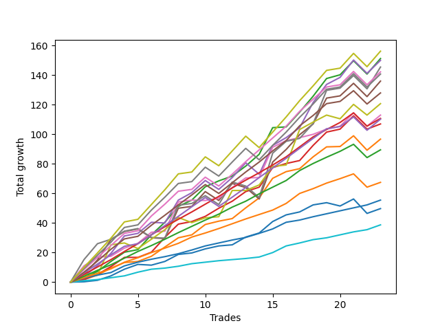

# Short Pointer 001 DB 
- Symbol: ES
- Date Range: 03/18/2022 - 07/15/2022
- Trading Period: 7:20-12:30
- Number of Trades: 23



| Name | Win Percent | Profit | Avg Profit / Trade | Avg Time / Trade |      | Name | Win Percent | Profit | Avg Profit / Trade | Avg Time / Trade |
| ---- | ----------- | ------ | ------------------ | ---------------- | ---- | ---- | ----------- | ------ | ------------------ | ---------------- |
| Sorted By <br> Profit | | | | | | Sorted By <br> Win Percentage ||||
| Ninety | 86.96 | 78125.00 | 3396.74 | 15:46 |     | Eighty-Two | 100.00 | 27750.00 | 1206.52 | 02:51 |
| Two | 95.65 | 75625.00 | 3288.04 | 12:25 |     | Eighty-One | 100.00 | 19375.00 | 842.39 | 01:45 |
| Four | 82.61 | 75000.00 | 3260.87 | 15:56 |     | Two | 95.65 | 75625.00 | 3288.04 | 12:25 |
| Seven | 73.91 | 72750.00 | 3163.04 | 22:31 |     | Eighty-Five | 95.65 | 55375.00 | 2407.61 | 07:54 |
| Eighty-Eight | 91.30 | 71125.00 | 3092.39 | 13:11 |     | One | 95.65 | 48375.00 | 2103.26 | 07:11 |
| Eighty-Nine | 86.96 | 70375.00 | 3059.78 | 15:10 |     | Eighty-Four | 95.65 | 44750.00 | 1945.65 | 06:03 |
| Five | 73.91 | 68000.00 | 2956.52 | 21:53 |     | Eighty-Three | 95.65 | 33750.00 | 1467.39 | 05:02 |
| Eighty-Seven | 91.30 | 64000.00 | 2782.61 | 11:41 |     | Eighty-Eight | 91.30 | 71125.00 | 3092.39 | 13:11 |
| Seventy-Three | 73.91 | 60375.00 | 2625.00 | 10:51 |     | Eighty-Seven | 91.30 | 64000.00 | 2782.61 | 11:41 |
| Six | 91.30 | 56500.00 | 2456.52 | 08:26 |     | Six | 91.30 | 56500.00 | 2456.52 | 08:26 |
| Eighty-Five | 95.65 | 55375.00 | 2407.61 | 07:54 |     | Eighty-Six | 91.30 | 55125.00 | 2396.74 | 10:58 |
| Eighty-Six | 91.30 | 55125.00 | 2396.74 | 10:58 |     | Three | 91.30 | 53500.00 | 2326.09 | 10:46 |
| Three | 91.30 | 53500.00 | 2326.09 | 10:46 |     | Ninety | 86.96 | 78125.00 | 3396.74 | 15:46 |
| One | 95.65 | 48375.00 | 2103.26 | 07:11 |     | Eighty-Nine | 86.96 | 70375.00 | 3059.78 | 15:10 |
| Eighty-Four | 95.65 | 44750.00 | 1945.65 | 06:03 |     | Zero | 86.96 | 24875.00 | 1081.52 | 04:09 |
| Eighty-Three | 95.65 | 33750.00 | 1467.39 | 05:02 |     | Four | 82.61 | 75000.00 | 3260.87 | 15:56 |
| Eighty-Two | 100.00 | 27750.00 | 1206.52 | 02:51 |     | Seven | 73.91 | 72750.00 | 3163.04 | 22:31 |
| Zero | 86.96 | 24875.00 | 1081.52 | 04:09 |     | Five | 73.91 | 68000.00 | 2956.52 | 21:53 |
| Eighty-One | 100.00 | 19375.00 | 842.39 | 01:45 |     | Seventy-Three | 73.91 | 60375.00 | 2625.00 | 10:51 |

## NO STOPLOSS

### Test Zero
* Sell when price hits the middle line of the 20p bollinger
* No Stoploss
* Results:
```
Total Trades: 23
Percent Up: 13.04
Percent Down: 86.96
Total Points Moved Down: 49.75
Potential Profit: 24875.00
Total Points Ups: 12.50 Count Ups: 3
Total Points Downs: 62.25 Count Downs: 20
```

<details><summary>Trades</summary>

<code>In: 2022-03-25 11:57:00		Out: 2022-03-25 11:57:15		Total Position Time: 00:15		Total Move Down: 0.25		Total to Date: 0.25</code> <br />
<code>In: 2022-03-29 08:52:00		Out: 2022-03-29 08:56:15		Total Position Time: 04:15		Total Move Down: 1.00		Total to Date: 1.25</code> <br />
<code>In: 2022-03-31 12:05:00		Out: 2022-03-31 12:11:35		Total Position Time: 06:35		Total Move Down: 3.00		Total to Date: 4.25</code> <br />
<code>In: 2022-04-18 10:59:00		Out: 2022-04-18 10:59:30		Total Position Time: 00:30		Total Move Down: 4.50		Total to Date: 8.75</code> <br />
<code>In: 2022-04-25 09:28:00		Out: 2022-04-25 09:31:05		Total Position Time: 03:05		Total Move Down: 3.25		Total to Date: 12.00</code> <br />
<code>In: 2022-04-25 09:53:00		Out: 2022-04-25 09:53:10		Total Position Time: 00:10		Total Move Down: -0.50		Total to Date: 11.50</code> <br />
<code>In: 2022-04-26 09:31:00		Out: 2022-04-26 09:37:10		Total Position Time: 06:10		Total Move Down: 2.50		Total to Date: 14.00</code> <br />
<code>In: 2022-05-24 09:18:00		Out: 2022-05-24 09:21:35		Total Position Time: 03:35		Total Move Down: 4.75		Total to Date: 18.75</code> <br />
<code>In: 2022-06-01 12:19:00		Out: 2022-06-01 12:25:25		Total Position Time: 06:25		Total Move Down: 1.00		Total to Date: 19.75</code> <br />
<code>In: 2022-06-09 08:47:00		Out: 2022-06-09 08:48:20		Total Position Time: 01:20		Total Move Down: 2.75		Total to Date: 22.50</code> <br />
<code>In: 2022-06-09 09:46:00		Out: 2022-06-09 09:49:20		Total Position Time: 03:20		Total Move Down: 2.00		Total to Date: 24.50</code> <br />
<code>In: 2022-06-09 10:08:00		Out: 2022-06-09 10:16:15		Total Position Time: 08:15		Total Move Down: 0.75		Total to Date: 25.25</code> <br />
<code>In: 2022-06-10 11:26:00		Out: 2022-06-10 11:28:25		Total Position Time: 02:25		Total Move Down: 5.25		Total to Date: 30.50</code> <br />
<code>In: 2022-06-13 08:42:00		Out: 2022-06-13 08:47:40		Total Position Time: 05:40		Total Move Down: 2.75		Total to Date: 33.25</code> <br />
<code>In: 2022-06-13 09:41:00		Out: 2022-06-13 09:43:15		Total Position Time: 02:15		Total Move Down: 7.75		Total to Date: 41.00</code> <br />
<code>In: 2022-06-15 09:19:00		Out: 2022-06-15 09:19:10		Total Position Time: 00:10		Total Move Down: 4.50		Total to Date: 45.50</code> <br />
<code>In: 2022-06-15 11:02:00		Out: 2022-06-15 11:02:10		Total Position Time: 00:10		Total Move Down: 2.00		Total to Date: 47.50</code> <br />
<code>In: 2022-06-16 08:30:00		Out: 2022-06-16 08:30:25		Total Position Time: 00:25		Total Move Down: 4.75		Total to Date: 52.25</code> <br />
<code>In: 2022-06-17 08:34:00		Out: 2022-06-17 08:35:05		Total Position Time: 01:05		Total Move Down: 1.50		Total to Date: 53.75</code> <br />
<code>In: 2022-06-29 12:20:00		Out: 2022-06-29 12:33:20		Total Position Time: 13:20		Total Move Down: -2.25		Total to Date: 51.50</code> <br />
<code>In: 2022-06-29 12:31:00		Out: 2022-06-29 12:33:20		Total Position Time: 02:20		Total Move Down: 4.75		Total to Date: 56.25</code> <br />
<code>In: 2022-07-01 10:35:00		Out: 2022-07-01 10:58:45		Total Position Time: 23:45		Total Move Down: -9.75		Total to Date: 46.50</code> <br />
<code>In: 2022-07-06 11:10:00		Out: 2022-07-06 11:10:10		Total Position Time: 00:10		Total Move Down: 3.25		Total to Date: 49.75</code> <br />


</details>

### Test One
* Sell when the price hits the upper line of the 20p 1std bollinger
* No Stoploss
* Results:
```
Total Trades: 23
Percent Up: 4.35
Percent Down: 95.65
Total Points Moved Down: 96.75
Potential Profit: 48375.00
Total Points Ups: 9.75 Count Ups: 1
Total Points Downs: 106.50 Count Downs: 22
```

<details><summary>Trades</summary>

<code>In: 2022-03-25 11:57:00		Out: 2022-03-25 12:00:45		Total Position Time: 03:45		Total Move Down: 1.75		Total to Date: 1.75</code> <br />
<code>In: 2022-03-29 08:52:00		Out: 2022-03-29 08:58:40		Total Position Time: 06:40		Total Move Down: 3.00		Total to Date: 4.75</code> <br />
<code>In: 2022-03-31 12:05:00		Out: 2022-03-31 12:16:00		Total Position Time: 11:00		Total Move Down: 4.75		Total to Date: 9.50</code> <br />
<code>In: 2022-04-18 10:59:00		Out: 2022-04-18 11:06:20		Total Position Time: 07:20		Total Move Down: 3.75		Total to Date: 13.25</code> <br />
<code>In: 2022-04-25 09:28:00		Out: 2022-04-25 09:42:35		Total Position Time: 14:35		Total Move Down: 0.75		Total to Date: 14.00</code> <br />
<code>In: 2022-04-25 09:53:00		Out: 2022-04-25 09:55:05		Total Position Time: 02:05		Total Move Down: 3.50		Total to Date: 17.50</code> <br />
<code>In: 2022-04-26 09:31:00		Out: 2022-04-26 09:38:00		Total Position Time: 07:00		Total Move Down: 6.25		Total to Date: 23.75</code> <br />
<code>In: 2022-05-24 09:18:00		Out: 2022-05-24 09:28:55		Total Position Time: 10:55		Total Move Down: 6.25		Total to Date: 30.00</code> <br />
<code>In: 2022-06-01 12:19:00		Out: 2022-06-01 12:25:45		Total Position Time: 06:45		Total Move Down: 2.00		Total to Date: 32.00</code> <br />
<code>In: 2022-06-09 08:47:00		Out: 2022-06-09 08:49:35		Total Position Time: 02:35		Total Move Down: 7.00		Total to Date: 39.00</code> <br />
<code>In: 2022-06-09 09:46:00		Out: 2022-06-09 09:54:45		Total Position Time: 08:45		Total Move Down: 2.25		Total to Date: 41.25</code> <br />
<code>In: 2022-06-09 10:08:00		Out: 2022-06-09 10:18:10		Total Position Time: 10:10		Total Move Down: 1.75		Total to Date: 43.00</code> <br />
<code>In: 2022-06-10 11:26:00		Out: 2022-06-10 11:28:35		Total Position Time: 02:35		Total Move Down: 7.25		Total to Date: 50.25</code> <br />
<code>In: 2022-06-13 08:42:00		Out: 2022-06-13 08:52:05		Total Position Time: 10:05		Total Move Down: 6.75		Total to Date: 57.00</code> <br />
<code>In: 2022-06-13 09:41:00		Out: 2022-06-13 09:47:50		Total Position Time: 06:50		Total Move Down: 13.25		Total to Date: 70.25</code> <br />
<code>In: 2022-06-15 09:19:00		Out: 2022-06-15 09:19:10		Total Position Time: 00:10		Total Move Down: 4.50		Total to Date: 74.75</code> <br />
<code>In: 2022-06-15 11:02:00		Out: 2022-06-15 11:02:10		Total Position Time: 00:10		Total Move Down: 2.00		Total to Date: 76.75</code> <br />
<code>In: 2022-06-16 08:30:00		Out: 2022-06-16 08:30:55		Total Position Time: 00:55		Total Move Down: 8.00		Total to Date: 84.75</code> <br />
<code>In: 2022-06-17 08:34:00		Out: 2022-06-17 08:39:00		Total Position Time: 05:00		Total Move Down: 6.75		Total to Date: 91.50</code> <br />
<code>In: 2022-06-29 12:20:00		Out: 2022-06-29 12:34:10		Total Position Time: 14:10		Total Move Down: 0.25		Total to Date: 91.75</code> <br />
<code>In: 2022-06-29 12:31:00		Out: 2022-06-29 12:34:10		Total Position Time: 03:10		Total Move Down: 7.25		Total to Date: 99.00</code> <br />
<code>In: 2022-07-01 10:35:00		Out: 2022-07-01 11:04:25		Total Position Time: 29:25		Total Move Down: -9.75		Total to Date: 89.25</code> <br />
<code>In: 2022-07-06 11:10:00		Out: 2022-07-06 11:11:10		Total Position Time: 01:10		Total Move Down: 7.50		Total to Date: 96.75</code> <br />


</details>

### Test Two
* Sell when the price hits the upper line of the 20p 2std bollinger
* No Stoploss
* Results:
```
Total Trades: 23
Percent Up: 4.35
Percent Down: 95.65
Total Points Moved Down: 151.25
Potential Profit: 75625.00
Total Points Ups: 9.00 Count Ups: 1
Total Points Downs: 160.25 Count Downs: 22
```

<details><summary>Trades</summary>

<code>In: 2022-03-25 11:57:00		Out: 2022-03-25 12:00:55		Total Position Time: 03:55		Total Move Down: 2.75		Total to Date: 2.75</code> <br />
<code>In: 2022-03-29 08:52:00		Out: 2022-03-29 09:01:40		Total Position Time: 09:40		Total Move Down: 4.50		Total to Date: 7.25</code> <br />
<code>In: 2022-03-31 12:05:00		Out: 2022-03-31 12:19:35		Total Position Time: 14:35		Total Move Down: 6.75		Total to Date: 14.00</code> <br />
<code>In: 2022-04-18 10:59:00		Out: 2022-04-18 11:10:40		Total Position Time: 11:40		Total Move Down: 6.25		Total to Date: 20.25</code> <br />
<code>In: 2022-04-25 09:28:00		Out: 2022-04-25 09:57:55		Total Position Time: 29:55		Total Move Down: 1.75		Total to Date: 22.00</code> <br />
<code>In: 2022-04-25 09:53:00		Out: 2022-04-25 10:01:20		Total Position Time: 08:20		Total Move Down: 10.00		Total to Date: 32.00</code> <br />
<code>In: 2022-04-26 09:31:00		Out: 2022-04-26 09:40:15		Total Position Time: 09:15		Total Move Down: 8.50		Total to Date: 40.50</code> <br />
<code>In: 2022-05-24 09:18:00		Out: 2022-05-24 09:31:20		Total Position Time: 13:20		Total Move Down: 10.75		Total to Date: 51.25</code> <br />
<code>In: 2022-06-01 12:19:00		Out: 2022-06-01 12:30:05		Total Position Time: 11:05		Total Move Down: 4.25		Total to Date: 55.50</code> <br />
<code>In: 2022-06-09 08:47:00		Out: 2022-06-09 09:11:05		Total Position Time: 24:05		Total Move Down: 9.00		Total to Date: 64.50</code> <br />
<code>In: 2022-06-09 09:46:00		Out: 2022-06-09 09:55:00		Total Position Time: 09:00		Total Move Down: 4.00		Total to Date: 68.50</code> <br />
<code>In: 2022-06-09 10:08:00		Out: 2022-06-09 10:18:55		Total Position Time: 10:55		Total Move Down: 3.25		Total to Date: 71.75</code> <br />
<code>In: 2022-06-10 11:26:00		Out: 2022-06-10 11:40:10		Total Position Time: 14:10		Total Move Down: 6.75		Total to Date: 78.50</code> <br />
<code>In: 2022-06-13 08:42:00		Out: 2022-06-13 08:54:20		Total Position Time: 12:20		Total Move Down: 8.00		Total to Date: 86.50</code> <br />
<code>In: 2022-06-13 09:41:00		Out: 2022-06-13 09:54:20		Total Position Time: 13:20		Total Move Down: 18.00		Total to Date: 104.50</code> <br />
<code>In: 2022-06-15 09:19:00		Out: 2022-06-15 09:34:05		Total Position Time: 15:05		Total Move Down: 0.50		Total to Date: 105.00</code> <br />
<code>In: 2022-06-15 11:02:00		Out: 2022-06-15 11:03:05		Total Position Time: 01:05		Total Move Down: 10.00		Total to Date: 115.00</code> <br />
<code>In: 2022-06-16 08:30:00		Out: 2022-06-16 08:41:25		Total Position Time: 11:25		Total Move Down: 10.75		Total to Date: 125.75</code> <br />
<code>In: 2022-06-17 08:34:00		Out: 2022-06-17 08:45:15		Total Position Time: 11:15		Total Move Down: 12.00		Total to Date: 137.75</code> <br />
<code>In: 2022-06-29 12:20:00		Out: 2022-06-29 12:35:20		Total Position Time: 15:20		Total Move Down: 2.50		Total to Date: 140.25</code> <br />
<code>In: 2022-06-29 12:31:00		Out: 2022-06-29 12:35:20		Total Position Time: 04:20		Total Move Down: 9.50		Total to Date: 149.75</code> <br />
<code>In: 2022-07-01 10:35:00		Out: 2022-07-01 11:04:55		Total Position Time: 29:55		Total Move Down: -9.00		Total to Date: 140.75</code> <br />
<code>In: 2022-07-06 11:10:00		Out: 2022-07-06 11:11:45		Total Position Time: 01:45		Total Move Down: 10.50		Total to Date: 151.25</code> <br />


</details>

### Test Three
* Sell when price hits the middle line of the 50p bollinger
* No Stoploss
* Results:
```
Total Trades: 23
Percent Up: 8.70
Percent Down: 91.30
Total Points Moved Down: 107.00
Potential Profit: 53500.00
Total Points Ups: 9.00 Count Ups: 2
Total Points Downs: 116.00 Count Downs: 21
```

<details><summary>Trades</summary>

<code>In: 2022-03-25 11:57:00		Out: 2022-03-25 12:00:45		Total Position Time: 03:45		Total Move Down: 1.75		Total to Date: 1.75</code> <br />
<code>In: 2022-03-29 08:52:00		Out: 2022-03-29 09:01:25		Total Position Time: 09:25		Total Move Down: 3.50		Total to Date: 5.25</code> <br />
<code>In: 2022-03-31 12:05:00		Out: 2022-03-31 12:16:40		Total Position Time: 11:40		Total Move Down: 5.25		Total to Date: 10.50</code> <br />
<code>In: 2022-04-18 10:59:00		Out: 2022-04-18 11:16:30		Total Position Time: 17:30		Total Move Down: 6.25		Total to Date: 16.75</code> <br />
<code>In: 2022-04-25 09:28:00		Out: 2022-04-25 09:55:05		Total Position Time: 27:05		Total Move Down: -0.00		Total to Date: 16.75</code> <br />
<code>In: 2022-04-25 09:53:00		Out: 2022-04-25 09:55:05		Total Position Time: 02:05		Total Move Down: 3.50		Total to Date: 20.25</code> <br />
<code>In: 2022-04-26 09:31:00		Out: 2022-04-26 09:46:10		Total Position Time: 15:10		Total Move Down: 10.00		Total to Date: 30.25</code> <br />
<code>In: 2022-05-24 09:18:00		Out: 2022-05-24 09:31:15		Total Position Time: 13:15		Total Move Down: 9.00		Total to Date: 39.25</code> <br />
<code>In: 2022-06-01 12:19:00		Out: 2022-06-01 12:25:30		Total Position Time: 06:30		Total Move Down: 1.75		Total to Date: 41.00</code> <br />
<code>In: 2022-06-09 08:47:00		Out: 2022-06-09 08:48:40		Total Position Time: 01:40		Total Move Down: 3.50		Total to Date: 44.50</code> <br />
<code>In: 2022-06-09 09:46:00		Out: 2022-06-09 09:55:50		Total Position Time: 09:50		Total Move Down: 5.50		Total to Date: 50.00</code> <br />
<code>In: 2022-06-09 10:08:00		Out: 2022-06-09 10:22:05		Total Position Time: 14:05		Total Move Down: 4.75		Total to Date: 54.75</code> <br />
<code>In: 2022-06-10 11:26:00		Out: 2022-06-10 11:28:30		Total Position Time: 02:30		Total Move Down: 6.50		Total to Date: 61.25</code> <br />
<code>In: 2022-06-13 08:42:00		Out: 2022-06-13 09:07:15		Total Position Time: 25:15		Total Move Down: 3.00		Total to Date: 64.25</code> <br />
<code>In: 2022-06-13 09:41:00		Out: 2022-06-13 09:47:50		Total Position Time: 06:50		Total Move Down: 13.25		Total to Date: 77.50</code> <br />
<code>In: 2022-06-15 09:19:00		Out: 2022-06-15 09:35:10		Total Position Time: 16:10		Total Move Down: 2.75		Total to Date: 80.25</code> <br />
<code>In: 2022-06-15 11:02:00		Out: 2022-06-15 11:02:10		Total Position Time: 00:10		Total Move Down: 2.00		Total to Date: 82.25</code> <br />
<code>In: 2022-06-16 08:30:00		Out: 2022-06-16 08:36:10		Total Position Time: 06:10		Total Move Down: 10.25		Total to Date: 92.50</code> <br />
<code>In: 2022-06-17 08:34:00		Out: 2022-06-17 08:45:00		Total Position Time: 11:00		Total Move Down: 9.00		Total to Date: 101.50</code> <br />
<code>In: 2022-06-29 12:20:00		Out: 2022-06-29 12:34:15		Total Position Time: 14:15		Total Move Down: 2.00		Total to Date: 103.50</code> <br />
<code>In: 2022-06-29 12:31:00		Out: 2022-06-29 12:34:15		Total Position Time: 03:15		Total Move Down: 9.00		Total to Date: 112.50</code> <br />
<code>In: 2022-07-01 10:35:00		Out: 2022-07-01 11:04:55		Total Position Time: 29:55		Total Move Down: -9.00		Total to Date: 103.50</code> <br />
<code>In: 2022-07-06 11:10:00		Out: 2022-07-06 11:10:20		Total Position Time: 00:20		Total Move Down: 3.50		Total to Date: 107.00</code> <br />


</details>

### Test Four
* Sell when the price hits the upper line of the 50p 1std bollinger
* No Stoploss
* Results:
```
Total Trades: 23
Percent Up: 17.39
Percent Down: 82.61
Total Points Moved Down: 150.00
Potential Profit: 75000.00
Total Points Ups: 23.25 Count Ups: 4
Total Points Downs: 173.25 Count Downs: 19
```

<details><summary>Trades</summary>

<code>In: 2022-03-25 11:57:00		Out: 2022-03-25 12:01:35		Total Position Time: 04:35		Total Move Down: 3.75		Total to Date: 3.75</code> <br />
<code>In: 2022-03-29 08:52:00		Out: 2022-03-29 09:02:15		Total Position Time: 10:15		Total Move Down: 7.50		Total to Date: 11.25</code> <br />
<code>In: 2022-03-31 12:05:00		Out: 2022-03-31 12:20:15		Total Position Time: 15:15		Total Move Down: 8.25		Total to Date: 19.50</code> <br />
<code>In: 2022-04-18 10:59:00		Out: 2022-04-18 11:18:10		Total Position Time: 19:10		Total Move Down: 11.75		Total to Date: 31.25</code> <br />
<code>In: 2022-04-25 09:28:00		Out: 2022-04-25 09:57:55		Total Position Time: 29:55		Total Move Down: 1.75		Total to Date: 33.00</code> <br />
<code>In: 2022-04-25 09:53:00		Out: 2022-04-25 10:01:15		Total Position Time: 08:15		Total Move Down: 7.50		Total to Date: 40.50</code> <br />
<code>In: 2022-04-26 09:31:00		Out: 2022-04-26 10:00:55		Total Position Time: 29:55		Total Move Down: -0.50		Total to Date: 40.00</code> <br />
<code>In: 2022-05-24 09:18:00		Out: 2022-05-24 09:33:20		Total Position Time: 15:20		Total Move Down: 15.50		Total to Date: 55.50</code> <br />
<code>In: 2022-06-01 12:19:00		Out: 2022-06-01 12:31:00		Total Position Time: 12:00		Total Move Down: 5.00		Total to Date: 60.50</code> <br />
<code>In: 2022-06-09 08:47:00		Out: 2022-06-09 08:50:20		Total Position Time: 03:20		Total Move Down: 8.25		Total to Date: 68.75</code> <br />
<code>In: 2022-06-09 09:46:00		Out: 2022-06-09 10:15:55		Total Position Time: 29:55		Total Move Down: -6.00		Total to Date: 62.75</code> <br />
<code>In: 2022-06-09 10:08:00		Out: 2022-06-09 10:23:50		Total Position Time: 15:50		Total Move Down: 8.00		Total to Date: 70.75</code> <br />
<code>In: 2022-06-10 11:26:00		Out: 2022-06-10 11:41:45		Total Position Time: 15:45		Total Move Down: 10.00		Total to Date: 80.75</code> <br />
<code>In: 2022-06-13 08:42:00		Out: 2022-06-13 09:11:55		Total Position Time: 29:55		Total Move Down: -7.75		Total to Date: 73.00</code> <br />
<code>In: 2022-06-13 09:41:00		Out: 2022-06-13 09:54:40		Total Position Time: 13:40		Total Move Down: 19.50		Total to Date: 92.50</code> <br />
<code>In: 2022-06-15 09:19:00		Out: 2022-06-15 09:39:25		Total Position Time: 20:25		Total Move Down: 5.25		Total to Date: 97.75</code> <br />
<code>In: 2022-06-15 11:02:00		Out: 2022-06-15 11:03:00		Total Position Time: 01:00		Total Move Down: 6.75		Total to Date: 104.50</code> <br />
<code>In: 2022-06-16 08:30:00		Out: 2022-06-16 08:42:25		Total Position Time: 12:25		Total Move Down: 17.00		Total to Date: 121.50</code> <br />
<code>In: 2022-06-17 08:34:00		Out: 2022-06-17 08:51:15		Total Position Time: 17:15		Total Move Down: 12.25		Total to Date: 133.75</code> <br />
<code>In: 2022-06-29 12:20:00		Out: 2022-06-29 12:41:00		Total Position Time: 21:00		Total Move Down: 4.75		Total to Date: 138.50</code> <br />
<code>In: 2022-06-29 12:31:00		Out: 2022-06-29 12:41:00		Total Position Time: 10:00		Total Move Down: 11.75		Total to Date: 150.25</code> <br />
<code>In: 2022-07-01 10:35:00		Out: 2022-07-01 11:04:55		Total Position Time: 29:55		Total Move Down: -9.00		Total to Date: 141.25</code> <br />
<code>In: 2022-07-06 11:10:00		Out: 2022-07-06 11:11:35		Total Position Time: 01:35		Total Move Down: 8.75		Total to Date: 150.00</code> <br />


</details>

### Test Five
* Sell when the price hits the upper line of the 50p 2std bollinger
* No Stoploss
* Results:
```
Total Trades: 23
Percent Up: 26.09
Percent Down: 73.91
Total Points Moved Down: 136.00
Potential Profit: 68000.00
Total Points Ups: 32.00 Count Ups: 6
Total Points Downs: 168.00 Count Downs: 17
```

<details><summary>Trades</summary>

<code>In: 2022-03-25 11:57:00		Out: 2022-03-25 12:01:55		Total Position Time: 04:55		Total Move Down: 5.25		Total to Date: 5.25</code> <br />
<code>In: 2022-03-29 08:52:00		Out: 2022-03-29 09:10:50		Total Position Time: 18:50		Total Move Down: 9.75		Total to Date: 15.00</code> <br />
<code>In: 2022-03-31 12:05:00		Out: 2022-03-31 12:24:15		Total Position Time: 19:15		Total Move Down: 13.75		Total to Date: 28.75</code> <br />
<code>In: 2022-04-18 10:59:00		Out: 2022-04-18 11:28:55		Total Position Time: 29:55		Total Move Down: 5.50		Total to Date: 34.25</code> <br />
<code>In: 2022-04-25 09:28:00		Out: 2022-04-25 09:57:55		Total Position Time: 29:55		Total Move Down: 1.75		Total to Date: 36.00</code> <br />
<code>In: 2022-04-25 09:53:00		Out: 2022-04-25 10:22:55		Total Position Time: 29:55		Total Move Down: -6.00		Total to Date: 30.00</code> <br />
<code>In: 2022-04-26 09:31:00		Out: 2022-04-26 10:00:55		Total Position Time: 29:55		Total Move Down: -0.50		Total to Date: 29.50</code> <br />
<code>In: 2022-05-24 09:18:00		Out: 2022-05-24 09:36:50		Total Position Time: 18:50		Total Move Down: 20.50		Total to Date: 50.00</code> <br />
<code>In: 2022-06-01 12:19:00		Out: 2022-06-01 12:46:00		Total Position Time: 27:00		Total Move Down: 1.25		Total to Date: 51.25</code> <br />
<code>In: 2022-06-09 08:47:00		Out: 2022-06-09 09:11:10		Total Position Time: 24:10		Total Move Down: 10.00		Total to Date: 61.25</code> <br />
<code>In: 2022-06-09 09:46:00		Out: 2022-06-09 10:15:55		Total Position Time: 29:55		Total Move Down: -6.00		Total to Date: 55.25</code> <br />
<code>In: 2022-06-09 10:08:00		Out: 2022-06-09 10:27:20		Total Position Time: 19:20		Total Move Down: 11.50		Total to Date: 66.75</code> <br />
<code>In: 2022-06-10 11:26:00		Out: 2022-06-10 11:55:55		Total Position Time: 29:55		Total Move Down: -2.75		Total to Date: 64.00</code> <br />
<code>In: 2022-06-13 08:42:00		Out: 2022-06-13 09:11:55		Total Position Time: 29:55		Total Move Down: -7.75		Total to Date: 56.25</code> <br />
<code>In: 2022-06-13 09:41:00		Out: 2022-06-13 09:58:05		Total Position Time: 17:05		Total Move Down: 25.00		Total to Date: 81.25</code> <br />
<code>In: 2022-06-15 09:19:00		Out: 2022-06-15 09:41:45		Total Position Time: 22:45		Total Move Down: 8.50		Total to Date: 89.75</code> <br />
<code>In: 2022-06-15 11:02:00		Out: 2022-06-15 11:03:05		Total Position Time: 01:05		Total Move Down: 10.00		Total to Date: 99.75</code> <br />
<code>In: 2022-06-16 08:30:00		Out: 2022-06-16 08:59:55		Total Position Time: 29:55		Total Move Down: 7.25		Total to Date: 107.00</code> <br />
<code>In: 2022-06-17 08:34:00		Out: 2022-06-17 08:52:05		Total Position Time: 18:05		Total Move Down: 17.50		Total to Date: 124.50</code> <br />
<code>In: 2022-06-29 12:20:00		Out: 2022-06-29 12:46:00		Total Position Time: 26:00		Total Move Down: 1.50		Total to Date: 126.00</code> <br />
<code>In: 2022-06-29 12:31:00		Out: 2022-06-29 12:46:00		Total Position Time: 15:00		Total Move Down: 8.50		Total to Date: 134.50</code> <br />
<code>In: 2022-07-01 10:35:00		Out: 2022-07-01 11:04:55		Total Position Time: 29:55		Total Move Down: -9.00		Total to Date: 125.50</code> <br />
<code>In: 2022-07-06 11:10:00		Out: 2022-07-06 11:11:50		Total Position Time: 01:50		Total Move Down: 10.50		Total to Date: 136.00</code> <br />


</details>

### Test Six
* Sell when the price hits the middle line of the 1std VWAP
* No Stoploss
* Results:
```
Total Trades: 23
Percent Up: 8.70
Percent Down: 91.30
Total Points Moved Down: 113.00
Potential Profit: 56500.00
Total Points Ups: 9.25 Count Ups: 2
Total Points Downs: 122.25 Count Downs: 21
```

<details><summary>Trades</summary>

<code>In: 2022-03-25 11:57:00		Out: 2022-03-25 12:07:35		Total Position Time: 10:35		Total Move Down: 11.00		Total to Date: 11.00</code> <br />
<code>In: 2022-03-29 08:52:00		Out: 2022-03-29 09:02:10		Total Position Time: 10:10		Total Move Down: 6.00		Total to Date: 17.00</code> <br />
<code>In: 2022-03-31 12:05:00		Out: 2022-03-31 12:05:10		Total Position Time: 00:10		Total Move Down: 0.50		Total to Date: 17.50</code> <br />
<code>In: 2022-04-18 10:59:00		Out: 2022-04-18 11:28:55		Total Position Time: 29:55		Total Move Down: 5.50		Total to Date: 23.00</code> <br />
<code>In: 2022-04-25 09:28:00		Out: 2022-04-25 09:31:05		Total Position Time: 03:05		Total Move Down: 3.25		Total to Date: 26.25</code> <br />
<code>In: 2022-04-25 09:53:00		Out: 2022-04-25 10:01:15		Total Position Time: 08:15		Total Move Down: 7.50		Total to Date: 33.75</code> <br />
<code>In: 2022-04-26 09:31:00		Out: 2022-04-26 09:31:10		Total Position Time: 00:10		Total Move Down: 0.75		Total to Date: 34.50</code> <br />
<code>In: 2022-05-24 09:18:00		Out: 2022-05-24 09:36:45		Total Position Time: 18:45		Total Move Down: 19.75		Total to Date: 54.25</code> <br />
<code>In: 2022-06-01 12:19:00		Out: 2022-06-01 12:46:00		Total Position Time: 27:00		Total Move Down: 1.25		Total to Date: 55.50</code> <br />
<code>In: 2022-06-09 08:47:00		Out: 2022-06-09 08:47:10		Total Position Time: 00:10		Total Move Down: -0.25		Total to Date: 55.25</code> <br />
<code>In: 2022-06-09 09:46:00		Out: 2022-06-09 09:48:20		Total Position Time: 02:20		Total Move Down: 1.50		Total to Date: 56.75</code> <br />
<code>In: 2022-06-09 10:08:00		Out: 2022-06-09 10:23:45		Total Position Time: 15:45		Total Move Down: 7.25		Total to Date: 64.00</code> <br />
<code>In: 2022-06-10 11:26:00		Out: 2022-06-10 11:28:30		Total Position Time: 02:30		Total Move Down: 6.50		Total to Date: 70.50</code> <br />
<code>In: 2022-06-13 08:42:00		Out: 2022-06-13 08:42:10		Total Position Time: 00:10		Total Move Down: 0.25		Total to Date: 70.75</code> <br />
<code>In: 2022-06-13 09:41:00		Out: 2022-06-13 09:54:45		Total Position Time: 13:45		Total Move Down: 20.50		Total to Date: 91.25</code> <br />
<code>In: 2022-06-15 09:19:00		Out: 2022-06-15 09:19:10		Total Position Time: 00:10		Total Move Down: 4.50		Total to Date: 95.75</code> <br />
<code>In: 2022-06-15 11:02:00		Out: 2022-06-15 11:02:10		Total Position Time: 00:10		Total Move Down: 2.00		Total to Date: 97.75</code> <br />
<code>In: 2022-06-16 08:30:00		Out: 2022-06-16 08:30:10		Total Position Time: 00:10		Total Move Down: 2.25		Total to Date: 100.00</code> <br />
<code>In: 2022-06-17 08:34:00		Out: 2022-06-17 08:36:10		Total Position Time: 02:10		Total Move Down: 3.50		Total to Date: 103.50</code> <br />
<code>In: 2022-06-29 12:20:00		Out: 2022-06-29 12:34:15		Total Position Time: 14:15		Total Move Down: 2.00		Total to Date: 105.50</code> <br />
<code>In: 2022-06-29 12:31:00		Out: 2022-06-29 12:34:15		Total Position Time: 03:15		Total Move Down: 9.00		Total to Date: 114.50</code> <br />
<code>In: 2022-07-01 10:35:00		Out: 2022-07-01 11:04:55		Total Position Time: 29:55		Total Move Down: -9.00		Total to Date: 105.50</code> <br />
<code>In: 2022-07-06 11:10:00		Out: 2022-07-06 11:11:10		Total Position Time: 01:10		Total Move Down: 7.50		Total to Date: 113.00</code> <br />


</details>

### Test Seven
* Sell when the price hits the upper line of the 1std VWAP
* No Stoploss
* Results:
```
Total Trades: 23
Percent Up: 26.09
Percent Down: 73.91
Total Points Moved Down: 145.50
Potential Profit: 72750.00
Total Points Ups: 32.00 Count Ups: 6
Total Points Downs: 177.50 Count Downs: 17
```

<details><summary>Trades</summary>

<code>In: 2022-03-25 11:57:00		Out: 2022-03-25 12:26:55		Total Position Time: 29:55		Total Move Down: 15.25		Total to Date: 15.25</code> <br />
<code>In: 2022-03-29 08:52:00		Out: 2022-03-29 09:21:55		Total Position Time: 29:55		Total Move Down: 10.75		Total to Date: 26.00</code> <br />
<code>In: 2022-03-31 12:05:00		Out: 2022-03-31 12:11:55		Total Position Time: 06:55		Total Move Down: 3.00		Total to Date: 29.00</code> <br />
<code>In: 2022-04-18 10:59:00		Out: 2022-04-18 11:28:55		Total Position Time: 29:55		Total Move Down: 5.50		Total to Date: 34.50</code> <br />
<code>In: 2022-04-25 09:28:00		Out: 2022-04-25 09:57:55		Total Position Time: 29:55		Total Move Down: 1.75		Total to Date: 36.25</code> <br />
<code>In: 2022-04-25 09:53:00		Out: 2022-04-25 10:22:55		Total Position Time: 29:55		Total Move Down: -6.00		Total to Date: 30.25</code> <br />
<code>In: 2022-04-26 09:31:00		Out: 2022-04-26 10:00:55		Total Position Time: 29:55		Total Move Down: -0.50		Total to Date: 29.75</code> <br />
<code>In: 2022-05-24 09:18:00		Out: 2022-05-24 09:47:55		Total Position Time: 29:55		Total Move Down: 22.25		Total to Date: 52.00</code> <br />
<code>In: 2022-06-01 12:19:00		Out: 2022-06-01 12:46:00		Total Position Time: 27:00		Total Move Down: 1.25		Total to Date: 53.25</code> <br />
<code>In: 2022-06-09 08:47:00		Out: 2022-06-09 08:48:50		Total Position Time: 01:50		Total Move Down: 5.25		Total to Date: 58.50</code> <br />
<code>In: 2022-06-09 09:46:00		Out: 2022-06-09 10:15:55		Total Position Time: 29:55		Total Move Down: -6.00		Total to Date: 52.50</code> <br />
<code>In: 2022-06-09 10:08:00		Out: 2022-06-09 10:30:30		Total Position Time: 22:30		Total Move Down: 15.25		Total to Date: 67.75</code> <br />
<code>In: 2022-06-10 11:26:00		Out: 2022-06-10 11:55:55		Total Position Time: 29:55		Total Move Down: -2.75		Total to Date: 65.00</code> <br />
<code>In: 2022-06-13 08:42:00		Out: 2022-06-13 09:11:55		Total Position Time: 29:55		Total Move Down: -7.75		Total to Date: 57.25</code> <br />
<code>In: 2022-06-13 09:41:00		Out: 2022-06-13 10:10:55		Total Position Time: 29:55		Total Move Down: 30.00		Total to Date: 87.25</code> <br />
<code>In: 2022-06-15 09:19:00		Out: 2022-06-15 09:41:40		Total Position Time: 22:40		Total Move Down: 8.00		Total to Date: 95.25</code> <br />
<code>In: 2022-06-15 11:02:00		Out: 2022-06-15 11:02:10		Total Position Time: 00:10		Total Move Down: 2.00		Total to Date: 97.25</code> <br />
<code>In: 2022-06-16 08:30:00		Out: 2022-06-16 08:35:30		Total Position Time: 05:30		Total Move Down: 10.00		Total to Date: 107.25</code> <br />
<code>In: 2022-06-17 08:34:00		Out: 2022-06-17 09:03:15		Total Position Time: 29:15		Total Move Down: 22.50		Total to Date: 129.75</code> <br />
<code>In: 2022-06-29 12:20:00		Out: 2022-06-29 12:46:00		Total Position Time: 26:00		Total Move Down: 1.50		Total to Date: 131.25</code> <br />
<code>In: 2022-06-29 12:31:00		Out: 2022-06-29 12:46:00		Total Position Time: 15:00		Total Move Down: 8.50		Total to Date: 139.75</code> <br />
<code>In: 2022-07-01 10:35:00		Out: 2022-07-01 11:04:55		Total Position Time: 29:55		Total Move Down: -9.00		Total to Date: 130.75</code> <br />
<code>In: 2022-07-06 11:10:00		Out: 2022-07-06 11:12:20		Total Position Time: 02:20		Total Move Down: 14.75		Total to Date: 145.50</code> <br />


</details>

## SPECIAL EXIT CONDITIONS 

### Test Seventy-Three
* Sell when the linear regression slope changes to negative
* No Stoploss
* Results:
```
Total Trades: 23
Percent Up: 26.09
Percent Down: 73.91
Total Points Moved Down: 120.75
Potential Profit: 60375.00
Total Points Ups: 17.75 Count Ups: 6
Total Points Downs: 138.50 Count Downs: 17
```

<details><summary>Trades</summary>

<code>In: 2022-03-25 11:57:00		Out: 2022-03-25 12:12:05		Total Position Time: 15:05		Total Move Down: 5.50		Total to Date: 5.50</code> <br />
<code>In: 2022-03-29 08:52:00		Out: 2022-03-29 08:54:05		Total Position Time: 02:05		Total Move Down: -0.75		Total to Date: 4.75</code> <br />
<code>In: 2022-03-31 12:05:00		Out: 2022-03-31 12:34:55		Total Position Time: 29:55		Total Move Down: 20.50		Total to Date: 25.25</code> <br />
<code>In: 2022-04-18 10:59:00		Out: 2022-04-18 11:02:05		Total Position Time: 03:05		Total Move Down: 1.25		Total to Date: 26.50</code> <br />
<code>In: 2022-04-25 09:28:00		Out: 2022-04-25 09:33:05		Total Position Time: 05:05		Total Move Down: -3.75		Total to Date: 22.75</code> <br />
<code>In: 2022-04-25 09:53:00		Out: 2022-04-25 10:07:05		Total Position Time: 14:05		Total Move Down: 6.25		Total to Date: 29.00</code> <br />
<code>In: 2022-04-26 09:31:00		Out: 2022-04-26 09:43:05		Total Position Time: 12:05		Total Move Down: 6.50		Total to Date: 35.50</code> <br />
<code>In: 2022-05-24 09:18:00		Out: 2022-05-24 09:30:05		Total Position Time: 12:05		Total Move Down: 8.25		Total to Date: 43.75</code> <br />
<code>In: 2022-06-01 12:19:00		Out: 2022-06-01 12:21:05		Total Position Time: 02:05		Total Move Down: -3.50		Total to Date: 40.25</code> <br />
<code>In: 2022-06-09 08:47:00		Out: 2022-06-09 08:57:05		Total Position Time: 10:05		Total Move Down: 3.25		Total to Date: 43.50</code> <br />
<code>In: 2022-06-09 09:46:00		Out: 2022-06-09 09:50:05		Total Position Time: 04:05		Total Move Down: 0.75		Total to Date: 44.25</code> <br />
<code>In: 2022-06-09 10:08:00		Out: 2022-06-09 10:37:55		Total Position Time: 29:55		Total Move Down: 17.75		Total to Date: 62.00</code> <br />
<code>In: 2022-06-10 11:26:00		Out: 2022-06-10 11:32:05		Total Position Time: 06:05		Total Move Down: -0.00		Total to Date: 62.00</code> <br />
<code>In: 2022-06-13 08:42:00		Out: 2022-06-13 08:57:05		Total Position Time: 15:05		Total Move Down: 3.75		Total to Date: 65.75</code> <br />
<code>In: 2022-06-13 09:41:00		Out: 2022-06-13 09:53:05		Total Position Time: 12:05		Total Move Down: 12.50		Total to Date: 78.25</code> <br />
<code>In: 2022-06-15 09:19:00		Out: 2022-06-15 09:30:05		Total Position Time: 11:05		Total Move Down: 1.00		Total to Date: 79.25</code> <br />
<code>In: 2022-06-15 11:02:00		Out: 2022-06-15 11:12:05		Total Position Time: 10:05		Total Move Down: 24.00		Total to Date: 103.25</code> <br />
<code>In: 2022-06-16 08:30:00		Out: 2022-06-16 08:40:05		Total Position Time: 10:05		Total Move Down: 5.00		Total to Date: 108.25</code> <br />
<code>In: 2022-06-17 08:34:00		Out: 2022-06-17 08:49:05		Total Position Time: 15:05		Total Move Down: 4.75		Total to Date: 113.00</code> <br />
<code>In: 2022-06-29 12:20:00		Out: 2022-06-29 12:22:05		Total Position Time: 02:05		Total Move Down: -2.50		Total to Date: 110.50</code> <br />
<code>In: 2022-06-29 12:31:00		Out: 2022-06-29 12:44:05		Total Position Time: 13:05		Total Move Down: 9.75		Total to Date: 120.25</code> <br />
<code>In: 2022-07-01 10:35:00		Out: 2022-07-01 10:39:05		Total Position Time: 04:05		Total Move Down: -7.25		Total to Date: 113.00</code> <br />
<code>In: 2022-07-06 11:10:00		Out: 2022-07-06 11:21:05		Total Position Time: 11:05		Total Move Down: 7.75		Total to Date: 120.75</code> <br />


</details>

## TAKE PROFIT

### Test Eighty-One
* Take Profit of 1 Point
* No Stoploss
* Results:
```
Total Trades: 23
Percent Up: 0.00
Percent Down: 100.00
Total Points Moved Down: 38.75
Potential Profit: 19375.00
Total Points Ups: 0.00 Count Ups: 0
Total Points Downs: 38.75 Count Downs: 23
```

<details><summary>Trades</summary>

<code>In: 2022-03-25 11:57:00		Out: 2022-03-25 11:58:45		Total Position Time: 01:45		Total Move Down: 1.00		Total to Date: 1.00</code> <br />
<code>In: 2022-03-29 08:52:00		Out: 2022-03-29 08:52:55		Total Position Time: 00:55		Total Move Down: 0.75		Total to Date: 1.75</code> <br />
<code>In: 2022-03-31 12:05:00		Out: 2022-03-31 12:05:25		Total Position Time: 00:25		Total Move Down: 1.25		Total to Date: 3.00</code> <br />
<code>In: 2022-04-18 10:59:00		Out: 2022-04-18 10:59:15		Total Position Time: 00:15		Total Move Down: 1.25		Total to Date: 4.25</code> <br />
<code>In: 2022-04-25 09:28:00		Out: 2022-04-25 09:28:30		Total Position Time: 00:30		Total Move Down: 2.50		Total to Date: 6.75</code> <br />
<code>In: 2022-04-25 09:53:00		Out: 2022-04-25 09:54:40		Total Position Time: 01:40		Total Move Down: 2.00		Total to Date: 8.75</code> <br />
<code>In: 2022-04-26 09:31:00		Out: 2022-04-26 09:31:55		Total Position Time: 00:55		Total Move Down: 0.75		Total to Date: 9.50</code> <br />
<code>In: 2022-05-24 09:18:00		Out: 2022-05-24 09:18:50		Total Position Time: 00:50		Total Move Down: 1.25		Total to Date: 10.75</code> <br />
<code>In: 2022-06-01 12:19:00		Out: 2022-06-01 12:25:30		Total Position Time: 06:30		Total Move Down: 1.75		Total to Date: 12.50</code> <br />
<code>In: 2022-06-09 08:47:00		Out: 2022-06-09 08:48:05		Total Position Time: 01:05		Total Move Down: 1.00		Total to Date: 13.50</code> <br />
<code>In: 2022-06-09 09:46:00		Out: 2022-06-09 09:47:25		Total Position Time: 01:25		Total Move Down: 1.00		Total to Date: 14.50</code> <br />
<code>In: 2022-06-09 10:08:00		Out: 2022-06-09 10:10:15		Total Position Time: 02:15		Total Move Down: 0.75		Total to Date: 15.25</code> <br />
<code>In: 2022-06-10 11:26:00		Out: 2022-06-10 11:26:20		Total Position Time: 00:20		Total Move Down: 0.75		Total to Date: 16.00</code> <br />
<code>In: 2022-06-13 08:42:00		Out: 2022-06-13 08:47:05		Total Position Time: 05:05		Total Move Down: 1.00		Total to Date: 17.00</code> <br />
<code>In: 2022-06-13 09:41:00		Out: 2022-06-13 09:41:10		Total Position Time: 00:10		Total Move Down: 3.00		Total to Date: 20.00</code> <br />
<code>In: 2022-06-15 09:19:00		Out: 2022-06-15 09:19:10		Total Position Time: 00:10		Total Move Down: 4.50		Total to Date: 24.50</code> <br />
<code>In: 2022-06-15 11:02:00		Out: 2022-06-15 11:02:10		Total Position Time: 00:10		Total Move Down: 2.00		Total to Date: 26.50</code> <br />
<code>In: 2022-06-16 08:30:00		Out: 2022-06-16 08:30:10		Total Position Time: 00:10		Total Move Down: 2.25		Total to Date: 28.75</code> <br />
<code>In: 2022-06-17 08:34:00		Out: 2022-06-17 08:34:55		Total Position Time: 00:55		Total Move Down: 1.25		Total to Date: 30.00</code> <br />
<code>In: 2022-06-29 12:20:00		Out: 2022-06-29 12:34:15		Total Position Time: 14:15		Total Move Down: 2.00		Total to Date: 32.00</code> <br />
<code>In: 2022-06-29 12:31:00		Out: 2022-06-29 12:31:10		Total Position Time: 00:10		Total Move Down: 2.00		Total to Date: 34.00</code> <br />
<code>In: 2022-07-01 10:35:00		Out: 2022-07-01 10:35:30		Total Position Time: 00:30		Total Move Down: 1.50		Total to Date: 35.50</code> <br />
<code>In: 2022-07-06 11:10:00		Out: 2022-07-06 11:10:10		Total Position Time: 00:10		Total Move Down: 3.25		Total to Date: 38.75</code> <br />


</details>

### Test Eighty-Two
* Take Profit of 2 Point
* No Stoploss
* Results:
```
Total Trades: 23
Percent Up: 0.00
Percent Down: 100.00
Total Points Moved Down: 55.50
Potential Profit: 27750.00
Total Points Ups: 0.00 Count Ups: 0
Total Points Downs: 55.50 Count Downs: 23
```

<details><summary>Trades</summary>

<code>In: 2022-03-25 11:57:00		Out: 2022-03-25 12:00:50		Total Position Time: 03:50		Total Move Down: 2.75		Total to Date: 2.75</code> <br />
<code>In: 2022-03-29 08:52:00		Out: 2022-03-29 08:57:40		Total Position Time: 05:40		Total Move Down: 2.00		Total to Date: 4.75</code> <br />
<code>In: 2022-03-31 12:05:00		Out: 2022-03-31 12:11:15		Total Position Time: 06:15		Total Move Down: 1.75		Total to Date: 6.50</code> <br />
<code>In: 2022-04-18 10:59:00		Out: 2022-04-18 10:59:30		Total Position Time: 00:30		Total Move Down: 4.50		Total to Date: 11.00</code> <br />
<code>In: 2022-04-25 09:28:00		Out: 2022-04-25 09:28:30		Total Position Time: 00:30		Total Move Down: 2.50		Total to Date: 13.50</code> <br />
<code>In: 2022-04-25 09:53:00		Out: 2022-04-25 09:54:45		Total Position Time: 01:45		Total Move Down: 2.00		Total to Date: 15.50</code> <br />
<code>In: 2022-04-26 09:31:00		Out: 2022-04-26 09:32:00		Total Position Time: 01:00		Total Move Down: 1.75		Total to Date: 17.25</code> <br />
<code>In: 2022-05-24 09:18:00		Out: 2022-05-24 09:20:10		Total Position Time: 02:10		Total Move Down: 2.00		Total to Date: 19.25</code> <br />
<code>In: 2022-06-01 12:19:00		Out: 2022-06-01 12:25:40		Total Position Time: 06:40		Total Move Down: 2.50		Total to Date: 21.75</code> <br />
<code>In: 2022-06-09 08:47:00		Out: 2022-06-09 08:48:20		Total Position Time: 01:20		Total Move Down: 2.75		Total to Date: 24.50</code> <br />
<code>In: 2022-06-09 09:46:00		Out: 2022-06-09 09:49:20		Total Position Time: 03:20		Total Move Down: 2.00		Total to Date: 26.50</code> <br />
<code>In: 2022-06-09 10:08:00		Out: 2022-06-09 10:16:55		Total Position Time: 08:55		Total Move Down: 2.00		Total to Date: 28.50</code> <br />
<code>In: 2022-06-10 11:26:00		Out: 2022-06-10 11:26:30		Total Position Time: 00:30		Total Move Down: 1.75		Total to Date: 30.25</code> <br />
<code>In: 2022-06-13 08:42:00		Out: 2022-06-13 08:47:40		Total Position Time: 05:40		Total Move Down: 2.75		Total to Date: 33.00</code> <br />
<code>In: 2022-06-13 09:41:00		Out: 2022-06-13 09:41:10		Total Position Time: 00:10		Total Move Down: 3.00		Total to Date: 36.00</code> <br />
<code>In: 2022-06-15 09:19:00		Out: 2022-06-15 09:19:10		Total Position Time: 00:10		Total Move Down: 4.50		Total to Date: 40.50</code> <br />
<code>In: 2022-06-15 11:02:00		Out: 2022-06-15 11:02:45		Total Position Time: 00:45		Total Move Down: 1.50		Total to Date: 42.00</code> <br />
<code>In: 2022-06-16 08:30:00		Out: 2022-06-16 08:30:10		Total Position Time: 00:10		Total Move Down: 2.25		Total to Date: 44.25</code> <br />
<code>In: 2022-06-17 08:34:00		Out: 2022-06-17 08:35:15		Total Position Time: 01:15		Total Move Down: 2.00		Total to Date: 46.25</code> <br />
<code>In: 2022-06-29 12:20:00		Out: 2022-06-29 12:34:15		Total Position Time: 14:15		Total Move Down: 2.00		Total to Date: 48.25</code> <br />
<code>In: 2022-06-29 12:31:00		Out: 2022-06-29 12:31:10		Total Position Time: 00:10		Total Move Down: 2.00		Total to Date: 50.25</code> <br />
<code>In: 2022-07-01 10:35:00		Out: 2022-07-01 10:35:40		Total Position Time: 00:40		Total Move Down: 2.00		Total to Date: 52.25</code> <br />
<code>In: 2022-07-06 11:10:00		Out: 2022-07-06 11:10:10		Total Position Time: 00:10		Total Move Down: 3.25		Total to Date: 55.50</code> <br />


</details>

### Test Eighty-Three
* Take Profit of 3 Point
* No Stoploss
* Results:
```
Total Trades: 23
Percent Up: 4.35
Percent Down: 95.65
Total Points Moved Down: 67.50
Potential Profit: 33750.00
Total Points Ups: 9.00 Count Ups: 1
Total Points Downs: 76.50 Count Downs: 22
```

<details><summary>Trades</summary>

<code>In: 2022-03-25 11:57:00		Out: 2022-03-25 12:01:00		Total Position Time: 04:00		Total Move Down: 3.00		Total to Date: 3.00</code> <br />
<code>In: 2022-03-29 08:52:00		Out: 2022-03-29 08:58:40		Total Position Time: 06:40		Total Move Down: 3.00		Total to Date: 6.00</code> <br />
<code>In: 2022-03-31 12:05:00		Out: 2022-03-31 12:11:35		Total Position Time: 06:35		Total Move Down: 3.00		Total to Date: 9.00</code> <br />
<code>In: 2022-04-18 10:59:00		Out: 2022-04-18 10:59:30		Total Position Time: 00:30		Total Move Down: 4.50		Total to Date: 13.50</code> <br />
<code>In: 2022-04-25 09:28:00		Out: 2022-04-25 09:31:00		Total Position Time: 03:00		Total Move Down: 3.00		Total to Date: 16.50</code> <br />
<code>In: 2022-04-25 09:53:00		Out: 2022-04-25 09:55:05		Total Position Time: 02:05		Total Move Down: 3.50		Total to Date: 20.00</code> <br />
<code>In: 2022-04-26 09:31:00		Out: 2022-04-26 09:32:05		Total Position Time: 01:05		Total Move Down: 3.00		Total to Date: 23.00</code> <br />
<code>In: 2022-05-24 09:18:00		Out: 2022-05-24 09:21:05		Total Position Time: 03:05		Total Move Down: 3.25		Total to Date: 26.25</code> <br />
<code>In: 2022-06-01 12:19:00		Out: 2022-06-01 12:30:05		Total Position Time: 11:05		Total Move Down: 4.25		Total to Date: 30.50</code> <br />
<code>In: 2022-06-09 08:47:00		Out: 2022-06-09 08:48:20		Total Position Time: 01:20		Total Move Down: 2.75		Total to Date: 33.25</code> <br />
<code>In: 2022-06-09 09:46:00		Out: 2022-06-09 09:54:55		Total Position Time: 08:55		Total Move Down: 3.00		Total to Date: 36.25</code> <br />
<code>In: 2022-06-09 10:08:00		Out: 2022-06-09 10:18:55		Total Position Time: 10:55		Total Move Down: 3.25		Total to Date: 39.50</code> <br />
<code>In: 2022-06-10 11:26:00		Out: 2022-06-10 11:26:55		Total Position Time: 00:55		Total Move Down: 3.25		Total to Date: 42.75</code> <br />
<code>In: 2022-06-13 08:42:00		Out: 2022-06-13 08:47:50		Total Position Time: 05:50		Total Move Down: 3.00		Total to Date: 45.75</code> <br />
<code>In: 2022-06-13 09:41:00		Out: 2022-06-13 09:41:10		Total Position Time: 00:10		Total Move Down: 3.00		Total to Date: 48.75</code> <br />
<code>In: 2022-06-15 09:19:00		Out: 2022-06-15 09:19:10		Total Position Time: 00:10		Total Move Down: 4.50		Total to Date: 53.25</code> <br />
<code>In: 2022-06-15 11:02:00		Out: 2022-06-15 11:03:00		Total Position Time: 01:00		Total Move Down: 6.75		Total to Date: 60.00</code> <br />
<code>In: 2022-06-16 08:30:00		Out: 2022-06-16 08:30:20		Total Position Time: 00:20		Total Move Down: 3.25		Total to Date: 63.25</code> <br />
<code>In: 2022-06-17 08:34:00		Out: 2022-06-17 08:35:45		Total Position Time: 01:45		Total Move Down: 3.75		Total to Date: 67.00</code> <br />
<code>In: 2022-06-29 12:20:00		Out: 2022-06-29 12:35:15		Total Position Time: 15:15		Total Move Down: 3.00		Total to Date: 70.00</code> <br />
<code>In: 2022-06-29 12:31:00		Out: 2022-06-29 12:32:15		Total Position Time: 01:15		Total Move Down: 3.25		Total to Date: 73.25</code> <br />
<code>In: 2022-07-01 10:35:00		Out: 2022-07-01 11:04:55		Total Position Time: 29:55		Total Move Down: -9.00		Total to Date: 64.25</code> <br />
<code>In: 2022-07-06 11:10:00		Out: 2022-07-06 11:10:10		Total Position Time: 00:10		Total Move Down: 3.25		Total to Date: 67.50</code> <br />


</details>

### Test Eighty-Four
* Take Profit of 4 Point
* No Stoploss
* Results:
```
Total Trades: 23
Percent Up: 4.35
Percent Down: 95.65
Total Points Moved Down: 89.50
Potential Profit: 44750.00
Total Points Ups: 9.00 Count Ups: 1
Total Points Downs: 98.50 Count Downs: 22
```

<details><summary>Trades</summary>

<code>In: 2022-03-25 11:57:00		Out: 2022-03-25 12:01:45		Total Position Time: 04:45		Total Move Down: 4.00		Total to Date: 4.00</code> <br />
<code>In: 2022-03-29 08:52:00		Out: 2022-03-29 09:01:35		Total Position Time: 09:35		Total Move Down: 4.00		Total to Date: 8.00</code> <br />
<code>In: 2022-03-31 12:05:00		Out: 2022-03-31 12:12:45		Total Position Time: 07:45		Total Move Down: 3.75		Total to Date: 11.75</code> <br />
<code>In: 2022-04-18 10:59:00		Out: 2022-04-18 10:59:30		Total Position Time: 00:30		Total Move Down: 4.50		Total to Date: 16.25</code> <br />
<code>In: 2022-04-25 09:28:00		Out: 2022-04-25 09:31:10		Total Position Time: 03:10		Total Move Down: 4.50		Total to Date: 20.75</code> <br />
<code>In: 2022-04-25 09:53:00		Out: 2022-04-25 09:55:10		Total Position Time: 02:10		Total Move Down: 4.00		Total to Date: 24.75</code> <br />
<code>In: 2022-04-26 09:31:00		Out: 2022-04-26 09:37:35		Total Position Time: 06:35		Total Move Down: 4.25		Total to Date: 29.00</code> <br />
<code>In: 2022-05-24 09:18:00		Out: 2022-05-24 09:21:15		Total Position Time: 03:15		Total Move Down: 4.50		Total to Date: 33.50</code> <br />
<code>In: 2022-06-01 12:19:00		Out: 2022-06-01 12:30:05		Total Position Time: 11:05		Total Move Down: 4.25		Total to Date: 37.75</code> <br />
<code>In: 2022-06-09 08:47:00		Out: 2022-06-09 08:48:35		Total Position Time: 01:35		Total Move Down: 4.25		Total to Date: 42.00</code> <br />
<code>In: 2022-06-09 09:46:00		Out: 2022-06-09 09:55:00		Total Position Time: 09:00		Total Move Down: 4.00		Total to Date: 46.00</code> <br />
<code>In: 2022-06-09 10:08:00		Out: 2022-06-09 10:22:05		Total Position Time: 14:05		Total Move Down: 4.75		Total to Date: 50.75</code> <br />
<code>In: 2022-06-10 11:26:00		Out: 2022-06-10 11:28:10		Total Position Time: 02:10		Total Move Down: 4.00		Total to Date: 54.75</code> <br />
<code>In: 2022-06-13 08:42:00		Out: 2022-06-13 08:51:35		Total Position Time: 09:35		Total Move Down: 5.00		Total to Date: 59.75</code> <br />
<code>In: 2022-06-13 09:41:00		Out: 2022-06-13 09:41:15		Total Position Time: 00:15		Total Move Down: 4.50		Total to Date: 64.25</code> <br />
<code>In: 2022-06-15 09:19:00		Out: 2022-06-15 09:19:10		Total Position Time: 00:10		Total Move Down: 4.50		Total to Date: 68.75</code> <br />
<code>In: 2022-06-15 11:02:00		Out: 2022-06-15 11:03:00		Total Position Time: 01:00		Total Move Down: 6.75		Total to Date: 75.50</code> <br />
<code>In: 2022-06-16 08:30:00		Out: 2022-06-16 08:30:25		Total Position Time: 00:25		Total Move Down: 4.75		Total to Date: 80.25</code> <br />
<code>In: 2022-06-17 08:34:00		Out: 2022-06-17 08:35:50		Total Position Time: 01:50		Total Move Down: 4.25		Total to Date: 84.50</code> <br />
<code>In: 2022-06-29 12:20:00		Out: 2022-06-29 12:37:05		Total Position Time: 17:05		Total Move Down: 4.00		Total to Date: 88.50</code> <br />
<code>In: 2022-06-29 12:31:00		Out: 2022-06-29 12:33:20		Total Position Time: 02:20		Total Move Down: 4.75		Total to Date: 93.25</code> <br />
<code>In: 2022-07-01 10:35:00		Out: 2022-07-01 11:04:55		Total Position Time: 29:55		Total Move Down: -9.00		Total to Date: 84.25</code> <br />
<code>In: 2022-07-06 11:10:00		Out: 2022-07-06 11:11:05		Total Position Time: 01:05		Total Move Down: 5.25		Total to Date: 89.50</code> <br />


</details>

### Test Eighty-Five
* Take Profit of 5 Point
* No Stoploss
* Results:
```
Total Trades: 23
Percent Up: 4.35
Percent Down: 95.65
Total Points Moved Down: 110.75
Potential Profit: 55375.00
Total Points Ups: 9.00 Count Ups: 1
Total Points Downs: 119.75 Count Downs: 22
```

<details><summary>Trades</summary>

<code>In: 2022-03-25 11:57:00		Out: 2022-03-25 12:01:55		Total Position Time: 04:55		Total Move Down: 5.25		Total to Date: 5.25</code> <br />
<code>In: 2022-03-29 08:52:00		Out: 2022-03-29 09:01:45		Total Position Time: 09:45		Total Move Down: 5.00		Total to Date: 10.25</code> <br />
<code>In: 2022-03-31 12:05:00		Out: 2022-03-31 12:16:25		Total Position Time: 11:25		Total Move Down: 5.00		Total to Date: 15.25</code> <br />
<code>In: 2022-04-18 10:59:00		Out: 2022-04-18 11:06:40		Total Position Time: 07:40		Total Move Down: 5.50		Total to Date: 20.75</code> <br />
<code>In: 2022-04-25 09:28:00		Out: 2022-04-25 09:31:15		Total Position Time: 03:15		Total Move Down: 5.25		Total to Date: 26.00</code> <br />
<code>In: 2022-04-25 09:53:00		Out: 2022-04-25 09:56:20		Total Position Time: 03:20		Total Move Down: 6.00		Total to Date: 32.00</code> <br />
<code>In: 2022-04-26 09:31:00		Out: 2022-04-26 09:37:40		Total Position Time: 06:40		Total Move Down: 5.50		Total to Date: 37.50</code> <br />
<code>In: 2022-05-24 09:18:00		Out: 2022-05-24 09:21:30		Total Position Time: 03:30		Total Move Down: 5.00		Total to Date: 42.50</code> <br />
<code>In: 2022-06-01 12:19:00		Out: 2022-06-01 12:32:50		Total Position Time: 13:50		Total Move Down: 5.00		Total to Date: 47.50</code> <br />
<code>In: 2022-06-09 08:47:00		Out: 2022-06-09 08:48:50		Total Position Time: 01:50		Total Move Down: 5.25		Total to Date: 52.75</code> <br />
<code>In: 2022-06-09 09:46:00		Out: 2022-06-09 09:55:45		Total Position Time: 09:45		Total Move Down: 5.25		Total to Date: 58.00</code> <br />
<code>In: 2022-06-09 10:08:00		Out: 2022-06-09 10:22:35		Total Position Time: 14:35		Total Move Down: 5.75		Total to Date: 63.75</code> <br />
<code>In: 2022-06-10 11:26:00		Out: 2022-06-10 11:28:25		Total Position Time: 02:25		Total Move Down: 5.25		Total to Date: 69.00</code> <br />
<code>In: 2022-06-13 08:42:00		Out: 2022-06-13 08:51:35		Total Position Time: 09:35		Total Move Down: 5.00		Total to Date: 74.00</code> <br />
<code>In: 2022-06-13 09:41:00		Out: 2022-06-13 09:41:45		Total Position Time: 00:45		Total Move Down: 5.25		Total to Date: 79.25</code> <br />
<code>In: 2022-06-15 09:19:00		Out: 2022-06-15 09:38:40		Total Position Time: 19:40		Total Move Down: 5.50		Total to Date: 84.75</code> <br />
<code>In: 2022-06-15 11:02:00		Out: 2022-06-15 11:03:00		Total Position Time: 01:00		Total Move Down: 6.75		Total to Date: 91.50</code> <br />
<code>In: 2022-06-16 08:30:00		Out: 2022-06-16 08:30:30		Total Position Time: 00:30		Total Move Down: 6.75		Total to Date: 98.25</code> <br />
<code>In: 2022-06-17 08:34:00		Out: 2022-06-17 08:37:00		Total Position Time: 03:00		Total Move Down: 5.00		Total to Date: 103.25</code> <br />
<code>In: 2022-06-29 12:20:00		Out: 2022-06-29 12:41:05		Total Position Time: 21:05		Total Move Down: 4.75		Total to Date: 108.00</code> <br />
<code>In: 2022-06-29 12:31:00		Out: 2022-06-29 12:33:25		Total Position Time: 02:25		Total Move Down: 6.50		Total to Date: 114.50</code> <br />
<code>In: 2022-07-01 10:35:00		Out: 2022-07-01 11:04:55		Total Position Time: 29:55		Total Move Down: -9.00		Total to Date: 105.50</code> <br />
<code>In: 2022-07-06 11:10:00		Out: 2022-07-06 11:11:05		Total Position Time: 01:05		Total Move Down: 5.25		Total to Date: 110.75</code> <br />


</details>

### Test Eighty-Six
* Take Profit of 6 Point
* No Stoploss
* Results:
```
Total Trades: 23
Percent Up: 8.70
Percent Down: 91.30
Total Points Moved Down: 110.25
Potential Profit: 55125.00
Total Points Ups: 15.00 Count Ups: 2
Total Points Downs: 125.25 Count Downs: 21
```

<details><summary>Trades</summary>

<code>In: 2022-03-25 11:57:00		Out: 2022-03-25 12:02:00		Total Position Time: 05:00		Total Move Down: 6.25		Total to Date: 6.25</code> <br />
<code>In: 2022-03-29 08:52:00		Out: 2022-03-29 09:02:10		Total Position Time: 10:10		Total Move Down: 6.00		Total to Date: 12.25</code> <br />
<code>In: 2022-03-31 12:05:00		Out: 2022-03-31 12:18:10		Total Position Time: 13:10		Total Move Down: 6.25		Total to Date: 18.50</code> <br />
<code>In: 2022-04-18 10:59:00		Out: 2022-04-18 11:10:35		Total Position Time: 11:35		Total Move Down: 5.75		Total to Date: 24.25</code> <br />
<code>In: 2022-04-25 09:28:00		Out: 2022-04-25 09:57:55		Total Position Time: 29:55		Total Move Down: 1.75		Total to Date: 26.00</code> <br />
<code>In: 2022-04-25 09:53:00		Out: 2022-04-25 09:56:20		Total Position Time: 03:20		Total Move Down: 6.00		Total to Date: 32.00</code> <br />
<code>In: 2022-04-26 09:31:00		Out: 2022-04-26 09:38:00		Total Position Time: 07:00		Total Move Down: 6.25		Total to Date: 38.25</code> <br />
<code>In: 2022-05-24 09:18:00		Out: 2022-05-24 09:26:40		Total Position Time: 08:40		Total Move Down: 6.25		Total to Date: 44.50</code> <br />
<code>In: 2022-06-01 12:19:00		Out: 2022-06-01 12:35:10		Total Position Time: 16:10		Total Move Down: 6.50		Total to Date: 51.00</code> <br />
<code>In: 2022-06-09 08:47:00		Out: 2022-06-09 08:49:10		Total Position Time: 02:10		Total Move Down: 6.25		Total to Date: 57.25</code> <br />
<code>In: 2022-06-09 09:46:00		Out: 2022-06-09 10:15:55		Total Position Time: 29:55		Total Move Down: -6.00		Total to Date: 51.25</code> <br />
<code>In: 2022-06-09 10:08:00		Out: 2022-06-09 10:22:50		Total Position Time: 14:50		Total Move Down: 6.25		Total to Date: 57.50</code> <br />
<code>In: 2022-06-10 11:26:00		Out: 2022-06-10 11:28:30		Total Position Time: 02:30		Total Move Down: 6.50		Total to Date: 64.00</code> <br />
<code>In: 2022-06-13 08:42:00		Out: 2022-06-13 08:52:05		Total Position Time: 10:05		Total Move Down: 6.75		Total to Date: 70.75</code> <br />
<code>In: 2022-06-13 09:41:00		Out: 2022-06-13 09:41:55		Total Position Time: 00:55		Total Move Down: 6.50		Total to Date: 77.25</code> <br />
<code>In: 2022-06-15 09:19:00		Out: 2022-06-15 09:40:20		Total Position Time: 21:20		Total Move Down: 6.50		Total to Date: 83.75</code> <br />
<code>In: 2022-06-15 11:02:00		Out: 2022-06-15 11:03:00		Total Position Time: 01:00		Total Move Down: 6.75		Total to Date: 90.50</code> <br />
<code>In: 2022-06-16 08:30:00		Out: 2022-06-16 08:30:30		Total Position Time: 00:30		Total Move Down: 6.75		Total to Date: 97.25</code> <br />
<code>In: 2022-06-17 08:34:00		Out: 2022-06-17 08:38:40		Total Position Time: 04:40		Total Move Down: 6.50		Total to Date: 103.75</code> <br />
<code>In: 2022-06-29 12:20:00		Out: 2022-06-29 12:46:00		Total Position Time: 26:00		Total Move Down: 1.50		Total to Date: 105.25</code> <br />
<code>In: 2022-06-29 12:31:00		Out: 2022-06-29 12:33:25		Total Position Time: 02:25		Total Move Down: 6.50		Total to Date: 111.75</code> <br />
<code>In: 2022-07-01 10:35:00		Out: 2022-07-01 11:04:55		Total Position Time: 29:55		Total Move Down: -9.00		Total to Date: 102.75</code> <br />
<code>In: 2022-07-06 11:10:00		Out: 2022-07-06 11:11:10		Total Position Time: 01:10		Total Move Down: 7.50		Total to Date: 110.25</code> <br />


</details>

### Test Eighty-Seven
* Take Profit of 7 Point
* No Stoploss
* Results:
```
Total Trades: 23
Percent Up: 8.70
Percent Down: 91.30
Total Points Moved Down: 128.00
Potential Profit: 64000.00
Total Points Ups: 15.00 Count Ups: 2
Total Points Downs: 143.00 Count Downs: 21
```

<details><summary>Trades</summary>

<code>In: 2022-03-25 11:57:00		Out: 2022-03-25 12:02:30		Total Position Time: 05:30		Total Move Down: 6.75		Total to Date: 6.75</code> <br />
<code>In: 2022-03-29 08:52:00		Out: 2022-03-29 09:02:15		Total Position Time: 10:15		Total Move Down: 7.50		Total to Date: 14.25</code> <br />
<code>In: 2022-03-31 12:05:00		Out: 2022-03-31 12:19:40		Total Position Time: 14:40		Total Move Down: 8.00		Total to Date: 22.25</code> <br />
<code>In: 2022-04-18 10:59:00		Out: 2022-04-18 11:11:10		Total Position Time: 12:10		Total Move Down: 7.00		Total to Date: 29.25</code> <br />
<code>In: 2022-04-25 09:28:00		Out: 2022-04-25 09:57:55		Total Position Time: 29:55		Total Move Down: 1.75		Total to Date: 31.00</code> <br />
<code>In: 2022-04-25 09:53:00		Out: 2022-04-25 10:01:15		Total Position Time: 08:15		Total Move Down: 7.50		Total to Date: 38.50</code> <br />
<code>In: 2022-04-26 09:31:00		Out: 2022-04-26 09:38:10		Total Position Time: 07:10		Total Move Down: 6.75		Total to Date: 45.25</code> <br />
<code>In: 2022-05-24 09:18:00		Out: 2022-05-24 09:29:30		Total Position Time: 11:30		Total Move Down: 7.00		Total to Date: 52.25</code> <br />
<code>In: 2022-06-01 12:19:00		Out: 2022-06-01 12:35:30		Total Position Time: 16:30		Total Move Down: 6.75		Total to Date: 59.00</code> <br />
<code>In: 2022-06-09 08:47:00		Out: 2022-06-09 08:49:35		Total Position Time: 02:35		Total Move Down: 7.00		Total to Date: 66.00</code> <br />
<code>In: 2022-06-09 09:46:00		Out: 2022-06-09 10:15:55		Total Position Time: 29:55		Total Move Down: -6.00		Total to Date: 60.00</code> <br />
<code>In: 2022-06-09 10:08:00		Out: 2022-06-09 10:23:45		Total Position Time: 15:45		Total Move Down: 7.25		Total to Date: 67.25</code> <br />
<code>In: 2022-06-10 11:26:00		Out: 2022-06-10 11:28:35		Total Position Time: 02:35		Total Move Down: 7.25		Total to Date: 74.50</code> <br />
<code>In: 2022-06-13 08:42:00		Out: 2022-06-13 08:53:05		Total Position Time: 11:05		Total Move Down: 6.75		Total to Date: 81.25</code> <br />
<code>In: 2022-06-13 09:41:00		Out: 2022-06-13 09:42:50		Total Position Time: 01:50		Total Move Down: 7.50		Total to Date: 88.75</code> <br />
<code>In: 2022-06-15 09:19:00		Out: 2022-06-15 09:40:55		Total Position Time: 21:55		Total Move Down: 7.00		Total to Date: 95.75</code> <br />
<code>In: 2022-06-15 11:02:00		Out: 2022-06-15 11:03:05		Total Position Time: 01:05		Total Move Down: 10.00		Total to Date: 105.75</code> <br />
<code>In: 2022-06-16 08:30:00		Out: 2022-06-16 08:30:45		Total Position Time: 00:45		Total Move Down: 7.00		Total to Date: 112.75</code> <br />
<code>In: 2022-06-17 08:34:00		Out: 2022-06-17 08:39:05		Total Position Time: 05:05		Total Move Down: 8.00		Total to Date: 120.75</code> <br />
<code>In: 2022-06-29 12:20:00		Out: 2022-06-29 12:46:00		Total Position Time: 26:00		Total Move Down: 1.50		Total to Date: 122.25</code> <br />
<code>In: 2022-06-29 12:31:00		Out: 2022-06-29 12:34:10		Total Position Time: 03:10		Total Move Down: 7.25		Total to Date: 129.50</code> <br />
<code>In: 2022-07-01 10:35:00		Out: 2022-07-01 11:04:55		Total Position Time: 29:55		Total Move Down: -9.00		Total to Date: 120.50</code> <br />
<code>In: 2022-07-06 11:10:00		Out: 2022-07-06 11:11:10		Total Position Time: 01:10		Total Move Down: 7.50		Total to Date: 128.00</code> <br />


</details>

### Test Eighty-Eight
* Take Profit of 8 Point
* No Stoploss
* Results:
```
Total Trades: 23
Percent Up: 8.70
Percent Down: 91.30
Total Points Moved Down: 142.25
Potential Profit: 71125.00
Total Points Ups: 15.00 Count Ups: 2
Total Points Downs: 157.25 Count Downs: 21
```

<details><summary>Trades</summary>

<code>In: 2022-03-25 11:57:00		Out: 2022-03-25 12:03:05		Total Position Time: 06:05		Total Move Down: 8.50		Total to Date: 8.50</code> <br />
<code>In: 2022-03-29 08:52:00		Out: 2022-03-29 09:02:20		Total Position Time: 10:20		Total Move Down: 8.25		Total to Date: 16.75</code> <br />
<code>In: 2022-03-31 12:05:00		Out: 2022-03-31 12:19:40		Total Position Time: 14:40		Total Move Down: 8.00		Total to Date: 24.75</code> <br />
<code>In: 2022-04-18 10:59:00		Out: 2022-04-18 11:16:50		Total Position Time: 17:50		Total Move Down: 8.25		Total to Date: 33.00</code> <br />
<code>In: 2022-04-25 09:28:00		Out: 2022-04-25 09:57:55		Total Position Time: 29:55		Total Move Down: 1.75		Total to Date: 34.75</code> <br />
<code>In: 2022-04-25 09:53:00		Out: 2022-04-25 10:01:20		Total Position Time: 08:20		Total Move Down: 10.00		Total to Date: 44.75</code> <br />
<code>In: 2022-04-26 09:31:00		Out: 2022-04-26 09:38:50		Total Position Time: 07:50		Total Move Down: 8.00		Total to Date: 52.75</code> <br />
<code>In: 2022-05-24 09:18:00		Out: 2022-05-24 09:29:45		Total Position Time: 11:45		Total Move Down: 8.75		Total to Date: 61.50</code> <br />
<code>In: 2022-06-01 12:19:00		Out: 2022-06-01 12:46:00		Total Position Time: 27:00		Total Move Down: 1.25		Total to Date: 62.75</code> <br />
<code>In: 2022-06-09 08:47:00		Out: 2022-06-09 08:50:20		Total Position Time: 03:20		Total Move Down: 8.25		Total to Date: 71.00</code> <br />
<code>In: 2022-06-09 09:46:00		Out: 2022-06-09 10:15:55		Total Position Time: 29:55		Total Move Down: -6.00		Total to Date: 65.00</code> <br />
<code>In: 2022-06-09 10:08:00		Out: 2022-06-09 10:23:50		Total Position Time: 15:50		Total Move Down: 8.00		Total to Date: 73.00</code> <br />
<code>In: 2022-06-10 11:26:00		Out: 2022-06-10 11:41:20		Total Position Time: 15:20		Total Move Down: 8.50		Total to Date: 81.50</code> <br />
<code>In: 2022-06-13 08:42:00		Out: 2022-06-13 08:54:20		Total Position Time: 12:20		Total Move Down: 8.00		Total to Date: 89.50</code> <br />
<code>In: 2022-06-13 09:41:00		Out: 2022-06-13 09:43:20		Total Position Time: 02:20		Total Move Down: 8.00		Total to Date: 97.50</code> <br />
<code>In: 2022-06-15 09:19:00		Out: 2022-06-15 09:41:40		Total Position Time: 22:40		Total Move Down: 8.00		Total to Date: 105.50</code> <br />
<code>In: 2022-06-15 11:02:00		Out: 2022-06-15 11:03:05		Total Position Time: 01:05		Total Move Down: 10.00		Total to Date: 115.50</code> <br />
<code>In: 2022-06-16 08:30:00		Out: 2022-06-16 08:30:50		Total Position Time: 00:50		Total Move Down: 8.25		Total to Date: 123.75</code> <br />
<code>In: 2022-06-17 08:34:00		Out: 2022-06-17 08:39:15		Total Position Time: 05:15		Total Move Down: 8.25		Total to Date: 132.00</code> <br />
<code>In: 2022-06-29 12:20:00		Out: 2022-06-29 12:46:00		Total Position Time: 26:00		Total Move Down: 1.50		Total to Date: 133.50</code> <br />
<code>In: 2022-06-29 12:31:00		Out: 2022-06-29 12:34:15		Total Position Time: 03:15		Total Move Down: 9.00		Total to Date: 142.50</code> <br />
<code>In: 2022-07-01 10:35:00		Out: 2022-07-01 11:04:55		Total Position Time: 29:55		Total Move Down: -9.00		Total to Date: 133.50</code> <br />
<code>In: 2022-07-06 11:10:00		Out: 2022-07-06 11:11:35		Total Position Time: 01:35		Total Move Down: 8.75		Total to Date: 142.25</code> <br />


</details>

### Test Eighty-Nine
* Take Profit of 9 Point
* No Stoploss
* Results:
```
Total Trades: 23
Percent Up: 13.04
Percent Down: 86.96
Total Points Moved Down: 140.75
Potential Profit: 70375.00
Total Points Ups: 22.75 Count Ups: 3
Total Points Downs: 163.50 Count Downs: 20
```

<details><summary>Trades</summary>

<code>In: 2022-03-25 11:57:00		Out: 2022-03-25 12:07:20		Total Position Time: 10:20		Total Move Down: 9.25		Total to Date: 9.25</code> <br />
<code>In: 2022-03-29 08:52:00		Out: 2022-03-29 09:10:25		Total Position Time: 18:25		Total Move Down: 9.00		Total to Date: 18.25</code> <br />
<code>In: 2022-03-31 12:05:00		Out: 2022-03-31 12:20:30		Total Position Time: 15:30		Total Move Down: 8.75		Total to Date: 27.00</code> <br />
<code>In: 2022-04-18 10:59:00		Out: 2022-04-18 11:17:05		Total Position Time: 18:05		Total Move Down: 10.00		Total to Date: 37.00</code> <br />
<code>In: 2022-04-25 09:28:00		Out: 2022-04-25 09:57:55		Total Position Time: 29:55		Total Move Down: 1.75		Total to Date: 38.75</code> <br />
<code>In: 2022-04-25 09:53:00		Out: 2022-04-25 10:01:20		Total Position Time: 08:20		Total Move Down: 10.00		Total to Date: 48.75</code> <br />
<code>In: 2022-04-26 09:31:00		Out: 2022-04-26 09:41:20		Total Position Time: 10:20		Total Move Down: 8.75		Total to Date: 57.50</code> <br />
<code>In: 2022-05-24 09:18:00		Out: 2022-05-24 09:31:10		Total Position Time: 13:10		Total Move Down: 9.25		Total to Date: 66.75</code> <br />
<code>In: 2022-06-01 12:19:00		Out: 2022-06-01 12:46:00		Total Position Time: 27:00		Total Move Down: 1.25		Total to Date: 68.00</code> <br />
<code>In: 2022-06-09 08:47:00		Out: 2022-06-09 08:50:35		Total Position Time: 03:35		Total Move Down: 9.75		Total to Date: 77.75</code> <br />
<code>In: 2022-06-09 09:46:00		Out: 2022-06-09 10:15:55		Total Position Time: 29:55		Total Move Down: -6.00		Total to Date: 71.75</code> <br />
<code>In: 2022-06-09 10:08:00		Out: 2022-06-09 10:26:30		Total Position Time: 18:30		Total Move Down: 9.50		Total to Date: 81.25</code> <br />
<code>In: 2022-06-10 11:26:00		Out: 2022-06-10 11:41:25		Total Position Time: 15:25		Total Move Down: 9.25		Total to Date: 90.50</code> <br />
<code>In: 2022-06-13 08:42:00		Out: 2022-06-13 09:11:55		Total Position Time: 29:55		Total Move Down: -7.75		Total to Date: 82.75</code> <br />
<code>In: 2022-06-13 09:41:00		Out: 2022-06-13 09:44:15		Total Position Time: 03:15		Total Move Down: 9.75		Total to Date: 92.50</code> <br />
<code>In: 2022-06-15 09:19:00		Out: 2022-06-15 09:42:05		Total Position Time: 23:05		Total Move Down: 9.00		Total to Date: 101.50</code> <br />
<code>In: 2022-06-15 11:02:00		Out: 2022-06-15 11:03:05		Total Position Time: 01:05		Total Move Down: 10.00		Total to Date: 111.50</code> <br />
<code>In: 2022-06-16 08:30:00		Out: 2022-06-16 08:31:10		Total Position Time: 01:10		Total Move Down: 9.00		Total to Date: 120.50</code> <br />
<code>In: 2022-06-17 08:34:00		Out: 2022-06-17 08:45:05		Total Position Time: 11:05		Total Move Down: 10.00		Total to Date: 130.50</code> <br />
<code>In: 2022-06-29 12:20:00		Out: 2022-06-29 12:46:00		Total Position Time: 26:00		Total Move Down: 1.50		Total to Date: 132.00</code> <br />
<code>In: 2022-06-29 12:31:00		Out: 2022-06-29 12:34:15		Total Position Time: 03:15		Total Move Down: 9.00		Total to Date: 141.00</code> <br />
<code>In: 2022-07-01 10:35:00		Out: 2022-07-01 11:04:55		Total Position Time: 29:55		Total Move Down: -9.00		Total to Date: 132.00</code> <br />
<code>In: 2022-07-06 11:10:00		Out: 2022-07-06 11:11:35		Total Position Time: 01:35		Total Move Down: 8.75		Total to Date: 140.75</code> <br />


</details>

### Test Ninety
* Take Profit of 10 Point
* No Stoploss
* Results:
```
Total Trades: 23
Percent Up: 13.04
Percent Down: 86.96
Total Points Moved Down: 156.25
Potential Profit: 78125.00
Total Points Ups: 22.75 Count Ups: 3
Total Points Downs: 179.00 Count Downs: 20
```

<details><summary>Trades</summary>

<code>In: 2022-03-25 11:57:00		Out: 2022-03-25 12:07:30		Total Position Time: 10:30		Total Move Down: 10.00		Total to Date: 10.00</code> <br />
<code>In: 2022-03-29 08:52:00		Out: 2022-03-29 09:11:40		Total Position Time: 19:40		Total Move Down: 9.75		Total to Date: 19.75</code> <br />
<code>In: 2022-03-31 12:05:00		Out: 2022-03-31 12:21:10		Total Position Time: 16:10		Total Move Down: 10.00		Total to Date: 29.75</code> <br />
<code>In: 2022-04-18 10:59:00		Out: 2022-04-18 11:17:10		Total Position Time: 18:10		Total Move Down: 11.00		Total to Date: 40.75</code> <br />
<code>In: 2022-04-25 09:28:00		Out: 2022-04-25 09:57:55		Total Position Time: 29:55		Total Move Down: 1.75		Total to Date: 42.50</code> <br />
<code>In: 2022-04-25 09:53:00		Out: 2022-04-25 10:01:20		Total Position Time: 08:20		Total Move Down: 10.00		Total to Date: 52.50</code> <br />
<code>In: 2022-04-26 09:31:00		Out: 2022-04-26 09:46:15		Total Position Time: 15:15		Total Move Down: 10.00		Total to Date: 62.50</code> <br />
<code>In: 2022-05-24 09:18:00		Out: 2022-05-24 09:31:20		Total Position Time: 13:20		Total Move Down: 10.75		Total to Date: 73.25</code> <br />
<code>In: 2022-06-01 12:19:00		Out: 2022-06-01 12:46:00		Total Position Time: 27:00		Total Move Down: 1.25		Total to Date: 74.50</code> <br />
<code>In: 2022-06-09 08:47:00		Out: 2022-06-09 08:50:40		Total Position Time: 03:40		Total Move Down: 10.25		Total to Date: 84.75</code> <br />
<code>In: 2022-06-09 09:46:00		Out: 2022-06-09 10:15:55		Total Position Time: 29:55		Total Move Down: -6.00		Total to Date: 78.75</code> <br />
<code>In: 2022-06-09 10:08:00		Out: 2022-06-09 10:26:35		Total Position Time: 18:35		Total Move Down: 10.00		Total to Date: 88.75</code> <br />
<code>In: 2022-06-10 11:26:00		Out: 2022-06-10 11:41:45		Total Position Time: 15:45		Total Move Down: 10.00		Total to Date: 98.75</code> <br />
<code>In: 2022-06-13 08:42:00		Out: 2022-06-13 09:11:55		Total Position Time: 29:55		Total Move Down: -7.75		Total to Date: 91.00</code> <br />
<code>In: 2022-06-13 09:41:00		Out: 2022-06-13 09:44:30		Total Position Time: 03:30		Total Move Down: 10.50		Total to Date: 101.50</code> <br />
<code>In: 2022-06-15 09:19:00		Out: 2022-06-15 09:42:25		Total Position Time: 23:25		Total Move Down: 10.25		Total to Date: 111.75</code> <br />
<code>In: 2022-06-15 11:02:00		Out: 2022-06-15 11:03:10		Total Position Time: 01:10		Total Move Down: 11.00		Total to Date: 122.75</code> <br />
<code>In: 2022-06-16 08:30:00		Out: 2022-06-16 08:35:30		Total Position Time: 05:30		Total Move Down: 10.00		Total to Date: 132.75</code> <br />
<code>In: 2022-06-17 08:34:00		Out: 2022-06-17 08:45:10		Total Position Time: 11:10		Total Move Down: 10.50		Total to Date: 143.25</code> <br />
<code>In: 2022-06-29 12:20:00		Out: 2022-06-29 12:46:00		Total Position Time: 26:00		Total Move Down: 1.50		Total to Date: 144.75</code> <br />
<code>In: 2022-06-29 12:31:00		Out: 2022-06-29 12:35:15		Total Position Time: 04:15		Total Move Down: 10.00		Total to Date: 154.75</code> <br />
<code>In: 2022-07-01 10:35:00		Out: 2022-07-01 11:04:55		Total Position Time: 29:55		Total Move Down: -9.00		Total to Date: 145.75</code> <br />
<code>In: 2022-07-06 11:10:00		Out: 2022-07-06 11:11:45		Total Position Time: 01:45		Total Move Down: 10.50		Total to Date: 156.25</code> <br />


</details>