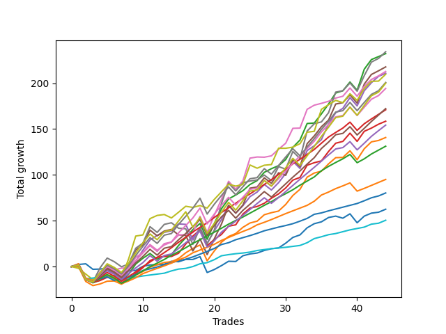

# Short Pointer 001 SD 
- Symbol: ES
- Date Range: 03/18/2022 - 07/15/2022
- Trading Period: 7:20-12:30
- Number of Trades: 44



| Name | Win Percent | Profit | Avg Profit / Trade | Avg Time / Trade |      | Name | Win Percent | Profit | Avg Profit / Trade | Avg Time / Trade |
| ---- | ----------- | ------ | ------------------ | ---------------- | ---- | ---- | ----------- | ------ | ------------------ | ---------------- |
| Sorted By <br> Profit | | | | | | Sorted By <br> Win Percentage ||||
| Seven | 68.18 | 117125.00 | 2661.93 | 24:37 |     | Eighty-One | 95.45 | 25250.00 | 573.86 | 02:35 |
| Two | 86.36 | 116125.00 | 2639.20 | 13:36 |     | Eighty-Two | 93.18 | 40125.00 | 911.93 | 04:08 |
| Five | 68.18 | 108875.00 | 2474.43 | 21:45 |     | Eighty-Five | 88.64 | 85500.00 | 1943.18 | 09:30 |
| Six | 81.82 | 106375.00 | 2417.61 | 13:39 |     | Eighty-Four | 88.64 | 65625.00 | 1491.48 | 08:04 |
| Four | 75.00 | 105375.00 | 2394.89 | 16:53 |     | Eighty-Three | 88.64 | 47500.00 | 1079.55 | 06:09 |
| Seventy-Three | 68.18 | 104875.00 | 2383.52 | 10:50 |     | Two | 86.36 | 116125.00 | 2639.20 | 13:36 |
| Eighty-Nine | 77.27 | 100375.00 | 2281.25 | 16:17 |     | One | 86.36 | 70375.00 | 1599.43 | 08:25 |
| Ninety | 75.00 | 100000.00 | 2272.73 | 17:13 |     | Three | 84.09 | 79250.00 | 1801.14 | 11:15 |
| Eighty-Eight | 79.55 | 97125.00 | 2207.39 | 15:08 |     | Six | 81.82 | 106375.00 | 2417.61 | 13:39 |
| Eighty-Seven | 79.55 | 86125.00 | 1957.39 | 13:38 |     | Eighty-Six | 81.82 | 77125.00 | 1752.84 | 12:32 |
| Eighty-Five | 88.64 | 85500.00 | 1943.18 | 09:30 |     | Eighty-Eight | 79.55 | 97125.00 | 2207.39 | 15:08 |
| Three | 84.09 | 79250.00 | 1801.14 | 11:15 |     | Eighty-Seven | 79.55 | 86125.00 | 1957.39 | 13:38 |
| Eighty-Six | 81.82 | 77125.00 | 1752.84 | 12:32 |     | Zero | 79.55 | 31250.00 | 710.23 | 04:30 |
| One | 86.36 | 70375.00 | 1599.43 | 08:25 |     | Eighty-Nine | 77.27 | 100375.00 | 2281.25 | 16:17 |
| Eighty-Four | 88.64 | 65625.00 | 1491.48 | 08:04 |     | Four | 75.00 | 105375.00 | 2394.89 | 16:53 |
| Eighty-Three | 88.64 | 47500.00 | 1079.55 | 06:09 |     | Ninety | 75.00 | 100000.00 | 2272.73 | 17:13 |
| Eighty-Two | 93.18 | 40125.00 | 911.93 | 04:08 |     | Seven | 68.18 | 117125.00 | 2661.93 | 24:37 |
| Zero | 79.55 | 31250.00 | 710.23 | 04:30 |     | Five | 68.18 | 108875.00 | 2474.43 | 21:45 |
| Eighty-One | 95.45 | 25250.00 | 573.86 | 02:35 |     | Seventy-Three | 68.18 | 104875.00 | 2383.52 | 10:50 |

## NO STOPLOSS

### Test Zero
* Sell when price hits the middle line of the 20p bollinger
* No Stoploss
* Results:
```
Total Trades: 44
Percent Up: 20.45
Percent Down: 79.55
Total Points Moved Down: 62.50
Potential Profit: 31250.00
Total Points Ups: 42.00 Count Ups: 9
Total Points Downs: 104.50 Count Downs: 35
```

<details><summary>Trades</summary>

<code>In: 2022-03-21 08:20:00		Out: 2022-03-21 08:20:10		Total Position Time: 00:10		Total Move Down: 2.25		Total to Date: 2.25</code> <br />
<code>In: 2022-03-24 08:09:00		Out: 2022-03-24 08:09:10		Total Position Time: 00:10		Total Move Down: 0.75		Total to Date: 3.00</code> <br />
<code>In: 2022-03-25 07:26:00		Out: 2022-03-25 07:51:05		Total Position Time: 25:05		Total Move Down: -6.00		Total to Date: -3.00</code> <br />
<code>In: 2022-03-25 11:57:00		Out: 2022-03-25 11:57:15		Total Position Time: 00:15		Total Move Down: 0.25		Total to Date: -2.75</code> <br />
<code>In: 2022-03-29 08:52:00		Out: 2022-03-29 08:56:15		Total Position Time: 04:15		Total Move Down: 1.00		Total to Date: -1.75</code> <br />
<code>In: 2022-03-29 12:15:00		Out: 2022-03-29 12:18:55		Total Position Time: 03:55		Total Move Down: -0.25		Total to Date: -2.00</code> <br />
<code>In: 2022-03-31 07:38:00		Out: 2022-03-31 08:03:05		Total Position Time: 25:05		Total Move Down: -5.75		Total to Date: -7.75</code> <br />
<code>In: 2022-03-31 12:05:00		Out: 2022-03-31 12:11:35		Total Position Time: 06:35		Total Move Down: 3.00		Total to Date: -4.75</code> <br />
<code>In: 2022-04-06 11:06:00		Out: 2022-04-06 11:06:10		Total Position Time: 00:10		Total Move Down: 0.50		Total to Date: -4.25</code> <br />
<code>In: 2022-04-18 10:59:00		Out: 2022-04-18 10:59:30		Total Position Time: 00:30		Total Move Down: 4.50		Total to Date: 0.25</code> <br />
<code>In: 2022-04-20 07:57:00		Out: 2022-04-20 08:00:10		Total Position Time: 03:10		Total Move Down: 1.50		Total to Date: 1.75</code> <br />
<code>In: 2022-04-20 10:18:00		Out: 2022-04-20 10:18:20		Total Position Time: 00:20		Total Move Down: 0.25		Total to Date: 2.00</code> <br />
<code>In: 2022-04-20 10:50:00		Out: 2022-04-20 10:50:10		Total Position Time: 00:10		Total Move Down: 0.50		Total to Date: 2.50</code> <br />
<code>In: 2022-04-25 09:28:00		Out: 2022-04-25 09:31:05		Total Position Time: 03:05		Total Move Down: 3.25		Total to Date: 5.75</code> <br />
<code>In: 2022-04-25 09:53:00		Out: 2022-04-25 09:53:10		Total Position Time: 00:10		Total Move Down: -0.50		Total to Date: 5.25</code> <br />
<code>In: 2022-04-26 09:31:00		Out: 2022-04-26 09:37:10		Total Position Time: 06:10		Total Move Down: 2.50		Total to Date: 7.75</code> <br />
<code>In: 2022-04-27 08:04:00		Out: 2022-04-27 08:04:10		Total Position Time: 00:10		Total Move Down: -0.00		Total to Date: 7.75</code> <br />
<code>In: 2022-04-27 09:46:00		Out: 2022-04-27 09:46:10		Total Position Time: 00:10		Total Move Down: 3.00		Total to Date: 10.75</code> <br />
<code>In: 2022-04-28 09:50:00		Out: 2022-04-28 10:19:55		Total Position Time: 29:55		Total Move Down: -17.25		Total to Date: -6.50</code> <br />
<code>In: 2022-05-04 11:03:00		Out: 2022-05-04 11:03:10		Total Position Time: 00:10		Total Move Down: 3.25		Total to Date: -3.25</code> <br />
<code>In: 2022-05-04 11:07:00		Out: 2022-05-04 11:07:10		Total Position Time: 00:10		Total Move Down: 4.25		Total to Date: 1.00</code> <br />
<code>In: 2022-05-24 09:18:00		Out: 2022-05-24 09:21:35		Total Position Time: 03:35		Total Move Down: 4.75		Total to Date: 5.75</code> <br />
<code>In: 2022-05-24 10:58:00		Out: 2022-05-24 11:01:15		Total Position Time: 03:15		Total Move Down: -0.25		Total to Date: 5.50</code> <br />
<code>In: 2022-05-24 11:15:00		Out: 2022-05-24 11:18:25		Total Position Time: 03:25		Total Move Down: 6.25		Total to Date: 11.75</code> <br />
<code>In: 2022-05-24 11:41:00		Out: 2022-05-24 11:42:15		Total Position Time: 01:15		Total Move Down: 2.00		Total to Date: 13.75</code> <br />
<code>In: 2022-06-01 12:19:00		Out: 2022-06-01 12:25:25		Total Position Time: 06:25		Total Move Down: 1.00		Total to Date: 14.75</code> <br />
<code>In: 2022-06-09 08:47:00		Out: 2022-06-09 08:48:20		Total Position Time: 01:20		Total Move Down: 2.75		Total to Date: 17.50</code> <br />
<code>In: 2022-06-09 09:46:00		Out: 2022-06-09 09:49:20		Total Position Time: 03:20		Total Move Down: 2.00		Total to Date: 19.50</code> <br />
<code>In: 2022-06-09 10:08:00		Out: 2022-06-09 10:16:15		Total Position Time: 08:15		Total Move Down: 0.75		Total to Date: 20.25</code> <br />
<code>In: 2022-06-10 11:26:00		Out: 2022-06-10 11:28:25		Total Position Time: 02:25		Total Move Down: 5.25		Total to Date: 25.50</code> <br />
<code>In: 2022-06-10 12:29:00		Out: 2022-06-10 12:30:30		Total Position Time: 01:30		Total Move Down: 6.25		Total to Date: 31.75</code> <br />
<code>In: 2022-06-13 08:42:00		Out: 2022-06-13 08:47:40		Total Position Time: 05:40		Total Move Down: 2.75		Total to Date: 34.50</code> <br />
<code>In: 2022-06-13 09:41:00		Out: 2022-06-13 09:43:15		Total Position Time: 02:15		Total Move Down: 7.75		Total to Date: 42.25</code> <br />
<code>In: 2022-06-15 09:19:00		Out: 2022-06-15 09:19:10		Total Position Time: 00:10		Total Move Down: 4.50		Total to Date: 46.75</code> <br />
<code>In: 2022-06-15 11:02:00		Out: 2022-06-15 11:02:10		Total Position Time: 00:10		Total Move Down: 2.00		Total to Date: 48.75</code> <br />
<code>In: 2022-06-16 08:30:00		Out: 2022-06-16 08:30:25		Total Position Time: 00:25		Total Move Down: 4.75		Total to Date: 53.50</code> <br />
<code>In: 2022-06-17 08:34:00		Out: 2022-06-17 08:35:05		Total Position Time: 01:05		Total Move Down: 1.50		Total to Date: 55.00</code> <br />
<code>In: 2022-06-29 12:20:00		Out: 2022-06-29 12:33:20		Total Position Time: 13:20		Total Move Down: -2.25		Total to Date: 52.75</code> <br />
<code>In: 2022-06-29 12:31:00		Out: 2022-06-29 12:33:20		Total Position Time: 02:20		Total Move Down: 4.75		Total to Date: 57.50</code> <br />
<code>In: 2022-07-01 10:35:00		Out: 2022-07-01 10:58:45		Total Position Time: 23:45		Total Move Down: -9.75		Total to Date: 47.75</code> <br />
<code>In: 2022-07-05 07:41:00		Out: 2022-07-05 07:44:30		Total Position Time: 03:30		Total Move Down: 7.25		Total to Date: 55.00</code> <br />
<code>In: 2022-07-06 11:10:00		Out: 2022-07-06 11:10:10		Total Position Time: 00:10		Total Move Down: 3.25		Total to Date: 58.25</code> <br />
<code>In: 2022-07-07 08:10:00		Out: 2022-07-07 08:10:35		Total Position Time: 00:35		Total Move Down: 1.00		Total to Date: 59.25</code> <br />
<code>In: 2022-07-12 10:03:00		Out: 2022-07-12 10:03:10		Total Position Time: 00:10		Total Move Down: 3.25		Total to Date: 62.50</code> <br />


</details>

### Test One
* Sell when the price hits the upper line of the 20p 1std bollinger
* No Stoploss
* Results:
```
Total Trades: 44
Percent Up: 13.64
Percent Down: 86.36
Total Points Moved Down: 140.75
Potential Profit: 70375.00
Total Points Ups: 51.25 Count Ups: 6
Total Points Downs: 192.00 Count Downs: 38
```

<details><summary>Trades</summary>

<code>In: 2022-03-21 08:20:00		Out: 2022-03-21 08:36:00		Total Position Time: 16:00		Total Move Down: -0.50		Total to Date: -0.50</code> <br />
<code>In: 2022-03-24 08:09:00		Out: 2022-03-24 08:38:55		Total Position Time: 29:55		Total Move Down: -15.75		Total to Date: -16.25</code> <br />
<code>In: 2022-03-25 07:26:00		Out: 2022-03-25 07:53:50		Total Position Time: 27:50		Total Move Down: -4.50		Total to Date: -20.75</code> <br />
<code>In: 2022-03-25 11:57:00		Out: 2022-03-25 12:00:45		Total Position Time: 03:45		Total Move Down: 1.75		Total to Date: -19.00</code> <br />
<code>In: 2022-03-29 08:52:00		Out: 2022-03-29 08:58:40		Total Position Time: 06:40		Total Move Down: 3.00		Total to Date: -16.00</code> <br />
<code>In: 2022-03-29 12:15:00		Out: 2022-03-29 12:27:35		Total Position Time: 12:35		Total Move Down: 0.25		Total to Date: -15.75</code> <br />
<code>In: 2022-03-31 07:38:00		Out: 2022-03-31 08:03:30		Total Position Time: 25:30		Total Move Down: -3.50		Total to Date: -19.25</code> <br />
<code>In: 2022-03-31 12:05:00		Out: 2022-03-31 12:16:00		Total Position Time: 11:00		Total Move Down: 4.75		Total to Date: -14.50</code> <br />
<code>In: 2022-04-06 11:06:00		Out: 2022-04-06 11:07:20		Total Position Time: 01:20		Total Move Down: 5.25		Total to Date: -9.25</code> <br />
<code>In: 2022-04-18 10:59:00		Out: 2022-04-18 11:06:20		Total Position Time: 07:20		Total Move Down: 3.75		Total to Date: -5.50</code> <br />
<code>In: 2022-04-20 07:57:00		Out: 2022-04-20 08:00:40		Total Position Time: 03:40		Total Move Down: 4.75		Total to Date: -0.75</code> <br />
<code>In: 2022-04-20 10:18:00		Out: 2022-04-20 10:19:05		Total Position Time: 01:05		Total Move Down: 2.75		Total to Date: 2.00</code> <br />
<code>In: 2022-04-20 10:50:00		Out: 2022-04-20 10:53:20		Total Position Time: 03:20		Total Move Down: 2.50		Total to Date: 4.50</code> <br />
<code>In: 2022-04-25 09:28:00		Out: 2022-04-25 09:42:35		Total Position Time: 14:35		Total Move Down: 0.75		Total to Date: 5.25</code> <br />
<code>In: 2022-04-25 09:53:00		Out: 2022-04-25 09:55:05		Total Position Time: 02:05		Total Move Down: 3.50		Total to Date: 8.75</code> <br />
<code>In: 2022-04-26 09:31:00		Out: 2022-04-26 09:38:00		Total Position Time: 07:00		Total Move Down: 6.25		Total to Date: 15.00</code> <br />
<code>In: 2022-04-27 08:04:00		Out: 2022-04-27 08:05:30		Total Position Time: 01:30		Total Move Down: 4.75		Total to Date: 19.75</code> <br />
<code>In: 2022-04-27 09:46:00		Out: 2022-04-27 09:50:25		Total Position Time: 04:25		Total Move Down: 3.75		Total to Date: 23.50</code> <br />
<code>In: 2022-04-28 09:50:00		Out: 2022-04-28 10:19:55		Total Position Time: 29:55		Total Move Down: -17.25		Total to Date: 6.25</code> <br />
<code>In: 2022-05-04 11:03:00		Out: 2022-05-04 11:07:20		Total Position Time: 04:20		Total Move Down: 10.75		Total to Date: 17.00</code> <br />
<code>In: 2022-05-04 11:07:00		Out: 2022-05-04 11:07:20		Total Position Time: 00:20		Total Move Down: 9.50		Total to Date: 26.50</code> <br />
<code>In: 2022-05-24 09:18:00		Out: 2022-05-24 09:28:55		Total Position Time: 10:55		Total Move Down: 6.25		Total to Date: 32.75</code> <br />
<code>In: 2022-05-24 10:58:00		Out: 2022-05-24 11:01:40		Total Position Time: 03:40		Total Move Down: 3.25		Total to Date: 36.00</code> <br />
<code>In: 2022-05-24 11:15:00		Out: 2022-05-24 11:31:25		Total Position Time: 16:25		Total Move Down: 6.75		Total to Date: 42.75</code> <br />
<code>In: 2022-05-24 11:41:00		Out: 2022-05-24 11:43:15		Total Position Time: 02:15		Total Move Down: 4.75		Total to Date: 47.50</code> <br />
<code>In: 2022-06-01 12:19:00		Out: 2022-06-01 12:25:45		Total Position Time: 06:45		Total Move Down: 2.00		Total to Date: 49.50</code> <br />
<code>In: 2022-06-09 08:47:00		Out: 2022-06-09 08:49:35		Total Position Time: 02:35		Total Move Down: 7.00		Total to Date: 56.50</code> <br />
<code>In: 2022-06-09 09:46:00		Out: 2022-06-09 09:54:45		Total Position Time: 08:45		Total Move Down: 2.25		Total to Date: 58.75</code> <br />
<code>In: 2022-06-09 10:08:00		Out: 2022-06-09 10:18:10		Total Position Time: 10:10		Total Move Down: 1.75		Total to Date: 60.50</code> <br />
<code>In: 2022-06-10 11:26:00		Out: 2022-06-10 11:28:35		Total Position Time: 02:35		Total Move Down: 7.25		Total to Date: 67.75</code> <br />
<code>In: 2022-06-10 12:29:00		Out: 2022-06-10 12:35:45		Total Position Time: 06:45		Total Move Down: 9.75		Total to Date: 77.50</code> <br />
<code>In: 2022-06-13 08:42:00		Out: 2022-06-13 08:52:05		Total Position Time: 10:05		Total Move Down: 6.75		Total to Date: 84.25</code> <br />
<code>In: 2022-06-13 09:41:00		Out: 2022-06-13 09:47:50		Total Position Time: 06:50		Total Move Down: 13.25		Total to Date: 97.50</code> <br />
<code>In: 2022-06-15 09:19:00		Out: 2022-06-15 09:19:10		Total Position Time: 00:10		Total Move Down: 4.50		Total to Date: 102.00</code> <br />
<code>In: 2022-06-15 11:02:00		Out: 2022-06-15 11:02:10		Total Position Time: 00:10		Total Move Down: 2.00		Total to Date: 104.00</code> <br />
<code>In: 2022-06-16 08:30:00		Out: 2022-06-16 08:30:55		Total Position Time: 00:55		Total Move Down: 8.00		Total to Date: 112.00</code> <br />
<code>In: 2022-06-17 08:34:00		Out: 2022-06-17 08:39:00		Total Position Time: 05:00		Total Move Down: 6.75		Total to Date: 118.75</code> <br />
<code>In: 2022-06-29 12:20:00		Out: 2022-06-29 12:34:10		Total Position Time: 14:10		Total Move Down: 0.25		Total to Date: 119.00</code> <br />
<code>In: 2022-06-29 12:31:00		Out: 2022-06-29 12:34:10		Total Position Time: 03:10		Total Move Down: 7.25		Total to Date: 126.25</code> <br />
<code>In: 2022-07-01 10:35:00		Out: 2022-07-01 11:04:25		Total Position Time: 29:25		Total Move Down: -9.75		Total to Date: 116.50</code> <br />
<code>In: 2022-07-05 07:41:00		Out: 2022-07-05 07:45:55		Total Position Time: 04:55		Total Move Down: 12.00		Total to Date: 128.50</code> <br />
<code>In: 2022-07-06 11:10:00		Out: 2022-07-06 11:11:10		Total Position Time: 01:10		Total Move Down: 7.50		Total to Date: 136.00</code> <br />
<code>In: 2022-07-07 08:10:00		Out: 2022-07-07 08:19:45		Total Position Time: 09:45		Total Move Down: 1.50		Total to Date: 137.50</code> <br />
<code>In: 2022-07-12 10:03:00		Out: 2022-07-12 10:03:10		Total Position Time: 00:10		Total Move Down: 3.25		Total to Date: 140.75</code> <br />


</details>

### Test Two
* Sell when the price hits the upper line of the 20p 2std bollinger
* No Stoploss
* Results:
```
Total Trades: 44
Percent Up: 13.64
Percent Down: 86.36
Total Points Moved Down: 232.25
Potential Profit: 116125.00
Total Points Ups: 57.25 Count Ups: 6
Total Points Downs: 289.50 Count Downs: 38
```

<details><summary>Trades</summary>

<code>In: 2022-03-21 08:20:00		Out: 2022-03-21 08:36:05		Total Position Time: 16:05		Total Move Down: 1.50		Total to Date: 1.50</code> <br />
<code>In: 2022-03-24 08:09:00		Out: 2022-03-24 08:38:55		Total Position Time: 29:55		Total Move Down: -15.75		Total to Date: -14.25</code> <br />
<code>In: 2022-03-25 07:26:00		Out: 2022-03-25 07:54:10		Total Position Time: 28:10		Total Move Down: -3.50		Total to Date: -17.75</code> <br />
<code>In: 2022-03-25 11:57:00		Out: 2022-03-25 12:00:55		Total Position Time: 03:55		Total Move Down: 2.75		Total to Date: -15.00</code> <br />
<code>In: 2022-03-29 08:52:00		Out: 2022-03-29 09:01:40		Total Position Time: 09:40		Total Move Down: 4.50		Total to Date: -10.50</code> <br />
<code>In: 2022-03-29 12:15:00		Out: 2022-03-29 12:27:50		Total Position Time: 12:50		Total Move Down: 0.75		Total to Date: -9.75</code> <br />
<code>In: 2022-03-31 07:38:00		Out: 2022-03-31 08:07:55		Total Position Time: 29:55		Total Move Down: -5.50		Total to Date: -15.25</code> <br />
<code>In: 2022-03-31 12:05:00		Out: 2022-03-31 12:19:35		Total Position Time: 14:35		Total Move Down: 6.75		Total to Date: -8.50</code> <br />
<code>In: 2022-04-06 11:06:00		Out: 2022-04-06 11:08:10		Total Position Time: 02:10		Total Move Down: 11.25		Total to Date: 2.75</code> <br />
<code>In: 2022-04-18 10:59:00		Out: 2022-04-18 11:10:40		Total Position Time: 11:40		Total Move Down: 6.25		Total to Date: 9.00</code> <br />
<code>In: 2022-04-20 07:57:00		Out: 2022-04-20 08:00:45		Total Position Time: 03:45		Total Move Down: 5.25		Total to Date: 14.25</code> <br />
<code>In: 2022-04-20 10:18:00		Out: 2022-04-20 10:47:55		Total Position Time: 29:55		Total Move Down: -6.25		Total to Date: 8.00</code> <br />
<code>In: 2022-04-20 10:50:00		Out: 2022-04-20 11:13:55		Total Position Time: 23:55		Total Move Down: 3.25		Total to Date: 11.25</code> <br />
<code>In: 2022-04-25 09:28:00		Out: 2022-04-25 09:57:55		Total Position Time: 29:55		Total Move Down: 1.75		Total to Date: 13.00</code> <br />
<code>In: 2022-04-25 09:53:00		Out: 2022-04-25 10:01:20		Total Position Time: 08:20		Total Move Down: 10.00		Total to Date: 23.00</code> <br />
<code>In: 2022-04-26 09:31:00		Out: 2022-04-26 09:40:15		Total Position Time: 09:15		Total Move Down: 8.50		Total to Date: 31.50</code> <br />
<code>In: 2022-04-27 08:04:00		Out: 2022-04-27 08:10:35		Total Position Time: 06:35		Total Move Down: 8.75		Total to Date: 40.25</code> <br />
<code>In: 2022-04-27 09:46:00		Out: 2022-04-27 10:00:10		Total Position Time: 14:10		Total Move Down: 6.75		Total to Date: 47.00</code> <br />
<code>In: 2022-04-28 09:50:00		Out: 2022-04-28 10:19:55		Total Position Time: 29:55		Total Move Down: -17.25		Total to Date: 29.75</code> <br />
<code>In: 2022-05-04 11:03:00		Out: 2022-05-04 11:07:40		Total Position Time: 04:40		Total Move Down: 17.25		Total to Date: 47.00</code> <br />
<code>In: 2022-05-04 11:07:00		Out: 2022-05-04 11:07:40		Total Position Time: 00:40		Total Move Down: 16.00		Total to Date: 63.00</code> <br />
<code>In: 2022-05-24 09:18:00		Out: 2022-05-24 09:31:20		Total Position Time: 13:20		Total Move Down: 10.75		Total to Date: 73.75</code> <br />
<code>In: 2022-05-24 10:58:00		Out: 2022-05-24 11:01:50		Total Position Time: 03:50		Total Move Down: 4.25		Total to Date: 78.00</code> <br />
<code>In: 2022-05-24 11:15:00		Out: 2022-05-24 11:43:50		Total Position Time: 28:50		Total Move Down: 4.75		Total to Date: 82.75</code> <br />
<code>In: 2022-05-24 11:41:00		Out: 2022-05-24 11:43:50		Total Position Time: 02:50		Total Move Down: 6.75		Total to Date: 89.50</code> <br />
<code>In: 2022-06-01 12:19:00		Out: 2022-06-01 12:30:05		Total Position Time: 11:05		Total Move Down: 4.25		Total to Date: 93.75</code> <br />
<code>In: 2022-06-09 08:47:00		Out: 2022-06-09 09:11:05		Total Position Time: 24:05		Total Move Down: 9.00		Total to Date: 102.75</code> <br />
<code>In: 2022-06-09 09:46:00		Out: 2022-06-09 09:55:00		Total Position Time: 09:00		Total Move Down: 4.00		Total to Date: 106.75</code> <br />
<code>In: 2022-06-09 10:08:00		Out: 2022-06-09 10:18:55		Total Position Time: 10:55		Total Move Down: 3.25		Total to Date: 110.00</code> <br />
<code>In: 2022-06-10 11:26:00		Out: 2022-06-10 11:40:10		Total Position Time: 14:10		Total Move Down: 6.75		Total to Date: 116.75</code> <br />
<code>In: 2022-06-10 12:29:00		Out: 2022-06-10 12:42:45		Total Position Time: 13:45		Total Move Down: 13.25		Total to Date: 130.00</code> <br />
<code>In: 2022-06-13 08:42:00		Out: 2022-06-13 08:54:20		Total Position Time: 12:20		Total Move Down: 8.00		Total to Date: 138.00</code> <br />
<code>In: 2022-06-13 09:41:00		Out: 2022-06-13 09:54:20		Total Position Time: 13:20		Total Move Down: 18.00		Total to Date: 156.00</code> <br />
<code>In: 2022-06-15 09:19:00		Out: 2022-06-15 09:34:05		Total Position Time: 15:05		Total Move Down: 0.50		Total to Date: 156.50</code> <br />
<code>In: 2022-06-15 11:02:00		Out: 2022-06-15 11:03:05		Total Position Time: 01:05		Total Move Down: 10.00		Total to Date: 166.50</code> <br />
<code>In: 2022-06-16 08:30:00		Out: 2022-06-16 08:41:25		Total Position Time: 11:25		Total Move Down: 10.75		Total to Date: 177.25</code> <br />
<code>In: 2022-06-17 08:34:00		Out: 2022-06-17 08:45:15		Total Position Time: 11:15		Total Move Down: 12.00		Total to Date: 189.25</code> <br />
<code>In: 2022-06-29 12:20:00		Out: 2022-06-29 12:35:20		Total Position Time: 15:20		Total Move Down: 2.50		Total to Date: 191.75</code> <br />
<code>In: 2022-06-29 12:31:00		Out: 2022-06-29 12:35:20		Total Position Time: 04:20		Total Move Down: 9.50		Total to Date: 201.25</code> <br />
<code>In: 2022-07-01 10:35:00		Out: 2022-07-01 11:04:55		Total Position Time: 29:55		Total Move Down: -9.00		Total to Date: 192.25</code> <br />
<code>In: 2022-07-05 07:41:00		Out: 2022-07-05 08:01:10		Total Position Time: 20:10		Total Move Down: 23.00		Total to Date: 215.25</code> <br />
<code>In: 2022-07-06 11:10:00		Out: 2022-07-06 11:11:45		Total Position Time: 01:45		Total Move Down: 10.50		Total to Date: 225.75</code> <br />
<code>In: 2022-07-07 08:10:00		Out: 2022-07-07 08:21:00		Total Position Time: 11:00		Total Move Down: 3.25		Total to Date: 229.00</code> <br />
<code>In: 2022-07-12 10:03:00		Out: 2022-07-12 10:03:10		Total Position Time: 00:10		Total Move Down: 3.25		Total to Date: 232.25</code> <br />


</details>

### Test Three
* Sell when price hits the middle line of the 50p bollinger
* No Stoploss
* Results:
```
Total Trades: 44
Percent Up: 15.91
Percent Down: 84.09
Total Points Moved Down: 158.50
Potential Profit: 79250.00
Total Points Ups: 50.75 Count Ups: 7
Total Points Downs: 209.25 Count Downs: 37
```

<details><summary>Trades</summary>

<code>In: 2022-03-21 08:20:00		Out: 2022-03-21 08:36:10		Total Position Time: 16:10		Total Move Down: 1.25		Total to Date: 1.25</code> <br />
<code>In: 2022-03-24 08:09:00		Out: 2022-03-24 08:38:55		Total Position Time: 29:55		Total Move Down: -15.75		Total to Date: -14.50</code> <br />
<code>In: 2022-03-25 07:26:00		Out: 2022-03-25 07:55:55		Total Position Time: 29:55		Total Move Down: -2.50		Total to Date: -17.00</code> <br />
<code>In: 2022-03-25 11:57:00		Out: 2022-03-25 12:00:45		Total Position Time: 03:45		Total Move Down: 1.75		Total to Date: -15.25</code> <br />
<code>In: 2022-03-29 08:52:00		Out: 2022-03-29 09:01:25		Total Position Time: 09:25		Total Move Down: 3.50		Total to Date: -11.75</code> <br />
<code>In: 2022-03-29 12:15:00		Out: 2022-03-29 12:43:05		Total Position Time: 28:05		Total Move Down: -0.75		Total to Date: -12.50</code> <br />
<code>In: 2022-03-31 07:38:00		Out: 2022-03-31 08:07:55		Total Position Time: 29:55		Total Move Down: -5.50		Total to Date: -18.00</code> <br />
<code>In: 2022-03-31 12:05:00		Out: 2022-03-31 12:16:40		Total Position Time: 11:40		Total Move Down: 5.25		Total to Date: -12.75</code> <br />
<code>In: 2022-04-06 11:06:00		Out: 2022-04-06 11:07:20		Total Position Time: 01:20		Total Move Down: 5.25		Total to Date: -7.50</code> <br />
<code>In: 2022-04-18 10:59:00		Out: 2022-04-18 11:16:30		Total Position Time: 17:30		Total Move Down: 6.25		Total to Date: -1.25</code> <br />
<code>In: 2022-04-20 07:57:00		Out: 2022-04-20 08:01:10		Total Position Time: 04:10		Total Move Down: 7.75		Total to Date: 6.50</code> <br />
<code>In: 2022-04-20 10:18:00		Out: 2022-04-20 10:19:10		Total Position Time: 01:10		Total Move Down: 3.50		Total to Date: 10.00</code> <br />
<code>In: 2022-04-20 10:50:00		Out: 2022-04-20 10:50:20		Total Position Time: 00:20		Total Move Down: 1.00		Total to Date: 11.00</code> <br />
<code>In: 2022-04-25 09:28:00		Out: 2022-04-25 09:55:05		Total Position Time: 27:05		Total Move Down: -0.00		Total to Date: 11.00</code> <br />
<code>In: 2022-04-25 09:53:00		Out: 2022-04-25 09:55:05		Total Position Time: 02:05		Total Move Down: 3.50		Total to Date: 14.50</code> <br />
<code>In: 2022-04-26 09:31:00		Out: 2022-04-26 09:46:10		Total Position Time: 15:10		Total Move Down: 10.00		Total to Date: 24.50</code> <br />
<code>In: 2022-04-27 08:04:00		Out: 2022-04-27 08:10:20		Total Position Time: 06:20		Total Move Down: 8.75		Total to Date: 33.25</code> <br />
<code>In: 2022-04-27 09:46:00		Out: 2022-04-27 10:00:10		Total Position Time: 14:10		Total Move Down: 6.75		Total to Date: 40.00</code> <br />
<code>In: 2022-04-28 09:50:00		Out: 2022-04-28 10:19:55		Total Position Time: 29:55		Total Move Down: -17.25		Total to Date: 22.75</code> <br />
<code>In: 2022-05-04 11:03:00		Out: 2022-05-04 11:07:15		Total Position Time: 04:15		Total Move Down: 6.75		Total to Date: 29.50</code> <br />
<code>In: 2022-05-04 11:07:00		Out: 2022-05-04 11:07:15		Total Position Time: 00:15		Total Move Down: 5.50		Total to Date: 35.00</code> <br />
<code>In: 2022-05-24 09:18:00		Out: 2022-05-24 09:31:15		Total Position Time: 13:15		Total Move Down: 9.00		Total to Date: 44.00</code> <br />
<code>In: 2022-05-24 10:58:00		Out: 2022-05-24 11:20:25		Total Position Time: 22:25		Total Move Down: 1.50		Total to Date: 45.50</code> <br />
<code>In: 2022-05-24 11:15:00		Out: 2022-05-24 11:20:25		Total Position Time: 05:25		Total Move Down: 11.75		Total to Date: 57.25</code> <br />
<code>In: 2022-05-24 11:41:00		Out: 2022-05-24 11:43:25		Total Position Time: 02:25		Total Move Down: 6.50		Total to Date: 63.75</code> <br />
<code>In: 2022-06-01 12:19:00		Out: 2022-06-01 12:25:30		Total Position Time: 06:30		Total Move Down: 1.75		Total to Date: 65.50</code> <br />
<code>In: 2022-06-09 08:47:00		Out: 2022-06-09 08:48:40		Total Position Time: 01:40		Total Move Down: 3.50		Total to Date: 69.00</code> <br />
<code>In: 2022-06-09 09:46:00		Out: 2022-06-09 09:55:50		Total Position Time: 09:50		Total Move Down: 5.50		Total to Date: 74.50</code> <br />
<code>In: 2022-06-09 10:08:00		Out: 2022-06-09 10:22:05		Total Position Time: 14:05		Total Move Down: 4.75		Total to Date: 79.25</code> <br />
<code>In: 2022-06-10 11:26:00		Out: 2022-06-10 11:28:30		Total Position Time: 02:30		Total Move Down: 6.50		Total to Date: 85.75</code> <br />
<code>In: 2022-06-10 12:29:00		Out: 2022-06-10 12:33:15		Total Position Time: 04:15		Total Move Down: 8.50		Total to Date: 94.25</code> <br />
<code>In: 2022-06-13 08:42:00		Out: 2022-06-13 09:07:15		Total Position Time: 25:15		Total Move Down: 3.00		Total to Date: 97.25</code> <br />
<code>In: 2022-06-13 09:41:00		Out: 2022-06-13 09:47:50		Total Position Time: 06:50		Total Move Down: 13.25		Total to Date: 110.50</code> <br />
<code>In: 2022-06-15 09:19:00		Out: 2022-06-15 09:35:10		Total Position Time: 16:10		Total Move Down: 2.75		Total to Date: 113.25</code> <br />
<code>In: 2022-06-15 11:02:00		Out: 2022-06-15 11:02:10		Total Position Time: 00:10		Total Move Down: 2.00		Total to Date: 115.25</code> <br />
<code>In: 2022-06-16 08:30:00		Out: 2022-06-16 08:36:10		Total Position Time: 06:10		Total Move Down: 10.25		Total to Date: 125.50</code> <br />
<code>In: 2022-06-17 08:34:00		Out: 2022-06-17 08:45:00		Total Position Time: 11:00		Total Move Down: 9.00		Total to Date: 134.50</code> <br />
<code>In: 2022-06-29 12:20:00		Out: 2022-06-29 12:34:15		Total Position Time: 14:15		Total Move Down: 2.00		Total to Date: 136.50</code> <br />
<code>In: 2022-06-29 12:31:00		Out: 2022-06-29 12:34:15		Total Position Time: 03:15		Total Move Down: 9.00		Total to Date: 145.50</code> <br />
<code>In: 2022-07-01 10:35:00		Out: 2022-07-01 11:04:55		Total Position Time: 29:55		Total Move Down: -9.00		Total to Date: 136.50</code> <br />
<code>In: 2022-07-05 07:41:00		Out: 2022-07-05 07:45:30		Total Position Time: 04:30		Total Move Down: 11.00		Total to Date: 147.50</code> <br />
<code>In: 2022-07-06 11:10:00		Out: 2022-07-06 11:10:20		Total Position Time: 00:20		Total Move Down: 3.50		Total to Date: 151.00</code> <br />
<code>In: 2022-07-07 08:10:00		Out: 2022-07-07 08:22:45		Total Position Time: 12:45		Total Move Down: 4.25		Total to Date: 155.25</code> <br />
<code>In: 2022-07-12 10:03:00		Out: 2022-07-12 10:03:10		Total Position Time: 00:10		Total Move Down: 3.25		Total to Date: 158.50</code> <br />


</details>

### Test Four
* Sell when the price hits the upper line of the 50p 1std bollinger
* No Stoploss
* Results:
```
Total Trades: 44
Percent Up: 25.00
Percent Down: 75.00
Total Points Moved Down: 210.75
Potential Profit: 105375.00
Total Points Ups: 93.75 Count Ups: 11
Total Points Downs: 304.50 Count Downs: 33
```

<details><summary>Trades</summary>

<code>In: 2022-03-21 08:20:00		Out: 2022-03-21 08:44:50		Total Position Time: 24:50		Total Move Down: 3.00		Total to Date: 3.00</code> <br />
<code>In: 2022-03-24 08:09:00		Out: 2022-03-24 08:38:55		Total Position Time: 29:55		Total Move Down: -15.75		Total to Date: -12.75</code> <br />
<code>In: 2022-03-25 07:26:00		Out: 2022-03-25 07:55:55		Total Position Time: 29:55		Total Move Down: -2.50		Total to Date: -15.25</code> <br />
<code>In: 2022-03-25 11:57:00		Out: 2022-03-25 12:01:35		Total Position Time: 04:35		Total Move Down: 3.75		Total to Date: -11.50</code> <br />
<code>In: 2022-03-29 08:52:00		Out: 2022-03-29 09:02:15		Total Position Time: 10:15		Total Move Down: 7.50		Total to Date: -4.00</code> <br />
<code>In: 2022-03-29 12:15:00		Out: 2022-03-29 12:44:55		Total Position Time: 29:55		Total Move Down: -4.00		Total to Date: -8.00</code> <br />
<code>In: 2022-03-31 07:38:00		Out: 2022-03-31 08:07:55		Total Position Time: 29:55		Total Move Down: -5.50		Total to Date: -13.50</code> <br />
<code>In: 2022-03-31 12:05:00		Out: 2022-03-31 12:20:15		Total Position Time: 15:15		Total Move Down: 8.25		Total to Date: -5.25</code> <br />
<code>In: 2022-04-06 11:06:00		Out: 2022-04-06 11:08:10		Total Position Time: 02:10		Total Move Down: 11.25		Total to Date: 6.00</code> <br />
<code>In: 2022-04-18 10:59:00		Out: 2022-04-18 11:18:10		Total Position Time: 19:10		Total Move Down: 11.75		Total to Date: 17.75</code> <br />
<code>In: 2022-04-20 07:57:00		Out: 2022-04-20 08:10:40		Total Position Time: 13:40		Total Move Down: 11.25		Total to Date: 29.00</code> <br />
<code>In: 2022-04-20 10:18:00		Out: 2022-04-20 10:26:35		Total Position Time: 08:35		Total Move Down: 5.00		Total to Date: 34.00</code> <br />
<code>In: 2022-04-20 10:50:00		Out: 2022-04-20 11:13:55		Total Position Time: 23:55		Total Move Down: 3.25		Total to Date: 37.25</code> <br />
<code>In: 2022-04-25 09:28:00		Out: 2022-04-25 09:57:55		Total Position Time: 29:55		Total Move Down: 1.75		Total to Date: 39.00</code> <br />
<code>In: 2022-04-25 09:53:00		Out: 2022-04-25 10:01:15		Total Position Time: 08:15		Total Move Down: 7.50		Total to Date: 46.50</code> <br />
<code>In: 2022-04-26 09:31:00		Out: 2022-04-26 10:00:55		Total Position Time: 29:55		Total Move Down: -0.50		Total to Date: 46.00</code> <br />
<code>In: 2022-04-27 08:04:00		Out: 2022-04-27 08:33:55		Total Position Time: 29:55		Total Move Down: -17.00		Total to Date: 29.00</code> <br />
<code>In: 2022-04-27 09:46:00		Out: 2022-04-27 10:01:20		Total Position Time: 15:20		Total Move Down: 13.75		Total to Date: 42.75</code> <br />
<code>In: 2022-04-28 09:50:00		Out: 2022-04-28 10:19:55		Total Position Time: 29:55		Total Move Down: -17.25		Total to Date: 25.50</code> <br />
<code>In: 2022-05-04 11:03:00		Out: 2022-05-04 11:07:25		Total Position Time: 04:25		Total Move Down: 13.50		Total to Date: 39.00</code> <br />
<code>In: 2022-05-04 11:07:00		Out: 2022-05-04 11:07:25		Total Position Time: 00:25		Total Move Down: 12.25		Total to Date: 51.25</code> <br />
<code>In: 2022-05-24 09:18:00		Out: 2022-05-24 09:33:20		Total Position Time: 15:20		Total Move Down: 15.50		Total to Date: 66.75</code> <br />
<code>In: 2022-05-24 10:58:00		Out: 2022-05-24 11:27:55		Total Position Time: 29:55		Total Move Down: -8.50		Total to Date: 58.25</code> <br />
<code>In: 2022-05-24 11:15:00		Out: 2022-05-24 11:44:15		Total Position Time: 29:15		Total Move Down: 8.00		Total to Date: 66.25</code> <br />
<code>In: 2022-05-24 11:41:00		Out: 2022-05-24 11:44:15		Total Position Time: 03:15		Total Move Down: 10.00		Total to Date: 76.25</code> <br />
<code>In: 2022-06-01 12:19:00		Out: 2022-06-01 12:31:00		Total Position Time: 12:00		Total Move Down: 5.00		Total to Date: 81.25</code> <br />
<code>In: 2022-06-09 08:47:00		Out: 2022-06-09 08:50:20		Total Position Time: 03:20		Total Move Down: 8.25		Total to Date: 89.50</code> <br />
<code>In: 2022-06-09 09:46:00		Out: 2022-06-09 10:15:55		Total Position Time: 29:55		Total Move Down: -6.00		Total to Date: 83.50</code> <br />
<code>In: 2022-06-09 10:08:00		Out: 2022-06-09 10:23:50		Total Position Time: 15:50		Total Move Down: 8.00		Total to Date: 91.50</code> <br />
<code>In: 2022-06-10 11:26:00		Out: 2022-06-10 11:41:45		Total Position Time: 15:45		Total Move Down: 10.00		Total to Date: 101.50</code> <br />
<code>In: 2022-06-10 12:29:00		Out: 2022-06-10 12:42:40		Total Position Time: 13:40		Total Move Down: 13.25		Total to Date: 114.75</code> <br />
<code>In: 2022-06-13 08:42:00		Out: 2022-06-13 09:11:55		Total Position Time: 29:55		Total Move Down: -7.75		Total to Date: 107.00</code> <br />
<code>In: 2022-06-13 09:41:00		Out: 2022-06-13 09:54:40		Total Position Time: 13:40		Total Move Down: 19.50		Total to Date: 126.50</code> <br />
<code>In: 2022-06-15 09:19:00		Out: 2022-06-15 09:39:25		Total Position Time: 20:25		Total Move Down: 5.25		Total to Date: 131.75</code> <br />
<code>In: 2022-06-15 11:02:00		Out: 2022-06-15 11:03:00		Total Position Time: 01:00		Total Move Down: 6.75		Total to Date: 138.50</code> <br />
<code>In: 2022-06-16 08:30:00		Out: 2022-06-16 08:42:25		Total Position Time: 12:25		Total Move Down: 17.00		Total to Date: 155.50</code> <br />
<code>In: 2022-06-17 08:34:00		Out: 2022-06-17 08:51:15		Total Position Time: 17:15		Total Move Down: 12.25		Total to Date: 167.75</code> <br />
<code>In: 2022-06-29 12:20:00		Out: 2022-06-29 12:41:00		Total Position Time: 21:00		Total Move Down: 4.75		Total to Date: 172.50</code> <br />
<code>In: 2022-06-29 12:31:00		Out: 2022-06-29 12:41:00		Total Position Time: 10:00		Total Move Down: 11.75		Total to Date: 184.25</code> <br />
<code>In: 2022-07-01 10:35:00		Out: 2022-07-01 11:04:55		Total Position Time: 29:55		Total Move Down: -9.00		Total to Date: 175.25</code> <br />
<code>In: 2022-07-05 07:41:00		Out: 2022-07-05 07:55:15		Total Position Time: 14:15		Total Move Down: 16.50		Total to Date: 191.75</code> <br />
<code>In: 2022-07-06 11:10:00		Out: 2022-07-06 11:11:35		Total Position Time: 01:35		Total Move Down: 8.75		Total to Date: 200.50</code> <br />
<code>In: 2022-07-07 08:10:00		Out: 2022-07-07 08:23:20		Total Position Time: 13:20		Total Move Down: 7.00		Total to Date: 207.50</code> <br />
<code>In: 2022-07-12 10:03:00		Out: 2022-07-12 10:03:10		Total Position Time: 00:10		Total Move Down: 3.25		Total to Date: 210.75</code> <br />


</details>

### Test Five
* Sell when the price hits the upper line of the 50p 2std bollinger
* No Stoploss
* Results:
```
Total Trades: 44
Percent Up: 31.82
Percent Down: 68.18
Total Points Moved Down: 217.75
Potential Profit: 108875.00
Total Points Ups: 108.75 Count Ups: 14
Total Points Downs: 326.50 Count Downs: 30
```

<details><summary>Trades</summary>

<code>In: 2022-03-21 08:20:00		Out: 2022-03-21 08:49:55		Total Position Time: 29:55		Total Move Down: 1.50		Total to Date: 1.50</code> <br />
<code>In: 2022-03-24 08:09:00		Out: 2022-03-24 08:38:55		Total Position Time: 29:55		Total Move Down: -15.75		Total to Date: -14.25</code> <br />
<code>In: 2022-03-25 07:26:00		Out: 2022-03-25 07:55:55		Total Position Time: 29:55		Total Move Down: -2.50		Total to Date: -16.75</code> <br />
<code>In: 2022-03-25 11:57:00		Out: 2022-03-25 12:01:55		Total Position Time: 04:55		Total Move Down: 5.25		Total to Date: -11.50</code> <br />
<code>In: 2022-03-29 08:52:00		Out: 2022-03-29 09:10:50		Total Position Time: 18:50		Total Move Down: 9.75		Total to Date: -1.75</code> <br />
<code>In: 2022-03-29 12:15:00		Out: 2022-03-29 12:44:55		Total Position Time: 29:55		Total Move Down: -4.00		Total to Date: -5.75</code> <br />
<code>In: 2022-03-31 07:38:00		Out: 2022-03-31 08:07:55		Total Position Time: 29:55		Total Move Down: -5.50		Total to Date: -11.25</code> <br />
<code>In: 2022-03-31 12:05:00		Out: 2022-03-31 12:24:15		Total Position Time: 19:15		Total Move Down: 13.75		Total to Date: 2.50</code> <br />
<code>In: 2022-04-06 11:06:00		Out: 2022-04-06 11:09:35		Total Position Time: 03:35		Total Move Down: 15.50		Total to Date: 18.00</code> <br />
<code>In: 2022-04-18 10:59:00		Out: 2022-04-18 11:28:55		Total Position Time: 29:55		Total Move Down: 5.50		Total to Date: 23.50</code> <br />
<code>In: 2022-04-20 07:57:00		Out: 2022-04-20 08:16:20		Total Position Time: 19:20		Total Move Down: 16.25		Total to Date: 39.75</code> <br />
<code>In: 2022-04-20 10:18:00		Out: 2022-04-20 10:47:55		Total Position Time: 29:55		Total Move Down: -6.25		Total to Date: 33.50</code> <br />
<code>In: 2022-04-20 10:50:00		Out: 2022-04-20 11:17:15		Total Position Time: 27:15		Total Move Down: 5.25		Total to Date: 38.75</code> <br />
<code>In: 2022-04-25 09:28:00		Out: 2022-04-25 09:57:55		Total Position Time: 29:55		Total Move Down: 1.75		Total to Date: 40.50</code> <br />
<code>In: 2022-04-25 09:53:00		Out: 2022-04-25 10:22:55		Total Position Time: 29:55		Total Move Down: -6.00		Total to Date: 34.50</code> <br />
<code>In: 2022-04-26 09:31:00		Out: 2022-04-26 10:00:55		Total Position Time: 29:55		Total Move Down: -0.50		Total to Date: 34.00</code> <br />
<code>In: 2022-04-27 08:04:00		Out: 2022-04-27 08:33:55		Total Position Time: 29:55		Total Move Down: -17.00		Total to Date: 17.00</code> <br />
<code>In: 2022-04-27 09:46:00		Out: 2022-04-27 10:09:25		Total Position Time: 23:25		Total Move Down: 13.25		Total to Date: 30.25</code> <br />
<code>In: 2022-04-28 09:50:00		Out: 2022-04-28 10:19:55		Total Position Time: 29:55		Total Move Down: -17.25		Total to Date: 13.00</code> <br />
<code>In: 2022-05-04 11:03:00		Out: 2022-05-04 11:07:40		Total Position Time: 04:40		Total Move Down: 17.25		Total to Date: 30.25</code> <br />
<code>In: 2022-05-04 11:07:00		Out: 2022-05-04 11:07:40		Total Position Time: 00:40		Total Move Down: 16.00		Total to Date: 46.25</code> <br />
<code>In: 2022-05-24 09:18:00		Out: 2022-05-24 09:36:50		Total Position Time: 18:50		Total Move Down: 20.50		Total to Date: 66.75</code> <br />
<code>In: 2022-05-24 10:58:00		Out: 2022-05-24 11:27:55		Total Position Time: 29:55		Total Move Down: -8.50		Total to Date: 58.25</code> <br />
<code>In: 2022-05-24 11:15:00		Out: 2022-05-24 11:44:55		Total Position Time: 29:55		Total Move Down: 8.75		Total to Date: 67.00</code> <br />
<code>In: 2022-05-24 11:41:00		Out: 2022-05-24 11:49:15		Total Position Time: 08:15		Total Move Down: 18.50		Total to Date: 85.50</code> <br />
<code>In: 2022-06-01 12:19:00		Out: 2022-06-01 12:46:00		Total Position Time: 27:00		Total Move Down: 1.25		Total to Date: 86.75</code> <br />
<code>In: 2022-06-09 08:47:00		Out: 2022-06-09 09:11:10		Total Position Time: 24:10		Total Move Down: 10.00		Total to Date: 96.75</code> <br />
<code>In: 2022-06-09 09:46:00		Out: 2022-06-09 10:15:55		Total Position Time: 29:55		Total Move Down: -6.00		Total to Date: 90.75</code> <br />
<code>In: 2022-06-09 10:08:00		Out: 2022-06-09 10:27:20		Total Position Time: 19:20		Total Move Down: 11.50		Total to Date: 102.25</code> <br />
<code>In: 2022-06-10 11:26:00		Out: 2022-06-10 11:55:55		Total Position Time: 29:55		Total Move Down: -2.75		Total to Date: 99.50</code> <br />
<code>In: 2022-06-10 12:29:00		Out: 2022-06-10 12:45:35		Total Position Time: 16:35		Total Move Down: 17.25		Total to Date: 116.75</code> <br />
<code>In: 2022-06-13 08:42:00		Out: 2022-06-13 09:11:55		Total Position Time: 29:55		Total Move Down: -7.75		Total to Date: 109.00</code> <br />
<code>In: 2022-06-13 09:41:00		Out: 2022-06-13 09:58:05		Total Position Time: 17:05		Total Move Down: 25.00		Total to Date: 134.00</code> <br />
<code>In: 2022-06-15 09:19:00		Out: 2022-06-15 09:41:45		Total Position Time: 22:45		Total Move Down: 8.50		Total to Date: 142.50</code> <br />
<code>In: 2022-06-15 11:02:00		Out: 2022-06-15 11:03:05		Total Position Time: 01:05		Total Move Down: 10.00		Total to Date: 152.50</code> <br />
<code>In: 2022-06-16 08:30:00		Out: 2022-06-16 08:59:55		Total Position Time: 29:55		Total Move Down: 7.25		Total to Date: 159.75</code> <br />
<code>In: 2022-06-17 08:34:00		Out: 2022-06-17 08:52:05		Total Position Time: 18:05		Total Move Down: 17.50		Total to Date: 177.25</code> <br />
<code>In: 2022-06-29 12:20:00		Out: 2022-06-29 12:46:00		Total Position Time: 26:00		Total Move Down: 1.50		Total to Date: 178.75</code> <br />
<code>In: 2022-06-29 12:31:00		Out: 2022-06-29 12:46:00		Total Position Time: 15:00		Total Move Down: 8.50		Total to Date: 187.25</code> <br />
<code>In: 2022-07-01 10:35:00		Out: 2022-07-01 11:04:55		Total Position Time: 29:55		Total Move Down: -9.00		Total to Date: 178.25</code> <br />
<code>In: 2022-07-05 07:41:00		Out: 2022-07-05 08:00:50		Total Position Time: 19:50		Total Move Down: 20.75		Total to Date: 199.00</code> <br />
<code>In: 2022-07-06 11:10:00		Out: 2022-07-06 11:11:50		Total Position Time: 01:50		Total Move Down: 10.50		Total to Date: 209.50</code> <br />
<code>In: 2022-07-07 08:10:00		Out: 2022-07-07 08:39:55		Total Position Time: 29:55		Total Move Down: 4.00		Total to Date: 213.50</code> <br />
<code>In: 2022-07-12 10:03:00		Out: 2022-07-12 10:04:20		Total Position Time: 01:20		Total Move Down: 4.25		Total to Date: 217.75</code> <br />


</details>

### Test Six
* Sell when the price hits the middle line of the 1std VWAP
* No Stoploss
* Results:
```
Total Trades: 44
Percent Up: 18.18
Percent Down: 81.82
Total Points Moved Down: 212.75
Potential Profit: 106375.00
Total Points Ups: 63.50 Count Ups: 8
Total Points Downs: 276.25 Count Downs: 36
```

<details><summary>Trades</summary>

<code>In: 2022-03-21 08:20:00		Out: 2022-03-21 08:49:55		Total Position Time: 29:55		Total Move Down: 1.50		Total to Date: 1.50</code> <br />
<code>In: 2022-03-24 08:09:00		Out: 2022-03-24 08:38:55		Total Position Time: 29:55		Total Move Down: -15.75		Total to Date: -14.25</code> <br />
<code>In: 2022-03-25 07:26:00		Out: 2022-03-25 07:55:55		Total Position Time: 29:55		Total Move Down: -2.50		Total to Date: -16.75</code> <br />
<code>In: 2022-03-25 11:57:00		Out: 2022-03-25 12:07:35		Total Position Time: 10:35		Total Move Down: 11.00		Total to Date: -5.75</code> <br />
<code>In: 2022-03-29 08:52:00		Out: 2022-03-29 09:02:10		Total Position Time: 10:10		Total Move Down: 6.00		Total to Date: 0.25</code> <br />
<code>In: 2022-03-29 12:15:00		Out: 2022-03-29 12:44:55		Total Position Time: 29:55		Total Move Down: -4.00		Total to Date: -3.75</code> <br />
<code>In: 2022-03-31 07:38:00		Out: 2022-03-31 07:41:25		Total Position Time: 03:25		Total Move Down: 2.00		Total to Date: -1.75</code> <br />
<code>In: 2022-03-31 12:05:00		Out: 2022-03-31 12:05:10		Total Position Time: 00:10		Total Move Down: 0.50		Total to Date: -1.25</code> <br />
<code>In: 2022-04-06 11:06:00		Out: 2022-04-06 11:08:10		Total Position Time: 02:10		Total Move Down: 11.25		Total to Date: 10.00</code> <br />
<code>In: 2022-04-18 10:59:00		Out: 2022-04-18 11:28:55		Total Position Time: 29:55		Total Move Down: 5.50		Total to Date: 15.50</code> <br />
<code>In: 2022-04-20 07:57:00		Out: 2022-04-20 08:05:05		Total Position Time: 08:05		Total Move Down: 8.50		Total to Date: 24.00</code> <br />
<code>In: 2022-04-20 10:18:00		Out: 2022-04-20 10:47:55		Total Position Time: 29:55		Total Move Down: -6.25		Total to Date: 17.75</code> <br />
<code>In: 2022-04-20 10:50:00		Out: 2022-04-20 11:17:50		Total Position Time: 27:50		Total Move Down: 5.75		Total to Date: 23.50</code> <br />
<code>In: 2022-04-25 09:28:00		Out: 2022-04-25 09:31:05		Total Position Time: 03:05		Total Move Down: 3.25		Total to Date: 26.75</code> <br />
<code>In: 2022-04-25 09:53:00		Out: 2022-04-25 10:01:15		Total Position Time: 08:15		Total Move Down: 7.50		Total to Date: 34.25</code> <br />
<code>In: 2022-04-26 09:31:00		Out: 2022-04-26 09:31:10		Total Position Time: 00:10		Total Move Down: 0.75		Total to Date: 35.00</code> <br />
<code>In: 2022-04-27 08:04:00		Out: 2022-04-27 08:05:20		Total Position Time: 01:20		Total Move Down: 2.00		Total to Date: 37.00</code> <br />
<code>In: 2022-04-27 09:46:00		Out: 2022-04-27 10:15:55		Total Position Time: 29:55		Total Move Down: 17.75		Total to Date: 54.75</code> <br />
<code>In: 2022-04-28 09:50:00		Out: 2022-04-28 10:19:55		Total Position Time: 29:55		Total Move Down: -17.25		Total to Date: 37.50</code> <br />
<code>In: 2022-05-04 11:03:00		Out: 2022-05-04 11:19:05		Total Position Time: 16:05		Total Move Down: 18.50		Total to Date: 56.00</code> <br />
<code>In: 2022-05-04 11:07:00		Out: 2022-05-04 11:19:05		Total Position Time: 12:05		Total Move Down: 17.25		Total to Date: 73.25</code> <br />
<code>In: 2022-05-24 09:18:00		Out: 2022-05-24 09:36:45		Total Position Time: 18:45		Total Move Down: 19.75		Total to Date: 93.00</code> <br />
<code>In: 2022-05-24 10:58:00		Out: 2022-05-24 11:27:55		Total Position Time: 29:55		Total Move Down: -8.50		Total to Date: 84.50</code> <br />
<code>In: 2022-05-24 11:15:00		Out: 2022-05-24 11:44:55		Total Position Time: 29:55		Total Move Down: 8.75		Total to Date: 93.25</code> <br />
<code>In: 2022-05-24 11:41:00		Out: 2022-05-24 11:55:20		Total Position Time: 14:20		Total Move Down: 25.00		Total to Date: 118.25</code> <br />
<code>In: 2022-06-01 12:19:00		Out: 2022-06-01 12:46:00		Total Position Time: 27:00		Total Move Down: 1.25		Total to Date: 119.50</code> <br />
<code>In: 2022-06-09 08:47:00		Out: 2022-06-09 08:47:10		Total Position Time: 00:10		Total Move Down: -0.25		Total to Date: 119.25</code> <br />
<code>In: 2022-06-09 09:46:00		Out: 2022-06-09 09:48:20		Total Position Time: 02:20		Total Move Down: 1.50		Total to Date: 120.75</code> <br />
<code>In: 2022-06-09 10:08:00		Out: 2022-06-09 10:23:45		Total Position Time: 15:45		Total Move Down: 7.25		Total to Date: 128.00</code> <br />
<code>In: 2022-06-10 11:26:00		Out: 2022-06-10 11:28:30		Total Position Time: 02:30		Total Move Down: 6.50		Total to Date: 134.50</code> <br />
<code>In: 2022-06-10 12:29:00		Out: 2022-06-10 12:43:55		Total Position Time: 14:55		Total Move Down: 16.25		Total to Date: 150.75</code> <br />
<code>In: 2022-06-13 08:42:00		Out: 2022-06-13 08:42:10		Total Position Time: 00:10		Total Move Down: 0.25		Total to Date: 151.00</code> <br />
<code>In: 2022-06-13 09:41:00		Out: 2022-06-13 09:54:45		Total Position Time: 13:45		Total Move Down: 20.50		Total to Date: 171.50</code> <br />
<code>In: 2022-06-15 09:19:00		Out: 2022-06-15 09:19:10		Total Position Time: 00:10		Total Move Down: 4.50		Total to Date: 176.00</code> <br />
<code>In: 2022-06-15 11:02:00		Out: 2022-06-15 11:02:10		Total Position Time: 00:10		Total Move Down: 2.00		Total to Date: 178.00</code> <br />
<code>In: 2022-06-16 08:30:00		Out: 2022-06-16 08:30:10		Total Position Time: 00:10		Total Move Down: 2.25		Total to Date: 180.25</code> <br />
<code>In: 2022-06-17 08:34:00		Out: 2022-06-17 08:36:10		Total Position Time: 02:10		Total Move Down: 3.50		Total to Date: 183.75</code> <br />
<code>In: 2022-06-29 12:20:00		Out: 2022-06-29 12:34:15		Total Position Time: 14:15		Total Move Down: 2.00		Total to Date: 185.75</code> <br />
<code>In: 2022-06-29 12:31:00		Out: 2022-06-29 12:34:15		Total Position Time: 03:15		Total Move Down: 9.00		Total to Date: 194.75</code> <br />
<code>In: 2022-07-01 10:35:00		Out: 2022-07-01 11:04:55		Total Position Time: 29:55		Total Move Down: -9.00		Total to Date: 185.75</code> <br />
<code>In: 2022-07-05 07:41:00		Out: 2022-07-05 07:45:25		Total Position Time: 04:25		Total Move Down: 10.75		Total to Date: 196.50</code> <br />
<code>In: 2022-07-06 11:10:00		Out: 2022-07-06 11:11:10		Total Position Time: 01:10		Total Move Down: 7.50		Total to Date: 204.00</code> <br />
<code>In: 2022-07-07 08:10:00		Out: 2022-07-07 08:39:55		Total Position Time: 29:55		Total Move Down: 4.00		Total to Date: 208.00</code> <br />
<code>In: 2022-07-12 10:03:00		Out: 2022-07-12 10:05:55		Total Position Time: 02:55		Total Move Down: 4.75		Total to Date: 212.75</code> <br />


</details>

### Test Seven
* Sell when the price hits the upper line of the 1std VWAP
* No Stoploss
* Results:
```
Total Trades: 44
Percent Up: 31.82
Percent Down: 68.18
Total Points Moved Down: 234.25
Potential Profit: 117125.00
Total Points Ups: 108.75 Count Ups: 14
Total Points Downs: 343.00 Count Downs: 30
```

<details><summary>Trades</summary>

<code>In: 2022-03-21 08:20:00		Out: 2022-03-21 08:49:55		Total Position Time: 29:55		Total Move Down: 1.50		Total to Date: 1.50</code> <br />
<code>In: 2022-03-24 08:09:00		Out: 2022-03-24 08:38:55		Total Position Time: 29:55		Total Move Down: -15.75		Total to Date: -14.25</code> <br />
<code>In: 2022-03-25 07:26:00		Out: 2022-03-25 07:55:55		Total Position Time: 29:55		Total Move Down: -2.50		Total to Date: -16.75</code> <br />
<code>In: 2022-03-25 11:57:00		Out: 2022-03-25 12:26:55		Total Position Time: 29:55		Total Move Down: 15.25		Total to Date: -1.50</code> <br />
<code>In: 2022-03-29 08:52:00		Out: 2022-03-29 09:21:55		Total Position Time: 29:55		Total Move Down: 10.75		Total to Date: 9.25</code> <br />
<code>In: 2022-03-29 12:15:00		Out: 2022-03-29 12:44:55		Total Position Time: 29:55		Total Move Down: -4.00		Total to Date: 5.25</code> <br />
<code>In: 2022-03-31 07:38:00		Out: 2022-03-31 08:07:55		Total Position Time: 29:55		Total Move Down: -5.50		Total to Date: -0.25</code> <br />
<code>In: 2022-03-31 12:05:00		Out: 2022-03-31 12:11:55		Total Position Time: 06:55		Total Move Down: 3.00		Total to Date: 2.75</code> <br />
<code>In: 2022-04-06 11:06:00		Out: 2022-04-06 11:09:40		Total Position Time: 03:40		Total Move Down: 17.25		Total to Date: 20.00</code> <br />
<code>In: 2022-04-18 10:59:00		Out: 2022-04-18 11:28:55		Total Position Time: 29:55		Total Move Down: 5.50		Total to Date: 25.50</code> <br />
<code>In: 2022-04-20 07:57:00		Out: 2022-04-20 08:20:10		Total Position Time: 23:10		Total Move Down: 18.00		Total to Date: 43.50</code> <br />
<code>In: 2022-04-20 10:18:00		Out: 2022-04-20 10:47:55		Total Position Time: 29:55		Total Move Down: -6.25		Total to Date: 37.25</code> <br />
<code>In: 2022-04-20 10:50:00		Out: 2022-04-20 11:19:55		Total Position Time: 29:55		Total Move Down: 8.75		Total to Date: 46.00</code> <br />
<code>In: 2022-04-25 09:28:00		Out: 2022-04-25 09:57:55		Total Position Time: 29:55		Total Move Down: 1.75		Total to Date: 47.75</code> <br />
<code>In: 2022-04-25 09:53:00		Out: 2022-04-25 10:22:55		Total Position Time: 29:55		Total Move Down: -6.00		Total to Date: 41.75</code> <br />
<code>In: 2022-04-26 09:31:00		Out: 2022-04-26 10:00:55		Total Position Time: 29:55		Total Move Down: -0.50		Total to Date: 41.25</code> <br />
<code>In: 2022-04-27 08:04:00		Out: 2022-04-27 08:33:55		Total Position Time: 29:55		Total Move Down: -17.00		Total to Date: 24.25</code> <br />
<code>In: 2022-04-27 09:46:00		Out: 2022-04-27 10:15:55		Total Position Time: 29:55		Total Move Down: 17.75		Total to Date: 42.00</code> <br />
<code>In: 2022-04-28 09:50:00		Out: 2022-04-28 10:19:55		Total Position Time: 29:55		Total Move Down: -17.25		Total to Date: 24.75</code> <br />
<code>In: 2022-05-04 11:03:00		Out: 2022-05-04 11:32:55		Total Position Time: 29:55		Total Move Down: 15.00		Total to Date: 39.75</code> <br />
<code>In: 2022-05-04 11:07:00		Out: 2022-05-04 11:34:00		Total Position Time: 27:00		Total Move Down: 29.00		Total to Date: 68.75</code> <br />
<code>In: 2022-05-24 09:18:00		Out: 2022-05-24 09:47:55		Total Position Time: 29:55		Total Move Down: 22.25		Total to Date: 91.00</code> <br />
<code>In: 2022-05-24 10:58:00		Out: 2022-05-24 11:27:55		Total Position Time: 29:55		Total Move Down: -8.50		Total to Date: 82.50</code> <br />
<code>In: 2022-05-24 11:15:00		Out: 2022-05-24 11:44:55		Total Position Time: 29:55		Total Move Down: 8.75		Total to Date: 91.25</code> <br />
<code>In: 2022-05-24 11:41:00		Out: 2022-05-24 12:10:55		Total Position Time: 29:55		Total Move Down: 2.00		Total to Date: 93.25</code> <br />
<code>In: 2022-06-01 12:19:00		Out: 2022-06-01 12:46:00		Total Position Time: 27:00		Total Move Down: 1.25		Total to Date: 94.50</code> <br />
<code>In: 2022-06-09 08:47:00		Out: 2022-06-09 08:48:50		Total Position Time: 01:50		Total Move Down: 5.25		Total to Date: 99.75</code> <br />
<code>In: 2022-06-09 09:46:00		Out: 2022-06-09 10:15:55		Total Position Time: 29:55		Total Move Down: -6.00		Total to Date: 93.75</code> <br />
<code>In: 2022-06-09 10:08:00		Out: 2022-06-09 10:30:30		Total Position Time: 22:30		Total Move Down: 15.25		Total to Date: 109.00</code> <br />
<code>In: 2022-06-10 11:26:00		Out: 2022-06-10 11:55:55		Total Position Time: 29:55		Total Move Down: -2.75		Total to Date: 106.25</code> <br />
<code>In: 2022-06-10 12:29:00		Out: 2022-06-10 12:46:00		Total Position Time: 17:00		Total Move Down: 19.25		Total to Date: 125.50</code> <br />
<code>In: 2022-06-13 08:42:00		Out: 2022-06-13 09:11:55		Total Position Time: 29:55		Total Move Down: -7.75		Total to Date: 117.75</code> <br />
<code>In: 2022-06-13 09:41:00		Out: 2022-06-13 10:10:55		Total Position Time: 29:55		Total Move Down: 30.00		Total to Date: 147.75</code> <br />
<code>In: 2022-06-15 09:19:00		Out: 2022-06-15 09:41:40		Total Position Time: 22:40		Total Move Down: 8.00		Total to Date: 155.75</code> <br />
<code>In: 2022-06-15 11:02:00		Out: 2022-06-15 11:02:10		Total Position Time: 00:10		Total Move Down: 2.00		Total to Date: 157.75</code> <br />
<code>In: 2022-06-16 08:30:00		Out: 2022-06-16 08:35:30		Total Position Time: 05:30		Total Move Down: 10.00		Total to Date: 167.75</code> <br />
<code>In: 2022-06-17 08:34:00		Out: 2022-06-17 09:03:15		Total Position Time: 29:15		Total Move Down: 22.50		Total to Date: 190.25</code> <br />
<code>In: 2022-06-29 12:20:00		Out: 2022-06-29 12:46:00		Total Position Time: 26:00		Total Move Down: 1.50		Total to Date: 191.75</code> <br />
<code>In: 2022-06-29 12:31:00		Out: 2022-06-29 12:46:00		Total Position Time: 15:00		Total Move Down: 8.50		Total to Date: 200.25</code> <br />
<code>In: 2022-07-01 10:35:00		Out: 2022-07-01 11:04:55		Total Position Time: 29:55		Total Move Down: -9.00		Total to Date: 191.25</code> <br />
<code>In: 2022-07-05 07:41:00		Out: 2022-07-05 07:56:45		Total Position Time: 15:45		Total Move Down: 17.00		Total to Date: 208.25</code> <br />
<code>In: 2022-07-06 11:10:00		Out: 2022-07-06 11:12:20		Total Position Time: 02:20		Total Move Down: 14.75		Total to Date: 223.00</code> <br />
<code>In: 2022-07-07 08:10:00		Out: 2022-07-07 08:39:55		Total Position Time: 29:55		Total Move Down: 4.00		Total to Date: 227.00</code> <br />
<code>In: 2022-07-12 10:03:00		Out: 2022-07-12 10:32:55		Total Position Time: 29:55		Total Move Down: 7.25		Total to Date: 234.25</code> <br />


</details>

## SPECIAL EXIT CONDITIONS 

### Test Seventy-Three
* Sell when the linear regression slope changes to negative
* No Stoploss
* Results:
```
Total Trades: 44
Percent Up: 31.82
Percent Down: 68.18
Total Points Moved Down: 209.75
Potential Profit: 104875.00
Total Points Ups: 40.75 Count Ups: 14
Total Points Downs: 250.50 Count Downs: 30
```

<details><summary>Trades</summary>

<code>In: 2022-03-21 08:20:00		Out: 2022-03-21 08:22:05		Total Position Time: 02:05		Total Move Down: -2.00		Total to Date: -2.00</code> <br />
<code>In: 2022-03-24 08:09:00		Out: 2022-03-24 08:13:05		Total Position Time: 04:05		Total Move Down: -6.25		Total to Date: -8.25</code> <br />
<code>In: 2022-03-25 07:26:00		Out: 2022-03-25 07:35:05		Total Position Time: 09:05		Total Move Down: -6.00		Total to Date: -14.25</code> <br />
<code>In: 2022-03-25 11:57:00		Out: 2022-03-25 12:12:05		Total Position Time: 15:05		Total Move Down: 5.50		Total to Date: -8.75</code> <br />
<code>In: 2022-03-29 08:52:00		Out: 2022-03-29 08:54:05		Total Position Time: 02:05		Total Move Down: -0.75		Total to Date: -9.50</code> <br />
<code>In: 2022-03-29 12:15:00		Out: 2022-03-29 12:21:05		Total Position Time: 06:05		Total Move Down: -2.00		Total to Date: -11.50</code> <br />
<code>In: 2022-03-31 07:38:00		Out: 2022-03-31 07:45:05		Total Position Time: 07:05		Total Move Down: -0.75		Total to Date: -12.25</code> <br />
<code>In: 2022-03-31 12:05:00		Out: 2022-03-31 12:34:55		Total Position Time: 29:55		Total Move Down: 20.50		Total to Date: 8.25</code> <br />
<code>In: 2022-04-06 11:06:00		Out: 2022-04-06 11:21:05		Total Position Time: 15:05		Total Move Down: 25.00		Total to Date: 33.25</code> <br />
<code>In: 2022-04-18 10:59:00		Out: 2022-04-18 11:02:05		Total Position Time: 03:05		Total Move Down: 1.25		Total to Date: 34.50</code> <br />
<code>In: 2022-04-20 07:57:00		Out: 2022-04-20 08:26:05		Total Position Time: 29:05		Total Move Down: 17.75		Total to Date: 52.25</code> <br />
<code>In: 2022-04-20 10:18:00		Out: 2022-04-20 10:29:05		Total Position Time: 11:05		Total Move Down: 3.50		Total to Date: 55.75</code> <br />
<code>In: 2022-04-20 10:50:00		Out: 2022-04-20 10:58:05		Total Position Time: 08:05		Total Move Down: 1.00		Total to Date: 56.75</code> <br />
<code>In: 2022-04-25 09:28:00		Out: 2022-04-25 09:33:05		Total Position Time: 05:05		Total Move Down: -3.75		Total to Date: 53.00</code> <br />
<code>In: 2022-04-25 09:53:00		Out: 2022-04-25 10:07:05		Total Position Time: 14:05		Total Move Down: 6.25		Total to Date: 59.25</code> <br />
<code>In: 2022-04-26 09:31:00		Out: 2022-04-26 09:43:05		Total Position Time: 12:05		Total Move Down: 6.50		Total to Date: 65.75</code> <br />
<code>In: 2022-04-27 08:04:00		Out: 2022-04-27 08:15:05		Total Position Time: 11:05		Total Move Down: -1.25		Total to Date: 64.50</code> <br />
<code>In: 2022-04-27 09:46:00		Out: 2022-04-27 09:58:05		Total Position Time: 12:05		Total Move Down: 2.00		Total to Date: 66.50</code> <br />
<code>In: 2022-04-28 09:50:00		Out: 2022-04-28 09:59:05		Total Position Time: 09:05		Total Move Down: -2.75		Total to Date: 63.75</code> <br />
<code>In: 2022-05-04 11:03:00		Out: 2022-05-04 11:24:05		Total Position Time: 21:05		Total Move Down: 9.50		Total to Date: 73.25</code> <br />
<code>In: 2022-05-04 11:07:00		Out: 2022-05-04 11:24:05		Total Position Time: 17:05		Total Move Down: 8.25		Total to Date: 81.50</code> <br />
<code>In: 2022-05-24 09:18:00		Out: 2022-05-24 09:30:05		Total Position Time: 12:05		Total Move Down: 8.25		Total to Date: 89.75</code> <br />
<code>In: 2022-05-24 10:58:00		Out: 2022-05-24 11:00:05		Total Position Time: 02:05		Total Move Down: -2.00		Total to Date: 87.75</code> <br />
<code>In: 2022-05-24 11:15:00		Out: 2022-05-24 11:25:05		Total Position Time: 10:05		Total Move Down: 1.75		Total to Date: 89.50</code> <br />
<code>In: 2022-05-24 11:41:00		Out: 2022-05-24 11:57:05		Total Position Time: 16:05		Total Move Down: 21.25		Total to Date: 110.75</code> <br />
<code>In: 2022-06-01 12:19:00		Out: 2022-06-01 12:21:05		Total Position Time: 02:05		Total Move Down: -3.50		Total to Date: 107.25</code> <br />
<code>In: 2022-06-09 08:47:00		Out: 2022-06-09 08:57:05		Total Position Time: 10:05		Total Move Down: 3.25		Total to Date: 110.50</code> <br />
<code>In: 2022-06-09 09:46:00		Out: 2022-06-09 09:50:05		Total Position Time: 04:05		Total Move Down: 0.75		Total to Date: 111.25</code> <br />
<code>In: 2022-06-09 10:08:00		Out: 2022-06-09 10:37:55		Total Position Time: 29:55		Total Move Down: 17.75		Total to Date: 129.00</code> <br />
<code>In: 2022-06-10 11:26:00		Out: 2022-06-10 11:32:05		Total Position Time: 06:05		Total Move Down: -0.00		Total to Date: 129.00</code> <br />
<code>In: 2022-06-10 12:29:00		Out: 2022-06-10 12:39:05		Total Position Time: 10:05		Total Move Down: 1.25		Total to Date: 130.25</code> <br />
<code>In: 2022-06-13 08:42:00		Out: 2022-06-13 08:57:05		Total Position Time: 15:05		Total Move Down: 3.75		Total to Date: 134.00</code> <br />
<code>In: 2022-06-13 09:41:00		Out: 2022-06-13 09:53:05		Total Position Time: 12:05		Total Move Down: 12.50		Total to Date: 146.50</code> <br />
<code>In: 2022-06-15 09:19:00		Out: 2022-06-15 09:30:05		Total Position Time: 11:05		Total Move Down: 1.00		Total to Date: 147.50</code> <br />
<code>In: 2022-06-15 11:02:00		Out: 2022-06-15 11:12:05		Total Position Time: 10:05		Total Move Down: 24.00		Total to Date: 171.50</code> <br />
<code>In: 2022-06-16 08:30:00		Out: 2022-06-16 08:40:05		Total Position Time: 10:05		Total Move Down: 5.00		Total to Date: 176.50</code> <br />
<code>In: 2022-06-17 08:34:00		Out: 2022-06-17 08:49:05		Total Position Time: 15:05		Total Move Down: 4.75		Total to Date: 181.25</code> <br />
<code>In: 2022-06-29 12:20:00		Out: 2022-06-29 12:22:05		Total Position Time: 02:05		Total Move Down: -2.50		Total to Date: 178.75</code> <br />
<code>In: 2022-06-29 12:31:00		Out: 2022-06-29 12:44:05		Total Position Time: 13:05		Total Move Down: 9.75		Total to Date: 188.50</code> <br />
<code>In: 2022-07-01 10:35:00		Out: 2022-07-01 10:39:05		Total Position Time: 04:05		Total Move Down: -7.25		Total to Date: 181.25</code> <br />
<code>In: 2022-07-05 07:41:00		Out: 2022-07-05 07:54:05		Total Position Time: 13:05		Total Move Down: 13.00		Total to Date: 194.25</code> <br />
<code>In: 2022-07-06 11:10:00		Out: 2022-07-06 11:21:05		Total Position Time: 11:05		Total Move Down: 7.75		Total to Date: 202.00</code> <br />
<code>In: 2022-07-07 08:10:00		Out: 2022-07-07 08:12:05		Total Position Time: 02:05		Total Move Down: 0.25		Total to Date: 202.25</code> <br />
<code>In: 2022-07-12 10:03:00		Out: 2022-07-12 10:15:05		Total Position Time: 12:05		Total Move Down: 7.50		Total to Date: 209.75</code> <br />


</details>

## TAKE PROFIT

### Test Eighty-One
* Take Profit of 1 Point
* No Stoploss
* Results:
```
Total Trades: 44
Percent Up: 4.55
Percent Down: 95.45
Total Points Moved Down: 50.50
Potential Profit: 25250.00
Total Points Ups: 19.75 Count Ups: 2
Total Points Downs: 70.25 Count Downs: 42
```

<details><summary>Trades</summary>

<code>In: 2022-03-21 08:20:00		Out: 2022-03-21 08:20:10		Total Position Time: 00:10		Total Move Down: 2.25		Total to Date: 2.25</code> <br />
<code>In: 2022-03-24 08:09:00		Out: 2022-03-24 08:38:55		Total Position Time: 29:55		Total Move Down: -15.75		Total to Date: -13.50</code> <br />
<code>In: 2022-03-25 07:26:00		Out: 2022-03-25 07:26:10		Total Position Time: 00:10		Total Move Down: 1.00		Total to Date: -12.50</code> <br />
<code>In: 2022-03-25 11:57:00		Out: 2022-03-25 11:58:45		Total Position Time: 01:45		Total Move Down: 1.00		Total to Date: -11.50</code> <br />
<code>In: 2022-03-29 08:52:00		Out: 2022-03-29 08:52:55		Total Position Time: 00:55		Total Move Down: 0.75		Total to Date: -10.75</code> <br />
<code>In: 2022-03-29 12:15:00		Out: 2022-03-29 12:44:55		Total Position Time: 29:55		Total Move Down: -4.00		Total to Date: -14.75</code> <br />
<code>In: 2022-03-31 07:38:00		Out: 2022-03-31 07:39:15		Total Position Time: 01:15		Total Move Down: 0.75		Total to Date: -14.00</code> <br />
<code>In: 2022-03-31 12:05:00		Out: 2022-03-31 12:05:25		Total Position Time: 00:25		Total Move Down: 1.25		Total to Date: -12.75</code> <br />
<code>In: 2022-04-06 11:06:00		Out: 2022-04-06 11:07:00		Total Position Time: 01:00		Total Move Down: 1.25		Total to Date: -11.50</code> <br />
<code>In: 2022-04-18 10:59:00		Out: 2022-04-18 10:59:15		Total Position Time: 00:15		Total Move Down: 1.25		Total to Date: -10.25</code> <br />
<code>In: 2022-04-20 07:57:00		Out: 2022-04-20 07:57:50		Total Position Time: 00:50		Total Move Down: 1.00		Total to Date: -9.25</code> <br />
<code>In: 2022-04-20 10:18:00		Out: 2022-04-20 10:18:35		Total Position Time: 00:35		Total Move Down: 1.00		Total to Date: -8.25</code> <br />
<code>In: 2022-04-20 10:50:00		Out: 2022-04-20 10:50:20		Total Position Time: 00:20		Total Move Down: 1.00		Total to Date: -7.25</code> <br />
<code>In: 2022-04-25 09:28:00		Out: 2022-04-25 09:28:30		Total Position Time: 00:30		Total Move Down: 2.50		Total to Date: -4.75</code> <br />
<code>In: 2022-04-25 09:53:00		Out: 2022-04-25 09:54:40		Total Position Time: 01:40		Total Move Down: 2.00		Total to Date: -2.75</code> <br />
<code>In: 2022-04-26 09:31:00		Out: 2022-04-26 09:31:55		Total Position Time: 00:55		Total Move Down: 0.75		Total to Date: -2.00</code> <br />
<code>In: 2022-04-27 08:04:00		Out: 2022-04-27 08:05:20		Total Position Time: 01:20		Total Move Down: 2.00		Total to Date: 0.00</code> <br />
<code>In: 2022-04-27 09:46:00		Out: 2022-04-27 09:46:10		Total Position Time: 00:10		Total Move Down: 3.00		Total to Date: 3.00</code> <br />
<code>In: 2022-04-28 09:50:00		Out: 2022-04-28 09:50:35		Total Position Time: 00:35		Total Move Down: 1.25		Total to Date: 4.25</code> <br />
<code>In: 2022-05-04 11:03:00		Out: 2022-05-04 11:03:10		Total Position Time: 00:10		Total Move Down: 3.25		Total to Date: 7.50</code> <br />
<code>In: 2022-05-04 11:07:00		Out: 2022-05-04 11:07:10		Total Position Time: 00:10		Total Move Down: 4.25		Total to Date: 11.75</code> <br />
<code>In: 2022-05-24 09:18:00		Out: 2022-05-24 09:18:50		Total Position Time: 00:50		Total Move Down: 1.25		Total to Date: 13.00</code> <br />
<code>In: 2022-05-24 10:58:00		Out: 2022-05-24 11:01:30		Total Position Time: 03:30		Total Move Down: 1.00		Total to Date: 14.00</code> <br />
<code>In: 2022-05-24 11:15:00		Out: 2022-05-24 11:15:10		Total Position Time: 00:10		Total Move Down: 0.75		Total to Date: 14.75</code> <br />
<code>In: 2022-05-24 11:41:00		Out: 2022-05-24 11:41:15		Total Position Time: 00:15		Total Move Down: 1.00		Total to Date: 15.75</code> <br />
<code>In: 2022-06-01 12:19:00		Out: 2022-06-01 12:25:30		Total Position Time: 06:30		Total Move Down: 1.75		Total to Date: 17.50</code> <br />
<code>In: 2022-06-09 08:47:00		Out: 2022-06-09 08:48:05		Total Position Time: 01:05		Total Move Down: 1.00		Total to Date: 18.50</code> <br />
<code>In: 2022-06-09 09:46:00		Out: 2022-06-09 09:47:25		Total Position Time: 01:25		Total Move Down: 1.00		Total to Date: 19.50</code> <br />
<code>In: 2022-06-09 10:08:00		Out: 2022-06-09 10:10:15		Total Position Time: 02:15		Total Move Down: 0.75		Total to Date: 20.25</code> <br />
<code>In: 2022-06-10 11:26:00		Out: 2022-06-10 11:26:20		Total Position Time: 00:20		Total Move Down: 0.75		Total to Date: 21.00</code> <br />
<code>In: 2022-06-10 12:29:00		Out: 2022-06-10 12:29:10		Total Position Time: 00:10		Total Move Down: 1.00		Total to Date: 22.00</code> <br />
<code>In: 2022-06-13 08:42:00		Out: 2022-06-13 08:47:05		Total Position Time: 05:05		Total Move Down: 1.00		Total to Date: 23.00</code> <br />
<code>In: 2022-06-13 09:41:00		Out: 2022-06-13 09:41:10		Total Position Time: 00:10		Total Move Down: 3.00		Total to Date: 26.00</code> <br />
<code>In: 2022-06-15 09:19:00		Out: 2022-06-15 09:19:10		Total Position Time: 00:10		Total Move Down: 4.50		Total to Date: 30.50</code> <br />
<code>In: 2022-06-15 11:02:00		Out: 2022-06-15 11:02:10		Total Position Time: 00:10		Total Move Down: 2.00		Total to Date: 32.50</code> <br />
<code>In: 2022-06-16 08:30:00		Out: 2022-06-16 08:30:10		Total Position Time: 00:10		Total Move Down: 2.25		Total to Date: 34.75</code> <br />
<code>In: 2022-06-17 08:34:00		Out: 2022-06-17 08:34:55		Total Position Time: 00:55		Total Move Down: 1.25		Total to Date: 36.00</code> <br />
<code>In: 2022-06-29 12:20:00		Out: 2022-06-29 12:34:15		Total Position Time: 14:15		Total Move Down: 2.00		Total to Date: 38.00</code> <br />
<code>In: 2022-06-29 12:31:00		Out: 2022-06-29 12:31:10		Total Position Time: 00:10		Total Move Down: 2.00		Total to Date: 40.00</code> <br />
<code>In: 2022-07-01 10:35:00		Out: 2022-07-01 10:35:30		Total Position Time: 00:30		Total Move Down: 1.50		Total to Date: 41.50</code> <br />
<code>In: 2022-07-05 07:41:00		Out: 2022-07-05 07:43:00		Total Position Time: 02:00		Total Move Down: 1.50		Total to Date: 43.00</code> <br />
<code>In: 2022-07-06 11:10:00		Out: 2022-07-06 11:10:10		Total Position Time: 00:10		Total Move Down: 3.25		Total to Date: 46.25</code> <br />
<code>In: 2022-07-07 08:10:00		Out: 2022-07-07 08:10:15		Total Position Time: 00:15		Total Move Down: 1.00		Total to Date: 47.25</code> <br />
<code>In: 2022-07-12 10:03:00		Out: 2022-07-12 10:03:10		Total Position Time: 00:10		Total Move Down: 3.25		Total to Date: 50.50</code> <br />


</details>

### Test Eighty-Two
* Take Profit of 2 Point
* No Stoploss
* Results:
```
Total Trades: 44
Percent Up: 6.82
Percent Down: 93.18
Total Points Moved Down: 80.25
Potential Profit: 40125.00
Total Points Ups: 22.25 Count Ups: 3
Total Points Downs: 102.50 Count Downs: 41
```

<details><summary>Trades</summary>

<code>In: 2022-03-21 08:20:00		Out: 2022-03-21 08:20:10		Total Position Time: 00:10		Total Move Down: 2.25		Total to Date: 2.25</code> <br />
<code>In: 2022-03-24 08:09:00		Out: 2022-03-24 08:38:55		Total Position Time: 29:55		Total Move Down: -15.75		Total to Date: -13.50</code> <br />
<code>In: 2022-03-25 07:26:00		Out: 2022-03-25 07:55:55		Total Position Time: 29:55		Total Move Down: -2.50		Total to Date: -16.00</code> <br />
<code>In: 2022-03-25 11:57:00		Out: 2022-03-25 12:00:50		Total Position Time: 03:50		Total Move Down: 2.75		Total to Date: -13.25</code> <br />
<code>In: 2022-03-29 08:52:00		Out: 2022-03-29 08:57:40		Total Position Time: 05:40		Total Move Down: 2.00		Total to Date: -11.25</code> <br />
<code>In: 2022-03-29 12:15:00		Out: 2022-03-29 12:44:55		Total Position Time: 29:55		Total Move Down: -4.00		Total to Date: -15.25</code> <br />
<code>In: 2022-03-31 07:38:00		Out: 2022-03-31 07:41:25		Total Position Time: 03:25		Total Move Down: 2.00		Total to Date: -13.25</code> <br />
<code>In: 2022-03-31 12:05:00		Out: 2022-03-31 12:11:15		Total Position Time: 06:15		Total Move Down: 1.75		Total to Date: -11.50</code> <br />
<code>In: 2022-04-06 11:06:00		Out: 2022-04-06 11:07:05		Total Position Time: 01:05		Total Move Down: 2.75		Total to Date: -8.75</code> <br />
<code>In: 2022-04-18 10:59:00		Out: 2022-04-18 10:59:30		Total Position Time: 00:30		Total Move Down: 4.50		Total to Date: -4.25</code> <br />
<code>In: 2022-04-20 07:57:00		Out: 2022-04-20 08:00:20		Total Position Time: 03:20		Total Move Down: 1.75		Total to Date: -2.50</code> <br />
<code>In: 2022-04-20 10:18:00		Out: 2022-04-20 10:19:00		Total Position Time: 01:00		Total Move Down: 2.00		Total to Date: -0.50</code> <br />
<code>In: 2022-04-20 10:50:00		Out: 2022-04-20 10:51:30		Total Position Time: 01:30		Total Move Down: 2.25		Total to Date: 1.75</code> <br />
<code>In: 2022-04-25 09:28:00		Out: 2022-04-25 09:28:30		Total Position Time: 00:30		Total Move Down: 2.50		Total to Date: 4.25</code> <br />
<code>In: 2022-04-25 09:53:00		Out: 2022-04-25 09:54:45		Total Position Time: 01:45		Total Move Down: 2.00		Total to Date: 6.25</code> <br />
<code>In: 2022-04-26 09:31:00		Out: 2022-04-26 09:32:00		Total Position Time: 01:00		Total Move Down: 1.75		Total to Date: 8.00</code> <br />
<code>In: 2022-04-27 08:04:00		Out: 2022-04-27 08:05:25		Total Position Time: 01:25		Total Move Down: 2.50		Total to Date: 10.50</code> <br />
<code>In: 2022-04-27 09:46:00		Out: 2022-04-27 09:46:10		Total Position Time: 00:10		Total Move Down: 3.00		Total to Date: 13.50</code> <br />
<code>In: 2022-04-28 09:50:00		Out: 2022-04-28 09:51:05		Total Position Time: 01:05		Total Move Down: 3.00		Total to Date: 16.50</code> <br />
<code>In: 2022-05-04 11:03:00		Out: 2022-05-04 11:03:10		Total Position Time: 00:10		Total Move Down: 3.25		Total to Date: 19.75</code> <br />
<code>In: 2022-05-04 11:07:00		Out: 2022-05-04 11:07:10		Total Position Time: 00:10		Total Move Down: 4.25		Total to Date: 24.00</code> <br />
<code>In: 2022-05-24 09:18:00		Out: 2022-05-24 09:20:10		Total Position Time: 02:10		Total Move Down: 2.00		Total to Date: 26.00</code> <br />
<code>In: 2022-05-24 10:58:00		Out: 2022-05-24 11:01:40		Total Position Time: 03:40		Total Move Down: 3.25		Total to Date: 29.25</code> <br />
<code>In: 2022-05-24 11:15:00		Out: 2022-05-24 11:15:30		Total Position Time: 00:30		Total Move Down: 2.25		Total to Date: 31.50</code> <br />
<code>In: 2022-05-24 11:41:00		Out: 2022-05-24 11:42:10		Total Position Time: 01:10		Total Move Down: 2.25		Total to Date: 33.75</code> <br />
<code>In: 2022-06-01 12:19:00		Out: 2022-06-01 12:25:40		Total Position Time: 06:40		Total Move Down: 2.50		Total to Date: 36.25</code> <br />
<code>In: 2022-06-09 08:47:00		Out: 2022-06-09 08:48:20		Total Position Time: 01:20		Total Move Down: 2.75		Total to Date: 39.00</code> <br />
<code>In: 2022-06-09 09:46:00		Out: 2022-06-09 09:49:20		Total Position Time: 03:20		Total Move Down: 2.00		Total to Date: 41.00</code> <br />
<code>In: 2022-06-09 10:08:00		Out: 2022-06-09 10:16:55		Total Position Time: 08:55		Total Move Down: 2.00		Total to Date: 43.00</code> <br />
<code>In: 2022-06-10 11:26:00		Out: 2022-06-10 11:26:30		Total Position Time: 00:30		Total Move Down: 1.75		Total to Date: 44.75</code> <br />
<code>In: 2022-06-10 12:29:00		Out: 2022-06-10 12:29:20		Total Position Time: 00:20		Total Move Down: 2.00		Total to Date: 46.75</code> <br />
<code>In: 2022-06-13 08:42:00		Out: 2022-06-13 08:47:40		Total Position Time: 05:40		Total Move Down: 2.75		Total to Date: 49.50</code> <br />
<code>In: 2022-06-13 09:41:00		Out: 2022-06-13 09:41:10		Total Position Time: 00:10		Total Move Down: 3.00		Total to Date: 52.50</code> <br />
<code>In: 2022-06-15 09:19:00		Out: 2022-06-15 09:19:10		Total Position Time: 00:10		Total Move Down: 4.50		Total to Date: 57.00</code> <br />
<code>In: 2022-06-15 11:02:00		Out: 2022-06-15 11:02:45		Total Position Time: 00:45		Total Move Down: 1.50		Total to Date: 58.50</code> <br />
<code>In: 2022-06-16 08:30:00		Out: 2022-06-16 08:30:10		Total Position Time: 00:10		Total Move Down: 2.25		Total to Date: 60.75</code> <br />
<code>In: 2022-06-17 08:34:00		Out: 2022-06-17 08:35:15		Total Position Time: 01:15		Total Move Down: 2.00		Total to Date: 62.75</code> <br />
<code>In: 2022-06-29 12:20:00		Out: 2022-06-29 12:34:15		Total Position Time: 14:15		Total Move Down: 2.00		Total to Date: 64.75</code> <br />
<code>In: 2022-06-29 12:31:00		Out: 2022-06-29 12:31:10		Total Position Time: 00:10		Total Move Down: 2.00		Total to Date: 66.75</code> <br />
<code>In: 2022-07-01 10:35:00		Out: 2022-07-01 10:35:40		Total Position Time: 00:40		Total Move Down: 2.00		Total to Date: 68.75</code> <br />
<code>In: 2022-07-05 07:41:00		Out: 2022-07-05 07:44:00		Total Position Time: 03:00		Total Move Down: 3.00		Total to Date: 71.75</code> <br />
<code>In: 2022-07-06 11:10:00		Out: 2022-07-06 11:10:10		Total Position Time: 00:10		Total Move Down: 3.25		Total to Date: 75.00</code> <br />
<code>In: 2022-07-07 08:10:00		Out: 2022-07-07 08:14:10		Total Position Time: 04:10		Total Move Down: 2.00		Total to Date: 77.00</code> <br />
<code>In: 2022-07-12 10:03:00		Out: 2022-07-12 10:03:10		Total Position Time: 00:10		Total Move Down: 3.25		Total to Date: 80.25</code> <br />


</details>

### Test Eighty-Three
* Take Profit of 3 Point
* No Stoploss
* Results:
```
Total Trades: 44
Percent Up: 11.36
Percent Down: 88.64
Total Points Moved Down: 95.00
Potential Profit: 47500.00
Total Points Ups: 36.75 Count Ups: 5
Total Points Downs: 131.75 Count Downs: 39
```

<details><summary>Trades</summary>

<code>In: 2022-03-21 08:20:00		Out: 2022-03-21 08:20:35		Total Position Time: 00:35		Total Move Down: 3.00		Total to Date: 3.00</code> <br />
<code>In: 2022-03-24 08:09:00		Out: 2022-03-24 08:38:55		Total Position Time: 29:55		Total Move Down: -15.75		Total to Date: -12.75</code> <br />
<code>In: 2022-03-25 07:26:00		Out: 2022-03-25 07:55:55		Total Position Time: 29:55		Total Move Down: -2.50		Total to Date: -15.25</code> <br />
<code>In: 2022-03-25 11:57:00		Out: 2022-03-25 12:01:00		Total Position Time: 04:00		Total Move Down: 3.00		Total to Date: -12.25</code> <br />
<code>In: 2022-03-29 08:52:00		Out: 2022-03-29 08:58:40		Total Position Time: 06:40		Total Move Down: 3.00		Total to Date: -9.25</code> <br />
<code>In: 2022-03-29 12:15:00		Out: 2022-03-29 12:44:55		Total Position Time: 29:55		Total Move Down: -4.00		Total to Date: -13.25</code> <br />
<code>In: 2022-03-31 07:38:00		Out: 2022-03-31 08:07:55		Total Position Time: 29:55		Total Move Down: -5.50		Total to Date: -18.75</code> <br />
<code>In: 2022-03-31 12:05:00		Out: 2022-03-31 12:11:35		Total Position Time: 06:35		Total Move Down: 3.00		Total to Date: -15.75</code> <br />
<code>In: 2022-04-06 11:06:00		Out: 2022-04-06 11:07:15		Total Position Time: 01:15		Total Move Down: 3.50		Total to Date: -12.25</code> <br />
<code>In: 2022-04-18 10:59:00		Out: 2022-04-18 10:59:30		Total Position Time: 00:30		Total Move Down: 4.50		Total to Date: -7.75</code> <br />
<code>In: 2022-04-20 07:57:00		Out: 2022-04-20 08:00:30		Total Position Time: 03:30		Total Move Down: 3.00		Total to Date: -4.75</code> <br />
<code>In: 2022-04-20 10:18:00		Out: 2022-04-20 10:19:05		Total Position Time: 01:05		Total Move Down: 2.75		Total to Date: -2.00</code> <br />
<code>In: 2022-04-20 10:50:00		Out: 2022-04-20 10:55:05		Total Position Time: 05:05		Total Move Down: 2.75		Total to Date: 0.75</code> <br />
<code>In: 2022-04-25 09:28:00		Out: 2022-04-25 09:31:00		Total Position Time: 03:00		Total Move Down: 3.00		Total to Date: 3.75</code> <br />
<code>In: 2022-04-25 09:53:00		Out: 2022-04-25 09:55:05		Total Position Time: 02:05		Total Move Down: 3.50		Total to Date: 7.25</code> <br />
<code>In: 2022-04-26 09:31:00		Out: 2022-04-26 09:32:05		Total Position Time: 01:05		Total Move Down: 3.00		Total to Date: 10.25</code> <br />
<code>In: 2022-04-27 08:04:00		Out: 2022-04-27 08:05:30		Total Position Time: 01:30		Total Move Down: 4.75		Total to Date: 15.00</code> <br />
<code>In: 2022-04-27 09:46:00		Out: 2022-04-27 09:46:10		Total Position Time: 00:10		Total Move Down: 3.00		Total to Date: 18.00</code> <br />
<code>In: 2022-04-28 09:50:00		Out: 2022-04-28 09:51:05		Total Position Time: 01:05		Total Move Down: 3.00		Total to Date: 21.00</code> <br />
<code>In: 2022-05-04 11:03:00		Out: 2022-05-04 11:03:10		Total Position Time: 00:10		Total Move Down: 3.25		Total to Date: 24.25</code> <br />
<code>In: 2022-05-04 11:07:00		Out: 2022-05-04 11:07:10		Total Position Time: 00:10		Total Move Down: 4.25		Total to Date: 28.50</code> <br />
<code>In: 2022-05-24 09:18:00		Out: 2022-05-24 09:21:05		Total Position Time: 03:05		Total Move Down: 3.25		Total to Date: 31.75</code> <br />
<code>In: 2022-05-24 10:58:00		Out: 2022-05-24 11:01:40		Total Position Time: 03:40		Total Move Down: 3.25		Total to Date: 35.00</code> <br />
<code>In: 2022-05-24 11:15:00		Out: 2022-05-24 11:15:40		Total Position Time: 00:40		Total Move Down: 3.25		Total to Date: 38.25</code> <br />
<code>In: 2022-05-24 11:41:00		Out: 2022-05-24 11:42:20		Total Position Time: 01:20		Total Move Down: 3.00		Total to Date: 41.25</code> <br />
<code>In: 2022-06-01 12:19:00		Out: 2022-06-01 12:30:05		Total Position Time: 11:05		Total Move Down: 4.25		Total to Date: 45.50</code> <br />
<code>In: 2022-06-09 08:47:00		Out: 2022-06-09 08:48:20		Total Position Time: 01:20		Total Move Down: 2.75		Total to Date: 48.25</code> <br />
<code>In: 2022-06-09 09:46:00		Out: 2022-06-09 09:54:55		Total Position Time: 08:55		Total Move Down: 3.00		Total to Date: 51.25</code> <br />
<code>In: 2022-06-09 10:08:00		Out: 2022-06-09 10:18:55		Total Position Time: 10:55		Total Move Down: 3.25		Total to Date: 54.50</code> <br />
<code>In: 2022-06-10 11:26:00		Out: 2022-06-10 11:26:55		Total Position Time: 00:55		Total Move Down: 3.25		Total to Date: 57.75</code> <br />
<code>In: 2022-06-10 12:29:00		Out: 2022-06-10 12:30:10		Total Position Time: 01:10		Total Move Down: 3.00		Total to Date: 60.75</code> <br />
<code>In: 2022-06-13 08:42:00		Out: 2022-06-13 08:47:50		Total Position Time: 05:50		Total Move Down: 3.00		Total to Date: 63.75</code> <br />
<code>In: 2022-06-13 09:41:00		Out: 2022-06-13 09:41:10		Total Position Time: 00:10		Total Move Down: 3.00		Total to Date: 66.75</code> <br />
<code>In: 2022-06-15 09:19:00		Out: 2022-06-15 09:19:10		Total Position Time: 00:10		Total Move Down: 4.50		Total to Date: 71.25</code> <br />
<code>In: 2022-06-15 11:02:00		Out: 2022-06-15 11:03:00		Total Position Time: 01:00		Total Move Down: 6.75		Total to Date: 78.00</code> <br />
<code>In: 2022-06-16 08:30:00		Out: 2022-06-16 08:30:20		Total Position Time: 00:20		Total Move Down: 3.25		Total to Date: 81.25</code> <br />
<code>In: 2022-06-17 08:34:00		Out: 2022-06-17 08:35:45		Total Position Time: 01:45		Total Move Down: 3.75		Total to Date: 85.00</code> <br />
<code>In: 2022-06-29 12:20:00		Out: 2022-06-29 12:35:15		Total Position Time: 15:15		Total Move Down: 3.00		Total to Date: 88.00</code> <br />
<code>In: 2022-06-29 12:31:00		Out: 2022-06-29 12:32:15		Total Position Time: 01:15		Total Move Down: 3.25		Total to Date: 91.25</code> <br />
<code>In: 2022-07-01 10:35:00		Out: 2022-07-01 11:04:55		Total Position Time: 29:55		Total Move Down: -9.00		Total to Date: 82.25</code> <br />
<code>In: 2022-07-05 07:41:00		Out: 2022-07-05 07:44:00		Total Position Time: 03:00		Total Move Down: 3.00		Total to Date: 85.25</code> <br />
<code>In: 2022-07-06 11:10:00		Out: 2022-07-06 11:10:10		Total Position Time: 00:10		Total Move Down: 3.25		Total to Date: 88.50</code> <br />
<code>In: 2022-07-07 08:10:00		Out: 2022-07-07 08:21:00		Total Position Time: 11:00		Total Move Down: 3.25		Total to Date: 91.75</code> <br />
<code>In: 2022-07-12 10:03:00		Out: 2022-07-12 10:03:10		Total Position Time: 00:10		Total Move Down: 3.25		Total to Date: 95.00</code> <br />


</details>

### Test Eighty-Four
* Take Profit of 4 Point
* No Stoploss
* Results:
```
Total Trades: 44
Percent Up: 11.36
Percent Down: 88.64
Total Points Moved Down: 131.25
Potential Profit: 65625.00
Total Points Ups: 36.75 Count Ups: 5
Total Points Downs: 168.00 Count Downs: 39
```

<details><summary>Trades</summary>

<code>In: 2022-03-21 08:20:00		Out: 2022-03-21 08:49:55		Total Position Time: 29:55		Total Move Down: 1.50		Total to Date: 1.50</code> <br />
<code>In: 2022-03-24 08:09:00		Out: 2022-03-24 08:38:55		Total Position Time: 29:55		Total Move Down: -15.75		Total to Date: -14.25</code> <br />
<code>In: 2022-03-25 07:26:00		Out: 2022-03-25 07:55:55		Total Position Time: 29:55		Total Move Down: -2.50		Total to Date: -16.75</code> <br />
<code>In: 2022-03-25 11:57:00		Out: 2022-03-25 12:01:45		Total Position Time: 04:45		Total Move Down: 4.00		Total to Date: -12.75</code> <br />
<code>In: 2022-03-29 08:52:00		Out: 2022-03-29 09:01:35		Total Position Time: 09:35		Total Move Down: 4.00		Total to Date: -8.75</code> <br />
<code>In: 2022-03-29 12:15:00		Out: 2022-03-29 12:44:55		Total Position Time: 29:55		Total Move Down: -4.00		Total to Date: -12.75</code> <br />
<code>In: 2022-03-31 07:38:00		Out: 2022-03-31 08:07:55		Total Position Time: 29:55		Total Move Down: -5.50		Total to Date: -18.25</code> <br />
<code>In: 2022-03-31 12:05:00		Out: 2022-03-31 12:12:45		Total Position Time: 07:45		Total Move Down: 3.75		Total to Date: -14.50</code> <br />
<code>In: 2022-04-06 11:06:00		Out: 2022-04-06 11:07:20		Total Position Time: 01:20		Total Move Down: 5.25		Total to Date: -9.25</code> <br />
<code>In: 2022-04-18 10:59:00		Out: 2022-04-18 10:59:30		Total Position Time: 00:30		Total Move Down: 4.50		Total to Date: -4.75</code> <br />
<code>In: 2022-04-20 07:57:00		Out: 2022-04-20 08:00:40		Total Position Time: 03:40		Total Move Down: 4.75		Total to Date: 0.00</code> <br />
<code>In: 2022-04-20 10:18:00		Out: 2022-04-20 10:19:30		Total Position Time: 01:30		Total Move Down: 3.75		Total to Date: 3.75</code> <br />
<code>In: 2022-04-20 10:50:00		Out: 2022-04-20 11:14:30		Total Position Time: 24:30		Total Move Down: 4.00		Total to Date: 7.75</code> <br />
<code>In: 2022-04-25 09:28:00		Out: 2022-04-25 09:31:10		Total Position Time: 03:10		Total Move Down: 4.50		Total to Date: 12.25</code> <br />
<code>In: 2022-04-25 09:53:00		Out: 2022-04-25 09:55:10		Total Position Time: 02:10		Total Move Down: 4.00		Total to Date: 16.25</code> <br />
<code>In: 2022-04-26 09:31:00		Out: 2022-04-26 09:37:35		Total Position Time: 06:35		Total Move Down: 4.25		Total to Date: 20.50</code> <br />
<code>In: 2022-04-27 08:04:00		Out: 2022-04-27 08:05:30		Total Position Time: 01:30		Total Move Down: 4.75		Total to Date: 25.25</code> <br />
<code>In: 2022-04-27 09:46:00		Out: 2022-04-27 09:51:20		Total Position Time: 05:20		Total Move Down: 4.00		Total to Date: 29.25</code> <br />
<code>In: 2022-04-28 09:50:00		Out: 2022-04-28 09:51:15		Total Position Time: 01:15		Total Move Down: 4.25		Total to Date: 33.50</code> <br />
<code>In: 2022-05-04 11:03:00		Out: 2022-05-04 11:03:20		Total Position Time: 00:20		Total Move Down: 4.00		Total to Date: 37.50</code> <br />
<code>In: 2022-05-04 11:07:00		Out: 2022-05-04 11:07:10		Total Position Time: 00:10		Total Move Down: 4.25		Total to Date: 41.75</code> <br />
<code>In: 2022-05-24 09:18:00		Out: 2022-05-24 09:21:15		Total Position Time: 03:15		Total Move Down: 4.50		Total to Date: 46.25</code> <br />
<code>In: 2022-05-24 10:58:00		Out: 2022-05-24 11:01:45		Total Position Time: 03:45		Total Move Down: 4.00		Total to Date: 50.25</code> <br />
<code>In: 2022-05-24 11:15:00		Out: 2022-05-24 11:17:45		Total Position Time: 02:45		Total Move Down: 3.75		Total to Date: 54.00</code> <br />
<code>In: 2022-05-24 11:41:00		Out: 2022-05-24 11:43:10		Total Position Time: 02:10		Total Move Down: 4.25		Total to Date: 58.25</code> <br />
<code>In: 2022-06-01 12:19:00		Out: 2022-06-01 12:30:05		Total Position Time: 11:05		Total Move Down: 4.25		Total to Date: 62.50</code> <br />
<code>In: 2022-06-09 08:47:00		Out: 2022-06-09 08:48:35		Total Position Time: 01:35		Total Move Down: 4.25		Total to Date: 66.75</code> <br />
<code>In: 2022-06-09 09:46:00		Out: 2022-06-09 09:55:00		Total Position Time: 09:00		Total Move Down: 4.00		Total to Date: 70.75</code> <br />
<code>In: 2022-06-09 10:08:00		Out: 2022-06-09 10:22:05		Total Position Time: 14:05		Total Move Down: 4.75		Total to Date: 75.50</code> <br />
<code>In: 2022-06-10 11:26:00		Out: 2022-06-10 11:28:10		Total Position Time: 02:10		Total Move Down: 4.00		Total to Date: 79.50</code> <br />
<code>In: 2022-06-10 12:29:00		Out: 2022-06-10 12:30:20		Total Position Time: 01:20		Total Move Down: 4.25		Total to Date: 83.75</code> <br />
<code>In: 2022-06-13 08:42:00		Out: 2022-06-13 08:51:35		Total Position Time: 09:35		Total Move Down: 5.00		Total to Date: 88.75</code> <br />
<code>In: 2022-06-13 09:41:00		Out: 2022-06-13 09:41:15		Total Position Time: 00:15		Total Move Down: 4.50		Total to Date: 93.25</code> <br />
<code>In: 2022-06-15 09:19:00		Out: 2022-06-15 09:19:10		Total Position Time: 00:10		Total Move Down: 4.50		Total to Date: 97.75</code> <br />
<code>In: 2022-06-15 11:02:00		Out: 2022-06-15 11:03:00		Total Position Time: 01:00		Total Move Down: 6.75		Total to Date: 104.50</code> <br />
<code>In: 2022-06-16 08:30:00		Out: 2022-06-16 08:30:25		Total Position Time: 00:25		Total Move Down: 4.75		Total to Date: 109.25</code> <br />
<code>In: 2022-06-17 08:34:00		Out: 2022-06-17 08:35:50		Total Position Time: 01:50		Total Move Down: 4.25		Total to Date: 113.50</code> <br />
<code>In: 2022-06-29 12:20:00		Out: 2022-06-29 12:37:05		Total Position Time: 17:05		Total Move Down: 4.00		Total to Date: 117.50</code> <br />
<code>In: 2022-06-29 12:31:00		Out: 2022-06-29 12:33:20		Total Position Time: 02:20		Total Move Down: 4.75		Total to Date: 122.25</code> <br />
<code>In: 2022-07-01 10:35:00		Out: 2022-07-01 11:04:55		Total Position Time: 29:55		Total Move Down: -9.00		Total to Date: 113.25</code> <br />
<code>In: 2022-07-05 07:41:00		Out: 2022-07-05 07:44:20		Total Position Time: 03:20		Total Move Down: 4.25		Total to Date: 117.50</code> <br />
<code>In: 2022-07-06 11:10:00		Out: 2022-07-06 11:11:05		Total Position Time: 01:05		Total Move Down: 5.25		Total to Date: 122.75</code> <br />
<code>In: 2022-07-07 08:10:00		Out: 2022-07-07 08:22:45		Total Position Time: 12:45		Total Move Down: 4.25		Total to Date: 127.00</code> <br />
<code>In: 2022-07-12 10:03:00		Out: 2022-07-12 10:03:30		Total Position Time: 00:30		Total Move Down: 4.25		Total to Date: 131.25</code> <br />


</details>

### Test Eighty-Five
* Take Profit of 5 Point
* No Stoploss
* Results:
```
Total Trades: 44
Percent Up: 11.36
Percent Down: 88.64
Total Points Moved Down: 171.00
Potential Profit: 85500.00
Total Points Ups: 36.75 Count Ups: 5
Total Points Downs: 207.75 Count Downs: 39
```

<details><summary>Trades</summary>

<code>In: 2022-03-21 08:20:00		Out: 2022-03-21 08:49:55		Total Position Time: 29:55		Total Move Down: 1.50		Total to Date: 1.50</code> <br />
<code>In: 2022-03-24 08:09:00		Out: 2022-03-24 08:38:55		Total Position Time: 29:55		Total Move Down: -15.75		Total to Date: -14.25</code> <br />
<code>In: 2022-03-25 07:26:00		Out: 2022-03-25 07:55:55		Total Position Time: 29:55		Total Move Down: -2.50		Total to Date: -16.75</code> <br />
<code>In: 2022-03-25 11:57:00		Out: 2022-03-25 12:01:55		Total Position Time: 04:55		Total Move Down: 5.25		Total to Date: -11.50</code> <br />
<code>In: 2022-03-29 08:52:00		Out: 2022-03-29 09:01:45		Total Position Time: 09:45		Total Move Down: 5.00		Total to Date: -6.50</code> <br />
<code>In: 2022-03-29 12:15:00		Out: 2022-03-29 12:44:55		Total Position Time: 29:55		Total Move Down: -4.00		Total to Date: -10.50</code> <br />
<code>In: 2022-03-31 07:38:00		Out: 2022-03-31 08:07:55		Total Position Time: 29:55		Total Move Down: -5.50		Total to Date: -16.00</code> <br />
<code>In: 2022-03-31 12:05:00		Out: 2022-03-31 12:16:25		Total Position Time: 11:25		Total Move Down: 5.00		Total to Date: -11.00</code> <br />
<code>In: 2022-04-06 11:06:00		Out: 2022-04-06 11:07:20		Total Position Time: 01:20		Total Move Down: 5.25		Total to Date: -5.75</code> <br />
<code>In: 2022-04-18 10:59:00		Out: 2022-04-18 11:06:40		Total Position Time: 07:40		Total Move Down: 5.50		Total to Date: -0.25</code> <br />
<code>In: 2022-04-20 07:57:00		Out: 2022-04-20 08:00:45		Total Position Time: 03:45		Total Move Down: 5.25		Total to Date: 5.00</code> <br />
<code>In: 2022-04-20 10:18:00		Out: 2022-04-20 10:26:35		Total Position Time: 08:35		Total Move Down: 5.00		Total to Date: 10.00</code> <br />
<code>In: 2022-04-20 10:50:00		Out: 2022-04-20 11:17:15		Total Position Time: 27:15		Total Move Down: 5.25		Total to Date: 15.25</code> <br />
<code>In: 2022-04-25 09:28:00		Out: 2022-04-25 09:31:15		Total Position Time: 03:15		Total Move Down: 5.25		Total to Date: 20.50</code> <br />
<code>In: 2022-04-25 09:53:00		Out: 2022-04-25 09:56:20		Total Position Time: 03:20		Total Move Down: 6.00		Total to Date: 26.50</code> <br />
<code>In: 2022-04-26 09:31:00		Out: 2022-04-26 09:37:40		Total Position Time: 06:40		Total Move Down: 5.50		Total to Date: 32.00</code> <br />
<code>In: 2022-04-27 08:04:00		Out: 2022-04-27 08:05:35		Total Position Time: 01:35		Total Move Down: 5.75		Total to Date: 37.75</code> <br />
<code>In: 2022-04-27 09:46:00		Out: 2022-04-27 09:51:25		Total Position Time: 05:25		Total Move Down: 5.00		Total to Date: 42.75</code> <br />
<code>In: 2022-04-28 09:50:00		Out: 2022-04-28 09:51:20		Total Position Time: 01:20		Total Move Down: 5.00		Total to Date: 47.75</code> <br />
<code>In: 2022-05-04 11:03:00		Out: 2022-05-04 11:07:05		Total Position Time: 04:05		Total Move Down: 5.75		Total to Date: 53.50</code> <br />
<code>In: 2022-05-04 11:07:00		Out: 2022-05-04 11:07:15		Total Position Time: 00:15		Total Move Down: 5.50		Total to Date: 59.00</code> <br />
<code>In: 2022-05-24 09:18:00		Out: 2022-05-24 09:21:30		Total Position Time: 03:30		Total Move Down: 5.00		Total to Date: 64.00</code> <br />
<code>In: 2022-05-24 10:58:00		Out: 2022-05-24 11:04:55		Total Position Time: 06:55		Total Move Down: 5.00		Total to Date: 69.00</code> <br />
<code>In: 2022-05-24 11:15:00		Out: 2022-05-24 11:18:20		Total Position Time: 03:20		Total Move Down: 5.50		Total to Date: 74.50</code> <br />
<code>In: 2022-05-24 11:41:00		Out: 2022-05-24 11:43:20		Total Position Time: 02:20		Total Move Down: 4.75		Total to Date: 79.25</code> <br />
<code>In: 2022-06-01 12:19:00		Out: 2022-06-01 12:32:50		Total Position Time: 13:50		Total Move Down: 5.00		Total to Date: 84.25</code> <br />
<code>In: 2022-06-09 08:47:00		Out: 2022-06-09 08:48:50		Total Position Time: 01:50		Total Move Down: 5.25		Total to Date: 89.50</code> <br />
<code>In: 2022-06-09 09:46:00		Out: 2022-06-09 09:55:45		Total Position Time: 09:45		Total Move Down: 5.25		Total to Date: 94.75</code> <br />
<code>In: 2022-06-09 10:08:00		Out: 2022-06-09 10:22:35		Total Position Time: 14:35		Total Move Down: 5.75		Total to Date: 100.50</code> <br />
<code>In: 2022-06-10 11:26:00		Out: 2022-06-10 11:28:25		Total Position Time: 02:25		Total Move Down: 5.25		Total to Date: 105.75</code> <br />
<code>In: 2022-06-10 12:29:00		Out: 2022-06-10 12:30:30		Total Position Time: 01:30		Total Move Down: 6.25		Total to Date: 112.00</code> <br />
<code>In: 2022-06-13 08:42:00		Out: 2022-06-13 08:51:35		Total Position Time: 09:35		Total Move Down: 5.00		Total to Date: 117.00</code> <br />
<code>In: 2022-06-13 09:41:00		Out: 2022-06-13 09:41:45		Total Position Time: 00:45		Total Move Down: 5.25		Total to Date: 122.25</code> <br />
<code>In: 2022-06-15 09:19:00		Out: 2022-06-15 09:38:40		Total Position Time: 19:40		Total Move Down: 5.50		Total to Date: 127.75</code> <br />
<code>In: 2022-06-15 11:02:00		Out: 2022-06-15 11:03:00		Total Position Time: 01:00		Total Move Down: 6.75		Total to Date: 134.50</code> <br />
<code>In: 2022-06-16 08:30:00		Out: 2022-06-16 08:30:30		Total Position Time: 00:30		Total Move Down: 6.75		Total to Date: 141.25</code> <br />
<code>In: 2022-06-17 08:34:00		Out: 2022-06-17 08:37:00		Total Position Time: 03:00		Total Move Down: 5.00		Total to Date: 146.25</code> <br />
<code>In: 2022-06-29 12:20:00		Out: 2022-06-29 12:41:05		Total Position Time: 21:05		Total Move Down: 4.75		Total to Date: 151.00</code> <br />
<code>In: 2022-06-29 12:31:00		Out: 2022-06-29 12:33:25		Total Position Time: 02:25		Total Move Down: 6.50		Total to Date: 157.50</code> <br />
<code>In: 2022-07-01 10:35:00		Out: 2022-07-01 11:04:55		Total Position Time: 29:55		Total Move Down: -9.00		Total to Date: 148.50</code> <br />
<code>In: 2022-07-05 07:41:00		Out: 2022-07-05 07:44:30		Total Position Time: 03:30		Total Move Down: 7.25		Total to Date: 155.75</code> <br />
<code>In: 2022-07-06 11:10:00		Out: 2022-07-06 11:11:05		Total Position Time: 01:05		Total Move Down: 5.25		Total to Date: 161.00</code> <br />
<code>In: 2022-07-07 08:10:00		Out: 2022-07-07 08:22:50		Total Position Time: 12:50		Total Move Down: 5.00		Total to Date: 166.00</code> <br />
<code>In: 2022-07-12 10:03:00		Out: 2022-07-12 10:06:00		Total Position Time: 03:00		Total Move Down: 5.00		Total to Date: 171.00</code> <br />


</details>

### Test Eighty-Six
* Take Profit of 6 Point
* No Stoploss
* Results:
```
Total Trades: 44
Percent Up: 18.18
Percent Down: 81.82
Total Points Moved Down: 154.25
Potential Profit: 77125.00
Total Points Ups: 66.25 Count Ups: 8
Total Points Downs: 220.50 Count Downs: 36
```

<details><summary>Trades</summary>

<code>In: 2022-03-21 08:20:00		Out: 2022-03-21 08:49:55		Total Position Time: 29:55		Total Move Down: 1.50		Total to Date: 1.50</code> <br />
<code>In: 2022-03-24 08:09:00		Out: 2022-03-24 08:38:55		Total Position Time: 29:55		Total Move Down: -15.75		Total to Date: -14.25</code> <br />
<code>In: 2022-03-25 07:26:00		Out: 2022-03-25 07:55:55		Total Position Time: 29:55		Total Move Down: -2.50		Total to Date: -16.75</code> <br />
<code>In: 2022-03-25 11:57:00		Out: 2022-03-25 12:02:00		Total Position Time: 05:00		Total Move Down: 6.25		Total to Date: -10.50</code> <br />
<code>In: 2022-03-29 08:52:00		Out: 2022-03-29 09:02:10		Total Position Time: 10:10		Total Move Down: 6.00		Total to Date: -4.50</code> <br />
<code>In: 2022-03-29 12:15:00		Out: 2022-03-29 12:44:55		Total Position Time: 29:55		Total Move Down: -4.00		Total to Date: -8.50</code> <br />
<code>In: 2022-03-31 07:38:00		Out: 2022-03-31 08:07:55		Total Position Time: 29:55		Total Move Down: -5.50		Total to Date: -14.00</code> <br />
<code>In: 2022-03-31 12:05:00		Out: 2022-03-31 12:18:10		Total Position Time: 13:10		Total Move Down: 6.25		Total to Date: -7.75</code> <br />
<code>In: 2022-04-06 11:06:00		Out: 2022-04-06 11:07:25		Total Position Time: 01:25		Total Move Down: 6.25		Total to Date: -1.50</code> <br />
<code>In: 2022-04-18 10:59:00		Out: 2022-04-18 11:10:35		Total Position Time: 11:35		Total Move Down: 5.75		Total to Date: 4.25</code> <br />
<code>In: 2022-04-20 07:57:00		Out: 2022-04-20 08:01:10		Total Position Time: 04:10		Total Move Down: 7.75		Total to Date: 12.00</code> <br />
<code>In: 2022-04-20 10:18:00		Out: 2022-04-20 10:47:55		Total Position Time: 29:55		Total Move Down: -6.25		Total to Date: 5.75</code> <br />
<code>In: 2022-04-20 10:50:00		Out: 2022-04-20 11:18:20		Total Position Time: 28:20		Total Move Down: 6.25		Total to Date: 12.00</code> <br />
<code>In: 2022-04-25 09:28:00		Out: 2022-04-25 09:57:55		Total Position Time: 29:55		Total Move Down: 1.75		Total to Date: 13.75</code> <br />
<code>In: 2022-04-25 09:53:00		Out: 2022-04-25 09:56:20		Total Position Time: 03:20		Total Move Down: 6.00		Total to Date: 19.75</code> <br />
<code>In: 2022-04-26 09:31:00		Out: 2022-04-26 09:38:00		Total Position Time: 07:00		Total Move Down: 6.25		Total to Date: 26.00</code> <br />
<code>In: 2022-04-27 08:04:00		Out: 2022-04-27 08:05:35		Total Position Time: 01:35		Total Move Down: 5.75		Total to Date: 31.75</code> <br />
<code>In: 2022-04-27 09:46:00		Out: 2022-04-27 10:00:10		Total Position Time: 14:10		Total Move Down: 6.75		Total to Date: 38.50</code> <br />
<code>In: 2022-04-28 09:50:00		Out: 2022-04-28 10:19:55		Total Position Time: 29:55		Total Move Down: -17.25		Total to Date: 21.25</code> <br />
<code>In: 2022-05-04 11:03:00		Out: 2022-05-04 11:07:15		Total Position Time: 04:15		Total Move Down: 6.75		Total to Date: 28.00</code> <br />
<code>In: 2022-05-04 11:07:00		Out: 2022-05-04 11:07:20		Total Position Time: 00:20		Total Move Down: 9.50		Total to Date: 37.50</code> <br />
<code>In: 2022-05-24 09:18:00		Out: 2022-05-24 09:26:40		Total Position Time: 08:40		Total Move Down: 6.25		Total to Date: 43.75</code> <br />
<code>In: 2022-05-24 10:58:00		Out: 2022-05-24 11:05:25		Total Position Time: 07:25		Total Move Down: 5.75		Total to Date: 49.50</code> <br />
<code>In: 2022-05-24 11:15:00		Out: 2022-05-24 11:18:25		Total Position Time: 03:25		Total Move Down: 6.25		Total to Date: 55.75</code> <br />
<code>In: 2022-05-24 11:41:00		Out: 2022-05-24 11:43:25		Total Position Time: 02:25		Total Move Down: 6.50		Total to Date: 62.25</code> <br />
<code>In: 2022-06-01 12:19:00		Out: 2022-06-01 12:35:10		Total Position Time: 16:10		Total Move Down: 6.50		Total to Date: 68.75</code> <br />
<code>In: 2022-06-09 08:47:00		Out: 2022-06-09 08:49:10		Total Position Time: 02:10		Total Move Down: 6.25		Total to Date: 75.00</code> <br />
<code>In: 2022-06-09 09:46:00		Out: 2022-06-09 10:15:55		Total Position Time: 29:55		Total Move Down: -6.00		Total to Date: 69.00</code> <br />
<code>In: 2022-06-09 10:08:00		Out: 2022-06-09 10:22:50		Total Position Time: 14:50		Total Move Down: 6.25		Total to Date: 75.25</code> <br />
<code>In: 2022-06-10 11:26:00		Out: 2022-06-10 11:28:30		Total Position Time: 02:30		Total Move Down: 6.50		Total to Date: 81.75</code> <br />
<code>In: 2022-06-10 12:29:00		Out: 2022-06-10 12:30:35		Total Position Time: 01:35		Total Move Down: 6.75		Total to Date: 88.50</code> <br />
<code>In: 2022-06-13 08:42:00		Out: 2022-06-13 08:52:05		Total Position Time: 10:05		Total Move Down: 6.75		Total to Date: 95.25</code> <br />
<code>In: 2022-06-13 09:41:00		Out: 2022-06-13 09:41:55		Total Position Time: 00:55		Total Move Down: 6.50		Total to Date: 101.75</code> <br />
<code>In: 2022-06-15 09:19:00		Out: 2022-06-15 09:40:20		Total Position Time: 21:20		Total Move Down: 6.50		Total to Date: 108.25</code> <br />
<code>In: 2022-06-15 11:02:00		Out: 2022-06-15 11:03:00		Total Position Time: 01:00		Total Move Down: 6.75		Total to Date: 115.00</code> <br />
<code>In: 2022-06-16 08:30:00		Out: 2022-06-16 08:30:30		Total Position Time: 00:30		Total Move Down: 6.75		Total to Date: 121.75</code> <br />
<code>In: 2022-06-17 08:34:00		Out: 2022-06-17 08:38:40		Total Position Time: 04:40		Total Move Down: 6.50		Total to Date: 128.25</code> <br />
<code>In: 2022-06-29 12:20:00		Out: 2022-06-29 12:46:00		Total Position Time: 26:00		Total Move Down: 1.50		Total to Date: 129.75</code> <br />
<code>In: 2022-06-29 12:31:00		Out: 2022-06-29 12:33:25		Total Position Time: 02:25		Total Move Down: 6.50		Total to Date: 136.25</code> <br />
<code>In: 2022-07-01 10:35:00		Out: 2022-07-01 11:04:55		Total Position Time: 29:55		Total Move Down: -9.00		Total to Date: 127.25</code> <br />
<code>In: 2022-07-05 07:41:00		Out: 2022-07-05 07:44:30		Total Position Time: 03:30		Total Move Down: 7.25		Total to Date: 134.50</code> <br />
<code>In: 2022-07-06 11:10:00		Out: 2022-07-06 11:11:10		Total Position Time: 01:10		Total Move Down: 7.50		Total to Date: 142.00</code> <br />
<code>In: 2022-07-07 08:10:00		Out: 2022-07-07 08:23:05		Total Position Time: 13:05		Total Move Down: 6.25		Total to Date: 148.25</code> <br />
<code>In: 2022-07-12 10:03:00		Out: 2022-07-12 10:07:05		Total Position Time: 04:05		Total Move Down: 6.00		Total to Date: 154.25</code> <br />


</details>

### Test Eighty-Seven
* Take Profit of 7 Point
* No Stoploss
* Results:
```
Total Trades: 44
Percent Up: 20.45
Percent Down: 79.55
Total Points Moved Down: 172.25
Potential Profit: 86125.00
Total Points Ups: 74.75 Count Ups: 9
Total Points Downs: 247.00 Count Downs: 35
```

<details><summary>Trades</summary>

<code>In: 2022-03-21 08:20:00		Out: 2022-03-21 08:49:55		Total Position Time: 29:55		Total Move Down: 1.50		Total to Date: 1.50</code> <br />
<code>In: 2022-03-24 08:09:00		Out: 2022-03-24 08:38:55		Total Position Time: 29:55		Total Move Down: -15.75		Total to Date: -14.25</code> <br />
<code>In: 2022-03-25 07:26:00		Out: 2022-03-25 07:55:55		Total Position Time: 29:55		Total Move Down: -2.50		Total to Date: -16.75</code> <br />
<code>In: 2022-03-25 11:57:00		Out: 2022-03-25 12:02:30		Total Position Time: 05:30		Total Move Down: 6.75		Total to Date: -10.00</code> <br />
<code>In: 2022-03-29 08:52:00		Out: 2022-03-29 09:02:15		Total Position Time: 10:15		Total Move Down: 7.50		Total to Date: -2.50</code> <br />
<code>In: 2022-03-29 12:15:00		Out: 2022-03-29 12:44:55		Total Position Time: 29:55		Total Move Down: -4.00		Total to Date: -6.50</code> <br />
<code>In: 2022-03-31 07:38:00		Out: 2022-03-31 08:07:55		Total Position Time: 29:55		Total Move Down: -5.50		Total to Date: -12.00</code> <br />
<code>In: 2022-03-31 12:05:00		Out: 2022-03-31 12:19:40		Total Position Time: 14:40		Total Move Down: 8.00		Total to Date: -4.00</code> <br />
<code>In: 2022-04-06 11:06:00		Out: 2022-04-06 11:07:30		Total Position Time: 01:30		Total Move Down: 8.00		Total to Date: 4.00</code> <br />
<code>In: 2022-04-18 10:59:00		Out: 2022-04-18 11:11:10		Total Position Time: 12:10		Total Move Down: 7.00		Total to Date: 11.00</code> <br />
<code>In: 2022-04-20 07:57:00		Out: 2022-04-20 08:01:10		Total Position Time: 04:10		Total Move Down: 7.75		Total to Date: 18.75</code> <br />
<code>In: 2022-04-20 10:18:00		Out: 2022-04-20 10:47:55		Total Position Time: 29:55		Total Move Down: -6.25		Total to Date: 12.50</code> <br />
<code>In: 2022-04-20 10:50:00		Out: 2022-04-20 11:18:30		Total Position Time: 28:30		Total Move Down: 7.50		Total to Date: 20.00</code> <br />
<code>In: 2022-04-25 09:28:00		Out: 2022-04-25 09:57:55		Total Position Time: 29:55		Total Move Down: 1.75		Total to Date: 21.75</code> <br />
<code>In: 2022-04-25 09:53:00		Out: 2022-04-25 10:01:15		Total Position Time: 08:15		Total Move Down: 7.50		Total to Date: 29.25</code> <br />
<code>In: 2022-04-26 09:31:00		Out: 2022-04-26 09:38:10		Total Position Time: 07:10		Total Move Down: 6.75		Total to Date: 36.00</code> <br />
<code>In: 2022-04-27 08:04:00		Out: 2022-04-27 08:10:10		Total Position Time: 06:10		Total Move Down: 7.75		Total to Date: 43.75</code> <br />
<code>In: 2022-04-27 09:46:00		Out: 2022-04-27 10:00:20		Total Position Time: 14:20		Total Move Down: 7.50		Total to Date: 51.25</code> <br />
<code>In: 2022-04-28 09:50:00		Out: 2022-04-28 10:19:55		Total Position Time: 29:55		Total Move Down: -17.25		Total to Date: 34.00</code> <br />
<code>In: 2022-05-04 11:03:00		Out: 2022-05-04 11:07:20		Total Position Time: 04:20		Total Move Down: 10.75		Total to Date: 44.75</code> <br />
<code>In: 2022-05-04 11:07:00		Out: 2022-05-04 11:07:20		Total Position Time: 00:20		Total Move Down: 9.50		Total to Date: 54.25</code> <br />
<code>In: 2022-05-24 09:18:00		Out: 2022-05-24 09:29:30		Total Position Time: 11:30		Total Move Down: 7.00		Total to Date: 61.25</code> <br />
<code>In: 2022-05-24 10:58:00		Out: 2022-05-24 11:27:55		Total Position Time: 29:55		Total Move Down: -8.50		Total to Date: 52.75</code> <br />
<code>In: 2022-05-24 11:15:00		Out: 2022-05-24 11:18:35		Total Position Time: 03:35		Total Move Down: 8.50		Total to Date: 61.25</code> <br />
<code>In: 2022-05-24 11:41:00		Out: 2022-05-24 11:43:30		Total Position Time: 02:30		Total Move Down: 6.75		Total to Date: 68.00</code> <br />
<code>In: 2022-06-01 12:19:00		Out: 2022-06-01 12:35:30		Total Position Time: 16:30		Total Move Down: 6.75		Total to Date: 74.75</code> <br />
<code>In: 2022-06-09 08:47:00		Out: 2022-06-09 08:49:35		Total Position Time: 02:35		Total Move Down: 7.00		Total to Date: 81.75</code> <br />
<code>In: 2022-06-09 09:46:00		Out: 2022-06-09 10:15:55		Total Position Time: 29:55		Total Move Down: -6.00		Total to Date: 75.75</code> <br />
<code>In: 2022-06-09 10:08:00		Out: 2022-06-09 10:23:45		Total Position Time: 15:45		Total Move Down: 7.25		Total to Date: 83.00</code> <br />
<code>In: 2022-06-10 11:26:00		Out: 2022-06-10 11:28:35		Total Position Time: 02:35		Total Move Down: 7.25		Total to Date: 90.25</code> <br />
<code>In: 2022-06-10 12:29:00		Out: 2022-06-10 12:30:40		Total Position Time: 01:40		Total Move Down: 7.25		Total to Date: 97.50</code> <br />
<code>In: 2022-06-13 08:42:00		Out: 2022-06-13 08:53:05		Total Position Time: 11:05		Total Move Down: 6.75		Total to Date: 104.25</code> <br />
<code>In: 2022-06-13 09:41:00		Out: 2022-06-13 09:42:50		Total Position Time: 01:50		Total Move Down: 7.50		Total to Date: 111.75</code> <br />
<code>In: 2022-06-15 09:19:00		Out: 2022-06-15 09:40:55		Total Position Time: 21:55		Total Move Down: 7.00		Total to Date: 118.75</code> <br />
<code>In: 2022-06-15 11:02:00		Out: 2022-06-15 11:03:05		Total Position Time: 01:05		Total Move Down: 10.00		Total to Date: 128.75</code> <br />
<code>In: 2022-06-16 08:30:00		Out: 2022-06-16 08:30:45		Total Position Time: 00:45		Total Move Down: 7.00		Total to Date: 135.75</code> <br />
<code>In: 2022-06-17 08:34:00		Out: 2022-06-17 08:39:05		Total Position Time: 05:05		Total Move Down: 8.00		Total to Date: 143.75</code> <br />
<code>In: 2022-06-29 12:20:00		Out: 2022-06-29 12:46:00		Total Position Time: 26:00		Total Move Down: 1.50		Total to Date: 145.25</code> <br />
<code>In: 2022-06-29 12:31:00		Out: 2022-06-29 12:34:10		Total Position Time: 03:10		Total Move Down: 7.25		Total to Date: 152.50</code> <br />
<code>In: 2022-07-01 10:35:00		Out: 2022-07-01 11:04:55		Total Position Time: 29:55		Total Move Down: -9.00		Total to Date: 143.50</code> <br />
<code>In: 2022-07-05 07:41:00		Out: 2022-07-05 07:44:30		Total Position Time: 03:30		Total Move Down: 7.25		Total to Date: 150.75</code> <br />
<code>In: 2022-07-06 11:10:00		Out: 2022-07-06 11:11:10		Total Position Time: 01:10		Total Move Down: 7.50		Total to Date: 158.25</code> <br />
<code>In: 2022-07-07 08:10:00		Out: 2022-07-07 08:23:20		Total Position Time: 13:20		Total Move Down: 7.00		Total to Date: 165.25</code> <br />
<code>In: 2022-07-12 10:03:00		Out: 2022-07-12 10:11:15		Total Position Time: 08:15		Total Move Down: 7.00		Total to Date: 172.25</code> <br />


</details>

### Test Eighty-Eight
* Take Profit of 8 Point
* No Stoploss
* Results:
```
Total Trades: 44
Percent Up: 20.45
Percent Down: 79.55
Total Points Moved Down: 194.25
Potential Profit: 97125.00
Total Points Ups: 74.75 Count Ups: 9
Total Points Downs: 269.00 Count Downs: 35
```

<details><summary>Trades</summary>

<code>In: 2022-03-21 08:20:00		Out: 2022-03-21 08:49:55		Total Position Time: 29:55		Total Move Down: 1.50		Total to Date: 1.50</code> <br />
<code>In: 2022-03-24 08:09:00		Out: 2022-03-24 08:38:55		Total Position Time: 29:55		Total Move Down: -15.75		Total to Date: -14.25</code> <br />
<code>In: 2022-03-25 07:26:00		Out: 2022-03-25 07:55:55		Total Position Time: 29:55		Total Move Down: -2.50		Total to Date: -16.75</code> <br />
<code>In: 2022-03-25 11:57:00		Out: 2022-03-25 12:03:05		Total Position Time: 06:05		Total Move Down: 8.50		Total to Date: -8.25</code> <br />
<code>In: 2022-03-29 08:52:00		Out: 2022-03-29 09:02:20		Total Position Time: 10:20		Total Move Down: 8.25		Total to Date: 0.00</code> <br />
<code>In: 2022-03-29 12:15:00		Out: 2022-03-29 12:44:55		Total Position Time: 29:55		Total Move Down: -4.00		Total to Date: -4.00</code> <br />
<code>In: 2022-03-31 07:38:00		Out: 2022-03-31 08:07:55		Total Position Time: 29:55		Total Move Down: -5.50		Total to Date: -9.50</code> <br />
<code>In: 2022-03-31 12:05:00		Out: 2022-03-31 12:19:40		Total Position Time: 14:40		Total Move Down: 8.00		Total to Date: -1.50</code> <br />
<code>In: 2022-04-06 11:06:00		Out: 2022-04-06 11:07:30		Total Position Time: 01:30		Total Move Down: 8.00		Total to Date: 6.50</code> <br />
<code>In: 2022-04-18 10:59:00		Out: 2022-04-18 11:16:50		Total Position Time: 17:50		Total Move Down: 8.25		Total to Date: 14.75</code> <br />
<code>In: 2022-04-20 07:57:00		Out: 2022-04-20 08:03:05		Total Position Time: 06:05		Total Move Down: 8.00		Total to Date: 22.75</code> <br />
<code>In: 2022-04-20 10:18:00		Out: 2022-04-20 10:47:55		Total Position Time: 29:55		Total Move Down: -6.25		Total to Date: 16.50</code> <br />
<code>In: 2022-04-20 10:50:00		Out: 2022-04-20 11:19:20		Total Position Time: 29:20		Total Move Down: 8.50		Total to Date: 25.00</code> <br />
<code>In: 2022-04-25 09:28:00		Out: 2022-04-25 09:57:55		Total Position Time: 29:55		Total Move Down: 1.75		Total to Date: 26.75</code> <br />
<code>In: 2022-04-25 09:53:00		Out: 2022-04-25 10:01:20		Total Position Time: 08:20		Total Move Down: 10.00		Total to Date: 36.75</code> <br />
<code>In: 2022-04-26 09:31:00		Out: 2022-04-26 09:38:50		Total Position Time: 07:50		Total Move Down: 8.00		Total to Date: 44.75</code> <br />
<code>In: 2022-04-27 08:04:00		Out: 2022-04-27 08:10:15		Total Position Time: 06:15		Total Move Down: 8.25		Total to Date: 53.00</code> <br />
<code>In: 2022-04-27 09:46:00		Out: 2022-04-27 10:01:15		Total Position Time: 15:15		Total Move Down: 10.75		Total to Date: 63.75</code> <br />
<code>In: 2022-04-28 09:50:00		Out: 2022-04-28 10:19:55		Total Position Time: 29:55		Total Move Down: -17.25		Total to Date: 46.50</code> <br />
<code>In: 2022-05-04 11:03:00		Out: 2022-05-04 11:07:20		Total Position Time: 04:20		Total Move Down: 10.75		Total to Date: 57.25</code> <br />
<code>In: 2022-05-04 11:07:00		Out: 2022-05-04 11:07:20		Total Position Time: 00:20		Total Move Down: 9.50		Total to Date: 66.75</code> <br />
<code>In: 2022-05-24 09:18:00		Out: 2022-05-24 09:29:45		Total Position Time: 11:45		Total Move Down: 8.75		Total to Date: 75.50</code> <br />
<code>In: 2022-05-24 10:58:00		Out: 2022-05-24 11:27:55		Total Position Time: 29:55		Total Move Down: -8.50		Total to Date: 67.00</code> <br />
<code>In: 2022-05-24 11:15:00		Out: 2022-05-24 11:18:35		Total Position Time: 03:35		Total Move Down: 8.50		Total to Date: 75.50</code> <br />
<code>In: 2022-05-24 11:41:00		Out: 2022-05-24 11:44:00		Total Position Time: 03:00		Total Move Down: 8.75		Total to Date: 84.25</code> <br />
<code>In: 2022-06-01 12:19:00		Out: 2022-06-01 12:46:00		Total Position Time: 27:00		Total Move Down: 1.25		Total to Date: 85.50</code> <br />
<code>In: 2022-06-09 08:47:00		Out: 2022-06-09 08:50:20		Total Position Time: 03:20		Total Move Down: 8.25		Total to Date: 93.75</code> <br />
<code>In: 2022-06-09 09:46:00		Out: 2022-06-09 10:15:55		Total Position Time: 29:55		Total Move Down: -6.00		Total to Date: 87.75</code> <br />
<code>In: 2022-06-09 10:08:00		Out: 2022-06-09 10:23:50		Total Position Time: 15:50		Total Move Down: 8.00		Total to Date: 95.75</code> <br />
<code>In: 2022-06-10 11:26:00		Out: 2022-06-10 11:41:20		Total Position Time: 15:20		Total Move Down: 8.50		Total to Date: 104.25</code> <br />
<code>In: 2022-06-10 12:29:00		Out: 2022-06-10 12:33:15		Total Position Time: 04:15		Total Move Down: 8.50		Total to Date: 112.75</code> <br />
<code>In: 2022-06-13 08:42:00		Out: 2022-06-13 08:54:20		Total Position Time: 12:20		Total Move Down: 8.00		Total to Date: 120.75</code> <br />
<code>In: 2022-06-13 09:41:00		Out: 2022-06-13 09:43:20		Total Position Time: 02:20		Total Move Down: 8.00		Total to Date: 128.75</code> <br />
<code>In: 2022-06-15 09:19:00		Out: 2022-06-15 09:41:40		Total Position Time: 22:40		Total Move Down: 8.00		Total to Date: 136.75</code> <br />
<code>In: 2022-06-15 11:02:00		Out: 2022-06-15 11:03:05		Total Position Time: 01:05		Total Move Down: 10.00		Total to Date: 146.75</code> <br />
<code>In: 2022-06-16 08:30:00		Out: 2022-06-16 08:30:50		Total Position Time: 00:50		Total Move Down: 8.25		Total to Date: 155.00</code> <br />
<code>In: 2022-06-17 08:34:00		Out: 2022-06-17 08:39:15		Total Position Time: 05:15		Total Move Down: 8.25		Total to Date: 163.25</code> <br />
<code>In: 2022-06-29 12:20:00		Out: 2022-06-29 12:46:00		Total Position Time: 26:00		Total Move Down: 1.50		Total to Date: 164.75</code> <br />
<code>In: 2022-06-29 12:31:00		Out: 2022-06-29 12:34:15		Total Position Time: 03:15		Total Move Down: 9.00		Total to Date: 173.75</code> <br />
<code>In: 2022-07-01 10:35:00		Out: 2022-07-01 11:04:55		Total Position Time: 29:55		Total Move Down: -9.00		Total to Date: 164.75</code> <br />
<code>In: 2022-07-05 07:41:00		Out: 2022-07-05 07:45:00		Total Position Time: 04:00		Total Move Down: 9.00		Total to Date: 173.75</code> <br />
<code>In: 2022-07-06 11:10:00		Out: 2022-07-06 11:11:35		Total Position Time: 01:35		Total Move Down: 8.75		Total to Date: 182.50</code> <br />
<code>In: 2022-07-07 08:10:00		Out: 2022-07-07 08:39:55		Total Position Time: 29:55		Total Move Down: 4.00		Total to Date: 186.50</code> <br />
<code>In: 2022-07-12 10:03:00		Out: 2022-07-12 10:18:25		Total Position Time: 15:25		Total Move Down: 7.75		Total to Date: 194.25</code> <br />


</details>

### Test Eighty-Nine
* Take Profit of 9 Point
* No Stoploss
* Results:
```
Total Trades: 44
Percent Up: 22.73
Percent Down: 77.27
Total Points Moved Down: 200.75
Potential Profit: 100375.00
Total Points Ups: 82.50 Count Ups: 10
Total Points Downs: 283.25 Count Downs: 34
```

<details><summary>Trades</summary>

<code>In: 2022-03-21 08:20:00		Out: 2022-03-21 08:49:55		Total Position Time: 29:55		Total Move Down: 1.50		Total to Date: 1.50</code> <br />
<code>In: 2022-03-24 08:09:00		Out: 2022-03-24 08:38:55		Total Position Time: 29:55		Total Move Down: -15.75		Total to Date: -14.25</code> <br />
<code>In: 2022-03-25 07:26:00		Out: 2022-03-25 07:55:55		Total Position Time: 29:55		Total Move Down: -2.50		Total to Date: -16.75</code> <br />
<code>In: 2022-03-25 11:57:00		Out: 2022-03-25 12:07:20		Total Position Time: 10:20		Total Move Down: 9.25		Total to Date: -7.50</code> <br />
<code>In: 2022-03-29 08:52:00		Out: 2022-03-29 09:10:25		Total Position Time: 18:25		Total Move Down: 9.00		Total to Date: 1.50</code> <br />
<code>In: 2022-03-29 12:15:00		Out: 2022-03-29 12:44:55		Total Position Time: 29:55		Total Move Down: -4.00		Total to Date: -2.50</code> <br />
<code>In: 2022-03-31 07:38:00		Out: 2022-03-31 08:07:55		Total Position Time: 29:55		Total Move Down: -5.50		Total to Date: -8.00</code> <br />
<code>In: 2022-03-31 12:05:00		Out: 2022-03-31 12:20:30		Total Position Time: 15:30		Total Move Down: 8.75		Total to Date: 0.75</code> <br />
<code>In: 2022-04-06 11:06:00		Out: 2022-04-06 11:08:10		Total Position Time: 02:10		Total Move Down: 11.25		Total to Date: 12.00</code> <br />
<code>In: 2022-04-18 10:59:00		Out: 2022-04-18 11:17:05		Total Position Time: 18:05		Total Move Down: 10.00		Total to Date: 22.00</code> <br />
<code>In: 2022-04-20 07:57:00		Out: 2022-04-20 08:04:55		Total Position Time: 07:55		Total Move Down: 9.50		Total to Date: 31.50</code> <br />
<code>In: 2022-04-20 10:18:00		Out: 2022-04-20 10:47:55		Total Position Time: 29:55		Total Move Down: -6.25		Total to Date: 25.25</code> <br />
<code>In: 2022-04-20 10:50:00		Out: 2022-04-20 11:19:25		Total Position Time: 29:25		Total Move Down: 9.00		Total to Date: 34.25</code> <br />
<code>In: 2022-04-25 09:28:00		Out: 2022-04-25 09:57:55		Total Position Time: 29:55		Total Move Down: 1.75		Total to Date: 36.00</code> <br />
<code>In: 2022-04-25 09:53:00		Out: 2022-04-25 10:01:20		Total Position Time: 08:20		Total Move Down: 10.00		Total to Date: 46.00</code> <br />
<code>In: 2022-04-26 09:31:00		Out: 2022-04-26 09:41:20		Total Position Time: 10:20		Total Move Down: 8.75		Total to Date: 54.75</code> <br />
<code>In: 2022-04-27 08:04:00		Out: 2022-04-27 08:10:40		Total Position Time: 06:40		Total Move Down: 9.00		Total to Date: 63.75</code> <br />
<code>In: 2022-04-27 09:46:00		Out: 2022-04-27 10:01:15		Total Position Time: 15:15		Total Move Down: 10.75		Total to Date: 74.50</code> <br />
<code>In: 2022-04-28 09:50:00		Out: 2022-04-28 10:19:55		Total Position Time: 29:55		Total Move Down: -17.25		Total to Date: 57.25</code> <br />
<code>In: 2022-05-04 11:03:00		Out: 2022-05-04 11:07:20		Total Position Time: 04:20		Total Move Down: 10.75		Total to Date: 68.00</code> <br />
<code>In: 2022-05-04 11:07:00		Out: 2022-05-04 11:07:20		Total Position Time: 00:20		Total Move Down: 9.50		Total to Date: 77.50</code> <br />
<code>In: 2022-05-24 09:18:00		Out: 2022-05-24 09:31:10		Total Position Time: 13:10		Total Move Down: 9.25		Total to Date: 86.75</code> <br />
<code>In: 2022-05-24 10:58:00		Out: 2022-05-24 11:27:55		Total Position Time: 29:55		Total Move Down: -8.50		Total to Date: 78.25</code> <br />
<code>In: 2022-05-24 11:15:00		Out: 2022-05-24 11:18:50		Total Position Time: 03:50		Total Move Down: 8.75		Total to Date: 87.00</code> <br />
<code>In: 2022-05-24 11:41:00		Out: 2022-05-24 11:44:00		Total Position Time: 03:00		Total Move Down: 8.75		Total to Date: 95.75</code> <br />
<code>In: 2022-06-01 12:19:00		Out: 2022-06-01 12:46:00		Total Position Time: 27:00		Total Move Down: 1.25		Total to Date: 97.00</code> <br />
<code>In: 2022-06-09 08:47:00		Out: 2022-06-09 08:50:35		Total Position Time: 03:35		Total Move Down: 9.75		Total to Date: 106.75</code> <br />
<code>In: 2022-06-09 09:46:00		Out: 2022-06-09 10:15:55		Total Position Time: 29:55		Total Move Down: -6.00		Total to Date: 100.75</code> <br />
<code>In: 2022-06-09 10:08:00		Out: 2022-06-09 10:26:30		Total Position Time: 18:30		Total Move Down: 9.50		Total to Date: 110.25</code> <br />
<code>In: 2022-06-10 11:26:00		Out: 2022-06-10 11:41:25		Total Position Time: 15:25		Total Move Down: 9.25		Total to Date: 119.50</code> <br />
<code>In: 2022-06-10 12:29:00		Out: 2022-06-10 12:33:40		Total Position Time: 04:40		Total Move Down: 9.00		Total to Date: 128.50</code> <br />
<code>In: 2022-06-13 08:42:00		Out: 2022-06-13 09:11:55		Total Position Time: 29:55		Total Move Down: -7.75		Total to Date: 120.75</code> <br />
<code>In: 2022-06-13 09:41:00		Out: 2022-06-13 09:44:15		Total Position Time: 03:15		Total Move Down: 9.75		Total to Date: 130.50</code> <br />
<code>In: 2022-06-15 09:19:00		Out: 2022-06-15 09:42:05		Total Position Time: 23:05		Total Move Down: 9.00		Total to Date: 139.50</code> <br />
<code>In: 2022-06-15 11:02:00		Out: 2022-06-15 11:03:05		Total Position Time: 01:05		Total Move Down: 10.00		Total to Date: 149.50</code> <br />
<code>In: 2022-06-16 08:30:00		Out: 2022-06-16 08:31:10		Total Position Time: 01:10		Total Move Down: 9.00		Total to Date: 158.50</code> <br />
<code>In: 2022-06-17 08:34:00		Out: 2022-06-17 08:45:05		Total Position Time: 11:05		Total Move Down: 10.00		Total to Date: 168.50</code> <br />
<code>In: 2022-06-29 12:20:00		Out: 2022-06-29 12:46:00		Total Position Time: 26:00		Total Move Down: 1.50		Total to Date: 170.00</code> <br />
<code>In: 2022-06-29 12:31:00		Out: 2022-06-29 12:34:15		Total Position Time: 03:15		Total Move Down: 9.00		Total to Date: 179.00</code> <br />
<code>In: 2022-07-01 10:35:00		Out: 2022-07-01 11:04:55		Total Position Time: 29:55		Total Move Down: -9.00		Total to Date: 170.00</code> <br />
<code>In: 2022-07-05 07:41:00		Out: 2022-07-05 07:45:05		Total Position Time: 04:05		Total Move Down: 9.00		Total to Date: 179.00</code> <br />
<code>In: 2022-07-06 11:10:00		Out: 2022-07-06 11:11:35		Total Position Time: 01:35		Total Move Down: 8.75		Total to Date: 187.75</code> <br />
<code>In: 2022-07-07 08:10:00		Out: 2022-07-07 08:39:55		Total Position Time: 29:55		Total Move Down: 4.00		Total to Date: 191.75</code> <br />
<code>In: 2022-07-12 10:03:00		Out: 2022-07-12 10:20:05		Total Position Time: 17:05		Total Move Down: 9.00		Total to Date: 200.75</code> <br />


</details>

### Test Ninety
* Take Profit of 10 Point
* No Stoploss
* Results:
```
Total Trades: 44
Percent Up: 25.00
Percent Down: 75.00
Total Points Moved Down: 200.00
Potential Profit: 100000.00
Total Points Ups: 99.50 Count Ups: 11
Total Points Downs: 299.50 Count Downs: 33
```

<details><summary>Trades</summary>

<code>In: 2022-03-21 08:20:00		Out: 2022-03-21 08:49:55		Total Position Time: 29:55		Total Move Down: 1.50		Total to Date: 1.50</code> <br />
<code>In: 2022-03-24 08:09:00		Out: 2022-03-24 08:38:55		Total Position Time: 29:55		Total Move Down: -15.75		Total to Date: -14.25</code> <br />
<code>In: 2022-03-25 07:26:00		Out: 2022-03-25 07:55:55		Total Position Time: 29:55		Total Move Down: -2.50		Total to Date: -16.75</code> <br />
<code>In: 2022-03-25 11:57:00		Out: 2022-03-25 12:07:30		Total Position Time: 10:30		Total Move Down: 10.00		Total to Date: -6.75</code> <br />
<code>In: 2022-03-29 08:52:00		Out: 2022-03-29 09:11:40		Total Position Time: 19:40		Total Move Down: 9.75		Total to Date: 3.00</code> <br />
<code>In: 2022-03-29 12:15:00		Out: 2022-03-29 12:44:55		Total Position Time: 29:55		Total Move Down: -4.00		Total to Date: -1.00</code> <br />
<code>In: 2022-03-31 07:38:00		Out: 2022-03-31 08:07:55		Total Position Time: 29:55		Total Move Down: -5.50		Total to Date: -6.50</code> <br />
<code>In: 2022-03-31 12:05:00		Out: 2022-03-31 12:21:10		Total Position Time: 16:10		Total Move Down: 10.00		Total to Date: 3.50</code> <br />
<code>In: 2022-04-06 11:06:00		Out: 2022-04-06 11:08:10		Total Position Time: 02:10		Total Move Down: 11.25		Total to Date: 14.75</code> <br />
<code>In: 2022-04-18 10:59:00		Out: 2022-04-18 11:17:10		Total Position Time: 18:10		Total Move Down: 11.00		Total to Date: 25.75</code> <br />
<code>In: 2022-04-20 07:57:00		Out: 2022-04-20 08:05:00		Total Position Time: 08:00		Total Move Down: 9.75		Total to Date: 35.50</code> <br />
<code>In: 2022-04-20 10:18:00		Out: 2022-04-20 10:47:55		Total Position Time: 29:55		Total Move Down: -6.25		Total to Date: 29.25</code> <br />
<code>In: 2022-04-20 10:50:00		Out: 2022-04-20 11:19:55		Total Position Time: 29:55		Total Move Down: 8.75		Total to Date: 38.00</code> <br />
<code>In: 2022-04-25 09:28:00		Out: 2022-04-25 09:57:55		Total Position Time: 29:55		Total Move Down: 1.75		Total to Date: 39.75</code> <br />
<code>In: 2022-04-25 09:53:00		Out: 2022-04-25 10:01:20		Total Position Time: 08:20		Total Move Down: 10.00		Total to Date: 49.75</code> <br />
<code>In: 2022-04-26 09:31:00		Out: 2022-04-26 09:46:15		Total Position Time: 15:15		Total Move Down: 10.00		Total to Date: 59.75</code> <br />
<code>In: 2022-04-27 08:04:00		Out: 2022-04-27 08:33:55		Total Position Time: 29:55		Total Move Down: -17.00		Total to Date: 42.75</code> <br />
<code>In: 2022-04-27 09:46:00		Out: 2022-04-27 10:01:15		Total Position Time: 15:15		Total Move Down: 10.75		Total to Date: 53.50</code> <br />
<code>In: 2022-04-28 09:50:00		Out: 2022-04-28 10:19:55		Total Position Time: 29:55		Total Move Down: -17.25		Total to Date: 36.25</code> <br />
<code>In: 2022-05-04 11:03:00		Out: 2022-05-04 11:07:20		Total Position Time: 04:20		Total Move Down: 10.75		Total to Date: 47.00</code> <br />
<code>In: 2022-05-04 11:07:00		Out: 2022-05-04 11:07:25		Total Position Time: 00:25		Total Move Down: 12.25		Total to Date: 59.25</code> <br />
<code>In: 2022-05-24 09:18:00		Out: 2022-05-24 09:31:20		Total Position Time: 13:20		Total Move Down: 10.75		Total to Date: 70.00</code> <br />
<code>In: 2022-05-24 10:58:00		Out: 2022-05-24 11:27:55		Total Position Time: 29:55		Total Move Down: -8.50		Total to Date: 61.50</code> <br />
<code>In: 2022-05-24 11:15:00		Out: 2022-05-24 11:19:20		Total Position Time: 04:20		Total Move Down: 10.25		Total to Date: 71.75</code> <br />
<code>In: 2022-05-24 11:41:00		Out: 2022-05-24 11:44:05		Total Position Time: 03:05		Total Move Down: 10.50		Total to Date: 82.25</code> <br />
<code>In: 2022-06-01 12:19:00		Out: 2022-06-01 12:46:00		Total Position Time: 27:00		Total Move Down: 1.25		Total to Date: 83.50</code> <br />
<code>In: 2022-06-09 08:47:00		Out: 2022-06-09 08:50:40		Total Position Time: 03:40		Total Move Down: 10.25		Total to Date: 93.75</code> <br />
<code>In: 2022-06-09 09:46:00		Out: 2022-06-09 10:15:55		Total Position Time: 29:55		Total Move Down: -6.00		Total to Date: 87.75</code> <br />
<code>In: 2022-06-09 10:08:00		Out: 2022-06-09 10:26:35		Total Position Time: 18:35		Total Move Down: 10.00		Total to Date: 97.75</code> <br />
<code>In: 2022-06-10 11:26:00		Out: 2022-06-10 11:41:45		Total Position Time: 15:45		Total Move Down: 10.00		Total to Date: 107.75</code> <br />
<code>In: 2022-06-10 12:29:00		Out: 2022-06-10 12:35:55		Total Position Time: 06:55		Total Move Down: 10.25		Total to Date: 118.00</code> <br />
<code>In: 2022-06-13 08:42:00		Out: 2022-06-13 09:11:55		Total Position Time: 29:55		Total Move Down: -7.75		Total to Date: 110.25</code> <br />
<code>In: 2022-06-13 09:41:00		Out: 2022-06-13 09:44:30		Total Position Time: 03:30		Total Move Down: 10.50		Total to Date: 120.75</code> <br />
<code>In: 2022-06-15 09:19:00		Out: 2022-06-15 09:42:25		Total Position Time: 23:25		Total Move Down: 10.25		Total to Date: 131.00</code> <br />
<code>In: 2022-06-15 11:02:00		Out: 2022-06-15 11:03:10		Total Position Time: 01:10		Total Move Down: 11.00		Total to Date: 142.00</code> <br />
<code>In: 2022-06-16 08:30:00		Out: 2022-06-16 08:35:30		Total Position Time: 05:30		Total Move Down: 10.00		Total to Date: 152.00</code> <br />
<code>In: 2022-06-17 08:34:00		Out: 2022-06-17 08:45:10		Total Position Time: 11:10		Total Move Down: 10.50		Total to Date: 162.50</code> <br />
<code>In: 2022-06-29 12:20:00		Out: 2022-06-29 12:46:00		Total Position Time: 26:00		Total Move Down: 1.50		Total to Date: 164.00</code> <br />
<code>In: 2022-06-29 12:31:00		Out: 2022-06-29 12:35:15		Total Position Time: 04:15		Total Move Down: 10.00		Total to Date: 174.00</code> <br />
<code>In: 2022-07-01 10:35:00		Out: 2022-07-01 11:04:55		Total Position Time: 29:55		Total Move Down: -9.00		Total to Date: 165.00</code> <br />
<code>In: 2022-07-05 07:41:00		Out: 2022-07-05 07:45:25		Total Position Time: 04:25		Total Move Down: 10.75		Total to Date: 175.75</code> <br />
<code>In: 2022-07-06 11:10:00		Out: 2022-07-06 11:11:45		Total Position Time: 01:45		Total Move Down: 10.50		Total to Date: 186.25</code> <br />
<code>In: 2022-07-07 08:10:00		Out: 2022-07-07 08:39:55		Total Position Time: 29:55		Total Move Down: 4.00		Total to Date: 190.25</code> <br />
<code>In: 2022-07-12 10:03:00		Out: 2022-07-12 10:20:20		Total Position Time: 17:20		Total Move Down: 9.75		Total to Date: 200.00</code> <br />


</details>