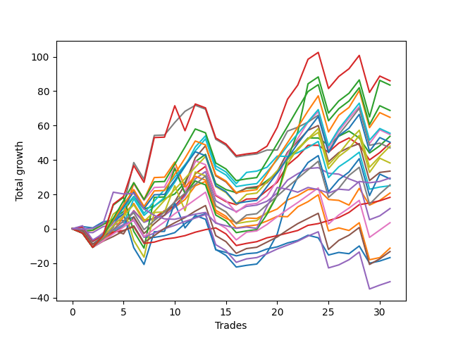

# Short Pointer 001 
- Symbol: ES
- Date Range: 03/18/2022 - 12/30/2022
- Trading Period: 8:30-12:30
- Number of Trades: 31



| Name | Win Percent | Profit | Avg Profit / Trade | Avg Time / Trade |      | Name | Win Percent | Profit | Avg Profit / Trade | Avg Time / Trade |
| ---- | ----------- | ------ | ------------------ | ---------------- | ---- | ---- | ----------- | ------ | ------------------ | ---------------- |
| Sorted By <br> Profit | | | | | | Sorted By <br> Win Percentage ||||
| NEWFI 000 | 64.52 | 43000.00 | 1387.10 | 46:02 |     | TP-1 | 87.10 | 9125.00 | 294.35 | 09:53 |
| BB-200 U/L 2SD | 61.29 | 41750.00 | 1346.77 | 53:13 |     | TP-2 | 77.42 | -15375.00 | -495.97 | 15:36 |
| TP-10 | 67.74 | 34375.00 | 1108.87 | 39:30 |     | TP-6 | 74.19 | 24000.00 | 774.19 | 24:54 |
| TP-9 | 67.74 | 32375.00 | 1044.35 | 36:17 |     | TP-5 | 74.19 | 12750.00 | 411.29 | 22:26 |
| TP-7 | 70.97 | 27750.00 | 895.16 | 31:43 |     | BB-100 Mid | 74.19 | 12500.00 | 403.23 | 26:30 |
| BB-50 U/L 2SD | 67.74 | 27375.00 | 883.06 | 35:48 |     | TP-4 | 74.19 | 1750.00 | 56.45 | 21:31 |
| BB-20 U/L 2SD | 70.97 | 26875.00 | 866.94 | 20:46 |     | TP-3 | 74.19 | -6625.00 | -213.71 | 19:41 |
| TP-8 | 67.74 | 25125.00 | 810.48 | 35:50 |     | TP-7 | 70.97 | 27750.00 | 895.16 | 31:43 |
| BB-20 U/L 2SD C | 67.74 | 24875.00 | 802.42 | 21:35 |     | BB-20 U/L 2SD | 70.97 | 26875.00 | 866.94 | 20:46 |
| TP-6 | 74.19 | 24000.00 | 774.19 | 24:54 |     | BB-50 U/L 1SD | 70.97 | 16750.00 | 540.32 | 27:40 |
| V Mid | 64.52 | 23500.00 | 758.06 | 34:01 |     | TP-10 | 67.74 | 34375.00 | 1108.87 | 39:30 |
| V U/L 1SD | 61.29 | 19125.00 | 616.94 | 44:39 |     | TP-9 | 67.74 | 32375.00 | 1044.35 | 36:17 |
| BB-50 U/L 1SD | 70.97 | 16750.00 | 540.32 | 27:40 |     | BB-50 U/L 2SD | 67.74 | 27375.00 | 883.06 | 35:48 |
| NEWFI 0000 | 48.39 | 14750.00 | 475.81 | 09:42 |     | TP-8 | 67.74 | 25125.00 | 810.48 | 35:50 |
| BB-100 U/L 2SD | 61.29 | 14500.00 | 467.74 | 48:16 |     | BB-20 U/L 2SD C | 67.74 | 24875.00 | 802.42 | 21:35 |
| TP-5 | 74.19 | 12750.00 | 411.29 | 22:26 |     | BB-20 U/L 1SD | 67.74 | 10375.00 | 334.68 | 13:51 |
| BB-100 Mid | 74.19 | 12500.00 | 403.23 | 26:30 |     | NEWFI 000 | 64.52 | 43000.00 | 1387.10 | 46:02 |
| BB-20 U/L 1SD | 67.74 | 10375.00 | 334.68 | 13:51 |     | V Mid | 64.52 | 23500.00 | 758.06 | 34:01 |
| TP-1 | 87.10 | 9125.00 | 294.35 | 09:53 |     | BB-50 Mid | 64.52 | 5875.00 | 189.52 | 19:11 |
| BB-50 Mid | 64.52 | 5875.00 | 189.52 | 19:11 |     | BB-20 Mid | 64.52 | -8375.00 | -270.16 | 08:27 |
| TP-4 | 74.19 | 1750.00 | 56.45 | 21:31 |     | BB-200 U/L 2SD | 61.29 | 41750.00 | 1346.77 | 53:13 |
| BB-200 Mid | 61.29 | -5625.00 | -181.45 | 28:30 |     | V U/L 1SD | 61.29 | 19125.00 | 616.94 | 44:39 |
| TP-3 | 74.19 | -6625.00 | -213.71 | 19:41 |     | BB-100 U/L 2SD | 61.29 | 14500.00 | 467.74 | 48:16 |
| BB-20 Mid | 64.52 | -8375.00 | -270.16 | 08:27 |     | BB-200 Mid | 61.29 | -5625.00 | -181.45 | 28:30 |
| TP-2 | 77.42 | -15375.00 | -495.97 | 15:36 |     | NEWFI 0000 | 48.39 | 14750.00 | 475.81 | 09:42 |

## NO STOPLOSS

### Test BB-20 Mid
* Sell when price hits the middle line of the 20p bollinger
* No Stoploss
* Results:
```
Total Trades: 31
Percent Up: 35.48
Percent Down: 64.52
Total Points Moved Down: -16.75
Potential Profit: -8375.00
Total Points Ups: 59.50 Count Ups: 11
Total Points Downs: 42.75 Count Downs: 20
```

<details><summary>Trades</summary>

<code>In: 2022-03-18 10:14:00		Out: 2022-03-18 10:19:40		Total Position Time: 05:40		Total Move Down: 1.25		Total to Date: 1.25</code> <br />
<code>In: 2022-03-29 12:15:00		Out: 2022-03-29 12:24:45		Total Position Time: 09:45		Total Move Down: -0.75		Total to Date: 0.50</code> <br />
<code>In: 2022-04-20 10:18:00		Out: 2022-04-20 10:19:10		Total Position Time: 01:10		Total Move Down: 3.50		Total to Date: 4.00</code> <br />
<code>In: 2022-04-20 10:50:00		Out: 2022-04-20 10:51:10		Total Position Time: 01:10		Total Move Down: 1.00		Total to Date: 5.00</code> <br />
<code>In: 2022-05-24 10:58:00		Out: 2022-05-24 11:01:15		Total Position Time: 03:15		Total Move Down: -0.25		Total to Date: 4.75</code> <br />
<code>In: 2022-05-24 11:41:00		Out: 2022-05-24 11:42:15		Total Position Time: 01:15		Total Move Down: 2.00		Total to Date: 6.75</code> <br />
<code>In: 2022-05-27 12:03:00		Out: 2022-05-27 12:35:00		Total Position Time: 32:00		Total Move Down: -11.50		Total to Date: -4.75</code> <br />
<code>In: 2022-05-31 10:58:00		Out: 2022-05-31 11:05:10		Total Position Time: 07:10		Total Move Down: -0.25		Total to Date: -5.00</code> <br />
<code>In: 2022-06-01 12:19:00		Out: 2022-06-01 12:25:25		Total Position Time: 06:25		Total Move Down: 1.00		Total to Date: -4.00</code> <br />
<code>In: 2022-06-09 10:08:00		Out: 2022-06-09 10:16:50		Total Position Time: 08:50		Total Move Down: 1.75		Total to Date: -2.25</code> <br />
<code>In: 2022-06-10 11:26:00		Out: 2022-06-10 11:28:25		Total Position Time: 02:25		Total Move Down: 5.25		Total to Date: 3.00</code> <br />
<code>In: 2022-06-17 08:34:00		Out: 2022-06-17 08:35:45		Total Position Time: 01:45		Total Move Down: 3.75		Total to Date: 6.75</code> <br />
<code>In: 2022-07-07 08:10:00		Out: 2022-07-07 08:11:15		Total Position Time: 01:15		Total Move Down: 2.00		Total to Date: 8.75</code> <br />
<code>In: 2022-07-28 08:09:00		Out: 2022-07-28 08:57:50		Total Position Time: 48:50		Total Move Down: -21.00		Total to Date: -12.25</code> <br />
<code>In: 2022-07-29 12:31:00		Out: 2022-07-29 12:40:20		Total Position Time: 09:20		Total Move Down: -1.50		Total to Date: -13.75</code> <br />
<code>In: 2022-08-12 09:15:00		Out: 2022-08-12 09:33:05		Total Position Time: 18:05		Total Move Down: -2.00		Total to Date: -15.75</code> <br />
<code>In: 2022-08-16 09:21:00		Out: 2022-08-16 09:22:10		Total Position Time: 01:10		Total Move Down: 1.25		Total to Date: -14.50</code> <br />
<code>In: 2022-08-18 12:26:00		Out: 2022-08-18 12:31:35		Total Position Time: 05:35		Total Move Down: 0.50		Total to Date: -14.00</code> <br />
<code>In: 2022-08-22 09:28:00		Out: 2022-08-22 09:29:10		Total Position Time: 01:10		Total Move Down: 2.25		Total to Date: -11.75</code> <br />
<code>In: 2022-08-31 09:01:00		Out: 2022-08-31 09:04:15		Total Position Time: 03:15		Total Move Down: 1.25		Total to Date: -10.50</code> <br />
<code>In: 2022-09-16 07:38:00		Out: 2022-09-16 07:42:55		Total Position Time: 04:55		Total Move Down: 2.25		Total to Date: -8.25</code> <br />
<code>In: 2022-09-22 10:57:00		Out: 2022-09-22 11:01:30		Total Position Time: 04:30		Total Move Down: 1.50		Total to Date: -6.75</code> <br />
<code>In: 2022-09-23 08:27:00		Out: 2022-09-23 08:28:10		Total Position Time: 01:10		Total Move Down: 3.00		Total to Date: -3.75</code> <br />
<code>In: 2022-10-03 11:50:00		Out: 2022-10-03 12:01:10		Total Position Time: 11:10		Total Move Down: -1.50		Total to Date: -5.25</code> <br />
<code>In: 2022-10-11 08:39:00		Out: 2022-10-11 08:58:10		Total Position Time: 19:10		Total Move Down: -10.00		Total to Date: -15.25</code> <br />
<code>In: 2022-10-31 08:30:00		Out: 2022-10-31 08:38:35		Total Position Time: 08:35		Total Move Down: 1.50		Total to Date: -13.75</code> <br />
<code>In: 2022-10-31 08:31:00		Out: 2022-10-31 08:38:35		Total Position Time: 07:35		Total Move Down: -0.75		Total to Date: -14.50</code> <br />
<code>In: 2022-11-03 07:31:00		Out: 2022-11-03 07:33:25		Total Position Time: 02:25		Total Move Down: 4.50		Total to Date: -10.00</code> <br />
<code>In: 2022-11-08 07:24:00		Out: 2022-11-08 07:54:45		Total Position Time: 30:45		Total Move Down: -10.00		Total to Date: -20.00</code> <br />
<code>In: 2022-12-05 08:15:00		Out: 2022-12-05 08:16:10		Total Position Time: 01:10		Total Move Down: 1.25		Total to Date: -18.75</code> <br />
<code>In: 2022-12-20 10:06:00		Out: 2022-12-20 10:07:10		Total Position Time: 01:10		Total Move Down: 2.00		Total to Date: -16.75</code> <br />


</details>

### Test BB-20 U/L 1SD
* Sell when the price hits the lower line of the 20p 1std bollinger
* No Stoploss
* Results:
```
Total Trades: 31
Percent Up: 32.26
Percent Down: 67.74
Total Points Moved Down: 20.75
Potential Profit: 10375.00
Total Points Ups: 54.00 Count Ups: 10
Total Points Downs: 74.75 Count Downs: 21
```

<details><summary>Trades</summary>

<code>In: 2022-03-18 10:14:00		Out: 2022-03-18 10:41:40		Total Position Time: 27:40		Total Move Down: -1.25		Total to Date: -1.25</code> <br />
<code>In: 2022-03-29 12:15:00		Out: 2022-03-29 12:27:45		Total Position Time: 12:45		Total Move Down: 0.25		Total to Date: -1.00</code> <br />
<code>In: 2022-04-20 10:18:00		Out: 2022-04-20 10:19:10		Total Position Time: 01:10		Total Move Down: 3.50		Total to Date: 2.50</code> <br />
<code>In: 2022-04-20 10:50:00		Out: 2022-04-20 10:54:35		Total Position Time: 04:35		Total Move Down: 2.50		Total to Date: 5.00</code> <br />
<code>In: 2022-05-24 10:58:00		Out: 2022-05-24 11:01:40		Total Position Time: 03:40		Total Move Down: 3.25		Total to Date: 8.25</code> <br />
<code>In: 2022-05-24 11:41:00		Out: 2022-05-24 11:43:25		Total Position Time: 02:25		Total Move Down: 6.50		Total to Date: 14.75</code> <br />
<code>In: 2022-05-27 12:03:00		Out: 2022-05-27 12:35:45		Total Position Time: 32:45		Total Move Down: -9.50		Total to Date: 5.25</code> <br />
<code>In: 2022-05-31 10:58:00		Out: 2022-05-31 11:13:25		Total Position Time: 15:25		Total Move Down: 0.25		Total to Date: 5.50</code> <br />
<code>In: 2022-06-01 12:19:00		Out: 2022-06-01 12:30:05		Total Position Time: 11:05		Total Move Down: 4.25		Total to Date: 9.75</code> <br />
<code>In: 2022-06-09 10:08:00		Out: 2022-06-09 10:18:50		Total Position Time: 10:50		Total Move Down: 2.75		Total to Date: 12.50</code> <br />
<code>In: 2022-06-10 11:26:00		Out: 2022-06-10 11:38:10		Total Position Time: 12:10		Total Move Down: 4.50		Total to Date: 17.00</code> <br />
<code>In: 2022-06-17 08:34:00		Out: 2022-06-17 08:39:05		Total Position Time: 05:05		Total Move Down: 8.00		Total to Date: 25.00</code> <br />
<code>In: 2022-07-07 08:10:00		Out: 2022-07-07 08:20:05		Total Position Time: 10:05		Total Move Down: 2.50		Total to Date: 27.50</code> <br />
<code>In: 2022-07-28 08:09:00		Out: 2022-07-28 08:58:55		Total Position Time: 49:55		Total Move Down: -18.00		Total to Date: 9.50</code> <br />
<code>In: 2022-07-29 12:31:00		Out: 2022-07-29 12:47:00		Total Position Time: 16:00		Total Move Down: -3.50		Total to Date: 6.00</code> <br />
<code>In: 2022-08-12 09:15:00		Out: 2022-08-12 09:40:30		Total Position Time: 25:30		Total Move Down: -2.50		Total to Date: 3.50</code> <br />
<code>In: 2022-08-16 09:21:00		Out: 2022-08-16 09:27:10		Total Position Time: 06:10		Total Move Down: 2.75		Total to Date: 6.25</code> <br />
<code>In: 2022-08-18 12:26:00		Out: 2022-08-18 12:43:55		Total Position Time: 17:55		Total Move Down: -0.25		Total to Date: 6.00</code> <br />
<code>In: 2022-08-22 09:28:00		Out: 2022-08-22 09:32:05		Total Position Time: 04:05		Total Move Down: 3.00		Total to Date: 9.00</code> <br />
<code>In: 2022-08-31 09:01:00		Out: 2022-08-31 09:06:20		Total Position Time: 05:20		Total Move Down: 2.50		Total to Date: 11.50</code> <br />
<code>In: 2022-09-16 07:38:00		Out: 2022-09-16 07:44:55		Total Position Time: 06:55		Total Move Down: 5.25		Total to Date: 16.75</code> <br />
<code>In: 2022-09-22 10:57:00		Out: 2022-09-22 11:03:35		Total Position Time: 06:35		Total Move Down: 2.50		Total to Date: 19.25</code> <br />
<code>In: 2022-09-23 08:27:00		Out: 2022-09-23 08:29:05		Total Position Time: 02:05		Total Move Down: 3.50		Total to Date: 22.75</code> <br />
<code>In: 2022-10-03 11:50:00		Out: 2022-10-03 12:01:50		Total Position Time: 11:50		Total Move Down: 0.25		Total to Date: 23.00</code> <br />
<code>In: 2022-10-11 08:39:00		Out: 2022-10-11 09:01:55		Total Position Time: 22:55		Total Move Down: -6.00		Total to Date: 17.00</code> <br />
<code>In: 2022-10-31 08:30:00		Out: 2022-10-31 08:58:20		Total Position Time: 28:20		Total Move Down: -0.50		Total to Date: 16.50</code> <br />
<code>In: 2022-10-31 08:31:00		Out: 2022-10-31 08:58:20		Total Position Time: 27:20		Total Move Down: -2.75		Total to Date: 13.75</code> <br />
<code>In: 2022-11-03 07:31:00		Out: 2022-11-03 07:36:45		Total Position Time: 05:45		Total Move Down: 9.75		Total to Date: 23.50</code> <br />
<code>In: 2022-11-08 07:24:00		Out: 2022-11-08 08:01:05		Total Position Time: 37:05		Total Move Down: -9.75		Total to Date: 13.75</code> <br />
<code>In: 2022-12-05 08:15:00		Out: 2022-12-05 08:16:50		Total Position Time: 01:50		Total Move Down: 2.75		Total to Date: 16.50</code> <br />
<code>In: 2022-12-20 10:06:00		Out: 2022-12-20 10:10:35		Total Position Time: 04:35		Total Move Down: 4.25		Total to Date: 20.75</code> <br />


</details>

### Test BB-20 U/L 2SD
* Sell when the price hits the lower line of the 20p 2std bollinger
* No Stoploss
* Results:
```
Total Trades: 31
Percent Up: 29.03
Percent Down: 70.97
Total Points Moved Down: 53.75
Potential Profit: 26875.00
Total Points Ups: 48.00 Count Ups: 9
Total Points Downs: 101.75 Count Downs: 22
```

<details><summary>Trades</summary>

<code>In: 2022-03-18 10:14:00		Out: 2022-03-18 10:58:35		Total Position Time: 44:35		Total Move Down: -1.50		Total to Date: -1.50</code> <br />
<code>In: 2022-03-29 12:15:00		Out: 2022-03-29 12:27:50		Total Position Time: 12:50		Total Move Down: 0.75		Total to Date: -0.75</code> <br />
<code>In: 2022-04-20 10:18:00		Out: 2022-04-20 11:13:55		Total Position Time: 55:55		Total Move Down: 3.25		Total to Date: 2.50</code> <br />
<code>In: 2022-04-20 10:50:00		Out: 2022-04-20 11:13:55		Total Position Time: 23:55		Total Move Down: 3.25		Total to Date: 5.75</code> <br />
<code>In: 2022-05-24 10:58:00		Out: 2022-05-24 11:01:50		Total Position Time: 03:50		Total Move Down: 4.25		Total to Date: 10.00</code> <br />
<code>In: 2022-05-24 11:41:00		Out: 2022-05-24 11:44:00		Total Position Time: 03:00		Total Move Down: 8.75		Total to Date: 18.75</code> <br />
<code>In: 2022-05-27 12:03:00		Out: 2022-05-27 12:36:55		Total Position Time: 33:55		Total Move Down: -7.25		Total to Date: 11.50</code> <br />
<code>In: 2022-05-31 10:58:00		Out: 2022-05-31 11:22:35		Total Position Time: 24:35		Total Move Down: 1.75		Total to Date: 13.25</code> <br />
<code>In: 2022-06-01 12:19:00		Out: 2022-06-01 12:30:05		Total Position Time: 11:05		Total Move Down: 4.25		Total to Date: 17.50</code> <br />
<code>In: 2022-06-09 10:08:00		Out: 2022-06-09 10:19:05		Total Position Time: 11:05		Total Move Down: 2.75		Total to Date: 20.25</code> <br />
<code>In: 2022-06-10 11:26:00		Out: 2022-06-10 11:40:10		Total Position Time: 14:10		Total Move Down: 6.75		Total to Date: 27.00</code> <br />
<code>In: 2022-06-17 08:34:00		Out: 2022-06-17 08:45:15		Total Position Time: 11:15		Total Move Down: 12.00		Total to Date: 39.00</code> <br />
<code>In: 2022-07-07 08:10:00		Out: 2022-07-07 08:22:45		Total Position Time: 12:45		Total Move Down: 4.25		Total to Date: 43.25</code> <br />
<code>In: 2022-07-28 08:09:00		Out: 2022-07-28 09:08:10		Total Position Time: 59:10		Total Move Down: -17.00		Total to Date: 26.25</code> <br />
<code>In: 2022-07-29 12:31:00		Out: 2022-07-29 12:47:00		Total Position Time: 16:00		Total Move Down: -3.50		Total to Date: 22.75</code> <br />
<code>In: 2022-08-12 09:15:00		Out: 2022-08-12 09:42:00		Total Position Time: 27:00		Total Move Down: -1.75		Total to Date: 21.00</code> <br />
<code>In: 2022-08-16 09:21:00		Out: 2022-08-16 09:41:15		Total Position Time: 20:15		Total Move Down: 2.50		Total to Date: 23.50</code> <br />
<code>In: 2022-08-18 12:26:00		Out: 2022-08-18 12:46:15		Total Position Time: 20:15		Total Move Down: 0.25		Total to Date: 23.75</code> <br />
<code>In: 2022-08-22 09:28:00		Out: 2022-08-22 09:44:50		Total Position Time: 16:50		Total Move Down: 4.25		Total to Date: 28.00</code> <br />
<code>In: 2022-08-31 09:01:00		Out: 2022-08-31 09:07:00		Total Position Time: 06:00		Total Move Down: 4.50		Total to Date: 32.50</code> <br />
<code>In: 2022-09-16 07:38:00		Out: 2022-09-16 07:47:50		Total Position Time: 09:50		Total Move Down: 8.75		Total to Date: 41.25</code> <br />
<code>In: 2022-09-22 10:57:00		Out: 2022-09-22 11:07:55		Total Position Time: 10:55		Total Move Down: 5.00		Total to Date: 46.25</code> <br />
<code>In: 2022-09-23 08:27:00		Out: 2022-09-23 08:37:35		Total Position Time: 10:35		Total Move Down: 6.50		Total to Date: 52.75</code> <br />
<code>In: 2022-10-03 11:50:00		Out: 2022-10-03 12:12:30		Total Position Time: 22:30		Total Move Down: -0.00		Total to Date: 52.75</code> <br />
<code>In: 2022-10-11 08:39:00		Out: 2022-10-11 09:03:40		Total Position Time: 24:40		Total Move Down: -4.25		Total to Date: 48.50</code> <br />
<code>In: 2022-10-31 08:30:00		Out: 2022-10-31 08:58:35		Total Position Time: 28:35		Total Move Down: 5.25		Total to Date: 53.75</code> <br />
<code>In: 2022-10-31 08:31:00		Out: 2022-10-31 08:58:35		Total Position Time: 27:35		Total Move Down: 3.00		Total to Date: 56.75</code> <br />
<code>In: 2022-11-03 07:31:00		Out: 2022-11-03 08:06:40		Total Position Time: 35:40		Total Move Down: -4.00		Total to Date: 52.75</code> <br />
<code>In: 2022-11-08 07:24:00		Out: 2022-11-08 08:01:25		Total Position Time: 37:25		Total Move Down: -8.75		Total to Date: 44.00</code> <br />
<code>In: 2022-12-05 08:15:00		Out: 2022-12-05 08:17:35		Total Position Time: 02:35		Total Move Down: 4.25		Total to Date: 48.25</code> <br />
<code>In: 2022-12-20 10:06:00		Out: 2022-12-20 10:11:15		Total Position Time: 05:15		Total Move Down: 5.50		Total to Date: 53.75</code> <br />


</details>

### Test BB-20 U/L 2SD C
* Sell when the price hits the lower line of the 20p 2std bollinger
* No Stoploss
* Results:
```
Total Trades: 31
Percent Up: 32.26
Percent Down: 67.74
Total Points Moved Down: 49.75
Potential Profit: 24875.00
Total Points Ups: 54.50 Count Ups: 10
Total Points Downs: 104.25 Count Downs: 21
```

<details><summary>Trades</summary>

<code>In: 2022-03-18 10:14:00		Out: 2022-03-18 10:58:40		Total Position Time: 44:40		Total Move Down: -0.75		Total to Date: -0.75</code> <br />
<code>In: 2022-03-29 12:15:00		Out: 2022-03-29 12:47:00		Total Position Time: 32:00		Total Move Down: -8.25		Total to Date: -9.00</code> <br />
<code>In: 2022-04-20 10:18:00		Out: 2022-04-20 11:14:05		Total Position Time: 56:05		Total Move Down: 3.25		Total to Date: -5.75</code> <br />
<code>In: 2022-04-20 10:50:00		Out: 2022-04-20 11:14:05		Total Position Time: 24:05		Total Move Down: 3.25		Total to Date: -2.50</code> <br />
<code>In: 2022-05-24 10:58:00		Out: 2022-05-24 11:01:50		Total Position Time: 03:50		Total Move Down: 4.25		Total to Date: 1.75</code> <br />
<code>In: 2022-05-24 11:41:00		Out: 2022-05-24 11:44:00		Total Position Time: 03:00		Total Move Down: 8.75		Total to Date: 10.50</code> <br />
<code>In: 2022-05-27 12:03:00		Out: 2022-05-27 12:38:10		Total Position Time: 35:10		Total Move Down: -6.50		Total to Date: 4.00</code> <br />
<code>In: 2022-05-31 10:58:00		Out: 2022-05-31 11:22:40		Total Position Time: 24:40		Total Move Down: 2.25		Total to Date: 6.25</code> <br />
<code>In: 2022-06-01 12:19:00		Out: 2022-06-01 12:30:05		Total Position Time: 11:05		Total Move Down: 4.25		Total to Date: 10.50</code> <br />
<code>In: 2022-06-09 10:08:00		Out: 2022-06-09 10:21:10		Total Position Time: 13:10		Total Move Down: 2.75		Total to Date: 13.25</code> <br />
<code>In: 2022-06-10 11:26:00		Out: 2022-06-10 11:40:10		Total Position Time: 14:10		Total Move Down: 6.75		Total to Date: 20.00</code> <br />
<code>In: 2022-06-17 08:34:00		Out: 2022-06-17 08:45:15		Total Position Time: 11:15		Total Move Down: 12.00		Total to Date: 32.00</code> <br />
<code>In: 2022-07-07 08:10:00		Out: 2022-07-07 08:22:45		Total Position Time: 12:45		Total Move Down: 4.25		Total to Date: 36.25</code> <br />
<code>In: 2022-07-28 08:09:00		Out: 2022-07-28 09:08:30		Total Position Time: 59:30		Total Move Down: -17.00		Total to Date: 19.25</code> <br />
<code>In: 2022-07-29 12:31:00		Out: 2022-07-29 12:47:00		Total Position Time: 16:00		Total Move Down: -3.50		Total to Date: 15.75</code> <br />
<code>In: 2022-08-12 09:15:00		Out: 2022-08-12 09:42:00		Total Position Time: 27:00		Total Move Down: -1.75		Total to Date: 14.00</code> <br />
<code>In: 2022-08-16 09:21:00		Out: 2022-08-16 09:42:10		Total Position Time: 21:10		Total Move Down: 3.25		Total to Date: 17.25</code> <br />
<code>In: 2022-08-18 12:26:00		Out: 2022-08-18 12:46:15		Total Position Time: 20:15		Total Move Down: 0.25		Total to Date: 17.50</code> <br />
<code>In: 2022-08-22 09:28:00		Out: 2022-08-22 09:44:55		Total Position Time: 16:55		Total Move Down: 4.75		Total to Date: 22.25</code> <br />
<code>In: 2022-08-31 09:01:00		Out: 2022-08-31 09:07:05		Total Position Time: 06:05		Total Move Down: 4.75		Total to Date: 27.00</code> <br />
<code>In: 2022-09-16 07:38:00		Out: 2022-09-16 07:48:20		Total Position Time: 10:20		Total Move Down: 10.00		Total to Date: 37.00</code> <br />
<code>In: 2022-09-22 10:57:00		Out: 2022-09-22 11:07:55		Total Position Time: 10:55		Total Move Down: 5.00		Total to Date: 42.00</code> <br />
<code>In: 2022-09-23 08:27:00		Out: 2022-09-23 08:37:40		Total Position Time: 10:40		Total Move Down: 6.50		Total to Date: 48.50</code> <br />
<code>In: 2022-10-03 11:50:00		Out: 2022-10-03 12:12:30		Total Position Time: 22:30		Total Move Down: -0.00		Total to Date: 48.50</code> <br />
<code>In: 2022-10-11 08:39:00		Out: 2022-10-11 09:03:45		Total Position Time: 24:45		Total Move Down: -4.00		Total to Date: 44.50</code> <br />
<code>In: 2022-10-31 08:30:00		Out: 2022-10-31 08:58:35		Total Position Time: 28:35		Total Move Down: 5.25		Total to Date: 49.75</code> <br />
<code>In: 2022-10-31 08:31:00		Out: 2022-10-31 08:58:35		Total Position Time: 27:35		Total Move Down: 3.00		Total to Date: 52.75</code> <br />
<code>In: 2022-11-03 07:31:00		Out: 2022-11-03 08:06:40		Total Position Time: 35:40		Total Move Down: -4.00		Total to Date: 48.75</code> <br />
<code>In: 2022-11-08 07:24:00		Out: 2022-11-08 08:01:25		Total Position Time: 37:25		Total Move Down: -8.75		Total to Date: 40.00</code> <br />
<code>In: 2022-12-05 08:15:00		Out: 2022-12-05 08:17:35		Total Position Time: 02:35		Total Move Down: 4.25		Total to Date: 44.25</code> <br />
<code>In: 2022-12-20 10:06:00		Out: 2022-12-20 10:11:15		Total Position Time: 05:15		Total Move Down: 5.50		Total to Date: 49.75</code> <br />


</details>

### Test BB-50 Mid
* Sell when price hits the middle line of the 50p bollinger
* No Stoploss
* Results:
```
Total Trades: 31
Percent Up: 35.48
Percent Down: 64.52
Total Points Moved Down: 11.75
Potential Profit: 5875.00
Total Points Ups: 62.25 Count Ups: 11
Total Points Downs: 74.00 Count Downs: 20
```

<details><summary>Trades</summary>

<code>In: 2022-03-18 10:14:00		Out: 2022-03-18 10:58:30		Total Position Time: 44:30		Total Move Down: -2.00		Total to Date: -2.00</code> <br />
<code>In: 2022-03-29 12:15:00		Out: 2022-03-29 12:43:10		Total Position Time: 28:10		Total Move Down: -0.25		Total to Date: -2.25</code> <br />
<code>In: 2022-04-20 10:18:00		Out: 2022-04-20 10:19:15		Total Position Time: 01:15		Total Move Down: 3.50		Total to Date: 1.25</code> <br />
<code>In: 2022-04-20 10:50:00		Out: 2022-04-20 10:51:10		Total Position Time: 01:10		Total Move Down: 1.00		Total to Date: 2.25</code> <br />
<code>In: 2022-05-24 10:58:00		Out: 2022-05-24 11:20:25		Total Position Time: 22:25		Total Move Down: 1.50		Total to Date: 3.75</code> <br />
<code>In: 2022-05-24 11:41:00		Out: 2022-05-24 11:43:25		Total Position Time: 02:25		Total Move Down: 6.50		Total to Date: 10.25</code> <br />
<code>In: 2022-05-27 12:03:00		Out: 2022-05-27 12:38:10		Total Position Time: 35:10		Total Move Down: -6.50		Total to Date: 3.75</code> <br />
<code>In: 2022-05-31 10:58:00		Out: 2022-05-31 11:22:40		Total Position Time: 24:40		Total Move Down: 2.25		Total to Date: 6.00</code> <br />
<code>In: 2022-06-01 12:19:00		Out: 2022-06-01 12:25:30		Total Position Time: 06:30		Total Move Down: 1.75		Total to Date: 7.75</code> <br />
<code>In: 2022-06-09 10:08:00		Out: 2022-06-09 10:22:05		Total Position Time: 14:05		Total Move Down: 4.75		Total to Date: 12.50</code> <br />
<code>In: 2022-06-10 11:26:00		Out: 2022-06-10 11:28:30		Total Position Time: 02:30		Total Move Down: 6.50		Total to Date: 19.00</code> <br />
<code>In: 2022-06-17 08:34:00		Out: 2022-06-17 08:45:05		Total Position Time: 11:05		Total Move Down: 10.00		Total to Date: 29.00</code> <br />
<code>In: 2022-07-07 08:10:00		Out: 2022-07-07 08:22:45		Total Position Time: 12:45		Total Move Down: 4.25		Total to Date: 33.25</code> <br />
<code>In: 2022-07-28 08:09:00		Out: 2022-07-28 09:08:10		Total Position Time: 59:10		Total Move Down: -17.00		Total to Date: 16.25</code> <br />
<code>In: 2022-07-29 12:31:00		Out: 2022-07-29 12:47:00		Total Position Time: 16:00		Total Move Down: -3.50		Total to Date: 12.75</code> <br />
<code>In: 2022-08-12 09:15:00		Out: 2022-08-12 09:58:55		Total Position Time: 43:55		Total Move Down: -2.75		Total to Date: 10.00</code> <br />
<code>In: 2022-08-16 09:21:00		Out: 2022-08-16 09:30:05		Total Position Time: 09:05		Total Move Down: 3.00		Total to Date: 13.00</code> <br />
<code>In: 2022-08-18 12:26:00		Out: 2022-08-18 12:47:00		Total Position Time: 21:00		Total Move Down: 0.75		Total to Date: 13.75</code> <br />
<code>In: 2022-08-22 09:28:00		Out: 2022-08-22 09:29:10		Total Position Time: 01:10		Total Move Down: 2.25		Total to Date: 16.00</code> <br />
<code>In: 2022-08-31 09:01:00		Out: 2022-08-31 09:10:55		Total Position Time: 09:55		Total Move Down: 4.75		Total to Date: 20.75</code> <br />
<code>In: 2022-09-16 07:38:00		Out: 2022-09-16 07:46:45		Total Position Time: 08:45		Total Move Down: 7.50		Total to Date: 28.25</code> <br />
<code>In: 2022-09-22 10:57:00		Out: 2022-09-22 11:04:15		Total Position Time: 07:15		Total Move Down: 3.75		Total to Date: 32.00</code> <br />
<code>In: 2022-09-23 08:27:00		Out: 2022-09-23 08:28:10		Total Position Time: 01:10		Total Move Down: 3.00		Total to Date: 35.00</code> <br />
<code>In: 2022-10-03 11:50:00		Out: 2022-10-03 12:14:05		Total Position Time: 24:05		Total Move Down: 0.50		Total to Date: 35.50</code> <br />
<code>In: 2022-10-11 08:39:00		Out: 2022-10-11 09:04:40		Total Position Time: 25:40		Total Move Down: -3.25		Total to Date: 32.25</code> <br />
<code>In: 2022-10-31 08:30:00		Out: 2022-10-31 08:58:20		Total Position Time: 28:20		Total Move Down: -0.50		Total to Date: 31.75</code> <br />
<code>In: 2022-10-31 08:31:00		Out: 2022-10-31 08:58:20		Total Position Time: 27:20		Total Move Down: -2.75		Total to Date: 29.00</code> <br />
<code>In: 2022-11-03 07:31:00		Out: 2022-11-03 08:09:10		Total Position Time: 38:10		Total Move Down: -2.25		Total to Date: 26.75</code> <br />
<code>In: 2022-11-08 07:24:00		Out: 2022-11-08 08:24:55		Total Position Time: 60:55		Total Move Down: -21.50		Total to Date: 5.25</code> <br />
<code>In: 2022-12-05 08:15:00		Out: 2022-12-05 08:16:45		Total Position Time: 01:45		Total Move Down: 2.25		Total to Date: 7.50</code> <br />
<code>In: 2022-12-20 10:06:00		Out: 2022-12-20 10:10:35		Total Position Time: 04:35		Total Move Down: 4.25		Total to Date: 11.75</code> <br />


</details>

### Test BB-50 U/L 1SD
* Sell when the price hits the lower line of the 50p 1std bollinger
* No Stoploss
* Results:
```
Total Trades: 31
Percent Up: 29.03
Percent Down: 70.97
Total Points Moved Down: 33.50
Potential Profit: 16750.00
Total Points Ups: 91.25 Count Ups: 9
Total Points Downs: 124.75 Count Downs: 22
```

<details><summary>Trades</summary>

<code>In: 2022-03-18 10:14:00		Out: 2022-03-18 10:59:05		Total Position Time: 45:05		Total Move Down: -0.75		Total to Date: -0.75</code> <br />
<code>In: 2022-03-29 12:15:00		Out: 2022-03-29 12:47:00		Total Position Time: 32:00		Total Move Down: -8.25		Total to Date: -9.00</code> <br />
<code>In: 2022-04-20 10:18:00		Out: 2022-04-20 10:26:35		Total Position Time: 08:35		Total Move Down: 5.00		Total to Date: -4.00</code> <br />
<code>In: 2022-04-20 10:50:00		Out: 2022-04-20 11:13:55		Total Position Time: 23:55		Total Move Down: 3.25		Total to Date: -0.75</code> <br />
<code>In: 2022-05-24 10:58:00		Out: 2022-05-24 11:44:15		Total Position Time: 46:15		Total Move Down: -2.25		Total to Date: -3.00</code> <br />
<code>In: 2022-05-24 11:41:00		Out: 2022-05-24 11:44:15		Total Position Time: 03:15		Total Move Down: 10.00		Total to Date: 7.00</code> <br />
<code>In: 2022-05-27 12:03:00		Out: 2022-05-27 12:47:00		Total Position Time: 44:00		Total Move Down: -9.75		Total to Date: -2.75</code> <br />
<code>In: 2022-05-31 10:58:00		Out: 2022-05-31 11:26:25		Total Position Time: 28:25		Total Move Down: 5.75		Total to Date: 3.00</code> <br />
<code>In: 2022-06-01 12:19:00		Out: 2022-06-01 12:31:00		Total Position Time: 12:00		Total Move Down: 5.00		Total to Date: 8.00</code> <br />
<code>In: 2022-06-09 10:08:00		Out: 2022-06-09 10:24:05		Total Position Time: 16:05		Total Move Down: 7.75		Total to Date: 15.75</code> <br />
<code>In: 2022-06-10 11:26:00		Out: 2022-06-10 11:41:45		Total Position Time: 15:45		Total Move Down: 10.00		Total to Date: 25.75</code> <br />
<code>In: 2022-06-17 08:34:00		Out: 2022-06-17 08:51:25		Total Position Time: 17:25		Total Move Down: 15.50		Total to Date: 41.25</code> <br />
<code>In: 2022-07-07 08:10:00		Out: 2022-07-07 08:23:20		Total Position Time: 13:20		Total Move Down: 7.00		Total to Date: 48.25</code> <br />
<code>In: 2022-07-28 08:09:00		Out: 2022-07-28 09:09:55		Total Position Time: 60:55		Total Move Down: -17.50		Total to Date: 30.75</code> <br />
<code>In: 2022-07-29 12:31:00		Out: 2022-07-29 12:47:00		Total Position Time: 16:00		Total Move Down: -3.50		Total to Date: 27.25</code> <br />
<code>In: 2022-08-12 09:15:00		Out: 2022-08-12 10:15:55		Total Position Time: 60:55		Total Move Down: -6.75		Total to Date: 20.50</code> <br />
<code>In: 2022-08-16 09:21:00		Out: 2022-08-16 09:42:10		Total Position Time: 21:10		Total Move Down: 3.25		Total to Date: 23.75</code> <br />
<code>In: 2022-08-18 12:26:00		Out: 2022-08-18 12:47:00		Total Position Time: 21:00		Total Move Down: 0.75		Total to Date: 24.50</code> <br />
<code>In: 2022-08-22 09:28:00		Out: 2022-08-22 09:29:10		Total Position Time: 01:10		Total Move Down: 2.25		Total to Date: 26.75</code> <br />
<code>In: 2022-08-31 09:01:00		Out: 2022-08-31 09:22:45		Total Position Time: 21:45		Total Move Down: 6.50		Total to Date: 33.25</code> <br />
<code>In: 2022-09-16 07:38:00		Out: 2022-09-16 07:56:50		Total Position Time: 18:50		Total Move Down: 11.25		Total to Date: 44.50</code> <br />
<code>In: 2022-09-22 10:57:00		Out: 2022-09-22 11:09:10		Total Position Time: 12:10		Total Move Down: 6.25		Total to Date: 50.75</code> <br />
<code>In: 2022-09-23 08:27:00		Out: 2022-09-23 08:37:35		Total Position Time: 10:35		Total Move Down: 6.50		Total to Date: 57.25</code> <br />
<code>In: 2022-10-03 11:50:00		Out: 2022-10-03 12:16:30		Total Position Time: 26:30		Total Move Down: 2.75		Total to Date: 60.00</code> <br />
<code>In: 2022-10-11 08:39:00		Out: 2022-10-11 09:39:55		Total Position Time: 60:55		Total Move Down: -21.00		Total to Date: 39.00</code> <br />
<code>In: 2022-10-31 08:30:00		Out: 2022-10-31 08:58:35		Total Position Time: 28:35		Total Move Down: 5.25		Total to Date: 44.25</code> <br />
<code>In: 2022-10-31 08:31:00		Out: 2022-10-31 08:58:35		Total Position Time: 27:35		Total Move Down: 3.00		Total to Date: 47.25</code> <br />
<code>In: 2022-11-03 07:31:00		Out: 2022-11-03 08:16:40		Total Position Time: 45:40		Total Move Down: 2.25		Total to Date: 49.50</code> <br />
<code>In: 2022-11-08 07:24:00		Out: 2022-11-08 08:24:55		Total Position Time: 60:55		Total Move Down: -21.50		Total to Date: 28.00</code> <br />
<code>In: 2022-12-05 08:15:00		Out: 2022-12-05 08:17:45		Total Position Time: 02:45		Total Move Down: 4.75		Total to Date: 32.75</code> <br />
<code>In: 2022-12-20 10:06:00		Out: 2022-12-20 11:00:40		Total Position Time: 54:40		Total Move Down: 0.75		Total to Date: 33.50</code> <br />


</details>

### Test BB-50 U/L 2SD
* Sell when the price hits the lower line of the 50p 2std bollinger
* No Stoploss
* Results:
```
Total Trades: 31
Percent Up: 32.26
Percent Down: 67.74
Total Points Moved Down: 54.75
Potential Profit: 27375.00
Total Points Ups: 107.75 Count Ups: 10
Total Points Downs: 162.50 Count Downs: 21
```

<details><summary>Trades</summary>

<code>In: 2022-03-18 10:14:00		Out: 2022-03-18 11:07:25		Total Position Time: 53:25		Total Move Down: 0.75		Total to Date: 0.75</code> <br />
<code>In: 2022-03-29 12:15:00		Out: 2022-03-29 12:47:00		Total Position Time: 32:00		Total Move Down: -8.25		Total to Date: -7.50</code> <br />
<code>In: 2022-04-20 10:18:00		Out: 2022-04-20 11:17:15		Total Position Time: 59:15		Total Move Down: 5.25		Total to Date: -2.25</code> <br />
<code>In: 2022-04-20 10:50:00		Out: 2022-04-20 11:17:15		Total Position Time: 27:15		Total Move Down: 5.25		Total to Date: 3.00</code> <br />
<code>In: 2022-05-24 10:58:00		Out: 2022-05-24 11:49:10		Total Position Time: 51:10		Total Move Down: 5.50		Total to Date: 8.50</code> <br />
<code>In: 2022-05-24 11:41:00		Out: 2022-05-24 11:49:10		Total Position Time: 08:10		Total Move Down: 17.75		Total to Date: 26.25</code> <br />
<code>In: 2022-05-27 12:03:00		Out: 2022-05-27 12:47:00		Total Position Time: 44:00		Total Move Down: -9.75		Total to Date: 16.50</code> <br />
<code>In: 2022-05-31 10:58:00		Out: 2022-05-31 11:41:10		Total Position Time: 43:10		Total Move Down: 7.50		Total to Date: 24.00</code> <br />
<code>In: 2022-06-01 12:19:00		Out: 2022-06-01 12:47:00		Total Position Time: 28:00		Total Move Down: 0.25		Total to Date: 24.25</code> <br />
<code>In: 2022-06-09 10:08:00		Out: 2022-06-09 10:27:20		Total Position Time: 19:20		Total Move Down: 11.50		Total to Date: 35.75</code> <br />
<code>In: 2022-06-10 11:26:00		Out: 2022-06-10 12:26:55		Total Position Time: 60:55		Total Move Down: -14.50		Total to Date: 21.25</code> <br />
<code>In: 2022-06-17 08:34:00		Out: 2022-06-17 08:52:10		Total Position Time: 18:10		Total Move Down: 18.25		Total to Date: 39.50</code> <br />
<code>In: 2022-07-07 08:10:00		Out: 2022-07-07 09:10:55		Total Position Time: 60:55		Total Move Down: -2.25		Total to Date: 37.25</code> <br />
<code>In: 2022-07-28 08:09:00		Out: 2022-07-28 09:09:55		Total Position Time: 60:55		Total Move Down: -17.50		Total to Date: 19.75</code> <br />
<code>In: 2022-07-29 12:31:00		Out: 2022-07-29 12:47:00		Total Position Time: 16:00		Total Move Down: -3.50		Total to Date: 16.25</code> <br />
<code>In: 2022-08-12 09:15:00		Out: 2022-08-12 10:15:55		Total Position Time: 60:55		Total Move Down: -6.75		Total to Date: 9.50</code> <br />
<code>In: 2022-08-16 09:21:00		Out: 2022-08-16 09:42:30		Total Position Time: 21:30		Total Move Down: 4.50		Total to Date: 14.00</code> <br />
<code>In: 2022-08-18 12:26:00		Out: 2022-08-18 12:47:00		Total Position Time: 21:00		Total Move Down: 0.75		Total to Date: 14.75</code> <br />
<code>In: 2022-08-22 09:28:00		Out: 2022-08-22 09:44:50		Total Position Time: 16:50		Total Move Down: 4.25		Total to Date: 19.00</code> <br />
<code>In: 2022-08-31 09:01:00		Out: 2022-08-31 09:24:25		Total Position Time: 23:25		Total Move Down: 9.25		Total to Date: 28.25</code> <br />
<code>In: 2022-09-16 07:38:00		Out: 2022-09-16 07:58:05		Total Position Time: 20:05		Total Move Down: 15.25		Total to Date: 43.50</code> <br />
<code>In: 2022-09-22 10:57:00		Out: 2022-09-22 11:13:10		Total Position Time: 16:10		Total Move Down: 9.00		Total to Date: 52.50</code> <br />
<code>In: 2022-09-23 08:27:00		Out: 2022-09-23 08:40:25		Total Position Time: 13:25		Total Move Down: 9.50		Total to Date: 62.00</code> <br />
<code>In: 2022-10-03 11:50:00		Out: 2022-10-03 12:18:00		Total Position Time: 28:00		Total Move Down: 6.00		Total to Date: 68.00</code> <br />
<code>In: 2022-10-11 08:39:00		Out: 2022-10-11 09:39:55		Total Position Time: 60:55		Total Move Down: -21.00		Total to Date: 47.00</code> <br />
<code>In: 2022-10-31 08:30:00		Out: 2022-10-31 08:58:50		Total Position Time: 28:50		Total Move Down: 9.75		Total to Date: 56.75</code> <br />
<code>In: 2022-10-31 08:31:00		Out: 2022-10-31 08:58:50		Total Position Time: 27:50		Total Move Down: 7.50		Total to Date: 64.25</code> <br />
<code>In: 2022-11-03 07:31:00		Out: 2022-11-03 08:31:15		Total Position Time: 60:15		Total Move Down: 6.75		Total to Date: 71.00</code> <br />
<code>In: 2022-11-08 07:24:00		Out: 2022-11-08 08:24:55		Total Position Time: 60:55		Total Move Down: -21.50		Total to Date: 49.50</code> <br />
<code>In: 2022-12-05 08:15:00		Out: 2022-12-05 08:21:20		Total Position Time: 06:20		Total Move Down: 8.00		Total to Date: 57.50</code> <br />
<code>In: 2022-12-20 10:06:00		Out: 2022-12-20 11:06:55		Total Position Time: 60:55		Total Move Down: -2.75		Total to Date: 54.75</code> <br />


</details>

### Test V Mid
* Sell when the price hits the middle line of the 1std VWAP
* No Stoploss
* Results:
```
Total Trades: 31
Percent Up: 35.48
Percent Down: 64.52
Total Points Moved Down: 47.00
Potential Profit: 23500.00
Total Points Ups: 95.75 Count Ups: 11
Total Points Downs: 142.75 Count Downs: 20
```

<details><summary>Trades</summary>

<code>In: 2022-03-18 10:14:00		Out: 2022-03-18 11:14:55		Total Position Time: 60:55		Total Move Down: -2.50		Total to Date: -2.50</code> <br />
<code>In: 2022-03-29 12:15:00		Out: 2022-03-29 12:47:00		Total Position Time: 32:00		Total Move Down: -8.25		Total to Date: -10.75</code> <br />
<code>In: 2022-04-20 10:18:00		Out: 2022-04-20 11:17:50		Total Position Time: 59:50		Total Move Down: 5.75		Total to Date: -5.00</code> <br />
<code>In: 2022-04-20 10:50:00		Out: 2022-04-20 11:17:50		Total Position Time: 27:50		Total Move Down: 5.75		Total to Date: 0.75</code> <br />
<code>In: 2022-05-24 10:58:00		Out: 2022-05-24 11:55:20		Total Position Time: 57:20		Total Move Down: 12.75		Total to Date: 13.50</code> <br />
<code>In: 2022-05-24 11:41:00		Out: 2022-05-24 11:55:20		Total Position Time: 14:20		Total Move Down: 25.00		Total to Date: 38.50</code> <br />
<code>In: 2022-05-27 12:03:00		Out: 2022-05-27 12:47:00		Total Position Time: 44:00		Total Move Down: -9.75		Total to Date: 28.75</code> <br />
<code>In: 2022-05-31 10:58:00		Out: 2022-05-31 11:48:35		Total Position Time: 50:35		Total Move Down: 25.50		Total to Date: 54.25</code> <br />
<code>In: 2022-06-01 12:19:00		Out: 2022-06-01 12:47:00		Total Position Time: 28:00		Total Move Down: 0.25		Total to Date: 54.50</code> <br />
<code>In: 2022-06-09 10:08:00		Out: 2022-06-09 10:23:45		Total Position Time: 15:45		Total Move Down: 7.25		Total to Date: 61.75</code> <br />
<code>In: 2022-06-10 11:26:00		Out: 2022-06-10 11:28:30		Total Position Time: 02:30		Total Move Down: 6.50		Total to Date: 68.25</code> <br />
<code>In: 2022-06-17 08:34:00		Out: 2022-06-17 08:36:10		Total Position Time: 02:10		Total Move Down: 3.50		Total to Date: 71.75</code> <br />
<code>In: 2022-07-07 08:10:00		Out: 2022-07-07 09:10:55		Total Position Time: 60:55		Total Move Down: -2.25		Total to Date: 69.50</code> <br />
<code>In: 2022-07-28 08:09:00		Out: 2022-07-28 09:09:55		Total Position Time: 60:55		Total Move Down: -17.50		Total to Date: 52.00</code> <br />
<code>In: 2022-07-29 12:31:00		Out: 2022-07-29 12:47:00		Total Position Time: 16:00		Total Move Down: -3.50		Total to Date: 48.50</code> <br />
<code>In: 2022-08-12 09:15:00		Out: 2022-08-12 10:15:55		Total Position Time: 60:55		Total Move Down: -6.75		Total to Date: 41.75</code> <br />
<code>In: 2022-08-16 09:21:00		Out: 2022-08-16 10:21:55		Total Position Time: 60:55		Total Move Down: 1.00		Total to Date: 42.75</code> <br />
<code>In: 2022-08-18 12:26:00		Out: 2022-08-18 12:47:00		Total Position Time: 21:00		Total Move Down: 0.75		Total to Date: 43.50</code> <br />
<code>In: 2022-08-22 09:28:00		Out: 2022-08-22 09:29:10		Total Position Time: 01:10		Total Move Down: 2.25		Total to Date: 45.75</code> <br />
<code>In: 2022-08-31 09:01:00		Out: 2022-08-31 09:02:10		Total Position Time: 01:10		Total Move Down: -0.00		Total to Date: 45.75</code> <br />
<code>In: 2022-09-16 07:38:00		Out: 2022-09-16 07:48:40		Total Position Time: 10:40		Total Move Down: 11.00		Total to Date: 56.75</code> <br />
<code>In: 2022-09-22 10:57:00		Out: 2022-09-22 11:03:25		Total Position Time: 06:25		Total Move Down: 2.25		Total to Date: 59.00</code> <br />
<code>In: 2022-09-23 08:27:00		Out: 2022-09-23 08:28:10		Total Position Time: 01:10		Total Move Down: 3.00		Total to Date: 62.00</code> <br />
<code>In: 2022-10-03 11:50:00		Out: 2022-10-03 12:47:00		Total Position Time: 57:00		Total Move Down: 4.00		Total to Date: 66.00</code> <br />
<code>In: 2022-10-11 08:39:00		Out: 2022-10-11 09:39:55		Total Position Time: 60:55		Total Move Down: -21.00		Total to Date: 45.00</code> <br />
<code>In: 2022-10-31 08:30:00		Out: 2022-10-31 08:58:50		Total Position Time: 28:50		Total Move Down: 9.75		Total to Date: 54.75</code> <br />
<code>In: 2022-10-31 08:31:00		Out: 2022-10-31 08:58:50		Total Position Time: 27:50		Total Move Down: 7.50		Total to Date: 62.25</code> <br />
<code>In: 2022-11-03 07:31:00		Out: 2022-11-03 08:31:55		Total Position Time: 60:55		Total Move Down: 7.75		Total to Date: 70.00</code> <br />
<code>In: 2022-11-08 07:24:00		Out: 2022-11-08 08:24:55		Total Position Time: 60:55		Total Move Down: -21.50		Total to Date: 48.50</code> <br />
<code>In: 2022-12-05 08:15:00		Out: 2022-12-05 08:16:10		Total Position Time: 01:10		Total Move Down: 1.25		Total to Date: 49.75</code> <br />
<code>In: 2022-12-20 10:06:00		Out: 2022-12-20 11:06:55		Total Position Time: 60:55		Total Move Down: -2.75		Total to Date: 47.00</code> <br />


</details>

### Test V U/L 1SD
* Sell when the price hits the lower line of the 1std VWAP
* No Stoploss
* Results:
```
Total Trades: 31
Percent Up: 38.71
Percent Down: 61.29
Total Points Moved Down: 38.25
Potential Profit: 19125.00
Total Points Ups: 130.00 Count Ups: 12
Total Points Downs: 168.25 Count Downs: 19
```

<details><summary>Trades</summary>

<code>In: 2022-03-18 10:14:00		Out: 2022-03-18 11:14:55		Total Position Time: 60:55		Total Move Down: -2.50		Total to Date: -2.50</code> <br />
<code>In: 2022-03-29 12:15:00		Out: 2022-03-29 12:47:00		Total Position Time: 32:00		Total Move Down: -8.25		Total to Date: -10.75</code> <br />
<code>In: 2022-04-20 10:18:00		Out: 2022-04-20 11:18:55		Total Position Time: 60:55		Total Move Down: 6.75		Total to Date: -4.00</code> <br />
<code>In: 2022-04-20 10:50:00		Out: 2022-04-20 11:30:15		Total Position Time: 40:15		Total Move Down: 12.50		Total to Date: 8.50</code> <br />
<code>In: 2022-05-24 10:58:00		Out: 2022-05-24 11:58:55		Total Position Time: 60:55		Total Move Down: 4.50		Total to Date: 13.00</code> <br />
<code>In: 2022-05-24 11:41:00		Out: 2022-05-24 12:41:55		Total Position Time: 60:55		Total Move Down: -19.75		Total to Date: -6.75</code> <br />
<code>In: 2022-05-27 12:03:00		Out: 2022-05-27 12:47:00		Total Position Time: 44:00		Total Move Down: -9.75		Total to Date: -16.50</code> <br />
<code>In: 2022-05-31 10:58:00		Out: 2022-05-31 11:58:55		Total Position Time: 60:55		Total Move Down: 26.00		Total to Date: 9.50</code> <br />
<code>In: 2022-06-01 12:19:00		Out: 2022-06-01 12:47:00		Total Position Time: 28:00		Total Move Down: 0.25		Total to Date: 9.75</code> <br />
<code>In: 2022-06-09 10:08:00		Out: 2022-06-09 10:30:30		Total Position Time: 22:30		Total Move Down: 15.25		Total to Date: 25.00</code> <br />
<code>In: 2022-06-10 11:26:00		Out: 2022-06-10 12:26:55		Total Position Time: 60:55		Total Move Down: -14.50		Total to Date: 10.50</code> <br />
<code>In: 2022-06-17 08:34:00		Out: 2022-06-17 09:03:15		Total Position Time: 29:15		Total Move Down: 22.50		Total to Date: 33.00</code> <br />
<code>In: 2022-07-07 08:10:00		Out: 2022-07-07 09:10:55		Total Position Time: 60:55		Total Move Down: -2.25		Total to Date: 30.75</code> <br />
<code>In: 2022-07-28 08:09:00		Out: 2022-07-28 09:09:55		Total Position Time: 60:55		Total Move Down: -17.50		Total to Date: 13.25</code> <br />
<code>In: 2022-07-29 12:31:00		Out: 2022-07-29 12:47:00		Total Position Time: 16:00		Total Move Down: -3.50		Total to Date: 9.75</code> <br />
<code>In: 2022-08-12 09:15:00		Out: 2022-08-12 10:15:55		Total Position Time: 60:55		Total Move Down: -6.75		Total to Date: 3.00</code> <br />
<code>In: 2022-08-16 09:21:00		Out: 2022-08-16 10:21:55		Total Position Time: 60:55		Total Move Down: 1.00		Total to Date: 4.00</code> <br />
<code>In: 2022-08-18 12:26:00		Out: 2022-08-18 12:47:00		Total Position Time: 21:00		Total Move Down: 0.75		Total to Date: 4.75</code> <br />
<code>In: 2022-08-22 09:28:00		Out: 2022-08-22 09:44:55		Total Position Time: 16:55		Total Move Down: 4.75		Total to Date: 9.50</code> <br />
<code>In: 2022-08-31 09:01:00		Out: 2022-08-31 09:24:30		Total Position Time: 23:30		Total Move Down: 10.00		Total to Date: 19.50</code> <br />
<code>In: 2022-09-16 07:38:00		Out: 2022-09-16 08:32:30		Total Position Time: 54:30		Total Move Down: 18.25		Total to Date: 37.75</code> <br />
<code>In: 2022-09-22 10:57:00		Out: 2022-09-22 11:13:10		Total Position Time: 16:10		Total Move Down: 9.00		Total to Date: 46.75</code> <br />
<code>In: 2022-09-23 08:27:00		Out: 2022-09-23 08:29:25		Total Position Time: 02:25		Total Move Down: 5.25		Total to Date: 52.00</code> <br />
<code>In: 2022-10-03 11:50:00		Out: 2022-10-03 12:47:00		Total Position Time: 57:00		Total Move Down: 4.00		Total to Date: 56.00</code> <br />
<code>In: 2022-10-11 08:39:00		Out: 2022-10-11 09:39:55		Total Position Time: 60:55		Total Move Down: -21.00		Total to Date: 35.00</code> <br />
<code>In: 2022-10-31 08:30:00		Out: 2022-10-31 09:30:55		Total Position Time: 60:55		Total Move Down: 7.00		Total to Date: 42.00</code> <br />
<code>In: 2022-10-31 08:31:00		Out: 2022-10-31 09:31:55		Total Position Time: 60:55		Total Move Down: 4.50		Total to Date: 46.50</code> <br />
<code>In: 2022-11-03 07:31:00		Out: 2022-11-03 08:31:55		Total Position Time: 60:55		Total Move Down: 7.75		Total to Date: 54.25</code> <br />
<code>In: 2022-11-08 07:24:00		Out: 2022-11-08 08:24:55		Total Position Time: 60:55		Total Move Down: -21.50		Total to Date: 32.75</code> <br />
<code>In: 2022-12-05 08:15:00		Out: 2022-12-05 08:21:25		Total Position Time: 06:25		Total Move Down: 8.25		Total to Date: 41.00</code> <br />
<code>In: 2022-12-20 10:06:00		Out: 2022-12-20 11:06:55		Total Position Time: 60:55		Total Move Down: -2.75		Total to Date: 38.25</code> <br />


</details>

### Test BB-100 Mid
* Move to BB100 Mid
* No Stoploss
* Results:
```
Total Trades: 31
Percent Up: 25.81
Percent Down: 74.19
Total Points Moved Down: 25.00
Potential Profit: 12500.00
Total Points Ups: 88.50 Count Ups: 8
Total Points Downs: 113.50 Count Downs: 23
```

<details><summary>Trades</summary>

<code>In: 2022-03-18 10:14:00		Out: 2022-03-18 11:07:25		Total Position Time: 53:25		Total Move Down: 0.75		Total to Date: 0.75</code> <br />
<code>In: 2022-03-29 12:15:00		Out: 2022-03-29 12:47:00		Total Position Time: 32:00		Total Move Down: -8.25		Total to Date: -7.50</code> <br />
<code>In: 2022-04-20 10:18:00		Out: 2022-04-20 10:33:25		Total Position Time: 15:25		Total Move Down: 4.50		Total to Date: -3.00</code> <br />
<code>In: 2022-04-20 10:50:00		Out: 2022-04-20 11:13:20		Total Position Time: 23:20		Total Move Down: 1.75		Total to Date: -1.25</code> <br />
<code>In: 2022-05-24 10:58:00		Out: 2022-05-24 11:48:35		Total Position Time: 50:35		Total Move Down: 3.25		Total to Date: 2.00</code> <br />
<code>In: 2022-05-24 11:41:00		Out: 2022-05-24 11:48:35		Total Position Time: 07:35		Total Move Down: 15.50		Total to Date: 17.50</code> <br />
<code>In: 2022-05-27 12:03:00		Out: 2022-05-27 12:47:00		Total Position Time: 44:00		Total Move Down: -9.75		Total to Date: 7.75</code> <br />
<code>In: 2022-05-31 10:58:00		Out: 2022-05-31 11:26:10		Total Position Time: 28:10		Total Move Down: 5.25		Total to Date: 13.00</code> <br />
<code>In: 2022-06-01 12:19:00		Out: 2022-06-01 12:35:05		Total Position Time: 16:05		Total Move Down: 5.25		Total to Date: 18.25</code> <br />
<code>In: 2022-06-09 10:08:00		Out: 2022-06-09 10:25:10		Total Position Time: 17:10		Total Move Down: 8.75		Total to Date: 27.00</code> <br />
<code>In: 2022-06-10 11:26:00		Out: 2022-06-10 11:41:25		Total Position Time: 15:25		Total Move Down: 9.25		Total to Date: 36.25</code> <br />
<code>In: 2022-06-17 08:34:00		Out: 2022-06-17 08:45:25		Total Position Time: 11:25		Total Move Down: 11.25		Total to Date: 47.50</code> <br />
<code>In: 2022-07-07 08:10:00		Out: 2022-07-07 08:23:15		Total Position Time: 13:15		Total Move Down: 6.50		Total to Date: 54.00</code> <br />
<code>In: 2022-07-28 08:09:00		Out: 2022-07-28 09:09:55		Total Position Time: 60:55		Total Move Down: -17.50		Total to Date: 36.50</code> <br />
<code>In: 2022-07-29 12:31:00		Out: 2022-07-29 12:47:00		Total Position Time: 16:00		Total Move Down: -3.50		Total to Date: 33.00</code> <br />
<code>In: 2022-08-12 09:15:00		Out: 2022-08-12 10:15:55		Total Position Time: 60:55		Total Move Down: -6.75		Total to Date: 26.25</code> <br />
<code>In: 2022-08-16 09:21:00		Out: 2022-08-16 09:50:15		Total Position Time: 29:15		Total Move Down: 6.50		Total to Date: 32.75</code> <br />
<code>In: 2022-08-18 12:26:00		Out: 2022-08-18 12:47:00		Total Position Time: 21:00		Total Move Down: 0.75		Total to Date: 33.50</code> <br />
<code>In: 2022-08-22 09:28:00		Out: 2022-08-22 09:29:10		Total Position Time: 01:10		Total Move Down: 2.25		Total to Date: 35.75</code> <br />
<code>In: 2022-08-31 09:01:00		Out: 2022-08-31 09:11:05		Total Position Time: 10:05		Total Move Down: 6.50		Total to Date: 42.25</code> <br />
<code>In: 2022-09-16 07:38:00		Out: 2022-09-16 07:39:10		Total Position Time: 01:10		Total Move Down: -0.25		Total to Date: 42.00</code> <br />
<code>In: 2022-09-22 10:57:00		Out: 2022-09-22 11:03:25		Total Position Time: 06:25		Total Move Down: 2.25		Total to Date: 44.25</code> <br />
<code>In: 2022-09-23 08:27:00		Out: 2022-09-23 08:28:10		Total Position Time: 01:10		Total Move Down: 3.00		Total to Date: 47.25</code> <br />
<code>In: 2022-10-03 11:50:00		Out: 2022-10-03 12:40:30		Total Position Time: 50:30		Total Move Down: 3.50		Total to Date: 50.75</code> <br />
<code>In: 2022-10-11 08:39:00		Out: 2022-10-11 09:39:55		Total Position Time: 60:55		Total Move Down: -21.00		Total to Date: 29.75</code> <br />
<code>In: 2022-10-31 08:30:00		Out: 2022-10-31 08:58:45		Total Position Time: 28:45		Total Move Down: 6.25		Total to Date: 36.00</code> <br />
<code>In: 2022-10-31 08:31:00		Out: 2022-10-31 08:58:45		Total Position Time: 27:45		Total Move Down: 4.00		Total to Date: 40.00</code> <br />
<code>In: 2022-11-03 07:31:00		Out: 2022-11-03 07:32:10		Total Position Time: 01:10		Total Move Down: 4.50		Total to Date: 44.50</code> <br />
<code>In: 2022-11-08 07:24:00		Out: 2022-11-08 08:24:55		Total Position Time: 60:55		Total Move Down: -21.50		Total to Date: 23.00</code> <br />
<code>In: 2022-12-05 08:15:00		Out: 2022-12-05 08:16:10		Total Position Time: 01:10		Total Move Down: 1.25		Total to Date: 24.25</code> <br />
<code>In: 2022-12-20 10:06:00		Out: 2022-12-20 11:00:40		Total Position Time: 54:40		Total Move Down: 0.75		Total to Date: 25.00</code> <br />


</details>

### Test BB-100 U/L 2SD
* Move to BB100 Upper Band
* No Stoploss
* Results:
```
Total Trades: 31
Percent Up: 38.71
Percent Down: 61.29
Total Points Moved Down: 29.00
Potential Profit: 14500.00
Total Points Ups: 130.00 Count Ups: 12
Total Points Downs: 159.00 Count Downs: 19
```

<details><summary>Trades</summary>

<code>In: 2022-03-18 10:14:00		Out: 2022-03-18 11:14:55		Total Position Time: 60:55		Total Move Down: -2.50		Total to Date: -2.50</code> <br />
<code>In: 2022-03-29 12:15:00		Out: 2022-03-29 12:47:00		Total Position Time: 32:00		Total Move Down: -8.25		Total to Date: -10.75</code> <br />
<code>In: 2022-04-20 10:18:00		Out: 2022-04-20 11:18:30		Total Position Time: 60:30		Total Move Down: 7.50		Total to Date: -3.25</code> <br />
<code>In: 2022-04-20 10:50:00		Out: 2022-04-20 11:18:30		Total Position Time: 28:30		Total Move Down: 7.50		Total to Date: 4.25</code> <br />
<code>In: 2022-05-24 10:58:00		Out: 2022-05-24 11:58:55		Total Position Time: 60:55		Total Move Down: 4.50		Total to Date: 8.75</code> <br />
<code>In: 2022-05-24 11:41:00		Out: 2022-05-24 12:41:55		Total Position Time: 60:55		Total Move Down: -19.75		Total to Date: -11.00</code> <br />
<code>In: 2022-05-27 12:03:00		Out: 2022-05-27 12:47:00		Total Position Time: 44:00		Total Move Down: -9.75		Total to Date: -20.75</code> <br />
<code>In: 2022-05-31 10:58:00		Out: 2022-05-31 11:45:45		Total Position Time: 47:45		Total Move Down: 19.00		Total to Date: -1.75</code> <br />
<code>In: 2022-06-01 12:19:00		Out: 2022-06-01 12:47:00		Total Position Time: 28:00		Total Move Down: 0.25		Total to Date: -1.50</code> <br />
<code>In: 2022-06-09 10:08:00		Out: 2022-06-09 11:08:55		Total Position Time: 60:55		Total Move Down: 16.50		Total to Date: 15.00</code> <br />
<code>In: 2022-06-10 11:26:00		Out: 2022-06-10 12:26:55		Total Position Time: 60:55		Total Move Down: -14.50		Total to Date: 0.50</code> <br />
<code>In: 2022-06-17 08:34:00		Out: 2022-06-17 09:34:55		Total Position Time: 60:55		Total Move Down: 7.25		Total to Date: 7.75</code> <br />
<code>In: 2022-07-07 08:10:00		Out: 2022-07-07 09:10:55		Total Position Time: 60:55		Total Move Down: -2.25		Total to Date: 5.50</code> <br />
<code>In: 2022-07-28 08:09:00		Out: 2022-07-28 09:09:55		Total Position Time: 60:55		Total Move Down: -17.50		Total to Date: -12.00</code> <br />
<code>In: 2022-07-29 12:31:00		Out: 2022-07-29 12:47:00		Total Position Time: 16:00		Total Move Down: -3.50		Total to Date: -15.50</code> <br />
<code>In: 2022-08-12 09:15:00		Out: 2022-08-12 10:15:55		Total Position Time: 60:55		Total Move Down: -6.75		Total to Date: -22.25</code> <br />
<code>In: 2022-08-16 09:21:00		Out: 2022-08-16 10:21:55		Total Position Time: 60:55		Total Move Down: 1.00		Total to Date: -21.25</code> <br />
<code>In: 2022-08-18 12:26:00		Out: 2022-08-18 12:47:00		Total Position Time: 21:00		Total Move Down: 0.75		Total to Date: -20.50</code> <br />
<code>In: 2022-08-22 09:28:00		Out: 2022-08-22 09:45:25		Total Position Time: 17:25		Total Move Down: 6.50		Total to Date: -14.00</code> <br />
<code>In: 2022-08-31 09:01:00		Out: 2022-08-31 10:01:55		Total Position Time: 60:55		Total Move Down: 11.00		Total to Date: -3.00</code> <br />
<code>In: 2022-09-16 07:38:00		Out: 2022-09-16 08:38:55		Total Position Time: 60:55		Total Move Down: 21.00		Total to Date: 18.00</code> <br />
<code>In: 2022-09-22 10:57:00		Out: 2022-09-22 11:21:05		Total Position Time: 24:05		Total Move Down: 12.00		Total to Date: 30.00</code> <br />
<code>In: 2022-09-23 08:27:00		Out: 2022-09-23 08:40:10		Total Position Time: 13:10		Total Move Down: 8.50		Total to Date: 38.50</code> <br />
<code>In: 2022-10-03 11:50:00		Out: 2022-10-03 12:47:00		Total Position Time: 57:00		Total Move Down: 4.00		Total to Date: 42.50</code> <br />
<code>In: 2022-10-11 08:39:00		Out: 2022-10-11 09:39:55		Total Position Time: 60:55		Total Move Down: -21.00		Total to Date: 21.50</code> <br />
<code>In: 2022-10-31 08:30:00		Out: 2022-10-31 09:30:55		Total Position Time: 60:55		Total Move Down: 7.00		Total to Date: 28.50</code> <br />
<code>In: 2022-10-31 08:31:00		Out: 2022-10-31 09:31:55		Total Position Time: 60:55		Total Move Down: 4.50		Total to Date: 33.00</code> <br />
<code>In: 2022-11-03 07:31:00		Out: 2022-11-03 08:31:55		Total Position Time: 60:55		Total Move Down: 7.75		Total to Date: 40.75</code> <br />
<code>In: 2022-11-08 07:24:00		Out: 2022-11-08 08:24:55		Total Position Time: 60:55		Total Move Down: -21.50		Total to Date: 19.25</code> <br />
<code>In: 2022-12-05 08:15:00		Out: 2022-12-05 08:25:35		Total Position Time: 10:35		Total Move Down: 12.50		Total to Date: 31.75</code> <br />
<code>In: 2022-12-20 10:06:00		Out: 2022-12-20 11:06:55		Total Position Time: 60:55		Total Move Down: -2.75		Total to Date: 29.00</code> <br />


</details>

### Test BB-200 Mid
* Move to BB200 Mid
* No Stoploss
* Results:
```
Total Trades: 31
Percent Up: 38.71
Percent Down: 61.29
Total Points Moved Down: -11.25
Potential Profit: -5625.00
Total Points Ups: 109.25 Count Ups: 12
Total Points Downs: 98.00 Count Downs: 19
```

<details><summary>Trades</summary>

<code>In: 2022-03-18 10:14:00		Out: 2022-03-18 11:14:55		Total Position Time: 60:55		Total Move Down: -2.50		Total to Date: -2.50</code> <br />
<code>In: 2022-03-29 12:15:00		Out: 2022-03-29 12:47:00		Total Position Time: 32:00		Total Move Down: -8.25		Total to Date: -10.75</code> <br />
<code>In: 2022-04-20 10:18:00		Out: 2022-04-20 10:33:25		Total Position Time: 15:25		Total Move Down: 4.50		Total to Date: -6.25</code> <br />
<code>In: 2022-04-20 10:50:00		Out: 2022-04-20 11:17:15		Total Position Time: 27:15		Total Move Down: 5.25		Total to Date: -1.00</code> <br />
<code>In: 2022-05-24 10:58:00		Out: 2022-05-24 11:49:25		Total Position Time: 51:25		Total Move Down: 7.75		Total to Date: 6.75</code> <br />
<code>In: 2022-05-24 11:41:00		Out: 2022-05-24 11:49:25		Total Position Time: 08:25		Total Move Down: 20.00		Total to Date: 26.75</code> <br />
<code>In: 2022-05-27 12:03:00		Out: 2022-05-27 12:47:00		Total Position Time: 44:00		Total Move Down: -9.75		Total to Date: 17.00</code> <br />
<code>In: 2022-05-31 10:58:00		Out: 2022-05-31 11:42:05		Total Position Time: 44:05		Total Move Down: 12.75		Total to Date: 29.75</code> <br />
<code>In: 2022-06-01 12:19:00		Out: 2022-06-01 12:47:00		Total Position Time: 28:00		Total Move Down: 0.25		Total to Date: 30.00</code> <br />
<code>In: 2022-06-09 10:08:00		Out: 2022-06-09 10:25:10		Total Position Time: 17:10		Total Move Down: 8.75		Total to Date: 38.75</code> <br />
<code>In: 2022-06-10 11:26:00		Out: 2022-06-10 12:26:55		Total Position Time: 60:55		Total Move Down: -14.50		Total to Date: 24.25</code> <br />
<code>In: 2022-06-17 08:34:00		Out: 2022-06-17 08:38:50		Total Position Time: 04:50		Total Move Down: 6.25		Total to Date: 30.50</code> <br />
<code>In: 2022-07-07 08:10:00		Out: 2022-07-07 09:10:55		Total Position Time: 60:55		Total Move Down: -2.25		Total to Date: 28.25</code> <br />
<code>In: 2022-07-28 08:09:00		Out: 2022-07-28 09:09:55		Total Position Time: 60:55		Total Move Down: -17.50		Total to Date: 10.75</code> <br />
<code>In: 2022-07-29 12:31:00		Out: 2022-07-29 12:47:00		Total Position Time: 16:00		Total Move Down: -3.50		Total to Date: 7.25</code> <br />
<code>In: 2022-08-12 09:15:00		Out: 2022-08-12 10:15:55		Total Position Time: 60:55		Total Move Down: -6.75		Total to Date: 0.50</code> <br />
<code>In: 2022-08-16 09:21:00		Out: 2022-08-16 10:21:55		Total Position Time: 60:55		Total Move Down: 1.00		Total to Date: 1.50</code> <br />
<code>In: 2022-08-18 12:26:00		Out: 2022-08-18 12:47:00		Total Position Time: 21:00		Total Move Down: 0.75		Total to Date: 2.25</code> <br />
<code>In: 2022-08-22 09:28:00		Out: 2022-08-22 09:29:10		Total Position Time: 01:10		Total Move Down: 2.25		Total to Date: 4.50</code> <br />
<code>In: 2022-08-31 09:01:00		Out: 2022-08-31 09:06:15		Total Position Time: 05:15		Total Move Down: 2.75		Total to Date: 7.25</code> <br />
<code>In: 2022-09-16 07:38:00		Out: 2022-09-16 07:39:10		Total Position Time: 01:10		Total Move Down: -0.25		Total to Date: 7.00</code> <br />
<code>In: 2022-09-22 10:57:00		Out: 2022-09-22 11:08:05		Total Position Time: 11:05		Total Move Down: 5.75		Total to Date: 12.75</code> <br />
<code>In: 2022-09-23 08:27:00		Out: 2022-09-23 08:28:10		Total Position Time: 01:10		Total Move Down: 3.00		Total to Date: 15.75</code> <br />
<code>In: 2022-10-03 11:50:00		Out: 2022-10-03 12:47:00		Total Position Time: 57:00		Total Move Down: 4.00		Total to Date: 19.75</code> <br />
<code>In: 2022-10-11 08:39:00		Out: 2022-10-11 09:39:55		Total Position Time: 60:55		Total Move Down: -21.00		Total to Date: -1.25</code> <br />
<code>In: 2022-10-31 08:30:00		Out: 2022-10-31 08:31:10		Total Position Time: 01:10		Total Move Down: 1.75		Total to Date: 0.50</code> <br />
<code>In: 2022-10-31 08:31:00		Out: 2022-10-31 08:32:10		Total Position Time: 01:10		Total Move Down: -1.50		Total to Date: -1.00</code> <br />
<code>In: 2022-11-03 07:31:00		Out: 2022-11-03 07:32:10		Total Position Time: 01:10		Total Move Down: 4.50		Total to Date: 3.50</code> <br />
<code>In: 2022-11-08 07:24:00		Out: 2022-11-08 08:24:55		Total Position Time: 60:55		Total Move Down: -21.50		Total to Date: -18.00</code> <br />
<code>In: 2022-12-05 08:15:00		Out: 2022-12-05 08:16:10		Total Position Time: 01:10		Total Move Down: 1.25		Total to Date: -16.75</code> <br />
<code>In: 2022-12-20 10:06:00		Out: 2022-12-20 10:11:15		Total Position Time: 05:15		Total Move Down: 5.50		Total to Date: -11.25</code> <br />


</details>

### Test BB-200 U/L 2SD
* Move to BB200 Upper Band
* No Stoploss
* Results:
```
Total Trades: 31
Percent Up: 38.71
Percent Down: 61.29
Total Points Moved Down: 83.50
Potential Profit: 41750.00
Total Points Ups: 130.00 Count Ups: 12
Total Points Downs: 213.50 Count Downs: 19
```

<details><summary>Trades</summary>

<code>In: 2022-03-18 10:14:00		Out: 2022-03-18 11:14:55		Total Position Time: 60:55		Total Move Down: -2.50		Total to Date: -2.50</code> <br />
<code>In: 2022-03-29 12:15:00		Out: 2022-03-29 12:47:00		Total Position Time: 32:00		Total Move Down: -8.25		Total to Date: -10.75</code> <br />
<code>In: 2022-04-20 10:18:00		Out: 2022-04-20 11:18:55		Total Position Time: 60:55		Total Move Down: 6.75		Total to Date: -4.00</code> <br />
<code>In: 2022-04-20 10:50:00		Out: 2022-04-20 11:36:05		Total Position Time: 46:05		Total Move Down: 17.75		Total to Date: 13.75</code> <br />
<code>In: 2022-05-24 10:58:00		Out: 2022-05-24 11:58:55		Total Position Time: 60:55		Total Move Down: 4.50		Total to Date: 18.25</code> <br />
<code>In: 2022-05-24 11:41:00		Out: 2022-05-24 12:41:55		Total Position Time: 60:55		Total Move Down: -19.75		Total to Date: -1.50</code> <br />
<code>In: 2022-05-27 12:03:00		Out: 2022-05-27 12:47:00		Total Position Time: 44:00		Total Move Down: -9.75		Total to Date: -11.25</code> <br />
<code>In: 2022-05-31 10:58:00		Out: 2022-05-31 11:54:50		Total Position Time: 56:50		Total Move Down: 29.50		Total to Date: 18.25</code> <br />
<code>In: 2022-06-01 12:19:00		Out: 2022-06-01 12:47:00		Total Position Time: 28:00		Total Move Down: 0.25		Total to Date: 18.50</code> <br />
<code>In: 2022-06-09 10:08:00		Out: 2022-06-09 11:08:55		Total Position Time: 60:55		Total Move Down: 16.50		Total to Date: 35.00</code> <br />
<code>In: 2022-06-10 11:26:00		Out: 2022-06-10 12:26:55		Total Position Time: 60:55		Total Move Down: -14.50		Total to Date: 20.50</code> <br />
<code>In: 2022-06-17 08:34:00		Out: 2022-06-17 09:34:55		Total Position Time: 60:55		Total Move Down: 7.25		Total to Date: 27.75</code> <br />
<code>In: 2022-07-07 08:10:00		Out: 2022-07-07 09:10:55		Total Position Time: 60:55		Total Move Down: -2.25		Total to Date: 25.50</code> <br />
<code>In: 2022-07-28 08:09:00		Out: 2022-07-28 09:09:55		Total Position Time: 60:55		Total Move Down: -17.50		Total to Date: 8.00</code> <br />
<code>In: 2022-07-29 12:31:00		Out: 2022-07-29 12:47:00		Total Position Time: 16:00		Total Move Down: -3.50		Total to Date: 4.50</code> <br />
<code>In: 2022-08-12 09:15:00		Out: 2022-08-12 10:15:55		Total Position Time: 60:55		Total Move Down: -6.75		Total to Date: -2.25</code> <br />
<code>In: 2022-08-16 09:21:00		Out: 2022-08-16 10:21:55		Total Position Time: 60:55		Total Move Down: 1.00		Total to Date: -1.25</code> <br />
<code>In: 2022-08-18 12:26:00		Out: 2022-08-18 12:47:00		Total Position Time: 21:00		Total Move Down: 0.75		Total to Date: -0.50</code> <br />
<code>In: 2022-08-22 09:28:00		Out: 2022-08-22 10:11:20		Total Position Time: 43:20		Total Move Down: 9.00		Total to Date: 8.50</code> <br />
<code>In: 2022-08-31 09:01:00		Out: 2022-08-31 10:01:55		Total Position Time: 60:55		Total Move Down: 11.00		Total to Date: 19.50</code> <br />
<code>In: 2022-09-16 07:38:00		Out: 2022-09-16 08:38:55		Total Position Time: 60:55		Total Move Down: 21.00		Total to Date: 40.50</code> <br />
<code>In: 2022-09-22 10:57:00		Out: 2022-09-22 11:23:25		Total Position Time: 26:25		Total Move Down: 15.75		Total to Date: 56.25</code> <br />
<code>In: 2022-09-23 08:27:00		Out: 2022-09-23 09:27:55		Total Position Time: 60:55		Total Move Down: 28.00		Total to Date: 84.25</code> <br />
<code>In: 2022-10-03 11:50:00		Out: 2022-10-03 12:47:00		Total Position Time: 57:00		Total Move Down: 4.00		Total to Date: 88.25</code> <br />
<code>In: 2022-10-11 08:39:00		Out: 2022-10-11 09:39:55		Total Position Time: 60:55		Total Move Down: -21.00		Total to Date: 67.25</code> <br />
<code>In: 2022-10-31 08:30:00		Out: 2022-10-31 09:30:55		Total Position Time: 60:55		Total Move Down: 7.00		Total to Date: 74.25</code> <br />
<code>In: 2022-10-31 08:31:00		Out: 2022-10-31 09:31:55		Total Position Time: 60:55		Total Move Down: 4.50		Total to Date: 78.75</code> <br />
<code>In: 2022-11-03 07:31:00		Out: 2022-11-03 08:31:55		Total Position Time: 60:55		Total Move Down: 7.75		Total to Date: 86.50</code> <br />
<code>In: 2022-11-08 07:24:00		Out: 2022-11-08 08:24:55		Total Position Time: 60:55		Total Move Down: -21.50		Total to Date: 65.00</code> <br />
<code>In: 2022-12-05 08:15:00		Out: 2022-12-05 09:15:55		Total Position Time: 60:55		Total Move Down: 21.25		Total to Date: 86.25</code> <br />
<code>In: 2022-12-20 10:06:00		Out: 2022-12-20 11:06:55		Total Position Time: 60:55		Total Move Down: -2.75		Total to Date: 83.50</code> <br />


</details>

## TAKE PROFIT

### Test TP-1
* Take Profit of 1 Point
* No Stoploss
* Results:
```
Total Trades: 31
Percent Up: 12.90
Percent Down: 87.10
Total Points Moved Down: 18.25
Potential Profit: 9125.00
Total Points Ups: 28.25 Count Ups: 4
Total Points Downs: 46.50 Count Downs: 27
```

<details><summary>Trades</summary>

<code>In: 2022-03-18 10:14:00		Out: 2022-03-18 10:16:00		Total Position Time: 02:00		Total Move Down: 1.00		Total to Date: 1.00</code> <br />
<code>In: 2022-03-29 12:15:00		Out: 2022-03-29 12:47:00		Total Position Time: 32:00		Total Move Down: -8.25		Total to Date: -7.25</code> <br />
<code>In: 2022-04-20 10:18:00		Out: 2022-04-20 10:19:10		Total Position Time: 01:10		Total Move Down: 3.50		Total to Date: -3.75</code> <br />
<code>In: 2022-04-20 10:50:00		Out: 2022-04-20 10:51:25		Total Position Time: 01:25		Total Move Down: 1.75		Total to Date: -2.00</code> <br />
<code>In: 2022-05-24 10:58:00		Out: 2022-05-24 11:01:30		Total Position Time: 03:30		Total Move Down: 1.00		Total to Date: -1.00</code> <br />
<code>In: 2022-05-24 11:41:00		Out: 2022-05-24 11:42:10		Total Position Time: 01:10		Total Move Down: 2.25		Total to Date: 1.25</code> <br />
<code>In: 2022-05-27 12:03:00		Out: 2022-05-27 12:47:00		Total Position Time: 44:00		Total Move Down: -9.75		Total to Date: -8.50</code> <br />
<code>In: 2022-05-31 10:58:00		Out: 2022-05-31 11:05:20		Total Position Time: 07:20		Total Move Down: 0.75		Total to Date: -7.75</code> <br />
<code>In: 2022-06-01 12:19:00		Out: 2022-06-01 12:25:30		Total Position Time: 06:30		Total Move Down: 1.75		Total to Date: -6.00</code> <br />
<code>In: 2022-06-09 10:08:00		Out: 2022-06-09 10:10:15		Total Position Time: 02:15		Total Move Down: 0.75		Total to Date: -5.25</code> <br />
<code>In: 2022-06-10 11:26:00		Out: 2022-06-10 11:27:10		Total Position Time: 01:10		Total Move Down: 1.25		Total to Date: -4.00</code> <br />
<code>In: 2022-06-17 08:34:00		Out: 2022-06-17 08:35:15		Total Position Time: 01:15		Total Move Down: 2.00		Total to Date: -2.00</code> <br />
<code>In: 2022-07-07 08:10:00		Out: 2022-07-07 08:11:10		Total Position Time: 01:10		Total Move Down: 1.50		Total to Date: -0.50</code> <br />
<code>In: 2022-07-28 08:09:00		Out: 2022-07-28 08:11:20		Total Position Time: 02:20		Total Move Down: 1.00		Total to Date: 0.50</code> <br />
<code>In: 2022-07-29 12:31:00		Out: 2022-07-29 12:47:00		Total Position Time: 16:00		Total Move Down: -3.50		Total to Date: -3.00</code> <br />
<code>In: 2022-08-12 09:15:00		Out: 2022-08-12 10:15:55		Total Position Time: 60:55		Total Move Down: -6.75		Total to Date: -9.75</code> <br />
<code>In: 2022-08-16 09:21:00		Out: 2022-08-16 09:22:10		Total Position Time: 01:10		Total Move Down: 1.25		Total to Date: -8.50</code> <br />
<code>In: 2022-08-18 12:26:00		Out: 2022-08-18 12:46:50		Total Position Time: 20:50		Total Move Down: 1.00		Total to Date: -7.50</code> <br />
<code>In: 2022-08-22 09:28:00		Out: 2022-08-22 09:29:10		Total Position Time: 01:10		Total Move Down: 2.25		Total to Date: -5.25</code> <br />
<code>In: 2022-08-31 09:01:00		Out: 2022-08-31 09:04:15		Total Position Time: 03:15		Total Move Down: 1.25		Total to Date: -4.00</code> <br />
<code>In: 2022-09-16 07:38:00		Out: 2022-09-16 07:39:25		Total Position Time: 01:25		Total Move Down: 1.50		Total to Date: -2.50</code> <br />
<code>In: 2022-09-22 10:57:00		Out: 2022-09-22 11:01:30		Total Position Time: 04:30		Total Move Down: 1.50		Total to Date: -1.00</code> <br />
<code>In: 2022-09-23 08:27:00		Out: 2022-09-23 08:28:10		Total Position Time: 01:10		Total Move Down: 3.00		Total to Date: 2.00</code> <br />
<code>In: 2022-10-03 11:50:00		Out: 2022-10-03 12:15:10		Total Position Time: 25:10		Total Move Down: 1.00		Total to Date: 3.00</code> <br />
<code>In: 2022-10-11 08:39:00		Out: 2022-10-11 09:08:10		Total Position Time: 29:10		Total Move Down: 1.75		Total to Date: 4.75</code> <br />
<code>In: 2022-10-31 08:30:00		Out: 2022-10-31 08:31:10		Total Position Time: 01:10		Total Move Down: 1.75		Total to Date: 6.50</code> <br />
<code>In: 2022-10-31 08:31:00		Out: 2022-10-31 08:58:35		Total Position Time: 27:35		Total Move Down: 3.00		Total to Date: 9.50</code> <br />
<code>In: 2022-11-03 07:31:00		Out: 2022-11-03 07:32:10		Total Position Time: 01:10		Total Move Down: 4.50		Total to Date: 14.00</code> <br />
<code>In: 2022-11-08 07:24:00		Out: 2022-11-08 07:26:15		Total Position Time: 02:15		Total Move Down: 1.00		Total to Date: 15.00</code> <br />
<code>In: 2022-12-05 08:15:00		Out: 2022-12-05 08:16:10		Total Position Time: 01:10		Total Move Down: 1.25		Total to Date: 16.25</code> <br />
<code>In: 2022-12-20 10:06:00		Out: 2022-12-20 10:07:10		Total Position Time: 01:10		Total Move Down: 2.00		Total to Date: 18.25</code> <br />


</details>

### Test TP-2
* Take Profit of 2 Point
* No Stoploss
* Results:
```
Total Trades: 31
Percent Up: 22.58
Percent Down: 77.42
Total Points Moved Down: -30.75
Potential Profit: -15375.00
Total Points Ups: 88.25 Count Ups: 7
Total Points Downs: 57.50 Count Downs: 24
```

<details><summary>Trades</summary>

<code>In: 2022-03-18 10:14:00		Out: 2022-03-18 10:20:00		Total Position Time: 06:00		Total Move Down: 1.75		Total to Date: 1.75</code> <br />
<code>In: 2022-03-29 12:15:00		Out: 2022-03-29 12:47:00		Total Position Time: 32:00		Total Move Down: -8.25		Total to Date: -6.50</code> <br />
<code>In: 2022-04-20 10:18:00		Out: 2022-04-20 10:19:10		Total Position Time: 01:10		Total Move Down: 3.50		Total to Date: -3.00</code> <br />
<code>In: 2022-04-20 10:50:00		Out: 2022-04-20 10:51:30		Total Position Time: 01:30		Total Move Down: 2.25		Total to Date: -0.75</code> <br />
<code>In: 2022-05-24 10:58:00		Out: 2022-05-24 11:01:40		Total Position Time: 03:40		Total Move Down: 3.25		Total to Date: 2.50</code> <br />
<code>In: 2022-05-24 11:41:00		Out: 2022-05-24 11:42:10		Total Position Time: 01:10		Total Move Down: 2.25		Total to Date: 4.75</code> <br />
<code>In: 2022-05-27 12:03:00		Out: 2022-05-27 12:47:00		Total Position Time: 44:00		Total Move Down: -9.75		Total to Date: -5.00</code> <br />
<code>In: 2022-05-31 10:58:00		Out: 2022-05-31 11:05:45		Total Position Time: 07:45		Total Move Down: 2.50		Total to Date: -2.50</code> <br />
<code>In: 2022-06-01 12:19:00		Out: 2022-06-01 12:25:40		Total Position Time: 06:40		Total Move Down: 2.50		Total to Date: 0.00</code> <br />
<code>In: 2022-06-09 10:08:00		Out: 2022-06-09 10:16:55		Total Position Time: 08:55		Total Move Down: 2.00		Total to Date: 2.00</code> <br />
<code>In: 2022-06-10 11:26:00		Out: 2022-06-10 11:27:35		Total Position Time: 01:35		Total Move Down: 2.25		Total to Date: 4.25</code> <br />
<code>In: 2022-06-17 08:34:00		Out: 2022-06-17 08:35:15		Total Position Time: 01:15		Total Move Down: 2.00		Total to Date: 6.25</code> <br />
<code>In: 2022-07-07 08:10:00		Out: 2022-07-07 08:14:10		Total Position Time: 04:10		Total Move Down: 2.00		Total to Date: 8.25</code> <br />
<code>In: 2022-07-28 08:09:00		Out: 2022-07-28 09:09:55		Total Position Time: 60:55		Total Move Down: -17.50		Total to Date: -9.25</code> <br />
<code>In: 2022-07-29 12:31:00		Out: 2022-07-29 12:47:00		Total Position Time: 16:00		Total Move Down: -3.50		Total to Date: -12.75</code> <br />
<code>In: 2022-08-12 09:15:00		Out: 2022-08-12 10:15:55		Total Position Time: 60:55		Total Move Down: -6.75		Total to Date: -19.50</code> <br />
<code>In: 2022-08-16 09:21:00		Out: 2022-08-16 09:27:05		Total Position Time: 06:05		Total Move Down: 2.00		Total to Date: -17.50</code> <br />
<code>In: 2022-08-18 12:26:00		Out: 2022-08-18 12:47:00		Total Position Time: 21:00		Total Move Down: 0.75		Total to Date: -16.75</code> <br />
<code>In: 2022-08-22 09:28:00		Out: 2022-08-22 09:29:10		Total Position Time: 01:10		Total Move Down: 2.25		Total to Date: -14.50</code> <br />
<code>In: 2022-08-31 09:01:00		Out: 2022-08-31 09:06:15		Total Position Time: 05:15		Total Move Down: 2.75		Total to Date: -11.75</code> <br />
<code>In: 2022-09-16 07:38:00		Out: 2022-09-16 07:42:50		Total Position Time: 04:50		Total Move Down: 2.25		Total to Date: -9.50</code> <br />
<code>In: 2022-09-22 10:57:00		Out: 2022-09-22 11:03:25		Total Position Time: 06:25		Total Move Down: 2.25		Total to Date: -7.25</code> <br />
<code>In: 2022-09-23 08:27:00		Out: 2022-09-23 08:28:10		Total Position Time: 01:10		Total Move Down: 3.00		Total to Date: -4.25</code> <br />
<code>In: 2022-10-03 11:50:00		Out: 2022-10-03 12:15:25		Total Position Time: 25:25		Total Move Down: 2.50		Total to Date: -1.75</code> <br />
<code>In: 2022-10-11 08:39:00		Out: 2022-10-11 09:39:55		Total Position Time: 60:55		Total Move Down: -21.00		Total to Date: -22.75</code> <br />
<code>In: 2022-10-31 08:30:00		Out: 2022-10-31 08:31:10		Total Position Time: 01:10		Total Move Down: 1.75		Total to Date: -21.00</code> <br />
<code>In: 2022-10-31 08:31:00		Out: 2022-10-31 08:58:35		Total Position Time: 27:35		Total Move Down: 3.00		Total to Date: -18.00</code> <br />
<code>In: 2022-11-03 07:31:00		Out: 2022-11-03 07:32:10		Total Position Time: 01:10		Total Move Down: 4.50		Total to Date: -13.50</code> <br />
<code>In: 2022-11-08 07:24:00		Out: 2022-11-08 08:24:55		Total Position Time: 60:55		Total Move Down: -21.50		Total to Date: -35.00</code> <br />
<code>In: 2022-12-05 08:15:00		Out: 2022-12-05 08:16:45		Total Position Time: 01:45		Total Move Down: 2.25		Total to Date: -32.75</code> <br />
<code>In: 2022-12-20 10:06:00		Out: 2022-12-20 10:07:10		Total Position Time: 01:10		Total Move Down: 2.00		Total to Date: -30.75</code> <br />


</details>

### Test TP-3
* Take Profit of 3 Point
* No Stoploss
* Results:
```
Total Trades: 31
Percent Up: 25.81
Percent Down: 74.19
Total Points Moved Down: -13.25
Potential Profit: -6625.00
Total Points Ups: 90.75 Count Ups: 8
Total Points Downs: 77.50 Count Downs: 23
```

<details><summary>Trades</summary>

<code>In: 2022-03-18 10:14:00		Out: 2022-03-18 11:14:55		Total Position Time: 60:55		Total Move Down: -2.50		Total to Date: -2.50</code> <br />
<code>In: 2022-03-29 12:15:00		Out: 2022-03-29 12:47:00		Total Position Time: 32:00		Total Move Down: -8.25		Total to Date: -10.75</code> <br />
<code>In: 2022-04-20 10:18:00		Out: 2022-04-20 10:19:10		Total Position Time: 01:10		Total Move Down: 3.50		Total to Date: -7.25</code> <br />
<code>In: 2022-04-20 10:50:00		Out: 2022-04-20 10:55:05		Total Position Time: 05:05		Total Move Down: 2.75		Total to Date: -4.50</code> <br />
<code>In: 2022-05-24 10:58:00		Out: 2022-05-24 11:01:40		Total Position Time: 03:40		Total Move Down: 3.25		Total to Date: -1.25</code> <br />
<code>In: 2022-05-24 11:41:00		Out: 2022-05-24 11:42:20		Total Position Time: 01:20		Total Move Down: 3.00		Total to Date: 1.75</code> <br />
<code>In: 2022-05-27 12:03:00		Out: 2022-05-27 12:47:00		Total Position Time: 44:00		Total Move Down: -9.75		Total to Date: -8.00</code> <br />
<code>In: 2022-05-31 10:58:00		Out: 2022-05-31 11:22:50		Total Position Time: 24:50		Total Move Down: 4.00		Total to Date: -4.00</code> <br />
<code>In: 2022-06-01 12:19:00		Out: 2022-06-01 12:30:05		Total Position Time: 11:05		Total Move Down: 4.25		Total to Date: 0.25</code> <br />
<code>In: 2022-06-09 10:08:00		Out: 2022-06-09 10:18:55		Total Position Time: 10:55		Total Move Down: 3.25		Total to Date: 3.50</code> <br />
<code>In: 2022-06-10 11:26:00		Out: 2022-06-10 11:28:05		Total Position Time: 02:05		Total Move Down: 3.00		Total to Date: 6.50</code> <br />
<code>In: 2022-06-17 08:34:00		Out: 2022-06-17 08:35:45		Total Position Time: 01:45		Total Move Down: 3.75		Total to Date: 10.25</code> <br />
<code>In: 2022-07-07 08:10:00		Out: 2022-07-07 08:21:00		Total Position Time: 11:00		Total Move Down: 3.25		Total to Date: 13.50</code> <br />
<code>In: 2022-07-28 08:09:00		Out: 2022-07-28 09:09:55		Total Position Time: 60:55		Total Move Down: -17.50		Total to Date: -4.00</code> <br />
<code>In: 2022-07-29 12:31:00		Out: 2022-07-29 12:47:00		Total Position Time: 16:00		Total Move Down: -3.50		Total to Date: -7.50</code> <br />
<code>In: 2022-08-12 09:15:00		Out: 2022-08-12 10:15:55		Total Position Time: 60:55		Total Move Down: -6.75		Total to Date: -14.25</code> <br />
<code>In: 2022-08-16 09:21:00		Out: 2022-08-16 09:27:10		Total Position Time: 06:10		Total Move Down: 2.75		Total to Date: -11.50</code> <br />
<code>In: 2022-08-18 12:26:00		Out: 2022-08-18 12:47:00		Total Position Time: 21:00		Total Move Down: 0.75		Total to Date: -10.75</code> <br />
<code>In: 2022-08-22 09:28:00		Out: 2022-08-22 09:32:05		Total Position Time: 04:05		Total Move Down: 3.00		Total to Date: -7.75</code> <br />
<code>In: 2022-08-31 09:01:00		Out: 2022-08-31 09:06:25		Total Position Time: 05:25		Total Move Down: 3.00		Total to Date: -4.75</code> <br />
<code>In: 2022-09-16 07:38:00		Out: 2022-09-16 07:43:25		Total Position Time: 05:25		Total Move Down: 4.00		Total to Date: -0.75</code> <br />
<code>In: 2022-09-22 10:57:00		Out: 2022-09-22 11:04:15		Total Position Time: 07:15		Total Move Down: 3.75		Total to Date: 3.00</code> <br />
<code>In: 2022-09-23 08:27:00		Out: 2022-09-23 08:28:10		Total Position Time: 01:10		Total Move Down: 3.00		Total to Date: 6.00</code> <br />
<code>In: 2022-10-03 11:50:00		Out: 2022-10-03 12:16:25		Total Position Time: 26:25		Total Move Down: 3.00		Total to Date: 9.00</code> <br />
<code>In: 2022-10-11 08:39:00		Out: 2022-10-11 09:39:55		Total Position Time: 60:55		Total Move Down: -21.00		Total to Date: -12.00</code> <br />
<code>In: 2022-10-31 08:30:00		Out: 2022-10-31 08:58:35		Total Position Time: 28:35		Total Move Down: 5.25		Total to Date: -6.75</code> <br />
<code>In: 2022-10-31 08:31:00		Out: 2022-10-31 08:58:35		Total Position Time: 27:35		Total Move Down: 3.00		Total to Date: -3.75</code> <br />
<code>In: 2022-11-03 07:31:00		Out: 2022-11-03 07:32:10		Total Position Time: 01:10		Total Move Down: 4.50		Total to Date: 0.75</code> <br />
<code>In: 2022-11-08 07:24:00		Out: 2022-11-08 08:24:55		Total Position Time: 60:55		Total Move Down: -21.50		Total to Date: -20.75</code> <br />
<code>In: 2022-12-05 08:15:00		Out: 2022-12-05 08:17:00		Total Position Time: 02:00		Total Move Down: 3.25		Total to Date: -17.50</code> <br />
<code>In: 2022-12-20 10:06:00		Out: 2022-12-20 10:10:35		Total Position Time: 04:35		Total Move Down: 4.25		Total to Date: -13.25</code> <br />


</details>

### Test TP-4
* Take Profit of 4 Point
* No Stoploss
* Results:
```
Total Trades: 31
Percent Up: 25.81
Percent Down: 74.19
Total Points Moved Down: 3.50
Potential Profit: 1750.00
Total Points Ups: 90.75 Count Ups: 8
Total Points Downs: 94.25 Count Downs: 23
```

<details><summary>Trades</summary>

<code>In: 2022-03-18 10:14:00		Out: 2022-03-18 11:14:55		Total Position Time: 60:55		Total Move Down: -2.50		Total to Date: -2.50</code> <br />
<code>In: 2022-03-29 12:15:00		Out: 2022-03-29 12:47:00		Total Position Time: 32:00		Total Move Down: -8.25		Total to Date: -10.75</code> <br />
<code>In: 2022-04-20 10:18:00		Out: 2022-04-20 10:19:30		Total Position Time: 01:30		Total Move Down: 3.75		Total to Date: -7.00</code> <br />
<code>In: 2022-04-20 10:50:00		Out: 2022-04-20 11:14:30		Total Position Time: 24:30		Total Move Down: 4.00		Total to Date: -3.00</code> <br />
<code>In: 2022-05-24 10:58:00		Out: 2022-05-24 11:01:45		Total Position Time: 03:45		Total Move Down: 4.00		Total to Date: 1.00</code> <br />
<code>In: 2022-05-24 11:41:00		Out: 2022-05-24 11:43:10		Total Position Time: 02:10		Total Move Down: 4.25		Total to Date: 5.25</code> <br />
<code>In: 2022-05-27 12:03:00		Out: 2022-05-27 12:47:00		Total Position Time: 44:00		Total Move Down: -9.75		Total to Date: -4.50</code> <br />
<code>In: 2022-05-31 10:58:00		Out: 2022-05-31 11:22:55		Total Position Time: 24:55		Total Move Down: 4.25		Total to Date: -0.25</code> <br />
<code>In: 2022-06-01 12:19:00		Out: 2022-06-01 12:30:05		Total Position Time: 11:05		Total Move Down: 4.25		Total to Date: 4.00</code> <br />
<code>In: 2022-06-09 10:08:00		Out: 2022-06-09 10:22:05		Total Position Time: 14:05		Total Move Down: 4.75		Total to Date: 8.75</code> <br />
<code>In: 2022-06-10 11:26:00		Out: 2022-06-10 11:28:10		Total Position Time: 02:10		Total Move Down: 4.00		Total to Date: 12.75</code> <br />
<code>In: 2022-06-17 08:34:00		Out: 2022-06-17 08:35:50		Total Position Time: 01:50		Total Move Down: 4.25		Total to Date: 17.00</code> <br />
<code>In: 2022-07-07 08:10:00		Out: 2022-07-07 08:22:45		Total Position Time: 12:45		Total Move Down: 4.25		Total to Date: 21.25</code> <br />
<code>In: 2022-07-28 08:09:00		Out: 2022-07-28 09:09:55		Total Position Time: 60:55		Total Move Down: -17.50		Total to Date: 3.75</code> <br />
<code>In: 2022-07-29 12:31:00		Out: 2022-07-29 12:47:00		Total Position Time: 16:00		Total Move Down: -3.50		Total to Date: 0.25</code> <br />
<code>In: 2022-08-12 09:15:00		Out: 2022-08-12 10:15:55		Total Position Time: 60:55		Total Move Down: -6.75		Total to Date: -6.50</code> <br />
<code>In: 2022-08-16 09:21:00		Out: 2022-08-16 09:42:30		Total Position Time: 21:30		Total Move Down: 4.50		Total to Date: -2.00</code> <br />
<code>In: 2022-08-18 12:26:00		Out: 2022-08-18 12:47:00		Total Position Time: 21:00		Total Move Down: 0.75		Total to Date: -1.25</code> <br />
<code>In: 2022-08-22 09:28:00		Out: 2022-08-22 09:44:40		Total Position Time: 16:40		Total Move Down: 3.75		Total to Date: 2.50</code> <br />
<code>In: 2022-08-31 09:01:00		Out: 2022-08-31 09:07:00		Total Position Time: 06:00		Total Move Down: 4.50		Total to Date: 7.00</code> <br />
<code>In: 2022-09-16 07:38:00		Out: 2022-09-16 07:43:40		Total Position Time: 05:40		Total Move Down: 4.25		Total to Date: 11.25</code> <br />
<code>In: 2022-09-22 10:57:00		Out: 2022-09-22 11:04:20		Total Position Time: 07:20		Total Move Down: 4.00		Total to Date: 15.25</code> <br />
<code>In: 2022-09-23 08:27:00		Out: 2022-09-23 08:29:10		Total Position Time: 02:10		Total Move Down: 4.25		Total to Date: 19.50</code> <br />
<code>In: 2022-10-03 11:50:00		Out: 2022-10-03 12:16:45		Total Position Time: 26:45		Total Move Down: 4.25		Total to Date: 23.75</code> <br />
<code>In: 2022-10-11 08:39:00		Out: 2022-10-11 09:39:55		Total Position Time: 60:55		Total Move Down: -21.00		Total to Date: 2.75</code> <br />
<code>In: 2022-10-31 08:30:00		Out: 2022-10-31 08:58:35		Total Position Time: 28:35		Total Move Down: 5.25		Total to Date: 8.00</code> <br />
<code>In: 2022-10-31 08:31:00		Out: 2022-10-31 08:58:45		Total Position Time: 27:45		Total Move Down: 4.00		Total to Date: 12.00</code> <br />
<code>In: 2022-11-03 07:31:00		Out: 2022-11-03 07:32:10		Total Position Time: 01:10		Total Move Down: 4.50		Total to Date: 16.50</code> <br />
<code>In: 2022-11-08 07:24:00		Out: 2022-11-08 08:24:55		Total Position Time: 60:55		Total Move Down: -21.50		Total to Date: -5.00</code> <br />
<code>In: 2022-12-05 08:15:00		Out: 2022-12-05 08:17:35		Total Position Time: 02:35		Total Move Down: 4.25		Total to Date: -0.75</code> <br />
<code>In: 2022-12-20 10:06:00		Out: 2022-12-20 10:10:35		Total Position Time: 04:35		Total Move Down: 4.25		Total to Date: 3.50</code> <br />


</details>

### Test TP-5
* Take Profit of 5 Point
* No Stoploss
* Results:
```
Total Trades: 31
Percent Up: 25.81
Percent Down: 74.19
Total Points Moved Down: 25.50
Potential Profit: 12750.00
Total Points Ups: 90.75 Count Ups: 8
Total Points Downs: 116.25 Count Downs: 23
```

<details><summary>Trades</summary>

<code>In: 2022-03-18 10:14:00		Out: 2022-03-18 11:14:55		Total Position Time: 60:55		Total Move Down: -2.50		Total to Date: -2.50</code> <br />
<code>In: 2022-03-29 12:15:00		Out: 2022-03-29 12:47:00		Total Position Time: 32:00		Total Move Down: -8.25		Total to Date: -10.75</code> <br />
<code>In: 2022-04-20 10:18:00		Out: 2022-04-20 10:26:35		Total Position Time: 08:35		Total Move Down: 5.00		Total to Date: -5.75</code> <br />
<code>In: 2022-04-20 10:50:00		Out: 2022-04-20 11:17:15		Total Position Time: 27:15		Total Move Down: 5.25		Total to Date: -0.50</code> <br />
<code>In: 2022-05-24 10:58:00		Out: 2022-05-24 11:04:55		Total Position Time: 06:55		Total Move Down: 5.00		Total to Date: 4.50</code> <br />
<code>In: 2022-05-24 11:41:00		Out: 2022-05-24 11:43:20		Total Position Time: 02:20		Total Move Down: 4.75		Total to Date: 9.25</code> <br />
<code>In: 2022-05-27 12:03:00		Out: 2022-05-27 12:47:00		Total Position Time: 44:00		Total Move Down: -9.75		Total to Date: -0.50</code> <br />
<code>In: 2022-05-31 10:58:00		Out: 2022-05-31 11:26:10		Total Position Time: 28:10		Total Move Down: 5.25		Total to Date: 4.75</code> <br />
<code>In: 2022-06-01 12:19:00		Out: 2022-06-01 12:32:50		Total Position Time: 13:50		Total Move Down: 5.00		Total to Date: 9.75</code> <br />
<code>In: 2022-06-09 10:08:00		Out: 2022-06-09 10:22:35		Total Position Time: 14:35		Total Move Down: 5.75		Total to Date: 15.50</code> <br />
<code>In: 2022-06-10 11:26:00		Out: 2022-06-10 11:28:25		Total Position Time: 02:25		Total Move Down: 5.25		Total to Date: 20.75</code> <br />
<code>In: 2022-06-17 08:34:00		Out: 2022-06-17 08:37:00		Total Position Time: 03:00		Total Move Down: 5.00		Total to Date: 25.75</code> <br />
<code>In: 2022-07-07 08:10:00		Out: 2022-07-07 08:22:50		Total Position Time: 12:50		Total Move Down: 5.00		Total to Date: 30.75</code> <br />
<code>In: 2022-07-28 08:09:00		Out: 2022-07-28 09:09:55		Total Position Time: 60:55		Total Move Down: -17.50		Total to Date: 13.25</code> <br />
<code>In: 2022-07-29 12:31:00		Out: 2022-07-29 12:47:00		Total Position Time: 16:00		Total Move Down: -3.50		Total to Date: 9.75</code> <br />
<code>In: 2022-08-12 09:15:00		Out: 2022-08-12 10:15:55		Total Position Time: 60:55		Total Move Down: -6.75		Total to Date: 3.00</code> <br />
<code>In: 2022-08-16 09:21:00		Out: 2022-08-16 09:43:30		Total Position Time: 22:30		Total Move Down: 5.00		Total to Date: 8.00</code> <br />
<code>In: 2022-08-18 12:26:00		Out: 2022-08-18 12:47:00		Total Position Time: 21:00		Total Move Down: 0.75		Total to Date: 8.75</code> <br />
<code>In: 2022-08-22 09:28:00		Out: 2022-08-22 09:45:15		Total Position Time: 17:15		Total Move Down: 5.25		Total to Date: 14.00</code> <br />
<code>In: 2022-08-31 09:01:00		Out: 2022-08-31 09:07:10		Total Position Time: 06:10		Total Move Down: 5.00		Total to Date: 19.00</code> <br />
<code>In: 2022-09-16 07:38:00		Out: 2022-09-16 07:44:40		Total Position Time: 06:40		Total Move Down: 5.25		Total to Date: 24.25</code> <br />
<code>In: 2022-09-22 10:57:00		Out: 2022-09-22 11:06:50		Total Position Time: 09:50		Total Move Down: 5.00		Total to Date: 29.25</code> <br />
<code>In: 2022-09-23 08:27:00		Out: 2022-09-23 08:29:15		Total Position Time: 02:15		Total Move Down: 5.00		Total to Date: 34.25</code> <br />
<code>In: 2022-10-03 11:50:00		Out: 2022-10-03 12:17:45		Total Position Time: 27:45		Total Move Down: 5.00		Total to Date: 39.25</code> <br />
<code>In: 2022-10-11 08:39:00		Out: 2022-10-11 09:39:55		Total Position Time: 60:55		Total Move Down: -21.00		Total to Date: 18.25</code> <br />
<code>In: 2022-10-31 08:30:00		Out: 2022-10-31 08:58:35		Total Position Time: 28:35		Total Move Down: 5.25		Total to Date: 23.50</code> <br />
<code>In: 2022-10-31 08:31:00		Out: 2022-10-31 08:58:50		Total Position Time: 27:50		Total Move Down: 7.50		Total to Date: 31.00</code> <br />
<code>In: 2022-11-03 07:31:00		Out: 2022-11-03 07:32:15		Total Position Time: 01:15		Total Move Down: 4.75		Total to Date: 35.75</code> <br />
<code>In: 2022-11-08 07:24:00		Out: 2022-11-08 08:24:55		Total Position Time: 60:55		Total Move Down: -21.50		Total to Date: 14.25</code> <br />
<code>In: 2022-12-05 08:15:00		Out: 2022-12-05 08:18:05		Total Position Time: 03:05		Total Move Down: 6.00		Total to Date: 20.25</code> <br />
<code>In: 2022-12-20 10:06:00		Out: 2022-12-20 10:11:10		Total Position Time: 05:10		Total Move Down: 5.25		Total to Date: 25.50</code> <br />


</details>

### Test TP-6
* Take Profit of 6 Point
* No Stoploss
* Results:
```
Total Trades: 31
Percent Up: 25.81
Percent Down: 74.19
Total Points Moved Down: 48.00
Potential Profit: 24000.00
Total Points Ups: 90.75 Count Ups: 8
Total Points Downs: 138.75 Count Downs: 23
```

<details><summary>Trades</summary>

<code>In: 2022-03-18 10:14:00		Out: 2022-03-18 11:14:55		Total Position Time: 60:55		Total Move Down: -2.50		Total to Date: -2.50</code> <br />
<code>In: 2022-03-29 12:15:00		Out: 2022-03-29 12:47:00		Total Position Time: 32:00		Total Move Down: -8.25		Total to Date: -10.75</code> <br />
<code>In: 2022-04-20 10:18:00		Out: 2022-04-20 11:18:20		Total Position Time: 60:20		Total Move Down: 6.25		Total to Date: -4.50</code> <br />
<code>In: 2022-04-20 10:50:00		Out: 2022-04-20 11:18:20		Total Position Time: 28:20		Total Move Down: 6.25		Total to Date: 1.75</code> <br />
<code>In: 2022-05-24 10:58:00		Out: 2022-05-24 11:05:25		Total Position Time: 07:25		Total Move Down: 5.75		Total to Date: 7.50</code> <br />
<code>In: 2022-05-24 11:41:00		Out: 2022-05-24 11:43:25		Total Position Time: 02:25		Total Move Down: 6.50		Total to Date: 14.00</code> <br />
<code>In: 2022-05-27 12:03:00		Out: 2022-05-27 12:47:00		Total Position Time: 44:00		Total Move Down: -9.75		Total to Date: 4.25</code> <br />
<code>In: 2022-05-31 10:58:00		Out: 2022-05-31 11:26:30		Total Position Time: 28:30		Total Move Down: 5.75		Total to Date: 10.00</code> <br />
<code>In: 2022-06-01 12:19:00		Out: 2022-06-01 12:35:10		Total Position Time: 16:10		Total Move Down: 6.50		Total to Date: 16.50</code> <br />
<code>In: 2022-06-09 10:08:00		Out: 2022-06-09 10:22:50		Total Position Time: 14:50		Total Move Down: 6.25		Total to Date: 22.75</code> <br />
<code>In: 2022-06-10 11:26:00		Out: 2022-06-10 11:28:30		Total Position Time: 02:30		Total Move Down: 6.50		Total to Date: 29.25</code> <br />
<code>In: 2022-06-17 08:34:00		Out: 2022-06-17 08:38:40		Total Position Time: 04:40		Total Move Down: 6.50		Total to Date: 35.75</code> <br />
<code>In: 2022-07-07 08:10:00		Out: 2022-07-07 08:23:05		Total Position Time: 13:05		Total Move Down: 6.25		Total to Date: 42.00</code> <br />
<code>In: 2022-07-28 08:09:00		Out: 2022-07-28 09:09:55		Total Position Time: 60:55		Total Move Down: -17.50		Total to Date: 24.50</code> <br />
<code>In: 2022-07-29 12:31:00		Out: 2022-07-29 12:47:00		Total Position Time: 16:00		Total Move Down: -3.50		Total to Date: 21.00</code> <br />
<code>In: 2022-08-12 09:15:00		Out: 2022-08-12 10:15:55		Total Position Time: 60:55		Total Move Down: -6.75		Total to Date: 14.25</code> <br />
<code>In: 2022-08-16 09:21:00		Out: 2022-08-16 09:43:40		Total Position Time: 22:40		Total Move Down: 5.75		Total to Date: 20.00</code> <br />
<code>In: 2022-08-18 12:26:00		Out: 2022-08-18 12:47:00		Total Position Time: 21:00		Total Move Down: 0.75		Total to Date: 20.75</code> <br />
<code>In: 2022-08-22 09:28:00		Out: 2022-08-22 09:45:25		Total Position Time: 17:25		Total Move Down: 6.50		Total to Date: 27.25</code> <br />
<code>In: 2022-08-31 09:01:00		Out: 2022-08-31 09:11:05		Total Position Time: 10:05		Total Move Down: 6.50		Total to Date: 33.75</code> <br />
<code>In: 2022-09-16 07:38:00		Out: 2022-09-16 07:45:10		Total Position Time: 07:10		Total Move Down: 6.25		Total to Date: 40.00</code> <br />
<code>In: 2022-09-22 10:57:00		Out: 2022-09-22 11:08:05		Total Position Time: 11:05		Total Move Down: 5.75		Total to Date: 45.75</code> <br />
<code>In: 2022-09-23 08:27:00		Out: 2022-09-23 08:37:35		Total Position Time: 10:35		Total Move Down: 6.50		Total to Date: 52.25</code> <br />
<code>In: 2022-10-03 11:50:00		Out: 2022-10-03 12:17:55		Total Position Time: 27:55		Total Move Down: 6.00		Total to Date: 58.25</code> <br />
<code>In: 2022-10-11 08:39:00		Out: 2022-10-11 09:39:55		Total Position Time: 60:55		Total Move Down: -21.00		Total to Date: 37.25</code> <br />
<code>In: 2022-10-31 08:30:00		Out: 2022-10-31 08:58:45		Total Position Time: 28:45		Total Move Down: 6.25		Total to Date: 43.50</code> <br />
<code>In: 2022-10-31 08:31:00		Out: 2022-10-31 08:58:50		Total Position Time: 27:50		Total Move Down: 7.50		Total to Date: 51.00</code> <br />
<code>In: 2022-11-03 07:31:00		Out: 2022-11-03 07:33:40		Total Position Time: 02:40		Total Move Down: 6.25		Total to Date: 57.25</code> <br />
<code>In: 2022-11-08 07:24:00		Out: 2022-11-08 08:24:55		Total Position Time: 60:55		Total Move Down: -21.50		Total to Date: 35.75</code> <br />
<code>In: 2022-12-05 08:15:00		Out: 2022-12-05 08:18:15		Total Position Time: 03:15		Total Move Down: 6.25		Total to Date: 42.00</code> <br />
<code>In: 2022-12-20 10:06:00		Out: 2022-12-20 10:12:40		Total Position Time: 06:40		Total Move Down: 6.00		Total to Date: 48.00</code> <br />


</details>

### Test TP-7
* Take Profit of 7 Point
* No Stoploss
* Results:
```
Total Trades: 31
Percent Up: 29.03
Percent Down: 70.97
Total Points Moved Down: 55.50
Potential Profit: 27750.00
Total Points Ups: 93.50 Count Ups: 9
Total Points Downs: 149.00 Count Downs: 22
```

<details><summary>Trades</summary>

<code>In: 2022-03-18 10:14:00		Out: 2022-03-18 11:14:55		Total Position Time: 60:55		Total Move Down: -2.50		Total to Date: -2.50</code> <br />
<code>In: 2022-03-29 12:15:00		Out: 2022-03-29 12:47:00		Total Position Time: 32:00		Total Move Down: -8.25		Total to Date: -10.75</code> <br />
<code>In: 2022-04-20 10:18:00		Out: 2022-04-20 11:18:30		Total Position Time: 60:30		Total Move Down: 7.50		Total to Date: -3.25</code> <br />
<code>In: 2022-04-20 10:50:00		Out: 2022-04-20 11:18:30		Total Position Time: 28:30		Total Move Down: 7.50		Total to Date: 4.25</code> <br />
<code>In: 2022-05-24 10:58:00		Out: 2022-05-24 11:49:25		Total Position Time: 51:25		Total Move Down: 7.75		Total to Date: 12.00</code> <br />
<code>In: 2022-05-24 11:41:00		Out: 2022-05-24 11:43:30		Total Position Time: 02:30		Total Move Down: 6.75		Total to Date: 18.75</code> <br />
<code>In: 2022-05-27 12:03:00		Out: 2022-05-27 12:47:00		Total Position Time: 44:00		Total Move Down: -9.75		Total to Date: 9.00</code> <br />
<code>In: 2022-05-31 10:58:00		Out: 2022-05-31 11:36:05		Total Position Time: 38:05		Total Move Down: 7.00		Total to Date: 16.00</code> <br />
<code>In: 2022-06-01 12:19:00		Out: 2022-06-01 12:35:30		Total Position Time: 16:30		Total Move Down: 6.75		Total to Date: 22.75</code> <br />
<code>In: 2022-06-09 10:08:00		Out: 2022-06-09 10:23:45		Total Position Time: 15:45		Total Move Down: 7.25		Total to Date: 30.00</code> <br />
<code>In: 2022-06-10 11:26:00		Out: 2022-06-10 11:28:35		Total Position Time: 02:35		Total Move Down: 7.25		Total to Date: 37.25</code> <br />
<code>In: 2022-06-17 08:34:00		Out: 2022-06-17 08:39:05		Total Position Time: 05:05		Total Move Down: 8.00		Total to Date: 45.25</code> <br />
<code>In: 2022-07-07 08:10:00		Out: 2022-07-07 08:23:20		Total Position Time: 13:20		Total Move Down: 7.00		Total to Date: 52.25</code> <br />
<code>In: 2022-07-28 08:09:00		Out: 2022-07-28 09:09:55		Total Position Time: 60:55		Total Move Down: -17.50		Total to Date: 34.75</code> <br />
<code>In: 2022-07-29 12:31:00		Out: 2022-07-29 12:47:00		Total Position Time: 16:00		Total Move Down: -3.50		Total to Date: 31.25</code> <br />
<code>In: 2022-08-12 09:15:00		Out: 2022-08-12 10:15:55		Total Position Time: 60:55		Total Move Down: -6.75		Total to Date: 24.50</code> <br />
<code>In: 2022-08-16 09:21:00		Out: 2022-08-16 10:21:55		Total Position Time: 60:55		Total Move Down: 1.00		Total to Date: 25.50</code> <br />
<code>In: 2022-08-18 12:26:00		Out: 2022-08-18 12:47:00		Total Position Time: 21:00		Total Move Down: 0.75		Total to Date: 26.25</code> <br />
<code>In: 2022-08-22 09:28:00		Out: 2022-08-22 10:05:50		Total Position Time: 37:50		Total Move Down: 6.75		Total to Date: 33.00</code> <br />
<code>In: 2022-08-31 09:01:00		Out: 2022-08-31 09:23:00		Total Position Time: 22:00		Total Move Down: 7.25		Total to Date: 40.25</code> <br />
<code>In: 2022-09-16 07:38:00		Out: 2022-09-16 07:46:40		Total Position Time: 08:40		Total Move Down: 8.00		Total to Date: 48.25</code> <br />
<code>In: 2022-09-22 10:57:00		Out: 2022-09-22 11:09:40		Total Position Time: 12:40		Total Move Down: 7.00		Total to Date: 55.25</code> <br />
<code>In: 2022-09-23 08:27:00		Out: 2022-09-23 08:38:50		Total Position Time: 11:50		Total Move Down: 7.00		Total to Date: 62.25</code> <br />
<code>In: 2022-10-03 11:50:00		Out: 2022-10-03 12:42:30		Total Position Time: 52:30		Total Move Down: 7.00		Total to Date: 69.25</code> <br />
<code>In: 2022-10-11 08:39:00		Out: 2022-10-11 09:39:55		Total Position Time: 60:55		Total Move Down: -21.00		Total to Date: 48.25</code> <br />
<code>In: 2022-10-31 08:30:00		Out: 2022-10-31 08:58:50		Total Position Time: 28:50		Total Move Down: 9.75		Total to Date: 58.00</code> <br />
<code>In: 2022-10-31 08:31:00		Out: 2022-10-31 08:58:50		Total Position Time: 27:50		Total Move Down: 7.50		Total to Date: 65.50</code> <br />
<code>In: 2022-11-03 07:31:00		Out: 2022-11-03 07:33:55		Total Position Time: 02:55		Total Move Down: 7.50		Total to Date: 73.00</code> <br />
<code>In: 2022-11-08 07:24:00		Out: 2022-11-08 08:24:55		Total Position Time: 60:55		Total Move Down: -21.50		Total to Date: 51.50</code> <br />
<code>In: 2022-12-05 08:15:00		Out: 2022-12-05 08:19:55		Total Position Time: 04:55		Total Move Down: 6.75		Total to Date: 58.25</code> <br />
<code>In: 2022-12-20 10:06:00		Out: 2022-12-20 11:06:55		Total Position Time: 60:55		Total Move Down: -2.75		Total to Date: 55.50</code> <br />


</details>

### Test TP-8
* Take Profit of 8 Point
* No Stoploss
* Results:
```
Total Trades: 31
Percent Up: 32.26
Percent Down: 67.74
Total Points Moved Down: 50.25
Potential Profit: 25125.00
Total Points Ups: 95.75 Count Ups: 10
Total Points Downs: 146.00 Count Downs: 21
```

<details><summary>Trades</summary>

<code>In: 2022-03-18 10:14:00		Out: 2022-03-18 11:14:55		Total Position Time: 60:55		Total Move Down: -2.50		Total to Date: -2.50</code> <br />
<code>In: 2022-03-29 12:15:00		Out: 2022-03-29 12:47:00		Total Position Time: 32:00		Total Move Down: -8.25		Total to Date: -10.75</code> <br />
<code>In: 2022-04-20 10:18:00		Out: 2022-04-20 11:18:55		Total Position Time: 60:55		Total Move Down: 6.75		Total to Date: -4.00</code> <br />
<code>In: 2022-04-20 10:50:00		Out: 2022-04-20 11:19:20		Total Position Time: 29:20		Total Move Down: 8.50		Total to Date: 4.50</code> <br />
<code>In: 2022-05-24 10:58:00		Out: 2022-05-24 11:49:30		Total Position Time: 51:30		Total Move Down: 8.25		Total to Date: 12.75</code> <br />
<code>In: 2022-05-24 11:41:00		Out: 2022-05-24 11:44:00		Total Position Time: 03:00		Total Move Down: 8.75		Total to Date: 21.50</code> <br />
<code>In: 2022-05-27 12:03:00		Out: 2022-05-27 12:47:00		Total Position Time: 44:00		Total Move Down: -9.75		Total to Date: 11.75</code> <br />
<code>In: 2022-05-31 10:58:00		Out: 2022-05-31 11:41:20		Total Position Time: 43:20		Total Move Down: 8.00		Total to Date: 19.75</code> <br />
<code>In: 2022-06-01 12:19:00		Out: 2022-06-01 12:47:00		Total Position Time: 28:00		Total Move Down: 0.25		Total to Date: 20.00</code> <br />
<code>In: 2022-06-09 10:08:00		Out: 2022-06-09 10:23:50		Total Position Time: 15:50		Total Move Down: 8.00		Total to Date: 28.00</code> <br />
<code>In: 2022-06-10 11:26:00		Out: 2022-06-10 11:41:20		Total Position Time: 15:20		Total Move Down: 8.50		Total to Date: 36.50</code> <br />
<code>In: 2022-06-17 08:34:00		Out: 2022-06-17 08:39:15		Total Position Time: 05:15		Total Move Down: 8.25		Total to Date: 44.75</code> <br />
<code>In: 2022-07-07 08:10:00		Out: 2022-07-07 09:10:55		Total Position Time: 60:55		Total Move Down: -2.25		Total to Date: 42.50</code> <br />
<code>In: 2022-07-28 08:09:00		Out: 2022-07-28 09:09:55		Total Position Time: 60:55		Total Move Down: -17.50		Total to Date: 25.00</code> <br />
<code>In: 2022-07-29 12:31:00		Out: 2022-07-29 12:47:00		Total Position Time: 16:00		Total Move Down: -3.50		Total to Date: 21.50</code> <br />
<code>In: 2022-08-12 09:15:00		Out: 2022-08-12 10:15:55		Total Position Time: 60:55		Total Move Down: -6.75		Total to Date: 14.75</code> <br />
<code>In: 2022-08-16 09:21:00		Out: 2022-08-16 10:21:55		Total Position Time: 60:55		Total Move Down: 1.00		Total to Date: 15.75</code> <br />
<code>In: 2022-08-18 12:26:00		Out: 2022-08-18 12:47:00		Total Position Time: 21:00		Total Move Down: 0.75		Total to Date: 16.50</code> <br />
<code>In: 2022-08-22 09:28:00		Out: 2022-08-22 10:11:10		Total Position Time: 43:10		Total Move Down: 8.00		Total to Date: 24.50</code> <br />
<code>In: 2022-08-31 09:01:00		Out: 2022-08-31 09:23:30		Total Position Time: 22:30		Total Move Down: 8.00		Total to Date: 32.50</code> <br />
<code>In: 2022-09-16 07:38:00		Out: 2022-09-16 07:46:50		Total Position Time: 08:50		Total Move Down: 8.50		Total to Date: 41.00</code> <br />
<code>In: 2022-09-22 10:57:00		Out: 2022-09-22 11:12:35		Total Position Time: 15:35		Total Move Down: 8.50		Total to Date: 49.50</code> <br />
<code>In: 2022-09-23 08:27:00		Out: 2022-09-23 08:40:05		Total Position Time: 13:05		Total Move Down: 8.00		Total to Date: 57.50</code> <br />
<code>In: 2022-10-03 11:50:00		Out: 2022-10-03 12:45:15		Total Position Time: 55:15		Total Move Down: 7.75		Total to Date: 65.25</code> <br />
<code>In: 2022-10-11 08:39:00		Out: 2022-10-11 09:39:55		Total Position Time: 60:55		Total Move Down: -21.00		Total to Date: 44.25</code> <br />
<code>In: 2022-10-31 08:30:00		Out: 2022-10-31 08:58:50		Total Position Time: 28:50		Total Move Down: 9.75		Total to Date: 54.00</code> <br />
<code>In: 2022-10-31 08:31:00		Out: 2022-10-31 09:31:55		Total Position Time: 60:55		Total Move Down: 4.50		Total to Date: 58.50</code> <br />
<code>In: 2022-11-03 07:31:00		Out: 2022-11-03 07:34:50		Total Position Time: 03:50		Total Move Down: 8.00		Total to Date: 66.50</code> <br />
<code>In: 2022-11-08 07:24:00		Out: 2022-11-08 08:24:55		Total Position Time: 60:55		Total Move Down: -21.50		Total to Date: 45.00</code> <br />
<code>In: 2022-12-05 08:15:00		Out: 2022-12-05 08:21:20		Total Position Time: 06:20		Total Move Down: 8.00		Total to Date: 53.00</code> <br />
<code>In: 2022-12-20 10:06:00		Out: 2022-12-20 11:06:55		Total Position Time: 60:55		Total Move Down: -2.75		Total to Date: 50.25</code> <br />


</details>

### Test TP-9
* Take Profit of 9 Point
* No Stoploss
* Results:
```
Total Trades: 31
Percent Up: 32.26
Percent Down: 67.74
Total Points Moved Down: 64.75
Potential Profit: 32375.00
Total Points Ups: 95.75 Count Ups: 10
Total Points Downs: 160.50 Count Downs: 21
```

<details><summary>Trades</summary>

<code>In: 2022-03-18 10:14:00		Out: 2022-03-18 11:14:55		Total Position Time: 60:55		Total Move Down: -2.50		Total to Date: -2.50</code> <br />
<code>In: 2022-03-29 12:15:00		Out: 2022-03-29 12:47:00		Total Position Time: 32:00		Total Move Down: -8.25		Total to Date: -10.75</code> <br />
<code>In: 2022-04-20 10:18:00		Out: 2022-04-20 11:18:55		Total Position Time: 60:55		Total Move Down: 6.75		Total to Date: -4.00</code> <br />
<code>In: 2022-04-20 10:50:00		Out: 2022-04-20 11:19:25		Total Position Time: 29:25		Total Move Down: 9.00		Total to Date: 5.00</code> <br />
<code>In: 2022-05-24 10:58:00		Out: 2022-05-24 11:49:35		Total Position Time: 51:35		Total Move Down: 9.00		Total to Date: 14.00</code> <br />
<code>In: 2022-05-24 11:41:00		Out: 2022-05-24 11:44:00		Total Position Time: 03:00		Total Move Down: 8.75		Total to Date: 22.75</code> <br />
<code>In: 2022-05-27 12:03:00		Out: 2022-05-27 12:47:00		Total Position Time: 44:00		Total Move Down: -9.75		Total to Date: 13.00</code> <br />
<code>In: 2022-05-31 10:58:00		Out: 2022-05-31 11:41:40		Total Position Time: 43:40		Total Move Down: 9.00		Total to Date: 22.00</code> <br />
<code>In: 2022-06-01 12:19:00		Out: 2022-06-01 12:47:00		Total Position Time: 28:00		Total Move Down: 0.25		Total to Date: 22.25</code> <br />
<code>In: 2022-06-09 10:08:00		Out: 2022-06-09 10:26:30		Total Position Time: 18:30		Total Move Down: 9.50		Total to Date: 31.75</code> <br />
<code>In: 2022-06-10 11:26:00		Out: 2022-06-10 11:41:25		Total Position Time: 15:25		Total Move Down: 9.25		Total to Date: 41.00</code> <br />
<code>In: 2022-06-17 08:34:00		Out: 2022-06-17 08:45:05		Total Position Time: 11:05		Total Move Down: 10.00		Total to Date: 51.00</code> <br />
<code>In: 2022-07-07 08:10:00		Out: 2022-07-07 09:10:55		Total Position Time: 60:55		Total Move Down: -2.25		Total to Date: 48.75</code> <br />
<code>In: 2022-07-28 08:09:00		Out: 2022-07-28 09:09:55		Total Position Time: 60:55		Total Move Down: -17.50		Total to Date: 31.25</code> <br />
<code>In: 2022-07-29 12:31:00		Out: 2022-07-29 12:47:00		Total Position Time: 16:00		Total Move Down: -3.50		Total to Date: 27.75</code> <br />
<code>In: 2022-08-12 09:15:00		Out: 2022-08-12 10:15:55		Total Position Time: 60:55		Total Move Down: -6.75		Total to Date: 21.00</code> <br />
<code>In: 2022-08-16 09:21:00		Out: 2022-08-16 10:21:55		Total Position Time: 60:55		Total Move Down: 1.00		Total to Date: 22.00</code> <br />
<code>In: 2022-08-18 12:26:00		Out: 2022-08-18 12:47:00		Total Position Time: 21:00		Total Move Down: 0.75		Total to Date: 22.75</code> <br />
<code>In: 2022-08-22 09:28:00		Out: 2022-08-22 10:11:20		Total Position Time: 43:20		Total Move Down: 9.00		Total to Date: 31.75</code> <br />
<code>In: 2022-08-31 09:01:00		Out: 2022-08-31 09:24:25		Total Position Time: 23:25		Total Move Down: 9.25		Total to Date: 41.00</code> <br />
<code>In: 2022-09-16 07:38:00		Out: 2022-09-16 07:47:55		Total Position Time: 09:55		Total Move Down: 9.00		Total to Date: 50.00</code> <br />
<code>In: 2022-09-22 10:57:00		Out: 2022-09-22 11:12:40		Total Position Time: 15:40		Total Move Down: 9.00		Total to Date: 59.00</code> <br />
<code>In: 2022-09-23 08:27:00		Out: 2022-09-23 08:40:15		Total Position Time: 13:15		Total Move Down: 9.50		Total to Date: 68.50</code> <br />
<code>In: 2022-10-03 11:50:00		Out: 2022-10-03 12:45:45		Total Position Time: 55:45		Total Move Down: 8.75		Total to Date: 77.25</code> <br />
<code>In: 2022-10-11 08:39:00		Out: 2022-10-11 09:39:55		Total Position Time: 60:55		Total Move Down: -21.00		Total to Date: 56.25</code> <br />
<code>In: 2022-10-31 08:30:00		Out: 2022-10-31 08:58:50		Total Position Time: 28:50		Total Move Down: 9.75		Total to Date: 66.00</code> <br />
<code>In: 2022-10-31 08:31:00		Out: 2022-10-31 09:31:55		Total Position Time: 60:55		Total Move Down: 4.50		Total to Date: 70.50</code> <br />
<code>In: 2022-11-03 07:31:00		Out: 2022-11-03 07:36:45		Total Position Time: 05:45		Total Move Down: 9.75		Total to Date: 80.25</code> <br />
<code>In: 2022-11-08 07:24:00		Out: 2022-11-08 08:24:55		Total Position Time: 60:55		Total Move Down: -21.50		Total to Date: 58.75</code> <br />
<code>In: 2022-12-05 08:15:00		Out: 2022-12-05 08:21:30		Total Position Time: 06:30		Total Move Down: 8.75		Total to Date: 67.50</code> <br />
<code>In: 2022-12-20 10:06:00		Out: 2022-12-20 11:06:55		Total Position Time: 60:55		Total Move Down: -2.75		Total to Date: 64.75</code> <br />


</details>

### Test TP-10
* Take Profit of 10 Point
* No Stoploss
* Results:
```
Total Trades: 31
Percent Up: 32.26
Percent Down: 67.74
Total Points Moved Down: 68.75
Potential Profit: 34375.00
Total Points Ups: 95.75 Count Ups: 10
Total Points Downs: 164.50 Count Downs: 21
```

<details><summary>Trades</summary>

<code>In: 2022-03-18 10:14:00		Out: 2022-03-18 11:14:55		Total Position Time: 60:55		Total Move Down: -2.50		Total to Date: -2.50</code> <br />
<code>In: 2022-03-29 12:15:00		Out: 2022-03-29 12:47:00		Total Position Time: 32:00		Total Move Down: -8.25		Total to Date: -10.75</code> <br />
<code>In: 2022-04-20 10:18:00		Out: 2022-04-20 11:18:55		Total Position Time: 60:55		Total Move Down: 6.75		Total to Date: -4.00</code> <br />
<code>In: 2022-04-20 10:50:00		Out: 2022-04-20 11:20:50		Total Position Time: 30:50		Total Move Down: 10.00		Total to Date: 6.00</code> <br />
<code>In: 2022-05-24 10:58:00		Out: 2022-05-24 11:50:55		Total Position Time: 52:55		Total Move Down: 10.25		Total to Date: 16.25</code> <br />
<code>In: 2022-05-24 11:41:00		Out: 2022-05-24 11:44:05		Total Position Time: 03:05		Total Move Down: 10.50		Total to Date: 26.75</code> <br />
<code>In: 2022-05-27 12:03:00		Out: 2022-05-27 12:47:00		Total Position Time: 44:00		Total Move Down: -9.75		Total to Date: 17.00</code> <br />
<code>In: 2022-05-31 10:58:00		Out: 2022-05-31 11:41:45		Total Position Time: 43:45		Total Move Down: 10.25		Total to Date: 27.25</code> <br />
<code>In: 2022-06-01 12:19:00		Out: 2022-06-01 12:47:00		Total Position Time: 28:00		Total Move Down: 0.25		Total to Date: 27.50</code> <br />
<code>In: 2022-06-09 10:08:00		Out: 2022-06-09 10:26:35		Total Position Time: 18:35		Total Move Down: 10.00		Total to Date: 37.50</code> <br />
<code>In: 2022-06-10 11:26:00		Out: 2022-06-10 11:41:45		Total Position Time: 15:45		Total Move Down: 10.00		Total to Date: 47.50</code> <br />
<code>In: 2022-06-17 08:34:00		Out: 2022-06-17 08:45:10		Total Position Time: 11:10		Total Move Down: 10.50		Total to Date: 58.00</code> <br />
<code>In: 2022-07-07 08:10:00		Out: 2022-07-07 09:10:55		Total Position Time: 60:55		Total Move Down: -2.25		Total to Date: 55.75</code> <br />
<code>In: 2022-07-28 08:09:00		Out: 2022-07-28 09:09:55		Total Position Time: 60:55		Total Move Down: -17.50		Total to Date: 38.25</code> <br />
<code>In: 2022-07-29 12:31:00		Out: 2022-07-29 12:47:00		Total Position Time: 16:00		Total Move Down: -3.50		Total to Date: 34.75</code> <br />
<code>In: 2022-08-12 09:15:00		Out: 2022-08-12 10:15:55		Total Position Time: 60:55		Total Move Down: -6.75		Total to Date: 28.00</code> <br />
<code>In: 2022-08-16 09:21:00		Out: 2022-08-16 10:21:55		Total Position Time: 60:55		Total Move Down: 1.00		Total to Date: 29.00</code> <br />
<code>In: 2022-08-18 12:26:00		Out: 2022-08-18 12:47:00		Total Position Time: 21:00		Total Move Down: 0.75		Total to Date: 29.75</code> <br />
<code>In: 2022-08-22 09:28:00		Out: 2022-08-22 10:11:35		Total Position Time: 43:35		Total Move Down: 9.75		Total to Date: 39.50</code> <br />
<code>In: 2022-08-31 09:01:00		Out: 2022-08-31 09:24:45		Total Position Time: 23:45		Total Move Down: 10.00		Total to Date: 49.50</code> <br />
<code>In: 2022-09-16 07:38:00		Out: 2022-09-16 07:48:20		Total Position Time: 10:20		Total Move Down: 10.00		Total to Date: 59.50</code> <br />
<code>In: 2022-09-22 10:57:00		Out: 2022-09-22 11:15:45		Total Position Time: 18:45		Total Move Down: 10.25		Total to Date: 69.75</code> <br />
<code>In: 2022-09-23 08:27:00		Out: 2022-09-23 08:43:30		Total Position Time: 16:30		Total Move Down: 10.00		Total to Date: 79.75</code> <br />
<code>In: 2022-10-03 11:50:00		Out: 2022-10-03 12:47:00		Total Position Time: 57:00		Total Move Down: 4.00		Total to Date: 83.75</code> <br />
<code>In: 2022-10-11 08:39:00		Out: 2022-10-11 09:39:55		Total Position Time: 60:55		Total Move Down: -21.00		Total to Date: 62.75</code> <br />
<code>In: 2022-10-31 08:30:00		Out: 2022-10-31 09:30:55		Total Position Time: 60:55		Total Move Down: 7.00		Total to Date: 69.75</code> <br />
<code>In: 2022-10-31 08:31:00		Out: 2022-10-31 09:31:55		Total Position Time: 60:55		Total Move Down: 4.50		Total to Date: 74.25</code> <br />
<code>In: 2022-11-03 07:31:00		Out: 2022-11-03 08:31:55		Total Position Time: 60:55		Total Move Down: 7.75		Total to Date: 82.00</code> <br />
<code>In: 2022-11-08 07:24:00		Out: 2022-11-08 08:24:55		Total Position Time: 60:55		Total Move Down: -21.50		Total to Date: 60.50</code> <br />
<code>In: 2022-12-05 08:15:00		Out: 2022-12-05 08:21:35		Total Position Time: 06:35		Total Move Down: 11.00		Total to Date: 71.50</code> <br />
<code>In: 2022-12-20 10:06:00		Out: 2022-12-20 11:06:55		Total Position Time: 60:55		Total Move Down: -2.75		Total to Date: 68.75</code> <br />


</details>

## Indicator Exits

### Test NEWFI 000
* Newfi 0000
* No Stoploss
* Results:
```
Total Trades: 31
Percent Up: 35.48
Percent Down: 64.52
Total Points Moved Down: 86.00
Potential Profit: 43000.00
Total Points Ups: 110.25 Count Ups: 11
Total Points Downs: 196.25 Count Downs: 20
```

<details><summary>Trades</summary>

<code>In: 2022-03-18 10:14:00		Out: 2022-03-18 11:14:55		Total Position Time: 60:55		Total Move Down: -2.50		Total to Date: -2.50</code> <br />
<code>In: 2022-03-29 12:15:00		Out: 2022-03-29 12:47:00		Total Position Time: 32:00		Total Move Down: -8.25		Total to Date: -10.75</code> <br />
<code>In: 2022-04-20 10:18:00		Out: 2022-04-20 11:18:55		Total Position Time: 60:55		Total Move Down: 6.75		Total to Date: -4.00</code> <br />
<code>In: 2022-04-20 10:50:00		Out: 2022-04-20 11:50:55		Total Position Time: 60:55		Total Move Down: 18.25		Total to Date: 14.25</code> <br />
<code>In: 2022-05-24 10:58:00		Out: 2022-05-24 11:58:55		Total Position Time: 60:55		Total Move Down: 4.50		Total to Date: 18.75</code> <br />
<code>In: 2022-05-24 11:41:00		Out: 2022-05-24 12:00:05		Total Position Time: 19:05		Total Move Down: 18.00		Total to Date: 36.75</code> <br />
<code>In: 2022-05-27 12:03:00		Out: 2022-05-27 12:47:00		Total Position Time: 44:00		Total Move Down: -9.75		Total to Date: 27.00</code> <br />
<code>In: 2022-05-31 10:58:00		Out: 2022-05-31 11:58:55		Total Position Time: 60:55		Total Move Down: 26.00		Total to Date: 53.00</code> <br />
<code>In: 2022-06-01 12:19:00		Out: 2022-06-01 12:47:00		Total Position Time: 28:00		Total Move Down: 0.25		Total to Date: 53.25</code> <br />
<code>In: 2022-06-09 10:08:00		Out: 2022-06-09 10:48:05		Total Position Time: 40:05		Total Move Down: 18.25		Total to Date: 71.50</code> <br />
<code>In: 2022-06-10 11:26:00		Out: 2022-06-10 12:26:55		Total Position Time: 60:55		Total Move Down: -14.50		Total to Date: 57.00</code> <br />
<code>In: 2022-06-17 08:34:00		Out: 2022-06-17 09:00:05		Total Position Time: 26:05		Total Move Down: 15.50		Total to Date: 72.50</code> <br />
<code>In: 2022-07-07 08:10:00		Out: 2022-07-07 09:10:55		Total Position Time: 60:55		Total Move Down: -2.25		Total to Date: 70.25</code> <br />
<code>In: 2022-07-28 08:09:00		Out: 2022-07-28 09:09:55		Total Position Time: 60:55		Total Move Down: -17.50		Total to Date: 52.75</code> <br />
<code>In: 2022-07-29 12:31:00		Out: 2022-07-29 12:47:00		Total Position Time: 16:00		Total Move Down: -3.50		Total to Date: 49.25</code> <br />
<code>In: 2022-08-12 09:15:00		Out: 2022-08-12 10:15:55		Total Position Time: 60:55		Total Move Down: -6.75		Total to Date: 42.50</code> <br />
<code>In: 2022-08-16 09:21:00		Out: 2022-08-16 10:21:55		Total Position Time: 60:55		Total Move Down: 1.00		Total to Date: 43.50</code> <br />
<code>In: 2022-08-18 12:26:00		Out: 2022-08-18 12:47:00		Total Position Time: 21:00		Total Move Down: 0.75		Total to Date: 44.25</code> <br />
<code>In: 2022-08-22 09:28:00		Out: 2022-08-22 09:50:05		Total Position Time: 22:05		Total Move Down: 3.75		Total to Date: 48.00</code> <br />
<code>In: 2022-08-31 09:01:00		Out: 2022-08-31 10:01:55		Total Position Time: 60:55		Total Move Down: 11.00		Total to Date: 59.00</code> <br />
<code>In: 2022-09-16 07:38:00		Out: 2022-09-16 08:03:05		Total Position Time: 25:05		Total Move Down: 16.25		Total to Date: 75.25</code> <br />
<code>In: 2022-09-22 10:57:00		Out: 2022-09-22 11:19:05		Total Position Time: 22:05		Total Move Down: 8.25		Total to Date: 83.50</code> <br />
<code>In: 2022-09-23 08:27:00		Out: 2022-09-23 08:51:05		Total Position Time: 24:05		Total Move Down: 15.00		Total to Date: 98.50</code> <br />
<code>In: 2022-10-03 11:50:00		Out: 2022-10-03 12:47:00		Total Position Time: 57:00		Total Move Down: 4.00		Total to Date: 102.50</code> <br />
<code>In: 2022-10-11 08:39:00		Out: 2022-10-11 09:39:55		Total Position Time: 60:55		Total Move Down: -21.00		Total to Date: 81.50</code> <br />
<code>In: 2022-10-31 08:30:00		Out: 2022-10-31 09:30:55		Total Position Time: 60:55		Total Move Down: 7.00		Total to Date: 88.50</code> <br />
<code>In: 2022-10-31 08:31:00		Out: 2022-10-31 09:31:55		Total Position Time: 60:55		Total Move Down: 4.50		Total to Date: 93.00</code> <br />
<code>In: 2022-11-03 07:31:00		Out: 2022-11-03 08:31:55		Total Position Time: 60:55		Total Move Down: 7.75		Total to Date: 100.75</code> <br />
<code>In: 2022-11-08 07:24:00		Out: 2022-11-08 08:24:55		Total Position Time: 60:55		Total Move Down: -21.50		Total to Date: 79.25</code> <br />
<code>In: 2022-12-05 08:15:00		Out: 2022-12-05 08:30:05		Total Position Time: 15:05		Total Move Down: 9.50		Total to Date: 88.75</code> <br />
<code>In: 2022-12-20 10:06:00		Out: 2022-12-20 11:06:55		Total Position Time: 60:55		Total Move Down: -2.75		Total to Date: 86.00</code> <br />


</details>

### Test NEWFI 0000
* Newfi 0000
* No Stoploss
* Results:
```
Total Trades: 31
Percent Up: 51.61
Percent Down: 48.39
Total Points Moved Down: 29.50
Potential Profit: 14750.00
Total Points Ups: 33.50 Count Ups: 16
Total Points Downs: 63.00 Count Downs: 15
```

<details><summary>Trades</summary>

<code>In: 2022-03-18 10:14:00		Out: 2022-03-18 10:15:05		Total Position Time: 01:05		Total Move Down: -0.25		Total to Date: -0.25</code> <br />
<code>In: 2022-03-29 12:15:00		Out: 2022-03-29 12:16:05		Total Position Time: 01:05		Total Move Down: 0.50		Total to Date: 0.25</code> <br />
<code>In: 2022-04-20 10:18:00		Out: 2022-04-20 10:19:05		Total Position Time: 01:05		Total Move Down: 2.75		Total to Date: 3.00</code> <br />
<code>In: 2022-04-20 10:50:00		Out: 2022-04-20 11:50:55		Total Position Time: 60:55		Total Move Down: 18.25		Total to Date: 21.25</code> <br />
<code>In: 2022-05-24 10:58:00		Out: 2022-05-24 10:59:05		Total Position Time: 01:05		Total Move Down: -1.00		Total to Date: 20.25</code> <br />
<code>In: 2022-05-24 11:41:00		Out: 2022-05-24 11:42:05		Total Position Time: 01:05		Total Move Down: 0.25		Total to Date: 20.50</code> <br />
<code>In: 2022-05-27 12:03:00		Out: 2022-05-27 12:11:05		Total Position Time: 08:05		Total Move Down: -9.00		Total to Date: 11.50</code> <br />
<code>In: 2022-05-31 10:58:00		Out: 2022-05-31 10:59:05		Total Position Time: 01:05		Total Move Down: -3.75		Total to Date: 7.75</code> <br />
<code>In: 2022-06-01 12:19:00		Out: 2022-06-01 12:25:05		Total Position Time: 06:05		Total Move Down: -2.00		Total to Date: 5.75</code> <br />
<code>In: 2022-06-09 10:08:00		Out: 2022-06-09 10:09:05		Total Position Time: 01:05		Total Move Down: -0.25		Total to Date: 5.50</code> <br />
<code>In: 2022-06-10 11:26:00		Out: 2022-06-10 11:27:05		Total Position Time: 01:05		Total Move Down: 1.50		Total to Date: 7.00</code> <br />
<code>In: 2022-06-17 08:34:00		Out: 2022-06-17 08:35:05		Total Position Time: 01:05		Total Move Down: 1.50		Total to Date: 8.50</code> <br />
<code>In: 2022-07-07 08:10:00		Out: 2022-07-07 08:11:05		Total Position Time: 01:05		Total Move Down: 1.00		Total to Date: 9.50</code> <br />
<code>In: 2022-07-28 08:09:00		Out: 2022-07-28 08:17:05		Total Position Time: 08:05		Total Move Down: -6.25		Total to Date: 3.25</code> <br />
<code>In: 2022-07-29 12:31:00		Out: 2022-07-29 12:32:05		Total Position Time: 01:05		Total Move Down: -1.50		Total to Date: 1.75</code> <br />
<code>In: 2022-08-12 09:15:00		Out: 2022-08-12 09:16:05		Total Position Time: 01:05		Total Move Down: -1.50		Total to Date: 0.25</code> <br />
<code>In: 2022-08-16 09:21:00		Out: 2022-08-16 09:22:05		Total Position Time: 01:05		Total Move Down: 0.75		Total to Date: 1.00</code> <br />
<code>In: 2022-08-18 12:26:00		Out: 2022-08-18 12:30:05		Total Position Time: 04:05		Total Move Down: -0.75		Total to Date: 0.25</code> <br />
<code>In: 2022-08-22 09:28:00		Out: 2022-08-22 10:28:55		Total Position Time: 60:55		Total Move Down: 12.75		Total to Date: 13.00</code> <br />
<code>In: 2022-08-31 09:01:00		Out: 2022-08-31 10:01:55		Total Position Time: 60:55		Total Move Down: 11.00		Total to Date: 24.00</code> <br />
<code>In: 2022-09-16 07:38:00		Out: 2022-09-16 07:39:05		Total Position Time: 01:05		Total Move Down: -1.00		Total to Date: 23.00</code> <br />
<code>In: 2022-09-22 10:57:00		Out: 2022-09-22 11:57:05		Total Position Time: 60:05		Total Move Down: -1.75		Total to Date: 21.25</code> <br />
<code>In: 2022-09-23 08:27:00		Out: 2022-09-23 08:28:05		Total Position Time: 01:05		Total Move Down: 2.75		Total to Date: 24.00</code> <br />
<code>In: 2022-10-03 11:50:00		Out: 2022-10-03 11:51:05		Total Position Time: 01:05		Total Move Down: -1.25		Total to Date: 22.75</code> <br />
<code>In: 2022-10-11 08:39:00		Out: 2022-10-11 08:40:05		Total Position Time: 01:05		Total Move Down: -2.00		Total to Date: 20.75</code> <br />
<code>In: 2022-10-31 08:30:00		Out: 2022-10-31 08:31:05		Total Position Time: 01:05		Total Move Down: 2.25		Total to Date: 23.00</code> <br />
<code>In: 2022-10-31 08:31:00		Out: 2022-10-31 08:39:05		Total Position Time: 08:05		Total Move Down: -0.50		Total to Date: 22.50</code> <br />
<code>In: 2022-11-03 07:31:00		Out: 2022-11-03 07:32:05		Total Position Time: 01:05		Total Move Down: 5.00		Total to Date: 27.50</code> <br />
<code>In: 2022-11-08 07:24:00		Out: 2022-11-08 07:25:05		Total Position Time: 01:05		Total Move Down: -0.75		Total to Date: 26.75</code> <br />
<code>In: 2022-12-05 08:15:00		Out: 2022-12-05 08:16:05		Total Position Time: 01:05		Total Move Down: 0.75		Total to Date: 27.50</code> <br />
<code>In: 2022-12-20 10:06:00		Out: 2022-12-20 10:07:05		Total Position Time: 01:05		Total Move Down: 2.00		Total to Date: 29.50</code> <br />


</details>