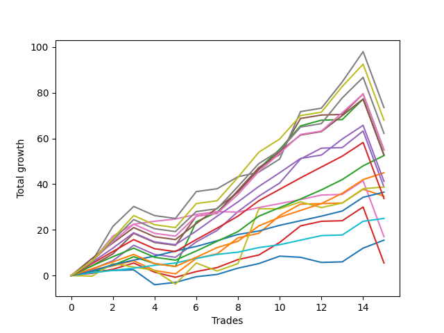

# Short Pointer 002 DB SD 
- Symbol: ES
- Date Range: 03/18/2022 - 07/15/2022
- Trading Period: 7:20-12:30
- Number of Trades: 15



| Name | Win Percent | Profit | Avg Profit / Trade | Avg Time / Trade |      | Name | Win Percent | Profit | Avg Profit / Trade | Avg Time / Trade |
| ---- | ----------- | ------ | ------------------ | ---------------- | ---- | ---- | ----------- | ------ | ------------------ | ---------------- |
| Sorted By <br> Profit | | | | | | Sorted By <br> Win Percentage ||||
| Seven | 80.00 | 36750.00 | 2450.00 | 21:14 |     | Eighty-Two | 100.00 | 18250.00 | 1216.67 | 03:16 |
| Ninety | 80.00 | 34000.00 | 2266.67 | 18:11 |     | Eighty-One | 100.00 | 12500.00 | 833.33 | 02:32 |
| Eighty-Nine | 80.00 | 31125.00 | 2075.00 | 17:22 |     | Eighty-Four | 86.67 | 26250.00 | 1750.00 | 09:26 |
| Eighty-Eight | 80.00 | 27500.00 | 1833.33 | 15:19 |     | Eighty-Three | 86.67 | 22500.00 | 1500.00 | 09:04 |
| Five | 80.00 | 27500.00 | 1833.33 | 18:37 |     | Six | 86.67 | 8500.00 | 566.67 | 08:34 |
| Eighty-Seven | 80.00 | 26375.00 | 1758.33 | 13:12 |     | Seven | 80.00 | 36750.00 | 2450.00 | 21:14 |
| Two | 80.00 | 26375.00 | 1758.33 | 15:44 |     | Ninety | 80.00 | 34000.00 | 2266.67 | 18:11 |
| Eighty-Four | 86.67 | 26250.00 | 1750.00 | 09:26 |     | Eighty-Nine | 80.00 | 31125.00 | 2075.00 | 17:22 |
| Eighty-Three | 86.67 | 22500.00 | 1500.00 | 09:04 |     | Eighty-Eight | 80.00 | 27500.00 | 1833.33 | 15:19 |
| Eighty-Six | 80.00 | 20625.00 | 1375.00 | 12:34 |     | Five | 80.00 | 27500.00 | 1833.33 | 18:37 |
| Four | 80.00 | 19375.00 | 1291.67 | 14:25 |     | Eighty-Seven | 80.00 | 26375.00 | 1758.33 | 13:12 |
| Seventy-Three | 53.33 | 19375.00 | 1291.67 | 06:09 |     | Two | 80.00 | 26375.00 | 1758.33 | 15:44 |
| Eighty-Two | 100.00 | 18250.00 | 1216.67 | 03:16 |     | Eighty-Six | 80.00 | 20625.00 | 1375.00 | 12:34 |
| One | 80.00 | 17375.00 | 1158.33 | 07:21 |     | Four | 80.00 | 19375.00 | 1291.67 | 14:25 |
| Eighty-Five | 80.00 | 16875.00 | 1125.00 | 11:55 |     | One | 80.00 | 17375.00 | 1158.33 | 07:21 |
| Eighty-One | 100.00 | 12500.00 | 833.33 | 02:32 |     | Eighty-Five | 80.00 | 16875.00 | 1125.00 | 11:55 |
| Six | 86.67 | 8500.00 | 566.67 | 08:34 |     | Zero | 80.00 | 7750.00 | 516.67 | 04:11 |
| Zero | 80.00 | 7750.00 | 516.67 | 04:11 |     | Three | 80.00 | 2750.00 | 183.33 | 11:23 |
| Three | 80.00 | 2750.00 | 183.33 | 11:23 |     | Seventy-Three | 53.33 | 19375.00 | 1291.67 | 06:09 |

## NO STOPLOSS

### Test Zero
* Sell when price hits the middle line of the 20p bollinger
* No Stoploss
* Results:
```
Total Trades: 15
Percent Up: 20.00
Percent Down: 80.00
Total Points Moved Down: 15.50
Potential Profit: 7750.00
Total Points Ups: 9.25 Count Ups: 3
Total Points Downs: 24.75 Count Downs: 12
```

<details><summary>Trades</summary>

<code>In: 2022-03-25 11:34:00		Out: 2022-03-25 11:40:25		Total Position Time: 06:25		Total Move Down: 2.00		Total to Date: 2.00</code> <br />
<code>In: 2022-03-25 11:57:00		Out: 2022-03-25 11:57:15		Total Position Time: 00:15		Total Move Down: 0.25		Total to Date: 2.25</code> <br />
<code>In: 2022-03-29 08:53:00		Out: 2022-03-29 08:56:15		Total Position Time: 03:15		Total Move Down: 0.25		Total to Date: 2.50</code> <br />
<code>In: 2022-03-31 07:39:00		Out: 2022-03-31 08:03:05		Total Position Time: 24:05		Total Move Down: -6.50		Total to Date: -4.00</code> <br />
<code>In: 2022-04-25 09:29:00		Out: 2022-04-25 09:31:05		Total Position Time: 02:05		Total Move Down: 1.00		Total to Date: -3.00</code> <br />
<code>In: 2022-04-26 10:02:00		Out: 2022-04-26 10:02:15		Total Position Time: 00:15		Total Move Down: 2.50		Total to Date: -0.50</code> <br />
<code>In: 2022-06-01 12:19:00		Out: 2022-06-01 12:25:25		Total Position Time: 06:25		Total Move Down: 1.00		Total to Date: 0.50</code> <br />
<code>In: 2022-06-09 08:47:00		Out: 2022-06-09 08:48:20		Total Position Time: 01:20		Total Move Down: 2.75		Total to Date: 3.25</code> <br />
<code>In: 2022-06-15 11:02:00		Out: 2022-06-15 11:02:10		Total Position Time: 00:10		Total Move Down: 2.00		Total to Date: 5.25</code> <br />
<code>In: 2022-06-17 08:21:00		Out: 2022-06-17 08:23:05		Total Position Time: 02:05		Total Move Down: 3.25		Total to Date: 8.50</code> <br />
<code>In: 2022-06-17 08:35:00		Out: 2022-06-17 08:35:20		Total Position Time: 00:20		Total Move Down: -0.50		Total to Date: 8.00</code> <br />
<code>In: 2022-06-29 12:20:00		Out: 2022-06-29 12:33:20		Total Position Time: 13:20		Total Move Down: -2.25		Total to Date: 5.75</code> <br />
<code>In: 2022-07-06 11:00:00		Out: 2022-07-06 11:00:10		Total Position Time: 00:10		Total Move Down: 0.25		Total to Date: 6.00</code> <br />
<code>In: 2022-07-06 11:11:00		Out: 2022-07-06 11:11:10		Total Position Time: 00:10		Total Move Down: 6.00		Total to Date: 12.00</code> <br />
<code>In: 2022-07-14 08:13:00		Out: 2022-07-14 08:15:30		Total Position Time: 02:30		Total Move Down: 3.50		Total to Date: 15.50</code> <br />


</details>

### Test One
* Sell when the price hits the upper line of the 20p 1std bollinger
* No Stoploss
* Results:
```
Total Trades: 15
Percent Up: 20.00
Percent Down: 80.00
Total Points Moved Down: 34.75
Potential Profit: 17375.00
Total Points Ups: 8.75 Count Ups: 3
Total Points Downs: 43.50 Count Downs: 12
```

<details><summary>Trades</summary>

<code>In: 2022-03-25 11:34:00		Out: 2022-03-25 11:40:55		Total Position Time: 06:55		Total Move Down: 2.50		Total to Date: 2.50</code> <br />
<code>In: 2022-03-25 11:57:00		Out: 2022-03-25 12:00:45		Total Position Time: 03:45		Total Move Down: 1.75		Total to Date: 4.25</code> <br />
<code>In: 2022-03-29 08:53:00		Out: 2022-03-29 08:58:40		Total Position Time: 05:40		Total Move Down: 2.25		Total to Date: 6.50</code> <br />
<code>In: 2022-03-31 07:39:00		Out: 2022-03-31 08:03:30		Total Position Time: 24:30		Total Move Down: -4.25		Total to Date: 2.25</code> <br />
<code>In: 2022-04-25 09:29:00		Out: 2022-04-25 09:42:35		Total Position Time: 13:35		Total Move Down: -1.50		Total to Date: 0.75</code> <br />
<code>In: 2022-04-26 10:02:00		Out: 2022-04-26 10:02:50		Total Position Time: 00:50		Total Move Down: 6.75		Total to Date: 7.50</code> <br />
<code>In: 2022-06-01 12:19:00		Out: 2022-06-01 12:25:45		Total Position Time: 06:45		Total Move Down: 2.00		Total to Date: 9.50</code> <br />
<code>In: 2022-06-09 08:47:00		Out: 2022-06-09 08:49:35		Total Position Time: 02:35		Total Move Down: 7.00		Total to Date: 16.50</code> <br />
<code>In: 2022-06-15 11:02:00		Out: 2022-06-15 11:02:10		Total Position Time: 00:10		Total Move Down: 2.00		Total to Date: 18.50</code> <br />
<code>In: 2022-06-17 08:21:00		Out: 2022-06-17 08:25:20		Total Position Time: 04:20		Total Move Down: 7.75		Total to Date: 26.25</code> <br />
<code>In: 2022-06-17 08:35:00		Out: 2022-06-17 08:39:00		Total Position Time: 04:00		Total Move Down: 5.00		Total to Date: 31.25</code> <br />
<code>In: 2022-06-29 12:20:00		Out: 2022-06-29 12:34:10		Total Position Time: 14:10		Total Move Down: 0.25		Total to Date: 31.50</code> <br />
<code>In: 2022-07-06 11:00:00		Out: 2022-07-06 11:00:10		Total Position Time: 00:10		Total Move Down: 0.25		Total to Date: 31.75</code> <br />
<code>In: 2022-07-06 11:11:00		Out: 2022-07-06 11:11:10		Total Position Time: 00:10		Total Move Down: 6.00		Total to Date: 37.75</code> <br />
<code>In: 2022-07-14 08:13:00		Out: 2022-07-14 08:35:50		Total Position Time: 22:50		Total Move Down: -3.00		Total to Date: 34.75</code> <br />


</details>

### Test Two
* Sell when the price hits the upper line of the 20p 2std bollinger
* No Stoploss
* Results:
```
Total Trades: 15
Percent Up: 20.00
Percent Down: 80.00
Total Points Moved Down: 52.75
Potential Profit: 26375.00
Total Points Ups: 28.75 Count Ups: 3
Total Points Downs: 81.50 Count Downs: 12
```

<details><summary>Trades</summary>

<code>In: 2022-03-25 11:34:00		Out: 2022-03-25 12:00:55		Total Position Time: 26:55		Total Move Down: 1.75		Total to Date: 1.75</code> <br />
<code>In: 2022-03-25 11:57:00		Out: 2022-03-25 12:00:55		Total Position Time: 03:55		Total Move Down: 2.75		Total to Date: 4.50</code> <br />
<code>In: 2022-03-29 08:53:00		Out: 2022-03-29 09:01:40		Total Position Time: 08:40		Total Move Down: 3.75		Total to Date: 8.25</code> <br />
<code>In: 2022-03-31 07:39:00		Out: 2022-03-31 08:08:30		Total Position Time: 29:30		Total Move Down: -3.00		Total to Date: 5.25</code> <br />
<code>In: 2022-04-25 09:29:00		Out: 2022-04-25 09:58:55		Total Position Time: 29:55		Total Move Down: -1.25		Total to Date: 4.00</code> <br />
<code>In: 2022-04-26 10:02:00		Out: 2022-04-26 10:22:20		Total Position Time: 20:20		Total Move Down: 19.50		Total to Date: 23.50</code> <br />
<code>In: 2022-06-01 12:19:00		Out: 2022-06-01 12:30:05		Total Position Time: 11:05		Total Move Down: 4.25		Total to Date: 27.75</code> <br />
<code>In: 2022-06-09 08:47:00		Out: 2022-06-09 09:11:05		Total Position Time: 24:05		Total Move Down: 9.00		Total to Date: 36.75</code> <br />
<code>In: 2022-06-15 11:02:00		Out: 2022-06-15 11:03:05		Total Position Time: 01:05		Total Move Down: 10.00		Total to Date: 46.75</code> <br />
<code>In: 2022-06-17 08:21:00		Out: 2022-06-17 08:45:15		Total Position Time: 24:15		Total Move Down: 8.50		Total to Date: 55.25</code> <br />
<code>In: 2022-06-17 08:35:00		Out: 2022-06-17 08:45:15		Total Position Time: 10:15		Total Move Down: 10.25		Total to Date: 65.50</code> <br />
<code>In: 2022-06-29 12:20:00		Out: 2022-06-29 12:35:20		Total Position Time: 15:20		Total Move Down: 2.50		Total to Date: 68.00</code> <br />
<code>In: 2022-07-06 11:00:00		Out: 2022-07-06 11:00:10		Total Position Time: 00:10		Total Move Down: 0.25		Total to Date: 68.25</code> <br />
<code>In: 2022-07-06 11:11:00		Out: 2022-07-06 11:11:45		Total Position Time: 00:45		Total Move Down: 9.00		Total to Date: 77.25</code> <br />
<code>In: 2022-07-14 08:13:00		Out: 2022-07-14 08:42:55		Total Position Time: 29:55		Total Move Down: -24.50		Total to Date: 52.75</code> <br />


</details>

### Test Three
* Sell when price hits the middle line of the 50p bollinger
* No Stoploss
* Results:
```
Total Trades: 15
Percent Up: 20.00
Percent Down: 80.00
Total Points Moved Down: 5.50
Potential Profit: 2750.00
Total Points Ups: 30.75 Count Ups: 3
Total Points Downs: 36.25 Count Downs: 12
```

<details><summary>Trades</summary>

<code>In: 2022-03-25 11:34:00		Out: 2022-03-25 11:49:30		Total Position Time: 15:30		Total Move Down: 1.00		Total to Date: 1.00</code> <br />
<code>In: 2022-03-25 11:57:00		Out: 2022-03-25 12:00:45		Total Position Time: 03:45		Total Move Down: 1.75		Total to Date: 2.75</code> <br />
<code>In: 2022-03-29 08:53:00		Out: 2022-03-29 09:01:25		Total Position Time: 08:25		Total Move Down: 2.75		Total to Date: 5.50</code> <br />
<code>In: 2022-03-31 07:39:00		Out: 2022-03-31 08:08:55		Total Position Time: 29:55		Total Move Down: -4.00		Total to Date: 1.50</code> <br />
<code>In: 2022-04-25 09:29:00		Out: 2022-04-25 09:55:05		Total Position Time: 26:05		Total Move Down: -2.25		Total to Date: -0.75</code> <br />
<code>In: 2022-04-26 10:02:00		Out: 2022-04-26 10:02:15		Total Position Time: 00:15		Total Move Down: 2.50		Total to Date: 1.75</code> <br />
<code>In: 2022-06-01 12:19:00		Out: 2022-06-01 12:25:30		Total Position Time: 06:30		Total Move Down: 1.75		Total to Date: 3.50</code> <br />
<code>In: 2022-06-09 08:47:00		Out: 2022-06-09 08:48:40		Total Position Time: 01:40		Total Move Down: 3.50		Total to Date: 7.00</code> <br />
<code>In: 2022-06-15 11:02:00		Out: 2022-06-15 11:02:10		Total Position Time: 00:10		Total Move Down: 2.00		Total to Date: 9.00</code> <br />
<code>In: 2022-06-17 08:21:00		Out: 2022-06-17 08:45:00		Total Position Time: 24:00		Total Move Down: 5.50		Total to Date: 14.50</code> <br />
<code>In: 2022-06-17 08:35:00		Out: 2022-06-17 08:45:00		Total Position Time: 10:00		Total Move Down: 7.25		Total to Date: 21.75</code> <br />
<code>In: 2022-06-29 12:20:00		Out: 2022-06-29 12:34:15		Total Position Time: 14:15		Total Move Down: 2.00		Total to Date: 23.75</code> <br />
<code>In: 2022-07-06 11:00:00		Out: 2022-07-06 11:00:10		Total Position Time: 00:10		Total Move Down: 0.25		Total to Date: 24.00</code> <br />
<code>In: 2022-07-06 11:11:00		Out: 2022-07-06 11:11:10		Total Position Time: 00:10		Total Move Down: 6.00		Total to Date: 30.00</code> <br />
<code>In: 2022-07-14 08:13:00		Out: 2022-07-14 08:42:55		Total Position Time: 29:55		Total Move Down: -24.50		Total to Date: 5.50</code> <br />


</details>

### Test Four
* Sell when the price hits the upper line of the 50p 1std bollinger
* No Stoploss
* Results:
```
Total Trades: 15
Percent Up: 20.00
Percent Down: 80.00
Total Points Moved Down: 38.75
Potential Profit: 19375.00
Total Points Ups: 29.75 Count Ups: 3
Total Points Downs: 68.50 Count Downs: 12
```

<details><summary>Trades</summary>

<code>In: 2022-03-25 11:34:00		Out: 2022-03-25 12:01:35		Total Position Time: 27:35		Total Move Down: 2.75		Total to Date: 2.75</code> <br />
<code>In: 2022-03-25 11:57:00		Out: 2022-03-25 12:01:35		Total Position Time: 04:35		Total Move Down: 3.75		Total to Date: 6.50</code> <br />
<code>In: 2022-03-29 08:53:00		Out: 2022-03-29 09:02:15		Total Position Time: 09:15		Total Move Down: 6.75		Total to Date: 13.25</code> <br />
<code>In: 2022-03-31 07:39:00		Out: 2022-03-31 08:08:55		Total Position Time: 29:55		Total Move Down: -4.00		Total to Date: 9.25</code> <br />
<code>In: 2022-04-25 09:29:00		Out: 2022-04-25 09:58:55		Total Position Time: 29:55		Total Move Down: -1.25		Total to Date: 8.00</code> <br />
<code>In: 2022-04-26 10:02:00		Out: 2022-04-26 10:02:50		Total Position Time: 00:50		Total Move Down: 6.75		Total to Date: 14.75</code> <br />
<code>In: 2022-06-01 12:19:00		Out: 2022-06-01 12:31:00		Total Position Time: 12:00		Total Move Down: 5.00		Total to Date: 19.75</code> <br />
<code>In: 2022-06-09 08:47:00		Out: 2022-06-09 08:50:20		Total Position Time: 03:20		Total Move Down: 8.25		Total to Date: 28.00</code> <br />
<code>In: 2022-06-15 11:02:00		Out: 2022-06-15 11:03:00		Total Position Time: 01:00		Total Move Down: 6.75		Total to Date: 34.75</code> <br />
<code>In: 2022-06-17 08:21:00		Out: 2022-06-17 08:50:55		Total Position Time: 29:55		Total Move Down: 5.75		Total to Date: 40.50</code> <br />
<code>In: 2022-06-17 08:35:00		Out: 2022-06-17 08:51:15		Total Position Time: 16:15		Total Move Down: 10.50		Total to Date: 51.00</code> <br />
<code>In: 2022-06-29 12:20:00		Out: 2022-06-29 12:41:00		Total Position Time: 21:00		Total Move Down: 4.75		Total to Date: 55.75</code> <br />
<code>In: 2022-07-06 11:00:00		Out: 2022-07-06 11:00:10		Total Position Time: 00:10		Total Move Down: 0.25		Total to Date: 56.00</code> <br />
<code>In: 2022-07-06 11:11:00		Out: 2022-07-06 11:11:35		Total Position Time: 00:35		Total Move Down: 7.25		Total to Date: 63.25</code> <br />
<code>In: 2022-07-14 08:13:00		Out: 2022-07-14 08:42:55		Total Position Time: 29:55		Total Move Down: -24.50		Total to Date: 38.75</code> <br />


</details>

### Test Five
* Sell when the price hits the upper line of the 50p 2std bollinger
* No Stoploss
* Results:
```
Total Trades: 15
Percent Up: 20.00
Percent Down: 80.00
Total Points Moved Down: 55.00
Potential Profit: 27500.00
Total Points Ups: 29.75 Count Ups: 3
Total Points Downs: 84.75 Count Downs: 12
```

<details><summary>Trades</summary>

<code>In: 2022-03-25 11:34:00		Out: 2022-03-25 12:01:55		Total Position Time: 27:55		Total Move Down: 4.25		Total to Date: 4.25</code> <br />
<code>In: 2022-03-25 11:57:00		Out: 2022-03-25 12:01:55		Total Position Time: 04:55		Total Move Down: 5.25		Total to Date: 9.50</code> <br />
<code>In: 2022-03-29 08:53:00		Out: 2022-03-29 09:10:50		Total Position Time: 17:50		Total Move Down: 9.00		Total to Date: 18.50</code> <br />
<code>In: 2022-03-31 07:39:00		Out: 2022-03-31 08:08:55		Total Position Time: 29:55		Total Move Down: -4.00		Total to Date: 14.50</code> <br />
<code>In: 2022-04-25 09:29:00		Out: 2022-04-25 09:58:55		Total Position Time: 29:55		Total Move Down: -1.25		Total to Date: 13.25</code> <br />
<code>In: 2022-04-26 10:02:00		Out: 2022-04-26 10:14:40		Total Position Time: 12:40		Total Move Down: 12.75		Total to Date: 26.00</code> <br />
<code>In: 2022-06-01 12:19:00		Out: 2022-06-01 12:46:00		Total Position Time: 27:00		Total Move Down: 1.25		Total to Date: 27.25</code> <br />
<code>In: 2022-06-09 08:47:00		Out: 2022-06-09 09:11:10		Total Position Time: 24:10		Total Move Down: 10.00		Total to Date: 37.25</code> <br />
<code>In: 2022-06-15 11:02:00		Out: 2022-06-15 11:03:05		Total Position Time: 01:05		Total Move Down: 10.00		Total to Date: 47.25</code> <br />
<code>In: 2022-06-17 08:21:00		Out: 2022-06-17 08:50:55		Total Position Time: 29:55		Total Move Down: 5.75		Total to Date: 53.00</code> <br />
<code>In: 2022-06-17 08:35:00		Out: 2022-06-17 08:52:05		Total Position Time: 17:05		Total Move Down: 15.75		Total to Date: 68.75</code> <br />
<code>In: 2022-06-29 12:20:00		Out: 2022-06-29 12:46:00		Total Position Time: 26:00		Total Move Down: 1.50		Total to Date: 70.25</code> <br />
<code>In: 2022-07-06 11:00:00		Out: 2022-07-06 11:00:10		Total Position Time: 00:10		Total Move Down: 0.25		Total to Date: 70.50</code> <br />
<code>In: 2022-07-06 11:11:00		Out: 2022-07-06 11:11:50		Total Position Time: 00:50		Total Move Down: 9.00		Total to Date: 79.50</code> <br />
<code>In: 2022-07-14 08:13:00		Out: 2022-07-14 08:42:55		Total Position Time: 29:55		Total Move Down: -24.50		Total to Date: 55.00</code> <br />


</details>

### Test Six
* Sell when the price hits the middle line of the 1std VWAP
* No Stoploss
* Results:
```
Total Trades: 15
Percent Up: 13.33
Percent Down: 86.67
Total Points Moved Down: 17.00
Potential Profit: 8500.00
Total Points Ups: 24.75 Count Ups: 2
Total Points Downs: 41.75 Count Downs: 13
```

<details><summary>Trades</summary>

<code>In: 2022-03-25 11:34:00		Out: 2022-03-25 12:03:55		Total Position Time: 29:55		Total Move Down: 6.25		Total to Date: 6.25</code> <br />
<code>In: 2022-03-25 11:57:00		Out: 2022-03-25 12:07:35		Total Position Time: 10:35		Total Move Down: 11.00		Total to Date: 17.25</code> <br />
<code>In: 2022-03-29 08:53:00		Out: 2022-03-29 09:02:10		Total Position Time: 09:10		Total Move Down: 5.25		Total to Date: 22.50</code> <br />
<code>In: 2022-03-31 07:39:00		Out: 2022-03-31 07:41:25		Total Position Time: 02:25		Total Move Down: 1.25		Total to Date: 23.75</code> <br />
<code>In: 2022-04-25 09:29:00		Out: 2022-04-25 09:31:05		Total Position Time: 02:05		Total Move Down: 1.00		Total to Date: 24.75</code> <br />
<code>In: 2022-04-26 10:02:00		Out: 2022-04-26 10:02:10		Total Position Time: 00:10		Total Move Down: 2.00		Total to Date: 26.75</code> <br />
<code>In: 2022-06-01 12:19:00		Out: 2022-06-01 12:46:00		Total Position Time: 27:00		Total Move Down: 1.25		Total to Date: 28.00</code> <br />
<code>In: 2022-06-09 08:47:00		Out: 2022-06-09 08:47:10		Total Position Time: 00:10		Total Move Down: -0.25		Total to Date: 27.75</code> <br />
<code>In: 2022-06-15 11:02:00		Out: 2022-06-15 11:02:10		Total Position Time: 00:10		Total Move Down: 2.00		Total to Date: 29.75</code> <br />
<code>In: 2022-06-17 08:21:00		Out: 2022-06-17 08:22:20		Total Position Time: 01:20		Total Move Down: 1.75		Total to Date: 31.50</code> <br />
<code>In: 2022-06-17 08:35:00		Out: 2022-06-17 08:36:10		Total Position Time: 01:10		Total Move Down: 1.75		Total to Date: 33.25</code> <br />
<code>In: 2022-06-29 12:20:00		Out: 2022-06-29 12:34:15		Total Position Time: 14:15		Total Move Down: 2.00		Total to Date: 35.25</code> <br />
<code>In: 2022-07-06 11:00:00		Out: 2022-07-06 11:00:10		Total Position Time: 00:10		Total Move Down: 0.25		Total to Date: 35.50</code> <br />
<code>In: 2022-07-06 11:11:00		Out: 2022-07-06 11:11:10		Total Position Time: 00:10		Total Move Down: 6.00		Total to Date: 41.50</code> <br />
<code>In: 2022-07-14 08:13:00		Out: 2022-07-14 08:42:55		Total Position Time: 29:55		Total Move Down: -24.50		Total to Date: 17.00</code> <br />


</details>

### Test Seven
* Sell when the price hits the upper line of the 1std VWAP
* No Stoploss
* Results:
```
Total Trades: 15
Percent Up: 20.00
Percent Down: 80.00
Total Points Moved Down: 73.50
Potential Profit: 36750.00
Total Points Ups: 29.75 Count Ups: 3
Total Points Downs: 103.25 Count Downs: 12
```

<details><summary>Trades</summary>

<code>In: 2022-03-25 11:34:00		Out: 2022-03-25 12:03:55		Total Position Time: 29:55		Total Move Down: 6.25		Total to Date: 6.25</code> <br />
<code>In: 2022-03-25 11:57:00		Out: 2022-03-25 12:26:55		Total Position Time: 29:55		Total Move Down: 15.25		Total to Date: 21.50</code> <br />
<code>In: 2022-03-29 08:53:00		Out: 2022-03-29 09:22:55		Total Position Time: 29:55		Total Move Down: 8.75		Total to Date: 30.25</code> <br />
<code>In: 2022-03-31 07:39:00		Out: 2022-03-31 08:08:55		Total Position Time: 29:55		Total Move Down: -4.00		Total to Date: 26.25</code> <br />
<code>In: 2022-04-25 09:29:00		Out: 2022-04-25 09:58:55		Total Position Time: 29:55		Total Move Down: -1.25		Total to Date: 25.00</code> <br />
<code>In: 2022-04-26 10:02:00		Out: 2022-04-26 10:14:15		Total Position Time: 12:15		Total Move Down: 11.75		Total to Date: 36.75</code> <br />
<code>In: 2022-06-01 12:19:00		Out: 2022-06-01 12:46:00		Total Position Time: 27:00		Total Move Down: 1.25		Total to Date: 38.00</code> <br />
<code>In: 2022-06-09 08:47:00		Out: 2022-06-09 08:48:50		Total Position Time: 01:50		Total Move Down: 5.25		Total to Date: 43.25</code> <br />
<code>In: 2022-06-15 11:02:00		Out: 2022-06-15 11:02:10		Total Position Time: 00:10		Total Move Down: 2.00		Total to Date: 45.25</code> <br />
<code>In: 2022-06-17 08:21:00		Out: 2022-06-17 08:50:55		Total Position Time: 29:55		Total Move Down: 5.75		Total to Date: 51.00</code> <br />
<code>In: 2022-06-17 08:35:00		Out: 2022-06-17 09:03:15		Total Position Time: 28:15		Total Move Down: 20.75		Total to Date: 71.75</code> <br />
<code>In: 2022-06-29 12:20:00		Out: 2022-06-29 12:46:00		Total Position Time: 26:00		Total Move Down: 1.50		Total to Date: 73.25</code> <br />
<code>In: 2022-07-06 11:00:00		Out: 2022-07-06 11:12:20		Total Position Time: 12:20		Total Move Down: 11.50		Total to Date: 84.75</code> <br />
<code>In: 2022-07-06 11:11:00		Out: 2022-07-06 11:12:20		Total Position Time: 01:20		Total Move Down: 13.25		Total to Date: 98.00</code> <br />
<code>In: 2022-07-14 08:13:00		Out: 2022-07-14 08:42:55		Total Position Time: 29:55		Total Move Down: -24.50		Total to Date: 73.50</code> <br />


</details>

## SPECIAL EXIT CONDITIONS 

### Test Seventy-Three
* Sell when the linear regression slope changes to negative
* No Stoploss
* Results:
```
Total Trades: 15
Percent Up: 46.67
Percent Down: 53.33
Total Points Moved Down: 38.75
Potential Profit: 19375.00
Total Points Ups: 15.25 Count Ups: 7
Total Points Downs: 54.00 Count Downs: 8
```

<details><summary>Trades</summary>

<code>In: 2022-03-25 11:34:00		Out: 2022-03-25 11:35:05		Total Position Time: 01:05		Total Move Down: -0.25		Total to Date: -0.25</code> <br />
<code>In: 2022-03-25 11:57:00		Out: 2022-03-25 12:12:05		Total Position Time: 15:05		Total Move Down: 5.50		Total to Date: 5.25</code> <br />
<code>In: 2022-03-29 08:53:00		Out: 2022-03-29 08:54:05		Total Position Time: 01:05		Total Move Down: -1.50		Total to Date: 3.75</code> <br />
<code>In: 2022-03-31 07:39:00		Out: 2022-03-31 07:45:05		Total Position Time: 06:05		Total Move Down: -1.50		Total to Date: 2.25</code> <br />
<code>In: 2022-04-25 09:29:00		Out: 2022-04-25 09:33:05		Total Position Time: 04:05		Total Move Down: -6.00		Total to Date: -3.75</code> <br />
<code>In: 2022-04-26 10:02:00		Out: 2022-04-26 10:12:05		Total Position Time: 10:05		Total Move Down: 9.25		Total to Date: 5.50</code> <br />
<code>In: 2022-06-01 12:19:00		Out: 2022-06-01 12:21:05		Total Position Time: 02:05		Total Move Down: -3.50		Total to Date: 2.00</code> <br />
<code>In: 2022-06-09 08:47:00		Out: 2022-06-09 08:57:05		Total Position Time: 10:05		Total Move Down: 3.25		Total to Date: 5.25</code> <br />
<code>In: 2022-06-15 11:02:00		Out: 2022-06-15 11:12:05		Total Position Time: 10:05		Total Move Down: 24.00		Total to Date: 29.25</code> <br />
<code>In: 2022-06-17 08:21:00		Out: 2022-06-17 08:22:05		Total Position Time: 01:05		Total Move Down: -0.00		Total to Date: 29.25</code> <br />
<code>In: 2022-06-17 08:35:00		Out: 2022-06-17 08:49:05		Total Position Time: 14:05		Total Move Down: 3.00		Total to Date: 32.25</code> <br />
<code>In: 2022-06-29 12:20:00		Out: 2022-06-29 12:22:05		Total Position Time: 02:05		Total Move Down: -2.50		Total to Date: 29.75</code> <br />
<code>In: 2022-07-06 11:00:00		Out: 2022-07-06 11:03:05		Total Position Time: 03:05		Total Move Down: 2.00		Total to Date: 31.75</code> <br />
<code>In: 2022-07-06 11:11:00		Out: 2022-07-06 11:21:05		Total Position Time: 10:05		Total Move Down: 6.25		Total to Date: 38.00</code> <br />
<code>In: 2022-07-14 08:13:00		Out: 2022-07-14 08:15:05		Total Position Time: 02:05		Total Move Down: 0.75		Total to Date: 38.75</code> <br />


</details>

## TAKE PROFIT

### Test Eighty-One
* Take Profit of 1 Point
* No Stoploss
* Results:
```
Total Trades: 15
Percent Up: 0.00
Percent Down: 100.00
Total Points Moved Down: 25.00
Potential Profit: 12500.00
Total Points Ups: 0.00 Count Ups: 0
Total Points Downs: 25.00 Count Downs: 15
```

<details><summary>Trades</summary>

<code>In: 2022-03-25 11:34:00		Out: 2022-03-25 11:35:15		Total Position Time: 01:15		Total Move Down: 1.25		Total to Date: 1.25</code> <br />
<code>In: 2022-03-25 11:57:00		Out: 2022-03-25 11:58:45		Total Position Time: 01:45		Total Move Down: 1.00		Total to Date: 2.25</code> <br />
<code>In: 2022-03-29 08:53:00		Out: 2022-03-29 08:57:35		Total Position Time: 04:35		Total Move Down: 1.00		Total to Date: 3.25</code> <br />
<code>In: 2022-03-31 07:39:00		Out: 2022-03-31 07:41:25		Total Position Time: 02:25		Total Move Down: 1.25		Total to Date: 4.50</code> <br />
<code>In: 2022-04-25 09:29:00		Out: 2022-04-25 09:31:05		Total Position Time: 02:05		Total Move Down: 1.00		Total to Date: 5.50</code> <br />
<code>In: 2022-04-26 10:02:00		Out: 2022-04-26 10:02:10		Total Position Time: 00:10		Total Move Down: 2.00		Total to Date: 7.50</code> <br />
<code>In: 2022-06-01 12:19:00		Out: 2022-06-01 12:25:30		Total Position Time: 06:30		Total Move Down: 1.75		Total to Date: 9.25</code> <br />
<code>In: 2022-06-09 08:47:00		Out: 2022-06-09 08:48:05		Total Position Time: 01:05		Total Move Down: 1.00		Total to Date: 10.25</code> <br />
<code>In: 2022-06-15 11:02:00		Out: 2022-06-15 11:02:10		Total Position Time: 00:10		Total Move Down: 2.00		Total to Date: 12.25</code> <br />
<code>In: 2022-06-17 08:21:00		Out: 2022-06-17 08:22:10		Total Position Time: 01:10		Total Move Down: 1.25		Total to Date: 13.50</code> <br />
<code>In: 2022-06-17 08:35:00		Out: 2022-06-17 08:35:45		Total Position Time: 00:45		Total Move Down: 2.00		Total to Date: 15.50</code> <br />
<code>In: 2022-06-29 12:20:00		Out: 2022-06-29 12:34:15		Total Position Time: 14:15		Total Move Down: 2.00		Total to Date: 17.50</code> <br />
<code>In: 2022-07-06 11:00:00		Out: 2022-07-06 11:00:10		Total Position Time: 00:10		Total Move Down: 0.25		Total to Date: 17.75</code> <br />
<code>In: 2022-07-06 11:11:00		Out: 2022-07-06 11:11:10		Total Position Time: 00:10		Total Move Down: 6.00		Total to Date: 23.75</code> <br />
<code>In: 2022-07-14 08:13:00		Out: 2022-07-14 08:14:30		Total Position Time: 01:30		Total Move Down: 1.25		Total to Date: 25.00</code> <br />


</details>

### Test Eighty-Two
* Take Profit of 2 Point
* No Stoploss
* Results:
```
Total Trades: 15
Percent Up: 0.00
Percent Down: 100.00
Total Points Moved Down: 36.50
Potential Profit: 18250.00
Total Points Ups: 0.00 Count Ups: 0
Total Points Downs: 36.50 Count Downs: 15
```

<details><summary>Trades</summary>

<code>In: 2022-03-25 11:34:00		Out: 2022-03-25 11:40:25		Total Position Time: 06:25		Total Move Down: 2.00		Total to Date: 2.00</code> <br />
<code>In: 2022-03-25 11:57:00		Out: 2022-03-25 12:00:50		Total Position Time: 03:50		Total Move Down: 2.75		Total to Date: 4.75</code> <br />
<code>In: 2022-03-29 08:53:00		Out: 2022-03-29 08:58:35		Total Position Time: 05:35		Total Move Down: 2.00		Total to Date: 6.75</code> <br />
<code>In: 2022-03-31 07:39:00		Out: 2022-03-31 07:41:50		Total Position Time: 02:50		Total Move Down: 1.75		Total to Date: 8.50</code> <br />
<code>In: 2022-04-25 09:29:00		Out: 2022-04-25 09:31:10		Total Position Time: 02:10		Total Move Down: 2.25		Total to Date: 10.75</code> <br />
<code>In: 2022-04-26 10:02:00		Out: 2022-04-26 10:02:10		Total Position Time: 00:10		Total Move Down: 2.00		Total to Date: 12.75</code> <br />
<code>In: 2022-06-01 12:19:00		Out: 2022-06-01 12:25:40		Total Position Time: 06:40		Total Move Down: 2.50		Total to Date: 15.25</code> <br />
<code>In: 2022-06-09 08:47:00		Out: 2022-06-09 08:48:20		Total Position Time: 01:20		Total Move Down: 2.75		Total to Date: 18.00</code> <br />
<code>In: 2022-06-15 11:02:00		Out: 2022-06-15 11:02:45		Total Position Time: 00:45		Total Move Down: 1.50		Total to Date: 19.50</code> <br />
<code>In: 2022-06-17 08:21:00		Out: 2022-06-17 08:22:40		Total Position Time: 01:40		Total Move Down: 2.50		Total to Date: 22.00</code> <br />
<code>In: 2022-06-17 08:35:00		Out: 2022-06-17 08:35:45		Total Position Time: 00:45		Total Move Down: 2.00		Total to Date: 24.00</code> <br />
<code>In: 2022-06-29 12:20:00		Out: 2022-06-29 12:34:15		Total Position Time: 14:15		Total Move Down: 2.00		Total to Date: 26.00</code> <br />
<code>In: 2022-07-06 11:00:00		Out: 2022-07-06 11:00:15		Total Position Time: 00:15		Total Move Down: 2.25		Total to Date: 28.25</code> <br />
<code>In: 2022-07-06 11:11:00		Out: 2022-07-06 11:11:10		Total Position Time: 00:10		Total Move Down: 6.00		Total to Date: 34.25</code> <br />
<code>In: 2022-07-14 08:13:00		Out: 2022-07-14 08:15:15		Total Position Time: 02:15		Total Move Down: 2.25		Total to Date: 36.50</code> <br />


</details>

### Test Eighty-Three
* Take Profit of 3 Point
* No Stoploss
* Results:
```
Total Trades: 15
Percent Up: 13.33
Percent Down: 86.67
Total Points Moved Down: 45.00
Potential Profit: 22500.00
Total Points Ups: 5.25 Count Ups: 2
Total Points Downs: 50.25 Count Downs: 13
```

<details><summary>Trades</summary>

<code>In: 2022-03-25 11:34:00		Out: 2022-03-25 12:01:45		Total Position Time: 27:45		Total Move Down: 3.00		Total to Date: 3.00</code> <br />
<code>In: 2022-03-25 11:57:00		Out: 2022-03-25 12:01:00		Total Position Time: 04:00		Total Move Down: 3.00		Total to Date: 6.00</code> <br />
<code>In: 2022-03-29 08:53:00		Out: 2022-03-29 09:01:35		Total Position Time: 08:35		Total Move Down: 3.25		Total to Date: 9.25</code> <br />
<code>In: 2022-03-31 07:39:00		Out: 2022-03-31 08:08:55		Total Position Time: 29:55		Total Move Down: -4.00		Total to Date: 5.25</code> <br />
<code>In: 2022-04-25 09:29:00		Out: 2022-04-25 09:58:55		Total Position Time: 29:55		Total Move Down: -1.25		Total to Date: 4.00</code> <br />
<code>In: 2022-04-26 10:02:00		Out: 2022-04-26 10:02:25		Total Position Time: 00:25		Total Move Down: 4.00		Total to Date: 8.00</code> <br />
<code>In: 2022-06-01 12:19:00		Out: 2022-06-01 12:30:05		Total Position Time: 11:05		Total Move Down: 4.25		Total to Date: 12.25</code> <br />
<code>In: 2022-06-09 08:47:00		Out: 2022-06-09 08:48:20		Total Position Time: 01:20		Total Move Down: 2.75		Total to Date: 15.00</code> <br />
<code>In: 2022-06-15 11:02:00		Out: 2022-06-15 11:03:00		Total Position Time: 01:00		Total Move Down: 6.75		Total to Date: 21.75</code> <br />
<code>In: 2022-06-17 08:21:00		Out: 2022-06-17 08:22:45		Total Position Time: 01:45		Total Move Down: 3.75		Total to Date: 25.50</code> <br />
<code>In: 2022-06-17 08:35:00		Out: 2022-06-17 08:36:55		Total Position Time: 01:55		Total Move Down: 3.00		Total to Date: 28.50</code> <br />
<code>In: 2022-06-29 12:20:00		Out: 2022-06-29 12:35:15		Total Position Time: 15:15		Total Move Down: 3.00		Total to Date: 31.50</code> <br />
<code>In: 2022-07-06 11:00:00		Out: 2022-07-06 11:00:40		Total Position Time: 00:40		Total Move Down: 4.50		Total to Date: 36.00</code> <br />
<code>In: 2022-07-06 11:11:00		Out: 2022-07-06 11:11:10		Total Position Time: 00:10		Total Move Down: 6.00		Total to Date: 42.00</code> <br />
<code>In: 2022-07-14 08:13:00		Out: 2022-07-14 08:15:25		Total Position Time: 02:25		Total Move Down: 3.00		Total to Date: 45.00</code> <br />


</details>

### Test Eighty-Four
* Take Profit of 4 Point
* No Stoploss
* Results:
```
Total Trades: 15
Percent Up: 13.33
Percent Down: 86.67
Total Points Moved Down: 52.50
Potential Profit: 26250.00
Total Points Ups: 5.25 Count Ups: 2
Total Points Downs: 57.75 Count Downs: 13
```

<details><summary>Trades</summary>

<code>In: 2022-03-25 11:34:00		Out: 2022-03-25 12:01:55		Total Position Time: 27:55		Total Move Down: 4.25		Total to Date: 4.25</code> <br />
<code>In: 2022-03-25 11:57:00		Out: 2022-03-25 12:01:45		Total Position Time: 04:45		Total Move Down: 4.00		Total to Date: 8.25</code> <br />
<code>In: 2022-03-29 08:53:00		Out: 2022-03-29 09:01:40		Total Position Time: 08:40		Total Move Down: 3.75		Total to Date: 12.00</code> <br />
<code>In: 2022-03-31 07:39:00		Out: 2022-03-31 08:08:55		Total Position Time: 29:55		Total Move Down: -4.00		Total to Date: 8.00</code> <br />
<code>In: 2022-04-25 09:29:00		Out: 2022-04-25 09:58:55		Total Position Time: 29:55		Total Move Down: -1.25		Total to Date: 6.75</code> <br />
<code>In: 2022-04-26 10:02:00		Out: 2022-04-26 10:02:25		Total Position Time: 00:25		Total Move Down: 4.00		Total to Date: 10.75</code> <br />
<code>In: 2022-06-01 12:19:00		Out: 2022-06-01 12:30:05		Total Position Time: 11:05		Total Move Down: 4.25		Total to Date: 15.00</code> <br />
<code>In: 2022-06-09 08:47:00		Out: 2022-06-09 08:48:35		Total Position Time: 01:35		Total Move Down: 4.25		Total to Date: 19.25</code> <br />
<code>In: 2022-06-15 11:02:00		Out: 2022-06-15 11:03:00		Total Position Time: 01:00		Total Move Down: 6.75		Total to Date: 26.00</code> <br />
<code>In: 2022-06-17 08:21:00		Out: 2022-06-17 08:23:10		Total Position Time: 02:10		Total Move Down: 3.75		Total to Date: 29.75</code> <br />
<code>In: 2022-06-17 08:35:00		Out: 2022-06-17 08:38:35		Total Position Time: 03:35		Total Move Down: 3.75		Total to Date: 33.50</code> <br />
<code>In: 2022-06-29 12:20:00		Out: 2022-06-29 12:37:05		Total Position Time: 17:05		Total Move Down: 4.00		Total to Date: 37.50</code> <br />
<code>In: 2022-07-06 11:00:00		Out: 2022-07-06 11:00:40		Total Position Time: 00:40		Total Move Down: 4.50		Total to Date: 42.00</code> <br />
<code>In: 2022-07-06 11:11:00		Out: 2022-07-06 11:11:10		Total Position Time: 00:10		Total Move Down: 6.00		Total to Date: 48.00</code> <br />
<code>In: 2022-07-14 08:13:00		Out: 2022-07-14 08:15:45		Total Position Time: 02:45		Total Move Down: 4.50		Total to Date: 52.50</code> <br />


</details>

### Test Eighty-Five
* Take Profit of 5 Point
* No Stoploss
* Results:
```
Total Trades: 15
Percent Up: 20.00
Percent Down: 80.00
Total Points Moved Down: 33.75
Potential Profit: 16875.00
Total Points Ups: 29.75 Count Ups: 3
Total Points Downs: 63.50 Count Downs: 12
```

<details><summary>Trades</summary>

<code>In: 2022-03-25 11:34:00		Out: 2022-03-25 12:02:00		Total Position Time: 28:00		Total Move Down: 5.25		Total to Date: 5.25</code> <br />
<code>In: 2022-03-25 11:57:00		Out: 2022-03-25 12:01:55		Total Position Time: 04:55		Total Move Down: 5.25		Total to Date: 10.50</code> <br />
<code>In: 2022-03-29 08:53:00		Out: 2022-03-29 09:02:10		Total Position Time: 09:10		Total Move Down: 5.25		Total to Date: 15.75</code> <br />
<code>In: 2022-03-31 07:39:00		Out: 2022-03-31 08:08:55		Total Position Time: 29:55		Total Move Down: -4.00		Total to Date: 11.75</code> <br />
<code>In: 2022-04-25 09:29:00		Out: 2022-04-25 09:58:55		Total Position Time: 29:55		Total Move Down: -1.25		Total to Date: 10.50</code> <br />
<code>In: 2022-04-26 10:02:00		Out: 2022-04-26 10:02:30		Total Position Time: 00:30		Total Move Down: 5.25		Total to Date: 15.75</code> <br />
<code>In: 2022-06-01 12:19:00		Out: 2022-06-01 12:32:50		Total Position Time: 13:50		Total Move Down: 5.00		Total to Date: 20.75</code> <br />
<code>In: 2022-06-09 08:47:00		Out: 2022-06-09 08:48:50		Total Position Time: 01:50		Total Move Down: 5.25		Total to Date: 26.00</code> <br />
<code>In: 2022-06-15 11:02:00		Out: 2022-06-15 11:03:00		Total Position Time: 01:00		Total Move Down: 6.75		Total to Date: 32.75</code> <br />
<code>In: 2022-06-17 08:21:00		Out: 2022-06-17 08:24:15		Total Position Time: 03:15		Total Move Down: 5.00		Total to Date: 37.75</code> <br />
<code>In: 2022-06-17 08:35:00		Out: 2022-06-17 08:39:00		Total Position Time: 04:00		Total Move Down: 5.00		Total to Date: 42.75</code> <br />
<code>In: 2022-06-29 12:20:00		Out: 2022-06-29 12:41:05		Total Position Time: 21:05		Total Move Down: 4.75		Total to Date: 47.50</code> <br />
<code>In: 2022-07-06 11:00:00		Out: 2022-07-06 11:01:15		Total Position Time: 01:15		Total Move Down: 4.75		Total to Date: 52.25</code> <br />
<code>In: 2022-07-06 11:11:00		Out: 2022-07-06 11:11:10		Total Position Time: 00:10		Total Move Down: 6.00		Total to Date: 58.25</code> <br />
<code>In: 2022-07-14 08:13:00		Out: 2022-07-14 08:42:55		Total Position Time: 29:55		Total Move Down: -24.50		Total to Date: 33.75</code> <br />


</details>

### Test Eighty-Six
* Take Profit of 6 Point
* No Stoploss
* Results:
```
Total Trades: 15
Percent Up: 20.00
Percent Down: 80.00
Total Points Moved Down: 41.25
Potential Profit: 20625.00
Total Points Ups: 29.75 Count Ups: 3
Total Points Downs: 71.00 Count Downs: 12
```

<details><summary>Trades</summary>

<code>In: 2022-03-25 11:34:00		Out: 2022-03-25 12:02:30		Total Position Time: 28:30		Total Move Down: 5.75		Total to Date: 5.75</code> <br />
<code>In: 2022-03-25 11:57:00		Out: 2022-03-25 12:02:00		Total Position Time: 05:00		Total Move Down: 6.25		Total to Date: 12.00</code> <br />
<code>In: 2022-03-29 08:53:00		Out: 2022-03-29 09:02:15		Total Position Time: 09:15		Total Move Down: 6.75		Total to Date: 18.75</code> <br />
<code>In: 2022-03-31 07:39:00		Out: 2022-03-31 08:08:55		Total Position Time: 29:55		Total Move Down: -4.00		Total to Date: 14.75</code> <br />
<code>In: 2022-04-25 09:29:00		Out: 2022-04-25 09:58:55		Total Position Time: 29:55		Total Move Down: -1.25		Total to Date: 13.50</code> <br />
<code>In: 2022-04-26 10:02:00		Out: 2022-04-26 10:02:45		Total Position Time: 00:45		Total Move Down: 6.00		Total to Date: 19.50</code> <br />
<code>In: 2022-06-01 12:19:00		Out: 2022-06-01 12:35:10		Total Position Time: 16:10		Total Move Down: 6.50		Total to Date: 26.00</code> <br />
<code>In: 2022-06-09 08:47:00		Out: 2022-06-09 08:49:10		Total Position Time: 02:10		Total Move Down: 6.25		Total to Date: 32.25</code> <br />
<code>In: 2022-06-15 11:02:00		Out: 2022-06-15 11:03:00		Total Position Time: 01:00		Total Move Down: 6.75		Total to Date: 39.00</code> <br />
<code>In: 2022-06-17 08:21:00		Out: 2022-06-17 08:24:20		Total Position Time: 03:20		Total Move Down: 6.00		Total to Date: 45.00</code> <br />
<code>In: 2022-06-17 08:35:00		Out: 2022-06-17 08:39:05		Total Position Time: 04:05		Total Move Down: 6.25		Total to Date: 51.25</code> <br />
<code>In: 2022-06-29 12:20:00		Out: 2022-06-29 12:46:00		Total Position Time: 26:00		Total Move Down: 1.50		Total to Date: 52.75</code> <br />
<code>In: 2022-07-06 11:00:00		Out: 2022-07-06 11:02:25		Total Position Time: 02:25		Total Move Down: 7.00		Total to Date: 59.75</code> <br />
<code>In: 2022-07-06 11:11:00		Out: 2022-07-06 11:11:10		Total Position Time: 00:10		Total Move Down: 6.00		Total to Date: 65.75</code> <br />
<code>In: 2022-07-14 08:13:00		Out: 2022-07-14 08:42:55		Total Position Time: 29:55		Total Move Down: -24.50		Total to Date: 41.25</code> <br />


</details>

### Test Eighty-Seven
* Take Profit of 7 Point
* No Stoploss
* Results:
```
Total Trades: 15
Percent Up: 20.00
Percent Down: 80.00
Total Points Moved Down: 52.75
Potential Profit: 26375.00
Total Points Ups: 29.75 Count Ups: 3
Total Points Downs: 82.50 Count Downs: 12
```

<details><summary>Trades</summary>

<code>In: 2022-03-25 11:34:00		Out: 2022-03-25 12:03:05		Total Position Time: 29:05		Total Move Down: 7.50		Total to Date: 7.50</code> <br />
<code>In: 2022-03-25 11:57:00		Out: 2022-03-25 12:02:30		Total Position Time: 05:30		Total Move Down: 6.75		Total to Date: 14.25</code> <br />
<code>In: 2022-03-29 08:53:00		Out: 2022-03-29 09:02:15		Total Position Time: 09:15		Total Move Down: 6.75		Total to Date: 21.00</code> <br />
<code>In: 2022-03-31 07:39:00		Out: 2022-03-31 08:08:55		Total Position Time: 29:55		Total Move Down: -4.00		Total to Date: 17.00</code> <br />
<code>In: 2022-04-25 09:29:00		Out: 2022-04-25 09:58:55		Total Position Time: 29:55		Total Move Down: -1.25		Total to Date: 15.75</code> <br />
<code>In: 2022-04-26 10:02:00		Out: 2022-04-26 10:02:55		Total Position Time: 00:55		Total Move Down: 7.00		Total to Date: 22.75</code> <br />
<code>In: 2022-06-01 12:19:00		Out: 2022-06-01 12:35:30		Total Position Time: 16:30		Total Move Down: 6.75		Total to Date: 29.50</code> <br />
<code>In: 2022-06-09 08:47:00		Out: 2022-06-09 08:49:35		Total Position Time: 02:35		Total Move Down: 7.00		Total to Date: 36.50</code> <br />
<code>In: 2022-06-15 11:02:00		Out: 2022-06-15 11:03:05		Total Position Time: 01:05		Total Move Down: 10.00		Total to Date: 46.50</code> <br />
<code>In: 2022-06-17 08:21:00		Out: 2022-06-17 08:25:20		Total Position Time: 04:20		Total Move Down: 7.75		Total to Date: 54.25</code> <br />
<code>In: 2022-06-17 08:35:00		Out: 2022-06-17 08:45:00		Total Position Time: 10:00		Total Move Down: 7.25		Total to Date: 61.50</code> <br />
<code>In: 2022-06-29 12:20:00		Out: 2022-06-29 12:46:00		Total Position Time: 26:00		Total Move Down: 1.50		Total to Date: 63.00</code> <br />
<code>In: 2022-07-06 11:00:00		Out: 2022-07-06 11:02:25		Total Position Time: 02:25		Total Move Down: 7.00		Total to Date: 70.00</code> <br />
<code>In: 2022-07-06 11:11:00		Out: 2022-07-06 11:11:35		Total Position Time: 00:35		Total Move Down: 7.25		Total to Date: 77.25</code> <br />
<code>In: 2022-07-14 08:13:00		Out: 2022-07-14 08:42:55		Total Position Time: 29:55		Total Move Down: -24.50		Total to Date: 52.75</code> <br />


</details>

### Test Eighty-Eight
* Take Profit of 8 Point
* No Stoploss
* Results:
```
Total Trades: 15
Percent Up: 20.00
Percent Down: 80.00
Total Points Moved Down: 55.00
Potential Profit: 27500.00
Total Points Ups: 29.75 Count Ups: 3
Total Points Downs: 84.75 Count Downs: 12
```

<details><summary>Trades</summary>

<code>In: 2022-03-25 11:34:00		Out: 2022-03-25 12:03:55		Total Position Time: 29:55		Total Move Down: 6.25		Total to Date: 6.25</code> <br />
<code>In: 2022-03-25 11:57:00		Out: 2022-03-25 12:03:05		Total Position Time: 06:05		Total Move Down: 8.50		Total to Date: 14.75</code> <br />
<code>In: 2022-03-29 08:53:00		Out: 2022-03-29 09:10:20		Total Position Time: 17:20		Total Move Down: 7.75		Total to Date: 22.50</code> <br />
<code>In: 2022-03-31 07:39:00		Out: 2022-03-31 08:08:55		Total Position Time: 29:55		Total Move Down: -4.00		Total to Date: 18.50</code> <br />
<code>In: 2022-04-25 09:29:00		Out: 2022-04-25 09:58:55		Total Position Time: 29:55		Total Move Down: -1.25		Total to Date: 17.25</code> <br />
<code>In: 2022-04-26 10:02:00		Out: 2022-04-26 10:03:55		Total Position Time: 01:55		Total Move Down: 8.75		Total to Date: 26.00</code> <br />
<code>In: 2022-06-01 12:19:00		Out: 2022-06-01 12:46:00		Total Position Time: 27:00		Total Move Down: 1.25		Total to Date: 27.25</code> <br />
<code>In: 2022-06-09 08:47:00		Out: 2022-06-09 08:50:20		Total Position Time: 03:20		Total Move Down: 8.25		Total to Date: 35.50</code> <br />
<code>In: 2022-06-15 11:02:00		Out: 2022-06-15 11:03:05		Total Position Time: 01:05		Total Move Down: 10.00		Total to Date: 45.50</code> <br />
<code>In: 2022-06-17 08:21:00		Out: 2022-06-17 08:25:35		Total Position Time: 04:35		Total Move Down: 8.00		Total to Date: 53.50</code> <br />
<code>In: 2022-06-17 08:35:00		Out: 2022-06-17 08:45:05		Total Position Time: 10:05		Total Move Down: 8.25		Total to Date: 61.75</code> <br />
<code>In: 2022-06-29 12:20:00		Out: 2022-06-29 12:46:00		Total Position Time: 26:00		Total Move Down: 1.50		Total to Date: 63.25</code> <br />
<code>In: 2022-07-06 11:00:00		Out: 2022-07-06 11:12:05		Total Position Time: 12:05		Total Move Down: 8.00		Total to Date: 71.25</code> <br />
<code>In: 2022-07-06 11:11:00		Out: 2022-07-06 11:11:40		Total Position Time: 00:40		Total Move Down: 8.25		Total to Date: 79.50</code> <br />
<code>In: 2022-07-14 08:13:00		Out: 2022-07-14 08:42:55		Total Position Time: 29:55		Total Move Down: -24.50		Total to Date: 55.00</code> <br />


</details>

### Test Eighty-Nine
* Take Profit of 9 Point
* No Stoploss
* Results:
```
Total Trades: 15
Percent Up: 20.00
Percent Down: 80.00
Total Points Moved Down: 62.25
Potential Profit: 31125.00
Total Points Ups: 29.75 Count Ups: 3
Total Points Downs: 92.00 Count Downs: 12
```

<details><summary>Trades</summary>

<code>In: 2022-03-25 11:34:00		Out: 2022-03-25 12:03:55		Total Position Time: 29:55		Total Move Down: 6.25		Total to Date: 6.25</code> <br />
<code>In: 2022-03-25 11:57:00		Out: 2022-03-25 12:07:20		Total Position Time: 10:20		Total Move Down: 9.25		Total to Date: 15.50</code> <br />
<code>In: 2022-03-29 08:53:00		Out: 2022-03-29 09:10:50		Total Position Time: 17:50		Total Move Down: 9.00		Total to Date: 24.50</code> <br />
<code>In: 2022-03-31 07:39:00		Out: 2022-03-31 08:08:55		Total Position Time: 29:55		Total Move Down: -4.00		Total to Date: 20.50</code> <br />
<code>In: 2022-04-25 09:29:00		Out: 2022-04-25 09:58:55		Total Position Time: 29:55		Total Move Down: -1.25		Total to Date: 19.25</code> <br />
<code>In: 2022-04-26 10:02:00		Out: 2022-04-26 10:03:55		Total Position Time: 01:55		Total Move Down: 8.75		Total to Date: 28.00</code> <br />
<code>In: 2022-06-01 12:19:00		Out: 2022-06-01 12:46:00		Total Position Time: 27:00		Total Move Down: 1.25		Total to Date: 29.25</code> <br />
<code>In: 2022-06-09 08:47:00		Out: 2022-06-09 08:50:35		Total Position Time: 03:35		Total Move Down: 9.75		Total to Date: 39.00</code> <br />
<code>In: 2022-06-15 11:02:00		Out: 2022-06-15 11:03:05		Total Position Time: 01:05		Total Move Down: 10.00		Total to Date: 49.00</code> <br />
<code>In: 2022-06-17 08:21:00		Out: 2022-06-17 08:50:55		Total Position Time: 29:55		Total Move Down: 5.75		Total to Date: 54.75</code> <br />
<code>In: 2022-06-17 08:35:00		Out: 2022-06-17 08:45:15		Total Position Time: 10:15		Total Move Down: 10.25		Total to Date: 65.00</code> <br />
<code>In: 2022-06-29 12:20:00		Out: 2022-06-29 12:46:00		Total Position Time: 26:00		Total Move Down: 1.50		Total to Date: 66.50</code> <br />
<code>In: 2022-07-06 11:00:00		Out: 2022-07-06 11:12:15		Total Position Time: 12:15		Total Move Down: 11.25		Total to Date: 77.75</code> <br />
<code>In: 2022-07-06 11:11:00		Out: 2022-07-06 11:11:45		Total Position Time: 00:45		Total Move Down: 9.00		Total to Date: 86.75</code> <br />
<code>In: 2022-07-14 08:13:00		Out: 2022-07-14 08:42:55		Total Position Time: 29:55		Total Move Down: -24.50		Total to Date: 62.25</code> <br />


</details>

### Test Ninety
* Take Profit of 10 Point
* No Stoploss
* Results:
```
Total Trades: 15
Percent Up: 20.00
Percent Down: 80.00
Total Points Moved Down: 68.00
Potential Profit: 34000.00
Total Points Ups: 29.75 Count Ups: 3
Total Points Downs: 97.75 Count Downs: 12
```

<details><summary>Trades</summary>

<code>In: 2022-03-25 11:34:00		Out: 2022-03-25 12:03:55		Total Position Time: 29:55		Total Move Down: 6.25		Total to Date: 6.25</code> <br />
<code>In: 2022-03-25 11:57:00		Out: 2022-03-25 12:07:30		Total Position Time: 10:30		Total Move Down: 10.00		Total to Date: 16.25</code> <br />
<code>In: 2022-03-29 08:53:00		Out: 2022-03-29 09:21:45		Total Position Time: 28:45		Total Move Down: 10.00		Total to Date: 26.25</code> <br />
<code>In: 2022-03-31 07:39:00		Out: 2022-03-31 08:08:55		Total Position Time: 29:55		Total Move Down: -4.00		Total to Date: 22.25</code> <br />
<code>In: 2022-04-25 09:29:00		Out: 2022-04-25 09:58:55		Total Position Time: 29:55		Total Move Down: -1.25		Total to Date: 21.00</code> <br />
<code>In: 2022-04-26 10:02:00		Out: 2022-04-26 10:04:30		Total Position Time: 02:30		Total Move Down: 10.50		Total to Date: 31.50</code> <br />
<code>In: 2022-06-01 12:19:00		Out: 2022-06-01 12:46:00		Total Position Time: 27:00		Total Move Down: 1.25		Total to Date: 32.75</code> <br />
<code>In: 2022-06-09 08:47:00		Out: 2022-06-09 08:50:40		Total Position Time: 03:40		Total Move Down: 10.25		Total to Date: 43.00</code> <br />
<code>In: 2022-06-15 11:02:00		Out: 2022-06-15 11:03:10		Total Position Time: 01:10		Total Move Down: 11.00		Total to Date: 54.00</code> <br />
<code>In: 2022-06-17 08:21:00		Out: 2022-06-17 08:50:55		Total Position Time: 29:55		Total Move Down: 5.75		Total to Date: 59.75</code> <br />
<code>In: 2022-06-17 08:35:00		Out: 2022-06-17 08:45:15		Total Position Time: 10:15		Total Move Down: 10.25		Total to Date: 70.00</code> <br />
<code>In: 2022-06-29 12:20:00		Out: 2022-06-29 12:46:00		Total Position Time: 26:00		Total Move Down: 1.50		Total to Date: 71.50</code> <br />
<code>In: 2022-07-06 11:00:00		Out: 2022-07-06 11:12:15		Total Position Time: 12:15		Total Move Down: 11.25		Total to Date: 82.75</code> <br />
<code>In: 2022-07-06 11:11:00		Out: 2022-07-06 11:12:05		Total Position Time: 01:05		Total Move Down: 9.75		Total to Date: 92.50</code> <br />
<code>In: 2022-07-14 08:13:00		Out: 2022-07-14 08:42:55		Total Position Time: 29:55		Total Move Down: -24.50		Total to Date: 68.00</code> <br />


</details>