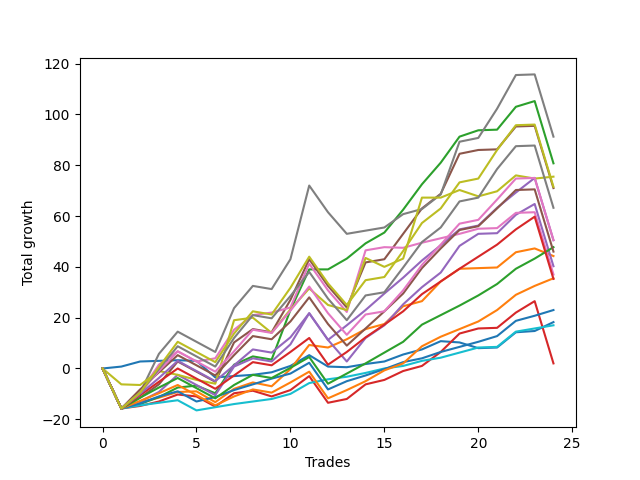

# Short Pointer 002 SD 
- Symbol: ES
- Date Range: 03/18/2022 - 12/30/2022
- Trading Period: 8:30-12:30
- Number of Trades: 22



| Name | Win Percent | Profit | Avg Profit / Trade | Avg Time / Trade |      | Name | Win Percent | Profit | Avg Profit / Trade | Avg Time / Trade |
| ---- | ----------- | ------ | ------------------ | ---------------- | ---- | ---- | ----------- | ------ | ------------------ | ---------------- |
| Sorted By <br> Profit | | | | | | Sorted By <br> Win Percentage ||||
| V U/L 1SD | 86.36 | 64750.00 | 2943.18 | 36:07 |     | TP-2 | 100.00 | 26875.00 | 1221.59 | 06:30 |
| TP-10 | 81.82 | 54625.00 | 2482.95 | 32:20 |     | TP-1 | 100.00 | 20000.00 | 909.09 | 03:17 |
| BB-100 U/L 2SD | 77.27 | 53250.00 | 2420.45 | 43:07 |     | BB-20 U/L 2SD | 95.45 | 51750.00 | 2352.27 | 15:43 |
| V U/L 1SD SL-10 | 77.27 | 52500.00 | 2386.36 | 28:45 |     | TP-5 | 95.45 | 51625.00 | 2346.59 | 20:52 |
| BB-20 U/L 2SD | 95.45 | 51750.00 | 2352.27 | 15:43 |     | BB-200 Mid | 95.45 | 47875.00 | 2176.14 | 19:48 |
| TP-5 | 95.45 | 51625.00 | 2346.59 | 20:52 |     | TP-4 | 95.45 | 41625.00 | 1892.05 | 19:46 |
| TP-9 | 81.82 | 51375.00 | 2335.23 | 30:36 |     | TP-3 | 95.45 | 33125.00 | 1505.68 | 14:34 |
| BB-50 U/L 2SD | 90.91 | 50250.00 | 2284.09 | 30:15 |     | BB-50 U/L 2SD | 90.91 | 50250.00 | 2284.09 | 30:15 |
| TP-6 | 90.91 | 48875.00 | 2221.59 | 23:48 |     | TP-6 | 90.91 | 48875.00 | 2221.59 | 23:48 |
| BB-200 U/L 2SD | 72.73 | 48250.00 | 2193.18 | 48:50 |     | BB-20 U/L 2SD C | 90.91 | 44250.00 | 2011.36 | 17:38 |
| BB-200 Mid | 95.45 | 47875.00 | 2176.14 | 19:48 |     | BB-20 U/L 1SD | 90.91 | 34500.00 | 1568.18 | 07:28 |
| BB-50 U/L 1SD | 86.36 | 45125.00 | 2051.14 | 21:09 |     | BB-20 Mid | 90.91 | 16500.00 | 750.00 | 03:47 |
| BB-20 U/L 2SD C | 90.91 | 44250.00 | 2011.36 | 17:38 |     | BB-20 Mid SL-10 | 90.91 | 9250.00 | 420.45 | 03:23 |
| TP-8 | 81.82 | 43875.00 | 1994.32 | 30:11 |     | V U/L 1SD | 86.36 | 64750.00 | 2943.18 | 36:07 |
| NEWFI 000 | 77.27 | 42750.00 | 1943.18 | 38:41 |     | BB-50 U/L 1SD | 86.36 | 45125.00 | 2051.14 | 21:09 |
| TP-4 | 95.45 | 41625.00 | 1892.05 | 19:46 |     | BB-100 Mid | 86.36 | 41000.00 | 1863.64 | 15:48 |
| TP-7 | 81.82 | 41125.00 | 1869.32 | 27:42 |     | BB-20 U/L 2SD SL-10 | 86.36 | 33625.00 | 1528.41 | 14:01 |
| BB-100 Mid | 86.36 | 41000.00 | 1863.64 | 15:48 |     | BB-20 U/L 1SD SL-10 | 86.36 | 18500.00 | 840.91 | 06:44 |
| BB-100 U/L 2SD SL-10 | 68.18 | 41000.00 | 1863.64 | 35:45 |     | TP-10 | 81.82 | 54625.00 | 2482.95 | 32:20 |
| BB-50 U/L 2SD SL-10 | 77.27 | 36875.00 | 1676.14 | 23:20 |     | TP-9 | 81.82 | 51375.00 | 2335.23 | 30:36 |
| BB-200 U/L 2SD SL-10 | 63.64 | 36000.00 | 1636.36 | 41:27 |     | TP-8 | 81.82 | 43875.00 | 1994.32 | 30:11 |
| BB-20 U/L 1SD | 90.91 | 34500.00 | 1568.18 | 07:28 |     | TP-7 | 81.82 | 41125.00 | 1869.32 | 27:42 |
| BB-20 U/L 2SD SL-10 | 86.36 | 33625.00 | 1528.41 | 14:01 |     | BB-100 Mid SL-10 | 81.82 | 31125.00 | 1414.77 | 11:27 |
| TP-3 | 95.45 | 33125.00 | 1505.68 | 14:34 |     | BB-200 Mid SL-10 | 81.82 | 29000.00 | 1318.18 | 16:23 |
| BB-100 Mid SL-10 | 81.82 | 31125.00 | 1414.77 | 11:27 |     | BB-20 U/L 2SD C SL-10 | 81.82 | 28125.00 | 1278.41 | 15:07 |
| BB-200 Mid SL-10 | 81.82 | 29000.00 | 1318.18 | 16:23 |     | BB-100 U/L 2SD | 77.27 | 53250.00 | 2420.45 | 43:07 |
| BB-50 U/L 1SD SL-10 | 77.27 | 28375.00 | 1289.77 | 16:07 |     | V U/L 1SD SL-10 | 77.27 | 52500.00 | 2386.36 | 28:45 |
| BB-20 U/L 2SD C SL-10 | 81.82 | 28125.00 | 1278.41 | 15:07 |     | NEWFI 000 | 77.27 | 42750.00 | 1943.18 | 38:41 |
| TP-2 | 100.00 | 26875.00 | 1221.59 | 06:30 |     | BB-50 U/L 2SD SL-10 | 77.27 | 36875.00 | 1676.14 | 23:20 |
| TP-1 | 100.00 | 20000.00 | 909.09 | 03:17 |     | BB-50 U/L 1SD SL-10 | 77.27 | 28375.00 | 1289.77 | 16:07 |
| BB-50 Mid | 77.27 | 19250.00 | 875.00 | 15:24 |     | BB-50 Mid | 77.27 | 19250.00 | 875.00 | 15:24 |
| BB-20 U/L 1SD SL-10 | 86.36 | 18500.00 | 840.91 | 06:44 |     | BB-200 U/L 2SD | 72.73 | 48250.00 | 2193.18 | 48:50 |
| BB-20 Mid | 90.91 | 16500.00 | 750.00 | 03:47 |     | BB-50 Mid SL-10 | 72.73 | 4875.00 | 221.59 | 12:08 |
| BB-20 Mid SL-10 | 90.91 | 9250.00 | 420.45 | 03:23 |     | BB-100 U/L 2SD SL-10 | 68.18 | 41000.00 | 1863.64 | 35:45 |
| BB-50 Mid SL-10 | 72.73 | 4875.00 | 221.59 | 12:08 |     | BB-200 U/L 2SD SL-10 | 63.64 | 36000.00 | 1636.36 | 41:27 |

## NO STOPLOSS

### Test BB-20 Mid
* Sell when price hits the middle line of the 20p bollinger
* No Stoploss
* Results:
```
Total Trades: 22
Percent Up: 9.09
Percent Down: 90.91
Total Points Moved Down: 33.00
Potential Profit: 16500.00
Total Points Ups: 6.75 Count Ups: 2
Total Points Downs: 39.75 Count Downs: 20
```

<details><summary>Trades</summary>

<code>In: 2022-03-25 11:34:00		Out: 2022-03-25 11:40:25		Total Position Time: 06:25		Total Move Down: 2.00		Total to Date: 2.00</code> <br />
<code>In: 2022-03-25 11:57:00		Out: 2022-03-25 11:58:10		Total Position Time: 01:10		Total Move Down: 0.25		Total to Date: 2.25</code> <br />
<code>In: 2022-03-29 08:53:00		Out: 2022-03-29 08:56:20		Total Position Time: 03:20		Total Move Down: 0.75		Total to Date: 3.00</code> <br />
<code>In: 2022-04-25 09:29:00		Out: 2022-04-25 09:31:05		Total Position Time: 02:05		Total Move Down: 1.00		Total to Date: 4.00</code> <br />
<code>In: 2022-04-26 10:02:00		Out: 2022-04-26 10:03:10		Total Position Time: 01:10		Total Move Down: 7.00		Total to Date: 11.00</code> <br />
<code>In: 2022-05-24 10:48:00		Out: 2022-05-24 11:01:15		Total Position Time: 13:15		Total Move Down: -4.50		Total to Date: 6.50</code> <br />
<code>In: 2022-06-01 12:19:00		Out: 2022-06-01 12:25:25		Total Position Time: 06:25		Total Move Down: 1.00		Total to Date: 7.50</code> <br />
<code>In: 2022-06-09 08:47:00		Out: 2022-06-09 08:48:20		Total Position Time: 01:20		Total Move Down: 2.75		Total to Date: 10.25</code> <br />
<code>In: 2022-06-17 08:35:00		Out: 2022-06-17 08:36:10		Total Position Time: 01:10		Total Move Down: 1.75		Total to Date: 12.00</code> <br />
<code>In: 2022-06-29 12:20:00		Out: 2022-06-29 12:33:20		Total Position Time: 13:20		Total Move Down: -2.25		Total to Date: 9.75</code> <br />
<code>In: 2022-07-18 08:46:00		Out: 2022-07-18 08:50:10		Total Position Time: 04:10		Total Move Down: 2.50		Total to Date: 12.25</code> <br />
<code>In: 2022-08-05 10:18:00		Out: 2022-08-05 10:20:05		Total Position Time: 02:05		Total Move Down: 2.00		Total to Date: 14.25</code> <br />
<code>In: 2022-08-09 12:29:00		Out: 2022-08-09 12:35:40		Total Position Time: 06:40		Total Move Down: 1.75		Total to Date: 16.00</code> <br />
<code>In: 2022-08-22 09:28:00		Out: 2022-08-22 09:29:10		Total Position Time: 01:10		Total Move Down: 2.25		Total to Date: 18.25</code> <br />
<code>In: 2022-08-31 09:02:00		Out: 2022-08-31 09:04:15		Total Position Time: 02:15		Total Move Down: 1.00		Total to Date: 19.25</code> <br />
<code>In: 2022-09-01 09:20:00		Out: 2022-09-01 09:21:10		Total Position Time: 01:10		Total Move Down: 3.25		Total to Date: 22.50</code> <br />
<code>In: 2022-09-20 12:05:00		Out: 2022-09-20 12:06:10		Total Position Time: 01:10		Total Move Down: 2.50		Total to Date: 25.00</code> <br />
<code>In: 2022-09-22 10:57:00		Out: 2022-09-22 11:01:30		Total Position Time: 04:30		Total Move Down: 1.50		Total to Date: 26.50</code> <br />
<code>In: 2022-10-06 09:51:00		Out: 2022-10-06 09:55:05		Total Position Time: 04:05		Total Move Down: 1.00		Total to Date: 27.50</code> <br />
<code>In: 2022-11-15 12:26:00		Out: 2022-11-15 12:28:20		Total Position Time: 02:20		Total Move Down: 3.50		Total to Date: 31.00</code> <br />
<code>In: 2022-11-16 08:35:00		Out: 2022-11-16 08:36:10		Total Position Time: 01:10		Total Move Down: 0.50		Total to Date: 31.50</code> <br />
<code>In: 2022-12-01 11:28:00		Out: 2022-12-01 11:31:05		Total Position Time: 03:05		Total Move Down: 1.50		Total to Date: 33.00</code> <br />


</details>

### Test BB-20 U/L 1SD
* Sell when the price hits the lower line of the 20p 1std bollinger
* No Stoploss
* Results:
```
Total Trades: 22
Percent Up: 9.09
Percent Down: 90.91
Total Points Moved Down: 69.00
Potential Profit: 34500.00
Total Points Ups: 1.25 Count Ups: 2
Total Points Downs: 70.25 Count Downs: 20
```

<details><summary>Trades</summary>

<code>In: 2022-03-25 11:34:00		Out: 2022-03-25 11:41:25		Total Position Time: 07:25		Total Move Down: 2.50		Total to Date: 2.50</code> <br />
<code>In: 2022-03-25 11:57:00		Out: 2022-03-25 12:00:45		Total Position Time: 03:45		Total Move Down: 1.75		Total to Date: 4.25</code> <br />
<code>In: 2022-03-29 08:53:00		Out: 2022-03-29 08:58:40		Total Position Time: 05:40		Total Move Down: 2.25		Total to Date: 6.50</code> <br />
<code>In: 2022-04-25 09:29:00		Out: 2022-04-25 09:42:45		Total Position Time: 13:45		Total Move Down: -0.25		Total to Date: 6.25</code> <br />
<code>In: 2022-04-26 10:02:00		Out: 2022-04-26 10:03:20		Total Position Time: 01:20		Total Move Down: 7.75		Total to Date: 14.00</code> <br />
<code>In: 2022-05-24 10:48:00		Out: 2022-05-24 11:01:40		Total Position Time: 13:40		Total Move Down: -1.00		Total to Date: 13.00</code> <br />
<code>In: 2022-06-01 12:19:00		Out: 2022-06-01 12:30:05		Total Position Time: 11:05		Total Move Down: 4.25		Total to Date: 17.25</code> <br />
<code>In: 2022-06-09 08:47:00		Out: 2022-06-09 08:49:35		Total Position Time: 02:35		Total Move Down: 7.00		Total to Date: 24.25</code> <br />
<code>In: 2022-06-17 08:35:00		Out: 2022-06-17 08:39:05		Total Position Time: 04:05		Total Move Down: 6.25		Total to Date: 30.50</code> <br />
<code>In: 2022-06-29 12:20:00		Out: 2022-06-29 12:34:15		Total Position Time: 14:15		Total Move Down: 2.00		Total to Date: 32.50</code> <br />
<code>In: 2022-07-18 08:46:00		Out: 2022-07-18 09:05:10		Total Position Time: 19:10		Total Move Down: 1.00		Total to Date: 33.50</code> <br />
<code>In: 2022-08-05 10:18:00		Out: 2022-08-05 10:23:15		Total Position Time: 05:15		Total Move Down: 3.25		Total to Date: 36.75</code> <br />
<code>In: 2022-08-09 12:29:00		Out: 2022-08-09 12:38:50		Total Position Time: 09:50		Total Move Down: 2.75		Total to Date: 39.50</code> <br />
<code>In: 2022-08-22 09:28:00		Out: 2022-08-22 09:32:05		Total Position Time: 04:05		Total Move Down: 3.00		Total to Date: 42.50</code> <br />
<code>In: 2022-08-31 09:02:00		Out: 2022-08-31 09:06:20		Total Position Time: 04:20		Total Move Down: 2.25		Total to Date: 44.75</code> <br />
<code>In: 2022-09-01 09:20:00		Out: 2022-09-01 09:25:40		Total Position Time: 05:40		Total Move Down: 4.75		Total to Date: 49.50</code> <br />
<code>In: 2022-09-20 12:05:00		Out: 2022-09-20 12:06:10		Total Position Time: 01:10		Total Move Down: 2.50		Total to Date: 52.00</code> <br />
<code>In: 2022-09-22 10:57:00		Out: 2022-09-22 11:03:35		Total Position Time: 06:35		Total Move Down: 2.50		Total to Date: 54.50</code> <br />
<code>In: 2022-10-06 09:51:00		Out: 2022-10-06 09:57:05		Total Position Time: 06:05		Total Move Down: 3.50		Total to Date: 58.00</code> <br />
<code>In: 2022-11-15 12:26:00		Out: 2022-11-15 12:30:20		Total Position Time: 04:20		Total Move Down: 8.00		Total to Date: 66.00</code> <br />
<code>In: 2022-11-16 08:35:00		Out: 2022-11-16 08:38:25		Total Position Time: 03:25		Total Move Down: 2.25		Total to Date: 68.25</code> <br />
<code>In: 2022-12-01 11:28:00		Out: 2022-12-01 11:45:05		Total Position Time: 17:05		Total Move Down: 0.75		Total to Date: 69.00</code> <br />


</details>

### Test BB-20 U/L 2SD
* Sell when the price hits the lower line of the 20p 2std bollinger
* No Stoploss
* Results:
```
Total Trades: 22
Percent Up: 4.55
Percent Down: 95.45
Total Points Moved Down: 103.50
Potential Profit: 51750.00
Total Points Ups: 0.00 Count Ups: 1
Total Points Downs: 103.50 Count Downs: 21
```

<details><summary>Trades</summary>

<code>In: 2022-03-25 11:34:00		Out: 2022-03-25 12:00:55		Total Position Time: 26:55		Total Move Down: 1.75		Total to Date: 1.75</code> <br />
<code>In: 2022-03-25 11:57:00		Out: 2022-03-25 12:00:55		Total Position Time: 03:55		Total Move Down: 2.75		Total to Date: 4.50</code> <br />
<code>In: 2022-03-29 08:53:00		Out: 2022-03-29 09:01:40		Total Position Time: 08:40		Total Move Down: 3.75		Total to Date: 8.25</code> <br />
<code>In: 2022-04-25 09:29:00		Out: 2022-04-25 10:01:15		Total Position Time: 32:15		Total Move Down: 1.75		Total to Date: 10.00</code> <br />
<code>In: 2022-04-26 10:02:00		Out: 2022-04-26 10:22:20		Total Position Time: 20:20		Total Move Down: 19.50		Total to Date: 29.50</code> <br />
<code>In: 2022-05-24 10:48:00		Out: 2022-05-24 11:01:50		Total Position Time: 13:50		Total Move Down: -0.00		Total to Date: 29.50</code> <br />
<code>In: 2022-06-01 12:19:00		Out: 2022-06-01 12:30:05		Total Position Time: 11:05		Total Move Down: 4.25		Total to Date: 33.75</code> <br />
<code>In: 2022-06-09 08:47:00		Out: 2022-06-09 09:11:05		Total Position Time: 24:05		Total Move Down: 9.00		Total to Date: 42.75</code> <br />
<code>In: 2022-06-17 08:35:00		Out: 2022-06-17 08:45:15		Total Position Time: 10:15		Total Move Down: 10.25		Total to Date: 53.00</code> <br />
<code>In: 2022-06-29 12:20:00		Out: 2022-06-29 12:36:35		Total Position Time: 16:35		Total Move Down: 3.25		Total to Date: 56.25</code> <br />
<code>In: 2022-07-18 08:46:00		Out: 2022-07-18 09:08:15		Total Position Time: 22:15		Total Move Down: 2.75		Total to Date: 59.00</code> <br />
<code>In: 2022-08-05 10:18:00		Out: 2022-08-05 10:49:30		Total Position Time: 31:30		Total Move Down: 1.50		Total to Date: 60.50</code> <br />
<code>In: 2022-08-09 12:29:00		Out: 2022-08-09 12:42:35		Total Position Time: 13:35		Total Move Down: 2.50		Total to Date: 63.00</code> <br />
<code>In: 2022-08-22 09:28:00		Out: 2022-08-22 09:44:50		Total Position Time: 16:50		Total Move Down: 4.25		Total to Date: 67.25</code> <br />
<code>In: 2022-08-31 09:02:00		Out: 2022-08-31 09:07:00		Total Position Time: 05:00		Total Move Down: 4.25		Total to Date: 71.50</code> <br />
<code>In: 2022-09-01 09:20:00		Out: 2022-09-01 09:36:10		Total Position Time: 16:10		Total Move Down: 6.25		Total to Date: 77.75</code> <br />
<code>In: 2022-09-20 12:05:00		Out: 2022-09-20 12:07:45		Total Position Time: 02:45		Total Move Down: 5.00		Total to Date: 82.75</code> <br />
<code>In: 2022-09-22 10:57:00		Out: 2022-09-22 11:07:55		Total Position Time: 10:55		Total Move Down: 5.00		Total to Date: 87.75</code> <br />
<code>In: 2022-10-06 09:51:00		Out: 2022-10-06 10:02:00		Total Position Time: 11:00		Total Move Down: 4.50		Total to Date: 92.25</code> <br />
<code>In: 2022-11-15 12:26:00		Out: 2022-11-15 12:30:25		Total Position Time: 04:25		Total Move Down: 9.75		Total to Date: 102.00</code> <br />
<code>In: 2022-11-16 08:35:00		Out: 2022-11-16 09:01:40		Total Position Time: 26:40		Total Move Down: 0.75		Total to Date: 102.75</code> <br />
<code>In: 2022-12-01 11:28:00		Out: 2022-12-01 11:45:05		Total Position Time: 17:05		Total Move Down: 0.75		Total to Date: 103.50</code> <br />


</details>

### Test BB-20 U/L 2SD C
* Sell when the price hits the lower line of the 20p 2std bollinger
* No Stoploss
* Results:
```
Total Trades: 22
Percent Up: 9.09
Percent Down: 90.91
Total Points Moved Down: 88.50
Potential Profit: 44250.00
Total Points Ups: 16.75 Count Ups: 2
Total Points Downs: 105.25 Count Downs: 20
```

<details><summary>Trades</summary>

<code>In: 2022-03-25 11:34:00		Out: 2022-03-25 12:01:15		Total Position Time: 27:15		Total Move Down: 2.25		Total to Date: 2.25</code> <br />
<code>In: 2022-03-25 11:57:00		Out: 2022-03-25 12:01:15		Total Position Time: 04:15		Total Move Down: 3.25		Total to Date: 5.50</code> <br />
<code>In: 2022-03-29 08:53:00		Out: 2022-03-29 09:01:40		Total Position Time: 08:40		Total Move Down: 3.75		Total to Date: 9.25</code> <br />
<code>In: 2022-04-25 09:29:00		Out: 2022-04-25 10:01:20		Total Position Time: 32:20		Total Move Down: 4.25		Total to Date: 13.50</code> <br />
<code>In: 2022-04-26 10:02:00		Out: 2022-04-26 10:23:00		Total Position Time: 21:00		Total Move Down: 19.75		Total to Date: 33.25</code> <br />
<code>In: 2022-05-24 10:48:00		Out: 2022-05-24 11:01:50		Total Position Time: 13:50		Total Move Down: -0.00		Total to Date: 33.25</code> <br />
<code>In: 2022-06-01 12:19:00		Out: 2022-06-01 12:30:05		Total Position Time: 11:05		Total Move Down: 4.25		Total to Date: 37.50</code> <br />
<code>In: 2022-06-09 08:47:00		Out: 2022-06-09 09:11:10		Total Position Time: 24:10		Total Move Down: 10.00		Total to Date: 47.50</code> <br />
<code>In: 2022-06-17 08:35:00		Out: 2022-06-17 08:45:15		Total Position Time: 10:15		Total Move Down: 10.25		Total to Date: 57.75</code> <br />
<code>In: 2022-06-29 12:20:00		Out: 2022-06-29 12:36:35		Total Position Time: 16:35		Total Move Down: 3.25		Total to Date: 61.00</code> <br />
<code>In: 2022-07-18 08:46:00		Out: 2022-07-18 09:08:15		Total Position Time: 22:15		Total Move Down: 2.75		Total to Date: 63.75</code> <br />
<code>In: 2022-08-05 10:18:00		Out: 2022-08-05 10:50:35		Total Position Time: 32:35		Total Move Down: 2.00		Total to Date: 65.75</code> <br />
<code>In: 2022-08-09 12:29:00		Out: 2022-08-09 12:42:40		Total Position Time: 13:40		Total Move Down: 2.75		Total to Date: 68.50</code> <br />
<code>In: 2022-08-22 09:28:00		Out: 2022-08-22 09:44:55		Total Position Time: 16:55		Total Move Down: 4.75		Total to Date: 73.25</code> <br />
<code>In: 2022-08-31 09:02:00		Out: 2022-08-31 09:07:05		Total Position Time: 05:05		Total Move Down: 4.50		Total to Date: 77.75</code> <br />
<code>In: 2022-09-01 09:20:00		Out: 2022-09-01 09:36:10		Total Position Time: 16:10		Total Move Down: 6.25		Total to Date: 84.00</code> <br />
<code>In: 2022-09-20 12:05:00		Out: 2022-09-20 12:47:00		Total Position Time: 42:00		Total Move Down: -16.75		Total to Date: 67.25</code> <br />
<code>In: 2022-09-22 10:57:00		Out: 2022-09-22 11:07:55		Total Position Time: 10:55		Total Move Down: 5.00		Total to Date: 72.25</code> <br />
<code>In: 2022-10-06 09:51:00		Out: 2022-10-06 10:02:05		Total Position Time: 11:05		Total Move Down: 5.00		Total to Date: 77.25</code> <br />
<code>In: 2022-11-15 12:26:00		Out: 2022-11-15 12:30:25		Total Position Time: 04:25		Total Move Down: 9.75		Total to Date: 87.00</code> <br />
<code>In: 2022-11-16 08:35:00		Out: 2022-11-16 09:01:40		Total Position Time: 26:40		Total Move Down: 0.75		Total to Date: 87.75</code> <br />
<code>In: 2022-12-01 11:28:00		Out: 2022-12-01 11:45:05		Total Position Time: 17:05		Total Move Down: 0.75		Total to Date: 88.50</code> <br />


</details>

### Test BB-50 Mid
* Sell when price hits the middle line of the 50p bollinger
* No Stoploss
* Results:
```
Total Trades: 22
Percent Up: 22.73
Percent Down: 77.27
Total Points Moved Down: 38.50
Potential Profit: 19250.00
Total Points Ups: 25.00 Count Ups: 5
Total Points Downs: 63.50 Count Downs: 17
```

<details><summary>Trades</summary>

<code>In: 2022-03-25 11:34:00		Out: 2022-03-25 11:49:30		Total Position Time: 15:30		Total Move Down: 1.00		Total to Date: 1.00</code> <br />
<code>In: 2022-03-25 11:57:00		Out: 2022-03-25 12:00:45		Total Position Time: 03:45		Total Move Down: 1.75		Total to Date: 2.75</code> <br />
<code>In: 2022-03-29 08:53:00		Out: 2022-03-29 09:01:25		Total Position Time: 08:25		Total Move Down: 2.75		Total to Date: 5.50</code> <br />
<code>In: 2022-04-25 09:29:00		Out: 2022-04-25 09:55:05		Total Position Time: 26:05		Total Move Down: -2.25		Total to Date: 3.25</code> <br />
<code>In: 2022-04-26 10:02:00		Out: 2022-04-26 10:03:10		Total Position Time: 01:10		Total Move Down: 7.00		Total to Date: 10.25</code> <br />
<code>In: 2022-05-24 10:48:00		Out: 2022-05-24 11:20:25		Total Position Time: 32:25		Total Move Down: -2.75		Total to Date: 7.50</code> <br />
<code>In: 2022-06-01 12:19:00		Out: 2022-06-01 12:25:30		Total Position Time: 06:30		Total Move Down: 1.75		Total to Date: 9.25</code> <br />
<code>In: 2022-06-09 08:47:00		Out: 2022-06-09 08:48:40		Total Position Time: 01:40		Total Move Down: 3.50		Total to Date: 12.75</code> <br />
<code>In: 2022-06-17 08:35:00		Out: 2022-06-17 08:45:05		Total Position Time: 10:05		Total Move Down: 8.25		Total to Date: 21.00</code> <br />
<code>In: 2022-06-29 12:20:00		Out: 2022-06-29 12:34:15		Total Position Time: 14:15		Total Move Down: 2.00		Total to Date: 23.00</code> <br />
<code>In: 2022-07-18 08:46:00		Out: 2022-07-18 09:08:15		Total Position Time: 22:15		Total Move Down: 2.75		Total to Date: 25.75</code> <br />
<code>In: 2022-08-05 10:18:00		Out: 2022-08-05 10:47:35		Total Position Time: 29:35		Total Move Down: 0.50		Total to Date: 26.25</code> <br />
<code>In: 2022-08-09 12:29:00		Out: 2022-08-09 12:42:45		Total Position Time: 13:45		Total Move Down: 3.25		Total to Date: 29.50</code> <br />
<code>In: 2022-08-22 09:28:00		Out: 2022-08-22 09:29:10		Total Position Time: 01:10		Total Move Down: 2.25		Total to Date: 31.75</code> <br />
<code>In: 2022-08-31 09:02:00		Out: 2022-08-31 09:10:55		Total Position Time: 08:55		Total Move Down: 4.50		Total to Date: 36.25</code> <br />
<code>In: 2022-09-01 09:20:00		Out: 2022-09-01 09:25:45		Total Position Time: 05:45		Total Move Down: 4.75		Total to Date: 41.00</code> <br />
<code>In: 2022-09-20 12:05:00		Out: 2022-09-20 12:47:00		Total Position Time: 42:00		Total Move Down: -16.75		Total to Date: 24.25</code> <br />
<code>In: 2022-09-22 10:57:00		Out: 2022-09-22 11:04:15		Total Position Time: 07:15		Total Move Down: 3.75		Total to Date: 28.00</code> <br />
<code>In: 2022-10-06 09:51:00		Out: 2022-10-06 10:02:10		Total Position Time: 11:10		Total Move Down: 5.75		Total to Date: 33.75</code> <br />
<code>In: 2022-11-15 12:26:00		Out: 2022-11-15 12:30:20		Total Position Time: 04:20		Total Move Down: 8.00		Total to Date: 41.75</code> <br />
<code>In: 2022-11-16 08:35:00		Out: 2022-11-16 09:01:25		Total Position Time: 26:25		Total Move Down: -0.25		Total to Date: 41.50</code> <br />
<code>In: 2022-12-01 11:28:00		Out: 2022-12-01 12:14:25		Total Position Time: 46:25		Total Move Down: -3.00		Total to Date: 38.50</code> <br />


</details>

### Test BB-50 U/L 1SD
* Sell when the price hits the lower line of the 50p 1std bollinger
* No Stoploss
* Results:
```
Total Trades: 22
Percent Up: 13.64
Percent Down: 86.36
Total Points Moved Down: 90.25
Potential Profit: 45125.00
Total Points Ups: 24.50 Count Ups: 3
Total Points Downs: 114.75 Count Downs: 19
```

<details><summary>Trades</summary>

<code>In: 2022-03-25 11:34:00		Out: 2022-03-25 12:01:35		Total Position Time: 27:35		Total Move Down: 2.75		Total to Date: 2.75</code> <br />
<code>In: 2022-03-25 11:57:00		Out: 2022-03-25 12:01:35		Total Position Time: 04:35		Total Move Down: 3.75		Total to Date: 6.50</code> <br />
<code>In: 2022-03-29 08:53:00		Out: 2022-03-29 09:02:15		Total Position Time: 09:15		Total Move Down: 6.75		Total to Date: 13.25</code> <br />
<code>In: 2022-04-25 09:29:00		Out: 2022-04-25 10:01:15		Total Position Time: 32:15		Total Move Down: 1.75		Total to Date: 15.00</code> <br />
<code>In: 2022-04-26 10:02:00		Out: 2022-04-26 10:03:20		Total Position Time: 01:20		Total Move Down: 7.75		Total to Date: 22.75</code> <br />
<code>In: 2022-05-24 10:48:00		Out: 2022-05-24 11:44:15		Total Position Time: 56:15		Total Move Down: -6.50		Total to Date: 16.25</code> <br />
<code>In: 2022-06-01 12:19:00		Out: 2022-06-01 12:31:00		Total Position Time: 12:00		Total Move Down: 5.00		Total to Date: 21.25</code> <br />
<code>In: 2022-06-09 08:47:00		Out: 2022-06-09 08:50:20		Total Position Time: 03:20		Total Move Down: 8.25		Total to Date: 29.50</code> <br />
<code>In: 2022-06-17 08:35:00		Out: 2022-06-17 08:51:25		Total Position Time: 16:25		Total Move Down: 13.75		Total to Date: 43.25</code> <br />
<code>In: 2022-06-29 12:20:00		Out: 2022-06-29 12:41:00		Total Position Time: 21:00		Total Move Down: 4.75		Total to Date: 48.00</code> <br />
<code>In: 2022-07-18 08:46:00		Out: 2022-07-18 09:19:25		Total Position Time: 33:25		Total Move Down: 3.50		Total to Date: 51.50</code> <br />
<code>In: 2022-08-05 10:18:00		Out: 2022-08-05 10:52:05		Total Position Time: 34:05		Total Move Down: 2.50		Total to Date: 54.00</code> <br />
<code>In: 2022-08-09 12:29:00		Out: 2022-08-09 12:44:50		Total Position Time: 15:50		Total Move Down: 5.75		Total to Date: 59.75</code> <br />
<code>In: 2022-08-22 09:28:00		Out: 2022-08-22 09:29:10		Total Position Time: 01:10		Total Move Down: 2.25		Total to Date: 62.00</code> <br />
<code>In: 2022-08-31 09:02:00		Out: 2022-08-31 09:22:45		Total Position Time: 20:45		Total Move Down: 6.25		Total to Date: 68.25</code> <br />
<code>In: 2022-09-01 09:20:00		Out: 2022-09-01 09:37:20		Total Position Time: 17:20		Total Move Down: 8.25		Total to Date: 76.50</code> <br />
<code>In: 2022-09-20 12:05:00		Out: 2022-09-20 12:47:00		Total Position Time: 42:00		Total Move Down: -16.75		Total to Date: 59.75</code> <br />
<code>In: 2022-09-22 10:57:00		Out: 2022-09-22 11:09:10		Total Position Time: 12:10		Total Move Down: 6.25		Total to Date: 66.00</code> <br />
<code>In: 2022-10-06 09:51:00		Out: 2022-10-06 10:09:10		Total Position Time: 18:10		Total Move Down: 10.00		Total to Date: 76.00</code> <br />
<code>In: 2022-11-15 12:26:00		Out: 2022-11-15 12:34:35		Total Position Time: 08:35		Total Move Down: 13.25		Total to Date: 89.25</code> <br />
<code>In: 2022-11-16 08:35:00		Out: 2022-11-16 09:04:10		Total Position Time: 29:10		Total Move Down: 2.25		Total to Date: 91.50</code> <br />
<code>In: 2022-12-01 11:28:00		Out: 2022-12-01 12:16:55		Total Position Time: 48:55		Total Move Down: -1.25		Total to Date: 90.25</code> <br />


</details>

### Test BB-50 U/L 2SD
* Sell when the price hits the lower line of the 50p 2std bollinger
* No Stoploss
* Results:
```
Total Trades: 22
Percent Up: 9.09
Percent Down: 90.91
Total Points Moved Down: 100.50
Potential Profit: 50250.00
Total Points Ups: 29.75 Count Ups: 2
Total Points Downs: 130.25 Count Downs: 20
```

<details><summary>Trades</summary>

<code>In: 2022-03-25 11:34:00		Out: 2022-03-25 12:01:55		Total Position Time: 27:55		Total Move Down: 4.25		Total to Date: 4.25</code> <br />
<code>In: 2022-03-25 11:57:00		Out: 2022-03-25 12:01:55		Total Position Time: 04:55		Total Move Down: 5.25		Total to Date: 9.50</code> <br />
<code>In: 2022-03-29 08:53:00		Out: 2022-03-29 09:10:45		Total Position Time: 17:45		Total Move Down: 8.50		Total to Date: 18.00</code> <br />
<code>In: 2022-04-25 09:29:00		Out: 2022-04-25 10:29:55		Total Position Time: 60:55		Total Move Down: -13.00		Total to Date: 5.00</code> <br />
<code>In: 2022-04-26 10:02:00		Out: 2022-04-26 10:14:35		Total Position Time: 12:35		Total Move Down: 13.00		Total to Date: 18.00</code> <br />
<code>In: 2022-05-24 10:48:00		Out: 2022-05-24 11:48:55		Total Position Time: 60:55		Total Move Down: 0.25		Total to Date: 18.25</code> <br />
<code>In: 2022-06-01 12:19:00		Out: 2022-06-01 12:47:00		Total Position Time: 28:00		Total Move Down: 0.25		Total to Date: 18.50</code> <br />
<code>In: 2022-06-09 08:47:00		Out: 2022-06-09 09:11:10		Total Position Time: 24:10		Total Move Down: 10.00		Total to Date: 28.50</code> <br />
<code>In: 2022-06-17 08:35:00		Out: 2022-06-17 08:52:10		Total Position Time: 17:10		Total Move Down: 16.50		Total to Date: 45.00</code> <br />
<code>In: 2022-06-29 12:20:00		Out: 2022-06-29 12:47:00		Total Position Time: 27:00		Total Move Down: 3.75		Total to Date: 48.75</code> <br />
<code>In: 2022-07-18 08:46:00		Out: 2022-07-18 09:26:30		Total Position Time: 40:30		Total Move Down: 3.50		Total to Date: 52.25</code> <br />
<code>In: 2022-08-05 10:18:00		Out: 2022-08-05 10:55:40		Total Position Time: 37:40		Total Move Down: 3.75		Total to Date: 56.00</code> <br />
<code>In: 2022-08-09 12:29:00		Out: 2022-08-09 12:47:00		Total Position Time: 18:00		Total Move Down: 6.25		Total to Date: 62.25</code> <br />
<code>In: 2022-08-22 09:28:00		Out: 2022-08-22 09:44:50		Total Position Time: 16:50		Total Move Down: 4.25		Total to Date: 66.50</code> <br />
<code>In: 2022-08-31 09:02:00		Out: 2022-08-31 09:24:25		Total Position Time: 22:25		Total Move Down: 9.00		Total to Date: 75.50</code> <br />
<code>In: 2022-09-01 09:20:00		Out: 2022-09-01 09:52:30		Total Position Time: 32:30		Total Move Down: 11.50		Total to Date: 87.00</code> <br />
<code>In: 2022-09-20 12:05:00		Out: 2022-09-20 12:47:00		Total Position Time: 42:00		Total Move Down: -16.75		Total to Date: 70.25</code> <br />
<code>In: 2022-09-22 10:57:00		Out: 2022-09-22 11:13:10		Total Position Time: 16:10		Total Move Down: 9.00		Total to Date: 79.25</code> <br />
<code>In: 2022-10-06 09:51:00		Out: 2022-10-06 10:32:45		Total Position Time: 41:45		Total Move Down: 9.00		Total to Date: 88.25</code> <br />
<code>In: 2022-11-15 12:26:00		Out: 2022-11-15 12:47:00		Total Position Time: 21:00		Total Move Down: 7.50		Total to Date: 95.75</code> <br />
<code>In: 2022-11-16 08:35:00		Out: 2022-11-16 09:19:25		Total Position Time: 44:25		Total Move Down: 3.75		Total to Date: 99.50</code> <br />
<code>In: 2022-12-01 11:28:00		Out: 2022-12-01 12:19:10		Total Position Time: 51:10		Total Move Down: 1.00		Total to Date: 100.50</code> <br />


</details>

### Test V U/L 1SD
* Sell when the price hits the lower line of the 1std VWAP
* No Stoploss
* Results:
```
Total Trades: 22
Percent Up: 13.64
Percent Down: 86.36
Total Points Moved Down: 129.50
Potential Profit: 64750.00
Total Points Ups: 31.00 Count Ups: 3
Total Points Downs: 160.50 Count Downs: 19
```

<details><summary>Trades</summary>

<code>In: 2022-03-25 11:34:00		Out: 2022-03-25 12:33:10		Total Position Time: 59:10		Total Move Down: 19.50		Total to Date: 19.50</code> <br />
<code>In: 2022-03-25 11:57:00		Out: 2022-03-25 12:33:10		Total Position Time: 36:10		Total Move Down: 20.50		Total to Date: 40.00</code> <br />
<code>In: 2022-03-29 08:53:00		Out: 2022-03-29 09:27:55		Total Position Time: 34:55		Total Move Down: 13.50		Total to Date: 53.50</code> <br />
<code>In: 2022-04-25 09:29:00		Out: 2022-04-25 10:29:55		Total Position Time: 60:55		Total Move Down: -13.00		Total to Date: 40.50</code> <br />
<code>In: 2022-04-26 10:02:00		Out: 2022-04-26 10:14:15		Total Position Time: 12:15		Total Move Down: 11.75		Total to Date: 52.25</code> <br />
<code>In: 2022-05-24 10:48:00		Out: 2022-05-24 11:48:55		Total Position Time: 60:55		Total Move Down: 0.25		Total to Date: 52.50</code> <br />
<code>In: 2022-06-01 12:19:00		Out: 2022-06-01 12:47:00		Total Position Time: 28:00		Total Move Down: 0.25		Total to Date: 52.75</code> <br />
<code>In: 2022-06-09 08:47:00		Out: 2022-06-09 08:48:50		Total Position Time: 01:50		Total Move Down: 5.25		Total to Date: 58.00</code> <br />
<code>In: 2022-06-17 08:35:00		Out: 2022-06-17 09:03:15		Total Position Time: 28:15		Total Move Down: 20.75		Total to Date: 78.75</code> <br />
<code>In: 2022-06-29 12:20:00		Out: 2022-06-29 12:47:00		Total Position Time: 27:00		Total Move Down: 3.75		Total to Date: 82.50</code> <br />
<code>In: 2022-07-18 08:46:00		Out: 2022-07-18 09:46:55		Total Position Time: 60:55		Total Move Down: 4.00		Total to Date: 86.50</code> <br />
<code>In: 2022-08-05 10:18:00		Out: 2022-08-05 11:18:55		Total Position Time: 60:55		Total Move Down: 5.75		Total to Date: 92.25</code> <br />
<code>In: 2022-08-09 12:29:00		Out: 2022-08-09 12:47:00		Total Position Time: 18:00		Total Move Down: 6.25		Total to Date: 98.50</code> <br />
<code>In: 2022-08-22 09:28:00		Out: 2022-08-22 09:44:55		Total Position Time: 16:55		Total Move Down: 4.75		Total to Date: 103.25</code> <br />
<code>In: 2022-08-31 09:02:00		Out: 2022-08-31 09:24:30		Total Position Time: 22:30		Total Move Down: 9.75		Total to Date: 113.00</code> <br />
<code>In: 2022-09-01 09:20:00		Out: 2022-09-01 09:40:50		Total Position Time: 20:50		Total Move Down: 10.75		Total to Date: 123.75</code> <br />
<code>In: 2022-09-20 12:05:00		Out: 2022-09-20 12:47:00		Total Position Time: 42:00		Total Move Down: -16.75		Total to Date: 107.00</code> <br />
<code>In: 2022-09-22 10:57:00		Out: 2022-09-22 11:13:10		Total Position Time: 16:10		Total Move Down: 9.00		Total to Date: 116.00</code> <br />
<code>In: 2022-10-06 09:51:00		Out: 2022-10-06 10:51:55		Total Position Time: 60:55		Total Move Down: 3.50		Total to Date: 119.50</code> <br />
<code>In: 2022-11-15 12:26:00		Out: 2022-11-15 12:47:00		Total Position Time: 21:00		Total Move Down: 7.50		Total to Date: 127.00</code> <br />
<code>In: 2022-11-16 08:35:00		Out: 2022-11-16 09:19:25		Total Position Time: 44:25		Total Move Down: 3.75		Total to Date: 130.75</code> <br />
<code>In: 2022-12-01 11:28:00		Out: 2022-12-01 12:28:55		Total Position Time: 60:55		Total Move Down: -1.25		Total to Date: 129.50</code> <br />


</details>

### Test BB-100 Mid
* Move to BB100 Mid
* No Stoploss
* Results:
```
Total Trades: 22
Percent Up: 13.64
Percent Down: 86.36
Total Points Moved Down: 82.00
Potential Profit: 41000.00
Total Points Ups: 18.00 Count Ups: 3
Total Points Downs: 100.00 Count Downs: 19
```

<details><summary>Trades</summary>

<code>In: 2022-03-25 11:34:00		Out: 2022-03-25 12:02:30		Total Position Time: 28:30		Total Move Down: 5.75		Total to Date: 5.75</code> <br />
<code>In: 2022-03-25 11:57:00		Out: 2022-03-25 12:02:30		Total Position Time: 05:30		Total Move Down: 6.75		Total to Date: 12.50</code> <br />
<code>In: 2022-03-29 08:53:00		Out: 2022-03-29 09:02:15		Total Position Time: 09:15		Total Move Down: 6.75		Total to Date: 19.25</code> <br />
<code>In: 2022-04-25 09:29:00		Out: 2022-04-25 10:01:50		Total Position Time: 32:50		Total Move Down: 6.25		Total to Date: 25.50</code> <br />
<code>In: 2022-04-26 10:02:00		Out: 2022-04-26 10:03:10		Total Position Time: 01:10		Total Move Down: 7.00		Total to Date: 32.50</code> <br />
<code>In: 2022-05-24 10:48:00		Out: 2022-05-24 11:48:35		Total Position Time: 60:35		Total Move Down: -1.00		Total to Date: 31.50</code> <br />
<code>In: 2022-06-01 12:19:00		Out: 2022-06-01 12:35:05		Total Position Time: 16:05		Total Move Down: 5.25		Total to Date: 36.75</code> <br />
<code>In: 2022-06-09 08:47:00		Out: 2022-06-09 08:48:10		Total Position Time: 01:10		Total Move Down: 1.25		Total to Date: 38.00</code> <br />
<code>In: 2022-06-17 08:35:00		Out: 2022-06-17 08:45:25		Total Position Time: 10:25		Total Move Down: 9.50		Total to Date: 47.50</code> <br />
<code>In: 2022-06-29 12:20:00		Out: 2022-06-29 12:21:10		Total Position Time: 01:10		Total Move Down: -0.25		Total to Date: 47.25</code> <br />
<code>In: 2022-07-18 08:46:00		Out: 2022-07-18 09:19:25		Total Position Time: 33:25		Total Move Down: 3.50		Total to Date: 50.75</code> <br />
<code>In: 2022-08-05 10:18:00		Out: 2022-08-05 10:56:25		Total Position Time: 38:25		Total Move Down: 6.00		Total to Date: 56.75</code> <br />
<code>In: 2022-08-09 12:29:00		Out: 2022-08-09 12:44:50		Total Position Time: 15:50		Total Move Down: 5.75		Total to Date: 62.50</code> <br />
<code>In: 2022-08-22 09:28:00		Out: 2022-08-22 09:29:10		Total Position Time: 01:10		Total Move Down: 2.25		Total to Date: 64.75</code> <br />
<code>In: 2022-08-31 09:02:00		Out: 2022-08-31 09:11:05		Total Position Time: 09:05		Total Move Down: 6.25		Total to Date: 71.00</code> <br />
<code>In: 2022-09-01 09:20:00		Out: 2022-09-01 09:36:10		Total Position Time: 16:10		Total Move Down: 6.25		Total to Date: 77.25</code> <br />
<code>In: 2022-09-20 12:05:00		Out: 2022-09-20 12:47:00		Total Position Time: 42:00		Total Move Down: -16.75		Total to Date: 60.50</code> <br />
<code>In: 2022-09-22 10:57:00		Out: 2022-09-22 11:03:25		Total Position Time: 06:25		Total Move Down: 2.25		Total to Date: 62.75</code> <br />
<code>In: 2022-10-06 09:51:00		Out: 2022-10-06 09:56:20		Total Position Time: 05:20		Total Move Down: 3.00		Total to Date: 65.75</code> <br />
<code>In: 2022-11-15 12:26:00		Out: 2022-11-15 12:34:35		Total Position Time: 08:35		Total Move Down: 13.25		Total to Date: 79.00</code> <br />
<code>In: 2022-11-16 08:35:00		Out: 2022-11-16 08:36:40		Total Position Time: 01:40		Total Move Down: 1.25		Total to Date: 80.25</code> <br />
<code>In: 2022-12-01 11:28:00		Out: 2022-12-01 11:31:10		Total Position Time: 03:10		Total Move Down: 1.75		Total to Date: 82.00</code> <br />


</details>

### Test BB-100 U/L 2SD
* Move to BB100 Upper Band
* No Stoploss
* Results:
```
Total Trades: 22
Percent Up: 22.73
Percent Down: 77.27
Total Points Moved Down: 106.50
Potential Profit: 53250.00
Total Points Ups: 35.25 Count Ups: 5
Total Points Downs: 141.75 Count Downs: 17
```

<details><summary>Trades</summary>

<code>In: 2022-03-25 11:34:00		Out: 2022-03-25 12:21:35		Total Position Time: 47:35		Total Move Down: 12.75		Total to Date: 12.75</code> <br />
<code>In: 2022-03-25 11:57:00		Out: 2022-03-25 12:21:35		Total Position Time: 24:35		Total Move Down: 13.75		Total to Date: 26.50</code> <br />
<code>In: 2022-03-29 08:53:00		Out: 2022-03-29 09:26:35		Total Position Time: 33:35		Total Move Down: 12.00		Total to Date: 38.50</code> <br />
<code>In: 2022-04-25 09:29:00		Out: 2022-04-25 10:29:55		Total Position Time: 60:55		Total Move Down: -13.00		Total to Date: 25.50</code> <br />
<code>In: 2022-04-26 10:02:00		Out: 2022-04-26 10:23:30		Total Position Time: 21:30		Total Move Down: 21.00		Total to Date: 46.50</code> <br />
<code>In: 2022-05-24 10:48:00		Out: 2022-05-24 11:48:55		Total Position Time: 60:55		Total Move Down: 0.25		Total to Date: 46.75</code> <br />
<code>In: 2022-06-01 12:19:00		Out: 2022-06-01 12:47:00		Total Position Time: 28:00		Total Move Down: 0.25		Total to Date: 47.00</code> <br />
<code>In: 2022-06-09 08:47:00		Out: 2022-06-09 09:47:55		Total Position Time: 60:55		Total Move Down: -2.25		Total to Date: 44.75</code> <br />
<code>In: 2022-06-17 08:35:00		Out: 2022-06-17 09:35:55		Total Position Time: 60:55		Total Move Down: 7.25		Total to Date: 52.00</code> <br />
<code>In: 2022-06-29 12:20:00		Out: 2022-06-29 12:47:00		Total Position Time: 27:00		Total Move Down: 3.75		Total to Date: 55.75</code> <br />
<code>In: 2022-07-18 08:46:00		Out: 2022-07-18 09:46:55		Total Position Time: 60:55		Total Move Down: 4.00		Total to Date: 59.75</code> <br />
<code>In: 2022-08-05 10:18:00		Out: 2022-08-05 11:18:55		Total Position Time: 60:55		Total Move Down: 5.75		Total to Date: 65.50</code> <br />
<code>In: 2022-08-09 12:29:00		Out: 2022-08-09 12:47:00		Total Position Time: 18:00		Total Move Down: 6.25		Total to Date: 71.75</code> <br />
<code>In: 2022-08-22 09:28:00		Out: 2022-08-22 09:45:25		Total Position Time: 17:25		Total Move Down: 6.50		Total to Date: 78.25</code> <br />
<code>In: 2022-08-31 09:02:00		Out: 2022-08-31 10:02:55		Total Position Time: 60:55		Total Move Down: 11.75		Total to Date: 90.00</code> <br />
<code>In: 2022-09-01 09:20:00		Out: 2022-09-01 09:54:50		Total Position Time: 34:50		Total Move Down: 13.50		Total to Date: 103.50</code> <br />
<code>In: 2022-09-20 12:05:00		Out: 2022-09-20 12:47:00		Total Position Time: 42:00		Total Move Down: -16.75		Total to Date: 86.75</code> <br />
<code>In: 2022-09-22 10:57:00		Out: 2022-09-22 11:21:05		Total Position Time: 24:05		Total Move Down: 12.00		Total to Date: 98.75</code> <br />
<code>In: 2022-10-06 09:51:00		Out: 2022-10-06 10:51:55		Total Position Time: 60:55		Total Move Down: 3.50		Total to Date: 102.25</code> <br />
<code>In: 2022-11-15 12:26:00		Out: 2022-11-15 12:47:00		Total Position Time: 21:00		Total Move Down: 7.50		Total to Date: 109.75</code> <br />
<code>In: 2022-11-16 08:35:00		Out: 2022-11-16 09:35:55		Total Position Time: 60:55		Total Move Down: -2.00		Total to Date: 107.75</code> <br />
<code>In: 2022-12-01 11:28:00		Out: 2022-12-01 12:28:55		Total Position Time: 60:55		Total Move Down: -1.25		Total to Date: 106.50</code> <br />


</details>

### Test BB-200 Mid
* Move to BB200 Mid
* No Stoploss
* Results:
```
Total Trades: 22
Percent Up: 4.55
Percent Down: 95.45
Total Points Moved Down: 95.75
Potential Profit: 47875.00
Total Points Ups: 1.50 Count Ups: 1
Total Points Downs: 97.25 Count Downs: 21
```

<details><summary>Trades</summary>

<code>In: 2022-03-25 11:34:00		Out: 2022-03-25 12:20:40		Total Position Time: 46:40		Total Move Down: 11.50		Total to Date: 11.50</code> <br />
<code>In: 2022-03-25 11:57:00		Out: 2022-03-25 12:20:40		Total Position Time: 23:40		Total Move Down: 12.50		Total to Date: 24.00</code> <br />
<code>In: 2022-03-29 08:53:00		Out: 2022-03-29 09:21:50		Total Position Time: 28:50		Total Move Down: 10.50		Total to Date: 34.50</code> <br />
<code>In: 2022-04-25 09:29:00		Out: 2022-04-25 09:30:10		Total Position Time: 01:10		Total Move Down: -1.50		Total to Date: 33.00</code> <br />
<code>In: 2022-04-26 10:02:00		Out: 2022-04-26 10:03:10		Total Position Time: 01:10		Total Move Down: 7.00		Total to Date: 40.00</code> <br />
<code>In: 2022-05-24 10:48:00		Out: 2022-05-24 11:48:55		Total Position Time: 60:55		Total Move Down: 0.25		Total to Date: 40.25</code> <br />
<code>In: 2022-06-01 12:19:00		Out: 2022-06-01 12:47:00		Total Position Time: 28:00		Total Move Down: 0.25		Total to Date: 40.50</code> <br />
<code>In: 2022-06-09 08:47:00		Out: 2022-06-09 08:48:10		Total Position Time: 01:10		Total Move Down: 1.25		Total to Date: 41.75</code> <br />
<code>In: 2022-06-17 08:35:00		Out: 2022-06-17 08:38:50		Total Position Time: 03:50		Total Move Down: 4.50		Total to Date: 46.25</code> <br />
<code>In: 2022-06-29 12:20:00		Out: 2022-06-29 12:37:10		Total Position Time: 17:10		Total Move Down: 4.25		Total to Date: 50.50</code> <br />
<code>In: 2022-07-18 08:46:00		Out: 2022-07-18 09:45:30		Total Position Time: 59:30		Total Move Down: 3.50		Total to Date: 54.00</code> <br />
<code>In: 2022-08-05 10:18:00		Out: 2022-08-05 11:18:55		Total Position Time: 60:55		Total Move Down: 5.75		Total to Date: 59.75</code> <br />
<code>In: 2022-08-09 12:29:00		Out: 2022-08-09 12:47:00		Total Position Time: 18:00		Total Move Down: 6.25		Total to Date: 66.00</code> <br />
<code>In: 2022-08-22 09:28:00		Out: 2022-08-22 09:29:10		Total Position Time: 01:10		Total Move Down: 2.25		Total to Date: 68.25</code> <br />
<code>In: 2022-08-31 09:02:00		Out: 2022-08-31 09:06:15		Total Position Time: 04:15		Total Move Down: 2.50		Total to Date: 70.75</code> <br />
<code>In: 2022-09-01 09:20:00		Out: 2022-09-01 09:21:10		Total Position Time: 01:10		Total Move Down: 3.25		Total to Date: 74.00</code> <br />
<code>In: 2022-09-20 12:05:00		Out: 2022-09-20 12:06:10		Total Position Time: 01:10		Total Move Down: 2.50		Total to Date: 76.50</code> <br />
<code>In: 2022-09-22 10:57:00		Out: 2022-09-22 11:08:05		Total Position Time: 11:05		Total Move Down: 5.75		Total to Date: 82.25</code> <br />
<code>In: 2022-10-06 09:51:00		Out: 2022-10-06 09:56:20		Total Position Time: 05:20		Total Move Down: 3.00		Total to Date: 85.25</code> <br />
<code>In: 2022-11-15 12:26:00		Out: 2022-11-15 12:30:20		Total Position Time: 04:20		Total Move Down: 8.00		Total to Date: 93.25</code> <br />
<code>In: 2022-11-16 08:35:00		Out: 2022-11-16 08:36:10		Total Position Time: 01:10		Total Move Down: 0.50		Total to Date: 93.75</code> <br />
<code>In: 2022-12-01 11:28:00		Out: 2022-12-01 12:23:05		Total Position Time: 55:05		Total Move Down: 2.00		Total to Date: 95.75</code> <br />


</details>

### Test BB-200 U/L 2SD
* Move to BB200 Upper Band
* No Stoploss
* Results:
```
Total Trades: 22
Percent Up: 27.27
Percent Down: 72.73
Total Points Moved Down: 96.50
Potential Profit: 48250.00
Total Points Ups: 38.75 Count Ups: 6
Total Points Downs: 135.25 Count Downs: 16
```

<details><summary>Trades</summary>

<code>In: 2022-03-25 11:34:00		Out: 2022-03-25 12:34:55		Total Position Time: 60:55		Total Move Down: 16.50		Total to Date: 16.50</code> <br />
<code>In: 2022-03-25 11:57:00		Out: 2022-03-25 12:47:00		Total Position Time: 50:00		Total Move Down: 6.00		Total to Date: 22.50</code> <br />
<code>In: 2022-03-29 08:53:00		Out: 2022-03-29 09:53:55		Total Position Time: 60:55		Total Move Down: 14.25		Total to Date: 36.75</code> <br />
<code>In: 2022-04-25 09:29:00		Out: 2022-04-25 10:29:55		Total Position Time: 60:55		Total Move Down: -13.00		Total to Date: 23.75</code> <br />
<code>In: 2022-04-26 10:02:00		Out: 2022-04-26 10:28:45		Total Position Time: 26:45		Total Move Down: 23.50		Total to Date: 47.25</code> <br />
<code>In: 2022-05-24 10:48:00		Out: 2022-05-24 11:48:55		Total Position Time: 60:55		Total Move Down: 0.25		Total to Date: 47.50</code> <br />
<code>In: 2022-06-01 12:19:00		Out: 2022-06-01 12:47:00		Total Position Time: 28:00		Total Move Down: 0.25		Total to Date: 47.75</code> <br />
<code>In: 2022-06-09 08:47:00		Out: 2022-06-09 09:47:55		Total Position Time: 60:55		Total Move Down: -2.25		Total to Date: 45.50</code> <br />
<code>In: 2022-06-17 08:35:00		Out: 2022-06-17 09:35:55		Total Position Time: 60:55		Total Move Down: 7.25		Total to Date: 52.75</code> <br />
<code>In: 2022-06-29 12:20:00		Out: 2022-06-29 12:47:00		Total Position Time: 27:00		Total Move Down: 3.75		Total to Date: 56.50</code> <br />
<code>In: 2022-07-18 08:46:00		Out: 2022-07-18 09:46:55		Total Position Time: 60:55		Total Move Down: 4.00		Total to Date: 60.50</code> <br />
<code>In: 2022-08-05 10:18:00		Out: 2022-08-05 11:18:55		Total Position Time: 60:55		Total Move Down: 5.75		Total to Date: 66.25</code> <br />
<code>In: 2022-08-09 12:29:00		Out: 2022-08-09 12:47:00		Total Position Time: 18:00		Total Move Down: 6.25		Total to Date: 72.50</code> <br />
<code>In: 2022-08-22 09:28:00		Out: 2022-08-22 10:11:20		Total Position Time: 43:20		Total Move Down: 9.00		Total to Date: 81.50</code> <br />
<code>In: 2022-08-31 09:02:00		Out: 2022-08-31 10:02:55		Total Position Time: 60:55		Total Move Down: 11.75		Total to Date: 93.25</code> <br />
<code>In: 2022-09-01 09:20:00		Out: 2022-09-01 10:20:55		Total Position Time: 60:55		Total Move Down: -3.50		Total to Date: 89.75</code> <br />
<code>In: 2022-09-20 12:05:00		Out: 2022-09-20 12:47:00		Total Position Time: 42:00		Total Move Down: -16.75		Total to Date: 73.00</code> <br />
<code>In: 2022-09-22 10:57:00		Out: 2022-09-22 11:23:25		Total Position Time: 26:25		Total Move Down: 15.75		Total to Date: 88.75</code> <br />
<code>In: 2022-10-06 09:51:00		Out: 2022-10-06 10:51:55		Total Position Time: 60:55		Total Move Down: 3.50		Total to Date: 92.25</code> <br />
<code>In: 2022-11-15 12:26:00		Out: 2022-11-15 12:47:00		Total Position Time: 21:00		Total Move Down: 7.50		Total to Date: 99.75</code> <br />
<code>In: 2022-11-16 08:35:00		Out: 2022-11-16 09:35:55		Total Position Time: 60:55		Total Move Down: -2.00		Total to Date: 97.75</code> <br />
<code>In: 2022-12-01 11:28:00		Out: 2022-12-01 12:28:55		Total Position Time: 60:55		Total Move Down: -1.25		Total to Date: 96.50</code> <br />


</details>

## STOPLOSS OF 10

### Test BB-20 Mid SL-10
* Sell when price hits the middle line of the 20p bollinger
* Stoploss is -10 points
* Results:
```
Total Trades: 22
Percent Up: 9.09
Percent Down: 90.91
Total Points Moved Down: 18.50
Potential Profit: 9250.00
Total Points Ups: 21.25 Count Ups: 2
Total Points Downs: 39.75 Count Downs: 20
```

<details><summary>Trades</summary>

<code>In: 2022-03-25 11:34:00		Out: 2022-03-25 11:40:25		Total Position Time: 06:25		Total Move Down: 2.00		Total to Date: 2.00</code> <br />
<code>In: 2022-03-25 11:57:00		Out: 2022-03-25 11:58:10		Total Position Time: 01:10		Total Move Down: 0.25		Total to Date: 2.25</code> <br />
<code>In: 2022-03-29 08:53:00		Out: 2022-03-29 08:56:20		Total Position Time: 03:20		Total Move Down: 0.75		Total to Date: 3.00</code> <br />
<code>In: 2022-04-25 09:29:00		Out: 2022-04-25 09:31:05		Total Position Time: 02:05		Total Move Down: 1.00		Total to Date: 4.00</code> <br />
<code>In: 2022-04-26 10:02:00		Out: 2022-04-26 10:03:10		Total Position Time: 01:10		Total Move Down: 7.00		Total to Date: 11.00</code> <br />
<code>In: 2022-05-24 10:48:00		Out: 2022-05-24 10:56:05		Total Position Time: 08:05		Total Move Down: -11.00		Total to Date: 0.00</code> <br />
<code>In: 2022-06-01 12:19:00		Out: 2022-06-01 12:25:25		Total Position Time: 06:25		Total Move Down: 1.00		Total to Date: 1.00</code> <br />
<code>In: 2022-06-09 08:47:00		Out: 2022-06-09 08:48:20		Total Position Time: 01:20		Total Move Down: 2.75		Total to Date: 3.75</code> <br />
<code>In: 2022-06-17 08:35:00		Out: 2022-06-17 08:36:10		Total Position Time: 01:10		Total Move Down: 1.75		Total to Date: 5.50</code> <br />
<code>In: 2022-06-29 12:20:00		Out: 2022-06-29 12:29:35		Total Position Time: 09:35		Total Move Down: -10.25		Total to Date: -4.75</code> <br />
<code>In: 2022-07-18 08:46:00		Out: 2022-07-18 08:50:10		Total Position Time: 04:10		Total Move Down: 2.50		Total to Date: -2.25</code> <br />
<code>In: 2022-08-05 10:18:00		Out: 2022-08-05 10:20:05		Total Position Time: 02:05		Total Move Down: 2.00		Total to Date: -0.25</code> <br />
<code>In: 2022-08-09 12:29:00		Out: 2022-08-09 12:35:40		Total Position Time: 06:40		Total Move Down: 1.75		Total to Date: 1.50</code> <br />
<code>In: 2022-08-22 09:28:00		Out: 2022-08-22 09:29:10		Total Position Time: 01:10		Total Move Down: 2.25		Total to Date: 3.75</code> <br />
<code>In: 2022-08-31 09:02:00		Out: 2022-08-31 09:04:15		Total Position Time: 02:15		Total Move Down: 1.00		Total to Date: 4.75</code> <br />
<code>In: 2022-09-01 09:20:00		Out: 2022-09-01 09:21:10		Total Position Time: 01:10		Total Move Down: 3.25		Total to Date: 8.00</code> <br />
<code>In: 2022-09-20 12:05:00		Out: 2022-09-20 12:06:10		Total Position Time: 01:10		Total Move Down: 2.50		Total to Date: 10.50</code> <br />
<code>In: 2022-09-22 10:57:00		Out: 2022-09-22 11:01:30		Total Position Time: 04:30		Total Move Down: 1.50		Total to Date: 12.00</code> <br />
<code>In: 2022-10-06 09:51:00		Out: 2022-10-06 09:55:05		Total Position Time: 04:05		Total Move Down: 1.00		Total to Date: 13.00</code> <br />
<code>In: 2022-11-15 12:26:00		Out: 2022-11-15 12:28:20		Total Position Time: 02:20		Total Move Down: 3.50		Total to Date: 16.50</code> <br />
<code>In: 2022-11-16 08:35:00		Out: 2022-11-16 08:36:10		Total Position Time: 01:10		Total Move Down: 0.50		Total to Date: 17.00</code> <br />
<code>In: 2022-12-01 11:28:00		Out: 2022-12-01 11:31:05		Total Position Time: 03:05		Total Move Down: 1.50		Total to Date: 18.50</code> <br />


</details>

### Test BB-20 U/L 1SD SL-10
* Sell when the price hits the lower line of the 20p 1std bollinger
* Stoploss is -10 points
* Results:
```
Total Trades: 22
Percent Up: 13.64
Percent Down: 86.36
Total Points Moved Down: 37.00
Potential Profit: 18500.00
Total Points Ups: 31.25 Count Ups: 3
Total Points Downs: 68.25 Count Downs: 19
```

<details><summary>Trades</summary>

<code>In: 2022-03-25 11:34:00		Out: 2022-03-25 11:41:25		Total Position Time: 07:25		Total Move Down: 2.50		Total to Date: 2.50</code> <br />
<code>In: 2022-03-25 11:57:00		Out: 2022-03-25 12:00:45		Total Position Time: 03:45		Total Move Down: 1.75		Total to Date: 4.25</code> <br />
<code>In: 2022-03-29 08:53:00		Out: 2022-03-29 08:58:40		Total Position Time: 05:40		Total Move Down: 2.25		Total to Date: 6.50</code> <br />
<code>In: 2022-04-25 09:29:00		Out: 2022-04-25 09:36:35		Total Position Time: 07:35		Total Move Down: -10.00		Total to Date: -3.50</code> <br />
<code>In: 2022-04-26 10:02:00		Out: 2022-04-26 10:03:20		Total Position Time: 01:20		Total Move Down: 7.75		Total to Date: 4.25</code> <br />
<code>In: 2022-05-24 10:48:00		Out: 2022-05-24 10:56:05		Total Position Time: 08:05		Total Move Down: -11.00		Total to Date: -6.75</code> <br />
<code>In: 2022-06-01 12:19:00		Out: 2022-06-01 12:30:05		Total Position Time: 11:05		Total Move Down: 4.25		Total to Date: -2.50</code> <br />
<code>In: 2022-06-09 08:47:00		Out: 2022-06-09 08:49:35		Total Position Time: 02:35		Total Move Down: 7.00		Total to Date: 4.50</code> <br />
<code>In: 2022-06-17 08:35:00		Out: 2022-06-17 08:39:05		Total Position Time: 04:05		Total Move Down: 6.25		Total to Date: 10.75</code> <br />
<code>In: 2022-06-29 12:20:00		Out: 2022-06-29 12:29:35		Total Position Time: 09:35		Total Move Down: -10.25		Total to Date: 0.50</code> <br />
<code>In: 2022-07-18 08:46:00		Out: 2022-07-18 09:05:10		Total Position Time: 19:10		Total Move Down: 1.00		Total to Date: 1.50</code> <br />
<code>In: 2022-08-05 10:18:00		Out: 2022-08-05 10:23:15		Total Position Time: 05:15		Total Move Down: 3.25		Total to Date: 4.75</code> <br />
<code>In: 2022-08-09 12:29:00		Out: 2022-08-09 12:38:50		Total Position Time: 09:50		Total Move Down: 2.75		Total to Date: 7.50</code> <br />
<code>In: 2022-08-22 09:28:00		Out: 2022-08-22 09:32:05		Total Position Time: 04:05		Total Move Down: 3.00		Total to Date: 10.50</code> <br />
<code>In: 2022-08-31 09:02:00		Out: 2022-08-31 09:06:20		Total Position Time: 04:20		Total Move Down: 2.25		Total to Date: 12.75</code> <br />
<code>In: 2022-09-01 09:20:00		Out: 2022-09-01 09:25:40		Total Position Time: 05:40		Total Move Down: 4.75		Total to Date: 17.50</code> <br />
<code>In: 2022-09-20 12:05:00		Out: 2022-09-20 12:06:10		Total Position Time: 01:10		Total Move Down: 2.50		Total to Date: 20.00</code> <br />
<code>In: 2022-09-22 10:57:00		Out: 2022-09-22 11:03:35		Total Position Time: 06:35		Total Move Down: 2.50		Total to Date: 22.50</code> <br />
<code>In: 2022-10-06 09:51:00		Out: 2022-10-06 09:57:05		Total Position Time: 06:05		Total Move Down: 3.50		Total to Date: 26.00</code> <br />
<code>In: 2022-11-15 12:26:00		Out: 2022-11-15 12:30:20		Total Position Time: 04:20		Total Move Down: 8.00		Total to Date: 34.00</code> <br />
<code>In: 2022-11-16 08:35:00		Out: 2022-11-16 08:38:25		Total Position Time: 03:25		Total Move Down: 2.25		Total to Date: 36.25</code> <br />
<code>In: 2022-12-01 11:28:00		Out: 2022-12-01 11:45:05		Total Position Time: 17:05		Total Move Down: 0.75		Total to Date: 37.00</code> <br />


</details>

### Test BB-20 U/L 2SD SL-10
* Sell when the price hits the lower line of the 20p 2std bollinger
* Stoploss is -10 points
* Results:
```
Total Trades: 22
Percent Up: 13.64
Percent Down: 86.36
Total Points Moved Down: 67.25
Potential Profit: 33625.00
Total Points Ups: 31.25 Count Ups: 3
Total Points Downs: 98.50 Count Downs: 19
```

<details><summary>Trades</summary>

<code>In: 2022-03-25 11:34:00		Out: 2022-03-25 12:00:55		Total Position Time: 26:55		Total Move Down: 1.75		Total to Date: 1.75</code> <br />
<code>In: 2022-03-25 11:57:00		Out: 2022-03-25 12:00:55		Total Position Time: 03:55		Total Move Down: 2.75		Total to Date: 4.50</code> <br />
<code>In: 2022-03-29 08:53:00		Out: 2022-03-29 09:01:40		Total Position Time: 08:40		Total Move Down: 3.75		Total to Date: 8.25</code> <br />
<code>In: 2022-04-25 09:29:00		Out: 2022-04-25 09:36:35		Total Position Time: 07:35		Total Move Down: -10.00		Total to Date: -1.75</code> <br />
<code>In: 2022-04-26 10:02:00		Out: 2022-04-26 10:22:20		Total Position Time: 20:20		Total Move Down: 19.50		Total to Date: 17.75</code> <br />
<code>In: 2022-05-24 10:48:00		Out: 2022-05-24 10:56:05		Total Position Time: 08:05		Total Move Down: -11.00		Total to Date: 6.75</code> <br />
<code>In: 2022-06-01 12:19:00		Out: 2022-06-01 12:30:05		Total Position Time: 11:05		Total Move Down: 4.25		Total to Date: 11.00</code> <br />
<code>In: 2022-06-09 08:47:00		Out: 2022-06-09 09:11:05		Total Position Time: 24:05		Total Move Down: 9.00		Total to Date: 20.00</code> <br />
<code>In: 2022-06-17 08:35:00		Out: 2022-06-17 08:45:15		Total Position Time: 10:15		Total Move Down: 10.25		Total to Date: 30.25</code> <br />
<code>In: 2022-06-29 12:20:00		Out: 2022-06-29 12:29:35		Total Position Time: 09:35		Total Move Down: -10.25		Total to Date: 20.00</code> <br />
<code>In: 2022-07-18 08:46:00		Out: 2022-07-18 09:08:15		Total Position Time: 22:15		Total Move Down: 2.75		Total to Date: 22.75</code> <br />
<code>In: 2022-08-05 10:18:00		Out: 2022-08-05 10:49:30		Total Position Time: 31:30		Total Move Down: 1.50		Total to Date: 24.25</code> <br />
<code>In: 2022-08-09 12:29:00		Out: 2022-08-09 12:42:35		Total Position Time: 13:35		Total Move Down: 2.50		Total to Date: 26.75</code> <br />
<code>In: 2022-08-22 09:28:00		Out: 2022-08-22 09:44:50		Total Position Time: 16:50		Total Move Down: 4.25		Total to Date: 31.00</code> <br />
<code>In: 2022-08-31 09:02:00		Out: 2022-08-31 09:07:00		Total Position Time: 05:00		Total Move Down: 4.25		Total to Date: 35.25</code> <br />
<code>In: 2022-09-01 09:20:00		Out: 2022-09-01 09:36:10		Total Position Time: 16:10		Total Move Down: 6.25		Total to Date: 41.50</code> <br />
<code>In: 2022-09-20 12:05:00		Out: 2022-09-20 12:07:45		Total Position Time: 02:45		Total Move Down: 5.00		Total to Date: 46.50</code> <br />
<code>In: 2022-09-22 10:57:00		Out: 2022-09-22 11:07:55		Total Position Time: 10:55		Total Move Down: 5.00		Total to Date: 51.50</code> <br />
<code>In: 2022-10-06 09:51:00		Out: 2022-10-06 10:02:00		Total Position Time: 11:00		Total Move Down: 4.50		Total to Date: 56.00</code> <br />
<code>In: 2022-11-15 12:26:00		Out: 2022-11-15 12:30:25		Total Position Time: 04:25		Total Move Down: 9.75		Total to Date: 65.75</code> <br />
<code>In: 2022-11-16 08:35:00		Out: 2022-11-16 09:01:40		Total Position Time: 26:40		Total Move Down: 0.75		Total to Date: 66.50</code> <br />
<code>In: 2022-12-01 11:28:00		Out: 2022-12-01 11:45:05		Total Position Time: 17:05		Total Move Down: 0.75		Total to Date: 67.25</code> <br />


</details>

### Test BB-20 U/L 2SD C SL-10
* Sell when the price hits the lower line of the 20p 2std bollinger
* Stoploss is -10 points
* Results:
```
Total Trades: 22
Percent Up: 18.18
Percent Down: 81.82
Total Points Moved Down: 56.25
Potential Profit: 28125.00
Total Points Ups: 41.50 Count Ups: 4
Total Points Downs: 97.75 Count Downs: 18
```

<details><summary>Trades</summary>

<code>In: 2022-03-25 11:34:00		Out: 2022-03-25 12:01:15		Total Position Time: 27:15		Total Move Down: 2.25		Total to Date: 2.25</code> <br />
<code>In: 2022-03-25 11:57:00		Out: 2022-03-25 12:01:15		Total Position Time: 04:15		Total Move Down: 3.25		Total to Date: 5.50</code> <br />
<code>In: 2022-03-29 08:53:00		Out: 2022-03-29 09:01:40		Total Position Time: 08:40		Total Move Down: 3.75		Total to Date: 9.25</code> <br />
<code>In: 2022-04-25 09:29:00		Out: 2022-04-25 09:36:35		Total Position Time: 07:35		Total Move Down: -10.00		Total to Date: -0.75</code> <br />
<code>In: 2022-04-26 10:02:00		Out: 2022-04-26 10:23:00		Total Position Time: 21:00		Total Move Down: 19.75		Total to Date: 19.00</code> <br />
<code>In: 2022-05-24 10:48:00		Out: 2022-05-24 10:56:05		Total Position Time: 08:05		Total Move Down: -11.00		Total to Date: 8.00</code> <br />
<code>In: 2022-06-01 12:19:00		Out: 2022-06-01 12:30:05		Total Position Time: 11:05		Total Move Down: 4.25		Total to Date: 12.25</code> <br />
<code>In: 2022-06-09 08:47:00		Out: 2022-06-09 09:11:10		Total Position Time: 24:10		Total Move Down: 10.00		Total to Date: 22.25</code> <br />
<code>In: 2022-06-17 08:35:00		Out: 2022-06-17 08:45:15		Total Position Time: 10:15		Total Move Down: 10.25		Total to Date: 32.50</code> <br />
<code>In: 2022-06-29 12:20:00		Out: 2022-06-29 12:29:35		Total Position Time: 09:35		Total Move Down: -10.25		Total to Date: 22.25</code> <br />
<code>In: 2022-07-18 08:46:00		Out: 2022-07-18 09:08:15		Total Position Time: 22:15		Total Move Down: 2.75		Total to Date: 25.00</code> <br />
<code>In: 2022-08-05 10:18:00		Out: 2022-08-05 10:50:35		Total Position Time: 32:35		Total Move Down: 2.00		Total to Date: 27.00</code> <br />
<code>In: 2022-08-09 12:29:00		Out: 2022-08-09 12:42:40		Total Position Time: 13:40		Total Move Down: 2.75		Total to Date: 29.75</code> <br />
<code>In: 2022-08-22 09:28:00		Out: 2022-08-22 09:44:55		Total Position Time: 16:55		Total Move Down: 4.75		Total to Date: 34.50</code> <br />
<code>In: 2022-08-31 09:02:00		Out: 2022-08-31 09:07:05		Total Position Time: 05:05		Total Move Down: 4.50		Total to Date: 39.00</code> <br />
<code>In: 2022-09-01 09:20:00		Out: 2022-09-01 09:36:10		Total Position Time: 16:10		Total Move Down: 6.25		Total to Date: 45.25</code> <br />
<code>In: 2022-09-20 12:05:00		Out: 2022-09-20 12:28:50		Total Position Time: 23:50		Total Move Down: -10.25		Total to Date: 35.00</code> <br />
<code>In: 2022-09-22 10:57:00		Out: 2022-09-22 11:07:55		Total Position Time: 10:55		Total Move Down: 5.00		Total to Date: 40.00</code> <br />
<code>In: 2022-10-06 09:51:00		Out: 2022-10-06 10:02:05		Total Position Time: 11:05		Total Move Down: 5.00		Total to Date: 45.00</code> <br />
<code>In: 2022-11-15 12:26:00		Out: 2022-11-15 12:30:25		Total Position Time: 04:25		Total Move Down: 9.75		Total to Date: 54.75</code> <br />
<code>In: 2022-11-16 08:35:00		Out: 2022-11-16 09:01:40		Total Position Time: 26:40		Total Move Down: 0.75		Total to Date: 55.50</code> <br />
<code>In: 2022-12-01 11:28:00		Out: 2022-12-01 11:45:05		Total Position Time: 17:05		Total Move Down: 0.75		Total to Date: 56.25</code> <br />


</details>

### Test BB-50 Mid SL-10
* Sell when price hits the middle line of the 50p bollinger
* Stoploss is -10 points
* Results:
```
Total Trades: 22
Percent Up: 27.27
Percent Down: 72.73
Total Points Moved Down: 9.75
Potential Profit: 4875.00
Total Points Ups: 51.75 Count Ups: 6
Total Points Downs: 61.50 Count Downs: 16
```

<details><summary>Trades</summary>

<code>In: 2022-03-25 11:34:00		Out: 2022-03-25 11:49:30		Total Position Time: 15:30		Total Move Down: 1.00		Total to Date: 1.00</code> <br />
<code>In: 2022-03-25 11:57:00		Out: 2022-03-25 12:00:45		Total Position Time: 03:45		Total Move Down: 1.75		Total to Date: 2.75</code> <br />
<code>In: 2022-03-29 08:53:00		Out: 2022-03-29 09:01:25		Total Position Time: 08:25		Total Move Down: 2.75		Total to Date: 5.50</code> <br />
<code>In: 2022-04-25 09:29:00		Out: 2022-04-25 09:36:35		Total Position Time: 07:35		Total Move Down: -10.00		Total to Date: -4.50</code> <br />
<code>In: 2022-04-26 10:02:00		Out: 2022-04-26 10:03:10		Total Position Time: 01:10		Total Move Down: 7.00		Total to Date: 2.50</code> <br />
<code>In: 2022-05-24 10:48:00		Out: 2022-05-24 10:56:05		Total Position Time: 08:05		Total Move Down: -11.00		Total to Date: -8.50</code> <br />
<code>In: 2022-06-01 12:19:00		Out: 2022-06-01 12:25:30		Total Position Time: 06:30		Total Move Down: 1.75		Total to Date: -6.75</code> <br />
<code>In: 2022-06-09 08:47:00		Out: 2022-06-09 08:48:40		Total Position Time: 01:40		Total Move Down: 3.50		Total to Date: -3.25</code> <br />
<code>In: 2022-06-17 08:35:00		Out: 2022-06-17 08:45:05		Total Position Time: 10:05		Total Move Down: 8.25		Total to Date: 5.00</code> <br />
<code>In: 2022-06-29 12:20:00		Out: 2022-06-29 12:29:35		Total Position Time: 09:35		Total Move Down: -10.25		Total to Date: -5.25</code> <br />
<code>In: 2022-07-18 08:46:00		Out: 2022-07-18 09:08:15		Total Position Time: 22:15		Total Move Down: 2.75		Total to Date: -2.50</code> <br />
<code>In: 2022-08-05 10:18:00		Out: 2022-08-05 10:47:35		Total Position Time: 29:35		Total Move Down: 0.50		Total to Date: -2.00</code> <br />
<code>In: 2022-08-09 12:29:00		Out: 2022-08-09 12:42:45		Total Position Time: 13:45		Total Move Down: 3.25		Total to Date: 1.25</code> <br />
<code>In: 2022-08-22 09:28:00		Out: 2022-08-22 09:29:10		Total Position Time: 01:10		Total Move Down: 2.25		Total to Date: 3.50</code> <br />
<code>In: 2022-08-31 09:02:00		Out: 2022-08-31 09:10:55		Total Position Time: 08:55		Total Move Down: 4.50		Total to Date: 8.00</code> <br />
<code>In: 2022-09-01 09:20:00		Out: 2022-09-01 09:25:45		Total Position Time: 05:45		Total Move Down: 4.75		Total to Date: 12.75</code> <br />
<code>In: 2022-09-20 12:05:00		Out: 2022-09-20 12:28:50		Total Position Time: 23:50		Total Move Down: -10.25		Total to Date: 2.50</code> <br />
<code>In: 2022-09-22 10:57:00		Out: 2022-09-22 11:04:15		Total Position Time: 07:15		Total Move Down: 3.75		Total to Date: 6.25</code> <br />
<code>In: 2022-10-06 09:51:00		Out: 2022-10-06 10:02:10		Total Position Time: 11:10		Total Move Down: 5.75		Total to Date: 12.00</code> <br />
<code>In: 2022-11-15 12:26:00		Out: 2022-11-15 12:30:20		Total Position Time: 04:20		Total Move Down: 8.00		Total to Date: 20.00</code> <br />
<code>In: 2022-11-16 08:35:00		Out: 2022-11-16 09:01:25		Total Position Time: 26:25		Total Move Down: -0.25		Total to Date: 19.75</code> <br />
<code>In: 2022-12-01 11:28:00		Out: 2022-12-01 12:08:30		Total Position Time: 40:30		Total Move Down: -10.00		Total to Date: 9.75</code> <br />


</details>

### Test BB-50 U/L 1SD SL-10
* Sell when the price hits the lower line of the 50p 1std bollinger
* Stoploss is -10 points
* Results:
```
Total Trades: 22
Percent Up: 22.73
Percent Down: 77.27
Total Points Moved Down: 56.75
Potential Profit: 28375.00
Total Points Ups: 51.50 Count Ups: 5
Total Points Downs: 108.25 Count Downs: 17
```

<details><summary>Trades</summary>

<code>In: 2022-03-25 11:34:00		Out: 2022-03-25 12:01:35		Total Position Time: 27:35		Total Move Down: 2.75		Total to Date: 2.75</code> <br />
<code>In: 2022-03-25 11:57:00		Out: 2022-03-25 12:01:35		Total Position Time: 04:35		Total Move Down: 3.75		Total to Date: 6.50</code> <br />
<code>In: 2022-03-29 08:53:00		Out: 2022-03-29 09:02:15		Total Position Time: 09:15		Total Move Down: 6.75		Total to Date: 13.25</code> <br />
<code>In: 2022-04-25 09:29:00		Out: 2022-04-25 09:36:35		Total Position Time: 07:35		Total Move Down: -10.00		Total to Date: 3.25</code> <br />
<code>In: 2022-04-26 10:02:00		Out: 2022-04-26 10:03:20		Total Position Time: 01:20		Total Move Down: 7.75		Total to Date: 11.00</code> <br />
<code>In: 2022-05-24 10:48:00		Out: 2022-05-24 10:56:05		Total Position Time: 08:05		Total Move Down: -11.00		Total to Date: 0.00</code> <br />
<code>In: 2022-06-01 12:19:00		Out: 2022-06-01 12:31:00		Total Position Time: 12:00		Total Move Down: 5.00		Total to Date: 5.00</code> <br />
<code>In: 2022-06-09 08:47:00		Out: 2022-06-09 08:50:20		Total Position Time: 03:20		Total Move Down: 8.25		Total to Date: 13.25</code> <br />
<code>In: 2022-06-17 08:35:00		Out: 2022-06-17 08:51:25		Total Position Time: 16:25		Total Move Down: 13.75		Total to Date: 27.00</code> <br />
<code>In: 2022-06-29 12:20:00		Out: 2022-06-29 12:29:35		Total Position Time: 09:35		Total Move Down: -10.25		Total to Date: 16.75</code> <br />
<code>In: 2022-07-18 08:46:00		Out: 2022-07-18 09:19:25		Total Position Time: 33:25		Total Move Down: 3.50		Total to Date: 20.25</code> <br />
<code>In: 2022-08-05 10:18:00		Out: 2022-08-05 10:52:05		Total Position Time: 34:05		Total Move Down: 2.50		Total to Date: 22.75</code> <br />
<code>In: 2022-08-09 12:29:00		Out: 2022-08-09 12:44:50		Total Position Time: 15:50		Total Move Down: 5.75		Total to Date: 28.50</code> <br />
<code>In: 2022-08-22 09:28:00		Out: 2022-08-22 09:29:10		Total Position Time: 01:10		Total Move Down: 2.25		Total to Date: 30.75</code> <br />
<code>In: 2022-08-31 09:02:00		Out: 2022-08-31 09:22:45		Total Position Time: 20:45		Total Move Down: 6.25		Total to Date: 37.00</code> <br />
<code>In: 2022-09-01 09:20:00		Out: 2022-09-01 09:37:20		Total Position Time: 17:20		Total Move Down: 8.25		Total to Date: 45.25</code> <br />
<code>In: 2022-09-20 12:05:00		Out: 2022-09-20 12:28:50		Total Position Time: 23:50		Total Move Down: -10.25		Total to Date: 35.00</code> <br />
<code>In: 2022-09-22 10:57:00		Out: 2022-09-22 11:09:10		Total Position Time: 12:10		Total Move Down: 6.25		Total to Date: 41.25</code> <br />
<code>In: 2022-10-06 09:51:00		Out: 2022-10-06 10:09:10		Total Position Time: 18:10		Total Move Down: 10.00		Total to Date: 51.25</code> <br />
<code>In: 2022-11-15 12:26:00		Out: 2022-11-15 12:34:35		Total Position Time: 08:35		Total Move Down: 13.25		Total to Date: 64.50</code> <br />
<code>In: 2022-11-16 08:35:00		Out: 2022-11-16 09:04:10		Total Position Time: 29:10		Total Move Down: 2.25		Total to Date: 66.75</code> <br />
<code>In: 2022-12-01 11:28:00		Out: 2022-12-01 12:08:30		Total Position Time: 40:30		Total Move Down: -10.00		Total to Date: 56.75</code> <br />


</details>

### Test BB-50 U/L 2SD SL-10
* Sell when the price hits the lower line of the 50p 2std bollinger
* Stoploss is -10 points
* Results:
```
Total Trades: 22
Percent Up: 22.73
Percent Down: 77.27
Total Points Moved Down: 73.75
Potential Profit: 36875.00
Total Points Ups: 51.50 Count Ups: 5
Total Points Downs: 125.25 Count Downs: 17
```

<details><summary>Trades</summary>

<code>In: 2022-03-25 11:34:00		Out: 2022-03-25 12:01:55		Total Position Time: 27:55		Total Move Down: 4.25		Total to Date: 4.25</code> <br />
<code>In: 2022-03-25 11:57:00		Out: 2022-03-25 12:01:55		Total Position Time: 04:55		Total Move Down: 5.25		Total to Date: 9.50</code> <br />
<code>In: 2022-03-29 08:53:00		Out: 2022-03-29 09:10:45		Total Position Time: 17:45		Total Move Down: 8.50		Total to Date: 18.00</code> <br />
<code>In: 2022-04-25 09:29:00		Out: 2022-04-25 09:36:35		Total Position Time: 07:35		Total Move Down: -10.00		Total to Date: 8.00</code> <br />
<code>In: 2022-04-26 10:02:00		Out: 2022-04-26 10:14:35		Total Position Time: 12:35		Total Move Down: 13.00		Total to Date: 21.00</code> <br />
<code>In: 2022-05-24 10:48:00		Out: 2022-05-24 10:56:05		Total Position Time: 08:05		Total Move Down: -11.00		Total to Date: 10.00</code> <br />
<code>In: 2022-06-01 12:19:00		Out: 2022-06-01 12:47:00		Total Position Time: 28:00		Total Move Down: 0.25		Total to Date: 10.25</code> <br />
<code>In: 2022-06-09 08:47:00		Out: 2022-06-09 09:11:10		Total Position Time: 24:10		Total Move Down: 10.00		Total to Date: 20.25</code> <br />
<code>In: 2022-06-17 08:35:00		Out: 2022-06-17 08:52:10		Total Position Time: 17:10		Total Move Down: 16.50		Total to Date: 36.75</code> <br />
<code>In: 2022-06-29 12:20:00		Out: 2022-06-29 12:29:35		Total Position Time: 09:35		Total Move Down: -10.25		Total to Date: 26.50</code> <br />
<code>In: 2022-07-18 08:46:00		Out: 2022-07-18 09:26:30		Total Position Time: 40:30		Total Move Down: 3.50		Total to Date: 30.00</code> <br />
<code>In: 2022-08-05 10:18:00		Out: 2022-08-05 10:55:40		Total Position Time: 37:40		Total Move Down: 3.75		Total to Date: 33.75</code> <br />
<code>In: 2022-08-09 12:29:00		Out: 2022-08-09 12:47:00		Total Position Time: 18:00		Total Move Down: 6.25		Total to Date: 40.00</code> <br />
<code>In: 2022-08-22 09:28:00		Out: 2022-08-22 09:44:50		Total Position Time: 16:50		Total Move Down: 4.25		Total to Date: 44.25</code> <br />
<code>In: 2022-08-31 09:02:00		Out: 2022-08-31 09:24:25		Total Position Time: 22:25		Total Move Down: 9.00		Total to Date: 53.25</code> <br />
<code>In: 2022-09-01 09:20:00		Out: 2022-09-01 09:52:30		Total Position Time: 32:30		Total Move Down: 11.50		Total to Date: 64.75</code> <br />
<code>In: 2022-09-20 12:05:00		Out: 2022-09-20 12:28:50		Total Position Time: 23:50		Total Move Down: -10.25		Total to Date: 54.50</code> <br />
<code>In: 2022-09-22 10:57:00		Out: 2022-09-22 11:13:10		Total Position Time: 16:10		Total Move Down: 9.00		Total to Date: 63.50</code> <br />
<code>In: 2022-10-06 09:51:00		Out: 2022-10-06 10:32:45		Total Position Time: 41:45		Total Move Down: 9.00		Total to Date: 72.50</code> <br />
<code>In: 2022-11-15 12:26:00		Out: 2022-11-15 12:47:00		Total Position Time: 21:00		Total Move Down: 7.50		Total to Date: 80.00</code> <br />
<code>In: 2022-11-16 08:35:00		Out: 2022-11-16 09:19:25		Total Position Time: 44:25		Total Move Down: 3.75		Total to Date: 83.75</code> <br />
<code>In: 2022-12-01 11:28:00		Out: 2022-12-01 12:08:30		Total Position Time: 40:30		Total Move Down: -10.00		Total to Date: 73.75</code> <br />


</details>

### Test V U/L 1SD SL-10
* Sell when the price hits the lower line of the 1std VWAP
* Stoploss is -10 points
* Results:
```
Total Trades: 22
Percent Up: 22.73
Percent Down: 77.27
Total Points Moved Down: 105.00
Potential Profit: 52500.00
Total Points Ups: 51.50 Count Ups: 5
Total Points Downs: 156.50 Count Downs: 17
```

<details><summary>Trades</summary>

<code>In: 2022-03-25 11:34:00		Out: 2022-03-25 12:33:10		Total Position Time: 59:10		Total Move Down: 19.50		Total to Date: 19.50</code> <br />
<code>In: 2022-03-25 11:57:00		Out: 2022-03-25 12:33:10		Total Position Time: 36:10		Total Move Down: 20.50		Total to Date: 40.00</code> <br />
<code>In: 2022-03-29 08:53:00		Out: 2022-03-29 09:27:55		Total Position Time: 34:55		Total Move Down: 13.50		Total to Date: 53.50</code> <br />
<code>In: 2022-04-25 09:29:00		Out: 2022-04-25 09:36:35		Total Position Time: 07:35		Total Move Down: -10.00		Total to Date: 43.50</code> <br />
<code>In: 2022-04-26 10:02:00		Out: 2022-04-26 10:14:15		Total Position Time: 12:15		Total Move Down: 11.75		Total to Date: 55.25</code> <br />
<code>In: 2022-05-24 10:48:00		Out: 2022-05-24 10:56:05		Total Position Time: 08:05		Total Move Down: -11.00		Total to Date: 44.25</code> <br />
<code>In: 2022-06-01 12:19:00		Out: 2022-06-01 12:47:00		Total Position Time: 28:00		Total Move Down: 0.25		Total to Date: 44.50</code> <br />
<code>In: 2022-06-09 08:47:00		Out: 2022-06-09 08:48:50		Total Position Time: 01:50		Total Move Down: 5.25		Total to Date: 49.75</code> <br />
<code>In: 2022-06-17 08:35:00		Out: 2022-06-17 09:03:15		Total Position Time: 28:15		Total Move Down: 20.75		Total to Date: 70.50</code> <br />
<code>In: 2022-06-29 12:20:00		Out: 2022-06-29 12:29:35		Total Position Time: 09:35		Total Move Down: -10.25		Total to Date: 60.25</code> <br />
<code>In: 2022-07-18 08:46:00		Out: 2022-07-18 09:46:55		Total Position Time: 60:55		Total Move Down: 4.00		Total to Date: 64.25</code> <br />
<code>In: 2022-08-05 10:18:00		Out: 2022-08-05 11:18:55		Total Position Time: 60:55		Total Move Down: 5.75		Total to Date: 70.00</code> <br />
<code>In: 2022-08-09 12:29:00		Out: 2022-08-09 12:47:00		Total Position Time: 18:00		Total Move Down: 6.25		Total to Date: 76.25</code> <br />
<code>In: 2022-08-22 09:28:00		Out: 2022-08-22 09:44:55		Total Position Time: 16:55		Total Move Down: 4.75		Total to Date: 81.00</code> <br />
<code>In: 2022-08-31 09:02:00		Out: 2022-08-31 09:24:30		Total Position Time: 22:30		Total Move Down: 9.75		Total to Date: 90.75</code> <br />
<code>In: 2022-09-01 09:20:00		Out: 2022-09-01 09:40:50		Total Position Time: 20:50		Total Move Down: 10.75		Total to Date: 101.50</code> <br />
<code>In: 2022-09-20 12:05:00		Out: 2022-09-20 12:28:50		Total Position Time: 23:50		Total Move Down: -10.25		Total to Date: 91.25</code> <br />
<code>In: 2022-09-22 10:57:00		Out: 2022-09-22 11:13:10		Total Position Time: 16:10		Total Move Down: 9.00		Total to Date: 100.25</code> <br />
<code>In: 2022-10-06 09:51:00		Out: 2022-10-06 10:51:55		Total Position Time: 60:55		Total Move Down: 3.50		Total to Date: 103.75</code> <br />
<code>In: 2022-11-15 12:26:00		Out: 2022-11-15 12:47:00		Total Position Time: 21:00		Total Move Down: 7.50		Total to Date: 111.25</code> <br />
<code>In: 2022-11-16 08:35:00		Out: 2022-11-16 09:19:25		Total Position Time: 44:25		Total Move Down: 3.75		Total to Date: 115.00</code> <br />
<code>In: 2022-12-01 11:28:00		Out: 2022-12-01 12:08:30		Total Position Time: 40:30		Total Move Down: -10.00		Total to Date: 105.00</code> <br />


</details>

### Test BB-100 Mid SL-10
* Move to BB100 Mid
* Stoploss is -10 points
* Results:
```
Total Trades: 22
Percent Up: 18.18
Percent Down: 81.82
Total Points Moved Down: 62.25
Potential Profit: 31125.00
Total Points Ups: 31.50 Count Ups: 4
Total Points Downs: 93.75 Count Downs: 18
```

<details><summary>Trades</summary>

<code>In: 2022-03-25 11:34:00		Out: 2022-03-25 12:02:30		Total Position Time: 28:30		Total Move Down: 5.75		Total to Date: 5.75</code> <br />
<code>In: 2022-03-25 11:57:00		Out: 2022-03-25 12:02:30		Total Position Time: 05:30		Total Move Down: 6.75		Total to Date: 12.50</code> <br />
<code>In: 2022-03-29 08:53:00		Out: 2022-03-29 09:02:15		Total Position Time: 09:15		Total Move Down: 6.75		Total to Date: 19.25</code> <br />
<code>In: 2022-04-25 09:29:00		Out: 2022-04-25 09:36:35		Total Position Time: 07:35		Total Move Down: -10.00		Total to Date: 9.25</code> <br />
<code>In: 2022-04-26 10:02:00		Out: 2022-04-26 10:03:10		Total Position Time: 01:10		Total Move Down: 7.00		Total to Date: 16.25</code> <br />
<code>In: 2022-05-24 10:48:00		Out: 2022-05-24 10:56:05		Total Position Time: 08:05		Total Move Down: -11.00		Total to Date: 5.25</code> <br />
<code>In: 2022-06-01 12:19:00		Out: 2022-06-01 12:35:05		Total Position Time: 16:05		Total Move Down: 5.25		Total to Date: 10.50</code> <br />
<code>In: 2022-06-09 08:47:00		Out: 2022-06-09 08:48:10		Total Position Time: 01:10		Total Move Down: 1.25		Total to Date: 11.75</code> <br />
<code>In: 2022-06-17 08:35:00		Out: 2022-06-17 08:45:25		Total Position Time: 10:25		Total Move Down: 9.50		Total to Date: 21.25</code> <br />
<code>In: 2022-06-29 12:20:00		Out: 2022-06-29 12:21:10		Total Position Time: 01:10		Total Move Down: -0.25		Total to Date: 21.00</code> <br />
<code>In: 2022-07-18 08:46:00		Out: 2022-07-18 09:19:25		Total Position Time: 33:25		Total Move Down: 3.50		Total to Date: 24.50</code> <br />
<code>In: 2022-08-05 10:18:00		Out: 2022-08-05 10:56:25		Total Position Time: 38:25		Total Move Down: 6.00		Total to Date: 30.50</code> <br />
<code>In: 2022-08-09 12:29:00		Out: 2022-08-09 12:44:50		Total Position Time: 15:50		Total Move Down: 5.75		Total to Date: 36.25</code> <br />
<code>In: 2022-08-22 09:28:00		Out: 2022-08-22 09:29:10		Total Position Time: 01:10		Total Move Down: 2.25		Total to Date: 38.50</code> <br />
<code>In: 2022-08-31 09:02:00		Out: 2022-08-31 09:11:05		Total Position Time: 09:05		Total Move Down: 6.25		Total to Date: 44.75</code> <br />
<code>In: 2022-09-01 09:20:00		Out: 2022-09-01 09:36:10		Total Position Time: 16:10		Total Move Down: 6.25		Total to Date: 51.00</code> <br />
<code>In: 2022-09-20 12:05:00		Out: 2022-09-20 12:28:50		Total Position Time: 23:50		Total Move Down: -10.25		Total to Date: 40.75</code> <br />
<code>In: 2022-09-22 10:57:00		Out: 2022-09-22 11:03:25		Total Position Time: 06:25		Total Move Down: 2.25		Total to Date: 43.00</code> <br />
<code>In: 2022-10-06 09:51:00		Out: 2022-10-06 09:56:20		Total Position Time: 05:20		Total Move Down: 3.00		Total to Date: 46.00</code> <br />
<code>In: 2022-11-15 12:26:00		Out: 2022-11-15 12:34:35		Total Position Time: 08:35		Total Move Down: 13.25		Total to Date: 59.25</code> <br />
<code>In: 2022-11-16 08:35:00		Out: 2022-11-16 08:36:40		Total Position Time: 01:40		Total Move Down: 1.25		Total to Date: 60.50</code> <br />
<code>In: 2022-12-01 11:28:00		Out: 2022-12-01 11:31:10		Total Position Time: 03:10		Total Move Down: 1.75		Total to Date: 62.25</code> <br />


</details>

### Test BB-100 U/L 2SD SL-10
* Move to BB100 Upper Band
* Stoploss is -10 points
* Results:
```
Total Trades: 22
Percent Up: 31.82
Percent Down: 68.18
Total Points Moved Down: 82.00
Potential Profit: 41000.00
Total Points Ups: 55.75 Count Ups: 7
Total Points Downs: 137.75 Count Downs: 15
```

<details><summary>Trades</summary>

<code>In: 2022-03-25 11:34:00		Out: 2022-03-25 12:21:35		Total Position Time: 47:35		Total Move Down: 12.75		Total to Date: 12.75</code> <br />
<code>In: 2022-03-25 11:57:00		Out: 2022-03-25 12:21:35		Total Position Time: 24:35		Total Move Down: 13.75		Total to Date: 26.50</code> <br />
<code>In: 2022-03-29 08:53:00		Out: 2022-03-29 09:26:35		Total Position Time: 33:35		Total Move Down: 12.00		Total to Date: 38.50</code> <br />
<code>In: 2022-04-25 09:29:00		Out: 2022-04-25 09:36:35		Total Position Time: 07:35		Total Move Down: -10.00		Total to Date: 28.50</code> <br />
<code>In: 2022-04-26 10:02:00		Out: 2022-04-26 10:23:30		Total Position Time: 21:30		Total Move Down: 21.00		Total to Date: 49.50</code> <br />
<code>In: 2022-05-24 10:48:00		Out: 2022-05-24 10:56:05		Total Position Time: 08:05		Total Move Down: -11.00		Total to Date: 38.50</code> <br />
<code>In: 2022-06-01 12:19:00		Out: 2022-06-01 12:47:00		Total Position Time: 28:00		Total Move Down: 0.25		Total to Date: 38.75</code> <br />
<code>In: 2022-06-09 08:47:00		Out: 2022-06-09 09:47:55		Total Position Time: 60:55		Total Move Down: -2.25		Total to Date: 36.50</code> <br />
<code>In: 2022-06-17 08:35:00		Out: 2022-06-17 09:35:55		Total Position Time: 60:55		Total Move Down: 7.25		Total to Date: 43.75</code> <br />
<code>In: 2022-06-29 12:20:00		Out: 2022-06-29 12:29:35		Total Position Time: 09:35		Total Move Down: -10.25		Total to Date: 33.50</code> <br />
<code>In: 2022-07-18 08:46:00		Out: 2022-07-18 09:46:55		Total Position Time: 60:55		Total Move Down: 4.00		Total to Date: 37.50</code> <br />
<code>In: 2022-08-05 10:18:00		Out: 2022-08-05 11:18:55		Total Position Time: 60:55		Total Move Down: 5.75		Total to Date: 43.25</code> <br />
<code>In: 2022-08-09 12:29:00		Out: 2022-08-09 12:47:00		Total Position Time: 18:00		Total Move Down: 6.25		Total to Date: 49.50</code> <br />
<code>In: 2022-08-22 09:28:00		Out: 2022-08-22 09:45:25		Total Position Time: 17:25		Total Move Down: 6.50		Total to Date: 56.00</code> <br />
<code>In: 2022-08-31 09:02:00		Out: 2022-08-31 10:02:55		Total Position Time: 60:55		Total Move Down: 11.75		Total to Date: 67.75</code> <br />
<code>In: 2022-09-01 09:20:00		Out: 2022-09-01 09:54:50		Total Position Time: 34:50		Total Move Down: 13.50		Total to Date: 81.25</code> <br />
<code>In: 2022-09-20 12:05:00		Out: 2022-09-20 12:28:50		Total Position Time: 23:50		Total Move Down: -10.25		Total to Date: 71.00</code> <br />
<code>In: 2022-09-22 10:57:00		Out: 2022-09-22 11:21:05		Total Position Time: 24:05		Total Move Down: 12.00		Total to Date: 83.00</code> <br />
<code>In: 2022-10-06 09:51:00		Out: 2022-10-06 10:51:55		Total Position Time: 60:55		Total Move Down: 3.50		Total to Date: 86.50</code> <br />
<code>In: 2022-11-15 12:26:00		Out: 2022-11-15 12:47:00		Total Position Time: 21:00		Total Move Down: 7.50		Total to Date: 94.00</code> <br />
<code>In: 2022-11-16 08:35:00		Out: 2022-11-16 09:35:55		Total Position Time: 60:55		Total Move Down: -2.00		Total to Date: 92.00</code> <br />
<code>In: 2022-12-01 11:28:00		Out: 2022-12-01 12:08:30		Total Position Time: 40:30		Total Move Down: -10.00		Total to Date: 82.00</code> <br />


</details>

### Test BB-200 Mid SL-10
* Move to BB200 Mid
* Stoploss is -10 points
* Results:
```
Total Trades: 22
Percent Up: 18.18
Percent Down: 81.82
Total Points Moved Down: 58.00
Potential Profit: 29000.00
Total Points Ups: 32.75 Count Ups: 4
Total Points Downs: 90.75 Count Downs: 18
```

<details><summary>Trades</summary>

<code>In: 2022-03-25 11:34:00		Out: 2022-03-25 12:20:40		Total Position Time: 46:40		Total Move Down: 11.50		Total to Date: 11.50</code> <br />
<code>In: 2022-03-25 11:57:00		Out: 2022-03-25 12:20:40		Total Position Time: 23:40		Total Move Down: 12.50		Total to Date: 24.00</code> <br />
<code>In: 2022-03-29 08:53:00		Out: 2022-03-29 09:21:50		Total Position Time: 28:50		Total Move Down: 10.50		Total to Date: 34.50</code> <br />
<code>In: 2022-04-25 09:29:00		Out: 2022-04-25 09:30:10		Total Position Time: 01:10		Total Move Down: -1.50		Total to Date: 33.00</code> <br />
<code>In: 2022-04-26 10:02:00		Out: 2022-04-26 10:03:10		Total Position Time: 01:10		Total Move Down: 7.00		Total to Date: 40.00</code> <br />
<code>In: 2022-05-24 10:48:00		Out: 2022-05-24 10:56:05		Total Position Time: 08:05		Total Move Down: -11.00		Total to Date: 29.00</code> <br />
<code>In: 2022-06-01 12:19:00		Out: 2022-06-01 12:47:00		Total Position Time: 28:00		Total Move Down: 0.25		Total to Date: 29.25</code> <br />
<code>In: 2022-06-09 08:47:00		Out: 2022-06-09 08:48:10		Total Position Time: 01:10		Total Move Down: 1.25		Total to Date: 30.50</code> <br />
<code>In: 2022-06-17 08:35:00		Out: 2022-06-17 08:38:50		Total Position Time: 03:50		Total Move Down: 4.50		Total to Date: 35.00</code> <br />
<code>In: 2022-06-29 12:20:00		Out: 2022-06-29 12:29:35		Total Position Time: 09:35		Total Move Down: -10.25		Total to Date: 24.75</code> <br />
<code>In: 2022-07-18 08:46:00		Out: 2022-07-18 09:45:30		Total Position Time: 59:30		Total Move Down: 3.50		Total to Date: 28.25</code> <br />
<code>In: 2022-08-05 10:18:00		Out: 2022-08-05 11:18:55		Total Position Time: 60:55		Total Move Down: 5.75		Total to Date: 34.00</code> <br />
<code>In: 2022-08-09 12:29:00		Out: 2022-08-09 12:47:00		Total Position Time: 18:00		Total Move Down: 6.25		Total to Date: 40.25</code> <br />
<code>In: 2022-08-22 09:28:00		Out: 2022-08-22 09:29:10		Total Position Time: 01:10		Total Move Down: 2.25		Total to Date: 42.50</code> <br />
<code>In: 2022-08-31 09:02:00		Out: 2022-08-31 09:06:15		Total Position Time: 04:15		Total Move Down: 2.50		Total to Date: 45.00</code> <br />
<code>In: 2022-09-01 09:20:00		Out: 2022-09-01 09:21:10		Total Position Time: 01:10		Total Move Down: 3.25		Total to Date: 48.25</code> <br />
<code>In: 2022-09-20 12:05:00		Out: 2022-09-20 12:06:10		Total Position Time: 01:10		Total Move Down: 2.50		Total to Date: 50.75</code> <br />
<code>In: 2022-09-22 10:57:00		Out: 2022-09-22 11:08:05		Total Position Time: 11:05		Total Move Down: 5.75		Total to Date: 56.50</code> <br />
<code>In: 2022-10-06 09:51:00		Out: 2022-10-06 09:56:20		Total Position Time: 05:20		Total Move Down: 3.00		Total to Date: 59.50</code> <br />
<code>In: 2022-11-15 12:26:00		Out: 2022-11-15 12:30:20		Total Position Time: 04:20		Total Move Down: 8.00		Total to Date: 67.50</code> <br />
<code>In: 2022-11-16 08:35:00		Out: 2022-11-16 08:36:10		Total Position Time: 01:10		Total Move Down: 0.50		Total to Date: 68.00</code> <br />
<code>In: 2022-12-01 11:28:00		Out: 2022-12-01 12:08:30		Total Position Time: 40:30		Total Move Down: -10.00		Total to Date: 58.00</code> <br />


</details>

### Test BB-200 U/L 2SD SL-10
* Move to BB200 Upper Band
* Stoploss is -10 points
* Results:
```
Total Trades: 22
Percent Up: 36.36
Percent Down: 63.64
Total Points Moved Down: 72.00
Potential Profit: 36000.00
Total Points Ups: 59.25 Count Ups: 8
Total Points Downs: 131.25 Count Downs: 14
```

<details><summary>Trades</summary>

<code>In: 2022-03-25 11:34:00		Out: 2022-03-25 12:34:55		Total Position Time: 60:55		Total Move Down: 16.50		Total to Date: 16.50</code> <br />
<code>In: 2022-03-25 11:57:00		Out: 2022-03-25 12:47:00		Total Position Time: 50:00		Total Move Down: 6.00		Total to Date: 22.50</code> <br />
<code>In: 2022-03-29 08:53:00		Out: 2022-03-29 09:53:55		Total Position Time: 60:55		Total Move Down: 14.25		Total to Date: 36.75</code> <br />
<code>In: 2022-04-25 09:29:00		Out: 2022-04-25 09:36:35		Total Position Time: 07:35		Total Move Down: -10.00		Total to Date: 26.75</code> <br />
<code>In: 2022-04-26 10:02:00		Out: 2022-04-26 10:28:45		Total Position Time: 26:45		Total Move Down: 23.50		Total to Date: 50.25</code> <br />
<code>In: 2022-05-24 10:48:00		Out: 2022-05-24 10:56:05		Total Position Time: 08:05		Total Move Down: -11.00		Total to Date: 39.25</code> <br />
<code>In: 2022-06-01 12:19:00		Out: 2022-06-01 12:47:00		Total Position Time: 28:00		Total Move Down: 0.25		Total to Date: 39.50</code> <br />
<code>In: 2022-06-09 08:47:00		Out: 2022-06-09 09:47:55		Total Position Time: 60:55		Total Move Down: -2.25		Total to Date: 37.25</code> <br />
<code>In: 2022-06-17 08:35:00		Out: 2022-06-17 09:35:55		Total Position Time: 60:55		Total Move Down: 7.25		Total to Date: 44.50</code> <br />
<code>In: 2022-06-29 12:20:00		Out: 2022-06-29 12:29:35		Total Position Time: 09:35		Total Move Down: -10.25		Total to Date: 34.25</code> <br />
<code>In: 2022-07-18 08:46:00		Out: 2022-07-18 09:46:55		Total Position Time: 60:55		Total Move Down: 4.00		Total to Date: 38.25</code> <br />
<code>In: 2022-08-05 10:18:00		Out: 2022-08-05 11:18:55		Total Position Time: 60:55		Total Move Down: 5.75		Total to Date: 44.00</code> <br />
<code>In: 2022-08-09 12:29:00		Out: 2022-08-09 12:47:00		Total Position Time: 18:00		Total Move Down: 6.25		Total to Date: 50.25</code> <br />
<code>In: 2022-08-22 09:28:00		Out: 2022-08-22 10:11:20		Total Position Time: 43:20		Total Move Down: 9.00		Total to Date: 59.25</code> <br />
<code>In: 2022-08-31 09:02:00		Out: 2022-08-31 10:02:55		Total Position Time: 60:55		Total Move Down: 11.75		Total to Date: 71.00</code> <br />
<code>In: 2022-09-01 09:20:00		Out: 2022-09-01 10:20:55		Total Position Time: 60:55		Total Move Down: -3.50		Total to Date: 67.50</code> <br />
<code>In: 2022-09-20 12:05:00		Out: 2022-09-20 12:28:50		Total Position Time: 23:50		Total Move Down: -10.25		Total to Date: 57.25</code> <br />
<code>In: 2022-09-22 10:57:00		Out: 2022-09-22 11:23:25		Total Position Time: 26:25		Total Move Down: 15.75		Total to Date: 73.00</code> <br />
<code>In: 2022-10-06 09:51:00		Out: 2022-10-06 10:51:55		Total Position Time: 60:55		Total Move Down: 3.50		Total to Date: 76.50</code> <br />
<code>In: 2022-11-15 12:26:00		Out: 2022-11-15 12:47:00		Total Position Time: 21:00		Total Move Down: 7.50		Total to Date: 84.00</code> <br />
<code>In: 2022-11-16 08:35:00		Out: 2022-11-16 09:35:55		Total Position Time: 60:55		Total Move Down: -2.00		Total to Date: 82.00</code> <br />
<code>In: 2022-12-01 11:28:00		Out: 2022-12-01 12:08:30		Total Position Time: 40:30		Total Move Down: -10.00		Total to Date: 72.00</code> <br />


</details>

## TAKE PROFIT

### Test TP-1
* Take Profit of 1 Point
* No Stoploss
* Results:
```
Total Trades: 22
Percent Up: 0.00
Percent Down: 100.00
Total Points Moved Down: 40.00
Potential Profit: 20000.00
Total Points Ups: 0.00 Count Ups: 0
Total Points Downs: 40.00 Count Downs: 22
```

<details><summary>Trades</summary>

<code>In: 2022-03-25 11:34:00		Out: 2022-03-25 11:35:15		Total Position Time: 01:15		Total Move Down: 1.25		Total to Date: 1.25</code> <br />
<code>In: 2022-03-25 11:57:00		Out: 2022-03-25 11:58:45		Total Position Time: 01:45		Total Move Down: 1.00		Total to Date: 2.25</code> <br />
<code>In: 2022-03-29 08:53:00		Out: 2022-03-29 08:57:35		Total Position Time: 04:35		Total Move Down: 1.00		Total to Date: 3.25</code> <br />
<code>In: 2022-04-25 09:29:00		Out: 2022-04-25 09:31:05		Total Position Time: 02:05		Total Move Down: 1.00		Total to Date: 4.25</code> <br />
<code>In: 2022-04-26 10:02:00		Out: 2022-04-26 10:03:10		Total Position Time: 01:10		Total Move Down: 7.00		Total to Date: 11.25</code> <br />
<code>In: 2022-05-24 10:48:00		Out: 2022-05-24 11:05:00		Total Position Time: 17:00		Total Move Down: 1.50		Total to Date: 12.75</code> <br />
<code>In: 2022-06-01 12:19:00		Out: 2022-06-01 12:25:30		Total Position Time: 06:30		Total Move Down: 1.75		Total to Date: 14.50</code> <br />
<code>In: 2022-06-09 08:47:00		Out: 2022-06-09 08:48:10		Total Position Time: 01:10		Total Move Down: 1.25		Total to Date: 15.75</code> <br />
<code>In: 2022-06-17 08:35:00		Out: 2022-06-17 08:36:10		Total Position Time: 01:10		Total Move Down: 1.75		Total to Date: 17.50</code> <br />
<code>In: 2022-06-29 12:20:00		Out: 2022-06-29 12:34:15		Total Position Time: 14:15		Total Move Down: 2.00		Total to Date: 19.50</code> <br />
<code>In: 2022-07-18 08:46:00		Out: 2022-07-18 08:47:35		Total Position Time: 01:35		Total Move Down: 1.25		Total to Date: 20.75</code> <br />
<code>In: 2022-08-05 10:18:00		Out: 2022-08-05 10:19:55		Total Position Time: 01:55		Total Move Down: 1.00		Total to Date: 21.75</code> <br />
<code>In: 2022-08-09 12:29:00		Out: 2022-08-09 12:30:10		Total Position Time: 01:10		Total Move Down: 1.50		Total to Date: 23.25</code> <br />
<code>In: 2022-08-22 09:28:00		Out: 2022-08-22 09:29:10		Total Position Time: 01:10		Total Move Down: 2.25		Total to Date: 25.50</code> <br />
<code>In: 2022-08-31 09:02:00		Out: 2022-08-31 09:04:20		Total Position Time: 02:20		Total Move Down: 1.00		Total to Date: 26.50</code> <br />
<code>In: 2022-09-01 09:20:00		Out: 2022-09-01 09:21:10		Total Position Time: 01:10		Total Move Down: 3.25		Total to Date: 29.75</code> <br />
<code>In: 2022-09-20 12:05:00		Out: 2022-09-20 12:06:10		Total Position Time: 01:10		Total Move Down: 2.50		Total to Date: 32.25</code> <br />
<code>In: 2022-09-22 10:57:00		Out: 2022-09-22 11:01:30		Total Position Time: 04:30		Total Move Down: 1.50		Total to Date: 33.75</code> <br />
<code>In: 2022-10-06 09:51:00		Out: 2022-10-06 09:52:10		Total Position Time: 01:10		Total Move Down: 1.75		Total to Date: 35.50</code> <br />
<code>In: 2022-11-15 12:26:00		Out: 2022-11-15 12:27:10		Total Position Time: 01:10		Total Move Down: 2.75		Total to Date: 38.25</code> <br />
<code>In: 2022-11-16 08:35:00		Out: 2022-11-16 08:36:25		Total Position Time: 01:25		Total Move Down: 0.75		Total to Date: 39.00</code> <br />
<code>In: 2022-12-01 11:28:00		Out: 2022-12-01 11:30:55		Total Position Time: 02:55		Total Move Down: 1.00		Total to Date: 40.00</code> <br />


</details>

### Test TP-2
* Take Profit of 2 Point
* No Stoploss
* Results:
```
Total Trades: 22
Percent Up: 0.00
Percent Down: 100.00
Total Points Moved Down: 53.75
Potential Profit: 26875.00
Total Points Ups: 0.00 Count Ups: 0
Total Points Downs: 53.75 Count Downs: 22
```

<details><summary>Trades</summary>

<code>In: 2022-03-25 11:34:00		Out: 2022-03-25 11:40:25		Total Position Time: 06:25		Total Move Down: 2.00		Total to Date: 2.00</code> <br />
<code>In: 2022-03-25 11:57:00		Out: 2022-03-25 12:00:50		Total Position Time: 03:50		Total Move Down: 2.75		Total to Date: 4.75</code> <br />
<code>In: 2022-03-29 08:53:00		Out: 2022-03-29 08:58:35		Total Position Time: 05:35		Total Move Down: 2.00		Total to Date: 6.75</code> <br />
<code>In: 2022-04-25 09:29:00		Out: 2022-04-25 09:31:10		Total Position Time: 02:10		Total Move Down: 2.25		Total to Date: 9.00</code> <br />
<code>In: 2022-04-26 10:02:00		Out: 2022-04-26 10:03:10		Total Position Time: 01:10		Total Move Down: 7.00		Total to Date: 16.00</code> <br />
<code>In: 2022-05-24 10:48:00		Out: 2022-05-24 11:48:55		Total Position Time: 60:55		Total Move Down: 0.25		Total to Date: 16.25</code> <br />
<code>In: 2022-06-01 12:19:00		Out: 2022-06-01 12:25:40		Total Position Time: 06:40		Total Move Down: 2.50		Total to Date: 18.75</code> <br />
<code>In: 2022-06-09 08:47:00		Out: 2022-06-09 08:48:20		Total Position Time: 01:20		Total Move Down: 2.75		Total to Date: 21.50</code> <br />
<code>In: 2022-06-17 08:35:00		Out: 2022-06-17 08:36:15		Total Position Time: 01:15		Total Move Down: 2.50		Total to Date: 24.00</code> <br />
<code>In: 2022-06-29 12:20:00		Out: 2022-06-29 12:34:15		Total Position Time: 14:15		Total Move Down: 2.00		Total to Date: 26.00</code> <br />
<code>In: 2022-07-18 08:46:00		Out: 2022-07-18 08:49:35		Total Position Time: 03:35		Total Move Down: 2.00		Total to Date: 28.00</code> <br />
<code>In: 2022-08-05 10:18:00		Out: 2022-08-05 10:20:05		Total Position Time: 02:05		Total Move Down: 2.00		Total to Date: 30.00</code> <br />
<code>In: 2022-08-09 12:29:00		Out: 2022-08-09 12:37:05		Total Position Time: 08:05		Total Move Down: 2.00		Total to Date: 32.00</code> <br />
<code>In: 2022-08-22 09:28:00		Out: 2022-08-22 09:29:10		Total Position Time: 01:10		Total Move Down: 2.25		Total to Date: 34.25</code> <br />
<code>In: 2022-08-31 09:02:00		Out: 2022-08-31 09:06:15		Total Position Time: 04:15		Total Move Down: 2.50		Total to Date: 36.75</code> <br />
<code>In: 2022-09-01 09:20:00		Out: 2022-09-01 09:21:10		Total Position Time: 01:10		Total Move Down: 3.25		Total to Date: 40.00</code> <br />
<code>In: 2022-09-20 12:05:00		Out: 2022-09-20 12:06:10		Total Position Time: 01:10		Total Move Down: 2.50		Total to Date: 42.50</code> <br />
<code>In: 2022-09-22 10:57:00		Out: 2022-09-22 11:03:25		Total Position Time: 06:25		Total Move Down: 2.25		Total to Date: 44.75</code> <br />
<code>In: 2022-10-06 09:51:00		Out: 2022-10-06 09:56:10		Total Position Time: 05:10		Total Move Down: 2.50		Total to Date: 47.25</code> <br />
<code>In: 2022-11-15 12:26:00		Out: 2022-11-15 12:27:10		Total Position Time: 01:10		Total Move Down: 2.75		Total to Date: 50.00</code> <br />
<code>In: 2022-11-16 08:35:00		Out: 2022-11-16 08:37:00		Total Position Time: 02:00		Total Move Down: 2.00		Total to Date: 52.00</code> <br />
<code>In: 2022-12-01 11:28:00		Out: 2022-12-01 11:31:10		Total Position Time: 03:10		Total Move Down: 1.75		Total to Date: 53.75</code> <br />


</details>

### Test TP-3
* Take Profit of 3 Point
* No Stoploss
* Results:
```
Total Trades: 22
Percent Up: 4.55
Percent Down: 95.45
Total Points Moved Down: 66.25
Potential Profit: 33125.00
Total Points Ups: 1.25 Count Ups: 1
Total Points Downs: 67.50 Count Downs: 21
```

<details><summary>Trades</summary>

<code>In: 2022-03-25 11:34:00		Out: 2022-03-25 12:01:45		Total Position Time: 27:45		Total Move Down: 3.00		Total to Date: 3.00</code> <br />
<code>In: 2022-03-25 11:57:00		Out: 2022-03-25 12:01:00		Total Position Time: 04:00		Total Move Down: 3.00		Total to Date: 6.00</code> <br />
<code>In: 2022-03-29 08:53:00		Out: 2022-03-29 09:01:35		Total Position Time: 08:35		Total Move Down: 3.25		Total to Date: 9.25</code> <br />
<code>In: 2022-04-25 09:29:00		Out: 2022-04-25 10:01:20		Total Position Time: 32:20		Total Move Down: 4.25		Total to Date: 13.50</code> <br />
<code>In: 2022-04-26 10:02:00		Out: 2022-04-26 10:03:10		Total Position Time: 01:10		Total Move Down: 7.00		Total to Date: 20.50</code> <br />
<code>In: 2022-05-24 10:48:00		Out: 2022-05-24 11:48:55		Total Position Time: 60:55		Total Move Down: 0.25		Total to Date: 20.75</code> <br />
<code>In: 2022-06-01 12:19:00		Out: 2022-06-01 12:30:05		Total Position Time: 11:05		Total Move Down: 4.25		Total to Date: 25.00</code> <br />
<code>In: 2022-06-09 08:47:00		Out: 2022-06-09 08:48:20		Total Position Time: 01:20		Total Move Down: 2.75		Total to Date: 27.75</code> <br />
<code>In: 2022-06-17 08:35:00		Out: 2022-06-17 08:36:55		Total Position Time: 01:55		Total Move Down: 3.00		Total to Date: 30.75</code> <br />
<code>In: 2022-06-29 12:20:00		Out: 2022-06-29 12:35:15		Total Position Time: 15:15		Total Move Down: 3.00		Total to Date: 33.75</code> <br />
<code>In: 2022-07-18 08:46:00		Out: 2022-07-18 09:08:15		Total Position Time: 22:15		Total Move Down: 2.75		Total to Date: 36.50</code> <br />
<code>In: 2022-08-05 10:18:00		Out: 2022-08-05 10:20:45		Total Position Time: 02:45		Total Move Down: 3.00		Total to Date: 39.50</code> <br />
<code>In: 2022-08-09 12:29:00		Out: 2022-08-09 12:42:40		Total Position Time: 13:40		Total Move Down: 2.75		Total to Date: 42.25</code> <br />
<code>In: 2022-08-22 09:28:00		Out: 2022-08-22 09:32:05		Total Position Time: 04:05		Total Move Down: 3.00		Total to Date: 45.25</code> <br />
<code>In: 2022-08-31 09:02:00		Out: 2022-08-31 09:06:35		Total Position Time: 04:35		Total Move Down: 2.75		Total to Date: 48.00</code> <br />
<code>In: 2022-09-01 09:20:00		Out: 2022-09-01 09:21:10		Total Position Time: 01:10		Total Move Down: 3.25		Total to Date: 51.25</code> <br />
<code>In: 2022-09-20 12:05:00		Out: 2022-09-20 12:06:15		Total Position Time: 01:15		Total Move Down: 3.50		Total to Date: 54.75</code> <br />
<code>In: 2022-09-22 10:57:00		Out: 2022-09-22 11:04:15		Total Position Time: 07:15		Total Move Down: 3.75		Total to Date: 58.50</code> <br />
<code>In: 2022-10-06 09:51:00		Out: 2022-10-06 09:56:15		Total Position Time: 05:15		Total Move Down: 3.00		Total to Date: 61.50</code> <br />
<code>In: 2022-11-15 12:26:00		Out: 2022-11-15 12:27:15		Total Position Time: 01:15		Total Move Down: 3.00		Total to Date: 64.50</code> <br />
<code>In: 2022-11-16 08:35:00		Out: 2022-11-16 09:07:00		Total Position Time: 32:00		Total Move Down: 3.00		Total to Date: 67.50</code> <br />
<code>In: 2022-12-01 11:28:00		Out: 2022-12-01 12:28:55		Total Position Time: 60:55		Total Move Down: -1.25		Total to Date: 66.25</code> <br />


</details>

### Test TP-4
* Take Profit of 4 Point
* No Stoploss
* Results:
```
Total Trades: 22
Percent Up: 4.55
Percent Down: 95.45
Total Points Moved Down: 83.25
Potential Profit: 41625.00
Total Points Ups: 1.25 Count Ups: 1
Total Points Downs: 84.50 Count Downs: 21
```

<details><summary>Trades</summary>

<code>In: 2022-03-25 11:34:00		Out: 2022-03-25 12:01:55		Total Position Time: 27:55		Total Move Down: 4.25		Total to Date: 4.25</code> <br />
<code>In: 2022-03-25 11:57:00		Out: 2022-03-25 12:01:45		Total Position Time: 04:45		Total Move Down: 4.00		Total to Date: 8.25</code> <br />
<code>In: 2022-03-29 08:53:00		Out: 2022-03-29 09:01:40		Total Position Time: 08:40		Total Move Down: 3.75		Total to Date: 12.00</code> <br />
<code>In: 2022-04-25 09:29:00		Out: 2022-04-25 10:01:20		Total Position Time: 32:20		Total Move Down: 4.25		Total to Date: 16.25</code> <br />
<code>In: 2022-04-26 10:02:00		Out: 2022-04-26 10:03:10		Total Position Time: 01:10		Total Move Down: 7.00		Total to Date: 23.25</code> <br />
<code>In: 2022-05-24 10:48:00		Out: 2022-05-24 11:48:55		Total Position Time: 60:55		Total Move Down: 0.25		Total to Date: 23.50</code> <br />
<code>In: 2022-06-01 12:19:00		Out: 2022-06-01 12:30:05		Total Position Time: 11:05		Total Move Down: 4.25		Total to Date: 27.75</code> <br />
<code>In: 2022-06-09 08:47:00		Out: 2022-06-09 08:48:35		Total Position Time: 01:35		Total Move Down: 4.25		Total to Date: 32.00</code> <br />
<code>In: 2022-06-17 08:35:00		Out: 2022-06-17 08:38:35		Total Position Time: 03:35		Total Move Down: 3.75		Total to Date: 35.75</code> <br />
<code>In: 2022-06-29 12:20:00		Out: 2022-06-29 12:37:05		Total Position Time: 17:05		Total Move Down: 4.00		Total to Date: 39.75</code> <br />
<code>In: 2022-07-18 08:46:00		Out: 2022-07-18 09:46:10		Total Position Time: 60:10		Total Move Down: 4.00		Total to Date: 43.75</code> <br />
<code>In: 2022-08-05 10:18:00		Out: 2022-08-05 10:55:45		Total Position Time: 37:45		Total Move Down: 4.00		Total to Date: 47.75</code> <br />
<code>In: 2022-08-09 12:29:00		Out: 2022-08-09 12:43:35		Total Position Time: 14:35		Total Move Down: 4.00		Total to Date: 51.75</code> <br />
<code>In: 2022-08-22 09:28:00		Out: 2022-08-22 09:44:40		Total Position Time: 16:40		Total Move Down: 3.75		Total to Date: 55.50</code> <br />
<code>In: 2022-08-31 09:02:00		Out: 2022-08-31 09:07:00		Total Position Time: 05:00		Total Move Down: 4.25		Total to Date: 59.75</code> <br />
<code>In: 2022-09-01 09:20:00		Out: 2022-09-01 09:22:15		Total Position Time: 02:15		Total Move Down: 4.00		Total to Date: 63.75</code> <br />
<code>In: 2022-09-20 12:05:00		Out: 2022-09-20 12:06:45		Total Position Time: 01:45		Total Move Down: 4.25		Total to Date: 68.00</code> <br />
<code>In: 2022-09-22 10:57:00		Out: 2022-09-22 11:04:20		Total Position Time: 07:20		Total Move Down: 4.00		Total to Date: 72.00</code> <br />
<code>In: 2022-10-06 09:51:00		Out: 2022-10-06 10:02:00		Total Position Time: 11:00		Total Move Down: 4.50		Total to Date: 76.50</code> <br />
<code>In: 2022-11-15 12:26:00		Out: 2022-11-15 12:28:25		Total Position Time: 02:25		Total Move Down: 4.25		Total to Date: 80.75</code> <br />
<code>In: 2022-11-16 08:35:00		Out: 2022-11-16 09:21:00		Total Position Time: 46:00		Total Move Down: 3.75		Total to Date: 84.50</code> <br />
<code>In: 2022-12-01 11:28:00		Out: 2022-12-01 12:28:55		Total Position Time: 60:55		Total Move Down: -1.25		Total to Date: 83.25</code> <br />


</details>

### Test TP-5
* Take Profit of 5 Point
* No Stoploss
* Results:
```
Total Trades: 22
Percent Up: 4.55
Percent Down: 95.45
Total Points Moved Down: 103.25
Potential Profit: 51625.00
Total Points Ups: 1.25 Count Ups: 1
Total Points Downs: 104.50 Count Downs: 21
```

<details><summary>Trades</summary>

<code>In: 2022-03-25 11:34:00		Out: 2022-03-25 12:02:00		Total Position Time: 28:00		Total Move Down: 5.25		Total to Date: 5.25</code> <br />
<code>In: 2022-03-25 11:57:00		Out: 2022-03-25 12:01:55		Total Position Time: 04:55		Total Move Down: 5.25		Total to Date: 10.50</code> <br />
<code>In: 2022-03-29 08:53:00		Out: 2022-03-29 09:02:10		Total Position Time: 09:10		Total Move Down: 5.25		Total to Date: 15.75</code> <br />
<code>In: 2022-04-25 09:29:00		Out: 2022-04-25 10:01:40		Total Position Time: 32:40		Total Move Down: 5.25		Total to Date: 21.00</code> <br />
<code>In: 2022-04-26 10:02:00		Out: 2022-04-26 10:03:10		Total Position Time: 01:10		Total Move Down: 7.00		Total to Date: 28.00</code> <br />
<code>In: 2022-05-24 10:48:00		Out: 2022-05-24 11:48:55		Total Position Time: 60:55		Total Move Down: 0.25		Total to Date: 28.25</code> <br />
<code>In: 2022-06-01 12:19:00		Out: 2022-06-01 12:32:50		Total Position Time: 13:50		Total Move Down: 5.00		Total to Date: 33.25</code> <br />
<code>In: 2022-06-09 08:47:00		Out: 2022-06-09 08:48:50		Total Position Time: 01:50		Total Move Down: 5.25		Total to Date: 38.50</code> <br />
<code>In: 2022-06-17 08:35:00		Out: 2022-06-17 08:39:00		Total Position Time: 04:00		Total Move Down: 5.00		Total to Date: 43.50</code> <br />
<code>In: 2022-06-29 12:20:00		Out: 2022-06-29 12:41:05		Total Position Time: 21:05		Total Move Down: 4.75		Total to Date: 48.25</code> <br />
<code>In: 2022-07-18 08:46:00		Out: 2022-07-18 09:46:55		Total Position Time: 60:55		Total Move Down: 4.00		Total to Date: 52.25</code> <br />
<code>In: 2022-08-05 10:18:00		Out: 2022-08-05 10:56:05		Total Position Time: 38:05		Total Move Down: 5.00		Total to Date: 57.25</code> <br />
<code>In: 2022-08-09 12:29:00		Out: 2022-08-09 12:44:20		Total Position Time: 15:20		Total Move Down: 5.00		Total to Date: 62.25</code> <br />
<code>In: 2022-08-22 09:28:00		Out: 2022-08-22 09:45:15		Total Position Time: 17:15		Total Move Down: 5.25		Total to Date: 67.50</code> <br />
<code>In: 2022-08-31 09:02:00		Out: 2022-08-31 09:11:05		Total Position Time: 09:05		Total Move Down: 6.25		Total to Date: 73.75</code> <br />
<code>In: 2022-09-01 09:20:00		Out: 2022-09-01 09:26:00		Total Position Time: 06:00		Total Move Down: 5.75		Total to Date: 79.50</code> <br />
<code>In: 2022-09-20 12:05:00		Out: 2022-09-20 12:07:45		Total Position Time: 02:45		Total Move Down: 5.00		Total to Date: 84.50</code> <br />
<code>In: 2022-09-22 10:57:00		Out: 2022-09-22 11:06:50		Total Position Time: 09:50		Total Move Down: 5.00		Total to Date: 89.50</code> <br />
<code>In: 2022-10-06 09:51:00		Out: 2022-10-06 10:02:05		Total Position Time: 11:05		Total Move Down: 5.00		Total to Date: 94.50</code> <br />
<code>In: 2022-11-15 12:26:00		Out: 2022-11-15 12:30:15		Total Position Time: 04:15		Total Move Down: 5.25		Total to Date: 99.75</code> <br />
<code>In: 2022-11-16 08:35:00		Out: 2022-11-16 09:21:20		Total Position Time: 46:20		Total Move Down: 4.75		Total to Date: 104.50</code> <br />
<code>In: 2022-12-01 11:28:00		Out: 2022-12-01 12:28:55		Total Position Time: 60:55		Total Move Down: -1.25		Total to Date: 103.25</code> <br />


</details>

### Test TP-6
* Take Profit of 6 Point
* No Stoploss
* Results:
```
Total Trades: 22
Percent Up: 9.09
Percent Down: 90.91
Total Points Moved Down: 97.75
Potential Profit: 48875.00
Total Points Ups: 18.00 Count Ups: 2
Total Points Downs: 115.75 Count Downs: 20
```

<details><summary>Trades</summary>

<code>In: 2022-03-25 11:34:00		Out: 2022-03-25 12:02:30		Total Position Time: 28:30		Total Move Down: 5.75		Total to Date: 5.75</code> <br />
<code>In: 2022-03-25 11:57:00		Out: 2022-03-25 12:02:00		Total Position Time: 05:00		Total Move Down: 6.25		Total to Date: 12.00</code> <br />
<code>In: 2022-03-29 08:53:00		Out: 2022-03-29 09:02:15		Total Position Time: 09:15		Total Move Down: 6.75		Total to Date: 18.75</code> <br />
<code>In: 2022-04-25 09:29:00		Out: 2022-04-25 10:01:50		Total Position Time: 32:50		Total Move Down: 6.25		Total to Date: 25.00</code> <br />
<code>In: 2022-04-26 10:02:00		Out: 2022-04-26 10:03:10		Total Position Time: 01:10		Total Move Down: 7.00		Total to Date: 32.00</code> <br />
<code>In: 2022-05-24 10:48:00		Out: 2022-05-24 11:48:55		Total Position Time: 60:55		Total Move Down: 0.25		Total to Date: 32.25</code> <br />
<code>In: 2022-06-01 12:19:00		Out: 2022-06-01 12:35:10		Total Position Time: 16:10		Total Move Down: 6.50		Total to Date: 38.75</code> <br />
<code>In: 2022-06-09 08:47:00		Out: 2022-06-09 08:49:10		Total Position Time: 02:10		Total Move Down: 6.25		Total to Date: 45.00</code> <br />
<code>In: 2022-06-17 08:35:00		Out: 2022-06-17 08:39:05		Total Position Time: 04:05		Total Move Down: 6.25		Total to Date: 51.25</code> <br />
<code>In: 2022-06-29 12:20:00		Out: 2022-06-29 12:47:00		Total Position Time: 27:00		Total Move Down: 3.75		Total to Date: 55.00</code> <br />
<code>In: 2022-07-18 08:46:00		Out: 2022-07-18 09:46:55		Total Position Time: 60:55		Total Move Down: 4.00		Total to Date: 59.00</code> <br />
<code>In: 2022-08-05 10:18:00		Out: 2022-08-05 10:56:20		Total Position Time: 38:20		Total Move Down: 6.00		Total to Date: 65.00</code> <br />
<code>In: 2022-08-09 12:29:00		Out: 2022-08-09 12:46:55		Total Position Time: 17:55		Total Move Down: 5.75		Total to Date: 70.75</code> <br />
<code>In: 2022-08-22 09:28:00		Out: 2022-08-22 09:45:25		Total Position Time: 17:25		Total Move Down: 6.50		Total to Date: 77.25</code> <br />
<code>In: 2022-08-31 09:02:00		Out: 2022-08-31 09:11:05		Total Position Time: 09:05		Total Move Down: 6.25		Total to Date: 83.50</code> <br />
<code>In: 2022-09-01 09:20:00		Out: 2022-09-01 09:36:10		Total Position Time: 16:10		Total Move Down: 6.25		Total to Date: 89.75</code> <br />
<code>In: 2022-09-20 12:05:00		Out: 2022-09-20 12:47:00		Total Position Time: 42:00		Total Move Down: -16.75		Total to Date: 73.00</code> <br />
<code>In: 2022-09-22 10:57:00		Out: 2022-09-22 11:08:05		Total Position Time: 11:05		Total Move Down: 5.75		Total to Date: 78.75</code> <br />
<code>In: 2022-10-06 09:51:00		Out: 2022-10-06 10:02:20		Total Position Time: 11:20		Total Move Down: 6.50		Total to Date: 85.25</code> <br />
<code>In: 2022-11-15 12:26:00		Out: 2022-11-15 12:30:20		Total Position Time: 04:20		Total Move Down: 8.00		Total to Date: 93.25</code> <br />
<code>In: 2022-11-16 08:35:00		Out: 2022-11-16 09:22:15		Total Position Time: 47:15		Total Move Down: 5.75		Total to Date: 99.00</code> <br />
<code>In: 2022-12-01 11:28:00		Out: 2022-12-01 12:28:55		Total Position Time: 60:55		Total Move Down: -1.25		Total to Date: 97.75</code> <br />


</details>

### Test TP-7
* Take Profit of 7 Point
* No Stoploss
* Results:
```
Total Trades: 22
Percent Up: 18.18
Percent Down: 81.82
Total Points Moved Down: 82.25
Potential Profit: 41125.00
Total Points Ups: 33.00 Count Ups: 4
Total Points Downs: 115.25 Count Downs: 18
```

<details><summary>Trades</summary>

<code>In: 2022-03-25 11:34:00		Out: 2022-03-25 12:03:05		Total Position Time: 29:05		Total Move Down: 7.50		Total to Date: 7.50</code> <br />
<code>In: 2022-03-25 11:57:00		Out: 2022-03-25 12:02:30		Total Position Time: 05:30		Total Move Down: 6.75		Total to Date: 14.25</code> <br />
<code>In: 2022-03-29 08:53:00		Out: 2022-03-29 09:02:15		Total Position Time: 09:15		Total Move Down: 6.75		Total to Date: 21.00</code> <br />
<code>In: 2022-04-25 09:29:00		Out: 2022-04-25 10:29:55		Total Position Time: 60:55		Total Move Down: -13.00		Total to Date: 8.00</code> <br />
<code>In: 2022-04-26 10:02:00		Out: 2022-04-26 10:03:20		Total Position Time: 01:20		Total Move Down: 7.75		Total to Date: 15.75</code> <br />
<code>In: 2022-05-24 10:48:00		Out: 2022-05-24 11:48:55		Total Position Time: 60:55		Total Move Down: 0.25		Total to Date: 16.00</code> <br />
<code>In: 2022-06-01 12:19:00		Out: 2022-06-01 12:35:30		Total Position Time: 16:30		Total Move Down: 6.75		Total to Date: 22.75</code> <br />
<code>In: 2022-06-09 08:47:00		Out: 2022-06-09 08:49:35		Total Position Time: 02:35		Total Move Down: 7.00		Total to Date: 29.75</code> <br />
<code>In: 2022-06-17 08:35:00		Out: 2022-06-17 08:45:00		Total Position Time: 10:00		Total Move Down: 7.25		Total to Date: 37.00</code> <br />
<code>In: 2022-06-29 12:20:00		Out: 2022-06-29 12:47:00		Total Position Time: 27:00		Total Move Down: 3.75		Total to Date: 40.75</code> <br />
<code>In: 2022-07-18 08:46:00		Out: 2022-07-18 09:46:55		Total Position Time: 60:55		Total Move Down: 4.00		Total to Date: 44.75</code> <br />
<code>In: 2022-08-05 10:18:00		Out: 2022-08-05 10:56:50		Total Position Time: 38:50		Total Move Down: 7.25		Total to Date: 52.00</code> <br />
<code>In: 2022-08-09 12:29:00		Out: 2022-08-09 12:47:00		Total Position Time: 18:00		Total Move Down: 6.25		Total to Date: 58.25</code> <br />
<code>In: 2022-08-22 09:28:00		Out: 2022-08-22 10:05:50		Total Position Time: 37:50		Total Move Down: 6.75		Total to Date: 65.00</code> <br />
<code>In: 2022-08-31 09:02:00		Out: 2022-08-31 09:23:00		Total Position Time: 21:00		Total Move Down: 7.00		Total to Date: 72.00</code> <br />
<code>In: 2022-09-01 09:20:00		Out: 2022-09-01 09:37:10		Total Position Time: 17:10		Total Move Down: 7.50		Total to Date: 79.50</code> <br />
<code>In: 2022-09-20 12:05:00		Out: 2022-09-20 12:47:00		Total Position Time: 42:00		Total Move Down: -16.75		Total to Date: 62.75</code> <br />
<code>In: 2022-09-22 10:57:00		Out: 2022-09-22 11:09:40		Total Position Time: 12:40		Total Move Down: 7.00		Total to Date: 69.75</code> <br />
<code>In: 2022-10-06 09:51:00		Out: 2022-10-06 10:02:55		Total Position Time: 11:55		Total Move Down: 7.75		Total to Date: 77.50</code> <br />
<code>In: 2022-11-15 12:26:00		Out: 2022-11-15 12:30:20		Total Position Time: 04:20		Total Move Down: 8.00		Total to Date: 85.50</code> <br />
<code>In: 2022-11-16 08:35:00		Out: 2022-11-16 09:35:55		Total Position Time: 60:55		Total Move Down: -2.00		Total to Date: 83.50</code> <br />
<code>In: 2022-12-01 11:28:00		Out: 2022-12-01 12:28:55		Total Position Time: 60:55		Total Move Down: -1.25		Total to Date: 82.25</code> <br />


</details>

### Test TP-8
* Take Profit of 8 Point
* No Stoploss
* Results:
```
Total Trades: 22
Percent Up: 18.18
Percent Down: 81.82
Total Points Moved Down: 87.75
Potential Profit: 43875.00
Total Points Ups: 33.00 Count Ups: 4
Total Points Downs: 120.75 Count Downs: 18
```

<details><summary>Trades</summary>

<code>In: 2022-03-25 11:34:00		Out: 2022-03-25 12:07:20		Total Position Time: 33:20		Total Move Down: 8.25		Total to Date: 8.25</code> <br />
<code>In: 2022-03-25 11:57:00		Out: 2022-03-25 12:03:05		Total Position Time: 06:05		Total Move Down: 8.50		Total to Date: 16.75</code> <br />
<code>In: 2022-03-29 08:53:00		Out: 2022-03-29 09:10:20		Total Position Time: 17:20		Total Move Down: 7.75		Total to Date: 24.50</code> <br />
<code>In: 2022-04-25 09:29:00		Out: 2022-04-25 10:29:55		Total Position Time: 60:55		Total Move Down: -13.00		Total to Date: 11.50</code> <br />
<code>In: 2022-04-26 10:02:00		Out: 2022-04-26 10:03:55		Total Position Time: 01:55		Total Move Down: 8.75		Total to Date: 20.25</code> <br />
<code>In: 2022-05-24 10:48:00		Out: 2022-05-24 11:48:55		Total Position Time: 60:55		Total Move Down: 0.25		Total to Date: 20.50</code> <br />
<code>In: 2022-06-01 12:19:00		Out: 2022-06-01 12:47:00		Total Position Time: 28:00		Total Move Down: 0.25		Total to Date: 20.75</code> <br />
<code>In: 2022-06-09 08:47:00		Out: 2022-06-09 08:50:20		Total Position Time: 03:20		Total Move Down: 8.25		Total to Date: 29.00</code> <br />
<code>In: 2022-06-17 08:35:00		Out: 2022-06-17 08:45:05		Total Position Time: 10:05		Total Move Down: 8.25		Total to Date: 37.25</code> <br />
<code>In: 2022-06-29 12:20:00		Out: 2022-06-29 12:47:00		Total Position Time: 27:00		Total Move Down: 3.75		Total to Date: 41.00</code> <br />
<code>In: 2022-07-18 08:46:00		Out: 2022-07-18 09:46:55		Total Position Time: 60:55		Total Move Down: 4.00		Total to Date: 45.00</code> <br />
<code>In: 2022-08-05 10:18:00		Out: 2022-08-05 11:10:50		Total Position Time: 52:50		Total Move Down: 7.75		Total to Date: 52.75</code> <br />
<code>In: 2022-08-09 12:29:00		Out: 2022-08-09 12:47:00		Total Position Time: 18:00		Total Move Down: 6.25		Total to Date: 59.00</code> <br />
<code>In: 2022-08-22 09:28:00		Out: 2022-08-22 10:11:10		Total Position Time: 43:10		Total Move Down: 8.00		Total to Date: 67.00</code> <br />
<code>In: 2022-08-31 09:02:00		Out: 2022-08-31 09:23:40		Total Position Time: 21:40		Total Move Down: 8.00		Total to Date: 75.00</code> <br />
<code>In: 2022-09-01 09:20:00		Out: 2022-09-01 09:37:20		Total Position Time: 17:20		Total Move Down: 8.25		Total to Date: 83.25</code> <br />
<code>In: 2022-09-20 12:05:00		Out: 2022-09-20 12:47:00		Total Position Time: 42:00		Total Move Down: -16.75		Total to Date: 66.50</code> <br />
<code>In: 2022-09-22 10:57:00		Out: 2022-09-22 11:12:35		Total Position Time: 15:35		Total Move Down: 8.50		Total to Date: 75.00</code> <br />
<code>In: 2022-10-06 09:51:00		Out: 2022-10-06 10:08:35		Total Position Time: 17:35		Total Move Down: 8.00		Total to Date: 83.00</code> <br />
<code>In: 2022-11-15 12:26:00		Out: 2022-11-15 12:30:20		Total Position Time: 04:20		Total Move Down: 8.00		Total to Date: 91.00</code> <br />
<code>In: 2022-11-16 08:35:00		Out: 2022-11-16 09:35:55		Total Position Time: 60:55		Total Move Down: -2.00		Total to Date: 89.00</code> <br />
<code>In: 2022-12-01 11:28:00		Out: 2022-12-01 12:28:55		Total Position Time: 60:55		Total Move Down: -1.25		Total to Date: 87.75</code> <br />


</details>

### Test TP-9
* Take Profit of 9 Point
* No Stoploss
* Results:
```
Total Trades: 22
Percent Up: 18.18
Percent Down: 81.82
Total Points Moved Down: 102.75
Potential Profit: 51375.00
Total Points Ups: 33.00 Count Ups: 4
Total Points Downs: 135.75 Count Downs: 18
```

<details><summary>Trades</summary>

<code>In: 2022-03-25 11:34:00		Out: 2022-03-25 12:07:30		Total Position Time: 33:30		Total Move Down: 9.00		Total to Date: 9.00</code> <br />
<code>In: 2022-03-25 11:57:00		Out: 2022-03-25 12:07:20		Total Position Time: 10:20		Total Move Down: 9.25		Total to Date: 18.25</code> <br />
<code>In: 2022-03-29 08:53:00		Out: 2022-03-29 09:10:50		Total Position Time: 17:50		Total Move Down: 9.00		Total to Date: 27.25</code> <br />
<code>In: 2022-04-25 09:29:00		Out: 2022-04-25 10:29:55		Total Position Time: 60:55		Total Move Down: -13.00		Total to Date: 14.25</code> <br />
<code>In: 2022-04-26 10:02:00		Out: 2022-04-26 10:03:55		Total Position Time: 01:55		Total Move Down: 8.75		Total to Date: 23.00</code> <br />
<code>In: 2022-05-24 10:48:00		Out: 2022-05-24 11:48:55		Total Position Time: 60:55		Total Move Down: 0.25		Total to Date: 23.25</code> <br />
<code>In: 2022-06-01 12:19:00		Out: 2022-06-01 12:47:00		Total Position Time: 28:00		Total Move Down: 0.25		Total to Date: 23.50</code> <br />
<code>In: 2022-06-09 08:47:00		Out: 2022-06-09 08:50:35		Total Position Time: 03:35		Total Move Down: 9.75		Total to Date: 33.25</code> <br />
<code>In: 2022-06-17 08:35:00		Out: 2022-06-17 08:45:15		Total Position Time: 10:15		Total Move Down: 10.25		Total to Date: 43.50</code> <br />
<code>In: 2022-06-29 12:20:00		Out: 2022-06-29 12:47:00		Total Position Time: 27:00		Total Move Down: 3.75		Total to Date: 47.25</code> <br />
<code>In: 2022-07-18 08:46:00		Out: 2022-07-18 09:46:55		Total Position Time: 60:55		Total Move Down: 4.00		Total to Date: 51.25</code> <br />
<code>In: 2022-08-05 10:18:00		Out: 2022-08-05 11:11:45		Total Position Time: 53:45		Total Move Down: 9.50		Total to Date: 60.75</code> <br />
<code>In: 2022-08-09 12:29:00		Out: 2022-08-09 12:47:00		Total Position Time: 18:00		Total Move Down: 6.25		Total to Date: 67.00</code> <br />
<code>In: 2022-08-22 09:28:00		Out: 2022-08-22 10:11:20		Total Position Time: 43:20		Total Move Down: 9.00		Total to Date: 76.00</code> <br />
<code>In: 2022-08-31 09:02:00		Out: 2022-08-31 09:24:25		Total Position Time: 22:25		Total Move Down: 9.00		Total to Date: 85.00</code> <br />
<code>In: 2022-09-01 09:20:00		Out: 2022-09-01 09:38:35		Total Position Time: 18:35		Total Move Down: 9.00		Total to Date: 94.00</code> <br />
<code>In: 2022-09-20 12:05:00		Out: 2022-09-20 12:47:00		Total Position Time: 42:00		Total Move Down: -16.75		Total to Date: 77.25</code> <br />
<code>In: 2022-09-22 10:57:00		Out: 2022-09-22 11:12:40		Total Position Time: 15:40		Total Move Down: 9.00		Total to Date: 86.25</code> <br />
<code>In: 2022-10-06 09:51:00		Out: 2022-10-06 10:09:10		Total Position Time: 18:10		Total Move Down: 10.00		Total to Date: 96.25</code> <br />
<code>In: 2022-11-15 12:26:00		Out: 2022-11-15 12:30:25		Total Position Time: 04:25		Total Move Down: 9.75		Total to Date: 106.00</code> <br />
<code>In: 2022-11-16 08:35:00		Out: 2022-11-16 09:35:55		Total Position Time: 60:55		Total Move Down: -2.00		Total to Date: 104.00</code> <br />
<code>In: 2022-12-01 11:28:00		Out: 2022-12-01 12:28:55		Total Position Time: 60:55		Total Move Down: -1.25		Total to Date: 102.75</code> <br />


</details>

### Test TP-10
* Take Profit of 10 Point
* No Stoploss
* Results:
```
Total Trades: 22
Percent Up: 18.18
Percent Down: 81.82
Total Points Moved Down: 109.25
Potential Profit: 54625.00
Total Points Ups: 33.00 Count Ups: 4
Total Points Downs: 142.25 Count Downs: 18
```

<details><summary>Trades</summary>

<code>In: 2022-03-25 11:34:00		Out: 2022-03-25 12:07:35		Total Position Time: 33:35		Total Move Down: 10.00		Total to Date: 10.00</code> <br />
<code>In: 2022-03-25 11:57:00		Out: 2022-03-25 12:07:30		Total Position Time: 10:30		Total Move Down: 10.00		Total to Date: 20.00</code> <br />
<code>In: 2022-03-29 08:53:00		Out: 2022-03-29 09:21:45		Total Position Time: 28:45		Total Move Down: 10.00		Total to Date: 30.00</code> <br />
<code>In: 2022-04-25 09:29:00		Out: 2022-04-25 10:29:55		Total Position Time: 60:55		Total Move Down: -13.00		Total to Date: 17.00</code> <br />
<code>In: 2022-04-26 10:02:00		Out: 2022-04-26 10:04:30		Total Position Time: 02:30		Total Move Down: 10.50		Total to Date: 27.50</code> <br />
<code>In: 2022-05-24 10:48:00		Out: 2022-05-24 11:48:55		Total Position Time: 60:55		Total Move Down: 0.25		Total to Date: 27.75</code> <br />
<code>In: 2022-06-01 12:19:00		Out: 2022-06-01 12:47:00		Total Position Time: 28:00		Total Move Down: 0.25		Total to Date: 28.00</code> <br />
<code>In: 2022-06-09 08:47:00		Out: 2022-06-09 08:50:40		Total Position Time: 03:40		Total Move Down: 10.25		Total to Date: 38.25</code> <br />
<code>In: 2022-06-17 08:35:00		Out: 2022-06-17 08:45:15		Total Position Time: 10:15		Total Move Down: 10.25		Total to Date: 48.50</code> <br />
<code>In: 2022-06-29 12:20:00		Out: 2022-06-29 12:47:00		Total Position Time: 27:00		Total Move Down: 3.75		Total to Date: 52.25</code> <br />
<code>In: 2022-07-18 08:46:00		Out: 2022-07-18 09:46:55		Total Position Time: 60:55		Total Move Down: 4.00		Total to Date: 56.25</code> <br />
<code>In: 2022-08-05 10:18:00		Out: 2022-08-05 11:18:55		Total Position Time: 60:55		Total Move Down: 5.75		Total to Date: 62.00</code> <br />
<code>In: 2022-08-09 12:29:00		Out: 2022-08-09 12:47:00		Total Position Time: 18:00		Total Move Down: 6.25		Total to Date: 68.25</code> <br />
<code>In: 2022-08-22 09:28:00		Out: 2022-08-22 10:11:35		Total Position Time: 43:35		Total Move Down: 9.75		Total to Date: 78.00</code> <br />
<code>In: 2022-08-31 09:02:00		Out: 2022-08-31 09:38:50		Total Position Time: 36:50		Total Move Down: 10.50		Total to Date: 88.50</code> <br />
<code>In: 2022-09-01 09:20:00		Out: 2022-09-01 09:39:50		Total Position Time: 19:50		Total Move Down: 10.00		Total to Date: 98.50</code> <br />
<code>In: 2022-09-20 12:05:00		Out: 2022-09-20 12:47:00		Total Position Time: 42:00		Total Move Down: -16.75		Total to Date: 81.75</code> <br />
<code>In: 2022-09-22 10:57:00		Out: 2022-09-22 11:15:45		Total Position Time: 18:45		Total Move Down: 10.25		Total to Date: 92.00</code> <br />
<code>In: 2022-10-06 09:51:00		Out: 2022-10-06 10:09:15		Total Position Time: 18:15		Total Move Down: 10.00		Total to Date: 102.00</code> <br />
<code>In: 2022-11-15 12:26:00		Out: 2022-11-15 12:30:30		Total Position Time: 04:30		Total Move Down: 10.50		Total to Date: 112.50</code> <br />
<code>In: 2022-11-16 08:35:00		Out: 2022-11-16 09:35:55		Total Position Time: 60:55		Total Move Down: -2.00		Total to Date: 110.50</code> <br />
<code>In: 2022-12-01 11:28:00		Out: 2022-12-01 12:28:55		Total Position Time: 60:55		Total Move Down: -1.25		Total to Date: 109.25</code> <br />


</details>

## Indicator Exits

### Test NEWFI 000
* Newfi 0000
* No Stoploss
* Results:
```
Total Trades: 22
Percent Up: 22.73
Percent Down: 77.27
Total Points Moved Down: 85.50
Potential Profit: 42750.00
Total Points Ups: 35.25 Count Ups: 5
Total Points Downs: 120.75 Count Downs: 17
```

<details><summary>Trades</summary>

<code>In: 2022-03-25 11:34:00		Out: 2022-03-25 12:13:05		Total Position Time: 39:05		Total Move Down: 5.50		Total to Date: 5.50</code> <br />
<code>In: 2022-03-25 11:57:00		Out: 2022-03-25 12:13:05		Total Position Time: 16:05		Total Move Down: 6.50		Total to Date: 12.00</code> <br />
<code>In: 2022-03-29 08:53:00		Out: 2022-03-29 09:14:05		Total Position Time: 21:05		Total Move Down: 7.50		Total to Date: 19.50</code> <br />
<code>In: 2022-04-25 09:29:00		Out: 2022-04-25 10:29:55		Total Position Time: 60:55		Total Move Down: -13.00		Total to Date: 6.50</code> <br />
<code>In: 2022-04-26 10:02:00		Out: 2022-04-26 10:28:05		Total Position Time: 26:05		Total Move Down: 21.25		Total to Date: 27.75</code> <br />
<code>In: 2022-05-24 10:48:00		Out: 2022-05-24 11:48:55		Total Position Time: 60:55		Total Move Down: 0.25		Total to Date: 28.00</code> <br />
<code>In: 2022-06-01 12:19:00		Out: 2022-06-01 12:47:00		Total Position Time: 28:00		Total Move Down: 0.25		Total to Date: 28.25</code> <br />
<code>In: 2022-06-09 08:47:00		Out: 2022-06-09 09:47:55		Total Position Time: 60:55		Total Move Down: -2.25		Total to Date: 26.00</code> <br />
<code>In: 2022-06-17 08:35:00		Out: 2022-06-17 09:00:05		Total Position Time: 25:05		Total Move Down: 13.75		Total to Date: 39.75</code> <br />
<code>In: 2022-06-29 12:20:00		Out: 2022-06-29 12:47:00		Total Position Time: 27:00		Total Move Down: 3.75		Total to Date: 43.50</code> <br />
<code>In: 2022-07-18 08:46:00		Out: 2022-07-18 09:46:55		Total Position Time: 60:55		Total Move Down: 4.00		Total to Date: 47.50</code> <br />
<code>In: 2022-08-05 10:18:00		Out: 2022-08-05 11:00:05		Total Position Time: 42:05		Total Move Down: 5.25		Total to Date: 52.75</code> <br />
<code>In: 2022-08-09 12:29:00		Out: 2022-08-09 12:47:00		Total Position Time: 18:00		Total Move Down: 6.25		Total to Date: 59.00</code> <br />
<code>In: 2022-08-22 09:28:00		Out: 2022-08-22 09:50:05		Total Position Time: 22:05		Total Move Down: 3.75		Total to Date: 62.75</code> <br />
<code>In: 2022-08-31 09:02:00		Out: 2022-08-31 10:02:55		Total Position Time: 60:55		Total Move Down: 11.75		Total to Date: 74.50</code> <br />
<code>In: 2022-09-01 09:20:00		Out: 2022-09-01 09:45:05		Total Position Time: 25:05		Total Move Down: 6.75		Total to Date: 81.25</code> <br />
<code>In: 2022-09-20 12:05:00		Out: 2022-09-20 12:47:00		Total Position Time: 42:00		Total Move Down: -16.75		Total to Date: 64.50</code> <br />
<code>In: 2022-09-22 10:57:00		Out: 2022-09-22 11:19:05		Total Position Time: 22:05		Total Move Down: 8.25		Total to Date: 72.75</code> <br />
<code>In: 2022-10-06 09:51:00		Out: 2022-10-06 10:41:05		Total Position Time: 50:05		Total Move Down: 8.50		Total to Date: 81.25</code> <br />
<code>In: 2022-11-15 12:26:00		Out: 2022-11-15 12:47:00		Total Position Time: 21:00		Total Move Down: 7.50		Total to Date: 88.75</code> <br />
<code>In: 2022-11-16 08:35:00		Out: 2022-11-16 09:35:55		Total Position Time: 60:55		Total Move Down: -2.00		Total to Date: 86.75</code> <br />
<code>In: 2022-12-01 11:28:00		Out: 2022-12-01 12:28:55		Total Position Time: 60:55		Total Move Down: -1.25		Total to Date: 85.50</code> <br />


</details>