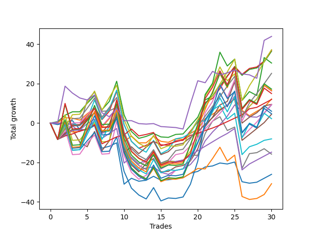

# Short Pointer 002 
- Symbol: ES
- Date Range: 03/18/2022 - 12/30/2022
- Trading Period: 8:30-12:30
- Number of Trades: 30



| Name | Win Percent | Profit | Avg Profit / Trade | Avg Time / Trade |      | Name | Win Percent | Profit | Avg Profit / Trade | Avg Time / Trade |
| ---- | ----------- | ------ | ------------------ | ---------------- | ---- | ---- | ----------- | ------ | ------------------ | ---------------- |
| Sorted By <br> Profit | | | | | | Sorted By <br> Win Percentage ||||
| NEWFI 0000 | 40.00 | 22000.00 | 733.33 | 19:27 |     | TP-1 | 86.67 | 6000.00 | 200.00 | 10:08 |
| TP-6 | 70.00 | 18625.00 | 620.83 | 30:15 |     | TP-3 | 80.00 | 2250.00 | 75.00 | 21:23 |
| BB-20 U/L 2SD C | 70.00 | 18500.00 | 616.67 | 21:20 |     | TP-2 | 80.00 | -7375.00 | -245.83 | 17:15 |
| BB-20 U/L 2SD | 73.33 | 18250.00 | 608.33 | 20:32 |     | TP-4 | 76.67 | 4750.00 | 158.33 | 26:38 |
| BB-200 U/L 2SD | 56.67 | 15250.00 | 508.33 | 53:14 |     | BB-20 U/L 2SD | 73.33 | 18250.00 | 608.33 | 20:32 |
| TP-5 | 73.33 | 12625.00 | 420.83 | 28:31 |     | TP-5 | 73.33 | 12625.00 | 420.83 | 28:31 |
| TP-10 | 56.67 | 8625.00 | 287.50 | 43:26 |     | TP-6 | 70.00 | 18625.00 | 620.83 | 30:15 |
| V U/L 1SD | 60.00 | 8250.00 | 275.00 | 46:50 |     | BB-20 U/L 2SD C | 70.00 | 18500.00 | 616.67 | 21:20 |
| TP-9 | 56.67 | 8250.00 | 275.00 | 41:31 |     | BB-50 U/L 1SD | 70.00 | 4750.00 | 158.33 | 31:25 |
| BB-50 U/L 2SD | 66.67 | 8125.00 | 270.83 | 38:45 |     | BB-50 U/L 2SD | 66.67 | 8125.00 | 270.83 | 38:45 |
| NEWFI 000 | 56.67 | 7500.00 | 250.00 | 46:36 |     | BB-20 Mid | 66.67 | -13000.00 | -433.33 | 07:41 |
| BB-20 U/L 1SD | 63.33 | 6125.00 | 204.17 | 12:10 |     | BB-20 U/L 1SD | 63.33 | 6125.00 | 204.17 | 12:10 |
| TP-1 | 86.67 | 6000.00 | 200.00 | 10:08 |     | BB-100 Mid | 63.33 | -4000.00 | -133.33 | 31:28 |
| TP-4 | 76.67 | 4750.00 | 158.33 | 26:38 |     | V Mid | 63.33 | -7875.00 | -262.50 | 34:08 |
| BB-50 U/L 1SD | 70.00 | 4750.00 | 158.33 | 31:25 |     | V U/L 1SD | 60.00 | 8250.00 | 275.00 | 46:50 |
| BB-50 Mid | 60.00 | 4625.00 | 154.17 | 21:03 |     | BB-50 Mid | 60.00 | 4625.00 | 154.17 | 21:03 |
| BB-100 U/L 2SD | 56.67 | 3000.00 | 100.00 | 49:59 |     | BB-200 U/L 2SD | 56.67 | 15250.00 | 508.33 | 53:14 |
| TP-8 | 56.67 | 2375.00 | 79.17 | 41:20 |     | TP-10 | 56.67 | 8625.00 | 287.50 | 43:26 |
| TP-3 | 80.00 | 2250.00 | 75.00 | 21:23 |     | TP-9 | 56.67 | 8250.00 | 275.00 | 41:31 |
| TP-7 | 56.67 | 1125.00 | 37.50 | 38:09 |     | NEWFI 000 | 56.67 | 7500.00 | 250.00 | 46:36 |
| BB-100 Mid | 63.33 | -4000.00 | -133.33 | 31:28 |     | BB-100 U/L 2SD | 56.67 | 3000.00 | 100.00 | 49:59 |
| TP-2 | 80.00 | -7375.00 | -245.83 | 17:15 |     | TP-8 | 56.67 | 2375.00 | 79.17 | 41:20 |
| V Mid | 63.33 | -7875.00 | -262.50 | 34:08 |     | TP-7 | 56.67 | 1125.00 | 37.50 | 38:09 |
| BB-20 Mid | 66.67 | -13000.00 | -433.33 | 07:41 |     | BB-200 Mid | 56.67 | -15375.00 | -512.50 | 31:22 |
| BB-200 Mid | 56.67 | -15375.00 | -512.50 | 31:22 |     | NEWFI 0000 | 40.00 | 22000.00 | 733.33 | 19:27 |

## NO STOPLOSS

### Test BB-20 Mid
* Sell when price hits the middle line of the 20p bollinger
* No Stoploss
* Results:
```
Total Trades: 30
Percent Up: 33.33
Percent Down: 66.67
Total Points Moved Down: -26.00
Potential Profit: -13000.00
Total Points Ups: 52.75 Count Ups: 10
Total Points Downs: 26.75 Count Downs: 20
```

<details><summary>Trades</summary>

<code>In: 2022-03-29 12:15:00		Out: 2022-03-29 12:24:45		Total Position Time: 09:45		Total Move Down: -0.75		Total to Date: -0.75</code> <br />
<code>In: 2022-04-20 10:50:00		Out: 2022-04-20 10:51:10		Total Position Time: 01:10		Total Move Down: 1.00		Total to Date: 0.25</code> <br />
<code>In: 2022-04-25 09:29:00		Out: 2022-04-25 09:31:05		Total Position Time: 02:05		Total Move Down: 1.00		Total to Date: 1.25</code> <br />
<code>In: 2022-05-24 10:48:00		Out: 2022-05-24 11:01:15		Total Position Time: 13:15		Total Move Down: -4.50		Total to Date: -3.25</code> <br />
<code>In: 2022-05-24 10:58:00		Out: 2022-05-24 11:01:15		Total Position Time: 03:15		Total Move Down: -0.25		Total to Date: -3.50</code> <br />
<code>In: 2022-05-26 10:12:00		Out: 2022-05-26 10:13:10		Total Position Time: 01:10		Total Move Down: 2.25		Total to Date: -1.25</code> <br />
<code>In: 2022-05-27 12:03:00		Out: 2022-05-27 12:35:00		Total Position Time: 32:00		Total Move Down: -11.50		Total to Date: -12.75</code> <br />
<code>In: 2022-06-01 12:19:00		Out: 2022-06-01 12:25:25		Total Position Time: 06:25		Total Move Down: 1.00		Total to Date: -11.75</code> <br />
<code>In: 2022-06-17 08:35:00		Out: 2022-06-17 08:36:10		Total Position Time: 01:10		Total Move Down: 1.75		Total to Date: -10.00</code> <br />
<code>In: 2022-07-28 08:09:00		Out: 2022-07-28 08:57:50		Total Position Time: 48:50		Total Move Down: -21.00		Total to Date: -31.00</code> <br />
<code>In: 2022-07-29 11:41:00		Out: 2022-07-29 11:42:10		Total Position Time: 01:10		Total Move Down: 3.00		Total to Date: -28.00</code> <br />
<code>In: 2022-07-29 12:31:00		Out: 2022-07-29 12:40:20		Total Position Time: 09:20		Total Move Down: -1.50		Total to Date: -29.50</code> <br />
<code>In: 2022-08-03 09:55:00		Out: 2022-08-03 10:00:00		Total Position Time: 05:00		Total Move Down: 0.50		Total to Date: -29.00</code> <br />
<code>In: 2022-08-05 10:18:00		Out: 2022-08-05 10:20:05		Total Position Time: 02:05		Total Move Down: 2.00		Total to Date: -27.00</code> <br />
<code>In: 2022-08-12 09:15:00		Out: 2022-08-12 09:33:05		Total Position Time: 18:05		Total Move Down: -2.00		Total to Date: -29.00</code> <br />
<code>In: 2022-08-15 09:38:00		Out: 2022-08-15 09:46:05		Total Position Time: 08:05		Total Move Down: 0.25		Total to Date: -28.75</code> <br />
<code>In: 2022-08-16 09:22:00		Out: 2022-08-16 09:23:10		Total Position Time: 01:10		Total Move Down: 0.50		Total to Date: -28.25</code> <br />
<code>In: 2022-08-18 12:26:00		Out: 2022-08-18 12:31:35		Total Position Time: 05:35		Total Move Down: 0.50		Total to Date: -27.75</code> <br />
<code>In: 2022-08-22 09:28:00		Out: 2022-08-22 09:29:10		Total Position Time: 01:10		Total Move Down: 2.25		Total to Date: -25.50</code> <br />
<code>In: 2022-08-31 09:02:00		Out: 2022-08-31 09:04:15		Total Position Time: 02:15		Total Move Down: 1.00		Total to Date: -24.50</code> <br />
<code>In: 2022-09-16 07:38:00		Out: 2022-09-16 07:42:55		Total Position Time: 04:55		Total Move Down: 2.25		Total to Date: -22.25</code> <br />
<code>In: 2022-09-19 09:58:00		Out: 2022-09-19 10:04:55		Total Position Time: 06:55		Total Move Down: 0.50		Total to Date: -21.75</code> <br />
<code>In: 2022-09-22 10:57:00		Out: 2022-09-22 11:01:30		Total Position Time: 04:30		Total Move Down: 1.50		Total to Date: -20.25</code> <br />
<code>In: 2022-09-28 07:49:00		Out: 2022-09-28 07:56:05		Total Position Time: 07:05		Total Move Down: -0.50		Total to Date: -20.75</code> <br />
<code>In: 2022-10-06 09:51:00		Out: 2022-10-06 09:55:05		Total Position Time: 04:05		Total Move Down: 1.00		Total to Date: -19.75</code> <br />
<code>In: 2022-10-11 08:39:00		Out: 2022-10-11 08:58:10		Total Position Time: 19:10		Total Move Down: -10.00		Total to Date: -29.75</code> <br />
<code>In: 2022-10-31 08:31:00		Out: 2022-10-31 08:38:35		Total Position Time: 07:35		Total Move Down: -0.75		Total to Date: -30.50</code> <br />
<code>In: 2022-11-16 08:35:00		Out: 2022-11-16 08:36:10		Total Position Time: 01:10		Total Move Down: 0.50		Total to Date: -30.00</code> <br />
<code>In: 2022-12-05 08:16:00		Out: 2022-12-05 08:17:10		Total Position Time: 01:10		Total Move Down: 2.00		Total to Date: -28.00</code> <br />
<code>In: 2022-12-20 10:06:00		Out: 2022-12-20 10:07:10		Total Position Time: 01:10		Total Move Down: 2.00		Total to Date: -26.00</code> <br />


</details>

### Test BB-20 U/L 1SD
* Sell when the price hits the lower line of the 20p 1std bollinger
* No Stoploss
* Results:
```
Total Trades: 30
Percent Up: 36.67
Percent Down: 63.33
Total Points Moved Down: 12.25
Potential Profit: 6125.00
Total Points Ups: 44.25 Count Ups: 11
Total Points Downs: 56.50 Count Downs: 19
```

<details><summary>Trades</summary>

<code>In: 2022-03-29 12:15:00		Out: 2022-03-29 12:27:45		Total Position Time: 12:45		Total Move Down: 0.25		Total to Date: 0.25</code> <br />
<code>In: 2022-04-20 10:50:00		Out: 2022-04-20 10:54:35		Total Position Time: 04:35		Total Move Down: 2.50		Total to Date: 2.75</code> <br />
<code>In: 2022-04-25 09:29:00		Out: 2022-04-25 09:42:45		Total Position Time: 13:45		Total Move Down: -0.25		Total to Date: 2.50</code> <br />
<code>In: 2022-05-24 10:48:00		Out: 2022-05-24 11:01:40		Total Position Time: 13:40		Total Move Down: -1.00		Total to Date: 1.50</code> <br />
<code>In: 2022-05-24 10:58:00		Out: 2022-05-24 11:01:40		Total Position Time: 03:40		Total Move Down: 3.25		Total to Date: 4.75</code> <br />
<code>In: 2022-05-26 10:12:00		Out: 2022-05-26 10:16:05		Total Position Time: 04:05		Total Move Down: 2.75		Total to Date: 7.50</code> <br />
<code>In: 2022-05-27 12:03:00		Out: 2022-05-27 12:35:45		Total Position Time: 32:45		Total Move Down: -9.50		Total to Date: -2.00</code> <br />
<code>In: 2022-06-01 12:19:00		Out: 2022-06-01 12:30:05		Total Position Time: 11:05		Total Move Down: 4.25		Total to Date: 2.25</code> <br />
<code>In: 2022-06-17 08:35:00		Out: 2022-06-17 08:39:05		Total Position Time: 04:05		Total Move Down: 6.25		Total to Date: 8.50</code> <br />
<code>In: 2022-07-28 08:09:00		Out: 2022-07-28 08:58:55		Total Position Time: 49:55		Total Move Down: -18.00		Total to Date: -9.50</code> <br />
<code>In: 2022-07-29 11:41:00		Out: 2022-07-29 11:42:10		Total Position Time: 01:10		Total Move Down: 3.00		Total to Date: -6.50</code> <br />
<code>In: 2022-07-29 12:31:00		Out: 2022-07-29 12:47:00		Total Position Time: 16:00		Total Move Down: -3.50		Total to Date: -10.00</code> <br />
<code>In: 2022-08-03 09:55:00		Out: 2022-08-03 10:11:30		Total Position Time: 16:30		Total Move Down: -0.00		Total to Date: -10.00</code> <br />
<code>In: 2022-08-05 10:18:00		Out: 2022-08-05 10:23:15		Total Position Time: 05:15		Total Move Down: 3.25		Total to Date: -6.75</code> <br />
<code>In: 2022-08-12 09:15:00		Out: 2022-08-12 09:40:30		Total Position Time: 25:30		Total Move Down: -2.50		Total to Date: -9.25</code> <br />
<code>In: 2022-08-15 09:38:00		Out: 2022-08-15 10:02:50		Total Position Time: 24:50		Total Move Down: -0.50		Total to Date: -9.75</code> <br />
<code>In: 2022-08-16 09:22:00		Out: 2022-08-16 09:27:10		Total Position Time: 05:10		Total Move Down: 1.75		Total to Date: -8.00</code> <br />
<code>In: 2022-08-18 12:26:00		Out: 2022-08-18 12:43:55		Total Position Time: 17:55		Total Move Down: -0.25		Total to Date: -8.25</code> <br />
<code>In: 2022-08-22 09:28:00		Out: 2022-08-22 09:32:05		Total Position Time: 04:05		Total Move Down: 3.00		Total to Date: -5.25</code> <br />
<code>In: 2022-08-31 09:02:00		Out: 2022-08-31 09:06:20		Total Position Time: 04:20		Total Move Down: 2.25		Total to Date: -3.00</code> <br />
<code>In: 2022-09-16 07:38:00		Out: 2022-09-16 07:44:55		Total Position Time: 06:55		Total Move Down: 5.25		Total to Date: 2.25</code> <br />
<code>In: 2022-09-19 09:58:00		Out: 2022-09-19 10:05:25		Total Position Time: 07:25		Total Move Down: 2.25		Total to Date: 4.50</code> <br />
<code>In: 2022-09-22 10:57:00		Out: 2022-09-22 11:03:35		Total Position Time: 06:35		Total Move Down: 2.50		Total to Date: 7.00</code> <br />
<code>In: 2022-09-28 07:49:00		Out: 2022-09-28 07:56:40		Total Position Time: 07:40		Total Move Down: 2.00		Total to Date: 9.00</code> <br />
<code>In: 2022-10-06 09:51:00		Out: 2022-10-06 09:57:05		Total Position Time: 06:05		Total Move Down: 3.50		Total to Date: 12.50</code> <br />
<code>In: 2022-10-11 08:39:00		Out: 2022-10-11 09:01:55		Total Position Time: 22:55		Total Move Down: -6.00		Total to Date: 6.50</code> <br />
<code>In: 2022-10-31 08:31:00		Out: 2022-10-31 08:58:20		Total Position Time: 27:20		Total Move Down: -2.75		Total to Date: 3.75</code> <br />
<code>In: 2022-11-16 08:35:00		Out: 2022-11-16 08:38:25		Total Position Time: 03:25		Total Move Down: 2.25		Total to Date: 6.00</code> <br />
<code>In: 2022-12-05 08:16:00		Out: 2022-12-05 08:17:10		Total Position Time: 01:10		Total Move Down: 2.00		Total to Date: 8.00</code> <br />
<code>In: 2022-12-20 10:06:00		Out: 2022-12-20 10:10:35		Total Position Time: 04:35		Total Move Down: 4.25		Total to Date: 12.25</code> <br />


</details>

### Test BB-20 U/L 2SD
* Sell when the price hits the lower line of the 20p 2std bollinger
* No Stoploss
* Results:
```
Total Trades: 30
Percent Up: 26.67
Percent Down: 73.33
Total Points Moved Down: 36.50
Potential Profit: 18250.00
Total Points Ups: 42.50 Count Ups: 8
Total Points Downs: 79.00 Count Downs: 22
```

<details><summary>Trades</summary>

<code>In: 2022-03-29 12:15:00		Out: 2022-03-29 12:27:50		Total Position Time: 12:50		Total Move Down: 0.75		Total to Date: 0.75</code> <br />
<code>In: 2022-04-20 10:50:00		Out: 2022-04-20 11:13:55		Total Position Time: 23:55		Total Move Down: 3.25		Total to Date: 4.00</code> <br />
<code>In: 2022-04-25 09:29:00		Out: 2022-04-25 10:01:15		Total Position Time: 32:15		Total Move Down: 1.75		Total to Date: 5.75</code> <br />
<code>In: 2022-05-24 10:48:00		Out: 2022-05-24 11:01:50		Total Position Time: 13:50		Total Move Down: -0.00		Total to Date: 5.75</code> <br />
<code>In: 2022-05-24 10:58:00		Out: 2022-05-24 11:01:50		Total Position Time: 03:50		Total Move Down: 4.25		Total to Date: 10.00</code> <br />
<code>In: 2022-05-26 10:12:00		Out: 2022-05-26 10:22:35		Total Position Time: 10:35		Total Move Down: 4.00		Total to Date: 14.00</code> <br />
<code>In: 2022-05-27 12:03:00		Out: 2022-05-27 12:36:55		Total Position Time: 33:55		Total Move Down: -7.25		Total to Date: 6.75</code> <br />
<code>In: 2022-06-01 12:19:00		Out: 2022-06-01 12:30:05		Total Position Time: 11:05		Total Move Down: 4.25		Total to Date: 11.00</code> <br />
<code>In: 2022-06-17 08:35:00		Out: 2022-06-17 08:45:15		Total Position Time: 10:15		Total Move Down: 10.25		Total to Date: 21.25</code> <br />
<code>In: 2022-07-28 08:09:00		Out: 2022-07-28 09:08:10		Total Position Time: 59:10		Total Move Down: -17.00		Total to Date: 4.25</code> <br />
<code>In: 2022-07-29 11:41:00		Out: 2022-07-29 12:41:55		Total Position Time: 60:55		Total Move Down: -8.50		Total to Date: -4.25</code> <br />
<code>In: 2022-07-29 12:31:00		Out: 2022-07-29 12:47:00		Total Position Time: 16:00		Total Move Down: -3.50		Total to Date: -7.75</code> <br />
<code>In: 2022-08-03 09:55:00		Out: 2022-08-03 10:19:50		Total Position Time: 24:50		Total Move Down: 1.00		Total to Date: -6.75</code> <br />
<code>In: 2022-08-05 10:18:00		Out: 2022-08-05 10:49:30		Total Position Time: 31:30		Total Move Down: 1.50		Total to Date: -5.25</code> <br />
<code>In: 2022-08-12 09:15:00		Out: 2022-08-12 09:42:00		Total Position Time: 27:00		Total Move Down: -1.75		Total to Date: -7.00</code> <br />
<code>In: 2022-08-15 09:38:00		Out: 2022-08-15 10:19:05		Total Position Time: 41:05		Total Move Down: -0.25		Total to Date: -7.25</code> <br />
<code>In: 2022-08-16 09:22:00		Out: 2022-08-16 09:41:15		Total Position Time: 19:15		Total Move Down: 1.50		Total to Date: -5.75</code> <br />
<code>In: 2022-08-18 12:26:00		Out: 2022-08-18 12:46:15		Total Position Time: 20:15		Total Move Down: 0.25		Total to Date: -5.50</code> <br />
<code>In: 2022-08-22 09:28:00		Out: 2022-08-22 09:44:50		Total Position Time: 16:50		Total Move Down: 4.25		Total to Date: -1.25</code> <br />
<code>In: 2022-08-31 09:02:00		Out: 2022-08-31 09:07:00		Total Position Time: 05:00		Total Move Down: 4.25		Total to Date: 3.00</code> <br />
<code>In: 2022-09-16 07:38:00		Out: 2022-09-16 07:47:50		Total Position Time: 09:50		Total Move Down: 8.75		Total to Date: 11.75</code> <br />
<code>In: 2022-09-19 09:58:00		Out: 2022-09-19 10:11:15		Total Position Time: 13:15		Total Move Down: 2.00		Total to Date: 13.75</code> <br />
<code>In: 2022-09-22 10:57:00		Out: 2022-09-22 11:07:55		Total Position Time: 10:55		Total Move Down: 5.00		Total to Date: 18.75</code> <br />
<code>In: 2022-09-28 07:49:00		Out: 2022-09-28 08:00:05		Total Position Time: 11:05		Total Move Down: 5.25		Total to Date: 24.00</code> <br />
<code>In: 2022-10-06 09:51:00		Out: 2022-10-06 10:02:00		Total Position Time: 11:00		Total Move Down: 4.50		Total to Date: 28.50</code> <br />
<code>In: 2022-10-11 08:39:00		Out: 2022-10-11 09:03:40		Total Position Time: 24:40		Total Move Down: -4.25		Total to Date: 24.25</code> <br />
<code>In: 2022-10-31 08:31:00		Out: 2022-10-31 08:58:35		Total Position Time: 27:35		Total Move Down: 3.00		Total to Date: 27.25</code> <br />
<code>In: 2022-11-16 08:35:00		Out: 2022-11-16 09:01:40		Total Position Time: 26:40		Total Move Down: 0.75		Total to Date: 28.00</code> <br />
<code>In: 2022-12-05 08:16:00		Out: 2022-12-05 08:17:35		Total Position Time: 01:35		Total Move Down: 3.00		Total to Date: 31.00</code> <br />
<code>In: 2022-12-20 10:06:00		Out: 2022-12-20 10:11:15		Total Position Time: 05:15		Total Move Down: 5.50		Total to Date: 36.50</code> <br />


</details>

### Test BB-20 U/L 2SD C
* Sell when the price hits the lower line of the 20p 2std bollinger
* No Stoploss
* Results:
```
Total Trades: 30
Percent Up: 30.00
Percent Down: 70.00
Total Points Moved Down: 37.00
Potential Profit: 18500.00
Total Points Ups: 49.75 Count Ups: 9
Total Points Downs: 86.75 Count Downs: 21
```

<details><summary>Trades</summary>

<code>In: 2022-03-29 12:15:00		Out: 2022-03-29 12:47:00		Total Position Time: 32:00		Total Move Down: -8.25		Total to Date: -8.25</code> <br />
<code>In: 2022-04-20 10:50:00		Out: 2022-04-20 11:14:05		Total Position Time: 24:05		Total Move Down: 3.25		Total to Date: -5.00</code> <br />
<code>In: 2022-04-25 09:29:00		Out: 2022-04-25 10:01:20		Total Position Time: 32:20		Total Move Down: 4.25		Total to Date: -0.75</code> <br />
<code>In: 2022-05-24 10:48:00		Out: 2022-05-24 11:01:50		Total Position Time: 13:50		Total Move Down: -0.00		Total to Date: -0.75</code> <br />
<code>In: 2022-05-24 10:58:00		Out: 2022-05-24 11:01:50		Total Position Time: 03:50		Total Move Down: 4.25		Total to Date: 3.50</code> <br />
<code>In: 2022-05-26 10:12:00		Out: 2022-05-26 10:22:45		Total Position Time: 10:45		Total Move Down: 4.75		Total to Date: 8.25</code> <br />
<code>In: 2022-05-27 12:03:00		Out: 2022-05-27 12:38:10		Total Position Time: 35:10		Total Move Down: -6.50		Total to Date: 1.75</code> <br />
<code>In: 2022-06-01 12:19:00		Out: 2022-06-01 12:30:05		Total Position Time: 11:05		Total Move Down: 4.25		Total to Date: 6.00</code> <br />
<code>In: 2022-06-17 08:35:00		Out: 2022-06-17 08:45:15		Total Position Time: 10:15		Total Move Down: 10.25		Total to Date: 16.25</code> <br />
<code>In: 2022-07-28 08:09:00		Out: 2022-07-28 09:08:30		Total Position Time: 59:30		Total Move Down: -17.00		Total to Date: -0.75</code> <br />
<code>In: 2022-07-29 11:41:00		Out: 2022-07-29 12:41:55		Total Position Time: 60:55		Total Move Down: -8.50		Total to Date: -9.25</code> <br />
<code>In: 2022-07-29 12:31:00		Out: 2022-07-29 12:47:00		Total Position Time: 16:00		Total Move Down: -3.50		Total to Date: -12.75</code> <br />
<code>In: 2022-08-03 09:55:00		Out: 2022-08-03 10:20:00		Total Position Time: 25:00		Total Move Down: 1.50		Total to Date: -11.25</code> <br />
<code>In: 2022-08-05 10:18:00		Out: 2022-08-05 10:50:35		Total Position Time: 32:35		Total Move Down: 2.00		Total to Date: -9.25</code> <br />
<code>In: 2022-08-12 09:15:00		Out: 2022-08-12 09:42:00		Total Position Time: 27:00		Total Move Down: -1.75		Total to Date: -11.00</code> <br />
<code>In: 2022-08-15 09:38:00		Out: 2022-08-15 10:19:05		Total Position Time: 41:05		Total Move Down: -0.25		Total to Date: -11.25</code> <br />
<code>In: 2022-08-16 09:22:00		Out: 2022-08-16 09:42:10		Total Position Time: 20:10		Total Move Down: 2.25		Total to Date: -9.00</code> <br />
<code>In: 2022-08-18 12:26:00		Out: 2022-08-18 12:46:15		Total Position Time: 20:15		Total Move Down: 0.25		Total to Date: -8.75</code> <br />
<code>In: 2022-08-22 09:28:00		Out: 2022-08-22 09:44:55		Total Position Time: 16:55		Total Move Down: 4.75		Total to Date: -4.00</code> <br />
<code>In: 2022-08-31 09:02:00		Out: 2022-08-31 09:07:05		Total Position Time: 05:05		Total Move Down: 4.50		Total to Date: 0.50</code> <br />
<code>In: 2022-09-16 07:38:00		Out: 2022-09-16 07:48:20		Total Position Time: 10:20		Total Move Down: 10.00		Total to Date: 10.50</code> <br />
<code>In: 2022-09-19 09:58:00		Out: 2022-09-19 10:11:15		Total Position Time: 13:15		Total Move Down: 2.00		Total to Date: 12.50</code> <br />
<code>In: 2022-09-22 10:57:00		Out: 2022-09-22 11:07:55		Total Position Time: 10:55		Total Move Down: 5.00		Total to Date: 17.50</code> <br />
<code>In: 2022-09-28 07:49:00		Out: 2022-09-28 08:00:10		Total Position Time: 11:10		Total Move Down: 6.25		Total to Date: 23.75</code> <br />
<code>In: 2022-10-06 09:51:00		Out: 2022-10-06 10:02:05		Total Position Time: 11:05		Total Move Down: 5.00		Total to Date: 28.75</code> <br />
<code>In: 2022-10-11 08:39:00		Out: 2022-10-11 09:03:45		Total Position Time: 24:45		Total Move Down: -4.00		Total to Date: 24.75</code> <br />
<code>In: 2022-10-31 08:31:00		Out: 2022-10-31 08:58:35		Total Position Time: 27:35		Total Move Down: 3.00		Total to Date: 27.75</code> <br />
<code>In: 2022-11-16 08:35:00		Out: 2022-11-16 09:01:40		Total Position Time: 26:40		Total Move Down: 0.75		Total to Date: 28.50</code> <br />
<code>In: 2022-12-05 08:16:00		Out: 2022-12-05 08:17:35		Total Position Time: 01:35		Total Move Down: 3.00		Total to Date: 31.50</code> <br />
<code>In: 2022-12-20 10:06:00		Out: 2022-12-20 10:11:15		Total Position Time: 05:15		Total Move Down: 5.50		Total to Date: 37.00</code> <br />


</details>

### Test BB-50 Mid
* Sell when price hits the middle line of the 50p bollinger
* No Stoploss
* Results:
```
Total Trades: 30
Percent Up: 40.00
Percent Down: 60.00
Total Points Moved Down: 9.25
Potential Profit: 4625.00
Total Points Ups: 50.75 Count Ups: 12
Total Points Downs: 60.00 Count Downs: 18
```

<details><summary>Trades</summary>

<code>In: 2022-03-29 12:15:00		Out: 2022-03-29 12:43:10		Total Position Time: 28:10		Total Move Down: -0.25		Total to Date: -0.25</code> <br />
<code>In: 2022-04-20 10:50:00		Out: 2022-04-20 10:51:10		Total Position Time: 01:10		Total Move Down: 1.00		Total to Date: 0.75</code> <br />
<code>In: 2022-04-25 09:29:00		Out: 2022-04-25 09:55:05		Total Position Time: 26:05		Total Move Down: -2.25		Total to Date: -1.50</code> <br />
<code>In: 2022-05-24 10:48:00		Out: 2022-05-24 11:20:25		Total Position Time: 32:25		Total Move Down: -2.75		Total to Date: -4.25</code> <br />
<code>In: 2022-05-24 10:58:00		Out: 2022-05-24 11:20:25		Total Position Time: 22:25		Total Move Down: 1.50		Total to Date: -2.75</code> <br />
<code>In: 2022-05-26 10:12:00		Out: 2022-05-26 10:22:35		Total Position Time: 10:35		Total Move Down: 4.00		Total to Date: 1.25</code> <br />
<code>In: 2022-05-27 12:03:00		Out: 2022-05-27 12:38:10		Total Position Time: 35:10		Total Move Down: -6.50		Total to Date: -5.25</code> <br />
<code>In: 2022-06-01 12:19:00		Out: 2022-06-01 12:25:30		Total Position Time: 06:30		Total Move Down: 1.75		Total to Date: -3.50</code> <br />
<code>In: 2022-06-17 08:35:00		Out: 2022-06-17 08:45:05		Total Position Time: 10:05		Total Move Down: 8.25		Total to Date: 4.75</code> <br />
<code>In: 2022-07-28 08:09:00		Out: 2022-07-28 09:08:10		Total Position Time: 59:10		Total Move Down: -17.00		Total to Date: -12.25</code> <br />
<code>In: 2022-07-29 11:41:00		Out: 2022-07-29 12:41:55		Total Position Time: 60:55		Total Move Down: -8.50		Total to Date: -20.75</code> <br />
<code>In: 2022-07-29 12:31:00		Out: 2022-07-29 12:47:00		Total Position Time: 16:00		Total Move Down: -3.50		Total to Date: -24.25</code> <br />
<code>In: 2022-08-03 09:55:00		Out: 2022-08-03 10:20:00		Total Position Time: 25:00		Total Move Down: 1.50		Total to Date: -22.75</code> <br />
<code>In: 2022-08-05 10:18:00		Out: 2022-08-05 10:47:35		Total Position Time: 29:35		Total Move Down: 0.50		Total to Date: -22.25</code> <br />
<code>In: 2022-08-12 09:15:00		Out: 2022-08-12 09:58:55		Total Position Time: 43:55		Total Move Down: -2.75		Total to Date: -25.00</code> <br />
<code>In: 2022-08-15 09:38:00		Out: 2022-08-15 10:15:30		Total Position Time: 37:30		Total Move Down: -1.00		Total to Date: -26.00</code> <br />
<code>In: 2022-08-16 09:22:00		Out: 2022-08-16 09:30:05		Total Position Time: 08:05		Total Move Down: 2.00		Total to Date: -24.00</code> <br />
<code>In: 2022-08-18 12:26:00		Out: 2022-08-18 12:47:00		Total Position Time: 21:00		Total Move Down: 0.75		Total to Date: -23.25</code> <br />
<code>In: 2022-08-22 09:28:00		Out: 2022-08-22 09:29:10		Total Position Time: 01:10		Total Move Down: 2.25		Total to Date: -21.00</code> <br />
<code>In: 2022-08-31 09:02:00		Out: 2022-08-31 09:10:55		Total Position Time: 08:55		Total Move Down: 4.50		Total to Date: -16.50</code> <br />
<code>In: 2022-09-16 07:38:00		Out: 2022-09-16 07:46:45		Total Position Time: 08:45		Total Move Down: 7.50		Total to Date: -9.00</code> <br />
<code>In: 2022-09-19 09:58:00		Out: 2022-09-19 10:12:15		Total Position Time: 14:15		Total Move Down: 4.50		Total to Date: -4.50</code> <br />
<code>In: 2022-09-22 10:57:00		Out: 2022-09-22 11:04:15		Total Position Time: 07:15		Total Move Down: 3.75		Total to Date: -0.75</code> <br />
<code>In: 2022-09-28 07:49:00		Out: 2022-09-28 08:10:10		Total Position Time: 21:10		Total Move Down: 4.25		Total to Date: 3.50</code> <br />
<code>In: 2022-10-06 09:51:00		Out: 2022-10-06 10:02:10		Total Position Time: 11:10		Total Move Down: 5.75		Total to Date: 9.25</code> <br />
<code>In: 2022-10-11 08:39:00		Out: 2022-10-11 09:04:40		Total Position Time: 25:40		Total Move Down: -3.25		Total to Date: 6.00</code> <br />
<code>In: 2022-10-31 08:31:00		Out: 2022-10-31 08:58:20		Total Position Time: 27:20		Total Move Down: -2.75		Total to Date: 3.25</code> <br />
<code>In: 2022-11-16 08:35:00		Out: 2022-11-16 09:01:25		Total Position Time: 26:25		Total Move Down: -0.25		Total to Date: 3.00</code> <br />
<code>In: 2022-12-05 08:16:00		Out: 2022-12-05 08:17:10		Total Position Time: 01:10		Total Move Down: 2.00		Total to Date: 5.00</code> <br />
<code>In: 2022-12-20 10:06:00		Out: 2022-12-20 10:10:35		Total Position Time: 04:35		Total Move Down: 4.25		Total to Date: 9.25</code> <br />


</details>

### Test BB-50 U/L 1SD
* Sell when the price hits the lower line of the 50p 1std bollinger
* No Stoploss
* Results:
```
Total Trades: 30
Percent Up: 30.00
Percent Down: 70.00
Total Points Moved Down: 9.50
Potential Profit: 4750.00
Total Points Ups: 84.00 Count Ups: 9
Total Points Downs: 93.50 Count Downs: 21
```

<details><summary>Trades</summary>

<code>In: 2022-03-29 12:15:00		Out: 2022-03-29 12:47:00		Total Position Time: 32:00		Total Move Down: -8.25		Total to Date: -8.25</code> <br />
<code>In: 2022-04-20 10:50:00		Out: 2022-04-20 11:13:55		Total Position Time: 23:55		Total Move Down: 3.25		Total to Date: -5.00</code> <br />
<code>In: 2022-04-25 09:29:00		Out: 2022-04-25 10:01:15		Total Position Time: 32:15		Total Move Down: 1.75		Total to Date: -3.25</code> <br />
<code>In: 2022-05-24 10:48:00		Out: 2022-05-24 11:44:15		Total Position Time: 56:15		Total Move Down: -6.50		Total to Date: -9.75</code> <br />
<code>In: 2022-05-24 10:58:00		Out: 2022-05-24 11:44:15		Total Position Time: 46:15		Total Move Down: -2.25		Total to Date: -12.00</code> <br />
<code>In: 2022-05-26 10:12:00		Out: 2022-05-26 10:23:50		Total Position Time: 11:50		Total Move Down: 7.75		Total to Date: -4.25</code> <br />
<code>In: 2022-05-27 12:03:00		Out: 2022-05-27 12:47:00		Total Position Time: 44:00		Total Move Down: -9.75		Total to Date: -14.00</code> <br />
<code>In: 2022-06-01 12:19:00		Out: 2022-06-01 12:31:00		Total Position Time: 12:00		Total Move Down: 5.00		Total to Date: -9.00</code> <br />
<code>In: 2022-06-17 08:35:00		Out: 2022-06-17 08:51:25		Total Position Time: 16:25		Total Move Down: 13.75		Total to Date: 4.75</code> <br />
<code>In: 2022-07-28 08:09:00		Out: 2022-07-28 09:09:55		Total Position Time: 60:55		Total Move Down: -17.50		Total to Date: -12.75</code> <br />
<code>In: 2022-07-29 11:41:00		Out: 2022-07-29 12:41:55		Total Position Time: 60:55		Total Move Down: -8.50		Total to Date: -21.25</code> <br />
<code>In: 2022-07-29 12:31:00		Out: 2022-07-29 12:47:00		Total Position Time: 16:00		Total Move Down: -3.50		Total to Date: -24.75</code> <br />
<code>In: 2022-08-03 09:55:00		Out: 2022-08-03 10:21:50		Total Position Time: 26:50		Total Move Down: 4.25		Total to Date: -20.50</code> <br />
<code>In: 2022-08-05 10:18:00		Out: 2022-08-05 10:52:05		Total Position Time: 34:05		Total Move Down: 2.50		Total to Date: -18.00</code> <br />
<code>In: 2022-08-12 09:15:00		Out: 2022-08-12 10:15:55		Total Position Time: 60:55		Total Move Down: -6.75		Total to Date: -24.75</code> <br />
<code>In: 2022-08-15 09:38:00		Out: 2022-08-15 10:19:30		Total Position Time: 41:30		Total Move Down: 0.25		Total to Date: -24.50</code> <br />
<code>In: 2022-08-16 09:22:00		Out: 2022-08-16 09:42:10		Total Position Time: 20:10		Total Move Down: 2.25		Total to Date: -22.25</code> <br />
<code>In: 2022-08-18 12:26:00		Out: 2022-08-18 12:47:00		Total Position Time: 21:00		Total Move Down: 0.75		Total to Date: -21.50</code> <br />
<code>In: 2022-08-22 09:28:00		Out: 2022-08-22 09:29:10		Total Position Time: 01:10		Total Move Down: 2.25		Total to Date: -19.25</code> <br />
<code>In: 2022-08-31 09:02:00		Out: 2022-08-31 09:22:45		Total Position Time: 20:45		Total Move Down: 6.25		Total to Date: -13.00</code> <br />
<code>In: 2022-09-16 07:38:00		Out: 2022-09-16 07:56:50		Total Position Time: 18:50		Total Move Down: 11.25		Total to Date: -1.75</code> <br />
<code>In: 2022-09-19 09:58:00		Out: 2022-09-19 10:33:20		Total Position Time: 35:20		Total Move Down: 4.75		Total to Date: 3.00</code> <br />
<code>In: 2022-09-22 10:57:00		Out: 2022-09-22 11:09:10		Total Position Time: 12:10		Total Move Down: 6.25		Total to Date: 9.25</code> <br />
<code>In: 2022-09-28 07:49:00		Out: 2022-09-28 08:33:55		Total Position Time: 44:55		Total Move Down: 1.75		Total to Date: 11.00</code> <br />
<code>In: 2022-10-06 09:51:00		Out: 2022-10-06 10:09:10		Total Position Time: 18:10		Total Move Down: 10.00		Total to Date: 21.00</code> <br />
<code>In: 2022-10-11 08:39:00		Out: 2022-10-11 09:39:55		Total Position Time: 60:55		Total Move Down: -21.00		Total to Date: 0.00</code> <br />
<code>In: 2022-10-31 08:31:00		Out: 2022-10-31 08:58:35		Total Position Time: 27:35		Total Move Down: 3.00		Total to Date: 3.00</code> <br />
<code>In: 2022-11-16 08:35:00		Out: 2022-11-16 09:04:10		Total Position Time: 29:10		Total Move Down: 2.25		Total to Date: 5.25</code> <br />
<code>In: 2022-12-05 08:16:00		Out: 2022-12-05 08:17:45		Total Position Time: 01:45		Total Move Down: 3.50		Total to Date: 8.75</code> <br />
<code>In: 2022-12-20 10:06:00		Out: 2022-12-20 11:00:40		Total Position Time: 54:40		Total Move Down: 0.75		Total to Date: 9.50</code> <br />


</details>

### Test BB-50 U/L 2SD
* Sell when the price hits the lower line of the 50p 2std bollinger
* No Stoploss
* Results:
```
Total Trades: 30
Percent Up: 33.33
Percent Down: 66.67
Total Points Moved Down: 16.25
Potential Profit: 8125.00
Total Points Ups: 98.00 Count Ups: 10
Total Points Downs: 114.25 Count Downs: 20
```

<details><summary>Trades</summary>

<code>In: 2022-03-29 12:15:00		Out: 2022-03-29 12:47:00		Total Position Time: 32:00		Total Move Down: -8.25		Total to Date: -8.25</code> <br />
<code>In: 2022-04-20 10:50:00		Out: 2022-04-20 11:17:15		Total Position Time: 27:15		Total Move Down: 5.25		Total to Date: -3.00</code> <br />
<code>In: 2022-04-25 09:29:00		Out: 2022-04-25 10:29:55		Total Position Time: 60:55		Total Move Down: -13.00		Total to Date: -16.00</code> <br />
<code>In: 2022-05-24 10:48:00		Out: 2022-05-24 11:48:55		Total Position Time: 60:55		Total Move Down: 0.25		Total to Date: -15.75</code> <br />
<code>In: 2022-05-24 10:58:00		Out: 2022-05-24 11:49:10		Total Position Time: 51:10		Total Move Down: 5.50		Total to Date: -10.25</code> <br />
<code>In: 2022-05-26 10:12:00		Out: 2022-05-26 11:12:55		Total Position Time: 60:55		Total Move Down: 4.25		Total to Date: -6.00</code> <br />
<code>In: 2022-05-27 12:03:00		Out: 2022-05-27 12:47:00		Total Position Time: 44:00		Total Move Down: -9.75		Total to Date: -15.75</code> <br />
<code>In: 2022-06-01 12:19:00		Out: 2022-06-01 12:47:00		Total Position Time: 28:00		Total Move Down: 0.25		Total to Date: -15.50</code> <br />
<code>In: 2022-06-17 08:35:00		Out: 2022-06-17 08:52:10		Total Position Time: 17:10		Total Move Down: 16.50		Total to Date: 1.00</code> <br />
<code>In: 2022-07-28 08:09:00		Out: 2022-07-28 09:09:55		Total Position Time: 60:55		Total Move Down: -17.50		Total to Date: -16.50</code> <br />
<code>In: 2022-07-29 11:41:00		Out: 2022-07-29 12:41:55		Total Position Time: 60:55		Total Move Down: -8.50		Total to Date: -25.00</code> <br />
<code>In: 2022-07-29 12:31:00		Out: 2022-07-29 12:47:00		Total Position Time: 16:00		Total Move Down: -3.50		Total to Date: -28.50</code> <br />
<code>In: 2022-08-03 09:55:00		Out: 2022-08-03 10:40:20		Total Position Time: 45:20		Total Move Down: 2.00		Total to Date: -26.50</code> <br />
<code>In: 2022-08-05 10:18:00		Out: 2022-08-05 10:55:40		Total Position Time: 37:40		Total Move Down: 3.75		Total to Date: -22.75</code> <br />
<code>In: 2022-08-12 09:15:00		Out: 2022-08-12 10:15:55		Total Position Time: 60:55		Total Move Down: -6.75		Total to Date: -29.50</code> <br />
<code>In: 2022-08-15 09:38:00		Out: 2022-08-15 10:20:35		Total Position Time: 42:35		Total Move Down: 2.00		Total to Date: -27.50</code> <br />
<code>In: 2022-08-16 09:22:00		Out: 2022-08-16 09:42:30		Total Position Time: 20:30		Total Move Down: 3.50		Total to Date: -24.00</code> <br />
<code>In: 2022-08-18 12:26:00		Out: 2022-08-18 12:47:00		Total Position Time: 21:00		Total Move Down: 0.75		Total to Date: -23.25</code> <br />
<code>In: 2022-08-22 09:28:00		Out: 2022-08-22 09:44:50		Total Position Time: 16:50		Total Move Down: 4.25		Total to Date: -19.00</code> <br />
<code>In: 2022-08-31 09:02:00		Out: 2022-08-31 09:24:25		Total Position Time: 22:25		Total Move Down: 9.00		Total to Date: -10.00</code> <br />
<code>In: 2022-09-16 07:38:00		Out: 2022-09-16 07:58:05		Total Position Time: 20:05		Total Move Down: 15.25		Total to Date: 5.25</code> <br />
<code>In: 2022-09-19 09:58:00		Out: 2022-09-19 10:34:45		Total Position Time: 36:45		Total Move Down: 5.75		Total to Date: 11.00</code> <br />
<code>In: 2022-09-22 10:57:00		Out: 2022-09-22 11:13:10		Total Position Time: 16:10		Total Move Down: 9.00		Total to Date: 20.00</code> <br />
<code>In: 2022-09-28 07:49:00		Out: 2022-09-28 08:49:55		Total Position Time: 60:55		Total Move Down: -7.00		Total to Date: 13.00</code> <br />
<code>In: 2022-10-06 09:51:00		Out: 2022-10-06 10:32:45		Total Position Time: 41:45		Total Move Down: 9.00		Total to Date: 22.00</code> <br />
<code>In: 2022-10-11 08:39:00		Out: 2022-10-11 09:39:55		Total Position Time: 60:55		Total Move Down: -21.00		Total to Date: 1.00</code> <br />
<code>In: 2022-10-31 08:31:00		Out: 2022-10-31 08:58:50		Total Position Time: 27:50		Total Move Down: 7.50		Total to Date: 8.50</code> <br />
<code>In: 2022-11-16 08:35:00		Out: 2022-11-16 09:19:25		Total Position Time: 44:25		Total Move Down: 3.75		Total to Date: 12.25</code> <br />
<code>In: 2022-12-05 08:16:00		Out: 2022-12-05 08:21:20		Total Position Time: 05:20		Total Move Down: 6.75		Total to Date: 19.00</code> <br />
<code>In: 2022-12-20 10:06:00		Out: 2022-12-20 11:06:55		Total Position Time: 60:55		Total Move Down: -2.75		Total to Date: 16.25</code> <br />


</details>

### Test V Mid
* Sell when the price hits the middle line of the 1std VWAP
* No Stoploss
* Results:
```
Total Trades: 30
Percent Up: 36.67
Percent Down: 63.33
Total Points Moved Down: -15.75
Potential Profit: -7875.00
Total Points Ups: 87.25 Count Ups: 11
Total Points Downs: 71.50 Count Downs: 19
```

<details><summary>Trades</summary>

<code>In: 2022-03-29 12:15:00		Out: 2022-03-29 12:47:00		Total Position Time: 32:00		Total Move Down: -8.25		Total to Date: -8.25</code> <br />
<code>In: 2022-04-20 10:50:00		Out: 2022-04-20 11:17:50		Total Position Time: 27:50		Total Move Down: 5.75		Total to Date: -2.50</code> <br />
<code>In: 2022-04-25 09:29:00		Out: 2022-04-25 09:31:05		Total Position Time: 02:05		Total Move Down: 1.00		Total to Date: -1.50</code> <br />
<code>In: 2022-05-24 10:48:00		Out: 2022-05-24 11:48:55		Total Position Time: 60:55		Total Move Down: 0.25		Total to Date: -1.25</code> <br />
<code>In: 2022-05-24 10:58:00		Out: 2022-05-24 11:55:20		Total Position Time: 57:20		Total Move Down: 12.75		Total to Date: 11.50</code> <br />
<code>In: 2022-05-26 10:12:00		Out: 2022-05-26 11:12:55		Total Position Time: 60:55		Total Move Down: 4.25		Total to Date: 15.75</code> <br />
<code>In: 2022-05-27 12:03:00		Out: 2022-05-27 12:47:00		Total Position Time: 44:00		Total Move Down: -9.75		Total to Date: 6.00</code> <br />
<code>In: 2022-06-01 12:19:00		Out: 2022-06-01 12:47:00		Total Position Time: 28:00		Total Move Down: 0.25		Total to Date: 6.25</code> <br />
<code>In: 2022-06-17 08:35:00		Out: 2022-06-17 08:36:10		Total Position Time: 01:10		Total Move Down: 1.75		Total to Date: 8.00</code> <br />
<code>In: 2022-07-28 08:09:00		Out: 2022-07-28 09:09:55		Total Position Time: 60:55		Total Move Down: -17.50		Total to Date: -9.50</code> <br />
<code>In: 2022-07-29 11:41:00		Out: 2022-07-29 12:41:55		Total Position Time: 60:55		Total Move Down: -8.50		Total to Date: -18.00</code> <br />
<code>In: 2022-07-29 12:31:00		Out: 2022-07-29 12:47:00		Total Position Time: 16:00		Total Move Down: -3.50		Total to Date: -21.50</code> <br />
<code>In: 2022-08-03 09:55:00		Out: 2022-08-03 10:55:55		Total Position Time: 60:55		Total Move Down: -2.00		Total to Date: -23.50</code> <br />
<code>In: 2022-08-05 10:18:00		Out: 2022-08-05 11:11:45		Total Position Time: 53:45		Total Move Down: 9.50		Total to Date: -14.00</code> <br />
<code>In: 2022-08-12 09:15:00		Out: 2022-08-12 10:15:55		Total Position Time: 60:55		Total Move Down: -6.75		Total to Date: -20.75</code> <br />
<code>In: 2022-08-15 09:38:00		Out: 2022-08-15 10:38:55		Total Position Time: 60:55		Total Move Down: 1.50		Total to Date: -19.25</code> <br />
<code>In: 2022-08-16 09:22:00		Out: 2022-08-16 10:22:55		Total Position Time: 60:55		Total Move Down: -0.25		Total to Date: -19.50</code> <br />
<code>In: 2022-08-18 12:26:00		Out: 2022-08-18 12:47:00		Total Position Time: 21:00		Total Move Down: 0.75		Total to Date: -18.75</code> <br />
<code>In: 2022-08-22 09:28:00		Out: 2022-08-22 09:29:10		Total Position Time: 01:10		Total Move Down: 2.25		Total to Date: -16.50</code> <br />
<code>In: 2022-08-31 09:02:00		Out: 2022-08-31 09:04:00		Total Position Time: 02:00		Total Move Down: 0.25		Total to Date: -16.25</code> <br />
<code>In: 2022-09-16 07:38:00		Out: 2022-09-16 07:48:40		Total Position Time: 10:40		Total Move Down: 11.00		Total to Date: -5.25</code> <br />
<code>In: 2022-09-19 09:58:00		Out: 2022-09-19 10:17:20		Total Position Time: 19:20		Total Move Down: 6.25		Total to Date: 1.00</code> <br />
<code>In: 2022-09-22 10:57:00		Out: 2022-09-22 11:03:25		Total Position Time: 06:25		Total Move Down: 2.25		Total to Date: 3.25</code> <br />
<code>In: 2022-09-28 07:49:00		Out: 2022-09-28 08:49:55		Total Position Time: 60:55		Total Move Down: -7.00		Total to Date: -3.75</code> <br />
<code>In: 2022-10-06 09:51:00		Out: 2022-10-06 09:52:10		Total Position Time: 01:10		Total Move Down: 1.75		Total to Date: -2.00</code> <br />
<code>In: 2022-10-11 08:39:00		Out: 2022-10-11 09:39:55		Total Position Time: 60:55		Total Move Down: -21.00		Total to Date: -23.00</code> <br />
<code>In: 2022-10-31 08:31:00		Out: 2022-10-31 08:58:50		Total Position Time: 27:50		Total Move Down: 7.50		Total to Date: -15.50</code> <br />
<code>In: 2022-11-16 08:35:00		Out: 2022-11-16 08:36:10		Total Position Time: 01:10		Total Move Down: 0.50		Total to Date: -15.00</code> <br />
<code>In: 2022-12-05 08:16:00		Out: 2022-12-05 08:17:10		Total Position Time: 01:10		Total Move Down: 2.00		Total to Date: -13.00</code> <br />
<code>In: 2022-12-20 10:06:00		Out: 2022-12-20 11:06:55		Total Position Time: 60:55		Total Move Down: -2.75		Total to Date: -15.75</code> <br />


</details>

### Test V U/L 1SD
* Sell when the price hits the lower line of the 1std VWAP
* No Stoploss
* Results:
```
Total Trades: 30
Percent Up: 40.00
Percent Down: 60.00
Total Points Moved Down: 16.50
Potential Profit: 8250.00
Total Points Ups: 100.25 Count Ups: 12
Total Points Downs: 116.75 Count Downs: 18
```

<details><summary>Trades</summary>

<code>In: 2022-03-29 12:15:00		Out: 2022-03-29 12:47:00		Total Position Time: 32:00		Total Move Down: -8.25		Total to Date: -8.25</code> <br />
<code>In: 2022-04-20 10:50:00		Out: 2022-04-20 11:30:15		Total Position Time: 40:15		Total Move Down: 12.50		Total to Date: 4.25</code> <br />
<code>In: 2022-04-25 09:29:00		Out: 2022-04-25 10:29:55		Total Position Time: 60:55		Total Move Down: -13.00		Total to Date: -8.75</code> <br />
<code>In: 2022-05-24 10:48:00		Out: 2022-05-24 11:48:55		Total Position Time: 60:55		Total Move Down: 0.25		Total to Date: -8.50</code> <br />
<code>In: 2022-05-24 10:58:00		Out: 2022-05-24 11:58:55		Total Position Time: 60:55		Total Move Down: 4.50		Total to Date: -4.00</code> <br />
<code>In: 2022-05-26 10:12:00		Out: 2022-05-26 11:12:55		Total Position Time: 60:55		Total Move Down: 4.25		Total to Date: 0.25</code> <br />
<code>In: 2022-05-27 12:03:00		Out: 2022-05-27 12:47:00		Total Position Time: 44:00		Total Move Down: -9.75		Total to Date: -9.50</code> <br />
<code>In: 2022-06-01 12:19:00		Out: 2022-06-01 12:47:00		Total Position Time: 28:00		Total Move Down: 0.25		Total to Date: -9.25</code> <br />
<code>In: 2022-06-17 08:35:00		Out: 2022-06-17 09:03:15		Total Position Time: 28:15		Total Move Down: 20.75		Total to Date: 11.50</code> <br />
<code>In: 2022-07-28 08:09:00		Out: 2022-07-28 09:09:55		Total Position Time: 60:55		Total Move Down: -17.50		Total to Date: -6.00</code> <br />
<code>In: 2022-07-29 11:41:00		Out: 2022-07-29 12:41:55		Total Position Time: 60:55		Total Move Down: -8.50		Total to Date: -14.50</code> <br />
<code>In: 2022-07-29 12:31:00		Out: 2022-07-29 12:47:00		Total Position Time: 16:00		Total Move Down: -3.50		Total to Date: -18.00</code> <br />
<code>In: 2022-08-03 09:55:00		Out: 2022-08-03 10:55:55		Total Position Time: 60:55		Total Move Down: -2.00		Total to Date: -20.00</code> <br />
<code>In: 2022-08-05 10:18:00		Out: 2022-08-05 11:18:55		Total Position Time: 60:55		Total Move Down: 5.75		Total to Date: -14.25</code> <br />
<code>In: 2022-08-12 09:15:00		Out: 2022-08-12 10:15:55		Total Position Time: 60:55		Total Move Down: -6.75		Total to Date: -21.00</code> <br />
<code>In: 2022-08-15 09:38:00		Out: 2022-08-15 10:38:55		Total Position Time: 60:55		Total Move Down: 1.50		Total to Date: -19.50</code> <br />
<code>In: 2022-08-16 09:22:00		Out: 2022-08-16 10:22:55		Total Position Time: 60:55		Total Move Down: -0.25		Total to Date: -19.75</code> <br />
<code>In: 2022-08-18 12:26:00		Out: 2022-08-18 12:47:00		Total Position Time: 21:00		Total Move Down: 0.75		Total to Date: -19.00</code> <br />
<code>In: 2022-08-22 09:28:00		Out: 2022-08-22 09:44:55		Total Position Time: 16:55		Total Move Down: 4.75		Total to Date: -14.25</code> <br />
<code>In: 2022-08-31 09:02:00		Out: 2022-08-31 09:24:30		Total Position Time: 22:30		Total Move Down: 9.75		Total to Date: -4.50</code> <br />
<code>In: 2022-09-16 07:38:00		Out: 2022-09-16 08:32:30		Total Position Time: 54:30		Total Move Down: 18.25		Total to Date: 13.75</code> <br />
<code>In: 2022-09-19 09:58:00		Out: 2022-09-19 10:58:55		Total Position Time: 60:55		Total Move Down: 5.75		Total to Date: 19.50</code> <br />
<code>In: 2022-09-22 10:57:00		Out: 2022-09-22 11:13:10		Total Position Time: 16:10		Total Move Down: 9.00		Total to Date: 28.50</code> <br />
<code>In: 2022-09-28 07:49:00		Out: 2022-09-28 08:49:55		Total Position Time: 60:55		Total Move Down: -7.00		Total to Date: 21.50</code> <br />
<code>In: 2022-10-06 09:51:00		Out: 2022-10-06 10:51:55		Total Position Time: 60:55		Total Move Down: 3.50		Total to Date: 25.00</code> <br />
<code>In: 2022-10-11 08:39:00		Out: 2022-10-11 09:39:55		Total Position Time: 60:55		Total Move Down: -21.00		Total to Date: 4.00</code> <br />
<code>In: 2022-10-31 08:31:00		Out: 2022-10-31 09:31:55		Total Position Time: 60:55		Total Move Down: 4.50		Total to Date: 8.50</code> <br />
<code>In: 2022-11-16 08:35:00		Out: 2022-11-16 09:19:25		Total Position Time: 44:25		Total Move Down: 3.75		Total to Date: 12.25</code> <br />
<code>In: 2022-12-05 08:16:00		Out: 2022-12-05 08:21:25		Total Position Time: 05:25		Total Move Down: 7.00		Total to Date: 19.25</code> <br />
<code>In: 2022-12-20 10:06:00		Out: 2022-12-20 11:06:55		Total Position Time: 60:55		Total Move Down: -2.75		Total to Date: 16.50</code> <br />


</details>

### Test BB-100 Mid
* Move to BB100 Mid
* No Stoploss
* Results:
```
Total Trades: 30
Percent Up: 36.67
Percent Down: 63.33
Total Points Moved Down: -8.00
Potential Profit: -4000.00
Total Points Ups: 85.50 Count Ups: 11
Total Points Downs: 77.50 Count Downs: 19
```

<details><summary>Trades</summary>

<code>In: 2022-03-29 12:15:00		Out: 2022-03-29 12:47:00		Total Position Time: 32:00		Total Move Down: -8.25		Total to Date: -8.25</code> <br />
<code>In: 2022-04-20 10:50:00		Out: 2022-04-20 11:13:20		Total Position Time: 23:20		Total Move Down: 1.75		Total to Date: -6.50</code> <br />
<code>In: 2022-04-25 09:29:00		Out: 2022-04-25 10:01:50		Total Position Time: 32:50		Total Move Down: 6.25		Total to Date: -0.25</code> <br />
<code>In: 2022-05-24 10:48:00		Out: 2022-05-24 11:48:35		Total Position Time: 60:35		Total Move Down: -1.00		Total to Date: -1.25</code> <br />
<code>In: 2022-05-24 10:58:00		Out: 2022-05-24 11:48:35		Total Position Time: 50:35		Total Move Down: 3.25		Total to Date: 2.00</code> <br />
<code>In: 2022-05-26 10:12:00		Out: 2022-05-26 10:29:15		Total Position Time: 17:15		Total Move Down: 9.75		Total to Date: 11.75</code> <br />
<code>In: 2022-05-27 12:03:00		Out: 2022-05-27 12:47:00		Total Position Time: 44:00		Total Move Down: -9.75		Total to Date: 2.00</code> <br />
<code>In: 2022-06-01 12:19:00		Out: 2022-06-01 12:35:05		Total Position Time: 16:05		Total Move Down: 5.25		Total to Date: 7.25</code> <br />
<code>In: 2022-06-17 08:35:00		Out: 2022-06-17 08:45:25		Total Position Time: 10:25		Total Move Down: 9.50		Total to Date: 16.75</code> <br />
<code>In: 2022-07-28 08:09:00		Out: 2022-07-28 09:09:55		Total Position Time: 60:55		Total Move Down: -17.50		Total to Date: -0.75</code> <br />
<code>In: 2022-07-29 11:41:00		Out: 2022-07-29 12:41:55		Total Position Time: 60:55		Total Move Down: -8.50		Total to Date: -9.25</code> <br />
<code>In: 2022-07-29 12:31:00		Out: 2022-07-29 12:47:00		Total Position Time: 16:00		Total Move Down: -3.50		Total to Date: -12.75</code> <br />
<code>In: 2022-08-03 09:55:00		Out: 2022-08-03 10:55:55		Total Position Time: 60:55		Total Move Down: -2.00		Total to Date: -14.75</code> <br />
<code>In: 2022-08-05 10:18:00		Out: 2022-08-05 10:56:25		Total Position Time: 38:25		Total Move Down: 6.00		Total to Date: -8.75</code> <br />
<code>In: 2022-08-12 09:15:00		Out: 2022-08-12 10:15:55		Total Position Time: 60:55		Total Move Down: -6.75		Total to Date: -15.50</code> <br />
<code>In: 2022-08-15 09:38:00		Out: 2022-08-15 10:20:40		Total Position Time: 42:40		Total Move Down: 2.00		Total to Date: -13.50</code> <br />
<code>In: 2022-08-16 09:22:00		Out: 2022-08-16 09:50:15		Total Position Time: 28:15		Total Move Down: 5.50		Total to Date: -8.00</code> <br />
<code>In: 2022-08-18 12:26:00		Out: 2022-08-18 12:47:00		Total Position Time: 21:00		Total Move Down: 0.75		Total to Date: -7.25</code> <br />
<code>In: 2022-08-22 09:28:00		Out: 2022-08-22 09:29:10		Total Position Time: 01:10		Total Move Down: 2.25		Total to Date: -5.00</code> <br />
<code>In: 2022-08-31 09:02:00		Out: 2022-08-31 09:11:05		Total Position Time: 09:05		Total Move Down: 6.25		Total to Date: 1.25</code> <br />
<code>In: 2022-09-16 07:38:00		Out: 2022-09-16 07:39:10		Total Position Time: 01:10		Total Move Down: -0.25		Total to Date: 1.00</code> <br />
<code>In: 2022-09-19 09:58:00		Out: 2022-09-19 10:34:45		Total Position Time: 36:45		Total Move Down: 5.75		Total to Date: 6.75</code> <br />
<code>In: 2022-09-22 10:57:00		Out: 2022-09-22 11:03:25		Total Position Time: 06:25		Total Move Down: 2.25		Total to Date: 9.00</code> <br />
<code>In: 2022-09-28 07:49:00		Out: 2022-09-28 08:49:55		Total Position Time: 60:55		Total Move Down: -7.00		Total to Date: 2.00</code> <br />
<code>In: 2022-10-06 09:51:00		Out: 2022-10-06 09:56:20		Total Position Time: 05:20		Total Move Down: 3.00		Total to Date: 5.00</code> <br />
<code>In: 2022-10-11 08:39:00		Out: 2022-10-11 09:39:55		Total Position Time: 60:55		Total Move Down: -21.00		Total to Date: -16.00</code> <br />
<code>In: 2022-10-31 08:31:00		Out: 2022-10-31 08:58:45		Total Position Time: 27:45		Total Move Down: 4.00		Total to Date: -12.00</code> <br />
<code>In: 2022-11-16 08:35:00		Out: 2022-11-16 08:36:40		Total Position Time: 01:40		Total Move Down: 1.25		Total to Date: -10.75</code> <br />
<code>In: 2022-12-05 08:16:00		Out: 2022-12-05 08:17:10		Total Position Time: 01:10		Total Move Down: 2.00		Total to Date: -8.75</code> <br />
<code>In: 2022-12-20 10:06:00		Out: 2022-12-20 11:00:40		Total Position Time: 54:40		Total Move Down: 0.75		Total to Date: -8.00</code> <br />


</details>

### Test BB-100 U/L 2SD
* Move to BB100 Upper Band
* No Stoploss
* Results:
```
Total Trades: 30
Percent Up: 43.33
Percent Down: 56.67
Total Points Moved Down: 6.00
Potential Profit: 3000.00
Total Points Ups: 102.25 Count Ups: 13
Total Points Downs: 108.25 Count Downs: 17
```

<details><summary>Trades</summary>

<code>In: 2022-03-29 12:15:00		Out: 2022-03-29 12:47:00		Total Position Time: 32:00		Total Move Down: -8.25		Total to Date: -8.25</code> <br />
<code>In: 2022-04-20 10:50:00		Out: 2022-04-20 11:18:30		Total Position Time: 28:30		Total Move Down: 7.50		Total to Date: -0.75</code> <br />
<code>In: 2022-04-25 09:29:00		Out: 2022-04-25 10:29:55		Total Position Time: 60:55		Total Move Down: -13.00		Total to Date: -13.75</code> <br />
<code>In: 2022-05-24 10:48:00		Out: 2022-05-24 11:48:55		Total Position Time: 60:55		Total Move Down: 0.25		Total to Date: -13.50</code> <br />
<code>In: 2022-05-24 10:58:00		Out: 2022-05-24 11:58:55		Total Position Time: 60:55		Total Move Down: 4.50		Total to Date: -9.00</code> <br />
<code>In: 2022-05-26 10:12:00		Out: 2022-05-26 11:12:55		Total Position Time: 60:55		Total Move Down: 4.25		Total to Date: -4.75</code> <br />
<code>In: 2022-05-27 12:03:00		Out: 2022-05-27 12:47:00		Total Position Time: 44:00		Total Move Down: -9.75		Total to Date: -14.50</code> <br />
<code>In: 2022-06-01 12:19:00		Out: 2022-06-01 12:47:00		Total Position Time: 28:00		Total Move Down: 0.25		Total to Date: -14.25</code> <br />
<code>In: 2022-06-17 08:35:00		Out: 2022-06-17 09:35:55		Total Position Time: 60:55		Total Move Down: 7.25		Total to Date: -7.00</code> <br />
<code>In: 2022-07-28 08:09:00		Out: 2022-07-28 09:09:55		Total Position Time: 60:55		Total Move Down: -17.50		Total to Date: -24.50</code> <br />
<code>In: 2022-07-29 11:41:00		Out: 2022-07-29 12:41:55		Total Position Time: 60:55		Total Move Down: -8.50		Total to Date: -33.00</code> <br />
<code>In: 2022-07-29 12:31:00		Out: 2022-07-29 12:47:00		Total Position Time: 16:00		Total Move Down: -3.50		Total to Date: -36.50</code> <br />
<code>In: 2022-08-03 09:55:00		Out: 2022-08-03 10:55:55		Total Position Time: 60:55		Total Move Down: -2.00		Total to Date: -38.50</code> <br />
<code>In: 2022-08-05 10:18:00		Out: 2022-08-05 11:18:55		Total Position Time: 60:55		Total Move Down: 5.75		Total to Date: -32.75</code> <br />
<code>In: 2022-08-12 09:15:00		Out: 2022-08-12 10:15:55		Total Position Time: 60:55		Total Move Down: -6.75		Total to Date: -39.50</code> <br />
<code>In: 2022-08-15 09:38:00		Out: 2022-08-15 10:38:55		Total Position Time: 60:55		Total Move Down: 1.50		Total to Date: -38.00</code> <br />
<code>In: 2022-08-16 09:22:00		Out: 2022-08-16 10:22:55		Total Position Time: 60:55		Total Move Down: -0.25		Total to Date: -38.25</code> <br />
<code>In: 2022-08-18 12:26:00		Out: 2022-08-18 12:47:00		Total Position Time: 21:00		Total Move Down: 0.75		Total to Date: -37.50</code> <br />
<code>In: 2022-08-22 09:28:00		Out: 2022-08-22 09:45:25		Total Position Time: 17:25		Total Move Down: 6.50		Total to Date: -31.00</code> <br />
<code>In: 2022-08-31 09:02:00		Out: 2022-08-31 10:02:55		Total Position Time: 60:55		Total Move Down: 11.75		Total to Date: -19.25</code> <br />
<code>In: 2022-09-16 07:38:00		Out: 2022-09-16 08:38:55		Total Position Time: 60:55		Total Move Down: 21.00		Total to Date: 1.75</code> <br />
<code>In: 2022-09-19 09:58:00		Out: 2022-09-19 10:58:55		Total Position Time: 60:55		Total Move Down: 5.75		Total to Date: 7.50</code> <br />
<code>In: 2022-09-22 10:57:00		Out: 2022-09-22 11:21:05		Total Position Time: 24:05		Total Move Down: 12.00		Total to Date: 19.50</code> <br />
<code>In: 2022-09-28 07:49:00		Out: 2022-09-28 08:49:55		Total Position Time: 60:55		Total Move Down: -7.00		Total to Date: 12.50</code> <br />
<code>In: 2022-10-06 09:51:00		Out: 2022-10-06 10:51:55		Total Position Time: 60:55		Total Move Down: 3.50		Total to Date: 16.00</code> <br />
<code>In: 2022-10-11 08:39:00		Out: 2022-10-11 09:39:55		Total Position Time: 60:55		Total Move Down: -21.00		Total to Date: -5.00</code> <br />
<code>In: 2022-10-31 08:31:00		Out: 2022-10-31 09:31:55		Total Position Time: 60:55		Total Move Down: 4.50		Total to Date: -0.50</code> <br />
<code>In: 2022-11-16 08:35:00		Out: 2022-11-16 09:35:55		Total Position Time: 60:55		Total Move Down: -2.00		Total to Date: -2.50</code> <br />
<code>In: 2022-12-05 08:16:00		Out: 2022-12-05 08:25:35		Total Position Time: 09:35		Total Move Down: 11.25		Total to Date: 8.75</code> <br />
<code>In: 2022-12-20 10:06:00		Out: 2022-12-20 11:06:55		Total Position Time: 60:55		Total Move Down: -2.75		Total to Date: 6.00</code> <br />


</details>

### Test BB-200 Mid
* Move to BB200 Mid
* No Stoploss
* Results:
```
Total Trades: 30
Percent Up: 43.33
Percent Down: 56.67
Total Points Moved Down: -30.75
Potential Profit: -15375.00
Total Points Ups: 87.75 Count Ups: 13
Total Points Downs: 57.00 Count Downs: 17
```

<details><summary>Trades</summary>

<code>In: 2022-03-29 12:15:00		Out: 2022-03-29 12:47:00		Total Position Time: 32:00		Total Move Down: -8.25		Total to Date: -8.25</code> <br />
<code>In: 2022-04-20 10:50:00		Out: 2022-04-20 11:17:15		Total Position Time: 27:15		Total Move Down: 5.25		Total to Date: -3.00</code> <br />
<code>In: 2022-04-25 09:29:00		Out: 2022-04-25 09:30:10		Total Position Time: 01:10		Total Move Down: -1.50		Total to Date: -4.50</code> <br />
<code>In: 2022-05-24 10:48:00		Out: 2022-05-24 11:48:55		Total Position Time: 60:55		Total Move Down: 0.25		Total to Date: -4.25</code> <br />
<code>In: 2022-05-24 10:58:00		Out: 2022-05-24 11:49:25		Total Position Time: 51:25		Total Move Down: 7.75		Total to Date: 3.50</code> <br />
<code>In: 2022-05-26 10:12:00		Out: 2022-05-26 11:12:55		Total Position Time: 60:55		Total Move Down: 4.25		Total to Date: 7.75</code> <br />
<code>In: 2022-05-27 12:03:00		Out: 2022-05-27 12:47:00		Total Position Time: 44:00		Total Move Down: -9.75		Total to Date: -2.00</code> <br />
<code>In: 2022-06-01 12:19:00		Out: 2022-06-01 12:47:00		Total Position Time: 28:00		Total Move Down: 0.25		Total to Date: -1.75</code> <br />
<code>In: 2022-06-17 08:35:00		Out: 2022-06-17 08:38:50		Total Position Time: 03:50		Total Move Down: 4.50		Total to Date: 2.75</code> <br />
<code>In: 2022-07-28 08:09:00		Out: 2022-07-28 09:09:55		Total Position Time: 60:55		Total Move Down: -17.50		Total to Date: -14.75</code> <br />
<code>In: 2022-07-29 11:41:00		Out: 2022-07-29 12:41:55		Total Position Time: 60:55		Total Move Down: -8.50		Total to Date: -23.25</code> <br />
<code>In: 2022-07-29 12:31:00		Out: 2022-07-29 12:47:00		Total Position Time: 16:00		Total Move Down: -3.50		Total to Date: -26.75</code> <br />
<code>In: 2022-08-03 09:55:00		Out: 2022-08-03 10:55:55		Total Position Time: 60:55		Total Move Down: -2.00		Total to Date: -28.75</code> <br />
<code>In: 2022-08-05 10:18:00		Out: 2022-08-05 11:18:55		Total Position Time: 60:55		Total Move Down: 5.75		Total to Date: -23.00</code> <br />
<code>In: 2022-08-12 09:15:00		Out: 2022-08-12 10:15:55		Total Position Time: 60:55		Total Move Down: -6.75		Total to Date: -29.75</code> <br />
<code>In: 2022-08-15 09:38:00		Out: 2022-08-15 10:38:55		Total Position Time: 60:55		Total Move Down: 1.50		Total to Date: -28.25</code> <br />
<code>In: 2022-08-16 09:22:00		Out: 2022-08-16 10:22:55		Total Position Time: 60:55		Total Move Down: -0.25		Total to Date: -28.50</code> <br />
<code>In: 2022-08-18 12:26:00		Out: 2022-08-18 12:47:00		Total Position Time: 21:00		Total Move Down: 0.75		Total to Date: -27.75</code> <br />
<code>In: 2022-08-22 09:28:00		Out: 2022-08-22 09:29:10		Total Position Time: 01:10		Total Move Down: 2.25		Total to Date: -25.50</code> <br />
<code>In: 2022-08-31 09:02:00		Out: 2022-08-31 09:06:15		Total Position Time: 04:15		Total Move Down: 2.50		Total to Date: -23.00</code> <br />
<code>In: 2022-09-16 07:38:00		Out: 2022-09-16 07:39:10		Total Position Time: 01:10		Total Move Down: -0.25		Total to Date: -23.25</code> <br />
<code>In: 2022-09-19 09:58:00		Out: 2022-09-19 10:12:55		Total Position Time: 14:55		Total Move Down: 5.25		Total to Date: -18.00</code> <br />
<code>In: 2022-09-22 10:57:00		Out: 2022-09-22 11:08:05		Total Position Time: 11:05		Total Move Down: 5.75		Total to Date: -12.25</code> <br />
<code>In: 2022-09-28 07:49:00		Out: 2022-09-28 08:49:55		Total Position Time: 60:55		Total Move Down: -7.00		Total to Date: -19.25</code> <br />
<code>In: 2022-10-06 09:51:00		Out: 2022-10-06 09:56:20		Total Position Time: 05:20		Total Move Down: 3.00		Total to Date: -16.25</code> <br />
<code>In: 2022-10-11 08:39:00		Out: 2022-10-11 09:39:55		Total Position Time: 60:55		Total Move Down: -21.00		Total to Date: -37.25</code> <br />
<code>In: 2022-10-31 08:31:00		Out: 2022-10-31 08:32:10		Total Position Time: 01:10		Total Move Down: -1.50		Total to Date: -38.75</code> <br />
<code>In: 2022-11-16 08:35:00		Out: 2022-11-16 08:36:10		Total Position Time: 01:10		Total Move Down: 0.50		Total to Date: -38.25</code> <br />
<code>In: 2022-12-05 08:16:00		Out: 2022-12-05 08:17:10		Total Position Time: 01:10		Total Move Down: 2.00		Total to Date: -36.25</code> <br />
<code>In: 2022-12-20 10:06:00		Out: 2022-12-20 10:11:15		Total Position Time: 05:15		Total Move Down: 5.50		Total to Date: -30.75</code> <br />


</details>

### Test BB-200 U/L 2SD
* Move to BB200 Upper Band
* No Stoploss
* Results:
```
Total Trades: 30
Percent Up: 43.33
Percent Down: 56.67
Total Points Moved Down: 30.50
Potential Profit: 15250.00
Total Points Ups: 102.25 Count Ups: 13
Total Points Downs: 132.75 Count Downs: 17
```

<details><summary>Trades</summary>

<code>In: 2022-03-29 12:15:00		Out: 2022-03-29 12:47:00		Total Position Time: 32:00		Total Move Down: -8.25		Total to Date: -8.25</code> <br />
<code>In: 2022-04-20 10:50:00		Out: 2022-04-20 11:36:05		Total Position Time: 46:05		Total Move Down: 17.75		Total to Date: 9.50</code> <br />
<code>In: 2022-04-25 09:29:00		Out: 2022-04-25 10:29:55		Total Position Time: 60:55		Total Move Down: -13.00		Total to Date: -3.50</code> <br />
<code>In: 2022-05-24 10:48:00		Out: 2022-05-24 11:48:55		Total Position Time: 60:55		Total Move Down: 0.25		Total to Date: -3.25</code> <br />
<code>In: 2022-05-24 10:58:00		Out: 2022-05-24 11:58:55		Total Position Time: 60:55		Total Move Down: 4.50		Total to Date: 1.25</code> <br />
<code>In: 2022-05-26 10:12:00		Out: 2022-05-26 11:12:55		Total Position Time: 60:55		Total Move Down: 4.25		Total to Date: 5.50</code> <br />
<code>In: 2022-05-27 12:03:00		Out: 2022-05-27 12:47:00		Total Position Time: 44:00		Total Move Down: -9.75		Total to Date: -4.25</code> <br />
<code>In: 2022-06-01 12:19:00		Out: 2022-06-01 12:47:00		Total Position Time: 28:00		Total Move Down: 0.25		Total to Date: -4.00</code> <br />
<code>In: 2022-06-17 08:35:00		Out: 2022-06-17 09:35:55		Total Position Time: 60:55		Total Move Down: 7.25		Total to Date: 3.25</code> <br />
<code>In: 2022-07-28 08:09:00		Out: 2022-07-28 09:09:55		Total Position Time: 60:55		Total Move Down: -17.50		Total to Date: -14.25</code> <br />
<code>In: 2022-07-29 11:41:00		Out: 2022-07-29 12:41:55		Total Position Time: 60:55		Total Move Down: -8.50		Total to Date: -22.75</code> <br />
<code>In: 2022-07-29 12:31:00		Out: 2022-07-29 12:47:00		Total Position Time: 16:00		Total Move Down: -3.50		Total to Date: -26.25</code> <br />
<code>In: 2022-08-03 09:55:00		Out: 2022-08-03 10:55:55		Total Position Time: 60:55		Total Move Down: -2.00		Total to Date: -28.25</code> <br />
<code>In: 2022-08-05 10:18:00		Out: 2022-08-05 11:18:55		Total Position Time: 60:55		Total Move Down: 5.75		Total to Date: -22.50</code> <br />
<code>In: 2022-08-12 09:15:00		Out: 2022-08-12 10:15:55		Total Position Time: 60:55		Total Move Down: -6.75		Total to Date: -29.25</code> <br />
<code>In: 2022-08-15 09:38:00		Out: 2022-08-15 10:38:55		Total Position Time: 60:55		Total Move Down: 1.50		Total to Date: -27.75</code> <br />
<code>In: 2022-08-16 09:22:00		Out: 2022-08-16 10:22:55		Total Position Time: 60:55		Total Move Down: -0.25		Total to Date: -28.00</code> <br />
<code>In: 2022-08-18 12:26:00		Out: 2022-08-18 12:47:00		Total Position Time: 21:00		Total Move Down: 0.75		Total to Date: -27.25</code> <br />
<code>In: 2022-08-22 09:28:00		Out: 2022-08-22 10:11:20		Total Position Time: 43:20		Total Move Down: 9.00		Total to Date: -18.25</code> <br />
<code>In: 2022-08-31 09:02:00		Out: 2022-08-31 10:02:55		Total Position Time: 60:55		Total Move Down: 11.75		Total to Date: -6.50</code> <br />
<code>In: 2022-09-16 07:38:00		Out: 2022-09-16 08:38:55		Total Position Time: 60:55		Total Move Down: 21.00		Total to Date: 14.50</code> <br />
<code>In: 2022-09-19 09:58:00		Out: 2022-09-19 10:58:55		Total Position Time: 60:55		Total Move Down: 5.75		Total to Date: 20.25</code> <br />
<code>In: 2022-09-22 10:57:00		Out: 2022-09-22 11:23:25		Total Position Time: 26:25		Total Move Down: 15.75		Total to Date: 36.00</code> <br />
<code>In: 2022-09-28 07:49:00		Out: 2022-09-28 08:49:55		Total Position Time: 60:55		Total Move Down: -7.00		Total to Date: 29.00</code> <br />
<code>In: 2022-10-06 09:51:00		Out: 2022-10-06 10:51:55		Total Position Time: 60:55		Total Move Down: 3.50		Total to Date: 32.50</code> <br />
<code>In: 2022-10-11 08:39:00		Out: 2022-10-11 09:39:55		Total Position Time: 60:55		Total Move Down: -21.00		Total to Date: 11.50</code> <br />
<code>In: 2022-10-31 08:31:00		Out: 2022-10-31 09:31:55		Total Position Time: 60:55		Total Move Down: 4.50		Total to Date: 16.00</code> <br />
<code>In: 2022-11-16 08:35:00		Out: 2022-11-16 09:35:55		Total Position Time: 60:55		Total Move Down: -2.00		Total to Date: 14.00</code> <br />
<code>In: 2022-12-05 08:16:00		Out: 2022-12-05 09:16:55		Total Position Time: 60:55		Total Move Down: 19.25		Total to Date: 33.25</code> <br />
<code>In: 2022-12-20 10:06:00		Out: 2022-12-20 11:06:55		Total Position Time: 60:55		Total Move Down: -2.75		Total to Date: 30.50</code> <br />


</details>

## TAKE PROFIT

### Test TP-1
* Take Profit of 1 Point
* No Stoploss
* Results:
```
Total Trades: 30
Percent Up: 13.33
Percent Down: 86.67
Total Points Moved Down: 12.00
Potential Profit: 6000.00
Total Points Ups: 28.25 Count Ups: 4
Total Points Downs: 40.25 Count Downs: 26
```

<details><summary>Trades</summary>

<code>In: 2022-03-29 12:15:00		Out: 2022-03-29 12:47:00		Total Position Time: 32:00		Total Move Down: -8.25		Total to Date: -8.25</code> <br />
<code>In: 2022-04-20 10:50:00		Out: 2022-04-20 10:51:25		Total Position Time: 01:25		Total Move Down: 1.75		Total to Date: -6.50</code> <br />
<code>In: 2022-04-25 09:29:00		Out: 2022-04-25 09:31:05		Total Position Time: 02:05		Total Move Down: 1.00		Total to Date: -5.50</code> <br />
<code>In: 2022-05-24 10:48:00		Out: 2022-05-24 11:05:00		Total Position Time: 17:00		Total Move Down: 1.50		Total to Date: -4.00</code> <br />
<code>In: 2022-05-24 10:58:00		Out: 2022-05-24 11:01:30		Total Position Time: 03:30		Total Move Down: 1.00		Total to Date: -3.00</code> <br />
<code>In: 2022-05-26 10:12:00		Out: 2022-05-26 10:13:10		Total Position Time: 01:10		Total Move Down: 2.25		Total to Date: -0.75</code> <br />
<code>In: 2022-05-27 12:03:00		Out: 2022-05-27 12:47:00		Total Position Time: 44:00		Total Move Down: -9.75		Total to Date: -10.50</code> <br />
<code>In: 2022-06-01 12:19:00		Out: 2022-06-01 12:25:30		Total Position Time: 06:30		Total Move Down: 1.75		Total to Date: -8.75</code> <br />
<code>In: 2022-06-17 08:35:00		Out: 2022-06-17 08:36:10		Total Position Time: 01:10		Total Move Down: 1.75		Total to Date: -7.00</code> <br />
<code>In: 2022-07-28 08:09:00		Out: 2022-07-28 08:11:20		Total Position Time: 02:20		Total Move Down: 1.00		Total to Date: -6.00</code> <br />
<code>In: 2022-07-29 11:41:00		Out: 2022-07-29 11:42:10		Total Position Time: 01:10		Total Move Down: 3.00		Total to Date: -3.00</code> <br />
<code>In: 2022-07-29 12:31:00		Out: 2022-07-29 12:47:00		Total Position Time: 16:00		Total Move Down: -3.50		Total to Date: -6.50</code> <br />
<code>In: 2022-08-03 09:55:00		Out: 2022-08-03 09:59:55		Total Position Time: 04:55		Total Move Down: 0.75		Total to Date: -5.75</code> <br />
<code>In: 2022-08-05 10:18:00		Out: 2022-08-05 10:19:55		Total Position Time: 01:55		Total Move Down: 1.00		Total to Date: -4.75</code> <br />
<code>In: 2022-08-12 09:15:00		Out: 2022-08-12 10:15:55		Total Position Time: 60:55		Total Move Down: -6.75		Total to Date: -11.50</code> <br />
<code>In: 2022-08-15 09:38:00		Out: 2022-08-15 09:40:20		Total Position Time: 02:20		Total Move Down: 1.00		Total to Date: -10.50</code> <br />
<code>In: 2022-08-16 09:22:00		Out: 2022-08-16 09:27:05		Total Position Time: 05:05		Total Move Down: 1.00		Total to Date: -9.50</code> <br />
<code>In: 2022-08-18 12:26:00		Out: 2022-08-18 12:46:50		Total Position Time: 20:50		Total Move Down: 1.00		Total to Date: -8.50</code> <br />
<code>In: 2022-08-22 09:28:00		Out: 2022-08-22 09:29:10		Total Position Time: 01:10		Total Move Down: 2.25		Total to Date: -6.25</code> <br />
<code>In: 2022-08-31 09:02:00		Out: 2022-08-31 09:04:20		Total Position Time: 02:20		Total Move Down: 1.00		Total to Date: -5.25</code> <br />
<code>In: 2022-09-16 07:38:00		Out: 2022-09-16 07:39:25		Total Position Time: 01:25		Total Move Down: 1.50		Total to Date: -3.75</code> <br />
<code>In: 2022-09-19 09:58:00		Out: 2022-09-19 10:05:15		Total Position Time: 07:15		Total Move Down: 1.25		Total to Date: -2.50</code> <br />
<code>In: 2022-09-22 10:57:00		Out: 2022-09-22 11:01:30		Total Position Time: 04:30		Total Move Down: 1.50		Total to Date: -1.00</code> <br />
<code>In: 2022-09-28 07:49:00		Out: 2022-09-28 07:50:45		Total Position Time: 01:45		Total Move Down: 1.75		Total to Date: 0.75</code> <br />
<code>In: 2022-10-06 09:51:00		Out: 2022-10-06 09:52:10		Total Position Time: 01:10		Total Move Down: 1.75		Total to Date: 2.50</code> <br />
<code>In: 2022-10-11 08:39:00		Out: 2022-10-11 09:08:10		Total Position Time: 29:10		Total Move Down: 1.75		Total to Date: 4.25</code> <br />
<code>In: 2022-10-31 08:31:00		Out: 2022-10-31 08:58:35		Total Position Time: 27:35		Total Move Down: 3.00		Total to Date: 7.25</code> <br />
<code>In: 2022-11-16 08:35:00		Out: 2022-11-16 08:36:25		Total Position Time: 01:25		Total Move Down: 0.75		Total to Date: 8.00</code> <br />
<code>In: 2022-12-05 08:16:00		Out: 2022-12-05 08:17:10		Total Position Time: 01:10		Total Move Down: 2.00		Total to Date: 10.00</code> <br />
<code>In: 2022-12-20 10:06:00		Out: 2022-12-20 10:07:10		Total Position Time: 01:10		Total Move Down: 2.00		Total to Date: 12.00</code> <br />


</details>

### Test TP-2
* Take Profit of 2 Point
* No Stoploss
* Results:
```
Total Trades: 30
Percent Up: 20.00
Percent Down: 80.00
Total Points Moved Down: -14.75
Potential Profit: -7375.00
Total Points Ups: 66.75 Count Ups: 6
Total Points Downs: 52.00 Count Downs: 24
```

<details><summary>Trades</summary>

<code>In: 2022-03-29 12:15:00		Out: 2022-03-29 12:47:00		Total Position Time: 32:00		Total Move Down: -8.25		Total to Date: -8.25</code> <br />
<code>In: 2022-04-20 10:50:00		Out: 2022-04-20 10:51:30		Total Position Time: 01:30		Total Move Down: 2.25		Total to Date: -6.00</code> <br />
<code>In: 2022-04-25 09:29:00		Out: 2022-04-25 09:31:10		Total Position Time: 02:10		Total Move Down: 2.25		Total to Date: -3.75</code> <br />
<code>In: 2022-05-24 10:48:00		Out: 2022-05-24 11:48:55		Total Position Time: 60:55		Total Move Down: 0.25		Total to Date: -3.50</code> <br />
<code>In: 2022-05-24 10:58:00		Out: 2022-05-24 11:01:40		Total Position Time: 03:40		Total Move Down: 3.25		Total to Date: -0.25</code> <br />
<code>In: 2022-05-26 10:12:00		Out: 2022-05-26 10:13:10		Total Position Time: 01:10		Total Move Down: 2.25		Total to Date: 2.00</code> <br />
<code>In: 2022-05-27 12:03:00		Out: 2022-05-27 12:47:00		Total Position Time: 44:00		Total Move Down: -9.75		Total to Date: -7.75</code> <br />
<code>In: 2022-06-01 12:19:00		Out: 2022-06-01 12:25:40		Total Position Time: 06:40		Total Move Down: 2.50		Total to Date: -5.25</code> <br />
<code>In: 2022-06-17 08:35:00		Out: 2022-06-17 08:36:15		Total Position Time: 01:15		Total Move Down: 2.50		Total to Date: -2.75</code> <br />
<code>In: 2022-07-28 08:09:00		Out: 2022-07-28 09:09:55		Total Position Time: 60:55		Total Move Down: -17.50		Total to Date: -20.25</code> <br />
<code>In: 2022-07-29 11:41:00		Out: 2022-07-29 11:42:10		Total Position Time: 01:10		Total Move Down: 3.00		Total to Date: -17.25</code> <br />
<code>In: 2022-07-29 12:31:00		Out: 2022-07-29 12:47:00		Total Position Time: 16:00		Total Move Down: -3.50		Total to Date: -20.75</code> <br />
<code>In: 2022-08-03 09:55:00		Out: 2022-08-03 10:20:10		Total Position Time: 25:10		Total Move Down: 2.25		Total to Date: -18.50</code> <br />
<code>In: 2022-08-05 10:18:00		Out: 2022-08-05 10:20:05		Total Position Time: 02:05		Total Move Down: 2.00		Total to Date: -16.50</code> <br />
<code>In: 2022-08-12 09:15:00		Out: 2022-08-12 10:15:55		Total Position Time: 60:55		Total Move Down: -6.75		Total to Date: -23.25</code> <br />
<code>In: 2022-08-15 09:38:00		Out: 2022-08-15 10:20:35		Total Position Time: 42:35		Total Move Down: 2.00		Total to Date: -21.25</code> <br />
<code>In: 2022-08-16 09:22:00		Out: 2022-08-16 09:27:10		Total Position Time: 05:10		Total Move Down: 1.75		Total to Date: -19.50</code> <br />
<code>In: 2022-08-18 12:26:00		Out: 2022-08-18 12:47:00		Total Position Time: 21:00		Total Move Down: 0.75		Total to Date: -18.75</code> <br />
<code>In: 2022-08-22 09:28:00		Out: 2022-08-22 09:29:10		Total Position Time: 01:10		Total Move Down: 2.25		Total to Date: -16.50</code> <br />
<code>In: 2022-08-31 09:02:00		Out: 2022-08-31 09:06:15		Total Position Time: 04:15		Total Move Down: 2.50		Total to Date: -14.00</code> <br />
<code>In: 2022-09-16 07:38:00		Out: 2022-09-16 07:42:50		Total Position Time: 04:50		Total Move Down: 2.25		Total to Date: -11.75</code> <br />
<code>In: 2022-09-19 09:58:00		Out: 2022-09-19 10:05:25		Total Position Time: 07:25		Total Move Down: 2.25		Total to Date: -9.50</code> <br />
<code>In: 2022-09-22 10:57:00		Out: 2022-09-22 11:03:25		Total Position Time: 06:25		Total Move Down: 2.25		Total to Date: -7.25</code> <br />
<code>In: 2022-09-28 07:49:00		Out: 2022-09-28 07:56:25		Total Position Time: 07:25		Total Move Down: 2.00		Total to Date: -5.25</code> <br />
<code>In: 2022-10-06 09:51:00		Out: 2022-10-06 09:56:10		Total Position Time: 05:10		Total Move Down: 2.50		Total to Date: -2.75</code> <br />
<code>In: 2022-10-11 08:39:00		Out: 2022-10-11 09:39:55		Total Position Time: 60:55		Total Move Down: -21.00		Total to Date: -23.75</code> <br />
<code>In: 2022-10-31 08:31:00		Out: 2022-10-31 08:58:35		Total Position Time: 27:35		Total Move Down: 3.00		Total to Date: -20.75</code> <br />
<code>In: 2022-11-16 08:35:00		Out: 2022-11-16 08:37:00		Total Position Time: 02:00		Total Move Down: 2.00		Total to Date: -18.75</code> <br />
<code>In: 2022-12-05 08:16:00		Out: 2022-12-05 08:17:15		Total Position Time: 01:15		Total Move Down: 2.00		Total to Date: -16.75</code> <br />
<code>In: 2022-12-20 10:06:00		Out: 2022-12-20 10:07:10		Total Position Time: 01:10		Total Move Down: 2.00		Total to Date: -14.75</code> <br />


</details>

### Test TP-3
* Take Profit of 3 Point
* No Stoploss
* Results:
```
Total Trades: 30
Percent Up: 20.00
Percent Down: 80.00
Total Points Moved Down: 4.50
Potential Profit: 2250.00
Total Points Ups: 66.75 Count Ups: 6
Total Points Downs: 71.25 Count Downs: 24
```

<details><summary>Trades</summary>

<code>In: 2022-03-29 12:15:00		Out: 2022-03-29 12:47:00		Total Position Time: 32:00		Total Move Down: -8.25		Total to Date: -8.25</code> <br />
<code>In: 2022-04-20 10:50:00		Out: 2022-04-20 10:55:05		Total Position Time: 05:05		Total Move Down: 2.75		Total to Date: -5.50</code> <br />
<code>In: 2022-04-25 09:29:00		Out: 2022-04-25 10:01:20		Total Position Time: 32:20		Total Move Down: 4.25		Total to Date: -1.25</code> <br />
<code>In: 2022-05-24 10:48:00		Out: 2022-05-24 11:48:55		Total Position Time: 60:55		Total Move Down: 0.25		Total to Date: -1.00</code> <br />
<code>In: 2022-05-24 10:58:00		Out: 2022-05-24 11:01:40		Total Position Time: 03:40		Total Move Down: 3.25		Total to Date: 2.25</code> <br />
<code>In: 2022-05-26 10:12:00		Out: 2022-05-26 10:16:30		Total Position Time: 04:30		Total Move Down: 2.75		Total to Date: 5.00</code> <br />
<code>In: 2022-05-27 12:03:00		Out: 2022-05-27 12:47:00		Total Position Time: 44:00		Total Move Down: -9.75		Total to Date: -4.75</code> <br />
<code>In: 2022-06-01 12:19:00		Out: 2022-06-01 12:30:05		Total Position Time: 11:05		Total Move Down: 4.25		Total to Date: -0.50</code> <br />
<code>In: 2022-06-17 08:35:00		Out: 2022-06-17 08:36:55		Total Position Time: 01:55		Total Move Down: 3.00		Total to Date: 2.50</code> <br />
<code>In: 2022-07-28 08:09:00		Out: 2022-07-28 09:09:55		Total Position Time: 60:55		Total Move Down: -17.50		Total to Date: -15.00</code> <br />
<code>In: 2022-07-29 11:41:00		Out: 2022-07-29 11:42:10		Total Position Time: 01:10		Total Move Down: 3.00		Total to Date: -12.00</code> <br />
<code>In: 2022-07-29 12:31:00		Out: 2022-07-29 12:47:00		Total Position Time: 16:00		Total Move Down: -3.50		Total to Date: -15.50</code> <br />
<code>In: 2022-08-03 09:55:00		Out: 2022-08-03 10:21:35		Total Position Time: 26:35		Total Move Down: 3.25		Total to Date: -12.25</code> <br />
<code>In: 2022-08-05 10:18:00		Out: 2022-08-05 10:20:45		Total Position Time: 02:45		Total Move Down: 3.00		Total to Date: -9.25</code> <br />
<code>In: 2022-08-12 09:15:00		Out: 2022-08-12 10:15:55		Total Position Time: 60:55		Total Move Down: -6.75		Total to Date: -16.00</code> <br />
<code>In: 2022-08-15 09:38:00		Out: 2022-08-15 10:38:55		Total Position Time: 60:55		Total Move Down: 1.50		Total to Date: -14.50</code> <br />
<code>In: 2022-08-16 09:22:00		Out: 2022-08-16 09:42:30		Total Position Time: 20:30		Total Move Down: 3.50		Total to Date: -11.00</code> <br />
<code>In: 2022-08-18 12:26:00		Out: 2022-08-18 12:47:00		Total Position Time: 21:00		Total Move Down: 0.75		Total to Date: -10.25</code> <br />
<code>In: 2022-08-22 09:28:00		Out: 2022-08-22 09:32:05		Total Position Time: 04:05		Total Move Down: 3.00		Total to Date: -7.25</code> <br />
<code>In: 2022-08-31 09:02:00		Out: 2022-08-31 09:06:35		Total Position Time: 04:35		Total Move Down: 2.75		Total to Date: -4.50</code> <br />
<code>In: 2022-09-16 07:38:00		Out: 2022-09-16 07:43:25		Total Position Time: 05:25		Total Move Down: 4.00		Total to Date: -0.50</code> <br />
<code>In: 2022-09-19 09:58:00		Out: 2022-09-19 10:11:35		Total Position Time: 13:35		Total Move Down: 3.25		Total to Date: 2.75</code> <br />
<code>In: 2022-09-22 10:57:00		Out: 2022-09-22 11:04:15		Total Position Time: 07:15		Total Move Down: 3.75		Total to Date: 6.50</code> <br />
<code>In: 2022-09-28 07:49:00		Out: 2022-09-28 07:57:25		Total Position Time: 08:25		Total Move Down: 2.75		Total to Date: 9.25</code> <br />
<code>In: 2022-10-06 09:51:00		Out: 2022-10-06 09:56:15		Total Position Time: 05:15		Total Move Down: 3.00		Total to Date: 12.25</code> <br />
<code>In: 2022-10-11 08:39:00		Out: 2022-10-11 09:39:55		Total Position Time: 60:55		Total Move Down: -21.00		Total to Date: -8.75</code> <br />
<code>In: 2022-10-31 08:31:00		Out: 2022-10-31 08:58:35		Total Position Time: 27:35		Total Move Down: 3.00		Total to Date: -5.75</code> <br />
<code>In: 2022-11-16 08:35:00		Out: 2022-11-16 09:07:00		Total Position Time: 32:00		Total Move Down: 3.00		Total to Date: -2.75</code> <br />
<code>In: 2022-12-05 08:16:00		Out: 2022-12-05 08:17:35		Total Position Time: 01:35		Total Move Down: 3.00		Total to Date: 0.25</code> <br />
<code>In: 2022-12-20 10:06:00		Out: 2022-12-20 10:10:35		Total Position Time: 04:35		Total Move Down: 4.25		Total to Date: 4.50</code> <br />


</details>

### Test TP-4
* Take Profit of 4 Point
* No Stoploss
* Results:
```
Total Trades: 30
Percent Up: 23.33
Percent Down: 76.67
Total Points Moved Down: 9.50
Potential Profit: 4750.00
Total Points Ups: 75.25 Count Ups: 7
Total Points Downs: 84.75 Count Downs: 23
```

<details><summary>Trades</summary>

<code>In: 2022-03-29 12:15:00		Out: 2022-03-29 12:47:00		Total Position Time: 32:00		Total Move Down: -8.25		Total to Date: -8.25</code> <br />
<code>In: 2022-04-20 10:50:00		Out: 2022-04-20 11:14:30		Total Position Time: 24:30		Total Move Down: 4.00		Total to Date: -4.25</code> <br />
<code>In: 2022-04-25 09:29:00		Out: 2022-04-25 10:01:20		Total Position Time: 32:20		Total Move Down: 4.25		Total to Date: 0.00</code> <br />
<code>In: 2022-05-24 10:48:00		Out: 2022-05-24 11:48:55		Total Position Time: 60:55		Total Move Down: 0.25		Total to Date: 0.25</code> <br />
<code>In: 2022-05-24 10:58:00		Out: 2022-05-24 11:01:45		Total Position Time: 03:45		Total Move Down: 4.00		Total to Date: 4.25</code> <br />
<code>In: 2022-05-26 10:12:00		Out: 2022-05-26 10:22:35		Total Position Time: 10:35		Total Move Down: 4.00		Total to Date: 8.25</code> <br />
<code>In: 2022-05-27 12:03:00		Out: 2022-05-27 12:47:00		Total Position Time: 44:00		Total Move Down: -9.75		Total to Date: -1.50</code> <br />
<code>In: 2022-06-01 12:19:00		Out: 2022-06-01 12:30:05		Total Position Time: 11:05		Total Move Down: 4.25		Total to Date: 2.75</code> <br />
<code>In: 2022-06-17 08:35:00		Out: 2022-06-17 08:38:35		Total Position Time: 03:35		Total Move Down: 3.75		Total to Date: 6.50</code> <br />
<code>In: 2022-07-28 08:09:00		Out: 2022-07-28 09:09:55		Total Position Time: 60:55		Total Move Down: -17.50		Total to Date: -11.00</code> <br />
<code>In: 2022-07-29 11:41:00		Out: 2022-07-29 12:41:55		Total Position Time: 60:55		Total Move Down: -8.50		Total to Date: -19.50</code> <br />
<code>In: 2022-07-29 12:31:00		Out: 2022-07-29 12:47:00		Total Position Time: 16:00		Total Move Down: -3.50		Total to Date: -23.00</code> <br />
<code>In: 2022-08-03 09:55:00		Out: 2022-08-03 10:21:50		Total Position Time: 26:50		Total Move Down: 4.25		Total to Date: -18.75</code> <br />
<code>In: 2022-08-05 10:18:00		Out: 2022-08-05 10:55:45		Total Position Time: 37:45		Total Move Down: 4.00		Total to Date: -14.75</code> <br />
<code>In: 2022-08-12 09:15:00		Out: 2022-08-12 10:15:55		Total Position Time: 60:55		Total Move Down: -6.75		Total to Date: -21.50</code> <br />
<code>In: 2022-08-15 09:38:00		Out: 2022-08-15 10:38:55		Total Position Time: 60:55		Total Move Down: 1.50		Total to Date: -20.00</code> <br />
<code>In: 2022-08-16 09:22:00		Out: 2022-08-16 09:43:30		Total Position Time: 21:30		Total Move Down: 4.00		Total to Date: -16.00</code> <br />
<code>In: 2022-08-18 12:26:00		Out: 2022-08-18 12:47:00		Total Position Time: 21:00		Total Move Down: 0.75		Total to Date: -15.25</code> <br />
<code>In: 2022-08-22 09:28:00		Out: 2022-08-22 09:44:40		Total Position Time: 16:40		Total Move Down: 3.75		Total to Date: -11.50</code> <br />
<code>In: 2022-08-31 09:02:00		Out: 2022-08-31 09:07:00		Total Position Time: 05:00		Total Move Down: 4.25		Total to Date: -7.25</code> <br />
<code>In: 2022-09-16 07:38:00		Out: 2022-09-16 07:43:40		Total Position Time: 05:40		Total Move Down: 4.25		Total to Date: -3.00</code> <br />
<code>In: 2022-09-19 09:58:00		Out: 2022-09-19 10:12:10		Total Position Time: 14:10		Total Move Down: 4.00		Total to Date: 1.00</code> <br />
<code>In: 2022-09-22 10:57:00		Out: 2022-09-22 11:04:20		Total Position Time: 07:20		Total Move Down: 4.00		Total to Date: 5.00</code> <br />
<code>In: 2022-09-28 07:49:00		Out: 2022-09-28 07:57:30		Total Position Time: 08:30		Total Move Down: 4.25		Total to Date: 9.25</code> <br />
<code>In: 2022-10-06 09:51:00		Out: 2022-10-06 10:02:00		Total Position Time: 11:00		Total Move Down: 4.50		Total to Date: 13.75</code> <br />
<code>In: 2022-10-11 08:39:00		Out: 2022-10-11 09:39:55		Total Position Time: 60:55		Total Move Down: -21.00		Total to Date: -7.25</code> <br />
<code>In: 2022-10-31 08:31:00		Out: 2022-10-31 08:58:45		Total Position Time: 27:45		Total Move Down: 4.00		Total to Date: -3.25</code> <br />
<code>In: 2022-11-16 08:35:00		Out: 2022-11-16 09:21:00		Total Position Time: 46:00		Total Move Down: 3.75		Total to Date: 0.50</code> <br />
<code>In: 2022-12-05 08:16:00		Out: 2022-12-05 08:18:05		Total Position Time: 02:05		Total Move Down: 4.75		Total to Date: 5.25</code> <br />
<code>In: 2022-12-20 10:06:00		Out: 2022-12-20 10:10:35		Total Position Time: 04:35		Total Move Down: 4.25		Total to Date: 9.50</code> <br />


</details>

### Test TP-5
* Take Profit of 5 Point
* No Stoploss
* Results:
```
Total Trades: 30
Percent Up: 26.67
Percent Down: 73.33
Total Points Moved Down: 25.25
Potential Profit: 12625.00
Total Points Ups: 77.25 Count Ups: 8
Total Points Downs: 102.50 Count Downs: 22
```

<details><summary>Trades</summary>

<code>In: 2022-03-29 12:15:00		Out: 2022-03-29 12:47:00		Total Position Time: 32:00		Total Move Down: -8.25		Total to Date: -8.25</code> <br />
<code>In: 2022-04-20 10:50:00		Out: 2022-04-20 11:17:15		Total Position Time: 27:15		Total Move Down: 5.25		Total to Date: -3.00</code> <br />
<code>In: 2022-04-25 09:29:00		Out: 2022-04-25 10:01:40		Total Position Time: 32:40		Total Move Down: 5.25		Total to Date: 2.25</code> <br />
<code>In: 2022-05-24 10:48:00		Out: 2022-05-24 11:48:55		Total Position Time: 60:55		Total Move Down: 0.25		Total to Date: 2.50</code> <br />
<code>In: 2022-05-24 10:58:00		Out: 2022-05-24 11:04:55		Total Position Time: 06:55		Total Move Down: 5.00		Total to Date: 7.50</code> <br />
<code>In: 2022-05-26 10:12:00		Out: 2022-05-26 10:22:50		Total Position Time: 10:50		Total Move Down: 5.25		Total to Date: 12.75</code> <br />
<code>In: 2022-05-27 12:03:00		Out: 2022-05-27 12:47:00		Total Position Time: 44:00		Total Move Down: -9.75		Total to Date: 3.00</code> <br />
<code>In: 2022-06-01 12:19:00		Out: 2022-06-01 12:32:50		Total Position Time: 13:50		Total Move Down: 5.00		Total to Date: 8.00</code> <br />
<code>In: 2022-06-17 08:35:00		Out: 2022-06-17 08:39:00		Total Position Time: 04:00		Total Move Down: 5.00		Total to Date: 13.00</code> <br />
<code>In: 2022-07-28 08:09:00		Out: 2022-07-28 09:09:55		Total Position Time: 60:55		Total Move Down: -17.50		Total to Date: -4.50</code> <br />
<code>In: 2022-07-29 11:41:00		Out: 2022-07-29 12:41:55		Total Position Time: 60:55		Total Move Down: -8.50		Total to Date: -13.00</code> <br />
<code>In: 2022-07-29 12:31:00		Out: 2022-07-29 12:47:00		Total Position Time: 16:00		Total Move Down: -3.50		Total to Date: -16.50</code> <br />
<code>In: 2022-08-03 09:55:00		Out: 2022-08-03 10:55:55		Total Position Time: 60:55		Total Move Down: -2.00		Total to Date: -18.50</code> <br />
<code>In: 2022-08-05 10:18:00		Out: 2022-08-05 10:56:05		Total Position Time: 38:05		Total Move Down: 5.00		Total to Date: -13.50</code> <br />
<code>In: 2022-08-12 09:15:00		Out: 2022-08-12 10:15:55		Total Position Time: 60:55		Total Move Down: -6.75		Total to Date: -20.25</code> <br />
<code>In: 2022-08-15 09:38:00		Out: 2022-08-15 10:38:55		Total Position Time: 60:55		Total Move Down: 1.50		Total to Date: -18.75</code> <br />
<code>In: 2022-08-16 09:22:00		Out: 2022-08-16 09:43:40		Total Position Time: 21:40		Total Move Down: 4.75		Total to Date: -14.00</code> <br />
<code>In: 2022-08-18 12:26:00		Out: 2022-08-18 12:47:00		Total Position Time: 21:00		Total Move Down: 0.75		Total to Date: -13.25</code> <br />
<code>In: 2022-08-22 09:28:00		Out: 2022-08-22 09:45:15		Total Position Time: 17:15		Total Move Down: 5.25		Total to Date: -8.00</code> <br />
<code>In: 2022-08-31 09:02:00		Out: 2022-08-31 09:11:05		Total Position Time: 09:05		Total Move Down: 6.25		Total to Date: -1.75</code> <br />
<code>In: 2022-09-16 07:38:00		Out: 2022-09-16 07:44:40		Total Position Time: 06:40		Total Move Down: 5.25		Total to Date: 3.50</code> <br />
<code>In: 2022-09-19 09:58:00		Out: 2022-09-19 10:12:35		Total Position Time: 14:35		Total Move Down: 5.00		Total to Date: 8.50</code> <br />
<code>In: 2022-09-22 10:57:00		Out: 2022-09-22 11:06:50		Total Position Time: 09:50		Total Move Down: 5.00		Total to Date: 13.50</code> <br />
<code>In: 2022-09-28 07:49:00		Out: 2022-09-28 08:00:05		Total Position Time: 11:05		Total Move Down: 5.25		Total to Date: 18.75</code> <br />
<code>In: 2022-10-06 09:51:00		Out: 2022-10-06 10:02:05		Total Position Time: 11:05		Total Move Down: 5.00		Total to Date: 23.75</code> <br />
<code>In: 2022-10-11 08:39:00		Out: 2022-10-11 09:39:55		Total Position Time: 60:55		Total Move Down: -21.00		Total to Date: 2.75</code> <br />
<code>In: 2022-10-31 08:31:00		Out: 2022-10-31 08:58:50		Total Position Time: 27:50		Total Move Down: 7.50		Total to Date: 10.25</code> <br />
<code>In: 2022-11-16 08:35:00		Out: 2022-11-16 09:21:20		Total Position Time: 46:20		Total Move Down: 4.75		Total to Date: 15.00</code> <br />
<code>In: 2022-12-05 08:16:00		Out: 2022-12-05 08:18:15		Total Position Time: 02:15		Total Move Down: 5.00		Total to Date: 20.00</code> <br />
<code>In: 2022-12-20 10:06:00		Out: 2022-12-20 10:11:10		Total Position Time: 05:10		Total Move Down: 5.25		Total to Date: 25.25</code> <br />


</details>

### Test TP-6
* Take Profit of 6 Point
* No Stoploss
* Results:
```
Total Trades: 30
Percent Up: 30.00
Percent Down: 70.00
Total Points Moved Down: 37.25
Potential Profit: 18625.00
Total Points Ups: 77.50 Count Ups: 9
Total Points Downs: 114.75 Count Downs: 21
```

<details><summary>Trades</summary>

<code>In: 2022-03-29 12:15:00		Out: 2022-03-29 12:47:00		Total Position Time: 32:00		Total Move Down: -8.25		Total to Date: -8.25</code> <br />
<code>In: 2022-04-20 10:50:00		Out: 2022-04-20 11:18:20		Total Position Time: 28:20		Total Move Down: 6.25		Total to Date: -2.00</code> <br />
<code>In: 2022-04-25 09:29:00		Out: 2022-04-25 10:01:50		Total Position Time: 32:50		Total Move Down: 6.25		Total to Date: 4.25</code> <br />
<code>In: 2022-05-24 10:48:00		Out: 2022-05-24 11:48:55		Total Position Time: 60:55		Total Move Down: 0.25		Total to Date: 4.50</code> <br />
<code>In: 2022-05-24 10:58:00		Out: 2022-05-24 11:05:25		Total Position Time: 07:25		Total Move Down: 5.75		Total to Date: 10.25</code> <br />
<code>In: 2022-05-26 10:12:00		Out: 2022-05-26 10:22:55		Total Position Time: 10:55		Total Move Down: 6.00		Total to Date: 16.25</code> <br />
<code>In: 2022-05-27 12:03:00		Out: 2022-05-27 12:47:00		Total Position Time: 44:00		Total Move Down: -9.75		Total to Date: 6.50</code> <br />
<code>In: 2022-06-01 12:19:00		Out: 2022-06-01 12:35:10		Total Position Time: 16:10		Total Move Down: 6.50		Total to Date: 13.00</code> <br />
<code>In: 2022-06-17 08:35:00		Out: 2022-06-17 08:39:05		Total Position Time: 04:05		Total Move Down: 6.25		Total to Date: 19.25</code> <br />
<code>In: 2022-07-28 08:09:00		Out: 2022-07-28 09:09:55		Total Position Time: 60:55		Total Move Down: -17.50		Total to Date: 1.75</code> <br />
<code>In: 2022-07-29 11:41:00		Out: 2022-07-29 12:41:55		Total Position Time: 60:55		Total Move Down: -8.50		Total to Date: -6.75</code> <br />
<code>In: 2022-07-29 12:31:00		Out: 2022-07-29 12:47:00		Total Position Time: 16:00		Total Move Down: -3.50		Total to Date: -10.25</code> <br />
<code>In: 2022-08-03 09:55:00		Out: 2022-08-03 10:55:55		Total Position Time: 60:55		Total Move Down: -2.00		Total to Date: -12.25</code> <br />
<code>In: 2022-08-05 10:18:00		Out: 2022-08-05 10:56:20		Total Position Time: 38:20		Total Move Down: 6.00		Total to Date: -6.25</code> <br />
<code>In: 2022-08-12 09:15:00		Out: 2022-08-12 10:15:55		Total Position Time: 60:55		Total Move Down: -6.75		Total to Date: -13.00</code> <br />
<code>In: 2022-08-15 09:38:00		Out: 2022-08-15 10:38:55		Total Position Time: 60:55		Total Move Down: 1.50		Total to Date: -11.50</code> <br />
<code>In: 2022-08-16 09:22:00		Out: 2022-08-16 10:22:55		Total Position Time: 60:55		Total Move Down: -0.25		Total to Date: -11.75</code> <br />
<code>In: 2022-08-18 12:26:00		Out: 2022-08-18 12:47:00		Total Position Time: 21:00		Total Move Down: 0.75		Total to Date: -11.00</code> <br />
<code>In: 2022-08-22 09:28:00		Out: 2022-08-22 09:45:25		Total Position Time: 17:25		Total Move Down: 6.50		Total to Date: -4.50</code> <br />
<code>In: 2022-08-31 09:02:00		Out: 2022-08-31 09:11:05		Total Position Time: 09:05		Total Move Down: 6.25		Total to Date: 1.75</code> <br />
<code>In: 2022-09-16 07:38:00		Out: 2022-09-16 07:45:10		Total Position Time: 07:10		Total Move Down: 6.25		Total to Date: 8.00</code> <br />
<code>In: 2022-09-19 09:58:00		Out: 2022-09-19 10:13:10		Total Position Time: 15:10		Total Move Down: 6.00		Total to Date: 14.00</code> <br />
<code>In: 2022-09-22 10:57:00		Out: 2022-09-22 11:08:05		Total Position Time: 11:05		Total Move Down: 5.75		Total to Date: 19.75</code> <br />
<code>In: 2022-09-28 07:49:00		Out: 2022-09-28 08:00:10		Total Position Time: 11:10		Total Move Down: 6.25		Total to Date: 26.00</code> <br />
<code>In: 2022-10-06 09:51:00		Out: 2022-10-06 10:02:20		Total Position Time: 11:20		Total Move Down: 6.50		Total to Date: 32.50</code> <br />
<code>In: 2022-10-11 08:39:00		Out: 2022-10-11 09:39:55		Total Position Time: 60:55		Total Move Down: -21.00		Total to Date: 11.50</code> <br />
<code>In: 2022-10-31 08:31:00		Out: 2022-10-31 08:58:50		Total Position Time: 27:50		Total Move Down: 7.50		Total to Date: 19.00</code> <br />
<code>In: 2022-11-16 08:35:00		Out: 2022-11-16 09:22:15		Total Position Time: 47:15		Total Move Down: 5.75		Total to Date: 24.75</code> <br />
<code>In: 2022-12-05 08:16:00		Out: 2022-12-05 08:21:10		Total Position Time: 05:10		Total Move Down: 6.50		Total to Date: 31.25</code> <br />
<code>In: 2022-12-20 10:06:00		Out: 2022-12-20 10:12:40		Total Position Time: 06:40		Total Move Down: 6.00		Total to Date: 37.25</code> <br />


</details>

### Test TP-7
* Take Profit of 7 Point
* No Stoploss
* Results:
```
Total Trades: 30
Percent Up: 43.33
Percent Down: 56.67
Total Points Moved Down: 2.25
Potential Profit: 1125.00
Total Points Ups: 102.25 Count Ups: 13
Total Points Downs: 104.50 Count Downs: 17
```

<details><summary>Trades</summary>

<code>In: 2022-03-29 12:15:00		Out: 2022-03-29 12:47:00		Total Position Time: 32:00		Total Move Down: -8.25		Total to Date: -8.25</code> <br />
<code>In: 2022-04-20 10:50:00		Out: 2022-04-20 11:18:30		Total Position Time: 28:30		Total Move Down: 7.50		Total to Date: -0.75</code> <br />
<code>In: 2022-04-25 09:29:00		Out: 2022-04-25 10:29:55		Total Position Time: 60:55		Total Move Down: -13.00		Total to Date: -13.75</code> <br />
<code>In: 2022-05-24 10:48:00		Out: 2022-05-24 11:48:55		Total Position Time: 60:55		Total Move Down: 0.25		Total to Date: -13.50</code> <br />
<code>In: 2022-05-24 10:58:00		Out: 2022-05-24 11:49:25		Total Position Time: 51:25		Total Move Down: 7.75		Total to Date: -5.75</code> <br />
<code>In: 2022-05-26 10:12:00		Out: 2022-05-26 10:23:30		Total Position Time: 11:30		Total Move Down: 7.25		Total to Date: 1.50</code> <br />
<code>In: 2022-05-27 12:03:00		Out: 2022-05-27 12:47:00		Total Position Time: 44:00		Total Move Down: -9.75		Total to Date: -8.25</code> <br />
<code>In: 2022-06-01 12:19:00		Out: 2022-06-01 12:35:30		Total Position Time: 16:30		Total Move Down: 6.75		Total to Date: -1.50</code> <br />
<code>In: 2022-06-17 08:35:00		Out: 2022-06-17 08:45:00		Total Position Time: 10:00		Total Move Down: 7.25		Total to Date: 5.75</code> <br />
<code>In: 2022-07-28 08:09:00		Out: 2022-07-28 09:09:55		Total Position Time: 60:55		Total Move Down: -17.50		Total to Date: -11.75</code> <br />
<code>In: 2022-07-29 11:41:00		Out: 2022-07-29 12:41:55		Total Position Time: 60:55		Total Move Down: -8.50		Total to Date: -20.25</code> <br />
<code>In: 2022-07-29 12:31:00		Out: 2022-07-29 12:47:00		Total Position Time: 16:00		Total Move Down: -3.50		Total to Date: -23.75</code> <br />
<code>In: 2022-08-03 09:55:00		Out: 2022-08-03 10:55:55		Total Position Time: 60:55		Total Move Down: -2.00		Total to Date: -25.75</code> <br />
<code>In: 2022-08-05 10:18:00		Out: 2022-08-05 10:56:50		Total Position Time: 38:50		Total Move Down: 7.25		Total to Date: -18.50</code> <br />
<code>In: 2022-08-12 09:15:00		Out: 2022-08-12 10:15:55		Total Position Time: 60:55		Total Move Down: -6.75		Total to Date: -25.25</code> <br />
<code>In: 2022-08-15 09:38:00		Out: 2022-08-15 10:38:55		Total Position Time: 60:55		Total Move Down: 1.50		Total to Date: -23.75</code> <br />
<code>In: 2022-08-16 09:22:00		Out: 2022-08-16 10:22:55		Total Position Time: 60:55		Total Move Down: -0.25		Total to Date: -24.00</code> <br />
<code>In: 2022-08-18 12:26:00		Out: 2022-08-18 12:47:00		Total Position Time: 21:00		Total Move Down: 0.75		Total to Date: -23.25</code> <br />
<code>In: 2022-08-22 09:28:00		Out: 2022-08-22 10:05:50		Total Position Time: 37:50		Total Move Down: 6.75		Total to Date: -16.50</code> <br />
<code>In: 2022-08-31 09:02:00		Out: 2022-08-31 09:23:00		Total Position Time: 21:00		Total Move Down: 7.00		Total to Date: -9.50</code> <br />
<code>In: 2022-09-16 07:38:00		Out: 2022-09-16 07:46:40		Total Position Time: 08:40		Total Move Down: 8.00		Total to Date: -1.50</code> <br />
<code>In: 2022-09-19 09:58:00		Out: 2022-09-19 10:16:50		Total Position Time: 18:50		Total Move Down: 7.25		Total to Date: 5.75</code> <br />
<code>In: 2022-09-22 10:57:00		Out: 2022-09-22 11:09:40		Total Position Time: 12:40		Total Move Down: 7.00		Total to Date: 12.75</code> <br />
<code>In: 2022-09-28 07:49:00		Out: 2022-09-28 08:49:55		Total Position Time: 60:55		Total Move Down: -7.00		Total to Date: 5.75</code> <br />
<code>In: 2022-10-06 09:51:00		Out: 2022-10-06 10:02:55		Total Position Time: 11:55		Total Move Down: 7.75		Total to Date: 13.50</code> <br />
<code>In: 2022-10-11 08:39:00		Out: 2022-10-11 09:39:55		Total Position Time: 60:55		Total Move Down: -21.00		Total to Date: -7.50</code> <br />
<code>In: 2022-10-31 08:31:00		Out: 2022-10-31 08:58:50		Total Position Time: 27:50		Total Move Down: 7.50		Total to Date: 0.00</code> <br />
<code>In: 2022-11-16 08:35:00		Out: 2022-11-16 09:35:55		Total Position Time: 60:55		Total Move Down: -2.00		Total to Date: -2.00</code> <br />
<code>In: 2022-12-05 08:16:00		Out: 2022-12-05 08:21:25		Total Position Time: 05:25		Total Move Down: 7.00		Total to Date: 5.00</code> <br />
<code>In: 2022-12-20 10:06:00		Out: 2022-12-20 11:06:55		Total Position Time: 60:55		Total Move Down: -2.75		Total to Date: 2.25</code> <br />


</details>

### Test TP-8
* Take Profit of 8 Point
* No Stoploss
* Results:
```
Total Trades: 30
Percent Up: 43.33
Percent Down: 56.67
Total Points Moved Down: 4.75
Potential Profit: 2375.00
Total Points Ups: 102.25 Count Ups: 13
Total Points Downs: 107.00 Count Downs: 17
```

<details><summary>Trades</summary>

<code>In: 2022-03-29 12:15:00		Out: 2022-03-29 12:47:00		Total Position Time: 32:00		Total Move Down: -8.25		Total to Date: -8.25</code> <br />
<code>In: 2022-04-20 10:50:00		Out: 2022-04-20 11:19:20		Total Position Time: 29:20		Total Move Down: 8.50		Total to Date: 0.25</code> <br />
<code>In: 2022-04-25 09:29:00		Out: 2022-04-25 10:29:55		Total Position Time: 60:55		Total Move Down: -13.00		Total to Date: -12.75</code> <br />
<code>In: 2022-05-24 10:48:00		Out: 2022-05-24 11:48:55		Total Position Time: 60:55		Total Move Down: 0.25		Total to Date: -12.50</code> <br />
<code>In: 2022-05-24 10:58:00		Out: 2022-05-24 11:49:30		Total Position Time: 51:30		Total Move Down: 8.25		Total to Date: -4.25</code> <br />
<code>In: 2022-05-26 10:12:00		Out: 2022-05-26 10:23:55		Total Position Time: 11:55		Total Move Down: 8.00		Total to Date: 3.75</code> <br />
<code>In: 2022-05-27 12:03:00		Out: 2022-05-27 12:47:00		Total Position Time: 44:00		Total Move Down: -9.75		Total to Date: -6.00</code> <br />
<code>In: 2022-06-01 12:19:00		Out: 2022-06-01 12:47:00		Total Position Time: 28:00		Total Move Down: 0.25		Total to Date: -5.75</code> <br />
<code>In: 2022-06-17 08:35:00		Out: 2022-06-17 08:45:05		Total Position Time: 10:05		Total Move Down: 8.25		Total to Date: 2.50</code> <br />
<code>In: 2022-07-28 08:09:00		Out: 2022-07-28 09:09:55		Total Position Time: 60:55		Total Move Down: -17.50		Total to Date: -15.00</code> <br />
<code>In: 2022-07-29 11:41:00		Out: 2022-07-29 12:41:55		Total Position Time: 60:55		Total Move Down: -8.50		Total to Date: -23.50</code> <br />
<code>In: 2022-07-29 12:31:00		Out: 2022-07-29 12:47:00		Total Position Time: 16:00		Total Move Down: -3.50		Total to Date: -27.00</code> <br />
<code>In: 2022-08-03 09:55:00		Out: 2022-08-03 10:55:55		Total Position Time: 60:55		Total Move Down: -2.00		Total to Date: -29.00</code> <br />
<code>In: 2022-08-05 10:18:00		Out: 2022-08-05 11:10:50		Total Position Time: 52:50		Total Move Down: 7.75		Total to Date: -21.25</code> <br />
<code>In: 2022-08-12 09:15:00		Out: 2022-08-12 10:15:55		Total Position Time: 60:55		Total Move Down: -6.75		Total to Date: -28.00</code> <br />
<code>In: 2022-08-15 09:38:00		Out: 2022-08-15 10:38:55		Total Position Time: 60:55		Total Move Down: 1.50		Total to Date: -26.50</code> <br />
<code>In: 2022-08-16 09:22:00		Out: 2022-08-16 10:22:55		Total Position Time: 60:55		Total Move Down: -0.25		Total to Date: -26.75</code> <br />
<code>In: 2022-08-18 12:26:00		Out: 2022-08-18 12:47:00		Total Position Time: 21:00		Total Move Down: 0.75		Total to Date: -26.00</code> <br />
<code>In: 2022-08-22 09:28:00		Out: 2022-08-22 10:11:10		Total Position Time: 43:10		Total Move Down: 8.00		Total to Date: -18.00</code> <br />
<code>In: 2022-08-31 09:02:00		Out: 2022-08-31 09:23:40		Total Position Time: 21:40		Total Move Down: 8.00		Total to Date: -10.00</code> <br />
<code>In: 2022-09-16 07:38:00		Out: 2022-09-16 07:46:50		Total Position Time: 08:50		Total Move Down: 8.50		Total to Date: -1.50</code> <br />
<code>In: 2022-09-19 09:58:00		Out: 2022-09-19 10:37:20		Total Position Time: 39:20		Total Move Down: 8.25		Total to Date: 6.75</code> <br />
<code>In: 2022-09-22 10:57:00		Out: 2022-09-22 11:12:35		Total Position Time: 15:35		Total Move Down: 8.50		Total to Date: 15.25</code> <br />
<code>In: 2022-09-28 07:49:00		Out: 2022-09-28 08:49:55		Total Position Time: 60:55		Total Move Down: -7.00		Total to Date: 8.25</code> <br />
<code>In: 2022-10-06 09:51:00		Out: 2022-10-06 10:08:35		Total Position Time: 17:35		Total Move Down: 8.00		Total to Date: 16.25</code> <br />
<code>In: 2022-10-11 08:39:00		Out: 2022-10-11 09:39:55		Total Position Time: 60:55		Total Move Down: -21.00		Total to Date: -4.75</code> <br />
<code>In: 2022-10-31 08:31:00		Out: 2022-10-31 09:31:55		Total Position Time: 60:55		Total Move Down: 4.50		Total to Date: -0.25</code> <br />
<code>In: 2022-11-16 08:35:00		Out: 2022-11-16 09:35:55		Total Position Time: 60:55		Total Move Down: -2.00		Total to Date: -2.25</code> <br />
<code>In: 2022-12-05 08:16:00		Out: 2022-12-05 08:21:35		Total Position Time: 05:35		Total Move Down: 9.75		Total to Date: 7.50</code> <br />
<code>In: 2022-12-20 10:06:00		Out: 2022-12-20 11:06:55		Total Position Time: 60:55		Total Move Down: -2.75		Total to Date: 4.75</code> <br />


</details>

### Test TP-9
* Take Profit of 9 Point
* No Stoploss
* Results:
```
Total Trades: 30
Percent Up: 43.33
Percent Down: 56.67
Total Points Moved Down: 16.50
Potential Profit: 8250.00
Total Points Ups: 102.25 Count Ups: 13
Total Points Downs: 118.75 Count Downs: 17
```

<details><summary>Trades</summary>

<code>In: 2022-03-29 12:15:00		Out: 2022-03-29 12:47:00		Total Position Time: 32:00		Total Move Down: -8.25		Total to Date: -8.25</code> <br />
<code>In: 2022-04-20 10:50:00		Out: 2022-04-20 11:19:25		Total Position Time: 29:25		Total Move Down: 9.00		Total to Date: 0.75</code> <br />
<code>In: 2022-04-25 09:29:00		Out: 2022-04-25 10:29:55		Total Position Time: 60:55		Total Move Down: -13.00		Total to Date: -12.25</code> <br />
<code>In: 2022-05-24 10:48:00		Out: 2022-05-24 11:48:55		Total Position Time: 60:55		Total Move Down: 0.25		Total to Date: -12.00</code> <br />
<code>In: 2022-05-24 10:58:00		Out: 2022-05-24 11:49:35		Total Position Time: 51:35		Total Move Down: 9.00		Total to Date: -3.00</code> <br />
<code>In: 2022-05-26 10:12:00		Out: 2022-05-26 10:25:25		Total Position Time: 13:25		Total Move Down: 9.00		Total to Date: 6.00</code> <br />
<code>In: 2022-05-27 12:03:00		Out: 2022-05-27 12:47:00		Total Position Time: 44:00		Total Move Down: -9.75		Total to Date: -3.75</code> <br />
<code>In: 2022-06-01 12:19:00		Out: 2022-06-01 12:47:00		Total Position Time: 28:00		Total Move Down: 0.25		Total to Date: -3.50</code> <br />
<code>In: 2022-06-17 08:35:00		Out: 2022-06-17 08:45:15		Total Position Time: 10:15		Total Move Down: 10.25		Total to Date: 6.75</code> <br />
<code>In: 2022-07-28 08:09:00		Out: 2022-07-28 09:09:55		Total Position Time: 60:55		Total Move Down: -17.50		Total to Date: -10.75</code> <br />
<code>In: 2022-07-29 11:41:00		Out: 2022-07-29 12:41:55		Total Position Time: 60:55		Total Move Down: -8.50		Total to Date: -19.25</code> <br />
<code>In: 2022-07-29 12:31:00		Out: 2022-07-29 12:47:00		Total Position Time: 16:00		Total Move Down: -3.50		Total to Date: -22.75</code> <br />
<code>In: 2022-08-03 09:55:00		Out: 2022-08-03 10:55:55		Total Position Time: 60:55		Total Move Down: -2.00		Total to Date: -24.75</code> <br />
<code>In: 2022-08-05 10:18:00		Out: 2022-08-05 11:11:45		Total Position Time: 53:45		Total Move Down: 9.50		Total to Date: -15.25</code> <br />
<code>In: 2022-08-12 09:15:00		Out: 2022-08-12 10:15:55		Total Position Time: 60:55		Total Move Down: -6.75		Total to Date: -22.00</code> <br />
<code>In: 2022-08-15 09:38:00		Out: 2022-08-15 10:38:55		Total Position Time: 60:55		Total Move Down: 1.50		Total to Date: -20.50</code> <br />
<code>In: 2022-08-16 09:22:00		Out: 2022-08-16 10:22:55		Total Position Time: 60:55		Total Move Down: -0.25		Total to Date: -20.75</code> <br />
<code>In: 2022-08-18 12:26:00		Out: 2022-08-18 12:47:00		Total Position Time: 21:00		Total Move Down: 0.75		Total to Date: -20.00</code> <br />
<code>In: 2022-08-22 09:28:00		Out: 2022-08-22 10:11:20		Total Position Time: 43:20		Total Move Down: 9.00		Total to Date: -11.00</code> <br />
<code>In: 2022-08-31 09:02:00		Out: 2022-08-31 09:24:25		Total Position Time: 22:25		Total Move Down: 9.00		Total to Date: -2.00</code> <br />
<code>In: 2022-09-16 07:38:00		Out: 2022-09-16 07:47:55		Total Position Time: 09:55		Total Move Down: 9.00		Total to Date: 7.00</code> <br />
<code>In: 2022-09-19 09:58:00		Out: 2022-09-19 10:37:30		Total Position Time: 39:30		Total Move Down: 9.00		Total to Date: 16.00</code> <br />
<code>In: 2022-09-22 10:57:00		Out: 2022-09-22 11:12:40		Total Position Time: 15:40		Total Move Down: 9.00		Total to Date: 25.00</code> <br />
<code>In: 2022-09-28 07:49:00		Out: 2022-09-28 08:49:55		Total Position Time: 60:55		Total Move Down: -7.00		Total to Date: 18.00</code> <br />
<code>In: 2022-10-06 09:51:00		Out: 2022-10-06 10:09:10		Total Position Time: 18:10		Total Move Down: 10.00		Total to Date: 28.00</code> <br />
<code>In: 2022-10-11 08:39:00		Out: 2022-10-11 09:39:55		Total Position Time: 60:55		Total Move Down: -21.00		Total to Date: 7.00</code> <br />
<code>In: 2022-10-31 08:31:00		Out: 2022-10-31 09:31:55		Total Position Time: 60:55		Total Move Down: 4.50		Total to Date: 11.50</code> <br />
<code>In: 2022-11-16 08:35:00		Out: 2022-11-16 09:35:55		Total Position Time: 60:55		Total Move Down: -2.00		Total to Date: 9.50</code> <br />
<code>In: 2022-12-05 08:16:00		Out: 2022-12-05 08:21:35		Total Position Time: 05:35		Total Move Down: 9.75		Total to Date: 19.25</code> <br />
<code>In: 2022-12-20 10:06:00		Out: 2022-12-20 11:06:55		Total Position Time: 60:55		Total Move Down: -2.75		Total to Date: 16.50</code> <br />


</details>

### Test TP-10
* Take Profit of 10 Point
* No Stoploss
* Results:
```
Total Trades: 30
Percent Up: 43.33
Percent Down: 56.67
Total Points Moved Down: 17.25
Potential Profit: 8625.00
Total Points Ups: 102.25 Count Ups: 13
Total Points Downs: 119.50 Count Downs: 17
```

<details><summary>Trades</summary>

<code>In: 2022-03-29 12:15:00		Out: 2022-03-29 12:47:00		Total Position Time: 32:00		Total Move Down: -8.25		Total to Date: -8.25</code> <br />
<code>In: 2022-04-20 10:50:00		Out: 2022-04-20 11:20:50		Total Position Time: 30:50		Total Move Down: 10.00		Total to Date: 1.75</code> <br />
<code>In: 2022-04-25 09:29:00		Out: 2022-04-25 10:29:55		Total Position Time: 60:55		Total Move Down: -13.00		Total to Date: -11.25</code> <br />
<code>In: 2022-05-24 10:48:00		Out: 2022-05-24 11:48:55		Total Position Time: 60:55		Total Move Down: 0.25		Total to Date: -11.00</code> <br />
<code>In: 2022-05-24 10:58:00		Out: 2022-05-24 11:50:55		Total Position Time: 52:55		Total Move Down: 10.25		Total to Date: -0.75</code> <br />
<code>In: 2022-05-26 10:12:00		Out: 2022-05-26 10:29:15		Total Position Time: 17:15		Total Move Down: 9.75		Total to Date: 9.00</code> <br />
<code>In: 2022-05-27 12:03:00		Out: 2022-05-27 12:47:00		Total Position Time: 44:00		Total Move Down: -9.75		Total to Date: -0.75</code> <br />
<code>In: 2022-06-01 12:19:00		Out: 2022-06-01 12:47:00		Total Position Time: 28:00		Total Move Down: 0.25		Total to Date: -0.50</code> <br />
<code>In: 2022-06-17 08:35:00		Out: 2022-06-17 08:45:15		Total Position Time: 10:15		Total Move Down: 10.25		Total to Date: 9.75</code> <br />
<code>In: 2022-07-28 08:09:00		Out: 2022-07-28 09:09:55		Total Position Time: 60:55		Total Move Down: -17.50		Total to Date: -7.75</code> <br />
<code>In: 2022-07-29 11:41:00		Out: 2022-07-29 12:41:55		Total Position Time: 60:55		Total Move Down: -8.50		Total to Date: -16.25</code> <br />
<code>In: 2022-07-29 12:31:00		Out: 2022-07-29 12:47:00		Total Position Time: 16:00		Total Move Down: -3.50		Total to Date: -19.75</code> <br />
<code>In: 2022-08-03 09:55:00		Out: 2022-08-03 10:55:55		Total Position Time: 60:55		Total Move Down: -2.00		Total to Date: -21.75</code> <br />
<code>In: 2022-08-05 10:18:00		Out: 2022-08-05 11:18:55		Total Position Time: 60:55		Total Move Down: 5.75		Total to Date: -16.00</code> <br />
<code>In: 2022-08-12 09:15:00		Out: 2022-08-12 10:15:55		Total Position Time: 60:55		Total Move Down: -6.75		Total to Date: -22.75</code> <br />
<code>In: 2022-08-15 09:38:00		Out: 2022-08-15 10:38:55		Total Position Time: 60:55		Total Move Down: 1.50		Total to Date: -21.25</code> <br />
<code>In: 2022-08-16 09:22:00		Out: 2022-08-16 10:22:55		Total Position Time: 60:55		Total Move Down: -0.25		Total to Date: -21.50</code> <br />
<code>In: 2022-08-18 12:26:00		Out: 2022-08-18 12:47:00		Total Position Time: 21:00		Total Move Down: 0.75		Total to Date: -20.75</code> <br />
<code>In: 2022-08-22 09:28:00		Out: 2022-08-22 10:11:35		Total Position Time: 43:35		Total Move Down: 9.75		Total to Date: -11.00</code> <br />
<code>In: 2022-08-31 09:02:00		Out: 2022-08-31 09:38:50		Total Position Time: 36:50		Total Move Down: 10.50		Total to Date: -0.50</code> <br />
<code>In: 2022-09-16 07:38:00		Out: 2022-09-16 07:48:20		Total Position Time: 10:20		Total Move Down: 10.00		Total to Date: 9.50</code> <br />
<code>In: 2022-09-19 09:58:00		Out: 2022-09-19 10:58:55		Total Position Time: 60:55		Total Move Down: 5.75		Total to Date: 15.25</code> <br />
<code>In: 2022-09-22 10:57:00		Out: 2022-09-22 11:15:45		Total Position Time: 18:45		Total Move Down: 10.25		Total to Date: 25.50</code> <br />
<code>In: 2022-09-28 07:49:00		Out: 2022-09-28 08:49:55		Total Position Time: 60:55		Total Move Down: -7.00		Total to Date: 18.50</code> <br />
<code>In: 2022-10-06 09:51:00		Out: 2022-10-06 10:09:15		Total Position Time: 18:15		Total Move Down: 10.00		Total to Date: 28.50</code> <br />
<code>In: 2022-10-11 08:39:00		Out: 2022-10-11 09:39:55		Total Position Time: 60:55		Total Move Down: -21.00		Total to Date: 7.50</code> <br />
<code>In: 2022-10-31 08:31:00		Out: 2022-10-31 09:31:55		Total Position Time: 60:55		Total Move Down: 4.50		Total to Date: 12.00</code> <br />
<code>In: 2022-11-16 08:35:00		Out: 2022-11-16 09:35:55		Total Position Time: 60:55		Total Move Down: -2.00		Total to Date: 10.00</code> <br />
<code>In: 2022-12-05 08:16:00		Out: 2022-12-05 08:25:20		Total Position Time: 09:20		Total Move Down: 10.00		Total to Date: 20.00</code> <br />
<code>In: 2022-12-20 10:06:00		Out: 2022-12-20 11:06:55		Total Position Time: 60:55		Total Move Down: -2.75		Total to Date: 17.25</code> <br />


</details>

## Indicator Exits

### Test NEWFI 000
* Newfi 0000
* No Stoploss
* Results:
```
Total Trades: 30
Percent Up: 43.33
Percent Down: 56.67
Total Points Moved Down: 15.00
Potential Profit: 7500.00
Total Points Ups: 102.25 Count Ups: 13
Total Points Downs: 117.25 Count Downs: 17
```

<details><summary>Trades</summary>

<code>In: 2022-03-29 12:15:00		Out: 2022-03-29 12:47:00		Total Position Time: 32:00		Total Move Down: -8.25		Total to Date: -8.25</code> <br />
<code>In: 2022-04-20 10:50:00		Out: 2022-04-20 11:50:55		Total Position Time: 60:55		Total Move Down: 18.25		Total to Date: 10.00</code> <br />
<code>In: 2022-04-25 09:29:00		Out: 2022-04-25 10:29:55		Total Position Time: 60:55		Total Move Down: -13.00		Total to Date: -3.00</code> <br />
<code>In: 2022-05-24 10:48:00		Out: 2022-05-24 11:48:55		Total Position Time: 60:55		Total Move Down: 0.25		Total to Date: -2.75</code> <br />
<code>In: 2022-05-24 10:58:00		Out: 2022-05-24 11:58:55		Total Position Time: 60:55		Total Move Down: 4.50		Total to Date: 1.75</code> <br />
<code>In: 2022-05-26 10:12:00		Out: 2022-05-26 10:33:05		Total Position Time: 21:05		Total Move Down: 5.75		Total to Date: 7.50</code> <br />
<code>In: 2022-05-27 12:03:00		Out: 2022-05-27 12:47:00		Total Position Time: 44:00		Total Move Down: -9.75		Total to Date: -2.25</code> <br />
<code>In: 2022-06-01 12:19:00		Out: 2022-06-01 12:47:00		Total Position Time: 28:00		Total Move Down: 0.25		Total to Date: -2.00</code> <br />
<code>In: 2022-06-17 08:35:00		Out: 2022-06-17 09:00:05		Total Position Time: 25:05		Total Move Down: 13.75		Total to Date: 11.75</code> <br />
<code>In: 2022-07-28 08:09:00		Out: 2022-07-28 09:09:55		Total Position Time: 60:55		Total Move Down: -17.50		Total to Date: -5.75</code> <br />
<code>In: 2022-07-29 11:41:00		Out: 2022-07-29 12:41:55		Total Position Time: 60:55		Total Move Down: -8.50		Total to Date: -14.25</code> <br />
<code>In: 2022-07-29 12:31:00		Out: 2022-07-29 12:47:00		Total Position Time: 16:00		Total Move Down: -3.50		Total to Date: -17.75</code> <br />
<code>In: 2022-08-03 09:55:00		Out: 2022-08-03 10:55:55		Total Position Time: 60:55		Total Move Down: -2.00		Total to Date: -19.75</code> <br />
<code>In: 2022-08-05 10:18:00		Out: 2022-08-05 11:00:05		Total Position Time: 42:05		Total Move Down: 5.25		Total to Date: -14.50</code> <br />
<code>In: 2022-08-12 09:15:00		Out: 2022-08-12 10:15:55		Total Position Time: 60:55		Total Move Down: -6.75		Total to Date: -21.25</code> <br />
<code>In: 2022-08-15 09:38:00		Out: 2022-08-15 10:38:55		Total Position Time: 60:55		Total Move Down: 1.50		Total to Date: -19.75</code> <br />
<code>In: 2022-08-16 09:22:00		Out: 2022-08-16 10:22:55		Total Position Time: 60:55		Total Move Down: -0.25		Total to Date: -20.00</code> <br />
<code>In: 2022-08-18 12:26:00		Out: 2022-08-18 12:47:00		Total Position Time: 21:00		Total Move Down: 0.75		Total to Date: -19.25</code> <br />
<code>In: 2022-08-22 09:28:00		Out: 2022-08-22 09:50:05		Total Position Time: 22:05		Total Move Down: 3.75		Total to Date: -15.50</code> <br />
<code>In: 2022-08-31 09:02:00		Out: 2022-08-31 10:02:55		Total Position Time: 60:55		Total Move Down: 11.75		Total to Date: -3.75</code> <br />
<code>In: 2022-09-16 07:38:00		Out: 2022-09-16 08:03:05		Total Position Time: 25:05		Total Move Down: 16.25		Total to Date: 12.50</code> <br />
<code>In: 2022-09-19 09:58:00		Out: 2022-09-19 10:58:55		Total Position Time: 60:55		Total Move Down: 5.75		Total to Date: 18.25</code> <br />
<code>In: 2022-09-22 10:57:00		Out: 2022-09-22 11:19:05		Total Position Time: 22:05		Total Move Down: 8.25		Total to Date: 26.50</code> <br />
<code>In: 2022-09-28 07:49:00		Out: 2022-09-28 08:49:55		Total Position Time: 60:55		Total Move Down: -7.00		Total to Date: 19.50</code> <br />
<code>In: 2022-10-06 09:51:00		Out: 2022-10-06 10:41:05		Total Position Time: 50:05		Total Move Down: 8.50		Total to Date: 28.00</code> <br />
<code>In: 2022-10-11 08:39:00		Out: 2022-10-11 09:39:55		Total Position Time: 60:55		Total Move Down: -21.00		Total to Date: 7.00</code> <br />
<code>In: 2022-10-31 08:31:00		Out: 2022-10-31 09:31:55		Total Position Time: 60:55		Total Move Down: 4.50		Total to Date: 11.50</code> <br />
<code>In: 2022-11-16 08:35:00		Out: 2022-11-16 09:35:55		Total Position Time: 60:55		Total Move Down: -2.00		Total to Date: 9.50</code> <br />
<code>In: 2022-12-05 08:16:00		Out: 2022-12-05 08:30:05		Total Position Time: 14:05		Total Move Down: 8.25		Total to Date: 17.75</code> <br />
<code>In: 2022-12-20 10:06:00		Out: 2022-12-20 11:06:55		Total Position Time: 60:55		Total Move Down: -2.75		Total to Date: 15.00</code> <br />


</details>

### Test NEWFI 0000
* Newfi 0000
* No Stoploss
* Results:
```
Total Trades: 30
Percent Up: 60.00
Percent Down: 40.00
Total Points Moved Down: 44.00
Potential Profit: 22000.00
Total Points Ups: 35.75 Count Ups: 18
Total Points Downs: 79.75 Count Downs: 12
```

<details><summary>Trades</summary>

<code>In: 2022-03-29 12:15:00		Out: 2022-03-29 12:16:05		Total Position Time: 01:05		Total Move Down: 0.50		Total to Date: 0.50</code> <br />
<code>In: 2022-04-20 10:50:00		Out: 2022-04-20 11:50:55		Total Position Time: 60:55		Total Move Down: 18.25		Total to Date: 18.75</code> <br />
<code>In: 2022-04-25 09:29:00		Out: 2022-04-25 09:41:05		Total Position Time: 12:05		Total Move Down: -3.50		Total to Date: 15.25</code> <br />
<code>In: 2022-05-24 10:48:00		Out: 2022-05-24 10:49:05		Total Position Time: 01:05		Total Move Down: -2.50		Total to Date: 12.75</code> <br />
<code>In: 2022-05-24 10:58:00		Out: 2022-05-24 10:59:05		Total Position Time: 01:05		Total Move Down: -1.00		Total to Date: 11.75</code> <br />
<code>In: 2022-05-26 10:12:00		Out: 2022-05-26 10:13:05		Total Position Time: 01:05		Total Move Down: 2.50		Total to Date: 14.25</code> <br />
<code>In: 2022-05-27 12:03:00		Out: 2022-05-27 12:11:05		Total Position Time: 08:05		Total Move Down: -9.00		Total to Date: 5.25</code> <br />
<code>In: 2022-06-01 12:19:00		Out: 2022-06-01 12:25:05		Total Position Time: 06:05		Total Move Down: -2.00		Total to Date: 3.25</code> <br />
<code>In: 2022-06-17 08:35:00		Out: 2022-06-17 09:30:05		Total Position Time: 55:05		Total Move Down: 4.25		Total to Date: 7.50</code> <br />
<code>In: 2022-07-28 08:09:00		Out: 2022-07-28 08:17:05		Total Position Time: 08:05		Total Move Down: -6.25		Total to Date: 1.25</code> <br />
<code>In: 2022-07-29 11:41:00		Out: 2022-07-29 11:59:05		Total Position Time: 18:05		Total Move Down: -0.00		Total to Date: 1.25</code> <br />
<code>In: 2022-07-29 12:31:00		Out: 2022-07-29 12:32:05		Total Position Time: 01:05		Total Move Down: -1.50		Total to Date: -0.25</code> <br />
<code>In: 2022-08-03 09:55:00		Out: 2022-08-03 09:56:05		Total Position Time: 01:05		Total Move Down: -0.25		Total to Date: -0.50</code> <br />
<code>In: 2022-08-05 10:18:00		Out: 2022-08-05 10:19:05		Total Position Time: 01:05		Total Move Down: 0.25		Total to Date: -0.25</code> <br />
<code>In: 2022-08-12 09:15:00		Out: 2022-08-12 09:16:05		Total Position Time: 01:05		Total Move Down: -1.50		Total to Date: -1.75</code> <br />
<code>In: 2022-08-15 09:38:00		Out: 2022-08-15 09:47:05		Total Position Time: 09:05		Total Move Down: -0.25		Total to Date: -2.00</code> <br />
<code>In: 2022-08-16 09:22:00		Out: 2022-08-16 10:16:05		Total Position Time: 54:05		Total Move Down: -0.25		Total to Date: -2.25</code> <br />
<code>In: 2022-08-18 12:26:00		Out: 2022-08-18 12:30:05		Total Position Time: 04:05		Total Move Down: -0.75		Total to Date: -3.00</code> <br />
<code>In: 2022-08-22 09:28:00		Out: 2022-08-22 10:28:55		Total Position Time: 60:55		Total Move Down: 12.75		Total to Date: 9.75</code> <br />
<code>In: 2022-08-31 09:02:00		Out: 2022-08-31 10:02:55		Total Position Time: 60:55		Total Move Down: 11.75		Total to Date: 21.50</code> <br />
<code>In: 2022-09-16 07:38:00		Out: 2022-09-16 07:39:05		Total Position Time: 01:05		Total Move Down: -1.00		Total to Date: 20.50</code> <br />
<code>In: 2022-09-19 09:58:00		Out: 2022-09-19 10:58:55		Total Position Time: 60:55		Total Move Down: 5.75		Total to Date: 26.25</code> <br />
<code>In: 2022-09-22 10:57:00		Out: 2022-09-22 11:57:05		Total Position Time: 60:05		Total Move Down: -1.75		Total to Date: 24.50</code> <br />
<code>In: 2022-09-28 07:49:00		Out: 2022-09-28 07:57:05		Total Position Time: 08:05		Total Move Down: 1.00		Total to Date: 25.50</code> <br />
<code>In: 2022-10-06 09:51:00		Out: 2022-10-06 09:52:05		Total Position Time: 01:05		Total Move Down: 1.50		Total to Date: 27.00</code> <br />
<code>In: 2022-10-11 08:39:00		Out: 2022-10-11 08:40:05		Total Position Time: 01:05		Total Move Down: -2.00		Total to Date: 25.00</code> <br />
<code>In: 2022-10-31 08:31:00		Out: 2022-10-31 08:39:05		Total Position Time: 08:05		Total Move Down: -0.50		Total to Date: 24.50</code> <br />
<code>In: 2022-11-16 08:35:00		Out: 2022-11-16 08:50:05		Total Position Time: 15:05		Total Move Down: -1.75		Total to Date: 22.75</code> <br />
<code>In: 2022-12-05 08:16:00		Out: 2022-12-05 09:16:55		Total Position Time: 60:55		Total Move Down: 19.25		Total to Date: 42.00</code> <br />
<code>In: 2022-12-20 10:06:00		Out: 2022-12-20 10:07:05		Total Position Time: 01:05		Total Move Down: 2.00		Total to Date: 44.00</code> <br />


</details>