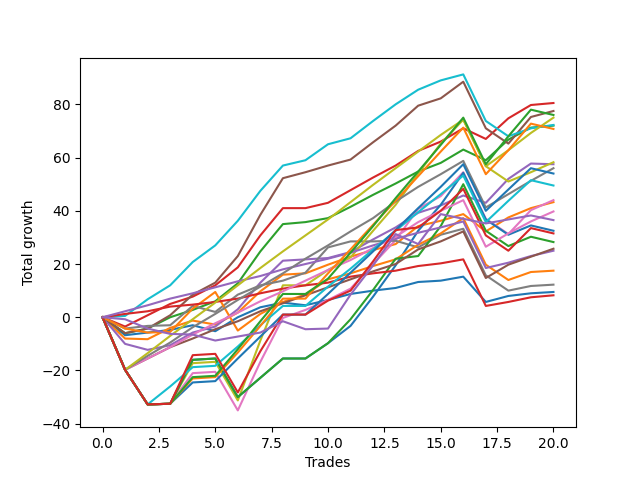

# Short Pointer 003 DB 
- Symbol: ES
- Date Range: 03/18/2022 - 12/30/2022
- Trading Period: 8:30-12:30
- Number of Trades: 20



| Name | Win Percent | Profit | Avg Profit / Trade | Avg Time / Trade |      | Name | Win Percent | Profit | Avg Profit / Trade | Avg Time / Trade |
| ---- | ----------- | ------ | ------------------ | ---------------- | ---- | ---- | ----------- | ------ | ------------------ | ---------------- |
| Sorted By <br> Profit | | | | | | Sorted By <br> Win Percentage ||||
| BB-20 U/L 2SD C | 85.00 | 40250.00 | 2012.50 | 17:18 |     | TP-2 | 95.00 | 12500.00 | 625.00 | 07:59 |
| BB-50 U/L 1SD | 85.00 | 38750.00 | 1937.50 | 24:13 |     | TP-1 | 95.00 | 4125.00 | 206.25 | 06:08 |
| TP-10 | 75.00 | 38000.00 | 1900.00 | 35:49 |     | TP-6 | 90.00 | 37500.00 | 1875.00 | 22:20 |
| TP-6 | 90.00 | 37500.00 | 1875.00 | 22:20 |     | BB-100 Mid | 90.00 | 36125.00 | 1806.25 | 17:30 |
| BB-100 Mid | 90.00 | 36125.00 | 1806.25 | 17:30 |     | BB-20 U/L 2SD | 90.00 | 36000.00 | 1800.00 | 16:43 |
| BB-20 U/L 2SD | 90.00 | 36000.00 | 1800.00 | 16:43 |     | TP-5 | 90.00 | 28000.00 | 1400.00 | 19:57 |
| TP-9 | 75.00 | 35375.00 | 1768.75 | 34:24 |     | TP-4 | 90.00 | 19875.00 | 993.75 | 19:11 |
| V U/L 1SD | 70.00 | 29125.00 | 1456.25 | 40:45 |     | TP-3 | 90.00 | 12875.00 | 643.75 | 14:45 |
| BB-50 Mid | 80.00 | 28750.00 | 1437.50 | 15:04 |     | BB-20 U/L 2SD C | 85.00 | 40250.00 | 2012.50 | 17:18 |
| TP-5 | 90.00 | 28000.00 | 1400.00 | 19:57 |     | BB-50 U/L 1SD | 85.00 | 38750.00 | 1937.50 | 24:13 |
| TP-8 | 75.00 | 27000.00 | 1350.00 | 33:20 |     | BB-50 Mid | 80.00 | 28750.00 | 1437.50 | 15:04 |
| TP-7 | 75.00 | 24750.00 | 1237.50 | 30:36 |     | BB-20 U/L 1SD | 80.00 | 21625.00 | 1081.25 | 09:26 |
| BB-50 U/L 2SD | 75.00 | 22000.00 | 1100.00 | 35:27 |     | BB-20 Mid | 80.00 | 4750.00 | 237.50 | 05:52 |
| BB-20 U/L 1SD | 80.00 | 21625.00 | 1081.25 | 09:26 |     | TP-10 | 75.00 | 38000.00 | 1900.00 | 35:49 |
| TP-4 | 90.00 | 19875.00 | 993.75 | 19:11 |     | TP-9 | 75.00 | 35375.00 | 1768.75 | 34:24 |
| NEWFI 0000 | 50.00 | 18250.00 | 912.50 | 21:57 |     | TP-8 | 75.00 | 27000.00 | 1350.00 | 33:20 |
| BB-100 U/L 2SD | 65.00 | 16250.00 | 812.50 | 50:25 |     | TP-7 | 75.00 | 24750.00 | 1237.50 | 30:36 |
| NEWFI 000 | 65.00 | 15750.00 | 787.50 | 45:18 |     | BB-50 U/L 2SD | 75.00 | 22000.00 | 1100.00 | 35:27 |
| BB-200 U/L 2SD | 65.00 | 14125.00 | 706.25 | 53:01 |     | BB-200 Mid | 75.00 | 8750.00 | 437.50 | 18:09 |
| TP-3 | 90.00 | 12875.00 | 643.75 | 14:45 |     | V U/L 1SD | 70.00 | 29125.00 | 1456.25 | 40:45 |
| TP-2 | 95.00 | 12500.00 | 625.00 | 07:59 |     | V Mid | 70.00 | 6125.00 | 306.25 | 14:15 |
| BB-200 Mid | 75.00 | 8750.00 | 437.50 | 18:09 |     | BB-100 U/L 2SD | 65.00 | 16250.00 | 812.50 | 50:25 |
| V Mid | 70.00 | 6125.00 | 306.25 | 14:15 |     | NEWFI 000 | 65.00 | 15750.00 | 787.50 | 45:18 |
| BB-20 Mid | 80.00 | 4750.00 | 237.50 | 05:52 |     | BB-200 U/L 2SD | 65.00 | 14125.00 | 706.25 | 53:01 |
| TP-1 | 95.00 | 4125.00 | 206.25 | 06:08 |     | NEWFI 0000 | 50.00 | 18250.00 | 912.50 | 21:57 |

## NO STOPLOSS

### Test BB-20 Mid
* Sell when price hits the middle line of the 20p bollinger
* No Stoploss
* Results:
```
Total Trades: 20
Percent Up: 20.00
Percent Down: 80.00
Total Points Moved Down: 9.50
Potential Profit: 4750.00
Total Points Ups: 19.50 Count Ups: 4
Total Points Downs: 29.00 Count Downs: 16
```

<details><summary>Trades</summary>

<code>In: 2022-04-25 09:13:00		Out: 2022-04-25 09:31:05		Total Position Time: 18:05		Total Move Down: -6.75		Total to Date: -6.75</code> <br />
<code>In: 2022-04-25 09:29:00		Out: 2022-04-25 09:31:05		Total Position Time: 02:05		Total Move Down: 1.00		Total to Date: -5.75</code> <br />
<code>In: 2022-06-01 12:19:00		Out: 2022-06-01 12:25:25		Total Position Time: 06:25		Total Move Down: 1.00		Total to Date: -4.75</code> <br />
<code>In: 2022-06-09 10:08:00		Out: 2022-06-09 10:16:50		Total Position Time: 08:50		Total Move Down: 1.75		Total to Date: -3.00</code> <br />
<code>In: 2022-06-10 10:42:00		Out: 2022-06-10 10:55:05		Total Position Time: 13:05		Total Move Down: -2.25		Total to Date: -5.25</code> <br />
<code>In: 2022-06-10 11:26:00		Out: 2022-06-10 11:28:25		Total Position Time: 02:25		Total Move Down: 5.25		Total to Date: 0.00</code> <br />
<code>In: 2022-06-17 08:34:00		Out: 2022-06-17 08:35:45		Total Position Time: 01:45		Total Move Down: 3.75		Total to Date: 3.75</code> <br />
<code>In: 2022-06-17 08:35:00		Out: 2022-06-17 08:36:10		Total Position Time: 01:10		Total Move Down: 1.75		Total to Date: 5.50</code> <br />
<code>In: 2022-08-04 10:31:00		Out: 2022-08-04 10:43:05		Total Position Time: 12:05		Total Move Down: -1.00		Total to Date: 4.50</code> <br />
<code>In: 2022-08-05 10:18:00		Out: 2022-08-05 10:20:05		Total Position Time: 02:05		Total Move Down: 2.00		Total to Date: 6.50</code> <br />
<code>In: 2022-08-22 09:28:00		Out: 2022-08-22 09:29:10		Total Position Time: 01:10		Total Move Down: 2.25		Total to Date: 8.75</code> <br />
<code>In: 2022-08-31 09:01:00		Out: 2022-08-31 09:04:15		Total Position Time: 03:15		Total Move Down: 1.25		Total to Date: 10.00</code> <br />
<code>In: 2022-08-31 09:02:00		Out: 2022-08-31 09:04:15		Total Position Time: 02:15		Total Move Down: 1.00		Total to Date: 11.00</code> <br />
<code>In: 2022-09-06 12:15:00		Out: 2022-09-06 12:20:45		Total Position Time: 05:45		Total Move Down: 2.25		Total to Date: 13.25</code> <br />
<code>In: 2022-09-12 10:33:00		Out: 2022-09-12 10:36:35		Total Position Time: 03:35		Total Move Down: 0.50		Total to Date: 13.75</code> <br />
<code>In: 2022-09-22 10:57:00		Out: 2022-09-22 11:01:30		Total Position Time: 04:30		Total Move Down: 1.50		Total to Date: 15.25</code> <br />
<code>In: 2022-09-22 11:59:00		Out: 2022-09-22 12:19:50		Total Position Time: 20:50		Total Move Down: -9.50		Total to Date: 5.75</code> <br />
<code>In: 2022-09-22 12:17:00		Out: 2022-09-22 12:19:50		Total Position Time: 02:50		Total Move Down: 2.25		Total to Date: 8.00</code> <br />
<code>In: 2022-10-06 09:51:00		Out: 2022-10-06 09:55:05		Total Position Time: 04:05		Total Move Down: 1.00		Total to Date: 9.00</code> <br />
<code>In: 2022-11-16 08:35:00		Out: 2022-11-16 08:36:10		Total Position Time: 01:10		Total Move Down: 0.50		Total to Date: 9.50</code> <br />


</details>

### Test BB-20 U/L 1SD
* Sell when the price hits the lower line of the 20p 1std bollinger
* No Stoploss
* Results:
```
Total Trades: 20
Percent Up: 20.00
Percent Down: 80.00
Total Points Moved Down: 43.25
Potential Profit: 21625.00
Total Points Ups: 16.25 Count Ups: 4
Total Points Downs: 59.50 Count Downs: 16
```

<details><summary>Trades</summary>

<code>In: 2022-04-25 09:13:00		Out: 2022-04-25 09:42:45		Total Position Time: 29:45		Total Move Down: -8.00		Total to Date: -8.00</code> <br />
<code>In: 2022-04-25 09:29:00		Out: 2022-04-25 09:42:45		Total Position Time: 13:45		Total Move Down: -0.25		Total to Date: -8.25</code> <br />
<code>In: 2022-06-01 12:19:00		Out: 2022-06-01 12:30:05		Total Position Time: 11:05		Total Move Down: 4.25		Total to Date: -4.00</code> <br />
<code>In: 2022-06-09 10:08:00		Out: 2022-06-09 10:18:50		Total Position Time: 10:50		Total Move Down: 2.75		Total to Date: -1.25</code> <br />
<code>In: 2022-06-10 10:42:00		Out: 2022-06-10 10:56:05		Total Position Time: 14:05		Total Move Down: -1.50		Total to Date: -2.75</code> <br />
<code>In: 2022-06-10 11:26:00		Out: 2022-06-10 11:38:10		Total Position Time: 12:10		Total Move Down: 4.50		Total to Date: 1.75</code> <br />
<code>In: 2022-06-17 08:34:00		Out: 2022-06-17 08:39:05		Total Position Time: 05:05		Total Move Down: 8.00		Total to Date: 9.75</code> <br />
<code>In: 2022-06-17 08:35:00		Out: 2022-06-17 08:39:05		Total Position Time: 04:05		Total Move Down: 6.25		Total to Date: 16.00</code> <br />
<code>In: 2022-08-04 10:31:00		Out: 2022-08-04 10:43:15		Total Position Time: 12:15		Total Move Down: 0.50		Total to Date: 16.50</code> <br />
<code>In: 2022-08-05 10:18:00		Out: 2022-08-05 10:23:15		Total Position Time: 05:15		Total Move Down: 3.25		Total to Date: 19.75</code> <br />
<code>In: 2022-08-22 09:28:00		Out: 2022-08-22 09:32:05		Total Position Time: 04:05		Total Move Down: 3.00		Total to Date: 22.75</code> <br />
<code>In: 2022-08-31 09:01:00		Out: 2022-08-31 09:06:20		Total Position Time: 05:20		Total Move Down: 2.50		Total to Date: 25.25</code> <br />
<code>In: 2022-08-31 09:02:00		Out: 2022-08-31 09:06:20		Total Position Time: 04:20		Total Move Down: 2.25		Total to Date: 27.50</code> <br />
<code>In: 2022-09-06 12:15:00		Out: 2022-09-06 12:22:20		Total Position Time: 07:20		Total Move Down: 6.75		Total to Date: 34.25</code> <br />
<code>In: 2022-09-12 10:33:00		Out: 2022-09-12 10:41:30		Total Position Time: 08:30		Total Move Down: 2.00		Total to Date: 36.25</code> <br />
<code>In: 2022-09-22 10:57:00		Out: 2022-09-22 11:03:35		Total Position Time: 06:35		Total Move Down: 2.50		Total to Date: 38.75</code> <br />
<code>In: 2022-09-22 11:59:00		Out: 2022-09-22 12:20:20		Total Position Time: 21:20		Total Move Down: -6.50		Total to Date: 32.25</code> <br />
<code>In: 2022-09-22 12:17:00		Out: 2022-09-22 12:20:20		Total Position Time: 03:20		Total Move Down: 5.25		Total to Date: 37.50</code> <br />
<code>In: 2022-10-06 09:51:00		Out: 2022-10-06 09:57:05		Total Position Time: 06:05		Total Move Down: 3.50		Total to Date: 41.00</code> <br />
<code>In: 2022-11-16 08:35:00		Out: 2022-11-16 08:38:25		Total Position Time: 03:25		Total Move Down: 2.25		Total to Date: 43.25</code> <br />


</details>

### Test BB-20 U/L 2SD
* Sell when the price hits the lower line of the 20p 2std bollinger
* No Stoploss
* Results:
```
Total Trades: 20
Percent Up: 10.00
Percent Down: 90.00
Total Points Moved Down: 72.00
Potential Profit: 36000.00
Total Points Ups: 10.00 Count Ups: 2
Total Points Downs: 82.00 Count Downs: 18
```

<details><summary>Trades</summary>

<code>In: 2022-04-25 09:13:00		Out: 2022-04-25 10:01:15		Total Position Time: 48:15		Total Move Down: -6.00		Total to Date: -6.00</code> <br />
<code>In: 2022-04-25 09:29:00		Out: 2022-04-25 10:01:15		Total Position Time: 32:15		Total Move Down: 1.75		Total to Date: -4.25</code> <br />
<code>In: 2022-06-01 12:19:00		Out: 2022-06-01 12:30:05		Total Position Time: 11:05		Total Move Down: 4.25		Total to Date: 0.00</code> <br />
<code>In: 2022-06-09 10:08:00		Out: 2022-06-09 10:19:05		Total Position Time: 11:05		Total Move Down: 2.75		Total to Date: 2.75</code> <br />
<code>In: 2022-06-10 10:42:00		Out: 2022-06-10 11:01:00		Total Position Time: 19:00		Total Move Down: 3.25		Total to Date: 6.00</code> <br />
<code>In: 2022-06-10 11:26:00		Out: 2022-06-10 11:40:10		Total Position Time: 14:10		Total Move Down: 6.75		Total to Date: 12.75</code> <br />
<code>In: 2022-06-17 08:34:00		Out: 2022-06-17 08:45:15		Total Position Time: 11:15		Total Move Down: 12.00		Total to Date: 24.75</code> <br />
<code>In: 2022-06-17 08:35:00		Out: 2022-06-17 08:45:15		Total Position Time: 10:15		Total Move Down: 10.25		Total to Date: 35.00</code> <br />
<code>In: 2022-08-04 10:31:00		Out: 2022-08-04 10:45:30		Total Position Time: 14:30		Total Move Down: 0.75		Total to Date: 35.75</code> <br />
<code>In: 2022-08-05 10:18:00		Out: 2022-08-05 10:49:30		Total Position Time: 31:30		Total Move Down: 1.50		Total to Date: 37.25</code> <br />
<code>In: 2022-08-22 09:28:00		Out: 2022-08-22 09:44:50		Total Position Time: 16:50		Total Move Down: 4.25		Total to Date: 41.50</code> <br />
<code>In: 2022-08-31 09:01:00		Out: 2022-08-31 09:07:00		Total Position Time: 06:00		Total Move Down: 4.50		Total to Date: 46.00</code> <br />
<code>In: 2022-08-31 09:02:00		Out: 2022-08-31 09:07:00		Total Position Time: 05:00		Total Move Down: 4.25		Total to Date: 50.25</code> <br />
<code>In: 2022-09-06 12:15:00		Out: 2022-09-06 12:30:20		Total Position Time: 15:20		Total Move Down: 4.50		Total to Date: 54.75</code> <br />
<code>In: 2022-09-12 10:33:00		Out: 2022-09-12 10:43:35		Total Position Time: 10:35		Total Move Down: 3.25		Total to Date: 58.00</code> <br />
<code>In: 2022-09-22 10:57:00		Out: 2022-09-22 11:07:55		Total Position Time: 10:55		Total Move Down: 5.00		Total to Date: 63.00</code> <br />
<code>In: 2022-09-22 11:59:00		Out: 2022-09-22 12:22:20		Total Position Time: 23:20		Total Move Down: -4.00		Total to Date: 59.00</code> <br />
<code>In: 2022-09-22 12:17:00		Out: 2022-09-22 12:22:20		Total Position Time: 05:20		Total Move Down: 7.75		Total to Date: 66.75</code> <br />
<code>In: 2022-10-06 09:51:00		Out: 2022-10-06 10:02:00		Total Position Time: 11:00		Total Move Down: 4.50		Total to Date: 71.25</code> <br />
<code>In: 2022-11-16 08:35:00		Out: 2022-11-16 09:01:40		Total Position Time: 26:40		Total Move Down: 0.75		Total to Date: 72.00</code> <br />


</details>

### Test BB-20 U/L 2SD C
* Sell when the price hits the lower line of the 20p 2std bollinger
* No Stoploss
* Results:
```
Total Trades: 20
Percent Up: 15.00
Percent Down: 85.00
Total Points Moved Down: 80.50
Potential Profit: 40250.00
Total Points Ups: 7.50 Count Ups: 3
Total Points Downs: 88.00 Count Downs: 17
```

<details><summary>Trades</summary>

<code>In: 2022-04-25 09:13:00		Out: 2022-04-25 10:01:20		Total Position Time: 48:20		Total Move Down: -3.50		Total to Date: -3.50</code> <br />
<code>In: 2022-04-25 09:29:00		Out: 2022-04-25 10:01:20		Total Position Time: 32:20		Total Move Down: 4.25		Total to Date: 0.75</code> <br />
<code>In: 2022-06-01 12:19:00		Out: 2022-06-01 12:30:05		Total Position Time: 11:05		Total Move Down: 4.25		Total to Date: 5.00</code> <br />
<code>In: 2022-06-09 10:08:00		Out: 2022-06-09 10:21:10		Total Position Time: 13:10		Total Move Down: 2.75		Total to Date: 7.75</code> <br />
<code>In: 2022-06-10 10:42:00		Out: 2022-06-10 11:01:10		Total Position Time: 19:10		Total Move Down: 4.25		Total to Date: 12.00</code> <br />
<code>In: 2022-06-10 11:26:00		Out: 2022-06-10 11:40:10		Total Position Time: 14:10		Total Move Down: 6.75		Total to Date: 18.75</code> <br />
<code>In: 2022-06-17 08:34:00		Out: 2022-06-17 08:45:15		Total Position Time: 11:15		Total Move Down: 12.00		Total to Date: 30.75</code> <br />
<code>In: 2022-06-17 08:35:00		Out: 2022-06-17 08:45:15		Total Position Time: 10:15		Total Move Down: 10.25		Total to Date: 41.00</code> <br />
<code>In: 2022-08-04 10:31:00		Out: 2022-08-04 10:52:45		Total Position Time: 21:45		Total Move Down: -0.00		Total to Date: 41.00</code> <br />
<code>In: 2022-08-05 10:18:00		Out: 2022-08-05 10:50:35		Total Position Time: 32:35		Total Move Down: 2.00		Total to Date: 43.00</code> <br />
<code>In: 2022-08-22 09:28:00		Out: 2022-08-22 09:44:55		Total Position Time: 16:55		Total Move Down: 4.75		Total to Date: 47.75</code> <br />
<code>In: 2022-08-31 09:01:00		Out: 2022-08-31 09:07:05		Total Position Time: 06:05		Total Move Down: 4.75		Total to Date: 52.50</code> <br />
<code>In: 2022-08-31 09:02:00		Out: 2022-08-31 09:07:05		Total Position Time: 05:05		Total Move Down: 4.50		Total to Date: 57.00</code> <br />
<code>In: 2022-09-06 12:15:00		Out: 2022-09-06 12:30:25		Total Position Time: 15:25		Total Move Down: 5.50		Total to Date: 62.50</code> <br />
<code>In: 2022-09-12 10:33:00		Out: 2022-09-12 10:44:05		Total Position Time: 11:05		Total Move Down: 3.50		Total to Date: 66.00</code> <br />
<code>In: 2022-09-22 10:57:00		Out: 2022-09-22 11:07:55		Total Position Time: 10:55		Total Move Down: 5.00		Total to Date: 71.00</code> <br />
<code>In: 2022-09-22 11:59:00		Out: 2022-09-22 12:22:20		Total Position Time: 23:20		Total Move Down: -4.00		Total to Date: 67.00</code> <br />
<code>In: 2022-09-22 12:17:00		Out: 2022-09-22 12:22:20		Total Position Time: 05:20		Total Move Down: 7.75		Total to Date: 74.75</code> <br />
<code>In: 2022-10-06 09:51:00		Out: 2022-10-06 10:02:05		Total Position Time: 11:05		Total Move Down: 5.00		Total to Date: 79.75</code> <br />
<code>In: 2022-11-16 08:35:00		Out: 2022-11-16 09:01:40		Total Position Time: 26:40		Total Move Down: 0.75		Total to Date: 80.50</code> <br />


</details>

### Test BB-50 Mid
* Sell when price hits the middle line of the 50p bollinger
* No Stoploss
* Results:
```
Total Trades: 20
Percent Up: 20.00
Percent Down: 80.00
Total Points Moved Down: 57.50
Potential Profit: 28750.00
Total Points Ups: 15.25 Count Ups: 4
Total Points Downs: 72.75 Count Downs: 16
```

<details><summary>Trades</summary>

<code>In: 2022-04-25 09:13:00		Out: 2022-04-25 09:55:05		Total Position Time: 42:05		Total Move Down: -10.00		Total to Date: -10.00</code> <br />
<code>In: 2022-04-25 09:29:00		Out: 2022-04-25 09:55:05		Total Position Time: 26:05		Total Move Down: -2.25		Total to Date: -12.25</code> <br />
<code>In: 2022-06-01 12:19:00		Out: 2022-06-01 12:25:30		Total Position Time: 06:30		Total Move Down: 1.75		Total to Date: -10.50</code> <br />
<code>In: 2022-06-09 10:08:00		Out: 2022-06-09 10:22:05		Total Position Time: 14:05		Total Move Down: 4.75		Total to Date: -5.75</code> <br />
<code>In: 2022-06-10 10:42:00		Out: 2022-06-10 10:58:20		Total Position Time: 16:20		Total Move Down: 2.25		Total to Date: -3.50</code> <br />
<code>In: 2022-06-10 11:26:00		Out: 2022-06-10 11:28:30		Total Position Time: 02:30		Total Move Down: 6.50		Total to Date: 3.00</code> <br />
<code>In: 2022-06-17 08:34:00		Out: 2022-06-17 08:45:05		Total Position Time: 11:05		Total Move Down: 10.00		Total to Date: 13.00</code> <br />
<code>In: 2022-06-17 08:35:00		Out: 2022-06-17 08:45:05		Total Position Time: 10:05		Total Move Down: 8.25		Total to Date: 21.25</code> <br />
<code>In: 2022-08-04 10:31:00		Out: 2022-08-04 10:55:50		Total Position Time: 24:50		Total Move Down: 0.50		Total to Date: 21.75</code> <br />
<code>In: 2022-08-05 10:18:00		Out: 2022-08-05 10:47:35		Total Position Time: 29:35		Total Move Down: 0.50		Total to Date: 22.25</code> <br />
<code>In: 2022-08-22 09:28:00		Out: 2022-08-22 09:29:10		Total Position Time: 01:10		Total Move Down: 2.25		Total to Date: 24.50</code> <br />
<code>In: 2022-08-31 09:01:00		Out: 2022-08-31 09:10:55		Total Position Time: 09:55		Total Move Down: 4.75		Total to Date: 29.25</code> <br />
<code>In: 2022-08-31 09:02:00		Out: 2022-08-31 09:10:55		Total Position Time: 08:55		Total Move Down: 4.50		Total to Date: 33.75</code> <br />
<code>In: 2022-09-06 12:15:00		Out: 2022-09-06 12:21:10		Total Position Time: 06:10		Total Move Down: 5.50		Total to Date: 39.25</code> <br />
<code>In: 2022-09-12 10:33:00		Out: 2022-09-12 10:42:15		Total Position Time: 09:15		Total Move Down: 2.75		Total to Date: 42.00</code> <br />
<code>In: 2022-09-22 10:57:00		Out: 2022-09-22 11:04:15		Total Position Time: 07:15		Total Move Down: 3.75		Total to Date: 45.75</code> <br />
<code>In: 2022-09-22 11:59:00		Out: 2022-09-22 12:27:05		Total Position Time: 28:05		Total Move Down: -2.75		Total to Date: 43.00</code> <br />
<code>In: 2022-09-22 12:17:00		Out: 2022-09-22 12:27:05		Total Position Time: 10:05		Total Move Down: 9.00		Total to Date: 52.00</code> <br />
<code>In: 2022-10-06 09:51:00		Out: 2022-10-06 10:02:10		Total Position Time: 11:10		Total Move Down: 5.75		Total to Date: 57.75</code> <br />
<code>In: 2022-11-16 08:35:00		Out: 2022-11-16 09:01:25		Total Position Time: 26:25		Total Move Down: -0.25		Total to Date: 57.50</code> <br />


</details>

### Test BB-50 U/L 1SD
* Sell when the price hits the lower line of the 50p 1std bollinger
* No Stoploss
* Results:
```
Total Trades: 20
Percent Up: 15.00
Percent Down: 85.00
Total Points Moved Down: 77.50
Potential Profit: 38750.00
Total Points Ups: 29.25 Count Ups: 3
Total Points Downs: 106.75 Count Downs: 17
```

<details><summary>Trades</summary>

<code>In: 2022-04-25 09:13:00		Out: 2022-04-25 10:01:15		Total Position Time: 48:15		Total Move Down: -6.00		Total to Date: -6.00</code> <br />
<code>In: 2022-04-25 09:29:00		Out: 2022-04-25 10:01:15		Total Position Time: 32:15		Total Move Down: 1.75		Total to Date: -4.25</code> <br />
<code>In: 2022-06-01 12:19:00		Out: 2022-06-01 12:31:00		Total Position Time: 12:00		Total Move Down: 5.00		Total to Date: 0.75</code> <br />
<code>In: 2022-06-09 10:08:00		Out: 2022-06-09 10:24:05		Total Position Time: 16:05		Total Move Down: 7.75		Total to Date: 8.50</code> <br />
<code>In: 2022-06-10 10:42:00		Out: 2022-06-10 11:15:25		Total Position Time: 33:25		Total Move Down: 4.50		Total to Date: 13.00</code> <br />
<code>In: 2022-06-10 11:26:00		Out: 2022-06-10 11:41:45		Total Position Time: 15:45		Total Move Down: 10.00		Total to Date: 23.00</code> <br />
<code>In: 2022-06-17 08:34:00		Out: 2022-06-17 08:51:25		Total Position Time: 17:25		Total Move Down: 15.50		Total to Date: 38.50</code> <br />
<code>In: 2022-06-17 08:35:00		Out: 2022-06-17 08:51:25		Total Position Time: 16:25		Total Move Down: 13.75		Total to Date: 52.25</code> <br />
<code>In: 2022-08-04 10:31:00		Out: 2022-08-04 11:02:05		Total Position Time: 31:05		Total Move Down: 2.25		Total to Date: 54.50</code> <br />
<code>In: 2022-08-05 10:18:00		Out: 2022-08-05 10:52:05		Total Position Time: 34:05		Total Move Down: 2.50		Total to Date: 57.00</code> <br />
<code>In: 2022-08-22 09:28:00		Out: 2022-08-22 09:29:10		Total Position Time: 01:10		Total Move Down: 2.25		Total to Date: 59.25</code> <br />
<code>In: 2022-08-31 09:01:00		Out: 2022-08-31 09:22:45		Total Position Time: 21:45		Total Move Down: 6.50		Total to Date: 65.75</code> <br />
<code>In: 2022-08-31 09:02:00		Out: 2022-08-31 09:22:45		Total Position Time: 20:45		Total Move Down: 6.25		Total to Date: 72.00</code> <br />
<code>In: 2022-09-06 12:15:00		Out: 2022-09-06 12:31:20		Total Position Time: 16:20		Total Move Down: 7.50		Total to Date: 79.50</code> <br />
<code>In: 2022-09-12 10:33:00		Out: 2022-09-12 11:03:10		Total Position Time: 30:10		Total Move Down: 2.75		Total to Date: 82.25</code> <br />
<code>In: 2022-09-22 10:57:00		Out: 2022-09-22 11:09:10		Total Position Time: 12:10		Total Move Down: 6.25		Total to Date: 88.50</code> <br />
<code>In: 2022-09-22 11:59:00		Out: 2022-09-22 12:47:00		Total Position Time: 48:00		Total Move Down: -17.50		Total to Date: 71.00</code> <br />
<code>In: 2022-09-22 12:17:00		Out: 2022-09-22 12:47:00		Total Position Time: 30:00		Total Move Down: -5.75		Total to Date: 65.25</code> <br />
<code>In: 2022-10-06 09:51:00		Out: 2022-10-06 10:09:10		Total Position Time: 18:10		Total Move Down: 10.00		Total to Date: 75.25</code> <br />
<code>In: 2022-11-16 08:35:00		Out: 2022-11-16 09:04:10		Total Position Time: 29:10		Total Move Down: 2.25		Total to Date: 77.50</code> <br />


</details>

### Test BB-50 U/L 2SD
* Sell when the price hits the lower line of the 50p 2std bollinger
* No Stoploss
* Results:
```
Total Trades: 20
Percent Up: 25.00
Percent Down: 75.00
Total Points Moved Down: 44.00
Potential Profit: 22000.00
Total Points Ups: 70.50 Count Ups: 5
Total Points Downs: 114.50 Count Downs: 15
```

<details><summary>Trades</summary>

<code>In: 2022-04-25 09:13:00		Out: 2022-04-25 10:13:55		Total Position Time: 60:55		Total Move Down: -19.75		Total to Date: -19.75</code> <br />
<code>In: 2022-04-25 09:29:00		Out: 2022-04-25 10:29:55		Total Position Time: 60:55		Total Move Down: -13.00		Total to Date: -32.75</code> <br />
<code>In: 2022-06-01 12:19:00		Out: 2022-06-01 12:47:00		Total Position Time: 28:00		Total Move Down: 0.25		Total to Date: -32.50</code> <br />
<code>In: 2022-06-09 10:08:00		Out: 2022-06-09 10:27:20		Total Position Time: 19:20		Total Move Down: 11.50		Total to Date: -21.00</code> <br />
<code>In: 2022-06-10 10:42:00		Out: 2022-06-10 11:42:55		Total Position Time: 60:55		Total Move Down: 0.50		Total to Date: -20.50</code> <br />
<code>In: 2022-06-10 11:26:00		Out: 2022-06-10 12:26:55		Total Position Time: 60:55		Total Move Down: -14.50		Total to Date: -35.00</code> <br />
<code>In: 2022-06-17 08:34:00		Out: 2022-06-17 08:52:10		Total Position Time: 18:10		Total Move Down: 18.25		Total to Date: -16.75</code> <br />
<code>In: 2022-06-17 08:35:00		Out: 2022-06-17 08:52:10		Total Position Time: 17:10		Total Move Down: 16.50		Total to Date: -0.25</code> <br />
<code>In: 2022-08-04 10:31:00		Out: 2022-08-04 11:10:15		Total Position Time: 39:15		Total Move Down: 3.00		Total to Date: 2.75</code> <br />
<code>In: 2022-08-05 10:18:00		Out: 2022-08-05 10:55:40		Total Position Time: 37:40		Total Move Down: 3.75		Total to Date: 6.50</code> <br />
<code>In: 2022-08-22 09:28:00		Out: 2022-08-22 09:44:50		Total Position Time: 16:50		Total Move Down: 4.25		Total to Date: 10.75</code> <br />
<code>In: 2022-08-31 09:01:00		Out: 2022-08-31 09:24:25		Total Position Time: 23:25		Total Move Down: 9.25		Total to Date: 20.00</code> <br />
<code>In: 2022-08-31 09:02:00		Out: 2022-08-31 09:24:25		Total Position Time: 22:25		Total Move Down: 9.00		Total to Date: 29.00</code> <br />
<code>In: 2022-09-06 12:15:00		Out: 2022-09-06 12:33:10		Total Position Time: 18:10		Total Move Down: 11.75		Total to Date: 40.75</code> <br />
<code>In: 2022-09-12 10:33:00		Out: 2022-09-12 11:17:45		Total Position Time: 44:45		Total Move Down: 4.75		Total to Date: 45.50</code> <br />
<code>In: 2022-09-22 10:57:00		Out: 2022-09-22 11:13:10		Total Position Time: 16:10		Total Move Down: 9.00		Total to Date: 54.50</code> <br />
<code>In: 2022-09-22 11:59:00		Out: 2022-09-22 12:47:00		Total Position Time: 48:00		Total Move Down: -17.50		Total to Date: 37.00</code> <br />
<code>In: 2022-09-22 12:17:00		Out: 2022-09-22 12:47:00		Total Position Time: 30:00		Total Move Down: -5.75		Total to Date: 31.25</code> <br />
<code>In: 2022-10-06 09:51:00		Out: 2022-10-06 10:32:45		Total Position Time: 41:45		Total Move Down: 9.00		Total to Date: 40.25</code> <br />
<code>In: 2022-11-16 08:35:00		Out: 2022-11-16 09:19:25		Total Position Time: 44:25		Total Move Down: 3.75		Total to Date: 44.00</code> <br />


</details>

### Test V Mid
* Sell when the price hits the middle line of the 1std VWAP
* No Stoploss
* Results:
```
Total Trades: 20
Percent Up: 30.00
Percent Down: 70.00
Total Points Moved Down: 12.25
Potential Profit: 6125.00
Total Points Ups: 32.25 Count Ups: 6
Total Points Downs: 44.50 Count Downs: 14
```

<details><summary>Trades</summary>

<code>In: 2022-04-25 09:13:00		Out: 2022-04-25 09:14:10		Total Position Time: 01:10		Total Move Down: -4.25		Total to Date: -4.25</code> <br />
<code>In: 2022-04-25 09:29:00		Out: 2022-04-25 09:31:05		Total Position Time: 02:05		Total Move Down: 1.00		Total to Date: -3.25</code> <br />
<code>In: 2022-06-01 12:19:00		Out: 2022-06-01 12:47:00		Total Position Time: 28:00		Total Move Down: 0.25		Total to Date: -3.00</code> <br />
<code>In: 2022-06-09 10:08:00		Out: 2022-06-09 10:23:45		Total Position Time: 15:45		Total Move Down: 7.25		Total to Date: 4.25</code> <br />
<code>In: 2022-06-10 10:42:00		Out: 2022-06-10 10:43:10		Total Position Time: 01:10		Total Move Down: -2.25		Total to Date: 2.00</code> <br />
<code>In: 2022-06-10 11:26:00		Out: 2022-06-10 11:28:30		Total Position Time: 02:30		Total Move Down: 6.50		Total to Date: 8.50</code> <br />
<code>In: 2022-06-17 08:34:00		Out: 2022-06-17 08:36:10		Total Position Time: 02:10		Total Move Down: 3.50		Total to Date: 12.00</code> <br />
<code>In: 2022-06-17 08:35:00		Out: 2022-06-17 08:36:10		Total Position Time: 01:10		Total Move Down: 1.75		Total to Date: 13.75</code> <br />
<code>In: 2022-08-04 10:31:00		Out: 2022-08-04 11:10:15		Total Position Time: 39:15		Total Move Down: 3.00		Total to Date: 16.75</code> <br />
<code>In: 2022-08-05 10:18:00		Out: 2022-08-05 11:11:45		Total Position Time: 53:45		Total Move Down: 9.50		Total to Date: 26.25</code> <br />
<code>In: 2022-08-22 09:28:00		Out: 2022-08-22 09:29:10		Total Position Time: 01:10		Total Move Down: 2.25		Total to Date: 28.50</code> <br />
<code>In: 2022-08-31 09:01:00		Out: 2022-08-31 09:02:10		Total Position Time: 01:10		Total Move Down: -0.00		Total to Date: 28.50</code> <br />
<code>In: 2022-08-31 09:02:00		Out: 2022-08-31 09:04:00		Total Position Time: 02:00		Total Move Down: 0.25		Total to Date: 28.75</code> <br />
<code>In: 2022-09-06 12:15:00		Out: 2022-09-06 12:17:15		Total Position Time: 02:15		Total Move Down: -2.50		Total to Date: 26.25</code> <br />
<code>In: 2022-09-12 10:33:00		Out: 2022-09-12 11:17:45		Total Position Time: 44:45		Total Move Down: 4.75		Total to Date: 31.00</code> <br />
<code>In: 2022-09-22 10:57:00		Out: 2022-09-22 11:03:25		Total Position Time: 06:25		Total Move Down: 2.25		Total to Date: 33.25</code> <br />
<code>In: 2022-09-22 11:59:00		Out: 2022-09-22 12:47:00		Total Position Time: 48:00		Total Move Down: -17.50		Total to Date: 15.75</code> <br />
<code>In: 2022-09-22 12:17:00		Out: 2022-09-22 12:47:00		Total Position Time: 30:00		Total Move Down: -5.75		Total to Date: 10.00</code> <br />
<code>In: 2022-10-06 09:51:00		Out: 2022-10-06 09:52:10		Total Position Time: 01:10		Total Move Down: 1.75		Total to Date: 11.75</code> <br />
<code>In: 2022-11-16 08:35:00		Out: 2022-11-16 08:36:10		Total Position Time: 01:10		Total Move Down: 0.50		Total to Date: 12.25</code> <br />


</details>

### Test V U/L 1SD
* Sell when the price hits the lower line of the 1std VWAP
* No Stoploss
* Results:
```
Total Trades: 20
Percent Up: 30.00
Percent Down: 70.00
Total Points Moved Down: 58.25
Potential Profit: 29125.00
Total Points Ups: 70.50 Count Ups: 6
Total Points Downs: 128.75 Count Downs: 14
```

<details><summary>Trades</summary>

<code>In: 2022-04-25 09:13:00		Out: 2022-04-25 10:13:55		Total Position Time: 60:55		Total Move Down: -19.75		Total to Date: -19.75</code> <br />
<code>In: 2022-04-25 09:29:00		Out: 2022-04-25 10:29:55		Total Position Time: 60:55		Total Move Down: -13.00		Total to Date: -32.75</code> <br />
<code>In: 2022-06-01 12:19:00		Out: 2022-06-01 12:47:00		Total Position Time: 28:00		Total Move Down: 0.25		Total to Date: -32.50</code> <br />
<code>In: 2022-06-09 10:08:00		Out: 2022-06-09 10:30:30		Total Position Time: 22:30		Total Move Down: 15.25		Total to Date: -17.25</code> <br />
<code>In: 2022-06-10 10:42:00		Out: 2022-06-10 11:42:55		Total Position Time: 60:55		Total Move Down: 0.50		Total to Date: -16.75</code> <br />
<code>In: 2022-06-10 11:26:00		Out: 2022-06-10 12:26:55		Total Position Time: 60:55		Total Move Down: -14.50		Total to Date: -31.25</code> <br />
<code>In: 2022-06-17 08:34:00		Out: 2022-06-17 09:03:15		Total Position Time: 29:15		Total Move Down: 22.50		Total to Date: -8.75</code> <br />
<code>In: 2022-06-17 08:35:00		Out: 2022-06-17 09:03:15		Total Position Time: 28:15		Total Move Down: 20.75		Total to Date: 12.00</code> <br />
<code>In: 2022-08-04 10:31:00		Out: 2022-08-04 11:31:55		Total Position Time: 60:55		Total Move Down: -0.00		Total to Date: 12.00</code> <br />
<code>In: 2022-08-05 10:18:00		Out: 2022-08-05 11:18:55		Total Position Time: 60:55		Total Move Down: 5.75		Total to Date: 17.75</code> <br />
<code>In: 2022-08-22 09:28:00		Out: 2022-08-22 09:44:55		Total Position Time: 16:55		Total Move Down: 4.75		Total to Date: 22.50</code> <br />
<code>In: 2022-08-31 09:01:00		Out: 2022-08-31 09:24:30		Total Position Time: 23:30		Total Move Down: 10.00		Total to Date: 32.50</code> <br />
<code>In: 2022-08-31 09:02:00		Out: 2022-08-31 09:24:30		Total Position Time: 22:30		Total Move Down: 9.75		Total to Date: 42.25</code> <br />
<code>In: 2022-09-06 12:15:00		Out: 2022-09-06 12:33:10		Total Position Time: 18:10		Total Move Down: 11.75		Total to Date: 54.00</code> <br />
<code>In: 2022-09-12 10:33:00		Out: 2022-09-12 11:33:55		Total Position Time: 60:55		Total Move Down: 11.25		Total to Date: 65.25</code> <br />
<code>In: 2022-09-22 10:57:00		Out: 2022-09-22 11:13:10		Total Position Time: 16:10		Total Move Down: 9.00		Total to Date: 74.25</code> <br />
<code>In: 2022-09-22 11:59:00		Out: 2022-09-22 12:47:00		Total Position Time: 48:00		Total Move Down: -17.50		Total to Date: 56.75</code> <br />
<code>In: 2022-09-22 12:17:00		Out: 2022-09-22 12:47:00		Total Position Time: 30:00		Total Move Down: -5.75		Total to Date: 51.00</code> <br />
<code>In: 2022-10-06 09:51:00		Out: 2022-10-06 10:51:55		Total Position Time: 60:55		Total Move Down: 3.50		Total to Date: 54.50</code> <br />
<code>In: 2022-11-16 08:35:00		Out: 2022-11-16 09:19:25		Total Position Time: 44:25		Total Move Down: 3.75		Total to Date: 58.25</code> <br />


</details>

### Test BB-100 Mid
* Move to BB100 Mid
* No Stoploss
* Results:
```
Total Trades: 20
Percent Up: 10.00
Percent Down: 90.00
Total Points Moved Down: 72.25
Potential Profit: 36125.00
Total Points Ups: 23.25 Count Ups: 2
Total Points Downs: 95.50 Count Downs: 18
```

<details><summary>Trades</summary>

<code>In: 2022-04-25 09:13:00		Out: 2022-04-25 09:18:15		Total Position Time: 05:15		Total Move Down: 0.50		Total to Date: 0.50</code> <br />
<code>In: 2022-04-25 09:29:00		Out: 2022-04-25 10:01:50		Total Position Time: 32:50		Total Move Down: 6.25		Total to Date: 6.75</code> <br />
<code>In: 2022-06-01 12:19:00		Out: 2022-06-01 12:35:05		Total Position Time: 16:05		Total Move Down: 5.25		Total to Date: 12.00</code> <br />
<code>In: 2022-06-09 10:08:00		Out: 2022-06-09 10:25:10		Total Position Time: 17:10		Total Move Down: 8.75		Total to Date: 20.75</code> <br />
<code>In: 2022-06-10 10:42:00		Out: 2022-06-10 11:04:35		Total Position Time: 22:35		Total Move Down: 6.25		Total to Date: 27.00</code> <br />
<code>In: 2022-06-10 11:26:00		Out: 2022-06-10 11:41:25		Total Position Time: 15:25		Total Move Down: 9.25		Total to Date: 36.25</code> <br />
<code>In: 2022-06-17 08:34:00		Out: 2022-06-17 08:45:25		Total Position Time: 11:25		Total Move Down: 11.25		Total to Date: 47.50</code> <br />
<code>In: 2022-06-17 08:35:00		Out: 2022-06-17 08:45:25		Total Position Time: 10:25		Total Move Down: 9.50		Total to Date: 57.00</code> <br />
<code>In: 2022-08-04 10:31:00		Out: 2022-08-04 10:56:30		Total Position Time: 25:30		Total Move Down: 2.00		Total to Date: 59.00</code> <br />
<code>In: 2022-08-05 10:18:00		Out: 2022-08-05 10:56:25		Total Position Time: 38:25		Total Move Down: 6.00		Total to Date: 65.00</code> <br />
<code>In: 2022-08-22 09:28:00		Out: 2022-08-22 09:29:10		Total Position Time: 01:10		Total Move Down: 2.25		Total to Date: 67.25</code> <br />
<code>In: 2022-08-31 09:01:00		Out: 2022-08-31 09:11:05		Total Position Time: 10:05		Total Move Down: 6.50		Total to Date: 73.75</code> <br />
<code>In: 2022-08-31 09:02:00		Out: 2022-08-31 09:11:05		Total Position Time: 09:05		Total Move Down: 6.25		Total to Date: 80.00</code> <br />
<code>In: 2022-09-06 12:15:00		Out: 2022-09-06 12:21:10		Total Position Time: 06:10		Total Move Down: 5.50		Total to Date: 85.50</code> <br />
<code>In: 2022-09-12 10:33:00		Out: 2022-09-12 11:10:15		Total Position Time: 37:15		Total Move Down: 3.50		Total to Date: 89.00</code> <br />
<code>In: 2022-09-22 10:57:00		Out: 2022-09-22 11:03:25		Total Position Time: 06:25		Total Move Down: 2.25		Total to Date: 91.25</code> <br />
<code>In: 2022-09-22 11:59:00		Out: 2022-09-22 12:47:00		Total Position Time: 48:00		Total Move Down: -17.50		Total to Date: 73.75</code> <br />
<code>In: 2022-09-22 12:17:00		Out: 2022-09-22 12:47:00		Total Position Time: 30:00		Total Move Down: -5.75		Total to Date: 68.00</code> <br />
<code>In: 2022-10-06 09:51:00		Out: 2022-10-06 09:56:20		Total Position Time: 05:20		Total Move Down: 3.00		Total to Date: 71.00</code> <br />
<code>In: 2022-11-16 08:35:00		Out: 2022-11-16 08:36:40		Total Position Time: 01:40		Total Move Down: 1.25		Total to Date: 72.25</code> <br />


</details>

### Test BB-100 U/L 2SD
* Move to BB100 Upper Band
* No Stoploss
* Results:
```
Total Trades: 20
Percent Up: 35.00
Percent Down: 65.00
Total Points Moved Down: 32.50
Potential Profit: 16250.00
Total Points Ups: 72.50 Count Ups: 7
Total Points Downs: 105.00 Count Downs: 13
```

<details><summary>Trades</summary>

<code>In: 2022-04-25 09:13:00		Out: 2022-04-25 10:13:55		Total Position Time: 60:55		Total Move Down: -19.75		Total to Date: -19.75</code> <br />
<code>In: 2022-04-25 09:29:00		Out: 2022-04-25 10:29:55		Total Position Time: 60:55		Total Move Down: -13.00		Total to Date: -32.75</code> <br />
<code>In: 2022-06-01 12:19:00		Out: 2022-06-01 12:47:00		Total Position Time: 28:00		Total Move Down: 0.25		Total to Date: -32.50</code> <br />
<code>In: 2022-06-09 10:08:00		Out: 2022-06-09 11:08:55		Total Position Time: 60:55		Total Move Down: 16.50		Total to Date: -16.00</code> <br />
<code>In: 2022-06-10 10:42:00		Out: 2022-06-10 11:42:55		Total Position Time: 60:55		Total Move Down: 0.50		Total to Date: -15.50</code> <br />
<code>In: 2022-06-10 11:26:00		Out: 2022-06-10 12:26:55		Total Position Time: 60:55		Total Move Down: -14.50		Total to Date: -30.00</code> <br />
<code>In: 2022-06-17 08:34:00		Out: 2022-06-17 09:34:55		Total Position Time: 60:55		Total Move Down: 7.25		Total to Date: -22.75</code> <br />
<code>In: 2022-06-17 08:35:00		Out: 2022-06-17 09:35:55		Total Position Time: 60:55		Total Move Down: 7.25		Total to Date: -15.50</code> <br />
<code>In: 2022-08-04 10:31:00		Out: 2022-08-04 11:31:55		Total Position Time: 60:55		Total Move Down: -0.00		Total to Date: -15.50</code> <br />
<code>In: 2022-08-05 10:18:00		Out: 2022-08-05 11:18:55		Total Position Time: 60:55		Total Move Down: 5.75		Total to Date: -9.75</code> <br />
<code>In: 2022-08-22 09:28:00		Out: 2022-08-22 09:45:25		Total Position Time: 17:25		Total Move Down: 6.50		Total to Date: -3.25</code> <br />
<code>In: 2022-08-31 09:01:00		Out: 2022-08-31 10:01:55		Total Position Time: 60:55		Total Move Down: 11.00		Total to Date: 7.75</code> <br />
<code>In: 2022-08-31 09:02:00		Out: 2022-08-31 10:02:55		Total Position Time: 60:55		Total Move Down: 11.75		Total to Date: 19.50</code> <br />
<code>In: 2022-09-06 12:15:00		Out: 2022-09-06 12:34:10		Total Position Time: 19:10		Total Move Down: 13.00		Total to Date: 32.50</code> <br />
<code>In: 2022-09-12 10:33:00		Out: 2022-09-12 11:23:00		Total Position Time: 50:00		Total Move Down: 9.75		Total to Date: 42.25</code> <br />
<code>In: 2022-09-22 10:57:00		Out: 2022-09-22 11:21:05		Total Position Time: 24:05		Total Move Down: 12.00		Total to Date: 54.25</code> <br />
<code>In: 2022-09-22 11:59:00		Out: 2022-09-22 12:47:00		Total Position Time: 48:00		Total Move Down: -17.50		Total to Date: 36.75</code> <br />
<code>In: 2022-09-22 12:17:00		Out: 2022-09-22 12:47:00		Total Position Time: 30:00		Total Move Down: -5.75		Total to Date: 31.00</code> <br />
<code>In: 2022-10-06 09:51:00		Out: 2022-10-06 10:51:55		Total Position Time: 60:55		Total Move Down: 3.50		Total to Date: 34.50</code> <br />
<code>In: 2022-11-16 08:35:00		Out: 2022-11-16 09:35:55		Total Position Time: 60:55		Total Move Down: -2.00		Total to Date: 32.50</code> <br />


</details>

### Test BB-200 Mid
* Move to BB200 Mid
* No Stoploss
* Results:
```
Total Trades: 20
Percent Up: 25.00
Percent Down: 75.00
Total Points Moved Down: 17.50
Potential Profit: 8750.00
Total Points Ups: 43.50 Count Ups: 5
Total Points Downs: 61.00 Count Downs: 15
```

<details><summary>Trades</summary>

<code>In: 2022-04-25 09:13:00		Out: 2022-04-25 09:14:10		Total Position Time: 01:10		Total Move Down: -4.25		Total to Date: -4.25</code> <br />
<code>In: 2022-04-25 09:29:00		Out: 2022-04-25 09:30:10		Total Position Time: 01:10		Total Move Down: -1.50		Total to Date: -5.75</code> <br />
<code>In: 2022-06-01 12:19:00		Out: 2022-06-01 12:47:00		Total Position Time: 28:00		Total Move Down: 0.25		Total to Date: -5.50</code> <br />
<code>In: 2022-06-09 10:08:00		Out: 2022-06-09 10:25:10		Total Position Time: 17:10		Total Move Down: 8.75		Total to Date: 3.25</code> <br />
<code>In: 2022-06-10 10:42:00		Out: 2022-06-10 11:04:35		Total Position Time: 22:35		Total Move Down: 6.25		Total to Date: 9.50</code> <br />
<code>In: 2022-06-10 11:26:00		Out: 2022-06-10 12:26:55		Total Position Time: 60:55		Total Move Down: -14.50		Total to Date: -5.00</code> <br />
<code>In: 2022-06-17 08:34:00		Out: 2022-06-17 08:38:50		Total Position Time: 04:50		Total Move Down: 6.25		Total to Date: 1.25</code> <br />
<code>In: 2022-06-17 08:35:00		Out: 2022-06-17 08:38:50		Total Position Time: 03:50		Total Move Down: 4.50		Total to Date: 5.75</code> <br />
<code>In: 2022-08-04 10:31:00		Out: 2022-08-04 11:09:45		Total Position Time: 38:45		Total Move Down: 2.75		Total to Date: 8.50</code> <br />
<code>In: 2022-08-05 10:18:00		Out: 2022-08-05 11:18:55		Total Position Time: 60:55		Total Move Down: 5.75		Total to Date: 14.25</code> <br />
<code>In: 2022-08-22 09:28:00		Out: 2022-08-22 09:29:10		Total Position Time: 01:10		Total Move Down: 2.25		Total to Date: 16.50</code> <br />
<code>In: 2022-08-31 09:01:00		Out: 2022-08-31 09:06:15		Total Position Time: 05:15		Total Move Down: 2.75		Total to Date: 19.25</code> <br />
<code>In: 2022-08-31 09:02:00		Out: 2022-08-31 09:06:15		Total Position Time: 04:15		Total Move Down: 2.50		Total to Date: 21.75</code> <br />
<code>In: 2022-09-06 12:15:00		Out: 2022-09-06 12:21:10		Total Position Time: 06:10		Total Move Down: 5.50		Total to Date: 27.25</code> <br />
<code>In: 2022-09-12 10:33:00		Out: 2022-09-12 10:44:25		Total Position Time: 11:25		Total Move Down: 4.25		Total to Date: 31.50</code> <br />
<code>In: 2022-09-22 10:57:00		Out: 2022-09-22 11:08:05		Total Position Time: 11:05		Total Move Down: 5.75		Total to Date: 37.25</code> <br />
<code>In: 2022-09-22 11:59:00		Out: 2022-09-22 12:47:00		Total Position Time: 48:00		Total Move Down: -17.50		Total to Date: 19.75</code> <br />
<code>In: 2022-09-22 12:17:00		Out: 2022-09-22 12:47:00		Total Position Time: 30:00		Total Move Down: -5.75		Total to Date: 14.00</code> <br />
<code>In: 2022-10-06 09:51:00		Out: 2022-10-06 09:56:20		Total Position Time: 05:20		Total Move Down: 3.00		Total to Date: 17.00</code> <br />
<code>In: 2022-11-16 08:35:00		Out: 2022-11-16 08:36:10		Total Position Time: 01:10		Total Move Down: 0.50		Total to Date: 17.50</code> <br />


</details>

### Test BB-200 U/L 2SD
* Move to BB200 Upper Band
* No Stoploss
* Results:
```
Total Trades: 20
Percent Up: 35.00
Percent Down: 65.00
Total Points Moved Down: 28.25
Potential Profit: 14125.00
Total Points Ups: 72.50 Count Ups: 7
Total Points Downs: 100.75 Count Downs: 13
```

<details><summary>Trades</summary>

<code>In: 2022-04-25 09:13:00		Out: 2022-04-25 10:13:55		Total Position Time: 60:55		Total Move Down: -19.75		Total to Date: -19.75</code> <br />
<code>In: 2022-04-25 09:29:00		Out: 2022-04-25 10:29:55		Total Position Time: 60:55		Total Move Down: -13.00		Total to Date: -32.75</code> <br />
<code>In: 2022-06-01 12:19:00		Out: 2022-06-01 12:47:00		Total Position Time: 28:00		Total Move Down: 0.25		Total to Date: -32.50</code> <br />
<code>In: 2022-06-09 10:08:00		Out: 2022-06-09 11:08:55		Total Position Time: 60:55		Total Move Down: 16.50		Total to Date: -16.00</code> <br />
<code>In: 2022-06-10 10:42:00		Out: 2022-06-10 11:42:55		Total Position Time: 60:55		Total Move Down: 0.50		Total to Date: -15.50</code> <br />
<code>In: 2022-06-10 11:26:00		Out: 2022-06-10 12:26:55		Total Position Time: 60:55		Total Move Down: -14.50		Total to Date: -30.00</code> <br />
<code>In: 2022-06-17 08:34:00		Out: 2022-06-17 09:34:55		Total Position Time: 60:55		Total Move Down: 7.25		Total to Date: -22.75</code> <br />
<code>In: 2022-06-17 08:35:00		Out: 2022-06-17 09:35:55		Total Position Time: 60:55		Total Move Down: 7.25		Total to Date: -15.50</code> <br />
<code>In: 2022-08-04 10:31:00		Out: 2022-08-04 11:31:55		Total Position Time: 60:55		Total Move Down: -0.00		Total to Date: -15.50</code> <br />
<code>In: 2022-08-05 10:18:00		Out: 2022-08-05 11:18:55		Total Position Time: 60:55		Total Move Down: 5.75		Total to Date: -9.75</code> <br />
<code>In: 2022-08-22 09:28:00		Out: 2022-08-22 10:11:20		Total Position Time: 43:20		Total Move Down: 9.00		Total to Date: -0.75</code> <br />
<code>In: 2022-08-31 09:01:00		Out: 2022-08-31 10:01:55		Total Position Time: 60:55		Total Move Down: 11.00		Total to Date: 10.25</code> <br />
<code>In: 2022-08-31 09:02:00		Out: 2022-08-31 10:02:55		Total Position Time: 60:55		Total Move Down: 11.75		Total to Date: 22.00</code> <br />
<code>In: 2022-09-06 12:15:00		Out: 2022-09-06 12:47:00		Total Position Time: 32:00		Total Move Down: 1.00		Total to Date: 23.00</code> <br />
<code>In: 2022-09-12 10:33:00		Out: 2022-09-12 11:33:55		Total Position Time: 60:55		Total Move Down: 11.25		Total to Date: 34.25</code> <br />
<code>In: 2022-09-22 10:57:00		Out: 2022-09-22 11:23:25		Total Position Time: 26:25		Total Move Down: 15.75		Total to Date: 50.00</code> <br />
<code>In: 2022-09-22 11:59:00		Out: 2022-09-22 12:47:00		Total Position Time: 48:00		Total Move Down: -17.50		Total to Date: 32.50</code> <br />
<code>In: 2022-09-22 12:17:00		Out: 2022-09-22 12:47:00		Total Position Time: 30:00		Total Move Down: -5.75		Total to Date: 26.75</code> <br />
<code>In: 2022-10-06 09:51:00		Out: 2022-10-06 10:51:55		Total Position Time: 60:55		Total Move Down: 3.50		Total to Date: 30.25</code> <br />
<code>In: 2022-11-16 08:35:00		Out: 2022-11-16 09:35:55		Total Position Time: 60:55		Total Move Down: -2.00		Total to Date: 28.25</code> <br />


</details>

## TAKE PROFIT

### Test TP-1
* Take Profit of 1 Point
* No Stoploss
* Results:
```
Total Trades: 20
Percent Up: 5.00
Percent Down: 95.00
Total Points Moved Down: 8.25
Potential Profit: 4125.00
Total Points Ups: 17.50 Count Ups: 1
Total Points Downs: 25.75 Count Downs: 19
```

<details><summary>Trades</summary>

<code>In: 2022-04-25 09:13:00		Out: 2022-04-25 09:18:20		Total Position Time: 05:20		Total Move Down: 1.25		Total to Date: 1.25</code> <br />
<code>In: 2022-04-25 09:29:00		Out: 2022-04-25 09:31:05		Total Position Time: 02:05		Total Move Down: 1.00		Total to Date: 2.25</code> <br />
<code>In: 2022-06-01 12:19:00		Out: 2022-06-01 12:25:30		Total Position Time: 06:30		Total Move Down: 1.75		Total to Date: 4.00</code> <br />
<code>In: 2022-06-09 10:08:00		Out: 2022-06-09 10:10:15		Total Position Time: 02:15		Total Move Down: 0.75		Total to Date: 4.75</code> <br />
<code>In: 2022-06-10 10:42:00		Out: 2022-06-10 10:44:25		Total Position Time: 02:25		Total Move Down: 1.00		Total to Date: 5.75</code> <br />
<code>In: 2022-06-10 11:26:00		Out: 2022-06-10 11:27:10		Total Position Time: 01:10		Total Move Down: 1.25		Total to Date: 7.00</code> <br />
<code>In: 2022-06-17 08:34:00		Out: 2022-06-17 08:35:15		Total Position Time: 01:15		Total Move Down: 2.00		Total to Date: 9.00</code> <br />
<code>In: 2022-06-17 08:35:00		Out: 2022-06-17 08:36:10		Total Position Time: 01:10		Total Move Down: 1.75		Total to Date: 10.75</code> <br />
<code>In: 2022-08-04 10:31:00		Out: 2022-08-04 10:56:25		Total Position Time: 25:25		Total Move Down: 1.25		Total to Date: 12.00</code> <br />
<code>In: 2022-08-05 10:18:00		Out: 2022-08-05 10:19:55		Total Position Time: 01:55		Total Move Down: 1.00		Total to Date: 13.00</code> <br />
<code>In: 2022-08-22 09:28:00		Out: 2022-08-22 09:29:10		Total Position Time: 01:10		Total Move Down: 2.25		Total to Date: 15.25</code> <br />
<code>In: 2022-08-31 09:01:00		Out: 2022-08-31 09:04:15		Total Position Time: 03:15		Total Move Down: 1.25		Total to Date: 16.50</code> <br />
<code>In: 2022-08-31 09:02:00		Out: 2022-08-31 09:04:20		Total Position Time: 02:20		Total Move Down: 1.00		Total to Date: 17.50</code> <br />
<code>In: 2022-09-06 12:15:00		Out: 2022-09-06 12:20:40		Total Position Time: 05:40		Total Move Down: 1.75		Total to Date: 19.25</code> <br />
<code>In: 2022-09-12 10:33:00		Out: 2022-09-12 10:37:20		Total Position Time: 04:20		Total Move Down: 1.00		Total to Date: 20.25</code> <br />
<code>In: 2022-09-22 10:57:00		Out: 2022-09-22 11:01:30		Total Position Time: 04:30		Total Move Down: 1.50		Total to Date: 21.75</code> <br />
<code>In: 2022-09-22 11:59:00		Out: 2022-09-22 12:47:00		Total Position Time: 48:00		Total Move Down: -17.50		Total to Date: 4.25</code> <br />
<code>In: 2022-09-22 12:17:00		Out: 2022-09-22 12:18:25		Total Position Time: 01:25		Total Move Down: 1.50		Total to Date: 5.75</code> <br />
<code>In: 2022-10-06 09:51:00		Out: 2022-10-06 09:52:10		Total Position Time: 01:10		Total Move Down: 1.75		Total to Date: 7.50</code> <br />
<code>In: 2022-11-16 08:35:00		Out: 2022-11-16 08:36:25		Total Position Time: 01:25		Total Move Down: 0.75		Total to Date: 8.25</code> <br />


</details>

### Test TP-2
* Take Profit of 2 Point
* No Stoploss
* Results:
```
Total Trades: 20
Percent Up: 5.00
Percent Down: 95.00
Total Points Moved Down: 25.00
Potential Profit: 12500.00
Total Points Ups: 17.50 Count Ups: 1
Total Points Downs: 42.50 Count Downs: 19
```

<details><summary>Trades</summary>

<code>In: 2022-04-25 09:13:00		Out: 2022-04-25 09:18:55		Total Position Time: 05:55		Total Move Down: 2.25		Total to Date: 2.25</code> <br />
<code>In: 2022-04-25 09:29:00		Out: 2022-04-25 09:31:10		Total Position Time: 02:10		Total Move Down: 2.25		Total to Date: 4.50</code> <br />
<code>In: 2022-06-01 12:19:00		Out: 2022-06-01 12:25:40		Total Position Time: 06:40		Total Move Down: 2.50		Total to Date: 7.00</code> <br />
<code>In: 2022-06-09 10:08:00		Out: 2022-06-09 10:16:55		Total Position Time: 08:55		Total Move Down: 2.00		Total to Date: 9.00</code> <br />
<code>In: 2022-06-10 10:42:00		Out: 2022-06-10 10:58:20		Total Position Time: 16:20		Total Move Down: 2.25		Total to Date: 11.25</code> <br />
<code>In: 2022-06-10 11:26:00		Out: 2022-06-10 11:27:35		Total Position Time: 01:35		Total Move Down: 2.25		Total to Date: 13.50</code> <br />
<code>In: 2022-06-17 08:34:00		Out: 2022-06-17 08:35:15		Total Position Time: 01:15		Total Move Down: 2.00		Total to Date: 15.50</code> <br />
<code>In: 2022-06-17 08:35:00		Out: 2022-06-17 08:36:15		Total Position Time: 01:15		Total Move Down: 2.50		Total to Date: 18.00</code> <br />
<code>In: 2022-08-04 10:31:00		Out: 2022-08-04 10:56:30		Total Position Time: 25:30		Total Move Down: 2.00		Total to Date: 20.00</code> <br />
<code>In: 2022-08-05 10:18:00		Out: 2022-08-05 10:20:05		Total Position Time: 02:05		Total Move Down: 2.00		Total to Date: 22.00</code> <br />
<code>In: 2022-08-22 09:28:00		Out: 2022-08-22 09:29:10		Total Position Time: 01:10		Total Move Down: 2.25		Total to Date: 24.25</code> <br />
<code>In: 2022-08-31 09:01:00		Out: 2022-08-31 09:06:15		Total Position Time: 05:15		Total Move Down: 2.75		Total to Date: 27.00</code> <br />
<code>In: 2022-08-31 09:02:00		Out: 2022-08-31 09:06:15		Total Position Time: 04:15		Total Move Down: 2.50		Total to Date: 29.50</code> <br />
<code>In: 2022-09-06 12:15:00		Out: 2022-09-06 12:20:45		Total Position Time: 05:45		Total Move Down: 2.25		Total to Date: 31.75</code> <br />
<code>In: 2022-09-12 10:33:00		Out: 2022-09-12 10:41:30		Total Position Time: 08:30		Total Move Down: 2.00		Total to Date: 33.75</code> <br />
<code>In: 2022-09-22 10:57:00		Out: 2022-09-22 11:03:25		Total Position Time: 06:25		Total Move Down: 2.25		Total to Date: 36.00</code> <br />
<code>In: 2022-09-22 11:59:00		Out: 2022-09-22 12:47:00		Total Position Time: 48:00		Total Move Down: -17.50		Total to Date: 18.50</code> <br />
<code>In: 2022-09-22 12:17:00		Out: 2022-09-22 12:18:40		Total Position Time: 01:40		Total Move Down: 2.00		Total to Date: 20.50</code> <br />
<code>In: 2022-10-06 09:51:00		Out: 2022-10-06 09:56:10		Total Position Time: 05:10		Total Move Down: 2.50		Total to Date: 23.00</code> <br />
<code>In: 2022-11-16 08:35:00		Out: 2022-11-16 08:37:00		Total Position Time: 02:00		Total Move Down: 2.00		Total to Date: 25.00</code> <br />


</details>

### Test TP-3
* Take Profit of 3 Point
* No Stoploss
* Results:
```
Total Trades: 20
Percent Up: 10.00
Percent Down: 90.00
Total Points Moved Down: 25.75
Potential Profit: 12875.00
Total Points Ups: 37.25 Count Ups: 2
Total Points Downs: 63.00 Count Downs: 18
```

<details><summary>Trades</summary>

<code>In: 2022-04-25 09:13:00		Out: 2022-04-25 10:13:55		Total Position Time: 60:55		Total Move Down: -19.75		Total to Date: -19.75</code> <br />
<code>In: 2022-04-25 09:29:00		Out: 2022-04-25 10:01:20		Total Position Time: 32:20		Total Move Down: 4.25		Total to Date: -15.50</code> <br />
<code>In: 2022-06-01 12:19:00		Out: 2022-06-01 12:30:05		Total Position Time: 11:05		Total Move Down: 4.25		Total to Date: -11.25</code> <br />
<code>In: 2022-06-09 10:08:00		Out: 2022-06-09 10:18:55		Total Position Time: 10:55		Total Move Down: 3.25		Total to Date: -8.00</code> <br />
<code>In: 2022-06-10 10:42:00		Out: 2022-06-10 11:00:55		Total Position Time: 18:55		Total Move Down: 3.50		Total to Date: -4.50</code> <br />
<code>In: 2022-06-10 11:26:00		Out: 2022-06-10 11:28:05		Total Position Time: 02:05		Total Move Down: 3.00		Total to Date: -1.50</code> <br />
<code>In: 2022-06-17 08:34:00		Out: 2022-06-17 08:35:45		Total Position Time: 01:45		Total Move Down: 3.75		Total to Date: 2.25</code> <br />
<code>In: 2022-06-17 08:35:00		Out: 2022-06-17 08:36:55		Total Position Time: 01:55		Total Move Down: 3.00		Total to Date: 5.25</code> <br />
<code>In: 2022-08-04 10:31:00		Out: 2022-08-04 10:57:00		Total Position Time: 26:00		Total Move Down: 3.00		Total to Date: 8.25</code> <br />
<code>In: 2022-08-05 10:18:00		Out: 2022-08-05 10:20:45		Total Position Time: 02:45		Total Move Down: 3.00		Total to Date: 11.25</code> <br />
<code>In: 2022-08-22 09:28:00		Out: 2022-08-22 09:32:05		Total Position Time: 04:05		Total Move Down: 3.00		Total to Date: 14.25</code> <br />
<code>In: 2022-08-31 09:01:00		Out: 2022-08-31 09:06:25		Total Position Time: 05:25		Total Move Down: 3.00		Total to Date: 17.25</code> <br />
<code>In: 2022-08-31 09:02:00		Out: 2022-08-31 09:06:35		Total Position Time: 04:35		Total Move Down: 2.75		Total to Date: 20.00</code> <br />
<code>In: 2022-09-06 12:15:00		Out: 2022-09-06 12:21:10		Total Position Time: 06:10		Total Move Down: 5.50		Total to Date: 25.50</code> <br />
<code>In: 2022-09-12 10:33:00		Out: 2022-09-12 10:43:20		Total Position Time: 10:20		Total Move Down: 3.00		Total to Date: 28.50</code> <br />
<code>In: 2022-09-22 10:57:00		Out: 2022-09-22 11:04:15		Total Position Time: 07:15		Total Move Down: 3.75		Total to Date: 32.25</code> <br />
<code>In: 2022-09-22 11:59:00		Out: 2022-09-22 12:47:00		Total Position Time: 48:00		Total Move Down: -17.50		Total to Date: 14.75</code> <br />
<code>In: 2022-09-22 12:17:00		Out: 2022-09-22 12:20:15		Total Position Time: 03:15		Total Move Down: 5.00		Total to Date: 19.75</code> <br />
<code>In: 2022-10-06 09:51:00		Out: 2022-10-06 09:56:15		Total Position Time: 05:15		Total Move Down: 3.00		Total to Date: 22.75</code> <br />
<code>In: 2022-11-16 08:35:00		Out: 2022-11-16 09:07:00		Total Position Time: 32:00		Total Move Down: 3.00		Total to Date: 25.75</code> <br />


</details>

### Test TP-4
* Take Profit of 4 Point
* No Stoploss
* Results:
```
Total Trades: 20
Percent Up: 10.00
Percent Down: 90.00
Total Points Moved Down: 39.75
Potential Profit: 19875.00
Total Points Ups: 37.25 Count Ups: 2
Total Points Downs: 77.00 Count Downs: 18
```

<details><summary>Trades</summary>

<code>In: 2022-04-25 09:13:00		Out: 2022-04-25 10:13:55		Total Position Time: 60:55		Total Move Down: -19.75		Total to Date: -19.75</code> <br />
<code>In: 2022-04-25 09:29:00		Out: 2022-04-25 10:01:20		Total Position Time: 32:20		Total Move Down: 4.25		Total to Date: -15.50</code> <br />
<code>In: 2022-06-01 12:19:00		Out: 2022-06-01 12:30:05		Total Position Time: 11:05		Total Move Down: 4.25		Total to Date: -11.25</code> <br />
<code>In: 2022-06-09 10:08:00		Out: 2022-06-09 10:22:05		Total Position Time: 14:05		Total Move Down: 4.75		Total to Date: -6.50</code> <br />
<code>In: 2022-06-10 10:42:00		Out: 2022-06-10 11:01:10		Total Position Time: 19:10		Total Move Down: 4.25		Total to Date: -2.25</code> <br />
<code>In: 2022-06-10 11:26:00		Out: 2022-06-10 11:28:10		Total Position Time: 02:10		Total Move Down: 4.00		Total to Date: 1.75</code> <br />
<code>In: 2022-06-17 08:34:00		Out: 2022-06-17 08:35:50		Total Position Time: 01:50		Total Move Down: 4.25		Total to Date: 6.00</code> <br />
<code>In: 2022-06-17 08:35:00		Out: 2022-06-17 08:38:35		Total Position Time: 03:35		Total Move Down: 3.75		Total to Date: 9.75</code> <br />
<code>In: 2022-08-04 10:31:00		Out: 2022-08-04 11:11:05		Total Position Time: 40:05		Total Move Down: 4.00		Total to Date: 13.75</code> <br />
<code>In: 2022-08-05 10:18:00		Out: 2022-08-05 10:55:45		Total Position Time: 37:45		Total Move Down: 4.00		Total to Date: 17.75</code> <br />
<code>In: 2022-08-22 09:28:00		Out: 2022-08-22 09:44:40		Total Position Time: 16:40		Total Move Down: 3.75		Total to Date: 21.50</code> <br />
<code>In: 2022-08-31 09:01:00		Out: 2022-08-31 09:07:00		Total Position Time: 06:00		Total Move Down: 4.50		Total to Date: 26.00</code> <br />
<code>In: 2022-08-31 09:02:00		Out: 2022-08-31 09:07:00		Total Position Time: 05:00		Total Move Down: 4.25		Total to Date: 30.25</code> <br />
<code>In: 2022-09-06 12:15:00		Out: 2022-09-06 12:21:10		Total Position Time: 06:10		Total Move Down: 5.50		Total to Date: 35.75</code> <br />
<code>In: 2022-09-12 10:33:00		Out: 2022-09-12 10:44:20		Total Position Time: 11:20		Total Move Down: 4.25		Total to Date: 40.00</code> <br />
<code>In: 2022-09-22 10:57:00		Out: 2022-09-22 11:04:20		Total Position Time: 07:20		Total Move Down: 4.00		Total to Date: 44.00</code> <br />
<code>In: 2022-09-22 11:59:00		Out: 2022-09-22 12:47:00		Total Position Time: 48:00		Total Move Down: -17.50		Total to Date: 26.50</code> <br />
<code>In: 2022-09-22 12:17:00		Out: 2022-09-22 12:20:15		Total Position Time: 03:15		Total Move Down: 5.00		Total to Date: 31.50</code> <br />
<code>In: 2022-10-06 09:51:00		Out: 2022-10-06 10:02:00		Total Position Time: 11:00		Total Move Down: 4.50		Total to Date: 36.00</code> <br />
<code>In: 2022-11-16 08:35:00		Out: 2022-11-16 09:21:00		Total Position Time: 46:00		Total Move Down: 3.75		Total to Date: 39.75</code> <br />


</details>

### Test TP-5
* Take Profit of 5 Point
* No Stoploss
* Results:
```
Total Trades: 20
Percent Up: 10.00
Percent Down: 90.00
Total Points Moved Down: 56.00
Potential Profit: 28000.00
Total Points Ups: 37.25 Count Ups: 2
Total Points Downs: 93.25 Count Downs: 18
```

<details><summary>Trades</summary>

<code>In: 2022-04-25 09:13:00		Out: 2022-04-25 10:13:55		Total Position Time: 60:55		Total Move Down: -19.75		Total to Date: -19.75</code> <br />
<code>In: 2022-04-25 09:29:00		Out: 2022-04-25 10:01:40		Total Position Time: 32:40		Total Move Down: 5.25		Total to Date: -14.50</code> <br />
<code>In: 2022-06-01 12:19:00		Out: 2022-06-01 12:32:50		Total Position Time: 13:50		Total Move Down: 5.00		Total to Date: -9.50</code> <br />
<code>In: 2022-06-09 10:08:00		Out: 2022-06-09 10:22:35		Total Position Time: 14:35		Total Move Down: 5.75		Total to Date: -3.75</code> <br />
<code>In: 2022-06-10 10:42:00		Out: 2022-06-10 11:01:15		Total Position Time: 19:15		Total Move Down: 5.00		Total to Date: 1.25</code> <br />
<code>In: 2022-06-10 11:26:00		Out: 2022-06-10 11:28:25		Total Position Time: 02:25		Total Move Down: 5.25		Total to Date: 6.50</code> <br />
<code>In: 2022-06-17 08:34:00		Out: 2022-06-17 08:37:00		Total Position Time: 03:00		Total Move Down: 5.00		Total to Date: 11.50</code> <br />
<code>In: 2022-06-17 08:35:00		Out: 2022-06-17 08:39:00		Total Position Time: 04:00		Total Move Down: 5.00		Total to Date: 16.50</code> <br />
<code>In: 2022-08-04 10:31:00		Out: 2022-08-04 11:11:15		Total Position Time: 40:15		Total Move Down: 5.50		Total to Date: 22.00</code> <br />
<code>In: 2022-08-05 10:18:00		Out: 2022-08-05 10:56:05		Total Position Time: 38:05		Total Move Down: 5.00		Total to Date: 27.00</code> <br />
<code>In: 2022-08-22 09:28:00		Out: 2022-08-22 09:45:15		Total Position Time: 17:15		Total Move Down: 5.25		Total to Date: 32.25</code> <br />
<code>In: 2022-08-31 09:01:00		Out: 2022-08-31 09:07:10		Total Position Time: 06:10		Total Move Down: 5.00		Total to Date: 37.25</code> <br />
<code>In: 2022-08-31 09:02:00		Out: 2022-08-31 09:11:05		Total Position Time: 09:05		Total Move Down: 6.25		Total to Date: 43.50</code> <br />
<code>In: 2022-09-06 12:15:00		Out: 2022-09-06 12:21:10		Total Position Time: 06:10		Total Move Down: 5.50		Total to Date: 49.00</code> <br />
<code>In: 2022-09-12 10:33:00		Out: 2022-09-12 10:46:05		Total Position Time: 13:05		Total Move Down: 4.75		Total to Date: 53.75</code> <br />
<code>In: 2022-09-22 10:57:00		Out: 2022-09-22 11:06:50		Total Position Time: 09:50		Total Move Down: 5.00		Total to Date: 58.75</code> <br />
<code>In: 2022-09-22 11:59:00		Out: 2022-09-22 12:47:00		Total Position Time: 48:00		Total Move Down: -17.50		Total to Date: 41.25</code> <br />
<code>In: 2022-09-22 12:17:00		Out: 2022-09-22 12:20:15		Total Position Time: 03:15		Total Move Down: 5.00		Total to Date: 46.25</code> <br />
<code>In: 2022-10-06 09:51:00		Out: 2022-10-06 10:02:05		Total Position Time: 11:05		Total Move Down: 5.00		Total to Date: 51.25</code> <br />
<code>In: 2022-11-16 08:35:00		Out: 2022-11-16 09:21:20		Total Position Time: 46:20		Total Move Down: 4.75		Total to Date: 56.00</code> <br />


</details>

### Test TP-6
* Take Profit of 6 Point
* No Stoploss
* Results:
```
Total Trades: 20
Percent Up: 10.00
Percent Down: 90.00
Total Points Moved Down: 75.00
Potential Profit: 37500.00
Total Points Ups: 37.25 Count Ups: 2
Total Points Downs: 112.25 Count Downs: 18
```

<details><summary>Trades</summary>

<code>In: 2022-04-25 09:13:00		Out: 2022-04-25 10:13:55		Total Position Time: 60:55		Total Move Down: -19.75		Total to Date: -19.75</code> <br />
<code>In: 2022-04-25 09:29:00		Out: 2022-04-25 10:01:50		Total Position Time: 32:50		Total Move Down: 6.25		Total to Date: -13.50</code> <br />
<code>In: 2022-06-01 12:19:00		Out: 2022-06-01 12:35:10		Total Position Time: 16:10		Total Move Down: 6.50		Total to Date: -7.00</code> <br />
<code>In: 2022-06-09 10:08:00		Out: 2022-06-09 10:22:50		Total Position Time: 14:50		Total Move Down: 6.25		Total to Date: -0.75</code> <br />
<code>In: 2022-06-10 10:42:00		Out: 2022-06-10 11:04:35		Total Position Time: 22:35		Total Move Down: 6.25		Total to Date: 5.50</code> <br />
<code>In: 2022-06-10 11:26:00		Out: 2022-06-10 11:28:30		Total Position Time: 02:30		Total Move Down: 6.50		Total to Date: 12.00</code> <br />
<code>In: 2022-06-17 08:34:00		Out: 2022-06-17 08:38:40		Total Position Time: 04:40		Total Move Down: 6.50		Total to Date: 18.50</code> <br />
<code>In: 2022-06-17 08:35:00		Out: 2022-06-17 08:39:05		Total Position Time: 04:05		Total Move Down: 6.25		Total to Date: 24.75</code> <br />
<code>In: 2022-08-04 10:31:00		Out: 2022-08-04 11:11:35		Total Position Time: 40:35		Total Move Down: 6.00		Total to Date: 30.75</code> <br />
<code>In: 2022-08-05 10:18:00		Out: 2022-08-05 10:56:20		Total Position Time: 38:20		Total Move Down: 6.00		Total to Date: 36.75</code> <br />
<code>In: 2022-08-22 09:28:00		Out: 2022-08-22 09:45:25		Total Position Time: 17:25		Total Move Down: 6.50		Total to Date: 43.25</code> <br />
<code>In: 2022-08-31 09:01:00		Out: 2022-08-31 09:11:05		Total Position Time: 10:05		Total Move Down: 6.50		Total to Date: 49.75</code> <br />
<code>In: 2022-08-31 09:02:00		Out: 2022-08-31 09:11:05		Total Position Time: 09:05		Total Move Down: 6.25		Total to Date: 56.00</code> <br />
<code>In: 2022-09-06 12:15:00		Out: 2022-09-06 12:21:20		Total Position Time: 06:20		Total Move Down: 6.25		Total to Date: 62.25</code> <br />
<code>In: 2022-09-12 10:33:00		Out: 2022-09-12 11:18:10		Total Position Time: 45:10		Total Move Down: 6.25		Total to Date: 68.50</code> <br />
<code>In: 2022-09-22 10:57:00		Out: 2022-09-22 11:08:05		Total Position Time: 11:05		Total Move Down: 5.75		Total to Date: 74.25</code> <br />
<code>In: 2022-09-22 11:59:00		Out: 2022-09-22 12:47:00		Total Position Time: 48:00		Total Move Down: -17.50		Total to Date: 56.75</code> <br />
<code>In: 2022-09-22 12:17:00		Out: 2022-09-22 12:20:30		Total Position Time: 03:30		Total Move Down: 6.00		Total to Date: 62.75</code> <br />
<code>In: 2022-10-06 09:51:00		Out: 2022-10-06 10:02:20		Total Position Time: 11:20		Total Move Down: 6.50		Total to Date: 69.25</code> <br />
<code>In: 2022-11-16 08:35:00		Out: 2022-11-16 09:22:15		Total Position Time: 47:15		Total Move Down: 5.75		Total to Date: 75.00</code> <br />


</details>

### Test TP-7
* Take Profit of 7 Point
* No Stoploss
* Results:
```
Total Trades: 20
Percent Up: 25.00
Percent Down: 75.00
Total Points Moved Down: 49.50
Potential Profit: 24750.00
Total Points Ups: 52.25 Count Ups: 5
Total Points Downs: 101.75 Count Downs: 15
```

<details><summary>Trades</summary>

<code>In: 2022-04-25 09:13:00		Out: 2022-04-25 10:13:55		Total Position Time: 60:55		Total Move Down: -19.75		Total to Date: -19.75</code> <br />
<code>In: 2022-04-25 09:29:00		Out: 2022-04-25 10:29:55		Total Position Time: 60:55		Total Move Down: -13.00		Total to Date: -32.75</code> <br />
<code>In: 2022-06-01 12:19:00		Out: 2022-06-01 12:35:30		Total Position Time: 16:30		Total Move Down: 6.75		Total to Date: -26.00</code> <br />
<code>In: 2022-06-09 10:08:00		Out: 2022-06-09 10:23:45		Total Position Time: 15:45		Total Move Down: 7.25		Total to Date: -18.75</code> <br />
<code>In: 2022-06-10 10:42:00		Out: 2022-06-10 11:42:55		Total Position Time: 60:55		Total Move Down: 0.50		Total to Date: -18.25</code> <br />
<code>In: 2022-06-10 11:26:00		Out: 2022-06-10 11:28:35		Total Position Time: 02:35		Total Move Down: 7.25		Total to Date: -11.00</code> <br />
<code>In: 2022-06-17 08:34:00		Out: 2022-06-17 08:39:05		Total Position Time: 05:05		Total Move Down: 8.00		Total to Date: -3.00</code> <br />
<code>In: 2022-06-17 08:35:00		Out: 2022-06-17 08:45:00		Total Position Time: 10:00		Total Move Down: 7.25		Total to Date: 4.25</code> <br />
<code>In: 2022-08-04 10:31:00		Out: 2022-08-04 11:31:55		Total Position Time: 60:55		Total Move Down: -0.00		Total to Date: 4.25</code> <br />
<code>In: 2022-08-05 10:18:00		Out: 2022-08-05 10:56:50		Total Position Time: 38:50		Total Move Down: 7.25		Total to Date: 11.50</code> <br />
<code>In: 2022-08-22 09:28:00		Out: 2022-08-22 10:05:50		Total Position Time: 37:50		Total Move Down: 6.75		Total to Date: 18.25</code> <br />
<code>In: 2022-08-31 09:01:00		Out: 2022-08-31 09:23:00		Total Position Time: 22:00		Total Move Down: 7.25		Total to Date: 25.50</code> <br />
<code>In: 2022-08-31 09:02:00		Out: 2022-08-31 09:23:00		Total Position Time: 21:00		Total Move Down: 7.00		Total to Date: 32.50</code> <br />
<code>In: 2022-09-06 12:15:00		Out: 2022-09-06 12:31:15		Total Position Time: 16:15		Total Move Down: 7.00		Total to Date: 39.50</code> <br />
<code>In: 2022-09-12 10:33:00		Out: 2022-09-12 11:18:30		Total Position Time: 45:30		Total Move Down: 6.75		Total to Date: 46.25</code> <br />
<code>In: 2022-09-22 10:57:00		Out: 2022-09-22 11:09:40		Total Position Time: 12:40		Total Move Down: 7.00		Total to Date: 53.25</code> <br />
<code>In: 2022-09-22 11:59:00		Out: 2022-09-22 12:47:00		Total Position Time: 48:00		Total Move Down: -17.50		Total to Date: 35.75</code> <br />
<code>In: 2022-09-22 12:17:00		Out: 2022-09-22 12:20:40		Total Position Time: 03:40		Total Move Down: 8.00		Total to Date: 43.75</code> <br />
<code>In: 2022-10-06 09:51:00		Out: 2022-10-06 10:02:55		Total Position Time: 11:55		Total Move Down: 7.75		Total to Date: 51.50</code> <br />
<code>In: 2022-11-16 08:35:00		Out: 2022-11-16 09:35:55		Total Position Time: 60:55		Total Move Down: -2.00		Total to Date: 49.50</code> <br />


</details>

### Test TP-8
* Take Profit of 8 Point
* No Stoploss
* Results:
```
Total Trades: 20
Percent Up: 25.00
Percent Down: 75.00
Total Points Moved Down: 54.00
Potential Profit: 27000.00
Total Points Ups: 52.25 Count Ups: 5
Total Points Downs: 106.25 Count Downs: 15
```

<details><summary>Trades</summary>

<code>In: 2022-04-25 09:13:00		Out: 2022-04-25 10:13:55		Total Position Time: 60:55		Total Move Down: -19.75		Total to Date: -19.75</code> <br />
<code>In: 2022-04-25 09:29:00		Out: 2022-04-25 10:29:55		Total Position Time: 60:55		Total Move Down: -13.00		Total to Date: -32.75</code> <br />
<code>In: 2022-06-01 12:19:00		Out: 2022-06-01 12:47:00		Total Position Time: 28:00		Total Move Down: 0.25		Total to Date: -32.50</code> <br />
<code>In: 2022-06-09 10:08:00		Out: 2022-06-09 10:23:50		Total Position Time: 15:50		Total Move Down: 8.00		Total to Date: -24.50</code> <br />
<code>In: 2022-06-10 10:42:00		Out: 2022-06-10 11:42:55		Total Position Time: 60:55		Total Move Down: 0.50		Total to Date: -24.00</code> <br />
<code>In: 2022-06-10 11:26:00		Out: 2022-06-10 11:41:20		Total Position Time: 15:20		Total Move Down: 8.50		Total to Date: -15.50</code> <br />
<code>In: 2022-06-17 08:34:00		Out: 2022-06-17 08:39:15		Total Position Time: 05:15		Total Move Down: 8.25		Total to Date: -7.25</code> <br />
<code>In: 2022-06-17 08:35:00		Out: 2022-06-17 08:45:05		Total Position Time: 10:05		Total Move Down: 8.25		Total to Date: 1.00</code> <br />
<code>In: 2022-08-04 10:31:00		Out: 2022-08-04 11:31:55		Total Position Time: 60:55		Total Move Down: -0.00		Total to Date: 1.00</code> <br />
<code>In: 2022-08-05 10:18:00		Out: 2022-08-05 11:10:50		Total Position Time: 52:50		Total Move Down: 7.75		Total to Date: 8.75</code> <br />
<code>In: 2022-08-22 09:28:00		Out: 2022-08-22 10:11:10		Total Position Time: 43:10		Total Move Down: 8.00		Total to Date: 16.75</code> <br />
<code>In: 2022-08-31 09:01:00		Out: 2022-08-31 09:23:30		Total Position Time: 22:30		Total Move Down: 8.00		Total to Date: 24.75</code> <br />
<code>In: 2022-08-31 09:02:00		Out: 2022-08-31 09:23:40		Total Position Time: 21:40		Total Move Down: 8.00		Total to Date: 32.75</code> <br />
<code>In: 2022-09-06 12:15:00		Out: 2022-09-06 12:31:30		Total Position Time: 16:30		Total Move Down: 8.25		Total to Date: 41.00</code> <br />
<code>In: 2022-09-12 10:33:00		Out: 2022-09-12 11:19:05		Total Position Time: 46:05		Total Move Down: 8.00		Total to Date: 49.00</code> <br />
<code>In: 2022-09-22 10:57:00		Out: 2022-09-22 11:12:35		Total Position Time: 15:35		Total Move Down: 8.50		Total to Date: 57.50</code> <br />
<code>In: 2022-09-22 11:59:00		Out: 2022-09-22 12:47:00		Total Position Time: 48:00		Total Move Down: -17.50		Total to Date: 40.00</code> <br />
<code>In: 2022-09-22 12:17:00		Out: 2022-09-22 12:20:40		Total Position Time: 03:40		Total Move Down: 8.00		Total to Date: 48.00</code> <br />
<code>In: 2022-10-06 09:51:00		Out: 2022-10-06 10:08:35		Total Position Time: 17:35		Total Move Down: 8.00		Total to Date: 56.00</code> <br />
<code>In: 2022-11-16 08:35:00		Out: 2022-11-16 09:35:55		Total Position Time: 60:55		Total Move Down: -2.00		Total to Date: 54.00</code> <br />


</details>

### Test TP-9
* Take Profit of 9 Point
* No Stoploss
* Results:
```
Total Trades: 20
Percent Up: 25.00
Percent Down: 75.00
Total Points Moved Down: 70.75
Potential Profit: 35375.00
Total Points Ups: 52.25 Count Ups: 5
Total Points Downs: 123.00 Count Downs: 15
```

<details><summary>Trades</summary>

<code>In: 2022-04-25 09:13:00		Out: 2022-04-25 10:13:55		Total Position Time: 60:55		Total Move Down: -19.75		Total to Date: -19.75</code> <br />
<code>In: 2022-04-25 09:29:00		Out: 2022-04-25 10:29:55		Total Position Time: 60:55		Total Move Down: -13.00		Total to Date: -32.75</code> <br />
<code>In: 2022-06-01 12:19:00		Out: 2022-06-01 12:47:00		Total Position Time: 28:00		Total Move Down: 0.25		Total to Date: -32.50</code> <br />
<code>In: 2022-06-09 10:08:00		Out: 2022-06-09 10:26:30		Total Position Time: 18:30		Total Move Down: 9.50		Total to Date: -23.00</code> <br />
<code>In: 2022-06-10 10:42:00		Out: 2022-06-10 11:42:55		Total Position Time: 60:55		Total Move Down: 0.50		Total to Date: -22.50</code> <br />
<code>In: 2022-06-10 11:26:00		Out: 2022-06-10 11:41:25		Total Position Time: 15:25		Total Move Down: 9.25		Total to Date: -13.25</code> <br />
<code>In: 2022-06-17 08:34:00		Out: 2022-06-17 08:45:05		Total Position Time: 11:05		Total Move Down: 10.00		Total to Date: -3.25</code> <br />
<code>In: 2022-06-17 08:35:00		Out: 2022-06-17 08:45:15		Total Position Time: 10:15		Total Move Down: 10.25		Total to Date: 7.00</code> <br />
<code>In: 2022-08-04 10:31:00		Out: 2022-08-04 11:31:55		Total Position Time: 60:55		Total Move Down: -0.00		Total to Date: 7.00</code> <br />
<code>In: 2022-08-05 10:18:00		Out: 2022-08-05 11:11:45		Total Position Time: 53:45		Total Move Down: 9.50		Total to Date: 16.50</code> <br />
<code>In: 2022-08-22 09:28:00		Out: 2022-08-22 10:11:20		Total Position Time: 43:20		Total Move Down: 9.00		Total to Date: 25.50</code> <br />
<code>In: 2022-08-31 09:01:00		Out: 2022-08-31 09:24:25		Total Position Time: 23:25		Total Move Down: 9.25		Total to Date: 34.75</code> <br />
<code>In: 2022-08-31 09:02:00		Out: 2022-08-31 09:24:25		Total Position Time: 22:25		Total Move Down: 9.00		Total to Date: 43.75</code> <br />
<code>In: 2022-09-06 12:15:00		Out: 2022-09-06 12:32:20		Total Position Time: 17:20		Total Move Down: 9.25		Total to Date: 53.00</code> <br />
<code>In: 2022-09-12 10:33:00		Out: 2022-09-12 11:22:55		Total Position Time: 49:55		Total Move Down: 9.25		Total to Date: 62.25</code> <br />
<code>In: 2022-09-22 10:57:00		Out: 2022-09-22 11:12:40		Total Position Time: 15:40		Total Move Down: 9.00		Total to Date: 71.25</code> <br />
<code>In: 2022-09-22 11:59:00		Out: 2022-09-22 12:47:00		Total Position Time: 48:00		Total Move Down: -17.50		Total to Date: 53.75</code> <br />
<code>In: 2022-09-22 12:17:00		Out: 2022-09-22 12:25:10		Total Position Time: 08:10		Total Move Down: 9.00		Total to Date: 62.75</code> <br />
<code>In: 2022-10-06 09:51:00		Out: 2022-10-06 10:09:10		Total Position Time: 18:10		Total Move Down: 10.00		Total to Date: 72.75</code> <br />
<code>In: 2022-11-16 08:35:00		Out: 2022-11-16 09:35:55		Total Position Time: 60:55		Total Move Down: -2.00		Total to Date: 70.75</code> <br />


</details>

### Test TP-10
* Take Profit of 10 Point
* No Stoploss
* Results:
```
Total Trades: 20
Percent Up: 25.00
Percent Down: 75.00
Total Points Moved Down: 76.00
Potential Profit: 38000.00
Total Points Ups: 52.25 Count Ups: 5
Total Points Downs: 128.25 Count Downs: 15
```

<details><summary>Trades</summary>

<code>In: 2022-04-25 09:13:00		Out: 2022-04-25 10:13:55		Total Position Time: 60:55		Total Move Down: -19.75		Total to Date: -19.75</code> <br />
<code>In: 2022-04-25 09:29:00		Out: 2022-04-25 10:29:55		Total Position Time: 60:55		Total Move Down: -13.00		Total to Date: -32.75</code> <br />
<code>In: 2022-06-01 12:19:00		Out: 2022-06-01 12:47:00		Total Position Time: 28:00		Total Move Down: 0.25		Total to Date: -32.50</code> <br />
<code>In: 2022-06-09 10:08:00		Out: 2022-06-09 10:26:35		Total Position Time: 18:35		Total Move Down: 10.00		Total to Date: -22.50</code> <br />
<code>In: 2022-06-10 10:42:00		Out: 2022-06-10 11:42:55		Total Position Time: 60:55		Total Move Down: 0.50		Total to Date: -22.00</code> <br />
<code>In: 2022-06-10 11:26:00		Out: 2022-06-10 11:41:45		Total Position Time: 15:45		Total Move Down: 10.00		Total to Date: -12.00</code> <br />
<code>In: 2022-06-17 08:34:00		Out: 2022-06-17 08:45:10		Total Position Time: 11:10		Total Move Down: 10.50		Total to Date: -1.50</code> <br />
<code>In: 2022-06-17 08:35:00		Out: 2022-06-17 08:45:15		Total Position Time: 10:15		Total Move Down: 10.25		Total to Date: 8.75</code> <br />
<code>In: 2022-08-04 10:31:00		Out: 2022-08-04 11:31:55		Total Position Time: 60:55		Total Move Down: -0.00		Total to Date: 8.75</code> <br />
<code>In: 2022-08-05 10:18:00		Out: 2022-08-05 11:18:55		Total Position Time: 60:55		Total Move Down: 5.75		Total to Date: 14.50</code> <br />
<code>In: 2022-08-22 09:28:00		Out: 2022-08-22 10:11:35		Total Position Time: 43:35		Total Move Down: 9.75		Total to Date: 24.25</code> <br />
<code>In: 2022-08-31 09:01:00		Out: 2022-08-31 09:24:45		Total Position Time: 23:45		Total Move Down: 10.00		Total to Date: 34.25</code> <br />
<code>In: 2022-08-31 09:02:00		Out: 2022-08-31 09:38:50		Total Position Time: 36:50		Total Move Down: 10.50		Total to Date: 44.75</code> <br />
<code>In: 2022-09-06 12:15:00		Out: 2022-09-06 12:32:45		Total Position Time: 17:45		Total Move Down: 10.00		Total to Date: 54.75</code> <br />
<code>In: 2022-09-12 10:33:00		Out: 2022-09-12 11:23:05		Total Position Time: 50:05		Total Move Down: 10.00		Total to Date: 64.75</code> <br />
<code>In: 2022-09-22 10:57:00		Out: 2022-09-22 11:15:45		Total Position Time: 18:45		Total Move Down: 10.25		Total to Date: 75.00</code> <br />
<code>In: 2022-09-22 11:59:00		Out: 2022-09-22 12:47:00		Total Position Time: 48:00		Total Move Down: -17.50		Total to Date: 57.50</code> <br />
<code>In: 2022-09-22 12:17:00		Out: 2022-09-22 12:27:15		Total Position Time: 10:15		Total Move Down: 10.50		Total to Date: 68.00</code> <br />
<code>In: 2022-10-06 09:51:00		Out: 2022-10-06 10:09:15		Total Position Time: 18:15		Total Move Down: 10.00		Total to Date: 78.00</code> <br />
<code>In: 2022-11-16 08:35:00		Out: 2022-11-16 09:35:55		Total Position Time: 60:55		Total Move Down: -2.00		Total to Date: 76.00</code> <br />


</details>

## Indicator Exits

### Test NEWFI 000
* Newfi 0000
* No Stoploss
* Results:
```
Total Trades: 20
Percent Up: 35.00
Percent Down: 65.00
Total Points Moved Down: 31.50
Potential Profit: 15750.00
Total Points Ups: 72.50 Count Ups: 7
Total Points Downs: 104.00 Count Downs: 13
```

<details><summary>Trades</summary>

<code>In: 2022-04-25 09:13:00		Out: 2022-04-25 10:13:55		Total Position Time: 60:55		Total Move Down: -19.75		Total to Date: -19.75</code> <br />
<code>In: 2022-04-25 09:29:00		Out: 2022-04-25 10:29:55		Total Position Time: 60:55		Total Move Down: -13.00		Total to Date: -32.75</code> <br />
<code>In: 2022-06-01 12:19:00		Out: 2022-06-01 12:47:00		Total Position Time: 28:00		Total Move Down: 0.25		Total to Date: -32.50</code> <br />
<code>In: 2022-06-09 10:08:00		Out: 2022-06-09 10:48:05		Total Position Time: 40:05		Total Move Down: 18.25		Total to Date: -14.25</code> <br />
<code>In: 2022-06-10 10:42:00		Out: 2022-06-10 11:42:55		Total Position Time: 60:55		Total Move Down: 0.50		Total to Date: -13.75</code> <br />
<code>In: 2022-06-10 11:26:00		Out: 2022-06-10 12:26:55		Total Position Time: 60:55		Total Move Down: -14.50		Total to Date: -28.25</code> <br />
<code>In: 2022-06-17 08:34:00		Out: 2022-06-17 09:00:05		Total Position Time: 26:05		Total Move Down: 15.50		Total to Date: -12.75</code> <br />
<code>In: 2022-06-17 08:35:00		Out: 2022-06-17 09:00:05		Total Position Time: 25:05		Total Move Down: 13.75		Total to Date: 1.00</code> <br />
<code>In: 2022-08-04 10:31:00		Out: 2022-08-04 11:31:55		Total Position Time: 60:55		Total Move Down: -0.00		Total to Date: 1.00</code> <br />
<code>In: 2022-08-05 10:18:00		Out: 2022-08-05 11:00:05		Total Position Time: 42:05		Total Move Down: 5.25		Total to Date: 6.25</code> <br />
<code>In: 2022-08-22 09:28:00		Out: 2022-08-22 09:50:05		Total Position Time: 22:05		Total Move Down: 3.75		Total to Date: 10.00</code> <br />
<code>In: 2022-08-31 09:01:00		Out: 2022-08-31 10:01:55		Total Position Time: 60:55		Total Move Down: 11.00		Total to Date: 21.00</code> <br />
<code>In: 2022-08-31 09:02:00		Out: 2022-08-31 10:02:55		Total Position Time: 60:55		Total Move Down: 11.75		Total to Date: 32.75</code> <br />
<code>In: 2022-09-06 12:15:00		Out: 2022-09-06 12:47:00		Total Position Time: 32:00		Total Move Down: 1.00		Total to Date: 33.75</code> <br />
<code>In: 2022-09-12 10:33:00		Out: 2022-09-12 11:26:05		Total Position Time: 53:05		Total Move Down: 6.25		Total to Date: 40.00</code> <br />
<code>In: 2022-09-22 10:57:00		Out: 2022-09-22 11:19:05		Total Position Time: 22:05		Total Move Down: 8.25		Total to Date: 48.25</code> <br />
<code>In: 2022-09-22 11:59:00		Out: 2022-09-22 12:47:00		Total Position Time: 48:00		Total Move Down: -17.50		Total to Date: 30.75</code> <br />
<code>In: 2022-09-22 12:17:00		Out: 2022-09-22 12:47:00		Total Position Time: 30:00		Total Move Down: -5.75		Total to Date: 25.00</code> <br />
<code>In: 2022-10-06 09:51:00		Out: 2022-10-06 10:41:05		Total Position Time: 50:05		Total Move Down: 8.50		Total to Date: 33.50</code> <br />
<code>In: 2022-11-16 08:35:00		Out: 2022-11-16 09:35:55		Total Position Time: 60:55		Total Move Down: -2.00		Total to Date: 31.50</code> <br />


</details>

### Test NEWFI 0000
* Newfi 0000
* No Stoploss
* Results:
```
Total Trades: 20
Percent Up: 50.00
Percent Down: 50.00
Total Points Moved Down: 36.50
Potential Profit: 18250.00
Total Points Ups: 20.75 Count Ups: 10
Total Points Downs: 57.25 Count Downs: 10
```

<details><summary>Trades</summary>

<code>In: 2022-04-25 09:13:00		Out: 2022-04-25 09:18:05		Total Position Time: 05:05		Total Move Down: -0.75		Total to Date: -0.75</code> <br />
<code>In: 2022-04-25 09:29:00		Out: 2022-04-25 09:41:05		Total Position Time: 12:05		Total Move Down: -3.50		Total to Date: -4.25</code> <br />
<code>In: 2022-06-01 12:19:00		Out: 2022-06-01 12:25:05		Total Position Time: 06:05		Total Move Down: -2.00		Total to Date: -6.25</code> <br />
<code>In: 2022-06-09 10:08:00		Out: 2022-06-09 10:09:05		Total Position Time: 01:05		Total Move Down: -0.25		Total to Date: -6.50</code> <br />
<code>In: 2022-06-10 10:42:00		Out: 2022-06-10 10:43:05		Total Position Time: 01:05		Total Move Down: -2.25		Total to Date: -8.75</code> <br />
<code>In: 2022-06-10 11:26:00		Out: 2022-06-10 11:27:05		Total Position Time: 01:05		Total Move Down: 1.50		Total to Date: -7.25</code> <br />
<code>In: 2022-06-17 08:34:00		Out: 2022-06-17 08:35:05		Total Position Time: 01:05		Total Move Down: 1.50		Total to Date: -5.75</code> <br />
<code>In: 2022-06-17 08:35:00		Out: 2022-06-17 09:30:05		Total Position Time: 55:05		Total Move Down: 4.25		Total to Date: -1.50</code> <br />
<code>In: 2022-08-04 10:31:00		Out: 2022-08-04 10:39:05		Total Position Time: 08:05		Total Move Down: -3.00		Total to Date: -4.50</code> <br />
<code>In: 2022-08-05 10:18:00		Out: 2022-08-05 10:19:05		Total Position Time: 01:05		Total Move Down: 0.25		Total to Date: -4.25</code> <br />
<code>In: 2022-08-22 09:28:00		Out: 2022-08-22 10:28:55		Total Position Time: 60:55		Total Move Down: 12.75		Total to Date: 8.50</code> <br />
<code>In: 2022-08-31 09:01:00		Out: 2022-08-31 10:01:55		Total Position Time: 60:55		Total Move Down: 11.00		Total to Date: 19.50</code> <br />
<code>In: 2022-08-31 09:02:00		Out: 2022-08-31 10:02:55		Total Position Time: 60:55		Total Move Down: 11.75		Total to Date: 31.25</code> <br />
<code>In: 2022-09-06 12:15:00		Out: 2022-09-06 12:18:05		Total Position Time: 03:05		Total Move Down: -3.75		Total to Date: 27.50</code> <br />
<code>In: 2022-09-12 10:33:00		Out: 2022-09-12 11:33:55		Total Position Time: 60:55		Total Move Down: 11.25		Total to Date: 38.75</code> <br />
<code>In: 2022-09-22 10:57:00		Out: 2022-09-22 11:57:05		Total Position Time: 60:05		Total Move Down: -1.75		Total to Date: 37.00</code> <br />
<code>In: 2022-09-22 11:59:00		Out: 2022-09-22 12:00:05		Total Position Time: 01:05		Total Move Down: -1.75		Total to Date: 35.25</code> <br />
<code>In: 2022-09-22 12:17:00		Out: 2022-09-22 12:40:05		Total Position Time: 23:05		Total Move Down: 1.50		Total to Date: 36.75</code> <br />
<code>In: 2022-10-06 09:51:00		Out: 2022-10-06 09:52:05		Total Position Time: 01:05		Total Move Down: 1.50		Total to Date: 38.25</code> <br />
<code>In: 2022-11-16 08:35:00		Out: 2022-11-16 08:50:05		Total Position Time: 15:05		Total Move Down: -1.75		Total to Date: 36.50</code> <br />


</details>