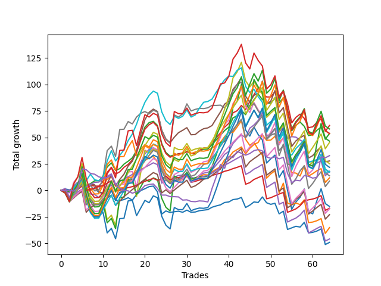

# Short Pointer 003 
- Symbol: ES
- Date Range: 03/18/2022 - 12/30/2022
- Trading Period: 8:30-12:30
- Number of Trades: 64



| Name | Win Percent | Profit | Avg Profit / Trade | Avg Time / Trade |      | Name | Win Percent | Profit | Avg Profit / Trade | Avg Time / Trade |
| ---- | ----------- | ------ | ------------------ | ---------------- | ---- | ---- | ----------- | ------ | ------------------ | ---------------- |
| Sorted By <br> Profit | | | | | | Sorted By <br> Win Percentage ||||
| BB-20 U/L 2SD C | 64.06 | 30625.00 | 478.52 | 23:07 |     | TP-1 | 85.94 | -8500.00 | -132.81 | 11:02 |
| TP-10 | 60.94 | 29000.00 | 453.12 | 42:39 |     | TP-2 | 81.25 | -23000.00 | -359.38 | 16:08 |
| BB-20 U/L 2SD | 68.75 | 26875.00 | 419.92 | 21:49 |     | TP-3 | 78.12 | -11500.00 | -179.69 | 20:50 |
| NEWFI 000 | 56.25 | 26875.00 | 419.92 | 48:47 |     | TP-4 | 75.00 | -8750.00 | -136.72 | 24:53 |
| TP-9 | 60.94 | 26750.00 | 417.97 | 40:11 |     | TP-5 | 71.88 | 4375.00 | 68.36 | 27:14 |
| BB-200 U/L 2SD | 54.69 | 23250.00 | 363.28 | 55:48 |     | TP-6 | 70.31 | 22625.00 | 353.52 | 29:50 |
| TP-6 | 70.31 | 22625.00 | 353.52 | 29:50 |     | BB-20 U/L 2SD | 68.75 | 26875.00 | 419.92 | 21:49 |
| NEWFI 0000 | 42.19 | 16375.00 | 255.86 | 13:17 |     | BB-50 U/L 1SD | 68.75 | 13875.00 | 216.80 | 30:24 |
| BB-50 U/L 1SD | 68.75 | 13875.00 | 216.80 | 30:24 |     | BB-100 Mid | 67.19 | 8875.00 | 138.67 | 29:35 |
| V U/L 1SD | 56.25 | 12625.00 | 197.27 | 48:36 |     | BB-20 Mid | 67.19 | -24625.00 | -384.77 | 08:23 |
| TP-8 | 60.94 | 10875.00 | 169.92 | 39:38 |     | BB-20 U/L 1SD | 65.62 | 5875.00 | 91.80 | 13:45 |
| BB-50 Mid | 64.06 | 9000.00 | 140.62 | 20:23 |     | BB-20 U/L 2SD C | 64.06 | 30625.00 | 478.52 | 23:07 |
| BB-100 Mid | 67.19 | 8875.00 | 138.67 | 29:35 |     | BB-50 Mid | 64.06 | 9000.00 | 140.62 | 20:23 |
| BB-50 U/L 2SD | 64.06 | 8625.00 | 134.77 | 39:17 |     | BB-50 U/L 2SD | 64.06 | 8625.00 | 134.77 | 39:17 |
| TP-7 | 62.50 | 8625.00 | 134.77 | 36:15 |     | TP-7 | 62.50 | 8625.00 | 134.77 | 36:15 |
| V Mid | 57.81 | 6875.00 | 107.42 | 34:46 |     | TP-10 | 60.94 | 29000.00 | 453.12 | 42:39 |
| BB-20 U/L 1SD | 65.62 | 5875.00 | 91.80 | 13:45 |     | TP-9 | 60.94 | 26750.00 | 417.97 | 40:11 |
| TP-5 | 71.88 | 4375.00 | 68.36 | 27:14 |     | TP-8 | 60.94 | 10875.00 | 169.92 | 39:38 |
| BB-100 U/L 2SD | 54.69 | -7625.00 | -119.14 | 51:45 |     | V Mid | 57.81 | 6875.00 | 107.42 | 34:46 |
| TP-1 | 85.94 | -8500.00 | -132.81 | 11:02 |     | BB-200 Mid | 57.81 | -17625.00 | -275.39 | 32:28 |
| TP-4 | 75.00 | -8750.00 | -136.72 | 24:53 |     | NEWFI 000 | 56.25 | 26875.00 | 419.92 | 48:47 |
| TP-3 | 78.12 | -11500.00 | -179.69 | 20:50 |     | V U/L 1SD | 56.25 | 12625.00 | 197.27 | 48:36 |
| BB-200 Mid | 57.81 | -17625.00 | -275.39 | 32:28 |     | BB-200 U/L 2SD | 54.69 | 23250.00 | 363.28 | 55:48 |
| TP-2 | 81.25 | -23000.00 | -359.38 | 16:08 |     | BB-100 U/L 2SD | 54.69 | -7625.00 | -119.14 | 51:45 |
| BB-20 Mid | 67.19 | -24625.00 | -384.77 | 08:23 |     | NEWFI 0000 | 42.19 | 16375.00 | 255.86 | 13:17 |

## NO STOPLOSS

### Test BB-20 Mid
* Sell when price hits the middle line of the 20p bollinger
* No Stoploss
* Results:
```
Total Trades: 64
Percent Up: 32.81
Percent Down: 67.19
Total Points Moved Down: -49.25
Potential Profit: -24625.00
Total Points Ups: 127.00 Count Ups: 21
Total Points Downs: 77.75 Count Downs: 43
```

<details><summary>Trades</summary>

<code>In: 2022-03-18 10:14:00		Out: 2022-03-18 10:19:40		Total Position Time: 05:40		Total Move Down: 1.25		Total to Date: 1.25</code> <br />
<code>In: 2022-03-29 12:15:00		Out: 2022-03-29 12:24:45		Total Position Time: 09:45		Total Move Down: -0.75		Total to Date: 0.50</code> <br />
<code>In: 2022-04-20 07:58:00		Out: 2022-04-20 08:00:20		Total Position Time: 02:20		Total Move Down: 0.50		Total to Date: 1.00</code> <br />
<code>In: 2022-04-20 10:18:00		Out: 2022-04-20 10:19:10		Total Position Time: 01:10		Total Move Down: 3.50		Total to Date: 4.50</code> <br />
<code>In: 2022-04-20 10:50:00		Out: 2022-04-20 10:51:10		Total Position Time: 01:10		Total Move Down: 1.00		Total to Date: 5.50</code> <br />
<code>In: 2022-04-25 09:13:00		Out: 2022-04-25 09:31:05		Total Position Time: 18:05		Total Move Down: -6.75		Total to Date: -1.25</code> <br />
<code>In: 2022-04-25 09:29:00		Out: 2022-04-25 09:31:05		Total Position Time: 02:05		Total Move Down: 1.00		Total to Date: -0.25</code> <br />
<code>In: 2022-04-28 10:17:00		Out: 2022-04-28 10:22:05		Total Position Time: 05:05		Total Move Down: 2.75		Total to Date: 2.50</code> <br />
<code>In: 2022-05-24 10:48:00		Out: 2022-05-24 11:01:15		Total Position Time: 13:15		Total Move Down: -4.50		Total to Date: -2.00</code> <br />
<code>In: 2022-05-24 10:58:00		Out: 2022-05-24 11:01:15		Total Position Time: 03:15		Total Move Down: -0.25		Total to Date: -2.25</code> <br />
<code>In: 2022-05-24 11:41:00		Out: 2022-05-24 11:42:15		Total Position Time: 01:15		Total Move Down: 2.00		Total to Date: -0.25</code> <br />
<code>In: 2022-05-26 10:12:00		Out: 2022-05-26 10:13:10		Total Position Time: 01:10		Total Move Down: 2.25		Total to Date: 2.00</code> <br />
<code>In: 2022-05-27 12:03:00		Out: 2022-05-27 12:35:00		Total Position Time: 32:00		Total Move Down: -11.50		Total to Date: -9.50</code> <br />
<code>In: 2022-05-31 10:58:00		Out: 2022-05-31 11:05:10		Total Position Time: 07:10		Total Move Down: -0.25		Total to Date: -9.75</code> <br />
<code>In: 2022-06-01 12:19:00		Out: 2022-06-01 12:25:25		Total Position Time: 06:25		Total Move Down: 1.00		Total to Date: -8.75</code> <br />
<code>In: 2022-06-09 10:08:00		Out: 2022-06-09 10:16:50		Total Position Time: 08:50		Total Move Down: 1.75		Total to Date: -7.00</code> <br />
<code>In: 2022-06-10 10:42:00		Out: 2022-06-10 10:55:05		Total Position Time: 13:05		Total Move Down: -2.25		Total to Date: -9.25</code> <br />
<code>In: 2022-06-10 11:26:00		Out: 2022-06-10 11:28:25		Total Position Time: 02:25		Total Move Down: 5.25		Total to Date: -4.00</code> <br />
<code>In: 2022-06-17 08:34:00		Out: 2022-06-17 08:35:45		Total Position Time: 01:45		Total Move Down: 3.75		Total to Date: -0.25</code> <br />
<code>In: 2022-06-17 08:35:00		Out: 2022-06-17 08:36:10		Total Position Time: 01:10		Total Move Down: 1.75		Total to Date: 1.50</code> <br />
<code>In: 2022-07-07 08:10:00		Out: 2022-07-07 08:11:15		Total Position Time: 01:15		Total Move Down: 2.00		Total to Date: 3.50</code> <br />
<code>In: 2022-07-07 09:38:00		Out: 2022-07-07 09:44:35		Total Position Time: 06:35		Total Move Down: 0.50		Total to Date: 4.00</code> <br />
<code>In: 2022-07-08 11:26:00		Out: 2022-07-08 11:49:25		Total Position Time: 23:25		Total Move Down: -5.50		Total to Date: -1.50</code> <br />
<code>In: 2022-07-28 08:09:00		Out: 2022-07-28 08:57:50		Total Position Time: 48:50		Total Move Down: -21.00		Total to Date: -22.50</code> <br />
<code>In: 2022-07-29 11:41:00		Out: 2022-07-29 11:42:10		Total Position Time: 01:10		Total Move Down: 3.00		Total to Date: -19.50</code> <br />
<code>In: 2022-07-29 12:31:00		Out: 2022-07-29 12:40:20		Total Position Time: 09:20		Total Move Down: -1.50		Total to Date: -21.00</code> <br />
<code>In: 2022-08-02 09:47:00		Out: 2022-08-02 09:51:20		Total Position Time: 04:20		Total Move Down: 0.75		Total to Date: -20.25</code> <br />
<code>In: 2022-08-03 09:55:00		Out: 2022-08-03 10:00:00		Total Position Time: 05:00		Total Move Down: 0.50		Total to Date: -19.75</code> <br />
<code>In: 2022-08-04 10:31:00		Out: 2022-08-04 10:43:05		Total Position Time: 12:05		Total Move Down: -1.00		Total to Date: -20.75</code> <br />
<code>In: 2022-08-05 10:18:00		Out: 2022-08-05 10:20:05		Total Position Time: 02:05		Total Move Down: 2.00		Total to Date: -18.75</code> <br />
<code>In: 2022-08-12 09:15:00		Out: 2022-08-12 09:33:05		Total Position Time: 18:05		Total Move Down: -2.00		Total to Date: -20.75</code> <br />
<code>In: 2022-08-15 09:38:00		Out: 2022-08-15 09:46:05		Total Position Time: 08:05		Total Move Down: 0.25		Total to Date: -20.50</code> <br />
<code>In: 2022-08-16 09:21:00		Out: 2022-08-16 09:22:10		Total Position Time: 01:10		Total Move Down: 1.25		Total to Date: -19.25</code> <br />
<code>In: 2022-08-16 09:22:00		Out: 2022-08-16 09:23:10		Total Position Time: 01:10		Total Move Down: 0.50		Total to Date: -18.75</code> <br />
<code>In: 2022-08-18 12:26:00		Out: 2022-08-18 12:31:35		Total Position Time: 05:35		Total Move Down: 0.50		Total to Date: -18.25</code> <br />
<code>In: 2022-08-22 09:28:00		Out: 2022-08-22 09:29:10		Total Position Time: 01:10		Total Move Down: 2.25		Total to Date: -16.00</code> <br />
<code>In: 2022-08-31 09:01:00		Out: 2022-08-31 09:04:15		Total Position Time: 03:15		Total Move Down: 1.25		Total to Date: -14.75</code> <br />
<code>In: 2022-08-31 09:02:00		Out: 2022-08-31 09:04:15		Total Position Time: 02:15		Total Move Down: 1.00		Total to Date: -13.75</code> <br />
<code>In: 2022-09-06 12:15:00		Out: 2022-09-06 12:20:45		Total Position Time: 05:45		Total Move Down: 2.25		Total to Date: -11.50</code> <br />
<code>In: 2022-09-12 10:33:00		Out: 2022-09-12 10:36:35		Total Position Time: 03:35		Total Move Down: 0.50		Total to Date: -11.00</code> <br />
<code>In: 2022-09-16 07:38:00		Out: 2022-09-16 07:42:55		Total Position Time: 04:55		Total Move Down: 2.25		Total to Date: -8.75</code> <br />
<code>In: 2022-09-19 09:58:00		Out: 2022-09-19 10:04:55		Total Position Time: 06:55		Total Move Down: 0.50		Total to Date: -8.25</code> <br />
<code>In: 2022-09-22 10:57:00		Out: 2022-09-22 11:01:30		Total Position Time: 04:30		Total Move Down: 1.50		Total to Date: -6.75</code> <br />
<code>In: 2022-09-22 11:59:00		Out: 2022-09-22 12:19:50		Total Position Time: 20:50		Total Move Down: -9.50		Total to Date: -16.25</code> <br />
<code>In: 2022-09-22 12:17:00		Out: 2022-09-22 12:19:50		Total Position Time: 02:50		Total Move Down: 2.25		Total to Date: -14.00</code> <br />
<code>In: 2022-09-23 08:27:00		Out: 2022-09-23 08:28:10		Total Position Time: 01:10		Total Move Down: 3.00		Total to Date: -11.00</code> <br />
<code>In: 2022-09-28 07:49:00		Out: 2022-09-28 07:56:05		Total Position Time: 07:05		Total Move Down: -0.50		Total to Date: -11.50</code> <br />
<code>In: 2022-09-28 08:27:00		Out: 2022-09-28 08:29:40		Total Position Time: 02:40		Total Move Down: 5.25		Total to Date: -6.25</code> <br />
<code>In: 2022-10-03 10:28:00		Out: 2022-10-03 10:50:55		Total Position Time: 22:55		Total Move Down: -5.50		Total to Date: -11.75</code> <br />
<code>In: 2022-10-03 11:50:00		Out: 2022-10-03 12:01:10		Total Position Time: 11:10		Total Move Down: -1.50		Total to Date: -13.25</code> <br />
<code>In: 2022-10-06 09:51:00		Out: 2022-10-06 09:55:05		Total Position Time: 04:05		Total Move Down: 1.00		Total to Date: -12.25</code> <br />
<code>In: 2022-10-11 08:39:00		Out: 2022-10-11 08:58:10		Total Position Time: 19:10		Total Move Down: -10.00		Total to Date: -22.25</code> <br />
<code>In: 2022-10-17 10:54:00		Out: 2022-10-17 10:56:00		Total Position Time: 02:00		Total Move Down: 2.50		Total to Date: -19.75</code> <br />
<code>In: 2022-10-21 09:40:00		Out: 2022-10-21 10:08:55		Total Position Time: 28:55		Total Move Down: -17.25		Total to Date: -37.00</code> <br />
<code>In: 2022-10-31 07:49:00		Out: 2022-10-31 07:51:40		Total Position Time: 02:40		Total Move Down: 1.50		Total to Date: -35.50</code> <br />
<code>In: 2022-10-31 08:30:00		Out: 2022-10-31 08:38:35		Total Position Time: 08:35		Total Move Down: 1.50		Total to Date: -34.00</code> <br />
<code>In: 2022-10-31 08:31:00		Out: 2022-10-31 08:38:35		Total Position Time: 07:35		Total Move Down: -0.75		Total to Date: -34.75</code> <br />
<code>In: 2022-11-03 07:31:00		Out: 2022-11-03 07:33:25		Total Position Time: 02:25		Total Move Down: 4.50		Total to Date: -30.25</code> <br />
<code>In: 2022-11-08 07:24:00		Out: 2022-11-08 07:54:45		Total Position Time: 30:45		Total Move Down: -10.00		Total to Date: -40.25</code> <br />
<code>In: 2022-11-16 08:35:00		Out: 2022-11-16 08:36:10		Total Position Time: 01:10		Total Move Down: 0.50		Total to Date: -39.75</code> <br />
<code>In: 2022-12-05 08:15:00		Out: 2022-12-05 08:16:10		Total Position Time: 01:10		Total Move Down: 1.25		Total to Date: -38.50</code> <br />
<code>In: 2022-12-05 08:16:00		Out: 2022-12-05 08:17:10		Total Position Time: 01:10		Total Move Down: 2.00		Total to Date: -36.50</code> <br />
<code>In: 2022-12-12 12:02:00		Out: 2022-12-12 12:42:05		Total Position Time: 40:05		Total Move Down: -14.75		Total to Date: -51.25</code> <br />
<code>In: 2022-12-20 10:06:00		Out: 2022-12-20 10:07:10		Total Position Time: 01:10		Total Move Down: 2.00		Total to Date: -49.25</code> <br />


</details>

### Test BB-20 U/L 1SD
* Sell when the price hits the lower line of the 20p 1std bollinger
* No Stoploss
* Results:
```
Total Trades: 64
Percent Up: 34.38
Percent Down: 65.62
Total Points Moved Down: 11.75
Potential Profit: 5875.00
Total Points Ups: 128.00 Count Ups: 22
Total Points Downs: 139.75 Count Downs: 42
```

<details><summary>Trades</summary>

<code>In: 2022-03-18 10:14:00		Out: 2022-03-18 10:41:40		Total Position Time: 27:40		Total Move Down: -1.25		Total to Date: -1.25</code> <br />
<code>In: 2022-03-29 12:15:00		Out: 2022-03-29 12:27:45		Total Position Time: 12:45		Total Move Down: 0.25		Total to Date: -1.00</code> <br />
<code>In: 2022-04-20 07:58:00		Out: 2022-04-20 08:00:40		Total Position Time: 02:40		Total Move Down: 3.50		Total to Date: 2.50</code> <br />
<code>In: 2022-04-20 10:18:00		Out: 2022-04-20 10:19:10		Total Position Time: 01:10		Total Move Down: 3.50		Total to Date: 6.00</code> <br />
<code>In: 2022-04-20 10:50:00		Out: 2022-04-20 10:54:35		Total Position Time: 04:35		Total Move Down: 2.50		Total to Date: 8.50</code> <br />
<code>In: 2022-04-25 09:13:00		Out: 2022-04-25 09:42:45		Total Position Time: 29:45		Total Move Down: -8.00		Total to Date: 0.50</code> <br />
<code>In: 2022-04-25 09:29:00		Out: 2022-04-25 09:42:45		Total Position Time: 13:45		Total Move Down: -0.25		Total to Date: 0.25</code> <br />
<code>In: 2022-04-28 10:17:00		Out: 2022-04-28 10:30:50		Total Position Time: 13:50		Total Move Down: 1.50		Total to Date: 1.75</code> <br />
<code>In: 2022-05-24 10:48:00		Out: 2022-05-24 11:01:40		Total Position Time: 13:40		Total Move Down: -1.00		Total to Date: 0.75</code> <br />
<code>In: 2022-05-24 10:58:00		Out: 2022-05-24 11:01:40		Total Position Time: 03:40		Total Move Down: 3.25		Total to Date: 4.00</code> <br />
<code>In: 2022-05-24 11:41:00		Out: 2022-05-24 11:43:25		Total Position Time: 02:25		Total Move Down: 6.50		Total to Date: 10.50</code> <br />
<code>In: 2022-05-26 10:12:00		Out: 2022-05-26 10:16:05		Total Position Time: 04:05		Total Move Down: 2.75		Total to Date: 13.25</code> <br />
<code>In: 2022-05-27 12:03:00		Out: 2022-05-27 12:35:45		Total Position Time: 32:45		Total Move Down: -9.50		Total to Date: 3.75</code> <br />
<code>In: 2022-05-31 10:58:00		Out: 2022-05-31 11:13:25		Total Position Time: 15:25		Total Move Down: 0.25		Total to Date: 4.00</code> <br />
<code>In: 2022-06-01 12:19:00		Out: 2022-06-01 12:30:05		Total Position Time: 11:05		Total Move Down: 4.25		Total to Date: 8.25</code> <br />
<code>In: 2022-06-09 10:08:00		Out: 2022-06-09 10:18:50		Total Position Time: 10:50		Total Move Down: 2.75		Total to Date: 11.00</code> <br />
<code>In: 2022-06-10 10:42:00		Out: 2022-06-10 10:56:05		Total Position Time: 14:05		Total Move Down: -1.50		Total to Date: 9.50</code> <br />
<code>In: 2022-06-10 11:26:00		Out: 2022-06-10 11:38:10		Total Position Time: 12:10		Total Move Down: 4.50		Total to Date: 14.00</code> <br />
<code>In: 2022-06-17 08:34:00		Out: 2022-06-17 08:39:05		Total Position Time: 05:05		Total Move Down: 8.00		Total to Date: 22.00</code> <br />
<code>In: 2022-06-17 08:35:00		Out: 2022-06-17 08:39:05		Total Position Time: 04:05		Total Move Down: 6.25		Total to Date: 28.25</code> <br />
<code>In: 2022-07-07 08:10:00		Out: 2022-07-07 08:20:05		Total Position Time: 10:05		Total Move Down: 2.50		Total to Date: 30.75</code> <br />
<code>In: 2022-07-07 09:38:00		Out: 2022-07-07 09:45:05		Total Position Time: 07:05		Total Move Down: 1.25		Total to Date: 32.00</code> <br />
<code>In: 2022-07-08 11:26:00		Out: 2022-07-08 11:53:45		Total Position Time: 27:45		Total Move Down: -5.25		Total to Date: 26.75</code> <br />
<code>In: 2022-07-28 08:09:00		Out: 2022-07-28 08:58:55		Total Position Time: 49:55		Total Move Down: -18.00		Total to Date: 8.75</code> <br />
<code>In: 2022-07-29 11:41:00		Out: 2022-07-29 11:42:10		Total Position Time: 01:10		Total Move Down: 3.00		Total to Date: 11.75</code> <br />
<code>In: 2022-07-29 12:31:00		Out: 2022-07-29 12:47:00		Total Position Time: 16:00		Total Move Down: -3.50		Total to Date: 8.25</code> <br />
<code>In: 2022-08-02 09:47:00		Out: 2022-08-02 09:59:00		Total Position Time: 12:00		Total Move Down: 1.25		Total to Date: 9.50</code> <br />
<code>In: 2022-08-03 09:55:00		Out: 2022-08-03 10:11:30		Total Position Time: 16:30		Total Move Down: -0.00		Total to Date: 9.50</code> <br />
<code>In: 2022-08-04 10:31:00		Out: 2022-08-04 10:43:15		Total Position Time: 12:15		Total Move Down: 0.50		Total to Date: 10.00</code> <br />
<code>In: 2022-08-05 10:18:00		Out: 2022-08-05 10:23:15		Total Position Time: 05:15		Total Move Down: 3.25		Total to Date: 13.25</code> <br />
<code>In: 2022-08-12 09:15:00		Out: 2022-08-12 09:40:30		Total Position Time: 25:30		Total Move Down: -2.50		Total to Date: 10.75</code> <br />
<code>In: 2022-08-15 09:38:00		Out: 2022-08-15 10:02:50		Total Position Time: 24:50		Total Move Down: -0.50		Total to Date: 10.25</code> <br />
<code>In: 2022-08-16 09:21:00		Out: 2022-08-16 09:27:10		Total Position Time: 06:10		Total Move Down: 2.75		Total to Date: 13.00</code> <br />
<code>In: 2022-08-16 09:22:00		Out: 2022-08-16 09:27:10		Total Position Time: 05:10		Total Move Down: 1.75		Total to Date: 14.75</code> <br />
<code>In: 2022-08-18 12:26:00		Out: 2022-08-18 12:43:55		Total Position Time: 17:55		Total Move Down: -0.25		Total to Date: 14.50</code> <br />
<code>In: 2022-08-22 09:28:00		Out: 2022-08-22 09:32:05		Total Position Time: 04:05		Total Move Down: 3.00		Total to Date: 17.50</code> <br />
<code>In: 2022-08-31 09:01:00		Out: 2022-08-31 09:06:20		Total Position Time: 05:20		Total Move Down: 2.50		Total to Date: 20.00</code> <br />
<code>In: 2022-08-31 09:02:00		Out: 2022-08-31 09:06:20		Total Position Time: 04:20		Total Move Down: 2.25		Total to Date: 22.25</code> <br />
<code>In: 2022-09-06 12:15:00		Out: 2022-09-06 12:22:20		Total Position Time: 07:20		Total Move Down: 6.75		Total to Date: 29.00</code> <br />
<code>In: 2022-09-12 10:33:00		Out: 2022-09-12 10:41:30		Total Position Time: 08:30		Total Move Down: 2.00		Total to Date: 31.00</code> <br />
<code>In: 2022-09-16 07:38:00		Out: 2022-09-16 07:44:55		Total Position Time: 06:55		Total Move Down: 5.25		Total to Date: 36.25</code> <br />
<code>In: 2022-09-19 09:58:00		Out: 2022-09-19 10:05:25		Total Position Time: 07:25		Total Move Down: 2.25		Total to Date: 38.50</code> <br />
<code>In: 2022-09-22 10:57:00		Out: 2022-09-22 11:03:35		Total Position Time: 06:35		Total Move Down: 2.50		Total to Date: 41.00</code> <br />
<code>In: 2022-09-22 11:59:00		Out: 2022-09-22 12:20:20		Total Position Time: 21:20		Total Move Down: -6.50		Total to Date: 34.50</code> <br />
<code>In: 2022-09-22 12:17:00		Out: 2022-09-22 12:20:20		Total Position Time: 03:20		Total Move Down: 5.25		Total to Date: 39.75</code> <br />
<code>In: 2022-09-23 08:27:00		Out: 2022-09-23 08:29:05		Total Position Time: 02:05		Total Move Down: 3.50		Total to Date: 43.25</code> <br />
<code>In: 2022-09-28 07:49:00		Out: 2022-09-28 07:56:40		Total Position Time: 07:40		Total Move Down: 2.00		Total to Date: 45.25</code> <br />
<code>In: 2022-09-28 08:27:00		Out: 2022-09-28 08:31:10		Total Position Time: 04:10		Total Move Down: 7.25		Total to Date: 52.50</code> <br />
<code>In: 2022-10-03 10:28:00		Out: 2022-10-03 10:54:35		Total Position Time: 26:35		Total Move Down: -5.25		Total to Date: 47.25</code> <br />
<code>In: 2022-10-03 11:50:00		Out: 2022-10-03 12:01:50		Total Position Time: 11:50		Total Move Down: 0.25		Total to Date: 47.50</code> <br />
<code>In: 2022-10-06 09:51:00		Out: 2022-10-06 09:57:05		Total Position Time: 06:05		Total Move Down: 3.50		Total to Date: 51.00</code> <br />
<code>In: 2022-10-11 08:39:00		Out: 2022-10-11 09:01:55		Total Position Time: 22:55		Total Move Down: -6.00		Total to Date: 45.00</code> <br />
<code>In: 2022-10-17 10:54:00		Out: 2022-10-17 11:03:35		Total Position Time: 09:35		Total Move Down: 4.50		Total to Date: 49.50</code> <br />
<code>In: 2022-10-21 09:40:00		Out: 2022-10-21 10:09:25		Total Position Time: 29:25		Total Move Down: -14.75		Total to Date: 34.75</code> <br />
<code>In: 2022-10-31 07:49:00		Out: 2022-10-31 08:49:55		Total Position Time: 60:55		Total Move Down: -18.00		Total to Date: 16.75</code> <br />
<code>In: 2022-10-31 08:30:00		Out: 2022-10-31 08:58:20		Total Position Time: 28:20		Total Move Down: -0.50		Total to Date: 16.25</code> <br />
<code>In: 2022-10-31 08:31:00		Out: 2022-10-31 08:58:20		Total Position Time: 27:20		Total Move Down: -2.75		Total to Date: 13.50</code> <br />
<code>In: 2022-11-03 07:31:00		Out: 2022-11-03 07:36:45		Total Position Time: 05:45		Total Move Down: 9.75		Total to Date: 23.25</code> <br />
<code>In: 2022-11-08 07:24:00		Out: 2022-11-08 08:01:05		Total Position Time: 37:05		Total Move Down: -9.75		Total to Date: 13.50</code> <br />
<code>In: 2022-11-16 08:35:00		Out: 2022-11-16 08:38:25		Total Position Time: 03:25		Total Move Down: 2.25		Total to Date: 15.75</code> <br />
<code>In: 2022-12-05 08:15:00		Out: 2022-12-05 08:16:50		Total Position Time: 01:50		Total Move Down: 2.75		Total to Date: 18.50</code> <br />
<code>In: 2022-12-05 08:16:00		Out: 2022-12-05 08:17:10		Total Position Time: 01:10		Total Move Down: 2.00		Total to Date: 20.50</code> <br />
<code>In: 2022-12-12 12:02:00		Out: 2022-12-12 12:43:30		Total Position Time: 41:30		Total Move Down: -13.00		Total to Date: 7.50</code> <br />
<code>In: 2022-12-20 10:06:00		Out: 2022-12-20 10:10:35		Total Position Time: 04:35		Total Move Down: 4.25		Total to Date: 11.75</code> <br />


</details>

### Test BB-20 U/L 2SD
* Sell when the price hits the lower line of the 20p 2std bollinger
* No Stoploss
* Results:
```
Total Trades: 64
Percent Up: 31.25
Percent Down: 68.75
Total Points Moved Down: 53.75
Potential Profit: 26875.00
Total Points Ups: 121.75 Count Ups: 20
Total Points Downs: 175.50 Count Downs: 44
```

<details><summary>Trades</summary>

<code>In: 2022-03-18 10:14:00		Out: 2022-03-18 10:58:35		Total Position Time: 44:35		Total Move Down: -1.50		Total to Date: -1.50</code> <br />
<code>In: 2022-03-29 12:15:00		Out: 2022-03-29 12:27:50		Total Position Time: 12:50		Total Move Down: 0.75		Total to Date: -0.75</code> <br />
<code>In: 2022-04-20 07:58:00		Out: 2022-04-20 08:00:55		Total Position Time: 02:55		Total Move Down: 4.75		Total to Date: 4.00</code> <br />
<code>In: 2022-04-20 10:18:00		Out: 2022-04-20 11:13:55		Total Position Time: 55:55		Total Move Down: 3.25		Total to Date: 7.25</code> <br />
<code>In: 2022-04-20 10:50:00		Out: 2022-04-20 11:13:55		Total Position Time: 23:55		Total Move Down: 3.25		Total to Date: 10.50</code> <br />
<code>In: 2022-04-25 09:13:00		Out: 2022-04-25 10:01:15		Total Position Time: 48:15		Total Move Down: -6.00		Total to Date: 4.50</code> <br />
<code>In: 2022-04-25 09:29:00		Out: 2022-04-25 10:01:15		Total Position Time: 32:15		Total Move Down: 1.75		Total to Date: 6.25</code> <br />
<code>In: 2022-04-28 10:17:00		Out: 2022-04-28 10:31:05		Total Position Time: 14:05		Total Move Down: 2.75		Total to Date: 9.00</code> <br />
<code>In: 2022-05-24 10:48:00		Out: 2022-05-24 11:01:50		Total Position Time: 13:50		Total Move Down: -0.00		Total to Date: 9.00</code> <br />
<code>In: 2022-05-24 10:58:00		Out: 2022-05-24 11:01:50		Total Position Time: 03:50		Total Move Down: 4.25		Total to Date: 13.25</code> <br />
<code>In: 2022-05-24 11:41:00		Out: 2022-05-24 11:44:00		Total Position Time: 03:00		Total Move Down: 8.75		Total to Date: 22.00</code> <br />
<code>In: 2022-05-26 10:12:00		Out: 2022-05-26 10:22:35		Total Position Time: 10:35		Total Move Down: 4.00		Total to Date: 26.00</code> <br />
<code>In: 2022-05-27 12:03:00		Out: 2022-05-27 12:36:55		Total Position Time: 33:55		Total Move Down: -7.25		Total to Date: 18.75</code> <br />
<code>In: 2022-05-31 10:58:00		Out: 2022-05-31 11:22:35		Total Position Time: 24:35		Total Move Down: 1.75		Total to Date: 20.50</code> <br />
<code>In: 2022-06-01 12:19:00		Out: 2022-06-01 12:30:05		Total Position Time: 11:05		Total Move Down: 4.25		Total to Date: 24.75</code> <br />
<code>In: 2022-06-09 10:08:00		Out: 2022-06-09 10:19:05		Total Position Time: 11:05		Total Move Down: 2.75		Total to Date: 27.50</code> <br />
<code>In: 2022-06-10 10:42:00		Out: 2022-06-10 11:01:00		Total Position Time: 19:00		Total Move Down: 3.25		Total to Date: 30.75</code> <br />
<code>In: 2022-06-10 11:26:00		Out: 2022-06-10 11:40:10		Total Position Time: 14:10		Total Move Down: 6.75		Total to Date: 37.50</code> <br />
<code>In: 2022-06-17 08:34:00		Out: 2022-06-17 08:45:15		Total Position Time: 11:15		Total Move Down: 12.00		Total to Date: 49.50</code> <br />
<code>In: 2022-06-17 08:35:00		Out: 2022-06-17 08:45:15		Total Position Time: 10:15		Total Move Down: 10.25		Total to Date: 59.75</code> <br />
<code>In: 2022-07-07 08:10:00		Out: 2022-07-07 08:22:45		Total Position Time: 12:45		Total Move Down: 4.25		Total to Date: 64.00</code> <br />
<code>In: 2022-07-07 09:38:00		Out: 2022-07-07 09:48:20		Total Position Time: 10:20		Total Move Down: 1.25		Total to Date: 65.25</code> <br />
<code>In: 2022-07-08 11:26:00		Out: 2022-07-08 11:54:05		Total Position Time: 28:05		Total Move Down: -4.00		Total to Date: 61.25</code> <br />
<code>In: 2022-07-28 08:09:00		Out: 2022-07-28 09:08:10		Total Position Time: 59:10		Total Move Down: -17.00		Total to Date: 44.25</code> <br />
<code>In: 2022-07-29 11:41:00		Out: 2022-07-29 12:41:55		Total Position Time: 60:55		Total Move Down: -8.50		Total to Date: 35.75</code> <br />
<code>In: 2022-07-29 12:31:00		Out: 2022-07-29 12:47:00		Total Position Time: 16:00		Total Move Down: -3.50		Total to Date: 32.25</code> <br />
<code>In: 2022-08-02 09:47:00		Out: 2022-08-02 09:59:05		Total Position Time: 12:05		Total Move Down: 1.25		Total to Date: 33.50</code> <br />
<code>In: 2022-08-03 09:55:00		Out: 2022-08-03 10:19:50		Total Position Time: 24:50		Total Move Down: 1.00		Total to Date: 34.50</code> <br />
<code>In: 2022-08-04 10:31:00		Out: 2022-08-04 10:45:30		Total Position Time: 14:30		Total Move Down: 0.75		Total to Date: 35.25</code> <br />
<code>In: 2022-08-05 10:18:00		Out: 2022-08-05 10:49:30		Total Position Time: 31:30		Total Move Down: 1.50		Total to Date: 36.75</code> <br />
<code>In: 2022-08-12 09:15:00		Out: 2022-08-12 09:42:00		Total Position Time: 27:00		Total Move Down: -1.75		Total to Date: 35.00</code> <br />
<code>In: 2022-08-15 09:38:00		Out: 2022-08-15 10:19:05		Total Position Time: 41:05		Total Move Down: -0.25		Total to Date: 34.75</code> <br />
<code>In: 2022-08-16 09:21:00		Out: 2022-08-16 09:41:15		Total Position Time: 20:15		Total Move Down: 2.50		Total to Date: 37.25</code> <br />
<code>In: 2022-08-16 09:22:00		Out: 2022-08-16 09:41:15		Total Position Time: 19:15		Total Move Down: 1.50		Total to Date: 38.75</code> <br />
<code>In: 2022-08-18 12:26:00		Out: 2022-08-18 12:46:15		Total Position Time: 20:15		Total Move Down: 0.25		Total to Date: 39.00</code> <br />
<code>In: 2022-08-22 09:28:00		Out: 2022-08-22 09:44:50		Total Position Time: 16:50		Total Move Down: 4.25		Total to Date: 43.25</code> <br />
<code>In: 2022-08-31 09:01:00		Out: 2022-08-31 09:07:00		Total Position Time: 06:00		Total Move Down: 4.50		Total to Date: 47.75</code> <br />
<code>In: 2022-08-31 09:02:00		Out: 2022-08-31 09:07:00		Total Position Time: 05:00		Total Move Down: 4.25		Total to Date: 52.00</code> <br />
<code>In: 2022-09-06 12:15:00		Out: 2022-09-06 12:30:20		Total Position Time: 15:20		Total Move Down: 4.50		Total to Date: 56.50</code> <br />
<code>In: 2022-09-12 10:33:00		Out: 2022-09-12 10:43:35		Total Position Time: 10:35		Total Move Down: 3.25		Total to Date: 59.75</code> <br />
<code>In: 2022-09-16 07:38:00		Out: 2022-09-16 07:47:50		Total Position Time: 09:50		Total Move Down: 8.75		Total to Date: 68.50</code> <br />
<code>In: 2022-09-19 09:58:00		Out: 2022-09-19 10:11:15		Total Position Time: 13:15		Total Move Down: 2.00		Total to Date: 70.50</code> <br />
<code>In: 2022-09-22 10:57:00		Out: 2022-09-22 11:07:55		Total Position Time: 10:55		Total Move Down: 5.00		Total to Date: 75.50</code> <br />
<code>In: 2022-09-22 11:59:00		Out: 2022-09-22 12:22:20		Total Position Time: 23:20		Total Move Down: -4.00		Total to Date: 71.50</code> <br />
<code>In: 2022-09-22 12:17:00		Out: 2022-09-22 12:22:20		Total Position Time: 05:20		Total Move Down: 7.75		Total to Date: 79.25</code> <br />
<code>In: 2022-09-23 08:27:00		Out: 2022-09-23 08:37:35		Total Position Time: 10:35		Total Move Down: 6.50		Total to Date: 85.75</code> <br />
<code>In: 2022-09-28 07:49:00		Out: 2022-09-28 08:00:05		Total Position Time: 11:05		Total Move Down: 5.25		Total to Date: 91.00</code> <br />
<code>In: 2022-09-28 08:27:00		Out: 2022-09-28 09:27:55		Total Position Time: 60:55		Total Move Down: -5.25		Total to Date: 85.75</code> <br />
<code>In: 2022-10-03 10:28:00		Out: 2022-10-03 10:55:05		Total Position Time: 27:05		Total Move Down: -3.25		Total to Date: 82.50</code> <br />
<code>In: 2022-10-03 11:50:00		Out: 2022-10-03 12:12:30		Total Position Time: 22:30		Total Move Down: -0.00		Total to Date: 82.50</code> <br />
<code>In: 2022-10-06 09:51:00		Out: 2022-10-06 10:02:00		Total Position Time: 11:00		Total Move Down: 4.50		Total to Date: 87.00</code> <br />
<code>In: 2022-10-11 08:39:00		Out: 2022-10-11 09:03:40		Total Position Time: 24:40		Total Move Down: -4.25		Total to Date: 82.75</code> <br />
<code>In: 2022-10-17 10:54:00		Out: 2022-10-17 11:06:05		Total Position Time: 12:05		Total Move Down: 4.50		Total to Date: 87.25</code> <br />
<code>In: 2022-10-21 09:40:00		Out: 2022-10-21 10:11:30		Total Position Time: 31:30		Total Move Down: -13.00		Total to Date: 74.25</code> <br />
<code>In: 2022-10-31 07:49:00		Out: 2022-10-31 08:49:55		Total Position Time: 60:55		Total Move Down: -18.00		Total to Date: 56.25</code> <br />
<code>In: 2022-10-31 08:30:00		Out: 2022-10-31 08:58:35		Total Position Time: 28:35		Total Move Down: 5.25		Total to Date: 61.50</code> <br />
<code>In: 2022-10-31 08:31:00		Out: 2022-10-31 08:58:35		Total Position Time: 27:35		Total Move Down: 3.00		Total to Date: 64.50</code> <br />
<code>In: 2022-11-03 07:31:00		Out: 2022-11-03 08:06:40		Total Position Time: 35:40		Total Move Down: -4.00		Total to Date: 60.50</code> <br />
<code>In: 2022-11-08 07:24:00		Out: 2022-11-08 08:01:25		Total Position Time: 37:25		Total Move Down: -8.75		Total to Date: 51.75</code> <br />
<code>In: 2022-11-16 08:35:00		Out: 2022-11-16 09:01:40		Total Position Time: 26:40		Total Move Down: 0.75		Total to Date: 52.50</code> <br />
<code>In: 2022-12-05 08:15:00		Out: 2022-12-05 08:17:35		Total Position Time: 02:35		Total Move Down: 4.25		Total to Date: 56.75</code> <br />
<code>In: 2022-12-05 08:16:00		Out: 2022-12-05 08:17:35		Total Position Time: 01:35		Total Move Down: 3.00		Total to Date: 59.75</code> <br />
<code>In: 2022-12-12 12:02:00		Out: 2022-12-12 12:45:10		Total Position Time: 43:10		Total Move Down: -11.50		Total to Date: 48.25</code> <br />
<code>In: 2022-12-20 10:06:00		Out: 2022-12-20 10:11:15		Total Position Time: 05:15		Total Move Down: 5.50		Total to Date: 53.75</code> <br />


</details>

### Test BB-20 U/L 2SD C
* Sell when the price hits the lower line of the 20p 2std bollinger
* No Stoploss
* Results:
```
Total Trades: 64
Percent Up: 35.94
Percent Down: 64.06
Total Points Moved Down: 61.25
Potential Profit: 30625.00
Total Points Ups: 126.00 Count Ups: 23
Total Points Downs: 187.25 Count Downs: 41
```

<details><summary>Trades</summary>

<code>In: 2022-03-18 10:14:00		Out: 2022-03-18 10:58:40		Total Position Time: 44:40		Total Move Down: -0.75		Total to Date: -0.75</code> <br />
<code>In: 2022-03-29 12:15:00		Out: 2022-03-29 12:47:00		Total Position Time: 32:00		Total Move Down: -8.25		Total to Date: -9.00</code> <br />
<code>In: 2022-04-20 07:58:00		Out: 2022-04-20 08:01:10		Total Position Time: 03:10		Total Move Down: 6.50		Total to Date: -2.50</code> <br />
<code>In: 2022-04-20 10:18:00		Out: 2022-04-20 11:14:05		Total Position Time: 56:05		Total Move Down: 3.25		Total to Date: 0.75</code> <br />
<code>In: 2022-04-20 10:50:00		Out: 2022-04-20 11:14:05		Total Position Time: 24:05		Total Move Down: 3.25		Total to Date: 4.00</code> <br />
<code>In: 2022-04-25 09:13:00		Out: 2022-04-25 10:01:20		Total Position Time: 48:20		Total Move Down: -3.50		Total to Date: 0.50</code> <br />
<code>In: 2022-04-25 09:29:00		Out: 2022-04-25 10:01:20		Total Position Time: 32:20		Total Move Down: 4.25		Total to Date: 4.75</code> <br />
<code>In: 2022-04-28 10:17:00		Out: 2022-04-28 11:15:45		Total Position Time: 58:45		Total Move Down: -0.75		Total to Date: 4.00</code> <br />
<code>In: 2022-05-24 10:48:00		Out: 2022-05-24 11:01:50		Total Position Time: 13:50		Total Move Down: -0.00		Total to Date: 4.00</code> <br />
<code>In: 2022-05-24 10:58:00		Out: 2022-05-24 11:01:50		Total Position Time: 03:50		Total Move Down: 4.25		Total to Date: 8.25</code> <br />
<code>In: 2022-05-24 11:41:00		Out: 2022-05-24 11:44:00		Total Position Time: 03:00		Total Move Down: 8.75		Total to Date: 17.00</code> <br />
<code>In: 2022-05-26 10:12:00		Out: 2022-05-26 10:22:45		Total Position Time: 10:45		Total Move Down: 4.75		Total to Date: 21.75</code> <br />
<code>In: 2022-05-27 12:03:00		Out: 2022-05-27 12:38:10		Total Position Time: 35:10		Total Move Down: -6.50		Total to Date: 15.25</code> <br />
<code>In: 2022-05-31 10:58:00		Out: 2022-05-31 11:22:40		Total Position Time: 24:40		Total Move Down: 2.25		Total to Date: 17.50</code> <br />
<code>In: 2022-06-01 12:19:00		Out: 2022-06-01 12:30:05		Total Position Time: 11:05		Total Move Down: 4.25		Total to Date: 21.75</code> <br />
<code>In: 2022-06-09 10:08:00		Out: 2022-06-09 10:21:10		Total Position Time: 13:10		Total Move Down: 2.75		Total to Date: 24.50</code> <br />
<code>In: 2022-06-10 10:42:00		Out: 2022-06-10 11:01:10		Total Position Time: 19:10		Total Move Down: 4.25		Total to Date: 28.75</code> <br />
<code>In: 2022-06-10 11:26:00		Out: 2022-06-10 11:40:10		Total Position Time: 14:10		Total Move Down: 6.75		Total to Date: 35.50</code> <br />
<code>In: 2022-06-17 08:34:00		Out: 2022-06-17 08:45:15		Total Position Time: 11:15		Total Move Down: 12.00		Total to Date: 47.50</code> <br />
<code>In: 2022-06-17 08:35:00		Out: 2022-06-17 08:45:15		Total Position Time: 10:15		Total Move Down: 10.25		Total to Date: 57.75</code> <br />
<code>In: 2022-07-07 08:10:00		Out: 2022-07-07 08:22:45		Total Position Time: 12:45		Total Move Down: 4.25		Total to Date: 62.00</code> <br />
<code>In: 2022-07-07 09:38:00		Out: 2022-07-07 09:49:35		Total Position Time: 11:35		Total Move Down: 2.25		Total to Date: 64.25</code> <br />
<code>In: 2022-07-08 11:26:00		Out: 2022-07-08 11:54:05		Total Position Time: 28:05		Total Move Down: -4.00		Total to Date: 60.25</code> <br />
<code>In: 2022-07-28 08:09:00		Out: 2022-07-28 09:08:30		Total Position Time: 59:30		Total Move Down: -17.00		Total to Date: 43.25</code> <br />
<code>In: 2022-07-29 11:41:00		Out: 2022-07-29 12:41:55		Total Position Time: 60:55		Total Move Down: -8.50		Total to Date: 34.75</code> <br />
<code>In: 2022-07-29 12:31:00		Out: 2022-07-29 12:47:00		Total Position Time: 16:00		Total Move Down: -3.50		Total to Date: 31.25</code> <br />
<code>In: 2022-08-02 09:47:00		Out: 2022-08-02 10:00:15		Total Position Time: 13:15		Total Move Down: 1.75		Total to Date: 33.00</code> <br />
<code>In: 2022-08-03 09:55:00		Out: 2022-08-03 10:20:00		Total Position Time: 25:00		Total Move Down: 1.50		Total to Date: 34.50</code> <br />
<code>In: 2022-08-04 10:31:00		Out: 2022-08-04 10:52:45		Total Position Time: 21:45		Total Move Down: -0.00		Total to Date: 34.50</code> <br />
<code>In: 2022-08-05 10:18:00		Out: 2022-08-05 10:50:35		Total Position Time: 32:35		Total Move Down: 2.00		Total to Date: 36.50</code> <br />
<code>In: 2022-08-12 09:15:00		Out: 2022-08-12 09:42:00		Total Position Time: 27:00		Total Move Down: -1.75		Total to Date: 34.75</code> <br />
<code>In: 2022-08-15 09:38:00		Out: 2022-08-15 10:19:05		Total Position Time: 41:05		Total Move Down: -0.25		Total to Date: 34.50</code> <br />
<code>In: 2022-08-16 09:21:00		Out: 2022-08-16 09:42:10		Total Position Time: 21:10		Total Move Down: 3.25		Total to Date: 37.75</code> <br />
<code>In: 2022-08-16 09:22:00		Out: 2022-08-16 09:42:10		Total Position Time: 20:10		Total Move Down: 2.25		Total to Date: 40.00</code> <br />
<code>In: 2022-08-18 12:26:00		Out: 2022-08-18 12:46:15		Total Position Time: 20:15		Total Move Down: 0.25		Total to Date: 40.25</code> <br />
<code>In: 2022-08-22 09:28:00		Out: 2022-08-22 09:44:55		Total Position Time: 16:55		Total Move Down: 4.75		Total to Date: 45.00</code> <br />
<code>In: 2022-08-31 09:01:00		Out: 2022-08-31 09:07:05		Total Position Time: 06:05		Total Move Down: 4.75		Total to Date: 49.75</code> <br />
<code>In: 2022-08-31 09:02:00		Out: 2022-08-31 09:07:05		Total Position Time: 05:05		Total Move Down: 4.50		Total to Date: 54.25</code> <br />
<code>In: 2022-09-06 12:15:00		Out: 2022-09-06 12:30:25		Total Position Time: 15:25		Total Move Down: 5.50		Total to Date: 59.75</code> <br />
<code>In: 2022-09-12 10:33:00		Out: 2022-09-12 10:44:05		Total Position Time: 11:05		Total Move Down: 3.50		Total to Date: 63.25</code> <br />
<code>In: 2022-09-16 07:38:00		Out: 2022-09-16 07:48:20		Total Position Time: 10:20		Total Move Down: 10.00		Total to Date: 73.25</code> <br />
<code>In: 2022-09-19 09:58:00		Out: 2022-09-19 10:11:15		Total Position Time: 13:15		Total Move Down: 2.00		Total to Date: 75.25</code> <br />
<code>In: 2022-09-22 10:57:00		Out: 2022-09-22 11:07:55		Total Position Time: 10:55		Total Move Down: 5.00		Total to Date: 80.25</code> <br />
<code>In: 2022-09-22 11:59:00		Out: 2022-09-22 12:22:20		Total Position Time: 23:20		Total Move Down: -4.00		Total to Date: 76.25</code> <br />
<code>In: 2022-09-22 12:17:00		Out: 2022-09-22 12:22:20		Total Position Time: 05:20		Total Move Down: 7.75		Total to Date: 84.00</code> <br />
<code>In: 2022-09-23 08:27:00		Out: 2022-09-23 08:37:40		Total Position Time: 10:40		Total Move Down: 6.50		Total to Date: 90.50</code> <br />
<code>In: 2022-09-28 07:49:00		Out: 2022-09-28 08:00:10		Total Position Time: 11:10		Total Move Down: 6.25		Total to Date: 96.75</code> <br />
<code>In: 2022-09-28 08:27:00		Out: 2022-09-28 09:27:55		Total Position Time: 60:55		Total Move Down: -5.25		Total to Date: 91.50</code> <br />
<code>In: 2022-10-03 10:28:00		Out: 2022-10-03 10:55:05		Total Position Time: 27:05		Total Move Down: -3.25		Total to Date: 88.25</code> <br />
<code>In: 2022-10-03 11:50:00		Out: 2022-10-03 12:12:30		Total Position Time: 22:30		Total Move Down: -0.00		Total to Date: 88.25</code> <br />
<code>In: 2022-10-06 09:51:00		Out: 2022-10-06 10:02:05		Total Position Time: 11:05		Total Move Down: 5.00		Total to Date: 93.25</code> <br />
<code>In: 2022-10-11 08:39:00		Out: 2022-10-11 09:03:45		Total Position Time: 24:45		Total Move Down: -4.00		Total to Date: 89.25</code> <br />
<code>In: 2022-10-17 10:54:00		Out: 2022-10-17 11:06:10		Total Position Time: 12:10		Total Move Down: 5.00		Total to Date: 94.25</code> <br />
<code>In: 2022-10-21 09:40:00		Out: 2022-10-21 10:12:00		Total Position Time: 32:00		Total Move Down: -12.50		Total to Date: 81.75</code> <br />
<code>In: 2022-10-31 07:49:00		Out: 2022-10-31 08:49:55		Total Position Time: 60:55		Total Move Down: -18.00		Total to Date: 63.75</code> <br />
<code>In: 2022-10-31 08:30:00		Out: 2022-10-31 08:58:35		Total Position Time: 28:35		Total Move Down: 5.25		Total to Date: 69.00</code> <br />
<code>In: 2022-10-31 08:31:00		Out: 2022-10-31 08:58:35		Total Position Time: 27:35		Total Move Down: 3.00		Total to Date: 72.00</code> <br />
<code>In: 2022-11-03 07:31:00		Out: 2022-11-03 08:06:40		Total Position Time: 35:40		Total Move Down: -4.00		Total to Date: 68.00</code> <br />
<code>In: 2022-11-08 07:24:00		Out: 2022-11-08 08:01:25		Total Position Time: 37:25		Total Move Down: -8.75		Total to Date: 59.25</code> <br />
<code>In: 2022-11-16 08:35:00		Out: 2022-11-16 09:01:40		Total Position Time: 26:40		Total Move Down: 0.75		Total to Date: 60.00</code> <br />
<code>In: 2022-12-05 08:15:00		Out: 2022-12-05 08:17:35		Total Position Time: 02:35		Total Move Down: 4.25		Total to Date: 64.25</code> <br />
<code>In: 2022-12-05 08:16:00		Out: 2022-12-05 08:17:35		Total Position Time: 01:35		Total Move Down: 3.00		Total to Date: 67.25</code> <br />
<code>In: 2022-12-12 12:02:00		Out: 2022-12-12 12:45:10		Total Position Time: 43:10		Total Move Down: -11.50		Total to Date: 55.75</code> <br />
<code>In: 2022-12-20 10:06:00		Out: 2022-12-20 10:11:15		Total Position Time: 05:15		Total Move Down: 5.50		Total to Date: 61.25</code> <br />


</details>

### Test BB-50 Mid
* Sell when price hits the middle line of the 50p bollinger
* No Stoploss
* Results:
```
Total Trades: 64
Percent Up: 35.94
Percent Down: 64.06
Total Points Moved Down: 18.00
Potential Profit: 9000.00
Total Points Ups: 138.00 Count Ups: 23
Total Points Downs: 156.00 Count Downs: 41
```

<details><summary>Trades</summary>

<code>In: 2022-03-18 10:14:00		Out: 2022-03-18 10:58:30		Total Position Time: 44:30		Total Move Down: -2.00		Total to Date: -2.00</code> <br />
<code>In: 2022-03-29 12:15:00		Out: 2022-03-29 12:43:10		Total Position Time: 28:10		Total Move Down: -0.25		Total to Date: -2.25</code> <br />
<code>In: 2022-04-20 07:58:00		Out: 2022-04-20 08:01:10		Total Position Time: 03:10		Total Move Down: 6.50		Total to Date: 4.25</code> <br />
<code>In: 2022-04-20 10:18:00		Out: 2022-04-20 10:19:15		Total Position Time: 01:15		Total Move Down: 3.50		Total to Date: 7.75</code> <br />
<code>In: 2022-04-20 10:50:00		Out: 2022-04-20 10:51:10		Total Position Time: 01:10		Total Move Down: 1.00		Total to Date: 8.75</code> <br />
<code>In: 2022-04-25 09:13:00		Out: 2022-04-25 09:55:05		Total Position Time: 42:05		Total Move Down: -10.00		Total to Date: -1.25</code> <br />
<code>In: 2022-04-25 09:29:00		Out: 2022-04-25 09:55:05		Total Position Time: 26:05		Total Move Down: -2.25		Total to Date: -3.50</code> <br />
<code>In: 2022-04-28 10:17:00		Out: 2022-04-28 10:52:25		Total Position Time: 35:25		Total Move Down: -0.50		Total to Date: -4.00</code> <br />
<code>In: 2022-05-24 10:48:00		Out: 2022-05-24 11:20:25		Total Position Time: 32:25		Total Move Down: -2.75		Total to Date: -6.75</code> <br />
<code>In: 2022-05-24 10:58:00		Out: 2022-05-24 11:20:25		Total Position Time: 22:25		Total Move Down: 1.50		Total to Date: -5.25</code> <br />
<code>In: 2022-05-24 11:41:00		Out: 2022-05-24 11:43:25		Total Position Time: 02:25		Total Move Down: 6.50		Total to Date: 1.25</code> <br />
<code>In: 2022-05-26 10:12:00		Out: 2022-05-26 10:22:35		Total Position Time: 10:35		Total Move Down: 4.00		Total to Date: 5.25</code> <br />
<code>In: 2022-05-27 12:03:00		Out: 2022-05-27 12:38:10		Total Position Time: 35:10		Total Move Down: -6.50		Total to Date: -1.25</code> <br />
<code>In: 2022-05-31 10:58:00		Out: 2022-05-31 11:22:40		Total Position Time: 24:40		Total Move Down: 2.25		Total to Date: 1.00</code> <br />
<code>In: 2022-06-01 12:19:00		Out: 2022-06-01 12:25:30		Total Position Time: 06:30		Total Move Down: 1.75		Total to Date: 2.75</code> <br />
<code>In: 2022-06-09 10:08:00		Out: 2022-06-09 10:22:05		Total Position Time: 14:05		Total Move Down: 4.75		Total to Date: 7.50</code> <br />
<code>In: 2022-06-10 10:42:00		Out: 2022-06-10 10:58:20		Total Position Time: 16:20		Total Move Down: 2.25		Total to Date: 9.75</code> <br />
<code>In: 2022-06-10 11:26:00		Out: 2022-06-10 11:28:30		Total Position Time: 02:30		Total Move Down: 6.50		Total to Date: 16.25</code> <br />
<code>In: 2022-06-17 08:34:00		Out: 2022-06-17 08:45:05		Total Position Time: 11:05		Total Move Down: 10.00		Total to Date: 26.25</code> <br />
<code>In: 2022-06-17 08:35:00		Out: 2022-06-17 08:45:05		Total Position Time: 10:05		Total Move Down: 8.25		Total to Date: 34.50</code> <br />
<code>In: 2022-07-07 08:10:00		Out: 2022-07-07 08:22:45		Total Position Time: 12:45		Total Move Down: 4.25		Total to Date: 38.75</code> <br />
<code>In: 2022-07-07 09:38:00		Out: 2022-07-07 09:48:20		Total Position Time: 10:20		Total Move Down: 1.25		Total to Date: 40.00</code> <br />
<code>In: 2022-07-08 11:26:00		Out: 2022-07-08 11:54:55		Total Position Time: 28:55		Total Move Down: -1.75		Total to Date: 38.25</code> <br />
<code>In: 2022-07-28 08:09:00		Out: 2022-07-28 09:08:10		Total Position Time: 59:10		Total Move Down: -17.00		Total to Date: 21.25</code> <br />
<code>In: 2022-07-29 11:41:00		Out: 2022-07-29 12:41:55		Total Position Time: 60:55		Total Move Down: -8.50		Total to Date: 12.75</code> <br />
<code>In: 2022-07-29 12:31:00		Out: 2022-07-29 12:47:00		Total Position Time: 16:00		Total Move Down: -3.50		Total to Date: 9.25</code> <br />
<code>In: 2022-08-02 09:47:00		Out: 2022-08-02 10:01:50		Total Position Time: 14:50		Total Move Down: 3.25		Total to Date: 12.50</code> <br />
<code>In: 2022-08-03 09:55:00		Out: 2022-08-03 10:20:00		Total Position Time: 25:00		Total Move Down: 1.50		Total to Date: 14.00</code> <br />
<code>In: 2022-08-04 10:31:00		Out: 2022-08-04 10:55:50		Total Position Time: 24:50		Total Move Down: 0.50		Total to Date: 14.50</code> <br />
<code>In: 2022-08-05 10:18:00		Out: 2022-08-05 10:47:35		Total Position Time: 29:35		Total Move Down: 0.50		Total to Date: 15.00</code> <br />
<code>In: 2022-08-12 09:15:00		Out: 2022-08-12 09:58:55		Total Position Time: 43:55		Total Move Down: -2.75		Total to Date: 12.25</code> <br />
<code>In: 2022-08-15 09:38:00		Out: 2022-08-15 10:15:30		Total Position Time: 37:30		Total Move Down: -1.00		Total to Date: 11.25</code> <br />
<code>In: 2022-08-16 09:21:00		Out: 2022-08-16 09:30:05		Total Position Time: 09:05		Total Move Down: 3.00		Total to Date: 14.25</code> <br />
<code>In: 2022-08-16 09:22:00		Out: 2022-08-16 09:30:05		Total Position Time: 08:05		Total Move Down: 2.00		Total to Date: 16.25</code> <br />
<code>In: 2022-08-18 12:26:00		Out: 2022-08-18 12:47:00		Total Position Time: 21:00		Total Move Down: 0.75		Total to Date: 17.00</code> <br />
<code>In: 2022-08-22 09:28:00		Out: 2022-08-22 09:29:10		Total Position Time: 01:10		Total Move Down: 2.25		Total to Date: 19.25</code> <br />
<code>In: 2022-08-31 09:01:00		Out: 2022-08-31 09:10:55		Total Position Time: 09:55		Total Move Down: 4.75		Total to Date: 24.00</code> <br />
<code>In: 2022-08-31 09:02:00		Out: 2022-08-31 09:10:55		Total Position Time: 08:55		Total Move Down: 4.50		Total to Date: 28.50</code> <br />
<code>In: 2022-09-06 12:15:00		Out: 2022-09-06 12:21:10		Total Position Time: 06:10		Total Move Down: 5.50		Total to Date: 34.00</code> <br />
<code>In: 2022-09-12 10:33:00		Out: 2022-09-12 10:42:15		Total Position Time: 09:15		Total Move Down: 2.75		Total to Date: 36.75</code> <br />
<code>In: 2022-09-16 07:38:00		Out: 2022-09-16 07:46:45		Total Position Time: 08:45		Total Move Down: 7.50		Total to Date: 44.25</code> <br />
<code>In: 2022-09-19 09:58:00		Out: 2022-09-19 10:12:15		Total Position Time: 14:15		Total Move Down: 4.50		Total to Date: 48.75</code> <br />
<code>In: 2022-09-22 10:57:00		Out: 2022-09-22 11:04:15		Total Position Time: 07:15		Total Move Down: 3.75		Total to Date: 52.50</code> <br />
<code>In: 2022-09-22 11:59:00		Out: 2022-09-22 12:27:05		Total Position Time: 28:05		Total Move Down: -2.75		Total to Date: 49.75</code> <br />
<code>In: 2022-09-22 12:17:00		Out: 2022-09-22 12:27:05		Total Position Time: 10:05		Total Move Down: 9.00		Total to Date: 58.75</code> <br />
<code>In: 2022-09-23 08:27:00		Out: 2022-09-23 08:28:10		Total Position Time: 01:10		Total Move Down: 3.00		Total to Date: 61.75</code> <br />
<code>In: 2022-09-28 07:49:00		Out: 2022-09-28 08:10:10		Total Position Time: 21:10		Total Move Down: 4.25		Total to Date: 66.00</code> <br />
<code>In: 2022-09-28 08:27:00		Out: 2022-09-28 08:30:40		Total Position Time: 03:40		Total Move Down: 7.75		Total to Date: 73.75</code> <br />
<code>In: 2022-10-03 10:28:00		Out: 2022-10-03 11:28:55		Total Position Time: 60:55		Total Move Down: -21.75		Total to Date: 52.00</code> <br />
<code>In: 2022-10-03 11:50:00		Out: 2022-10-03 12:14:05		Total Position Time: 24:05		Total Move Down: 0.50		Total to Date: 52.50</code> <br />
<code>In: 2022-10-06 09:51:00		Out: 2022-10-06 10:02:10		Total Position Time: 11:10		Total Move Down: 5.75		Total to Date: 58.25</code> <br />
<code>In: 2022-10-11 08:39:00		Out: 2022-10-11 09:04:40		Total Position Time: 25:40		Total Move Down: -3.25		Total to Date: 55.00</code> <br />
<code>In: 2022-10-17 10:54:00		Out: 2022-10-17 11:03:35		Total Position Time: 09:35		Total Move Down: 4.50		Total to Date: 59.50</code> <br />
<code>In: 2022-10-21 09:40:00		Out: 2022-10-21 10:15:50		Total Position Time: 35:50		Total Move Down: -10.25		Total to Date: 49.25</code> <br />
<code>In: 2022-10-31 07:49:00		Out: 2022-10-31 07:51:40		Total Position Time: 02:40		Total Move Down: 1.50		Total to Date: 50.75</code> <br />
<code>In: 2022-10-31 08:30:00		Out: 2022-10-31 08:58:20		Total Position Time: 28:20		Total Move Down: -0.50		Total to Date: 50.25</code> <br />
<code>In: 2022-10-31 08:31:00		Out: 2022-10-31 08:58:20		Total Position Time: 27:20		Total Move Down: -2.75		Total to Date: 47.50</code> <br />
<code>In: 2022-11-03 07:31:00		Out: 2022-11-03 08:09:10		Total Position Time: 38:10		Total Move Down: -2.25		Total to Date: 45.25</code> <br />
<code>In: 2022-11-08 07:24:00		Out: 2022-11-08 08:24:55		Total Position Time: 60:55		Total Move Down: -21.50		Total to Date: 23.75</code> <br />
<code>In: 2022-11-16 08:35:00		Out: 2022-11-16 09:01:25		Total Position Time: 26:25		Total Move Down: -0.25		Total to Date: 23.50</code> <br />
<code>In: 2022-12-05 08:15:00		Out: 2022-12-05 08:16:45		Total Position Time: 01:45		Total Move Down: 2.25		Total to Date: 25.75</code> <br />
<code>In: 2022-12-05 08:16:00		Out: 2022-12-05 08:17:10		Total Position Time: 01:10		Total Move Down: 2.00		Total to Date: 27.75</code> <br />
<code>In: 2022-12-12 12:02:00		Out: 2022-12-12 12:47:00		Total Position Time: 45:00		Total Move Down: -14.00		Total to Date: 13.75</code> <br />
<code>In: 2022-12-20 10:06:00		Out: 2022-12-20 10:10:35		Total Position Time: 04:35		Total Move Down: 4.25		Total to Date: 18.00</code> <br />


</details>

### Test BB-50 U/L 1SD
* Sell when the price hits the lower line of the 50p 1std bollinger
* No Stoploss
* Results:
```
Total Trades: 64
Percent Up: 31.25
Percent Down: 68.75
Total Points Moved Down: 27.75
Potential Profit: 13875.00
Total Points Ups: 210.50 Count Ups: 20
Total Points Downs: 238.25 Count Downs: 44
```

<details><summary>Trades</summary>

<code>In: 2022-03-18 10:14:00		Out: 2022-03-18 10:59:05		Total Position Time: 45:05		Total Move Down: -0.75		Total to Date: -0.75</code> <br />
<code>In: 2022-03-29 12:15:00		Out: 2022-03-29 12:47:00		Total Position Time: 32:00		Total Move Down: -8.25		Total to Date: -9.00</code> <br />
<code>In: 2022-04-20 07:58:00		Out: 2022-04-20 08:10:50		Total Position Time: 12:50		Total Move Down: 10.50		Total to Date: 1.50</code> <br />
<code>In: 2022-04-20 10:18:00		Out: 2022-04-20 10:26:35		Total Position Time: 08:35		Total Move Down: 5.00		Total to Date: 6.50</code> <br />
<code>In: 2022-04-20 10:50:00		Out: 2022-04-20 11:13:55		Total Position Time: 23:55		Total Move Down: 3.25		Total to Date: 9.75</code> <br />
<code>In: 2022-04-25 09:13:00		Out: 2022-04-25 10:01:15		Total Position Time: 48:15		Total Move Down: -6.00		Total to Date: 3.75</code> <br />
<code>In: 2022-04-25 09:29:00		Out: 2022-04-25 10:01:15		Total Position Time: 32:15		Total Move Down: 1.75		Total to Date: 5.50</code> <br />
<code>In: 2022-04-28 10:17:00		Out: 2022-04-28 11:15:55		Total Position Time: 58:55		Total Move Down: -0.25		Total to Date: 5.25</code> <br />
<code>In: 2022-05-24 10:48:00		Out: 2022-05-24 11:44:15		Total Position Time: 56:15		Total Move Down: -6.50		Total to Date: -1.25</code> <br />
<code>In: 2022-05-24 10:58:00		Out: 2022-05-24 11:44:15		Total Position Time: 46:15		Total Move Down: -2.25		Total to Date: -3.50</code> <br />
<code>In: 2022-05-24 11:41:00		Out: 2022-05-24 11:44:15		Total Position Time: 03:15		Total Move Down: 10.00		Total to Date: 6.50</code> <br />
<code>In: 2022-05-26 10:12:00		Out: 2022-05-26 10:23:50		Total Position Time: 11:50		Total Move Down: 7.75		Total to Date: 14.25</code> <br />
<code>In: 2022-05-27 12:03:00		Out: 2022-05-27 12:47:00		Total Position Time: 44:00		Total Move Down: -9.75		Total to Date: 4.50</code> <br />
<code>In: 2022-05-31 10:58:00		Out: 2022-05-31 11:26:25		Total Position Time: 28:25		Total Move Down: 5.75		Total to Date: 10.25</code> <br />
<code>In: 2022-06-01 12:19:00		Out: 2022-06-01 12:31:00		Total Position Time: 12:00		Total Move Down: 5.00		Total to Date: 15.25</code> <br />
<code>In: 2022-06-09 10:08:00		Out: 2022-06-09 10:24:05		Total Position Time: 16:05		Total Move Down: 7.75		Total to Date: 23.00</code> <br />
<code>In: 2022-06-10 10:42:00		Out: 2022-06-10 11:15:25		Total Position Time: 33:25		Total Move Down: 4.50		Total to Date: 27.50</code> <br />
<code>In: 2022-06-10 11:26:00		Out: 2022-06-10 11:41:45		Total Position Time: 15:45		Total Move Down: 10.00		Total to Date: 37.50</code> <br />
<code>In: 2022-06-17 08:34:00		Out: 2022-06-17 08:51:25		Total Position Time: 17:25		Total Move Down: 15.50		Total to Date: 53.00</code> <br />
<code>In: 2022-06-17 08:35:00		Out: 2022-06-17 08:51:25		Total Position Time: 16:25		Total Move Down: 13.75		Total to Date: 66.75</code> <br />
<code>In: 2022-07-07 08:10:00		Out: 2022-07-07 08:23:20		Total Position Time: 13:20		Total Move Down: 7.00		Total to Date: 73.75</code> <br />
<code>In: 2022-07-07 09:38:00		Out: 2022-07-07 09:50:05		Total Position Time: 12:05		Total Move Down: 3.00		Total to Date: 76.75</code> <br />
<code>In: 2022-07-08 11:26:00		Out: 2022-07-08 12:10:10		Total Position Time: 44:10		Total Move Down: -2.25		Total to Date: 74.50</code> <br />
<code>In: 2022-07-28 08:09:00		Out: 2022-07-28 09:09:55		Total Position Time: 60:55		Total Move Down: -17.50		Total to Date: 57.00</code> <br />
<code>In: 2022-07-29 11:41:00		Out: 2022-07-29 12:41:55		Total Position Time: 60:55		Total Move Down: -8.50		Total to Date: 48.50</code> <br />
<code>In: 2022-07-29 12:31:00		Out: 2022-07-29 12:47:00		Total Position Time: 16:00		Total Move Down: -3.50		Total to Date: 45.00</code> <br />
<code>In: 2022-08-02 09:47:00		Out: 2022-08-02 10:05:50		Total Position Time: 18:50		Total Move Down: 5.25		Total to Date: 50.25</code> <br />
<code>In: 2022-08-03 09:55:00		Out: 2022-08-03 10:21:50		Total Position Time: 26:50		Total Move Down: 4.25		Total to Date: 54.50</code> <br />
<code>In: 2022-08-04 10:31:00		Out: 2022-08-04 11:02:05		Total Position Time: 31:05		Total Move Down: 2.25		Total to Date: 56.75</code> <br />
<code>In: 2022-08-05 10:18:00		Out: 2022-08-05 10:52:05		Total Position Time: 34:05		Total Move Down: 2.50		Total to Date: 59.25</code> <br />
<code>In: 2022-08-12 09:15:00		Out: 2022-08-12 10:15:55		Total Position Time: 60:55		Total Move Down: -6.75		Total to Date: 52.50</code> <br />
<code>In: 2022-08-15 09:38:00		Out: 2022-08-15 10:19:30		Total Position Time: 41:30		Total Move Down: 0.25		Total to Date: 52.75</code> <br />
<code>In: 2022-08-16 09:21:00		Out: 2022-08-16 09:42:10		Total Position Time: 21:10		Total Move Down: 3.25		Total to Date: 56.00</code> <br />
<code>In: 2022-08-16 09:22:00		Out: 2022-08-16 09:42:10		Total Position Time: 20:10		Total Move Down: 2.25		Total to Date: 58.25</code> <br />
<code>In: 2022-08-18 12:26:00		Out: 2022-08-18 12:47:00		Total Position Time: 21:00		Total Move Down: 0.75		Total to Date: 59.00</code> <br />
<code>In: 2022-08-22 09:28:00		Out: 2022-08-22 09:29:10		Total Position Time: 01:10		Total Move Down: 2.25		Total to Date: 61.25</code> <br />
<code>In: 2022-08-31 09:01:00		Out: 2022-08-31 09:22:45		Total Position Time: 21:45		Total Move Down: 6.50		Total to Date: 67.75</code> <br />
<code>In: 2022-08-31 09:02:00		Out: 2022-08-31 09:22:45		Total Position Time: 20:45		Total Move Down: 6.25		Total to Date: 74.00</code> <br />
<code>In: 2022-09-06 12:15:00		Out: 2022-09-06 12:31:20		Total Position Time: 16:20		Total Move Down: 7.50		Total to Date: 81.50</code> <br />
<code>In: 2022-09-12 10:33:00		Out: 2022-09-12 11:03:10		Total Position Time: 30:10		Total Move Down: 2.75		Total to Date: 84.25</code> <br />
<code>In: 2022-09-16 07:38:00		Out: 2022-09-16 07:56:50		Total Position Time: 18:50		Total Move Down: 11.25		Total to Date: 95.50</code> <br />
<code>In: 2022-09-19 09:58:00		Out: 2022-09-19 10:33:20		Total Position Time: 35:20		Total Move Down: 4.75		Total to Date: 100.25</code> <br />
<code>In: 2022-09-22 10:57:00		Out: 2022-09-22 11:09:10		Total Position Time: 12:10		Total Move Down: 6.25		Total to Date: 106.50</code> <br />
<code>In: 2022-09-22 11:59:00		Out: 2022-09-22 12:47:00		Total Position Time: 48:00		Total Move Down: -17.50		Total to Date: 89.00</code> <br />
<code>In: 2022-09-22 12:17:00		Out: 2022-09-22 12:47:00		Total Position Time: 30:00		Total Move Down: -5.75		Total to Date: 83.25</code> <br />
<code>In: 2022-09-23 08:27:00		Out: 2022-09-23 08:37:35		Total Position Time: 10:35		Total Move Down: 6.50		Total to Date: 89.75</code> <br />
<code>In: 2022-09-28 07:49:00		Out: 2022-09-28 08:33:55		Total Position Time: 44:55		Total Move Down: 1.75		Total to Date: 91.50</code> <br />
<code>In: 2022-09-28 08:27:00		Out: 2022-09-28 08:33:55		Total Position Time: 06:55		Total Move Down: 11.75		Total to Date: 103.25</code> <br />
<code>In: 2022-10-03 10:28:00		Out: 2022-10-03 11:28:55		Total Position Time: 60:55		Total Move Down: -21.75		Total to Date: 81.50</code> <br />
<code>In: 2022-10-03 11:50:00		Out: 2022-10-03 12:16:30		Total Position Time: 26:30		Total Move Down: 2.75		Total to Date: 84.25</code> <br />
<code>In: 2022-10-06 09:51:00		Out: 2022-10-06 10:09:10		Total Position Time: 18:10		Total Move Down: 10.00		Total to Date: 94.25</code> <br />
<code>In: 2022-10-11 08:39:00		Out: 2022-10-11 09:39:55		Total Position Time: 60:55		Total Move Down: -21.00		Total to Date: 73.25</code> <br />
<code>In: 2022-10-17 10:54:00		Out: 2022-10-17 11:13:20		Total Position Time: 19:20		Total Move Down: 5.00		Total to Date: 78.25</code> <br />
<code>In: 2022-10-21 09:40:00		Out: 2022-10-21 10:40:55		Total Position Time: 60:55		Total Move Down: -18.75		Total to Date: 59.50</code> <br />
<code>In: 2022-10-31 07:49:00		Out: 2022-10-31 08:49:55		Total Position Time: 60:55		Total Move Down: -18.00		Total to Date: 41.50</code> <br />
<code>In: 2022-10-31 08:30:00		Out: 2022-10-31 08:58:35		Total Position Time: 28:35		Total Move Down: 5.25		Total to Date: 46.75</code> <br />
<code>In: 2022-10-31 08:31:00		Out: 2022-10-31 08:58:35		Total Position Time: 27:35		Total Move Down: 3.00		Total to Date: 49.75</code> <br />
<code>In: 2022-11-03 07:31:00		Out: 2022-11-03 08:16:40		Total Position Time: 45:40		Total Move Down: 2.25		Total to Date: 52.00</code> <br />
<code>In: 2022-11-08 07:24:00		Out: 2022-11-08 08:24:55		Total Position Time: 60:55		Total Move Down: -21.50		Total to Date: 30.50</code> <br />
<code>In: 2022-11-16 08:35:00		Out: 2022-11-16 09:04:10		Total Position Time: 29:10		Total Move Down: 2.25		Total to Date: 32.75</code> <br />
<code>In: 2022-12-05 08:15:00		Out: 2022-12-05 08:17:45		Total Position Time: 02:45		Total Move Down: 4.75		Total to Date: 37.50</code> <br />
<code>In: 2022-12-05 08:16:00		Out: 2022-12-05 08:17:45		Total Position Time: 01:45		Total Move Down: 3.50		Total to Date: 41.00</code> <br />
<code>In: 2022-12-12 12:02:00		Out: 2022-12-12 12:47:00		Total Position Time: 45:00		Total Move Down: -14.00		Total to Date: 27.00</code> <br />
<code>In: 2022-12-20 10:06:00		Out: 2022-12-20 11:00:40		Total Position Time: 54:40		Total Move Down: 0.75		Total to Date: 27.75</code> <br />


</details>

### Test BB-50 U/L 2SD
* Sell when the price hits the lower line of the 50p 2std bollinger
* No Stoploss
* Results:
```
Total Trades: 64
Percent Up: 35.94
Percent Down: 64.06
Total Points Moved Down: 17.25
Potential Profit: 8625.00
Total Points Ups: 265.25 Count Ups: 23
Total Points Downs: 282.50 Count Downs: 41
```

<details><summary>Trades</summary>

<code>In: 2022-03-18 10:14:00		Out: 2022-03-18 11:07:25		Total Position Time: 53:25		Total Move Down: 0.75		Total to Date: 0.75</code> <br />
<code>In: 2022-03-29 12:15:00		Out: 2022-03-29 12:47:00		Total Position Time: 32:00		Total Move Down: -8.25		Total to Date: -7.50</code> <br />
<code>In: 2022-04-20 07:58:00		Out: 2022-04-20 08:16:20		Total Position Time: 18:20		Total Move Down: 15.00		Total to Date: 7.50</code> <br />
<code>In: 2022-04-20 10:18:00		Out: 2022-04-20 11:17:15		Total Position Time: 59:15		Total Move Down: 5.25		Total to Date: 12.75</code> <br />
<code>In: 2022-04-20 10:50:00		Out: 2022-04-20 11:17:15		Total Position Time: 27:15		Total Move Down: 5.25		Total to Date: 18.00</code> <br />
<code>In: 2022-04-25 09:13:00		Out: 2022-04-25 10:13:55		Total Position Time: 60:55		Total Move Down: -19.75		Total to Date: -1.75</code> <br />
<code>In: 2022-04-25 09:29:00		Out: 2022-04-25 10:29:55		Total Position Time: 60:55		Total Move Down: -13.00		Total to Date: -14.75</code> <br />
<code>In: 2022-04-28 10:17:00		Out: 2022-04-28 11:17:55		Total Position Time: 60:55		Total Move Down: -5.25		Total to Date: -20.00</code> <br />
<code>In: 2022-05-24 10:48:00		Out: 2022-05-24 11:48:55		Total Position Time: 60:55		Total Move Down: 0.25		Total to Date: -19.75</code> <br />
<code>In: 2022-05-24 10:58:00		Out: 2022-05-24 11:49:10		Total Position Time: 51:10		Total Move Down: 5.50		Total to Date: -14.25</code> <br />
<code>In: 2022-05-24 11:41:00		Out: 2022-05-24 11:49:10		Total Position Time: 08:10		Total Move Down: 17.75		Total to Date: 3.50</code> <br />
<code>In: 2022-05-26 10:12:00		Out: 2022-05-26 11:12:55		Total Position Time: 60:55		Total Move Down: 4.25		Total to Date: 7.75</code> <br />
<code>In: 2022-05-27 12:03:00		Out: 2022-05-27 12:47:00		Total Position Time: 44:00		Total Move Down: -9.75		Total to Date: -2.00</code> <br />
<code>In: 2022-05-31 10:58:00		Out: 2022-05-31 11:41:10		Total Position Time: 43:10		Total Move Down: 7.50		Total to Date: 5.50</code> <br />
<code>In: 2022-06-01 12:19:00		Out: 2022-06-01 12:47:00		Total Position Time: 28:00		Total Move Down: 0.25		Total to Date: 5.75</code> <br />
<code>In: 2022-06-09 10:08:00		Out: 2022-06-09 10:27:20		Total Position Time: 19:20		Total Move Down: 11.50		Total to Date: 17.25</code> <br />
<code>In: 2022-06-10 10:42:00		Out: 2022-06-10 11:42:55		Total Position Time: 60:55		Total Move Down: 0.50		Total to Date: 17.75</code> <br />
<code>In: 2022-06-10 11:26:00		Out: 2022-06-10 12:26:55		Total Position Time: 60:55		Total Move Down: -14.50		Total to Date: 3.25</code> <br />
<code>In: 2022-06-17 08:34:00		Out: 2022-06-17 08:52:10		Total Position Time: 18:10		Total Move Down: 18.25		Total to Date: 21.50</code> <br />
<code>In: 2022-06-17 08:35:00		Out: 2022-06-17 08:52:10		Total Position Time: 17:10		Total Move Down: 16.50		Total to Date: 38.00</code> <br />
<code>In: 2022-07-07 08:10:00		Out: 2022-07-07 09:10:55		Total Position Time: 60:55		Total Move Down: -2.25		Total to Date: 35.75</code> <br />
<code>In: 2022-07-07 09:38:00		Out: 2022-07-07 09:55:20		Total Position Time: 17:20		Total Move Down: 4.75		Total to Date: 40.50</code> <br />
<code>In: 2022-07-08 11:26:00		Out: 2022-07-08 12:24:55		Total Position Time: 58:55		Total Move Down: -3.00		Total to Date: 37.50</code> <br />
<code>In: 2022-07-28 08:09:00		Out: 2022-07-28 09:09:55		Total Position Time: 60:55		Total Move Down: -17.50		Total to Date: 20.00</code> <br />
<code>In: 2022-07-29 11:41:00		Out: 2022-07-29 12:41:55		Total Position Time: 60:55		Total Move Down: -8.50		Total to Date: 11.50</code> <br />
<code>In: 2022-07-29 12:31:00		Out: 2022-07-29 12:47:00		Total Position Time: 16:00		Total Move Down: -3.50		Total to Date: 8.00</code> <br />
<code>In: 2022-08-02 09:47:00		Out: 2022-08-02 10:07:20		Total Position Time: 20:20		Total Move Down: 7.00		Total to Date: 15.00</code> <br />
<code>In: 2022-08-03 09:55:00		Out: 2022-08-03 10:40:20		Total Position Time: 45:20		Total Move Down: 2.00		Total to Date: 17.00</code> <br />
<code>In: 2022-08-04 10:31:00		Out: 2022-08-04 11:10:15		Total Position Time: 39:15		Total Move Down: 3.00		Total to Date: 20.00</code> <br />
<code>In: 2022-08-05 10:18:00		Out: 2022-08-05 10:55:40		Total Position Time: 37:40		Total Move Down: 3.75		Total to Date: 23.75</code> <br />
<code>In: 2022-08-12 09:15:00		Out: 2022-08-12 10:15:55		Total Position Time: 60:55		Total Move Down: -6.75		Total to Date: 17.00</code> <br />
<code>In: 2022-08-15 09:38:00		Out: 2022-08-15 10:20:35		Total Position Time: 42:35		Total Move Down: 2.00		Total to Date: 19.00</code> <br />
<code>In: 2022-08-16 09:21:00		Out: 2022-08-16 09:42:30		Total Position Time: 21:30		Total Move Down: 4.50		Total to Date: 23.50</code> <br />
<code>In: 2022-08-16 09:22:00		Out: 2022-08-16 09:42:30		Total Position Time: 20:30		Total Move Down: 3.50		Total to Date: 27.00</code> <br />
<code>In: 2022-08-18 12:26:00		Out: 2022-08-18 12:47:00		Total Position Time: 21:00		Total Move Down: 0.75		Total to Date: 27.75</code> <br />
<code>In: 2022-08-22 09:28:00		Out: 2022-08-22 09:44:50		Total Position Time: 16:50		Total Move Down: 4.25		Total to Date: 32.00</code> <br />
<code>In: 2022-08-31 09:01:00		Out: 2022-08-31 09:24:25		Total Position Time: 23:25		Total Move Down: 9.25		Total to Date: 41.25</code> <br />
<code>In: 2022-08-31 09:02:00		Out: 2022-08-31 09:24:25		Total Position Time: 22:25		Total Move Down: 9.00		Total to Date: 50.25</code> <br />
<code>In: 2022-09-06 12:15:00		Out: 2022-09-06 12:33:10		Total Position Time: 18:10		Total Move Down: 11.75		Total to Date: 62.00</code> <br />
<code>In: 2022-09-12 10:33:00		Out: 2022-09-12 11:17:45		Total Position Time: 44:45		Total Move Down: 4.75		Total to Date: 66.75</code> <br />
<code>In: 2022-09-16 07:38:00		Out: 2022-09-16 07:58:05		Total Position Time: 20:05		Total Move Down: 15.25		Total to Date: 82.00</code> <br />
<code>In: 2022-09-19 09:58:00		Out: 2022-09-19 10:34:45		Total Position Time: 36:45		Total Move Down: 5.75		Total to Date: 87.75</code> <br />
<code>In: 2022-09-22 10:57:00		Out: 2022-09-22 11:13:10		Total Position Time: 16:10		Total Move Down: 9.00		Total to Date: 96.75</code> <br />
<code>In: 2022-09-22 11:59:00		Out: 2022-09-22 12:47:00		Total Position Time: 48:00		Total Move Down: -17.50		Total to Date: 79.25</code> <br />
<code>In: 2022-09-22 12:17:00		Out: 2022-09-22 12:47:00		Total Position Time: 30:00		Total Move Down: -5.75		Total to Date: 73.50</code> <br />
<code>In: 2022-09-23 08:27:00		Out: 2022-09-23 08:40:25		Total Position Time: 13:25		Total Move Down: 9.50		Total to Date: 83.00</code> <br />
<code>In: 2022-09-28 07:49:00		Out: 2022-09-28 08:49:55		Total Position Time: 60:55		Total Move Down: -7.00		Total to Date: 76.00</code> <br />
<code>In: 2022-09-28 08:27:00		Out: 2022-09-28 09:27:55		Total Position Time: 60:55		Total Move Down: -5.25		Total to Date: 70.75</code> <br />
<code>In: 2022-10-03 10:28:00		Out: 2022-10-03 11:28:55		Total Position Time: 60:55		Total Move Down: -21.75		Total to Date: 49.00</code> <br />
<code>In: 2022-10-03 11:50:00		Out: 2022-10-03 12:18:00		Total Position Time: 28:00		Total Move Down: 6.00		Total to Date: 55.00</code> <br />
<code>In: 2022-10-06 09:51:00		Out: 2022-10-06 10:32:45		Total Position Time: 41:45		Total Move Down: 9.00		Total to Date: 64.00</code> <br />
<code>In: 2022-10-11 08:39:00		Out: 2022-10-11 09:39:55		Total Position Time: 60:55		Total Move Down: -21.00		Total to Date: 43.00</code> <br />
<code>In: 2022-10-17 10:54:00		Out: 2022-10-17 11:13:50		Total Position Time: 19:50		Total Move Down: 6.75		Total to Date: 49.75</code> <br />
<code>In: 2022-10-21 09:40:00		Out: 2022-10-21 10:40:55		Total Position Time: 60:55		Total Move Down: -18.75		Total to Date: 31.00</code> <br />
<code>In: 2022-10-31 07:49:00		Out: 2022-10-31 08:49:55		Total Position Time: 60:55		Total Move Down: -18.00		Total to Date: 13.00</code> <br />
<code>In: 2022-10-31 08:30:00		Out: 2022-10-31 08:58:50		Total Position Time: 28:50		Total Move Down: 9.75		Total to Date: 22.75</code> <br />
<code>In: 2022-10-31 08:31:00		Out: 2022-10-31 08:58:50		Total Position Time: 27:50		Total Move Down: 7.50		Total to Date: 30.25</code> <br />
<code>In: 2022-11-03 07:31:00		Out: 2022-11-03 08:31:15		Total Position Time: 60:15		Total Move Down: 6.75		Total to Date: 37.00</code> <br />
<code>In: 2022-11-08 07:24:00		Out: 2022-11-08 08:24:55		Total Position Time: 60:55		Total Move Down: -21.50		Total to Date: 15.50</code> <br />
<code>In: 2022-11-16 08:35:00		Out: 2022-11-16 09:19:25		Total Position Time: 44:25		Total Move Down: 3.75		Total to Date: 19.25</code> <br />
<code>In: 2022-12-05 08:15:00		Out: 2022-12-05 08:21:20		Total Position Time: 06:20		Total Move Down: 8.00		Total to Date: 27.25</code> <br />
<code>In: 2022-12-05 08:16:00		Out: 2022-12-05 08:21:20		Total Position Time: 05:20		Total Move Down: 6.75		Total to Date: 34.00</code> <br />
<code>In: 2022-12-12 12:02:00		Out: 2022-12-12 12:47:00		Total Position Time: 45:00		Total Move Down: -14.00		Total to Date: 20.00</code> <br />
<code>In: 2022-12-20 10:06:00		Out: 2022-12-20 11:06:55		Total Position Time: 60:55		Total Move Down: -2.75		Total to Date: 17.25</code> <br />


</details>

### Test V Mid
* Sell when the price hits the middle line of the 1std VWAP
* No Stoploss
* Results:
```
Total Trades: 64
Percent Up: 42.19
Percent Down: 57.81
Total Points Moved Down: 13.75
Potential Profit: 6875.00
Total Points Ups: 214.25 Count Ups: 27
Total Points Downs: 228.00 Count Downs: 37
```

<details><summary>Trades</summary>

<code>In: 2022-03-18 10:14:00		Out: 2022-03-18 11:14:55		Total Position Time: 60:55		Total Move Down: -2.50		Total to Date: -2.50</code> <br />
<code>In: 2022-03-29 12:15:00		Out: 2022-03-29 12:47:00		Total Position Time: 32:00		Total Move Down: -8.25		Total to Date: -10.75</code> <br />
<code>In: 2022-04-20 07:58:00		Out: 2022-04-20 08:05:05		Total Position Time: 07:05		Total Move Down: 7.25		Total to Date: -3.50</code> <br />
<code>In: 2022-04-20 10:18:00		Out: 2022-04-20 11:17:50		Total Position Time: 59:50		Total Move Down: 5.75		Total to Date: 2.25</code> <br />
<code>In: 2022-04-20 10:50:00		Out: 2022-04-20 11:17:50		Total Position Time: 27:50		Total Move Down: 5.75		Total to Date: 8.00</code> <br />
<code>In: 2022-04-25 09:13:00		Out: 2022-04-25 09:14:10		Total Position Time: 01:10		Total Move Down: -4.25		Total to Date: 3.75</code> <br />
<code>In: 2022-04-25 09:29:00		Out: 2022-04-25 09:31:05		Total Position Time: 02:05		Total Move Down: 1.00		Total to Date: 4.75</code> <br />
<code>In: 2022-04-28 10:17:00		Out: 2022-04-28 11:17:55		Total Position Time: 60:55		Total Move Down: -5.25		Total to Date: -0.50</code> <br />
<code>In: 2022-05-24 10:48:00		Out: 2022-05-24 11:48:55		Total Position Time: 60:55		Total Move Down: 0.25		Total to Date: -0.25</code> <br />
<code>In: 2022-05-24 10:58:00		Out: 2022-05-24 11:55:20		Total Position Time: 57:20		Total Move Down: 12.75		Total to Date: 12.50</code> <br />
<code>In: 2022-05-24 11:41:00		Out: 2022-05-24 11:55:20		Total Position Time: 14:20		Total Move Down: 25.00		Total to Date: 37.50</code> <br />
<code>In: 2022-05-26 10:12:00		Out: 2022-05-26 11:12:55		Total Position Time: 60:55		Total Move Down: 4.25		Total to Date: 41.75</code> <br />
<code>In: 2022-05-27 12:03:00		Out: 2022-05-27 12:47:00		Total Position Time: 44:00		Total Move Down: -9.75		Total to Date: 32.00</code> <br />
<code>In: 2022-05-31 10:58:00		Out: 2022-05-31 11:48:35		Total Position Time: 50:35		Total Move Down: 25.50		Total to Date: 57.50</code> <br />
<code>In: 2022-06-01 12:19:00		Out: 2022-06-01 12:47:00		Total Position Time: 28:00		Total Move Down: 0.25		Total to Date: 57.75</code> <br />
<code>In: 2022-06-09 10:08:00		Out: 2022-06-09 10:23:45		Total Position Time: 15:45		Total Move Down: 7.25		Total to Date: 65.00</code> <br />
<code>In: 2022-06-10 10:42:00		Out: 2022-06-10 10:43:10		Total Position Time: 01:10		Total Move Down: -2.25		Total to Date: 62.75</code> <br />
<code>In: 2022-06-10 11:26:00		Out: 2022-06-10 11:28:30		Total Position Time: 02:30		Total Move Down: 6.50		Total to Date: 69.25</code> <br />
<code>In: 2022-06-17 08:34:00		Out: 2022-06-17 08:36:10		Total Position Time: 02:10		Total Move Down: 3.50		Total to Date: 72.75</code> <br />
<code>In: 2022-06-17 08:35:00		Out: 2022-06-17 08:36:10		Total Position Time: 01:10		Total Move Down: 1.75		Total to Date: 74.50</code> <br />
<code>In: 2022-07-07 08:10:00		Out: 2022-07-07 09:10:55		Total Position Time: 60:55		Total Move Down: -2.25		Total to Date: 72.25</code> <br />
<code>In: 2022-07-07 09:38:00		Out: 2022-07-07 10:38:55		Total Position Time: 60:55		Total Move Down: 3.50		Total to Date: 75.75</code> <br />
<code>In: 2022-07-08 11:26:00		Out: 2022-07-08 12:26:55		Total Position Time: 60:55		Total Move Down: -1.75		Total to Date: 74.00</code> <br />
<code>In: 2022-07-28 08:09:00		Out: 2022-07-28 09:09:55		Total Position Time: 60:55		Total Move Down: -17.50		Total to Date: 56.50</code> <br />
<code>In: 2022-07-29 11:41:00		Out: 2022-07-29 12:41:55		Total Position Time: 60:55		Total Move Down: -8.50		Total to Date: 48.00</code> <br />
<code>In: 2022-07-29 12:31:00		Out: 2022-07-29 12:47:00		Total Position Time: 16:00		Total Move Down: -3.50		Total to Date: 44.50</code> <br />
<code>In: 2022-08-02 09:47:00		Out: 2022-08-02 10:32:10		Total Position Time: 45:10		Total Move Down: 26.75		Total to Date: 71.25</code> <br />
<code>In: 2022-08-03 09:55:00		Out: 2022-08-03 10:55:55		Total Position Time: 60:55		Total Move Down: -2.00		Total to Date: 69.25</code> <br />
<code>In: 2022-08-04 10:31:00		Out: 2022-08-04 11:10:15		Total Position Time: 39:15		Total Move Down: 3.00		Total to Date: 72.25</code> <br />
<code>In: 2022-08-05 10:18:00		Out: 2022-08-05 11:11:45		Total Position Time: 53:45		Total Move Down: 9.50		Total to Date: 81.75</code> <br />
<code>In: 2022-08-12 09:15:00		Out: 2022-08-12 10:15:55		Total Position Time: 60:55		Total Move Down: -6.75		Total to Date: 75.00</code> <br />
<code>In: 2022-08-15 09:38:00		Out: 2022-08-15 10:38:55		Total Position Time: 60:55		Total Move Down: 1.50		Total to Date: 76.50</code> <br />
<code>In: 2022-08-16 09:21:00		Out: 2022-08-16 10:21:55		Total Position Time: 60:55		Total Move Down: 1.00		Total to Date: 77.50</code> <br />
<code>In: 2022-08-16 09:22:00		Out: 2022-08-16 10:22:55		Total Position Time: 60:55		Total Move Down: -0.25		Total to Date: 77.25</code> <br />
<code>In: 2022-08-18 12:26:00		Out: 2022-08-18 12:47:00		Total Position Time: 21:00		Total Move Down: 0.75		Total to Date: 78.00</code> <br />
<code>In: 2022-08-22 09:28:00		Out: 2022-08-22 09:29:10		Total Position Time: 01:10		Total Move Down: 2.25		Total to Date: 80.25</code> <br />
<code>In: 2022-08-31 09:01:00		Out: 2022-08-31 09:02:10		Total Position Time: 01:10		Total Move Down: -0.00		Total to Date: 80.25</code> <br />
<code>In: 2022-08-31 09:02:00		Out: 2022-08-31 09:04:00		Total Position Time: 02:00		Total Move Down: 0.25		Total to Date: 80.50</code> <br />
<code>In: 2022-09-06 12:15:00		Out: 2022-09-06 12:17:15		Total Position Time: 02:15		Total Move Down: -2.50		Total to Date: 78.00</code> <br />
<code>In: 2022-09-12 10:33:00		Out: 2022-09-12 11:17:45		Total Position Time: 44:45		Total Move Down: 4.75		Total to Date: 82.75</code> <br />
<code>In: 2022-09-16 07:38:00		Out: 2022-09-16 07:48:40		Total Position Time: 10:40		Total Move Down: 11.00		Total to Date: 93.75</code> <br />
<code>In: 2022-09-19 09:58:00		Out: 2022-09-19 10:17:20		Total Position Time: 19:20		Total Move Down: 6.25		Total to Date: 100.00</code> <br />
<code>In: 2022-09-22 10:57:00		Out: 2022-09-22 11:03:25		Total Position Time: 06:25		Total Move Down: 2.25		Total to Date: 102.25</code> <br />
<code>In: 2022-09-22 11:59:00		Out: 2022-09-22 12:47:00		Total Position Time: 48:00		Total Move Down: -17.50		Total to Date: 84.75</code> <br />
<code>In: 2022-09-22 12:17:00		Out: 2022-09-22 12:47:00		Total Position Time: 30:00		Total Move Down: -5.75		Total to Date: 79.00</code> <br />
<code>In: 2022-09-23 08:27:00		Out: 2022-09-23 08:28:10		Total Position Time: 01:10		Total Move Down: 3.00		Total to Date: 82.00</code> <br />
<code>In: 2022-09-28 07:49:00		Out: 2022-09-28 08:49:55		Total Position Time: 60:55		Total Move Down: -7.00		Total to Date: 75.00</code> <br />
<code>In: 2022-09-28 08:27:00		Out: 2022-09-28 09:27:55		Total Position Time: 60:55		Total Move Down: -5.25		Total to Date: 69.75</code> <br />
<code>In: 2022-10-03 10:28:00		Out: 2022-10-03 11:28:55		Total Position Time: 60:55		Total Move Down: -21.75		Total to Date: 48.00</code> <br />
<code>In: 2022-10-03 11:50:00		Out: 2022-10-03 12:47:00		Total Position Time: 57:00		Total Move Down: 4.00		Total to Date: 52.00</code> <br />
<code>In: 2022-10-06 09:51:00		Out: 2022-10-06 09:52:10		Total Position Time: 01:10		Total Move Down: 1.75		Total to Date: 53.75</code> <br />
<code>In: 2022-10-11 08:39:00		Out: 2022-10-11 09:39:55		Total Position Time: 60:55		Total Move Down: -21.00		Total to Date: 32.75</code> <br />
<code>In: 2022-10-17 10:54:00		Out: 2022-10-17 11:25:35		Total Position Time: 31:35		Total Move Down: 11.00		Total to Date: 43.75</code> <br />
<code>In: 2022-10-21 09:40:00		Out: 2022-10-21 10:40:55		Total Position Time: 60:55		Total Move Down: -18.75		Total to Date: 25.00</code> <br />
<code>In: 2022-10-31 07:49:00		Out: 2022-10-31 07:50:10		Total Position Time: 01:10		Total Move Down: -1.75		Total to Date: 23.25</code> <br />
<code>In: 2022-10-31 08:30:00		Out: 2022-10-31 08:58:50		Total Position Time: 28:50		Total Move Down: 9.75		Total to Date: 33.00</code> <br />
<code>In: 2022-10-31 08:31:00		Out: 2022-10-31 08:58:50		Total Position Time: 27:50		Total Move Down: 7.50		Total to Date: 40.50</code> <br />
<code>In: 2022-11-03 07:31:00		Out: 2022-11-03 08:31:55		Total Position Time: 60:55		Total Move Down: 7.75		Total to Date: 48.25</code> <br />
<code>In: 2022-11-08 07:24:00		Out: 2022-11-08 08:24:55		Total Position Time: 60:55		Total Move Down: -21.50		Total to Date: 26.75</code> <br />
<code>In: 2022-11-16 08:35:00		Out: 2022-11-16 08:36:10		Total Position Time: 01:10		Total Move Down: 0.50		Total to Date: 27.25</code> <br />
<code>In: 2022-12-05 08:15:00		Out: 2022-12-05 08:16:10		Total Position Time: 01:10		Total Move Down: 1.25		Total to Date: 28.50</code> <br />
<code>In: 2022-12-05 08:16:00		Out: 2022-12-05 08:17:10		Total Position Time: 01:10		Total Move Down: 2.00		Total to Date: 30.50</code> <br />
<code>In: 2022-12-12 12:02:00		Out: 2022-12-12 12:47:00		Total Position Time: 45:00		Total Move Down: -14.00		Total to Date: 16.50</code> <br />
<code>In: 2022-12-20 10:06:00		Out: 2022-12-20 11:06:55		Total Position Time: 60:55		Total Move Down: -2.75		Total to Date: 13.75</code> <br />


</details>

### Test V U/L 1SD
* Sell when the price hits the lower line of the 1std VWAP
* No Stoploss
* Results:
```
Total Trades: 64
Percent Up: 43.75
Percent Down: 56.25
Total Points Moved Down: 25.25
Potential Profit: 12625.00
Total Points Ups: 288.50 Count Ups: 28
Total Points Downs: 313.75 Count Downs: 36
```

<details><summary>Trades</summary>

<code>In: 2022-03-18 10:14:00		Out: 2022-03-18 11:14:55		Total Position Time: 60:55		Total Move Down: -2.50		Total to Date: -2.50</code> <br />
<code>In: 2022-03-29 12:15:00		Out: 2022-03-29 12:47:00		Total Position Time: 32:00		Total Move Down: -8.25		Total to Date: -10.75</code> <br />
<code>In: 2022-04-20 07:58:00		Out: 2022-04-20 08:20:10		Total Position Time: 22:10		Total Move Down: 16.75		Total to Date: 6.00</code> <br />
<code>In: 2022-04-20 10:18:00		Out: 2022-04-20 11:18:55		Total Position Time: 60:55		Total Move Down: 6.75		Total to Date: 12.75</code> <br />
<code>In: 2022-04-20 10:50:00		Out: 2022-04-20 11:30:15		Total Position Time: 40:15		Total Move Down: 12.50		Total to Date: 25.25</code> <br />
<code>In: 2022-04-25 09:13:00		Out: 2022-04-25 10:13:55		Total Position Time: 60:55		Total Move Down: -19.75		Total to Date: 5.50</code> <br />
<code>In: 2022-04-25 09:29:00		Out: 2022-04-25 10:29:55		Total Position Time: 60:55		Total Move Down: -13.00		Total to Date: -7.50</code> <br />
<code>In: 2022-04-28 10:17:00		Out: 2022-04-28 11:17:55		Total Position Time: 60:55		Total Move Down: -5.25		Total to Date: -12.75</code> <br />
<code>In: 2022-05-24 10:48:00		Out: 2022-05-24 11:48:55		Total Position Time: 60:55		Total Move Down: 0.25		Total to Date: -12.50</code> <br />
<code>In: 2022-05-24 10:58:00		Out: 2022-05-24 11:58:55		Total Position Time: 60:55		Total Move Down: 4.50		Total to Date: -8.00</code> <br />
<code>In: 2022-05-24 11:41:00		Out: 2022-05-24 12:41:55		Total Position Time: 60:55		Total Move Down: -19.75		Total to Date: -27.75</code> <br />
<code>In: 2022-05-26 10:12:00		Out: 2022-05-26 11:12:55		Total Position Time: 60:55		Total Move Down: 4.25		Total to Date: -23.50</code> <br />
<code>In: 2022-05-27 12:03:00		Out: 2022-05-27 12:47:00		Total Position Time: 44:00		Total Move Down: -9.75		Total to Date: -33.25</code> <br />
<code>In: 2022-05-31 10:58:00		Out: 2022-05-31 11:58:55		Total Position Time: 60:55		Total Move Down: 26.00		Total to Date: -7.25</code> <br />
<code>In: 2022-06-01 12:19:00		Out: 2022-06-01 12:47:00		Total Position Time: 28:00		Total Move Down: 0.25		Total to Date: -7.00</code> <br />
<code>In: 2022-06-09 10:08:00		Out: 2022-06-09 10:30:30		Total Position Time: 22:30		Total Move Down: 15.25		Total to Date: 8.25</code> <br />
<code>In: 2022-06-10 10:42:00		Out: 2022-06-10 11:42:55		Total Position Time: 60:55		Total Move Down: 0.50		Total to Date: 8.75</code> <br />
<code>In: 2022-06-10 11:26:00		Out: 2022-06-10 12:26:55		Total Position Time: 60:55		Total Move Down: -14.50		Total to Date: -5.75</code> <br />
<code>In: 2022-06-17 08:34:00		Out: 2022-06-17 09:03:15		Total Position Time: 29:15		Total Move Down: 22.50		Total to Date: 16.75</code> <br />
<code>In: 2022-06-17 08:35:00		Out: 2022-06-17 09:03:15		Total Position Time: 28:15		Total Move Down: 20.75		Total to Date: 37.50</code> <br />
<code>In: 2022-07-07 08:10:00		Out: 2022-07-07 09:10:55		Total Position Time: 60:55		Total Move Down: -2.25		Total to Date: 35.25</code> <br />
<code>In: 2022-07-07 09:38:00		Out: 2022-07-07 10:38:55		Total Position Time: 60:55		Total Move Down: 3.50		Total to Date: 38.75</code> <br />
<code>In: 2022-07-08 11:26:00		Out: 2022-07-08 12:26:55		Total Position Time: 60:55		Total Move Down: -1.75		Total to Date: 37.00</code> <br />
<code>In: 2022-07-28 08:09:00		Out: 2022-07-28 09:09:55		Total Position Time: 60:55		Total Move Down: -17.50		Total to Date: 19.50</code> <br />
<code>In: 2022-07-29 11:41:00		Out: 2022-07-29 12:41:55		Total Position Time: 60:55		Total Move Down: -8.50		Total to Date: 11.00</code> <br />
<code>In: 2022-07-29 12:31:00		Out: 2022-07-29 12:47:00		Total Position Time: 16:00		Total Move Down: -3.50		Total to Date: 7.50</code> <br />
<code>In: 2022-08-02 09:47:00		Out: 2022-08-02 10:47:55		Total Position Time: 60:55		Total Move Down: 33.00		Total to Date: 40.50</code> <br />
<code>In: 2022-08-03 09:55:00		Out: 2022-08-03 10:55:55		Total Position Time: 60:55		Total Move Down: -2.00		Total to Date: 38.50</code> <br />
<code>In: 2022-08-04 10:31:00		Out: 2022-08-04 11:31:55		Total Position Time: 60:55		Total Move Down: -0.00		Total to Date: 38.50</code> <br />
<code>In: 2022-08-05 10:18:00		Out: 2022-08-05 11:18:55		Total Position Time: 60:55		Total Move Down: 5.75		Total to Date: 44.25</code> <br />
<code>In: 2022-08-12 09:15:00		Out: 2022-08-12 10:15:55		Total Position Time: 60:55		Total Move Down: -6.75		Total to Date: 37.50</code> <br />
<code>In: 2022-08-15 09:38:00		Out: 2022-08-15 10:38:55		Total Position Time: 60:55		Total Move Down: 1.50		Total to Date: 39.00</code> <br />
<code>In: 2022-08-16 09:21:00		Out: 2022-08-16 10:21:55		Total Position Time: 60:55		Total Move Down: 1.00		Total to Date: 40.00</code> <br />
<code>In: 2022-08-16 09:22:00		Out: 2022-08-16 10:22:55		Total Position Time: 60:55		Total Move Down: -0.25		Total to Date: 39.75</code> <br />
<code>In: 2022-08-18 12:26:00		Out: 2022-08-18 12:47:00		Total Position Time: 21:00		Total Move Down: 0.75		Total to Date: 40.50</code> <br />
<code>In: 2022-08-22 09:28:00		Out: 2022-08-22 09:44:55		Total Position Time: 16:55		Total Move Down: 4.75		Total to Date: 45.25</code> <br />
<code>In: 2022-08-31 09:01:00		Out: 2022-08-31 09:24:30		Total Position Time: 23:30		Total Move Down: 10.00		Total to Date: 55.25</code> <br />
<code>In: 2022-08-31 09:02:00		Out: 2022-08-31 09:24:30		Total Position Time: 22:30		Total Move Down: 9.75		Total to Date: 65.00</code> <br />
<code>In: 2022-09-06 12:15:00		Out: 2022-09-06 12:33:10		Total Position Time: 18:10		Total Move Down: 11.75		Total to Date: 76.75</code> <br />
<code>In: 2022-09-12 10:33:00		Out: 2022-09-12 11:33:55		Total Position Time: 60:55		Total Move Down: 11.25		Total to Date: 88.00</code> <br />
<code>In: 2022-09-16 07:38:00		Out: 2022-09-16 08:32:30		Total Position Time: 54:30		Total Move Down: 18.25		Total to Date: 106.25</code> <br />
<code>In: 2022-09-19 09:58:00		Out: 2022-09-19 10:58:55		Total Position Time: 60:55		Total Move Down: 5.75		Total to Date: 112.00</code> <br />
<code>In: 2022-09-22 10:57:00		Out: 2022-09-22 11:13:10		Total Position Time: 16:10		Total Move Down: 9.00		Total to Date: 121.00</code> <br />
<code>In: 2022-09-22 11:59:00		Out: 2022-09-22 12:47:00		Total Position Time: 48:00		Total Move Down: -17.50		Total to Date: 103.50</code> <br />
<code>In: 2022-09-22 12:17:00		Out: 2022-09-22 12:47:00		Total Position Time: 30:00		Total Move Down: -5.75		Total to Date: 97.75</code> <br />
<code>In: 2022-09-23 08:27:00		Out: 2022-09-23 08:29:25		Total Position Time: 02:25		Total Move Down: 5.25		Total to Date: 103.00</code> <br />
<code>In: 2022-09-28 07:49:00		Out: 2022-09-28 08:49:55		Total Position Time: 60:55		Total Move Down: -7.00		Total to Date: 96.00</code> <br />
<code>In: 2022-09-28 08:27:00		Out: 2022-09-28 09:27:55		Total Position Time: 60:55		Total Move Down: -5.25		Total to Date: 90.75</code> <br />
<code>In: 2022-10-03 10:28:00		Out: 2022-10-03 11:28:55		Total Position Time: 60:55		Total Move Down: -21.75		Total to Date: 69.00</code> <br />
<code>In: 2022-10-03 11:50:00		Out: 2022-10-03 12:47:00		Total Position Time: 57:00		Total Move Down: 4.00		Total to Date: 73.00</code> <br />
<code>In: 2022-10-06 09:51:00		Out: 2022-10-06 10:51:55		Total Position Time: 60:55		Total Move Down: 3.50		Total to Date: 76.50</code> <br />
<code>In: 2022-10-11 08:39:00		Out: 2022-10-11 09:39:55		Total Position Time: 60:55		Total Move Down: -21.00		Total to Date: 55.50</code> <br />
<code>In: 2022-10-17 10:54:00		Out: 2022-10-17 11:54:55		Total Position Time: 60:55		Total Move Down: 6.50		Total to Date: 62.00</code> <br />
<code>In: 2022-10-21 09:40:00		Out: 2022-10-21 10:40:55		Total Position Time: 60:55		Total Move Down: -18.75		Total to Date: 43.25</code> <br />
<code>In: 2022-10-31 07:49:00		Out: 2022-10-31 08:49:55		Total Position Time: 60:55		Total Move Down: -18.00		Total to Date: 25.25</code> <br />
<code>In: 2022-10-31 08:30:00		Out: 2022-10-31 09:30:55		Total Position Time: 60:55		Total Move Down: 7.00		Total to Date: 32.25</code> <br />
<code>In: 2022-10-31 08:31:00		Out: 2022-10-31 09:31:55		Total Position Time: 60:55		Total Move Down: 4.50		Total to Date: 36.75</code> <br />
<code>In: 2022-11-03 07:31:00		Out: 2022-11-03 08:31:55		Total Position Time: 60:55		Total Move Down: 7.75		Total to Date: 44.50</code> <br />
<code>In: 2022-11-08 07:24:00		Out: 2022-11-08 08:24:55		Total Position Time: 60:55		Total Move Down: -21.50		Total to Date: 23.00</code> <br />
<code>In: 2022-11-16 08:35:00		Out: 2022-11-16 09:19:25		Total Position Time: 44:25		Total Move Down: 3.75		Total to Date: 26.75</code> <br />
<code>In: 2022-12-05 08:15:00		Out: 2022-12-05 08:21:25		Total Position Time: 06:25		Total Move Down: 8.25		Total to Date: 35.00</code> <br />
<code>In: 2022-12-05 08:16:00		Out: 2022-12-05 08:21:25		Total Position Time: 05:25		Total Move Down: 7.00		Total to Date: 42.00</code> <br />
<code>In: 2022-12-12 12:02:00		Out: 2022-12-12 12:47:00		Total Position Time: 45:00		Total Move Down: -14.00		Total to Date: 28.00</code> <br />
<code>In: 2022-12-20 10:06:00		Out: 2022-12-20 11:06:55		Total Position Time: 60:55		Total Move Down: -2.75		Total to Date: 25.25</code> <br />


</details>

### Test BB-100 Mid
* Move to BB100 Mid
* No Stoploss
* Results:
```
Total Trades: 64
Percent Up: 32.81
Percent Down: 67.19
Total Points Moved Down: 17.75
Potential Profit: 8875.00
Total Points Ups: 199.00 Count Ups: 21
Total Points Downs: 216.75 Count Downs: 43
```

<details><summary>Trades</summary>

<code>In: 2022-03-18 10:14:00		Out: 2022-03-18 11:07:25		Total Position Time: 53:25		Total Move Down: 0.75		Total to Date: 0.75</code> <br />
<code>In: 2022-03-29 12:15:00		Out: 2022-03-29 12:47:00		Total Position Time: 32:00		Total Move Down: -8.25		Total to Date: -7.50</code> <br />
<code>In: 2022-04-20 07:58:00		Out: 2022-04-20 08:10:15		Total Position Time: 12:15		Total Move Down: 9.75		Total to Date: 2.25</code> <br />
<code>In: 2022-04-20 10:18:00		Out: 2022-04-20 10:33:25		Total Position Time: 15:25		Total Move Down: 4.50		Total to Date: 6.75</code> <br />
<code>In: 2022-04-20 10:50:00		Out: 2022-04-20 11:13:20		Total Position Time: 23:20		Total Move Down: 1.75		Total to Date: 8.50</code> <br />
<code>In: 2022-04-25 09:13:00		Out: 2022-04-25 09:18:15		Total Position Time: 05:15		Total Move Down: 0.50		Total to Date: 9.00</code> <br />
<code>In: 2022-04-25 09:29:00		Out: 2022-04-25 10:01:50		Total Position Time: 32:50		Total Move Down: 6.25		Total to Date: 15.25</code> <br />
<code>In: 2022-04-28 10:17:00		Out: 2022-04-28 11:17:55		Total Position Time: 60:55		Total Move Down: -5.25		Total to Date: 10.00</code> <br />
<code>In: 2022-05-24 10:48:00		Out: 2022-05-24 11:48:35		Total Position Time: 60:35		Total Move Down: -1.00		Total to Date: 9.00</code> <br />
<code>In: 2022-05-24 10:58:00		Out: 2022-05-24 11:48:35		Total Position Time: 50:35		Total Move Down: 3.25		Total to Date: 12.25</code> <br />
<code>In: 2022-05-24 11:41:00		Out: 2022-05-24 11:48:35		Total Position Time: 07:35		Total Move Down: 15.50		Total to Date: 27.75</code> <br />
<code>In: 2022-05-26 10:12:00		Out: 2022-05-26 10:29:15		Total Position Time: 17:15		Total Move Down: 9.75		Total to Date: 37.50</code> <br />
<code>In: 2022-05-27 12:03:00		Out: 2022-05-27 12:47:00		Total Position Time: 44:00		Total Move Down: -9.75		Total to Date: 27.75</code> <br />
<code>In: 2022-05-31 10:58:00		Out: 2022-05-31 11:26:10		Total Position Time: 28:10		Total Move Down: 5.25		Total to Date: 33.00</code> <br />
<code>In: 2022-06-01 12:19:00		Out: 2022-06-01 12:35:05		Total Position Time: 16:05		Total Move Down: 5.25		Total to Date: 38.25</code> <br />
<code>In: 2022-06-09 10:08:00		Out: 2022-06-09 10:25:10		Total Position Time: 17:10		Total Move Down: 8.75		Total to Date: 47.00</code> <br />
<code>In: 2022-06-10 10:42:00		Out: 2022-06-10 11:04:35		Total Position Time: 22:35		Total Move Down: 6.25		Total to Date: 53.25</code> <br />
<code>In: 2022-06-10 11:26:00		Out: 2022-06-10 11:41:25		Total Position Time: 15:25		Total Move Down: 9.25		Total to Date: 62.50</code> <br />
<code>In: 2022-06-17 08:34:00		Out: 2022-06-17 08:45:25		Total Position Time: 11:25		Total Move Down: 11.25		Total to Date: 73.75</code> <br />
<code>In: 2022-06-17 08:35:00		Out: 2022-06-17 08:45:25		Total Position Time: 10:25		Total Move Down: 9.50		Total to Date: 83.25</code> <br />
<code>In: 2022-07-07 08:10:00		Out: 2022-07-07 08:23:15		Total Position Time: 13:15		Total Move Down: 6.50		Total to Date: 89.75</code> <br />
<code>In: 2022-07-07 09:38:00		Out: 2022-07-07 09:50:15		Total Position Time: 12:15		Total Move Down: 4.00		Total to Date: 93.75</code> <br />
<code>In: 2022-07-08 11:26:00		Out: 2022-07-08 12:25:15		Total Position Time: 59:15		Total Move Down: -2.00		Total to Date: 91.75</code> <br />
<code>In: 2022-07-28 08:09:00		Out: 2022-07-28 09:09:55		Total Position Time: 60:55		Total Move Down: -17.50		Total to Date: 74.25</code> <br />
<code>In: 2022-07-29 11:41:00		Out: 2022-07-29 12:41:55		Total Position Time: 60:55		Total Move Down: -8.50		Total to Date: 65.75</code> <br />
<code>In: 2022-07-29 12:31:00		Out: 2022-07-29 12:47:00		Total Position Time: 16:00		Total Move Down: -3.50		Total to Date: 62.25</code> <br />
<code>In: 2022-08-02 09:47:00		Out: 2022-08-02 10:23:55		Total Position Time: 36:55		Total Move Down: 7.75		Total to Date: 70.00</code> <br />
<code>In: 2022-08-03 09:55:00		Out: 2022-08-03 10:55:55		Total Position Time: 60:55		Total Move Down: -2.00		Total to Date: 68.00</code> <br />
<code>In: 2022-08-04 10:31:00		Out: 2022-08-04 10:56:30		Total Position Time: 25:30		Total Move Down: 2.00		Total to Date: 70.00</code> <br />
<code>In: 2022-08-05 10:18:00		Out: 2022-08-05 10:56:25		Total Position Time: 38:25		Total Move Down: 6.00		Total to Date: 76.00</code> <br />
<code>In: 2022-08-12 09:15:00		Out: 2022-08-12 10:15:55		Total Position Time: 60:55		Total Move Down: -6.75		Total to Date: 69.25</code> <br />
<code>In: 2022-08-15 09:38:00		Out: 2022-08-15 10:20:40		Total Position Time: 42:40		Total Move Down: 2.00		Total to Date: 71.25</code> <br />
<code>In: 2022-08-16 09:21:00		Out: 2022-08-16 09:50:15		Total Position Time: 29:15		Total Move Down: 6.50		Total to Date: 77.75</code> <br />
<code>In: 2022-08-16 09:22:00		Out: 2022-08-16 09:50:15		Total Position Time: 28:15		Total Move Down: 5.50		Total to Date: 83.25</code> <br />
<code>In: 2022-08-18 12:26:00		Out: 2022-08-18 12:47:00		Total Position Time: 21:00		Total Move Down: 0.75		Total to Date: 84.00</code> <br />
<code>In: 2022-08-22 09:28:00		Out: 2022-08-22 09:29:10		Total Position Time: 01:10		Total Move Down: 2.25		Total to Date: 86.25</code> <br />
<code>In: 2022-08-31 09:01:00		Out: 2022-08-31 09:11:05		Total Position Time: 10:05		Total Move Down: 6.50		Total to Date: 92.75</code> <br />
<code>In: 2022-08-31 09:02:00		Out: 2022-08-31 09:11:05		Total Position Time: 09:05		Total Move Down: 6.25		Total to Date: 99.00</code> <br />
<code>In: 2022-09-06 12:15:00		Out: 2022-09-06 12:21:10		Total Position Time: 06:10		Total Move Down: 5.50		Total to Date: 104.50</code> <br />
<code>In: 2022-09-12 10:33:00		Out: 2022-09-12 11:10:15		Total Position Time: 37:15		Total Move Down: 3.50		Total to Date: 108.00</code> <br />
<code>In: 2022-09-16 07:38:00		Out: 2022-09-16 07:39:10		Total Position Time: 01:10		Total Move Down: -0.25		Total to Date: 107.75</code> <br />
<code>In: 2022-09-19 09:58:00		Out: 2022-09-19 10:34:45		Total Position Time: 36:45		Total Move Down: 5.75		Total to Date: 113.50</code> <br />
<code>In: 2022-09-22 10:57:00		Out: 2022-09-22 11:03:25		Total Position Time: 06:25		Total Move Down: 2.25		Total to Date: 115.75</code> <br />
<code>In: 2022-09-22 11:59:00		Out: 2022-09-22 12:47:00		Total Position Time: 48:00		Total Move Down: -17.50		Total to Date: 98.25</code> <br />
<code>In: 2022-09-22 12:17:00		Out: 2022-09-22 12:47:00		Total Position Time: 30:00		Total Move Down: -5.75		Total to Date: 92.50</code> <br />
<code>In: 2022-09-23 08:27:00		Out: 2022-09-23 08:28:10		Total Position Time: 01:10		Total Move Down: 3.00		Total to Date: 95.50</code> <br />
<code>In: 2022-09-28 07:49:00		Out: 2022-09-28 08:49:55		Total Position Time: 60:55		Total Move Down: -7.00		Total to Date: 88.50</code> <br />
<code>In: 2022-09-28 08:27:00		Out: 2022-09-28 09:27:55		Total Position Time: 60:55		Total Move Down: -5.25		Total to Date: 83.25</code> <br />
<code>In: 2022-10-03 10:28:00		Out: 2022-10-03 11:28:55		Total Position Time: 60:55		Total Move Down: -21.75		Total to Date: 61.50</code> <br />
<code>In: 2022-10-03 11:50:00		Out: 2022-10-03 12:40:30		Total Position Time: 50:30		Total Move Down: 3.50		Total to Date: 65.00</code> <br />
<code>In: 2022-10-06 09:51:00		Out: 2022-10-06 09:56:20		Total Position Time: 05:20		Total Move Down: 3.00		Total to Date: 68.00</code> <br />
<code>In: 2022-10-11 08:39:00		Out: 2022-10-11 09:39:55		Total Position Time: 60:55		Total Move Down: -21.00		Total to Date: 47.00</code> <br />
<code>In: 2022-10-17 10:54:00		Out: 2022-10-17 11:13:45		Total Position Time: 19:45		Total Move Down: 6.75		Total to Date: 53.75</code> <br />
<code>In: 2022-10-21 09:40:00		Out: 2022-10-21 10:40:55		Total Position Time: 60:55		Total Move Down: -18.75		Total to Date: 35.00</code> <br />
<code>In: 2022-10-31 07:49:00		Out: 2022-10-31 07:50:10		Total Position Time: 01:10		Total Move Down: -1.75		Total to Date: 33.25</code> <br />
<code>In: 2022-10-31 08:30:00		Out: 2022-10-31 08:58:45		Total Position Time: 28:45		Total Move Down: 6.25		Total to Date: 39.50</code> <br />
<code>In: 2022-10-31 08:31:00		Out: 2022-10-31 08:58:45		Total Position Time: 27:45		Total Move Down: 4.00		Total to Date: 43.50</code> <br />
<code>In: 2022-11-03 07:31:00		Out: 2022-11-03 07:32:10		Total Position Time: 01:10		Total Move Down: 4.50		Total to Date: 48.00</code> <br />
<code>In: 2022-11-08 07:24:00		Out: 2022-11-08 08:24:55		Total Position Time: 60:55		Total Move Down: -21.50		Total to Date: 26.50</code> <br />
<code>In: 2022-11-16 08:35:00		Out: 2022-11-16 08:36:40		Total Position Time: 01:40		Total Move Down: 1.25		Total to Date: 27.75</code> <br />
<code>In: 2022-12-05 08:15:00		Out: 2022-12-05 08:16:10		Total Position Time: 01:10		Total Move Down: 1.25		Total to Date: 29.00</code> <br />
<code>In: 2022-12-05 08:16:00		Out: 2022-12-05 08:17:10		Total Position Time: 01:10		Total Move Down: 2.00		Total to Date: 31.00</code> <br />
<code>In: 2022-12-12 12:02:00		Out: 2022-12-12 12:47:00		Total Position Time: 45:00		Total Move Down: -14.00		Total to Date: 17.00</code> <br />
<code>In: 2022-12-20 10:06:00		Out: 2022-12-20 11:00:40		Total Position Time: 54:40		Total Move Down: 0.75		Total to Date: 17.75</code> <br />


</details>

### Test BB-100 U/L 2SD
* Move to BB100 Upper Band
* No Stoploss
* Results:
```
Total Trades: 64
Percent Up: 45.31
Percent Down: 54.69
Total Points Moved Down: -15.25
Potential Profit: -7625.00
Total Points Ups: 290.50 Count Ups: 29
Total Points Downs: 275.25 Count Downs: 35
```

<details><summary>Trades</summary>

<code>In: 2022-03-18 10:14:00		Out: 2022-03-18 11:14:55		Total Position Time: 60:55		Total Move Down: -2.50		Total to Date: -2.50</code> <br />
<code>In: 2022-03-29 12:15:00		Out: 2022-03-29 12:47:00		Total Position Time: 32:00		Total Move Down: -8.25		Total to Date: -10.75</code> <br />
<code>In: 2022-04-20 07:58:00		Out: 2022-04-20 08:58:55		Total Position Time: 60:55		Total Move Down: 8.50		Total to Date: -2.25</code> <br />
<code>In: 2022-04-20 10:18:00		Out: 2022-04-20 11:18:30		Total Position Time: 60:30		Total Move Down: 7.50		Total to Date: 5.25</code> <br />
<code>In: 2022-04-20 10:50:00		Out: 2022-04-20 11:18:30		Total Position Time: 28:30		Total Move Down: 7.50		Total to Date: 12.75</code> <br />
<code>In: 2022-04-25 09:13:00		Out: 2022-04-25 10:13:55		Total Position Time: 60:55		Total Move Down: -19.75		Total to Date: -7.00</code> <br />
<code>In: 2022-04-25 09:29:00		Out: 2022-04-25 10:29:55		Total Position Time: 60:55		Total Move Down: -13.00		Total to Date: -20.00</code> <br />
<code>In: 2022-04-28 10:17:00		Out: 2022-04-28 11:17:55		Total Position Time: 60:55		Total Move Down: -5.25		Total to Date: -25.25</code> <br />
<code>In: 2022-05-24 10:48:00		Out: 2022-05-24 11:48:55		Total Position Time: 60:55		Total Move Down: 0.25		Total to Date: -25.00</code> <br />
<code>In: 2022-05-24 10:58:00		Out: 2022-05-24 11:58:55		Total Position Time: 60:55		Total Move Down: 4.50		Total to Date: -20.50</code> <br />
<code>In: 2022-05-24 11:41:00		Out: 2022-05-24 12:41:55		Total Position Time: 60:55		Total Move Down: -19.75		Total to Date: -40.25</code> <br />
<code>In: 2022-05-26 10:12:00		Out: 2022-05-26 11:12:55		Total Position Time: 60:55		Total Move Down: 4.25		Total to Date: -36.00</code> <br />
<code>In: 2022-05-27 12:03:00		Out: 2022-05-27 12:47:00		Total Position Time: 44:00		Total Move Down: -9.75		Total to Date: -45.75</code> <br />
<code>In: 2022-05-31 10:58:00		Out: 2022-05-31 11:45:45		Total Position Time: 47:45		Total Move Down: 19.00		Total to Date: -26.75</code> <br />
<code>In: 2022-06-01 12:19:00		Out: 2022-06-01 12:47:00		Total Position Time: 28:00		Total Move Down: 0.25		Total to Date: -26.50</code> <br />
<code>In: 2022-06-09 10:08:00		Out: 2022-06-09 11:08:55		Total Position Time: 60:55		Total Move Down: 16.50		Total to Date: -10.00</code> <br />
<code>In: 2022-06-10 10:42:00		Out: 2022-06-10 11:42:55		Total Position Time: 60:55		Total Move Down: 0.50		Total to Date: -9.50</code> <br />
<code>In: 2022-06-10 11:26:00		Out: 2022-06-10 12:26:55		Total Position Time: 60:55		Total Move Down: -14.50		Total to Date: -24.00</code> <br />
<code>In: 2022-06-17 08:34:00		Out: 2022-06-17 09:34:55		Total Position Time: 60:55		Total Move Down: 7.25		Total to Date: -16.75</code> <br />
<code>In: 2022-06-17 08:35:00		Out: 2022-06-17 09:35:55		Total Position Time: 60:55		Total Move Down: 7.25		Total to Date: -9.50</code> <br />
<code>In: 2022-07-07 08:10:00		Out: 2022-07-07 09:10:55		Total Position Time: 60:55		Total Move Down: -2.25		Total to Date: -11.75</code> <br />
<code>In: 2022-07-07 09:38:00		Out: 2022-07-07 10:28:00		Total Position Time: 50:00		Total Move Down: 6.50		Total to Date: -5.25</code> <br />
<code>In: 2022-07-08 11:26:00		Out: 2022-07-08 12:26:55		Total Position Time: 60:55		Total Move Down: -1.75		Total to Date: -7.00</code> <br />
<code>In: 2022-07-28 08:09:00		Out: 2022-07-28 09:09:55		Total Position Time: 60:55		Total Move Down: -17.50		Total to Date: -24.50</code> <br />
<code>In: 2022-07-29 11:41:00		Out: 2022-07-29 12:41:55		Total Position Time: 60:55		Total Move Down: -8.50		Total to Date: -33.00</code> <br />
<code>In: 2022-07-29 12:31:00		Out: 2022-07-29 12:47:00		Total Position Time: 16:00		Total Move Down: -3.50		Total to Date: -36.50</code> <br />
<code>In: 2022-08-02 09:47:00		Out: 2022-08-02 10:28:50		Total Position Time: 41:50		Total Move Down: 20.25		Total to Date: -16.25</code> <br />
<code>In: 2022-08-03 09:55:00		Out: 2022-08-03 10:55:55		Total Position Time: 60:55		Total Move Down: -2.00		Total to Date: -18.25</code> <br />
<code>In: 2022-08-04 10:31:00		Out: 2022-08-04 11:31:55		Total Position Time: 60:55		Total Move Down: -0.00		Total to Date: -18.25</code> <br />
<code>In: 2022-08-05 10:18:00		Out: 2022-08-05 11:18:55		Total Position Time: 60:55		Total Move Down: 5.75		Total to Date: -12.50</code> <br />
<code>In: 2022-08-12 09:15:00		Out: 2022-08-12 10:15:55		Total Position Time: 60:55		Total Move Down: -6.75		Total to Date: -19.25</code> <br />
<code>In: 2022-08-15 09:38:00		Out: 2022-08-15 10:38:55		Total Position Time: 60:55		Total Move Down: 1.50		Total to Date: -17.75</code> <br />
<code>In: 2022-08-16 09:21:00		Out: 2022-08-16 10:21:55		Total Position Time: 60:55		Total Move Down: 1.00		Total to Date: -16.75</code> <br />
<code>In: 2022-08-16 09:22:00		Out: 2022-08-16 10:22:55		Total Position Time: 60:55		Total Move Down: -0.25		Total to Date: -17.00</code> <br />
<code>In: 2022-08-18 12:26:00		Out: 2022-08-18 12:47:00		Total Position Time: 21:00		Total Move Down: 0.75		Total to Date: -16.25</code> <br />
<code>In: 2022-08-22 09:28:00		Out: 2022-08-22 09:45:25		Total Position Time: 17:25		Total Move Down: 6.50		Total to Date: -9.75</code> <br />
<code>In: 2022-08-31 09:01:00		Out: 2022-08-31 10:01:55		Total Position Time: 60:55		Total Move Down: 11.00		Total to Date: 1.25</code> <br />
<code>In: 2022-08-31 09:02:00		Out: 2022-08-31 10:02:55		Total Position Time: 60:55		Total Move Down: 11.75		Total to Date: 13.00</code> <br />
<code>In: 2022-09-06 12:15:00		Out: 2022-09-06 12:34:10		Total Position Time: 19:10		Total Move Down: 13.00		Total to Date: 26.00</code> <br />
<code>In: 2022-09-12 10:33:00		Out: 2022-09-12 11:23:00		Total Position Time: 50:00		Total Move Down: 9.75		Total to Date: 35.75</code> <br />
<code>In: 2022-09-16 07:38:00		Out: 2022-09-16 08:38:55		Total Position Time: 60:55		Total Move Down: 21.00		Total to Date: 56.75</code> <br />
<code>In: 2022-09-19 09:58:00		Out: 2022-09-19 10:58:55		Total Position Time: 60:55		Total Move Down: 5.75		Total to Date: 62.50</code> <br />
<code>In: 2022-09-22 10:57:00		Out: 2022-09-22 11:21:05		Total Position Time: 24:05		Total Move Down: 12.00		Total to Date: 74.50</code> <br />
<code>In: 2022-09-22 11:59:00		Out: 2022-09-22 12:47:00		Total Position Time: 48:00		Total Move Down: -17.50		Total to Date: 57.00</code> <br />
<code>In: 2022-09-22 12:17:00		Out: 2022-09-22 12:47:00		Total Position Time: 30:00		Total Move Down: -5.75		Total to Date: 51.25</code> <br />
<code>In: 2022-09-23 08:27:00		Out: 2022-09-23 08:40:10		Total Position Time: 13:10		Total Move Down: 8.50		Total to Date: 59.75</code> <br />
<code>In: 2022-09-28 07:49:00		Out: 2022-09-28 08:49:55		Total Position Time: 60:55		Total Move Down: -7.00		Total to Date: 52.75</code> <br />
<code>In: 2022-09-28 08:27:00		Out: 2022-09-28 09:27:55		Total Position Time: 60:55		Total Move Down: -5.25		Total to Date: 47.50</code> <br />
<code>In: 2022-10-03 10:28:00		Out: 2022-10-03 11:28:55		Total Position Time: 60:55		Total Move Down: -21.75		Total to Date: 25.75</code> <br />
<code>In: 2022-10-03 11:50:00		Out: 2022-10-03 12:47:00		Total Position Time: 57:00		Total Move Down: 4.00		Total to Date: 29.75</code> <br />
<code>In: 2022-10-06 09:51:00		Out: 2022-10-06 10:51:55		Total Position Time: 60:55		Total Move Down: 3.50		Total to Date: 33.25</code> <br />
<code>In: 2022-10-11 08:39:00		Out: 2022-10-11 09:39:55		Total Position Time: 60:55		Total Move Down: -21.00		Total to Date: 12.25</code> <br />
<code>In: 2022-10-17 10:54:00		Out: 2022-10-17 11:54:55		Total Position Time: 60:55		Total Move Down: 6.50		Total to Date: 18.75</code> <br />
<code>In: 2022-10-21 09:40:00		Out: 2022-10-21 10:40:55		Total Position Time: 60:55		Total Move Down: -18.75		Total to Date: 0.00</code> <br />
<code>In: 2022-10-31 07:49:00		Out: 2022-10-31 08:49:55		Total Position Time: 60:55		Total Move Down: -18.00		Total to Date: -18.00</code> <br />
<code>In: 2022-10-31 08:30:00		Out: 2022-10-31 09:30:55		Total Position Time: 60:55		Total Move Down: 7.00		Total to Date: -11.00</code> <br />
<code>In: 2022-10-31 08:31:00		Out: 2022-10-31 09:31:55		Total Position Time: 60:55		Total Move Down: 4.50		Total to Date: -6.50</code> <br />
<code>In: 2022-11-03 07:31:00		Out: 2022-11-03 08:31:55		Total Position Time: 60:55		Total Move Down: 7.75		Total to Date: 1.25</code> <br />
<code>In: 2022-11-08 07:24:00		Out: 2022-11-08 08:24:55		Total Position Time: 60:55		Total Move Down: -21.50		Total to Date: -20.25</code> <br />
<code>In: 2022-11-16 08:35:00		Out: 2022-11-16 09:35:55		Total Position Time: 60:55		Total Move Down: -2.00		Total to Date: -22.25</code> <br />
<code>In: 2022-12-05 08:15:00		Out: 2022-12-05 08:25:35		Total Position Time: 10:35		Total Move Down: 12.50		Total to Date: -9.75</code> <br />
<code>In: 2022-12-05 08:16:00		Out: 2022-12-05 08:25:35		Total Position Time: 09:35		Total Move Down: 11.25		Total to Date: 1.50</code> <br />
<code>In: 2022-12-12 12:02:00		Out: 2022-12-12 12:47:00		Total Position Time: 45:00		Total Move Down: -14.00		Total to Date: -12.50</code> <br />
<code>In: 2022-12-20 10:06:00		Out: 2022-12-20 11:06:55		Total Position Time: 60:55		Total Move Down: -2.75		Total to Date: -15.25</code> <br />


</details>

### Test BB-200 Mid
* Move to BB200 Mid
* No Stoploss
* Results:
```
Total Trades: 64
Percent Up: 42.19
Percent Down: 57.81
Total Points Moved Down: -35.25
Potential Profit: -17625.00
Total Points Ups: 224.50 Count Ups: 27
Total Points Downs: 189.25 Count Downs: 37
```

<details><summary>Trades</summary>

<code>In: 2022-03-18 10:14:00		Out: 2022-03-18 11:14:55		Total Position Time: 60:55		Total Move Down: -2.50		Total to Date: -2.50</code> <br />
<code>In: 2022-03-29 12:15:00		Out: 2022-03-29 12:47:00		Total Position Time: 32:00		Total Move Down: -8.25		Total to Date: -10.75</code> <br />
<code>In: 2022-04-20 07:58:00		Out: 2022-04-20 08:58:55		Total Position Time: 60:55		Total Move Down: 8.50		Total to Date: -2.25</code> <br />
<code>In: 2022-04-20 10:18:00		Out: 2022-04-20 10:33:25		Total Position Time: 15:25		Total Move Down: 4.50		Total to Date: 2.25</code> <br />
<code>In: 2022-04-20 10:50:00		Out: 2022-04-20 11:17:15		Total Position Time: 27:15		Total Move Down: 5.25		Total to Date: 7.50</code> <br />
<code>In: 2022-04-25 09:13:00		Out: 2022-04-25 09:14:10		Total Position Time: 01:10		Total Move Down: -4.25		Total to Date: 3.25</code> <br />
<code>In: 2022-04-25 09:29:00		Out: 2022-04-25 09:30:10		Total Position Time: 01:10		Total Move Down: -1.50		Total to Date: 1.75</code> <br />
<code>In: 2022-04-28 10:17:00		Out: 2022-04-28 11:17:55		Total Position Time: 60:55		Total Move Down: -5.25		Total to Date: -3.50</code> <br />
<code>In: 2022-05-24 10:48:00		Out: 2022-05-24 11:48:55		Total Position Time: 60:55		Total Move Down: 0.25		Total to Date: -3.25</code> <br />
<code>In: 2022-05-24 10:58:00		Out: 2022-05-24 11:49:25		Total Position Time: 51:25		Total Move Down: 7.75		Total to Date: 4.50</code> <br />
<code>In: 2022-05-24 11:41:00		Out: 2022-05-24 11:49:25		Total Position Time: 08:25		Total Move Down: 20.00		Total to Date: 24.50</code> <br />
<code>In: 2022-05-26 10:12:00		Out: 2022-05-26 11:12:55		Total Position Time: 60:55		Total Move Down: 4.25		Total to Date: 28.75</code> <br />
<code>In: 2022-05-27 12:03:00		Out: 2022-05-27 12:47:00		Total Position Time: 44:00		Total Move Down: -9.75		Total to Date: 19.00</code> <br />
<code>In: 2022-05-31 10:58:00		Out: 2022-05-31 11:42:05		Total Position Time: 44:05		Total Move Down: 12.75		Total to Date: 31.75</code> <br />
<code>In: 2022-06-01 12:19:00		Out: 2022-06-01 12:47:00		Total Position Time: 28:00		Total Move Down: 0.25		Total to Date: 32.00</code> <br />
<code>In: 2022-06-09 10:08:00		Out: 2022-06-09 10:25:10		Total Position Time: 17:10		Total Move Down: 8.75		Total to Date: 40.75</code> <br />
<code>In: 2022-06-10 10:42:00		Out: 2022-06-10 11:04:35		Total Position Time: 22:35		Total Move Down: 6.25		Total to Date: 47.00</code> <br />
<code>In: 2022-06-10 11:26:00		Out: 2022-06-10 12:26:55		Total Position Time: 60:55		Total Move Down: -14.50		Total to Date: 32.50</code> <br />
<code>In: 2022-06-17 08:34:00		Out: 2022-06-17 08:38:50		Total Position Time: 04:50		Total Move Down: 6.25		Total to Date: 38.75</code> <br />
<code>In: 2022-06-17 08:35:00		Out: 2022-06-17 08:38:50		Total Position Time: 03:50		Total Move Down: 4.50		Total to Date: 43.25</code> <br />
<code>In: 2022-07-07 08:10:00		Out: 2022-07-07 09:10:55		Total Position Time: 60:55		Total Move Down: -2.25		Total to Date: 41.00</code> <br />
<code>In: 2022-07-07 09:38:00		Out: 2022-07-07 10:14:00		Total Position Time: 36:00		Total Move Down: 6.75		Total to Date: 47.75</code> <br />
<code>In: 2022-07-08 11:26:00		Out: 2022-07-08 12:26:55		Total Position Time: 60:55		Total Move Down: -1.75		Total to Date: 46.00</code> <br />
<code>In: 2022-07-28 08:09:00		Out: 2022-07-28 09:09:55		Total Position Time: 60:55		Total Move Down: -17.50		Total to Date: 28.50</code> <br />
<code>In: 2022-07-29 11:41:00		Out: 2022-07-29 12:41:55		Total Position Time: 60:55		Total Move Down: -8.50		Total to Date: 20.00</code> <br />
<code>In: 2022-07-29 12:31:00		Out: 2022-07-29 12:47:00		Total Position Time: 16:00		Total Move Down: -3.50		Total to Date: 16.50</code> <br />
<code>In: 2022-08-02 09:47:00		Out: 2022-08-02 10:28:30		Total Position Time: 41:30		Total Move Down: 18.50		Total to Date: 35.00</code> <br />
<code>In: 2022-08-03 09:55:00		Out: 2022-08-03 10:55:55		Total Position Time: 60:55		Total Move Down: -2.00		Total to Date: 33.00</code> <br />
<code>In: 2022-08-04 10:31:00		Out: 2022-08-04 11:09:45		Total Position Time: 38:45		Total Move Down: 2.75		Total to Date: 35.75</code> <br />
<code>In: 2022-08-05 10:18:00		Out: 2022-08-05 11:18:55		Total Position Time: 60:55		Total Move Down: 5.75		Total to Date: 41.50</code> <br />
<code>In: 2022-08-12 09:15:00		Out: 2022-08-12 10:15:55		Total Position Time: 60:55		Total Move Down: -6.75		Total to Date: 34.75</code> <br />
<code>In: 2022-08-15 09:38:00		Out: 2022-08-15 10:38:55		Total Position Time: 60:55		Total Move Down: 1.50		Total to Date: 36.25</code> <br />
<code>In: 2022-08-16 09:21:00		Out: 2022-08-16 10:21:55		Total Position Time: 60:55		Total Move Down: 1.00		Total to Date: 37.25</code> <br />
<code>In: 2022-08-16 09:22:00		Out: 2022-08-16 10:22:55		Total Position Time: 60:55		Total Move Down: -0.25		Total to Date: 37.00</code> <br />
<code>In: 2022-08-18 12:26:00		Out: 2022-08-18 12:47:00		Total Position Time: 21:00		Total Move Down: 0.75		Total to Date: 37.75</code> <br />
<code>In: 2022-08-22 09:28:00		Out: 2022-08-22 09:29:10		Total Position Time: 01:10		Total Move Down: 2.25		Total to Date: 40.00</code> <br />
<code>In: 2022-08-31 09:01:00		Out: 2022-08-31 09:06:15		Total Position Time: 05:15		Total Move Down: 2.75		Total to Date: 42.75</code> <br />
<code>In: 2022-08-31 09:02:00		Out: 2022-08-31 09:06:15		Total Position Time: 04:15		Total Move Down: 2.50		Total to Date: 45.25</code> <br />
<code>In: 2022-09-06 12:15:00		Out: 2022-09-06 12:21:10		Total Position Time: 06:10		Total Move Down: 5.50		Total to Date: 50.75</code> <br />
<code>In: 2022-09-12 10:33:00		Out: 2022-09-12 10:44:25		Total Position Time: 11:25		Total Move Down: 4.25		Total to Date: 55.00</code> <br />
<code>In: 2022-09-16 07:38:00		Out: 2022-09-16 07:39:10		Total Position Time: 01:10		Total Move Down: -0.25		Total to Date: 54.75</code> <br />
<code>In: 2022-09-19 09:58:00		Out: 2022-09-19 10:12:55		Total Position Time: 14:55		Total Move Down: 5.25		Total to Date: 60.00</code> <br />
<code>In: 2022-09-22 10:57:00		Out: 2022-09-22 11:08:05		Total Position Time: 11:05		Total Move Down: 5.75		Total to Date: 65.75</code> <br />
<code>In: 2022-09-22 11:59:00		Out: 2022-09-22 12:47:00		Total Position Time: 48:00		Total Move Down: -17.50		Total to Date: 48.25</code> <br />
<code>In: 2022-09-22 12:17:00		Out: 2022-09-22 12:47:00		Total Position Time: 30:00		Total Move Down: -5.75		Total to Date: 42.50</code> <br />
<code>In: 2022-09-23 08:27:00		Out: 2022-09-23 08:28:10		Total Position Time: 01:10		Total Move Down: 3.00		Total to Date: 45.50</code> <br />
<code>In: 2022-09-28 07:49:00		Out: 2022-09-28 08:49:55		Total Position Time: 60:55		Total Move Down: -7.00		Total to Date: 38.50</code> <br />
<code>In: 2022-09-28 08:27:00		Out: 2022-09-28 09:27:55		Total Position Time: 60:55		Total Move Down: -5.25		Total to Date: 33.25</code> <br />
<code>In: 2022-10-03 10:28:00		Out: 2022-10-03 11:28:55		Total Position Time: 60:55		Total Move Down: -21.75		Total to Date: 11.50</code> <br />
<code>In: 2022-10-03 11:50:00		Out: 2022-10-03 12:47:00		Total Position Time: 57:00		Total Move Down: 4.00		Total to Date: 15.50</code> <br />
<code>In: 2022-10-06 09:51:00		Out: 2022-10-06 09:56:20		Total Position Time: 05:20		Total Move Down: 3.00		Total to Date: 18.50</code> <br />
<code>In: 2022-10-11 08:39:00		Out: 2022-10-11 09:39:55		Total Position Time: 60:55		Total Move Down: -21.00		Total to Date: -2.50</code> <br />
<code>In: 2022-10-17 10:54:00		Out: 2022-10-17 11:21:55		Total Position Time: 27:55		Total Move Down: 9.25		Total to Date: 6.75</code> <br />
<code>In: 2022-10-21 09:40:00		Out: 2022-10-21 10:40:55		Total Position Time: 60:55		Total Move Down: -18.75		Total to Date: -12.00</code> <br />
<code>In: 2022-10-31 07:49:00		Out: 2022-10-31 07:50:10		Total Position Time: 01:10		Total Move Down: -1.75		Total to Date: -13.75</code> <br />
<code>In: 2022-10-31 08:30:00		Out: 2022-10-31 08:31:10		Total Position Time: 01:10		Total Move Down: 1.75		Total to Date: -12.00</code> <br />
<code>In: 2022-10-31 08:31:00		Out: 2022-10-31 08:32:10		Total Position Time: 01:10		Total Move Down: -1.50		Total to Date: -13.50</code> <br />
<code>In: 2022-11-03 07:31:00		Out: 2022-11-03 07:32:10		Total Position Time: 01:10		Total Move Down: 4.50		Total to Date: -9.00</code> <br />
<code>In: 2022-11-08 07:24:00		Out: 2022-11-08 08:24:55		Total Position Time: 60:55		Total Move Down: -21.50		Total to Date: -30.50</code> <br />
<code>In: 2022-11-16 08:35:00		Out: 2022-11-16 08:36:10		Total Position Time: 01:10		Total Move Down: 0.50		Total to Date: -30.00</code> <br />
<code>In: 2022-12-05 08:15:00		Out: 2022-12-05 08:16:10		Total Position Time: 01:10		Total Move Down: 1.25		Total to Date: -28.75</code> <br />
<code>In: 2022-12-05 08:16:00		Out: 2022-12-05 08:17:10		Total Position Time: 01:10		Total Move Down: 2.00		Total to Date: -26.75</code> <br />
<code>In: 2022-12-12 12:02:00		Out: 2022-12-12 12:47:00		Total Position Time: 45:00		Total Move Down: -14.00		Total to Date: -40.75</code> <br />
<code>In: 2022-12-20 10:06:00		Out: 2022-12-20 10:11:15		Total Position Time: 05:15		Total Move Down: 5.50		Total to Date: -35.25</code> <br />


</details>

### Test BB-200 U/L 2SD
* Move to BB200 Upper Band
* No Stoploss
* Results:
```
Total Trades: 64
Percent Up: 45.31
Percent Down: 54.69
Total Points Moved Down: 46.50
Potential Profit: 23250.00
Total Points Ups: 290.50 Count Ups: 29
Total Points Downs: 337.00 Count Downs: 35
```

<details><summary>Trades</summary>

<code>In: 2022-03-18 10:14:00		Out: 2022-03-18 11:14:55		Total Position Time: 60:55		Total Move Down: -2.50		Total to Date: -2.50</code> <br />
<code>In: 2022-03-29 12:15:00		Out: 2022-03-29 12:47:00		Total Position Time: 32:00		Total Move Down: -8.25		Total to Date: -10.75</code> <br />
<code>In: 2022-04-20 07:58:00		Out: 2022-04-20 08:58:55		Total Position Time: 60:55		Total Move Down: 8.50		Total to Date: -2.25</code> <br />
<code>In: 2022-04-20 10:18:00		Out: 2022-04-20 11:18:55		Total Position Time: 60:55		Total Move Down: 6.75		Total to Date: 4.50</code> <br />
<code>In: 2022-04-20 10:50:00		Out: 2022-04-20 11:36:05		Total Position Time: 46:05		Total Move Down: 17.75		Total to Date: 22.25</code> <br />
<code>In: 2022-04-25 09:13:00		Out: 2022-04-25 10:13:55		Total Position Time: 60:55		Total Move Down: -19.75		Total to Date: 2.50</code> <br />
<code>In: 2022-04-25 09:29:00		Out: 2022-04-25 10:29:55		Total Position Time: 60:55		Total Move Down: -13.00		Total to Date: -10.50</code> <br />
<code>In: 2022-04-28 10:17:00		Out: 2022-04-28 11:17:55		Total Position Time: 60:55		Total Move Down: -5.25		Total to Date: -15.75</code> <br />
<code>In: 2022-05-24 10:48:00		Out: 2022-05-24 11:48:55		Total Position Time: 60:55		Total Move Down: 0.25		Total to Date: -15.50</code> <br />
<code>In: 2022-05-24 10:58:00		Out: 2022-05-24 11:58:55		Total Position Time: 60:55		Total Move Down: 4.50		Total to Date: -11.00</code> <br />
<code>In: 2022-05-24 11:41:00		Out: 2022-05-24 12:41:55		Total Position Time: 60:55		Total Move Down: -19.75		Total to Date: -30.75</code> <br />
<code>In: 2022-05-26 10:12:00		Out: 2022-05-26 11:12:55		Total Position Time: 60:55		Total Move Down: 4.25		Total to Date: -26.50</code> <br />
<code>In: 2022-05-27 12:03:00		Out: 2022-05-27 12:47:00		Total Position Time: 44:00		Total Move Down: -9.75		Total to Date: -36.25</code> <br />
<code>In: 2022-05-31 10:58:00		Out: 2022-05-31 11:54:50		Total Position Time: 56:50		Total Move Down: 29.50		Total to Date: -6.75</code> <br />
<code>In: 2022-06-01 12:19:00		Out: 2022-06-01 12:47:00		Total Position Time: 28:00		Total Move Down: 0.25		Total to Date: -6.50</code> <br />
<code>In: 2022-06-09 10:08:00		Out: 2022-06-09 11:08:55		Total Position Time: 60:55		Total Move Down: 16.50		Total to Date: 10.00</code> <br />
<code>In: 2022-06-10 10:42:00		Out: 2022-06-10 11:42:55		Total Position Time: 60:55		Total Move Down: 0.50		Total to Date: 10.50</code> <br />
<code>In: 2022-06-10 11:26:00		Out: 2022-06-10 12:26:55		Total Position Time: 60:55		Total Move Down: -14.50		Total to Date: -4.00</code> <br />
<code>In: 2022-06-17 08:34:00		Out: 2022-06-17 09:34:55		Total Position Time: 60:55		Total Move Down: 7.25		Total to Date: 3.25</code> <br />
<code>In: 2022-06-17 08:35:00		Out: 2022-06-17 09:35:55		Total Position Time: 60:55		Total Move Down: 7.25		Total to Date: 10.50</code> <br />
<code>In: 2022-07-07 08:10:00		Out: 2022-07-07 09:10:55		Total Position Time: 60:55		Total Move Down: -2.25		Total to Date: 8.25</code> <br />
<code>In: 2022-07-07 09:38:00		Out: 2022-07-07 10:38:55		Total Position Time: 60:55		Total Move Down: 3.50		Total to Date: 11.75</code> <br />
<code>In: 2022-07-08 11:26:00		Out: 2022-07-08 12:26:55		Total Position Time: 60:55		Total Move Down: -1.75		Total to Date: 10.00</code> <br />
<code>In: 2022-07-28 08:09:00		Out: 2022-07-28 09:09:55		Total Position Time: 60:55		Total Move Down: -17.50		Total to Date: -7.50</code> <br />
<code>In: 2022-07-29 11:41:00		Out: 2022-07-29 12:41:55		Total Position Time: 60:55		Total Move Down: -8.50		Total to Date: -16.00</code> <br />
<code>In: 2022-07-29 12:31:00		Out: 2022-07-29 12:47:00		Total Position Time: 16:00		Total Move Down: -3.50		Total to Date: -19.50</code> <br />
<code>In: 2022-08-02 09:47:00		Out: 2022-08-02 10:47:55		Total Position Time: 60:55		Total Move Down: 33.00		Total to Date: 13.50</code> <br />
<code>In: 2022-08-03 09:55:00		Out: 2022-08-03 10:55:55		Total Position Time: 60:55		Total Move Down: -2.00		Total to Date: 11.50</code> <br />
<code>In: 2022-08-04 10:31:00		Out: 2022-08-04 11:31:55		Total Position Time: 60:55		Total Move Down: -0.00		Total to Date: 11.50</code> <br />
<code>In: 2022-08-05 10:18:00		Out: 2022-08-05 11:18:55		Total Position Time: 60:55		Total Move Down: 5.75		Total to Date: 17.25</code> <br />
<code>In: 2022-08-12 09:15:00		Out: 2022-08-12 10:15:55		Total Position Time: 60:55		Total Move Down: -6.75		Total to Date: 10.50</code> <br />
<code>In: 2022-08-15 09:38:00		Out: 2022-08-15 10:38:55		Total Position Time: 60:55		Total Move Down: 1.50		Total to Date: 12.00</code> <br />
<code>In: 2022-08-16 09:21:00		Out: 2022-08-16 10:21:55		Total Position Time: 60:55		Total Move Down: 1.00		Total to Date: 13.00</code> <br />
<code>In: 2022-08-16 09:22:00		Out: 2022-08-16 10:22:55		Total Position Time: 60:55		Total Move Down: -0.25		Total to Date: 12.75</code> <br />
<code>In: 2022-08-18 12:26:00		Out: 2022-08-18 12:47:00		Total Position Time: 21:00		Total Move Down: 0.75		Total to Date: 13.50</code> <br />
<code>In: 2022-08-22 09:28:00		Out: 2022-08-22 10:11:20		Total Position Time: 43:20		Total Move Down: 9.00		Total to Date: 22.50</code> <br />
<code>In: 2022-08-31 09:01:00		Out: 2022-08-31 10:01:55		Total Position Time: 60:55		Total Move Down: 11.00		Total to Date: 33.50</code> <br />
<code>In: 2022-08-31 09:02:00		Out: 2022-08-31 10:02:55		Total Position Time: 60:55		Total Move Down: 11.75		Total to Date: 45.25</code> <br />
<code>In: 2022-09-06 12:15:00		Out: 2022-09-06 12:47:00		Total Position Time: 32:00		Total Move Down: 1.00		Total to Date: 46.25</code> <br />
<code>In: 2022-09-12 10:33:00		Out: 2022-09-12 11:33:55		Total Position Time: 60:55		Total Move Down: 11.25		Total to Date: 57.50</code> <br />
<code>In: 2022-09-16 07:38:00		Out: 2022-09-16 08:38:55		Total Position Time: 60:55		Total Move Down: 21.00		Total to Date: 78.50</code> <br />
<code>In: 2022-09-19 09:58:00		Out: 2022-09-19 10:58:55		Total Position Time: 60:55		Total Move Down: 5.75		Total to Date: 84.25</code> <br />
<code>In: 2022-09-22 10:57:00		Out: 2022-09-22 11:23:25		Total Position Time: 26:25		Total Move Down: 15.75		Total to Date: 100.00</code> <br />
<code>In: 2022-09-22 11:59:00		Out: 2022-09-22 12:47:00		Total Position Time: 48:00		Total Move Down: -17.50		Total to Date: 82.50</code> <br />
<code>In: 2022-09-22 12:17:00		Out: 2022-09-22 12:47:00		Total Position Time: 30:00		Total Move Down: -5.75		Total to Date: 76.75</code> <br />
<code>In: 2022-09-23 08:27:00		Out: 2022-09-23 09:27:55		Total Position Time: 60:55		Total Move Down: 28.00		Total to Date: 104.75</code> <br />
<code>In: 2022-09-28 07:49:00		Out: 2022-09-28 08:49:55		Total Position Time: 60:55		Total Move Down: -7.00		Total to Date: 97.75</code> <br />
<code>In: 2022-09-28 08:27:00		Out: 2022-09-28 09:27:55		Total Position Time: 60:55		Total Move Down: -5.25		Total to Date: 92.50</code> <br />
<code>In: 2022-10-03 10:28:00		Out: 2022-10-03 11:28:55		Total Position Time: 60:55		Total Move Down: -21.75		Total to Date: 70.75</code> <br />
<code>In: 2022-10-03 11:50:00		Out: 2022-10-03 12:47:00		Total Position Time: 57:00		Total Move Down: 4.00		Total to Date: 74.75</code> <br />
<code>In: 2022-10-06 09:51:00		Out: 2022-10-06 10:51:55		Total Position Time: 60:55		Total Move Down: 3.50		Total to Date: 78.25</code> <br />
<code>In: 2022-10-11 08:39:00		Out: 2022-10-11 09:39:55		Total Position Time: 60:55		Total Move Down: -21.00		Total to Date: 57.25</code> <br />
<code>In: 2022-10-17 10:54:00		Out: 2022-10-17 11:54:55		Total Position Time: 60:55		Total Move Down: 6.50		Total to Date: 63.75</code> <br />
<code>In: 2022-10-21 09:40:00		Out: 2022-10-21 10:40:55		Total Position Time: 60:55		Total Move Down: -18.75		Total to Date: 45.00</code> <br />
<code>In: 2022-10-31 07:49:00		Out: 2022-10-31 08:49:55		Total Position Time: 60:55		Total Move Down: -18.00		Total to Date: 27.00</code> <br />
<code>In: 2022-10-31 08:30:00		Out: 2022-10-31 09:30:55		Total Position Time: 60:55		Total Move Down: 7.00		Total to Date: 34.00</code> <br />
<code>In: 2022-10-31 08:31:00		Out: 2022-10-31 09:31:55		Total Position Time: 60:55		Total Move Down: 4.50		Total to Date: 38.50</code> <br />
<code>In: 2022-11-03 07:31:00		Out: 2022-11-03 08:31:55		Total Position Time: 60:55		Total Move Down: 7.75		Total to Date: 46.25</code> <br />
<code>In: 2022-11-08 07:24:00		Out: 2022-11-08 08:24:55		Total Position Time: 60:55		Total Move Down: -21.50		Total to Date: 24.75</code> <br />
<code>In: 2022-11-16 08:35:00		Out: 2022-11-16 09:35:55		Total Position Time: 60:55		Total Move Down: -2.00		Total to Date: 22.75</code> <br />
<code>In: 2022-12-05 08:15:00		Out: 2022-12-05 09:15:55		Total Position Time: 60:55		Total Move Down: 21.25		Total to Date: 44.00</code> <br />
<code>In: 2022-12-05 08:16:00		Out: 2022-12-05 09:16:55		Total Position Time: 60:55		Total Move Down: 19.25		Total to Date: 63.25</code> <br />
<code>In: 2022-12-12 12:02:00		Out: 2022-12-12 12:47:00		Total Position Time: 45:00		Total Move Down: -14.00		Total to Date: 49.25</code> <br />
<code>In: 2022-12-20 10:06:00		Out: 2022-12-20 11:06:55		Total Position Time: 60:55		Total Move Down: -2.75		Total to Date: 46.50</code> <br />


</details>

## TAKE PROFIT

### Test TP-1
* Take Profit of 1 Point
* No Stoploss
* Results:
```
Total Trades: 64
Percent Up: 14.06
Percent Down: 85.94
Total Points Moved Down: -17.00
Potential Profit: -8500.00
Total Points Ups: 102.00 Count Ups: 9
Total Points Downs: 85.00 Count Downs: 55
```

<details><summary>Trades</summary>

<code>In: 2022-03-18 10:14:00		Out: 2022-03-18 10:16:00		Total Position Time: 02:00		Total Move Down: 1.00		Total to Date: 1.00</code> <br />
<code>In: 2022-03-29 12:15:00		Out: 2022-03-29 12:47:00		Total Position Time: 32:00		Total Move Down: -8.25		Total to Date: -7.25</code> <br />
<code>In: 2022-04-20 07:58:00		Out: 2022-04-20 08:00:25		Total Position Time: 02:25		Total Move Down: 0.75		Total to Date: -6.50</code> <br />
<code>In: 2022-04-20 10:18:00		Out: 2022-04-20 10:19:10		Total Position Time: 01:10		Total Move Down: 3.50		Total to Date: -3.00</code> <br />
<code>In: 2022-04-20 10:50:00		Out: 2022-04-20 10:51:25		Total Position Time: 01:25		Total Move Down: 1.75		Total to Date: -1.25</code> <br />
<code>In: 2022-04-25 09:13:00		Out: 2022-04-25 09:18:20		Total Position Time: 05:20		Total Move Down: 1.25		Total to Date: 0.00</code> <br />
<code>In: 2022-04-25 09:29:00		Out: 2022-04-25 09:31:05		Total Position Time: 02:05		Total Move Down: 1.00		Total to Date: 1.00</code> <br />
<code>In: 2022-04-28 10:17:00		Out: 2022-04-28 10:18:15		Total Position Time: 01:15		Total Move Down: 1.00		Total to Date: 2.00</code> <br />
<code>In: 2022-05-24 10:48:00		Out: 2022-05-24 11:05:00		Total Position Time: 17:00		Total Move Down: 1.50		Total to Date: 3.50</code> <br />
<code>In: 2022-05-24 10:58:00		Out: 2022-05-24 11:01:30		Total Position Time: 03:30		Total Move Down: 1.00		Total to Date: 4.50</code> <br />
<code>In: 2022-05-24 11:41:00		Out: 2022-05-24 11:42:10		Total Position Time: 01:10		Total Move Down: 2.25		Total to Date: 6.75</code> <br />
<code>In: 2022-05-26 10:12:00		Out: 2022-05-26 10:13:10		Total Position Time: 01:10		Total Move Down: 2.25		Total to Date: 9.00</code> <br />
<code>In: 2022-05-27 12:03:00		Out: 2022-05-27 12:47:00		Total Position Time: 44:00		Total Move Down: -9.75		Total to Date: -0.75</code> <br />
<code>In: 2022-05-31 10:58:00		Out: 2022-05-31 11:05:20		Total Position Time: 07:20		Total Move Down: 0.75		Total to Date: 0.00</code> <br />
<code>In: 2022-06-01 12:19:00		Out: 2022-06-01 12:25:30		Total Position Time: 06:30		Total Move Down: 1.75		Total to Date: 1.75</code> <br />
<code>In: 2022-06-09 10:08:00		Out: 2022-06-09 10:10:15		Total Position Time: 02:15		Total Move Down: 0.75		Total to Date: 2.50</code> <br />
<code>In: 2022-06-10 10:42:00		Out: 2022-06-10 10:44:25		Total Position Time: 02:25		Total Move Down: 1.00		Total to Date: 3.50</code> <br />
<code>In: 2022-06-10 11:26:00		Out: 2022-06-10 11:27:10		Total Position Time: 01:10		Total Move Down: 1.25		Total to Date: 4.75</code> <br />
<code>In: 2022-06-17 08:34:00		Out: 2022-06-17 08:35:15		Total Position Time: 01:15		Total Move Down: 2.00		Total to Date: 6.75</code> <br />
<code>In: 2022-06-17 08:35:00		Out: 2022-06-17 08:36:10		Total Position Time: 01:10		Total Move Down: 1.75		Total to Date: 8.50</code> <br />
<code>In: 2022-07-07 08:10:00		Out: 2022-07-07 08:11:10		Total Position Time: 01:10		Total Move Down: 1.50		Total to Date: 10.00</code> <br />
<code>In: 2022-07-07 09:38:00		Out: 2022-07-07 09:44:40		Total Position Time: 06:40		Total Move Down: 1.25		Total to Date: 11.25</code> <br />
<code>In: 2022-07-08 11:26:00		Out: 2022-07-08 12:26:55		Total Position Time: 60:55		Total Move Down: -1.75		Total to Date: 9.50</code> <br />
<code>In: 2022-07-28 08:09:00		Out: 2022-07-28 08:11:20		Total Position Time: 02:20		Total Move Down: 1.00		Total to Date: 10.50</code> <br />
<code>In: 2022-07-29 11:41:00		Out: 2022-07-29 11:42:10		Total Position Time: 01:10		Total Move Down: 3.00		Total to Date: 13.50</code> <br />
<code>In: 2022-07-29 12:31:00		Out: 2022-07-29 12:47:00		Total Position Time: 16:00		Total Move Down: -3.50		Total to Date: 10.00</code> <br />
<code>In: 2022-08-02 09:47:00		Out: 2022-08-02 09:59:00		Total Position Time: 12:00		Total Move Down: 1.25		Total to Date: 11.25</code> <br />
<code>In: 2022-08-03 09:55:00		Out: 2022-08-03 09:59:55		Total Position Time: 04:55		Total Move Down: 0.75		Total to Date: 12.00</code> <br />
<code>In: 2022-08-04 10:31:00		Out: 2022-08-04 10:56:25		Total Position Time: 25:25		Total Move Down: 1.25		Total to Date: 13.25</code> <br />
<code>In: 2022-08-05 10:18:00		Out: 2022-08-05 10:19:55		Total Position Time: 01:55		Total Move Down: 1.00		Total to Date: 14.25</code> <br />
<code>In: 2022-08-12 09:15:00		Out: 2022-08-12 10:15:55		Total Position Time: 60:55		Total Move Down: -6.75		Total to Date: 7.50</code> <br />
<code>In: 2022-08-15 09:38:00		Out: 2022-08-15 09:40:20		Total Position Time: 02:20		Total Move Down: 1.00		Total to Date: 8.50</code> <br />
<code>In: 2022-08-16 09:21:00		Out: 2022-08-16 09:22:10		Total Position Time: 01:10		Total Move Down: 1.25		Total to Date: 9.75</code> <br />
<code>In: 2022-08-16 09:22:00		Out: 2022-08-16 09:27:05		Total Position Time: 05:05		Total Move Down: 1.00		Total to Date: 10.75</code> <br />
<code>In: 2022-08-18 12:26:00		Out: 2022-08-18 12:46:50		Total Position Time: 20:50		Total Move Down: 1.00		Total to Date: 11.75</code> <br />
<code>In: 2022-08-22 09:28:00		Out: 2022-08-22 09:29:10		Total Position Time: 01:10		Total Move Down: 2.25		Total to Date: 14.00</code> <br />
<code>In: 2022-08-31 09:01:00		Out: 2022-08-31 09:04:15		Total Position Time: 03:15		Total Move Down: 1.25		Total to Date: 15.25</code> <br />
<code>In: 2022-08-31 09:02:00		Out: 2022-08-31 09:04:20		Total Position Time: 02:20		Total Move Down: 1.00		Total to Date: 16.25</code> <br />
<code>In: 2022-09-06 12:15:00		Out: 2022-09-06 12:20:40		Total Position Time: 05:40		Total Move Down: 1.75		Total to Date: 18.00</code> <br />
<code>In: 2022-09-12 10:33:00		Out: 2022-09-12 10:37:20		Total Position Time: 04:20		Total Move Down: 1.00		Total to Date: 19.00</code> <br />
<code>In: 2022-09-16 07:38:00		Out: 2022-09-16 07:39:25		Total Position Time: 01:25		Total Move Down: 1.50		Total to Date: 20.50</code> <br />
<code>In: 2022-09-19 09:58:00		Out: 2022-09-19 10:05:15		Total Position Time: 07:15		Total Move Down: 1.25		Total to Date: 21.75</code> <br />
<code>In: 2022-09-22 10:57:00		Out: 2022-09-22 11:01:30		Total Position Time: 04:30		Total Move Down: 1.50		Total to Date: 23.25</code> <br />
<code>In: 2022-09-22 11:59:00		Out: 2022-09-22 12:47:00		Total Position Time: 48:00		Total Move Down: -17.50		Total to Date: 5.75</code> <br />
<code>In: 2022-09-22 12:17:00		Out: 2022-09-22 12:18:25		Total Position Time: 01:25		Total Move Down: 1.50		Total to Date: 7.25</code> <br />
<code>In: 2022-09-23 08:27:00		Out: 2022-09-23 08:28:10		Total Position Time: 01:10		Total Move Down: 3.00		Total to Date: 10.25</code> <br />
<code>In: 2022-09-28 07:49:00		Out: 2022-09-28 07:50:45		Total Position Time: 01:45		Total Move Down: 1.75		Total to Date: 12.00</code> <br />
<code>In: 2022-09-28 08:27:00		Out: 2022-09-28 08:28:20		Total Position Time: 01:20		Total Move Down: 1.75		Total to Date: 13.75</code> <br />
<code>In: 2022-10-03 10:28:00		Out: 2022-10-03 11:28:55		Total Position Time: 60:55		Total Move Down: -21.75		Total to Date: -8.00</code> <br />
<code>In: 2022-10-03 11:50:00		Out: 2022-10-03 12:15:10		Total Position Time: 25:10		Total Move Down: 1.00		Total to Date: -7.00</code> <br />
<code>In: 2022-10-06 09:51:00		Out: 2022-10-06 09:52:10		Total Position Time: 01:10		Total Move Down: 1.75		Total to Date: -5.25</code> <br />
<code>In: 2022-10-11 08:39:00		Out: 2022-10-11 09:08:10		Total Position Time: 29:10		Total Move Down: 1.75		Total to Date: -3.50</code> <br />
<code>In: 2022-10-17 10:54:00		Out: 2022-10-17 10:55:10		Total Position Time: 01:10		Total Move Down: 1.50		Total to Date: -2.00</code> <br />
<code>In: 2022-10-21 09:40:00		Out: 2022-10-21 10:40:55		Total Position Time: 60:55		Total Move Down: -18.75		Total to Date: -20.75</code> <br />
<code>In: 2022-10-31 07:49:00		Out: 2022-10-31 07:51:40		Total Position Time: 02:40		Total Move Down: 1.50		Total to Date: -19.25</code> <br />
<code>In: 2022-10-31 08:30:00		Out: 2022-10-31 08:31:10		Total Position Time: 01:10		Total Move Down: 1.75		Total to Date: -17.50</code> <br />
<code>In: 2022-10-31 08:31:00		Out: 2022-10-31 08:58:35		Total Position Time: 27:35		Total Move Down: 3.00		Total to Date: -14.50</code> <br />
<code>In: 2022-11-03 07:31:00		Out: 2022-11-03 07:32:10		Total Position Time: 01:10		Total Move Down: 4.50		Total to Date: -10.00</code> <br />
<code>In: 2022-11-08 07:24:00		Out: 2022-11-08 07:26:15		Total Position Time: 02:15		Total Move Down: 1.00		Total to Date: -9.00</code> <br />
<code>In: 2022-11-16 08:35:00		Out: 2022-11-16 08:36:25		Total Position Time: 01:25		Total Move Down: 0.75		Total to Date: -8.25</code> <br />
<code>In: 2022-12-05 08:15:00		Out: 2022-12-05 08:16:10		Total Position Time: 01:10		Total Move Down: 1.25		Total to Date: -7.00</code> <br />
<code>In: 2022-12-05 08:16:00		Out: 2022-12-05 08:17:10		Total Position Time: 01:10		Total Move Down: 2.00		Total to Date: -5.00</code> <br />
<code>In: 2022-12-12 12:02:00		Out: 2022-12-12 12:47:00		Total Position Time: 45:00		Total Move Down: -14.00		Total to Date: -19.00</code> <br />
<code>In: 2022-12-20 10:06:00		Out: 2022-12-20 10:07:10		Total Position Time: 01:10		Total Move Down: 2.00		Total to Date: -17.00</code> <br />


</details>

### Test TP-2
* Take Profit of 2 Point
* No Stoploss
* Results:
```
Total Trades: 64
Percent Up: 18.75
Percent Down: 81.25
Total Points Moved Down: -46.00
Potential Profit: -23000.00
Total Points Ups: 162.00 Count Ups: 12
Total Points Downs: 116.00 Count Downs: 52
```

<details><summary>Trades</summary>

<code>In: 2022-03-18 10:14:00		Out: 2022-03-18 10:20:00		Total Position Time: 06:00		Total Move Down: 1.75		Total to Date: 1.75</code> <br />
<code>In: 2022-03-29 12:15:00		Out: 2022-03-29 12:47:00		Total Position Time: 32:00		Total Move Down: -8.25		Total to Date: -6.50</code> <br />
<code>In: 2022-04-20 07:58:00		Out: 2022-04-20 08:00:30		Total Position Time: 02:30		Total Move Down: 1.75		Total to Date: -4.75</code> <br />
<code>In: 2022-04-20 10:18:00		Out: 2022-04-20 10:19:10		Total Position Time: 01:10		Total Move Down: 3.50		Total to Date: -1.25</code> <br />
<code>In: 2022-04-20 10:50:00		Out: 2022-04-20 10:51:30		Total Position Time: 01:30		Total Move Down: 2.25		Total to Date: 1.00</code> <br />
<code>In: 2022-04-25 09:13:00		Out: 2022-04-25 09:18:55		Total Position Time: 05:55		Total Move Down: 2.25		Total to Date: 3.25</code> <br />
<code>In: 2022-04-25 09:29:00		Out: 2022-04-25 09:31:10		Total Position Time: 02:10		Total Move Down: 2.25		Total to Date: 5.50</code> <br />
<code>In: 2022-04-28 10:17:00		Out: 2022-04-28 10:21:50		Total Position Time: 04:50		Total Move Down: 2.00		Total to Date: 7.50</code> <br />
<code>In: 2022-05-24 10:48:00		Out: 2022-05-24 11:48:55		Total Position Time: 60:55		Total Move Down: 0.25		Total to Date: 7.75</code> <br />
<code>In: 2022-05-24 10:58:00		Out: 2022-05-24 11:01:40		Total Position Time: 03:40		Total Move Down: 3.25		Total to Date: 11.00</code> <br />
<code>In: 2022-05-24 11:41:00		Out: 2022-05-24 11:42:10		Total Position Time: 01:10		Total Move Down: 2.25		Total to Date: 13.25</code> <br />
<code>In: 2022-05-26 10:12:00		Out: 2022-05-26 10:13:10		Total Position Time: 01:10		Total Move Down: 2.25		Total to Date: 15.50</code> <br />
<code>In: 2022-05-27 12:03:00		Out: 2022-05-27 12:47:00		Total Position Time: 44:00		Total Move Down: -9.75		Total to Date: 5.75</code> <br />
<code>In: 2022-05-31 10:58:00		Out: 2022-05-31 11:05:45		Total Position Time: 07:45		Total Move Down: 2.50		Total to Date: 8.25</code> <br />
<code>In: 2022-06-01 12:19:00		Out: 2022-06-01 12:25:40		Total Position Time: 06:40		Total Move Down: 2.50		Total to Date: 10.75</code> <br />
<code>In: 2022-06-09 10:08:00		Out: 2022-06-09 10:16:55		Total Position Time: 08:55		Total Move Down: 2.00		Total to Date: 12.75</code> <br />
<code>In: 2022-06-10 10:42:00		Out: 2022-06-10 10:58:20		Total Position Time: 16:20		Total Move Down: 2.25		Total to Date: 15.00</code> <br />
<code>In: 2022-06-10 11:26:00		Out: 2022-06-10 11:27:35		Total Position Time: 01:35		Total Move Down: 2.25		Total to Date: 17.25</code> <br />
<code>In: 2022-06-17 08:34:00		Out: 2022-06-17 08:35:15		Total Position Time: 01:15		Total Move Down: 2.00		Total to Date: 19.25</code> <br />
<code>In: 2022-06-17 08:35:00		Out: 2022-06-17 08:36:15		Total Position Time: 01:15		Total Move Down: 2.50		Total to Date: 21.75</code> <br />
<code>In: 2022-07-07 08:10:00		Out: 2022-07-07 08:14:10		Total Position Time: 04:10		Total Move Down: 2.00		Total to Date: 23.75</code> <br />
<code>In: 2022-07-07 09:38:00		Out: 2022-07-07 09:49:35		Total Position Time: 11:35		Total Move Down: 2.25		Total to Date: 26.00</code> <br />
<code>In: 2022-07-08 11:26:00		Out: 2022-07-08 12:26:55		Total Position Time: 60:55		Total Move Down: -1.75		Total to Date: 24.25</code> <br />
<code>In: 2022-07-28 08:09:00		Out: 2022-07-28 09:09:55		Total Position Time: 60:55		Total Move Down: -17.50		Total to Date: 6.75</code> <br />
<code>In: 2022-07-29 11:41:00		Out: 2022-07-29 11:42:10		Total Position Time: 01:10		Total Move Down: 3.00		Total to Date: 9.75</code> <br />
<code>In: 2022-07-29 12:31:00		Out: 2022-07-29 12:47:00		Total Position Time: 16:00		Total Move Down: -3.50		Total to Date: 6.25</code> <br />
<code>In: 2022-08-02 09:47:00		Out: 2022-08-02 10:00:15		Total Position Time: 13:15		Total Move Down: 1.75		Total to Date: 8.00</code> <br />
<code>In: 2022-08-03 09:55:00		Out: 2022-08-03 10:20:10		Total Position Time: 25:10		Total Move Down: 2.25		Total to Date: 10.25</code> <br />
<code>In: 2022-08-04 10:31:00		Out: 2022-08-04 10:56:30		Total Position Time: 25:30		Total Move Down: 2.00		Total to Date: 12.25</code> <br />
<code>In: 2022-08-05 10:18:00		Out: 2022-08-05 10:20:05		Total Position Time: 02:05		Total Move Down: 2.00		Total to Date: 14.25</code> <br />
<code>In: 2022-08-12 09:15:00		Out: 2022-08-12 10:15:55		Total Position Time: 60:55		Total Move Down: -6.75		Total to Date: 7.50</code> <br />
<code>In: 2022-08-15 09:38:00		Out: 2022-08-15 10:20:35		Total Position Time: 42:35		Total Move Down: 2.00		Total to Date: 9.50</code> <br />
<code>In: 2022-08-16 09:21:00		Out: 2022-08-16 09:27:05		Total Position Time: 06:05		Total Move Down: 2.00		Total to Date: 11.50</code> <br />
<code>In: 2022-08-16 09:22:00		Out: 2022-08-16 09:27:10		Total Position Time: 05:10		Total Move Down: 1.75		Total to Date: 13.25</code> <br />
<code>In: 2022-08-18 12:26:00		Out: 2022-08-18 12:47:00		Total Position Time: 21:00		Total Move Down: 0.75		Total to Date: 14.00</code> <br />
<code>In: 2022-08-22 09:28:00		Out: 2022-08-22 09:29:10		Total Position Time: 01:10		Total Move Down: 2.25		Total to Date: 16.25</code> <br />
<code>In: 2022-08-31 09:01:00		Out: 2022-08-31 09:06:15		Total Position Time: 05:15		Total Move Down: 2.75		Total to Date: 19.00</code> <br />
<code>In: 2022-08-31 09:02:00		Out: 2022-08-31 09:06:15		Total Position Time: 04:15		Total Move Down: 2.50		Total to Date: 21.50</code> <br />
<code>In: 2022-09-06 12:15:00		Out: 2022-09-06 12:20:45		Total Position Time: 05:45		Total Move Down: 2.25		Total to Date: 23.75</code> <br />
<code>In: 2022-09-12 10:33:00		Out: 2022-09-12 10:41:30		Total Position Time: 08:30		Total Move Down: 2.00		Total to Date: 25.75</code> <br />
<code>In: 2022-09-16 07:38:00		Out: 2022-09-16 07:42:50		Total Position Time: 04:50		Total Move Down: 2.25		Total to Date: 28.00</code> <br />
<code>In: 2022-09-19 09:58:00		Out: 2022-09-19 10:05:25		Total Position Time: 07:25		Total Move Down: 2.25		Total to Date: 30.25</code> <br />
<code>In: 2022-09-22 10:57:00		Out: 2022-09-22 11:03:25		Total Position Time: 06:25		Total Move Down: 2.25		Total to Date: 32.50</code> <br />
<code>In: 2022-09-22 11:59:00		Out: 2022-09-22 12:47:00		Total Position Time: 48:00		Total Move Down: -17.50		Total to Date: 15.00</code> <br />
<code>In: 2022-09-22 12:17:00		Out: 2022-09-22 12:18:40		Total Position Time: 01:40		Total Move Down: 2.00		Total to Date: 17.00</code> <br />
<code>In: 2022-09-23 08:27:00		Out: 2022-09-23 08:28:10		Total Position Time: 01:10		Total Move Down: 3.00		Total to Date: 20.00</code> <br />
<code>In: 2022-09-28 07:49:00		Out: 2022-09-28 07:56:25		Total Position Time: 07:25		Total Move Down: 2.00		Total to Date: 22.00</code> <br />
<code>In: 2022-09-28 08:27:00		Out: 2022-09-28 08:28:25		Total Position Time: 01:25		Total Move Down: 2.50		Total to Date: 24.50</code> <br />
<code>In: 2022-10-03 10:28:00		Out: 2022-10-03 11:28:55		Total Position Time: 60:55		Total Move Down: -21.75		Total to Date: 2.75</code> <br />
<code>In: 2022-10-03 11:50:00		Out: 2022-10-03 12:15:25		Total Position Time: 25:25		Total Move Down: 2.50		Total to Date: 5.25</code> <br />
<code>In: 2022-10-06 09:51:00		Out: 2022-10-06 09:56:10		Total Position Time: 05:10		Total Move Down: 2.50		Total to Date: 7.75</code> <br />
<code>In: 2022-10-11 08:39:00		Out: 2022-10-11 09:39:55		Total Position Time: 60:55		Total Move Down: -21.00		Total to Date: -13.25</code> <br />
<code>In: 2022-10-17 10:54:00		Out: 2022-10-17 10:55:15		Total Position Time: 01:15		Total Move Down: 2.00		Total to Date: -11.25</code> <br />
<code>In: 2022-10-21 09:40:00		Out: 2022-10-21 10:40:55		Total Position Time: 60:55		Total Move Down: -18.75		Total to Date: -30.00</code> <br />
<code>In: 2022-10-31 07:49:00		Out: 2022-10-31 07:55:30		Total Position Time: 06:30		Total Move Down: 2.00		Total to Date: -28.00</code> <br />
<code>In: 2022-10-31 08:30:00		Out: 2022-10-31 08:31:10		Total Position Time: 01:10		Total Move Down: 1.75		Total to Date: -26.25</code> <br />
<code>In: 2022-10-31 08:31:00		Out: 2022-10-31 08:58:35		Total Position Time: 27:35		Total Move Down: 3.00		Total to Date: -23.25</code> <br />
<code>In: 2022-11-03 07:31:00		Out: 2022-11-03 07:32:10		Total Position Time: 01:10		Total Move Down: 4.50		Total to Date: -18.75</code> <br />
<code>In: 2022-11-08 07:24:00		Out: 2022-11-08 08:24:55		Total Position Time: 60:55		Total Move Down: -21.50		Total to Date: -40.25</code> <br />
<code>In: 2022-11-16 08:35:00		Out: 2022-11-16 08:37:00		Total Position Time: 02:00		Total Move Down: 2.00		Total to Date: -38.25</code> <br />
<code>In: 2022-12-05 08:15:00		Out: 2022-12-05 08:16:45		Total Position Time: 01:45		Total Move Down: 2.25		Total to Date: -36.00</code> <br />
<code>In: 2022-12-05 08:16:00		Out: 2022-12-05 08:17:15		Total Position Time: 01:15		Total Move Down: 2.00		Total to Date: -34.00</code> <br />
<code>In: 2022-12-12 12:02:00		Out: 2022-12-12 12:47:00		Total Position Time: 45:00		Total Move Down: -14.00		Total to Date: -48.00</code> <br />
<code>In: 2022-12-20 10:06:00		Out: 2022-12-20 10:07:10		Total Position Time: 01:10		Total Move Down: 2.00		Total to Date: -46.00</code> <br />


</details>

### Test TP-3
* Take Profit of 3 Point
* No Stoploss
* Results:
```
Total Trades: 64
Percent Up: 21.88
Percent Down: 78.12
Total Points Moved Down: -23.00
Potential Profit: -11500.00
Total Points Ups: 184.25 Count Ups: 14
Total Points Downs: 161.25 Count Downs: 50
```

<details><summary>Trades</summary>

<code>In: 2022-03-18 10:14:00		Out: 2022-03-18 11:14:55		Total Position Time: 60:55		Total Move Down: -2.50		Total to Date: -2.50</code> <br />
<code>In: 2022-03-29 12:15:00		Out: 2022-03-29 12:47:00		Total Position Time: 32:00		Total Move Down: -8.25		Total to Date: -10.75</code> <br />
<code>In: 2022-04-20 07:58:00		Out: 2022-04-20 08:00:40		Total Position Time: 02:40		Total Move Down: 3.50		Total to Date: -7.25</code> <br />
<code>In: 2022-04-20 10:18:00		Out: 2022-04-20 10:19:10		Total Position Time: 01:10		Total Move Down: 3.50		Total to Date: -3.75</code> <br />
<code>In: 2022-04-20 10:50:00		Out: 2022-04-20 10:55:05		Total Position Time: 05:05		Total Move Down: 2.75		Total to Date: -1.00</code> <br />
<code>In: 2022-04-25 09:13:00		Out: 2022-04-25 10:13:55		Total Position Time: 60:55		Total Move Down: -19.75		Total to Date: -20.75</code> <br />
<code>In: 2022-04-25 09:29:00		Out: 2022-04-25 10:01:20		Total Position Time: 32:20		Total Move Down: 4.25		Total to Date: -16.50</code> <br />
<code>In: 2022-04-28 10:17:00		Out: 2022-04-28 10:22:05		Total Position Time: 05:05		Total Move Down: 2.75		Total to Date: -13.75</code> <br />
<code>In: 2022-05-24 10:48:00		Out: 2022-05-24 11:48:55		Total Position Time: 60:55		Total Move Down: 0.25		Total to Date: -13.50</code> <br />
<code>In: 2022-05-24 10:58:00		Out: 2022-05-24 11:01:40		Total Position Time: 03:40		Total Move Down: 3.25		Total to Date: -10.25</code> <br />
<code>In: 2022-05-24 11:41:00		Out: 2022-05-24 11:42:20		Total Position Time: 01:20		Total Move Down: 3.00		Total to Date: -7.25</code> <br />
<code>In: 2022-05-26 10:12:00		Out: 2022-05-26 10:16:30		Total Position Time: 04:30		Total Move Down: 2.75		Total to Date: -4.50</code> <br />
<code>In: 2022-05-27 12:03:00		Out: 2022-05-27 12:47:00		Total Position Time: 44:00		Total Move Down: -9.75		Total to Date: -14.25</code> <br />
<code>In: 2022-05-31 10:58:00		Out: 2022-05-31 11:22:50		Total Position Time: 24:50		Total Move Down: 4.00		Total to Date: -10.25</code> <br />
<code>In: 2022-06-01 12:19:00		Out: 2022-06-01 12:30:05		Total Position Time: 11:05		Total Move Down: 4.25		Total to Date: -6.00</code> <br />
<code>In: 2022-06-09 10:08:00		Out: 2022-06-09 10:18:55		Total Position Time: 10:55		Total Move Down: 3.25		Total to Date: -2.75</code> <br />
<code>In: 2022-06-10 10:42:00		Out: 2022-06-10 11:00:55		Total Position Time: 18:55		Total Move Down: 3.50		Total to Date: 0.75</code> <br />
<code>In: 2022-06-10 11:26:00		Out: 2022-06-10 11:28:05		Total Position Time: 02:05		Total Move Down: 3.00		Total to Date: 3.75</code> <br />
<code>In: 2022-06-17 08:34:00		Out: 2022-06-17 08:35:45		Total Position Time: 01:45		Total Move Down: 3.75		Total to Date: 7.50</code> <br />
<code>In: 2022-06-17 08:35:00		Out: 2022-06-17 08:36:55		Total Position Time: 01:55		Total Move Down: 3.00		Total to Date: 10.50</code> <br />
<code>In: 2022-07-07 08:10:00		Out: 2022-07-07 08:21:00		Total Position Time: 11:00		Total Move Down: 3.25		Total to Date: 13.75</code> <br />
<code>In: 2022-07-07 09:38:00		Out: 2022-07-07 09:49:50		Total Position Time: 11:50		Total Move Down: 3.00		Total to Date: 16.75</code> <br />
<code>In: 2022-07-08 11:26:00		Out: 2022-07-08 12:26:55		Total Position Time: 60:55		Total Move Down: -1.75		Total to Date: 15.00</code> <br />
<code>In: 2022-07-28 08:09:00		Out: 2022-07-28 09:09:55		Total Position Time: 60:55		Total Move Down: -17.50		Total to Date: -2.50</code> <br />
<code>In: 2022-07-29 11:41:00		Out: 2022-07-29 11:42:10		Total Position Time: 01:10		Total Move Down: 3.00		Total to Date: 0.50</code> <br />
<code>In: 2022-07-29 12:31:00		Out: 2022-07-29 12:47:00		Total Position Time: 16:00		Total Move Down: -3.50		Total to Date: -3.00</code> <br />
<code>In: 2022-08-02 09:47:00		Out: 2022-08-02 10:01:50		Total Position Time: 14:50		Total Move Down: 3.25		Total to Date: 0.25</code> <br />
<code>In: 2022-08-03 09:55:00		Out: 2022-08-03 10:21:35		Total Position Time: 26:35		Total Move Down: 3.25		Total to Date: 3.50</code> <br />
<code>In: 2022-08-04 10:31:00		Out: 2022-08-04 10:57:00		Total Position Time: 26:00		Total Move Down: 3.00		Total to Date: 6.50</code> <br />
<code>In: 2022-08-05 10:18:00		Out: 2022-08-05 10:20:45		Total Position Time: 02:45		Total Move Down: 3.00		Total to Date: 9.50</code> <br />
<code>In: 2022-08-12 09:15:00		Out: 2022-08-12 10:15:55		Total Position Time: 60:55		Total Move Down: -6.75		Total to Date: 2.75</code> <br />
<code>In: 2022-08-15 09:38:00		Out: 2022-08-15 10:38:55		Total Position Time: 60:55		Total Move Down: 1.50		Total to Date: 4.25</code> <br />
<code>In: 2022-08-16 09:21:00		Out: 2022-08-16 09:27:10		Total Position Time: 06:10		Total Move Down: 2.75		Total to Date: 7.00</code> <br />
<code>In: 2022-08-16 09:22:00		Out: 2022-08-16 09:42:30		Total Position Time: 20:30		Total Move Down: 3.50		Total to Date: 10.50</code> <br />
<code>In: 2022-08-18 12:26:00		Out: 2022-08-18 12:47:00		Total Position Time: 21:00		Total Move Down: 0.75		Total to Date: 11.25</code> <br />
<code>In: 2022-08-22 09:28:00		Out: 2022-08-22 09:32:05		Total Position Time: 04:05		Total Move Down: 3.00		Total to Date: 14.25</code> <br />
<code>In: 2022-08-31 09:01:00		Out: 2022-08-31 09:06:25		Total Position Time: 05:25		Total Move Down: 3.00		Total to Date: 17.25</code> <br />
<code>In: 2022-08-31 09:02:00		Out: 2022-08-31 09:06:35		Total Position Time: 04:35		Total Move Down: 2.75		Total to Date: 20.00</code> <br />
<code>In: 2022-09-06 12:15:00		Out: 2022-09-06 12:21:10		Total Position Time: 06:10		Total Move Down: 5.50		Total to Date: 25.50</code> <br />
<code>In: 2022-09-12 10:33:00		Out: 2022-09-12 10:43:20		Total Position Time: 10:20		Total Move Down: 3.00		Total to Date: 28.50</code> <br />
<code>In: 2022-09-16 07:38:00		Out: 2022-09-16 07:43:25		Total Position Time: 05:25		Total Move Down: 4.00		Total to Date: 32.50</code> <br />
<code>In: 2022-09-19 09:58:00		Out: 2022-09-19 10:11:35		Total Position Time: 13:35		Total Move Down: 3.25		Total to Date: 35.75</code> <br />
<code>In: 2022-09-22 10:57:00		Out: 2022-09-22 11:04:15		Total Position Time: 07:15		Total Move Down: 3.75		Total to Date: 39.50</code> <br />
<code>In: 2022-09-22 11:59:00		Out: 2022-09-22 12:47:00		Total Position Time: 48:00		Total Move Down: -17.50		Total to Date: 22.00</code> <br />
<code>In: 2022-09-22 12:17:00		Out: 2022-09-22 12:20:15		Total Position Time: 03:15		Total Move Down: 5.00		Total to Date: 27.00</code> <br />
<code>In: 2022-09-23 08:27:00		Out: 2022-09-23 08:28:10		Total Position Time: 01:10		Total Move Down: 3.00		Total to Date: 30.00</code> <br />
<code>In: 2022-09-28 07:49:00		Out: 2022-09-28 07:57:25		Total Position Time: 08:25		Total Move Down: 2.75		Total to Date: 32.75</code> <br />
<code>In: 2022-09-28 08:27:00		Out: 2022-09-28 08:28:30		Total Position Time: 01:30		Total Move Down: 3.25		Total to Date: 36.00</code> <br />
<code>In: 2022-10-03 10:28:00		Out: 2022-10-03 11:28:55		Total Position Time: 60:55		Total Move Down: -21.75		Total to Date: 14.25</code> <br />
<code>In: 2022-10-03 11:50:00		Out: 2022-10-03 12:16:25		Total Position Time: 26:25		Total Move Down: 3.00		Total to Date: 17.25</code> <br />
<code>In: 2022-10-06 09:51:00		Out: 2022-10-06 09:56:15		Total Position Time: 05:15		Total Move Down: 3.00		Total to Date: 20.25</code> <br />
<code>In: 2022-10-11 08:39:00		Out: 2022-10-11 09:39:55		Total Position Time: 60:55		Total Move Down: -21.00		Total to Date: -0.75</code> <br />
<code>In: 2022-10-17 10:54:00		Out: 2022-10-17 10:56:05		Total Position Time: 02:05		Total Move Down: 3.00		Total to Date: 2.25</code> <br />
<code>In: 2022-10-21 09:40:00		Out: 2022-10-21 10:40:55		Total Position Time: 60:55		Total Move Down: -18.75		Total to Date: -16.50</code> <br />
<code>In: 2022-10-31 07:49:00		Out: 2022-10-31 07:55:40		Total Position Time: 06:40		Total Move Down: 2.75		Total to Date: -13.75</code> <br />
<code>In: 2022-10-31 08:30:00		Out: 2022-10-31 08:58:35		Total Position Time: 28:35		Total Move Down: 5.25		Total to Date: -8.50</code> <br />
<code>In: 2022-10-31 08:31:00		Out: 2022-10-31 08:58:35		Total Position Time: 27:35		Total Move Down: 3.00		Total to Date: -5.50</code> <br />
<code>In: 2022-11-03 07:31:00		Out: 2022-11-03 07:32:10		Total Position Time: 01:10		Total Move Down: 4.50		Total to Date: -1.00</code> <br />
<code>In: 2022-11-08 07:24:00		Out: 2022-11-08 08:24:55		Total Position Time: 60:55		Total Move Down: -21.50		Total to Date: -22.50</code> <br />
<code>In: 2022-11-16 08:35:00		Out: 2022-11-16 09:07:00		Total Position Time: 32:00		Total Move Down: 3.00		Total to Date: -19.50</code> <br />
<code>In: 2022-12-05 08:15:00		Out: 2022-12-05 08:17:00		Total Position Time: 02:00		Total Move Down: 3.25		Total to Date: -16.25</code> <br />
<code>In: 2022-12-05 08:16:00		Out: 2022-12-05 08:17:35		Total Position Time: 01:35		Total Move Down: 3.00		Total to Date: -13.25</code> <br />
<code>In: 2022-12-12 12:02:00		Out: 2022-12-12 12:47:00		Total Position Time: 45:00		Total Move Down: -14.00		Total to Date: -27.25</code> <br />
<code>In: 2022-12-20 10:06:00		Out: 2022-12-20 10:10:35		Total Position Time: 04:35		Total Move Down: 4.25		Total to Date: -23.00</code> <br />


</details>

### Test TP-4
* Take Profit of 4 Point
* No Stoploss
* Results:
```
Total Trades: 64
Percent Up: 25.00
Percent Down: 75.00
Total Points Moved Down: -17.50
Potential Profit: -8750.00
Total Points Ups: 210.75 Count Ups: 16
Total Points Downs: 193.25 Count Downs: 48
```

<details><summary>Trades</summary>

<code>In: 2022-03-18 10:14:00		Out: 2022-03-18 11:14:55		Total Position Time: 60:55		Total Move Down: -2.50		Total to Date: -2.50</code> <br />
<code>In: 2022-03-29 12:15:00		Out: 2022-03-29 12:47:00		Total Position Time: 32:00		Total Move Down: -8.25		Total to Date: -10.75</code> <br />
<code>In: 2022-04-20 07:58:00		Out: 2022-04-20 08:00:45		Total Position Time: 02:45		Total Move Down: 4.00		Total to Date: -6.75</code> <br />
<code>In: 2022-04-20 10:18:00		Out: 2022-04-20 10:19:30		Total Position Time: 01:30		Total Move Down: 3.75		Total to Date: -3.00</code> <br />
<code>In: 2022-04-20 10:50:00		Out: 2022-04-20 11:14:30		Total Position Time: 24:30		Total Move Down: 4.00		Total to Date: 1.00</code> <br />
<code>In: 2022-04-25 09:13:00		Out: 2022-04-25 10:13:55		Total Position Time: 60:55		Total Move Down: -19.75		Total to Date: -18.75</code> <br />
<code>In: 2022-04-25 09:29:00		Out: 2022-04-25 10:01:20		Total Position Time: 32:20		Total Move Down: 4.25		Total to Date: -14.50</code> <br />
<code>In: 2022-04-28 10:17:00		Out: 2022-04-28 10:22:15		Total Position Time: 05:15		Total Move Down: 4.00		Total to Date: -10.50</code> <br />
<code>In: 2022-05-24 10:48:00		Out: 2022-05-24 11:48:55		Total Position Time: 60:55		Total Move Down: 0.25		Total to Date: -10.25</code> <br />
<code>In: 2022-05-24 10:58:00		Out: 2022-05-24 11:01:45		Total Position Time: 03:45		Total Move Down: 4.00		Total to Date: -6.25</code> <br />
<code>In: 2022-05-24 11:41:00		Out: 2022-05-24 11:43:10		Total Position Time: 02:10		Total Move Down: 4.25		Total to Date: -2.00</code> <br />
<code>In: 2022-05-26 10:12:00		Out: 2022-05-26 10:22:35		Total Position Time: 10:35		Total Move Down: 4.00		Total to Date: 2.00</code> <br />
<code>In: 2022-05-27 12:03:00		Out: 2022-05-27 12:47:00		Total Position Time: 44:00		Total Move Down: -9.75		Total to Date: -7.75</code> <br />
<code>In: 2022-05-31 10:58:00		Out: 2022-05-31 11:22:55		Total Position Time: 24:55		Total Move Down: 4.25		Total to Date: -3.50</code> <br />
<code>In: 2022-06-01 12:19:00		Out: 2022-06-01 12:30:05		Total Position Time: 11:05		Total Move Down: 4.25		Total to Date: 0.75</code> <br />
<code>In: 2022-06-09 10:08:00		Out: 2022-06-09 10:22:05		Total Position Time: 14:05		Total Move Down: 4.75		Total to Date: 5.50</code> <br />
<code>In: 2022-06-10 10:42:00		Out: 2022-06-10 11:01:10		Total Position Time: 19:10		Total Move Down: 4.25		Total to Date: 9.75</code> <br />
<code>In: 2022-06-10 11:26:00		Out: 2022-06-10 11:28:10		Total Position Time: 02:10		Total Move Down: 4.00		Total to Date: 13.75</code> <br />
<code>In: 2022-06-17 08:34:00		Out: 2022-06-17 08:35:50		Total Position Time: 01:50		Total Move Down: 4.25		Total to Date: 18.00</code> <br />
<code>In: 2022-06-17 08:35:00		Out: 2022-06-17 08:38:35		Total Position Time: 03:35		Total Move Down: 3.75		Total to Date: 21.75</code> <br />
<code>In: 2022-07-07 08:10:00		Out: 2022-07-07 08:22:45		Total Position Time: 12:45		Total Move Down: 4.25		Total to Date: 26.00</code> <br />
<code>In: 2022-07-07 09:38:00		Out: 2022-07-07 09:50:10		Total Position Time: 12:10		Total Move Down: 4.00		Total to Date: 30.00</code> <br />
<code>In: 2022-07-08 11:26:00		Out: 2022-07-08 12:26:55		Total Position Time: 60:55		Total Move Down: -1.75		Total to Date: 28.25</code> <br />
<code>In: 2022-07-28 08:09:00		Out: 2022-07-28 09:09:55		Total Position Time: 60:55		Total Move Down: -17.50		Total to Date: 10.75</code> <br />
<code>In: 2022-07-29 11:41:00		Out: 2022-07-29 12:41:55		Total Position Time: 60:55		Total Move Down: -8.50		Total to Date: 2.25</code> <br />
<code>In: 2022-07-29 12:31:00		Out: 2022-07-29 12:47:00		Total Position Time: 16:00		Total Move Down: -3.50		Total to Date: -1.25</code> <br />
<code>In: 2022-08-02 09:47:00		Out: 2022-08-02 10:02:00		Total Position Time: 15:00		Total Move Down: 4.00		Total to Date: 2.75</code> <br />
<code>In: 2022-08-03 09:55:00		Out: 2022-08-03 10:21:50		Total Position Time: 26:50		Total Move Down: 4.25		Total to Date: 7.00</code> <br />
<code>In: 2022-08-04 10:31:00		Out: 2022-08-04 11:11:05		Total Position Time: 40:05		Total Move Down: 4.00		Total to Date: 11.00</code> <br />
<code>In: 2022-08-05 10:18:00		Out: 2022-08-05 10:55:45		Total Position Time: 37:45		Total Move Down: 4.00		Total to Date: 15.00</code> <br />
<code>In: 2022-08-12 09:15:00		Out: 2022-08-12 10:15:55		Total Position Time: 60:55		Total Move Down: -6.75		Total to Date: 8.25</code> <br />
<code>In: 2022-08-15 09:38:00		Out: 2022-08-15 10:38:55		Total Position Time: 60:55		Total Move Down: 1.50		Total to Date: 9.75</code> <br />
<code>In: 2022-08-16 09:21:00		Out: 2022-08-16 09:42:30		Total Position Time: 21:30		Total Move Down: 4.50		Total to Date: 14.25</code> <br />
<code>In: 2022-08-16 09:22:00		Out: 2022-08-16 09:43:30		Total Position Time: 21:30		Total Move Down: 4.00		Total to Date: 18.25</code> <br />
<code>In: 2022-08-18 12:26:00		Out: 2022-08-18 12:47:00		Total Position Time: 21:00		Total Move Down: 0.75		Total to Date: 19.00</code> <br />
<code>In: 2022-08-22 09:28:00		Out: 2022-08-22 09:44:40		Total Position Time: 16:40		Total Move Down: 3.75		Total to Date: 22.75</code> <br />
<code>In: 2022-08-31 09:01:00		Out: 2022-08-31 09:07:00		Total Position Time: 06:00		Total Move Down: 4.50		Total to Date: 27.25</code> <br />
<code>In: 2022-08-31 09:02:00		Out: 2022-08-31 09:07:00		Total Position Time: 05:00		Total Move Down: 4.25		Total to Date: 31.50</code> <br />
<code>In: 2022-09-06 12:15:00		Out: 2022-09-06 12:21:10		Total Position Time: 06:10		Total Move Down: 5.50		Total to Date: 37.00</code> <br />
<code>In: 2022-09-12 10:33:00		Out: 2022-09-12 10:44:20		Total Position Time: 11:20		Total Move Down: 4.25		Total to Date: 41.25</code> <br />
<code>In: 2022-09-16 07:38:00		Out: 2022-09-16 07:43:40		Total Position Time: 05:40		Total Move Down: 4.25		Total to Date: 45.50</code> <br />
<code>In: 2022-09-19 09:58:00		Out: 2022-09-19 10:12:10		Total Position Time: 14:10		Total Move Down: 4.00		Total to Date: 49.50</code> <br />
<code>In: 2022-09-22 10:57:00		Out: 2022-09-22 11:04:20		Total Position Time: 07:20		Total Move Down: 4.00		Total to Date: 53.50</code> <br />
<code>In: 2022-09-22 11:59:00		Out: 2022-09-22 12:47:00		Total Position Time: 48:00		Total Move Down: -17.50		Total to Date: 36.00</code> <br />
<code>In: 2022-09-22 12:17:00		Out: 2022-09-22 12:20:15		Total Position Time: 03:15		Total Move Down: 5.00		Total to Date: 41.00</code> <br />
<code>In: 2022-09-23 08:27:00		Out: 2022-09-23 08:29:10		Total Position Time: 02:10		Total Move Down: 4.25		Total to Date: 45.25</code> <br />
<code>In: 2022-09-28 07:49:00		Out: 2022-09-28 07:57:30		Total Position Time: 08:30		Total Move Down: 4.25		Total to Date: 49.50</code> <br />
<code>In: 2022-09-28 08:27:00		Out: 2022-09-28 08:28:35		Total Position Time: 01:35		Total Move Down: 4.00		Total to Date: 53.50</code> <br />
<code>In: 2022-10-03 10:28:00		Out: 2022-10-03 11:28:55		Total Position Time: 60:55		Total Move Down: -21.75		Total to Date: 31.75</code> <br />
<code>In: 2022-10-03 11:50:00		Out: 2022-10-03 12:16:45		Total Position Time: 26:45		Total Move Down: 4.25		Total to Date: 36.00</code> <br />
<code>In: 2022-10-06 09:51:00		Out: 2022-10-06 10:02:00		Total Position Time: 11:00		Total Move Down: 4.50		Total to Date: 40.50</code> <br />
<code>In: 2022-10-11 08:39:00		Out: 2022-10-11 09:39:55		Total Position Time: 60:55		Total Move Down: -21.00		Total to Date: 19.50</code> <br />
<code>In: 2022-10-17 10:54:00		Out: 2022-10-17 11:03:35		Total Position Time: 09:35		Total Move Down: 4.50		Total to Date: 24.00</code> <br />
<code>In: 2022-10-21 09:40:00		Out: 2022-10-21 10:40:55		Total Position Time: 60:55		Total Move Down: -18.75		Total to Date: 5.25</code> <br />
<code>In: 2022-10-31 07:49:00		Out: 2022-10-31 08:49:55		Total Position Time: 60:55		Total Move Down: -18.00		Total to Date: -12.75</code> <br />
<code>In: 2022-10-31 08:30:00		Out: 2022-10-31 08:58:35		Total Position Time: 28:35		Total Move Down: 5.25		Total to Date: -7.50</code> <br />
<code>In: 2022-10-31 08:31:00		Out: 2022-10-31 08:58:45		Total Position Time: 27:45		Total Move Down: 4.00		Total to Date: -3.50</code> <br />
<code>In: 2022-11-03 07:31:00		Out: 2022-11-03 07:32:10		Total Position Time: 01:10		Total Move Down: 4.50		Total to Date: 1.00</code> <br />
<code>In: 2022-11-08 07:24:00		Out: 2022-11-08 08:24:55		Total Position Time: 60:55		Total Move Down: -21.50		Total to Date: -20.50</code> <br />
<code>In: 2022-11-16 08:35:00		Out: 2022-11-16 09:21:00		Total Position Time: 46:00		Total Move Down: 3.75		Total to Date: -16.75</code> <br />
<code>In: 2022-12-05 08:15:00		Out: 2022-12-05 08:17:35		Total Position Time: 02:35		Total Move Down: 4.25		Total to Date: -12.50</code> <br />
<code>In: 2022-12-05 08:16:00		Out: 2022-12-05 08:18:05		Total Position Time: 02:05		Total Move Down: 4.75		Total to Date: -7.75</code> <br />
<code>In: 2022-12-12 12:02:00		Out: 2022-12-12 12:47:00		Total Position Time: 45:00		Total Move Down: -14.00		Total to Date: -21.75</code> <br />
<code>In: 2022-12-20 10:06:00		Out: 2022-12-20 10:10:35		Total Position Time: 04:35		Total Move Down: 4.25		Total to Date: -17.50</code> <br />


</details>

### Test TP-5
* Take Profit of 5 Point
* No Stoploss
* Results:
```
Total Trades: 64
Percent Up: 28.12
Percent Down: 71.88
Total Points Moved Down: 8.75
Potential Profit: 4375.00
Total Points Ups: 218.00 Count Ups: 18
Total Points Downs: 226.75 Count Downs: 46
```

<details><summary>Trades</summary>

<code>In: 2022-03-18 10:14:00		Out: 2022-03-18 11:14:55		Total Position Time: 60:55		Total Move Down: -2.50		Total to Date: -2.50</code> <br />
<code>In: 2022-03-29 12:15:00		Out: 2022-03-29 12:47:00		Total Position Time: 32:00		Total Move Down: -8.25		Total to Date: -10.75</code> <br />
<code>In: 2022-04-20 07:58:00		Out: 2022-04-20 08:01:10		Total Position Time: 03:10		Total Move Down: 6.50		Total to Date: -4.25</code> <br />
<code>In: 2022-04-20 10:18:00		Out: 2022-04-20 10:26:35		Total Position Time: 08:35		Total Move Down: 5.00		Total to Date: 0.75</code> <br />
<code>In: 2022-04-20 10:50:00		Out: 2022-04-20 11:17:15		Total Position Time: 27:15		Total Move Down: 5.25		Total to Date: 6.00</code> <br />
<code>In: 2022-04-25 09:13:00		Out: 2022-04-25 10:13:55		Total Position Time: 60:55		Total Move Down: -19.75		Total to Date: -13.75</code> <br />
<code>In: 2022-04-25 09:29:00		Out: 2022-04-25 10:01:40		Total Position Time: 32:40		Total Move Down: 5.25		Total to Date: -8.50</code> <br />
<code>In: 2022-04-28 10:17:00		Out: 2022-04-28 11:17:55		Total Position Time: 60:55		Total Move Down: -5.25		Total to Date: -13.75</code> <br />
<code>In: 2022-05-24 10:48:00		Out: 2022-05-24 11:48:55		Total Position Time: 60:55		Total Move Down: 0.25		Total to Date: -13.50</code> <br />
<code>In: 2022-05-24 10:58:00		Out: 2022-05-24 11:04:55		Total Position Time: 06:55		Total Move Down: 5.00		Total to Date: -8.50</code> <br />
<code>In: 2022-05-24 11:41:00		Out: 2022-05-24 11:43:20		Total Position Time: 02:20		Total Move Down: 4.75		Total to Date: -3.75</code> <br />
<code>In: 2022-05-26 10:12:00		Out: 2022-05-26 10:22:50		Total Position Time: 10:50		Total Move Down: 5.25		Total to Date: 1.50</code> <br />
<code>In: 2022-05-27 12:03:00		Out: 2022-05-27 12:47:00		Total Position Time: 44:00		Total Move Down: -9.75		Total to Date: -8.25</code> <br />
<code>In: 2022-05-31 10:58:00		Out: 2022-05-31 11:26:10		Total Position Time: 28:10		Total Move Down: 5.25		Total to Date: -3.00</code> <br />
<code>In: 2022-06-01 12:19:00		Out: 2022-06-01 12:32:50		Total Position Time: 13:50		Total Move Down: 5.00		Total to Date: 2.00</code> <br />
<code>In: 2022-06-09 10:08:00		Out: 2022-06-09 10:22:35		Total Position Time: 14:35		Total Move Down: 5.75		Total to Date: 7.75</code> <br />
<code>In: 2022-06-10 10:42:00		Out: 2022-06-10 11:01:15		Total Position Time: 19:15		Total Move Down: 5.00		Total to Date: 12.75</code> <br />
<code>In: 2022-06-10 11:26:00		Out: 2022-06-10 11:28:25		Total Position Time: 02:25		Total Move Down: 5.25		Total to Date: 18.00</code> <br />
<code>In: 2022-06-17 08:34:00		Out: 2022-06-17 08:37:00		Total Position Time: 03:00		Total Move Down: 5.00		Total to Date: 23.00</code> <br />
<code>In: 2022-06-17 08:35:00		Out: 2022-06-17 08:39:00		Total Position Time: 04:00		Total Move Down: 5.00		Total to Date: 28.00</code> <br />
<code>In: 2022-07-07 08:10:00		Out: 2022-07-07 08:22:50		Total Position Time: 12:50		Total Move Down: 5.00		Total to Date: 33.00</code> <br />
<code>In: 2022-07-07 09:38:00		Out: 2022-07-07 10:06:30		Total Position Time: 28:30		Total Move Down: 4.75		Total to Date: 37.75</code> <br />
<code>In: 2022-07-08 11:26:00		Out: 2022-07-08 12:26:55		Total Position Time: 60:55		Total Move Down: -1.75		Total to Date: 36.00</code> <br />
<code>In: 2022-07-28 08:09:00		Out: 2022-07-28 09:09:55		Total Position Time: 60:55		Total Move Down: -17.50		Total to Date: 18.50</code> <br />
<code>In: 2022-07-29 11:41:00		Out: 2022-07-29 12:41:55		Total Position Time: 60:55		Total Move Down: -8.50		Total to Date: 10.00</code> <br />
<code>In: 2022-07-29 12:31:00		Out: 2022-07-29 12:47:00		Total Position Time: 16:00		Total Move Down: -3.50		Total to Date: 6.50</code> <br />
<code>In: 2022-08-02 09:47:00		Out: 2022-08-02 10:02:30		Total Position Time: 15:30		Total Move Down: 5.00		Total to Date: 11.50</code> <br />
<code>In: 2022-08-03 09:55:00		Out: 2022-08-03 10:55:55		Total Position Time: 60:55		Total Move Down: -2.00		Total to Date: 9.50</code> <br />
<code>In: 2022-08-04 10:31:00		Out: 2022-08-04 11:11:15		Total Position Time: 40:15		Total Move Down: 5.50		Total to Date: 15.00</code> <br />
<code>In: 2022-08-05 10:18:00		Out: 2022-08-05 10:56:05		Total Position Time: 38:05		Total Move Down: 5.00		Total to Date: 20.00</code> <br />
<code>In: 2022-08-12 09:15:00		Out: 2022-08-12 10:15:55		Total Position Time: 60:55		Total Move Down: -6.75		Total to Date: 13.25</code> <br />
<code>In: 2022-08-15 09:38:00		Out: 2022-08-15 10:38:55		Total Position Time: 60:55		Total Move Down: 1.50		Total to Date: 14.75</code> <br />
<code>In: 2022-08-16 09:21:00		Out: 2022-08-16 09:43:30		Total Position Time: 22:30		Total Move Down: 5.00		Total to Date: 19.75</code> <br />
<code>In: 2022-08-16 09:22:00		Out: 2022-08-16 09:43:40		Total Position Time: 21:40		Total Move Down: 4.75		Total to Date: 24.50</code> <br />
<code>In: 2022-08-18 12:26:00		Out: 2022-08-18 12:47:00		Total Position Time: 21:00		Total Move Down: 0.75		Total to Date: 25.25</code> <br />
<code>In: 2022-08-22 09:28:00		Out: 2022-08-22 09:45:15		Total Position Time: 17:15		Total Move Down: 5.25		Total to Date: 30.50</code> <br />
<code>In: 2022-08-31 09:01:00		Out: 2022-08-31 09:07:10		Total Position Time: 06:10		Total Move Down: 5.00		Total to Date: 35.50</code> <br />
<code>In: 2022-08-31 09:02:00		Out: 2022-08-31 09:11:05		Total Position Time: 09:05		Total Move Down: 6.25		Total to Date: 41.75</code> <br />
<code>In: 2022-09-06 12:15:00		Out: 2022-09-06 12:21:10		Total Position Time: 06:10		Total Move Down: 5.50		Total to Date: 47.25</code> <br />
<code>In: 2022-09-12 10:33:00		Out: 2022-09-12 10:46:05		Total Position Time: 13:05		Total Move Down: 4.75		Total to Date: 52.00</code> <br />
<code>In: 2022-09-16 07:38:00		Out: 2022-09-16 07:44:40		Total Position Time: 06:40		Total Move Down: 5.25		Total to Date: 57.25</code> <br />
<code>In: 2022-09-19 09:58:00		Out: 2022-09-19 10:12:35		Total Position Time: 14:35		Total Move Down: 5.00		Total to Date: 62.25</code> <br />
<code>In: 2022-09-22 10:57:00		Out: 2022-09-22 11:06:50		Total Position Time: 09:50		Total Move Down: 5.00		Total to Date: 67.25</code> <br />
<code>In: 2022-09-22 11:59:00		Out: 2022-09-22 12:47:00		Total Position Time: 48:00		Total Move Down: -17.50		Total to Date: 49.75</code> <br />
<code>In: 2022-09-22 12:17:00		Out: 2022-09-22 12:20:15		Total Position Time: 03:15		Total Move Down: 5.00		Total to Date: 54.75</code> <br />
<code>In: 2022-09-23 08:27:00		Out: 2022-09-23 08:29:15		Total Position Time: 02:15		Total Move Down: 5.00		Total to Date: 59.75</code> <br />
<code>In: 2022-09-28 07:49:00		Out: 2022-09-28 08:00:05		Total Position Time: 11:05		Total Move Down: 5.25		Total to Date: 65.00</code> <br />
<code>In: 2022-09-28 08:27:00		Out: 2022-09-28 08:29:40		Total Position Time: 02:40		Total Move Down: 5.25		Total to Date: 70.25</code> <br />
<code>In: 2022-10-03 10:28:00		Out: 2022-10-03 11:28:55		Total Position Time: 60:55		Total Move Down: -21.75		Total to Date: 48.50</code> <br />
<code>In: 2022-10-03 11:50:00		Out: 2022-10-03 12:17:45		Total Position Time: 27:45		Total Move Down: 5.00		Total to Date: 53.50</code> <br />
<code>In: 2022-10-06 09:51:00		Out: 2022-10-06 10:02:05		Total Position Time: 11:05		Total Move Down: 5.00		Total to Date: 58.50</code> <br />
<code>In: 2022-10-11 08:39:00		Out: 2022-10-11 09:39:55		Total Position Time: 60:55		Total Move Down: -21.00		Total to Date: 37.50</code> <br />
<code>In: 2022-10-17 10:54:00		Out: 2022-10-17 11:06:10		Total Position Time: 12:10		Total Move Down: 5.00		Total to Date: 42.50</code> <br />
<code>In: 2022-10-21 09:40:00		Out: 2022-10-21 10:40:55		Total Position Time: 60:55		Total Move Down: -18.75		Total to Date: 23.75</code> <br />
<code>In: 2022-10-31 07:49:00		Out: 2022-10-31 08:49:55		Total Position Time: 60:55		Total Move Down: -18.00		Total to Date: 5.75</code> <br />
<code>In: 2022-10-31 08:30:00		Out: 2022-10-31 08:58:35		Total Position Time: 28:35		Total Move Down: 5.25		Total to Date: 11.00</code> <br />
<code>In: 2022-10-31 08:31:00		Out: 2022-10-31 08:58:50		Total Position Time: 27:50		Total Move Down: 7.50		Total to Date: 18.50</code> <br />
<code>In: 2022-11-03 07:31:00		Out: 2022-11-03 07:32:15		Total Position Time: 01:15		Total Move Down: 4.75		Total to Date: 23.25</code> <br />
<code>In: 2022-11-08 07:24:00		Out: 2022-11-08 08:24:55		Total Position Time: 60:55		Total Move Down: -21.50		Total to Date: 1.75</code> <br />
<code>In: 2022-11-16 08:35:00		Out: 2022-11-16 09:21:20		Total Position Time: 46:20		Total Move Down: 4.75		Total to Date: 6.50</code> <br />
<code>In: 2022-12-05 08:15:00		Out: 2022-12-05 08:18:05		Total Position Time: 03:05		Total Move Down: 6.00		Total to Date: 12.50</code> <br />
<code>In: 2022-12-05 08:16:00		Out: 2022-12-05 08:18:15		Total Position Time: 02:15		Total Move Down: 5.00		Total to Date: 17.50</code> <br />
<code>In: 2022-12-12 12:02:00		Out: 2022-12-12 12:47:00		Total Position Time: 45:00		Total Move Down: -14.00		Total to Date: 3.50</code> <br />
<code>In: 2022-12-20 10:06:00		Out: 2022-12-20 10:11:10		Total Position Time: 05:10		Total Move Down: 5.25		Total to Date: 8.75</code> <br />


</details>

### Test TP-6
* Take Profit of 6 Point
* No Stoploss
* Results:
```
Total Trades: 64
Percent Up: 29.69
Percent Down: 70.31
Total Points Moved Down: 45.25
Potential Profit: 22625.00
Total Points Ups: 218.25 Count Ups: 19
Total Points Downs: 263.50 Count Downs: 45
```

<details><summary>Trades</summary>

<code>In: 2022-03-18 10:14:00		Out: 2022-03-18 11:14:55		Total Position Time: 60:55		Total Move Down: -2.50		Total to Date: -2.50</code> <br />
<code>In: 2022-03-29 12:15:00		Out: 2022-03-29 12:47:00		Total Position Time: 32:00		Total Move Down: -8.25		Total to Date: -10.75</code> <br />
<code>In: 2022-04-20 07:58:00		Out: 2022-04-20 08:01:10		Total Position Time: 03:10		Total Move Down: 6.50		Total to Date: -4.25</code> <br />
<code>In: 2022-04-20 10:18:00		Out: 2022-04-20 11:18:20		Total Position Time: 60:20		Total Move Down: 6.25		Total to Date: 2.00</code> <br />
<code>In: 2022-04-20 10:50:00		Out: 2022-04-20 11:18:20		Total Position Time: 28:20		Total Move Down: 6.25		Total to Date: 8.25</code> <br />
<code>In: 2022-04-25 09:13:00		Out: 2022-04-25 10:13:55		Total Position Time: 60:55		Total Move Down: -19.75		Total to Date: -11.50</code> <br />
<code>In: 2022-04-25 09:29:00		Out: 2022-04-25 10:01:50		Total Position Time: 32:50		Total Move Down: 6.25		Total to Date: -5.25</code> <br />
<code>In: 2022-04-28 10:17:00		Out: 2022-04-28 11:17:55		Total Position Time: 60:55		Total Move Down: -5.25		Total to Date: -10.50</code> <br />
<code>In: 2022-05-24 10:48:00		Out: 2022-05-24 11:48:55		Total Position Time: 60:55		Total Move Down: 0.25		Total to Date: -10.25</code> <br />
<code>In: 2022-05-24 10:58:00		Out: 2022-05-24 11:05:25		Total Position Time: 07:25		Total Move Down: 5.75		Total to Date: -4.50</code> <br />
<code>In: 2022-05-24 11:41:00		Out: 2022-05-24 11:43:25		Total Position Time: 02:25		Total Move Down: 6.50		Total to Date: 2.00</code> <br />
<code>In: 2022-05-26 10:12:00		Out: 2022-05-26 10:22:55		Total Position Time: 10:55		Total Move Down: 6.00		Total to Date: 8.00</code> <br />
<code>In: 2022-05-27 12:03:00		Out: 2022-05-27 12:47:00		Total Position Time: 44:00		Total Move Down: -9.75		Total to Date: -1.75</code> <br />
<code>In: 2022-05-31 10:58:00		Out: 2022-05-31 11:26:30		Total Position Time: 28:30		Total Move Down: 5.75		Total to Date: 4.00</code> <br />
<code>In: 2022-06-01 12:19:00		Out: 2022-06-01 12:35:10		Total Position Time: 16:10		Total Move Down: 6.50		Total to Date: 10.50</code> <br />
<code>In: 2022-06-09 10:08:00		Out: 2022-06-09 10:22:50		Total Position Time: 14:50		Total Move Down: 6.25		Total to Date: 16.75</code> <br />
<code>In: 2022-06-10 10:42:00		Out: 2022-06-10 11:04:35		Total Position Time: 22:35		Total Move Down: 6.25		Total to Date: 23.00</code> <br />
<code>In: 2022-06-10 11:26:00		Out: 2022-06-10 11:28:30		Total Position Time: 02:30		Total Move Down: 6.50		Total to Date: 29.50</code> <br />
<code>In: 2022-06-17 08:34:00		Out: 2022-06-17 08:38:40		Total Position Time: 04:40		Total Move Down: 6.50		Total to Date: 36.00</code> <br />
<code>In: 2022-06-17 08:35:00		Out: 2022-06-17 08:39:05		Total Position Time: 04:05		Total Move Down: 6.25		Total to Date: 42.25</code> <br />
<code>In: 2022-07-07 08:10:00		Out: 2022-07-07 08:23:05		Total Position Time: 13:05		Total Move Down: 6.25		Total to Date: 48.50</code> <br />
<code>In: 2022-07-07 09:38:00		Out: 2022-07-07 10:13:55		Total Position Time: 35:55		Total Move Down: 6.25		Total to Date: 54.75</code> <br />
<code>In: 2022-07-08 11:26:00		Out: 2022-07-08 12:26:55		Total Position Time: 60:55		Total Move Down: -1.75		Total to Date: 53.00</code> <br />
<code>In: 2022-07-28 08:09:00		Out: 2022-07-28 09:09:55		Total Position Time: 60:55		Total Move Down: -17.50		Total to Date: 35.50</code> <br />
<code>In: 2022-07-29 11:41:00		Out: 2022-07-29 12:41:55		Total Position Time: 60:55		Total Move Down: -8.50		Total to Date: 27.00</code> <br />
<code>In: 2022-07-29 12:31:00		Out: 2022-07-29 12:47:00		Total Position Time: 16:00		Total Move Down: -3.50		Total to Date: 23.50</code> <br />
<code>In: 2022-08-02 09:47:00		Out: 2022-08-02 10:02:40		Total Position Time: 15:40		Total Move Down: 5.75		Total to Date: 29.25</code> <br />
<code>In: 2022-08-03 09:55:00		Out: 2022-08-03 10:55:55		Total Position Time: 60:55		Total Move Down: -2.00		Total to Date: 27.25</code> <br />
<code>In: 2022-08-04 10:31:00		Out: 2022-08-04 11:11:35		Total Position Time: 40:35		Total Move Down: 6.00		Total to Date: 33.25</code> <br />
<code>In: 2022-08-05 10:18:00		Out: 2022-08-05 10:56:20		Total Position Time: 38:20		Total Move Down: 6.00		Total to Date: 39.25</code> <br />
<code>In: 2022-08-12 09:15:00		Out: 2022-08-12 10:15:55		Total Position Time: 60:55		Total Move Down: -6.75		Total to Date: 32.50</code> <br />
<code>In: 2022-08-15 09:38:00		Out: 2022-08-15 10:38:55		Total Position Time: 60:55		Total Move Down: 1.50		Total to Date: 34.00</code> <br />
<code>In: 2022-08-16 09:21:00		Out: 2022-08-16 09:43:40		Total Position Time: 22:40		Total Move Down: 5.75		Total to Date: 39.75</code> <br />
<code>In: 2022-08-16 09:22:00		Out: 2022-08-16 10:22:55		Total Position Time: 60:55		Total Move Down: -0.25		Total to Date: 39.50</code> <br />
<code>In: 2022-08-18 12:26:00		Out: 2022-08-18 12:47:00		Total Position Time: 21:00		Total Move Down: 0.75		Total to Date: 40.25</code> <br />
<code>In: 2022-08-22 09:28:00		Out: 2022-08-22 09:45:25		Total Position Time: 17:25		Total Move Down: 6.50		Total to Date: 46.75</code> <br />
<code>In: 2022-08-31 09:01:00		Out: 2022-08-31 09:11:05		Total Position Time: 10:05		Total Move Down: 6.50		Total to Date: 53.25</code> <br />
<code>In: 2022-08-31 09:02:00		Out: 2022-08-31 09:11:05		Total Position Time: 09:05		Total Move Down: 6.25		Total to Date: 59.50</code> <br />
<code>In: 2022-09-06 12:15:00		Out: 2022-09-06 12:21:20		Total Position Time: 06:20		Total Move Down: 6.25		Total to Date: 65.75</code> <br />
<code>In: 2022-09-12 10:33:00		Out: 2022-09-12 11:18:10		Total Position Time: 45:10		Total Move Down: 6.25		Total to Date: 72.00</code> <br />
<code>In: 2022-09-16 07:38:00		Out: 2022-09-16 07:45:10		Total Position Time: 07:10		Total Move Down: 6.25		Total to Date: 78.25</code> <br />
<code>In: 2022-09-19 09:58:00		Out: 2022-09-19 10:13:10		Total Position Time: 15:10		Total Move Down: 6.00		Total to Date: 84.25</code> <br />
<code>In: 2022-09-22 10:57:00		Out: 2022-09-22 11:08:05		Total Position Time: 11:05		Total Move Down: 5.75		Total to Date: 90.00</code> <br />
<code>In: 2022-09-22 11:59:00		Out: 2022-09-22 12:47:00		Total Position Time: 48:00		Total Move Down: -17.50		Total to Date: 72.50</code> <br />
<code>In: 2022-09-22 12:17:00		Out: 2022-09-22 12:20:30		Total Position Time: 03:30		Total Move Down: 6.00		Total to Date: 78.50</code> <br />
<code>In: 2022-09-23 08:27:00		Out: 2022-09-23 08:37:35		Total Position Time: 10:35		Total Move Down: 6.50		Total to Date: 85.00</code> <br />
<code>In: 2022-09-28 07:49:00		Out: 2022-09-28 08:00:10		Total Position Time: 11:10		Total Move Down: 6.25		Total to Date: 91.25</code> <br />
<code>In: 2022-09-28 08:27:00		Out: 2022-09-28 08:29:45		Total Position Time: 02:45		Total Move Down: 6.00		Total to Date: 97.25</code> <br />
<code>In: 2022-10-03 10:28:00		Out: 2022-10-03 11:28:55		Total Position Time: 60:55		Total Move Down: -21.75		Total to Date: 75.50</code> <br />
<code>In: 2022-10-03 11:50:00		Out: 2022-10-03 12:17:55		Total Position Time: 27:55		Total Move Down: 6.00		Total to Date: 81.50</code> <br />
<code>In: 2022-10-06 09:51:00		Out: 2022-10-06 10:02:20		Total Position Time: 11:20		Total Move Down: 6.50		Total to Date: 88.00</code> <br />
<code>In: 2022-10-11 08:39:00		Out: 2022-10-11 09:39:55		Total Position Time: 60:55		Total Move Down: -21.00		Total to Date: 67.00</code> <br />
<code>In: 2022-10-17 10:54:00		Out: 2022-10-17 11:07:20		Total Position Time: 13:20		Total Move Down: 6.00		Total to Date: 73.00</code> <br />
<code>In: 2022-10-21 09:40:00		Out: 2022-10-21 10:40:55		Total Position Time: 60:55		Total Move Down: -18.75		Total to Date: 54.25</code> <br />
<code>In: 2022-10-31 07:49:00		Out: 2022-10-31 08:49:55		Total Position Time: 60:55		Total Move Down: -18.00		Total to Date: 36.25</code> <br />
<code>In: 2022-10-31 08:30:00		Out: 2022-10-31 08:58:45		Total Position Time: 28:45		Total Move Down: 6.25		Total to Date: 42.50</code> <br />
<code>In: 2022-10-31 08:31:00		Out: 2022-10-31 08:58:50		Total Position Time: 27:50		Total Move Down: 7.50		Total to Date: 50.00</code> <br />
<code>In: 2022-11-03 07:31:00		Out: 2022-11-03 07:33:40		Total Position Time: 02:40		Total Move Down: 6.25		Total to Date: 56.25</code> <br />
<code>In: 2022-11-08 07:24:00		Out: 2022-11-08 08:24:55		Total Position Time: 60:55		Total Move Down: -21.50		Total to Date: 34.75</code> <br />
<code>In: 2022-11-16 08:35:00		Out: 2022-11-16 09:22:15		Total Position Time: 47:15		Total Move Down: 5.75		Total to Date: 40.50</code> <br />
<code>In: 2022-12-05 08:15:00		Out: 2022-12-05 08:18:15		Total Position Time: 03:15		Total Move Down: 6.25		Total to Date: 46.75</code> <br />
<code>In: 2022-12-05 08:16:00		Out: 2022-12-05 08:21:10		Total Position Time: 05:10		Total Move Down: 6.50		Total to Date: 53.25</code> <br />
<code>In: 2022-12-12 12:02:00		Out: 2022-12-12 12:47:00		Total Position Time: 45:00		Total Move Down: -14.00		Total to Date: 39.25</code> <br />
<code>In: 2022-12-20 10:06:00		Out: 2022-12-20 10:12:40		Total Position Time: 06:40		Total Move Down: 6.00		Total to Date: 45.25</code> <br />


</details>

### Test TP-7
* Take Profit of 7 Point
* No Stoploss
* Results:
```
Total Trades: 64
Percent Up: 37.50
Percent Down: 62.50
Total Points Moved Down: 17.25
Potential Profit: 8625.00
Total Points Ups: 243.00 Count Ups: 24
Total Points Downs: 260.25 Count Downs: 40
```

<details><summary>Trades</summary>

<code>In: 2022-03-18 10:14:00		Out: 2022-03-18 11:14:55		Total Position Time: 60:55		Total Move Down: -2.50		Total to Date: -2.50</code> <br />
<code>In: 2022-03-29 12:15:00		Out: 2022-03-29 12:47:00		Total Position Time: 32:00		Total Move Down: -8.25		Total to Date: -10.75</code> <br />
<code>In: 2022-04-20 07:58:00		Out: 2022-04-20 08:03:50		Total Position Time: 05:50		Total Move Down: 7.25		Total to Date: -3.50</code> <br />
<code>In: 2022-04-20 10:18:00		Out: 2022-04-20 11:18:30		Total Position Time: 60:30		Total Move Down: 7.50		Total to Date: 4.00</code> <br />
<code>In: 2022-04-20 10:50:00		Out: 2022-04-20 11:18:30		Total Position Time: 28:30		Total Move Down: 7.50		Total to Date: 11.50</code> <br />
<code>In: 2022-04-25 09:13:00		Out: 2022-04-25 10:13:55		Total Position Time: 60:55		Total Move Down: -19.75		Total to Date: -8.25</code> <br />
<code>In: 2022-04-25 09:29:00		Out: 2022-04-25 10:29:55		Total Position Time: 60:55		Total Move Down: -13.00		Total to Date: -21.25</code> <br />
<code>In: 2022-04-28 10:17:00		Out: 2022-04-28 11:17:55		Total Position Time: 60:55		Total Move Down: -5.25		Total to Date: -26.50</code> <br />
<code>In: 2022-05-24 10:48:00		Out: 2022-05-24 11:48:55		Total Position Time: 60:55		Total Move Down: 0.25		Total to Date: -26.25</code> <br />
<code>In: 2022-05-24 10:58:00		Out: 2022-05-24 11:49:25		Total Position Time: 51:25		Total Move Down: 7.75		Total to Date: -18.50</code> <br />
<code>In: 2022-05-24 11:41:00		Out: 2022-05-24 11:43:30		Total Position Time: 02:30		Total Move Down: 6.75		Total to Date: -11.75</code> <br />
<code>In: 2022-05-26 10:12:00		Out: 2022-05-26 10:23:30		Total Position Time: 11:30		Total Move Down: 7.25		Total to Date: -4.50</code> <br />
<code>In: 2022-05-27 12:03:00		Out: 2022-05-27 12:47:00		Total Position Time: 44:00		Total Move Down: -9.75		Total to Date: -14.25</code> <br />
<code>In: 2022-05-31 10:58:00		Out: 2022-05-31 11:36:05		Total Position Time: 38:05		Total Move Down: 7.00		Total to Date: -7.25</code> <br />
<code>In: 2022-06-01 12:19:00		Out: 2022-06-01 12:35:30		Total Position Time: 16:30		Total Move Down: 6.75		Total to Date: -0.50</code> <br />
<code>In: 2022-06-09 10:08:00		Out: 2022-06-09 10:23:45		Total Position Time: 15:45		Total Move Down: 7.25		Total to Date: 6.75</code> <br />
<code>In: 2022-06-10 10:42:00		Out: 2022-06-10 11:42:55		Total Position Time: 60:55		Total Move Down: 0.50		Total to Date: 7.25</code> <br />
<code>In: 2022-06-10 11:26:00		Out: 2022-06-10 11:28:35		Total Position Time: 02:35		Total Move Down: 7.25		Total to Date: 14.50</code> <br />
<code>In: 2022-06-17 08:34:00		Out: 2022-06-17 08:39:05		Total Position Time: 05:05		Total Move Down: 8.00		Total to Date: 22.50</code> <br />
<code>In: 2022-06-17 08:35:00		Out: 2022-06-17 08:45:00		Total Position Time: 10:00		Total Move Down: 7.25		Total to Date: 29.75</code> <br />
<code>In: 2022-07-07 08:10:00		Out: 2022-07-07 08:23:20		Total Position Time: 13:20		Total Move Down: 7.00		Total to Date: 36.75</code> <br />
<code>In: 2022-07-07 09:38:00		Out: 2022-07-07 10:14:30		Total Position Time: 36:30		Total Move Down: 7.00		Total to Date: 43.75</code> <br />
<code>In: 2022-07-08 11:26:00		Out: 2022-07-08 12:26:55		Total Position Time: 60:55		Total Move Down: -1.75		Total to Date: 42.00</code> <br />
<code>In: 2022-07-28 08:09:00		Out: 2022-07-28 09:09:55		Total Position Time: 60:55		Total Move Down: -17.50		Total to Date: 24.50</code> <br />
<code>In: 2022-07-29 11:41:00		Out: 2022-07-29 12:41:55		Total Position Time: 60:55		Total Move Down: -8.50		Total to Date: 16.00</code> <br />
<code>In: 2022-07-29 12:31:00		Out: 2022-07-29 12:47:00		Total Position Time: 16:00		Total Move Down: -3.50		Total to Date: 12.50</code> <br />
<code>In: 2022-08-02 09:47:00		Out: 2022-08-02 10:06:20		Total Position Time: 19:20		Total Move Down: 7.25		Total to Date: 19.75</code> <br />
<code>In: 2022-08-03 09:55:00		Out: 2022-08-03 10:55:55		Total Position Time: 60:55		Total Move Down: -2.00		Total to Date: 17.75</code> <br />
<code>In: 2022-08-04 10:31:00		Out: 2022-08-04 11:31:55		Total Position Time: 60:55		Total Move Down: -0.00		Total to Date: 17.75</code> <br />
<code>In: 2022-08-05 10:18:00		Out: 2022-08-05 10:56:50		Total Position Time: 38:50		Total Move Down: 7.25		Total to Date: 25.00</code> <br />
<code>In: 2022-08-12 09:15:00		Out: 2022-08-12 10:15:55		Total Position Time: 60:55		Total Move Down: -6.75		Total to Date: 18.25</code> <br />
<code>In: 2022-08-15 09:38:00		Out: 2022-08-15 10:38:55		Total Position Time: 60:55		Total Move Down: 1.50		Total to Date: 19.75</code> <br />
<code>In: 2022-08-16 09:21:00		Out: 2022-08-16 10:21:55		Total Position Time: 60:55		Total Move Down: 1.00		Total to Date: 20.75</code> <br />
<code>In: 2022-08-16 09:22:00		Out: 2022-08-16 10:22:55		Total Position Time: 60:55		Total Move Down: -0.25		Total to Date: 20.50</code> <br />
<code>In: 2022-08-18 12:26:00		Out: 2022-08-18 12:47:00		Total Position Time: 21:00		Total Move Down: 0.75		Total to Date: 21.25</code> <br />
<code>In: 2022-08-22 09:28:00		Out: 2022-08-22 10:05:50		Total Position Time: 37:50		Total Move Down: 6.75		Total to Date: 28.00</code> <br />
<code>In: 2022-08-31 09:01:00		Out: 2022-08-31 09:23:00		Total Position Time: 22:00		Total Move Down: 7.25		Total to Date: 35.25</code> <br />
<code>In: 2022-08-31 09:02:00		Out: 2022-08-31 09:23:00		Total Position Time: 21:00		Total Move Down: 7.00		Total to Date: 42.25</code> <br />
<code>In: 2022-09-06 12:15:00		Out: 2022-09-06 12:31:15		Total Position Time: 16:15		Total Move Down: 7.00		Total to Date: 49.25</code> <br />
<code>In: 2022-09-12 10:33:00		Out: 2022-09-12 11:18:30		Total Position Time: 45:30		Total Move Down: 6.75		Total to Date: 56.00</code> <br />
<code>In: 2022-09-16 07:38:00		Out: 2022-09-16 07:46:40		Total Position Time: 08:40		Total Move Down: 8.00		Total to Date: 64.00</code> <br />
<code>In: 2022-09-19 09:58:00		Out: 2022-09-19 10:16:50		Total Position Time: 18:50		Total Move Down: 7.25		Total to Date: 71.25</code> <br />
<code>In: 2022-09-22 10:57:00		Out: 2022-09-22 11:09:40		Total Position Time: 12:40		Total Move Down: 7.00		Total to Date: 78.25</code> <br />
<code>In: 2022-09-22 11:59:00		Out: 2022-09-22 12:47:00		Total Position Time: 48:00		Total Move Down: -17.50		Total to Date: 60.75</code> <br />
<code>In: 2022-09-22 12:17:00		Out: 2022-09-22 12:20:40		Total Position Time: 03:40		Total Move Down: 8.00		Total to Date: 68.75</code> <br />
<code>In: 2022-09-23 08:27:00		Out: 2022-09-23 08:38:50		Total Position Time: 11:50		Total Move Down: 7.00		Total to Date: 75.75</code> <br />
<code>In: 2022-09-28 07:49:00		Out: 2022-09-28 08:49:55		Total Position Time: 60:55		Total Move Down: -7.00		Total to Date: 68.75</code> <br />
<code>In: 2022-09-28 08:27:00		Out: 2022-09-28 08:30:40		Total Position Time: 03:40		Total Move Down: 7.75		Total to Date: 76.50</code> <br />
<code>In: 2022-10-03 10:28:00		Out: 2022-10-03 11:28:55		Total Position Time: 60:55		Total Move Down: -21.75		Total to Date: 54.75</code> <br />
<code>In: 2022-10-03 11:50:00		Out: 2022-10-03 12:42:30		Total Position Time: 52:30		Total Move Down: 7.00		Total to Date: 61.75</code> <br />
<code>In: 2022-10-06 09:51:00		Out: 2022-10-06 10:02:55		Total Position Time: 11:55		Total Move Down: 7.75		Total to Date: 69.50</code> <br />
<code>In: 2022-10-11 08:39:00		Out: 2022-10-11 09:39:55		Total Position Time: 60:55		Total Move Down: -21.00		Total to Date: 48.50</code> <br />
<code>In: 2022-10-17 10:54:00		Out: 2022-10-17 11:14:35		Total Position Time: 20:35		Total Move Down: 7.25		Total to Date: 55.75</code> <br />
<code>In: 2022-10-21 09:40:00		Out: 2022-10-21 10:40:55		Total Position Time: 60:55		Total Move Down: -18.75		Total to Date: 37.00</code> <br />
<code>In: 2022-10-31 07:49:00		Out: 2022-10-31 08:49:55		Total Position Time: 60:55		Total Move Down: -18.00		Total to Date: 19.00</code> <br />
<code>In: 2022-10-31 08:30:00		Out: 2022-10-31 08:58:50		Total Position Time: 28:50		Total Move Down: 9.75		Total to Date: 28.75</code> <br />
<code>In: 2022-10-31 08:31:00		Out: 2022-10-31 08:58:50		Total Position Time: 27:50		Total Move Down: 7.50		Total to Date: 36.25</code> <br />
<code>In: 2022-11-03 07:31:00		Out: 2022-11-03 07:33:55		Total Position Time: 02:55		Total Move Down: 7.50		Total to Date: 43.75</code> <br />
<code>In: 2022-11-08 07:24:00		Out: 2022-11-08 08:24:55		Total Position Time: 60:55		Total Move Down: -21.50		Total to Date: 22.25</code> <br />
<code>In: 2022-11-16 08:35:00		Out: 2022-11-16 09:35:55		Total Position Time: 60:55		Total Move Down: -2.00		Total to Date: 20.25</code> <br />
<code>In: 2022-12-05 08:15:00		Out: 2022-12-05 08:19:55		Total Position Time: 04:55		Total Move Down: 6.75		Total to Date: 27.00</code> <br />
<code>In: 2022-12-05 08:16:00		Out: 2022-12-05 08:21:25		Total Position Time: 05:25		Total Move Down: 7.00		Total to Date: 34.00</code> <br />
<code>In: 2022-12-12 12:02:00		Out: 2022-12-12 12:47:00		Total Position Time: 45:00		Total Move Down: -14.00		Total to Date: 20.00</code> <br />
<code>In: 2022-12-20 10:06:00		Out: 2022-12-20 11:06:55		Total Position Time: 60:55		Total Move Down: -2.75		Total to Date: 17.25</code> <br />


</details>

### Test TP-8
* Take Profit of 8 Point
* No Stoploss
* Results:
```
Total Trades: 64
Percent Up: 39.06
Percent Down: 60.94
Total Points Moved Down: 21.75
Potential Profit: 10875.00
Total Points Ups: 245.25 Count Ups: 25
Total Points Downs: 267.00 Count Downs: 39
```

<details><summary>Trades</summary>

<code>In: 2022-03-18 10:14:00		Out: 2022-03-18 11:14:55		Total Position Time: 60:55		Total Move Down: -2.50		Total to Date: -2.50</code> <br />
<code>In: 2022-03-29 12:15:00		Out: 2022-03-29 12:47:00		Total Position Time: 32:00		Total Move Down: -8.25		Total to Date: -10.75</code> <br />
<code>In: 2022-04-20 07:58:00		Out: 2022-04-20 08:04:55		Total Position Time: 06:55		Total Move Down: 8.25		Total to Date: -2.50</code> <br />
<code>In: 2022-04-20 10:18:00		Out: 2022-04-20 11:18:55		Total Position Time: 60:55		Total Move Down: 6.75		Total to Date: 4.25</code> <br />
<code>In: 2022-04-20 10:50:00		Out: 2022-04-20 11:19:20		Total Position Time: 29:20		Total Move Down: 8.50		Total to Date: 12.75</code> <br />
<code>In: 2022-04-25 09:13:00		Out: 2022-04-25 10:13:55		Total Position Time: 60:55		Total Move Down: -19.75		Total to Date: -7.00</code> <br />
<code>In: 2022-04-25 09:29:00		Out: 2022-04-25 10:29:55		Total Position Time: 60:55		Total Move Down: -13.00		Total to Date: -20.00</code> <br />
<code>In: 2022-04-28 10:17:00		Out: 2022-04-28 11:17:55		Total Position Time: 60:55		Total Move Down: -5.25		Total to Date: -25.25</code> <br />
<code>In: 2022-05-24 10:48:00		Out: 2022-05-24 11:48:55		Total Position Time: 60:55		Total Move Down: 0.25		Total to Date: -25.00</code> <br />
<code>In: 2022-05-24 10:58:00		Out: 2022-05-24 11:49:30		Total Position Time: 51:30		Total Move Down: 8.25		Total to Date: -16.75</code> <br />
<code>In: 2022-05-24 11:41:00		Out: 2022-05-24 11:44:00		Total Position Time: 03:00		Total Move Down: 8.75		Total to Date: -8.00</code> <br />
<code>In: 2022-05-26 10:12:00		Out: 2022-05-26 10:23:55		Total Position Time: 11:55		Total Move Down: 8.00		Total to Date: 0.00</code> <br />
<code>In: 2022-05-27 12:03:00		Out: 2022-05-27 12:47:00		Total Position Time: 44:00		Total Move Down: -9.75		Total to Date: -9.75</code> <br />
<code>In: 2022-05-31 10:58:00		Out: 2022-05-31 11:41:20		Total Position Time: 43:20		Total Move Down: 8.00		Total to Date: -1.75</code> <br />
<code>In: 2022-06-01 12:19:00		Out: 2022-06-01 12:47:00		Total Position Time: 28:00		Total Move Down: 0.25		Total to Date: -1.50</code> <br />
<code>In: 2022-06-09 10:08:00		Out: 2022-06-09 10:23:50		Total Position Time: 15:50		Total Move Down: 8.00		Total to Date: 6.50</code> <br />
<code>In: 2022-06-10 10:42:00		Out: 2022-06-10 11:42:55		Total Position Time: 60:55		Total Move Down: 0.50		Total to Date: 7.00</code> <br />
<code>In: 2022-06-10 11:26:00		Out: 2022-06-10 11:41:20		Total Position Time: 15:20		Total Move Down: 8.50		Total to Date: 15.50</code> <br />
<code>In: 2022-06-17 08:34:00		Out: 2022-06-17 08:39:15		Total Position Time: 05:15		Total Move Down: 8.25		Total to Date: 23.75</code> <br />
<code>In: 2022-06-17 08:35:00		Out: 2022-06-17 08:45:05		Total Position Time: 10:05		Total Move Down: 8.25		Total to Date: 32.00</code> <br />
<code>In: 2022-07-07 08:10:00		Out: 2022-07-07 09:10:55		Total Position Time: 60:55		Total Move Down: -2.25		Total to Date: 29.75</code> <br />
<code>In: 2022-07-07 09:38:00		Out: 2022-07-07 10:38:55		Total Position Time: 60:55		Total Move Down: 3.50		Total to Date: 33.25</code> <br />
<code>In: 2022-07-08 11:26:00		Out: 2022-07-08 12:26:55		Total Position Time: 60:55		Total Move Down: -1.75		Total to Date: 31.50</code> <br />
<code>In: 2022-07-28 08:09:00		Out: 2022-07-28 09:09:55		Total Position Time: 60:55		Total Move Down: -17.50		Total to Date: 14.00</code> <br />
<code>In: 2022-07-29 11:41:00		Out: 2022-07-29 12:41:55		Total Position Time: 60:55		Total Move Down: -8.50		Total to Date: 5.50</code> <br />
<code>In: 2022-07-29 12:31:00		Out: 2022-07-29 12:47:00		Total Position Time: 16:00		Total Move Down: -3.50		Total to Date: 2.00</code> <br />
<code>In: 2022-08-02 09:47:00		Out: 2022-08-02 10:24:00		Total Position Time: 37:00		Total Move Down: 7.75		Total to Date: 9.75</code> <br />
<code>In: 2022-08-03 09:55:00		Out: 2022-08-03 10:55:55		Total Position Time: 60:55		Total Move Down: -2.00		Total to Date: 7.75</code> <br />
<code>In: 2022-08-04 10:31:00		Out: 2022-08-04 11:31:55		Total Position Time: 60:55		Total Move Down: -0.00		Total to Date: 7.75</code> <br />
<code>In: 2022-08-05 10:18:00		Out: 2022-08-05 11:10:50		Total Position Time: 52:50		Total Move Down: 7.75		Total to Date: 15.50</code> <br />
<code>In: 2022-08-12 09:15:00		Out: 2022-08-12 10:15:55		Total Position Time: 60:55		Total Move Down: -6.75		Total to Date: 8.75</code> <br />
<code>In: 2022-08-15 09:38:00		Out: 2022-08-15 10:38:55		Total Position Time: 60:55		Total Move Down: 1.50		Total to Date: 10.25</code> <br />
<code>In: 2022-08-16 09:21:00		Out: 2022-08-16 10:21:55		Total Position Time: 60:55		Total Move Down: 1.00		Total to Date: 11.25</code> <br />
<code>In: 2022-08-16 09:22:00		Out: 2022-08-16 10:22:55		Total Position Time: 60:55		Total Move Down: -0.25		Total to Date: 11.00</code> <br />
<code>In: 2022-08-18 12:26:00		Out: 2022-08-18 12:47:00		Total Position Time: 21:00		Total Move Down: 0.75		Total to Date: 11.75</code> <br />
<code>In: 2022-08-22 09:28:00		Out: 2022-08-22 10:11:10		Total Position Time: 43:10		Total Move Down: 8.00		Total to Date: 19.75</code> <br />
<code>In: 2022-08-31 09:01:00		Out: 2022-08-31 09:23:30		Total Position Time: 22:30		Total Move Down: 8.00		Total to Date: 27.75</code> <br />
<code>In: 2022-08-31 09:02:00		Out: 2022-08-31 09:23:40		Total Position Time: 21:40		Total Move Down: 8.00		Total to Date: 35.75</code> <br />
<code>In: 2022-09-06 12:15:00		Out: 2022-09-06 12:31:30		Total Position Time: 16:30		Total Move Down: 8.25		Total to Date: 44.00</code> <br />
<code>In: 2022-09-12 10:33:00		Out: 2022-09-12 11:19:05		Total Position Time: 46:05		Total Move Down: 8.00		Total to Date: 52.00</code> <br />
<code>In: 2022-09-16 07:38:00		Out: 2022-09-16 07:46:50		Total Position Time: 08:50		Total Move Down: 8.50		Total to Date: 60.50</code> <br />
<code>In: 2022-09-19 09:58:00		Out: 2022-09-19 10:37:20		Total Position Time: 39:20		Total Move Down: 8.25		Total to Date: 68.75</code> <br />
<code>In: 2022-09-22 10:57:00		Out: 2022-09-22 11:12:35		Total Position Time: 15:35		Total Move Down: 8.50		Total to Date: 77.25</code> <br />
<code>In: 2022-09-22 11:59:00		Out: 2022-09-22 12:47:00		Total Position Time: 48:00		Total Move Down: -17.50		Total to Date: 59.75</code> <br />
<code>In: 2022-09-22 12:17:00		Out: 2022-09-22 12:20:40		Total Position Time: 03:40		Total Move Down: 8.00		Total to Date: 67.75</code> <br />
<code>In: 2022-09-23 08:27:00		Out: 2022-09-23 08:40:05		Total Position Time: 13:05		Total Move Down: 8.00		Total to Date: 75.75</code> <br />
<code>In: 2022-09-28 07:49:00		Out: 2022-09-28 08:49:55		Total Position Time: 60:55		Total Move Down: -7.00		Total to Date: 68.75</code> <br />
<code>In: 2022-09-28 08:27:00		Out: 2022-09-28 08:31:05		Total Position Time: 04:05		Total Move Down: 9.00		Total to Date: 77.75</code> <br />
<code>In: 2022-10-03 10:28:00		Out: 2022-10-03 11:28:55		Total Position Time: 60:55		Total Move Down: -21.75		Total to Date: 56.00</code> <br />
<code>In: 2022-10-03 11:50:00		Out: 2022-10-03 12:45:15		Total Position Time: 55:15		Total Move Down: 7.75		Total to Date: 63.75</code> <br />
<code>In: 2022-10-06 09:51:00		Out: 2022-10-06 10:08:35		Total Position Time: 17:35		Total Move Down: 8.00		Total to Date: 71.75</code> <br />
<code>In: 2022-10-11 08:39:00		Out: 2022-10-11 09:39:55		Total Position Time: 60:55		Total Move Down: -21.00		Total to Date: 50.75</code> <br />
<code>In: 2022-10-17 10:54:00		Out: 2022-10-17 11:18:10		Total Position Time: 24:10		Total Move Down: 8.00		Total to Date: 58.75</code> <br />
<code>In: 2022-10-21 09:40:00		Out: 2022-10-21 10:40:55		Total Position Time: 60:55		Total Move Down: -18.75		Total to Date: 40.00</code> <br />
<code>In: 2022-10-31 07:49:00		Out: 2022-10-31 08:49:55		Total Position Time: 60:55		Total Move Down: -18.00		Total to Date: 22.00</code> <br />
<code>In: 2022-10-31 08:30:00		Out: 2022-10-31 08:58:50		Total Position Time: 28:50		Total Move Down: 9.75		Total to Date: 31.75</code> <br />
<code>In: 2022-10-31 08:31:00		Out: 2022-10-31 09:31:55		Total Position Time: 60:55		Total Move Down: 4.50		Total to Date: 36.25</code> <br />
<code>In: 2022-11-03 07:31:00		Out: 2022-11-03 07:34:50		Total Position Time: 03:50		Total Move Down: 8.00		Total to Date: 44.25</code> <br />
<code>In: 2022-11-08 07:24:00		Out: 2022-11-08 08:24:55		Total Position Time: 60:55		Total Move Down: -21.50		Total to Date: 22.75</code> <br />
<code>In: 2022-11-16 08:35:00		Out: 2022-11-16 09:35:55		Total Position Time: 60:55		Total Move Down: -2.00		Total to Date: 20.75</code> <br />
<code>In: 2022-12-05 08:15:00		Out: 2022-12-05 08:21:20		Total Position Time: 06:20		Total Move Down: 8.00		Total to Date: 28.75</code> <br />
<code>In: 2022-12-05 08:16:00		Out: 2022-12-05 08:21:35		Total Position Time: 05:35		Total Move Down: 9.75		Total to Date: 38.50</code> <br />
<code>In: 2022-12-12 12:02:00		Out: 2022-12-12 12:47:00		Total Position Time: 45:00		Total Move Down: -14.00		Total to Date: 24.50</code> <br />
<code>In: 2022-12-20 10:06:00		Out: 2022-12-20 11:06:55		Total Position Time: 60:55		Total Move Down: -2.75		Total to Date: 21.75</code> <br />


</details>

### Test TP-9
* Take Profit of 9 Point
* No Stoploss
* Results:
```
Total Trades: 64
Percent Up: 39.06
Percent Down: 60.94
Total Points Moved Down: 53.50
Potential Profit: 26750.00
Total Points Ups: 245.25 Count Ups: 25
Total Points Downs: 298.75 Count Downs: 39
```

<details><summary>Trades</summary>

<code>In: 2022-03-18 10:14:00		Out: 2022-03-18 11:14:55		Total Position Time: 60:55		Total Move Down: -2.50		Total to Date: -2.50</code> <br />
<code>In: 2022-03-29 12:15:00		Out: 2022-03-29 12:47:00		Total Position Time: 32:00		Total Move Down: -8.25		Total to Date: -10.75</code> <br />
<code>In: 2022-04-20 07:58:00		Out: 2022-04-20 08:08:00		Total Position Time: 10:00		Total Move Down: 9.00		Total to Date: -1.75</code> <br />
<code>In: 2022-04-20 10:18:00		Out: 2022-04-20 11:18:55		Total Position Time: 60:55		Total Move Down: 6.75		Total to Date: 5.00</code> <br />
<code>In: 2022-04-20 10:50:00		Out: 2022-04-20 11:19:25		Total Position Time: 29:25		Total Move Down: 9.00		Total to Date: 14.00</code> <br />
<code>In: 2022-04-25 09:13:00		Out: 2022-04-25 10:13:55		Total Position Time: 60:55		Total Move Down: -19.75		Total to Date: -5.75</code> <br />
<code>In: 2022-04-25 09:29:00		Out: 2022-04-25 10:29:55		Total Position Time: 60:55		Total Move Down: -13.00		Total to Date: -18.75</code> <br />
<code>In: 2022-04-28 10:17:00		Out: 2022-04-28 11:17:55		Total Position Time: 60:55		Total Move Down: -5.25		Total to Date: -24.00</code> <br />
<code>In: 2022-05-24 10:48:00		Out: 2022-05-24 11:48:55		Total Position Time: 60:55		Total Move Down: 0.25		Total to Date: -23.75</code> <br />
<code>In: 2022-05-24 10:58:00		Out: 2022-05-24 11:49:35		Total Position Time: 51:35		Total Move Down: 9.00		Total to Date: -14.75</code> <br />
<code>In: 2022-05-24 11:41:00		Out: 2022-05-24 11:44:00		Total Position Time: 03:00		Total Move Down: 8.75		Total to Date: -6.00</code> <br />
<code>In: 2022-05-26 10:12:00		Out: 2022-05-26 10:25:25		Total Position Time: 13:25		Total Move Down: 9.00		Total to Date: 3.00</code> <br />
<code>In: 2022-05-27 12:03:00		Out: 2022-05-27 12:47:00		Total Position Time: 44:00		Total Move Down: -9.75		Total to Date: -6.75</code> <br />
<code>In: 2022-05-31 10:58:00		Out: 2022-05-31 11:41:40		Total Position Time: 43:40		Total Move Down: 9.00		Total to Date: 2.25</code> <br />
<code>In: 2022-06-01 12:19:00		Out: 2022-06-01 12:47:00		Total Position Time: 28:00		Total Move Down: 0.25		Total to Date: 2.50</code> <br />
<code>In: 2022-06-09 10:08:00		Out: 2022-06-09 10:26:30		Total Position Time: 18:30		Total Move Down: 9.50		Total to Date: 12.00</code> <br />
<code>In: 2022-06-10 10:42:00		Out: 2022-06-10 11:42:55		Total Position Time: 60:55		Total Move Down: 0.50		Total to Date: 12.50</code> <br />
<code>In: 2022-06-10 11:26:00		Out: 2022-06-10 11:41:25		Total Position Time: 15:25		Total Move Down: 9.25		Total to Date: 21.75</code> <br />
<code>In: 2022-06-17 08:34:00		Out: 2022-06-17 08:45:05		Total Position Time: 11:05		Total Move Down: 10.00		Total to Date: 31.75</code> <br />
<code>In: 2022-06-17 08:35:00		Out: 2022-06-17 08:45:15		Total Position Time: 10:15		Total Move Down: 10.25		Total to Date: 42.00</code> <br />
<code>In: 2022-07-07 08:10:00		Out: 2022-07-07 09:10:55		Total Position Time: 60:55		Total Move Down: -2.25		Total to Date: 39.75</code> <br />
<code>In: 2022-07-07 09:38:00		Out: 2022-07-07 10:38:55		Total Position Time: 60:55		Total Move Down: 3.50		Total to Date: 43.25</code> <br />
<code>In: 2022-07-08 11:26:00		Out: 2022-07-08 12:26:55		Total Position Time: 60:55		Total Move Down: -1.75		Total to Date: 41.50</code> <br />
<code>In: 2022-07-28 08:09:00		Out: 2022-07-28 09:09:55		Total Position Time: 60:55		Total Move Down: -17.50		Total to Date: 24.00</code> <br />
<code>In: 2022-07-29 11:41:00		Out: 2022-07-29 12:41:55		Total Position Time: 60:55		Total Move Down: -8.50		Total to Date: 15.50</code> <br />
<code>In: 2022-07-29 12:31:00		Out: 2022-07-29 12:47:00		Total Position Time: 16:00		Total Move Down: -3.50		Total to Date: 12.00</code> <br />
<code>In: 2022-08-02 09:47:00		Out: 2022-08-02 10:24:15		Total Position Time: 37:15		Total Move Down: 10.00		Total to Date: 22.00</code> <br />
<code>In: 2022-08-03 09:55:00		Out: 2022-08-03 10:55:55		Total Position Time: 60:55		Total Move Down: -2.00		Total to Date: 20.00</code> <br />
<code>In: 2022-08-04 10:31:00		Out: 2022-08-04 11:31:55		Total Position Time: 60:55		Total Move Down: -0.00		Total to Date: 20.00</code> <br />
<code>In: 2022-08-05 10:18:00		Out: 2022-08-05 11:11:45		Total Position Time: 53:45		Total Move Down: 9.50		Total to Date: 29.50</code> <br />
<code>In: 2022-08-12 09:15:00		Out: 2022-08-12 10:15:55		Total Position Time: 60:55		Total Move Down: -6.75		Total to Date: 22.75</code> <br />
<code>In: 2022-08-15 09:38:00		Out: 2022-08-15 10:38:55		Total Position Time: 60:55		Total Move Down: 1.50		Total to Date: 24.25</code> <br />
<code>In: 2022-08-16 09:21:00		Out: 2022-08-16 10:21:55		Total Position Time: 60:55		Total Move Down: 1.00		Total to Date: 25.25</code> <br />
<code>In: 2022-08-16 09:22:00		Out: 2022-08-16 10:22:55		Total Position Time: 60:55		Total Move Down: -0.25		Total to Date: 25.00</code> <br />
<code>In: 2022-08-18 12:26:00		Out: 2022-08-18 12:47:00		Total Position Time: 21:00		Total Move Down: 0.75		Total to Date: 25.75</code> <br />
<code>In: 2022-08-22 09:28:00		Out: 2022-08-22 10:11:20		Total Position Time: 43:20		Total Move Down: 9.00		Total to Date: 34.75</code> <br />
<code>In: 2022-08-31 09:01:00		Out: 2022-08-31 09:24:25		Total Position Time: 23:25		Total Move Down: 9.25		Total to Date: 44.00</code> <br />
<code>In: 2022-08-31 09:02:00		Out: 2022-08-31 09:24:25		Total Position Time: 22:25		Total Move Down: 9.00		Total to Date: 53.00</code> <br />
<code>In: 2022-09-06 12:15:00		Out: 2022-09-06 12:32:20		Total Position Time: 17:20		Total Move Down: 9.25		Total to Date: 62.25</code> <br />
<code>In: 2022-09-12 10:33:00		Out: 2022-09-12 11:22:55		Total Position Time: 49:55		Total Move Down: 9.25		Total to Date: 71.50</code> <br />
<code>In: 2022-09-16 07:38:00		Out: 2022-09-16 07:47:55		Total Position Time: 09:55		Total Move Down: 9.00		Total to Date: 80.50</code> <br />
<code>In: 2022-09-19 09:58:00		Out: 2022-09-19 10:37:30		Total Position Time: 39:30		Total Move Down: 9.00		Total to Date: 89.50</code> <br />
<code>In: 2022-09-22 10:57:00		Out: 2022-09-22 11:12:40		Total Position Time: 15:40		Total Move Down: 9.00		Total to Date: 98.50</code> <br />
<code>In: 2022-09-22 11:59:00		Out: 2022-09-22 12:47:00		Total Position Time: 48:00		Total Move Down: -17.50		Total to Date: 81.00</code> <br />
<code>In: 2022-09-22 12:17:00		Out: 2022-09-22 12:25:10		Total Position Time: 08:10		Total Move Down: 9.00		Total to Date: 90.00</code> <br />
<code>In: 2022-09-23 08:27:00		Out: 2022-09-23 08:40:15		Total Position Time: 13:15		Total Move Down: 9.50		Total to Date: 99.50</code> <br />
<code>In: 2022-09-28 07:49:00		Out: 2022-09-28 08:49:55		Total Position Time: 60:55		Total Move Down: -7.00		Total to Date: 92.50</code> <br />
<code>In: 2022-09-28 08:27:00		Out: 2022-09-28 08:31:45		Total Position Time: 04:45		Total Move Down: 10.25		Total to Date: 102.75</code> <br />
<code>In: 2022-10-03 10:28:00		Out: 2022-10-03 11:28:55		Total Position Time: 60:55		Total Move Down: -21.75		Total to Date: 81.00</code> <br />
<code>In: 2022-10-03 11:50:00		Out: 2022-10-03 12:45:45		Total Position Time: 55:45		Total Move Down: 8.75		Total to Date: 89.75</code> <br />
<code>In: 2022-10-06 09:51:00		Out: 2022-10-06 10:09:10		Total Position Time: 18:10		Total Move Down: 10.00		Total to Date: 99.75</code> <br />
<code>In: 2022-10-11 08:39:00		Out: 2022-10-11 09:39:55		Total Position Time: 60:55		Total Move Down: -21.00		Total to Date: 78.75</code> <br />
<code>In: 2022-10-17 10:54:00		Out: 2022-10-17 11:21:55		Total Position Time: 27:55		Total Move Down: 9.25		Total to Date: 88.00</code> <br />
<code>In: 2022-10-21 09:40:00		Out: 2022-10-21 10:40:55		Total Position Time: 60:55		Total Move Down: -18.75		Total to Date: 69.25</code> <br />
<code>In: 2022-10-31 07:49:00		Out: 2022-10-31 08:49:55		Total Position Time: 60:55		Total Move Down: -18.00		Total to Date: 51.25</code> <br />
<code>In: 2022-10-31 08:30:00		Out: 2022-10-31 08:58:50		Total Position Time: 28:50		Total Move Down: 9.75		Total to Date: 61.00</code> <br />
<code>In: 2022-10-31 08:31:00		Out: 2022-10-31 09:31:55		Total Position Time: 60:55		Total Move Down: 4.50		Total to Date: 65.50</code> <br />
<code>In: 2022-11-03 07:31:00		Out: 2022-11-03 07:36:45		Total Position Time: 05:45		Total Move Down: 9.75		Total to Date: 75.25</code> <br />
<code>In: 2022-11-08 07:24:00		Out: 2022-11-08 08:24:55		Total Position Time: 60:55		Total Move Down: -21.50		Total to Date: 53.75</code> <br />
<code>In: 2022-11-16 08:35:00		Out: 2022-11-16 09:35:55		Total Position Time: 60:55		Total Move Down: -2.00		Total to Date: 51.75</code> <br />
<code>In: 2022-12-05 08:15:00		Out: 2022-12-05 08:21:30		Total Position Time: 06:30		Total Move Down: 8.75		Total to Date: 60.50</code> <br />
<code>In: 2022-12-05 08:16:00		Out: 2022-12-05 08:21:35		Total Position Time: 05:35		Total Move Down: 9.75		Total to Date: 70.25</code> <br />
<code>In: 2022-12-12 12:02:00		Out: 2022-12-12 12:47:00		Total Position Time: 45:00		Total Move Down: -14.00		Total to Date: 56.25</code> <br />
<code>In: 2022-12-20 10:06:00		Out: 2022-12-20 11:06:55		Total Position Time: 60:55		Total Move Down: -2.75		Total to Date: 53.50</code> <br />


</details>

### Test TP-10
* Take Profit of 10 Point
* No Stoploss
* Results:
```
Total Trades: 64
Percent Up: 39.06
Percent Down: 60.94
Total Points Moved Down: 58.00
Potential Profit: 29000.00
Total Points Ups: 245.25 Count Ups: 25
Total Points Downs: 303.25 Count Downs: 39
```

<details><summary>Trades</summary>

<code>In: 2022-03-18 10:14:00		Out: 2022-03-18 11:14:55		Total Position Time: 60:55		Total Move Down: -2.50		Total to Date: -2.50</code> <br />
<code>In: 2022-03-29 12:15:00		Out: 2022-03-29 12:47:00		Total Position Time: 32:00		Total Move Down: -8.25		Total to Date: -10.75</code> <br />
<code>In: 2022-04-20 07:58:00		Out: 2022-04-20 08:10:40		Total Position Time: 12:40		Total Move Down: 10.00		Total to Date: -0.75</code> <br />
<code>In: 2022-04-20 10:18:00		Out: 2022-04-20 11:18:55		Total Position Time: 60:55		Total Move Down: 6.75		Total to Date: 6.00</code> <br />
<code>In: 2022-04-20 10:50:00		Out: 2022-04-20 11:20:50		Total Position Time: 30:50		Total Move Down: 10.00		Total to Date: 16.00</code> <br />
<code>In: 2022-04-25 09:13:00		Out: 2022-04-25 10:13:55		Total Position Time: 60:55		Total Move Down: -19.75		Total to Date: -3.75</code> <br />
<code>In: 2022-04-25 09:29:00		Out: 2022-04-25 10:29:55		Total Position Time: 60:55		Total Move Down: -13.00		Total to Date: -16.75</code> <br />
<code>In: 2022-04-28 10:17:00		Out: 2022-04-28 11:17:55		Total Position Time: 60:55		Total Move Down: -5.25		Total to Date: -22.00</code> <br />
<code>In: 2022-05-24 10:48:00		Out: 2022-05-24 11:48:55		Total Position Time: 60:55		Total Move Down: 0.25		Total to Date: -21.75</code> <br />
<code>In: 2022-05-24 10:58:00		Out: 2022-05-24 11:50:55		Total Position Time: 52:55		Total Move Down: 10.25		Total to Date: -11.50</code> <br />
<code>In: 2022-05-24 11:41:00		Out: 2022-05-24 11:44:05		Total Position Time: 03:05		Total Move Down: 10.50		Total to Date: -1.00</code> <br />
<code>In: 2022-05-26 10:12:00		Out: 2022-05-26 10:29:15		Total Position Time: 17:15		Total Move Down: 9.75		Total to Date: 8.75</code> <br />
<code>In: 2022-05-27 12:03:00		Out: 2022-05-27 12:47:00		Total Position Time: 44:00		Total Move Down: -9.75		Total to Date: -1.00</code> <br />
<code>In: 2022-05-31 10:58:00		Out: 2022-05-31 11:41:45		Total Position Time: 43:45		Total Move Down: 10.25		Total to Date: 9.25</code> <br />
<code>In: 2022-06-01 12:19:00		Out: 2022-06-01 12:47:00		Total Position Time: 28:00		Total Move Down: 0.25		Total to Date: 9.50</code> <br />
<code>In: 2022-06-09 10:08:00		Out: 2022-06-09 10:26:35		Total Position Time: 18:35		Total Move Down: 10.00		Total to Date: 19.50</code> <br />
<code>In: 2022-06-10 10:42:00		Out: 2022-06-10 11:42:55		Total Position Time: 60:55		Total Move Down: 0.50		Total to Date: 20.00</code> <br />
<code>In: 2022-06-10 11:26:00		Out: 2022-06-10 11:41:45		Total Position Time: 15:45		Total Move Down: 10.00		Total to Date: 30.00</code> <br />
<code>In: 2022-06-17 08:34:00		Out: 2022-06-17 08:45:10		Total Position Time: 11:10		Total Move Down: 10.50		Total to Date: 40.50</code> <br />
<code>In: 2022-06-17 08:35:00		Out: 2022-06-17 08:45:15		Total Position Time: 10:15		Total Move Down: 10.25		Total to Date: 50.75</code> <br />
<code>In: 2022-07-07 08:10:00		Out: 2022-07-07 09:10:55		Total Position Time: 60:55		Total Move Down: -2.25		Total to Date: 48.50</code> <br />
<code>In: 2022-07-07 09:38:00		Out: 2022-07-07 10:38:55		Total Position Time: 60:55		Total Move Down: 3.50		Total to Date: 52.00</code> <br />
<code>In: 2022-07-08 11:26:00		Out: 2022-07-08 12:26:55		Total Position Time: 60:55		Total Move Down: -1.75		Total to Date: 50.25</code> <br />
<code>In: 2022-07-28 08:09:00		Out: 2022-07-28 09:09:55		Total Position Time: 60:55		Total Move Down: -17.50		Total to Date: 32.75</code> <br />
<code>In: 2022-07-29 11:41:00		Out: 2022-07-29 12:41:55		Total Position Time: 60:55		Total Move Down: -8.50		Total to Date: 24.25</code> <br />
<code>In: 2022-07-29 12:31:00		Out: 2022-07-29 12:47:00		Total Position Time: 16:00		Total Move Down: -3.50		Total to Date: 20.75</code> <br />
<code>In: 2022-08-02 09:47:00		Out: 2022-08-02 10:24:30		Total Position Time: 37:30		Total Move Down: 10.25		Total to Date: 31.00</code> <br />
<code>In: 2022-08-03 09:55:00		Out: 2022-08-03 10:55:55		Total Position Time: 60:55		Total Move Down: -2.00		Total to Date: 29.00</code> <br />
<code>In: 2022-08-04 10:31:00		Out: 2022-08-04 11:31:55		Total Position Time: 60:55		Total Move Down: -0.00		Total to Date: 29.00</code> <br />
<code>In: 2022-08-05 10:18:00		Out: 2022-08-05 11:18:55		Total Position Time: 60:55		Total Move Down: 5.75		Total to Date: 34.75</code> <br />
<code>In: 2022-08-12 09:15:00		Out: 2022-08-12 10:15:55		Total Position Time: 60:55		Total Move Down: -6.75		Total to Date: 28.00</code> <br />
<code>In: 2022-08-15 09:38:00		Out: 2022-08-15 10:38:55		Total Position Time: 60:55		Total Move Down: 1.50		Total to Date: 29.50</code> <br />
<code>In: 2022-08-16 09:21:00		Out: 2022-08-16 10:21:55		Total Position Time: 60:55		Total Move Down: 1.00		Total to Date: 30.50</code> <br />
<code>In: 2022-08-16 09:22:00		Out: 2022-08-16 10:22:55		Total Position Time: 60:55		Total Move Down: -0.25		Total to Date: 30.25</code> <br />
<code>In: 2022-08-18 12:26:00		Out: 2022-08-18 12:47:00		Total Position Time: 21:00		Total Move Down: 0.75		Total to Date: 31.00</code> <br />
<code>In: 2022-08-22 09:28:00		Out: 2022-08-22 10:11:35		Total Position Time: 43:35		Total Move Down: 9.75		Total to Date: 40.75</code> <br />
<code>In: 2022-08-31 09:01:00		Out: 2022-08-31 09:24:45		Total Position Time: 23:45		Total Move Down: 10.00		Total to Date: 50.75</code> <br />
<code>In: 2022-08-31 09:02:00		Out: 2022-08-31 09:38:50		Total Position Time: 36:50		Total Move Down: 10.50		Total to Date: 61.25</code> <br />
<code>In: 2022-09-06 12:15:00		Out: 2022-09-06 12:32:45		Total Position Time: 17:45		Total Move Down: 10.00		Total to Date: 71.25</code> <br />
<code>In: 2022-09-12 10:33:00		Out: 2022-09-12 11:23:05		Total Position Time: 50:05		Total Move Down: 10.00		Total to Date: 81.25</code> <br />
<code>In: 2022-09-16 07:38:00		Out: 2022-09-16 07:48:20		Total Position Time: 10:20		Total Move Down: 10.00		Total to Date: 91.25</code> <br />
<code>In: 2022-09-19 09:58:00		Out: 2022-09-19 10:58:55		Total Position Time: 60:55		Total Move Down: 5.75		Total to Date: 97.00</code> <br />
<code>In: 2022-09-22 10:57:00		Out: 2022-09-22 11:15:45		Total Position Time: 18:45		Total Move Down: 10.25		Total to Date: 107.25</code> <br />
<code>In: 2022-09-22 11:59:00		Out: 2022-09-22 12:47:00		Total Position Time: 48:00		Total Move Down: -17.50		Total to Date: 89.75</code> <br />
<code>In: 2022-09-22 12:17:00		Out: 2022-09-22 12:27:15		Total Position Time: 10:15		Total Move Down: 10.50		Total to Date: 100.25</code> <br />
<code>In: 2022-09-23 08:27:00		Out: 2022-09-23 08:43:30		Total Position Time: 16:30		Total Move Down: 10.00		Total to Date: 110.25</code> <br />
<code>In: 2022-09-28 07:49:00		Out: 2022-09-28 08:49:55		Total Position Time: 60:55		Total Move Down: -7.00		Total to Date: 103.25</code> <br />
<code>In: 2022-09-28 08:27:00		Out: 2022-09-28 08:31:45		Total Position Time: 04:45		Total Move Down: 10.25		Total to Date: 113.50</code> <br />
<code>In: 2022-10-03 10:28:00		Out: 2022-10-03 11:28:55		Total Position Time: 60:55		Total Move Down: -21.75		Total to Date: 91.75</code> <br />
<code>In: 2022-10-03 11:50:00		Out: 2022-10-03 12:47:00		Total Position Time: 57:00		Total Move Down: 4.00		Total to Date: 95.75</code> <br />
<code>In: 2022-10-06 09:51:00		Out: 2022-10-06 10:09:15		Total Position Time: 18:15		Total Move Down: 10.00		Total to Date: 105.75</code> <br />
<code>In: 2022-10-11 08:39:00		Out: 2022-10-11 09:39:55		Total Position Time: 60:55		Total Move Down: -21.00		Total to Date: 84.75</code> <br />
<code>In: 2022-10-17 10:54:00		Out: 2022-10-17 11:24:10		Total Position Time: 30:10		Total Move Down: 10.00		Total to Date: 94.75</code> <br />
<code>In: 2022-10-21 09:40:00		Out: 2022-10-21 10:40:55		Total Position Time: 60:55		Total Move Down: -18.75		Total to Date: 76.00</code> <br />
<code>In: 2022-10-31 07:49:00		Out: 2022-10-31 08:49:55		Total Position Time: 60:55		Total Move Down: -18.00		Total to Date: 58.00</code> <br />
<code>In: 2022-10-31 08:30:00		Out: 2022-10-31 09:30:55		Total Position Time: 60:55		Total Move Down: 7.00		Total to Date: 65.00</code> <br />
<code>In: 2022-10-31 08:31:00		Out: 2022-10-31 09:31:55		Total Position Time: 60:55		Total Move Down: 4.50		Total to Date: 69.50</code> <br />
<code>In: 2022-11-03 07:31:00		Out: 2022-11-03 08:31:55		Total Position Time: 60:55		Total Move Down: 7.75		Total to Date: 77.25</code> <br />
<code>In: 2022-11-08 07:24:00		Out: 2022-11-08 08:24:55		Total Position Time: 60:55		Total Move Down: -21.50		Total to Date: 55.75</code> <br />
<code>In: 2022-11-16 08:35:00		Out: 2022-11-16 09:35:55		Total Position Time: 60:55		Total Move Down: -2.00		Total to Date: 53.75</code> <br />
<code>In: 2022-12-05 08:15:00		Out: 2022-12-05 08:21:35		Total Position Time: 06:35		Total Move Down: 11.00		Total to Date: 64.75</code> <br />
<code>In: 2022-12-05 08:16:00		Out: 2022-12-05 08:25:20		Total Position Time: 09:20		Total Move Down: 10.00		Total to Date: 74.75</code> <br />
<code>In: 2022-12-12 12:02:00		Out: 2022-12-12 12:47:00		Total Position Time: 45:00		Total Move Down: -14.00		Total to Date: 60.75</code> <br />
<code>In: 2022-12-20 10:06:00		Out: 2022-12-20 11:06:55		Total Position Time: 60:55		Total Move Down: -2.75		Total to Date: 58.00</code> <br />


</details>

## Indicator Exits

### Test NEWFI 000
* Newfi 0000
* No Stoploss
* Results:
```
Total Trades: 64
Percent Up: 43.75
Percent Down: 56.25
Total Points Moved Down: 53.75
Potential Profit: 26875.00
Total Points Ups: 270.75 Count Ups: 28
Total Points Downs: 324.50 Count Downs: 36
```

<details><summary>Trades</summary>

<code>In: 2022-03-18 10:14:00		Out: 2022-03-18 11:14:55		Total Position Time: 60:55		Total Move Down: -2.50		Total to Date: -2.50</code> <br />
<code>In: 2022-03-29 12:15:00		Out: 2022-03-29 12:47:00		Total Position Time: 32:00		Total Move Down: -8.25		Total to Date: -10.75</code> <br />
<code>In: 2022-04-20 07:58:00		Out: 2022-04-20 08:28:05		Total Position Time: 30:05		Total Move Down: 16.75		Total to Date: 6.00</code> <br />
<code>In: 2022-04-20 10:18:00		Out: 2022-04-20 11:18:55		Total Position Time: 60:55		Total Move Down: 6.75		Total to Date: 12.75</code> <br />
<code>In: 2022-04-20 10:50:00		Out: 2022-04-20 11:50:55		Total Position Time: 60:55		Total Move Down: 18.25		Total to Date: 31.00</code> <br />
<code>In: 2022-04-25 09:13:00		Out: 2022-04-25 10:13:55		Total Position Time: 60:55		Total Move Down: -19.75		Total to Date: 11.25</code> <br />
<code>In: 2022-04-25 09:29:00		Out: 2022-04-25 10:29:55		Total Position Time: 60:55		Total Move Down: -13.00		Total to Date: -1.75</code> <br />
<code>In: 2022-04-28 10:17:00		Out: 2022-04-28 11:17:55		Total Position Time: 60:55		Total Move Down: -5.25		Total to Date: -7.00</code> <br />
<code>In: 2022-05-24 10:48:00		Out: 2022-05-24 11:48:55		Total Position Time: 60:55		Total Move Down: 0.25		Total to Date: -6.75</code> <br />
<code>In: 2022-05-24 10:58:00		Out: 2022-05-24 11:58:55		Total Position Time: 60:55		Total Move Down: 4.50		Total to Date: -2.25</code> <br />
<code>In: 2022-05-24 11:41:00		Out: 2022-05-24 12:00:05		Total Position Time: 19:05		Total Move Down: 18.00		Total to Date: 15.75</code> <br />
<code>In: 2022-05-26 10:12:00		Out: 2022-05-26 10:33:05		Total Position Time: 21:05		Total Move Down: 5.75		Total to Date: 21.50</code> <br />
<code>In: 2022-05-27 12:03:00		Out: 2022-05-27 12:47:00		Total Position Time: 44:00		Total Move Down: -9.75		Total to Date: 11.75</code> <br />
<code>In: 2022-05-31 10:58:00		Out: 2022-05-31 11:58:55		Total Position Time: 60:55		Total Move Down: 26.00		Total to Date: 37.75</code> <br />
<code>In: 2022-06-01 12:19:00		Out: 2022-06-01 12:47:00		Total Position Time: 28:00		Total Move Down: 0.25		Total to Date: 38.00</code> <br />
<code>In: 2022-06-09 10:08:00		Out: 2022-06-09 10:48:05		Total Position Time: 40:05		Total Move Down: 18.25		Total to Date: 56.25</code> <br />
<code>In: 2022-06-10 10:42:00		Out: 2022-06-10 11:42:55		Total Position Time: 60:55		Total Move Down: 0.50		Total to Date: 56.75</code> <br />
<code>In: 2022-06-10 11:26:00		Out: 2022-06-10 12:26:55		Total Position Time: 60:55		Total Move Down: -14.50		Total to Date: 42.25</code> <br />
<code>In: 2022-06-17 08:34:00		Out: 2022-06-17 09:00:05		Total Position Time: 26:05		Total Move Down: 15.50		Total to Date: 57.75</code> <br />
<code>In: 2022-06-17 08:35:00		Out: 2022-06-17 09:00:05		Total Position Time: 25:05		Total Move Down: 13.75		Total to Date: 71.50</code> <br />
<code>In: 2022-07-07 08:10:00		Out: 2022-07-07 09:10:55		Total Position Time: 60:55		Total Move Down: -2.25		Total to Date: 69.25</code> <br />
<code>In: 2022-07-07 09:38:00		Out: 2022-07-07 10:38:55		Total Position Time: 60:55		Total Move Down: 3.50		Total to Date: 72.75</code> <br />
<code>In: 2022-07-08 11:26:00		Out: 2022-07-08 12:26:55		Total Position Time: 60:55		Total Move Down: -1.75		Total to Date: 71.00</code> <br />
<code>In: 2022-07-28 08:09:00		Out: 2022-07-28 09:09:55		Total Position Time: 60:55		Total Move Down: -17.50		Total to Date: 53.50</code> <br />
<code>In: 2022-07-29 11:41:00		Out: 2022-07-29 12:41:55		Total Position Time: 60:55		Total Move Down: -8.50		Total to Date: 45.00</code> <br />
<code>In: 2022-07-29 12:31:00		Out: 2022-07-29 12:47:00		Total Position Time: 16:00		Total Move Down: -3.50		Total to Date: 41.50</code> <br />
<code>In: 2022-08-02 09:47:00		Out: 2022-08-02 10:47:55		Total Position Time: 60:55		Total Move Down: 33.00		Total to Date: 74.50</code> <br />
<code>In: 2022-08-03 09:55:00		Out: 2022-08-03 10:55:55		Total Position Time: 60:55		Total Move Down: -2.00		Total to Date: 72.50</code> <br />
<code>In: 2022-08-04 10:31:00		Out: 2022-08-04 11:31:55		Total Position Time: 60:55		Total Move Down: -0.00		Total to Date: 72.50</code> <br />
<code>In: 2022-08-05 10:18:00		Out: 2022-08-05 11:00:05		Total Position Time: 42:05		Total Move Down: 5.25		Total to Date: 77.75</code> <br />
<code>In: 2022-08-12 09:15:00		Out: 2022-08-12 10:15:55		Total Position Time: 60:55		Total Move Down: -6.75		Total to Date: 71.00</code> <br />
<code>In: 2022-08-15 09:38:00		Out: 2022-08-15 10:38:55		Total Position Time: 60:55		Total Move Down: 1.50		Total to Date: 72.50</code> <br />
<code>In: 2022-08-16 09:21:00		Out: 2022-08-16 10:21:55		Total Position Time: 60:55		Total Move Down: 1.00		Total to Date: 73.50</code> <br />
<code>In: 2022-08-16 09:22:00		Out: 2022-08-16 10:22:55		Total Position Time: 60:55		Total Move Down: -0.25		Total to Date: 73.25</code> <br />
<code>In: 2022-08-18 12:26:00		Out: 2022-08-18 12:47:00		Total Position Time: 21:00		Total Move Down: 0.75		Total to Date: 74.00</code> <br />
<code>In: 2022-08-22 09:28:00		Out: 2022-08-22 09:50:05		Total Position Time: 22:05		Total Move Down: 3.75		Total to Date: 77.75</code> <br />
<code>In: 2022-08-31 09:01:00		Out: 2022-08-31 10:01:55		Total Position Time: 60:55		Total Move Down: 11.00		Total to Date: 88.75</code> <br />
<code>In: 2022-08-31 09:02:00		Out: 2022-08-31 10:02:55		Total Position Time: 60:55		Total Move Down: 11.75		Total to Date: 100.50</code> <br />
<code>In: 2022-09-06 12:15:00		Out: 2022-09-06 12:47:00		Total Position Time: 32:00		Total Move Down: 1.00		Total to Date: 101.50</code> <br />
<code>In: 2022-09-12 10:33:00		Out: 2022-09-12 11:26:05		Total Position Time: 53:05		Total Move Down: 6.25		Total to Date: 107.75</code> <br />
<code>In: 2022-09-16 07:38:00		Out: 2022-09-16 08:03:05		Total Position Time: 25:05		Total Move Down: 16.25		Total to Date: 124.00</code> <br />
<code>In: 2022-09-19 09:58:00		Out: 2022-09-19 10:58:55		Total Position Time: 60:55		Total Move Down: 5.75		Total to Date: 129.75</code> <br />
<code>In: 2022-09-22 10:57:00		Out: 2022-09-22 11:19:05		Total Position Time: 22:05		Total Move Down: 8.25		Total to Date: 138.00</code> <br />
<code>In: 2022-09-22 11:59:00		Out: 2022-09-22 12:47:00		Total Position Time: 48:00		Total Move Down: -17.50		Total to Date: 120.50</code> <br />
<code>In: 2022-09-22 12:17:00		Out: 2022-09-22 12:47:00		Total Position Time: 30:00		Total Move Down: -5.75		Total to Date: 114.75</code> <br />
<code>In: 2022-09-23 08:27:00		Out: 2022-09-23 08:51:05		Total Position Time: 24:05		Total Move Down: 15.00		Total to Date: 129.75</code> <br />
<code>In: 2022-09-28 07:49:00		Out: 2022-09-28 08:49:55		Total Position Time: 60:55		Total Move Down: -7.00		Total to Date: 122.75</code> <br />
<code>In: 2022-09-28 08:27:00		Out: 2022-09-28 09:27:55		Total Position Time: 60:55		Total Move Down: -5.25		Total to Date: 117.50</code> <br />
<code>In: 2022-10-03 10:28:00		Out: 2022-10-03 11:28:55		Total Position Time: 60:55		Total Move Down: -21.75		Total to Date: 95.75</code> <br />
<code>In: 2022-10-03 11:50:00		Out: 2022-10-03 12:47:00		Total Position Time: 57:00		Total Move Down: 4.00		Total to Date: 99.75</code> <br />
<code>In: 2022-10-06 09:51:00		Out: 2022-10-06 10:41:05		Total Position Time: 50:05		Total Move Down: 8.50		Total to Date: 108.25</code> <br />
<code>In: 2022-10-11 08:39:00		Out: 2022-10-11 09:39:55		Total Position Time: 60:55		Total Move Down: -21.00		Total to Date: 87.25</code> <br />
<code>In: 2022-10-17 10:54:00		Out: 2022-10-17 11:19:05		Total Position Time: 25:05		Total Move Down: 6.50		Total to Date: 93.75</code> <br />
<code>In: 2022-10-21 09:40:00		Out: 2022-10-21 10:40:55		Total Position Time: 60:55		Total Move Down: -18.75		Total to Date: 75.00</code> <br />
<code>In: 2022-10-31 07:49:00		Out: 2022-10-31 08:49:55		Total Position Time: 60:55		Total Move Down: -18.00		Total to Date: 57.00</code> <br />
<code>In: 2022-10-31 08:30:00		Out: 2022-10-31 09:30:55		Total Position Time: 60:55		Total Move Down: 7.00		Total to Date: 64.00</code> <br />
<code>In: 2022-10-31 08:31:00		Out: 2022-10-31 09:31:55		Total Position Time: 60:55		Total Move Down: 4.50		Total to Date: 68.50</code> <br />
<code>In: 2022-11-03 07:31:00		Out: 2022-11-03 08:31:55		Total Position Time: 60:55		Total Move Down: 7.75		Total to Date: 76.25</code> <br />
<code>In: 2022-11-08 07:24:00		Out: 2022-11-08 08:24:55		Total Position Time: 60:55		Total Move Down: -21.50		Total to Date: 54.75</code> <br />
<code>In: 2022-11-16 08:35:00		Out: 2022-11-16 09:35:55		Total Position Time: 60:55		Total Move Down: -2.00		Total to Date: 52.75</code> <br />
<code>In: 2022-12-05 08:15:00		Out: 2022-12-05 08:30:05		Total Position Time: 15:05		Total Move Down: 9.50		Total to Date: 62.25</code> <br />
<code>In: 2022-12-05 08:16:00		Out: 2022-12-05 08:30:05		Total Position Time: 14:05		Total Move Down: 8.25		Total to Date: 70.50</code> <br />
<code>In: 2022-12-12 12:02:00		Out: 2022-12-12 12:47:00		Total Position Time: 45:00		Total Move Down: -14.00		Total to Date: 56.50</code> <br />
<code>In: 2022-12-20 10:06:00		Out: 2022-12-20 11:06:55		Total Position Time: 60:55		Total Move Down: -2.75		Total to Date: 53.75</code> <br />


</details>

### Test NEWFI 0000
* Newfi 0000
* No Stoploss
* Results:
```
Total Trades: 64
Percent Up: 57.81
Percent Down: 42.19
Total Points Moved Down: 32.75
Potential Profit: 16375.00
Total Points Ups: 91.25 Count Ups: 37
Total Points Downs: 124.00 Count Downs: 27
```

<details><summary>Trades</summary>

<code>In: 2022-03-18 10:14:00		Out: 2022-03-18 10:15:05		Total Position Time: 01:05		Total Move Down: -0.25		Total to Date: -0.25</code> <br />
<code>In: 2022-03-29 12:15:00		Out: 2022-03-29 12:16:05		Total Position Time: 01:05		Total Move Down: 0.50		Total to Date: 0.25</code> <br />
<code>In: 2022-04-20 07:58:00		Out: 2022-04-20 07:59:05		Total Position Time: 01:05		Total Move Down: -1.00		Total to Date: -0.75</code> <br />
<code>In: 2022-04-20 10:18:00		Out: 2022-04-20 10:19:05		Total Position Time: 01:05		Total Move Down: 2.75		Total to Date: 2.00</code> <br />
<code>In: 2022-04-20 10:50:00		Out: 2022-04-20 11:50:55		Total Position Time: 60:55		Total Move Down: 18.25		Total to Date: 20.25</code> <br />
<code>In: 2022-04-25 09:13:00		Out: 2022-04-25 09:18:05		Total Position Time: 05:05		Total Move Down: -0.75		Total to Date: 19.50</code> <br />
<code>In: 2022-04-25 09:29:00		Out: 2022-04-25 09:41:05		Total Position Time: 12:05		Total Move Down: -3.50		Total to Date: 16.00</code> <br />
<code>In: 2022-04-28 10:17:00		Out: 2022-04-28 10:43:05		Total Position Time: 26:05		Total Move Down: -0.75		Total to Date: 15.25</code> <br />
<code>In: 2022-05-24 10:48:00		Out: 2022-05-24 10:49:05		Total Position Time: 01:05		Total Move Down: -2.50		Total to Date: 12.75</code> <br />
<code>In: 2022-05-24 10:58:00		Out: 2022-05-24 10:59:05		Total Position Time: 01:05		Total Move Down: -1.00		Total to Date: 11.75</code> <br />
<code>In: 2022-05-24 11:41:00		Out: 2022-05-24 11:42:05		Total Position Time: 01:05		Total Move Down: 0.25		Total to Date: 12.00</code> <br />
<code>In: 2022-05-26 10:12:00		Out: 2022-05-26 10:13:05		Total Position Time: 01:05		Total Move Down: 2.50		Total to Date: 14.50</code> <br />
<code>In: 2022-05-27 12:03:00		Out: 2022-05-27 12:11:05		Total Position Time: 08:05		Total Move Down: -9.00		Total to Date: 5.50</code> <br />
<code>In: 2022-05-31 10:58:00		Out: 2022-05-31 10:59:05		Total Position Time: 01:05		Total Move Down: -3.75		Total to Date: 1.75</code> <br />
<code>In: 2022-06-01 12:19:00		Out: 2022-06-01 12:25:05		Total Position Time: 06:05		Total Move Down: -2.00		Total to Date: -0.25</code> <br />
<code>In: 2022-06-09 10:08:00		Out: 2022-06-09 10:09:05		Total Position Time: 01:05		Total Move Down: -0.25		Total to Date: -0.50</code> <br />
<code>In: 2022-06-10 10:42:00		Out: 2022-06-10 10:43:05		Total Position Time: 01:05		Total Move Down: -2.25		Total to Date: -2.75</code> <br />
<code>In: 2022-06-10 11:26:00		Out: 2022-06-10 11:27:05		Total Position Time: 01:05		Total Move Down: 1.50		Total to Date: -1.25</code> <br />
<code>In: 2022-06-17 08:34:00		Out: 2022-06-17 08:35:05		Total Position Time: 01:05		Total Move Down: 1.50		Total to Date: 0.25</code> <br />
<code>In: 2022-06-17 08:35:00		Out: 2022-06-17 09:30:05		Total Position Time: 55:05		Total Move Down: 4.25		Total to Date: 4.50</code> <br />
<code>In: 2022-07-07 08:10:00		Out: 2022-07-07 08:11:05		Total Position Time: 01:05		Total Move Down: 1.00		Total to Date: 5.50</code> <br />
<code>In: 2022-07-07 09:38:00		Out: 2022-07-07 09:39:05		Total Position Time: 01:05		Total Move Down: 0.50		Total to Date: 6.00</code> <br />
<code>In: 2022-07-08 11:26:00		Out: 2022-07-08 11:33:05		Total Position Time: 07:05		Total Move Down: -4.25		Total to Date: 1.75</code> <br />
<code>In: 2022-07-28 08:09:00		Out: 2022-07-28 08:17:05		Total Position Time: 08:05		Total Move Down: -6.25		Total to Date: -4.50</code> <br />
<code>In: 2022-07-29 11:41:00		Out: 2022-07-29 11:59:05		Total Position Time: 18:05		Total Move Down: -0.00		Total to Date: -4.50</code> <br />
<code>In: 2022-07-29 12:31:00		Out: 2022-07-29 12:32:05		Total Position Time: 01:05		Total Move Down: -1.50		Total to Date: -6.00</code> <br />
<code>In: 2022-08-02 09:47:00		Out: 2022-08-02 09:48:05		Total Position Time: 01:05		Total Move Down: -0.00		Total to Date: -6.00</code> <br />
<code>In: 2022-08-03 09:55:00		Out: 2022-08-03 09:56:05		Total Position Time: 01:05		Total Move Down: -0.25		Total to Date: -6.25</code> <br />
<code>In: 2022-08-04 10:31:00		Out: 2022-08-04 10:39:05		Total Position Time: 08:05		Total Move Down: -3.00		Total to Date: -9.25</code> <br />
<code>In: 2022-08-05 10:18:00		Out: 2022-08-05 10:19:05		Total Position Time: 01:05		Total Move Down: 0.25		Total to Date: -9.00</code> <br />
<code>In: 2022-08-12 09:15:00		Out: 2022-08-12 09:16:05		Total Position Time: 01:05		Total Move Down: -1.50		Total to Date: -10.50</code> <br />
<code>In: 2022-08-15 09:38:00		Out: 2022-08-15 09:47:05		Total Position Time: 09:05		Total Move Down: -0.25		Total to Date: -10.75</code> <br />
<code>In: 2022-08-16 09:21:00		Out: 2022-08-16 09:22:05		Total Position Time: 01:05		Total Move Down: 0.75		Total to Date: -10.00</code> <br />
<code>In: 2022-08-16 09:22:00		Out: 2022-08-16 10:16:05		Total Position Time: 54:05		Total Move Down: -0.25		Total to Date: -10.25</code> <br />
<code>In: 2022-08-18 12:26:00		Out: 2022-08-18 12:30:05		Total Position Time: 04:05		Total Move Down: -0.75		Total to Date: -11.00</code> <br />
<code>In: 2022-08-22 09:28:00		Out: 2022-08-22 10:28:55		Total Position Time: 60:55		Total Move Down: 12.75		Total to Date: 1.75</code> <br />
<code>In: 2022-08-31 09:01:00		Out: 2022-08-31 10:01:55		Total Position Time: 60:55		Total Move Down: 11.00		Total to Date: 12.75</code> <br />
<code>In: 2022-08-31 09:02:00		Out: 2022-08-31 10:02:55		Total Position Time: 60:55		Total Move Down: 11.75		Total to Date: 24.50</code> <br />
<code>In: 2022-09-06 12:15:00		Out: 2022-09-06 12:18:05		Total Position Time: 03:05		Total Move Down: -3.75		Total to Date: 20.75</code> <br />
<code>In: 2022-09-12 10:33:00		Out: 2022-09-12 11:33:55		Total Position Time: 60:55		Total Move Down: 11.25		Total to Date: 32.00</code> <br />
<code>In: 2022-09-16 07:38:00		Out: 2022-09-16 07:39:05		Total Position Time: 01:05		Total Move Down: -1.00		Total to Date: 31.00</code> <br />
<code>In: 2022-09-19 09:58:00		Out: 2022-09-19 10:58:55		Total Position Time: 60:55		Total Move Down: 5.75		Total to Date: 36.75</code> <br />
<code>In: 2022-09-22 10:57:00		Out: 2022-09-22 11:57:05		Total Position Time: 60:05		Total Move Down: -1.75		Total to Date: 35.00</code> <br />
<code>In: 2022-09-22 11:59:00		Out: 2022-09-22 12:00:05		Total Position Time: 01:05		Total Move Down: -1.75		Total to Date: 33.25</code> <br />
<code>In: 2022-09-22 12:17:00		Out: 2022-09-22 12:40:05		Total Position Time: 23:05		Total Move Down: 1.50		Total to Date: 34.75</code> <br />
<code>In: 2022-09-23 08:27:00		Out: 2022-09-23 08:28:05		Total Position Time: 01:05		Total Move Down: 2.75		Total to Date: 37.50</code> <br />
<code>In: 2022-09-28 07:49:00		Out: 2022-09-28 07:57:05		Total Position Time: 08:05		Total Move Down: 1.00		Total to Date: 38.50</code> <br />
<code>In: 2022-09-28 08:27:00		Out: 2022-09-28 08:28:05		Total Position Time: 01:05		Total Move Down: -1.25		Total to Date: 37.25</code> <br />
<code>In: 2022-10-03 10:28:00		Out: 2022-10-03 10:37:05		Total Position Time: 09:05		Total Move Down: -5.75		Total to Date: 31.50</code> <br />
<code>In: 2022-10-03 11:50:00		Out: 2022-10-03 11:51:05		Total Position Time: 01:05		Total Move Down: -1.25		Total to Date: 30.25</code> <br />
<code>In: 2022-10-06 09:51:00		Out: 2022-10-06 09:52:05		Total Position Time: 01:05		Total Move Down: 1.50		Total to Date: 31.75</code> <br />
<code>In: 2022-10-11 08:39:00		Out: 2022-10-11 08:40:05		Total Position Time: 01:05		Total Move Down: -2.00		Total to Date: 29.75</code> <br />
<code>In: 2022-10-17 10:54:00		Out: 2022-10-17 10:55:05		Total Position Time: 01:05		Total Move Down: 1.50		Total to Date: 31.25</code> <br />
<code>In: 2022-10-21 09:40:00		Out: 2022-10-21 09:56:05		Total Position Time: 16:05		Total Move Down: -15.25		Total to Date: 16.00</code> <br />
<code>In: 2022-10-31 07:49:00		Out: 2022-10-31 08:11:05		Total Position Time: 22:05		Total Move Down: -8.75		Total to Date: 7.25</code> <br />
<code>In: 2022-10-31 08:30:00		Out: 2022-10-31 08:31:05		Total Position Time: 01:05		Total Move Down: 2.25		Total to Date: 9.50</code> <br />
<code>In: 2022-10-31 08:31:00		Out: 2022-10-31 08:39:05		Total Position Time: 08:05		Total Move Down: -0.50		Total to Date: 9.00</code> <br />
<code>In: 2022-11-03 07:31:00		Out: 2022-11-03 07:32:05		Total Position Time: 01:05		Total Move Down: 5.00		Total to Date: 14.00</code> <br />
<code>In: 2022-11-08 07:24:00		Out: 2022-11-08 07:25:05		Total Position Time: 01:05		Total Move Down: -0.75		Total to Date: 13.25</code> <br />
<code>In: 2022-11-16 08:35:00		Out: 2022-11-16 08:50:05		Total Position Time: 15:05		Total Move Down: -1.75		Total to Date: 11.50</code> <br />
<code>In: 2022-12-05 08:15:00		Out: 2022-12-05 08:16:05		Total Position Time: 01:05		Total Move Down: 0.75		Total to Date: 12.25</code> <br />
<code>In: 2022-12-05 08:16:00		Out: 2022-12-05 09:16:55		Total Position Time: 60:55		Total Move Down: 19.25		Total to Date: 31.50</code> <br />
<code>In: 2022-12-12 12:02:00		Out: 2022-12-12 12:03:05		Total Position Time: 01:05		Total Move Down: -0.75		Total to Date: 30.75</code> <br />
<code>In: 2022-12-20 10:06:00		Out: 2022-12-20 10:07:05		Total Position Time: 01:05		Total Move Down: 2.00		Total to Date: 32.75</code> <br />


</details>