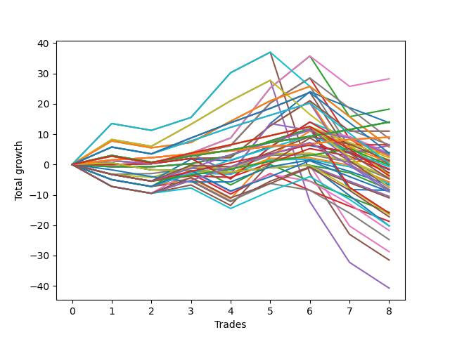

# Short Pointer 004 
- Symbol: ES
- Date Range: 03/18/2022 - 07/15/2022
- Trading Period: 7:20-12:30
- Number of Trades: 8



| Name | Win Percent | Profit | Avg Profit / Trade | Avg Time / Trade |      | Name | Win Percent | Profit | Avg Profit / Trade | Avg Time / Trade |
| ---- | ----------- | ------ | ------------------ | ---------------- | ---- | ---- | ----------- | ------ | ------------------ | ---------------- |
| Sorted By <br> Profit | | | | | | Sorted By <br> Win Percentage ||||
| Fifty-Eight | 75.00 | 14125.00 | 1765.62 | 12:24 |     | One Hundred Twenty-Six | 100.00 | 4500.00 | 562.50 | 06:08 |
| Two | 75.00 | 9125.00 | 1140.62 | 15:15 |     | One Hundred Twenty-One | 100.00 | 4500.00 | 562.50 | 06:08 |
| One Hundred Twenty-Seven | 87.50 | 7000.00 | 875.00 | 08:02 |     | Eighty-One | 100.00 | 4500.00 | 562.50 | 06:08 |
| One Hundred Twenty-Two | 87.50 | 7000.00 | 875.00 | 08:02 |     | One Hundred Twenty-Seven | 87.50 | 7000.00 | 875.00 | 08:02 |
| Eighty-Two | 87.50 | 7000.00 | 875.00 | 08:02 |     | One Hundred Twenty-Two | 87.50 | 7000.00 | 875.00 | 08:02 |
| Forty-Two | 50.00 | 6875.00 | 859.38 | 09:40 |     | Eighty-Two | 87.50 | 7000.00 | 875.00 | 08:02 |
| Fifty-Seven | 62.50 | 5500.00 | 687.50 | 09:01 |     | One Hundred Eleven | 87.50 | 1625.00 | 203.12 | 05:00 |
| One Hundred Twenty-Six | 100.00 | 4500.00 | 562.50 | 06:08 |     | One Hundred Sixteen | 87.50 | 1375.00 | 171.88 | 05:13 |
| One Hundred Twenty-One | 100.00 | 4500.00 | 562.50 | 06:08 |     | Fifty-Eight | 75.00 | 14125.00 | 1765.62 | 12:24 |
| Eighty-One | 100.00 | 4500.00 | 562.50 | 06:08 |     | Two | 75.00 | 9125.00 | 1140.62 | 15:15 |
| Fifty-Nine | 62.50 | 4250.00 | 531.25 | 14:40 |     | One Hundred Twelve | 75.00 | 3250.00 | 406.25 | 06:53 |
| One Hundred Twelve | 75.00 | 3250.00 | 406.25 | 06:53 |     | Fifty-Seven | 62.50 | 5500.00 | 687.50 | 09:01 |
| Sixty-Five | 50.00 | 3250.00 | 406.25 | 08:05 |     | Fifty-Nine | 62.50 | 4250.00 | 531.25 | 14:40 |
| Sixty-Six | 50.00 | 3125.00 | 390.62 | 09:53 |     | Sixty-Three | 62.50 | 2875.00 | 359.38 | 17:50 |
| Sixty-Three | 62.50 | 2875.00 | 359.38 | 17:50 |     | One Hundred Twenty-Five | 62.50 | 1875.00 | 234.38 | 14:47 |
| Sixty-One | 50.00 | 2875.00 | 359.38 | 23:18 |     | One Hundred Thirteen | 62.50 | 1125.00 | 140.62 | 07:48 |
| Sixty-Four | 50.00 | 2000.00 | 250.00 | 05:34 |     | One | 62.50 | 500.00 | 62.50 | 11:52 |
| One Hundred Twenty-Five | 62.50 | 1875.00 | 234.38 | 14:47 |     | One Hundred Twenty-Four | 62.50 | 125.00 | 15.62 | 12:27 |
| Forty-Eight | 50.00 | 1875.00 | 234.38 | 04:44 |     | Three | 62.50 | -0.00 | -0.00 | 18:53 |
| Forty-One | 50.00 | 1875.00 | 234.38 | 06:58 |     | One Hundred Seventeen | 62.50 | -125.00 | -15.62 | 06:56 |
| One Hundred Eleven | 87.50 | 1625.00 | 203.12 | 05:00 |     | Seven | 62.50 | -1375.00 | -171.88 | 22:03 |
| One Hundred Ninteen | 50.00 | 1625.00 | 203.12 | 08:16 |     | One Hundred Twenty-Eight | 62.50 | -1875.00 | -234.38 | 09:51 |
| One Hundred Sixteen | 87.50 | 1375.00 | 171.88 | 05:13 |     | Eighty-Five | 62.50 | -2375.00 | -296.88 | 19:01 |
| One Hundred Thirteen | 62.50 | 1125.00 | 140.62 | 07:48 |     | One Hundred Twenty-Three | 62.50 | -3750.00 | -468.75 | 10:04 |
| Fifty-Six | 50.00 | 750.00 | 93.75 | 05:39 |     | Eighty-Four | 62.50 | -4125.00 | -515.62 | 16:41 |
| Forty | 50.00 | 750.00 | 93.75 | 04:51 |     | Eighty-Three | 62.50 | -8000.00 | -1000.00 | 14:18 |
| One Hundred Twenty | 37.50 | 625.00 | 78.12 | 08:35 |     | Forty-Two | 50.00 | 6875.00 | 859.38 | 09:40 |
| One | 62.50 | 500.00 | 62.50 | 11:52 |     | Sixty-Five | 50.00 | 3250.00 | 406.25 | 08:05 |
| Forty-Three | 37.50 | 375.00 | 46.88 | 09:52 |     | Sixty-Six | 50.00 | 3125.00 | 390.62 | 09:53 |
| One Hundred Twenty-Four | 62.50 | 125.00 | 15.62 | 12:27 |     | Sixty-One | 50.00 | 2875.00 | 359.38 | 23:18 |
| Three | 62.50 | -0.00 | -0.00 | 18:53 |     | Sixty-Four | 50.00 | 2000.00 | 250.00 | 05:34 |
| One Hundred Seventeen | 62.50 | -125.00 | -15.62 | 06:56 |     | Forty-Eight | 50.00 | 1875.00 | 234.38 | 04:44 |
| One Hundred Fourteen | 50.00 | -375.00 | -46.88 | 08:53 |     | Forty-One | 50.00 | 1875.00 | 234.38 | 06:58 |
| One Hundred Eighteen | 50.00 | -750.00 | -93.75 | 07:31 |     | One Hundred Ninteen | 50.00 | 1625.00 | 203.12 | 08:16 |
| Fifty-Two | 37.50 | -875.00 | -109.38 | 09:14 |     | Fifty-Six | 50.00 | 750.00 | 93.75 | 05:39 |
| Seven | 62.50 | -1375.00 | -171.88 | 22:03 |     | Forty | 50.00 | 750.00 | 93.75 | 04:51 |
| Fifty-Five | 37.50 | -1375.00 | -171.88 | 08:15 |     | One Hundred Fourteen | 50.00 | -375.00 | -46.88 | 08:53 |
| Sixty | 50.00 | -1750.00 | -218.75 | 20:48 |     | One Hundred Eighteen | 50.00 | -750.00 | -93.75 | 07:31 |
| One Hundred Twenty-Eight | 62.50 | -1875.00 | -234.38 | 09:51 |     | Sixty | 50.00 | -1750.00 | -218.75 | 20:48 |
| Fifty | 37.50 | -2125.00 | -265.62 | 07:33 |     | Forty-Nine | 50.00 | -2375.00 | -296.88 | 05:58 |
| Eighty-Five | 62.50 | -2375.00 | -296.88 | 19:01 |     | Zero | 50.00 | -4250.00 | -531.25 | 08:30 |
| Forty-Nine | 50.00 | -2375.00 | -296.88 | 05:58 |     | One Hundred Twenty-Nine | 50.00 | -4500.00 | -562.50 | 11:07 |
| Fifty-Three | 37.50 | -2875.00 | -359.38 | 10:01 |     | Five | 50.00 | -15750.00 | -1968.75 | 29:01 |
| Fifty-One | 37.50 | -3125.00 | -390.62 | 08:27 |     | Four | 50.00 | -20375.00 | -2546.88 | 26:30 |
| Seventy-Three | 25.00 | -3375.00 | -421.88 | 05:57 |     | One Hundred Twenty | 37.50 | 625.00 | 78.12 | 08:35 |
| One Hundred Twenty-Three | 62.50 | -3750.00 | -468.75 | 10:04 |     | Forty-Three | 37.50 | 375.00 | 46.88 | 09:52 |
| Sixty-Seven | 37.50 | -3750.00 | -468.75 | 12:06 |     | Fifty-Two | 37.50 | -875.00 | -109.38 | 09:14 |
| Eighty-Four | 62.50 | -4125.00 | -515.62 | 16:41 |     | Fifty-Five | 37.50 | -1375.00 | -171.88 | 08:15 |
| Fifty-Four | 37.50 | -4125.00 | -515.62 | 04:42 |     | Fifty | 37.50 | -2125.00 | -265.62 | 07:33 |
| Zero | 50.00 | -4250.00 | -531.25 | 08:30 |     | Fifty-Three | 37.50 | -2875.00 | -359.38 | 10:01 |
| One Hundred Twenty-Nine | 50.00 | -4500.00 | -562.50 | 11:07 |     | Fifty-One | 37.50 | -3125.00 | -390.62 | 08:27 |
| One Hundred Fifteen | 37.50 | -4500.00 | -562.50 | 09:45 |     | Sixty-Seven | 37.50 | -3750.00 | -468.75 | 12:06 |
| Forty-Six | 37.50 | -5250.00 | -656.25 | 04:50 |     | Fifty-Four | 37.50 | -4125.00 | -515.62 | 04:42 |
| Forty-Seven | 37.50 | -5500.00 | -687.50 | 12:36 |     | One Hundred Fifteen | 37.50 | -4500.00 | -562.50 | 09:45 |
| Forty-Four | 25.00 | -7875.00 | -984.38 | 15:21 |     | Forty-Six | 37.50 | -5250.00 | -656.25 | 04:50 |
| Eighty-Three | 62.50 | -8000.00 | -1000.00 | 14:18 |     | Forty-Seven | 37.50 | -5500.00 | -687.50 | 12:36 |
| Seventy | 37.50 | -8250.00 | -1031.25 | 06:52 |     | Seventy | 37.50 | -8250.00 | -1031.25 | 06:52 |
| One Hundred Thirty | 37.50 | -8625.00 | -1078.12 | 11:58 |     | One Hundred Thirty | 37.50 | -8625.00 | -1078.12 | 11:58 |
| Forty-Five | 25.00 | -9375.00 | -1171.88 | 17:08 |     | Seventy-One | 37.50 | -10125.00 | -1265.62 | 12:00 |
| Seventy-One | 37.50 | -10125.00 | -1265.62 | 12:00 |     | Sixty-Two | 37.50 | -10125.00 | -1265.62 | 07:05 |
| Sixty-Two | 37.50 | -10125.00 | -1265.62 | 07:05 |     | Six | 37.50 | -14375.00 | -1796.88 | 11:19 |
| Sixty-Eight | 25.00 | -10875.00 | -1359.38 | 13:11 |     | Seventy-Three | 25.00 | -3375.00 | -421.88 | 05:57 |
| Sixty-Nine | 25.00 | -12375.00 | -1546.88 | 14:59 |     | Forty-Four | 25.00 | -7875.00 | -984.38 | 15:21 |
| Six | 37.50 | -14375.00 | -1796.88 | 11:19 |     | Forty-Five | 25.00 | -9375.00 | -1171.88 | 17:08 |
| Five | 50.00 | -15750.00 | -1968.75 | 29:01 |     | Sixty-Eight | 25.00 | -10875.00 | -1359.38 | 13:11 |
| Four | 50.00 | -20375.00 | -2546.88 | 26:30 |     | Sixty-Nine | 25.00 | -12375.00 | -1546.88 | 14:59 |

## NO STOPLOSS

### Test Zero
* Sell when price hits the middle line of the 20p bollinger
* No Stoploss
* Results:
```
Total Trades: 8
Percent Up: 50.00
Percent Down: 50.00
Total Points Moved Down: -8.50
Potential Profit: -4250.00
Total Points Ups: 21.00 Count Ups: 4
Total Points Downs: 12.50 Count Downs: 4
```

<details><summary>Trades</summary>

<code>In: 2022-03-21 11:32:00		Out: 2022-03-21 11:40:05		Total Position Time: 08:05		Total Move Down: -0.75		Total to Date: -0.75</code> <br />
<code>In: 2022-03-28 10:33:00		Out: 2022-03-28 10:42:15		Total Position Time: 09:15		Total Move Down: -0.00		Total to Date: -0.75</code> <br />
<code>In: 2022-04-11 10:09:00		Out: 2022-04-11 10:16:10		Total Position Time: 07:10		Total Move Down: 1.00		Total to Date: 0.25</code> <br />
<code>In: 2022-04-29 08:37:00		Out: 2022-04-29 08:38:45		Total Position Time: 01:45		Total Move Down: 2.75		Total to Date: 3.00</code> <br />
<code>In: 2022-05-05 10:11:00		Out: 2022-05-05 10:12:50		Total Position Time: 01:50		Total Move Down: 4.75		Total to Date: 7.75</code> <br />
<code>In: 2022-05-10 10:11:00		Out: 2022-05-10 10:13:55		Total Position Time: 02:55		Total Move Down: 4.00		Total to Date: 11.75</code> <br />
<code>In: 2022-06-30 08:02:00		Out: 2022-06-30 08:31:55		Total Position Time: 29:55		Total Move Down: -20.00		Total to Date: -8.25</code> <br />
<code>In: 2022-07-05 08:53:00		Out: 2022-07-05 09:00:10		Total Position Time: 07:10		Total Move Down: -0.25		Total to Date: -8.50</code> <br />


</details>

### Test One
* Sell when the price hits the upper line of the 20p 1std bollinger
* No Stoploss
* Results:
```
Total Trades: 8
Percent Up: 37.50
Percent Down: 62.50
Total Points Moved Down: 1.00
Potential Profit: 500.00
Total Points Ups: 20.00 Count Ups: 3
Total Points Downs: 21.00 Count Downs: 5
```

<details><summary>Trades</summary>

<code>In: 2022-03-21 11:32:00		Out: 2022-03-21 11:42:05		Total Position Time: 10:05		Total Move Down: -0.00		Total to Date: 0.00</code> <br />
<code>In: 2022-03-28 10:33:00		Out: 2022-03-28 10:44:05		Total Position Time: 11:05		Total Move Down: 0.25		Total to Date: 0.25</code> <br />
<code>In: 2022-04-11 10:09:00		Out: 2022-04-11 10:17:20		Total Position Time: 08:20		Total Move Down: 1.75		Total to Date: 2.00</code> <br />
<code>In: 2022-04-29 08:37:00		Out: 2022-04-29 08:52:25		Total Position Time: 15:25		Total Move Down: 0.25		Total to Date: 2.25</code> <br />
<code>In: 2022-05-05 10:11:00		Out: 2022-05-05 10:16:05		Total Position Time: 05:05		Total Move Down: 10.50		Total to Date: 12.75</code> <br />
<code>In: 2022-05-10 10:11:00		Out: 2022-05-10 10:15:40		Total Position Time: 04:40		Total Move Down: 8.25		Total to Date: 21.00</code> <br />
<code>In: 2022-06-30 08:02:00		Out: 2022-06-30 08:31:55		Total Position Time: 29:55		Total Move Down: -20.00		Total to Date: 1.00</code> <br />
<code>In: 2022-07-05 08:53:00		Out: 2022-07-05 09:03:25		Total Position Time: 10:25		Total Move Down: -0.00		Total to Date: 1.00</code> <br />


</details>

### Test Two
* Sell when the price hits the upper line of the 20p 2std bollinger
* No Stoploss
* Results:
```
Total Trades: 8
Percent Up: 25.00
Percent Down: 75.00
Total Points Moved Down: 18.25
Potential Profit: 9125.00
Total Points Ups: 21.00 Count Ups: 2
Total Points Downs: 39.25 Count Downs: 6
```

<details><summary>Trades</summary>

<code>In: 2022-03-21 11:32:00		Out: 2022-03-21 11:42:15		Total Position Time: 10:15		Total Move Down: 1.25		Total to Date: 1.25</code> <br />
<code>In: 2022-03-28 10:33:00		Out: 2022-03-28 10:55:00		Total Position Time: 22:00		Total Move Down: -1.00		Total to Date: 0.25</code> <br />
<code>In: 2022-04-11 10:09:00		Out: 2022-04-11 10:19:05		Total Position Time: 10:05		Total Move Down: 3.50		Total to Date: 3.75</code> <br />
<code>In: 2022-04-29 08:37:00		Out: 2022-04-29 08:57:25		Total Position Time: 20:25		Total Move Down: 5.00		Total to Date: 8.75</code> <br />
<code>In: 2022-05-05 10:11:00		Out: 2022-05-05 10:16:35		Total Position Time: 05:35		Total Move Down: 16.50		Total to Date: 25.25</code> <br />
<code>In: 2022-05-10 10:11:00		Out: 2022-05-10 10:24:00		Total Position Time: 13:00		Total Move Down: 10.50		Total to Date: 35.75</code> <br />
<code>In: 2022-06-30 08:02:00		Out: 2022-06-30 08:31:55		Total Position Time: 29:55		Total Move Down: -20.00		Total to Date: 15.75</code> <br />
<code>In: 2022-07-05 08:53:00		Out: 2022-07-05 09:03:50		Total Position Time: 10:50		Total Move Down: 2.50		Total to Date: 18.25</code> <br />


</details>

### Test Three
* Sell when price hits the middle line of the 50p bollinger
* No Stoploss
* Results:
```
Total Trades: 8
Percent Up: 37.50
Percent Down: 62.50
Total Points Moved Down: -0.00
Potential Profit: -0.00
Total Points Ups: 30.75 Count Ups: 3
Total Points Downs: 30.75 Count Downs: 5
```

<details><summary>Trades</summary>

<code>In: 2022-03-21 11:32:00		Out: 2022-03-21 11:54:50		Total Position Time: 22:50		Total Move Down: 2.75		Total to Date: 2.75</code> <br />
<code>In: 2022-03-28 10:33:00		Out: 2022-03-28 11:02:55		Total Position Time: 29:55		Total Move Down: -2.25		Total to Date: 0.50</code> <br />
<code>In: 2022-04-11 10:09:00		Out: 2022-04-11 10:18:20		Total Position Time: 09:20		Total Move Down: 2.75		Total to Date: 3.25</code> <br />
<code>In: 2022-04-29 08:37:00		Out: 2022-04-29 08:56:10		Total Position Time: 19:10		Total Move Down: 3.00		Total to Date: 6.25</code> <br />
<code>In: 2022-05-05 10:11:00		Out: 2022-05-05 10:16:25		Total Position Time: 05:25		Total Move Down: 14.00		Total to Date: 20.25</code> <br />
<code>In: 2022-05-10 10:11:00		Out: 2022-05-10 10:15:40		Total Position Time: 04:40		Total Move Down: 8.25		Total to Date: 28.50</code> <br />
<code>In: 2022-06-30 08:02:00		Out: 2022-06-30 08:31:55		Total Position Time: 29:55		Total Move Down: -20.00		Total to Date: 8.50</code> <br />
<code>In: 2022-07-05 08:53:00		Out: 2022-07-05 09:22:55		Total Position Time: 29:55		Total Move Down: -8.50		Total to Date: 0.00</code> <br />


</details>

### Test Four
* Sell when the price hits the upper line of the 50p 1std bollinger
* No Stoploss
* Results:
```
Total Trades: 8
Percent Up: 50.00
Percent Down: 50.00
Total Points Moved Down: -40.75
Potential Profit: -20375.00
Total Points Ups: 70.75 Count Ups: 4
Total Points Downs: 30.00 Count Downs: 4
```

<details><summary>Trades</summary>

<code>In: 2022-03-21 11:32:00		Out: 2022-03-21 11:56:35		Total Position Time: 24:35		Total Move Down: 8.25		Total to Date: 8.25</code> <br />
<code>In: 2022-03-28 10:33:00		Out: 2022-03-28 11:02:55		Total Position Time: 29:55		Total Move Down: -2.25		Total to Date: 6.00</code> <br />
<code>In: 2022-04-11 10:09:00		Out: 2022-04-11 10:24:35		Total Position Time: 15:35		Total Move Down: 7.25		Total to Date: 13.25</code> <br />
<code>In: 2022-04-29 08:37:00		Out: 2022-04-29 08:59:20		Total Position Time: 22:20		Total Move Down: 7.75		Total to Date: 21.00</code> <br />
<code>In: 2022-05-05 10:11:00		Out: 2022-05-05 10:40:55		Total Position Time: 29:55		Total Move Down: 6.75		Total to Date: 27.75</code> <br />
<code>In: 2022-05-10 10:11:00		Out: 2022-05-10 10:40:55		Total Position Time: 29:55		Total Move Down: -40.00		Total to Date: -12.25</code> <br />
<code>In: 2022-06-30 08:02:00		Out: 2022-06-30 08:31:55		Total Position Time: 29:55		Total Move Down: -20.00		Total to Date: -32.25</code> <br />
<code>In: 2022-07-05 08:53:00		Out: 2022-07-05 09:22:55		Total Position Time: 29:55		Total Move Down: -8.50		Total to Date: -40.75</code> <br />


</details>

### Test Five
* Sell when the price hits the upper line of the 50p 2std bollinger
* No Stoploss
* Results:
```
Total Trades: 8
Percent Up: 50.00
Percent Down: 50.00
Total Points Moved Down: -31.50
Potential Profit: -15750.00
Total Points Ups: 70.75 Count Ups: 4
Total Points Downs: 39.25 Count Downs: 4
```

<details><summary>Trades</summary>

<code>In: 2022-03-21 11:32:00		Out: 2022-03-21 11:59:15		Total Position Time: 27:15		Total Move Down: 13.50		Total to Date: 13.50</code> <br />
<code>In: 2022-03-28 10:33:00		Out: 2022-03-28 11:02:55		Total Position Time: 29:55		Total Move Down: -2.25		Total to Date: 11.25</code> <br />
<code>In: 2022-04-11 10:09:00		Out: 2022-04-11 10:38:55		Total Position Time: 29:55		Total Move Down: 4.25		Total to Date: 15.50</code> <br />
<code>In: 2022-04-29 08:37:00		Out: 2022-04-29 09:02:25		Total Position Time: 25:25		Total Move Down: 14.75		Total to Date: 30.25</code> <br />
<code>In: 2022-05-05 10:11:00		Out: 2022-05-05 10:40:55		Total Position Time: 29:55		Total Move Down: 6.75		Total to Date: 37.00</code> <br />
<code>In: 2022-05-10 10:11:00		Out: 2022-05-10 10:40:55		Total Position Time: 29:55		Total Move Down: -40.00		Total to Date: -3.00</code> <br />
<code>In: 2022-06-30 08:02:00		Out: 2022-06-30 08:31:55		Total Position Time: 29:55		Total Move Down: -20.00		Total to Date: -23.00</code> <br />
<code>In: 2022-07-05 08:53:00		Out: 2022-07-05 09:22:55		Total Position Time: 29:55		Total Move Down: -8.50		Total to Date: -31.50</code> <br />


</details>

### Test Six
* Sell when the price hits the middle line of the 1std VWAP
* No Stoploss
* Results:
```
Total Trades: 8
Percent Up: 62.50
Percent Down: 37.50
Total Points Moved Down: -28.75
Potential Profit: -14375.00
Total Points Ups: 31.50 Count Ups: 5
Total Points Downs: 2.75 Count Downs: 3
```

<details><summary>Trades</summary>

<code>In: 2022-03-21 11:32:00		Out: 2022-03-21 11:32:10		Total Position Time: 00:10		Total Move Down: 0.50		Total to Date: 0.50</code> <br />
<code>In: 2022-03-28 10:33:00		Out: 2022-03-28 11:02:55		Total Position Time: 29:55		Total Move Down: -2.25		Total to Date: -1.75</code> <br />
<code>In: 2022-04-11 10:09:00		Out: 2022-04-11 10:09:10		Total Position Time: 00:10		Total Move Down: -0.25		Total to Date: -2.00</code> <br />
<code>In: 2022-04-29 08:37:00		Out: 2022-04-29 08:37:10		Total Position Time: 00:10		Total Move Down: -0.50		Total to Date: -2.50</code> <br />
<code>In: 2022-05-05 10:11:00		Out: 2022-05-05 10:11:10		Total Position Time: 00:10		Total Move Down: 1.50		Total to Date: -1.00</code> <br />
<code>In: 2022-05-10 10:11:00		Out: 2022-05-10 10:11:10		Total Position Time: 00:10		Total Move Down: 0.75		Total to Date: -0.25</code> <br />
<code>In: 2022-06-30 08:02:00		Out: 2022-06-30 08:31:55		Total Position Time: 29:55		Total Move Down: -20.00		Total to Date: -20.25</code> <br />
<code>In: 2022-07-05 08:53:00		Out: 2022-07-05 09:22:55		Total Position Time: 29:55		Total Move Down: -8.50		Total to Date: -28.75</code> <br />


</details>

### Test Seven
* Sell when the price hits the upper line of the 1std VWAP
* No Stoploss
* Results:
```
Total Trades: 8
Percent Up: 37.50
Percent Down: 62.50
Total Points Moved Down: -2.75
Potential Profit: -1375.00
Total Points Ups: 30.75 Count Ups: 3
Total Points Downs: 28.00 Count Downs: 5
```

<details><summary>Trades</summary>

<code>In: 2022-03-21 11:32:00		Out: 2022-03-21 11:56:05		Total Position Time: 24:05		Total Move Down: 7.75		Total to Date: 7.75</code> <br />
<code>In: 2022-03-28 10:33:00		Out: 2022-03-28 11:02:55		Total Position Time: 29:55		Total Move Down: -2.25		Total to Date: 5.50</code> <br />
<code>In: 2022-04-11 10:09:00		Out: 2022-04-11 10:17:20		Total Position Time: 08:20		Total Move Down: 1.75		Total to Date: 7.25</code> <br />
<code>In: 2022-04-29 08:37:00		Out: 2022-04-29 08:58:20		Total Position Time: 21:20		Total Move Down: 7.00		Total to Date: 14.25</code> <br />
<code>In: 2022-05-05 10:11:00		Out: 2022-05-05 10:40:55		Total Position Time: 29:55		Total Move Down: 6.75		Total to Date: 21.00</code> <br />
<code>In: 2022-05-10 10:11:00		Out: 2022-05-10 10:14:05		Total Position Time: 03:05		Total Move Down: 4.75		Total to Date: 25.75</code> <br />
<code>In: 2022-06-30 08:02:00		Out: 2022-06-30 08:31:55		Total Position Time: 29:55		Total Move Down: -20.00		Total to Date: 5.75</code> <br />
<code>In: 2022-07-05 08:53:00		Out: 2022-07-05 09:22:55		Total Position Time: 29:55		Total Move Down: -8.50		Total to Date: -2.75</code> <br />


</details>

## STOPLOSS OF 5

### Test Forty
* Sell when price hits the middle line of the 20p bollinger
* Stoploss is -5 points
* Results:
```
Total Trades: 8
Percent Up: 50.00
Percent Down: 50.00
Total Points Moved Down: 1.50
Potential Profit: 750.00
Total Points Ups: 11.00 Count Ups: 4
Total Points Downs: 12.50 Count Downs: 4
```

<details><summary>Trades</summary>

<code>In: 2022-03-21 11:32:00		Out: 2022-03-21 11:40:05		Total Position Time: 08:05		Total Move Down: -0.75		Total to Date: -0.75</code> <br />
<code>In: 2022-03-28 10:33:00		Out: 2022-03-28 10:42:15		Total Position Time: 09:15		Total Move Down: -0.00		Total to Date: -0.75</code> <br />
<code>In: 2022-04-11 10:09:00		Out: 2022-04-11 10:16:10		Total Position Time: 07:10		Total Move Down: 1.00		Total to Date: 0.25</code> <br />
<code>In: 2022-04-29 08:37:00		Out: 2022-04-29 08:38:45		Total Position Time: 01:45		Total Move Down: 2.75		Total to Date: 3.00</code> <br />
<code>In: 2022-05-05 10:11:00		Out: 2022-05-05 10:12:50		Total Position Time: 01:50		Total Move Down: 4.75		Total to Date: 7.75</code> <br />
<code>In: 2022-05-10 10:11:00		Out: 2022-05-10 10:13:55		Total Position Time: 02:55		Total Move Down: 4.00		Total to Date: 11.75</code> <br />
<code>In: 2022-06-30 08:02:00		Out: 2022-06-30 08:08:15		Total Position Time: 06:15		Total Move Down: -5.25		Total to Date: 6.50</code> <br />
<code>In: 2022-07-05 08:53:00		Out: 2022-07-05 08:54:40		Total Position Time: 01:40		Total Move Down: -5.00		Total to Date: 1.50</code> <br />


</details>

### Test Forty-One
* Sell when the price hits the upper line of the 20p 1std bollinger
* Stoploss is -5 points
* Results:
```
Total Trades: 8
Percent Up: 50.00
Percent Down: 50.00
Total Points Moved Down: 3.75
Potential Profit: 1875.00
Total Points Ups: 17.00 Count Ups: 4
Total Points Downs: 20.75 Count Downs: 4
```

<details><summary>Trades</summary>

<code>In: 2022-03-21 11:32:00		Out: 2022-03-21 11:42:05		Total Position Time: 10:05		Total Move Down: -0.00		Total to Date: 0.00</code> <br />
<code>In: 2022-03-28 10:33:00		Out: 2022-03-28 10:44:05		Total Position Time: 11:05		Total Move Down: 0.25		Total to Date: 0.25</code> <br />
<code>In: 2022-04-11 10:09:00		Out: 2022-04-11 10:17:20		Total Position Time: 08:20		Total Move Down: 1.75		Total to Date: 2.00</code> <br />
<code>In: 2022-04-29 08:37:00		Out: 2022-04-29 08:45:35		Total Position Time: 08:35		Total Move Down: -6.75		Total to Date: -4.75</code> <br />
<code>In: 2022-05-05 10:11:00		Out: 2022-05-05 10:16:05		Total Position Time: 05:05		Total Move Down: 10.50		Total to Date: 5.75</code> <br />
<code>In: 2022-05-10 10:11:00		Out: 2022-05-10 10:15:40		Total Position Time: 04:40		Total Move Down: 8.25		Total to Date: 14.00</code> <br />
<code>In: 2022-06-30 08:02:00		Out: 2022-06-30 08:08:15		Total Position Time: 06:15		Total Move Down: -5.25		Total to Date: 8.75</code> <br />
<code>In: 2022-07-05 08:53:00		Out: 2022-07-05 08:54:40		Total Position Time: 01:40		Total Move Down: -5.00		Total to Date: 3.75</code> <br />


</details>

### Test Forty-Two
* Sell when the price hits the upper line of the 20p 2std bollinger
* Stoploss is -5 points
* Results:
```
Total Trades: 8
Percent Up: 50.00
Percent Down: 50.00
Total Points Moved Down: 13.75
Potential Profit: 6875.00
Total Points Ups: 18.00 Count Ups: 4
Total Points Downs: 31.75 Count Downs: 4
```

<details><summary>Trades</summary>

<code>In: 2022-03-21 11:32:00		Out: 2022-03-21 11:42:15		Total Position Time: 10:15		Total Move Down: 1.25		Total to Date: 1.25</code> <br />
<code>In: 2022-03-28 10:33:00		Out: 2022-03-28 10:55:00		Total Position Time: 22:00		Total Move Down: -1.00		Total to Date: 0.25</code> <br />
<code>In: 2022-04-11 10:09:00		Out: 2022-04-11 10:19:05		Total Position Time: 10:05		Total Move Down: 3.50		Total to Date: 3.75</code> <br />
<code>In: 2022-04-29 08:37:00		Out: 2022-04-29 08:45:35		Total Position Time: 08:35		Total Move Down: -6.75		Total to Date: -3.00</code> <br />
<code>In: 2022-05-05 10:11:00		Out: 2022-05-05 10:16:35		Total Position Time: 05:35		Total Move Down: 16.50		Total to Date: 13.50</code> <br />
<code>In: 2022-05-10 10:11:00		Out: 2022-05-10 10:24:00		Total Position Time: 13:00		Total Move Down: 10.50		Total to Date: 24.00</code> <br />
<code>In: 2022-06-30 08:02:00		Out: 2022-06-30 08:08:15		Total Position Time: 06:15		Total Move Down: -5.25		Total to Date: 18.75</code> <br />
<code>In: 2022-07-05 08:53:00		Out: 2022-07-05 08:54:40		Total Position Time: 01:40		Total Move Down: -5.00		Total to Date: 13.75</code> <br />


</details>

### Test Forty-Three
* Sell when price hits the middle line of the 50p bollinger
* Stoploss is -5 points
* Results:
```
Total Trades: 8
Percent Up: 62.50
Percent Down: 37.50
Total Points Moved Down: 0.75
Potential Profit: 375.00
Total Points Ups: 24.25 Count Ups: 5
Total Points Downs: 25.00 Count Downs: 3
```

<details><summary>Trades</summary>

<code>In: 2022-03-21 11:32:00		Out: 2022-03-21 11:45:10		Total Position Time: 13:10		Total Move Down: -5.00		Total to Date: -5.00</code> <br />
<code>In: 2022-03-28 10:33:00		Out: 2022-03-28 11:02:55		Total Position Time: 29:55		Total Move Down: -2.25		Total to Date: -7.25</code> <br />
<code>In: 2022-04-11 10:09:00		Out: 2022-04-11 10:18:20		Total Position Time: 09:20		Total Move Down: 2.75		Total to Date: -4.50</code> <br />
<code>In: 2022-04-29 08:37:00		Out: 2022-04-29 08:45:35		Total Position Time: 08:35		Total Move Down: -6.75		Total to Date: -11.25</code> <br />
<code>In: 2022-05-05 10:11:00		Out: 2022-05-05 10:16:25		Total Position Time: 05:25		Total Move Down: 14.00		Total to Date: 2.75</code> <br />
<code>In: 2022-05-10 10:11:00		Out: 2022-05-10 10:15:40		Total Position Time: 04:40		Total Move Down: 8.25		Total to Date: 11.00</code> <br />
<code>In: 2022-06-30 08:02:00		Out: 2022-06-30 08:08:15		Total Position Time: 06:15		Total Move Down: -5.25		Total to Date: 5.75</code> <br />
<code>In: 2022-07-05 08:53:00		Out: 2022-07-05 08:54:40		Total Position Time: 01:40		Total Move Down: -5.00		Total to Date: 0.75</code> <br />


</details>

### Test Forty-Four
* Sell when the price hits the upper line of the 50p 1std bollinger
* Stoploss is -5 points
* Results:
```
Total Trades: 8
Percent Up: 75.00
Percent Down: 25.00
Total Points Moved Down: -15.75
Potential Profit: -7875.00
Total Points Ups: 29.75 Count Ups: 6
Total Points Downs: 14.00 Count Downs: 2
```

<details><summary>Trades</summary>

<code>In: 2022-03-21 11:32:00		Out: 2022-03-21 11:45:10		Total Position Time: 13:10		Total Move Down: -5.00		Total to Date: -5.00</code> <br />
<code>In: 2022-03-28 10:33:00		Out: 2022-03-28 11:02:55		Total Position Time: 29:55		Total Move Down: -2.25		Total to Date: -7.25</code> <br />
<code>In: 2022-04-11 10:09:00		Out: 2022-04-11 10:24:35		Total Position Time: 15:35		Total Move Down: 7.25		Total to Date: 0.00</code> <br />
<code>In: 2022-04-29 08:37:00		Out: 2022-04-29 08:45:35		Total Position Time: 08:35		Total Move Down: -6.75		Total to Date: -6.75</code> <br />
<code>In: 2022-05-05 10:11:00		Out: 2022-05-05 10:40:55		Total Position Time: 29:55		Total Move Down: 6.75		Total to Date: 0.00</code> <br />
<code>In: 2022-05-10 10:11:00		Out: 2022-05-10 10:28:45		Total Position Time: 17:45		Total Move Down: -5.50		Total to Date: -5.50</code> <br />
<code>In: 2022-06-30 08:02:00		Out: 2022-06-30 08:08:15		Total Position Time: 06:15		Total Move Down: -5.25		Total to Date: -10.75</code> <br />
<code>In: 2022-07-05 08:53:00		Out: 2022-07-05 08:54:40		Total Position Time: 01:40		Total Move Down: -5.00		Total to Date: -15.75</code> <br />


</details>

### Test Forty-Five
* Sell when the price hits the upper line of the 50p 2std bollinger
* Stoploss is -5 points
* Results:
```
Total Trades: 8
Percent Up: 75.00
Percent Down: 25.00
Total Points Moved Down: -18.75
Potential Profit: -9375.00
Total Points Ups: 29.75 Count Ups: 6
Total Points Downs: 11.00 Count Downs: 2
```

<details><summary>Trades</summary>

<code>In: 2022-03-21 11:32:00		Out: 2022-03-21 11:45:10		Total Position Time: 13:10		Total Move Down: -5.00		Total to Date: -5.00</code> <br />
<code>In: 2022-03-28 10:33:00		Out: 2022-03-28 11:02:55		Total Position Time: 29:55		Total Move Down: -2.25		Total to Date: -7.25</code> <br />
<code>In: 2022-04-11 10:09:00		Out: 2022-04-11 10:38:55		Total Position Time: 29:55		Total Move Down: 4.25		Total to Date: -3.00</code> <br />
<code>In: 2022-04-29 08:37:00		Out: 2022-04-29 08:45:35		Total Position Time: 08:35		Total Move Down: -6.75		Total to Date: -9.75</code> <br />
<code>In: 2022-05-05 10:11:00		Out: 2022-05-05 10:40:55		Total Position Time: 29:55		Total Move Down: 6.75		Total to Date: -3.00</code> <br />
<code>In: 2022-05-10 10:11:00		Out: 2022-05-10 10:28:45		Total Position Time: 17:45		Total Move Down: -5.50		Total to Date: -8.50</code> <br />
<code>In: 2022-06-30 08:02:00		Out: 2022-06-30 08:08:15		Total Position Time: 06:15		Total Move Down: -5.25		Total to Date: -13.75</code> <br />
<code>In: 2022-07-05 08:53:00		Out: 2022-07-05 08:54:40		Total Position Time: 01:40		Total Move Down: -5.00		Total to Date: -18.75</code> <br />


</details>

### Test Forty-Six
* Sell when the price hits the middle line of the 1std VWAP
* Stoploss is -5 points
* Results:
```
Total Trades: 8
Percent Up: 62.50
Percent Down: 37.50
Total Points Moved Down: -10.50
Potential Profit: -5250.00
Total Points Ups: 13.25 Count Ups: 5
Total Points Downs: 2.75 Count Downs: 3
```

<details><summary>Trades</summary>

<code>In: 2022-03-21 11:32:00		Out: 2022-03-21 11:32:10		Total Position Time: 00:10		Total Move Down: 0.50		Total to Date: 0.50</code> <br />
<code>In: 2022-03-28 10:33:00		Out: 2022-03-28 11:02:55		Total Position Time: 29:55		Total Move Down: -2.25		Total to Date: -1.75</code> <br />
<code>In: 2022-04-11 10:09:00		Out: 2022-04-11 10:09:10		Total Position Time: 00:10		Total Move Down: -0.25		Total to Date: -2.00</code> <br />
<code>In: 2022-04-29 08:37:00		Out: 2022-04-29 08:37:10		Total Position Time: 00:10		Total Move Down: -0.50		Total to Date: -2.50</code> <br />
<code>In: 2022-05-05 10:11:00		Out: 2022-05-05 10:11:10		Total Position Time: 00:10		Total Move Down: 1.50		Total to Date: -1.00</code> <br />
<code>In: 2022-05-10 10:11:00		Out: 2022-05-10 10:11:10		Total Position Time: 00:10		Total Move Down: 0.75		Total to Date: -0.25</code> <br />
<code>In: 2022-06-30 08:02:00		Out: 2022-06-30 08:08:15		Total Position Time: 06:15		Total Move Down: -5.25		Total to Date: -5.50</code> <br />
<code>In: 2022-07-05 08:53:00		Out: 2022-07-05 08:54:40		Total Position Time: 01:40		Total Move Down: -5.00		Total to Date: -10.50</code> <br />


</details>

### Test Forty-Seven
* Sell when the price hits the upper line of the 1std VWAP
* Stoploss is -5 points
* Results:
```
Total Trades: 8
Percent Up: 62.50
Percent Down: 37.50
Total Points Moved Down: -11.00
Potential Profit: -5500.00
Total Points Ups: 24.25 Count Ups: 5
Total Points Downs: 13.25 Count Downs: 3
```

<details><summary>Trades</summary>

<code>In: 2022-03-21 11:32:00		Out: 2022-03-21 11:45:10		Total Position Time: 13:10		Total Move Down: -5.00		Total to Date: -5.00</code> <br />
<code>In: 2022-03-28 10:33:00		Out: 2022-03-28 11:02:55		Total Position Time: 29:55		Total Move Down: -2.25		Total to Date: -7.25</code> <br />
<code>In: 2022-04-11 10:09:00		Out: 2022-04-11 10:17:20		Total Position Time: 08:20		Total Move Down: 1.75		Total to Date: -5.50</code> <br />
<code>In: 2022-04-29 08:37:00		Out: 2022-04-29 08:45:35		Total Position Time: 08:35		Total Move Down: -6.75		Total to Date: -12.25</code> <br />
<code>In: 2022-05-05 10:11:00		Out: 2022-05-05 10:40:55		Total Position Time: 29:55		Total Move Down: 6.75		Total to Date: -5.50</code> <br />
<code>In: 2022-05-10 10:11:00		Out: 2022-05-10 10:14:05		Total Position Time: 03:05		Total Move Down: 4.75		Total to Date: -0.75</code> <br />
<code>In: 2022-06-30 08:02:00		Out: 2022-06-30 08:08:15		Total Position Time: 06:15		Total Move Down: -5.25		Total to Date: -6.00</code> <br />
<code>In: 2022-07-05 08:53:00		Out: 2022-07-05 08:54:40		Total Position Time: 01:40		Total Move Down: -5.00		Total to Date: -11.00</code> <br />


</details>

## TRAIL STOP OF 5

### Test Forty-Eight
* Sell when price hits the middle line of the 20p bollinger
* Trailing Stop is -5 points
* Results:
```
Total Trades: 8
Percent Up: 50.00
Percent Down: 50.00
Total Points Moved Down: 3.75
Potential Profit: 1875.00
Total Points Ups: 8.75 Count Ups: 4
Total Points Downs: 12.50 Count Downs: 4
```

<details><summary>Trades</summary>

<code>In: 2022-03-21 11:32:00		Out: 2022-03-21 11:40:05		Total Position Time: 08:05		Total Move Down: -0.75		Total to Date: -0.75</code> <br />
<code>In: 2022-03-28 10:33:00		Out: 2022-03-28 10:42:15		Total Position Time: 09:15		Total Move Down: -0.00		Total to Date: -0.75</code> <br />
<code>In: 2022-04-11 10:09:00		Out: 2022-04-11 10:16:10		Total Position Time: 07:10		Total Move Down: 1.00		Total to Date: 0.25</code> <br />
<code>In: 2022-04-29 08:37:00		Out: 2022-04-29 08:38:45		Total Position Time: 01:45		Total Move Down: 2.75		Total to Date: 3.00</code> <br />
<code>In: 2022-05-05 10:11:00		Out: 2022-05-05 10:12:50		Total Position Time: 01:50		Total Move Down: 4.75		Total to Date: 7.75</code> <br />
<code>In: 2022-05-10 10:11:00		Out: 2022-05-10 10:13:55		Total Position Time: 02:55		Total Move Down: 4.00		Total to Date: 11.75</code> <br />
<code>In: 2022-06-30 08:02:00		Out: 2022-06-30 08:05:35		Total Position Time: 03:35		Total Move Down: -2.50		Total to Date: 9.25</code> <br />
<code>In: 2022-07-05 08:53:00		Out: 2022-07-05 08:56:20		Total Position Time: 03:20		Total Move Down: -5.50		Total to Date: 3.75</code> <br />


</details>

### Test Forty-Nine
* Sell when the price hits the upper line of the 20p 1std bollinger
* Trailing Stop is -5 points
* Results:
```
Total Trades: 8
Percent Up: 50.00
Percent Down: 50.00
Total Points Moved Down: -4.75
Potential Profit: -2375.00
Total Points Ups: 11.75 Count Ups: 4
Total Points Downs: 7.00 Count Downs: 4
```

<details><summary>Trades</summary>

<code>In: 2022-03-21 11:32:00		Out: 2022-03-21 11:41:15		Total Position Time: 09:15		Total Move Down: -3.25		Total to Date: -3.25</code> <br />
<code>In: 2022-03-28 10:33:00		Out: 2022-03-28 10:44:05		Total Position Time: 11:05		Total Move Down: 0.25		Total to Date: -3.00</code> <br />
<code>In: 2022-04-11 10:09:00		Out: 2022-04-11 10:17:20		Total Position Time: 08:20		Total Move Down: 1.75		Total to Date: -1.25</code> <br />
<code>In: 2022-04-29 08:37:00		Out: 2022-04-29 08:41:10		Total Position Time: 04:10		Total Move Down: -0.50		Total to Date: -1.75</code> <br />
<code>In: 2022-05-05 10:11:00		Out: 2022-05-05 10:15:20		Total Position Time: 04:20		Total Move Down: 4.75		Total to Date: 3.00</code> <br />
<code>In: 2022-05-10 10:11:00		Out: 2022-05-10 10:14:45		Total Position Time: 03:45		Total Move Down: 0.25		Total to Date: 3.25</code> <br />
<code>In: 2022-06-30 08:02:00		Out: 2022-06-30 08:05:35		Total Position Time: 03:35		Total Move Down: -2.50		Total to Date: 0.75</code> <br />
<code>In: 2022-07-05 08:53:00		Out: 2022-07-05 08:56:20		Total Position Time: 03:20		Total Move Down: -5.50		Total to Date: -4.75</code> <br />


</details>

### Test Fifty
* Sell when the price hits the upper line of the 20p 2std bollinger
* Trailing Stop is -5 points
* Results:
```
Total Trades: 8
Percent Up: 62.50
Percent Down: 37.50
Total Points Moved Down: -4.25
Potential Profit: -2125.00
Total Points Ups: 12.75 Count Ups: 5
Total Points Downs: 8.50 Count Downs: 3
```

<details><summary>Trades</summary>

<code>In: 2022-03-21 11:32:00		Out: 2022-03-21 11:41:15		Total Position Time: 09:15		Total Move Down: -3.25		Total to Date: -3.25</code> <br />
<code>In: 2022-03-28 10:33:00		Out: 2022-03-28 10:55:00		Total Position Time: 22:00		Total Move Down: -1.00		Total to Date: -4.25</code> <br />
<code>In: 2022-04-11 10:09:00		Out: 2022-04-11 10:19:05		Total Position Time: 10:05		Total Move Down: 3.50		Total to Date: -0.75</code> <br />
<code>In: 2022-04-29 08:37:00		Out: 2022-04-29 08:41:10		Total Position Time: 04:10		Total Move Down: -0.50		Total to Date: -1.25</code> <br />
<code>In: 2022-05-05 10:11:00		Out: 2022-05-05 10:15:20		Total Position Time: 04:20		Total Move Down: 4.75		Total to Date: 3.50</code> <br />
<code>In: 2022-05-10 10:11:00		Out: 2022-05-10 10:14:45		Total Position Time: 03:45		Total Move Down: 0.25		Total to Date: 3.75</code> <br />
<code>In: 2022-06-30 08:02:00		Out: 2022-06-30 08:05:35		Total Position Time: 03:35		Total Move Down: -2.50		Total to Date: 1.25</code> <br />
<code>In: 2022-07-05 08:53:00		Out: 2022-07-05 08:56:20		Total Position Time: 03:20		Total Move Down: -5.50		Total to Date: -4.25</code> <br />


</details>

### Test Fifty-One
* Sell when price hits the middle line of the 50p bollinger
* Trailing Stop is -5 points
* Results:
```
Total Trades: 8
Percent Up: 62.50
Percent Down: 37.50
Total Points Moved Down: -6.25
Potential Profit: -3125.00
Total Points Ups: 14.00 Count Ups: 5
Total Points Downs: 7.75 Count Downs: 3
```

<details><summary>Trades</summary>

<code>In: 2022-03-21 11:32:00		Out: 2022-03-21 11:41:15		Total Position Time: 09:15		Total Move Down: -3.25		Total to Date: -3.25</code> <br />
<code>In: 2022-03-28 10:33:00		Out: 2022-03-28 11:02:55		Total Position Time: 29:55		Total Move Down: -2.25		Total to Date: -5.50</code> <br />
<code>In: 2022-04-11 10:09:00		Out: 2022-04-11 10:18:20		Total Position Time: 09:20		Total Move Down: 2.75		Total to Date: -2.75</code> <br />
<code>In: 2022-04-29 08:37:00		Out: 2022-04-29 08:41:10		Total Position Time: 04:10		Total Move Down: -0.50		Total to Date: -3.25</code> <br />
<code>In: 2022-05-05 10:11:00		Out: 2022-05-05 10:15:20		Total Position Time: 04:20		Total Move Down: 4.75		Total to Date: 1.50</code> <br />
<code>In: 2022-05-10 10:11:00		Out: 2022-05-10 10:14:45		Total Position Time: 03:45		Total Move Down: 0.25		Total to Date: 1.75</code> <br />
<code>In: 2022-06-30 08:02:00		Out: 2022-06-30 08:05:35		Total Position Time: 03:35		Total Move Down: -2.50		Total to Date: -0.75</code> <br />
<code>In: 2022-07-05 08:53:00		Out: 2022-07-05 08:56:20		Total Position Time: 03:20		Total Move Down: -5.50		Total to Date: -6.25</code> <br />


</details>

### Test Fifty-Two
* Sell when the price hits the upper line of the 50p 1std bollinger
* Trailing Stop is -5 points
* Results:
```
Total Trades: 8
Percent Up: 62.50
Percent Down: 37.50
Total Points Moved Down: -1.75
Potential Profit: -875.00
Total Points Ups: 14.00 Count Ups: 5
Total Points Downs: 12.25 Count Downs: 3
```

<details><summary>Trades</summary>

<code>In: 2022-03-21 11:32:00		Out: 2022-03-21 11:41:15		Total Position Time: 09:15		Total Move Down: -3.25		Total to Date: -3.25</code> <br />
<code>In: 2022-03-28 10:33:00		Out: 2022-03-28 11:02:55		Total Position Time: 29:55		Total Move Down: -2.25		Total to Date: -5.50</code> <br />
<code>In: 2022-04-11 10:09:00		Out: 2022-04-11 10:24:35		Total Position Time: 15:35		Total Move Down: 7.25		Total to Date: 1.75</code> <br />
<code>In: 2022-04-29 08:37:00		Out: 2022-04-29 08:41:10		Total Position Time: 04:10		Total Move Down: -0.50		Total to Date: 1.25</code> <br />
<code>In: 2022-05-05 10:11:00		Out: 2022-05-05 10:15:20		Total Position Time: 04:20		Total Move Down: 4.75		Total to Date: 6.00</code> <br />
<code>In: 2022-05-10 10:11:00		Out: 2022-05-10 10:14:45		Total Position Time: 03:45		Total Move Down: 0.25		Total to Date: 6.25</code> <br />
<code>In: 2022-06-30 08:02:00		Out: 2022-06-30 08:05:35		Total Position Time: 03:35		Total Move Down: -2.50		Total to Date: 3.75</code> <br />
<code>In: 2022-07-05 08:53:00		Out: 2022-07-05 08:56:20		Total Position Time: 03:20		Total Move Down: -5.50		Total to Date: -1.75</code> <br />


</details>

### Test Fifty-Three
* Sell when the price hits the upper line of the 50p 2std bollinger
* Trailing Stop is -5 points
* Results:
```
Total Trades: 8
Percent Up: 62.50
Percent Down: 37.50
Total Points Moved Down: -5.75
Potential Profit: -2875.00
Total Points Ups: 14.00 Count Ups: 5
Total Points Downs: 8.25 Count Downs: 3
```

<details><summary>Trades</summary>

<code>In: 2022-03-21 11:32:00		Out: 2022-03-21 11:41:15		Total Position Time: 09:15		Total Move Down: -3.25		Total to Date: -3.25</code> <br />
<code>In: 2022-03-28 10:33:00		Out: 2022-03-28 11:02:55		Total Position Time: 29:55		Total Move Down: -2.25		Total to Date: -5.50</code> <br />
<code>In: 2022-04-11 10:09:00		Out: 2022-04-11 10:30:55		Total Position Time: 21:55		Total Move Down: 3.25		Total to Date: -2.25</code> <br />
<code>In: 2022-04-29 08:37:00		Out: 2022-04-29 08:41:10		Total Position Time: 04:10		Total Move Down: -0.50		Total to Date: -2.75</code> <br />
<code>In: 2022-05-05 10:11:00		Out: 2022-05-05 10:15:20		Total Position Time: 04:20		Total Move Down: 4.75		Total to Date: 2.00</code> <br />
<code>In: 2022-05-10 10:11:00		Out: 2022-05-10 10:14:45		Total Position Time: 03:45		Total Move Down: 0.25		Total to Date: 2.25</code> <br />
<code>In: 2022-06-30 08:02:00		Out: 2022-06-30 08:05:35		Total Position Time: 03:35		Total Move Down: -2.50		Total to Date: -0.25</code> <br />
<code>In: 2022-07-05 08:53:00		Out: 2022-07-05 08:56:20		Total Position Time: 03:20		Total Move Down: -5.50		Total to Date: -5.75</code> <br />


</details>

### Test Fifty-Four
* Sell when the price hits the middle line of the 1std VWAP
* Trailing Stop is -5 points
* Results:
```
Total Trades: 8
Percent Up: 62.50
Percent Down: 37.50
Total Points Moved Down: -8.25
Potential Profit: -4125.00
Total Points Ups: 11.00 Count Ups: 5
Total Points Downs: 2.75 Count Downs: 3
```

<details><summary>Trades</summary>

<code>In: 2022-03-21 11:32:00		Out: 2022-03-21 11:32:10		Total Position Time: 00:10		Total Move Down: 0.50		Total to Date: 0.50</code> <br />
<code>In: 2022-03-28 10:33:00		Out: 2022-03-28 11:02:55		Total Position Time: 29:55		Total Move Down: -2.25		Total to Date: -1.75</code> <br />
<code>In: 2022-04-11 10:09:00		Out: 2022-04-11 10:09:10		Total Position Time: 00:10		Total Move Down: -0.25		Total to Date: -2.00</code> <br />
<code>In: 2022-04-29 08:37:00		Out: 2022-04-29 08:37:10		Total Position Time: 00:10		Total Move Down: -0.50		Total to Date: -2.50</code> <br />
<code>In: 2022-05-05 10:11:00		Out: 2022-05-05 10:11:10		Total Position Time: 00:10		Total Move Down: 1.50		Total to Date: -1.00</code> <br />
<code>In: 2022-05-10 10:11:00		Out: 2022-05-10 10:11:10		Total Position Time: 00:10		Total Move Down: 0.75		Total to Date: -0.25</code> <br />
<code>In: 2022-06-30 08:02:00		Out: 2022-06-30 08:05:35		Total Position Time: 03:35		Total Move Down: -2.50		Total to Date: -2.75</code> <br />
<code>In: 2022-07-05 08:53:00		Out: 2022-07-05 08:56:20		Total Position Time: 03:20		Total Move Down: -5.50		Total to Date: -8.25</code> <br />


</details>

### Test Fifty-Five
* Sell when the price hits the upper line of the 1std VWAP
* Trailing Stop is -5 points
* Results:
```
Total Trades: 8
Percent Up: 62.50
Percent Down: 37.50
Total Points Moved Down: -2.75
Potential Profit: -1375.00
Total Points Ups: 14.00 Count Ups: 5
Total Points Downs: 11.25 Count Downs: 3
```

<details><summary>Trades</summary>

<code>In: 2022-03-21 11:32:00		Out: 2022-03-21 11:41:15		Total Position Time: 09:15		Total Move Down: -3.25		Total to Date: -3.25</code> <br />
<code>In: 2022-03-28 10:33:00		Out: 2022-03-28 11:02:55		Total Position Time: 29:55		Total Move Down: -2.25		Total to Date: -5.50</code> <br />
<code>In: 2022-04-11 10:09:00		Out: 2022-04-11 10:17:20		Total Position Time: 08:20		Total Move Down: 1.75		Total to Date: -3.75</code> <br />
<code>In: 2022-04-29 08:37:00		Out: 2022-04-29 08:41:10		Total Position Time: 04:10		Total Move Down: -0.50		Total to Date: -4.25</code> <br />
<code>In: 2022-05-05 10:11:00		Out: 2022-05-05 10:15:20		Total Position Time: 04:20		Total Move Down: 4.75		Total to Date: 0.50</code> <br />
<code>In: 2022-05-10 10:11:00		Out: 2022-05-10 10:14:05		Total Position Time: 03:05		Total Move Down: 4.75		Total to Date: 5.25</code> <br />
<code>In: 2022-06-30 08:02:00		Out: 2022-06-30 08:05:35		Total Position Time: 03:35		Total Move Down: -2.50		Total to Date: 2.75</code> <br />
<code>In: 2022-07-05 08:53:00		Out: 2022-07-05 08:56:20		Total Position Time: 03:20		Total Move Down: -5.50		Total to Date: -2.75</code> <br />


</details>

## STOPLOSS OF 10

### Test Fifty-Six
* Sell when price hits the middle line of the 20p bollinger
* Stoploss is -10 points
* Results:
```
Total Trades: 8
Percent Up: 50.00
Percent Down: 50.00
Total Points Moved Down: 1.50
Potential Profit: 750.00
Total Points Ups: 11.00 Count Ups: 4
Total Points Downs: 12.50 Count Downs: 4
```

<details><summary>Trades</summary>

<code>In: 2022-03-21 11:32:00		Out: 2022-03-21 11:40:05		Total Position Time: 08:05		Total Move Down: -0.75		Total to Date: -0.75</code> <br />
<code>In: 2022-03-28 10:33:00		Out: 2022-03-28 10:42:15		Total Position Time: 09:15		Total Move Down: -0.00		Total to Date: -0.75</code> <br />
<code>In: 2022-04-11 10:09:00		Out: 2022-04-11 10:16:10		Total Position Time: 07:10		Total Move Down: 1.00		Total to Date: 0.25</code> <br />
<code>In: 2022-04-29 08:37:00		Out: 2022-04-29 08:38:45		Total Position Time: 01:45		Total Move Down: 2.75		Total to Date: 3.00</code> <br />
<code>In: 2022-05-05 10:11:00		Out: 2022-05-05 10:12:50		Total Position Time: 01:50		Total Move Down: 4.75		Total to Date: 7.75</code> <br />
<code>In: 2022-05-10 10:11:00		Out: 2022-05-10 10:13:55		Total Position Time: 02:55		Total Move Down: 4.00		Total to Date: 11.75</code> <br />
<code>In: 2022-06-30 08:02:00		Out: 2022-06-30 08:09:05		Total Position Time: 07:05		Total Move Down: -10.00		Total to Date: 1.75</code> <br />
<code>In: 2022-07-05 08:53:00		Out: 2022-07-05 09:00:10		Total Position Time: 07:10		Total Move Down: -0.25		Total to Date: 1.50</code> <br />


</details>

### Test Fifty-Seven
* Sell when the price hits the upper line of the 20p 1std bollinger
* Stoploss is -10 points
* Results:
```
Total Trades: 8
Percent Up: 37.50
Percent Down: 62.50
Total Points Moved Down: 11.00
Potential Profit: 5500.00
Total Points Ups: 10.00 Count Ups: 3
Total Points Downs: 21.00 Count Downs: 5
```

<details><summary>Trades</summary>

<code>In: 2022-03-21 11:32:00		Out: 2022-03-21 11:42:05		Total Position Time: 10:05		Total Move Down: -0.00		Total to Date: 0.00</code> <br />
<code>In: 2022-03-28 10:33:00		Out: 2022-03-28 10:44:05		Total Position Time: 11:05		Total Move Down: 0.25		Total to Date: 0.25</code> <br />
<code>In: 2022-04-11 10:09:00		Out: 2022-04-11 10:17:20		Total Position Time: 08:20		Total Move Down: 1.75		Total to Date: 2.00</code> <br />
<code>In: 2022-04-29 08:37:00		Out: 2022-04-29 08:52:25		Total Position Time: 15:25		Total Move Down: 0.25		Total to Date: 2.25</code> <br />
<code>In: 2022-05-05 10:11:00		Out: 2022-05-05 10:16:05		Total Position Time: 05:05		Total Move Down: 10.50		Total to Date: 12.75</code> <br />
<code>In: 2022-05-10 10:11:00		Out: 2022-05-10 10:15:40		Total Position Time: 04:40		Total Move Down: 8.25		Total to Date: 21.00</code> <br />
<code>In: 2022-06-30 08:02:00		Out: 2022-06-30 08:09:05		Total Position Time: 07:05		Total Move Down: -10.00		Total to Date: 11.00</code> <br />
<code>In: 2022-07-05 08:53:00		Out: 2022-07-05 09:03:25		Total Position Time: 10:25		Total Move Down: -0.00		Total to Date: 11.00</code> <br />


</details>

### Test Fifty-Eight
* Sell when the price hits the upper line of the 20p 2std bollinger
* Stoploss is -10 points
* Results:
```
Total Trades: 8
Percent Up: 25.00
Percent Down: 75.00
Total Points Moved Down: 28.25
Potential Profit: 14125.00
Total Points Ups: 11.00 Count Ups: 2
Total Points Downs: 39.25 Count Downs: 6
```

<details><summary>Trades</summary>

<code>In: 2022-03-21 11:32:00		Out: 2022-03-21 11:42:15		Total Position Time: 10:15		Total Move Down: 1.25		Total to Date: 1.25</code> <br />
<code>In: 2022-03-28 10:33:00		Out: 2022-03-28 10:55:00		Total Position Time: 22:00		Total Move Down: -1.00		Total to Date: 0.25</code> <br />
<code>In: 2022-04-11 10:09:00		Out: 2022-04-11 10:19:05		Total Position Time: 10:05		Total Move Down: 3.50		Total to Date: 3.75</code> <br />
<code>In: 2022-04-29 08:37:00		Out: 2022-04-29 08:57:25		Total Position Time: 20:25		Total Move Down: 5.00		Total to Date: 8.75</code> <br />
<code>In: 2022-05-05 10:11:00		Out: 2022-05-05 10:16:35		Total Position Time: 05:35		Total Move Down: 16.50		Total to Date: 25.25</code> <br />
<code>In: 2022-05-10 10:11:00		Out: 2022-05-10 10:24:00		Total Position Time: 13:00		Total Move Down: 10.50		Total to Date: 35.75</code> <br />
<code>In: 2022-06-30 08:02:00		Out: 2022-06-30 08:09:05		Total Position Time: 07:05		Total Move Down: -10.00		Total to Date: 25.75</code> <br />
<code>In: 2022-07-05 08:53:00		Out: 2022-07-05 09:03:50		Total Position Time: 10:50		Total Move Down: 2.50		Total to Date: 28.25</code> <br />


</details>

### Test Fifty-Nine
* Sell when price hits the middle line of the 50p bollinger
* Stoploss is -10 points
* Results:
```
Total Trades: 8
Percent Up: 37.50
Percent Down: 62.50
Total Points Moved Down: 8.50
Potential Profit: 4250.00
Total Points Ups: 22.25 Count Ups: 3
Total Points Downs: 30.75 Count Downs: 5
```

<details><summary>Trades</summary>

<code>In: 2022-03-21 11:32:00		Out: 2022-03-21 11:54:50		Total Position Time: 22:50		Total Move Down: 2.75		Total to Date: 2.75</code> <br />
<code>In: 2022-03-28 10:33:00		Out: 2022-03-28 11:02:55		Total Position Time: 29:55		Total Move Down: -2.25		Total to Date: 0.50</code> <br />
<code>In: 2022-04-11 10:09:00		Out: 2022-04-11 10:18:20		Total Position Time: 09:20		Total Move Down: 2.75		Total to Date: 3.25</code> <br />
<code>In: 2022-04-29 08:37:00		Out: 2022-04-29 08:56:10		Total Position Time: 19:10		Total Move Down: 3.00		Total to Date: 6.25</code> <br />
<code>In: 2022-05-05 10:11:00		Out: 2022-05-05 10:16:25		Total Position Time: 05:25		Total Move Down: 14.00		Total to Date: 20.25</code> <br />
<code>In: 2022-05-10 10:11:00		Out: 2022-05-10 10:15:40		Total Position Time: 04:40		Total Move Down: 8.25		Total to Date: 28.50</code> <br />
<code>In: 2022-06-30 08:02:00		Out: 2022-06-30 08:09:05		Total Position Time: 07:05		Total Move Down: -10.00		Total to Date: 18.50</code> <br />
<code>In: 2022-07-05 08:53:00		Out: 2022-07-05 09:11:55		Total Position Time: 18:55		Total Move Down: -10.00		Total to Date: 8.50</code> <br />


</details>

### Test Sixty
* Sell when the price hits the upper line of the 50p 1std bollinger
* Stoploss is -10 points
* Results:
```
Total Trades: 8
Percent Up: 50.00
Percent Down: 50.00
Total Points Moved Down: -3.50
Potential Profit: -1750.00
Total Points Ups: 33.50 Count Ups: 4
Total Points Downs: 30.00 Count Downs: 4
```

<details><summary>Trades</summary>

<code>In: 2022-03-21 11:32:00		Out: 2022-03-21 11:56:35		Total Position Time: 24:35		Total Move Down: 8.25		Total to Date: 8.25</code> <br />
<code>In: 2022-03-28 10:33:00		Out: 2022-03-28 11:02:55		Total Position Time: 29:55		Total Move Down: -2.25		Total to Date: 6.00</code> <br />
<code>In: 2022-04-11 10:09:00		Out: 2022-04-11 10:24:35		Total Position Time: 15:35		Total Move Down: 7.25		Total to Date: 13.25</code> <br />
<code>In: 2022-04-29 08:37:00		Out: 2022-04-29 08:59:20		Total Position Time: 22:20		Total Move Down: 7.75		Total to Date: 21.00</code> <br />
<code>In: 2022-05-05 10:11:00		Out: 2022-05-05 10:40:55		Total Position Time: 29:55		Total Move Down: 6.75		Total to Date: 27.75</code> <br />
<code>In: 2022-05-10 10:11:00		Out: 2022-05-10 10:29:05		Total Position Time: 18:05		Total Move Down: -11.25		Total to Date: 16.50</code> <br />
<code>In: 2022-06-30 08:02:00		Out: 2022-06-30 08:09:05		Total Position Time: 07:05		Total Move Down: -10.00		Total to Date: 6.50</code> <br />
<code>In: 2022-07-05 08:53:00		Out: 2022-07-05 09:11:55		Total Position Time: 18:55		Total Move Down: -10.00		Total to Date: -3.50</code> <br />


</details>

### Test Sixty-One
* Sell when the price hits the upper line of the 50p 2std bollinger
* Stoploss is -10 points
* Results:
```
Total Trades: 8
Percent Up: 50.00
Percent Down: 50.00
Total Points Moved Down: 5.75
Potential Profit: 2875.00
Total Points Ups: 33.50 Count Ups: 4
Total Points Downs: 39.25 Count Downs: 4
```

<details><summary>Trades</summary>

<code>In: 2022-03-21 11:32:00		Out: 2022-03-21 11:59:15		Total Position Time: 27:15		Total Move Down: 13.50		Total to Date: 13.50</code> <br />
<code>In: 2022-03-28 10:33:00		Out: 2022-03-28 11:02:55		Total Position Time: 29:55		Total Move Down: -2.25		Total to Date: 11.25</code> <br />
<code>In: 2022-04-11 10:09:00		Out: 2022-04-11 10:38:55		Total Position Time: 29:55		Total Move Down: 4.25		Total to Date: 15.50</code> <br />
<code>In: 2022-04-29 08:37:00		Out: 2022-04-29 09:02:25		Total Position Time: 25:25		Total Move Down: 14.75		Total to Date: 30.25</code> <br />
<code>In: 2022-05-05 10:11:00		Out: 2022-05-05 10:40:55		Total Position Time: 29:55		Total Move Down: 6.75		Total to Date: 37.00</code> <br />
<code>In: 2022-05-10 10:11:00		Out: 2022-05-10 10:29:05		Total Position Time: 18:05		Total Move Down: -11.25		Total to Date: 25.75</code> <br />
<code>In: 2022-06-30 08:02:00		Out: 2022-06-30 08:09:05		Total Position Time: 07:05		Total Move Down: -10.00		Total to Date: 15.75</code> <br />
<code>In: 2022-07-05 08:53:00		Out: 2022-07-05 09:11:55		Total Position Time: 18:55		Total Move Down: -10.00		Total to Date: 5.75</code> <br />


</details>

### Test Sixty-Two
* Sell when the price hits the middle line of the 1std VWAP
* Stoploss is -10 points
* Results:
```
Total Trades: 8
Percent Up: 62.50
Percent Down: 37.50
Total Points Moved Down: -20.25
Potential Profit: -10125.00
Total Points Ups: 23.00 Count Ups: 5
Total Points Downs: 2.75 Count Downs: 3
```

<details><summary>Trades</summary>

<code>In: 2022-03-21 11:32:00		Out: 2022-03-21 11:32:10		Total Position Time: 00:10		Total Move Down: 0.50		Total to Date: 0.50</code> <br />
<code>In: 2022-03-28 10:33:00		Out: 2022-03-28 11:02:55		Total Position Time: 29:55		Total Move Down: -2.25		Total to Date: -1.75</code> <br />
<code>In: 2022-04-11 10:09:00		Out: 2022-04-11 10:09:10		Total Position Time: 00:10		Total Move Down: -0.25		Total to Date: -2.00</code> <br />
<code>In: 2022-04-29 08:37:00		Out: 2022-04-29 08:37:10		Total Position Time: 00:10		Total Move Down: -0.50		Total to Date: -2.50</code> <br />
<code>In: 2022-05-05 10:11:00		Out: 2022-05-05 10:11:10		Total Position Time: 00:10		Total Move Down: 1.50		Total to Date: -1.00</code> <br />
<code>In: 2022-05-10 10:11:00		Out: 2022-05-10 10:11:10		Total Position Time: 00:10		Total Move Down: 0.75		Total to Date: -0.25</code> <br />
<code>In: 2022-06-30 08:02:00		Out: 2022-06-30 08:09:05		Total Position Time: 07:05		Total Move Down: -10.00		Total to Date: -10.25</code> <br />
<code>In: 2022-07-05 08:53:00		Out: 2022-07-05 09:11:55		Total Position Time: 18:55		Total Move Down: -10.00		Total to Date: -20.25</code> <br />


</details>

### Test Sixty-Three
* Sell when the price hits the upper line of the 1std VWAP
* Stoploss is -10 points
* Results:
```
Total Trades: 8
Percent Up: 37.50
Percent Down: 62.50
Total Points Moved Down: 5.75
Potential Profit: 2875.00
Total Points Ups: 22.25 Count Ups: 3
Total Points Downs: 28.00 Count Downs: 5
```

<details><summary>Trades</summary>

<code>In: 2022-03-21 11:32:00		Out: 2022-03-21 11:56:05		Total Position Time: 24:05		Total Move Down: 7.75		Total to Date: 7.75</code> <br />
<code>In: 2022-03-28 10:33:00		Out: 2022-03-28 11:02:55		Total Position Time: 29:55		Total Move Down: -2.25		Total to Date: 5.50</code> <br />
<code>In: 2022-04-11 10:09:00		Out: 2022-04-11 10:17:20		Total Position Time: 08:20		Total Move Down: 1.75		Total to Date: 7.25</code> <br />
<code>In: 2022-04-29 08:37:00		Out: 2022-04-29 08:58:20		Total Position Time: 21:20		Total Move Down: 7.00		Total to Date: 14.25</code> <br />
<code>In: 2022-05-05 10:11:00		Out: 2022-05-05 10:40:55		Total Position Time: 29:55		Total Move Down: 6.75		Total to Date: 21.00</code> <br />
<code>In: 2022-05-10 10:11:00		Out: 2022-05-10 10:14:05		Total Position Time: 03:05		Total Move Down: 4.75		Total to Date: 25.75</code> <br />
<code>In: 2022-06-30 08:02:00		Out: 2022-06-30 08:09:05		Total Position Time: 07:05		Total Move Down: -10.00		Total to Date: 15.75</code> <br />
<code>In: 2022-07-05 08:53:00		Out: 2022-07-05 09:11:55		Total Position Time: 18:55		Total Move Down: -10.00		Total to Date: 5.75</code> <br />


</details>

## TRAIL STOP OF 10

### Test Sixty-Four
* Sell when price hits the middle line of the 20p bollinger
* Trailing Stop is -10 points
* Results:
```
Total Trades: 8
Percent Up: 50.00
Percent Down: 50.00
Total Points Moved Down: 4.00
Potential Profit: 2000.00
Total Points Ups: 8.50 Count Ups: 4
Total Points Downs: 12.50 Count Downs: 4
```

<details><summary>Trades</summary>

<code>In: 2022-03-21 11:32:00		Out: 2022-03-21 11:40:05		Total Position Time: 08:05		Total Move Down: -0.75		Total to Date: -0.75</code> <br />
<code>In: 2022-03-28 10:33:00		Out: 2022-03-28 10:42:15		Total Position Time: 09:15		Total Move Down: -0.00		Total to Date: -0.75</code> <br />
<code>In: 2022-04-11 10:09:00		Out: 2022-04-11 10:16:10		Total Position Time: 07:10		Total Move Down: 1.00		Total to Date: 0.25</code> <br />
<code>In: 2022-04-29 08:37:00		Out: 2022-04-29 08:38:45		Total Position Time: 01:45		Total Move Down: 2.75		Total to Date: 3.00</code> <br />
<code>In: 2022-05-05 10:11:00		Out: 2022-05-05 10:12:50		Total Position Time: 01:50		Total Move Down: 4.75		Total to Date: 7.75</code> <br />
<code>In: 2022-05-10 10:11:00		Out: 2022-05-10 10:13:55		Total Position Time: 02:55		Total Move Down: 4.00		Total to Date: 11.75</code> <br />
<code>In: 2022-06-30 08:02:00		Out: 2022-06-30 08:08:25		Total Position Time: 06:25		Total Move Down: -7.50		Total to Date: 4.25</code> <br />
<code>In: 2022-07-05 08:53:00		Out: 2022-07-05 09:00:10		Total Position Time: 07:10		Total Move Down: -0.25		Total to Date: 4.00</code> <br />


</details>

### Test Sixty-Five
* Sell when the price hits the upper line of the 20p 1std bollinger
* Trailing Stop is -10 points
* Results:
```
Total Trades: 8
Percent Up: 50.00
Percent Down: 50.00
Total Points Moved Down: 6.50
Potential Profit: 3250.00
Total Points Ups: 14.25 Count Ups: 4
Total Points Downs: 20.75 Count Downs: 4
```

<details><summary>Trades</summary>

<code>In: 2022-03-21 11:32:00		Out: 2022-03-21 11:42:05		Total Position Time: 10:05		Total Move Down: -0.00		Total to Date: 0.00</code> <br />
<code>In: 2022-03-28 10:33:00		Out: 2022-03-28 10:44:05		Total Position Time: 11:05		Total Move Down: 0.25		Total to Date: 0.25</code> <br />
<code>In: 2022-04-11 10:09:00		Out: 2022-04-11 10:17:20		Total Position Time: 08:20		Total Move Down: 1.75		Total to Date: 2.00</code> <br />
<code>In: 2022-04-29 08:37:00		Out: 2022-04-29 08:45:35		Total Position Time: 08:35		Total Move Down: -6.75		Total to Date: -4.75</code> <br />
<code>In: 2022-05-05 10:11:00		Out: 2022-05-05 10:16:05		Total Position Time: 05:05		Total Move Down: 10.50		Total to Date: 5.75</code> <br />
<code>In: 2022-05-10 10:11:00		Out: 2022-05-10 10:15:40		Total Position Time: 04:40		Total Move Down: 8.25		Total to Date: 14.00</code> <br />
<code>In: 2022-06-30 08:02:00		Out: 2022-06-30 08:08:25		Total Position Time: 06:25		Total Move Down: -7.50		Total to Date: 6.50</code> <br />
<code>In: 2022-07-05 08:53:00		Out: 2022-07-05 09:03:25		Total Position Time: 10:25		Total Move Down: -0.00		Total to Date: 6.50</code> <br />


</details>

### Test Sixty-Six
* Sell when the price hits the upper line of the 20p 2std bollinger
* Trailing Stop is -10 points
* Results:
```
Total Trades: 8
Percent Up: 50.00
Percent Down: 50.00
Total Points Moved Down: 6.25
Potential Profit: 3125.00
Total Points Ups: 17.50 Count Ups: 4
Total Points Downs: 23.75 Count Downs: 4
```

<details><summary>Trades</summary>

<code>In: 2022-03-21 11:32:00		Out: 2022-03-21 11:42:15		Total Position Time: 10:15		Total Move Down: 1.25		Total to Date: 1.25</code> <br />
<code>In: 2022-03-28 10:33:00		Out: 2022-03-28 10:55:00		Total Position Time: 22:00		Total Move Down: -1.00		Total to Date: 0.25</code> <br />
<code>In: 2022-04-11 10:09:00		Out: 2022-04-11 10:19:05		Total Position Time: 10:05		Total Move Down: 3.50		Total to Date: 3.75</code> <br />
<code>In: 2022-04-29 08:37:00		Out: 2022-04-29 08:45:35		Total Position Time: 08:35		Total Move Down: -6.75		Total to Date: -3.00</code> <br />
<code>In: 2022-05-05 10:11:00		Out: 2022-05-05 10:16:35		Total Position Time: 05:35		Total Move Down: 16.50		Total to Date: 13.50</code> <br />
<code>In: 2022-05-10 10:11:00		Out: 2022-05-10 10:16:25		Total Position Time: 05:25		Total Move Down: -2.25		Total to Date: 11.25</code> <br />
<code>In: 2022-06-30 08:02:00		Out: 2022-06-30 08:08:25		Total Position Time: 06:25		Total Move Down: -7.50		Total to Date: 3.75</code> <br />
<code>In: 2022-07-05 08:53:00		Out: 2022-07-05 09:03:50		Total Position Time: 10:50		Total Move Down: 2.50		Total to Date: 6.25</code> <br />


</details>

### Test Sixty-Seven
* Sell when price hits the middle line of the 50p bollinger
* Trailing Stop is -10 points
* Results:
```
Total Trades: 8
Percent Up: 62.50
Percent Down: 37.50
Total Points Moved Down: -7.50
Potential Profit: -3750.00
Total Points Ups: 32.50 Count Ups: 5
Total Points Downs: 25.00 Count Downs: 3
```

<details><summary>Trades</summary>

<code>In: 2022-03-21 11:32:00		Out: 2022-03-21 11:46:40		Total Position Time: 14:40		Total Move Down: -7.25		Total to Date: -7.25</code> <br />
<code>In: 2022-03-28 10:33:00		Out: 2022-03-28 11:02:55		Total Position Time: 29:55		Total Move Down: -2.25		Total to Date: -9.50</code> <br />
<code>In: 2022-04-11 10:09:00		Out: 2022-04-11 10:18:20		Total Position Time: 09:20		Total Move Down: 2.75		Total to Date: -6.75</code> <br />
<code>In: 2022-04-29 08:37:00		Out: 2022-04-29 08:45:35		Total Position Time: 08:35		Total Move Down: -6.75		Total to Date: -13.50</code> <br />
<code>In: 2022-05-05 10:11:00		Out: 2022-05-05 10:16:25		Total Position Time: 05:25		Total Move Down: 14.00		Total to Date: 0.50</code> <br />
<code>In: 2022-05-10 10:11:00		Out: 2022-05-10 10:15:40		Total Position Time: 04:40		Total Move Down: 8.25		Total to Date: 8.75</code> <br />
<code>In: 2022-06-30 08:02:00		Out: 2022-06-30 08:08:25		Total Position Time: 06:25		Total Move Down: -7.50		Total to Date: 1.25</code> <br />
<code>In: 2022-07-05 08:53:00		Out: 2022-07-05 09:10:50		Total Position Time: 17:50		Total Move Down: -8.75		Total to Date: -7.50</code> <br />


</details>

### Test Sixty-Eight
* Sell when the price hits the upper line of the 50p 1std bollinger
* Trailing Stop is -10 points
* Results:
```
Total Trades: 8
Percent Up: 75.00
Percent Down: 25.00
Total Points Moved Down: -21.75
Potential Profit: -10875.00
Total Points Ups: 34.75 Count Ups: 6
Total Points Downs: 13.00 Count Downs: 2
```

<details><summary>Trades</summary>

<code>In: 2022-03-21 11:32:00		Out: 2022-03-21 11:46:40		Total Position Time: 14:40		Total Move Down: -7.25		Total to Date: -7.25</code> <br />
<code>In: 2022-03-28 10:33:00		Out: 2022-03-28 11:02:55		Total Position Time: 29:55		Total Move Down: -2.25		Total to Date: -9.50</code> <br />
<code>In: 2022-04-11 10:09:00		Out: 2022-04-11 10:24:35		Total Position Time: 15:35		Total Move Down: 7.25		Total to Date: -2.25</code> <br />
<code>In: 2022-04-29 08:37:00		Out: 2022-04-29 08:45:35		Total Position Time: 08:35		Total Move Down: -6.75		Total to Date: -9.00</code> <br />
<code>In: 2022-05-05 10:11:00		Out: 2022-05-05 10:18:10		Total Position Time: 07:10		Total Move Down: 5.75		Total to Date: -3.25</code> <br />
<code>In: 2022-05-10 10:11:00		Out: 2022-05-10 10:16:25		Total Position Time: 05:25		Total Move Down: -2.25		Total to Date: -5.50</code> <br />
<code>In: 2022-06-30 08:02:00		Out: 2022-06-30 08:08:25		Total Position Time: 06:25		Total Move Down: -7.50		Total to Date: -13.00</code> <br />
<code>In: 2022-07-05 08:53:00		Out: 2022-07-05 09:10:50		Total Position Time: 17:50		Total Move Down: -8.75		Total to Date: -21.75</code> <br />


</details>

### Test Sixty-Nine
* Sell when the price hits the upper line of the 50p 2std bollinger
* Trailing Stop is -10 points
* Results:
```
Total Trades: 8
Percent Up: 75.00
Percent Down: 25.00
Total Points Moved Down: -24.75
Potential Profit: -12375.00
Total Points Ups: 34.75 Count Ups: 6
Total Points Downs: 10.00 Count Downs: 2
```

<details><summary>Trades</summary>

<code>In: 2022-03-21 11:32:00		Out: 2022-03-21 11:46:40		Total Position Time: 14:40		Total Move Down: -7.25		Total to Date: -7.25</code> <br />
<code>In: 2022-03-28 10:33:00		Out: 2022-03-28 11:02:55		Total Position Time: 29:55		Total Move Down: -2.25		Total to Date: -9.50</code> <br />
<code>In: 2022-04-11 10:09:00		Out: 2022-04-11 10:38:55		Total Position Time: 29:55		Total Move Down: 4.25		Total to Date: -5.25</code> <br />
<code>In: 2022-04-29 08:37:00		Out: 2022-04-29 08:45:35		Total Position Time: 08:35		Total Move Down: -6.75		Total to Date: -12.00</code> <br />
<code>In: 2022-05-05 10:11:00		Out: 2022-05-05 10:18:10		Total Position Time: 07:10		Total Move Down: 5.75		Total to Date: -6.25</code> <br />
<code>In: 2022-05-10 10:11:00		Out: 2022-05-10 10:16:25		Total Position Time: 05:25		Total Move Down: -2.25		Total to Date: -8.50</code> <br />
<code>In: 2022-06-30 08:02:00		Out: 2022-06-30 08:08:25		Total Position Time: 06:25		Total Move Down: -7.50		Total to Date: -16.00</code> <br />
<code>In: 2022-07-05 08:53:00		Out: 2022-07-05 09:10:50		Total Position Time: 17:50		Total Move Down: -8.75		Total to Date: -24.75</code> <br />


</details>

### Test Seventy
* Sell when the price hits the middle line of the 1std VWAP
* Trailing Stop is -10 points
* Results:
```
Total Trades: 8
Percent Up: 62.50
Percent Down: 37.50
Total Points Moved Down: -16.50
Potential Profit: -8250.00
Total Points Ups: 19.25 Count Ups: 5
Total Points Downs: 2.75 Count Downs: 3
```

<details><summary>Trades</summary>

<code>In: 2022-03-21 11:32:00		Out: 2022-03-21 11:32:10		Total Position Time: 00:10		Total Move Down: 0.50		Total to Date: 0.50</code> <br />
<code>In: 2022-03-28 10:33:00		Out: 2022-03-28 11:02:55		Total Position Time: 29:55		Total Move Down: -2.25		Total to Date: -1.75</code> <br />
<code>In: 2022-04-11 10:09:00		Out: 2022-04-11 10:09:10		Total Position Time: 00:10		Total Move Down: -0.25		Total to Date: -2.00</code> <br />
<code>In: 2022-04-29 08:37:00		Out: 2022-04-29 08:37:10		Total Position Time: 00:10		Total Move Down: -0.50		Total to Date: -2.50</code> <br />
<code>In: 2022-05-05 10:11:00		Out: 2022-05-05 10:11:10		Total Position Time: 00:10		Total Move Down: 1.50		Total to Date: -1.00</code> <br />
<code>In: 2022-05-10 10:11:00		Out: 2022-05-10 10:11:10		Total Position Time: 00:10		Total Move Down: 0.75		Total to Date: -0.25</code> <br />
<code>In: 2022-06-30 08:02:00		Out: 2022-06-30 08:08:25		Total Position Time: 06:25		Total Move Down: -7.50		Total to Date: -7.75</code> <br />
<code>In: 2022-07-05 08:53:00		Out: 2022-07-05 09:10:50		Total Position Time: 17:50		Total Move Down: -8.75		Total to Date: -16.50</code> <br />


</details>

### Test Seventy-One
* Sell when the price hits the upper line of the 1std VWAP
* Trailing Stop is -10 points
* Results:
```
Total Trades: 8
Percent Up: 62.50
Percent Down: 37.50
Total Points Moved Down: -20.25
Potential Profit: -10125.00
Total Points Ups: 32.50 Count Ups: 5
Total Points Downs: 12.25 Count Downs: 3
```

<details><summary>Trades</summary>

<code>In: 2022-03-21 11:32:00		Out: 2022-03-21 11:46:40		Total Position Time: 14:40		Total Move Down: -7.25		Total to Date: -7.25</code> <br />
<code>In: 2022-03-28 10:33:00		Out: 2022-03-28 11:02:55		Total Position Time: 29:55		Total Move Down: -2.25		Total to Date: -9.50</code> <br />
<code>In: 2022-04-11 10:09:00		Out: 2022-04-11 10:17:20		Total Position Time: 08:20		Total Move Down: 1.75		Total to Date: -7.75</code> <br />
<code>In: 2022-04-29 08:37:00		Out: 2022-04-29 08:45:35		Total Position Time: 08:35		Total Move Down: -6.75		Total to Date: -14.50</code> <br />
<code>In: 2022-05-05 10:11:00		Out: 2022-05-05 10:18:10		Total Position Time: 07:10		Total Move Down: 5.75		Total to Date: -8.75</code> <br />
<code>In: 2022-05-10 10:11:00		Out: 2022-05-10 10:14:05		Total Position Time: 03:05		Total Move Down: 4.75		Total to Date: -4.00</code> <br />
<code>In: 2022-06-30 08:02:00		Out: 2022-06-30 08:08:25		Total Position Time: 06:25		Total Move Down: -7.50		Total to Date: -11.50</code> <br />
<code>In: 2022-07-05 08:53:00		Out: 2022-07-05 09:10:50		Total Position Time: 17:50		Total Move Down: -8.75		Total to Date: -20.25</code> <br />


</details>

## SPECIAL EXIT CONDITIONS 

### Test Seventy-Three
* Sell when the linear regression slope changes to negative
* No Stoploss
* Results:
```
Total Trades: 8
Percent Up: 75.00
Percent Down: 25.00
Total Points Moved Down: -6.75
Potential Profit: -3375.00
Total Points Ups: 14.00 Count Ups: 6
Total Points Downs: 7.25 Count Downs: 2
```

<details><summary>Trades</summary>

<code>In: 2022-03-21 11:32:00		Out: 2022-03-21 11:39:05		Total Position Time: 07:05		Total Move Down: -1.75		Total to Date: -1.75</code> <br />
<code>In: 2022-03-28 10:33:00		Out: 2022-03-28 10:36:05		Total Position Time: 03:05		Total Move Down: -2.25		Total to Date: -4.00</code> <br />
<code>In: 2022-04-11 10:09:00		Out: 2022-04-11 10:15:05		Total Position Time: 06:05		Total Move Down: -1.75		Total to Date: -5.75</code> <br />
<code>In: 2022-04-29 08:37:00		Out: 2022-04-29 08:38:05		Total Position Time: 01:05		Total Move Down: -0.00		Total to Date: -5.75</code> <br />
<code>In: 2022-05-05 10:11:00		Out: 2022-05-05 10:22:05		Total Position Time: 11:05		Total Move Down: 5.00		Total to Date: -0.75</code> <br />
<code>In: 2022-05-10 10:11:00		Out: 2022-05-10 10:22:05		Total Position Time: 11:05		Total Move Down: 2.25		Total to Date: 1.50</code> <br />
<code>In: 2022-06-30 08:02:00		Out: 2022-06-30 08:08:05		Total Position Time: 06:05		Total Move Down: -3.75		Total to Date: -2.25</code> <br />
<code>In: 2022-07-05 08:53:00		Out: 2022-07-05 08:55:05		Total Position Time: 02:05		Total Move Down: -4.50		Total to Date: -6.75</code> <br />


</details>

## TAKE PROFIT

### Test Eighty-One
* Take Profit of 1 Point
* No Stoploss
* Results:
```
Total Trades: 8
Percent Up: 0.00
Percent Down: 100.00
Total Points Moved Down: 9.00
Potential Profit: 4500.00
Total Points Ups: 0.00 Count Ups: 0
Total Points Downs: 9.00 Count Downs: 8
```

<details><summary>Trades</summary>

<code>In: 2022-03-21 11:32:00		Out: 2022-03-21 11:35:45		Total Position Time: 03:45		Total Move Down: 1.50		Total to Date: 1.50</code> <br />
<code>In: 2022-03-28 10:33:00		Out: 2022-03-28 10:57:00		Total Position Time: 24:00		Total Move Down: 0.75		Total to Date: 2.25</code> <br />
<code>In: 2022-04-11 10:09:00		Out: 2022-04-11 10:16:15		Total Position Time: 07:15		Total Move Down: 1.25		Total to Date: 3.50</code> <br />
<code>In: 2022-04-29 08:37:00		Out: 2022-04-29 08:38:15		Total Position Time: 01:15		Total Move Down: 1.00		Total to Date: 4.50</code> <br />
<code>In: 2022-05-05 10:11:00		Out: 2022-05-05 10:11:10		Total Position Time: 00:10		Total Move Down: 1.50		Total to Date: 6.00</code> <br />
<code>In: 2022-05-10 10:11:00		Out: 2022-05-10 10:11:10		Total Position Time: 00:10		Total Move Down: 0.75		Total to Date: 6.75</code> <br />
<code>In: 2022-06-30 08:02:00		Out: 2022-06-30 08:03:50		Total Position Time: 01:50		Total Move Down: 1.50		Total to Date: 8.25</code> <br />
<code>In: 2022-07-05 08:53:00		Out: 2022-07-05 09:03:45		Total Position Time: 10:45		Total Move Down: 0.75		Total to Date: 9.00</code> <br />


</details>

### Test Eighty-Two
* Take Profit of 2 Point
* No Stoploss
* Results:
```
Total Trades: 8
Percent Up: 12.50
Percent Down: 87.50
Total Points Moved Down: 14.00
Potential Profit: 7000.00
Total Points Ups: 2.25 Count Ups: 1
Total Points Downs: 16.25 Count Downs: 7
```

<details><summary>Trades</summary>

<code>In: 2022-03-21 11:32:00		Out: 2022-03-21 11:42:30		Total Position Time: 10:30		Total Move Down: 3.00		Total to Date: 3.00</code> <br />
<code>In: 2022-03-28 10:33:00		Out: 2022-03-28 11:02:55		Total Position Time: 29:55		Total Move Down: -2.25		Total to Date: 0.75</code> <br />
<code>In: 2022-04-11 10:09:00		Out: 2022-04-11 10:17:05		Total Position Time: 08:05		Total Move Down: 2.00		Total to Date: 2.75</code> <br />
<code>In: 2022-04-29 08:37:00		Out: 2022-04-29 08:38:30		Total Position Time: 01:30		Total Move Down: 2.00		Total to Date: 4.75</code> <br />
<code>In: 2022-05-05 10:11:00		Out: 2022-05-05 10:11:15		Total Position Time: 00:15		Total Move Down: 2.50		Total to Date: 7.25</code> <br />
<code>In: 2022-05-10 10:11:00		Out: 2022-05-10 10:12:10		Total Position Time: 01:10		Total Move Down: 2.00		Total to Date: 9.25</code> <br />
<code>In: 2022-06-30 08:02:00		Out: 2022-06-30 08:04:05		Total Position Time: 02:05		Total Move Down: 2.25		Total to Date: 11.50</code> <br />
<code>In: 2022-07-05 08:53:00		Out: 2022-07-05 09:03:50		Total Position Time: 10:50		Total Move Down: 2.50		Total to Date: 14.00</code> <br />


</details>

### Test Eighty-Three
* Take Profit of 3 Point
* No Stoploss
* Results:
```
Total Trades: 8
Percent Up: 37.50
Percent Down: 62.50
Total Points Moved Down: -16.00
Potential Profit: -8000.00
Total Points Ups: 30.75 Count Ups: 3
Total Points Downs: 14.75 Count Downs: 5
```

<details><summary>Trades</summary>

<code>In: 2022-03-21 11:32:00		Out: 2022-03-21 11:42:35		Total Position Time: 10:35		Total Move Down: 2.75		Total to Date: 2.75</code> <br />
<code>In: 2022-03-28 10:33:00		Out: 2022-03-28 11:02:55		Total Position Time: 29:55		Total Move Down: -2.25		Total to Date: 0.50</code> <br />
<code>In: 2022-04-11 10:09:00		Out: 2022-04-11 10:18:25		Total Position Time: 09:25		Total Move Down: 3.25		Total to Date: 3.75</code> <br />
<code>In: 2022-04-29 08:37:00		Out: 2022-04-29 08:38:45		Total Position Time: 01:45		Total Move Down: 2.75		Total to Date: 6.50</code> <br />
<code>In: 2022-05-05 10:11:00		Out: 2022-05-05 10:12:30		Total Position Time: 01:30		Total Move Down: 3.00		Total to Date: 9.50</code> <br />
<code>In: 2022-05-10 10:11:00		Out: 2022-05-10 10:12:25		Total Position Time: 01:25		Total Move Down: 3.00		Total to Date: 12.50</code> <br />
<code>In: 2022-06-30 08:02:00		Out: 2022-06-30 08:31:55		Total Position Time: 29:55		Total Move Down: -20.00		Total to Date: -7.50</code> <br />
<code>In: 2022-07-05 08:53:00		Out: 2022-07-05 09:22:55		Total Position Time: 29:55		Total Move Down: -8.50		Total to Date: -16.00</code> <br />


</details>

### Test Eighty-Four
* Take Profit of 4 Point
* No Stoploss
* Results:
```
Total Trades: 8
Percent Up: 37.50
Percent Down: 62.50
Total Points Moved Down: -8.25
Potential Profit: -4125.00
Total Points Ups: 30.75 Count Ups: 3
Total Points Downs: 22.50 Count Downs: 5
```

<details><summary>Trades</summary>

<code>In: 2022-03-21 11:32:00		Out: 2022-03-21 11:55:35		Total Position Time: 23:35		Total Move Down: 5.75		Total to Date: 5.75</code> <br />
<code>In: 2022-03-28 10:33:00		Out: 2022-03-28 11:02:55		Total Position Time: 29:55		Total Move Down: -2.25		Total to Date: 3.50</code> <br />
<code>In: 2022-04-11 10:09:00		Out: 2022-04-11 10:21:25		Total Position Time: 12:25		Total Move Down: 4.25		Total to Date: 7.75</code> <br />
<code>In: 2022-04-29 08:37:00		Out: 2022-04-29 08:40:05		Total Position Time: 03:05		Total Move Down: 4.50		Total to Date: 12.25</code> <br />
<code>In: 2022-05-05 10:11:00		Out: 2022-05-05 10:12:45		Total Position Time: 01:45		Total Move Down: 4.00		Total to Date: 16.25</code> <br />
<code>In: 2022-05-10 10:11:00		Out: 2022-05-10 10:13:55		Total Position Time: 02:55		Total Move Down: 4.00		Total to Date: 20.25</code> <br />
<code>In: 2022-06-30 08:02:00		Out: 2022-06-30 08:31:55		Total Position Time: 29:55		Total Move Down: -20.00		Total to Date: 0.25</code> <br />
<code>In: 2022-07-05 08:53:00		Out: 2022-07-05 09:22:55		Total Position Time: 29:55		Total Move Down: -8.50		Total to Date: -8.25</code> <br />


</details>

### Test Eighty-Five
* Take Profit of 5 Point
* No Stoploss
* Results:
```
Total Trades: 8
Percent Up: 37.50
Percent Down: 62.50
Total Points Moved Down: -4.75
Potential Profit: -2375.00
Total Points Ups: 30.75 Count Ups: 3
Total Points Downs: 26.00 Count Downs: 5
```

<details><summary>Trades</summary>

<code>In: 2022-03-21 11:32:00		Out: 2022-03-21 11:55:35		Total Position Time: 23:35		Total Move Down: 5.75		Total to Date: 5.75</code> <br />
<code>In: 2022-03-28 10:33:00		Out: 2022-03-28 11:02:55		Total Position Time: 29:55		Total Move Down: -2.25		Total to Date: 3.50</code> <br />
<code>In: 2022-04-11 10:09:00		Out: 2022-04-11 10:22:25		Total Position Time: 13:25		Total Move Down: 5.25		Total to Date: 8.75</code> <br />
<code>In: 2022-04-29 08:37:00		Out: 2022-04-29 08:57:25		Total Position Time: 20:25		Total Move Down: 5.00		Total to Date: 13.75</code> <br />
<code>In: 2022-05-05 10:11:00		Out: 2022-05-05 10:12:50		Total Position Time: 01:50		Total Move Down: 4.75		Total to Date: 18.50</code> <br />
<code>In: 2022-05-10 10:11:00		Out: 2022-05-10 10:14:10		Total Position Time: 03:10		Total Move Down: 5.25		Total to Date: 23.75</code> <br />
<code>In: 2022-06-30 08:02:00		Out: 2022-06-30 08:31:55		Total Position Time: 29:55		Total Move Down: -20.00		Total to Date: 3.75</code> <br />
<code>In: 2022-07-05 08:53:00		Out: 2022-07-05 09:22:55		Total Position Time: 29:55		Total Move Down: -8.50		Total to Date: -4.75</code> <br />


</details>

## TAKE PROFIT Stoploss of Five

### Test One Hundred Eleven
* Take Profit of 1 Point
* Stoploss is -5 points
* Results:
```
Total Trades: 8
Percent Up: 12.50
Percent Down: 87.50
Total Points Moved Down: 3.25
Potential Profit: 1625.00
Total Points Ups: 5.00 Count Ups: 1
Total Points Downs: 8.25 Count Downs: 7
```

<details><summary>Trades</summary>

<code>In: 2022-03-21 11:32:00		Out: 2022-03-21 11:35:45		Total Position Time: 03:45		Total Move Down: 1.50		Total to Date: 1.50</code> <br />
<code>In: 2022-03-28 10:33:00		Out: 2022-03-28 10:57:00		Total Position Time: 24:00		Total Move Down: 0.75		Total to Date: 2.25</code> <br />
<code>In: 2022-04-11 10:09:00		Out: 2022-04-11 10:16:15		Total Position Time: 07:15		Total Move Down: 1.25		Total to Date: 3.50</code> <br />
<code>In: 2022-04-29 08:37:00		Out: 2022-04-29 08:38:15		Total Position Time: 01:15		Total Move Down: 1.00		Total to Date: 4.50</code> <br />
<code>In: 2022-05-05 10:11:00		Out: 2022-05-05 10:11:10		Total Position Time: 00:10		Total Move Down: 1.50		Total to Date: 6.00</code> <br />
<code>In: 2022-05-10 10:11:00		Out: 2022-05-10 10:11:10		Total Position Time: 00:10		Total Move Down: 0.75		Total to Date: 6.75</code> <br />
<code>In: 2022-06-30 08:02:00		Out: 2022-06-30 08:03:50		Total Position Time: 01:50		Total Move Down: 1.50		Total to Date: 8.25</code> <br />
<code>In: 2022-07-05 08:53:00		Out: 2022-07-05 08:54:40		Total Position Time: 01:40		Total Move Down: -5.00		Total to Date: 3.25</code> <br />


</details>

### Test One Hundred Twelve
* Take Profit of 2 Point
* Stoploss is -5 points
* Results:
```
Total Trades: 8
Percent Up: 25.00
Percent Down: 75.00
Total Points Moved Down: 6.50
Potential Profit: 3250.00
Total Points Ups: 7.25 Count Ups: 2
Total Points Downs: 13.75 Count Downs: 6
```

<details><summary>Trades</summary>

<code>In: 2022-03-21 11:32:00		Out: 2022-03-21 11:42:30		Total Position Time: 10:30		Total Move Down: 3.00		Total to Date: 3.00</code> <br />
<code>In: 2022-03-28 10:33:00		Out: 2022-03-28 11:02:55		Total Position Time: 29:55		Total Move Down: -2.25		Total to Date: 0.75</code> <br />
<code>In: 2022-04-11 10:09:00		Out: 2022-04-11 10:17:05		Total Position Time: 08:05		Total Move Down: 2.00		Total to Date: 2.75</code> <br />
<code>In: 2022-04-29 08:37:00		Out: 2022-04-29 08:38:30		Total Position Time: 01:30		Total Move Down: 2.00		Total to Date: 4.75</code> <br />
<code>In: 2022-05-05 10:11:00		Out: 2022-05-05 10:11:15		Total Position Time: 00:15		Total Move Down: 2.50		Total to Date: 7.25</code> <br />
<code>In: 2022-05-10 10:11:00		Out: 2022-05-10 10:12:10		Total Position Time: 01:10		Total Move Down: 2.00		Total to Date: 9.25</code> <br />
<code>In: 2022-06-30 08:02:00		Out: 2022-06-30 08:04:05		Total Position Time: 02:05		Total Move Down: 2.25		Total to Date: 11.50</code> <br />
<code>In: 2022-07-05 08:53:00		Out: 2022-07-05 08:54:40		Total Position Time: 01:40		Total Move Down: -5.00		Total to Date: 6.50</code> <br />


</details>

### Test One Hundred Thirteen
* Take Profit of 3 Point
* Stoploss is -5 points
* Results:
```
Total Trades: 8
Percent Up: 37.50
Percent Down: 62.50
Total Points Moved Down: 2.25
Potential Profit: 1125.00
Total Points Ups: 12.50 Count Ups: 3
Total Points Downs: 14.75 Count Downs: 5
```

<details><summary>Trades</summary>

<code>In: 2022-03-21 11:32:00		Out: 2022-03-21 11:42:35		Total Position Time: 10:35		Total Move Down: 2.75		Total to Date: 2.75</code> <br />
<code>In: 2022-03-28 10:33:00		Out: 2022-03-28 11:02:55		Total Position Time: 29:55		Total Move Down: -2.25		Total to Date: 0.50</code> <br />
<code>In: 2022-04-11 10:09:00		Out: 2022-04-11 10:18:25		Total Position Time: 09:25		Total Move Down: 3.25		Total to Date: 3.75</code> <br />
<code>In: 2022-04-29 08:37:00		Out: 2022-04-29 08:38:45		Total Position Time: 01:45		Total Move Down: 2.75		Total to Date: 6.50</code> <br />
<code>In: 2022-05-05 10:11:00		Out: 2022-05-05 10:12:30		Total Position Time: 01:30		Total Move Down: 3.00		Total to Date: 9.50</code> <br />
<code>In: 2022-05-10 10:11:00		Out: 2022-05-10 10:12:25		Total Position Time: 01:25		Total Move Down: 3.00		Total to Date: 12.50</code> <br />
<code>In: 2022-06-30 08:02:00		Out: 2022-06-30 08:08:15		Total Position Time: 06:15		Total Move Down: -5.25		Total to Date: 7.25</code> <br />
<code>In: 2022-07-05 08:53:00		Out: 2022-07-05 08:54:40		Total Position Time: 01:40		Total Move Down: -5.00		Total to Date: 2.25</code> <br />


</details>

### Test One Hundred Fourteen
* Take Profit of 4 Point
* Stoploss is -5 points
* Results:
```
Total Trades: 8
Percent Up: 50.00
Percent Down: 50.00
Total Points Moved Down: -0.75
Potential Profit: -375.00
Total Points Ups: 17.50 Count Ups: 4
Total Points Downs: 16.75 Count Downs: 4
```

<details><summary>Trades</summary>

<code>In: 2022-03-21 11:32:00		Out: 2022-03-21 11:45:10		Total Position Time: 13:10		Total Move Down: -5.00		Total to Date: -5.00</code> <br />
<code>In: 2022-03-28 10:33:00		Out: 2022-03-28 11:02:55		Total Position Time: 29:55		Total Move Down: -2.25		Total to Date: -7.25</code> <br />
<code>In: 2022-04-11 10:09:00		Out: 2022-04-11 10:21:25		Total Position Time: 12:25		Total Move Down: 4.25		Total to Date: -3.00</code> <br />
<code>In: 2022-04-29 08:37:00		Out: 2022-04-29 08:40:05		Total Position Time: 03:05		Total Move Down: 4.50		Total to Date: 1.50</code> <br />
<code>In: 2022-05-05 10:11:00		Out: 2022-05-05 10:12:45		Total Position Time: 01:45		Total Move Down: 4.00		Total to Date: 5.50</code> <br />
<code>In: 2022-05-10 10:11:00		Out: 2022-05-10 10:13:55		Total Position Time: 02:55		Total Move Down: 4.00		Total to Date: 9.50</code> <br />
<code>In: 2022-06-30 08:02:00		Out: 2022-06-30 08:08:15		Total Position Time: 06:15		Total Move Down: -5.25		Total to Date: 4.25</code> <br />
<code>In: 2022-07-05 08:53:00		Out: 2022-07-05 08:54:40		Total Position Time: 01:40		Total Move Down: -5.00		Total to Date: -0.75</code> <br />


</details>

### Test One Hundred Fifteen
* Take Profit of 5 Point
* Stoploss is -5 points
* Results:
```
Total Trades: 8
Percent Up: 62.50
Percent Down: 37.50
Total Points Moved Down: -9.00
Potential Profit: -4500.00
Total Points Ups: 24.25 Count Ups: 5
Total Points Downs: 15.25 Count Downs: 3
```

<details><summary>Trades</summary>

<code>In: 2022-03-21 11:32:00		Out: 2022-03-21 11:45:10		Total Position Time: 13:10		Total Move Down: -5.00		Total to Date: -5.00</code> <br />
<code>In: 2022-03-28 10:33:00		Out: 2022-03-28 11:02:55		Total Position Time: 29:55		Total Move Down: -2.25		Total to Date: -7.25</code> <br />
<code>In: 2022-04-11 10:09:00		Out: 2022-04-11 10:22:25		Total Position Time: 13:25		Total Move Down: 5.25		Total to Date: -2.00</code> <br />
<code>In: 2022-04-29 08:37:00		Out: 2022-04-29 08:45:35		Total Position Time: 08:35		Total Move Down: -6.75		Total to Date: -8.75</code> <br />
<code>In: 2022-05-05 10:11:00		Out: 2022-05-05 10:12:50		Total Position Time: 01:50		Total Move Down: 4.75		Total to Date: -4.00</code> <br />
<code>In: 2022-05-10 10:11:00		Out: 2022-05-10 10:14:10		Total Position Time: 03:10		Total Move Down: 5.25		Total to Date: 1.25</code> <br />
<code>In: 2022-06-30 08:02:00		Out: 2022-06-30 08:08:15		Total Position Time: 06:15		Total Move Down: -5.25		Total to Date: -4.00</code> <br />
<code>In: 2022-07-05 08:53:00		Out: 2022-07-05 08:54:40		Total Position Time: 01:40		Total Move Down: -5.00		Total to Date: -9.00</code> <br />


</details>

## TAKE PROFIT Trailstop of Five

### Test One Hundred Sixteen
* Take Profit of 1 Point
* Trailing stop is -5 points
* Results:
```
Total Trades: 8
Percent Up: 12.50
Percent Down: 87.50
Total Points Moved Down: 2.75
Potential Profit: 1375.00
Total Points Ups: 5.50 Count Ups: 1
Total Points Downs: 8.25 Count Downs: 7
```

<details><summary>Trades</summary>

<code>In: 2022-03-21 11:32:00		Out: 2022-03-21 11:35:45		Total Position Time: 03:45		Total Move Down: 1.50		Total to Date: 1.50</code> <br />
<code>In: 2022-03-28 10:33:00		Out: 2022-03-28 10:57:00		Total Position Time: 24:00		Total Move Down: 0.75		Total to Date: 2.25</code> <br />
<code>In: 2022-04-11 10:09:00		Out: 2022-04-11 10:16:15		Total Position Time: 07:15		Total Move Down: 1.25		Total to Date: 3.50</code> <br />
<code>In: 2022-04-29 08:37:00		Out: 2022-04-29 08:38:15		Total Position Time: 01:15		Total Move Down: 1.00		Total to Date: 4.50</code> <br />
<code>In: 2022-05-05 10:11:00		Out: 2022-05-05 10:11:10		Total Position Time: 00:10		Total Move Down: 1.50		Total to Date: 6.00</code> <br />
<code>In: 2022-05-10 10:11:00		Out: 2022-05-10 10:11:10		Total Position Time: 00:10		Total Move Down: 0.75		Total to Date: 6.75</code> <br />
<code>In: 2022-06-30 08:02:00		Out: 2022-06-30 08:03:50		Total Position Time: 01:50		Total Move Down: 1.50		Total to Date: 8.25</code> <br />
<code>In: 2022-07-05 08:53:00		Out: 2022-07-05 08:56:20		Total Position Time: 03:20		Total Move Down: -5.50		Total to Date: 2.75</code> <br />


</details>

### Test One Hundred Seventeen
* Take Profit of 2 Point
* Trailing stop is -5 points
* Results:
```
Total Trades: 8
Percent Up: 37.50
Percent Down: 62.50
Total Points Moved Down: -0.25
Potential Profit: -125.00
Total Points Ups: 11.00 Count Ups: 3
Total Points Downs: 10.75 Count Downs: 5
```

<details><summary>Trades</summary>

<code>In: 2022-03-21 11:32:00		Out: 2022-03-21 11:41:15		Total Position Time: 09:15		Total Move Down: -3.25		Total to Date: -3.25</code> <br />
<code>In: 2022-03-28 10:33:00		Out: 2022-03-28 11:02:55		Total Position Time: 29:55		Total Move Down: -2.25		Total to Date: -5.50</code> <br />
<code>In: 2022-04-11 10:09:00		Out: 2022-04-11 10:17:05		Total Position Time: 08:05		Total Move Down: 2.00		Total to Date: -3.50</code> <br />
<code>In: 2022-04-29 08:37:00		Out: 2022-04-29 08:38:30		Total Position Time: 01:30		Total Move Down: 2.00		Total to Date: -1.50</code> <br />
<code>In: 2022-05-05 10:11:00		Out: 2022-05-05 10:11:15		Total Position Time: 00:15		Total Move Down: 2.50		Total to Date: 1.00</code> <br />
<code>In: 2022-05-10 10:11:00		Out: 2022-05-10 10:12:10		Total Position Time: 01:10		Total Move Down: 2.00		Total to Date: 3.00</code> <br />
<code>In: 2022-06-30 08:02:00		Out: 2022-06-30 08:04:05		Total Position Time: 02:05		Total Move Down: 2.25		Total to Date: 5.25</code> <br />
<code>In: 2022-07-05 08:53:00		Out: 2022-07-05 08:56:20		Total Position Time: 03:20		Total Move Down: -5.50		Total to Date: -0.25</code> <br />


</details>

### Test One Hundred Eighteen
* Take Profit of 3 Point
* Trailing stop is -5 points
* Results:
```
Total Trades: 8
Percent Up: 50.00
Percent Down: 50.00
Total Points Moved Down: -1.50
Potential Profit: -750.00
Total Points Ups: 13.50 Count Ups: 4
Total Points Downs: 12.00 Count Downs: 4
```

<details><summary>Trades</summary>

<code>In: 2022-03-21 11:32:00		Out: 2022-03-21 11:41:15		Total Position Time: 09:15		Total Move Down: -3.25		Total to Date: -3.25</code> <br />
<code>In: 2022-03-28 10:33:00		Out: 2022-03-28 11:02:55		Total Position Time: 29:55		Total Move Down: -2.25		Total to Date: -5.50</code> <br />
<code>In: 2022-04-11 10:09:00		Out: 2022-04-11 10:18:25		Total Position Time: 09:25		Total Move Down: 3.25		Total to Date: -2.25</code> <br />
<code>In: 2022-04-29 08:37:00		Out: 2022-04-29 08:38:45		Total Position Time: 01:45		Total Move Down: 2.75		Total to Date: 0.50</code> <br />
<code>In: 2022-05-05 10:11:00		Out: 2022-05-05 10:12:30		Total Position Time: 01:30		Total Move Down: 3.00		Total to Date: 3.50</code> <br />
<code>In: 2022-05-10 10:11:00		Out: 2022-05-10 10:12:25		Total Position Time: 01:25		Total Move Down: 3.00		Total to Date: 6.50</code> <br />
<code>In: 2022-06-30 08:02:00		Out: 2022-06-30 08:05:35		Total Position Time: 03:35		Total Move Down: -2.50		Total to Date: 4.00</code> <br />
<code>In: 2022-07-05 08:53:00		Out: 2022-07-05 08:56:20		Total Position Time: 03:20		Total Move Down: -5.50		Total to Date: -1.50</code> <br />


</details>

### Test One Hundred Ninteen
* Take Profit of 4 Point
* Trailing stop is -5 points
* Results:
```
Total Trades: 8
Percent Up: 50.00
Percent Down: 50.00
Total Points Moved Down: 3.25
Potential Profit: 1625.00
Total Points Ups: 13.50 Count Ups: 4
Total Points Downs: 16.75 Count Downs: 4
```

<details><summary>Trades</summary>

<code>In: 2022-03-21 11:32:00		Out: 2022-03-21 11:41:15		Total Position Time: 09:15		Total Move Down: -3.25		Total to Date: -3.25</code> <br />
<code>In: 2022-03-28 10:33:00		Out: 2022-03-28 11:02:55		Total Position Time: 29:55		Total Move Down: -2.25		Total to Date: -5.50</code> <br />
<code>In: 2022-04-11 10:09:00		Out: 2022-04-11 10:21:25		Total Position Time: 12:25		Total Move Down: 4.25		Total to Date: -1.25</code> <br />
<code>In: 2022-04-29 08:37:00		Out: 2022-04-29 08:40:05		Total Position Time: 03:05		Total Move Down: 4.50		Total to Date: 3.25</code> <br />
<code>In: 2022-05-05 10:11:00		Out: 2022-05-05 10:12:45		Total Position Time: 01:45		Total Move Down: 4.00		Total to Date: 7.25</code> <br />
<code>In: 2022-05-10 10:11:00		Out: 2022-05-10 10:13:55		Total Position Time: 02:55		Total Move Down: 4.00		Total to Date: 11.25</code> <br />
<code>In: 2022-06-30 08:02:00		Out: 2022-06-30 08:05:35		Total Position Time: 03:35		Total Move Down: -2.50		Total to Date: 8.75</code> <br />
<code>In: 2022-07-05 08:53:00		Out: 2022-07-05 08:56:20		Total Position Time: 03:20		Total Move Down: -5.50		Total to Date: 3.25</code> <br />


</details>

### Test One Hundred Twenty
* Take Profit of 5 Point
* Trailing stop is -5 points
* Results:
```
Total Trades: 8
Percent Up: 62.50
Percent Down: 37.50
Total Points Moved Down: 1.25
Potential Profit: 625.00
Total Points Ups: 14.00 Count Ups: 5
Total Points Downs: 15.25 Count Downs: 3
```

<details><summary>Trades</summary>

<code>In: 2022-03-21 11:32:00		Out: 2022-03-21 11:41:15		Total Position Time: 09:15		Total Move Down: -3.25		Total to Date: -3.25</code> <br />
<code>In: 2022-03-28 10:33:00		Out: 2022-03-28 11:02:55		Total Position Time: 29:55		Total Move Down: -2.25		Total to Date: -5.50</code> <br />
<code>In: 2022-04-11 10:09:00		Out: 2022-04-11 10:22:25		Total Position Time: 13:25		Total Move Down: 5.25		Total to Date: -0.25</code> <br />
<code>In: 2022-04-29 08:37:00		Out: 2022-04-29 08:41:10		Total Position Time: 04:10		Total Move Down: -0.50		Total to Date: -0.75</code> <br />
<code>In: 2022-05-05 10:11:00		Out: 2022-05-05 10:12:50		Total Position Time: 01:50		Total Move Down: 4.75		Total to Date: 4.00</code> <br />
<code>In: 2022-05-10 10:11:00		Out: 2022-05-10 10:14:10		Total Position Time: 03:10		Total Move Down: 5.25		Total to Date: 9.25</code> <br />
<code>In: 2022-06-30 08:02:00		Out: 2022-06-30 08:05:35		Total Position Time: 03:35		Total Move Down: -2.50		Total to Date: 6.75</code> <br />
<code>In: 2022-07-05 08:53:00		Out: 2022-07-05 08:56:20		Total Position Time: 03:20		Total Move Down: -5.50		Total to Date: 1.25</code> <br />


</details>

## TAKE PROFIT Stoploss of Ten

### Test One Hundred Twenty-One
* Take Profit of 1 Point
* Stoploss is -10 points
* Results:
```
Total Trades: 8
Percent Up: 0.00
Percent Down: 100.00
Total Points Moved Down: 9.00
Potential Profit: 4500.00
Total Points Ups: 0.00 Count Ups: 0
Total Points Downs: 9.00 Count Downs: 8
```

<details><summary>Trades</summary>

<code>In: 2022-03-21 11:32:00		Out: 2022-03-21 11:35:45		Total Position Time: 03:45		Total Move Down: 1.50		Total to Date: 1.50</code> <br />
<code>In: 2022-03-28 10:33:00		Out: 2022-03-28 10:57:00		Total Position Time: 24:00		Total Move Down: 0.75		Total to Date: 2.25</code> <br />
<code>In: 2022-04-11 10:09:00		Out: 2022-04-11 10:16:15		Total Position Time: 07:15		Total Move Down: 1.25		Total to Date: 3.50</code> <br />
<code>In: 2022-04-29 08:37:00		Out: 2022-04-29 08:38:15		Total Position Time: 01:15		Total Move Down: 1.00		Total to Date: 4.50</code> <br />
<code>In: 2022-05-05 10:11:00		Out: 2022-05-05 10:11:10		Total Position Time: 00:10		Total Move Down: 1.50		Total to Date: 6.00</code> <br />
<code>In: 2022-05-10 10:11:00		Out: 2022-05-10 10:11:10		Total Position Time: 00:10		Total Move Down: 0.75		Total to Date: 6.75</code> <br />
<code>In: 2022-06-30 08:02:00		Out: 2022-06-30 08:03:50		Total Position Time: 01:50		Total Move Down: 1.50		Total to Date: 8.25</code> <br />
<code>In: 2022-07-05 08:53:00		Out: 2022-07-05 09:03:45		Total Position Time: 10:45		Total Move Down: 0.75		Total to Date: 9.00</code> <br />


</details>

### Test One Hundred Twenty-Two
* Take Profit of 2 Point
* Stoploss is -10 points
* Results:
```
Total Trades: 8
Percent Up: 12.50
Percent Down: 87.50
Total Points Moved Down: 14.00
Potential Profit: 7000.00
Total Points Ups: 2.25 Count Ups: 1
Total Points Downs: 16.25 Count Downs: 7
```

<details><summary>Trades</summary>

<code>In: 2022-03-21 11:32:00		Out: 2022-03-21 11:42:30		Total Position Time: 10:30		Total Move Down: 3.00		Total to Date: 3.00</code> <br />
<code>In: 2022-03-28 10:33:00		Out: 2022-03-28 11:02:55		Total Position Time: 29:55		Total Move Down: -2.25		Total to Date: 0.75</code> <br />
<code>In: 2022-04-11 10:09:00		Out: 2022-04-11 10:17:05		Total Position Time: 08:05		Total Move Down: 2.00		Total to Date: 2.75</code> <br />
<code>In: 2022-04-29 08:37:00		Out: 2022-04-29 08:38:30		Total Position Time: 01:30		Total Move Down: 2.00		Total to Date: 4.75</code> <br />
<code>In: 2022-05-05 10:11:00		Out: 2022-05-05 10:11:15		Total Position Time: 00:15		Total Move Down: 2.50		Total to Date: 7.25</code> <br />
<code>In: 2022-05-10 10:11:00		Out: 2022-05-10 10:12:10		Total Position Time: 01:10		Total Move Down: 2.00		Total to Date: 9.25</code> <br />
<code>In: 2022-06-30 08:02:00		Out: 2022-06-30 08:04:05		Total Position Time: 02:05		Total Move Down: 2.25		Total to Date: 11.50</code> <br />
<code>In: 2022-07-05 08:53:00		Out: 2022-07-05 09:03:50		Total Position Time: 10:50		Total Move Down: 2.50		Total to Date: 14.00</code> <br />


</details>

### Test One Hundred Twenty-Three
* Take Profit of 3 Point
* Stoploss is -10 points
* Results:
```
Total Trades: 8
Percent Up: 37.50
Percent Down: 62.50
Total Points Moved Down: -7.50
Potential Profit: -3750.00
Total Points Ups: 22.25 Count Ups: 3
Total Points Downs: 14.75 Count Downs: 5
```

<details><summary>Trades</summary>

<code>In: 2022-03-21 11:32:00		Out: 2022-03-21 11:42:35		Total Position Time: 10:35		Total Move Down: 2.75		Total to Date: 2.75</code> <br />
<code>In: 2022-03-28 10:33:00		Out: 2022-03-28 11:02:55		Total Position Time: 29:55		Total Move Down: -2.25		Total to Date: 0.50</code> <br />
<code>In: 2022-04-11 10:09:00		Out: 2022-04-11 10:18:25		Total Position Time: 09:25		Total Move Down: 3.25		Total to Date: 3.75</code> <br />
<code>In: 2022-04-29 08:37:00		Out: 2022-04-29 08:38:45		Total Position Time: 01:45		Total Move Down: 2.75		Total to Date: 6.50</code> <br />
<code>In: 2022-05-05 10:11:00		Out: 2022-05-05 10:12:30		Total Position Time: 01:30		Total Move Down: 3.00		Total to Date: 9.50</code> <br />
<code>In: 2022-05-10 10:11:00		Out: 2022-05-10 10:12:25		Total Position Time: 01:25		Total Move Down: 3.00		Total to Date: 12.50</code> <br />
<code>In: 2022-06-30 08:02:00		Out: 2022-06-30 08:09:05		Total Position Time: 07:05		Total Move Down: -10.00		Total to Date: 2.50</code> <br />
<code>In: 2022-07-05 08:53:00		Out: 2022-07-05 09:11:55		Total Position Time: 18:55		Total Move Down: -10.00		Total to Date: -7.50</code> <br />


</details>

### Test One Hundred Twenty-Four
* Take Profit of 4 Point
* Stoploss is -10 points
* Results:
```
Total Trades: 8
Percent Up: 37.50
Percent Down: 62.50
Total Points Moved Down: 0.25
Potential Profit: 125.00
Total Points Ups: 22.25 Count Ups: 3
Total Points Downs: 22.50 Count Downs: 5
```

<details><summary>Trades</summary>

<code>In: 2022-03-21 11:32:00		Out: 2022-03-21 11:55:35		Total Position Time: 23:35		Total Move Down: 5.75		Total to Date: 5.75</code> <br />
<code>In: 2022-03-28 10:33:00		Out: 2022-03-28 11:02:55		Total Position Time: 29:55		Total Move Down: -2.25		Total to Date: 3.50</code> <br />
<code>In: 2022-04-11 10:09:00		Out: 2022-04-11 10:21:25		Total Position Time: 12:25		Total Move Down: 4.25		Total to Date: 7.75</code> <br />
<code>In: 2022-04-29 08:37:00		Out: 2022-04-29 08:40:05		Total Position Time: 03:05		Total Move Down: 4.50		Total to Date: 12.25</code> <br />
<code>In: 2022-05-05 10:11:00		Out: 2022-05-05 10:12:45		Total Position Time: 01:45		Total Move Down: 4.00		Total to Date: 16.25</code> <br />
<code>In: 2022-05-10 10:11:00		Out: 2022-05-10 10:13:55		Total Position Time: 02:55		Total Move Down: 4.00		Total to Date: 20.25</code> <br />
<code>In: 2022-06-30 08:02:00		Out: 2022-06-30 08:09:05		Total Position Time: 07:05		Total Move Down: -10.00		Total to Date: 10.25</code> <br />
<code>In: 2022-07-05 08:53:00		Out: 2022-07-05 09:11:55		Total Position Time: 18:55		Total Move Down: -10.00		Total to Date: 0.25</code> <br />


</details>

### Test One Hundred Twenty-Five
* Take Profit of 5 Point
* Stoploss is -10 points
* Results:
```
Total Trades: 8
Percent Up: 37.50
Percent Down: 62.50
Total Points Moved Down: 3.75
Potential Profit: 1875.00
Total Points Ups: 22.25 Count Ups: 3
Total Points Downs: 26.00 Count Downs: 5
```

<details><summary>Trades</summary>

<code>In: 2022-03-21 11:32:00		Out: 2022-03-21 11:55:35		Total Position Time: 23:35		Total Move Down: 5.75		Total to Date: 5.75</code> <br />
<code>In: 2022-03-28 10:33:00		Out: 2022-03-28 11:02:55		Total Position Time: 29:55		Total Move Down: -2.25		Total to Date: 3.50</code> <br />
<code>In: 2022-04-11 10:09:00		Out: 2022-04-11 10:22:25		Total Position Time: 13:25		Total Move Down: 5.25		Total to Date: 8.75</code> <br />
<code>In: 2022-04-29 08:37:00		Out: 2022-04-29 08:57:25		Total Position Time: 20:25		Total Move Down: 5.00		Total to Date: 13.75</code> <br />
<code>In: 2022-05-05 10:11:00		Out: 2022-05-05 10:12:50		Total Position Time: 01:50		Total Move Down: 4.75		Total to Date: 18.50</code> <br />
<code>In: 2022-05-10 10:11:00		Out: 2022-05-10 10:14:10		Total Position Time: 03:10		Total Move Down: 5.25		Total to Date: 23.75</code> <br />
<code>In: 2022-06-30 08:02:00		Out: 2022-06-30 08:09:05		Total Position Time: 07:05		Total Move Down: -10.00		Total to Date: 13.75</code> <br />
<code>In: 2022-07-05 08:53:00		Out: 2022-07-05 09:11:55		Total Position Time: 18:55		Total Move Down: -10.00		Total to Date: 3.75</code> <br />


</details>

## TAKE PROFIT Trailstop of Ten

### Test One Hundred Twenty-Six
* Take Profit of 1 Point
* Trailing stop is -10 points
* Results:
```
Total Trades: 8
Percent Up: 0.00
Percent Down: 100.00
Total Points Moved Down: 9.00
Potential Profit: 4500.00
Total Points Ups: 0.00 Count Ups: 0
Total Points Downs: 9.00 Count Downs: 8
```

<details><summary>Trades</summary>

<code>In: 2022-03-21 11:32:00		Out: 2022-03-21 11:35:45		Total Position Time: 03:45		Total Move Down: 1.50		Total to Date: 1.50</code> <br />
<code>In: 2022-03-28 10:33:00		Out: 2022-03-28 10:57:00		Total Position Time: 24:00		Total Move Down: 0.75		Total to Date: 2.25</code> <br />
<code>In: 2022-04-11 10:09:00		Out: 2022-04-11 10:16:15		Total Position Time: 07:15		Total Move Down: 1.25		Total to Date: 3.50</code> <br />
<code>In: 2022-04-29 08:37:00		Out: 2022-04-29 08:38:15		Total Position Time: 01:15		Total Move Down: 1.00		Total to Date: 4.50</code> <br />
<code>In: 2022-05-05 10:11:00		Out: 2022-05-05 10:11:10		Total Position Time: 00:10		Total Move Down: 1.50		Total to Date: 6.00</code> <br />
<code>In: 2022-05-10 10:11:00		Out: 2022-05-10 10:11:10		Total Position Time: 00:10		Total Move Down: 0.75		Total to Date: 6.75</code> <br />
<code>In: 2022-06-30 08:02:00		Out: 2022-06-30 08:03:50		Total Position Time: 01:50		Total Move Down: 1.50		Total to Date: 8.25</code> <br />
<code>In: 2022-07-05 08:53:00		Out: 2022-07-05 09:03:45		Total Position Time: 10:45		Total Move Down: 0.75		Total to Date: 9.00</code> <br />


</details>

### Test One Hundred Twenty-Seven
* Take Profit of 2 Point
* Trailing stop is -10 points
* Results:
```
Total Trades: 8
Percent Up: 12.50
Percent Down: 87.50
Total Points Moved Down: 14.00
Potential Profit: 7000.00
Total Points Ups: 2.25 Count Ups: 1
Total Points Downs: 16.25 Count Downs: 7
```

<details><summary>Trades</summary>

<code>In: 2022-03-21 11:32:00		Out: 2022-03-21 11:42:30		Total Position Time: 10:30		Total Move Down: 3.00		Total to Date: 3.00</code> <br />
<code>In: 2022-03-28 10:33:00		Out: 2022-03-28 11:02:55		Total Position Time: 29:55		Total Move Down: -2.25		Total to Date: 0.75</code> <br />
<code>In: 2022-04-11 10:09:00		Out: 2022-04-11 10:17:05		Total Position Time: 08:05		Total Move Down: 2.00		Total to Date: 2.75</code> <br />
<code>In: 2022-04-29 08:37:00		Out: 2022-04-29 08:38:30		Total Position Time: 01:30		Total Move Down: 2.00		Total to Date: 4.75</code> <br />
<code>In: 2022-05-05 10:11:00		Out: 2022-05-05 10:11:15		Total Position Time: 00:15		Total Move Down: 2.50		Total to Date: 7.25</code> <br />
<code>In: 2022-05-10 10:11:00		Out: 2022-05-10 10:12:10		Total Position Time: 01:10		Total Move Down: 2.00		Total to Date: 9.25</code> <br />
<code>In: 2022-06-30 08:02:00		Out: 2022-06-30 08:04:05		Total Position Time: 02:05		Total Move Down: 2.25		Total to Date: 11.50</code> <br />
<code>In: 2022-07-05 08:53:00		Out: 2022-07-05 09:03:50		Total Position Time: 10:50		Total Move Down: 2.50		Total to Date: 14.00</code> <br />


</details>

### Test One Hundred Twenty-Eight
* Take Profit of 3 Point
* Trailing stop is -10 points
* Results:
```
Total Trades: 8
Percent Up: 37.50
Percent Down: 62.50
Total Points Moved Down: -3.75
Potential Profit: -1875.00
Total Points Ups: 18.50 Count Ups: 3
Total Points Downs: 14.75 Count Downs: 5
```

<details><summary>Trades</summary>

<code>In: 2022-03-21 11:32:00		Out: 2022-03-21 11:42:35		Total Position Time: 10:35		Total Move Down: 2.75		Total to Date: 2.75</code> <br />
<code>In: 2022-03-28 10:33:00		Out: 2022-03-28 11:02:55		Total Position Time: 29:55		Total Move Down: -2.25		Total to Date: 0.50</code> <br />
<code>In: 2022-04-11 10:09:00		Out: 2022-04-11 10:18:25		Total Position Time: 09:25		Total Move Down: 3.25		Total to Date: 3.75</code> <br />
<code>In: 2022-04-29 08:37:00		Out: 2022-04-29 08:38:45		Total Position Time: 01:45		Total Move Down: 2.75		Total to Date: 6.50</code> <br />
<code>In: 2022-05-05 10:11:00		Out: 2022-05-05 10:12:30		Total Position Time: 01:30		Total Move Down: 3.00		Total to Date: 9.50</code> <br />
<code>In: 2022-05-10 10:11:00		Out: 2022-05-10 10:12:25		Total Position Time: 01:25		Total Move Down: 3.00		Total to Date: 12.50</code> <br />
<code>In: 2022-06-30 08:02:00		Out: 2022-06-30 08:08:25		Total Position Time: 06:25		Total Move Down: -7.50		Total to Date: 5.00</code> <br />
<code>In: 2022-07-05 08:53:00		Out: 2022-07-05 09:10:50		Total Position Time: 17:50		Total Move Down: -8.75		Total to Date: -3.75</code> <br />


</details>

### Test One Hundred Twenty-Nine
* Take Profit of 4 Point
* Trailing stop is -10 points
* Results:
```
Total Trades: 8
Percent Up: 50.00
Percent Down: 50.00
Total Points Moved Down: -9.00
Potential Profit: -4500.00
Total Points Ups: 25.75 Count Ups: 4
Total Points Downs: 16.75 Count Downs: 4
```

<details><summary>Trades</summary>

<code>In: 2022-03-21 11:32:00		Out: 2022-03-21 11:46:40		Total Position Time: 14:40		Total Move Down: -7.25		Total to Date: -7.25</code> <br />
<code>In: 2022-03-28 10:33:00		Out: 2022-03-28 11:02:55		Total Position Time: 29:55		Total Move Down: -2.25		Total to Date: -9.50</code> <br />
<code>In: 2022-04-11 10:09:00		Out: 2022-04-11 10:21:25		Total Position Time: 12:25		Total Move Down: 4.25		Total to Date: -5.25</code> <br />
<code>In: 2022-04-29 08:37:00		Out: 2022-04-29 08:40:05		Total Position Time: 03:05		Total Move Down: 4.50		Total to Date: -0.75</code> <br />
<code>In: 2022-05-05 10:11:00		Out: 2022-05-05 10:12:45		Total Position Time: 01:45		Total Move Down: 4.00		Total to Date: 3.25</code> <br />
<code>In: 2022-05-10 10:11:00		Out: 2022-05-10 10:13:55		Total Position Time: 02:55		Total Move Down: 4.00		Total to Date: 7.25</code> <br />
<code>In: 2022-06-30 08:02:00		Out: 2022-06-30 08:08:25		Total Position Time: 06:25		Total Move Down: -7.50		Total to Date: -0.25</code> <br />
<code>In: 2022-07-05 08:53:00		Out: 2022-07-05 09:10:50		Total Position Time: 17:50		Total Move Down: -8.75		Total to Date: -9.00</code> <br />


</details>

### Test One Hundred Thirty
* Take Profit of 5 Point
* Trailing stop is -10 points
* Results:
```
Total Trades: 8
Percent Up: 62.50
Percent Down: 37.50
Total Points Moved Down: -17.25
Potential Profit: -8625.00
Total Points Ups: 32.50 Count Ups: 5
Total Points Downs: 15.25 Count Downs: 3
```

<details><summary>Trades</summary>

<code>In: 2022-03-21 11:32:00		Out: 2022-03-21 11:46:40		Total Position Time: 14:40		Total Move Down: -7.25		Total to Date: -7.25</code> <br />
<code>In: 2022-03-28 10:33:00		Out: 2022-03-28 11:02:55		Total Position Time: 29:55		Total Move Down: -2.25		Total to Date: -9.50</code> <br />
<code>In: 2022-04-11 10:09:00		Out: 2022-04-11 10:22:25		Total Position Time: 13:25		Total Move Down: 5.25		Total to Date: -4.25</code> <br />
<code>In: 2022-04-29 08:37:00		Out: 2022-04-29 08:45:35		Total Position Time: 08:35		Total Move Down: -6.75		Total to Date: -11.00</code> <br />
<code>In: 2022-05-05 10:11:00		Out: 2022-05-05 10:12:50		Total Position Time: 01:50		Total Move Down: 4.75		Total to Date: -6.25</code> <br />
<code>In: 2022-05-10 10:11:00		Out: 2022-05-10 10:14:10		Total Position Time: 03:10		Total Move Down: 5.25		Total to Date: -1.00</code> <br />
<code>In: 2022-06-30 08:02:00		Out: 2022-06-30 08:08:25		Total Position Time: 06:25		Total Move Down: -7.50		Total to Date: -8.50</code> <br />
<code>In: 2022-07-05 08:53:00		Out: 2022-07-05 09:10:50		Total Position Time: 17:50		Total Move Down: -8.75		Total to Date: -17.25</code> <br />


</details>