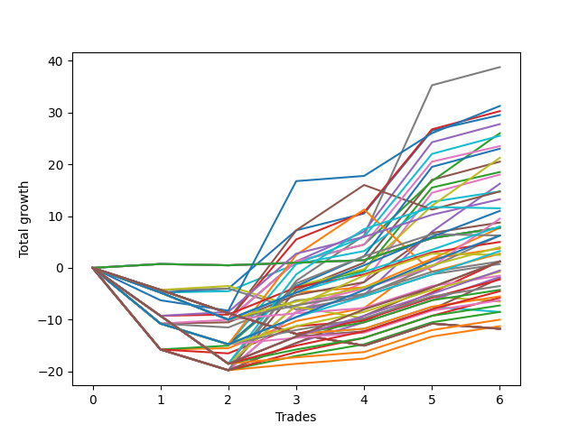

# Short Pointer 008 
- Symbol: ES
- Date Range: 03/18/2022 - 07/15/2022
- Trading Period: 7:20-12:30
- Number of Trades: 6



| Name | Win Percent | Profit | Avg Profit / Trade | Avg Time / Trade |      | Name | Win Percent | Profit | Avg Profit / Trade | Avg Time / Trade |
| ---- | ----------- | ------ | ------------------ | ---------------- | ---- | ---- | ----------- | ------ | ------------------ | ---------------- |
| Sorted By <br> Profit | | | | | | Sorted By <br> Win Percentage ||||
| Seven | 66.67 | 19375.00 | 3229.17 | 25:03 |     | Forty-Two | 83.33 | 14750.00 | 2458.33 | 08:06 |
| Seventy-Three | 66.67 | 15625.00 | 2604.17 | 11:15 |     | Fifty-Eight | 83.33 | 11750.00 | 1958.33 | 10:20 |
| Forty-Five | 66.67 | 15125.00 | 2520.83 | 13:55 |     | Two | 83.33 | 9250.00 | 1541.67 | 12:30 |
| Forty-Two | 83.33 | 14750.00 | 2458.33 | 08:06 |     | Forty-One | 83.33 | 7375.00 | 1229.17 | 03:32 |
| Forty-Six | 66.67 | 13875.00 | 2312.50 | 15:40 |     | Sixty-Six | 83.33 | 6625.00 | 1104.17 | 10:14 |
| Forty-Four | 66.67 | 13000.00 | 2166.67 | 12:15 |     | Fifty-Seven | 83.33 | 4375.00 | 729.17 | 05:45 |
| Sixty-One | 66.67 | 12750.00 | 2125.00 | 18:01 |     | Sixty-Four | 83.33 | 3875.00 | 645.83 | 00:47 |
| Fifty-Eight | 83.33 | 11750.00 | 1958.33 | 10:20 |     | Fifty-Six | 83.33 | 3875.00 | 645.83 | 00:47 |
| Sixty-Two | 66.67 | 11500.00 | 1916.67 | 19:47 |     | Forty-Eight | 83.33 | 3875.00 | 645.83 | 00:47 |
| Sixty | 66.67 | 10625.00 | 1770.83 | 16:21 |     | Forty | 83.33 | 3875.00 | 645.83 | 00:47 |
| Five | 66.67 | 10250.00 | 1708.33 | 20:12 |     | Zero | 83.33 | 3875.00 | 645.83 | 00:47 |
| Two | 83.33 | 9250.00 | 1541.67 | 12:30 |     | Sixty-Five | 83.33 | 2500.00 | 416.67 | 05:43 |
| Six | 66.67 | 9000.00 | 1500.00 | 21:58 |     | One | 83.33 | 1875.00 | 312.50 | 07:56 |
| Four | 66.67 | 8125.00 | 1354.17 | 18:32 |     | Seven | 66.67 | 19375.00 | 3229.17 | 25:03 |
| Forty-One | 83.33 | 7375.00 | 1229.17 | 03:32 |     | Seventy-Three | 66.67 | 15625.00 | 2604.17 | 11:15 |
| Forty-Seven | 50.00 | 7375.00 | 1229.17 | 17:42 |     | Forty-Five | 66.67 | 15125.00 | 2520.83 | 13:55 |
| Sixty-Six | 83.33 | 6625.00 | 1104.17 | 10:14 |     | Forty-Six | 66.67 | 13875.00 | 2312.50 | 15:40 |
| Seventy-One | 50.00 | 5750.00 | 958.33 | 16:48 |     | Forty-Four | 66.67 | 13000.00 | 2166.67 | 12:15 |
| One Hundred Fifteen | 66.67 | 5500.00 | 916.67 | 09:28 |     | Sixty-One | 66.67 | 12750.00 | 2125.00 | 18:01 |
| Sixty-Eight | 66.67 | 4750.00 | 791.67 | 14:49 |     | Sixty-Two | 66.67 | 11500.00 | 1916.67 | 19:47 |
| Fifty-Seven | 83.33 | 4375.00 | 729.17 | 05:45 |     | Sixty | 66.67 | 10625.00 | 1770.83 | 16:21 |
| One Hundred Fourteen | 66.67 | 4000.00 | 666.67 | 08:58 |     | Five | 66.67 | 10250.00 | 1708.33 | 20:12 |
| Sixty-Four | 83.33 | 3875.00 | 645.83 | 00:47 |     | Six | 66.67 | 9000.00 | 1500.00 | 21:58 |
| Fifty-Six | 83.33 | 3875.00 | 645.83 | 00:47 |     | Four | 66.67 | 8125.00 | 1354.17 | 18:32 |
| Forty-Eight | 83.33 | 3875.00 | 645.83 | 00:47 |     | One Hundred Fifteen | 66.67 | 5500.00 | 916.67 | 09:28 |
| Forty | 83.33 | 3875.00 | 645.83 | 00:47 |     | Sixty-Eight | 66.67 | 4750.00 | 791.67 | 14:49 |
| Zero | 83.33 | 3875.00 | 645.83 | 00:47 |     | One Hundred Fourteen | 66.67 | 4000.00 | 666.67 | 08:58 |
| Forty-Three | 66.67 | 3875.00 | 645.83 | 05:35 |     | Forty-Three | 66.67 | 3875.00 | 645.83 | 05:35 |
| One Hundred Twenty-Five | 66.67 | 3125.00 | 520.83 | 13:35 |     | One Hundred Twenty-Five | 66.67 | 3125.00 | 520.83 | 13:35 |
| Fifty-Nine | 66.67 | 3125.00 | 520.83 | 09:23 |     | Fifty-Nine | 66.67 | 3125.00 | 520.83 | 09:23 |
| Sixty-Nine | 50.00 | 3125.00 | 520.83 | 16:20 |     | One Hundred Thirteen | 66.67 | 2000.00 | 333.33 | 04:50 |
| Sixty-Five | 83.33 | 2500.00 | 416.67 | 05:43 |     | One Hundred Twenty-Four | 66.67 | 1625.00 | 270.83 | 13:05 |
| One Hundred Thirteen | 66.67 | 2000.00 | 333.33 | 04:50 |     | One Hundred Thirty | 66.67 | 625.00 | 104.17 | 12:04 |
| One | 83.33 | 1875.00 | 312.50 | 07:56 |     | One Hundred Twelve | 66.67 | 625.00 | 104.17 | 04:10 |
| One Hundred Twenty-Four | 66.67 | 1625.00 | 270.83 | 13:05 |     | Eighty-Five | 66.67 | 625.00 | 104.17 | 15:45 |
| Sixty-Three | 50.00 | 1375.00 | 229.17 | 21:53 |     | Three | 66.67 | 625.00 | 104.17 | 11:34 |
| Seventy | 50.00 | 1250.00 | 208.33 | 16:12 |     | Forty-Nine | 66.67 | 375.00 | 62.50 | 03:21 |
| One Hundred Thirty | 66.67 | 625.00 | 104.17 | 12:04 |     | One Hundred Twenty-Nine | 66.67 | -250.00 | -41.67 | 11:35 |
| One Hundred Twelve | 66.67 | 625.00 | 104.17 | 04:10 |     | One Hundred Twenty-Three | 66.67 | -375.00 | -62.50 | 08:56 |
| Eighty-Five | 66.67 | 625.00 | 104.17 | 15:45 |     | One Hundred Eleven | 66.67 | -750.00 | -125.00 | 03:57 |
| Three | 66.67 | 625.00 | 104.17 | 11:34 |     | Eighty-Four | 66.67 | -875.00 | -145.83 | 15:15 |
| Forty-Nine | 66.67 | 375.00 | 62.50 | 03:21 |     | Sixty-Seven | 66.67 | -1000.00 | -166.67 | 08:10 |
| One Hundred Twenty-Nine | 66.67 | -250.00 | -41.67 | 11:35 |     | One Hundred Twenty-Two | 66.67 | -1750.00 | -291.67 | 08:16 |
| One Hundred Twenty-Three | 66.67 | -375.00 | -62.50 | 08:56 |     | One Hundred Twenty-Eight | 66.67 | -2250.00 | -375.00 | 07:26 |
| One Hundred Eleven | 66.67 | -750.00 | -125.00 | 03:57 |     | Eighty-Three | 66.67 | -2875.00 | -479.17 | 11:07 |
| Eighty-Four | 66.67 | -875.00 | -145.83 | 15:15 |     | One Hundred Twenty-One | 66.67 | -3125.00 | -520.83 | 08:04 |
| Sixty-Seven | 66.67 | -1000.00 | -166.67 | 08:10 |     | One Hundred Twenty-Seven | 66.67 | -3625.00 | -604.17 | 06:46 |
| One Hundred Eighteen | 50.00 | -1125.00 | -187.50 | 04:35 |     | Eighty-Two | 66.67 | -4250.00 | -708.33 | 10:27 |
| One Hundred Twenty-Two | 66.67 | -1750.00 | -291.67 | 08:16 |     | One Hundred Twenty-Six | 66.67 | -5000.00 | -833.33 | 06:34 |
| One Hundred Seventeen | 50.00 | -2125.00 | -354.17 | 03:56 |     | Eighty-One | 66.67 | -5625.00 | -937.50 | 10:15 |
| One Hundred Twenty-Eight | 66.67 | -2250.00 | -375.00 | 07:26 |     | Forty-Seven | 50.00 | 7375.00 | 1229.17 | 17:42 |
| One Hundred Sixteen | 50.00 | -2750.00 | -458.33 | 03:45 |     | Seventy-One | 50.00 | 5750.00 | 958.33 | 16:48 |
| Eighty-Three | 66.67 | -2875.00 | -479.17 | 11:07 |     | Sixty-Nine | 50.00 | 3125.00 | 520.83 | 16:20 |
| One Hundred Twenty-One | 66.67 | -3125.00 | -520.83 | 08:04 |     | Sixty-Three | 50.00 | 1375.00 | 229.17 | 21:53 |
| Fifty | 33.33 | -3250.00 | -541.67 | 05:04 |     | Seventy | 50.00 | 1250.00 | 208.33 | 16:12 |
| One Hundred Twenty-Seven | 66.67 | -3625.00 | -604.17 | 06:46 |     | One Hundred Eighteen | 50.00 | -1125.00 | -187.50 | 04:35 |
| Eighty-Two | 66.67 | -4250.00 | -708.33 | 10:27 |     | One Hundred Seventeen | 50.00 | -2125.00 | -354.17 | 03:56 |
| Fifty-One | 33.33 | -4250.00 | -708.33 | 04:01 |     | One Hundred Sixteen | 50.00 | -2750.00 | -458.33 | 03:45 |
| One Hundred Twenty-Six | 66.67 | -5000.00 | -833.33 | 06:34 |     | Fifty | 33.33 | -3250.00 | -541.67 | 05:04 |
| Eighty-One | 66.67 | -5625.00 | -937.50 | 10:15 |     | Fifty-One | 33.33 | -4250.00 | -708.33 | 04:01 |
| One Hundred Twenty | 16.67 | -5875.00 | -979.17 | 05:55 |     | One Hundred Twenty | 16.67 | -5875.00 | -979.17 | 05:55 |
| One Hundred Ninteen | 16.67 | -5875.00 | -979.17 | 05:55 |     | One Hundred Ninteen | 16.67 | -5875.00 | -979.17 | 05:55 |
| Fifty-Five | 16.67 | -5875.00 | -979.17 | 05:55 |     | Fifty-Five | 16.67 | -5875.00 | -979.17 | 05:55 |
| Fifty-Four | 16.67 | -5875.00 | -979.17 | 05:55 |     | Fifty-Four | 16.67 | -5875.00 | -979.17 | 05:55 |
| Fifty-Three | 16.67 | -5875.00 | -979.17 | 05:55 |     | Fifty-Three | 16.67 | -5875.00 | -979.17 | 05:55 |
| Fifty-Two | 16.67 | -5875.00 | -979.17 | 05:55 |     | Fifty-Two | 16.67 | -5875.00 | -979.17 | 05:55 |

## NO STOPLOSS

### Test Zero
* Sell when price hits the middle line of the 20p bollinger
* No Stoploss
* Results:
```
Total Trades: 6
Percent Up: 16.67
Percent Down: 83.33
Total Points Moved Down: 7.75
Potential Profit: 3875.00
Total Points Ups: 0.25 Count Ups: 1
Total Points Downs: 8.00 Count Downs: 5
```

<details><summary>Trades</summary>

<code>In: 2022-03-24 08:09:00		Out: 2022-03-24 08:09:10		Total Position Time: 00:10		Total Move Down: 0.75		Total to Date: 0.75</code> <br />
<code>In: 2022-03-29 12:15:00		Out: 2022-03-29 12:18:55		Total Position Time: 03:55		Total Move Down: -0.25		Total to Date: 0.50</code> <br />
<code>In: 2022-04-06 11:06:00		Out: 2022-04-06 11:06:10		Total Position Time: 00:10		Total Move Down: 0.50		Total to Date: 1.00</code> <br />
<code>In: 2022-04-20 10:50:00		Out: 2022-04-20 10:50:10		Total Position Time: 00:10		Total Move Down: 0.50		Total to Date: 1.50</code> <br />
<code>In: 2022-05-04 11:07:00		Out: 2022-05-04 11:07:10		Total Position Time: 00:10		Total Move Down: 4.25		Total to Date: 5.75</code> <br />
<code>In: 2022-05-16 09:06:00		Out: 2022-05-16 09:06:10		Total Position Time: 00:10		Total Move Down: 2.00		Total to Date: 7.75</code> <br />


</details>

### Test One
* Sell when the price hits the upper line of the 20p 1std bollinger
* No Stoploss
* Results:
```
Total Trades: 6
Percent Up: 16.67
Percent Down: 83.33
Total Points Moved Down: 3.75
Potential Profit: 1875.00
Total Points Ups: 15.75 Count Ups: 1
Total Points Downs: 19.50 Count Downs: 5
```

<details><summary>Trades</summary>

<code>In: 2022-03-24 08:09:00		Out: 2022-03-24 08:38:55		Total Position Time: 29:55		Total Move Down: -15.75		Total to Date: -15.75</code> <br />
<code>In: 2022-03-29 12:15:00		Out: 2022-03-29 12:27:35		Total Position Time: 12:35		Total Move Down: 0.25		Total to Date: -15.50</code> <br />
<code>In: 2022-04-06 11:06:00		Out: 2022-04-06 11:07:20		Total Position Time: 01:20		Total Move Down: 5.25		Total to Date: -10.25</code> <br />
<code>In: 2022-04-20 10:50:00		Out: 2022-04-20 10:53:20		Total Position Time: 03:20		Total Move Down: 2.50		Total to Date: -7.75</code> <br />
<code>In: 2022-05-04 11:07:00		Out: 2022-05-04 11:07:20		Total Position Time: 00:20		Total Move Down: 9.50		Total to Date: 1.75</code> <br />
<code>In: 2022-05-16 09:06:00		Out: 2022-05-16 09:06:10		Total Position Time: 00:10		Total Move Down: 2.00		Total to Date: 3.75</code> <br />


</details>

### Test Two
* Sell when the price hits the upper line of the 20p 2std bollinger
* No Stoploss
* Results:
```
Total Trades: 6
Percent Up: 16.67
Percent Down: 83.33
Total Points Moved Down: 18.50
Potential Profit: 9250.00
Total Points Ups: 15.75 Count Ups: 1
Total Points Downs: 34.25 Count Downs: 5
```

<details><summary>Trades</summary>

<code>In: 2022-03-24 08:09:00		Out: 2022-03-24 08:38:55		Total Position Time: 29:55		Total Move Down: -15.75		Total to Date: -15.75</code> <br />
<code>In: 2022-03-29 12:15:00		Out: 2022-03-29 12:27:50		Total Position Time: 12:50		Total Move Down: 0.75		Total to Date: -15.00</code> <br />
<code>In: 2022-04-06 11:06:00		Out: 2022-04-06 11:08:10		Total Position Time: 02:10		Total Move Down: 11.25		Total to Date: -3.75</code> <br />
<code>In: 2022-04-20 10:50:00		Out: 2022-04-20 11:13:55		Total Position Time: 23:55		Total Move Down: 3.25		Total to Date: -0.50</code> <br />
<code>In: 2022-05-04 11:07:00		Out: 2022-05-04 11:07:40		Total Position Time: 00:40		Total Move Down: 16.00		Total to Date: 15.50</code> <br />
<code>In: 2022-05-16 09:06:00		Out: 2022-05-16 09:11:35		Total Position Time: 05:35		Total Move Down: 3.00		Total to Date: 18.50</code> <br />


</details>

### Test Three
* Sell when price hits the middle line of the 50p bollinger
* No Stoploss
* Results:
```
Total Trades: 6
Percent Up: 33.33
Percent Down: 66.67
Total Points Moved Down: 1.25
Potential Profit: 625.00
Total Points Ups: 16.50 Count Ups: 2
Total Points Downs: 17.75 Count Downs: 4
```

<details><summary>Trades</summary>

<code>In: 2022-03-24 08:09:00		Out: 2022-03-24 08:38:55		Total Position Time: 29:55		Total Move Down: -15.75		Total to Date: -15.75</code> <br />
<code>In: 2022-03-29 12:15:00		Out: 2022-03-29 12:43:05		Total Position Time: 28:05		Total Move Down: -0.75		Total to Date: -16.50</code> <br />
<code>In: 2022-04-06 11:06:00		Out: 2022-04-06 11:07:20		Total Position Time: 01:20		Total Move Down: 5.25		Total to Date: -11.25</code> <br />
<code>In: 2022-04-20 10:50:00		Out: 2022-04-20 10:50:20		Total Position Time: 00:20		Total Move Down: 1.00		Total to Date: -10.25</code> <br />
<code>In: 2022-05-04 11:07:00		Out: 2022-05-04 11:07:15		Total Position Time: 00:15		Total Move Down: 5.50		Total to Date: -4.75</code> <br />
<code>In: 2022-05-16 09:06:00		Out: 2022-05-16 09:15:30		Total Position Time: 09:30		Total Move Down: 6.00		Total to Date: 1.25</code> <br />


</details>

### Test Four
* Sell when the price hits the upper line of the 50p 1std bollinger
* No Stoploss
* Results:
```
Total Trades: 6
Percent Up: 33.33
Percent Down: 66.67
Total Points Moved Down: 16.25
Potential Profit: 8125.00
Total Points Ups: 19.75 Count Ups: 2
Total Points Downs: 36.00 Count Downs: 4
```

<details><summary>Trades</summary>

<code>In: 2022-03-24 08:09:00		Out: 2022-03-24 08:38:55		Total Position Time: 29:55		Total Move Down: -15.75		Total to Date: -15.75</code> <br />
<code>In: 2022-03-29 12:15:00		Out: 2022-03-29 12:44:55		Total Position Time: 29:55		Total Move Down: -4.00		Total to Date: -19.75</code> <br />
<code>In: 2022-04-06 11:06:00		Out: 2022-04-06 11:08:10		Total Position Time: 02:10		Total Move Down: 11.25		Total to Date: -8.50</code> <br />
<code>In: 2022-04-20 10:50:00		Out: 2022-04-20 11:13:55		Total Position Time: 23:55		Total Move Down: 3.25		Total to Date: -5.25</code> <br />
<code>In: 2022-05-04 11:07:00		Out: 2022-05-04 11:07:25		Total Position Time: 00:25		Total Move Down: 12.25		Total to Date: 7.00</code> <br />
<code>In: 2022-05-16 09:06:00		Out: 2022-05-16 09:30:55		Total Position Time: 24:55		Total Move Down: 9.25		Total to Date: 16.25</code> <br />


</details>

### Test Five
* Sell when the price hits the upper line of the 50p 2std bollinger
* No Stoploss
* Results:
```
Total Trades: 6
Percent Up: 33.33
Percent Down: 66.67
Total Points Moved Down: 20.50
Potential Profit: 10250.00
Total Points Ups: 19.75 Count Ups: 2
Total Points Downs: 40.25 Count Downs: 4
```

<details><summary>Trades</summary>

<code>In: 2022-03-24 08:09:00		Out: 2022-03-24 08:38:55		Total Position Time: 29:55		Total Move Down: -15.75		Total to Date: -15.75</code> <br />
<code>In: 2022-03-29 12:15:00		Out: 2022-03-29 12:44:55		Total Position Time: 29:55		Total Move Down: -4.00		Total to Date: -19.75</code> <br />
<code>In: 2022-04-06 11:06:00		Out: 2022-04-06 11:09:35		Total Position Time: 03:35		Total Move Down: 15.50		Total to Date: -4.25</code> <br />
<code>In: 2022-04-20 10:50:00		Out: 2022-04-20 11:17:15		Total Position Time: 27:15		Total Move Down: 5.25		Total to Date: 1.00</code> <br />
<code>In: 2022-05-04 11:07:00		Out: 2022-05-04 11:07:40		Total Position Time: 00:40		Total Move Down: 16.00		Total to Date: 17.00</code> <br />
<code>In: 2022-05-16 09:06:00		Out: 2022-05-16 09:35:55		Total Position Time: 29:55		Total Move Down: 3.50		Total to Date: 20.50</code> <br />


</details>

### Test Six
* Sell when the price hits the middle line of the 1std VWAP
* No Stoploss
* Results:
```
Total Trades: 6
Percent Up: 33.33
Percent Down: 66.67
Total Points Moved Down: 18.00
Potential Profit: 9000.00
Total Points Ups: 19.75 Count Ups: 2
Total Points Downs: 37.75 Count Downs: 4
```

<details><summary>Trades</summary>

<code>In: 2022-03-24 08:09:00		Out: 2022-03-24 08:38:55		Total Position Time: 29:55		Total Move Down: -15.75		Total to Date: -15.75</code> <br />
<code>In: 2022-03-29 12:15:00		Out: 2022-03-29 12:44:55		Total Position Time: 29:55		Total Move Down: -4.00		Total to Date: -19.75</code> <br />
<code>In: 2022-04-06 11:06:00		Out: 2022-04-06 11:08:10		Total Position Time: 02:10		Total Move Down: 11.25		Total to Date: -8.50</code> <br />
<code>In: 2022-04-20 10:50:00		Out: 2022-04-20 11:17:50		Total Position Time: 27:50		Total Move Down: 5.75		Total to Date: -2.75</code> <br />
<code>In: 2022-05-04 11:07:00		Out: 2022-05-04 11:19:05		Total Position Time: 12:05		Total Move Down: 17.25		Total to Date: 14.50</code> <br />
<code>In: 2022-05-16 09:06:00		Out: 2022-05-16 09:35:55		Total Position Time: 29:55		Total Move Down: 3.50		Total to Date: 18.00</code> <br />


</details>

### Test Seven
* Sell when the price hits the upper line of the 1std VWAP
* No Stoploss
* Results:
```
Total Trades: 6
Percent Up: 33.33
Percent Down: 66.67
Total Points Moved Down: 38.75
Potential Profit: 19375.00
Total Points Ups: 19.75 Count Ups: 2
Total Points Downs: 58.50 Count Downs: 4
```

<details><summary>Trades</summary>

<code>In: 2022-03-24 08:09:00		Out: 2022-03-24 08:38:55		Total Position Time: 29:55		Total Move Down: -15.75		Total to Date: -15.75</code> <br />
<code>In: 2022-03-29 12:15:00		Out: 2022-03-29 12:44:55		Total Position Time: 29:55		Total Move Down: -4.00		Total to Date: -19.75</code> <br />
<code>In: 2022-04-06 11:06:00		Out: 2022-04-06 11:09:40		Total Position Time: 03:40		Total Move Down: 17.25		Total to Date: -2.50</code> <br />
<code>In: 2022-04-20 10:50:00		Out: 2022-04-20 11:19:55		Total Position Time: 29:55		Total Move Down: 8.75		Total to Date: 6.25</code> <br />
<code>In: 2022-05-04 11:07:00		Out: 2022-05-04 11:34:00		Total Position Time: 27:00		Total Move Down: 29.00		Total to Date: 35.25</code> <br />
<code>In: 2022-05-16 09:06:00		Out: 2022-05-16 09:35:55		Total Position Time: 29:55		Total Move Down: 3.50		Total to Date: 38.75</code> <br />


</details>

## STOPLOSS OF 5

### Test Forty
* Sell when price hits the middle line of the 20p bollinger
* Stoploss is -5 points
* Results:
```
Total Trades: 6
Percent Up: 16.67
Percent Down: 83.33
Total Points Moved Down: 7.75
Potential Profit: 3875.00
Total Points Ups: 0.25 Count Ups: 1
Total Points Downs: 8.00 Count Downs: 5
```

<details><summary>Trades</summary>

<code>In: 2022-03-24 08:09:00		Out: 2022-03-24 08:09:10		Total Position Time: 00:10		Total Move Down: 0.75		Total to Date: 0.75</code> <br />
<code>In: 2022-03-29 12:15:00		Out: 2022-03-29 12:18:55		Total Position Time: 03:55		Total Move Down: -0.25		Total to Date: 0.50</code> <br />
<code>In: 2022-04-06 11:06:00		Out: 2022-04-06 11:06:10		Total Position Time: 00:10		Total Move Down: 0.50		Total to Date: 1.00</code> <br />
<code>In: 2022-04-20 10:50:00		Out: 2022-04-20 10:50:10		Total Position Time: 00:10		Total Move Down: 0.50		Total to Date: 1.50</code> <br />
<code>In: 2022-05-04 11:07:00		Out: 2022-05-04 11:07:10		Total Position Time: 00:10		Total Move Down: 4.25		Total to Date: 5.75</code> <br />
<code>In: 2022-05-16 09:06:00		Out: 2022-05-16 09:06:10		Total Position Time: 00:10		Total Move Down: 2.00		Total to Date: 7.75</code> <br />


</details>

### Test Forty-One
* Sell when the price hits the upper line of the 20p 1std bollinger
* Stoploss is -5 points
* Results:
```
Total Trades: 6
Percent Up: 16.67
Percent Down: 83.33
Total Points Moved Down: 14.75
Potential Profit: 7375.00
Total Points Ups: 4.75 Count Ups: 1
Total Points Downs: 19.50 Count Downs: 5
```

<details><summary>Trades</summary>

<code>In: 2022-03-24 08:09:00		Out: 2022-03-24 08:12:30		Total Position Time: 03:30		Total Move Down: -4.75		Total to Date: -4.75</code> <br />
<code>In: 2022-03-29 12:15:00		Out: 2022-03-29 12:27:35		Total Position Time: 12:35		Total Move Down: 0.25		Total to Date: -4.50</code> <br />
<code>In: 2022-04-06 11:06:00		Out: 2022-04-06 11:07:20		Total Position Time: 01:20		Total Move Down: 5.25		Total to Date: 0.75</code> <br />
<code>In: 2022-04-20 10:50:00		Out: 2022-04-20 10:53:20		Total Position Time: 03:20		Total Move Down: 2.50		Total to Date: 3.25</code> <br />
<code>In: 2022-05-04 11:07:00		Out: 2022-05-04 11:07:20		Total Position Time: 00:20		Total Move Down: 9.50		Total to Date: 12.75</code> <br />
<code>In: 2022-05-16 09:06:00		Out: 2022-05-16 09:06:10		Total Position Time: 00:10		Total Move Down: 2.00		Total to Date: 14.75</code> <br />


</details>

### Test Forty-Two
* Sell when the price hits the upper line of the 20p 2std bollinger
* Stoploss is -5 points
* Results:
```
Total Trades: 6
Percent Up: 16.67
Percent Down: 83.33
Total Points Moved Down: 29.50
Potential Profit: 14750.00
Total Points Ups: 4.75 Count Ups: 1
Total Points Downs: 34.25 Count Downs: 5
```

<details><summary>Trades</summary>

<code>In: 2022-03-24 08:09:00		Out: 2022-03-24 08:12:30		Total Position Time: 03:30		Total Move Down: -4.75		Total to Date: -4.75</code> <br />
<code>In: 2022-03-29 12:15:00		Out: 2022-03-29 12:27:50		Total Position Time: 12:50		Total Move Down: 0.75		Total to Date: -4.00</code> <br />
<code>In: 2022-04-06 11:06:00		Out: 2022-04-06 11:08:10		Total Position Time: 02:10		Total Move Down: 11.25		Total to Date: 7.25</code> <br />
<code>In: 2022-04-20 10:50:00		Out: 2022-04-20 11:13:55		Total Position Time: 23:55		Total Move Down: 3.25		Total to Date: 10.50</code> <br />
<code>In: 2022-05-04 11:07:00		Out: 2022-05-04 11:07:40		Total Position Time: 00:40		Total Move Down: 16.00		Total to Date: 26.50</code> <br />
<code>In: 2022-05-16 09:06:00		Out: 2022-05-16 09:11:35		Total Position Time: 05:35		Total Move Down: 3.00		Total to Date: 29.50</code> <br />


</details>

### Test Forty-Three
* Sell when price hits the middle line of the 50p bollinger
* Stoploss is -5 points
* Results:
```
Total Trades: 6
Percent Up: 33.33
Percent Down: 66.67
Total Points Moved Down: 7.75
Potential Profit: 3875.00
Total Points Ups: 10.00 Count Ups: 2
Total Points Downs: 17.75 Count Downs: 4
```

<details><summary>Trades</summary>

<code>In: 2022-03-24 08:09:00		Out: 2022-03-24 08:12:30		Total Position Time: 03:30		Total Move Down: -4.75		Total to Date: -4.75</code> <br />
<code>In: 2022-03-29 12:15:00		Out: 2022-03-29 12:33:35		Total Position Time: 18:35		Total Move Down: -5.25		Total to Date: -10.00</code> <br />
<code>In: 2022-04-06 11:06:00		Out: 2022-04-06 11:07:20		Total Position Time: 01:20		Total Move Down: 5.25		Total to Date: -4.75</code> <br />
<code>In: 2022-04-20 10:50:00		Out: 2022-04-20 10:50:20		Total Position Time: 00:20		Total Move Down: 1.00		Total to Date: -3.75</code> <br />
<code>In: 2022-05-04 11:07:00		Out: 2022-05-04 11:07:15		Total Position Time: 00:15		Total Move Down: 5.50		Total to Date: 1.75</code> <br />
<code>In: 2022-05-16 09:06:00		Out: 2022-05-16 09:15:30		Total Position Time: 09:30		Total Move Down: 6.00		Total to Date: 7.75</code> <br />


</details>

### Test Forty-Four
* Sell when the price hits the upper line of the 50p 1std bollinger
* Stoploss is -5 points
* Results:
```
Total Trades: 6
Percent Up: 33.33
Percent Down: 66.67
Total Points Moved Down: 26.00
Potential Profit: 13000.00
Total Points Ups: 10.00 Count Ups: 2
Total Points Downs: 36.00 Count Downs: 4
```

<details><summary>Trades</summary>

<code>In: 2022-03-24 08:09:00		Out: 2022-03-24 08:12:30		Total Position Time: 03:30		Total Move Down: -4.75		Total to Date: -4.75</code> <br />
<code>In: 2022-03-29 12:15:00		Out: 2022-03-29 12:33:35		Total Position Time: 18:35		Total Move Down: -5.25		Total to Date: -10.00</code> <br />
<code>In: 2022-04-06 11:06:00		Out: 2022-04-06 11:08:10		Total Position Time: 02:10		Total Move Down: 11.25		Total to Date: 1.25</code> <br />
<code>In: 2022-04-20 10:50:00		Out: 2022-04-20 11:13:55		Total Position Time: 23:55		Total Move Down: 3.25		Total to Date: 4.50</code> <br />
<code>In: 2022-05-04 11:07:00		Out: 2022-05-04 11:07:25		Total Position Time: 00:25		Total Move Down: 12.25		Total to Date: 16.75</code> <br />
<code>In: 2022-05-16 09:06:00		Out: 2022-05-16 09:30:55		Total Position Time: 24:55		Total Move Down: 9.25		Total to Date: 26.00</code> <br />


</details>

### Test Forty-Five
* Sell when the price hits the upper line of the 50p 2std bollinger
* Stoploss is -5 points
* Results:
```
Total Trades: 6
Percent Up: 33.33
Percent Down: 66.67
Total Points Moved Down: 30.25
Potential Profit: 15125.00
Total Points Ups: 10.00 Count Ups: 2
Total Points Downs: 40.25 Count Downs: 4
```

<details><summary>Trades</summary>

<code>In: 2022-03-24 08:09:00		Out: 2022-03-24 08:12:30		Total Position Time: 03:30		Total Move Down: -4.75		Total to Date: -4.75</code> <br />
<code>In: 2022-03-29 12:15:00		Out: 2022-03-29 12:33:35		Total Position Time: 18:35		Total Move Down: -5.25		Total to Date: -10.00</code> <br />
<code>In: 2022-04-06 11:06:00		Out: 2022-04-06 11:09:35		Total Position Time: 03:35		Total Move Down: 15.50		Total to Date: 5.50</code> <br />
<code>In: 2022-04-20 10:50:00		Out: 2022-04-20 11:17:15		Total Position Time: 27:15		Total Move Down: 5.25		Total to Date: 10.75</code> <br />
<code>In: 2022-05-04 11:07:00		Out: 2022-05-04 11:07:40		Total Position Time: 00:40		Total Move Down: 16.00		Total to Date: 26.75</code> <br />
<code>In: 2022-05-16 09:06:00		Out: 2022-05-16 09:35:55		Total Position Time: 29:55		Total Move Down: 3.50		Total to Date: 30.25</code> <br />


</details>

### Test Forty-Six
* Sell when the price hits the middle line of the 1std VWAP
* Stoploss is -5 points
* Results:
```
Total Trades: 6
Percent Up: 33.33
Percent Down: 66.67
Total Points Moved Down: 27.75
Potential Profit: 13875.00
Total Points Ups: 10.00 Count Ups: 2
Total Points Downs: 37.75 Count Downs: 4
```

<details><summary>Trades</summary>

<code>In: 2022-03-24 08:09:00		Out: 2022-03-24 08:12:30		Total Position Time: 03:30		Total Move Down: -4.75		Total to Date: -4.75</code> <br />
<code>In: 2022-03-29 12:15:00		Out: 2022-03-29 12:33:35		Total Position Time: 18:35		Total Move Down: -5.25		Total to Date: -10.00</code> <br />
<code>In: 2022-04-06 11:06:00		Out: 2022-04-06 11:08:10		Total Position Time: 02:10		Total Move Down: 11.25		Total to Date: 1.25</code> <br />
<code>In: 2022-04-20 10:50:00		Out: 2022-04-20 11:17:50		Total Position Time: 27:50		Total Move Down: 5.75		Total to Date: 7.00</code> <br />
<code>In: 2022-05-04 11:07:00		Out: 2022-05-04 11:19:05		Total Position Time: 12:05		Total Move Down: 17.25		Total to Date: 24.25</code> <br />
<code>In: 2022-05-16 09:06:00		Out: 2022-05-16 09:35:55		Total Position Time: 29:55		Total Move Down: 3.50		Total to Date: 27.75</code> <br />


</details>

### Test Forty-Seven
* Sell when the price hits the upper line of the 1std VWAP
* Stoploss is -5 points
* Results:
```
Total Trades: 6
Percent Up: 50.00
Percent Down: 50.00
Total Points Moved Down: 14.75
Potential Profit: 7375.00
Total Points Ups: 14.75 Count Ups: 3
Total Points Downs: 29.50 Count Downs: 3
```

<details><summary>Trades</summary>

<code>In: 2022-03-24 08:09:00		Out: 2022-03-24 08:12:30		Total Position Time: 03:30		Total Move Down: -4.75		Total to Date: -4.75</code> <br />
<code>In: 2022-03-29 12:15:00		Out: 2022-03-29 12:33:35		Total Position Time: 18:35		Total Move Down: -5.25		Total to Date: -10.00</code> <br />
<code>In: 2022-04-06 11:06:00		Out: 2022-04-06 11:09:40		Total Position Time: 03:40		Total Move Down: 17.25		Total to Date: 7.25</code> <br />
<code>In: 2022-04-20 10:50:00		Out: 2022-04-20 11:19:55		Total Position Time: 29:55		Total Move Down: 8.75		Total to Date: 16.00</code> <br />
<code>In: 2022-05-04 11:07:00		Out: 2022-05-04 11:27:40		Total Position Time: 20:40		Total Move Down: -4.75		Total to Date: 11.25</code> <br />
<code>In: 2022-05-16 09:06:00		Out: 2022-05-16 09:35:55		Total Position Time: 29:55		Total Move Down: 3.50		Total to Date: 14.75</code> <br />


</details>

## TRAIL STOP OF 5

### Test Forty-Eight
* Sell when price hits the middle line of the 20p bollinger
* Trailing Stop is -5 points
* Results:
```
Total Trades: 6
Percent Up: 16.67
Percent Down: 83.33
Total Points Moved Down: 7.75
Potential Profit: 3875.00
Total Points Ups: 0.25 Count Ups: 1
Total Points Downs: 8.00 Count Downs: 5
```

<details><summary>Trades</summary>

<code>In: 2022-03-24 08:09:00		Out: 2022-03-24 08:09:10		Total Position Time: 00:10		Total Move Down: 0.75		Total to Date: 0.75</code> <br />
<code>In: 2022-03-29 12:15:00		Out: 2022-03-29 12:18:55		Total Position Time: 03:55		Total Move Down: -0.25		Total to Date: 0.50</code> <br />
<code>In: 2022-04-06 11:06:00		Out: 2022-04-06 11:06:10		Total Position Time: 00:10		Total Move Down: 0.50		Total to Date: 1.00</code> <br />
<code>In: 2022-04-20 10:50:00		Out: 2022-04-20 10:50:10		Total Position Time: 00:10		Total Move Down: 0.50		Total to Date: 1.50</code> <br />
<code>In: 2022-05-04 11:07:00		Out: 2022-05-04 11:07:10		Total Position Time: 00:10		Total Move Down: 4.25		Total to Date: 5.75</code> <br />
<code>In: 2022-05-16 09:06:00		Out: 2022-05-16 09:06:10		Total Position Time: 00:10		Total Move Down: 2.00		Total to Date: 7.75</code> <br />


</details>

### Test Forty-Nine
* Sell when the price hits the upper line of the 20p 1std bollinger
* Trailing Stop is -5 points
* Results:
```
Total Trades: 6
Percent Up: 33.33
Percent Down: 66.67
Total Points Moved Down: 0.75
Potential Profit: 375.00
Total Points Ups: 8.25 Count Ups: 2
Total Points Downs: 9.00 Count Downs: 4
```

<details><summary>Trades</summary>

<code>In: 2022-03-24 08:09:00		Out: 2022-03-24 08:12:25		Total Position Time: 03:25		Total Move Down: -4.25		Total to Date: -4.25</code> <br />
<code>In: 2022-03-29 12:15:00		Out: 2022-03-29 12:27:35		Total Position Time: 12:35		Total Move Down: 0.25		Total to Date: -4.00</code> <br />
<code>In: 2022-04-06 11:06:00		Out: 2022-04-06 11:06:30		Total Position Time: 00:30		Total Move Down: -4.00		Total to Date: -8.00</code> <br />
<code>In: 2022-04-20 10:50:00		Out: 2022-04-20 10:53:20		Total Position Time: 03:20		Total Move Down: 2.50		Total to Date: -5.50</code> <br />
<code>In: 2022-05-04 11:07:00		Out: 2022-05-04 11:07:10		Total Position Time: 00:10		Total Move Down: 4.25		Total to Date: -1.25</code> <br />
<code>In: 2022-05-16 09:06:00		Out: 2022-05-16 09:06:10		Total Position Time: 00:10		Total Move Down: 2.00		Total to Date: 0.75</code> <br />


</details>

### Test Fifty
* Sell when the price hits the upper line of the 20p 2std bollinger
* Trailing Stop is -5 points
* Results:
```
Total Trades: 6
Percent Up: 66.67
Percent Down: 33.33
Total Points Moved Down: -6.50
Potential Profit: -3250.00
Total Points Ups: 11.50 Count Ups: 4
Total Points Downs: 5.00 Count Downs: 2
```

<details><summary>Trades</summary>

<code>In: 2022-03-24 08:09:00		Out: 2022-03-24 08:12:25		Total Position Time: 03:25		Total Move Down: -4.25		Total to Date: -4.25</code> <br />
<code>In: 2022-03-29 12:15:00		Out: 2022-03-29 12:27:50		Total Position Time: 12:50		Total Move Down: 0.75		Total to Date: -3.50</code> <br />
<code>In: 2022-04-06 11:06:00		Out: 2022-04-06 11:06:30		Total Position Time: 00:30		Total Move Down: -4.00		Total to Date: -7.50</code> <br />
<code>In: 2022-04-20 10:50:00		Out: 2022-04-20 11:01:40		Total Position Time: 11:40		Total Move Down: -2.25		Total to Date: -9.75</code> <br />
<code>In: 2022-05-04 11:07:00		Out: 2022-05-04 11:07:10		Total Position Time: 00:10		Total Move Down: 4.25		Total to Date: -5.50</code> <br />
<code>In: 2022-05-16 09:06:00		Out: 2022-05-16 09:07:50		Total Position Time: 01:50		Total Move Down: -1.00		Total to Date: -6.50</code> <br />


</details>

### Test Fifty-One
* Sell when price hits the middle line of the 50p bollinger
* Trailing Stop is -5 points
* Results:
```
Total Trades: 6
Percent Up: 66.67
Percent Down: 33.33
Total Points Moved Down: -8.50
Potential Profit: -4250.00
Total Points Ups: 13.75 Count Ups: 4
Total Points Downs: 5.25 Count Downs: 2
```

<details><summary>Trades</summary>

<code>In: 2022-03-24 08:09:00		Out: 2022-03-24 08:12:25		Total Position Time: 03:25		Total Move Down: -4.25		Total to Date: -4.25</code> <br />
<code>In: 2022-03-29 12:15:00		Out: 2022-03-29 12:32:55		Total Position Time: 17:55		Total Move Down: -4.50		Total to Date: -8.75</code> <br />
<code>In: 2022-04-06 11:06:00		Out: 2022-04-06 11:06:30		Total Position Time: 00:30		Total Move Down: -4.00		Total to Date: -12.75</code> <br />
<code>In: 2022-04-20 10:50:00		Out: 2022-04-20 10:50:20		Total Position Time: 00:20		Total Move Down: 1.00		Total to Date: -11.75</code> <br />
<code>In: 2022-05-04 11:07:00		Out: 2022-05-04 11:07:10		Total Position Time: 00:10		Total Move Down: 4.25		Total to Date: -7.50</code> <br />
<code>In: 2022-05-16 09:06:00		Out: 2022-05-16 09:07:50		Total Position Time: 01:50		Total Move Down: -1.00		Total to Date: -8.50</code> <br />


</details>

### Test Fifty-Two
* Sell when the price hits the upper line of the 50p 1std bollinger
* Trailing Stop is -5 points
* Results:
```
Total Trades: 6
Percent Up: 83.33
Percent Down: 16.67
Total Points Moved Down: -11.75
Potential Profit: -5875.00
Total Points Ups: 16.00 Count Ups: 5
Total Points Downs: 4.25 Count Downs: 1
```

<details><summary>Trades</summary>

<code>In: 2022-03-24 08:09:00		Out: 2022-03-24 08:12:25		Total Position Time: 03:25		Total Move Down: -4.25		Total to Date: -4.25</code> <br />
<code>In: 2022-03-29 12:15:00		Out: 2022-03-29 12:32:55		Total Position Time: 17:55		Total Move Down: -4.50		Total to Date: -8.75</code> <br />
<code>In: 2022-04-06 11:06:00		Out: 2022-04-06 11:06:30		Total Position Time: 00:30		Total Move Down: -4.00		Total to Date: -12.75</code> <br />
<code>In: 2022-04-20 10:50:00		Out: 2022-04-20 11:01:40		Total Position Time: 11:40		Total Move Down: -2.25		Total to Date: -15.00</code> <br />
<code>In: 2022-05-04 11:07:00		Out: 2022-05-04 11:07:10		Total Position Time: 00:10		Total Move Down: 4.25		Total to Date: -10.75</code> <br />
<code>In: 2022-05-16 09:06:00		Out: 2022-05-16 09:07:50		Total Position Time: 01:50		Total Move Down: -1.00		Total to Date: -11.75</code> <br />


</details>

### Test Fifty-Three
* Sell when the price hits the upper line of the 50p 2std bollinger
* Trailing Stop is -5 points
* Results:
```
Total Trades: 6
Percent Up: 83.33
Percent Down: 16.67
Total Points Moved Down: -11.75
Potential Profit: -5875.00
Total Points Ups: 16.00 Count Ups: 5
Total Points Downs: 4.25 Count Downs: 1
```

<details><summary>Trades</summary>

<code>In: 2022-03-24 08:09:00		Out: 2022-03-24 08:12:25		Total Position Time: 03:25		Total Move Down: -4.25		Total to Date: -4.25</code> <br />
<code>In: 2022-03-29 12:15:00		Out: 2022-03-29 12:32:55		Total Position Time: 17:55		Total Move Down: -4.50		Total to Date: -8.75</code> <br />
<code>In: 2022-04-06 11:06:00		Out: 2022-04-06 11:06:30		Total Position Time: 00:30		Total Move Down: -4.00		Total to Date: -12.75</code> <br />
<code>In: 2022-04-20 10:50:00		Out: 2022-04-20 11:01:40		Total Position Time: 11:40		Total Move Down: -2.25		Total to Date: -15.00</code> <br />
<code>In: 2022-05-04 11:07:00		Out: 2022-05-04 11:07:10		Total Position Time: 00:10		Total Move Down: 4.25		Total to Date: -10.75</code> <br />
<code>In: 2022-05-16 09:06:00		Out: 2022-05-16 09:07:50		Total Position Time: 01:50		Total Move Down: -1.00		Total to Date: -11.75</code> <br />


</details>

### Test Fifty-Four
* Sell when the price hits the middle line of the 1std VWAP
* Trailing Stop is -5 points
* Results:
```
Total Trades: 6
Percent Up: 83.33
Percent Down: 16.67
Total Points Moved Down: -11.75
Potential Profit: -5875.00
Total Points Ups: 16.00 Count Ups: 5
Total Points Downs: 4.25 Count Downs: 1
```

<details><summary>Trades</summary>

<code>In: 2022-03-24 08:09:00		Out: 2022-03-24 08:12:25		Total Position Time: 03:25		Total Move Down: -4.25		Total to Date: -4.25</code> <br />
<code>In: 2022-03-29 12:15:00		Out: 2022-03-29 12:32:55		Total Position Time: 17:55		Total Move Down: -4.50		Total to Date: -8.75</code> <br />
<code>In: 2022-04-06 11:06:00		Out: 2022-04-06 11:06:30		Total Position Time: 00:30		Total Move Down: -4.00		Total to Date: -12.75</code> <br />
<code>In: 2022-04-20 10:50:00		Out: 2022-04-20 11:01:40		Total Position Time: 11:40		Total Move Down: -2.25		Total to Date: -15.00</code> <br />
<code>In: 2022-05-04 11:07:00		Out: 2022-05-04 11:07:10		Total Position Time: 00:10		Total Move Down: 4.25		Total to Date: -10.75</code> <br />
<code>In: 2022-05-16 09:06:00		Out: 2022-05-16 09:07:50		Total Position Time: 01:50		Total Move Down: -1.00		Total to Date: -11.75</code> <br />


</details>

### Test Fifty-Five
* Sell when the price hits the upper line of the 1std VWAP
* Trailing Stop is -5 points
* Results:
```
Total Trades: 6
Percent Up: 83.33
Percent Down: 16.67
Total Points Moved Down: -11.75
Potential Profit: -5875.00
Total Points Ups: 16.00 Count Ups: 5
Total Points Downs: 4.25 Count Downs: 1
```

<details><summary>Trades</summary>

<code>In: 2022-03-24 08:09:00		Out: 2022-03-24 08:12:25		Total Position Time: 03:25		Total Move Down: -4.25		Total to Date: -4.25</code> <br />
<code>In: 2022-03-29 12:15:00		Out: 2022-03-29 12:32:55		Total Position Time: 17:55		Total Move Down: -4.50		Total to Date: -8.75</code> <br />
<code>In: 2022-04-06 11:06:00		Out: 2022-04-06 11:06:30		Total Position Time: 00:30		Total Move Down: -4.00		Total to Date: -12.75</code> <br />
<code>In: 2022-04-20 10:50:00		Out: 2022-04-20 11:01:40		Total Position Time: 11:40		Total Move Down: -2.25		Total to Date: -15.00</code> <br />
<code>In: 2022-05-04 11:07:00		Out: 2022-05-04 11:07:10		Total Position Time: 00:10		Total Move Down: 4.25		Total to Date: -10.75</code> <br />
<code>In: 2022-05-16 09:06:00		Out: 2022-05-16 09:07:50		Total Position Time: 01:50		Total Move Down: -1.00		Total to Date: -11.75</code> <br />


</details>

## STOPLOSS OF 10

### Test Fifty-Six
* Sell when price hits the middle line of the 20p bollinger
* Stoploss is -10 points
* Results:
```
Total Trades: 6
Percent Up: 16.67
Percent Down: 83.33
Total Points Moved Down: 7.75
Potential Profit: 3875.00
Total Points Ups: 0.25 Count Ups: 1
Total Points Downs: 8.00 Count Downs: 5
```

<details><summary>Trades</summary>

<code>In: 2022-03-24 08:09:00		Out: 2022-03-24 08:09:10		Total Position Time: 00:10		Total Move Down: 0.75		Total to Date: 0.75</code> <br />
<code>In: 2022-03-29 12:15:00		Out: 2022-03-29 12:18:55		Total Position Time: 03:55		Total Move Down: -0.25		Total to Date: 0.50</code> <br />
<code>In: 2022-04-06 11:06:00		Out: 2022-04-06 11:06:10		Total Position Time: 00:10		Total Move Down: 0.50		Total to Date: 1.00</code> <br />
<code>In: 2022-04-20 10:50:00		Out: 2022-04-20 10:50:10		Total Position Time: 00:10		Total Move Down: 0.50		Total to Date: 1.50</code> <br />
<code>In: 2022-05-04 11:07:00		Out: 2022-05-04 11:07:10		Total Position Time: 00:10		Total Move Down: 4.25		Total to Date: 5.75</code> <br />
<code>In: 2022-05-16 09:06:00		Out: 2022-05-16 09:06:10		Total Position Time: 00:10		Total Move Down: 2.00		Total to Date: 7.75</code> <br />


</details>

### Test Fifty-Seven
* Sell when the price hits the upper line of the 20p 1std bollinger
* Stoploss is -10 points
* Results:
```
Total Trades: 6
Percent Up: 16.67
Percent Down: 83.33
Total Points Moved Down: 8.75
Potential Profit: 4375.00
Total Points Ups: 10.75 Count Ups: 1
Total Points Downs: 19.50 Count Downs: 5
```

<details><summary>Trades</summary>

<code>In: 2022-03-24 08:09:00		Out: 2022-03-24 08:25:50		Total Position Time: 16:50		Total Move Down: -10.75		Total to Date: -10.75</code> <br />
<code>In: 2022-03-29 12:15:00		Out: 2022-03-29 12:27:35		Total Position Time: 12:35		Total Move Down: 0.25		Total to Date: -10.50</code> <br />
<code>In: 2022-04-06 11:06:00		Out: 2022-04-06 11:07:20		Total Position Time: 01:20		Total Move Down: 5.25		Total to Date: -5.25</code> <br />
<code>In: 2022-04-20 10:50:00		Out: 2022-04-20 10:53:20		Total Position Time: 03:20		Total Move Down: 2.50		Total to Date: -2.75</code> <br />
<code>In: 2022-05-04 11:07:00		Out: 2022-05-04 11:07:20		Total Position Time: 00:20		Total Move Down: 9.50		Total to Date: 6.75</code> <br />
<code>In: 2022-05-16 09:06:00		Out: 2022-05-16 09:06:10		Total Position Time: 00:10		Total Move Down: 2.00		Total to Date: 8.75</code> <br />


</details>

### Test Fifty-Eight
* Sell when the price hits the upper line of the 20p 2std bollinger
* Stoploss is -10 points
* Results:
```
Total Trades: 6
Percent Up: 16.67
Percent Down: 83.33
Total Points Moved Down: 23.50
Potential Profit: 11750.00
Total Points Ups: 10.75 Count Ups: 1
Total Points Downs: 34.25 Count Downs: 5
```

<details><summary>Trades</summary>

<code>In: 2022-03-24 08:09:00		Out: 2022-03-24 08:25:50		Total Position Time: 16:50		Total Move Down: -10.75		Total to Date: -10.75</code> <br />
<code>In: 2022-03-29 12:15:00		Out: 2022-03-29 12:27:50		Total Position Time: 12:50		Total Move Down: 0.75		Total to Date: -10.00</code> <br />
<code>In: 2022-04-06 11:06:00		Out: 2022-04-06 11:08:10		Total Position Time: 02:10		Total Move Down: 11.25		Total to Date: 1.25</code> <br />
<code>In: 2022-04-20 10:50:00		Out: 2022-04-20 11:13:55		Total Position Time: 23:55		Total Move Down: 3.25		Total to Date: 4.50</code> <br />
<code>In: 2022-05-04 11:07:00		Out: 2022-05-04 11:07:40		Total Position Time: 00:40		Total Move Down: 16.00		Total to Date: 20.50</code> <br />
<code>In: 2022-05-16 09:06:00		Out: 2022-05-16 09:11:35		Total Position Time: 05:35		Total Move Down: 3.00		Total to Date: 23.50</code> <br />


</details>

### Test Fifty-Nine
* Sell when price hits the middle line of the 50p bollinger
* Stoploss is -10 points
* Results:
```
Total Trades: 6
Percent Up: 33.33
Percent Down: 66.67
Total Points Moved Down: 6.25
Potential Profit: 3125.00
Total Points Ups: 11.50 Count Ups: 2
Total Points Downs: 17.75 Count Downs: 4
```

<details><summary>Trades</summary>

<code>In: 2022-03-24 08:09:00		Out: 2022-03-24 08:25:50		Total Position Time: 16:50		Total Move Down: -10.75		Total to Date: -10.75</code> <br />
<code>In: 2022-03-29 12:15:00		Out: 2022-03-29 12:43:05		Total Position Time: 28:05		Total Move Down: -0.75		Total to Date: -11.50</code> <br />
<code>In: 2022-04-06 11:06:00		Out: 2022-04-06 11:07:20		Total Position Time: 01:20		Total Move Down: 5.25		Total to Date: -6.25</code> <br />
<code>In: 2022-04-20 10:50:00		Out: 2022-04-20 10:50:20		Total Position Time: 00:20		Total Move Down: 1.00		Total to Date: -5.25</code> <br />
<code>In: 2022-05-04 11:07:00		Out: 2022-05-04 11:07:15		Total Position Time: 00:15		Total Move Down: 5.50		Total to Date: 0.25</code> <br />
<code>In: 2022-05-16 09:06:00		Out: 2022-05-16 09:15:30		Total Position Time: 09:30		Total Move Down: 6.00		Total to Date: 6.25</code> <br />


</details>

### Test Sixty
* Sell when the price hits the upper line of the 50p 1std bollinger
* Stoploss is -10 points
* Results:
```
Total Trades: 6
Percent Up: 33.33
Percent Down: 66.67
Total Points Moved Down: 21.25
Potential Profit: 10625.00
Total Points Ups: 14.75 Count Ups: 2
Total Points Downs: 36.00 Count Downs: 4
```

<details><summary>Trades</summary>

<code>In: 2022-03-24 08:09:00		Out: 2022-03-24 08:25:50		Total Position Time: 16:50		Total Move Down: -10.75		Total to Date: -10.75</code> <br />
<code>In: 2022-03-29 12:15:00		Out: 2022-03-29 12:44:55		Total Position Time: 29:55		Total Move Down: -4.00		Total to Date: -14.75</code> <br />
<code>In: 2022-04-06 11:06:00		Out: 2022-04-06 11:08:10		Total Position Time: 02:10		Total Move Down: 11.25		Total to Date: -3.50</code> <br />
<code>In: 2022-04-20 10:50:00		Out: 2022-04-20 11:13:55		Total Position Time: 23:55		Total Move Down: 3.25		Total to Date: -0.25</code> <br />
<code>In: 2022-05-04 11:07:00		Out: 2022-05-04 11:07:25		Total Position Time: 00:25		Total Move Down: 12.25		Total to Date: 12.00</code> <br />
<code>In: 2022-05-16 09:06:00		Out: 2022-05-16 09:30:55		Total Position Time: 24:55		Total Move Down: 9.25		Total to Date: 21.25</code> <br />


</details>

### Test Sixty-One
* Sell when the price hits the upper line of the 50p 2std bollinger
* Stoploss is -10 points
* Results:
```
Total Trades: 6
Percent Up: 33.33
Percent Down: 66.67
Total Points Moved Down: 25.50
Potential Profit: 12750.00
Total Points Ups: 14.75 Count Ups: 2
Total Points Downs: 40.25 Count Downs: 4
```

<details><summary>Trades</summary>

<code>In: 2022-03-24 08:09:00		Out: 2022-03-24 08:25:50		Total Position Time: 16:50		Total Move Down: -10.75		Total to Date: -10.75</code> <br />
<code>In: 2022-03-29 12:15:00		Out: 2022-03-29 12:44:55		Total Position Time: 29:55		Total Move Down: -4.00		Total to Date: -14.75</code> <br />
<code>In: 2022-04-06 11:06:00		Out: 2022-04-06 11:09:35		Total Position Time: 03:35		Total Move Down: 15.50		Total to Date: 0.75</code> <br />
<code>In: 2022-04-20 10:50:00		Out: 2022-04-20 11:17:15		Total Position Time: 27:15		Total Move Down: 5.25		Total to Date: 6.00</code> <br />
<code>In: 2022-05-04 11:07:00		Out: 2022-05-04 11:07:40		Total Position Time: 00:40		Total Move Down: 16.00		Total to Date: 22.00</code> <br />
<code>In: 2022-05-16 09:06:00		Out: 2022-05-16 09:35:55		Total Position Time: 29:55		Total Move Down: 3.50		Total to Date: 25.50</code> <br />


</details>

### Test Sixty-Two
* Sell when the price hits the middle line of the 1std VWAP
* Stoploss is -10 points
* Results:
```
Total Trades: 6
Percent Up: 33.33
Percent Down: 66.67
Total Points Moved Down: 23.00
Potential Profit: 11500.00
Total Points Ups: 14.75 Count Ups: 2
Total Points Downs: 37.75 Count Downs: 4
```

<details><summary>Trades</summary>

<code>In: 2022-03-24 08:09:00		Out: 2022-03-24 08:25:50		Total Position Time: 16:50		Total Move Down: -10.75		Total to Date: -10.75</code> <br />
<code>In: 2022-03-29 12:15:00		Out: 2022-03-29 12:44:55		Total Position Time: 29:55		Total Move Down: -4.00		Total to Date: -14.75</code> <br />
<code>In: 2022-04-06 11:06:00		Out: 2022-04-06 11:08:10		Total Position Time: 02:10		Total Move Down: 11.25		Total to Date: -3.50</code> <br />
<code>In: 2022-04-20 10:50:00		Out: 2022-04-20 11:17:50		Total Position Time: 27:50		Total Move Down: 5.75		Total to Date: 2.25</code> <br />
<code>In: 2022-05-04 11:07:00		Out: 2022-05-04 11:19:05		Total Position Time: 12:05		Total Move Down: 17.25		Total to Date: 19.50</code> <br />
<code>In: 2022-05-16 09:06:00		Out: 2022-05-16 09:35:55		Total Position Time: 29:55		Total Move Down: 3.50		Total to Date: 23.00</code> <br />


</details>

### Test Sixty-Three
* Sell when the price hits the upper line of the 1std VWAP
* Stoploss is -10 points
* Results:
```
Total Trades: 6
Percent Up: 50.00
Percent Down: 50.00
Total Points Moved Down: 2.75
Potential Profit: 1375.00
Total Points Ups: 26.75 Count Ups: 3
Total Points Downs: 29.50 Count Downs: 3
```

<details><summary>Trades</summary>

<code>In: 2022-03-24 08:09:00		Out: 2022-03-24 08:25:50		Total Position Time: 16:50		Total Move Down: -10.75		Total to Date: -10.75</code> <br />
<code>In: 2022-03-29 12:15:00		Out: 2022-03-29 12:44:55		Total Position Time: 29:55		Total Move Down: -4.00		Total to Date: -14.75</code> <br />
<code>In: 2022-04-06 11:06:00		Out: 2022-04-06 11:09:40		Total Position Time: 03:40		Total Move Down: 17.25		Total to Date: 2.50</code> <br />
<code>In: 2022-04-20 10:50:00		Out: 2022-04-20 11:19:55		Total Position Time: 29:55		Total Move Down: 8.75		Total to Date: 11.25</code> <br />
<code>In: 2022-05-04 11:07:00		Out: 2022-05-04 11:28:05		Total Position Time: 21:05		Total Move Down: -12.00		Total to Date: -0.75</code> <br />
<code>In: 2022-05-16 09:06:00		Out: 2022-05-16 09:35:55		Total Position Time: 29:55		Total Move Down: 3.50		Total to Date: 2.75</code> <br />


</details>

## TRAIL STOP OF 10

### Test Sixty-Four
* Sell when price hits the middle line of the 20p bollinger
* Trailing Stop is -10 points
* Results:
```
Total Trades: 6
Percent Up: 16.67
Percent Down: 83.33
Total Points Moved Down: 7.75
Potential Profit: 3875.00
Total Points Ups: 0.25 Count Ups: 1
Total Points Downs: 8.00 Count Downs: 5
```

<details><summary>Trades</summary>

<code>In: 2022-03-24 08:09:00		Out: 2022-03-24 08:09:10		Total Position Time: 00:10		Total Move Down: 0.75		Total to Date: 0.75</code> <br />
<code>In: 2022-03-29 12:15:00		Out: 2022-03-29 12:18:55		Total Position Time: 03:55		Total Move Down: -0.25		Total to Date: 0.50</code> <br />
<code>In: 2022-04-06 11:06:00		Out: 2022-04-06 11:06:10		Total Position Time: 00:10		Total Move Down: 0.50		Total to Date: 1.00</code> <br />
<code>In: 2022-04-20 10:50:00		Out: 2022-04-20 10:50:10		Total Position Time: 00:10		Total Move Down: 0.50		Total to Date: 1.50</code> <br />
<code>In: 2022-05-04 11:07:00		Out: 2022-05-04 11:07:10		Total Position Time: 00:10		Total Move Down: 4.25		Total to Date: 5.75</code> <br />
<code>In: 2022-05-16 09:06:00		Out: 2022-05-16 09:06:10		Total Position Time: 00:10		Total Move Down: 2.00		Total to Date: 7.75</code> <br />


</details>

### Test Sixty-Five
* Sell when the price hits the upper line of the 20p 1std bollinger
* Trailing Stop is -10 points
* Results:
```
Total Trades: 6
Percent Up: 16.67
Percent Down: 83.33
Total Points Moved Down: 5.00
Potential Profit: 2500.00
Total Points Ups: 9.25 Count Ups: 1
Total Points Downs: 14.25 Count Downs: 5
```

<details><summary>Trades</summary>

<code>In: 2022-03-24 08:09:00		Out: 2022-03-24 08:25:45		Total Position Time: 16:45		Total Move Down: -9.25		Total to Date: -9.25</code> <br />
<code>In: 2022-03-29 12:15:00		Out: 2022-03-29 12:27:35		Total Position Time: 12:35		Total Move Down: 0.25		Total to Date: -9.00</code> <br />
<code>In: 2022-04-06 11:06:00		Out: 2022-04-06 11:07:20		Total Position Time: 01:20		Total Move Down: 5.25		Total to Date: -3.75</code> <br />
<code>In: 2022-04-20 10:50:00		Out: 2022-04-20 10:53:20		Total Position Time: 03:20		Total Move Down: 2.50		Total to Date: -1.25</code> <br />
<code>In: 2022-05-04 11:07:00		Out: 2022-05-04 11:07:10		Total Position Time: 00:10		Total Move Down: 4.25		Total to Date: 3.00</code> <br />
<code>In: 2022-05-16 09:06:00		Out: 2022-05-16 09:06:10		Total Position Time: 00:10		Total Move Down: 2.00		Total to Date: 5.00</code> <br />


</details>

### Test Sixty-Six
* Sell when the price hits the upper line of the 20p 2std bollinger
* Trailing Stop is -10 points
* Results:
```
Total Trades: 6
Percent Up: 16.67
Percent Down: 83.33
Total Points Moved Down: 13.25
Potential Profit: 6625.00
Total Points Ups: 9.25 Count Ups: 1
Total Points Downs: 22.50 Count Downs: 5
```

<details><summary>Trades</summary>

<code>In: 2022-03-24 08:09:00		Out: 2022-03-24 08:25:45		Total Position Time: 16:45		Total Move Down: -9.25		Total to Date: -9.25</code> <br />
<code>In: 2022-03-29 12:15:00		Out: 2022-03-29 12:27:50		Total Position Time: 12:50		Total Move Down: 0.75		Total to Date: -8.50</code> <br />
<code>In: 2022-04-06 11:06:00		Out: 2022-04-06 11:08:10		Total Position Time: 02:10		Total Move Down: 11.25		Total to Date: 2.75</code> <br />
<code>In: 2022-04-20 10:50:00		Out: 2022-04-20 11:13:55		Total Position Time: 23:55		Total Move Down: 3.25		Total to Date: 6.00</code> <br />
<code>In: 2022-05-04 11:07:00		Out: 2022-05-04 11:07:10		Total Position Time: 00:10		Total Move Down: 4.25		Total to Date: 10.25</code> <br />
<code>In: 2022-05-16 09:06:00		Out: 2022-05-16 09:11:35		Total Position Time: 05:35		Total Move Down: 3.00		Total to Date: 13.25</code> <br />


</details>

### Test Sixty-Seven
* Sell when price hits the middle line of the 50p bollinger
* Trailing Stop is -10 points
* Results:
```
Total Trades: 6
Percent Up: 33.33
Percent Down: 66.67
Total Points Moved Down: -2.00
Potential Profit: -1000.00
Total Points Ups: 18.50 Count Ups: 2
Total Points Downs: 16.50 Count Downs: 4
```

<details><summary>Trades</summary>

<code>In: 2022-03-24 08:09:00		Out: 2022-03-24 08:25:45		Total Position Time: 16:45		Total Move Down: -9.25		Total to Date: -9.25</code> <br />
<code>In: 2022-03-29 12:15:00		Out: 2022-03-29 12:36:00		Total Position Time: 21:00		Total Move Down: -9.25		Total to Date: -18.50</code> <br />
<code>In: 2022-04-06 11:06:00		Out: 2022-04-06 11:07:20		Total Position Time: 01:20		Total Move Down: 5.25		Total to Date: -13.25</code> <br />
<code>In: 2022-04-20 10:50:00		Out: 2022-04-20 10:50:20		Total Position Time: 00:20		Total Move Down: 1.00		Total to Date: -12.25</code> <br />
<code>In: 2022-05-04 11:07:00		Out: 2022-05-04 11:07:10		Total Position Time: 00:10		Total Move Down: 4.25		Total to Date: -8.00</code> <br />
<code>In: 2022-05-16 09:06:00		Out: 2022-05-16 09:15:30		Total Position Time: 09:30		Total Move Down: 6.00		Total to Date: -2.00</code> <br />


</details>

### Test Sixty-Eight
* Sell when the price hits the upper line of the 50p 1std bollinger
* Trailing Stop is -10 points
* Results:
```
Total Trades: 6
Percent Up: 33.33
Percent Down: 66.67
Total Points Moved Down: 9.50
Potential Profit: 4750.00
Total Points Ups: 18.50 Count Ups: 2
Total Points Downs: 28.00 Count Downs: 4
```

<details><summary>Trades</summary>

<code>In: 2022-03-24 08:09:00		Out: 2022-03-24 08:25:45		Total Position Time: 16:45		Total Move Down: -9.25		Total to Date: -9.25</code> <br />
<code>In: 2022-03-29 12:15:00		Out: 2022-03-29 12:36:00		Total Position Time: 21:00		Total Move Down: -9.25		Total to Date: -18.50</code> <br />
<code>In: 2022-04-06 11:06:00		Out: 2022-04-06 11:08:10		Total Position Time: 02:10		Total Move Down: 11.25		Total to Date: -7.25</code> <br />
<code>In: 2022-04-20 10:50:00		Out: 2022-04-20 11:13:55		Total Position Time: 23:55		Total Move Down: 3.25		Total to Date: -4.00</code> <br />
<code>In: 2022-05-04 11:07:00		Out: 2022-05-04 11:07:10		Total Position Time: 00:10		Total Move Down: 4.25		Total to Date: 0.25</code> <br />
<code>In: 2022-05-16 09:06:00		Out: 2022-05-16 09:30:55		Total Position Time: 24:55		Total Move Down: 9.25		Total to Date: 9.50</code> <br />


</details>

### Test Sixty-Nine
* Sell when the price hits the upper line of the 50p 2std bollinger
* Trailing Stop is -10 points
* Results:
```
Total Trades: 6
Percent Up: 50.00
Percent Down: 50.00
Total Points Moved Down: 6.25
Potential Profit: 3125.00
Total Points Ups: 18.75 Count Ups: 3
Total Points Downs: 25.00 Count Downs: 3
```

<details><summary>Trades</summary>

<code>In: 2022-03-24 08:09:00		Out: 2022-03-24 08:25:45		Total Position Time: 16:45		Total Move Down: -9.25		Total to Date: -9.25</code> <br />
<code>In: 2022-03-29 12:15:00		Out: 2022-03-29 12:36:00		Total Position Time: 21:00		Total Move Down: -9.25		Total to Date: -18.50</code> <br />
<code>In: 2022-04-06 11:06:00		Out: 2022-04-06 11:09:35		Total Position Time: 03:35		Total Move Down: 15.50		Total to Date: -3.00</code> <br />
<code>In: 2022-04-20 10:50:00		Out: 2022-04-20 11:17:15		Total Position Time: 27:15		Total Move Down: 5.25		Total to Date: 2.25</code> <br />
<code>In: 2022-05-04 11:07:00		Out: 2022-05-04 11:07:10		Total Position Time: 00:10		Total Move Down: 4.25		Total to Date: 6.50</code> <br />
<code>In: 2022-05-16 09:06:00		Out: 2022-05-16 09:35:20		Total Position Time: 29:20		Total Move Down: -0.25		Total to Date: 6.25</code> <br />


</details>

### Test Seventy
* Sell when the price hits the middle line of the 1std VWAP
* Trailing Stop is -10 points
* Results:
```
Total Trades: 6
Percent Up: 50.00
Percent Down: 50.00
Total Points Moved Down: 2.50
Potential Profit: 1250.00
Total Points Ups: 18.75 Count Ups: 3
Total Points Downs: 21.25 Count Downs: 3
```

<details><summary>Trades</summary>

<code>In: 2022-03-24 08:09:00		Out: 2022-03-24 08:25:45		Total Position Time: 16:45		Total Move Down: -9.25		Total to Date: -9.25</code> <br />
<code>In: 2022-03-29 12:15:00		Out: 2022-03-29 12:36:00		Total Position Time: 21:00		Total Move Down: -9.25		Total to Date: -18.50</code> <br />
<code>In: 2022-04-06 11:06:00		Out: 2022-04-06 11:08:10		Total Position Time: 02:10		Total Move Down: 11.25		Total to Date: -7.25</code> <br />
<code>In: 2022-04-20 10:50:00		Out: 2022-04-20 11:17:50		Total Position Time: 27:50		Total Move Down: 5.75		Total to Date: -1.50</code> <br />
<code>In: 2022-05-04 11:07:00		Out: 2022-05-04 11:07:10		Total Position Time: 00:10		Total Move Down: 4.25		Total to Date: 2.75</code> <br />
<code>In: 2022-05-16 09:06:00		Out: 2022-05-16 09:35:20		Total Position Time: 29:20		Total Move Down: -0.25		Total to Date: 2.50</code> <br />


</details>

### Test Seventy-One
* Sell when the price hits the upper line of the 1std VWAP
* Trailing Stop is -10 points
* Results:
```
Total Trades: 6
Percent Up: 50.00
Percent Down: 50.00
Total Points Moved Down: 11.50
Potential Profit: 5750.00
Total Points Ups: 18.75 Count Ups: 3
Total Points Downs: 30.25 Count Downs: 3
```

<details><summary>Trades</summary>

<code>In: 2022-03-24 08:09:00		Out: 2022-03-24 08:25:45		Total Position Time: 16:45		Total Move Down: -9.25		Total to Date: -9.25</code> <br />
<code>In: 2022-03-29 12:15:00		Out: 2022-03-29 12:36:00		Total Position Time: 21:00		Total Move Down: -9.25		Total to Date: -18.50</code> <br />
<code>In: 2022-04-06 11:06:00		Out: 2022-04-06 11:09:40		Total Position Time: 03:40		Total Move Down: 17.25		Total to Date: -1.25</code> <br />
<code>In: 2022-04-20 10:50:00		Out: 2022-04-20 11:19:55		Total Position Time: 29:55		Total Move Down: 8.75		Total to Date: 7.50</code> <br />
<code>In: 2022-05-04 11:07:00		Out: 2022-05-04 11:07:10		Total Position Time: 00:10		Total Move Down: 4.25		Total to Date: 11.75</code> <br />
<code>In: 2022-05-16 09:06:00		Out: 2022-05-16 09:35:20		Total Position Time: 29:20		Total Move Down: -0.25		Total to Date: 11.50</code> <br />


</details>

## SPECIAL EXIT CONDITIONS 

### Test Seventy-Three
* Sell when the linear regression slope changes to negative
* No Stoploss
* Results:
```
Total Trades: 6
Percent Up: 33.33
Percent Down: 66.67
Total Points Moved Down: 31.25
Potential Profit: 15625.00
Total Points Ups: 8.25 Count Ups: 2
Total Points Downs: 39.50 Count Downs: 4
```

<details><summary>Trades</summary>

<code>In: 2022-03-24 08:09:00		Out: 2022-03-24 08:13:05		Total Position Time: 04:05		Total Move Down: -6.25		Total to Date: -6.25</code> <br />
<code>In: 2022-03-29 12:15:00		Out: 2022-03-29 12:21:05		Total Position Time: 06:05		Total Move Down: -2.00		Total to Date: -8.25</code> <br />
<code>In: 2022-04-06 11:06:00		Out: 2022-04-06 11:21:05		Total Position Time: 15:05		Total Move Down: 25.00		Total to Date: 16.75</code> <br />
<code>In: 2022-04-20 10:50:00		Out: 2022-04-20 10:58:05		Total Position Time: 08:05		Total Move Down: 1.00		Total to Date: 17.75</code> <br />
<code>In: 2022-05-04 11:07:00		Out: 2022-05-04 11:24:05		Total Position Time: 17:05		Total Move Down: 8.25		Total to Date: 26.00</code> <br />
<code>In: 2022-05-16 09:06:00		Out: 2022-05-16 09:23:05		Total Position Time: 17:05		Total Move Down: 5.25		Total to Date: 31.25</code> <br />


</details>

## TAKE PROFIT

### Test Eighty-One
* Take Profit of 1 Point
* No Stoploss
* Results:
```
Total Trades: 6
Percent Up: 33.33
Percent Down: 66.67
Total Points Moved Down: -11.25
Potential Profit: -5625.00
Total Points Ups: 19.75 Count Ups: 2
Total Points Downs: 8.50 Count Downs: 4
```

<details><summary>Trades</summary>

<code>In: 2022-03-24 08:09:00		Out: 2022-03-24 08:38:55		Total Position Time: 29:55		Total Move Down: -15.75		Total to Date: -15.75</code> <br />
<code>In: 2022-03-29 12:15:00		Out: 2022-03-29 12:44:55		Total Position Time: 29:55		Total Move Down: -4.00		Total to Date: -19.75</code> <br />
<code>In: 2022-04-06 11:06:00		Out: 2022-04-06 11:07:00		Total Position Time: 01:00		Total Move Down: 1.25		Total to Date: -18.50</code> <br />
<code>In: 2022-04-20 10:50:00		Out: 2022-04-20 10:50:20		Total Position Time: 00:20		Total Move Down: 1.00		Total to Date: -17.50</code> <br />
<code>In: 2022-05-04 11:07:00		Out: 2022-05-04 11:07:10		Total Position Time: 00:10		Total Move Down: 4.25		Total to Date: -13.25</code> <br />
<code>In: 2022-05-16 09:06:00		Out: 2022-05-16 09:06:10		Total Position Time: 00:10		Total Move Down: 2.00		Total to Date: -11.25</code> <br />


</details>

### Test Eighty-Two
* Take Profit of 2 Point
* No Stoploss
* Results:
```
Total Trades: 6
Percent Up: 33.33
Percent Down: 66.67
Total Points Moved Down: -8.50
Potential Profit: -4250.00
Total Points Ups: 19.75 Count Ups: 2
Total Points Downs: 11.25 Count Downs: 4
```

<details><summary>Trades</summary>

<code>In: 2022-03-24 08:09:00		Out: 2022-03-24 08:38:55		Total Position Time: 29:55		Total Move Down: -15.75		Total to Date: -15.75</code> <br />
<code>In: 2022-03-29 12:15:00		Out: 2022-03-29 12:44:55		Total Position Time: 29:55		Total Move Down: -4.00		Total to Date: -19.75</code> <br />
<code>In: 2022-04-06 11:06:00		Out: 2022-04-06 11:07:05		Total Position Time: 01:05		Total Move Down: 2.75		Total to Date: -17.00</code> <br />
<code>In: 2022-04-20 10:50:00		Out: 2022-04-20 10:51:30		Total Position Time: 01:30		Total Move Down: 2.25		Total to Date: -14.75</code> <br />
<code>In: 2022-05-04 11:07:00		Out: 2022-05-04 11:07:10		Total Position Time: 00:10		Total Move Down: 4.25		Total to Date: -10.50</code> <br />
<code>In: 2022-05-16 09:06:00		Out: 2022-05-16 09:06:10		Total Position Time: 00:10		Total Move Down: 2.00		Total to Date: -8.50</code> <br />


</details>

### Test Eighty-Three
* Take Profit of 3 Point
* No Stoploss
* Results:
```
Total Trades: 6
Percent Up: 33.33
Percent Down: 66.67
Total Points Moved Down: -5.75
Potential Profit: -2875.00
Total Points Ups: 19.75 Count Ups: 2
Total Points Downs: 14.00 Count Downs: 4
```

<details><summary>Trades</summary>

<code>In: 2022-03-24 08:09:00		Out: 2022-03-24 08:38:55		Total Position Time: 29:55		Total Move Down: -15.75		Total to Date: -15.75</code> <br />
<code>In: 2022-03-29 12:15:00		Out: 2022-03-29 12:44:55		Total Position Time: 29:55		Total Move Down: -4.00		Total to Date: -19.75</code> <br />
<code>In: 2022-04-06 11:06:00		Out: 2022-04-06 11:07:15		Total Position Time: 01:15		Total Move Down: 3.50		Total to Date: -16.25</code> <br />
<code>In: 2022-04-20 10:50:00		Out: 2022-04-20 10:55:05		Total Position Time: 05:05		Total Move Down: 2.75		Total to Date: -13.50</code> <br />
<code>In: 2022-05-04 11:07:00		Out: 2022-05-04 11:07:10		Total Position Time: 00:10		Total Move Down: 4.25		Total to Date: -9.25</code> <br />
<code>In: 2022-05-16 09:06:00		Out: 2022-05-16 09:06:25		Total Position Time: 00:25		Total Move Down: 3.50		Total to Date: -5.75</code> <br />


</details>

### Test Eighty-Four
* Take Profit of 4 Point
* No Stoploss
* Results:
```
Total Trades: 6
Percent Up: 33.33
Percent Down: 66.67
Total Points Moved Down: -1.75
Potential Profit: -875.00
Total Points Ups: 19.75 Count Ups: 2
Total Points Downs: 18.00 Count Downs: 4
```

<details><summary>Trades</summary>

<code>In: 2022-03-24 08:09:00		Out: 2022-03-24 08:38:55		Total Position Time: 29:55		Total Move Down: -15.75		Total to Date: -15.75</code> <br />
<code>In: 2022-03-29 12:15:00		Out: 2022-03-29 12:44:55		Total Position Time: 29:55		Total Move Down: -4.00		Total to Date: -19.75</code> <br />
<code>In: 2022-04-06 11:06:00		Out: 2022-04-06 11:07:20		Total Position Time: 01:20		Total Move Down: 5.25		Total to Date: -14.50</code> <br />
<code>In: 2022-04-20 10:50:00		Out: 2022-04-20 11:14:30		Total Position Time: 24:30		Total Move Down: 4.00		Total to Date: -10.50</code> <br />
<code>In: 2022-05-04 11:07:00		Out: 2022-05-04 11:07:10		Total Position Time: 00:10		Total Move Down: 4.25		Total to Date: -6.25</code> <br />
<code>In: 2022-05-16 09:06:00		Out: 2022-05-16 09:11:45		Total Position Time: 05:45		Total Move Down: 4.50		Total to Date: -1.75</code> <br />


</details>

### Test Eighty-Five
* Take Profit of 5 Point
* No Stoploss
* Results:
```
Total Trades: 6
Percent Up: 33.33
Percent Down: 66.67
Total Points Moved Down: 1.25
Potential Profit: 625.00
Total Points Ups: 19.75 Count Ups: 2
Total Points Downs: 21.00 Count Downs: 4
```

<details><summary>Trades</summary>

<code>In: 2022-03-24 08:09:00		Out: 2022-03-24 08:38:55		Total Position Time: 29:55		Total Move Down: -15.75		Total to Date: -15.75</code> <br />
<code>In: 2022-03-29 12:15:00		Out: 2022-03-29 12:44:55		Total Position Time: 29:55		Total Move Down: -4.00		Total to Date: -19.75</code> <br />
<code>In: 2022-04-06 11:06:00		Out: 2022-04-06 11:07:20		Total Position Time: 01:20		Total Move Down: 5.25		Total to Date: -14.50</code> <br />
<code>In: 2022-04-20 10:50:00		Out: 2022-04-20 11:17:15		Total Position Time: 27:15		Total Move Down: 5.25		Total to Date: -9.25</code> <br />
<code>In: 2022-05-04 11:07:00		Out: 2022-05-04 11:07:15		Total Position Time: 00:15		Total Move Down: 5.50		Total to Date: -3.75</code> <br />
<code>In: 2022-05-16 09:06:00		Out: 2022-05-16 09:11:55		Total Position Time: 05:55		Total Move Down: 5.00		Total to Date: 1.25</code> <br />


</details>

## TAKE PROFIT Stoploss of Five

### Test One Hundred Eleven
* Take Profit of 1 Point
* Stoploss is -5 points
* Results:
```
Total Trades: 6
Percent Up: 33.33
Percent Down: 66.67
Total Points Moved Down: -1.50
Potential Profit: -750.00
Total Points Ups: 10.00 Count Ups: 2
Total Points Downs: 8.50 Count Downs: 4
```

<details><summary>Trades</summary>

<code>In: 2022-03-24 08:09:00		Out: 2022-03-24 08:12:30		Total Position Time: 03:30		Total Move Down: -4.75		Total to Date: -4.75</code> <br />
<code>In: 2022-03-29 12:15:00		Out: 2022-03-29 12:33:35		Total Position Time: 18:35		Total Move Down: -5.25		Total to Date: -10.00</code> <br />
<code>In: 2022-04-06 11:06:00		Out: 2022-04-06 11:07:00		Total Position Time: 01:00		Total Move Down: 1.25		Total to Date: -8.75</code> <br />
<code>In: 2022-04-20 10:50:00		Out: 2022-04-20 10:50:20		Total Position Time: 00:20		Total Move Down: 1.00		Total to Date: -7.75</code> <br />
<code>In: 2022-05-04 11:07:00		Out: 2022-05-04 11:07:10		Total Position Time: 00:10		Total Move Down: 4.25		Total to Date: -3.50</code> <br />
<code>In: 2022-05-16 09:06:00		Out: 2022-05-16 09:06:10		Total Position Time: 00:10		Total Move Down: 2.00		Total to Date: -1.50</code> <br />


</details>

### Test One Hundred Twelve
* Take Profit of 2 Point
* Stoploss is -5 points
* Results:
```
Total Trades: 6
Percent Up: 33.33
Percent Down: 66.67
Total Points Moved Down: 1.25
Potential Profit: 625.00
Total Points Ups: 10.00 Count Ups: 2
Total Points Downs: 11.25 Count Downs: 4
```

<details><summary>Trades</summary>

<code>In: 2022-03-24 08:09:00		Out: 2022-03-24 08:12:30		Total Position Time: 03:30		Total Move Down: -4.75		Total to Date: -4.75</code> <br />
<code>In: 2022-03-29 12:15:00		Out: 2022-03-29 12:33:35		Total Position Time: 18:35		Total Move Down: -5.25		Total to Date: -10.00</code> <br />
<code>In: 2022-04-06 11:06:00		Out: 2022-04-06 11:07:05		Total Position Time: 01:05		Total Move Down: 2.75		Total to Date: -7.25</code> <br />
<code>In: 2022-04-20 10:50:00		Out: 2022-04-20 10:51:30		Total Position Time: 01:30		Total Move Down: 2.25		Total to Date: -5.00</code> <br />
<code>In: 2022-05-04 11:07:00		Out: 2022-05-04 11:07:10		Total Position Time: 00:10		Total Move Down: 4.25		Total to Date: -0.75</code> <br />
<code>In: 2022-05-16 09:06:00		Out: 2022-05-16 09:06:10		Total Position Time: 00:10		Total Move Down: 2.00		Total to Date: 1.25</code> <br />


</details>

### Test One Hundred Thirteen
* Take Profit of 3 Point
* Stoploss is -5 points
* Results:
```
Total Trades: 6
Percent Up: 33.33
Percent Down: 66.67
Total Points Moved Down: 4.00
Potential Profit: 2000.00
Total Points Ups: 10.00 Count Ups: 2
Total Points Downs: 14.00 Count Downs: 4
```

<details><summary>Trades</summary>

<code>In: 2022-03-24 08:09:00		Out: 2022-03-24 08:12:30		Total Position Time: 03:30		Total Move Down: -4.75		Total to Date: -4.75</code> <br />
<code>In: 2022-03-29 12:15:00		Out: 2022-03-29 12:33:35		Total Position Time: 18:35		Total Move Down: -5.25		Total to Date: -10.00</code> <br />
<code>In: 2022-04-06 11:06:00		Out: 2022-04-06 11:07:15		Total Position Time: 01:15		Total Move Down: 3.50		Total to Date: -6.50</code> <br />
<code>In: 2022-04-20 10:50:00		Out: 2022-04-20 10:55:05		Total Position Time: 05:05		Total Move Down: 2.75		Total to Date: -3.75</code> <br />
<code>In: 2022-05-04 11:07:00		Out: 2022-05-04 11:07:10		Total Position Time: 00:10		Total Move Down: 4.25		Total to Date: 0.50</code> <br />
<code>In: 2022-05-16 09:06:00		Out: 2022-05-16 09:06:25		Total Position Time: 00:25		Total Move Down: 3.50		Total to Date: 4.00</code> <br />


</details>

### Test One Hundred Fourteen
* Take Profit of 4 Point
* Stoploss is -5 points
* Results:
```
Total Trades: 6
Percent Up: 33.33
Percent Down: 66.67
Total Points Moved Down: 8.00
Potential Profit: 4000.00
Total Points Ups: 10.00 Count Ups: 2
Total Points Downs: 18.00 Count Downs: 4
```

<details><summary>Trades</summary>

<code>In: 2022-03-24 08:09:00		Out: 2022-03-24 08:12:30		Total Position Time: 03:30		Total Move Down: -4.75		Total to Date: -4.75</code> <br />
<code>In: 2022-03-29 12:15:00		Out: 2022-03-29 12:33:35		Total Position Time: 18:35		Total Move Down: -5.25		Total to Date: -10.00</code> <br />
<code>In: 2022-04-06 11:06:00		Out: 2022-04-06 11:07:20		Total Position Time: 01:20		Total Move Down: 5.25		Total to Date: -4.75</code> <br />
<code>In: 2022-04-20 10:50:00		Out: 2022-04-20 11:14:30		Total Position Time: 24:30		Total Move Down: 4.00		Total to Date: -0.75</code> <br />
<code>In: 2022-05-04 11:07:00		Out: 2022-05-04 11:07:10		Total Position Time: 00:10		Total Move Down: 4.25		Total to Date: 3.50</code> <br />
<code>In: 2022-05-16 09:06:00		Out: 2022-05-16 09:11:45		Total Position Time: 05:45		Total Move Down: 4.50		Total to Date: 8.00</code> <br />


</details>

### Test One Hundred Fifteen
* Take Profit of 5 Point
* Stoploss is -5 points
* Results:
```
Total Trades: 6
Percent Up: 33.33
Percent Down: 66.67
Total Points Moved Down: 11.00
Potential Profit: 5500.00
Total Points Ups: 10.00 Count Ups: 2
Total Points Downs: 21.00 Count Downs: 4
```

<details><summary>Trades</summary>

<code>In: 2022-03-24 08:09:00		Out: 2022-03-24 08:12:30		Total Position Time: 03:30		Total Move Down: -4.75		Total to Date: -4.75</code> <br />
<code>In: 2022-03-29 12:15:00		Out: 2022-03-29 12:33:35		Total Position Time: 18:35		Total Move Down: -5.25		Total to Date: -10.00</code> <br />
<code>In: 2022-04-06 11:06:00		Out: 2022-04-06 11:07:20		Total Position Time: 01:20		Total Move Down: 5.25		Total to Date: -4.75</code> <br />
<code>In: 2022-04-20 10:50:00		Out: 2022-04-20 11:17:15		Total Position Time: 27:15		Total Move Down: 5.25		Total to Date: 0.50</code> <br />
<code>In: 2022-05-04 11:07:00		Out: 2022-05-04 11:07:15		Total Position Time: 00:15		Total Move Down: 5.50		Total to Date: 6.00</code> <br />
<code>In: 2022-05-16 09:06:00		Out: 2022-05-16 09:11:55		Total Position Time: 05:55		Total Move Down: 5.00		Total to Date: 11.00</code> <br />


</details>

## TAKE PROFIT Trailstop of Five

### Test One Hundred Sixteen
* Take Profit of 1 Point
* Trailing stop is -5 points
* Results:
```
Total Trades: 6
Percent Up: 50.00
Percent Down: 50.00
Total Points Moved Down: -5.50
Potential Profit: -2750.00
Total Points Ups: 12.75 Count Ups: 3
Total Points Downs: 7.25 Count Downs: 3
```

<details><summary>Trades</summary>

<code>In: 2022-03-24 08:09:00		Out: 2022-03-24 08:12:25		Total Position Time: 03:25		Total Move Down: -4.25		Total to Date: -4.25</code> <br />
<code>In: 2022-03-29 12:15:00		Out: 2022-03-29 12:32:55		Total Position Time: 17:55		Total Move Down: -4.50		Total to Date: -8.75</code> <br />
<code>In: 2022-04-06 11:06:00		Out: 2022-04-06 11:06:30		Total Position Time: 00:30		Total Move Down: -4.00		Total to Date: -12.75</code> <br />
<code>In: 2022-04-20 10:50:00		Out: 2022-04-20 10:50:20		Total Position Time: 00:20		Total Move Down: 1.00		Total to Date: -11.75</code> <br />
<code>In: 2022-05-04 11:07:00		Out: 2022-05-04 11:07:10		Total Position Time: 00:10		Total Move Down: 4.25		Total to Date: -7.50</code> <br />
<code>In: 2022-05-16 09:06:00		Out: 2022-05-16 09:06:10		Total Position Time: 00:10		Total Move Down: 2.00		Total to Date: -5.50</code> <br />


</details>

### Test One Hundred Seventeen
* Take Profit of 2 Point
* Trailing stop is -5 points
* Results:
```
Total Trades: 6
Percent Up: 50.00
Percent Down: 50.00
Total Points Moved Down: -4.25
Potential Profit: -2125.00
Total Points Ups: 12.75 Count Ups: 3
Total Points Downs: 8.50 Count Downs: 3
```

<details><summary>Trades</summary>

<code>In: 2022-03-24 08:09:00		Out: 2022-03-24 08:12:25		Total Position Time: 03:25		Total Move Down: -4.25		Total to Date: -4.25</code> <br />
<code>In: 2022-03-29 12:15:00		Out: 2022-03-29 12:32:55		Total Position Time: 17:55		Total Move Down: -4.50		Total to Date: -8.75</code> <br />
<code>In: 2022-04-06 11:06:00		Out: 2022-04-06 11:06:30		Total Position Time: 00:30		Total Move Down: -4.00		Total to Date: -12.75</code> <br />
<code>In: 2022-04-20 10:50:00		Out: 2022-04-20 10:51:30		Total Position Time: 01:30		Total Move Down: 2.25		Total to Date: -10.50</code> <br />
<code>In: 2022-05-04 11:07:00		Out: 2022-05-04 11:07:10		Total Position Time: 00:10		Total Move Down: 4.25		Total to Date: -6.25</code> <br />
<code>In: 2022-05-16 09:06:00		Out: 2022-05-16 09:06:10		Total Position Time: 00:10		Total Move Down: 2.00		Total to Date: -4.25</code> <br />


</details>

### Test One Hundred Eighteen
* Take Profit of 3 Point
* Trailing stop is -5 points
* Results:
```
Total Trades: 6
Percent Up: 50.00
Percent Down: 50.00
Total Points Moved Down: -2.25
Potential Profit: -1125.00
Total Points Ups: 12.75 Count Ups: 3
Total Points Downs: 10.50 Count Downs: 3
```

<details><summary>Trades</summary>

<code>In: 2022-03-24 08:09:00		Out: 2022-03-24 08:12:25		Total Position Time: 03:25		Total Move Down: -4.25		Total to Date: -4.25</code> <br />
<code>In: 2022-03-29 12:15:00		Out: 2022-03-29 12:32:55		Total Position Time: 17:55		Total Move Down: -4.50		Total to Date: -8.75</code> <br />
<code>In: 2022-04-06 11:06:00		Out: 2022-04-06 11:06:30		Total Position Time: 00:30		Total Move Down: -4.00		Total to Date: -12.75</code> <br />
<code>In: 2022-04-20 10:50:00		Out: 2022-04-20 10:55:05		Total Position Time: 05:05		Total Move Down: 2.75		Total to Date: -10.00</code> <br />
<code>In: 2022-05-04 11:07:00		Out: 2022-05-04 11:07:10		Total Position Time: 00:10		Total Move Down: 4.25		Total to Date: -5.75</code> <br />
<code>In: 2022-05-16 09:06:00		Out: 2022-05-16 09:06:25		Total Position Time: 00:25		Total Move Down: 3.50		Total to Date: -2.25</code> <br />


</details>

### Test One Hundred Ninteen
* Take Profit of 4 Point
* Trailing stop is -5 points
* Results:
```
Total Trades: 6
Percent Up: 83.33
Percent Down: 16.67
Total Points Moved Down: -11.75
Potential Profit: -5875.00
Total Points Ups: 16.00 Count Ups: 5
Total Points Downs: 4.25 Count Downs: 1
```

<details><summary>Trades</summary>

<code>In: 2022-03-24 08:09:00		Out: 2022-03-24 08:12:25		Total Position Time: 03:25		Total Move Down: -4.25		Total to Date: -4.25</code> <br />
<code>In: 2022-03-29 12:15:00		Out: 2022-03-29 12:32:55		Total Position Time: 17:55		Total Move Down: -4.50		Total to Date: -8.75</code> <br />
<code>In: 2022-04-06 11:06:00		Out: 2022-04-06 11:06:30		Total Position Time: 00:30		Total Move Down: -4.00		Total to Date: -12.75</code> <br />
<code>In: 2022-04-20 10:50:00		Out: 2022-04-20 11:01:40		Total Position Time: 11:40		Total Move Down: -2.25		Total to Date: -15.00</code> <br />
<code>In: 2022-05-04 11:07:00		Out: 2022-05-04 11:07:10		Total Position Time: 00:10		Total Move Down: 4.25		Total to Date: -10.75</code> <br />
<code>In: 2022-05-16 09:06:00		Out: 2022-05-16 09:07:50		Total Position Time: 01:50		Total Move Down: -1.00		Total to Date: -11.75</code> <br />


</details>

### Test One Hundred Twenty
* Take Profit of 5 Point
* Trailing stop is -5 points
* Results:
```
Total Trades: 6
Percent Up: 83.33
Percent Down: 16.67
Total Points Moved Down: -11.75
Potential Profit: -5875.00
Total Points Ups: 16.00 Count Ups: 5
Total Points Downs: 4.25 Count Downs: 1
```

<details><summary>Trades</summary>

<code>In: 2022-03-24 08:09:00		Out: 2022-03-24 08:12:25		Total Position Time: 03:25		Total Move Down: -4.25		Total to Date: -4.25</code> <br />
<code>In: 2022-03-29 12:15:00		Out: 2022-03-29 12:32:55		Total Position Time: 17:55		Total Move Down: -4.50		Total to Date: -8.75</code> <br />
<code>In: 2022-04-06 11:06:00		Out: 2022-04-06 11:06:30		Total Position Time: 00:30		Total Move Down: -4.00		Total to Date: -12.75</code> <br />
<code>In: 2022-04-20 10:50:00		Out: 2022-04-20 11:01:40		Total Position Time: 11:40		Total Move Down: -2.25		Total to Date: -15.00</code> <br />
<code>In: 2022-05-04 11:07:00		Out: 2022-05-04 11:07:10		Total Position Time: 00:10		Total Move Down: 4.25		Total to Date: -10.75</code> <br />
<code>In: 2022-05-16 09:06:00		Out: 2022-05-16 09:07:50		Total Position Time: 01:50		Total Move Down: -1.00		Total to Date: -11.75</code> <br />


</details>

## TAKE PROFIT Stoploss of Ten

### Test One Hundred Twenty-One
* Take Profit of 1 Point
* Stoploss is -10 points
* Results:
```
Total Trades: 6
Percent Up: 33.33
Percent Down: 66.67
Total Points Moved Down: -6.25
Potential Profit: -3125.00
Total Points Ups: 14.75 Count Ups: 2
Total Points Downs: 8.50 Count Downs: 4
```

<details><summary>Trades</summary>

<code>In: 2022-03-24 08:09:00		Out: 2022-03-24 08:25:50		Total Position Time: 16:50		Total Move Down: -10.75		Total to Date: -10.75</code> <br />
<code>In: 2022-03-29 12:15:00		Out: 2022-03-29 12:44:55		Total Position Time: 29:55		Total Move Down: -4.00		Total to Date: -14.75</code> <br />
<code>In: 2022-04-06 11:06:00		Out: 2022-04-06 11:07:00		Total Position Time: 01:00		Total Move Down: 1.25		Total to Date: -13.50</code> <br />
<code>In: 2022-04-20 10:50:00		Out: 2022-04-20 10:50:20		Total Position Time: 00:20		Total Move Down: 1.00		Total to Date: -12.50</code> <br />
<code>In: 2022-05-04 11:07:00		Out: 2022-05-04 11:07:10		Total Position Time: 00:10		Total Move Down: 4.25		Total to Date: -8.25</code> <br />
<code>In: 2022-05-16 09:06:00		Out: 2022-05-16 09:06:10		Total Position Time: 00:10		Total Move Down: 2.00		Total to Date: -6.25</code> <br />


</details>

### Test One Hundred Twenty-Two
* Take Profit of 2 Point
* Stoploss is -10 points
* Results:
```
Total Trades: 6
Percent Up: 33.33
Percent Down: 66.67
Total Points Moved Down: -3.50
Potential Profit: -1750.00
Total Points Ups: 14.75 Count Ups: 2
Total Points Downs: 11.25 Count Downs: 4
```

<details><summary>Trades</summary>

<code>In: 2022-03-24 08:09:00		Out: 2022-03-24 08:25:50		Total Position Time: 16:50		Total Move Down: -10.75		Total to Date: -10.75</code> <br />
<code>In: 2022-03-29 12:15:00		Out: 2022-03-29 12:44:55		Total Position Time: 29:55		Total Move Down: -4.00		Total to Date: -14.75</code> <br />
<code>In: 2022-04-06 11:06:00		Out: 2022-04-06 11:07:05		Total Position Time: 01:05		Total Move Down: 2.75		Total to Date: -12.00</code> <br />
<code>In: 2022-04-20 10:50:00		Out: 2022-04-20 10:51:30		Total Position Time: 01:30		Total Move Down: 2.25		Total to Date: -9.75</code> <br />
<code>In: 2022-05-04 11:07:00		Out: 2022-05-04 11:07:10		Total Position Time: 00:10		Total Move Down: 4.25		Total to Date: -5.50</code> <br />
<code>In: 2022-05-16 09:06:00		Out: 2022-05-16 09:06:10		Total Position Time: 00:10		Total Move Down: 2.00		Total to Date: -3.50</code> <br />


</details>

### Test One Hundred Twenty-Three
* Take Profit of 3 Point
* Stoploss is -10 points
* Results:
```
Total Trades: 6
Percent Up: 33.33
Percent Down: 66.67
Total Points Moved Down: -0.75
Potential Profit: -375.00
Total Points Ups: 14.75 Count Ups: 2
Total Points Downs: 14.00 Count Downs: 4
```

<details><summary>Trades</summary>

<code>In: 2022-03-24 08:09:00		Out: 2022-03-24 08:25:50		Total Position Time: 16:50		Total Move Down: -10.75		Total to Date: -10.75</code> <br />
<code>In: 2022-03-29 12:15:00		Out: 2022-03-29 12:44:55		Total Position Time: 29:55		Total Move Down: -4.00		Total to Date: -14.75</code> <br />
<code>In: 2022-04-06 11:06:00		Out: 2022-04-06 11:07:15		Total Position Time: 01:15		Total Move Down: 3.50		Total to Date: -11.25</code> <br />
<code>In: 2022-04-20 10:50:00		Out: 2022-04-20 10:55:05		Total Position Time: 05:05		Total Move Down: 2.75		Total to Date: -8.50</code> <br />
<code>In: 2022-05-04 11:07:00		Out: 2022-05-04 11:07:10		Total Position Time: 00:10		Total Move Down: 4.25		Total to Date: -4.25</code> <br />
<code>In: 2022-05-16 09:06:00		Out: 2022-05-16 09:06:25		Total Position Time: 00:25		Total Move Down: 3.50		Total to Date: -0.75</code> <br />


</details>

### Test One Hundred Twenty-Four
* Take Profit of 4 Point
* Stoploss is -10 points
* Results:
```
Total Trades: 6
Percent Up: 33.33
Percent Down: 66.67
Total Points Moved Down: 3.25
Potential Profit: 1625.00
Total Points Ups: 14.75 Count Ups: 2
Total Points Downs: 18.00 Count Downs: 4
```

<details><summary>Trades</summary>

<code>In: 2022-03-24 08:09:00		Out: 2022-03-24 08:25:50		Total Position Time: 16:50		Total Move Down: -10.75		Total to Date: -10.75</code> <br />
<code>In: 2022-03-29 12:15:00		Out: 2022-03-29 12:44:55		Total Position Time: 29:55		Total Move Down: -4.00		Total to Date: -14.75</code> <br />
<code>In: 2022-04-06 11:06:00		Out: 2022-04-06 11:07:20		Total Position Time: 01:20		Total Move Down: 5.25		Total to Date: -9.50</code> <br />
<code>In: 2022-04-20 10:50:00		Out: 2022-04-20 11:14:30		Total Position Time: 24:30		Total Move Down: 4.00		Total to Date: -5.50</code> <br />
<code>In: 2022-05-04 11:07:00		Out: 2022-05-04 11:07:10		Total Position Time: 00:10		Total Move Down: 4.25		Total to Date: -1.25</code> <br />
<code>In: 2022-05-16 09:06:00		Out: 2022-05-16 09:11:45		Total Position Time: 05:45		Total Move Down: 4.50		Total to Date: 3.25</code> <br />


</details>

### Test One Hundred Twenty-Five
* Take Profit of 5 Point
* Stoploss is -10 points
* Results:
```
Total Trades: 6
Percent Up: 33.33
Percent Down: 66.67
Total Points Moved Down: 6.25
Potential Profit: 3125.00
Total Points Ups: 14.75 Count Ups: 2
Total Points Downs: 21.00 Count Downs: 4
```

<details><summary>Trades</summary>

<code>In: 2022-03-24 08:09:00		Out: 2022-03-24 08:25:50		Total Position Time: 16:50		Total Move Down: -10.75		Total to Date: -10.75</code> <br />
<code>In: 2022-03-29 12:15:00		Out: 2022-03-29 12:44:55		Total Position Time: 29:55		Total Move Down: -4.00		Total to Date: -14.75</code> <br />
<code>In: 2022-04-06 11:06:00		Out: 2022-04-06 11:07:20		Total Position Time: 01:20		Total Move Down: 5.25		Total to Date: -9.50</code> <br />
<code>In: 2022-04-20 10:50:00		Out: 2022-04-20 11:17:15		Total Position Time: 27:15		Total Move Down: 5.25		Total to Date: -4.25</code> <br />
<code>In: 2022-05-04 11:07:00		Out: 2022-05-04 11:07:15		Total Position Time: 00:15		Total Move Down: 5.50		Total to Date: 1.25</code> <br />
<code>In: 2022-05-16 09:06:00		Out: 2022-05-16 09:11:55		Total Position Time: 05:55		Total Move Down: 5.00		Total to Date: 6.25</code> <br />


</details>

## TAKE PROFIT Trailstop of Ten

### Test One Hundred Twenty-Six
* Take Profit of 1 Point
* Trailing stop is -10 points
* Results:
```
Total Trades: 6
Percent Up: 33.33
Percent Down: 66.67
Total Points Moved Down: -10.00
Potential Profit: -5000.00
Total Points Ups: 18.50 Count Ups: 2
Total Points Downs: 8.50 Count Downs: 4
```

<details><summary>Trades</summary>

<code>In: 2022-03-24 08:09:00		Out: 2022-03-24 08:25:45		Total Position Time: 16:45		Total Move Down: -9.25		Total to Date: -9.25</code> <br />
<code>In: 2022-03-29 12:15:00		Out: 2022-03-29 12:36:00		Total Position Time: 21:00		Total Move Down: -9.25		Total to Date: -18.50</code> <br />
<code>In: 2022-04-06 11:06:00		Out: 2022-04-06 11:07:00		Total Position Time: 01:00		Total Move Down: 1.25		Total to Date: -17.25</code> <br />
<code>In: 2022-04-20 10:50:00		Out: 2022-04-20 10:50:20		Total Position Time: 00:20		Total Move Down: 1.00		Total to Date: -16.25</code> <br />
<code>In: 2022-05-04 11:07:00		Out: 2022-05-04 11:07:10		Total Position Time: 00:10		Total Move Down: 4.25		Total to Date: -12.00</code> <br />
<code>In: 2022-05-16 09:06:00		Out: 2022-05-16 09:06:10		Total Position Time: 00:10		Total Move Down: 2.00		Total to Date: -10.00</code> <br />


</details>

### Test One Hundred Twenty-Seven
* Take Profit of 2 Point
* Trailing stop is -10 points
* Results:
```
Total Trades: 6
Percent Up: 33.33
Percent Down: 66.67
Total Points Moved Down: -7.25
Potential Profit: -3625.00
Total Points Ups: 18.50 Count Ups: 2
Total Points Downs: 11.25 Count Downs: 4
```

<details><summary>Trades</summary>

<code>In: 2022-03-24 08:09:00		Out: 2022-03-24 08:25:45		Total Position Time: 16:45		Total Move Down: -9.25		Total to Date: -9.25</code> <br />
<code>In: 2022-03-29 12:15:00		Out: 2022-03-29 12:36:00		Total Position Time: 21:00		Total Move Down: -9.25		Total to Date: -18.50</code> <br />
<code>In: 2022-04-06 11:06:00		Out: 2022-04-06 11:07:05		Total Position Time: 01:05		Total Move Down: 2.75		Total to Date: -15.75</code> <br />
<code>In: 2022-04-20 10:50:00		Out: 2022-04-20 10:51:30		Total Position Time: 01:30		Total Move Down: 2.25		Total to Date: -13.50</code> <br />
<code>In: 2022-05-04 11:07:00		Out: 2022-05-04 11:07:10		Total Position Time: 00:10		Total Move Down: 4.25		Total to Date: -9.25</code> <br />
<code>In: 2022-05-16 09:06:00		Out: 2022-05-16 09:06:10		Total Position Time: 00:10		Total Move Down: 2.00		Total to Date: -7.25</code> <br />


</details>

### Test One Hundred Twenty-Eight
* Take Profit of 3 Point
* Trailing stop is -10 points
* Results:
```
Total Trades: 6
Percent Up: 33.33
Percent Down: 66.67
Total Points Moved Down: -4.50
Potential Profit: -2250.00
Total Points Ups: 18.50 Count Ups: 2
Total Points Downs: 14.00 Count Downs: 4
```

<details><summary>Trades</summary>

<code>In: 2022-03-24 08:09:00		Out: 2022-03-24 08:25:45		Total Position Time: 16:45		Total Move Down: -9.25		Total to Date: -9.25</code> <br />
<code>In: 2022-03-29 12:15:00		Out: 2022-03-29 12:36:00		Total Position Time: 21:00		Total Move Down: -9.25		Total to Date: -18.50</code> <br />
<code>In: 2022-04-06 11:06:00		Out: 2022-04-06 11:07:15		Total Position Time: 01:15		Total Move Down: 3.50		Total to Date: -15.00</code> <br />
<code>In: 2022-04-20 10:50:00		Out: 2022-04-20 10:55:05		Total Position Time: 05:05		Total Move Down: 2.75		Total to Date: -12.25</code> <br />
<code>In: 2022-05-04 11:07:00		Out: 2022-05-04 11:07:10		Total Position Time: 00:10		Total Move Down: 4.25		Total to Date: -8.00</code> <br />
<code>In: 2022-05-16 09:06:00		Out: 2022-05-16 09:06:25		Total Position Time: 00:25		Total Move Down: 3.50		Total to Date: -4.50</code> <br />


</details>

### Test One Hundred Twenty-Nine
* Take Profit of 4 Point
* Trailing stop is -10 points
* Results:
```
Total Trades: 6
Percent Up: 33.33
Percent Down: 66.67
Total Points Moved Down: -0.50
Potential Profit: -250.00
Total Points Ups: 18.50 Count Ups: 2
Total Points Downs: 18.00 Count Downs: 4
```

<details><summary>Trades</summary>

<code>In: 2022-03-24 08:09:00		Out: 2022-03-24 08:25:45		Total Position Time: 16:45		Total Move Down: -9.25		Total to Date: -9.25</code> <br />
<code>In: 2022-03-29 12:15:00		Out: 2022-03-29 12:36:00		Total Position Time: 21:00		Total Move Down: -9.25		Total to Date: -18.50</code> <br />
<code>In: 2022-04-06 11:06:00		Out: 2022-04-06 11:07:20		Total Position Time: 01:20		Total Move Down: 5.25		Total to Date: -13.25</code> <br />
<code>In: 2022-04-20 10:50:00		Out: 2022-04-20 11:14:30		Total Position Time: 24:30		Total Move Down: 4.00		Total to Date: -9.25</code> <br />
<code>In: 2022-05-04 11:07:00		Out: 2022-05-04 11:07:10		Total Position Time: 00:10		Total Move Down: 4.25		Total to Date: -5.00</code> <br />
<code>In: 2022-05-16 09:06:00		Out: 2022-05-16 09:11:45		Total Position Time: 05:45		Total Move Down: 4.50		Total to Date: -0.50</code> <br />


</details>

### Test One Hundred Thirty
* Take Profit of 5 Point
* Trailing stop is -10 points
* Results:
```
Total Trades: 6
Percent Up: 33.33
Percent Down: 66.67
Total Points Moved Down: 1.25
Potential Profit: 625.00
Total Points Ups: 18.50 Count Ups: 2
Total Points Downs: 19.75 Count Downs: 4
```

<details><summary>Trades</summary>

<code>In: 2022-03-24 08:09:00		Out: 2022-03-24 08:25:45		Total Position Time: 16:45		Total Move Down: -9.25		Total to Date: -9.25</code> <br />
<code>In: 2022-03-29 12:15:00		Out: 2022-03-29 12:36:00		Total Position Time: 21:00		Total Move Down: -9.25		Total to Date: -18.50</code> <br />
<code>In: 2022-04-06 11:06:00		Out: 2022-04-06 11:07:20		Total Position Time: 01:20		Total Move Down: 5.25		Total to Date: -13.25</code> <br />
<code>In: 2022-04-20 10:50:00		Out: 2022-04-20 11:17:15		Total Position Time: 27:15		Total Move Down: 5.25		Total to Date: -8.00</code> <br />
<code>In: 2022-05-04 11:07:00		Out: 2022-05-04 11:07:10		Total Position Time: 00:10		Total Move Down: 4.25		Total to Date: -3.75</code> <br />
<code>In: 2022-05-16 09:06:00		Out: 2022-05-16 09:11:55		Total Position Time: 05:55		Total Move Down: 5.00		Total to Date: 1.25</code> <br />


</details>