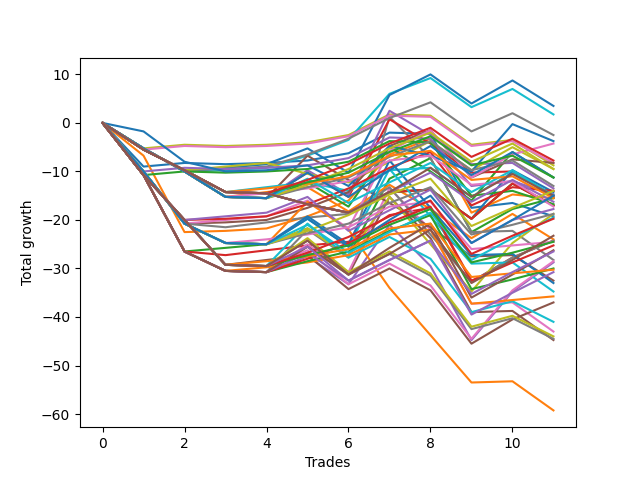

# Short Pointer 009 AB 
- Symbol: ES
- Date Range: 03/18/2022 - 07/15/2022
- Trading Period: 7:20-12:30
- Number of Trades: 11



| Name | Win Percent | Profit | Avg Profit / Trade | Avg Time / Trade |      | Name | Win Percent | Profit | Avg Profit / Trade | Avg Time / Trade |
| ---- | ----------- | ------ | ------------------ | ---------------- | ---- | ---- | ----------- | ------ | ------------------ | ---------------- |
| Sorted By <br> Profit | | | | | | Sorted By <br> Win Percentage ||||
| Forty-Two | 54.55 | 1750.00 | 159.09 | 07:54 |     | Forty-One | 63.64 | 875.00 | 79.55 | 04:27 |
| Forty-One | 63.64 | 875.00 | 79.55 | 04:27 |     | Forty-Nine | 63.64 | -1250.00 | -113.64 | 04:09 |
| Forty-Nine | 63.64 | -1250.00 | -113.64 | 04:09 |     | Fifty-Eight | 63.64 | -2125.00 | -193.18 | 12:46 |
| Seventy-Three | 36.36 | -1875.00 | -170.45 | 05:43 |     | Fifty-Seven | 63.64 | -4125.00 | -375.00 | 07:10 |
| Fifty-Eight | 63.64 | -2125.00 | -193.18 | 12:46 |     | Sixty-Five | 63.64 | -7000.00 | -636.36 | 08:15 |
| One Hundred Eighteen | 45.45 | -3875.00 | -352.27 | 07:19 |     | Two | 63.64 | -7750.00 | -704.55 | 17:45 |
| Fifty-Seven | 63.64 | -4125.00 | -375.00 | 07:10 |     | One | 63.64 | -7750.00 | -704.55 | 11:51 |
| Forty-Eight | 54.55 | -4125.00 | -375.00 | 02:18 |     | Sixty-Six | 63.64 | -8875.00 | -806.82 | 11:48 |
| Forty | 54.55 | -4375.00 | -397.73 | 02:35 |     | Three | 63.64 | -12125.00 | -1102.27 | 16:54 |
| One Hundred Thirteen | 45.45 | -4750.00 | -431.82 | 07:40 |     | One Hundred Twenty-One | 63.64 | -12250.00 | -1113.64 | 08:06 |
| Fifty | 45.45 | -4750.00 | -431.82 | 06:17 |     | One Hundred Twenty-Six | 63.64 | -15125.00 | -1375.00 | 08:24 |
| One Hundred Seventeen | 45.45 | -5625.00 | -511.36 | 06:53 |     | Eighty-One | 63.64 | -17875.00 | -1625.00 | 13:05 |
| One Hundred Fifteen | 36.36 | -5625.00 | -511.36 | 10:27 |     | Forty-Two | 54.55 | 1750.00 | 159.09 | 07:54 |
| Forty-Four | 27.27 | -5625.00 | -511.36 | 10:55 |     | Forty-Eight | 54.55 | -4125.00 | -375.00 | 02:18 |
| One Hundred Twelve | 45.45 | -6500.00 | -590.91 | 07:14 |     | Forty | 54.55 | -4375.00 | -397.73 | 02:35 |
| Forty-Six | 27.27 | -6750.00 | -613.64 | 14:11 |     | One Hundred Twenty-Three | 54.55 | -7000.00 | -636.36 | 11:28 |
| Sixty-Five | 63.64 | -7000.00 | -636.36 | 08:15 |     | Fifty-Six | 54.55 | -7375.00 | -670.45 | 03:51 |
| One Hundred Twenty-Three | 54.55 | -7000.00 | -636.36 | 11:28 |     | One Hundred Sixteen | 54.55 | -7750.00 | -704.55 | 03:59 |
| Fifty-Two | 27.27 | -7125.00 | -647.73 | 09:05 |     | Sixty-Four | 54.55 | -8375.00 | -761.36 | 04:58 |
| Fifty-Six | 54.55 | -7375.00 | -670.45 | 03:51 |     | One Hundred Eleven | 54.55 | -8625.00 | -784.09 | 04:20 |
| Fifty-One | 45.45 | -7375.00 | -670.45 | 06:15 |     | One Hundred Twenty-Two | 54.55 | -9375.00 | -852.27 | 11:01 |
| One Hundred Twenty-Five | 45.45 | -7500.00 | -681.82 | 16:39 |     | Zero | 54.55 | -9625.00 | -875.00 | 07:08 |
| One Hundred Fourteen | 36.36 | -7500.00 | -681.82 | 09:52 |     | One Hundred Twenty-Eight | 54.55 | -9875.00 | -897.73 | 11:46 |
| One Hundred Twenty | 27.27 | -7500.00 | -681.82 | 08:30 |     | Fifty-Nine | 54.55 | -12125.00 | -1102.27 | 10:56 |
| Forty-Five | 27.27 | -7625.00 | -693.18 | 13:06 |     | One Hundred Twenty-Seven | 54.55 | -12250.00 | -1113.64 | 11:19 |
| Two | 63.64 | -7750.00 | -704.55 | 17:45 |     | Eighty-Three | 54.55 | -12625.00 | -1147.73 | 16:27 |
| One | 63.64 | -7750.00 | -704.55 | 11:51 |     | Eighty-Two | 54.55 | -15000.00 | -1363.64 | 16:00 |
| One Hundred Sixteen | 54.55 | -7750.00 | -704.55 | 03:59 |     | One Hundred Eighteen | 45.45 | -3875.00 | -352.27 | 07:19 |
| One Hundred Ninteen | 27.27 | -8125.00 | -738.64 | 08:11 |     | One Hundred Thirteen | 45.45 | -4750.00 | -431.82 | 07:40 |
| Sixty-Four | 54.55 | -8375.00 | -761.36 | 04:58 |     | Fifty | 45.45 | -4750.00 | -431.82 | 06:17 |
| Fifty-Five | 27.27 | -8500.00 | -772.73 | 09:41 |     | One Hundred Seventeen | 45.45 | -5625.00 | -511.36 | 06:53 |
| Fifty-Four | 27.27 | -8500.00 | -772.73 | 09:41 |     | One Hundred Twelve | 45.45 | -6500.00 | -590.91 | 07:14 |
| Fifty-Three | 27.27 | -8500.00 | -772.73 | 09:41 |     | Fifty-One | 45.45 | -7375.00 | -670.45 | 06:15 |
| One Hundred Eleven | 54.55 | -8625.00 | -784.09 | 04:20 |     | One Hundred Twenty-Five | 45.45 | -7500.00 | -681.82 | 16:39 |
| Sixty-Six | 63.64 | -8875.00 | -806.82 | 11:48 |     | One Hundred Twenty-Four | 45.45 | -9750.00 | -886.36 | 15:51 |
| One Hundred Twenty-Two | 54.55 | -9375.00 | -852.27 | 11:01 |     | One Hundred Thirty | 45.45 | -11625.00 | -1056.82 | 14:55 |
| Sixty | 36.36 | -9375.00 | -852.27 | 17:30 |     | Eighty-Five | 45.45 | -13125.00 | -1193.18 | 21:38 |
| Zero | 54.55 | -9625.00 | -875.00 | 07:08 |     | One Hundred Twenty-Nine | 45.45 | -13250.00 | -1204.55 | 14:07 |
| One Hundred Twenty-Four | 45.45 | -9750.00 | -886.36 | 15:51 |     | Eighty-Four | 45.45 | -15375.00 | -1397.73 | 20:50 |
| One Hundred Twenty-Eight | 54.55 | -9875.00 | -897.73 | 11:46 |     | Sixty-Seven | 45.45 | -18500.00 | -1681.82 | 11:05 |
| One Hundred Thirty | 45.45 | -11625.00 | -1056.82 | 14:55 |     | Seventy-Three | 36.36 | -1875.00 | -170.45 | 05:43 |
| Forty-Three | 36.36 | -12000.00 | -1090.91 | 06:56 |     | One Hundred Fifteen | 36.36 | -5625.00 | -511.36 | 10:27 |
| Three | 63.64 | -12125.00 | -1102.27 | 16:54 |     | One Hundred Fourteen | 36.36 | -7500.00 | -681.82 | 09:52 |
| Fifty-Nine | 54.55 | -12125.00 | -1102.27 | 10:56 |     | Sixty | 36.36 | -9375.00 | -852.27 | 17:30 |
| One Hundred Twenty-One | 63.64 | -12250.00 | -1113.64 | 08:06 |     | Forty-Three | 36.36 | -12000.00 | -1090.91 | 06:56 |
| One Hundred Twenty-Seven | 54.55 | -12250.00 | -1113.64 | 11:19 |     | Sixty-Eight | 36.36 | -14250.00 | -1295.45 | 15:43 |
| Eighty-Three | 54.55 | -12625.00 | -1147.73 | 16:27 |     | Four | 36.36 | -14375.00 | -1306.82 | 24:10 |
| Eighty-Five | 45.45 | -13125.00 | -1193.18 | 21:38 |     | Forty-Four | 27.27 | -5625.00 | -511.36 | 10:55 |
| One Hundred Twenty-Nine | 45.45 | -13250.00 | -1204.55 | 14:07 |     | Forty-Six | 27.27 | -6750.00 | -613.64 | 14:11 |
| Seven | 27.27 | -14125.00 | -1284.09 | 29:39 |     | Fifty-Two | 27.27 | -7125.00 | -647.73 | 09:05 |
| Sixty-Eight | 36.36 | -14250.00 | -1295.45 | 15:43 |     | One Hundred Twenty | 27.27 | -7500.00 | -681.82 | 08:30 |
| Four | 36.36 | -14375.00 | -1306.82 | 24:10 |     | Forty-Five | 27.27 | -7625.00 | -693.18 | 13:06 |
| Eighty-Two | 54.55 | -15000.00 | -1363.64 | 16:00 |     | One Hundred Ninteen | 27.27 | -8125.00 | -738.64 | 08:11 |
| One Hundred Twenty-Six | 63.64 | -15125.00 | -1375.00 | 08:24 |     | Fifty-Five | 27.27 | -8500.00 | -772.73 | 09:41 |
| Eighty-Four | 45.45 | -15375.00 | -1397.73 | 20:50 |     | Fifty-Four | 27.27 | -8500.00 | -772.73 | 09:41 |
| Forty-Seven | 18.18 | -16250.00 | -1477.27 | 15:10 |     | Fifty-Three | 27.27 | -8500.00 | -772.73 | 09:41 |
| Sixty-Two | 27.27 | -16500.00 | -1500.00 | 21:27 |     | Seven | 27.27 | -14125.00 | -1284.09 | 29:39 |
| Sixty-One | 27.27 | -17375.00 | -1579.55 | 20:21 |     | Sixty-Two | 27.27 | -16500.00 | -1500.00 | 21:27 |
| Eighty-One | 63.64 | -17875.00 | -1625.00 | 13:05 |     | Sixty-One | 27.27 | -17375.00 | -1579.55 | 20:21 |
| Sixty-Seven | 45.45 | -18500.00 | -1681.82 | 11:05 |     | Seventy-One | 27.27 | -20500.00 | -1863.64 | 18:00 |
| Seventy-One | 27.27 | -20500.00 | -1863.64 | 18:00 |     | Six | 27.27 | -21500.00 | -1954.55 | 28:06 |
| Six | 27.27 | -21500.00 | -1954.55 | 28:06 |     | Seventy | 27.27 | -22000.00 | -2000.00 | 17:48 |
| Seventy | 27.27 | -22000.00 | -2000.00 | 17:48 |     | Sixty-Nine | 27.27 | -22250.00 | -2022.73 | 17:45 |
| Sixty-Nine | 27.27 | -22250.00 | -2022.73 | 17:45 |     | Five | 27.27 | -22375.00 | -2034.09 | 27:00 |
| Five | 27.27 | -22375.00 | -2034.09 | 27:00 |     | Forty-Seven | 18.18 | -16250.00 | -1477.27 | 15:10 |
| Sixty-Three | 18.18 | -29625.00 | -2693.18 | 22:27 |     | Sixty-Three | 18.18 | -29625.00 | -2693.18 | 22:27 |

## NO STOPLOSS

### Test Zero
* Sell when price hits the middle line of the 20p bollinger
* No Stoploss
* Results:
```
Total Trades: 11
Percent Up: 45.45
Percent Down: 54.55
Total Points Moved Down: -19.25
Potential Profit: -9625.00
Total Points Ups: 27.50 Count Ups: 5
Total Points Downs: 8.25 Count Downs: 6
```

<details><summary>Trades</summary>

<code>In: 2022-03-18 12:13:00		Out: 2022-03-18 12:37:20		Total Position Time: 24:20		Total Move Down: -9.00		Total to Date: -9.00</code> <br />
<code>In: 2022-03-24 08:09:00		Out: 2022-03-24 08:09:10		Total Position Time: 00:10		Total Move Down: 0.75		Total to Date: -8.25</code> <br />
<code>In: 2022-03-29 12:15:00		Out: 2022-03-29 12:18:55		Total Position Time: 03:55		Total Move Down: -0.25		Total to Date: -8.50</code> <br />
<code>In: 2022-04-04 11:50:00		Out: 2022-04-04 11:51:05		Total Position Time: 01:05		Total Move Down: 0.25		Total to Date: -8.25</code> <br />
<code>In: 2022-04-20 10:50:00		Out: 2022-04-20 10:50:10		Total Position Time: 00:10		Total Move Down: 0.50		Total to Date: -7.75</code> <br />
<code>In: 2022-04-28 10:42:00		Out: 2022-04-28 10:42:10		Total Position Time: 00:10		Total Move Down: 1.50		Total to Date: -6.25</code> <br />
<code>In: 2022-05-04 11:07:00		Out: 2022-05-04 11:07:10		Total Position Time: 00:10		Total Move Down: 4.25		Total to Date: -2.00</code> <br />
<code>In: 2022-05-24 10:58:00		Out: 2022-05-24 11:01:15		Total Position Time: 03:15		Total Move Down: -0.25		Total to Date: -2.25</code> <br />
<code>In: 2022-05-27 12:03:00		Out: 2022-05-27 12:32:55		Total Position Time: 29:55		Total Move Down: -15.25		Total to Date: -17.50</code> <br />
<code>In: 2022-06-07 11:38:00		Out: 2022-06-07 11:41:10		Total Position Time: 03:10		Total Move Down: 1.00		Total to Date: -16.50</code> <br />
<code>In: 2022-06-30 08:51:00		Out: 2022-06-30 09:03:10		Total Position Time: 12:10		Total Move Down: -2.75		Total to Date: -19.25</code> <br />


</details>

### Test One
* Sell when the price hits the upper line of the 20p 1std bollinger
* No Stoploss
* Results:
```
Total Trades: 11
Percent Up: 36.36
Percent Down: 63.64
Total Points Moved Down: -15.50
Potential Profit: -7750.00
Total Points Ups: 38.50 Count Ups: 4
Total Points Downs: 23.00 Count Downs: 7
```

<details><summary>Trades</summary>

<code>In: 2022-03-18 12:13:00		Out: 2022-03-18 12:39:40		Total Position Time: 26:40		Total Move Down: -6.75		Total to Date: -6.75</code> <br />
<code>In: 2022-03-24 08:09:00		Out: 2022-03-24 08:38:55		Total Position Time: 29:55		Total Move Down: -15.75		Total to Date: -22.50</code> <br />
<code>In: 2022-03-29 12:15:00		Out: 2022-03-29 12:27:35		Total Position Time: 12:35		Total Move Down: 0.25		Total to Date: -22.25</code> <br />
<code>In: 2022-04-04 11:50:00		Out: 2022-04-04 11:52:05		Total Position Time: 02:05		Total Move Down: 0.50		Total to Date: -21.75</code> <br />
<code>In: 2022-04-20 10:50:00		Out: 2022-04-20 10:53:20		Total Position Time: 03:20		Total Move Down: 2.50		Total to Date: -19.25</code> <br />
<code>In: 2022-04-28 10:42:00		Out: 2022-04-28 10:44:10		Total Position Time: 02:10		Total Move Down: 3.25		Total to Date: -16.00</code> <br />
<code>In: 2022-05-04 11:07:00		Out: 2022-05-04 11:07:20		Total Position Time: 00:20		Total Move Down: 9.50		Total to Date: -6.50</code> <br />
<code>In: 2022-05-24 10:58:00		Out: 2022-05-24 11:01:40		Total Position Time: 03:40		Total Move Down: 3.25		Total to Date: -3.25</code> <br />
<code>In: 2022-05-27 12:03:00		Out: 2022-05-27 12:32:55		Total Position Time: 29:55		Total Move Down: -15.25		Total to Date: -18.50</code> <br />
<code>In: 2022-06-07 11:38:00		Out: 2022-06-07 11:43:00		Total Position Time: 05:00		Total Move Down: 3.75		Total to Date: -14.75</code> <br />
<code>In: 2022-06-30 08:51:00		Out: 2022-06-30 09:05:45		Total Position Time: 14:45		Total Move Down: -0.75		Total to Date: -15.50</code> <br />


</details>

### Test Two
* Sell when the price hits the upper line of the 20p 2std bollinger
* No Stoploss
* Results:
```
Total Trades: 11
Percent Up: 36.36
Percent Down: 63.64
Total Points Moved Down: -15.50
Potential Profit: -7750.00
Total Points Ups: 47.50 Count Ups: 4
Total Points Downs: 32.00 Count Downs: 7
```

<details><summary>Trades</summary>

<code>In: 2022-03-18 12:13:00		Out: 2022-03-18 12:42:55		Total Position Time: 29:55		Total Move Down: -10.75		Total to Date: -10.75</code> <br />
<code>In: 2022-03-24 08:09:00		Out: 2022-03-24 08:38:55		Total Position Time: 29:55		Total Move Down: -15.75		Total to Date: -26.50</code> <br />
<code>In: 2022-03-29 12:15:00		Out: 2022-03-29 12:27:50		Total Position Time: 12:50		Total Move Down: 0.75		Total to Date: -25.75</code> <br />
<code>In: 2022-04-04 11:50:00		Out: 2022-04-04 12:03:40		Total Position Time: 13:40		Total Move Down: 0.75		Total to Date: -25.00</code> <br />
<code>In: 2022-04-20 10:50:00		Out: 2022-04-20 11:13:55		Total Position Time: 23:55		Total Move Down: 3.25		Total to Date: -21.75</code> <br />
<code>In: 2022-04-28 10:42:00		Out: 2022-04-28 11:11:55		Total Position Time: 29:55		Total Move Down: -5.75		Total to Date: -27.50</code> <br />
<code>In: 2022-05-04 11:07:00		Out: 2022-05-04 11:07:40		Total Position Time: 00:40		Total Move Down: 16.00		Total to Date: -11.50</code> <br />
<code>In: 2022-05-24 10:58:00		Out: 2022-05-24 11:01:50		Total Position Time: 03:50		Total Move Down: 4.25		Total to Date: -7.25</code> <br />
<code>In: 2022-05-27 12:03:00		Out: 2022-05-27 12:32:55		Total Position Time: 29:55		Total Move Down: -15.25		Total to Date: -22.50</code> <br />
<code>In: 2022-06-07 11:38:00		Out: 2022-06-07 11:43:25		Total Position Time: 05:25		Total Move Down: 4.75		Total to Date: -17.75</code> <br />
<code>In: 2022-06-30 08:51:00		Out: 2022-06-30 09:06:15		Total Position Time: 15:15		Total Move Down: 2.25		Total to Date: -15.50</code> <br />


</details>

### Test Three
* Sell when price hits the middle line of the 50p bollinger
* No Stoploss
* Results:
```
Total Trades: 11
Percent Up: 36.36
Percent Down: 63.64
Total Points Moved Down: -24.25
Potential Profit: -12125.00
Total Points Ups: 42.50 Count Ups: 4
Total Points Downs: 18.25 Count Downs: 7
```

<details><summary>Trades</summary>

<code>In: 2022-03-18 12:13:00		Out: 2022-03-18 12:42:55		Total Position Time: 29:55		Total Move Down: -10.75		Total to Date: -10.75</code> <br />
<code>In: 2022-03-24 08:09:00		Out: 2022-03-24 08:38:55		Total Position Time: 29:55		Total Move Down: -15.75		Total to Date: -26.50</code> <br />
<code>In: 2022-03-29 12:15:00		Out: 2022-03-29 12:43:05		Total Position Time: 28:05		Total Move Down: -0.75		Total to Date: -27.25</code> <br />
<code>In: 2022-04-04 11:50:00		Out: 2022-04-04 12:03:50		Total Position Time: 13:50		Total Move Down: 1.00		Total to Date: -26.25</code> <br />
<code>In: 2022-04-20 10:50:00		Out: 2022-04-20 10:50:20		Total Position Time: 00:20		Total Move Down: 1.00		Total to Date: -25.25</code> <br />
<code>In: 2022-04-28 10:42:00		Out: 2022-04-28 10:52:25		Total Position Time: 10:25		Total Move Down: 0.75		Total to Date: -24.50</code> <br />
<code>In: 2022-05-04 11:07:00		Out: 2022-05-04 11:07:15		Total Position Time: 00:15		Total Move Down: 5.50		Total to Date: -19.00</code> <br />
<code>In: 2022-05-24 10:58:00		Out: 2022-05-24 11:20:25		Total Position Time: 22:25		Total Move Down: 1.50		Total to Date: -17.50</code> <br />
<code>In: 2022-05-27 12:03:00		Out: 2022-05-27 12:32:55		Total Position Time: 29:55		Total Move Down: -15.25		Total to Date: -32.75</code> <br />
<code>In: 2022-06-07 11:38:00		Out: 2022-06-07 11:43:35		Total Position Time: 05:35		Total Move Down: 5.00		Total to Date: -27.75</code> <br />
<code>In: 2022-06-30 08:51:00		Out: 2022-06-30 09:06:20		Total Position Time: 15:20		Total Move Down: 3.50		Total to Date: -24.25</code> <br />


</details>

### Test Four
* Sell when the price hits the upper line of the 50p 1std bollinger
* No Stoploss
* Results:
```
Total Trades: 11
Percent Up: 63.64
Percent Down: 36.36
Total Points Moved Down: -28.75
Potential Profit: -14375.00
Total Points Ups: 60.25 Count Ups: 7
Total Points Downs: 31.50 Count Downs: 4
```

<details><summary>Trades</summary>

<code>In: 2022-03-18 12:13:00		Out: 2022-03-18 12:42:55		Total Position Time: 29:55		Total Move Down: -10.75		Total to Date: -10.75</code> <br />
<code>In: 2022-03-24 08:09:00		Out: 2022-03-24 08:38:55		Total Position Time: 29:55		Total Move Down: -15.75		Total to Date: -26.50</code> <br />
<code>In: 2022-03-29 12:15:00		Out: 2022-03-29 12:44:55		Total Position Time: 29:55		Total Move Down: -4.00		Total to Date: -30.50</code> <br />
<code>In: 2022-04-04 11:50:00		Out: 2022-04-04 12:19:55		Total Position Time: 29:55		Total Move Down: -0.25		Total to Date: -30.75</code> <br />
<code>In: 2022-04-20 10:50:00		Out: 2022-04-20 11:13:55		Total Position Time: 23:55		Total Move Down: 3.25		Total to Date: -27.50</code> <br />
<code>In: 2022-04-28 10:42:00		Out: 2022-04-28 11:11:55		Total Position Time: 29:55		Total Move Down: -5.75		Total to Date: -33.25</code> <br />
<code>In: 2022-05-04 11:07:00		Out: 2022-05-04 11:07:25		Total Position Time: 00:25		Total Move Down: 12.25		Total to Date: -21.00</code> <br />
<code>In: 2022-05-24 10:58:00		Out: 2022-05-24 11:27:55		Total Position Time: 29:55		Total Move Down: -8.50		Total to Date: -29.50</code> <br />
<code>In: 2022-05-27 12:03:00		Out: 2022-05-27 12:32:55		Total Position Time: 29:55		Total Move Down: -15.25		Total to Date: -44.75</code> <br />
<code>In: 2022-06-07 11:38:00		Out: 2022-06-07 11:47:25		Total Position Time: 09:25		Total Move Down: 10.00		Total to Date: -34.75</code> <br />
<code>In: 2022-06-30 08:51:00		Out: 2022-06-30 09:13:40		Total Position Time: 22:40		Total Move Down: 6.00		Total to Date: -28.75</code> <br />


</details>

### Test Five
* Sell when the price hits the upper line of the 50p 2std bollinger
* No Stoploss
* Results:
```
Total Trades: 11
Percent Up: 72.73
Percent Down: 27.27
Total Points Moved Down: -44.75
Potential Profit: -22375.00
Total Points Ups: 66.25 Count Ups: 8
Total Points Downs: 21.50 Count Downs: 3
```

<details><summary>Trades</summary>

<code>In: 2022-03-18 12:13:00		Out: 2022-03-18 12:42:55		Total Position Time: 29:55		Total Move Down: -10.75		Total to Date: -10.75</code> <br />
<code>In: 2022-03-24 08:09:00		Out: 2022-03-24 08:38:55		Total Position Time: 29:55		Total Move Down: -15.75		Total to Date: -26.50</code> <br />
<code>In: 2022-03-29 12:15:00		Out: 2022-03-29 12:44:55		Total Position Time: 29:55		Total Move Down: -4.00		Total to Date: -30.50</code> <br />
<code>In: 2022-04-04 11:50:00		Out: 2022-04-04 12:19:55		Total Position Time: 29:55		Total Move Down: -0.25		Total to Date: -30.75</code> <br />
<code>In: 2022-04-20 10:50:00		Out: 2022-04-20 11:17:15		Total Position Time: 27:15		Total Move Down: 5.25		Total to Date: -25.50</code> <br />
<code>In: 2022-04-28 10:42:00		Out: 2022-04-28 11:11:55		Total Position Time: 29:55		Total Move Down: -5.75		Total to Date: -31.25</code> <br />
<code>In: 2022-05-04 11:07:00		Out: 2022-05-04 11:07:40		Total Position Time: 00:40		Total Move Down: 16.00		Total to Date: -15.25</code> <br />
<code>In: 2022-05-24 10:58:00		Out: 2022-05-24 11:27:55		Total Position Time: 29:55		Total Move Down: -8.50		Total to Date: -23.75</code> <br />
<code>In: 2022-05-27 12:03:00		Out: 2022-05-27 12:32:55		Total Position Time: 29:55		Total Move Down: -15.25		Total to Date: -39.00</code> <br />
<code>In: 2022-06-07 11:38:00		Out: 2022-06-07 12:07:55		Total Position Time: 29:55		Total Move Down: 0.25		Total to Date: -38.75</code> <br />
<code>In: 2022-06-30 08:51:00		Out: 2022-06-30 09:20:55		Total Position Time: 29:55		Total Move Down: -6.00		Total to Date: -44.75</code> <br />


</details>

### Test Six
* Sell when the price hits the middle line of the 1std VWAP
* No Stoploss
* Results:
```
Total Trades: 11
Percent Up: 72.73
Percent Down: 27.27
Total Points Moved Down: -43.00
Potential Profit: -21500.00
Total Points Ups: 66.25 Count Ups: 8
Total Points Downs: 23.25 Count Downs: 3
```

<details><summary>Trades</summary>

<code>In: 2022-03-18 12:13:00		Out: 2022-03-18 12:42:55		Total Position Time: 29:55		Total Move Down: -10.75		Total to Date: -10.75</code> <br />
<code>In: 2022-03-24 08:09:00		Out: 2022-03-24 08:38:55		Total Position Time: 29:55		Total Move Down: -15.75		Total to Date: -26.50</code> <br />
<code>In: 2022-03-29 12:15:00		Out: 2022-03-29 12:44:55		Total Position Time: 29:55		Total Move Down: -4.00		Total to Date: -30.50</code> <br />
<code>In: 2022-04-04 11:50:00		Out: 2022-04-04 12:19:55		Total Position Time: 29:55		Total Move Down: -0.25		Total to Date: -30.75</code> <br />
<code>In: 2022-04-20 10:50:00		Out: 2022-04-20 11:17:50		Total Position Time: 27:50		Total Move Down: 5.75		Total to Date: -25.00</code> <br />
<code>In: 2022-04-28 10:42:00		Out: 2022-04-28 11:11:55		Total Position Time: 29:55		Total Move Down: -5.75		Total to Date: -30.75</code> <br />
<code>In: 2022-05-04 11:07:00		Out: 2022-05-04 11:19:05		Total Position Time: 12:05		Total Move Down: 17.25		Total to Date: -13.50</code> <br />
<code>In: 2022-05-24 10:58:00		Out: 2022-05-24 11:27:55		Total Position Time: 29:55		Total Move Down: -8.50		Total to Date: -22.00</code> <br />
<code>In: 2022-05-27 12:03:00		Out: 2022-05-27 12:32:55		Total Position Time: 29:55		Total Move Down: -15.25		Total to Date: -37.25</code> <br />
<code>In: 2022-06-07 11:38:00		Out: 2022-06-07 12:07:55		Total Position Time: 29:55		Total Move Down: 0.25		Total to Date: -37.00</code> <br />
<code>In: 2022-06-30 08:51:00		Out: 2022-06-30 09:20:55		Total Position Time: 29:55		Total Move Down: -6.00		Total to Date: -43.00</code> <br />


</details>

### Test Seven
* Sell when the price hits the upper line of the 1std VWAP
* No Stoploss
* Results:
```
Total Trades: 11
Percent Up: 72.73
Percent Down: 27.27
Total Points Moved Down: -28.25
Potential Profit: -14125.00
Total Points Ups: 66.25 Count Ups: 8
Total Points Downs: 38.00 Count Downs: 3
```

<details><summary>Trades</summary>

<code>In: 2022-03-18 12:13:00		Out: 2022-03-18 12:42:55		Total Position Time: 29:55		Total Move Down: -10.75		Total to Date: -10.75</code> <br />
<code>In: 2022-03-24 08:09:00		Out: 2022-03-24 08:38:55		Total Position Time: 29:55		Total Move Down: -15.75		Total to Date: -26.50</code> <br />
<code>In: 2022-03-29 12:15:00		Out: 2022-03-29 12:44:55		Total Position Time: 29:55		Total Move Down: -4.00		Total to Date: -30.50</code> <br />
<code>In: 2022-04-04 11:50:00		Out: 2022-04-04 12:19:55		Total Position Time: 29:55		Total Move Down: -0.25		Total to Date: -30.75</code> <br />
<code>In: 2022-04-20 10:50:00		Out: 2022-04-20 11:19:55		Total Position Time: 29:55		Total Move Down: 8.75		Total to Date: -22.00</code> <br />
<code>In: 2022-04-28 10:42:00		Out: 2022-04-28 11:11:55		Total Position Time: 29:55		Total Move Down: -5.75		Total to Date: -27.75</code> <br />
<code>In: 2022-05-04 11:07:00		Out: 2022-05-04 11:34:00		Total Position Time: 27:00		Total Move Down: 29.00		Total to Date: 1.25</code> <br />
<code>In: 2022-05-24 10:58:00		Out: 2022-05-24 11:27:55		Total Position Time: 29:55		Total Move Down: -8.50		Total to Date: -7.25</code> <br />
<code>In: 2022-05-27 12:03:00		Out: 2022-05-27 12:32:55		Total Position Time: 29:55		Total Move Down: -15.25		Total to Date: -22.50</code> <br />
<code>In: 2022-06-07 11:38:00		Out: 2022-06-07 12:07:55		Total Position Time: 29:55		Total Move Down: 0.25		Total to Date: -22.25</code> <br />
<code>In: 2022-06-30 08:51:00		Out: 2022-06-30 09:20:55		Total Position Time: 29:55		Total Move Down: -6.00		Total to Date: -28.25</code> <br />


</details>

## STOPLOSS OF 5

### Test Forty
* Sell when price hits the middle line of the 20p bollinger
* Stoploss is -5 points
* Results:
```
Total Trades: 11
Percent Up: 45.45
Percent Down: 54.55
Total Points Moved Down: -8.75
Potential Profit: -4375.00
Total Points Ups: 17.00 Count Ups: 5
Total Points Downs: 8.25 Count Downs: 6
```

<details><summary>Trades</summary>

<code>In: 2022-03-18 12:13:00		Out: 2022-03-18 12:19:35		Total Position Time: 06:35		Total Move Down: -5.25		Total to Date: -5.25</code> <br />
<code>In: 2022-03-24 08:09:00		Out: 2022-03-24 08:09:10		Total Position Time: 00:10		Total Move Down: 0.75		Total to Date: -4.50</code> <br />
<code>In: 2022-03-29 12:15:00		Out: 2022-03-29 12:18:55		Total Position Time: 03:55		Total Move Down: -0.25		Total to Date: -4.75</code> <br />
<code>In: 2022-04-04 11:50:00		Out: 2022-04-04 11:51:05		Total Position Time: 01:05		Total Move Down: 0.25		Total to Date: -4.50</code> <br />
<code>In: 2022-04-20 10:50:00		Out: 2022-04-20 10:50:10		Total Position Time: 00:10		Total Move Down: 0.50		Total to Date: -4.00</code> <br />
<code>In: 2022-04-28 10:42:00		Out: 2022-04-28 10:42:10		Total Position Time: 00:10		Total Move Down: 1.50		Total to Date: -2.50</code> <br />
<code>In: 2022-05-04 11:07:00		Out: 2022-05-04 11:07:10		Total Position Time: 00:10		Total Move Down: 4.25		Total to Date: 1.75</code> <br />
<code>In: 2022-05-24 10:58:00		Out: 2022-05-24 11:01:15		Total Position Time: 03:15		Total Move Down: -0.25		Total to Date: 1.50</code> <br />
<code>In: 2022-05-27 12:03:00		Out: 2022-05-27 12:05:30		Total Position Time: 02:30		Total Move Down: -6.00		Total to Date: -4.50</code> <br />
<code>In: 2022-06-07 11:38:00		Out: 2022-06-07 11:41:10		Total Position Time: 03:10		Total Move Down: 1.00		Total to Date: -3.50</code> <br />
<code>In: 2022-06-30 08:51:00		Out: 2022-06-30 08:58:15		Total Position Time: 07:15		Total Move Down: -5.25		Total to Date: -8.75</code> <br />


</details>

### Test Forty-One
* Sell when the price hits the upper line of the 20p 1std bollinger
* Stoploss is -5 points
* Results:
```
Total Trades: 11
Percent Up: 36.36
Percent Down: 63.64
Total Points Moved Down: 1.75
Potential Profit: 875.00
Total Points Ups: 21.25 Count Ups: 4
Total Points Downs: 23.00 Count Downs: 7
```

<details><summary>Trades</summary>

<code>In: 2022-03-18 12:13:00		Out: 2022-03-18 12:19:35		Total Position Time: 06:35		Total Move Down: -5.25		Total to Date: -5.25</code> <br />
<code>In: 2022-03-24 08:09:00		Out: 2022-03-24 08:12:30		Total Position Time: 03:30		Total Move Down: -4.75		Total to Date: -10.00</code> <br />
<code>In: 2022-03-29 12:15:00		Out: 2022-03-29 12:27:35		Total Position Time: 12:35		Total Move Down: 0.25		Total to Date: -9.75</code> <br />
<code>In: 2022-04-04 11:50:00		Out: 2022-04-04 11:52:05		Total Position Time: 02:05		Total Move Down: 0.50		Total to Date: -9.25</code> <br />
<code>In: 2022-04-20 10:50:00		Out: 2022-04-20 10:53:20		Total Position Time: 03:20		Total Move Down: 2.50		Total to Date: -6.75</code> <br />
<code>In: 2022-04-28 10:42:00		Out: 2022-04-28 10:44:10		Total Position Time: 02:10		Total Move Down: 3.25		Total to Date: -3.50</code> <br />
<code>In: 2022-05-04 11:07:00		Out: 2022-05-04 11:07:20		Total Position Time: 00:20		Total Move Down: 9.50		Total to Date: 6.00</code> <br />
<code>In: 2022-05-24 10:58:00		Out: 2022-05-24 11:01:40		Total Position Time: 03:40		Total Move Down: 3.25		Total to Date: 9.25</code> <br />
<code>In: 2022-05-27 12:03:00		Out: 2022-05-27 12:05:30		Total Position Time: 02:30		Total Move Down: -6.00		Total to Date: 3.25</code> <br />
<code>In: 2022-06-07 11:38:00		Out: 2022-06-07 11:43:00		Total Position Time: 05:00		Total Move Down: 3.75		Total to Date: 7.00</code> <br />
<code>In: 2022-06-30 08:51:00		Out: 2022-06-30 08:58:15		Total Position Time: 07:15		Total Move Down: -5.25		Total to Date: 1.75</code> <br />


</details>

### Test Forty-Two
* Sell when the price hits the upper line of the 20p 2std bollinger
* Stoploss is -5 points
* Results:
```
Total Trades: 11
Percent Up: 45.45
Percent Down: 54.55
Total Points Moved Down: 3.50
Potential Profit: 1750.00
Total Points Ups: 26.25 Count Ups: 5
Total Points Downs: 29.75 Count Downs: 6
```

<details><summary>Trades</summary>

<code>In: 2022-03-18 12:13:00		Out: 2022-03-18 12:19:35		Total Position Time: 06:35		Total Move Down: -5.25		Total to Date: -5.25</code> <br />
<code>In: 2022-03-24 08:09:00		Out: 2022-03-24 08:12:30		Total Position Time: 03:30		Total Move Down: -4.75		Total to Date: -10.00</code> <br />
<code>In: 2022-03-29 12:15:00		Out: 2022-03-29 12:27:50		Total Position Time: 12:50		Total Move Down: 0.75		Total to Date: -9.25</code> <br />
<code>In: 2022-04-04 11:50:00		Out: 2022-04-04 12:03:40		Total Position Time: 13:40		Total Move Down: 0.75		Total to Date: -8.50</code> <br />
<code>In: 2022-04-20 10:50:00		Out: 2022-04-20 11:13:55		Total Position Time: 23:55		Total Move Down: 3.25		Total to Date: -5.25</code> <br />
<code>In: 2022-04-28 10:42:00		Out: 2022-04-28 10:48:50		Total Position Time: 06:50		Total Move Down: -5.00		Total to Date: -10.25</code> <br />
<code>In: 2022-05-04 11:07:00		Out: 2022-05-04 11:07:40		Total Position Time: 00:40		Total Move Down: 16.00		Total to Date: 5.75</code> <br />
<code>In: 2022-05-24 10:58:00		Out: 2022-05-24 11:01:50		Total Position Time: 03:50		Total Move Down: 4.25		Total to Date: 10.00</code> <br />
<code>In: 2022-05-27 12:03:00		Out: 2022-05-27 12:05:30		Total Position Time: 02:30		Total Move Down: -6.00		Total to Date: 4.00</code> <br />
<code>In: 2022-06-07 11:38:00		Out: 2022-06-07 11:43:25		Total Position Time: 05:25		Total Move Down: 4.75		Total to Date: 8.75</code> <br />
<code>In: 2022-06-30 08:51:00		Out: 2022-06-30 08:58:15		Total Position Time: 07:15		Total Move Down: -5.25		Total to Date: 3.50</code> <br />


</details>

### Test Forty-Three
* Sell when price hits the middle line of the 50p bollinger
* Stoploss is -5 points
* Results:
```
Total Trades: 11
Percent Up: 63.64
Percent Down: 36.36
Total Points Moved Down: -24.00
Potential Profit: -12000.00
Total Points Ups: 36.50 Count Ups: 7
Total Points Downs: 12.50 Count Downs: 4
```

<details><summary>Trades</summary>

<code>In: 2022-03-18 12:13:00		Out: 2022-03-18 12:19:35		Total Position Time: 06:35		Total Move Down: -5.25		Total to Date: -5.25</code> <br />
<code>In: 2022-03-24 08:09:00		Out: 2022-03-24 08:12:30		Total Position Time: 03:30		Total Move Down: -4.75		Total to Date: -10.00</code> <br />
<code>In: 2022-03-29 12:15:00		Out: 2022-03-29 12:33:35		Total Position Time: 18:35		Total Move Down: -5.25		Total to Date: -15.25</code> <br />
<code>In: 2022-04-04 11:50:00		Out: 2022-04-04 12:03:50		Total Position Time: 13:50		Total Move Down: 1.00		Total to Date: -14.25</code> <br />
<code>In: 2022-04-20 10:50:00		Out: 2022-04-20 10:50:20		Total Position Time: 00:20		Total Move Down: 1.00		Total to Date: -13.25</code> <br />
<code>In: 2022-04-28 10:42:00		Out: 2022-04-28 10:48:50		Total Position Time: 06:50		Total Move Down: -5.00		Total to Date: -18.25</code> <br />
<code>In: 2022-05-04 11:07:00		Out: 2022-05-04 11:07:15		Total Position Time: 00:15		Total Move Down: 5.50		Total to Date: -12.75</code> <br />
<code>In: 2022-05-24 10:58:00		Out: 2022-05-24 11:09:10		Total Position Time: 11:10		Total Move Down: -5.00		Total to Date: -17.75</code> <br />
<code>In: 2022-05-27 12:03:00		Out: 2022-05-27 12:05:30		Total Position Time: 02:30		Total Move Down: -6.00		Total to Date: -23.75</code> <br />
<code>In: 2022-06-07 11:38:00		Out: 2022-06-07 11:43:35		Total Position Time: 05:35		Total Move Down: 5.00		Total to Date: -18.75</code> <br />
<code>In: 2022-06-30 08:51:00		Out: 2022-06-30 08:58:15		Total Position Time: 07:15		Total Move Down: -5.25		Total to Date: -24.00</code> <br />


</details>

### Test Forty-Four
* Sell when the price hits the upper line of the 50p 1std bollinger
* Stoploss is -5 points
* Results:
```
Total Trades: 11
Percent Up: 72.73
Percent Down: 27.27
Total Points Moved Down: -11.25
Potential Profit: -5625.00
Total Points Ups: 36.75 Count Ups: 8
Total Points Downs: 25.50 Count Downs: 3
```

<details><summary>Trades</summary>

<code>In: 2022-03-18 12:13:00		Out: 2022-03-18 12:19:35		Total Position Time: 06:35		Total Move Down: -5.25		Total to Date: -5.25</code> <br />
<code>In: 2022-03-24 08:09:00		Out: 2022-03-24 08:12:30		Total Position Time: 03:30		Total Move Down: -4.75		Total to Date: -10.00</code> <br />
<code>In: 2022-03-29 12:15:00		Out: 2022-03-29 12:33:35		Total Position Time: 18:35		Total Move Down: -5.25		Total to Date: -15.25</code> <br />
<code>In: 2022-04-04 11:50:00		Out: 2022-04-04 12:19:55		Total Position Time: 29:55		Total Move Down: -0.25		Total to Date: -15.50</code> <br />
<code>In: 2022-04-20 10:50:00		Out: 2022-04-20 11:13:55		Total Position Time: 23:55		Total Move Down: 3.25		Total to Date: -12.25</code> <br />
<code>In: 2022-04-28 10:42:00		Out: 2022-04-28 10:48:50		Total Position Time: 06:50		Total Move Down: -5.00		Total to Date: -17.25</code> <br />
<code>In: 2022-05-04 11:07:00		Out: 2022-05-04 11:07:25		Total Position Time: 00:25		Total Move Down: 12.25		Total to Date: -5.00</code> <br />
<code>In: 2022-05-24 10:58:00		Out: 2022-05-24 11:09:10		Total Position Time: 11:10		Total Move Down: -5.00		Total to Date: -10.00</code> <br />
<code>In: 2022-05-27 12:03:00		Out: 2022-05-27 12:05:30		Total Position Time: 02:30		Total Move Down: -6.00		Total to Date: -16.00</code> <br />
<code>In: 2022-06-07 11:38:00		Out: 2022-06-07 11:47:25		Total Position Time: 09:25		Total Move Down: 10.00		Total to Date: -6.00</code> <br />
<code>In: 2022-06-30 08:51:00		Out: 2022-06-30 08:58:15		Total Position Time: 07:15		Total Move Down: -5.25		Total to Date: -11.25</code> <br />


</details>

### Test Forty-Five
* Sell when the price hits the upper line of the 50p 2std bollinger
* Stoploss is -5 points
* Results:
```
Total Trades: 11
Percent Up: 72.73
Percent Down: 27.27
Total Points Moved Down: -15.25
Potential Profit: -7625.00
Total Points Ups: 36.75 Count Ups: 8
Total Points Downs: 21.50 Count Downs: 3
```

<details><summary>Trades</summary>

<code>In: 2022-03-18 12:13:00		Out: 2022-03-18 12:19:35		Total Position Time: 06:35		Total Move Down: -5.25		Total to Date: -5.25</code> <br />
<code>In: 2022-03-24 08:09:00		Out: 2022-03-24 08:12:30		Total Position Time: 03:30		Total Move Down: -4.75		Total to Date: -10.00</code> <br />
<code>In: 2022-03-29 12:15:00		Out: 2022-03-29 12:33:35		Total Position Time: 18:35		Total Move Down: -5.25		Total to Date: -15.25</code> <br />
<code>In: 2022-04-04 11:50:00		Out: 2022-04-04 12:19:55		Total Position Time: 29:55		Total Move Down: -0.25		Total to Date: -15.50</code> <br />
<code>In: 2022-04-20 10:50:00		Out: 2022-04-20 11:17:15		Total Position Time: 27:15		Total Move Down: 5.25		Total to Date: -10.25</code> <br />
<code>In: 2022-04-28 10:42:00		Out: 2022-04-28 10:48:50		Total Position Time: 06:50		Total Move Down: -5.00		Total to Date: -15.25</code> <br />
<code>In: 2022-05-04 11:07:00		Out: 2022-05-04 11:07:40		Total Position Time: 00:40		Total Move Down: 16.00		Total to Date: 0.75</code> <br />
<code>In: 2022-05-24 10:58:00		Out: 2022-05-24 11:09:10		Total Position Time: 11:10		Total Move Down: -5.00		Total to Date: -4.25</code> <br />
<code>In: 2022-05-27 12:03:00		Out: 2022-05-27 12:05:30		Total Position Time: 02:30		Total Move Down: -6.00		Total to Date: -10.25</code> <br />
<code>In: 2022-06-07 11:38:00		Out: 2022-06-07 12:07:55		Total Position Time: 29:55		Total Move Down: 0.25		Total to Date: -10.00</code> <br />
<code>In: 2022-06-30 08:51:00		Out: 2022-06-30 08:58:15		Total Position Time: 07:15		Total Move Down: -5.25		Total to Date: -15.25</code> <br />


</details>

### Test Forty-Six
* Sell when the price hits the middle line of the 1std VWAP
* Stoploss is -5 points
* Results:
```
Total Trades: 11
Percent Up: 72.73
Percent Down: 27.27
Total Points Moved Down: -13.50
Potential Profit: -6750.00
Total Points Ups: 36.75 Count Ups: 8
Total Points Downs: 23.25 Count Downs: 3
```

<details><summary>Trades</summary>

<code>In: 2022-03-18 12:13:00		Out: 2022-03-18 12:19:35		Total Position Time: 06:35		Total Move Down: -5.25		Total to Date: -5.25</code> <br />
<code>In: 2022-03-24 08:09:00		Out: 2022-03-24 08:12:30		Total Position Time: 03:30		Total Move Down: -4.75		Total to Date: -10.00</code> <br />
<code>In: 2022-03-29 12:15:00		Out: 2022-03-29 12:33:35		Total Position Time: 18:35		Total Move Down: -5.25		Total to Date: -15.25</code> <br />
<code>In: 2022-04-04 11:50:00		Out: 2022-04-04 12:19:55		Total Position Time: 29:55		Total Move Down: -0.25		Total to Date: -15.50</code> <br />
<code>In: 2022-04-20 10:50:00		Out: 2022-04-20 11:17:50		Total Position Time: 27:50		Total Move Down: 5.75		Total to Date: -9.75</code> <br />
<code>In: 2022-04-28 10:42:00		Out: 2022-04-28 10:48:50		Total Position Time: 06:50		Total Move Down: -5.00		Total to Date: -14.75</code> <br />
<code>In: 2022-05-04 11:07:00		Out: 2022-05-04 11:19:05		Total Position Time: 12:05		Total Move Down: 17.25		Total to Date: 2.50</code> <br />
<code>In: 2022-05-24 10:58:00		Out: 2022-05-24 11:09:10		Total Position Time: 11:10		Total Move Down: -5.00		Total to Date: -2.50</code> <br />
<code>In: 2022-05-27 12:03:00		Out: 2022-05-27 12:05:30		Total Position Time: 02:30		Total Move Down: -6.00		Total to Date: -8.50</code> <br />
<code>In: 2022-06-07 11:38:00		Out: 2022-06-07 12:07:55		Total Position Time: 29:55		Total Move Down: 0.25		Total to Date: -8.25</code> <br />
<code>In: 2022-06-30 08:51:00		Out: 2022-06-30 08:58:15		Total Position Time: 07:15		Total Move Down: -5.25		Total to Date: -13.50</code> <br />


</details>

### Test Forty-Seven
* Sell when the price hits the upper line of the 1std VWAP
* Stoploss is -5 points
* Results:
```
Total Trades: 11
Percent Up: 81.82
Percent Down: 18.18
Total Points Moved Down: -32.50
Potential Profit: -16250.00
Total Points Ups: 41.50 Count Ups: 9
Total Points Downs: 9.00 Count Downs: 2
```

<details><summary>Trades</summary>

<code>In: 2022-03-18 12:13:00		Out: 2022-03-18 12:19:35		Total Position Time: 06:35		Total Move Down: -5.25		Total to Date: -5.25</code> <br />
<code>In: 2022-03-24 08:09:00		Out: 2022-03-24 08:12:30		Total Position Time: 03:30		Total Move Down: -4.75		Total to Date: -10.00</code> <br />
<code>In: 2022-03-29 12:15:00		Out: 2022-03-29 12:33:35		Total Position Time: 18:35		Total Move Down: -5.25		Total to Date: -15.25</code> <br />
<code>In: 2022-04-04 11:50:00		Out: 2022-04-04 12:19:55		Total Position Time: 29:55		Total Move Down: -0.25		Total to Date: -15.50</code> <br />
<code>In: 2022-04-20 10:50:00		Out: 2022-04-20 11:19:55		Total Position Time: 29:55		Total Move Down: 8.75		Total to Date: -6.75</code> <br />
<code>In: 2022-04-28 10:42:00		Out: 2022-04-28 10:48:50		Total Position Time: 06:50		Total Move Down: -5.00		Total to Date: -11.75</code> <br />
<code>In: 2022-05-04 11:07:00		Out: 2022-05-04 11:27:40		Total Position Time: 20:40		Total Move Down: -4.75		Total to Date: -16.50</code> <br />
<code>In: 2022-05-24 10:58:00		Out: 2022-05-24 11:09:10		Total Position Time: 11:10		Total Move Down: -5.00		Total to Date: -21.50</code> <br />
<code>In: 2022-05-27 12:03:00		Out: 2022-05-27 12:05:30		Total Position Time: 02:30		Total Move Down: -6.00		Total to Date: -27.50</code> <br />
<code>In: 2022-06-07 11:38:00		Out: 2022-06-07 12:07:55		Total Position Time: 29:55		Total Move Down: 0.25		Total to Date: -27.25</code> <br />
<code>In: 2022-06-30 08:51:00		Out: 2022-06-30 08:58:15		Total Position Time: 07:15		Total Move Down: -5.25		Total to Date: -32.50</code> <br />


</details>

## TRAIL STOP OF 5

### Test Forty-Eight
* Sell when price hits the middle line of the 20p bollinger
* Trailing Stop is -5 points
* Results:
```
Total Trades: 11
Percent Up: 45.45
Percent Down: 54.55
Total Points Moved Down: -8.25
Potential Profit: -4125.00
Total Points Ups: 16.50 Count Ups: 5
Total Points Downs: 8.25 Count Downs: 6
```

<details><summary>Trades</summary>

<code>In: 2022-03-18 12:13:00		Out: 2022-03-18 12:19:45		Total Position Time: 06:45		Total Move Down: -5.50		Total to Date: -5.50</code> <br />
<code>In: 2022-03-24 08:09:00		Out: 2022-03-24 08:09:10		Total Position Time: 00:10		Total Move Down: 0.75		Total to Date: -4.75</code> <br />
<code>In: 2022-03-29 12:15:00		Out: 2022-03-29 12:18:55		Total Position Time: 03:55		Total Move Down: -0.25		Total to Date: -5.00</code> <br />
<code>In: 2022-04-04 11:50:00		Out: 2022-04-04 11:51:05		Total Position Time: 01:05		Total Move Down: 0.25		Total to Date: -4.75</code> <br />
<code>In: 2022-04-20 10:50:00		Out: 2022-04-20 10:50:10		Total Position Time: 00:10		Total Move Down: 0.50		Total to Date: -4.25</code> <br />
<code>In: 2022-04-28 10:42:00		Out: 2022-04-28 10:42:10		Total Position Time: 00:10		Total Move Down: 1.50		Total to Date: -2.75</code> <br />
<code>In: 2022-05-04 11:07:00		Out: 2022-05-04 11:07:10		Total Position Time: 00:10		Total Move Down: 4.25		Total to Date: 1.50</code> <br />
<code>In: 2022-05-24 10:58:00		Out: 2022-05-24 11:01:15		Total Position Time: 03:15		Total Move Down: -0.25		Total to Date: 1.25</code> <br />
<code>In: 2022-05-27 12:03:00		Out: 2022-05-27 12:05:30		Total Position Time: 02:30		Total Move Down: -6.00		Total to Date: -4.75</code> <br />
<code>In: 2022-06-07 11:38:00		Out: 2022-06-07 11:41:10		Total Position Time: 03:10		Total Move Down: 1.00		Total to Date: -3.75</code> <br />
<code>In: 2022-06-30 08:51:00		Out: 2022-06-30 08:55:00		Total Position Time: 04:00		Total Move Down: -4.50		Total to Date: -8.25</code> <br />


</details>

### Test Forty-Nine
* Sell when the price hits the upper line of the 20p 1std bollinger
* Trailing Stop is -5 points
* Results:
```
Total Trades: 11
Percent Up: 36.36
Percent Down: 63.64
Total Points Moved Down: -2.50
Potential Profit: -1250.00
Total Points Ups: 20.25 Count Ups: 4
Total Points Downs: 17.75 Count Downs: 7
```

<details><summary>Trades</summary>

<code>In: 2022-03-18 12:13:00		Out: 2022-03-18 12:19:45		Total Position Time: 06:45		Total Move Down: -5.50		Total to Date: -5.50</code> <br />
<code>In: 2022-03-24 08:09:00		Out: 2022-03-24 08:12:25		Total Position Time: 03:25		Total Move Down: -4.25		Total to Date: -9.75</code> <br />
<code>In: 2022-03-29 12:15:00		Out: 2022-03-29 12:27:35		Total Position Time: 12:35		Total Move Down: 0.25		Total to Date: -9.50</code> <br />
<code>In: 2022-04-04 11:50:00		Out: 2022-04-04 11:52:05		Total Position Time: 02:05		Total Move Down: 0.50		Total to Date: -9.00</code> <br />
<code>In: 2022-04-20 10:50:00		Out: 2022-04-20 10:53:20		Total Position Time: 03:20		Total Move Down: 2.50		Total to Date: -6.50</code> <br />
<code>In: 2022-04-28 10:42:00		Out: 2022-04-28 10:44:10		Total Position Time: 02:10		Total Move Down: 3.25		Total to Date: -3.25</code> <br />
<code>In: 2022-05-04 11:07:00		Out: 2022-05-04 11:07:10		Total Position Time: 00:10		Total Move Down: 4.25		Total to Date: 1.00</code> <br />
<code>In: 2022-05-24 10:58:00		Out: 2022-05-24 11:01:40		Total Position Time: 03:40		Total Move Down: 3.25		Total to Date: 4.25</code> <br />
<code>In: 2022-05-27 12:03:00		Out: 2022-05-27 12:05:30		Total Position Time: 02:30		Total Move Down: -6.00		Total to Date: -1.75</code> <br />
<code>In: 2022-06-07 11:38:00		Out: 2022-06-07 11:43:00		Total Position Time: 05:00		Total Move Down: 3.75		Total to Date: 2.00</code> <br />
<code>In: 2022-06-30 08:51:00		Out: 2022-06-30 08:55:00		Total Position Time: 04:00		Total Move Down: -4.50		Total to Date: -2.50</code> <br />


</details>

### Test Fifty
* Sell when the price hits the upper line of the 20p 2std bollinger
* Trailing Stop is -5 points
* Results:
```
Total Trades: 11
Percent Up: 54.55
Percent Down: 45.45
Total Points Moved Down: -9.50
Potential Profit: -4750.00
Total Points Ups: 24.25 Count Ups: 6
Total Points Downs: 14.75 Count Downs: 5
```

<details><summary>Trades</summary>

<code>In: 2022-03-18 12:13:00		Out: 2022-03-18 12:19:45		Total Position Time: 06:45		Total Move Down: -5.50		Total to Date: -5.50</code> <br />
<code>In: 2022-03-24 08:09:00		Out: 2022-03-24 08:12:25		Total Position Time: 03:25		Total Move Down: -4.25		Total to Date: -9.75</code> <br />
<code>In: 2022-03-29 12:15:00		Out: 2022-03-29 12:27:50		Total Position Time: 12:50		Total Move Down: 0.75		Total to Date: -9.00</code> <br />
<code>In: 2022-04-04 11:50:00		Out: 2022-04-04 12:03:40		Total Position Time: 13:40		Total Move Down: 0.75		Total to Date: -8.25</code> <br />
<code>In: 2022-04-20 10:50:00		Out: 2022-04-20 11:01:40		Total Position Time: 11:40		Total Move Down: -2.25		Total to Date: -10.50</code> <br />
<code>In: 2022-04-28 10:42:00		Out: 2022-04-28 10:46:55		Total Position Time: 04:55		Total Move Down: -1.75		Total to Date: -12.25</code> <br />
<code>In: 2022-05-04 11:07:00		Out: 2022-05-04 11:07:10		Total Position Time: 00:10		Total Move Down: 4.25		Total to Date: -8.00</code> <br />
<code>In: 2022-05-24 10:58:00		Out: 2022-05-24 11:01:50		Total Position Time: 03:50		Total Move Down: 4.25		Total to Date: -3.75</code> <br />
<code>In: 2022-05-27 12:03:00		Out: 2022-05-27 12:05:30		Total Position Time: 02:30		Total Move Down: -6.00		Total to Date: -9.75</code> <br />
<code>In: 2022-06-07 11:38:00		Out: 2022-06-07 11:43:25		Total Position Time: 05:25		Total Move Down: 4.75		Total to Date: -5.00</code> <br />
<code>In: 2022-06-30 08:51:00		Out: 2022-06-30 08:55:00		Total Position Time: 04:00		Total Move Down: -4.50		Total to Date: -9.50</code> <br />


</details>

### Test Fifty-One
* Sell when price hits the middle line of the 50p bollinger
* Trailing Stop is -5 points
* Results:
```
Total Trades: 11
Percent Up: 54.55
Percent Down: 45.45
Total Points Moved Down: -14.75
Potential Profit: -7375.00
Total Points Ups: 26.50 Count Ups: 6
Total Points Downs: 11.75 Count Downs: 5
```

<details><summary>Trades</summary>

<code>In: 2022-03-18 12:13:00		Out: 2022-03-18 12:19:45		Total Position Time: 06:45		Total Move Down: -5.50		Total to Date: -5.50</code> <br />
<code>In: 2022-03-24 08:09:00		Out: 2022-03-24 08:12:25		Total Position Time: 03:25		Total Move Down: -4.25		Total to Date: -9.75</code> <br />
<code>In: 2022-03-29 12:15:00		Out: 2022-03-29 12:32:55		Total Position Time: 17:55		Total Move Down: -4.50		Total to Date: -14.25</code> <br />
<code>In: 2022-04-04 11:50:00		Out: 2022-04-04 12:03:50		Total Position Time: 13:50		Total Move Down: 1.00		Total to Date: -13.25</code> <br />
<code>In: 2022-04-20 10:50:00		Out: 2022-04-20 10:50:20		Total Position Time: 00:20		Total Move Down: 1.00		Total to Date: -12.25</code> <br />
<code>In: 2022-04-28 10:42:00		Out: 2022-04-28 10:46:55		Total Position Time: 04:55		Total Move Down: -1.75		Total to Date: -14.00</code> <br />
<code>In: 2022-05-04 11:07:00		Out: 2022-05-04 11:07:10		Total Position Time: 00:10		Total Move Down: 4.25		Total to Date: -9.75</code> <br />
<code>In: 2022-05-24 10:58:00		Out: 2022-05-24 11:07:25		Total Position Time: 09:25		Total Move Down: 0.50		Total to Date: -9.25</code> <br />
<code>In: 2022-05-27 12:03:00		Out: 2022-05-27 12:05:30		Total Position Time: 02:30		Total Move Down: -6.00		Total to Date: -15.25</code> <br />
<code>In: 2022-06-07 11:38:00		Out: 2022-06-07 11:43:35		Total Position Time: 05:35		Total Move Down: 5.00		Total to Date: -10.25</code> <br />
<code>In: 2022-06-30 08:51:00		Out: 2022-06-30 08:55:00		Total Position Time: 04:00		Total Move Down: -4.50		Total to Date: -14.75</code> <br />


</details>

### Test Fifty-Two
* Sell when the price hits the upper line of the 50p 1std bollinger
* Trailing Stop is -5 points
* Results:
```
Total Trades: 11
Percent Up: 72.73
Percent Down: 27.27
Total Points Moved Down: -14.25
Potential Profit: -7125.00
Total Points Ups: 29.00 Count Ups: 8
Total Points Downs: 14.75 Count Downs: 3
```

<details><summary>Trades</summary>

<code>In: 2022-03-18 12:13:00		Out: 2022-03-18 12:19:45		Total Position Time: 06:45		Total Move Down: -5.50		Total to Date: -5.50</code> <br />
<code>In: 2022-03-24 08:09:00		Out: 2022-03-24 08:12:25		Total Position Time: 03:25		Total Move Down: -4.25		Total to Date: -9.75</code> <br />
<code>In: 2022-03-29 12:15:00		Out: 2022-03-29 12:32:55		Total Position Time: 17:55		Total Move Down: -4.50		Total to Date: -14.25</code> <br />
<code>In: 2022-04-04 11:50:00		Out: 2022-04-04 12:19:55		Total Position Time: 29:55		Total Move Down: -0.25		Total to Date: -14.50</code> <br />
<code>In: 2022-04-20 10:50:00		Out: 2022-04-20 11:01:40		Total Position Time: 11:40		Total Move Down: -2.25		Total to Date: -16.75</code> <br />
<code>In: 2022-04-28 10:42:00		Out: 2022-04-28 10:46:55		Total Position Time: 04:55		Total Move Down: -1.75		Total to Date: -18.50</code> <br />
<code>In: 2022-05-04 11:07:00		Out: 2022-05-04 11:07:10		Total Position Time: 00:10		Total Move Down: 4.25		Total to Date: -14.25</code> <br />
<code>In: 2022-05-24 10:58:00		Out: 2022-05-24 11:07:25		Total Position Time: 09:25		Total Move Down: 0.50		Total to Date: -13.75</code> <br />
<code>In: 2022-05-27 12:03:00		Out: 2022-05-27 12:05:30		Total Position Time: 02:30		Total Move Down: -6.00		Total to Date: -19.75</code> <br />
<code>In: 2022-06-07 11:38:00		Out: 2022-06-07 11:47:25		Total Position Time: 09:25		Total Move Down: 10.00		Total to Date: -9.75</code> <br />
<code>In: 2022-06-30 08:51:00		Out: 2022-06-30 08:55:00		Total Position Time: 04:00		Total Move Down: -4.50		Total to Date: -14.25</code> <br />


</details>

### Test Fifty-Three
* Sell when the price hits the upper line of the 50p 2std bollinger
* Trailing Stop is -5 points
* Results:
```
Total Trades: 11
Percent Up: 72.73
Percent Down: 27.27
Total Points Moved Down: -17.00
Potential Profit: -8500.00
Total Points Ups: 29.00 Count Ups: 8
Total Points Downs: 12.00 Count Downs: 3
```

<details><summary>Trades</summary>

<code>In: 2022-03-18 12:13:00		Out: 2022-03-18 12:19:45		Total Position Time: 06:45		Total Move Down: -5.50		Total to Date: -5.50</code> <br />
<code>In: 2022-03-24 08:09:00		Out: 2022-03-24 08:12:25		Total Position Time: 03:25		Total Move Down: -4.25		Total to Date: -9.75</code> <br />
<code>In: 2022-03-29 12:15:00		Out: 2022-03-29 12:32:55		Total Position Time: 17:55		Total Move Down: -4.50		Total to Date: -14.25</code> <br />
<code>In: 2022-04-04 11:50:00		Out: 2022-04-04 12:19:55		Total Position Time: 29:55		Total Move Down: -0.25		Total to Date: -14.50</code> <br />
<code>In: 2022-04-20 10:50:00		Out: 2022-04-20 11:01:40		Total Position Time: 11:40		Total Move Down: -2.25		Total to Date: -16.75</code> <br />
<code>In: 2022-04-28 10:42:00		Out: 2022-04-28 10:46:55		Total Position Time: 04:55		Total Move Down: -1.75		Total to Date: -18.50</code> <br />
<code>In: 2022-05-04 11:07:00		Out: 2022-05-04 11:07:10		Total Position Time: 00:10		Total Move Down: 4.25		Total to Date: -14.25</code> <br />
<code>In: 2022-05-24 10:58:00		Out: 2022-05-24 11:07:25		Total Position Time: 09:25		Total Move Down: 0.50		Total to Date: -13.75</code> <br />
<code>In: 2022-05-27 12:03:00		Out: 2022-05-27 12:05:30		Total Position Time: 02:30		Total Move Down: -6.00		Total to Date: -19.75</code> <br />
<code>In: 2022-06-07 11:38:00		Out: 2022-06-07 11:53:55		Total Position Time: 15:55		Total Move Down: 7.25		Total to Date: -12.50</code> <br />
<code>In: 2022-06-30 08:51:00		Out: 2022-06-30 08:55:00		Total Position Time: 04:00		Total Move Down: -4.50		Total to Date: -17.00</code> <br />


</details>

### Test Fifty-Four
* Sell when the price hits the middle line of the 1std VWAP
* Trailing Stop is -5 points
* Results:
```
Total Trades: 11
Percent Up: 72.73
Percent Down: 27.27
Total Points Moved Down: -17.00
Potential Profit: -8500.00
Total Points Ups: 29.00 Count Ups: 8
Total Points Downs: 12.00 Count Downs: 3
```

<details><summary>Trades</summary>

<code>In: 2022-03-18 12:13:00		Out: 2022-03-18 12:19:45		Total Position Time: 06:45		Total Move Down: -5.50		Total to Date: -5.50</code> <br />
<code>In: 2022-03-24 08:09:00		Out: 2022-03-24 08:12:25		Total Position Time: 03:25		Total Move Down: -4.25		Total to Date: -9.75</code> <br />
<code>In: 2022-03-29 12:15:00		Out: 2022-03-29 12:32:55		Total Position Time: 17:55		Total Move Down: -4.50		Total to Date: -14.25</code> <br />
<code>In: 2022-04-04 11:50:00		Out: 2022-04-04 12:19:55		Total Position Time: 29:55		Total Move Down: -0.25		Total to Date: -14.50</code> <br />
<code>In: 2022-04-20 10:50:00		Out: 2022-04-20 11:01:40		Total Position Time: 11:40		Total Move Down: -2.25		Total to Date: -16.75</code> <br />
<code>In: 2022-04-28 10:42:00		Out: 2022-04-28 10:46:55		Total Position Time: 04:55		Total Move Down: -1.75		Total to Date: -18.50</code> <br />
<code>In: 2022-05-04 11:07:00		Out: 2022-05-04 11:07:10		Total Position Time: 00:10		Total Move Down: 4.25		Total to Date: -14.25</code> <br />
<code>In: 2022-05-24 10:58:00		Out: 2022-05-24 11:07:25		Total Position Time: 09:25		Total Move Down: 0.50		Total to Date: -13.75</code> <br />
<code>In: 2022-05-27 12:03:00		Out: 2022-05-27 12:05:30		Total Position Time: 02:30		Total Move Down: -6.00		Total to Date: -19.75</code> <br />
<code>In: 2022-06-07 11:38:00		Out: 2022-06-07 11:53:55		Total Position Time: 15:55		Total Move Down: 7.25		Total to Date: -12.50</code> <br />
<code>In: 2022-06-30 08:51:00		Out: 2022-06-30 08:55:00		Total Position Time: 04:00		Total Move Down: -4.50		Total to Date: -17.00</code> <br />


</details>

### Test Fifty-Five
* Sell when the price hits the upper line of the 1std VWAP
* Trailing Stop is -5 points
* Results:
```
Total Trades: 11
Percent Up: 72.73
Percent Down: 27.27
Total Points Moved Down: -17.00
Potential Profit: -8500.00
Total Points Ups: 29.00 Count Ups: 8
Total Points Downs: 12.00 Count Downs: 3
```

<details><summary>Trades</summary>

<code>In: 2022-03-18 12:13:00		Out: 2022-03-18 12:19:45		Total Position Time: 06:45		Total Move Down: -5.50		Total to Date: -5.50</code> <br />
<code>In: 2022-03-24 08:09:00		Out: 2022-03-24 08:12:25		Total Position Time: 03:25		Total Move Down: -4.25		Total to Date: -9.75</code> <br />
<code>In: 2022-03-29 12:15:00		Out: 2022-03-29 12:32:55		Total Position Time: 17:55		Total Move Down: -4.50		Total to Date: -14.25</code> <br />
<code>In: 2022-04-04 11:50:00		Out: 2022-04-04 12:19:55		Total Position Time: 29:55		Total Move Down: -0.25		Total to Date: -14.50</code> <br />
<code>In: 2022-04-20 10:50:00		Out: 2022-04-20 11:01:40		Total Position Time: 11:40		Total Move Down: -2.25		Total to Date: -16.75</code> <br />
<code>In: 2022-04-28 10:42:00		Out: 2022-04-28 10:46:55		Total Position Time: 04:55		Total Move Down: -1.75		Total to Date: -18.50</code> <br />
<code>In: 2022-05-04 11:07:00		Out: 2022-05-04 11:07:10		Total Position Time: 00:10		Total Move Down: 4.25		Total to Date: -14.25</code> <br />
<code>In: 2022-05-24 10:58:00		Out: 2022-05-24 11:07:25		Total Position Time: 09:25		Total Move Down: 0.50		Total to Date: -13.75</code> <br />
<code>In: 2022-05-27 12:03:00		Out: 2022-05-27 12:05:30		Total Position Time: 02:30		Total Move Down: -6.00		Total to Date: -19.75</code> <br />
<code>In: 2022-06-07 11:38:00		Out: 2022-06-07 11:53:55		Total Position Time: 15:55		Total Move Down: 7.25		Total to Date: -12.50</code> <br />
<code>In: 2022-06-30 08:51:00		Out: 2022-06-30 08:55:00		Total Position Time: 04:00		Total Move Down: -4.50		Total to Date: -17.00</code> <br />


</details>

## STOPLOSS OF 10

### Test Fifty-Six
* Sell when price hits the middle line of the 20p bollinger
* Stoploss is -10 points
* Results:
```
Total Trades: 11
Percent Up: 45.45
Percent Down: 54.55
Total Points Moved Down: -14.75
Potential Profit: -7375.00
Total Points Ups: 23.00 Count Ups: 5
Total Points Downs: 8.25 Count Downs: 6
```

<details><summary>Trades</summary>

<code>In: 2022-03-18 12:13:00		Out: 2022-03-18 12:25:50		Total Position Time: 12:50		Total Move Down: -10.00		Total to Date: -10.00</code> <br />
<code>In: 2022-03-24 08:09:00		Out: 2022-03-24 08:09:10		Total Position Time: 00:10		Total Move Down: 0.75		Total to Date: -9.25</code> <br />
<code>In: 2022-03-29 12:15:00		Out: 2022-03-29 12:18:55		Total Position Time: 03:55		Total Move Down: -0.25		Total to Date: -9.50</code> <br />
<code>In: 2022-04-04 11:50:00		Out: 2022-04-04 11:51:05		Total Position Time: 01:05		Total Move Down: 0.25		Total to Date: -9.25</code> <br />
<code>In: 2022-04-20 10:50:00		Out: 2022-04-20 10:50:10		Total Position Time: 00:10		Total Move Down: 0.50		Total to Date: -8.75</code> <br />
<code>In: 2022-04-28 10:42:00		Out: 2022-04-28 10:42:10		Total Position Time: 00:10		Total Move Down: 1.50		Total to Date: -7.25</code> <br />
<code>In: 2022-05-04 11:07:00		Out: 2022-05-04 11:07:10		Total Position Time: 00:10		Total Move Down: 4.25		Total to Date: -3.00</code> <br />
<code>In: 2022-05-24 10:58:00		Out: 2022-05-24 11:01:15		Total Position Time: 03:15		Total Move Down: -0.25		Total to Date: -3.25</code> <br />
<code>In: 2022-05-27 12:03:00		Out: 2022-05-27 12:08:20		Total Position Time: 05:20		Total Move Down: -9.75		Total to Date: -13.00</code> <br />
<code>In: 2022-06-07 11:38:00		Out: 2022-06-07 11:41:10		Total Position Time: 03:10		Total Move Down: 1.00		Total to Date: -12.00</code> <br />
<code>In: 2022-06-30 08:51:00		Out: 2022-06-30 09:03:10		Total Position Time: 12:10		Total Move Down: -2.75		Total to Date: -14.75</code> <br />


</details>

### Test Fifty-Seven
* Sell when the price hits the upper line of the 20p 1std bollinger
* Stoploss is -10 points
* Results:
```
Total Trades: 11
Percent Up: 36.36
Percent Down: 63.64
Total Points Moved Down: -8.25
Potential Profit: -4125.00
Total Points Ups: 31.25 Count Ups: 4
Total Points Downs: 23.00 Count Downs: 7
```

<details><summary>Trades</summary>

<code>In: 2022-03-18 12:13:00		Out: 2022-03-18 12:25:50		Total Position Time: 12:50		Total Move Down: -10.00		Total to Date: -10.00</code> <br />
<code>In: 2022-03-24 08:09:00		Out: 2022-03-24 08:25:50		Total Position Time: 16:50		Total Move Down: -10.75		Total to Date: -20.75</code> <br />
<code>In: 2022-03-29 12:15:00		Out: 2022-03-29 12:27:35		Total Position Time: 12:35		Total Move Down: 0.25		Total to Date: -20.50</code> <br />
<code>In: 2022-04-04 11:50:00		Out: 2022-04-04 11:52:05		Total Position Time: 02:05		Total Move Down: 0.50		Total to Date: -20.00</code> <br />
<code>In: 2022-04-20 10:50:00		Out: 2022-04-20 10:53:20		Total Position Time: 03:20		Total Move Down: 2.50		Total to Date: -17.50</code> <br />
<code>In: 2022-04-28 10:42:00		Out: 2022-04-28 10:44:10		Total Position Time: 02:10		Total Move Down: 3.25		Total to Date: -14.25</code> <br />
<code>In: 2022-05-04 11:07:00		Out: 2022-05-04 11:07:20		Total Position Time: 00:20		Total Move Down: 9.50		Total to Date: -4.75</code> <br />
<code>In: 2022-05-24 10:58:00		Out: 2022-05-24 11:01:40		Total Position Time: 03:40		Total Move Down: 3.25		Total to Date: -1.50</code> <br />
<code>In: 2022-05-27 12:03:00		Out: 2022-05-27 12:08:20		Total Position Time: 05:20		Total Move Down: -9.75		Total to Date: -11.25</code> <br />
<code>In: 2022-06-07 11:38:00		Out: 2022-06-07 11:43:00		Total Position Time: 05:00		Total Move Down: 3.75		Total to Date: -7.50</code> <br />
<code>In: 2022-06-30 08:51:00		Out: 2022-06-30 09:05:45		Total Position Time: 14:45		Total Move Down: -0.75		Total to Date: -8.25</code> <br />


</details>

### Test Fifty-Eight
* Sell when the price hits the upper line of the 20p 2std bollinger
* Stoploss is -10 points
* Results:
```
Total Trades: 11
Percent Up: 36.36
Percent Down: 63.64
Total Points Moved Down: -4.25
Potential Profit: -2125.00
Total Points Ups: 36.25 Count Ups: 4
Total Points Downs: 32.00 Count Downs: 7
```

<details><summary>Trades</summary>

<code>In: 2022-03-18 12:13:00		Out: 2022-03-18 12:25:50		Total Position Time: 12:50		Total Move Down: -10.00		Total to Date: -10.00</code> <br />
<code>In: 2022-03-24 08:09:00		Out: 2022-03-24 08:25:50		Total Position Time: 16:50		Total Move Down: -10.75		Total to Date: -20.75</code> <br />
<code>In: 2022-03-29 12:15:00		Out: 2022-03-29 12:27:50		Total Position Time: 12:50		Total Move Down: 0.75		Total to Date: -20.00</code> <br />
<code>In: 2022-04-04 11:50:00		Out: 2022-04-04 12:03:40		Total Position Time: 13:40		Total Move Down: 0.75		Total to Date: -19.25</code> <br />
<code>In: 2022-04-20 10:50:00		Out: 2022-04-20 11:13:55		Total Position Time: 23:55		Total Move Down: 3.25		Total to Date: -16.00</code> <br />
<code>In: 2022-04-28 10:42:00		Out: 2022-04-28 11:11:55		Total Position Time: 29:55		Total Move Down: -5.75		Total to Date: -21.75</code> <br />
<code>In: 2022-05-04 11:07:00		Out: 2022-05-04 11:07:40		Total Position Time: 00:40		Total Move Down: 16.00		Total to Date: -5.75</code> <br />
<code>In: 2022-05-24 10:58:00		Out: 2022-05-24 11:01:50		Total Position Time: 03:50		Total Move Down: 4.25		Total to Date: -1.50</code> <br />
<code>In: 2022-05-27 12:03:00		Out: 2022-05-27 12:08:20		Total Position Time: 05:20		Total Move Down: -9.75		Total to Date: -11.25</code> <br />
<code>In: 2022-06-07 11:38:00		Out: 2022-06-07 11:43:25		Total Position Time: 05:25		Total Move Down: 4.75		Total to Date: -6.50</code> <br />
<code>In: 2022-06-30 08:51:00		Out: 2022-06-30 09:06:15		Total Position Time: 15:15		Total Move Down: 2.25		Total to Date: -4.25</code> <br />


</details>

### Test Fifty-Nine
* Sell when price hits the middle line of the 50p bollinger
* Stoploss is -10 points
* Results:
```
Total Trades: 11
Percent Up: 45.45
Percent Down: 54.55
Total Points Moved Down: -24.25
Potential Profit: -12125.00
Total Points Ups: 41.00 Count Ups: 5
Total Points Downs: 16.75 Count Downs: 6
```

<details><summary>Trades</summary>

<code>In: 2022-03-18 12:13:00		Out: 2022-03-18 12:25:50		Total Position Time: 12:50		Total Move Down: -10.00		Total to Date: -10.00</code> <br />
<code>In: 2022-03-24 08:09:00		Out: 2022-03-24 08:25:50		Total Position Time: 16:50		Total Move Down: -10.75		Total to Date: -20.75</code> <br />
<code>In: 2022-03-29 12:15:00		Out: 2022-03-29 12:43:05		Total Position Time: 28:05		Total Move Down: -0.75		Total to Date: -21.50</code> <br />
<code>In: 2022-04-04 11:50:00		Out: 2022-04-04 12:03:50		Total Position Time: 13:50		Total Move Down: 1.00		Total to Date: -20.50</code> <br />
<code>In: 2022-04-20 10:50:00		Out: 2022-04-20 10:50:20		Total Position Time: 00:20		Total Move Down: 1.00		Total to Date: -19.50</code> <br />
<code>In: 2022-04-28 10:42:00		Out: 2022-04-28 10:52:25		Total Position Time: 10:25		Total Move Down: 0.75		Total to Date: -18.75</code> <br />
<code>In: 2022-05-04 11:07:00		Out: 2022-05-04 11:07:15		Total Position Time: 00:15		Total Move Down: 5.50		Total to Date: -13.25</code> <br />
<code>In: 2022-05-24 10:58:00		Out: 2022-05-24 11:09:30		Total Position Time: 11:30		Total Move Down: -9.75		Total to Date: -23.00</code> <br />
<code>In: 2022-05-27 12:03:00		Out: 2022-05-27 12:08:20		Total Position Time: 05:20		Total Move Down: -9.75		Total to Date: -32.75</code> <br />
<code>In: 2022-06-07 11:38:00		Out: 2022-06-07 11:43:35		Total Position Time: 05:35		Total Move Down: 5.00		Total to Date: -27.75</code> <br />
<code>In: 2022-06-30 08:51:00		Out: 2022-06-30 09:06:20		Total Position Time: 15:20		Total Move Down: 3.50		Total to Date: -24.25</code> <br />


</details>

### Test Sixty
* Sell when the price hits the upper line of the 50p 1std bollinger
* Stoploss is -10 points
* Results:
```
Total Trades: 11
Percent Up: 63.64
Percent Down: 36.36
Total Points Moved Down: -18.75
Potential Profit: -9375.00
Total Points Ups: 50.25 Count Ups: 7
Total Points Downs: 31.50 Count Downs: 4
```

<details><summary>Trades</summary>

<code>In: 2022-03-18 12:13:00		Out: 2022-03-18 12:25:50		Total Position Time: 12:50		Total Move Down: -10.00		Total to Date: -10.00</code> <br />
<code>In: 2022-03-24 08:09:00		Out: 2022-03-24 08:25:50		Total Position Time: 16:50		Total Move Down: -10.75		Total to Date: -20.75</code> <br />
<code>In: 2022-03-29 12:15:00		Out: 2022-03-29 12:44:55		Total Position Time: 29:55		Total Move Down: -4.00		Total to Date: -24.75</code> <br />
<code>In: 2022-04-04 11:50:00		Out: 2022-04-04 12:19:55		Total Position Time: 29:55		Total Move Down: -0.25		Total to Date: -25.00</code> <br />
<code>In: 2022-04-20 10:50:00		Out: 2022-04-20 11:13:55		Total Position Time: 23:55		Total Move Down: 3.25		Total to Date: -21.75</code> <br />
<code>In: 2022-04-28 10:42:00		Out: 2022-04-28 11:11:55		Total Position Time: 29:55		Total Move Down: -5.75		Total to Date: -27.50</code> <br />
<code>In: 2022-05-04 11:07:00		Out: 2022-05-04 11:07:25		Total Position Time: 00:25		Total Move Down: 12.25		Total to Date: -15.25</code> <br />
<code>In: 2022-05-24 10:58:00		Out: 2022-05-24 11:09:30		Total Position Time: 11:30		Total Move Down: -9.75		Total to Date: -25.00</code> <br />
<code>In: 2022-05-27 12:03:00		Out: 2022-05-27 12:08:20		Total Position Time: 05:20		Total Move Down: -9.75		Total to Date: -34.75</code> <br />
<code>In: 2022-06-07 11:38:00		Out: 2022-06-07 11:47:25		Total Position Time: 09:25		Total Move Down: 10.00		Total to Date: -24.75</code> <br />
<code>In: 2022-06-30 08:51:00		Out: 2022-06-30 09:13:40		Total Position Time: 22:40		Total Move Down: 6.00		Total to Date: -18.75</code> <br />


</details>

### Test Sixty-One
* Sell when the price hits the upper line of the 50p 2std bollinger
* Stoploss is -10 points
* Results:
```
Total Trades: 11
Percent Up: 72.73
Percent Down: 27.27
Total Points Moved Down: -34.75
Potential Profit: -17375.00
Total Points Ups: 56.25 Count Ups: 8
Total Points Downs: 21.50 Count Downs: 3
```

<details><summary>Trades</summary>

<code>In: 2022-03-18 12:13:00		Out: 2022-03-18 12:25:50		Total Position Time: 12:50		Total Move Down: -10.00		Total to Date: -10.00</code> <br />
<code>In: 2022-03-24 08:09:00		Out: 2022-03-24 08:25:50		Total Position Time: 16:50		Total Move Down: -10.75		Total to Date: -20.75</code> <br />
<code>In: 2022-03-29 12:15:00		Out: 2022-03-29 12:44:55		Total Position Time: 29:55		Total Move Down: -4.00		Total to Date: -24.75</code> <br />
<code>In: 2022-04-04 11:50:00		Out: 2022-04-04 12:19:55		Total Position Time: 29:55		Total Move Down: -0.25		Total to Date: -25.00</code> <br />
<code>In: 2022-04-20 10:50:00		Out: 2022-04-20 11:17:15		Total Position Time: 27:15		Total Move Down: 5.25		Total to Date: -19.75</code> <br />
<code>In: 2022-04-28 10:42:00		Out: 2022-04-28 11:11:55		Total Position Time: 29:55		Total Move Down: -5.75		Total to Date: -25.50</code> <br />
<code>In: 2022-05-04 11:07:00		Out: 2022-05-04 11:07:40		Total Position Time: 00:40		Total Move Down: 16.00		Total to Date: -9.50</code> <br />
<code>In: 2022-05-24 10:58:00		Out: 2022-05-24 11:09:30		Total Position Time: 11:30		Total Move Down: -9.75		Total to Date: -19.25</code> <br />
<code>In: 2022-05-27 12:03:00		Out: 2022-05-27 12:08:20		Total Position Time: 05:20		Total Move Down: -9.75		Total to Date: -29.00</code> <br />
<code>In: 2022-06-07 11:38:00		Out: 2022-06-07 12:07:55		Total Position Time: 29:55		Total Move Down: 0.25		Total to Date: -28.75</code> <br />
<code>In: 2022-06-30 08:51:00		Out: 2022-06-30 09:20:55		Total Position Time: 29:55		Total Move Down: -6.00		Total to Date: -34.75</code> <br />


</details>

### Test Sixty-Two
* Sell when the price hits the middle line of the 1std VWAP
* Stoploss is -10 points
* Results:
```
Total Trades: 11
Percent Up: 72.73
Percent Down: 27.27
Total Points Moved Down: -33.00
Potential Profit: -16500.00
Total Points Ups: 56.25 Count Ups: 8
Total Points Downs: 23.25 Count Downs: 3
```

<details><summary>Trades</summary>

<code>In: 2022-03-18 12:13:00		Out: 2022-03-18 12:25:50		Total Position Time: 12:50		Total Move Down: -10.00		Total to Date: -10.00</code> <br />
<code>In: 2022-03-24 08:09:00		Out: 2022-03-24 08:25:50		Total Position Time: 16:50		Total Move Down: -10.75		Total to Date: -20.75</code> <br />
<code>In: 2022-03-29 12:15:00		Out: 2022-03-29 12:44:55		Total Position Time: 29:55		Total Move Down: -4.00		Total to Date: -24.75</code> <br />
<code>In: 2022-04-04 11:50:00		Out: 2022-04-04 12:19:55		Total Position Time: 29:55		Total Move Down: -0.25		Total to Date: -25.00</code> <br />
<code>In: 2022-04-20 10:50:00		Out: 2022-04-20 11:17:50		Total Position Time: 27:50		Total Move Down: 5.75		Total to Date: -19.25</code> <br />
<code>In: 2022-04-28 10:42:00		Out: 2022-04-28 11:11:55		Total Position Time: 29:55		Total Move Down: -5.75		Total to Date: -25.00</code> <br />
<code>In: 2022-05-04 11:07:00		Out: 2022-05-04 11:19:05		Total Position Time: 12:05		Total Move Down: 17.25		Total to Date: -7.75</code> <br />
<code>In: 2022-05-24 10:58:00		Out: 2022-05-24 11:09:30		Total Position Time: 11:30		Total Move Down: -9.75		Total to Date: -17.50</code> <br />
<code>In: 2022-05-27 12:03:00		Out: 2022-05-27 12:08:20		Total Position Time: 05:20		Total Move Down: -9.75		Total to Date: -27.25</code> <br />
<code>In: 2022-06-07 11:38:00		Out: 2022-06-07 12:07:55		Total Position Time: 29:55		Total Move Down: 0.25		Total to Date: -27.00</code> <br />
<code>In: 2022-06-30 08:51:00		Out: 2022-06-30 09:20:55		Total Position Time: 29:55		Total Move Down: -6.00		Total to Date: -33.00</code> <br />


</details>

### Test Sixty-Three
* Sell when the price hits the upper line of the 1std VWAP
* Stoploss is -10 points
* Results:
```
Total Trades: 11
Percent Up: 81.82
Percent Down: 18.18
Total Points Moved Down: -59.25
Potential Profit: -29625.00
Total Points Ups: 68.25 Count Ups: 9
Total Points Downs: 9.00 Count Downs: 2
```

<details><summary>Trades</summary>

<code>In: 2022-03-18 12:13:00		Out: 2022-03-18 12:25:50		Total Position Time: 12:50		Total Move Down: -10.00		Total to Date: -10.00</code> <br />
<code>In: 2022-03-24 08:09:00		Out: 2022-03-24 08:25:50		Total Position Time: 16:50		Total Move Down: -10.75		Total to Date: -20.75</code> <br />
<code>In: 2022-03-29 12:15:00		Out: 2022-03-29 12:44:55		Total Position Time: 29:55		Total Move Down: -4.00		Total to Date: -24.75</code> <br />
<code>In: 2022-04-04 11:50:00		Out: 2022-04-04 12:19:55		Total Position Time: 29:55		Total Move Down: -0.25		Total to Date: -25.00</code> <br />
<code>In: 2022-04-20 10:50:00		Out: 2022-04-20 11:19:55		Total Position Time: 29:55		Total Move Down: 8.75		Total to Date: -16.25</code> <br />
<code>In: 2022-04-28 10:42:00		Out: 2022-04-28 11:11:55		Total Position Time: 29:55		Total Move Down: -5.75		Total to Date: -22.00</code> <br />
<code>In: 2022-05-04 11:07:00		Out: 2022-05-04 11:28:05		Total Position Time: 21:05		Total Move Down: -12.00		Total to Date: -34.00</code> <br />
<code>In: 2022-05-24 10:58:00		Out: 2022-05-24 11:09:30		Total Position Time: 11:30		Total Move Down: -9.75		Total to Date: -43.75</code> <br />
<code>In: 2022-05-27 12:03:00		Out: 2022-05-27 12:08:20		Total Position Time: 05:20		Total Move Down: -9.75		Total to Date: -53.50</code> <br />
<code>In: 2022-06-07 11:38:00		Out: 2022-06-07 12:07:55		Total Position Time: 29:55		Total Move Down: 0.25		Total to Date: -53.25</code> <br />
<code>In: 2022-06-30 08:51:00		Out: 2022-06-30 09:20:55		Total Position Time: 29:55		Total Move Down: -6.00		Total to Date: -59.25</code> <br />


</details>

## TRAIL STOP OF 10

### Test Sixty-Four
* Sell when price hits the middle line of the 20p bollinger
* Trailing Stop is -10 points
* Results:
```
Total Trades: 11
Percent Up: 45.45
Percent Down: 54.55
Total Points Moved Down: -16.75
Potential Profit: -8375.00
Total Points Ups: 25.00 Count Ups: 5
Total Points Downs: 8.25 Count Downs: 6
```

<details><summary>Trades</summary>

<code>In: 2022-03-18 12:13:00		Out: 2022-03-18 12:26:00		Total Position Time: 13:00		Total Move Down: -10.75		Total to Date: -10.75</code> <br />
<code>In: 2022-03-24 08:09:00		Out: 2022-03-24 08:09:10		Total Position Time: 00:10		Total Move Down: 0.75		Total to Date: -10.00</code> <br />
<code>In: 2022-03-29 12:15:00		Out: 2022-03-29 12:18:55		Total Position Time: 03:55		Total Move Down: -0.25		Total to Date: -10.25</code> <br />
<code>In: 2022-04-04 11:50:00		Out: 2022-04-04 11:51:05		Total Position Time: 01:05		Total Move Down: 0.25		Total to Date: -10.00</code> <br />
<code>In: 2022-04-20 10:50:00		Out: 2022-04-20 10:50:10		Total Position Time: 00:10		Total Move Down: 0.50		Total to Date: -9.50</code> <br />
<code>In: 2022-04-28 10:42:00		Out: 2022-04-28 10:42:10		Total Position Time: 00:10		Total Move Down: 1.50		Total to Date: -8.00</code> <br />
<code>In: 2022-05-04 11:07:00		Out: 2022-05-04 11:07:10		Total Position Time: 00:10		Total Move Down: 4.25		Total to Date: -3.75</code> <br />
<code>In: 2022-05-24 10:58:00		Out: 2022-05-24 11:01:15		Total Position Time: 03:15		Total Move Down: -0.25		Total to Date: -4.00</code> <br />
<code>In: 2022-05-27 12:03:00		Out: 2022-05-27 12:20:25		Total Position Time: 17:25		Total Move Down: -11.00		Total to Date: -15.00</code> <br />
<code>In: 2022-06-07 11:38:00		Out: 2022-06-07 11:41:10		Total Position Time: 03:10		Total Move Down: 1.00		Total to Date: -14.00</code> <br />
<code>In: 2022-06-30 08:51:00		Out: 2022-06-30 09:03:10		Total Position Time: 12:10		Total Move Down: -2.75		Total to Date: -16.75</code> <br />


</details>

### Test Sixty-Five
* Sell when the price hits the upper line of the 20p 1std bollinger
* Trailing Stop is -10 points
* Results:
```
Total Trades: 11
Percent Up: 36.36
Percent Down: 63.64
Total Points Moved Down: -14.00
Potential Profit: -7000.00
Total Points Ups: 31.75 Count Ups: 4
Total Points Downs: 17.75 Count Downs: 7
```

<details><summary>Trades</summary>

<code>In: 2022-03-18 12:13:00		Out: 2022-03-18 12:26:00		Total Position Time: 13:00		Total Move Down: -10.75		Total to Date: -10.75</code> <br />
<code>In: 2022-03-24 08:09:00		Out: 2022-03-24 08:25:45		Total Position Time: 16:45		Total Move Down: -9.25		Total to Date: -20.00</code> <br />
<code>In: 2022-03-29 12:15:00		Out: 2022-03-29 12:27:35		Total Position Time: 12:35		Total Move Down: 0.25		Total to Date: -19.75</code> <br />
<code>In: 2022-04-04 11:50:00		Out: 2022-04-04 11:52:05		Total Position Time: 02:05		Total Move Down: 0.50		Total to Date: -19.25</code> <br />
<code>In: 2022-04-20 10:50:00		Out: 2022-04-20 10:53:20		Total Position Time: 03:20		Total Move Down: 2.50		Total to Date: -16.75</code> <br />
<code>In: 2022-04-28 10:42:00		Out: 2022-04-28 10:44:10		Total Position Time: 02:10		Total Move Down: 3.25		Total to Date: -13.50</code> <br />
<code>In: 2022-05-04 11:07:00		Out: 2022-05-04 11:07:10		Total Position Time: 00:10		Total Move Down: 4.25		Total to Date: -9.25</code> <br />
<code>In: 2022-05-24 10:58:00		Out: 2022-05-24 11:01:40		Total Position Time: 03:40		Total Move Down: 3.25		Total to Date: -6.00</code> <br />
<code>In: 2022-05-27 12:03:00		Out: 2022-05-27 12:20:25		Total Position Time: 17:25		Total Move Down: -11.00		Total to Date: -17.00</code> <br />
<code>In: 2022-06-07 11:38:00		Out: 2022-06-07 11:43:00		Total Position Time: 05:00		Total Move Down: 3.75		Total to Date: -13.25</code> <br />
<code>In: 2022-06-30 08:51:00		Out: 2022-06-30 09:05:45		Total Position Time: 14:45		Total Move Down: -0.75		Total to Date: -14.00</code> <br />


</details>

### Test Sixty-Six
* Sell when the price hits the upper line of the 20p 2std bollinger
* Trailing Stop is -10 points
* Results:
```
Total Trades: 11
Percent Up: 36.36
Percent Down: 63.64
Total Points Moved Down: -17.75
Potential Profit: -8875.00
Total Points Ups: 38.00 Count Ups: 4
Total Points Downs: 20.25 Count Downs: 7
```

<details><summary>Trades</summary>

<code>In: 2022-03-18 12:13:00		Out: 2022-03-18 12:26:00		Total Position Time: 13:00		Total Move Down: -10.75		Total to Date: -10.75</code> <br />
<code>In: 2022-03-24 08:09:00		Out: 2022-03-24 08:25:45		Total Position Time: 16:45		Total Move Down: -9.25		Total to Date: -20.00</code> <br />
<code>In: 2022-03-29 12:15:00		Out: 2022-03-29 12:27:50		Total Position Time: 12:50		Total Move Down: 0.75		Total to Date: -19.25</code> <br />
<code>In: 2022-04-04 11:50:00		Out: 2022-04-04 12:03:40		Total Position Time: 13:40		Total Move Down: 0.75		Total to Date: -18.50</code> <br />
<code>In: 2022-04-20 10:50:00		Out: 2022-04-20 11:13:55		Total Position Time: 23:55		Total Move Down: 3.25		Total to Date: -15.25</code> <br />
<code>In: 2022-04-28 10:42:00		Out: 2022-04-28 10:49:35		Total Position Time: 07:35		Total Move Down: -7.00		Total to Date: -22.25</code> <br />
<code>In: 2022-05-04 11:07:00		Out: 2022-05-04 11:07:10		Total Position Time: 00:10		Total Move Down: 4.25		Total to Date: -18.00</code> <br />
<code>In: 2022-05-24 10:58:00		Out: 2022-05-24 11:01:50		Total Position Time: 03:50		Total Move Down: 4.25		Total to Date: -13.75</code> <br />
<code>In: 2022-05-27 12:03:00		Out: 2022-05-27 12:20:25		Total Position Time: 17:25		Total Move Down: -11.00		Total to Date: -24.75</code> <br />
<code>In: 2022-06-07 11:38:00		Out: 2022-06-07 11:43:25		Total Position Time: 05:25		Total Move Down: 4.75		Total to Date: -20.00</code> <br />
<code>In: 2022-06-30 08:51:00		Out: 2022-06-30 09:06:15		Total Position Time: 15:15		Total Move Down: 2.25		Total to Date: -17.75</code> <br />


</details>

### Test Sixty-Seven
* Sell when price hits the middle line of the 50p bollinger
* Trailing Stop is -10 points
* Results:
```
Total Trades: 11
Percent Up: 54.55
Percent Down: 45.45
Total Points Moved Down: -37.00
Potential Profit: -18500.00
Total Points Ups: 51.75 Count Ups: 6
Total Points Downs: 14.75 Count Downs: 5
```

<details><summary>Trades</summary>

<code>In: 2022-03-18 12:13:00		Out: 2022-03-18 12:26:00		Total Position Time: 13:00		Total Move Down: -10.75		Total to Date: -10.75</code> <br />
<code>In: 2022-03-24 08:09:00		Out: 2022-03-24 08:25:45		Total Position Time: 16:45		Total Move Down: -9.25		Total to Date: -20.00</code> <br />
<code>In: 2022-03-29 12:15:00		Out: 2022-03-29 12:36:00		Total Position Time: 21:00		Total Move Down: -9.25		Total to Date: -29.25</code> <br />
<code>In: 2022-04-04 11:50:00		Out: 2022-04-04 12:03:50		Total Position Time: 13:50		Total Move Down: 1.00		Total to Date: -28.25</code> <br />
<code>In: 2022-04-20 10:50:00		Out: 2022-04-20 10:50:20		Total Position Time: 00:20		Total Move Down: 1.00		Total to Date: -27.25</code> <br />
<code>In: 2022-04-28 10:42:00		Out: 2022-04-28 10:49:35		Total Position Time: 07:35		Total Move Down: -7.00		Total to Date: -34.25</code> <br />
<code>In: 2022-05-04 11:07:00		Out: 2022-05-04 11:07:10		Total Position Time: 00:10		Total Move Down: 4.25		Total to Date: -30.00</code> <br />
<code>In: 2022-05-24 10:58:00		Out: 2022-05-24 11:09:05		Total Position Time: 11:05		Total Move Down: -4.50		Total to Date: -34.50</code> <br />
<code>In: 2022-05-27 12:03:00		Out: 2022-05-27 12:20:25		Total Position Time: 17:25		Total Move Down: -11.00		Total to Date: -45.50</code> <br />
<code>In: 2022-06-07 11:38:00		Out: 2022-06-07 11:43:35		Total Position Time: 05:35		Total Move Down: 5.00		Total to Date: -40.50</code> <br />
<code>In: 2022-06-30 08:51:00		Out: 2022-06-30 09:06:20		Total Position Time: 15:20		Total Move Down: 3.50		Total to Date: -37.00</code> <br />


</details>

### Test Sixty-Eight
* Sell when the price hits the upper line of the 50p 1std bollinger
* Trailing Stop is -10 points
* Results:
```
Total Trades: 11
Percent Up: 63.64
Percent Down: 36.36
Total Points Moved Down: -28.50
Potential Profit: -14250.00
Total Points Ups: 52.00 Count Ups: 7
Total Points Downs: 23.50 Count Downs: 4
```

<details><summary>Trades</summary>

<code>In: 2022-03-18 12:13:00		Out: 2022-03-18 12:26:00		Total Position Time: 13:00		Total Move Down: -10.75		Total to Date: -10.75</code> <br />
<code>In: 2022-03-24 08:09:00		Out: 2022-03-24 08:25:45		Total Position Time: 16:45		Total Move Down: -9.25		Total to Date: -20.00</code> <br />
<code>In: 2022-03-29 12:15:00		Out: 2022-03-29 12:36:00		Total Position Time: 21:00		Total Move Down: -9.25		Total to Date: -29.25</code> <br />
<code>In: 2022-04-04 11:50:00		Out: 2022-04-04 12:19:55		Total Position Time: 29:55		Total Move Down: -0.25		Total to Date: -29.50</code> <br />
<code>In: 2022-04-20 10:50:00		Out: 2022-04-20 11:13:55		Total Position Time: 23:55		Total Move Down: 3.25		Total to Date: -26.25</code> <br />
<code>In: 2022-04-28 10:42:00		Out: 2022-04-28 10:49:35		Total Position Time: 07:35		Total Move Down: -7.00		Total to Date: -33.25</code> <br />
<code>In: 2022-05-04 11:07:00		Out: 2022-05-04 11:07:10		Total Position Time: 00:10		Total Move Down: 4.25		Total to Date: -29.00</code> <br />
<code>In: 2022-05-24 10:58:00		Out: 2022-05-24 11:09:05		Total Position Time: 11:05		Total Move Down: -4.50		Total to Date: -33.50</code> <br />
<code>In: 2022-05-27 12:03:00		Out: 2022-05-27 12:20:25		Total Position Time: 17:25		Total Move Down: -11.00		Total to Date: -44.50</code> <br />
<code>In: 2022-06-07 11:38:00		Out: 2022-06-07 11:47:25		Total Position Time: 09:25		Total Move Down: 10.00		Total to Date: -34.50</code> <br />
<code>In: 2022-06-30 08:51:00		Out: 2022-06-30 09:13:40		Total Position Time: 22:40		Total Move Down: 6.00		Total to Date: -28.50</code> <br />


</details>

### Test Sixty-Nine
* Sell when the price hits the upper line of the 50p 2std bollinger
* Trailing Stop is -10 points
* Results:
```
Total Trades: 11
Percent Up: 72.73
Percent Down: 27.27
Total Points Moved Down: -44.50
Potential Profit: -22250.00
Total Points Ups: 56.25 Count Ups: 8
Total Points Downs: 11.75 Count Downs: 3
```

<details><summary>Trades</summary>

<code>In: 2022-03-18 12:13:00		Out: 2022-03-18 12:26:00		Total Position Time: 13:00		Total Move Down: -10.75		Total to Date: -10.75</code> <br />
<code>In: 2022-03-24 08:09:00		Out: 2022-03-24 08:25:45		Total Position Time: 16:45		Total Move Down: -9.25		Total to Date: -20.00</code> <br />
<code>In: 2022-03-29 12:15:00		Out: 2022-03-29 12:36:00		Total Position Time: 21:00		Total Move Down: -9.25		Total to Date: -29.25</code> <br />
<code>In: 2022-04-04 11:50:00		Out: 2022-04-04 12:19:55		Total Position Time: 29:55		Total Move Down: -0.25		Total to Date: -29.50</code> <br />
<code>In: 2022-04-20 10:50:00		Out: 2022-04-20 11:17:15		Total Position Time: 27:15		Total Move Down: 5.25		Total to Date: -24.25</code> <br />
<code>In: 2022-04-28 10:42:00		Out: 2022-04-28 10:49:35		Total Position Time: 07:35		Total Move Down: -7.00		Total to Date: -31.25</code> <br />
<code>In: 2022-05-04 11:07:00		Out: 2022-05-04 11:07:10		Total Position Time: 00:10		Total Move Down: 4.25		Total to Date: -27.00</code> <br />
<code>In: 2022-05-24 10:58:00		Out: 2022-05-24 11:09:05		Total Position Time: 11:05		Total Move Down: -4.50		Total to Date: -31.50</code> <br />
<code>In: 2022-05-27 12:03:00		Out: 2022-05-27 12:20:25		Total Position Time: 17:25		Total Move Down: -11.00		Total to Date: -42.50</code> <br />
<code>In: 2022-06-07 11:38:00		Out: 2022-06-07 12:01:05		Total Position Time: 23:05		Total Move Down: 2.25		Total to Date: -40.25</code> <br />
<code>In: 2022-06-30 08:51:00		Out: 2022-06-30 09:19:05		Total Position Time: 28:05		Total Move Down: -4.25		Total to Date: -44.50</code> <br />


</details>

### Test Seventy
* Sell when the price hits the middle line of the 1std VWAP
* Trailing Stop is -10 points
* Results:
```
Total Trades: 11
Percent Up: 72.73
Percent Down: 27.27
Total Points Moved Down: -44.00
Potential Profit: -22000.00
Total Points Ups: 56.25 Count Ups: 8
Total Points Downs: 12.25 Count Downs: 3
```

<details><summary>Trades</summary>

<code>In: 2022-03-18 12:13:00		Out: 2022-03-18 12:26:00		Total Position Time: 13:00		Total Move Down: -10.75		Total to Date: -10.75</code> <br />
<code>In: 2022-03-24 08:09:00		Out: 2022-03-24 08:25:45		Total Position Time: 16:45		Total Move Down: -9.25		Total to Date: -20.00</code> <br />
<code>In: 2022-03-29 12:15:00		Out: 2022-03-29 12:36:00		Total Position Time: 21:00		Total Move Down: -9.25		Total to Date: -29.25</code> <br />
<code>In: 2022-04-04 11:50:00		Out: 2022-04-04 12:19:55		Total Position Time: 29:55		Total Move Down: -0.25		Total to Date: -29.50</code> <br />
<code>In: 2022-04-20 10:50:00		Out: 2022-04-20 11:17:50		Total Position Time: 27:50		Total Move Down: 5.75		Total to Date: -23.75</code> <br />
<code>In: 2022-04-28 10:42:00		Out: 2022-04-28 10:49:35		Total Position Time: 07:35		Total Move Down: -7.00		Total to Date: -30.75</code> <br />
<code>In: 2022-05-04 11:07:00		Out: 2022-05-04 11:07:10		Total Position Time: 00:10		Total Move Down: 4.25		Total to Date: -26.50</code> <br />
<code>In: 2022-05-24 10:58:00		Out: 2022-05-24 11:09:05		Total Position Time: 11:05		Total Move Down: -4.50		Total to Date: -31.00</code> <br />
<code>In: 2022-05-27 12:03:00		Out: 2022-05-27 12:20:25		Total Position Time: 17:25		Total Move Down: -11.00		Total to Date: -42.00</code> <br />
<code>In: 2022-06-07 11:38:00		Out: 2022-06-07 12:01:05		Total Position Time: 23:05		Total Move Down: 2.25		Total to Date: -39.75</code> <br />
<code>In: 2022-06-30 08:51:00		Out: 2022-06-30 09:19:05		Total Position Time: 28:05		Total Move Down: -4.25		Total to Date: -44.00</code> <br />


</details>

### Test Seventy-One
* Sell when the price hits the upper line of the 1std VWAP
* Trailing Stop is -10 points
* Results:
```
Total Trades: 11
Percent Up: 72.73
Percent Down: 27.27
Total Points Moved Down: -41.00
Potential Profit: -20500.00
Total Points Ups: 56.25 Count Ups: 8
Total Points Downs: 15.25 Count Downs: 3
```

<details><summary>Trades</summary>

<code>In: 2022-03-18 12:13:00		Out: 2022-03-18 12:26:00		Total Position Time: 13:00		Total Move Down: -10.75		Total to Date: -10.75</code> <br />
<code>In: 2022-03-24 08:09:00		Out: 2022-03-24 08:25:45		Total Position Time: 16:45		Total Move Down: -9.25		Total to Date: -20.00</code> <br />
<code>In: 2022-03-29 12:15:00		Out: 2022-03-29 12:36:00		Total Position Time: 21:00		Total Move Down: -9.25		Total to Date: -29.25</code> <br />
<code>In: 2022-04-04 11:50:00		Out: 2022-04-04 12:19:55		Total Position Time: 29:55		Total Move Down: -0.25		Total to Date: -29.50</code> <br />
<code>In: 2022-04-20 10:50:00		Out: 2022-04-20 11:19:55		Total Position Time: 29:55		Total Move Down: 8.75		Total to Date: -20.75</code> <br />
<code>In: 2022-04-28 10:42:00		Out: 2022-04-28 10:49:35		Total Position Time: 07:35		Total Move Down: -7.00		Total to Date: -27.75</code> <br />
<code>In: 2022-05-04 11:07:00		Out: 2022-05-04 11:07:10		Total Position Time: 00:10		Total Move Down: 4.25		Total to Date: -23.50</code> <br />
<code>In: 2022-05-24 10:58:00		Out: 2022-05-24 11:09:05		Total Position Time: 11:05		Total Move Down: -4.50		Total to Date: -28.00</code> <br />
<code>In: 2022-05-27 12:03:00		Out: 2022-05-27 12:20:25		Total Position Time: 17:25		Total Move Down: -11.00		Total to Date: -39.00</code> <br />
<code>In: 2022-06-07 11:38:00		Out: 2022-06-07 12:01:05		Total Position Time: 23:05		Total Move Down: 2.25		Total to Date: -36.75</code> <br />
<code>In: 2022-06-30 08:51:00		Out: 2022-06-30 09:19:05		Total Position Time: 28:05		Total Move Down: -4.25		Total to Date: -41.00</code> <br />


</details>

## SPECIAL EXIT CONDITIONS 

### Test Seventy-Three
* Sell when the linear regression slope changes to negative
* No Stoploss
* Results:
```
Total Trades: 11
Percent Up: 63.64
Percent Down: 36.36
Total Points Moved Down: -3.75
Potential Profit: -1875.00
Total Points Ups: 23.00 Count Ups: 7
Total Points Downs: 19.25 Count Downs: 4
```

<details><summary>Trades</summary>

<code>In: 2022-03-18 12:13:00		Out: 2022-03-18 12:14:05		Total Position Time: 01:05		Total Move Down: -1.75		Total to Date: -1.75</code> <br />
<code>In: 2022-03-24 08:09:00		Out: 2022-03-24 08:13:05		Total Position Time: 04:05		Total Move Down: -6.25		Total to Date: -8.00</code> <br />
<code>In: 2022-03-29 12:15:00		Out: 2022-03-29 12:21:05		Total Position Time: 06:05		Total Move Down: -2.00		Total to Date: -10.00</code> <br />
<code>In: 2022-04-04 11:50:00		Out: 2022-04-04 11:51:05		Total Position Time: 01:05		Total Move Down: 0.25		Total to Date: -9.75</code> <br />
<code>In: 2022-04-20 10:50:00		Out: 2022-04-20 10:58:05		Total Position Time: 08:05		Total Move Down: 1.00		Total to Date: -8.75</code> <br />
<code>In: 2022-04-28 10:42:00		Out: 2022-04-28 10:48:05		Total Position Time: 06:05		Total Move Down: -4.25		Total to Date: -13.00</code> <br />
<code>In: 2022-05-04 11:07:00		Out: 2022-05-04 11:24:05		Total Position Time: 17:05		Total Move Down: 8.25		Total to Date: -4.75</code> <br />
<code>In: 2022-05-24 10:58:00		Out: 2022-05-24 11:00:05		Total Position Time: 02:05		Total Move Down: -2.00		Total to Date: -6.75</code> <br />
<code>In: 2022-05-27 12:03:00		Out: 2022-05-27 12:04:05		Total Position Time: 01:05		Total Move Down: -3.25		Total to Date: -10.00</code> <br />
<code>In: 2022-06-07 11:38:00		Out: 2022-06-07 11:53:05		Total Position Time: 15:05		Total Move Down: 9.75		Total to Date: -0.25</code> <br />
<code>In: 2022-06-30 08:51:00		Out: 2022-06-30 08:52:05		Total Position Time: 01:05		Total Move Down: -3.50		Total to Date: -3.75</code> <br />


</details>

## TAKE PROFIT

### Test Eighty-One
* Take Profit of 1 Point
* No Stoploss
* Results:
```
Total Trades: 11
Percent Up: 36.36
Percent Down: 63.64
Total Points Moved Down: -35.75
Potential Profit: -17875.00
Total Points Ups: 45.75 Count Ups: 4
Total Points Downs: 10.00 Count Downs: 7
```

<details><summary>Trades</summary>

<code>In: 2022-03-18 12:13:00		Out: 2022-03-18 12:42:55		Total Position Time: 29:55		Total Move Down: -10.75		Total to Date: -10.75</code> <br />
<code>In: 2022-03-24 08:09:00		Out: 2022-03-24 08:38:55		Total Position Time: 29:55		Total Move Down: -15.75		Total to Date: -26.50</code> <br />
<code>In: 2022-03-29 12:15:00		Out: 2022-03-29 12:44:55		Total Position Time: 29:55		Total Move Down: -4.00		Total to Date: -30.50</code> <br />
<code>In: 2022-04-04 11:50:00		Out: 2022-04-04 11:52:10		Total Position Time: 02:10		Total Move Down: 0.75		Total to Date: -29.75</code> <br />
<code>In: 2022-04-20 10:50:00		Out: 2022-04-20 10:50:20		Total Position Time: 00:20		Total Move Down: 1.00		Total to Date: -28.75</code> <br />
<code>In: 2022-04-28 10:42:00		Out: 2022-04-28 10:42:10		Total Position Time: 00:10		Total Move Down: 1.50		Total to Date: -27.25</code> <br />
<code>In: 2022-05-04 11:07:00		Out: 2022-05-04 11:07:10		Total Position Time: 00:10		Total Move Down: 4.25		Total to Date: -23.00</code> <br />
<code>In: 2022-05-24 10:58:00		Out: 2022-05-24 11:01:30		Total Position Time: 03:30		Total Move Down: 1.00		Total to Date: -22.00</code> <br />
<code>In: 2022-05-27 12:03:00		Out: 2022-05-27 12:32:55		Total Position Time: 29:55		Total Move Down: -15.25		Total to Date: -37.25</code> <br />
<code>In: 2022-06-07 11:38:00		Out: 2022-06-07 11:40:55		Total Position Time: 02:55		Total Move Down: 0.75		Total to Date: -36.50</code> <br />
<code>In: 2022-06-30 08:51:00		Out: 2022-06-30 09:06:00		Total Position Time: 15:00		Total Move Down: 0.75		Total to Date: -35.75</code> <br />


</details>

### Test Eighty-Two
* Take Profit of 2 Point
* No Stoploss
* Results:
```
Total Trades: 11
Percent Up: 45.45
Percent Down: 54.55
Total Points Moved Down: -30.00
Potential Profit: -15000.00
Total Points Ups: 46.00 Count Ups: 5
Total Points Downs: 16.00 Count Downs: 6
```

<details><summary>Trades</summary>

<code>In: 2022-03-18 12:13:00		Out: 2022-03-18 12:42:55		Total Position Time: 29:55		Total Move Down: -10.75		Total to Date: -10.75</code> <br />
<code>In: 2022-03-24 08:09:00		Out: 2022-03-24 08:38:55		Total Position Time: 29:55		Total Move Down: -15.75		Total to Date: -26.50</code> <br />
<code>In: 2022-03-29 12:15:00		Out: 2022-03-29 12:44:55		Total Position Time: 29:55		Total Move Down: -4.00		Total to Date: -30.50</code> <br />
<code>In: 2022-04-04 11:50:00		Out: 2022-04-04 12:19:55		Total Position Time: 29:55		Total Move Down: -0.25		Total to Date: -30.75</code> <br />
<code>In: 2022-04-20 10:50:00		Out: 2022-04-20 10:51:30		Total Position Time: 01:30		Total Move Down: 2.25		Total to Date: -28.50</code> <br />
<code>In: 2022-04-28 10:42:00		Out: 2022-04-28 10:44:05		Total Position Time: 02:05		Total Move Down: 2.00		Total to Date: -26.50</code> <br />
<code>In: 2022-05-04 11:07:00		Out: 2022-05-04 11:07:10		Total Position Time: 00:10		Total Move Down: 4.25		Total to Date: -22.25</code> <br />
<code>In: 2022-05-24 10:58:00		Out: 2022-05-24 11:01:40		Total Position Time: 03:40		Total Move Down: 3.25		Total to Date: -19.00</code> <br />
<code>In: 2022-05-27 12:03:00		Out: 2022-05-27 12:32:55		Total Position Time: 29:55		Total Move Down: -15.25		Total to Date: -34.25</code> <br />
<code>In: 2022-06-07 11:38:00		Out: 2022-06-07 11:41:50		Total Position Time: 03:50		Total Move Down: 2.00		Total to Date: -32.25</code> <br />
<code>In: 2022-06-30 08:51:00		Out: 2022-06-30 09:06:15		Total Position Time: 15:15		Total Move Down: 2.25		Total to Date: -30.00</code> <br />


</details>

### Test Eighty-Three
* Take Profit of 3 Point
* No Stoploss
* Results:
```
Total Trades: 11
Percent Up: 45.45
Percent Down: 54.55
Total Points Moved Down: -25.25
Potential Profit: -12625.00
Total Points Ups: 46.00 Count Ups: 5
Total Points Downs: 20.75 Count Downs: 6
```

<details><summary>Trades</summary>

<code>In: 2022-03-18 12:13:00		Out: 2022-03-18 12:42:55		Total Position Time: 29:55		Total Move Down: -10.75		Total to Date: -10.75</code> <br />
<code>In: 2022-03-24 08:09:00		Out: 2022-03-24 08:38:55		Total Position Time: 29:55		Total Move Down: -15.75		Total to Date: -26.50</code> <br />
<code>In: 2022-03-29 12:15:00		Out: 2022-03-29 12:44:55		Total Position Time: 29:55		Total Move Down: -4.00		Total to Date: -30.50</code> <br />
<code>In: 2022-04-04 11:50:00		Out: 2022-04-04 12:19:55		Total Position Time: 29:55		Total Move Down: -0.25		Total to Date: -30.75</code> <br />
<code>In: 2022-04-20 10:50:00		Out: 2022-04-20 10:55:05		Total Position Time: 05:05		Total Move Down: 2.75		Total to Date: -28.00</code> <br />
<code>In: 2022-04-28 10:42:00		Out: 2022-04-28 10:44:10		Total Position Time: 02:10		Total Move Down: 3.25		Total to Date: -24.75</code> <br />
<code>In: 2022-05-04 11:07:00		Out: 2022-05-04 11:07:10		Total Position Time: 00:10		Total Move Down: 4.25		Total to Date: -20.50</code> <br />
<code>In: 2022-05-24 10:58:00		Out: 2022-05-24 11:01:40		Total Position Time: 03:40		Total Move Down: 3.25		Total to Date: -17.25</code> <br />
<code>In: 2022-05-27 12:03:00		Out: 2022-05-27 12:32:55		Total Position Time: 29:55		Total Move Down: -15.25		Total to Date: -32.50</code> <br />
<code>In: 2022-06-07 11:38:00		Out: 2022-06-07 11:43:00		Total Position Time: 05:00		Total Move Down: 3.75		Total to Date: -28.75</code> <br />
<code>In: 2022-06-30 08:51:00		Out: 2022-06-30 09:06:20		Total Position Time: 15:20		Total Move Down: 3.50		Total to Date: -25.25</code> <br />


</details>

### Test Eighty-Four
* Take Profit of 4 Point
* No Stoploss
* Results:
```
Total Trades: 11
Percent Up: 54.55
Percent Down: 45.45
Total Points Moved Down: -30.75
Potential Profit: -15375.00
Total Points Ups: 51.75 Count Ups: 6
Total Points Downs: 21.00 Count Downs: 5
```

<details><summary>Trades</summary>

<code>In: 2022-03-18 12:13:00		Out: 2022-03-18 12:42:55		Total Position Time: 29:55		Total Move Down: -10.75		Total to Date: -10.75</code> <br />
<code>In: 2022-03-24 08:09:00		Out: 2022-03-24 08:38:55		Total Position Time: 29:55		Total Move Down: -15.75		Total to Date: -26.50</code> <br />
<code>In: 2022-03-29 12:15:00		Out: 2022-03-29 12:44:55		Total Position Time: 29:55		Total Move Down: -4.00		Total to Date: -30.50</code> <br />
<code>In: 2022-04-04 11:50:00		Out: 2022-04-04 12:19:55		Total Position Time: 29:55		Total Move Down: -0.25		Total to Date: -30.75</code> <br />
<code>In: 2022-04-20 10:50:00		Out: 2022-04-20 11:14:30		Total Position Time: 24:30		Total Move Down: 4.00		Total to Date: -26.75</code> <br />
<code>In: 2022-04-28 10:42:00		Out: 2022-04-28 11:11:55		Total Position Time: 29:55		Total Move Down: -5.75		Total to Date: -32.50</code> <br />
<code>In: 2022-05-04 11:07:00		Out: 2022-05-04 11:07:10		Total Position Time: 00:10		Total Move Down: 4.25		Total to Date: -28.25</code> <br />
<code>In: 2022-05-24 10:58:00		Out: 2022-05-24 11:01:45		Total Position Time: 03:45		Total Move Down: 4.00		Total to Date: -24.25</code> <br />
<code>In: 2022-05-27 12:03:00		Out: 2022-05-27 12:32:55		Total Position Time: 29:55		Total Move Down: -15.25		Total to Date: -39.50</code> <br />
<code>In: 2022-06-07 11:38:00		Out: 2022-06-07 11:43:05		Total Position Time: 05:05		Total Move Down: 4.50		Total to Date: -35.00</code> <br />
<code>In: 2022-06-30 08:51:00		Out: 2022-06-30 09:07:15		Total Position Time: 16:15		Total Move Down: 4.25		Total to Date: -30.75</code> <br />


</details>

### Test Eighty-Five
* Take Profit of 5 Point
* No Stoploss
* Results:
```
Total Trades: 11
Percent Up: 54.55
Percent Down: 45.45
Total Points Moved Down: -26.25
Potential Profit: -13125.00
Total Points Ups: 51.75 Count Ups: 6
Total Points Downs: 25.50 Count Downs: 5
```

<details><summary>Trades</summary>

<code>In: 2022-03-18 12:13:00		Out: 2022-03-18 12:42:55		Total Position Time: 29:55		Total Move Down: -10.75		Total to Date: -10.75</code> <br />
<code>In: 2022-03-24 08:09:00		Out: 2022-03-24 08:38:55		Total Position Time: 29:55		Total Move Down: -15.75		Total to Date: -26.50</code> <br />
<code>In: 2022-03-29 12:15:00		Out: 2022-03-29 12:44:55		Total Position Time: 29:55		Total Move Down: -4.00		Total to Date: -30.50</code> <br />
<code>In: 2022-04-04 11:50:00		Out: 2022-04-04 12:19:55		Total Position Time: 29:55		Total Move Down: -0.25		Total to Date: -30.75</code> <br />
<code>In: 2022-04-20 10:50:00		Out: 2022-04-20 11:17:15		Total Position Time: 27:15		Total Move Down: 5.25		Total to Date: -25.50</code> <br />
<code>In: 2022-04-28 10:42:00		Out: 2022-04-28 11:11:55		Total Position Time: 29:55		Total Move Down: -5.75		Total to Date: -31.25</code> <br />
<code>In: 2022-05-04 11:07:00		Out: 2022-05-04 11:07:15		Total Position Time: 00:15		Total Move Down: 5.50		Total to Date: -25.75</code> <br />
<code>In: 2022-05-24 10:58:00		Out: 2022-05-24 11:04:55		Total Position Time: 06:55		Total Move Down: 5.00		Total to Date: -20.75</code> <br />
<code>In: 2022-05-27 12:03:00		Out: 2022-05-27 12:32:55		Total Position Time: 29:55		Total Move Down: -15.25		Total to Date: -36.00</code> <br />
<code>In: 2022-06-07 11:38:00		Out: 2022-06-07 11:43:25		Total Position Time: 05:25		Total Move Down: 4.75		Total to Date: -31.25</code> <br />
<code>In: 2022-06-30 08:51:00		Out: 2022-06-30 09:09:40		Total Position Time: 18:40		Total Move Down: 5.00		Total to Date: -26.25</code> <br />


</details>

## TAKE PROFIT Stoploss of Five

### Test One Hundred Eleven
* Take Profit of 1 Point
* Stoploss is -5 points
* Results:
```
Total Trades: 11
Percent Up: 45.45
Percent Down: 54.55
Total Points Moved Down: -17.25
Potential Profit: -8625.00
Total Points Ups: 26.50 Count Ups: 5
Total Points Downs: 9.25 Count Downs: 6
```

<details><summary>Trades</summary>

<code>In: 2022-03-18 12:13:00		Out: 2022-03-18 12:19:35		Total Position Time: 06:35		Total Move Down: -5.25		Total to Date: -5.25</code> <br />
<code>In: 2022-03-24 08:09:00		Out: 2022-03-24 08:12:30		Total Position Time: 03:30		Total Move Down: -4.75		Total to Date: -10.00</code> <br />
<code>In: 2022-03-29 12:15:00		Out: 2022-03-29 12:33:35		Total Position Time: 18:35		Total Move Down: -5.25		Total to Date: -15.25</code> <br />
<code>In: 2022-04-04 11:50:00		Out: 2022-04-04 11:52:10		Total Position Time: 02:10		Total Move Down: 0.75		Total to Date: -14.50</code> <br />
<code>In: 2022-04-20 10:50:00		Out: 2022-04-20 10:50:20		Total Position Time: 00:20		Total Move Down: 1.00		Total to Date: -13.50</code> <br />
<code>In: 2022-04-28 10:42:00		Out: 2022-04-28 10:42:10		Total Position Time: 00:10		Total Move Down: 1.50		Total to Date: -12.00</code> <br />
<code>In: 2022-05-04 11:07:00		Out: 2022-05-04 11:07:10		Total Position Time: 00:10		Total Move Down: 4.25		Total to Date: -7.75</code> <br />
<code>In: 2022-05-24 10:58:00		Out: 2022-05-24 11:01:30		Total Position Time: 03:30		Total Move Down: 1.00		Total to Date: -6.75</code> <br />
<code>In: 2022-05-27 12:03:00		Out: 2022-05-27 12:05:30		Total Position Time: 02:30		Total Move Down: -6.00		Total to Date: -12.75</code> <br />
<code>In: 2022-06-07 11:38:00		Out: 2022-06-07 11:40:55		Total Position Time: 02:55		Total Move Down: 0.75		Total to Date: -12.00</code> <br />
<code>In: 2022-06-30 08:51:00		Out: 2022-06-30 08:58:15		Total Position Time: 07:15		Total Move Down: -5.25		Total to Date: -17.25</code> <br />


</details>

### Test One Hundred Twelve
* Take Profit of 2 Point
* Stoploss is -5 points
* Results:
```
Total Trades: 11
Percent Up: 54.55
Percent Down: 45.45
Total Points Moved Down: -13.00
Potential Profit: -6500.00
Total Points Ups: 26.75 Count Ups: 6
Total Points Downs: 13.75 Count Downs: 5
```

<details><summary>Trades</summary>

<code>In: 2022-03-18 12:13:00		Out: 2022-03-18 12:19:35		Total Position Time: 06:35		Total Move Down: -5.25		Total to Date: -5.25</code> <br />
<code>In: 2022-03-24 08:09:00		Out: 2022-03-24 08:12:30		Total Position Time: 03:30		Total Move Down: -4.75		Total to Date: -10.00</code> <br />
<code>In: 2022-03-29 12:15:00		Out: 2022-03-29 12:33:35		Total Position Time: 18:35		Total Move Down: -5.25		Total to Date: -15.25</code> <br />
<code>In: 2022-04-04 11:50:00		Out: 2022-04-04 12:19:55		Total Position Time: 29:55		Total Move Down: -0.25		Total to Date: -15.50</code> <br />
<code>In: 2022-04-20 10:50:00		Out: 2022-04-20 10:51:30		Total Position Time: 01:30		Total Move Down: 2.25		Total to Date: -13.25</code> <br />
<code>In: 2022-04-28 10:42:00		Out: 2022-04-28 10:44:05		Total Position Time: 02:05		Total Move Down: 2.00		Total to Date: -11.25</code> <br />
<code>In: 2022-05-04 11:07:00		Out: 2022-05-04 11:07:10		Total Position Time: 00:10		Total Move Down: 4.25		Total to Date: -7.00</code> <br />
<code>In: 2022-05-24 10:58:00		Out: 2022-05-24 11:01:40		Total Position Time: 03:40		Total Move Down: 3.25		Total to Date: -3.75</code> <br />
<code>In: 2022-05-27 12:03:00		Out: 2022-05-27 12:05:30		Total Position Time: 02:30		Total Move Down: -6.00		Total to Date: -9.75</code> <br />
<code>In: 2022-06-07 11:38:00		Out: 2022-06-07 11:41:50		Total Position Time: 03:50		Total Move Down: 2.00		Total to Date: -7.75</code> <br />
<code>In: 2022-06-30 08:51:00		Out: 2022-06-30 08:58:15		Total Position Time: 07:15		Total Move Down: -5.25		Total to Date: -13.00</code> <br />


</details>

### Test One Hundred Thirteen
* Take Profit of 3 Point
* Stoploss is -5 points
* Results:
```
Total Trades: 11
Percent Up: 54.55
Percent Down: 45.45
Total Points Moved Down: -9.50
Potential Profit: -4750.00
Total Points Ups: 26.75 Count Ups: 6
Total Points Downs: 17.25 Count Downs: 5
```

<details><summary>Trades</summary>

<code>In: 2022-03-18 12:13:00		Out: 2022-03-18 12:19:35		Total Position Time: 06:35		Total Move Down: -5.25		Total to Date: -5.25</code> <br />
<code>In: 2022-03-24 08:09:00		Out: 2022-03-24 08:12:30		Total Position Time: 03:30		Total Move Down: -4.75		Total to Date: -10.00</code> <br />
<code>In: 2022-03-29 12:15:00		Out: 2022-03-29 12:33:35		Total Position Time: 18:35		Total Move Down: -5.25		Total to Date: -15.25</code> <br />
<code>In: 2022-04-04 11:50:00		Out: 2022-04-04 12:19:55		Total Position Time: 29:55		Total Move Down: -0.25		Total to Date: -15.50</code> <br />
<code>In: 2022-04-20 10:50:00		Out: 2022-04-20 10:55:05		Total Position Time: 05:05		Total Move Down: 2.75		Total to Date: -12.75</code> <br />
<code>In: 2022-04-28 10:42:00		Out: 2022-04-28 10:44:10		Total Position Time: 02:10		Total Move Down: 3.25		Total to Date: -9.50</code> <br />
<code>In: 2022-05-04 11:07:00		Out: 2022-05-04 11:07:10		Total Position Time: 00:10		Total Move Down: 4.25		Total to Date: -5.25</code> <br />
<code>In: 2022-05-24 10:58:00		Out: 2022-05-24 11:01:40		Total Position Time: 03:40		Total Move Down: 3.25		Total to Date: -2.00</code> <br />
<code>In: 2022-05-27 12:03:00		Out: 2022-05-27 12:05:30		Total Position Time: 02:30		Total Move Down: -6.00		Total to Date: -8.00</code> <br />
<code>In: 2022-06-07 11:38:00		Out: 2022-06-07 11:43:00		Total Position Time: 05:00		Total Move Down: 3.75		Total to Date: -4.25</code> <br />
<code>In: 2022-06-30 08:51:00		Out: 2022-06-30 08:58:15		Total Position Time: 07:15		Total Move Down: -5.25		Total to Date: -9.50</code> <br />


</details>

### Test One Hundred Fourteen
* Take Profit of 4 Point
* Stoploss is -5 points
* Results:
```
Total Trades: 11
Percent Up: 63.64
Percent Down: 36.36
Total Points Moved Down: -15.00
Potential Profit: -7500.00
Total Points Ups: 31.75 Count Ups: 7
Total Points Downs: 16.75 Count Downs: 4
```

<details><summary>Trades</summary>

<code>In: 2022-03-18 12:13:00		Out: 2022-03-18 12:19:35		Total Position Time: 06:35		Total Move Down: -5.25		Total to Date: -5.25</code> <br />
<code>In: 2022-03-24 08:09:00		Out: 2022-03-24 08:12:30		Total Position Time: 03:30		Total Move Down: -4.75		Total to Date: -10.00</code> <br />
<code>In: 2022-03-29 12:15:00		Out: 2022-03-29 12:33:35		Total Position Time: 18:35		Total Move Down: -5.25		Total to Date: -15.25</code> <br />
<code>In: 2022-04-04 11:50:00		Out: 2022-04-04 12:19:55		Total Position Time: 29:55		Total Move Down: -0.25		Total to Date: -15.50</code> <br />
<code>In: 2022-04-20 10:50:00		Out: 2022-04-20 11:14:30		Total Position Time: 24:30		Total Move Down: 4.00		Total to Date: -11.50</code> <br />
<code>In: 2022-04-28 10:42:00		Out: 2022-04-28 10:48:50		Total Position Time: 06:50		Total Move Down: -5.00		Total to Date: -16.50</code> <br />
<code>In: 2022-05-04 11:07:00		Out: 2022-05-04 11:07:10		Total Position Time: 00:10		Total Move Down: 4.25		Total to Date: -12.25</code> <br />
<code>In: 2022-05-24 10:58:00		Out: 2022-05-24 11:01:45		Total Position Time: 03:45		Total Move Down: 4.00		Total to Date: -8.25</code> <br />
<code>In: 2022-05-27 12:03:00		Out: 2022-05-27 12:05:30		Total Position Time: 02:30		Total Move Down: -6.00		Total to Date: -14.25</code> <br />
<code>In: 2022-06-07 11:38:00		Out: 2022-06-07 11:43:05		Total Position Time: 05:05		Total Move Down: 4.50		Total to Date: -9.75</code> <br />
<code>In: 2022-06-30 08:51:00		Out: 2022-06-30 08:58:15		Total Position Time: 07:15		Total Move Down: -5.25		Total to Date: -15.00</code> <br />


</details>

### Test One Hundred Fifteen
* Take Profit of 5 Point
* Stoploss is -5 points
* Results:
```
Total Trades: 11
Percent Up: 63.64
Percent Down: 36.36
Total Points Moved Down: -11.25
Potential Profit: -5625.00
Total Points Ups: 31.75 Count Ups: 7
Total Points Downs: 20.50 Count Downs: 4
```

<details><summary>Trades</summary>

<code>In: 2022-03-18 12:13:00		Out: 2022-03-18 12:19:35		Total Position Time: 06:35		Total Move Down: -5.25		Total to Date: -5.25</code> <br />
<code>In: 2022-03-24 08:09:00		Out: 2022-03-24 08:12:30		Total Position Time: 03:30		Total Move Down: -4.75		Total to Date: -10.00</code> <br />
<code>In: 2022-03-29 12:15:00		Out: 2022-03-29 12:33:35		Total Position Time: 18:35		Total Move Down: -5.25		Total to Date: -15.25</code> <br />
<code>In: 2022-04-04 11:50:00		Out: 2022-04-04 12:19:55		Total Position Time: 29:55		Total Move Down: -0.25		Total to Date: -15.50</code> <br />
<code>In: 2022-04-20 10:50:00		Out: 2022-04-20 11:17:15		Total Position Time: 27:15		Total Move Down: 5.25		Total to Date: -10.25</code> <br />
<code>In: 2022-04-28 10:42:00		Out: 2022-04-28 10:48:50		Total Position Time: 06:50		Total Move Down: -5.00		Total to Date: -15.25</code> <br />
<code>In: 2022-05-04 11:07:00		Out: 2022-05-04 11:07:15		Total Position Time: 00:15		Total Move Down: 5.50		Total to Date: -9.75</code> <br />
<code>In: 2022-05-24 10:58:00		Out: 2022-05-24 11:04:55		Total Position Time: 06:55		Total Move Down: 5.00		Total to Date: -4.75</code> <br />
<code>In: 2022-05-27 12:03:00		Out: 2022-05-27 12:05:30		Total Position Time: 02:30		Total Move Down: -6.00		Total to Date: -10.75</code> <br />
<code>In: 2022-06-07 11:38:00		Out: 2022-06-07 11:43:25		Total Position Time: 05:25		Total Move Down: 4.75		Total to Date: -6.00</code> <br />
<code>In: 2022-06-30 08:51:00		Out: 2022-06-30 08:58:15		Total Position Time: 07:15		Total Move Down: -5.25		Total to Date: -11.25</code> <br />


</details>

## TAKE PROFIT Trailstop of Five

### Test One Hundred Sixteen
* Take Profit of 1 Point
* Trailing stop is -5 points
* Results:
```
Total Trades: 11
Percent Up: 45.45
Percent Down: 54.55
Total Points Moved Down: -15.50
Potential Profit: -7750.00
Total Points Ups: 24.75 Count Ups: 5
Total Points Downs: 9.25 Count Downs: 6
```

<details><summary>Trades</summary>

<code>In: 2022-03-18 12:13:00		Out: 2022-03-18 12:19:45		Total Position Time: 06:45		Total Move Down: -5.50		Total to Date: -5.50</code> <br />
<code>In: 2022-03-24 08:09:00		Out: 2022-03-24 08:12:25		Total Position Time: 03:25		Total Move Down: -4.25		Total to Date: -9.75</code> <br />
<code>In: 2022-03-29 12:15:00		Out: 2022-03-29 12:32:55		Total Position Time: 17:55		Total Move Down: -4.50		Total to Date: -14.25</code> <br />
<code>In: 2022-04-04 11:50:00		Out: 2022-04-04 11:52:10		Total Position Time: 02:10		Total Move Down: 0.75		Total to Date: -13.50</code> <br />
<code>In: 2022-04-20 10:50:00		Out: 2022-04-20 10:50:20		Total Position Time: 00:20		Total Move Down: 1.00		Total to Date: -12.50</code> <br />
<code>In: 2022-04-28 10:42:00		Out: 2022-04-28 10:42:10		Total Position Time: 00:10		Total Move Down: 1.50		Total to Date: -11.00</code> <br />
<code>In: 2022-05-04 11:07:00		Out: 2022-05-04 11:07:10		Total Position Time: 00:10		Total Move Down: 4.25		Total to Date: -6.75</code> <br />
<code>In: 2022-05-24 10:58:00		Out: 2022-05-24 11:01:30		Total Position Time: 03:30		Total Move Down: 1.00		Total to Date: -5.75</code> <br />
<code>In: 2022-05-27 12:03:00		Out: 2022-05-27 12:05:30		Total Position Time: 02:30		Total Move Down: -6.00		Total to Date: -11.75</code> <br />
<code>In: 2022-06-07 11:38:00		Out: 2022-06-07 11:40:55		Total Position Time: 02:55		Total Move Down: 0.75		Total to Date: -11.00</code> <br />
<code>In: 2022-06-30 08:51:00		Out: 2022-06-30 08:55:00		Total Position Time: 04:00		Total Move Down: -4.50		Total to Date: -15.50</code> <br />


</details>

### Test One Hundred Seventeen
* Take Profit of 2 Point
* Trailing stop is -5 points
* Results:
```
Total Trades: 11
Percent Up: 54.55
Percent Down: 45.45
Total Points Moved Down: -11.25
Potential Profit: -5625.00
Total Points Ups: 25.00 Count Ups: 6
Total Points Downs: 13.75 Count Downs: 5
```

<details><summary>Trades</summary>

<code>In: 2022-03-18 12:13:00		Out: 2022-03-18 12:19:45		Total Position Time: 06:45		Total Move Down: -5.50		Total to Date: -5.50</code> <br />
<code>In: 2022-03-24 08:09:00		Out: 2022-03-24 08:12:25		Total Position Time: 03:25		Total Move Down: -4.25		Total to Date: -9.75</code> <br />
<code>In: 2022-03-29 12:15:00		Out: 2022-03-29 12:32:55		Total Position Time: 17:55		Total Move Down: -4.50		Total to Date: -14.25</code> <br />
<code>In: 2022-04-04 11:50:00		Out: 2022-04-04 12:19:55		Total Position Time: 29:55		Total Move Down: -0.25		Total to Date: -14.50</code> <br />
<code>In: 2022-04-20 10:50:00		Out: 2022-04-20 10:51:30		Total Position Time: 01:30		Total Move Down: 2.25		Total to Date: -12.25</code> <br />
<code>In: 2022-04-28 10:42:00		Out: 2022-04-28 10:44:05		Total Position Time: 02:05		Total Move Down: 2.00		Total to Date: -10.25</code> <br />
<code>In: 2022-05-04 11:07:00		Out: 2022-05-04 11:07:10		Total Position Time: 00:10		Total Move Down: 4.25		Total to Date: -6.00</code> <br />
<code>In: 2022-05-24 10:58:00		Out: 2022-05-24 11:01:40		Total Position Time: 03:40		Total Move Down: 3.25		Total to Date: -2.75</code> <br />
<code>In: 2022-05-27 12:03:00		Out: 2022-05-27 12:05:30		Total Position Time: 02:30		Total Move Down: -6.00		Total to Date: -8.75</code> <br />
<code>In: 2022-06-07 11:38:00		Out: 2022-06-07 11:41:50		Total Position Time: 03:50		Total Move Down: 2.00		Total to Date: -6.75</code> <br />
<code>In: 2022-06-30 08:51:00		Out: 2022-06-30 08:55:00		Total Position Time: 04:00		Total Move Down: -4.50		Total to Date: -11.25</code> <br />


</details>

### Test One Hundred Eighteen
* Take Profit of 3 Point
* Trailing stop is -5 points
* Results:
```
Total Trades: 11
Percent Up: 54.55
Percent Down: 45.45
Total Points Moved Down: -7.75
Potential Profit: -3875.00
Total Points Ups: 25.00 Count Ups: 6
Total Points Downs: 17.25 Count Downs: 5
```

<details><summary>Trades</summary>

<code>In: 2022-03-18 12:13:00		Out: 2022-03-18 12:19:45		Total Position Time: 06:45		Total Move Down: -5.50		Total to Date: -5.50</code> <br />
<code>In: 2022-03-24 08:09:00		Out: 2022-03-24 08:12:25		Total Position Time: 03:25		Total Move Down: -4.25		Total to Date: -9.75</code> <br />
<code>In: 2022-03-29 12:15:00		Out: 2022-03-29 12:32:55		Total Position Time: 17:55		Total Move Down: -4.50		Total to Date: -14.25</code> <br />
<code>In: 2022-04-04 11:50:00		Out: 2022-04-04 12:19:55		Total Position Time: 29:55		Total Move Down: -0.25		Total to Date: -14.50</code> <br />
<code>In: 2022-04-20 10:50:00		Out: 2022-04-20 10:55:05		Total Position Time: 05:05		Total Move Down: 2.75		Total to Date: -11.75</code> <br />
<code>In: 2022-04-28 10:42:00		Out: 2022-04-28 10:44:10		Total Position Time: 02:10		Total Move Down: 3.25		Total to Date: -8.50</code> <br />
<code>In: 2022-05-04 11:07:00		Out: 2022-05-04 11:07:10		Total Position Time: 00:10		Total Move Down: 4.25		Total to Date: -4.25</code> <br />
<code>In: 2022-05-24 10:58:00		Out: 2022-05-24 11:01:40		Total Position Time: 03:40		Total Move Down: 3.25		Total to Date: -1.00</code> <br />
<code>In: 2022-05-27 12:03:00		Out: 2022-05-27 12:05:30		Total Position Time: 02:30		Total Move Down: -6.00		Total to Date: -7.00</code> <br />
<code>In: 2022-06-07 11:38:00		Out: 2022-06-07 11:43:00		Total Position Time: 05:00		Total Move Down: 3.75		Total to Date: -3.25</code> <br />
<code>In: 2022-06-30 08:51:00		Out: 2022-06-30 08:55:00		Total Position Time: 04:00		Total Move Down: -4.50		Total to Date: -7.75</code> <br />


</details>

### Test One Hundred Ninteen
* Take Profit of 4 Point
* Trailing stop is -5 points
* Results:
```
Total Trades: 11
Percent Up: 72.73
Percent Down: 27.27
Total Points Moved Down: -16.25
Potential Profit: -8125.00
Total Points Ups: 29.00 Count Ups: 8
Total Points Downs: 12.75 Count Downs: 3
```

<details><summary>Trades</summary>

<code>In: 2022-03-18 12:13:00		Out: 2022-03-18 12:19:45		Total Position Time: 06:45		Total Move Down: -5.50		Total to Date: -5.50</code> <br />
<code>In: 2022-03-24 08:09:00		Out: 2022-03-24 08:12:25		Total Position Time: 03:25		Total Move Down: -4.25		Total to Date: -9.75</code> <br />
<code>In: 2022-03-29 12:15:00		Out: 2022-03-29 12:32:55		Total Position Time: 17:55		Total Move Down: -4.50		Total to Date: -14.25</code> <br />
<code>In: 2022-04-04 11:50:00		Out: 2022-04-04 12:19:55		Total Position Time: 29:55		Total Move Down: -0.25		Total to Date: -14.50</code> <br />
<code>In: 2022-04-20 10:50:00		Out: 2022-04-20 11:01:40		Total Position Time: 11:40		Total Move Down: -2.25		Total to Date: -16.75</code> <br />
<code>In: 2022-04-28 10:42:00		Out: 2022-04-28 10:46:55		Total Position Time: 04:55		Total Move Down: -1.75		Total to Date: -18.50</code> <br />
<code>In: 2022-05-04 11:07:00		Out: 2022-05-04 11:07:10		Total Position Time: 00:10		Total Move Down: 4.25		Total to Date: -14.25</code> <br />
<code>In: 2022-05-24 10:58:00		Out: 2022-05-24 11:01:45		Total Position Time: 03:45		Total Move Down: 4.00		Total to Date: -10.25</code> <br />
<code>In: 2022-05-27 12:03:00		Out: 2022-05-27 12:05:30		Total Position Time: 02:30		Total Move Down: -6.00		Total to Date: -16.25</code> <br />
<code>In: 2022-06-07 11:38:00		Out: 2022-06-07 11:43:05		Total Position Time: 05:05		Total Move Down: 4.50		Total to Date: -11.75</code> <br />
<code>In: 2022-06-30 08:51:00		Out: 2022-06-30 08:55:00		Total Position Time: 04:00		Total Move Down: -4.50		Total to Date: -16.25</code> <br />


</details>

### Test One Hundred Twenty
* Take Profit of 5 Point
* Trailing stop is -5 points
* Results:
```
Total Trades: 11
Percent Up: 72.73
Percent Down: 27.27
Total Points Moved Down: -15.00
Potential Profit: -7500.00
Total Points Ups: 29.00 Count Ups: 8
Total Points Downs: 14.00 Count Downs: 3
```

<details><summary>Trades</summary>

<code>In: 2022-03-18 12:13:00		Out: 2022-03-18 12:19:45		Total Position Time: 06:45		Total Move Down: -5.50		Total to Date: -5.50</code> <br />
<code>In: 2022-03-24 08:09:00		Out: 2022-03-24 08:12:25		Total Position Time: 03:25		Total Move Down: -4.25		Total to Date: -9.75</code> <br />
<code>In: 2022-03-29 12:15:00		Out: 2022-03-29 12:32:55		Total Position Time: 17:55		Total Move Down: -4.50		Total to Date: -14.25</code> <br />
<code>In: 2022-04-04 11:50:00		Out: 2022-04-04 12:19:55		Total Position Time: 29:55		Total Move Down: -0.25		Total to Date: -14.50</code> <br />
<code>In: 2022-04-20 10:50:00		Out: 2022-04-20 11:01:40		Total Position Time: 11:40		Total Move Down: -2.25		Total to Date: -16.75</code> <br />
<code>In: 2022-04-28 10:42:00		Out: 2022-04-28 10:46:55		Total Position Time: 04:55		Total Move Down: -1.75		Total to Date: -18.50</code> <br />
<code>In: 2022-05-04 11:07:00		Out: 2022-05-04 11:07:10		Total Position Time: 00:10		Total Move Down: 4.25		Total to Date: -14.25</code> <br />
<code>In: 2022-05-24 10:58:00		Out: 2022-05-24 11:04:55		Total Position Time: 06:55		Total Move Down: 5.00		Total to Date: -9.25</code> <br />
<code>In: 2022-05-27 12:03:00		Out: 2022-05-27 12:05:30		Total Position Time: 02:30		Total Move Down: -6.00		Total to Date: -15.25</code> <br />
<code>In: 2022-06-07 11:38:00		Out: 2022-06-07 11:43:25		Total Position Time: 05:25		Total Move Down: 4.75		Total to Date: -10.50</code> <br />
<code>In: 2022-06-30 08:51:00		Out: 2022-06-30 08:55:00		Total Position Time: 04:00		Total Move Down: -4.50		Total to Date: -15.00</code> <br />


</details>

## TAKE PROFIT Stoploss of Ten

### Test One Hundred Twenty-One
* Take Profit of 1 Point
* Stoploss is -10 points
* Results:
```
Total Trades: 11
Percent Up: 36.36
Percent Down: 63.64
Total Points Moved Down: -24.50
Potential Profit: -12250.00
Total Points Ups: 34.50 Count Ups: 4
Total Points Downs: 10.00 Count Downs: 7
```

<details><summary>Trades</summary>

<code>In: 2022-03-18 12:13:00		Out: 2022-03-18 12:25:50		Total Position Time: 12:50		Total Move Down: -10.00		Total to Date: -10.00</code> <br />
<code>In: 2022-03-24 08:09:00		Out: 2022-03-24 08:25:50		Total Position Time: 16:50		Total Move Down: -10.75		Total to Date: -20.75</code> <br />
<code>In: 2022-03-29 12:15:00		Out: 2022-03-29 12:44:55		Total Position Time: 29:55		Total Move Down: -4.00		Total to Date: -24.75</code> <br />
<code>In: 2022-04-04 11:50:00		Out: 2022-04-04 11:52:10		Total Position Time: 02:10		Total Move Down: 0.75		Total to Date: -24.00</code> <br />
<code>In: 2022-04-20 10:50:00		Out: 2022-04-20 10:50:20		Total Position Time: 00:20		Total Move Down: 1.00		Total to Date: -23.00</code> <br />
<code>In: 2022-04-28 10:42:00		Out: 2022-04-28 10:42:10		Total Position Time: 00:10		Total Move Down: 1.50		Total to Date: -21.50</code> <br />
<code>In: 2022-05-04 11:07:00		Out: 2022-05-04 11:07:10		Total Position Time: 00:10		Total Move Down: 4.25		Total to Date: -17.25</code> <br />
<code>In: 2022-05-24 10:58:00		Out: 2022-05-24 11:01:30		Total Position Time: 03:30		Total Move Down: 1.00		Total to Date: -16.25</code> <br />
<code>In: 2022-05-27 12:03:00		Out: 2022-05-27 12:08:20		Total Position Time: 05:20		Total Move Down: -9.75		Total to Date: -26.00</code> <br />
<code>In: 2022-06-07 11:38:00		Out: 2022-06-07 11:40:55		Total Position Time: 02:55		Total Move Down: 0.75		Total to Date: -25.25</code> <br />
<code>In: 2022-06-30 08:51:00		Out: 2022-06-30 09:06:00		Total Position Time: 15:00		Total Move Down: 0.75		Total to Date: -24.50</code> <br />


</details>

### Test One Hundred Twenty-Two
* Take Profit of 2 Point
* Stoploss is -10 points
* Results:
```
Total Trades: 11
Percent Up: 45.45
Percent Down: 54.55
Total Points Moved Down: -18.75
Potential Profit: -9375.00
Total Points Ups: 34.75 Count Ups: 5
Total Points Downs: 16.00 Count Downs: 6
```

<details><summary>Trades</summary>

<code>In: 2022-03-18 12:13:00		Out: 2022-03-18 12:25:50		Total Position Time: 12:50		Total Move Down: -10.00		Total to Date: -10.00</code> <br />
<code>In: 2022-03-24 08:09:00		Out: 2022-03-24 08:25:50		Total Position Time: 16:50		Total Move Down: -10.75		Total to Date: -20.75</code> <br />
<code>In: 2022-03-29 12:15:00		Out: 2022-03-29 12:44:55		Total Position Time: 29:55		Total Move Down: -4.00		Total to Date: -24.75</code> <br />
<code>In: 2022-04-04 11:50:00		Out: 2022-04-04 12:19:55		Total Position Time: 29:55		Total Move Down: -0.25		Total to Date: -25.00</code> <br />
<code>In: 2022-04-20 10:50:00		Out: 2022-04-20 10:51:30		Total Position Time: 01:30		Total Move Down: 2.25		Total to Date: -22.75</code> <br />
<code>In: 2022-04-28 10:42:00		Out: 2022-04-28 10:44:05		Total Position Time: 02:05		Total Move Down: 2.00		Total to Date: -20.75</code> <br />
<code>In: 2022-05-04 11:07:00		Out: 2022-05-04 11:07:10		Total Position Time: 00:10		Total Move Down: 4.25		Total to Date: -16.50</code> <br />
<code>In: 2022-05-24 10:58:00		Out: 2022-05-24 11:01:40		Total Position Time: 03:40		Total Move Down: 3.25		Total to Date: -13.25</code> <br />
<code>In: 2022-05-27 12:03:00		Out: 2022-05-27 12:08:20		Total Position Time: 05:20		Total Move Down: -9.75		Total to Date: -23.00</code> <br />
<code>In: 2022-06-07 11:38:00		Out: 2022-06-07 11:41:50		Total Position Time: 03:50		Total Move Down: 2.00		Total to Date: -21.00</code> <br />
<code>In: 2022-06-30 08:51:00		Out: 2022-06-30 09:06:15		Total Position Time: 15:15		Total Move Down: 2.25		Total to Date: -18.75</code> <br />


</details>

### Test One Hundred Twenty-Three
* Take Profit of 3 Point
* Stoploss is -10 points
* Results:
```
Total Trades: 11
Percent Up: 45.45
Percent Down: 54.55
Total Points Moved Down: -14.00
Potential Profit: -7000.00
Total Points Ups: 34.75 Count Ups: 5
Total Points Downs: 20.75 Count Downs: 6
```

<details><summary>Trades</summary>

<code>In: 2022-03-18 12:13:00		Out: 2022-03-18 12:25:50		Total Position Time: 12:50		Total Move Down: -10.00		Total to Date: -10.00</code> <br />
<code>In: 2022-03-24 08:09:00		Out: 2022-03-24 08:25:50		Total Position Time: 16:50		Total Move Down: -10.75		Total to Date: -20.75</code> <br />
<code>In: 2022-03-29 12:15:00		Out: 2022-03-29 12:44:55		Total Position Time: 29:55		Total Move Down: -4.00		Total to Date: -24.75</code> <br />
<code>In: 2022-04-04 11:50:00		Out: 2022-04-04 12:19:55		Total Position Time: 29:55		Total Move Down: -0.25		Total to Date: -25.00</code> <br />
<code>In: 2022-04-20 10:50:00		Out: 2022-04-20 10:55:05		Total Position Time: 05:05		Total Move Down: 2.75		Total to Date: -22.25</code> <br />
<code>In: 2022-04-28 10:42:00		Out: 2022-04-28 10:44:10		Total Position Time: 02:10		Total Move Down: 3.25		Total to Date: -19.00</code> <br />
<code>In: 2022-05-04 11:07:00		Out: 2022-05-04 11:07:10		Total Position Time: 00:10		Total Move Down: 4.25		Total to Date: -14.75</code> <br />
<code>In: 2022-05-24 10:58:00		Out: 2022-05-24 11:01:40		Total Position Time: 03:40		Total Move Down: 3.25		Total to Date: -11.50</code> <br />
<code>In: 2022-05-27 12:03:00		Out: 2022-05-27 12:08:20		Total Position Time: 05:20		Total Move Down: -9.75		Total to Date: -21.25</code> <br />
<code>In: 2022-06-07 11:38:00		Out: 2022-06-07 11:43:00		Total Position Time: 05:00		Total Move Down: 3.75		Total to Date: -17.50</code> <br />
<code>In: 2022-06-30 08:51:00		Out: 2022-06-30 09:06:20		Total Position Time: 15:20		Total Move Down: 3.50		Total to Date: -14.00</code> <br />


</details>

### Test One Hundred Twenty-Four
* Take Profit of 4 Point
* Stoploss is -10 points
* Results:
```
Total Trades: 11
Percent Up: 54.55
Percent Down: 45.45
Total Points Moved Down: -19.50
Potential Profit: -9750.00
Total Points Ups: 40.50 Count Ups: 6
Total Points Downs: 21.00 Count Downs: 5
```

<details><summary>Trades</summary>

<code>In: 2022-03-18 12:13:00		Out: 2022-03-18 12:25:50		Total Position Time: 12:50		Total Move Down: -10.00		Total to Date: -10.00</code> <br />
<code>In: 2022-03-24 08:09:00		Out: 2022-03-24 08:25:50		Total Position Time: 16:50		Total Move Down: -10.75		Total to Date: -20.75</code> <br />
<code>In: 2022-03-29 12:15:00		Out: 2022-03-29 12:44:55		Total Position Time: 29:55		Total Move Down: -4.00		Total to Date: -24.75</code> <br />
<code>In: 2022-04-04 11:50:00		Out: 2022-04-04 12:19:55		Total Position Time: 29:55		Total Move Down: -0.25		Total to Date: -25.00</code> <br />
<code>In: 2022-04-20 10:50:00		Out: 2022-04-20 11:14:30		Total Position Time: 24:30		Total Move Down: 4.00		Total to Date: -21.00</code> <br />
<code>In: 2022-04-28 10:42:00		Out: 2022-04-28 11:11:55		Total Position Time: 29:55		Total Move Down: -5.75		Total to Date: -26.75</code> <br />
<code>In: 2022-05-04 11:07:00		Out: 2022-05-04 11:07:10		Total Position Time: 00:10		Total Move Down: 4.25		Total to Date: -22.50</code> <br />
<code>In: 2022-05-24 10:58:00		Out: 2022-05-24 11:01:45		Total Position Time: 03:45		Total Move Down: 4.00		Total to Date: -18.50</code> <br />
<code>In: 2022-05-27 12:03:00		Out: 2022-05-27 12:08:20		Total Position Time: 05:20		Total Move Down: -9.75		Total to Date: -28.25</code> <br />
<code>In: 2022-06-07 11:38:00		Out: 2022-06-07 11:43:05		Total Position Time: 05:05		Total Move Down: 4.50		Total to Date: -23.75</code> <br />
<code>In: 2022-06-30 08:51:00		Out: 2022-06-30 09:07:15		Total Position Time: 16:15		Total Move Down: 4.25		Total to Date: -19.50</code> <br />


</details>

### Test One Hundred Twenty-Five
* Take Profit of 5 Point
* Stoploss is -10 points
* Results:
```
Total Trades: 11
Percent Up: 54.55
Percent Down: 45.45
Total Points Moved Down: -15.00
Potential Profit: -7500.00
Total Points Ups: 40.50 Count Ups: 6
Total Points Downs: 25.50 Count Downs: 5
```

<details><summary>Trades</summary>

<code>In: 2022-03-18 12:13:00		Out: 2022-03-18 12:25:50		Total Position Time: 12:50		Total Move Down: -10.00		Total to Date: -10.00</code> <br />
<code>In: 2022-03-24 08:09:00		Out: 2022-03-24 08:25:50		Total Position Time: 16:50		Total Move Down: -10.75		Total to Date: -20.75</code> <br />
<code>In: 2022-03-29 12:15:00		Out: 2022-03-29 12:44:55		Total Position Time: 29:55		Total Move Down: -4.00		Total to Date: -24.75</code> <br />
<code>In: 2022-04-04 11:50:00		Out: 2022-04-04 12:19:55		Total Position Time: 29:55		Total Move Down: -0.25		Total to Date: -25.00</code> <br />
<code>In: 2022-04-20 10:50:00		Out: 2022-04-20 11:17:15		Total Position Time: 27:15		Total Move Down: 5.25		Total to Date: -19.75</code> <br />
<code>In: 2022-04-28 10:42:00		Out: 2022-04-28 11:11:55		Total Position Time: 29:55		Total Move Down: -5.75		Total to Date: -25.50</code> <br />
<code>In: 2022-05-04 11:07:00		Out: 2022-05-04 11:07:15		Total Position Time: 00:15		Total Move Down: 5.50		Total to Date: -20.00</code> <br />
<code>In: 2022-05-24 10:58:00		Out: 2022-05-24 11:04:55		Total Position Time: 06:55		Total Move Down: 5.00		Total to Date: -15.00</code> <br />
<code>In: 2022-05-27 12:03:00		Out: 2022-05-27 12:08:20		Total Position Time: 05:20		Total Move Down: -9.75		Total to Date: -24.75</code> <br />
<code>In: 2022-06-07 11:38:00		Out: 2022-06-07 11:43:25		Total Position Time: 05:25		Total Move Down: 4.75		Total to Date: -20.00</code> <br />
<code>In: 2022-06-30 08:51:00		Out: 2022-06-30 09:09:40		Total Position Time: 18:40		Total Move Down: 5.00		Total to Date: -15.00</code> <br />


</details>

## TAKE PROFIT Trailstop of Ten

### Test One Hundred Twenty-Six
* Take Profit of 1 Point
* Trailing stop is -10 points
* Results:
```
Total Trades: 11
Percent Up: 36.36
Percent Down: 63.64
Total Points Moved Down: -30.25
Potential Profit: -15125.00
Total Points Ups: 40.25 Count Ups: 4
Total Points Downs: 10.00 Count Downs: 7
```

<details><summary>Trades</summary>

<code>In: 2022-03-18 12:13:00		Out: 2022-03-18 12:26:00		Total Position Time: 13:00		Total Move Down: -10.75		Total to Date: -10.75</code> <br />
<code>In: 2022-03-24 08:09:00		Out: 2022-03-24 08:25:45		Total Position Time: 16:45		Total Move Down: -9.25		Total to Date: -20.00</code> <br />
<code>In: 2022-03-29 12:15:00		Out: 2022-03-29 12:36:00		Total Position Time: 21:00		Total Move Down: -9.25		Total to Date: -29.25</code> <br />
<code>In: 2022-04-04 11:50:00		Out: 2022-04-04 11:52:10		Total Position Time: 02:10		Total Move Down: 0.75		Total to Date: -28.50</code> <br />
<code>In: 2022-04-20 10:50:00		Out: 2022-04-20 10:50:20		Total Position Time: 00:20		Total Move Down: 1.00		Total to Date: -27.50</code> <br />
<code>In: 2022-04-28 10:42:00		Out: 2022-04-28 10:42:10		Total Position Time: 00:10		Total Move Down: 1.50		Total to Date: -26.00</code> <br />
<code>In: 2022-05-04 11:07:00		Out: 2022-05-04 11:07:10		Total Position Time: 00:10		Total Move Down: 4.25		Total to Date: -21.75</code> <br />
<code>In: 2022-05-24 10:58:00		Out: 2022-05-24 11:01:30		Total Position Time: 03:30		Total Move Down: 1.00		Total to Date: -20.75</code> <br />
<code>In: 2022-05-27 12:03:00		Out: 2022-05-27 12:20:25		Total Position Time: 17:25		Total Move Down: -11.00		Total to Date: -31.75</code> <br />
<code>In: 2022-06-07 11:38:00		Out: 2022-06-07 11:40:55		Total Position Time: 02:55		Total Move Down: 0.75		Total to Date: -31.00</code> <br />
<code>In: 2022-06-30 08:51:00		Out: 2022-06-30 09:06:00		Total Position Time: 15:00		Total Move Down: 0.75		Total to Date: -30.25</code> <br />


</details>

### Test One Hundred Twenty-Seven
* Take Profit of 2 Point
* Trailing stop is -10 points
* Results:
```
Total Trades: 11
Percent Up: 45.45
Percent Down: 54.55
Total Points Moved Down: -24.50
Potential Profit: -12250.00
Total Points Ups: 40.50 Count Ups: 5
Total Points Downs: 16.00 Count Downs: 6
```

<details><summary>Trades</summary>

<code>In: 2022-03-18 12:13:00		Out: 2022-03-18 12:26:00		Total Position Time: 13:00		Total Move Down: -10.75		Total to Date: -10.75</code> <br />
<code>In: 2022-03-24 08:09:00		Out: 2022-03-24 08:25:45		Total Position Time: 16:45		Total Move Down: -9.25		Total to Date: -20.00</code> <br />
<code>In: 2022-03-29 12:15:00		Out: 2022-03-29 12:36:00		Total Position Time: 21:00		Total Move Down: -9.25		Total to Date: -29.25</code> <br />
<code>In: 2022-04-04 11:50:00		Out: 2022-04-04 12:19:55		Total Position Time: 29:55		Total Move Down: -0.25		Total to Date: -29.50</code> <br />
<code>In: 2022-04-20 10:50:00		Out: 2022-04-20 10:51:30		Total Position Time: 01:30		Total Move Down: 2.25		Total to Date: -27.25</code> <br />
<code>In: 2022-04-28 10:42:00		Out: 2022-04-28 10:44:05		Total Position Time: 02:05		Total Move Down: 2.00		Total to Date: -25.25</code> <br />
<code>In: 2022-05-04 11:07:00		Out: 2022-05-04 11:07:10		Total Position Time: 00:10		Total Move Down: 4.25		Total to Date: -21.00</code> <br />
<code>In: 2022-05-24 10:58:00		Out: 2022-05-24 11:01:40		Total Position Time: 03:40		Total Move Down: 3.25		Total to Date: -17.75</code> <br />
<code>In: 2022-05-27 12:03:00		Out: 2022-05-27 12:20:25		Total Position Time: 17:25		Total Move Down: -11.00		Total to Date: -28.75</code> <br />
<code>In: 2022-06-07 11:38:00		Out: 2022-06-07 11:41:50		Total Position Time: 03:50		Total Move Down: 2.00		Total to Date: -26.75</code> <br />
<code>In: 2022-06-30 08:51:00		Out: 2022-06-30 09:06:15		Total Position Time: 15:15		Total Move Down: 2.25		Total to Date: -24.50</code> <br />


</details>

### Test One Hundred Twenty-Eight
* Take Profit of 3 Point
* Trailing stop is -10 points
* Results:
```
Total Trades: 11
Percent Up: 45.45
Percent Down: 54.55
Total Points Moved Down: -19.75
Potential Profit: -9875.00
Total Points Ups: 40.50 Count Ups: 5
Total Points Downs: 20.75 Count Downs: 6
```

<details><summary>Trades</summary>

<code>In: 2022-03-18 12:13:00		Out: 2022-03-18 12:26:00		Total Position Time: 13:00		Total Move Down: -10.75		Total to Date: -10.75</code> <br />
<code>In: 2022-03-24 08:09:00		Out: 2022-03-24 08:25:45		Total Position Time: 16:45		Total Move Down: -9.25		Total to Date: -20.00</code> <br />
<code>In: 2022-03-29 12:15:00		Out: 2022-03-29 12:36:00		Total Position Time: 21:00		Total Move Down: -9.25		Total to Date: -29.25</code> <br />
<code>In: 2022-04-04 11:50:00		Out: 2022-04-04 12:19:55		Total Position Time: 29:55		Total Move Down: -0.25		Total to Date: -29.50</code> <br />
<code>In: 2022-04-20 10:50:00		Out: 2022-04-20 10:55:05		Total Position Time: 05:05		Total Move Down: 2.75		Total to Date: -26.75</code> <br />
<code>In: 2022-04-28 10:42:00		Out: 2022-04-28 10:44:10		Total Position Time: 02:10		Total Move Down: 3.25		Total to Date: -23.50</code> <br />
<code>In: 2022-05-04 11:07:00		Out: 2022-05-04 11:07:10		Total Position Time: 00:10		Total Move Down: 4.25		Total to Date: -19.25</code> <br />
<code>In: 2022-05-24 10:58:00		Out: 2022-05-24 11:01:40		Total Position Time: 03:40		Total Move Down: 3.25		Total to Date: -16.00</code> <br />
<code>In: 2022-05-27 12:03:00		Out: 2022-05-27 12:20:25		Total Position Time: 17:25		Total Move Down: -11.00		Total to Date: -27.00</code> <br />
<code>In: 2022-06-07 11:38:00		Out: 2022-06-07 11:43:00		Total Position Time: 05:00		Total Move Down: 3.75		Total to Date: -23.25</code> <br />
<code>In: 2022-06-30 08:51:00		Out: 2022-06-30 09:06:20		Total Position Time: 15:20		Total Move Down: 3.50		Total to Date: -19.75</code> <br />


</details>

### Test One Hundred Twenty-Nine
* Take Profit of 4 Point
* Trailing stop is -10 points
* Results:
```
Total Trades: 11
Percent Up: 54.55
Percent Down: 45.45
Total Points Moved Down: -26.50
Potential Profit: -13250.00
Total Points Ups: 47.50 Count Ups: 6
Total Points Downs: 21.00 Count Downs: 5
```

<details><summary>Trades</summary>

<code>In: 2022-03-18 12:13:00		Out: 2022-03-18 12:26:00		Total Position Time: 13:00		Total Move Down: -10.75		Total to Date: -10.75</code> <br />
<code>In: 2022-03-24 08:09:00		Out: 2022-03-24 08:25:45		Total Position Time: 16:45		Total Move Down: -9.25		Total to Date: -20.00</code> <br />
<code>In: 2022-03-29 12:15:00		Out: 2022-03-29 12:36:00		Total Position Time: 21:00		Total Move Down: -9.25		Total to Date: -29.25</code> <br />
<code>In: 2022-04-04 11:50:00		Out: 2022-04-04 12:19:55		Total Position Time: 29:55		Total Move Down: -0.25		Total to Date: -29.50</code> <br />
<code>In: 2022-04-20 10:50:00		Out: 2022-04-20 11:14:30		Total Position Time: 24:30		Total Move Down: 4.00		Total to Date: -25.50</code> <br />
<code>In: 2022-04-28 10:42:00		Out: 2022-04-28 10:49:35		Total Position Time: 07:35		Total Move Down: -7.00		Total to Date: -32.50</code> <br />
<code>In: 2022-05-04 11:07:00		Out: 2022-05-04 11:07:10		Total Position Time: 00:10		Total Move Down: 4.25		Total to Date: -28.25</code> <br />
<code>In: 2022-05-24 10:58:00		Out: 2022-05-24 11:01:45		Total Position Time: 03:45		Total Move Down: 4.00		Total to Date: -24.25</code> <br />
<code>In: 2022-05-27 12:03:00		Out: 2022-05-27 12:20:25		Total Position Time: 17:25		Total Move Down: -11.00		Total to Date: -35.25</code> <br />
<code>In: 2022-06-07 11:38:00		Out: 2022-06-07 11:43:05		Total Position Time: 05:05		Total Move Down: 4.50		Total to Date: -30.75</code> <br />
<code>In: 2022-06-30 08:51:00		Out: 2022-06-30 09:07:15		Total Position Time: 16:15		Total Move Down: 4.25		Total to Date: -26.50</code> <br />


</details>

### Test One Hundred Thirty
* Take Profit of 5 Point
* Trailing stop is -10 points
* Results:
```
Total Trades: 11
Percent Up: 54.55
Percent Down: 45.45
Total Points Moved Down: -23.25
Potential Profit: -11625.00
Total Points Ups: 47.50 Count Ups: 6
Total Points Downs: 24.25 Count Downs: 5
```

<details><summary>Trades</summary>

<code>In: 2022-03-18 12:13:00		Out: 2022-03-18 12:26:00		Total Position Time: 13:00		Total Move Down: -10.75		Total to Date: -10.75</code> <br />
<code>In: 2022-03-24 08:09:00		Out: 2022-03-24 08:25:45		Total Position Time: 16:45		Total Move Down: -9.25		Total to Date: -20.00</code> <br />
<code>In: 2022-03-29 12:15:00		Out: 2022-03-29 12:36:00		Total Position Time: 21:00		Total Move Down: -9.25		Total to Date: -29.25</code> <br />
<code>In: 2022-04-04 11:50:00		Out: 2022-04-04 12:19:55		Total Position Time: 29:55		Total Move Down: -0.25		Total to Date: -29.50</code> <br />
<code>In: 2022-04-20 10:50:00		Out: 2022-04-20 11:17:15		Total Position Time: 27:15		Total Move Down: 5.25		Total to Date: -24.25</code> <br />
<code>In: 2022-04-28 10:42:00		Out: 2022-04-28 10:49:35		Total Position Time: 07:35		Total Move Down: -7.00		Total to Date: -31.25</code> <br />
<code>In: 2022-05-04 11:07:00		Out: 2022-05-04 11:07:10		Total Position Time: 00:10		Total Move Down: 4.25		Total to Date: -27.00</code> <br />
<code>In: 2022-05-24 10:58:00		Out: 2022-05-24 11:04:55		Total Position Time: 06:55		Total Move Down: 5.00		Total to Date: -22.00</code> <br />
<code>In: 2022-05-27 12:03:00		Out: 2022-05-27 12:20:25		Total Position Time: 17:25		Total Move Down: -11.00		Total to Date: -33.00</code> <br />
<code>In: 2022-06-07 11:38:00		Out: 2022-06-07 11:43:25		Total Position Time: 05:25		Total Move Down: 4.75		Total to Date: -28.25</code> <br />
<code>In: 2022-06-30 08:51:00		Out: 2022-06-30 09:09:40		Total Position Time: 18:40		Total Move Down: 5.00		Total to Date: -23.25</code> <br />


</details>