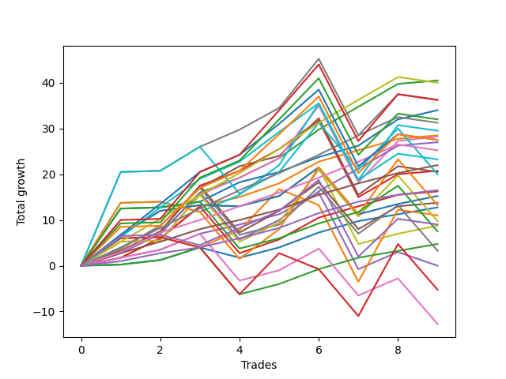

# Short Pointer 009 DB 
- Symbol: ES
- Date Range: 03/18/2022 - 12/30/2022
- Trading Period: 8:30-12:30
- Number of Trades: 3



| Name | Win Percent | Profit | Avg Profit / Trade | Avg Time / Trade |      | Name | Win Percent | Profit | Avg Profit / Trade | Avg Time / Trade |
| ---- | ----------- | ------ | ------------------ | ---------------- | ---- | ---- | ----------- | ------ | ------------------ | ---------------- |
| Sorted By <br> Profit | | | | | | Sorted By <br> Win Percentage ||||
| BB-200 U/L 2SD | 100.00 | 12500.00 | 4166.67 | 32:35 |     | BB-200 U/L 2SD | 100.00 | 12500.00 | 4166.67 | 32:35 |
| TP-7 | 100.00 | 10250.00 | 3416.67 | 22:20 |     | TP-7 | 100.00 | 10250.00 | 3416.67 | 22:20 |
| TP-10 | 100.00 | 10125.00 | 3375.00 | 30:06 |     | TP-10 | 100.00 | 10125.00 | 3375.00 | 30:06 |
| TP-6 | 100.00 | 9375.00 | 3125.00 | 14:53 |     | TP-6 | 100.00 | 9375.00 | 3125.00 | 14:53 |
| BB-100 U/L 2SD | 100.00 | 9375.00 | 3125.00 | 23:10 |     | BB-100 U/L 2SD | 100.00 | 9375.00 | 3125.00 | 23:10 |
| TP-9 | 100.00 | 9125.00 | 3041.67 | 29:00 |     | TP-9 | 100.00 | 9125.00 | 3041.67 | 29:00 |
| TP-8 | 100.00 | 8375.00 | 2791.67 | 28:55 |     | TP-8 | 100.00 | 8375.00 | 2791.67 | 28:55 |
| TP-5 | 100.00 | 7625.00 | 2541.67 | 13:38 |     | TP-5 | 100.00 | 7625.00 | 2541.67 | 13:38 |
| V U/L 1SD | 100.00 | 7000.00 | 2333.33 | 20:21 |     | V U/L 1SD | 100.00 | 7000.00 | 2333.33 | 20:21 |
| BB-20 U/L 2SD C | 100.00 | 7000.00 | 2333.33 | 12:58 |     | BB-20 U/L 2SD C | 100.00 | 7000.00 | 2333.33 | 12:58 |
| BB-50 U/L 2SD | 100.00 | 6750.00 | 2250.00 | 20:20 |     | BB-50 U/L 2SD | 100.00 | 6750.00 | 2250.00 | 20:20 |
| BB-50 U/L 1SD | 100.00 | 6750.00 | 2250.00 | 08:26 |     | BB-50 U/L 1SD | 100.00 | 6750.00 | 2250.00 | 08:26 |
| BB-20 U/L 2SD | 100.00 | 6750.00 | 2250.00 | 12:56 |     | BB-20 U/L 2SD | 100.00 | 6750.00 | 2250.00 | 12:56 |
| NEWFI 000 | 100.00 | 6125.00 | 2041.67 | 24:03 |     | NEWFI 000 | 100.00 | 6125.00 | 2041.67 | 24:03 |
| TP-4 | 100.00 | 6000.00 | 2000.00 | 11:41 |     | TP-4 | 100.00 | 6000.00 | 2000.00 | 11:41 |
| TP-3 | 100.00 | 5500.00 | 1833.33 | 07:28 |     | TP-3 | 100.00 | 5500.00 | 1833.33 | 07:28 |
| BB-100 Mid | 100.00 | 4875.00 | 1625.00 | 07:53 |     | BB-100 Mid | 100.00 | 4875.00 | 1625.00 | 07:53 |
| BB-20 U/L 1SD | 100.00 | 4875.00 | 1625.00 | 07:15 |     | BB-20 U/L 1SD | 100.00 | 4875.00 | 1625.00 | 07:15 |
| NEWFI 0000 | 33.33 | 4500.00 | 1500.00 | 42:21 |     | BB-200 Mid | 100.00 | 4125.00 | 1375.00 | 13:25 |
| BB-200 Mid | 100.00 | 4125.00 | 1375.00 | 13:25 |     | BB-50 Mid | 100.00 | 3875.00 | 1291.67 | 04:58 |
| BB-50 Mid | 100.00 | 3875.00 | 1291.67 | 04:58 |     | TP-2 | 100.00 | 3500.00 | 1166.67 | 04:45 |
| TP-2 | 100.00 | 3500.00 | 1166.67 | 04:45 |     | TP-1 | 100.00 | 2750.00 | 916.67 | 04:03 |
| TP-1 | 100.00 | 2750.00 | 916.67 | 04:03 |     | V Mid | 100.00 | 2375.00 | 791.67 | 11:51 |
| V Mid | 100.00 | 2375.00 | 791.67 | 11:51 |     | BB-20 Mid | 100.00 | 2375.00 | 791.67 | 04:01 |
| BB-20 Mid | 100.00 | 2375.00 | 791.67 | 04:01 |     | NEWFI 0000 | 33.33 | 4500.00 | 1500.00 | 42:21 |

## NO STOPLOSS

### Test BB-20 Mid
* Sell when price hits the middle line of the 20p bollinger
* No Stoploss
* Results:
```
Total Trades: 3
Percent Up: 0.00
Percent Down: 100.00
Total Points Moved Down: 4.75
Potential Profit: 2375.00
Total Points Ups: 0.00 Count Ups: 0
Total Points Downs: 4.75 Count Downs: 3
```

<details><summary>Trades</summary>

<code>In: 2022-06-01 12:19:00		Out: 2022-06-01 12:25:25		Total Position Time: 06:25		Total Move Down: 1.00		Total to Date: 1.00</code> <br />
<code>In: 2022-08-22 09:28:00		Out: 2022-08-22 09:29:10		Total Position Time: 01:10		Total Move Down: 2.25		Total to Date: 3.25</code> <br />
<code>In: 2022-09-22 10:57:00		Out: 2022-09-22 11:01:30		Total Position Time: 04:30		Total Move Down: 1.50		Total to Date: 4.75</code> <br />


</details>

### Test BB-20 U/L 1SD
* Sell when the price hits the lower line of the 20p 1std bollinger
* No Stoploss
* Results:
```
Total Trades: 3
Percent Up: 0.00
Percent Down: 100.00
Total Points Moved Down: 9.75
Potential Profit: 4875.00
Total Points Ups: 0.00 Count Ups: 0
Total Points Downs: 9.75 Count Downs: 3
```

<details><summary>Trades</summary>

<code>In: 2022-06-01 12:19:00		Out: 2022-06-01 12:30:05		Total Position Time: 11:05		Total Move Down: 4.25		Total to Date: 4.25</code> <br />
<code>In: 2022-08-22 09:28:00		Out: 2022-08-22 09:32:05		Total Position Time: 04:05		Total Move Down: 3.00		Total to Date: 7.25</code> <br />
<code>In: 2022-09-22 10:57:00		Out: 2022-09-22 11:03:35		Total Position Time: 06:35		Total Move Down: 2.50		Total to Date: 9.75</code> <br />


</details>

### Test BB-20 U/L 2SD
* Sell when the price hits the lower line of the 20p 2std bollinger
* No Stoploss
* Results:
```
Total Trades: 3
Percent Up: 0.00
Percent Down: 100.00
Total Points Moved Down: 13.50
Potential Profit: 6750.00
Total Points Ups: 0.00 Count Ups: 0
Total Points Downs: 13.50 Count Downs: 3
```

<details><summary>Trades</summary>

<code>In: 2022-06-01 12:19:00		Out: 2022-06-01 12:30:05		Total Position Time: 11:05		Total Move Down: 4.25		Total to Date: 4.25</code> <br />
<code>In: 2022-08-22 09:28:00		Out: 2022-08-22 09:44:50		Total Position Time: 16:50		Total Move Down: 4.25		Total to Date: 8.50</code> <br />
<code>In: 2022-09-22 10:57:00		Out: 2022-09-22 11:07:55		Total Position Time: 10:55		Total Move Down: 5.00		Total to Date: 13.50</code> <br />


</details>

### Test BB-20 U/L 2SD C
* Sell when the price hits the lower line of the 20p 2std bollinger
* No Stoploss
* Results:
```
Total Trades: 3
Percent Up: 0.00
Percent Down: 100.00
Total Points Moved Down: 14.00
Potential Profit: 7000.00
Total Points Ups: 0.00 Count Ups: 0
Total Points Downs: 14.00 Count Downs: 3
```

<details><summary>Trades</summary>

<code>In: 2022-06-01 12:19:00		Out: 2022-06-01 12:30:05		Total Position Time: 11:05		Total Move Down: 4.25		Total to Date: 4.25</code> <br />
<code>In: 2022-08-22 09:28:00		Out: 2022-08-22 09:44:55		Total Position Time: 16:55		Total Move Down: 4.75		Total to Date: 9.00</code> <br />
<code>In: 2022-09-22 10:57:00		Out: 2022-09-22 11:07:55		Total Position Time: 10:55		Total Move Down: 5.00		Total to Date: 14.00</code> <br />


</details>

### Test BB-50 Mid
* Sell when price hits the middle line of the 50p bollinger
* No Stoploss
* Results:
```
Total Trades: 3
Percent Up: 0.00
Percent Down: 100.00
Total Points Moved Down: 7.75
Potential Profit: 3875.00
Total Points Ups: 0.00 Count Ups: 0
Total Points Downs: 7.75 Count Downs: 3
```

<details><summary>Trades</summary>

<code>In: 2022-06-01 12:19:00		Out: 2022-06-01 12:25:30		Total Position Time: 06:30		Total Move Down: 1.75		Total to Date: 1.75</code> <br />
<code>In: 2022-08-22 09:28:00		Out: 2022-08-22 09:29:10		Total Position Time: 01:10		Total Move Down: 2.25		Total to Date: 4.00</code> <br />
<code>In: 2022-09-22 10:57:00		Out: 2022-09-22 11:04:15		Total Position Time: 07:15		Total Move Down: 3.75		Total to Date: 7.75</code> <br />


</details>

### Test BB-50 U/L 1SD
* Sell when the price hits the lower line of the 50p 1std bollinger
* No Stoploss
* Results:
```
Total Trades: 3
Percent Up: 0.00
Percent Down: 100.00
Total Points Moved Down: 13.50
Potential Profit: 6750.00
Total Points Ups: 0.00 Count Ups: 0
Total Points Downs: 13.50 Count Downs: 3
```

<details><summary>Trades</summary>

<code>In: 2022-06-01 12:19:00		Out: 2022-06-01 12:31:00		Total Position Time: 12:00		Total Move Down: 5.00		Total to Date: 5.00</code> <br />
<code>In: 2022-08-22 09:28:00		Out: 2022-08-22 09:29:10		Total Position Time: 01:10		Total Move Down: 2.25		Total to Date: 7.25</code> <br />
<code>In: 2022-09-22 10:57:00		Out: 2022-09-22 11:09:10		Total Position Time: 12:10		Total Move Down: 6.25		Total to Date: 13.50</code> <br />


</details>

### Test BB-50 U/L 2SD
* Sell when the price hits the lower line of the 50p 2std bollinger
* No Stoploss
* Results:
```
Total Trades: 3
Percent Up: 0.00
Percent Down: 100.00
Total Points Moved Down: 13.50
Potential Profit: 6750.00
Total Points Ups: 0.00 Count Ups: 0
Total Points Downs: 13.50 Count Downs: 3
```

<details><summary>Trades</summary>

<code>In: 2022-06-01 12:19:00		Out: 2022-06-01 12:47:00		Total Position Time: 28:00		Total Move Down: 0.25		Total to Date: 0.25</code> <br />
<code>In: 2022-08-22 09:28:00		Out: 2022-08-22 09:44:50		Total Position Time: 16:50		Total Move Down: 4.25		Total to Date: 4.50</code> <br />
<code>In: 2022-09-22 10:57:00		Out: 2022-09-22 11:13:10		Total Position Time: 16:10		Total Move Down: 9.00		Total to Date: 13.50</code> <br />


</details>

### Test V Mid
* Sell when the price hits the middle line of the 1std VWAP
* No Stoploss
* Results:
```
Total Trades: 3
Percent Up: 0.00
Percent Down: 100.00
Total Points Moved Down: 4.75
Potential Profit: 2375.00
Total Points Ups: 0.00 Count Ups: 0
Total Points Downs: 4.75 Count Downs: 3
```

<details><summary>Trades</summary>

<code>In: 2022-06-01 12:19:00		Out: 2022-06-01 12:47:00		Total Position Time: 28:00		Total Move Down: 0.25		Total to Date: 0.25</code> <br />
<code>In: 2022-08-22 09:28:00		Out: 2022-08-22 09:29:10		Total Position Time: 01:10		Total Move Down: 2.25		Total to Date: 2.50</code> <br />
<code>In: 2022-09-22 10:57:00		Out: 2022-09-22 11:03:25		Total Position Time: 06:25		Total Move Down: 2.25		Total to Date: 4.75</code> <br />


</details>

### Test V U/L 1SD
* Sell when the price hits the lower line of the 1std VWAP
* No Stoploss
* Results:
```
Total Trades: 3
Percent Up: 0.00
Percent Down: 100.00
Total Points Moved Down: 14.00
Potential Profit: 7000.00
Total Points Ups: 0.00 Count Ups: 0
Total Points Downs: 14.00 Count Downs: 3
```

<details><summary>Trades</summary>

<code>In: 2022-06-01 12:19:00		Out: 2022-06-01 12:47:00		Total Position Time: 28:00		Total Move Down: 0.25		Total to Date: 0.25</code> <br />
<code>In: 2022-08-22 09:28:00		Out: 2022-08-22 09:44:55		Total Position Time: 16:55		Total Move Down: 4.75		Total to Date: 5.00</code> <br />
<code>In: 2022-09-22 10:57:00		Out: 2022-09-22 11:13:10		Total Position Time: 16:10		Total Move Down: 9.00		Total to Date: 14.00</code> <br />


</details>

### Test BB-100 Mid
* Move to BB100 Mid
* No Stoploss
* Results:
```
Total Trades: 3
Percent Up: 0.00
Percent Down: 100.00
Total Points Moved Down: 9.75
Potential Profit: 4875.00
Total Points Ups: 0.00 Count Ups: 0
Total Points Downs: 9.75 Count Downs: 3
```

<details><summary>Trades</summary>

<code>In: 2022-06-01 12:19:00		Out: 2022-06-01 12:35:05		Total Position Time: 16:05		Total Move Down: 5.25		Total to Date: 5.25</code> <br />
<code>In: 2022-08-22 09:28:00		Out: 2022-08-22 09:29:10		Total Position Time: 01:10		Total Move Down: 2.25		Total to Date: 7.50</code> <br />
<code>In: 2022-09-22 10:57:00		Out: 2022-09-22 11:03:25		Total Position Time: 06:25		Total Move Down: 2.25		Total to Date: 9.75</code> <br />


</details>

### Test BB-100 U/L 2SD
* Move to BB100 Upper Band
* No Stoploss
* Results:
```
Total Trades: 3
Percent Up: 0.00
Percent Down: 100.00
Total Points Moved Down: 18.75
Potential Profit: 9375.00
Total Points Ups: 0.00 Count Ups: 0
Total Points Downs: 18.75 Count Downs: 3
```

<details><summary>Trades</summary>

<code>In: 2022-06-01 12:19:00		Out: 2022-06-01 12:47:00		Total Position Time: 28:00		Total Move Down: 0.25		Total to Date: 0.25</code> <br />
<code>In: 2022-08-22 09:28:00		Out: 2022-08-22 09:45:25		Total Position Time: 17:25		Total Move Down: 6.50		Total to Date: 6.75</code> <br />
<code>In: 2022-09-22 10:57:00		Out: 2022-09-22 11:21:05		Total Position Time: 24:05		Total Move Down: 12.00		Total to Date: 18.75</code> <br />


</details>

### Test BB-200 Mid
* Move to BB200 Mid
* No Stoploss
* Results:
```
Total Trades: 3
Percent Up: 0.00
Percent Down: 100.00
Total Points Moved Down: 8.25
Potential Profit: 4125.00
Total Points Ups: 0.00 Count Ups: 0
Total Points Downs: 8.25 Count Downs: 3
```

<details><summary>Trades</summary>

<code>In: 2022-06-01 12:19:00		Out: 2022-06-01 12:47:00		Total Position Time: 28:00		Total Move Down: 0.25		Total to Date: 0.25</code> <br />
<code>In: 2022-08-22 09:28:00		Out: 2022-08-22 09:29:10		Total Position Time: 01:10		Total Move Down: 2.25		Total to Date: 2.50</code> <br />
<code>In: 2022-09-22 10:57:00		Out: 2022-09-22 11:08:05		Total Position Time: 11:05		Total Move Down: 5.75		Total to Date: 8.25</code> <br />


</details>

### Test BB-200 U/L 2SD
* Move to BB200 Upper Band
* No Stoploss
* Results:
```
Total Trades: 3
Percent Up: 0.00
Percent Down: 100.00
Total Points Moved Down: 25.00
Potential Profit: 12500.00
Total Points Ups: 0.00 Count Ups: 0
Total Points Downs: 25.00 Count Downs: 3
```

<details><summary>Trades</summary>

<code>In: 2022-06-01 12:19:00		Out: 2022-06-01 12:47:00		Total Position Time: 28:00		Total Move Down: 0.25		Total to Date: 0.25</code> <br />
<code>In: 2022-08-22 09:28:00		Out: 2022-08-22 10:11:20		Total Position Time: 43:20		Total Move Down: 9.00		Total to Date: 9.25</code> <br />
<code>In: 2022-09-22 10:57:00		Out: 2022-09-22 11:23:25		Total Position Time: 26:25		Total Move Down: 15.75		Total to Date: 25.00</code> <br />


</details>

## TAKE PROFIT

### Test TP-1
* Take Profit of 1 Point
* No Stoploss
* Results:
```
Total Trades: 3
Percent Up: 0.00
Percent Down: 100.00
Total Points Moved Down: 5.50
Potential Profit: 2750.00
Total Points Ups: 0.00 Count Ups: 0
Total Points Downs: 5.50 Count Downs: 3
```

<details><summary>Trades</summary>

<code>In: 2022-06-01 12:19:00		Out: 2022-06-01 12:25:30		Total Position Time: 06:30		Total Move Down: 1.75		Total to Date: 1.75</code> <br />
<code>In: 2022-08-22 09:28:00		Out: 2022-08-22 09:29:10		Total Position Time: 01:10		Total Move Down: 2.25		Total to Date: 4.00</code> <br />
<code>In: 2022-09-22 10:57:00		Out: 2022-09-22 11:01:30		Total Position Time: 04:30		Total Move Down: 1.50		Total to Date: 5.50</code> <br />


</details>

### Test TP-2
* Take Profit of 2 Point
* No Stoploss
* Results:
```
Total Trades: 3
Percent Up: 0.00
Percent Down: 100.00
Total Points Moved Down: 7.00
Potential Profit: 3500.00
Total Points Ups: 0.00 Count Ups: 0
Total Points Downs: 7.00 Count Downs: 3
```

<details><summary>Trades</summary>

<code>In: 2022-06-01 12:19:00		Out: 2022-06-01 12:25:40		Total Position Time: 06:40		Total Move Down: 2.50		Total to Date: 2.50</code> <br />
<code>In: 2022-08-22 09:28:00		Out: 2022-08-22 09:29:10		Total Position Time: 01:10		Total Move Down: 2.25		Total to Date: 4.75</code> <br />
<code>In: 2022-09-22 10:57:00		Out: 2022-09-22 11:03:25		Total Position Time: 06:25		Total Move Down: 2.25		Total to Date: 7.00</code> <br />


</details>

### Test TP-3
* Take Profit of 3 Point
* No Stoploss
* Results:
```
Total Trades: 3
Percent Up: 0.00
Percent Down: 100.00
Total Points Moved Down: 11.00
Potential Profit: 5500.00
Total Points Ups: 0.00 Count Ups: 0
Total Points Downs: 11.00 Count Downs: 3
```

<details><summary>Trades</summary>

<code>In: 2022-06-01 12:19:00		Out: 2022-06-01 12:30:05		Total Position Time: 11:05		Total Move Down: 4.25		Total to Date: 4.25</code> <br />
<code>In: 2022-08-22 09:28:00		Out: 2022-08-22 09:32:05		Total Position Time: 04:05		Total Move Down: 3.00		Total to Date: 7.25</code> <br />
<code>In: 2022-09-22 10:57:00		Out: 2022-09-22 11:04:15		Total Position Time: 07:15		Total Move Down: 3.75		Total to Date: 11.00</code> <br />


</details>

### Test TP-4
* Take Profit of 4 Point
* No Stoploss
* Results:
```
Total Trades: 3
Percent Up: 0.00
Percent Down: 100.00
Total Points Moved Down: 12.00
Potential Profit: 6000.00
Total Points Ups: 0.00 Count Ups: 0
Total Points Downs: 12.00 Count Downs: 3
```

<details><summary>Trades</summary>

<code>In: 2022-06-01 12:19:00		Out: 2022-06-01 12:30:05		Total Position Time: 11:05		Total Move Down: 4.25		Total to Date: 4.25</code> <br />
<code>In: 2022-08-22 09:28:00		Out: 2022-08-22 09:44:40		Total Position Time: 16:40		Total Move Down: 3.75		Total to Date: 8.00</code> <br />
<code>In: 2022-09-22 10:57:00		Out: 2022-09-22 11:04:20		Total Position Time: 07:20		Total Move Down: 4.00		Total to Date: 12.00</code> <br />


</details>

### Test TP-5
* Take Profit of 5 Point
* No Stoploss
* Results:
```
Total Trades: 3
Percent Up: 0.00
Percent Down: 100.00
Total Points Moved Down: 15.25
Potential Profit: 7625.00
Total Points Ups: 0.00 Count Ups: 0
Total Points Downs: 15.25 Count Downs: 3
```

<details><summary>Trades</summary>

<code>In: 2022-06-01 12:19:00		Out: 2022-06-01 12:32:50		Total Position Time: 13:50		Total Move Down: 5.00		Total to Date: 5.00</code> <br />
<code>In: 2022-08-22 09:28:00		Out: 2022-08-22 09:45:15		Total Position Time: 17:15		Total Move Down: 5.25		Total to Date: 10.25</code> <br />
<code>In: 2022-09-22 10:57:00		Out: 2022-09-22 11:06:50		Total Position Time: 09:50		Total Move Down: 5.00		Total to Date: 15.25</code> <br />


</details>

### Test TP-6
* Take Profit of 6 Point
* No Stoploss
* Results:
```
Total Trades: 3
Percent Up: 0.00
Percent Down: 100.00
Total Points Moved Down: 18.75
Potential Profit: 9375.00
Total Points Ups: 0.00 Count Ups: 0
Total Points Downs: 18.75 Count Downs: 3
```

<details><summary>Trades</summary>

<code>In: 2022-06-01 12:19:00		Out: 2022-06-01 12:35:10		Total Position Time: 16:10		Total Move Down: 6.50		Total to Date: 6.50</code> <br />
<code>In: 2022-08-22 09:28:00		Out: 2022-08-22 09:45:25		Total Position Time: 17:25		Total Move Down: 6.50		Total to Date: 13.00</code> <br />
<code>In: 2022-09-22 10:57:00		Out: 2022-09-22 11:08:05		Total Position Time: 11:05		Total Move Down: 5.75		Total to Date: 18.75</code> <br />


</details>

### Test TP-7
* Take Profit of 7 Point
* No Stoploss
* Results:
```
Total Trades: 3
Percent Up: 0.00
Percent Down: 100.00
Total Points Moved Down: 20.50
Potential Profit: 10250.00
Total Points Ups: 0.00 Count Ups: 0
Total Points Downs: 20.50 Count Downs: 3
```

<details><summary>Trades</summary>

<code>In: 2022-06-01 12:19:00		Out: 2022-06-01 12:35:30		Total Position Time: 16:30		Total Move Down: 6.75		Total to Date: 6.75</code> <br />
<code>In: 2022-08-22 09:28:00		Out: 2022-08-22 10:05:50		Total Position Time: 37:50		Total Move Down: 6.75		Total to Date: 13.50</code> <br />
<code>In: 2022-09-22 10:57:00		Out: 2022-09-22 11:09:40		Total Position Time: 12:40		Total Move Down: 7.00		Total to Date: 20.50</code> <br />


</details>

### Test TP-8
* Take Profit of 8 Point
* No Stoploss
* Results:
```
Total Trades: 3
Percent Up: 0.00
Percent Down: 100.00
Total Points Moved Down: 16.75
Potential Profit: 8375.00
Total Points Ups: 0.00 Count Ups: 0
Total Points Downs: 16.75 Count Downs: 3
```

<details><summary>Trades</summary>

<code>In: 2022-06-01 12:19:00		Out: 2022-06-01 12:47:00		Total Position Time: 28:00		Total Move Down: 0.25		Total to Date: 0.25</code> <br />
<code>In: 2022-08-22 09:28:00		Out: 2022-08-22 10:11:10		Total Position Time: 43:10		Total Move Down: 8.00		Total to Date: 8.25</code> <br />
<code>In: 2022-09-22 10:57:00		Out: 2022-09-22 11:12:35		Total Position Time: 15:35		Total Move Down: 8.50		Total to Date: 16.75</code> <br />


</details>

### Test TP-9
* Take Profit of 9 Point
* No Stoploss
* Results:
```
Total Trades: 3
Percent Up: 0.00
Percent Down: 100.00
Total Points Moved Down: 18.25
Potential Profit: 9125.00
Total Points Ups: 0.00 Count Ups: 0
Total Points Downs: 18.25 Count Downs: 3
```

<details><summary>Trades</summary>

<code>In: 2022-06-01 12:19:00		Out: 2022-06-01 12:47:00		Total Position Time: 28:00		Total Move Down: 0.25		Total to Date: 0.25</code> <br />
<code>In: 2022-08-22 09:28:00		Out: 2022-08-22 10:11:20		Total Position Time: 43:20		Total Move Down: 9.00		Total to Date: 9.25</code> <br />
<code>In: 2022-09-22 10:57:00		Out: 2022-09-22 11:12:40		Total Position Time: 15:40		Total Move Down: 9.00		Total to Date: 18.25</code> <br />


</details>

### Test TP-10
* Take Profit of 10 Point
* No Stoploss
* Results:
```
Total Trades: 3
Percent Up: 0.00
Percent Down: 100.00
Total Points Moved Down: 20.25
Potential Profit: 10125.00
Total Points Ups: 0.00 Count Ups: 0
Total Points Downs: 20.25 Count Downs: 3
```

<details><summary>Trades</summary>

<code>In: 2022-06-01 12:19:00		Out: 2022-06-01 12:47:00		Total Position Time: 28:00		Total Move Down: 0.25		Total to Date: 0.25</code> <br />
<code>In: 2022-08-22 09:28:00		Out: 2022-08-22 10:11:35		Total Position Time: 43:35		Total Move Down: 9.75		Total to Date: 10.00</code> <br />
<code>In: 2022-09-22 10:57:00		Out: 2022-09-22 11:15:45		Total Position Time: 18:45		Total Move Down: 10.25		Total to Date: 20.25</code> <br />


</details>

## Indicator Exits

### Test NEWFI 000
* Newfi 0000
* No Stoploss
* Results:
```
Total Trades: 3
Percent Up: 0.00
Percent Down: 100.00
Total Points Moved Down: 12.25
Potential Profit: 6125.00
Total Points Ups: 0.00 Count Ups: 0
Total Points Downs: 12.25 Count Downs: 3
```

<details><summary>Trades</summary>

<code>In: 2022-06-01 12:19:00		Out: 2022-06-01 12:47:00		Total Position Time: 28:00		Total Move Down: 0.25		Total to Date: 0.25</code> <br />
<code>In: 2022-08-22 09:28:00		Out: 2022-08-22 09:50:05		Total Position Time: 22:05		Total Move Down: 3.75		Total to Date: 4.00</code> <br />
<code>In: 2022-09-22 10:57:00		Out: 2022-09-22 11:19:05		Total Position Time: 22:05		Total Move Down: 8.25		Total to Date: 12.25</code> <br />


</details>

### Test NEWFI 0000
* Newfi 0000
* No Stoploss
* Results:
```
Total Trades: 3
Percent Up: 66.67
Percent Down: 33.33
Total Points Moved Down: 9.00
Potential Profit: 4500.00
Total Points Ups: 3.75 Count Ups: 2
Total Points Downs: 12.75 Count Downs: 1
```

<details><summary>Trades</summary>

<code>In: 2022-06-01 12:19:00		Out: 2022-06-01 12:25:05		Total Position Time: 06:05		Total Move Down: -2.00		Total to Date: -2.00</code> <br />
<code>In: 2022-08-22 09:28:00		Out: 2022-08-22 10:28:55		Total Position Time: 60:55		Total Move Down: 12.75		Total to Date: 10.75</code> <br />
<code>In: 2022-09-22 10:57:00		Out: 2022-09-22 11:57:05		Total Position Time: 60:05		Total Move Down: -1.75		Total to Date: 9.00</code> <br />


</details>