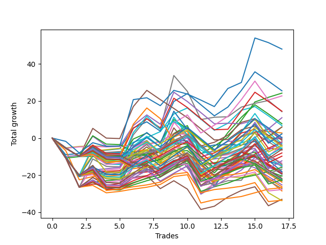

# Short Pointer 009 
- Symbol: ES
- Date Range: 03/18/2022 - 12/30/2022
- Trading Period: 8:30-12:30
- Number of Trades: 15



| Name | Win Percent | Profit | Avg Profit / Trade | Avg Time / Trade |      | Name | Win Percent | Profit | Avg Profit / Trade | Avg Time / Trade |
| ---- | ----------- | ------ | ------------------ | ---------------- | ---- | ---- | ----------- | ------ | ------------------ | ---------------- |
| Sorted By <br> Profit | | | | | | Sorted By <br> Win Percentage ||||
| NEWFI 0000 | 26.67 | 3125.00 | 208.33 | 14:55 |     | TP-1 | 73.33 | -4875.00 | -325.00 | 16:50 |
| BB-20 U/L 2SD | 66.67 | 2750.00 | 183.33 | 20:12 |     | BB-20 U/L 2SD | 66.67 | 2750.00 | 183.33 | 20:12 |
| BB-200 U/L 2SD | 53.33 | 2000.00 | 133.33 | 45:33 |     | BB-20 U/L 2SD C | 60.00 | -375.00 | -25.00 | 21:38 |
| BB-20 U/L 2SD C | 60.00 | -375.00 | -25.00 | 21:38 |     | TP-6 | 60.00 | -7750.00 | -516.67 | 27:51 |
| TP-1 | 73.33 | -4875.00 | -325.00 | 16:50 |     | TP-5 | 60.00 | -11250.00 | -750.00 | 27:22 |
| BB-100 U/L 2SD | 53.33 | -6250.00 | -416.67 | 42:29 |     | TP-4 | 60.00 | -16750.00 | -1116.67 | 26:28 |
| NEWFI 000 | 53.33 | -6500.00 | -433.33 | 42:26 |     | TP-3 | 60.00 | -18875.00 | -1258.33 | 24:18 |
| BB-50 Mid | 53.33 | -6625.00 | -441.67 | 20:33 |     | TP-2 | 60.00 | -23125.00 | -1541.67 | 23:15 |
| TP-10 | 53.33 | -6875.00 | -458.33 | 40:08 |     | BB-200 U/L 2SD | 53.33 | 2000.00 | 133.33 | 45:33 |
| V U/L 1SD | 53.33 | -7500.00 | -500.00 | 42:17 |     | BB-100 U/L 2SD | 53.33 | -6250.00 | -416.67 | 42:29 |
| TP-6 | 60.00 | -7750.00 | -516.67 | 27:51 |     | NEWFI 000 | 53.33 | -6500.00 | -433.33 | 42:26 |
| BB-20 U/L 1SD | 53.33 | -8625.00 | -575.00 | 16:26 |     | BB-50 Mid | 53.33 | -6625.00 | -441.67 | 20:33 |
| TP-7 | 53.33 | -8750.00 | -583.33 | 36:00 |     | TP-10 | 53.33 | -6875.00 | -458.33 | 40:08 |
| TP-9 | 53.33 | -9500.00 | -633.33 | 39:42 |     | V U/L 1SD | 53.33 | -7500.00 | -500.00 | 42:17 |
| BB-50 U/L 2SD | 53.33 | -10875.00 | -725.00 | 36:16 |     | BB-20 U/L 1SD | 53.33 | -8625.00 | -575.00 | 16:26 |
| TP-8 | 53.33 | -11125.00 | -741.67 | 39:36 |     | TP-7 | 53.33 | -8750.00 | -583.33 | 36:00 |
| TP-5 | 60.00 | -11250.00 | -750.00 | 27:22 |     | TP-9 | 53.33 | -9500.00 | -633.33 | 39:42 |
| V Mid | 53.33 | -13500.00 | -900.00 | 34:23 |     | BB-50 U/L 2SD | 53.33 | -10875.00 | -725.00 | 36:16 |
| TP-4 | 60.00 | -16750.00 | -1116.67 | 26:28 |     | TP-8 | 53.33 | -11125.00 | -741.67 | 39:36 |
| BB-50 U/L 1SD | 53.33 | -18250.00 | -1216.67 | 32:49 |     | V Mid | 53.33 | -13500.00 | -900.00 | 34:23 |
| BB-20 Mid | 46.67 | -18625.00 | -1241.67 | 11:31 |     | BB-50 U/L 1SD | 53.33 | -18250.00 | -1216.67 | 32:49 |
| TP-3 | 60.00 | -18875.00 | -1258.33 | 24:18 |     | BB-100 Mid | 53.33 | -23375.00 | -1558.33 | 31:47 |
| BB-200 Mid | 46.67 | -20500.00 | -1366.67 | 28:09 |     | BB-20 Mid | 46.67 | -18625.00 | -1241.67 | 11:31 |
| TP-2 | 60.00 | -23125.00 | -1541.67 | 23:15 |     | BB-200 Mid | 46.67 | -20500.00 | -1366.67 | 28:09 |
| BB-100 Mid | 53.33 | -23375.00 | -1558.33 | 31:47 |     | NEWFI 0000 | 26.67 | 3125.00 | 208.33 | 14:55 |

## NO STOPLOSS

### Test BB-20 Mid
* Sell when price hits the middle line of the 20p bollinger
* No Stoploss
* Results:
```
Total Trades: 15
Percent Up: 53.33
Percent Down: 46.67
Total Points Moved Down: -37.25
Potential Profit: -18625.00
Total Points Ups: 47.75 Count Ups: 8
Total Points Downs: 10.50 Count Downs: 7
```

<details><summary>Trades</summary>

<code>In: 2022-03-29 12:15:00		Out: 2022-03-29 12:24:45		Total Position Time: 09:45		Total Move Down: -0.75		Total to Date: -0.75</code> <br />
<code>In: 2022-04-20 10:50:00		Out: 2022-04-20 10:51:10		Total Position Time: 01:10		Total Move Down: 1.00		Total to Date: 0.25</code> <br />
<code>In: 2022-05-24 10:58:00		Out: 2022-05-24 11:01:15		Total Position Time: 03:15		Total Move Down: -0.25		Total to Date: 0.00</code> <br />
<code>In: 2022-05-27 12:03:00		Out: 2022-05-27 12:35:00		Total Position Time: 32:00		Total Move Down: -11.50		Total to Date: -11.50</code> <br />
<code>In: 2022-06-01 12:19:00		Out: 2022-06-01 12:25:25		Total Position Time: 06:25		Total Move Down: 1.00		Total to Date: -10.50</code> <br />
<code>In: 2022-07-28 08:09:00		Out: 2022-07-28 08:57:50		Total Position Time: 48:50		Total Move Down: -21.00		Total to Date: -31.50</code> <br />
<code>In: 2022-07-29 12:31:00		Out: 2022-07-29 12:40:20		Total Position Time: 09:20		Total Move Down: -1.50		Total to Date: -33.00</code> <br />
<code>In: 2022-08-12 09:15:00		Out: 2022-08-12 09:33:05		Total Position Time: 18:05		Total Move Down: -2.00		Total to Date: -35.00</code> <br />
<code>In: 2022-08-18 12:26:00		Out: 2022-08-18 12:31:35		Total Position Time: 05:35		Total Move Down: 0.50		Total to Date: -34.50</code> <br />
<code>In: 2022-08-22 09:28:00		Out: 2022-08-22 09:29:10		Total Position Time: 01:10		Total Move Down: 2.25		Total to Date: -32.25</code> <br />
<code>In: 2022-09-16 07:38:00		Out: 2022-09-16 07:42:55		Total Position Time: 04:55		Total Move Down: 2.25		Total to Date: -30.00</code> <br />
<code>In: 2022-09-22 10:57:00		Out: 2022-09-22 11:01:30		Total Position Time: 04:30		Total Move Down: 1.50		Total to Date: -28.50</code> <br />
<code>In: 2022-10-11 08:39:00		Out: 2022-10-11 08:58:10		Total Position Time: 19:10		Total Move Down: -10.00		Total to Date: -38.50</code> <br />
<code>In: 2022-10-31 08:31:00		Out: 2022-10-31 08:38:35		Total Position Time: 07:35		Total Move Down: -0.75		Total to Date: -39.25</code> <br />
<code>In: 2022-12-20 10:06:00		Out: 2022-12-20 10:07:10		Total Position Time: 01:10		Total Move Down: 2.00		Total to Date: -37.25</code> <br />


</details>

### Test BB-20 U/L 1SD
* Sell when the price hits the lower line of the 20p 1std bollinger
* No Stoploss
* Results:
```
Total Trades: 15
Percent Up: 46.67
Percent Down: 53.33
Total Points Moved Down: -17.25
Potential Profit: -8625.00
Total Points Ups: 42.50 Count Ups: 7
Total Points Downs: 25.25 Count Downs: 8
```

<details><summary>Trades</summary>

<code>In: 2022-03-29 12:15:00		Out: 2022-03-29 12:27:45		Total Position Time: 12:45		Total Move Down: 0.25		Total to Date: 0.25</code> <br />
<code>In: 2022-04-20 10:50:00		Out: 2022-04-20 10:54:35		Total Position Time: 04:35		Total Move Down: 2.50		Total to Date: 2.75</code> <br />
<code>In: 2022-05-24 10:58:00		Out: 2022-05-24 11:01:40		Total Position Time: 03:40		Total Move Down: 3.25		Total to Date: 6.00</code> <br />
<code>In: 2022-05-27 12:03:00		Out: 2022-05-27 12:35:45		Total Position Time: 32:45		Total Move Down: -9.50		Total to Date: -3.50</code> <br />
<code>In: 2022-06-01 12:19:00		Out: 2022-06-01 12:30:05		Total Position Time: 11:05		Total Move Down: 4.25		Total to Date: 0.75</code> <br />
<code>In: 2022-07-28 08:09:00		Out: 2022-07-28 08:58:55		Total Position Time: 49:55		Total Move Down: -18.00		Total to Date: -17.25</code> <br />
<code>In: 2022-07-29 12:31:00		Out: 2022-07-29 12:47:00		Total Position Time: 16:00		Total Move Down: -3.50		Total to Date: -20.75</code> <br />
<code>In: 2022-08-12 09:15:00		Out: 2022-08-12 09:40:30		Total Position Time: 25:30		Total Move Down: -2.50		Total to Date: -23.25</code> <br />
<code>In: 2022-08-18 12:26:00		Out: 2022-08-18 12:43:55		Total Position Time: 17:55		Total Move Down: -0.25		Total to Date: -23.50</code> <br />
<code>In: 2022-08-22 09:28:00		Out: 2022-08-22 09:32:05		Total Position Time: 04:05		Total Move Down: 3.00		Total to Date: -20.50</code> <br />
<code>In: 2022-09-16 07:38:00		Out: 2022-09-16 07:44:55		Total Position Time: 06:55		Total Move Down: 5.25		Total to Date: -15.25</code> <br />
<code>In: 2022-09-22 10:57:00		Out: 2022-09-22 11:03:35		Total Position Time: 06:35		Total Move Down: 2.50		Total to Date: -12.75</code> <br />
<code>In: 2022-10-11 08:39:00		Out: 2022-10-11 09:01:55		Total Position Time: 22:55		Total Move Down: -6.00		Total to Date: -18.75</code> <br />
<code>In: 2022-10-31 08:31:00		Out: 2022-10-31 08:58:20		Total Position Time: 27:20		Total Move Down: -2.75		Total to Date: -21.50</code> <br />
<code>In: 2022-12-20 10:06:00		Out: 2022-12-20 10:10:35		Total Position Time: 04:35		Total Move Down: 4.25		Total to Date: -17.25</code> <br />


</details>

### Test BB-20 U/L 2SD
* Sell when the price hits the lower line of the 20p 2std bollinger
* No Stoploss
* Results:
```
Total Trades: 15
Percent Up: 33.33
Percent Down: 66.67
Total Points Moved Down: 5.50
Potential Profit: 2750.00
Total Points Ups: 33.75 Count Ups: 5
Total Points Downs: 39.25 Count Downs: 10
```

<details><summary>Trades</summary>

<code>In: 2022-03-29 12:15:00		Out: 2022-03-29 12:27:50		Total Position Time: 12:50		Total Move Down: 0.75		Total to Date: 0.75</code> <br />
<code>In: 2022-04-20 10:50:00		Out: 2022-04-20 11:13:55		Total Position Time: 23:55		Total Move Down: 3.25		Total to Date: 4.00</code> <br />
<code>In: 2022-05-24 10:58:00		Out: 2022-05-24 11:01:50		Total Position Time: 03:50		Total Move Down: 4.25		Total to Date: 8.25</code> <br />
<code>In: 2022-05-27 12:03:00		Out: 2022-05-27 12:36:55		Total Position Time: 33:55		Total Move Down: -7.25		Total to Date: 1.00</code> <br />
<code>In: 2022-06-01 12:19:00		Out: 2022-06-01 12:30:05		Total Position Time: 11:05		Total Move Down: 4.25		Total to Date: 5.25</code> <br />
<code>In: 2022-07-28 08:09:00		Out: 2022-07-28 09:08:10		Total Position Time: 59:10		Total Move Down: -17.00		Total to Date: -11.75</code> <br />
<code>In: 2022-07-29 12:31:00		Out: 2022-07-29 12:47:00		Total Position Time: 16:00		Total Move Down: -3.50		Total to Date: -15.25</code> <br />
<code>In: 2022-08-12 09:15:00		Out: 2022-08-12 09:42:00		Total Position Time: 27:00		Total Move Down: -1.75		Total to Date: -17.00</code> <br />
<code>In: 2022-08-18 12:26:00		Out: 2022-08-18 12:46:15		Total Position Time: 20:15		Total Move Down: 0.25		Total to Date: -16.75</code> <br />
<code>In: 2022-08-22 09:28:00		Out: 2022-08-22 09:44:50		Total Position Time: 16:50		Total Move Down: 4.25		Total to Date: -12.50</code> <br />
<code>In: 2022-09-16 07:38:00		Out: 2022-09-16 07:47:50		Total Position Time: 09:50		Total Move Down: 8.75		Total to Date: -3.75</code> <br />
<code>In: 2022-09-22 10:57:00		Out: 2022-09-22 11:07:55		Total Position Time: 10:55		Total Move Down: 5.00		Total to Date: 1.25</code> <br />
<code>In: 2022-10-11 08:39:00		Out: 2022-10-11 09:03:40		Total Position Time: 24:40		Total Move Down: -4.25		Total to Date: -3.00</code> <br />
<code>In: 2022-10-31 08:31:00		Out: 2022-10-31 08:58:35		Total Position Time: 27:35		Total Move Down: 3.00		Total to Date: 0.00</code> <br />
<code>In: 2022-12-20 10:06:00		Out: 2022-12-20 10:11:15		Total Position Time: 05:15		Total Move Down: 5.50		Total to Date: 5.50</code> <br />


</details>

### Test BB-20 U/L 2SD C
* Sell when the price hits the lower line of the 20p 2std bollinger
* No Stoploss
* Results:
```
Total Trades: 15
Percent Up: 40.00
Percent Down: 60.00
Total Points Moved Down: -0.75
Potential Profit: -375.00
Total Points Ups: 41.00 Count Ups: 6
Total Points Downs: 40.25 Count Downs: 9
```

<details><summary>Trades</summary>

<code>In: 2022-03-29 12:15:00		Out: 2022-03-29 12:47:00		Total Position Time: 32:00		Total Move Down: -8.25		Total to Date: -8.25</code> <br />
<code>In: 2022-04-20 10:50:00		Out: 2022-04-20 11:14:05		Total Position Time: 24:05		Total Move Down: 3.25		Total to Date: -5.00</code> <br />
<code>In: 2022-05-24 10:58:00		Out: 2022-05-24 11:01:50		Total Position Time: 03:50		Total Move Down: 4.25		Total to Date: -0.75</code> <br />
<code>In: 2022-05-27 12:03:00		Out: 2022-05-27 12:38:10		Total Position Time: 35:10		Total Move Down: -6.50		Total to Date: -7.25</code> <br />
<code>In: 2022-06-01 12:19:00		Out: 2022-06-01 12:30:05		Total Position Time: 11:05		Total Move Down: 4.25		Total to Date: -3.00</code> <br />
<code>In: 2022-07-28 08:09:00		Out: 2022-07-28 09:08:30		Total Position Time: 59:30		Total Move Down: -17.00		Total to Date: -20.00</code> <br />
<code>In: 2022-07-29 12:31:00		Out: 2022-07-29 12:47:00		Total Position Time: 16:00		Total Move Down: -3.50		Total to Date: -23.50</code> <br />
<code>In: 2022-08-12 09:15:00		Out: 2022-08-12 09:42:00		Total Position Time: 27:00		Total Move Down: -1.75		Total to Date: -25.25</code> <br />
<code>In: 2022-08-18 12:26:00		Out: 2022-08-18 12:46:15		Total Position Time: 20:15		Total Move Down: 0.25		Total to Date: -25.00</code> <br />
<code>In: 2022-08-22 09:28:00		Out: 2022-08-22 09:44:55		Total Position Time: 16:55		Total Move Down: 4.75		Total to Date: -20.25</code> <br />
<code>In: 2022-09-16 07:38:00		Out: 2022-09-16 07:48:20		Total Position Time: 10:20		Total Move Down: 10.00		Total to Date: -10.25</code> <br />
<code>In: 2022-09-22 10:57:00		Out: 2022-09-22 11:07:55		Total Position Time: 10:55		Total Move Down: 5.00		Total to Date: -5.25</code> <br />
<code>In: 2022-10-11 08:39:00		Out: 2022-10-11 09:03:45		Total Position Time: 24:45		Total Move Down: -4.00		Total to Date: -9.25</code> <br />
<code>In: 2022-10-31 08:31:00		Out: 2022-10-31 08:58:35		Total Position Time: 27:35		Total Move Down: 3.00		Total to Date: -6.25</code> <br />
<code>In: 2022-12-20 10:06:00		Out: 2022-12-20 10:11:15		Total Position Time: 05:15		Total Move Down: 5.50		Total to Date: -0.75</code> <br />


</details>

### Test BB-50 Mid
* Sell when price hits the middle line of the 50p bollinger
* No Stoploss
* Results:
```
Total Trades: 15
Percent Up: 46.67
Percent Down: 53.33
Total Points Moved Down: -13.25
Potential Profit: -6625.00
Total Points Ups: 36.00 Count Ups: 7
Total Points Downs: 22.75 Count Downs: 8
```

<details><summary>Trades</summary>

<code>In: 2022-03-29 12:15:00		Out: 2022-03-29 12:43:10		Total Position Time: 28:10		Total Move Down: -0.25		Total to Date: -0.25</code> <br />
<code>In: 2022-04-20 10:50:00		Out: 2022-04-20 10:51:10		Total Position Time: 01:10		Total Move Down: 1.00		Total to Date: 0.75</code> <br />
<code>In: 2022-05-24 10:58:00		Out: 2022-05-24 11:20:25		Total Position Time: 22:25		Total Move Down: 1.50		Total to Date: 2.25</code> <br />
<code>In: 2022-05-27 12:03:00		Out: 2022-05-27 12:38:10		Total Position Time: 35:10		Total Move Down: -6.50		Total to Date: -4.25</code> <br />
<code>In: 2022-06-01 12:19:00		Out: 2022-06-01 12:25:30		Total Position Time: 06:30		Total Move Down: 1.75		Total to Date: -2.50</code> <br />
<code>In: 2022-07-28 08:09:00		Out: 2022-07-28 09:08:10		Total Position Time: 59:10		Total Move Down: -17.00		Total to Date: -19.50</code> <br />
<code>In: 2022-07-29 12:31:00		Out: 2022-07-29 12:47:00		Total Position Time: 16:00		Total Move Down: -3.50		Total to Date: -23.00</code> <br />
<code>In: 2022-08-12 09:15:00		Out: 2022-08-12 09:58:55		Total Position Time: 43:55		Total Move Down: -2.75		Total to Date: -25.75</code> <br />
<code>In: 2022-08-18 12:26:00		Out: 2022-08-18 12:47:00		Total Position Time: 21:00		Total Move Down: 0.75		Total to Date: -25.00</code> <br />
<code>In: 2022-08-22 09:28:00		Out: 2022-08-22 09:29:10		Total Position Time: 01:10		Total Move Down: 2.25		Total to Date: -22.75</code> <br />
<code>In: 2022-09-16 07:38:00		Out: 2022-09-16 07:46:45		Total Position Time: 08:45		Total Move Down: 7.50		Total to Date: -15.25</code> <br />
<code>In: 2022-09-22 10:57:00		Out: 2022-09-22 11:04:15		Total Position Time: 07:15		Total Move Down: 3.75		Total to Date: -11.50</code> <br />
<code>In: 2022-10-11 08:39:00		Out: 2022-10-11 09:04:40		Total Position Time: 25:40		Total Move Down: -3.25		Total to Date: -14.75</code> <br />
<code>In: 2022-10-31 08:31:00		Out: 2022-10-31 08:58:20		Total Position Time: 27:20		Total Move Down: -2.75		Total to Date: -17.50</code> <br />
<code>In: 2022-12-20 10:06:00		Out: 2022-12-20 10:10:35		Total Position Time: 04:35		Total Move Down: 4.25		Total to Date: -13.25</code> <br />


</details>

### Test BB-50 U/L 1SD
* Sell when the price hits the lower line of the 50p 1std bollinger
* No Stoploss
* Results:
```
Total Trades: 15
Percent Up: 46.67
Percent Down: 53.33
Total Points Moved Down: -36.50
Potential Profit: -18250.00
Total Points Ups: 69.00 Count Ups: 7
Total Points Downs: 32.50 Count Downs: 8
```

<details><summary>Trades</summary>

<code>In: 2022-03-29 12:15:00		Out: 2022-03-29 12:47:00		Total Position Time: 32:00		Total Move Down: -8.25		Total to Date: -8.25</code> <br />
<code>In: 2022-04-20 10:50:00		Out: 2022-04-20 11:13:55		Total Position Time: 23:55		Total Move Down: 3.25		Total to Date: -5.00</code> <br />
<code>In: 2022-05-24 10:58:00		Out: 2022-05-24 11:44:15		Total Position Time: 46:15		Total Move Down: -2.25		Total to Date: -7.25</code> <br />
<code>In: 2022-05-27 12:03:00		Out: 2022-05-27 12:47:00		Total Position Time: 44:00		Total Move Down: -9.75		Total to Date: -17.00</code> <br />
<code>In: 2022-06-01 12:19:00		Out: 2022-06-01 12:31:00		Total Position Time: 12:00		Total Move Down: 5.00		Total to Date: -12.00</code> <br />
<code>In: 2022-07-28 08:09:00		Out: 2022-07-28 09:09:55		Total Position Time: 60:55		Total Move Down: -17.50		Total to Date: -29.50</code> <br />
<code>In: 2022-07-29 12:31:00		Out: 2022-07-29 12:47:00		Total Position Time: 16:00		Total Move Down: -3.50		Total to Date: -33.00</code> <br />
<code>In: 2022-08-12 09:15:00		Out: 2022-08-12 10:15:55		Total Position Time: 60:55		Total Move Down: -6.75		Total to Date: -39.75</code> <br />
<code>In: 2022-08-18 12:26:00		Out: 2022-08-18 12:47:00		Total Position Time: 21:00		Total Move Down: 0.75		Total to Date: -39.00</code> <br />
<code>In: 2022-08-22 09:28:00		Out: 2022-08-22 09:29:10		Total Position Time: 01:10		Total Move Down: 2.25		Total to Date: -36.75</code> <br />
<code>In: 2022-09-16 07:38:00		Out: 2022-09-16 07:56:50		Total Position Time: 18:50		Total Move Down: 11.25		Total to Date: -25.50</code> <br />
<code>In: 2022-09-22 10:57:00		Out: 2022-09-22 11:09:10		Total Position Time: 12:10		Total Move Down: 6.25		Total to Date: -19.25</code> <br />
<code>In: 2022-10-11 08:39:00		Out: 2022-10-11 09:39:55		Total Position Time: 60:55		Total Move Down: -21.00		Total to Date: -40.25</code> <br />
<code>In: 2022-10-31 08:31:00		Out: 2022-10-31 08:58:35		Total Position Time: 27:35		Total Move Down: 3.00		Total to Date: -37.25</code> <br />
<code>In: 2022-12-20 10:06:00		Out: 2022-12-20 11:00:40		Total Position Time: 54:40		Total Move Down: 0.75		Total to Date: -36.50</code> <br />


</details>

### Test BB-50 U/L 2SD
* Sell when the price hits the lower line of the 50p 2std bollinger
* No Stoploss
* Results:
```
Total Trades: 15
Percent Up: 46.67
Percent Down: 53.33
Total Points Moved Down: -21.75
Potential Profit: -10875.00
Total Points Ups: 69.50 Count Ups: 7
Total Points Downs: 47.75 Count Downs: 8
```

<details><summary>Trades</summary>

<code>In: 2022-03-29 12:15:00		Out: 2022-03-29 12:47:00		Total Position Time: 32:00		Total Move Down: -8.25		Total to Date: -8.25</code> <br />
<code>In: 2022-04-20 10:50:00		Out: 2022-04-20 11:17:15		Total Position Time: 27:15		Total Move Down: 5.25		Total to Date: -3.00</code> <br />
<code>In: 2022-05-24 10:58:00		Out: 2022-05-24 11:49:10		Total Position Time: 51:10		Total Move Down: 5.50		Total to Date: 2.50</code> <br />
<code>In: 2022-05-27 12:03:00		Out: 2022-05-27 12:47:00		Total Position Time: 44:00		Total Move Down: -9.75		Total to Date: -7.25</code> <br />
<code>In: 2022-06-01 12:19:00		Out: 2022-06-01 12:47:00		Total Position Time: 28:00		Total Move Down: 0.25		Total to Date: -7.00</code> <br />
<code>In: 2022-07-28 08:09:00		Out: 2022-07-28 09:09:55		Total Position Time: 60:55		Total Move Down: -17.50		Total to Date: -24.50</code> <br />
<code>In: 2022-07-29 12:31:00		Out: 2022-07-29 12:47:00		Total Position Time: 16:00		Total Move Down: -3.50		Total to Date: -28.00</code> <br />
<code>In: 2022-08-12 09:15:00		Out: 2022-08-12 10:15:55		Total Position Time: 60:55		Total Move Down: -6.75		Total to Date: -34.75</code> <br />
<code>In: 2022-08-18 12:26:00		Out: 2022-08-18 12:47:00		Total Position Time: 21:00		Total Move Down: 0.75		Total to Date: -34.00</code> <br />
<code>In: 2022-08-22 09:28:00		Out: 2022-08-22 09:44:50		Total Position Time: 16:50		Total Move Down: 4.25		Total to Date: -29.75</code> <br />
<code>In: 2022-09-16 07:38:00		Out: 2022-09-16 07:58:05		Total Position Time: 20:05		Total Move Down: 15.25		Total to Date: -14.50</code> <br />
<code>In: 2022-09-22 10:57:00		Out: 2022-09-22 11:13:10		Total Position Time: 16:10		Total Move Down: 9.00		Total to Date: -5.50</code> <br />
<code>In: 2022-10-11 08:39:00		Out: 2022-10-11 09:39:55		Total Position Time: 60:55		Total Move Down: -21.00		Total to Date: -26.50</code> <br />
<code>In: 2022-10-31 08:31:00		Out: 2022-10-31 08:58:50		Total Position Time: 27:50		Total Move Down: 7.50		Total to Date: -19.00</code> <br />
<code>In: 2022-12-20 10:06:00		Out: 2022-12-20 11:06:55		Total Position Time: 60:55		Total Move Down: -2.75		Total to Date: -21.75</code> <br />


</details>

### Test V Mid
* Sell when the price hits the middle line of the 1std VWAP
* No Stoploss
* Results:
```
Total Trades: 15
Percent Up: 46.67
Percent Down: 53.33
Total Points Moved Down: -27.00
Potential Profit: -13500.00
Total Points Ups: 69.50 Count Ups: 7
Total Points Downs: 42.50 Count Downs: 8
```

<details><summary>Trades</summary>

<code>In: 2022-03-29 12:15:00		Out: 2022-03-29 12:47:00		Total Position Time: 32:00		Total Move Down: -8.25		Total to Date: -8.25</code> <br />
<code>In: 2022-04-20 10:50:00		Out: 2022-04-20 11:17:50		Total Position Time: 27:50		Total Move Down: 5.75		Total to Date: -2.50</code> <br />
<code>In: 2022-05-24 10:58:00		Out: 2022-05-24 11:55:20		Total Position Time: 57:20		Total Move Down: 12.75		Total to Date: 10.25</code> <br />
<code>In: 2022-05-27 12:03:00		Out: 2022-05-27 12:47:00		Total Position Time: 44:00		Total Move Down: -9.75		Total to Date: 0.50</code> <br />
<code>In: 2022-06-01 12:19:00		Out: 2022-06-01 12:47:00		Total Position Time: 28:00		Total Move Down: 0.25		Total to Date: 0.75</code> <br />
<code>In: 2022-07-28 08:09:00		Out: 2022-07-28 09:09:55		Total Position Time: 60:55		Total Move Down: -17.50		Total to Date: -16.75</code> <br />
<code>In: 2022-07-29 12:31:00		Out: 2022-07-29 12:47:00		Total Position Time: 16:00		Total Move Down: -3.50		Total to Date: -20.25</code> <br />
<code>In: 2022-08-12 09:15:00		Out: 2022-08-12 10:15:55		Total Position Time: 60:55		Total Move Down: -6.75		Total to Date: -27.00</code> <br />
<code>In: 2022-08-18 12:26:00		Out: 2022-08-18 12:47:00		Total Position Time: 21:00		Total Move Down: 0.75		Total to Date: -26.25</code> <br />
<code>In: 2022-08-22 09:28:00		Out: 2022-08-22 09:29:10		Total Position Time: 01:10		Total Move Down: 2.25		Total to Date: -24.00</code> <br />
<code>In: 2022-09-16 07:38:00		Out: 2022-09-16 07:48:40		Total Position Time: 10:40		Total Move Down: 11.00		Total to Date: -13.00</code> <br />
<code>In: 2022-09-22 10:57:00		Out: 2022-09-22 11:03:25		Total Position Time: 06:25		Total Move Down: 2.25		Total to Date: -10.75</code> <br />
<code>In: 2022-10-11 08:39:00		Out: 2022-10-11 09:39:55		Total Position Time: 60:55		Total Move Down: -21.00		Total to Date: -31.75</code> <br />
<code>In: 2022-10-31 08:31:00		Out: 2022-10-31 08:58:50		Total Position Time: 27:50		Total Move Down: 7.50		Total to Date: -24.25</code> <br />
<code>In: 2022-12-20 10:06:00		Out: 2022-12-20 11:06:55		Total Position Time: 60:55		Total Move Down: -2.75		Total to Date: -27.00</code> <br />


</details>

### Test V U/L 1SD
* Sell when the price hits the lower line of the 1std VWAP
* No Stoploss
* Results:
```
Total Trades: 15
Percent Up: 46.67
Percent Down: 53.33
Total Points Moved Down: -15.00
Potential Profit: -7500.00
Total Points Ups: 69.50 Count Ups: 7
Total Points Downs: 54.50 Count Downs: 8
```

<details><summary>Trades</summary>

<code>In: 2022-03-29 12:15:00		Out: 2022-03-29 12:47:00		Total Position Time: 32:00		Total Move Down: -8.25		Total to Date: -8.25</code> <br />
<code>In: 2022-04-20 10:50:00		Out: 2022-04-20 11:30:15		Total Position Time: 40:15		Total Move Down: 12.50		Total to Date: 4.25</code> <br />
<code>In: 2022-05-24 10:58:00		Out: 2022-05-24 11:58:55		Total Position Time: 60:55		Total Move Down: 4.50		Total to Date: 8.75</code> <br />
<code>In: 2022-05-27 12:03:00		Out: 2022-05-27 12:47:00		Total Position Time: 44:00		Total Move Down: -9.75		Total to Date: -1.00</code> <br />
<code>In: 2022-06-01 12:19:00		Out: 2022-06-01 12:47:00		Total Position Time: 28:00		Total Move Down: 0.25		Total to Date: -0.75</code> <br />
<code>In: 2022-07-28 08:09:00		Out: 2022-07-28 09:09:55		Total Position Time: 60:55		Total Move Down: -17.50		Total to Date: -18.25</code> <br />
<code>In: 2022-07-29 12:31:00		Out: 2022-07-29 12:47:00		Total Position Time: 16:00		Total Move Down: -3.50		Total to Date: -21.75</code> <br />
<code>In: 2022-08-12 09:15:00		Out: 2022-08-12 10:15:55		Total Position Time: 60:55		Total Move Down: -6.75		Total to Date: -28.50</code> <br />
<code>In: 2022-08-18 12:26:00		Out: 2022-08-18 12:47:00		Total Position Time: 21:00		Total Move Down: 0.75		Total to Date: -27.75</code> <br />
<code>In: 2022-08-22 09:28:00		Out: 2022-08-22 09:44:55		Total Position Time: 16:55		Total Move Down: 4.75		Total to Date: -23.00</code> <br />
<code>In: 2022-09-16 07:38:00		Out: 2022-09-16 08:32:30		Total Position Time: 54:30		Total Move Down: 18.25		Total to Date: -4.75</code> <br />
<code>In: 2022-09-22 10:57:00		Out: 2022-09-22 11:13:10		Total Position Time: 16:10		Total Move Down: 9.00		Total to Date: 4.25</code> <br />
<code>In: 2022-10-11 08:39:00		Out: 2022-10-11 09:39:55		Total Position Time: 60:55		Total Move Down: -21.00		Total to Date: -16.75</code> <br />
<code>In: 2022-10-31 08:31:00		Out: 2022-10-31 09:31:55		Total Position Time: 60:55		Total Move Down: 4.50		Total to Date: -12.25</code> <br />
<code>In: 2022-12-20 10:06:00		Out: 2022-12-20 11:06:55		Total Position Time: 60:55		Total Move Down: -2.75		Total to Date: -15.00</code> <br />


</details>

### Test BB-100 Mid
* Move to BB100 Mid
* No Stoploss
* Results:
```
Total Trades: 15
Percent Up: 46.67
Percent Down: 53.33
Total Points Moved Down: -46.75
Potential Profit: -23375.00
Total Points Ups: 67.00 Count Ups: 7
Total Points Downs: 20.25 Count Downs: 8
```

<details><summary>Trades</summary>

<code>In: 2022-03-29 12:15:00		Out: 2022-03-29 12:47:00		Total Position Time: 32:00		Total Move Down: -8.25		Total to Date: -8.25</code> <br />
<code>In: 2022-04-20 10:50:00		Out: 2022-04-20 11:13:20		Total Position Time: 23:20		Total Move Down: 1.75		Total to Date: -6.50</code> <br />
<code>In: 2022-05-24 10:58:00		Out: 2022-05-24 11:48:35		Total Position Time: 50:35		Total Move Down: 3.25		Total to Date: -3.25</code> <br />
<code>In: 2022-05-27 12:03:00		Out: 2022-05-27 12:47:00		Total Position Time: 44:00		Total Move Down: -9.75		Total to Date: -13.00</code> <br />
<code>In: 2022-06-01 12:19:00		Out: 2022-06-01 12:35:05		Total Position Time: 16:05		Total Move Down: 5.25		Total to Date: -7.75</code> <br />
<code>In: 2022-07-28 08:09:00		Out: 2022-07-28 09:09:55		Total Position Time: 60:55		Total Move Down: -17.50		Total to Date: -25.25</code> <br />
<code>In: 2022-07-29 12:31:00		Out: 2022-07-29 12:47:00		Total Position Time: 16:00		Total Move Down: -3.50		Total to Date: -28.75</code> <br />
<code>In: 2022-08-12 09:15:00		Out: 2022-08-12 10:15:55		Total Position Time: 60:55		Total Move Down: -6.75		Total to Date: -35.50</code> <br />
<code>In: 2022-08-18 12:26:00		Out: 2022-08-18 12:47:00		Total Position Time: 21:00		Total Move Down: 0.75		Total to Date: -34.75</code> <br />
<code>In: 2022-08-22 09:28:00		Out: 2022-08-22 09:29:10		Total Position Time: 01:10		Total Move Down: 2.25		Total to Date: -32.50</code> <br />
<code>In: 2022-09-16 07:38:00		Out: 2022-09-16 07:39:10		Total Position Time: 01:10		Total Move Down: -0.25		Total to Date: -32.75</code> <br />
<code>In: 2022-09-22 10:57:00		Out: 2022-09-22 11:03:25		Total Position Time: 06:25		Total Move Down: 2.25		Total to Date: -30.50</code> <br />
<code>In: 2022-10-11 08:39:00		Out: 2022-10-11 09:39:55		Total Position Time: 60:55		Total Move Down: -21.00		Total to Date: -51.50</code> <br />
<code>In: 2022-10-31 08:31:00		Out: 2022-10-31 08:58:45		Total Position Time: 27:45		Total Move Down: 4.00		Total to Date: -47.50</code> <br />
<code>In: 2022-12-20 10:06:00		Out: 2022-12-20 11:00:40		Total Position Time: 54:40		Total Move Down: 0.75		Total to Date: -46.75</code> <br />


</details>

### Test BB-100 U/L 2SD
* Move to BB100 Upper Band
* No Stoploss
* Results:
```
Total Trades: 15
Percent Up: 46.67
Percent Down: 53.33
Total Points Moved Down: -12.50
Potential Profit: -6250.00
Total Points Ups: 69.50 Count Ups: 7
Total Points Downs: 57.00 Count Downs: 8
```

<details><summary>Trades</summary>

<code>In: 2022-03-29 12:15:00		Out: 2022-03-29 12:47:00		Total Position Time: 32:00		Total Move Down: -8.25		Total to Date: -8.25</code> <br />
<code>In: 2022-04-20 10:50:00		Out: 2022-04-20 11:18:30		Total Position Time: 28:30		Total Move Down: 7.50		Total to Date: -0.75</code> <br />
<code>In: 2022-05-24 10:58:00		Out: 2022-05-24 11:58:55		Total Position Time: 60:55		Total Move Down: 4.50		Total to Date: 3.75</code> <br />
<code>In: 2022-05-27 12:03:00		Out: 2022-05-27 12:47:00		Total Position Time: 44:00		Total Move Down: -9.75		Total to Date: -6.00</code> <br />
<code>In: 2022-06-01 12:19:00		Out: 2022-06-01 12:47:00		Total Position Time: 28:00		Total Move Down: 0.25		Total to Date: -5.75</code> <br />
<code>In: 2022-07-28 08:09:00		Out: 2022-07-28 09:09:55		Total Position Time: 60:55		Total Move Down: -17.50		Total to Date: -23.25</code> <br />
<code>In: 2022-07-29 12:31:00		Out: 2022-07-29 12:47:00		Total Position Time: 16:00		Total Move Down: -3.50		Total to Date: -26.75</code> <br />
<code>In: 2022-08-12 09:15:00		Out: 2022-08-12 10:15:55		Total Position Time: 60:55		Total Move Down: -6.75		Total to Date: -33.50</code> <br />
<code>In: 2022-08-18 12:26:00		Out: 2022-08-18 12:47:00		Total Position Time: 21:00		Total Move Down: 0.75		Total to Date: -32.75</code> <br />
<code>In: 2022-08-22 09:28:00		Out: 2022-08-22 09:45:25		Total Position Time: 17:25		Total Move Down: 6.50		Total to Date: -26.25</code> <br />
<code>In: 2022-09-16 07:38:00		Out: 2022-09-16 08:38:55		Total Position Time: 60:55		Total Move Down: 21.00		Total to Date: -5.25</code> <br />
<code>In: 2022-09-22 10:57:00		Out: 2022-09-22 11:21:05		Total Position Time: 24:05		Total Move Down: 12.00		Total to Date: 6.75</code> <br />
<code>In: 2022-10-11 08:39:00		Out: 2022-10-11 09:39:55		Total Position Time: 60:55		Total Move Down: -21.00		Total to Date: -14.25</code> <br />
<code>In: 2022-10-31 08:31:00		Out: 2022-10-31 09:31:55		Total Position Time: 60:55		Total Move Down: 4.50		Total to Date: -9.75</code> <br />
<code>In: 2022-12-20 10:06:00		Out: 2022-12-20 11:06:55		Total Position Time: 60:55		Total Move Down: -2.75		Total to Date: -12.50</code> <br />


</details>

### Test BB-200 Mid
* Move to BB200 Mid
* No Stoploss
* Results:
```
Total Trades: 15
Percent Up: 53.33
Percent Down: 46.67
Total Points Moved Down: -41.00
Potential Profit: -20500.00
Total Points Ups: 68.50 Count Ups: 8
Total Points Downs: 27.50 Count Downs: 7
```

<details><summary>Trades</summary>

<code>In: 2022-03-29 12:15:00		Out: 2022-03-29 12:47:00		Total Position Time: 32:00		Total Move Down: -8.25		Total to Date: -8.25</code> <br />
<code>In: 2022-04-20 10:50:00		Out: 2022-04-20 11:17:15		Total Position Time: 27:15		Total Move Down: 5.25		Total to Date: -3.00</code> <br />
<code>In: 2022-05-24 10:58:00		Out: 2022-05-24 11:49:25		Total Position Time: 51:25		Total Move Down: 7.75		Total to Date: 4.75</code> <br />
<code>In: 2022-05-27 12:03:00		Out: 2022-05-27 12:47:00		Total Position Time: 44:00		Total Move Down: -9.75		Total to Date: -5.00</code> <br />
<code>In: 2022-06-01 12:19:00		Out: 2022-06-01 12:47:00		Total Position Time: 28:00		Total Move Down: 0.25		Total to Date: -4.75</code> <br />
<code>In: 2022-07-28 08:09:00		Out: 2022-07-28 09:09:55		Total Position Time: 60:55		Total Move Down: -17.50		Total to Date: -22.25</code> <br />
<code>In: 2022-07-29 12:31:00		Out: 2022-07-29 12:47:00		Total Position Time: 16:00		Total Move Down: -3.50		Total to Date: -25.75</code> <br />
<code>In: 2022-08-12 09:15:00		Out: 2022-08-12 10:15:55		Total Position Time: 60:55		Total Move Down: -6.75		Total to Date: -32.50</code> <br />
<code>In: 2022-08-18 12:26:00		Out: 2022-08-18 12:47:00		Total Position Time: 21:00		Total Move Down: 0.75		Total to Date: -31.75</code> <br />
<code>In: 2022-08-22 09:28:00		Out: 2022-08-22 09:29:10		Total Position Time: 01:10		Total Move Down: 2.25		Total to Date: -29.50</code> <br />
<code>In: 2022-09-16 07:38:00		Out: 2022-09-16 07:39:10		Total Position Time: 01:10		Total Move Down: -0.25		Total to Date: -29.75</code> <br />
<code>In: 2022-09-22 10:57:00		Out: 2022-09-22 11:08:05		Total Position Time: 11:05		Total Move Down: 5.75		Total to Date: -24.00</code> <br />
<code>In: 2022-10-11 08:39:00		Out: 2022-10-11 09:39:55		Total Position Time: 60:55		Total Move Down: -21.00		Total to Date: -45.00</code> <br />
<code>In: 2022-10-31 08:31:00		Out: 2022-10-31 08:32:10		Total Position Time: 01:10		Total Move Down: -1.50		Total to Date: -46.50</code> <br />
<code>In: 2022-12-20 10:06:00		Out: 2022-12-20 10:11:15		Total Position Time: 05:15		Total Move Down: 5.50		Total to Date: -41.00</code> <br />


</details>

### Test BB-200 U/L 2SD
* Move to BB200 Upper Band
* No Stoploss
* Results:
```
Total Trades: 15
Percent Up: 46.67
Percent Down: 53.33
Total Points Moved Down: 4.00
Potential Profit: 2000.00
Total Points Ups: 69.50 Count Ups: 7
Total Points Downs: 73.50 Count Downs: 8
```

<details><summary>Trades</summary>

<code>In: 2022-03-29 12:15:00		Out: 2022-03-29 12:47:00		Total Position Time: 32:00		Total Move Down: -8.25		Total to Date: -8.25</code> <br />
<code>In: 2022-04-20 10:50:00		Out: 2022-04-20 11:36:05		Total Position Time: 46:05		Total Move Down: 17.75		Total to Date: 9.50</code> <br />
<code>In: 2022-05-24 10:58:00		Out: 2022-05-24 11:58:55		Total Position Time: 60:55		Total Move Down: 4.50		Total to Date: 14.00</code> <br />
<code>In: 2022-05-27 12:03:00		Out: 2022-05-27 12:47:00		Total Position Time: 44:00		Total Move Down: -9.75		Total to Date: 4.25</code> <br />
<code>In: 2022-06-01 12:19:00		Out: 2022-06-01 12:47:00		Total Position Time: 28:00		Total Move Down: 0.25		Total to Date: 4.50</code> <br />
<code>In: 2022-07-28 08:09:00		Out: 2022-07-28 09:09:55		Total Position Time: 60:55		Total Move Down: -17.50		Total to Date: -13.00</code> <br />
<code>In: 2022-07-29 12:31:00		Out: 2022-07-29 12:47:00		Total Position Time: 16:00		Total Move Down: -3.50		Total to Date: -16.50</code> <br />
<code>In: 2022-08-12 09:15:00		Out: 2022-08-12 10:15:55		Total Position Time: 60:55		Total Move Down: -6.75		Total to Date: -23.25</code> <br />
<code>In: 2022-08-18 12:26:00		Out: 2022-08-18 12:47:00		Total Position Time: 21:00		Total Move Down: 0.75		Total to Date: -22.50</code> <br />
<code>In: 2022-08-22 09:28:00		Out: 2022-08-22 10:11:20		Total Position Time: 43:20		Total Move Down: 9.00		Total to Date: -13.50</code> <br />
<code>In: 2022-09-16 07:38:00		Out: 2022-09-16 08:38:55		Total Position Time: 60:55		Total Move Down: 21.00		Total to Date: 7.50</code> <br />
<code>In: 2022-09-22 10:57:00		Out: 2022-09-22 11:23:25		Total Position Time: 26:25		Total Move Down: 15.75		Total to Date: 23.25</code> <br />
<code>In: 2022-10-11 08:39:00		Out: 2022-10-11 09:39:55		Total Position Time: 60:55		Total Move Down: -21.00		Total to Date: 2.25</code> <br />
<code>In: 2022-10-31 08:31:00		Out: 2022-10-31 09:31:55		Total Position Time: 60:55		Total Move Down: 4.50		Total to Date: 6.75</code> <br />
<code>In: 2022-12-20 10:06:00		Out: 2022-12-20 11:06:55		Total Position Time: 60:55		Total Move Down: -2.75		Total to Date: 4.00</code> <br />


</details>

## TAKE PROFIT

### Test TP-1
* Take Profit of 1 Point
* No Stoploss
* Results:
```
Total Trades: 15
Percent Up: 26.67
Percent Down: 73.33
Total Points Moved Down: -9.75
Potential Profit: -4875.00
Total Points Ups: 28.25 Count Ups: 4
Total Points Downs: 18.50 Count Downs: 11
```

<details><summary>Trades</summary>

<code>In: 2022-03-29 12:15:00		Out: 2022-03-29 12:47:00		Total Position Time: 32:00		Total Move Down: -8.25		Total to Date: -8.25</code> <br />
<code>In: 2022-04-20 10:50:00		Out: 2022-04-20 10:51:25		Total Position Time: 01:25		Total Move Down: 1.75		Total to Date: -6.50</code> <br />
<code>In: 2022-05-24 10:58:00		Out: 2022-05-24 11:01:30		Total Position Time: 03:30		Total Move Down: 1.00		Total to Date: -5.50</code> <br />
<code>In: 2022-05-27 12:03:00		Out: 2022-05-27 12:47:00		Total Position Time: 44:00		Total Move Down: -9.75		Total to Date: -15.25</code> <br />
<code>In: 2022-06-01 12:19:00		Out: 2022-06-01 12:25:30		Total Position Time: 06:30		Total Move Down: 1.75		Total to Date: -13.50</code> <br />
<code>In: 2022-07-28 08:09:00		Out: 2022-07-28 08:11:20		Total Position Time: 02:20		Total Move Down: 1.00		Total to Date: -12.50</code> <br />
<code>In: 2022-07-29 12:31:00		Out: 2022-07-29 12:47:00		Total Position Time: 16:00		Total Move Down: -3.50		Total to Date: -16.00</code> <br />
<code>In: 2022-08-12 09:15:00		Out: 2022-08-12 10:15:55		Total Position Time: 60:55		Total Move Down: -6.75		Total to Date: -22.75</code> <br />
<code>In: 2022-08-18 12:26:00		Out: 2022-08-18 12:46:50		Total Position Time: 20:50		Total Move Down: 1.00		Total to Date: -21.75</code> <br />
<code>In: 2022-08-22 09:28:00		Out: 2022-08-22 09:29:10		Total Position Time: 01:10		Total Move Down: 2.25		Total to Date: -19.50</code> <br />
<code>In: 2022-09-16 07:38:00		Out: 2022-09-16 07:39:25		Total Position Time: 01:25		Total Move Down: 1.50		Total to Date: -18.00</code> <br />
<code>In: 2022-09-22 10:57:00		Out: 2022-09-22 11:01:30		Total Position Time: 04:30		Total Move Down: 1.50		Total to Date: -16.50</code> <br />
<code>In: 2022-10-11 08:39:00		Out: 2022-10-11 09:08:10		Total Position Time: 29:10		Total Move Down: 1.75		Total to Date: -14.75</code> <br />
<code>In: 2022-10-31 08:31:00		Out: 2022-10-31 08:58:35		Total Position Time: 27:35		Total Move Down: 3.00		Total to Date: -11.75</code> <br />
<code>In: 2022-12-20 10:06:00		Out: 2022-12-20 10:07:10		Total Position Time: 01:10		Total Move Down: 2.00		Total to Date: -9.75</code> <br />


</details>

### Test TP-2
* Take Profit of 2 Point
* No Stoploss
* Results:
```
Total Trades: 15
Percent Up: 40.00
Percent Down: 60.00
Total Points Moved Down: -46.25
Potential Profit: -23125.00
Total Points Ups: 66.75 Count Ups: 6
Total Points Downs: 20.50 Count Downs: 9
```

<details><summary>Trades</summary>

<code>In: 2022-03-29 12:15:00		Out: 2022-03-29 12:47:00		Total Position Time: 32:00		Total Move Down: -8.25		Total to Date: -8.25</code> <br />
<code>In: 2022-04-20 10:50:00		Out: 2022-04-20 10:51:30		Total Position Time: 01:30		Total Move Down: 2.25		Total to Date: -6.00</code> <br />
<code>In: 2022-05-24 10:58:00		Out: 2022-05-24 11:01:40		Total Position Time: 03:40		Total Move Down: 3.25		Total to Date: -2.75</code> <br />
<code>In: 2022-05-27 12:03:00		Out: 2022-05-27 12:47:00		Total Position Time: 44:00		Total Move Down: -9.75		Total to Date: -12.50</code> <br />
<code>In: 2022-06-01 12:19:00		Out: 2022-06-01 12:25:40		Total Position Time: 06:40		Total Move Down: 2.50		Total to Date: -10.00</code> <br />
<code>In: 2022-07-28 08:09:00		Out: 2022-07-28 09:09:55		Total Position Time: 60:55		Total Move Down: -17.50		Total to Date: -27.50</code> <br />
<code>In: 2022-07-29 12:31:00		Out: 2022-07-29 12:47:00		Total Position Time: 16:00		Total Move Down: -3.50		Total to Date: -31.00</code> <br />
<code>In: 2022-08-12 09:15:00		Out: 2022-08-12 10:15:55		Total Position Time: 60:55		Total Move Down: -6.75		Total to Date: -37.75</code> <br />
<code>In: 2022-08-18 12:26:00		Out: 2022-08-18 12:47:00		Total Position Time: 21:00		Total Move Down: 0.75		Total to Date: -37.00</code> <br />
<code>In: 2022-08-22 09:28:00		Out: 2022-08-22 09:29:10		Total Position Time: 01:10		Total Move Down: 2.25		Total to Date: -34.75</code> <br />
<code>In: 2022-09-16 07:38:00		Out: 2022-09-16 07:42:50		Total Position Time: 04:50		Total Move Down: 2.25		Total to Date: -32.50</code> <br />
<code>In: 2022-09-22 10:57:00		Out: 2022-09-22 11:03:25		Total Position Time: 06:25		Total Move Down: 2.25		Total to Date: -30.25</code> <br />
<code>In: 2022-10-11 08:39:00		Out: 2022-10-11 09:39:55		Total Position Time: 60:55		Total Move Down: -21.00		Total to Date: -51.25</code> <br />
<code>In: 2022-10-31 08:31:00		Out: 2022-10-31 08:58:35		Total Position Time: 27:35		Total Move Down: 3.00		Total to Date: -48.25</code> <br />
<code>In: 2022-12-20 10:06:00		Out: 2022-12-20 10:07:10		Total Position Time: 01:10		Total Move Down: 2.00		Total to Date: -46.25</code> <br />


</details>

### Test TP-3
* Take Profit of 3 Point
* No Stoploss
* Results:
```
Total Trades: 15
Percent Up: 40.00
Percent Down: 60.00
Total Points Moved Down: -37.75
Potential Profit: -18875.00
Total Points Ups: 66.75 Count Ups: 6
Total Points Downs: 29.00 Count Downs: 9
```

<details><summary>Trades</summary>

<code>In: 2022-03-29 12:15:00		Out: 2022-03-29 12:47:00		Total Position Time: 32:00		Total Move Down: -8.25		Total to Date: -8.25</code> <br />
<code>In: 2022-04-20 10:50:00		Out: 2022-04-20 10:55:05		Total Position Time: 05:05		Total Move Down: 2.75		Total to Date: -5.50</code> <br />
<code>In: 2022-05-24 10:58:00		Out: 2022-05-24 11:01:40		Total Position Time: 03:40		Total Move Down: 3.25		Total to Date: -2.25</code> <br />
<code>In: 2022-05-27 12:03:00		Out: 2022-05-27 12:47:00		Total Position Time: 44:00		Total Move Down: -9.75		Total to Date: -12.00</code> <br />
<code>In: 2022-06-01 12:19:00		Out: 2022-06-01 12:30:05		Total Position Time: 11:05		Total Move Down: 4.25		Total to Date: -7.75</code> <br />
<code>In: 2022-07-28 08:09:00		Out: 2022-07-28 09:09:55		Total Position Time: 60:55		Total Move Down: -17.50		Total to Date: -25.25</code> <br />
<code>In: 2022-07-29 12:31:00		Out: 2022-07-29 12:47:00		Total Position Time: 16:00		Total Move Down: -3.50		Total to Date: -28.75</code> <br />
<code>In: 2022-08-12 09:15:00		Out: 2022-08-12 10:15:55		Total Position Time: 60:55		Total Move Down: -6.75		Total to Date: -35.50</code> <br />
<code>In: 2022-08-18 12:26:00		Out: 2022-08-18 12:47:00		Total Position Time: 21:00		Total Move Down: 0.75		Total to Date: -34.75</code> <br />
<code>In: 2022-08-22 09:28:00		Out: 2022-08-22 09:32:05		Total Position Time: 04:05		Total Move Down: 3.00		Total to Date: -31.75</code> <br />
<code>In: 2022-09-16 07:38:00		Out: 2022-09-16 07:43:25		Total Position Time: 05:25		Total Move Down: 4.00		Total to Date: -27.75</code> <br />
<code>In: 2022-09-22 10:57:00		Out: 2022-09-22 11:04:15		Total Position Time: 07:15		Total Move Down: 3.75		Total to Date: -24.00</code> <br />
<code>In: 2022-10-11 08:39:00		Out: 2022-10-11 09:39:55		Total Position Time: 60:55		Total Move Down: -21.00		Total to Date: -45.00</code> <br />
<code>In: 2022-10-31 08:31:00		Out: 2022-10-31 08:58:35		Total Position Time: 27:35		Total Move Down: 3.00		Total to Date: -42.00</code> <br />
<code>In: 2022-12-20 10:06:00		Out: 2022-12-20 10:10:35		Total Position Time: 04:35		Total Move Down: 4.25		Total to Date: -37.75</code> <br />


</details>

### Test TP-4
* Take Profit of 4 Point
* No Stoploss
* Results:
```
Total Trades: 15
Percent Up: 40.00
Percent Down: 60.00
Total Points Moved Down: -33.50
Potential Profit: -16750.00
Total Points Ups: 66.75 Count Ups: 6
Total Points Downs: 33.25 Count Downs: 9
```

<details><summary>Trades</summary>

<code>In: 2022-03-29 12:15:00		Out: 2022-03-29 12:47:00		Total Position Time: 32:00		Total Move Down: -8.25		Total to Date: -8.25</code> <br />
<code>In: 2022-04-20 10:50:00		Out: 2022-04-20 11:14:30		Total Position Time: 24:30		Total Move Down: 4.00		Total to Date: -4.25</code> <br />
<code>In: 2022-05-24 10:58:00		Out: 2022-05-24 11:01:45		Total Position Time: 03:45		Total Move Down: 4.00		Total to Date: -0.25</code> <br />
<code>In: 2022-05-27 12:03:00		Out: 2022-05-27 12:47:00		Total Position Time: 44:00		Total Move Down: -9.75		Total to Date: -10.00</code> <br />
<code>In: 2022-06-01 12:19:00		Out: 2022-06-01 12:30:05		Total Position Time: 11:05		Total Move Down: 4.25		Total to Date: -5.75</code> <br />
<code>In: 2022-07-28 08:09:00		Out: 2022-07-28 09:09:55		Total Position Time: 60:55		Total Move Down: -17.50		Total to Date: -23.25</code> <br />
<code>In: 2022-07-29 12:31:00		Out: 2022-07-29 12:47:00		Total Position Time: 16:00		Total Move Down: -3.50		Total to Date: -26.75</code> <br />
<code>In: 2022-08-12 09:15:00		Out: 2022-08-12 10:15:55		Total Position Time: 60:55		Total Move Down: -6.75		Total to Date: -33.50</code> <br />
<code>In: 2022-08-18 12:26:00		Out: 2022-08-18 12:47:00		Total Position Time: 21:00		Total Move Down: 0.75		Total to Date: -32.75</code> <br />
<code>In: 2022-08-22 09:28:00		Out: 2022-08-22 09:44:40		Total Position Time: 16:40		Total Move Down: 3.75		Total to Date: -29.00</code> <br />
<code>In: 2022-09-16 07:38:00		Out: 2022-09-16 07:43:40		Total Position Time: 05:40		Total Move Down: 4.25		Total to Date: -24.75</code> <br />
<code>In: 2022-09-22 10:57:00		Out: 2022-09-22 11:04:20		Total Position Time: 07:20		Total Move Down: 4.00		Total to Date: -20.75</code> <br />
<code>In: 2022-10-11 08:39:00		Out: 2022-10-11 09:39:55		Total Position Time: 60:55		Total Move Down: -21.00		Total to Date: -41.75</code> <br />
<code>In: 2022-10-31 08:31:00		Out: 2022-10-31 08:58:45		Total Position Time: 27:45		Total Move Down: 4.00		Total to Date: -37.75</code> <br />
<code>In: 2022-12-20 10:06:00		Out: 2022-12-20 10:10:35		Total Position Time: 04:35		Total Move Down: 4.25		Total to Date: -33.50</code> <br />


</details>

### Test TP-5
* Take Profit of 5 Point
* No Stoploss
* Results:
```
Total Trades: 15
Percent Up: 40.00
Percent Down: 60.00
Total Points Moved Down: -22.50
Potential Profit: -11250.00
Total Points Ups: 66.75 Count Ups: 6
Total Points Downs: 44.25 Count Downs: 9
```

<details><summary>Trades</summary>

<code>In: 2022-03-29 12:15:00		Out: 2022-03-29 12:47:00		Total Position Time: 32:00		Total Move Down: -8.25		Total to Date: -8.25</code> <br />
<code>In: 2022-04-20 10:50:00		Out: 2022-04-20 11:17:15		Total Position Time: 27:15		Total Move Down: 5.25		Total to Date: -3.00</code> <br />
<code>In: 2022-05-24 10:58:00		Out: 2022-05-24 11:04:55		Total Position Time: 06:55		Total Move Down: 5.00		Total to Date: 2.00</code> <br />
<code>In: 2022-05-27 12:03:00		Out: 2022-05-27 12:47:00		Total Position Time: 44:00		Total Move Down: -9.75		Total to Date: -7.75</code> <br />
<code>In: 2022-06-01 12:19:00		Out: 2022-06-01 12:32:50		Total Position Time: 13:50		Total Move Down: 5.00		Total to Date: -2.75</code> <br />
<code>In: 2022-07-28 08:09:00		Out: 2022-07-28 09:09:55		Total Position Time: 60:55		Total Move Down: -17.50		Total to Date: -20.25</code> <br />
<code>In: 2022-07-29 12:31:00		Out: 2022-07-29 12:47:00		Total Position Time: 16:00		Total Move Down: -3.50		Total to Date: -23.75</code> <br />
<code>In: 2022-08-12 09:15:00		Out: 2022-08-12 10:15:55		Total Position Time: 60:55		Total Move Down: -6.75		Total to Date: -30.50</code> <br />
<code>In: 2022-08-18 12:26:00		Out: 2022-08-18 12:47:00		Total Position Time: 21:00		Total Move Down: 0.75		Total to Date: -29.75</code> <br />
<code>In: 2022-08-22 09:28:00		Out: 2022-08-22 09:45:15		Total Position Time: 17:15		Total Move Down: 5.25		Total to Date: -24.50</code> <br />
<code>In: 2022-09-16 07:38:00		Out: 2022-09-16 07:44:40		Total Position Time: 06:40		Total Move Down: 5.25		Total to Date: -19.25</code> <br />
<code>In: 2022-09-22 10:57:00		Out: 2022-09-22 11:06:50		Total Position Time: 09:50		Total Move Down: 5.00		Total to Date: -14.25</code> <br />
<code>In: 2022-10-11 08:39:00		Out: 2022-10-11 09:39:55		Total Position Time: 60:55		Total Move Down: -21.00		Total to Date: -35.25</code> <br />
<code>In: 2022-10-31 08:31:00		Out: 2022-10-31 08:58:50		Total Position Time: 27:50		Total Move Down: 7.50		Total to Date: -27.75</code> <br />
<code>In: 2022-12-20 10:06:00		Out: 2022-12-20 10:11:10		Total Position Time: 05:10		Total Move Down: 5.25		Total to Date: -22.50</code> <br />


</details>

### Test TP-6
* Take Profit of 6 Point
* No Stoploss
* Results:
```
Total Trades: 15
Percent Up: 40.00
Percent Down: 60.00
Total Points Moved Down: -15.50
Potential Profit: -7750.00
Total Points Ups: 66.75 Count Ups: 6
Total Points Downs: 51.25 Count Downs: 9
```

<details><summary>Trades</summary>

<code>In: 2022-03-29 12:15:00		Out: 2022-03-29 12:47:00		Total Position Time: 32:00		Total Move Down: -8.25		Total to Date: -8.25</code> <br />
<code>In: 2022-04-20 10:50:00		Out: 2022-04-20 11:18:20		Total Position Time: 28:20		Total Move Down: 6.25		Total to Date: -2.00</code> <br />
<code>In: 2022-05-24 10:58:00		Out: 2022-05-24 11:05:25		Total Position Time: 07:25		Total Move Down: 5.75		Total to Date: 3.75</code> <br />
<code>In: 2022-05-27 12:03:00		Out: 2022-05-27 12:47:00		Total Position Time: 44:00		Total Move Down: -9.75		Total to Date: -6.00</code> <br />
<code>In: 2022-06-01 12:19:00		Out: 2022-06-01 12:35:10		Total Position Time: 16:10		Total Move Down: 6.50		Total to Date: 0.50</code> <br />
<code>In: 2022-07-28 08:09:00		Out: 2022-07-28 09:09:55		Total Position Time: 60:55		Total Move Down: -17.50		Total to Date: -17.00</code> <br />
<code>In: 2022-07-29 12:31:00		Out: 2022-07-29 12:47:00		Total Position Time: 16:00		Total Move Down: -3.50		Total to Date: -20.50</code> <br />
<code>In: 2022-08-12 09:15:00		Out: 2022-08-12 10:15:55		Total Position Time: 60:55		Total Move Down: -6.75		Total to Date: -27.25</code> <br />
<code>In: 2022-08-18 12:26:00		Out: 2022-08-18 12:47:00		Total Position Time: 21:00		Total Move Down: 0.75		Total to Date: -26.50</code> <br />
<code>In: 2022-08-22 09:28:00		Out: 2022-08-22 09:45:25		Total Position Time: 17:25		Total Move Down: 6.50		Total to Date: -20.00</code> <br />
<code>In: 2022-09-16 07:38:00		Out: 2022-09-16 07:45:10		Total Position Time: 07:10		Total Move Down: 6.25		Total to Date: -13.75</code> <br />
<code>In: 2022-09-22 10:57:00		Out: 2022-09-22 11:08:05		Total Position Time: 11:05		Total Move Down: 5.75		Total to Date: -8.00</code> <br />
<code>In: 2022-10-11 08:39:00		Out: 2022-10-11 09:39:55		Total Position Time: 60:55		Total Move Down: -21.00		Total to Date: -29.00</code> <br />
<code>In: 2022-10-31 08:31:00		Out: 2022-10-31 08:58:50		Total Position Time: 27:50		Total Move Down: 7.50		Total to Date: -21.50</code> <br />
<code>In: 2022-12-20 10:06:00		Out: 2022-12-20 10:12:40		Total Position Time: 06:40		Total Move Down: 6.00		Total to Date: -15.50</code> <br />


</details>

### Test TP-7
* Take Profit of 7 Point
* No Stoploss
* Results:
```
Total Trades: 15
Percent Up: 46.67
Percent Down: 53.33
Total Points Moved Down: -17.50
Potential Profit: -8750.00
Total Points Ups: 69.50 Count Ups: 7
Total Points Downs: 52.00 Count Downs: 8
```

<details><summary>Trades</summary>

<code>In: 2022-03-29 12:15:00		Out: 2022-03-29 12:47:00		Total Position Time: 32:00		Total Move Down: -8.25		Total to Date: -8.25</code> <br />
<code>In: 2022-04-20 10:50:00		Out: 2022-04-20 11:18:30		Total Position Time: 28:30		Total Move Down: 7.50		Total to Date: -0.75</code> <br />
<code>In: 2022-05-24 10:58:00		Out: 2022-05-24 11:49:25		Total Position Time: 51:25		Total Move Down: 7.75		Total to Date: 7.00</code> <br />
<code>In: 2022-05-27 12:03:00		Out: 2022-05-27 12:47:00		Total Position Time: 44:00		Total Move Down: -9.75		Total to Date: -2.75</code> <br />
<code>In: 2022-06-01 12:19:00		Out: 2022-06-01 12:35:30		Total Position Time: 16:30		Total Move Down: 6.75		Total to Date: 4.00</code> <br />
<code>In: 2022-07-28 08:09:00		Out: 2022-07-28 09:09:55		Total Position Time: 60:55		Total Move Down: -17.50		Total to Date: -13.50</code> <br />
<code>In: 2022-07-29 12:31:00		Out: 2022-07-29 12:47:00		Total Position Time: 16:00		Total Move Down: -3.50		Total to Date: -17.00</code> <br />
<code>In: 2022-08-12 09:15:00		Out: 2022-08-12 10:15:55		Total Position Time: 60:55		Total Move Down: -6.75		Total to Date: -23.75</code> <br />
<code>In: 2022-08-18 12:26:00		Out: 2022-08-18 12:47:00		Total Position Time: 21:00		Total Move Down: 0.75		Total to Date: -23.00</code> <br />
<code>In: 2022-08-22 09:28:00		Out: 2022-08-22 10:05:50		Total Position Time: 37:50		Total Move Down: 6.75		Total to Date: -16.25</code> <br />
<code>In: 2022-09-16 07:38:00		Out: 2022-09-16 07:46:40		Total Position Time: 08:40		Total Move Down: 8.00		Total to Date: -8.25</code> <br />
<code>In: 2022-09-22 10:57:00		Out: 2022-09-22 11:09:40		Total Position Time: 12:40		Total Move Down: 7.00		Total to Date: -1.25</code> <br />
<code>In: 2022-10-11 08:39:00		Out: 2022-10-11 09:39:55		Total Position Time: 60:55		Total Move Down: -21.00		Total to Date: -22.25</code> <br />
<code>In: 2022-10-31 08:31:00		Out: 2022-10-31 08:58:50		Total Position Time: 27:50		Total Move Down: 7.50		Total to Date: -14.75</code> <br />
<code>In: 2022-12-20 10:06:00		Out: 2022-12-20 11:06:55		Total Position Time: 60:55		Total Move Down: -2.75		Total to Date: -17.50</code> <br />


</details>

### Test TP-8
* Take Profit of 8 Point
* No Stoploss
* Results:
```
Total Trades: 15
Percent Up: 46.67
Percent Down: 53.33
Total Points Moved Down: -22.25
Potential Profit: -11125.00
Total Points Ups: 69.50 Count Ups: 7
Total Points Downs: 47.25 Count Downs: 8
```

<details><summary>Trades</summary>

<code>In: 2022-03-29 12:15:00		Out: 2022-03-29 12:47:00		Total Position Time: 32:00		Total Move Down: -8.25		Total to Date: -8.25</code> <br />
<code>In: 2022-04-20 10:50:00		Out: 2022-04-20 11:19:20		Total Position Time: 29:20		Total Move Down: 8.50		Total to Date: 0.25</code> <br />
<code>In: 2022-05-24 10:58:00		Out: 2022-05-24 11:49:30		Total Position Time: 51:30		Total Move Down: 8.25		Total to Date: 8.50</code> <br />
<code>In: 2022-05-27 12:03:00		Out: 2022-05-27 12:47:00		Total Position Time: 44:00		Total Move Down: -9.75		Total to Date: -1.25</code> <br />
<code>In: 2022-06-01 12:19:00		Out: 2022-06-01 12:47:00		Total Position Time: 28:00		Total Move Down: 0.25		Total to Date: -1.00</code> <br />
<code>In: 2022-07-28 08:09:00		Out: 2022-07-28 09:09:55		Total Position Time: 60:55		Total Move Down: -17.50		Total to Date: -18.50</code> <br />
<code>In: 2022-07-29 12:31:00		Out: 2022-07-29 12:47:00		Total Position Time: 16:00		Total Move Down: -3.50		Total to Date: -22.00</code> <br />
<code>In: 2022-08-12 09:15:00		Out: 2022-08-12 10:15:55		Total Position Time: 60:55		Total Move Down: -6.75		Total to Date: -28.75</code> <br />
<code>In: 2022-08-18 12:26:00		Out: 2022-08-18 12:47:00		Total Position Time: 21:00		Total Move Down: 0.75		Total to Date: -28.00</code> <br />
<code>In: 2022-08-22 09:28:00		Out: 2022-08-22 10:11:10		Total Position Time: 43:10		Total Move Down: 8.00		Total to Date: -20.00</code> <br />
<code>In: 2022-09-16 07:38:00		Out: 2022-09-16 07:46:50		Total Position Time: 08:50		Total Move Down: 8.50		Total to Date: -11.50</code> <br />
<code>In: 2022-09-22 10:57:00		Out: 2022-09-22 11:12:35		Total Position Time: 15:35		Total Move Down: 8.50		Total to Date: -3.00</code> <br />
<code>In: 2022-10-11 08:39:00		Out: 2022-10-11 09:39:55		Total Position Time: 60:55		Total Move Down: -21.00		Total to Date: -24.00</code> <br />
<code>In: 2022-10-31 08:31:00		Out: 2022-10-31 09:31:55		Total Position Time: 60:55		Total Move Down: 4.50		Total to Date: -19.50</code> <br />
<code>In: 2022-12-20 10:06:00		Out: 2022-12-20 11:06:55		Total Position Time: 60:55		Total Move Down: -2.75		Total to Date: -22.25</code> <br />


</details>

### Test TP-9
* Take Profit of 9 Point
* No Stoploss
* Results:
```
Total Trades: 15
Percent Up: 46.67
Percent Down: 53.33
Total Points Moved Down: -19.00
Potential Profit: -9500.00
Total Points Ups: 69.50 Count Ups: 7
Total Points Downs: 50.50 Count Downs: 8
```

<details><summary>Trades</summary>

<code>In: 2022-03-29 12:15:00		Out: 2022-03-29 12:47:00		Total Position Time: 32:00		Total Move Down: -8.25		Total to Date: -8.25</code> <br />
<code>In: 2022-04-20 10:50:00		Out: 2022-04-20 11:19:25		Total Position Time: 29:25		Total Move Down: 9.00		Total to Date: 0.75</code> <br />
<code>In: 2022-05-24 10:58:00		Out: 2022-05-24 11:49:35		Total Position Time: 51:35		Total Move Down: 9.00		Total to Date: 9.75</code> <br />
<code>In: 2022-05-27 12:03:00		Out: 2022-05-27 12:47:00		Total Position Time: 44:00		Total Move Down: -9.75		Total to Date: 0.00</code> <br />
<code>In: 2022-06-01 12:19:00		Out: 2022-06-01 12:47:00		Total Position Time: 28:00		Total Move Down: 0.25		Total to Date: 0.25</code> <br />
<code>In: 2022-07-28 08:09:00		Out: 2022-07-28 09:09:55		Total Position Time: 60:55		Total Move Down: -17.50		Total to Date: -17.25</code> <br />
<code>In: 2022-07-29 12:31:00		Out: 2022-07-29 12:47:00		Total Position Time: 16:00		Total Move Down: -3.50		Total to Date: -20.75</code> <br />
<code>In: 2022-08-12 09:15:00		Out: 2022-08-12 10:15:55		Total Position Time: 60:55		Total Move Down: -6.75		Total to Date: -27.50</code> <br />
<code>In: 2022-08-18 12:26:00		Out: 2022-08-18 12:47:00		Total Position Time: 21:00		Total Move Down: 0.75		Total to Date: -26.75</code> <br />
<code>In: 2022-08-22 09:28:00		Out: 2022-08-22 10:11:20		Total Position Time: 43:20		Total Move Down: 9.00		Total to Date: -17.75</code> <br />
<code>In: 2022-09-16 07:38:00		Out: 2022-09-16 07:47:55		Total Position Time: 09:55		Total Move Down: 9.00		Total to Date: -8.75</code> <br />
<code>In: 2022-09-22 10:57:00		Out: 2022-09-22 11:12:40		Total Position Time: 15:40		Total Move Down: 9.00		Total to Date: 0.25</code> <br />
<code>In: 2022-10-11 08:39:00		Out: 2022-10-11 09:39:55		Total Position Time: 60:55		Total Move Down: -21.00		Total to Date: -20.75</code> <br />
<code>In: 2022-10-31 08:31:00		Out: 2022-10-31 09:31:55		Total Position Time: 60:55		Total Move Down: 4.50		Total to Date: -16.25</code> <br />
<code>In: 2022-12-20 10:06:00		Out: 2022-12-20 11:06:55		Total Position Time: 60:55		Total Move Down: -2.75		Total to Date: -19.00</code> <br />


</details>

### Test TP-10
* Take Profit of 10 Point
* No Stoploss
* Results:
```
Total Trades: 15
Percent Up: 46.67
Percent Down: 53.33
Total Points Moved Down: -13.75
Potential Profit: -6875.00
Total Points Ups: 69.50 Count Ups: 7
Total Points Downs: 55.75 Count Downs: 8
```

<details><summary>Trades</summary>

<code>In: 2022-03-29 12:15:00		Out: 2022-03-29 12:47:00		Total Position Time: 32:00		Total Move Down: -8.25		Total to Date: -8.25</code> <br />
<code>In: 2022-04-20 10:50:00		Out: 2022-04-20 11:20:50		Total Position Time: 30:50		Total Move Down: 10.00		Total to Date: 1.75</code> <br />
<code>In: 2022-05-24 10:58:00		Out: 2022-05-24 11:50:55		Total Position Time: 52:55		Total Move Down: 10.25		Total to Date: 12.00</code> <br />
<code>In: 2022-05-27 12:03:00		Out: 2022-05-27 12:47:00		Total Position Time: 44:00		Total Move Down: -9.75		Total to Date: 2.25</code> <br />
<code>In: 2022-06-01 12:19:00		Out: 2022-06-01 12:47:00		Total Position Time: 28:00		Total Move Down: 0.25		Total to Date: 2.50</code> <br />
<code>In: 2022-07-28 08:09:00		Out: 2022-07-28 09:09:55		Total Position Time: 60:55		Total Move Down: -17.50		Total to Date: -15.00</code> <br />
<code>In: 2022-07-29 12:31:00		Out: 2022-07-29 12:47:00		Total Position Time: 16:00		Total Move Down: -3.50		Total to Date: -18.50</code> <br />
<code>In: 2022-08-12 09:15:00		Out: 2022-08-12 10:15:55		Total Position Time: 60:55		Total Move Down: -6.75		Total to Date: -25.25</code> <br />
<code>In: 2022-08-18 12:26:00		Out: 2022-08-18 12:47:00		Total Position Time: 21:00		Total Move Down: 0.75		Total to Date: -24.50</code> <br />
<code>In: 2022-08-22 09:28:00		Out: 2022-08-22 10:11:35		Total Position Time: 43:35		Total Move Down: 9.75		Total to Date: -14.75</code> <br />
<code>In: 2022-09-16 07:38:00		Out: 2022-09-16 07:48:20		Total Position Time: 10:20		Total Move Down: 10.00		Total to Date: -4.75</code> <br />
<code>In: 2022-09-22 10:57:00		Out: 2022-09-22 11:15:45		Total Position Time: 18:45		Total Move Down: 10.25		Total to Date: 5.50</code> <br />
<code>In: 2022-10-11 08:39:00		Out: 2022-10-11 09:39:55		Total Position Time: 60:55		Total Move Down: -21.00		Total to Date: -15.50</code> <br />
<code>In: 2022-10-31 08:31:00		Out: 2022-10-31 09:31:55		Total Position Time: 60:55		Total Move Down: 4.50		Total to Date: -11.00</code> <br />
<code>In: 2022-12-20 10:06:00		Out: 2022-12-20 11:06:55		Total Position Time: 60:55		Total Move Down: -2.75		Total to Date: -13.75</code> <br />


</details>

## Indicator Exits

### Test NEWFI 000
* Newfi 0000
* No Stoploss
* Results:
```
Total Trades: 15
Percent Up: 46.67
Percent Down: 53.33
Total Points Moved Down: -13.00
Potential Profit: -6500.00
Total Points Ups: 69.50 Count Ups: 7
Total Points Downs: 56.50 Count Downs: 8
```

<details><summary>Trades</summary>

<code>In: 2022-03-29 12:15:00		Out: 2022-03-29 12:47:00		Total Position Time: 32:00		Total Move Down: -8.25		Total to Date: -8.25</code> <br />
<code>In: 2022-04-20 10:50:00		Out: 2022-04-20 11:50:55		Total Position Time: 60:55		Total Move Down: 18.25		Total to Date: 10.00</code> <br />
<code>In: 2022-05-24 10:58:00		Out: 2022-05-24 11:58:55		Total Position Time: 60:55		Total Move Down: 4.50		Total to Date: 14.50</code> <br />
<code>In: 2022-05-27 12:03:00		Out: 2022-05-27 12:47:00		Total Position Time: 44:00		Total Move Down: -9.75		Total to Date: 4.75</code> <br />
<code>In: 2022-06-01 12:19:00		Out: 2022-06-01 12:47:00		Total Position Time: 28:00		Total Move Down: 0.25		Total to Date: 5.00</code> <br />
<code>In: 2022-07-28 08:09:00		Out: 2022-07-28 09:09:55		Total Position Time: 60:55		Total Move Down: -17.50		Total to Date: -12.50</code> <br />
<code>In: 2022-07-29 12:31:00		Out: 2022-07-29 12:47:00		Total Position Time: 16:00		Total Move Down: -3.50		Total to Date: -16.00</code> <br />
<code>In: 2022-08-12 09:15:00		Out: 2022-08-12 10:15:55		Total Position Time: 60:55		Total Move Down: -6.75		Total to Date: -22.75</code> <br />
<code>In: 2022-08-18 12:26:00		Out: 2022-08-18 12:47:00		Total Position Time: 21:00		Total Move Down: 0.75		Total to Date: -22.00</code> <br />
<code>In: 2022-08-22 09:28:00		Out: 2022-08-22 09:50:05		Total Position Time: 22:05		Total Move Down: 3.75		Total to Date: -18.25</code> <br />
<code>In: 2022-09-16 07:38:00		Out: 2022-09-16 08:03:05		Total Position Time: 25:05		Total Move Down: 16.25		Total to Date: -2.00</code> <br />
<code>In: 2022-09-22 10:57:00		Out: 2022-09-22 11:19:05		Total Position Time: 22:05		Total Move Down: 8.25		Total to Date: 6.25</code> <br />
<code>In: 2022-10-11 08:39:00		Out: 2022-10-11 09:39:55		Total Position Time: 60:55		Total Move Down: -21.00		Total to Date: -14.75</code> <br />
<code>In: 2022-10-31 08:31:00		Out: 2022-10-31 09:31:55		Total Position Time: 60:55		Total Move Down: 4.50		Total to Date: -10.25</code> <br />
<code>In: 2022-12-20 10:06:00		Out: 2022-12-20 11:06:55		Total Position Time: 60:55		Total Move Down: -2.75		Total to Date: -13.00</code> <br />


</details>

### Test NEWFI 0000
* Newfi 0000
* No Stoploss
* Results:
```
Total Trades: 15
Percent Up: 73.33
Percent Down: 26.67
Total Points Moved Down: 6.25
Potential Profit: 3125.00
Total Points Ups: 27.25 Count Ups: 11
Total Points Downs: 33.50 Count Downs: 4
```

<details><summary>Trades</summary>

<code>In: 2022-03-29 12:15:00		Out: 2022-03-29 12:16:05		Total Position Time: 01:05		Total Move Down: 0.50		Total to Date: 0.50</code> <br />
<code>In: 2022-04-20 10:50:00		Out: 2022-04-20 11:50:55		Total Position Time: 60:55		Total Move Down: 18.25		Total to Date: 18.75</code> <br />
<code>In: 2022-05-24 10:58:00		Out: 2022-05-24 10:59:05		Total Position Time: 01:05		Total Move Down: -1.00		Total to Date: 17.75</code> <br />
<code>In: 2022-05-27 12:03:00		Out: 2022-05-27 12:11:05		Total Position Time: 08:05		Total Move Down: -9.00		Total to Date: 8.75</code> <br />
<code>In: 2022-06-01 12:19:00		Out: 2022-06-01 12:25:05		Total Position Time: 06:05		Total Move Down: -2.00		Total to Date: 6.75</code> <br />
<code>In: 2022-07-28 08:09:00		Out: 2022-07-28 08:17:05		Total Position Time: 08:05		Total Move Down: -6.25		Total to Date: 0.50</code> <br />
<code>In: 2022-07-29 12:31:00		Out: 2022-07-29 12:32:05		Total Position Time: 01:05		Total Move Down: -1.50		Total to Date: -1.00</code> <br />
<code>In: 2022-08-12 09:15:00		Out: 2022-08-12 09:16:05		Total Position Time: 01:05		Total Move Down: -1.50		Total to Date: -2.50</code> <br />
<code>In: 2022-08-18 12:26:00		Out: 2022-08-18 12:30:05		Total Position Time: 04:05		Total Move Down: -0.75		Total to Date: -3.25</code> <br />
<code>In: 2022-08-22 09:28:00		Out: 2022-08-22 10:28:55		Total Position Time: 60:55		Total Move Down: 12.75		Total to Date: 9.50</code> <br />
<code>In: 2022-09-16 07:38:00		Out: 2022-09-16 07:39:05		Total Position Time: 01:05		Total Move Down: -1.00		Total to Date: 8.50</code> <br />
<code>In: 2022-09-22 10:57:00		Out: 2022-09-22 11:57:05		Total Position Time: 60:05		Total Move Down: -1.75		Total to Date: 6.75</code> <br />
<code>In: 2022-10-11 08:39:00		Out: 2022-10-11 08:40:05		Total Position Time: 01:05		Total Move Down: -2.00		Total to Date: 4.75</code> <br />
<code>In: 2022-10-31 08:31:00		Out: 2022-10-31 08:39:05		Total Position Time: 08:05		Total Move Down: -0.50		Total to Date: 4.25</code> <br />
<code>In: 2022-12-20 10:06:00		Out: 2022-12-20 10:07:05		Total Position Time: 01:05		Total Move Down: 2.00		Total to Date: 6.25</code> <br />


</details>