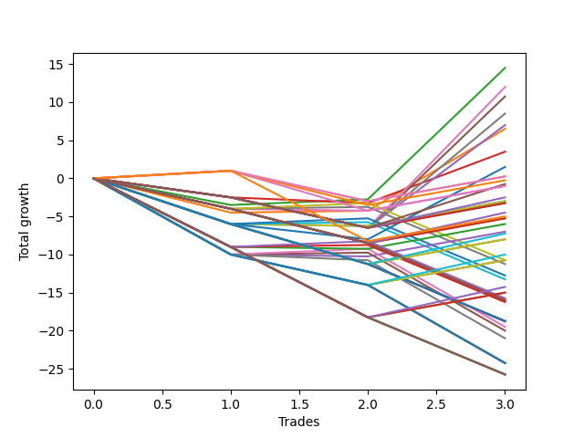

# Short Pointer 010 
- Symbol: ES
- Date Range: 03/18/2022 - 07/15/2022
- Trading Period: 7:20-12:30
- Number of Trades: 3



| Name | Win Percent | Profit | Avg Profit / Trade | Avg Time / Trade |      | Name | Win Percent | Profit | Avg Profit / Trade | Avg Time / Trade |
| ---- | ----------- | ------ | ------------------ | ---------------- | ---- | ---- | ----------- | ------ | ------------------ | ---------------- |
| Sorted By <br> Profit | | | | | | Sorted By <br> Win Percentage ||||
| Two | 66.67 | 7250.00 | 2416.67 | 15:13 |     | Two | 66.67 | 7250.00 | 2416.67 | 15:13 |
| Six | 33.33 | 6000.00 | 2000.00 | 25:18 |     | One | 66.67 | 3250.00 | 1083.33 | 14:55 |
| Five | 33.33 | 5375.00 | 1791.67 | 21:30 |     | One Hundred Twenty-One | 66.67 | 125.00 | 41.67 | 10:05 |
| Seven | 33.33 | 4250.00 | 1416.67 | 29:55 |     | Eighty-One | 66.67 | 125.00 | 41.67 | 10:05 |
| Four | 33.33 | 3500.00 | 1166.67 | 21:25 |     | One Hundred Sixteen | 66.67 | -125.00 | -41.67 | 06:05 |
| One | 66.67 | 3250.00 | 1083.33 | 14:55 |     | One Hundred Eleven | 66.67 | -500.00 | -166.67 | 06:18 |
| Three | 33.33 | 1750.00 | 583.33 | 20:45 |     | One Hundred Twenty-Six | 66.67 | -2500.00 | -833.33 | 07:06 |
| Seventy-Three | 33.33 | 750.00 | 250.00 | 12:05 |     | Six | 33.33 | 6000.00 | 2000.00 | 25:18 |
| One Hundred Twenty-One | 66.67 | 125.00 | 41.67 | 10:05 |     | Five | 33.33 | 5375.00 | 1791.67 | 21:30 |
| Eighty-One | 66.67 | 125.00 | 41.67 | 10:05 |     | Seven | 33.33 | 4250.00 | 1416.67 | 29:55 |
| One Hundred Sixteen | 66.67 | -125.00 | -41.67 | 06:05 |     | Four | 33.33 | 3500.00 | 1166.67 | 21:25 |
| Eighty-Five | 33.33 | -375.00 | -125.00 | 21:18 |     | Three | 33.33 | 1750.00 | 583.33 | 20:45 |
| One Hundred Eleven | 66.67 | -500.00 | -166.67 | 06:18 |     | Seventy-Three | 33.33 | 750.00 | 250.00 | 12:05 |
| Forty-Eight | 33.33 | -500.00 | -166.67 | 04:21 |     | Eighty-Five | 33.33 | -375.00 | -125.00 | 21:18 |
| Eighty-Four | 33.33 | -1250.00 | -416.67 | 20:03 |     | Forty-Eight | 33.33 | -500.00 | -166.67 | 04:21 |
| Forty | 33.33 | -1500.00 | -500.00 | 04:23 |     | Eighty-Four | 33.33 | -1250.00 | -416.67 | 20:03 |
| Zero | 33.33 | -1500.00 | -500.00 | 09:43 |     | Forty | 33.33 | -1500.00 | -500.00 | 04:23 |
| Eighty-Three | 33.33 | -1625.00 | -541.67 | 20:00 |     | Zero | 33.33 | -1500.00 | -500.00 | 09:43 |
| Eighty-Two | 33.33 | -1625.00 | -541.67 | 20:00 |     | Eighty-Three | 33.33 | -1625.00 | -541.67 | 20:00 |
| One Hundred Ninteen | 33.33 | -2250.00 | -750.00 | 09:05 |     | Eighty-Two | 33.33 | -1625.00 | -541.67 | 20:00 |
| One Hundred Twenty-Six | 66.67 | -2500.00 | -833.33 | 07:06 |     | One Hundred Ninteen | 33.33 | -2250.00 | -750.00 | 09:05 |
| One Hundred Eighteen | 33.33 | -2625.00 | -875.00 | 09:01 |     | One Hundred Eighteen | 33.33 | -2625.00 | -875.00 | 09:01 |
| One Hundred Seventeen | 33.33 | -2625.00 | -875.00 | 09:01 |     | One Hundred Seventeen | 33.33 | -2625.00 | -875.00 | 09:01 |
| Sixty-Four | 33.33 | -3000.00 | -1000.00 | 06:46 |     | Sixty-Four | 33.33 | -3000.00 | -1000.00 | 06:46 |
| Fifty-Six | 33.33 | -3500.00 | -1166.67 | 07:05 |     | Fifty-Six | 33.33 | -3500.00 | -1166.67 | 07:05 |
| One Hundred Fourteen | 33.33 | -3625.00 | -1208.33 | 09:20 |     | One Hundred Fourteen | 33.33 | -3625.00 | -1208.33 | 09:20 |
| One Hundred Thirteen | 33.33 | -4000.00 | -1333.33 | 09:16 |     | One Hundred Thirteen | 33.33 | -4000.00 | -1333.33 | 09:16 |
| One Hundred Twelve | 33.33 | -4000.00 | -1333.33 | 09:16 |     | One Hundred Twelve | 33.33 | -4000.00 | -1333.33 | 09:16 |
| One Hundred Twenty-Four | 33.33 | -5000.00 | -1666.67 | 15:48 |     | One Hundred Twenty-Four | 33.33 | -5000.00 | -1666.67 | 15:48 |
| One Hundred Twenty-Three | 33.33 | -5375.00 | -1791.67 | 15:45 |     | One Hundred Twenty-Three | 33.33 | -5375.00 | -1791.67 | 15:45 |
| One Hundred Twenty-Two | 33.33 | -5375.00 | -1791.67 | 15:45 |     | One Hundred Twenty-Two | 33.33 | -5375.00 | -1791.67 | 15:45 |
| Fifty | 33.33 | -5375.00 | -1791.67 | 07:31 |     | Fifty | 33.33 | -5375.00 | -1791.67 | 07:31 |
| Forty-Nine | 33.33 | -5625.00 | -1875.00 | 07:26 |     | Forty-Nine | 33.33 | -5625.00 | -1875.00 | 07:26 |
| Forty-Two | 33.33 | -6375.00 | -2125.00 | 07:33 |     | Forty-Two | 33.33 | -6375.00 | -2125.00 | 07:33 |
| Forty-One | 33.33 | -6625.00 | -2208.33 | 07:28 |     | Forty-One | 33.33 | -6625.00 | -2208.33 | 07:28 |
| One Hundred Twenty-Nine | 33.33 | -7125.00 | -2375.00 | 12:31 |     | One Hundred Twenty-Nine | 33.33 | -7125.00 | -2375.00 | 12:31 |
| One Hundred Twenty-Eight | 33.33 | -7500.00 | -2500.00 | 12:28 |     | One Hundred Twenty-Eight | 33.33 | -7500.00 | -2500.00 | 12:28 |
| One Hundred Twenty-Seven | 33.33 | -7500.00 | -2500.00 | 12:28 |     | One Hundred Twenty-Seven | 33.33 | -7500.00 | -2500.00 | 12:28 |
| Sixty-Six | 33.33 | -7875.00 | -2625.00 | 09:56 |     | Sixty-Six | 33.33 | -7875.00 | -2625.00 | 09:56 |
| One Hundred Twenty | 0.00 | -8000.00 | -2666.67 | 09:13 |     | Sixty-Five | 33.33 | -8125.00 | -2708.33 | 09:51 |
| Fifty-Five | 0.00 | -8000.00 | -2666.67 | 09:13 |     | Fifty-Eight | 33.33 | -9750.00 | -3250.00 | 10:43 |
| Fifty-Four | 0.00 | -8000.00 | -2666.67 | 09:13 |     | Fifty-Seven | 33.33 | -10000.00 | -3333.33 | 10:38 |
| Fifty-Three | 0.00 | -8000.00 | -2666.67 | 09:13 |     | One Hundred Twenty | 0.00 | -8000.00 | -2666.67 | 09:13 |
| Fifty-Two | 0.00 | -8000.00 | -2666.67 | 09:13 |     | Fifty-Five | 0.00 | -8000.00 | -2666.67 | 09:13 |
| Fifty-One | 0.00 | -8000.00 | -2666.67 | 09:13 |     | Fifty-Four | 0.00 | -8000.00 | -2666.67 | 09:13 |
| Sixty-Five | 33.33 | -8125.00 | -2708.33 | 09:51 |     | Fifty-Three | 0.00 | -8000.00 | -2666.67 | 09:13 |
| One Hundred Fifteen | 0.00 | -9375.00 | -3125.00 | 09:28 |     | Fifty-Two | 0.00 | -8000.00 | -2666.67 | 09:13 |
| Forty-Seven | 0.00 | -9375.00 | -3125.00 | 09:28 |     | Fifty-One | 0.00 | -8000.00 | -2666.67 | 09:13 |
| Forty-Six | 0.00 | -9375.00 | -3125.00 | 09:28 |     | One Hundred Fifteen | 0.00 | -9375.00 | -3125.00 | 09:28 |
| Forty-Five | 0.00 | -9375.00 | -3125.00 | 09:28 |     | Forty-Seven | 0.00 | -9375.00 | -3125.00 | 09:28 |
| Forty-Four | 0.00 | -9375.00 | -3125.00 | 09:28 |     | Forty-Six | 0.00 | -9375.00 | -3125.00 | 09:28 |
| Forty-Three | 0.00 | -9375.00 | -3125.00 | 09:28 |     | Forty-Five | 0.00 | -9375.00 | -3125.00 | 09:28 |
| Fifty-Eight | 33.33 | -9750.00 | -3250.00 | 10:43 |     | Forty-Four | 0.00 | -9375.00 | -3125.00 | 09:28 |
| Fifty-Seven | 33.33 | -10000.00 | -3333.33 | 10:38 |     | Forty-Three | 0.00 | -9375.00 | -3125.00 | 09:28 |
| Fifty-Nine | 0.00 | -10500.00 | -3500.00 | 15:48 |     | Fifty-Nine | 0.00 | -10500.00 | -3500.00 | 15:48 |
| One Hundred Twenty-Five | 0.00 | -12125.00 | -4041.67 | 16:25 |     | One Hundred Twenty-Five | 0.00 | -12125.00 | -4041.67 | 16:25 |
| Sixty-Three | 0.00 | -12125.00 | -4041.67 | 16:25 |     | Sixty-Three | 0.00 | -12125.00 | -4041.67 | 16:25 |
| Sixty-Two | 0.00 | -12125.00 | -4041.67 | 16:25 |     | Sixty-Two | 0.00 | -12125.00 | -4041.67 | 16:25 |
| Sixty-One | 0.00 | -12125.00 | -4041.67 | 16:25 |     | Sixty-One | 0.00 | -12125.00 | -4041.67 | 16:25 |
| Sixty | 0.00 | -12125.00 | -4041.67 | 16:25 |     | Sixty | 0.00 | -12125.00 | -4041.67 | 16:25 |
| One Hundred Thirty | 0.00 | -12875.00 | -4291.67 | 12:40 |     | One Hundred Thirty | 0.00 | -12875.00 | -4291.67 | 12:40 |
| Seventy-One | 0.00 | -12875.00 | -4291.67 | 12:40 |     | Seventy-One | 0.00 | -12875.00 | -4291.67 | 12:40 |
| Seventy | 0.00 | -12875.00 | -4291.67 | 12:40 |     | Seventy | 0.00 | -12875.00 | -4291.67 | 12:40 |
| Sixty-Nine | 0.00 | -12875.00 | -4291.67 | 12:40 |     | Sixty-Nine | 0.00 | -12875.00 | -4291.67 | 12:40 |
| Sixty-Eight | 0.00 | -12875.00 | -4291.67 | 12:40 |     | Sixty-Eight | 0.00 | -12875.00 | -4291.67 | 12:40 |
| Sixty-Seven | 0.00 | -12875.00 | -4291.67 | 12:40 |     | Sixty-Seven | 0.00 | -12875.00 | -4291.67 | 12:40 |

## NO STOPLOSS

### Test Zero
* Sell when price hits the middle line of the 20p bollinger
* No Stoploss
* Results:
```
Total Trades: 3
Percent Up: 66.67
Percent Down: 33.33
Total Points Moved Down: -3.00
Potential Profit: -1500.00
Total Points Ups: 6.25 Count Ups: 2
Total Points Downs: 3.25 Count Downs: 1
```

<details><summary>Trades</summary>

<code>In: 2022-03-25 07:26:00		Out: 2022-03-25 07:51:05		Total Position Time: 25:05		Total Move Down: -6.00		Total to Date: -6.00</code> <br />
<code>In: 2022-03-29 12:15:00		Out: 2022-03-29 12:18:55		Total Position Time: 03:55		Total Move Down: -0.25		Total to Date: -6.25</code> <br />
<code>In: 2022-05-04 11:03:00		Out: 2022-05-04 11:03:10		Total Position Time: 00:10		Total Move Down: 3.25		Total to Date: -3.00</code> <br />


</details>

### Test One
* Sell when the price hits the upper line of the 20p 1std bollinger
* No Stoploss
* Results:
```
Total Trades: 3
Percent Up: 33.33
Percent Down: 66.67
Total Points Moved Down: 6.50
Potential Profit: 3250.00
Total Points Ups: 4.50 Count Ups: 1
Total Points Downs: 11.00 Count Downs: 2
```

<details><summary>Trades</summary>

<code>In: 2022-03-25 07:26:00		Out: 2022-03-25 07:53:50		Total Position Time: 27:50		Total Move Down: -4.50		Total to Date: -4.50</code> <br />
<code>In: 2022-03-29 12:15:00		Out: 2022-03-29 12:27:35		Total Position Time: 12:35		Total Move Down: 0.25		Total to Date: -4.25</code> <br />
<code>In: 2022-05-04 11:03:00		Out: 2022-05-04 11:07:20		Total Position Time: 04:20		Total Move Down: 10.75		Total to Date: 6.50</code> <br />


</details>

### Test Two
* Sell when the price hits the upper line of the 20p 2std bollinger
* No Stoploss
* Results:
```
Total Trades: 3
Percent Up: 33.33
Percent Down: 66.67
Total Points Moved Down: 14.50
Potential Profit: 7250.00
Total Points Ups: 3.50 Count Ups: 1
Total Points Downs: 18.00 Count Downs: 2
```

<details><summary>Trades</summary>

<code>In: 2022-03-25 07:26:00		Out: 2022-03-25 07:54:10		Total Position Time: 28:10		Total Move Down: -3.50		Total to Date: -3.50</code> <br />
<code>In: 2022-03-29 12:15:00		Out: 2022-03-29 12:27:50		Total Position Time: 12:50		Total Move Down: 0.75		Total to Date: -2.75</code> <br />
<code>In: 2022-05-04 11:03:00		Out: 2022-05-04 11:07:40		Total Position Time: 04:40		Total Move Down: 17.25		Total to Date: 14.50</code> <br />


</details>

### Test Three
* Sell when price hits the middle line of the 50p bollinger
* No Stoploss
* Results:
```
Total Trades: 3
Percent Up: 66.67
Percent Down: 33.33
Total Points Moved Down: 3.50
Potential Profit: 1750.00
Total Points Ups: 3.25 Count Ups: 2
Total Points Downs: 6.75 Count Downs: 1
```

<details><summary>Trades</summary>

<code>In: 2022-03-25 07:26:00		Out: 2022-03-25 07:55:55		Total Position Time: 29:55		Total Move Down: -2.50		Total to Date: -2.50</code> <br />
<code>In: 2022-03-29 12:15:00		Out: 2022-03-29 12:43:05		Total Position Time: 28:05		Total Move Down: -0.75		Total to Date: -3.25</code> <br />
<code>In: 2022-05-04 11:03:00		Out: 2022-05-04 11:07:15		Total Position Time: 04:15		Total Move Down: 6.75		Total to Date: 3.50</code> <br />


</details>

### Test Four
* Sell when the price hits the upper line of the 50p 1std bollinger
* No Stoploss
* Results:
```
Total Trades: 3
Percent Up: 66.67
Percent Down: 33.33
Total Points Moved Down: 7.00
Potential Profit: 3500.00
Total Points Ups: 6.50 Count Ups: 2
Total Points Downs: 13.50 Count Downs: 1
```

<details><summary>Trades</summary>

<code>In: 2022-03-25 07:26:00		Out: 2022-03-25 07:55:55		Total Position Time: 29:55		Total Move Down: -2.50		Total to Date: -2.50</code> <br />
<code>In: 2022-03-29 12:15:00		Out: 2022-03-29 12:44:55		Total Position Time: 29:55		Total Move Down: -4.00		Total to Date: -6.50</code> <br />
<code>In: 2022-05-04 11:03:00		Out: 2022-05-04 11:07:25		Total Position Time: 04:25		Total Move Down: 13.50		Total to Date: 7.00</code> <br />


</details>

### Test Five
* Sell when the price hits the upper line of the 50p 2std bollinger
* No Stoploss
* Results:
```
Total Trades: 3
Percent Up: 66.67
Percent Down: 33.33
Total Points Moved Down: 10.75
Potential Profit: 5375.00
Total Points Ups: 6.50 Count Ups: 2
Total Points Downs: 17.25 Count Downs: 1
```

<details><summary>Trades</summary>

<code>In: 2022-03-25 07:26:00		Out: 2022-03-25 07:55:55		Total Position Time: 29:55		Total Move Down: -2.50		Total to Date: -2.50</code> <br />
<code>In: 2022-03-29 12:15:00		Out: 2022-03-29 12:44:55		Total Position Time: 29:55		Total Move Down: -4.00		Total to Date: -6.50</code> <br />
<code>In: 2022-05-04 11:03:00		Out: 2022-05-04 11:07:40		Total Position Time: 04:40		Total Move Down: 17.25		Total to Date: 10.75</code> <br />


</details>

### Test Six
* Sell when the price hits the middle line of the 1std VWAP
* No Stoploss
* Results:
```
Total Trades: 3
Percent Up: 66.67
Percent Down: 33.33
Total Points Moved Down: 12.00
Potential Profit: 6000.00
Total Points Ups: 6.50 Count Ups: 2
Total Points Downs: 18.50 Count Downs: 1
```

<details><summary>Trades</summary>

<code>In: 2022-03-25 07:26:00		Out: 2022-03-25 07:55:55		Total Position Time: 29:55		Total Move Down: -2.50		Total to Date: -2.50</code> <br />
<code>In: 2022-03-29 12:15:00		Out: 2022-03-29 12:44:55		Total Position Time: 29:55		Total Move Down: -4.00		Total to Date: -6.50</code> <br />
<code>In: 2022-05-04 11:03:00		Out: 2022-05-04 11:19:05		Total Position Time: 16:05		Total Move Down: 18.50		Total to Date: 12.00</code> <br />


</details>

### Test Seven
* Sell when the price hits the upper line of the 1std VWAP
* No Stoploss
* Results:
```
Total Trades: 3
Percent Up: 66.67
Percent Down: 33.33
Total Points Moved Down: 8.50
Potential Profit: 4250.00
Total Points Ups: 6.50 Count Ups: 2
Total Points Downs: 15.00 Count Downs: 1
```

<details><summary>Trades</summary>

<code>In: 2022-03-25 07:26:00		Out: 2022-03-25 07:55:55		Total Position Time: 29:55		Total Move Down: -2.50		Total to Date: -2.50</code> <br />
<code>In: 2022-03-29 12:15:00		Out: 2022-03-29 12:44:55		Total Position Time: 29:55		Total Move Down: -4.00		Total to Date: -6.50</code> <br />
<code>In: 2022-05-04 11:03:00		Out: 2022-05-04 11:32:55		Total Position Time: 29:55		Total Move Down: 15.00		Total to Date: 8.50</code> <br />


</details>

## STOPLOSS OF 5

### Test Forty
* Sell when price hits the middle line of the 20p bollinger
* Stoploss is -5 points
* Results:
```
Total Trades: 3
Percent Up: 66.67
Percent Down: 33.33
Total Points Moved Down: -3.00
Potential Profit: -1500.00
Total Points Ups: 6.25 Count Ups: 2
Total Points Downs: 3.25 Count Downs: 1
```

<details><summary>Trades</summary>

<code>In: 2022-03-25 07:26:00		Out: 2022-03-25 07:35:05		Total Position Time: 09:05		Total Move Down: -6.00		Total to Date: -6.00</code> <br />
<code>In: 2022-03-29 12:15:00		Out: 2022-03-29 12:18:55		Total Position Time: 03:55		Total Move Down: -0.25		Total to Date: -6.25</code> <br />
<code>In: 2022-05-04 11:03:00		Out: 2022-05-04 11:03:10		Total Position Time: 00:10		Total Move Down: 3.25		Total to Date: -3.00</code> <br />


</details>

### Test Forty-One
* Sell when the price hits the upper line of the 20p 1std bollinger
* Stoploss is -5 points
* Results:
```
Total Trades: 3
Percent Up: 66.67
Percent Down: 33.33
Total Points Moved Down: -13.25
Potential Profit: -6625.00
Total Points Ups: 13.50 Count Ups: 2
Total Points Downs: 0.25 Count Downs: 1
```

<details><summary>Trades</summary>

<code>In: 2022-03-25 07:26:00		Out: 2022-03-25 07:35:05		Total Position Time: 09:05		Total Move Down: -6.00		Total to Date: -6.00</code> <br />
<code>In: 2022-03-29 12:15:00		Out: 2022-03-29 12:27:35		Total Position Time: 12:35		Total Move Down: 0.25		Total to Date: -5.75</code> <br />
<code>In: 2022-05-04 11:03:00		Out: 2022-05-04 11:03:45		Total Position Time: 00:45		Total Move Down: -7.50		Total to Date: -13.25</code> <br />


</details>

### Test Forty-Two
* Sell when the price hits the upper line of the 20p 2std bollinger
* Stoploss is -5 points
* Results:
```
Total Trades: 3
Percent Up: 66.67
Percent Down: 33.33
Total Points Moved Down: -12.75
Potential Profit: -6375.00
Total Points Ups: 13.50 Count Ups: 2
Total Points Downs: 0.75 Count Downs: 1
```

<details><summary>Trades</summary>

<code>In: 2022-03-25 07:26:00		Out: 2022-03-25 07:35:05		Total Position Time: 09:05		Total Move Down: -6.00		Total to Date: -6.00</code> <br />
<code>In: 2022-03-29 12:15:00		Out: 2022-03-29 12:27:50		Total Position Time: 12:50		Total Move Down: 0.75		Total to Date: -5.25</code> <br />
<code>In: 2022-05-04 11:03:00		Out: 2022-05-04 11:03:45		Total Position Time: 00:45		Total Move Down: -7.50		Total to Date: -12.75</code> <br />


</details>

### Test Forty-Three
* Sell when price hits the middle line of the 50p bollinger
* Stoploss is -5 points
* Results:
```
Total Trades: 3
Percent Up: 100.00
Percent Down: 0.00
Total Points Moved Down: -18.75
Potential Profit: -9375.00
Total Points Ups: 18.75 Count Ups: 3
Total Points Downs: 0.00 Count Downs: 0
```

<details><summary>Trades</summary>

<code>In: 2022-03-25 07:26:00		Out: 2022-03-25 07:35:05		Total Position Time: 09:05		Total Move Down: -6.00		Total to Date: -6.00</code> <br />
<code>In: 2022-03-29 12:15:00		Out: 2022-03-29 12:33:35		Total Position Time: 18:35		Total Move Down: -5.25		Total to Date: -11.25</code> <br />
<code>In: 2022-05-04 11:03:00		Out: 2022-05-04 11:03:45		Total Position Time: 00:45		Total Move Down: -7.50		Total to Date: -18.75</code> <br />


</details>

### Test Forty-Four
* Sell when the price hits the upper line of the 50p 1std bollinger
* Stoploss is -5 points
* Results:
```
Total Trades: 3
Percent Up: 100.00
Percent Down: 0.00
Total Points Moved Down: -18.75
Potential Profit: -9375.00
Total Points Ups: 18.75 Count Ups: 3
Total Points Downs: 0.00 Count Downs: 0
```

<details><summary>Trades</summary>

<code>In: 2022-03-25 07:26:00		Out: 2022-03-25 07:35:05		Total Position Time: 09:05		Total Move Down: -6.00		Total to Date: -6.00</code> <br />
<code>In: 2022-03-29 12:15:00		Out: 2022-03-29 12:33:35		Total Position Time: 18:35		Total Move Down: -5.25		Total to Date: -11.25</code> <br />
<code>In: 2022-05-04 11:03:00		Out: 2022-05-04 11:03:45		Total Position Time: 00:45		Total Move Down: -7.50		Total to Date: -18.75</code> <br />


</details>

### Test Forty-Five
* Sell when the price hits the upper line of the 50p 2std bollinger
* Stoploss is -5 points
* Results:
```
Total Trades: 3
Percent Up: 100.00
Percent Down: 0.00
Total Points Moved Down: -18.75
Potential Profit: -9375.00
Total Points Ups: 18.75 Count Ups: 3
Total Points Downs: 0.00 Count Downs: 0
```

<details><summary>Trades</summary>

<code>In: 2022-03-25 07:26:00		Out: 2022-03-25 07:35:05		Total Position Time: 09:05		Total Move Down: -6.00		Total to Date: -6.00</code> <br />
<code>In: 2022-03-29 12:15:00		Out: 2022-03-29 12:33:35		Total Position Time: 18:35		Total Move Down: -5.25		Total to Date: -11.25</code> <br />
<code>In: 2022-05-04 11:03:00		Out: 2022-05-04 11:03:45		Total Position Time: 00:45		Total Move Down: -7.50		Total to Date: -18.75</code> <br />


</details>

### Test Forty-Six
* Sell when the price hits the middle line of the 1std VWAP
* Stoploss is -5 points
* Results:
```
Total Trades: 3
Percent Up: 100.00
Percent Down: 0.00
Total Points Moved Down: -18.75
Potential Profit: -9375.00
Total Points Ups: 18.75 Count Ups: 3
Total Points Downs: 0.00 Count Downs: 0
```

<details><summary>Trades</summary>

<code>In: 2022-03-25 07:26:00		Out: 2022-03-25 07:35:05		Total Position Time: 09:05		Total Move Down: -6.00		Total to Date: -6.00</code> <br />
<code>In: 2022-03-29 12:15:00		Out: 2022-03-29 12:33:35		Total Position Time: 18:35		Total Move Down: -5.25		Total to Date: -11.25</code> <br />
<code>In: 2022-05-04 11:03:00		Out: 2022-05-04 11:03:45		Total Position Time: 00:45		Total Move Down: -7.50		Total to Date: -18.75</code> <br />


</details>

### Test Forty-Seven
* Sell when the price hits the upper line of the 1std VWAP
* Stoploss is -5 points
* Results:
```
Total Trades: 3
Percent Up: 100.00
Percent Down: 0.00
Total Points Moved Down: -18.75
Potential Profit: -9375.00
Total Points Ups: 18.75 Count Ups: 3
Total Points Downs: 0.00 Count Downs: 0
```

<details><summary>Trades</summary>

<code>In: 2022-03-25 07:26:00		Out: 2022-03-25 07:35:05		Total Position Time: 09:05		Total Move Down: -6.00		Total to Date: -6.00</code> <br />
<code>In: 2022-03-29 12:15:00		Out: 2022-03-29 12:33:35		Total Position Time: 18:35		Total Move Down: -5.25		Total to Date: -11.25</code> <br />
<code>In: 2022-05-04 11:03:00		Out: 2022-05-04 11:03:45		Total Position Time: 00:45		Total Move Down: -7.50		Total to Date: -18.75</code> <br />


</details>

## TRAIL STOP OF 5

### Test Forty-Eight
* Sell when price hits the middle line of the 20p bollinger
* Trailing Stop is -5 points
* Results:
```
Total Trades: 3
Percent Up: 66.67
Percent Down: 33.33
Total Points Moved Down: -1.00
Potential Profit: -500.00
Total Points Ups: 4.25 Count Ups: 2
Total Points Downs: 3.25 Count Downs: 1
```

<details><summary>Trades</summary>

<code>In: 2022-03-25 07:26:00		Out: 2022-03-25 07:35:00		Total Position Time: 09:00		Total Move Down: -4.00		Total to Date: -4.00</code> <br />
<code>In: 2022-03-29 12:15:00		Out: 2022-03-29 12:18:55		Total Position Time: 03:55		Total Move Down: -0.25		Total to Date: -4.25</code> <br />
<code>In: 2022-05-04 11:03:00		Out: 2022-05-04 11:03:10		Total Position Time: 00:10		Total Move Down: 3.25		Total to Date: -1.00</code> <br />


</details>

### Test Forty-Nine
* Sell when the price hits the upper line of the 20p 1std bollinger
* Trailing Stop is -5 points
* Results:
```
Total Trades: 3
Percent Up: 66.67
Percent Down: 33.33
Total Points Moved Down: -11.25
Potential Profit: -5625.00
Total Points Ups: 11.50 Count Ups: 2
Total Points Downs: 0.25 Count Downs: 1
```

<details><summary>Trades</summary>

<code>In: 2022-03-25 07:26:00		Out: 2022-03-25 07:35:00		Total Position Time: 09:00		Total Move Down: -4.00		Total to Date: -4.00</code> <br />
<code>In: 2022-03-29 12:15:00		Out: 2022-03-29 12:27:35		Total Position Time: 12:35		Total Move Down: 0.25		Total to Date: -3.75</code> <br />
<code>In: 2022-05-04 11:03:00		Out: 2022-05-04 11:03:45		Total Position Time: 00:45		Total Move Down: -7.50		Total to Date: -11.25</code> <br />


</details>

### Test Fifty
* Sell when the price hits the upper line of the 20p 2std bollinger
* Trailing Stop is -5 points
* Results:
```
Total Trades: 3
Percent Up: 66.67
Percent Down: 33.33
Total Points Moved Down: -10.75
Potential Profit: -5375.00
Total Points Ups: 11.50 Count Ups: 2
Total Points Downs: 0.75 Count Downs: 1
```

<details><summary>Trades</summary>

<code>In: 2022-03-25 07:26:00		Out: 2022-03-25 07:35:00		Total Position Time: 09:00		Total Move Down: -4.00		Total to Date: -4.00</code> <br />
<code>In: 2022-03-29 12:15:00		Out: 2022-03-29 12:27:50		Total Position Time: 12:50		Total Move Down: 0.75		Total to Date: -3.25</code> <br />
<code>In: 2022-05-04 11:03:00		Out: 2022-05-04 11:03:45		Total Position Time: 00:45		Total Move Down: -7.50		Total to Date: -10.75</code> <br />


</details>

### Test Fifty-One
* Sell when price hits the middle line of the 50p bollinger
* Trailing Stop is -5 points
* Results:
```
Total Trades: 3
Percent Up: 100.00
Percent Down: 0.00
Total Points Moved Down: -16.00
Potential Profit: -8000.00
Total Points Ups: 16.00 Count Ups: 3
Total Points Downs: 0.00 Count Downs: 0
```

<details><summary>Trades</summary>

<code>In: 2022-03-25 07:26:00		Out: 2022-03-25 07:35:00		Total Position Time: 09:00		Total Move Down: -4.00		Total to Date: -4.00</code> <br />
<code>In: 2022-03-29 12:15:00		Out: 2022-03-29 12:32:55		Total Position Time: 17:55		Total Move Down: -4.50		Total to Date: -8.50</code> <br />
<code>In: 2022-05-04 11:03:00		Out: 2022-05-04 11:03:45		Total Position Time: 00:45		Total Move Down: -7.50		Total to Date: -16.00</code> <br />


</details>

### Test Fifty-Two
* Sell when the price hits the upper line of the 50p 1std bollinger
* Trailing Stop is -5 points
* Results:
```
Total Trades: 3
Percent Up: 100.00
Percent Down: 0.00
Total Points Moved Down: -16.00
Potential Profit: -8000.00
Total Points Ups: 16.00 Count Ups: 3
Total Points Downs: 0.00 Count Downs: 0
```

<details><summary>Trades</summary>

<code>In: 2022-03-25 07:26:00		Out: 2022-03-25 07:35:00		Total Position Time: 09:00		Total Move Down: -4.00		Total to Date: -4.00</code> <br />
<code>In: 2022-03-29 12:15:00		Out: 2022-03-29 12:32:55		Total Position Time: 17:55		Total Move Down: -4.50		Total to Date: -8.50</code> <br />
<code>In: 2022-05-04 11:03:00		Out: 2022-05-04 11:03:45		Total Position Time: 00:45		Total Move Down: -7.50		Total to Date: -16.00</code> <br />


</details>

### Test Fifty-Three
* Sell when the price hits the upper line of the 50p 2std bollinger
* Trailing Stop is -5 points
* Results:
```
Total Trades: 3
Percent Up: 100.00
Percent Down: 0.00
Total Points Moved Down: -16.00
Potential Profit: -8000.00
Total Points Ups: 16.00 Count Ups: 3
Total Points Downs: 0.00 Count Downs: 0
```

<details><summary>Trades</summary>

<code>In: 2022-03-25 07:26:00		Out: 2022-03-25 07:35:00		Total Position Time: 09:00		Total Move Down: -4.00		Total to Date: -4.00</code> <br />
<code>In: 2022-03-29 12:15:00		Out: 2022-03-29 12:32:55		Total Position Time: 17:55		Total Move Down: -4.50		Total to Date: -8.50</code> <br />
<code>In: 2022-05-04 11:03:00		Out: 2022-05-04 11:03:45		Total Position Time: 00:45		Total Move Down: -7.50		Total to Date: -16.00</code> <br />


</details>

### Test Fifty-Four
* Sell when the price hits the middle line of the 1std VWAP
* Trailing Stop is -5 points
* Results:
```
Total Trades: 3
Percent Up: 100.00
Percent Down: 0.00
Total Points Moved Down: -16.00
Potential Profit: -8000.00
Total Points Ups: 16.00 Count Ups: 3
Total Points Downs: 0.00 Count Downs: 0
```

<details><summary>Trades</summary>

<code>In: 2022-03-25 07:26:00		Out: 2022-03-25 07:35:00		Total Position Time: 09:00		Total Move Down: -4.00		Total to Date: -4.00</code> <br />
<code>In: 2022-03-29 12:15:00		Out: 2022-03-29 12:32:55		Total Position Time: 17:55		Total Move Down: -4.50		Total to Date: -8.50</code> <br />
<code>In: 2022-05-04 11:03:00		Out: 2022-05-04 11:03:45		Total Position Time: 00:45		Total Move Down: -7.50		Total to Date: -16.00</code> <br />


</details>

### Test Fifty-Five
* Sell when the price hits the upper line of the 1std VWAP
* Trailing Stop is -5 points
* Results:
```
Total Trades: 3
Percent Up: 100.00
Percent Down: 0.00
Total Points Moved Down: -16.00
Potential Profit: -8000.00
Total Points Ups: 16.00 Count Ups: 3
Total Points Downs: 0.00 Count Downs: 0
```

<details><summary>Trades</summary>

<code>In: 2022-03-25 07:26:00		Out: 2022-03-25 07:35:00		Total Position Time: 09:00		Total Move Down: -4.00		Total to Date: -4.00</code> <br />
<code>In: 2022-03-29 12:15:00		Out: 2022-03-29 12:32:55		Total Position Time: 17:55		Total Move Down: -4.50		Total to Date: -8.50</code> <br />
<code>In: 2022-05-04 11:03:00		Out: 2022-05-04 11:03:45		Total Position Time: 00:45		Total Move Down: -7.50		Total to Date: -16.00</code> <br />


</details>

## STOPLOSS OF 10

### Test Fifty-Six
* Sell when price hits the middle line of the 20p bollinger
* Stoploss is -10 points
* Results:
```
Total Trades: 3
Percent Up: 66.67
Percent Down: 33.33
Total Points Moved Down: -7.00
Potential Profit: -3500.00
Total Points Ups: 10.25 Count Ups: 2
Total Points Downs: 3.25 Count Downs: 1
```

<details><summary>Trades</summary>

<code>In: 2022-03-25 07:26:00		Out: 2022-03-25 07:43:10		Total Position Time: 17:10		Total Move Down: -10.00		Total to Date: -10.00</code> <br />
<code>In: 2022-03-29 12:15:00		Out: 2022-03-29 12:18:55		Total Position Time: 03:55		Total Move Down: -0.25		Total to Date: -10.25</code> <br />
<code>In: 2022-05-04 11:03:00		Out: 2022-05-04 11:03:10		Total Position Time: 00:10		Total Move Down: 3.25		Total to Date: -7.00</code> <br />


</details>

### Test Fifty-Seven
* Sell when the price hits the upper line of the 20p 1std bollinger
* Stoploss is -10 points
* Results:
```
Total Trades: 3
Percent Up: 66.67
Percent Down: 33.33
Total Points Moved Down: -20.00
Potential Profit: -10000.00
Total Points Ups: 20.25 Count Ups: 2
Total Points Downs: 0.25 Count Downs: 1
```

<details><summary>Trades</summary>

<code>In: 2022-03-25 07:26:00		Out: 2022-03-25 07:43:10		Total Position Time: 17:10		Total Move Down: -10.00		Total to Date: -10.00</code> <br />
<code>In: 2022-03-29 12:15:00		Out: 2022-03-29 12:27:35		Total Position Time: 12:35		Total Move Down: 0.25		Total to Date: -9.75</code> <br />
<code>In: 2022-05-04 11:03:00		Out: 2022-05-04 11:05:10		Total Position Time: 02:10		Total Move Down: -10.25		Total to Date: -20.00</code> <br />


</details>

### Test Fifty-Eight
* Sell when the price hits the upper line of the 20p 2std bollinger
* Stoploss is -10 points
* Results:
```
Total Trades: 3
Percent Up: 66.67
Percent Down: 33.33
Total Points Moved Down: -19.50
Potential Profit: -9750.00
Total Points Ups: 20.25 Count Ups: 2
Total Points Downs: 0.75 Count Downs: 1
```

<details><summary>Trades</summary>

<code>In: 2022-03-25 07:26:00		Out: 2022-03-25 07:43:10		Total Position Time: 17:10		Total Move Down: -10.00		Total to Date: -10.00</code> <br />
<code>In: 2022-03-29 12:15:00		Out: 2022-03-29 12:27:50		Total Position Time: 12:50		Total Move Down: 0.75		Total to Date: -9.25</code> <br />
<code>In: 2022-05-04 11:03:00		Out: 2022-05-04 11:05:10		Total Position Time: 02:10		Total Move Down: -10.25		Total to Date: -19.50</code> <br />


</details>

### Test Fifty-Nine
* Sell when price hits the middle line of the 50p bollinger
* Stoploss is -10 points
* Results:
```
Total Trades: 3
Percent Up: 100.00
Percent Down: 0.00
Total Points Moved Down: -21.00
Potential Profit: -10500.00
Total Points Ups: 21.00 Count Ups: 3
Total Points Downs: 0.00 Count Downs: 0
```

<details><summary>Trades</summary>

<code>In: 2022-03-25 07:26:00		Out: 2022-03-25 07:43:10		Total Position Time: 17:10		Total Move Down: -10.00		Total to Date: -10.00</code> <br />
<code>In: 2022-03-29 12:15:00		Out: 2022-03-29 12:43:05		Total Position Time: 28:05		Total Move Down: -0.75		Total to Date: -10.75</code> <br />
<code>In: 2022-05-04 11:03:00		Out: 2022-05-04 11:05:10		Total Position Time: 02:10		Total Move Down: -10.25		Total to Date: -21.00</code> <br />


</details>

### Test Sixty
* Sell when the price hits the upper line of the 50p 1std bollinger
* Stoploss is -10 points
* Results:
```
Total Trades: 3
Percent Up: 100.00
Percent Down: 0.00
Total Points Moved Down: -24.25
Potential Profit: -12125.00
Total Points Ups: 24.25 Count Ups: 3
Total Points Downs: 0.00 Count Downs: 0
```

<details><summary>Trades</summary>

<code>In: 2022-03-25 07:26:00		Out: 2022-03-25 07:43:10		Total Position Time: 17:10		Total Move Down: -10.00		Total to Date: -10.00</code> <br />
<code>In: 2022-03-29 12:15:00		Out: 2022-03-29 12:44:55		Total Position Time: 29:55		Total Move Down: -4.00		Total to Date: -14.00</code> <br />
<code>In: 2022-05-04 11:03:00		Out: 2022-05-04 11:05:10		Total Position Time: 02:10		Total Move Down: -10.25		Total to Date: -24.25</code> <br />


</details>

### Test Sixty-One
* Sell when the price hits the upper line of the 50p 2std bollinger
* Stoploss is -10 points
* Results:
```
Total Trades: 3
Percent Up: 100.00
Percent Down: 0.00
Total Points Moved Down: -24.25
Potential Profit: -12125.00
Total Points Ups: 24.25 Count Ups: 3
Total Points Downs: 0.00 Count Downs: 0
```

<details><summary>Trades</summary>

<code>In: 2022-03-25 07:26:00		Out: 2022-03-25 07:43:10		Total Position Time: 17:10		Total Move Down: -10.00		Total to Date: -10.00</code> <br />
<code>In: 2022-03-29 12:15:00		Out: 2022-03-29 12:44:55		Total Position Time: 29:55		Total Move Down: -4.00		Total to Date: -14.00</code> <br />
<code>In: 2022-05-04 11:03:00		Out: 2022-05-04 11:05:10		Total Position Time: 02:10		Total Move Down: -10.25		Total to Date: -24.25</code> <br />


</details>

### Test Sixty-Two
* Sell when the price hits the middle line of the 1std VWAP
* Stoploss is -10 points
* Results:
```
Total Trades: 3
Percent Up: 100.00
Percent Down: 0.00
Total Points Moved Down: -24.25
Potential Profit: -12125.00
Total Points Ups: 24.25 Count Ups: 3
Total Points Downs: 0.00 Count Downs: 0
```

<details><summary>Trades</summary>

<code>In: 2022-03-25 07:26:00		Out: 2022-03-25 07:43:10		Total Position Time: 17:10		Total Move Down: -10.00		Total to Date: -10.00</code> <br />
<code>In: 2022-03-29 12:15:00		Out: 2022-03-29 12:44:55		Total Position Time: 29:55		Total Move Down: -4.00		Total to Date: -14.00</code> <br />
<code>In: 2022-05-04 11:03:00		Out: 2022-05-04 11:05:10		Total Position Time: 02:10		Total Move Down: -10.25		Total to Date: -24.25</code> <br />


</details>

### Test Sixty-Three
* Sell when the price hits the upper line of the 1std VWAP
* Stoploss is -10 points
* Results:
```
Total Trades: 3
Percent Up: 100.00
Percent Down: 0.00
Total Points Moved Down: -24.25
Potential Profit: -12125.00
Total Points Ups: 24.25 Count Ups: 3
Total Points Downs: 0.00 Count Downs: 0
```

<details><summary>Trades</summary>

<code>In: 2022-03-25 07:26:00		Out: 2022-03-25 07:43:10		Total Position Time: 17:10		Total Move Down: -10.00		Total to Date: -10.00</code> <br />
<code>In: 2022-03-29 12:15:00		Out: 2022-03-29 12:44:55		Total Position Time: 29:55		Total Move Down: -4.00		Total to Date: -14.00</code> <br />
<code>In: 2022-05-04 11:03:00		Out: 2022-05-04 11:05:10		Total Position Time: 02:10		Total Move Down: -10.25		Total to Date: -24.25</code> <br />


</details>

## TRAIL STOP OF 10

### Test Sixty-Four
* Sell when price hits the middle line of the 20p bollinger
* Trailing Stop is -10 points
* Results:
```
Total Trades: 3
Percent Up: 66.67
Percent Down: 33.33
Total Points Moved Down: -6.00
Potential Profit: -3000.00
Total Points Ups: 9.25 Count Ups: 2
Total Points Downs: 3.25 Count Downs: 1
```

<details><summary>Trades</summary>

<code>In: 2022-03-25 07:26:00		Out: 2022-03-25 07:42:15		Total Position Time: 16:15		Total Move Down: -9.00		Total to Date: -9.00</code> <br />
<code>In: 2022-03-29 12:15:00		Out: 2022-03-29 12:18:55		Total Position Time: 03:55		Total Move Down: -0.25		Total to Date: -9.25</code> <br />
<code>In: 2022-05-04 11:03:00		Out: 2022-05-04 11:03:10		Total Position Time: 00:10		Total Move Down: 3.25		Total to Date: -6.00</code> <br />


</details>

### Test Sixty-Five
* Sell when the price hits the upper line of the 20p 1std bollinger
* Trailing Stop is -10 points
* Results:
```
Total Trades: 3
Percent Up: 66.67
Percent Down: 33.33
Total Points Moved Down: -16.25
Potential Profit: -8125.00
Total Points Ups: 16.50 Count Ups: 2
Total Points Downs: 0.25 Count Downs: 1
```

<details><summary>Trades</summary>

<code>In: 2022-03-25 07:26:00		Out: 2022-03-25 07:42:15		Total Position Time: 16:15		Total Move Down: -9.00		Total to Date: -9.00</code> <br />
<code>In: 2022-03-29 12:15:00		Out: 2022-03-29 12:27:35		Total Position Time: 12:35		Total Move Down: 0.25		Total to Date: -8.75</code> <br />
<code>In: 2022-05-04 11:03:00		Out: 2022-05-04 11:03:45		Total Position Time: 00:45		Total Move Down: -7.50		Total to Date: -16.25</code> <br />


</details>

### Test Sixty-Six
* Sell when the price hits the upper line of the 20p 2std bollinger
* Trailing Stop is -10 points
* Results:
```
Total Trades: 3
Percent Up: 66.67
Percent Down: 33.33
Total Points Moved Down: -15.75
Potential Profit: -7875.00
Total Points Ups: 16.50 Count Ups: 2
Total Points Downs: 0.75 Count Downs: 1
```

<details><summary>Trades</summary>

<code>In: 2022-03-25 07:26:00		Out: 2022-03-25 07:42:15		Total Position Time: 16:15		Total Move Down: -9.00		Total to Date: -9.00</code> <br />
<code>In: 2022-03-29 12:15:00		Out: 2022-03-29 12:27:50		Total Position Time: 12:50		Total Move Down: 0.75		Total to Date: -8.25</code> <br />
<code>In: 2022-05-04 11:03:00		Out: 2022-05-04 11:03:45		Total Position Time: 00:45		Total Move Down: -7.50		Total to Date: -15.75</code> <br />


</details>

### Test Sixty-Seven
* Sell when price hits the middle line of the 50p bollinger
* Trailing Stop is -10 points
* Results:
```
Total Trades: 3
Percent Up: 100.00
Percent Down: 0.00
Total Points Moved Down: -25.75
Potential Profit: -12875.00
Total Points Ups: 25.75 Count Ups: 3
Total Points Downs: 0.00 Count Downs: 0
```

<details><summary>Trades</summary>

<code>In: 2022-03-25 07:26:00		Out: 2022-03-25 07:42:15		Total Position Time: 16:15		Total Move Down: -9.00		Total to Date: -9.00</code> <br />
<code>In: 2022-03-29 12:15:00		Out: 2022-03-29 12:36:00		Total Position Time: 21:00		Total Move Down: -9.25		Total to Date: -18.25</code> <br />
<code>In: 2022-05-04 11:03:00		Out: 2022-05-04 11:03:45		Total Position Time: 00:45		Total Move Down: -7.50		Total to Date: -25.75</code> <br />


</details>

### Test Sixty-Eight
* Sell when the price hits the upper line of the 50p 1std bollinger
* Trailing Stop is -10 points
* Results:
```
Total Trades: 3
Percent Up: 100.00
Percent Down: 0.00
Total Points Moved Down: -25.75
Potential Profit: -12875.00
Total Points Ups: 25.75 Count Ups: 3
Total Points Downs: 0.00 Count Downs: 0
```

<details><summary>Trades</summary>

<code>In: 2022-03-25 07:26:00		Out: 2022-03-25 07:42:15		Total Position Time: 16:15		Total Move Down: -9.00		Total to Date: -9.00</code> <br />
<code>In: 2022-03-29 12:15:00		Out: 2022-03-29 12:36:00		Total Position Time: 21:00		Total Move Down: -9.25		Total to Date: -18.25</code> <br />
<code>In: 2022-05-04 11:03:00		Out: 2022-05-04 11:03:45		Total Position Time: 00:45		Total Move Down: -7.50		Total to Date: -25.75</code> <br />


</details>

### Test Sixty-Nine
* Sell when the price hits the upper line of the 50p 2std bollinger
* Trailing Stop is -10 points
* Results:
```
Total Trades: 3
Percent Up: 100.00
Percent Down: 0.00
Total Points Moved Down: -25.75
Potential Profit: -12875.00
Total Points Ups: 25.75 Count Ups: 3
Total Points Downs: 0.00 Count Downs: 0
```

<details><summary>Trades</summary>

<code>In: 2022-03-25 07:26:00		Out: 2022-03-25 07:42:15		Total Position Time: 16:15		Total Move Down: -9.00		Total to Date: -9.00</code> <br />
<code>In: 2022-03-29 12:15:00		Out: 2022-03-29 12:36:00		Total Position Time: 21:00		Total Move Down: -9.25		Total to Date: -18.25</code> <br />
<code>In: 2022-05-04 11:03:00		Out: 2022-05-04 11:03:45		Total Position Time: 00:45		Total Move Down: -7.50		Total to Date: -25.75</code> <br />


</details>

### Test Seventy
* Sell when the price hits the middle line of the 1std VWAP
* Trailing Stop is -10 points
* Results:
```
Total Trades: 3
Percent Up: 100.00
Percent Down: 0.00
Total Points Moved Down: -25.75
Potential Profit: -12875.00
Total Points Ups: 25.75 Count Ups: 3
Total Points Downs: 0.00 Count Downs: 0
```

<details><summary>Trades</summary>

<code>In: 2022-03-25 07:26:00		Out: 2022-03-25 07:42:15		Total Position Time: 16:15		Total Move Down: -9.00		Total to Date: -9.00</code> <br />
<code>In: 2022-03-29 12:15:00		Out: 2022-03-29 12:36:00		Total Position Time: 21:00		Total Move Down: -9.25		Total to Date: -18.25</code> <br />
<code>In: 2022-05-04 11:03:00		Out: 2022-05-04 11:03:45		Total Position Time: 00:45		Total Move Down: -7.50		Total to Date: -25.75</code> <br />


</details>

### Test Seventy-One
* Sell when the price hits the upper line of the 1std VWAP
* Trailing Stop is -10 points
* Results:
```
Total Trades: 3
Percent Up: 100.00
Percent Down: 0.00
Total Points Moved Down: -25.75
Potential Profit: -12875.00
Total Points Ups: 25.75 Count Ups: 3
Total Points Downs: 0.00 Count Downs: 0
```

<details><summary>Trades</summary>

<code>In: 2022-03-25 07:26:00		Out: 2022-03-25 07:42:15		Total Position Time: 16:15		Total Move Down: -9.00		Total to Date: -9.00</code> <br />
<code>In: 2022-03-29 12:15:00		Out: 2022-03-29 12:36:00		Total Position Time: 21:00		Total Move Down: -9.25		Total to Date: -18.25</code> <br />
<code>In: 2022-05-04 11:03:00		Out: 2022-05-04 11:03:45		Total Position Time: 00:45		Total Move Down: -7.50		Total to Date: -25.75</code> <br />


</details>

## SPECIAL EXIT CONDITIONS 

### Test Seventy-Three
* Sell when the linear regression slope changes to negative
* No Stoploss
* Results:
```
Total Trades: 3
Percent Up: 66.67
Percent Down: 33.33
Total Points Moved Down: 1.50
Potential Profit: 750.00
Total Points Ups: 8.00 Count Ups: 2
Total Points Downs: 9.50 Count Downs: 1
```

<details><summary>Trades</summary>

<code>In: 2022-03-25 07:26:00		Out: 2022-03-25 07:35:05		Total Position Time: 09:05		Total Move Down: -6.00		Total to Date: -6.00</code> <br />
<code>In: 2022-03-29 12:15:00		Out: 2022-03-29 12:21:05		Total Position Time: 06:05		Total Move Down: -2.00		Total to Date: -8.00</code> <br />
<code>In: 2022-05-04 11:03:00		Out: 2022-05-04 11:24:05		Total Position Time: 21:05		Total Move Down: 9.50		Total to Date: 1.50</code> <br />


</details>

## TAKE PROFIT

### Test Eighty-One
* Take Profit of 1 Point
* No Stoploss
* Results:
```
Total Trades: 3
Percent Up: 33.33
Percent Down: 66.67
Total Points Moved Down: 0.25
Potential Profit: 125.00
Total Points Ups: 4.00 Count Ups: 1
Total Points Downs: 4.25 Count Downs: 2
```

<details><summary>Trades</summary>

<code>In: 2022-03-25 07:26:00		Out: 2022-03-25 07:26:10		Total Position Time: 00:10		Total Move Down: 1.00		Total to Date: 1.00</code> <br />
<code>In: 2022-03-29 12:15:00		Out: 2022-03-29 12:44:55		Total Position Time: 29:55		Total Move Down: -4.00		Total to Date: -3.00</code> <br />
<code>In: 2022-05-04 11:03:00		Out: 2022-05-04 11:03:10		Total Position Time: 00:10		Total Move Down: 3.25		Total to Date: 0.25</code> <br />


</details>

### Test Eighty-Two
* Take Profit of 2 Point
* No Stoploss
* Results:
```
Total Trades: 3
Percent Up: 66.67
Percent Down: 33.33
Total Points Moved Down: -3.25
Potential Profit: -1625.00
Total Points Ups: 6.50 Count Ups: 2
Total Points Downs: 3.25 Count Downs: 1
```

<details><summary>Trades</summary>

<code>In: 2022-03-25 07:26:00		Out: 2022-03-25 07:55:55		Total Position Time: 29:55		Total Move Down: -2.50		Total to Date: -2.50</code> <br />
<code>In: 2022-03-29 12:15:00		Out: 2022-03-29 12:44:55		Total Position Time: 29:55		Total Move Down: -4.00		Total to Date: -6.50</code> <br />
<code>In: 2022-05-04 11:03:00		Out: 2022-05-04 11:03:10		Total Position Time: 00:10		Total Move Down: 3.25		Total to Date: -3.25</code> <br />


</details>

### Test Eighty-Three
* Take Profit of 3 Point
* No Stoploss
* Results:
```
Total Trades: 3
Percent Up: 66.67
Percent Down: 33.33
Total Points Moved Down: -3.25
Potential Profit: -1625.00
Total Points Ups: 6.50 Count Ups: 2
Total Points Downs: 3.25 Count Downs: 1
```

<details><summary>Trades</summary>

<code>In: 2022-03-25 07:26:00		Out: 2022-03-25 07:55:55		Total Position Time: 29:55		Total Move Down: -2.50		Total to Date: -2.50</code> <br />
<code>In: 2022-03-29 12:15:00		Out: 2022-03-29 12:44:55		Total Position Time: 29:55		Total Move Down: -4.00		Total to Date: -6.50</code> <br />
<code>In: 2022-05-04 11:03:00		Out: 2022-05-04 11:03:10		Total Position Time: 00:10		Total Move Down: 3.25		Total to Date: -3.25</code> <br />


</details>

### Test Eighty-Four
* Take Profit of 4 Point
* No Stoploss
* Results:
```
Total Trades: 3
Percent Up: 66.67
Percent Down: 33.33
Total Points Moved Down: -2.50
Potential Profit: -1250.00
Total Points Ups: 6.50 Count Ups: 2
Total Points Downs: 4.00 Count Downs: 1
```

<details><summary>Trades</summary>

<code>In: 2022-03-25 07:26:00		Out: 2022-03-25 07:55:55		Total Position Time: 29:55		Total Move Down: -2.50		Total to Date: -2.50</code> <br />
<code>In: 2022-03-29 12:15:00		Out: 2022-03-29 12:44:55		Total Position Time: 29:55		Total Move Down: -4.00		Total to Date: -6.50</code> <br />
<code>In: 2022-05-04 11:03:00		Out: 2022-05-04 11:03:20		Total Position Time: 00:20		Total Move Down: 4.00		Total to Date: -2.50</code> <br />


</details>

### Test Eighty-Five
* Take Profit of 5 Point
* No Stoploss
* Results:
```
Total Trades: 3
Percent Up: 66.67
Percent Down: 33.33
Total Points Moved Down: -0.75
Potential Profit: -375.00
Total Points Ups: 6.50 Count Ups: 2
Total Points Downs: 5.75 Count Downs: 1
```

<details><summary>Trades</summary>

<code>In: 2022-03-25 07:26:00		Out: 2022-03-25 07:55:55		Total Position Time: 29:55		Total Move Down: -2.50		Total to Date: -2.50</code> <br />
<code>In: 2022-03-29 12:15:00		Out: 2022-03-29 12:44:55		Total Position Time: 29:55		Total Move Down: -4.00		Total to Date: -6.50</code> <br />
<code>In: 2022-05-04 11:03:00		Out: 2022-05-04 11:07:05		Total Position Time: 04:05		Total Move Down: 5.75		Total to Date: -0.75</code> <br />


</details>

## TAKE PROFIT Stoploss of Five

### Test One Hundred Eleven
* Take Profit of 1 Point
* Stoploss is -5 points
* Results:
```
Total Trades: 3
Percent Up: 33.33
Percent Down: 66.67
Total Points Moved Down: -1.00
Potential Profit: -500.00
Total Points Ups: 5.25 Count Ups: 1
Total Points Downs: 4.25 Count Downs: 2
```

<details><summary>Trades</summary>

<code>In: 2022-03-25 07:26:00		Out: 2022-03-25 07:26:10		Total Position Time: 00:10		Total Move Down: 1.00		Total to Date: 1.00</code> <br />
<code>In: 2022-03-29 12:15:00		Out: 2022-03-29 12:33:35		Total Position Time: 18:35		Total Move Down: -5.25		Total to Date: -4.25</code> <br />
<code>In: 2022-05-04 11:03:00		Out: 2022-05-04 11:03:10		Total Position Time: 00:10		Total Move Down: 3.25		Total to Date: -1.00</code> <br />


</details>

### Test One Hundred Twelve
* Take Profit of 2 Point
* Stoploss is -5 points
* Results:
```
Total Trades: 3
Percent Up: 66.67
Percent Down: 33.33
Total Points Moved Down: -8.00
Potential Profit: -4000.00
Total Points Ups: 11.25 Count Ups: 2
Total Points Downs: 3.25 Count Downs: 1
```

<details><summary>Trades</summary>

<code>In: 2022-03-25 07:26:00		Out: 2022-03-25 07:35:05		Total Position Time: 09:05		Total Move Down: -6.00		Total to Date: -6.00</code> <br />
<code>In: 2022-03-29 12:15:00		Out: 2022-03-29 12:33:35		Total Position Time: 18:35		Total Move Down: -5.25		Total to Date: -11.25</code> <br />
<code>In: 2022-05-04 11:03:00		Out: 2022-05-04 11:03:10		Total Position Time: 00:10		Total Move Down: 3.25		Total to Date: -8.00</code> <br />


</details>

### Test One Hundred Thirteen
* Take Profit of 3 Point
* Stoploss is -5 points
* Results:
```
Total Trades: 3
Percent Up: 66.67
Percent Down: 33.33
Total Points Moved Down: -8.00
Potential Profit: -4000.00
Total Points Ups: 11.25 Count Ups: 2
Total Points Downs: 3.25 Count Downs: 1
```

<details><summary>Trades</summary>

<code>In: 2022-03-25 07:26:00		Out: 2022-03-25 07:35:05		Total Position Time: 09:05		Total Move Down: -6.00		Total to Date: -6.00</code> <br />
<code>In: 2022-03-29 12:15:00		Out: 2022-03-29 12:33:35		Total Position Time: 18:35		Total Move Down: -5.25		Total to Date: -11.25</code> <br />
<code>In: 2022-05-04 11:03:00		Out: 2022-05-04 11:03:10		Total Position Time: 00:10		Total Move Down: 3.25		Total to Date: -8.00</code> <br />


</details>

### Test One Hundred Fourteen
* Take Profit of 4 Point
* Stoploss is -5 points
* Results:
```
Total Trades: 3
Percent Up: 66.67
Percent Down: 33.33
Total Points Moved Down: -7.25
Potential Profit: -3625.00
Total Points Ups: 11.25 Count Ups: 2
Total Points Downs: 4.00 Count Downs: 1
```

<details><summary>Trades</summary>

<code>In: 2022-03-25 07:26:00		Out: 2022-03-25 07:35:05		Total Position Time: 09:05		Total Move Down: -6.00		Total to Date: -6.00</code> <br />
<code>In: 2022-03-29 12:15:00		Out: 2022-03-29 12:33:35		Total Position Time: 18:35		Total Move Down: -5.25		Total to Date: -11.25</code> <br />
<code>In: 2022-05-04 11:03:00		Out: 2022-05-04 11:03:20		Total Position Time: 00:20		Total Move Down: 4.00		Total to Date: -7.25</code> <br />


</details>

### Test One Hundred Fifteen
* Take Profit of 5 Point
* Stoploss is -5 points
* Results:
```
Total Trades: 3
Percent Up: 100.00
Percent Down: 0.00
Total Points Moved Down: -18.75
Potential Profit: -9375.00
Total Points Ups: 18.75 Count Ups: 3
Total Points Downs: 0.00 Count Downs: 0
```

<details><summary>Trades</summary>

<code>In: 2022-03-25 07:26:00		Out: 2022-03-25 07:35:05		Total Position Time: 09:05		Total Move Down: -6.00		Total to Date: -6.00</code> <br />
<code>In: 2022-03-29 12:15:00		Out: 2022-03-29 12:33:35		Total Position Time: 18:35		Total Move Down: -5.25		Total to Date: -11.25</code> <br />
<code>In: 2022-05-04 11:03:00		Out: 2022-05-04 11:03:45		Total Position Time: 00:45		Total Move Down: -7.50		Total to Date: -18.75</code> <br />


</details>

## TAKE PROFIT Trailstop of Five

### Test One Hundred Sixteen
* Take Profit of 1 Point
* Trailing stop is -5 points
* Results:
```
Total Trades: 3
Percent Up: 33.33
Percent Down: 66.67
Total Points Moved Down: -0.25
Potential Profit: -125.00
Total Points Ups: 4.50 Count Ups: 1
Total Points Downs: 4.25 Count Downs: 2
```

<details><summary>Trades</summary>

<code>In: 2022-03-25 07:26:00		Out: 2022-03-25 07:26:10		Total Position Time: 00:10		Total Move Down: 1.00		Total to Date: 1.00</code> <br />
<code>In: 2022-03-29 12:15:00		Out: 2022-03-29 12:32:55		Total Position Time: 17:55		Total Move Down: -4.50		Total to Date: -3.50</code> <br />
<code>In: 2022-05-04 11:03:00		Out: 2022-05-04 11:03:10		Total Position Time: 00:10		Total Move Down: 3.25		Total to Date: -0.25</code> <br />


</details>

### Test One Hundred Seventeen
* Take Profit of 2 Point
* Trailing stop is -5 points
* Results:
```
Total Trades: 3
Percent Up: 66.67
Percent Down: 33.33
Total Points Moved Down: -5.25
Potential Profit: -2625.00
Total Points Ups: 8.50 Count Ups: 2
Total Points Downs: 3.25 Count Downs: 1
```

<details><summary>Trades</summary>

<code>In: 2022-03-25 07:26:00		Out: 2022-03-25 07:35:00		Total Position Time: 09:00		Total Move Down: -4.00		Total to Date: -4.00</code> <br />
<code>In: 2022-03-29 12:15:00		Out: 2022-03-29 12:32:55		Total Position Time: 17:55		Total Move Down: -4.50		Total to Date: -8.50</code> <br />
<code>In: 2022-05-04 11:03:00		Out: 2022-05-04 11:03:10		Total Position Time: 00:10		Total Move Down: 3.25		Total to Date: -5.25</code> <br />


</details>

### Test One Hundred Eighteen
* Take Profit of 3 Point
* Trailing stop is -5 points
* Results:
```
Total Trades: 3
Percent Up: 66.67
Percent Down: 33.33
Total Points Moved Down: -5.25
Potential Profit: -2625.00
Total Points Ups: 8.50 Count Ups: 2
Total Points Downs: 3.25 Count Downs: 1
```

<details><summary>Trades</summary>

<code>In: 2022-03-25 07:26:00		Out: 2022-03-25 07:35:00		Total Position Time: 09:00		Total Move Down: -4.00		Total to Date: -4.00</code> <br />
<code>In: 2022-03-29 12:15:00		Out: 2022-03-29 12:32:55		Total Position Time: 17:55		Total Move Down: -4.50		Total to Date: -8.50</code> <br />
<code>In: 2022-05-04 11:03:00		Out: 2022-05-04 11:03:10		Total Position Time: 00:10		Total Move Down: 3.25		Total to Date: -5.25</code> <br />


</details>

### Test One Hundred Ninteen
* Take Profit of 4 Point
* Trailing stop is -5 points
* Results:
```
Total Trades: 3
Percent Up: 66.67
Percent Down: 33.33
Total Points Moved Down: -4.50
Potential Profit: -2250.00
Total Points Ups: 8.50 Count Ups: 2
Total Points Downs: 4.00 Count Downs: 1
```

<details><summary>Trades</summary>

<code>In: 2022-03-25 07:26:00		Out: 2022-03-25 07:35:00		Total Position Time: 09:00		Total Move Down: -4.00		Total to Date: -4.00</code> <br />
<code>In: 2022-03-29 12:15:00		Out: 2022-03-29 12:32:55		Total Position Time: 17:55		Total Move Down: -4.50		Total to Date: -8.50</code> <br />
<code>In: 2022-05-04 11:03:00		Out: 2022-05-04 11:03:20		Total Position Time: 00:20		Total Move Down: 4.00		Total to Date: -4.50</code> <br />


</details>

### Test One Hundred Twenty
* Take Profit of 5 Point
* Trailing stop is -5 points
* Results:
```
Total Trades: 3
Percent Up: 100.00
Percent Down: 0.00
Total Points Moved Down: -16.00
Potential Profit: -8000.00
Total Points Ups: 16.00 Count Ups: 3
Total Points Downs: 0.00 Count Downs: 0
```

<details><summary>Trades</summary>

<code>In: 2022-03-25 07:26:00		Out: 2022-03-25 07:35:00		Total Position Time: 09:00		Total Move Down: -4.00		Total to Date: -4.00</code> <br />
<code>In: 2022-03-29 12:15:00		Out: 2022-03-29 12:32:55		Total Position Time: 17:55		Total Move Down: -4.50		Total to Date: -8.50</code> <br />
<code>In: 2022-05-04 11:03:00		Out: 2022-05-04 11:03:45		Total Position Time: 00:45		Total Move Down: -7.50		Total to Date: -16.00</code> <br />


</details>

## TAKE PROFIT Stoploss of Ten

### Test One Hundred Twenty-One
* Take Profit of 1 Point
* Stoploss is -10 points
* Results:
```
Total Trades: 3
Percent Up: 33.33
Percent Down: 66.67
Total Points Moved Down: 0.25
Potential Profit: 125.00
Total Points Ups: 4.00 Count Ups: 1
Total Points Downs: 4.25 Count Downs: 2
```

<details><summary>Trades</summary>

<code>In: 2022-03-25 07:26:00		Out: 2022-03-25 07:26:10		Total Position Time: 00:10		Total Move Down: 1.00		Total to Date: 1.00</code> <br />
<code>In: 2022-03-29 12:15:00		Out: 2022-03-29 12:44:55		Total Position Time: 29:55		Total Move Down: -4.00		Total to Date: -3.00</code> <br />
<code>In: 2022-05-04 11:03:00		Out: 2022-05-04 11:03:10		Total Position Time: 00:10		Total Move Down: 3.25		Total to Date: 0.25</code> <br />


</details>

### Test One Hundred Twenty-Two
* Take Profit of 2 Point
* Stoploss is -10 points
* Results:
```
Total Trades: 3
Percent Up: 66.67
Percent Down: 33.33
Total Points Moved Down: -10.75
Potential Profit: -5375.00
Total Points Ups: 14.00 Count Ups: 2
Total Points Downs: 3.25 Count Downs: 1
```

<details><summary>Trades</summary>

<code>In: 2022-03-25 07:26:00		Out: 2022-03-25 07:43:10		Total Position Time: 17:10		Total Move Down: -10.00		Total to Date: -10.00</code> <br />
<code>In: 2022-03-29 12:15:00		Out: 2022-03-29 12:44:55		Total Position Time: 29:55		Total Move Down: -4.00		Total to Date: -14.00</code> <br />
<code>In: 2022-05-04 11:03:00		Out: 2022-05-04 11:03:10		Total Position Time: 00:10		Total Move Down: 3.25		Total to Date: -10.75</code> <br />


</details>

### Test One Hundred Twenty-Three
* Take Profit of 3 Point
* Stoploss is -10 points
* Results:
```
Total Trades: 3
Percent Up: 66.67
Percent Down: 33.33
Total Points Moved Down: -10.75
Potential Profit: -5375.00
Total Points Ups: 14.00 Count Ups: 2
Total Points Downs: 3.25 Count Downs: 1
```

<details><summary>Trades</summary>

<code>In: 2022-03-25 07:26:00		Out: 2022-03-25 07:43:10		Total Position Time: 17:10		Total Move Down: -10.00		Total to Date: -10.00</code> <br />
<code>In: 2022-03-29 12:15:00		Out: 2022-03-29 12:44:55		Total Position Time: 29:55		Total Move Down: -4.00		Total to Date: -14.00</code> <br />
<code>In: 2022-05-04 11:03:00		Out: 2022-05-04 11:03:10		Total Position Time: 00:10		Total Move Down: 3.25		Total to Date: -10.75</code> <br />


</details>

### Test One Hundred Twenty-Four
* Take Profit of 4 Point
* Stoploss is -10 points
* Results:
```
Total Trades: 3
Percent Up: 66.67
Percent Down: 33.33
Total Points Moved Down: -10.00
Potential Profit: -5000.00
Total Points Ups: 14.00 Count Ups: 2
Total Points Downs: 4.00 Count Downs: 1
```

<details><summary>Trades</summary>

<code>In: 2022-03-25 07:26:00		Out: 2022-03-25 07:43:10		Total Position Time: 17:10		Total Move Down: -10.00		Total to Date: -10.00</code> <br />
<code>In: 2022-03-29 12:15:00		Out: 2022-03-29 12:44:55		Total Position Time: 29:55		Total Move Down: -4.00		Total to Date: -14.00</code> <br />
<code>In: 2022-05-04 11:03:00		Out: 2022-05-04 11:03:20		Total Position Time: 00:20		Total Move Down: 4.00		Total to Date: -10.00</code> <br />


</details>

### Test One Hundred Twenty-Five
* Take Profit of 5 Point
* Stoploss is -10 points
* Results:
```
Total Trades: 3
Percent Up: 100.00
Percent Down: 0.00
Total Points Moved Down: -24.25
Potential Profit: -12125.00
Total Points Ups: 24.25 Count Ups: 3
Total Points Downs: 0.00 Count Downs: 0
```

<details><summary>Trades</summary>

<code>In: 2022-03-25 07:26:00		Out: 2022-03-25 07:43:10		Total Position Time: 17:10		Total Move Down: -10.00		Total to Date: -10.00</code> <br />
<code>In: 2022-03-29 12:15:00		Out: 2022-03-29 12:44:55		Total Position Time: 29:55		Total Move Down: -4.00		Total to Date: -14.00</code> <br />
<code>In: 2022-05-04 11:03:00		Out: 2022-05-04 11:05:10		Total Position Time: 02:10		Total Move Down: -10.25		Total to Date: -24.25</code> <br />


</details>

## TAKE PROFIT Trailstop of Ten

### Test One Hundred Twenty-Six
* Take Profit of 1 Point
* Trailing stop is -10 points
* Results:
```
Total Trades: 3
Percent Up: 33.33
Percent Down: 66.67
Total Points Moved Down: -5.00
Potential Profit: -2500.00
Total Points Ups: 9.25 Count Ups: 1
Total Points Downs: 4.25 Count Downs: 2
```

<details><summary>Trades</summary>

<code>In: 2022-03-25 07:26:00		Out: 2022-03-25 07:26:10		Total Position Time: 00:10		Total Move Down: 1.00		Total to Date: 1.00</code> <br />
<code>In: 2022-03-29 12:15:00		Out: 2022-03-29 12:36:00		Total Position Time: 21:00		Total Move Down: -9.25		Total to Date: -8.25</code> <br />
<code>In: 2022-05-04 11:03:00		Out: 2022-05-04 11:03:10		Total Position Time: 00:10		Total Move Down: 3.25		Total to Date: -5.00</code> <br />


</details>

### Test One Hundred Twenty-Seven
* Take Profit of 2 Point
* Trailing stop is -10 points
* Results:
```
Total Trades: 3
Percent Up: 66.67
Percent Down: 33.33
Total Points Moved Down: -15.00
Potential Profit: -7500.00
Total Points Ups: 18.25 Count Ups: 2
Total Points Downs: 3.25 Count Downs: 1
```

<details><summary>Trades</summary>

<code>In: 2022-03-25 07:26:00		Out: 2022-03-25 07:42:15		Total Position Time: 16:15		Total Move Down: -9.00		Total to Date: -9.00</code> <br />
<code>In: 2022-03-29 12:15:00		Out: 2022-03-29 12:36:00		Total Position Time: 21:00		Total Move Down: -9.25		Total to Date: -18.25</code> <br />
<code>In: 2022-05-04 11:03:00		Out: 2022-05-04 11:03:10		Total Position Time: 00:10		Total Move Down: 3.25		Total to Date: -15.00</code> <br />


</details>

### Test One Hundred Twenty-Eight
* Take Profit of 3 Point
* Trailing stop is -10 points
* Results:
```
Total Trades: 3
Percent Up: 66.67
Percent Down: 33.33
Total Points Moved Down: -15.00
Potential Profit: -7500.00
Total Points Ups: 18.25 Count Ups: 2
Total Points Downs: 3.25 Count Downs: 1
```

<details><summary>Trades</summary>

<code>In: 2022-03-25 07:26:00		Out: 2022-03-25 07:42:15		Total Position Time: 16:15		Total Move Down: -9.00		Total to Date: -9.00</code> <br />
<code>In: 2022-03-29 12:15:00		Out: 2022-03-29 12:36:00		Total Position Time: 21:00		Total Move Down: -9.25		Total to Date: -18.25</code> <br />
<code>In: 2022-05-04 11:03:00		Out: 2022-05-04 11:03:10		Total Position Time: 00:10		Total Move Down: 3.25		Total to Date: -15.00</code> <br />


</details>

### Test One Hundred Twenty-Nine
* Take Profit of 4 Point
* Trailing stop is -10 points
* Results:
```
Total Trades: 3
Percent Up: 66.67
Percent Down: 33.33
Total Points Moved Down: -14.25
Potential Profit: -7125.00
Total Points Ups: 18.25 Count Ups: 2
Total Points Downs: 4.00 Count Downs: 1
```

<details><summary>Trades</summary>

<code>In: 2022-03-25 07:26:00		Out: 2022-03-25 07:42:15		Total Position Time: 16:15		Total Move Down: -9.00		Total to Date: -9.00</code> <br />
<code>In: 2022-03-29 12:15:00		Out: 2022-03-29 12:36:00		Total Position Time: 21:00		Total Move Down: -9.25		Total to Date: -18.25</code> <br />
<code>In: 2022-05-04 11:03:00		Out: 2022-05-04 11:03:20		Total Position Time: 00:20		Total Move Down: 4.00		Total to Date: -14.25</code> <br />


</details>

### Test One Hundred Thirty
* Take Profit of 5 Point
* Trailing stop is -10 points
* Results:
```
Total Trades: 3
Percent Up: 100.00
Percent Down: 0.00
Total Points Moved Down: -25.75
Potential Profit: -12875.00
Total Points Ups: 25.75 Count Ups: 3
Total Points Downs: 0.00 Count Downs: 0
```

<details><summary>Trades</summary>

<code>In: 2022-03-25 07:26:00		Out: 2022-03-25 07:42:15		Total Position Time: 16:15		Total Move Down: -9.00		Total to Date: -9.00</code> <br />
<code>In: 2022-03-29 12:15:00		Out: 2022-03-29 12:36:00		Total Position Time: 21:00		Total Move Down: -9.25		Total to Date: -18.25</code> <br />
<code>In: 2022-05-04 11:03:00		Out: 2022-05-04 11:03:45		Total Position Time: 00:45		Total Move Down: -7.50		Total to Date: -25.75</code> <br />


</details>