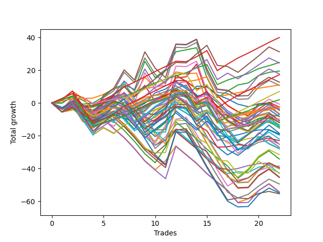

# Short Pointer 011 
- Symbol: ES
- Date Range: 03/18/2022 - 07/15/2022
- Trading Period: 7:20-12:30
- Number of Trades: 22



| Name | Win Percent | Profit | Avg Profit / Trade | Avg Time / Trade |      | Name | Win Percent | Profit | Avg Profit / Trade | Avg Time / Trade |
| ---- | ----------- | ------ | ------------------ | ---------------- | ---- | ---- | ----------- | ------ | ------------------ | ---------------- |
| Sorted By <br> Profit | | | | | | Sorted By <br> Win Percentage ||||
| Eighty-Three | 81.82 | 20000.00 | 909.09 | 13:51 |     | Eighty-One | 90.91 | 5500.00 | 250.00 | 05:41 |
| Eighty-Five | 59.09 | 15625.00 | 710.23 | 18:34 |     | Eighty-Two | 86.36 | 12375.00 | 562.50 | 10:34 |
| Eighty-Two | 86.36 | 12375.00 | 562.50 | 10:34 |     | One Hundred Twenty-Six | 86.36 | -1625.00 | -73.86 | 03:58 |
| Eighty-Four | 63.64 | 12250.00 | 556.82 | 17:12 |     | Eighty-Three | 81.82 | 20000.00 | 909.09 | 13:51 |
| Two | 72.73 | 9750.00 | 443.18 | 19:06 |     | One Hundred Twenty-Seven | 81.82 | 1000.00 | 45.45 | 08:13 |
| Four | 50.00 | 8875.00 | 403.41 | 25:15 |     | One Hundred Twenty-One | 81.82 | -4875.00 | -221.59 | 04:10 |
| One Hundred Twenty-Eight | 77.27 | 8625.00 | 392.05 | 11:30 |     | One Hundred Twenty-Eight | 77.27 | 8625.00 | 392.05 | 11:30 |
| Five | 45.45 | 6375.00 | 289.77 | 26:55 |     | One Hundred Sixteen | 77.27 | -1125.00 | -51.14 | 02:56 |
| Eighty-One | 90.91 | 5500.00 | 250.00 | 05:41 |     | One Hundred Eleven | 77.27 | -1250.00 | -56.82 | 02:57 |
| Seven | 45.45 | 5375.00 | 244.32 | 28:23 |     | One Hundred Twenty-Two | 77.27 | -3500.00 | -159.09 | 08:27 |
| One Hundred Twenty-Three | 72.73 | 3500.00 | 159.09 | 11:06 |     | Two | 72.73 | 9750.00 | 443.18 | 19:06 |
| One Hundred Twenty-Seven | 81.82 | 1000.00 | 45.45 | 08:13 |     | One Hundred Twenty-Three | 72.73 | 3500.00 | 159.09 | 11:06 |
| Six | 45.45 | -375.00 | -17.05 | 26:39 |     | Eighty-Four | 63.64 | 12250.00 | 556.82 | 17:12 |
| One Hundred Sixteen | 77.27 | -1125.00 | -51.14 | 02:56 |     | Sixty-Six | 63.64 | -1125.00 | -51.14 | 13:56 |
| Sixty-Six | 63.64 | -1125.00 | -51.14 | 13:56 |     | One | 63.64 | -4125.00 | -187.50 | 17:05 |
| One Hundred Eleven | 77.27 | -1250.00 | -56.82 | 02:57 |     | One Hundred Twelve | 63.64 | -5375.00 | -244.32 | 05:33 |
| Three | 54.55 | -1250.00 | -56.82 | 22:46 |     | Eighty-Five | 59.09 | 15625.00 | 710.23 | 18:34 |
| One Hundred Twenty-Six | 86.36 | -1625.00 | -73.86 | 03:58 |     | One Hundred Twenty-Nine | 59.09 | -2000.00 | -90.91 | 13:17 |
| One Hundred Twenty-Nine | 59.09 | -2000.00 | -90.91 | 13:17 |     | One Hundred Thirteen | 59.09 | -3250.00 | -147.73 | 07:43 |
| Seventy-Three | 36.36 | -2125.00 | -96.59 | 10:51 |     | One Hundred Seventeen | 59.09 | -6000.00 | -272.73 | 04:59 |
| Fifty-Five | 36.36 | -2125.00 | -96.59 | 10:40 |     | Fifty-Eight | 59.09 | -19250.00 | -875.00 | 14:31 |
| Fifty-Three | 36.36 | -2250.00 | -102.27 | 10:21 |     | Three | 54.55 | -1250.00 | -56.82 | 22:46 |
| One Hundred Thirteen | 59.09 | -3250.00 | -147.73 | 07:43 |     | One Hundred Twenty-Four | 54.55 | -6875.00 | -312.50 | 13:41 |
| One Hundred Ninteen | 45.45 | -3375.00 | -153.41 | 06:58 |     | Sixty-Four | 54.55 | -7250.00 | -329.55 | 08:33 |
| One Hundred Twenty-Two | 77.27 | -3500.00 | -159.09 | 08:27 |     | Zero | 54.55 | -9500.00 | -431.82 | 11:31 |
| One | 63.64 | -4125.00 | -187.50 | 17:05 |     | Sixty-Five | 54.55 | -11500.00 | -522.73 | 12:10 |
| Fifty-Two | 36.36 | -4125.00 | -187.50 | 09:32 |     | Four | 50.00 | 8875.00 | 403.41 | 25:15 |
| One Hundred Twenty-One | 81.82 | -4875.00 | -221.59 | 04:10 |     | One Hundred Thirty | 50.00 | -5875.00 | -267.05 | 14:21 |
| One Hundred Twelve | 63.64 | -5375.00 | -244.32 | 05:33 |     | One Hundred Eighteen | 50.00 | -6000.00 | -272.73 | 06:09 |
| One Hundred Twenty | 40.91 | -5375.00 | -244.32 | 07:35 |     | One Hundred Fourteen | 50.00 | -7625.00 | -346.59 | 08:52 |
| One Hundred Thirty | 50.00 | -5875.00 | -267.05 | 14:21 |     | One Hundred Twenty-Five | 50.00 | -9750.00 | -443.18 | 14:27 |
| One Hundred Seventeen | 59.09 | -6000.00 | -272.73 | 04:59 |     | Forty | 50.00 | -12625.00 | -573.86 | 06:16 |
| One Hundred Eighteen | 50.00 | -6000.00 | -272.73 | 06:09 |     | Fifty-Six | 50.00 | -19750.00 | -897.73 | 09:26 |
| Fifty-Four | 36.36 | -6750.00 | -306.82 | 09:55 |     | Fifty-Seven | 50.00 | -27750.00 | -1261.36 | 12:49 |
| One Hundred Twenty-Four | 54.55 | -6875.00 | -312.50 | 13:41 |     | Five | 45.45 | 6375.00 | 289.77 | 26:55 |
| Sixty-Four | 54.55 | -7250.00 | -329.55 | 08:33 |     | Seven | 45.45 | 5375.00 | 244.32 | 28:23 |
| Forty-Eight | 45.45 | -7500.00 | -340.91 | 05:18 |     | Six | 45.45 | -375.00 | -17.05 | 26:39 |
| One Hundred Fourteen | 50.00 | -7625.00 | -346.59 | 08:52 |     | One Hundred Ninteen | 45.45 | -3375.00 | -153.41 | 06:58 |
| Fifty | 40.91 | -7750.00 | -352.27 | 08:10 |     | Forty-Eight | 45.45 | -7500.00 | -340.91 | 05:18 |
| One Hundred Fifteen | 45.45 | -9250.00 | -420.45 | 09:30 |     | One Hundred Fifteen | 45.45 | -9250.00 | -420.45 | 09:30 |
| Zero | 54.55 | -9500.00 | -431.82 | 11:31 |     | Forty-Two | 45.45 | -12625.00 | -573.86 | 10:16 |
| One Hundred Twenty-Five | 50.00 | -9750.00 | -443.18 | 14:27 |     | Fifty-Nine | 45.45 | -24750.00 | -1125.00 | 17:29 |
| Fifty-One | 36.36 | -11000.00 | -500.00 | 08:47 |     | One Hundred Twenty | 40.91 | -5375.00 | -244.32 | 07:35 |
| Sixty-Five | 54.55 | -11500.00 | -522.73 | 12:10 |     | Fifty | 40.91 | -7750.00 | -352.27 | 08:10 |
| Forty | 50.00 | -12625.00 | -573.86 | 06:16 |     | Forty-Nine | 40.91 | -13500.00 | -613.64 | 07:11 |
| Forty-Two | 45.45 | -12625.00 | -573.86 | 10:16 |     | Sixty | 40.91 | -15750.00 | -715.91 | 19:33 |
| Sixty-Eight | 31.82 | -12625.00 | -573.86 | 18:00 |     | Sixty-Seven | 40.91 | -19750.00 | -897.73 | 16:15 |
| Forty-Nine | 40.91 | -13500.00 | -613.64 | 07:11 |     | Forty-One | 40.91 | -21500.00 | -977.27 | 09:07 |
| Seventy-One | 31.82 | -13875.00 | -630.68 | 19:27 |     | Seventy-Three | 36.36 | -2125.00 | -96.59 | 10:51 |
| Sixty-Nine | 31.82 | -14000.00 | -636.36 | 19:09 |     | Fifty-Five | 36.36 | -2125.00 | -96.59 | 10:40 |
| Sixty | 40.91 | -15750.00 | -715.91 | 19:33 |     | Fifty-Three | 36.36 | -2250.00 | -102.27 | 10:21 |
| Forty-Four | 31.82 | -17125.00 | -778.41 | 13:06 |     | Fifty-Two | 36.36 | -4125.00 | -187.50 | 09:32 |
| Fifty-Eight | 59.09 | -19250.00 | -875.00 | 14:31 |     | Fifty-Four | 36.36 | -6750.00 | -306.82 | 09:55 |
| Fifty-Six | 50.00 | -19750.00 | -897.73 | 09:26 |     | Fifty-One | 36.36 | -11000.00 | -500.00 | 08:47 |
| Sixty-Seven | 40.91 | -19750.00 | -897.73 | 16:15 |     | Sixty-Three | 36.36 | -20000.00 | -909.09 | 21:32 |
| Sixty-Three | 36.36 | -20000.00 | -909.09 | 21:32 |     | Sixty-One | 36.36 | -20125.00 | -914.77 | 21:13 |
| Sixty-One | 36.36 | -20125.00 | -914.77 | 21:13 |     | Sixty-Two | 36.36 | -27500.00 | -1250.00 | 20:26 |
| Seventy | 31.82 | -21375.00 | -971.59 | 18:22 |     | Sixty-Eight | 31.82 | -12625.00 | -573.86 | 18:00 |
| Forty-One | 40.91 | -21500.00 | -977.27 | 09:07 |     | Seventy-One | 31.82 | -13875.00 | -630.68 | 19:27 |
| Forty-Seven | 27.27 | -22625.00 | -1028.41 | 14:52 |     | Sixty-Nine | 31.82 | -14000.00 | -636.36 | 19:09 |
| Forty-Five | 27.27 | -22750.00 | -1034.09 | 14:34 |     | Forty-Four | 31.82 | -17125.00 | -778.41 | 13:06 |
| Fifty-Nine | 45.45 | -24750.00 | -1125.00 | 17:29 |     | Seventy | 31.82 | -21375.00 | -971.59 | 18:22 |
| Forty-Three | 31.82 | -27125.00 | -1232.95 | 11:44 |     | Forty-Three | 31.82 | -27125.00 | -1232.95 | 11:44 |
| Forty-Six | 27.27 | -27250.00 | -1238.64 | 14:08 |     | Forty-Seven | 27.27 | -22625.00 | -1028.41 | 14:52 |
| Sixty-Two | 36.36 | -27500.00 | -1250.00 | 20:26 |     | Forty-Five | 27.27 | -22750.00 | -1034.09 | 14:34 |
| Fifty-Seven | 50.00 | -27750.00 | -1261.36 | 12:49 |     | Forty-Six | 27.27 | -27250.00 | -1238.64 | 14:08 |

## NO STOPLOSS

### Test Zero
* Sell when price hits the middle line of the 20p bollinger
* No Stoploss
* Results:
```
Total Trades: 22
Percent Up: 45.45
Percent Down: 54.55
Total Points Moved Down: -19.00
Potential Profit: -9500.00
Total Points Ups: 52.25 Count Ups: 10
Total Points Downs: 33.25 Count Downs: 12
```

<details><summary>Trades</summary>

<code>In: 2022-03-18 12:28:00		Out: 2022-03-18 12:37:20		Total Position Time: 09:20		Total Move Down: -0.00		Total to Date: 0.00</code> <br />
<code>In: 2022-03-24 12:29:00		Out: 2022-03-24 12:33:25		Total Position Time: 04:25		Total Move Down: 4.00		Total to Date: 4.00</code> <br />
<code>In: 2022-03-25 07:26:00		Out: 2022-03-25 07:51:05		Total Position Time: 25:05		Total Move Down: -6.00		Total to Date: -2.00</code> <br />
<code>In: 2022-03-29 12:15:00		Out: 2022-03-29 12:18:55		Total Position Time: 03:55		Total Move Down: -0.25		Total to Date: -2.25</code> <br />
<code>In: 2022-04-06 08:53:00		Out: 2022-04-06 09:00:40		Total Position Time: 07:40		Total Move Down: 2.50		Total to Date: 0.25</code> <br />
<code>In: 2022-04-07 11:04:00		Out: 2022-04-07 11:15:20		Total Position Time: 11:20		Total Move Down: 3.25		Total to Date: 3.50</code> <br />
<code>In: 2022-04-20 07:43:00		Out: 2022-04-20 08:00:10		Total Position Time: 17:10		Total Move Down: -1.50		Total to Date: 2.00</code> <br />
<code>In: 2022-05-03 08:11:00		Out: 2022-05-03 08:28:35		Total Position Time: 17:35		Total Move Down: -5.50		Total to Date: -3.50</code> <br />
<code>In: 2022-05-04 11:03:00		Out: 2022-05-04 11:03:10		Total Position Time: 00:10		Total Move Down: 3.25		Total to Date: -0.25</code> <br />
<code>In: 2022-05-16 10:16:00		Out: 2022-05-16 10:18:25		Total Position Time: 02:25		Total Move Down: 6.50		Total to Date: 6.25</code> <br />
<code>In: 2022-05-17 09:48:00		Out: 2022-05-17 09:51:15		Total Position Time: 03:15		Total Move Down: 2.25		Total to Date: 8.50</code> <br />
<code>In: 2022-05-24 09:18:00		Out: 2022-05-24 09:21:35		Total Position Time: 03:35		Total Move Down: 4.75		Total to Date: 13.25</code> <br />
<code>In: 2022-05-27 12:11:00		Out: 2022-05-27 12:34:25		Total Position Time: 23:25		Total Move Down: -3.50		Total to Date: 9.75</code> <br />
<code>In: 2022-05-31 08:58:00		Out: 2022-05-31 09:13:05		Total Position Time: 15:05		Total Move Down: -4.75		Total to Date: 5.00</code> <br />
<code>In: 2022-06-30 08:01:00		Out: 2022-06-30 08:30:55		Total Position Time: 29:55		Total Move Down: -18.25		Total to Date: -13.25</code> <br />
<code>In: 2022-06-30 08:12:00		Out: 2022-06-30 08:35:00		Total Position Time: 23:00		Total Move Down: -9.75		Total to Date: -23.00</code> <br />
<code>In: 2022-06-30 09:29:00		Out: 2022-06-30 09:38:05		Total Position Time: 09:05		Total Move Down: 2.50		Total to Date: -20.50</code> <br />
<code>In: 2022-07-05 08:49:00		Out: 2022-07-05 09:00:10		Total Position Time: 11:10		Total Move Down: 1.00		Total to Date: -19.50</code> <br />
<code>In: 2022-07-07 07:56:00		Out: 2022-07-07 08:01:10		Total Position Time: 05:10		Total Move Down: 1.75		Total to Date: -17.75</code> <br />
<code>In: 2022-07-07 12:18:00		Out: 2022-07-07 12:24:15		Total Position Time: 06:15		Total Move Down: 1.25		Total to Date: -16.50</code> <br />
<code>In: 2022-07-08 11:40:00		Out: 2022-07-08 11:49:15		Total Position Time: 09:15		Total Move Down: 0.25		Total to Date: -16.25</code> <br />
<code>In: 2022-07-14 08:46:00		Out: 2022-07-14 09:01:10		Total Position Time: 15:10		Total Move Down: -2.75		Total to Date: -19.00</code> <br />


</details>

### Test One
* Sell when the price hits the upper line of the 20p 1std bollinger
* No Stoploss
* Results:
```
Total Trades: 22
Percent Up: 36.36
Percent Down: 63.64
Total Points Moved Down: -8.25
Potential Profit: -4125.00
Total Points Ups: 50.00 Count Ups: 8
Total Points Downs: 41.75 Count Downs: 14
```

<details><summary>Trades</summary>

<code>In: 2022-03-18 12:28:00		Out: 2022-03-18 12:39:40		Total Position Time: 11:40		Total Move Down: 2.25		Total to Date: 2.25</code> <br />
<code>In: 2022-03-24 12:29:00		Out: 2022-03-24 12:38:35		Total Position Time: 09:35		Total Move Down: 5.00		Total to Date: 7.25</code> <br />
<code>In: 2022-03-25 07:26:00		Out: 2022-03-25 07:53:50		Total Position Time: 27:50		Total Move Down: -4.50		Total to Date: 2.75</code> <br />
<code>In: 2022-03-29 12:15:00		Out: 2022-03-29 12:27:35		Total Position Time: 12:35		Total Move Down: 0.25		Total to Date: 3.00</code> <br />
<code>In: 2022-04-06 08:53:00		Out: 2022-04-06 09:04:35		Total Position Time: 11:35		Total Move Down: 2.25		Total to Date: 5.25</code> <br />
<code>In: 2022-04-07 11:04:00		Out: 2022-04-07 11:16:10		Total Position Time: 12:10		Total Move Down: 3.25		Total to Date: 8.50</code> <br />
<code>In: 2022-04-20 07:43:00		Out: 2022-04-20 08:00:40		Total Position Time: 17:40		Total Move Down: 1.75		Total to Date: 10.25</code> <br />
<code>In: 2022-05-03 08:11:00		Out: 2022-05-03 08:38:05		Total Position Time: 27:05		Total Move Down: -5.25		Total to Date: 5.00</code> <br />
<code>In: 2022-05-04 11:03:00		Out: 2022-05-04 11:07:20		Total Position Time: 04:20		Total Move Down: 10.75		Total to Date: 15.75</code> <br />
<code>In: 2022-05-16 10:16:00		Out: 2022-05-16 10:42:35		Total Position Time: 26:35		Total Move Down: -6.50		Total to Date: 9.25</code> <br />
<code>In: 2022-05-17 09:48:00		Out: 2022-05-17 09:54:40		Total Position Time: 06:40		Total Move Down: 3.50		Total to Date: 12.75</code> <br />
<code>In: 2022-05-24 09:18:00		Out: 2022-05-24 09:28:55		Total Position Time: 10:55		Total Move Down: 6.25		Total to Date: 19.00</code> <br />
<code>In: 2022-05-27 12:11:00		Out: 2022-05-27 12:35:40		Total Position Time: 24:40		Total Move Down: -1.25		Total to Date: 17.75</code> <br />
<code>In: 2022-05-31 08:58:00		Out: 2022-05-31 09:14:40		Total Position Time: 16:40		Total Move Down: 0.50		Total to Date: 18.25</code> <br />
<code>In: 2022-06-30 08:01:00		Out: 2022-06-30 08:30:55		Total Position Time: 29:55		Total Move Down: -18.25		Total to Date: 0.00</code> <br />
<code>In: 2022-06-30 08:12:00		Out: 2022-06-30 08:41:55		Total Position Time: 29:55		Total Move Down: -12.25		Total to Date: -12.25</code> <br />
<code>In: 2022-06-30 09:29:00		Out: 2022-06-30 09:49:10		Total Position Time: 20:10		Total Move Down: 0.25		Total to Date: -12.00</code> <br />
<code>In: 2022-07-05 08:49:00		Out: 2022-07-05 09:03:25		Total Position Time: 14:25		Total Move Down: 1.25		Total to Date: -10.75</code> <br />
<code>In: 2022-07-07 07:56:00		Out: 2022-07-07 08:19:45		Total Position Time: 23:45		Total Move Down: -0.50		Total to Date: -11.25</code> <br />
<code>In: 2022-07-07 12:18:00		Out: 2022-07-07 12:25:10		Total Position Time: 07:10		Total Move Down: 3.25		Total to Date: -8.00</code> <br />
<code>In: 2022-07-08 11:40:00		Out: 2022-07-08 11:53:40		Total Position Time: 13:40		Total Move Down: 1.25		Total to Date: -6.75</code> <br />
<code>In: 2022-07-14 08:46:00		Out: 2022-07-14 09:03:10		Total Position Time: 17:10		Total Move Down: -1.50		Total to Date: -8.25</code> <br />


</details>

### Test Two
* Sell when the price hits the upper line of the 20p 2std bollinger
* No Stoploss
* Results:
```
Total Trades: 22
Percent Up: 27.27
Percent Down: 72.73
Total Points Moved Down: 19.50
Potential Profit: 9750.00
Total Points Ups: 50.75 Count Ups: 6
Total Points Downs: 70.25 Count Downs: 16
```

<details><summary>Trades</summary>

<code>In: 2022-03-18 12:28:00		Out: 2022-03-18 12:46:00		Total Position Time: 18:00		Total Move Down: -3.75		Total to Date: -3.75</code> <br />
<code>In: 2022-03-24 12:29:00		Out: 2022-03-24 12:42:05		Total Position Time: 13:05		Total Move Down: 6.50		Total to Date: 2.75</code> <br />
<code>In: 2022-03-25 07:26:00		Out: 2022-03-25 07:54:10		Total Position Time: 28:10		Total Move Down: -3.50		Total to Date: -0.75</code> <br />
<code>In: 2022-03-29 12:15:00		Out: 2022-03-29 12:27:50		Total Position Time: 12:50		Total Move Down: 0.75		Total to Date: 0.00</code> <br />
<code>In: 2022-04-06 08:53:00		Out: 2022-04-06 09:09:40		Total Position Time: 16:40		Total Move Down: 3.75		Total to Date: 3.75</code> <br />
<code>In: 2022-04-07 11:04:00		Out: 2022-04-07 11:18:20		Total Position Time: 14:20		Total Move Down: 5.25		Total to Date: 9.00</code> <br />
<code>In: 2022-04-20 07:43:00		Out: 2022-04-20 08:00:45		Total Position Time: 17:45		Total Move Down: 2.25		Total to Date: 11.25</code> <br />
<code>In: 2022-05-03 08:11:00		Out: 2022-05-03 08:39:10		Total Position Time: 28:10		Total Move Down: -3.00		Total to Date: 8.25</code> <br />
<code>In: 2022-05-04 11:03:00		Out: 2022-05-04 11:07:40		Total Position Time: 04:40		Total Move Down: 17.25		Total to Date: 25.50</code> <br />
<code>In: 2022-05-16 10:16:00		Out: 2022-05-16 10:45:55		Total Position Time: 29:55		Total Move Down: -10.00		Total to Date: 15.50</code> <br />
<code>In: 2022-05-17 09:48:00		Out: 2022-05-17 10:01:10		Total Position Time: 13:10		Total Move Down: 5.00		Total to Date: 20.50</code> <br />
<code>In: 2022-05-24 09:18:00		Out: 2022-05-24 09:31:20		Total Position Time: 13:20		Total Move Down: 10.75		Total to Date: 31.25</code> <br />
<code>In: 2022-05-27 12:11:00		Out: 2022-05-27 12:36:55		Total Position Time: 25:55		Total Move Down: 1.25		Total to Date: 32.50</code> <br />
<code>In: 2022-05-31 08:58:00		Out: 2022-05-31 09:15:05		Total Position Time: 17:05		Total Move Down: 1.25		Total to Date: 33.75</code> <br />
<code>In: 2022-06-30 08:01:00		Out: 2022-06-30 08:30:55		Total Position Time: 29:55		Total Move Down: -18.25		Total to Date: 15.50</code> <br />
<code>In: 2022-06-30 08:12:00		Out: 2022-06-30 08:41:55		Total Position Time: 29:55		Total Move Down: -12.25		Total to Date: 3.25</code> <br />
<code>In: 2022-06-30 09:29:00		Out: 2022-06-30 09:50:45		Total Position Time: 21:45		Total Move Down: 4.00		Total to Date: 7.25</code> <br />
<code>In: 2022-07-05 08:49:00		Out: 2022-07-05 09:03:50		Total Position Time: 14:50		Total Move Down: 3.75		Total to Date: 11.00</code> <br />
<code>In: 2022-07-07 07:56:00		Out: 2022-07-07 08:21:00		Total Position Time: 25:00		Total Move Down: 1.25		Total to Date: 12.25</code> <br />
<code>In: 2022-07-07 12:18:00		Out: 2022-07-07 12:28:30		Total Position Time: 10:30		Total Move Down: 4.50		Total to Date: 16.75</code> <br />
<code>In: 2022-07-08 11:40:00		Out: 2022-07-08 11:54:00		Total Position Time: 14:00		Total Move Down: 2.00		Total to Date: 18.75</code> <br />
<code>In: 2022-07-14 08:46:00		Out: 2022-07-14 09:07:30		Total Position Time: 21:30		Total Move Down: 0.75		Total to Date: 19.50</code> <br />


</details>

### Test Three
* Sell when price hits the middle line of the 50p bollinger
* No Stoploss
* Results:
```
Total Trades: 22
Percent Up: 45.45
Percent Down: 54.55
Total Points Moved Down: -2.50
Potential Profit: -1250.00
Total Points Ups: 61.00 Count Ups: 10
Total Points Downs: 58.50 Count Downs: 12
```

<details><summary>Trades</summary>

<code>In: 2022-03-18 12:28:00		Out: 2022-03-18 12:46:00		Total Position Time: 18:00		Total Move Down: -3.75		Total to Date: -3.75</code> <br />
<code>In: 2022-03-24 12:29:00		Out: 2022-03-24 12:46:00		Total Position Time: 17:00		Total Move Down: 2.50		Total to Date: -1.25</code> <br />
<code>In: 2022-03-25 07:26:00		Out: 2022-03-25 07:55:55		Total Position Time: 29:55		Total Move Down: -2.50		Total to Date: -3.75</code> <br />
<code>In: 2022-03-29 12:15:00		Out: 2022-03-29 12:43:05		Total Position Time: 28:05		Total Move Down: -0.75		Total to Date: -4.50</code> <br />
<code>In: 2022-04-06 08:53:00		Out: 2022-04-06 09:12:05		Total Position Time: 19:05		Total Move Down: 4.50		Total to Date: 0.00</code> <br />
<code>In: 2022-04-07 11:04:00		Out: 2022-04-07 11:33:40		Total Position Time: 29:40		Total Move Down: 5.50		Total to Date: 5.50</code> <br />
<code>In: 2022-04-20 07:43:00		Out: 2022-04-20 08:01:10		Total Position Time: 18:10		Total Move Down: 4.75		Total to Date: 10.25</code> <br />
<code>In: 2022-05-03 08:11:00		Out: 2022-05-03 08:40:55		Total Position Time: 29:55		Total Move Down: -6.25		Total to Date: 4.00</code> <br />
<code>In: 2022-05-04 11:03:00		Out: 2022-05-04 11:07:15		Total Position Time: 04:15		Total Move Down: 6.75		Total to Date: 10.75</code> <br />
<code>In: 2022-05-16 10:16:00		Out: 2022-05-16 10:45:55		Total Position Time: 29:55		Total Move Down: -10.00		Total to Date: 0.75</code> <br />
<code>In: 2022-05-17 09:48:00		Out: 2022-05-17 10:01:25		Total Position Time: 13:25		Total Move Down: 5.50		Total to Date: 6.25</code> <br />
<code>In: 2022-05-24 09:18:00		Out: 2022-05-24 09:31:15		Total Position Time: 13:15		Total Move Down: 9.00		Total to Date: 15.25</code> <br />
<code>In: 2022-05-27 12:11:00		Out: 2022-05-27 12:37:05		Total Position Time: 26:05		Total Move Down: 0.75		Total to Date: 16.00</code> <br />
<code>In: 2022-05-31 08:58:00		Out: 2022-05-31 09:19:05		Total Position Time: 21:05		Total Move Down: 7.75		Total to Date: 23.75</code> <br />
<code>In: 2022-06-30 08:01:00		Out: 2022-06-30 08:30:55		Total Position Time: 29:55		Total Move Down: -18.25		Total to Date: 5.50</code> <br />
<code>In: 2022-06-30 08:12:00		Out: 2022-06-30 08:41:55		Total Position Time: 29:55		Total Move Down: -12.25		Total to Date: -6.75</code> <br />
<code>In: 2022-06-30 09:29:00		Out: 2022-06-30 09:58:55		Total Position Time: 29:55		Total Move Down: -0.75		Total to Date: -7.50</code> <br />
<code>In: 2022-07-05 08:49:00		Out: 2022-07-05 09:18:55		Total Position Time: 29:55		Total Move Down: -3.50		Total to Date: -11.00</code> <br />
<code>In: 2022-07-07 07:56:00		Out: 2022-07-07 08:22:45		Total Position Time: 26:45		Total Move Down: 2.25		Total to Date: -8.75</code> <br />
<code>In: 2022-07-07 12:18:00		Out: 2022-07-07 12:30:00		Total Position Time: 12:00		Total Move Down: 5.00		Total to Date: -3.75</code> <br />
<code>In: 2022-07-08 11:40:00		Out: 2022-07-08 11:54:50		Total Position Time: 14:50		Total Move Down: 4.25		Total to Date: 0.50</code> <br />
<code>In: 2022-07-14 08:46:00		Out: 2022-07-14 09:15:55		Total Position Time: 29:55		Total Move Down: -3.00		Total to Date: -2.50</code> <br />


</details>

### Test Four
* Sell when the price hits the upper line of the 50p 1std bollinger
* No Stoploss
* Results:
```
Total Trades: 22
Percent Up: 50.00
Percent Down: 50.00
Total Points Moved Down: 17.75
Potential Profit: 8875.00
Total Points Ups: 64.50 Count Ups: 11
Total Points Downs: 82.25 Count Downs: 11
```

<details><summary>Trades</summary>

<code>In: 2022-03-18 12:28:00		Out: 2022-03-18 12:46:00		Total Position Time: 18:00		Total Move Down: -3.75		Total to Date: -3.75</code> <br />
<code>In: 2022-03-24 12:29:00		Out: 2022-03-24 12:46:00		Total Position Time: 17:00		Total Move Down: 2.50		Total to Date: -1.25</code> <br />
<code>In: 2022-03-25 07:26:00		Out: 2022-03-25 07:55:55		Total Position Time: 29:55		Total Move Down: -2.50		Total to Date: -3.75</code> <br />
<code>In: 2022-03-29 12:15:00		Out: 2022-03-29 12:44:55		Total Position Time: 29:55		Total Move Down: -4.00		Total to Date: -7.75</code> <br />
<code>In: 2022-04-06 08:53:00		Out: 2022-04-06 09:15:00		Total Position Time: 22:00		Total Move Down: 8.75		Total to Date: 1.00</code> <br />
<code>In: 2022-04-07 11:04:00		Out: 2022-04-07 11:33:55		Total Position Time: 29:55		Total Move Down: 4.25		Total to Date: 5.25</code> <br />
<code>In: 2022-04-20 07:43:00		Out: 2022-04-20 08:10:40		Total Position Time: 27:40		Total Move Down: 8.25		Total to Date: 13.50</code> <br />
<code>In: 2022-05-03 08:11:00		Out: 2022-05-03 08:40:55		Total Position Time: 29:55		Total Move Down: -6.25		Total to Date: 7.25</code> <br />
<code>In: 2022-05-04 11:03:00		Out: 2022-05-04 11:07:25		Total Position Time: 04:25		Total Move Down: 13.50		Total to Date: 20.75</code> <br />
<code>In: 2022-05-16 10:16:00		Out: 2022-05-16 10:45:55		Total Position Time: 29:55		Total Move Down: -10.00		Total to Date: 10.75</code> <br />
<code>In: 2022-05-17 09:48:00		Out: 2022-05-17 10:02:15		Total Position Time: 14:15		Total Move Down: 9.50		Total to Date: 20.25</code> <br />
<code>In: 2022-05-24 09:18:00		Out: 2022-05-24 09:33:20		Total Position Time: 15:20		Total Move Down: 15.50		Total to Date: 35.75</code> <br />
<code>In: 2022-05-27 12:11:00		Out: 2022-05-27 12:40:55		Total Position Time: 29:55		Total Move Down: -0.25		Total to Date: 35.50</code> <br />
<code>In: 2022-05-31 08:58:00		Out: 2022-05-31 09:27:55		Total Position Time: 29:55		Total Move Down: 3.25		Total to Date: 38.75</code> <br />
<code>In: 2022-06-30 08:01:00		Out: 2022-06-30 08:30:55		Total Position Time: 29:55		Total Move Down: -18.25		Total to Date: 20.50</code> <br />
<code>In: 2022-06-30 08:12:00		Out: 2022-06-30 08:41:55		Total Position Time: 29:55		Total Move Down: -12.25		Total to Date: 8.25</code> <br />
<code>In: 2022-06-30 09:29:00		Out: 2022-06-30 09:58:55		Total Position Time: 29:55		Total Move Down: -0.75		Total to Date: 7.50</code> <br />
<code>In: 2022-07-05 08:49:00		Out: 2022-07-05 09:18:55		Total Position Time: 29:55		Total Move Down: -3.50		Total to Date: 4.00</code> <br />
<code>In: 2022-07-07 07:56:00		Out: 2022-07-07 08:23:20		Total Position Time: 27:20		Total Move Down: 5.00		Total to Date: 9.00</code> <br />
<code>In: 2022-07-07 12:18:00		Out: 2022-07-07 12:38:50		Total Position Time: 20:50		Total Move Down: 7.75		Total to Date: 16.75</code> <br />
<code>In: 2022-07-08 11:40:00		Out: 2022-07-08 12:09:40		Total Position Time: 29:40		Total Move Down: 4.00		Total to Date: 20.75</code> <br />
<code>In: 2022-07-14 08:46:00		Out: 2022-07-14 09:15:55		Total Position Time: 29:55		Total Move Down: -3.00		Total to Date: 17.75</code> <br />


</details>

### Test Five
* Sell when the price hits the upper line of the 50p 2std bollinger
* No Stoploss
* Results:
```
Total Trades: 22
Percent Up: 54.55
Percent Down: 45.45
Total Points Moved Down: 12.75
Potential Profit: 6375.00
Total Points Ups: 70.25 Count Ups: 12
Total Points Downs: 83.00 Count Downs: 10
```

<details><summary>Trades</summary>

<code>In: 2022-03-18 12:28:00		Out: 2022-03-18 12:46:00		Total Position Time: 18:00		Total Move Down: -3.75		Total to Date: -3.75</code> <br />
<code>In: 2022-03-24 12:29:00		Out: 2022-03-24 12:46:00		Total Position Time: 17:00		Total Move Down: 2.50		Total to Date: -1.25</code> <br />
<code>In: 2022-03-25 07:26:00		Out: 2022-03-25 07:55:55		Total Position Time: 29:55		Total Move Down: -2.50		Total to Date: -3.75</code> <br />
<code>In: 2022-03-29 12:15:00		Out: 2022-03-29 12:44:55		Total Position Time: 29:55		Total Move Down: -4.00		Total to Date: -7.75</code> <br />
<code>In: 2022-04-06 08:53:00		Out: 2022-04-06 09:20:15		Total Position Time: 27:15		Total Move Down: 12.50		Total to Date: 4.75</code> <br />
<code>In: 2022-04-07 11:04:00		Out: 2022-04-07 11:33:55		Total Position Time: 29:55		Total Move Down: 4.25		Total to Date: 9.00</code> <br />
<code>In: 2022-04-20 07:43:00		Out: 2022-04-20 08:12:55		Total Position Time: 29:55		Total Move Down: 11.25		Total to Date: 20.25</code> <br />
<code>In: 2022-05-03 08:11:00		Out: 2022-05-03 08:40:55		Total Position Time: 29:55		Total Move Down: -6.25		Total to Date: 14.00</code> <br />
<code>In: 2022-05-04 11:03:00		Out: 2022-05-04 11:07:40		Total Position Time: 04:40		Total Move Down: 17.25		Total to Date: 31.25</code> <br />
<code>In: 2022-05-16 10:16:00		Out: 2022-05-16 10:45:55		Total Position Time: 29:55		Total Move Down: -10.00		Total to Date: 21.25</code> <br />
<code>In: 2022-05-17 09:48:00		Out: 2022-05-17 10:17:55		Total Position Time: 29:55		Total Move Down: -5.75		Total to Date: 15.50</code> <br />
<code>In: 2022-05-24 09:18:00		Out: 2022-05-24 09:36:50		Total Position Time: 18:50		Total Move Down: 20.50		Total to Date: 36.00</code> <br />
<code>In: 2022-05-27 12:11:00		Out: 2022-05-27 12:40:55		Total Position Time: 29:55		Total Move Down: -0.25		Total to Date: 35.75</code> <br />
<code>In: 2022-05-31 08:58:00		Out: 2022-05-31 09:27:55		Total Position Time: 29:55		Total Move Down: 3.25		Total to Date: 39.00</code> <br />
<code>In: 2022-06-30 08:01:00		Out: 2022-06-30 08:30:55		Total Position Time: 29:55		Total Move Down: -18.25		Total to Date: 20.75</code> <br />
<code>In: 2022-06-30 08:12:00		Out: 2022-06-30 08:41:55		Total Position Time: 29:55		Total Move Down: -12.25		Total to Date: 8.50</code> <br />
<code>In: 2022-06-30 09:29:00		Out: 2022-06-30 09:58:55		Total Position Time: 29:55		Total Move Down: -0.75		Total to Date: 7.75</code> <br />
<code>In: 2022-07-05 08:49:00		Out: 2022-07-05 09:18:55		Total Position Time: 29:55		Total Move Down: -3.50		Total to Date: 4.25</code> <br />
<code>In: 2022-07-07 07:56:00		Out: 2022-07-07 08:25:55		Total Position Time: 29:55		Total Move Down: 0.25		Total to Date: 4.50</code> <br />
<code>In: 2022-07-07 12:18:00		Out: 2022-07-07 12:46:00		Total Position Time: 28:00		Total Move Down: 7.25		Total to Date: 11.75</code> <br />
<code>In: 2022-07-08 11:40:00		Out: 2022-07-08 12:09:55		Total Position Time: 29:55		Total Move Down: 4.00		Total to Date: 15.75</code> <br />
<code>In: 2022-07-14 08:46:00		Out: 2022-07-14 09:15:55		Total Position Time: 29:55		Total Move Down: -3.00		Total to Date: 12.75</code> <br />


</details>

### Test Six
* Sell when the price hits the middle line of the 1std VWAP
* No Stoploss
* Results:
```
Total Trades: 22
Percent Up: 54.55
Percent Down: 45.45
Total Points Moved Down: -0.75
Potential Profit: -375.00
Total Points Ups: 70.25 Count Ups: 12
Total Points Downs: 69.50 Count Downs: 10
```

<details><summary>Trades</summary>

<code>In: 2022-03-18 12:28:00		Out: 2022-03-18 12:46:00		Total Position Time: 18:00		Total Move Down: -3.75		Total to Date: -3.75</code> <br />
<code>In: 2022-03-24 12:29:00		Out: 2022-03-24 12:46:00		Total Position Time: 17:00		Total Move Down: 2.50		Total to Date: -1.25</code> <br />
<code>In: 2022-03-25 07:26:00		Out: 2022-03-25 07:55:55		Total Position Time: 29:55		Total Move Down: -2.50		Total to Date: -3.75</code> <br />
<code>In: 2022-03-29 12:15:00		Out: 2022-03-29 12:44:55		Total Position Time: 29:55		Total Move Down: -4.00		Total to Date: -7.75</code> <br />
<code>In: 2022-04-06 08:53:00		Out: 2022-04-06 09:10:55		Total Position Time: 17:55		Total Move Down: 4.25		Total to Date: -3.50</code> <br />
<code>In: 2022-04-07 11:04:00		Out: 2022-04-07 11:33:55		Total Position Time: 29:55		Total Move Down: 4.25		Total to Date: 0.75</code> <br />
<code>In: 2022-04-20 07:43:00		Out: 2022-04-20 08:05:05		Total Position Time: 22:05		Total Move Down: 5.50		Total to Date: 6.25</code> <br />
<code>In: 2022-05-03 08:11:00		Out: 2022-05-03 08:40:55		Total Position Time: 29:55		Total Move Down: -6.25		Total to Date: 0.00</code> <br />
<code>In: 2022-05-04 11:03:00		Out: 2022-05-04 11:19:05		Total Position Time: 16:05		Total Move Down: 18.50		Total to Date: 18.50</code> <br />
<code>In: 2022-05-16 10:16:00		Out: 2022-05-16 10:45:55		Total Position Time: 29:55		Total Move Down: -10.00		Total to Date: 8.50</code> <br />
<code>In: 2022-05-17 09:48:00		Out: 2022-05-17 10:17:55		Total Position Time: 29:55		Total Move Down: -5.75		Total to Date: 2.75</code> <br />
<code>In: 2022-05-24 09:18:00		Out: 2022-05-24 09:36:45		Total Position Time: 18:45		Total Move Down: 19.75		Total to Date: 22.50</code> <br />
<code>In: 2022-05-27 12:11:00		Out: 2022-05-27 12:40:55		Total Position Time: 29:55		Total Move Down: -0.25		Total to Date: 22.25</code> <br />
<code>In: 2022-05-31 08:58:00		Out: 2022-05-31 09:27:55		Total Position Time: 29:55		Total Move Down: 3.25		Total to Date: 25.50</code> <br />
<code>In: 2022-06-30 08:01:00		Out: 2022-06-30 08:30:55		Total Position Time: 29:55		Total Move Down: -18.25		Total to Date: 7.25</code> <br />
<code>In: 2022-06-30 08:12:00		Out: 2022-06-30 08:41:55		Total Position Time: 29:55		Total Move Down: -12.25		Total to Date: -5.00</code> <br />
<code>In: 2022-06-30 09:29:00		Out: 2022-06-30 09:58:55		Total Position Time: 29:55		Total Move Down: -0.75		Total to Date: -5.75</code> <br />
<code>In: 2022-07-05 08:49:00		Out: 2022-07-05 09:18:55		Total Position Time: 29:55		Total Move Down: -3.50		Total to Date: -9.25</code> <br />
<code>In: 2022-07-07 07:56:00		Out: 2022-07-07 08:25:55		Total Position Time: 29:55		Total Move Down: 0.25		Total to Date: -9.00</code> <br />
<code>In: 2022-07-07 12:18:00		Out: 2022-07-07 12:46:00		Total Position Time: 28:00		Total Move Down: 7.25		Total to Date: -1.75</code> <br />
<code>In: 2022-07-08 11:40:00		Out: 2022-07-08 12:09:55		Total Position Time: 29:55		Total Move Down: 4.00		Total to Date: 2.25</code> <br />
<code>In: 2022-07-14 08:46:00		Out: 2022-07-14 09:15:55		Total Position Time: 29:55		Total Move Down: -3.00		Total to Date: -0.75</code> <br />


</details>

### Test Seven
* Sell when the price hits the upper line of the 1std VWAP
* No Stoploss
* Results:
```
Total Trades: 22
Percent Up: 54.55
Percent Down: 45.45
Total Points Moved Down: 10.75
Potential Profit: 5375.00
Total Points Ups: 70.25 Count Ups: 12
Total Points Downs: 81.00 Count Downs: 10
```

<details><summary>Trades</summary>

<code>In: 2022-03-18 12:28:00		Out: 2022-03-18 12:46:00		Total Position Time: 18:00		Total Move Down: -3.75		Total to Date: -3.75</code> <br />
<code>In: 2022-03-24 12:29:00		Out: 2022-03-24 12:46:00		Total Position Time: 17:00		Total Move Down: 2.50		Total to Date: -1.25</code> <br />
<code>In: 2022-03-25 07:26:00		Out: 2022-03-25 07:55:55		Total Position Time: 29:55		Total Move Down: -2.50		Total to Date: -3.75</code> <br />
<code>In: 2022-03-29 12:15:00		Out: 2022-03-29 12:44:55		Total Position Time: 29:55		Total Move Down: -4.00		Total to Date: -7.75</code> <br />
<code>In: 2022-04-06 08:53:00		Out: 2022-04-06 09:16:05		Total Position Time: 23:05		Total Move Down: 11.00		Total to Date: 3.25</code> <br />
<code>In: 2022-04-07 11:04:00		Out: 2022-04-07 11:33:55		Total Position Time: 29:55		Total Move Down: 4.25		Total to Date: 7.50</code> <br />
<code>In: 2022-04-20 07:43:00		Out: 2022-04-20 08:12:55		Total Position Time: 29:55		Total Move Down: 11.25		Total to Date: 18.75</code> <br />
<code>In: 2022-05-03 08:11:00		Out: 2022-05-03 08:40:55		Total Position Time: 29:55		Total Move Down: -6.25		Total to Date: 12.50</code> <br />
<code>In: 2022-05-04 11:03:00		Out: 2022-05-04 11:32:55		Total Position Time: 29:55		Total Move Down: 15.00		Total to Date: 27.50</code> <br />
<code>In: 2022-05-16 10:16:00		Out: 2022-05-16 10:45:55		Total Position Time: 29:55		Total Move Down: -10.00		Total to Date: 17.50</code> <br />
<code>In: 2022-05-17 09:48:00		Out: 2022-05-17 10:17:55		Total Position Time: 29:55		Total Move Down: -5.75		Total to Date: 11.75</code> <br />
<code>In: 2022-05-24 09:18:00		Out: 2022-05-24 09:47:55		Total Position Time: 29:55		Total Move Down: 22.25		Total to Date: 34.00</code> <br />
<code>In: 2022-05-27 12:11:00		Out: 2022-05-27 12:40:55		Total Position Time: 29:55		Total Move Down: -0.25		Total to Date: 33.75</code> <br />
<code>In: 2022-05-31 08:58:00		Out: 2022-05-31 09:27:55		Total Position Time: 29:55		Total Move Down: 3.25		Total to Date: 37.00</code> <br />
<code>In: 2022-06-30 08:01:00		Out: 2022-06-30 08:30:55		Total Position Time: 29:55		Total Move Down: -18.25		Total to Date: 18.75</code> <br />
<code>In: 2022-06-30 08:12:00		Out: 2022-06-30 08:41:55		Total Position Time: 29:55		Total Move Down: -12.25		Total to Date: 6.50</code> <br />
<code>In: 2022-06-30 09:29:00		Out: 2022-06-30 09:58:55		Total Position Time: 29:55		Total Move Down: -0.75		Total to Date: 5.75</code> <br />
<code>In: 2022-07-05 08:49:00		Out: 2022-07-05 09:18:55		Total Position Time: 29:55		Total Move Down: -3.50		Total to Date: 2.25</code> <br />
<code>In: 2022-07-07 07:56:00		Out: 2022-07-07 08:25:55		Total Position Time: 29:55		Total Move Down: 0.25		Total to Date: 2.50</code> <br />
<code>In: 2022-07-07 12:18:00		Out: 2022-07-07 12:46:00		Total Position Time: 28:00		Total Move Down: 7.25		Total to Date: 9.75</code> <br />
<code>In: 2022-07-08 11:40:00		Out: 2022-07-08 12:09:55		Total Position Time: 29:55		Total Move Down: 4.00		Total to Date: 13.75</code> <br />
<code>In: 2022-07-14 08:46:00		Out: 2022-07-14 09:15:55		Total Position Time: 29:55		Total Move Down: -3.00		Total to Date: 10.75</code> <br />


</details>

## STOPLOSS OF 5

### Test Forty
* Sell when price hits the middle line of the 20p bollinger
* Stoploss is -5 points
* Results:
```
Total Trades: 22
Percent Up: 50.00
Percent Down: 50.00
Total Points Moved Down: -25.25
Potential Profit: -12625.00
Total Points Ups: 56.00 Count Ups: 11
Total Points Downs: 30.75 Count Downs: 11
```

<details><summary>Trades</summary>

<code>In: 2022-03-18 12:28:00		Out: 2022-03-18 12:32:25		Total Position Time: 04:25		Total Move Down: -5.50		Total to Date: -5.50</code> <br />
<code>In: 2022-03-24 12:29:00		Out: 2022-03-24 12:33:25		Total Position Time: 04:25		Total Move Down: 4.00		Total to Date: -1.50</code> <br />
<code>In: 2022-03-25 07:26:00		Out: 2022-03-25 07:35:05		Total Position Time: 09:05		Total Move Down: -6.00		Total to Date: -7.50</code> <br />
<code>In: 2022-03-29 12:15:00		Out: 2022-03-29 12:18:55		Total Position Time: 03:55		Total Move Down: -0.25		Total to Date: -7.75</code> <br />
<code>In: 2022-04-06 08:53:00		Out: 2022-04-06 09:00:40		Total Position Time: 07:40		Total Move Down: 2.50		Total to Date: -5.25</code> <br />
<code>In: 2022-04-07 11:04:00		Out: 2022-04-07 11:15:20		Total Position Time: 11:20		Total Move Down: 3.25		Total to Date: -2.00</code> <br />
<code>In: 2022-04-20 07:43:00		Out: 2022-04-20 07:55:25		Total Position Time: 12:25		Total Move Down: -5.50		Total to Date: -7.50</code> <br />
<code>In: 2022-05-03 08:11:00		Out: 2022-05-03 08:15:05		Total Position Time: 04:05		Total Move Down: -6.75		Total to Date: -14.25</code> <br />
<code>In: 2022-05-04 11:03:00		Out: 2022-05-04 11:03:10		Total Position Time: 00:10		Total Move Down: 3.25		Total to Date: -11.00</code> <br />
<code>In: 2022-05-16 10:16:00		Out: 2022-05-16 10:18:25		Total Position Time: 02:25		Total Move Down: 6.50		Total to Date: -4.50</code> <br />
<code>In: 2022-05-17 09:48:00		Out: 2022-05-17 09:51:15		Total Position Time: 03:15		Total Move Down: 2.25		Total to Date: -2.25</code> <br />
<code>In: 2022-05-24 09:18:00		Out: 2022-05-24 09:21:35		Total Position Time: 03:35		Total Move Down: 4.75		Total to Date: 2.50</code> <br />
<code>In: 2022-05-27 12:11:00		Out: 2022-05-27 12:25:25		Total Position Time: 14:25		Total Move Down: -5.25		Total to Date: -2.75</code> <br />
<code>In: 2022-05-31 08:58:00		Out: 2022-05-31 09:01:25		Total Position Time: 03:25		Total Move Down: -5.25		Total to Date: -8.00</code> <br />
<code>In: 2022-06-30 08:01:00		Out: 2022-06-30 08:09:05		Total Position Time: 08:05		Total Move Down: -6.25		Total to Date: -14.25</code> <br />
<code>In: 2022-06-30 08:12:00		Out: 2022-06-30 08:17:35		Total Position Time: 05:35		Total Move Down: -5.25		Total to Date: -19.50</code> <br />
<code>In: 2022-06-30 09:29:00		Out: 2022-06-30 09:30:25		Total Position Time: 01:25		Total Move Down: -5.00		Total to Date: -24.50</code> <br />
<code>In: 2022-07-05 08:49:00		Out: 2022-07-05 09:00:10		Total Position Time: 11:10		Total Move Down: 1.00		Total to Date: -23.50</code> <br />
<code>In: 2022-07-07 07:56:00		Out: 2022-07-07 08:01:10		Total Position Time: 05:10		Total Move Down: 1.75		Total to Date: -21.75</code> <br />
<code>In: 2022-07-07 12:18:00		Out: 2022-07-07 12:24:15		Total Position Time: 06:15		Total Move Down: 1.25		Total to Date: -20.50</code> <br />
<code>In: 2022-07-08 11:40:00		Out: 2022-07-08 11:49:15		Total Position Time: 09:15		Total Move Down: 0.25		Total to Date: -20.25</code> <br />
<code>In: 2022-07-14 08:46:00		Out: 2022-07-14 08:52:40		Total Position Time: 06:40		Total Move Down: -5.00		Total to Date: -25.25</code> <br />


</details>

### Test Forty-One
* Sell when the price hits the upper line of the 20p 1std bollinger
* Stoploss is -5 points
* Results:
```
Total Trades: 22
Percent Up: 59.09
Percent Down: 40.91
Total Points Moved Down: -43.00
Potential Profit: -21500.00
Total Points Ups: 69.25 Count Ups: 13
Total Points Downs: 26.25 Count Downs: 9
```

<details><summary>Trades</summary>

<code>In: 2022-03-18 12:28:00		Out: 2022-03-18 12:32:25		Total Position Time: 04:25		Total Move Down: -5.50		Total to Date: -5.50</code> <br />
<code>In: 2022-03-24 12:29:00		Out: 2022-03-24 12:38:35		Total Position Time: 09:35		Total Move Down: 5.00		Total to Date: -0.50</code> <br />
<code>In: 2022-03-25 07:26:00		Out: 2022-03-25 07:35:05		Total Position Time: 09:05		Total Move Down: -6.00		Total to Date: -6.50</code> <br />
<code>In: 2022-03-29 12:15:00		Out: 2022-03-29 12:27:35		Total Position Time: 12:35		Total Move Down: 0.25		Total to Date: -6.25</code> <br />
<code>In: 2022-04-06 08:53:00		Out: 2022-04-06 09:04:35		Total Position Time: 11:35		Total Move Down: 2.25		Total to Date: -4.00</code> <br />
<code>In: 2022-04-07 11:04:00		Out: 2022-04-07 11:16:10		Total Position Time: 12:10		Total Move Down: 3.25		Total to Date: -0.75</code> <br />
<code>In: 2022-04-20 07:43:00		Out: 2022-04-20 07:55:25		Total Position Time: 12:25		Total Move Down: -5.50		Total to Date: -6.25</code> <br />
<code>In: 2022-05-03 08:11:00		Out: 2022-05-03 08:15:05		Total Position Time: 04:05		Total Move Down: -6.75		Total to Date: -13.00</code> <br />
<code>In: 2022-05-04 11:03:00		Out: 2022-05-04 11:03:45		Total Position Time: 00:45		Total Move Down: -7.50		Total to Date: -20.50</code> <br />
<code>In: 2022-05-16 10:16:00		Out: 2022-05-16 10:24:00		Total Position Time: 08:00		Total Move Down: -5.50		Total to Date: -26.00</code> <br />
<code>In: 2022-05-17 09:48:00		Out: 2022-05-17 09:54:40		Total Position Time: 06:40		Total Move Down: 3.50		Total to Date: -22.50</code> <br />
<code>In: 2022-05-24 09:18:00		Out: 2022-05-24 09:28:55		Total Position Time: 10:55		Total Move Down: 6.25		Total to Date: -16.25</code> <br />
<code>In: 2022-05-27 12:11:00		Out: 2022-05-27 12:25:25		Total Position Time: 14:25		Total Move Down: -5.25		Total to Date: -21.50</code> <br />
<code>In: 2022-05-31 08:58:00		Out: 2022-05-31 09:01:25		Total Position Time: 03:25		Total Move Down: -5.25		Total to Date: -26.75</code> <br />
<code>In: 2022-06-30 08:01:00		Out: 2022-06-30 08:09:05		Total Position Time: 08:05		Total Move Down: -6.25		Total to Date: -33.00</code> <br />
<code>In: 2022-06-30 08:12:00		Out: 2022-06-30 08:17:35		Total Position Time: 05:35		Total Move Down: -5.25		Total to Date: -38.25</code> <br />
<code>In: 2022-06-30 09:29:00		Out: 2022-06-30 09:30:25		Total Position Time: 01:25		Total Move Down: -5.00		Total to Date: -43.25</code> <br />
<code>In: 2022-07-05 08:49:00		Out: 2022-07-05 09:03:25		Total Position Time: 14:25		Total Move Down: 1.25		Total to Date: -42.00</code> <br />
<code>In: 2022-07-07 07:56:00		Out: 2022-07-07 08:19:45		Total Position Time: 23:45		Total Move Down: -0.50		Total to Date: -42.50</code> <br />
<code>In: 2022-07-07 12:18:00		Out: 2022-07-07 12:25:10		Total Position Time: 07:10		Total Move Down: 3.25		Total to Date: -39.25</code> <br />
<code>In: 2022-07-08 11:40:00		Out: 2022-07-08 11:53:40		Total Position Time: 13:40		Total Move Down: 1.25		Total to Date: -38.00</code> <br />
<code>In: 2022-07-14 08:46:00		Out: 2022-07-14 08:52:40		Total Position Time: 06:40		Total Move Down: -5.00		Total to Date: -43.00</code> <br />


</details>

### Test Forty-Two
* Sell when the price hits the upper line of the 20p 2std bollinger
* Stoploss is -5 points
* Results:
```
Total Trades: 22
Percent Up: 54.55
Percent Down: 45.45
Total Points Moved Down: -25.25
Potential Profit: -12625.00
Total Points Ups: 68.75 Count Ups: 12
Total Points Downs: 43.50 Count Downs: 10
```

<details><summary>Trades</summary>

<code>In: 2022-03-18 12:28:00		Out: 2022-03-18 12:32:25		Total Position Time: 04:25		Total Move Down: -5.50		Total to Date: -5.50</code> <br />
<code>In: 2022-03-24 12:29:00		Out: 2022-03-24 12:42:05		Total Position Time: 13:05		Total Move Down: 6.50		Total to Date: 1.00</code> <br />
<code>In: 2022-03-25 07:26:00		Out: 2022-03-25 07:35:05		Total Position Time: 09:05		Total Move Down: -6.00		Total to Date: -5.00</code> <br />
<code>In: 2022-03-29 12:15:00		Out: 2022-03-29 12:27:50		Total Position Time: 12:50		Total Move Down: 0.75		Total to Date: -4.25</code> <br />
<code>In: 2022-04-06 08:53:00		Out: 2022-04-06 09:09:40		Total Position Time: 16:40		Total Move Down: 3.75		Total to Date: -0.50</code> <br />
<code>In: 2022-04-07 11:04:00		Out: 2022-04-07 11:18:20		Total Position Time: 14:20		Total Move Down: 5.25		Total to Date: 4.75</code> <br />
<code>In: 2022-04-20 07:43:00		Out: 2022-04-20 07:55:25		Total Position Time: 12:25		Total Move Down: -5.50		Total to Date: -0.75</code> <br />
<code>In: 2022-05-03 08:11:00		Out: 2022-05-03 08:15:05		Total Position Time: 04:05		Total Move Down: -6.75		Total to Date: -7.50</code> <br />
<code>In: 2022-05-04 11:03:00		Out: 2022-05-04 11:03:45		Total Position Time: 00:45		Total Move Down: -7.50		Total to Date: -15.00</code> <br />
<code>In: 2022-05-16 10:16:00		Out: 2022-05-16 10:24:00		Total Position Time: 08:00		Total Move Down: -5.50		Total to Date: -20.50</code> <br />
<code>In: 2022-05-17 09:48:00		Out: 2022-05-17 10:01:10		Total Position Time: 13:10		Total Move Down: 5.00		Total to Date: -15.50</code> <br />
<code>In: 2022-05-24 09:18:00		Out: 2022-05-24 09:31:20		Total Position Time: 13:20		Total Move Down: 10.75		Total to Date: -4.75</code> <br />
<code>In: 2022-05-27 12:11:00		Out: 2022-05-27 12:25:25		Total Position Time: 14:25		Total Move Down: -5.25		Total to Date: -10.00</code> <br />
<code>In: 2022-05-31 08:58:00		Out: 2022-05-31 09:01:25		Total Position Time: 03:25		Total Move Down: -5.25		Total to Date: -15.25</code> <br />
<code>In: 2022-06-30 08:01:00		Out: 2022-06-30 08:09:05		Total Position Time: 08:05		Total Move Down: -6.25		Total to Date: -21.50</code> <br />
<code>In: 2022-06-30 08:12:00		Out: 2022-06-30 08:17:35		Total Position Time: 05:35		Total Move Down: -5.25		Total to Date: -26.75</code> <br />
<code>In: 2022-06-30 09:29:00		Out: 2022-06-30 09:30:25		Total Position Time: 01:25		Total Move Down: -5.00		Total to Date: -31.75</code> <br />
<code>In: 2022-07-05 08:49:00		Out: 2022-07-05 09:03:50		Total Position Time: 14:50		Total Move Down: 3.75		Total to Date: -28.00</code> <br />
<code>In: 2022-07-07 07:56:00		Out: 2022-07-07 08:21:00		Total Position Time: 25:00		Total Move Down: 1.25		Total to Date: -26.75</code> <br />
<code>In: 2022-07-07 12:18:00		Out: 2022-07-07 12:28:30		Total Position Time: 10:30		Total Move Down: 4.50		Total to Date: -22.25</code> <br />
<code>In: 2022-07-08 11:40:00		Out: 2022-07-08 11:54:00		Total Position Time: 14:00		Total Move Down: 2.00		Total to Date: -20.25</code> <br />
<code>In: 2022-07-14 08:46:00		Out: 2022-07-14 08:52:40		Total Position Time: 06:40		Total Move Down: -5.00		Total to Date: -25.25</code> <br />


</details>

### Test Forty-Three
* Sell when price hits the middle line of the 50p bollinger
* Stoploss is -5 points
* Results:
```
Total Trades: 22
Percent Up: 68.18
Percent Down: 31.82
Total Points Moved Down: -54.25
Potential Profit: -27125.00
Total Points Ups: 87.25 Count Ups: 15
Total Points Downs: 33.00 Count Downs: 7
```

<details><summary>Trades</summary>

<code>In: 2022-03-18 12:28:00		Out: 2022-03-18 12:32:25		Total Position Time: 04:25		Total Move Down: -5.50		Total to Date: -5.50</code> <br />
<code>In: 2022-03-24 12:29:00		Out: 2022-03-24 12:46:00		Total Position Time: 17:00		Total Move Down: 2.50		Total to Date: -3.00</code> <br />
<code>In: 2022-03-25 07:26:00		Out: 2022-03-25 07:35:05		Total Position Time: 09:05		Total Move Down: -6.00		Total to Date: -9.00</code> <br />
<code>In: 2022-03-29 12:15:00		Out: 2022-03-29 12:33:35		Total Position Time: 18:35		Total Move Down: -5.25		Total to Date: -14.25</code> <br />
<code>In: 2022-04-06 08:53:00		Out: 2022-04-06 09:12:05		Total Position Time: 19:05		Total Move Down: 4.50		Total to Date: -9.75</code> <br />
<code>In: 2022-04-07 11:04:00		Out: 2022-04-07 11:27:05		Total Position Time: 23:05		Total Move Down: -5.75		Total to Date: -15.50</code> <br />
<code>In: 2022-04-20 07:43:00		Out: 2022-04-20 07:55:25		Total Position Time: 12:25		Total Move Down: -5.50		Total to Date: -21.00</code> <br />
<code>In: 2022-05-03 08:11:00		Out: 2022-05-03 08:15:05		Total Position Time: 04:05		Total Move Down: -6.75		Total to Date: -27.75</code> <br />
<code>In: 2022-05-04 11:03:00		Out: 2022-05-04 11:03:45		Total Position Time: 00:45		Total Move Down: -7.50		Total to Date: -35.25</code> <br />
<code>In: 2022-05-16 10:16:00		Out: 2022-05-16 10:24:00		Total Position Time: 08:00		Total Move Down: -5.50		Total to Date: -40.75</code> <br />
<code>In: 2022-05-17 09:48:00		Out: 2022-05-17 10:01:25		Total Position Time: 13:25		Total Move Down: 5.50		Total to Date: -35.25</code> <br />
<code>In: 2022-05-24 09:18:00		Out: 2022-05-24 09:31:15		Total Position Time: 13:15		Total Move Down: 9.00		Total to Date: -26.25</code> <br />
<code>In: 2022-05-27 12:11:00		Out: 2022-05-27 12:25:25		Total Position Time: 14:25		Total Move Down: -5.25		Total to Date: -31.50</code> <br />
<code>In: 2022-05-31 08:58:00		Out: 2022-05-31 09:01:25		Total Position Time: 03:25		Total Move Down: -5.25		Total to Date: -36.75</code> <br />
<code>In: 2022-06-30 08:01:00		Out: 2022-06-30 08:09:05		Total Position Time: 08:05		Total Move Down: -6.25		Total to Date: -43.00</code> <br />
<code>In: 2022-06-30 08:12:00		Out: 2022-06-30 08:17:35		Total Position Time: 05:35		Total Move Down: -5.25		Total to Date: -48.25</code> <br />
<code>In: 2022-06-30 09:29:00		Out: 2022-06-30 09:30:25		Total Position Time: 01:25		Total Move Down: -5.00		Total to Date: -53.25</code> <br />
<code>In: 2022-07-05 08:49:00		Out: 2022-07-05 09:10:50		Total Position Time: 21:50		Total Move Down: -7.50		Total to Date: -60.75</code> <br />
<code>In: 2022-07-07 07:56:00		Out: 2022-07-07 08:22:45		Total Position Time: 26:45		Total Move Down: 2.25		Total to Date: -58.50</code> <br />
<code>In: 2022-07-07 12:18:00		Out: 2022-07-07 12:30:00		Total Position Time: 12:00		Total Move Down: 5.00		Total to Date: -53.50</code> <br />
<code>In: 2022-07-08 11:40:00		Out: 2022-07-08 11:54:50		Total Position Time: 14:50		Total Move Down: 4.25		Total to Date: -49.25</code> <br />
<code>In: 2022-07-14 08:46:00		Out: 2022-07-14 08:52:40		Total Position Time: 06:40		Total Move Down: -5.00		Total to Date: -54.25</code> <br />


</details>

### Test Forty-Four
* Sell when the price hits the upper line of the 50p 1std bollinger
* Stoploss is -5 points
* Results:
```
Total Trades: 22
Percent Up: 68.18
Percent Down: 31.82
Total Points Moved Down: -34.25
Potential Profit: -17125.00
Total Points Ups: 87.25 Count Ups: 15
Total Points Downs: 53.00 Count Downs: 7
```

<details><summary>Trades</summary>

<code>In: 2022-03-18 12:28:00		Out: 2022-03-18 12:32:25		Total Position Time: 04:25		Total Move Down: -5.50		Total to Date: -5.50</code> <br />
<code>In: 2022-03-24 12:29:00		Out: 2022-03-24 12:46:00		Total Position Time: 17:00		Total Move Down: 2.50		Total to Date: -3.00</code> <br />
<code>In: 2022-03-25 07:26:00		Out: 2022-03-25 07:35:05		Total Position Time: 09:05		Total Move Down: -6.00		Total to Date: -9.00</code> <br />
<code>In: 2022-03-29 12:15:00		Out: 2022-03-29 12:33:35		Total Position Time: 18:35		Total Move Down: -5.25		Total to Date: -14.25</code> <br />
<code>In: 2022-04-06 08:53:00		Out: 2022-04-06 09:15:00		Total Position Time: 22:00		Total Move Down: 8.75		Total to Date: -5.50</code> <br />
<code>In: 2022-04-07 11:04:00		Out: 2022-04-07 11:27:05		Total Position Time: 23:05		Total Move Down: -5.75		Total to Date: -11.25</code> <br />
<code>In: 2022-04-20 07:43:00		Out: 2022-04-20 07:55:25		Total Position Time: 12:25		Total Move Down: -5.50		Total to Date: -16.75</code> <br />
<code>In: 2022-05-03 08:11:00		Out: 2022-05-03 08:15:05		Total Position Time: 04:05		Total Move Down: -6.75		Total to Date: -23.50</code> <br />
<code>In: 2022-05-04 11:03:00		Out: 2022-05-04 11:03:45		Total Position Time: 00:45		Total Move Down: -7.50		Total to Date: -31.00</code> <br />
<code>In: 2022-05-16 10:16:00		Out: 2022-05-16 10:24:00		Total Position Time: 08:00		Total Move Down: -5.50		Total to Date: -36.50</code> <br />
<code>In: 2022-05-17 09:48:00		Out: 2022-05-17 10:02:15		Total Position Time: 14:15		Total Move Down: 9.50		Total to Date: -27.00</code> <br />
<code>In: 2022-05-24 09:18:00		Out: 2022-05-24 09:33:20		Total Position Time: 15:20		Total Move Down: 15.50		Total to Date: -11.50</code> <br />
<code>In: 2022-05-27 12:11:00		Out: 2022-05-27 12:25:25		Total Position Time: 14:25		Total Move Down: -5.25		Total to Date: -16.75</code> <br />
<code>In: 2022-05-31 08:58:00		Out: 2022-05-31 09:01:25		Total Position Time: 03:25		Total Move Down: -5.25		Total to Date: -22.00</code> <br />
<code>In: 2022-06-30 08:01:00		Out: 2022-06-30 08:09:05		Total Position Time: 08:05		Total Move Down: -6.25		Total to Date: -28.25</code> <br />
<code>In: 2022-06-30 08:12:00		Out: 2022-06-30 08:17:35		Total Position Time: 05:35		Total Move Down: -5.25		Total to Date: -33.50</code> <br />
<code>In: 2022-06-30 09:29:00		Out: 2022-06-30 09:30:25		Total Position Time: 01:25		Total Move Down: -5.00		Total to Date: -38.50</code> <br />
<code>In: 2022-07-05 08:49:00		Out: 2022-07-05 09:10:50		Total Position Time: 21:50		Total Move Down: -7.50		Total to Date: -46.00</code> <br />
<code>In: 2022-07-07 07:56:00		Out: 2022-07-07 08:23:20		Total Position Time: 27:20		Total Move Down: 5.00		Total to Date: -41.00</code> <br />
<code>In: 2022-07-07 12:18:00		Out: 2022-07-07 12:38:50		Total Position Time: 20:50		Total Move Down: 7.75		Total to Date: -33.25</code> <br />
<code>In: 2022-07-08 11:40:00		Out: 2022-07-08 12:09:40		Total Position Time: 29:40		Total Move Down: 4.00		Total to Date: -29.25</code> <br />
<code>In: 2022-07-14 08:46:00		Out: 2022-07-14 08:52:40		Total Position Time: 06:40		Total Move Down: -5.00		Total to Date: -34.25</code> <br />


</details>

### Test Forty-Five
* Sell when the price hits the upper line of the 50p 2std bollinger
* Stoploss is -5 points
* Results:
```
Total Trades: 22
Percent Up: 72.73
Percent Down: 27.27
Total Points Moved Down: -45.50
Potential Profit: -22750.00
Total Points Ups: 92.50 Count Ups: 16
Total Points Downs: 47.00 Count Downs: 6
```

<details><summary>Trades</summary>

<code>In: 2022-03-18 12:28:00		Out: 2022-03-18 12:32:25		Total Position Time: 04:25		Total Move Down: -5.50		Total to Date: -5.50</code> <br />
<code>In: 2022-03-24 12:29:00		Out: 2022-03-24 12:46:00		Total Position Time: 17:00		Total Move Down: 2.50		Total to Date: -3.00</code> <br />
<code>In: 2022-03-25 07:26:00		Out: 2022-03-25 07:35:05		Total Position Time: 09:05		Total Move Down: -6.00		Total to Date: -9.00</code> <br />
<code>In: 2022-03-29 12:15:00		Out: 2022-03-29 12:33:35		Total Position Time: 18:35		Total Move Down: -5.25		Total to Date: -14.25</code> <br />
<code>In: 2022-04-06 08:53:00		Out: 2022-04-06 09:20:15		Total Position Time: 27:15		Total Move Down: 12.50		Total to Date: -1.75</code> <br />
<code>In: 2022-04-07 11:04:00		Out: 2022-04-07 11:27:05		Total Position Time: 23:05		Total Move Down: -5.75		Total to Date: -7.50</code> <br />
<code>In: 2022-04-20 07:43:00		Out: 2022-04-20 07:55:25		Total Position Time: 12:25		Total Move Down: -5.50		Total to Date: -13.00</code> <br />
<code>In: 2022-05-03 08:11:00		Out: 2022-05-03 08:15:05		Total Position Time: 04:05		Total Move Down: -6.75		Total to Date: -19.75</code> <br />
<code>In: 2022-05-04 11:03:00		Out: 2022-05-04 11:03:45		Total Position Time: 00:45		Total Move Down: -7.50		Total to Date: -27.25</code> <br />
<code>In: 2022-05-16 10:16:00		Out: 2022-05-16 10:24:00		Total Position Time: 08:00		Total Move Down: -5.50		Total to Date: -32.75</code> <br />
<code>In: 2022-05-17 09:48:00		Out: 2022-05-17 10:15:45		Total Position Time: 27:45		Total Move Down: -5.25		Total to Date: -38.00</code> <br />
<code>In: 2022-05-24 09:18:00		Out: 2022-05-24 09:36:50		Total Position Time: 18:50		Total Move Down: 20.50		Total to Date: -17.50</code> <br />
<code>In: 2022-05-27 12:11:00		Out: 2022-05-27 12:25:25		Total Position Time: 14:25		Total Move Down: -5.25		Total to Date: -22.75</code> <br />
<code>In: 2022-05-31 08:58:00		Out: 2022-05-31 09:01:25		Total Position Time: 03:25		Total Move Down: -5.25		Total to Date: -28.00</code> <br />
<code>In: 2022-06-30 08:01:00		Out: 2022-06-30 08:09:05		Total Position Time: 08:05		Total Move Down: -6.25		Total to Date: -34.25</code> <br />
<code>In: 2022-06-30 08:12:00		Out: 2022-06-30 08:17:35		Total Position Time: 05:35		Total Move Down: -5.25		Total to Date: -39.50</code> <br />
<code>In: 2022-06-30 09:29:00		Out: 2022-06-30 09:30:25		Total Position Time: 01:25		Total Move Down: -5.00		Total to Date: -44.50</code> <br />
<code>In: 2022-07-05 08:49:00		Out: 2022-07-05 09:10:50		Total Position Time: 21:50		Total Move Down: -7.50		Total to Date: -52.00</code> <br />
<code>In: 2022-07-07 07:56:00		Out: 2022-07-07 08:25:55		Total Position Time: 29:55		Total Move Down: 0.25		Total to Date: -51.75</code> <br />
<code>In: 2022-07-07 12:18:00		Out: 2022-07-07 12:46:00		Total Position Time: 28:00		Total Move Down: 7.25		Total to Date: -44.50</code> <br />
<code>In: 2022-07-08 11:40:00		Out: 2022-07-08 12:09:55		Total Position Time: 29:55		Total Move Down: 4.00		Total to Date: -40.50</code> <br />
<code>In: 2022-07-14 08:46:00		Out: 2022-07-14 08:52:40		Total Position Time: 06:40		Total Move Down: -5.00		Total to Date: -45.50</code> <br />


</details>

### Test Forty-Six
* Sell when the price hits the middle line of the 1std VWAP
* Stoploss is -5 points
* Results:
```
Total Trades: 22
Percent Up: 72.73
Percent Down: 27.27
Total Points Moved Down: -54.50
Potential Profit: -27250.00
Total Points Ups: 92.50 Count Ups: 16
Total Points Downs: 38.00 Count Downs: 6
```

<details><summary>Trades</summary>

<code>In: 2022-03-18 12:28:00		Out: 2022-03-18 12:32:25		Total Position Time: 04:25		Total Move Down: -5.50		Total to Date: -5.50</code> <br />
<code>In: 2022-03-24 12:29:00		Out: 2022-03-24 12:46:00		Total Position Time: 17:00		Total Move Down: 2.50		Total to Date: -3.00</code> <br />
<code>In: 2022-03-25 07:26:00		Out: 2022-03-25 07:35:05		Total Position Time: 09:05		Total Move Down: -6.00		Total to Date: -9.00</code> <br />
<code>In: 2022-03-29 12:15:00		Out: 2022-03-29 12:33:35		Total Position Time: 18:35		Total Move Down: -5.25		Total to Date: -14.25</code> <br />
<code>In: 2022-04-06 08:53:00		Out: 2022-04-06 09:10:55		Total Position Time: 17:55		Total Move Down: 4.25		Total to Date: -10.00</code> <br />
<code>In: 2022-04-07 11:04:00		Out: 2022-04-07 11:27:05		Total Position Time: 23:05		Total Move Down: -5.75		Total to Date: -15.75</code> <br />
<code>In: 2022-04-20 07:43:00		Out: 2022-04-20 07:55:25		Total Position Time: 12:25		Total Move Down: -5.50		Total to Date: -21.25</code> <br />
<code>In: 2022-05-03 08:11:00		Out: 2022-05-03 08:15:05		Total Position Time: 04:05		Total Move Down: -6.75		Total to Date: -28.00</code> <br />
<code>In: 2022-05-04 11:03:00		Out: 2022-05-04 11:03:45		Total Position Time: 00:45		Total Move Down: -7.50		Total to Date: -35.50</code> <br />
<code>In: 2022-05-16 10:16:00		Out: 2022-05-16 10:24:00		Total Position Time: 08:00		Total Move Down: -5.50		Total to Date: -41.00</code> <br />
<code>In: 2022-05-17 09:48:00		Out: 2022-05-17 10:15:45		Total Position Time: 27:45		Total Move Down: -5.25		Total to Date: -46.25</code> <br />
<code>In: 2022-05-24 09:18:00		Out: 2022-05-24 09:36:45		Total Position Time: 18:45		Total Move Down: 19.75		Total to Date: -26.50</code> <br />
<code>In: 2022-05-27 12:11:00		Out: 2022-05-27 12:25:25		Total Position Time: 14:25		Total Move Down: -5.25		Total to Date: -31.75</code> <br />
<code>In: 2022-05-31 08:58:00		Out: 2022-05-31 09:01:25		Total Position Time: 03:25		Total Move Down: -5.25		Total to Date: -37.00</code> <br />
<code>In: 2022-06-30 08:01:00		Out: 2022-06-30 08:09:05		Total Position Time: 08:05		Total Move Down: -6.25		Total to Date: -43.25</code> <br />
<code>In: 2022-06-30 08:12:00		Out: 2022-06-30 08:17:35		Total Position Time: 05:35		Total Move Down: -5.25		Total to Date: -48.50</code> <br />
<code>In: 2022-06-30 09:29:00		Out: 2022-06-30 09:30:25		Total Position Time: 01:25		Total Move Down: -5.00		Total to Date: -53.50</code> <br />
<code>In: 2022-07-05 08:49:00		Out: 2022-07-05 09:10:50		Total Position Time: 21:50		Total Move Down: -7.50		Total to Date: -61.00</code> <br />
<code>In: 2022-07-07 07:56:00		Out: 2022-07-07 08:25:55		Total Position Time: 29:55		Total Move Down: 0.25		Total to Date: -60.75</code> <br />
<code>In: 2022-07-07 12:18:00		Out: 2022-07-07 12:46:00		Total Position Time: 28:00		Total Move Down: 7.25		Total to Date: -53.50</code> <br />
<code>In: 2022-07-08 11:40:00		Out: 2022-07-08 12:09:55		Total Position Time: 29:55		Total Move Down: 4.00		Total to Date: -49.50</code> <br />
<code>In: 2022-07-14 08:46:00		Out: 2022-07-14 08:52:40		Total Position Time: 06:40		Total Move Down: -5.00		Total to Date: -54.50</code> <br />


</details>

### Test Forty-Seven
* Sell when the price hits the upper line of the 1std VWAP
* Stoploss is -5 points
* Results:
```
Total Trades: 22
Percent Up: 72.73
Percent Down: 27.27
Total Points Moved Down: -45.25
Potential Profit: -22625.00
Total Points Ups: 92.50 Count Ups: 16
Total Points Downs: 47.25 Count Downs: 6
```

<details><summary>Trades</summary>

<code>In: 2022-03-18 12:28:00		Out: 2022-03-18 12:32:25		Total Position Time: 04:25		Total Move Down: -5.50		Total to Date: -5.50</code> <br />
<code>In: 2022-03-24 12:29:00		Out: 2022-03-24 12:46:00		Total Position Time: 17:00		Total Move Down: 2.50		Total to Date: -3.00</code> <br />
<code>In: 2022-03-25 07:26:00		Out: 2022-03-25 07:35:05		Total Position Time: 09:05		Total Move Down: -6.00		Total to Date: -9.00</code> <br />
<code>In: 2022-03-29 12:15:00		Out: 2022-03-29 12:33:35		Total Position Time: 18:35		Total Move Down: -5.25		Total to Date: -14.25</code> <br />
<code>In: 2022-04-06 08:53:00		Out: 2022-04-06 09:16:05		Total Position Time: 23:05		Total Move Down: 11.00		Total to Date: -3.25</code> <br />
<code>In: 2022-04-07 11:04:00		Out: 2022-04-07 11:27:05		Total Position Time: 23:05		Total Move Down: -5.75		Total to Date: -9.00</code> <br />
<code>In: 2022-04-20 07:43:00		Out: 2022-04-20 07:55:25		Total Position Time: 12:25		Total Move Down: -5.50		Total to Date: -14.50</code> <br />
<code>In: 2022-05-03 08:11:00		Out: 2022-05-03 08:15:05		Total Position Time: 04:05		Total Move Down: -6.75		Total to Date: -21.25</code> <br />
<code>In: 2022-05-04 11:03:00		Out: 2022-05-04 11:03:45		Total Position Time: 00:45		Total Move Down: -7.50		Total to Date: -28.75</code> <br />
<code>In: 2022-05-16 10:16:00		Out: 2022-05-16 10:24:00		Total Position Time: 08:00		Total Move Down: -5.50		Total to Date: -34.25</code> <br />
<code>In: 2022-05-17 09:48:00		Out: 2022-05-17 10:15:45		Total Position Time: 27:45		Total Move Down: -5.25		Total to Date: -39.50</code> <br />
<code>In: 2022-05-24 09:18:00		Out: 2022-05-24 09:47:55		Total Position Time: 29:55		Total Move Down: 22.25		Total to Date: -17.25</code> <br />
<code>In: 2022-05-27 12:11:00		Out: 2022-05-27 12:25:25		Total Position Time: 14:25		Total Move Down: -5.25		Total to Date: -22.50</code> <br />
<code>In: 2022-05-31 08:58:00		Out: 2022-05-31 09:01:25		Total Position Time: 03:25		Total Move Down: -5.25		Total to Date: -27.75</code> <br />
<code>In: 2022-06-30 08:01:00		Out: 2022-06-30 08:09:05		Total Position Time: 08:05		Total Move Down: -6.25		Total to Date: -34.00</code> <br />
<code>In: 2022-06-30 08:12:00		Out: 2022-06-30 08:17:35		Total Position Time: 05:35		Total Move Down: -5.25		Total to Date: -39.25</code> <br />
<code>In: 2022-06-30 09:29:00		Out: 2022-06-30 09:30:25		Total Position Time: 01:25		Total Move Down: -5.00		Total to Date: -44.25</code> <br />
<code>In: 2022-07-05 08:49:00		Out: 2022-07-05 09:10:50		Total Position Time: 21:50		Total Move Down: -7.50		Total to Date: -51.75</code> <br />
<code>In: 2022-07-07 07:56:00		Out: 2022-07-07 08:25:55		Total Position Time: 29:55		Total Move Down: 0.25		Total to Date: -51.50</code> <br />
<code>In: 2022-07-07 12:18:00		Out: 2022-07-07 12:46:00		Total Position Time: 28:00		Total Move Down: 7.25		Total to Date: -44.25</code> <br />
<code>In: 2022-07-08 11:40:00		Out: 2022-07-08 12:09:55		Total Position Time: 29:55		Total Move Down: 4.00		Total to Date: -40.25</code> <br />
<code>In: 2022-07-14 08:46:00		Out: 2022-07-14 08:52:40		Total Position Time: 06:40		Total Move Down: -5.00		Total to Date: -45.25</code> <br />


</details>

## TRAIL STOP OF 5

### Test Forty-Eight
* Sell when price hits the middle line of the 20p bollinger
* Trailing Stop is -5 points
* Results:
```
Total Trades: 22
Percent Up: 54.55
Percent Down: 45.45
Total Points Moved Down: -15.00
Potential Profit: -7500.00
Total Points Ups: 42.75 Count Ups: 12
Total Points Downs: 27.75 Count Downs: 10
```

<details><summary>Trades</summary>

<code>In: 2022-03-18 12:28:00		Out: 2022-03-18 12:32:25		Total Position Time: 04:25		Total Move Down: -5.50		Total to Date: -5.50</code> <br />
<code>In: 2022-03-24 12:29:00		Out: 2022-03-24 12:33:25		Total Position Time: 04:25		Total Move Down: 4.00		Total to Date: -1.50</code> <br />
<code>In: 2022-03-25 07:26:00		Out: 2022-03-25 07:35:00		Total Position Time: 09:00		Total Move Down: -4.00		Total to Date: -5.50</code> <br />
<code>In: 2022-03-29 12:15:00		Out: 2022-03-29 12:18:55		Total Position Time: 03:55		Total Move Down: -0.25		Total to Date: -5.75</code> <br />
<code>In: 2022-04-06 08:53:00		Out: 2022-04-06 09:00:40		Total Position Time: 07:40		Total Move Down: 2.50		Total to Date: -3.25</code> <br />
<code>In: 2022-04-07 11:04:00		Out: 2022-04-07 11:09:45		Total Position Time: 05:45		Total Move Down: -0.00		Total to Date: -3.25</code> <br />
<code>In: 2022-04-20 07:43:00		Out: 2022-04-20 07:51:45		Total Position Time: 08:45		Total Move Down: -2.50		Total to Date: -5.75</code> <br />
<code>In: 2022-05-03 08:11:00		Out: 2022-05-03 08:14:55		Total Position Time: 03:55		Total Move Down: -2.75		Total to Date: -8.50</code> <br />
<code>In: 2022-05-04 11:03:00		Out: 2022-05-04 11:03:10		Total Position Time: 00:10		Total Move Down: 3.25		Total to Date: -5.25</code> <br />
<code>In: 2022-05-16 10:16:00		Out: 2022-05-16 10:18:25		Total Position Time: 02:25		Total Move Down: 6.50		Total to Date: 1.25</code> <br />
<code>In: 2022-05-17 09:48:00		Out: 2022-05-17 09:51:15		Total Position Time: 03:15		Total Move Down: 2.25		Total to Date: 3.50</code> <br />
<code>In: 2022-05-24 09:18:00		Out: 2022-05-24 09:21:35		Total Position Time: 03:35		Total Move Down: 4.75		Total to Date: 8.25</code> <br />
<code>In: 2022-05-27 12:11:00		Out: 2022-05-27 12:23:35		Total Position Time: 12:35		Total Move Down: -3.75		Total to Date: 4.50</code> <br />
<code>In: 2022-05-31 08:58:00		Out: 2022-05-31 09:01:20		Total Position Time: 03:20		Total Move Down: -4.50		Total to Date: 0.00</code> <br />
<code>In: 2022-06-30 08:01:00		Out: 2022-06-30 08:05:35		Total Position Time: 04:35		Total Move Down: 1.25		Total to Date: 1.25</code> <br />
<code>In: 2022-06-30 08:12:00		Out: 2022-06-30 08:17:35		Total Position Time: 05:35		Total Move Down: -5.25		Total to Date: -4.00</code> <br />
<code>In: 2022-06-30 09:29:00		Out: 2022-06-30 09:31:05		Total Position Time: 02:05		Total Move Down: -6.25		Total to Date: -10.25</code> <br />
<code>In: 2022-07-05 08:49:00		Out: 2022-07-05 08:54:35		Total Position Time: 05:35		Total Move Down: -3.75		Total to Date: -14.00</code> <br />
<code>In: 2022-07-07 07:56:00		Out: 2022-07-07 08:01:10		Total Position Time: 05:10		Total Move Down: 1.75		Total to Date: -12.25</code> <br />
<code>In: 2022-07-07 12:18:00		Out: 2022-07-07 12:24:15		Total Position Time: 06:15		Total Move Down: 1.25		Total to Date: -11.00</code> <br />
<code>In: 2022-07-08 11:40:00		Out: 2022-07-08 11:49:15		Total Position Time: 09:15		Total Move Down: 0.25		Total to Date: -10.75</code> <br />
<code>In: 2022-07-14 08:46:00		Out: 2022-07-14 08:51:10		Total Position Time: 05:10		Total Move Down: -4.25		Total to Date: -15.00</code> <br />


</details>

### Test Forty-Nine
* Sell when the price hits the upper line of the 20p 1std bollinger
* Trailing Stop is -5 points
* Results:
```
Total Trades: 22
Percent Up: 59.09
Percent Down: 40.91
Total Points Moved Down: -27.00
Potential Profit: -13500.00
Total Points Ups: 52.50 Count Ups: 13
Total Points Downs: 25.50 Count Downs: 9
```

<details><summary>Trades</summary>

<code>In: 2022-03-18 12:28:00		Out: 2022-03-18 12:32:25		Total Position Time: 04:25		Total Move Down: -5.50		Total to Date: -5.50</code> <br />
<code>In: 2022-03-24 12:29:00		Out: 2022-03-24 12:38:35		Total Position Time: 09:35		Total Move Down: 5.00		Total to Date: -0.50</code> <br />
<code>In: 2022-03-25 07:26:00		Out: 2022-03-25 07:35:00		Total Position Time: 09:00		Total Move Down: -4.00		Total to Date: -4.50</code> <br />
<code>In: 2022-03-29 12:15:00		Out: 2022-03-29 12:27:35		Total Position Time: 12:35		Total Move Down: 0.25		Total to Date: -4.25</code> <br />
<code>In: 2022-04-06 08:53:00		Out: 2022-04-06 09:04:35		Total Position Time: 11:35		Total Move Down: 2.25		Total to Date: -2.00</code> <br />
<code>In: 2022-04-07 11:04:00		Out: 2022-04-07 11:09:45		Total Position Time: 05:45		Total Move Down: -0.00		Total to Date: -2.00</code> <br />
<code>In: 2022-04-20 07:43:00		Out: 2022-04-20 07:51:45		Total Position Time: 08:45		Total Move Down: -2.50		Total to Date: -4.50</code> <br />
<code>In: 2022-05-03 08:11:00		Out: 2022-05-03 08:14:55		Total Position Time: 03:55		Total Move Down: -2.75		Total to Date: -7.25</code> <br />
<code>In: 2022-05-04 11:03:00		Out: 2022-05-04 11:03:45		Total Position Time: 00:45		Total Move Down: -7.50		Total to Date: -14.75</code> <br />
<code>In: 2022-05-16 10:16:00		Out: 2022-05-16 10:21:55		Total Position Time: 05:55		Total Move Down: 2.50		Total to Date: -12.25</code> <br />
<code>In: 2022-05-17 09:48:00		Out: 2022-05-17 09:54:40		Total Position Time: 06:40		Total Move Down: 3.50		Total to Date: -8.75</code> <br />
<code>In: 2022-05-24 09:18:00		Out: 2022-05-24 09:28:55		Total Position Time: 10:55		Total Move Down: 6.25		Total to Date: -2.50</code> <br />
<code>In: 2022-05-27 12:11:00		Out: 2022-05-27 12:23:35		Total Position Time: 12:35		Total Move Down: -3.75		Total to Date: -6.25</code> <br />
<code>In: 2022-05-31 08:58:00		Out: 2022-05-31 09:01:20		Total Position Time: 03:20		Total Move Down: -4.50		Total to Date: -10.75</code> <br />
<code>In: 2022-06-30 08:01:00		Out: 2022-06-30 08:05:35		Total Position Time: 04:35		Total Move Down: 1.25		Total to Date: -9.50</code> <br />
<code>In: 2022-06-30 08:12:00		Out: 2022-06-30 08:17:35		Total Position Time: 05:35		Total Move Down: -5.25		Total to Date: -14.75</code> <br />
<code>In: 2022-06-30 09:29:00		Out: 2022-06-30 09:31:05		Total Position Time: 02:05		Total Move Down: -6.25		Total to Date: -21.00</code> <br />
<code>In: 2022-07-05 08:49:00		Out: 2022-07-05 08:54:35		Total Position Time: 05:35		Total Move Down: -3.75		Total to Date: -24.75</code> <br />
<code>In: 2022-07-07 07:56:00		Out: 2022-07-07 08:04:45		Total Position Time: 08:45		Total Move Down: -2.50		Total to Date: -27.25</code> <br />
<code>In: 2022-07-07 12:18:00		Out: 2022-07-07 12:25:10		Total Position Time: 07:10		Total Move Down: 3.25		Total to Date: -24.00</code> <br />
<code>In: 2022-07-08 11:40:00		Out: 2022-07-08 11:53:40		Total Position Time: 13:40		Total Move Down: 1.25		Total to Date: -22.75</code> <br />
<code>In: 2022-07-14 08:46:00		Out: 2022-07-14 08:51:10		Total Position Time: 05:10		Total Move Down: -4.25		Total to Date: -27.00</code> <br />


</details>

### Test Fifty
* Sell when the price hits the upper line of the 20p 2std bollinger
* Trailing Stop is -5 points
* Results:
```
Total Trades: 22
Percent Up: 59.09
Percent Down: 40.91
Total Points Moved Down: -15.50
Potential Profit: -7750.00
Total Points Ups: 52.50 Count Ups: 13
Total Points Downs: 37.00 Count Downs: 9
```

<details><summary>Trades</summary>

<code>In: 2022-03-18 12:28:00		Out: 2022-03-18 12:32:25		Total Position Time: 04:25		Total Move Down: -5.50		Total to Date: -5.50</code> <br />
<code>In: 2022-03-24 12:29:00		Out: 2022-03-24 12:42:05		Total Position Time: 13:05		Total Move Down: 6.50		Total to Date: 1.00</code> <br />
<code>In: 2022-03-25 07:26:00		Out: 2022-03-25 07:35:00		Total Position Time: 09:00		Total Move Down: -4.00		Total to Date: -3.00</code> <br />
<code>In: 2022-03-29 12:15:00		Out: 2022-03-29 12:27:50		Total Position Time: 12:50		Total Move Down: 0.75		Total to Date: -2.25</code> <br />
<code>In: 2022-04-06 08:53:00		Out: 2022-04-06 09:09:40		Total Position Time: 16:40		Total Move Down: 3.75		Total to Date: 1.50</code> <br />
<code>In: 2022-04-07 11:04:00		Out: 2022-04-07 11:09:45		Total Position Time: 05:45		Total Move Down: -0.00		Total to Date: 1.50</code> <br />
<code>In: 2022-04-20 07:43:00		Out: 2022-04-20 07:51:45		Total Position Time: 08:45		Total Move Down: -2.50		Total to Date: -1.00</code> <br />
<code>In: 2022-05-03 08:11:00		Out: 2022-05-03 08:14:55		Total Position Time: 03:55		Total Move Down: -2.75		Total to Date: -3.75</code> <br />
<code>In: 2022-05-04 11:03:00		Out: 2022-05-04 11:03:45		Total Position Time: 00:45		Total Move Down: -7.50		Total to Date: -11.25</code> <br />
<code>In: 2022-05-16 10:16:00		Out: 2022-05-16 10:21:55		Total Position Time: 05:55		Total Move Down: 2.50		Total to Date: -8.75</code> <br />
<code>In: 2022-05-17 09:48:00		Out: 2022-05-17 10:01:10		Total Position Time: 13:10		Total Move Down: 5.00		Total to Date: -3.75</code> <br />
<code>In: 2022-05-24 09:18:00		Out: 2022-05-24 09:31:20		Total Position Time: 13:20		Total Move Down: 10.75		Total to Date: 7.00</code> <br />
<code>In: 2022-05-27 12:11:00		Out: 2022-05-27 12:23:35		Total Position Time: 12:35		Total Move Down: -3.75		Total to Date: 3.25</code> <br />
<code>In: 2022-05-31 08:58:00		Out: 2022-05-31 09:01:20		Total Position Time: 03:20		Total Move Down: -4.50		Total to Date: -1.25</code> <br />
<code>In: 2022-06-30 08:01:00		Out: 2022-06-30 08:05:35		Total Position Time: 04:35		Total Move Down: 1.25		Total to Date: 0.00</code> <br />
<code>In: 2022-06-30 08:12:00		Out: 2022-06-30 08:17:35		Total Position Time: 05:35		Total Move Down: -5.25		Total to Date: -5.25</code> <br />
<code>In: 2022-06-30 09:29:00		Out: 2022-06-30 09:31:05		Total Position Time: 02:05		Total Move Down: -6.25		Total to Date: -11.50</code> <br />
<code>In: 2022-07-05 08:49:00		Out: 2022-07-05 08:54:35		Total Position Time: 05:35		Total Move Down: -3.75		Total to Date: -15.25</code> <br />
<code>In: 2022-07-07 07:56:00		Out: 2022-07-07 08:04:45		Total Position Time: 08:45		Total Move Down: -2.50		Total to Date: -17.75</code> <br />
<code>In: 2022-07-07 12:18:00		Out: 2022-07-07 12:28:30		Total Position Time: 10:30		Total Move Down: 4.50		Total to Date: -13.25</code> <br />
<code>In: 2022-07-08 11:40:00		Out: 2022-07-08 11:54:00		Total Position Time: 14:00		Total Move Down: 2.00		Total to Date: -11.25</code> <br />
<code>In: 2022-07-14 08:46:00		Out: 2022-07-14 08:51:10		Total Position Time: 05:10		Total Move Down: -4.25		Total to Date: -15.50</code> <br />


</details>

### Test Fifty-One
* Sell when price hits the middle line of the 50p bollinger
* Trailing Stop is -5 points
* Results:
```
Total Trades: 22
Percent Up: 63.64
Percent Down: 36.36
Total Points Moved Down: -22.00
Potential Profit: -11000.00
Total Points Ups: 57.00 Count Ups: 14
Total Points Downs: 35.00 Count Downs: 8
```

<details><summary>Trades</summary>

<code>In: 2022-03-18 12:28:00		Out: 2022-03-18 12:32:25		Total Position Time: 04:25		Total Move Down: -5.50		Total to Date: -5.50</code> <br />
<code>In: 2022-03-24 12:29:00		Out: 2022-03-24 12:45:35		Total Position Time: 16:35		Total Move Down: 3.00		Total to Date: -2.50</code> <br />
<code>In: 2022-03-25 07:26:00		Out: 2022-03-25 07:35:00		Total Position Time: 09:00		Total Move Down: -4.00		Total to Date: -6.50</code> <br />
<code>In: 2022-03-29 12:15:00		Out: 2022-03-29 12:32:55		Total Position Time: 17:55		Total Move Down: -4.50		Total to Date: -11.00</code> <br />
<code>In: 2022-04-06 08:53:00		Out: 2022-04-06 09:12:05		Total Position Time: 19:05		Total Move Down: 4.50		Total to Date: -6.50</code> <br />
<code>In: 2022-04-07 11:04:00		Out: 2022-04-07 11:09:45		Total Position Time: 05:45		Total Move Down: -0.00		Total to Date: -6.50</code> <br />
<code>In: 2022-04-20 07:43:00		Out: 2022-04-20 07:51:45		Total Position Time: 08:45		Total Move Down: -2.50		Total to Date: -9.00</code> <br />
<code>In: 2022-05-03 08:11:00		Out: 2022-05-03 08:14:55		Total Position Time: 03:55		Total Move Down: -2.75		Total to Date: -11.75</code> <br />
<code>In: 2022-05-04 11:03:00		Out: 2022-05-04 11:03:45		Total Position Time: 00:45		Total Move Down: -7.50		Total to Date: -19.25</code> <br />
<code>In: 2022-05-16 10:16:00		Out: 2022-05-16 10:21:55		Total Position Time: 05:55		Total Move Down: 2.50		Total to Date: -16.75</code> <br />
<code>In: 2022-05-17 09:48:00		Out: 2022-05-17 10:01:25		Total Position Time: 13:25		Total Move Down: 5.50		Total to Date: -11.25</code> <br />
<code>In: 2022-05-24 09:18:00		Out: 2022-05-24 09:31:15		Total Position Time: 13:15		Total Move Down: 9.00		Total to Date: -2.25</code> <br />
<code>In: 2022-05-27 12:11:00		Out: 2022-05-27 12:23:35		Total Position Time: 12:35		Total Move Down: -3.75		Total to Date: -6.00</code> <br />
<code>In: 2022-05-31 08:58:00		Out: 2022-05-31 09:01:20		Total Position Time: 03:20		Total Move Down: -4.50		Total to Date: -10.50</code> <br />
<code>In: 2022-06-30 08:01:00		Out: 2022-06-30 08:05:35		Total Position Time: 04:35		Total Move Down: 1.25		Total to Date: -9.25</code> <br />
<code>In: 2022-06-30 08:12:00		Out: 2022-06-30 08:17:35		Total Position Time: 05:35		Total Move Down: -5.25		Total to Date: -14.50</code> <br />
<code>In: 2022-06-30 09:29:00		Out: 2022-06-30 09:31:05		Total Position Time: 02:05		Total Move Down: -6.25		Total to Date: -20.75</code> <br />
<code>In: 2022-07-05 08:49:00		Out: 2022-07-05 08:54:35		Total Position Time: 05:35		Total Move Down: -3.75		Total to Date: -24.50</code> <br />
<code>In: 2022-07-07 07:56:00		Out: 2022-07-07 08:04:45		Total Position Time: 08:45		Total Move Down: -2.50		Total to Date: -27.00</code> <br />
<code>In: 2022-07-07 12:18:00		Out: 2022-07-07 12:30:00		Total Position Time: 12:00		Total Move Down: 5.00		Total to Date: -22.00</code> <br />
<code>In: 2022-07-08 11:40:00		Out: 2022-07-08 11:54:50		Total Position Time: 14:50		Total Move Down: 4.25		Total to Date: -17.75</code> <br />
<code>In: 2022-07-14 08:46:00		Out: 2022-07-14 08:51:10		Total Position Time: 05:10		Total Move Down: -4.25		Total to Date: -22.00</code> <br />


</details>

### Test Fifty-Two
* Sell when the price hits the upper line of the 50p 1std bollinger
* Trailing Stop is -5 points
* Results:
```
Total Trades: 22
Percent Up: 63.64
Percent Down: 36.36
Total Points Moved Down: -8.25
Potential Profit: -4125.00
Total Points Ups: 57.00 Count Ups: 14
Total Points Downs: 48.75 Count Downs: 8
```

<details><summary>Trades</summary>

<code>In: 2022-03-18 12:28:00		Out: 2022-03-18 12:32:25		Total Position Time: 04:25		Total Move Down: -5.50		Total to Date: -5.50</code> <br />
<code>In: 2022-03-24 12:29:00		Out: 2022-03-24 12:45:35		Total Position Time: 16:35		Total Move Down: 3.00		Total to Date: -2.50</code> <br />
<code>In: 2022-03-25 07:26:00		Out: 2022-03-25 07:35:00		Total Position Time: 09:00		Total Move Down: -4.00		Total to Date: -6.50</code> <br />
<code>In: 2022-03-29 12:15:00		Out: 2022-03-29 12:32:55		Total Position Time: 17:55		Total Move Down: -4.50		Total to Date: -11.00</code> <br />
<code>In: 2022-04-06 08:53:00		Out: 2022-04-06 09:15:00		Total Position Time: 22:00		Total Move Down: 8.75		Total to Date: -2.25</code> <br />
<code>In: 2022-04-07 11:04:00		Out: 2022-04-07 11:09:45		Total Position Time: 05:45		Total Move Down: -0.00		Total to Date: -2.25</code> <br />
<code>In: 2022-04-20 07:43:00		Out: 2022-04-20 07:51:45		Total Position Time: 08:45		Total Move Down: -2.50		Total to Date: -4.75</code> <br />
<code>In: 2022-05-03 08:11:00		Out: 2022-05-03 08:14:55		Total Position Time: 03:55		Total Move Down: -2.75		Total to Date: -7.50</code> <br />
<code>In: 2022-05-04 11:03:00		Out: 2022-05-04 11:03:45		Total Position Time: 00:45		Total Move Down: -7.50		Total to Date: -15.00</code> <br />
<code>In: 2022-05-16 10:16:00		Out: 2022-05-16 10:21:55		Total Position Time: 05:55		Total Move Down: 2.50		Total to Date: -12.50</code> <br />
<code>In: 2022-05-17 09:48:00		Out: 2022-05-17 10:02:15		Total Position Time: 14:15		Total Move Down: 9.50		Total to Date: -3.00</code> <br />
<code>In: 2022-05-24 09:18:00		Out: 2022-05-24 09:33:20		Total Position Time: 15:20		Total Move Down: 15.50		Total to Date: 12.50</code> <br />
<code>In: 2022-05-27 12:11:00		Out: 2022-05-27 12:23:35		Total Position Time: 12:35		Total Move Down: -3.75		Total to Date: 8.75</code> <br />
<code>In: 2022-05-31 08:58:00		Out: 2022-05-31 09:01:20		Total Position Time: 03:20		Total Move Down: -4.50		Total to Date: 4.25</code> <br />
<code>In: 2022-06-30 08:01:00		Out: 2022-06-30 08:05:35		Total Position Time: 04:35		Total Move Down: 1.25		Total to Date: 5.50</code> <br />
<code>In: 2022-06-30 08:12:00		Out: 2022-06-30 08:17:35		Total Position Time: 05:35		Total Move Down: -5.25		Total to Date: 0.25</code> <br />
<code>In: 2022-06-30 09:29:00		Out: 2022-06-30 09:31:05		Total Position Time: 02:05		Total Move Down: -6.25		Total to Date: -6.00</code> <br />
<code>In: 2022-07-05 08:49:00		Out: 2022-07-05 08:54:35		Total Position Time: 05:35		Total Move Down: -3.75		Total to Date: -9.75</code> <br />
<code>In: 2022-07-07 07:56:00		Out: 2022-07-07 08:04:45		Total Position Time: 08:45		Total Move Down: -2.50		Total to Date: -12.25</code> <br />
<code>In: 2022-07-07 12:18:00		Out: 2022-07-07 12:38:50		Total Position Time: 20:50		Total Move Down: 7.75		Total to Date: -4.50</code> <br />
<code>In: 2022-07-08 11:40:00		Out: 2022-07-08 11:56:55		Total Position Time: 16:55		Total Move Down: 0.50		Total to Date: -4.00</code> <br />
<code>In: 2022-07-14 08:46:00		Out: 2022-07-14 08:51:10		Total Position Time: 05:10		Total Move Down: -4.25		Total to Date: -8.25</code> <br />


</details>

### Test Fifty-Three
* Sell when the price hits the upper line of the 50p 2std bollinger
* Trailing Stop is -5 points
* Results:
```
Total Trades: 22
Percent Up: 63.64
Percent Down: 36.36
Total Points Moved Down: -4.50
Potential Profit: -2250.00
Total Points Ups: 57.00 Count Ups: 14
Total Points Downs: 52.50 Count Downs: 8
```

<details><summary>Trades</summary>

<code>In: 2022-03-18 12:28:00		Out: 2022-03-18 12:32:25		Total Position Time: 04:25		Total Move Down: -5.50		Total to Date: -5.50</code> <br />
<code>In: 2022-03-24 12:29:00		Out: 2022-03-24 12:45:35		Total Position Time: 16:35		Total Move Down: 3.00		Total to Date: -2.50</code> <br />
<code>In: 2022-03-25 07:26:00		Out: 2022-03-25 07:35:00		Total Position Time: 09:00		Total Move Down: -4.00		Total to Date: -6.50</code> <br />
<code>In: 2022-03-29 12:15:00		Out: 2022-03-29 12:32:55		Total Position Time: 17:55		Total Move Down: -4.50		Total to Date: -11.00</code> <br />
<code>In: 2022-04-06 08:53:00		Out: 2022-04-06 09:20:15		Total Position Time: 27:15		Total Move Down: 12.50		Total to Date: 1.50</code> <br />
<code>In: 2022-04-07 11:04:00		Out: 2022-04-07 11:09:45		Total Position Time: 05:45		Total Move Down: -0.00		Total to Date: 1.50</code> <br />
<code>In: 2022-04-20 07:43:00		Out: 2022-04-20 07:51:45		Total Position Time: 08:45		Total Move Down: -2.50		Total to Date: -1.00</code> <br />
<code>In: 2022-05-03 08:11:00		Out: 2022-05-03 08:14:55		Total Position Time: 03:55		Total Move Down: -2.75		Total to Date: -3.75</code> <br />
<code>In: 2022-05-04 11:03:00		Out: 2022-05-04 11:03:45		Total Position Time: 00:45		Total Move Down: -7.50		Total to Date: -11.25</code> <br />
<code>In: 2022-05-16 10:16:00		Out: 2022-05-16 10:21:55		Total Position Time: 05:55		Total Move Down: 2.50		Total to Date: -8.75</code> <br />
<code>In: 2022-05-17 09:48:00		Out: 2022-05-17 10:04:10		Total Position Time: 16:10		Total Move Down: 5.00		Total to Date: -3.75</code> <br />
<code>In: 2022-05-24 09:18:00		Out: 2022-05-24 09:36:50		Total Position Time: 18:50		Total Move Down: 20.50		Total to Date: 16.75</code> <br />
<code>In: 2022-05-27 12:11:00		Out: 2022-05-27 12:23:35		Total Position Time: 12:35		Total Move Down: -3.75		Total to Date: 13.00</code> <br />
<code>In: 2022-05-31 08:58:00		Out: 2022-05-31 09:01:20		Total Position Time: 03:20		Total Move Down: -4.50		Total to Date: 8.50</code> <br />
<code>In: 2022-06-30 08:01:00		Out: 2022-06-30 08:05:35		Total Position Time: 04:35		Total Move Down: 1.25		Total to Date: 9.75</code> <br />
<code>In: 2022-06-30 08:12:00		Out: 2022-06-30 08:17:35		Total Position Time: 05:35		Total Move Down: -5.25		Total to Date: 4.50</code> <br />
<code>In: 2022-06-30 09:29:00		Out: 2022-06-30 09:31:05		Total Position Time: 02:05		Total Move Down: -6.25		Total to Date: -1.75</code> <br />
<code>In: 2022-07-05 08:49:00		Out: 2022-07-05 08:54:35		Total Position Time: 05:35		Total Move Down: -3.75		Total to Date: -5.50</code> <br />
<code>In: 2022-07-07 07:56:00		Out: 2022-07-07 08:04:45		Total Position Time: 08:45		Total Move Down: -2.50		Total to Date: -8.00</code> <br />
<code>In: 2022-07-07 12:18:00		Out: 2022-07-07 12:46:00		Total Position Time: 28:00		Total Move Down: 7.25		Total to Date: -0.75</code> <br />
<code>In: 2022-07-08 11:40:00		Out: 2022-07-08 11:56:55		Total Position Time: 16:55		Total Move Down: 0.50		Total to Date: -0.25</code> <br />
<code>In: 2022-07-14 08:46:00		Out: 2022-07-14 08:51:10		Total Position Time: 05:10		Total Move Down: -4.25		Total to Date: -4.50</code> <br />


</details>

### Test Fifty-Four
* Sell when the price hits the middle line of the 1std VWAP
* Trailing Stop is -5 points
* Results:
```
Total Trades: 22
Percent Up: 63.64
Percent Down: 36.36
Total Points Moved Down: -13.50
Potential Profit: -6750.00
Total Points Ups: 57.00 Count Ups: 14
Total Points Downs: 43.50 Count Downs: 8
```

<details><summary>Trades</summary>

<code>In: 2022-03-18 12:28:00		Out: 2022-03-18 12:32:25		Total Position Time: 04:25		Total Move Down: -5.50		Total to Date: -5.50</code> <br />
<code>In: 2022-03-24 12:29:00		Out: 2022-03-24 12:45:35		Total Position Time: 16:35		Total Move Down: 3.00		Total to Date: -2.50</code> <br />
<code>In: 2022-03-25 07:26:00		Out: 2022-03-25 07:35:00		Total Position Time: 09:00		Total Move Down: -4.00		Total to Date: -6.50</code> <br />
<code>In: 2022-03-29 12:15:00		Out: 2022-03-29 12:32:55		Total Position Time: 17:55		Total Move Down: -4.50		Total to Date: -11.00</code> <br />
<code>In: 2022-04-06 08:53:00		Out: 2022-04-06 09:10:55		Total Position Time: 17:55		Total Move Down: 4.25		Total to Date: -6.75</code> <br />
<code>In: 2022-04-07 11:04:00		Out: 2022-04-07 11:09:45		Total Position Time: 05:45		Total Move Down: -0.00		Total to Date: -6.75</code> <br />
<code>In: 2022-04-20 07:43:00		Out: 2022-04-20 07:51:45		Total Position Time: 08:45		Total Move Down: -2.50		Total to Date: -9.25</code> <br />
<code>In: 2022-05-03 08:11:00		Out: 2022-05-03 08:14:55		Total Position Time: 03:55		Total Move Down: -2.75		Total to Date: -12.00</code> <br />
<code>In: 2022-05-04 11:03:00		Out: 2022-05-04 11:03:45		Total Position Time: 00:45		Total Move Down: -7.50		Total to Date: -19.50</code> <br />
<code>In: 2022-05-16 10:16:00		Out: 2022-05-16 10:21:55		Total Position Time: 05:55		Total Move Down: 2.50		Total to Date: -17.00</code> <br />
<code>In: 2022-05-17 09:48:00		Out: 2022-05-17 10:04:10		Total Position Time: 16:10		Total Move Down: 5.00		Total to Date: -12.00</code> <br />
<code>In: 2022-05-24 09:18:00		Out: 2022-05-24 09:36:45		Total Position Time: 18:45		Total Move Down: 19.75		Total to Date: 7.75</code> <br />
<code>In: 2022-05-27 12:11:00		Out: 2022-05-27 12:23:35		Total Position Time: 12:35		Total Move Down: -3.75		Total to Date: 4.00</code> <br />
<code>In: 2022-05-31 08:58:00		Out: 2022-05-31 09:01:20		Total Position Time: 03:20		Total Move Down: -4.50		Total to Date: -0.50</code> <br />
<code>In: 2022-06-30 08:01:00		Out: 2022-06-30 08:05:35		Total Position Time: 04:35		Total Move Down: 1.25		Total to Date: 0.75</code> <br />
<code>In: 2022-06-30 08:12:00		Out: 2022-06-30 08:17:35		Total Position Time: 05:35		Total Move Down: -5.25		Total to Date: -4.50</code> <br />
<code>In: 2022-06-30 09:29:00		Out: 2022-06-30 09:31:05		Total Position Time: 02:05		Total Move Down: -6.25		Total to Date: -10.75</code> <br />
<code>In: 2022-07-05 08:49:00		Out: 2022-07-05 08:54:35		Total Position Time: 05:35		Total Move Down: -3.75		Total to Date: -14.50</code> <br />
<code>In: 2022-07-07 07:56:00		Out: 2022-07-07 08:04:45		Total Position Time: 08:45		Total Move Down: -2.50		Total to Date: -17.00</code> <br />
<code>In: 2022-07-07 12:18:00		Out: 2022-07-07 12:46:00		Total Position Time: 28:00		Total Move Down: 7.25		Total to Date: -9.75</code> <br />
<code>In: 2022-07-08 11:40:00		Out: 2022-07-08 11:56:55		Total Position Time: 16:55		Total Move Down: 0.50		Total to Date: -9.25</code> <br />
<code>In: 2022-07-14 08:46:00		Out: 2022-07-14 08:51:10		Total Position Time: 05:10		Total Move Down: -4.25		Total to Date: -13.50</code> <br />


</details>

### Test Fifty-Five
* Sell when the price hits the upper line of the 1std VWAP
* Trailing Stop is -5 points
* Results:
```
Total Trades: 22
Percent Up: 63.64
Percent Down: 36.36
Total Points Moved Down: -4.25
Potential Profit: -2125.00
Total Points Ups: 57.00 Count Ups: 14
Total Points Downs: 52.75 Count Downs: 8
```

<details><summary>Trades</summary>

<code>In: 2022-03-18 12:28:00		Out: 2022-03-18 12:32:25		Total Position Time: 04:25		Total Move Down: -5.50		Total to Date: -5.50</code> <br />
<code>In: 2022-03-24 12:29:00		Out: 2022-03-24 12:45:35		Total Position Time: 16:35		Total Move Down: 3.00		Total to Date: -2.50</code> <br />
<code>In: 2022-03-25 07:26:00		Out: 2022-03-25 07:35:00		Total Position Time: 09:00		Total Move Down: -4.00		Total to Date: -6.50</code> <br />
<code>In: 2022-03-29 12:15:00		Out: 2022-03-29 12:32:55		Total Position Time: 17:55		Total Move Down: -4.50		Total to Date: -11.00</code> <br />
<code>In: 2022-04-06 08:53:00		Out: 2022-04-06 09:16:05		Total Position Time: 23:05		Total Move Down: 11.00		Total to Date: 0.00</code> <br />
<code>In: 2022-04-07 11:04:00		Out: 2022-04-07 11:09:45		Total Position Time: 05:45		Total Move Down: -0.00		Total to Date: 0.00</code> <br />
<code>In: 2022-04-20 07:43:00		Out: 2022-04-20 07:51:45		Total Position Time: 08:45		Total Move Down: -2.50		Total to Date: -2.50</code> <br />
<code>In: 2022-05-03 08:11:00		Out: 2022-05-03 08:14:55		Total Position Time: 03:55		Total Move Down: -2.75		Total to Date: -5.25</code> <br />
<code>In: 2022-05-04 11:03:00		Out: 2022-05-04 11:03:45		Total Position Time: 00:45		Total Move Down: -7.50		Total to Date: -12.75</code> <br />
<code>In: 2022-05-16 10:16:00		Out: 2022-05-16 10:21:55		Total Position Time: 05:55		Total Move Down: 2.50		Total to Date: -10.25</code> <br />
<code>In: 2022-05-17 09:48:00		Out: 2022-05-17 10:04:10		Total Position Time: 16:10		Total Move Down: 5.00		Total to Date: -5.25</code> <br />
<code>In: 2022-05-24 09:18:00		Out: 2022-05-24 09:47:55		Total Position Time: 29:55		Total Move Down: 22.25		Total to Date: 17.00</code> <br />
<code>In: 2022-05-27 12:11:00		Out: 2022-05-27 12:23:35		Total Position Time: 12:35		Total Move Down: -3.75		Total to Date: 13.25</code> <br />
<code>In: 2022-05-31 08:58:00		Out: 2022-05-31 09:01:20		Total Position Time: 03:20		Total Move Down: -4.50		Total to Date: 8.75</code> <br />
<code>In: 2022-06-30 08:01:00		Out: 2022-06-30 08:05:35		Total Position Time: 04:35		Total Move Down: 1.25		Total to Date: 10.00</code> <br />
<code>In: 2022-06-30 08:12:00		Out: 2022-06-30 08:17:35		Total Position Time: 05:35		Total Move Down: -5.25		Total to Date: 4.75</code> <br />
<code>In: 2022-06-30 09:29:00		Out: 2022-06-30 09:31:05		Total Position Time: 02:05		Total Move Down: -6.25		Total to Date: -1.50</code> <br />
<code>In: 2022-07-05 08:49:00		Out: 2022-07-05 08:54:35		Total Position Time: 05:35		Total Move Down: -3.75		Total to Date: -5.25</code> <br />
<code>In: 2022-07-07 07:56:00		Out: 2022-07-07 08:04:45		Total Position Time: 08:45		Total Move Down: -2.50		Total to Date: -7.75</code> <br />
<code>In: 2022-07-07 12:18:00		Out: 2022-07-07 12:46:00		Total Position Time: 28:00		Total Move Down: 7.25		Total to Date: -0.50</code> <br />
<code>In: 2022-07-08 11:40:00		Out: 2022-07-08 11:56:55		Total Position Time: 16:55		Total Move Down: 0.50		Total to Date: 0.00</code> <br />
<code>In: 2022-07-14 08:46:00		Out: 2022-07-14 08:51:10		Total Position Time: 05:10		Total Move Down: -4.25		Total to Date: -4.25</code> <br />


</details>

## STOPLOSS OF 10

### Test Fifty-Six
* Sell when price hits the middle line of the 20p bollinger
* Stoploss is -10 points
* Results:
```
Total Trades: 22
Percent Up: 50.00
Percent Down: 50.00
Total Points Moved Down: -39.50
Potential Profit: -19750.00
Total Points Ups: 70.25 Count Ups: 11
Total Points Downs: 30.75 Count Downs: 11
```

<details><summary>Trades</summary>

<code>In: 2022-03-18 12:28:00		Out: 2022-03-18 12:37:20		Total Position Time: 09:20		Total Move Down: -0.00		Total to Date: 0.00</code> <br />
<code>In: 2022-03-24 12:29:00		Out: 2022-03-24 12:33:25		Total Position Time: 04:25		Total Move Down: 4.00		Total to Date: 4.00</code> <br />
<code>In: 2022-03-25 07:26:00		Out: 2022-03-25 07:43:10		Total Position Time: 17:10		Total Move Down: -10.00		Total to Date: -6.00</code> <br />
<code>In: 2022-03-29 12:15:00		Out: 2022-03-29 12:18:55		Total Position Time: 03:55		Total Move Down: -0.25		Total to Date: -6.25</code> <br />
<code>In: 2022-04-06 08:53:00		Out: 2022-04-06 09:00:40		Total Position Time: 07:40		Total Move Down: 2.50		Total to Date: -3.75</code> <br />
<code>In: 2022-04-07 11:04:00		Out: 2022-04-07 11:15:20		Total Position Time: 11:20		Total Move Down: 3.25		Total to Date: -0.50</code> <br />
<code>In: 2022-04-20 07:43:00		Out: 2022-04-20 08:00:10		Total Position Time: 17:10		Total Move Down: -1.50		Total to Date: -2.00</code> <br />
<code>In: 2022-05-03 08:11:00		Out: 2022-05-03 08:24:40		Total Position Time: 13:40		Total Move Down: -10.25		Total to Date: -12.25</code> <br />
<code>In: 2022-05-04 11:03:00		Out: 2022-05-04 11:03:10		Total Position Time: 00:10		Total Move Down: 3.25		Total to Date: -9.00</code> <br />
<code>In: 2022-05-16 10:16:00		Out: 2022-05-16 10:18:25		Total Position Time: 02:25		Total Move Down: 6.50		Total to Date: -2.50</code> <br />
<code>In: 2022-05-17 09:48:00		Out: 2022-05-17 09:51:15		Total Position Time: 03:15		Total Move Down: 2.25		Total to Date: -0.25</code> <br />
<code>In: 2022-05-24 09:18:00		Out: 2022-05-24 09:21:35		Total Position Time: 03:35		Total Move Down: 4.75		Total to Date: 4.50</code> <br />
<code>In: 2022-05-27 12:11:00		Out: 2022-05-27 12:34:25		Total Position Time: 23:25		Total Move Down: -3.50		Total to Date: 1.00</code> <br />
<code>In: 2022-05-31 08:58:00		Out: 2022-05-31 09:03:50		Total Position Time: 05:50		Total Move Down: -10.25		Total to Date: -9.25</code> <br />
<code>In: 2022-06-30 08:01:00		Out: 2022-06-30 08:23:10		Total Position Time: 22:10		Total Move Down: -11.25		Total to Date: -20.50</code> <br />
<code>In: 2022-06-30 08:12:00		Out: 2022-06-30 08:24:05		Total Position Time: 12:05		Total Move Down: -10.50		Total to Date: -31.00</code> <br />
<code>In: 2022-06-30 09:29:00		Out: 2022-06-30 09:32:15		Total Position Time: 03:15		Total Move Down: -10.00		Total to Date: -41.00</code> <br />
<code>In: 2022-07-05 08:49:00		Out: 2022-07-05 09:00:10		Total Position Time: 11:10		Total Move Down: 1.00		Total to Date: -40.00</code> <br />
<code>In: 2022-07-07 07:56:00		Out: 2022-07-07 08:01:10		Total Position Time: 05:10		Total Move Down: 1.75		Total to Date: -38.25</code> <br />
<code>In: 2022-07-07 12:18:00		Out: 2022-07-07 12:24:15		Total Position Time: 06:15		Total Move Down: 1.25		Total to Date: -37.00</code> <br />
<code>In: 2022-07-08 11:40:00		Out: 2022-07-08 11:49:15		Total Position Time: 09:15		Total Move Down: 0.25		Total to Date: -36.75</code> <br />
<code>In: 2022-07-14 08:46:00		Out: 2022-07-14 09:01:10		Total Position Time: 15:10		Total Move Down: -2.75		Total to Date: -39.50</code> <br />


</details>

### Test Fifty-Seven
* Sell when the price hits the upper line of the 20p 1std bollinger
* Stoploss is -10 points
* Results:
```
Total Trades: 22
Percent Up: 50.00
Percent Down: 50.00
Total Points Moved Down: -55.50
Potential Profit: -27750.00
Total Points Ups: 85.75 Count Ups: 11
Total Points Downs: 30.25 Count Downs: 11
```

<details><summary>Trades</summary>

<code>In: 2022-03-18 12:28:00		Out: 2022-03-18 12:39:40		Total Position Time: 11:40		Total Move Down: 2.25		Total to Date: 2.25</code> <br />
<code>In: 2022-03-24 12:29:00		Out: 2022-03-24 12:38:35		Total Position Time: 09:35		Total Move Down: 5.00		Total to Date: 7.25</code> <br />
<code>In: 2022-03-25 07:26:00		Out: 2022-03-25 07:43:10		Total Position Time: 17:10		Total Move Down: -10.00		Total to Date: -2.75</code> <br />
<code>In: 2022-03-29 12:15:00		Out: 2022-03-29 12:27:35		Total Position Time: 12:35		Total Move Down: 0.25		Total to Date: -2.50</code> <br />
<code>In: 2022-04-06 08:53:00		Out: 2022-04-06 09:04:35		Total Position Time: 11:35		Total Move Down: 2.25		Total to Date: -0.25</code> <br />
<code>In: 2022-04-07 11:04:00		Out: 2022-04-07 11:16:10		Total Position Time: 12:10		Total Move Down: 3.25		Total to Date: 3.00</code> <br />
<code>In: 2022-04-20 07:43:00		Out: 2022-04-20 08:00:40		Total Position Time: 17:40		Total Move Down: 1.75		Total to Date: 4.75</code> <br />
<code>In: 2022-05-03 08:11:00		Out: 2022-05-03 08:24:40		Total Position Time: 13:40		Total Move Down: -10.25		Total to Date: -5.50</code> <br />
<code>In: 2022-05-04 11:03:00		Out: 2022-05-04 11:05:10		Total Position Time: 02:10		Total Move Down: -10.25		Total to Date: -15.75</code> <br />
<code>In: 2022-05-16 10:16:00		Out: 2022-05-16 10:28:15		Total Position Time: 12:15		Total Move Down: -10.00		Total to Date: -25.75</code> <br />
<code>In: 2022-05-17 09:48:00		Out: 2022-05-17 09:54:40		Total Position Time: 06:40		Total Move Down: 3.50		Total to Date: -22.25</code> <br />
<code>In: 2022-05-24 09:18:00		Out: 2022-05-24 09:28:55		Total Position Time: 10:55		Total Move Down: 6.25		Total to Date: -16.00</code> <br />
<code>In: 2022-05-27 12:11:00		Out: 2022-05-27 12:35:40		Total Position Time: 24:40		Total Move Down: -1.25		Total to Date: -17.25</code> <br />
<code>In: 2022-05-31 08:58:00		Out: 2022-05-31 09:03:50		Total Position Time: 05:50		Total Move Down: -10.25		Total to Date: -27.50</code> <br />
<code>In: 2022-06-30 08:01:00		Out: 2022-06-30 08:23:10		Total Position Time: 22:10		Total Move Down: -11.25		Total to Date: -38.75</code> <br />
<code>In: 2022-06-30 08:12:00		Out: 2022-06-30 08:24:05		Total Position Time: 12:05		Total Move Down: -10.50		Total to Date: -49.25</code> <br />
<code>In: 2022-06-30 09:29:00		Out: 2022-06-30 09:32:15		Total Position Time: 03:15		Total Move Down: -10.00		Total to Date: -59.25</code> <br />
<code>In: 2022-07-05 08:49:00		Out: 2022-07-05 09:03:25		Total Position Time: 14:25		Total Move Down: 1.25		Total to Date: -58.00</code> <br />
<code>In: 2022-07-07 07:56:00		Out: 2022-07-07 08:19:45		Total Position Time: 23:45		Total Move Down: -0.50		Total to Date: -58.50</code> <br />
<code>In: 2022-07-07 12:18:00		Out: 2022-07-07 12:25:10		Total Position Time: 07:10		Total Move Down: 3.25		Total to Date: -55.25</code> <br />
<code>In: 2022-07-08 11:40:00		Out: 2022-07-08 11:53:40		Total Position Time: 13:40		Total Move Down: 1.25		Total to Date: -54.00</code> <br />
<code>In: 2022-07-14 08:46:00		Out: 2022-07-14 09:03:10		Total Position Time: 17:10		Total Move Down: -1.50		Total to Date: -55.50</code> <br />


</details>

### Test Fifty-Eight
* Sell when the price hits the upper line of the 20p 2std bollinger
* Stoploss is -10 points
* Results:
```
Total Trades: 22
Percent Up: 40.91
Percent Down: 59.09
Total Points Moved Down: -38.50
Potential Profit: -19250.00
Total Points Ups: 86.25 Count Ups: 9
Total Points Downs: 47.75 Count Downs: 13
```

<details><summary>Trades</summary>

<code>In: 2022-03-18 12:28:00		Out: 2022-03-18 12:46:00		Total Position Time: 18:00		Total Move Down: -3.75		Total to Date: -3.75</code> <br />
<code>In: 2022-03-24 12:29:00		Out: 2022-03-24 12:42:05		Total Position Time: 13:05		Total Move Down: 6.50		Total to Date: 2.75</code> <br />
<code>In: 2022-03-25 07:26:00		Out: 2022-03-25 07:43:10		Total Position Time: 17:10		Total Move Down: -10.00		Total to Date: -7.25</code> <br />
<code>In: 2022-03-29 12:15:00		Out: 2022-03-29 12:27:50		Total Position Time: 12:50		Total Move Down: 0.75		Total to Date: -6.50</code> <br />
<code>In: 2022-04-06 08:53:00		Out: 2022-04-06 09:09:40		Total Position Time: 16:40		Total Move Down: 3.75		Total to Date: -2.75</code> <br />
<code>In: 2022-04-07 11:04:00		Out: 2022-04-07 11:18:20		Total Position Time: 14:20		Total Move Down: 5.25		Total to Date: 2.50</code> <br />
<code>In: 2022-04-20 07:43:00		Out: 2022-04-20 08:00:45		Total Position Time: 17:45		Total Move Down: 2.25		Total to Date: 4.75</code> <br />
<code>In: 2022-05-03 08:11:00		Out: 2022-05-03 08:24:40		Total Position Time: 13:40		Total Move Down: -10.25		Total to Date: -5.50</code> <br />
<code>In: 2022-05-04 11:03:00		Out: 2022-05-04 11:05:10		Total Position Time: 02:10		Total Move Down: -10.25		Total to Date: -15.75</code> <br />
<code>In: 2022-05-16 10:16:00		Out: 2022-05-16 10:28:15		Total Position Time: 12:15		Total Move Down: -10.00		Total to Date: -25.75</code> <br />
<code>In: 2022-05-17 09:48:00		Out: 2022-05-17 10:01:10		Total Position Time: 13:10		Total Move Down: 5.00		Total to Date: -20.75</code> <br />
<code>In: 2022-05-24 09:18:00		Out: 2022-05-24 09:31:20		Total Position Time: 13:20		Total Move Down: 10.75		Total to Date: -10.00</code> <br />
<code>In: 2022-05-27 12:11:00		Out: 2022-05-27 12:36:55		Total Position Time: 25:55		Total Move Down: 1.25		Total to Date: -8.75</code> <br />
<code>In: 2022-05-31 08:58:00		Out: 2022-05-31 09:03:50		Total Position Time: 05:50		Total Move Down: -10.25		Total to Date: -19.00</code> <br />
<code>In: 2022-06-30 08:01:00		Out: 2022-06-30 08:23:10		Total Position Time: 22:10		Total Move Down: -11.25		Total to Date: -30.25</code> <br />
<code>In: 2022-06-30 08:12:00		Out: 2022-06-30 08:24:05		Total Position Time: 12:05		Total Move Down: -10.50		Total to Date: -40.75</code> <br />
<code>In: 2022-06-30 09:29:00		Out: 2022-06-30 09:32:15		Total Position Time: 03:15		Total Move Down: -10.00		Total to Date: -50.75</code> <br />
<code>In: 2022-07-05 08:49:00		Out: 2022-07-05 09:03:50		Total Position Time: 14:50		Total Move Down: 3.75		Total to Date: -47.00</code> <br />
<code>In: 2022-07-07 07:56:00		Out: 2022-07-07 08:21:00		Total Position Time: 25:00		Total Move Down: 1.25		Total to Date: -45.75</code> <br />
<code>In: 2022-07-07 12:18:00		Out: 2022-07-07 12:28:30		Total Position Time: 10:30		Total Move Down: 4.50		Total to Date: -41.25</code> <br />
<code>In: 2022-07-08 11:40:00		Out: 2022-07-08 11:54:00		Total Position Time: 14:00		Total Move Down: 2.00		Total to Date: -39.25</code> <br />
<code>In: 2022-07-14 08:46:00		Out: 2022-07-14 09:07:30		Total Position Time: 21:30		Total Move Down: 0.75		Total to Date: -38.50</code> <br />


</details>

### Test Fifty-Nine
* Sell when price hits the middle line of the 50p bollinger
* Stoploss is -10 points
* Results:
```
Total Trades: 22
Percent Up: 54.55
Percent Down: 45.45
Total Points Moved Down: -49.50
Potential Profit: -24750.00
Total Points Ups: 93.50 Count Ups: 12
Total Points Downs: 44.00 Count Downs: 10
```

<details><summary>Trades</summary>

<code>In: 2022-03-18 12:28:00		Out: 2022-03-18 12:46:00		Total Position Time: 18:00		Total Move Down: -3.75		Total to Date: -3.75</code> <br />
<code>In: 2022-03-24 12:29:00		Out: 2022-03-24 12:46:00		Total Position Time: 17:00		Total Move Down: 2.50		Total to Date: -1.25</code> <br />
<code>In: 2022-03-25 07:26:00		Out: 2022-03-25 07:43:10		Total Position Time: 17:10		Total Move Down: -10.00		Total to Date: -11.25</code> <br />
<code>In: 2022-03-29 12:15:00		Out: 2022-03-29 12:43:05		Total Position Time: 28:05		Total Move Down: -0.75		Total to Date: -12.00</code> <br />
<code>In: 2022-04-06 08:53:00		Out: 2022-04-06 09:12:05		Total Position Time: 19:05		Total Move Down: 4.50		Total to Date: -7.50</code> <br />
<code>In: 2022-04-07 11:04:00		Out: 2022-04-07 11:33:40		Total Position Time: 29:40		Total Move Down: 5.50		Total to Date: -2.00</code> <br />
<code>In: 2022-04-20 07:43:00		Out: 2022-04-20 08:01:10		Total Position Time: 18:10		Total Move Down: 4.75		Total to Date: 2.75</code> <br />
<code>In: 2022-05-03 08:11:00		Out: 2022-05-03 08:24:40		Total Position Time: 13:40		Total Move Down: -10.25		Total to Date: -7.50</code> <br />
<code>In: 2022-05-04 11:03:00		Out: 2022-05-04 11:05:10		Total Position Time: 02:10		Total Move Down: -10.25		Total to Date: -17.75</code> <br />
<code>In: 2022-05-16 10:16:00		Out: 2022-05-16 10:28:15		Total Position Time: 12:15		Total Move Down: -10.00		Total to Date: -27.75</code> <br />
<code>In: 2022-05-17 09:48:00		Out: 2022-05-17 10:01:25		Total Position Time: 13:25		Total Move Down: 5.50		Total to Date: -22.25</code> <br />
<code>In: 2022-05-24 09:18:00		Out: 2022-05-24 09:31:15		Total Position Time: 13:15		Total Move Down: 9.00		Total to Date: -13.25</code> <br />
<code>In: 2022-05-27 12:11:00		Out: 2022-05-27 12:37:05		Total Position Time: 26:05		Total Move Down: 0.75		Total to Date: -12.50</code> <br />
<code>In: 2022-05-31 08:58:00		Out: 2022-05-31 09:03:50		Total Position Time: 05:50		Total Move Down: -10.25		Total to Date: -22.75</code> <br />
<code>In: 2022-06-30 08:01:00		Out: 2022-06-30 08:23:10		Total Position Time: 22:10		Total Move Down: -11.25		Total to Date: -34.00</code> <br />
<code>In: 2022-06-30 08:12:00		Out: 2022-06-30 08:24:05		Total Position Time: 12:05		Total Move Down: -10.50		Total to Date: -44.50</code> <br />
<code>In: 2022-06-30 09:29:00		Out: 2022-06-30 09:32:15		Total Position Time: 03:15		Total Move Down: -10.00		Total to Date: -54.50</code> <br />
<code>In: 2022-07-05 08:49:00		Out: 2022-07-05 09:18:55		Total Position Time: 29:55		Total Move Down: -3.50		Total to Date: -58.00</code> <br />
<code>In: 2022-07-07 07:56:00		Out: 2022-07-07 08:22:45		Total Position Time: 26:45		Total Move Down: 2.25		Total to Date: -55.75</code> <br />
<code>In: 2022-07-07 12:18:00		Out: 2022-07-07 12:30:00		Total Position Time: 12:00		Total Move Down: 5.00		Total to Date: -50.75</code> <br />
<code>In: 2022-07-08 11:40:00		Out: 2022-07-08 11:54:50		Total Position Time: 14:50		Total Move Down: 4.25		Total to Date: -46.50</code> <br />
<code>In: 2022-07-14 08:46:00		Out: 2022-07-14 09:15:55		Total Position Time: 29:55		Total Move Down: -3.00		Total to Date: -49.50</code> <br />


</details>

### Test Sixty
* Sell when the price hits the upper line of the 50p 1std bollinger
* Stoploss is -10 points
* Results:
```
Total Trades: 22
Percent Up: 59.09
Percent Down: 40.91
Total Points Moved Down: -31.50
Potential Profit: -15750.00
Total Points Ups: 97.00 Count Ups: 13
Total Points Downs: 65.50 Count Downs: 9
```

<details><summary>Trades</summary>

<code>In: 2022-03-18 12:28:00		Out: 2022-03-18 12:46:00		Total Position Time: 18:00		Total Move Down: -3.75		Total to Date: -3.75</code> <br />
<code>In: 2022-03-24 12:29:00		Out: 2022-03-24 12:46:00		Total Position Time: 17:00		Total Move Down: 2.50		Total to Date: -1.25</code> <br />
<code>In: 2022-03-25 07:26:00		Out: 2022-03-25 07:43:10		Total Position Time: 17:10		Total Move Down: -10.00		Total to Date: -11.25</code> <br />
<code>In: 2022-03-29 12:15:00		Out: 2022-03-29 12:44:55		Total Position Time: 29:55		Total Move Down: -4.00		Total to Date: -15.25</code> <br />
<code>In: 2022-04-06 08:53:00		Out: 2022-04-06 09:15:00		Total Position Time: 22:00		Total Move Down: 8.75		Total to Date: -6.50</code> <br />
<code>In: 2022-04-07 11:04:00		Out: 2022-04-07 11:33:55		Total Position Time: 29:55		Total Move Down: 4.25		Total to Date: -2.25</code> <br />
<code>In: 2022-04-20 07:43:00		Out: 2022-04-20 08:10:40		Total Position Time: 27:40		Total Move Down: 8.25		Total to Date: 6.00</code> <br />
<code>In: 2022-05-03 08:11:00		Out: 2022-05-03 08:24:40		Total Position Time: 13:40		Total Move Down: -10.25		Total to Date: -4.25</code> <br />
<code>In: 2022-05-04 11:03:00		Out: 2022-05-04 11:05:10		Total Position Time: 02:10		Total Move Down: -10.25		Total to Date: -14.50</code> <br />
<code>In: 2022-05-16 10:16:00		Out: 2022-05-16 10:28:15		Total Position Time: 12:15		Total Move Down: -10.00		Total to Date: -24.50</code> <br />
<code>In: 2022-05-17 09:48:00		Out: 2022-05-17 10:02:15		Total Position Time: 14:15		Total Move Down: 9.50		Total to Date: -15.00</code> <br />
<code>In: 2022-05-24 09:18:00		Out: 2022-05-24 09:33:20		Total Position Time: 15:20		Total Move Down: 15.50		Total to Date: 0.50</code> <br />
<code>In: 2022-05-27 12:11:00		Out: 2022-05-27 12:40:55		Total Position Time: 29:55		Total Move Down: -0.25		Total to Date: 0.25</code> <br />
<code>In: 2022-05-31 08:58:00		Out: 2022-05-31 09:03:50		Total Position Time: 05:50		Total Move Down: -10.25		Total to Date: -10.00</code> <br />
<code>In: 2022-06-30 08:01:00		Out: 2022-06-30 08:23:10		Total Position Time: 22:10		Total Move Down: -11.25		Total to Date: -21.25</code> <br />
<code>In: 2022-06-30 08:12:00		Out: 2022-06-30 08:24:05		Total Position Time: 12:05		Total Move Down: -10.50		Total to Date: -31.75</code> <br />
<code>In: 2022-06-30 09:29:00		Out: 2022-06-30 09:32:15		Total Position Time: 03:15		Total Move Down: -10.00		Total to Date: -41.75</code> <br />
<code>In: 2022-07-05 08:49:00		Out: 2022-07-05 09:18:55		Total Position Time: 29:55		Total Move Down: -3.50		Total to Date: -45.25</code> <br />
<code>In: 2022-07-07 07:56:00		Out: 2022-07-07 08:23:20		Total Position Time: 27:20		Total Move Down: 5.00		Total to Date: -40.25</code> <br />
<code>In: 2022-07-07 12:18:00		Out: 2022-07-07 12:38:50		Total Position Time: 20:50		Total Move Down: 7.75		Total to Date: -32.50</code> <br />
<code>In: 2022-07-08 11:40:00		Out: 2022-07-08 12:09:40		Total Position Time: 29:40		Total Move Down: 4.00		Total to Date: -28.50</code> <br />
<code>In: 2022-07-14 08:46:00		Out: 2022-07-14 09:15:55		Total Position Time: 29:55		Total Move Down: -3.00		Total to Date: -31.50</code> <br />


</details>

### Test Sixty-One
* Sell when the price hits the upper line of the 50p 2std bollinger
* Stoploss is -10 points
* Results:
```
Total Trades: 22
Percent Up: 63.64
Percent Down: 36.36
Total Points Moved Down: -40.25
Potential Profit: -20125.00
Total Points Ups: 102.75 Count Ups: 14
Total Points Downs: 62.50 Count Downs: 8
```

<details><summary>Trades</summary>

<code>In: 2022-03-18 12:28:00		Out: 2022-03-18 12:46:00		Total Position Time: 18:00		Total Move Down: -3.75		Total to Date: -3.75</code> <br />
<code>In: 2022-03-24 12:29:00		Out: 2022-03-24 12:46:00		Total Position Time: 17:00		Total Move Down: 2.50		Total to Date: -1.25</code> <br />
<code>In: 2022-03-25 07:26:00		Out: 2022-03-25 07:43:10		Total Position Time: 17:10		Total Move Down: -10.00		Total to Date: -11.25</code> <br />
<code>In: 2022-03-29 12:15:00		Out: 2022-03-29 12:44:55		Total Position Time: 29:55		Total Move Down: -4.00		Total to Date: -15.25</code> <br />
<code>In: 2022-04-06 08:53:00		Out: 2022-04-06 09:20:15		Total Position Time: 27:15		Total Move Down: 12.50		Total to Date: -2.75</code> <br />
<code>In: 2022-04-07 11:04:00		Out: 2022-04-07 11:33:55		Total Position Time: 29:55		Total Move Down: 4.25		Total to Date: 1.50</code> <br />
<code>In: 2022-04-20 07:43:00		Out: 2022-04-20 08:12:55		Total Position Time: 29:55		Total Move Down: 11.25		Total to Date: 12.75</code> <br />
<code>In: 2022-05-03 08:11:00		Out: 2022-05-03 08:24:40		Total Position Time: 13:40		Total Move Down: -10.25		Total to Date: 2.50</code> <br />
<code>In: 2022-05-04 11:03:00		Out: 2022-05-04 11:05:10		Total Position Time: 02:10		Total Move Down: -10.25		Total to Date: -7.75</code> <br />
<code>In: 2022-05-16 10:16:00		Out: 2022-05-16 10:28:15		Total Position Time: 12:15		Total Move Down: -10.00		Total to Date: -17.75</code> <br />
<code>In: 2022-05-17 09:48:00		Out: 2022-05-17 10:17:55		Total Position Time: 29:55		Total Move Down: -5.75		Total to Date: -23.50</code> <br />
<code>In: 2022-05-24 09:18:00		Out: 2022-05-24 09:36:50		Total Position Time: 18:50		Total Move Down: 20.50		Total to Date: -3.00</code> <br />
<code>In: 2022-05-27 12:11:00		Out: 2022-05-27 12:40:55		Total Position Time: 29:55		Total Move Down: -0.25		Total to Date: -3.25</code> <br />
<code>In: 2022-05-31 08:58:00		Out: 2022-05-31 09:03:50		Total Position Time: 05:50		Total Move Down: -10.25		Total to Date: -13.50</code> <br />
<code>In: 2022-06-30 08:01:00		Out: 2022-06-30 08:23:10		Total Position Time: 22:10		Total Move Down: -11.25		Total to Date: -24.75</code> <br />
<code>In: 2022-06-30 08:12:00		Out: 2022-06-30 08:24:05		Total Position Time: 12:05		Total Move Down: -10.50		Total to Date: -35.25</code> <br />
<code>In: 2022-06-30 09:29:00		Out: 2022-06-30 09:32:15		Total Position Time: 03:15		Total Move Down: -10.00		Total to Date: -45.25</code> <br />
<code>In: 2022-07-05 08:49:00		Out: 2022-07-05 09:18:55		Total Position Time: 29:55		Total Move Down: -3.50		Total to Date: -48.75</code> <br />
<code>In: 2022-07-07 07:56:00		Out: 2022-07-07 08:25:55		Total Position Time: 29:55		Total Move Down: 0.25		Total to Date: -48.50</code> <br />
<code>In: 2022-07-07 12:18:00		Out: 2022-07-07 12:46:00		Total Position Time: 28:00		Total Move Down: 7.25		Total to Date: -41.25</code> <br />
<code>In: 2022-07-08 11:40:00		Out: 2022-07-08 12:09:55		Total Position Time: 29:55		Total Move Down: 4.00		Total to Date: -37.25</code> <br />
<code>In: 2022-07-14 08:46:00		Out: 2022-07-14 09:15:55		Total Position Time: 29:55		Total Move Down: -3.00		Total to Date: -40.25</code> <br />


</details>

### Test Sixty-Two
* Sell when the price hits the middle line of the 1std VWAP
* Stoploss is -10 points
* Results:
```
Total Trades: 22
Percent Up: 63.64
Percent Down: 36.36
Total Points Moved Down: -55.00
Potential Profit: -27500.00
Total Points Ups: 102.75 Count Ups: 14
Total Points Downs: 47.75 Count Downs: 8
```

<details><summary>Trades</summary>

<code>In: 2022-03-18 12:28:00		Out: 2022-03-18 12:46:00		Total Position Time: 18:00		Total Move Down: -3.75		Total to Date: -3.75</code> <br />
<code>In: 2022-03-24 12:29:00		Out: 2022-03-24 12:46:00		Total Position Time: 17:00		Total Move Down: 2.50		Total to Date: -1.25</code> <br />
<code>In: 2022-03-25 07:26:00		Out: 2022-03-25 07:43:10		Total Position Time: 17:10		Total Move Down: -10.00		Total to Date: -11.25</code> <br />
<code>In: 2022-03-29 12:15:00		Out: 2022-03-29 12:44:55		Total Position Time: 29:55		Total Move Down: -4.00		Total to Date: -15.25</code> <br />
<code>In: 2022-04-06 08:53:00		Out: 2022-04-06 09:10:55		Total Position Time: 17:55		Total Move Down: 4.25		Total to Date: -11.00</code> <br />
<code>In: 2022-04-07 11:04:00		Out: 2022-04-07 11:33:55		Total Position Time: 29:55		Total Move Down: 4.25		Total to Date: -6.75</code> <br />
<code>In: 2022-04-20 07:43:00		Out: 2022-04-20 08:05:05		Total Position Time: 22:05		Total Move Down: 5.50		Total to Date: -1.25</code> <br />
<code>In: 2022-05-03 08:11:00		Out: 2022-05-03 08:24:40		Total Position Time: 13:40		Total Move Down: -10.25		Total to Date: -11.50</code> <br />
<code>In: 2022-05-04 11:03:00		Out: 2022-05-04 11:05:10		Total Position Time: 02:10		Total Move Down: -10.25		Total to Date: -21.75</code> <br />
<code>In: 2022-05-16 10:16:00		Out: 2022-05-16 10:28:15		Total Position Time: 12:15		Total Move Down: -10.00		Total to Date: -31.75</code> <br />
<code>In: 2022-05-17 09:48:00		Out: 2022-05-17 10:17:55		Total Position Time: 29:55		Total Move Down: -5.75		Total to Date: -37.50</code> <br />
<code>In: 2022-05-24 09:18:00		Out: 2022-05-24 09:36:45		Total Position Time: 18:45		Total Move Down: 19.75		Total to Date: -17.75</code> <br />
<code>In: 2022-05-27 12:11:00		Out: 2022-05-27 12:40:55		Total Position Time: 29:55		Total Move Down: -0.25		Total to Date: -18.00</code> <br />
<code>In: 2022-05-31 08:58:00		Out: 2022-05-31 09:03:50		Total Position Time: 05:50		Total Move Down: -10.25		Total to Date: -28.25</code> <br />
<code>In: 2022-06-30 08:01:00		Out: 2022-06-30 08:23:10		Total Position Time: 22:10		Total Move Down: -11.25		Total to Date: -39.50</code> <br />
<code>In: 2022-06-30 08:12:00		Out: 2022-06-30 08:24:05		Total Position Time: 12:05		Total Move Down: -10.50		Total to Date: -50.00</code> <br />
<code>In: 2022-06-30 09:29:00		Out: 2022-06-30 09:32:15		Total Position Time: 03:15		Total Move Down: -10.00		Total to Date: -60.00</code> <br />
<code>In: 2022-07-05 08:49:00		Out: 2022-07-05 09:18:55		Total Position Time: 29:55		Total Move Down: -3.50		Total to Date: -63.50</code> <br />
<code>In: 2022-07-07 07:56:00		Out: 2022-07-07 08:25:55		Total Position Time: 29:55		Total Move Down: 0.25		Total to Date: -63.25</code> <br />
<code>In: 2022-07-07 12:18:00		Out: 2022-07-07 12:46:00		Total Position Time: 28:00		Total Move Down: 7.25		Total to Date: -56.00</code> <br />
<code>In: 2022-07-08 11:40:00		Out: 2022-07-08 12:09:55		Total Position Time: 29:55		Total Move Down: 4.00		Total to Date: -52.00</code> <br />
<code>In: 2022-07-14 08:46:00		Out: 2022-07-14 09:15:55		Total Position Time: 29:55		Total Move Down: -3.00		Total to Date: -55.00</code> <br />


</details>

### Test Sixty-Three
* Sell when the price hits the upper line of the 1std VWAP
* Stoploss is -10 points
* Results:
```
Total Trades: 22
Percent Up: 63.64
Percent Down: 36.36
Total Points Moved Down: -40.00
Potential Profit: -20000.00
Total Points Ups: 102.75 Count Ups: 14
Total Points Downs: 62.75 Count Downs: 8
```

<details><summary>Trades</summary>

<code>In: 2022-03-18 12:28:00		Out: 2022-03-18 12:46:00		Total Position Time: 18:00		Total Move Down: -3.75		Total to Date: -3.75</code> <br />
<code>In: 2022-03-24 12:29:00		Out: 2022-03-24 12:46:00		Total Position Time: 17:00		Total Move Down: 2.50		Total to Date: -1.25</code> <br />
<code>In: 2022-03-25 07:26:00		Out: 2022-03-25 07:43:10		Total Position Time: 17:10		Total Move Down: -10.00		Total to Date: -11.25</code> <br />
<code>In: 2022-03-29 12:15:00		Out: 2022-03-29 12:44:55		Total Position Time: 29:55		Total Move Down: -4.00		Total to Date: -15.25</code> <br />
<code>In: 2022-04-06 08:53:00		Out: 2022-04-06 09:16:05		Total Position Time: 23:05		Total Move Down: 11.00		Total to Date: -4.25</code> <br />
<code>In: 2022-04-07 11:04:00		Out: 2022-04-07 11:33:55		Total Position Time: 29:55		Total Move Down: 4.25		Total to Date: 0.00</code> <br />
<code>In: 2022-04-20 07:43:00		Out: 2022-04-20 08:12:55		Total Position Time: 29:55		Total Move Down: 11.25		Total to Date: 11.25</code> <br />
<code>In: 2022-05-03 08:11:00		Out: 2022-05-03 08:24:40		Total Position Time: 13:40		Total Move Down: -10.25		Total to Date: 1.00</code> <br />
<code>In: 2022-05-04 11:03:00		Out: 2022-05-04 11:05:10		Total Position Time: 02:10		Total Move Down: -10.25		Total to Date: -9.25</code> <br />
<code>In: 2022-05-16 10:16:00		Out: 2022-05-16 10:28:15		Total Position Time: 12:15		Total Move Down: -10.00		Total to Date: -19.25</code> <br />
<code>In: 2022-05-17 09:48:00		Out: 2022-05-17 10:17:55		Total Position Time: 29:55		Total Move Down: -5.75		Total to Date: -25.00</code> <br />
<code>In: 2022-05-24 09:18:00		Out: 2022-05-24 09:47:55		Total Position Time: 29:55		Total Move Down: 22.25		Total to Date: -2.75</code> <br />
<code>In: 2022-05-27 12:11:00		Out: 2022-05-27 12:40:55		Total Position Time: 29:55		Total Move Down: -0.25		Total to Date: -3.00</code> <br />
<code>In: 2022-05-31 08:58:00		Out: 2022-05-31 09:03:50		Total Position Time: 05:50		Total Move Down: -10.25		Total to Date: -13.25</code> <br />
<code>In: 2022-06-30 08:01:00		Out: 2022-06-30 08:23:10		Total Position Time: 22:10		Total Move Down: -11.25		Total to Date: -24.50</code> <br />
<code>In: 2022-06-30 08:12:00		Out: 2022-06-30 08:24:05		Total Position Time: 12:05		Total Move Down: -10.50		Total to Date: -35.00</code> <br />
<code>In: 2022-06-30 09:29:00		Out: 2022-06-30 09:32:15		Total Position Time: 03:15		Total Move Down: -10.00		Total to Date: -45.00</code> <br />
<code>In: 2022-07-05 08:49:00		Out: 2022-07-05 09:18:55		Total Position Time: 29:55		Total Move Down: -3.50		Total to Date: -48.50</code> <br />
<code>In: 2022-07-07 07:56:00		Out: 2022-07-07 08:25:55		Total Position Time: 29:55		Total Move Down: 0.25		Total to Date: -48.25</code> <br />
<code>In: 2022-07-07 12:18:00		Out: 2022-07-07 12:46:00		Total Position Time: 28:00		Total Move Down: 7.25		Total to Date: -41.00</code> <br />
<code>In: 2022-07-08 11:40:00		Out: 2022-07-08 12:09:55		Total Position Time: 29:55		Total Move Down: 4.00		Total to Date: -37.00</code> <br />
<code>In: 2022-07-14 08:46:00		Out: 2022-07-14 09:15:55		Total Position Time: 29:55		Total Move Down: -3.00		Total to Date: -40.00</code> <br />


</details>

## TRAIL STOP OF 10

### Test Sixty-Four
* Sell when price hits the middle line of the 20p bollinger
* Trailing Stop is -10 points
* Results:
```
Total Trades: 22
Percent Up: 45.45
Percent Down: 54.55
Total Points Moved Down: -14.50
Potential Profit: -7250.00
Total Points Ups: 47.75 Count Ups: 10
Total Points Downs: 33.25 Count Downs: 12
```

<details><summary>Trades</summary>

<code>In: 2022-03-18 12:28:00		Out: 2022-03-18 12:37:20		Total Position Time: 09:20		Total Move Down: -0.00		Total to Date: 0.00</code> <br />
<code>In: 2022-03-24 12:29:00		Out: 2022-03-24 12:33:25		Total Position Time: 04:25		Total Move Down: 4.00		Total to Date: 4.00</code> <br />
<code>In: 2022-03-25 07:26:00		Out: 2022-03-25 07:42:15		Total Position Time: 16:15		Total Move Down: -9.00		Total to Date: -5.00</code> <br />
<code>In: 2022-03-29 12:15:00		Out: 2022-03-29 12:18:55		Total Position Time: 03:55		Total Move Down: -0.25		Total to Date: -5.25</code> <br />
<code>In: 2022-04-06 08:53:00		Out: 2022-04-06 09:00:40		Total Position Time: 07:40		Total Move Down: 2.50		Total to Date: -2.75</code> <br />
<code>In: 2022-04-07 11:04:00		Out: 2022-04-07 11:15:20		Total Position Time: 11:20		Total Move Down: 3.25		Total to Date: 0.50</code> <br />
<code>In: 2022-04-20 07:43:00		Out: 2022-04-20 08:00:10		Total Position Time: 17:10		Total Move Down: -1.50		Total to Date: -1.00</code> <br />
<code>In: 2022-05-03 08:11:00		Out: 2022-05-03 08:15:05		Total Position Time: 04:05		Total Move Down: -6.75		Total to Date: -7.75</code> <br />
<code>In: 2022-05-04 11:03:00		Out: 2022-05-04 11:03:10		Total Position Time: 00:10		Total Move Down: 3.25		Total to Date: -4.50</code> <br />
<code>In: 2022-05-16 10:16:00		Out: 2022-05-16 10:18:25		Total Position Time: 02:25		Total Move Down: 6.50		Total to Date: 2.00</code> <br />
<code>In: 2022-05-17 09:48:00		Out: 2022-05-17 09:51:15		Total Position Time: 03:15		Total Move Down: 2.25		Total to Date: 4.25</code> <br />
<code>In: 2022-05-24 09:18:00		Out: 2022-05-24 09:21:35		Total Position Time: 03:35		Total Move Down: 4.75		Total to Date: 9.00</code> <br />
<code>In: 2022-05-27 12:11:00		Out: 2022-05-27 12:34:25		Total Position Time: 23:25		Total Move Down: -3.50		Total to Date: 5.50</code> <br />
<code>In: 2022-05-31 08:58:00		Out: 2022-05-31 09:03:50		Total Position Time: 05:50		Total Move Down: -10.25		Total to Date: -4.75</code> <br />
<code>In: 2022-06-30 08:01:00		Out: 2022-06-30 08:08:25		Total Position Time: 07:25		Total Move Down: -3.75		Total to Date: -8.50</code> <br />
<code>In: 2022-06-30 08:12:00		Out: 2022-06-30 08:24:00		Total Position Time: 12:00		Total Move Down: -10.00		Total to Date: -18.50</code> <br />
<code>In: 2022-06-30 09:29:00		Out: 2022-06-30 09:38:05		Total Position Time: 09:05		Total Move Down: 2.50		Total to Date: -16.00</code> <br />
<code>In: 2022-07-05 08:49:00		Out: 2022-07-05 09:00:10		Total Position Time: 11:10		Total Move Down: 1.00		Total to Date: -15.00</code> <br />
<code>In: 2022-07-07 07:56:00		Out: 2022-07-07 08:01:10		Total Position Time: 05:10		Total Move Down: 1.75		Total to Date: -13.25</code> <br />
<code>In: 2022-07-07 12:18:00		Out: 2022-07-07 12:24:15		Total Position Time: 06:15		Total Move Down: 1.25		Total to Date: -12.00</code> <br />
<code>In: 2022-07-08 11:40:00		Out: 2022-07-08 11:49:15		Total Position Time: 09:15		Total Move Down: 0.25		Total to Date: -11.75</code> <br />
<code>In: 2022-07-14 08:46:00		Out: 2022-07-14 09:01:10		Total Position Time: 15:10		Total Move Down: -2.75		Total to Date: -14.50</code> <br />


</details>

### Test Sixty-Five
* Sell when the price hits the upper line of the 20p 1std bollinger
* Trailing Stop is -10 points
* Results:
```
Total Trades: 22
Percent Up: 45.45
Percent Down: 54.55
Total Points Moved Down: -23.00
Potential Profit: -11500.00
Total Points Ups: 53.50 Count Ups: 10
Total Points Downs: 30.50 Count Downs: 12
```

<details><summary>Trades</summary>

<code>In: 2022-03-18 12:28:00		Out: 2022-03-18 12:39:40		Total Position Time: 11:40		Total Move Down: 2.25		Total to Date: 2.25</code> <br />
<code>In: 2022-03-24 12:29:00		Out: 2022-03-24 12:38:35		Total Position Time: 09:35		Total Move Down: 5.00		Total to Date: 7.25</code> <br />
<code>In: 2022-03-25 07:26:00		Out: 2022-03-25 07:42:15		Total Position Time: 16:15		Total Move Down: -9.00		Total to Date: -1.75</code> <br />
<code>In: 2022-03-29 12:15:00		Out: 2022-03-29 12:27:35		Total Position Time: 12:35		Total Move Down: 0.25		Total to Date: -1.50</code> <br />
<code>In: 2022-04-06 08:53:00		Out: 2022-04-06 09:04:35		Total Position Time: 11:35		Total Move Down: 2.25		Total to Date: 0.75</code> <br />
<code>In: 2022-04-07 11:04:00		Out: 2022-04-07 11:16:10		Total Position Time: 12:10		Total Move Down: 3.25		Total to Date: 4.00</code> <br />
<code>In: 2022-04-20 07:43:00		Out: 2022-04-20 08:00:40		Total Position Time: 17:40		Total Move Down: 1.75		Total to Date: 5.75</code> <br />
<code>In: 2022-05-03 08:11:00		Out: 2022-05-03 08:15:05		Total Position Time: 04:05		Total Move Down: -6.75		Total to Date: -1.00</code> <br />
<code>In: 2022-05-04 11:03:00		Out: 2022-05-04 11:03:45		Total Position Time: 00:45		Total Move Down: -7.50		Total to Date: -8.50</code> <br />
<code>In: 2022-05-16 10:16:00		Out: 2022-05-16 10:23:45		Total Position Time: 07:45		Total Move Down: -3.00		Total to Date: -11.50</code> <br />
<code>In: 2022-05-17 09:48:00		Out: 2022-05-17 09:54:40		Total Position Time: 06:40		Total Move Down: 3.50		Total to Date: -8.00</code> <br />
<code>In: 2022-05-24 09:18:00		Out: 2022-05-24 09:28:55		Total Position Time: 10:55		Total Move Down: 6.25		Total to Date: -1.75</code> <br />
<code>In: 2022-05-27 12:11:00		Out: 2022-05-27 12:35:40		Total Position Time: 24:40		Total Move Down: -1.25		Total to Date: -3.00</code> <br />
<code>In: 2022-05-31 08:58:00		Out: 2022-05-31 09:03:50		Total Position Time: 05:50		Total Move Down: -10.25		Total to Date: -13.25</code> <br />
<code>In: 2022-06-30 08:01:00		Out: 2022-06-30 08:08:25		Total Position Time: 07:25		Total Move Down: -3.75		Total to Date: -17.00</code> <br />
<code>In: 2022-06-30 08:12:00		Out: 2022-06-30 08:24:00		Total Position Time: 12:00		Total Move Down: -10.00		Total to Date: -27.00</code> <br />
<code>In: 2022-06-30 09:29:00		Out: 2022-06-30 09:49:10		Total Position Time: 20:10		Total Move Down: 0.25		Total to Date: -26.75</code> <br />
<code>In: 2022-07-05 08:49:00		Out: 2022-07-05 09:03:25		Total Position Time: 14:25		Total Move Down: 1.25		Total to Date: -25.50</code> <br />
<code>In: 2022-07-07 07:56:00		Out: 2022-07-07 08:19:45		Total Position Time: 23:45		Total Move Down: -0.50		Total to Date: -26.00</code> <br />
<code>In: 2022-07-07 12:18:00		Out: 2022-07-07 12:25:10		Total Position Time: 07:10		Total Move Down: 3.25		Total to Date: -22.75</code> <br />
<code>In: 2022-07-08 11:40:00		Out: 2022-07-08 11:53:40		Total Position Time: 13:40		Total Move Down: 1.25		Total to Date: -21.50</code> <br />
<code>In: 2022-07-14 08:46:00		Out: 2022-07-14 09:03:10		Total Position Time: 17:10		Total Move Down: -1.50		Total to Date: -23.00</code> <br />


</details>

### Test Sixty-Six
* Sell when the price hits the upper line of the 20p 2std bollinger
* Trailing Stop is -10 points
* Results:
```
Total Trades: 22
Percent Up: 36.36
Percent Down: 63.64
Total Points Moved Down: -2.25
Potential Profit: -1125.00
Total Points Ups: 54.00 Count Ups: 8
Total Points Downs: 51.75 Count Downs: 14
```

<details><summary>Trades</summary>

<code>In: 2022-03-18 12:28:00		Out: 2022-03-18 12:46:00		Total Position Time: 18:00		Total Move Down: -3.75		Total to Date: -3.75</code> <br />
<code>In: 2022-03-24 12:29:00		Out: 2022-03-24 12:42:05		Total Position Time: 13:05		Total Move Down: 6.50		Total to Date: 2.75</code> <br />
<code>In: 2022-03-25 07:26:00		Out: 2022-03-25 07:42:15		Total Position Time: 16:15		Total Move Down: -9.00		Total to Date: -6.25</code> <br />
<code>In: 2022-03-29 12:15:00		Out: 2022-03-29 12:27:50		Total Position Time: 12:50		Total Move Down: 0.75		Total to Date: -5.50</code> <br />
<code>In: 2022-04-06 08:53:00		Out: 2022-04-06 09:09:40		Total Position Time: 16:40		Total Move Down: 3.75		Total to Date: -1.75</code> <br />
<code>In: 2022-04-07 11:04:00		Out: 2022-04-07 11:18:20		Total Position Time: 14:20		Total Move Down: 5.25		Total to Date: 3.50</code> <br />
<code>In: 2022-04-20 07:43:00		Out: 2022-04-20 08:00:45		Total Position Time: 17:45		Total Move Down: 2.25		Total to Date: 5.75</code> <br />
<code>In: 2022-05-03 08:11:00		Out: 2022-05-03 08:15:05		Total Position Time: 04:05		Total Move Down: -6.75		Total to Date: -1.00</code> <br />
<code>In: 2022-05-04 11:03:00		Out: 2022-05-04 11:03:45		Total Position Time: 00:45		Total Move Down: -7.50		Total to Date: -8.50</code> <br />
<code>In: 2022-05-16 10:16:00		Out: 2022-05-16 10:23:45		Total Position Time: 07:45		Total Move Down: -3.00		Total to Date: -11.50</code> <br />
<code>In: 2022-05-17 09:48:00		Out: 2022-05-17 10:01:10		Total Position Time: 13:10		Total Move Down: 5.00		Total to Date: -6.50</code> <br />
<code>In: 2022-05-24 09:18:00		Out: 2022-05-24 09:31:20		Total Position Time: 13:20		Total Move Down: 10.75		Total to Date: 4.25</code> <br />
<code>In: 2022-05-27 12:11:00		Out: 2022-05-27 12:36:55		Total Position Time: 25:55		Total Move Down: 1.25		Total to Date: 5.50</code> <br />
<code>In: 2022-05-31 08:58:00		Out: 2022-05-31 09:03:50		Total Position Time: 05:50		Total Move Down: -10.25		Total to Date: -4.75</code> <br />
<code>In: 2022-06-30 08:01:00		Out: 2022-06-30 08:08:25		Total Position Time: 07:25		Total Move Down: -3.75		Total to Date: -8.50</code> <br />
<code>In: 2022-06-30 08:12:00		Out: 2022-06-30 08:24:00		Total Position Time: 12:00		Total Move Down: -10.00		Total to Date: -18.50</code> <br />
<code>In: 2022-06-30 09:29:00		Out: 2022-06-30 09:50:45		Total Position Time: 21:45		Total Move Down: 4.00		Total to Date: -14.50</code> <br />
<code>In: 2022-07-05 08:49:00		Out: 2022-07-05 09:03:50		Total Position Time: 14:50		Total Move Down: 3.75		Total to Date: -10.75</code> <br />
<code>In: 2022-07-07 07:56:00		Out: 2022-07-07 08:21:00		Total Position Time: 25:00		Total Move Down: 1.25		Total to Date: -9.50</code> <br />
<code>In: 2022-07-07 12:18:00		Out: 2022-07-07 12:28:30		Total Position Time: 10:30		Total Move Down: 4.50		Total to Date: -5.00</code> <br />
<code>In: 2022-07-08 11:40:00		Out: 2022-07-08 11:54:00		Total Position Time: 14:00		Total Move Down: 2.00		Total to Date: -3.00</code> <br />
<code>In: 2022-07-14 08:46:00		Out: 2022-07-14 09:07:30		Total Position Time: 21:30		Total Move Down: 0.75		Total to Date: -2.25</code> <br />


</details>

### Test Sixty-Seven
* Sell when price hits the middle line of the 50p bollinger
* Trailing Stop is -10 points
* Results:
```
Total Trades: 22
Percent Up: 59.09
Percent Down: 40.91
Total Points Moved Down: -39.50
Potential Profit: -19750.00
Total Points Ups: 78.00 Count Ups: 13
Total Points Downs: 38.50 Count Downs: 9
```

<details><summary>Trades</summary>

<code>In: 2022-03-18 12:28:00		Out: 2022-03-18 12:46:00		Total Position Time: 18:00		Total Move Down: -3.75		Total to Date: -3.75</code> <br />
<code>In: 2022-03-24 12:29:00		Out: 2022-03-24 12:46:00		Total Position Time: 17:00		Total Move Down: 2.50		Total to Date: -1.25</code> <br />
<code>In: 2022-03-25 07:26:00		Out: 2022-03-25 07:42:15		Total Position Time: 16:15		Total Move Down: -9.00		Total to Date: -10.25</code> <br />
<code>In: 2022-03-29 12:15:00		Out: 2022-03-29 12:36:00		Total Position Time: 21:00		Total Move Down: -9.25		Total to Date: -19.50</code> <br />
<code>In: 2022-04-06 08:53:00		Out: 2022-04-06 09:12:05		Total Position Time: 19:05		Total Move Down: 4.50		Total to Date: -15.00</code> <br />
<code>In: 2022-04-07 11:04:00		Out: 2022-04-07 11:26:10		Total Position Time: 22:10		Total Move Down: -3.50		Total to Date: -18.50</code> <br />
<code>In: 2022-04-20 07:43:00		Out: 2022-04-20 08:01:10		Total Position Time: 18:10		Total Move Down: 4.75		Total to Date: -13.75</code> <br />
<code>In: 2022-05-03 08:11:00		Out: 2022-05-03 08:15:05		Total Position Time: 04:05		Total Move Down: -6.75		Total to Date: -20.50</code> <br />
<code>In: 2022-05-04 11:03:00		Out: 2022-05-04 11:03:45		Total Position Time: 00:45		Total Move Down: -7.50		Total to Date: -28.00</code> <br />
<code>In: 2022-05-16 10:16:00		Out: 2022-05-16 10:23:45		Total Position Time: 07:45		Total Move Down: -3.00		Total to Date: -31.00</code> <br />
<code>In: 2022-05-17 09:48:00		Out: 2022-05-17 10:01:25		Total Position Time: 13:25		Total Move Down: 5.50		Total to Date: -25.50</code> <br />
<code>In: 2022-05-24 09:18:00		Out: 2022-05-24 09:31:15		Total Position Time: 13:15		Total Move Down: 9.00		Total to Date: -16.50</code> <br />
<code>In: 2022-05-27 12:11:00		Out: 2022-05-27 12:37:05		Total Position Time: 26:05		Total Move Down: 0.75		Total to Date: -15.75</code> <br />
<code>In: 2022-05-31 08:58:00		Out: 2022-05-31 09:03:50		Total Position Time: 05:50		Total Move Down: -10.25		Total to Date: -26.00</code> <br />
<code>In: 2022-06-30 08:01:00		Out: 2022-06-30 08:08:25		Total Position Time: 07:25		Total Move Down: -3.75		Total to Date: -29.75</code> <br />
<code>In: 2022-06-30 08:12:00		Out: 2022-06-30 08:24:00		Total Position Time: 12:00		Total Move Down: -10.00		Total to Date: -39.75</code> <br />
<code>In: 2022-06-30 09:29:00		Out: 2022-06-30 09:58:55		Total Position Time: 29:55		Total Move Down: -0.75		Total to Date: -40.50</code> <br />
<code>In: 2022-07-05 08:49:00		Out: 2022-07-05 09:10:50		Total Position Time: 21:50		Total Move Down: -7.50		Total to Date: -48.00</code> <br />
<code>In: 2022-07-07 07:56:00		Out: 2022-07-07 08:22:45		Total Position Time: 26:45		Total Move Down: 2.25		Total to Date: -45.75</code> <br />
<code>In: 2022-07-07 12:18:00		Out: 2022-07-07 12:30:00		Total Position Time: 12:00		Total Move Down: 5.00		Total to Date: -40.75</code> <br />
<code>In: 2022-07-08 11:40:00		Out: 2022-07-08 11:54:50		Total Position Time: 14:50		Total Move Down: 4.25		Total to Date: -36.50</code> <br />
<code>In: 2022-07-14 08:46:00		Out: 2022-07-14 09:15:55		Total Position Time: 29:55		Total Move Down: -3.00		Total to Date: -39.50</code> <br />


</details>

### Test Sixty-Eight
* Sell when the price hits the upper line of the 50p 1std bollinger
* Trailing Stop is -10 points
* Results:
```
Total Trades: 22
Percent Up: 68.18
Percent Down: 31.82
Total Points Moved Down: -25.25
Potential Profit: -12625.00
Total Points Ups: 82.50 Count Ups: 15
Total Points Downs: 57.25 Count Downs: 7
```

<details><summary>Trades</summary>

<code>In: 2022-03-18 12:28:00		Out: 2022-03-18 12:46:00		Total Position Time: 18:00		Total Move Down: -3.75		Total to Date: -3.75</code> <br />
<code>In: 2022-03-24 12:29:00		Out: 2022-03-24 12:46:00		Total Position Time: 17:00		Total Move Down: 2.50		Total to Date: -1.25</code> <br />
<code>In: 2022-03-25 07:26:00		Out: 2022-03-25 07:42:15		Total Position Time: 16:15		Total Move Down: -9.00		Total to Date: -10.25</code> <br />
<code>In: 2022-03-29 12:15:00		Out: 2022-03-29 12:36:00		Total Position Time: 21:00		Total Move Down: -9.25		Total to Date: -19.50</code> <br />
<code>In: 2022-04-06 08:53:00		Out: 2022-04-06 09:15:00		Total Position Time: 22:00		Total Move Down: 8.75		Total to Date: -10.75</code> <br />
<code>In: 2022-04-07 11:04:00		Out: 2022-04-07 11:26:10		Total Position Time: 22:10		Total Move Down: -3.50		Total to Date: -14.25</code> <br />
<code>In: 2022-04-20 07:43:00		Out: 2022-04-20 08:10:40		Total Position Time: 27:40		Total Move Down: 8.25		Total to Date: -6.00</code> <br />
<code>In: 2022-05-03 08:11:00		Out: 2022-05-03 08:15:05		Total Position Time: 04:05		Total Move Down: -6.75		Total to Date: -12.75</code> <br />
<code>In: 2022-05-04 11:03:00		Out: 2022-05-04 11:03:45		Total Position Time: 00:45		Total Move Down: -7.50		Total to Date: -20.25</code> <br />
<code>In: 2022-05-16 10:16:00		Out: 2022-05-16 10:23:45		Total Position Time: 07:45		Total Move Down: -3.00		Total to Date: -23.25</code> <br />
<code>In: 2022-05-17 09:48:00		Out: 2022-05-17 10:02:15		Total Position Time: 14:15		Total Move Down: 9.50		Total to Date: -13.75</code> <br />
<code>In: 2022-05-24 09:18:00		Out: 2022-05-24 09:33:20		Total Position Time: 15:20		Total Move Down: 15.50		Total to Date: 1.75</code> <br />
<code>In: 2022-05-27 12:11:00		Out: 2022-05-27 12:40:55		Total Position Time: 29:55		Total Move Down: -0.25		Total to Date: 1.50</code> <br />
<code>In: 2022-05-31 08:58:00		Out: 2022-05-31 09:03:50		Total Position Time: 05:50		Total Move Down: -10.25		Total to Date: -8.75</code> <br />
<code>In: 2022-06-30 08:01:00		Out: 2022-06-30 08:08:25		Total Position Time: 07:25		Total Move Down: -3.75		Total to Date: -12.50</code> <br />
<code>In: 2022-06-30 08:12:00		Out: 2022-06-30 08:24:00		Total Position Time: 12:00		Total Move Down: -10.00		Total to Date: -22.50</code> <br />
<code>In: 2022-06-30 09:29:00		Out: 2022-06-30 09:58:55		Total Position Time: 29:55		Total Move Down: -0.75		Total to Date: -23.25</code> <br />
<code>In: 2022-07-05 08:49:00		Out: 2022-07-05 09:10:50		Total Position Time: 21:50		Total Move Down: -7.50		Total to Date: -30.75</code> <br />
<code>In: 2022-07-07 07:56:00		Out: 2022-07-07 08:23:20		Total Position Time: 27:20		Total Move Down: 5.00		Total to Date: -25.75</code> <br />
<code>In: 2022-07-07 12:18:00		Out: 2022-07-07 12:38:50		Total Position Time: 20:50		Total Move Down: 7.75		Total to Date: -18.00</code> <br />
<code>In: 2022-07-08 11:40:00		Out: 2022-07-08 12:04:50		Total Position Time: 24:50		Total Move Down: -4.25		Total to Date: -22.25</code> <br />
<code>In: 2022-07-14 08:46:00		Out: 2022-07-14 09:15:55		Total Position Time: 29:55		Total Move Down: -3.00		Total to Date: -25.25</code> <br />


</details>

### Test Sixty-Nine
* Sell when the price hits the upper line of the 50p 2std bollinger
* Trailing Stop is -10 points
* Results:
```
Total Trades: 22
Percent Up: 68.18
Percent Down: 31.82
Total Points Moved Down: -28.00
Potential Profit: -14000.00
Total Points Ups: 82.50 Count Ups: 15
Total Points Downs: 54.50 Count Downs: 7
```

<details><summary>Trades</summary>

<code>In: 2022-03-18 12:28:00		Out: 2022-03-18 12:46:00		Total Position Time: 18:00		Total Move Down: -3.75		Total to Date: -3.75</code> <br />
<code>In: 2022-03-24 12:29:00		Out: 2022-03-24 12:46:00		Total Position Time: 17:00		Total Move Down: 2.50		Total to Date: -1.25</code> <br />
<code>In: 2022-03-25 07:26:00		Out: 2022-03-25 07:42:15		Total Position Time: 16:15		Total Move Down: -9.00		Total to Date: -10.25</code> <br />
<code>In: 2022-03-29 12:15:00		Out: 2022-03-29 12:36:00		Total Position Time: 21:00		Total Move Down: -9.25		Total to Date: -19.50</code> <br />
<code>In: 2022-04-06 08:53:00		Out: 2022-04-06 09:20:15		Total Position Time: 27:15		Total Move Down: 12.50		Total to Date: -7.00</code> <br />
<code>In: 2022-04-07 11:04:00		Out: 2022-04-07 11:26:10		Total Position Time: 22:10		Total Move Down: -3.50		Total to Date: -10.50</code> <br />
<code>In: 2022-04-20 07:43:00		Out: 2022-04-20 08:12:55		Total Position Time: 29:55		Total Move Down: 11.25		Total to Date: 0.75</code> <br />
<code>In: 2022-05-03 08:11:00		Out: 2022-05-03 08:15:05		Total Position Time: 04:05		Total Move Down: -6.75		Total to Date: -6.00</code> <br />
<code>In: 2022-05-04 11:03:00		Out: 2022-05-04 11:03:45		Total Position Time: 00:45		Total Move Down: -7.50		Total to Date: -13.50</code> <br />
<code>In: 2022-05-16 10:16:00		Out: 2022-05-16 10:23:45		Total Position Time: 07:45		Total Move Down: -3.00		Total to Date: -16.50</code> <br />
<code>In: 2022-05-17 09:48:00		Out: 2022-05-17 10:06:45		Total Position Time: 18:45		Total Move Down: 0.25		Total to Date: -16.25</code> <br />
<code>In: 2022-05-24 09:18:00		Out: 2022-05-24 09:36:50		Total Position Time: 18:50		Total Move Down: 20.50		Total to Date: 4.25</code> <br />
<code>In: 2022-05-27 12:11:00		Out: 2022-05-27 12:40:55		Total Position Time: 29:55		Total Move Down: -0.25		Total to Date: 4.00</code> <br />
<code>In: 2022-05-31 08:58:00		Out: 2022-05-31 09:03:50		Total Position Time: 05:50		Total Move Down: -10.25		Total to Date: -6.25</code> <br />
<code>In: 2022-06-30 08:01:00		Out: 2022-06-30 08:08:25		Total Position Time: 07:25		Total Move Down: -3.75		Total to Date: -10.00</code> <br />
<code>In: 2022-06-30 08:12:00		Out: 2022-06-30 08:24:00		Total Position Time: 12:00		Total Move Down: -10.00		Total to Date: -20.00</code> <br />
<code>In: 2022-06-30 09:29:00		Out: 2022-06-30 09:58:55		Total Position Time: 29:55		Total Move Down: -0.75		Total to Date: -20.75</code> <br />
<code>In: 2022-07-05 08:49:00		Out: 2022-07-05 09:10:50		Total Position Time: 21:50		Total Move Down: -7.50		Total to Date: -28.25</code> <br />
<code>In: 2022-07-07 07:56:00		Out: 2022-07-07 08:25:55		Total Position Time: 29:55		Total Move Down: 0.25		Total to Date: -28.00</code> <br />
<code>In: 2022-07-07 12:18:00		Out: 2022-07-07 12:46:00		Total Position Time: 28:00		Total Move Down: 7.25		Total to Date: -20.75</code> <br />
<code>In: 2022-07-08 11:40:00		Out: 2022-07-08 12:04:50		Total Position Time: 24:50		Total Move Down: -4.25		Total to Date: -25.00</code> <br />
<code>In: 2022-07-14 08:46:00		Out: 2022-07-14 09:15:55		Total Position Time: 29:55		Total Move Down: -3.00		Total to Date: -28.00</code> <br />


</details>

### Test Seventy
* Sell when the price hits the middle line of the 1std VWAP
* Trailing Stop is -10 points
* Results:
```
Total Trades: 22
Percent Up: 68.18
Percent Down: 31.82
Total Points Moved Down: -42.75
Potential Profit: -21375.00
Total Points Ups: 82.50 Count Ups: 15
Total Points Downs: 39.75 Count Downs: 7
```

<details><summary>Trades</summary>

<code>In: 2022-03-18 12:28:00		Out: 2022-03-18 12:46:00		Total Position Time: 18:00		Total Move Down: -3.75		Total to Date: -3.75</code> <br />
<code>In: 2022-03-24 12:29:00		Out: 2022-03-24 12:46:00		Total Position Time: 17:00		Total Move Down: 2.50		Total to Date: -1.25</code> <br />
<code>In: 2022-03-25 07:26:00		Out: 2022-03-25 07:42:15		Total Position Time: 16:15		Total Move Down: -9.00		Total to Date: -10.25</code> <br />
<code>In: 2022-03-29 12:15:00		Out: 2022-03-29 12:36:00		Total Position Time: 21:00		Total Move Down: -9.25		Total to Date: -19.50</code> <br />
<code>In: 2022-04-06 08:53:00		Out: 2022-04-06 09:10:55		Total Position Time: 17:55		Total Move Down: 4.25		Total to Date: -15.25</code> <br />
<code>In: 2022-04-07 11:04:00		Out: 2022-04-07 11:26:10		Total Position Time: 22:10		Total Move Down: -3.50		Total to Date: -18.75</code> <br />
<code>In: 2022-04-20 07:43:00		Out: 2022-04-20 08:05:05		Total Position Time: 22:05		Total Move Down: 5.50		Total to Date: -13.25</code> <br />
<code>In: 2022-05-03 08:11:00		Out: 2022-05-03 08:15:05		Total Position Time: 04:05		Total Move Down: -6.75		Total to Date: -20.00</code> <br />
<code>In: 2022-05-04 11:03:00		Out: 2022-05-04 11:03:45		Total Position Time: 00:45		Total Move Down: -7.50		Total to Date: -27.50</code> <br />
<code>In: 2022-05-16 10:16:00		Out: 2022-05-16 10:23:45		Total Position Time: 07:45		Total Move Down: -3.00		Total to Date: -30.50</code> <br />
<code>In: 2022-05-17 09:48:00		Out: 2022-05-17 10:06:45		Total Position Time: 18:45		Total Move Down: 0.25		Total to Date: -30.25</code> <br />
<code>In: 2022-05-24 09:18:00		Out: 2022-05-24 09:36:45		Total Position Time: 18:45		Total Move Down: 19.75		Total to Date: -10.50</code> <br />
<code>In: 2022-05-27 12:11:00		Out: 2022-05-27 12:40:55		Total Position Time: 29:55		Total Move Down: -0.25		Total to Date: -10.75</code> <br />
<code>In: 2022-05-31 08:58:00		Out: 2022-05-31 09:03:50		Total Position Time: 05:50		Total Move Down: -10.25		Total to Date: -21.00</code> <br />
<code>In: 2022-06-30 08:01:00		Out: 2022-06-30 08:08:25		Total Position Time: 07:25		Total Move Down: -3.75		Total to Date: -24.75</code> <br />
<code>In: 2022-06-30 08:12:00		Out: 2022-06-30 08:24:00		Total Position Time: 12:00		Total Move Down: -10.00		Total to Date: -34.75</code> <br />
<code>In: 2022-06-30 09:29:00		Out: 2022-06-30 09:58:55		Total Position Time: 29:55		Total Move Down: -0.75		Total to Date: -35.50</code> <br />
<code>In: 2022-07-05 08:49:00		Out: 2022-07-05 09:10:50		Total Position Time: 21:50		Total Move Down: -7.50		Total to Date: -43.00</code> <br />
<code>In: 2022-07-07 07:56:00		Out: 2022-07-07 08:25:55		Total Position Time: 29:55		Total Move Down: 0.25		Total to Date: -42.75</code> <br />
<code>In: 2022-07-07 12:18:00		Out: 2022-07-07 12:46:00		Total Position Time: 28:00		Total Move Down: 7.25		Total to Date: -35.50</code> <br />
<code>In: 2022-07-08 11:40:00		Out: 2022-07-08 12:04:50		Total Position Time: 24:50		Total Move Down: -4.25		Total to Date: -39.75</code> <br />
<code>In: 2022-07-14 08:46:00		Out: 2022-07-14 09:15:55		Total Position Time: 29:55		Total Move Down: -3.00		Total to Date: -42.75</code> <br />


</details>

### Test Seventy-One
* Sell when the price hits the upper line of the 1std VWAP
* Trailing Stop is -10 points
* Results:
```
Total Trades: 22
Percent Up: 68.18
Percent Down: 31.82
Total Points Moved Down: -27.75
Potential Profit: -13875.00
Total Points Ups: 82.50 Count Ups: 15
Total Points Downs: 54.75 Count Downs: 7
```

<details><summary>Trades</summary>

<code>In: 2022-03-18 12:28:00		Out: 2022-03-18 12:46:00		Total Position Time: 18:00		Total Move Down: -3.75		Total to Date: -3.75</code> <br />
<code>In: 2022-03-24 12:29:00		Out: 2022-03-24 12:46:00		Total Position Time: 17:00		Total Move Down: 2.50		Total to Date: -1.25</code> <br />
<code>In: 2022-03-25 07:26:00		Out: 2022-03-25 07:42:15		Total Position Time: 16:15		Total Move Down: -9.00		Total to Date: -10.25</code> <br />
<code>In: 2022-03-29 12:15:00		Out: 2022-03-29 12:36:00		Total Position Time: 21:00		Total Move Down: -9.25		Total to Date: -19.50</code> <br />
<code>In: 2022-04-06 08:53:00		Out: 2022-04-06 09:16:05		Total Position Time: 23:05		Total Move Down: 11.00		Total to Date: -8.50</code> <br />
<code>In: 2022-04-07 11:04:00		Out: 2022-04-07 11:26:10		Total Position Time: 22:10		Total Move Down: -3.50		Total to Date: -12.00</code> <br />
<code>In: 2022-04-20 07:43:00		Out: 2022-04-20 08:12:55		Total Position Time: 29:55		Total Move Down: 11.25		Total to Date: -0.75</code> <br />
<code>In: 2022-05-03 08:11:00		Out: 2022-05-03 08:15:05		Total Position Time: 04:05		Total Move Down: -6.75		Total to Date: -7.50</code> <br />
<code>In: 2022-05-04 11:03:00		Out: 2022-05-04 11:03:45		Total Position Time: 00:45		Total Move Down: -7.50		Total to Date: -15.00</code> <br />
<code>In: 2022-05-16 10:16:00		Out: 2022-05-16 10:23:45		Total Position Time: 07:45		Total Move Down: -3.00		Total to Date: -18.00</code> <br />
<code>In: 2022-05-17 09:48:00		Out: 2022-05-17 10:06:45		Total Position Time: 18:45		Total Move Down: 0.25		Total to Date: -17.75</code> <br />
<code>In: 2022-05-24 09:18:00		Out: 2022-05-24 09:47:55		Total Position Time: 29:55		Total Move Down: 22.25		Total to Date: 4.50</code> <br />
<code>In: 2022-05-27 12:11:00		Out: 2022-05-27 12:40:55		Total Position Time: 29:55		Total Move Down: -0.25		Total to Date: 4.25</code> <br />
<code>In: 2022-05-31 08:58:00		Out: 2022-05-31 09:03:50		Total Position Time: 05:50		Total Move Down: -10.25		Total to Date: -6.00</code> <br />
<code>In: 2022-06-30 08:01:00		Out: 2022-06-30 08:08:25		Total Position Time: 07:25		Total Move Down: -3.75		Total to Date: -9.75</code> <br />
<code>In: 2022-06-30 08:12:00		Out: 2022-06-30 08:24:00		Total Position Time: 12:00		Total Move Down: -10.00		Total to Date: -19.75</code> <br />
<code>In: 2022-06-30 09:29:00		Out: 2022-06-30 09:58:55		Total Position Time: 29:55		Total Move Down: -0.75		Total to Date: -20.50</code> <br />
<code>In: 2022-07-05 08:49:00		Out: 2022-07-05 09:10:50		Total Position Time: 21:50		Total Move Down: -7.50		Total to Date: -28.00</code> <br />
<code>In: 2022-07-07 07:56:00		Out: 2022-07-07 08:25:55		Total Position Time: 29:55		Total Move Down: 0.25		Total to Date: -27.75</code> <br />
<code>In: 2022-07-07 12:18:00		Out: 2022-07-07 12:46:00		Total Position Time: 28:00		Total Move Down: 7.25		Total to Date: -20.50</code> <br />
<code>In: 2022-07-08 11:40:00		Out: 2022-07-08 12:04:50		Total Position Time: 24:50		Total Move Down: -4.25		Total to Date: -24.75</code> <br />
<code>In: 2022-07-14 08:46:00		Out: 2022-07-14 09:15:55		Total Position Time: 29:55		Total Move Down: -3.00		Total to Date: -27.75</code> <br />


</details>

## SPECIAL EXIT CONDITIONS 

### Test Seventy-Three
* Sell when the linear regression slope changes to negative
* No Stoploss
* Results:
```
Total Trades: 22
Percent Up: 63.64
Percent Down: 36.36
Total Points Moved Down: -4.25
Potential Profit: -2125.00
Total Points Ups: 38.25 Count Ups: 14
Total Points Downs: 34.00 Count Downs: 8
```

<details><summary>Trades</summary>

<code>In: 2022-03-18 12:28:00		Out: 2022-03-18 12:43:05		Total Position Time: 15:05		Total Move Down: -2.75		Total to Date: -2.75</code> <br />
<code>In: 2022-03-24 12:29:00		Out: 2022-03-24 12:41:05		Total Position Time: 12:05		Total Move Down: 3.50		Total to Date: 0.75</code> <br />
<code>In: 2022-03-25 07:26:00		Out: 2022-03-25 07:35:05		Total Position Time: 09:05		Total Move Down: -6.00		Total to Date: -5.25</code> <br />
<code>In: 2022-03-29 12:15:00		Out: 2022-03-29 12:21:05		Total Position Time: 06:05		Total Move Down: -2.00		Total to Date: -7.25</code> <br />
<code>In: 2022-04-06 08:53:00		Out: 2022-04-06 09:06:05		Total Position Time: 13:05		Total Move Down: 0.25		Total to Date: -7.00</code> <br />
<code>In: 2022-04-07 11:04:00		Out: 2022-04-07 11:10:05		Total Position Time: 06:05		Total Move Down: 0.25		Total to Date: -6.75</code> <br />
<code>In: 2022-04-20 07:43:00		Out: 2022-04-20 07:52:05		Total Position Time: 09:05		Total Move Down: -2.50		Total to Date: -9.25</code> <br />
<code>In: 2022-05-03 08:11:00		Out: 2022-05-03 08:15:05		Total Position Time: 04:05		Total Move Down: -6.75		Total to Date: -16.00</code> <br />
<code>In: 2022-05-04 11:03:00		Out: 2022-05-04 11:24:05		Total Position Time: 21:05		Total Move Down: 9.50		Total to Date: -6.50</code> <br />
<code>In: 2022-05-16 10:16:00		Out: 2022-05-16 10:23:05		Total Position Time: 07:05		Total Move Down: -0.50		Total to Date: -7.00</code> <br />
<code>In: 2022-05-17 09:48:00		Out: 2022-05-17 10:01:05		Total Position Time: 13:05		Total Move Down: 4.00		Total to Date: -3.00</code> <br />
<code>In: 2022-05-24 09:18:00		Out: 2022-05-24 09:30:05		Total Position Time: 12:05		Total Move Down: 8.25		Total to Date: 5.25</code> <br />
<code>In: 2022-05-27 12:11:00		Out: 2022-05-27 12:20:05		Total Position Time: 09:05		Total Move Down: -1.50		Total to Date: 3.75</code> <br />
<code>In: 2022-05-31 08:58:00		Out: 2022-05-31 09:26:05		Total Position Time: 28:05		Total Move Down: 6.50		Total to Date: 10.25</code> <br />
<code>In: 2022-06-30 08:01:00		Out: 2022-06-30 08:08:05		Total Position Time: 07:05		Total Move Down: -0.00		Total to Date: 10.25</code> <br />
<code>In: 2022-06-30 08:12:00		Out: 2022-06-30 08:21:05		Total Position Time: 09:05		Total Move Down: -5.25		Total to Date: 5.00</code> <br />
<code>In: 2022-06-30 09:29:00		Out: 2022-06-30 09:44:05		Total Position Time: 15:05		Total Move Down: -2.50		Total to Date: 2.50</code> <br />
<code>In: 2022-07-05 08:49:00		Out: 2022-07-05 08:55:05		Total Position Time: 06:05		Total Move Down: -3.25		Total to Date: -0.75</code> <br />
<code>In: 2022-07-07 07:56:00		Out: 2022-07-07 08:04:05		Total Position Time: 08:05		Total Move Down: -1.50		Total to Date: -2.25</code> <br />
<code>In: 2022-07-07 12:18:00		Out: 2022-07-07 12:32:05		Total Position Time: 14:05		Total Move Down: 1.75		Total to Date: -0.50</code> <br />
<code>In: 2022-07-08 11:40:00		Out: 2022-07-08 11:43:05		Total Position Time: 03:05		Total Move Down: -0.50		Total to Date: -1.00</code> <br />
<code>In: 2022-07-14 08:46:00		Out: 2022-07-14 08:57:05		Total Position Time: 11:05		Total Move Down: -3.25		Total to Date: -4.25</code> <br />


</details>

## TAKE PROFIT

### Test Eighty-One
* Take Profit of 1 Point
* No Stoploss
* Results:
```
Total Trades: 22
Percent Up: 9.09
Percent Down: 90.91
Total Points Moved Down: 11.00
Potential Profit: 5500.00
Total Points Ups: 16.25 Count Ups: 2
Total Points Downs: 27.25 Count Downs: 20
```

<details><summary>Trades</summary>

<code>In: 2022-03-18 12:28:00		Out: 2022-03-18 12:37:25		Total Position Time: 09:25		Total Move Down: 1.25		Total to Date: 1.25</code> <br />
<code>In: 2022-03-24 12:29:00		Out: 2022-03-24 12:31:55		Total Position Time: 02:55		Total Move Down: 1.25		Total to Date: 2.50</code> <br />
<code>In: 2022-03-25 07:26:00		Out: 2022-03-25 07:26:10		Total Position Time: 00:10		Total Move Down: 1.00		Total to Date: 3.50</code> <br />
<code>In: 2022-03-29 12:15:00		Out: 2022-03-29 12:44:55		Total Position Time: 29:55		Total Move Down: -4.00		Total to Date: -0.50</code> <br />
<code>In: 2022-04-06 08:53:00		Out: 2022-04-06 08:55:40		Total Position Time: 02:40		Total Move Down: 1.50		Total to Date: 1.00</code> <br />
<code>In: 2022-04-07 11:04:00		Out: 2022-04-07 11:04:10		Total Position Time: 00:10		Total Move Down: 1.25		Total to Date: 2.25</code> <br />
<code>In: 2022-04-20 07:43:00		Out: 2022-04-20 07:44:25		Total Position Time: 01:25		Total Move Down: 0.75		Total to Date: 3.00</code> <br />
<code>In: 2022-05-03 08:11:00		Out: 2022-05-03 08:11:10		Total Position Time: 00:10		Total Move Down: 2.50		Total to Date: 5.50</code> <br />
<code>In: 2022-05-04 11:03:00		Out: 2022-05-04 11:03:10		Total Position Time: 00:10		Total Move Down: 3.25		Total to Date: 8.75</code> <br />
<code>In: 2022-05-16 10:16:00		Out: 2022-05-16 10:17:55		Total Position Time: 01:55		Total Move Down: 1.00		Total to Date: 9.75</code> <br />
<code>In: 2022-05-17 09:48:00		Out: 2022-05-17 09:48:10		Total Position Time: 00:10		Total Move Down: 1.00		Total to Date: 10.75</code> <br />
<code>In: 2022-05-24 09:18:00		Out: 2022-05-24 09:18:50		Total Position Time: 00:50		Total Move Down: 1.25		Total to Date: 12.00</code> <br />
<code>In: 2022-05-27 12:11:00		Out: 2022-05-27 12:16:20		Total Position Time: 05:20		Total Move Down: 1.00		Total to Date: 13.00</code> <br />
<code>In: 2022-05-31 08:58:00		Out: 2022-05-31 09:14:55		Total Position Time: 16:55		Total Move Down: 1.00		Total to Date: 14.00</code> <br />
<code>In: 2022-06-30 08:01:00		Out: 2022-06-30 08:01:10		Total Position Time: 00:10		Total Move Down: 2.00		Total to Date: 16.00</code> <br />
<code>In: 2022-06-30 08:12:00		Out: 2022-06-30 08:41:55		Total Position Time: 29:55		Total Move Down: -12.25		Total to Date: 3.75</code> <br />
<code>In: 2022-06-30 09:29:00		Out: 2022-06-30 09:36:40		Total Position Time: 07:40		Total Move Down: 1.25		Total to Date: 5.00</code> <br />
<code>In: 2022-07-05 08:49:00		Out: 2022-07-05 08:52:25		Total Position Time: 03:25		Total Move Down: 1.25		Total to Date: 6.25</code> <br />
<code>In: 2022-07-07 07:56:00		Out: 2022-07-07 07:57:10		Total Position Time: 01:10		Total Move Down: 1.50		Total to Date: 7.75</code> <br />
<code>In: 2022-07-07 12:18:00		Out: 2022-07-07 12:24:15		Total Position Time: 06:15		Total Move Down: 1.25		Total to Date: 9.00</code> <br />
<code>In: 2022-07-08 11:40:00		Out: 2022-07-08 11:40:20		Total Position Time: 00:20		Total Move Down: 1.00		Total to Date: 10.00</code> <br />
<code>In: 2022-07-14 08:46:00		Out: 2022-07-14 08:50:15		Total Position Time: 04:15		Total Move Down: 1.00		Total to Date: 11.00</code> <br />


</details>

### Test Eighty-Two
* Take Profit of 2 Point
* No Stoploss
* Results:
```
Total Trades: 22
Percent Up: 13.64
Percent Down: 86.36
Total Points Moved Down: 24.75
Potential Profit: 12375.00
Total Points Ups: 18.75 Count Ups: 3
Total Points Downs: 43.50 Count Downs: 19
```

<details><summary>Trades</summary>

<code>In: 2022-03-18 12:28:00		Out: 2022-03-18 12:37:55		Total Position Time: 09:55		Total Move Down: 2.00		Total to Date: 2.00</code> <br />
<code>In: 2022-03-24 12:29:00		Out: 2022-03-24 12:32:20		Total Position Time: 03:20		Total Move Down: 2.25		Total to Date: 4.25</code> <br />
<code>In: 2022-03-25 07:26:00		Out: 2022-03-25 07:55:55		Total Position Time: 29:55		Total Move Down: -2.50		Total to Date: 1.75</code> <br />
<code>In: 2022-03-29 12:15:00		Out: 2022-03-29 12:44:55		Total Position Time: 29:55		Total Move Down: -4.00		Total to Date: -2.25</code> <br />
<code>In: 2022-04-06 08:53:00		Out: 2022-04-06 08:57:30		Total Position Time: 04:30		Total Move Down: 2.00		Total to Date: -0.25</code> <br />
<code>In: 2022-04-07 11:04:00		Out: 2022-04-07 11:04:20		Total Position Time: 00:20		Total Move Down: 2.25		Total to Date: 2.00</code> <br />
<code>In: 2022-04-20 07:43:00		Out: 2022-04-20 07:47:45		Total Position Time: 04:45		Total Move Down: 2.00		Total to Date: 4.00</code> <br />
<code>In: 2022-05-03 08:11:00		Out: 2022-05-03 08:11:10		Total Position Time: 00:10		Total Move Down: 2.50		Total to Date: 6.50</code> <br />
<code>In: 2022-05-04 11:03:00		Out: 2022-05-04 11:03:10		Total Position Time: 00:10		Total Move Down: 3.25		Total to Date: 9.75</code> <br />
<code>In: 2022-05-16 10:16:00		Out: 2022-05-16 10:18:00		Total Position Time: 02:00		Total Move Down: 2.50		Total to Date: 12.25</code> <br />
<code>In: 2022-05-17 09:48:00		Out: 2022-05-17 09:51:15		Total Position Time: 03:15		Total Move Down: 2.25		Total to Date: 14.50</code> <br />
<code>In: 2022-05-24 09:18:00		Out: 2022-05-24 09:20:10		Total Position Time: 02:10		Total Move Down: 2.00		Total to Date: 16.50</code> <br />
<code>In: 2022-05-27 12:11:00		Out: 2022-05-27 12:38:10		Total Position Time: 27:10		Total Move Down: 2.00		Total to Date: 18.50</code> <br />
<code>In: 2022-05-31 08:58:00		Out: 2022-05-31 09:15:10		Total Position Time: 17:10		Total Move Down: 3.00		Total to Date: 21.50</code> <br />
<code>In: 2022-06-30 08:01:00		Out: 2022-06-30 08:01:10		Total Position Time: 00:10		Total Move Down: 2.00		Total to Date: 23.50</code> <br />
<code>In: 2022-06-30 08:12:00		Out: 2022-06-30 08:41:55		Total Position Time: 29:55		Total Move Down: -12.25		Total to Date: 11.25</code> <br />
<code>In: 2022-06-30 09:29:00		Out: 2022-06-30 09:37:05		Total Position Time: 08:05		Total Move Down: 2.75		Total to Date: 14.00</code> <br />
<code>In: 2022-07-05 08:49:00		Out: 2022-07-05 09:03:30		Total Position Time: 14:30		Total Move Down: 2.00		Total to Date: 16.00</code> <br />
<code>In: 2022-07-07 07:56:00		Out: 2022-07-07 07:58:25		Total Position Time: 02:25		Total Move Down: 2.00		Total to Date: 18.00</code> <br />
<code>In: 2022-07-07 12:18:00		Out: 2022-07-07 12:25:05		Total Position Time: 07:05		Total Move Down: 3.00		Total to Date: 21.00</code> <br />
<code>In: 2022-07-08 11:40:00		Out: 2022-07-08 11:53:55		Total Position Time: 13:55		Total Move Down: 1.75		Total to Date: 22.75</code> <br />
<code>In: 2022-07-14 08:46:00		Out: 2022-07-14 09:07:50		Total Position Time: 21:50		Total Move Down: 2.00		Total to Date: 24.75</code> <br />


</details>

### Test Eighty-Three
* Take Profit of 3 Point
* No Stoploss
* Results:
```
Total Trades: 22
Percent Up: 18.18
Percent Down: 81.82
Total Points Moved Down: 40.00
Potential Profit: 20000.00
Total Points Ups: 19.00 Count Ups: 4
Total Points Downs: 59.00 Count Downs: 18
```

<details><summary>Trades</summary>

<code>In: 2022-03-18 12:28:00		Out: 2022-03-18 12:39:55		Total Position Time: 11:55		Total Move Down: 2.75		Total to Date: 2.75</code> <br />
<code>In: 2022-03-24 12:29:00		Out: 2022-03-24 12:32:40		Total Position Time: 03:40		Total Move Down: 3.00		Total to Date: 5.75</code> <br />
<code>In: 2022-03-25 07:26:00		Out: 2022-03-25 07:55:55		Total Position Time: 29:55		Total Move Down: -2.50		Total to Date: 3.25</code> <br />
<code>In: 2022-03-29 12:15:00		Out: 2022-03-29 12:44:55		Total Position Time: 29:55		Total Move Down: -4.00		Total to Date: -0.75</code> <br />
<code>In: 2022-04-06 08:53:00		Out: 2022-04-06 09:03:50		Total Position Time: 10:50		Total Move Down: 2.75		Total to Date: 2.00</code> <br />
<code>In: 2022-04-07 11:04:00		Out: 2022-04-07 11:06:00		Total Position Time: 02:00		Total Move Down: 3.00		Total to Date: 5.00</code> <br />
<code>In: 2022-04-20 07:43:00		Out: 2022-04-20 08:01:10		Total Position Time: 18:10		Total Move Down: 4.75		Total to Date: 9.75</code> <br />
<code>In: 2022-05-03 08:11:00		Out: 2022-05-03 08:13:25		Total Position Time: 02:25		Total Move Down: 3.00		Total to Date: 12.75</code> <br />
<code>In: 2022-05-04 11:03:00		Out: 2022-05-04 11:03:10		Total Position Time: 00:10		Total Move Down: 3.25		Total to Date: 16.00</code> <br />
<code>In: 2022-05-16 10:16:00		Out: 2022-05-16 10:18:05		Total Position Time: 02:05		Total Move Down: 3.25		Total to Date: 19.25</code> <br />
<code>In: 2022-05-17 09:48:00		Out: 2022-05-17 09:53:50		Total Position Time: 05:50		Total Move Down: 3.00		Total to Date: 22.25</code> <br />
<code>In: 2022-05-24 09:18:00		Out: 2022-05-24 09:21:05		Total Position Time: 03:05		Total Move Down: 3.25		Total to Date: 25.50</code> <br />
<code>In: 2022-05-27 12:11:00		Out: 2022-05-27 12:40:55		Total Position Time: 29:55		Total Move Down: -0.25		Total to Date: 25.25</code> <br />
<code>In: 2022-05-31 08:58:00		Out: 2022-05-31 09:15:10		Total Position Time: 17:10		Total Move Down: 3.00		Total to Date: 28.25</code> <br />
<code>In: 2022-06-30 08:01:00		Out: 2022-06-30 08:02:00		Total Position Time: 01:00		Total Move Down: 3.75		Total to Date: 32.00</code> <br />
<code>In: 2022-06-30 08:12:00		Out: 2022-06-30 08:41:55		Total Position Time: 29:55		Total Move Down: -12.25		Total to Date: 19.75</code> <br />
<code>In: 2022-06-30 09:29:00		Out: 2022-06-30 09:50:45		Total Position Time: 21:45		Total Move Down: 4.00		Total to Date: 23.75</code> <br />
<code>In: 2022-07-05 08:49:00		Out: 2022-07-05 09:03:50		Total Position Time: 14:50		Total Move Down: 3.75		Total to Date: 27.50</code> <br />
<code>In: 2022-07-07 07:56:00		Out: 2022-07-07 08:22:50		Total Position Time: 26:50		Total Move Down: 3.00		Total to Date: 30.50</code> <br />
<code>In: 2022-07-07 12:18:00		Out: 2022-07-07 12:25:10		Total Position Time: 07:10		Total Move Down: 3.25		Total to Date: 33.75</code> <br />
<code>In: 2022-07-08 11:40:00		Out: 2022-07-08 11:54:10		Total Position Time: 14:10		Total Move Down: 3.25		Total to Date: 37.00</code> <br />
<code>In: 2022-07-14 08:46:00		Out: 2022-07-14 09:08:10		Total Position Time: 22:10		Total Move Down: 3.00		Total to Date: 40.00</code> <br />


</details>

### Test Eighty-Four
* Take Profit of 4 Point
* No Stoploss
* Results:
```
Total Trades: 22
Percent Up: 36.36
Percent Down: 63.64
Total Points Moved Down: 24.50
Potential Profit: 12250.00
Total Points Ups: 35.50 Count Ups: 8
Total Points Downs: 60.00 Count Downs: 14
```

<details><summary>Trades</summary>

<code>In: 2022-03-18 12:28:00		Out: 2022-03-18 12:46:00		Total Position Time: 18:00		Total Move Down: -3.75		Total to Date: -3.75</code> <br />
<code>In: 2022-03-24 12:29:00		Out: 2022-03-24 12:33:25		Total Position Time: 04:25		Total Move Down: 4.00		Total to Date: 0.25</code> <br />
<code>In: 2022-03-25 07:26:00		Out: 2022-03-25 07:55:55		Total Position Time: 29:55		Total Move Down: -2.50		Total to Date: -2.25</code> <br />
<code>In: 2022-03-29 12:15:00		Out: 2022-03-29 12:44:55		Total Position Time: 29:55		Total Move Down: -4.00		Total to Date: -6.25</code> <br />
<code>In: 2022-04-06 08:53:00		Out: 2022-04-06 09:10:30		Total Position Time: 17:30		Total Move Down: 4.00		Total to Date: -2.25</code> <br />
<code>In: 2022-04-07 11:04:00		Out: 2022-04-07 11:06:15		Total Position Time: 02:15		Total Move Down: 4.00		Total to Date: 1.75</code> <br />
<code>In: 2022-04-20 07:43:00		Out: 2022-04-20 08:01:10		Total Position Time: 18:10		Total Move Down: 4.75		Total to Date: 6.50</code> <br />
<code>In: 2022-05-03 08:11:00		Out: 2022-05-03 08:40:55		Total Position Time: 29:55		Total Move Down: -6.25		Total to Date: 0.25</code> <br />
<code>In: 2022-05-04 11:03:00		Out: 2022-05-04 11:03:20		Total Position Time: 00:20		Total Move Down: 4.00		Total to Date: 4.25</code> <br />
<code>In: 2022-05-16 10:16:00		Out: 2022-05-16 10:18:15		Total Position Time: 02:15		Total Move Down: 5.25		Total to Date: 9.50</code> <br />
<code>In: 2022-05-17 09:48:00		Out: 2022-05-17 09:56:30		Total Position Time: 08:30		Total Move Down: 4.00		Total to Date: 13.50</code> <br />
<code>In: 2022-05-24 09:18:00		Out: 2022-05-24 09:21:15		Total Position Time: 03:15		Total Move Down: 4.50		Total to Date: 18.00</code> <br />
<code>In: 2022-05-27 12:11:00		Out: 2022-05-27 12:40:55		Total Position Time: 29:55		Total Move Down: -0.25		Total to Date: 17.75</code> <br />
<code>In: 2022-05-31 08:58:00		Out: 2022-05-31 09:15:55		Total Position Time: 17:55		Total Move Down: 4.25		Total to Date: 22.00</code> <br />
<code>In: 2022-06-30 08:01:00		Out: 2022-06-30 08:03:40		Total Position Time: 02:40		Total Move Down: 4.50		Total to Date: 26.50</code> <br />
<code>In: 2022-06-30 08:12:00		Out: 2022-06-30 08:41:55		Total Position Time: 29:55		Total Move Down: -12.25		Total to Date: 14.25</code> <br />
<code>In: 2022-06-30 09:29:00		Out: 2022-06-30 09:50:45		Total Position Time: 21:45		Total Move Down: 4.00		Total to Date: 18.25</code> <br />
<code>In: 2022-07-05 08:49:00		Out: 2022-07-05 09:18:55		Total Position Time: 29:55		Total Move Down: -3.50		Total to Date: 14.75</code> <br />
<code>In: 2022-07-07 07:56:00		Out: 2022-07-07 08:23:05		Total Position Time: 27:05		Total Move Down: 4.25		Total to Date: 19.00</code> <br />
<code>In: 2022-07-07 12:18:00		Out: 2022-07-07 12:28:25		Total Position Time: 10:25		Total Move Down: 4.25		Total to Date: 23.25</code> <br />
<code>In: 2022-07-08 11:40:00		Out: 2022-07-08 11:54:50		Total Position Time: 14:50		Total Move Down: 4.25		Total to Date: 27.50</code> <br />
<code>In: 2022-07-14 08:46:00		Out: 2022-07-14 09:15:55		Total Position Time: 29:55		Total Move Down: -3.00		Total to Date: 24.50</code> <br />


</details>

### Test Eighty-Five
* Take Profit of 5 Point
* No Stoploss
* Results:
```
Total Trades: 22
Percent Up: 40.91
Percent Down: 59.09
Total Points Moved Down: 31.25
Potential Profit: 15625.00
Total Points Ups: 36.25 Count Ups: 9
Total Points Downs: 67.50 Count Downs: 13
```

<details><summary>Trades</summary>

<code>In: 2022-03-18 12:28:00		Out: 2022-03-18 12:46:00		Total Position Time: 18:00		Total Move Down: -3.75		Total to Date: -3.75</code> <br />
<code>In: 2022-03-24 12:29:00		Out: 2022-03-24 12:37:45		Total Position Time: 08:45		Total Move Down: 5.00		Total to Date: 1.25</code> <br />
<code>In: 2022-03-25 07:26:00		Out: 2022-03-25 07:55:55		Total Position Time: 29:55		Total Move Down: -2.50		Total to Date: -1.25</code> <br />
<code>In: 2022-03-29 12:15:00		Out: 2022-03-29 12:44:55		Total Position Time: 29:55		Total Move Down: -4.00		Total to Date: -5.25</code> <br />
<code>In: 2022-04-06 08:53:00		Out: 2022-04-06 09:12:55		Total Position Time: 19:55		Total Move Down: 5.00		Total to Date: -0.25</code> <br />
<code>In: 2022-04-07 11:04:00		Out: 2022-04-07 11:06:40		Total Position Time: 02:40		Total Move Down: 5.25		Total to Date: 5.00</code> <br />
<code>In: 2022-04-20 07:43:00		Out: 2022-04-20 08:03:05		Total Position Time: 20:05		Total Move Down: 5.00		Total to Date: 10.00</code> <br />
<code>In: 2022-05-03 08:11:00		Out: 2022-05-03 08:40:55		Total Position Time: 29:55		Total Move Down: -6.25		Total to Date: 3.75</code> <br />
<code>In: 2022-05-04 11:03:00		Out: 2022-05-04 11:07:05		Total Position Time: 04:05		Total Move Down: 5.75		Total to Date: 9.50</code> <br />
<code>In: 2022-05-16 10:16:00		Out: 2022-05-16 10:18:15		Total Position Time: 02:15		Total Move Down: 5.25		Total to Date: 14.75</code> <br />
<code>In: 2022-05-17 09:48:00		Out: 2022-05-17 10:01:20		Total Position Time: 13:20		Total Move Down: 5.00		Total to Date: 19.75</code> <br />
<code>In: 2022-05-24 09:18:00		Out: 2022-05-24 09:21:30		Total Position Time: 03:30		Total Move Down: 5.00		Total to Date: 24.75</code> <br />
<code>In: 2022-05-27 12:11:00		Out: 2022-05-27 12:40:55		Total Position Time: 29:55		Total Move Down: -0.25		Total to Date: 24.50</code> <br />
<code>In: 2022-05-31 08:58:00		Out: 2022-05-31 09:18:40		Total Position Time: 20:40		Total Move Down: 5.50		Total to Date: 30.00</code> <br />
<code>In: 2022-06-30 08:01:00		Out: 2022-06-30 08:03:50		Total Position Time: 02:50		Total Move Down: 5.25		Total to Date: 35.25</code> <br />
<code>In: 2022-06-30 08:12:00		Out: 2022-06-30 08:41:55		Total Position Time: 29:55		Total Move Down: -12.25		Total to Date: 23.00</code> <br />
<code>In: 2022-06-30 09:29:00		Out: 2022-06-30 09:58:55		Total Position Time: 29:55		Total Move Down: -0.75		Total to Date: 22.25</code> <br />
<code>In: 2022-07-05 08:49:00		Out: 2022-07-05 09:18:55		Total Position Time: 29:55		Total Move Down: -3.50		Total to Date: 18.75</code> <br />
<code>In: 2022-07-07 07:56:00		Out: 2022-07-07 08:23:20		Total Position Time: 27:20		Total Move Down: 5.00		Total to Date: 23.75</code> <br />
<code>In: 2022-07-07 12:18:00		Out: 2022-07-07 12:28:40		Total Position Time: 10:40		Total Move Down: 5.00		Total to Date: 28.75</code> <br />
<code>In: 2022-07-08 11:40:00		Out: 2022-07-08 11:55:05		Total Position Time: 15:05		Total Move Down: 5.50		Total to Date: 34.25</code> <br />
<code>In: 2022-07-14 08:46:00		Out: 2022-07-14 09:15:55		Total Position Time: 29:55		Total Move Down: -3.00		Total to Date: 31.25</code> <br />


</details>

## TAKE PROFIT Stoploss of Five

### Test One Hundred Eleven
* Take Profit of 1 Point
* Stoploss is -5 points
* Results:
```
Total Trades: 22
Percent Up: 22.73
Percent Down: 77.27
Total Points Moved Down: -2.50
Potential Profit: -1250.00
Total Points Ups: 26.25 Count Ups: 5
Total Points Downs: 23.75 Count Downs: 17
```

<details><summary>Trades</summary>

<code>In: 2022-03-18 12:28:00		Out: 2022-03-18 12:32:25		Total Position Time: 04:25		Total Move Down: -5.50		Total to Date: -5.50</code> <br />
<code>In: 2022-03-24 12:29:00		Out: 2022-03-24 12:31:55		Total Position Time: 02:55		Total Move Down: 1.25		Total to Date: -4.25</code> <br />
<code>In: 2022-03-25 07:26:00		Out: 2022-03-25 07:26:10		Total Position Time: 00:10		Total Move Down: 1.00		Total to Date: -3.25</code> <br />
<code>In: 2022-03-29 12:15:00		Out: 2022-03-29 12:33:35		Total Position Time: 18:35		Total Move Down: -5.25		Total to Date: -8.50</code> <br />
<code>In: 2022-04-06 08:53:00		Out: 2022-04-06 08:55:40		Total Position Time: 02:40		Total Move Down: 1.50		Total to Date: -7.00</code> <br />
<code>In: 2022-04-07 11:04:00		Out: 2022-04-07 11:04:10		Total Position Time: 00:10		Total Move Down: 1.25		Total to Date: -5.75</code> <br />
<code>In: 2022-04-20 07:43:00		Out: 2022-04-20 07:44:25		Total Position Time: 01:25		Total Move Down: 0.75		Total to Date: -5.00</code> <br />
<code>In: 2022-05-03 08:11:00		Out: 2022-05-03 08:11:10		Total Position Time: 00:10		Total Move Down: 2.50		Total to Date: -2.50</code> <br />
<code>In: 2022-05-04 11:03:00		Out: 2022-05-04 11:03:10		Total Position Time: 00:10		Total Move Down: 3.25		Total to Date: 0.75</code> <br />
<code>In: 2022-05-16 10:16:00		Out: 2022-05-16 10:17:55		Total Position Time: 01:55		Total Move Down: 1.00		Total to Date: 1.75</code> <br />
<code>In: 2022-05-17 09:48:00		Out: 2022-05-17 09:48:10		Total Position Time: 00:10		Total Move Down: 1.00		Total to Date: 2.75</code> <br />
<code>In: 2022-05-24 09:18:00		Out: 2022-05-24 09:18:50		Total Position Time: 00:50		Total Move Down: 1.25		Total to Date: 4.00</code> <br />
<code>In: 2022-05-27 12:11:00		Out: 2022-05-27 12:16:20		Total Position Time: 05:20		Total Move Down: 1.00		Total to Date: 5.00</code> <br />
<code>In: 2022-05-31 08:58:00		Out: 2022-05-31 09:01:25		Total Position Time: 03:25		Total Move Down: -5.25		Total to Date: -0.25</code> <br />
<code>In: 2022-06-30 08:01:00		Out: 2022-06-30 08:01:10		Total Position Time: 00:10		Total Move Down: 2.00		Total to Date: 1.75</code> <br />
<code>In: 2022-06-30 08:12:00		Out: 2022-06-30 08:17:35		Total Position Time: 05:35		Total Move Down: -5.25		Total to Date: -3.50</code> <br />
<code>In: 2022-06-30 09:29:00		Out: 2022-06-30 09:30:25		Total Position Time: 01:25		Total Move Down: -5.00		Total to Date: -8.50</code> <br />
<code>In: 2022-07-05 08:49:00		Out: 2022-07-05 08:52:25		Total Position Time: 03:25		Total Move Down: 1.25		Total to Date: -7.25</code> <br />
<code>In: 2022-07-07 07:56:00		Out: 2022-07-07 07:57:10		Total Position Time: 01:10		Total Move Down: 1.50		Total to Date: -5.75</code> <br />
<code>In: 2022-07-07 12:18:00		Out: 2022-07-07 12:24:15		Total Position Time: 06:15		Total Move Down: 1.25		Total to Date: -4.50</code> <br />
<code>In: 2022-07-08 11:40:00		Out: 2022-07-08 11:40:20		Total Position Time: 00:20		Total Move Down: 1.00		Total to Date: -3.50</code> <br />
<code>In: 2022-07-14 08:46:00		Out: 2022-07-14 08:50:15		Total Position Time: 04:15		Total Move Down: 1.00		Total to Date: -2.50</code> <br />


</details>

### Test One Hundred Twelve
* Take Profit of 2 Point
* Stoploss is -5 points
* Results:
```
Total Trades: 22
Percent Up: 36.36
Percent Down: 63.64
Total Points Moved Down: -10.75
Potential Profit: -5375.00
Total Points Ups: 42.50 Count Ups: 8
Total Points Downs: 31.75 Count Downs: 14
```

<details><summary>Trades</summary>

<code>In: 2022-03-18 12:28:00		Out: 2022-03-18 12:32:25		Total Position Time: 04:25		Total Move Down: -5.50		Total to Date: -5.50</code> <br />
<code>In: 2022-03-24 12:29:00		Out: 2022-03-24 12:32:20		Total Position Time: 03:20		Total Move Down: 2.25		Total to Date: -3.25</code> <br />
<code>In: 2022-03-25 07:26:00		Out: 2022-03-25 07:35:05		Total Position Time: 09:05		Total Move Down: -6.00		Total to Date: -9.25</code> <br />
<code>In: 2022-03-29 12:15:00		Out: 2022-03-29 12:33:35		Total Position Time: 18:35		Total Move Down: -5.25		Total to Date: -14.50</code> <br />
<code>In: 2022-04-06 08:53:00		Out: 2022-04-06 08:57:30		Total Position Time: 04:30		Total Move Down: 2.00		Total to Date: -12.50</code> <br />
<code>In: 2022-04-07 11:04:00		Out: 2022-04-07 11:04:20		Total Position Time: 00:20		Total Move Down: 2.25		Total to Date: -10.25</code> <br />
<code>In: 2022-04-20 07:43:00		Out: 2022-04-20 07:47:45		Total Position Time: 04:45		Total Move Down: 2.00		Total to Date: -8.25</code> <br />
<code>In: 2022-05-03 08:11:00		Out: 2022-05-03 08:11:10		Total Position Time: 00:10		Total Move Down: 2.50		Total to Date: -5.75</code> <br />
<code>In: 2022-05-04 11:03:00		Out: 2022-05-04 11:03:10		Total Position Time: 00:10		Total Move Down: 3.25		Total to Date: -2.50</code> <br />
<code>In: 2022-05-16 10:16:00		Out: 2022-05-16 10:18:00		Total Position Time: 02:00		Total Move Down: 2.50		Total to Date: 0.00</code> <br />
<code>In: 2022-05-17 09:48:00		Out: 2022-05-17 09:51:15		Total Position Time: 03:15		Total Move Down: 2.25		Total to Date: 2.25</code> <br />
<code>In: 2022-05-24 09:18:00		Out: 2022-05-24 09:20:10		Total Position Time: 02:10		Total Move Down: 2.00		Total to Date: 4.25</code> <br />
<code>In: 2022-05-27 12:11:00		Out: 2022-05-27 12:25:25		Total Position Time: 14:25		Total Move Down: -5.25		Total to Date: -1.00</code> <br />
<code>In: 2022-05-31 08:58:00		Out: 2022-05-31 09:01:25		Total Position Time: 03:25		Total Move Down: -5.25		Total to Date: -6.25</code> <br />
<code>In: 2022-06-30 08:01:00		Out: 2022-06-30 08:01:10		Total Position Time: 00:10		Total Move Down: 2.00		Total to Date: -4.25</code> <br />
<code>In: 2022-06-30 08:12:00		Out: 2022-06-30 08:17:35		Total Position Time: 05:35		Total Move Down: -5.25		Total to Date: -9.50</code> <br />
<code>In: 2022-06-30 09:29:00		Out: 2022-06-30 09:30:25		Total Position Time: 01:25		Total Move Down: -5.00		Total to Date: -14.50</code> <br />
<code>In: 2022-07-05 08:49:00		Out: 2022-07-05 09:03:30		Total Position Time: 14:30		Total Move Down: 2.00		Total to Date: -12.50</code> <br />
<code>In: 2022-07-07 07:56:00		Out: 2022-07-07 07:58:25		Total Position Time: 02:25		Total Move Down: 2.00		Total to Date: -10.50</code> <br />
<code>In: 2022-07-07 12:18:00		Out: 2022-07-07 12:25:05		Total Position Time: 07:05		Total Move Down: 3.00		Total to Date: -7.50</code> <br />
<code>In: 2022-07-08 11:40:00		Out: 2022-07-08 11:53:55		Total Position Time: 13:55		Total Move Down: 1.75		Total to Date: -5.75</code> <br />
<code>In: 2022-07-14 08:46:00		Out: 2022-07-14 08:52:40		Total Position Time: 06:40		Total Move Down: -5.00		Total to Date: -10.75</code> <br />


</details>

### Test One Hundred Thirteen
* Take Profit of 3 Point
* Stoploss is -5 points
* Results:
```
Total Trades: 22
Percent Up: 40.91
Percent Down: 59.09
Total Points Moved Down: -6.50
Potential Profit: -3250.00
Total Points Ups: 48.00 Count Ups: 9
Total Points Downs: 41.50 Count Downs: 13
```

<details><summary>Trades</summary>

<code>In: 2022-03-18 12:28:00		Out: 2022-03-18 12:32:25		Total Position Time: 04:25		Total Move Down: -5.50		Total to Date: -5.50</code> <br />
<code>In: 2022-03-24 12:29:00		Out: 2022-03-24 12:32:40		Total Position Time: 03:40		Total Move Down: 3.00		Total to Date: -2.50</code> <br />
<code>In: 2022-03-25 07:26:00		Out: 2022-03-25 07:35:05		Total Position Time: 09:05		Total Move Down: -6.00		Total to Date: -8.50</code> <br />
<code>In: 2022-03-29 12:15:00		Out: 2022-03-29 12:33:35		Total Position Time: 18:35		Total Move Down: -5.25		Total to Date: -13.75</code> <br />
<code>In: 2022-04-06 08:53:00		Out: 2022-04-06 09:03:50		Total Position Time: 10:50		Total Move Down: 2.75		Total to Date: -11.00</code> <br />
<code>In: 2022-04-07 11:04:00		Out: 2022-04-07 11:06:00		Total Position Time: 02:00		Total Move Down: 3.00		Total to Date: -8.00</code> <br />
<code>In: 2022-04-20 07:43:00		Out: 2022-04-20 07:55:25		Total Position Time: 12:25		Total Move Down: -5.50		Total to Date: -13.50</code> <br />
<code>In: 2022-05-03 08:11:00		Out: 2022-05-03 08:13:25		Total Position Time: 02:25		Total Move Down: 3.00		Total to Date: -10.50</code> <br />
<code>In: 2022-05-04 11:03:00		Out: 2022-05-04 11:03:10		Total Position Time: 00:10		Total Move Down: 3.25		Total to Date: -7.25</code> <br />
<code>In: 2022-05-16 10:16:00		Out: 2022-05-16 10:18:05		Total Position Time: 02:05		Total Move Down: 3.25		Total to Date: -4.00</code> <br />
<code>In: 2022-05-17 09:48:00		Out: 2022-05-17 09:53:50		Total Position Time: 05:50		Total Move Down: 3.00		Total to Date: -1.00</code> <br />
<code>In: 2022-05-24 09:18:00		Out: 2022-05-24 09:21:05		Total Position Time: 03:05		Total Move Down: 3.25		Total to Date: 2.25</code> <br />
<code>In: 2022-05-27 12:11:00		Out: 2022-05-27 12:25:25		Total Position Time: 14:25		Total Move Down: -5.25		Total to Date: -3.00</code> <br />
<code>In: 2022-05-31 08:58:00		Out: 2022-05-31 09:01:25		Total Position Time: 03:25		Total Move Down: -5.25		Total to Date: -8.25</code> <br />
<code>In: 2022-06-30 08:01:00		Out: 2022-06-30 08:02:00		Total Position Time: 01:00		Total Move Down: 3.75		Total to Date: -4.50</code> <br />
<code>In: 2022-06-30 08:12:00		Out: 2022-06-30 08:17:35		Total Position Time: 05:35		Total Move Down: -5.25		Total to Date: -9.75</code> <br />
<code>In: 2022-06-30 09:29:00		Out: 2022-06-30 09:30:25		Total Position Time: 01:25		Total Move Down: -5.00		Total to Date: -14.75</code> <br />
<code>In: 2022-07-05 08:49:00		Out: 2022-07-05 09:03:50		Total Position Time: 14:50		Total Move Down: 3.75		Total to Date: -11.00</code> <br />
<code>In: 2022-07-07 07:56:00		Out: 2022-07-07 08:22:50		Total Position Time: 26:50		Total Move Down: 3.00		Total to Date: -8.00</code> <br />
<code>In: 2022-07-07 12:18:00		Out: 2022-07-07 12:25:10		Total Position Time: 07:10		Total Move Down: 3.25		Total to Date: -4.75</code> <br />
<code>In: 2022-07-08 11:40:00		Out: 2022-07-08 11:54:10		Total Position Time: 14:10		Total Move Down: 3.25		Total to Date: -1.50</code> <br />
<code>In: 2022-07-14 08:46:00		Out: 2022-07-14 08:52:40		Total Position Time: 06:40		Total Move Down: -5.00		Total to Date: -6.50</code> <br />


</details>

### Test One Hundred Fourteen
* Take Profit of 4 Point
* Stoploss is -5 points
* Results:
```
Total Trades: 22
Percent Up: 50.00
Percent Down: 50.00
Total Points Moved Down: -15.25
Potential Profit: -7625.00
Total Points Ups: 62.25 Count Ups: 11
Total Points Downs: 47.00 Count Downs: 11
```

<details><summary>Trades</summary>

<code>In: 2022-03-18 12:28:00		Out: 2022-03-18 12:32:25		Total Position Time: 04:25		Total Move Down: -5.50		Total to Date: -5.50</code> <br />
<code>In: 2022-03-24 12:29:00		Out: 2022-03-24 12:33:25		Total Position Time: 04:25		Total Move Down: 4.00		Total to Date: -1.50</code> <br />
<code>In: 2022-03-25 07:26:00		Out: 2022-03-25 07:35:05		Total Position Time: 09:05		Total Move Down: -6.00		Total to Date: -7.50</code> <br />
<code>In: 2022-03-29 12:15:00		Out: 2022-03-29 12:33:35		Total Position Time: 18:35		Total Move Down: -5.25		Total to Date: -12.75</code> <br />
<code>In: 2022-04-06 08:53:00		Out: 2022-04-06 09:10:30		Total Position Time: 17:30		Total Move Down: 4.00		Total to Date: -8.75</code> <br />
<code>In: 2022-04-07 11:04:00		Out: 2022-04-07 11:06:15		Total Position Time: 02:15		Total Move Down: 4.00		Total to Date: -4.75</code> <br />
<code>In: 2022-04-20 07:43:00		Out: 2022-04-20 07:55:25		Total Position Time: 12:25		Total Move Down: -5.50		Total to Date: -10.25</code> <br />
<code>In: 2022-05-03 08:11:00		Out: 2022-05-03 08:15:05		Total Position Time: 04:05		Total Move Down: -6.75		Total to Date: -17.00</code> <br />
<code>In: 2022-05-04 11:03:00		Out: 2022-05-04 11:03:20		Total Position Time: 00:20		Total Move Down: 4.00		Total to Date: -13.00</code> <br />
<code>In: 2022-05-16 10:16:00		Out: 2022-05-16 10:18:15		Total Position Time: 02:15		Total Move Down: 5.25		Total to Date: -7.75</code> <br />
<code>In: 2022-05-17 09:48:00		Out: 2022-05-17 09:56:30		Total Position Time: 08:30		Total Move Down: 4.00		Total to Date: -3.75</code> <br />
<code>In: 2022-05-24 09:18:00		Out: 2022-05-24 09:21:15		Total Position Time: 03:15		Total Move Down: 4.50		Total to Date: 0.75</code> <br />
<code>In: 2022-05-27 12:11:00		Out: 2022-05-27 12:25:25		Total Position Time: 14:25		Total Move Down: -5.25		Total to Date: -4.50</code> <br />
<code>In: 2022-05-31 08:58:00		Out: 2022-05-31 09:01:25		Total Position Time: 03:25		Total Move Down: -5.25		Total to Date: -9.75</code> <br />
<code>In: 2022-06-30 08:01:00		Out: 2022-06-30 08:03:40		Total Position Time: 02:40		Total Move Down: 4.50		Total to Date: -5.25</code> <br />
<code>In: 2022-06-30 08:12:00		Out: 2022-06-30 08:17:35		Total Position Time: 05:35		Total Move Down: -5.25		Total to Date: -10.50</code> <br />
<code>In: 2022-06-30 09:29:00		Out: 2022-06-30 09:30:25		Total Position Time: 01:25		Total Move Down: -5.00		Total to Date: -15.50</code> <br />
<code>In: 2022-07-05 08:49:00		Out: 2022-07-05 09:10:50		Total Position Time: 21:50		Total Move Down: -7.50		Total to Date: -23.00</code> <br />
<code>In: 2022-07-07 07:56:00		Out: 2022-07-07 08:23:05		Total Position Time: 27:05		Total Move Down: 4.25		Total to Date: -18.75</code> <br />
<code>In: 2022-07-07 12:18:00		Out: 2022-07-07 12:28:25		Total Position Time: 10:25		Total Move Down: 4.25		Total to Date: -14.50</code> <br />
<code>In: 2022-07-08 11:40:00		Out: 2022-07-08 11:54:50		Total Position Time: 14:50		Total Move Down: 4.25		Total to Date: -10.25</code> <br />
<code>In: 2022-07-14 08:46:00		Out: 2022-07-14 08:52:40		Total Position Time: 06:40		Total Move Down: -5.00		Total to Date: -15.25</code> <br />


</details>

### Test One Hundred Fifteen
* Take Profit of 5 Point
* Stoploss is -5 points
* Results:
```
Total Trades: 22
Percent Up: 54.55
Percent Down: 45.45
Total Points Moved Down: -18.50
Potential Profit: -9250.00
Total Points Ups: 69.75 Count Ups: 12
Total Points Downs: 51.25 Count Downs: 10
```

<details><summary>Trades</summary>

<code>In: 2022-03-18 12:28:00		Out: 2022-03-18 12:32:25		Total Position Time: 04:25		Total Move Down: -5.50		Total to Date: -5.50</code> <br />
<code>In: 2022-03-24 12:29:00		Out: 2022-03-24 12:37:45		Total Position Time: 08:45		Total Move Down: 5.00		Total to Date: -0.50</code> <br />
<code>In: 2022-03-25 07:26:00		Out: 2022-03-25 07:35:05		Total Position Time: 09:05		Total Move Down: -6.00		Total to Date: -6.50</code> <br />
<code>In: 2022-03-29 12:15:00		Out: 2022-03-29 12:33:35		Total Position Time: 18:35		Total Move Down: -5.25		Total to Date: -11.75</code> <br />
<code>In: 2022-04-06 08:53:00		Out: 2022-04-06 09:12:55		Total Position Time: 19:55		Total Move Down: 5.00		Total to Date: -6.75</code> <br />
<code>In: 2022-04-07 11:04:00		Out: 2022-04-07 11:06:40		Total Position Time: 02:40		Total Move Down: 5.25		Total to Date: -1.50</code> <br />
<code>In: 2022-04-20 07:43:00		Out: 2022-04-20 07:55:25		Total Position Time: 12:25		Total Move Down: -5.50		Total to Date: -7.00</code> <br />
<code>In: 2022-05-03 08:11:00		Out: 2022-05-03 08:15:05		Total Position Time: 04:05		Total Move Down: -6.75		Total to Date: -13.75</code> <br />
<code>In: 2022-05-04 11:03:00		Out: 2022-05-04 11:03:45		Total Position Time: 00:45		Total Move Down: -7.50		Total to Date: -21.25</code> <br />
<code>In: 2022-05-16 10:16:00		Out: 2022-05-16 10:18:15		Total Position Time: 02:15		Total Move Down: 5.25		Total to Date: -16.00</code> <br />
<code>In: 2022-05-17 09:48:00		Out: 2022-05-17 10:01:20		Total Position Time: 13:20		Total Move Down: 5.00		Total to Date: -11.00</code> <br />
<code>In: 2022-05-24 09:18:00		Out: 2022-05-24 09:21:30		Total Position Time: 03:30		Total Move Down: 5.00		Total to Date: -6.00</code> <br />
<code>In: 2022-05-27 12:11:00		Out: 2022-05-27 12:25:25		Total Position Time: 14:25		Total Move Down: -5.25		Total to Date: -11.25</code> <br />
<code>In: 2022-05-31 08:58:00		Out: 2022-05-31 09:01:25		Total Position Time: 03:25		Total Move Down: -5.25		Total to Date: -16.50</code> <br />
<code>In: 2022-06-30 08:01:00		Out: 2022-06-30 08:03:50		Total Position Time: 02:50		Total Move Down: 5.25		Total to Date: -11.25</code> <br />
<code>In: 2022-06-30 08:12:00		Out: 2022-06-30 08:17:35		Total Position Time: 05:35		Total Move Down: -5.25		Total to Date: -16.50</code> <br />
<code>In: 2022-06-30 09:29:00		Out: 2022-06-30 09:30:25		Total Position Time: 01:25		Total Move Down: -5.00		Total to Date: -21.50</code> <br />
<code>In: 2022-07-05 08:49:00		Out: 2022-07-05 09:10:50		Total Position Time: 21:50		Total Move Down: -7.50		Total to Date: -29.00</code> <br />
<code>In: 2022-07-07 07:56:00		Out: 2022-07-07 08:23:20		Total Position Time: 27:20		Total Move Down: 5.00		Total to Date: -24.00</code> <br />
<code>In: 2022-07-07 12:18:00		Out: 2022-07-07 12:28:40		Total Position Time: 10:40		Total Move Down: 5.00		Total to Date: -19.00</code> <br />
<code>In: 2022-07-08 11:40:00		Out: 2022-07-08 11:55:05		Total Position Time: 15:05		Total Move Down: 5.50		Total to Date: -13.50</code> <br />
<code>In: 2022-07-14 08:46:00		Out: 2022-07-14 08:52:40		Total Position Time: 06:40		Total Move Down: -5.00		Total to Date: -18.50</code> <br />


</details>

## TAKE PROFIT Trailstop of Five

### Test One Hundred Sixteen
* Take Profit of 1 Point
* Trailing stop is -5 points
* Results:
```
Total Trades: 22
Percent Up: 22.73
Percent Down: 77.27
Total Points Moved Down: -2.25
Potential Profit: -1125.00
Total Points Ups: 26.00 Count Ups: 5
Total Points Downs: 23.75 Count Downs: 17
```

<details><summary>Trades</summary>

<code>In: 2022-03-18 12:28:00		Out: 2022-03-18 12:32:25		Total Position Time: 04:25		Total Move Down: -5.50		Total to Date: -5.50</code> <br />
<code>In: 2022-03-24 12:29:00		Out: 2022-03-24 12:31:55		Total Position Time: 02:55		Total Move Down: 1.25		Total to Date: -4.25</code> <br />
<code>In: 2022-03-25 07:26:00		Out: 2022-03-25 07:26:10		Total Position Time: 00:10		Total Move Down: 1.00		Total to Date: -3.25</code> <br />
<code>In: 2022-03-29 12:15:00		Out: 2022-03-29 12:32:55		Total Position Time: 17:55		Total Move Down: -4.50		Total to Date: -7.75</code> <br />
<code>In: 2022-04-06 08:53:00		Out: 2022-04-06 08:55:40		Total Position Time: 02:40		Total Move Down: 1.50		Total to Date: -6.25</code> <br />
<code>In: 2022-04-07 11:04:00		Out: 2022-04-07 11:04:10		Total Position Time: 00:10		Total Move Down: 1.25		Total to Date: -5.00</code> <br />
<code>In: 2022-04-20 07:43:00		Out: 2022-04-20 07:44:25		Total Position Time: 01:25		Total Move Down: 0.75		Total to Date: -4.25</code> <br />
<code>In: 2022-05-03 08:11:00		Out: 2022-05-03 08:11:10		Total Position Time: 00:10		Total Move Down: 2.50		Total to Date: -1.75</code> <br />
<code>In: 2022-05-04 11:03:00		Out: 2022-05-04 11:03:10		Total Position Time: 00:10		Total Move Down: 3.25		Total to Date: 1.50</code> <br />
<code>In: 2022-05-16 10:16:00		Out: 2022-05-16 10:17:55		Total Position Time: 01:55		Total Move Down: 1.00		Total to Date: 2.50</code> <br />
<code>In: 2022-05-17 09:48:00		Out: 2022-05-17 09:48:10		Total Position Time: 00:10		Total Move Down: 1.00		Total to Date: 3.50</code> <br />
<code>In: 2022-05-24 09:18:00		Out: 2022-05-24 09:18:50		Total Position Time: 00:50		Total Move Down: 1.25		Total to Date: 4.75</code> <br />
<code>In: 2022-05-27 12:11:00		Out: 2022-05-27 12:16:20		Total Position Time: 05:20		Total Move Down: 1.00		Total to Date: 5.75</code> <br />
<code>In: 2022-05-31 08:58:00		Out: 2022-05-31 09:01:20		Total Position Time: 03:20		Total Move Down: -4.50		Total to Date: 1.25</code> <br />
<code>In: 2022-06-30 08:01:00		Out: 2022-06-30 08:01:10		Total Position Time: 00:10		Total Move Down: 2.00		Total to Date: 3.25</code> <br />
<code>In: 2022-06-30 08:12:00		Out: 2022-06-30 08:17:35		Total Position Time: 05:35		Total Move Down: -5.25		Total to Date: -2.00</code> <br />
<code>In: 2022-06-30 09:29:00		Out: 2022-06-30 09:31:05		Total Position Time: 02:05		Total Move Down: -6.25		Total to Date: -8.25</code> <br />
<code>In: 2022-07-05 08:49:00		Out: 2022-07-05 08:52:25		Total Position Time: 03:25		Total Move Down: 1.25		Total to Date: -7.00</code> <br />
<code>In: 2022-07-07 07:56:00		Out: 2022-07-07 07:57:10		Total Position Time: 01:10		Total Move Down: 1.50		Total to Date: -5.50</code> <br />
<code>In: 2022-07-07 12:18:00		Out: 2022-07-07 12:24:15		Total Position Time: 06:15		Total Move Down: 1.25		Total to Date: -4.25</code> <br />
<code>In: 2022-07-08 11:40:00		Out: 2022-07-08 11:40:20		Total Position Time: 00:20		Total Move Down: 1.00		Total to Date: -3.25</code> <br />
<code>In: 2022-07-14 08:46:00		Out: 2022-07-14 08:50:15		Total Position Time: 04:15		Total Move Down: 1.00		Total to Date: -2.25</code> <br />


</details>

### Test One Hundred Seventeen
* Take Profit of 2 Point
* Trailing stop is -5 points
* Results:
```
Total Trades: 22
Percent Up: 40.91
Percent Down: 59.09
Total Points Moved Down: -12.00
Potential Profit: -6000.00
Total Points Ups: 41.75 Count Ups: 9
Total Points Downs: 29.75 Count Downs: 13
```

<details><summary>Trades</summary>

<code>In: 2022-03-18 12:28:00		Out: 2022-03-18 12:32:25		Total Position Time: 04:25		Total Move Down: -5.50		Total to Date: -5.50</code> <br />
<code>In: 2022-03-24 12:29:00		Out: 2022-03-24 12:32:20		Total Position Time: 03:20		Total Move Down: 2.25		Total to Date: -3.25</code> <br />
<code>In: 2022-03-25 07:26:00		Out: 2022-03-25 07:35:00		Total Position Time: 09:00		Total Move Down: -4.00		Total to Date: -7.25</code> <br />
<code>In: 2022-03-29 12:15:00		Out: 2022-03-29 12:32:55		Total Position Time: 17:55		Total Move Down: -4.50		Total to Date: -11.75</code> <br />
<code>In: 2022-04-06 08:53:00		Out: 2022-04-06 08:57:30		Total Position Time: 04:30		Total Move Down: 2.00		Total to Date: -9.75</code> <br />
<code>In: 2022-04-07 11:04:00		Out: 2022-04-07 11:04:20		Total Position Time: 00:20		Total Move Down: 2.25		Total to Date: -7.50</code> <br />
<code>In: 2022-04-20 07:43:00		Out: 2022-04-20 07:47:45		Total Position Time: 04:45		Total Move Down: 2.00		Total to Date: -5.50</code> <br />
<code>In: 2022-05-03 08:11:00		Out: 2022-05-03 08:11:10		Total Position Time: 00:10		Total Move Down: 2.50		Total to Date: -3.00</code> <br />
<code>In: 2022-05-04 11:03:00		Out: 2022-05-04 11:03:10		Total Position Time: 00:10		Total Move Down: 3.25		Total to Date: 0.25</code> <br />
<code>In: 2022-05-16 10:16:00		Out: 2022-05-16 10:18:00		Total Position Time: 02:00		Total Move Down: 2.50		Total to Date: 2.75</code> <br />
<code>In: 2022-05-17 09:48:00		Out: 2022-05-17 09:51:15		Total Position Time: 03:15		Total Move Down: 2.25		Total to Date: 5.00</code> <br />
<code>In: 2022-05-24 09:18:00		Out: 2022-05-24 09:20:10		Total Position Time: 02:10		Total Move Down: 2.00		Total to Date: 7.00</code> <br />
<code>In: 2022-05-27 12:11:00		Out: 2022-05-27 12:23:35		Total Position Time: 12:35		Total Move Down: -3.75		Total to Date: 3.25</code> <br />
<code>In: 2022-05-31 08:58:00		Out: 2022-05-31 09:01:20		Total Position Time: 03:20		Total Move Down: -4.50		Total to Date: -1.25</code> <br />
<code>In: 2022-06-30 08:01:00		Out: 2022-06-30 08:01:10		Total Position Time: 00:10		Total Move Down: 2.00		Total to Date: 0.75</code> <br />
<code>In: 2022-06-30 08:12:00		Out: 2022-06-30 08:17:35		Total Position Time: 05:35		Total Move Down: -5.25		Total to Date: -4.50</code> <br />
<code>In: 2022-06-30 09:29:00		Out: 2022-06-30 09:31:05		Total Position Time: 02:05		Total Move Down: -6.25		Total to Date: -10.75</code> <br />
<code>In: 2022-07-05 08:49:00		Out: 2022-07-05 08:54:35		Total Position Time: 05:35		Total Move Down: -3.75		Total to Date: -14.50</code> <br />
<code>In: 2022-07-07 07:56:00		Out: 2022-07-07 07:58:25		Total Position Time: 02:25		Total Move Down: 2.00		Total to Date: -12.50</code> <br />
<code>In: 2022-07-07 12:18:00		Out: 2022-07-07 12:25:05		Total Position Time: 07:05		Total Move Down: 3.00		Total to Date: -9.50</code> <br />
<code>In: 2022-07-08 11:40:00		Out: 2022-07-08 11:53:55		Total Position Time: 13:55		Total Move Down: 1.75		Total to Date: -7.75</code> <br />
<code>In: 2022-07-14 08:46:00		Out: 2022-07-14 08:51:10		Total Position Time: 05:10		Total Move Down: -4.25		Total to Date: -12.00</code> <br />


</details>

### Test One Hundred Eighteen
* Take Profit of 3 Point
* Trailing stop is -5 points
* Results:
```
Total Trades: 22
Percent Up: 50.00
Percent Down: 50.00
Total Points Moved Down: -12.00
Potential Profit: -6000.00
Total Points Ups: 46.75 Count Ups: 11
Total Points Downs: 34.75 Count Downs: 11
```

<details><summary>Trades</summary>

<code>In: 2022-03-18 12:28:00		Out: 2022-03-18 12:32:25		Total Position Time: 04:25		Total Move Down: -5.50		Total to Date: -5.50</code> <br />
<code>In: 2022-03-24 12:29:00		Out: 2022-03-24 12:32:40		Total Position Time: 03:40		Total Move Down: 3.00		Total to Date: -2.50</code> <br />
<code>In: 2022-03-25 07:26:00		Out: 2022-03-25 07:35:00		Total Position Time: 09:00		Total Move Down: -4.00		Total to Date: -6.50</code> <br />
<code>In: 2022-03-29 12:15:00		Out: 2022-03-29 12:32:55		Total Position Time: 17:55		Total Move Down: -4.50		Total to Date: -11.00</code> <br />
<code>In: 2022-04-06 08:53:00		Out: 2022-04-06 09:03:50		Total Position Time: 10:50		Total Move Down: 2.75		Total to Date: -8.25</code> <br />
<code>In: 2022-04-07 11:04:00		Out: 2022-04-07 11:06:00		Total Position Time: 02:00		Total Move Down: 3.00		Total to Date: -5.25</code> <br />
<code>In: 2022-04-20 07:43:00		Out: 2022-04-20 07:51:45		Total Position Time: 08:45		Total Move Down: -2.50		Total to Date: -7.75</code> <br />
<code>In: 2022-05-03 08:11:00		Out: 2022-05-03 08:13:25		Total Position Time: 02:25		Total Move Down: 3.00		Total to Date: -4.75</code> <br />
<code>In: 2022-05-04 11:03:00		Out: 2022-05-04 11:03:10		Total Position Time: 00:10		Total Move Down: 3.25		Total to Date: -1.50</code> <br />
<code>In: 2022-05-16 10:16:00		Out: 2022-05-16 10:18:05		Total Position Time: 02:05		Total Move Down: 3.25		Total to Date: 1.75</code> <br />
<code>In: 2022-05-17 09:48:00		Out: 2022-05-17 09:53:50		Total Position Time: 05:50		Total Move Down: 3.00		Total to Date: 4.75</code> <br />
<code>In: 2022-05-24 09:18:00		Out: 2022-05-24 09:21:05		Total Position Time: 03:05		Total Move Down: 3.25		Total to Date: 8.00</code> <br />
<code>In: 2022-05-27 12:11:00		Out: 2022-05-27 12:23:35		Total Position Time: 12:35		Total Move Down: -3.75		Total to Date: 4.25</code> <br />
<code>In: 2022-05-31 08:58:00		Out: 2022-05-31 09:01:20		Total Position Time: 03:20		Total Move Down: -4.50		Total to Date: -0.25</code> <br />
<code>In: 2022-06-30 08:01:00		Out: 2022-06-30 08:02:00		Total Position Time: 01:00		Total Move Down: 3.75		Total to Date: 3.50</code> <br />
<code>In: 2022-06-30 08:12:00		Out: 2022-06-30 08:17:35		Total Position Time: 05:35		Total Move Down: -5.25		Total to Date: -1.75</code> <br />
<code>In: 2022-06-30 09:29:00		Out: 2022-06-30 09:31:05		Total Position Time: 02:05		Total Move Down: -6.25		Total to Date: -8.00</code> <br />
<code>In: 2022-07-05 08:49:00		Out: 2022-07-05 08:54:35		Total Position Time: 05:35		Total Move Down: -3.75		Total to Date: -11.75</code> <br />
<code>In: 2022-07-07 07:56:00		Out: 2022-07-07 08:04:45		Total Position Time: 08:45		Total Move Down: -2.50		Total to Date: -14.25</code> <br />
<code>In: 2022-07-07 12:18:00		Out: 2022-07-07 12:25:10		Total Position Time: 07:10		Total Move Down: 3.25		Total to Date: -11.00</code> <br />
<code>In: 2022-07-08 11:40:00		Out: 2022-07-08 11:54:10		Total Position Time: 14:10		Total Move Down: 3.25		Total to Date: -7.75</code> <br />
<code>In: 2022-07-14 08:46:00		Out: 2022-07-14 08:51:10		Total Position Time: 05:10		Total Move Down: -4.25		Total to Date: -12.00</code> <br />


</details>

### Test One Hundred Ninteen
* Take Profit of 4 Point
* Trailing stop is -5 points
* Results:
```
Total Trades: 22
Percent Up: 54.55
Percent Down: 45.45
Total Points Moved Down: -6.75
Potential Profit: -3375.00
Total Points Ups: 49.50 Count Ups: 12
Total Points Downs: 42.75 Count Downs: 10
```

<details><summary>Trades</summary>

<code>In: 2022-03-18 12:28:00		Out: 2022-03-18 12:32:25		Total Position Time: 04:25		Total Move Down: -5.50		Total to Date: -5.50</code> <br />
<code>In: 2022-03-24 12:29:00		Out: 2022-03-24 12:33:25		Total Position Time: 04:25		Total Move Down: 4.00		Total to Date: -1.50</code> <br />
<code>In: 2022-03-25 07:26:00		Out: 2022-03-25 07:35:00		Total Position Time: 09:00		Total Move Down: -4.00		Total to Date: -5.50</code> <br />
<code>In: 2022-03-29 12:15:00		Out: 2022-03-29 12:32:55		Total Position Time: 17:55		Total Move Down: -4.50		Total to Date: -10.00</code> <br />
<code>In: 2022-04-06 08:53:00		Out: 2022-04-06 09:10:30		Total Position Time: 17:30		Total Move Down: 4.00		Total to Date: -6.00</code> <br />
<code>In: 2022-04-07 11:04:00		Out: 2022-04-07 11:06:15		Total Position Time: 02:15		Total Move Down: 4.00		Total to Date: -2.00</code> <br />
<code>In: 2022-04-20 07:43:00		Out: 2022-04-20 07:51:45		Total Position Time: 08:45		Total Move Down: -2.50		Total to Date: -4.50</code> <br />
<code>In: 2022-05-03 08:11:00		Out: 2022-05-03 08:14:55		Total Position Time: 03:55		Total Move Down: -2.75		Total to Date: -7.25</code> <br />
<code>In: 2022-05-04 11:03:00		Out: 2022-05-04 11:03:20		Total Position Time: 00:20		Total Move Down: 4.00		Total to Date: -3.25</code> <br />
<code>In: 2022-05-16 10:16:00		Out: 2022-05-16 10:18:15		Total Position Time: 02:15		Total Move Down: 5.25		Total to Date: 2.00</code> <br />
<code>In: 2022-05-17 09:48:00		Out: 2022-05-17 09:56:30		Total Position Time: 08:30		Total Move Down: 4.00		Total to Date: 6.00</code> <br />
<code>In: 2022-05-24 09:18:00		Out: 2022-05-24 09:21:15		Total Position Time: 03:15		Total Move Down: 4.50		Total to Date: 10.50</code> <br />
<code>In: 2022-05-27 12:11:00		Out: 2022-05-27 12:23:35		Total Position Time: 12:35		Total Move Down: -3.75		Total to Date: 6.75</code> <br />
<code>In: 2022-05-31 08:58:00		Out: 2022-05-31 09:01:20		Total Position Time: 03:20		Total Move Down: -4.50		Total to Date: 2.25</code> <br />
<code>In: 2022-06-30 08:01:00		Out: 2022-06-30 08:03:40		Total Position Time: 02:40		Total Move Down: 4.50		Total to Date: 6.75</code> <br />
<code>In: 2022-06-30 08:12:00		Out: 2022-06-30 08:17:35		Total Position Time: 05:35		Total Move Down: -5.25		Total to Date: 1.50</code> <br />
<code>In: 2022-06-30 09:29:00		Out: 2022-06-30 09:31:05		Total Position Time: 02:05		Total Move Down: -6.25		Total to Date: -4.75</code> <br />
<code>In: 2022-07-05 08:49:00		Out: 2022-07-05 08:54:35		Total Position Time: 05:35		Total Move Down: -3.75		Total to Date: -8.50</code> <br />
<code>In: 2022-07-07 07:56:00		Out: 2022-07-07 08:04:45		Total Position Time: 08:45		Total Move Down: -2.50		Total to Date: -11.00</code> <br />
<code>In: 2022-07-07 12:18:00		Out: 2022-07-07 12:28:25		Total Position Time: 10:25		Total Move Down: 4.25		Total to Date: -6.75</code> <br />
<code>In: 2022-07-08 11:40:00		Out: 2022-07-08 11:54:50		Total Position Time: 14:50		Total Move Down: 4.25		Total to Date: -2.50</code> <br />
<code>In: 2022-07-14 08:46:00		Out: 2022-07-14 08:51:10		Total Position Time: 05:10		Total Move Down: -4.25		Total to Date: -6.75</code> <br />


</details>

### Test One Hundred Twenty
* Take Profit of 5 Point
* Trailing stop is -5 points
* Results:
```
Total Trades: 22
Percent Up: 59.09
Percent Down: 40.91
Total Points Moved Down: -10.75
Potential Profit: -5375.00
Total Points Ups: 57.00 Count Ups: 13
Total Points Downs: 46.25 Count Downs: 9
```

<details><summary>Trades</summary>

<code>In: 2022-03-18 12:28:00		Out: 2022-03-18 12:32:25		Total Position Time: 04:25		Total Move Down: -5.50		Total to Date: -5.50</code> <br />
<code>In: 2022-03-24 12:29:00		Out: 2022-03-24 12:37:45		Total Position Time: 08:45		Total Move Down: 5.00		Total to Date: -0.50</code> <br />
<code>In: 2022-03-25 07:26:00		Out: 2022-03-25 07:35:00		Total Position Time: 09:00		Total Move Down: -4.00		Total to Date: -4.50</code> <br />
<code>In: 2022-03-29 12:15:00		Out: 2022-03-29 12:32:55		Total Position Time: 17:55		Total Move Down: -4.50		Total to Date: -9.00</code> <br />
<code>In: 2022-04-06 08:53:00		Out: 2022-04-06 09:12:55		Total Position Time: 19:55		Total Move Down: 5.00		Total to Date: -4.00</code> <br />
<code>In: 2022-04-07 11:04:00		Out: 2022-04-07 11:06:40		Total Position Time: 02:40		Total Move Down: 5.25		Total to Date: 1.25</code> <br />
<code>In: 2022-04-20 07:43:00		Out: 2022-04-20 07:51:45		Total Position Time: 08:45		Total Move Down: -2.50		Total to Date: -1.25</code> <br />
<code>In: 2022-05-03 08:11:00		Out: 2022-05-03 08:14:55		Total Position Time: 03:55		Total Move Down: -2.75		Total to Date: -4.00</code> <br />
<code>In: 2022-05-04 11:03:00		Out: 2022-05-04 11:03:45		Total Position Time: 00:45		Total Move Down: -7.50		Total to Date: -11.50</code> <br />
<code>In: 2022-05-16 10:16:00		Out: 2022-05-16 10:18:15		Total Position Time: 02:15		Total Move Down: 5.25		Total to Date: -6.25</code> <br />
<code>In: 2022-05-17 09:48:00		Out: 2022-05-17 10:01:20		Total Position Time: 13:20		Total Move Down: 5.00		Total to Date: -1.25</code> <br />
<code>In: 2022-05-24 09:18:00		Out: 2022-05-24 09:21:30		Total Position Time: 03:30		Total Move Down: 5.00		Total to Date: 3.75</code> <br />
<code>In: 2022-05-27 12:11:00		Out: 2022-05-27 12:23:35		Total Position Time: 12:35		Total Move Down: -3.75		Total to Date: 0.00</code> <br />
<code>In: 2022-05-31 08:58:00		Out: 2022-05-31 09:01:20		Total Position Time: 03:20		Total Move Down: -4.50		Total to Date: -4.50</code> <br />
<code>In: 2022-06-30 08:01:00		Out: 2022-06-30 08:03:50		Total Position Time: 02:50		Total Move Down: 5.25		Total to Date: 0.75</code> <br />
<code>In: 2022-06-30 08:12:00		Out: 2022-06-30 08:17:35		Total Position Time: 05:35		Total Move Down: -5.25		Total to Date: -4.50</code> <br />
<code>In: 2022-06-30 09:29:00		Out: 2022-06-30 09:31:05		Total Position Time: 02:05		Total Move Down: -6.25		Total to Date: -10.75</code> <br />
<code>In: 2022-07-05 08:49:00		Out: 2022-07-05 08:54:35		Total Position Time: 05:35		Total Move Down: -3.75		Total to Date: -14.50</code> <br />
<code>In: 2022-07-07 07:56:00		Out: 2022-07-07 08:04:45		Total Position Time: 08:45		Total Move Down: -2.50		Total to Date: -17.00</code> <br />
<code>In: 2022-07-07 12:18:00		Out: 2022-07-07 12:28:40		Total Position Time: 10:40		Total Move Down: 5.00		Total to Date: -12.00</code> <br />
<code>In: 2022-07-08 11:40:00		Out: 2022-07-08 11:55:05		Total Position Time: 15:05		Total Move Down: 5.50		Total to Date: -6.50</code> <br />
<code>In: 2022-07-14 08:46:00		Out: 2022-07-14 08:51:10		Total Position Time: 05:10		Total Move Down: -4.25		Total to Date: -10.75</code> <br />


</details>

## TAKE PROFIT Stoploss of Ten

### Test One Hundred Twenty-One
* Take Profit of 1 Point
* Stoploss is -10 points
* Results:
```
Total Trades: 22
Percent Up: 18.18
Percent Down: 81.82
Total Points Moved Down: -9.75
Potential Profit: -4875.00
Total Points Ups: 34.75 Count Ups: 4
Total Points Downs: 25.00 Count Downs: 18
```

<details><summary>Trades</summary>

<code>In: 2022-03-18 12:28:00		Out: 2022-03-18 12:37:25		Total Position Time: 09:25		Total Move Down: 1.25		Total to Date: 1.25</code> <br />
<code>In: 2022-03-24 12:29:00		Out: 2022-03-24 12:31:55		Total Position Time: 02:55		Total Move Down: 1.25		Total to Date: 2.50</code> <br />
<code>In: 2022-03-25 07:26:00		Out: 2022-03-25 07:26:10		Total Position Time: 00:10		Total Move Down: 1.00		Total to Date: 3.50</code> <br />
<code>In: 2022-03-29 12:15:00		Out: 2022-03-29 12:44:55		Total Position Time: 29:55		Total Move Down: -4.00		Total to Date: -0.50</code> <br />
<code>In: 2022-04-06 08:53:00		Out: 2022-04-06 08:55:40		Total Position Time: 02:40		Total Move Down: 1.50		Total to Date: 1.00</code> <br />
<code>In: 2022-04-07 11:04:00		Out: 2022-04-07 11:04:10		Total Position Time: 00:10		Total Move Down: 1.25		Total to Date: 2.25</code> <br />
<code>In: 2022-04-20 07:43:00		Out: 2022-04-20 07:44:25		Total Position Time: 01:25		Total Move Down: 0.75		Total to Date: 3.00</code> <br />
<code>In: 2022-05-03 08:11:00		Out: 2022-05-03 08:11:10		Total Position Time: 00:10		Total Move Down: 2.50		Total to Date: 5.50</code> <br />
<code>In: 2022-05-04 11:03:00		Out: 2022-05-04 11:03:10		Total Position Time: 00:10		Total Move Down: 3.25		Total to Date: 8.75</code> <br />
<code>In: 2022-05-16 10:16:00		Out: 2022-05-16 10:17:55		Total Position Time: 01:55		Total Move Down: 1.00		Total to Date: 9.75</code> <br />
<code>In: 2022-05-17 09:48:00		Out: 2022-05-17 09:48:10		Total Position Time: 00:10		Total Move Down: 1.00		Total to Date: 10.75</code> <br />
<code>In: 2022-05-24 09:18:00		Out: 2022-05-24 09:18:50		Total Position Time: 00:50		Total Move Down: 1.25		Total to Date: 12.00</code> <br />
<code>In: 2022-05-27 12:11:00		Out: 2022-05-27 12:16:20		Total Position Time: 05:20		Total Move Down: 1.00		Total to Date: 13.00</code> <br />
<code>In: 2022-05-31 08:58:00		Out: 2022-05-31 09:03:50		Total Position Time: 05:50		Total Move Down: -10.25		Total to Date: 2.75</code> <br />
<code>In: 2022-06-30 08:01:00		Out: 2022-06-30 08:01:10		Total Position Time: 00:10		Total Move Down: 2.00		Total to Date: 4.75</code> <br />
<code>In: 2022-06-30 08:12:00		Out: 2022-06-30 08:24:05		Total Position Time: 12:05		Total Move Down: -10.50		Total to Date: -5.75</code> <br />
<code>In: 2022-06-30 09:29:00		Out: 2022-06-30 09:32:15		Total Position Time: 03:15		Total Move Down: -10.00		Total to Date: -15.75</code> <br />
<code>In: 2022-07-05 08:49:00		Out: 2022-07-05 08:52:25		Total Position Time: 03:25		Total Move Down: 1.25		Total to Date: -14.50</code> <br />
<code>In: 2022-07-07 07:56:00		Out: 2022-07-07 07:57:10		Total Position Time: 01:10		Total Move Down: 1.50		Total to Date: -13.00</code> <br />
<code>In: 2022-07-07 12:18:00		Out: 2022-07-07 12:24:15		Total Position Time: 06:15		Total Move Down: 1.25		Total to Date: -11.75</code> <br />
<code>In: 2022-07-08 11:40:00		Out: 2022-07-08 11:40:20		Total Position Time: 00:20		Total Move Down: 1.00		Total to Date: -10.75</code> <br />
<code>In: 2022-07-14 08:46:00		Out: 2022-07-14 08:50:15		Total Position Time: 04:15		Total Move Down: 1.00		Total to Date: -9.75</code> <br />


</details>

### Test One Hundred Twenty-Two
* Take Profit of 2 Point
* Stoploss is -10 points
* Results:
```
Total Trades: 22
Percent Up: 22.73
Percent Down: 77.27
Total Points Moved Down: -7.00
Potential Profit: -3500.00
Total Points Ups: 44.75 Count Ups: 5
Total Points Downs: 37.75 Count Downs: 17
```

<details><summary>Trades</summary>

<code>In: 2022-03-18 12:28:00		Out: 2022-03-18 12:37:55		Total Position Time: 09:55		Total Move Down: 2.00		Total to Date: 2.00</code> <br />
<code>In: 2022-03-24 12:29:00		Out: 2022-03-24 12:32:20		Total Position Time: 03:20		Total Move Down: 2.25		Total to Date: 4.25</code> <br />
<code>In: 2022-03-25 07:26:00		Out: 2022-03-25 07:43:10		Total Position Time: 17:10		Total Move Down: -10.00		Total to Date: -5.75</code> <br />
<code>In: 2022-03-29 12:15:00		Out: 2022-03-29 12:44:55		Total Position Time: 29:55		Total Move Down: -4.00		Total to Date: -9.75</code> <br />
<code>In: 2022-04-06 08:53:00		Out: 2022-04-06 08:57:30		Total Position Time: 04:30		Total Move Down: 2.00		Total to Date: -7.75</code> <br />
<code>In: 2022-04-07 11:04:00		Out: 2022-04-07 11:04:20		Total Position Time: 00:20		Total Move Down: 2.25		Total to Date: -5.50</code> <br />
<code>In: 2022-04-20 07:43:00		Out: 2022-04-20 07:47:45		Total Position Time: 04:45		Total Move Down: 2.00		Total to Date: -3.50</code> <br />
<code>In: 2022-05-03 08:11:00		Out: 2022-05-03 08:11:10		Total Position Time: 00:10		Total Move Down: 2.50		Total to Date: -1.00</code> <br />
<code>In: 2022-05-04 11:03:00		Out: 2022-05-04 11:03:10		Total Position Time: 00:10		Total Move Down: 3.25		Total to Date: 2.25</code> <br />
<code>In: 2022-05-16 10:16:00		Out: 2022-05-16 10:18:00		Total Position Time: 02:00		Total Move Down: 2.50		Total to Date: 4.75</code> <br />
<code>In: 2022-05-17 09:48:00		Out: 2022-05-17 09:51:15		Total Position Time: 03:15		Total Move Down: 2.25		Total to Date: 7.00</code> <br />
<code>In: 2022-05-24 09:18:00		Out: 2022-05-24 09:20:10		Total Position Time: 02:10		Total Move Down: 2.00		Total to Date: 9.00</code> <br />
<code>In: 2022-05-27 12:11:00		Out: 2022-05-27 12:38:10		Total Position Time: 27:10		Total Move Down: 2.00		Total to Date: 11.00</code> <br />
<code>In: 2022-05-31 08:58:00		Out: 2022-05-31 09:03:50		Total Position Time: 05:50		Total Move Down: -10.25		Total to Date: 0.75</code> <br />
<code>In: 2022-06-30 08:01:00		Out: 2022-06-30 08:01:10		Total Position Time: 00:10		Total Move Down: 2.00		Total to Date: 2.75</code> <br />
<code>In: 2022-06-30 08:12:00		Out: 2022-06-30 08:24:05		Total Position Time: 12:05		Total Move Down: -10.50		Total to Date: -7.75</code> <br />
<code>In: 2022-06-30 09:29:00		Out: 2022-06-30 09:32:15		Total Position Time: 03:15		Total Move Down: -10.00		Total to Date: -17.75</code> <br />
<code>In: 2022-07-05 08:49:00		Out: 2022-07-05 09:03:30		Total Position Time: 14:30		Total Move Down: 2.00		Total to Date: -15.75</code> <br />
<code>In: 2022-07-07 07:56:00		Out: 2022-07-07 07:58:25		Total Position Time: 02:25		Total Move Down: 2.00		Total to Date: -13.75</code> <br />
<code>In: 2022-07-07 12:18:00		Out: 2022-07-07 12:25:05		Total Position Time: 07:05		Total Move Down: 3.00		Total to Date: -10.75</code> <br />
<code>In: 2022-07-08 11:40:00		Out: 2022-07-08 11:53:55		Total Position Time: 13:55		Total Move Down: 1.75		Total to Date: -9.00</code> <br />
<code>In: 2022-07-14 08:46:00		Out: 2022-07-14 09:07:50		Total Position Time: 21:50		Total Move Down: 2.00		Total to Date: -7.00</code> <br />


</details>

### Test One Hundred Twenty-Three
* Take Profit of 3 Point
* Stoploss is -10 points
* Results:
```
Total Trades: 22
Percent Up: 27.27
Percent Down: 72.73
Total Points Moved Down: 7.00
Potential Profit: 3500.00
Total Points Ups: 45.00 Count Ups: 6
Total Points Downs: 52.00 Count Downs: 16
```

<details><summary>Trades</summary>

<code>In: 2022-03-18 12:28:00		Out: 2022-03-18 12:39:55		Total Position Time: 11:55		Total Move Down: 2.75		Total to Date: 2.75</code> <br />
<code>In: 2022-03-24 12:29:00		Out: 2022-03-24 12:32:40		Total Position Time: 03:40		Total Move Down: 3.00		Total to Date: 5.75</code> <br />
<code>In: 2022-03-25 07:26:00		Out: 2022-03-25 07:43:10		Total Position Time: 17:10		Total Move Down: -10.00		Total to Date: -4.25</code> <br />
<code>In: 2022-03-29 12:15:00		Out: 2022-03-29 12:44:55		Total Position Time: 29:55		Total Move Down: -4.00		Total to Date: -8.25</code> <br />
<code>In: 2022-04-06 08:53:00		Out: 2022-04-06 09:03:50		Total Position Time: 10:50		Total Move Down: 2.75		Total to Date: -5.50</code> <br />
<code>In: 2022-04-07 11:04:00		Out: 2022-04-07 11:06:00		Total Position Time: 02:00		Total Move Down: 3.00		Total to Date: -2.50</code> <br />
<code>In: 2022-04-20 07:43:00		Out: 2022-04-20 08:01:10		Total Position Time: 18:10		Total Move Down: 4.75		Total to Date: 2.25</code> <br />
<code>In: 2022-05-03 08:11:00		Out: 2022-05-03 08:13:25		Total Position Time: 02:25		Total Move Down: 3.00		Total to Date: 5.25</code> <br />
<code>In: 2022-05-04 11:03:00		Out: 2022-05-04 11:03:10		Total Position Time: 00:10		Total Move Down: 3.25		Total to Date: 8.50</code> <br />
<code>In: 2022-05-16 10:16:00		Out: 2022-05-16 10:18:05		Total Position Time: 02:05		Total Move Down: 3.25		Total to Date: 11.75</code> <br />
<code>In: 2022-05-17 09:48:00		Out: 2022-05-17 09:53:50		Total Position Time: 05:50		Total Move Down: 3.00		Total to Date: 14.75</code> <br />
<code>In: 2022-05-24 09:18:00		Out: 2022-05-24 09:21:05		Total Position Time: 03:05		Total Move Down: 3.25		Total to Date: 18.00</code> <br />
<code>In: 2022-05-27 12:11:00		Out: 2022-05-27 12:40:55		Total Position Time: 29:55		Total Move Down: -0.25		Total to Date: 17.75</code> <br />
<code>In: 2022-05-31 08:58:00		Out: 2022-05-31 09:03:50		Total Position Time: 05:50		Total Move Down: -10.25		Total to Date: 7.50</code> <br />
<code>In: 2022-06-30 08:01:00		Out: 2022-06-30 08:02:00		Total Position Time: 01:00		Total Move Down: 3.75		Total to Date: 11.25</code> <br />
<code>In: 2022-06-30 08:12:00		Out: 2022-06-30 08:24:05		Total Position Time: 12:05		Total Move Down: -10.50		Total to Date: 0.75</code> <br />
<code>In: 2022-06-30 09:29:00		Out: 2022-06-30 09:32:15		Total Position Time: 03:15		Total Move Down: -10.00		Total to Date: -9.25</code> <br />
<code>In: 2022-07-05 08:49:00		Out: 2022-07-05 09:03:50		Total Position Time: 14:50		Total Move Down: 3.75		Total to Date: -5.50</code> <br />
<code>In: 2022-07-07 07:56:00		Out: 2022-07-07 08:22:50		Total Position Time: 26:50		Total Move Down: 3.00		Total to Date: -2.50</code> <br />
<code>In: 2022-07-07 12:18:00		Out: 2022-07-07 12:25:10		Total Position Time: 07:10		Total Move Down: 3.25		Total to Date: 0.75</code> <br />
<code>In: 2022-07-08 11:40:00		Out: 2022-07-08 11:54:10		Total Position Time: 14:10		Total Move Down: 3.25		Total to Date: 4.00</code> <br />
<code>In: 2022-07-14 08:46:00		Out: 2022-07-14 09:08:10		Total Position Time: 22:10		Total Move Down: 3.00		Total to Date: 7.00</code> <br />


</details>

### Test One Hundred Twenty-Four
* Take Profit of 4 Point
* Stoploss is -10 points
* Results:
```
Total Trades: 22
Percent Up: 45.45
Percent Down: 54.55
Total Points Moved Down: -13.75
Potential Profit: -6875.00
Total Points Ups: 65.50 Count Ups: 10
Total Points Downs: 51.75 Count Downs: 12
```

<details><summary>Trades</summary>

<code>In: 2022-03-18 12:28:00		Out: 2022-03-18 12:46:00		Total Position Time: 18:00		Total Move Down: -3.75		Total to Date: -3.75</code> <br />
<code>In: 2022-03-24 12:29:00		Out: 2022-03-24 12:33:25		Total Position Time: 04:25		Total Move Down: 4.00		Total to Date: 0.25</code> <br />
<code>In: 2022-03-25 07:26:00		Out: 2022-03-25 07:43:10		Total Position Time: 17:10		Total Move Down: -10.00		Total to Date: -9.75</code> <br />
<code>In: 2022-03-29 12:15:00		Out: 2022-03-29 12:44:55		Total Position Time: 29:55		Total Move Down: -4.00		Total to Date: -13.75</code> <br />
<code>In: 2022-04-06 08:53:00		Out: 2022-04-06 09:10:30		Total Position Time: 17:30		Total Move Down: 4.00		Total to Date: -9.75</code> <br />
<code>In: 2022-04-07 11:04:00		Out: 2022-04-07 11:06:15		Total Position Time: 02:15		Total Move Down: 4.00		Total to Date: -5.75</code> <br />
<code>In: 2022-04-20 07:43:00		Out: 2022-04-20 08:01:10		Total Position Time: 18:10		Total Move Down: 4.75		Total to Date: -1.00</code> <br />
<code>In: 2022-05-03 08:11:00		Out: 2022-05-03 08:24:40		Total Position Time: 13:40		Total Move Down: -10.25		Total to Date: -11.25</code> <br />
<code>In: 2022-05-04 11:03:00		Out: 2022-05-04 11:03:20		Total Position Time: 00:20		Total Move Down: 4.00		Total to Date: -7.25</code> <br />
<code>In: 2022-05-16 10:16:00		Out: 2022-05-16 10:18:15		Total Position Time: 02:15		Total Move Down: 5.25		Total to Date: -2.00</code> <br />
<code>In: 2022-05-17 09:48:00		Out: 2022-05-17 09:56:30		Total Position Time: 08:30		Total Move Down: 4.00		Total to Date: 2.00</code> <br />
<code>In: 2022-05-24 09:18:00		Out: 2022-05-24 09:21:15		Total Position Time: 03:15		Total Move Down: 4.50		Total to Date: 6.50</code> <br />
<code>In: 2022-05-27 12:11:00		Out: 2022-05-27 12:40:55		Total Position Time: 29:55		Total Move Down: -0.25		Total to Date: 6.25</code> <br />
<code>In: 2022-05-31 08:58:00		Out: 2022-05-31 09:03:50		Total Position Time: 05:50		Total Move Down: -10.25		Total to Date: -4.00</code> <br />
<code>In: 2022-06-30 08:01:00		Out: 2022-06-30 08:03:40		Total Position Time: 02:40		Total Move Down: 4.50		Total to Date: 0.50</code> <br />
<code>In: 2022-06-30 08:12:00		Out: 2022-06-30 08:24:05		Total Position Time: 12:05		Total Move Down: -10.50		Total to Date: -10.00</code> <br />
<code>In: 2022-06-30 09:29:00		Out: 2022-06-30 09:32:15		Total Position Time: 03:15		Total Move Down: -10.00		Total to Date: -20.00</code> <br />
<code>In: 2022-07-05 08:49:00		Out: 2022-07-05 09:18:55		Total Position Time: 29:55		Total Move Down: -3.50		Total to Date: -23.50</code> <br />
<code>In: 2022-07-07 07:56:00		Out: 2022-07-07 08:23:05		Total Position Time: 27:05		Total Move Down: 4.25		Total to Date: -19.25</code> <br />
<code>In: 2022-07-07 12:18:00		Out: 2022-07-07 12:28:25		Total Position Time: 10:25		Total Move Down: 4.25		Total to Date: -15.00</code> <br />
<code>In: 2022-07-08 11:40:00		Out: 2022-07-08 11:54:50		Total Position Time: 14:50		Total Move Down: 4.25		Total to Date: -10.75</code> <br />
<code>In: 2022-07-14 08:46:00		Out: 2022-07-14 09:15:55		Total Position Time: 29:55		Total Move Down: -3.00		Total to Date: -13.75</code> <br />


</details>

### Test One Hundred Twenty-Five
* Take Profit of 5 Point
* Stoploss is -10 points
* Results:
```
Total Trades: 22
Percent Up: 50.00
Percent Down: 50.00
Total Points Moved Down: -19.50
Potential Profit: -9750.00
Total Points Ups: 75.75 Count Ups: 11
Total Points Downs: 56.25 Count Downs: 11
```

<details><summary>Trades</summary>

<code>In: 2022-03-18 12:28:00		Out: 2022-03-18 12:46:00		Total Position Time: 18:00		Total Move Down: -3.75		Total to Date: -3.75</code> <br />
<code>In: 2022-03-24 12:29:00		Out: 2022-03-24 12:37:45		Total Position Time: 08:45		Total Move Down: 5.00		Total to Date: 1.25</code> <br />
<code>In: 2022-03-25 07:26:00		Out: 2022-03-25 07:43:10		Total Position Time: 17:10		Total Move Down: -10.00		Total to Date: -8.75</code> <br />
<code>In: 2022-03-29 12:15:00		Out: 2022-03-29 12:44:55		Total Position Time: 29:55		Total Move Down: -4.00		Total to Date: -12.75</code> <br />
<code>In: 2022-04-06 08:53:00		Out: 2022-04-06 09:12:55		Total Position Time: 19:55		Total Move Down: 5.00		Total to Date: -7.75</code> <br />
<code>In: 2022-04-07 11:04:00		Out: 2022-04-07 11:06:40		Total Position Time: 02:40		Total Move Down: 5.25		Total to Date: -2.50</code> <br />
<code>In: 2022-04-20 07:43:00		Out: 2022-04-20 08:03:05		Total Position Time: 20:05		Total Move Down: 5.00		Total to Date: 2.50</code> <br />
<code>In: 2022-05-03 08:11:00		Out: 2022-05-03 08:24:40		Total Position Time: 13:40		Total Move Down: -10.25		Total to Date: -7.75</code> <br />
<code>In: 2022-05-04 11:03:00		Out: 2022-05-04 11:05:10		Total Position Time: 02:10		Total Move Down: -10.25		Total to Date: -18.00</code> <br />
<code>In: 2022-05-16 10:16:00		Out: 2022-05-16 10:18:15		Total Position Time: 02:15		Total Move Down: 5.25		Total to Date: -12.75</code> <br />
<code>In: 2022-05-17 09:48:00		Out: 2022-05-17 10:01:20		Total Position Time: 13:20		Total Move Down: 5.00		Total to Date: -7.75</code> <br />
<code>In: 2022-05-24 09:18:00		Out: 2022-05-24 09:21:30		Total Position Time: 03:30		Total Move Down: 5.00		Total to Date: -2.75</code> <br />
<code>In: 2022-05-27 12:11:00		Out: 2022-05-27 12:40:55		Total Position Time: 29:55		Total Move Down: -0.25		Total to Date: -3.00</code> <br />
<code>In: 2022-05-31 08:58:00		Out: 2022-05-31 09:03:50		Total Position Time: 05:50		Total Move Down: -10.25		Total to Date: -13.25</code> <br />
<code>In: 2022-06-30 08:01:00		Out: 2022-06-30 08:03:50		Total Position Time: 02:50		Total Move Down: 5.25		Total to Date: -8.00</code> <br />
<code>In: 2022-06-30 08:12:00		Out: 2022-06-30 08:24:05		Total Position Time: 12:05		Total Move Down: -10.50		Total to Date: -18.50</code> <br />
<code>In: 2022-06-30 09:29:00		Out: 2022-06-30 09:32:15		Total Position Time: 03:15		Total Move Down: -10.00		Total to Date: -28.50</code> <br />
<code>In: 2022-07-05 08:49:00		Out: 2022-07-05 09:18:55		Total Position Time: 29:55		Total Move Down: -3.50		Total to Date: -32.00</code> <br />
<code>In: 2022-07-07 07:56:00		Out: 2022-07-07 08:23:20		Total Position Time: 27:20		Total Move Down: 5.00		Total to Date: -27.00</code> <br />
<code>In: 2022-07-07 12:18:00		Out: 2022-07-07 12:28:40		Total Position Time: 10:40		Total Move Down: 5.00		Total to Date: -22.00</code> <br />
<code>In: 2022-07-08 11:40:00		Out: 2022-07-08 11:55:05		Total Position Time: 15:05		Total Move Down: 5.50		Total to Date: -16.50</code> <br />
<code>In: 2022-07-14 08:46:00		Out: 2022-07-14 09:15:55		Total Position Time: 29:55		Total Move Down: -3.00		Total to Date: -19.50</code> <br />


</details>

## TAKE PROFIT Trailstop of Ten

### Test One Hundred Twenty-Six
* Take Profit of 1 Point
* Trailing stop is -10 points
* Results:
```
Total Trades: 22
Percent Up: 13.64
Percent Down: 86.36
Total Points Moved Down: -3.25
Potential Profit: -1625.00
Total Points Ups: 29.50 Count Ups: 3
Total Points Downs: 26.25 Count Downs: 19
```

<details><summary>Trades</summary>

<code>In: 2022-03-18 12:28:00		Out: 2022-03-18 12:37:25		Total Position Time: 09:25		Total Move Down: 1.25		Total to Date: 1.25</code> <br />
<code>In: 2022-03-24 12:29:00		Out: 2022-03-24 12:31:55		Total Position Time: 02:55		Total Move Down: 1.25		Total to Date: 2.50</code> <br />
<code>In: 2022-03-25 07:26:00		Out: 2022-03-25 07:26:10		Total Position Time: 00:10		Total Move Down: 1.00		Total to Date: 3.50</code> <br />
<code>In: 2022-03-29 12:15:00		Out: 2022-03-29 12:36:00		Total Position Time: 21:00		Total Move Down: -9.25		Total to Date: -5.75</code> <br />
<code>In: 2022-04-06 08:53:00		Out: 2022-04-06 08:55:40		Total Position Time: 02:40		Total Move Down: 1.50		Total to Date: -4.25</code> <br />
<code>In: 2022-04-07 11:04:00		Out: 2022-04-07 11:04:10		Total Position Time: 00:10		Total Move Down: 1.25		Total to Date: -3.00</code> <br />
<code>In: 2022-04-20 07:43:00		Out: 2022-04-20 07:44:25		Total Position Time: 01:25		Total Move Down: 0.75		Total to Date: -2.25</code> <br />
<code>In: 2022-05-03 08:11:00		Out: 2022-05-03 08:11:10		Total Position Time: 00:10		Total Move Down: 2.50		Total to Date: 0.25</code> <br />
<code>In: 2022-05-04 11:03:00		Out: 2022-05-04 11:03:10		Total Position Time: 00:10		Total Move Down: 3.25		Total to Date: 3.50</code> <br />
<code>In: 2022-05-16 10:16:00		Out: 2022-05-16 10:17:55		Total Position Time: 01:55		Total Move Down: 1.00		Total to Date: 4.50</code> <br />
<code>In: 2022-05-17 09:48:00		Out: 2022-05-17 09:48:10		Total Position Time: 00:10		Total Move Down: 1.00		Total to Date: 5.50</code> <br />
<code>In: 2022-05-24 09:18:00		Out: 2022-05-24 09:18:50		Total Position Time: 00:50		Total Move Down: 1.25		Total to Date: 6.75</code> <br />
<code>In: 2022-05-27 12:11:00		Out: 2022-05-27 12:16:20		Total Position Time: 05:20		Total Move Down: 1.00		Total to Date: 7.75</code> <br />
<code>In: 2022-05-31 08:58:00		Out: 2022-05-31 09:03:50		Total Position Time: 05:50		Total Move Down: -10.25		Total to Date: -2.50</code> <br />
<code>In: 2022-06-30 08:01:00		Out: 2022-06-30 08:01:10		Total Position Time: 00:10		Total Move Down: 2.00		Total to Date: -0.50</code> <br />
<code>In: 2022-06-30 08:12:00		Out: 2022-06-30 08:24:00		Total Position Time: 12:00		Total Move Down: -10.00		Total to Date: -10.50</code> <br />
<code>In: 2022-06-30 09:29:00		Out: 2022-06-30 09:36:40		Total Position Time: 07:40		Total Move Down: 1.25		Total to Date: -9.25</code> <br />
<code>In: 2022-07-05 08:49:00		Out: 2022-07-05 08:52:25		Total Position Time: 03:25		Total Move Down: 1.25		Total to Date: -8.00</code> <br />
<code>In: 2022-07-07 07:56:00		Out: 2022-07-07 07:57:10		Total Position Time: 01:10		Total Move Down: 1.50		Total to Date: -6.50</code> <br />
<code>In: 2022-07-07 12:18:00		Out: 2022-07-07 12:24:15		Total Position Time: 06:15		Total Move Down: 1.25		Total to Date: -5.25</code> <br />
<code>In: 2022-07-08 11:40:00		Out: 2022-07-08 11:40:20		Total Position Time: 00:20		Total Move Down: 1.00		Total to Date: -4.25</code> <br />
<code>In: 2022-07-14 08:46:00		Out: 2022-07-14 08:50:15		Total Position Time: 04:15		Total Move Down: 1.00		Total to Date: -3.25</code> <br />


</details>

### Test One Hundred Twenty-Seven
* Take Profit of 2 Point
* Trailing stop is -10 points
* Results:
```
Total Trades: 22
Percent Up: 18.18
Percent Down: 81.82
Total Points Moved Down: 2.00
Potential Profit: 1000.00
Total Points Ups: 38.50 Count Ups: 4
Total Points Downs: 40.50 Count Downs: 18
```

<details><summary>Trades</summary>

<code>In: 2022-03-18 12:28:00		Out: 2022-03-18 12:37:55		Total Position Time: 09:55		Total Move Down: 2.00		Total to Date: 2.00</code> <br />
<code>In: 2022-03-24 12:29:00		Out: 2022-03-24 12:32:20		Total Position Time: 03:20		Total Move Down: 2.25		Total to Date: 4.25</code> <br />
<code>In: 2022-03-25 07:26:00		Out: 2022-03-25 07:42:15		Total Position Time: 16:15		Total Move Down: -9.00		Total to Date: -4.75</code> <br />
<code>In: 2022-03-29 12:15:00		Out: 2022-03-29 12:36:00		Total Position Time: 21:00		Total Move Down: -9.25		Total to Date: -14.00</code> <br />
<code>In: 2022-04-06 08:53:00		Out: 2022-04-06 08:57:30		Total Position Time: 04:30		Total Move Down: 2.00		Total to Date: -12.00</code> <br />
<code>In: 2022-04-07 11:04:00		Out: 2022-04-07 11:04:20		Total Position Time: 00:20		Total Move Down: 2.25		Total to Date: -9.75</code> <br />
<code>In: 2022-04-20 07:43:00		Out: 2022-04-20 07:47:45		Total Position Time: 04:45		Total Move Down: 2.00		Total to Date: -7.75</code> <br />
<code>In: 2022-05-03 08:11:00		Out: 2022-05-03 08:11:10		Total Position Time: 00:10		Total Move Down: 2.50		Total to Date: -5.25</code> <br />
<code>In: 2022-05-04 11:03:00		Out: 2022-05-04 11:03:10		Total Position Time: 00:10		Total Move Down: 3.25		Total to Date: -2.00</code> <br />
<code>In: 2022-05-16 10:16:00		Out: 2022-05-16 10:18:00		Total Position Time: 02:00		Total Move Down: 2.50		Total to Date: 0.50</code> <br />
<code>In: 2022-05-17 09:48:00		Out: 2022-05-17 09:51:15		Total Position Time: 03:15		Total Move Down: 2.25		Total to Date: 2.75</code> <br />
<code>In: 2022-05-24 09:18:00		Out: 2022-05-24 09:20:10		Total Position Time: 02:10		Total Move Down: 2.00		Total to Date: 4.75</code> <br />
<code>In: 2022-05-27 12:11:00		Out: 2022-05-27 12:38:10		Total Position Time: 27:10		Total Move Down: 2.00		Total to Date: 6.75</code> <br />
<code>In: 2022-05-31 08:58:00		Out: 2022-05-31 09:03:50		Total Position Time: 05:50		Total Move Down: -10.25		Total to Date: -3.50</code> <br />
<code>In: 2022-06-30 08:01:00		Out: 2022-06-30 08:01:10		Total Position Time: 00:10		Total Move Down: 2.00		Total to Date: -1.50</code> <br />
<code>In: 2022-06-30 08:12:00		Out: 2022-06-30 08:24:00		Total Position Time: 12:00		Total Move Down: -10.00		Total to Date: -11.50</code> <br />
<code>In: 2022-06-30 09:29:00		Out: 2022-06-30 09:37:05		Total Position Time: 08:05		Total Move Down: 2.75		Total to Date: -8.75</code> <br />
<code>In: 2022-07-05 08:49:00		Out: 2022-07-05 09:03:30		Total Position Time: 14:30		Total Move Down: 2.00		Total to Date: -6.75</code> <br />
<code>In: 2022-07-07 07:56:00		Out: 2022-07-07 07:58:25		Total Position Time: 02:25		Total Move Down: 2.00		Total to Date: -4.75</code> <br />
<code>In: 2022-07-07 12:18:00		Out: 2022-07-07 12:25:05		Total Position Time: 07:05		Total Move Down: 3.00		Total to Date: -1.75</code> <br />
<code>In: 2022-07-08 11:40:00		Out: 2022-07-08 11:53:55		Total Position Time: 13:55		Total Move Down: 1.75		Total to Date: 0.00</code> <br />
<code>In: 2022-07-14 08:46:00		Out: 2022-07-14 09:07:50		Total Position Time: 21:50		Total Move Down: 2.00		Total to Date: 2.00</code> <br />


</details>

### Test One Hundred Twenty-Eight
* Take Profit of 3 Point
* Trailing stop is -10 points
* Results:
```
Total Trades: 22
Percent Up: 22.73
Percent Down: 77.27
Total Points Moved Down: 17.25
Potential Profit: 8625.00
Total Points Ups: 38.75 Count Ups: 5
Total Points Downs: 56.00 Count Downs: 17
```

<details><summary>Trades</summary>

<code>In: 2022-03-18 12:28:00		Out: 2022-03-18 12:39:55		Total Position Time: 11:55		Total Move Down: 2.75		Total to Date: 2.75</code> <br />
<code>In: 2022-03-24 12:29:00		Out: 2022-03-24 12:32:40		Total Position Time: 03:40		Total Move Down: 3.00		Total to Date: 5.75</code> <br />
<code>In: 2022-03-25 07:26:00		Out: 2022-03-25 07:42:15		Total Position Time: 16:15		Total Move Down: -9.00		Total to Date: -3.25</code> <br />
<code>In: 2022-03-29 12:15:00		Out: 2022-03-29 12:36:00		Total Position Time: 21:00		Total Move Down: -9.25		Total to Date: -12.50</code> <br />
<code>In: 2022-04-06 08:53:00		Out: 2022-04-06 09:03:50		Total Position Time: 10:50		Total Move Down: 2.75		Total to Date: -9.75</code> <br />
<code>In: 2022-04-07 11:04:00		Out: 2022-04-07 11:06:00		Total Position Time: 02:00		Total Move Down: 3.00		Total to Date: -6.75</code> <br />
<code>In: 2022-04-20 07:43:00		Out: 2022-04-20 08:01:10		Total Position Time: 18:10		Total Move Down: 4.75		Total to Date: -2.00</code> <br />
<code>In: 2022-05-03 08:11:00		Out: 2022-05-03 08:13:25		Total Position Time: 02:25		Total Move Down: 3.00		Total to Date: 1.00</code> <br />
<code>In: 2022-05-04 11:03:00		Out: 2022-05-04 11:03:10		Total Position Time: 00:10		Total Move Down: 3.25		Total to Date: 4.25</code> <br />
<code>In: 2022-05-16 10:16:00		Out: 2022-05-16 10:18:05		Total Position Time: 02:05		Total Move Down: 3.25		Total to Date: 7.50</code> <br />
<code>In: 2022-05-17 09:48:00		Out: 2022-05-17 09:53:50		Total Position Time: 05:50		Total Move Down: 3.00		Total to Date: 10.50</code> <br />
<code>In: 2022-05-24 09:18:00		Out: 2022-05-24 09:21:05		Total Position Time: 03:05		Total Move Down: 3.25		Total to Date: 13.75</code> <br />
<code>In: 2022-05-27 12:11:00		Out: 2022-05-27 12:40:55		Total Position Time: 29:55		Total Move Down: -0.25		Total to Date: 13.50</code> <br />
<code>In: 2022-05-31 08:58:00		Out: 2022-05-31 09:03:50		Total Position Time: 05:50		Total Move Down: -10.25		Total to Date: 3.25</code> <br />
<code>In: 2022-06-30 08:01:00		Out: 2022-06-30 08:02:00		Total Position Time: 01:00		Total Move Down: 3.75		Total to Date: 7.00</code> <br />
<code>In: 2022-06-30 08:12:00		Out: 2022-06-30 08:24:00		Total Position Time: 12:00		Total Move Down: -10.00		Total to Date: -3.00</code> <br />
<code>In: 2022-06-30 09:29:00		Out: 2022-06-30 09:50:45		Total Position Time: 21:45		Total Move Down: 4.00		Total to Date: 1.00</code> <br />
<code>In: 2022-07-05 08:49:00		Out: 2022-07-05 09:03:50		Total Position Time: 14:50		Total Move Down: 3.75		Total to Date: 4.75</code> <br />
<code>In: 2022-07-07 07:56:00		Out: 2022-07-07 08:22:50		Total Position Time: 26:50		Total Move Down: 3.00		Total to Date: 7.75</code> <br />
<code>In: 2022-07-07 12:18:00		Out: 2022-07-07 12:25:10		Total Position Time: 07:10		Total Move Down: 3.25		Total to Date: 11.00</code> <br />
<code>In: 2022-07-08 11:40:00		Out: 2022-07-08 11:54:10		Total Position Time: 14:10		Total Move Down: 3.25		Total to Date: 14.25</code> <br />
<code>In: 2022-07-14 08:46:00		Out: 2022-07-14 09:08:10		Total Position Time: 22:10		Total Move Down: 3.00		Total to Date: 17.25</code> <br />


</details>

### Test One Hundred Twenty-Nine
* Take Profit of 4 Point
* Trailing stop is -10 points
* Results:
```
Total Trades: 22
Percent Up: 40.91
Percent Down: 59.09
Total Points Moved Down: -4.00
Potential Profit: -2000.00
Total Points Ups: 59.75 Count Ups: 9
Total Points Downs: 55.75 Count Downs: 13
```

<details><summary>Trades</summary>

<code>In: 2022-03-18 12:28:00		Out: 2022-03-18 12:46:00		Total Position Time: 18:00		Total Move Down: -3.75		Total to Date: -3.75</code> <br />
<code>In: 2022-03-24 12:29:00		Out: 2022-03-24 12:33:25		Total Position Time: 04:25		Total Move Down: 4.00		Total to Date: 0.25</code> <br />
<code>In: 2022-03-25 07:26:00		Out: 2022-03-25 07:42:15		Total Position Time: 16:15		Total Move Down: -9.00		Total to Date: -8.75</code> <br />
<code>In: 2022-03-29 12:15:00		Out: 2022-03-29 12:36:00		Total Position Time: 21:00		Total Move Down: -9.25		Total to Date: -18.00</code> <br />
<code>In: 2022-04-06 08:53:00		Out: 2022-04-06 09:10:30		Total Position Time: 17:30		Total Move Down: 4.00		Total to Date: -14.00</code> <br />
<code>In: 2022-04-07 11:04:00		Out: 2022-04-07 11:06:15		Total Position Time: 02:15		Total Move Down: 4.00		Total to Date: -10.00</code> <br />
<code>In: 2022-04-20 07:43:00		Out: 2022-04-20 08:01:10		Total Position Time: 18:10		Total Move Down: 4.75		Total to Date: -5.25</code> <br />
<code>In: 2022-05-03 08:11:00		Out: 2022-05-03 08:15:05		Total Position Time: 04:05		Total Move Down: -6.75		Total to Date: -12.00</code> <br />
<code>In: 2022-05-04 11:03:00		Out: 2022-05-04 11:03:20		Total Position Time: 00:20		Total Move Down: 4.00		Total to Date: -8.00</code> <br />
<code>In: 2022-05-16 10:16:00		Out: 2022-05-16 10:18:15		Total Position Time: 02:15		Total Move Down: 5.25		Total to Date: -2.75</code> <br />
<code>In: 2022-05-17 09:48:00		Out: 2022-05-17 09:56:30		Total Position Time: 08:30		Total Move Down: 4.00		Total to Date: 1.25</code> <br />
<code>In: 2022-05-24 09:18:00		Out: 2022-05-24 09:21:15		Total Position Time: 03:15		Total Move Down: 4.50		Total to Date: 5.75</code> <br />
<code>In: 2022-05-27 12:11:00		Out: 2022-05-27 12:40:55		Total Position Time: 29:55		Total Move Down: -0.25		Total to Date: 5.50</code> <br />
<code>In: 2022-05-31 08:58:00		Out: 2022-05-31 09:03:50		Total Position Time: 05:50		Total Move Down: -10.25		Total to Date: -4.75</code> <br />
<code>In: 2022-06-30 08:01:00		Out: 2022-06-30 08:03:40		Total Position Time: 02:40		Total Move Down: 4.50		Total to Date: -0.25</code> <br />
<code>In: 2022-06-30 08:12:00		Out: 2022-06-30 08:24:00		Total Position Time: 12:00		Total Move Down: -10.00		Total to Date: -10.25</code> <br />
<code>In: 2022-06-30 09:29:00		Out: 2022-06-30 09:50:45		Total Position Time: 21:45		Total Move Down: 4.00		Total to Date: -6.25</code> <br />
<code>In: 2022-07-05 08:49:00		Out: 2022-07-05 09:10:50		Total Position Time: 21:50		Total Move Down: -7.50		Total to Date: -13.75</code> <br />
<code>In: 2022-07-07 07:56:00		Out: 2022-07-07 08:23:05		Total Position Time: 27:05		Total Move Down: 4.25		Total to Date: -9.50</code> <br />
<code>In: 2022-07-07 12:18:00		Out: 2022-07-07 12:28:25		Total Position Time: 10:25		Total Move Down: 4.25		Total to Date: -5.25</code> <br />
<code>In: 2022-07-08 11:40:00		Out: 2022-07-08 11:54:50		Total Position Time: 14:50		Total Move Down: 4.25		Total to Date: -1.00</code> <br />
<code>In: 2022-07-14 08:46:00		Out: 2022-07-14 09:15:55		Total Position Time: 29:55		Total Move Down: -3.00		Total to Date: -4.00</code> <br />


</details>

### Test One Hundred Thirty
* Take Profit of 5 Point
* Trailing stop is -10 points
* Results:
```
Total Trades: 22
Percent Up: 50.00
Percent Down: 50.00
Total Points Moved Down: -11.75
Potential Profit: -5875.00
Total Points Ups: 68.00 Count Ups: 11
Total Points Downs: 56.25 Count Downs: 11
```

<details><summary>Trades</summary>

<code>In: 2022-03-18 12:28:00		Out: 2022-03-18 12:46:00		Total Position Time: 18:00		Total Move Down: -3.75		Total to Date: -3.75</code> <br />
<code>In: 2022-03-24 12:29:00		Out: 2022-03-24 12:37:45		Total Position Time: 08:45		Total Move Down: 5.00		Total to Date: 1.25</code> <br />
<code>In: 2022-03-25 07:26:00		Out: 2022-03-25 07:42:15		Total Position Time: 16:15		Total Move Down: -9.00		Total to Date: -7.75</code> <br />
<code>In: 2022-03-29 12:15:00		Out: 2022-03-29 12:36:00		Total Position Time: 21:00		Total Move Down: -9.25		Total to Date: -17.00</code> <br />
<code>In: 2022-04-06 08:53:00		Out: 2022-04-06 09:12:55		Total Position Time: 19:55		Total Move Down: 5.00		Total to Date: -12.00</code> <br />
<code>In: 2022-04-07 11:04:00		Out: 2022-04-07 11:06:40		Total Position Time: 02:40		Total Move Down: 5.25		Total to Date: -6.75</code> <br />
<code>In: 2022-04-20 07:43:00		Out: 2022-04-20 08:03:05		Total Position Time: 20:05		Total Move Down: 5.00		Total to Date: -1.75</code> <br />
<code>In: 2022-05-03 08:11:00		Out: 2022-05-03 08:15:05		Total Position Time: 04:05		Total Move Down: -6.75		Total to Date: -8.50</code> <br />
<code>In: 2022-05-04 11:03:00		Out: 2022-05-04 11:03:45		Total Position Time: 00:45		Total Move Down: -7.50		Total to Date: -16.00</code> <br />
<code>In: 2022-05-16 10:16:00		Out: 2022-05-16 10:18:15		Total Position Time: 02:15		Total Move Down: 5.25		Total to Date: -10.75</code> <br />
<code>In: 2022-05-17 09:48:00		Out: 2022-05-17 10:01:20		Total Position Time: 13:20		Total Move Down: 5.00		Total to Date: -5.75</code> <br />
<code>In: 2022-05-24 09:18:00		Out: 2022-05-24 09:21:30		Total Position Time: 03:30		Total Move Down: 5.00		Total to Date: -0.75</code> <br />
<code>In: 2022-05-27 12:11:00		Out: 2022-05-27 12:40:55		Total Position Time: 29:55		Total Move Down: -0.25		Total to Date: -1.00</code> <br />
<code>In: 2022-05-31 08:58:00		Out: 2022-05-31 09:03:50		Total Position Time: 05:50		Total Move Down: -10.25		Total to Date: -11.25</code> <br />
<code>In: 2022-06-30 08:01:00		Out: 2022-06-30 08:03:50		Total Position Time: 02:50		Total Move Down: 5.25		Total to Date: -6.00</code> <br />
<code>In: 2022-06-30 08:12:00		Out: 2022-06-30 08:24:00		Total Position Time: 12:00		Total Move Down: -10.00		Total to Date: -16.00</code> <br />
<code>In: 2022-06-30 09:29:00		Out: 2022-06-30 09:58:55		Total Position Time: 29:55		Total Move Down: -0.75		Total to Date: -16.75</code> <br />
<code>In: 2022-07-05 08:49:00		Out: 2022-07-05 09:10:50		Total Position Time: 21:50		Total Move Down: -7.50		Total to Date: -24.25</code> <br />
<code>In: 2022-07-07 07:56:00		Out: 2022-07-07 08:23:20		Total Position Time: 27:20		Total Move Down: 5.00		Total to Date: -19.25</code> <br />
<code>In: 2022-07-07 12:18:00		Out: 2022-07-07 12:28:40		Total Position Time: 10:40		Total Move Down: 5.00		Total to Date: -14.25</code> <br />
<code>In: 2022-07-08 11:40:00		Out: 2022-07-08 11:55:05		Total Position Time: 15:05		Total Move Down: 5.50		Total to Date: -8.75</code> <br />
<code>In: 2022-07-14 08:46:00		Out: 2022-07-14 09:15:55		Total Position Time: 29:55		Total Move Down: -3.00		Total to Date: -11.75</code> <br />


</details>