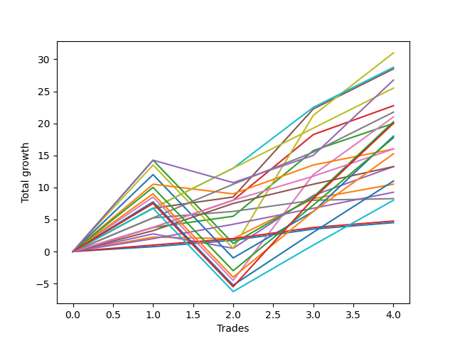

# Short Pointer 102 DB 
- Symbol: ES
- Date Range: 03/18/2022 - 12/30/2022
- Trading Period: 8:30-12:30
- Number of Trades: 4



| Name | Win Percent | Profit | Avg Profit / Trade | Avg Time / Trade |      | Name | Win Percent | Profit | Avg Profit / Trade | Avg Time / Trade |
| ---- | ----------- | ------ | ------------------ | ---------------- | ---- | ---- | ----------- | ------ | ------------------ | ---------------- |
| Sorted By <br> Profit | | | | | | Sorted By <br> Win Percentage ||||
| V U/L 1SD SL-5 | 75.00 | 19375.00 | 4843.75 | 22:15 |     | BB-100 Mid | 100.00 | 14375.00 | 3593.75 | 15:23 |
| V U/L 1SD SL-10 | 75.00 | 17000.00 | 4250.00 | 23:18 |     | BB-50 U/L 1SD | 100.00 | 14250.00 | 3562.50 | 19:40 |
| V U/L 1SD | 75.00 | 15500.00 | 3875.00 | 36:38 |     | TP-6 | 100.00 | 12750.00 | 3187.50 | 13:48 |
| BB-100 Mid | 100.00 | 14375.00 | 3593.75 | 15:23 |     | BB-20 U/L 2SD C | 100.00 | 11375.00 | 2843.75 | 14:05 |
| BB-50 U/L 2SD SL-5 | 75.00 | 14375.00 | 3593.75 | 15:10 |     | TP-5 | 100.00 | 10875.00 | 2718.75 | 13:43 |
| BB-50 U/L 1SD | 100.00 | 14250.00 | 3562.50 | 19:40 |     | BB-20 U/L 2SD | 100.00 | 10000.00 | 2500.00 | 14:02 |
| BB-200 U/L 2SD SL-5 | 75.00 | 14000.00 | 3500.00 | 46:31 |     | TP-4 | 100.00 | 8000.00 | 2000.00 | 12:23 |
| NEWFI 0000 | 75.00 | 13375.00 | 3343.75 | 47:15 |     | TP-3 | 100.00 | 6625.00 | 1656.25 | 11:51 |
| BB-100 U/L 2SD SL-5 | 75.00 | 12875.00 | 3218.75 | 39:41 |     | TP-2 | 100.00 | 4625.00 | 1156.25 | 03:18 |
| TP-6 | 100.00 | 12750.00 | 3187.50 | 13:48 |     | V Mid SL-10 | 100.00 | 4125.00 | 1031.25 | 03:36 |
| BB-50 U/L 2SD SL-10 | 75.00 | 12000.00 | 3000.00 | 16:13 |     | V Mid SL-5 | 100.00 | 4125.00 | 1031.25 | 03:36 |
| BB-200 U/L 2SD SL-10 | 75.00 | 11625.00 | 2906.25 | 47:35 |     | V Mid | 100.00 | 4125.00 | 1031.25 | 03:36 |
| BB-20 U/L 2SD C | 100.00 | 11375.00 | 2843.75 | 14:05 |     | TP-1 | 100.00 | 2375.00 | 593.75 | 02:32 |
| TP-5 | 100.00 | 10875.00 | 2718.75 | 13:43 |     | BB-20 Mid SL-10 | 100.00 | 2250.00 | 562.50 | 02:12 |
| BB-50 U/L 1SD SL-5 | 75.00 | 10750.00 | 2687.50 | 12:26 |     | BB-20 Mid SL-5 | 100.00 | 2250.00 | 562.50 | 02:12 |
| BB-100 U/L 2SD SL-10 | 75.00 | 10500.00 | 2625.00 | 40:45 |     | BB-20 Mid | 100.00 | 2250.00 | 562.50 | 02:12 |
| BB-50 U/L 2SD | 75.00 | 10500.00 | 2625.00 | 29:33 |     | V U/L 1SD SL-5 | 75.00 | 19375.00 | 4843.75 | 22:15 |
| BB-200 U/L 2SD | 75.00 | 10125.00 | 2531.25 | 60:55 |     | V U/L 1SD SL-10 | 75.00 | 17000.00 | 4250.00 | 23:18 |
| BB-20 U/L 2SD | 100.00 | 10000.00 | 2500.00 | 14:02 |     | V U/L 1SD | 75.00 | 15500.00 | 3875.00 | 36:38 |
| NEWFI 000 | 75.00 | 10000.00 | 2500.00 | 42:00 |     | BB-50 U/L 2SD SL-5 | 75.00 | 14375.00 | 3593.75 | 15:10 |
| BB-100 U/L 2SD | 75.00 | 9000.00 | 2250.00 | 54:05 |     | BB-200 U/L 2SD SL-5 | 75.00 | 14000.00 | 3500.00 | 46:31 |
| TP-10 | 75.00 | 8875.00 | 2218.75 | 34:11 |     | NEWFI 0000 | 75.00 | 13375.00 | 3343.75 | 47:15 |
| BB-100 Mid SL-5 | 75.00 | 8625.00 | 2156.25 | 08:01 |     | BB-100 U/L 2SD SL-5 | 75.00 | 12875.00 | 3218.75 | 39:41 |
| BB-50 U/L 1SD SL-10 | 75.00 | 8375.00 | 2093.75 | 13:30 |     | BB-50 U/L 2SD SL-10 | 75.00 | 12000.00 | 3000.00 | 16:13 |
| TP-4 | 100.00 | 8000.00 | 2000.00 | 12:23 |     | BB-200 U/L 2SD SL-10 | 75.00 | 11625.00 | 2906.25 | 47:35 |
| BB-200 Mid SL-10 | 75.00 | 8000.00 | 2000.00 | 09:31 |     | BB-50 U/L 1SD SL-5 | 75.00 | 10750.00 | 2687.50 | 12:26 |
| BB-200 Mid SL-5 | 75.00 | 8000.00 | 2000.00 | 09:31 |     | BB-100 U/L 2SD SL-10 | 75.00 | 10500.00 | 2625.00 | 40:45 |
| BB-200 Mid | 75.00 | 8000.00 | 2000.00 | 09:31 |     | BB-50 U/L 2SD | 75.00 | 10500.00 | 2625.00 | 29:33 |
| TP-9 | 75.00 | 7625.00 | 1906.25 | 27:51 |     | BB-200 U/L 2SD | 75.00 | 10125.00 | 2531.25 | 60:55 |
| TP-3 | 100.00 | 6625.00 | 1656.25 | 11:51 |     | NEWFI 000 | 75.00 | 10000.00 | 2500.00 | 42:00 |
| BB-20 U/L 2SD C SL-5 | 75.00 | 6625.00 | 1656.25 | 06:50 |     | BB-100 U/L 2SD | 75.00 | 9000.00 | 2250.00 | 54:05 |
| BB-50 Mid | 75.00 | 6625.00 | 1656.25 | 13:22 |     | TP-10 | 75.00 | 8875.00 | 2218.75 | 34:11 |
| BB-20 U/L 2SD SL-5 | 75.00 | 6500.00 | 1625.00 | 06:48 |     | BB-100 Mid SL-5 | 75.00 | 8625.00 | 2156.25 | 08:01 |
| BB-100 Mid SL-10 | 75.00 | 6250.00 | 1562.50 | 09:05 |     | BB-50 U/L 1SD SL-10 | 75.00 | 8375.00 | 2093.75 | 13:30 |
| TP-8 | 75.00 | 5500.00 | 1375.00 | 27:30 |     | BB-200 Mid SL-10 | 75.00 | 8000.00 | 2000.00 | 09:31 |
| BB-20 U/L 1SD | 75.00 | 5250.00 | 1312.50 | 06:57 |     | BB-200 Mid SL-5 | 75.00 | 8000.00 | 2000.00 | 09:31 |
| BB-50 Mid SL-5 | 75.00 | 5125.00 | 1281.25 | 07:41 |     | BB-200 Mid | 75.00 | 8000.00 | 2000.00 | 09:31 |
| TP-2 | 100.00 | 4625.00 | 1156.25 | 03:18 |     | TP-9 | 75.00 | 7625.00 | 1906.25 | 27:51 |
| BB-20 U/L 2SD C SL-10 | 75.00 | 4250.00 | 1062.50 | 07:53 |     | BB-20 U/L 2SD C SL-5 | 75.00 | 6625.00 | 1656.25 | 06:50 |
| V Mid SL-10 | 100.00 | 4125.00 | 1031.25 | 03:36 |     | BB-50 Mid | 75.00 | 6625.00 | 1656.25 | 13:22 |
| V Mid SL-5 | 100.00 | 4125.00 | 1031.25 | 03:36 |     | BB-20 U/L 2SD SL-5 | 75.00 | 6500.00 | 1625.00 | 06:48 |
| V Mid | 100.00 | 4125.00 | 1031.25 | 03:36 |     | BB-100 Mid SL-10 | 75.00 | 6250.00 | 1562.50 | 09:05 |
| BB-20 U/L 2SD SL-10 | 75.00 | 4125.00 | 1031.25 | 07:52 |     | TP-8 | 75.00 | 5500.00 | 1375.00 | 27:30 |
| TP-7 | 75.00 | 4000.00 | 1000.00 | 25:17 |     | BB-20 U/L 1SD | 75.00 | 5250.00 | 1312.50 | 06:57 |
| BB-50 Mid SL-10 | 75.00 | 2750.00 | 687.50 | 08:45 |     | BB-50 Mid SL-5 | 75.00 | 5125.00 | 1281.25 | 07:41 |
| BB-20 U/L 1SD SL-5 | 75.00 | 2750.00 | 687.50 | 04:21 |     | BB-20 U/L 2SD C SL-10 | 75.00 | 4250.00 | 1062.50 | 07:53 |
| TP-1 | 100.00 | 2375.00 | 593.75 | 02:32 |     | BB-20 U/L 2SD SL-10 | 75.00 | 4125.00 | 1031.25 | 07:52 |
| BB-20 Mid SL-10 | 100.00 | 2250.00 | 562.50 | 02:12 |     | TP-7 | 75.00 | 4000.00 | 1000.00 | 25:17 |
| BB-20 Mid SL-5 | 100.00 | 2250.00 | 562.50 | 02:12 |     | BB-50 Mid SL-10 | 75.00 | 2750.00 | 687.50 | 08:45 |
| BB-20 Mid | 100.00 | 2250.00 | 562.50 | 02:12 |     | BB-20 U/L 1SD SL-5 | 75.00 | 2750.00 | 687.50 | 04:21 |
| BB-20 U/L 1SD SL-10 | 75.00 | 375.00 | 93.75 | 05:25 |     | BB-20 U/L 1SD SL-10 | 75.00 | 375.00 | 93.75 | 05:25 |

## NO STOPLOSS

### Test BB-20 Mid
* Sell when price hits the middle line of the 20p bollinger
* No Stoploss
* Results:
```
Total Trades: 4
Percent Up: 0.00
Percent Down: 100.00
Total Points Moved Down: 4.50
Potential Profit: 2250.00
Total Points Ups: 0.00 Count Ups: 0
Total Points Downs: 4.50 Count Downs: 4
```

<details><summary>Trades</summary>

<code>In: 2022-03-29 08:53:00		Out: 2022-03-29 08:56:20		Total Position Time: 03:20		Total Move Down: 0.75		Total to Date: 0.75</code> <br />
<code>In: 2022-04-25 09:29:00		Out: 2022-04-25 09:31:05		Total Position Time: 02:05		Total Move Down: 1.00		Total to Date: 1.75</code> <br />
<code>In: 2022-06-17 08:35:00		Out: 2022-06-17 08:36:10		Total Position Time: 01:10		Total Move Down: 1.75		Total to Date: 3.50</code> <br />
<code>In: 2022-08-31 09:02:00		Out: 2022-08-31 09:04:15		Total Position Time: 02:15		Total Move Down: 1.00		Total to Date: 4.50</code> <br />


</details>

### Test BB-20 U/L 1SD
* Sell when the price hits the lower line of the 20p 1std bollinger
* No Stoploss
* Results:
```
Total Trades: 4
Percent Up: 25.00
Percent Down: 75.00
Total Points Moved Down: 10.50
Potential Profit: 5250.00
Total Points Ups: 0.25 Count Ups: 1
Total Points Downs: 10.75 Count Downs: 3
```

<details><summary>Trades</summary>

<code>In: 2022-03-29 08:53:00		Out: 2022-03-29 08:58:40		Total Position Time: 05:40		Total Move Down: 2.25		Total to Date: 2.25</code> <br />
<code>In: 2022-04-25 09:29:00		Out: 2022-04-25 09:42:45		Total Position Time: 13:45		Total Move Down: -0.25		Total to Date: 2.00</code> <br />
<code>In: 2022-06-17 08:35:00		Out: 2022-06-17 08:39:05		Total Position Time: 04:05		Total Move Down: 6.25		Total to Date: 8.25</code> <br />
<code>In: 2022-08-31 09:02:00		Out: 2022-08-31 09:06:20		Total Position Time: 04:20		Total Move Down: 2.25		Total to Date: 10.50</code> <br />


</details>

### Test BB-20 U/L 2SD
* Sell when the price hits the lower line of the 20p 2std bollinger
* No Stoploss
* Results:
```
Total Trades: 4
Percent Up: 0.00
Percent Down: 100.00
Total Points Moved Down: 20.00
Potential Profit: 10000.00
Total Points Ups: 0.00 Count Ups: 0
Total Points Downs: 20.00 Count Downs: 4
```

<details><summary>Trades</summary>

<code>In: 2022-03-29 08:53:00		Out: 2022-03-29 09:01:40		Total Position Time: 08:40		Total Move Down: 3.75		Total to Date: 3.75</code> <br />
<code>In: 2022-04-25 09:29:00		Out: 2022-04-25 10:01:15		Total Position Time: 32:15		Total Move Down: 1.75		Total to Date: 5.50</code> <br />
<code>In: 2022-06-17 08:35:00		Out: 2022-06-17 08:45:15		Total Position Time: 10:15		Total Move Down: 10.25		Total to Date: 15.75</code> <br />
<code>In: 2022-08-31 09:02:00		Out: 2022-08-31 09:07:00		Total Position Time: 05:00		Total Move Down: 4.25		Total to Date: 20.00</code> <br />


</details>

### Test BB-20 U/L 2SD C
* Sell when the price hits the lower line of the 20p 2std bollinger
* No Stoploss
* Results:
```
Total Trades: 4
Percent Up: 0.00
Percent Down: 100.00
Total Points Moved Down: 22.75
Potential Profit: 11375.00
Total Points Ups: 0.00 Count Ups: 0
Total Points Downs: 22.75 Count Downs: 4
```

<details><summary>Trades</summary>

<code>In: 2022-03-29 08:53:00		Out: 2022-03-29 09:01:40		Total Position Time: 08:40		Total Move Down: 3.75		Total to Date: 3.75</code> <br />
<code>In: 2022-04-25 09:29:00		Out: 2022-04-25 10:01:20		Total Position Time: 32:20		Total Move Down: 4.25		Total to Date: 8.00</code> <br />
<code>In: 2022-06-17 08:35:00		Out: 2022-06-17 08:45:15		Total Position Time: 10:15		Total Move Down: 10.25		Total to Date: 18.25</code> <br />
<code>In: 2022-08-31 09:02:00		Out: 2022-08-31 09:07:05		Total Position Time: 05:05		Total Move Down: 4.50		Total to Date: 22.75</code> <br />


</details>

### Test BB-50 Mid
* Sell when price hits the middle line of the 50p bollinger
* No Stoploss
* Results:
```
Total Trades: 4
Percent Up: 25.00
Percent Down: 75.00
Total Points Moved Down: 13.25
Potential Profit: 6625.00
Total Points Ups: 2.25 Count Ups: 1
Total Points Downs: 15.50 Count Downs: 3
```

<details><summary>Trades</summary>

<code>In: 2022-03-29 08:53:00		Out: 2022-03-29 09:01:25		Total Position Time: 08:25		Total Move Down: 2.75		Total to Date: 2.75</code> <br />
<code>In: 2022-04-25 09:29:00		Out: 2022-04-25 09:55:05		Total Position Time: 26:05		Total Move Down: -2.25		Total to Date: 0.50</code> <br />
<code>In: 2022-06-17 08:35:00		Out: 2022-06-17 08:45:05		Total Position Time: 10:05		Total Move Down: 8.25		Total to Date: 8.75</code> <br />
<code>In: 2022-08-31 09:02:00		Out: 2022-08-31 09:10:55		Total Position Time: 08:55		Total Move Down: 4.50		Total to Date: 13.25</code> <br />


</details>

### Test BB-50 U/L 1SD
* Sell when the price hits the lower line of the 50p 1std bollinger
* No Stoploss
* Results:
```
Total Trades: 4
Percent Up: 0.00
Percent Down: 100.00
Total Points Moved Down: 28.50
Potential Profit: 14250.00
Total Points Ups: 0.00 Count Ups: 0
Total Points Downs: 28.50 Count Downs: 4
```

<details><summary>Trades</summary>

<code>In: 2022-03-29 08:53:00		Out: 2022-03-29 09:02:15		Total Position Time: 09:15		Total Move Down: 6.75		Total to Date: 6.75</code> <br />
<code>In: 2022-04-25 09:29:00		Out: 2022-04-25 10:01:15		Total Position Time: 32:15		Total Move Down: 1.75		Total to Date: 8.50</code> <br />
<code>In: 2022-06-17 08:35:00		Out: 2022-06-17 08:51:25		Total Position Time: 16:25		Total Move Down: 13.75		Total to Date: 22.25</code> <br />
<code>In: 2022-08-31 09:02:00		Out: 2022-08-31 09:22:45		Total Position Time: 20:45		Total Move Down: 6.25		Total to Date: 28.50</code> <br />


</details>

### Test BB-50 U/L 2SD
* Sell when the price hits the lower line of the 50p 2std bollinger
* No Stoploss
* Results:
```
Total Trades: 4
Percent Up: 25.00
Percent Down: 75.00
Total Points Moved Down: 21.00
Potential Profit: 10500.00
Total Points Ups: 13.00 Count Ups: 1
Total Points Downs: 34.00 Count Downs: 3
```

<details><summary>Trades</summary>

<code>In: 2022-03-29 08:53:00		Out: 2022-03-29 09:10:45		Total Position Time: 17:45		Total Move Down: 8.50		Total to Date: 8.50</code> <br />
<code>In: 2022-04-25 09:29:00		Out: 2022-04-25 10:29:55		Total Position Time: 60:55		Total Move Down: -13.00		Total to Date: -4.50</code> <br />
<code>In: 2022-06-17 08:35:00		Out: 2022-06-17 08:52:10		Total Position Time: 17:10		Total Move Down: 16.50		Total to Date: 12.00</code> <br />
<code>In: 2022-08-31 09:02:00		Out: 2022-08-31 09:24:25		Total Position Time: 22:25		Total Move Down: 9.00		Total to Date: 21.00</code> <br />


</details>

### Test V Mid
* Sell when the price hits the middle line of the 1std VWAP
* No Stoploss
* Results:
```
Total Trades: 4
Percent Up: 0.00
Percent Down: 100.00
Total Points Moved Down: 8.25
Potential Profit: 4125.00
Total Points Ups: 0.00 Count Ups: 0
Total Points Downs: 8.25 Count Downs: 4
```

<details><summary>Trades</summary>

<code>In: 2022-03-29 08:53:00		Out: 2022-03-29 09:02:10		Total Position Time: 09:10		Total Move Down: 5.25		Total to Date: 5.25</code> <br />
<code>In: 2022-04-25 09:29:00		Out: 2022-04-25 09:31:05		Total Position Time: 02:05		Total Move Down: 1.00		Total to Date: 6.25</code> <br />
<code>In: 2022-06-17 08:35:00		Out: 2022-06-17 08:36:10		Total Position Time: 01:10		Total Move Down: 1.75		Total to Date: 8.00</code> <br />
<code>In: 2022-08-31 09:02:00		Out: 2022-08-31 09:04:00		Total Position Time: 02:00		Total Move Down: 0.25		Total to Date: 8.25</code> <br />


</details>

### Test V U/L 1SD
* Sell when the price hits the lower line of the 1std VWAP
* No Stoploss
* Results:
```
Total Trades: 4
Percent Up: 25.00
Percent Down: 75.00
Total Points Moved Down: 31.00
Potential Profit: 15500.00
Total Points Ups: 13.00 Count Ups: 1
Total Points Downs: 44.00 Count Downs: 3
```

<details><summary>Trades</summary>

<code>In: 2022-03-29 08:53:00		Out: 2022-03-29 09:27:55		Total Position Time: 34:55		Total Move Down: 13.50		Total to Date: 13.50</code> <br />
<code>In: 2022-04-25 09:29:00		Out: 2022-04-25 10:29:55		Total Position Time: 60:55		Total Move Down: -13.00		Total to Date: 0.50</code> <br />
<code>In: 2022-06-17 08:35:00		Out: 2022-06-17 09:03:15		Total Position Time: 28:15		Total Move Down: 20.75		Total to Date: 21.25</code> <br />
<code>In: 2022-08-31 09:02:00		Out: 2022-08-31 09:24:30		Total Position Time: 22:30		Total Move Down: 9.75		Total to Date: 31.00</code> <br />


</details>

### Test BB-100 Mid
* Move to BB100 Mid
* No Stoploss
* Results:
```
Total Trades: 4
Percent Up: 0.00
Percent Down: 100.00
Total Points Moved Down: 28.75
Potential Profit: 14375.00
Total Points Ups: 0.00 Count Ups: 0
Total Points Downs: 28.75 Count Downs: 4
```

<details><summary>Trades</summary>

<code>In: 2022-03-29 08:53:00		Out: 2022-03-29 09:02:15		Total Position Time: 09:15		Total Move Down: 6.75		Total to Date: 6.75</code> <br />
<code>In: 2022-04-25 09:29:00		Out: 2022-04-25 10:01:50		Total Position Time: 32:50		Total Move Down: 6.25		Total to Date: 13.00</code> <br />
<code>In: 2022-06-17 08:35:00		Out: 2022-06-17 08:45:25		Total Position Time: 10:25		Total Move Down: 9.50		Total to Date: 22.50</code> <br />
<code>In: 2022-08-31 09:02:00		Out: 2022-08-31 09:11:05		Total Position Time: 09:05		Total Move Down: 6.25		Total to Date: 28.75</code> <br />


</details>

### Test BB-100 U/L 2SD
* Move to BB100 Upper Band
* No Stoploss
* Results:
```
Total Trades: 4
Percent Up: 25.00
Percent Down: 75.00
Total Points Moved Down: 18.00
Potential Profit: 9000.00
Total Points Ups: 13.00 Count Ups: 1
Total Points Downs: 31.00 Count Downs: 3
```

<details><summary>Trades</summary>

<code>In: 2022-03-29 08:53:00		Out: 2022-03-29 09:26:35		Total Position Time: 33:35		Total Move Down: 12.00		Total to Date: 12.00</code> <br />
<code>In: 2022-04-25 09:29:00		Out: 2022-04-25 10:29:55		Total Position Time: 60:55		Total Move Down: -13.00		Total to Date: -1.00</code> <br />
<code>In: 2022-06-17 08:35:00		Out: 2022-06-17 09:35:55		Total Position Time: 60:55		Total Move Down: 7.25		Total to Date: 6.25</code> <br />
<code>In: 2022-08-31 09:02:00		Out: 2022-08-31 10:02:55		Total Position Time: 60:55		Total Move Down: 11.75		Total to Date: 18.00</code> <br />


</details>

### Test BB-200 Mid
* Move to BB200 Mid
* No Stoploss
* Results:
```
Total Trades: 4
Percent Up: 25.00
Percent Down: 75.00
Total Points Moved Down: 16.00
Potential Profit: 8000.00
Total Points Ups: 1.50 Count Ups: 1
Total Points Downs: 17.50 Count Downs: 3
```

<details><summary>Trades</summary>

<code>In: 2022-03-29 08:53:00		Out: 2022-03-29 09:21:50		Total Position Time: 28:50		Total Move Down: 10.50		Total to Date: 10.50</code> <br />
<code>In: 2022-04-25 09:29:00		Out: 2022-04-25 09:30:10		Total Position Time: 01:10		Total Move Down: -1.50		Total to Date: 9.00</code> <br />
<code>In: 2022-06-17 08:35:00		Out: 2022-06-17 08:38:50		Total Position Time: 03:50		Total Move Down: 4.50		Total to Date: 13.50</code> <br />
<code>In: 2022-08-31 09:02:00		Out: 2022-08-31 09:06:15		Total Position Time: 04:15		Total Move Down: 2.50		Total to Date: 16.00</code> <br />


</details>

### Test BB-200 U/L 2SD
* Move to BB200 Upper Band
* No Stoploss
* Results:
```
Total Trades: 4
Percent Up: 25.00
Percent Down: 75.00
Total Points Moved Down: 20.25
Potential Profit: 10125.00
Total Points Ups: 13.00 Count Ups: 1
Total Points Downs: 33.25 Count Downs: 3
```

<details><summary>Trades</summary>

<code>In: 2022-03-29 08:53:00		Out: 2022-03-29 09:53:55		Total Position Time: 60:55		Total Move Down: 14.25		Total to Date: 14.25</code> <br />
<code>In: 2022-04-25 09:29:00		Out: 2022-04-25 10:29:55		Total Position Time: 60:55		Total Move Down: -13.00		Total to Date: 1.25</code> <br />
<code>In: 2022-06-17 08:35:00		Out: 2022-06-17 09:35:55		Total Position Time: 60:55		Total Move Down: 7.25		Total to Date: 8.50</code> <br />
<code>In: 2022-08-31 09:02:00		Out: 2022-08-31 10:02:55		Total Position Time: 60:55		Total Move Down: 11.75		Total to Date: 20.25</code> <br />


</details>

## STOPLOSS OF 5

### Test BB-20 Mid SL-5
* Sell when price hits the middle line of the 20p bollinger
* Stoploss is -5 points
* Results:
```
Total Trades: 4
Percent Up: 0.00
Percent Down: 100.00
Total Points Moved Down: 4.50
Potential Profit: 2250.00
Total Points Ups: 0.00 Count Ups: 0
Total Points Downs: 4.50 Count Downs: 4
```

<details><summary>Trades</summary>

<code>In: 2022-03-29 08:53:00		Out: 2022-03-29 08:56:20		Total Position Time: 03:20		Total Move Down: 0.75		Total to Date: 0.75</code> <br />
<code>In: 2022-04-25 09:29:00		Out: 2022-04-25 09:31:05		Total Position Time: 02:05		Total Move Down: 1.00		Total to Date: 1.75</code> <br />
<code>In: 2022-06-17 08:35:00		Out: 2022-06-17 08:36:10		Total Position Time: 01:10		Total Move Down: 1.75		Total to Date: 3.50</code> <br />
<code>In: 2022-08-31 09:02:00		Out: 2022-08-31 09:04:15		Total Position Time: 02:15		Total Move Down: 1.00		Total to Date: 4.50</code> <br />


</details>

### Test BB-20 U/L 1SD SL-5
* Sell when the price hits the lower line of the 20p 1std bollinger
* Stoploss is -5 points
* Results:
```
Total Trades: 4
Percent Up: 25.00
Percent Down: 75.00
Total Points Moved Down: 5.50
Potential Profit: 2750.00
Total Points Ups: 5.25 Count Ups: 1
Total Points Downs: 10.75 Count Downs: 3
```

<details><summary>Trades</summary>

<code>In: 2022-03-29 08:53:00		Out: 2022-03-29 08:58:40		Total Position Time: 05:40		Total Move Down: 2.25		Total to Date: 2.25</code> <br />
<code>In: 2022-04-25 09:29:00		Out: 2022-04-25 09:32:20		Total Position Time: 03:20		Total Move Down: -5.25		Total to Date: -3.00</code> <br />
<code>In: 2022-06-17 08:35:00		Out: 2022-06-17 08:39:05		Total Position Time: 04:05		Total Move Down: 6.25		Total to Date: 3.25</code> <br />
<code>In: 2022-08-31 09:02:00		Out: 2022-08-31 09:06:20		Total Position Time: 04:20		Total Move Down: 2.25		Total to Date: 5.50</code> <br />


</details>

### Test BB-20 U/L 2SD SL-5
* Sell when the price hits the lower line of the 20p 2std bollinger
* Stoploss is -5 points
* Results:
```
Total Trades: 4
Percent Up: 25.00
Percent Down: 75.00
Total Points Moved Down: 13.00
Potential Profit: 6500.00
Total Points Ups: 5.25 Count Ups: 1
Total Points Downs: 18.25 Count Downs: 3
```

<details><summary>Trades</summary>

<code>In: 2022-03-29 08:53:00		Out: 2022-03-29 09:01:40		Total Position Time: 08:40		Total Move Down: 3.75		Total to Date: 3.75</code> <br />
<code>In: 2022-04-25 09:29:00		Out: 2022-04-25 09:32:20		Total Position Time: 03:20		Total Move Down: -5.25		Total to Date: -1.50</code> <br />
<code>In: 2022-06-17 08:35:00		Out: 2022-06-17 08:45:15		Total Position Time: 10:15		Total Move Down: 10.25		Total to Date: 8.75</code> <br />
<code>In: 2022-08-31 09:02:00		Out: 2022-08-31 09:07:00		Total Position Time: 05:00		Total Move Down: 4.25		Total to Date: 13.00</code> <br />


</details>

### Test BB-20 U/L 2SD C SL-5
* Sell when the price hits the lower line of the 20p 2std bollinger
* Stoploss is -5 points
* Results:
```
Total Trades: 4
Percent Up: 25.00
Percent Down: 75.00
Total Points Moved Down: 13.25
Potential Profit: 6625.00
Total Points Ups: 5.25 Count Ups: 1
Total Points Downs: 18.50 Count Downs: 3
```

<details><summary>Trades</summary>

<code>In: 2022-03-29 08:53:00		Out: 2022-03-29 09:01:40		Total Position Time: 08:40		Total Move Down: 3.75		Total to Date: 3.75</code> <br />
<code>In: 2022-04-25 09:29:00		Out: 2022-04-25 09:32:20		Total Position Time: 03:20		Total Move Down: -5.25		Total to Date: -1.50</code> <br />
<code>In: 2022-06-17 08:35:00		Out: 2022-06-17 08:45:15		Total Position Time: 10:15		Total Move Down: 10.25		Total to Date: 8.75</code> <br />
<code>In: 2022-08-31 09:02:00		Out: 2022-08-31 09:07:05		Total Position Time: 05:05		Total Move Down: 4.50		Total to Date: 13.25</code> <br />


</details>

### Test BB-50 Mid SL-5
* Sell when price hits the middle line of the 50p bollinger
* Stoploss is -5 points
* Results:
```
Total Trades: 4
Percent Up: 25.00
Percent Down: 75.00
Total Points Moved Down: 10.25
Potential Profit: 5125.00
Total Points Ups: 5.25 Count Ups: 1
Total Points Downs: 15.50 Count Downs: 3
```

<details><summary>Trades</summary>

<code>In: 2022-03-29 08:53:00		Out: 2022-03-29 09:01:25		Total Position Time: 08:25		Total Move Down: 2.75		Total to Date: 2.75</code> <br />
<code>In: 2022-04-25 09:29:00		Out: 2022-04-25 09:32:20		Total Position Time: 03:20		Total Move Down: -5.25		Total to Date: -2.50</code> <br />
<code>In: 2022-06-17 08:35:00		Out: 2022-06-17 08:45:05		Total Position Time: 10:05		Total Move Down: 8.25		Total to Date: 5.75</code> <br />
<code>In: 2022-08-31 09:02:00		Out: 2022-08-31 09:10:55		Total Position Time: 08:55		Total Move Down: 4.50		Total to Date: 10.25</code> <br />


</details>

### Test BB-50 U/L 1SD SL-5
* Sell when the price hits the lower line of the 50p 1std bollinger
* Stoploss is -5 points
* Results:
```
Total Trades: 4
Percent Up: 25.00
Percent Down: 75.00
Total Points Moved Down: 21.50
Potential Profit: 10750.00
Total Points Ups: 5.25 Count Ups: 1
Total Points Downs: 26.75 Count Downs: 3
```

<details><summary>Trades</summary>

<code>In: 2022-03-29 08:53:00		Out: 2022-03-29 09:02:15		Total Position Time: 09:15		Total Move Down: 6.75		Total to Date: 6.75</code> <br />
<code>In: 2022-04-25 09:29:00		Out: 2022-04-25 09:32:20		Total Position Time: 03:20		Total Move Down: -5.25		Total to Date: 1.50</code> <br />
<code>In: 2022-06-17 08:35:00		Out: 2022-06-17 08:51:25		Total Position Time: 16:25		Total Move Down: 13.75		Total to Date: 15.25</code> <br />
<code>In: 2022-08-31 09:02:00		Out: 2022-08-31 09:22:45		Total Position Time: 20:45		Total Move Down: 6.25		Total to Date: 21.50</code> <br />


</details>

### Test BB-50 U/L 2SD SL-5
* Sell when the price hits the lower line of the 50p 2std bollinger
* Stoploss is -5 points
* Results:
```
Total Trades: 4
Percent Up: 25.00
Percent Down: 75.00
Total Points Moved Down: 28.75
Potential Profit: 14375.00
Total Points Ups: 5.25 Count Ups: 1
Total Points Downs: 34.00 Count Downs: 3
```

<details><summary>Trades</summary>

<code>In: 2022-03-29 08:53:00		Out: 2022-03-29 09:10:45		Total Position Time: 17:45		Total Move Down: 8.50		Total to Date: 8.50</code> <br />
<code>In: 2022-04-25 09:29:00		Out: 2022-04-25 09:32:20		Total Position Time: 03:20		Total Move Down: -5.25		Total to Date: 3.25</code> <br />
<code>In: 2022-06-17 08:35:00		Out: 2022-06-17 08:52:10		Total Position Time: 17:10		Total Move Down: 16.50		Total to Date: 19.75</code> <br />
<code>In: 2022-08-31 09:02:00		Out: 2022-08-31 09:24:25		Total Position Time: 22:25		Total Move Down: 9.00		Total to Date: 28.75</code> <br />


</details>

### Test V Mid SL-5
* Sell when the price hits the middle line of the 1std VWAP
* Stoploss is -5 points
* Results:
```
Total Trades: 4
Percent Up: 0.00
Percent Down: 100.00
Total Points Moved Down: 8.25
Potential Profit: 4125.00
Total Points Ups: 0.00 Count Ups: 0
Total Points Downs: 8.25 Count Downs: 4
```

<details><summary>Trades</summary>

<code>In: 2022-03-29 08:53:00		Out: 2022-03-29 09:02:10		Total Position Time: 09:10		Total Move Down: 5.25		Total to Date: 5.25</code> <br />
<code>In: 2022-04-25 09:29:00		Out: 2022-04-25 09:31:05		Total Position Time: 02:05		Total Move Down: 1.00		Total to Date: 6.25</code> <br />
<code>In: 2022-06-17 08:35:00		Out: 2022-06-17 08:36:10		Total Position Time: 01:10		Total Move Down: 1.75		Total to Date: 8.00</code> <br />
<code>In: 2022-08-31 09:02:00		Out: 2022-08-31 09:04:00		Total Position Time: 02:00		Total Move Down: 0.25		Total to Date: 8.25</code> <br />


</details>

### Test V U/L 1SD SL-5
* Sell when the price hits the lower line of the 1std VWAP
* Stoploss is -5 points
* Results:
```
Total Trades: 4
Percent Up: 25.00
Percent Down: 75.00
Total Points Moved Down: 38.75
Potential Profit: 19375.00
Total Points Ups: 5.25 Count Ups: 1
Total Points Downs: 44.00 Count Downs: 3
```

<details><summary>Trades</summary>

<code>In: 2022-03-29 08:53:00		Out: 2022-03-29 09:27:55		Total Position Time: 34:55		Total Move Down: 13.50		Total to Date: 13.50</code> <br />
<code>In: 2022-04-25 09:29:00		Out: 2022-04-25 09:32:20		Total Position Time: 03:20		Total Move Down: -5.25		Total to Date: 8.25</code> <br />
<code>In: 2022-06-17 08:35:00		Out: 2022-06-17 09:03:15		Total Position Time: 28:15		Total Move Down: 20.75		Total to Date: 29.00</code> <br />
<code>In: 2022-08-31 09:02:00		Out: 2022-08-31 09:24:30		Total Position Time: 22:30		Total Move Down: 9.75		Total to Date: 38.75</code> <br />


</details>

### Test BB-100 Mid SL-5
* Move to BB100 Mid
* Stoploss is -5 points
* Results:
```
Total Trades: 4
Percent Up: 25.00
Percent Down: 75.00
Total Points Moved Down: 17.25
Potential Profit: 8625.00
Total Points Ups: 5.25 Count Ups: 1
Total Points Downs: 22.50 Count Downs: 3
```

<details><summary>Trades</summary>

<code>In: 2022-03-29 08:53:00		Out: 2022-03-29 09:02:15		Total Position Time: 09:15		Total Move Down: 6.75		Total to Date: 6.75</code> <br />
<code>In: 2022-04-25 09:29:00		Out: 2022-04-25 09:32:20		Total Position Time: 03:20		Total Move Down: -5.25		Total to Date: 1.50</code> <br />
<code>In: 2022-06-17 08:35:00		Out: 2022-06-17 08:45:25		Total Position Time: 10:25		Total Move Down: 9.50		Total to Date: 11.00</code> <br />
<code>In: 2022-08-31 09:02:00		Out: 2022-08-31 09:11:05		Total Position Time: 09:05		Total Move Down: 6.25		Total to Date: 17.25</code> <br />


</details>

### Test BB-100 U/L 2SD SL-5
* Move to BB100 Upper Band
* Stoploss is -5 points
* Results:
```
Total Trades: 4
Percent Up: 25.00
Percent Down: 75.00
Total Points Moved Down: 25.75
Potential Profit: 12875.00
Total Points Ups: 5.25 Count Ups: 1
Total Points Downs: 31.00 Count Downs: 3
```

<details><summary>Trades</summary>

<code>In: 2022-03-29 08:53:00		Out: 2022-03-29 09:26:35		Total Position Time: 33:35		Total Move Down: 12.00		Total to Date: 12.00</code> <br />
<code>In: 2022-04-25 09:29:00		Out: 2022-04-25 09:32:20		Total Position Time: 03:20		Total Move Down: -5.25		Total to Date: 6.75</code> <br />
<code>In: 2022-06-17 08:35:00		Out: 2022-06-17 09:35:55		Total Position Time: 60:55		Total Move Down: 7.25		Total to Date: 14.00</code> <br />
<code>In: 2022-08-31 09:02:00		Out: 2022-08-31 10:02:55		Total Position Time: 60:55		Total Move Down: 11.75		Total to Date: 25.75</code> <br />


</details>

### Test BB-200 Mid SL-5
* Move to BB200 Mid
* Stoploss is -5 points
* Results:
```
Total Trades: 4
Percent Up: 25.00
Percent Down: 75.00
Total Points Moved Down: 16.00
Potential Profit: 8000.00
Total Points Ups: 1.50 Count Ups: 1
Total Points Downs: 17.50 Count Downs: 3
```

<details><summary>Trades</summary>

<code>In: 2022-03-29 08:53:00		Out: 2022-03-29 09:21:50		Total Position Time: 28:50		Total Move Down: 10.50		Total to Date: 10.50</code> <br />
<code>In: 2022-04-25 09:29:00		Out: 2022-04-25 09:30:10		Total Position Time: 01:10		Total Move Down: -1.50		Total to Date: 9.00</code> <br />
<code>In: 2022-06-17 08:35:00		Out: 2022-06-17 08:38:50		Total Position Time: 03:50		Total Move Down: 4.50		Total to Date: 13.50</code> <br />
<code>In: 2022-08-31 09:02:00		Out: 2022-08-31 09:06:15		Total Position Time: 04:15		Total Move Down: 2.50		Total to Date: 16.00</code> <br />


</details>

### Test BB-200 U/L 2SD SL-5
* Move to BB200 Upper Band
* Stoploss is -5 points
* Results:
```
Total Trades: 4
Percent Up: 25.00
Percent Down: 75.00
Total Points Moved Down: 28.00
Potential Profit: 14000.00
Total Points Ups: 5.25 Count Ups: 1
Total Points Downs: 33.25 Count Downs: 3
```

<details><summary>Trades</summary>

<code>In: 2022-03-29 08:53:00		Out: 2022-03-29 09:53:55		Total Position Time: 60:55		Total Move Down: 14.25		Total to Date: 14.25</code> <br />
<code>In: 2022-04-25 09:29:00		Out: 2022-04-25 09:32:20		Total Position Time: 03:20		Total Move Down: -5.25		Total to Date: 9.00</code> <br />
<code>In: 2022-06-17 08:35:00		Out: 2022-06-17 09:35:55		Total Position Time: 60:55		Total Move Down: 7.25		Total to Date: 16.25</code> <br />
<code>In: 2022-08-31 09:02:00		Out: 2022-08-31 10:02:55		Total Position Time: 60:55		Total Move Down: 11.75		Total to Date: 28.00</code> <br />


</details>

## STOPLOSS OF 10

### Test BB-20 Mid SL-10
* Sell when price hits the middle line of the 20p bollinger
* Stoploss is -10 points
* Results:
```
Total Trades: 4
Percent Up: 0.00
Percent Down: 100.00
Total Points Moved Down: 4.50
Potential Profit: 2250.00
Total Points Ups: 0.00 Count Ups: 0
Total Points Downs: 4.50 Count Downs: 4
```

<details><summary>Trades</summary>

<code>In: 2022-03-29 08:53:00		Out: 2022-03-29 08:56:20		Total Position Time: 03:20		Total Move Down: 0.75		Total to Date: 0.75</code> <br />
<code>In: 2022-04-25 09:29:00		Out: 2022-04-25 09:31:05		Total Position Time: 02:05		Total Move Down: 1.00		Total to Date: 1.75</code> <br />
<code>In: 2022-06-17 08:35:00		Out: 2022-06-17 08:36:10		Total Position Time: 01:10		Total Move Down: 1.75		Total to Date: 3.50</code> <br />
<code>In: 2022-08-31 09:02:00		Out: 2022-08-31 09:04:15		Total Position Time: 02:15		Total Move Down: 1.00		Total to Date: 4.50</code> <br />


</details>

### Test BB-20 U/L 1SD SL-10
* Sell when the price hits the lower line of the 20p 1std bollinger
* Stoploss is -10 points
* Results:
```
Total Trades: 4
Percent Up: 25.00
Percent Down: 75.00
Total Points Moved Down: 0.75
Potential Profit: 375.00
Total Points Ups: 10.00 Count Ups: 1
Total Points Downs: 10.75 Count Downs: 3
```

<details><summary>Trades</summary>

<code>In: 2022-03-29 08:53:00		Out: 2022-03-29 08:58:40		Total Position Time: 05:40		Total Move Down: 2.25		Total to Date: 2.25</code> <br />
<code>In: 2022-04-25 09:29:00		Out: 2022-04-25 09:36:35		Total Position Time: 07:35		Total Move Down: -10.00		Total to Date: -7.75</code> <br />
<code>In: 2022-06-17 08:35:00		Out: 2022-06-17 08:39:05		Total Position Time: 04:05		Total Move Down: 6.25		Total to Date: -1.50</code> <br />
<code>In: 2022-08-31 09:02:00		Out: 2022-08-31 09:06:20		Total Position Time: 04:20		Total Move Down: 2.25		Total to Date: 0.75</code> <br />


</details>

### Test BB-20 U/L 2SD SL-10
* Sell when the price hits the lower line of the 20p 2std bollinger
* Stoploss is -10 points
* Results:
```
Total Trades: 4
Percent Up: 25.00
Percent Down: 75.00
Total Points Moved Down: 8.25
Potential Profit: 4125.00
Total Points Ups: 10.00 Count Ups: 1
Total Points Downs: 18.25 Count Downs: 3
```

<details><summary>Trades</summary>

<code>In: 2022-03-29 08:53:00		Out: 2022-03-29 09:01:40		Total Position Time: 08:40		Total Move Down: 3.75		Total to Date: 3.75</code> <br />
<code>In: 2022-04-25 09:29:00		Out: 2022-04-25 09:36:35		Total Position Time: 07:35		Total Move Down: -10.00		Total to Date: -6.25</code> <br />
<code>In: 2022-06-17 08:35:00		Out: 2022-06-17 08:45:15		Total Position Time: 10:15		Total Move Down: 10.25		Total to Date: 4.00</code> <br />
<code>In: 2022-08-31 09:02:00		Out: 2022-08-31 09:07:00		Total Position Time: 05:00		Total Move Down: 4.25		Total to Date: 8.25</code> <br />


</details>

### Test BB-20 U/L 2SD C SL-10
* Sell when the price hits the lower line of the 20p 2std bollinger
* Stoploss is -10 points
* Results:
```
Total Trades: 4
Percent Up: 25.00
Percent Down: 75.00
Total Points Moved Down: 8.50
Potential Profit: 4250.00
Total Points Ups: 10.00 Count Ups: 1
Total Points Downs: 18.50 Count Downs: 3
```

<details><summary>Trades</summary>

<code>In: 2022-03-29 08:53:00		Out: 2022-03-29 09:01:40		Total Position Time: 08:40		Total Move Down: 3.75		Total to Date: 3.75</code> <br />
<code>In: 2022-04-25 09:29:00		Out: 2022-04-25 09:36:35		Total Position Time: 07:35		Total Move Down: -10.00		Total to Date: -6.25</code> <br />
<code>In: 2022-06-17 08:35:00		Out: 2022-06-17 08:45:15		Total Position Time: 10:15		Total Move Down: 10.25		Total to Date: 4.00</code> <br />
<code>In: 2022-08-31 09:02:00		Out: 2022-08-31 09:07:05		Total Position Time: 05:05		Total Move Down: 4.50		Total to Date: 8.50</code> <br />


</details>

### Test BB-50 Mid SL-10
* Sell when price hits the middle line of the 50p bollinger
* Stoploss is -10 points
* Results:
```
Total Trades: 4
Percent Up: 25.00
Percent Down: 75.00
Total Points Moved Down: 5.50
Potential Profit: 2750.00
Total Points Ups: 10.00 Count Ups: 1
Total Points Downs: 15.50 Count Downs: 3
```

<details><summary>Trades</summary>

<code>In: 2022-03-29 08:53:00		Out: 2022-03-29 09:01:25		Total Position Time: 08:25		Total Move Down: 2.75		Total to Date: 2.75</code> <br />
<code>In: 2022-04-25 09:29:00		Out: 2022-04-25 09:36:35		Total Position Time: 07:35		Total Move Down: -10.00		Total to Date: -7.25</code> <br />
<code>In: 2022-06-17 08:35:00		Out: 2022-06-17 08:45:05		Total Position Time: 10:05		Total Move Down: 8.25		Total to Date: 1.00</code> <br />
<code>In: 2022-08-31 09:02:00		Out: 2022-08-31 09:10:55		Total Position Time: 08:55		Total Move Down: 4.50		Total to Date: 5.50</code> <br />


</details>

### Test BB-50 U/L 1SD SL-10
* Sell when the price hits the lower line of the 50p 1std bollinger
* Stoploss is -10 points
* Results:
```
Total Trades: 4
Percent Up: 25.00
Percent Down: 75.00
Total Points Moved Down: 16.75
Potential Profit: 8375.00
Total Points Ups: 10.00 Count Ups: 1
Total Points Downs: 26.75 Count Downs: 3
```

<details><summary>Trades</summary>

<code>In: 2022-03-29 08:53:00		Out: 2022-03-29 09:02:15		Total Position Time: 09:15		Total Move Down: 6.75		Total to Date: 6.75</code> <br />
<code>In: 2022-04-25 09:29:00		Out: 2022-04-25 09:36:35		Total Position Time: 07:35		Total Move Down: -10.00		Total to Date: -3.25</code> <br />
<code>In: 2022-06-17 08:35:00		Out: 2022-06-17 08:51:25		Total Position Time: 16:25		Total Move Down: 13.75		Total to Date: 10.50</code> <br />
<code>In: 2022-08-31 09:02:00		Out: 2022-08-31 09:22:45		Total Position Time: 20:45		Total Move Down: 6.25		Total to Date: 16.75</code> <br />


</details>

### Test BB-50 U/L 2SD SL-10
* Sell when the price hits the lower line of the 50p 2std bollinger
* Stoploss is -10 points
* Results:
```
Total Trades: 4
Percent Up: 25.00
Percent Down: 75.00
Total Points Moved Down: 24.00
Potential Profit: 12000.00
Total Points Ups: 10.00 Count Ups: 1
Total Points Downs: 34.00 Count Downs: 3
```

<details><summary>Trades</summary>

<code>In: 2022-03-29 08:53:00		Out: 2022-03-29 09:10:45		Total Position Time: 17:45		Total Move Down: 8.50		Total to Date: 8.50</code> <br />
<code>In: 2022-04-25 09:29:00		Out: 2022-04-25 09:36:35		Total Position Time: 07:35		Total Move Down: -10.00		Total to Date: -1.50</code> <br />
<code>In: 2022-06-17 08:35:00		Out: 2022-06-17 08:52:10		Total Position Time: 17:10		Total Move Down: 16.50		Total to Date: 15.00</code> <br />
<code>In: 2022-08-31 09:02:00		Out: 2022-08-31 09:24:25		Total Position Time: 22:25		Total Move Down: 9.00		Total to Date: 24.00</code> <br />


</details>

### Test V Mid SL-10
* Sell when the price hits the middle line of the 1std VWAP
* Stoploss is -10 points
* Results:
```
Total Trades: 4
Percent Up: 0.00
Percent Down: 100.00
Total Points Moved Down: 8.25
Potential Profit: 4125.00
Total Points Ups: 0.00 Count Ups: 0
Total Points Downs: 8.25 Count Downs: 4
```

<details><summary>Trades</summary>

<code>In: 2022-03-29 08:53:00		Out: 2022-03-29 09:02:10		Total Position Time: 09:10		Total Move Down: 5.25		Total to Date: 5.25</code> <br />
<code>In: 2022-04-25 09:29:00		Out: 2022-04-25 09:31:05		Total Position Time: 02:05		Total Move Down: 1.00		Total to Date: 6.25</code> <br />
<code>In: 2022-06-17 08:35:00		Out: 2022-06-17 08:36:10		Total Position Time: 01:10		Total Move Down: 1.75		Total to Date: 8.00</code> <br />
<code>In: 2022-08-31 09:02:00		Out: 2022-08-31 09:04:00		Total Position Time: 02:00		Total Move Down: 0.25		Total to Date: 8.25</code> <br />


</details>

### Test V U/L 1SD SL-10
* Sell when the price hits the lower line of the 1std VWAP
* Stoploss is -10 points
* Results:
```
Total Trades: 4
Percent Up: 25.00
Percent Down: 75.00
Total Points Moved Down: 34.00
Potential Profit: 17000.00
Total Points Ups: 10.00 Count Ups: 1
Total Points Downs: 44.00 Count Downs: 3
```

<details><summary>Trades</summary>

<code>In: 2022-03-29 08:53:00		Out: 2022-03-29 09:27:55		Total Position Time: 34:55		Total Move Down: 13.50		Total to Date: 13.50</code> <br />
<code>In: 2022-04-25 09:29:00		Out: 2022-04-25 09:36:35		Total Position Time: 07:35		Total Move Down: -10.00		Total to Date: 3.50</code> <br />
<code>In: 2022-06-17 08:35:00		Out: 2022-06-17 09:03:15		Total Position Time: 28:15		Total Move Down: 20.75		Total to Date: 24.25</code> <br />
<code>In: 2022-08-31 09:02:00		Out: 2022-08-31 09:24:30		Total Position Time: 22:30		Total Move Down: 9.75		Total to Date: 34.00</code> <br />


</details>

### Test BB-100 Mid SL-10
* Move to BB100 Mid
* Stoploss is -10 points
* Results:
```
Total Trades: 4
Percent Up: 25.00
Percent Down: 75.00
Total Points Moved Down: 12.50
Potential Profit: 6250.00
Total Points Ups: 10.00 Count Ups: 1
Total Points Downs: 22.50 Count Downs: 3
```

<details><summary>Trades</summary>

<code>In: 2022-03-29 08:53:00		Out: 2022-03-29 09:02:15		Total Position Time: 09:15		Total Move Down: 6.75		Total to Date: 6.75</code> <br />
<code>In: 2022-04-25 09:29:00		Out: 2022-04-25 09:36:35		Total Position Time: 07:35		Total Move Down: -10.00		Total to Date: -3.25</code> <br />
<code>In: 2022-06-17 08:35:00		Out: 2022-06-17 08:45:25		Total Position Time: 10:25		Total Move Down: 9.50		Total to Date: 6.25</code> <br />
<code>In: 2022-08-31 09:02:00		Out: 2022-08-31 09:11:05		Total Position Time: 09:05		Total Move Down: 6.25		Total to Date: 12.50</code> <br />


</details>

### Test BB-100 U/L 2SD SL-10
* Move to BB100 Upper Band
* Stoploss is -10 points
* Results:
```
Total Trades: 4
Percent Up: 25.00
Percent Down: 75.00
Total Points Moved Down: 21.00
Potential Profit: 10500.00
Total Points Ups: 10.00 Count Ups: 1
Total Points Downs: 31.00 Count Downs: 3
```

<details><summary>Trades</summary>

<code>In: 2022-03-29 08:53:00		Out: 2022-03-29 09:26:35		Total Position Time: 33:35		Total Move Down: 12.00		Total to Date: 12.00</code> <br />
<code>In: 2022-04-25 09:29:00		Out: 2022-04-25 09:36:35		Total Position Time: 07:35		Total Move Down: -10.00		Total to Date: 2.00</code> <br />
<code>In: 2022-06-17 08:35:00		Out: 2022-06-17 09:35:55		Total Position Time: 60:55		Total Move Down: 7.25		Total to Date: 9.25</code> <br />
<code>In: 2022-08-31 09:02:00		Out: 2022-08-31 10:02:55		Total Position Time: 60:55		Total Move Down: 11.75		Total to Date: 21.00</code> <br />


</details>

### Test BB-200 Mid SL-10
* Move to BB200 Mid
* Stoploss is -10 points
* Results:
```
Total Trades: 4
Percent Up: 25.00
Percent Down: 75.00
Total Points Moved Down: 16.00
Potential Profit: 8000.00
Total Points Ups: 1.50 Count Ups: 1
Total Points Downs: 17.50 Count Downs: 3
```

<details><summary>Trades</summary>

<code>In: 2022-03-29 08:53:00		Out: 2022-03-29 09:21:50		Total Position Time: 28:50		Total Move Down: 10.50		Total to Date: 10.50</code> <br />
<code>In: 2022-04-25 09:29:00		Out: 2022-04-25 09:30:10		Total Position Time: 01:10		Total Move Down: -1.50		Total to Date: 9.00</code> <br />
<code>In: 2022-06-17 08:35:00		Out: 2022-06-17 08:38:50		Total Position Time: 03:50		Total Move Down: 4.50		Total to Date: 13.50</code> <br />
<code>In: 2022-08-31 09:02:00		Out: 2022-08-31 09:06:15		Total Position Time: 04:15		Total Move Down: 2.50		Total to Date: 16.00</code> <br />


</details>

### Test BB-200 U/L 2SD SL-10
* Move to BB200 Upper Band
* Stoploss is -10 points
* Results:
```
Total Trades: 4
Percent Up: 25.00
Percent Down: 75.00
Total Points Moved Down: 23.25
Potential Profit: 11625.00
Total Points Ups: 10.00 Count Ups: 1
Total Points Downs: 33.25 Count Downs: 3
```

<details><summary>Trades</summary>

<code>In: 2022-03-29 08:53:00		Out: 2022-03-29 09:53:55		Total Position Time: 60:55		Total Move Down: 14.25		Total to Date: 14.25</code> <br />
<code>In: 2022-04-25 09:29:00		Out: 2022-04-25 09:36:35		Total Position Time: 07:35		Total Move Down: -10.00		Total to Date: 4.25</code> <br />
<code>In: 2022-06-17 08:35:00		Out: 2022-06-17 09:35:55		Total Position Time: 60:55		Total Move Down: 7.25		Total to Date: 11.50</code> <br />
<code>In: 2022-08-31 09:02:00		Out: 2022-08-31 10:02:55		Total Position Time: 60:55		Total Move Down: 11.75		Total to Date: 23.25</code> <br />


</details>

## TAKE PROFIT

### Test TP-1
* Take Profit of 1 Point
* No Stoploss
* Results:
```
Total Trades: 4
Percent Up: 0.00
Percent Down: 100.00
Total Points Moved Down: 4.75
Potential Profit: 2375.00
Total Points Ups: 0.00 Count Ups: 0
Total Points Downs: 4.75 Count Downs: 4
```

<details><summary>Trades</summary>

<code>In: 2022-03-29 08:53:00		Out: 2022-03-29 08:57:35		Total Position Time: 04:35		Total Move Down: 1.00		Total to Date: 1.00</code> <br />
<code>In: 2022-04-25 09:29:00		Out: 2022-04-25 09:31:05		Total Position Time: 02:05		Total Move Down: 1.00		Total to Date: 2.00</code> <br />
<code>In: 2022-06-17 08:35:00		Out: 2022-06-17 08:36:10		Total Position Time: 01:10		Total Move Down: 1.75		Total to Date: 3.75</code> <br />
<code>In: 2022-08-31 09:02:00		Out: 2022-08-31 09:04:20		Total Position Time: 02:20		Total Move Down: 1.00		Total to Date: 4.75</code> <br />


</details>

### Test TP-2
* Take Profit of 2 Point
* No Stoploss
* Results:
```
Total Trades: 4
Percent Up: 0.00
Percent Down: 100.00
Total Points Moved Down: 9.25
Potential Profit: 4625.00
Total Points Ups: 0.00 Count Ups: 0
Total Points Downs: 9.25 Count Downs: 4
```

<details><summary>Trades</summary>

<code>In: 2022-03-29 08:53:00		Out: 2022-03-29 08:58:35		Total Position Time: 05:35		Total Move Down: 2.00		Total to Date: 2.00</code> <br />
<code>In: 2022-04-25 09:29:00		Out: 2022-04-25 09:31:10		Total Position Time: 02:10		Total Move Down: 2.25		Total to Date: 4.25</code> <br />
<code>In: 2022-06-17 08:35:00		Out: 2022-06-17 08:36:15		Total Position Time: 01:15		Total Move Down: 2.50		Total to Date: 6.75</code> <br />
<code>In: 2022-08-31 09:02:00		Out: 2022-08-31 09:06:15		Total Position Time: 04:15		Total Move Down: 2.50		Total to Date: 9.25</code> <br />


</details>

### Test TP-3
* Take Profit of 3 Point
* No Stoploss
* Results:
```
Total Trades: 4
Percent Up: 0.00
Percent Down: 100.00
Total Points Moved Down: 13.25
Potential Profit: 6625.00
Total Points Ups: 0.00 Count Ups: 0
Total Points Downs: 13.25 Count Downs: 4
```

<details><summary>Trades</summary>

<code>In: 2022-03-29 08:53:00		Out: 2022-03-29 09:01:35		Total Position Time: 08:35		Total Move Down: 3.25		Total to Date: 3.25</code> <br />
<code>In: 2022-04-25 09:29:00		Out: 2022-04-25 10:01:20		Total Position Time: 32:20		Total Move Down: 4.25		Total to Date: 7.50</code> <br />
<code>In: 2022-06-17 08:35:00		Out: 2022-06-17 08:36:55		Total Position Time: 01:55		Total Move Down: 3.00		Total to Date: 10.50</code> <br />
<code>In: 2022-08-31 09:02:00		Out: 2022-08-31 09:06:35		Total Position Time: 04:35		Total Move Down: 2.75		Total to Date: 13.25</code> <br />


</details>

### Test TP-4
* Take Profit of 4 Point
* No Stoploss
* Results:
```
Total Trades: 4
Percent Up: 0.00
Percent Down: 100.00
Total Points Moved Down: 16.00
Potential Profit: 8000.00
Total Points Ups: 0.00 Count Ups: 0
Total Points Downs: 16.00 Count Downs: 4
```

<details><summary>Trades</summary>

<code>In: 2022-03-29 08:53:00		Out: 2022-03-29 09:01:40		Total Position Time: 08:40		Total Move Down: 3.75		Total to Date: 3.75</code> <br />
<code>In: 2022-04-25 09:29:00		Out: 2022-04-25 10:01:20		Total Position Time: 32:20		Total Move Down: 4.25		Total to Date: 8.00</code> <br />
<code>In: 2022-06-17 08:35:00		Out: 2022-06-17 08:38:35		Total Position Time: 03:35		Total Move Down: 3.75		Total to Date: 11.75</code> <br />
<code>In: 2022-08-31 09:02:00		Out: 2022-08-31 09:07:00		Total Position Time: 05:00		Total Move Down: 4.25		Total to Date: 16.00</code> <br />


</details>

### Test TP-5
* Take Profit of 5 Point
* No Stoploss
* Results:
```
Total Trades: 4
Percent Up: 0.00
Percent Down: 100.00
Total Points Moved Down: 21.75
Potential Profit: 10875.00
Total Points Ups: 0.00 Count Ups: 0
Total Points Downs: 21.75 Count Downs: 4
```

<details><summary>Trades</summary>

<code>In: 2022-03-29 08:53:00		Out: 2022-03-29 09:02:10		Total Position Time: 09:10		Total Move Down: 5.25		Total to Date: 5.25</code> <br />
<code>In: 2022-04-25 09:29:00		Out: 2022-04-25 10:01:40		Total Position Time: 32:40		Total Move Down: 5.25		Total to Date: 10.50</code> <br />
<code>In: 2022-06-17 08:35:00		Out: 2022-06-17 08:39:00		Total Position Time: 04:00		Total Move Down: 5.00		Total to Date: 15.50</code> <br />
<code>In: 2022-08-31 09:02:00		Out: 2022-08-31 09:11:05		Total Position Time: 09:05		Total Move Down: 6.25		Total to Date: 21.75</code> <br />


</details>

### Test TP-6
* Take Profit of 6 Point
* No Stoploss
* Results:
```
Total Trades: 4
Percent Up: 0.00
Percent Down: 100.00
Total Points Moved Down: 25.50
Potential Profit: 12750.00
Total Points Ups: 0.00 Count Ups: 0
Total Points Downs: 25.50 Count Downs: 4
```

<details><summary>Trades</summary>

<code>In: 2022-03-29 08:53:00		Out: 2022-03-29 09:02:15		Total Position Time: 09:15		Total Move Down: 6.75		Total to Date: 6.75</code> <br />
<code>In: 2022-04-25 09:29:00		Out: 2022-04-25 10:01:50		Total Position Time: 32:50		Total Move Down: 6.25		Total to Date: 13.00</code> <br />
<code>In: 2022-06-17 08:35:00		Out: 2022-06-17 08:39:05		Total Position Time: 04:05		Total Move Down: 6.25		Total to Date: 19.25</code> <br />
<code>In: 2022-08-31 09:02:00		Out: 2022-08-31 09:11:05		Total Position Time: 09:05		Total Move Down: 6.25		Total to Date: 25.50</code> <br />


</details>

### Test TP-7
* Take Profit of 7 Point
* No Stoploss
* Results:
```
Total Trades: 4
Percent Up: 25.00
Percent Down: 75.00
Total Points Moved Down: 8.00
Potential Profit: 4000.00
Total Points Ups: 13.00 Count Ups: 1
Total Points Downs: 21.00 Count Downs: 3
```

<details><summary>Trades</summary>

<code>In: 2022-03-29 08:53:00		Out: 2022-03-29 09:02:15		Total Position Time: 09:15		Total Move Down: 6.75		Total to Date: 6.75</code> <br />
<code>In: 2022-04-25 09:29:00		Out: 2022-04-25 10:29:55		Total Position Time: 60:55		Total Move Down: -13.00		Total to Date: -6.25</code> <br />
<code>In: 2022-06-17 08:35:00		Out: 2022-06-17 08:45:00		Total Position Time: 10:00		Total Move Down: 7.25		Total to Date: 1.00</code> <br />
<code>In: 2022-08-31 09:02:00		Out: 2022-08-31 09:23:00		Total Position Time: 21:00		Total Move Down: 7.00		Total to Date: 8.00</code> <br />


</details>

### Test TP-8
* Take Profit of 8 Point
* No Stoploss
* Results:
```
Total Trades: 4
Percent Up: 25.00
Percent Down: 75.00
Total Points Moved Down: 11.00
Potential Profit: 5500.00
Total Points Ups: 13.00 Count Ups: 1
Total Points Downs: 24.00 Count Downs: 3
```

<details><summary>Trades</summary>

<code>In: 2022-03-29 08:53:00		Out: 2022-03-29 09:10:20		Total Position Time: 17:20		Total Move Down: 7.75		Total to Date: 7.75</code> <br />
<code>In: 2022-04-25 09:29:00		Out: 2022-04-25 10:29:55		Total Position Time: 60:55		Total Move Down: -13.00		Total to Date: -5.25</code> <br />
<code>In: 2022-06-17 08:35:00		Out: 2022-06-17 08:45:05		Total Position Time: 10:05		Total Move Down: 8.25		Total to Date: 3.00</code> <br />
<code>In: 2022-08-31 09:02:00		Out: 2022-08-31 09:23:40		Total Position Time: 21:40		Total Move Down: 8.00		Total to Date: 11.00</code> <br />


</details>

### Test TP-9
* Take Profit of 9 Point
* No Stoploss
* Results:
```
Total Trades: 4
Percent Up: 25.00
Percent Down: 75.00
Total Points Moved Down: 15.25
Potential Profit: 7625.00
Total Points Ups: 13.00 Count Ups: 1
Total Points Downs: 28.25 Count Downs: 3
```

<details><summary>Trades</summary>

<code>In: 2022-03-29 08:53:00		Out: 2022-03-29 09:10:50		Total Position Time: 17:50		Total Move Down: 9.00		Total to Date: 9.00</code> <br />
<code>In: 2022-04-25 09:29:00		Out: 2022-04-25 10:29:55		Total Position Time: 60:55		Total Move Down: -13.00		Total to Date: -4.00</code> <br />
<code>In: 2022-06-17 08:35:00		Out: 2022-06-17 08:45:15		Total Position Time: 10:15		Total Move Down: 10.25		Total to Date: 6.25</code> <br />
<code>In: 2022-08-31 09:02:00		Out: 2022-08-31 09:24:25		Total Position Time: 22:25		Total Move Down: 9.00		Total to Date: 15.25</code> <br />


</details>

### Test TP-10
* Take Profit of 10 Point
* No Stoploss
* Results:
```
Total Trades: 4
Percent Up: 25.00
Percent Down: 75.00
Total Points Moved Down: 17.75
Potential Profit: 8875.00
Total Points Ups: 13.00 Count Ups: 1
Total Points Downs: 30.75 Count Downs: 3
```

<details><summary>Trades</summary>

<code>In: 2022-03-29 08:53:00		Out: 2022-03-29 09:21:45		Total Position Time: 28:45		Total Move Down: 10.00		Total to Date: 10.00</code> <br />
<code>In: 2022-04-25 09:29:00		Out: 2022-04-25 10:29:55		Total Position Time: 60:55		Total Move Down: -13.00		Total to Date: -3.00</code> <br />
<code>In: 2022-06-17 08:35:00		Out: 2022-06-17 08:45:15		Total Position Time: 10:15		Total Move Down: 10.25		Total to Date: 7.25</code> <br />
<code>In: 2022-08-31 09:02:00		Out: 2022-08-31 09:38:50		Total Position Time: 36:50		Total Move Down: 10.50		Total to Date: 17.75</code> <br />


</details>

## Indicator Exits

### Test NEWFI 000
* Newfi 0000
* No Stoploss
* Results:
```
Total Trades: 4
Percent Up: 25.00
Percent Down: 75.00
Total Points Moved Down: 20.00
Potential Profit: 10000.00
Total Points Ups: 13.00 Count Ups: 1
Total Points Downs: 33.00 Count Downs: 3
```

<details><summary>Trades</summary>

<code>In: 2022-03-29 08:53:00		Out: 2022-03-29 09:14:05		Total Position Time: 21:05		Total Move Down: 7.50		Total to Date: 7.50</code> <br />
<code>In: 2022-04-25 09:29:00		Out: 2022-04-25 10:29:55		Total Position Time: 60:55		Total Move Down: -13.00		Total to Date: -5.50</code> <br />
<code>In: 2022-06-17 08:35:00		Out: 2022-06-17 09:00:05		Total Position Time: 25:05		Total Move Down: 13.75		Total to Date: 8.25</code> <br />
<code>In: 2022-08-31 09:02:00		Out: 2022-08-31 10:02:55		Total Position Time: 60:55		Total Move Down: 11.75		Total to Date: 20.00</code> <br />


</details>

### Test NEWFI 0000
* Newfi 0000
* No Stoploss
* Results:
```
Total Trades: 4
Percent Up: 25.00
Percent Down: 75.00
Total Points Moved Down: 26.75
Potential Profit: 13375.00
Total Points Ups: 3.50 Count Ups: 1
Total Points Downs: 30.25 Count Downs: 3
```

<details><summary>Trades</summary>

<code>In: 2022-03-29 08:53:00		Out: 2022-03-29 09:53:55		Total Position Time: 60:55		Total Move Down: 14.25		Total to Date: 14.25</code> <br />
<code>In: 2022-04-25 09:29:00		Out: 2022-04-25 09:41:05		Total Position Time: 12:05		Total Move Down: -3.50		Total to Date: 10.75</code> <br />
<code>In: 2022-06-17 08:35:00		Out: 2022-06-17 09:30:05		Total Position Time: 55:05		Total Move Down: 4.25		Total to Date: 15.00</code> <br />
<code>In: 2022-08-31 09:02:00		Out: 2022-08-31 10:02:55		Total Position Time: 60:55		Total Move Down: 11.75		Total to Date: 26.75</code> <br />


</details>