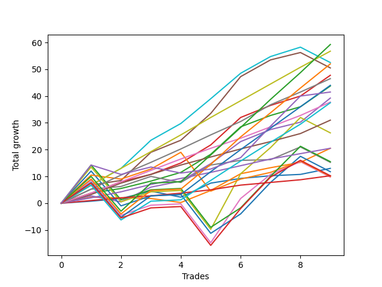

# Short Pointer 103 DB 
- Symbol: ES
- Date Range: 03/18/2022 - 12/30/2022
- Trading Period: 8:30-12:30
- Number of Trades: 9



| Name | Win Percent | Profit | Avg Profit / Trade | Avg Time / Trade |      | Name | Win Percent | Profit | Avg Profit / Trade | Avg Time / Trade |
| ---- | ----------- | ------ | ------------------ | ---------------- | ---- | ---- | ----------- | ------ | ------------------ | ---------------- |
| Sorted By <br> Profit | | | | | | Sorted By <br> Win Percentage ||||
| TP-10 | 88.89 | 29625.00 | 3291.67 | 34:09 |     | TP-6 | 100.00 | 28375.00 | 3152.78 | 17:21 |
| TP-6 | 100.00 | 28375.00 | 3152.78 | 17:21 |     | BB-20 U/L 2SD C | 100.00 | 23875.00 | 2652.78 | 14:08 |
| BB-100 Mid | 88.89 | 26250.00 | 2916.67 | 22:18 |     | TP-5 | 100.00 | 23250.00 | 2583.33 | 13:03 |
| TP-9 | 88.89 | 26000.00 | 2888.89 | 31:01 |     | BB-20 U/L 2SD | 100.00 | 21875.00 | 2430.56 | 14:02 |
| BB-50 U/L 1SD | 88.89 | 25250.00 | 2805.56 | 24:37 |     | TP-4 | 100.00 | 18875.00 | 2097.22 | 11:51 |
| BB-20 U/L 2SD C | 100.00 | 23875.00 | 2652.78 | 14:08 |     | TP-3 | 100.00 | 15500.00 | 1722.22 | 10:15 |
| TP-5 | 100.00 | 23250.00 | 2583.33 | 13:03 |     | TP-2 | 100.00 | 10250.00 | 1138.89 | 05:42 |
| TP-8 | 88.89 | 22000.00 | 2444.44 | 29:18 |     | TP-1 | 100.00 | 5125.00 | 569.44 | 03:15 |
| BB-20 U/L 2SD | 100.00 | 21875.00 | 2430.56 | 14:02 |     | TP-10 | 88.89 | 29625.00 | 3291.67 | 34:09 |
| NEWFI 0000 | 77.78 | 20750.00 | 2305.56 | 31:41 |     | BB-100 Mid | 88.89 | 26250.00 | 2916.67 | 22:18 |
| BB-50 Mid | 88.89 | 19625.00 | 2180.56 | 12:56 |     | TP-9 | 88.89 | 26000.00 | 2888.89 | 31:01 |
| TP-4 | 100.00 | 18875.00 | 2097.22 | 11:51 |     | BB-50 U/L 1SD | 88.89 | 25250.00 | 2805.56 | 24:37 |
| TP-7 | 88.89 | 18750.00 | 2083.33 | 26:48 |     | TP-8 | 88.89 | 22000.00 | 2444.44 | 29:18 |
| TP-3 | 100.00 | 15500.00 | 1722.22 | 10:15 |     | BB-50 Mid | 88.89 | 19625.00 | 2180.56 | 12:56 |
| V U/L 1SD | 66.67 | 13125.00 | 1458.33 | 46:41 |     | TP-7 | 88.89 | 18750.00 | 2083.33 | 26:48 |
| TP-2 | 100.00 | 10250.00 | 1138.89 | 05:42 |     | BB-20 Mid | 88.89 | 6500.00 | 722.22 | 04:32 |
| BB-20 U/L 1SD | 66.67 | 10250.00 | 1138.89 | 09:10 |     | NEWFI 0000 | 77.78 | 20750.00 | 2305.56 | 31:41 |
| BB-200 U/L 2SD | 66.67 | 7750.00 | 861.11 | 57:28 |     | V Mid | 77.78 | 7625.00 | 847.22 | 17:05 |
| V Mid | 77.78 | 7625.00 | 847.22 | 17:05 |     | V U/L 1SD | 66.67 | 13125.00 | 1458.33 | 46:41 |
| BB-20 Mid | 88.89 | 6500.00 | 722.22 | 04:32 |     | BB-20 U/L 1SD | 66.67 | 10250.00 | 1138.89 | 09:10 |
| BB-100 U/L 2SD | 66.67 | 5875.00 | 652.78 | 53:13 |     | BB-200 U/L 2SD | 66.67 | 7750.00 | 861.11 | 57:28 |
| TP-1 | 100.00 | 5125.00 | 569.44 | 03:15 |     | BB-100 U/L 2SD | 66.67 | 5875.00 | 652.78 | 53:13 |
| NEWFI 000 | 66.67 | 5125.00 | 569.44 | 48:12 |     | NEWFI 000 | 66.67 | 5125.00 | 569.44 | 48:12 |
| BB-200 Mid | 66.67 | 5000.00 | 555.56 | 24:52 |     | BB-200 Mid | 66.67 | 5000.00 | 555.56 | 24:52 |
| BB-50 U/L 2SD | 66.67 | 4875.00 | 541.67 | 41:45 |     | BB-50 U/L 2SD | 66.67 | 4875.00 | 541.67 | 41:45 |

## NO STOPLOSS

### Test BB-20 Mid
* Sell when price hits the middle line of the 20p bollinger
* No Stoploss
* Results:
```
Total Trades: 9
Percent Up: 11.11
Percent Down: 88.89
Total Points Moved Down: 13.00
Potential Profit: 6500.00
Total Points Ups: 2.25 Count Ups: 1
Total Points Downs: 15.25 Count Downs: 8
```

<details><summary>Trades</summary>

<code>In: 2022-03-29 08:53:00		Out: 2022-03-29 08:56:20		Total Position Time: 03:20		Total Move Down: 0.75		Total to Date: 0.75</code> <br />
<code>In: 2022-04-25 09:29:00		Out: 2022-04-25 09:31:05		Total Position Time: 02:05		Total Move Down: 1.00		Total to Date: 1.75</code> <br />
<code>In: 2022-06-01 11:30:00		Out: 2022-06-01 11:40:05		Total Position Time: 10:05		Total Move Down: 2.75		Total to Date: 4.50</code> <br />
<code>In: 2022-06-10 10:42:00		Out: 2022-06-10 10:55:05		Total Position Time: 13:05		Total Move Down: -2.25		Total to Date: 2.25</code> <br />
<code>In: 2022-06-10 11:26:00		Out: 2022-06-10 11:28:25		Total Position Time: 02:25		Total Move Down: 5.25		Total to Date: 7.50</code> <br />
<code>In: 2022-06-17 08:35:00		Out: 2022-06-17 08:36:10		Total Position Time: 01:10		Total Move Down: 1.75		Total to Date: 9.25</code> <br />
<code>In: 2022-08-31 09:02:00		Out: 2022-08-31 09:04:15		Total Position Time: 02:15		Total Move Down: 1.00		Total to Date: 10.25</code> <br />
<code>In: 2022-09-12 10:33:00		Out: 2022-09-12 10:36:35		Total Position Time: 03:35		Total Move Down: 0.50		Total to Date: 10.75</code> <br />
<code>In: 2022-09-22 12:17:00		Out: 2022-09-22 12:19:50		Total Position Time: 02:50		Total Move Down: 2.25		Total to Date: 13.00</code> <br />


</details>

### Test BB-20 U/L 1SD
* Sell when the price hits the lower line of the 20p 1std bollinger
* No Stoploss
* Results:
```
Total Trades: 9
Percent Up: 33.33
Percent Down: 66.67
Total Points Moved Down: 20.50
Potential Profit: 10250.00
Total Points Ups: 2.00 Count Ups: 3
Total Points Downs: 22.50 Count Downs: 6
```

<details><summary>Trades</summary>

<code>In: 2022-03-29 08:53:00		Out: 2022-03-29 08:58:40		Total Position Time: 05:40		Total Move Down: 2.25		Total to Date: 2.25</code> <br />
<code>In: 2022-04-25 09:29:00		Out: 2022-04-25 09:42:45		Total Position Time: 13:45		Total Move Down: -0.25		Total to Date: 2.00</code> <br />
<code>In: 2022-06-01 11:30:00		Out: 2022-06-01 11:46:40		Total Position Time: 16:40		Total Move Down: -0.25		Total to Date: 1.75</code> <br />
<code>In: 2022-06-10 10:42:00		Out: 2022-06-10 10:56:05		Total Position Time: 14:05		Total Move Down: -1.50		Total to Date: 0.25</code> <br />
<code>In: 2022-06-10 11:26:00		Out: 2022-06-10 11:38:10		Total Position Time: 12:10		Total Move Down: 4.50		Total to Date: 4.75</code> <br />
<code>In: 2022-06-17 08:35:00		Out: 2022-06-17 08:39:05		Total Position Time: 04:05		Total Move Down: 6.25		Total to Date: 11.00</code> <br />
<code>In: 2022-08-31 09:02:00		Out: 2022-08-31 09:06:20		Total Position Time: 04:20		Total Move Down: 2.25		Total to Date: 13.25</code> <br />
<code>In: 2022-09-12 10:33:00		Out: 2022-09-12 10:41:30		Total Position Time: 08:30		Total Move Down: 2.00		Total to Date: 15.25</code> <br />
<code>In: 2022-09-22 12:17:00		Out: 2022-09-22 12:20:20		Total Position Time: 03:20		Total Move Down: 5.25		Total to Date: 20.50</code> <br />


</details>

### Test BB-20 U/L 2SD
* Sell when the price hits the lower line of the 20p 2std bollinger
* No Stoploss
* Results:
```
Total Trades: 9
Percent Up: 0.00
Percent Down: 100.00
Total Points Moved Down: 43.75
Potential Profit: 21875.00
Total Points Ups: 0.00 Count Ups: 0
Total Points Downs: 43.75 Count Downs: 9
```

<details><summary>Trades</summary>

<code>In: 2022-03-29 08:53:00		Out: 2022-03-29 09:01:40		Total Position Time: 08:40		Total Move Down: 3.75		Total to Date: 3.75</code> <br />
<code>In: 2022-04-25 09:29:00		Out: 2022-04-25 10:01:15		Total Position Time: 32:15		Total Move Down: 1.75		Total to Date: 5.50</code> <br />
<code>In: 2022-06-01 11:30:00		Out: 2022-06-01 11:51:10		Total Position Time: 21:10		Total Move Down: 2.75		Total to Date: 8.25</code> <br />
<code>In: 2022-06-10 10:42:00		Out: 2022-06-10 11:01:00		Total Position Time: 19:00		Total Move Down: 3.25		Total to Date: 11.50</code> <br />
<code>In: 2022-06-10 11:26:00		Out: 2022-06-10 11:40:10		Total Position Time: 14:10		Total Move Down: 6.75		Total to Date: 18.25</code> <br />
<code>In: 2022-06-17 08:35:00		Out: 2022-06-17 08:45:15		Total Position Time: 10:15		Total Move Down: 10.25		Total to Date: 28.50</code> <br />
<code>In: 2022-08-31 09:02:00		Out: 2022-08-31 09:07:00		Total Position Time: 05:00		Total Move Down: 4.25		Total to Date: 32.75</code> <br />
<code>In: 2022-09-12 10:33:00		Out: 2022-09-12 10:43:35		Total Position Time: 10:35		Total Move Down: 3.25		Total to Date: 36.00</code> <br />
<code>In: 2022-09-22 12:17:00		Out: 2022-09-22 12:22:20		Total Position Time: 05:20		Total Move Down: 7.75		Total to Date: 43.75</code> <br />


</details>

### Test BB-20 U/L 2SD C
* Sell when the price hits the lower line of the 20p 2std bollinger
* No Stoploss
* Results:
```
Total Trades: 9
Percent Up: 0.00
Percent Down: 100.00
Total Points Moved Down: 47.75
Potential Profit: 23875.00
Total Points Ups: 0.00 Count Ups: 0
Total Points Downs: 47.75 Count Downs: 9
```

<details><summary>Trades</summary>

<code>In: 2022-03-29 08:53:00		Out: 2022-03-29 09:01:40		Total Position Time: 08:40		Total Move Down: 3.75		Total to Date: 3.75</code> <br />
<code>In: 2022-04-25 09:29:00		Out: 2022-04-25 10:01:20		Total Position Time: 32:20		Total Move Down: 4.25		Total to Date: 8.00</code> <br />
<code>In: 2022-06-01 11:30:00		Out: 2022-06-01 11:51:10		Total Position Time: 21:10		Total Move Down: 2.75		Total to Date: 10.75</code> <br />
<code>In: 2022-06-10 10:42:00		Out: 2022-06-10 11:01:10		Total Position Time: 19:10		Total Move Down: 4.25		Total to Date: 15.00</code> <br />
<code>In: 2022-06-10 11:26:00		Out: 2022-06-10 11:40:10		Total Position Time: 14:10		Total Move Down: 6.75		Total to Date: 21.75</code> <br />
<code>In: 2022-06-17 08:35:00		Out: 2022-06-17 08:45:15		Total Position Time: 10:15		Total Move Down: 10.25		Total to Date: 32.00</code> <br />
<code>In: 2022-08-31 09:02:00		Out: 2022-08-31 09:07:05		Total Position Time: 05:05		Total Move Down: 4.50		Total to Date: 36.50</code> <br />
<code>In: 2022-09-12 10:33:00		Out: 2022-09-12 10:44:05		Total Position Time: 11:05		Total Move Down: 3.50		Total to Date: 40.00</code> <br />
<code>In: 2022-09-22 12:17:00		Out: 2022-09-22 12:22:20		Total Position Time: 05:20		Total Move Down: 7.75		Total to Date: 47.75</code> <br />


</details>

### Test BB-50 Mid
* Sell when price hits the middle line of the 50p bollinger
* No Stoploss
* Results:
```
Total Trades: 9
Percent Up: 11.11
Percent Down: 88.89
Total Points Moved Down: 39.25
Potential Profit: 19625.00
Total Points Ups: 2.25 Count Ups: 1
Total Points Downs: 41.50 Count Downs: 8
```

<details><summary>Trades</summary>

<code>In: 2022-03-29 08:53:00		Out: 2022-03-29 09:01:25		Total Position Time: 08:25		Total Move Down: 2.75		Total to Date: 2.75</code> <br />
<code>In: 2022-04-25 09:29:00		Out: 2022-04-25 09:55:05		Total Position Time: 26:05		Total Move Down: -2.25		Total to Date: 0.50</code> <br />
<code>In: 2022-06-01 11:30:00		Out: 2022-06-01 11:54:50		Total Position Time: 24:50		Total Move Down: 5.50		Total to Date: 6.00</code> <br />
<code>In: 2022-06-10 10:42:00		Out: 2022-06-10 10:58:20		Total Position Time: 16:20		Total Move Down: 2.25		Total to Date: 8.25</code> <br />
<code>In: 2022-06-10 11:26:00		Out: 2022-06-10 11:28:30		Total Position Time: 02:30		Total Move Down: 6.50		Total to Date: 14.75</code> <br />
<code>In: 2022-06-17 08:35:00		Out: 2022-06-17 08:45:05		Total Position Time: 10:05		Total Move Down: 8.25		Total to Date: 23.00</code> <br />
<code>In: 2022-08-31 09:02:00		Out: 2022-08-31 09:10:55		Total Position Time: 08:55		Total Move Down: 4.50		Total to Date: 27.50</code> <br />
<code>In: 2022-09-12 10:33:00		Out: 2022-09-12 10:42:15		Total Position Time: 09:15		Total Move Down: 2.75		Total to Date: 30.25</code> <br />
<code>In: 2022-09-22 12:17:00		Out: 2022-09-22 12:27:05		Total Position Time: 10:05		Total Move Down: 9.00		Total to Date: 39.25</code> <br />


</details>

### Test BB-50 U/L 1SD
* Sell when the price hits the lower line of the 50p 1std bollinger
* No Stoploss
* Results:
```
Total Trades: 9
Percent Up: 11.11
Percent Down: 88.89
Total Points Moved Down: 50.50
Potential Profit: 25250.00
Total Points Ups: 5.75 Count Ups: 1
Total Points Downs: 56.25 Count Downs: 8
```

<details><summary>Trades</summary>

<code>In: 2022-03-29 08:53:00		Out: 2022-03-29 09:02:15		Total Position Time: 09:15		Total Move Down: 6.75		Total to Date: 6.75</code> <br />
<code>In: 2022-04-25 09:29:00		Out: 2022-04-25 10:01:15		Total Position Time: 32:15		Total Move Down: 1.75		Total to Date: 8.50</code> <br />
<code>In: 2022-06-01 11:30:00		Out: 2022-06-01 12:03:40		Total Position Time: 33:40		Total Move Down: 10.50		Total to Date: 19.00</code> <br />
<code>In: 2022-06-10 10:42:00		Out: 2022-06-10 11:15:25		Total Position Time: 33:25		Total Move Down: 4.50		Total to Date: 23.50</code> <br />
<code>In: 2022-06-10 11:26:00		Out: 2022-06-10 11:41:45		Total Position Time: 15:45		Total Move Down: 10.00		Total to Date: 33.50</code> <br />
<code>In: 2022-06-17 08:35:00		Out: 2022-06-17 08:51:25		Total Position Time: 16:25		Total Move Down: 13.75		Total to Date: 47.25</code> <br />
<code>In: 2022-08-31 09:02:00		Out: 2022-08-31 09:22:45		Total Position Time: 20:45		Total Move Down: 6.25		Total to Date: 53.50</code> <br />
<code>In: 2022-09-12 10:33:00		Out: 2022-09-12 11:03:10		Total Position Time: 30:10		Total Move Down: 2.75		Total to Date: 56.25</code> <br />
<code>In: 2022-09-22 12:17:00		Out: 2022-09-22 12:47:00		Total Position Time: 30:00		Total Move Down: -5.75		Total to Date: 50.50</code> <br />


</details>

### Test BB-50 U/L 2SD
* Sell when the price hits the lower line of the 50p 2std bollinger
* No Stoploss
* Results:
```
Total Trades: 9
Percent Up: 33.33
Percent Down: 66.67
Total Points Moved Down: 9.75
Potential Profit: 4875.00
Total Points Ups: 33.25 Count Ups: 3
Total Points Downs: 43.00 Count Downs: 6
```

<details><summary>Trades</summary>

<code>In: 2022-03-29 08:53:00		Out: 2022-03-29 09:10:45		Total Position Time: 17:45		Total Move Down: 8.50		Total to Date: 8.50</code> <br />
<code>In: 2022-04-25 09:29:00		Out: 2022-04-25 10:29:55		Total Position Time: 60:55		Total Move Down: -13.00		Total to Date: -4.50</code> <br />
<code>In: 2022-06-01 11:30:00		Out: 2022-06-01 12:30:55		Total Position Time: 60:55		Total Move Down: 3.75		Total to Date: -0.75</code> <br />
<code>In: 2022-06-10 10:42:00		Out: 2022-06-10 11:42:55		Total Position Time: 60:55		Total Move Down: 0.50		Total to Date: -0.25</code> <br />
<code>In: 2022-06-10 11:26:00		Out: 2022-06-10 12:26:55		Total Position Time: 60:55		Total Move Down: -14.50		Total to Date: -14.75</code> <br />
<code>In: 2022-06-17 08:35:00		Out: 2022-06-17 08:52:10		Total Position Time: 17:10		Total Move Down: 16.50		Total to Date: 1.75</code> <br />
<code>In: 2022-08-31 09:02:00		Out: 2022-08-31 09:24:25		Total Position Time: 22:25		Total Move Down: 9.00		Total to Date: 10.75</code> <br />
<code>In: 2022-09-12 10:33:00		Out: 2022-09-12 11:17:45		Total Position Time: 44:45		Total Move Down: 4.75		Total to Date: 15.50</code> <br />
<code>In: 2022-09-22 12:17:00		Out: 2022-09-22 12:47:00		Total Position Time: 30:00		Total Move Down: -5.75		Total to Date: 9.75</code> <br />


</details>

### Test V Mid
* Sell when the price hits the middle line of the 1std VWAP
* No Stoploss
* Results:
```
Total Trades: 9
Percent Up: 22.22
Percent Down: 77.78
Total Points Moved Down: 15.25
Potential Profit: 7625.00
Total Points Ups: 8.00 Count Ups: 2
Total Points Downs: 23.25 Count Downs: 7
```

<details><summary>Trades</summary>

<code>In: 2022-03-29 08:53:00		Out: 2022-03-29 09:02:10		Total Position Time: 09:10		Total Move Down: 5.25		Total to Date: 5.25</code> <br />
<code>In: 2022-04-25 09:29:00		Out: 2022-04-25 09:31:05		Total Position Time: 02:05		Total Move Down: 1.00		Total to Date: 6.25</code> <br />
<code>In: 2022-06-01 11:30:00		Out: 2022-06-01 12:30:55		Total Position Time: 60:55		Total Move Down: 3.75		Total to Date: 10.00</code> <br />
<code>In: 2022-06-10 10:42:00		Out: 2022-06-10 10:43:10		Total Position Time: 01:10		Total Move Down: -2.25		Total to Date: 7.75</code> <br />
<code>In: 2022-06-10 11:26:00		Out: 2022-06-10 11:28:30		Total Position Time: 02:30		Total Move Down: 6.50		Total to Date: 14.25</code> <br />
<code>In: 2022-06-17 08:35:00		Out: 2022-06-17 08:36:10		Total Position Time: 01:10		Total Move Down: 1.75		Total to Date: 16.00</code> <br />
<code>In: 2022-08-31 09:02:00		Out: 2022-08-31 09:04:00		Total Position Time: 02:00		Total Move Down: 0.25		Total to Date: 16.25</code> <br />
<code>In: 2022-09-12 10:33:00		Out: 2022-09-12 11:17:45		Total Position Time: 44:45		Total Move Down: 4.75		Total to Date: 21.00</code> <br />
<code>In: 2022-09-22 12:17:00		Out: 2022-09-22 12:47:00		Total Position Time: 30:00		Total Move Down: -5.75		Total to Date: 15.25</code> <br />


</details>

### Test V U/L 1SD
* Sell when the price hits the lower line of the 1std VWAP
* No Stoploss
* Results:
```
Total Trades: 9
Percent Up: 33.33
Percent Down: 66.67
Total Points Moved Down: 26.25
Potential Profit: 13125.00
Total Points Ups: 33.25 Count Ups: 3
Total Points Downs: 59.50 Count Downs: 6
```

<details><summary>Trades</summary>

<code>In: 2022-03-29 08:53:00		Out: 2022-03-29 09:27:55		Total Position Time: 34:55		Total Move Down: 13.50		Total to Date: 13.50</code> <br />
<code>In: 2022-04-25 09:29:00		Out: 2022-04-25 10:29:55		Total Position Time: 60:55		Total Move Down: -13.00		Total to Date: 0.50</code> <br />
<code>In: 2022-06-01 11:30:00		Out: 2022-06-01 12:30:55		Total Position Time: 60:55		Total Move Down: 3.75		Total to Date: 4.25</code> <br />
<code>In: 2022-06-10 10:42:00		Out: 2022-06-10 11:42:55		Total Position Time: 60:55		Total Move Down: 0.50		Total to Date: 4.75</code> <br />
<code>In: 2022-06-10 11:26:00		Out: 2022-06-10 12:26:55		Total Position Time: 60:55		Total Move Down: -14.50		Total to Date: -9.75</code> <br />
<code>In: 2022-06-17 08:35:00		Out: 2022-06-17 09:03:15		Total Position Time: 28:15		Total Move Down: 20.75		Total to Date: 11.00</code> <br />
<code>In: 2022-08-31 09:02:00		Out: 2022-08-31 09:24:30		Total Position Time: 22:30		Total Move Down: 9.75		Total to Date: 20.75</code> <br />
<code>In: 2022-09-12 10:33:00		Out: 2022-09-12 11:33:55		Total Position Time: 60:55		Total Move Down: 11.25		Total to Date: 32.00</code> <br />
<code>In: 2022-09-22 12:17:00		Out: 2022-09-22 12:47:00		Total Position Time: 30:00		Total Move Down: -5.75		Total to Date: 26.25</code> <br />


</details>

### Test BB-100 Mid
* Move to BB100 Mid
* No Stoploss
* Results:
```
Total Trades: 9
Percent Up: 11.11
Percent Down: 88.89
Total Points Moved Down: 52.50
Potential Profit: 26250.00
Total Points Ups: 5.75 Count Ups: 1
Total Points Downs: 58.25 Count Downs: 8
```

<details><summary>Trades</summary>

<code>In: 2022-03-29 08:53:00		Out: 2022-03-29 09:02:15		Total Position Time: 09:15		Total Move Down: 6.75		Total to Date: 6.75</code> <br />
<code>In: 2022-04-25 09:29:00		Out: 2022-04-25 10:01:50		Total Position Time: 32:50		Total Move Down: 6.25		Total to Date: 13.00</code> <br />
<code>In: 2022-06-01 11:30:00		Out: 2022-06-01 12:03:55		Total Position Time: 33:55		Total Move Down: 10.50		Total to Date: 23.50</code> <br />
<code>In: 2022-06-10 10:42:00		Out: 2022-06-10 11:04:35		Total Position Time: 22:35		Total Move Down: 6.25		Total to Date: 29.75</code> <br />
<code>In: 2022-06-10 11:26:00		Out: 2022-06-10 11:41:25		Total Position Time: 15:25		Total Move Down: 9.25		Total to Date: 39.00</code> <br />
<code>In: 2022-06-17 08:35:00		Out: 2022-06-17 08:45:25		Total Position Time: 10:25		Total Move Down: 9.50		Total to Date: 48.50</code> <br />
<code>In: 2022-08-31 09:02:00		Out: 2022-08-31 09:11:05		Total Position Time: 09:05		Total Move Down: 6.25		Total to Date: 54.75</code> <br />
<code>In: 2022-09-12 10:33:00		Out: 2022-09-12 11:10:15		Total Position Time: 37:15		Total Move Down: 3.50		Total to Date: 58.25</code> <br />
<code>In: 2022-09-22 12:17:00		Out: 2022-09-22 12:47:00		Total Position Time: 30:00		Total Move Down: -5.75		Total to Date: 52.50</code> <br />


</details>

### Test BB-100 U/L 2SD
* Move to BB100 Upper Band
* No Stoploss
* Results:
```
Total Trades: 9
Percent Up: 33.33
Percent Down: 66.67
Total Points Moved Down: 11.75
Potential Profit: 5875.00
Total Points Ups: 33.25 Count Ups: 3
Total Points Downs: 45.00 Count Downs: 6
```

<details><summary>Trades</summary>

<code>In: 2022-03-29 08:53:00		Out: 2022-03-29 09:26:35		Total Position Time: 33:35		Total Move Down: 12.00		Total to Date: 12.00</code> <br />
<code>In: 2022-04-25 09:29:00		Out: 2022-04-25 10:29:55		Total Position Time: 60:55		Total Move Down: -13.00		Total to Date: -1.00</code> <br />
<code>In: 2022-06-01 11:30:00		Out: 2022-06-01 12:30:55		Total Position Time: 60:55		Total Move Down: 3.75		Total to Date: 2.75</code> <br />
<code>In: 2022-06-10 10:42:00		Out: 2022-06-10 11:42:55		Total Position Time: 60:55		Total Move Down: 0.50		Total to Date: 3.25</code> <br />
<code>In: 2022-06-10 11:26:00		Out: 2022-06-10 12:26:55		Total Position Time: 60:55		Total Move Down: -14.50		Total to Date: -11.25</code> <br />
<code>In: 2022-06-17 08:35:00		Out: 2022-06-17 09:35:55		Total Position Time: 60:55		Total Move Down: 7.25		Total to Date: -4.00</code> <br />
<code>In: 2022-08-31 09:02:00		Out: 2022-08-31 10:02:55		Total Position Time: 60:55		Total Move Down: 11.75		Total to Date: 7.75</code> <br />
<code>In: 2022-09-12 10:33:00		Out: 2022-09-12 11:23:00		Total Position Time: 50:00		Total Move Down: 9.75		Total to Date: 17.50</code> <br />
<code>In: 2022-09-22 12:17:00		Out: 2022-09-22 12:47:00		Total Position Time: 30:00		Total Move Down: -5.75		Total to Date: 11.75</code> <br />


</details>

### Test BB-200 Mid
* Move to BB200 Mid
* No Stoploss
* Results:
```
Total Trades: 9
Percent Up: 33.33
Percent Down: 66.67
Total Points Moved Down: 10.00
Potential Profit: 5000.00
Total Points Ups: 21.75 Count Ups: 3
Total Points Downs: 31.75 Count Downs: 6
```

<details><summary>Trades</summary>

<code>In: 2022-03-29 08:53:00		Out: 2022-03-29 09:21:50		Total Position Time: 28:50		Total Move Down: 10.50		Total to Date: 10.50</code> <br />
<code>In: 2022-04-25 09:29:00		Out: 2022-04-25 09:30:10		Total Position Time: 01:10		Total Move Down: -1.50		Total to Date: 9.00</code> <br />
<code>In: 2022-06-01 11:30:00		Out: 2022-06-01 12:30:55		Total Position Time: 60:55		Total Move Down: 3.75		Total to Date: 12.75</code> <br />
<code>In: 2022-06-10 10:42:00		Out: 2022-06-10 11:04:35		Total Position Time: 22:35		Total Move Down: 6.25		Total to Date: 19.00</code> <br />
<code>In: 2022-06-10 11:26:00		Out: 2022-06-10 12:26:55		Total Position Time: 60:55		Total Move Down: -14.50		Total to Date: 4.50</code> <br />
<code>In: 2022-06-17 08:35:00		Out: 2022-06-17 08:38:50		Total Position Time: 03:50		Total Move Down: 4.50		Total to Date: 9.00</code> <br />
<code>In: 2022-08-31 09:02:00		Out: 2022-08-31 09:06:15		Total Position Time: 04:15		Total Move Down: 2.50		Total to Date: 11.50</code> <br />
<code>In: 2022-09-12 10:33:00		Out: 2022-09-12 10:44:25		Total Position Time: 11:25		Total Move Down: 4.25		Total to Date: 15.75</code> <br />
<code>In: 2022-09-22 12:17:00		Out: 2022-09-22 12:47:00		Total Position Time: 30:00		Total Move Down: -5.75		Total to Date: 10.00</code> <br />


</details>

### Test BB-200 U/L 2SD
* Move to BB200 Upper Band
* No Stoploss
* Results:
```
Total Trades: 9
Percent Up: 33.33
Percent Down: 66.67
Total Points Moved Down: 15.50
Potential Profit: 7750.00
Total Points Ups: 33.25 Count Ups: 3
Total Points Downs: 48.75 Count Downs: 6
```

<details><summary>Trades</summary>

<code>In: 2022-03-29 08:53:00		Out: 2022-03-29 09:53:55		Total Position Time: 60:55		Total Move Down: 14.25		Total to Date: 14.25</code> <br />
<code>In: 2022-04-25 09:29:00		Out: 2022-04-25 10:29:55		Total Position Time: 60:55		Total Move Down: -13.00		Total to Date: 1.25</code> <br />
<code>In: 2022-06-01 11:30:00		Out: 2022-06-01 12:30:55		Total Position Time: 60:55		Total Move Down: 3.75		Total to Date: 5.00</code> <br />
<code>In: 2022-06-10 10:42:00		Out: 2022-06-10 11:42:55		Total Position Time: 60:55		Total Move Down: 0.50		Total to Date: 5.50</code> <br />
<code>In: 2022-06-10 11:26:00		Out: 2022-06-10 12:26:55		Total Position Time: 60:55		Total Move Down: -14.50		Total to Date: -9.00</code> <br />
<code>In: 2022-06-17 08:35:00		Out: 2022-06-17 09:35:55		Total Position Time: 60:55		Total Move Down: 7.25		Total to Date: -1.75</code> <br />
<code>In: 2022-08-31 09:02:00		Out: 2022-08-31 10:02:55		Total Position Time: 60:55		Total Move Down: 11.75		Total to Date: 10.00</code> <br />
<code>In: 2022-09-12 10:33:00		Out: 2022-09-12 11:33:55		Total Position Time: 60:55		Total Move Down: 11.25		Total to Date: 21.25</code> <br />
<code>In: 2022-09-22 12:17:00		Out: 2022-09-22 12:47:00		Total Position Time: 30:00		Total Move Down: -5.75		Total to Date: 15.50</code> <br />


</details>

## TAKE PROFIT

### Test TP-1
* Take Profit of 1 Point
* No Stoploss
* Results:
```
Total Trades: 9
Percent Up: 0.00
Percent Down: 100.00
Total Points Moved Down: 10.25
Potential Profit: 5125.00
Total Points Ups: 0.00 Count Ups: 0
Total Points Downs: 10.25 Count Downs: 9
```

<details><summary>Trades</summary>

<code>In: 2022-03-29 08:53:00		Out: 2022-03-29 08:57:35		Total Position Time: 04:35		Total Move Down: 1.00		Total to Date: 1.00</code> <br />
<code>In: 2022-04-25 09:29:00		Out: 2022-04-25 09:31:05		Total Position Time: 02:05		Total Move Down: 1.00		Total to Date: 2.00</code> <br />
<code>In: 2022-06-01 11:30:00		Out: 2022-06-01 11:39:45		Total Position Time: 09:45		Total Move Down: 0.75		Total to Date: 2.75</code> <br />
<code>In: 2022-06-10 10:42:00		Out: 2022-06-10 10:44:25		Total Position Time: 02:25		Total Move Down: 1.00		Total to Date: 3.75</code> <br />
<code>In: 2022-06-10 11:26:00		Out: 2022-06-10 11:27:10		Total Position Time: 01:10		Total Move Down: 1.25		Total to Date: 5.00</code> <br />
<code>In: 2022-06-17 08:35:00		Out: 2022-06-17 08:36:10		Total Position Time: 01:10		Total Move Down: 1.75		Total to Date: 6.75</code> <br />
<code>In: 2022-08-31 09:02:00		Out: 2022-08-31 09:04:20		Total Position Time: 02:20		Total Move Down: 1.00		Total to Date: 7.75</code> <br />
<code>In: 2022-09-12 10:33:00		Out: 2022-09-12 10:37:20		Total Position Time: 04:20		Total Move Down: 1.00		Total to Date: 8.75</code> <br />
<code>In: 2022-09-22 12:17:00		Out: 2022-09-22 12:18:25		Total Position Time: 01:25		Total Move Down: 1.50		Total to Date: 10.25</code> <br />


</details>

### Test TP-2
* Take Profit of 2 Point
* No Stoploss
* Results:
```
Total Trades: 9
Percent Up: 0.00
Percent Down: 100.00
Total Points Moved Down: 20.50
Potential Profit: 10250.00
Total Points Ups: 0.00 Count Ups: 0
Total Points Downs: 20.50 Count Downs: 9
```

<details><summary>Trades</summary>

<code>In: 2022-03-29 08:53:00		Out: 2022-03-29 08:58:35		Total Position Time: 05:35		Total Move Down: 2.00		Total to Date: 2.00</code> <br />
<code>In: 2022-04-25 09:29:00		Out: 2022-04-25 09:31:10		Total Position Time: 02:10		Total Move Down: 2.25		Total to Date: 4.25</code> <br />
<code>In: 2022-06-01 11:30:00		Out: 2022-06-01 11:40:00		Total Position Time: 10:00		Total Move Down: 2.75		Total to Date: 7.00</code> <br />
<code>In: 2022-06-10 10:42:00		Out: 2022-06-10 10:58:20		Total Position Time: 16:20		Total Move Down: 2.25		Total to Date: 9.25</code> <br />
<code>In: 2022-06-10 11:26:00		Out: 2022-06-10 11:27:35		Total Position Time: 01:35		Total Move Down: 2.25		Total to Date: 11.50</code> <br />
<code>In: 2022-06-17 08:35:00		Out: 2022-06-17 08:36:15		Total Position Time: 01:15		Total Move Down: 2.50		Total to Date: 14.00</code> <br />
<code>In: 2022-08-31 09:02:00		Out: 2022-08-31 09:06:15		Total Position Time: 04:15		Total Move Down: 2.50		Total to Date: 16.50</code> <br />
<code>In: 2022-09-12 10:33:00		Out: 2022-09-12 10:41:30		Total Position Time: 08:30		Total Move Down: 2.00		Total to Date: 18.50</code> <br />
<code>In: 2022-09-22 12:17:00		Out: 2022-09-22 12:18:40		Total Position Time: 01:40		Total Move Down: 2.00		Total to Date: 20.50</code> <br />


</details>

### Test TP-3
* Take Profit of 3 Point
* No Stoploss
* Results:
```
Total Trades: 9
Percent Up: 0.00
Percent Down: 100.00
Total Points Moved Down: 31.00
Potential Profit: 15500.00
Total Points Ups: 0.00 Count Ups: 0
Total Points Downs: 31.00 Count Downs: 9
```

<details><summary>Trades</summary>

<code>In: 2022-03-29 08:53:00		Out: 2022-03-29 09:01:35		Total Position Time: 08:35		Total Move Down: 3.25		Total to Date: 3.25</code> <br />
<code>In: 2022-04-25 09:29:00		Out: 2022-04-25 10:01:20		Total Position Time: 32:20		Total Move Down: 4.25		Total to Date: 7.50</code> <br />
<code>In: 2022-06-01 11:30:00		Out: 2022-06-01 11:40:15		Total Position Time: 10:15		Total Move Down: 3.25		Total to Date: 10.75</code> <br />
<code>In: 2022-06-10 10:42:00		Out: 2022-06-10 11:00:55		Total Position Time: 18:55		Total Move Down: 3.50		Total to Date: 14.25</code> <br />
<code>In: 2022-06-10 11:26:00		Out: 2022-06-10 11:28:05		Total Position Time: 02:05		Total Move Down: 3.00		Total to Date: 17.25</code> <br />
<code>In: 2022-06-17 08:35:00		Out: 2022-06-17 08:36:55		Total Position Time: 01:55		Total Move Down: 3.00		Total to Date: 20.25</code> <br />
<code>In: 2022-08-31 09:02:00		Out: 2022-08-31 09:06:35		Total Position Time: 04:35		Total Move Down: 2.75		Total to Date: 23.00</code> <br />
<code>In: 2022-09-12 10:33:00		Out: 2022-09-12 10:43:20		Total Position Time: 10:20		Total Move Down: 3.00		Total to Date: 26.00</code> <br />
<code>In: 2022-09-22 12:17:00		Out: 2022-09-22 12:20:15		Total Position Time: 03:15		Total Move Down: 5.00		Total to Date: 31.00</code> <br />


</details>

### Test TP-4
* Take Profit of 4 Point
* No Stoploss
* Results:
```
Total Trades: 9
Percent Up: 0.00
Percent Down: 100.00
Total Points Moved Down: 37.75
Potential Profit: 18875.00
Total Points Ups: 0.00 Count Ups: 0
Total Points Downs: 37.75 Count Downs: 9
```

<details><summary>Trades</summary>

<code>In: 2022-03-29 08:53:00		Out: 2022-03-29 09:01:40		Total Position Time: 08:40		Total Move Down: 3.75		Total to Date: 3.75</code> <br />
<code>In: 2022-04-25 09:29:00		Out: 2022-04-25 10:01:20		Total Position Time: 32:20		Total Move Down: 4.25		Total to Date: 8.00</code> <br />
<code>In: 2022-06-01 11:30:00		Out: 2022-06-01 11:51:15		Total Position Time: 21:15		Total Move Down: 4.25		Total to Date: 12.25</code> <br />
<code>In: 2022-06-10 10:42:00		Out: 2022-06-10 11:01:10		Total Position Time: 19:10		Total Move Down: 4.25		Total to Date: 16.50</code> <br />
<code>In: 2022-06-10 11:26:00		Out: 2022-06-10 11:28:10		Total Position Time: 02:10		Total Move Down: 4.00		Total to Date: 20.50</code> <br />
<code>In: 2022-06-17 08:35:00		Out: 2022-06-17 08:38:35		Total Position Time: 03:35		Total Move Down: 3.75		Total to Date: 24.25</code> <br />
<code>In: 2022-08-31 09:02:00		Out: 2022-08-31 09:07:00		Total Position Time: 05:00		Total Move Down: 4.25		Total to Date: 28.50</code> <br />
<code>In: 2022-09-12 10:33:00		Out: 2022-09-12 10:44:20		Total Position Time: 11:20		Total Move Down: 4.25		Total to Date: 32.75</code> <br />
<code>In: 2022-09-22 12:17:00		Out: 2022-09-22 12:20:15		Total Position Time: 03:15		Total Move Down: 5.00		Total to Date: 37.75</code> <br />


</details>

### Test TP-5
* Take Profit of 5 Point
* No Stoploss
* Results:
```
Total Trades: 9
Percent Up: 0.00
Percent Down: 100.00
Total Points Moved Down: 46.50
Potential Profit: 23250.00
Total Points Ups: 0.00 Count Ups: 0
Total Points Downs: 46.50 Count Downs: 9
```

<details><summary>Trades</summary>

<code>In: 2022-03-29 08:53:00		Out: 2022-03-29 09:02:10		Total Position Time: 09:10		Total Move Down: 5.25		Total to Date: 5.25</code> <br />
<code>In: 2022-04-25 09:29:00		Out: 2022-04-25 10:01:40		Total Position Time: 32:40		Total Move Down: 5.25		Total to Date: 10.50</code> <br />
<code>In: 2022-06-01 11:30:00		Out: 2022-06-01 11:54:40		Total Position Time: 24:40		Total Move Down: 4.75		Total to Date: 15.25</code> <br />
<code>In: 2022-06-10 10:42:00		Out: 2022-06-10 11:01:15		Total Position Time: 19:15		Total Move Down: 5.00		Total to Date: 20.25</code> <br />
<code>In: 2022-06-10 11:26:00		Out: 2022-06-10 11:28:25		Total Position Time: 02:25		Total Move Down: 5.25		Total to Date: 25.50</code> <br />
<code>In: 2022-06-17 08:35:00		Out: 2022-06-17 08:39:00		Total Position Time: 04:00		Total Move Down: 5.00		Total to Date: 30.50</code> <br />
<code>In: 2022-08-31 09:02:00		Out: 2022-08-31 09:11:05		Total Position Time: 09:05		Total Move Down: 6.25		Total to Date: 36.75</code> <br />
<code>In: 2022-09-12 10:33:00		Out: 2022-09-12 10:46:05		Total Position Time: 13:05		Total Move Down: 4.75		Total to Date: 41.50</code> <br />
<code>In: 2022-09-22 12:17:00		Out: 2022-09-22 12:20:15		Total Position Time: 03:15		Total Move Down: 5.00		Total to Date: 46.50</code> <br />


</details>

### Test TP-6
* Take Profit of 6 Point
* No Stoploss
* Results:
```
Total Trades: 9
Percent Up: 0.00
Percent Down: 100.00
Total Points Moved Down: 56.75
Potential Profit: 28375.00
Total Points Ups: 0.00 Count Ups: 0
Total Points Downs: 56.75 Count Downs: 9
```

<details><summary>Trades</summary>

<code>In: 2022-03-29 08:53:00		Out: 2022-03-29 09:02:15		Total Position Time: 09:15		Total Move Down: 6.75		Total to Date: 6.75</code> <br />
<code>In: 2022-04-25 09:29:00		Out: 2022-04-25 10:01:50		Total Position Time: 32:50		Total Move Down: 6.25		Total to Date: 13.00</code> <br />
<code>In: 2022-06-01 11:30:00		Out: 2022-06-01 11:57:10		Total Position Time: 27:10		Total Move Down: 6.25		Total to Date: 19.25</code> <br />
<code>In: 2022-06-10 10:42:00		Out: 2022-06-10 11:04:35		Total Position Time: 22:35		Total Move Down: 6.25		Total to Date: 25.50</code> <br />
<code>In: 2022-06-10 11:26:00		Out: 2022-06-10 11:28:30		Total Position Time: 02:30		Total Move Down: 6.50		Total to Date: 32.00</code> <br />
<code>In: 2022-06-17 08:35:00		Out: 2022-06-17 08:39:05		Total Position Time: 04:05		Total Move Down: 6.25		Total to Date: 38.25</code> <br />
<code>In: 2022-08-31 09:02:00		Out: 2022-08-31 09:11:05		Total Position Time: 09:05		Total Move Down: 6.25		Total to Date: 44.50</code> <br />
<code>In: 2022-09-12 10:33:00		Out: 2022-09-12 11:18:10		Total Position Time: 45:10		Total Move Down: 6.25		Total to Date: 50.75</code> <br />
<code>In: 2022-09-22 12:17:00		Out: 2022-09-22 12:20:30		Total Position Time: 03:30		Total Move Down: 6.00		Total to Date: 56.75</code> <br />


</details>

### Test TP-7
* Take Profit of 7 Point
* No Stoploss
* Results:
```
Total Trades: 9
Percent Up: 11.11
Percent Down: 88.89
Total Points Moved Down: 37.50
Potential Profit: 18750.00
Total Points Ups: 13.00 Count Ups: 1
Total Points Downs: 50.50 Count Downs: 8
```

<details><summary>Trades</summary>

<code>In: 2022-03-29 08:53:00		Out: 2022-03-29 09:02:15		Total Position Time: 09:15		Total Move Down: 6.75		Total to Date: 6.75</code> <br />
<code>In: 2022-04-25 09:29:00		Out: 2022-04-25 10:29:55		Total Position Time: 60:55		Total Move Down: -13.00		Total to Date: -6.25</code> <br />
<code>In: 2022-06-01 11:30:00		Out: 2022-06-01 11:57:30		Total Position Time: 27:30		Total Move Down: 7.00		Total to Date: 0.75</code> <br />
<code>In: 2022-06-10 10:42:00		Out: 2022-06-10 11:42:55		Total Position Time: 60:55		Total Move Down: 0.50		Total to Date: 1.25</code> <br />
<code>In: 2022-06-10 11:26:00		Out: 2022-06-10 11:28:35		Total Position Time: 02:35		Total Move Down: 7.25		Total to Date: 8.50</code> <br />
<code>In: 2022-06-17 08:35:00		Out: 2022-06-17 08:45:00		Total Position Time: 10:00		Total Move Down: 7.25		Total to Date: 15.75</code> <br />
<code>In: 2022-08-31 09:02:00		Out: 2022-08-31 09:23:00		Total Position Time: 21:00		Total Move Down: 7.00		Total to Date: 22.75</code> <br />
<code>In: 2022-09-12 10:33:00		Out: 2022-09-12 11:18:30		Total Position Time: 45:30		Total Move Down: 6.75		Total to Date: 29.50</code> <br />
<code>In: 2022-09-22 12:17:00		Out: 2022-09-22 12:20:40		Total Position Time: 03:40		Total Move Down: 8.00		Total to Date: 37.50</code> <br />


</details>

### Test TP-8
* Take Profit of 8 Point
* No Stoploss
* Results:
```
Total Trades: 9
Percent Up: 11.11
Percent Down: 88.89
Total Points Moved Down: 44.00
Potential Profit: 22000.00
Total Points Ups: 13.00 Count Ups: 1
Total Points Downs: 57.00 Count Downs: 8
```

<details><summary>Trades</summary>

<code>In: 2022-03-29 08:53:00		Out: 2022-03-29 09:10:20		Total Position Time: 17:20		Total Move Down: 7.75		Total to Date: 7.75</code> <br />
<code>In: 2022-04-25 09:29:00		Out: 2022-04-25 10:29:55		Total Position Time: 60:55		Total Move Down: -13.00		Total to Date: -5.25</code> <br />
<code>In: 2022-06-01 11:30:00		Out: 2022-06-01 11:57:50		Total Position Time: 27:50		Total Move Down: 8.00		Total to Date: 2.75</code> <br />
<code>In: 2022-06-10 10:42:00		Out: 2022-06-10 11:42:55		Total Position Time: 60:55		Total Move Down: 0.50		Total to Date: 3.25</code> <br />
<code>In: 2022-06-10 11:26:00		Out: 2022-06-10 11:41:20		Total Position Time: 15:20		Total Move Down: 8.50		Total to Date: 11.75</code> <br />
<code>In: 2022-06-17 08:35:00		Out: 2022-06-17 08:45:05		Total Position Time: 10:05		Total Move Down: 8.25		Total to Date: 20.00</code> <br />
<code>In: 2022-08-31 09:02:00		Out: 2022-08-31 09:23:40		Total Position Time: 21:40		Total Move Down: 8.00		Total to Date: 28.00</code> <br />
<code>In: 2022-09-12 10:33:00		Out: 2022-09-12 11:19:05		Total Position Time: 46:05		Total Move Down: 8.00		Total to Date: 36.00</code> <br />
<code>In: 2022-09-22 12:17:00		Out: 2022-09-22 12:20:40		Total Position Time: 03:40		Total Move Down: 8.00		Total to Date: 44.00</code> <br />


</details>

### Test TP-9
* Take Profit of 9 Point
* No Stoploss
* Results:
```
Total Trades: 9
Percent Up: 11.11
Percent Down: 88.89
Total Points Moved Down: 52.00
Potential Profit: 26000.00
Total Points Ups: 13.00 Count Ups: 1
Total Points Downs: 65.00 Count Downs: 8
```

<details><summary>Trades</summary>

<code>In: 2022-03-29 08:53:00		Out: 2022-03-29 09:10:50		Total Position Time: 17:50		Total Move Down: 9.00		Total to Date: 9.00</code> <br />
<code>In: 2022-04-25 09:29:00		Out: 2022-04-25 10:29:55		Total Position Time: 60:55		Total Move Down: -13.00		Total to Date: -4.00</code> <br />
<code>In: 2022-06-01 11:30:00		Out: 2022-06-01 12:03:20		Total Position Time: 33:20		Total Move Down: 8.75		Total to Date: 4.75</code> <br />
<code>In: 2022-06-10 10:42:00		Out: 2022-06-10 11:42:55		Total Position Time: 60:55		Total Move Down: 0.50		Total to Date: 5.25</code> <br />
<code>In: 2022-06-10 11:26:00		Out: 2022-06-10 11:41:25		Total Position Time: 15:25		Total Move Down: 9.25		Total to Date: 14.50</code> <br />
<code>In: 2022-06-17 08:35:00		Out: 2022-06-17 08:45:15		Total Position Time: 10:15		Total Move Down: 10.25		Total to Date: 24.75</code> <br />
<code>In: 2022-08-31 09:02:00		Out: 2022-08-31 09:24:25		Total Position Time: 22:25		Total Move Down: 9.00		Total to Date: 33.75</code> <br />
<code>In: 2022-09-12 10:33:00		Out: 2022-09-12 11:22:55		Total Position Time: 49:55		Total Move Down: 9.25		Total to Date: 43.00</code> <br />
<code>In: 2022-09-22 12:17:00		Out: 2022-09-22 12:25:10		Total Position Time: 08:10		Total Move Down: 9.00		Total to Date: 52.00</code> <br />


</details>

### Test TP-10
* Take Profit of 10 Point
* No Stoploss
* Results:
```
Total Trades: 9
Percent Up: 11.11
Percent Down: 88.89
Total Points Moved Down: 59.25
Potential Profit: 29625.00
Total Points Ups: 13.00 Count Ups: 1
Total Points Downs: 72.25 Count Downs: 8
```

<details><summary>Trades</summary>

<code>In: 2022-03-29 08:53:00		Out: 2022-03-29 09:21:45		Total Position Time: 28:45		Total Move Down: 10.00		Total to Date: 10.00</code> <br />
<code>In: 2022-04-25 09:29:00		Out: 2022-04-25 10:29:55		Total Position Time: 60:55		Total Move Down: -13.00		Total to Date: -3.00</code> <br />
<code>In: 2022-06-01 11:30:00		Out: 2022-06-01 12:03:40		Total Position Time: 33:40		Total Move Down: 10.50		Total to Date: 7.50</code> <br />
<code>In: 2022-06-10 10:42:00		Out: 2022-06-10 11:42:55		Total Position Time: 60:55		Total Move Down: 0.50		Total to Date: 8.00</code> <br />
<code>In: 2022-06-10 11:26:00		Out: 2022-06-10 11:41:45		Total Position Time: 15:45		Total Move Down: 10.00		Total to Date: 18.00</code> <br />
<code>In: 2022-06-17 08:35:00		Out: 2022-06-17 08:45:15		Total Position Time: 10:15		Total Move Down: 10.25		Total to Date: 28.25</code> <br />
<code>In: 2022-08-31 09:02:00		Out: 2022-08-31 09:38:50		Total Position Time: 36:50		Total Move Down: 10.50		Total to Date: 38.75</code> <br />
<code>In: 2022-09-12 10:33:00		Out: 2022-09-12 11:23:05		Total Position Time: 50:05		Total Move Down: 10.00		Total to Date: 48.75</code> <br />
<code>In: 2022-09-22 12:17:00		Out: 2022-09-22 12:27:15		Total Position Time: 10:15		Total Move Down: 10.50		Total to Date: 59.25</code> <br />


</details>

## Indicator Exits

### Test NEWFI 000
* Newfi 0000
* No Stoploss
* Results:
```
Total Trades: 9
Percent Up: 33.33
Percent Down: 66.67
Total Points Moved Down: 10.25
Potential Profit: 5125.00
Total Points Ups: 33.25 Count Ups: 3
Total Points Downs: 43.50 Count Downs: 6
```

<details><summary>Trades</summary>

<code>In: 2022-03-29 08:53:00		Out: 2022-03-29 09:14:05		Total Position Time: 21:05		Total Move Down: 7.50		Total to Date: 7.50</code> <br />
<code>In: 2022-04-25 09:29:00		Out: 2022-04-25 10:29:55		Total Position Time: 60:55		Total Move Down: -13.00		Total to Date: -5.50</code> <br />
<code>In: 2022-06-01 11:30:00		Out: 2022-06-01 12:30:55		Total Position Time: 60:55		Total Move Down: 3.75		Total to Date: -1.75</code> <br />
<code>In: 2022-06-10 10:42:00		Out: 2022-06-10 11:42:55		Total Position Time: 60:55		Total Move Down: 0.50		Total to Date: -1.25</code> <br />
<code>In: 2022-06-10 11:26:00		Out: 2022-06-10 12:26:55		Total Position Time: 60:55		Total Move Down: -14.50		Total to Date: -15.75</code> <br />
<code>In: 2022-06-17 08:35:00		Out: 2022-06-17 09:00:05		Total Position Time: 25:05		Total Move Down: 13.75		Total to Date: -2.00</code> <br />
<code>In: 2022-08-31 09:02:00		Out: 2022-08-31 10:02:55		Total Position Time: 60:55		Total Move Down: 11.75		Total to Date: 9.75</code> <br />
<code>In: 2022-09-12 10:33:00		Out: 2022-09-12 11:26:05		Total Position Time: 53:05		Total Move Down: 6.25		Total to Date: 16.00</code> <br />
<code>In: 2022-09-22 12:17:00		Out: 2022-09-22 12:47:00		Total Position Time: 30:00		Total Move Down: -5.75		Total to Date: 10.25</code> <br />


</details>

### Test NEWFI 0000
* Newfi 0000
* No Stoploss
* Results:
```
Total Trades: 9
Percent Up: 22.22
Percent Down: 77.78
Total Points Moved Down: 41.50
Potential Profit: 20750.00
Total Points Ups: 5.75 Count Ups: 2
Total Points Downs: 47.25 Count Downs: 7
```

<details><summary>Trades</summary>

<code>In: 2022-03-29 08:53:00		Out: 2022-03-29 09:53:55		Total Position Time: 60:55		Total Move Down: 14.25		Total to Date: 14.25</code> <br />
<code>In: 2022-04-25 09:29:00		Out: 2022-04-25 09:41:05		Total Position Time: 12:05		Total Move Down: -3.50		Total to Date: 10.75</code> <br />
<code>In: 2022-06-01 11:30:00		Out: 2022-06-01 11:40:05		Total Position Time: 10:05		Total Move Down: 2.75		Total to Date: 13.50</code> <br />
<code>In: 2022-06-10 10:42:00		Out: 2022-06-10 10:43:05		Total Position Time: 01:05		Total Move Down: -2.25		Total to Date: 11.25</code> <br />
<code>In: 2022-06-10 11:26:00		Out: 2022-06-10 11:27:05		Total Position Time: 01:05		Total Move Down: 1.50		Total to Date: 12.75</code> <br />
<code>In: 2022-06-17 08:35:00		Out: 2022-06-17 09:30:05		Total Position Time: 55:05		Total Move Down: 4.25		Total to Date: 17.00</code> <br />
<code>In: 2022-08-31 09:02:00		Out: 2022-08-31 10:02:55		Total Position Time: 60:55		Total Move Down: 11.75		Total to Date: 28.75</code> <br />
<code>In: 2022-09-12 10:33:00		Out: 2022-09-12 11:33:55		Total Position Time: 60:55		Total Move Down: 11.25		Total to Date: 40.00</code> <br />
<code>In: 2022-09-22 12:17:00		Out: 2022-09-22 12:40:05		Total Position Time: 23:05		Total Move Down: 1.50		Total to Date: 41.50</code> <br />


</details>