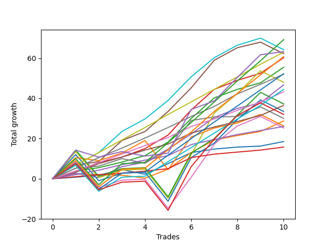

# Short Pointer 103 SD 
- Symbol: ES
- Date Range: 03/18/2022 - 12/30/2022
- Trading Period: 8:30-12:30
- Number of Trades: 10



| Name | Win Percent | Profit | Avg Profit / Trade | Avg Time / Trade |      | Name | Win Percent | Profit | Avg Profit / Trade | Avg Time / Trade |
| ---- | ----------- | ------ | ------------------ | ---------------- | ---- | ---- | ----------- | ------ | ------------------ | ---------------- |
| Sorted By <br> Profit | | | | | | Sorted By <br> Win Percentage ||||
| TP-10 | 90.00 | 34625.00 | 3462.50 | 32:00 |     | TP-6 | 100.00 | 31500.00 | 3150.00 | 15:56 |
| BB-100 Mid | 90.00 | 32125.00 | 3212.50 | 21:20 |     | BB-20 U/L 2SD C | 100.00 | 30125.00 | 3012.50 | 14:02 |
| NEWFI 0000 | 80.00 | 31625.00 | 3162.50 | 30:13 |     | BB-20 U/L 2SD | 100.00 | 27750.00 | 2775.00 | 13:55 |
| TP-6 | 100.00 | 31500.00 | 3150.00 | 15:56 |     | TP-5 | 100.00 | 26000.00 | 2600.00 | 11:52 |
| BB-50 U/L 1SD | 90.00 | 31125.00 | 3112.50 | 23:26 |     | TP-4 | 100.00 | 21625.00 | 2162.50 | 10:47 |
| TP-9 | 90.00 | 30375.00 | 3037.50 | 28:30 |     | TP-3 | 100.00 | 18250.00 | 1825.00 | 09:20 |
| BB-20 U/L 2SD C | 100.00 | 30125.00 | 3012.50 | 14:02 |     | TP-2 | 100.00 | 13000.00 | 1300.00 | 05:15 |
| BB-20 U/L 2SD | 100.00 | 27750.00 | 2775.00 | 13:55 |     | TP-1 | 100.00 | 7875.00 | 787.50 | 03:02 |
| TP-8 | 90.00 | 26125.00 | 2612.50 | 26:57 |     | TP-10 | 90.00 | 34625.00 | 3462.50 | 32:00 |
| TP-5 | 100.00 | 26000.00 | 2600.00 | 11:52 |     | BB-100 Mid | 90.00 | 32125.00 | 3212.50 | 21:20 |
| V U/L 1SD SL-5 | 50.00 | 25250.00 | 2525.00 | 24:28 |     | BB-50 U/L 1SD | 90.00 | 31125.00 | 3112.50 | 23:26 |
| V U/L 1SD | 70.00 | 24000.00 | 2400.00 | 43:43 |     | TP-9 | 90.00 | 30375.00 | 3037.50 | 28:30 |
| BB-50 Mid | 90.00 | 23375.00 | 2337.50 | 12:01 |     | TP-8 | 90.00 | 26125.00 | 2612.50 | 26:57 |
| TP-7 | 90.00 | 22250.00 | 2225.00 | 24:27 |     | BB-50 Mid | 90.00 | 23375.00 | 2337.50 | 12:01 |
| V U/L 1SD SL-10 | 60.00 | 21875.00 | 2187.50 | 30:17 |     | TP-7 | 90.00 | 22250.00 | 2225.00 | 24:27 |
| TP-4 | 100.00 | 21625.00 | 2162.50 | 10:47 |     | BB-20 Mid | 90.00 | 9250.00 | 925.00 | 04:12 |
| BB-200 U/L 2SD SL-5 | 50.00 | 19875.00 | 1987.50 | 34:10 |     | BB-20 Mid SL-5 | 90.00 | 7625.00 | 762.50 | 03:21 |
| NEWFI 06 | 70.00 | 18625.00 | 1862.50 | 53:26 |     | BB-20 Mid SL-10 | 90.00 | 5000.00 | 500.00 | 03:43 |
| BB-200 U/L 2SD | 70.00 | 18625.00 | 1862.50 | 53:26 |     | NEWFI 0000 | 80.00 | 31625.00 | 3162.50 | 30:13 |
| TP-3 | 100.00 | 18250.00 | 1825.00 | 09:20 |     | BB-20 U/L 2SD C SL-10 | 80.00 | 15500.00 | 1550.00 | 10:28 |
| BB-100 U/L 2SD SL-5 | 50.00 | 18000.00 | 1800.00 | 30:21 |     | V Mid SL-10 | 80.00 | 15000.00 | 1500.00 | 16:46 |
| BB-50 U/L 1SD SL-10 | 70.00 | 17625.00 | 1762.50 | 18:27 |     | V Mid | 80.00 | 15000.00 | 1500.00 | 16:46 |
| BB-100 U/L 2SD | 70.00 | 16750.00 | 1675.00 | 49:36 |     | BB-20 U/L 2SD SL-10 | 80.00 | 14875.00 | 1487.50 | 10:22 |
| BB-200 U/L 2SD SL-10 | 60.00 | 16500.00 | 1650.00 | 39:59 |     | BB-50 Mid SL-10 | 80.00 | 13000.00 | 1300.00 | 09:21 |
| BB-20 U/L 2SD C SL-5 | 70.00 | 16375.00 | 1637.50 | 08:57 |     | V U/L 1SD | 70.00 | 24000.00 | 2400.00 | 43:43 |
| NEWFI 000 | 70.00 | 16000.00 | 1600.00 | 45:05 |     | NEWFI 06 | 70.00 | 18625.00 | 1862.50 | 53:26 |
| BB-20 U/L 2SD SL-5 | 70.00 | 15750.00 | 1575.00 | 08:51 |     | BB-200 U/L 2SD | 70.00 | 18625.00 | 1862.50 | 53:26 |
| BB-20 U/L 2SD C SL-10 | 80.00 | 15500.00 | 1550.00 | 10:28 |     | BB-50 U/L 1SD SL-10 | 70.00 | 17625.00 | 1762.50 | 18:27 |
| BB-100 Mid SL-10 | 70.00 | 15500.00 | 1550.00 | 17:23 |     | BB-100 U/L 2SD | 70.00 | 16750.00 | 1675.00 | 49:36 |
| V Mid SL-10 | 80.00 | 15000.00 | 1500.00 | 16:46 |     | BB-20 U/L 2SD C SL-5 | 70.00 | 16375.00 | 1637.50 | 08:57 |
| V Mid | 80.00 | 15000.00 | 1500.00 | 16:46 |     | NEWFI 000 | 70.00 | 16000.00 | 1600.00 | 45:05 |
| BB-20 U/L 2SD SL-10 | 80.00 | 14875.00 | 1487.50 | 10:22 |     | BB-20 U/L 2SD SL-5 | 70.00 | 15750.00 | 1575.00 | 08:51 |
| BB-50 U/L 1SD SL-5 | 60.00 | 14875.00 | 1487.50 | 15:39 |     | BB-100 Mid SL-10 | 70.00 | 15500.00 | 1550.00 | 17:23 |
| BB-100 U/L 2SD SL-10 | 60.00 | 14625.00 | 1462.50 | 36:10 |     | BB-20 U/L 1SD | 70.00 | 14375.00 | 1437.50 | 08:50 |
| BB-20 U/L 1SD | 70.00 | 14375.00 | 1437.50 | 08:50 |     | BB-200 Mid | 70.00 | 13125.00 | 1312.50 | 23:58 |
| BB-50 U/L 2SD SL-5 | 50.00 | 13875.00 | 1387.50 | 19:46 |     | BB-50 U/L 2SD | 70.00 | 12625.00 | 1262.50 | 39:01 |
| BB-200 Mid | 70.00 | 13125.00 | 1312.50 | 23:58 |     | BB-50 Mid SL-5 | 70.00 | 12500.00 | 1250.00 | 07:28 |
| TP-2 | 100.00 | 13000.00 | 1300.00 | 05:15 |     | V Mid SL-5 | 70.00 | 10625.00 | 1062.50 | 12:02 |
| BB-50 Mid SL-10 | 80.00 | 13000.00 | 1300.00 | 09:21 |     | BB-20 U/L 1SD SL-5 | 70.00 | 7250.00 | 725.00 | 06:34 |
| BB-100 Mid SL-5 | 60.00 | 12750.00 | 1275.00 | 14:34 |     | BB-20 U/L 1SD SL-10 | 70.00 | 4875.00 | 487.50 | 07:38 |
| BB-50 U/L 2SD | 70.00 | 12625.00 | 1262.50 | 39:01 |     | V U/L 1SD SL-10 | 60.00 | 21875.00 | 2187.50 | 30:17 |
| BB-50 Mid SL-5 | 70.00 | 12500.00 | 1250.00 | 07:28 |     | BB-200 U/L 2SD SL-10 | 60.00 | 16500.00 | 1650.00 | 39:59 |
| V Mid SL-5 | 70.00 | 10625.00 | 1062.50 | 12:02 |     | BB-50 U/L 1SD SL-5 | 60.00 | 14875.00 | 1487.50 | 15:39 |
| BB-50 U/L 2SD SL-10 | 60.00 | 10500.00 | 1050.00 | 25:35 |     | BB-100 U/L 2SD SL-10 | 60.00 | 14625.00 | 1462.50 | 36:10 |
| BB-20 Mid | 90.00 | 9250.00 | 925.00 | 04:12 |     | BB-100 Mid SL-5 | 60.00 | 12750.00 | 1275.00 | 14:34 |
| TP-1 | 100.00 | 7875.00 | 787.50 | 03:02 |     | BB-50 U/L 2SD SL-10 | 60.00 | 10500.00 | 1050.00 | 25:35 |
| BB-20 Mid SL-5 | 90.00 | 7625.00 | 762.50 | 03:21 |     | BB-200 Mid SL-10 | 60.00 | 6625.00 | 662.50 | 19:41 |
| BB-200 Mid SL-5 | 50.00 | 7625.00 | 762.50 | 14:18 |     | V U/L 1SD SL-5 | 50.00 | 25250.00 | 2525.00 | 24:28 |
| BB-20 U/L 1SD SL-5 | 70.00 | 7250.00 | 725.00 | 06:34 |     | BB-200 U/L 2SD SL-5 | 50.00 | 19875.00 | 1987.50 | 34:10 |
| BB-200 Mid SL-10 | 60.00 | 6625.00 | 662.50 | 19:41 |     | BB-100 U/L 2SD SL-5 | 50.00 | 18000.00 | 1800.00 | 30:21 |
| BB-20 Mid SL-10 | 90.00 | 5000.00 | 500.00 | 03:43 |     | BB-50 U/L 2SD SL-5 | 50.00 | 13875.00 | 1387.50 | 19:46 |
| BB-20 U/L 1SD SL-10 | 70.00 | 4875.00 | 487.50 | 07:38 |     | BB-200 Mid SL-5 | 50.00 | 7625.00 | 762.50 | 14:18 |

## NO STOPLOSS

### Test BB-20 Mid
* Sell when price hits the middle line of the 20p bollinger
* No Stoploss
* Results:
```
Total Trades: 10
Percent Up: 10.00
Percent Down: 90.00
Total Points Moved Down: 18.50
Potential Profit: 9250.00
Total Points Ups: 2.25 Count Ups: 1
Total Points Downs: 20.75 Count Downs: 9
```

<details><summary>Trades</summary>

<code>In: 2022-03-29 08:53:00		Out: 2022-03-29 08:56:20		Total Position Time: 03:20		Total Move Down: 0.75		Total to Date: 0.75</code> <br />
<code>In: 2022-04-25 09:29:00		Out: 2022-04-25 09:31:05		Total Position Time: 02:05		Total Move Down: 1.00		Total to Date: 1.75</code> <br />
<code>In: 2022-06-01 11:30:00		Out: 2022-06-01 11:40:05		Total Position Time: 10:05		Total Move Down: 2.75		Total to Date: 4.50</code> <br />
<code>In: 2022-06-10 10:42:00		Out: 2022-06-10 10:55:05		Total Position Time: 13:05		Total Move Down: -2.25		Total to Date: 2.25</code> <br />
<code>In: 2022-06-10 11:26:00		Out: 2022-06-10 11:28:25		Total Position Time: 02:25		Total Move Down: 5.25		Total to Date: 7.50</code> <br />
<code>In: 2022-06-10 12:30:00		Out: 2022-06-10 12:31:10		Total Position Time: 01:10		Total Move Down: 5.50		Total to Date: 13.00</code> <br />
<code>In: 2022-06-17 08:35:00		Out: 2022-06-17 08:36:10		Total Position Time: 01:10		Total Move Down: 1.75		Total to Date: 14.75</code> <br />
<code>In: 2022-08-31 09:02:00		Out: 2022-08-31 09:04:15		Total Position Time: 02:15		Total Move Down: 1.00		Total to Date: 15.75</code> <br />
<code>In: 2022-09-12 10:33:00		Out: 2022-09-12 10:36:35		Total Position Time: 03:35		Total Move Down: 0.50		Total to Date: 16.25</code> <br />
<code>In: 2022-09-22 12:17:00		Out: 2022-09-22 12:19:50		Total Position Time: 02:50		Total Move Down: 2.25		Total to Date: 18.50</code> <br />


</details>

### Test BB-20 U/L 1SD
* Sell when the price hits the lower line of the 20p 1std bollinger
* No Stoploss
* Results:
```
Total Trades: 10
Percent Up: 30.00
Percent Down: 70.00
Total Points Moved Down: 28.75
Potential Profit: 14375.00
Total Points Ups: 2.00 Count Ups: 3
Total Points Downs: 30.75 Count Downs: 7
```

<details><summary>Trades</summary>

<code>In: 2022-03-29 08:53:00		Out: 2022-03-29 08:58:40		Total Position Time: 05:40		Total Move Down: 2.25		Total to Date: 2.25</code> <br />
<code>In: 2022-04-25 09:29:00		Out: 2022-04-25 09:42:45		Total Position Time: 13:45		Total Move Down: -0.25		Total to Date: 2.00</code> <br />
<code>In: 2022-06-01 11:30:00		Out: 2022-06-01 11:46:40		Total Position Time: 16:40		Total Move Down: -0.25		Total to Date: 1.75</code> <br />
<code>In: 2022-06-10 10:42:00		Out: 2022-06-10 10:56:05		Total Position Time: 14:05		Total Move Down: -1.50		Total to Date: 0.25</code> <br />
<code>In: 2022-06-10 11:26:00		Out: 2022-06-10 11:38:10		Total Position Time: 12:10		Total Move Down: 4.50		Total to Date: 4.75</code> <br />
<code>In: 2022-06-10 12:30:00		Out: 2022-06-10 12:35:45		Total Position Time: 05:45		Total Move Down: 8.25		Total to Date: 13.00</code> <br />
<code>In: 2022-06-17 08:35:00		Out: 2022-06-17 08:39:05		Total Position Time: 04:05		Total Move Down: 6.25		Total to Date: 19.25</code> <br />
<code>In: 2022-08-31 09:02:00		Out: 2022-08-31 09:06:20		Total Position Time: 04:20		Total Move Down: 2.25		Total to Date: 21.50</code> <br />
<code>In: 2022-09-12 10:33:00		Out: 2022-09-12 10:41:30		Total Position Time: 08:30		Total Move Down: 2.00		Total to Date: 23.50</code> <br />
<code>In: 2022-09-22 12:17:00		Out: 2022-09-22 12:20:20		Total Position Time: 03:20		Total Move Down: 5.25		Total to Date: 28.75</code> <br />


</details>

### Test BB-20 U/L 2SD
* Sell when the price hits the lower line of the 20p 2std bollinger
* No Stoploss
* Results:
```
Total Trades: 10
Percent Up: 0.00
Percent Down: 100.00
Total Points Moved Down: 55.50
Potential Profit: 27750.00
Total Points Ups: 0.00 Count Ups: 0
Total Points Downs: 55.50 Count Downs: 10
```

<details><summary>Trades</summary>

<code>In: 2022-03-29 08:53:00		Out: 2022-03-29 09:01:40		Total Position Time: 08:40		Total Move Down: 3.75		Total to Date: 3.75</code> <br />
<code>In: 2022-04-25 09:29:00		Out: 2022-04-25 10:01:15		Total Position Time: 32:15		Total Move Down: 1.75		Total to Date: 5.50</code> <br />
<code>In: 2022-06-01 11:30:00		Out: 2022-06-01 11:51:10		Total Position Time: 21:10		Total Move Down: 2.75		Total to Date: 8.25</code> <br />
<code>In: 2022-06-10 10:42:00		Out: 2022-06-10 11:01:00		Total Position Time: 19:00		Total Move Down: 3.25		Total to Date: 11.50</code> <br />
<code>In: 2022-06-10 11:26:00		Out: 2022-06-10 11:40:10		Total Position Time: 14:10		Total Move Down: 6.75		Total to Date: 18.25</code> <br />
<code>In: 2022-06-10 12:30:00		Out: 2022-06-10 12:42:45		Total Position Time: 12:45		Total Move Down: 11.75		Total to Date: 30.00</code> <br />
<code>In: 2022-06-17 08:35:00		Out: 2022-06-17 08:45:15		Total Position Time: 10:15		Total Move Down: 10.25		Total to Date: 40.25</code> <br />
<code>In: 2022-08-31 09:02:00		Out: 2022-08-31 09:07:00		Total Position Time: 05:00		Total Move Down: 4.25		Total to Date: 44.50</code> <br />
<code>In: 2022-09-12 10:33:00		Out: 2022-09-12 10:43:35		Total Position Time: 10:35		Total Move Down: 3.25		Total to Date: 47.75</code> <br />
<code>In: 2022-09-22 12:17:00		Out: 2022-09-22 12:22:20		Total Position Time: 05:20		Total Move Down: 7.75		Total to Date: 55.50</code> <br />


</details>

### Test BB-20 U/L 2SD C
* Sell when the price hits the lower line of the 20p 2std bollinger
* No Stoploss
* Results:
```
Total Trades: 10
Percent Up: 0.00
Percent Down: 100.00
Total Points Moved Down: 60.25
Potential Profit: 30125.00
Total Points Ups: 0.00 Count Ups: 0
Total Points Downs: 60.25 Count Downs: 10
```

<details><summary>Trades</summary>

<code>In: 2022-03-29 08:53:00		Out: 2022-03-29 09:01:40		Total Position Time: 08:40		Total Move Down: 3.75		Total to Date: 3.75</code> <br />
<code>In: 2022-04-25 09:29:00		Out: 2022-04-25 10:01:20		Total Position Time: 32:20		Total Move Down: 4.25		Total to Date: 8.00</code> <br />
<code>In: 2022-06-01 11:30:00		Out: 2022-06-01 11:51:10		Total Position Time: 21:10		Total Move Down: 2.75		Total to Date: 10.75</code> <br />
<code>In: 2022-06-10 10:42:00		Out: 2022-06-10 11:01:10		Total Position Time: 19:10		Total Move Down: 4.25		Total to Date: 15.00</code> <br />
<code>In: 2022-06-10 11:26:00		Out: 2022-06-10 11:40:10		Total Position Time: 14:10		Total Move Down: 6.75		Total to Date: 21.75</code> <br />
<code>In: 2022-06-10 12:30:00		Out: 2022-06-10 12:43:10		Total Position Time: 13:10		Total Move Down: 12.50		Total to Date: 34.25</code> <br />
<code>In: 2022-06-17 08:35:00		Out: 2022-06-17 08:45:15		Total Position Time: 10:15		Total Move Down: 10.25		Total to Date: 44.50</code> <br />
<code>In: 2022-08-31 09:02:00		Out: 2022-08-31 09:07:05		Total Position Time: 05:05		Total Move Down: 4.50		Total to Date: 49.00</code> <br />
<code>In: 2022-09-12 10:33:00		Out: 2022-09-12 10:44:05		Total Position Time: 11:05		Total Move Down: 3.50		Total to Date: 52.50</code> <br />
<code>In: 2022-09-22 12:17:00		Out: 2022-09-22 12:22:20		Total Position Time: 05:20		Total Move Down: 7.75		Total to Date: 60.25</code> <br />


</details>

### Test BB-50 Mid
* Sell when price hits the middle line of the 50p bollinger
* No Stoploss
* Results:
```
Total Trades: 10
Percent Up: 10.00
Percent Down: 90.00
Total Points Moved Down: 46.75
Potential Profit: 23375.00
Total Points Ups: 2.25 Count Ups: 1
Total Points Downs: 49.00 Count Downs: 9
```

<details><summary>Trades</summary>

<code>In: 2022-03-29 08:53:00		Out: 2022-03-29 09:01:25		Total Position Time: 08:25		Total Move Down: 2.75		Total to Date: 2.75</code> <br />
<code>In: 2022-04-25 09:29:00		Out: 2022-04-25 09:55:05		Total Position Time: 26:05		Total Move Down: -2.25		Total to Date: 0.50</code> <br />
<code>In: 2022-06-01 11:30:00		Out: 2022-06-01 11:54:50		Total Position Time: 24:50		Total Move Down: 5.50		Total to Date: 6.00</code> <br />
<code>In: 2022-06-10 10:42:00		Out: 2022-06-10 10:58:20		Total Position Time: 16:20		Total Move Down: 2.25		Total to Date: 8.25</code> <br />
<code>In: 2022-06-10 11:26:00		Out: 2022-06-10 11:28:30		Total Position Time: 02:30		Total Move Down: 6.50		Total to Date: 14.75</code> <br />
<code>In: 2022-06-10 12:30:00		Out: 2022-06-10 12:33:40		Total Position Time: 03:40		Total Move Down: 7.50		Total to Date: 22.25</code> <br />
<code>In: 2022-06-17 08:35:00		Out: 2022-06-17 08:45:05		Total Position Time: 10:05		Total Move Down: 8.25		Total to Date: 30.50</code> <br />
<code>In: 2022-08-31 09:02:00		Out: 2022-08-31 09:10:55		Total Position Time: 08:55		Total Move Down: 4.50		Total to Date: 35.00</code> <br />
<code>In: 2022-09-12 10:33:00		Out: 2022-09-12 10:42:15		Total Position Time: 09:15		Total Move Down: 2.75		Total to Date: 37.75</code> <br />
<code>In: 2022-09-22 12:17:00		Out: 2022-09-22 12:27:05		Total Position Time: 10:05		Total Move Down: 9.00		Total to Date: 46.75</code> <br />


</details>

### Test BB-50 U/L 1SD
* Sell when the price hits the lower line of the 50p 1std bollinger
* No Stoploss
* Results:
```
Total Trades: 10
Percent Up: 10.00
Percent Down: 90.00
Total Points Moved Down: 62.25
Potential Profit: 31125.00
Total Points Ups: 5.75 Count Ups: 1
Total Points Downs: 68.00 Count Downs: 9
```

<details><summary>Trades</summary>

<code>In: 2022-03-29 08:53:00		Out: 2022-03-29 09:02:15		Total Position Time: 09:15		Total Move Down: 6.75		Total to Date: 6.75</code> <br />
<code>In: 2022-04-25 09:29:00		Out: 2022-04-25 10:01:15		Total Position Time: 32:15		Total Move Down: 1.75		Total to Date: 8.50</code> <br />
<code>In: 2022-06-01 11:30:00		Out: 2022-06-01 12:03:40		Total Position Time: 33:40		Total Move Down: 10.50		Total to Date: 19.00</code> <br />
<code>In: 2022-06-10 10:42:00		Out: 2022-06-10 11:15:25		Total Position Time: 33:25		Total Move Down: 4.50		Total to Date: 23.50</code> <br />
<code>In: 2022-06-10 11:26:00		Out: 2022-06-10 11:41:45		Total Position Time: 15:45		Total Move Down: 10.00		Total to Date: 33.50</code> <br />
<code>In: 2022-06-10 12:30:00		Out: 2022-06-10 12:42:40		Total Position Time: 12:40		Total Move Down: 11.75		Total to Date: 45.25</code> <br />
<code>In: 2022-06-17 08:35:00		Out: 2022-06-17 08:51:25		Total Position Time: 16:25		Total Move Down: 13.75		Total to Date: 59.00</code> <br />
<code>In: 2022-08-31 09:02:00		Out: 2022-08-31 09:22:45		Total Position Time: 20:45		Total Move Down: 6.25		Total to Date: 65.25</code> <br />
<code>In: 2022-09-12 10:33:00		Out: 2022-09-12 11:03:10		Total Position Time: 30:10		Total Move Down: 2.75		Total to Date: 68.00</code> <br />
<code>In: 2022-09-22 12:17:00		Out: 2022-09-22 12:47:00		Total Position Time: 30:00		Total Move Down: -5.75		Total to Date: 62.25</code> <br />


</details>

### Test BB-50 U/L 2SD
* Sell when the price hits the lower line of the 50p 2std bollinger
* No Stoploss
* Results:
```
Total Trades: 10
Percent Up: 30.00
Percent Down: 70.00
Total Points Moved Down: 25.25
Potential Profit: 12625.00
Total Points Ups: 33.25 Count Ups: 3
Total Points Downs: 58.50 Count Downs: 7
```

<details><summary>Trades</summary>

<code>In: 2022-03-29 08:53:00		Out: 2022-03-29 09:10:45		Total Position Time: 17:45		Total Move Down: 8.50		Total to Date: 8.50</code> <br />
<code>In: 2022-04-25 09:29:00		Out: 2022-04-25 10:29:55		Total Position Time: 60:55		Total Move Down: -13.00		Total to Date: -4.50</code> <br />
<code>In: 2022-06-01 11:30:00		Out: 2022-06-01 12:30:55		Total Position Time: 60:55		Total Move Down: 3.75		Total to Date: -0.75</code> <br />
<code>In: 2022-06-10 10:42:00		Out: 2022-06-10 11:42:55		Total Position Time: 60:55		Total Move Down: 0.50		Total to Date: -0.25</code> <br />
<code>In: 2022-06-10 11:26:00		Out: 2022-06-10 12:26:55		Total Position Time: 60:55		Total Move Down: -14.50		Total to Date: -14.75</code> <br />
<code>In: 2022-06-10 12:30:00		Out: 2022-06-10 12:44:30		Total Position Time: 14:30		Total Move Down: 15.50		Total to Date: 0.75</code> <br />
<code>In: 2022-06-17 08:35:00		Out: 2022-06-17 08:52:10		Total Position Time: 17:10		Total Move Down: 16.50		Total to Date: 17.25</code> <br />
<code>In: 2022-08-31 09:02:00		Out: 2022-08-31 09:24:25		Total Position Time: 22:25		Total Move Down: 9.00		Total to Date: 26.25</code> <br />
<code>In: 2022-09-12 10:33:00		Out: 2022-09-12 11:17:45		Total Position Time: 44:45		Total Move Down: 4.75		Total to Date: 31.00</code> <br />
<code>In: 2022-09-22 12:17:00		Out: 2022-09-22 12:47:00		Total Position Time: 30:00		Total Move Down: -5.75		Total to Date: 25.25</code> <br />


</details>

### Test V Mid
* Sell when the price hits the middle line of the 1std VWAP
* No Stoploss
* Results:
```
Total Trades: 10
Percent Up: 20.00
Percent Down: 80.00
Total Points Moved Down: 30.00
Potential Profit: 15000.00
Total Points Ups: 8.00 Count Ups: 2
Total Points Downs: 38.00 Count Downs: 8
```

<details><summary>Trades</summary>

<code>In: 2022-03-29 08:53:00		Out: 2022-03-29 09:02:10		Total Position Time: 09:10		Total Move Down: 5.25		Total to Date: 5.25</code> <br />
<code>In: 2022-04-25 09:29:00		Out: 2022-04-25 09:31:05		Total Position Time: 02:05		Total Move Down: 1.00		Total to Date: 6.25</code> <br />
<code>In: 2022-06-01 11:30:00		Out: 2022-06-01 12:30:55		Total Position Time: 60:55		Total Move Down: 3.75		Total to Date: 10.00</code> <br />
<code>In: 2022-06-10 10:42:00		Out: 2022-06-10 10:43:10		Total Position Time: 01:10		Total Move Down: -2.25		Total to Date: 7.75</code> <br />
<code>In: 2022-06-10 11:26:00		Out: 2022-06-10 11:28:30		Total Position Time: 02:30		Total Move Down: 6.50		Total to Date: 14.25</code> <br />
<code>In: 2022-06-10 12:30:00		Out: 2022-06-10 12:43:55		Total Position Time: 13:55		Total Move Down: 14.75		Total to Date: 29.00</code> <br />
<code>In: 2022-06-17 08:35:00		Out: 2022-06-17 08:36:10		Total Position Time: 01:10		Total Move Down: 1.75		Total to Date: 30.75</code> <br />
<code>In: 2022-08-31 09:02:00		Out: 2022-08-31 09:04:00		Total Position Time: 02:00		Total Move Down: 0.25		Total to Date: 31.00</code> <br />
<code>In: 2022-09-12 10:33:00		Out: 2022-09-12 11:17:45		Total Position Time: 44:45		Total Move Down: 4.75		Total to Date: 35.75</code> <br />
<code>In: 2022-09-22 12:17:00		Out: 2022-09-22 12:47:00		Total Position Time: 30:00		Total Move Down: -5.75		Total to Date: 30.00</code> <br />


</details>

### Test V U/L 1SD
* Sell when the price hits the lower line of the 1std VWAP
* No Stoploss
* Results:
```
Total Trades: 10
Percent Up: 30.00
Percent Down: 70.00
Total Points Moved Down: 48.00
Potential Profit: 24000.00
Total Points Ups: 33.25 Count Ups: 3
Total Points Downs: 81.25 Count Downs: 7
```

<details><summary>Trades</summary>

<code>In: 2022-03-29 08:53:00		Out: 2022-03-29 09:27:55		Total Position Time: 34:55		Total Move Down: 13.50		Total to Date: 13.50</code> <br />
<code>In: 2022-04-25 09:29:00		Out: 2022-04-25 10:29:55		Total Position Time: 60:55		Total Move Down: -13.00		Total to Date: 0.50</code> <br />
<code>In: 2022-06-01 11:30:00		Out: 2022-06-01 12:30:55		Total Position Time: 60:55		Total Move Down: 3.75		Total to Date: 4.25</code> <br />
<code>In: 2022-06-10 10:42:00		Out: 2022-06-10 11:42:55		Total Position Time: 60:55		Total Move Down: 0.50		Total to Date: 4.75</code> <br />
<code>In: 2022-06-10 11:26:00		Out: 2022-06-10 12:26:55		Total Position Time: 60:55		Total Move Down: -14.50		Total to Date: -9.75</code> <br />
<code>In: 2022-06-10 12:30:00		Out: 2022-06-10 12:47:00		Total Position Time: 17:00		Total Move Down: 21.75		Total to Date: 12.00</code> <br />
<code>In: 2022-06-17 08:35:00		Out: 2022-06-17 09:03:15		Total Position Time: 28:15		Total Move Down: 20.75		Total to Date: 32.75</code> <br />
<code>In: 2022-08-31 09:02:00		Out: 2022-08-31 09:24:30		Total Position Time: 22:30		Total Move Down: 9.75		Total to Date: 42.50</code> <br />
<code>In: 2022-09-12 10:33:00		Out: 2022-09-12 11:33:55		Total Position Time: 60:55		Total Move Down: 11.25		Total to Date: 53.75</code> <br />
<code>In: 2022-09-22 12:17:00		Out: 2022-09-22 12:47:00		Total Position Time: 30:00		Total Move Down: -5.75		Total to Date: 48.00</code> <br />


</details>

### Test BB-100 Mid
* Move to BB100 Mid
* No Stoploss
* Results:
```
Total Trades: 10
Percent Up: 10.00
Percent Down: 90.00
Total Points Moved Down: 64.25
Potential Profit: 32125.00
Total Points Ups: 5.75 Count Ups: 1
Total Points Downs: 70.00 Count Downs: 9
```

<details><summary>Trades</summary>

<code>In: 2022-03-29 08:53:00		Out: 2022-03-29 09:02:15		Total Position Time: 09:15		Total Move Down: 6.75		Total to Date: 6.75</code> <br />
<code>In: 2022-04-25 09:29:00		Out: 2022-04-25 10:01:50		Total Position Time: 32:50		Total Move Down: 6.25		Total to Date: 13.00</code> <br />
<code>In: 2022-06-01 11:30:00		Out: 2022-06-01 12:03:55		Total Position Time: 33:55		Total Move Down: 10.50		Total to Date: 23.50</code> <br />
<code>In: 2022-06-10 10:42:00		Out: 2022-06-10 11:04:35		Total Position Time: 22:35		Total Move Down: 6.25		Total to Date: 29.75</code> <br />
<code>In: 2022-06-10 11:26:00		Out: 2022-06-10 11:41:25		Total Position Time: 15:25		Total Move Down: 9.25		Total to Date: 39.00</code> <br />
<code>In: 2022-06-10 12:30:00		Out: 2022-06-10 12:42:40		Total Position Time: 12:40		Total Move Down: 11.75		Total to Date: 50.75</code> <br />
<code>In: 2022-06-17 08:35:00		Out: 2022-06-17 08:45:25		Total Position Time: 10:25		Total Move Down: 9.50		Total to Date: 60.25</code> <br />
<code>In: 2022-08-31 09:02:00		Out: 2022-08-31 09:11:05		Total Position Time: 09:05		Total Move Down: 6.25		Total to Date: 66.50</code> <br />
<code>In: 2022-09-12 10:33:00		Out: 2022-09-12 11:10:15		Total Position Time: 37:15		Total Move Down: 3.50		Total to Date: 70.00</code> <br />
<code>In: 2022-09-22 12:17:00		Out: 2022-09-22 12:47:00		Total Position Time: 30:00		Total Move Down: -5.75		Total to Date: 64.25</code> <br />


</details>

### Test BB-100 U/L 2SD
* Move to BB100 Upper Band
* No Stoploss
* Results:
```
Total Trades: 10
Percent Up: 30.00
Percent Down: 70.00
Total Points Moved Down: 33.50
Potential Profit: 16750.00
Total Points Ups: 33.25 Count Ups: 3
Total Points Downs: 66.75 Count Downs: 7
```

<details><summary>Trades</summary>

<code>In: 2022-03-29 08:53:00		Out: 2022-03-29 09:26:35		Total Position Time: 33:35		Total Move Down: 12.00		Total to Date: 12.00</code> <br />
<code>In: 2022-04-25 09:29:00		Out: 2022-04-25 10:29:55		Total Position Time: 60:55		Total Move Down: -13.00		Total to Date: -1.00</code> <br />
<code>In: 2022-06-01 11:30:00		Out: 2022-06-01 12:30:55		Total Position Time: 60:55		Total Move Down: 3.75		Total to Date: 2.75</code> <br />
<code>In: 2022-06-10 10:42:00		Out: 2022-06-10 11:42:55		Total Position Time: 60:55		Total Move Down: 0.50		Total to Date: 3.25</code> <br />
<code>In: 2022-06-10 11:26:00		Out: 2022-06-10 12:26:55		Total Position Time: 60:55		Total Move Down: -14.50		Total to Date: -11.25</code> <br />
<code>In: 2022-06-10 12:30:00		Out: 2022-06-10 12:47:00		Total Position Time: 17:00		Total Move Down: 21.75		Total to Date: 10.50</code> <br />
<code>In: 2022-06-17 08:35:00		Out: 2022-06-17 09:35:55		Total Position Time: 60:55		Total Move Down: 7.25		Total to Date: 17.75</code> <br />
<code>In: 2022-08-31 09:02:00		Out: 2022-08-31 10:02:55		Total Position Time: 60:55		Total Move Down: 11.75		Total to Date: 29.50</code> <br />
<code>In: 2022-09-12 10:33:00		Out: 2022-09-12 11:23:00		Total Position Time: 50:00		Total Move Down: 9.75		Total to Date: 39.25</code> <br />
<code>In: 2022-09-22 12:17:00		Out: 2022-09-22 12:47:00		Total Position Time: 30:00		Total Move Down: -5.75		Total to Date: 33.50</code> <br />


</details>

### Test BB-200 Mid
* Move to BB200 Mid
* No Stoploss
* Results:
```
Total Trades: 10
Percent Up: 30.00
Percent Down: 70.00
Total Points Moved Down: 26.25
Potential Profit: 13125.00
Total Points Ups: 21.75 Count Ups: 3
Total Points Downs: 48.00 Count Downs: 7
```

<details><summary>Trades</summary>

<code>In: 2022-03-29 08:53:00		Out: 2022-03-29 09:21:50		Total Position Time: 28:50		Total Move Down: 10.50		Total to Date: 10.50</code> <br />
<code>In: 2022-04-25 09:29:00		Out: 2022-04-25 09:30:10		Total Position Time: 01:10		Total Move Down: -1.50		Total to Date: 9.00</code> <br />
<code>In: 2022-06-01 11:30:00		Out: 2022-06-01 12:30:55		Total Position Time: 60:55		Total Move Down: 3.75		Total to Date: 12.75</code> <br />
<code>In: 2022-06-10 10:42:00		Out: 2022-06-10 11:04:35		Total Position Time: 22:35		Total Move Down: 6.25		Total to Date: 19.00</code> <br />
<code>In: 2022-06-10 11:26:00		Out: 2022-06-10 12:26:55		Total Position Time: 60:55		Total Move Down: -14.50		Total to Date: 4.50</code> <br />
<code>In: 2022-06-10 12:30:00		Out: 2022-06-10 12:45:45		Total Position Time: 15:45		Total Move Down: 16.25		Total to Date: 20.75</code> <br />
<code>In: 2022-06-17 08:35:00		Out: 2022-06-17 08:38:50		Total Position Time: 03:50		Total Move Down: 4.50		Total to Date: 25.25</code> <br />
<code>In: 2022-08-31 09:02:00		Out: 2022-08-31 09:06:15		Total Position Time: 04:15		Total Move Down: 2.50		Total to Date: 27.75</code> <br />
<code>In: 2022-09-12 10:33:00		Out: 2022-09-12 10:44:25		Total Position Time: 11:25		Total Move Down: 4.25		Total to Date: 32.00</code> <br />
<code>In: 2022-09-22 12:17:00		Out: 2022-09-22 12:47:00		Total Position Time: 30:00		Total Move Down: -5.75		Total to Date: 26.25</code> <br />


</details>

### Test BB-200 U/L 2SD
* Move to BB200 Upper Band
* No Stoploss
* Results:
```
Total Trades: 10
Percent Up: 30.00
Percent Down: 70.00
Total Points Moved Down: 37.25
Potential Profit: 18625.00
Total Points Ups: 33.25 Count Ups: 3
Total Points Downs: 70.50 Count Downs: 7
```

<details><summary>Trades</summary>

<code>In: 2022-03-29 08:53:00		Out: 2022-03-29 09:53:55		Total Position Time: 60:55		Total Move Down: 14.25		Total to Date: 14.25</code> <br />
<code>In: 2022-04-25 09:29:00		Out: 2022-04-25 10:29:55		Total Position Time: 60:55		Total Move Down: -13.00		Total to Date: 1.25</code> <br />
<code>In: 2022-06-01 11:30:00		Out: 2022-06-01 12:30:55		Total Position Time: 60:55		Total Move Down: 3.75		Total to Date: 5.00</code> <br />
<code>In: 2022-06-10 10:42:00		Out: 2022-06-10 11:42:55		Total Position Time: 60:55		Total Move Down: 0.50		Total to Date: 5.50</code> <br />
<code>In: 2022-06-10 11:26:00		Out: 2022-06-10 12:26:55		Total Position Time: 60:55		Total Move Down: -14.50		Total to Date: -9.00</code> <br />
<code>In: 2022-06-10 12:30:00		Out: 2022-06-10 12:47:00		Total Position Time: 17:00		Total Move Down: 21.75		Total to Date: 12.75</code> <br />
<code>In: 2022-06-17 08:35:00		Out: 2022-06-17 09:35:55		Total Position Time: 60:55		Total Move Down: 7.25		Total to Date: 20.00</code> <br />
<code>In: 2022-08-31 09:02:00		Out: 2022-08-31 10:02:55		Total Position Time: 60:55		Total Move Down: 11.75		Total to Date: 31.75</code> <br />
<code>In: 2022-09-12 10:33:00		Out: 2022-09-12 11:33:55		Total Position Time: 60:55		Total Move Down: 11.25		Total to Date: 43.00</code> <br />
<code>In: 2022-09-22 12:17:00		Out: 2022-09-22 12:47:00		Total Position Time: 30:00		Total Move Down: -5.75		Total to Date: 37.25</code> <br />


</details>

## STOPLOSS OF 5

### Test BB-20 Mid SL-5
* Sell when price hits the middle line of the 20p bollinger
* Stoploss is -5 points
* Results:
```
Total Trades: 10
Percent Up: 10.00
Percent Down: 90.00
Total Points Moved Down: 15.25
Potential Profit: 7625.00
Total Points Ups: 5.50 Count Ups: 1
Total Points Downs: 20.75 Count Downs: 9
```

<details><summary>Trades</summary>

<code>In: 2022-03-29 08:53:00		Out: 2022-03-29 08:56:20		Total Position Time: 03:20		Total Move Down: 0.75		Total to Date: 0.75</code> <br />
<code>In: 2022-04-25 09:29:00		Out: 2022-04-25 09:31:05		Total Position Time: 02:05		Total Move Down: 1.00		Total to Date: 1.75</code> <br />
<code>In: 2022-06-01 11:30:00		Out: 2022-06-01 11:40:05		Total Position Time: 10:05		Total Move Down: 2.75		Total to Date: 4.50</code> <br />
<code>In: 2022-06-10 10:42:00		Out: 2022-06-10 10:46:40		Total Position Time: 04:40		Total Move Down: -5.50		Total to Date: -1.00</code> <br />
<code>In: 2022-06-10 11:26:00		Out: 2022-06-10 11:28:25		Total Position Time: 02:25		Total Move Down: 5.25		Total to Date: 4.25</code> <br />
<code>In: 2022-06-10 12:30:00		Out: 2022-06-10 12:31:10		Total Position Time: 01:10		Total Move Down: 5.50		Total to Date: 9.75</code> <br />
<code>In: 2022-06-17 08:35:00		Out: 2022-06-17 08:36:10		Total Position Time: 01:10		Total Move Down: 1.75		Total to Date: 11.50</code> <br />
<code>In: 2022-08-31 09:02:00		Out: 2022-08-31 09:04:15		Total Position Time: 02:15		Total Move Down: 1.00		Total to Date: 12.50</code> <br />
<code>In: 2022-09-12 10:33:00		Out: 2022-09-12 10:36:35		Total Position Time: 03:35		Total Move Down: 0.50		Total to Date: 13.00</code> <br />
<code>In: 2022-09-22 12:17:00		Out: 2022-09-22 12:19:50		Total Position Time: 02:50		Total Move Down: 2.25		Total to Date: 15.25</code> <br />


</details>

### Test BB-20 U/L 1SD SL-5
* Sell when the price hits the lower line of the 20p 1std bollinger
* Stoploss is -5 points
* Results:
```
Total Trades: 10
Percent Up: 30.00
Percent Down: 70.00
Total Points Moved Down: 14.50
Potential Profit: 7250.00
Total Points Ups: 16.25 Count Ups: 3
Total Points Downs: 30.75 Count Downs: 7
```

<details><summary>Trades</summary>

<code>In: 2022-03-29 08:53:00		Out: 2022-03-29 08:58:40		Total Position Time: 05:40		Total Move Down: 2.25		Total to Date: 2.25</code> <br />
<code>In: 2022-04-25 09:29:00		Out: 2022-04-25 09:32:20		Total Position Time: 03:20		Total Move Down: -5.25		Total to Date: -3.00</code> <br />
<code>In: 2022-06-01 11:30:00		Out: 2022-06-01 11:43:50		Total Position Time: 13:50		Total Move Down: -5.50		Total to Date: -8.50</code> <br />
<code>In: 2022-06-10 10:42:00		Out: 2022-06-10 10:46:40		Total Position Time: 04:40		Total Move Down: -5.50		Total to Date: -14.00</code> <br />
<code>In: 2022-06-10 11:26:00		Out: 2022-06-10 11:38:10		Total Position Time: 12:10		Total Move Down: 4.50		Total to Date: -9.50</code> <br />
<code>In: 2022-06-10 12:30:00		Out: 2022-06-10 12:35:45		Total Position Time: 05:45		Total Move Down: 8.25		Total to Date: -1.25</code> <br />
<code>In: 2022-06-17 08:35:00		Out: 2022-06-17 08:39:05		Total Position Time: 04:05		Total Move Down: 6.25		Total to Date: 5.00</code> <br />
<code>In: 2022-08-31 09:02:00		Out: 2022-08-31 09:06:20		Total Position Time: 04:20		Total Move Down: 2.25		Total to Date: 7.25</code> <br />
<code>In: 2022-09-12 10:33:00		Out: 2022-09-12 10:41:30		Total Position Time: 08:30		Total Move Down: 2.00		Total to Date: 9.25</code> <br />
<code>In: 2022-09-22 12:17:00		Out: 2022-09-22 12:20:20		Total Position Time: 03:20		Total Move Down: 5.25		Total to Date: 14.50</code> <br />


</details>

### Test BB-20 U/L 2SD SL-5
* Sell when the price hits the lower line of the 20p 2std bollinger
* Stoploss is -5 points
* Results:
```
Total Trades: 10
Percent Up: 30.00
Percent Down: 70.00
Total Points Moved Down: 31.50
Potential Profit: 15750.00
Total Points Ups: 16.25 Count Ups: 3
Total Points Downs: 47.75 Count Downs: 7
```

<details><summary>Trades</summary>

<code>In: 2022-03-29 08:53:00		Out: 2022-03-29 09:01:40		Total Position Time: 08:40		Total Move Down: 3.75		Total to Date: 3.75</code> <br />
<code>In: 2022-04-25 09:29:00		Out: 2022-04-25 09:32:20		Total Position Time: 03:20		Total Move Down: -5.25		Total to Date: -1.50</code> <br />
<code>In: 2022-06-01 11:30:00		Out: 2022-06-01 11:43:50		Total Position Time: 13:50		Total Move Down: -5.50		Total to Date: -7.00</code> <br />
<code>In: 2022-06-10 10:42:00		Out: 2022-06-10 10:46:40		Total Position Time: 04:40		Total Move Down: -5.50		Total to Date: -12.50</code> <br />
<code>In: 2022-06-10 11:26:00		Out: 2022-06-10 11:40:10		Total Position Time: 14:10		Total Move Down: 6.75		Total to Date: -5.75</code> <br />
<code>In: 2022-06-10 12:30:00		Out: 2022-06-10 12:42:45		Total Position Time: 12:45		Total Move Down: 11.75		Total to Date: 6.00</code> <br />
<code>In: 2022-06-17 08:35:00		Out: 2022-06-17 08:45:15		Total Position Time: 10:15		Total Move Down: 10.25		Total to Date: 16.25</code> <br />
<code>In: 2022-08-31 09:02:00		Out: 2022-08-31 09:07:00		Total Position Time: 05:00		Total Move Down: 4.25		Total to Date: 20.50</code> <br />
<code>In: 2022-09-12 10:33:00		Out: 2022-09-12 10:43:35		Total Position Time: 10:35		Total Move Down: 3.25		Total to Date: 23.75</code> <br />
<code>In: 2022-09-22 12:17:00		Out: 2022-09-22 12:22:20		Total Position Time: 05:20		Total Move Down: 7.75		Total to Date: 31.50</code> <br />


</details>

### Test BB-20 U/L 2SD C SL-5
* Sell when the price hits the lower line of the 20p 2std bollinger
* Stoploss is -5 points
* Results:
```
Total Trades: 10
Percent Up: 30.00
Percent Down: 70.00
Total Points Moved Down: 32.75
Potential Profit: 16375.00
Total Points Ups: 16.25 Count Ups: 3
Total Points Downs: 49.00 Count Downs: 7
```

<details><summary>Trades</summary>

<code>In: 2022-03-29 08:53:00		Out: 2022-03-29 09:01:40		Total Position Time: 08:40		Total Move Down: 3.75		Total to Date: 3.75</code> <br />
<code>In: 2022-04-25 09:29:00		Out: 2022-04-25 09:32:20		Total Position Time: 03:20		Total Move Down: -5.25		Total to Date: -1.50</code> <br />
<code>In: 2022-06-01 11:30:00		Out: 2022-06-01 11:43:50		Total Position Time: 13:50		Total Move Down: -5.50		Total to Date: -7.00</code> <br />
<code>In: 2022-06-10 10:42:00		Out: 2022-06-10 10:46:40		Total Position Time: 04:40		Total Move Down: -5.50		Total to Date: -12.50</code> <br />
<code>In: 2022-06-10 11:26:00		Out: 2022-06-10 11:40:10		Total Position Time: 14:10		Total Move Down: 6.75		Total to Date: -5.75</code> <br />
<code>In: 2022-06-10 12:30:00		Out: 2022-06-10 12:43:10		Total Position Time: 13:10		Total Move Down: 12.50		Total to Date: 6.75</code> <br />
<code>In: 2022-06-17 08:35:00		Out: 2022-06-17 08:45:15		Total Position Time: 10:15		Total Move Down: 10.25		Total to Date: 17.00</code> <br />
<code>In: 2022-08-31 09:02:00		Out: 2022-08-31 09:07:05		Total Position Time: 05:05		Total Move Down: 4.50		Total to Date: 21.50</code> <br />
<code>In: 2022-09-12 10:33:00		Out: 2022-09-12 10:44:05		Total Position Time: 11:05		Total Move Down: 3.50		Total to Date: 25.00</code> <br />
<code>In: 2022-09-22 12:17:00		Out: 2022-09-22 12:22:20		Total Position Time: 05:20		Total Move Down: 7.75		Total to Date: 32.75</code> <br />


</details>

### Test BB-50 Mid SL-5
* Sell when price hits the middle line of the 50p bollinger
* Stoploss is -5 points
* Results:
```
Total Trades: 10
Percent Up: 30.00
Percent Down: 70.00
Total Points Moved Down: 25.00
Potential Profit: 12500.00
Total Points Ups: 16.25 Count Ups: 3
Total Points Downs: 41.25 Count Downs: 7
```

<details><summary>Trades</summary>

<code>In: 2022-03-29 08:53:00		Out: 2022-03-29 09:01:25		Total Position Time: 08:25		Total Move Down: 2.75		Total to Date: 2.75</code> <br />
<code>In: 2022-04-25 09:29:00		Out: 2022-04-25 09:32:20		Total Position Time: 03:20		Total Move Down: -5.25		Total to Date: -2.50</code> <br />
<code>In: 2022-06-01 11:30:00		Out: 2022-06-01 11:43:50		Total Position Time: 13:50		Total Move Down: -5.50		Total to Date: -8.00</code> <br />
<code>In: 2022-06-10 10:42:00		Out: 2022-06-10 10:46:40		Total Position Time: 04:40		Total Move Down: -5.50		Total to Date: -13.50</code> <br />
<code>In: 2022-06-10 11:26:00		Out: 2022-06-10 11:28:30		Total Position Time: 02:30		Total Move Down: 6.50		Total to Date: -7.00</code> <br />
<code>In: 2022-06-10 12:30:00		Out: 2022-06-10 12:33:40		Total Position Time: 03:40		Total Move Down: 7.50		Total to Date: 0.50</code> <br />
<code>In: 2022-06-17 08:35:00		Out: 2022-06-17 08:45:05		Total Position Time: 10:05		Total Move Down: 8.25		Total to Date: 8.75</code> <br />
<code>In: 2022-08-31 09:02:00		Out: 2022-08-31 09:10:55		Total Position Time: 08:55		Total Move Down: 4.50		Total to Date: 13.25</code> <br />
<code>In: 2022-09-12 10:33:00		Out: 2022-09-12 10:42:15		Total Position Time: 09:15		Total Move Down: 2.75		Total to Date: 16.00</code> <br />
<code>In: 2022-09-22 12:17:00		Out: 2022-09-22 12:27:05		Total Position Time: 10:05		Total Move Down: 9.00		Total to Date: 25.00</code> <br />


</details>

### Test BB-50 U/L 1SD SL-5
* Sell when the price hits the lower line of the 50p 1std bollinger
* Stoploss is -5 points
* Results:
```
Total Trades: 10
Percent Up: 40.00
Percent Down: 60.00
Total Points Moved Down: 29.75
Potential Profit: 14875.00
Total Points Ups: 21.50 Count Ups: 4
Total Points Downs: 51.25 Count Downs: 6
```

<details><summary>Trades</summary>

<code>In: 2022-03-29 08:53:00		Out: 2022-03-29 09:02:15		Total Position Time: 09:15		Total Move Down: 6.75		Total to Date: 6.75</code> <br />
<code>In: 2022-04-25 09:29:00		Out: 2022-04-25 09:32:20		Total Position Time: 03:20		Total Move Down: -5.25		Total to Date: 1.50</code> <br />
<code>In: 2022-06-01 11:30:00		Out: 2022-06-01 11:43:50		Total Position Time: 13:50		Total Move Down: -5.50		Total to Date: -4.00</code> <br />
<code>In: 2022-06-10 10:42:00		Out: 2022-06-10 10:46:40		Total Position Time: 04:40		Total Move Down: -5.50		Total to Date: -9.50</code> <br />
<code>In: 2022-06-10 11:26:00		Out: 2022-06-10 11:41:45		Total Position Time: 15:45		Total Move Down: 10.00		Total to Date: 0.50</code> <br />
<code>In: 2022-06-10 12:30:00		Out: 2022-06-10 12:42:40		Total Position Time: 12:40		Total Move Down: 11.75		Total to Date: 12.25</code> <br />
<code>In: 2022-06-17 08:35:00		Out: 2022-06-17 08:51:25		Total Position Time: 16:25		Total Move Down: 13.75		Total to Date: 26.00</code> <br />
<code>In: 2022-08-31 09:02:00		Out: 2022-08-31 09:22:45		Total Position Time: 20:45		Total Move Down: 6.25		Total to Date: 32.25</code> <br />
<code>In: 2022-09-12 10:33:00		Out: 2022-09-12 11:03:10		Total Position Time: 30:10		Total Move Down: 2.75		Total to Date: 35.00</code> <br />
<code>In: 2022-09-22 12:17:00		Out: 2022-09-22 12:46:45		Total Position Time: 29:45		Total Move Down: -5.25		Total to Date: 29.75</code> <br />


</details>

### Test BB-50 U/L 2SD SL-5
* Sell when the price hits the lower line of the 50p 2std bollinger
* Stoploss is -5 points
* Results:
```
Total Trades: 10
Percent Up: 50.00
Percent Down: 50.00
Total Points Moved Down: 27.75
Potential Profit: 13875.00
Total Points Ups: 26.50 Count Ups: 5
Total Points Downs: 54.25 Count Downs: 5
```

<details><summary>Trades</summary>

<code>In: 2022-03-29 08:53:00		Out: 2022-03-29 09:10:45		Total Position Time: 17:45		Total Move Down: 8.50		Total to Date: 8.50</code> <br />
<code>In: 2022-04-25 09:29:00		Out: 2022-04-25 09:32:20		Total Position Time: 03:20		Total Move Down: -5.25		Total to Date: 3.25</code> <br />
<code>In: 2022-06-01 11:30:00		Out: 2022-06-01 11:43:50		Total Position Time: 13:50		Total Move Down: -5.50		Total to Date: -2.25</code> <br />
<code>In: 2022-06-10 10:42:00		Out: 2022-06-10 10:46:40		Total Position Time: 04:40		Total Move Down: -5.50		Total to Date: -7.75</code> <br />
<code>In: 2022-06-10 11:26:00		Out: 2022-06-10 11:55:30		Total Position Time: 29:30		Total Move Down: -5.00		Total to Date: -12.75</code> <br />
<code>In: 2022-06-10 12:30:00		Out: 2022-06-10 12:44:30		Total Position Time: 14:30		Total Move Down: 15.50		Total to Date: 2.75</code> <br />
<code>In: 2022-06-17 08:35:00		Out: 2022-06-17 08:52:10		Total Position Time: 17:10		Total Move Down: 16.50		Total to Date: 19.25</code> <br />
<code>In: 2022-08-31 09:02:00		Out: 2022-08-31 09:24:25		Total Position Time: 22:25		Total Move Down: 9.00		Total to Date: 28.25</code> <br />
<code>In: 2022-09-12 10:33:00		Out: 2022-09-12 11:17:45		Total Position Time: 44:45		Total Move Down: 4.75		Total to Date: 33.00</code> <br />
<code>In: 2022-09-22 12:17:00		Out: 2022-09-22 12:46:45		Total Position Time: 29:45		Total Move Down: -5.25		Total to Date: 27.75</code> <br />


</details>

### Test V Mid SL-5
* Sell when the price hits the middle line of the 1std VWAP
* Stoploss is -5 points
* Results:
```
Total Trades: 10
Percent Up: 30.00
Percent Down: 70.00
Total Points Moved Down: 21.25
Potential Profit: 10625.00
Total Points Ups: 13.00 Count Ups: 3
Total Points Downs: 34.25 Count Downs: 7
```

<details><summary>Trades</summary>

<code>In: 2022-03-29 08:53:00		Out: 2022-03-29 09:02:10		Total Position Time: 09:10		Total Move Down: 5.25		Total to Date: 5.25</code> <br />
<code>In: 2022-04-25 09:29:00		Out: 2022-04-25 09:31:05		Total Position Time: 02:05		Total Move Down: 1.00		Total to Date: 6.25</code> <br />
<code>In: 2022-06-01 11:30:00		Out: 2022-06-01 11:43:50		Total Position Time: 13:50		Total Move Down: -5.50		Total to Date: 0.75</code> <br />
<code>In: 2022-06-10 10:42:00		Out: 2022-06-10 10:43:10		Total Position Time: 01:10		Total Move Down: -2.25		Total to Date: -1.50</code> <br />
<code>In: 2022-06-10 11:26:00		Out: 2022-06-10 11:28:30		Total Position Time: 02:30		Total Move Down: 6.50		Total to Date: 5.00</code> <br />
<code>In: 2022-06-10 12:30:00		Out: 2022-06-10 12:43:55		Total Position Time: 13:55		Total Move Down: 14.75		Total to Date: 19.75</code> <br />
<code>In: 2022-06-17 08:35:00		Out: 2022-06-17 08:36:10		Total Position Time: 01:10		Total Move Down: 1.75		Total to Date: 21.50</code> <br />
<code>In: 2022-08-31 09:02:00		Out: 2022-08-31 09:04:00		Total Position Time: 02:00		Total Move Down: 0.25		Total to Date: 21.75</code> <br />
<code>In: 2022-09-12 10:33:00		Out: 2022-09-12 11:17:45		Total Position Time: 44:45		Total Move Down: 4.75		Total to Date: 26.50</code> <br />
<code>In: 2022-09-22 12:17:00		Out: 2022-09-22 12:46:45		Total Position Time: 29:45		Total Move Down: -5.25		Total to Date: 21.25</code> <br />


</details>

### Test V U/L 1SD SL-5
* Sell when the price hits the lower line of the 1std VWAP
* Stoploss is -5 points
* Results:
```
Total Trades: 10
Percent Up: 50.00
Percent Down: 50.00
Total Points Moved Down: 50.50
Potential Profit: 25250.00
Total Points Ups: 26.50 Count Ups: 5
Total Points Downs: 77.00 Count Downs: 5
```

<details><summary>Trades</summary>

<code>In: 2022-03-29 08:53:00		Out: 2022-03-29 09:27:55		Total Position Time: 34:55		Total Move Down: 13.50		Total to Date: 13.50</code> <br />
<code>In: 2022-04-25 09:29:00		Out: 2022-04-25 09:32:20		Total Position Time: 03:20		Total Move Down: -5.25		Total to Date: 8.25</code> <br />
<code>In: 2022-06-01 11:30:00		Out: 2022-06-01 11:43:50		Total Position Time: 13:50		Total Move Down: -5.50		Total to Date: 2.75</code> <br />
<code>In: 2022-06-10 10:42:00		Out: 2022-06-10 10:46:40		Total Position Time: 04:40		Total Move Down: -5.50		Total to Date: -2.75</code> <br />
<code>In: 2022-06-10 11:26:00		Out: 2022-06-10 11:55:30		Total Position Time: 29:30		Total Move Down: -5.00		Total to Date: -7.75</code> <br />
<code>In: 2022-06-10 12:30:00		Out: 2022-06-10 12:47:00		Total Position Time: 17:00		Total Move Down: 21.75		Total to Date: 14.00</code> <br />
<code>In: 2022-06-17 08:35:00		Out: 2022-06-17 09:03:15		Total Position Time: 28:15		Total Move Down: 20.75		Total to Date: 34.75</code> <br />
<code>In: 2022-08-31 09:02:00		Out: 2022-08-31 09:24:30		Total Position Time: 22:30		Total Move Down: 9.75		Total to Date: 44.50</code> <br />
<code>In: 2022-09-12 10:33:00		Out: 2022-09-12 11:33:55		Total Position Time: 60:55		Total Move Down: 11.25		Total to Date: 55.75</code> <br />
<code>In: 2022-09-22 12:17:00		Out: 2022-09-22 12:46:45		Total Position Time: 29:45		Total Move Down: -5.25		Total to Date: 50.50</code> <br />


</details>

### Test BB-100 Mid SL-5
* Move to BB100 Mid
* Stoploss is -5 points
* Results:
```
Total Trades: 10
Percent Up: 40.00
Percent Down: 60.00
Total Points Moved Down: 25.50
Potential Profit: 12750.00
Total Points Ups: 21.50 Count Ups: 4
Total Points Downs: 47.00 Count Downs: 6
```

<details><summary>Trades</summary>

<code>In: 2022-03-29 08:53:00		Out: 2022-03-29 09:02:15		Total Position Time: 09:15		Total Move Down: 6.75		Total to Date: 6.75</code> <br />
<code>In: 2022-04-25 09:29:00		Out: 2022-04-25 09:32:20		Total Position Time: 03:20		Total Move Down: -5.25		Total to Date: 1.50</code> <br />
<code>In: 2022-06-01 11:30:00		Out: 2022-06-01 11:43:50		Total Position Time: 13:50		Total Move Down: -5.50		Total to Date: -4.00</code> <br />
<code>In: 2022-06-10 10:42:00		Out: 2022-06-10 10:46:40		Total Position Time: 04:40		Total Move Down: -5.50		Total to Date: -9.50</code> <br />
<code>In: 2022-06-10 11:26:00		Out: 2022-06-10 11:41:25		Total Position Time: 15:25		Total Move Down: 9.25		Total to Date: -0.25</code> <br />
<code>In: 2022-06-10 12:30:00		Out: 2022-06-10 12:42:40		Total Position Time: 12:40		Total Move Down: 11.75		Total to Date: 11.50</code> <br />
<code>In: 2022-06-17 08:35:00		Out: 2022-06-17 08:45:25		Total Position Time: 10:25		Total Move Down: 9.50		Total to Date: 21.00</code> <br />
<code>In: 2022-08-31 09:02:00		Out: 2022-08-31 09:11:05		Total Position Time: 09:05		Total Move Down: 6.25		Total to Date: 27.25</code> <br />
<code>In: 2022-09-12 10:33:00		Out: 2022-09-12 11:10:15		Total Position Time: 37:15		Total Move Down: 3.50		Total to Date: 30.75</code> <br />
<code>In: 2022-09-22 12:17:00		Out: 2022-09-22 12:46:45		Total Position Time: 29:45		Total Move Down: -5.25		Total to Date: 25.50</code> <br />


</details>

### Test BB-100 U/L 2SD SL-5
* Move to BB100 Upper Band
* Stoploss is -5 points
* Results:
```
Total Trades: 10
Percent Up: 50.00
Percent Down: 50.00
Total Points Moved Down: 36.00
Potential Profit: 18000.00
Total Points Ups: 26.50 Count Ups: 5
Total Points Downs: 62.50 Count Downs: 5
```

<details><summary>Trades</summary>

<code>In: 2022-03-29 08:53:00		Out: 2022-03-29 09:26:35		Total Position Time: 33:35		Total Move Down: 12.00		Total to Date: 12.00</code> <br />
<code>In: 2022-04-25 09:29:00		Out: 2022-04-25 09:32:20		Total Position Time: 03:20		Total Move Down: -5.25		Total to Date: 6.75</code> <br />
<code>In: 2022-06-01 11:30:00		Out: 2022-06-01 11:43:50		Total Position Time: 13:50		Total Move Down: -5.50		Total to Date: 1.25</code> <br />
<code>In: 2022-06-10 10:42:00		Out: 2022-06-10 10:46:40		Total Position Time: 04:40		Total Move Down: -5.50		Total to Date: -4.25</code> <br />
<code>In: 2022-06-10 11:26:00		Out: 2022-06-10 11:55:30		Total Position Time: 29:30		Total Move Down: -5.00		Total to Date: -9.25</code> <br />
<code>In: 2022-06-10 12:30:00		Out: 2022-06-10 12:47:00		Total Position Time: 17:00		Total Move Down: 21.75		Total to Date: 12.50</code> <br />
<code>In: 2022-06-17 08:35:00		Out: 2022-06-17 09:35:55		Total Position Time: 60:55		Total Move Down: 7.25		Total to Date: 19.75</code> <br />
<code>In: 2022-08-31 09:02:00		Out: 2022-08-31 10:02:55		Total Position Time: 60:55		Total Move Down: 11.75		Total to Date: 31.50</code> <br />
<code>In: 2022-09-12 10:33:00		Out: 2022-09-12 11:23:00		Total Position Time: 50:00		Total Move Down: 9.75		Total to Date: 41.25</code> <br />
<code>In: 2022-09-22 12:17:00		Out: 2022-09-22 12:46:45		Total Position Time: 29:45		Total Move Down: -5.25		Total to Date: 36.00</code> <br />


</details>

### Test BB-200 Mid SL-5
* Move to BB200 Mid
* Stoploss is -5 points
* Results:
```
Total Trades: 10
Percent Up: 50.00
Percent Down: 50.00
Total Points Moved Down: 15.25
Potential Profit: 7625.00
Total Points Ups: 22.75 Count Ups: 5
Total Points Downs: 38.00 Count Downs: 5
```

<details><summary>Trades</summary>

<code>In: 2022-03-29 08:53:00		Out: 2022-03-29 09:21:50		Total Position Time: 28:50		Total Move Down: 10.50		Total to Date: 10.50</code> <br />
<code>In: 2022-04-25 09:29:00		Out: 2022-04-25 09:30:10		Total Position Time: 01:10		Total Move Down: -1.50		Total to Date: 9.00</code> <br />
<code>In: 2022-06-01 11:30:00		Out: 2022-06-01 11:43:50		Total Position Time: 13:50		Total Move Down: -5.50		Total to Date: 3.50</code> <br />
<code>In: 2022-06-10 10:42:00		Out: 2022-06-10 10:46:40		Total Position Time: 04:40		Total Move Down: -5.50		Total to Date: -2.00</code> <br />
<code>In: 2022-06-10 11:26:00		Out: 2022-06-10 11:55:30		Total Position Time: 29:30		Total Move Down: -5.00		Total to Date: -7.00</code> <br />
<code>In: 2022-06-10 12:30:00		Out: 2022-06-10 12:45:45		Total Position Time: 15:45		Total Move Down: 16.25		Total to Date: 9.25</code> <br />
<code>In: 2022-06-17 08:35:00		Out: 2022-06-17 08:38:50		Total Position Time: 03:50		Total Move Down: 4.50		Total to Date: 13.75</code> <br />
<code>In: 2022-08-31 09:02:00		Out: 2022-08-31 09:06:15		Total Position Time: 04:15		Total Move Down: 2.50		Total to Date: 16.25</code> <br />
<code>In: 2022-09-12 10:33:00		Out: 2022-09-12 10:44:25		Total Position Time: 11:25		Total Move Down: 4.25		Total to Date: 20.50</code> <br />
<code>In: 2022-09-22 12:17:00		Out: 2022-09-22 12:46:45		Total Position Time: 29:45		Total Move Down: -5.25		Total to Date: 15.25</code> <br />


</details>

### Test BB-200 U/L 2SD SL-5
* Move to BB200 Upper Band
* Stoploss is -5 points
* Results:
```
Total Trades: 10
Percent Up: 50.00
Percent Down: 50.00
Total Points Moved Down: 39.75
Potential Profit: 19875.00
Total Points Ups: 26.50 Count Ups: 5
Total Points Downs: 66.25 Count Downs: 5
```

<details><summary>Trades</summary>

<code>In: 2022-03-29 08:53:00		Out: 2022-03-29 09:53:55		Total Position Time: 60:55		Total Move Down: 14.25		Total to Date: 14.25</code> <br />
<code>In: 2022-04-25 09:29:00		Out: 2022-04-25 09:32:20		Total Position Time: 03:20		Total Move Down: -5.25		Total to Date: 9.00</code> <br />
<code>In: 2022-06-01 11:30:00		Out: 2022-06-01 11:43:50		Total Position Time: 13:50		Total Move Down: -5.50		Total to Date: 3.50</code> <br />
<code>In: 2022-06-10 10:42:00		Out: 2022-06-10 10:46:40		Total Position Time: 04:40		Total Move Down: -5.50		Total to Date: -2.00</code> <br />
<code>In: 2022-06-10 11:26:00		Out: 2022-06-10 11:55:30		Total Position Time: 29:30		Total Move Down: -5.00		Total to Date: -7.00</code> <br />
<code>In: 2022-06-10 12:30:00		Out: 2022-06-10 12:47:00		Total Position Time: 17:00		Total Move Down: 21.75		Total to Date: 14.75</code> <br />
<code>In: 2022-06-17 08:35:00		Out: 2022-06-17 09:35:55		Total Position Time: 60:55		Total Move Down: 7.25		Total to Date: 22.00</code> <br />
<code>In: 2022-08-31 09:02:00		Out: 2022-08-31 10:02:55		Total Position Time: 60:55		Total Move Down: 11.75		Total to Date: 33.75</code> <br />
<code>In: 2022-09-12 10:33:00		Out: 2022-09-12 11:33:55		Total Position Time: 60:55		Total Move Down: 11.25		Total to Date: 45.00</code> <br />
<code>In: 2022-09-22 12:17:00		Out: 2022-09-22 12:46:45		Total Position Time: 29:45		Total Move Down: -5.25		Total to Date: 39.75</code> <br />


</details>

## STOPLOSS OF 10

### Test BB-20 Mid SL-10
* Sell when price hits the middle line of the 20p bollinger
* Stoploss is -10 points
* Results:
```
Total Trades: 10
Percent Up: 10.00
Percent Down: 90.00
Total Points Moved Down: 10.00
Potential Profit: 5000.00
Total Points Ups: 10.75 Count Ups: 1
Total Points Downs: 20.75 Count Downs: 9
```

<details><summary>Trades</summary>

<code>In: 2022-03-29 08:53:00		Out: 2022-03-29 08:56:20		Total Position Time: 03:20		Total Move Down: 0.75		Total to Date: 0.75</code> <br />
<code>In: 2022-04-25 09:29:00		Out: 2022-04-25 09:31:05		Total Position Time: 02:05		Total Move Down: 1.00		Total to Date: 1.75</code> <br />
<code>In: 2022-06-01 11:30:00		Out: 2022-06-01 11:40:05		Total Position Time: 10:05		Total Move Down: 2.75		Total to Date: 4.50</code> <br />
<code>In: 2022-06-10 10:42:00		Out: 2022-06-10 10:50:15		Total Position Time: 08:15		Total Move Down: -10.75		Total to Date: -6.25</code> <br />
<code>In: 2022-06-10 11:26:00		Out: 2022-06-10 11:28:25		Total Position Time: 02:25		Total Move Down: 5.25		Total to Date: -1.00</code> <br />
<code>In: 2022-06-10 12:30:00		Out: 2022-06-10 12:31:10		Total Position Time: 01:10		Total Move Down: 5.50		Total to Date: 4.50</code> <br />
<code>In: 2022-06-17 08:35:00		Out: 2022-06-17 08:36:10		Total Position Time: 01:10		Total Move Down: 1.75		Total to Date: 6.25</code> <br />
<code>In: 2022-08-31 09:02:00		Out: 2022-08-31 09:04:15		Total Position Time: 02:15		Total Move Down: 1.00		Total to Date: 7.25</code> <br />
<code>In: 2022-09-12 10:33:00		Out: 2022-09-12 10:36:35		Total Position Time: 03:35		Total Move Down: 0.50		Total to Date: 7.75</code> <br />
<code>In: 2022-09-22 12:17:00		Out: 2022-09-22 12:19:50		Total Position Time: 02:50		Total Move Down: 2.25		Total to Date: 10.00</code> <br />


</details>

### Test BB-20 U/L 1SD SL-10
* Sell when the price hits the lower line of the 20p 1std bollinger
* Stoploss is -10 points
* Results:
```
Total Trades: 10
Percent Up: 30.00
Percent Down: 70.00
Total Points Moved Down: 9.75
Potential Profit: 4875.00
Total Points Ups: 21.00 Count Ups: 3
Total Points Downs: 30.75 Count Downs: 7
```

<details><summary>Trades</summary>

<code>In: 2022-03-29 08:53:00		Out: 2022-03-29 08:58:40		Total Position Time: 05:40		Total Move Down: 2.25		Total to Date: 2.25</code> <br />
<code>In: 2022-04-25 09:29:00		Out: 2022-04-25 09:36:35		Total Position Time: 07:35		Total Move Down: -10.00		Total to Date: -7.75</code> <br />
<code>In: 2022-06-01 11:30:00		Out: 2022-06-01 11:46:40		Total Position Time: 16:40		Total Move Down: -0.25		Total to Date: -8.00</code> <br />
<code>In: 2022-06-10 10:42:00		Out: 2022-06-10 10:50:15		Total Position Time: 08:15		Total Move Down: -10.75		Total to Date: -18.75</code> <br />
<code>In: 2022-06-10 11:26:00		Out: 2022-06-10 11:38:10		Total Position Time: 12:10		Total Move Down: 4.50		Total to Date: -14.25</code> <br />
<code>In: 2022-06-10 12:30:00		Out: 2022-06-10 12:35:45		Total Position Time: 05:45		Total Move Down: 8.25		Total to Date: -6.00</code> <br />
<code>In: 2022-06-17 08:35:00		Out: 2022-06-17 08:39:05		Total Position Time: 04:05		Total Move Down: 6.25		Total to Date: 0.25</code> <br />
<code>In: 2022-08-31 09:02:00		Out: 2022-08-31 09:06:20		Total Position Time: 04:20		Total Move Down: 2.25		Total to Date: 2.50</code> <br />
<code>In: 2022-09-12 10:33:00		Out: 2022-09-12 10:41:30		Total Position Time: 08:30		Total Move Down: 2.00		Total to Date: 4.50</code> <br />
<code>In: 2022-09-22 12:17:00		Out: 2022-09-22 12:20:20		Total Position Time: 03:20		Total Move Down: 5.25		Total to Date: 9.75</code> <br />


</details>

### Test BB-20 U/L 2SD SL-10
* Sell when the price hits the lower line of the 20p 2std bollinger
* Stoploss is -10 points
* Results:
```
Total Trades: 10
Percent Up: 20.00
Percent Down: 80.00
Total Points Moved Down: 29.75
Potential Profit: 14875.00
Total Points Ups: 20.75 Count Ups: 2
Total Points Downs: 50.50 Count Downs: 8
```

<details><summary>Trades</summary>

<code>In: 2022-03-29 08:53:00		Out: 2022-03-29 09:01:40		Total Position Time: 08:40		Total Move Down: 3.75		Total to Date: 3.75</code> <br />
<code>In: 2022-04-25 09:29:00		Out: 2022-04-25 09:36:35		Total Position Time: 07:35		Total Move Down: -10.00		Total to Date: -6.25</code> <br />
<code>In: 2022-06-01 11:30:00		Out: 2022-06-01 11:51:10		Total Position Time: 21:10		Total Move Down: 2.75		Total to Date: -3.50</code> <br />
<code>In: 2022-06-10 10:42:00		Out: 2022-06-10 10:50:15		Total Position Time: 08:15		Total Move Down: -10.75		Total to Date: -14.25</code> <br />
<code>In: 2022-06-10 11:26:00		Out: 2022-06-10 11:40:10		Total Position Time: 14:10		Total Move Down: 6.75		Total to Date: -7.50</code> <br />
<code>In: 2022-06-10 12:30:00		Out: 2022-06-10 12:42:45		Total Position Time: 12:45		Total Move Down: 11.75		Total to Date: 4.25</code> <br />
<code>In: 2022-06-17 08:35:00		Out: 2022-06-17 08:45:15		Total Position Time: 10:15		Total Move Down: 10.25		Total to Date: 14.50</code> <br />
<code>In: 2022-08-31 09:02:00		Out: 2022-08-31 09:07:00		Total Position Time: 05:00		Total Move Down: 4.25		Total to Date: 18.75</code> <br />
<code>In: 2022-09-12 10:33:00		Out: 2022-09-12 10:43:35		Total Position Time: 10:35		Total Move Down: 3.25		Total to Date: 22.00</code> <br />
<code>In: 2022-09-22 12:17:00		Out: 2022-09-22 12:22:20		Total Position Time: 05:20		Total Move Down: 7.75		Total to Date: 29.75</code> <br />


</details>

### Test BB-20 U/L 2SD C SL-10
* Sell when the price hits the lower line of the 20p 2std bollinger
* Stoploss is -10 points
* Results:
```
Total Trades: 10
Percent Up: 20.00
Percent Down: 80.00
Total Points Moved Down: 31.00
Potential Profit: 15500.00
Total Points Ups: 20.75 Count Ups: 2
Total Points Downs: 51.75 Count Downs: 8
```

<details><summary>Trades</summary>

<code>In: 2022-03-29 08:53:00		Out: 2022-03-29 09:01:40		Total Position Time: 08:40		Total Move Down: 3.75		Total to Date: 3.75</code> <br />
<code>In: 2022-04-25 09:29:00		Out: 2022-04-25 09:36:35		Total Position Time: 07:35		Total Move Down: -10.00		Total to Date: -6.25</code> <br />
<code>In: 2022-06-01 11:30:00		Out: 2022-06-01 11:51:10		Total Position Time: 21:10		Total Move Down: 2.75		Total to Date: -3.50</code> <br />
<code>In: 2022-06-10 10:42:00		Out: 2022-06-10 10:50:15		Total Position Time: 08:15		Total Move Down: -10.75		Total to Date: -14.25</code> <br />
<code>In: 2022-06-10 11:26:00		Out: 2022-06-10 11:40:10		Total Position Time: 14:10		Total Move Down: 6.75		Total to Date: -7.50</code> <br />
<code>In: 2022-06-10 12:30:00		Out: 2022-06-10 12:43:10		Total Position Time: 13:10		Total Move Down: 12.50		Total to Date: 5.00</code> <br />
<code>In: 2022-06-17 08:35:00		Out: 2022-06-17 08:45:15		Total Position Time: 10:15		Total Move Down: 10.25		Total to Date: 15.25</code> <br />
<code>In: 2022-08-31 09:02:00		Out: 2022-08-31 09:07:05		Total Position Time: 05:05		Total Move Down: 4.50		Total to Date: 19.75</code> <br />
<code>In: 2022-09-12 10:33:00		Out: 2022-09-12 10:44:05		Total Position Time: 11:05		Total Move Down: 3.50		Total to Date: 23.25</code> <br />
<code>In: 2022-09-22 12:17:00		Out: 2022-09-22 12:22:20		Total Position Time: 05:20		Total Move Down: 7.75		Total to Date: 31.00</code> <br />


</details>

### Test BB-50 Mid SL-10
* Sell when price hits the middle line of the 50p bollinger
* Stoploss is -10 points
* Results:
```
Total Trades: 10
Percent Up: 20.00
Percent Down: 80.00
Total Points Moved Down: 26.00
Potential Profit: 13000.00
Total Points Ups: 20.75 Count Ups: 2
Total Points Downs: 46.75 Count Downs: 8
```

<details><summary>Trades</summary>

<code>In: 2022-03-29 08:53:00		Out: 2022-03-29 09:01:25		Total Position Time: 08:25		Total Move Down: 2.75		Total to Date: 2.75</code> <br />
<code>In: 2022-04-25 09:29:00		Out: 2022-04-25 09:36:35		Total Position Time: 07:35		Total Move Down: -10.00		Total to Date: -7.25</code> <br />
<code>In: 2022-06-01 11:30:00		Out: 2022-06-01 11:54:50		Total Position Time: 24:50		Total Move Down: 5.50		Total to Date: -1.75</code> <br />
<code>In: 2022-06-10 10:42:00		Out: 2022-06-10 10:50:15		Total Position Time: 08:15		Total Move Down: -10.75		Total to Date: -12.50</code> <br />
<code>In: 2022-06-10 11:26:00		Out: 2022-06-10 11:28:30		Total Position Time: 02:30		Total Move Down: 6.50		Total to Date: -6.00</code> <br />
<code>In: 2022-06-10 12:30:00		Out: 2022-06-10 12:33:40		Total Position Time: 03:40		Total Move Down: 7.50		Total to Date: 1.50</code> <br />
<code>In: 2022-06-17 08:35:00		Out: 2022-06-17 08:45:05		Total Position Time: 10:05		Total Move Down: 8.25		Total to Date: 9.75</code> <br />
<code>In: 2022-08-31 09:02:00		Out: 2022-08-31 09:10:55		Total Position Time: 08:55		Total Move Down: 4.50		Total to Date: 14.25</code> <br />
<code>In: 2022-09-12 10:33:00		Out: 2022-09-12 10:42:15		Total Position Time: 09:15		Total Move Down: 2.75		Total to Date: 17.00</code> <br />
<code>In: 2022-09-22 12:17:00		Out: 2022-09-22 12:27:05		Total Position Time: 10:05		Total Move Down: 9.00		Total to Date: 26.00</code> <br />


</details>

### Test BB-50 U/L 1SD SL-10
* Sell when the price hits the lower line of the 50p 1std bollinger
* Stoploss is -10 points
* Results:
```
Total Trades: 10
Percent Up: 30.00
Percent Down: 70.00
Total Points Moved Down: 35.25
Potential Profit: 17625.00
Total Points Ups: 26.50 Count Ups: 3
Total Points Downs: 61.75 Count Downs: 7
```

<details><summary>Trades</summary>

<code>In: 2022-03-29 08:53:00		Out: 2022-03-29 09:02:15		Total Position Time: 09:15		Total Move Down: 6.75		Total to Date: 6.75</code> <br />
<code>In: 2022-04-25 09:29:00		Out: 2022-04-25 09:36:35		Total Position Time: 07:35		Total Move Down: -10.00		Total to Date: -3.25</code> <br />
<code>In: 2022-06-01 11:30:00		Out: 2022-06-01 12:03:40		Total Position Time: 33:40		Total Move Down: 10.50		Total to Date: 7.25</code> <br />
<code>In: 2022-06-10 10:42:00		Out: 2022-06-10 10:50:15		Total Position Time: 08:15		Total Move Down: -10.75		Total to Date: -3.50</code> <br />
<code>In: 2022-06-10 11:26:00		Out: 2022-06-10 11:41:45		Total Position Time: 15:45		Total Move Down: 10.00		Total to Date: 6.50</code> <br />
<code>In: 2022-06-10 12:30:00		Out: 2022-06-10 12:42:40		Total Position Time: 12:40		Total Move Down: 11.75		Total to Date: 18.25</code> <br />
<code>In: 2022-06-17 08:35:00		Out: 2022-06-17 08:51:25		Total Position Time: 16:25		Total Move Down: 13.75		Total to Date: 32.00</code> <br />
<code>In: 2022-08-31 09:02:00		Out: 2022-08-31 09:22:45		Total Position Time: 20:45		Total Move Down: 6.25		Total to Date: 38.25</code> <br />
<code>In: 2022-09-12 10:33:00		Out: 2022-09-12 11:03:10		Total Position Time: 30:10		Total Move Down: 2.75		Total to Date: 41.00</code> <br />
<code>In: 2022-09-22 12:17:00		Out: 2022-09-22 12:47:00		Total Position Time: 30:00		Total Move Down: -5.75		Total to Date: 35.25</code> <br />


</details>

### Test BB-50 U/L 2SD SL-10
* Sell when the price hits the lower line of the 50p 2std bollinger
* Stoploss is -10 points
* Results:
```
Total Trades: 10
Percent Up: 40.00
Percent Down: 60.00
Total Points Moved Down: 21.00
Potential Profit: 10500.00
Total Points Ups: 37.00 Count Ups: 4
Total Points Downs: 58.00 Count Downs: 6
```

<details><summary>Trades</summary>

<code>In: 2022-03-29 08:53:00		Out: 2022-03-29 09:10:45		Total Position Time: 17:45		Total Move Down: 8.50		Total to Date: 8.50</code> <br />
<code>In: 2022-04-25 09:29:00		Out: 2022-04-25 09:36:35		Total Position Time: 07:35		Total Move Down: -10.00		Total to Date: -1.50</code> <br />
<code>In: 2022-06-01 11:30:00		Out: 2022-06-01 12:30:55		Total Position Time: 60:55		Total Move Down: 3.75		Total to Date: 2.25</code> <br />
<code>In: 2022-06-10 10:42:00		Out: 2022-06-10 10:50:15		Total Position Time: 08:15		Total Move Down: -10.75		Total to Date: -8.50</code> <br />
<code>In: 2022-06-10 11:26:00		Out: 2022-06-10 11:58:30		Total Position Time: 32:30		Total Move Down: -10.50		Total to Date: -19.00</code> <br />
<code>In: 2022-06-10 12:30:00		Out: 2022-06-10 12:44:30		Total Position Time: 14:30		Total Move Down: 15.50		Total to Date: -3.50</code> <br />
<code>In: 2022-06-17 08:35:00		Out: 2022-06-17 08:52:10		Total Position Time: 17:10		Total Move Down: 16.50		Total to Date: 13.00</code> <br />
<code>In: 2022-08-31 09:02:00		Out: 2022-08-31 09:24:25		Total Position Time: 22:25		Total Move Down: 9.00		Total to Date: 22.00</code> <br />
<code>In: 2022-09-12 10:33:00		Out: 2022-09-12 11:17:45		Total Position Time: 44:45		Total Move Down: 4.75		Total to Date: 26.75</code> <br />
<code>In: 2022-09-22 12:17:00		Out: 2022-09-22 12:47:00		Total Position Time: 30:00		Total Move Down: -5.75		Total to Date: 21.00</code> <br />


</details>

### Test V Mid SL-10
* Sell when the price hits the middle line of the 1std VWAP
* Stoploss is -10 points
* Results:
```
Total Trades: 10
Percent Up: 20.00
Percent Down: 80.00
Total Points Moved Down: 30.00
Potential Profit: 15000.00
Total Points Ups: 8.00 Count Ups: 2
Total Points Downs: 38.00 Count Downs: 8
```

<details><summary>Trades</summary>

<code>In: 2022-03-29 08:53:00		Out: 2022-03-29 09:02:10		Total Position Time: 09:10		Total Move Down: 5.25		Total to Date: 5.25</code> <br />
<code>In: 2022-04-25 09:29:00		Out: 2022-04-25 09:31:05		Total Position Time: 02:05		Total Move Down: 1.00		Total to Date: 6.25</code> <br />
<code>In: 2022-06-01 11:30:00		Out: 2022-06-01 12:30:55		Total Position Time: 60:55		Total Move Down: 3.75		Total to Date: 10.00</code> <br />
<code>In: 2022-06-10 10:42:00		Out: 2022-06-10 10:43:10		Total Position Time: 01:10		Total Move Down: -2.25		Total to Date: 7.75</code> <br />
<code>In: 2022-06-10 11:26:00		Out: 2022-06-10 11:28:30		Total Position Time: 02:30		Total Move Down: 6.50		Total to Date: 14.25</code> <br />
<code>In: 2022-06-10 12:30:00		Out: 2022-06-10 12:43:55		Total Position Time: 13:55		Total Move Down: 14.75		Total to Date: 29.00</code> <br />
<code>In: 2022-06-17 08:35:00		Out: 2022-06-17 08:36:10		Total Position Time: 01:10		Total Move Down: 1.75		Total to Date: 30.75</code> <br />
<code>In: 2022-08-31 09:02:00		Out: 2022-08-31 09:04:00		Total Position Time: 02:00		Total Move Down: 0.25		Total to Date: 31.00</code> <br />
<code>In: 2022-09-12 10:33:00		Out: 2022-09-12 11:17:45		Total Position Time: 44:45		Total Move Down: 4.75		Total to Date: 35.75</code> <br />
<code>In: 2022-09-22 12:17:00		Out: 2022-09-22 12:47:00		Total Position Time: 30:00		Total Move Down: -5.75		Total to Date: 30.00</code> <br />


</details>

### Test V U/L 1SD SL-10
* Sell when the price hits the lower line of the 1std VWAP
* Stoploss is -10 points
* Results:
```
Total Trades: 10
Percent Up: 40.00
Percent Down: 60.00
Total Points Moved Down: 43.75
Potential Profit: 21875.00
Total Points Ups: 37.00 Count Ups: 4
Total Points Downs: 80.75 Count Downs: 6
```

<details><summary>Trades</summary>

<code>In: 2022-03-29 08:53:00		Out: 2022-03-29 09:27:55		Total Position Time: 34:55		Total Move Down: 13.50		Total to Date: 13.50</code> <br />
<code>In: 2022-04-25 09:29:00		Out: 2022-04-25 09:36:35		Total Position Time: 07:35		Total Move Down: -10.00		Total to Date: 3.50</code> <br />
<code>In: 2022-06-01 11:30:00		Out: 2022-06-01 12:30:55		Total Position Time: 60:55		Total Move Down: 3.75		Total to Date: 7.25</code> <br />
<code>In: 2022-06-10 10:42:00		Out: 2022-06-10 10:50:15		Total Position Time: 08:15		Total Move Down: -10.75		Total to Date: -3.50</code> <br />
<code>In: 2022-06-10 11:26:00		Out: 2022-06-10 11:58:30		Total Position Time: 32:30		Total Move Down: -10.50		Total to Date: -14.00</code> <br />
<code>In: 2022-06-10 12:30:00		Out: 2022-06-10 12:47:00		Total Position Time: 17:00		Total Move Down: 21.75		Total to Date: 7.75</code> <br />
<code>In: 2022-06-17 08:35:00		Out: 2022-06-17 09:03:15		Total Position Time: 28:15		Total Move Down: 20.75		Total to Date: 28.50</code> <br />
<code>In: 2022-08-31 09:02:00		Out: 2022-08-31 09:24:30		Total Position Time: 22:30		Total Move Down: 9.75		Total to Date: 38.25</code> <br />
<code>In: 2022-09-12 10:33:00		Out: 2022-09-12 11:33:55		Total Position Time: 60:55		Total Move Down: 11.25		Total to Date: 49.50</code> <br />
<code>In: 2022-09-22 12:17:00		Out: 2022-09-22 12:47:00		Total Position Time: 30:00		Total Move Down: -5.75		Total to Date: 43.75</code> <br />


</details>

### Test BB-100 Mid SL-10
* Move to BB100 Mid
* Stoploss is -10 points
* Results:
```
Total Trades: 10
Percent Up: 30.00
Percent Down: 70.00
Total Points Moved Down: 31.00
Potential Profit: 15500.00
Total Points Ups: 26.50 Count Ups: 3
Total Points Downs: 57.50 Count Downs: 7
```

<details><summary>Trades</summary>

<code>In: 2022-03-29 08:53:00		Out: 2022-03-29 09:02:15		Total Position Time: 09:15		Total Move Down: 6.75		Total to Date: 6.75</code> <br />
<code>In: 2022-04-25 09:29:00		Out: 2022-04-25 09:36:35		Total Position Time: 07:35		Total Move Down: -10.00		Total to Date: -3.25</code> <br />
<code>In: 2022-06-01 11:30:00		Out: 2022-06-01 12:03:55		Total Position Time: 33:55		Total Move Down: 10.50		Total to Date: 7.25</code> <br />
<code>In: 2022-06-10 10:42:00		Out: 2022-06-10 10:50:15		Total Position Time: 08:15		Total Move Down: -10.75		Total to Date: -3.50</code> <br />
<code>In: 2022-06-10 11:26:00		Out: 2022-06-10 11:41:25		Total Position Time: 15:25		Total Move Down: 9.25		Total to Date: 5.75</code> <br />
<code>In: 2022-06-10 12:30:00		Out: 2022-06-10 12:42:40		Total Position Time: 12:40		Total Move Down: 11.75		Total to Date: 17.50</code> <br />
<code>In: 2022-06-17 08:35:00		Out: 2022-06-17 08:45:25		Total Position Time: 10:25		Total Move Down: 9.50		Total to Date: 27.00</code> <br />
<code>In: 2022-08-31 09:02:00		Out: 2022-08-31 09:11:05		Total Position Time: 09:05		Total Move Down: 6.25		Total to Date: 33.25</code> <br />
<code>In: 2022-09-12 10:33:00		Out: 2022-09-12 11:10:15		Total Position Time: 37:15		Total Move Down: 3.50		Total to Date: 36.75</code> <br />
<code>In: 2022-09-22 12:17:00		Out: 2022-09-22 12:47:00		Total Position Time: 30:00		Total Move Down: -5.75		Total to Date: 31.00</code> <br />


</details>

### Test BB-100 U/L 2SD SL-10
* Move to BB100 Upper Band
* Stoploss is -10 points
* Results:
```
Total Trades: 10
Percent Up: 40.00
Percent Down: 60.00
Total Points Moved Down: 29.25
Potential Profit: 14625.00
Total Points Ups: 37.00 Count Ups: 4
Total Points Downs: 66.25 Count Downs: 6
```

<details><summary>Trades</summary>

<code>In: 2022-03-29 08:53:00		Out: 2022-03-29 09:26:35		Total Position Time: 33:35		Total Move Down: 12.00		Total to Date: 12.00</code> <br />
<code>In: 2022-04-25 09:29:00		Out: 2022-04-25 09:36:35		Total Position Time: 07:35		Total Move Down: -10.00		Total to Date: 2.00</code> <br />
<code>In: 2022-06-01 11:30:00		Out: 2022-06-01 12:30:55		Total Position Time: 60:55		Total Move Down: 3.75		Total to Date: 5.75</code> <br />
<code>In: 2022-06-10 10:42:00		Out: 2022-06-10 10:50:15		Total Position Time: 08:15		Total Move Down: -10.75		Total to Date: -5.00</code> <br />
<code>In: 2022-06-10 11:26:00		Out: 2022-06-10 11:58:30		Total Position Time: 32:30		Total Move Down: -10.50		Total to Date: -15.50</code> <br />
<code>In: 2022-06-10 12:30:00		Out: 2022-06-10 12:47:00		Total Position Time: 17:00		Total Move Down: 21.75		Total to Date: 6.25</code> <br />
<code>In: 2022-06-17 08:35:00		Out: 2022-06-17 09:35:55		Total Position Time: 60:55		Total Move Down: 7.25		Total to Date: 13.50</code> <br />
<code>In: 2022-08-31 09:02:00		Out: 2022-08-31 10:02:55		Total Position Time: 60:55		Total Move Down: 11.75		Total to Date: 25.25</code> <br />
<code>In: 2022-09-12 10:33:00		Out: 2022-09-12 11:23:00		Total Position Time: 50:00		Total Move Down: 9.75		Total to Date: 35.00</code> <br />
<code>In: 2022-09-22 12:17:00		Out: 2022-09-22 12:47:00		Total Position Time: 30:00		Total Move Down: -5.75		Total to Date: 29.25</code> <br />


</details>

### Test BB-200 Mid SL-10
* Move to BB200 Mid
* Stoploss is -10 points
* Results:
```
Total Trades: 10
Percent Up: 40.00
Percent Down: 60.00
Total Points Moved Down: 13.25
Potential Profit: 6625.00
Total Points Ups: 28.50 Count Ups: 4
Total Points Downs: 41.75 Count Downs: 6
```

<details><summary>Trades</summary>

<code>In: 2022-03-29 08:53:00		Out: 2022-03-29 09:21:50		Total Position Time: 28:50		Total Move Down: 10.50		Total to Date: 10.50</code> <br />
<code>In: 2022-04-25 09:29:00		Out: 2022-04-25 09:30:10		Total Position Time: 01:10		Total Move Down: -1.50		Total to Date: 9.00</code> <br />
<code>In: 2022-06-01 11:30:00		Out: 2022-06-01 12:30:55		Total Position Time: 60:55		Total Move Down: 3.75		Total to Date: 12.75</code> <br />
<code>In: 2022-06-10 10:42:00		Out: 2022-06-10 10:50:15		Total Position Time: 08:15		Total Move Down: -10.75		Total to Date: 2.00</code> <br />
<code>In: 2022-06-10 11:26:00		Out: 2022-06-10 11:58:30		Total Position Time: 32:30		Total Move Down: -10.50		Total to Date: -8.50</code> <br />
<code>In: 2022-06-10 12:30:00		Out: 2022-06-10 12:45:45		Total Position Time: 15:45		Total Move Down: 16.25		Total to Date: 7.75</code> <br />
<code>In: 2022-06-17 08:35:00		Out: 2022-06-17 08:38:50		Total Position Time: 03:50		Total Move Down: 4.50		Total to Date: 12.25</code> <br />
<code>In: 2022-08-31 09:02:00		Out: 2022-08-31 09:06:15		Total Position Time: 04:15		Total Move Down: 2.50		Total to Date: 14.75</code> <br />
<code>In: 2022-09-12 10:33:00		Out: 2022-09-12 10:44:25		Total Position Time: 11:25		Total Move Down: 4.25		Total to Date: 19.00</code> <br />
<code>In: 2022-09-22 12:17:00		Out: 2022-09-22 12:47:00		Total Position Time: 30:00		Total Move Down: -5.75		Total to Date: 13.25</code> <br />


</details>

### Test BB-200 U/L 2SD SL-10
* Move to BB200 Upper Band
* Stoploss is -10 points
* Results:
```
Total Trades: 10
Percent Up: 40.00
Percent Down: 60.00
Total Points Moved Down: 33.00
Potential Profit: 16500.00
Total Points Ups: 37.00 Count Ups: 4
Total Points Downs: 70.00 Count Downs: 6
```

<details><summary>Trades</summary>

<code>In: 2022-03-29 08:53:00		Out: 2022-03-29 09:53:55		Total Position Time: 60:55		Total Move Down: 14.25		Total to Date: 14.25</code> <br />
<code>In: 2022-04-25 09:29:00		Out: 2022-04-25 09:36:35		Total Position Time: 07:35		Total Move Down: -10.00		Total to Date: 4.25</code> <br />
<code>In: 2022-06-01 11:30:00		Out: 2022-06-01 12:30:55		Total Position Time: 60:55		Total Move Down: 3.75		Total to Date: 8.00</code> <br />
<code>In: 2022-06-10 10:42:00		Out: 2022-06-10 10:50:15		Total Position Time: 08:15		Total Move Down: -10.75		Total to Date: -2.75</code> <br />
<code>In: 2022-06-10 11:26:00		Out: 2022-06-10 11:58:30		Total Position Time: 32:30		Total Move Down: -10.50		Total to Date: -13.25</code> <br />
<code>In: 2022-06-10 12:30:00		Out: 2022-06-10 12:47:00		Total Position Time: 17:00		Total Move Down: 21.75		Total to Date: 8.50</code> <br />
<code>In: 2022-06-17 08:35:00		Out: 2022-06-17 09:35:55		Total Position Time: 60:55		Total Move Down: 7.25		Total to Date: 15.75</code> <br />
<code>In: 2022-08-31 09:02:00		Out: 2022-08-31 10:02:55		Total Position Time: 60:55		Total Move Down: 11.75		Total to Date: 27.50</code> <br />
<code>In: 2022-09-12 10:33:00		Out: 2022-09-12 11:33:55		Total Position Time: 60:55		Total Move Down: 11.25		Total to Date: 38.75</code> <br />
<code>In: 2022-09-22 12:17:00		Out: 2022-09-22 12:47:00		Total Position Time: 30:00		Total Move Down: -5.75		Total to Date: 33.00</code> <br />


</details>

## TAKE PROFIT

### Test TP-1
* Take Profit of 1 Point
* No Stoploss
* Results:
```
Total Trades: 10
Percent Up: 0.00
Percent Down: 100.00
Total Points Moved Down: 15.75
Potential Profit: 7875.00
Total Points Ups: 0.00 Count Ups: 0
Total Points Downs: 15.75 Count Downs: 10
```

<details><summary>Trades</summary>

<code>In: 2022-03-29 08:53:00		Out: 2022-03-29 08:57:35		Total Position Time: 04:35		Total Move Down: 1.00		Total to Date: 1.00</code> <br />
<code>In: 2022-04-25 09:29:00		Out: 2022-04-25 09:31:05		Total Position Time: 02:05		Total Move Down: 1.00		Total to Date: 2.00</code> <br />
<code>In: 2022-06-01 11:30:00		Out: 2022-06-01 11:39:45		Total Position Time: 09:45		Total Move Down: 0.75		Total to Date: 2.75</code> <br />
<code>In: 2022-06-10 10:42:00		Out: 2022-06-10 10:44:25		Total Position Time: 02:25		Total Move Down: 1.00		Total to Date: 3.75</code> <br />
<code>In: 2022-06-10 11:26:00		Out: 2022-06-10 11:27:10		Total Position Time: 01:10		Total Move Down: 1.25		Total to Date: 5.00</code> <br />
<code>In: 2022-06-10 12:30:00		Out: 2022-06-10 12:31:10		Total Position Time: 01:10		Total Move Down: 5.50		Total to Date: 10.50</code> <br />
<code>In: 2022-06-17 08:35:00		Out: 2022-06-17 08:36:10		Total Position Time: 01:10		Total Move Down: 1.75		Total to Date: 12.25</code> <br />
<code>In: 2022-08-31 09:02:00		Out: 2022-08-31 09:04:20		Total Position Time: 02:20		Total Move Down: 1.00		Total to Date: 13.25</code> <br />
<code>In: 2022-09-12 10:33:00		Out: 2022-09-12 10:37:20		Total Position Time: 04:20		Total Move Down: 1.00		Total to Date: 14.25</code> <br />
<code>In: 2022-09-22 12:17:00		Out: 2022-09-22 12:18:25		Total Position Time: 01:25		Total Move Down: 1.50		Total to Date: 15.75</code> <br />


</details>

### Test TP-2
* Take Profit of 2 Point
* No Stoploss
* Results:
```
Total Trades: 10
Percent Up: 0.00
Percent Down: 100.00
Total Points Moved Down: 26.00
Potential Profit: 13000.00
Total Points Ups: 0.00 Count Ups: 0
Total Points Downs: 26.00 Count Downs: 10
```

<details><summary>Trades</summary>

<code>In: 2022-03-29 08:53:00		Out: 2022-03-29 08:58:35		Total Position Time: 05:35		Total Move Down: 2.00		Total to Date: 2.00</code> <br />
<code>In: 2022-04-25 09:29:00		Out: 2022-04-25 09:31:10		Total Position Time: 02:10		Total Move Down: 2.25		Total to Date: 4.25</code> <br />
<code>In: 2022-06-01 11:30:00		Out: 2022-06-01 11:40:00		Total Position Time: 10:00		Total Move Down: 2.75		Total to Date: 7.00</code> <br />
<code>In: 2022-06-10 10:42:00		Out: 2022-06-10 10:58:20		Total Position Time: 16:20		Total Move Down: 2.25		Total to Date: 9.25</code> <br />
<code>In: 2022-06-10 11:26:00		Out: 2022-06-10 11:27:35		Total Position Time: 01:35		Total Move Down: 2.25		Total to Date: 11.50</code> <br />
<code>In: 2022-06-10 12:30:00		Out: 2022-06-10 12:31:10		Total Position Time: 01:10		Total Move Down: 5.50		Total to Date: 17.00</code> <br />
<code>In: 2022-06-17 08:35:00		Out: 2022-06-17 08:36:15		Total Position Time: 01:15		Total Move Down: 2.50		Total to Date: 19.50</code> <br />
<code>In: 2022-08-31 09:02:00		Out: 2022-08-31 09:06:15		Total Position Time: 04:15		Total Move Down: 2.50		Total to Date: 22.00</code> <br />
<code>In: 2022-09-12 10:33:00		Out: 2022-09-12 10:41:30		Total Position Time: 08:30		Total Move Down: 2.00		Total to Date: 24.00</code> <br />
<code>In: 2022-09-22 12:17:00		Out: 2022-09-22 12:18:40		Total Position Time: 01:40		Total Move Down: 2.00		Total to Date: 26.00</code> <br />


</details>

### Test TP-3
* Take Profit of 3 Point
* No Stoploss
* Results:
```
Total Trades: 10
Percent Up: 0.00
Percent Down: 100.00
Total Points Moved Down: 36.50
Potential Profit: 18250.00
Total Points Ups: 0.00 Count Ups: 0
Total Points Downs: 36.50 Count Downs: 10
```

<details><summary>Trades</summary>

<code>In: 2022-03-29 08:53:00		Out: 2022-03-29 09:01:35		Total Position Time: 08:35		Total Move Down: 3.25		Total to Date: 3.25</code> <br />
<code>In: 2022-04-25 09:29:00		Out: 2022-04-25 10:01:20		Total Position Time: 32:20		Total Move Down: 4.25		Total to Date: 7.50</code> <br />
<code>In: 2022-06-01 11:30:00		Out: 2022-06-01 11:40:15		Total Position Time: 10:15		Total Move Down: 3.25		Total to Date: 10.75</code> <br />
<code>In: 2022-06-10 10:42:00		Out: 2022-06-10 11:00:55		Total Position Time: 18:55		Total Move Down: 3.50		Total to Date: 14.25</code> <br />
<code>In: 2022-06-10 11:26:00		Out: 2022-06-10 11:28:05		Total Position Time: 02:05		Total Move Down: 3.00		Total to Date: 17.25</code> <br />
<code>In: 2022-06-10 12:30:00		Out: 2022-06-10 12:31:10		Total Position Time: 01:10		Total Move Down: 5.50		Total to Date: 22.75</code> <br />
<code>In: 2022-06-17 08:35:00		Out: 2022-06-17 08:36:55		Total Position Time: 01:55		Total Move Down: 3.00		Total to Date: 25.75</code> <br />
<code>In: 2022-08-31 09:02:00		Out: 2022-08-31 09:06:35		Total Position Time: 04:35		Total Move Down: 2.75		Total to Date: 28.50</code> <br />
<code>In: 2022-09-12 10:33:00		Out: 2022-09-12 10:43:20		Total Position Time: 10:20		Total Move Down: 3.00		Total to Date: 31.50</code> <br />
<code>In: 2022-09-22 12:17:00		Out: 2022-09-22 12:20:15		Total Position Time: 03:15		Total Move Down: 5.00		Total to Date: 36.50</code> <br />


</details>

### Test TP-4
* Take Profit of 4 Point
* No Stoploss
* Results:
```
Total Trades: 10
Percent Up: 0.00
Percent Down: 100.00
Total Points Moved Down: 43.25
Potential Profit: 21625.00
Total Points Ups: 0.00 Count Ups: 0
Total Points Downs: 43.25 Count Downs: 10
```

<details><summary>Trades</summary>

<code>In: 2022-03-29 08:53:00		Out: 2022-03-29 09:01:40		Total Position Time: 08:40		Total Move Down: 3.75		Total to Date: 3.75</code> <br />
<code>In: 2022-04-25 09:29:00		Out: 2022-04-25 10:01:20		Total Position Time: 32:20		Total Move Down: 4.25		Total to Date: 8.00</code> <br />
<code>In: 2022-06-01 11:30:00		Out: 2022-06-01 11:51:15		Total Position Time: 21:15		Total Move Down: 4.25		Total to Date: 12.25</code> <br />
<code>In: 2022-06-10 10:42:00		Out: 2022-06-10 11:01:10		Total Position Time: 19:10		Total Move Down: 4.25		Total to Date: 16.50</code> <br />
<code>In: 2022-06-10 11:26:00		Out: 2022-06-10 11:28:10		Total Position Time: 02:10		Total Move Down: 4.00		Total to Date: 20.50</code> <br />
<code>In: 2022-06-10 12:30:00		Out: 2022-06-10 12:31:10		Total Position Time: 01:10		Total Move Down: 5.50		Total to Date: 26.00</code> <br />
<code>In: 2022-06-17 08:35:00		Out: 2022-06-17 08:38:35		Total Position Time: 03:35		Total Move Down: 3.75		Total to Date: 29.75</code> <br />
<code>In: 2022-08-31 09:02:00		Out: 2022-08-31 09:07:00		Total Position Time: 05:00		Total Move Down: 4.25		Total to Date: 34.00</code> <br />
<code>In: 2022-09-12 10:33:00		Out: 2022-09-12 10:44:20		Total Position Time: 11:20		Total Move Down: 4.25		Total to Date: 38.25</code> <br />
<code>In: 2022-09-22 12:17:00		Out: 2022-09-22 12:20:15		Total Position Time: 03:15		Total Move Down: 5.00		Total to Date: 43.25</code> <br />


</details>

### Test TP-5
* Take Profit of 5 Point
* No Stoploss
* Results:
```
Total Trades: 10
Percent Up: 0.00
Percent Down: 100.00
Total Points Moved Down: 52.00
Potential Profit: 26000.00
Total Points Ups: 0.00 Count Ups: 0
Total Points Downs: 52.00 Count Downs: 10
```

<details><summary>Trades</summary>

<code>In: 2022-03-29 08:53:00		Out: 2022-03-29 09:02:10		Total Position Time: 09:10		Total Move Down: 5.25		Total to Date: 5.25</code> <br />
<code>In: 2022-04-25 09:29:00		Out: 2022-04-25 10:01:40		Total Position Time: 32:40		Total Move Down: 5.25		Total to Date: 10.50</code> <br />
<code>In: 2022-06-01 11:30:00		Out: 2022-06-01 11:54:40		Total Position Time: 24:40		Total Move Down: 4.75		Total to Date: 15.25</code> <br />
<code>In: 2022-06-10 10:42:00		Out: 2022-06-10 11:01:15		Total Position Time: 19:15		Total Move Down: 5.00		Total to Date: 20.25</code> <br />
<code>In: 2022-06-10 11:26:00		Out: 2022-06-10 11:28:25		Total Position Time: 02:25		Total Move Down: 5.25		Total to Date: 25.50</code> <br />
<code>In: 2022-06-10 12:30:00		Out: 2022-06-10 12:31:10		Total Position Time: 01:10		Total Move Down: 5.50		Total to Date: 31.00</code> <br />
<code>In: 2022-06-17 08:35:00		Out: 2022-06-17 08:39:00		Total Position Time: 04:00		Total Move Down: 5.00		Total to Date: 36.00</code> <br />
<code>In: 2022-08-31 09:02:00		Out: 2022-08-31 09:11:05		Total Position Time: 09:05		Total Move Down: 6.25		Total to Date: 42.25</code> <br />
<code>In: 2022-09-12 10:33:00		Out: 2022-09-12 10:46:05		Total Position Time: 13:05		Total Move Down: 4.75		Total to Date: 47.00</code> <br />
<code>In: 2022-09-22 12:17:00		Out: 2022-09-22 12:20:15		Total Position Time: 03:15		Total Move Down: 5.00		Total to Date: 52.00</code> <br />


</details>

### Test TP-6
* Take Profit of 6 Point
* No Stoploss
* Results:
```
Total Trades: 10
Percent Up: 0.00
Percent Down: 100.00
Total Points Moved Down: 63.00
Potential Profit: 31500.00
Total Points Ups: 0.00 Count Ups: 0
Total Points Downs: 63.00 Count Downs: 10
```

<details><summary>Trades</summary>

<code>In: 2022-03-29 08:53:00		Out: 2022-03-29 09:02:15		Total Position Time: 09:15		Total Move Down: 6.75		Total to Date: 6.75</code> <br />
<code>In: 2022-04-25 09:29:00		Out: 2022-04-25 10:01:50		Total Position Time: 32:50		Total Move Down: 6.25		Total to Date: 13.00</code> <br />
<code>In: 2022-06-01 11:30:00		Out: 2022-06-01 11:57:10		Total Position Time: 27:10		Total Move Down: 6.25		Total to Date: 19.25</code> <br />
<code>In: 2022-06-10 10:42:00		Out: 2022-06-10 11:04:35		Total Position Time: 22:35		Total Move Down: 6.25		Total to Date: 25.50</code> <br />
<code>In: 2022-06-10 11:26:00		Out: 2022-06-10 11:28:30		Total Position Time: 02:30		Total Move Down: 6.50		Total to Date: 32.00</code> <br />
<code>In: 2022-06-10 12:30:00		Out: 2022-06-10 12:33:10		Total Position Time: 03:10		Total Move Down: 6.25		Total to Date: 38.25</code> <br />
<code>In: 2022-06-17 08:35:00		Out: 2022-06-17 08:39:05		Total Position Time: 04:05		Total Move Down: 6.25		Total to Date: 44.50</code> <br />
<code>In: 2022-08-31 09:02:00		Out: 2022-08-31 09:11:05		Total Position Time: 09:05		Total Move Down: 6.25		Total to Date: 50.75</code> <br />
<code>In: 2022-09-12 10:33:00		Out: 2022-09-12 11:18:10		Total Position Time: 45:10		Total Move Down: 6.25		Total to Date: 57.00</code> <br />
<code>In: 2022-09-22 12:17:00		Out: 2022-09-22 12:20:30		Total Position Time: 03:30		Total Move Down: 6.00		Total to Date: 63.00</code> <br />


</details>

### Test TP-7
* Take Profit of 7 Point
* No Stoploss
* Results:
```
Total Trades: 10
Percent Up: 10.00
Percent Down: 90.00
Total Points Moved Down: 44.50
Potential Profit: 22250.00
Total Points Ups: 13.00 Count Ups: 1
Total Points Downs: 57.50 Count Downs: 9
```

<details><summary>Trades</summary>

<code>In: 2022-03-29 08:53:00		Out: 2022-03-29 09:02:15		Total Position Time: 09:15		Total Move Down: 6.75		Total to Date: 6.75</code> <br />
<code>In: 2022-04-25 09:29:00		Out: 2022-04-25 10:29:55		Total Position Time: 60:55		Total Move Down: -13.00		Total to Date: -6.25</code> <br />
<code>In: 2022-06-01 11:30:00		Out: 2022-06-01 11:57:30		Total Position Time: 27:30		Total Move Down: 7.00		Total to Date: 0.75</code> <br />
<code>In: 2022-06-10 10:42:00		Out: 2022-06-10 11:42:55		Total Position Time: 60:55		Total Move Down: 0.50		Total to Date: 1.25</code> <br />
<code>In: 2022-06-10 11:26:00		Out: 2022-06-10 11:28:35		Total Position Time: 02:35		Total Move Down: 7.25		Total to Date: 8.50</code> <br />
<code>In: 2022-06-10 12:30:00		Out: 2022-06-10 12:33:15		Total Position Time: 03:15		Total Move Down: 7.00		Total to Date: 15.50</code> <br />
<code>In: 2022-06-17 08:35:00		Out: 2022-06-17 08:45:00		Total Position Time: 10:00		Total Move Down: 7.25		Total to Date: 22.75</code> <br />
<code>In: 2022-08-31 09:02:00		Out: 2022-08-31 09:23:00		Total Position Time: 21:00		Total Move Down: 7.00		Total to Date: 29.75</code> <br />
<code>In: 2022-09-12 10:33:00		Out: 2022-09-12 11:18:30		Total Position Time: 45:30		Total Move Down: 6.75		Total to Date: 36.50</code> <br />
<code>In: 2022-09-22 12:17:00		Out: 2022-09-22 12:20:40		Total Position Time: 03:40		Total Move Down: 8.00		Total to Date: 44.50</code> <br />


</details>

### Test TP-8
* Take Profit of 8 Point
* No Stoploss
* Results:
```
Total Trades: 10
Percent Up: 10.00
Percent Down: 90.00
Total Points Moved Down: 52.25
Potential Profit: 26125.00
Total Points Ups: 13.00 Count Ups: 1
Total Points Downs: 65.25 Count Downs: 9
```

<details><summary>Trades</summary>

<code>In: 2022-03-29 08:53:00		Out: 2022-03-29 09:10:20		Total Position Time: 17:20		Total Move Down: 7.75		Total to Date: 7.75</code> <br />
<code>In: 2022-04-25 09:29:00		Out: 2022-04-25 10:29:55		Total Position Time: 60:55		Total Move Down: -13.00		Total to Date: -5.25</code> <br />
<code>In: 2022-06-01 11:30:00		Out: 2022-06-01 11:57:50		Total Position Time: 27:50		Total Move Down: 8.00		Total to Date: 2.75</code> <br />
<code>In: 2022-06-10 10:42:00		Out: 2022-06-10 11:42:55		Total Position Time: 60:55		Total Move Down: 0.50		Total to Date: 3.25</code> <br />
<code>In: 2022-06-10 11:26:00		Out: 2022-06-10 11:41:20		Total Position Time: 15:20		Total Move Down: 8.50		Total to Date: 11.75</code> <br />
<code>In: 2022-06-10 12:30:00		Out: 2022-06-10 12:35:45		Total Position Time: 05:45		Total Move Down: 8.25		Total to Date: 20.00</code> <br />
<code>In: 2022-06-17 08:35:00		Out: 2022-06-17 08:45:05		Total Position Time: 10:05		Total Move Down: 8.25		Total to Date: 28.25</code> <br />
<code>In: 2022-08-31 09:02:00		Out: 2022-08-31 09:23:40		Total Position Time: 21:40		Total Move Down: 8.00		Total to Date: 36.25</code> <br />
<code>In: 2022-09-12 10:33:00		Out: 2022-09-12 11:19:05		Total Position Time: 46:05		Total Move Down: 8.00		Total to Date: 44.25</code> <br />
<code>In: 2022-09-22 12:17:00		Out: 2022-09-22 12:20:40		Total Position Time: 03:40		Total Move Down: 8.00		Total to Date: 52.25</code> <br />


</details>

### Test TP-9
* Take Profit of 9 Point
* No Stoploss
* Results:
```
Total Trades: 10
Percent Up: 10.00
Percent Down: 90.00
Total Points Moved Down: 60.75
Potential Profit: 30375.00
Total Points Ups: 13.00 Count Ups: 1
Total Points Downs: 73.75 Count Downs: 9
```

<details><summary>Trades</summary>

<code>In: 2022-03-29 08:53:00		Out: 2022-03-29 09:10:50		Total Position Time: 17:50		Total Move Down: 9.00		Total to Date: 9.00</code> <br />
<code>In: 2022-04-25 09:29:00		Out: 2022-04-25 10:29:55		Total Position Time: 60:55		Total Move Down: -13.00		Total to Date: -4.00</code> <br />
<code>In: 2022-06-01 11:30:00		Out: 2022-06-01 12:03:20		Total Position Time: 33:20		Total Move Down: 8.75		Total to Date: 4.75</code> <br />
<code>In: 2022-06-10 10:42:00		Out: 2022-06-10 11:42:55		Total Position Time: 60:55		Total Move Down: 0.50		Total to Date: 5.25</code> <br />
<code>In: 2022-06-10 11:26:00		Out: 2022-06-10 11:41:25		Total Position Time: 15:25		Total Move Down: 9.25		Total to Date: 14.50</code> <br />
<code>In: 2022-06-10 12:30:00		Out: 2022-06-10 12:35:55		Total Position Time: 05:55		Total Move Down: 8.75		Total to Date: 23.25</code> <br />
<code>In: 2022-06-17 08:35:00		Out: 2022-06-17 08:45:15		Total Position Time: 10:15		Total Move Down: 10.25		Total to Date: 33.50</code> <br />
<code>In: 2022-08-31 09:02:00		Out: 2022-08-31 09:24:25		Total Position Time: 22:25		Total Move Down: 9.00		Total to Date: 42.50</code> <br />
<code>In: 2022-09-12 10:33:00		Out: 2022-09-12 11:22:55		Total Position Time: 49:55		Total Move Down: 9.25		Total to Date: 51.75</code> <br />
<code>In: 2022-09-22 12:17:00		Out: 2022-09-22 12:25:10		Total Position Time: 08:10		Total Move Down: 9.00		Total to Date: 60.75</code> <br />


</details>

### Test TP-10
* Take Profit of 10 Point
* No Stoploss
* Results:
```
Total Trades: 10
Percent Up: 10.00
Percent Down: 90.00
Total Points Moved Down: 69.25
Potential Profit: 34625.00
Total Points Ups: 13.00 Count Ups: 1
Total Points Downs: 82.25 Count Downs: 9
```

<details><summary>Trades</summary>

<code>In: 2022-03-29 08:53:00		Out: 2022-03-29 09:21:45		Total Position Time: 28:45		Total Move Down: 10.00		Total to Date: 10.00</code> <br />
<code>In: 2022-04-25 09:29:00		Out: 2022-04-25 10:29:55		Total Position Time: 60:55		Total Move Down: -13.00		Total to Date: -3.00</code> <br />
<code>In: 2022-06-01 11:30:00		Out: 2022-06-01 12:03:40		Total Position Time: 33:40		Total Move Down: 10.50		Total to Date: 7.50</code> <br />
<code>In: 2022-06-10 10:42:00		Out: 2022-06-10 11:42:55		Total Position Time: 60:55		Total Move Down: 0.50		Total to Date: 8.00</code> <br />
<code>In: 2022-06-10 11:26:00		Out: 2022-06-10 11:41:45		Total Position Time: 15:45		Total Move Down: 10.00		Total to Date: 18.00</code> <br />
<code>In: 2022-06-10 12:30:00		Out: 2022-06-10 12:42:35		Total Position Time: 12:35		Total Move Down: 10.00		Total to Date: 28.00</code> <br />
<code>In: 2022-06-17 08:35:00		Out: 2022-06-17 08:45:15		Total Position Time: 10:15		Total Move Down: 10.25		Total to Date: 38.25</code> <br />
<code>In: 2022-08-31 09:02:00		Out: 2022-08-31 09:38:50		Total Position Time: 36:50		Total Move Down: 10.50		Total to Date: 48.75</code> <br />
<code>In: 2022-09-12 10:33:00		Out: 2022-09-12 11:23:05		Total Position Time: 50:05		Total Move Down: 10.00		Total to Date: 58.75</code> <br />
<code>In: 2022-09-22 12:17:00		Out: 2022-09-22 12:27:15		Total Position Time: 10:15		Total Move Down: 10.50		Total to Date: 69.25</code> <br />


</details>

## Indicator Exits

### Test NEWFI 000
* Newfi 0000
* No Stoploss
* Results:
```
Total Trades: 10
Percent Up: 30.00
Percent Down: 70.00
Total Points Moved Down: 32.00
Potential Profit: 16000.00
Total Points Ups: 33.25 Count Ups: 3
Total Points Downs: 65.25 Count Downs: 7
```

<details><summary>Trades</summary>

<code>In: 2022-03-29 08:53:00		Out: 2022-03-29 09:14:05		Total Position Time: 21:05		Total Move Down: 7.50		Total to Date: 7.50</code> <br />
<code>In: 2022-04-25 09:29:00		Out: 2022-04-25 10:29:55		Total Position Time: 60:55		Total Move Down: -13.00		Total to Date: -5.50</code> <br />
<code>In: 2022-06-01 11:30:00		Out: 2022-06-01 12:30:55		Total Position Time: 60:55		Total Move Down: 3.75		Total to Date: -1.75</code> <br />
<code>In: 2022-06-10 10:42:00		Out: 2022-06-10 11:42:55		Total Position Time: 60:55		Total Move Down: 0.50		Total to Date: -1.25</code> <br />
<code>In: 2022-06-10 11:26:00		Out: 2022-06-10 12:26:55		Total Position Time: 60:55		Total Move Down: -14.50		Total to Date: -15.75</code> <br />
<code>In: 2022-06-10 12:30:00		Out: 2022-06-10 12:47:00		Total Position Time: 17:00		Total Move Down: 21.75		Total to Date: 6.00</code> <br />
<code>In: 2022-06-17 08:35:00		Out: 2022-06-17 09:00:05		Total Position Time: 25:05		Total Move Down: 13.75		Total to Date: 19.75</code> <br />
<code>In: 2022-08-31 09:02:00		Out: 2022-08-31 10:02:55		Total Position Time: 60:55		Total Move Down: 11.75		Total to Date: 31.50</code> <br />
<code>In: 2022-09-12 10:33:00		Out: 2022-09-12 11:26:05		Total Position Time: 53:05		Total Move Down: 6.25		Total to Date: 37.75</code> <br />
<code>In: 2022-09-22 12:17:00		Out: 2022-09-22 12:47:00		Total Position Time: 30:00		Total Move Down: -5.75		Total to Date: 32.00</code> <br />


</details>

### Test NEWFI 0000
* Newfi 0000
* No Stoploss
* Results:
```
Total Trades: 10
Percent Up: 20.00
Percent Down: 80.00
Total Points Moved Down: 63.25
Potential Profit: 31625.00
Total Points Ups: 5.75 Count Ups: 2
Total Points Downs: 69.00 Count Downs: 8
```

<details><summary>Trades</summary>

<code>In: 2022-03-29 08:53:00		Out: 2022-03-29 09:53:55		Total Position Time: 60:55		Total Move Down: 14.25		Total to Date: 14.25</code> <br />
<code>In: 2022-04-25 09:29:00		Out: 2022-04-25 09:41:05		Total Position Time: 12:05		Total Move Down: -3.50		Total to Date: 10.75</code> <br />
<code>In: 2022-06-01 11:30:00		Out: 2022-06-01 11:40:05		Total Position Time: 10:05		Total Move Down: 2.75		Total to Date: 13.50</code> <br />
<code>In: 2022-06-10 10:42:00		Out: 2022-06-10 10:43:05		Total Position Time: 01:05		Total Move Down: -2.25		Total to Date: 11.25</code> <br />
<code>In: 2022-06-10 11:26:00		Out: 2022-06-10 11:27:05		Total Position Time: 01:05		Total Move Down: 1.50		Total to Date: 12.75</code> <br />
<code>In: 2022-06-10 12:30:00		Out: 2022-06-10 12:47:00		Total Position Time: 17:00		Total Move Down: 21.75		Total to Date: 34.50</code> <br />
<code>In: 2022-06-17 08:35:00		Out: 2022-06-17 09:30:05		Total Position Time: 55:05		Total Move Down: 4.25		Total to Date: 38.75</code> <br />
<code>In: 2022-08-31 09:02:00		Out: 2022-08-31 10:02:55		Total Position Time: 60:55		Total Move Down: 11.75		Total to Date: 50.50</code> <br />
<code>In: 2022-09-12 10:33:00		Out: 2022-09-12 11:33:55		Total Position Time: 60:55		Total Move Down: 11.25		Total to Date: 61.75</code> <br />
<code>In: 2022-09-22 12:17:00		Out: 2022-09-22 12:40:05		Total Position Time: 23:05		Total Move Down: 1.50		Total to Date: 63.25</code> <br />


</details>

### Test NEWFI 06
* Newfi 06
* No Stoploss
* Results:
```
Total Trades: 10
Percent Up: 30.00
Percent Down: 70.00
Total Points Moved Down: 37.25
Potential Profit: 18625.00
Total Points Ups: 33.25 Count Ups: 3
Total Points Downs: 70.50 Count Downs: 7
```

<details><summary>Trades</summary>

<code>In: 2022-03-29 08:53:00		Out: 2022-03-29 09:53:55		Total Position Time: 60:55		Total Move Down: 14.25		Total to Date: 14.25</code> <br />
<code>In: 2022-04-25 09:29:00		Out: 2022-04-25 10:29:55		Total Position Time: 60:55		Total Move Down: -13.00		Total to Date: 1.25</code> <br />
<code>In: 2022-06-01 11:30:00		Out: 2022-06-01 12:30:55		Total Position Time: 60:55		Total Move Down: 3.75		Total to Date: 5.00</code> <br />
<code>In: 2022-06-10 10:42:00		Out: 2022-06-10 11:42:55		Total Position Time: 60:55		Total Move Down: 0.50		Total to Date: 5.50</code> <br />
<code>In: 2022-06-10 11:26:00		Out: 2022-06-10 12:26:55		Total Position Time: 60:55		Total Move Down: -14.50		Total to Date: -9.00</code> <br />
<code>In: 2022-06-10 12:30:00		Out: 2022-06-10 12:47:00		Total Position Time: 17:00		Total Move Down: 21.75		Total to Date: 12.75</code> <br />
<code>In: 2022-06-17 08:35:00		Out: 2022-06-17 09:35:55		Total Position Time: 60:55		Total Move Down: 7.25		Total to Date: 20.00</code> <br />
<code>In: 2022-08-31 09:02:00		Out: 2022-08-31 10:02:55		Total Position Time: 60:55		Total Move Down: 11.75		Total to Date: 31.75</code> <br />
<code>In: 2022-09-12 10:33:00		Out: 2022-09-12 11:33:55		Total Position Time: 60:55		Total Move Down: 11.25		Total to Date: 43.00</code> <br />
<code>In: 2022-09-22 12:17:00		Out: 2022-09-22 12:47:00		Total Position Time: 30:00		Total Move Down: -5.75		Total to Date: 37.25</code> <br />


</details>