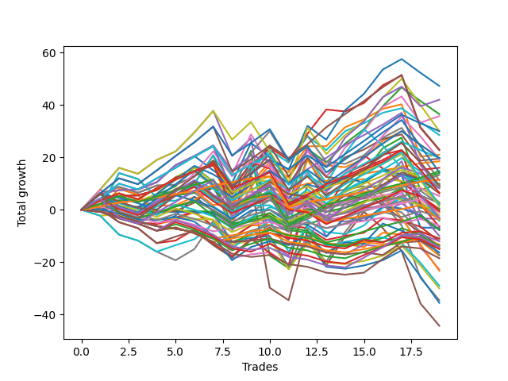

# Short Pointer Five (1226 1230 NC) 
- Symbol: ES
- Date Range: 03/18/2022 - 07/15/2022
- Trading Period: 7:20-12:30
- Number of Trades: 19



| Name | Win Percent | Profit | Avg Profit / Trade | Avg Time / Trade |      | Name | Win Percent | Profit | Avg Profit / Trade | Avg Time / Trade |
| ---- | ----------- | ------ | ------------------ | ---------------- | ---- | ---- | ----------- | ------ | ------------------ | ---------------- |
| Sorted By <br> Profit | | | | | | Sorted By <br> Win Percentage ||||
| Forty-Two | 63.16 | 23625.00 | 1243.42 | 09:15 |     | Eighty-One | 94.74 | 9250.00 | 486.84 | 05:23 |
| Sixty-Six | 73.68 | 21000.00 | 1105.26 | 09:40 |     | One Hundred Twenty-Six | 94.74 | 5750.00 | 302.63 | 04:37 |
| Forty-Four | 52.63 | 18250.00 | 960.53 | 11:45 |     | One Hundred Twenty-One | 94.74 | 5750.00 | 302.63 | 04:37 |
| Fifty-Eight | 73.68 | 17875.00 | 940.79 | 11:04 |     | One Hundred Twenty-Seven | 84.21 | 7375.00 | 388.16 | 05:39 |
| Sixty | 63.16 | 15000.00 | 789.47 | 15:12 |     | Eighty-Two | 84.21 | 7000.00 | 368.42 | 07:17 |
| One Hundred Five | 57.89 | 15000.00 | 789.47 | 06:18 |     | One Hundred Twenty-Two | 84.21 | 6625.00 | 348.68 | 05:40 |
| Forty-One | 68.42 | 14250.00 | 750.00 | 05:18 |     | One | 78.95 | 10500.00 | 552.63 | 09:43 |
| Eighty-Five | 73.68 | 11500.00 | 605.26 | 13:18 |     | Fifty-Seven | 78.95 | 9750.00 | 513.16 | 07:03 |
| Three | 68.42 | 11375.00 | 598.68 | 12:11 |     | Two | 78.95 | 5000.00 | 263.16 | 14:38 |
| One | 78.95 | 10500.00 | 552.63 | 09:43 |     | One Hundred One | 78.95 | 2625.00 | 138.16 | 02:51 |
| One Hundred Fifteen | 57.89 | 9875.00 | 519.74 | 06:52 |     | One Hundred Eleven | 78.95 | -500.00 | -26.32 | 03:03 |
| One Hundred Four | 57.89 | 9875.00 | 519.74 | 05:04 |     | Sixty-Six | 73.68 | 21000.00 | 1105.26 | 09:40 |
| Forty-Three | 52.63 | 9875.00 | 519.74 | 05:47 |     | Fifty-Eight | 73.68 | 17875.00 | 940.79 | 11:04 |
| Fifty-Seven | 78.95 | 9750.00 | 513.16 | 07:03 |     | Eighty-Five | 73.68 | 11500.00 | 605.26 | 13:18 |
| Sixty-Eight | 57.89 | 9625.00 | 506.58 | 12:17 |     | Sixty-Five | 73.68 | 8000.00 | 421.05 | 06:55 |
| Eighty-One | 94.74 | 9250.00 | 486.84 | 05:23 |     | Eighty-Four | 73.68 | 4250.00 | 223.68 | 11:56 |
| Sixty-Five | 73.68 | 8000.00 | 421.05 | 06:55 |     | One Hundred Twenty-Eight | 73.68 | 3250.00 | 171.05 | 06:56 |
| One Hundred Twenty-Seven | 84.21 | 7375.00 | 388.16 | 05:39 |     | One Hundred Twenty-Three | 73.68 | 625.00 | 32.89 | 07:02 |
| One Hundred Twenty-Five | 68.42 | 7125.00 | 375.00 | 09:41 |     | One Hundred Sixteen | 73.68 | -1875.00 | -98.68 | 03:06 |
| Eighty-Two | 84.21 | 7000.00 | 368.42 | 07:17 |     | Eighty-Three | 73.68 | -3250.00 | -171.05 | 10:26 |
| One Hundred Twenty-Two | 84.21 | 6625.00 | 348.68 | 05:40 |     | Forty-One | 68.42 | 14250.00 | 750.00 | 05:18 |
| One Hundred Twenty-Six | 94.74 | 5750.00 | 302.63 | 04:37 |     | Three | 68.42 | 11375.00 | 598.68 | 12:11 |
| One Hundred Twenty-One | 94.74 | 5750.00 | 302.63 | 04:37 |     | One Hundred Twenty-Five | 68.42 | 7125.00 | 375.00 | 09:41 |
| Fifty-Nine | 63.16 | 5625.00 | 296.05 | 08:34 |     | One Hundred Twelve | 68.42 | 1125.00 | 59.21 | 04:02 |
| Two | 78.95 | 5000.00 | 263.16 | 14:38 |     | One Hundred Twenty-Four | 68.42 | 1000.00 | 52.63 | 08:23 |
| One Hundred Fourteen | 57.89 | 4750.00 | 250.00 | 05:37 |     | Forty-Two | 63.16 | 23625.00 | 1243.42 | 09:15 |
| One Hundred Thirty | 63.16 | 4625.00 | 243.42 | 09:05 |     | Sixty | 63.16 | 15000.00 | 789.47 | 15:12 |
| Sixty-Seven | 57.89 | 4625.00 | 243.42 | 08:00 |     | Fifty-Nine | 63.16 | 5625.00 | 296.05 | 08:34 |
| One Hundred Three | 57.89 | 4500.00 | 236.84 | 04:30 |     | One Hundred Thirty | 63.16 | 4625.00 | 243.42 | 09:05 |
| Ninety-Five | 36.84 | 4500.00 | 236.84 | 02:29 |     | One Hundred Thirteen | 63.16 | 3250.00 | 171.05 | 04:55 |
| Eighty-Four | 73.68 | 4250.00 | 223.68 | 11:56 |     | One Hundred Two | 63.16 | 1250.00 | 65.79 | 03:46 |
| One Hundred Ninteen | 52.63 | 4125.00 | 217.11 | 05:19 |     | Sixty-Four | 63.16 | 250.00 | 13.16 | 04:27 |
| Ninety-Four | 42.11 | 4125.00 | 217.11 | 01:55 |     | One Hundred Twenty-Nine | 63.16 | -1500.00 | -78.95 | 07:46 |
| One Hundred Twenty-Eight | 73.68 | 3250.00 | 171.05 | 06:56 |     | Fifty-Six | 63.16 | -1750.00 | -92.11 | 04:30 |
| One Hundred Thirteen | 63.16 | 3250.00 | 171.05 | 04:55 |     | Zero | 63.16 | -3500.00 | -184.21 | 06:39 |
| One Hundred Twenty | 42.11 | 3125.00 | 164.47 | 06:02 |     | Four | 63.16 | -5000.00 | -263.16 | 20:14 |
| One Hundred One | 78.95 | 2625.00 | 138.16 | 02:51 |     | One Hundred Five | 57.89 | 15000.00 | 789.47 | 06:18 |
| Fifty | 47.37 | 1500.00 | 78.95 | 05:58 |     | One Hundred Fifteen | 57.89 | 9875.00 | 519.74 | 06:52 |
| One Hundred Two | 63.16 | 1250.00 | 65.79 | 03:46 |     | One Hundred Four | 57.89 | 9875.00 | 519.74 | 05:04 |
| One Hundred Twelve | 68.42 | 1125.00 | 59.21 | 04:02 |     | Sixty-Eight | 57.89 | 9625.00 | 506.58 | 12:17 |
| One Hundred Twenty-Four | 68.42 | 1000.00 | 52.63 | 08:23 |     | One Hundred Fourteen | 57.89 | 4750.00 | 250.00 | 05:37 |
| One Hundred Twenty-Three | 73.68 | 625.00 | 32.89 | 07:02 |     | Sixty-Seven | 57.89 | 4625.00 | 243.42 | 08:00 |
| Sixty-Four | 63.16 | 250.00 | 13.16 | 04:27 |     | One Hundred Three | 57.89 | 4500.00 | 236.84 | 04:30 |
| Forty-Five | 36.84 | 125.00 | 6.58 | 17:06 |     | Forty | 57.89 | -1000.00 | -52.63 | 03:03 |
| One Hundred Eighteen | 52.63 | -250.00 | -13.16 | 04:45 |     | One Hundred Seventeen | 57.89 | -3875.00 | -203.95 | 04:01 |
| Ninety-Three | 42.11 | -375.00 | -19.74 | 01:30 |     | Six | 57.89 | -11375.00 | -598.68 | 09:53 |
| One Hundred Eleven | 78.95 | -500.00 | -26.32 | 03:03 |     | Forty-Four | 52.63 | 18250.00 | 960.53 | 11:45 |
| Forty | 57.89 | -1000.00 | -52.63 | 03:03 |     | Forty-Three | 52.63 | 9875.00 | 519.74 | 05:47 |
| One Hundred Twenty-Nine | 63.16 | -1500.00 | -78.95 | 07:46 |     | One Hundred Ninteen | 52.63 | 4125.00 | 217.11 | 05:19 |
| Forty-Eight | 52.63 | -1500.00 | -78.95 | 02:57 |     | One Hundred Eighteen | 52.63 | -250.00 | -13.16 | 04:45 |
| Ninety-Two | 47.37 | -1500.00 | -78.95 | 01:12 |     | Forty-Eight | 52.63 | -1500.00 | -78.95 | 02:57 |
| Fifty-Six | 63.16 | -1750.00 | -92.11 | 04:30 |     | Ninety-One | 52.63 | -3000.00 | -157.89 | 01:00 |
| Fifty-One | 47.37 | -1750.00 | -92.11 | 05:21 |     | Forty-Six | 52.63 | -3875.00 | -203.95 | 04:11 |
| One Hundred Sixteen | 73.68 | -1875.00 | -98.68 | 03:06 |     | Sixty-Three | 52.63 | -11625.00 | -611.84 | 15:27 |
| Forty-Nine | 47.37 | -1875.00 | -98.68 | 04:26 |     | Seven | 52.63 | -17250.00 | -907.89 | 19:52 |
| Sixty-One | 47.37 | -2125.00 | -111.84 | 22:00 |     | Sixty-Two | 52.63 | -17750.00 | -934.21 | 06:15 |
| Ninety-One | 52.63 | -3000.00 | -157.89 | 01:00 |     | Fifty | 47.37 | 1500.00 | 78.95 | 05:58 |
| Eighty-Three | 73.68 | -3250.00 | -171.05 | 10:26 |     | Ninety-Two | 47.37 | -1500.00 | -78.95 | 01:12 |
| Zero | 63.16 | -3500.00 | -184.21 | 06:39 |     | Fifty-One | 47.37 | -1750.00 | -92.11 | 05:21 |
| Fifty-Two | 36.84 | -3750.00 | -197.37 | 06:43 |     | Forty-Nine | 47.37 | -1875.00 | -98.68 | 04:26 |
| One Hundred Seventeen | 57.89 | -3875.00 | -203.95 | 04:01 |     | Sixty-One | 47.37 | -2125.00 | -111.84 | 22:00 |
| Forty-Six | 52.63 | -3875.00 | -203.95 | 04:11 |     | Fifty-Four | 47.37 | -7500.00 | -394.74 | 02:53 |
| Four | 63.16 | -5000.00 | -263.16 | 20:14 |     | Seventy-One | 47.37 | -14500.00 | -763.16 | 12:09 |
| Ninety-Eight | 26.32 | -5500.00 | -289.47 | 01:10 |     | Seventy | 47.37 | -15000.00 | -789.47 | 06:01 |
| Ninety-Seven | 26.32 | -5500.00 | -289.47 | 01:04 |     | Five | 47.37 | -22125.00 | -1164.47 | 27:01 |
| Fifty-Five | 42.11 | -6000.00 | -315.79 | 05:51 |     | Ninety-Four | 42.11 | 4125.00 | 217.11 | 01:55 |
| Ninety-Nine | 26.32 | -6000.00 | -315.79 | 01:15 |     | One Hundred Twenty | 42.11 | 3125.00 | 164.47 | 06:02 |
| Ninety-Six | 31.58 | -6625.00 | -348.68 | 00:55 |     | Ninety-Three | 42.11 | -375.00 | -19.74 | 01:30 |
| Forty-Seven | 42.11 | -6875.00 | -361.84 | 11:46 |     | Fifty-Five | 42.11 | -6000.00 | -315.79 | 05:51 |
| One Hundred Seven | 36.84 | -6875.00 | -361.84 | 02:12 |     | Forty-Seven | 42.11 | -6875.00 | -361.84 | 11:46 |
| One Hundred Nine | 26.32 | -7125.00 | -375.00 | 02:32 |     | One Hundred Six | 42.11 | -7375.00 | -388.16 | 02:01 |
| One Hundred Six | 42.11 | -7375.00 | -388.16 | 02:01 |     | Ninety-Five | 36.84 | 4500.00 | 236.84 | 02:29 |
| One Hundred | 26.32 | -7375.00 | -388.16 | 01:20 |     | Forty-Five | 36.84 | 125.00 | 6.58 | 17:06 |
| Fifty-Four | 47.37 | -7500.00 | -394.74 | 02:53 |     | Fifty-Two | 36.84 | -3750.00 | -197.37 | 06:43 |
| One Hundred Eight | 26.32 | -7500.00 | -394.74 | 02:21 |     | One Hundred Seven | 36.84 | -6875.00 | -361.84 | 02:12 |
| Seventy-Three | 36.84 | -8125.00 | -427.63 | 06:23 |     | Seventy-Three | 36.84 | -8125.00 | -427.63 | 06:23 |
| Sixty-Nine | 36.84 | -8625.00 | -453.95 | 16:39 |     | Sixty-Nine | 36.84 | -8625.00 | -453.95 | 16:39 |
| Fifty-Three | 36.84 | -8750.00 | -460.53 | 07:29 |     | Fifty-Three | 36.84 | -8750.00 | -460.53 | 07:29 |
| One Hundred Ten | 26.32 | -9250.00 | -486.84 | 02:50 |     | Ninety-Six | 31.58 | -6625.00 | -348.68 | 00:55 |
| Six | 57.89 | -11375.00 | -598.68 | 09:53 |     | Ninety-Eight | 26.32 | -5500.00 | -289.47 | 01:10 |
| Sixty-Three | 52.63 | -11625.00 | -611.84 | 15:27 |     | Ninety-Seven | 26.32 | -5500.00 | -289.47 | 01:04 |
| Seventy-One | 47.37 | -14500.00 | -763.16 | 12:09 |     | Ninety-Nine | 26.32 | -6000.00 | -315.79 | 01:15 |
| Seventy | 47.37 | -15000.00 | -789.47 | 06:01 |     | One Hundred Nine | 26.32 | -7125.00 | -375.00 | 02:32 |
| Seven | 52.63 | -17250.00 | -907.89 | 19:52 |     | One Hundred | 26.32 | -7375.00 | -388.16 | 01:20 |
| Sixty-Two | 52.63 | -17750.00 | -934.21 | 06:15 |     | One Hundred Eight | 26.32 | -7500.00 | -394.74 | 02:21 |
| Five | 47.37 | -22125.00 | -1164.47 | 27:01 |     | One Hundred Ten | 26.32 | -9250.00 | -486.84 | 02:50 |

## NO STOPLOSS

### Test Zero
* Sell when price hits the middle line of the 20p bollinger
* No Stoploss
* Results:
```
Total Trades: 19
Percent Up: 36.84
Percent Down: 63.16
Total Points Moved Down: -7.00
Potential Profit: -3500.00
Total Points Ups: 37.50 Count Ups: 7
Total Points Downs: 30.50 Count Downs: 12
```

<details><summary>Trades</summary>

<code>In: 2022-03-21 08:30:00		Out: 2022-03-21 08:32:35		Total Position Time: 02:35		Total Move Down: 3.50		Total to Date: 3.50</code> <br />
<code>In: 2022-03-21 11:32:00		Out: 2022-03-21 11:40:10		Total Position Time: 08:10		Total Move Down: -0.00		Total to Date: 3.50</code> <br />
<code>In: 2022-03-28 10:33:00		Out: 2022-03-28 10:42:15		Total Position Time: 09:15		Total Move Down: -0.00		Total to Date: 3.50</code> <br />
<code>In: 2022-03-29 08:03:00		Out: 2022-03-29 08:03:10		Total Position Time: 00:10		Total Move Down: 0.50		Total to Date: 4.00</code> <br />
<code>In: 2022-04-06 07:26:00		Out: 2022-04-06 07:28:00		Total Position Time: 02:00		Total Move Down: 1.50		Total to Date: 5.50</code> <br />
<code>In: 2022-04-11 10:09:00		Out: 2022-04-11 10:16:10		Total Position Time: 07:10		Total Move Down: 1.00		Total to Date: 6.50</code> <br />
<code>In: 2022-04-11 11:58:00		Out: 2022-04-11 12:04:15		Total Position Time: 06:15		Total Move Down: 2.00		Total to Date: 8.50</code> <br />
<code>In: 2022-04-25 12:28:00		Out: 2022-04-25 12:42:45		Total Position Time: 14:45		Total Move Down: -11.00		Total to Date: -2.50</code> <br />
<code>In: 2022-05-05 10:11:00		Out: 2022-05-05 10:13:05		Total Position Time: 02:05		Total Move Down: 5.75		Total to Date: 3.25</code> <br />
<code>In: 2022-05-10 10:11:00		Out: 2022-05-10 10:13:55		Total Position Time: 02:55		Total Move Down: 4.00		Total to Date: 7.25</code> <br />
<code>In: 2022-05-17 09:31:00		Out: 2022-05-17 09:51:25		Total Position Time: 20:25		Total Move Down: -5.25		Total to Date: 2.00</code> <br />
<code>In: 2022-05-19 07:26:00		Out: 2022-05-19 07:26:45		Total Position Time: 00:45		Total Move Down: 3.25		Total to Date: 5.25</code> <br />
<code>In: 2022-05-23 07:38:00		Out: 2022-05-23 07:46:40		Total Position Time: 08:40		Total Move Down: -1.00		Total to Date: 4.25</code> <br />
<code>In: 2022-06-01 08:01:00		Out: 2022-06-01 08:01:35		Total Position Time: 00:35		Total Move Down: 1.50		Total to Date: 5.75</code> <br />
<code>In: 2022-06-03 09:08:00		Out: 2022-06-03 09:09:10		Total Position Time: 01:10		Total Move Down: 2.50		Total to Date: 8.25</code> <br />
<code>In: 2022-06-10 10:54:00		Out: 2022-06-10 10:54:55		Total Position Time: 00:55		Total Move Down: 1.25		Total to Date: 9.50</code> <br />
<code>In: 2022-06-10 11:27:00		Out: 2022-06-10 11:28:30		Total Position Time: 01:30		Total Move Down: 3.75		Total to Date: 13.25</code> <br />
<code>In: 2022-06-30 08:02:00		Out: 2022-06-30 08:31:55		Total Position Time: 29:55		Total Move Down: -20.00		Total to Date: -6.75</code> <br />
<code>In: 2022-07-05 08:53:00		Out: 2022-07-05 09:00:10		Total Position Time: 07:10		Total Move Down: -0.25		Total to Date: -7.00</code> <br />


</details>

### Test One
* Sell when the price hits the upper line of the 20p 1std bollinger
* No Stoploss
* Results:
```
Total Trades: 19
Percent Up: 21.05
Percent Down: 78.95
Total Points Moved Down: 21.00
Potential Profit: 10500.00
Total Points Ups: 41.25 Count Ups: 4
Total Points Downs: 62.25 Count Downs: 15
```

<details><summary>Trades</summary>

<code>In: 2022-03-21 08:30:00		Out: 2022-03-21 08:36:00		Total Position Time: 06:00		Total Move Down: 4.25		Total to Date: 4.25</code> <br />
<code>In: 2022-03-21 11:32:00		Out: 2022-03-21 11:42:10		Total Position Time: 10:10		Total Move Down: 1.00		Total to Date: 5.25</code> <br />
<code>In: 2022-03-28 10:33:00		Out: 2022-03-28 10:44:05		Total Position Time: 11:05		Total Move Down: 0.25		Total to Date: 5.50</code> <br />
<code>In: 2022-03-29 08:03:00		Out: 2022-03-29 08:07:15		Total Position Time: 04:15		Total Move Down: 2.00		Total to Date: 7.50</code> <br />
<code>In: 2022-04-06 07:26:00		Out: 2022-04-06 07:30:00		Total Position Time: 04:00		Total Move Down: 4.75		Total to Date: 12.25</code> <br />
<code>In: 2022-04-11 10:09:00		Out: 2022-04-11 10:17:50		Total Position Time: 08:50		Total Move Down: 2.25		Total to Date: 14.50</code> <br />
<code>In: 2022-04-11 11:58:00		Out: 2022-04-11 12:04:30		Total Position Time: 06:30		Total Move Down: 2.50		Total to Date: 17.00</code> <br />
<code>In: 2022-04-25 12:28:00		Out: 2022-04-25 12:46:00		Total Position Time: 18:00		Total Move Down: -17.25		Total to Date: -0.25</code> <br />
<code>In: 2022-05-05 10:11:00		Out: 2022-05-05 10:16:05		Total Position Time: 05:05		Total Move Down: 10.50		Total to Date: 10.25</code> <br />
<code>In: 2022-05-10 10:11:00		Out: 2022-05-10 10:17:25		Total Position Time: 06:25		Total Move Down: 8.00		Total to Date: 18.25</code> <br />
<code>In: 2022-05-17 09:31:00		Out: 2022-05-17 09:56:30		Total Position Time: 25:30		Total Move Down: -4.00		Total to Date: 14.25</code> <br />
<code>In: 2022-05-19 07:26:00		Out: 2022-05-19 07:27:05		Total Position Time: 01:05		Total Move Down: 10.00		Total to Date: 24.25</code> <br />
<code>In: 2022-05-23 07:38:00		Out: 2022-05-23 07:50:10		Total Position Time: 12:10		Total Move Down: -0.00		Total to Date: 24.25</code> <br />
<code>In: 2022-06-01 08:01:00		Out: 2022-06-01 08:02:25		Total Position Time: 01:25		Total Move Down: 7.25		Total to Date: 31.50</code> <br />
<code>In: 2022-06-03 09:08:00		Out: 2022-06-03 09:18:30		Total Position Time: 10:30		Total Move Down: 3.00		Total to Date: 34.50</code> <br />
<code>In: 2022-06-10 10:54:00		Out: 2022-06-10 10:56:15		Total Position Time: 02:15		Total Move Down: 4.00		Total to Date: 38.50</code> <br />
<code>In: 2022-06-10 11:27:00		Out: 2022-06-10 11:38:10		Total Position Time: 11:10		Total Move Down: 1.75		Total to Date: 40.25</code> <br />
<code>In: 2022-06-30 08:02:00		Out: 2022-06-30 08:31:55		Total Position Time: 29:55		Total Move Down: -20.00		Total to Date: 20.25</code> <br />
<code>In: 2022-07-05 08:53:00		Out: 2022-07-05 09:03:30		Total Position Time: 10:30		Total Move Down: 0.75		Total to Date: 21.00</code> <br />


</details>

### Test Two
* Sell when the price hits the upper line of the 20p 2std bollinger
* No Stoploss
* Results:
```
Total Trades: 19
Percent Up: 21.05
Percent Down: 78.95
Total Points Moved Down: 10.00
Potential Profit: 5000.00
Total Points Ups: 82.00 Count Ups: 4
Total Points Downs: 92.00 Count Downs: 15
```

<details><summary>Trades</summary>

<code>In: 2022-03-21 08:30:00		Out: 2022-03-21 08:36:05		Total Position Time: 06:05		Total Move Down: 6.25		Total to Date: 6.25</code> <br />
<code>In: 2022-03-21 11:32:00		Out: 2022-03-21 11:42:15		Total Position Time: 10:15		Total Move Down: 1.25		Total to Date: 7.50</code> <br />
<code>In: 2022-03-28 10:33:00		Out: 2022-03-28 10:55:10		Total Position Time: 22:10		Total Move Down: 0.25		Total to Date: 7.75</code> <br />
<code>In: 2022-03-29 08:03:00		Out: 2022-03-29 08:13:30		Total Position Time: 10:30		Total Move Down: 2.75		Total to Date: 10.50</code> <br />
<code>In: 2022-04-06 07:26:00		Out: 2022-04-06 07:34:10		Total Position Time: 08:10		Total Move Down: 6.50		Total to Date: 17.00</code> <br />
<code>In: 2022-04-11 10:09:00		Out: 2022-04-11 10:19:05		Total Position Time: 10:05		Total Move Down: 3.50		Total to Date: 20.50</code> <br />
<code>In: 2022-04-11 11:58:00		Out: 2022-04-11 12:05:10		Total Position Time: 07:10		Total Move Down: 4.00		Total to Date: 24.50</code> <br />
<code>In: 2022-04-25 12:28:00		Out: 2022-04-25 12:46:00		Total Position Time: 18:00		Total Move Down: -17.25		Total to Date: 7.25</code> <br />
<code>In: 2022-05-05 10:11:00		Out: 2022-05-05 10:30:30		Total Position Time: 19:30		Total Move Down: 15.25		Total to Date: 22.50</code> <br />
<code>In: 2022-05-10 10:11:00		Out: 2022-05-10 10:40:55		Total Position Time: 29:55		Total Move Down: -40.00		Total to Date: -17.50</code> <br />
<code>In: 2022-05-17 09:31:00		Out: 2022-05-17 10:00:55		Total Position Time: 29:55		Total Move Down: -4.75		Total to Date: -22.25</code> <br />
<code>In: 2022-05-19 07:26:00		Out: 2022-05-19 07:30:40		Total Position Time: 04:40		Total Move Down: 16.75		Total to Date: -5.50</code> <br />
<code>In: 2022-05-23 07:38:00		Out: 2022-05-23 07:51:20		Total Position Time: 13:20		Total Move Down: 2.25		Total to Date: -3.25</code> <br />
<code>In: 2022-06-01 08:01:00		Out: 2022-06-01 08:16:55		Total Position Time: 15:55		Total Move Down: 11.25		Total to Date: 8.00</code> <br />
<code>In: 2022-06-03 09:08:00		Out: 2022-06-03 09:19:30		Total Position Time: 11:30		Total Move Down: 6.25		Total to Date: 14.25</code> <br />
<code>In: 2022-06-10 10:54:00		Out: 2022-06-10 11:01:15		Total Position Time: 07:15		Total Move Down: 9.25		Total to Date: 23.50</code> <br />
<code>In: 2022-06-10 11:27:00		Out: 2022-06-10 11:40:10		Total Position Time: 13:10		Total Move Down: 4.00		Total to Date: 27.50</code> <br />
<code>In: 2022-06-30 08:02:00		Out: 2022-06-30 08:31:55		Total Position Time: 29:55		Total Move Down: -20.00		Total to Date: 7.50</code> <br />
<code>In: 2022-07-05 08:53:00		Out: 2022-07-05 09:03:50		Total Position Time: 10:50		Total Move Down: 2.50		Total to Date: 10.00</code> <br />


</details>

### Test Three
* Sell when price hits the middle line of the 50p bollinger
* No Stoploss
* Results:
```
Total Trades: 19
Percent Up: 31.58
Percent Down: 68.42
Total Points Moved Down: 22.75
Potential Profit: 11375.00
Total Points Ups: 53.50 Count Ups: 6
Total Points Downs: 76.25 Count Downs: 13
```

<details><summary>Trades</summary>

<code>In: 2022-03-21 08:30:00		Out: 2022-03-21 08:36:10		Total Position Time: 06:10		Total Move Down: 6.00		Total to Date: 6.00</code> <br />
<code>In: 2022-03-21 11:32:00		Out: 2022-03-21 11:54:50		Total Position Time: 22:50		Total Move Down: 2.75		Total to Date: 8.75</code> <br />
<code>In: 2022-03-28 10:33:00		Out: 2022-03-28 11:02:55		Total Position Time: 29:55		Total Move Down: -2.25		Total to Date: 6.50</code> <br />
<code>In: 2022-03-29 08:03:00		Out: 2022-03-29 08:13:30		Total Position Time: 10:30		Total Move Down: 2.75		Total to Date: 9.25</code> <br />
<code>In: 2022-04-06 07:26:00		Out: 2022-04-06 07:26:10		Total Position Time: 00:10		Total Move Down: 0.25		Total to Date: 9.50</code> <br />
<code>In: 2022-04-11 10:09:00		Out: 2022-04-11 10:18:25		Total Position Time: 09:25		Total Move Down: 3.25		Total to Date: 12.75</code> <br />
<code>In: 2022-04-11 11:58:00		Out: 2022-04-11 12:06:10		Total Position Time: 08:10		Total Move Down: 6.00		Total to Date: 18.75</code> <br />
<code>In: 2022-04-25 12:28:00		Out: 2022-04-25 12:46:00		Total Position Time: 18:00		Total Move Down: -17.25		Total to Date: 1.50</code> <br />
<code>In: 2022-05-05 10:11:00		Out: 2022-05-05 10:16:25		Total Position Time: 05:25		Total Move Down: 14.00		Total to Date: 15.50</code> <br />
<code>In: 2022-05-10 10:11:00		Out: 2022-05-10 10:15:40		Total Position Time: 04:40		Total Move Down: 8.25		Total to Date: 23.75</code> <br />
<code>In: 2022-05-17 09:31:00		Out: 2022-05-17 10:00:55		Total Position Time: 29:55		Total Move Down: -4.75		Total to Date: 19.00</code> <br />
<code>In: 2022-05-19 07:26:00		Out: 2022-05-19 07:27:05		Total Position Time: 01:05		Total Move Down: 10.00		Total to Date: 29.00</code> <br />
<code>In: 2022-05-23 07:38:00		Out: 2022-05-23 07:53:00		Total Position Time: 15:00		Total Move Down: 9.25		Total to Date: 38.25</code> <br />
<code>In: 2022-06-01 08:01:00		Out: 2022-06-01 08:01:10		Total Position Time: 00:10		Total Move Down: -0.75		Total to Date: 37.50</code> <br />
<code>In: 2022-06-03 09:08:00		Out: 2022-06-03 09:10:10		Total Position Time: 02:10		Total Move Down: 3.25		Total to Date: 40.75</code> <br />
<code>In: 2022-06-10 10:54:00		Out: 2022-06-10 11:00:50		Total Position Time: 06:50		Total Move Down: 6.75		Total to Date: 47.50</code> <br />
<code>In: 2022-06-10 11:27:00		Out: 2022-06-10 11:28:30		Total Position Time: 01:30		Total Move Down: 3.75		Total to Date: 51.25</code> <br />
<code>In: 2022-06-30 08:02:00		Out: 2022-06-30 08:31:55		Total Position Time: 29:55		Total Move Down: -20.00		Total to Date: 31.25</code> <br />
<code>In: 2022-07-05 08:53:00		Out: 2022-07-05 09:22:55		Total Position Time: 29:55		Total Move Down: -8.50		Total to Date: 22.75</code> <br />


</details>

### Test Four
* Sell when the price hits the upper line of the 50p 1std bollinger
* No Stoploss
* Results:
```
Total Trades: 19
Percent Up: 36.84
Percent Down: 63.16
Total Points Moved Down: -10.00
Potential Profit: -5000.00
Total Points Ups: 106.25 Count Ups: 7
Total Points Downs: 96.25 Count Downs: 12
```

<details><summary>Trades</summary>

<code>In: 2022-03-21 08:30:00		Out: 2022-03-21 08:44:50		Total Position Time: 14:50		Total Move Down: 7.75		Total to Date: 7.75</code> <br />
<code>In: 2022-03-21 11:32:00		Out: 2022-03-21 11:57:15		Total Position Time: 25:15		Total Move Down: 8.25		Total to Date: 16.00</code> <br />
<code>In: 2022-03-28 10:33:00		Out: 2022-03-28 11:02:55		Total Position Time: 29:55		Total Move Down: -2.25		Total to Date: 13.75</code> <br />
<code>In: 2022-03-29 08:03:00		Out: 2022-03-29 08:22:25		Total Position Time: 19:25		Total Move Down: 5.25		Total to Date: 19.00</code> <br />
<code>In: 2022-04-06 07:26:00		Out: 2022-04-06 07:28:10		Total Position Time: 02:10		Total Move Down: 3.25		Total to Date: 22.25</code> <br />
<code>In: 2022-04-11 10:09:00		Out: 2022-04-11 10:24:35		Total Position Time: 15:35		Total Move Down: 7.25		Total to Date: 29.50</code> <br />
<code>In: 2022-04-11 11:58:00		Out: 2022-04-11 12:16:05		Total Position Time: 18:05		Total Move Down: 8.25		Total to Date: 37.75</code> <br />
<code>In: 2022-04-25 12:28:00		Out: 2022-04-25 12:46:00		Total Position Time: 18:00		Total Move Down: -17.25		Total to Date: 20.50</code> <br />
<code>In: 2022-05-05 10:11:00		Out: 2022-05-05 10:40:55		Total Position Time: 29:55		Total Move Down: 6.75		Total to Date: 27.25</code> <br />
<code>In: 2022-05-10 10:11:00		Out: 2022-05-10 10:40:55		Total Position Time: 29:55		Total Move Down: -40.00		Total to Date: -12.75</code> <br />
<code>In: 2022-05-17 09:31:00		Out: 2022-05-17 10:00:55		Total Position Time: 29:55		Total Move Down: -4.75		Total to Date: -17.50</code> <br />
<code>In: 2022-05-19 07:26:00		Out: 2022-05-19 07:39:10		Total Position Time: 13:10		Total Move Down: 20.75		Total to Date: 3.25</code> <br />
<code>In: 2022-05-23 07:38:00		Out: 2022-05-23 08:07:55		Total Position Time: 29:55		Total Move Down: -13.50		Total to Date: -10.25</code> <br />
<code>In: 2022-06-01 08:01:00		Out: 2022-06-01 08:02:25		Total Position Time: 01:25		Total Move Down: 7.25		Total to Date: -3.00</code> <br />
<code>In: 2022-06-03 09:08:00		Out: 2022-06-03 09:19:10		Total Position Time: 11:10		Total Move Down: 5.50		Total to Date: 2.50</code> <br />
<code>In: 2022-06-10 10:54:00		Out: 2022-06-10 11:15:25		Total Position Time: 21:25		Total Move Down: 8.75		Total to Date: 11.25</code> <br />
<code>In: 2022-06-10 11:27:00		Out: 2022-06-10 11:41:45		Total Position Time: 14:45		Total Move Down: 7.25		Total to Date: 18.50</code> <br />
<code>In: 2022-06-30 08:02:00		Out: 2022-06-30 08:31:55		Total Position Time: 29:55		Total Move Down: -20.00		Total to Date: -1.50</code> <br />
<code>In: 2022-07-05 08:53:00		Out: 2022-07-05 09:22:55		Total Position Time: 29:55		Total Move Down: -8.50		Total to Date: -10.00</code> <br />


</details>

### Test Five
* Sell when the price hits the upper line of the 50p 2std bollinger
* No Stoploss
* Results:
```
Total Trades: 19
Percent Up: 52.63
Percent Down: 47.37
Total Points Moved Down: -44.25
Potential Profit: -22125.00
Total Points Ups: 128.25 Count Ups: 10
Total Points Downs: 84.00 Count Downs: 9
```

<details><summary>Trades</summary>

<code>In: 2022-03-21 08:30:00		Out: 2022-03-21 08:59:55		Total Position Time: 29:55		Total Move Down: 0.25		Total to Date: 0.25</code> <br />
<code>In: 2022-03-21 11:32:00		Out: 2022-03-21 11:59:25		Total Position Time: 27:25		Total Move Down: 13.75		Total to Date: 14.00</code> <br />
<code>In: 2022-03-28 10:33:00		Out: 2022-03-28 11:02:55		Total Position Time: 29:55		Total Move Down: -2.25		Total to Date: 11.75</code> <br />
<code>In: 2022-03-29 08:03:00		Out: 2022-03-29 08:32:55		Total Position Time: 29:55		Total Move Down: -7.00		Total to Date: 4.75</code> <br />
<code>In: 2022-04-06 07:26:00		Out: 2022-04-06 07:55:55		Total Position Time: 29:55		Total Move Down: 1.00		Total to Date: 5.75</code> <br />
<code>In: 2022-04-11 10:09:00		Out: 2022-04-11 10:38:55		Total Position Time: 29:55		Total Move Down: 4.25		Total to Date: 10.00</code> <br />
<code>In: 2022-04-11 11:58:00		Out: 2022-04-11 12:25:40		Total Position Time: 27:40		Total Move Down: 10.75		Total to Date: 20.75</code> <br />
<code>In: 2022-04-25 12:28:00		Out: 2022-04-25 12:46:00		Total Position Time: 18:00		Total Move Down: -17.25		Total to Date: 3.50</code> <br />
<code>In: 2022-05-05 10:11:00		Out: 2022-05-05 10:40:55		Total Position Time: 29:55		Total Move Down: 6.75		Total to Date: 10.25</code> <br />
<code>In: 2022-05-10 10:11:00		Out: 2022-05-10 10:40:55		Total Position Time: 29:55		Total Move Down: -40.00		Total to Date: -29.75</code> <br />
<code>In: 2022-05-17 09:31:00		Out: 2022-05-17 10:00:55		Total Position Time: 29:55		Total Move Down: -4.75		Total to Date: -34.50</code> <br />
<code>In: 2022-05-19 07:26:00		Out: 2022-05-19 07:49:20		Total Position Time: 23:20		Total Move Down: 26.75		Total to Date: -7.75</code> <br />
<code>In: 2022-05-23 07:38:00		Out: 2022-05-23 08:07:55		Total Position Time: 29:55		Total Move Down: -13.50		Total to Date: -21.25</code> <br />
<code>In: 2022-06-01 08:01:00		Out: 2022-06-01 08:16:55		Total Position Time: 15:55		Total Move Down: 11.25		Total to Date: -10.00</code> <br />
<code>In: 2022-06-03 09:08:00		Out: 2022-06-03 09:20:20		Total Position Time: 12:20		Total Move Down: 9.25		Total to Date: -0.75</code> <br />
<code>In: 2022-06-10 10:54:00		Out: 2022-06-10 11:23:55		Total Position Time: 29:55		Total Move Down: -6.25		Total to Date: -7.00</code> <br />
<code>In: 2022-06-10 11:27:00		Out: 2022-06-10 11:56:55		Total Position Time: 29:55		Total Move Down: -8.75		Total to Date: -15.75</code> <br />
<code>In: 2022-06-30 08:02:00		Out: 2022-06-30 08:31:55		Total Position Time: 29:55		Total Move Down: -20.00		Total to Date: -35.75</code> <br />
<code>In: 2022-07-05 08:53:00		Out: 2022-07-05 09:22:55		Total Position Time: 29:55		Total Move Down: -8.50		Total to Date: -44.25</code> <br />


</details>

### Test Six
* Sell when the price hits the middle line of the 1std VWAP
* No Stoploss
* Results:
```
Total Trades: 19
Percent Up: 42.11
Percent Down: 57.89
Total Points Moved Down: -22.75
Potential Profit: -11375.00
Total Points Ups: 54.00 Count Ups: 8
Total Points Downs: 31.25 Count Downs: 11
```

<details><summary>Trades</summary>

<code>In: 2022-03-21 08:30:00		Out: 2022-03-21 08:59:55		Total Position Time: 29:55		Total Move Down: 0.25		Total to Date: 0.25</code> <br />
<code>In: 2022-03-21 11:32:00		Out: 2022-03-21 11:32:10		Total Position Time: 00:10		Total Move Down: 0.50		Total to Date: 0.75</code> <br />
<code>In: 2022-03-28 10:33:00		Out: 2022-03-28 11:02:55		Total Position Time: 29:55		Total Move Down: -2.25		Total to Date: -1.50</code> <br />
<code>In: 2022-03-29 08:03:00		Out: 2022-03-29 08:03:10		Total Position Time: 00:10		Total Move Down: 0.50		Total to Date: -1.00</code> <br />
<code>In: 2022-04-06 07:26:00		Out: 2022-04-06 07:26:10		Total Position Time: 00:10		Total Move Down: 0.25		Total to Date: -0.75</code> <br />
<code>In: 2022-04-11 10:09:00		Out: 2022-04-11 10:09:10		Total Position Time: 00:10		Total Move Down: -0.25		Total to Date: -1.00</code> <br />
<code>In: 2022-04-11 11:58:00		Out: 2022-04-11 11:58:10		Total Position Time: 00:10		Total Move Down: -0.25		Total to Date: -1.25</code> <br />
<code>In: 2022-04-25 12:28:00		Out: 2022-04-25 12:46:00		Total Position Time: 18:00		Total Move Down: -17.25		Total to Date: -18.50</code> <br />
<code>In: 2022-05-05 10:11:00		Out: 2022-05-05 10:11:10		Total Position Time: 00:10		Total Move Down: 1.50		Total to Date: -17.00</code> <br />
<code>In: 2022-05-10 10:11:00		Out: 2022-05-10 10:11:10		Total Position Time: 00:10		Total Move Down: 0.75		Total to Date: -16.25</code> <br />
<code>In: 2022-05-17 09:31:00		Out: 2022-05-17 10:00:55		Total Position Time: 29:55		Total Move Down: -4.75		Total to Date: -21.00</code> <br />
<code>In: 2022-05-19 07:26:00		Out: 2022-05-19 07:27:05		Total Position Time: 01:05		Total Move Down: 10.00		Total to Date: -11.00</code> <br />
<code>In: 2022-05-23 07:38:00		Out: 2022-05-23 07:53:05		Total Position Time: 15:05		Total Move Down: 10.50		Total to Date: -0.50</code> <br />
<code>In: 2022-06-01 08:01:00		Out: 2022-06-01 08:01:10		Total Position Time: 00:10		Total Move Down: -0.75		Total to Date: -1.25</code> <br />
<code>In: 2022-06-03 09:08:00		Out: 2022-06-03 09:08:10		Total Position Time: 00:10		Total Move Down: 1.25		Total to Date: 0.00</code> <br />
<code>In: 2022-06-10 10:54:00		Out: 2022-06-10 10:55:10		Total Position Time: 01:10		Total Move Down: 2.00		Total to Date: 2.00</code> <br />
<code>In: 2022-06-10 11:27:00		Out: 2022-06-10 11:28:30		Total Position Time: 01:30		Total Move Down: 3.75		Total to Date: 5.75</code> <br />
<code>In: 2022-06-30 08:02:00		Out: 2022-06-30 08:31:55		Total Position Time: 29:55		Total Move Down: -20.00		Total to Date: -14.25</code> <br />
<code>In: 2022-07-05 08:53:00		Out: 2022-07-05 09:22:55		Total Position Time: 29:55		Total Move Down: -8.50		Total to Date: -22.75</code> <br />


</details>

### Test Seven
* Sell when the price hits the upper line of the 1std VWAP
* No Stoploss
* Results:
```
Total Trades: 19
Percent Up: 47.37
Percent Down: 52.63
Total Points Moved Down: -34.50
Potential Profit: -17250.00
Total Points Ups: 88.25 Count Ups: 9
Total Points Downs: 53.75 Count Downs: 10
```

<details><summary>Trades</summary>

<code>In: 2022-03-21 08:30:00		Out: 2022-03-21 08:59:55		Total Position Time: 29:55		Total Move Down: 0.25		Total to Date: 0.25</code> <br />
<code>In: 2022-03-21 11:32:00		Out: 2022-03-21 11:56:15		Total Position Time: 24:15		Total Move Down: 7.75		Total to Date: 8.00</code> <br />
<code>In: 2022-03-28 10:33:00		Out: 2022-03-28 11:02:55		Total Position Time: 29:55		Total Move Down: -2.25		Total to Date: 5.75</code> <br />
<code>In: 2022-03-29 08:03:00		Out: 2022-03-29 08:32:55		Total Position Time: 29:55		Total Move Down: -7.00		Total to Date: -1.25</code> <br />
<code>In: 2022-04-06 07:26:00		Out: 2022-04-06 07:28:05		Total Position Time: 02:05		Total Move Down: 2.50		Total to Date: 1.25</code> <br />
<code>In: 2022-04-11 10:09:00		Out: 2022-04-11 10:17:50		Total Position Time: 08:50		Total Move Down: 2.25		Total to Date: 3.50</code> <br />
<code>In: 2022-04-11 11:58:00		Out: 2022-04-11 12:06:10		Total Position Time: 08:10		Total Move Down: 6.00		Total to Date: 9.50</code> <br />
<code>In: 2022-04-25 12:28:00		Out: 2022-04-25 12:46:00		Total Position Time: 18:00		Total Move Down: -17.25		Total to Date: -7.75</code> <br />
<code>In: 2022-05-05 10:11:00		Out: 2022-05-05 10:40:55		Total Position Time: 29:55		Total Move Down: 6.75		Total to Date: -1.00</code> <br />
<code>In: 2022-05-10 10:11:00		Out: 2022-05-10 10:14:05		Total Position Time: 03:05		Total Move Down: 4.75		Total to Date: 3.75</code> <br />
<code>In: 2022-05-17 09:31:00		Out: 2022-05-17 10:00:55		Total Position Time: 29:55		Total Move Down: -4.75		Total to Date: -1.00</code> <br />
<code>In: 2022-05-19 07:26:00		Out: 2022-05-19 07:39:10		Total Position Time: 13:10		Total Move Down: 20.75		Total to Date: 19.75</code> <br />
<code>In: 2022-05-23 07:38:00		Out: 2022-05-23 08:07:55		Total Position Time: 29:55		Total Move Down: -13.50		Total to Date: 6.25</code> <br />
<code>In: 2022-06-01 08:01:00		Out: 2022-06-01 08:01:35		Total Position Time: 00:35		Total Move Down: 1.50		Total to Date: 7.75</code> <br />
<code>In: 2022-06-03 09:08:00		Out: 2022-06-03 09:08:10		Total Position Time: 00:10		Total Move Down: 1.25		Total to Date: 9.00</code> <br />
<code>In: 2022-06-10 10:54:00		Out: 2022-06-10 11:23:55		Total Position Time: 29:55		Total Move Down: -6.25		Total to Date: 2.75</code> <br />
<code>In: 2022-06-10 11:27:00		Out: 2022-06-10 11:56:55		Total Position Time: 29:55		Total Move Down: -8.75		Total to Date: -6.00</code> <br />
<code>In: 2022-06-30 08:02:00		Out: 2022-06-30 08:31:55		Total Position Time: 29:55		Total Move Down: -20.00		Total to Date: -26.00</code> <br />
<code>In: 2022-07-05 08:53:00		Out: 2022-07-05 09:22:55		Total Position Time: 29:55		Total Move Down: -8.50		Total to Date: -34.50</code> <br />


</details>

## STOPLOSS OF 5

### Test Forty
* Sell when price hits the middle line of the 20p bollinger
* Stoploss is -5 points
* Results:
```
Total Trades: 19
Percent Up: 42.11
Percent Down: 57.89
Total Points Moved Down: -2.00
Potential Profit: -1000.00
Total Points Ups: 30.50 Count Ups: 8
Total Points Downs: 28.50 Count Downs: 11
```

<details><summary>Trades</summary>

<code>In: 2022-03-21 08:30:00		Out: 2022-03-21 08:32:35		Total Position Time: 02:35		Total Move Down: 3.50		Total to Date: 3.50</code> <br />
<code>In: 2022-03-21 11:32:00		Out: 2022-03-21 11:40:10		Total Position Time: 08:10		Total Move Down: -0.00		Total to Date: 3.50</code> <br />
<code>In: 2022-03-28 10:33:00		Out: 2022-03-28 10:42:15		Total Position Time: 09:15		Total Move Down: -0.00		Total to Date: 3.50</code> <br />
<code>In: 2022-03-29 08:03:00		Out: 2022-03-29 08:03:10		Total Position Time: 00:10		Total Move Down: 0.50		Total to Date: 4.00</code> <br />
<code>In: 2022-04-06 07:26:00		Out: 2022-04-06 07:28:00		Total Position Time: 02:00		Total Move Down: 1.50		Total to Date: 5.50</code> <br />
<code>In: 2022-04-11 10:09:00		Out: 2022-04-11 10:16:10		Total Position Time: 07:10		Total Move Down: 1.00		Total to Date: 6.50</code> <br />
<code>In: 2022-04-11 11:58:00		Out: 2022-04-11 12:02:05		Total Position Time: 04:05		Total Move Down: -5.50		Total to Date: 1.00</code> <br />
<code>In: 2022-04-25 12:28:00		Out: 2022-04-25 12:29:00		Total Position Time: 01:00		Total Move Down: -4.75		Total to Date: -3.75</code> <br />
<code>In: 2022-05-05 10:11:00		Out: 2022-05-05 10:13:05		Total Position Time: 02:05		Total Move Down: 5.75		Total to Date: 2.00</code> <br />
<code>In: 2022-05-10 10:11:00		Out: 2022-05-10 10:13:55		Total Position Time: 02:55		Total Move Down: 4.00		Total to Date: 6.00</code> <br />
<code>In: 2022-05-17 09:31:00		Out: 2022-05-17 09:35:50		Total Position Time: 04:50		Total Move Down: -4.75		Total to Date: 1.25</code> <br />
<code>In: 2022-05-19 07:26:00		Out: 2022-05-19 07:26:45		Total Position Time: 00:45		Total Move Down: 3.25		Total to Date: 4.50</code> <br />
<code>In: 2022-05-23 07:38:00		Out: 2022-05-23 07:38:55		Total Position Time: 00:55		Total Move Down: -5.25		Total to Date: -0.75</code> <br />
<code>In: 2022-06-01 08:01:00		Out: 2022-06-01 08:01:35		Total Position Time: 00:35		Total Move Down: 1.50		Total to Date: 0.75</code> <br />
<code>In: 2022-06-03 09:08:00		Out: 2022-06-03 09:09:10		Total Position Time: 01:10		Total Move Down: 2.50		Total to Date: 3.25</code> <br />
<code>In: 2022-06-10 10:54:00		Out: 2022-06-10 10:54:55		Total Position Time: 00:55		Total Move Down: 1.25		Total to Date: 4.50</code> <br />
<code>In: 2022-06-10 11:27:00		Out: 2022-06-10 11:28:30		Total Position Time: 01:30		Total Move Down: 3.75		Total to Date: 8.25</code> <br />
<code>In: 2022-06-30 08:02:00		Out: 2022-06-30 08:08:15		Total Position Time: 06:15		Total Move Down: -5.25		Total to Date: 3.00</code> <br />
<code>In: 2022-07-05 08:53:00		Out: 2022-07-05 08:54:40		Total Position Time: 01:40		Total Move Down: -5.00		Total to Date: -2.00</code> <br />


</details>

### Test Forty-One
* Sell when the price hits the upper line of the 20p 1std bollinger
* Stoploss is -5 points
* Results:
```
Total Trades: 19
Percent Up: 31.58
Percent Down: 68.42
Total Points Moved Down: 28.50
Potential Profit: 14250.00
Total Points Ups: 30.50 Count Ups: 6
Total Points Downs: 59.00 Count Downs: 13
```

<details><summary>Trades</summary>

<code>In: 2022-03-21 08:30:00		Out: 2022-03-21 08:36:00		Total Position Time: 06:00		Total Move Down: 4.25		Total to Date: 4.25</code> <br />
<code>In: 2022-03-21 11:32:00		Out: 2022-03-21 11:42:10		Total Position Time: 10:10		Total Move Down: 1.00		Total to Date: 5.25</code> <br />
<code>In: 2022-03-28 10:33:00		Out: 2022-03-28 10:44:05		Total Position Time: 11:05		Total Move Down: 0.25		Total to Date: 5.50</code> <br />
<code>In: 2022-03-29 08:03:00		Out: 2022-03-29 08:07:15		Total Position Time: 04:15		Total Move Down: 2.00		Total to Date: 7.50</code> <br />
<code>In: 2022-04-06 07:26:00		Out: 2022-04-06 07:30:00		Total Position Time: 04:00		Total Move Down: 4.75		Total to Date: 12.25</code> <br />
<code>In: 2022-04-11 10:09:00		Out: 2022-04-11 10:17:50		Total Position Time: 08:50		Total Move Down: 2.25		Total to Date: 14.50</code> <br />
<code>In: 2022-04-11 11:58:00		Out: 2022-04-11 12:02:05		Total Position Time: 04:05		Total Move Down: -5.50		Total to Date: 9.00</code> <br />
<code>In: 2022-04-25 12:28:00		Out: 2022-04-25 12:29:00		Total Position Time: 01:00		Total Move Down: -4.75		Total to Date: 4.25</code> <br />
<code>In: 2022-05-05 10:11:00		Out: 2022-05-05 10:16:05		Total Position Time: 05:05		Total Move Down: 10.50		Total to Date: 14.75</code> <br />
<code>In: 2022-05-10 10:11:00		Out: 2022-05-10 10:17:25		Total Position Time: 06:25		Total Move Down: 8.00		Total to Date: 22.75</code> <br />
<code>In: 2022-05-17 09:31:00		Out: 2022-05-17 09:35:50		Total Position Time: 04:50		Total Move Down: -4.75		Total to Date: 18.00</code> <br />
<code>In: 2022-05-19 07:26:00		Out: 2022-05-19 07:27:05		Total Position Time: 01:05		Total Move Down: 10.00		Total to Date: 28.00</code> <br />
<code>In: 2022-05-23 07:38:00		Out: 2022-05-23 07:38:55		Total Position Time: 00:55		Total Move Down: -5.25		Total to Date: 22.75</code> <br />
<code>In: 2022-06-01 08:01:00		Out: 2022-06-01 08:02:25		Total Position Time: 01:25		Total Move Down: 7.25		Total to Date: 30.00</code> <br />
<code>In: 2022-06-03 09:08:00		Out: 2022-06-03 09:18:30		Total Position Time: 10:30		Total Move Down: 3.00		Total to Date: 33.00</code> <br />
<code>In: 2022-06-10 10:54:00		Out: 2022-06-10 10:56:15		Total Position Time: 02:15		Total Move Down: 4.00		Total to Date: 37.00</code> <br />
<code>In: 2022-06-10 11:27:00		Out: 2022-06-10 11:38:10		Total Position Time: 11:10		Total Move Down: 1.75		Total to Date: 38.75</code> <br />
<code>In: 2022-06-30 08:02:00		Out: 2022-06-30 08:08:15		Total Position Time: 06:15		Total Move Down: -5.25		Total to Date: 33.50</code> <br />
<code>In: 2022-07-05 08:53:00		Out: 2022-07-05 08:54:40		Total Position Time: 01:40		Total Move Down: -5.00		Total to Date: 28.50</code> <br />


</details>

### Test Forty-Two
* Sell when the price hits the upper line of the 20p 2std bollinger
* Stoploss is -5 points
* Results:
```
Total Trades: 19
Percent Up: 36.84
Percent Down: 63.16
Total Points Moved Down: 47.25
Potential Profit: 23625.00
Total Points Ups: 36.00 Count Ups: 7
Total Points Downs: 83.25 Count Downs: 12
```

<details><summary>Trades</summary>

<code>In: 2022-03-21 08:30:00		Out: 2022-03-21 08:36:05		Total Position Time: 06:05		Total Move Down: 6.25		Total to Date: 6.25</code> <br />
<code>In: 2022-03-21 11:32:00		Out: 2022-03-21 11:42:15		Total Position Time: 10:15		Total Move Down: 1.25		Total to Date: 7.50</code> <br />
<code>In: 2022-03-28 10:33:00		Out: 2022-03-28 10:55:10		Total Position Time: 22:10		Total Move Down: 0.25		Total to Date: 7.75</code> <br />
<code>In: 2022-03-29 08:03:00		Out: 2022-03-29 08:13:30		Total Position Time: 10:30		Total Move Down: 2.75		Total to Date: 10.50</code> <br />
<code>In: 2022-04-06 07:26:00		Out: 2022-04-06 07:34:10		Total Position Time: 08:10		Total Move Down: 6.50		Total to Date: 17.00</code> <br />
<code>In: 2022-04-11 10:09:00		Out: 2022-04-11 10:19:05		Total Position Time: 10:05		Total Move Down: 3.50		Total to Date: 20.50</code> <br />
<code>In: 2022-04-11 11:58:00		Out: 2022-04-11 12:02:05		Total Position Time: 04:05		Total Move Down: -5.50		Total to Date: 15.00</code> <br />
<code>In: 2022-04-25 12:28:00		Out: 2022-04-25 12:29:00		Total Position Time: 01:00		Total Move Down: -4.75		Total to Date: 10.25</code> <br />
<code>In: 2022-05-05 10:11:00		Out: 2022-05-05 10:30:30		Total Position Time: 19:30		Total Move Down: 15.25		Total to Date: 25.50</code> <br />
<code>In: 2022-05-10 10:11:00		Out: 2022-05-10 10:28:45		Total Position Time: 17:45		Total Move Down: -5.50		Total to Date: 20.00</code> <br />
<code>In: 2022-05-17 09:31:00		Out: 2022-05-17 09:35:50		Total Position Time: 04:50		Total Move Down: -4.75		Total to Date: 15.25</code> <br />
<code>In: 2022-05-19 07:26:00		Out: 2022-05-19 07:30:40		Total Position Time: 04:40		Total Move Down: 16.75		Total to Date: 32.00</code> <br />
<code>In: 2022-05-23 07:38:00		Out: 2022-05-23 07:38:55		Total Position Time: 00:55		Total Move Down: -5.25		Total to Date: 26.75</code> <br />
<code>In: 2022-06-01 08:01:00		Out: 2022-06-01 08:16:55		Total Position Time: 15:55		Total Move Down: 11.25		Total to Date: 38.00</code> <br />
<code>In: 2022-06-03 09:08:00		Out: 2022-06-03 09:19:30		Total Position Time: 11:30		Total Move Down: 6.25		Total to Date: 44.25</code> <br />
<code>In: 2022-06-10 10:54:00		Out: 2022-06-10 11:01:15		Total Position Time: 07:15		Total Move Down: 9.25		Total to Date: 53.50</code> <br />
<code>In: 2022-06-10 11:27:00		Out: 2022-06-10 11:40:10		Total Position Time: 13:10		Total Move Down: 4.00		Total to Date: 57.50</code> <br />
<code>In: 2022-06-30 08:02:00		Out: 2022-06-30 08:08:15		Total Position Time: 06:15		Total Move Down: -5.25		Total to Date: 52.25</code> <br />
<code>In: 2022-07-05 08:53:00		Out: 2022-07-05 08:54:40		Total Position Time: 01:40		Total Move Down: -5.00		Total to Date: 47.25</code> <br />


</details>

### Test Forty-Three
* Sell when price hits the middle line of the 50p bollinger
* Stoploss is -5 points
* Results:
```
Total Trades: 19
Percent Up: 47.37
Percent Down: 52.63
Total Points Moved Down: 19.75
Potential Profit: 9875.00
Total Points Ups: 38.50 Count Ups: 9
Total Points Downs: 58.25 Count Downs: 10
```

<details><summary>Trades</summary>

<code>In: 2022-03-21 08:30:00		Out: 2022-03-21 08:36:10		Total Position Time: 06:10		Total Move Down: 6.00		Total to Date: 6.00</code> <br />
<code>In: 2022-03-21 11:32:00		Out: 2022-03-21 11:45:10		Total Position Time: 13:10		Total Move Down: -5.00		Total to Date: 1.00</code> <br />
<code>In: 2022-03-28 10:33:00		Out: 2022-03-28 11:02:55		Total Position Time: 29:55		Total Move Down: -2.25		Total to Date: -1.25</code> <br />
<code>In: 2022-03-29 08:03:00		Out: 2022-03-29 08:13:30		Total Position Time: 10:30		Total Move Down: 2.75		Total to Date: 1.50</code> <br />
<code>In: 2022-04-06 07:26:00		Out: 2022-04-06 07:26:10		Total Position Time: 00:10		Total Move Down: 0.25		Total to Date: 1.75</code> <br />
<code>In: 2022-04-11 10:09:00		Out: 2022-04-11 10:18:25		Total Position Time: 09:25		Total Move Down: 3.25		Total to Date: 5.00</code> <br />
<code>In: 2022-04-11 11:58:00		Out: 2022-04-11 12:02:05		Total Position Time: 04:05		Total Move Down: -5.50		Total to Date: -0.50</code> <br />
<code>In: 2022-04-25 12:28:00		Out: 2022-04-25 12:29:00		Total Position Time: 01:00		Total Move Down: -4.75		Total to Date: -5.25</code> <br />
<code>In: 2022-05-05 10:11:00		Out: 2022-05-05 10:16:25		Total Position Time: 05:25		Total Move Down: 14.00		Total to Date: 8.75</code> <br />
<code>In: 2022-05-10 10:11:00		Out: 2022-05-10 10:15:40		Total Position Time: 04:40		Total Move Down: 8.25		Total to Date: 17.00</code> <br />
<code>In: 2022-05-17 09:31:00		Out: 2022-05-17 09:35:50		Total Position Time: 04:50		Total Move Down: -4.75		Total to Date: 12.25</code> <br />
<code>In: 2022-05-19 07:26:00		Out: 2022-05-19 07:27:05		Total Position Time: 01:05		Total Move Down: 10.00		Total to Date: 22.25</code> <br />
<code>In: 2022-05-23 07:38:00		Out: 2022-05-23 07:38:55		Total Position Time: 00:55		Total Move Down: -5.25		Total to Date: 17.00</code> <br />
<code>In: 2022-06-01 08:01:00		Out: 2022-06-01 08:01:10		Total Position Time: 00:10		Total Move Down: -0.75		Total to Date: 16.25</code> <br />
<code>In: 2022-06-03 09:08:00		Out: 2022-06-03 09:10:10		Total Position Time: 02:10		Total Move Down: 3.25		Total to Date: 19.50</code> <br />
<code>In: 2022-06-10 10:54:00		Out: 2022-06-10 11:00:50		Total Position Time: 06:50		Total Move Down: 6.75		Total to Date: 26.25</code> <br />
<code>In: 2022-06-10 11:27:00		Out: 2022-06-10 11:28:30		Total Position Time: 01:30		Total Move Down: 3.75		Total to Date: 30.00</code> <br />
<code>In: 2022-06-30 08:02:00		Out: 2022-06-30 08:08:15		Total Position Time: 06:15		Total Move Down: -5.25		Total to Date: 24.75</code> <br />
<code>In: 2022-07-05 08:53:00		Out: 2022-07-05 08:54:40		Total Position Time: 01:40		Total Move Down: -5.00		Total to Date: 19.75</code> <br />


</details>

### Test Forty-Four
* Sell when the price hits the upper line of the 50p 1std bollinger
* Stoploss is -5 points
* Results:
```
Total Trades: 19
Percent Up: 47.37
Percent Down: 52.63
Total Points Moved Down: 36.50
Potential Profit: 18250.00
Total Points Ups: 43.25 Count Ups: 9
Total Points Downs: 79.75 Count Downs: 10
```

<details><summary>Trades</summary>

<code>In: 2022-03-21 08:30:00		Out: 2022-03-21 08:44:50		Total Position Time: 14:50		Total Move Down: 7.75		Total to Date: 7.75</code> <br />
<code>In: 2022-03-21 11:32:00		Out: 2022-03-21 11:45:10		Total Position Time: 13:10		Total Move Down: -5.00		Total to Date: 2.75</code> <br />
<code>In: 2022-03-28 10:33:00		Out: 2022-03-28 11:02:55		Total Position Time: 29:55		Total Move Down: -2.25		Total to Date: 0.50</code> <br />
<code>In: 2022-03-29 08:03:00		Out: 2022-03-29 08:22:25		Total Position Time: 19:25		Total Move Down: 5.25		Total to Date: 5.75</code> <br />
<code>In: 2022-04-06 07:26:00		Out: 2022-04-06 07:28:10		Total Position Time: 02:10		Total Move Down: 3.25		Total to Date: 9.00</code> <br />
<code>In: 2022-04-11 10:09:00		Out: 2022-04-11 10:24:35		Total Position Time: 15:35		Total Move Down: 7.25		Total to Date: 16.25</code> <br />
<code>In: 2022-04-11 11:58:00		Out: 2022-04-11 12:02:05		Total Position Time: 04:05		Total Move Down: -5.50		Total to Date: 10.75</code> <br />
<code>In: 2022-04-25 12:28:00		Out: 2022-04-25 12:29:00		Total Position Time: 01:00		Total Move Down: -4.75		Total to Date: 6.00</code> <br />
<code>In: 2022-05-05 10:11:00		Out: 2022-05-05 10:40:55		Total Position Time: 29:55		Total Move Down: 6.75		Total to Date: 12.75</code> <br />
<code>In: 2022-05-10 10:11:00		Out: 2022-05-10 10:28:45		Total Position Time: 17:45		Total Move Down: -5.50		Total to Date: 7.25</code> <br />
<code>In: 2022-05-17 09:31:00		Out: 2022-05-17 09:35:50		Total Position Time: 04:50		Total Move Down: -4.75		Total to Date: 2.50</code> <br />
<code>In: 2022-05-19 07:26:00		Out: 2022-05-19 07:39:10		Total Position Time: 13:10		Total Move Down: 20.75		Total to Date: 23.25</code> <br />
<code>In: 2022-05-23 07:38:00		Out: 2022-05-23 07:38:55		Total Position Time: 00:55		Total Move Down: -5.25		Total to Date: 18.00</code> <br />
<code>In: 2022-06-01 08:01:00		Out: 2022-06-01 08:02:25		Total Position Time: 01:25		Total Move Down: 7.25		Total to Date: 25.25</code> <br />
<code>In: 2022-06-03 09:08:00		Out: 2022-06-03 09:19:10		Total Position Time: 11:10		Total Move Down: 5.50		Total to Date: 30.75</code> <br />
<code>In: 2022-06-10 10:54:00		Out: 2022-06-10 11:15:25		Total Position Time: 21:25		Total Move Down: 8.75		Total to Date: 39.50</code> <br />
<code>In: 2022-06-10 11:27:00		Out: 2022-06-10 11:41:45		Total Position Time: 14:45		Total Move Down: 7.25		Total to Date: 46.75</code> <br />
<code>In: 2022-06-30 08:02:00		Out: 2022-06-30 08:08:15		Total Position Time: 06:15		Total Move Down: -5.25		Total to Date: 41.50</code> <br />
<code>In: 2022-07-05 08:53:00		Out: 2022-07-05 08:54:40		Total Position Time: 01:40		Total Move Down: -5.00		Total to Date: 36.50</code> <br />


</details>

### Test Forty-Five
* Sell when the price hits the upper line of the 50p 2std bollinger
* Stoploss is -5 points
* Results:
```
Total Trades: 19
Percent Up: 63.16
Percent Down: 36.84
Total Points Moved Down: 0.25
Potential Profit: 125.00
Total Points Ups: 59.25 Count Ups: 12
Total Points Downs: 59.50 Count Downs: 7
```

<details><summary>Trades</summary>

<code>In: 2022-03-21 08:30:00		Out: 2022-03-21 08:59:55		Total Position Time: 29:55		Total Move Down: 0.25		Total to Date: 0.25</code> <br />
<code>In: 2022-03-21 11:32:00		Out: 2022-03-21 11:45:10		Total Position Time: 13:10		Total Move Down: -5.00		Total to Date: -4.75</code> <br />
<code>In: 2022-03-28 10:33:00		Out: 2022-03-28 11:02:55		Total Position Time: 29:55		Total Move Down: -2.25		Total to Date: -7.00</code> <br />
<code>In: 2022-03-29 08:03:00		Out: 2022-03-29 08:27:25		Total Position Time: 24:25		Total Move Down: -5.75		Total to Date: -12.75</code> <br />
<code>In: 2022-04-06 07:26:00		Out: 2022-04-06 07:55:55		Total Position Time: 29:55		Total Move Down: 1.00		Total to Date: -11.75</code> <br />
<code>In: 2022-04-11 10:09:00		Out: 2022-04-11 10:38:55		Total Position Time: 29:55		Total Move Down: 4.25		Total to Date: -7.50</code> <br />
<code>In: 2022-04-11 11:58:00		Out: 2022-04-11 12:02:05		Total Position Time: 04:05		Total Move Down: -5.50		Total to Date: -13.00</code> <br />
<code>In: 2022-04-25 12:28:00		Out: 2022-04-25 12:29:00		Total Position Time: 01:00		Total Move Down: -4.75		Total to Date: -17.75</code> <br />
<code>In: 2022-05-05 10:11:00		Out: 2022-05-05 10:40:55		Total Position Time: 29:55		Total Move Down: 6.75		Total to Date: -11.00</code> <br />
<code>In: 2022-05-10 10:11:00		Out: 2022-05-10 10:28:45		Total Position Time: 17:45		Total Move Down: -5.50		Total to Date: -16.50</code> <br />
<code>In: 2022-05-17 09:31:00		Out: 2022-05-17 09:35:50		Total Position Time: 04:50		Total Move Down: -4.75		Total to Date: -21.25</code> <br />
<code>In: 2022-05-19 07:26:00		Out: 2022-05-19 07:49:20		Total Position Time: 23:20		Total Move Down: 26.75		Total to Date: 5.50</code> <br />
<code>In: 2022-05-23 07:38:00		Out: 2022-05-23 07:38:55		Total Position Time: 00:55		Total Move Down: -5.25		Total to Date: 0.25</code> <br />
<code>In: 2022-06-01 08:01:00		Out: 2022-06-01 08:16:55		Total Position Time: 15:55		Total Move Down: 11.25		Total to Date: 11.50</code> <br />
<code>In: 2022-06-03 09:08:00		Out: 2022-06-03 09:20:20		Total Position Time: 12:20		Total Move Down: 9.25		Total to Date: 20.75</code> <br />
<code>In: 2022-06-10 10:54:00		Out: 2022-06-10 11:20:50		Total Position Time: 26:50		Total Move Down: -5.00		Total to Date: 15.75</code> <br />
<code>In: 2022-06-10 11:27:00		Out: 2022-06-10 11:50:00		Total Position Time: 23:00		Total Move Down: -5.25		Total to Date: 10.50</code> <br />
<code>In: 2022-06-30 08:02:00		Out: 2022-06-30 08:08:15		Total Position Time: 06:15		Total Move Down: -5.25		Total to Date: 5.25</code> <br />
<code>In: 2022-07-05 08:53:00		Out: 2022-07-05 08:54:40		Total Position Time: 01:40		Total Move Down: -5.00		Total to Date: 0.25</code> <br />


</details>

### Test Forty-Six
* Sell when the price hits the middle line of the 1std VWAP
* Stoploss is -5 points
* Results:
```
Total Trades: 19
Percent Up: 47.37
Percent Down: 52.63
Total Points Moved Down: -7.75
Potential Profit: -3875.00
Total Points Ups: 28.50 Count Ups: 9
Total Points Downs: 20.75 Count Downs: 10
```

<details><summary>Trades</summary>

<code>In: 2022-03-21 08:30:00		Out: 2022-03-21 08:59:55		Total Position Time: 29:55		Total Move Down: 0.25		Total to Date: 0.25</code> <br />
<code>In: 2022-03-21 11:32:00		Out: 2022-03-21 11:32:10		Total Position Time: 00:10		Total Move Down: 0.50		Total to Date: 0.75</code> <br />
<code>In: 2022-03-28 10:33:00		Out: 2022-03-28 11:02:55		Total Position Time: 29:55		Total Move Down: -2.25		Total to Date: -1.50</code> <br />
<code>In: 2022-03-29 08:03:00		Out: 2022-03-29 08:03:10		Total Position Time: 00:10		Total Move Down: 0.50		Total to Date: -1.00</code> <br />
<code>In: 2022-04-06 07:26:00		Out: 2022-04-06 07:26:10		Total Position Time: 00:10		Total Move Down: 0.25		Total to Date: -0.75</code> <br />
<code>In: 2022-04-11 10:09:00		Out: 2022-04-11 10:09:10		Total Position Time: 00:10		Total Move Down: -0.25		Total to Date: -1.00</code> <br />
<code>In: 2022-04-11 11:58:00		Out: 2022-04-11 11:58:10		Total Position Time: 00:10		Total Move Down: -0.25		Total to Date: -1.25</code> <br />
<code>In: 2022-04-25 12:28:00		Out: 2022-04-25 12:29:00		Total Position Time: 01:00		Total Move Down: -4.75		Total to Date: -6.00</code> <br />
<code>In: 2022-05-05 10:11:00		Out: 2022-05-05 10:11:10		Total Position Time: 00:10		Total Move Down: 1.50		Total to Date: -4.50</code> <br />
<code>In: 2022-05-10 10:11:00		Out: 2022-05-10 10:11:10		Total Position Time: 00:10		Total Move Down: 0.75		Total to Date: -3.75</code> <br />
<code>In: 2022-05-17 09:31:00		Out: 2022-05-17 09:35:50		Total Position Time: 04:50		Total Move Down: -4.75		Total to Date: -8.50</code> <br />
<code>In: 2022-05-19 07:26:00		Out: 2022-05-19 07:27:05		Total Position Time: 01:05		Total Move Down: 10.00		Total to Date: 1.50</code> <br />
<code>In: 2022-05-23 07:38:00		Out: 2022-05-23 07:38:55		Total Position Time: 00:55		Total Move Down: -5.25		Total to Date: -3.75</code> <br />
<code>In: 2022-06-01 08:01:00		Out: 2022-06-01 08:01:10		Total Position Time: 00:10		Total Move Down: -0.75		Total to Date: -4.50</code> <br />
<code>In: 2022-06-03 09:08:00		Out: 2022-06-03 09:08:10		Total Position Time: 00:10		Total Move Down: 1.25		Total to Date: -3.25</code> <br />
<code>In: 2022-06-10 10:54:00		Out: 2022-06-10 10:55:10		Total Position Time: 01:10		Total Move Down: 2.00		Total to Date: -1.25</code> <br />
<code>In: 2022-06-10 11:27:00		Out: 2022-06-10 11:28:30		Total Position Time: 01:30		Total Move Down: 3.75		Total to Date: 2.50</code> <br />
<code>In: 2022-06-30 08:02:00		Out: 2022-06-30 08:08:15		Total Position Time: 06:15		Total Move Down: -5.25		Total to Date: -2.75</code> <br />
<code>In: 2022-07-05 08:53:00		Out: 2022-07-05 08:54:40		Total Position Time: 01:40		Total Move Down: -5.00		Total to Date: -7.75</code> <br />


</details>

### Test Forty-Seven
* Sell when the price hits the upper line of the 1std VWAP
* Stoploss is -5 points
* Results:
```
Total Trades: 19
Percent Up: 57.89
Percent Down: 42.11
Total Points Moved Down: -13.75
Potential Profit: -6875.00
Total Points Ups: 53.75 Count Ups: 11
Total Points Downs: 40.00 Count Downs: 8
```

<details><summary>Trades</summary>

<code>In: 2022-03-21 08:30:00		Out: 2022-03-21 08:59:55		Total Position Time: 29:55		Total Move Down: 0.25		Total to Date: 0.25</code> <br />
<code>In: 2022-03-21 11:32:00		Out: 2022-03-21 11:45:10		Total Position Time: 13:10		Total Move Down: -5.00		Total to Date: -4.75</code> <br />
<code>In: 2022-03-28 10:33:00		Out: 2022-03-28 11:02:55		Total Position Time: 29:55		Total Move Down: -2.25		Total to Date: -7.00</code> <br />
<code>In: 2022-03-29 08:03:00		Out: 2022-03-29 08:27:25		Total Position Time: 24:25		Total Move Down: -5.75		Total to Date: -12.75</code> <br />
<code>In: 2022-04-06 07:26:00		Out: 2022-04-06 07:28:05		Total Position Time: 02:05		Total Move Down: 2.50		Total to Date: -10.25</code> <br />
<code>In: 2022-04-11 10:09:00		Out: 2022-04-11 10:17:50		Total Position Time: 08:50		Total Move Down: 2.25		Total to Date: -8.00</code> <br />
<code>In: 2022-04-11 11:58:00		Out: 2022-04-11 12:02:05		Total Position Time: 04:05		Total Move Down: -5.50		Total to Date: -13.50</code> <br />
<code>In: 2022-04-25 12:28:00		Out: 2022-04-25 12:29:00		Total Position Time: 01:00		Total Move Down: -4.75		Total to Date: -18.25</code> <br />
<code>In: 2022-05-05 10:11:00		Out: 2022-05-05 10:40:55		Total Position Time: 29:55		Total Move Down: 6.75		Total to Date: -11.50</code> <br />
<code>In: 2022-05-10 10:11:00		Out: 2022-05-10 10:14:05		Total Position Time: 03:05		Total Move Down: 4.75		Total to Date: -6.75</code> <br />
<code>In: 2022-05-17 09:31:00		Out: 2022-05-17 09:35:50		Total Position Time: 04:50		Total Move Down: -4.75		Total to Date: -11.50</code> <br />
<code>In: 2022-05-19 07:26:00		Out: 2022-05-19 07:39:10		Total Position Time: 13:10		Total Move Down: 20.75		Total to Date: 9.25</code> <br />
<code>In: 2022-05-23 07:38:00		Out: 2022-05-23 07:38:55		Total Position Time: 00:55		Total Move Down: -5.25		Total to Date: 4.00</code> <br />
<code>In: 2022-06-01 08:01:00		Out: 2022-06-01 08:01:35		Total Position Time: 00:35		Total Move Down: 1.50		Total to Date: 5.50</code> <br />
<code>In: 2022-06-03 09:08:00		Out: 2022-06-03 09:08:10		Total Position Time: 00:10		Total Move Down: 1.25		Total to Date: 6.75</code> <br />
<code>In: 2022-06-10 10:54:00		Out: 2022-06-10 11:20:50		Total Position Time: 26:50		Total Move Down: -5.00		Total to Date: 1.75</code> <br />
<code>In: 2022-06-10 11:27:00		Out: 2022-06-10 11:50:00		Total Position Time: 23:00		Total Move Down: -5.25		Total to Date: -3.50</code> <br />
<code>In: 2022-06-30 08:02:00		Out: 2022-06-30 08:08:15		Total Position Time: 06:15		Total Move Down: -5.25		Total to Date: -8.75</code> <br />
<code>In: 2022-07-05 08:53:00		Out: 2022-07-05 08:54:40		Total Position Time: 01:40		Total Move Down: -5.00		Total to Date: -13.75</code> <br />


</details>

## TRAIL STOP OF 5

### Test Forty-Eight
* Sell when price hits the middle line of the 20p bollinger
* Trailing Stop is -5 points
* Results:
```
Total Trades: 19
Percent Up: 47.37
Percent Down: 52.63
Total Points Moved Down: -3.00
Potential Profit: -1500.00
Total Points Ups: 28.25 Count Ups: 9
Total Points Downs: 25.25 Count Downs: 10
```

<details><summary>Trades</summary>

<code>In: 2022-03-21 08:30:00		Out: 2022-03-21 08:32:35		Total Position Time: 02:35		Total Move Down: 3.50		Total to Date: 3.50</code> <br />
<code>In: 2022-03-21 11:32:00		Out: 2022-03-21 11:40:10		Total Position Time: 08:10		Total Move Down: -0.00		Total to Date: 3.50</code> <br />
<code>In: 2022-03-28 10:33:00		Out: 2022-03-28 10:42:15		Total Position Time: 09:15		Total Move Down: -0.00		Total to Date: 3.50</code> <br />
<code>In: 2022-03-29 08:03:00		Out: 2022-03-29 08:03:10		Total Position Time: 00:10		Total Move Down: 0.50		Total to Date: 4.00</code> <br />
<code>In: 2022-04-06 07:26:00		Out: 2022-04-06 07:28:00		Total Position Time: 02:00		Total Move Down: 1.50		Total to Date: 5.50</code> <br />
<code>In: 2022-04-11 10:09:00		Out: 2022-04-11 10:16:10		Total Position Time: 07:10		Total Move Down: 1.00		Total to Date: 6.50</code> <br />
<code>In: 2022-04-11 11:58:00		Out: 2022-04-11 12:02:05		Total Position Time: 04:05		Total Move Down: -5.50		Total to Date: 1.00</code> <br />
<code>In: 2022-04-25 12:28:00		Out: 2022-04-25 12:28:55		Total Position Time: 00:55		Total Move Down: -4.50		Total to Date: -3.50</code> <br />
<code>In: 2022-05-05 10:11:00		Out: 2022-05-05 10:13:05		Total Position Time: 02:05		Total Move Down: 5.75		Total to Date: 2.25</code> <br />
<code>In: 2022-05-10 10:11:00		Out: 2022-05-10 10:13:55		Total Position Time: 02:55		Total Move Down: 4.00		Total to Date: 6.25</code> <br />
<code>In: 2022-05-17 09:31:00		Out: 2022-05-17 09:35:50		Total Position Time: 04:50		Total Move Down: -4.75		Total to Date: 1.50</code> <br />
<code>In: 2022-05-19 07:26:00		Out: 2022-05-19 07:26:10		Total Position Time: 00:10		Total Move Down: -1.00		Total to Date: 0.50</code> <br />
<code>In: 2022-05-23 07:38:00		Out: 2022-05-23 07:38:50		Total Position Time: 00:50		Total Move Down: -4.50		Total to Date: -4.00</code> <br />
<code>In: 2022-06-01 08:01:00		Out: 2022-06-01 08:01:35		Total Position Time: 00:35		Total Move Down: 1.50		Total to Date: -2.50</code> <br />
<code>In: 2022-06-03 09:08:00		Out: 2022-06-03 09:09:10		Total Position Time: 01:10		Total Move Down: 2.50		Total to Date: 0.00</code> <br />
<code>In: 2022-06-10 10:54:00		Out: 2022-06-10 10:54:55		Total Position Time: 00:55		Total Move Down: 1.25		Total to Date: 1.25</code> <br />
<code>In: 2022-06-10 11:27:00		Out: 2022-06-10 11:28:30		Total Position Time: 01:30		Total Move Down: 3.75		Total to Date: 5.00</code> <br />
<code>In: 2022-06-30 08:02:00		Out: 2022-06-30 08:05:35		Total Position Time: 03:35		Total Move Down: -2.50		Total to Date: 2.50</code> <br />
<code>In: 2022-07-05 08:53:00		Out: 2022-07-05 08:56:20		Total Position Time: 03:20		Total Move Down: -5.50		Total to Date: -3.00</code> <br />


</details>

### Test Forty-Nine
* Sell when the price hits the upper line of the 20p 1std bollinger
* Trailing Stop is -5 points
* Results:
```
Total Trades: 19
Percent Up: 52.63
Percent Down: 47.37
Total Points Moved Down: -3.75
Potential Profit: -1875.00
Total Points Ups: 33.50 Count Ups: 10
Total Points Downs: 29.75 Count Downs: 9
```

<details><summary>Trades</summary>

<code>In: 2022-03-21 08:30:00		Out: 2022-03-21 08:36:00		Total Position Time: 06:00		Total Move Down: 4.25		Total to Date: 4.25</code> <br />
<code>In: 2022-03-21 11:32:00		Out: 2022-03-21 11:41:15		Total Position Time: 09:15		Total Move Down: -3.25		Total to Date: 1.00</code> <br />
<code>In: 2022-03-28 10:33:00		Out: 2022-03-28 10:44:05		Total Position Time: 11:05		Total Move Down: 0.25		Total to Date: 1.25</code> <br />
<code>In: 2022-03-29 08:03:00		Out: 2022-03-29 08:07:15		Total Position Time: 04:15		Total Move Down: 2.00		Total to Date: 3.25</code> <br />
<code>In: 2022-04-06 07:26:00		Out: 2022-04-06 07:30:00		Total Position Time: 04:00		Total Move Down: 4.75		Total to Date: 8.00</code> <br />
<code>In: 2022-04-11 10:09:00		Out: 2022-04-11 10:17:50		Total Position Time: 08:50		Total Move Down: 2.25		Total to Date: 10.25</code> <br />
<code>In: 2022-04-11 11:58:00		Out: 2022-04-11 12:02:05		Total Position Time: 04:05		Total Move Down: -5.50		Total to Date: 4.75</code> <br />
<code>In: 2022-04-25 12:28:00		Out: 2022-04-25 12:28:55		Total Position Time: 00:55		Total Move Down: -4.50		Total to Date: 0.25</code> <br />
<code>In: 2022-05-05 10:11:00		Out: 2022-05-05 10:15:20		Total Position Time: 04:20		Total Move Down: 4.75		Total to Date: 5.00</code> <br />
<code>In: 2022-05-10 10:11:00		Out: 2022-05-10 10:14:45		Total Position Time: 03:45		Total Move Down: 0.25		Total to Date: 5.25</code> <br />
<code>In: 2022-05-17 09:31:00		Out: 2022-05-17 09:35:50		Total Position Time: 04:50		Total Move Down: -4.75		Total to Date: 0.50</code> <br />
<code>In: 2022-05-19 07:26:00		Out: 2022-05-19 07:26:10		Total Position Time: 00:10		Total Move Down: -1.00		Total to Date: -0.50</code> <br />
<code>In: 2022-05-23 07:38:00		Out: 2022-05-23 07:38:50		Total Position Time: 00:50		Total Move Down: -4.50		Total to Date: -5.00</code> <br />
<code>In: 2022-06-01 08:01:00		Out: 2022-06-01 08:02:25		Total Position Time: 01:25		Total Move Down: 7.25		Total to Date: 2.25</code> <br />
<code>In: 2022-06-03 09:08:00		Out: 2022-06-03 09:16:10		Total Position Time: 08:10		Total Move Down: -1.25		Total to Date: 1.00</code> <br />
<code>In: 2022-06-10 10:54:00		Out: 2022-06-10 10:56:15		Total Position Time: 02:15		Total Move Down: 4.00		Total to Date: 5.00</code> <br />
<code>In: 2022-06-10 11:27:00		Out: 2022-06-10 11:30:15		Total Position Time: 03:15		Total Move Down: -0.75		Total to Date: 4.25</code> <br />
<code>In: 2022-06-30 08:02:00		Out: 2022-06-30 08:05:35		Total Position Time: 03:35		Total Move Down: -2.50		Total to Date: 1.75</code> <br />
<code>In: 2022-07-05 08:53:00		Out: 2022-07-05 08:56:20		Total Position Time: 03:20		Total Move Down: -5.50		Total to Date: -3.75</code> <br />


</details>

### Test Fifty
* Sell when the price hits the upper line of the 20p 2std bollinger
* Trailing Stop is -5 points
* Results:
```
Total Trades: 19
Percent Up: 52.63
Percent Down: 47.37
Total Points Moved Down: 3.00
Potential Profit: 1500.00
Total Points Ups: 33.50 Count Ups: 10
Total Points Downs: 36.50 Count Downs: 9
```

<details><summary>Trades</summary>

<code>In: 2022-03-21 08:30:00		Out: 2022-03-21 08:36:05		Total Position Time: 06:05		Total Move Down: 6.25		Total to Date: 6.25</code> <br />
<code>In: 2022-03-21 11:32:00		Out: 2022-03-21 11:41:15		Total Position Time: 09:15		Total Move Down: -3.25		Total to Date: 3.00</code> <br />
<code>In: 2022-03-28 10:33:00		Out: 2022-03-28 10:55:10		Total Position Time: 22:10		Total Move Down: 0.25		Total to Date: 3.25</code> <br />
<code>In: 2022-03-29 08:03:00		Out: 2022-03-29 08:13:30		Total Position Time: 10:30		Total Move Down: 2.75		Total to Date: 6.00</code> <br />
<code>In: 2022-04-06 07:26:00		Out: 2022-04-06 07:34:10		Total Position Time: 08:10		Total Move Down: 6.50		Total to Date: 12.50</code> <br />
<code>In: 2022-04-11 10:09:00		Out: 2022-04-11 10:19:05		Total Position Time: 10:05		Total Move Down: 3.50		Total to Date: 16.00</code> <br />
<code>In: 2022-04-11 11:58:00		Out: 2022-04-11 12:02:05		Total Position Time: 04:05		Total Move Down: -5.50		Total to Date: 10.50</code> <br />
<code>In: 2022-04-25 12:28:00		Out: 2022-04-25 12:28:55		Total Position Time: 00:55		Total Move Down: -4.50		Total to Date: 6.00</code> <br />
<code>In: 2022-05-05 10:11:00		Out: 2022-05-05 10:15:20		Total Position Time: 04:20		Total Move Down: 4.75		Total to Date: 10.75</code> <br />
<code>In: 2022-05-10 10:11:00		Out: 2022-05-10 10:14:45		Total Position Time: 03:45		Total Move Down: 0.25		Total to Date: 11.00</code> <br />
<code>In: 2022-05-17 09:31:00		Out: 2022-05-17 09:35:50		Total Position Time: 04:50		Total Move Down: -4.75		Total to Date: 6.25</code> <br />
<code>In: 2022-05-19 07:26:00		Out: 2022-05-19 07:26:10		Total Position Time: 00:10		Total Move Down: -1.00		Total to Date: 5.25</code> <br />
<code>In: 2022-05-23 07:38:00		Out: 2022-05-23 07:38:50		Total Position Time: 00:50		Total Move Down: -4.50		Total to Date: 0.75</code> <br />
<code>In: 2022-06-01 08:01:00		Out: 2022-06-01 08:03:50		Total Position Time: 02:50		Total Move Down: 3.00		Total to Date: 3.75</code> <br />
<code>In: 2022-06-03 09:08:00		Out: 2022-06-03 09:16:10		Total Position Time: 08:10		Total Move Down: -1.25		Total to Date: 2.50</code> <br />
<code>In: 2022-06-10 10:54:00		Out: 2022-06-10 11:01:15		Total Position Time: 07:15		Total Move Down: 9.25		Total to Date: 11.75</code> <br />
<code>In: 2022-06-10 11:27:00		Out: 2022-06-10 11:30:15		Total Position Time: 03:15		Total Move Down: -0.75		Total to Date: 11.00</code> <br />
<code>In: 2022-06-30 08:02:00		Out: 2022-06-30 08:05:35		Total Position Time: 03:35		Total Move Down: -2.50		Total to Date: 8.50</code> <br />
<code>In: 2022-07-05 08:53:00		Out: 2022-07-05 08:56:20		Total Position Time: 03:20		Total Move Down: -5.50		Total to Date: 3.00</code> <br />


</details>

### Test Fifty-One
* Sell when price hits the middle line of the 50p bollinger
* Trailing Stop is -5 points
* Results:
```
Total Trades: 19
Percent Up: 52.63
Percent Down: 47.37
Total Points Moved Down: -3.50
Potential Profit: -1750.00
Total Points Ups: 34.50 Count Ups: 10
Total Points Downs: 31.00 Count Downs: 9
```

<details><summary>Trades</summary>

<code>In: 2022-03-21 08:30:00		Out: 2022-03-21 08:36:10		Total Position Time: 06:10		Total Move Down: 6.00		Total to Date: 6.00</code> <br />
<code>In: 2022-03-21 11:32:00		Out: 2022-03-21 11:41:15		Total Position Time: 09:15		Total Move Down: -3.25		Total to Date: 2.75</code> <br />
<code>In: 2022-03-28 10:33:00		Out: 2022-03-28 11:02:55		Total Position Time: 29:55		Total Move Down: -2.25		Total to Date: 0.50</code> <br />
<code>In: 2022-03-29 08:03:00		Out: 2022-03-29 08:13:30		Total Position Time: 10:30		Total Move Down: 2.75		Total to Date: 3.25</code> <br />
<code>In: 2022-04-06 07:26:00		Out: 2022-04-06 07:26:10		Total Position Time: 00:10		Total Move Down: 0.25		Total to Date: 3.50</code> <br />
<code>In: 2022-04-11 10:09:00		Out: 2022-04-11 10:18:25		Total Position Time: 09:25		Total Move Down: 3.25		Total to Date: 6.75</code> <br />
<code>In: 2022-04-11 11:58:00		Out: 2022-04-11 12:02:05		Total Position Time: 04:05		Total Move Down: -5.50		Total to Date: 1.25</code> <br />
<code>In: 2022-04-25 12:28:00		Out: 2022-04-25 12:28:55		Total Position Time: 00:55		Total Move Down: -4.50		Total to Date: -3.25</code> <br />
<code>In: 2022-05-05 10:11:00		Out: 2022-05-05 10:15:20		Total Position Time: 04:20		Total Move Down: 4.75		Total to Date: 1.50</code> <br />
<code>In: 2022-05-10 10:11:00		Out: 2022-05-10 10:14:45		Total Position Time: 03:45		Total Move Down: 0.25		Total to Date: 1.75</code> <br />
<code>In: 2022-05-17 09:31:00		Out: 2022-05-17 09:35:50		Total Position Time: 04:50		Total Move Down: -4.75		Total to Date: -3.00</code> <br />
<code>In: 2022-05-19 07:26:00		Out: 2022-05-19 07:26:10		Total Position Time: 00:10		Total Move Down: -1.00		Total to Date: -4.00</code> <br />
<code>In: 2022-05-23 07:38:00		Out: 2022-05-23 07:38:50		Total Position Time: 00:50		Total Move Down: -4.50		Total to Date: -8.50</code> <br />
<code>In: 2022-06-01 08:01:00		Out: 2022-06-01 08:01:10		Total Position Time: 00:10		Total Move Down: -0.75		Total to Date: -9.25</code> <br />
<code>In: 2022-06-03 09:08:00		Out: 2022-06-03 09:10:10		Total Position Time: 02:10		Total Move Down: 3.25		Total to Date: -6.00</code> <br />
<code>In: 2022-06-10 10:54:00		Out: 2022-06-10 11:00:50		Total Position Time: 06:50		Total Move Down: 6.75		Total to Date: 0.75</code> <br />
<code>In: 2022-06-10 11:27:00		Out: 2022-06-10 11:28:30		Total Position Time: 01:30		Total Move Down: 3.75		Total to Date: 4.50</code> <br />
<code>In: 2022-06-30 08:02:00		Out: 2022-06-30 08:05:35		Total Position Time: 03:35		Total Move Down: -2.50		Total to Date: 2.00</code> <br />
<code>In: 2022-07-05 08:53:00		Out: 2022-07-05 08:56:20		Total Position Time: 03:20		Total Move Down: -5.50		Total to Date: -3.50</code> <br />


</details>

### Test Fifty-Two
* Sell when the price hits the upper line of the 50p 1std bollinger
* Trailing Stop is -5 points
* Results:
```
Total Trades: 19
Percent Up: 63.16
Percent Down: 36.84
Total Points Moved Down: -7.50
Potential Profit: -3750.00
Total Points Ups: 36.50 Count Ups: 12
Total Points Downs: 29.00 Count Downs: 7
```

<details><summary>Trades</summary>

<code>In: 2022-03-21 08:30:00		Out: 2022-03-21 08:37:20		Total Position Time: 07:20		Total Move Down: 0.75		Total to Date: 0.75</code> <br />
<code>In: 2022-03-21 11:32:00		Out: 2022-03-21 11:41:15		Total Position Time: 09:15		Total Move Down: -3.25		Total to Date: -2.50</code> <br />
<code>In: 2022-03-28 10:33:00		Out: 2022-03-28 11:02:55		Total Position Time: 29:55		Total Move Down: -2.25		Total to Date: -4.75</code> <br />
<code>In: 2022-03-29 08:03:00		Out: 2022-03-29 08:15:10		Total Position Time: 12:10		Total Move Down: -0.75		Total to Date: -5.50</code> <br />
<code>In: 2022-04-06 07:26:00		Out: 2022-04-06 07:28:10		Total Position Time: 02:10		Total Move Down: 3.25		Total to Date: -2.25</code> <br />
<code>In: 2022-04-11 10:09:00		Out: 2022-04-11 10:24:35		Total Position Time: 15:35		Total Move Down: 7.25		Total to Date: 5.00</code> <br />
<code>In: 2022-04-11 11:58:00		Out: 2022-04-11 12:02:05		Total Position Time: 04:05		Total Move Down: -5.50		Total to Date: -0.50</code> <br />
<code>In: 2022-04-25 12:28:00		Out: 2022-04-25 12:28:55		Total Position Time: 00:55		Total Move Down: -4.50		Total to Date: -5.00</code> <br />
<code>In: 2022-05-05 10:11:00		Out: 2022-05-05 10:15:20		Total Position Time: 04:20		Total Move Down: 4.75		Total to Date: -0.25</code> <br />
<code>In: 2022-05-10 10:11:00		Out: 2022-05-10 10:14:45		Total Position Time: 03:45		Total Move Down: 0.25		Total to Date: 0.00</code> <br />
<code>In: 2022-05-17 09:31:00		Out: 2022-05-17 09:35:50		Total Position Time: 04:50		Total Move Down: -4.75		Total to Date: -4.75</code> <br />
<code>In: 2022-05-19 07:26:00		Out: 2022-05-19 07:26:10		Total Position Time: 00:10		Total Move Down: -1.00		Total to Date: -5.75</code> <br />
<code>In: 2022-05-23 07:38:00		Out: 2022-05-23 07:38:50		Total Position Time: 00:50		Total Move Down: -4.50		Total to Date: -10.25</code> <br />
<code>In: 2022-06-01 08:01:00		Out: 2022-06-01 08:02:25		Total Position Time: 01:25		Total Move Down: 7.25		Total to Date: -3.00</code> <br />
<code>In: 2022-06-03 09:08:00		Out: 2022-06-03 09:16:10		Total Position Time: 08:10		Total Move Down: -1.25		Total to Date: -4.25</code> <br />
<code>In: 2022-06-10 10:54:00		Out: 2022-06-10 11:06:40		Total Position Time: 12:40		Total Move Down: 5.50		Total to Date: 1.25</code> <br />
<code>In: 2022-06-10 11:27:00		Out: 2022-06-10 11:30:15		Total Position Time: 03:15		Total Move Down: -0.75		Total to Date: 0.50</code> <br />
<code>In: 2022-06-30 08:02:00		Out: 2022-06-30 08:05:35		Total Position Time: 03:35		Total Move Down: -2.50		Total to Date: -2.00</code> <br />
<code>In: 2022-07-05 08:53:00		Out: 2022-07-05 08:56:20		Total Position Time: 03:20		Total Move Down: -5.50		Total to Date: -7.50</code> <br />


</details>

### Test Fifty-Three
* Sell when the price hits the upper line of the 50p 2std bollinger
* Trailing Stop is -5 points
* Results:
```
Total Trades: 19
Percent Up: 63.16
Percent Down: 36.84
Total Points Moved Down: -17.50
Potential Profit: -8750.00
Total Points Ups: 36.50 Count Ups: 12
Total Points Downs: 19.00 Count Downs: 7
```

<details><summary>Trades</summary>

<code>In: 2022-03-21 08:30:00		Out: 2022-03-21 08:37:20		Total Position Time: 07:20		Total Move Down: 0.75		Total to Date: 0.75</code> <br />
<code>In: 2022-03-21 11:32:00		Out: 2022-03-21 11:41:15		Total Position Time: 09:15		Total Move Down: -3.25		Total to Date: -2.50</code> <br />
<code>In: 2022-03-28 10:33:00		Out: 2022-03-28 11:02:55		Total Position Time: 29:55		Total Move Down: -2.25		Total to Date: -4.75</code> <br />
<code>In: 2022-03-29 08:03:00		Out: 2022-03-29 08:15:10		Total Position Time: 12:10		Total Move Down: -0.75		Total to Date: -5.50</code> <br />
<code>In: 2022-04-06 07:26:00		Out: 2022-04-06 07:35:05		Total Position Time: 09:05		Total Move Down: 1.50		Total to Date: -4.00</code> <br />
<code>In: 2022-04-11 10:09:00		Out: 2022-04-11 10:30:55		Total Position Time: 21:55		Total Move Down: 3.25		Total to Date: -0.75</code> <br />
<code>In: 2022-04-11 11:58:00		Out: 2022-04-11 12:02:05		Total Position Time: 04:05		Total Move Down: -5.50		Total to Date: -6.25</code> <br />
<code>In: 2022-04-25 12:28:00		Out: 2022-04-25 12:28:55		Total Position Time: 00:55		Total Move Down: -4.50		Total to Date: -10.75</code> <br />
<code>In: 2022-05-05 10:11:00		Out: 2022-05-05 10:15:20		Total Position Time: 04:20		Total Move Down: 4.75		Total to Date: -6.00</code> <br />
<code>In: 2022-05-10 10:11:00		Out: 2022-05-10 10:14:45		Total Position Time: 03:45		Total Move Down: 0.25		Total to Date: -5.75</code> <br />
<code>In: 2022-05-17 09:31:00		Out: 2022-05-17 09:35:50		Total Position Time: 04:50		Total Move Down: -4.75		Total to Date: -10.50</code> <br />
<code>In: 2022-05-19 07:26:00		Out: 2022-05-19 07:26:10		Total Position Time: 00:10		Total Move Down: -1.00		Total to Date: -11.50</code> <br />
<code>In: 2022-05-23 07:38:00		Out: 2022-05-23 07:38:50		Total Position Time: 00:50		Total Move Down: -4.50		Total to Date: -16.00</code> <br />
<code>In: 2022-06-01 08:01:00		Out: 2022-06-01 08:03:50		Total Position Time: 02:50		Total Move Down: 3.00		Total to Date: -13.00</code> <br />
<code>In: 2022-06-03 09:08:00		Out: 2022-06-03 09:16:10		Total Position Time: 08:10		Total Move Down: -1.25		Total to Date: -14.25</code> <br />
<code>In: 2022-06-10 10:54:00		Out: 2022-06-10 11:06:40		Total Position Time: 12:40		Total Move Down: 5.50		Total to Date: -8.75</code> <br />
<code>In: 2022-06-10 11:27:00		Out: 2022-06-10 11:30:15		Total Position Time: 03:15		Total Move Down: -0.75		Total to Date: -9.50</code> <br />
<code>In: 2022-06-30 08:02:00		Out: 2022-06-30 08:05:35		Total Position Time: 03:35		Total Move Down: -2.50		Total to Date: -12.00</code> <br />
<code>In: 2022-07-05 08:53:00		Out: 2022-07-05 08:56:20		Total Position Time: 03:20		Total Move Down: -5.50		Total to Date: -17.50</code> <br />


</details>

### Test Fifty-Four
* Sell when the price hits the middle line of the 1std VWAP
* Trailing Stop is -5 points
* Results:
```
Total Trades: 19
Percent Up: 52.63
Percent Down: 47.37
Total Points Moved Down: -15.00
Potential Profit: -7500.00
Total Points Ups: 26.25 Count Ups: 10
Total Points Downs: 11.25 Count Downs: 9
```

<details><summary>Trades</summary>

<code>In: 2022-03-21 08:30:00		Out: 2022-03-21 08:37:20		Total Position Time: 07:20		Total Move Down: 0.75		Total to Date: 0.75</code> <br />
<code>In: 2022-03-21 11:32:00		Out: 2022-03-21 11:32:10		Total Position Time: 00:10		Total Move Down: 0.50		Total to Date: 1.25</code> <br />
<code>In: 2022-03-28 10:33:00		Out: 2022-03-28 11:02:55		Total Position Time: 29:55		Total Move Down: -2.25		Total to Date: -1.00</code> <br />
<code>In: 2022-03-29 08:03:00		Out: 2022-03-29 08:03:10		Total Position Time: 00:10		Total Move Down: 0.50		Total to Date: -0.50</code> <br />
<code>In: 2022-04-06 07:26:00		Out: 2022-04-06 07:26:10		Total Position Time: 00:10		Total Move Down: 0.25		Total to Date: -0.25</code> <br />
<code>In: 2022-04-11 10:09:00		Out: 2022-04-11 10:09:10		Total Position Time: 00:10		Total Move Down: -0.25		Total to Date: -0.50</code> <br />
<code>In: 2022-04-11 11:58:00		Out: 2022-04-11 11:58:10		Total Position Time: 00:10		Total Move Down: -0.25		Total to Date: -0.75</code> <br />
<code>In: 2022-04-25 12:28:00		Out: 2022-04-25 12:28:55		Total Position Time: 00:55		Total Move Down: -4.50		Total to Date: -5.25</code> <br />
<code>In: 2022-05-05 10:11:00		Out: 2022-05-05 10:11:10		Total Position Time: 00:10		Total Move Down: 1.50		Total to Date: -3.75</code> <br />
<code>In: 2022-05-10 10:11:00		Out: 2022-05-10 10:11:10		Total Position Time: 00:10		Total Move Down: 0.75		Total to Date: -3.00</code> <br />
<code>In: 2022-05-17 09:31:00		Out: 2022-05-17 09:35:50		Total Position Time: 04:50		Total Move Down: -4.75		Total to Date: -7.75</code> <br />
<code>In: 2022-05-19 07:26:00		Out: 2022-05-19 07:26:10		Total Position Time: 00:10		Total Move Down: -1.00		Total to Date: -8.75</code> <br />
<code>In: 2022-05-23 07:38:00		Out: 2022-05-23 07:38:50		Total Position Time: 00:50		Total Move Down: -4.50		Total to Date: -13.25</code> <br />
<code>In: 2022-06-01 08:01:00		Out: 2022-06-01 08:01:10		Total Position Time: 00:10		Total Move Down: -0.75		Total to Date: -14.00</code> <br />
<code>In: 2022-06-03 09:08:00		Out: 2022-06-03 09:08:10		Total Position Time: 00:10		Total Move Down: 1.25		Total to Date: -12.75</code> <br />
<code>In: 2022-06-10 10:54:00		Out: 2022-06-10 10:55:10		Total Position Time: 01:10		Total Move Down: 2.00		Total to Date: -10.75</code> <br />
<code>In: 2022-06-10 11:27:00		Out: 2022-06-10 11:28:30		Total Position Time: 01:30		Total Move Down: 3.75		Total to Date: -7.00</code> <br />
<code>In: 2022-06-30 08:02:00		Out: 2022-06-30 08:05:35		Total Position Time: 03:35		Total Move Down: -2.50		Total to Date: -9.50</code> <br />
<code>In: 2022-07-05 08:53:00		Out: 2022-07-05 08:56:20		Total Position Time: 03:20		Total Move Down: -5.50		Total to Date: -15.00</code> <br />


</details>

### Test Fifty-Five
* Sell when the price hits the upper line of the 1std VWAP
* Trailing Stop is -5 points
* Results:
```
Total Trades: 19
Percent Up: 57.89
Percent Down: 42.11
Total Points Moved Down: -12.00
Potential Profit: -6000.00
Total Points Ups: 35.25 Count Ups: 11
Total Points Downs: 23.25 Count Downs: 8
```

<details><summary>Trades</summary>

<code>In: 2022-03-21 08:30:00		Out: 2022-03-21 08:37:20		Total Position Time: 07:20		Total Move Down: 0.75		Total to Date: 0.75</code> <br />
<code>In: 2022-03-21 11:32:00		Out: 2022-03-21 11:41:15		Total Position Time: 09:15		Total Move Down: -3.25		Total to Date: -2.50</code> <br />
<code>In: 2022-03-28 10:33:00		Out: 2022-03-28 11:02:55		Total Position Time: 29:55		Total Move Down: -2.25		Total to Date: -4.75</code> <br />
<code>In: 2022-03-29 08:03:00		Out: 2022-03-29 08:15:10		Total Position Time: 12:10		Total Move Down: -0.75		Total to Date: -5.50</code> <br />
<code>In: 2022-04-06 07:26:00		Out: 2022-04-06 07:28:05		Total Position Time: 02:05		Total Move Down: 2.50		Total to Date: -3.00</code> <br />
<code>In: 2022-04-11 10:09:00		Out: 2022-04-11 10:17:50		Total Position Time: 08:50		Total Move Down: 2.25		Total to Date: -0.75</code> <br />
<code>In: 2022-04-11 11:58:00		Out: 2022-04-11 12:02:05		Total Position Time: 04:05		Total Move Down: -5.50		Total to Date: -6.25</code> <br />
<code>In: 2022-04-25 12:28:00		Out: 2022-04-25 12:28:55		Total Position Time: 00:55		Total Move Down: -4.50		Total to Date: -10.75</code> <br />
<code>In: 2022-05-05 10:11:00		Out: 2022-05-05 10:15:20		Total Position Time: 04:20		Total Move Down: 4.75		Total to Date: -6.00</code> <br />
<code>In: 2022-05-10 10:11:00		Out: 2022-05-10 10:14:05		Total Position Time: 03:05		Total Move Down: 4.75		Total to Date: -1.25</code> <br />
<code>In: 2022-05-17 09:31:00		Out: 2022-05-17 09:35:50		Total Position Time: 04:50		Total Move Down: -4.75		Total to Date: -6.00</code> <br />
<code>In: 2022-05-19 07:26:00		Out: 2022-05-19 07:26:10		Total Position Time: 00:10		Total Move Down: -1.00		Total to Date: -7.00</code> <br />
<code>In: 2022-05-23 07:38:00		Out: 2022-05-23 07:38:50		Total Position Time: 00:50		Total Move Down: -4.50		Total to Date: -11.50</code> <br />
<code>In: 2022-06-01 08:01:00		Out: 2022-06-01 08:01:35		Total Position Time: 00:35		Total Move Down: 1.50		Total to Date: -10.00</code> <br />
<code>In: 2022-06-03 09:08:00		Out: 2022-06-03 09:08:10		Total Position Time: 00:10		Total Move Down: 1.25		Total to Date: -8.75</code> <br />
<code>In: 2022-06-10 10:54:00		Out: 2022-06-10 11:06:40		Total Position Time: 12:40		Total Move Down: 5.50		Total to Date: -3.25</code> <br />
<code>In: 2022-06-10 11:27:00		Out: 2022-06-10 11:30:15		Total Position Time: 03:15		Total Move Down: -0.75		Total to Date: -4.00</code> <br />
<code>In: 2022-06-30 08:02:00		Out: 2022-06-30 08:05:35		Total Position Time: 03:35		Total Move Down: -2.50		Total to Date: -6.50</code> <br />
<code>In: 2022-07-05 08:53:00		Out: 2022-07-05 08:56:20		Total Position Time: 03:20		Total Move Down: -5.50		Total to Date: -12.00</code> <br />


</details>

## STOPLOSS OF 10

### Test Fifty-Six
* Sell when price hits the middle line of the 20p bollinger
* Stoploss is -10 points
* Results:
```
Total Trades: 19
Percent Up: 36.84
Percent Down: 63.16
Total Points Moved Down: -3.50
Potential Profit: -1750.00
Total Points Ups: 34.00 Count Ups: 7
Total Points Downs: 30.50 Count Downs: 12
```

<details><summary>Trades</summary>

<code>In: 2022-03-21 08:30:00		Out: 2022-03-21 08:32:35		Total Position Time: 02:35		Total Move Down: 3.50		Total to Date: 3.50</code> <br />
<code>In: 2022-03-21 11:32:00		Out: 2022-03-21 11:40:10		Total Position Time: 08:10		Total Move Down: -0.00		Total to Date: 3.50</code> <br />
<code>In: 2022-03-28 10:33:00		Out: 2022-03-28 10:42:15		Total Position Time: 09:15		Total Move Down: -0.00		Total to Date: 3.50</code> <br />
<code>In: 2022-03-29 08:03:00		Out: 2022-03-29 08:03:10		Total Position Time: 00:10		Total Move Down: 0.50		Total to Date: 4.00</code> <br />
<code>In: 2022-04-06 07:26:00		Out: 2022-04-06 07:28:00		Total Position Time: 02:00		Total Move Down: 1.50		Total to Date: 5.50</code> <br />
<code>In: 2022-04-11 10:09:00		Out: 2022-04-11 10:16:10		Total Position Time: 07:10		Total Move Down: 1.00		Total to Date: 6.50</code> <br />
<code>In: 2022-04-11 11:58:00		Out: 2022-04-11 12:04:15		Total Position Time: 06:15		Total Move Down: 2.00		Total to Date: 8.50</code> <br />
<code>In: 2022-04-25 12:28:00		Out: 2022-04-25 12:29:55		Total Position Time: 01:55		Total Move Down: -11.00		Total to Date: -2.50</code> <br />
<code>In: 2022-05-05 10:11:00		Out: 2022-05-05 10:13:05		Total Position Time: 02:05		Total Move Down: 5.75		Total to Date: 3.25</code> <br />
<code>In: 2022-05-10 10:11:00		Out: 2022-05-10 10:13:55		Total Position Time: 02:55		Total Move Down: 4.00		Total to Date: 7.25</code> <br />
<code>In: 2022-05-17 09:31:00		Out: 2022-05-17 09:46:20		Total Position Time: 15:20		Total Move Down: -11.75		Total to Date: -4.50</code> <br />
<code>In: 2022-05-19 07:26:00		Out: 2022-05-19 07:26:45		Total Position Time: 00:45		Total Move Down: 3.25		Total to Date: -1.25</code> <br />
<code>In: 2022-05-23 07:38:00		Out: 2022-05-23 07:46:40		Total Position Time: 08:40		Total Move Down: -1.00		Total to Date: -2.25</code> <br />
<code>In: 2022-06-01 08:01:00		Out: 2022-06-01 08:01:35		Total Position Time: 00:35		Total Move Down: 1.50		Total to Date: -0.75</code> <br />
<code>In: 2022-06-03 09:08:00		Out: 2022-06-03 09:09:10		Total Position Time: 01:10		Total Move Down: 2.50		Total to Date: 1.75</code> <br />
<code>In: 2022-06-10 10:54:00		Out: 2022-06-10 10:54:55		Total Position Time: 00:55		Total Move Down: 1.25		Total to Date: 3.00</code> <br />
<code>In: 2022-06-10 11:27:00		Out: 2022-06-10 11:28:30		Total Position Time: 01:30		Total Move Down: 3.75		Total to Date: 6.75</code> <br />
<code>In: 2022-06-30 08:02:00		Out: 2022-06-30 08:09:05		Total Position Time: 07:05		Total Move Down: -10.00		Total to Date: -3.25</code> <br />
<code>In: 2022-07-05 08:53:00		Out: 2022-07-05 09:00:10		Total Position Time: 07:10		Total Move Down: -0.25		Total to Date: -3.50</code> <br />


</details>

### Test Fifty-Seven
* Sell when the price hits the upper line of the 20p 1std bollinger
* Stoploss is -10 points
* Results:
```
Total Trades: 19
Percent Up: 21.05
Percent Down: 78.95
Total Points Moved Down: 19.50
Potential Profit: 9750.00
Total Points Ups: 42.75 Count Ups: 4
Total Points Downs: 62.25 Count Downs: 15
```

<details><summary>Trades</summary>

<code>In: 2022-03-21 08:30:00		Out: 2022-03-21 08:36:00		Total Position Time: 06:00		Total Move Down: 4.25		Total to Date: 4.25</code> <br />
<code>In: 2022-03-21 11:32:00		Out: 2022-03-21 11:42:10		Total Position Time: 10:10		Total Move Down: 1.00		Total to Date: 5.25</code> <br />
<code>In: 2022-03-28 10:33:00		Out: 2022-03-28 10:44:05		Total Position Time: 11:05		Total Move Down: 0.25		Total to Date: 5.50</code> <br />
<code>In: 2022-03-29 08:03:00		Out: 2022-03-29 08:07:15		Total Position Time: 04:15		Total Move Down: 2.00		Total to Date: 7.50</code> <br />
<code>In: 2022-04-06 07:26:00		Out: 2022-04-06 07:30:00		Total Position Time: 04:00		Total Move Down: 4.75		Total to Date: 12.25</code> <br />
<code>In: 2022-04-11 10:09:00		Out: 2022-04-11 10:17:50		Total Position Time: 08:50		Total Move Down: 2.25		Total to Date: 14.50</code> <br />
<code>In: 2022-04-11 11:58:00		Out: 2022-04-11 12:04:30		Total Position Time: 06:30		Total Move Down: 2.50		Total to Date: 17.00</code> <br />
<code>In: 2022-04-25 12:28:00		Out: 2022-04-25 12:29:55		Total Position Time: 01:55		Total Move Down: -11.00		Total to Date: 6.00</code> <br />
<code>In: 2022-05-05 10:11:00		Out: 2022-05-05 10:16:05		Total Position Time: 05:05		Total Move Down: 10.50		Total to Date: 16.50</code> <br />
<code>In: 2022-05-10 10:11:00		Out: 2022-05-10 10:17:25		Total Position Time: 06:25		Total Move Down: 8.00		Total to Date: 24.50</code> <br />
<code>In: 2022-05-17 09:31:00		Out: 2022-05-17 09:46:20		Total Position Time: 15:20		Total Move Down: -11.75		Total to Date: 12.75</code> <br />
<code>In: 2022-05-19 07:26:00		Out: 2022-05-19 07:27:05		Total Position Time: 01:05		Total Move Down: 10.00		Total to Date: 22.75</code> <br />
<code>In: 2022-05-23 07:38:00		Out: 2022-05-23 07:48:40		Total Position Time: 10:40		Total Move Down: -10.00		Total to Date: 12.75</code> <br />
<code>In: 2022-06-01 08:01:00		Out: 2022-06-01 08:02:25		Total Position Time: 01:25		Total Move Down: 7.25		Total to Date: 20.00</code> <br />
<code>In: 2022-06-03 09:08:00		Out: 2022-06-03 09:18:30		Total Position Time: 10:30		Total Move Down: 3.00		Total to Date: 23.00</code> <br />
<code>In: 2022-06-10 10:54:00		Out: 2022-06-10 10:56:15		Total Position Time: 02:15		Total Move Down: 4.00		Total to Date: 27.00</code> <br />
<code>In: 2022-06-10 11:27:00		Out: 2022-06-10 11:38:10		Total Position Time: 11:10		Total Move Down: 1.75		Total to Date: 28.75</code> <br />
<code>In: 2022-06-30 08:02:00		Out: 2022-06-30 08:09:05		Total Position Time: 07:05		Total Move Down: -10.00		Total to Date: 18.75</code> <br />
<code>In: 2022-07-05 08:53:00		Out: 2022-07-05 09:03:30		Total Position Time: 10:30		Total Move Down: 0.75		Total to Date: 19.50</code> <br />


</details>

### Test Fifty-Eight
* Sell when the price hits the upper line of the 20p 2std bollinger
* Stoploss is -10 points
* Results:
```
Total Trades: 19
Percent Up: 26.32
Percent Down: 73.68
Total Points Moved Down: 35.75
Potential Profit: 17875.00
Total Points Ups: 54.00 Count Ups: 5
Total Points Downs: 89.75 Count Downs: 14
```

<details><summary>Trades</summary>

<code>In: 2022-03-21 08:30:00		Out: 2022-03-21 08:36:05		Total Position Time: 06:05		Total Move Down: 6.25		Total to Date: 6.25</code> <br />
<code>In: 2022-03-21 11:32:00		Out: 2022-03-21 11:42:15		Total Position Time: 10:15		Total Move Down: 1.25		Total to Date: 7.50</code> <br />
<code>In: 2022-03-28 10:33:00		Out: 2022-03-28 10:55:10		Total Position Time: 22:10		Total Move Down: 0.25		Total to Date: 7.75</code> <br />
<code>In: 2022-03-29 08:03:00		Out: 2022-03-29 08:13:30		Total Position Time: 10:30		Total Move Down: 2.75		Total to Date: 10.50</code> <br />
<code>In: 2022-04-06 07:26:00		Out: 2022-04-06 07:34:10		Total Position Time: 08:10		Total Move Down: 6.50		Total to Date: 17.00</code> <br />
<code>In: 2022-04-11 10:09:00		Out: 2022-04-11 10:19:05		Total Position Time: 10:05		Total Move Down: 3.50		Total to Date: 20.50</code> <br />
<code>In: 2022-04-11 11:58:00		Out: 2022-04-11 12:05:10		Total Position Time: 07:10		Total Move Down: 4.00		Total to Date: 24.50</code> <br />
<code>In: 2022-04-25 12:28:00		Out: 2022-04-25 12:29:55		Total Position Time: 01:55		Total Move Down: -11.00		Total to Date: 13.50</code> <br />
<code>In: 2022-05-05 10:11:00		Out: 2022-05-05 10:30:30		Total Position Time: 19:30		Total Move Down: 15.25		Total to Date: 28.75</code> <br />
<code>In: 2022-05-10 10:11:00		Out: 2022-05-10 10:29:05		Total Position Time: 18:05		Total Move Down: -11.25		Total to Date: 17.50</code> <br />
<code>In: 2022-05-17 09:31:00		Out: 2022-05-17 09:46:20		Total Position Time: 15:20		Total Move Down: -11.75		Total to Date: 5.75</code> <br />
<code>In: 2022-05-19 07:26:00		Out: 2022-05-19 07:30:40		Total Position Time: 04:40		Total Move Down: 16.75		Total to Date: 22.50</code> <br />
<code>In: 2022-05-23 07:38:00		Out: 2022-05-23 07:48:40		Total Position Time: 10:40		Total Move Down: -10.00		Total to Date: 12.50</code> <br />
<code>In: 2022-06-01 08:01:00		Out: 2022-06-01 08:16:55		Total Position Time: 15:55		Total Move Down: 11.25		Total to Date: 23.75</code> <br />
<code>In: 2022-06-03 09:08:00		Out: 2022-06-03 09:19:30		Total Position Time: 11:30		Total Move Down: 6.25		Total to Date: 30.00</code> <br />
<code>In: 2022-06-10 10:54:00		Out: 2022-06-10 11:01:15		Total Position Time: 07:15		Total Move Down: 9.25		Total to Date: 39.25</code> <br />
<code>In: 2022-06-10 11:27:00		Out: 2022-06-10 11:40:10		Total Position Time: 13:10		Total Move Down: 4.00		Total to Date: 43.25</code> <br />
<code>In: 2022-06-30 08:02:00		Out: 2022-06-30 08:09:05		Total Position Time: 07:05		Total Move Down: -10.00		Total to Date: 33.25</code> <br />
<code>In: 2022-07-05 08:53:00		Out: 2022-07-05 09:03:50		Total Position Time: 10:50		Total Move Down: 2.50		Total to Date: 35.75</code> <br />


</details>

### Test Fifty-Nine
* Sell when price hits the middle line of the 50p bollinger
* Stoploss is -10 points
* Results:
```
Total Trades: 19
Percent Up: 36.84
Percent Down: 63.16
Total Points Moved Down: 11.25
Potential Profit: 5625.00
Total Points Ups: 55.75 Count Ups: 7
Total Points Downs: 67.00 Count Downs: 12
```

<details><summary>Trades</summary>

<code>In: 2022-03-21 08:30:00		Out: 2022-03-21 08:36:10		Total Position Time: 06:10		Total Move Down: 6.00		Total to Date: 6.00</code> <br />
<code>In: 2022-03-21 11:32:00		Out: 2022-03-21 11:54:50		Total Position Time: 22:50		Total Move Down: 2.75		Total to Date: 8.75</code> <br />
<code>In: 2022-03-28 10:33:00		Out: 2022-03-28 11:02:55		Total Position Time: 29:55		Total Move Down: -2.25		Total to Date: 6.50</code> <br />
<code>In: 2022-03-29 08:03:00		Out: 2022-03-29 08:13:30		Total Position Time: 10:30		Total Move Down: 2.75		Total to Date: 9.25</code> <br />
<code>In: 2022-04-06 07:26:00		Out: 2022-04-06 07:26:10		Total Position Time: 00:10		Total Move Down: 0.25		Total to Date: 9.50</code> <br />
<code>In: 2022-04-11 10:09:00		Out: 2022-04-11 10:18:25		Total Position Time: 09:25		Total Move Down: 3.25		Total to Date: 12.75</code> <br />
<code>In: 2022-04-11 11:58:00		Out: 2022-04-11 12:06:10		Total Position Time: 08:10		Total Move Down: 6.00		Total to Date: 18.75</code> <br />
<code>In: 2022-04-25 12:28:00		Out: 2022-04-25 12:29:55		Total Position Time: 01:55		Total Move Down: -11.00		Total to Date: 7.75</code> <br />
<code>In: 2022-05-05 10:11:00		Out: 2022-05-05 10:16:25		Total Position Time: 05:25		Total Move Down: 14.00		Total to Date: 21.75</code> <br />
<code>In: 2022-05-10 10:11:00		Out: 2022-05-10 10:15:40		Total Position Time: 04:40		Total Move Down: 8.25		Total to Date: 30.00</code> <br />
<code>In: 2022-05-17 09:31:00		Out: 2022-05-17 09:46:20		Total Position Time: 15:20		Total Move Down: -11.75		Total to Date: 18.25</code> <br />
<code>In: 2022-05-19 07:26:00		Out: 2022-05-19 07:27:05		Total Position Time: 01:05		Total Move Down: 10.00		Total to Date: 28.25</code> <br />
<code>In: 2022-05-23 07:38:00		Out: 2022-05-23 07:48:40		Total Position Time: 10:40		Total Move Down: -10.00		Total to Date: 18.25</code> <br />
<code>In: 2022-06-01 08:01:00		Out: 2022-06-01 08:01:10		Total Position Time: 00:10		Total Move Down: -0.75		Total to Date: 17.50</code> <br />
<code>In: 2022-06-03 09:08:00		Out: 2022-06-03 09:10:10		Total Position Time: 02:10		Total Move Down: 3.25		Total to Date: 20.75</code> <br />
<code>In: 2022-06-10 10:54:00		Out: 2022-06-10 11:00:50		Total Position Time: 06:50		Total Move Down: 6.75		Total to Date: 27.50</code> <br />
<code>In: 2022-06-10 11:27:00		Out: 2022-06-10 11:28:30		Total Position Time: 01:30		Total Move Down: 3.75		Total to Date: 31.25</code> <br />
<code>In: 2022-06-30 08:02:00		Out: 2022-06-30 08:09:05		Total Position Time: 07:05		Total Move Down: -10.00		Total to Date: 21.25</code> <br />
<code>In: 2022-07-05 08:53:00		Out: 2022-07-05 09:11:55		Total Position Time: 18:55		Total Move Down: -10.00		Total to Date: 11.25</code> <br />


</details>

### Test Sixty
* Sell when the price hits the upper line of the 50p 1std bollinger
* Stoploss is -10 points
* Results:
```
Total Trades: 19
Percent Up: 36.84
Percent Down: 63.16
Total Points Moved Down: 30.00
Potential Profit: 15000.00
Total Points Ups: 66.25 Count Ups: 7
Total Points Downs: 96.25 Count Downs: 12
```

<details><summary>Trades</summary>

<code>In: 2022-03-21 08:30:00		Out: 2022-03-21 08:44:50		Total Position Time: 14:50		Total Move Down: 7.75		Total to Date: 7.75</code> <br />
<code>In: 2022-03-21 11:32:00		Out: 2022-03-21 11:57:15		Total Position Time: 25:15		Total Move Down: 8.25		Total to Date: 16.00</code> <br />
<code>In: 2022-03-28 10:33:00		Out: 2022-03-28 11:02:55		Total Position Time: 29:55		Total Move Down: -2.25		Total to Date: 13.75</code> <br />
<code>In: 2022-03-29 08:03:00		Out: 2022-03-29 08:22:25		Total Position Time: 19:25		Total Move Down: 5.25		Total to Date: 19.00</code> <br />
<code>In: 2022-04-06 07:26:00		Out: 2022-04-06 07:28:10		Total Position Time: 02:10		Total Move Down: 3.25		Total to Date: 22.25</code> <br />
<code>In: 2022-04-11 10:09:00		Out: 2022-04-11 10:24:35		Total Position Time: 15:35		Total Move Down: 7.25		Total to Date: 29.50</code> <br />
<code>In: 2022-04-11 11:58:00		Out: 2022-04-11 12:16:05		Total Position Time: 18:05		Total Move Down: 8.25		Total to Date: 37.75</code> <br />
<code>In: 2022-04-25 12:28:00		Out: 2022-04-25 12:29:55		Total Position Time: 01:55		Total Move Down: -11.00		Total to Date: 26.75</code> <br />
<code>In: 2022-05-05 10:11:00		Out: 2022-05-05 10:40:55		Total Position Time: 29:55		Total Move Down: 6.75		Total to Date: 33.50</code> <br />
<code>In: 2022-05-10 10:11:00		Out: 2022-05-10 10:29:05		Total Position Time: 18:05		Total Move Down: -11.25		Total to Date: 22.25</code> <br />
<code>In: 2022-05-17 09:31:00		Out: 2022-05-17 09:46:20		Total Position Time: 15:20		Total Move Down: -11.75		Total to Date: 10.50</code> <br />
<code>In: 2022-05-19 07:26:00		Out: 2022-05-19 07:39:10		Total Position Time: 13:10		Total Move Down: 20.75		Total to Date: 31.25</code> <br />
<code>In: 2022-05-23 07:38:00		Out: 2022-05-23 07:48:40		Total Position Time: 10:40		Total Move Down: -10.00		Total to Date: 21.25</code> <br />
<code>In: 2022-06-01 08:01:00		Out: 2022-06-01 08:02:25		Total Position Time: 01:25		Total Move Down: 7.25		Total to Date: 28.50</code> <br />
<code>In: 2022-06-03 09:08:00		Out: 2022-06-03 09:19:10		Total Position Time: 11:10		Total Move Down: 5.50		Total to Date: 34.00</code> <br />
<code>In: 2022-06-10 10:54:00		Out: 2022-06-10 11:15:25		Total Position Time: 21:25		Total Move Down: 8.75		Total to Date: 42.75</code> <br />
<code>In: 2022-06-10 11:27:00		Out: 2022-06-10 11:41:45		Total Position Time: 14:45		Total Move Down: 7.25		Total to Date: 50.00</code> <br />
<code>In: 2022-06-30 08:02:00		Out: 2022-06-30 08:09:05		Total Position Time: 07:05		Total Move Down: -10.00		Total to Date: 40.00</code> <br />
<code>In: 2022-07-05 08:53:00		Out: 2022-07-05 09:11:55		Total Position Time: 18:55		Total Move Down: -10.00		Total to Date: 30.00</code> <br />


</details>

### Test Sixty-One
* Sell when the price hits the upper line of the 50p 2std bollinger
* Stoploss is -10 points
* Results:
```
Total Trades: 19
Percent Up: 52.63
Percent Down: 47.37
Total Points Moved Down: -4.25
Potential Profit: -2125.00
Total Points Ups: 88.25 Count Ups: 10
Total Points Downs: 84.00 Count Downs: 9
```

<details><summary>Trades</summary>

<code>In: 2022-03-21 08:30:00		Out: 2022-03-21 08:59:55		Total Position Time: 29:55		Total Move Down: 0.25		Total to Date: 0.25</code> <br />
<code>In: 2022-03-21 11:32:00		Out: 2022-03-21 11:59:25		Total Position Time: 27:25		Total Move Down: 13.75		Total to Date: 14.00</code> <br />
<code>In: 2022-03-28 10:33:00		Out: 2022-03-28 11:02:55		Total Position Time: 29:55		Total Move Down: -2.25		Total to Date: 11.75</code> <br />
<code>In: 2022-03-29 08:03:00		Out: 2022-03-29 08:32:55		Total Position Time: 29:55		Total Move Down: -7.00		Total to Date: 4.75</code> <br />
<code>In: 2022-04-06 07:26:00		Out: 2022-04-06 07:55:55		Total Position Time: 29:55		Total Move Down: 1.00		Total to Date: 5.75</code> <br />
<code>In: 2022-04-11 10:09:00		Out: 2022-04-11 10:38:55		Total Position Time: 29:55		Total Move Down: 4.25		Total to Date: 10.00</code> <br />
<code>In: 2022-04-11 11:58:00		Out: 2022-04-11 12:25:40		Total Position Time: 27:40		Total Move Down: 10.75		Total to Date: 20.75</code> <br />
<code>In: 2022-04-25 12:28:00		Out: 2022-04-25 12:29:55		Total Position Time: 01:55		Total Move Down: -11.00		Total to Date: 9.75</code> <br />
<code>In: 2022-05-05 10:11:00		Out: 2022-05-05 10:40:55		Total Position Time: 29:55		Total Move Down: 6.75		Total to Date: 16.50</code> <br />
<code>In: 2022-05-10 10:11:00		Out: 2022-05-10 10:29:05		Total Position Time: 18:05		Total Move Down: -11.25		Total to Date: 5.25</code> <br />
<code>In: 2022-05-17 09:31:00		Out: 2022-05-17 09:46:20		Total Position Time: 15:20		Total Move Down: -11.75		Total to Date: -6.50</code> <br />
<code>In: 2022-05-19 07:26:00		Out: 2022-05-19 07:49:20		Total Position Time: 23:20		Total Move Down: 26.75		Total to Date: 20.25</code> <br />
<code>In: 2022-05-23 07:38:00		Out: 2022-05-23 07:48:40		Total Position Time: 10:40		Total Move Down: -10.00		Total to Date: 10.25</code> <br />
<code>In: 2022-06-01 08:01:00		Out: 2022-06-01 08:16:55		Total Position Time: 15:55		Total Move Down: 11.25		Total to Date: 21.50</code> <br />
<code>In: 2022-06-03 09:08:00		Out: 2022-06-03 09:20:20		Total Position Time: 12:20		Total Move Down: 9.25		Total to Date: 30.75</code> <br />
<code>In: 2022-06-10 10:54:00		Out: 2022-06-10 11:23:55		Total Position Time: 29:55		Total Move Down: -6.25		Total to Date: 24.50</code> <br />
<code>In: 2022-06-10 11:27:00		Out: 2022-06-10 11:56:55		Total Position Time: 29:55		Total Move Down: -8.75		Total to Date: 15.75</code> <br />
<code>In: 2022-06-30 08:02:00		Out: 2022-06-30 08:09:05		Total Position Time: 07:05		Total Move Down: -10.00		Total to Date: 5.75</code> <br />
<code>In: 2022-07-05 08:53:00		Out: 2022-07-05 09:11:55		Total Position Time: 18:55		Total Move Down: -10.00		Total to Date: -4.25</code> <br />


</details>

### Test Sixty-Two
* Sell when the price hits the middle line of the 1std VWAP
* Stoploss is -10 points
* Results:
```
Total Trades: 19
Percent Up: 47.37
Percent Down: 52.63
Total Points Moved Down: -35.50
Potential Profit: -17750.00
Total Points Ups: 56.25 Count Ups: 9
Total Points Downs: 20.75 Count Downs: 10
```

<details><summary>Trades</summary>

<code>In: 2022-03-21 08:30:00		Out: 2022-03-21 08:59:55		Total Position Time: 29:55		Total Move Down: 0.25		Total to Date: 0.25</code> <br />
<code>In: 2022-03-21 11:32:00		Out: 2022-03-21 11:32:10		Total Position Time: 00:10		Total Move Down: 0.50		Total to Date: 0.75</code> <br />
<code>In: 2022-03-28 10:33:00		Out: 2022-03-28 11:02:55		Total Position Time: 29:55		Total Move Down: -2.25		Total to Date: -1.50</code> <br />
<code>In: 2022-03-29 08:03:00		Out: 2022-03-29 08:03:10		Total Position Time: 00:10		Total Move Down: 0.50		Total to Date: -1.00</code> <br />
<code>In: 2022-04-06 07:26:00		Out: 2022-04-06 07:26:10		Total Position Time: 00:10		Total Move Down: 0.25		Total to Date: -0.75</code> <br />
<code>In: 2022-04-11 10:09:00		Out: 2022-04-11 10:09:10		Total Position Time: 00:10		Total Move Down: -0.25		Total to Date: -1.00</code> <br />
<code>In: 2022-04-11 11:58:00		Out: 2022-04-11 11:58:10		Total Position Time: 00:10		Total Move Down: -0.25		Total to Date: -1.25</code> <br />
<code>In: 2022-04-25 12:28:00		Out: 2022-04-25 12:29:55		Total Position Time: 01:55		Total Move Down: -11.00		Total to Date: -12.25</code> <br />
<code>In: 2022-05-05 10:11:00		Out: 2022-05-05 10:11:10		Total Position Time: 00:10		Total Move Down: 1.50		Total to Date: -10.75</code> <br />
<code>In: 2022-05-10 10:11:00		Out: 2022-05-10 10:11:10		Total Position Time: 00:10		Total Move Down: 0.75		Total to Date: -10.00</code> <br />
<code>In: 2022-05-17 09:31:00		Out: 2022-05-17 09:46:20		Total Position Time: 15:20		Total Move Down: -11.75		Total to Date: -21.75</code> <br />
<code>In: 2022-05-19 07:26:00		Out: 2022-05-19 07:27:05		Total Position Time: 01:05		Total Move Down: 10.00		Total to Date: -11.75</code> <br />
<code>In: 2022-05-23 07:38:00		Out: 2022-05-23 07:48:40		Total Position Time: 10:40		Total Move Down: -10.00		Total to Date: -21.75</code> <br />
<code>In: 2022-06-01 08:01:00		Out: 2022-06-01 08:01:10		Total Position Time: 00:10		Total Move Down: -0.75		Total to Date: -22.50</code> <br />
<code>In: 2022-06-03 09:08:00		Out: 2022-06-03 09:08:10		Total Position Time: 00:10		Total Move Down: 1.25		Total to Date: -21.25</code> <br />
<code>In: 2022-06-10 10:54:00		Out: 2022-06-10 10:55:10		Total Position Time: 01:10		Total Move Down: 2.00		Total to Date: -19.25</code> <br />
<code>In: 2022-06-10 11:27:00		Out: 2022-06-10 11:28:30		Total Position Time: 01:30		Total Move Down: 3.75		Total to Date: -15.50</code> <br />
<code>In: 2022-06-30 08:02:00		Out: 2022-06-30 08:09:05		Total Position Time: 07:05		Total Move Down: -10.00		Total to Date: -25.50</code> <br />
<code>In: 2022-07-05 08:53:00		Out: 2022-07-05 09:11:55		Total Position Time: 18:55		Total Move Down: -10.00		Total to Date: -35.50</code> <br />


</details>

### Test Sixty-Three
* Sell when the price hits the upper line of the 1std VWAP
* Stoploss is -10 points
* Results:
```
Total Trades: 19
Percent Up: 47.37
Percent Down: 52.63
Total Points Moved Down: -23.25
Potential Profit: -11625.00
Total Points Ups: 77.00 Count Ups: 9
Total Points Downs: 53.75 Count Downs: 10
```

<details><summary>Trades</summary>

<code>In: 2022-03-21 08:30:00		Out: 2022-03-21 08:59:55		Total Position Time: 29:55		Total Move Down: 0.25		Total to Date: 0.25</code> <br />
<code>In: 2022-03-21 11:32:00		Out: 2022-03-21 11:56:15		Total Position Time: 24:15		Total Move Down: 7.75		Total to Date: 8.00</code> <br />
<code>In: 2022-03-28 10:33:00		Out: 2022-03-28 11:02:55		Total Position Time: 29:55		Total Move Down: -2.25		Total to Date: 5.75</code> <br />
<code>In: 2022-03-29 08:03:00		Out: 2022-03-29 08:32:55		Total Position Time: 29:55		Total Move Down: -7.00		Total to Date: -1.25</code> <br />
<code>In: 2022-04-06 07:26:00		Out: 2022-04-06 07:28:05		Total Position Time: 02:05		Total Move Down: 2.50		Total to Date: 1.25</code> <br />
<code>In: 2022-04-11 10:09:00		Out: 2022-04-11 10:17:50		Total Position Time: 08:50		Total Move Down: 2.25		Total to Date: 3.50</code> <br />
<code>In: 2022-04-11 11:58:00		Out: 2022-04-11 12:06:10		Total Position Time: 08:10		Total Move Down: 6.00		Total to Date: 9.50</code> <br />
<code>In: 2022-04-25 12:28:00		Out: 2022-04-25 12:29:55		Total Position Time: 01:55		Total Move Down: -11.00		Total to Date: -1.50</code> <br />
<code>In: 2022-05-05 10:11:00		Out: 2022-05-05 10:40:55		Total Position Time: 29:55		Total Move Down: 6.75		Total to Date: 5.25</code> <br />
<code>In: 2022-05-10 10:11:00		Out: 2022-05-10 10:14:05		Total Position Time: 03:05		Total Move Down: 4.75		Total to Date: 10.00</code> <br />
<code>In: 2022-05-17 09:31:00		Out: 2022-05-17 09:46:20		Total Position Time: 15:20		Total Move Down: -11.75		Total to Date: -1.75</code> <br />
<code>In: 2022-05-19 07:26:00		Out: 2022-05-19 07:39:10		Total Position Time: 13:10		Total Move Down: 20.75		Total to Date: 19.00</code> <br />
<code>In: 2022-05-23 07:38:00		Out: 2022-05-23 07:48:40		Total Position Time: 10:40		Total Move Down: -10.00		Total to Date: 9.00</code> <br />
<code>In: 2022-06-01 08:01:00		Out: 2022-06-01 08:01:35		Total Position Time: 00:35		Total Move Down: 1.50		Total to Date: 10.50</code> <br />
<code>In: 2022-06-03 09:08:00		Out: 2022-06-03 09:08:10		Total Position Time: 00:10		Total Move Down: 1.25		Total to Date: 11.75</code> <br />
<code>In: 2022-06-10 10:54:00		Out: 2022-06-10 11:23:55		Total Position Time: 29:55		Total Move Down: -6.25		Total to Date: 5.50</code> <br />
<code>In: 2022-06-10 11:27:00		Out: 2022-06-10 11:56:55		Total Position Time: 29:55		Total Move Down: -8.75		Total to Date: -3.25</code> <br />
<code>In: 2022-06-30 08:02:00		Out: 2022-06-30 08:09:05		Total Position Time: 07:05		Total Move Down: -10.00		Total to Date: -13.25</code> <br />
<code>In: 2022-07-05 08:53:00		Out: 2022-07-05 09:11:55		Total Position Time: 18:55		Total Move Down: -10.00		Total to Date: -23.25</code> <br />


</details>

## TRAIL STOP OF 10

### Test Sixty-Four
* Sell when price hits the middle line of the 20p bollinger
* Trailing Stop is -10 points
* Results:
```
Total Trades: 19
Percent Up: 36.84
Percent Down: 63.16
Total Points Moved Down: 0.50
Potential Profit: 250.00
Total Points Ups: 30.00 Count Ups: 7
Total Points Downs: 30.50 Count Downs: 12
```

<details><summary>Trades</summary>

<code>In: 2022-03-21 08:30:00		Out: 2022-03-21 08:32:35		Total Position Time: 02:35		Total Move Down: 3.50		Total to Date: 3.50</code> <br />
<code>In: 2022-03-21 11:32:00		Out: 2022-03-21 11:40:10		Total Position Time: 08:10		Total Move Down: -0.00		Total to Date: 3.50</code> <br />
<code>In: 2022-03-28 10:33:00		Out: 2022-03-28 10:42:15		Total Position Time: 09:15		Total Move Down: -0.00		Total to Date: 3.50</code> <br />
<code>In: 2022-03-29 08:03:00		Out: 2022-03-29 08:03:10		Total Position Time: 00:10		Total Move Down: 0.50		Total to Date: 4.00</code> <br />
<code>In: 2022-04-06 07:26:00		Out: 2022-04-06 07:28:00		Total Position Time: 02:00		Total Move Down: 1.50		Total to Date: 5.50</code> <br />
<code>In: 2022-04-11 10:09:00		Out: 2022-04-11 10:16:10		Total Position Time: 07:10		Total Move Down: 1.00		Total to Date: 6.50</code> <br />
<code>In: 2022-04-11 11:58:00		Out: 2022-04-11 12:04:15		Total Position Time: 06:15		Total Move Down: 2.00		Total to Date: 8.50</code> <br />
<code>In: 2022-04-25 12:28:00		Out: 2022-04-25 12:29:45		Total Position Time: 01:45		Total Move Down: -9.50		Total to Date: -1.00</code> <br />
<code>In: 2022-05-05 10:11:00		Out: 2022-05-05 10:13:05		Total Position Time: 02:05		Total Move Down: 5.75		Total to Date: 4.75</code> <br />
<code>In: 2022-05-10 10:11:00		Out: 2022-05-10 10:13:55		Total Position Time: 02:55		Total Move Down: 4.00		Total to Date: 8.75</code> <br />
<code>In: 2022-05-17 09:31:00		Out: 2022-05-17 09:46:20		Total Position Time: 15:20		Total Move Down: -11.75		Total to Date: -3.00</code> <br />
<code>In: 2022-05-19 07:26:00		Out: 2022-05-19 07:26:45		Total Position Time: 00:45		Total Move Down: 3.25		Total to Date: 0.25</code> <br />
<code>In: 2022-05-23 07:38:00		Out: 2022-05-23 07:46:40		Total Position Time: 08:40		Total Move Down: -1.00		Total to Date: -0.75</code> <br />
<code>In: 2022-06-01 08:01:00		Out: 2022-06-01 08:01:35		Total Position Time: 00:35		Total Move Down: 1.50		Total to Date: 0.75</code> <br />
<code>In: 2022-06-03 09:08:00		Out: 2022-06-03 09:09:10		Total Position Time: 01:10		Total Move Down: 2.50		Total to Date: 3.25</code> <br />
<code>In: 2022-06-10 10:54:00		Out: 2022-06-10 10:54:55		Total Position Time: 00:55		Total Move Down: 1.25		Total to Date: 4.50</code> <br />
<code>In: 2022-06-10 11:27:00		Out: 2022-06-10 11:28:30		Total Position Time: 01:30		Total Move Down: 3.75		Total to Date: 8.25</code> <br />
<code>In: 2022-06-30 08:02:00		Out: 2022-06-30 08:08:25		Total Position Time: 06:25		Total Move Down: -7.50		Total to Date: 0.75</code> <br />
<code>In: 2022-07-05 08:53:00		Out: 2022-07-05 09:00:10		Total Position Time: 07:10		Total Move Down: -0.25		Total to Date: 0.50</code> <br />


</details>

### Test Sixty-Five
* Sell when the price hits the upper line of the 20p 1std bollinger
* Trailing Stop is -10 points
* Results:
```
Total Trades: 19
Percent Up: 26.32
Percent Down: 73.68
Total Points Moved Down: 16.00
Potential Profit: 8000.00
Total Points Ups: 38.25 Count Ups: 5
Total Points Downs: 54.25 Count Downs: 14
```

<details><summary>Trades</summary>

<code>In: 2022-03-21 08:30:00		Out: 2022-03-21 08:36:00		Total Position Time: 06:00		Total Move Down: 4.25		Total to Date: 4.25</code> <br />
<code>In: 2022-03-21 11:32:00		Out: 2022-03-21 11:42:10		Total Position Time: 10:10		Total Move Down: 1.00		Total to Date: 5.25</code> <br />
<code>In: 2022-03-28 10:33:00		Out: 2022-03-28 10:44:05		Total Position Time: 11:05		Total Move Down: 0.25		Total to Date: 5.50</code> <br />
<code>In: 2022-03-29 08:03:00		Out: 2022-03-29 08:07:15		Total Position Time: 04:15		Total Move Down: 2.00		Total to Date: 7.50</code> <br />
<code>In: 2022-04-06 07:26:00		Out: 2022-04-06 07:30:00		Total Position Time: 04:00		Total Move Down: 4.75		Total to Date: 12.25</code> <br />
<code>In: 2022-04-11 10:09:00		Out: 2022-04-11 10:17:50		Total Position Time: 08:50		Total Move Down: 2.25		Total to Date: 14.50</code> <br />
<code>In: 2022-04-11 11:58:00		Out: 2022-04-11 12:04:30		Total Position Time: 06:30		Total Move Down: 2.50		Total to Date: 17.00</code> <br />
<code>In: 2022-04-25 12:28:00		Out: 2022-04-25 12:29:45		Total Position Time: 01:45		Total Move Down: -9.50		Total to Date: 7.50</code> <br />
<code>In: 2022-05-05 10:11:00		Out: 2022-05-05 10:16:05		Total Position Time: 05:05		Total Move Down: 10.50		Total to Date: 18.00</code> <br />
<code>In: 2022-05-10 10:11:00		Out: 2022-05-10 10:16:25		Total Position Time: 05:25		Total Move Down: -2.25		Total to Date: 15.75</code> <br />
<code>In: 2022-05-17 09:31:00		Out: 2022-05-17 09:46:20		Total Position Time: 15:20		Total Move Down: -11.75		Total to Date: 4.00</code> <br />
<code>In: 2022-05-19 07:26:00		Out: 2022-05-19 07:27:05		Total Position Time: 01:05		Total Move Down: 10.00		Total to Date: 14.00</code> <br />
<code>In: 2022-05-23 07:38:00		Out: 2022-05-23 07:47:55		Total Position Time: 09:55		Total Move Down: -7.25		Total to Date: 6.75</code> <br />
<code>In: 2022-06-01 08:01:00		Out: 2022-06-01 08:02:25		Total Position Time: 01:25		Total Move Down: 7.25		Total to Date: 14.00</code> <br />
<code>In: 2022-06-03 09:08:00		Out: 2022-06-03 09:18:30		Total Position Time: 10:30		Total Move Down: 3.00		Total to Date: 17.00</code> <br />
<code>In: 2022-06-10 10:54:00		Out: 2022-06-10 10:56:15		Total Position Time: 02:15		Total Move Down: 4.00		Total to Date: 21.00</code> <br />
<code>In: 2022-06-10 11:27:00		Out: 2022-06-10 11:38:10		Total Position Time: 11:10		Total Move Down: 1.75		Total to Date: 22.75</code> <br />
<code>In: 2022-06-30 08:02:00		Out: 2022-06-30 08:08:25		Total Position Time: 06:25		Total Move Down: -7.50		Total to Date: 15.25</code> <br />
<code>In: 2022-07-05 08:53:00		Out: 2022-07-05 09:03:30		Total Position Time: 10:30		Total Move Down: 0.75		Total to Date: 16.00</code> <br />


</details>

### Test Sixty-Six
* Sell when the price hits the upper line of the 20p 2std bollinger
* Trailing Stop is -10 points
* Results:
```
Total Trades: 19
Percent Up: 26.32
Percent Down: 73.68
Total Points Moved Down: 42.00
Potential Profit: 21000.00
Total Points Ups: 38.25 Count Ups: 5
Total Points Downs: 80.25 Count Downs: 14
```

<details><summary>Trades</summary>

<code>In: 2022-03-21 08:30:00		Out: 2022-03-21 08:36:05		Total Position Time: 06:05		Total Move Down: 6.25		Total to Date: 6.25</code> <br />
<code>In: 2022-03-21 11:32:00		Out: 2022-03-21 11:42:15		Total Position Time: 10:15		Total Move Down: 1.25		Total to Date: 7.50</code> <br />
<code>In: 2022-03-28 10:33:00		Out: 2022-03-28 10:55:10		Total Position Time: 22:10		Total Move Down: 0.25		Total to Date: 7.75</code> <br />
<code>In: 2022-03-29 08:03:00		Out: 2022-03-29 08:13:30		Total Position Time: 10:30		Total Move Down: 2.75		Total to Date: 10.50</code> <br />
<code>In: 2022-04-06 07:26:00		Out: 2022-04-06 07:34:10		Total Position Time: 08:10		Total Move Down: 6.50		Total to Date: 17.00</code> <br />
<code>In: 2022-04-11 10:09:00		Out: 2022-04-11 10:19:05		Total Position Time: 10:05		Total Move Down: 3.50		Total to Date: 20.50</code> <br />
<code>In: 2022-04-11 11:58:00		Out: 2022-04-11 12:05:10		Total Position Time: 07:10		Total Move Down: 4.00		Total to Date: 24.50</code> <br />
<code>In: 2022-04-25 12:28:00		Out: 2022-04-25 12:29:45		Total Position Time: 01:45		Total Move Down: -9.50		Total to Date: 15.00</code> <br />
<code>In: 2022-05-05 10:11:00		Out: 2022-05-05 10:18:10		Total Position Time: 07:10		Total Move Down: 5.75		Total to Date: 20.75</code> <br />
<code>In: 2022-05-10 10:11:00		Out: 2022-05-10 10:16:25		Total Position Time: 05:25		Total Move Down: -2.25		Total to Date: 18.50</code> <br />
<code>In: 2022-05-17 09:31:00		Out: 2022-05-17 09:46:20		Total Position Time: 15:20		Total Move Down: -11.75		Total to Date: 6.75</code> <br />
<code>In: 2022-05-19 07:26:00		Out: 2022-05-19 07:30:40		Total Position Time: 04:40		Total Move Down: 16.75		Total to Date: 23.50</code> <br />
<code>In: 2022-05-23 07:38:00		Out: 2022-05-23 07:47:55		Total Position Time: 09:55		Total Move Down: -7.25		Total to Date: 16.25</code> <br />
<code>In: 2022-06-01 08:01:00		Out: 2022-06-01 08:16:55		Total Position Time: 15:55		Total Move Down: 11.25		Total to Date: 27.50</code> <br />
<code>In: 2022-06-03 09:08:00		Out: 2022-06-03 09:19:30		Total Position Time: 11:30		Total Move Down: 6.25		Total to Date: 33.75</code> <br />
<code>In: 2022-06-10 10:54:00		Out: 2022-06-10 11:01:15		Total Position Time: 07:15		Total Move Down: 9.25		Total to Date: 43.00</code> <br />
<code>In: 2022-06-10 11:27:00		Out: 2022-06-10 11:40:10		Total Position Time: 13:10		Total Move Down: 4.00		Total to Date: 47.00</code> <br />
<code>In: 2022-06-30 08:02:00		Out: 2022-06-30 08:08:25		Total Position Time: 06:25		Total Move Down: -7.50		Total to Date: 39.50</code> <br />
<code>In: 2022-07-05 08:53:00		Out: 2022-07-05 09:03:50		Total Position Time: 10:50		Total Move Down: 2.50		Total to Date: 42.00</code> <br />


</details>

### Test Sixty-Seven
* Sell when price hits the middle line of the 50p bollinger
* Trailing Stop is -10 points
* Results:
```
Total Trades: 19
Percent Up: 42.11
Percent Down: 57.89
Total Points Moved Down: 9.25
Potential Profit: 4625.00
Total Points Ups: 55.00 Count Ups: 8
Total Points Downs: 64.25 Count Downs: 11
```

<details><summary>Trades</summary>

<code>In: 2022-03-21 08:30:00		Out: 2022-03-21 08:36:10		Total Position Time: 06:10		Total Move Down: 6.00		Total to Date: 6.00</code> <br />
<code>In: 2022-03-21 11:32:00		Out: 2022-03-21 11:46:40		Total Position Time: 14:40		Total Move Down: -7.25		Total to Date: -1.25</code> <br />
<code>In: 2022-03-28 10:33:00		Out: 2022-03-28 11:02:55		Total Position Time: 29:55		Total Move Down: -2.25		Total to Date: -3.50</code> <br />
<code>In: 2022-03-29 08:03:00		Out: 2022-03-29 08:13:30		Total Position Time: 10:30		Total Move Down: 2.75		Total to Date: -0.75</code> <br />
<code>In: 2022-04-06 07:26:00		Out: 2022-04-06 07:26:10		Total Position Time: 00:10		Total Move Down: 0.25		Total to Date: -0.50</code> <br />
<code>In: 2022-04-11 10:09:00		Out: 2022-04-11 10:18:25		Total Position Time: 09:25		Total Move Down: 3.25		Total to Date: 2.75</code> <br />
<code>In: 2022-04-11 11:58:00		Out: 2022-04-11 12:06:10		Total Position Time: 08:10		Total Move Down: 6.00		Total to Date: 8.75</code> <br />
<code>In: 2022-04-25 12:28:00		Out: 2022-04-25 12:29:45		Total Position Time: 01:45		Total Move Down: -9.50		Total to Date: -0.75</code> <br />
<code>In: 2022-05-05 10:11:00		Out: 2022-05-05 10:16:25		Total Position Time: 05:25		Total Move Down: 14.00		Total to Date: 13.25</code> <br />
<code>In: 2022-05-10 10:11:00		Out: 2022-05-10 10:15:40		Total Position Time: 04:40		Total Move Down: 8.25		Total to Date: 21.50</code> <br />
<code>In: 2022-05-17 09:31:00		Out: 2022-05-17 09:46:20		Total Position Time: 15:20		Total Move Down: -11.75		Total to Date: 9.75</code> <br />
<code>In: 2022-05-19 07:26:00		Out: 2022-05-19 07:27:05		Total Position Time: 01:05		Total Move Down: 10.00		Total to Date: 19.75</code> <br />
<code>In: 2022-05-23 07:38:00		Out: 2022-05-23 07:47:55		Total Position Time: 09:55		Total Move Down: -7.25		Total to Date: 12.50</code> <br />
<code>In: 2022-06-01 08:01:00		Out: 2022-06-01 08:01:10		Total Position Time: 00:10		Total Move Down: -0.75		Total to Date: 11.75</code> <br />
<code>In: 2022-06-03 09:08:00		Out: 2022-06-03 09:10:10		Total Position Time: 02:10		Total Move Down: 3.25		Total to Date: 15.00</code> <br />
<code>In: 2022-06-10 10:54:00		Out: 2022-06-10 11:00:50		Total Position Time: 06:50		Total Move Down: 6.75		Total to Date: 21.75</code> <br />
<code>In: 2022-06-10 11:27:00		Out: 2022-06-10 11:28:30		Total Position Time: 01:30		Total Move Down: 3.75		Total to Date: 25.50</code> <br />
<code>In: 2022-06-30 08:02:00		Out: 2022-06-30 08:08:25		Total Position Time: 06:25		Total Move Down: -7.50		Total to Date: 18.00</code> <br />
<code>In: 2022-07-05 08:53:00		Out: 2022-07-05 09:10:50		Total Position Time: 17:50		Total Move Down: -8.75		Total to Date: 9.25</code> <br />


</details>

### Test Sixty-Eight
* Sell when the price hits the upper line of the 50p 1std bollinger
* Trailing Stop is -10 points
* Results:
```
Total Trades: 19
Percent Up: 42.11
Percent Down: 57.89
Total Points Moved Down: 19.25
Potential Profit: 9625.00
Total Points Ups: 56.50 Count Ups: 8
Total Points Downs: 75.75 Count Downs: 11
```

<details><summary>Trades</summary>

<code>In: 2022-03-21 08:30:00		Out: 2022-03-21 08:44:50		Total Position Time: 14:50		Total Move Down: 7.75		Total to Date: 7.75</code> <br />
<code>In: 2022-03-21 11:32:00		Out: 2022-03-21 11:46:40		Total Position Time: 14:40		Total Move Down: -7.25		Total to Date: 0.50</code> <br />
<code>In: 2022-03-28 10:33:00		Out: 2022-03-28 11:02:55		Total Position Time: 29:55		Total Move Down: -2.25		Total to Date: -1.75</code> <br />
<code>In: 2022-03-29 08:03:00		Out: 2022-03-29 08:22:25		Total Position Time: 19:25		Total Move Down: 5.25		Total to Date: 3.50</code> <br />
<code>In: 2022-04-06 07:26:00		Out: 2022-04-06 07:28:10		Total Position Time: 02:10		Total Move Down: 3.25		Total to Date: 6.75</code> <br />
<code>In: 2022-04-11 10:09:00		Out: 2022-04-11 10:24:35		Total Position Time: 15:35		Total Move Down: 7.25		Total to Date: 14.00</code> <br />
<code>In: 2022-04-11 11:58:00		Out: 2022-04-11 12:16:05		Total Position Time: 18:05		Total Move Down: 8.25		Total to Date: 22.25</code> <br />
<code>In: 2022-04-25 12:28:00		Out: 2022-04-25 12:29:45		Total Position Time: 01:45		Total Move Down: -9.50		Total to Date: 12.75</code> <br />
<code>In: 2022-05-05 10:11:00		Out: 2022-05-05 10:18:10		Total Position Time: 07:10		Total Move Down: 5.75		Total to Date: 18.50</code> <br />
<code>In: 2022-05-10 10:11:00		Out: 2022-05-10 10:16:25		Total Position Time: 05:25		Total Move Down: -2.25		Total to Date: 16.25</code> <br />
<code>In: 2022-05-17 09:31:00		Out: 2022-05-17 09:46:20		Total Position Time: 15:20		Total Move Down: -11.75		Total to Date: 4.50</code> <br />
<code>In: 2022-05-19 07:26:00		Out: 2022-05-19 07:32:25		Total Position Time: 06:25		Total Move Down: 9.50		Total to Date: 14.00</code> <br />
<code>In: 2022-05-23 07:38:00		Out: 2022-05-23 07:47:55		Total Position Time: 09:55		Total Move Down: -7.25		Total to Date: 6.75</code> <br />
<code>In: 2022-06-01 08:01:00		Out: 2022-06-01 08:02:25		Total Position Time: 01:25		Total Move Down: 7.25		Total to Date: 14.00</code> <br />
<code>In: 2022-06-03 09:08:00		Out: 2022-06-03 09:19:10		Total Position Time: 11:10		Total Move Down: 5.50		Total to Date: 19.50</code> <br />
<code>In: 2022-06-10 10:54:00		Out: 2022-06-10 11:15:25		Total Position Time: 21:25		Total Move Down: 8.75		Total to Date: 28.25</code> <br />
<code>In: 2022-06-10 11:27:00		Out: 2022-06-10 11:41:45		Total Position Time: 14:45		Total Move Down: 7.25		Total to Date: 35.50</code> <br />
<code>In: 2022-06-30 08:02:00		Out: 2022-06-30 08:08:25		Total Position Time: 06:25		Total Move Down: -7.50		Total to Date: 28.00</code> <br />
<code>In: 2022-07-05 08:53:00		Out: 2022-07-05 09:10:50		Total Position Time: 17:50		Total Move Down: -8.75		Total to Date: 19.25</code> <br />


</details>

### Test Sixty-Nine
* Sell when the price hits the upper line of the 50p 2std bollinger
* Trailing Stop is -10 points
* Results:
```
Total Trades: 19
Percent Up: 63.16
Percent Down: 36.84
Total Points Moved Down: -17.25
Potential Profit: -8625.00
Total Points Ups: 68.50 Count Ups: 12
Total Points Downs: 51.25 Count Downs: 7
```

<details><summary>Trades</summary>

<code>In: 2022-03-21 08:30:00		Out: 2022-03-21 08:58:05		Total Position Time: 28:05		Total Move Down: -2.25		Total to Date: -2.25</code> <br />
<code>In: 2022-03-21 11:32:00		Out: 2022-03-21 11:46:40		Total Position Time: 14:40		Total Move Down: -7.25		Total to Date: -9.50</code> <br />
<code>In: 2022-03-28 10:33:00		Out: 2022-03-28 11:02:55		Total Position Time: 29:55		Total Move Down: -2.25		Total to Date: -11.75</code> <br />
<code>In: 2022-03-29 08:03:00		Out: 2022-03-29 08:27:15		Total Position Time: 24:15		Total Move Down: -4.25		Total to Date: -16.00</code> <br />
<code>In: 2022-04-06 07:26:00		Out: 2022-04-06 07:43:10		Total Position Time: 17:10		Total Move Down: -3.25		Total to Date: -19.25</code> <br />
<code>In: 2022-04-11 10:09:00		Out: 2022-04-11 10:38:55		Total Position Time: 29:55		Total Move Down: 4.25		Total to Date: -15.00</code> <br />
<code>In: 2022-04-11 11:58:00		Out: 2022-04-11 12:25:40		Total Position Time: 27:40		Total Move Down: 10.75		Total to Date: -4.25</code> <br />
<code>In: 2022-04-25 12:28:00		Out: 2022-04-25 12:29:45		Total Position Time: 01:45		Total Move Down: -9.50		Total to Date: -13.75</code> <br />
<code>In: 2022-05-05 10:11:00		Out: 2022-05-05 10:18:10		Total Position Time: 07:10		Total Move Down: 5.75		Total to Date: -8.00</code> <br />
<code>In: 2022-05-10 10:11:00		Out: 2022-05-10 10:16:25		Total Position Time: 05:25		Total Move Down: -2.25		Total to Date: -10.25</code> <br />
<code>In: 2022-05-17 09:31:00		Out: 2022-05-17 09:46:20		Total Position Time: 15:20		Total Move Down: -11.75		Total to Date: -22.00</code> <br />
<code>In: 2022-05-19 07:26:00		Out: 2022-05-19 07:32:25		Total Position Time: 06:25		Total Move Down: 9.50		Total to Date: -12.50</code> <br />
<code>In: 2022-05-23 07:38:00		Out: 2022-05-23 07:47:55		Total Position Time: 09:55		Total Move Down: -7.25		Total to Date: -19.75</code> <br />
<code>In: 2022-06-01 08:01:00		Out: 2022-06-01 08:16:55		Total Position Time: 15:55		Total Move Down: 11.25		Total to Date: -8.50</code> <br />
<code>In: 2022-06-03 09:08:00		Out: 2022-06-03 09:20:20		Total Position Time: 12:20		Total Move Down: 9.25		Total to Date: 0.75</code> <br />
<code>In: 2022-06-10 10:54:00		Out: 2022-06-10 11:19:05		Total Position Time: 25:05		Total Move Down: 0.50		Total to Date: 1.25</code> <br />
<code>In: 2022-06-10 11:27:00		Out: 2022-06-10 11:48:10		Total Position Time: 21:10		Total Move Down: -2.25		Total to Date: -1.00</code> <br />
<code>In: 2022-06-30 08:02:00		Out: 2022-06-30 08:08:25		Total Position Time: 06:25		Total Move Down: -7.50		Total to Date: -8.50</code> <br />
<code>In: 2022-07-05 08:53:00		Out: 2022-07-05 09:10:50		Total Position Time: 17:50		Total Move Down: -8.75		Total to Date: -17.25</code> <br />


</details>

### Test Seventy
* Sell when the price hits the middle line of the 1std VWAP
* Trailing Stop is -10 points
* Results:
```
Total Trades: 19
Percent Up: 52.63
Percent Down: 47.37
Total Points Moved Down: -30.00
Potential Profit: -15000.00
Total Points Ups: 50.50 Count Ups: 10
Total Points Downs: 20.50 Count Downs: 9
```

<details><summary>Trades</summary>

<code>In: 2022-03-21 08:30:00		Out: 2022-03-21 08:58:05		Total Position Time: 28:05		Total Move Down: -2.25		Total to Date: -2.25</code> <br />
<code>In: 2022-03-21 11:32:00		Out: 2022-03-21 11:32:10		Total Position Time: 00:10		Total Move Down: 0.50		Total to Date: -1.75</code> <br />
<code>In: 2022-03-28 10:33:00		Out: 2022-03-28 11:02:55		Total Position Time: 29:55		Total Move Down: -2.25		Total to Date: -4.00</code> <br />
<code>In: 2022-03-29 08:03:00		Out: 2022-03-29 08:03:10		Total Position Time: 00:10		Total Move Down: 0.50		Total to Date: -3.50</code> <br />
<code>In: 2022-04-06 07:26:00		Out: 2022-04-06 07:26:10		Total Position Time: 00:10		Total Move Down: 0.25		Total to Date: -3.25</code> <br />
<code>In: 2022-04-11 10:09:00		Out: 2022-04-11 10:09:10		Total Position Time: 00:10		Total Move Down: -0.25		Total to Date: -3.50</code> <br />
<code>In: 2022-04-11 11:58:00		Out: 2022-04-11 11:58:10		Total Position Time: 00:10		Total Move Down: -0.25		Total to Date: -3.75</code> <br />
<code>In: 2022-04-25 12:28:00		Out: 2022-04-25 12:29:45		Total Position Time: 01:45		Total Move Down: -9.50		Total to Date: -13.25</code> <br />
<code>In: 2022-05-05 10:11:00		Out: 2022-05-05 10:11:10		Total Position Time: 00:10		Total Move Down: 1.50		Total to Date: -11.75</code> <br />
<code>In: 2022-05-10 10:11:00		Out: 2022-05-10 10:11:10		Total Position Time: 00:10		Total Move Down: 0.75		Total to Date: -11.00</code> <br />
<code>In: 2022-05-17 09:31:00		Out: 2022-05-17 09:46:20		Total Position Time: 15:20		Total Move Down: -11.75		Total to Date: -22.75</code> <br />
<code>In: 2022-05-19 07:26:00		Out: 2022-05-19 07:27:05		Total Position Time: 01:05		Total Move Down: 10.00		Total to Date: -12.75</code> <br />
<code>In: 2022-05-23 07:38:00		Out: 2022-05-23 07:47:55		Total Position Time: 09:55		Total Move Down: -7.25		Total to Date: -20.00</code> <br />
<code>In: 2022-06-01 08:01:00		Out: 2022-06-01 08:01:10		Total Position Time: 00:10		Total Move Down: -0.75		Total to Date: -20.75</code> <br />
<code>In: 2022-06-03 09:08:00		Out: 2022-06-03 09:08:10		Total Position Time: 00:10		Total Move Down: 1.25		Total to Date: -19.50</code> <br />
<code>In: 2022-06-10 10:54:00		Out: 2022-06-10 10:55:10		Total Position Time: 01:10		Total Move Down: 2.00		Total to Date: -17.50</code> <br />
<code>In: 2022-06-10 11:27:00		Out: 2022-06-10 11:28:30		Total Position Time: 01:30		Total Move Down: 3.75		Total to Date: -13.75</code> <br />
<code>In: 2022-06-30 08:02:00		Out: 2022-06-30 08:08:25		Total Position Time: 06:25		Total Move Down: -7.50		Total to Date: -21.25</code> <br />
<code>In: 2022-07-05 08:53:00		Out: 2022-07-05 09:10:50		Total Position Time: 17:50		Total Move Down: -8.75		Total to Date: -30.00</code> <br />


</details>

### Test Seventy-One
* Sell when the price hits the upper line of the 1std VWAP
* Trailing Stop is -10 points
* Results:
```
Total Trades: 19
Percent Up: 52.63
Percent Down: 47.37
Total Points Moved Down: -29.00
Potential Profit: -14500.00
Total Points Ups: 63.00 Count Ups: 10
Total Points Downs: 34.00 Count Downs: 9
```

<details><summary>Trades</summary>

<code>In: 2022-03-21 08:30:00		Out: 2022-03-21 08:58:05		Total Position Time: 28:05		Total Move Down: -2.25		Total to Date: -2.25</code> <br />
<code>In: 2022-03-21 11:32:00		Out: 2022-03-21 11:46:40		Total Position Time: 14:40		Total Move Down: -7.25		Total to Date: -9.50</code> <br />
<code>In: 2022-03-28 10:33:00		Out: 2022-03-28 11:02:55		Total Position Time: 29:55		Total Move Down: -2.25		Total to Date: -11.75</code> <br />
<code>In: 2022-03-29 08:03:00		Out: 2022-03-29 08:27:15		Total Position Time: 24:15		Total Move Down: -4.25		Total to Date: -16.00</code> <br />
<code>In: 2022-04-06 07:26:00		Out: 2022-04-06 07:28:05		Total Position Time: 02:05		Total Move Down: 2.50		Total to Date: -13.50</code> <br />
<code>In: 2022-04-11 10:09:00		Out: 2022-04-11 10:17:50		Total Position Time: 08:50		Total Move Down: 2.25		Total to Date: -11.25</code> <br />
<code>In: 2022-04-11 11:58:00		Out: 2022-04-11 12:06:10		Total Position Time: 08:10		Total Move Down: 6.00		Total to Date: -5.25</code> <br />
<code>In: 2022-04-25 12:28:00		Out: 2022-04-25 12:29:45		Total Position Time: 01:45		Total Move Down: -9.50		Total to Date: -14.75</code> <br />
<code>In: 2022-05-05 10:11:00		Out: 2022-05-05 10:18:10		Total Position Time: 07:10		Total Move Down: 5.75		Total to Date: -9.00</code> <br />
<code>In: 2022-05-10 10:11:00		Out: 2022-05-10 10:14:05		Total Position Time: 03:05		Total Move Down: 4.75		Total to Date: -4.25</code> <br />
<code>In: 2022-05-17 09:31:00		Out: 2022-05-17 09:46:20		Total Position Time: 15:20		Total Move Down: -11.75		Total to Date: -16.00</code> <br />
<code>In: 2022-05-19 07:26:00		Out: 2022-05-19 07:32:25		Total Position Time: 06:25		Total Move Down: 9.50		Total to Date: -6.50</code> <br />
<code>In: 2022-05-23 07:38:00		Out: 2022-05-23 07:47:55		Total Position Time: 09:55		Total Move Down: -7.25		Total to Date: -13.75</code> <br />
<code>In: 2022-06-01 08:01:00		Out: 2022-06-01 08:01:35		Total Position Time: 00:35		Total Move Down: 1.50		Total to Date: -12.25</code> <br />
<code>In: 2022-06-03 09:08:00		Out: 2022-06-03 09:08:10		Total Position Time: 00:10		Total Move Down: 1.25		Total to Date: -11.00</code> <br />
<code>In: 2022-06-10 10:54:00		Out: 2022-06-10 11:19:05		Total Position Time: 25:05		Total Move Down: 0.50		Total to Date: -10.50</code> <br />
<code>In: 2022-06-10 11:27:00		Out: 2022-06-10 11:48:10		Total Position Time: 21:10		Total Move Down: -2.25		Total to Date: -12.75</code> <br />
<code>In: 2022-06-30 08:02:00		Out: 2022-06-30 08:08:25		Total Position Time: 06:25		Total Move Down: -7.50		Total to Date: -20.25</code> <br />
<code>In: 2022-07-05 08:53:00		Out: 2022-07-05 09:10:50		Total Position Time: 17:50		Total Move Down: -8.75		Total to Date: -29.00</code> <br />


</details>

## SPECIAL EXIT CONDITIONS 

### Test Seventy-Three
* Sell when the linear regression slope changes to negative
* No Stoploss
* Results:
```
Total Trades: 19
Percent Up: 63.16
Percent Down: 36.84
Total Points Moved Down: -16.25
Potential Profit: -8125.00
Total Points Ups: 40.25 Count Ups: 12
Total Points Downs: 24.00 Count Downs: 7
```

<details><summary>Trades</summary>

<code>In: 2022-03-21 08:30:00		Out: 2022-03-21 08:32:05		Total Position Time: 02:05		Total Move Down: 0.25		Total to Date: 0.25</code> <br />
<code>In: 2022-03-21 11:32:00		Out: 2022-03-21 11:39:05		Total Position Time: 07:05		Total Move Down: -1.75		Total to Date: -1.50</code> <br />
<code>In: 2022-03-28 10:33:00		Out: 2022-03-28 10:36:05		Total Position Time: 03:05		Total Move Down: -2.25		Total to Date: -3.75</code> <br />
<code>In: 2022-03-29 08:03:00		Out: 2022-03-29 08:12:05		Total Position Time: 09:05		Total Move Down: -0.25		Total to Date: -4.00</code> <br />
<code>In: 2022-04-06 07:26:00		Out: 2022-04-06 07:36:05		Total Position Time: 10:05		Total Move Down: 1.25		Total to Date: -2.75</code> <br />
<code>In: 2022-04-11 10:09:00		Out: 2022-04-11 10:15:05		Total Position Time: 06:05		Total Move Down: -1.75		Total to Date: -4.50</code> <br />
<code>In: 2022-04-11 11:58:00		Out: 2022-04-11 12:02:05		Total Position Time: 04:05		Total Move Down: -5.50		Total to Date: -10.00</code> <br />
<code>In: 2022-04-25 12:28:00		Out: 2022-04-25 12:30:05		Total Position Time: 02:05		Total Move Down: -9.25		Total to Date: -19.25</code> <br />
<code>In: 2022-05-05 10:11:00		Out: 2022-05-05 10:22:05		Total Position Time: 11:05		Total Move Down: 5.00		Total to Date: -14.25</code> <br />
<code>In: 2022-05-10 10:11:00		Out: 2022-05-10 10:22:05		Total Position Time: 11:05		Total Move Down: 2.25		Total to Date: -12.00</code> <br />
<code>In: 2022-05-17 09:31:00		Out: 2022-05-17 09:32:05		Total Position Time: 01:05		Total Move Down: -1.50		Total to Date: -13.50</code> <br />
<code>In: 2022-05-19 07:26:00		Out: 2022-05-19 07:35:05		Total Position Time: 09:05		Total Move Down: 3.75		Total to Date: -9.75</code> <br />
<code>In: 2022-05-23 07:38:00		Out: 2022-05-23 07:39:05		Total Position Time: 01:05		Total Move Down: -6.75		Total to Date: -16.50</code> <br />
<code>In: 2022-06-01 08:01:00		Out: 2022-06-01 08:12:05		Total Position Time: 11:05		Total Move Down: 4.00		Total to Date: -12.50</code> <br />
<code>In: 2022-06-03 09:08:00		Out: 2022-06-03 09:16:05		Total Position Time: 08:05		Total Move Down: -0.25		Total to Date: -12.75</code> <br />
<code>In: 2022-06-10 10:54:00		Out: 2022-06-10 11:06:05		Total Position Time: 12:05		Total Move Down: 7.50		Total to Date: -5.25</code> <br />
<code>In: 2022-06-10 11:27:00		Out: 2022-06-10 11:32:05		Total Position Time: 05:05		Total Move Down: -2.75		Total to Date: -8.00</code> <br />
<code>In: 2022-06-30 08:02:00		Out: 2022-06-30 08:08:05		Total Position Time: 06:05		Total Move Down: -3.75		Total to Date: -11.75</code> <br />
<code>In: 2022-07-05 08:53:00		Out: 2022-07-05 08:55:05		Total Position Time: 02:05		Total Move Down: -4.50		Total to Date: -16.25</code> <br />


</details>

## TAKE PROFIT

### Test Eighty-One
* Take Profit of 1 Point
* No Stoploss
* Results:
```
Total Trades: 19
Percent Up: 5.26
Percent Down: 94.74
Total Points Moved Down: 18.50
Potential Profit: 9250.00
Total Points Ups: 4.75 Count Ups: 1
Total Points Downs: 23.25 Count Downs: 18
```

<details><summary>Trades</summary>

<code>In: 2022-03-21 08:30:00		Out: 2022-03-21 08:30:35		Total Position Time: 00:35		Total Move Down: 1.25		Total to Date: 1.25</code> <br />
<code>In: 2022-03-21 11:32:00		Out: 2022-03-21 11:35:45		Total Position Time: 03:45		Total Move Down: 1.50		Total to Date: 2.75</code> <br />
<code>In: 2022-03-28 10:33:00		Out: 2022-03-28 10:57:00		Total Position Time: 24:00		Total Move Down: 0.75		Total to Date: 3.50</code> <br />
<code>In: 2022-03-29 08:03:00		Out: 2022-03-29 08:06:00		Total Position Time: 03:00		Total Move Down: 1.25		Total to Date: 4.75</code> <br />
<code>In: 2022-04-06 07:26:00		Out: 2022-04-06 07:27:45		Total Position Time: 01:45		Total Move Down: 1.25		Total to Date: 6.00</code> <br />
<code>In: 2022-04-11 10:09:00		Out: 2022-04-11 10:16:15		Total Position Time: 07:15		Total Move Down: 1.25		Total to Date: 7.25</code> <br />
<code>In: 2022-04-11 11:58:00		Out: 2022-04-11 12:04:15		Total Position Time: 06:15		Total Move Down: 2.00		Total to Date: 9.25</code> <br />
<code>In: 2022-04-25 12:28:00		Out: 2022-04-25 12:28:30		Total Position Time: 00:30		Total Move Down: 1.25		Total to Date: 10.50</code> <br />
<code>In: 2022-05-05 10:11:00		Out: 2022-05-05 10:11:10		Total Position Time: 00:10		Total Move Down: 1.50		Total to Date: 12.00</code> <br />
<code>In: 2022-05-10 10:11:00		Out: 2022-05-10 10:11:10		Total Position Time: 00:10		Total Move Down: 0.75		Total to Date: 12.75</code> <br />
<code>In: 2022-05-17 09:31:00		Out: 2022-05-17 10:00:55		Total Position Time: 29:55		Total Move Down: -4.75		Total to Date: 8.00</code> <br />
<code>In: 2022-05-19 07:26:00		Out: 2022-05-19 07:26:40		Total Position Time: 00:40		Total Move Down: 2.00		Total to Date: 10.00</code> <br />
<code>In: 2022-05-23 07:38:00		Out: 2022-05-23 07:47:00		Total Position Time: 09:00		Total Move Down: 1.00		Total to Date: 11.00</code> <br />
<code>In: 2022-06-01 08:01:00		Out: 2022-06-01 08:01:35		Total Position Time: 00:35		Total Move Down: 1.50		Total to Date: 12.50</code> <br />
<code>In: 2022-06-03 09:08:00		Out: 2022-06-03 09:08:10		Total Position Time: 00:10		Total Move Down: 1.25		Total to Date: 13.75</code> <br />
<code>In: 2022-06-10 10:54:00		Out: 2022-06-10 10:54:55		Total Position Time: 00:55		Total Move Down: 1.25		Total to Date: 15.00</code> <br />
<code>In: 2022-06-10 11:27:00		Out: 2022-06-10 11:28:10		Total Position Time: 01:10		Total Move Down: 1.25		Total to Date: 16.25</code> <br />
<code>In: 2022-06-30 08:02:00		Out: 2022-06-30 08:03:50		Total Position Time: 01:50		Total Move Down: 1.50		Total to Date: 17.75</code> <br />
<code>In: 2022-07-05 08:53:00		Out: 2022-07-05 09:03:45		Total Position Time: 10:45		Total Move Down: 0.75		Total to Date: 18.50</code> <br />


</details>

### Test Eighty-Two
* Take Profit of 2 Point
* No Stoploss
* Results:
```
Total Trades: 19
Percent Up: 15.79
Percent Down: 84.21
Total Points Moved Down: 14.00
Potential Profit: 7000.00
Total Points Ups: 24.25 Count Ups: 3
Total Points Downs: 38.25 Count Downs: 16
```

<details><summary>Trades</summary>

<code>In: 2022-03-21 08:30:00		Out: 2022-03-21 08:30:55		Total Position Time: 00:55		Total Move Down: 2.25		Total to Date: 2.25</code> <br />
<code>In: 2022-03-21 11:32:00		Out: 2022-03-21 11:42:30		Total Position Time: 10:30		Total Move Down: 3.00		Total to Date: 5.25</code> <br />
<code>In: 2022-03-28 10:33:00		Out: 2022-03-28 11:02:55		Total Position Time: 29:55		Total Move Down: -2.25		Total to Date: 3.00</code> <br />
<code>In: 2022-03-29 08:03:00		Out: 2022-03-29 08:07:15		Total Position Time: 04:15		Total Move Down: 2.00		Total to Date: 5.00</code> <br />
<code>In: 2022-04-06 07:26:00		Out: 2022-04-06 07:28:05		Total Position Time: 02:05		Total Move Down: 2.50		Total to Date: 7.50</code> <br />
<code>In: 2022-04-11 10:09:00		Out: 2022-04-11 10:17:05		Total Position Time: 08:05		Total Move Down: 2.00		Total to Date: 9.50</code> <br />
<code>In: 2022-04-11 11:58:00		Out: 2022-04-11 12:04:15		Total Position Time: 06:15		Total Move Down: 2.00		Total to Date: 11.50</code> <br />
<code>In: 2022-04-25 12:28:00		Out: 2022-04-25 12:46:00		Total Position Time: 18:00		Total Move Down: -17.25		Total to Date: -5.75</code> <br />
<code>In: 2022-05-05 10:11:00		Out: 2022-05-05 10:11:15		Total Position Time: 00:15		Total Move Down: 2.50		Total to Date: -3.25</code> <br />
<code>In: 2022-05-10 10:11:00		Out: 2022-05-10 10:12:10		Total Position Time: 01:10		Total Move Down: 2.00		Total to Date: -1.25</code> <br />
<code>In: 2022-05-17 09:31:00		Out: 2022-05-17 10:00:55		Total Position Time: 29:55		Total Move Down: -4.75		Total to Date: -6.00</code> <br />
<code>In: 2022-05-19 07:26:00		Out: 2022-05-19 07:26:45		Total Position Time: 00:45		Total Move Down: 3.25		Total to Date: -2.75</code> <br />
<code>In: 2022-05-23 07:38:00		Out: 2022-05-23 07:47:05		Total Position Time: 09:05		Total Move Down: 4.00		Total to Date: 1.25</code> <br />
<code>In: 2022-06-01 08:01:00		Out: 2022-06-01 08:01:40		Total Position Time: 00:40		Total Move Down: 1.75		Total to Date: 3.00</code> <br />
<code>In: 2022-06-03 09:08:00		Out: 2022-06-03 09:09:10		Total Position Time: 01:10		Total Move Down: 2.50		Total to Date: 5.50</code> <br />
<code>In: 2022-06-10 10:54:00		Out: 2022-06-10 10:55:10		Total Position Time: 01:10		Total Move Down: 2.00		Total to Date: 7.50</code> <br />
<code>In: 2022-06-10 11:27:00		Out: 2022-06-10 11:28:20		Total Position Time: 01:20		Total Move Down: 1.75		Total to Date: 9.25</code> <br />
<code>In: 2022-06-30 08:02:00		Out: 2022-06-30 08:04:05		Total Position Time: 02:05		Total Move Down: 2.25		Total to Date: 11.50</code> <br />
<code>In: 2022-07-05 08:53:00		Out: 2022-07-05 09:03:50		Total Position Time: 10:50		Total Move Down: 2.50		Total to Date: 14.00</code> <br />


</details>

### Test Eighty-Three
* Take Profit of 3 Point
* No Stoploss
* Results:
```
Total Trades: 19
Percent Up: 26.32
Percent Down: 73.68
Total Points Moved Down: -6.50
Potential Profit: -3250.00
Total Points Ups: 52.75 Count Ups: 5
Total Points Downs: 46.25 Count Downs: 14
```

<details><summary>Trades</summary>

<code>In: 2022-03-21 08:30:00		Out: 2022-03-21 08:32:35		Total Position Time: 02:35		Total Move Down: 3.50		Total to Date: 3.50</code> <br />
<code>In: 2022-03-21 11:32:00		Out: 2022-03-21 11:42:35		Total Position Time: 10:35		Total Move Down: 2.75		Total to Date: 6.25</code> <br />
<code>In: 2022-03-28 10:33:00		Out: 2022-03-28 11:02:55		Total Position Time: 29:55		Total Move Down: -2.25		Total to Date: 4.00</code> <br />
<code>In: 2022-03-29 08:03:00		Out: 2022-03-29 08:13:35		Total Position Time: 10:35		Total Move Down: 4.25		Total to Date: 8.25</code> <br />
<code>In: 2022-04-06 07:26:00		Out: 2022-04-06 07:28:10		Total Position Time: 02:10		Total Move Down: 3.25		Total to Date: 11.50</code> <br />
<code>In: 2022-04-11 10:09:00		Out: 2022-04-11 10:18:25		Total Position Time: 09:25		Total Move Down: 3.25		Total to Date: 14.75</code> <br />
<code>In: 2022-04-11 11:58:00		Out: 2022-04-11 12:04:45		Total Position Time: 06:45		Total Move Down: 3.00		Total to Date: 17.75</code> <br />
<code>In: 2022-04-25 12:28:00		Out: 2022-04-25 12:46:00		Total Position Time: 18:00		Total Move Down: -17.25		Total to Date: 0.50</code> <br />
<code>In: 2022-05-05 10:11:00		Out: 2022-05-05 10:12:30		Total Position Time: 01:30		Total Move Down: 3.00		Total to Date: 3.50</code> <br />
<code>In: 2022-05-10 10:11:00		Out: 2022-05-10 10:12:25		Total Position Time: 01:25		Total Move Down: 3.00		Total to Date: 6.50</code> <br />
<code>In: 2022-05-17 09:31:00		Out: 2022-05-17 10:00:55		Total Position Time: 29:55		Total Move Down: -4.75		Total to Date: 1.75</code> <br />
<code>In: 2022-05-19 07:26:00		Out: 2022-05-19 07:26:45		Total Position Time: 00:45		Total Move Down: 3.25		Total to Date: 5.00</code> <br />
<code>In: 2022-05-23 07:38:00		Out: 2022-05-23 07:47:05		Total Position Time: 09:05		Total Move Down: 4.00		Total to Date: 9.00</code> <br />
<code>In: 2022-06-01 08:01:00		Out: 2022-06-01 08:01:55		Total Position Time: 00:55		Total Move Down: 3.00		Total to Date: 12.00</code> <br />
<code>In: 2022-06-03 09:08:00		Out: 2022-06-03 09:10:10		Total Position Time: 02:10		Total Move Down: 3.25		Total to Date: 15.25</code> <br />
<code>In: 2022-06-10 10:54:00		Out: 2022-06-10 10:55:15		Total Position Time: 01:15		Total Move Down: 3.00		Total to Date: 18.25</code> <br />
<code>In: 2022-06-10 11:27:00		Out: 2022-06-10 11:28:30		Total Position Time: 01:30		Total Move Down: 3.75		Total to Date: 22.00</code> <br />
<code>In: 2022-06-30 08:02:00		Out: 2022-06-30 08:31:55		Total Position Time: 29:55		Total Move Down: -20.00		Total to Date: 2.00</code> <br />
<code>In: 2022-07-05 08:53:00		Out: 2022-07-05 09:22:55		Total Position Time: 29:55		Total Move Down: -8.50		Total to Date: -6.50</code> <br />


</details>

### Test Eighty-Four
* Take Profit of 4 Point
* No Stoploss
* Results:
```
Total Trades: 19
Percent Up: 26.32
Percent Down: 73.68
Total Points Moved Down: 8.50
Potential Profit: 4250.00
Total Points Ups: 52.75 Count Ups: 5
Total Points Downs: 61.25 Count Downs: 14
```

<details><summary>Trades</summary>

<code>In: 2022-03-21 08:30:00		Out: 2022-03-21 08:36:00		Total Position Time: 06:00		Total Move Down: 4.25		Total to Date: 4.25</code> <br />
<code>In: 2022-03-21 11:32:00		Out: 2022-03-21 11:55:35		Total Position Time: 23:35		Total Move Down: 5.75		Total to Date: 10.00</code> <br />
<code>In: 2022-03-28 10:33:00		Out: 2022-03-28 11:02:55		Total Position Time: 29:55		Total Move Down: -2.25		Total to Date: 7.75</code> <br />
<code>In: 2022-03-29 08:03:00		Out: 2022-03-29 08:13:35		Total Position Time: 10:35		Total Move Down: 4.25		Total to Date: 12.00</code> <br />
<code>In: 2022-04-06 07:26:00		Out: 2022-04-06 07:28:55		Total Position Time: 02:55		Total Move Down: 4.00		Total to Date: 16.00</code> <br />
<code>In: 2022-04-11 10:09:00		Out: 2022-04-11 10:21:25		Total Position Time: 12:25		Total Move Down: 4.25		Total to Date: 20.25</code> <br />
<code>In: 2022-04-11 11:58:00		Out: 2022-04-11 12:04:55		Total Position Time: 06:55		Total Move Down: 4.00		Total to Date: 24.25</code> <br />
<code>In: 2022-04-25 12:28:00		Out: 2022-04-25 12:46:00		Total Position Time: 18:00		Total Move Down: -17.25		Total to Date: 7.00</code> <br />
<code>In: 2022-05-05 10:11:00		Out: 2022-05-05 10:12:45		Total Position Time: 01:45		Total Move Down: 4.00		Total to Date: 11.00</code> <br />
<code>In: 2022-05-10 10:11:00		Out: 2022-05-10 10:13:55		Total Position Time: 02:55		Total Move Down: 4.00		Total to Date: 15.00</code> <br />
<code>In: 2022-05-17 09:31:00		Out: 2022-05-17 10:00:55		Total Position Time: 29:55		Total Move Down: -4.75		Total to Date: 10.25</code> <br />
<code>In: 2022-05-19 07:26:00		Out: 2022-05-19 07:26:50		Total Position Time: 00:50		Total Move Down: 5.25		Total to Date: 15.50</code> <br />
<code>In: 2022-05-23 07:38:00		Out: 2022-05-23 07:51:45		Total Position Time: 13:45		Total Move Down: 4.25		Total to Date: 19.75</code> <br />
<code>In: 2022-06-01 08:01:00		Out: 2022-06-01 08:02:05		Total Position Time: 01:05		Total Move Down: 5.00		Total to Date: 24.75</code> <br />
<code>In: 2022-06-03 09:08:00		Out: 2022-06-03 09:10:40		Total Position Time: 02:40		Total Move Down: 3.75		Total to Date: 28.50</code> <br />
<code>In: 2022-06-10 10:54:00		Out: 2022-06-10 10:56:15		Total Position Time: 02:15		Total Move Down: 4.00		Total to Date: 32.50</code> <br />
<code>In: 2022-06-10 11:27:00		Out: 2022-06-10 11:28:35		Total Position Time: 01:35		Total Move Down: 4.50		Total to Date: 37.00</code> <br />
<code>In: 2022-06-30 08:02:00		Out: 2022-06-30 08:31:55		Total Position Time: 29:55		Total Move Down: -20.00		Total to Date: 17.00</code> <br />
<code>In: 2022-07-05 08:53:00		Out: 2022-07-05 09:22:55		Total Position Time: 29:55		Total Move Down: -8.50		Total to Date: 8.50</code> <br />


</details>

### Test Eighty-Five
* Take Profit of 5 Point
* No Stoploss
* Results:
```
Total Trades: 19
Percent Up: 26.32
Percent Down: 73.68
Total Points Moved Down: 23.00
Potential Profit: 11500.00
Total Points Ups: 52.75 Count Ups: 5
Total Points Downs: 75.75 Count Downs: 14
```

<details><summary>Trades</summary>

<code>In: 2022-03-21 08:30:00		Out: 2022-03-21 08:36:05		Total Position Time: 06:05		Total Move Down: 6.25		Total to Date: 6.25</code> <br />
<code>In: 2022-03-21 11:32:00		Out: 2022-03-21 11:55:35		Total Position Time: 23:35		Total Move Down: 5.75		Total to Date: 12.00</code> <br />
<code>In: 2022-03-28 10:33:00		Out: 2022-03-28 11:02:55		Total Position Time: 29:55		Total Move Down: -2.25		Total to Date: 9.75</code> <br />
<code>In: 2022-03-29 08:03:00		Out: 2022-03-29 08:22:25		Total Position Time: 19:25		Total Move Down: 5.25		Total to Date: 15.00</code> <br />
<code>In: 2022-04-06 07:26:00		Out: 2022-04-06 07:32:30		Total Position Time: 06:30		Total Move Down: 5.50		Total to Date: 20.50</code> <br />
<code>In: 2022-04-11 10:09:00		Out: 2022-04-11 10:22:25		Total Position Time: 13:25		Total Move Down: 5.25		Total to Date: 25.75</code> <br />
<code>In: 2022-04-11 11:58:00		Out: 2022-04-11 12:06:10		Total Position Time: 08:10		Total Move Down: 6.00		Total to Date: 31.75</code> <br />
<code>In: 2022-04-25 12:28:00		Out: 2022-04-25 12:46:00		Total Position Time: 18:00		Total Move Down: -17.25		Total to Date: 14.50</code> <br />
<code>In: 2022-05-05 10:11:00		Out: 2022-05-05 10:12:50		Total Position Time: 01:50		Total Move Down: 4.75		Total to Date: 19.25</code> <br />
<code>In: 2022-05-10 10:11:00		Out: 2022-05-10 10:14:10		Total Position Time: 03:10		Total Move Down: 5.25		Total to Date: 24.50</code> <br />
<code>In: 2022-05-17 09:31:00		Out: 2022-05-17 10:00:55		Total Position Time: 29:55		Total Move Down: -4.75		Total to Date: 19.75</code> <br />
<code>In: 2022-05-19 07:26:00		Out: 2022-05-19 07:26:50		Total Position Time: 00:50		Total Move Down: 5.25		Total to Date: 25.00</code> <br />
<code>In: 2022-05-23 07:38:00		Out: 2022-05-23 07:52:55		Total Position Time: 14:55		Total Move Down: 6.50		Total to Date: 31.50</code> <br />
<code>In: 2022-06-01 08:01:00		Out: 2022-06-01 08:02:05		Total Position Time: 01:05		Total Move Down: 5.00		Total to Date: 36.50</code> <br />
<code>In: 2022-06-03 09:08:00		Out: 2022-06-03 09:19:00		Total Position Time: 11:00		Total Move Down: 5.00		Total to Date: 41.50</code> <br />
<code>In: 2022-06-10 10:54:00		Out: 2022-06-10 10:57:30		Total Position Time: 03:30		Total Move Down: 5.25		Total to Date: 46.75</code> <br />
<code>In: 2022-06-10 11:27:00		Out: 2022-06-10 11:28:50		Total Position Time: 01:50		Total Move Down: 4.75		Total to Date: 51.50</code> <br />
<code>In: 2022-06-30 08:02:00		Out: 2022-06-30 08:31:55		Total Position Time: 29:55		Total Move Down: -20.00		Total to Date: 31.50</code> <br />
<code>In: 2022-07-05 08:53:00		Out: 2022-07-05 09:22:55		Total Position Time: 29:55		Total Move Down: -8.50		Total to Date: 23.00</code> <br />


</details>

## TAKE PROFIT Stoploss of Two

### Test Ninety-One
* Take Profit of 1 Point
* Stoploss is -2 points
* Results:
```
Total Trades: 19
Percent Up: 47.37
Percent Down: 52.63
Total Points Moved Down: -6.00
Potential Profit: -3000.00
Total Points Ups: 19.50 Count Ups: 9
Total Points Downs: 13.50 Count Downs: 10
```

<details><summary>Trades</summary>

<code>In: 2022-03-21 08:30:00		Out: 2022-03-21 08:30:35		Total Position Time: 00:35		Total Move Down: 1.25		Total to Date: 1.25</code> <br />
<code>In: 2022-03-21 11:32:00		Out: 2022-03-21 11:32:35		Total Position Time: 00:35		Total Move Down: -1.75		Total to Date: -0.50</code> <br />
<code>In: 2022-03-28 10:33:00		Out: 2022-03-28 10:35:15		Total Position Time: 02:15		Total Move Down: -2.00		Total to Date: -2.50</code> <br />
<code>In: 2022-03-29 08:03:00		Out: 2022-03-29 08:03:40		Total Position Time: 00:40		Total Move Down: -2.50		Total to Date: -5.00</code> <br />
<code>In: 2022-04-06 07:26:00		Out: 2022-04-06 07:27:45		Total Position Time: 01:45		Total Move Down: 1.25		Total to Date: -3.75</code> <br />
<code>In: 2022-04-11 10:09:00		Out: 2022-04-11 10:11:35		Total Position Time: 02:35		Total Move Down: -2.00		Total to Date: -5.75</code> <br />
<code>In: 2022-04-11 11:58:00		Out: 2022-04-11 12:01:15		Total Position Time: 03:15		Total Move Down: -2.50		Total to Date: -8.25</code> <br />
<code>In: 2022-04-25 12:28:00		Out: 2022-04-25 12:28:30		Total Position Time: 00:30		Total Move Down: 1.25		Total to Date: -7.00</code> <br />
<code>In: 2022-05-05 10:11:00		Out: 2022-05-05 10:11:10		Total Position Time: 00:10		Total Move Down: 1.50		Total to Date: -5.50</code> <br />
<code>In: 2022-05-10 10:11:00		Out: 2022-05-10 10:11:10		Total Position Time: 00:10		Total Move Down: 0.75		Total to Date: -4.75</code> <br />
<code>In: 2022-05-17 09:31:00		Out: 2022-05-17 09:32:10		Total Position Time: 01:10		Total Move Down: -2.00		Total to Date: -6.75</code> <br />
<code>In: 2022-05-19 07:26:00		Out: 2022-05-19 07:26:40		Total Position Time: 00:40		Total Move Down: 2.00		Total to Date: -4.75</code> <br />
<code>In: 2022-05-23 07:38:00		Out: 2022-05-23 07:38:35		Total Position Time: 00:35		Total Move Down: -2.25		Total to Date: -7.00</code> <br />
<code>In: 2022-06-01 08:01:00		Out: 2022-06-01 08:01:35		Total Position Time: 00:35		Total Move Down: 1.50		Total to Date: -5.50</code> <br />
<code>In: 2022-06-03 09:08:00		Out: 2022-06-03 09:08:10		Total Position Time: 00:10		Total Move Down: 1.25		Total to Date: -4.25</code> <br />
<code>In: 2022-06-10 10:54:00		Out: 2022-06-10 10:54:55		Total Position Time: 00:55		Total Move Down: 1.25		Total to Date: -3.00</code> <br />
<code>In: 2022-06-10 11:27:00		Out: 2022-06-10 11:27:20		Total Position Time: 00:20		Total Move Down: -2.00		Total to Date: -5.00</code> <br />
<code>In: 2022-06-30 08:02:00		Out: 2022-06-30 08:03:50		Total Position Time: 01:50		Total Move Down: 1.50		Total to Date: -3.50</code> <br />
<code>In: 2022-07-05 08:53:00		Out: 2022-07-05 08:53:15		Total Position Time: 00:15		Total Move Down: -2.50		Total to Date: -6.00</code> <br />


</details>

### Test Ninety-Two
* Take Profit of 2 Point
* Stoploss is -2 points
* Results:
```
Total Trades: 19
Percent Up: 52.63
Percent Down: 47.37
Total Points Moved Down: -3.00
Potential Profit: -1500.00
Total Points Ups: 24.00 Count Ups: 10
Total Points Downs: 21.00 Count Downs: 9
```

<details><summary>Trades</summary>

<code>In: 2022-03-21 08:30:00		Out: 2022-03-21 08:30:55		Total Position Time: 00:55		Total Move Down: 2.25		Total to Date: 2.25</code> <br />
<code>In: 2022-03-21 11:32:00		Out: 2022-03-21 11:32:35		Total Position Time: 00:35		Total Move Down: -1.75		Total to Date: 0.50</code> <br />
<code>In: 2022-03-28 10:33:00		Out: 2022-03-28 10:35:15		Total Position Time: 02:15		Total Move Down: -2.00		Total to Date: -1.50</code> <br />
<code>In: 2022-03-29 08:03:00		Out: 2022-03-29 08:03:40		Total Position Time: 00:40		Total Move Down: -2.50		Total to Date: -4.00</code> <br />
<code>In: 2022-04-06 07:26:00		Out: 2022-04-06 07:28:05		Total Position Time: 02:05		Total Move Down: 2.50		Total to Date: -1.50</code> <br />
<code>In: 2022-04-11 10:09:00		Out: 2022-04-11 10:11:35		Total Position Time: 02:35		Total Move Down: -2.00		Total to Date: -3.50</code> <br />
<code>In: 2022-04-11 11:58:00		Out: 2022-04-11 12:01:15		Total Position Time: 03:15		Total Move Down: -2.50		Total to Date: -6.00</code> <br />
<code>In: 2022-04-25 12:28:00		Out: 2022-04-25 12:28:55		Total Position Time: 00:55		Total Move Down: -4.50		Total to Date: -10.50</code> <br />
<code>In: 2022-05-05 10:11:00		Out: 2022-05-05 10:11:15		Total Position Time: 00:15		Total Move Down: 2.50		Total to Date: -8.00</code> <br />
<code>In: 2022-05-10 10:11:00		Out: 2022-05-10 10:12:10		Total Position Time: 01:10		Total Move Down: 2.00		Total to Date: -6.00</code> <br />
<code>In: 2022-05-17 09:31:00		Out: 2022-05-17 09:32:10		Total Position Time: 01:10		Total Move Down: -2.00		Total to Date: -8.00</code> <br />
<code>In: 2022-05-19 07:26:00		Out: 2022-05-19 07:26:45		Total Position Time: 00:45		Total Move Down: 3.25		Total to Date: -4.75</code> <br />
<code>In: 2022-05-23 07:38:00		Out: 2022-05-23 07:38:35		Total Position Time: 00:35		Total Move Down: -2.25		Total to Date: -7.00</code> <br />
<code>In: 2022-06-01 08:01:00		Out: 2022-06-01 08:01:40		Total Position Time: 00:40		Total Move Down: 1.75		Total to Date: -5.25</code> <br />
<code>In: 2022-06-03 09:08:00		Out: 2022-06-03 09:09:10		Total Position Time: 01:10		Total Move Down: 2.50		Total to Date: -2.75</code> <br />
<code>In: 2022-06-10 10:54:00		Out: 2022-06-10 10:55:10		Total Position Time: 01:10		Total Move Down: 2.00		Total to Date: -0.75</code> <br />
<code>In: 2022-06-10 11:27:00		Out: 2022-06-10 11:27:20		Total Position Time: 00:20		Total Move Down: -2.00		Total to Date: -2.75</code> <br />
<code>In: 2022-06-30 08:02:00		Out: 2022-06-30 08:04:05		Total Position Time: 02:05		Total Move Down: 2.25		Total to Date: -0.50</code> <br />
<code>In: 2022-07-05 08:53:00		Out: 2022-07-05 08:53:15		Total Position Time: 00:15		Total Move Down: -2.50		Total to Date: -3.00</code> <br />


</details>

### Test Ninety-Three
* Take Profit of 3 Point
* Stoploss is -2 points
* Results:
```
Total Trades: 19
Percent Up: 57.89
Percent Down: 42.11
Total Points Moved Down: -0.75
Potential Profit: -375.00
Total Points Ups: 26.00 Count Ups: 11
Total Points Downs: 25.25 Count Downs: 8
```

<details><summary>Trades</summary>

<code>In: 2022-03-21 08:30:00		Out: 2022-03-21 08:32:35		Total Position Time: 02:35		Total Move Down: 3.50		Total to Date: 3.50</code> <br />
<code>In: 2022-03-21 11:32:00		Out: 2022-03-21 11:32:35		Total Position Time: 00:35		Total Move Down: -1.75		Total to Date: 1.75</code> <br />
<code>In: 2022-03-28 10:33:00		Out: 2022-03-28 10:35:15		Total Position Time: 02:15		Total Move Down: -2.00		Total to Date: -0.25</code> <br />
<code>In: 2022-03-29 08:03:00		Out: 2022-03-29 08:03:40		Total Position Time: 00:40		Total Move Down: -2.50		Total to Date: -2.75</code> <br />
<code>In: 2022-04-06 07:26:00		Out: 2022-04-06 07:28:10		Total Position Time: 02:10		Total Move Down: 3.25		Total to Date: 0.50</code> <br />
<code>In: 2022-04-11 10:09:00		Out: 2022-04-11 10:11:35		Total Position Time: 02:35		Total Move Down: -2.00		Total to Date: -1.50</code> <br />
<code>In: 2022-04-11 11:58:00		Out: 2022-04-11 12:01:15		Total Position Time: 03:15		Total Move Down: -2.50		Total to Date: -4.00</code> <br />
<code>In: 2022-04-25 12:28:00		Out: 2022-04-25 12:28:55		Total Position Time: 00:55		Total Move Down: -4.50		Total to Date: -8.50</code> <br />
<code>In: 2022-05-05 10:11:00		Out: 2022-05-05 10:12:30		Total Position Time: 01:30		Total Move Down: 3.00		Total to Date: -5.50</code> <br />
<code>In: 2022-05-10 10:11:00		Out: 2022-05-10 10:12:25		Total Position Time: 01:25		Total Move Down: 3.00		Total to Date: -2.50</code> <br />
<code>In: 2022-05-17 09:31:00		Out: 2022-05-17 09:32:10		Total Position Time: 01:10		Total Move Down: -2.00		Total to Date: -4.50</code> <br />
<code>In: 2022-05-19 07:26:00		Out: 2022-05-19 07:26:45		Total Position Time: 00:45		Total Move Down: 3.25		Total to Date: -1.25</code> <br />
<code>In: 2022-05-23 07:38:00		Out: 2022-05-23 07:38:35		Total Position Time: 00:35		Total Move Down: -2.25		Total to Date: -3.50</code> <br />
<code>In: 2022-06-01 08:01:00		Out: 2022-06-01 08:01:55		Total Position Time: 00:55		Total Move Down: 3.00		Total to Date: -0.50</code> <br />
<code>In: 2022-06-03 09:08:00		Out: 2022-06-03 09:10:10		Total Position Time: 02:10		Total Move Down: 3.25		Total to Date: 2.75</code> <br />
<code>In: 2022-06-10 10:54:00		Out: 2022-06-10 10:55:15		Total Position Time: 01:15		Total Move Down: 3.00		Total to Date: 5.75</code> <br />
<code>In: 2022-06-10 11:27:00		Out: 2022-06-10 11:27:20		Total Position Time: 00:20		Total Move Down: -2.00		Total to Date: 3.75</code> <br />
<code>In: 2022-06-30 08:02:00		Out: 2022-06-30 08:05:25		Total Position Time: 03:25		Total Move Down: -2.00		Total to Date: 1.75</code> <br />
<code>In: 2022-07-05 08:53:00		Out: 2022-07-05 08:53:15		Total Position Time: 00:15		Total Move Down: -2.50		Total to Date: -0.75</code> <br />


</details>

### Test Ninety-Four
* Take Profit of 4 Point
* Stoploss is -2 points
* Results:
```
Total Trades: 19
Percent Up: 57.89
Percent Down: 42.11
Total Points Moved Down: 8.25
Potential Profit: 4125.00
Total Points Ups: 26.00 Count Ups: 11
Total Points Downs: 34.25 Count Downs: 8
```

<details><summary>Trades</summary>

<code>In: 2022-03-21 08:30:00		Out: 2022-03-21 08:36:00		Total Position Time: 06:00		Total Move Down: 4.25		Total to Date: 4.25</code> <br />
<code>In: 2022-03-21 11:32:00		Out: 2022-03-21 11:32:35		Total Position Time: 00:35		Total Move Down: -1.75		Total to Date: 2.50</code> <br />
<code>In: 2022-03-28 10:33:00		Out: 2022-03-28 10:35:15		Total Position Time: 02:15		Total Move Down: -2.00		Total to Date: 0.50</code> <br />
<code>In: 2022-03-29 08:03:00		Out: 2022-03-29 08:03:40		Total Position Time: 00:40		Total Move Down: -2.50		Total to Date: -2.00</code> <br />
<code>In: 2022-04-06 07:26:00		Out: 2022-04-06 07:28:55		Total Position Time: 02:55		Total Move Down: 4.00		Total to Date: 2.00</code> <br />
<code>In: 2022-04-11 10:09:00		Out: 2022-04-11 10:11:35		Total Position Time: 02:35		Total Move Down: -2.00		Total to Date: 0.00</code> <br />
<code>In: 2022-04-11 11:58:00		Out: 2022-04-11 12:01:15		Total Position Time: 03:15		Total Move Down: -2.50		Total to Date: -2.50</code> <br />
<code>In: 2022-04-25 12:28:00		Out: 2022-04-25 12:28:55		Total Position Time: 00:55		Total Move Down: -4.50		Total to Date: -7.00</code> <br />
<code>In: 2022-05-05 10:11:00		Out: 2022-05-05 10:12:45		Total Position Time: 01:45		Total Move Down: 4.00		Total to Date: -3.00</code> <br />
<code>In: 2022-05-10 10:11:00		Out: 2022-05-10 10:13:55		Total Position Time: 02:55		Total Move Down: 4.00		Total to Date: 1.00</code> <br />
<code>In: 2022-05-17 09:31:00		Out: 2022-05-17 09:32:10		Total Position Time: 01:10		Total Move Down: -2.00		Total to Date: -1.00</code> <br />
<code>In: 2022-05-19 07:26:00		Out: 2022-05-19 07:26:50		Total Position Time: 00:50		Total Move Down: 5.25		Total to Date: 4.25</code> <br />
<code>In: 2022-05-23 07:38:00		Out: 2022-05-23 07:38:35		Total Position Time: 00:35		Total Move Down: -2.25		Total to Date: 2.00</code> <br />
<code>In: 2022-06-01 08:01:00		Out: 2022-06-01 08:02:05		Total Position Time: 01:05		Total Move Down: 5.00		Total to Date: 7.00</code> <br />
<code>In: 2022-06-03 09:08:00		Out: 2022-06-03 09:10:40		Total Position Time: 02:40		Total Move Down: 3.75		Total to Date: 10.75</code> <br />
<code>In: 2022-06-10 10:54:00		Out: 2022-06-10 10:56:15		Total Position Time: 02:15		Total Move Down: 4.00		Total to Date: 14.75</code> <br />
<code>In: 2022-06-10 11:27:00		Out: 2022-06-10 11:27:20		Total Position Time: 00:20		Total Move Down: -2.00		Total to Date: 12.75</code> <br />
<code>In: 2022-06-30 08:02:00		Out: 2022-06-30 08:05:25		Total Position Time: 03:25		Total Move Down: -2.00		Total to Date: 10.75</code> <br />
<code>In: 2022-07-05 08:53:00		Out: 2022-07-05 08:53:15		Total Position Time: 00:15		Total Move Down: -2.50		Total to Date: 8.25</code> <br />


</details>

### Test Ninety-Five
* Take Profit of 5 Point
* Stoploss is -2 points
* Results:
```
Total Trades: 19
Percent Up: 63.16
Percent Down: 36.84
Total Points Moved Down: 9.00
Potential Profit: 4500.00
Total Points Ups: 28.25 Count Ups: 12
Total Points Downs: 37.25 Count Downs: 7
```

<details><summary>Trades</summary>

<code>In: 2022-03-21 08:30:00		Out: 2022-03-21 08:36:05		Total Position Time: 06:05		Total Move Down: 6.25		Total to Date: 6.25</code> <br />
<code>In: 2022-03-21 11:32:00		Out: 2022-03-21 11:32:35		Total Position Time: 00:35		Total Move Down: -1.75		Total to Date: 4.50</code> <br />
<code>In: 2022-03-28 10:33:00		Out: 2022-03-28 10:35:15		Total Position Time: 02:15		Total Move Down: -2.00		Total to Date: 2.50</code> <br />
<code>In: 2022-03-29 08:03:00		Out: 2022-03-29 08:03:40		Total Position Time: 00:40		Total Move Down: -2.50		Total to Date: 0.00</code> <br />
<code>In: 2022-04-06 07:26:00		Out: 2022-04-06 07:32:30		Total Position Time: 06:30		Total Move Down: 5.50		Total to Date: 5.50</code> <br />
<code>In: 2022-04-11 10:09:00		Out: 2022-04-11 10:11:35		Total Position Time: 02:35		Total Move Down: -2.00		Total to Date: 3.50</code> <br />
<code>In: 2022-04-11 11:58:00		Out: 2022-04-11 12:01:15		Total Position Time: 03:15		Total Move Down: -2.50		Total to Date: 1.00</code> <br />
<code>In: 2022-04-25 12:28:00		Out: 2022-04-25 12:28:55		Total Position Time: 00:55		Total Move Down: -4.50		Total to Date: -3.50</code> <br />
<code>In: 2022-05-05 10:11:00		Out: 2022-05-05 10:12:50		Total Position Time: 01:50		Total Move Down: 4.75		Total to Date: 1.25</code> <br />
<code>In: 2022-05-10 10:11:00		Out: 2022-05-10 10:14:10		Total Position Time: 03:10		Total Move Down: 5.25		Total to Date: 6.50</code> <br />
<code>In: 2022-05-17 09:31:00		Out: 2022-05-17 09:32:10		Total Position Time: 01:10		Total Move Down: -2.00		Total to Date: 4.50</code> <br />
<code>In: 2022-05-19 07:26:00		Out: 2022-05-19 07:26:50		Total Position Time: 00:50		Total Move Down: 5.25		Total to Date: 9.75</code> <br />
<code>In: 2022-05-23 07:38:00		Out: 2022-05-23 07:38:35		Total Position Time: 00:35		Total Move Down: -2.25		Total to Date: 7.50</code> <br />
<code>In: 2022-06-01 08:01:00		Out: 2022-06-01 08:02:05		Total Position Time: 01:05		Total Move Down: 5.00		Total to Date: 12.50</code> <br />
<code>In: 2022-06-03 09:08:00		Out: 2022-06-03 09:16:20		Total Position Time: 08:20		Total Move Down: -2.25		Total to Date: 10.25</code> <br />
<code>In: 2022-06-10 10:54:00		Out: 2022-06-10 10:57:30		Total Position Time: 03:30		Total Move Down: 5.25		Total to Date: 15.50</code> <br />
<code>In: 2022-06-10 11:27:00		Out: 2022-06-10 11:27:20		Total Position Time: 00:20		Total Move Down: -2.00		Total to Date: 13.50</code> <br />
<code>In: 2022-06-30 08:02:00		Out: 2022-06-30 08:05:25		Total Position Time: 03:25		Total Move Down: -2.00		Total to Date: 11.50</code> <br />
<code>In: 2022-07-05 08:53:00		Out: 2022-07-05 08:53:15		Total Position Time: 00:15		Total Move Down: -2.50		Total to Date: 9.00</code> <br />


</details>

## TAKE PROFIT Trailstop of Two

### Test Ninety-Six
* Take Profit of 1 Point
* Trailing stop is -2 points
* Results:
```
Total Trades: 19
Percent Up: 68.42
Percent Down: 31.58
Total Points Moved Down: -13.25
Potential Profit: -6625.00
Total Points Ups: 20.75 Count Ups: 13
Total Points Downs: 7.50 Count Downs: 6
```

<details><summary>Trades</summary>

<code>In: 2022-03-21 08:30:00		Out: 2022-03-21 08:30:10		Total Position Time: 00:10		Total Move Down: -0.75		Total to Date: -0.75</code> <br />
<code>In: 2022-03-21 11:32:00		Out: 2022-03-21 11:32:35		Total Position Time: 00:35		Total Move Down: -1.75		Total to Date: -2.50</code> <br />
<code>In: 2022-03-28 10:33:00		Out: 2022-03-28 10:35:15		Total Position Time: 02:15		Total Move Down: -2.00		Total to Date: -4.50</code> <br />
<code>In: 2022-03-29 08:03:00		Out: 2022-03-29 08:03:30		Total Position Time: 00:30		Total Move Down: -1.75		Total to Date: -6.25</code> <br />
<code>In: 2022-04-06 07:26:00		Out: 2022-04-06 07:27:15		Total Position Time: 01:15		Total Move Down: -1.00		Total to Date: -7.25</code> <br />
<code>In: 2022-04-11 10:09:00		Out: 2022-04-11 10:11:15		Total Position Time: 02:15		Total Move Down: -1.25		Total to Date: -8.50</code> <br />
<code>In: 2022-04-11 11:58:00		Out: 2022-04-11 12:01:15		Total Position Time: 03:15		Total Move Down: -2.50		Total to Date: -11.00</code> <br />
<code>In: 2022-04-25 12:28:00		Out: 2022-04-25 12:28:30		Total Position Time: 00:30		Total Move Down: 1.25		Total to Date: -9.75</code> <br />
<code>In: 2022-05-05 10:11:00		Out: 2022-05-05 10:11:10		Total Position Time: 00:10		Total Move Down: 1.50		Total to Date: -8.25</code> <br />
<code>In: 2022-05-10 10:11:00		Out: 2022-05-10 10:11:10		Total Position Time: 00:10		Total Move Down: 0.75		Total to Date: -7.50</code> <br />
<code>In: 2022-05-17 09:31:00		Out: 2022-05-17 09:32:10		Total Position Time: 01:10		Total Move Down: -2.00		Total to Date: -9.50</code> <br />
<code>In: 2022-05-19 07:26:00		Out: 2022-05-19 07:26:10		Total Position Time: 00:10		Total Move Down: -1.00		Total to Date: -10.50</code> <br />
<code>In: 2022-05-23 07:38:00		Out: 2022-05-23 07:38:35		Total Position Time: 00:35		Total Move Down: -2.25		Total to Date: -12.75</code> <br />
<code>In: 2022-06-01 08:01:00		Out: 2022-06-01 08:01:10		Total Position Time: 00:10		Total Move Down: -0.75		Total to Date: -13.50</code> <br />
<code>In: 2022-06-03 09:08:00		Out: 2022-06-03 09:08:10		Total Position Time: 00:10		Total Move Down: 1.25		Total to Date: -12.25</code> <br />
<code>In: 2022-06-10 10:54:00		Out: 2022-06-10 10:54:15		Total Position Time: 00:15		Total Move Down: -1.00		Total to Date: -13.25</code> <br />
<code>In: 2022-06-10 11:27:00		Out: 2022-06-10 11:28:10		Total Position Time: 01:10		Total Move Down: 1.25		Total to Date: -12.00</code> <br />
<code>In: 2022-06-30 08:02:00		Out: 2022-06-30 08:03:50		Total Position Time: 01:50		Total Move Down: 1.50		Total to Date: -10.50</code> <br />
<code>In: 2022-07-05 08:53:00		Out: 2022-07-05 08:53:55		Total Position Time: 00:55		Total Move Down: -2.75		Total to Date: -13.25</code> <br />


</details>

### Test Ninety-Seven
* Take Profit of 2 Point
* Trailing stop is -2 points
* Results:
```
Total Trades: 19
Percent Up: 73.68
Percent Down: 26.32
Total Points Moved Down: -11.00
Potential Profit: -5500.00
Total Points Ups: 22.00 Count Ups: 14
Total Points Downs: 11.00 Count Downs: 5
```

<details><summary>Trades</summary>

<code>In: 2022-03-21 08:30:00		Out: 2022-03-21 08:30:10		Total Position Time: 00:10		Total Move Down: -0.75		Total to Date: -0.75</code> <br />
<code>In: 2022-03-21 11:32:00		Out: 2022-03-21 11:32:35		Total Position Time: 00:35		Total Move Down: -1.75		Total to Date: -2.50</code> <br />
<code>In: 2022-03-28 10:33:00		Out: 2022-03-28 10:35:15		Total Position Time: 02:15		Total Move Down: -2.00		Total to Date: -4.50</code> <br />
<code>In: 2022-03-29 08:03:00		Out: 2022-03-29 08:03:30		Total Position Time: 00:30		Total Move Down: -1.75		Total to Date: -6.25</code> <br />
<code>In: 2022-04-06 07:26:00		Out: 2022-04-06 07:27:15		Total Position Time: 01:15		Total Move Down: -1.00		Total to Date: -7.25</code> <br />
<code>In: 2022-04-11 10:09:00		Out: 2022-04-11 10:11:15		Total Position Time: 02:15		Total Move Down: -1.25		Total to Date: -8.50</code> <br />
<code>In: 2022-04-11 11:58:00		Out: 2022-04-11 12:01:15		Total Position Time: 03:15		Total Move Down: -2.50		Total to Date: -11.00</code> <br />
<code>In: 2022-04-25 12:28:00		Out: 2022-04-25 12:28:50		Total Position Time: 00:50		Total Move Down: -1.25		Total to Date: -12.25</code> <br />
<code>In: 2022-05-05 10:11:00		Out: 2022-05-05 10:11:15		Total Position Time: 00:15		Total Move Down: 2.50		Total to Date: -9.75</code> <br />
<code>In: 2022-05-10 10:11:00		Out: 2022-05-10 10:12:10		Total Position Time: 01:10		Total Move Down: 2.00		Total to Date: -7.75</code> <br />
<code>In: 2022-05-17 09:31:00		Out: 2022-05-17 09:32:10		Total Position Time: 01:10		Total Move Down: -2.00		Total to Date: -9.75</code> <br />
<code>In: 2022-05-19 07:26:00		Out: 2022-05-19 07:26:10		Total Position Time: 00:10		Total Move Down: -1.00		Total to Date: -10.75</code> <br />
<code>In: 2022-05-23 07:38:00		Out: 2022-05-23 07:38:35		Total Position Time: 00:35		Total Move Down: -2.25		Total to Date: -13.00</code> <br />
<code>In: 2022-06-01 08:01:00		Out: 2022-06-01 08:01:10		Total Position Time: 00:10		Total Move Down: -0.75		Total to Date: -13.75</code> <br />
<code>In: 2022-06-03 09:08:00		Out: 2022-06-03 09:09:10		Total Position Time: 01:10		Total Move Down: 2.50		Total to Date: -11.25</code> <br />
<code>In: 2022-06-10 10:54:00		Out: 2022-06-10 10:54:15		Total Position Time: 00:15		Total Move Down: -1.00		Total to Date: -12.25</code> <br />
<code>In: 2022-06-10 11:27:00		Out: 2022-06-10 11:28:20		Total Position Time: 01:20		Total Move Down: 1.75		Total to Date: -10.50</code> <br />
<code>In: 2022-06-30 08:02:00		Out: 2022-06-30 08:04:05		Total Position Time: 02:05		Total Move Down: 2.25		Total to Date: -8.25</code> <br />
<code>In: 2022-07-05 08:53:00		Out: 2022-07-05 08:53:55		Total Position Time: 00:55		Total Move Down: -2.75		Total to Date: -11.00</code> <br />


</details>

### Test Ninety-Eight
* Take Profit of 3 Point
* Trailing stop is -2 points
* Results:
```
Total Trades: 19
Percent Up: 73.68
Percent Down: 26.32
Total Points Moved Down: -11.00
Potential Profit: -5500.00
Total Points Ups: 22.00 Count Ups: 14
Total Points Downs: 11.00 Count Downs: 5
```

<details><summary>Trades</summary>

<code>In: 2022-03-21 08:30:00		Out: 2022-03-21 08:30:10		Total Position Time: 00:10		Total Move Down: -0.75		Total to Date: -0.75</code> <br />
<code>In: 2022-03-21 11:32:00		Out: 2022-03-21 11:32:35		Total Position Time: 00:35		Total Move Down: -1.75		Total to Date: -2.50</code> <br />
<code>In: 2022-03-28 10:33:00		Out: 2022-03-28 10:35:15		Total Position Time: 02:15		Total Move Down: -2.00		Total to Date: -4.50</code> <br />
<code>In: 2022-03-29 08:03:00		Out: 2022-03-29 08:03:30		Total Position Time: 00:30		Total Move Down: -1.75		Total to Date: -6.25</code> <br />
<code>In: 2022-04-06 07:26:00		Out: 2022-04-06 07:27:15		Total Position Time: 01:15		Total Move Down: -1.00		Total to Date: -7.25</code> <br />
<code>In: 2022-04-11 10:09:00		Out: 2022-04-11 10:11:15		Total Position Time: 02:15		Total Move Down: -1.25		Total to Date: -8.50</code> <br />
<code>In: 2022-04-11 11:58:00		Out: 2022-04-11 12:01:15		Total Position Time: 03:15		Total Move Down: -2.50		Total to Date: -11.00</code> <br />
<code>In: 2022-04-25 12:28:00		Out: 2022-04-25 12:28:50		Total Position Time: 00:50		Total Move Down: -1.25		Total to Date: -12.25</code> <br />
<code>In: 2022-05-05 10:11:00		Out: 2022-05-05 10:11:25		Total Position Time: 00:25		Total Move Down: 0.50		Total to Date: -11.75</code> <br />
<code>In: 2022-05-10 10:11:00		Out: 2022-05-10 10:12:25		Total Position Time: 01:25		Total Move Down: 3.00		Total to Date: -8.75</code> <br />
<code>In: 2022-05-17 09:31:00		Out: 2022-05-17 09:32:10		Total Position Time: 01:10		Total Move Down: -2.00		Total to Date: -10.75</code> <br />
<code>In: 2022-05-19 07:26:00		Out: 2022-05-19 07:26:10		Total Position Time: 00:10		Total Move Down: -1.00		Total to Date: -11.75</code> <br />
<code>In: 2022-05-23 07:38:00		Out: 2022-05-23 07:38:35		Total Position Time: 00:35		Total Move Down: -2.25		Total to Date: -14.00</code> <br />
<code>In: 2022-06-01 08:01:00		Out: 2022-06-01 08:01:10		Total Position Time: 00:10		Total Move Down: -0.75		Total to Date: -14.75</code> <br />
<code>In: 2022-06-03 09:08:00		Out: 2022-06-03 09:10:10		Total Position Time: 02:10		Total Move Down: 3.25		Total to Date: -11.50</code> <br />
<code>In: 2022-06-10 10:54:00		Out: 2022-06-10 10:54:15		Total Position Time: 00:15		Total Move Down: -1.00		Total to Date: -12.50</code> <br />
<code>In: 2022-06-10 11:27:00		Out: 2022-06-10 11:28:30		Total Position Time: 01:30		Total Move Down: 3.75		Total to Date: -8.75</code> <br />
<code>In: 2022-06-30 08:02:00		Out: 2022-06-30 08:04:35		Total Position Time: 02:35		Total Move Down: 0.50		Total to Date: -8.25</code> <br />
<code>In: 2022-07-05 08:53:00		Out: 2022-07-05 08:53:55		Total Position Time: 00:55		Total Move Down: -2.75		Total to Date: -11.00</code> <br />


</details>

### Test Ninety-Nine
* Take Profit of 4 Point
* Trailing stop is -2 points
* Results:
```
Total Trades: 19
Percent Up: 73.68
Percent Down: 26.32
Total Points Moved Down: -12.00
Potential Profit: -6000.00
Total Points Ups: 22.00 Count Ups: 14
Total Points Downs: 10.00 Count Downs: 5
```

<details><summary>Trades</summary>

<code>In: 2022-03-21 08:30:00		Out: 2022-03-21 08:30:10		Total Position Time: 00:10		Total Move Down: -0.75		Total to Date: -0.75</code> <br />
<code>In: 2022-03-21 11:32:00		Out: 2022-03-21 11:32:35		Total Position Time: 00:35		Total Move Down: -1.75		Total to Date: -2.50</code> <br />
<code>In: 2022-03-28 10:33:00		Out: 2022-03-28 10:35:15		Total Position Time: 02:15		Total Move Down: -2.00		Total to Date: -4.50</code> <br />
<code>In: 2022-03-29 08:03:00		Out: 2022-03-29 08:03:30		Total Position Time: 00:30		Total Move Down: -1.75		Total to Date: -6.25</code> <br />
<code>In: 2022-04-06 07:26:00		Out: 2022-04-06 07:27:15		Total Position Time: 01:15		Total Move Down: -1.00		Total to Date: -7.25</code> <br />
<code>In: 2022-04-11 10:09:00		Out: 2022-04-11 10:11:15		Total Position Time: 02:15		Total Move Down: -1.25		Total to Date: -8.50</code> <br />
<code>In: 2022-04-11 11:58:00		Out: 2022-04-11 12:01:15		Total Position Time: 03:15		Total Move Down: -2.50		Total to Date: -11.00</code> <br />
<code>In: 2022-04-25 12:28:00		Out: 2022-04-25 12:28:50		Total Position Time: 00:50		Total Move Down: -1.25		Total to Date: -12.25</code> <br />
<code>In: 2022-05-05 10:11:00		Out: 2022-05-05 10:11:25		Total Position Time: 00:25		Total Move Down: 0.50		Total to Date: -11.75</code> <br />
<code>In: 2022-05-10 10:11:00		Out: 2022-05-10 10:13:20		Total Position Time: 02:20		Total Move Down: 0.75		Total to Date: -11.00</code> <br />
<code>In: 2022-05-17 09:31:00		Out: 2022-05-17 09:32:10		Total Position Time: 01:10		Total Move Down: -2.00		Total to Date: -13.00</code> <br />
<code>In: 2022-05-19 07:26:00		Out: 2022-05-19 07:26:10		Total Position Time: 00:10		Total Move Down: -1.00		Total to Date: -14.00</code> <br />
<code>In: 2022-05-23 07:38:00		Out: 2022-05-23 07:38:35		Total Position Time: 00:35		Total Move Down: -2.25		Total to Date: -16.25</code> <br />
<code>In: 2022-06-01 08:01:00		Out: 2022-06-01 08:01:10		Total Position Time: 00:10		Total Move Down: -0.75		Total to Date: -17.00</code> <br />
<code>In: 2022-06-03 09:08:00		Out: 2022-06-03 09:10:40		Total Position Time: 02:40		Total Move Down: 3.75		Total to Date: -13.25</code> <br />
<code>In: 2022-06-10 10:54:00		Out: 2022-06-10 10:54:15		Total Position Time: 00:15		Total Move Down: -1.00		Total to Date: -14.25</code> <br />
<code>In: 2022-06-10 11:27:00		Out: 2022-06-10 11:28:35		Total Position Time: 01:35		Total Move Down: 4.50		Total to Date: -9.75</code> <br />
<code>In: 2022-06-30 08:02:00		Out: 2022-06-30 08:04:35		Total Position Time: 02:35		Total Move Down: 0.50		Total to Date: -9.25</code> <br />
<code>In: 2022-07-05 08:53:00		Out: 2022-07-05 08:53:55		Total Position Time: 00:55		Total Move Down: -2.75		Total to Date: -12.00</code> <br />


</details>

### Test One Hundred
* Take Profit of 5 Point
* Trailing stop is -2 points
* Results:
```
Total Trades: 19
Percent Up: 73.68
Percent Down: 26.32
Total Points Moved Down: -14.75
Potential Profit: -7375.00
Total Points Ups: 22.00 Count Ups: 14
Total Points Downs: 7.25 Count Downs: 5
```

<details><summary>Trades</summary>

<code>In: 2022-03-21 08:30:00		Out: 2022-03-21 08:30:10		Total Position Time: 00:10		Total Move Down: -0.75		Total to Date: -0.75</code> <br />
<code>In: 2022-03-21 11:32:00		Out: 2022-03-21 11:32:35		Total Position Time: 00:35		Total Move Down: -1.75		Total to Date: -2.50</code> <br />
<code>In: 2022-03-28 10:33:00		Out: 2022-03-28 10:35:15		Total Position Time: 02:15		Total Move Down: -2.00		Total to Date: -4.50</code> <br />
<code>In: 2022-03-29 08:03:00		Out: 2022-03-29 08:03:30		Total Position Time: 00:30		Total Move Down: -1.75		Total to Date: -6.25</code> <br />
<code>In: 2022-04-06 07:26:00		Out: 2022-04-06 07:27:15		Total Position Time: 01:15		Total Move Down: -1.00		Total to Date: -7.25</code> <br />
<code>In: 2022-04-11 10:09:00		Out: 2022-04-11 10:11:15		Total Position Time: 02:15		Total Move Down: -1.25		Total to Date: -8.50</code> <br />
<code>In: 2022-04-11 11:58:00		Out: 2022-04-11 12:01:15		Total Position Time: 03:15		Total Move Down: -2.50		Total to Date: -11.00</code> <br />
<code>In: 2022-04-25 12:28:00		Out: 2022-04-25 12:28:50		Total Position Time: 00:50		Total Move Down: -1.25		Total to Date: -12.25</code> <br />
<code>In: 2022-05-05 10:11:00		Out: 2022-05-05 10:11:25		Total Position Time: 00:25		Total Move Down: 0.50		Total to Date: -11.75</code> <br />
<code>In: 2022-05-10 10:11:00		Out: 2022-05-10 10:13:20		Total Position Time: 02:20		Total Move Down: 0.75		Total to Date: -11.00</code> <br />
<code>In: 2022-05-17 09:31:00		Out: 2022-05-17 09:32:10		Total Position Time: 01:10		Total Move Down: -2.00		Total to Date: -13.00</code> <br />
<code>In: 2022-05-19 07:26:00		Out: 2022-05-19 07:26:10		Total Position Time: 00:10		Total Move Down: -1.00		Total to Date: -14.00</code> <br />
<code>In: 2022-05-23 07:38:00		Out: 2022-05-23 07:38:35		Total Position Time: 00:35		Total Move Down: -2.25		Total to Date: -16.25</code> <br />
<code>In: 2022-06-01 08:01:00		Out: 2022-06-01 08:01:10		Total Position Time: 00:10		Total Move Down: -0.75		Total to Date: -17.00</code> <br />
<code>In: 2022-06-03 09:08:00		Out: 2022-06-03 09:12:05		Total Position Time: 04:05		Total Move Down: 0.75		Total to Date: -16.25</code> <br />
<code>In: 2022-06-10 10:54:00		Out: 2022-06-10 10:54:15		Total Position Time: 00:15		Total Move Down: -1.00		Total to Date: -17.25</code> <br />
<code>In: 2022-06-10 11:27:00		Out: 2022-06-10 11:28:50		Total Position Time: 01:50		Total Move Down: 4.75		Total to Date: -12.50</code> <br />
<code>In: 2022-06-30 08:02:00		Out: 2022-06-30 08:04:35		Total Position Time: 02:35		Total Move Down: 0.50		Total to Date: -12.00</code> <br />
<code>In: 2022-07-05 08:53:00		Out: 2022-07-05 08:53:55		Total Position Time: 00:55		Total Move Down: -2.75		Total to Date: -14.75</code> <br />


</details>

## TAKE PROFIT Stoploss of Three

### Test One Hundred One
* Take Profit of 1 Point
* Stoploss is -3 points
* Results:
```
Total Trades: 19
Percent Up: 21.05
Percent Down: 78.95
Total Points Moved Down: 5.25
Potential Profit: 2625.00
Total Points Ups: 14.25 Count Ups: 4
Total Points Downs: 19.50 Count Downs: 15
```

<details><summary>Trades</summary>

<code>In: 2022-03-21 08:30:00		Out: 2022-03-21 08:30:35		Total Position Time: 00:35		Total Move Down: 1.25		Total to Date: 1.25</code> <br />
<code>In: 2022-03-21 11:32:00		Out: 2022-03-21 11:35:45		Total Position Time: 03:45		Total Move Down: 1.50		Total to Date: 2.75</code> <br />
<code>In: 2022-03-28 10:33:00		Out: 2022-03-28 10:57:00		Total Position Time: 24:00		Total Move Down: 0.75		Total to Date: 3.50</code> <br />
<code>In: 2022-03-29 08:03:00		Out: 2022-03-29 08:06:00		Total Position Time: 03:00		Total Move Down: 1.25		Total to Date: 4.75</code> <br />
<code>In: 2022-04-06 07:26:00		Out: 2022-04-06 07:27:45		Total Position Time: 01:45		Total Move Down: 1.25		Total to Date: 6.00</code> <br />
<code>In: 2022-04-11 10:09:00		Out: 2022-04-11 10:16:15		Total Position Time: 07:15		Total Move Down: 1.25		Total to Date: 7.25</code> <br />
<code>In: 2022-04-11 11:58:00		Out: 2022-04-11 12:01:20		Total Position Time: 03:20		Total Move Down: -3.25		Total to Date: 4.00</code> <br />
<code>In: 2022-04-25 12:28:00		Out: 2022-04-25 12:28:30		Total Position Time: 00:30		Total Move Down: 1.25		Total to Date: 5.25</code> <br />
<code>In: 2022-05-05 10:11:00		Out: 2022-05-05 10:11:10		Total Position Time: 00:10		Total Move Down: 1.50		Total to Date: 6.75</code> <br />
<code>In: 2022-05-10 10:11:00		Out: 2022-05-10 10:11:10		Total Position Time: 00:10		Total Move Down: 0.75		Total to Date: 7.50</code> <br />
<code>In: 2022-05-17 09:31:00		Out: 2022-05-17 09:34:05		Total Position Time: 03:05		Total Move Down: -3.50		Total to Date: 4.00</code> <br />
<code>In: 2022-05-19 07:26:00		Out: 2022-05-19 07:26:40		Total Position Time: 00:40		Total Move Down: 2.00		Total to Date: 6.00</code> <br />
<code>In: 2022-05-23 07:38:00		Out: 2022-05-23 07:38:50		Total Position Time: 00:50		Total Move Down: -4.50		Total to Date: 1.50</code> <br />
<code>In: 2022-06-01 08:01:00		Out: 2022-06-01 08:01:35		Total Position Time: 00:35		Total Move Down: 1.50		Total to Date: 3.00</code> <br />
<code>In: 2022-06-03 09:08:00		Out: 2022-06-03 09:08:10		Total Position Time: 00:10		Total Move Down: 1.25		Total to Date: 4.25</code> <br />
<code>In: 2022-06-10 10:54:00		Out: 2022-06-10 10:54:55		Total Position Time: 00:55		Total Move Down: 1.25		Total to Date: 5.50</code> <br />
<code>In: 2022-06-10 11:27:00		Out: 2022-06-10 11:28:10		Total Position Time: 01:10		Total Move Down: 1.25		Total to Date: 6.75</code> <br />
<code>In: 2022-06-30 08:02:00		Out: 2022-06-30 08:03:50		Total Position Time: 01:50		Total Move Down: 1.50		Total to Date: 8.25</code> <br />
<code>In: 2022-07-05 08:53:00		Out: 2022-07-05 08:53:25		Total Position Time: 00:25		Total Move Down: -3.00		Total to Date: 5.25</code> <br />


</details>

### Test One Hundred Two
* Take Profit of 2 Point
* Stoploss is -3 points
* Results:
```
Total Trades: 19
Percent Up: 36.84
Percent Down: 63.16
Total Points Moved Down: 2.50
Potential Profit: 1250.00
Total Points Ups: 24.25 Count Ups: 7
Total Points Downs: 26.75 Count Downs: 12
```

<details><summary>Trades</summary>

<code>In: 2022-03-21 08:30:00		Out: 2022-03-21 08:30:55		Total Position Time: 00:55		Total Move Down: 2.25		Total to Date: 2.25</code> <br />
<code>In: 2022-03-21 11:32:00		Out: 2022-03-21 11:41:10		Total Position Time: 09:10		Total Move Down: -3.25		Total to Date: -1.00</code> <br />
<code>In: 2022-03-28 10:33:00		Out: 2022-03-28 11:02:55		Total Position Time: 29:55		Total Move Down: -2.25		Total to Date: -3.25</code> <br />
<code>In: 2022-03-29 08:03:00		Out: 2022-03-29 08:07:15		Total Position Time: 04:15		Total Move Down: 2.00		Total to Date: -1.25</code> <br />
<code>In: 2022-04-06 07:26:00		Out: 2022-04-06 07:28:05		Total Position Time: 02:05		Total Move Down: 2.50		Total to Date: 1.25</code> <br />
<code>In: 2022-04-11 10:09:00		Out: 2022-04-11 10:17:05		Total Position Time: 08:05		Total Move Down: 2.00		Total to Date: 3.25</code> <br />
<code>In: 2022-04-11 11:58:00		Out: 2022-04-11 12:01:20		Total Position Time: 03:20		Total Move Down: -3.25		Total to Date: 0.00</code> <br />
<code>In: 2022-04-25 12:28:00		Out: 2022-04-25 12:28:55		Total Position Time: 00:55		Total Move Down: -4.50		Total to Date: -4.50</code> <br />
<code>In: 2022-05-05 10:11:00		Out: 2022-05-05 10:11:15		Total Position Time: 00:15		Total Move Down: 2.50		Total to Date: -2.00</code> <br />
<code>In: 2022-05-10 10:11:00		Out: 2022-05-10 10:12:10		Total Position Time: 01:10		Total Move Down: 2.00		Total to Date: 0.00</code> <br />
<code>In: 2022-05-17 09:31:00		Out: 2022-05-17 09:34:05		Total Position Time: 03:05		Total Move Down: -3.50		Total to Date: -3.50</code> <br />
<code>In: 2022-05-19 07:26:00		Out: 2022-05-19 07:26:45		Total Position Time: 00:45		Total Move Down: 3.25		Total to Date: -0.25</code> <br />
<code>In: 2022-05-23 07:38:00		Out: 2022-05-23 07:38:50		Total Position Time: 00:50		Total Move Down: -4.50		Total to Date: -4.75</code> <br />
<code>In: 2022-06-01 08:01:00		Out: 2022-06-01 08:01:40		Total Position Time: 00:40		Total Move Down: 1.75		Total to Date: -3.00</code> <br />
<code>In: 2022-06-03 09:08:00		Out: 2022-06-03 09:09:10		Total Position Time: 01:10		Total Move Down: 2.50		Total to Date: -0.50</code> <br />
<code>In: 2022-06-10 10:54:00		Out: 2022-06-10 10:55:10		Total Position Time: 01:10		Total Move Down: 2.00		Total to Date: 1.50</code> <br />
<code>In: 2022-06-10 11:27:00		Out: 2022-06-10 11:28:20		Total Position Time: 01:20		Total Move Down: 1.75		Total to Date: 3.25</code> <br />
<code>In: 2022-06-30 08:02:00		Out: 2022-06-30 08:04:05		Total Position Time: 02:05		Total Move Down: 2.25		Total to Date: 5.50</code> <br />
<code>In: 2022-07-05 08:53:00		Out: 2022-07-05 08:53:25		Total Position Time: 00:25		Total Move Down: -3.00		Total to Date: 2.50</code> <br />


</details>

### Test One Hundred Three
* Take Profit of 3 Point
* Stoploss is -3 points
* Results:
```
Total Trades: 19
Percent Up: 42.11
Percent Down: 57.89
Total Points Moved Down: 9.00
Potential Profit: 4500.00
Total Points Ups: 27.50 Count Ups: 8
Total Points Downs: 36.50 Count Downs: 11
```

<details><summary>Trades</summary>

<code>In: 2022-03-21 08:30:00		Out: 2022-03-21 08:32:35		Total Position Time: 02:35		Total Move Down: 3.50		Total to Date: 3.50</code> <br />
<code>In: 2022-03-21 11:32:00		Out: 2022-03-21 11:41:10		Total Position Time: 09:10		Total Move Down: -3.25		Total to Date: 0.25</code> <br />
<code>In: 2022-03-28 10:33:00		Out: 2022-03-28 11:02:55		Total Position Time: 29:55		Total Move Down: -2.25		Total to Date: -2.00</code> <br />
<code>In: 2022-03-29 08:03:00		Out: 2022-03-29 08:13:35		Total Position Time: 10:35		Total Move Down: 4.25		Total to Date: 2.25</code> <br />
<code>In: 2022-04-06 07:26:00		Out: 2022-04-06 07:28:10		Total Position Time: 02:10		Total Move Down: 3.25		Total to Date: 5.50</code> <br />
<code>In: 2022-04-11 10:09:00		Out: 2022-04-11 10:18:25		Total Position Time: 09:25		Total Move Down: 3.25		Total to Date: 8.75</code> <br />
<code>In: 2022-04-11 11:58:00		Out: 2022-04-11 12:01:20		Total Position Time: 03:20		Total Move Down: -3.25		Total to Date: 5.50</code> <br />
<code>In: 2022-04-25 12:28:00		Out: 2022-04-25 12:28:55		Total Position Time: 00:55		Total Move Down: -4.50		Total to Date: 1.00</code> <br />
<code>In: 2022-05-05 10:11:00		Out: 2022-05-05 10:12:30		Total Position Time: 01:30		Total Move Down: 3.00		Total to Date: 4.00</code> <br />
<code>In: 2022-05-10 10:11:00		Out: 2022-05-10 10:12:25		Total Position Time: 01:25		Total Move Down: 3.00		Total to Date: 7.00</code> <br />
<code>In: 2022-05-17 09:31:00		Out: 2022-05-17 09:34:05		Total Position Time: 03:05		Total Move Down: -3.50		Total to Date: 3.50</code> <br />
<code>In: 2022-05-19 07:26:00		Out: 2022-05-19 07:26:45		Total Position Time: 00:45		Total Move Down: 3.25		Total to Date: 6.75</code> <br />
<code>In: 2022-05-23 07:38:00		Out: 2022-05-23 07:38:50		Total Position Time: 00:50		Total Move Down: -4.50		Total to Date: 2.25</code> <br />
<code>In: 2022-06-01 08:01:00		Out: 2022-06-01 08:01:55		Total Position Time: 00:55		Total Move Down: 3.00		Total to Date: 5.25</code> <br />
<code>In: 2022-06-03 09:08:00		Out: 2022-06-03 09:10:10		Total Position Time: 02:10		Total Move Down: 3.25		Total to Date: 8.50</code> <br />
<code>In: 2022-06-10 10:54:00		Out: 2022-06-10 10:55:15		Total Position Time: 01:15		Total Move Down: 3.00		Total to Date: 11.50</code> <br />
<code>In: 2022-06-10 11:27:00		Out: 2022-06-10 11:28:30		Total Position Time: 01:30		Total Move Down: 3.75		Total to Date: 15.25</code> <br />
<code>In: 2022-06-30 08:02:00		Out: 2022-06-30 08:05:40		Total Position Time: 03:40		Total Move Down: -3.25		Total to Date: 12.00</code> <br />
<code>In: 2022-07-05 08:53:00		Out: 2022-07-05 08:53:25		Total Position Time: 00:25		Total Move Down: -3.00		Total to Date: 9.00</code> <br />


</details>

### Test One Hundred Four
* Take Profit of 4 Point
* Stoploss is -3 points
* Results:
```
Total Trades: 19
Percent Up: 42.11
Percent Down: 57.89
Total Points Moved Down: 19.75
Potential Profit: 9875.00
Total Points Ups: 27.50 Count Ups: 8
Total Points Downs: 47.25 Count Downs: 11
```

<details><summary>Trades</summary>

<code>In: 2022-03-21 08:30:00		Out: 2022-03-21 08:36:00		Total Position Time: 06:00		Total Move Down: 4.25		Total to Date: 4.25</code> <br />
<code>In: 2022-03-21 11:32:00		Out: 2022-03-21 11:41:10		Total Position Time: 09:10		Total Move Down: -3.25		Total to Date: 1.00</code> <br />
<code>In: 2022-03-28 10:33:00		Out: 2022-03-28 11:02:55		Total Position Time: 29:55		Total Move Down: -2.25		Total to Date: -1.25</code> <br />
<code>In: 2022-03-29 08:03:00		Out: 2022-03-29 08:13:35		Total Position Time: 10:35		Total Move Down: 4.25		Total to Date: 3.00</code> <br />
<code>In: 2022-04-06 07:26:00		Out: 2022-04-06 07:28:55		Total Position Time: 02:55		Total Move Down: 4.00		Total to Date: 7.00</code> <br />
<code>In: 2022-04-11 10:09:00		Out: 2022-04-11 10:21:25		Total Position Time: 12:25		Total Move Down: 4.25		Total to Date: 11.25</code> <br />
<code>In: 2022-04-11 11:58:00		Out: 2022-04-11 12:01:20		Total Position Time: 03:20		Total Move Down: -3.25		Total to Date: 8.00</code> <br />
<code>In: 2022-04-25 12:28:00		Out: 2022-04-25 12:28:55		Total Position Time: 00:55		Total Move Down: -4.50		Total to Date: 3.50</code> <br />
<code>In: 2022-05-05 10:11:00		Out: 2022-05-05 10:12:45		Total Position Time: 01:45		Total Move Down: 4.00		Total to Date: 7.50</code> <br />
<code>In: 2022-05-10 10:11:00		Out: 2022-05-10 10:13:55		Total Position Time: 02:55		Total Move Down: 4.00		Total to Date: 11.50</code> <br />
<code>In: 2022-05-17 09:31:00		Out: 2022-05-17 09:34:05		Total Position Time: 03:05		Total Move Down: -3.50		Total to Date: 8.00</code> <br />
<code>In: 2022-05-19 07:26:00		Out: 2022-05-19 07:26:50		Total Position Time: 00:50		Total Move Down: 5.25		Total to Date: 13.25</code> <br />
<code>In: 2022-05-23 07:38:00		Out: 2022-05-23 07:38:50		Total Position Time: 00:50		Total Move Down: -4.50		Total to Date: 8.75</code> <br />
<code>In: 2022-06-01 08:01:00		Out: 2022-06-01 08:02:05		Total Position Time: 01:05		Total Move Down: 5.00		Total to Date: 13.75</code> <br />
<code>In: 2022-06-03 09:08:00		Out: 2022-06-03 09:10:40		Total Position Time: 02:40		Total Move Down: 3.75		Total to Date: 17.50</code> <br />
<code>In: 2022-06-10 10:54:00		Out: 2022-06-10 10:56:15		Total Position Time: 02:15		Total Move Down: 4.00		Total to Date: 21.50</code> <br />
<code>In: 2022-06-10 11:27:00		Out: 2022-06-10 11:28:35		Total Position Time: 01:35		Total Move Down: 4.50		Total to Date: 26.00</code> <br />
<code>In: 2022-06-30 08:02:00		Out: 2022-06-30 08:05:40		Total Position Time: 03:40		Total Move Down: -3.25		Total to Date: 22.75</code> <br />
<code>In: 2022-07-05 08:53:00		Out: 2022-07-05 08:53:25		Total Position Time: 00:25		Total Move Down: -3.00		Total to Date: 19.75</code> <br />


</details>

### Test One Hundred Five
* Take Profit of 5 Point
* Stoploss is -3 points
* Results:
```
Total Trades: 19
Percent Up: 42.11
Percent Down: 57.89
Total Points Moved Down: 30.00
Potential Profit: 15000.00
Total Points Ups: 27.50 Count Ups: 8
Total Points Downs: 57.50 Count Downs: 11
```

<details><summary>Trades</summary>

<code>In: 2022-03-21 08:30:00		Out: 2022-03-21 08:36:05		Total Position Time: 06:05		Total Move Down: 6.25		Total to Date: 6.25</code> <br />
<code>In: 2022-03-21 11:32:00		Out: 2022-03-21 11:41:10		Total Position Time: 09:10		Total Move Down: -3.25		Total to Date: 3.00</code> <br />
<code>In: 2022-03-28 10:33:00		Out: 2022-03-28 11:02:55		Total Position Time: 29:55		Total Move Down: -2.25		Total to Date: 0.75</code> <br />
<code>In: 2022-03-29 08:03:00		Out: 2022-03-29 08:22:25		Total Position Time: 19:25		Total Move Down: 5.25		Total to Date: 6.00</code> <br />
<code>In: 2022-04-06 07:26:00		Out: 2022-04-06 07:32:30		Total Position Time: 06:30		Total Move Down: 5.50		Total to Date: 11.50</code> <br />
<code>In: 2022-04-11 10:09:00		Out: 2022-04-11 10:22:25		Total Position Time: 13:25		Total Move Down: 5.25		Total to Date: 16.75</code> <br />
<code>In: 2022-04-11 11:58:00		Out: 2022-04-11 12:01:20		Total Position Time: 03:20		Total Move Down: -3.25		Total to Date: 13.50</code> <br />
<code>In: 2022-04-25 12:28:00		Out: 2022-04-25 12:28:55		Total Position Time: 00:55		Total Move Down: -4.50		Total to Date: 9.00</code> <br />
<code>In: 2022-05-05 10:11:00		Out: 2022-05-05 10:12:50		Total Position Time: 01:50		Total Move Down: 4.75		Total to Date: 13.75</code> <br />
<code>In: 2022-05-10 10:11:00		Out: 2022-05-10 10:14:10		Total Position Time: 03:10		Total Move Down: 5.25		Total to Date: 19.00</code> <br />
<code>In: 2022-05-17 09:31:00		Out: 2022-05-17 09:34:05		Total Position Time: 03:05		Total Move Down: -3.50		Total to Date: 15.50</code> <br />
<code>In: 2022-05-19 07:26:00		Out: 2022-05-19 07:26:50		Total Position Time: 00:50		Total Move Down: 5.25		Total to Date: 20.75</code> <br />
<code>In: 2022-05-23 07:38:00		Out: 2022-05-23 07:38:50		Total Position Time: 00:50		Total Move Down: -4.50		Total to Date: 16.25</code> <br />
<code>In: 2022-06-01 08:01:00		Out: 2022-06-01 08:02:05		Total Position Time: 01:05		Total Move Down: 5.00		Total to Date: 21.25</code> <br />
<code>In: 2022-06-03 09:08:00		Out: 2022-06-03 09:19:00		Total Position Time: 11:00		Total Move Down: 5.00		Total to Date: 26.25</code> <br />
<code>In: 2022-06-10 10:54:00		Out: 2022-06-10 10:57:30		Total Position Time: 03:30		Total Move Down: 5.25		Total to Date: 31.50</code> <br />
<code>In: 2022-06-10 11:27:00		Out: 2022-06-10 11:28:50		Total Position Time: 01:50		Total Move Down: 4.75		Total to Date: 36.25</code> <br />
<code>In: 2022-06-30 08:02:00		Out: 2022-06-30 08:05:40		Total Position Time: 03:40		Total Move Down: -3.25		Total to Date: 33.00</code> <br />
<code>In: 2022-07-05 08:53:00		Out: 2022-07-05 08:53:25		Total Position Time: 00:25		Total Move Down: -3.00		Total to Date: 30.00</code> <br />


</details>

## TAKE PROFIT Trailstop of Three

### Test One Hundred Six
* Take Profit of 1 Point
* Trailing stop is -3 points
* Results:
```
Total Trades: 19
Percent Up: 57.89
Percent Down: 42.11
Total Points Moved Down: -14.75
Potential Profit: -7375.00
Total Points Ups: 24.75 Count Ups: 11
Total Points Downs: 10.00 Count Downs: 8
```

<details><summary>Trades</summary>

<code>In: 2022-03-21 08:30:00		Out: 2022-03-21 08:30:10		Total Position Time: 00:10		Total Move Down: -0.75		Total to Date: -0.75</code> <br />
<code>In: 2022-03-21 11:32:00		Out: 2022-03-21 11:33:25		Total Position Time: 01:25		Total Move Down: -2.50		Total to Date: -3.25</code> <br />
<code>In: 2022-03-28 10:33:00		Out: 2022-03-28 10:50:20		Total Position Time: 17:20		Total Move Down: -2.00		Total to Date: -5.25</code> <br />
<code>In: 2022-03-29 08:03:00		Out: 2022-03-29 08:03:45		Total Position Time: 00:45		Total Move Down: -2.75		Total to Date: -8.00</code> <br />
<code>In: 2022-04-06 07:26:00		Out: 2022-04-06 07:27:45		Total Position Time: 01:45		Total Move Down: 1.25		Total to Date: -6.75</code> <br />
<code>In: 2022-04-11 10:09:00		Out: 2022-04-11 10:12:40		Total Position Time: 03:40		Total Move Down: -2.25		Total to Date: -9.00</code> <br />
<code>In: 2022-04-11 11:58:00		Out: 2022-04-11 12:01:20		Total Position Time: 03:20		Total Move Down: -3.25		Total to Date: -12.25</code> <br />
<code>In: 2022-04-25 12:28:00		Out: 2022-04-25 12:28:30		Total Position Time: 00:30		Total Move Down: 1.25		Total to Date: -11.00</code> <br />
<code>In: 2022-05-05 10:11:00		Out: 2022-05-05 10:11:10		Total Position Time: 00:10		Total Move Down: 1.50		Total to Date: -9.50</code> <br />
<code>In: 2022-05-10 10:11:00		Out: 2022-05-10 10:11:10		Total Position Time: 00:10		Total Move Down: 0.75		Total to Date: -8.75</code> <br />
<code>In: 2022-05-17 09:31:00		Out: 2022-05-17 09:34:05		Total Position Time: 03:05		Total Move Down: -3.50		Total to Date: -12.25</code> <br />
<code>In: 2022-05-19 07:26:00		Out: 2022-05-19 07:26:10		Total Position Time: 00:10		Total Move Down: -1.00		Total to Date: -13.25</code> <br />
<code>In: 2022-05-23 07:38:00		Out: 2022-05-23 07:38:35		Total Position Time: 00:35		Total Move Down: -2.25		Total to Date: -15.50</code> <br />
<code>In: 2022-06-01 08:01:00		Out: 2022-06-01 08:01:10		Total Position Time: 00:10		Total Move Down: -0.75		Total to Date: -16.25</code> <br />
<code>In: 2022-06-03 09:08:00		Out: 2022-06-03 09:08:10		Total Position Time: 00:10		Total Move Down: 1.25		Total to Date: -15.00</code> <br />
<code>In: 2022-06-10 10:54:00		Out: 2022-06-10 10:54:55		Total Position Time: 00:55		Total Move Down: 1.25		Total to Date: -13.75</code> <br />
<code>In: 2022-06-10 11:27:00		Out: 2022-06-10 11:28:10		Total Position Time: 01:10		Total Move Down: 1.25		Total to Date: -12.50</code> <br />
<code>In: 2022-06-30 08:02:00		Out: 2022-06-30 08:03:50		Total Position Time: 01:50		Total Move Down: 1.50		Total to Date: -11.00</code> <br />
<code>In: 2022-07-05 08:53:00		Out: 2022-07-05 08:54:05		Total Position Time: 01:05		Total Move Down: -3.75		Total to Date: -14.75</code> <br />


</details>

### Test One Hundred Seven
* Take Profit of 2 Point
* Trailing stop is -3 points
* Results:
```
Total Trades: 19
Percent Up: 63.16
Percent Down: 36.84
Total Points Moved Down: -13.75
Potential Profit: -6875.00
Total Points Ups: 29.25 Count Ups: 12
Total Points Downs: 15.50 Count Downs: 7
```

<details><summary>Trades</summary>

<code>In: 2022-03-21 08:30:00		Out: 2022-03-21 08:30:10		Total Position Time: 00:10		Total Move Down: -0.75		Total to Date: -0.75</code> <br />
<code>In: 2022-03-21 11:32:00		Out: 2022-03-21 11:33:25		Total Position Time: 01:25		Total Move Down: -2.50		Total to Date: -3.25</code> <br />
<code>In: 2022-03-28 10:33:00		Out: 2022-03-28 10:50:20		Total Position Time: 17:20		Total Move Down: -2.00		Total to Date: -5.25</code> <br />
<code>In: 2022-03-29 08:03:00		Out: 2022-03-29 08:03:45		Total Position Time: 00:45		Total Move Down: -2.75		Total to Date: -8.00</code> <br />
<code>In: 2022-04-06 07:26:00		Out: 2022-04-06 07:28:05		Total Position Time: 02:05		Total Move Down: 2.50		Total to Date: -5.50</code> <br />
<code>In: 2022-04-11 10:09:00		Out: 2022-04-11 10:12:40		Total Position Time: 03:40		Total Move Down: -2.25		Total to Date: -7.75</code> <br />
<code>In: 2022-04-11 11:58:00		Out: 2022-04-11 12:01:20		Total Position Time: 03:20		Total Move Down: -3.25		Total to Date: -11.00</code> <br />
<code>In: 2022-04-25 12:28:00		Out: 2022-04-25 12:28:55		Total Position Time: 00:55		Total Move Down: -4.50		Total to Date: -15.50</code> <br />
<code>In: 2022-05-05 10:11:00		Out: 2022-05-05 10:11:15		Total Position Time: 00:15		Total Move Down: 2.50		Total to Date: -13.00</code> <br />
<code>In: 2022-05-10 10:11:00		Out: 2022-05-10 10:12:10		Total Position Time: 01:10		Total Move Down: 2.00		Total to Date: -11.00</code> <br />
<code>In: 2022-05-17 09:31:00		Out: 2022-05-17 09:34:05		Total Position Time: 03:05		Total Move Down: -3.50		Total to Date: -14.50</code> <br />
<code>In: 2022-05-19 07:26:00		Out: 2022-05-19 07:26:10		Total Position Time: 00:10		Total Move Down: -1.00		Total to Date: -15.50</code> <br />
<code>In: 2022-05-23 07:38:00		Out: 2022-05-23 07:38:35		Total Position Time: 00:35		Total Move Down: -2.25		Total to Date: -17.75</code> <br />
<code>In: 2022-06-01 08:01:00		Out: 2022-06-01 08:01:10		Total Position Time: 00:10		Total Move Down: -0.75		Total to Date: -18.50</code> <br />
<code>In: 2022-06-03 09:08:00		Out: 2022-06-03 09:09:10		Total Position Time: 01:10		Total Move Down: 2.50		Total to Date: -16.00</code> <br />
<code>In: 2022-06-10 10:54:00		Out: 2022-06-10 10:55:10		Total Position Time: 01:10		Total Move Down: 2.00		Total to Date: -14.00</code> <br />
<code>In: 2022-06-10 11:27:00		Out: 2022-06-10 11:28:20		Total Position Time: 01:20		Total Move Down: 1.75		Total to Date: -12.25</code> <br />
<code>In: 2022-06-30 08:02:00		Out: 2022-06-30 08:04:05		Total Position Time: 02:05		Total Move Down: 2.25		Total to Date: -10.00</code> <br />
<code>In: 2022-07-05 08:53:00		Out: 2022-07-05 08:54:05		Total Position Time: 01:05		Total Move Down: -3.75		Total to Date: -13.75</code> <br />


</details>

### Test One Hundred Eight
* Take Profit of 3 Point
* Trailing stop is -3 points
* Results:
```
Total Trades: 19
Percent Up: 73.68
Percent Down: 26.32
Total Points Moved Down: -15.00
Potential Profit: -7500.00
Total Points Ups: 31.25 Count Ups: 14
Total Points Downs: 16.25 Count Downs: 5
```

<details><summary>Trades</summary>

<code>In: 2022-03-21 08:30:00		Out: 2022-03-21 08:30:10		Total Position Time: 00:10		Total Move Down: -0.75		Total to Date: -0.75</code> <br />
<code>In: 2022-03-21 11:32:00		Out: 2022-03-21 11:33:25		Total Position Time: 01:25		Total Move Down: -2.50		Total to Date: -3.25</code> <br />
<code>In: 2022-03-28 10:33:00		Out: 2022-03-28 10:50:20		Total Position Time: 17:20		Total Move Down: -2.00		Total to Date: -5.25</code> <br />
<code>In: 2022-03-29 08:03:00		Out: 2022-03-29 08:03:45		Total Position Time: 00:45		Total Move Down: -2.75		Total to Date: -8.00</code> <br />
<code>In: 2022-04-06 07:26:00		Out: 2022-04-06 07:28:10		Total Position Time: 02:10		Total Move Down: 3.25		Total to Date: -4.75</code> <br />
<code>In: 2022-04-11 10:09:00		Out: 2022-04-11 10:12:40		Total Position Time: 03:40		Total Move Down: -2.25		Total to Date: -7.00</code> <br />
<code>In: 2022-04-11 11:58:00		Out: 2022-04-11 12:01:20		Total Position Time: 03:20		Total Move Down: -3.25		Total to Date: -10.25</code> <br />
<code>In: 2022-04-25 12:28:00		Out: 2022-04-25 12:28:55		Total Position Time: 00:55		Total Move Down: -4.50		Total to Date: -14.75</code> <br />
<code>In: 2022-05-05 10:11:00		Out: 2022-05-05 10:11:35		Total Position Time: 00:35		Total Move Down: -1.25		Total to Date: -16.00</code> <br />
<code>In: 2022-05-10 10:11:00		Out: 2022-05-10 10:12:25		Total Position Time: 01:25		Total Move Down: 3.00		Total to Date: -13.00</code> <br />
<code>In: 2022-05-17 09:31:00		Out: 2022-05-17 09:34:05		Total Position Time: 03:05		Total Move Down: -3.50		Total to Date: -16.50</code> <br />
<code>In: 2022-05-19 07:26:00		Out: 2022-05-19 07:26:10		Total Position Time: 00:10		Total Move Down: -1.00		Total to Date: -17.50</code> <br />
<code>In: 2022-05-23 07:38:00		Out: 2022-05-23 07:38:35		Total Position Time: 00:35		Total Move Down: -2.25		Total to Date: -19.75</code> <br />
<code>In: 2022-06-01 08:01:00		Out: 2022-06-01 08:01:10		Total Position Time: 00:10		Total Move Down: -0.75		Total to Date: -20.50</code> <br />
<code>In: 2022-06-03 09:08:00		Out: 2022-06-03 09:10:10		Total Position Time: 02:10		Total Move Down: 3.25		Total to Date: -17.25</code> <br />
<code>In: 2022-06-10 10:54:00		Out: 2022-06-10 10:55:15		Total Position Time: 01:15		Total Move Down: 3.00		Total to Date: -14.25</code> <br />
<code>In: 2022-06-10 11:27:00		Out: 2022-06-10 11:28:30		Total Position Time: 01:30		Total Move Down: 3.75		Total to Date: -10.50</code> <br />
<code>In: 2022-06-30 08:02:00		Out: 2022-06-30 08:05:05		Total Position Time: 03:05		Total Move Down: -0.75		Total to Date: -11.25</code> <br />
<code>In: 2022-07-05 08:53:00		Out: 2022-07-05 08:54:05		Total Position Time: 01:05		Total Move Down: -3.75		Total to Date: -15.00</code> <br />


</details>

### Test One Hundred Nine
* Take Profit of 4 Point
* Trailing stop is -3 points
* Results:
```
Total Trades: 19
Percent Up: 73.68
Percent Down: 26.32
Total Points Moved Down: -14.25
Potential Profit: -7125.00
Total Points Ups: 31.25 Count Ups: 14
Total Points Downs: 17.00 Count Downs: 5
```

<details><summary>Trades</summary>

<code>In: 2022-03-21 08:30:00		Out: 2022-03-21 08:30:10		Total Position Time: 00:10		Total Move Down: -0.75		Total to Date: -0.75</code> <br />
<code>In: 2022-03-21 11:32:00		Out: 2022-03-21 11:33:25		Total Position Time: 01:25		Total Move Down: -2.50		Total to Date: -3.25</code> <br />
<code>In: 2022-03-28 10:33:00		Out: 2022-03-28 10:50:20		Total Position Time: 17:20		Total Move Down: -2.00		Total to Date: -5.25</code> <br />
<code>In: 2022-03-29 08:03:00		Out: 2022-03-29 08:03:45		Total Position Time: 00:45		Total Move Down: -2.75		Total to Date: -8.00</code> <br />
<code>In: 2022-04-06 07:26:00		Out: 2022-04-06 07:28:55		Total Position Time: 02:55		Total Move Down: 4.00		Total to Date: -4.00</code> <br />
<code>In: 2022-04-11 10:09:00		Out: 2022-04-11 10:12:40		Total Position Time: 03:40		Total Move Down: -2.25		Total to Date: -6.25</code> <br />
<code>In: 2022-04-11 11:58:00		Out: 2022-04-11 12:01:20		Total Position Time: 03:20		Total Move Down: -3.25		Total to Date: -9.50</code> <br />
<code>In: 2022-04-25 12:28:00		Out: 2022-04-25 12:28:55		Total Position Time: 00:55		Total Move Down: -4.50		Total to Date: -14.00</code> <br />
<code>In: 2022-05-05 10:11:00		Out: 2022-05-05 10:11:35		Total Position Time: 00:35		Total Move Down: -1.25		Total to Date: -15.25</code> <br />
<code>In: 2022-05-10 10:11:00		Out: 2022-05-10 10:13:30		Total Position Time: 02:30		Total Move Down: 0.75		Total to Date: -14.50</code> <br />
<code>In: 2022-05-17 09:31:00		Out: 2022-05-17 09:34:05		Total Position Time: 03:05		Total Move Down: -3.50		Total to Date: -18.00</code> <br />
<code>In: 2022-05-19 07:26:00		Out: 2022-05-19 07:26:10		Total Position Time: 00:10		Total Move Down: -1.00		Total to Date: -19.00</code> <br />
<code>In: 2022-05-23 07:38:00		Out: 2022-05-23 07:38:35		Total Position Time: 00:35		Total Move Down: -2.25		Total to Date: -21.25</code> <br />
<code>In: 2022-06-01 08:01:00		Out: 2022-06-01 08:01:10		Total Position Time: 00:10		Total Move Down: -0.75		Total to Date: -22.00</code> <br />
<code>In: 2022-06-03 09:08:00		Out: 2022-06-03 09:10:40		Total Position Time: 02:40		Total Move Down: 3.75		Total to Date: -18.25</code> <br />
<code>In: 2022-06-10 10:54:00		Out: 2022-06-10 10:56:15		Total Position Time: 02:15		Total Move Down: 4.00		Total to Date: -14.25</code> <br />
<code>In: 2022-06-10 11:27:00		Out: 2022-06-10 11:28:35		Total Position Time: 01:35		Total Move Down: 4.50		Total to Date: -9.75</code> <br />
<code>In: 2022-06-30 08:02:00		Out: 2022-06-30 08:05:05		Total Position Time: 03:05		Total Move Down: -0.75		Total to Date: -10.50</code> <br />
<code>In: 2022-07-05 08:53:00		Out: 2022-07-05 08:54:05		Total Position Time: 01:05		Total Move Down: -3.75		Total to Date: -14.25</code> <br />


</details>

### Test One Hundred Ten
* Take Profit of 5 Point
* Trailing stop is -3 points
* Results:
```
Total Trades: 19
Percent Up: 73.68
Percent Down: 26.32
Total Points Moved Down: -18.50
Potential Profit: -9250.00
Total Points Ups: 31.25 Count Ups: 14
Total Points Downs: 12.75 Count Downs: 5
```

<details><summary>Trades</summary>

<code>In: 2022-03-21 08:30:00		Out: 2022-03-21 08:30:10		Total Position Time: 00:10		Total Move Down: -0.75		Total to Date: -0.75</code> <br />
<code>In: 2022-03-21 11:32:00		Out: 2022-03-21 11:33:25		Total Position Time: 01:25		Total Move Down: -2.50		Total to Date: -3.25</code> <br />
<code>In: 2022-03-28 10:33:00		Out: 2022-03-28 10:50:20		Total Position Time: 17:20		Total Move Down: -2.00		Total to Date: -5.25</code> <br />
<code>In: 2022-03-29 08:03:00		Out: 2022-03-29 08:03:45		Total Position Time: 00:45		Total Move Down: -2.75		Total to Date: -8.00</code> <br />
<code>In: 2022-04-06 07:26:00		Out: 2022-04-06 07:31:50		Total Position Time: 05:50		Total Move Down: 1.25		Total to Date: -6.75</code> <br />
<code>In: 2022-04-11 10:09:00		Out: 2022-04-11 10:12:40		Total Position Time: 03:40		Total Move Down: -2.25		Total to Date: -9.00</code> <br />
<code>In: 2022-04-11 11:58:00		Out: 2022-04-11 12:01:20		Total Position Time: 03:20		Total Move Down: -3.25		Total to Date: -12.25</code> <br />
<code>In: 2022-04-25 12:28:00		Out: 2022-04-25 12:28:55		Total Position Time: 00:55		Total Move Down: -4.50		Total to Date: -16.75</code> <br />
<code>In: 2022-05-05 10:11:00		Out: 2022-05-05 10:11:35		Total Position Time: 00:35		Total Move Down: -1.25		Total to Date: -18.00</code> <br />
<code>In: 2022-05-10 10:11:00		Out: 2022-05-10 10:13:30		Total Position Time: 02:30		Total Move Down: 0.75		Total to Date: -17.25</code> <br />
<code>In: 2022-05-17 09:31:00		Out: 2022-05-17 09:34:05		Total Position Time: 03:05		Total Move Down: -3.50		Total to Date: -20.75</code> <br />
<code>In: 2022-05-19 07:26:00		Out: 2022-05-19 07:26:10		Total Position Time: 00:10		Total Move Down: -1.00		Total to Date: -21.75</code> <br />
<code>In: 2022-05-23 07:38:00		Out: 2022-05-23 07:38:35		Total Position Time: 00:35		Total Move Down: -2.25		Total to Date: -24.00</code> <br />
<code>In: 2022-06-01 08:01:00		Out: 2022-06-01 08:01:10		Total Position Time: 00:10		Total Move Down: -0.75		Total to Date: -24.75</code> <br />
<code>In: 2022-06-03 09:08:00		Out: 2022-06-03 09:12:05		Total Position Time: 04:05		Total Move Down: 0.75		Total to Date: -24.00</code> <br />
<code>In: 2022-06-10 10:54:00		Out: 2022-06-10 10:57:30		Total Position Time: 03:30		Total Move Down: 5.25		Total to Date: -18.75</code> <br />
<code>In: 2022-06-10 11:27:00		Out: 2022-06-10 11:28:50		Total Position Time: 01:50		Total Move Down: 4.75		Total to Date: -14.00</code> <br />
<code>In: 2022-06-30 08:02:00		Out: 2022-06-30 08:05:05		Total Position Time: 03:05		Total Move Down: -0.75		Total to Date: -14.75</code> <br />
<code>In: 2022-07-05 08:53:00		Out: 2022-07-05 08:54:05		Total Position Time: 01:05		Total Move Down: -3.75		Total to Date: -18.50</code> <br />


</details>

## TAKE PROFIT Stoploss of Five

### Test One Hundred Eleven
* Take Profit of 1 Point
* Stoploss is -5 points
* Results:
```
Total Trades: 19
Percent Up: 21.05
Percent Down: 78.95
Total Points Moved Down: -1.00
Potential Profit: -500.00
Total Points Ups: 20.50 Count Ups: 4
Total Points Downs: 19.50 Count Downs: 15
```

<details><summary>Trades</summary>

<code>In: 2022-03-21 08:30:00		Out: 2022-03-21 08:30:35		Total Position Time: 00:35		Total Move Down: 1.25		Total to Date: 1.25</code> <br />
<code>In: 2022-03-21 11:32:00		Out: 2022-03-21 11:35:45		Total Position Time: 03:45		Total Move Down: 1.50		Total to Date: 2.75</code> <br />
<code>In: 2022-03-28 10:33:00		Out: 2022-03-28 10:57:00		Total Position Time: 24:00		Total Move Down: 0.75		Total to Date: 3.50</code> <br />
<code>In: 2022-03-29 08:03:00		Out: 2022-03-29 08:06:00		Total Position Time: 03:00		Total Move Down: 1.25		Total to Date: 4.75</code> <br />
<code>In: 2022-04-06 07:26:00		Out: 2022-04-06 07:27:45		Total Position Time: 01:45		Total Move Down: 1.25		Total to Date: 6.00</code> <br />
<code>In: 2022-04-11 10:09:00		Out: 2022-04-11 10:16:15		Total Position Time: 07:15		Total Move Down: 1.25		Total to Date: 7.25</code> <br />
<code>In: 2022-04-11 11:58:00		Out: 2022-04-11 12:02:05		Total Position Time: 04:05		Total Move Down: -5.50		Total to Date: 1.75</code> <br />
<code>In: 2022-04-25 12:28:00		Out: 2022-04-25 12:28:30		Total Position Time: 00:30		Total Move Down: 1.25		Total to Date: 3.00</code> <br />
<code>In: 2022-05-05 10:11:00		Out: 2022-05-05 10:11:10		Total Position Time: 00:10		Total Move Down: 1.50		Total to Date: 4.50</code> <br />
<code>In: 2022-05-10 10:11:00		Out: 2022-05-10 10:11:10		Total Position Time: 00:10		Total Move Down: 0.75		Total to Date: 5.25</code> <br />
<code>In: 2022-05-17 09:31:00		Out: 2022-05-17 09:35:50		Total Position Time: 04:50		Total Move Down: -4.75		Total to Date: 0.50</code> <br />
<code>In: 2022-05-19 07:26:00		Out: 2022-05-19 07:26:40		Total Position Time: 00:40		Total Move Down: 2.00		Total to Date: 2.50</code> <br />
<code>In: 2022-05-23 07:38:00		Out: 2022-05-23 07:38:55		Total Position Time: 00:55		Total Move Down: -5.25		Total to Date: -2.75</code> <br />
<code>In: 2022-06-01 08:01:00		Out: 2022-06-01 08:01:35		Total Position Time: 00:35		Total Move Down: 1.50		Total to Date: -1.25</code> <br />
<code>In: 2022-06-03 09:08:00		Out: 2022-06-03 09:08:10		Total Position Time: 00:10		Total Move Down: 1.25		Total to Date: 0.00</code> <br />
<code>In: 2022-06-10 10:54:00		Out: 2022-06-10 10:54:55		Total Position Time: 00:55		Total Move Down: 1.25		Total to Date: 1.25</code> <br />
<code>In: 2022-06-10 11:27:00		Out: 2022-06-10 11:28:10		Total Position Time: 01:10		Total Move Down: 1.25		Total to Date: 2.50</code> <br />
<code>In: 2022-06-30 08:02:00		Out: 2022-06-30 08:03:50		Total Position Time: 01:50		Total Move Down: 1.50		Total to Date: 4.00</code> <br />
<code>In: 2022-07-05 08:53:00		Out: 2022-07-05 08:54:40		Total Position Time: 01:40		Total Move Down: -5.00		Total to Date: -1.00</code> <br />


</details>

### Test One Hundred Twelve
* Take Profit of 2 Point
* Stoploss is -5 points
* Results:
```
Total Trades: 19
Percent Up: 31.58
Percent Down: 68.42
Total Points Moved Down: 2.25
Potential Profit: 1125.00
Total Points Ups: 27.50 Count Ups: 6
Total Points Downs: 29.75 Count Downs: 13
```

<details><summary>Trades</summary>

<code>In: 2022-03-21 08:30:00		Out: 2022-03-21 08:30:55		Total Position Time: 00:55		Total Move Down: 2.25		Total to Date: 2.25</code> <br />
<code>In: 2022-03-21 11:32:00		Out: 2022-03-21 11:42:30		Total Position Time: 10:30		Total Move Down: 3.00		Total to Date: 5.25</code> <br />
<code>In: 2022-03-28 10:33:00		Out: 2022-03-28 11:02:55		Total Position Time: 29:55		Total Move Down: -2.25		Total to Date: 3.00</code> <br />
<code>In: 2022-03-29 08:03:00		Out: 2022-03-29 08:07:15		Total Position Time: 04:15		Total Move Down: 2.00		Total to Date: 5.00</code> <br />
<code>In: 2022-04-06 07:26:00		Out: 2022-04-06 07:28:05		Total Position Time: 02:05		Total Move Down: 2.50		Total to Date: 7.50</code> <br />
<code>In: 2022-04-11 10:09:00		Out: 2022-04-11 10:17:05		Total Position Time: 08:05		Total Move Down: 2.00		Total to Date: 9.50</code> <br />
<code>In: 2022-04-11 11:58:00		Out: 2022-04-11 12:02:05		Total Position Time: 04:05		Total Move Down: -5.50		Total to Date: 4.00</code> <br />
<code>In: 2022-04-25 12:28:00		Out: 2022-04-25 12:29:00		Total Position Time: 01:00		Total Move Down: -4.75		Total to Date: -0.75</code> <br />
<code>In: 2022-05-05 10:11:00		Out: 2022-05-05 10:11:15		Total Position Time: 00:15		Total Move Down: 2.50		Total to Date: 1.75</code> <br />
<code>In: 2022-05-10 10:11:00		Out: 2022-05-10 10:12:10		Total Position Time: 01:10		Total Move Down: 2.00		Total to Date: 3.75</code> <br />
<code>In: 2022-05-17 09:31:00		Out: 2022-05-17 09:35:50		Total Position Time: 04:50		Total Move Down: -4.75		Total to Date: -1.00</code> <br />
<code>In: 2022-05-19 07:26:00		Out: 2022-05-19 07:26:45		Total Position Time: 00:45		Total Move Down: 3.25		Total to Date: 2.25</code> <br />
<code>In: 2022-05-23 07:38:00		Out: 2022-05-23 07:38:55		Total Position Time: 00:55		Total Move Down: -5.25		Total to Date: -3.00</code> <br />
<code>In: 2022-06-01 08:01:00		Out: 2022-06-01 08:01:40		Total Position Time: 00:40		Total Move Down: 1.75		Total to Date: -1.25</code> <br />
<code>In: 2022-06-03 09:08:00		Out: 2022-06-03 09:09:10		Total Position Time: 01:10		Total Move Down: 2.50		Total to Date: 1.25</code> <br />
<code>In: 2022-06-10 10:54:00		Out: 2022-06-10 10:55:10		Total Position Time: 01:10		Total Move Down: 2.00		Total to Date: 3.25</code> <br />
<code>In: 2022-06-10 11:27:00		Out: 2022-06-10 11:28:20		Total Position Time: 01:20		Total Move Down: 1.75		Total to Date: 5.00</code> <br />
<code>In: 2022-06-30 08:02:00		Out: 2022-06-30 08:04:05		Total Position Time: 02:05		Total Move Down: 2.25		Total to Date: 7.25</code> <br />
<code>In: 2022-07-05 08:53:00		Out: 2022-07-05 08:54:40		Total Position Time: 01:40		Total Move Down: -5.00		Total to Date: 2.25</code> <br />


</details>

### Test One Hundred Thirteen
* Take Profit of 3 Point
* Stoploss is -5 points
* Results:
```
Total Trades: 19
Percent Up: 36.84
Percent Down: 63.16
Total Points Moved Down: 6.50
Potential Profit: 3250.00
Total Points Ups: 32.75 Count Ups: 7
Total Points Downs: 39.25 Count Downs: 12
```

<details><summary>Trades</summary>

<code>In: 2022-03-21 08:30:00		Out: 2022-03-21 08:32:35		Total Position Time: 02:35		Total Move Down: 3.50		Total to Date: 3.50</code> <br />
<code>In: 2022-03-21 11:32:00		Out: 2022-03-21 11:42:35		Total Position Time: 10:35		Total Move Down: 2.75		Total to Date: 6.25</code> <br />
<code>In: 2022-03-28 10:33:00		Out: 2022-03-28 11:02:55		Total Position Time: 29:55		Total Move Down: -2.25		Total to Date: 4.00</code> <br />
<code>In: 2022-03-29 08:03:00		Out: 2022-03-29 08:13:35		Total Position Time: 10:35		Total Move Down: 4.25		Total to Date: 8.25</code> <br />
<code>In: 2022-04-06 07:26:00		Out: 2022-04-06 07:28:10		Total Position Time: 02:10		Total Move Down: 3.25		Total to Date: 11.50</code> <br />
<code>In: 2022-04-11 10:09:00		Out: 2022-04-11 10:18:25		Total Position Time: 09:25		Total Move Down: 3.25		Total to Date: 14.75</code> <br />
<code>In: 2022-04-11 11:58:00		Out: 2022-04-11 12:02:05		Total Position Time: 04:05		Total Move Down: -5.50		Total to Date: 9.25</code> <br />
<code>In: 2022-04-25 12:28:00		Out: 2022-04-25 12:29:00		Total Position Time: 01:00		Total Move Down: -4.75		Total to Date: 4.50</code> <br />
<code>In: 2022-05-05 10:11:00		Out: 2022-05-05 10:12:30		Total Position Time: 01:30		Total Move Down: 3.00		Total to Date: 7.50</code> <br />
<code>In: 2022-05-10 10:11:00		Out: 2022-05-10 10:12:25		Total Position Time: 01:25		Total Move Down: 3.00		Total to Date: 10.50</code> <br />
<code>In: 2022-05-17 09:31:00		Out: 2022-05-17 09:35:50		Total Position Time: 04:50		Total Move Down: -4.75		Total to Date: 5.75</code> <br />
<code>In: 2022-05-19 07:26:00		Out: 2022-05-19 07:26:45		Total Position Time: 00:45		Total Move Down: 3.25		Total to Date: 9.00</code> <br />
<code>In: 2022-05-23 07:38:00		Out: 2022-05-23 07:38:55		Total Position Time: 00:55		Total Move Down: -5.25		Total to Date: 3.75</code> <br />
<code>In: 2022-06-01 08:01:00		Out: 2022-06-01 08:01:55		Total Position Time: 00:55		Total Move Down: 3.00		Total to Date: 6.75</code> <br />
<code>In: 2022-06-03 09:08:00		Out: 2022-06-03 09:10:10		Total Position Time: 02:10		Total Move Down: 3.25		Total to Date: 10.00</code> <br />
<code>In: 2022-06-10 10:54:00		Out: 2022-06-10 10:55:15		Total Position Time: 01:15		Total Move Down: 3.00		Total to Date: 13.00</code> <br />
<code>In: 2022-06-10 11:27:00		Out: 2022-06-10 11:28:30		Total Position Time: 01:30		Total Move Down: 3.75		Total to Date: 16.75</code> <br />
<code>In: 2022-06-30 08:02:00		Out: 2022-06-30 08:08:15		Total Position Time: 06:15		Total Move Down: -5.25		Total to Date: 11.50</code> <br />
<code>In: 2022-07-05 08:53:00		Out: 2022-07-05 08:54:40		Total Position Time: 01:40		Total Move Down: -5.00		Total to Date: 6.50</code> <br />


</details>

### Test One Hundred Fourteen
* Take Profit of 4 Point
* Stoploss is -5 points
* Results:
```
Total Trades: 19
Percent Up: 42.11
Percent Down: 57.89
Total Points Moved Down: 9.50
Potential Profit: 4750.00
Total Points Ups: 37.75 Count Ups: 8
Total Points Downs: 47.25 Count Downs: 11
```

<details><summary>Trades</summary>

<code>In: 2022-03-21 08:30:00		Out: 2022-03-21 08:36:00		Total Position Time: 06:00		Total Move Down: 4.25		Total to Date: 4.25</code> <br />
<code>In: 2022-03-21 11:32:00		Out: 2022-03-21 11:45:10		Total Position Time: 13:10		Total Move Down: -5.00		Total to Date: -0.75</code> <br />
<code>In: 2022-03-28 10:33:00		Out: 2022-03-28 11:02:55		Total Position Time: 29:55		Total Move Down: -2.25		Total to Date: -3.00</code> <br />
<code>In: 2022-03-29 08:03:00		Out: 2022-03-29 08:13:35		Total Position Time: 10:35		Total Move Down: 4.25		Total to Date: 1.25</code> <br />
<code>In: 2022-04-06 07:26:00		Out: 2022-04-06 07:28:55		Total Position Time: 02:55		Total Move Down: 4.00		Total to Date: 5.25</code> <br />
<code>In: 2022-04-11 10:09:00		Out: 2022-04-11 10:21:25		Total Position Time: 12:25		Total Move Down: 4.25		Total to Date: 9.50</code> <br />
<code>In: 2022-04-11 11:58:00		Out: 2022-04-11 12:02:05		Total Position Time: 04:05		Total Move Down: -5.50		Total to Date: 4.00</code> <br />
<code>In: 2022-04-25 12:28:00		Out: 2022-04-25 12:29:00		Total Position Time: 01:00		Total Move Down: -4.75		Total to Date: -0.75</code> <br />
<code>In: 2022-05-05 10:11:00		Out: 2022-05-05 10:12:45		Total Position Time: 01:45		Total Move Down: 4.00		Total to Date: 3.25</code> <br />
<code>In: 2022-05-10 10:11:00		Out: 2022-05-10 10:13:55		Total Position Time: 02:55		Total Move Down: 4.00		Total to Date: 7.25</code> <br />
<code>In: 2022-05-17 09:31:00		Out: 2022-05-17 09:35:50		Total Position Time: 04:50		Total Move Down: -4.75		Total to Date: 2.50</code> <br />
<code>In: 2022-05-19 07:26:00		Out: 2022-05-19 07:26:50		Total Position Time: 00:50		Total Move Down: 5.25		Total to Date: 7.75</code> <br />
<code>In: 2022-05-23 07:38:00		Out: 2022-05-23 07:38:55		Total Position Time: 00:55		Total Move Down: -5.25		Total to Date: 2.50</code> <br />
<code>In: 2022-06-01 08:01:00		Out: 2022-06-01 08:02:05		Total Position Time: 01:05		Total Move Down: 5.00		Total to Date: 7.50</code> <br />
<code>In: 2022-06-03 09:08:00		Out: 2022-06-03 09:10:40		Total Position Time: 02:40		Total Move Down: 3.75		Total to Date: 11.25</code> <br />
<code>In: 2022-06-10 10:54:00		Out: 2022-06-10 10:56:15		Total Position Time: 02:15		Total Move Down: 4.00		Total to Date: 15.25</code> <br />
<code>In: 2022-06-10 11:27:00		Out: 2022-06-10 11:28:35		Total Position Time: 01:35		Total Move Down: 4.50		Total to Date: 19.75</code> <br />
<code>In: 2022-06-30 08:02:00		Out: 2022-06-30 08:08:15		Total Position Time: 06:15		Total Move Down: -5.25		Total to Date: 14.50</code> <br />
<code>In: 2022-07-05 08:53:00		Out: 2022-07-05 08:54:40		Total Position Time: 01:40		Total Move Down: -5.00		Total to Date: 9.50</code> <br />


</details>

### Test One Hundred Fifteen
* Take Profit of 5 Point
* Stoploss is -5 points
* Results:
```
Total Trades: 19
Percent Up: 42.11
Percent Down: 57.89
Total Points Moved Down: 19.75
Potential Profit: 9875.00
Total Points Ups: 37.75 Count Ups: 8
Total Points Downs: 57.50 Count Downs: 11
```

<details><summary>Trades</summary>

<code>In: 2022-03-21 08:30:00		Out: 2022-03-21 08:36:05		Total Position Time: 06:05		Total Move Down: 6.25		Total to Date: 6.25</code> <br />
<code>In: 2022-03-21 11:32:00		Out: 2022-03-21 11:45:10		Total Position Time: 13:10		Total Move Down: -5.00		Total to Date: 1.25</code> <br />
<code>In: 2022-03-28 10:33:00		Out: 2022-03-28 11:02:55		Total Position Time: 29:55		Total Move Down: -2.25		Total to Date: -1.00</code> <br />
<code>In: 2022-03-29 08:03:00		Out: 2022-03-29 08:22:25		Total Position Time: 19:25		Total Move Down: 5.25		Total to Date: 4.25</code> <br />
<code>In: 2022-04-06 07:26:00		Out: 2022-04-06 07:32:30		Total Position Time: 06:30		Total Move Down: 5.50		Total to Date: 9.75</code> <br />
<code>In: 2022-04-11 10:09:00		Out: 2022-04-11 10:22:25		Total Position Time: 13:25		Total Move Down: 5.25		Total to Date: 15.00</code> <br />
<code>In: 2022-04-11 11:58:00		Out: 2022-04-11 12:02:05		Total Position Time: 04:05		Total Move Down: -5.50		Total to Date: 9.50</code> <br />
<code>In: 2022-04-25 12:28:00		Out: 2022-04-25 12:29:00		Total Position Time: 01:00		Total Move Down: -4.75		Total to Date: 4.75</code> <br />
<code>In: 2022-05-05 10:11:00		Out: 2022-05-05 10:12:50		Total Position Time: 01:50		Total Move Down: 4.75		Total to Date: 9.50</code> <br />
<code>In: 2022-05-10 10:11:00		Out: 2022-05-10 10:14:10		Total Position Time: 03:10		Total Move Down: 5.25		Total to Date: 14.75</code> <br />
<code>In: 2022-05-17 09:31:00		Out: 2022-05-17 09:35:50		Total Position Time: 04:50		Total Move Down: -4.75		Total to Date: 10.00</code> <br />
<code>In: 2022-05-19 07:26:00		Out: 2022-05-19 07:26:50		Total Position Time: 00:50		Total Move Down: 5.25		Total to Date: 15.25</code> <br />
<code>In: 2022-05-23 07:38:00		Out: 2022-05-23 07:38:55		Total Position Time: 00:55		Total Move Down: -5.25		Total to Date: 10.00</code> <br />
<code>In: 2022-06-01 08:01:00		Out: 2022-06-01 08:02:05		Total Position Time: 01:05		Total Move Down: 5.00		Total to Date: 15.00</code> <br />
<code>In: 2022-06-03 09:08:00		Out: 2022-06-03 09:19:00		Total Position Time: 11:00		Total Move Down: 5.00		Total to Date: 20.00</code> <br />
<code>In: 2022-06-10 10:54:00		Out: 2022-06-10 10:57:30		Total Position Time: 03:30		Total Move Down: 5.25		Total to Date: 25.25</code> <br />
<code>In: 2022-06-10 11:27:00		Out: 2022-06-10 11:28:50		Total Position Time: 01:50		Total Move Down: 4.75		Total to Date: 30.00</code> <br />
<code>In: 2022-06-30 08:02:00		Out: 2022-06-30 08:08:15		Total Position Time: 06:15		Total Move Down: -5.25		Total to Date: 24.75</code> <br />
<code>In: 2022-07-05 08:53:00		Out: 2022-07-05 08:54:40		Total Position Time: 01:40		Total Move Down: -5.00		Total to Date: 19.75</code> <br />


</details>

## TAKE PROFIT Trailstop of Five

### Test One Hundred Sixteen
* Take Profit of 1 Point
* Trailing stop is -5 points
* Results:
```
Total Trades: 19
Percent Up: 26.32
Percent Down: 73.68
Total Points Moved Down: -3.75
Potential Profit: -1875.00
Total Points Ups: 21.25 Count Ups: 5
Total Points Downs: 17.50 Count Downs: 14
```

<details><summary>Trades</summary>

<code>In: 2022-03-21 08:30:00		Out: 2022-03-21 08:30:35		Total Position Time: 00:35		Total Move Down: 1.25		Total to Date: 1.25</code> <br />
<code>In: 2022-03-21 11:32:00		Out: 2022-03-21 11:35:45		Total Position Time: 03:45		Total Move Down: 1.50		Total to Date: 2.75</code> <br />
<code>In: 2022-03-28 10:33:00		Out: 2022-03-28 10:57:00		Total Position Time: 24:00		Total Move Down: 0.75		Total to Date: 3.50</code> <br />
<code>In: 2022-03-29 08:03:00		Out: 2022-03-29 08:06:00		Total Position Time: 03:00		Total Move Down: 1.25		Total to Date: 4.75</code> <br />
<code>In: 2022-04-06 07:26:00		Out: 2022-04-06 07:27:45		Total Position Time: 01:45		Total Move Down: 1.25		Total to Date: 6.00</code> <br />
<code>In: 2022-04-11 10:09:00		Out: 2022-04-11 10:16:15		Total Position Time: 07:15		Total Move Down: 1.25		Total to Date: 7.25</code> <br />
<code>In: 2022-04-11 11:58:00		Out: 2022-04-11 12:02:05		Total Position Time: 04:05		Total Move Down: -5.50		Total to Date: 1.75</code> <br />
<code>In: 2022-04-25 12:28:00		Out: 2022-04-25 12:28:30		Total Position Time: 00:30		Total Move Down: 1.25		Total to Date: 3.00</code> <br />
<code>In: 2022-05-05 10:11:00		Out: 2022-05-05 10:11:10		Total Position Time: 00:10		Total Move Down: 1.50		Total to Date: 4.50</code> <br />
<code>In: 2022-05-10 10:11:00		Out: 2022-05-10 10:11:10		Total Position Time: 00:10		Total Move Down: 0.75		Total to Date: 5.25</code> <br />
<code>In: 2022-05-17 09:31:00		Out: 2022-05-17 09:35:50		Total Position Time: 04:50		Total Move Down: -4.75		Total to Date: 0.50</code> <br />
<code>In: 2022-05-19 07:26:00		Out: 2022-05-19 07:26:10		Total Position Time: 00:10		Total Move Down: -1.00		Total to Date: -0.50</code> <br />
<code>In: 2022-05-23 07:38:00		Out: 2022-05-23 07:38:50		Total Position Time: 00:50		Total Move Down: -4.50		Total to Date: -5.00</code> <br />
<code>In: 2022-06-01 08:01:00		Out: 2022-06-01 08:01:35		Total Position Time: 00:35		Total Move Down: 1.50		Total to Date: -3.50</code> <br />
<code>In: 2022-06-03 09:08:00		Out: 2022-06-03 09:08:10		Total Position Time: 00:10		Total Move Down: 1.25		Total to Date: -2.25</code> <br />
<code>In: 2022-06-10 10:54:00		Out: 2022-06-10 10:54:55		Total Position Time: 00:55		Total Move Down: 1.25		Total to Date: -1.00</code> <br />
<code>In: 2022-06-10 11:27:00		Out: 2022-06-10 11:28:10		Total Position Time: 01:10		Total Move Down: 1.25		Total to Date: 0.25</code> <br />
<code>In: 2022-06-30 08:02:00		Out: 2022-06-30 08:03:50		Total Position Time: 01:50		Total Move Down: 1.50		Total to Date: 1.75</code> <br />
<code>In: 2022-07-05 08:53:00		Out: 2022-07-05 08:56:20		Total Position Time: 03:20		Total Move Down: -5.50		Total to Date: -3.75</code> <br />


</details>

### Test One Hundred Seventeen
* Take Profit of 2 Point
* Trailing stop is -5 points
* Results:
```
Total Trades: 19
Percent Up: 42.11
Percent Down: 57.89
Total Points Moved Down: -7.75
Potential Profit: -3875.00
Total Points Ups: 31.25 Count Ups: 8
Total Points Downs: 23.50 Count Downs: 11
```

<details><summary>Trades</summary>

<code>In: 2022-03-21 08:30:00		Out: 2022-03-21 08:30:55		Total Position Time: 00:55		Total Move Down: 2.25		Total to Date: 2.25</code> <br />
<code>In: 2022-03-21 11:32:00		Out: 2022-03-21 11:41:15		Total Position Time: 09:15		Total Move Down: -3.25		Total to Date: -1.00</code> <br />
<code>In: 2022-03-28 10:33:00		Out: 2022-03-28 11:02:55		Total Position Time: 29:55		Total Move Down: -2.25		Total to Date: -3.25</code> <br />
<code>In: 2022-03-29 08:03:00		Out: 2022-03-29 08:07:15		Total Position Time: 04:15		Total Move Down: 2.00		Total to Date: -1.25</code> <br />
<code>In: 2022-04-06 07:26:00		Out: 2022-04-06 07:28:05		Total Position Time: 02:05		Total Move Down: 2.50		Total to Date: 1.25</code> <br />
<code>In: 2022-04-11 10:09:00		Out: 2022-04-11 10:17:05		Total Position Time: 08:05		Total Move Down: 2.00		Total to Date: 3.25</code> <br />
<code>In: 2022-04-11 11:58:00		Out: 2022-04-11 12:02:05		Total Position Time: 04:05		Total Move Down: -5.50		Total to Date: -2.25</code> <br />
<code>In: 2022-04-25 12:28:00		Out: 2022-04-25 12:28:55		Total Position Time: 00:55		Total Move Down: -4.50		Total to Date: -6.75</code> <br />
<code>In: 2022-05-05 10:11:00		Out: 2022-05-05 10:11:15		Total Position Time: 00:15		Total Move Down: 2.50		Total to Date: -4.25</code> <br />
<code>In: 2022-05-10 10:11:00		Out: 2022-05-10 10:12:10		Total Position Time: 01:10		Total Move Down: 2.00		Total to Date: -2.25</code> <br />
<code>In: 2022-05-17 09:31:00		Out: 2022-05-17 09:35:50		Total Position Time: 04:50		Total Move Down: -4.75		Total to Date: -7.00</code> <br />
<code>In: 2022-05-19 07:26:00		Out: 2022-05-19 07:26:10		Total Position Time: 00:10		Total Move Down: -1.00		Total to Date: -8.00</code> <br />
<code>In: 2022-05-23 07:38:00		Out: 2022-05-23 07:38:50		Total Position Time: 00:50		Total Move Down: -4.50		Total to Date: -12.50</code> <br />
<code>In: 2022-06-01 08:01:00		Out: 2022-06-01 08:01:40		Total Position Time: 00:40		Total Move Down: 1.75		Total to Date: -10.75</code> <br />
<code>In: 2022-06-03 09:08:00		Out: 2022-06-03 09:09:10		Total Position Time: 01:10		Total Move Down: 2.50		Total to Date: -8.25</code> <br />
<code>In: 2022-06-10 10:54:00		Out: 2022-06-10 10:55:10		Total Position Time: 01:10		Total Move Down: 2.00		Total to Date: -6.25</code> <br />
<code>In: 2022-06-10 11:27:00		Out: 2022-06-10 11:28:20		Total Position Time: 01:20		Total Move Down: 1.75		Total to Date: -4.50</code> <br />
<code>In: 2022-06-30 08:02:00		Out: 2022-06-30 08:04:05		Total Position Time: 02:05		Total Move Down: 2.25		Total to Date: -2.25</code> <br />
<code>In: 2022-07-05 08:53:00		Out: 2022-07-05 08:56:20		Total Position Time: 03:20		Total Move Down: -5.50		Total to Date: -7.75</code> <br />


</details>

### Test One Hundred Eighteen
* Take Profit of 3 Point
* Trailing stop is -5 points
* Results:
```
Total Trades: 19
Percent Up: 47.37
Percent Down: 52.63
Total Points Moved Down: -0.50
Potential Profit: -250.00
Total Points Ups: 33.75 Count Ups: 9
Total Points Downs: 33.25 Count Downs: 10
```

<details><summary>Trades</summary>

<code>In: 2022-03-21 08:30:00		Out: 2022-03-21 08:32:35		Total Position Time: 02:35		Total Move Down: 3.50		Total to Date: 3.50</code> <br />
<code>In: 2022-03-21 11:32:00		Out: 2022-03-21 11:41:15		Total Position Time: 09:15		Total Move Down: -3.25		Total to Date: 0.25</code> <br />
<code>In: 2022-03-28 10:33:00		Out: 2022-03-28 11:02:55		Total Position Time: 29:55		Total Move Down: -2.25		Total to Date: -2.00</code> <br />
<code>In: 2022-03-29 08:03:00		Out: 2022-03-29 08:13:35		Total Position Time: 10:35		Total Move Down: 4.25		Total to Date: 2.25</code> <br />
<code>In: 2022-04-06 07:26:00		Out: 2022-04-06 07:28:10		Total Position Time: 02:10		Total Move Down: 3.25		Total to Date: 5.50</code> <br />
<code>In: 2022-04-11 10:09:00		Out: 2022-04-11 10:18:25		Total Position Time: 09:25		Total Move Down: 3.25		Total to Date: 8.75</code> <br />
<code>In: 2022-04-11 11:58:00		Out: 2022-04-11 12:02:05		Total Position Time: 04:05		Total Move Down: -5.50		Total to Date: 3.25</code> <br />
<code>In: 2022-04-25 12:28:00		Out: 2022-04-25 12:28:55		Total Position Time: 00:55		Total Move Down: -4.50		Total to Date: -1.25</code> <br />
<code>In: 2022-05-05 10:11:00		Out: 2022-05-05 10:12:30		Total Position Time: 01:30		Total Move Down: 3.00		Total to Date: 1.75</code> <br />
<code>In: 2022-05-10 10:11:00		Out: 2022-05-10 10:12:25		Total Position Time: 01:25		Total Move Down: 3.00		Total to Date: 4.75</code> <br />
<code>In: 2022-05-17 09:31:00		Out: 2022-05-17 09:35:50		Total Position Time: 04:50		Total Move Down: -4.75		Total to Date: 0.00</code> <br />
<code>In: 2022-05-19 07:26:00		Out: 2022-05-19 07:26:10		Total Position Time: 00:10		Total Move Down: -1.00		Total to Date: -1.00</code> <br />
<code>In: 2022-05-23 07:38:00		Out: 2022-05-23 07:38:50		Total Position Time: 00:50		Total Move Down: -4.50		Total to Date: -5.50</code> <br />
<code>In: 2022-06-01 08:01:00		Out: 2022-06-01 08:01:55		Total Position Time: 00:55		Total Move Down: 3.00		Total to Date: -2.50</code> <br />
<code>In: 2022-06-03 09:08:00		Out: 2022-06-03 09:10:10		Total Position Time: 02:10		Total Move Down: 3.25		Total to Date: 0.75</code> <br />
<code>In: 2022-06-10 10:54:00		Out: 2022-06-10 10:55:15		Total Position Time: 01:15		Total Move Down: 3.00		Total to Date: 3.75</code> <br />
<code>In: 2022-06-10 11:27:00		Out: 2022-06-10 11:28:30		Total Position Time: 01:30		Total Move Down: 3.75		Total to Date: 7.50</code> <br />
<code>In: 2022-06-30 08:02:00		Out: 2022-06-30 08:05:35		Total Position Time: 03:35		Total Move Down: -2.50		Total to Date: 5.00</code> <br />
<code>In: 2022-07-05 08:53:00		Out: 2022-07-05 08:56:20		Total Position Time: 03:20		Total Move Down: -5.50		Total to Date: -0.50</code> <br />


</details>

### Test One Hundred Ninteen
* Take Profit of 4 Point
* Trailing stop is -5 points
* Results:
```
Total Trades: 19
Percent Up: 47.37
Percent Down: 52.63
Total Points Moved Down: 8.25
Potential Profit: 4125.00
Total Points Ups: 33.75 Count Ups: 9
Total Points Downs: 42.00 Count Downs: 10
```

<details><summary>Trades</summary>

<code>In: 2022-03-21 08:30:00		Out: 2022-03-21 08:36:00		Total Position Time: 06:00		Total Move Down: 4.25		Total to Date: 4.25</code> <br />
<code>In: 2022-03-21 11:32:00		Out: 2022-03-21 11:41:15		Total Position Time: 09:15		Total Move Down: -3.25		Total to Date: 1.00</code> <br />
<code>In: 2022-03-28 10:33:00		Out: 2022-03-28 11:02:55		Total Position Time: 29:55		Total Move Down: -2.25		Total to Date: -1.25</code> <br />
<code>In: 2022-03-29 08:03:00		Out: 2022-03-29 08:13:35		Total Position Time: 10:35		Total Move Down: 4.25		Total to Date: 3.00</code> <br />
<code>In: 2022-04-06 07:26:00		Out: 2022-04-06 07:28:55		Total Position Time: 02:55		Total Move Down: 4.00		Total to Date: 7.00</code> <br />
<code>In: 2022-04-11 10:09:00		Out: 2022-04-11 10:21:25		Total Position Time: 12:25		Total Move Down: 4.25		Total to Date: 11.25</code> <br />
<code>In: 2022-04-11 11:58:00		Out: 2022-04-11 12:02:05		Total Position Time: 04:05		Total Move Down: -5.50		Total to Date: 5.75</code> <br />
<code>In: 2022-04-25 12:28:00		Out: 2022-04-25 12:28:55		Total Position Time: 00:55		Total Move Down: -4.50		Total to Date: 1.25</code> <br />
<code>In: 2022-05-05 10:11:00		Out: 2022-05-05 10:12:45		Total Position Time: 01:45		Total Move Down: 4.00		Total to Date: 5.25</code> <br />
<code>In: 2022-05-10 10:11:00		Out: 2022-05-10 10:13:55		Total Position Time: 02:55		Total Move Down: 4.00		Total to Date: 9.25</code> <br />
<code>In: 2022-05-17 09:31:00		Out: 2022-05-17 09:35:50		Total Position Time: 04:50		Total Move Down: -4.75		Total to Date: 4.50</code> <br />
<code>In: 2022-05-19 07:26:00		Out: 2022-05-19 07:26:10		Total Position Time: 00:10		Total Move Down: -1.00		Total to Date: 3.50</code> <br />
<code>In: 2022-05-23 07:38:00		Out: 2022-05-23 07:38:50		Total Position Time: 00:50		Total Move Down: -4.50		Total to Date: -1.00</code> <br />
<code>In: 2022-06-01 08:01:00		Out: 2022-06-01 08:02:05		Total Position Time: 01:05		Total Move Down: 5.00		Total to Date: 4.00</code> <br />
<code>In: 2022-06-03 09:08:00		Out: 2022-06-03 09:10:40		Total Position Time: 02:40		Total Move Down: 3.75		Total to Date: 7.75</code> <br />
<code>In: 2022-06-10 10:54:00		Out: 2022-06-10 10:56:15		Total Position Time: 02:15		Total Move Down: 4.00		Total to Date: 11.75</code> <br />
<code>In: 2022-06-10 11:27:00		Out: 2022-06-10 11:28:35		Total Position Time: 01:35		Total Move Down: 4.50		Total to Date: 16.25</code> <br />
<code>In: 2022-06-30 08:02:00		Out: 2022-06-30 08:05:35		Total Position Time: 03:35		Total Move Down: -2.50		Total to Date: 13.75</code> <br />
<code>In: 2022-07-05 08:53:00		Out: 2022-07-05 08:56:20		Total Position Time: 03:20		Total Move Down: -5.50		Total to Date: 8.25</code> <br />


</details>

### Test One Hundred Twenty
* Take Profit of 5 Point
* Trailing stop is -5 points
* Results:
```
Total Trades: 19
Percent Up: 57.89
Percent Down: 42.11
Total Points Moved Down: 6.25
Potential Profit: 3125.00
Total Points Ups: 35.75 Count Ups: 11
Total Points Downs: 42.00 Count Downs: 8
```

<details><summary>Trades</summary>

<code>In: 2022-03-21 08:30:00		Out: 2022-03-21 08:36:05		Total Position Time: 06:05		Total Move Down: 6.25		Total to Date: 6.25</code> <br />
<code>In: 2022-03-21 11:32:00		Out: 2022-03-21 11:41:15		Total Position Time: 09:15		Total Move Down: -3.25		Total to Date: 3.00</code> <br />
<code>In: 2022-03-28 10:33:00		Out: 2022-03-28 11:02:55		Total Position Time: 29:55		Total Move Down: -2.25		Total to Date: 0.75</code> <br />
<code>In: 2022-03-29 08:03:00		Out: 2022-03-29 08:15:10		Total Position Time: 12:10		Total Move Down: -0.75		Total to Date: 0.00</code> <br />
<code>In: 2022-04-06 07:26:00		Out: 2022-04-06 07:32:30		Total Position Time: 06:30		Total Move Down: 5.50		Total to Date: 5.50</code> <br />
<code>In: 2022-04-11 10:09:00		Out: 2022-04-11 10:22:25		Total Position Time: 13:25		Total Move Down: 5.25		Total to Date: 10.75</code> <br />
<code>In: 2022-04-11 11:58:00		Out: 2022-04-11 12:02:05		Total Position Time: 04:05		Total Move Down: -5.50		Total to Date: 5.25</code> <br />
<code>In: 2022-04-25 12:28:00		Out: 2022-04-25 12:28:55		Total Position Time: 00:55		Total Move Down: -4.50		Total to Date: 0.75</code> <br />
<code>In: 2022-05-05 10:11:00		Out: 2022-05-05 10:12:50		Total Position Time: 01:50		Total Move Down: 4.75		Total to Date: 5.50</code> <br />
<code>In: 2022-05-10 10:11:00		Out: 2022-05-10 10:14:10		Total Position Time: 03:10		Total Move Down: 5.25		Total to Date: 10.75</code> <br />
<code>In: 2022-05-17 09:31:00		Out: 2022-05-17 09:35:50		Total Position Time: 04:50		Total Move Down: -4.75		Total to Date: 6.00</code> <br />
<code>In: 2022-05-19 07:26:00		Out: 2022-05-19 07:26:10		Total Position Time: 00:10		Total Move Down: -1.00		Total to Date: 5.00</code> <br />
<code>In: 2022-05-23 07:38:00		Out: 2022-05-23 07:38:50		Total Position Time: 00:50		Total Move Down: -4.50		Total to Date: 0.50</code> <br />
<code>In: 2022-06-01 08:01:00		Out: 2022-06-01 08:02:05		Total Position Time: 01:05		Total Move Down: 5.00		Total to Date: 5.50</code> <br />
<code>In: 2022-06-03 09:08:00		Out: 2022-06-03 09:16:10		Total Position Time: 08:10		Total Move Down: -1.25		Total to Date: 4.25</code> <br />
<code>In: 2022-06-10 10:54:00		Out: 2022-06-10 10:57:30		Total Position Time: 03:30		Total Move Down: 5.25		Total to Date: 9.50</code> <br />
<code>In: 2022-06-10 11:27:00		Out: 2022-06-10 11:28:50		Total Position Time: 01:50		Total Move Down: 4.75		Total to Date: 14.25</code> <br />
<code>In: 2022-06-30 08:02:00		Out: 2022-06-30 08:05:35		Total Position Time: 03:35		Total Move Down: -2.50		Total to Date: 11.75</code> <br />
<code>In: 2022-07-05 08:53:00		Out: 2022-07-05 08:56:20		Total Position Time: 03:20		Total Move Down: -5.50		Total to Date: 6.25</code> <br />


</details>

## TAKE PROFIT Stoploss of Ten

### Test One Hundred Twenty-One
* Take Profit of 1 Point
* Stoploss is -10 points
* Results:
```
Total Trades: 19
Percent Up: 5.26
Percent Down: 94.74
Total Points Moved Down: 11.50
Potential Profit: 5750.00
Total Points Ups: 11.75 Count Ups: 1
Total Points Downs: 23.25 Count Downs: 18
```

<details><summary>Trades</summary>

<code>In: 2022-03-21 08:30:00		Out: 2022-03-21 08:30:35		Total Position Time: 00:35		Total Move Down: 1.25		Total to Date: 1.25</code> <br />
<code>In: 2022-03-21 11:32:00		Out: 2022-03-21 11:35:45		Total Position Time: 03:45		Total Move Down: 1.50		Total to Date: 2.75</code> <br />
<code>In: 2022-03-28 10:33:00		Out: 2022-03-28 10:57:00		Total Position Time: 24:00		Total Move Down: 0.75		Total to Date: 3.50</code> <br />
<code>In: 2022-03-29 08:03:00		Out: 2022-03-29 08:06:00		Total Position Time: 03:00		Total Move Down: 1.25		Total to Date: 4.75</code> <br />
<code>In: 2022-04-06 07:26:00		Out: 2022-04-06 07:27:45		Total Position Time: 01:45		Total Move Down: 1.25		Total to Date: 6.00</code> <br />
<code>In: 2022-04-11 10:09:00		Out: 2022-04-11 10:16:15		Total Position Time: 07:15		Total Move Down: 1.25		Total to Date: 7.25</code> <br />
<code>In: 2022-04-11 11:58:00		Out: 2022-04-11 12:04:15		Total Position Time: 06:15		Total Move Down: 2.00		Total to Date: 9.25</code> <br />
<code>In: 2022-04-25 12:28:00		Out: 2022-04-25 12:28:30		Total Position Time: 00:30		Total Move Down: 1.25		Total to Date: 10.50</code> <br />
<code>In: 2022-05-05 10:11:00		Out: 2022-05-05 10:11:10		Total Position Time: 00:10		Total Move Down: 1.50		Total to Date: 12.00</code> <br />
<code>In: 2022-05-10 10:11:00		Out: 2022-05-10 10:11:10		Total Position Time: 00:10		Total Move Down: 0.75		Total to Date: 12.75</code> <br />
<code>In: 2022-05-17 09:31:00		Out: 2022-05-17 09:46:20		Total Position Time: 15:20		Total Move Down: -11.75		Total to Date: 1.00</code> <br />
<code>In: 2022-05-19 07:26:00		Out: 2022-05-19 07:26:40		Total Position Time: 00:40		Total Move Down: 2.00		Total to Date: 3.00</code> <br />
<code>In: 2022-05-23 07:38:00		Out: 2022-05-23 07:47:00		Total Position Time: 09:00		Total Move Down: 1.00		Total to Date: 4.00</code> <br />
<code>In: 2022-06-01 08:01:00		Out: 2022-06-01 08:01:35		Total Position Time: 00:35		Total Move Down: 1.50		Total to Date: 5.50</code> <br />
<code>In: 2022-06-03 09:08:00		Out: 2022-06-03 09:08:10		Total Position Time: 00:10		Total Move Down: 1.25		Total to Date: 6.75</code> <br />
<code>In: 2022-06-10 10:54:00		Out: 2022-06-10 10:54:55		Total Position Time: 00:55		Total Move Down: 1.25		Total to Date: 8.00</code> <br />
<code>In: 2022-06-10 11:27:00		Out: 2022-06-10 11:28:10		Total Position Time: 01:10		Total Move Down: 1.25		Total to Date: 9.25</code> <br />
<code>In: 2022-06-30 08:02:00		Out: 2022-06-30 08:03:50		Total Position Time: 01:50		Total Move Down: 1.50		Total to Date: 10.75</code> <br />
<code>In: 2022-07-05 08:53:00		Out: 2022-07-05 09:03:45		Total Position Time: 10:45		Total Move Down: 0.75		Total to Date: 11.50</code> <br />


</details>

### Test One Hundred Twenty-Two
* Take Profit of 2 Point
* Stoploss is -10 points
* Results:
```
Total Trades: 19
Percent Up: 15.79
Percent Down: 84.21
Total Points Moved Down: 13.25
Potential Profit: 6625.00
Total Points Ups: 25.00 Count Ups: 3
Total Points Downs: 38.25 Count Downs: 16
```

<details><summary>Trades</summary>

<code>In: 2022-03-21 08:30:00		Out: 2022-03-21 08:30:55		Total Position Time: 00:55		Total Move Down: 2.25		Total to Date: 2.25</code> <br />
<code>In: 2022-03-21 11:32:00		Out: 2022-03-21 11:42:30		Total Position Time: 10:30		Total Move Down: 3.00		Total to Date: 5.25</code> <br />
<code>In: 2022-03-28 10:33:00		Out: 2022-03-28 11:02:55		Total Position Time: 29:55		Total Move Down: -2.25		Total to Date: 3.00</code> <br />
<code>In: 2022-03-29 08:03:00		Out: 2022-03-29 08:07:15		Total Position Time: 04:15		Total Move Down: 2.00		Total to Date: 5.00</code> <br />
<code>In: 2022-04-06 07:26:00		Out: 2022-04-06 07:28:05		Total Position Time: 02:05		Total Move Down: 2.50		Total to Date: 7.50</code> <br />
<code>In: 2022-04-11 10:09:00		Out: 2022-04-11 10:17:05		Total Position Time: 08:05		Total Move Down: 2.00		Total to Date: 9.50</code> <br />
<code>In: 2022-04-11 11:58:00		Out: 2022-04-11 12:04:15		Total Position Time: 06:15		Total Move Down: 2.00		Total to Date: 11.50</code> <br />
<code>In: 2022-04-25 12:28:00		Out: 2022-04-25 12:29:55		Total Position Time: 01:55		Total Move Down: -11.00		Total to Date: 0.50</code> <br />
<code>In: 2022-05-05 10:11:00		Out: 2022-05-05 10:11:15		Total Position Time: 00:15		Total Move Down: 2.50		Total to Date: 3.00</code> <br />
<code>In: 2022-05-10 10:11:00		Out: 2022-05-10 10:12:10		Total Position Time: 01:10		Total Move Down: 2.00		Total to Date: 5.00</code> <br />
<code>In: 2022-05-17 09:31:00		Out: 2022-05-17 09:46:20		Total Position Time: 15:20		Total Move Down: -11.75		Total to Date: -6.75</code> <br />
<code>In: 2022-05-19 07:26:00		Out: 2022-05-19 07:26:45		Total Position Time: 00:45		Total Move Down: 3.25		Total to Date: -3.50</code> <br />
<code>In: 2022-05-23 07:38:00		Out: 2022-05-23 07:47:05		Total Position Time: 09:05		Total Move Down: 4.00		Total to Date: 0.50</code> <br />
<code>In: 2022-06-01 08:01:00		Out: 2022-06-01 08:01:40		Total Position Time: 00:40		Total Move Down: 1.75		Total to Date: 2.25</code> <br />
<code>In: 2022-06-03 09:08:00		Out: 2022-06-03 09:09:10		Total Position Time: 01:10		Total Move Down: 2.50		Total to Date: 4.75</code> <br />
<code>In: 2022-06-10 10:54:00		Out: 2022-06-10 10:55:10		Total Position Time: 01:10		Total Move Down: 2.00		Total to Date: 6.75</code> <br />
<code>In: 2022-06-10 11:27:00		Out: 2022-06-10 11:28:20		Total Position Time: 01:20		Total Move Down: 1.75		Total to Date: 8.50</code> <br />
<code>In: 2022-06-30 08:02:00		Out: 2022-06-30 08:04:05		Total Position Time: 02:05		Total Move Down: 2.25		Total to Date: 10.75</code> <br />
<code>In: 2022-07-05 08:53:00		Out: 2022-07-05 09:03:50		Total Position Time: 10:50		Total Move Down: 2.50		Total to Date: 13.25</code> <br />


</details>

### Test One Hundred Twenty-Three
* Take Profit of 3 Point
* Stoploss is -10 points
* Results:
```
Total Trades: 19
Percent Up: 26.32
Percent Down: 73.68
Total Points Moved Down: 1.25
Potential Profit: 625.00
Total Points Ups: 45.00 Count Ups: 5
Total Points Downs: 46.25 Count Downs: 14
```

<details><summary>Trades</summary>

<code>In: 2022-03-21 08:30:00		Out: 2022-03-21 08:32:35		Total Position Time: 02:35		Total Move Down: 3.50		Total to Date: 3.50</code> <br />
<code>In: 2022-03-21 11:32:00		Out: 2022-03-21 11:42:35		Total Position Time: 10:35		Total Move Down: 2.75		Total to Date: 6.25</code> <br />
<code>In: 2022-03-28 10:33:00		Out: 2022-03-28 11:02:55		Total Position Time: 29:55		Total Move Down: -2.25		Total to Date: 4.00</code> <br />
<code>In: 2022-03-29 08:03:00		Out: 2022-03-29 08:13:35		Total Position Time: 10:35		Total Move Down: 4.25		Total to Date: 8.25</code> <br />
<code>In: 2022-04-06 07:26:00		Out: 2022-04-06 07:28:10		Total Position Time: 02:10		Total Move Down: 3.25		Total to Date: 11.50</code> <br />
<code>In: 2022-04-11 10:09:00		Out: 2022-04-11 10:18:25		Total Position Time: 09:25		Total Move Down: 3.25		Total to Date: 14.75</code> <br />
<code>In: 2022-04-11 11:58:00		Out: 2022-04-11 12:04:45		Total Position Time: 06:45		Total Move Down: 3.00		Total to Date: 17.75</code> <br />
<code>In: 2022-04-25 12:28:00		Out: 2022-04-25 12:29:55		Total Position Time: 01:55		Total Move Down: -11.00		Total to Date: 6.75</code> <br />
<code>In: 2022-05-05 10:11:00		Out: 2022-05-05 10:12:30		Total Position Time: 01:30		Total Move Down: 3.00		Total to Date: 9.75</code> <br />
<code>In: 2022-05-10 10:11:00		Out: 2022-05-10 10:12:25		Total Position Time: 01:25		Total Move Down: 3.00		Total to Date: 12.75</code> <br />
<code>In: 2022-05-17 09:31:00		Out: 2022-05-17 09:46:20		Total Position Time: 15:20		Total Move Down: -11.75		Total to Date: 1.00</code> <br />
<code>In: 2022-05-19 07:26:00		Out: 2022-05-19 07:26:45		Total Position Time: 00:45		Total Move Down: 3.25		Total to Date: 4.25</code> <br />
<code>In: 2022-05-23 07:38:00		Out: 2022-05-23 07:47:05		Total Position Time: 09:05		Total Move Down: 4.00		Total to Date: 8.25</code> <br />
<code>In: 2022-06-01 08:01:00		Out: 2022-06-01 08:01:55		Total Position Time: 00:55		Total Move Down: 3.00		Total to Date: 11.25</code> <br />
<code>In: 2022-06-03 09:08:00		Out: 2022-06-03 09:10:10		Total Position Time: 02:10		Total Move Down: 3.25		Total to Date: 14.50</code> <br />
<code>In: 2022-06-10 10:54:00		Out: 2022-06-10 10:55:15		Total Position Time: 01:15		Total Move Down: 3.00		Total to Date: 17.50</code> <br />
<code>In: 2022-06-10 11:27:00		Out: 2022-06-10 11:28:30		Total Position Time: 01:30		Total Move Down: 3.75		Total to Date: 21.25</code> <br />
<code>In: 2022-06-30 08:02:00		Out: 2022-06-30 08:09:05		Total Position Time: 07:05		Total Move Down: -10.00		Total to Date: 11.25</code> <br />
<code>In: 2022-07-05 08:53:00		Out: 2022-07-05 09:11:55		Total Position Time: 18:55		Total Move Down: -10.00		Total to Date: 1.25</code> <br />


</details>

### Test One Hundred Twenty-Four
* Take Profit of 4 Point
* Stoploss is -10 points
* Results:
```
Total Trades: 19
Percent Up: 31.58
Percent Down: 68.42
Total Points Moved Down: 2.00
Potential Profit: 1000.00
Total Points Ups: 55.00 Count Ups: 6
Total Points Downs: 57.00 Count Downs: 13
```

<details><summary>Trades</summary>

<code>In: 2022-03-21 08:30:00		Out: 2022-03-21 08:36:00		Total Position Time: 06:00		Total Move Down: 4.25		Total to Date: 4.25</code> <br />
<code>In: 2022-03-21 11:32:00		Out: 2022-03-21 11:55:35		Total Position Time: 23:35		Total Move Down: 5.75		Total to Date: 10.00</code> <br />
<code>In: 2022-03-28 10:33:00		Out: 2022-03-28 11:02:55		Total Position Time: 29:55		Total Move Down: -2.25		Total to Date: 7.75</code> <br />
<code>In: 2022-03-29 08:03:00		Out: 2022-03-29 08:13:35		Total Position Time: 10:35		Total Move Down: 4.25		Total to Date: 12.00</code> <br />
<code>In: 2022-04-06 07:26:00		Out: 2022-04-06 07:28:55		Total Position Time: 02:55		Total Move Down: 4.00		Total to Date: 16.00</code> <br />
<code>In: 2022-04-11 10:09:00		Out: 2022-04-11 10:21:25		Total Position Time: 12:25		Total Move Down: 4.25		Total to Date: 20.25</code> <br />
<code>In: 2022-04-11 11:58:00		Out: 2022-04-11 12:04:55		Total Position Time: 06:55		Total Move Down: 4.00		Total to Date: 24.25</code> <br />
<code>In: 2022-04-25 12:28:00		Out: 2022-04-25 12:29:55		Total Position Time: 01:55		Total Move Down: -11.00		Total to Date: 13.25</code> <br />
<code>In: 2022-05-05 10:11:00		Out: 2022-05-05 10:12:45		Total Position Time: 01:45		Total Move Down: 4.00		Total to Date: 17.25</code> <br />
<code>In: 2022-05-10 10:11:00		Out: 2022-05-10 10:13:55		Total Position Time: 02:55		Total Move Down: 4.00		Total to Date: 21.25</code> <br />
<code>In: 2022-05-17 09:31:00		Out: 2022-05-17 09:46:20		Total Position Time: 15:20		Total Move Down: -11.75		Total to Date: 9.50</code> <br />
<code>In: 2022-05-19 07:26:00		Out: 2022-05-19 07:26:50		Total Position Time: 00:50		Total Move Down: 5.25		Total to Date: 14.75</code> <br />
<code>In: 2022-05-23 07:38:00		Out: 2022-05-23 07:48:40		Total Position Time: 10:40		Total Move Down: -10.00		Total to Date: 4.75</code> <br />
<code>In: 2022-06-01 08:01:00		Out: 2022-06-01 08:02:05		Total Position Time: 01:05		Total Move Down: 5.00		Total to Date: 9.75</code> <br />
<code>In: 2022-06-03 09:08:00		Out: 2022-06-03 09:10:40		Total Position Time: 02:40		Total Move Down: 3.75		Total to Date: 13.50</code> <br />
<code>In: 2022-06-10 10:54:00		Out: 2022-06-10 10:56:15		Total Position Time: 02:15		Total Move Down: 4.00		Total to Date: 17.50</code> <br />
<code>In: 2022-06-10 11:27:00		Out: 2022-06-10 11:28:35		Total Position Time: 01:35		Total Move Down: 4.50		Total to Date: 22.00</code> <br />
<code>In: 2022-06-30 08:02:00		Out: 2022-06-30 08:09:05		Total Position Time: 07:05		Total Move Down: -10.00		Total to Date: 12.00</code> <br />
<code>In: 2022-07-05 08:53:00		Out: 2022-07-05 09:11:55		Total Position Time: 18:55		Total Move Down: -10.00		Total to Date: 2.00</code> <br />


</details>

### Test One Hundred Twenty-Five
* Take Profit of 5 Point
* Stoploss is -10 points
* Results:
```
Total Trades: 19
Percent Up: 31.58
Percent Down: 68.42
Total Points Moved Down: 14.25
Potential Profit: 7125.00
Total Points Ups: 55.00 Count Ups: 6
Total Points Downs: 69.25 Count Downs: 13
```

<details><summary>Trades</summary>

<code>In: 2022-03-21 08:30:00		Out: 2022-03-21 08:36:05		Total Position Time: 06:05		Total Move Down: 6.25		Total to Date: 6.25</code> <br />
<code>In: 2022-03-21 11:32:00		Out: 2022-03-21 11:55:35		Total Position Time: 23:35		Total Move Down: 5.75		Total to Date: 12.00</code> <br />
<code>In: 2022-03-28 10:33:00		Out: 2022-03-28 11:02:55		Total Position Time: 29:55		Total Move Down: -2.25		Total to Date: 9.75</code> <br />
<code>In: 2022-03-29 08:03:00		Out: 2022-03-29 08:22:25		Total Position Time: 19:25		Total Move Down: 5.25		Total to Date: 15.00</code> <br />
<code>In: 2022-04-06 07:26:00		Out: 2022-04-06 07:32:30		Total Position Time: 06:30		Total Move Down: 5.50		Total to Date: 20.50</code> <br />
<code>In: 2022-04-11 10:09:00		Out: 2022-04-11 10:22:25		Total Position Time: 13:25		Total Move Down: 5.25		Total to Date: 25.75</code> <br />
<code>In: 2022-04-11 11:58:00		Out: 2022-04-11 12:06:10		Total Position Time: 08:10		Total Move Down: 6.00		Total to Date: 31.75</code> <br />
<code>In: 2022-04-25 12:28:00		Out: 2022-04-25 12:29:55		Total Position Time: 01:55		Total Move Down: -11.00		Total to Date: 20.75</code> <br />
<code>In: 2022-05-05 10:11:00		Out: 2022-05-05 10:12:50		Total Position Time: 01:50		Total Move Down: 4.75		Total to Date: 25.50</code> <br />
<code>In: 2022-05-10 10:11:00		Out: 2022-05-10 10:14:10		Total Position Time: 03:10		Total Move Down: 5.25		Total to Date: 30.75</code> <br />
<code>In: 2022-05-17 09:31:00		Out: 2022-05-17 09:46:20		Total Position Time: 15:20		Total Move Down: -11.75		Total to Date: 19.00</code> <br />
<code>In: 2022-05-19 07:26:00		Out: 2022-05-19 07:26:50		Total Position Time: 00:50		Total Move Down: 5.25		Total to Date: 24.25</code> <br />
<code>In: 2022-05-23 07:38:00		Out: 2022-05-23 07:48:40		Total Position Time: 10:40		Total Move Down: -10.00		Total to Date: 14.25</code> <br />
<code>In: 2022-06-01 08:01:00		Out: 2022-06-01 08:02:05		Total Position Time: 01:05		Total Move Down: 5.00		Total to Date: 19.25</code> <br />
<code>In: 2022-06-03 09:08:00		Out: 2022-06-03 09:19:00		Total Position Time: 11:00		Total Move Down: 5.00		Total to Date: 24.25</code> <br />
<code>In: 2022-06-10 10:54:00		Out: 2022-06-10 10:57:30		Total Position Time: 03:30		Total Move Down: 5.25		Total to Date: 29.50</code> <br />
<code>In: 2022-06-10 11:27:00		Out: 2022-06-10 11:28:50		Total Position Time: 01:50		Total Move Down: 4.75		Total to Date: 34.25</code> <br />
<code>In: 2022-06-30 08:02:00		Out: 2022-06-30 08:09:05		Total Position Time: 07:05		Total Move Down: -10.00		Total to Date: 24.25</code> <br />
<code>In: 2022-07-05 08:53:00		Out: 2022-07-05 09:11:55		Total Position Time: 18:55		Total Move Down: -10.00		Total to Date: 14.25</code> <br />


</details>

## TAKE PROFIT Trailstop of Ten

### Test One Hundred Twenty-Six
* Take Profit of 1 Point
* Trailing stop is -10 points
* Results:
```
Total Trades: 19
Percent Up: 5.26
Percent Down: 94.74
Total Points Moved Down: 11.50
Potential Profit: 5750.00
Total Points Ups: 11.75 Count Ups: 1
Total Points Downs: 23.25 Count Downs: 18
```

<details><summary>Trades</summary>

<code>In: 2022-03-21 08:30:00		Out: 2022-03-21 08:30:35		Total Position Time: 00:35		Total Move Down: 1.25		Total to Date: 1.25</code> <br />
<code>In: 2022-03-21 11:32:00		Out: 2022-03-21 11:35:45		Total Position Time: 03:45		Total Move Down: 1.50		Total to Date: 2.75</code> <br />
<code>In: 2022-03-28 10:33:00		Out: 2022-03-28 10:57:00		Total Position Time: 24:00		Total Move Down: 0.75		Total to Date: 3.50</code> <br />
<code>In: 2022-03-29 08:03:00		Out: 2022-03-29 08:06:00		Total Position Time: 03:00		Total Move Down: 1.25		Total to Date: 4.75</code> <br />
<code>In: 2022-04-06 07:26:00		Out: 2022-04-06 07:27:45		Total Position Time: 01:45		Total Move Down: 1.25		Total to Date: 6.00</code> <br />
<code>In: 2022-04-11 10:09:00		Out: 2022-04-11 10:16:15		Total Position Time: 07:15		Total Move Down: 1.25		Total to Date: 7.25</code> <br />
<code>In: 2022-04-11 11:58:00		Out: 2022-04-11 12:04:15		Total Position Time: 06:15		Total Move Down: 2.00		Total to Date: 9.25</code> <br />
<code>In: 2022-04-25 12:28:00		Out: 2022-04-25 12:28:30		Total Position Time: 00:30		Total Move Down: 1.25		Total to Date: 10.50</code> <br />
<code>In: 2022-05-05 10:11:00		Out: 2022-05-05 10:11:10		Total Position Time: 00:10		Total Move Down: 1.50		Total to Date: 12.00</code> <br />
<code>In: 2022-05-10 10:11:00		Out: 2022-05-10 10:11:10		Total Position Time: 00:10		Total Move Down: 0.75		Total to Date: 12.75</code> <br />
<code>In: 2022-05-17 09:31:00		Out: 2022-05-17 09:46:20		Total Position Time: 15:20		Total Move Down: -11.75		Total to Date: 1.00</code> <br />
<code>In: 2022-05-19 07:26:00		Out: 2022-05-19 07:26:40		Total Position Time: 00:40		Total Move Down: 2.00		Total to Date: 3.00</code> <br />
<code>In: 2022-05-23 07:38:00		Out: 2022-05-23 07:47:00		Total Position Time: 09:00		Total Move Down: 1.00		Total to Date: 4.00</code> <br />
<code>In: 2022-06-01 08:01:00		Out: 2022-06-01 08:01:35		Total Position Time: 00:35		Total Move Down: 1.50		Total to Date: 5.50</code> <br />
<code>In: 2022-06-03 09:08:00		Out: 2022-06-03 09:08:10		Total Position Time: 00:10		Total Move Down: 1.25		Total to Date: 6.75</code> <br />
<code>In: 2022-06-10 10:54:00		Out: 2022-06-10 10:54:55		Total Position Time: 00:55		Total Move Down: 1.25		Total to Date: 8.00</code> <br />
<code>In: 2022-06-10 11:27:00		Out: 2022-06-10 11:28:10		Total Position Time: 01:10		Total Move Down: 1.25		Total to Date: 9.25</code> <br />
<code>In: 2022-06-30 08:02:00		Out: 2022-06-30 08:03:50		Total Position Time: 01:50		Total Move Down: 1.50		Total to Date: 10.75</code> <br />
<code>In: 2022-07-05 08:53:00		Out: 2022-07-05 09:03:45		Total Position Time: 10:45		Total Move Down: 0.75		Total to Date: 11.50</code> <br />


</details>

### Test One Hundred Twenty-Seven
* Take Profit of 2 Point
* Trailing stop is -10 points
* Results:
```
Total Trades: 19
Percent Up: 15.79
Percent Down: 84.21
Total Points Moved Down: 14.75
Potential Profit: 7375.00
Total Points Ups: 23.50 Count Ups: 3
Total Points Downs: 38.25 Count Downs: 16
```

<details><summary>Trades</summary>

<code>In: 2022-03-21 08:30:00		Out: 2022-03-21 08:30:55		Total Position Time: 00:55		Total Move Down: 2.25		Total to Date: 2.25</code> <br />
<code>In: 2022-03-21 11:32:00		Out: 2022-03-21 11:42:30		Total Position Time: 10:30		Total Move Down: 3.00		Total to Date: 5.25</code> <br />
<code>In: 2022-03-28 10:33:00		Out: 2022-03-28 11:02:55		Total Position Time: 29:55		Total Move Down: -2.25		Total to Date: 3.00</code> <br />
<code>In: 2022-03-29 08:03:00		Out: 2022-03-29 08:07:15		Total Position Time: 04:15		Total Move Down: 2.00		Total to Date: 5.00</code> <br />
<code>In: 2022-04-06 07:26:00		Out: 2022-04-06 07:28:05		Total Position Time: 02:05		Total Move Down: 2.50		Total to Date: 7.50</code> <br />
<code>In: 2022-04-11 10:09:00		Out: 2022-04-11 10:17:05		Total Position Time: 08:05		Total Move Down: 2.00		Total to Date: 9.50</code> <br />
<code>In: 2022-04-11 11:58:00		Out: 2022-04-11 12:04:15		Total Position Time: 06:15		Total Move Down: 2.00		Total to Date: 11.50</code> <br />
<code>In: 2022-04-25 12:28:00		Out: 2022-04-25 12:29:45		Total Position Time: 01:45		Total Move Down: -9.50		Total to Date: 2.00</code> <br />
<code>In: 2022-05-05 10:11:00		Out: 2022-05-05 10:11:15		Total Position Time: 00:15		Total Move Down: 2.50		Total to Date: 4.50</code> <br />
<code>In: 2022-05-10 10:11:00		Out: 2022-05-10 10:12:10		Total Position Time: 01:10		Total Move Down: 2.00		Total to Date: 6.50</code> <br />
<code>In: 2022-05-17 09:31:00		Out: 2022-05-17 09:46:20		Total Position Time: 15:20		Total Move Down: -11.75		Total to Date: -5.25</code> <br />
<code>In: 2022-05-19 07:26:00		Out: 2022-05-19 07:26:45		Total Position Time: 00:45		Total Move Down: 3.25		Total to Date: -2.00</code> <br />
<code>In: 2022-05-23 07:38:00		Out: 2022-05-23 07:47:05		Total Position Time: 09:05		Total Move Down: 4.00		Total to Date: 2.00</code> <br />
<code>In: 2022-06-01 08:01:00		Out: 2022-06-01 08:01:40		Total Position Time: 00:40		Total Move Down: 1.75		Total to Date: 3.75</code> <br />
<code>In: 2022-06-03 09:08:00		Out: 2022-06-03 09:09:10		Total Position Time: 01:10		Total Move Down: 2.50		Total to Date: 6.25</code> <br />
<code>In: 2022-06-10 10:54:00		Out: 2022-06-10 10:55:10		Total Position Time: 01:10		Total Move Down: 2.00		Total to Date: 8.25</code> <br />
<code>In: 2022-06-10 11:27:00		Out: 2022-06-10 11:28:20		Total Position Time: 01:20		Total Move Down: 1.75		Total to Date: 10.00</code> <br />
<code>In: 2022-06-30 08:02:00		Out: 2022-06-30 08:04:05		Total Position Time: 02:05		Total Move Down: 2.25		Total to Date: 12.25</code> <br />
<code>In: 2022-07-05 08:53:00		Out: 2022-07-05 09:03:50		Total Position Time: 10:50		Total Move Down: 2.50		Total to Date: 14.75</code> <br />


</details>

### Test One Hundred Twenty-Eight
* Take Profit of 3 Point
* Trailing stop is -10 points
* Results:
```
Total Trades: 19
Percent Up: 26.32
Percent Down: 73.68
Total Points Moved Down: 6.50
Potential Profit: 3250.00
Total Points Ups: 39.75 Count Ups: 5
Total Points Downs: 46.25 Count Downs: 14
```

<details><summary>Trades</summary>

<code>In: 2022-03-21 08:30:00		Out: 2022-03-21 08:32:35		Total Position Time: 02:35		Total Move Down: 3.50		Total to Date: 3.50</code> <br />
<code>In: 2022-03-21 11:32:00		Out: 2022-03-21 11:42:35		Total Position Time: 10:35		Total Move Down: 2.75		Total to Date: 6.25</code> <br />
<code>In: 2022-03-28 10:33:00		Out: 2022-03-28 11:02:55		Total Position Time: 29:55		Total Move Down: -2.25		Total to Date: 4.00</code> <br />
<code>In: 2022-03-29 08:03:00		Out: 2022-03-29 08:13:35		Total Position Time: 10:35		Total Move Down: 4.25		Total to Date: 8.25</code> <br />
<code>In: 2022-04-06 07:26:00		Out: 2022-04-06 07:28:10		Total Position Time: 02:10		Total Move Down: 3.25		Total to Date: 11.50</code> <br />
<code>In: 2022-04-11 10:09:00		Out: 2022-04-11 10:18:25		Total Position Time: 09:25		Total Move Down: 3.25		Total to Date: 14.75</code> <br />
<code>In: 2022-04-11 11:58:00		Out: 2022-04-11 12:04:45		Total Position Time: 06:45		Total Move Down: 3.00		Total to Date: 17.75</code> <br />
<code>In: 2022-04-25 12:28:00		Out: 2022-04-25 12:29:45		Total Position Time: 01:45		Total Move Down: -9.50		Total to Date: 8.25</code> <br />
<code>In: 2022-05-05 10:11:00		Out: 2022-05-05 10:12:30		Total Position Time: 01:30		Total Move Down: 3.00		Total to Date: 11.25</code> <br />
<code>In: 2022-05-10 10:11:00		Out: 2022-05-10 10:12:25		Total Position Time: 01:25		Total Move Down: 3.00		Total to Date: 14.25</code> <br />
<code>In: 2022-05-17 09:31:00		Out: 2022-05-17 09:46:20		Total Position Time: 15:20		Total Move Down: -11.75		Total to Date: 2.50</code> <br />
<code>In: 2022-05-19 07:26:00		Out: 2022-05-19 07:26:45		Total Position Time: 00:45		Total Move Down: 3.25		Total to Date: 5.75</code> <br />
<code>In: 2022-05-23 07:38:00		Out: 2022-05-23 07:47:05		Total Position Time: 09:05		Total Move Down: 4.00		Total to Date: 9.75</code> <br />
<code>In: 2022-06-01 08:01:00		Out: 2022-06-01 08:01:55		Total Position Time: 00:55		Total Move Down: 3.00		Total to Date: 12.75</code> <br />
<code>In: 2022-06-03 09:08:00		Out: 2022-06-03 09:10:10		Total Position Time: 02:10		Total Move Down: 3.25		Total to Date: 16.00</code> <br />
<code>In: 2022-06-10 10:54:00		Out: 2022-06-10 10:55:15		Total Position Time: 01:15		Total Move Down: 3.00		Total to Date: 19.00</code> <br />
<code>In: 2022-06-10 11:27:00		Out: 2022-06-10 11:28:30		Total Position Time: 01:30		Total Move Down: 3.75		Total to Date: 22.75</code> <br />
<code>In: 2022-06-30 08:02:00		Out: 2022-06-30 08:08:25		Total Position Time: 06:25		Total Move Down: -7.50		Total to Date: 15.25</code> <br />
<code>In: 2022-07-05 08:53:00		Out: 2022-07-05 09:10:50		Total Position Time: 17:50		Total Move Down: -8.75		Total to Date: 6.50</code> <br />


</details>

### Test One Hundred Twenty-Nine
* Take Profit of 4 Point
* Trailing stop is -10 points
* Results:
```
Total Trades: 19
Percent Up: 36.84
Percent Down: 63.16
Total Points Moved Down: -3.00
Potential Profit: -1500.00
Total Points Ups: 54.25 Count Ups: 7
Total Points Downs: 51.25 Count Downs: 12
```

<details><summary>Trades</summary>

<code>In: 2022-03-21 08:30:00		Out: 2022-03-21 08:36:00		Total Position Time: 06:00		Total Move Down: 4.25		Total to Date: 4.25</code> <br />
<code>In: 2022-03-21 11:32:00		Out: 2022-03-21 11:46:40		Total Position Time: 14:40		Total Move Down: -7.25		Total to Date: -3.00</code> <br />
<code>In: 2022-03-28 10:33:00		Out: 2022-03-28 11:02:55		Total Position Time: 29:55		Total Move Down: -2.25		Total to Date: -5.25</code> <br />
<code>In: 2022-03-29 08:03:00		Out: 2022-03-29 08:13:35		Total Position Time: 10:35		Total Move Down: 4.25		Total to Date: -1.00</code> <br />
<code>In: 2022-04-06 07:26:00		Out: 2022-04-06 07:28:55		Total Position Time: 02:55		Total Move Down: 4.00		Total to Date: 3.00</code> <br />
<code>In: 2022-04-11 10:09:00		Out: 2022-04-11 10:21:25		Total Position Time: 12:25		Total Move Down: 4.25		Total to Date: 7.25</code> <br />
<code>In: 2022-04-11 11:58:00		Out: 2022-04-11 12:04:55		Total Position Time: 06:55		Total Move Down: 4.00		Total to Date: 11.25</code> <br />
<code>In: 2022-04-25 12:28:00		Out: 2022-04-25 12:29:45		Total Position Time: 01:45		Total Move Down: -9.50		Total to Date: 1.75</code> <br />
<code>In: 2022-05-05 10:11:00		Out: 2022-05-05 10:12:45		Total Position Time: 01:45		Total Move Down: 4.00		Total to Date: 5.75</code> <br />
<code>In: 2022-05-10 10:11:00		Out: 2022-05-10 10:13:55		Total Position Time: 02:55		Total Move Down: 4.00		Total to Date: 9.75</code> <br />
<code>In: 2022-05-17 09:31:00		Out: 2022-05-17 09:46:20		Total Position Time: 15:20		Total Move Down: -11.75		Total to Date: -2.00</code> <br />
<code>In: 2022-05-19 07:26:00		Out: 2022-05-19 07:26:50		Total Position Time: 00:50		Total Move Down: 5.25		Total to Date: 3.25</code> <br />
<code>In: 2022-05-23 07:38:00		Out: 2022-05-23 07:47:55		Total Position Time: 09:55		Total Move Down: -7.25		Total to Date: -4.00</code> <br />
<code>In: 2022-06-01 08:01:00		Out: 2022-06-01 08:02:05		Total Position Time: 01:05		Total Move Down: 5.00		Total to Date: 1.00</code> <br />
<code>In: 2022-06-03 09:08:00		Out: 2022-06-03 09:10:40		Total Position Time: 02:40		Total Move Down: 3.75		Total to Date: 4.75</code> <br />
<code>In: 2022-06-10 10:54:00		Out: 2022-06-10 10:56:15		Total Position Time: 02:15		Total Move Down: 4.00		Total to Date: 8.75</code> <br />
<code>In: 2022-06-10 11:27:00		Out: 2022-06-10 11:28:35		Total Position Time: 01:35		Total Move Down: 4.50		Total to Date: 13.25</code> <br />
<code>In: 2022-06-30 08:02:00		Out: 2022-06-30 08:08:25		Total Position Time: 06:25		Total Move Down: -7.50		Total to Date: 5.75</code> <br />
<code>In: 2022-07-05 08:53:00		Out: 2022-07-05 09:10:50		Total Position Time: 17:50		Total Move Down: -8.75		Total to Date: -3.00</code> <br />


</details>

### Test One Hundred Thirty
* Take Profit of 5 Point
* Trailing stop is -10 points
* Results:
```
Total Trades: 19
Percent Up: 36.84
Percent Down: 63.16
Total Points Moved Down: 9.25
Potential Profit: 4625.00
Total Points Ups: 54.25 Count Ups: 7
Total Points Downs: 63.50 Count Downs: 12
```

<details><summary>Trades</summary>

<code>In: 2022-03-21 08:30:00		Out: 2022-03-21 08:36:05		Total Position Time: 06:05		Total Move Down: 6.25		Total to Date: 6.25</code> <br />
<code>In: 2022-03-21 11:32:00		Out: 2022-03-21 11:46:40		Total Position Time: 14:40		Total Move Down: -7.25		Total to Date: -1.00</code> <br />
<code>In: 2022-03-28 10:33:00		Out: 2022-03-28 11:02:55		Total Position Time: 29:55		Total Move Down: -2.25		Total to Date: -3.25</code> <br />
<code>In: 2022-03-29 08:03:00		Out: 2022-03-29 08:22:25		Total Position Time: 19:25		Total Move Down: 5.25		Total to Date: 2.00</code> <br />
<code>In: 2022-04-06 07:26:00		Out: 2022-04-06 07:32:30		Total Position Time: 06:30		Total Move Down: 5.50		Total to Date: 7.50</code> <br />
<code>In: 2022-04-11 10:09:00		Out: 2022-04-11 10:22:25		Total Position Time: 13:25		Total Move Down: 5.25		Total to Date: 12.75</code> <br />
<code>In: 2022-04-11 11:58:00		Out: 2022-04-11 12:06:10		Total Position Time: 08:10		Total Move Down: 6.00		Total to Date: 18.75</code> <br />
<code>In: 2022-04-25 12:28:00		Out: 2022-04-25 12:29:45		Total Position Time: 01:45		Total Move Down: -9.50		Total to Date: 9.25</code> <br />
<code>In: 2022-05-05 10:11:00		Out: 2022-05-05 10:12:50		Total Position Time: 01:50		Total Move Down: 4.75		Total to Date: 14.00</code> <br />
<code>In: 2022-05-10 10:11:00		Out: 2022-05-10 10:14:10		Total Position Time: 03:10		Total Move Down: 5.25		Total to Date: 19.25</code> <br />
<code>In: 2022-05-17 09:31:00		Out: 2022-05-17 09:46:20		Total Position Time: 15:20		Total Move Down: -11.75		Total to Date: 7.50</code> <br />
<code>In: 2022-05-19 07:26:00		Out: 2022-05-19 07:26:50		Total Position Time: 00:50		Total Move Down: 5.25		Total to Date: 12.75</code> <br />
<code>In: 2022-05-23 07:38:00		Out: 2022-05-23 07:47:55		Total Position Time: 09:55		Total Move Down: -7.25		Total to Date: 5.50</code> <br />
<code>In: 2022-06-01 08:01:00		Out: 2022-06-01 08:02:05		Total Position Time: 01:05		Total Move Down: 5.00		Total to Date: 10.50</code> <br />
<code>In: 2022-06-03 09:08:00		Out: 2022-06-03 09:19:00		Total Position Time: 11:00		Total Move Down: 5.00		Total to Date: 15.50</code> <br />
<code>In: 2022-06-10 10:54:00		Out: 2022-06-10 10:57:30		Total Position Time: 03:30		Total Move Down: 5.25		Total to Date: 20.75</code> <br />
<code>In: 2022-06-10 11:27:00		Out: 2022-06-10 11:28:50		Total Position Time: 01:50		Total Move Down: 4.75		Total to Date: 25.50</code> <br />
<code>In: 2022-06-30 08:02:00		Out: 2022-06-30 08:08:25		Total Position Time: 06:25		Total Move Down: -7.50		Total to Date: 18.00</code> <br />
<code>In: 2022-07-05 08:53:00		Out: 2022-07-05 09:10:50		Total Position Time: 17:50		Total Move Down: -8.75		Total to Date: 9.25</code> <br />


</details>