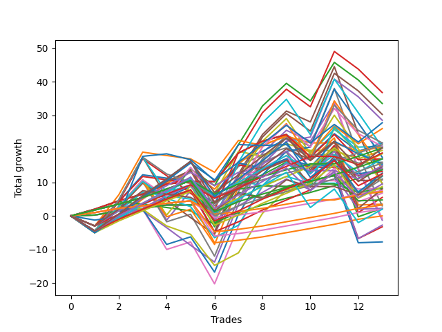

# Short Shepard 001 
- Symbol: ES
- Date Range: 03/18/2022 - 07/15/2022
- Trading Period: 7:20-12:30
- Number of Trades: 13



| Name | Win Percent | Profit | Avg Profit / Trade | Avg Time / Trade |      | Name | Win Percent | Profit | Avg Profit / Trade | Avg Time / Trade |
| ---- | ----------- | ------ | ------------------ | ---------------- | ---- | ---- | ----------- | ------ | ------------------ | ---------------- |
| Sorted By <br> Profit | | | | | | Sorted By <br> Win Percentage ||||
| Forty-Five | 46.15 | 18375.00 | 1413.46 | 21:34 |     | One Hundred Twelve | 92.31 | 10625.00 | 817.31 | 04:06 |
| Forty-Four | 53.85 | 16750.00 | 1288.46 | 18:30 |     | One Hundred Twenty-Seven | 92.31 | 8500.00 | 653.85 | 05:27 |
| Forty-Seven | 46.15 | 15125.00 | 1163.46 | 21:22 |     | One Hundred Twenty-Two | 92.31 | 7875.00 | 605.77 | 05:33 |
| Forty-Six | 46.15 | 14250.00 | 1096.15 | 19:54 |     | Eighty-Two | 92.31 | 6875.00 | 528.85 | 05:43 |
| One Hundred Fifteen | 69.23 | 13875.00 | 1067.31 | 11:35 |     | One Hundred Eleven | 92.31 | 3750.00 | 288.46 | 03:03 |
| Forty-Three | 69.23 | 13000.00 | 1000.00 | 14:49 |     | One Hundred Twenty-Six | 92.31 | 1625.00 | 125.00 | 04:24 |
| Forty-Two | 69.23 | 10875.00 | 836.54 | 09:30 |     | One Hundred Twenty-One | 92.31 | 1000.00 | 76.92 | 04:30 |
| Sixty-Nine | 46.15 | 10875.00 | 836.54 | 22:20 |     | Eighty-One | 92.31 | -0.00 | -0.00 | 04:39 |
| One Hundred Twelve | 92.31 | 10625.00 | 817.31 | 04:06 |     | One Hundred Seventeen | 84.62 | 10125.00 | 778.85 | 03:36 |
| Forty-One | 76.92 | 10375.00 | 798.08 | 04:49 |     | One Hundred Sixteen | 84.62 | 3625.00 | 278.85 | 02:34 |
| Sixty-Eight | 53.85 | 10375.00 | 798.08 | 19:20 |     | Forty-One | 76.92 | 10375.00 | 798.08 | 04:49 |
| Sixty-One | 53.85 | 10250.00 | 788.46 | 25:20 |     | One Hundred Thirteen | 76.92 | 9250.00 | 711.54 | 07:52 |
| Fifty-Three | 38.46 | 10250.00 | 788.46 | 11:25 |     | Sixty-Five | 76.92 | 8500.00 | 653.85 | 04:50 |
| One Hundred Seventeen | 84.62 | 10125.00 | 778.85 | 03:36 |     | One Hundred Twenty-Eight | 76.92 | 6250.00 | 480.77 | 09:54 |
| One Hundred Thirty | 69.23 | 10125.00 | 778.85 | 13:37 |     | Fifty-Seven | 76.92 | 5375.00 | 413.46 | 05:41 |
| Fifty | 53.85 | 9750.00 | 750.00 | 07:30 |     | One Hundred Twenty-Three | 76.92 | 4375.00 | 336.54 | 10:03 |
| One Hundred Eighteen | 69.23 | 9375.00 | 721.15 | 06:23 |     | Forty | 76.92 | 3500.00 | 269.23 | 01:48 |
| One Hundred Thirteen | 76.92 | 9250.00 | 711.54 | 07:52 |     | Sixty-Four | 76.92 | 2375.00 | 182.69 | 01:49 |
| Sixty-Two | 53.85 | 8750.00 | 673.08 | 22:52 |     | One | 76.92 | 1750.00 | 134.62 | 08:11 |
| One Hundred Twenty-Seven | 92.31 | 8500.00 | 653.85 | 05:27 |     | Fifty-Six | 76.92 | 1125.00 | 86.54 | 01:52 |
| Sixty-Five | 76.92 | 8500.00 | 653.85 | 04:50 |     | Eighty-Three | 76.92 | -1625.00 | -125.00 | 11:58 |
| One Hundred Fourteen | 69.23 | 8500.00 | 653.85 | 09:12 |     | Zero | 76.92 | -3875.00 | -298.08 | 03:38 |
| Forty-Nine | 69.23 | 8000.00 | 615.38 | 04:11 |     | One Hundred Fifteen | 69.23 | 13875.00 | 1067.31 | 11:35 |
| One Hundred Twenty-Two | 92.31 | 7875.00 | 605.77 | 05:33 |     | Forty-Three | 69.23 | 13000.00 | 1000.00 | 14:49 |
| Seventy-Three | 46.15 | 7750.00 | 596.15 | 09:41 |     | Forty-Two | 69.23 | 10875.00 | 836.54 | 09:30 |
| Seventy-One | 46.15 | 7625.00 | 586.54 | 22:08 |     | One Hundred Thirty | 69.23 | 10125.00 | 778.85 | 13:37 |
| One Hundred Ninteen | 53.85 | 7500.00 | 576.92 | 07:33 |     | One Hundred Eighteen | 69.23 | 9375.00 | 721.15 | 06:23 |
| Seventy | 46.15 | 7500.00 | 576.92 | 20:39 |     | One Hundred Fourteen | 69.23 | 8500.00 | 653.85 | 09:12 |
| Sixty-Seven | 69.23 | 7375.00 | 567.31 | 15:52 |     | Forty-Nine | 69.23 | 8000.00 | 615.38 | 04:11 |
| Sixty-Six | 69.23 | 7125.00 | 548.08 | 11:33 |     | Sixty-Seven | 69.23 | 7375.00 | 567.31 | 15:52 |
| Sixty-Three | 53.85 | 7000.00 | 538.46 | 25:08 |     | Sixty-Six | 69.23 | 7125.00 | 548.08 | 11:33 |
| Eighty-Two | 92.31 | 6875.00 | 528.85 | 05:43 |     | One Hundred Twenty-Five | 69.23 | 6375.00 | 490.38 | 14:33 |
| Fifty-Two | 38.46 | 6875.00 | 528.85 | 10:19 |     | Fifty-Nine | 69.23 | 5500.00 | 423.08 | 17:47 |
| Fifty-Five | 38.46 | 6625.00 | 509.62 | 11:09 |     | One Hundred Twenty-Nine | 69.23 | 4750.00 | 365.38 | 11:15 |
| One Hundred Twenty-Five | 69.23 | 6375.00 | 490.38 | 14:33 |     | Forty-Eight | 69.23 | 4125.00 | 317.31 | 01:35 |
| One Hundred Twenty-Eight | 76.92 | 6250.00 | 480.77 | 09:54 |     | Eighty-Five | 69.23 | 4000.00 | 307.69 | 17:40 |
| One Hundred Twenty | 38.46 | 6000.00 | 461.54 | 08:31 |     | Fifty-Eight | 69.23 | 3375.00 | 259.62 | 12:29 |
| Fifty-One | 38.46 | 5875.00 | 451.92 | 09:11 |     | Three | 69.23 | 2750.00 | 211.54 | 20:38 |
| Fifty-Nine | 69.23 | 5500.00 | 423.08 | 17:47 |     | Two | 69.23 | 1125.00 | 86.54 | 15:31 |
| Fifty-Seven | 76.92 | 5375.00 | 413.46 | 05:41 |     | One Hundred Twenty-Four | 69.23 | 1000.00 | 76.92 | 12:11 |
| Sixty | 53.85 | 4875.00 | 375.00 | 21:54 |     | Eighty-Four | 69.23 | -1375.00 | -105.77 | 15:18 |
| One Hundred Twenty-Nine | 69.23 | 4750.00 | 365.38 | 11:15 |     | Forty-Four | 53.85 | 16750.00 | 1288.46 | 18:30 |
| Five | 53.85 | 4750.00 | 365.38 | 29:00 |     | Sixty-Eight | 53.85 | 10375.00 | 798.08 | 19:20 |
| One Hundred Twenty-Three | 76.92 | 4375.00 | 336.54 | 10:03 |     | Sixty-One | 53.85 | 10250.00 | 788.46 | 25:20 |
| Forty-Eight | 69.23 | 4125.00 | 317.31 | 01:35 |     | Fifty | 53.85 | 9750.00 | 750.00 | 07:30 |
| Fifty-Four | 38.46 | 4125.00 | 317.31 | 09:44 |     | Sixty-Two | 53.85 | 8750.00 | 673.08 | 22:52 |
| Eighty-Five | 69.23 | 4000.00 | 307.69 | 17:40 |     | One Hundred Ninteen | 53.85 | 7500.00 | 576.92 | 07:33 |
| One Hundred Eleven | 92.31 | 3750.00 | 288.46 | 03:03 |     | Sixty-Three | 53.85 | 7000.00 | 538.46 | 25:08 |
| One Hundred Sixteen | 84.62 | 3625.00 | 278.85 | 02:34 |     | Sixty | 53.85 | 4875.00 | 375.00 | 21:54 |
| Forty | 76.92 | 3500.00 | 269.23 | 01:48 |     | Five | 53.85 | 4750.00 | 365.38 | 29:00 |
| Fifty-Eight | 69.23 | 3375.00 | 259.62 | 12:29 |     | Seven | 53.85 | 1500.00 | 115.38 | 28:48 |
| Three | 69.23 | 2750.00 | 211.54 | 20:38 |     | Six | 53.85 | -375.00 | -28.85 | 25:20 |
| Sixty-Four | 76.92 | 2375.00 | 182.69 | 01:49 |     | Four | 53.85 | -625.00 | -48.08 | 25:34 |
| One | 76.92 | 1750.00 | 134.62 | 08:11 |     | Forty-Five | 46.15 | 18375.00 | 1413.46 | 21:34 |
| One Hundred Twenty-Six | 92.31 | 1625.00 | 125.00 | 04:24 |     | Forty-Seven | 46.15 | 15125.00 | 1163.46 | 21:22 |
| Seven | 53.85 | 1500.00 | 115.38 | 28:48 |     | Forty-Six | 46.15 | 14250.00 | 1096.15 | 19:54 |
| Fifty-Six | 76.92 | 1125.00 | 86.54 | 01:52 |     | Sixty-Nine | 46.15 | 10875.00 | 836.54 | 22:20 |
| Two | 69.23 | 1125.00 | 86.54 | 15:31 |     | Seventy-Three | 46.15 | 7750.00 | 596.15 | 09:41 |
| One Hundred Twenty-One | 92.31 | 1000.00 | 76.92 | 04:30 |     | Seventy-One | 46.15 | 7625.00 | 586.54 | 22:08 |
| One Hundred Twenty-Four | 69.23 | 1000.00 | 76.92 | 12:11 |     | Seventy | 46.15 | 7500.00 | 576.92 | 20:39 |
| Eighty-One | 92.31 | -0.00 | -0.00 | 04:39 |     | Fifty-Three | 38.46 | 10250.00 | 788.46 | 11:25 |
| Six | 53.85 | -375.00 | -28.85 | 25:20 |     | Fifty-Two | 38.46 | 6875.00 | 528.85 | 10:19 |
| Four | 53.85 | -625.00 | -48.08 | 25:34 |     | Fifty-Five | 38.46 | 6625.00 | 509.62 | 11:09 |
| Eighty-Four | 69.23 | -1375.00 | -105.77 | 15:18 |     | One Hundred Twenty | 38.46 | 6000.00 | 461.54 | 08:31 |
| Eighty-Three | 76.92 | -1625.00 | -125.00 | 11:58 |     | Fifty-One | 38.46 | 5875.00 | 451.92 | 09:11 |
| Zero | 76.92 | -3875.00 | -298.08 | 03:38 |     | Fifty-Four | 38.46 | 4125.00 | 317.31 | 09:44 |

## NO STOPLOSS

### Test Zero
* Sell when price hits the middle line of the 20p bollinger
* No Stoploss
* Results:
```
Total Trades: 13
Percent Up: 23.08
Percent Down: 76.92
Total Points Moved Down: -7.75
Potential Profit: -3875.00
Total Points Ups: 20.25 Count Ups: 3
Total Points Downs: 12.50 Count Downs: 10
```

<details><summary>Trades</summary>

<code>In: 2022-03-18 09:47:00		Out: 2022-03-18 09:47:10		Total Position Time: 00:10		Total Move Down: 0.25		Total to Date: 0.25</code> <br />
<code>In: 2022-03-24 08:50:00		Out: 2022-03-24 08:50:10		Total Position Time: 00:10		Total Move Down: 1.25		Total to Date: 1.50</code> <br />
<code>In: 2022-04-05 10:24:00		Out: 2022-04-05 10:26:00		Total Position Time: 02:00		Total Move Down: 0.75		Total to Date: 2.25</code> <br />
<code>In: 2022-04-07 10:34:00		Out: 2022-04-07 10:36:05		Total Position Time: 02:05		Total Move Down: 1.00		Total to Date: 3.25</code> <br />
<code>In: 2022-04-18 11:00:00		Out: 2022-04-18 11:00:10		Total Position Time: 00:10		Total Move Down: -0.00		Total to Date: 3.25</code> <br />
<code>In: 2022-04-28 11:55:00		Out: 2022-04-28 11:55:10		Total Position Time: 00:10		Total Move Down: 0.75		Total to Date: 4.00</code> <br />
<code>In: 2022-05-19 08:51:00		Out: 2022-05-19 08:53:40		Total Position Time: 02:40		Total Move Down: 4.00		Total to Date: 8.00</code> <br />
<code>In: 2022-05-25 12:16:00		Out: 2022-05-25 12:17:30		Total Position Time: 01:30		Total Move Down: 1.00		Total to Date: 9.00</code> <br />
<code>In: 2022-06-07 07:52:00		Out: 2022-06-07 07:56:05		Total Position Time: 04:05		Total Move Down: -0.25		Total to Date: 8.75</code> <br />
<code>In: 2022-06-10 10:32:00		Out: 2022-06-10 10:32:15		Total Position Time: 00:15		Total Move Down: 1.75		Total to Date: 10.50</code> <br />
<code>In: 2022-06-22 11:21:00		Out: 2022-06-22 11:21:20		Total Position Time: 00:20		Total Move Down: 1.50		Total to Date: 12.00</code> <br />
<code>In: 2022-06-30 08:02:00		Out: 2022-06-30 08:31:55		Total Position Time: 29:55		Total Move Down: -20.00		Total to Date: -8.00</code> <br />
<code>In: 2022-07-01 10:55:00		Out: 2022-07-01 10:58:45		Total Position Time: 03:45		Total Move Down: 0.25		Total to Date: -7.75</code> <br />


</details>

### Test One
* Sell when the price hits the upper line of the 20p 1std bollinger
* No Stoploss
* Results:
```
Total Trades: 13
Percent Up: 23.08
Percent Down: 76.92
Total Points Moved Down: 3.50
Potential Profit: 1750.00
Total Points Ups: 27.75 Count Ups: 3
Total Points Downs: 31.25 Count Downs: 10
```

<details><summary>Trades</summary>

<code>In: 2022-03-18 09:47:00		Out: 2022-03-18 09:49:00		Total Position Time: 02:00		Total Move Down: 2.00		Total to Date: 2.00</code> <br />
<code>In: 2022-03-24 08:50:00		Out: 2022-03-24 08:53:45		Total Position Time: 03:45		Total Move Down: 2.50		Total to Date: 4.50</code> <br />
<code>In: 2022-04-05 10:24:00		Out: 2022-04-05 10:27:10		Total Position Time: 03:10		Total Move Down: 2.00		Total to Date: 6.50</code> <br />
<code>In: 2022-04-07 10:34:00		Out: 2022-04-07 10:39:55		Total Position Time: 05:55		Total Move Down: 3.00		Total to Date: 9.50</code> <br />
<code>In: 2022-04-18 11:00:00		Out: 2022-04-18 11:06:20		Total Position Time: 06:20		Total Move Down: 0.75		Total to Date: 10.25</code> <br />
<code>In: 2022-04-28 11:55:00		Out: 2022-04-28 12:02:10		Total Position Time: 07:10		Total Move Down: -0.00		Total to Date: 10.25</code> <br />
<code>In: 2022-05-19 08:51:00		Out: 2022-05-19 08:54:40		Total Position Time: 03:40		Total Move Down: 8.50		Total to Date: 18.75</code> <br />
<code>In: 2022-05-25 12:16:00		Out: 2022-05-25 12:20:25		Total Position Time: 04:25		Total Move Down: 3.50		Total to Date: 22.25</code> <br />
<code>In: 2022-06-07 07:52:00		Out: 2022-06-07 07:57:55		Total Position Time: 05:55		Total Move Down: 2.00		Total to Date: 24.25</code> <br />
<code>In: 2022-06-10 10:32:00		Out: 2022-06-10 10:56:05		Total Position Time: 24:05		Total Move Down: -7.75		Total to Date: 16.50</code> <br />
<code>In: 2022-06-22 11:21:00		Out: 2022-06-22 11:21:45		Total Position Time: 00:45		Total Move Down: 6.75		Total to Date: 23.25</code> <br />
<code>In: 2022-06-30 08:02:00		Out: 2022-06-30 08:31:55		Total Position Time: 29:55		Total Move Down: -20.00		Total to Date: 3.25</code> <br />
<code>In: 2022-07-01 10:55:00		Out: 2022-07-01 11:04:25		Total Position Time: 09:25		Total Move Down: 0.25		Total to Date: 3.50</code> <br />


</details>

### Test Two
* Sell when the price hits the upper line of the 20p 2std bollinger
* No Stoploss
* Results:
```
Total Trades: 13
Percent Up: 30.77
Percent Down: 69.23
Total Points Moved Down: 2.25
Potential Profit: 1125.00
Total Points Ups: 40.00 Count Ups: 4
Total Points Downs: 42.25 Count Downs: 9
```

<details><summary>Trades</summary>

<code>In: 2022-03-18 09:47:00		Out: 2022-03-18 10:16:55		Total Position Time: 29:55		Total Move Down: -4.50		Total to Date: -4.50</code> <br />
<code>In: 2022-03-24 08:50:00		Out: 2022-03-24 09:03:10		Total Position Time: 13:10		Total Move Down: 4.50		Total to Date: 0.00</code> <br />
<code>In: 2022-04-05 10:24:00		Out: 2022-04-05 10:29:15		Total Position Time: 05:15		Total Move Down: 2.25		Total to Date: 2.25</code> <br />
<code>In: 2022-04-07 10:34:00		Out: 2022-04-07 10:45:15		Total Position Time: 11:15		Total Move Down: 3.75		Total to Date: 6.00</code> <br />
<code>In: 2022-04-18 11:00:00		Out: 2022-04-18 11:10:40		Total Position Time: 10:40		Total Move Down: 3.25		Total to Date: 9.25</code> <br />
<code>In: 2022-04-28 11:55:00		Out: 2022-04-28 12:24:55		Total Position Time: 29:55		Total Move Down: -12.50		Total to Date: -3.25</code> <br />
<code>In: 2022-05-19 08:51:00		Out: 2022-05-19 08:56:05		Total Position Time: 05:05		Total Move Down: 12.50		Total to Date: 9.25</code> <br />
<code>In: 2022-05-25 12:16:00		Out: 2022-05-25 12:22:50		Total Position Time: 06:50		Total Move Down: 3.00		Total to Date: 12.25</code> <br />
<code>In: 2022-06-07 07:52:00		Out: 2022-06-07 08:04:45		Total Position Time: 12:45		Total Move Down: 3.75		Total to Date: 16.00</code> <br />
<code>In: 2022-06-10 10:32:00		Out: 2022-06-10 11:01:00		Total Position Time: 29:00		Total Move Down: -3.00		Total to Date: 13.00</code> <br />
<code>In: 2022-06-22 11:21:00		Out: 2022-06-22 11:26:15		Total Position Time: 05:15		Total Move Down: 6.75		Total to Date: 19.75</code> <br />
<code>In: 2022-06-30 08:02:00		Out: 2022-06-30 08:31:55		Total Position Time: 29:55		Total Move Down: -20.00		Total to Date: -0.25</code> <br />
<code>In: 2022-07-01 10:55:00		Out: 2022-07-01 11:07:55		Total Position Time: 12:55		Total Move Down: 2.50		Total to Date: 2.25</code> <br />


</details>

### Test Three
* Sell when price hits the middle line of the 50p bollinger
* No Stoploss
* Results:
```
Total Trades: 13
Percent Up: 30.77
Percent Down: 69.23
Total Points Moved Down: 5.50
Potential Profit: 2750.00
Total Points Ups: 41.00 Count Ups: 4
Total Points Downs: 46.50 Count Downs: 9
```

<details><summary>Trades</summary>

<code>In: 2022-03-18 09:47:00		Out: 2022-03-18 10:16:55		Total Position Time: 29:55		Total Move Down: -4.50		Total to Date: -4.50</code> <br />
<code>In: 2022-03-24 08:50:00		Out: 2022-03-24 09:03:10		Total Position Time: 13:10		Total Move Down: 4.50		Total to Date: 0.00</code> <br />
<code>In: 2022-04-05 10:24:00		Out: 2022-04-05 10:34:05		Total Position Time: 10:05		Total Move Down: 5.50		Total to Date: 5.50</code> <br />
<code>In: 2022-04-07 10:34:00		Out: 2022-04-07 10:51:55		Total Position Time: 17:55		Total Move Down: 4.75		Total to Date: 10.25</code> <br />
<code>In: 2022-04-18 11:00:00		Out: 2022-04-18 11:16:30		Total Position Time: 16:30		Total Move Down: 3.25		Total to Date: 13.50</code> <br />
<code>In: 2022-04-28 11:55:00		Out: 2022-04-28 12:24:55		Total Position Time: 29:55		Total Move Down: -12.50		Total to Date: 1.00</code> <br />
<code>In: 2022-05-19 08:51:00		Out: 2022-05-19 09:19:40		Total Position Time: 28:40		Total Move Down: 7.50		Total to Date: 8.50</code> <br />
<code>In: 2022-05-25 12:16:00		Out: 2022-05-25 12:34:20		Total Position Time: 18:20		Total Move Down: 5.50		Total to Date: 14.00</code> <br />
<code>In: 2022-06-07 07:52:00		Out: 2022-06-07 08:18:05		Total Position Time: 26:05		Total Move Down: 3.00		Total to Date: 17.00</code> <br />
<code>In: 2022-06-10 10:32:00		Out: 2022-06-10 10:58:20		Total Position Time: 26:20		Total Move Down: -4.00		Total to Date: 13.00</code> <br />
<code>In: 2022-06-22 11:21:00		Out: 2022-06-22 11:26:30		Total Position Time: 05:30		Total Move Down: 8.00		Total to Date: 21.00</code> <br />
<code>In: 2022-06-30 08:02:00		Out: 2022-06-30 08:31:55		Total Position Time: 29:55		Total Move Down: -20.00		Total to Date: 1.00</code> <br />
<code>In: 2022-07-01 10:55:00		Out: 2022-07-01 11:10:55		Total Position Time: 15:55		Total Move Down: 4.50		Total to Date: 5.50</code> <br />


</details>

### Test Four
* Sell when the price hits the upper line of the 50p 1std bollinger
* No Stoploss
* Results:
```
Total Trades: 13
Percent Up: 46.15
Percent Down: 53.85
Total Points Moved Down: -1.25
Potential Profit: -625.00
Total Points Ups: 67.25 Count Ups: 6
Total Points Downs: 66.00 Count Downs: 7
```

<details><summary>Trades</summary>

<code>In: 2022-03-18 09:47:00		Out: 2022-03-18 10:16:55		Total Position Time: 29:55		Total Move Down: -4.50		Total to Date: -4.50</code> <br />
<code>In: 2022-03-24 08:50:00		Out: 2022-03-24 09:08:20		Total Position Time: 18:20		Total Move Down: 7.25		Total to Date: 2.75</code> <br />
<code>In: 2022-04-05 10:24:00		Out: 2022-04-05 10:40:15		Total Position Time: 16:15		Total Move Down: 8.00		Total to Date: 10.75</code> <br />
<code>In: 2022-04-07 10:34:00		Out: 2022-04-07 11:03:55		Total Position Time: 29:55		Total Move Down: -12.00		Total to Date: -1.25</code> <br />
<code>In: 2022-04-18 11:00:00		Out: 2022-04-18 11:18:10		Total Position Time: 18:10		Total Move Down: 8.75		Total to Date: 7.50</code> <br />
<code>In: 2022-04-28 11:55:00		Out: 2022-04-28 12:24:55		Total Position Time: 29:55		Total Move Down: -12.50		Total to Date: -5.00</code> <br />
<code>In: 2022-05-19 08:51:00		Out: 2022-05-19 09:20:30		Total Position Time: 29:30		Total Move Down: 12.25		Total to Date: 7.25</code> <br />
<code>In: 2022-05-25 12:16:00		Out: 2022-05-25 12:36:35		Total Position Time: 20:35		Total Move Down: 11.50		Total to Date: 18.75</code> <br />
<code>In: 2022-06-07 07:52:00		Out: 2022-06-07 08:21:20		Total Position Time: 29:20		Total Move Down: 6.75		Total to Date: 25.50</code> <br />
<code>In: 2022-06-10 10:32:00		Out: 2022-06-10 11:01:55		Total Position Time: 29:55		Total Move Down: -3.25		Total to Date: 22.25</code> <br />
<code>In: 2022-06-22 11:21:00		Out: 2022-06-22 11:41:45		Total Position Time: 20:45		Total Move Down: 11.50		Total to Date: 33.75</code> <br />
<code>In: 2022-06-30 08:02:00		Out: 2022-06-30 08:31:55		Total Position Time: 29:55		Total Move Down: -20.00		Total to Date: 13.75</code> <br />
<code>In: 2022-07-01 10:55:00		Out: 2022-07-01 11:24:55		Total Position Time: 29:55		Total Move Down: -15.00		Total to Date: -1.25</code> <br />


</details>

### Test Five
* Sell when the price hits the upper line of the 50p 2std bollinger
* No Stoploss
* Results:
```
Total Trades: 13
Percent Up: 46.15
Percent Down: 53.85
Total Points Moved Down: 9.50
Potential Profit: 4750.00
Total Points Ups: 67.25 Count Ups: 6
Total Points Downs: 76.75 Count Downs: 7
```

<details><summary>Trades</summary>

<code>In: 2022-03-18 09:47:00		Out: 2022-03-18 10:16:55		Total Position Time: 29:55		Total Move Down: -4.50		Total to Date: -4.50</code> <br />
<code>In: 2022-03-24 08:50:00		Out: 2022-03-24 09:17:15		Total Position Time: 27:15		Total Move Down: 9.25		Total to Date: 4.75</code> <br />
<code>In: 2022-04-05 10:24:00		Out: 2022-04-05 10:45:40		Total Position Time: 21:40		Total Move Down: 12.75		Total to Date: 17.50</code> <br />
<code>In: 2022-04-07 10:34:00		Out: 2022-04-07 11:03:55		Total Position Time: 29:55		Total Move Down: -12.00		Total to Date: 5.50</code> <br />
<code>In: 2022-04-18 11:00:00		Out: 2022-04-18 11:29:55		Total Position Time: 29:55		Total Move Down: 2.25		Total to Date: 7.75</code> <br />
<code>In: 2022-04-28 11:55:00		Out: 2022-04-28 12:24:55		Total Position Time: 29:55		Total Move Down: -12.50		Total to Date: -4.75</code> <br />
<code>In: 2022-05-19 08:51:00		Out: 2022-05-19 09:20:55		Total Position Time: 29:55		Total Move Down: 17.25		Total to Date: 12.50</code> <br />
<code>In: 2022-05-25 12:16:00		Out: 2022-05-25 12:45:55		Total Position Time: 29:55		Total Move Down: 11.75		Total to Date: 24.25</code> <br />
<code>In: 2022-06-07 07:52:00		Out: 2022-06-07 08:21:55		Total Position Time: 29:55		Total Move Down: 7.00		Total to Date: 31.25</code> <br />
<code>In: 2022-06-10 10:32:00		Out: 2022-06-10 11:01:55		Total Position Time: 29:55		Total Move Down: -3.25		Total to Date: 28.00</code> <br />
<code>In: 2022-06-22 11:21:00		Out: 2022-06-22 11:50:00		Total Position Time: 29:00		Total Move Down: 16.50		Total to Date: 44.50</code> <br />
<code>In: 2022-06-30 08:02:00		Out: 2022-06-30 08:31:55		Total Position Time: 29:55		Total Move Down: -20.00		Total to Date: 24.50</code> <br />
<code>In: 2022-07-01 10:55:00		Out: 2022-07-01 11:24:55		Total Position Time: 29:55		Total Move Down: -15.00		Total to Date: 9.50</code> <br />


</details>

### Test Six
* Sell when the price hits the middle line of the 1std VWAP
* No Stoploss
* Results:
```
Total Trades: 13
Percent Up: 46.15
Percent Down: 53.85
Total Points Moved Down: -0.75
Potential Profit: -375.00
Total Points Ups: 64.75 Count Ups: 6
Total Points Downs: 64.00 Count Downs: 7
```

<details><summary>Trades</summary>

<code>In: 2022-03-18 09:47:00		Out: 2022-03-18 10:16:55		Total Position Time: 29:55		Total Move Down: -4.50		Total to Date: -4.50</code> <br />
<code>In: 2022-03-24 08:50:00		Out: 2022-03-24 09:19:55		Total Position Time: 29:55		Total Move Down: 7.25		Total to Date: 2.75</code> <br />
<code>In: 2022-04-05 10:24:00		Out: 2022-04-05 10:24:10		Total Position Time: 00:10		Total Move Down: -0.75		Total to Date: 2.00</code> <br />
<code>In: 2022-04-07 10:34:00		Out: 2022-04-07 11:03:55		Total Position Time: 29:55		Total Move Down: -12.00		Total to Date: -10.00</code> <br />
<code>In: 2022-04-18 11:00:00		Out: 2022-04-18 11:29:55		Total Position Time: 29:55		Total Move Down: 2.25		Total to Date: -7.75</code> <br />
<code>In: 2022-04-28 11:55:00		Out: 2022-04-28 12:24:55		Total Position Time: 29:55		Total Move Down: -12.50		Total to Date: -20.25</code> <br />
<code>In: 2022-05-19 08:51:00		Out: 2022-05-19 09:20:55		Total Position Time: 29:55		Total Move Down: 17.25		Total to Date: -3.00</code> <br />
<code>In: 2022-05-25 12:16:00		Out: 2022-05-25 12:45:55		Total Position Time: 29:55		Total Move Down: 11.75		Total to Date: 8.75</code> <br />
<code>In: 2022-06-07 07:52:00		Out: 2022-06-07 08:21:55		Total Position Time: 29:55		Total Move Down: 7.00		Total to Date: 15.75</code> <br />
<code>In: 2022-06-10 10:32:00		Out: 2022-06-10 10:32:10		Total Position Time: 00:10		Total Move Down: 1.25		Total to Date: 17.00</code> <br />
<code>In: 2022-06-22 11:21:00		Out: 2022-06-22 11:50:55		Total Position Time: 29:55		Total Move Down: 17.25		Total to Date: 34.25</code> <br />
<code>In: 2022-06-30 08:02:00		Out: 2022-06-30 08:31:55		Total Position Time: 29:55		Total Move Down: -20.00		Total to Date: 14.25</code> <br />
<code>In: 2022-07-01 10:55:00		Out: 2022-07-01 11:24:55		Total Position Time: 29:55		Total Move Down: -15.00		Total to Date: -0.75</code> <br />


</details>

### Test Seven
* Sell when the price hits the upper line of the 1std VWAP
* No Stoploss
* Results:
```
Total Trades: 13
Percent Up: 46.15
Percent Down: 53.85
Total Points Moved Down: 3.00
Potential Profit: 1500.00
Total Points Ups: 67.25 Count Ups: 6
Total Points Downs: 70.25 Count Downs: 7
```

<details><summary>Trades</summary>

<code>In: 2022-03-18 09:47:00		Out: 2022-03-18 10:16:55		Total Position Time: 29:55		Total Move Down: -4.50		Total to Date: -4.50</code> <br />
<code>In: 2022-03-24 08:50:00		Out: 2022-03-24 09:19:55		Total Position Time: 29:55		Total Move Down: 7.25		Total to Date: 2.75</code> <br />
<code>In: 2022-04-05 10:24:00		Out: 2022-04-05 10:39:30		Total Position Time: 15:30		Total Move Down: 7.50		Total to Date: 10.25</code> <br />
<code>In: 2022-04-07 10:34:00		Out: 2022-04-07 11:03:55		Total Position Time: 29:55		Total Move Down: -12.00		Total to Date: -1.75</code> <br />
<code>In: 2022-04-18 11:00:00		Out: 2022-04-18 11:29:55		Total Position Time: 29:55		Total Move Down: 2.25		Total to Date: 0.50</code> <br />
<code>In: 2022-04-28 11:55:00		Out: 2022-04-28 12:24:55		Total Position Time: 29:55		Total Move Down: -12.50		Total to Date: -12.00</code> <br />
<code>In: 2022-05-19 08:51:00		Out: 2022-05-19 09:20:55		Total Position Time: 29:55		Total Move Down: 17.25		Total to Date: 5.25</code> <br />
<code>In: 2022-05-25 12:16:00		Out: 2022-05-25 12:45:55		Total Position Time: 29:55		Total Move Down: 11.75		Total to Date: 17.00</code> <br />
<code>In: 2022-06-07 07:52:00		Out: 2022-06-07 08:21:55		Total Position Time: 29:55		Total Move Down: 7.00		Total to Date: 24.00</code> <br />
<code>In: 2022-06-10 10:32:00		Out: 2022-06-10 11:01:55		Total Position Time: 29:55		Total Move Down: -3.25		Total to Date: 20.75</code> <br />
<code>In: 2022-06-22 11:21:00		Out: 2022-06-22 11:50:55		Total Position Time: 29:55		Total Move Down: 17.25		Total to Date: 38.00</code> <br />
<code>In: 2022-06-30 08:02:00		Out: 2022-06-30 08:31:55		Total Position Time: 29:55		Total Move Down: -20.00		Total to Date: 18.00</code> <br />
<code>In: 2022-07-01 10:55:00		Out: 2022-07-01 11:24:55		Total Position Time: 29:55		Total Move Down: -15.00		Total to Date: 3.00</code> <br />


</details>

## STOPLOSS OF 5

### Test Forty
* Sell when price hits the middle line of the 20p bollinger
* Stoploss is -5 points
* Results:
```
Total Trades: 13
Percent Up: 23.08
Percent Down: 76.92
Total Points Moved Down: 7.00
Potential Profit: 3500.00
Total Points Ups: 5.50 Count Ups: 3
Total Points Downs: 12.50 Count Downs: 10
```

<details><summary>Trades</summary>

<code>In: 2022-03-18 09:47:00		Out: 2022-03-18 09:47:10		Total Position Time: 00:10		Total Move Down: 0.25		Total to Date: 0.25</code> <br />
<code>In: 2022-03-24 08:50:00		Out: 2022-03-24 08:50:10		Total Position Time: 00:10		Total Move Down: 1.25		Total to Date: 1.50</code> <br />
<code>In: 2022-04-05 10:24:00		Out: 2022-04-05 10:26:00		Total Position Time: 02:00		Total Move Down: 0.75		Total to Date: 2.25</code> <br />
<code>In: 2022-04-07 10:34:00		Out: 2022-04-07 10:36:05		Total Position Time: 02:05		Total Move Down: 1.00		Total to Date: 3.25</code> <br />
<code>In: 2022-04-18 11:00:00		Out: 2022-04-18 11:00:10		Total Position Time: 00:10		Total Move Down: -0.00		Total to Date: 3.25</code> <br />
<code>In: 2022-04-28 11:55:00		Out: 2022-04-28 11:55:10		Total Position Time: 00:10		Total Move Down: 0.75		Total to Date: 4.00</code> <br />
<code>In: 2022-05-19 08:51:00		Out: 2022-05-19 08:53:40		Total Position Time: 02:40		Total Move Down: 4.00		Total to Date: 8.00</code> <br />
<code>In: 2022-05-25 12:16:00		Out: 2022-05-25 12:17:30		Total Position Time: 01:30		Total Move Down: 1.00		Total to Date: 9.00</code> <br />
<code>In: 2022-06-07 07:52:00		Out: 2022-06-07 07:56:05		Total Position Time: 04:05		Total Move Down: -0.25		Total to Date: 8.75</code> <br />
<code>In: 2022-06-10 10:32:00		Out: 2022-06-10 10:32:15		Total Position Time: 00:15		Total Move Down: 1.75		Total to Date: 10.50</code> <br />
<code>In: 2022-06-22 11:21:00		Out: 2022-06-22 11:21:20		Total Position Time: 00:20		Total Move Down: 1.50		Total to Date: 12.00</code> <br />
<code>In: 2022-06-30 08:02:00		Out: 2022-06-30 08:08:15		Total Position Time: 06:15		Total Move Down: -5.25		Total to Date: 6.75</code> <br />
<code>In: 2022-07-01 10:55:00		Out: 2022-07-01 10:58:45		Total Position Time: 03:45		Total Move Down: 0.25		Total to Date: 7.00</code> <br />


</details>

### Test Forty-One
* Sell when the price hits the upper line of the 20p 1std bollinger
* Stoploss is -5 points
* Results:
```
Total Trades: 13
Percent Up: 23.08
Percent Down: 76.92
Total Points Moved Down: 20.75
Potential Profit: 10375.00
Total Points Ups: 10.50 Count Ups: 3
Total Points Downs: 31.25 Count Downs: 10
```

<details><summary>Trades</summary>

<code>In: 2022-03-18 09:47:00		Out: 2022-03-18 09:49:00		Total Position Time: 02:00		Total Move Down: 2.00		Total to Date: 2.00</code> <br />
<code>In: 2022-03-24 08:50:00		Out: 2022-03-24 08:53:45		Total Position Time: 03:45		Total Move Down: 2.50		Total to Date: 4.50</code> <br />
<code>In: 2022-04-05 10:24:00		Out: 2022-04-05 10:27:10		Total Position Time: 03:10		Total Move Down: 2.00		Total to Date: 6.50</code> <br />
<code>In: 2022-04-07 10:34:00		Out: 2022-04-07 10:39:55		Total Position Time: 05:55		Total Move Down: 3.00		Total to Date: 9.50</code> <br />
<code>In: 2022-04-18 11:00:00		Out: 2022-04-18 11:06:20		Total Position Time: 06:20		Total Move Down: 0.75		Total to Date: 10.25</code> <br />
<code>In: 2022-04-28 11:55:00		Out: 2022-04-28 12:02:10		Total Position Time: 07:10		Total Move Down: -0.00		Total to Date: 10.25</code> <br />
<code>In: 2022-05-19 08:51:00		Out: 2022-05-19 08:54:40		Total Position Time: 03:40		Total Move Down: 8.50		Total to Date: 18.75</code> <br />
<code>In: 2022-05-25 12:16:00		Out: 2022-05-25 12:20:25		Total Position Time: 04:25		Total Move Down: 3.50		Total to Date: 22.25</code> <br />
<code>In: 2022-06-07 07:52:00		Out: 2022-06-07 07:57:55		Total Position Time: 05:55		Total Move Down: 2.00		Total to Date: 24.25</code> <br />
<code>In: 2022-06-10 10:32:00		Out: 2022-06-10 10:36:00		Total Position Time: 04:00		Total Move Down: -5.25		Total to Date: 19.00</code> <br />
<code>In: 2022-06-22 11:21:00		Out: 2022-06-22 11:21:45		Total Position Time: 00:45		Total Move Down: 6.75		Total to Date: 25.75</code> <br />
<code>In: 2022-06-30 08:02:00		Out: 2022-06-30 08:08:15		Total Position Time: 06:15		Total Move Down: -5.25		Total to Date: 20.50</code> <br />
<code>In: 2022-07-01 10:55:00		Out: 2022-07-01 11:04:25		Total Position Time: 09:25		Total Move Down: 0.25		Total to Date: 20.75</code> <br />


</details>

### Test Forty-Two
* Sell when the price hits the upper line of the 20p 2std bollinger
* Stoploss is -5 points
* Results:
```
Total Trades: 13
Percent Up: 30.77
Percent Down: 69.23
Total Points Moved Down: 21.75
Potential Profit: 10875.00
Total Points Ups: 20.50 Count Ups: 4
Total Points Downs: 42.25 Count Downs: 9
```

<details><summary>Trades</summary>

<code>In: 2022-03-18 09:47:00		Out: 2022-03-18 10:08:15		Total Position Time: 21:15		Total Move Down: -5.00		Total to Date: -5.00</code> <br />
<code>In: 2022-03-24 08:50:00		Out: 2022-03-24 09:03:10		Total Position Time: 13:10		Total Move Down: 4.50		Total to Date: -0.50</code> <br />
<code>In: 2022-04-05 10:24:00		Out: 2022-04-05 10:29:15		Total Position Time: 05:15		Total Move Down: 2.25		Total to Date: 1.75</code> <br />
<code>In: 2022-04-07 10:34:00		Out: 2022-04-07 10:45:15		Total Position Time: 11:15		Total Move Down: 3.75		Total to Date: 5.50</code> <br />
<code>In: 2022-04-18 11:00:00		Out: 2022-04-18 11:10:40		Total Position Time: 10:40		Total Move Down: 3.25		Total to Date: 8.75</code> <br />
<code>In: 2022-04-28 11:55:00		Out: 2022-04-28 12:04:00		Total Position Time: 09:00		Total Move Down: -5.00		Total to Date: 3.75</code> <br />
<code>In: 2022-05-19 08:51:00		Out: 2022-05-19 08:56:05		Total Position Time: 05:05		Total Move Down: 12.50		Total to Date: 16.25</code> <br />
<code>In: 2022-05-25 12:16:00		Out: 2022-05-25 12:22:50		Total Position Time: 06:50		Total Move Down: 3.00		Total to Date: 19.25</code> <br />
<code>In: 2022-06-07 07:52:00		Out: 2022-06-07 08:04:45		Total Position Time: 12:45		Total Move Down: 3.75		Total to Date: 23.00</code> <br />
<code>In: 2022-06-10 10:32:00		Out: 2022-06-10 10:36:00		Total Position Time: 04:00		Total Move Down: -5.25		Total to Date: 17.75</code> <br />
<code>In: 2022-06-22 11:21:00		Out: 2022-06-22 11:26:15		Total Position Time: 05:15		Total Move Down: 6.75		Total to Date: 24.50</code> <br />
<code>In: 2022-06-30 08:02:00		Out: 2022-06-30 08:08:15		Total Position Time: 06:15		Total Move Down: -5.25		Total to Date: 19.25</code> <br />
<code>In: 2022-07-01 10:55:00		Out: 2022-07-01 11:07:55		Total Position Time: 12:55		Total Move Down: 2.50		Total to Date: 21.75</code> <br />


</details>

### Test Forty-Three
* Sell when price hits the middle line of the 50p bollinger
* Stoploss is -5 points
* Results:
```
Total Trades: 13
Percent Up: 30.77
Percent Down: 69.23
Total Points Moved Down: 26.00
Potential Profit: 13000.00
Total Points Ups: 20.50 Count Ups: 4
Total Points Downs: 46.50 Count Downs: 9
```

<details><summary>Trades</summary>

<code>In: 2022-03-18 09:47:00		Out: 2022-03-18 10:08:15		Total Position Time: 21:15		Total Move Down: -5.00		Total to Date: -5.00</code> <br />
<code>In: 2022-03-24 08:50:00		Out: 2022-03-24 09:03:10		Total Position Time: 13:10		Total Move Down: 4.50		Total to Date: -0.50</code> <br />
<code>In: 2022-04-05 10:24:00		Out: 2022-04-05 10:34:05		Total Position Time: 10:05		Total Move Down: 5.50		Total to Date: 5.00</code> <br />
<code>In: 2022-04-07 10:34:00		Out: 2022-04-07 10:51:55		Total Position Time: 17:55		Total Move Down: 4.75		Total to Date: 9.75</code> <br />
<code>In: 2022-04-18 11:00:00		Out: 2022-04-18 11:16:30		Total Position Time: 16:30		Total Move Down: 3.25		Total to Date: 13.00</code> <br />
<code>In: 2022-04-28 11:55:00		Out: 2022-04-28 12:04:00		Total Position Time: 09:00		Total Move Down: -5.00		Total to Date: 8.00</code> <br />
<code>In: 2022-05-19 08:51:00		Out: 2022-05-19 09:19:40		Total Position Time: 28:40		Total Move Down: 7.50		Total to Date: 15.50</code> <br />
<code>In: 2022-05-25 12:16:00		Out: 2022-05-25 12:34:20		Total Position Time: 18:20		Total Move Down: 5.50		Total to Date: 21.00</code> <br />
<code>In: 2022-06-07 07:52:00		Out: 2022-06-07 08:18:05		Total Position Time: 26:05		Total Move Down: 3.00		Total to Date: 24.00</code> <br />
<code>In: 2022-06-10 10:32:00		Out: 2022-06-10 10:36:00		Total Position Time: 04:00		Total Move Down: -5.25		Total to Date: 18.75</code> <br />
<code>In: 2022-06-22 11:21:00		Out: 2022-06-22 11:26:30		Total Position Time: 05:30		Total Move Down: 8.00		Total to Date: 26.75</code> <br />
<code>In: 2022-06-30 08:02:00		Out: 2022-06-30 08:08:15		Total Position Time: 06:15		Total Move Down: -5.25		Total to Date: 21.50</code> <br />
<code>In: 2022-07-01 10:55:00		Out: 2022-07-01 11:10:55		Total Position Time: 15:55		Total Move Down: 4.50		Total to Date: 26.00</code> <br />


</details>

### Test Forty-Four
* Sell when the price hits the upper line of the 50p 1std bollinger
* Stoploss is -5 points
* Results:
```
Total Trades: 13
Percent Up: 46.15
Percent Down: 53.85
Total Points Moved Down: 33.50
Potential Profit: 16750.00
Total Points Ups: 32.50 Count Ups: 6
Total Points Downs: 66.00 Count Downs: 7
```

<details><summary>Trades</summary>

<code>In: 2022-03-18 09:47:00		Out: 2022-03-18 10:08:15		Total Position Time: 21:15		Total Move Down: -5.00		Total to Date: -5.00</code> <br />
<code>In: 2022-03-24 08:50:00		Out: 2022-03-24 09:08:20		Total Position Time: 18:20		Total Move Down: 7.25		Total to Date: 2.25</code> <br />
<code>In: 2022-04-05 10:24:00		Out: 2022-04-05 10:40:15		Total Position Time: 16:15		Total Move Down: 8.00		Total to Date: 10.25</code> <br />
<code>In: 2022-04-07 10:34:00		Out: 2022-04-07 10:56:05		Total Position Time: 22:05		Total Move Down: -5.00		Total to Date: 5.25</code> <br />
<code>In: 2022-04-18 11:00:00		Out: 2022-04-18 11:18:10		Total Position Time: 18:10		Total Move Down: 8.75		Total to Date: 14.00</code> <br />
<code>In: 2022-04-28 11:55:00		Out: 2022-04-28 12:04:00		Total Position Time: 09:00		Total Move Down: -5.00		Total to Date: 9.00</code> <br />
<code>In: 2022-05-19 08:51:00		Out: 2022-05-19 09:20:30		Total Position Time: 29:30		Total Move Down: 12.25		Total to Date: 21.25</code> <br />
<code>In: 2022-05-25 12:16:00		Out: 2022-05-25 12:36:35		Total Position Time: 20:35		Total Move Down: 11.50		Total to Date: 32.75</code> <br />
<code>In: 2022-06-07 07:52:00		Out: 2022-06-07 08:21:20		Total Position Time: 29:20		Total Move Down: 6.75		Total to Date: 39.50</code> <br />
<code>In: 2022-06-10 10:32:00		Out: 2022-06-10 10:36:00		Total Position Time: 04:00		Total Move Down: -5.25		Total to Date: 34.25</code> <br />
<code>In: 2022-06-22 11:21:00		Out: 2022-06-22 11:41:45		Total Position Time: 20:45		Total Move Down: 11.50		Total to Date: 45.75</code> <br />
<code>In: 2022-06-30 08:02:00		Out: 2022-06-30 08:08:15		Total Position Time: 06:15		Total Move Down: -5.25		Total to Date: 40.50</code> <br />
<code>In: 2022-07-01 10:55:00		Out: 2022-07-01 11:20:00		Total Position Time: 25:00		Total Move Down: -7.00		Total to Date: 33.50</code> <br />


</details>

### Test Forty-Five
* Sell when the price hits the upper line of the 50p 2std bollinger
* Stoploss is -5 points
* Results:
```
Total Trades: 13
Percent Up: 53.85
Percent Down: 46.15
Total Points Moved Down: 36.75
Potential Profit: 18375.00
Total Points Ups: 37.75 Count Ups: 7
Total Points Downs: 74.50 Count Downs: 6
```

<details><summary>Trades</summary>

<code>In: 2022-03-18 09:47:00		Out: 2022-03-18 10:08:15		Total Position Time: 21:15		Total Move Down: -5.00		Total to Date: -5.00</code> <br />
<code>In: 2022-03-24 08:50:00		Out: 2022-03-24 09:17:15		Total Position Time: 27:15		Total Move Down: 9.25		Total to Date: 4.25</code> <br />
<code>In: 2022-04-05 10:24:00		Out: 2022-04-05 10:45:40		Total Position Time: 21:40		Total Move Down: 12.75		Total to Date: 17.00</code> <br />
<code>In: 2022-04-07 10:34:00		Out: 2022-04-07 10:56:05		Total Position Time: 22:05		Total Move Down: -5.00		Total to Date: 12.00</code> <br />
<code>In: 2022-04-18 11:00:00		Out: 2022-04-18 11:25:15		Total Position Time: 25:15		Total Move Down: -5.25		Total to Date: 6.75</code> <br />
<code>In: 2022-04-28 11:55:00		Out: 2022-04-28 12:04:00		Total Position Time: 09:00		Total Move Down: -5.00		Total to Date: 1.75</code> <br />
<code>In: 2022-05-19 08:51:00		Out: 2022-05-19 09:20:55		Total Position Time: 29:55		Total Move Down: 17.25		Total to Date: 19.00</code> <br />
<code>In: 2022-05-25 12:16:00		Out: 2022-05-25 12:45:55		Total Position Time: 29:55		Total Move Down: 11.75		Total to Date: 30.75</code> <br />
<code>In: 2022-06-07 07:52:00		Out: 2022-06-07 08:21:55		Total Position Time: 29:55		Total Move Down: 7.00		Total to Date: 37.75</code> <br />
<code>In: 2022-06-10 10:32:00		Out: 2022-06-10 10:36:00		Total Position Time: 04:00		Total Move Down: -5.25		Total to Date: 32.50</code> <br />
<code>In: 2022-06-22 11:21:00		Out: 2022-06-22 11:50:00		Total Position Time: 29:00		Total Move Down: 16.50		Total to Date: 49.00</code> <br />
<code>In: 2022-06-30 08:02:00		Out: 2022-06-30 08:08:15		Total Position Time: 06:15		Total Move Down: -5.25		Total to Date: 43.75</code> <br />
<code>In: 2022-07-01 10:55:00		Out: 2022-07-01 11:20:00		Total Position Time: 25:00		Total Move Down: -7.00		Total to Date: 36.75</code> <br />


</details>

### Test Forty-Six
* Sell when the price hits the middle line of the 1std VWAP
* Stoploss is -5 points
* Results:
```
Total Trades: 13
Percent Up: 53.85
Percent Down: 46.15
Total Points Moved Down: 28.50
Potential Profit: 14250.00
Total Points Ups: 33.25 Count Ups: 7
Total Points Downs: 61.75 Count Downs: 6
```

<details><summary>Trades</summary>

<code>In: 2022-03-18 09:47:00		Out: 2022-03-18 10:08:15		Total Position Time: 21:15		Total Move Down: -5.00		Total to Date: -5.00</code> <br />
<code>In: 2022-03-24 08:50:00		Out: 2022-03-24 09:19:55		Total Position Time: 29:55		Total Move Down: 7.25		Total to Date: 2.25</code> <br />
<code>In: 2022-04-05 10:24:00		Out: 2022-04-05 10:24:10		Total Position Time: 00:10		Total Move Down: -0.75		Total to Date: 1.50</code> <br />
<code>In: 2022-04-07 10:34:00		Out: 2022-04-07 10:56:05		Total Position Time: 22:05		Total Move Down: -5.00		Total to Date: -3.50</code> <br />
<code>In: 2022-04-18 11:00:00		Out: 2022-04-18 11:25:15		Total Position Time: 25:15		Total Move Down: -5.25		Total to Date: -8.75</code> <br />
<code>In: 2022-04-28 11:55:00		Out: 2022-04-28 12:04:00		Total Position Time: 09:00		Total Move Down: -5.00		Total to Date: -13.75</code> <br />
<code>In: 2022-05-19 08:51:00		Out: 2022-05-19 09:20:55		Total Position Time: 29:55		Total Move Down: 17.25		Total to Date: 3.50</code> <br />
<code>In: 2022-05-25 12:16:00		Out: 2022-05-25 12:45:55		Total Position Time: 29:55		Total Move Down: 11.75		Total to Date: 15.25</code> <br />
<code>In: 2022-06-07 07:52:00		Out: 2022-06-07 08:21:55		Total Position Time: 29:55		Total Move Down: 7.00		Total to Date: 22.25</code> <br />
<code>In: 2022-06-10 10:32:00		Out: 2022-06-10 10:32:10		Total Position Time: 00:10		Total Move Down: 1.25		Total to Date: 23.50</code> <br />
<code>In: 2022-06-22 11:21:00		Out: 2022-06-22 11:50:55		Total Position Time: 29:55		Total Move Down: 17.25		Total to Date: 40.75</code> <br />
<code>In: 2022-06-30 08:02:00		Out: 2022-06-30 08:08:15		Total Position Time: 06:15		Total Move Down: -5.25		Total to Date: 35.50</code> <br />
<code>In: 2022-07-01 10:55:00		Out: 2022-07-01 11:20:00		Total Position Time: 25:00		Total Move Down: -7.00		Total to Date: 28.50</code> <br />


</details>

### Test Forty-Seven
* Sell when the price hits the upper line of the 1std VWAP
* Stoploss is -5 points
* Results:
```
Total Trades: 13
Percent Up: 53.85
Percent Down: 46.15
Total Points Moved Down: 30.25
Potential Profit: 15125.00
Total Points Ups: 37.75 Count Ups: 7
Total Points Downs: 68.00 Count Downs: 6
```

<details><summary>Trades</summary>

<code>In: 2022-03-18 09:47:00		Out: 2022-03-18 10:08:15		Total Position Time: 21:15		Total Move Down: -5.00		Total to Date: -5.00</code> <br />
<code>In: 2022-03-24 08:50:00		Out: 2022-03-24 09:19:55		Total Position Time: 29:55		Total Move Down: 7.25		Total to Date: 2.25</code> <br />
<code>In: 2022-04-05 10:24:00		Out: 2022-04-05 10:39:30		Total Position Time: 15:30		Total Move Down: 7.50		Total to Date: 9.75</code> <br />
<code>In: 2022-04-07 10:34:00		Out: 2022-04-07 10:56:05		Total Position Time: 22:05		Total Move Down: -5.00		Total to Date: 4.75</code> <br />
<code>In: 2022-04-18 11:00:00		Out: 2022-04-18 11:25:15		Total Position Time: 25:15		Total Move Down: -5.25		Total to Date: -0.50</code> <br />
<code>In: 2022-04-28 11:55:00		Out: 2022-04-28 12:04:00		Total Position Time: 09:00		Total Move Down: -5.00		Total to Date: -5.50</code> <br />
<code>In: 2022-05-19 08:51:00		Out: 2022-05-19 09:20:55		Total Position Time: 29:55		Total Move Down: 17.25		Total to Date: 11.75</code> <br />
<code>In: 2022-05-25 12:16:00		Out: 2022-05-25 12:45:55		Total Position Time: 29:55		Total Move Down: 11.75		Total to Date: 23.50</code> <br />
<code>In: 2022-06-07 07:52:00		Out: 2022-06-07 08:21:55		Total Position Time: 29:55		Total Move Down: 7.00		Total to Date: 30.50</code> <br />
<code>In: 2022-06-10 10:32:00		Out: 2022-06-10 10:36:00		Total Position Time: 04:00		Total Move Down: -5.25		Total to Date: 25.25</code> <br />
<code>In: 2022-06-22 11:21:00		Out: 2022-06-22 11:50:55		Total Position Time: 29:55		Total Move Down: 17.25		Total to Date: 42.50</code> <br />
<code>In: 2022-06-30 08:02:00		Out: 2022-06-30 08:08:15		Total Position Time: 06:15		Total Move Down: -5.25		Total to Date: 37.25</code> <br />
<code>In: 2022-07-01 10:55:00		Out: 2022-07-01 11:20:00		Total Position Time: 25:00		Total Move Down: -7.00		Total to Date: 30.25</code> <br />


</details>

## TRAIL STOP OF 5

### Test Forty-Eight
* Sell when price hits the middle line of the 20p bollinger
* Trailing Stop is -5 points
* Results:
```
Total Trades: 13
Percent Up: 30.77
Percent Down: 69.23
Total Points Moved Down: 8.25
Potential Profit: 4125.00
Total Points Ups: 2.75 Count Ups: 4
Total Points Downs: 11.00 Count Downs: 9
```

<details><summary>Trades</summary>

<code>In: 2022-03-18 09:47:00		Out: 2022-03-18 09:47:10		Total Position Time: 00:10		Total Move Down: 0.25		Total to Date: 0.25</code> <br />
<code>In: 2022-03-24 08:50:00		Out: 2022-03-24 08:50:10		Total Position Time: 00:10		Total Move Down: 1.25		Total to Date: 1.50</code> <br />
<code>In: 2022-04-05 10:24:00		Out: 2022-04-05 10:26:00		Total Position Time: 02:00		Total Move Down: 0.75		Total to Date: 2.25</code> <br />
<code>In: 2022-04-07 10:34:00		Out: 2022-04-07 10:36:05		Total Position Time: 02:05		Total Move Down: 1.00		Total to Date: 3.25</code> <br />
<code>In: 2022-04-18 11:00:00		Out: 2022-04-18 11:00:10		Total Position Time: 00:10		Total Move Down: -0.00		Total to Date: 3.25</code> <br />
<code>In: 2022-04-28 11:55:00		Out: 2022-04-28 11:55:10		Total Position Time: 00:10		Total Move Down: 0.75		Total to Date: 4.00</code> <br />
<code>In: 2022-05-19 08:51:00		Out: 2022-05-19 08:53:40		Total Position Time: 02:40		Total Move Down: 4.00		Total to Date: 8.00</code> <br />
<code>In: 2022-05-25 12:16:00		Out: 2022-05-25 12:17:30		Total Position Time: 01:30		Total Move Down: 1.00		Total to Date: 9.00</code> <br />
<code>In: 2022-06-07 07:52:00		Out: 2022-06-07 07:56:05		Total Position Time: 04:05		Total Move Down: -0.25		Total to Date: 8.75</code> <br />
<code>In: 2022-06-10 10:32:00		Out: 2022-06-10 10:32:15		Total Position Time: 00:15		Total Move Down: 1.75		Total to Date: 10.50</code> <br />
<code>In: 2022-06-22 11:21:00		Out: 2022-06-22 11:21:10		Total Position Time: 00:10		Total Move Down: -0.00		Total to Date: 10.50</code> <br />
<code>In: 2022-06-30 08:02:00		Out: 2022-06-30 08:05:35		Total Position Time: 03:35		Total Move Down: -2.50		Total to Date: 8.00</code> <br />
<code>In: 2022-07-01 10:55:00		Out: 2022-07-01 10:58:45		Total Position Time: 03:45		Total Move Down: 0.25		Total to Date: 8.25</code> <br />


</details>

### Test Forty-Nine
* Sell when the price hits the upper line of the 20p 1std bollinger
* Trailing Stop is -5 points
* Results:
```
Total Trades: 13
Percent Up: 30.77
Percent Down: 69.23
Total Points Moved Down: 16.00
Potential Profit: 8000.00
Total Points Ups: 8.50 Count Ups: 4
Total Points Downs: 24.50 Count Downs: 9
```

<details><summary>Trades</summary>

<code>In: 2022-03-18 09:47:00		Out: 2022-03-18 09:49:00		Total Position Time: 02:00		Total Move Down: 2.00		Total to Date: 2.00</code> <br />
<code>In: 2022-03-24 08:50:00		Out: 2022-03-24 08:53:45		Total Position Time: 03:45		Total Move Down: 2.50		Total to Date: 4.50</code> <br />
<code>In: 2022-04-05 10:24:00		Out: 2022-04-05 10:27:10		Total Position Time: 03:10		Total Move Down: 2.00		Total to Date: 6.50</code> <br />
<code>In: 2022-04-07 10:34:00		Out: 2022-04-07 10:39:55		Total Position Time: 05:55		Total Move Down: 3.00		Total to Date: 9.50</code> <br />
<code>In: 2022-04-18 11:00:00		Out: 2022-04-18 11:06:20		Total Position Time: 06:20		Total Move Down: 0.75		Total to Date: 10.25</code> <br />
<code>In: 2022-04-28 11:55:00		Out: 2022-04-28 11:57:55		Total Position Time: 02:55		Total Move Down: -4.00		Total to Date: 6.25</code> <br />
<code>In: 2022-05-19 08:51:00		Out: 2022-05-19 08:54:40		Total Position Time: 03:40		Total Move Down: 8.50		Total to Date: 14.75</code> <br />
<code>In: 2022-05-25 12:16:00		Out: 2022-05-25 12:20:25		Total Position Time: 04:25		Total Move Down: 3.50		Total to Date: 18.25</code> <br />
<code>In: 2022-06-07 07:52:00		Out: 2022-06-07 07:57:55		Total Position Time: 05:55		Total Move Down: 2.00		Total to Date: 20.25</code> <br />
<code>In: 2022-06-10 10:32:00		Out: 2022-06-10 10:35:10		Total Position Time: 03:10		Total Move Down: -2.00		Total to Date: 18.25</code> <br />
<code>In: 2022-06-22 11:21:00		Out: 2022-06-22 11:21:10		Total Position Time: 00:10		Total Move Down: -0.00		Total to Date: 18.25</code> <br />
<code>In: 2022-06-30 08:02:00		Out: 2022-06-30 08:05:35		Total Position Time: 03:35		Total Move Down: -2.50		Total to Date: 15.75</code> <br />
<code>In: 2022-07-01 10:55:00		Out: 2022-07-01 11:04:25		Total Position Time: 09:25		Total Move Down: 0.25		Total to Date: 16.00</code> <br />


</details>

### Test Fifty
* Sell when the price hits the upper line of the 20p 2std bollinger
* Trailing Stop is -5 points
* Results:
```
Total Trades: 13
Percent Up: 46.15
Percent Down: 53.85
Total Points Moved Down: 19.50
Potential Profit: 9750.00
Total Points Ups: 13.00 Count Ups: 6
Total Points Downs: 32.50 Count Downs: 7
```

<details><summary>Trades</summary>

<code>In: 2022-03-18 09:47:00		Out: 2022-03-18 09:58:05		Total Position Time: 11:05		Total Move Down: -3.00		Total to Date: -3.00</code> <br />
<code>In: 2022-03-24 08:50:00		Out: 2022-03-24 09:03:10		Total Position Time: 13:10		Total Move Down: 4.50		Total to Date: 1.50</code> <br />
<code>In: 2022-04-05 10:24:00		Out: 2022-04-05 10:29:15		Total Position Time: 05:15		Total Move Down: 2.25		Total to Date: 3.75</code> <br />
<code>In: 2022-04-07 10:34:00		Out: 2022-04-07 10:45:15		Total Position Time: 11:15		Total Move Down: 3.75		Total to Date: 7.50</code> <br />
<code>In: 2022-04-18 11:00:00		Out: 2022-04-18 11:10:40		Total Position Time: 10:40		Total Move Down: 3.25		Total to Date: 10.75</code> <br />
<code>In: 2022-04-28 11:55:00		Out: 2022-04-28 11:57:55		Total Position Time: 02:55		Total Move Down: -4.00		Total to Date: 6.75</code> <br />
<code>In: 2022-05-19 08:51:00		Out: 2022-05-19 08:56:05		Total Position Time: 05:05		Total Move Down: 12.50		Total to Date: 19.25</code> <br />
<code>In: 2022-05-25 12:16:00		Out: 2022-05-25 12:21:40		Total Position Time: 05:40		Total Move Down: -1.50		Total to Date: 17.75</code> <br />
<code>In: 2022-06-07 07:52:00		Out: 2022-06-07 08:04:45		Total Position Time: 12:45		Total Move Down: 3.75		Total to Date: 21.50</code> <br />
<code>In: 2022-06-10 10:32:00		Out: 2022-06-10 10:35:10		Total Position Time: 03:10		Total Move Down: -2.00		Total to Date: 19.50</code> <br />
<code>In: 2022-06-22 11:21:00		Out: 2022-06-22 11:21:10		Total Position Time: 00:10		Total Move Down: -0.00		Total to Date: 19.50</code> <br />
<code>In: 2022-06-30 08:02:00		Out: 2022-06-30 08:05:35		Total Position Time: 03:35		Total Move Down: -2.50		Total to Date: 17.00</code> <br />
<code>In: 2022-07-01 10:55:00		Out: 2022-07-01 11:07:55		Total Position Time: 12:55		Total Move Down: 2.50		Total to Date: 19.50</code> <br />


</details>

### Test Fifty-One
* Sell when price hits the middle line of the 50p bollinger
* Trailing Stop is -5 points
* Results:
```
Total Trades: 13
Percent Up: 61.54
Percent Down: 38.46
Total Points Moved Down: 11.75
Potential Profit: 5875.00
Total Points Ups: 15.00 Count Ups: 8
Total Points Downs: 26.75 Count Downs: 5
```

<details><summary>Trades</summary>

<code>In: 2022-03-18 09:47:00		Out: 2022-03-18 09:58:05		Total Position Time: 11:05		Total Move Down: -3.00		Total to Date: -3.00</code> <br />
<code>In: 2022-03-24 08:50:00		Out: 2022-03-24 09:03:10		Total Position Time: 13:10		Total Move Down: 4.50		Total to Date: 1.50</code> <br />
<code>In: 2022-04-05 10:24:00		Out: 2022-04-05 10:34:05		Total Position Time: 10:05		Total Move Down: 5.50		Total to Date: 7.00</code> <br />
<code>In: 2022-04-07 10:34:00		Out: 2022-04-07 10:46:35		Total Position Time: 12:35		Total Move Down: -1.00		Total to Date: 6.00</code> <br />
<code>In: 2022-04-18 11:00:00		Out: 2022-04-18 11:15:15		Total Position Time: 15:15		Total Move Down: -1.00		Total to Date: 5.00</code> <br />
<code>In: 2022-04-28 11:55:00		Out: 2022-04-28 11:57:55		Total Position Time: 02:55		Total Move Down: -4.00		Total to Date: 1.00</code> <br />
<code>In: 2022-05-19 08:51:00		Out: 2022-05-19 08:58:55		Total Position Time: 07:55		Total Move Down: 9.50		Total to Date: 10.50</code> <br />
<code>In: 2022-05-25 12:16:00		Out: 2022-05-25 12:21:40		Total Position Time: 05:40		Total Move Down: -1.50		Total to Date: 9.00</code> <br />
<code>In: 2022-06-07 07:52:00		Out: 2022-06-07 08:10:00		Total Position Time: 18:00		Total Move Down: 2.75		Total to Date: 11.75</code> <br />
<code>In: 2022-06-10 10:32:00		Out: 2022-06-10 10:35:10		Total Position Time: 03:10		Total Move Down: -2.00		Total to Date: 9.75</code> <br />
<code>In: 2022-06-22 11:21:00		Out: 2022-06-22 11:21:10		Total Position Time: 00:10		Total Move Down: -0.00		Total to Date: 9.75</code> <br />
<code>In: 2022-06-30 08:02:00		Out: 2022-06-30 08:05:35		Total Position Time: 03:35		Total Move Down: -2.50		Total to Date: 7.25</code> <br />
<code>In: 2022-07-01 10:55:00		Out: 2022-07-01 11:10:55		Total Position Time: 15:55		Total Move Down: 4.50		Total to Date: 11.75</code> <br />


</details>

### Test Fifty-Two
* Sell when the price hits the upper line of the 50p 1std bollinger
* Trailing Stop is -5 points
* Results:
```
Total Trades: 13
Percent Up: 61.54
Percent Down: 38.46
Total Points Moved Down: 13.75
Potential Profit: 6875.00
Total Points Ups: 15.00 Count Ups: 8
Total Points Downs: 28.75 Count Downs: 5
```

<details><summary>Trades</summary>

<code>In: 2022-03-18 09:47:00		Out: 2022-03-18 09:58:05		Total Position Time: 11:05		Total Move Down: -3.00		Total to Date: -3.00</code> <br />
<code>In: 2022-03-24 08:50:00		Out: 2022-03-24 09:08:20		Total Position Time: 18:20		Total Move Down: 7.25		Total to Date: 4.25</code> <br />
<code>In: 2022-04-05 10:24:00		Out: 2022-04-05 10:40:15		Total Position Time: 16:15		Total Move Down: 8.00		Total to Date: 12.25</code> <br />
<code>In: 2022-04-07 10:34:00		Out: 2022-04-07 10:46:35		Total Position Time: 12:35		Total Move Down: -1.00		Total to Date: 11.25</code> <br />
<code>In: 2022-04-18 11:00:00		Out: 2022-04-18 11:15:15		Total Position Time: 15:15		Total Move Down: -1.00		Total to Date: 10.25</code> <br />
<code>In: 2022-04-28 11:55:00		Out: 2022-04-28 11:57:55		Total Position Time: 02:55		Total Move Down: -4.00		Total to Date: 6.25</code> <br />
<code>In: 2022-05-19 08:51:00		Out: 2022-05-19 08:58:55		Total Position Time: 07:55		Total Move Down: 9.50		Total to Date: 15.75</code> <br />
<code>In: 2022-05-25 12:16:00		Out: 2022-05-25 12:21:40		Total Position Time: 05:40		Total Move Down: -1.50		Total to Date: 14.25</code> <br />
<code>In: 2022-06-07 07:52:00		Out: 2022-06-07 08:10:00		Total Position Time: 18:00		Total Move Down: 2.75		Total to Date: 17.00</code> <br />
<code>In: 2022-06-10 10:32:00		Out: 2022-06-10 10:35:10		Total Position Time: 03:10		Total Move Down: -2.00		Total to Date: 15.00</code> <br />
<code>In: 2022-06-22 11:21:00		Out: 2022-06-22 11:21:10		Total Position Time: 00:10		Total Move Down: -0.00		Total to Date: 15.00</code> <br />
<code>In: 2022-06-30 08:02:00		Out: 2022-06-30 08:05:35		Total Position Time: 03:35		Total Move Down: -2.50		Total to Date: 12.50</code> <br />
<code>In: 2022-07-01 10:55:00		Out: 2022-07-01 11:14:15		Total Position Time: 19:15		Total Move Down: 1.25		Total to Date: 13.75</code> <br />


</details>

### Test Fifty-Three
* Sell when the price hits the upper line of the 50p 2std bollinger
* Trailing Stop is -5 points
* Results:
```
Total Trades: 13
Percent Up: 61.54
Percent Down: 38.46
Total Points Moved Down: 20.50
Potential Profit: 10250.00
Total Points Ups: 15.00 Count Ups: 8
Total Points Downs: 35.50 Count Downs: 5
```

<details><summary>Trades</summary>

<code>In: 2022-03-18 09:47:00		Out: 2022-03-18 09:58:05		Total Position Time: 11:05		Total Move Down: -3.00		Total to Date: -3.00</code> <br />
<code>In: 2022-03-24 08:50:00		Out: 2022-03-24 09:17:15		Total Position Time: 27:15		Total Move Down: 9.25		Total to Date: 6.25</code> <br />
<code>In: 2022-04-05 10:24:00		Out: 2022-04-05 10:45:40		Total Position Time: 21:40		Total Move Down: 12.75		Total to Date: 19.00</code> <br />
<code>In: 2022-04-07 10:34:00		Out: 2022-04-07 10:46:35		Total Position Time: 12:35		Total Move Down: -1.00		Total to Date: 18.00</code> <br />
<code>In: 2022-04-18 11:00:00		Out: 2022-04-18 11:15:15		Total Position Time: 15:15		Total Move Down: -1.00		Total to Date: 17.00</code> <br />
<code>In: 2022-04-28 11:55:00		Out: 2022-04-28 11:57:55		Total Position Time: 02:55		Total Move Down: -4.00		Total to Date: 13.00</code> <br />
<code>In: 2022-05-19 08:51:00		Out: 2022-05-19 08:58:55		Total Position Time: 07:55		Total Move Down: 9.50		Total to Date: 22.50</code> <br />
<code>In: 2022-05-25 12:16:00		Out: 2022-05-25 12:21:40		Total Position Time: 05:40		Total Move Down: -1.50		Total to Date: 21.00</code> <br />
<code>In: 2022-06-07 07:52:00		Out: 2022-06-07 08:10:00		Total Position Time: 18:00		Total Move Down: 2.75		Total to Date: 23.75</code> <br />
<code>In: 2022-06-10 10:32:00		Out: 2022-06-10 10:35:10		Total Position Time: 03:10		Total Move Down: -2.00		Total to Date: 21.75</code> <br />
<code>In: 2022-06-22 11:21:00		Out: 2022-06-22 11:21:10		Total Position Time: 00:10		Total Move Down: -0.00		Total to Date: 21.75</code> <br />
<code>In: 2022-06-30 08:02:00		Out: 2022-06-30 08:05:35		Total Position Time: 03:35		Total Move Down: -2.50		Total to Date: 19.25</code> <br />
<code>In: 2022-07-01 10:55:00		Out: 2022-07-01 11:14:15		Total Position Time: 19:15		Total Move Down: 1.25		Total to Date: 20.50</code> <br />


</details>

### Test Fifty-Four
* Sell when the price hits the middle line of the 1std VWAP
* Trailing Stop is -5 points
* Results:
```
Total Trades: 13
Percent Up: 61.54
Percent Down: 38.46
Total Points Moved Down: 8.25
Potential Profit: 4125.00
Total Points Ups: 13.75 Count Ups: 8
Total Points Downs: 22.00 Count Downs: 5
```

<details><summary>Trades</summary>

<code>In: 2022-03-18 09:47:00		Out: 2022-03-18 09:58:05		Total Position Time: 11:05		Total Move Down: -3.00		Total to Date: -3.00</code> <br />
<code>In: 2022-03-24 08:50:00		Out: 2022-03-24 09:19:55		Total Position Time: 29:55		Total Move Down: 7.25		Total to Date: 4.25</code> <br />
<code>In: 2022-04-05 10:24:00		Out: 2022-04-05 10:24:10		Total Position Time: 00:10		Total Move Down: -0.75		Total to Date: 3.50</code> <br />
<code>In: 2022-04-07 10:34:00		Out: 2022-04-07 10:46:35		Total Position Time: 12:35		Total Move Down: -1.00		Total to Date: 2.50</code> <br />
<code>In: 2022-04-18 11:00:00		Out: 2022-04-18 11:15:15		Total Position Time: 15:15		Total Move Down: -1.00		Total to Date: 1.50</code> <br />
<code>In: 2022-04-28 11:55:00		Out: 2022-04-28 11:57:55		Total Position Time: 02:55		Total Move Down: -4.00		Total to Date: -2.50</code> <br />
<code>In: 2022-05-19 08:51:00		Out: 2022-05-19 08:58:55		Total Position Time: 07:55		Total Move Down: 9.50		Total to Date: 7.00</code> <br />
<code>In: 2022-05-25 12:16:00		Out: 2022-05-25 12:21:40		Total Position Time: 05:40		Total Move Down: -1.50		Total to Date: 5.50</code> <br />
<code>In: 2022-06-07 07:52:00		Out: 2022-06-07 08:10:00		Total Position Time: 18:00		Total Move Down: 2.75		Total to Date: 8.25</code> <br />
<code>In: 2022-06-10 10:32:00		Out: 2022-06-10 10:32:10		Total Position Time: 00:10		Total Move Down: 1.25		Total to Date: 9.50</code> <br />
<code>In: 2022-06-22 11:21:00		Out: 2022-06-22 11:21:10		Total Position Time: 00:10		Total Move Down: -0.00		Total to Date: 9.50</code> <br />
<code>In: 2022-06-30 08:02:00		Out: 2022-06-30 08:05:35		Total Position Time: 03:35		Total Move Down: -2.50		Total to Date: 7.00</code> <br />
<code>In: 2022-07-01 10:55:00		Out: 2022-07-01 11:14:15		Total Position Time: 19:15		Total Move Down: 1.25		Total to Date: 8.25</code> <br />


</details>

### Test Fifty-Five
* Sell when the price hits the upper line of the 1std VWAP
* Trailing Stop is -5 points
* Results:
```
Total Trades: 13
Percent Up: 61.54
Percent Down: 38.46
Total Points Moved Down: 13.25
Potential Profit: 6625.00
Total Points Ups: 15.00 Count Ups: 8
Total Points Downs: 28.25 Count Downs: 5
```

<details><summary>Trades</summary>

<code>In: 2022-03-18 09:47:00		Out: 2022-03-18 09:58:05		Total Position Time: 11:05		Total Move Down: -3.00		Total to Date: -3.00</code> <br />
<code>In: 2022-03-24 08:50:00		Out: 2022-03-24 09:19:55		Total Position Time: 29:55		Total Move Down: 7.25		Total to Date: 4.25</code> <br />
<code>In: 2022-04-05 10:24:00		Out: 2022-04-05 10:39:30		Total Position Time: 15:30		Total Move Down: 7.50		Total to Date: 11.75</code> <br />
<code>In: 2022-04-07 10:34:00		Out: 2022-04-07 10:46:35		Total Position Time: 12:35		Total Move Down: -1.00		Total to Date: 10.75</code> <br />
<code>In: 2022-04-18 11:00:00		Out: 2022-04-18 11:15:15		Total Position Time: 15:15		Total Move Down: -1.00		Total to Date: 9.75</code> <br />
<code>In: 2022-04-28 11:55:00		Out: 2022-04-28 11:57:55		Total Position Time: 02:55		Total Move Down: -4.00		Total to Date: 5.75</code> <br />
<code>In: 2022-05-19 08:51:00		Out: 2022-05-19 08:58:55		Total Position Time: 07:55		Total Move Down: 9.50		Total to Date: 15.25</code> <br />
<code>In: 2022-05-25 12:16:00		Out: 2022-05-25 12:21:40		Total Position Time: 05:40		Total Move Down: -1.50		Total to Date: 13.75</code> <br />
<code>In: 2022-06-07 07:52:00		Out: 2022-06-07 08:10:00		Total Position Time: 18:00		Total Move Down: 2.75		Total to Date: 16.50</code> <br />
<code>In: 2022-06-10 10:32:00		Out: 2022-06-10 10:35:10		Total Position Time: 03:10		Total Move Down: -2.00		Total to Date: 14.50</code> <br />
<code>In: 2022-06-22 11:21:00		Out: 2022-06-22 11:21:10		Total Position Time: 00:10		Total Move Down: -0.00		Total to Date: 14.50</code> <br />
<code>In: 2022-06-30 08:02:00		Out: 2022-06-30 08:05:35		Total Position Time: 03:35		Total Move Down: -2.50		Total to Date: 12.00</code> <br />
<code>In: 2022-07-01 10:55:00		Out: 2022-07-01 11:14:15		Total Position Time: 19:15		Total Move Down: 1.25		Total to Date: 13.25</code> <br />


</details>

## STOPLOSS OF 10

### Test Fifty-Six
* Sell when price hits the middle line of the 20p bollinger
* Stoploss is -10 points
* Results:
```
Total Trades: 13
Percent Up: 23.08
Percent Down: 76.92
Total Points Moved Down: 2.25
Potential Profit: 1125.00
Total Points Ups: 10.25 Count Ups: 3
Total Points Downs: 12.50 Count Downs: 10
```

<details><summary>Trades</summary>

<code>In: 2022-03-18 09:47:00		Out: 2022-03-18 09:47:10		Total Position Time: 00:10		Total Move Down: 0.25		Total to Date: 0.25</code> <br />
<code>In: 2022-03-24 08:50:00		Out: 2022-03-24 08:50:10		Total Position Time: 00:10		Total Move Down: 1.25		Total to Date: 1.50</code> <br />
<code>In: 2022-04-05 10:24:00		Out: 2022-04-05 10:26:00		Total Position Time: 02:00		Total Move Down: 0.75		Total to Date: 2.25</code> <br />
<code>In: 2022-04-07 10:34:00		Out: 2022-04-07 10:36:05		Total Position Time: 02:05		Total Move Down: 1.00		Total to Date: 3.25</code> <br />
<code>In: 2022-04-18 11:00:00		Out: 2022-04-18 11:00:10		Total Position Time: 00:10		Total Move Down: -0.00		Total to Date: 3.25</code> <br />
<code>In: 2022-04-28 11:55:00		Out: 2022-04-28 11:55:10		Total Position Time: 00:10		Total Move Down: 0.75		Total to Date: 4.00</code> <br />
<code>In: 2022-05-19 08:51:00		Out: 2022-05-19 08:53:40		Total Position Time: 02:40		Total Move Down: 4.00		Total to Date: 8.00</code> <br />
<code>In: 2022-05-25 12:16:00		Out: 2022-05-25 12:17:30		Total Position Time: 01:30		Total Move Down: 1.00		Total to Date: 9.00</code> <br />
<code>In: 2022-06-07 07:52:00		Out: 2022-06-07 07:56:05		Total Position Time: 04:05		Total Move Down: -0.25		Total to Date: 8.75</code> <br />
<code>In: 2022-06-10 10:32:00		Out: 2022-06-10 10:32:15		Total Position Time: 00:15		Total Move Down: 1.75		Total to Date: 10.50</code> <br />
<code>In: 2022-06-22 11:21:00		Out: 2022-06-22 11:21:20		Total Position Time: 00:20		Total Move Down: 1.50		Total to Date: 12.00</code> <br />
<code>In: 2022-06-30 08:02:00		Out: 2022-06-30 08:09:05		Total Position Time: 07:05		Total Move Down: -10.00		Total to Date: 2.00</code> <br />
<code>In: 2022-07-01 10:55:00		Out: 2022-07-01 10:58:45		Total Position Time: 03:45		Total Move Down: 0.25		Total to Date: 2.25</code> <br />


</details>

### Test Fifty-Seven
* Sell when the price hits the upper line of the 20p 1std bollinger
* Stoploss is -10 points
* Results:
```
Total Trades: 13
Percent Up: 23.08
Percent Down: 76.92
Total Points Moved Down: 10.75
Potential Profit: 5375.00
Total Points Ups: 20.50 Count Ups: 3
Total Points Downs: 31.25 Count Downs: 10
```

<details><summary>Trades</summary>

<code>In: 2022-03-18 09:47:00		Out: 2022-03-18 09:49:00		Total Position Time: 02:00		Total Move Down: 2.00		Total to Date: 2.00</code> <br />
<code>In: 2022-03-24 08:50:00		Out: 2022-03-24 08:53:45		Total Position Time: 03:45		Total Move Down: 2.50		Total to Date: 4.50</code> <br />
<code>In: 2022-04-05 10:24:00		Out: 2022-04-05 10:27:10		Total Position Time: 03:10		Total Move Down: 2.00		Total to Date: 6.50</code> <br />
<code>In: 2022-04-07 10:34:00		Out: 2022-04-07 10:39:55		Total Position Time: 05:55		Total Move Down: 3.00		Total to Date: 9.50</code> <br />
<code>In: 2022-04-18 11:00:00		Out: 2022-04-18 11:06:20		Total Position Time: 06:20		Total Move Down: 0.75		Total to Date: 10.25</code> <br />
<code>In: 2022-04-28 11:55:00		Out: 2022-04-28 12:02:10		Total Position Time: 07:10		Total Move Down: -0.00		Total to Date: 10.25</code> <br />
<code>In: 2022-05-19 08:51:00		Out: 2022-05-19 08:54:40		Total Position Time: 03:40		Total Move Down: 8.50		Total to Date: 18.75</code> <br />
<code>In: 2022-05-25 12:16:00		Out: 2022-05-25 12:20:25		Total Position Time: 04:25		Total Move Down: 3.50		Total to Date: 22.25</code> <br />
<code>In: 2022-06-07 07:52:00		Out: 2022-06-07 07:57:55		Total Position Time: 05:55		Total Move Down: 2.00		Total to Date: 24.25</code> <br />
<code>In: 2022-06-10 10:32:00		Out: 2022-06-10 10:46:20		Total Position Time: 14:20		Total Move Down: -10.50		Total to Date: 13.75</code> <br />
<code>In: 2022-06-22 11:21:00		Out: 2022-06-22 11:21:45		Total Position Time: 00:45		Total Move Down: 6.75		Total to Date: 20.50</code> <br />
<code>In: 2022-06-30 08:02:00		Out: 2022-06-30 08:09:05		Total Position Time: 07:05		Total Move Down: -10.00		Total to Date: 10.50</code> <br />
<code>In: 2022-07-01 10:55:00		Out: 2022-07-01 11:04:25		Total Position Time: 09:25		Total Move Down: 0.25		Total to Date: 10.75</code> <br />


</details>

### Test Fifty-Eight
* Sell when the price hits the upper line of the 20p 2std bollinger
* Stoploss is -10 points
* Results:
```
Total Trades: 13
Percent Up: 30.77
Percent Down: 69.23
Total Points Moved Down: 6.75
Potential Profit: 3375.00
Total Points Ups: 35.50 Count Ups: 4
Total Points Downs: 42.25 Count Downs: 9
```

<details><summary>Trades</summary>

<code>In: 2022-03-18 09:47:00		Out: 2022-03-18 10:16:55		Total Position Time: 29:55		Total Move Down: -4.50		Total to Date: -4.50</code> <br />
<code>In: 2022-03-24 08:50:00		Out: 2022-03-24 09:03:10		Total Position Time: 13:10		Total Move Down: 4.50		Total to Date: 0.00</code> <br />
<code>In: 2022-04-05 10:24:00		Out: 2022-04-05 10:29:15		Total Position Time: 05:15		Total Move Down: 2.25		Total to Date: 2.25</code> <br />
<code>In: 2022-04-07 10:34:00		Out: 2022-04-07 10:45:15		Total Position Time: 11:15		Total Move Down: 3.75		Total to Date: 6.00</code> <br />
<code>In: 2022-04-18 11:00:00		Out: 2022-04-18 11:10:40		Total Position Time: 10:40		Total Move Down: 3.25		Total to Date: 9.25</code> <br />
<code>In: 2022-04-28 11:55:00		Out: 2022-04-28 12:22:50		Total Position Time: 27:50		Total Move Down: -10.50		Total to Date: -1.25</code> <br />
<code>In: 2022-05-19 08:51:00		Out: 2022-05-19 08:56:05		Total Position Time: 05:05		Total Move Down: 12.50		Total to Date: 11.25</code> <br />
<code>In: 2022-05-25 12:16:00		Out: 2022-05-25 12:22:50		Total Position Time: 06:50		Total Move Down: 3.00		Total to Date: 14.25</code> <br />
<code>In: 2022-06-07 07:52:00		Out: 2022-06-07 08:04:45		Total Position Time: 12:45		Total Move Down: 3.75		Total to Date: 18.00</code> <br />
<code>In: 2022-06-10 10:32:00		Out: 2022-06-10 10:46:20		Total Position Time: 14:20		Total Move Down: -10.50		Total to Date: 7.50</code> <br />
<code>In: 2022-06-22 11:21:00		Out: 2022-06-22 11:26:15		Total Position Time: 05:15		Total Move Down: 6.75		Total to Date: 14.25</code> <br />
<code>In: 2022-06-30 08:02:00		Out: 2022-06-30 08:09:05		Total Position Time: 07:05		Total Move Down: -10.00		Total to Date: 4.25</code> <br />
<code>In: 2022-07-01 10:55:00		Out: 2022-07-01 11:07:55		Total Position Time: 12:55		Total Move Down: 2.50		Total to Date: 6.75</code> <br />


</details>

### Test Fifty-Nine
* Sell when price hits the middle line of the 50p bollinger
* Stoploss is -10 points
* Results:
```
Total Trades: 13
Percent Up: 30.77
Percent Down: 69.23
Total Points Moved Down: 11.00
Potential Profit: 5500.00
Total Points Ups: 35.50 Count Ups: 4
Total Points Downs: 46.50 Count Downs: 9
```

<details><summary>Trades</summary>

<code>In: 2022-03-18 09:47:00		Out: 2022-03-18 10:16:55		Total Position Time: 29:55		Total Move Down: -4.50		Total to Date: -4.50</code> <br />
<code>In: 2022-03-24 08:50:00		Out: 2022-03-24 09:03:10		Total Position Time: 13:10		Total Move Down: 4.50		Total to Date: 0.00</code> <br />
<code>In: 2022-04-05 10:24:00		Out: 2022-04-05 10:34:05		Total Position Time: 10:05		Total Move Down: 5.50		Total to Date: 5.50</code> <br />
<code>In: 2022-04-07 10:34:00		Out: 2022-04-07 10:51:55		Total Position Time: 17:55		Total Move Down: 4.75		Total to Date: 10.25</code> <br />
<code>In: 2022-04-18 11:00:00		Out: 2022-04-18 11:16:30		Total Position Time: 16:30		Total Move Down: 3.25		Total to Date: 13.50</code> <br />
<code>In: 2022-04-28 11:55:00		Out: 2022-04-28 12:22:50		Total Position Time: 27:50		Total Move Down: -10.50		Total to Date: 3.00</code> <br />
<code>In: 2022-05-19 08:51:00		Out: 2022-05-19 09:19:40		Total Position Time: 28:40		Total Move Down: 7.50		Total to Date: 10.50</code> <br />
<code>In: 2022-05-25 12:16:00		Out: 2022-05-25 12:34:20		Total Position Time: 18:20		Total Move Down: 5.50		Total to Date: 16.00</code> <br />
<code>In: 2022-06-07 07:52:00		Out: 2022-06-07 08:18:05		Total Position Time: 26:05		Total Move Down: 3.00		Total to Date: 19.00</code> <br />
<code>In: 2022-06-10 10:32:00		Out: 2022-06-10 10:46:20		Total Position Time: 14:20		Total Move Down: -10.50		Total to Date: 8.50</code> <br />
<code>In: 2022-06-22 11:21:00		Out: 2022-06-22 11:26:30		Total Position Time: 05:30		Total Move Down: 8.00		Total to Date: 16.50</code> <br />
<code>In: 2022-06-30 08:02:00		Out: 2022-06-30 08:09:05		Total Position Time: 07:05		Total Move Down: -10.00		Total to Date: 6.50</code> <br />
<code>In: 2022-07-01 10:55:00		Out: 2022-07-01 11:10:55		Total Position Time: 15:55		Total Move Down: 4.50		Total to Date: 11.00</code> <br />


</details>

### Test Sixty
* Sell when the price hits the upper line of the 50p 1std bollinger
* Stoploss is -10 points
* Results:
```
Total Trades: 13
Percent Up: 46.15
Percent Down: 53.85
Total Points Moved Down: 9.75
Potential Profit: 4875.00
Total Points Ups: 56.25 Count Ups: 6
Total Points Downs: 66.00 Count Downs: 7
```

<details><summary>Trades</summary>

<code>In: 2022-03-18 09:47:00		Out: 2022-03-18 10:16:55		Total Position Time: 29:55		Total Move Down: -4.50		Total to Date: -4.50</code> <br />
<code>In: 2022-03-24 08:50:00		Out: 2022-03-24 09:08:20		Total Position Time: 18:20		Total Move Down: 7.25		Total to Date: 2.75</code> <br />
<code>In: 2022-04-05 10:24:00		Out: 2022-04-05 10:40:15		Total Position Time: 16:15		Total Move Down: 8.00		Total to Date: 10.75</code> <br />
<code>In: 2022-04-07 10:34:00		Out: 2022-04-07 10:59:35		Total Position Time: 25:35		Total Move Down: -10.50		Total to Date: 0.25</code> <br />
<code>In: 2022-04-18 11:00:00		Out: 2022-04-18 11:18:10		Total Position Time: 18:10		Total Move Down: 8.75		Total to Date: 9.00</code> <br />
<code>In: 2022-04-28 11:55:00		Out: 2022-04-28 12:22:50		Total Position Time: 27:50		Total Move Down: -10.50		Total to Date: -1.50</code> <br />
<code>In: 2022-05-19 08:51:00		Out: 2022-05-19 09:20:30		Total Position Time: 29:30		Total Move Down: 12.25		Total to Date: 10.75</code> <br />
<code>In: 2022-05-25 12:16:00		Out: 2022-05-25 12:36:35		Total Position Time: 20:35		Total Move Down: 11.50		Total to Date: 22.25</code> <br />
<code>In: 2022-06-07 07:52:00		Out: 2022-06-07 08:21:20		Total Position Time: 29:20		Total Move Down: 6.75		Total to Date: 29.00</code> <br />
<code>In: 2022-06-10 10:32:00		Out: 2022-06-10 10:46:20		Total Position Time: 14:20		Total Move Down: -10.50		Total to Date: 18.50</code> <br />
<code>In: 2022-06-22 11:21:00		Out: 2022-06-22 11:41:45		Total Position Time: 20:45		Total Move Down: 11.50		Total to Date: 30.00</code> <br />
<code>In: 2022-06-30 08:02:00		Out: 2022-06-30 08:09:05		Total Position Time: 07:05		Total Move Down: -10.00		Total to Date: 20.00</code> <br />
<code>In: 2022-07-01 10:55:00		Out: 2022-07-01 11:22:05		Total Position Time: 27:05		Total Move Down: -10.25		Total to Date: 9.75</code> <br />


</details>

### Test Sixty-One
* Sell when the price hits the upper line of the 50p 2std bollinger
* Stoploss is -10 points
* Results:
```
Total Trades: 13
Percent Up: 46.15
Percent Down: 53.85
Total Points Moved Down: 20.50
Potential Profit: 10250.00
Total Points Ups: 56.25 Count Ups: 6
Total Points Downs: 76.75 Count Downs: 7
```

<details><summary>Trades</summary>

<code>In: 2022-03-18 09:47:00		Out: 2022-03-18 10:16:55		Total Position Time: 29:55		Total Move Down: -4.50		Total to Date: -4.50</code> <br />
<code>In: 2022-03-24 08:50:00		Out: 2022-03-24 09:17:15		Total Position Time: 27:15		Total Move Down: 9.25		Total to Date: 4.75</code> <br />
<code>In: 2022-04-05 10:24:00		Out: 2022-04-05 10:45:40		Total Position Time: 21:40		Total Move Down: 12.75		Total to Date: 17.50</code> <br />
<code>In: 2022-04-07 10:34:00		Out: 2022-04-07 10:59:35		Total Position Time: 25:35		Total Move Down: -10.50		Total to Date: 7.00</code> <br />
<code>In: 2022-04-18 11:00:00		Out: 2022-04-18 11:29:55		Total Position Time: 29:55		Total Move Down: 2.25		Total to Date: 9.25</code> <br />
<code>In: 2022-04-28 11:55:00		Out: 2022-04-28 12:22:50		Total Position Time: 27:50		Total Move Down: -10.50		Total to Date: -1.25</code> <br />
<code>In: 2022-05-19 08:51:00		Out: 2022-05-19 09:20:55		Total Position Time: 29:55		Total Move Down: 17.25		Total to Date: 16.00</code> <br />
<code>In: 2022-05-25 12:16:00		Out: 2022-05-25 12:45:55		Total Position Time: 29:55		Total Move Down: 11.75		Total to Date: 27.75</code> <br />
<code>In: 2022-06-07 07:52:00		Out: 2022-06-07 08:21:55		Total Position Time: 29:55		Total Move Down: 7.00		Total to Date: 34.75</code> <br />
<code>In: 2022-06-10 10:32:00		Out: 2022-06-10 10:46:20		Total Position Time: 14:20		Total Move Down: -10.50		Total to Date: 24.25</code> <br />
<code>In: 2022-06-22 11:21:00		Out: 2022-06-22 11:50:00		Total Position Time: 29:00		Total Move Down: 16.50		Total to Date: 40.75</code> <br />
<code>In: 2022-06-30 08:02:00		Out: 2022-06-30 08:09:05		Total Position Time: 07:05		Total Move Down: -10.00		Total to Date: 30.75</code> <br />
<code>In: 2022-07-01 10:55:00		Out: 2022-07-01 11:22:05		Total Position Time: 27:05		Total Move Down: -10.25		Total to Date: 20.50</code> <br />


</details>

### Test Sixty-Two
* Sell when the price hits the middle line of the 1std VWAP
* Stoploss is -10 points
* Results:
```
Total Trades: 13
Percent Up: 46.15
Percent Down: 53.85
Total Points Moved Down: 17.50
Potential Profit: 8750.00
Total Points Ups: 46.50 Count Ups: 6
Total Points Downs: 64.00 Count Downs: 7
```

<details><summary>Trades</summary>

<code>In: 2022-03-18 09:47:00		Out: 2022-03-18 10:16:55		Total Position Time: 29:55		Total Move Down: -4.50		Total to Date: -4.50</code> <br />
<code>In: 2022-03-24 08:50:00		Out: 2022-03-24 09:19:55		Total Position Time: 29:55		Total Move Down: 7.25		Total to Date: 2.75</code> <br />
<code>In: 2022-04-05 10:24:00		Out: 2022-04-05 10:24:10		Total Position Time: 00:10		Total Move Down: -0.75		Total to Date: 2.00</code> <br />
<code>In: 2022-04-07 10:34:00		Out: 2022-04-07 10:59:35		Total Position Time: 25:35		Total Move Down: -10.50		Total to Date: -8.50</code> <br />
<code>In: 2022-04-18 11:00:00		Out: 2022-04-18 11:29:55		Total Position Time: 29:55		Total Move Down: 2.25		Total to Date: -6.25</code> <br />
<code>In: 2022-04-28 11:55:00		Out: 2022-04-28 12:22:50		Total Position Time: 27:50		Total Move Down: -10.50		Total to Date: -16.75</code> <br />
<code>In: 2022-05-19 08:51:00		Out: 2022-05-19 09:20:55		Total Position Time: 29:55		Total Move Down: 17.25		Total to Date: 0.50</code> <br />
<code>In: 2022-05-25 12:16:00		Out: 2022-05-25 12:45:55		Total Position Time: 29:55		Total Move Down: 11.75		Total to Date: 12.25</code> <br />
<code>In: 2022-06-07 07:52:00		Out: 2022-06-07 08:21:55		Total Position Time: 29:55		Total Move Down: 7.00		Total to Date: 19.25</code> <br />
<code>In: 2022-06-10 10:32:00		Out: 2022-06-10 10:32:10		Total Position Time: 00:10		Total Move Down: 1.25		Total to Date: 20.50</code> <br />
<code>In: 2022-06-22 11:21:00		Out: 2022-06-22 11:50:55		Total Position Time: 29:55		Total Move Down: 17.25		Total to Date: 37.75</code> <br />
<code>In: 2022-06-30 08:02:00		Out: 2022-06-30 08:09:05		Total Position Time: 07:05		Total Move Down: -10.00		Total to Date: 27.75</code> <br />
<code>In: 2022-07-01 10:55:00		Out: 2022-07-01 11:22:05		Total Position Time: 27:05		Total Move Down: -10.25		Total to Date: 17.50</code> <br />


</details>

### Test Sixty-Three
* Sell when the price hits the upper line of the 1std VWAP
* Stoploss is -10 points
* Results:
```
Total Trades: 13
Percent Up: 46.15
Percent Down: 53.85
Total Points Moved Down: 14.00
Potential Profit: 7000.00
Total Points Ups: 56.25 Count Ups: 6
Total Points Downs: 70.25 Count Downs: 7
```

<details><summary>Trades</summary>

<code>In: 2022-03-18 09:47:00		Out: 2022-03-18 10:16:55		Total Position Time: 29:55		Total Move Down: -4.50		Total to Date: -4.50</code> <br />
<code>In: 2022-03-24 08:50:00		Out: 2022-03-24 09:19:55		Total Position Time: 29:55		Total Move Down: 7.25		Total to Date: 2.75</code> <br />
<code>In: 2022-04-05 10:24:00		Out: 2022-04-05 10:39:30		Total Position Time: 15:30		Total Move Down: 7.50		Total to Date: 10.25</code> <br />
<code>In: 2022-04-07 10:34:00		Out: 2022-04-07 10:59:35		Total Position Time: 25:35		Total Move Down: -10.50		Total to Date: -0.25</code> <br />
<code>In: 2022-04-18 11:00:00		Out: 2022-04-18 11:29:55		Total Position Time: 29:55		Total Move Down: 2.25		Total to Date: 2.00</code> <br />
<code>In: 2022-04-28 11:55:00		Out: 2022-04-28 12:22:50		Total Position Time: 27:50		Total Move Down: -10.50		Total to Date: -8.50</code> <br />
<code>In: 2022-05-19 08:51:00		Out: 2022-05-19 09:20:55		Total Position Time: 29:55		Total Move Down: 17.25		Total to Date: 8.75</code> <br />
<code>In: 2022-05-25 12:16:00		Out: 2022-05-25 12:45:55		Total Position Time: 29:55		Total Move Down: 11.75		Total to Date: 20.50</code> <br />
<code>In: 2022-06-07 07:52:00		Out: 2022-06-07 08:21:55		Total Position Time: 29:55		Total Move Down: 7.00		Total to Date: 27.50</code> <br />
<code>In: 2022-06-10 10:32:00		Out: 2022-06-10 10:46:20		Total Position Time: 14:20		Total Move Down: -10.50		Total to Date: 17.00</code> <br />
<code>In: 2022-06-22 11:21:00		Out: 2022-06-22 11:50:55		Total Position Time: 29:55		Total Move Down: 17.25		Total to Date: 34.25</code> <br />
<code>In: 2022-06-30 08:02:00		Out: 2022-06-30 08:09:05		Total Position Time: 07:05		Total Move Down: -10.00		Total to Date: 24.25</code> <br />
<code>In: 2022-07-01 10:55:00		Out: 2022-07-01 11:22:05		Total Position Time: 27:05		Total Move Down: -10.25		Total to Date: 14.00</code> <br />


</details>

## TRAIL STOP OF 10

### Test Sixty-Four
* Sell when price hits the middle line of the 20p bollinger
* Trailing Stop is -10 points
* Results:
```
Total Trades: 13
Percent Up: 23.08
Percent Down: 76.92
Total Points Moved Down: 4.75
Potential Profit: 2375.00
Total Points Ups: 7.75 Count Ups: 3
Total Points Downs: 12.50 Count Downs: 10
```

<details><summary>Trades</summary>

<code>In: 2022-03-18 09:47:00		Out: 2022-03-18 09:47:10		Total Position Time: 00:10		Total Move Down: 0.25		Total to Date: 0.25</code> <br />
<code>In: 2022-03-24 08:50:00		Out: 2022-03-24 08:50:10		Total Position Time: 00:10		Total Move Down: 1.25		Total to Date: 1.50</code> <br />
<code>In: 2022-04-05 10:24:00		Out: 2022-04-05 10:26:00		Total Position Time: 02:00		Total Move Down: 0.75		Total to Date: 2.25</code> <br />
<code>In: 2022-04-07 10:34:00		Out: 2022-04-07 10:36:05		Total Position Time: 02:05		Total Move Down: 1.00		Total to Date: 3.25</code> <br />
<code>In: 2022-04-18 11:00:00		Out: 2022-04-18 11:00:10		Total Position Time: 00:10		Total Move Down: -0.00		Total to Date: 3.25</code> <br />
<code>In: 2022-04-28 11:55:00		Out: 2022-04-28 11:55:10		Total Position Time: 00:10		Total Move Down: 0.75		Total to Date: 4.00</code> <br />
<code>In: 2022-05-19 08:51:00		Out: 2022-05-19 08:53:40		Total Position Time: 02:40		Total Move Down: 4.00		Total to Date: 8.00</code> <br />
<code>In: 2022-05-25 12:16:00		Out: 2022-05-25 12:17:30		Total Position Time: 01:30		Total Move Down: 1.00		Total to Date: 9.00</code> <br />
<code>In: 2022-06-07 07:52:00		Out: 2022-06-07 07:56:05		Total Position Time: 04:05		Total Move Down: -0.25		Total to Date: 8.75</code> <br />
<code>In: 2022-06-10 10:32:00		Out: 2022-06-10 10:32:15		Total Position Time: 00:15		Total Move Down: 1.75		Total to Date: 10.50</code> <br />
<code>In: 2022-06-22 11:21:00		Out: 2022-06-22 11:21:20		Total Position Time: 00:20		Total Move Down: 1.50		Total to Date: 12.00</code> <br />
<code>In: 2022-06-30 08:02:00		Out: 2022-06-30 08:08:25		Total Position Time: 06:25		Total Move Down: -7.50		Total to Date: 4.50</code> <br />
<code>In: 2022-07-01 10:55:00		Out: 2022-07-01 10:58:45		Total Position Time: 03:45		Total Move Down: 0.25		Total to Date: 4.75</code> <br />


</details>

### Test Sixty-Five
* Sell when the price hits the upper line of the 20p 1std bollinger
* Trailing Stop is -10 points
* Results:
```
Total Trades: 13
Percent Up: 23.08
Percent Down: 76.92
Total Points Moved Down: 17.00
Potential Profit: 8500.00
Total Points Ups: 14.25 Count Ups: 3
Total Points Downs: 31.25 Count Downs: 10
```

<details><summary>Trades</summary>

<code>In: 2022-03-18 09:47:00		Out: 2022-03-18 09:49:00		Total Position Time: 02:00		Total Move Down: 2.00		Total to Date: 2.00</code> <br />
<code>In: 2022-03-24 08:50:00		Out: 2022-03-24 08:53:45		Total Position Time: 03:45		Total Move Down: 2.50		Total to Date: 4.50</code> <br />
<code>In: 2022-04-05 10:24:00		Out: 2022-04-05 10:27:10		Total Position Time: 03:10		Total Move Down: 2.00		Total to Date: 6.50</code> <br />
<code>In: 2022-04-07 10:34:00		Out: 2022-04-07 10:39:55		Total Position Time: 05:55		Total Move Down: 3.00		Total to Date: 9.50</code> <br />
<code>In: 2022-04-18 11:00:00		Out: 2022-04-18 11:06:20		Total Position Time: 06:20		Total Move Down: 0.75		Total to Date: 10.25</code> <br />
<code>In: 2022-04-28 11:55:00		Out: 2022-04-28 12:02:10		Total Position Time: 07:10		Total Move Down: -0.00		Total to Date: 10.25</code> <br />
<code>In: 2022-05-19 08:51:00		Out: 2022-05-19 08:54:40		Total Position Time: 03:40		Total Move Down: 8.50		Total to Date: 18.75</code> <br />
<code>In: 2022-05-25 12:16:00		Out: 2022-05-25 12:20:25		Total Position Time: 04:25		Total Move Down: 3.50		Total to Date: 22.25</code> <br />
<code>In: 2022-06-07 07:52:00		Out: 2022-06-07 07:57:55		Total Position Time: 05:55		Total Move Down: 2.00		Total to Date: 24.25</code> <br />
<code>In: 2022-06-10 10:32:00		Out: 2022-06-10 10:36:05		Total Position Time: 04:05		Total Move Down: -6.75		Total to Date: 17.50</code> <br />
<code>In: 2022-06-22 11:21:00		Out: 2022-06-22 11:21:45		Total Position Time: 00:45		Total Move Down: 6.75		Total to Date: 24.25</code> <br />
<code>In: 2022-06-30 08:02:00		Out: 2022-06-30 08:08:25		Total Position Time: 06:25		Total Move Down: -7.50		Total to Date: 16.75</code> <br />
<code>In: 2022-07-01 10:55:00		Out: 2022-07-01 11:04:25		Total Position Time: 09:25		Total Move Down: 0.25		Total to Date: 17.00</code> <br />


</details>

### Test Sixty-Six
* Sell when the price hits the upper line of the 20p 2std bollinger
* Trailing Stop is -10 points
* Results:
```
Total Trades: 13
Percent Up: 30.77
Percent Down: 69.23
Total Points Moved Down: 14.25
Potential Profit: 7125.00
Total Points Ups: 28.00 Count Ups: 4
Total Points Downs: 42.25 Count Downs: 9
```

<details><summary>Trades</summary>

<code>In: 2022-03-18 09:47:00		Out: 2022-03-18 10:16:55		Total Position Time: 29:55		Total Move Down: -4.50		Total to Date: -4.50</code> <br />
<code>In: 2022-03-24 08:50:00		Out: 2022-03-24 09:03:10		Total Position Time: 13:10		Total Move Down: 4.50		Total to Date: 0.00</code> <br />
<code>In: 2022-04-05 10:24:00		Out: 2022-04-05 10:29:15		Total Position Time: 05:15		Total Move Down: 2.25		Total to Date: 2.25</code> <br />
<code>In: 2022-04-07 10:34:00		Out: 2022-04-07 10:45:15		Total Position Time: 11:15		Total Move Down: 3.75		Total to Date: 6.00</code> <br />
<code>In: 2022-04-18 11:00:00		Out: 2022-04-18 11:10:40		Total Position Time: 10:40		Total Move Down: 3.25		Total to Date: 9.25</code> <br />
<code>In: 2022-04-28 11:55:00		Out: 2022-04-28 12:21:35		Total Position Time: 26:35		Total Move Down: -9.25		Total to Date: 0.00</code> <br />
<code>In: 2022-05-19 08:51:00		Out: 2022-05-19 08:56:05		Total Position Time: 05:05		Total Move Down: 12.50		Total to Date: 12.50</code> <br />
<code>In: 2022-05-25 12:16:00		Out: 2022-05-25 12:22:50		Total Position Time: 06:50		Total Move Down: 3.00		Total to Date: 15.50</code> <br />
<code>In: 2022-06-07 07:52:00		Out: 2022-06-07 08:04:45		Total Position Time: 12:45		Total Move Down: 3.75		Total to Date: 19.25</code> <br />
<code>In: 2022-06-10 10:32:00		Out: 2022-06-10 10:36:05		Total Position Time: 04:05		Total Move Down: -6.75		Total to Date: 12.50</code> <br />
<code>In: 2022-06-22 11:21:00		Out: 2022-06-22 11:26:15		Total Position Time: 05:15		Total Move Down: 6.75		Total to Date: 19.25</code> <br />
<code>In: 2022-06-30 08:02:00		Out: 2022-06-30 08:08:25		Total Position Time: 06:25		Total Move Down: -7.50		Total to Date: 11.75</code> <br />
<code>In: 2022-07-01 10:55:00		Out: 2022-07-01 11:07:55		Total Position Time: 12:55		Total Move Down: 2.50		Total to Date: 14.25</code> <br />


</details>

### Test Sixty-Seven
* Sell when price hits the middle line of the 50p bollinger
* Trailing Stop is -10 points
* Results:
```
Total Trades: 13
Percent Up: 30.77
Percent Down: 69.23
Total Points Moved Down: 14.75
Potential Profit: 7375.00
Total Points Ups: 28.00 Count Ups: 4
Total Points Downs: 42.75 Count Downs: 9
```

<details><summary>Trades</summary>

<code>In: 2022-03-18 09:47:00		Out: 2022-03-18 10:16:55		Total Position Time: 29:55		Total Move Down: -4.50		Total to Date: -4.50</code> <br />
<code>In: 2022-03-24 08:50:00		Out: 2022-03-24 09:03:10		Total Position Time: 13:10		Total Move Down: 4.50		Total to Date: 0.00</code> <br />
<code>In: 2022-04-05 10:24:00		Out: 2022-04-05 10:34:05		Total Position Time: 10:05		Total Move Down: 5.50		Total to Date: 5.50</code> <br />
<code>In: 2022-04-07 10:34:00		Out: 2022-04-07 10:51:55		Total Position Time: 17:55		Total Move Down: 4.75		Total to Date: 10.25</code> <br />
<code>In: 2022-04-18 11:00:00		Out: 2022-04-18 11:16:30		Total Position Time: 16:30		Total Move Down: 3.25		Total to Date: 13.50</code> <br />
<code>In: 2022-04-28 11:55:00		Out: 2022-04-28 12:21:35		Total Position Time: 26:35		Total Move Down: -9.25		Total to Date: 4.25</code> <br />
<code>In: 2022-05-19 08:51:00		Out: 2022-05-19 09:06:55		Total Position Time: 15:55		Total Move Down: 3.75		Total to Date: 8.00</code> <br />
<code>In: 2022-05-25 12:16:00		Out: 2022-05-25 12:34:20		Total Position Time: 18:20		Total Move Down: 5.50		Total to Date: 13.50</code> <br />
<code>In: 2022-06-07 07:52:00		Out: 2022-06-07 08:18:05		Total Position Time: 26:05		Total Move Down: 3.00		Total to Date: 16.50</code> <br />
<code>In: 2022-06-10 10:32:00		Out: 2022-06-10 10:36:05		Total Position Time: 04:05		Total Move Down: -6.75		Total to Date: 9.75</code> <br />
<code>In: 2022-06-22 11:21:00		Out: 2022-06-22 11:26:30		Total Position Time: 05:30		Total Move Down: 8.00		Total to Date: 17.75</code> <br />
<code>In: 2022-06-30 08:02:00		Out: 2022-06-30 08:08:25		Total Position Time: 06:25		Total Move Down: -7.50		Total to Date: 10.25</code> <br />
<code>In: 2022-07-01 10:55:00		Out: 2022-07-01 11:10:55		Total Position Time: 15:55		Total Move Down: 4.50		Total to Date: 14.75</code> <br />


</details>

### Test Sixty-Eight
* Sell when the price hits the upper line of the 50p 1std bollinger
* Trailing Stop is -10 points
* Results:
```
Total Trades: 13
Percent Up: 46.15
Percent Down: 53.85
Total Points Moved Down: 20.75
Potential Profit: 10375.00
Total Points Ups: 36.75 Count Ups: 6
Total Points Downs: 57.50 Count Downs: 7
```

<details><summary>Trades</summary>

<code>In: 2022-03-18 09:47:00		Out: 2022-03-18 10:16:55		Total Position Time: 29:55		Total Move Down: -4.50		Total to Date: -4.50</code> <br />
<code>In: 2022-03-24 08:50:00		Out: 2022-03-24 09:08:20		Total Position Time: 18:20		Total Move Down: 7.25		Total to Date: 2.75</code> <br />
<code>In: 2022-04-05 10:24:00		Out: 2022-04-05 10:40:15		Total Position Time: 16:15		Total Move Down: 8.00		Total to Date: 10.75</code> <br />
<code>In: 2022-04-07 10:34:00		Out: 2022-04-07 10:56:05		Total Position Time: 22:05		Total Move Down: -5.00		Total to Date: 5.75</code> <br />
<code>In: 2022-04-18 11:00:00		Out: 2022-04-18 11:18:10		Total Position Time: 18:10		Total Move Down: 8.75		Total to Date: 14.50</code> <br />
<code>In: 2022-04-28 11:55:00		Out: 2022-04-28 12:21:35		Total Position Time: 26:35		Total Move Down: -9.25		Total to Date: 5.25</code> <br />
<code>In: 2022-05-19 08:51:00		Out: 2022-05-19 09:06:55		Total Position Time: 15:55		Total Move Down: 3.75		Total to Date: 9.00</code> <br />
<code>In: 2022-05-25 12:16:00		Out: 2022-05-25 12:36:35		Total Position Time: 20:35		Total Move Down: 11.50		Total to Date: 20.50</code> <br />
<code>In: 2022-06-07 07:52:00		Out: 2022-06-07 08:21:20		Total Position Time: 29:20		Total Move Down: 6.75		Total to Date: 27.25</code> <br />
<code>In: 2022-06-10 10:32:00		Out: 2022-06-10 10:36:05		Total Position Time: 04:05		Total Move Down: -6.75		Total to Date: 20.50</code> <br />
<code>In: 2022-06-22 11:21:00		Out: 2022-06-22 11:41:45		Total Position Time: 20:45		Total Move Down: 11.50		Total to Date: 32.00</code> <br />
<code>In: 2022-06-30 08:02:00		Out: 2022-06-30 08:08:25		Total Position Time: 06:25		Total Move Down: -7.50		Total to Date: 24.50</code> <br />
<code>In: 2022-07-01 10:55:00		Out: 2022-07-01 11:18:05		Total Position Time: 23:05		Total Move Down: -3.75		Total to Date: 20.75</code> <br />


</details>

### Test Sixty-Nine
* Sell when the price hits the upper line of the 50p 2std bollinger
* Trailing Stop is -10 points
* Results:
```
Total Trades: 13
Percent Up: 53.85
Percent Down: 46.15
Total Points Moved Down: 21.75
Potential Profit: 10875.00
Total Points Ups: 39.25 Count Ups: 7
Total Points Downs: 61.00 Count Downs: 6
```

<details><summary>Trades</summary>

<code>In: 2022-03-18 09:47:00		Out: 2022-03-18 10:16:55		Total Position Time: 29:55		Total Move Down: -4.50		Total to Date: -4.50</code> <br />
<code>In: 2022-03-24 08:50:00		Out: 2022-03-24 09:17:15		Total Position Time: 27:15		Total Move Down: 9.25		Total to Date: 4.75</code> <br />
<code>In: 2022-04-05 10:24:00		Out: 2022-04-05 10:45:40		Total Position Time: 21:40		Total Move Down: 12.75		Total to Date: 17.50</code> <br />
<code>In: 2022-04-07 10:34:00		Out: 2022-04-07 10:56:05		Total Position Time: 22:05		Total Move Down: -5.00		Total to Date: 12.50</code> <br />
<code>In: 2022-04-18 11:00:00		Out: 2022-04-18 11:24:30		Total Position Time: 24:30		Total Move Down: -2.50		Total to Date: 10.00</code> <br />
<code>In: 2022-04-28 11:55:00		Out: 2022-04-28 12:21:35		Total Position Time: 26:35		Total Move Down: -9.25		Total to Date: 0.75</code> <br />
<code>In: 2022-05-19 08:51:00		Out: 2022-05-19 09:06:55		Total Position Time: 15:55		Total Move Down: 3.75		Total to Date: 4.50</code> <br />
<code>In: 2022-05-25 12:16:00		Out: 2022-05-25 12:45:55		Total Position Time: 29:55		Total Move Down: 11.75		Total to Date: 16.25</code> <br />
<code>In: 2022-06-07 07:52:00		Out: 2022-06-07 08:21:55		Total Position Time: 29:55		Total Move Down: 7.00		Total to Date: 23.25</code> <br />
<code>In: 2022-06-10 10:32:00		Out: 2022-06-10 10:36:05		Total Position Time: 04:05		Total Move Down: -6.75		Total to Date: 16.50</code> <br />
<code>In: 2022-06-22 11:21:00		Out: 2022-06-22 11:50:00		Total Position Time: 29:00		Total Move Down: 16.50		Total to Date: 33.00</code> <br />
<code>In: 2022-06-30 08:02:00		Out: 2022-06-30 08:08:25		Total Position Time: 06:25		Total Move Down: -7.50		Total to Date: 25.50</code> <br />
<code>In: 2022-07-01 10:55:00		Out: 2022-07-01 11:18:05		Total Position Time: 23:05		Total Move Down: -3.75		Total to Date: 21.75</code> <br />


</details>

### Test Seventy
* Sell when the price hits the middle line of the 1std VWAP
* Trailing Stop is -10 points
* Results:
```
Total Trades: 13
Percent Up: 53.85
Percent Down: 46.15
Total Points Moved Down: 15.00
Potential Profit: 7500.00
Total Points Ups: 33.25 Count Ups: 7
Total Points Downs: 48.25 Count Downs: 6
```

<details><summary>Trades</summary>

<code>In: 2022-03-18 09:47:00		Out: 2022-03-18 10:16:55		Total Position Time: 29:55		Total Move Down: -4.50		Total to Date: -4.50</code> <br />
<code>In: 2022-03-24 08:50:00		Out: 2022-03-24 09:19:55		Total Position Time: 29:55		Total Move Down: 7.25		Total to Date: 2.75</code> <br />
<code>In: 2022-04-05 10:24:00		Out: 2022-04-05 10:24:10		Total Position Time: 00:10		Total Move Down: -0.75		Total to Date: 2.00</code> <br />
<code>In: 2022-04-07 10:34:00		Out: 2022-04-07 10:56:05		Total Position Time: 22:05		Total Move Down: -5.00		Total to Date: -3.00</code> <br />
<code>In: 2022-04-18 11:00:00		Out: 2022-04-18 11:24:30		Total Position Time: 24:30		Total Move Down: -2.50		Total to Date: -5.50</code> <br />
<code>In: 2022-04-28 11:55:00		Out: 2022-04-28 12:21:35		Total Position Time: 26:35		Total Move Down: -9.25		Total to Date: -14.75</code> <br />
<code>In: 2022-05-19 08:51:00		Out: 2022-05-19 09:06:55		Total Position Time: 15:55		Total Move Down: 3.75		Total to Date: -11.00</code> <br />
<code>In: 2022-05-25 12:16:00		Out: 2022-05-25 12:45:55		Total Position Time: 29:55		Total Move Down: 11.75		Total to Date: 0.75</code> <br />
<code>In: 2022-06-07 07:52:00		Out: 2022-06-07 08:21:55		Total Position Time: 29:55		Total Move Down: 7.00		Total to Date: 7.75</code> <br />
<code>In: 2022-06-10 10:32:00		Out: 2022-06-10 10:32:10		Total Position Time: 00:10		Total Move Down: 1.25		Total to Date: 9.00</code> <br />
<code>In: 2022-06-22 11:21:00		Out: 2022-06-22 11:50:55		Total Position Time: 29:55		Total Move Down: 17.25		Total to Date: 26.25</code> <br />
<code>In: 2022-06-30 08:02:00		Out: 2022-06-30 08:08:25		Total Position Time: 06:25		Total Move Down: -7.50		Total to Date: 18.75</code> <br />
<code>In: 2022-07-01 10:55:00		Out: 2022-07-01 11:18:05		Total Position Time: 23:05		Total Move Down: -3.75		Total to Date: 15.00</code> <br />


</details>

### Test Seventy-One
* Sell when the price hits the upper line of the 1std VWAP
* Trailing Stop is -10 points
* Results:
```
Total Trades: 13
Percent Up: 53.85
Percent Down: 46.15
Total Points Moved Down: 15.25
Potential Profit: 7625.00
Total Points Ups: 39.25 Count Ups: 7
Total Points Downs: 54.50 Count Downs: 6
```

<details><summary>Trades</summary>

<code>In: 2022-03-18 09:47:00		Out: 2022-03-18 10:16:55		Total Position Time: 29:55		Total Move Down: -4.50		Total to Date: -4.50</code> <br />
<code>In: 2022-03-24 08:50:00		Out: 2022-03-24 09:19:55		Total Position Time: 29:55		Total Move Down: 7.25		Total to Date: 2.75</code> <br />
<code>In: 2022-04-05 10:24:00		Out: 2022-04-05 10:39:30		Total Position Time: 15:30		Total Move Down: 7.50		Total to Date: 10.25</code> <br />
<code>In: 2022-04-07 10:34:00		Out: 2022-04-07 10:56:05		Total Position Time: 22:05		Total Move Down: -5.00		Total to Date: 5.25</code> <br />
<code>In: 2022-04-18 11:00:00		Out: 2022-04-18 11:24:30		Total Position Time: 24:30		Total Move Down: -2.50		Total to Date: 2.75</code> <br />
<code>In: 2022-04-28 11:55:00		Out: 2022-04-28 12:21:35		Total Position Time: 26:35		Total Move Down: -9.25		Total to Date: -6.50</code> <br />
<code>In: 2022-05-19 08:51:00		Out: 2022-05-19 09:06:55		Total Position Time: 15:55		Total Move Down: 3.75		Total to Date: -2.75</code> <br />
<code>In: 2022-05-25 12:16:00		Out: 2022-05-25 12:45:55		Total Position Time: 29:55		Total Move Down: 11.75		Total to Date: 9.00</code> <br />
<code>In: 2022-06-07 07:52:00		Out: 2022-06-07 08:21:55		Total Position Time: 29:55		Total Move Down: 7.00		Total to Date: 16.00</code> <br />
<code>In: 2022-06-10 10:32:00		Out: 2022-06-10 10:36:05		Total Position Time: 04:05		Total Move Down: -6.75		Total to Date: 9.25</code> <br />
<code>In: 2022-06-22 11:21:00		Out: 2022-06-22 11:50:55		Total Position Time: 29:55		Total Move Down: 17.25		Total to Date: 26.50</code> <br />
<code>In: 2022-06-30 08:02:00		Out: 2022-06-30 08:08:25		Total Position Time: 06:25		Total Move Down: -7.50		Total to Date: 19.00</code> <br />
<code>In: 2022-07-01 10:55:00		Out: 2022-07-01 11:18:05		Total Position Time: 23:05		Total Move Down: -3.75		Total to Date: 15.25</code> <br />


</details>

## SPECIAL EXIT CONDITIONS 

### Test Seventy-Three
* Sell when the linear regression slope changes to negative
* No Stoploss
* Results:
```
Total Trades: 13
Percent Up: 53.85
Percent Down: 46.15
Total Points Moved Down: 15.50
Potential Profit: 7750.00
Total Points Ups: 23.00 Count Ups: 7
Total Points Downs: 38.50 Count Downs: 6
```

<details><summary>Trades</summary>

<code>In: 2022-03-18 09:47:00		Out: 2022-03-18 09:53:05		Total Position Time: 06:05		Total Move Down: -1.25		Total to Date: -1.25</code> <br />
<code>In: 2022-03-24 08:50:00		Out: 2022-03-24 08:57:05		Total Position Time: 07:05		Total Move Down: 1.00		Total to Date: -0.25</code> <br />
<code>In: 2022-04-05 10:24:00		Out: 2022-04-05 10:53:55		Total Position Time: 29:55		Total Move Down: 18.00		Total to Date: 17.75</code> <br />
<code>In: 2022-04-07 10:34:00		Out: 2022-04-07 10:46:05		Total Position Time: 12:05		Total Move Down: 0.75		Total to Date: 18.50</code> <br />
<code>In: 2022-04-18 11:00:00		Out: 2022-04-18 11:02:05		Total Position Time: 02:05		Total Move Down: -1.75		Total to Date: 16.75</code> <br />
<code>In: 2022-04-28 11:55:00		Out: 2022-04-28 12:04:05		Total Position Time: 09:05		Total Move Down: -6.25		Total to Date: 10.50</code> <br />
<code>In: 2022-05-19 08:51:00		Out: 2022-05-19 09:03:05		Total Position Time: 12:05		Total Move Down: 10.75		Total to Date: 21.25</code> <br />
<code>In: 2022-05-25 12:16:00		Out: 2022-05-25 12:26:05		Total Position Time: 10:05		Total Move Down: -0.25		Total to Date: 21.00</code> <br />
<code>In: 2022-06-07 07:52:00		Out: 2022-06-07 08:03:05		Total Position Time: 11:05		Total Move Down: 0.25		Total to Date: 21.25</code> <br />
<code>In: 2022-06-10 10:32:00		Out: 2022-06-10 10:36:05		Total Position Time: 04:05		Total Move Down: -6.75		Total to Date: 14.50</code> <br />
<code>In: 2022-06-22 11:21:00		Out: 2022-06-22 11:32:05		Total Position Time: 11:05		Total Move Down: 7.75		Total to Date: 22.25</code> <br />
<code>In: 2022-06-30 08:02:00		Out: 2022-06-30 08:08:05		Total Position Time: 06:05		Total Move Down: -3.75		Total to Date: 18.50</code> <br />
<code>In: 2022-07-01 10:55:00		Out: 2022-07-01 11:00:05		Total Position Time: 05:05		Total Move Down: -3.00		Total to Date: 15.50</code> <br />


</details>

## TAKE PROFIT

### Test Eighty-One
* Take Profit of 1 Point
* No Stoploss
* Results:
```
Total Trades: 13
Percent Up: 7.69
Percent Down: 92.31
Total Points Moved Down: -0.00
Potential Profit: -0.00
Total Points Ups: 12.50 Count Ups: 1
Total Points Downs: 12.50 Count Downs: 12
```

<details><summary>Trades</summary>

<code>In: 2022-03-18 09:47:00		Out: 2022-03-18 09:47:40		Total Position Time: 00:40		Total Move Down: 1.00		Total to Date: 1.00</code> <br />
<code>In: 2022-03-24 08:50:00		Out: 2022-03-24 08:50:10		Total Position Time: 00:10		Total Move Down: 1.25		Total to Date: 2.25</code> <br />
<code>In: 2022-04-05 10:24:00		Out: 2022-04-05 10:26:40		Total Position Time: 02:40		Total Move Down: 0.75		Total to Date: 3.00</code> <br />
<code>In: 2022-04-07 10:34:00		Out: 2022-04-07 10:34:15		Total Position Time: 00:15		Total Move Down: 0.75		Total to Date: 3.75</code> <br />
<code>In: 2022-04-18 11:00:00		Out: 2022-04-18 11:06:30		Total Position Time: 06:30		Total Move Down: 0.75		Total to Date: 4.50</code> <br />
<code>In: 2022-04-28 11:55:00		Out: 2022-04-28 12:24:55		Total Position Time: 29:55		Total Move Down: -12.50		Total to Date: -8.00</code> <br />
<code>In: 2022-05-19 08:51:00		Out: 2022-05-19 08:52:10		Total Position Time: 01:10		Total Move Down: 0.75		Total to Date: -7.25</code> <br />
<code>In: 2022-05-25 12:16:00		Out: 2022-05-25 12:17:30		Total Position Time: 01:30		Total Move Down: 1.00		Total to Date: -6.25</code> <br />
<code>In: 2022-06-07 07:52:00		Out: 2022-06-07 07:57:35		Total Position Time: 05:35		Total Move Down: 1.25		Total to Date: -5.00</code> <br />
<code>In: 2022-06-10 10:32:00		Out: 2022-06-10 10:32:10		Total Position Time: 00:10		Total Move Down: 1.25		Total to Date: -3.75</code> <br />
<code>In: 2022-06-22 11:21:00		Out: 2022-06-22 11:21:15		Total Position Time: 00:15		Total Move Down: 1.25		Total to Date: -2.50</code> <br />
<code>In: 2022-06-30 08:02:00		Out: 2022-06-30 08:03:50		Total Position Time: 01:50		Total Move Down: 1.50		Total to Date: -1.00</code> <br />
<code>In: 2022-07-01 10:55:00		Out: 2022-07-01 11:04:55		Total Position Time: 09:55		Total Move Down: 1.00		Total to Date: 0.00</code> <br />


</details>

### Test Eighty-Two
* Take Profit of 2 Point
* No Stoploss
* Results:
```
Total Trades: 13
Percent Up: 7.69
Percent Down: 92.31
Total Points Moved Down: 13.75
Potential Profit: 6875.00
Total Points Ups: 12.50 Count Ups: 1
Total Points Downs: 26.25 Count Downs: 12
```

<details><summary>Trades</summary>

<code>In: 2022-03-18 09:47:00		Out: 2022-03-18 09:48:35		Total Position Time: 01:35		Total Move Down: 1.75		Total to Date: 1.75</code> <br />
<code>In: 2022-03-24 08:50:00		Out: 2022-03-24 08:50:40		Total Position Time: 00:40		Total Move Down: 1.75		Total to Date: 3.50</code> <br />
<code>In: 2022-04-05 10:24:00		Out: 2022-04-05 10:27:10		Total Position Time: 03:10		Total Move Down: 2.00		Total to Date: 5.50</code> <br />
<code>In: 2022-04-07 10:34:00		Out: 2022-04-07 10:39:50		Total Position Time: 05:50		Total Move Down: 2.50		Total to Date: 8.00</code> <br />
<code>In: 2022-04-18 11:00:00		Out: 2022-04-18 11:06:40		Total Position Time: 06:40		Total Move Down: 2.50		Total to Date: 10.50</code> <br />
<code>In: 2022-04-28 11:55:00		Out: 2022-04-28 12:24:55		Total Position Time: 29:55		Total Move Down: -12.50		Total to Date: -2.00</code> <br />
<code>In: 2022-05-19 08:51:00		Out: 2022-05-19 08:53:35		Total Position Time: 02:35		Total Move Down: 3.00		Total to Date: 1.00</code> <br />
<code>In: 2022-05-25 12:16:00		Out: 2022-05-25 12:18:15		Total Position Time: 02:15		Total Move Down: 2.25		Total to Date: 3.25</code> <br />
<code>In: 2022-06-07 07:52:00		Out: 2022-06-07 07:57:55		Total Position Time: 05:55		Total Move Down: 2.00		Total to Date: 5.25</code> <br />
<code>In: 2022-06-10 10:32:00		Out: 2022-06-10 10:32:15		Total Position Time: 00:15		Total Move Down: 1.75		Total to Date: 7.00</code> <br />
<code>In: 2022-06-22 11:21:00		Out: 2022-06-22 11:21:30		Total Position Time: 00:30		Total Move Down: 2.00		Total to Date: 9.00</code> <br />
<code>In: 2022-06-30 08:02:00		Out: 2022-06-30 08:04:05		Total Position Time: 02:05		Total Move Down: 2.25		Total to Date: 11.25</code> <br />
<code>In: 2022-07-01 10:55:00		Out: 2022-07-01 11:07:55		Total Position Time: 12:55		Total Move Down: 2.50		Total to Date: 13.75</code> <br />


</details>

### Test Eighty-Three
* Take Profit of 3 Point
* No Stoploss
* Results:
```
Total Trades: 13
Percent Up: 23.08
Percent Down: 76.92
Total Points Moved Down: -3.25
Potential Profit: -1625.00
Total Points Ups: 37.00 Count Ups: 3
Total Points Downs: 33.75 Count Downs: 10
```

<details><summary>Trades</summary>

<code>In: 2022-03-18 09:47:00		Out: 2022-03-18 10:16:55		Total Position Time: 29:55		Total Move Down: -4.50		Total to Date: -4.50</code> <br />
<code>In: 2022-03-24 08:50:00		Out: 2022-03-24 09:03:05		Total Position Time: 13:05		Total Move Down: 3.50		Total to Date: -1.00</code> <br />
<code>In: 2022-04-05 10:24:00		Out: 2022-04-05 10:29:35		Total Position Time: 05:35		Total Move Down: 3.00		Total to Date: 2.00</code> <br />
<code>In: 2022-04-07 10:34:00		Out: 2022-04-07 10:40:00		Total Position Time: 06:00		Total Move Down: 3.00		Total to Date: 5.00</code> <br />
<code>In: 2022-04-18 11:00:00		Out: 2022-04-18 11:10:35		Total Position Time: 10:35		Total Move Down: 2.75		Total to Date: 7.75</code> <br />
<code>In: 2022-04-28 11:55:00		Out: 2022-04-28 12:24:55		Total Position Time: 29:55		Total Move Down: -12.50		Total to Date: -4.75</code> <br />
<code>In: 2022-05-19 08:51:00		Out: 2022-05-19 08:53:35		Total Position Time: 02:35		Total Move Down: 3.00		Total to Date: -1.75</code> <br />
<code>In: 2022-05-25 12:16:00		Out: 2022-05-25 12:20:25		Total Position Time: 04:25		Total Move Down: 3.50		Total to Date: 1.75</code> <br />
<code>In: 2022-06-07 07:52:00		Out: 2022-06-07 07:59:00		Total Position Time: 07:00		Total Move Down: 3.00		Total to Date: 4.75</code> <br />
<code>In: 2022-06-10 10:32:00		Out: 2022-06-10 10:34:35		Total Position Time: 02:35		Total Move Down: 3.00		Total to Date: 7.75</code> <br />
<code>In: 2022-06-22 11:21:00		Out: 2022-06-22 11:21:35		Total Position Time: 00:35		Total Move Down: 5.50		Total to Date: 13.25</code> <br />
<code>In: 2022-06-30 08:02:00		Out: 2022-06-30 08:31:55		Total Position Time: 29:55		Total Move Down: -20.00		Total to Date: -6.75</code> <br />
<code>In: 2022-07-01 10:55:00		Out: 2022-07-01 11:08:30		Total Position Time: 13:30		Total Move Down: 3.50		Total to Date: -3.25</code> <br />


</details>

### Test Eighty-Four
* Take Profit of 4 Point
* No Stoploss
* Results:
```
Total Trades: 13
Percent Up: 30.77
Percent Down: 69.23
Total Points Moved Down: -2.75
Potential Profit: -1375.00
Total Points Ups: 40.25 Count Ups: 4
Total Points Downs: 37.50 Count Downs: 9
```

<details><summary>Trades</summary>

<code>In: 2022-03-18 09:47:00		Out: 2022-03-18 10:16:55		Total Position Time: 29:55		Total Move Down: -4.50		Total to Date: -4.50</code> <br />
<code>In: 2022-03-24 08:50:00		Out: 2022-03-24 09:03:10		Total Position Time: 13:10		Total Move Down: 4.50		Total to Date: 0.00</code> <br />
<code>In: 2022-04-05 10:24:00		Out: 2022-04-05 10:30:45		Total Position Time: 06:45		Total Move Down: 3.75		Total to Date: 3.75</code> <br />
<code>In: 2022-04-07 10:34:00		Out: 2022-04-07 10:45:15		Total Position Time: 11:15		Total Move Down: 3.75		Total to Date: 7.50</code> <br />
<code>In: 2022-04-18 11:00:00		Out: 2022-04-18 11:11:10		Total Position Time: 11:10		Total Move Down: 4.00		Total to Date: 11.50</code> <br />
<code>In: 2022-04-28 11:55:00		Out: 2022-04-28 12:24:55		Total Position Time: 29:55		Total Move Down: -12.50		Total to Date: -1.00</code> <br />
<code>In: 2022-05-19 08:51:00		Out: 2022-05-19 08:53:40		Total Position Time: 02:40		Total Move Down: 4.00		Total to Date: 3.00</code> <br />
<code>In: 2022-05-25 12:16:00		Out: 2022-05-25 12:23:00		Total Position Time: 07:00		Total Move Down: 4.00		Total to Date: 7.00</code> <br />
<code>In: 2022-06-07 07:52:00		Out: 2022-06-07 08:04:50		Total Position Time: 12:50		Total Move Down: 4.00		Total to Date: 11.00</code> <br />
<code>In: 2022-06-10 10:32:00		Out: 2022-06-10 11:01:55		Total Position Time: 29:55		Total Move Down: -3.25		Total to Date: 7.75</code> <br />
<code>In: 2022-06-22 11:21:00		Out: 2022-06-22 11:21:35		Total Position Time: 00:35		Total Move Down: 5.50		Total to Date: 13.25</code> <br />
<code>In: 2022-06-30 08:02:00		Out: 2022-06-30 08:31:55		Total Position Time: 29:55		Total Move Down: -20.00		Total to Date: -6.75</code> <br />
<code>In: 2022-07-01 10:55:00		Out: 2022-07-01 11:08:50		Total Position Time: 13:50		Total Move Down: 4.00		Total to Date: -2.75</code> <br />


</details>

### Test Eighty-Five
* Take Profit of 5 Point
* No Stoploss
* Results:
```
Total Trades: 13
Percent Up: 30.77
Percent Down: 69.23
Total Points Moved Down: 8.00
Potential Profit: 4000.00
Total Points Ups: 40.25 Count Ups: 4
Total Points Downs: 48.25 Count Downs: 9
```

<details><summary>Trades</summary>

<code>In: 2022-03-18 09:47:00		Out: 2022-03-18 10:16:55		Total Position Time: 29:55		Total Move Down: -4.50		Total to Date: -4.50</code> <br />
<code>In: 2022-03-24 08:50:00		Out: 2022-03-24 09:03:15		Total Position Time: 13:15		Total Move Down: 5.00		Total to Date: 0.50</code> <br />
<code>In: 2022-04-05 10:24:00		Out: 2022-04-05 10:34:05		Total Position Time: 10:05		Total Move Down: 5.50		Total to Date: 6.00</code> <br />
<code>In: 2022-04-07 10:34:00		Out: 2022-04-07 10:52:05		Total Position Time: 18:05		Total Move Down: 5.00		Total to Date: 11.00</code> <br />
<code>In: 2022-04-18 11:00:00		Out: 2022-04-18 11:16:50		Total Position Time: 16:50		Total Move Down: 5.25		Total to Date: 16.25</code> <br />
<code>In: 2022-04-28 11:55:00		Out: 2022-04-28 12:24:55		Total Position Time: 29:55		Total Move Down: -12.50		Total to Date: 3.75</code> <br />
<code>In: 2022-05-19 08:51:00		Out: 2022-05-19 08:54:25		Total Position Time: 03:25		Total Move Down: 5.25		Total to Date: 9.00</code> <br />
<code>In: 2022-05-25 12:16:00		Out: 2022-05-25 12:34:20		Total Position Time: 18:20		Total Move Down: 5.50		Total to Date: 14.50</code> <br />
<code>In: 2022-06-07 07:52:00		Out: 2022-06-07 08:05:30		Total Position Time: 13:30		Total Move Down: 5.50		Total to Date: 20.00</code> <br />
<code>In: 2022-06-10 10:32:00		Out: 2022-06-10 11:01:55		Total Position Time: 29:55		Total Move Down: -3.25		Total to Date: 16.75</code> <br />
<code>In: 2022-06-22 11:21:00		Out: 2022-06-22 11:21:35		Total Position Time: 00:35		Total Move Down: 5.50		Total to Date: 22.25</code> <br />
<code>In: 2022-06-30 08:02:00		Out: 2022-06-30 08:31:55		Total Position Time: 29:55		Total Move Down: -20.00		Total to Date: 2.25</code> <br />
<code>In: 2022-07-01 10:55:00		Out: 2022-07-01 11:11:05		Total Position Time: 16:05		Total Move Down: 5.75		Total to Date: 8.00</code> <br />


</details>

## TAKE PROFIT Stoploss of Five

### Test One Hundred Eleven
* Take Profit of 1 Point
* Stoploss is -5 points
* Results:
```
Total Trades: 13
Percent Up: 7.69
Percent Down: 92.31
Total Points Moved Down: 7.50
Potential Profit: 3750.00
Total Points Ups: 5.00 Count Ups: 1
Total Points Downs: 12.50 Count Downs: 12
```

<details><summary>Trades</summary>

<code>In: 2022-03-18 09:47:00		Out: 2022-03-18 09:47:40		Total Position Time: 00:40		Total Move Down: 1.00		Total to Date: 1.00</code> <br />
<code>In: 2022-03-24 08:50:00		Out: 2022-03-24 08:50:10		Total Position Time: 00:10		Total Move Down: 1.25		Total to Date: 2.25</code> <br />
<code>In: 2022-04-05 10:24:00		Out: 2022-04-05 10:26:40		Total Position Time: 02:40		Total Move Down: 0.75		Total to Date: 3.00</code> <br />
<code>In: 2022-04-07 10:34:00		Out: 2022-04-07 10:34:15		Total Position Time: 00:15		Total Move Down: 0.75		Total to Date: 3.75</code> <br />
<code>In: 2022-04-18 11:00:00		Out: 2022-04-18 11:06:30		Total Position Time: 06:30		Total Move Down: 0.75		Total to Date: 4.50</code> <br />
<code>In: 2022-04-28 11:55:00		Out: 2022-04-28 12:04:00		Total Position Time: 09:00		Total Move Down: -5.00		Total to Date: -0.50</code> <br />
<code>In: 2022-05-19 08:51:00		Out: 2022-05-19 08:52:10		Total Position Time: 01:10		Total Move Down: 0.75		Total to Date: 0.25</code> <br />
<code>In: 2022-05-25 12:16:00		Out: 2022-05-25 12:17:30		Total Position Time: 01:30		Total Move Down: 1.00		Total to Date: 1.25</code> <br />
<code>In: 2022-06-07 07:52:00		Out: 2022-06-07 07:57:35		Total Position Time: 05:35		Total Move Down: 1.25		Total to Date: 2.50</code> <br />
<code>In: 2022-06-10 10:32:00		Out: 2022-06-10 10:32:10		Total Position Time: 00:10		Total Move Down: 1.25		Total to Date: 3.75</code> <br />
<code>In: 2022-06-22 11:21:00		Out: 2022-06-22 11:21:15		Total Position Time: 00:15		Total Move Down: 1.25		Total to Date: 5.00</code> <br />
<code>In: 2022-06-30 08:02:00		Out: 2022-06-30 08:03:50		Total Position Time: 01:50		Total Move Down: 1.50		Total to Date: 6.50</code> <br />
<code>In: 2022-07-01 10:55:00		Out: 2022-07-01 11:04:55		Total Position Time: 09:55		Total Move Down: 1.00		Total to Date: 7.50</code> <br />


</details>

### Test One Hundred Twelve
* Take Profit of 2 Point
* Stoploss is -5 points
* Results:
```
Total Trades: 13
Percent Up: 7.69
Percent Down: 92.31
Total Points Moved Down: 21.25
Potential Profit: 10625.00
Total Points Ups: 5.00 Count Ups: 1
Total Points Downs: 26.25 Count Downs: 12
```

<details><summary>Trades</summary>

<code>In: 2022-03-18 09:47:00		Out: 2022-03-18 09:48:35		Total Position Time: 01:35		Total Move Down: 1.75		Total to Date: 1.75</code> <br />
<code>In: 2022-03-24 08:50:00		Out: 2022-03-24 08:50:40		Total Position Time: 00:40		Total Move Down: 1.75		Total to Date: 3.50</code> <br />
<code>In: 2022-04-05 10:24:00		Out: 2022-04-05 10:27:10		Total Position Time: 03:10		Total Move Down: 2.00		Total to Date: 5.50</code> <br />
<code>In: 2022-04-07 10:34:00		Out: 2022-04-07 10:39:50		Total Position Time: 05:50		Total Move Down: 2.50		Total to Date: 8.00</code> <br />
<code>In: 2022-04-18 11:00:00		Out: 2022-04-18 11:06:40		Total Position Time: 06:40		Total Move Down: 2.50		Total to Date: 10.50</code> <br />
<code>In: 2022-04-28 11:55:00		Out: 2022-04-28 12:04:00		Total Position Time: 09:00		Total Move Down: -5.00		Total to Date: 5.50</code> <br />
<code>In: 2022-05-19 08:51:00		Out: 2022-05-19 08:53:35		Total Position Time: 02:35		Total Move Down: 3.00		Total to Date: 8.50</code> <br />
<code>In: 2022-05-25 12:16:00		Out: 2022-05-25 12:18:15		Total Position Time: 02:15		Total Move Down: 2.25		Total to Date: 10.75</code> <br />
<code>In: 2022-06-07 07:52:00		Out: 2022-06-07 07:57:55		Total Position Time: 05:55		Total Move Down: 2.00		Total to Date: 12.75</code> <br />
<code>In: 2022-06-10 10:32:00		Out: 2022-06-10 10:32:15		Total Position Time: 00:15		Total Move Down: 1.75		Total to Date: 14.50</code> <br />
<code>In: 2022-06-22 11:21:00		Out: 2022-06-22 11:21:30		Total Position Time: 00:30		Total Move Down: 2.00		Total to Date: 16.50</code> <br />
<code>In: 2022-06-30 08:02:00		Out: 2022-06-30 08:04:05		Total Position Time: 02:05		Total Move Down: 2.25		Total to Date: 18.75</code> <br />
<code>In: 2022-07-01 10:55:00		Out: 2022-07-01 11:07:55		Total Position Time: 12:55		Total Move Down: 2.50		Total to Date: 21.25</code> <br />


</details>

### Test One Hundred Thirteen
* Take Profit of 3 Point
* Stoploss is -5 points
* Results:
```
Total Trades: 13
Percent Up: 23.08
Percent Down: 76.92
Total Points Moved Down: 18.50
Potential Profit: 9250.00
Total Points Ups: 15.25 Count Ups: 3
Total Points Downs: 33.75 Count Downs: 10
```

<details><summary>Trades</summary>

<code>In: 2022-03-18 09:47:00		Out: 2022-03-18 10:08:15		Total Position Time: 21:15		Total Move Down: -5.00		Total to Date: -5.00</code> <br />
<code>In: 2022-03-24 08:50:00		Out: 2022-03-24 09:03:05		Total Position Time: 13:05		Total Move Down: 3.50		Total to Date: -1.50</code> <br />
<code>In: 2022-04-05 10:24:00		Out: 2022-04-05 10:29:35		Total Position Time: 05:35		Total Move Down: 3.00		Total to Date: 1.50</code> <br />
<code>In: 2022-04-07 10:34:00		Out: 2022-04-07 10:40:00		Total Position Time: 06:00		Total Move Down: 3.00		Total to Date: 4.50</code> <br />
<code>In: 2022-04-18 11:00:00		Out: 2022-04-18 11:10:35		Total Position Time: 10:35		Total Move Down: 2.75		Total to Date: 7.25</code> <br />
<code>In: 2022-04-28 11:55:00		Out: 2022-04-28 12:04:00		Total Position Time: 09:00		Total Move Down: -5.00		Total to Date: 2.25</code> <br />
<code>In: 2022-05-19 08:51:00		Out: 2022-05-19 08:53:35		Total Position Time: 02:35		Total Move Down: 3.00		Total to Date: 5.25</code> <br />
<code>In: 2022-05-25 12:16:00		Out: 2022-05-25 12:20:25		Total Position Time: 04:25		Total Move Down: 3.50		Total to Date: 8.75</code> <br />
<code>In: 2022-06-07 07:52:00		Out: 2022-06-07 07:59:00		Total Position Time: 07:00		Total Move Down: 3.00		Total to Date: 11.75</code> <br />
<code>In: 2022-06-10 10:32:00		Out: 2022-06-10 10:34:35		Total Position Time: 02:35		Total Move Down: 3.00		Total to Date: 14.75</code> <br />
<code>In: 2022-06-22 11:21:00		Out: 2022-06-22 11:21:35		Total Position Time: 00:35		Total Move Down: 5.50		Total to Date: 20.25</code> <br />
<code>In: 2022-06-30 08:02:00		Out: 2022-06-30 08:08:15		Total Position Time: 06:15		Total Move Down: -5.25		Total to Date: 15.00</code> <br />
<code>In: 2022-07-01 10:55:00		Out: 2022-07-01 11:08:30		Total Position Time: 13:30		Total Move Down: 3.50		Total to Date: 18.50</code> <br />


</details>

### Test One Hundred Fourteen
* Take Profit of 4 Point
* Stoploss is -5 points
* Results:
```
Total Trades: 13
Percent Up: 30.77
Percent Down: 69.23
Total Points Moved Down: 17.00
Potential Profit: 8500.00
Total Points Ups: 20.50 Count Ups: 4
Total Points Downs: 37.50 Count Downs: 9
```

<details><summary>Trades</summary>

<code>In: 2022-03-18 09:47:00		Out: 2022-03-18 10:08:15		Total Position Time: 21:15		Total Move Down: -5.00		Total to Date: -5.00</code> <br />
<code>In: 2022-03-24 08:50:00		Out: 2022-03-24 09:03:10		Total Position Time: 13:10		Total Move Down: 4.50		Total to Date: -0.50</code> <br />
<code>In: 2022-04-05 10:24:00		Out: 2022-04-05 10:30:45		Total Position Time: 06:45		Total Move Down: 3.75		Total to Date: 3.25</code> <br />
<code>In: 2022-04-07 10:34:00		Out: 2022-04-07 10:45:15		Total Position Time: 11:15		Total Move Down: 3.75		Total to Date: 7.00</code> <br />
<code>In: 2022-04-18 11:00:00		Out: 2022-04-18 11:11:10		Total Position Time: 11:10		Total Move Down: 4.00		Total to Date: 11.00</code> <br />
<code>In: 2022-04-28 11:55:00		Out: 2022-04-28 12:04:00		Total Position Time: 09:00		Total Move Down: -5.00		Total to Date: 6.00</code> <br />
<code>In: 2022-05-19 08:51:00		Out: 2022-05-19 08:53:40		Total Position Time: 02:40		Total Move Down: 4.00		Total to Date: 10.00</code> <br />
<code>In: 2022-05-25 12:16:00		Out: 2022-05-25 12:23:00		Total Position Time: 07:00		Total Move Down: 4.00		Total to Date: 14.00</code> <br />
<code>In: 2022-06-07 07:52:00		Out: 2022-06-07 08:04:50		Total Position Time: 12:50		Total Move Down: 4.00		Total to Date: 18.00</code> <br />
<code>In: 2022-06-10 10:32:00		Out: 2022-06-10 10:36:00		Total Position Time: 04:00		Total Move Down: -5.25		Total to Date: 12.75</code> <br />
<code>In: 2022-06-22 11:21:00		Out: 2022-06-22 11:21:35		Total Position Time: 00:35		Total Move Down: 5.50		Total to Date: 18.25</code> <br />
<code>In: 2022-06-30 08:02:00		Out: 2022-06-30 08:08:15		Total Position Time: 06:15		Total Move Down: -5.25		Total to Date: 13.00</code> <br />
<code>In: 2022-07-01 10:55:00		Out: 2022-07-01 11:08:50		Total Position Time: 13:50		Total Move Down: 4.00		Total to Date: 17.00</code> <br />


</details>

### Test One Hundred Fifteen
* Take Profit of 5 Point
* Stoploss is -5 points
* Results:
```
Total Trades: 13
Percent Up: 30.77
Percent Down: 69.23
Total Points Moved Down: 27.75
Potential Profit: 13875.00
Total Points Ups: 20.50 Count Ups: 4
Total Points Downs: 48.25 Count Downs: 9
```

<details><summary>Trades</summary>

<code>In: 2022-03-18 09:47:00		Out: 2022-03-18 10:08:15		Total Position Time: 21:15		Total Move Down: -5.00		Total to Date: -5.00</code> <br />
<code>In: 2022-03-24 08:50:00		Out: 2022-03-24 09:03:15		Total Position Time: 13:15		Total Move Down: 5.00		Total to Date: 0.00</code> <br />
<code>In: 2022-04-05 10:24:00		Out: 2022-04-05 10:34:05		Total Position Time: 10:05		Total Move Down: 5.50		Total to Date: 5.50</code> <br />
<code>In: 2022-04-07 10:34:00		Out: 2022-04-07 10:52:05		Total Position Time: 18:05		Total Move Down: 5.00		Total to Date: 10.50</code> <br />
<code>In: 2022-04-18 11:00:00		Out: 2022-04-18 11:16:50		Total Position Time: 16:50		Total Move Down: 5.25		Total to Date: 15.75</code> <br />
<code>In: 2022-04-28 11:55:00		Out: 2022-04-28 12:04:00		Total Position Time: 09:00		Total Move Down: -5.00		Total to Date: 10.75</code> <br />
<code>In: 2022-05-19 08:51:00		Out: 2022-05-19 08:54:25		Total Position Time: 03:25		Total Move Down: 5.25		Total to Date: 16.00</code> <br />
<code>In: 2022-05-25 12:16:00		Out: 2022-05-25 12:34:20		Total Position Time: 18:20		Total Move Down: 5.50		Total to Date: 21.50</code> <br />
<code>In: 2022-06-07 07:52:00		Out: 2022-06-07 08:05:30		Total Position Time: 13:30		Total Move Down: 5.50		Total to Date: 27.00</code> <br />
<code>In: 2022-06-10 10:32:00		Out: 2022-06-10 10:36:00		Total Position Time: 04:00		Total Move Down: -5.25		Total to Date: 21.75</code> <br />
<code>In: 2022-06-22 11:21:00		Out: 2022-06-22 11:21:35		Total Position Time: 00:35		Total Move Down: 5.50		Total to Date: 27.25</code> <br />
<code>In: 2022-06-30 08:02:00		Out: 2022-06-30 08:08:15		Total Position Time: 06:15		Total Move Down: -5.25		Total to Date: 22.00</code> <br />
<code>In: 2022-07-01 10:55:00		Out: 2022-07-01 11:11:05		Total Position Time: 16:05		Total Move Down: 5.75		Total to Date: 27.75</code> <br />


</details>

## TAKE PROFIT Trailstop of Five

### Test One Hundred Sixteen
* Take Profit of 1 Point
* Trailing stop is -5 points
* Results:
```
Total Trades: 13
Percent Up: 15.38
Percent Down: 84.62
Total Points Moved Down: 7.25
Potential Profit: 3625.00
Total Points Ups: 4.00 Count Ups: 2
Total Points Downs: 11.25 Count Downs: 11
```

<details><summary>Trades</summary>

<code>In: 2022-03-18 09:47:00		Out: 2022-03-18 09:47:40		Total Position Time: 00:40		Total Move Down: 1.00		Total to Date: 1.00</code> <br />
<code>In: 2022-03-24 08:50:00		Out: 2022-03-24 08:50:10		Total Position Time: 00:10		Total Move Down: 1.25		Total to Date: 2.25</code> <br />
<code>In: 2022-04-05 10:24:00		Out: 2022-04-05 10:26:40		Total Position Time: 02:40		Total Move Down: 0.75		Total to Date: 3.00</code> <br />
<code>In: 2022-04-07 10:34:00		Out: 2022-04-07 10:34:15		Total Position Time: 00:15		Total Move Down: 0.75		Total to Date: 3.75</code> <br />
<code>In: 2022-04-18 11:00:00		Out: 2022-04-18 11:06:30		Total Position Time: 06:30		Total Move Down: 0.75		Total to Date: 4.50</code> <br />
<code>In: 2022-04-28 11:55:00		Out: 2022-04-28 11:57:55		Total Position Time: 02:55		Total Move Down: -4.00		Total to Date: 0.50</code> <br />
<code>In: 2022-05-19 08:51:00		Out: 2022-05-19 08:52:10		Total Position Time: 01:10		Total Move Down: 0.75		Total to Date: 1.25</code> <br />
<code>In: 2022-05-25 12:16:00		Out: 2022-05-25 12:17:30		Total Position Time: 01:30		Total Move Down: 1.00		Total to Date: 2.25</code> <br />
<code>In: 2022-06-07 07:52:00		Out: 2022-06-07 07:57:35		Total Position Time: 05:35		Total Move Down: 1.25		Total to Date: 3.50</code> <br />
<code>In: 2022-06-10 10:32:00		Out: 2022-06-10 10:32:10		Total Position Time: 00:10		Total Move Down: 1.25		Total to Date: 4.75</code> <br />
<code>In: 2022-06-22 11:21:00		Out: 2022-06-22 11:21:10		Total Position Time: 00:10		Total Move Down: -0.00		Total to Date: 4.75</code> <br />
<code>In: 2022-06-30 08:02:00		Out: 2022-06-30 08:03:50		Total Position Time: 01:50		Total Move Down: 1.50		Total to Date: 6.25</code> <br />
<code>In: 2022-07-01 10:55:00		Out: 2022-07-01 11:04:55		Total Position Time: 09:55		Total Move Down: 1.00		Total to Date: 7.25</code> <br />


</details>

### Test One Hundred Seventeen
* Take Profit of 2 Point
* Trailing stop is -5 points
* Results:
```
Total Trades: 13
Percent Up: 15.38
Percent Down: 84.62
Total Points Moved Down: 20.25
Potential Profit: 10125.00
Total Points Ups: 4.00 Count Ups: 2
Total Points Downs: 24.25 Count Downs: 11
```

<details><summary>Trades</summary>

<code>In: 2022-03-18 09:47:00		Out: 2022-03-18 09:48:35		Total Position Time: 01:35		Total Move Down: 1.75		Total to Date: 1.75</code> <br />
<code>In: 2022-03-24 08:50:00		Out: 2022-03-24 08:50:40		Total Position Time: 00:40		Total Move Down: 1.75		Total to Date: 3.50</code> <br />
<code>In: 2022-04-05 10:24:00		Out: 2022-04-05 10:27:10		Total Position Time: 03:10		Total Move Down: 2.00		Total to Date: 5.50</code> <br />
<code>In: 2022-04-07 10:34:00		Out: 2022-04-07 10:39:50		Total Position Time: 05:50		Total Move Down: 2.50		Total to Date: 8.00</code> <br />
<code>In: 2022-04-18 11:00:00		Out: 2022-04-18 11:06:40		Total Position Time: 06:40		Total Move Down: 2.50		Total to Date: 10.50</code> <br />
<code>In: 2022-04-28 11:55:00		Out: 2022-04-28 11:57:55		Total Position Time: 02:55		Total Move Down: -4.00		Total to Date: 6.50</code> <br />
<code>In: 2022-05-19 08:51:00		Out: 2022-05-19 08:53:35		Total Position Time: 02:35		Total Move Down: 3.00		Total to Date: 9.50</code> <br />
<code>In: 2022-05-25 12:16:00		Out: 2022-05-25 12:18:15		Total Position Time: 02:15		Total Move Down: 2.25		Total to Date: 11.75</code> <br />
<code>In: 2022-06-07 07:52:00		Out: 2022-06-07 07:57:55		Total Position Time: 05:55		Total Move Down: 2.00		Total to Date: 13.75</code> <br />
<code>In: 2022-06-10 10:32:00		Out: 2022-06-10 10:32:15		Total Position Time: 00:15		Total Move Down: 1.75		Total to Date: 15.50</code> <br />
<code>In: 2022-06-22 11:21:00		Out: 2022-06-22 11:21:10		Total Position Time: 00:10		Total Move Down: -0.00		Total to Date: 15.50</code> <br />
<code>In: 2022-06-30 08:02:00		Out: 2022-06-30 08:04:05		Total Position Time: 02:05		Total Move Down: 2.25		Total to Date: 17.75</code> <br />
<code>In: 2022-07-01 10:55:00		Out: 2022-07-01 11:07:55		Total Position Time: 12:55		Total Move Down: 2.50		Total to Date: 20.25</code> <br />


</details>

### Test One Hundred Eighteen
* Take Profit of 3 Point
* Trailing stop is -5 points
* Results:
```
Total Trades: 13
Percent Up: 30.77
Percent Down: 69.23
Total Points Moved Down: 18.75
Potential Profit: 9375.00
Total Points Ups: 9.50 Count Ups: 4
Total Points Downs: 28.25 Count Downs: 9
```

<details><summary>Trades</summary>

<code>In: 2022-03-18 09:47:00		Out: 2022-03-18 09:58:05		Total Position Time: 11:05		Total Move Down: -3.00		Total to Date: -3.00</code> <br />
<code>In: 2022-03-24 08:50:00		Out: 2022-03-24 09:03:05		Total Position Time: 13:05		Total Move Down: 3.50		Total to Date: 0.50</code> <br />
<code>In: 2022-04-05 10:24:00		Out: 2022-04-05 10:29:35		Total Position Time: 05:35		Total Move Down: 3.00		Total to Date: 3.50</code> <br />
<code>In: 2022-04-07 10:34:00		Out: 2022-04-07 10:40:00		Total Position Time: 06:00		Total Move Down: 3.00		Total to Date: 6.50</code> <br />
<code>In: 2022-04-18 11:00:00		Out: 2022-04-18 11:10:35		Total Position Time: 10:35		Total Move Down: 2.75		Total to Date: 9.25</code> <br />
<code>In: 2022-04-28 11:55:00		Out: 2022-04-28 11:57:55		Total Position Time: 02:55		Total Move Down: -4.00		Total to Date: 5.25</code> <br />
<code>In: 2022-05-19 08:51:00		Out: 2022-05-19 08:53:35		Total Position Time: 02:35		Total Move Down: 3.00		Total to Date: 8.25</code> <br />
<code>In: 2022-05-25 12:16:00		Out: 2022-05-25 12:20:25		Total Position Time: 04:25		Total Move Down: 3.50		Total to Date: 11.75</code> <br />
<code>In: 2022-06-07 07:52:00		Out: 2022-06-07 07:59:00		Total Position Time: 07:00		Total Move Down: 3.00		Total to Date: 14.75</code> <br />
<code>In: 2022-06-10 10:32:00		Out: 2022-06-10 10:34:35		Total Position Time: 02:35		Total Move Down: 3.00		Total to Date: 17.75</code> <br />
<code>In: 2022-06-22 11:21:00		Out: 2022-06-22 11:21:10		Total Position Time: 00:10		Total Move Down: -0.00		Total to Date: 17.75</code> <br />
<code>In: 2022-06-30 08:02:00		Out: 2022-06-30 08:05:35		Total Position Time: 03:35		Total Move Down: -2.50		Total to Date: 15.25</code> <br />
<code>In: 2022-07-01 10:55:00		Out: 2022-07-01 11:08:30		Total Position Time: 13:30		Total Move Down: 3.50		Total to Date: 18.75</code> <br />


</details>

### Test One Hundred Ninteen
* Take Profit of 4 Point
* Trailing stop is -5 points
* Results:
```
Total Trades: 13
Percent Up: 46.15
Percent Down: 53.85
Total Points Moved Down: 15.00
Potential Profit: 7500.00
Total Points Ups: 13.00 Count Ups: 6
Total Points Downs: 28.00 Count Downs: 7
```

<details><summary>Trades</summary>

<code>In: 2022-03-18 09:47:00		Out: 2022-03-18 09:58:05		Total Position Time: 11:05		Total Move Down: -3.00		Total to Date: -3.00</code> <br />
<code>In: 2022-03-24 08:50:00		Out: 2022-03-24 09:03:10		Total Position Time: 13:10		Total Move Down: 4.50		Total to Date: 1.50</code> <br />
<code>In: 2022-04-05 10:24:00		Out: 2022-04-05 10:30:45		Total Position Time: 06:45		Total Move Down: 3.75		Total to Date: 5.25</code> <br />
<code>In: 2022-04-07 10:34:00		Out: 2022-04-07 10:45:15		Total Position Time: 11:15		Total Move Down: 3.75		Total to Date: 9.00</code> <br />
<code>In: 2022-04-18 11:00:00		Out: 2022-04-18 11:11:10		Total Position Time: 11:10		Total Move Down: 4.00		Total to Date: 13.00</code> <br />
<code>In: 2022-04-28 11:55:00		Out: 2022-04-28 11:57:55		Total Position Time: 02:55		Total Move Down: -4.00		Total to Date: 9.00</code> <br />
<code>In: 2022-05-19 08:51:00		Out: 2022-05-19 08:53:40		Total Position Time: 02:40		Total Move Down: 4.00		Total to Date: 13.00</code> <br />
<code>In: 2022-05-25 12:16:00		Out: 2022-05-25 12:21:40		Total Position Time: 05:40		Total Move Down: -1.50		Total to Date: 11.50</code> <br />
<code>In: 2022-06-07 07:52:00		Out: 2022-06-07 08:04:50		Total Position Time: 12:50		Total Move Down: 4.00		Total to Date: 15.50</code> <br />
<code>In: 2022-06-10 10:32:00		Out: 2022-06-10 10:35:10		Total Position Time: 03:10		Total Move Down: -2.00		Total to Date: 13.50</code> <br />
<code>In: 2022-06-22 11:21:00		Out: 2022-06-22 11:21:10		Total Position Time: 00:10		Total Move Down: -0.00		Total to Date: 13.50</code> <br />
<code>In: 2022-06-30 08:02:00		Out: 2022-06-30 08:05:35		Total Position Time: 03:35		Total Move Down: -2.50		Total to Date: 11.00</code> <br />
<code>In: 2022-07-01 10:55:00		Out: 2022-07-01 11:08:50		Total Position Time: 13:50		Total Move Down: 4.00		Total to Date: 15.00</code> <br />


</details>

### Test One Hundred Twenty
* Take Profit of 5 Point
* Trailing stop is -5 points
* Results:
```
Total Trades: 13
Percent Up: 61.54
Percent Down: 38.46
Total Points Moved Down: 12.00
Potential Profit: 6000.00
Total Points Ups: 15.00 Count Ups: 8
Total Points Downs: 27.00 Count Downs: 5
```

<details><summary>Trades</summary>

<code>In: 2022-03-18 09:47:00		Out: 2022-03-18 09:58:05		Total Position Time: 11:05		Total Move Down: -3.00		Total to Date: -3.00</code> <br />
<code>In: 2022-03-24 08:50:00		Out: 2022-03-24 09:03:15		Total Position Time: 13:15		Total Move Down: 5.00		Total to Date: 2.00</code> <br />
<code>In: 2022-04-05 10:24:00		Out: 2022-04-05 10:34:05		Total Position Time: 10:05		Total Move Down: 5.50		Total to Date: 7.50</code> <br />
<code>In: 2022-04-07 10:34:00		Out: 2022-04-07 10:46:35		Total Position Time: 12:35		Total Move Down: -1.00		Total to Date: 6.50</code> <br />
<code>In: 2022-04-18 11:00:00		Out: 2022-04-18 11:15:15		Total Position Time: 15:15		Total Move Down: -1.00		Total to Date: 5.50</code> <br />
<code>In: 2022-04-28 11:55:00		Out: 2022-04-28 11:57:55		Total Position Time: 02:55		Total Move Down: -4.00		Total to Date: 1.50</code> <br />
<code>In: 2022-05-19 08:51:00		Out: 2022-05-19 08:54:25		Total Position Time: 03:25		Total Move Down: 5.25		Total to Date: 6.75</code> <br />
<code>In: 2022-05-25 12:16:00		Out: 2022-05-25 12:21:40		Total Position Time: 05:40		Total Move Down: -1.50		Total to Date: 5.25</code> <br />
<code>In: 2022-06-07 07:52:00		Out: 2022-06-07 08:05:30		Total Position Time: 13:30		Total Move Down: 5.50		Total to Date: 10.75</code> <br />
<code>In: 2022-06-10 10:32:00		Out: 2022-06-10 10:35:10		Total Position Time: 03:10		Total Move Down: -2.00		Total to Date: 8.75</code> <br />
<code>In: 2022-06-22 11:21:00		Out: 2022-06-22 11:21:10		Total Position Time: 00:10		Total Move Down: -0.00		Total to Date: 8.75</code> <br />
<code>In: 2022-06-30 08:02:00		Out: 2022-06-30 08:05:35		Total Position Time: 03:35		Total Move Down: -2.50		Total to Date: 6.25</code> <br />
<code>In: 2022-07-01 10:55:00		Out: 2022-07-01 11:11:05		Total Position Time: 16:05		Total Move Down: 5.75		Total to Date: 12.00</code> <br />


</details>

## TAKE PROFIT Stoploss of Ten

### Test One Hundred Twenty-One
* Take Profit of 1 Point
* Stoploss is -10 points
* Results:
```
Total Trades: 13
Percent Up: 7.69
Percent Down: 92.31
Total Points Moved Down: 2.00
Potential Profit: 1000.00
Total Points Ups: 10.50 Count Ups: 1
Total Points Downs: 12.50 Count Downs: 12
```

<details><summary>Trades</summary>

<code>In: 2022-03-18 09:47:00		Out: 2022-03-18 09:47:40		Total Position Time: 00:40		Total Move Down: 1.00		Total to Date: 1.00</code> <br />
<code>In: 2022-03-24 08:50:00		Out: 2022-03-24 08:50:10		Total Position Time: 00:10		Total Move Down: 1.25		Total to Date: 2.25</code> <br />
<code>In: 2022-04-05 10:24:00		Out: 2022-04-05 10:26:40		Total Position Time: 02:40		Total Move Down: 0.75		Total to Date: 3.00</code> <br />
<code>In: 2022-04-07 10:34:00		Out: 2022-04-07 10:34:15		Total Position Time: 00:15		Total Move Down: 0.75		Total to Date: 3.75</code> <br />
<code>In: 2022-04-18 11:00:00		Out: 2022-04-18 11:06:30		Total Position Time: 06:30		Total Move Down: 0.75		Total to Date: 4.50</code> <br />
<code>In: 2022-04-28 11:55:00		Out: 2022-04-28 12:22:50		Total Position Time: 27:50		Total Move Down: -10.50		Total to Date: -6.00</code> <br />
<code>In: 2022-05-19 08:51:00		Out: 2022-05-19 08:52:10		Total Position Time: 01:10		Total Move Down: 0.75		Total to Date: -5.25</code> <br />
<code>In: 2022-05-25 12:16:00		Out: 2022-05-25 12:17:30		Total Position Time: 01:30		Total Move Down: 1.00		Total to Date: -4.25</code> <br />
<code>In: 2022-06-07 07:52:00		Out: 2022-06-07 07:57:35		Total Position Time: 05:35		Total Move Down: 1.25		Total to Date: -3.00</code> <br />
<code>In: 2022-06-10 10:32:00		Out: 2022-06-10 10:32:10		Total Position Time: 00:10		Total Move Down: 1.25		Total to Date: -1.75</code> <br />
<code>In: 2022-06-22 11:21:00		Out: 2022-06-22 11:21:15		Total Position Time: 00:15		Total Move Down: 1.25		Total to Date: -0.50</code> <br />
<code>In: 2022-06-30 08:02:00		Out: 2022-06-30 08:03:50		Total Position Time: 01:50		Total Move Down: 1.50		Total to Date: 1.00</code> <br />
<code>In: 2022-07-01 10:55:00		Out: 2022-07-01 11:04:55		Total Position Time: 09:55		Total Move Down: 1.00		Total to Date: 2.00</code> <br />


</details>

### Test One Hundred Twenty-Two
* Take Profit of 2 Point
* Stoploss is -10 points
* Results:
```
Total Trades: 13
Percent Up: 7.69
Percent Down: 92.31
Total Points Moved Down: 15.75
Potential Profit: 7875.00
Total Points Ups: 10.50 Count Ups: 1
Total Points Downs: 26.25 Count Downs: 12
```

<details><summary>Trades</summary>

<code>In: 2022-03-18 09:47:00		Out: 2022-03-18 09:48:35		Total Position Time: 01:35		Total Move Down: 1.75		Total to Date: 1.75</code> <br />
<code>In: 2022-03-24 08:50:00		Out: 2022-03-24 08:50:40		Total Position Time: 00:40		Total Move Down: 1.75		Total to Date: 3.50</code> <br />
<code>In: 2022-04-05 10:24:00		Out: 2022-04-05 10:27:10		Total Position Time: 03:10		Total Move Down: 2.00		Total to Date: 5.50</code> <br />
<code>In: 2022-04-07 10:34:00		Out: 2022-04-07 10:39:50		Total Position Time: 05:50		Total Move Down: 2.50		Total to Date: 8.00</code> <br />
<code>In: 2022-04-18 11:00:00		Out: 2022-04-18 11:06:40		Total Position Time: 06:40		Total Move Down: 2.50		Total to Date: 10.50</code> <br />
<code>In: 2022-04-28 11:55:00		Out: 2022-04-28 12:22:50		Total Position Time: 27:50		Total Move Down: -10.50		Total to Date: 0.00</code> <br />
<code>In: 2022-05-19 08:51:00		Out: 2022-05-19 08:53:35		Total Position Time: 02:35		Total Move Down: 3.00		Total to Date: 3.00</code> <br />
<code>In: 2022-05-25 12:16:00		Out: 2022-05-25 12:18:15		Total Position Time: 02:15		Total Move Down: 2.25		Total to Date: 5.25</code> <br />
<code>In: 2022-06-07 07:52:00		Out: 2022-06-07 07:57:55		Total Position Time: 05:55		Total Move Down: 2.00		Total to Date: 7.25</code> <br />
<code>In: 2022-06-10 10:32:00		Out: 2022-06-10 10:32:15		Total Position Time: 00:15		Total Move Down: 1.75		Total to Date: 9.00</code> <br />
<code>In: 2022-06-22 11:21:00		Out: 2022-06-22 11:21:30		Total Position Time: 00:30		Total Move Down: 2.00		Total to Date: 11.00</code> <br />
<code>In: 2022-06-30 08:02:00		Out: 2022-06-30 08:04:05		Total Position Time: 02:05		Total Move Down: 2.25		Total to Date: 13.25</code> <br />
<code>In: 2022-07-01 10:55:00		Out: 2022-07-01 11:07:55		Total Position Time: 12:55		Total Move Down: 2.50		Total to Date: 15.75</code> <br />


</details>

### Test One Hundred Twenty-Three
* Take Profit of 3 Point
* Stoploss is -10 points
* Results:
```
Total Trades: 13
Percent Up: 23.08
Percent Down: 76.92
Total Points Moved Down: 8.75
Potential Profit: 4375.00
Total Points Ups: 25.00 Count Ups: 3
Total Points Downs: 33.75 Count Downs: 10
```

<details><summary>Trades</summary>

<code>In: 2022-03-18 09:47:00		Out: 2022-03-18 10:16:55		Total Position Time: 29:55		Total Move Down: -4.50		Total to Date: -4.50</code> <br />
<code>In: 2022-03-24 08:50:00		Out: 2022-03-24 09:03:05		Total Position Time: 13:05		Total Move Down: 3.50		Total to Date: -1.00</code> <br />
<code>In: 2022-04-05 10:24:00		Out: 2022-04-05 10:29:35		Total Position Time: 05:35		Total Move Down: 3.00		Total to Date: 2.00</code> <br />
<code>In: 2022-04-07 10:34:00		Out: 2022-04-07 10:40:00		Total Position Time: 06:00		Total Move Down: 3.00		Total to Date: 5.00</code> <br />
<code>In: 2022-04-18 11:00:00		Out: 2022-04-18 11:10:35		Total Position Time: 10:35		Total Move Down: 2.75		Total to Date: 7.75</code> <br />
<code>In: 2022-04-28 11:55:00		Out: 2022-04-28 12:22:50		Total Position Time: 27:50		Total Move Down: -10.50		Total to Date: -2.75</code> <br />
<code>In: 2022-05-19 08:51:00		Out: 2022-05-19 08:53:35		Total Position Time: 02:35		Total Move Down: 3.00		Total to Date: 0.25</code> <br />
<code>In: 2022-05-25 12:16:00		Out: 2022-05-25 12:20:25		Total Position Time: 04:25		Total Move Down: 3.50		Total to Date: 3.75</code> <br />
<code>In: 2022-06-07 07:52:00		Out: 2022-06-07 07:59:00		Total Position Time: 07:00		Total Move Down: 3.00		Total to Date: 6.75</code> <br />
<code>In: 2022-06-10 10:32:00		Out: 2022-06-10 10:34:35		Total Position Time: 02:35		Total Move Down: 3.00		Total to Date: 9.75</code> <br />
<code>In: 2022-06-22 11:21:00		Out: 2022-06-22 11:21:35		Total Position Time: 00:35		Total Move Down: 5.50		Total to Date: 15.25</code> <br />
<code>In: 2022-06-30 08:02:00		Out: 2022-06-30 08:09:05		Total Position Time: 07:05		Total Move Down: -10.00		Total to Date: 5.25</code> <br />
<code>In: 2022-07-01 10:55:00		Out: 2022-07-01 11:08:30		Total Position Time: 13:30		Total Move Down: 3.50		Total to Date: 8.75</code> <br />


</details>

### Test One Hundred Twenty-Four
* Take Profit of 4 Point
* Stoploss is -10 points
* Results:
```
Total Trades: 13
Percent Up: 30.77
Percent Down: 69.23
Total Points Moved Down: 2.00
Potential Profit: 1000.00
Total Points Ups: 35.50 Count Ups: 4
Total Points Downs: 37.50 Count Downs: 9
```

<details><summary>Trades</summary>

<code>In: 2022-03-18 09:47:00		Out: 2022-03-18 10:16:55		Total Position Time: 29:55		Total Move Down: -4.50		Total to Date: -4.50</code> <br />
<code>In: 2022-03-24 08:50:00		Out: 2022-03-24 09:03:10		Total Position Time: 13:10		Total Move Down: 4.50		Total to Date: 0.00</code> <br />
<code>In: 2022-04-05 10:24:00		Out: 2022-04-05 10:30:45		Total Position Time: 06:45		Total Move Down: 3.75		Total to Date: 3.75</code> <br />
<code>In: 2022-04-07 10:34:00		Out: 2022-04-07 10:45:15		Total Position Time: 11:15		Total Move Down: 3.75		Total to Date: 7.50</code> <br />
<code>In: 2022-04-18 11:00:00		Out: 2022-04-18 11:11:10		Total Position Time: 11:10		Total Move Down: 4.00		Total to Date: 11.50</code> <br />
<code>In: 2022-04-28 11:55:00		Out: 2022-04-28 12:22:50		Total Position Time: 27:50		Total Move Down: -10.50		Total to Date: 1.00</code> <br />
<code>In: 2022-05-19 08:51:00		Out: 2022-05-19 08:53:40		Total Position Time: 02:40		Total Move Down: 4.00		Total to Date: 5.00</code> <br />
<code>In: 2022-05-25 12:16:00		Out: 2022-05-25 12:23:00		Total Position Time: 07:00		Total Move Down: 4.00		Total to Date: 9.00</code> <br />
<code>In: 2022-06-07 07:52:00		Out: 2022-06-07 08:04:50		Total Position Time: 12:50		Total Move Down: 4.00		Total to Date: 13.00</code> <br />
<code>In: 2022-06-10 10:32:00		Out: 2022-06-10 10:46:20		Total Position Time: 14:20		Total Move Down: -10.50		Total to Date: 2.50</code> <br />
<code>In: 2022-06-22 11:21:00		Out: 2022-06-22 11:21:35		Total Position Time: 00:35		Total Move Down: 5.50		Total to Date: 8.00</code> <br />
<code>In: 2022-06-30 08:02:00		Out: 2022-06-30 08:09:05		Total Position Time: 07:05		Total Move Down: -10.00		Total to Date: -2.00</code> <br />
<code>In: 2022-07-01 10:55:00		Out: 2022-07-01 11:08:50		Total Position Time: 13:50		Total Move Down: 4.00		Total to Date: 2.00</code> <br />


</details>

### Test One Hundred Twenty-Five
* Take Profit of 5 Point
* Stoploss is -10 points
* Results:
```
Total Trades: 13
Percent Up: 30.77
Percent Down: 69.23
Total Points Moved Down: 12.75
Potential Profit: 6375.00
Total Points Ups: 35.50 Count Ups: 4
Total Points Downs: 48.25 Count Downs: 9
```

<details><summary>Trades</summary>

<code>In: 2022-03-18 09:47:00		Out: 2022-03-18 10:16:55		Total Position Time: 29:55		Total Move Down: -4.50		Total to Date: -4.50</code> <br />
<code>In: 2022-03-24 08:50:00		Out: 2022-03-24 09:03:15		Total Position Time: 13:15		Total Move Down: 5.00		Total to Date: 0.50</code> <br />
<code>In: 2022-04-05 10:24:00		Out: 2022-04-05 10:34:05		Total Position Time: 10:05		Total Move Down: 5.50		Total to Date: 6.00</code> <br />
<code>In: 2022-04-07 10:34:00		Out: 2022-04-07 10:52:05		Total Position Time: 18:05		Total Move Down: 5.00		Total to Date: 11.00</code> <br />
<code>In: 2022-04-18 11:00:00		Out: 2022-04-18 11:16:50		Total Position Time: 16:50		Total Move Down: 5.25		Total to Date: 16.25</code> <br />
<code>In: 2022-04-28 11:55:00		Out: 2022-04-28 12:22:50		Total Position Time: 27:50		Total Move Down: -10.50		Total to Date: 5.75</code> <br />
<code>In: 2022-05-19 08:51:00		Out: 2022-05-19 08:54:25		Total Position Time: 03:25		Total Move Down: 5.25		Total to Date: 11.00</code> <br />
<code>In: 2022-05-25 12:16:00		Out: 2022-05-25 12:34:20		Total Position Time: 18:20		Total Move Down: 5.50		Total to Date: 16.50</code> <br />
<code>In: 2022-06-07 07:52:00		Out: 2022-06-07 08:05:30		Total Position Time: 13:30		Total Move Down: 5.50		Total to Date: 22.00</code> <br />
<code>In: 2022-06-10 10:32:00		Out: 2022-06-10 10:46:20		Total Position Time: 14:20		Total Move Down: -10.50		Total to Date: 11.50</code> <br />
<code>In: 2022-06-22 11:21:00		Out: 2022-06-22 11:21:35		Total Position Time: 00:35		Total Move Down: 5.50		Total to Date: 17.00</code> <br />
<code>In: 2022-06-30 08:02:00		Out: 2022-06-30 08:09:05		Total Position Time: 07:05		Total Move Down: -10.00		Total to Date: 7.00</code> <br />
<code>In: 2022-07-01 10:55:00		Out: 2022-07-01 11:11:05		Total Position Time: 16:05		Total Move Down: 5.75		Total to Date: 12.75</code> <br />


</details>

## TAKE PROFIT Trailstop of Ten

### Test One Hundred Twenty-Six
* Take Profit of 1 Point
* Trailing stop is -10 points
* Results:
```
Total Trades: 13
Percent Up: 7.69
Percent Down: 92.31
Total Points Moved Down: 3.25
Potential Profit: 1625.00
Total Points Ups: 9.25 Count Ups: 1
Total Points Downs: 12.50 Count Downs: 12
```

<details><summary>Trades</summary>

<code>In: 2022-03-18 09:47:00		Out: 2022-03-18 09:47:40		Total Position Time: 00:40		Total Move Down: 1.00		Total to Date: 1.00</code> <br />
<code>In: 2022-03-24 08:50:00		Out: 2022-03-24 08:50:10		Total Position Time: 00:10		Total Move Down: 1.25		Total to Date: 2.25</code> <br />
<code>In: 2022-04-05 10:24:00		Out: 2022-04-05 10:26:40		Total Position Time: 02:40		Total Move Down: 0.75		Total to Date: 3.00</code> <br />
<code>In: 2022-04-07 10:34:00		Out: 2022-04-07 10:34:15		Total Position Time: 00:15		Total Move Down: 0.75		Total to Date: 3.75</code> <br />
<code>In: 2022-04-18 11:00:00		Out: 2022-04-18 11:06:30		Total Position Time: 06:30		Total Move Down: 0.75		Total to Date: 4.50</code> <br />
<code>In: 2022-04-28 11:55:00		Out: 2022-04-28 12:21:35		Total Position Time: 26:35		Total Move Down: -9.25		Total to Date: -4.75</code> <br />
<code>In: 2022-05-19 08:51:00		Out: 2022-05-19 08:52:10		Total Position Time: 01:10		Total Move Down: 0.75		Total to Date: -4.00</code> <br />
<code>In: 2022-05-25 12:16:00		Out: 2022-05-25 12:17:30		Total Position Time: 01:30		Total Move Down: 1.00		Total to Date: -3.00</code> <br />
<code>In: 2022-06-07 07:52:00		Out: 2022-06-07 07:57:35		Total Position Time: 05:35		Total Move Down: 1.25		Total to Date: -1.75</code> <br />
<code>In: 2022-06-10 10:32:00		Out: 2022-06-10 10:32:10		Total Position Time: 00:10		Total Move Down: 1.25		Total to Date: -0.50</code> <br />
<code>In: 2022-06-22 11:21:00		Out: 2022-06-22 11:21:15		Total Position Time: 00:15		Total Move Down: 1.25		Total to Date: 0.75</code> <br />
<code>In: 2022-06-30 08:02:00		Out: 2022-06-30 08:03:50		Total Position Time: 01:50		Total Move Down: 1.50		Total to Date: 2.25</code> <br />
<code>In: 2022-07-01 10:55:00		Out: 2022-07-01 11:04:55		Total Position Time: 09:55		Total Move Down: 1.00		Total to Date: 3.25</code> <br />


</details>

### Test One Hundred Twenty-Seven
* Take Profit of 2 Point
* Trailing stop is -10 points
* Results:
```
Total Trades: 13
Percent Up: 7.69
Percent Down: 92.31
Total Points Moved Down: 17.00
Potential Profit: 8500.00
Total Points Ups: 9.25 Count Ups: 1
Total Points Downs: 26.25 Count Downs: 12
```

<details><summary>Trades</summary>

<code>In: 2022-03-18 09:47:00		Out: 2022-03-18 09:48:35		Total Position Time: 01:35		Total Move Down: 1.75		Total to Date: 1.75</code> <br />
<code>In: 2022-03-24 08:50:00		Out: 2022-03-24 08:50:40		Total Position Time: 00:40		Total Move Down: 1.75		Total to Date: 3.50</code> <br />
<code>In: 2022-04-05 10:24:00		Out: 2022-04-05 10:27:10		Total Position Time: 03:10		Total Move Down: 2.00		Total to Date: 5.50</code> <br />
<code>In: 2022-04-07 10:34:00		Out: 2022-04-07 10:39:50		Total Position Time: 05:50		Total Move Down: 2.50		Total to Date: 8.00</code> <br />
<code>In: 2022-04-18 11:00:00		Out: 2022-04-18 11:06:40		Total Position Time: 06:40		Total Move Down: 2.50		Total to Date: 10.50</code> <br />
<code>In: 2022-04-28 11:55:00		Out: 2022-04-28 12:21:35		Total Position Time: 26:35		Total Move Down: -9.25		Total to Date: 1.25</code> <br />
<code>In: 2022-05-19 08:51:00		Out: 2022-05-19 08:53:35		Total Position Time: 02:35		Total Move Down: 3.00		Total to Date: 4.25</code> <br />
<code>In: 2022-05-25 12:16:00		Out: 2022-05-25 12:18:15		Total Position Time: 02:15		Total Move Down: 2.25		Total to Date: 6.50</code> <br />
<code>In: 2022-06-07 07:52:00		Out: 2022-06-07 07:57:55		Total Position Time: 05:55		Total Move Down: 2.00		Total to Date: 8.50</code> <br />
<code>In: 2022-06-10 10:32:00		Out: 2022-06-10 10:32:15		Total Position Time: 00:15		Total Move Down: 1.75		Total to Date: 10.25</code> <br />
<code>In: 2022-06-22 11:21:00		Out: 2022-06-22 11:21:30		Total Position Time: 00:30		Total Move Down: 2.00		Total to Date: 12.25</code> <br />
<code>In: 2022-06-30 08:02:00		Out: 2022-06-30 08:04:05		Total Position Time: 02:05		Total Move Down: 2.25		Total to Date: 14.50</code> <br />
<code>In: 2022-07-01 10:55:00		Out: 2022-07-01 11:07:55		Total Position Time: 12:55		Total Move Down: 2.50		Total to Date: 17.00</code> <br />


</details>

### Test One Hundred Twenty-Eight
* Take Profit of 3 Point
* Trailing stop is -10 points
* Results:
```
Total Trades: 13
Percent Up: 23.08
Percent Down: 76.92
Total Points Moved Down: 12.50
Potential Profit: 6250.00
Total Points Ups: 21.25 Count Ups: 3
Total Points Downs: 33.75 Count Downs: 10
```

<details><summary>Trades</summary>

<code>In: 2022-03-18 09:47:00		Out: 2022-03-18 10:16:55		Total Position Time: 29:55		Total Move Down: -4.50		Total to Date: -4.50</code> <br />
<code>In: 2022-03-24 08:50:00		Out: 2022-03-24 09:03:05		Total Position Time: 13:05		Total Move Down: 3.50		Total to Date: -1.00</code> <br />
<code>In: 2022-04-05 10:24:00		Out: 2022-04-05 10:29:35		Total Position Time: 05:35		Total Move Down: 3.00		Total to Date: 2.00</code> <br />
<code>In: 2022-04-07 10:34:00		Out: 2022-04-07 10:40:00		Total Position Time: 06:00		Total Move Down: 3.00		Total to Date: 5.00</code> <br />
<code>In: 2022-04-18 11:00:00		Out: 2022-04-18 11:10:35		Total Position Time: 10:35		Total Move Down: 2.75		Total to Date: 7.75</code> <br />
<code>In: 2022-04-28 11:55:00		Out: 2022-04-28 12:21:35		Total Position Time: 26:35		Total Move Down: -9.25		Total to Date: -1.50</code> <br />
<code>In: 2022-05-19 08:51:00		Out: 2022-05-19 08:53:35		Total Position Time: 02:35		Total Move Down: 3.00		Total to Date: 1.50</code> <br />
<code>In: 2022-05-25 12:16:00		Out: 2022-05-25 12:20:25		Total Position Time: 04:25		Total Move Down: 3.50		Total to Date: 5.00</code> <br />
<code>In: 2022-06-07 07:52:00		Out: 2022-06-07 07:59:00		Total Position Time: 07:00		Total Move Down: 3.00		Total to Date: 8.00</code> <br />
<code>In: 2022-06-10 10:32:00		Out: 2022-06-10 10:34:35		Total Position Time: 02:35		Total Move Down: 3.00		Total to Date: 11.00</code> <br />
<code>In: 2022-06-22 11:21:00		Out: 2022-06-22 11:21:35		Total Position Time: 00:35		Total Move Down: 5.50		Total to Date: 16.50</code> <br />
<code>In: 2022-06-30 08:02:00		Out: 2022-06-30 08:08:25		Total Position Time: 06:25		Total Move Down: -7.50		Total to Date: 9.00</code> <br />
<code>In: 2022-07-01 10:55:00		Out: 2022-07-01 11:08:30		Total Position Time: 13:30		Total Move Down: 3.50		Total to Date: 12.50</code> <br />


</details>

### Test One Hundred Twenty-Nine
* Take Profit of 4 Point
* Trailing stop is -10 points
* Results:
```
Total Trades: 13
Percent Up: 30.77
Percent Down: 69.23
Total Points Moved Down: 9.50
Potential Profit: 4750.00
Total Points Ups: 28.00 Count Ups: 4
Total Points Downs: 37.50 Count Downs: 9
```

<details><summary>Trades</summary>

<code>In: 2022-03-18 09:47:00		Out: 2022-03-18 10:16:55		Total Position Time: 29:55		Total Move Down: -4.50		Total to Date: -4.50</code> <br />
<code>In: 2022-03-24 08:50:00		Out: 2022-03-24 09:03:10		Total Position Time: 13:10		Total Move Down: 4.50		Total to Date: 0.00</code> <br />
<code>In: 2022-04-05 10:24:00		Out: 2022-04-05 10:30:45		Total Position Time: 06:45		Total Move Down: 3.75		Total to Date: 3.75</code> <br />
<code>In: 2022-04-07 10:34:00		Out: 2022-04-07 10:45:15		Total Position Time: 11:15		Total Move Down: 3.75		Total to Date: 7.50</code> <br />
<code>In: 2022-04-18 11:00:00		Out: 2022-04-18 11:11:10		Total Position Time: 11:10		Total Move Down: 4.00		Total to Date: 11.50</code> <br />
<code>In: 2022-04-28 11:55:00		Out: 2022-04-28 12:21:35		Total Position Time: 26:35		Total Move Down: -9.25		Total to Date: 2.25</code> <br />
<code>In: 2022-05-19 08:51:00		Out: 2022-05-19 08:53:40		Total Position Time: 02:40		Total Move Down: 4.00		Total to Date: 6.25</code> <br />
<code>In: 2022-05-25 12:16:00		Out: 2022-05-25 12:23:00		Total Position Time: 07:00		Total Move Down: 4.00		Total to Date: 10.25</code> <br />
<code>In: 2022-06-07 07:52:00		Out: 2022-06-07 08:04:50		Total Position Time: 12:50		Total Move Down: 4.00		Total to Date: 14.25</code> <br />
<code>In: 2022-06-10 10:32:00		Out: 2022-06-10 10:36:05		Total Position Time: 04:05		Total Move Down: -6.75		Total to Date: 7.50</code> <br />
<code>In: 2022-06-22 11:21:00		Out: 2022-06-22 11:21:35		Total Position Time: 00:35		Total Move Down: 5.50		Total to Date: 13.00</code> <br />
<code>In: 2022-06-30 08:02:00		Out: 2022-06-30 08:08:25		Total Position Time: 06:25		Total Move Down: -7.50		Total to Date: 5.50</code> <br />
<code>In: 2022-07-01 10:55:00		Out: 2022-07-01 11:08:50		Total Position Time: 13:50		Total Move Down: 4.00		Total to Date: 9.50</code> <br />


</details>

### Test One Hundred Thirty
* Take Profit of 5 Point
* Trailing stop is -10 points
* Results:
```
Total Trades: 13
Percent Up: 30.77
Percent Down: 69.23
Total Points Moved Down: 20.25
Potential Profit: 10125.00
Total Points Ups: 28.00 Count Ups: 4
Total Points Downs: 48.25 Count Downs: 9
```

<details><summary>Trades</summary>

<code>In: 2022-03-18 09:47:00		Out: 2022-03-18 10:16:55		Total Position Time: 29:55		Total Move Down: -4.50		Total to Date: -4.50</code> <br />
<code>In: 2022-03-24 08:50:00		Out: 2022-03-24 09:03:15		Total Position Time: 13:15		Total Move Down: 5.00		Total to Date: 0.50</code> <br />
<code>In: 2022-04-05 10:24:00		Out: 2022-04-05 10:34:05		Total Position Time: 10:05		Total Move Down: 5.50		Total to Date: 6.00</code> <br />
<code>In: 2022-04-07 10:34:00		Out: 2022-04-07 10:52:05		Total Position Time: 18:05		Total Move Down: 5.00		Total to Date: 11.00</code> <br />
<code>In: 2022-04-18 11:00:00		Out: 2022-04-18 11:16:50		Total Position Time: 16:50		Total Move Down: 5.25		Total to Date: 16.25</code> <br />
<code>In: 2022-04-28 11:55:00		Out: 2022-04-28 12:21:35		Total Position Time: 26:35		Total Move Down: -9.25		Total to Date: 7.00</code> <br />
<code>In: 2022-05-19 08:51:00		Out: 2022-05-19 08:54:25		Total Position Time: 03:25		Total Move Down: 5.25		Total to Date: 12.25</code> <br />
<code>In: 2022-05-25 12:16:00		Out: 2022-05-25 12:34:20		Total Position Time: 18:20		Total Move Down: 5.50		Total to Date: 17.75</code> <br />
<code>In: 2022-06-07 07:52:00		Out: 2022-06-07 08:05:30		Total Position Time: 13:30		Total Move Down: 5.50		Total to Date: 23.25</code> <br />
<code>In: 2022-06-10 10:32:00		Out: 2022-06-10 10:36:05		Total Position Time: 04:05		Total Move Down: -6.75		Total to Date: 16.50</code> <br />
<code>In: 2022-06-22 11:21:00		Out: 2022-06-22 11:21:35		Total Position Time: 00:35		Total Move Down: 5.50		Total to Date: 22.00</code> <br />
<code>In: 2022-06-30 08:02:00		Out: 2022-06-30 08:08:25		Total Position Time: 06:25		Total Move Down: -7.50		Total to Date: 14.50</code> <br />
<code>In: 2022-07-01 10:55:00		Out: 2022-07-01 11:11:05		Total Position Time: 16:05		Total Move Down: 5.75		Total to Date: 20.25</code> <br />


</details>