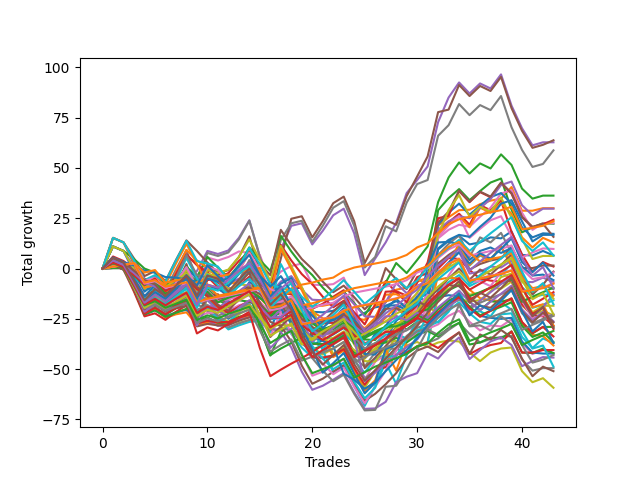

# Short Shepard 002 
- Symbol: ES
- Date Range: 03/18/2022 - 07/15/2022
- Trading Period: 7:20-12:30
- Number of Trades: 43



| Name | Win Percent | Profit | Avg Profit / Trade | Avg Time / Trade |      | Name | Win Percent | Profit | Avg Profit / Trade | Avg Time / Trade |
| ---- | ----------- | ------ | ------------------ | ---------------- | ---- | ---- | ----------- | ------ | ------------------ | ---------------- |
| Sorted By <br> Profit | | | | | | Sorted By <br> Win Percentage ||||
| Five | 60.47 | 31875.00 | 741.28 | 25:04 |     | Eighty-One | 90.70 | 11750.00 | 273.26 | 06:30 |
| Four | 62.79 | 31375.00 | 729.65 | 21:44 |     | One Hundred Twenty-One | 83.72 | -3625.00 | -84.30 | 04:22 |
| Seven | 60.47 | 29375.00 | 683.14 | 24:24 |     | One Hundred Twenty-Six | 83.72 | -3750.00 | -87.21 | 04:20 |
| Forty-Four | 46.51 | 18125.00 | 421.51 | 11:55 |     | One Hundred Eleven | 79.07 | -1000.00 | -23.26 | 02:18 |
| One | 67.44 | 15000.00 | 348.84 | 11:13 |     | Eighty-Two | 76.74 | -4750.00 | -110.47 | 10:30 |
| Forty-Six | 51.16 | 14875.00 | 345.93 | 06:52 |     | One Hundred Sixteen | 74.42 | -6750.00 | -156.98 | 02:20 |
| Forty-Five | 44.19 | 12125.00 | 281.98 | 14:16 |     | Eighty-Three | 72.09 | -5875.00 | -136.63 | 12:53 |
| Eighty-One | 90.70 | 11750.00 | 273.26 | 06:30 |     | One Hundred Twenty-Two | 72.09 | -11750.00 | -273.26 | 06:54 |
| Six | 60.47 | 11250.00 | 261.63 | 14:34 |     | One Hundred Twenty-Seven | 69.77 | -15500.00 | -360.47 | 06:48 |
| Two | 62.79 | 11125.00 | 258.72 | 16:21 |     | One | 67.44 | 15000.00 | 348.84 | 11:13 |
| Forty-Two | 53.49 | 8625.00 | 200.58 | 08:52 |     | Eighty-Four | 67.44 | -6375.00 | -148.26 | 15:31 |
| Sixty-Two | 55.81 | 8375.00 | 194.77 | 10:48 |     | One Hundred Twenty-Three | 67.44 | -11375.00 | -264.53 | 08:50 |
| Forty-Seven | 41.86 | 7875.00 | 183.14 | 13:34 |     | Three | 65.12 | 500.00 | 11.63 | 18:10 |
| Forty-Three | 51.16 | 6500.00 | 151.16 | 09:07 |     | Eighty-Five | 65.12 | -750.00 | -17.44 | 17:38 |
| Fifty-Eight | 60.47 | 4875.00 | 113.37 | 12:00 |     | One Hundred Twelve | 65.12 | -11375.00 | -264.53 | 04:13 |
| Zero | 62.79 | 3250.00 | 75.58 | 07:01 |     | One Hundred Twenty-Eight | 65.12 | -15000.00 | -348.84 | 08:42 |
| One Hundred Fourteen | 58.14 | 3250.00 | 75.58 | 07:11 |     | Four | 62.79 | 31375.00 | 729.65 | 21:44 |
| Sixty | 51.16 | 3125.00 | 72.67 | 16:14 |     | Two | 62.79 | 11125.00 | 258.72 | 16:21 |
| Fifty-Seven | 62.79 | 750.00 | 17.44 | 08:36 |     | Zero | 62.79 | 3250.00 | 75.58 | 07:01 |
| Three | 65.12 | 500.00 | 11.63 | 18:10 |     | Fifty-Seven | 62.79 | 750.00 | 17.44 | 08:36 |
| Eighty-Five | 65.12 | -750.00 | -17.44 | 17:38 |     | Fifty-Six | 62.79 | -3375.00 | -78.49 | 05:12 |
| One Hundred Eleven | 79.07 | -1000.00 | -23.26 | 02:18 |     | One Hundred Twenty-Nine | 62.79 | -4875.00 | -113.37 | 10:16 |
| One Hundred Fifteen | 51.16 | -1750.00 | -40.70 | 08:38 |     | One Hundred Twenty-Four | 62.79 | -8875.00 | -206.40 | 10:53 |
| Seventy-Three | 30.23 | -2875.00 | -66.86 | 07:10 |     | Five | 60.47 | 31875.00 | 741.28 | 25:04 |
| Fifty-Six | 62.79 | -3375.00 | -78.49 | 05:12 |     | Seven | 60.47 | 29375.00 | 683.14 | 24:24 |
| One Hundred Twenty-One | 83.72 | -3625.00 | -84.30 | 04:22 |     | Six | 60.47 | 11250.00 | 261.63 | 14:34 |
| One Hundred Twenty-Six | 83.72 | -3750.00 | -87.21 | 04:20 |     | Fifty-Eight | 60.47 | 4875.00 | 113.37 | 12:00 |
| Eighty-Two | 76.74 | -4750.00 | -110.47 | 10:30 |     | One Hundred Thirteen | 60.47 | -7500.00 | -174.42 | 05:51 |
| One Hundred Twenty-Nine | 62.79 | -4875.00 | -113.37 | 10:16 |     | Sixty-Five | 60.47 | -20250.00 | -470.93 | 08:13 |
| Fifty-Nine | 58.14 | -5125.00 | -119.19 | 13:08 |     | One Hundred Fourteen | 58.14 | 3250.00 | 75.58 | 07:11 |
| Eighty-Three | 72.09 | -5875.00 | -136.63 | 12:53 |     | Fifty-Nine | 58.14 | -5125.00 | -119.19 | 13:08 |
| Eighty-Four | 67.44 | -6375.00 | -148.26 | 15:31 |     | Forty-One | 58.14 | -6500.00 | -151.16 | 06:16 |
| Forty-One | 58.14 | -6500.00 | -151.16 | 06:16 |     | Sixty-Four | 58.14 | -21000.00 | -488.37 | 05:07 |
| One Hundred Sixteen | 74.42 | -6750.00 | -156.98 | 02:20 |     | Sixty-Two | 55.81 | 8375.00 | 194.77 | 10:48 |
| One Hundred Thirteen | 60.47 | -7500.00 | -174.42 | 05:51 |     | Forty | 55.81 | -11625.00 | -270.35 | 03:39 |
| Sixty-One | 48.84 | -7875.00 | -183.14 | 19:05 |     | One Hundred Seventeen | 55.81 | -18250.00 | -424.42 | 03:50 |
| One Hundred Twenty-Four | 62.79 | -8875.00 | -206.40 | 10:53 |     | One Hundred Twenty-Five | 55.81 | -18500.00 | -430.23 | 12:44 |
| Seventy | 51.16 | -9250.00 | -215.12 | 09:41 |     | Sixty-Six | 55.81 | -22125.00 | -514.53 | 10:51 |
| One Hundred Twenty-Three | 67.44 | -11375.00 | -264.53 | 08:50 |     | Forty-Two | 53.49 | 8625.00 | 200.58 | 08:52 |
| One Hundred Twelve | 65.12 | -11375.00 | -264.53 | 04:13 |     | One Hundred Thirty | 53.49 | -14750.00 | -343.02 | 11:53 |
| Forty | 55.81 | -11625.00 | -270.35 | 03:39 |     | Forty-Eight | 53.49 | -21250.00 | -494.19 | 03:12 |
| Sixty-Eight | 44.19 | -11625.00 | -270.35 | 14:19 |     | Forty-Six | 51.16 | 14875.00 | 345.93 | 06:52 |
| One Hundred Twenty-Two | 72.09 | -11750.00 | -273.26 | 06:54 |     | Forty-Three | 51.16 | 6500.00 | 151.16 | 09:07 |
| One Hundred Ninteen | 46.51 | -13125.00 | -305.23 | 05:51 |     | Sixty | 51.16 | 3125.00 | 72.67 | 16:14 |
| One Hundred Twenty | 39.53 | -13375.00 | -311.05 | 06:55 |     | One Hundred Fifteen | 51.16 | -1750.00 | -40.70 | 08:38 |
| Sixty-Three | 46.51 | -14125.00 | -328.49 | 18:23 |     | Seventy | 51.16 | -9250.00 | -215.12 | 09:41 |
| Fifty-Five | 34.88 | -14250.00 | -331.40 | 08:28 |     | One Hundred Eighteen | 51.16 | -16875.00 | -392.44 | 05:02 |
| Fifty-Four | 41.86 | -14500.00 | -337.21 | 05:08 |     | Forty-Nine | 51.16 | -24750.00 | -575.58 | 05:01 |
| One Hundred Thirty | 53.49 | -14750.00 | -343.02 | 11:53 |     | Sixty-Seven | 51.16 | -25500.00 | -593.02 | 12:01 |
| One Hundred Twenty-Eight | 65.12 | -15000.00 | -348.84 | 08:42 |     | Sixty-One | 48.84 | -7875.00 | -183.14 | 19:05 |
| One Hundred Twenty-Seven | 69.77 | -15500.00 | -360.47 | 06:48 |     | Forty-Four | 46.51 | 18125.00 | 421.51 | 11:55 |
| One Hundred Eighteen | 51.16 | -16875.00 | -392.44 | 05:02 |     | One Hundred Ninteen | 46.51 | -13125.00 | -305.23 | 05:51 |
| One Hundred Seventeen | 55.81 | -18250.00 | -424.42 | 03:50 |     | Sixty-Three | 46.51 | -14125.00 | -328.49 | 18:23 |
| One Hundred Twenty-Five | 55.81 | -18500.00 | -430.23 | 12:44 |     | Forty-Five | 44.19 | 12125.00 | 281.98 | 14:16 |
| Fifty-One | 44.19 | -18500.00 | -430.23 | 06:52 |     | Sixty-Eight | 44.19 | -11625.00 | -270.35 | 14:19 |
| Fifty-Three | 32.56 | -19125.00 | -444.77 | 08:31 |     | Fifty-One | 44.19 | -18500.00 | -430.23 | 06:52 |
| Sixty-Five | 60.47 | -20250.00 | -470.93 | 08:13 |     | Sixty-Nine | 44.19 | -21500.00 | -500.00 | 16:11 |
| Sixty-Four | 58.14 | -21000.00 | -488.37 | 05:07 |     | Forty-Seven | 41.86 | 7875.00 | 183.14 | 13:34 |
| Fifty-Two | 32.56 | -21125.00 | -491.28 | 07:57 |     | Fifty-Four | 41.86 | -14500.00 | -337.21 | 05:08 |
| Forty-Eight | 53.49 | -21250.00 | -494.19 | 03:12 |     | Seventy-One | 41.86 | -24375.00 | -566.86 | 15:57 |
| Sixty-Nine | 44.19 | -21500.00 | -500.00 | 16:11 |     | Fifty | 41.86 | -29625.00 | -688.95 | 06:23 |
| Sixty-Six | 55.81 | -22125.00 | -514.53 | 10:51 |     | One Hundred Twenty | 39.53 | -13375.00 | -311.05 | 06:55 |
| Seventy-One | 41.86 | -24375.00 | -566.86 | 15:57 |     | Fifty-Five | 34.88 | -14250.00 | -331.40 | 08:28 |
| Forty-Nine | 51.16 | -24750.00 | -575.58 | 05:01 |     | Fifty-Three | 32.56 | -19125.00 | -444.77 | 08:31 |
| Sixty-Seven | 51.16 | -25500.00 | -593.02 | 12:01 |     | Fifty-Two | 32.56 | -21125.00 | -491.28 | 07:57 |
| Fifty | 41.86 | -29625.00 | -688.95 | 06:23 |     | Seventy-Three | 30.23 | -2875.00 | -66.86 | 07:10 |

## NO STOPLOSS

### Test Zero
* Sell when price hits the middle line of the 20p bollinger
* No Stoploss
* Results:
```
Total Trades: 43
Percent Up: 37.21
Percent Down: 62.79
Total Points Moved Down: 6.50
Potential Profit: 3250.00
Total Points Ups: 71.75 Count Ups: 16
Total Points Downs: 78.25 Count Downs: 27
```

<details><summary>Trades</summary>

<code>In: 2022-03-25 11:57:00		Out: 2022-03-25 11:57:15		Total Position Time: 00:15		Total Move Down: 0.25		Total to Date: 0.25</code> <br />
<code>In: 2022-03-28 10:33:00		Out: 2022-03-28 10:42:15		Total Position Time: 09:15		Total Move Down: -0.00		Total to Date: 0.25</code> <br />
<code>In: 2022-03-28 11:34:00		Out: 2022-03-28 12:03:55		Total Position Time: 29:55		Total Move Down: -11.00		Total to Date: -10.75</code> <br />
<code>In: 2022-03-28 11:36:00		Out: 2022-03-28 12:05:55		Total Position Time: 29:55		Total Move Down: -12.25		Total to Date: -23.00</code> <br />
<code>In: 2022-03-29 08:36:00		Out: 2022-03-29 08:41:05		Total Position Time: 05:05		Total Move Down: 2.25		Total to Date: -20.75</code> <br />
<code>In: 2022-03-29 10:51:00		Out: 2022-03-29 11:06:20		Total Position Time: 15:20		Total Move Down: -3.00		Total to Date: -23.75</code> <br />
<code>In: 2022-04-06 08:56:00		Out: 2022-04-06 09:00:40		Total Position Time: 04:40		Total Move Down: 2.00		Total to Date: -21.75</code> <br />
<code>In: 2022-04-06 08:57:00		Out: 2022-04-06 09:00:40		Total Position Time: 03:40		Total Move Down: 1.25		Total to Date: -20.50</code> <br />
<code>In: 2022-04-06 10:32:00		Out: 2022-04-06 10:47:10		Total Position Time: 15:10		Total Move Down: -5.75		Total to Date: -26.25</code> <br />
<code>In: 2022-04-06 10:47:00		Out: 2022-04-06 10:47:10		Total Position Time: 00:10		Total Move Down: 1.75		Total to Date: -24.50</code> <br />
<code>In: 2022-04-07 10:25:00		Out: 2022-04-07 10:36:05		Total Position Time: 11:05		Total Move Down: -2.75		Total to Date: -27.25</code> <br />
<code>In: 2022-04-07 11:06:00		Out: 2022-04-07 11:15:20		Total Position Time: 09:20		Total Move Down: 0.25		Total to Date: -27.00</code> <br />
<code>In: 2022-04-12 08:36:00		Out: 2022-04-12 08:36:20		Total Position Time: 00:20		Total Move Down: 2.75		Total to Date: -24.25</code> <br />
<code>In: 2022-04-14 11:08:00		Out: 2022-04-14 11:14:00		Total Position Time: 06:00		Total Move Down: 1.25		Total to Date: -23.00</code> <br />
<code>In: 2022-05-04 08:58:00		Out: 2022-05-04 09:02:25		Total Position Time: 04:25		Total Move Down: 0.50		Total to Date: -22.50</code> <br />
<code>In: 2022-05-04 09:32:00		Out: 2022-05-04 09:45:30		Total Position Time: 13:30		Total Move Down: -1.50		Total to Date: -24.00</code> <br />
<code>In: 2022-05-09 09:20:00		Out: 2022-05-09 09:26:00		Total Position Time: 06:00		Total Move Down: 4.75		Total to Date: -19.25</code> <br />
<code>In: 2022-05-09 12:04:00		Out: 2022-05-09 12:04:10		Total Position Time: 00:10		Total Move Down: 2.75		Total to Date: -16.50</code> <br />
<code>In: 2022-05-16 08:51:00		Out: 2022-05-16 09:05:45		Total Position Time: 14:45		Total Move Down: -7.00		Total to Date: -23.50</code> <br />
<code>In: 2022-05-24 08:55:00		Out: 2022-05-24 09:01:05		Total Position Time: 06:05		Total Move Down: 2.00		Total to Date: -21.50</code> <br />
<code>In: 2022-05-25 10:41:00		Out: 2022-05-25 10:47:20		Total Position Time: 06:20		Total Move Down: -0.25		Total to Date: -21.75</code> <br />
<code>In: 2022-05-25 10:47:00		Out: 2022-05-25 10:47:20		Total Position Time: 00:20		Total Move Down: 0.75		Total to Date: -21.00</code> <br />
<code>In: 2022-05-25 11:07:00		Out: 2022-05-25 11:07:10		Total Position Time: 00:10		Total Move Down: 3.25		Total to Date: -17.75</code> <br />
<code>In: 2022-05-25 11:23:00		Out: 2022-05-25 11:39:10		Total Position Time: 16:10		Total Move Down: -7.00		Total to Date: -24.75</code> <br />
<code>In: 2022-05-25 11:33:00		Out: 2022-05-25 11:39:10		Total Position Time: 06:10		Total Move Down: 2.75		Total to Date: -22.00</code> <br />
<code>In: 2022-06-09 08:47:00		Out: 2022-06-09 08:48:20		Total Position Time: 01:20		Total Move Down: 2.75		Total to Date: -19.25</code> <br />
<code>In: 2022-06-09 10:14:00		Out: 2022-06-09 10:16:15		Total Position Time: 02:15		Total Move Down: 0.75		Total to Date: -18.50</code> <br />
<code>In: 2022-06-10 12:03:00		Out: 2022-06-10 12:03:25		Total Position Time: 00:25		Total Move Down: 2.25		Total to Date: -16.25</code> <br />
<code>In: 2022-06-13 10:54:00		Out: 2022-06-13 11:00:10		Total Position Time: 06:10		Total Move Down: -2.25		Total to Date: -18.50</code> <br />
<code>In: 2022-06-15 09:26:00		Out: 2022-06-15 09:26:10		Total Position Time: 00:10		Total Move Down: 3.75		Total to Date: -14.75</code> <br />
<code>In: 2022-06-15 11:02:00		Out: 2022-06-15 11:02:10		Total Position Time: 00:10		Total Move Down: 2.00		Total to Date: -12.75</code> <br />
<code>In: 2022-06-15 11:48:00		Out: 2022-06-15 11:52:30		Total Position Time: 04:30		Total Move Down: 22.25		Total to Date: 9.50</code> <br />
<code>In: 2022-06-16 08:31:00		Out: 2022-06-16 08:31:10		Total Position Time: 00:10		Total Move Down: 4.25		Total to Date: 13.75</code> <br />
<code>In: 2022-06-16 10:11:00		Out: 2022-06-16 10:11:10		Total Position Time: 00:10		Total Move Down: 2.50		Total to Date: 16.25</code> <br />
<code>In: 2022-06-17 08:13:00		Out: 2022-06-17 08:23:05		Total Position Time: 10:05		Total Move Down: -4.25		Total to Date: 12.00</code> <br />
<code>In: 2022-06-17 10:16:00		Out: 2022-06-17 10:22:05		Total Position Time: 06:05		Total Move Down: 1.00		Total to Date: 13.00</code> <br />
<code>In: 2022-06-23 11:41:00		Out: 2022-06-23 11:45:50		Total Position Time: 04:50		Total Move Down: 2.50		Total to Date: 15.50</code> <br />
<code>In: 2022-06-29 11:08:00		Out: 2022-06-29 11:20:00		Total Position Time: 12:00		Total Move Down: -0.50		Total to Date: 15.00</code> <br />
<code>In: 2022-06-30 07:39:00		Out: 2022-06-30 07:42:05		Total Position Time: 03:05		Total Move Down: 3.50		Total to Date: 18.50</code> <br />
<code>In: 2022-07-01 10:36:00		Out: 2022-07-01 10:58:45		Total Position Time: 22:45		Total Move Down: -11.75		Total to Date: 6.75</code> <br />
<code>In: 2022-07-05 08:53:00		Out: 2022-07-05 09:00:10		Total Position Time: 07:10		Total Move Down: -0.25		Total to Date: 6.50</code> <br />
<code>In: 2022-07-06 10:11:00		Out: 2022-07-06 10:17:05		Total Position Time: 06:05		Total Move Down: 2.25		Total to Date: 8.75</code> <br />
<code>In: 2022-07-06 11:01:00		Out: 2022-07-06 11:01:10		Total Position Time: 00:10		Total Move Down: -2.25		Total to Date: 6.50</code> <br />


</details>

### Test One
* Sell when the price hits the upper line of the 20p 1std bollinger
* No Stoploss
* Results:
```
Total Trades: 43
Percent Up: 32.56
Percent Down: 67.44
Total Points Moved Down: 30.00
Potential Profit: 15000.00
Total Points Ups: 61.00 Count Ups: 14
Total Points Downs: 91.00 Count Downs: 29
```

<details><summary>Trades</summary>

<code>In: 2022-03-25 11:57:00		Out: 2022-03-25 12:00:45		Total Position Time: 03:45		Total Move Down: 1.75		Total to Date: 1.75</code> <br />
<code>In: 2022-03-28 10:33:00		Out: 2022-03-28 10:44:05		Total Position Time: 11:05		Total Move Down: 0.25		Total to Date: 2.00</code> <br />
<code>In: 2022-03-28 11:34:00		Out: 2022-03-28 12:03:55		Total Position Time: 29:55		Total Move Down: -11.00		Total to Date: -9.00</code> <br />
<code>In: 2022-03-28 11:36:00		Out: 2022-03-28 12:05:55		Total Position Time: 29:55		Total Move Down: -12.25		Total to Date: -21.25</code> <br />
<code>In: 2022-03-29 08:36:00		Out: 2022-03-29 08:58:40		Total Position Time: 22:40		Total Move Down: 1.00		Total to Date: -20.25</code> <br />
<code>In: 2022-03-29 10:51:00		Out: 2022-03-29 11:18:25		Total Position Time: 27:25		Total Move Down: -4.25		Total to Date: -24.50</code> <br />
<code>In: 2022-04-06 08:56:00		Out: 2022-04-06 09:04:35		Total Position Time: 08:35		Total Move Down: 1.75		Total to Date: -22.75</code> <br />
<code>In: 2022-04-06 08:57:00		Out: 2022-04-06 09:04:35		Total Position Time: 07:35		Total Move Down: 1.00		Total to Date: -21.75</code> <br />
<code>In: 2022-04-06 10:32:00		Out: 2022-04-06 10:56:55		Total Position Time: 24:55		Total Move Down: -6.25		Total to Date: -28.00</code> <br />
<code>In: 2022-04-06 10:47:00		Out: 2022-04-06 10:56:55		Total Position Time: 09:55		Total Move Down: 1.25		Total to Date: -26.75</code> <br />
<code>In: 2022-04-07 10:25:00		Out: 2022-04-07 10:39:55		Total Position Time: 14:55		Total Move Down: -0.75		Total to Date: -27.50</code> <br />
<code>In: 2022-04-07 11:06:00		Out: 2022-04-07 11:16:10		Total Position Time: 10:10		Total Move Down: 0.25		Total to Date: -27.25</code> <br />
<code>In: 2022-04-12 08:36:00		Out: 2022-04-12 08:45:45		Total Position Time: 09:45		Total Move Down: 2.00		Total to Date: -25.25</code> <br />
<code>In: 2022-04-14 11:08:00		Out: 2022-04-14 11:17:15		Total Position Time: 09:15		Total Move Down: 1.75		Total to Date: -23.50</code> <br />
<code>In: 2022-05-04 08:58:00		Out: 2022-05-04 09:07:10		Total Position Time: 09:10		Total Move Down: 0.50		Total to Date: -23.00</code> <br />
<code>In: 2022-05-04 09:32:00		Out: 2022-05-04 09:46:30		Total Position Time: 14:30		Total Move Down: -0.00		Total to Date: -23.00</code> <br />
<code>In: 2022-05-09 09:20:00		Out: 2022-05-09 09:26:10		Total Position Time: 06:10		Total Move Down: 6.75		Total to Date: -16.25</code> <br />
<code>In: 2022-05-09 12:04:00		Out: 2022-05-09 12:18:05		Total Position Time: 14:05		Total Move Down: 1.25		Total to Date: -15.00</code> <br />
<code>In: 2022-05-16 08:51:00		Out: 2022-05-16 09:06:10		Total Position Time: 15:10		Total Move Down: -3.50		Total to Date: -18.50</code> <br />
<code>In: 2022-05-24 08:55:00		Out: 2022-05-24 09:06:10		Total Position Time: 11:10		Total Move Down: -0.00		Total to Date: -18.50</code> <br />
<code>In: 2022-05-25 10:41:00		Out: 2022-05-25 10:51:20		Total Position Time: 10:20		Total Move Down: -0.00		Total to Date: -18.50</code> <br />
<code>In: 2022-05-25 10:47:00		Out: 2022-05-25 10:51:20		Total Position Time: 04:20		Total Move Down: 1.00		Total to Date: -17.50</code> <br />
<code>In: 2022-05-25 11:07:00		Out: 2022-05-25 11:07:10		Total Position Time: 00:10		Total Move Down: 3.25		Total to Date: -14.25</code> <br />
<code>In: 2022-05-25 11:23:00		Out: 2022-05-25 11:45:15		Total Position Time: 22:15		Total Move Down: -10.50		Total to Date: -24.75</code> <br />
<code>In: 2022-05-25 11:33:00		Out: 2022-05-25 11:45:15		Total Position Time: 12:15		Total Move Down: -0.75		Total to Date: -25.50</code> <br />
<code>In: 2022-06-09 08:47:00		Out: 2022-06-09 08:49:35		Total Position Time: 02:35		Total Move Down: 7.00		Total to Date: -18.50</code> <br />
<code>In: 2022-06-09 10:14:00		Out: 2022-06-09 10:18:10		Total Position Time: 04:10		Total Move Down: 1.75		Total to Date: -16.75</code> <br />
<code>In: 2022-06-10 12:03:00		Out: 2022-06-10 12:04:35		Total Position Time: 01:35		Total Move Down: 6.25		Total to Date: -10.50</code> <br />
<code>In: 2022-06-13 10:54:00		Out: 2022-06-13 11:01:05		Total Position Time: 07:05		Total Move Down: 1.00		Total to Date: -9.50</code> <br />
<code>In: 2022-06-15 09:26:00		Out: 2022-06-15 09:29:20		Total Position Time: 03:20		Total Move Down: 3.00		Total to Date: -6.50</code> <br />
<code>In: 2022-06-15 11:02:00		Out: 2022-06-15 11:02:10		Total Position Time: 00:10		Total Move Down: 2.00		Total to Date: -4.50</code> <br />
<code>In: 2022-06-15 11:48:00		Out: 2022-06-15 11:57:35		Total Position Time: 09:35		Total Move Down: 25.75		Total to Date: 21.25</code> <br />
<code>In: 2022-06-16 08:31:00		Out: 2022-06-16 08:31:10		Total Position Time: 00:10		Total Move Down: 4.25		Total to Date: 25.50</code> <br />
<code>In: 2022-06-16 10:11:00		Out: 2022-06-16 10:16:50		Total Position Time: 05:50		Total Move Down: 3.50		Total to Date: 29.00</code> <br />
<code>In: 2022-06-17 08:13:00		Out: 2022-06-17 08:25:20		Total Position Time: 12:20		Total Move Down: 0.25		Total to Date: 29.25</code> <br />
<code>In: 2022-06-17 10:16:00		Out: 2022-06-17 10:26:05		Total Position Time: 10:05		Total Move Down: 2.75		Total to Date: 32.00</code> <br />
<code>In: 2022-06-23 11:41:00		Out: 2022-06-23 11:52:30		Total Position Time: 11:30		Total Move Down: 1.75		Total to Date: 33.75</code> <br />
<code>In: 2022-06-29 11:08:00		Out: 2022-06-29 11:20:25		Total Position Time: 12:25		Total Move Down: 1.00		Total to Date: 34.75</code> <br />
<code>In: 2022-06-30 07:39:00		Out: 2022-06-30 07:49:05		Total Position Time: 10:05		Total Move Down: 5.75		Total to Date: 40.50</code> <br />
<code>In: 2022-07-01 10:36:00		Out: 2022-07-01 11:04:25		Total Position Time: 28:25		Total Move Down: -11.75		Total to Date: 28.75</code> <br />
<code>In: 2022-07-05 08:53:00		Out: 2022-07-05 09:03:25		Total Position Time: 10:25		Total Move Down: -0.00		Total to Date: 28.75</code> <br />
<code>In: 2022-07-06 10:11:00		Out: 2022-07-06 10:24:30		Total Position Time: 13:30		Total Move Down: 1.25		Total to Date: 30.00</code> <br />
<code>In: 2022-07-06 11:01:00		Out: 2022-07-06 11:01:15		Total Position Time: 00:15		Total Move Down: -0.00		Total to Date: 30.00</code> <br />


</details>

### Test Two
* Sell when the price hits the upper line of the 20p 2std bollinger
* No Stoploss
* Results:
```
Total Trades: 43
Percent Up: 37.21
Percent Down: 62.79
Total Points Moved Down: 22.25
Potential Profit: 11125.00
Total Points Ups: 120.75 Count Ups: 16
Total Points Downs: 143.00 Count Downs: 27
```

<details><summary>Trades</summary>

<code>In: 2022-03-25 11:57:00		Out: 2022-03-25 12:00:55		Total Position Time: 03:55		Total Move Down: 2.75		Total to Date: 2.75</code> <br />
<code>In: 2022-03-28 10:33:00		Out: 2022-03-28 10:55:00		Total Position Time: 22:00		Total Move Down: -1.00		Total to Date: 1.75</code> <br />
<code>In: 2022-03-28 11:34:00		Out: 2022-03-28 12:03:55		Total Position Time: 29:55		Total Move Down: -11.00		Total to Date: -9.25</code> <br />
<code>In: 2022-03-28 11:36:00		Out: 2022-03-28 12:05:55		Total Position Time: 29:55		Total Move Down: -12.25		Total to Date: -21.50</code> <br />
<code>In: 2022-03-29 08:36:00		Out: 2022-03-29 09:01:40		Total Position Time: 25:40		Total Move Down: 2.50		Total to Date: -19.00</code> <br />
<code>In: 2022-03-29 10:51:00		Out: 2022-03-29 11:18:30		Total Position Time: 27:30		Total Move Down: -4.00		Total to Date: -23.00</code> <br />
<code>In: 2022-04-06 08:56:00		Out: 2022-04-06 09:09:40		Total Position Time: 13:40		Total Move Down: 3.25		Total to Date: -19.75</code> <br />
<code>In: 2022-04-06 08:57:00		Out: 2022-04-06 09:09:40		Total Position Time: 12:40		Total Move Down: 2.50		Total to Date: -17.25</code> <br />
<code>In: 2022-04-06 10:32:00		Out: 2022-04-06 10:57:20		Total Position Time: 25:20		Total Move Down: -5.25		Total to Date: -22.50</code> <br />
<code>In: 2022-04-06 10:47:00		Out: 2022-04-06 10:57:20		Total Position Time: 10:20		Total Move Down: 2.25		Total to Date: -20.25</code> <br />
<code>In: 2022-04-07 10:25:00		Out: 2022-04-07 10:45:15		Total Position Time: 20:15		Total Move Down: -0.00		Total to Date: -20.25</code> <br />
<code>In: 2022-04-07 11:06:00		Out: 2022-04-07 11:18:20		Total Position Time: 12:20		Total Move Down: 2.25		Total to Date: -18.00</code> <br />
<code>In: 2022-04-12 08:36:00		Out: 2022-04-12 08:49:15		Total Position Time: 13:15		Total Move Down: 3.75		Total to Date: -14.25</code> <br />
<code>In: 2022-04-14 11:08:00		Out: 2022-04-14 11:19:10		Total Position Time: 11:10		Total Move Down: 3.00		Total to Date: -11.25</code> <br />
<code>In: 2022-05-04 08:58:00		Out: 2022-05-04 09:27:55		Total Position Time: 29:55		Total Move Down: -18.00		Total to Date: -29.25</code> <br />
<code>In: 2022-05-04 09:32:00		Out: 2022-05-04 10:01:55		Total Position Time: 29:55		Total Move Down: -14.00		Total to Date: -43.25</code> <br />
<code>In: 2022-05-09 09:20:00		Out: 2022-05-09 09:37:50		Total Position Time: 17:50		Total Move Down: 11.75		Total to Date: -31.50</code> <br />
<code>In: 2022-05-09 12:04:00		Out: 2022-05-09 12:20:35		Total Position Time: 16:35		Total Move Down: 4.25		Total to Date: -27.25</code> <br />
<code>In: 2022-05-16 08:51:00		Out: 2022-05-16 09:11:35		Total Position Time: 20:35		Total Move Down: -2.50		Total to Date: -29.75</code> <br />
<code>In: 2022-05-24 08:55:00		Out: 2022-05-24 09:24:55		Total Position Time: 29:55		Total Move Down: -10.50		Total to Date: -40.25</code> <br />
<code>In: 2022-05-25 10:41:00		Out: 2022-05-25 10:52:10		Total Position Time: 11:10		Total Move Down: 2.00		Total to Date: -38.25</code> <br />
<code>In: 2022-05-25 10:47:00		Out: 2022-05-25 10:52:10		Total Position Time: 05:10		Total Move Down: 3.00		Total to Date: -35.25</code> <br />
<code>In: 2022-05-25 11:07:00		Out: 2022-05-25 11:07:10		Total Position Time: 00:10		Total Move Down: 3.25		Total to Date: -32.00</code> <br />
<code>In: 2022-05-25 11:23:00		Out: 2022-05-25 11:50:00		Total Position Time: 27:00		Total Move Down: -9.75		Total to Date: -41.75</code> <br />
<code>In: 2022-05-25 11:33:00		Out: 2022-05-25 11:50:00		Total Position Time: 17:00		Total Move Down: -0.00		Total to Date: -41.75</code> <br />
<code>In: 2022-06-09 08:47:00		Out: 2022-06-09 09:11:05		Total Position Time: 24:05		Total Move Down: 9.00		Total to Date: -32.75</code> <br />
<code>In: 2022-06-09 10:14:00		Out: 2022-06-09 10:18:55		Total Position Time: 04:55		Total Move Down: 3.25		Total to Date: -29.50</code> <br />
<code>In: 2022-06-10 12:03:00		Out: 2022-06-10 12:05:55		Total Position Time: 02:55		Total Move Down: 9.75		Total to Date: -19.75</code> <br />
<code>In: 2022-06-13 10:54:00		Out: 2022-06-13 11:02:10		Total Position Time: 08:10		Total Move Down: 2.75		Total to Date: -17.00</code> <br />
<code>In: 2022-06-15 09:26:00		Out: 2022-06-15 09:34:05		Total Position Time: 08:05		Total Move Down: 1.75		Total to Date: -15.25</code> <br />
<code>In: 2022-06-15 11:02:00		Out: 2022-06-15 11:03:05		Total Position Time: 01:05		Total Move Down: 10.00		Total to Date: -5.25</code> <br />
<code>In: 2022-06-15 11:48:00		Out: 2022-06-15 11:58:05		Total Position Time: 10:05		Total Move Down: 34.25		Total to Date: 29.00</code> <br />
<code>In: 2022-06-16 08:31:00		Out: 2022-06-16 08:41:25		Total Position Time: 10:25		Total Move Down: 6.00		Total to Date: 35.00</code> <br />
<code>In: 2022-06-16 10:11:00		Out: 2022-06-16 10:20:05		Total Position Time: 09:05		Total Move Down: 4.50		Total to Date: 39.50</code> <br />
<code>In: 2022-06-17 08:13:00		Out: 2022-06-17 08:42:55		Total Position Time: 29:55		Total Move Down: -5.50		Total to Date: 34.00</code> <br />
<code>In: 2022-06-17 10:16:00		Out: 2022-06-17 10:27:05		Total Position Time: 11:05		Total Move Down: 4.50		Total to Date: 38.50</code> <br />
<code>In: 2022-06-23 11:41:00		Out: 2022-06-23 12:01:10		Total Position Time: 20:10		Total Move Down: 4.25		Total to Date: 42.75</code> <br />
<code>In: 2022-06-29 11:08:00		Out: 2022-06-29 11:20:45		Total Position Time: 12:45		Total Move Down: 2.00		Total to Date: 44.75</code> <br />
<code>In: 2022-06-30 07:39:00		Out: 2022-06-30 08:08:55		Total Position Time: 29:55		Total Move Down: -15.50		Total to Date: 29.25</code> <br />
<code>In: 2022-07-01 10:36:00		Out: 2022-07-01 11:05:55		Total Position Time: 29:55		Total Move Down: -11.25		Total to Date: 18.00</code> <br />
<code>In: 2022-07-05 08:53:00		Out: 2022-07-05 09:03:50		Total Position Time: 10:50		Total Move Down: 2.50		Total to Date: 20.50</code> <br />
<code>In: 2022-07-06 10:11:00		Out: 2022-07-06 10:26:25		Total Position Time: 15:25		Total Move Down: 2.00		Total to Date: 22.50</code> <br />
<code>In: 2022-07-06 11:01:00		Out: 2022-07-06 11:02:20		Total Position Time: 01:20		Total Move Down: -0.25		Total to Date: 22.25</code> <br />


</details>

### Test Three
* Sell when price hits the middle line of the 50p bollinger
* No Stoploss
* Results:
```
Total Trades: 43
Percent Up: 34.88
Percent Down: 65.12
Total Points Moved Down: 1.00
Potential Profit: 500.00
Total Points Ups: 149.75 Count Ups: 15
Total Points Downs: 150.75 Count Downs: 28
```

<details><summary>Trades</summary>

<code>In: 2022-03-25 11:57:00		Out: 2022-03-25 12:00:45		Total Position Time: 03:45		Total Move Down: 1.75		Total to Date: 1.75</code> <br />
<code>In: 2022-03-28 10:33:00		Out: 2022-03-28 11:02:55		Total Position Time: 29:55		Total Move Down: -2.25		Total to Date: -0.50</code> <br />
<code>In: 2022-03-28 11:34:00		Out: 2022-03-28 12:03:55		Total Position Time: 29:55		Total Move Down: -11.00		Total to Date: -11.50</code> <br />
<code>In: 2022-03-28 11:36:00		Out: 2022-03-28 12:05:55		Total Position Time: 29:55		Total Move Down: -12.25		Total to Date: -23.75</code> <br />
<code>In: 2022-03-29 08:36:00		Out: 2022-03-29 09:01:25		Total Position Time: 25:25		Total Move Down: 1.50		Total to Date: -22.25</code> <br />
<code>In: 2022-03-29 10:51:00		Out: 2022-03-29 11:20:55		Total Position Time: 29:55		Total Move Down: -3.25		Total to Date: -25.50</code> <br />
<code>In: 2022-04-06 08:56:00		Out: 2022-04-06 09:12:05		Total Position Time: 16:05		Total Move Down: 4.00		Total to Date: -21.50</code> <br />
<code>In: 2022-04-06 08:57:00		Out: 2022-04-06 09:12:05		Total Position Time: 15:05		Total Move Down: 3.25		Total to Date: -18.25</code> <br />
<code>In: 2022-04-06 10:32:00		Out: 2022-04-06 11:00:10		Total Position Time: 28:10		Total Move Down: 2.50		Total to Date: -15.75</code> <br />
<code>In: 2022-04-06 10:47:00		Out: 2022-04-06 11:00:10		Total Position Time: 13:10		Total Move Down: 10.00		Total to Date: -5.75</code> <br />
<code>In: 2022-04-07 10:25:00		Out: 2022-04-07 10:51:55		Total Position Time: 26:55		Total Move Down: 1.00		Total to Date: -4.75</code> <br />
<code>In: 2022-04-07 11:06:00		Out: 2022-04-07 11:33:40		Total Position Time: 27:40		Total Move Down: 2.50		Total to Date: -2.25</code> <br />
<code>In: 2022-04-12 08:36:00		Out: 2022-04-12 08:50:30		Total Position Time: 14:30		Total Move Down: 6.00		Total to Date: 3.75</code> <br />
<code>In: 2022-04-14 11:08:00		Out: 2022-04-14 11:19:35		Total Position Time: 11:35		Total Move Down: 4.75		Total to Date: 8.50</code> <br />
<code>In: 2022-05-04 08:58:00		Out: 2022-05-04 09:27:55		Total Position Time: 29:55		Total Move Down: -18.00		Total to Date: -9.50</code> <br />
<code>In: 2022-05-04 09:32:00		Out: 2022-05-04 10:01:55		Total Position Time: 29:55		Total Move Down: -14.00		Total to Date: -23.50</code> <br />
<code>In: 2022-05-09 09:20:00		Out: 2022-05-09 09:37:15		Total Position Time: 17:15		Total Move Down: 9.25		Total to Date: -14.25</code> <br />
<code>In: 2022-05-09 12:04:00		Out: 2022-05-09 12:20:35		Total Position Time: 16:35		Total Move Down: 4.25		Total to Date: -10.00</code> <br />
<code>In: 2022-05-16 08:51:00		Out: 2022-05-16 09:15:30		Total Position Time: 24:30		Total Move Down: 0.50		Total to Date: -9.50</code> <br />
<code>In: 2022-05-24 08:55:00		Out: 2022-05-24 09:24:55		Total Position Time: 29:55		Total Move Down: -10.50		Total to Date: -20.00</code> <br />
<code>In: 2022-05-25 10:41:00		Out: 2022-05-25 10:53:30		Total Position Time: 12:30		Total Move Down: 2.50		Total to Date: -17.50</code> <br />
<code>In: 2022-05-25 10:47:00		Out: 2022-05-25 10:53:30		Total Position Time: 06:30		Total Move Down: 3.50		Total to Date: -14.00</code> <br />
<code>In: 2022-05-25 11:07:00		Out: 2022-05-25 11:07:10		Total Position Time: 00:10		Total Move Down: 3.25		Total to Date: -10.75</code> <br />
<code>In: 2022-05-25 11:23:00		Out: 2022-05-25 11:52:55		Total Position Time: 29:55		Total Move Down: -12.25		Total to Date: -23.00</code> <br />
<code>In: 2022-05-25 11:33:00		Out: 2022-05-25 12:02:55		Total Position Time: 29:55		Total Move Down: -20.75		Total to Date: -43.75</code> <br />
<code>In: 2022-06-09 08:47:00		Out: 2022-06-09 08:48:40		Total Position Time: 01:40		Total Move Down: 3.50		Total to Date: -40.25</code> <br />
<code>In: 2022-06-09 10:14:00		Out: 2022-06-09 10:22:05		Total Position Time: 08:05		Total Move Down: 4.75		Total to Date: -35.50</code> <br />
<code>In: 2022-06-10 12:03:00		Out: 2022-06-10 12:03:40		Total Position Time: 00:40		Total Move Down: 5.50		Total to Date: -30.00</code> <br />
<code>In: 2022-06-13 10:54:00		Out: 2022-06-13 11:03:20		Total Position Time: 09:20		Total Move Down: 7.25		Total to Date: -22.75</code> <br />
<code>In: 2022-06-15 09:26:00		Out: 2022-06-15 09:35:10		Total Position Time: 09:10		Total Move Down: 4.00		Total to Date: -18.75</code> <br />
<code>In: 2022-06-15 11:02:00		Out: 2022-06-15 11:02:10		Total Position Time: 00:10		Total Move Down: 2.00		Total to Date: -16.75</code> <br />
<code>In: 2022-06-15 11:48:00		Out: 2022-06-15 11:58:05		Total Position Time: 10:05		Total Move Down: 34.25		Total to Date: 17.50</code> <br />
<code>In: 2022-06-16 08:31:00		Out: 2022-06-16 08:36:10		Total Position Time: 05:10		Total Move Down: 5.50		Total to Date: 23.00</code> <br />
<code>In: 2022-06-16 10:11:00		Out: 2022-06-16 10:16:35		Total Position Time: 05:35		Total Move Down: 4.25		Total to Date: 27.25</code> <br />
<code>In: 2022-06-17 08:13:00		Out: 2022-06-17 08:42:55		Total Position Time: 29:55		Total Move Down: -5.50		Total to Date: 21.75</code> <br />
<code>In: 2022-06-17 10:16:00		Out: 2022-06-17 10:32:20		Total Position Time: 16:20		Total Move Down: 9.75		Total to Date: 31.50</code> <br />
<code>In: 2022-06-23 11:41:00		Out: 2022-06-23 12:10:55		Total Position Time: 29:55		Total Move Down: -2.50		Total to Date: 29.00</code> <br />
<code>In: 2022-06-29 11:08:00		Out: 2022-06-29 11:27:35		Total Position Time: 19:35		Total Move Down: 4.75		Total to Date: 33.75</code> <br />
<code>In: 2022-06-30 07:39:00		Out: 2022-06-30 08:08:55		Total Position Time: 29:55		Total Move Down: -15.50		Total to Date: 18.25</code> <br />
<code>In: 2022-07-01 10:36:00		Out: 2022-07-01 11:05:55		Total Position Time: 29:55		Total Move Down: -11.25		Total to Date: 7.00</code> <br />
<code>In: 2022-07-05 08:53:00		Out: 2022-07-05 09:22:55		Total Position Time: 29:55		Total Move Down: -8.50		Total to Date: -1.50</code> <br />
<code>In: 2022-07-06 10:11:00		Out: 2022-07-06 10:28:00		Total Position Time: 17:00		Total Move Down: 4.75		Total to Date: 3.25</code> <br />
<code>In: 2022-07-06 11:01:00		Out: 2022-07-06 11:01:10		Total Position Time: 00:10		Total Move Down: -2.25		Total to Date: 1.00</code> <br />


</details>

### Test Four
* Sell when the price hits the upper line of the 50p 1std bollinger
* No Stoploss
* Results:
```
Total Trades: 43
Percent Up: 37.21
Percent Down: 62.79
Total Points Moved Down: 62.75
Potential Profit: 31375.00
Total Points Ups: 149.00 Count Ups: 16
Total Points Downs: 211.75 Count Downs: 27
```

<details><summary>Trades</summary>

<code>In: 2022-03-25 11:57:00		Out: 2022-03-25 12:01:35		Total Position Time: 04:35		Total Move Down: 3.75		Total to Date: 3.75</code> <br />
<code>In: 2022-03-28 10:33:00		Out: 2022-03-28 11:02:55		Total Position Time: 29:55		Total Move Down: -2.25		Total to Date: 1.50</code> <br />
<code>In: 2022-03-28 11:34:00		Out: 2022-03-28 12:03:55		Total Position Time: 29:55		Total Move Down: -11.00		Total to Date: -9.50</code> <br />
<code>In: 2022-03-28 11:36:00		Out: 2022-03-28 12:05:55		Total Position Time: 29:55		Total Move Down: -12.25		Total to Date: -21.75</code> <br />
<code>In: 2022-03-29 08:36:00		Out: 2022-03-29 09:02:15		Total Position Time: 26:15		Total Move Down: 5.50		Total to Date: -16.25</code> <br />
<code>In: 2022-03-29 10:51:00		Out: 2022-03-29 11:20:55		Total Position Time: 29:55		Total Move Down: -3.25		Total to Date: -19.50</code> <br />
<code>In: 2022-04-06 08:56:00		Out: 2022-04-06 09:15:00		Total Position Time: 19:00		Total Move Down: 8.25		Total to Date: -11.25</code> <br />
<code>In: 2022-04-06 08:57:00		Out: 2022-04-06 09:15:00		Total Position Time: 18:00		Total Move Down: 7.50		Total to Date: -3.75</code> <br />
<code>In: 2022-04-06 10:32:00		Out: 2022-04-06 11:00:10		Total Position Time: 28:10		Total Move Down: 2.50		Total to Date: -1.25</code> <br />
<code>In: 2022-04-06 10:47:00		Out: 2022-04-06 11:00:10		Total Position Time: 13:10		Total Move Down: 10.00		Total to Date: 8.75</code> <br />
<code>In: 2022-04-07 10:25:00		Out: 2022-04-07 10:54:55		Total Position Time: 29:55		Total Move Down: -1.50		Total to Date: 7.25</code> <br />
<code>In: 2022-04-07 11:06:00		Out: 2022-04-07 11:35:55		Total Position Time: 29:55		Total Move Down: 1.75		Total to Date: 9.00</code> <br />
<code>In: 2022-04-12 08:36:00		Out: 2022-04-12 09:03:50		Total Position Time: 27:50		Total Move Down: 6.25		Total to Date: 15.25</code> <br />
<code>In: 2022-04-14 11:08:00		Out: 2022-04-14 11:23:55		Total Position Time: 15:55		Total Move Down: 8.75		Total to Date: 24.00</code> <br />
<code>In: 2022-05-04 08:58:00		Out: 2022-05-04 09:27:55		Total Position Time: 29:55		Total Move Down: -18.00		Total to Date: 6.00</code> <br />
<code>In: 2022-05-04 09:32:00		Out: 2022-05-04 10:01:55		Total Position Time: 29:55		Total Move Down: -14.00		Total to Date: -8.00</code> <br />
<code>In: 2022-05-09 09:20:00		Out: 2022-05-09 09:39:55		Total Position Time: 19:55		Total Move Down: 17.50		Total to Date: 9.50</code> <br />
<code>In: 2022-05-09 12:04:00		Out: 2022-05-09 12:23:25		Total Position Time: 19:25		Total Move Down: 11.75		Total to Date: 21.25</code> <br />
<code>In: 2022-05-16 08:51:00		Out: 2022-05-16 09:20:55		Total Position Time: 29:55		Total Move Down: 1.25		Total to Date: 22.50</code> <br />
<code>In: 2022-05-24 08:55:00		Out: 2022-05-24 09:24:55		Total Position Time: 29:55		Total Move Down: -10.50		Total to Date: 12.00</code> <br />
<code>In: 2022-05-25 10:41:00		Out: 2022-05-25 11:06:40		Total Position Time: 25:40		Total Move Down: 6.75		Total to Date: 18.75</code> <br />
<code>In: 2022-05-25 10:47:00		Out: 2022-05-25 11:06:40		Total Position Time: 19:40		Total Move Down: 7.75		Total to Date: 26.50</code> <br />
<code>In: 2022-05-25 11:07:00		Out: 2022-05-25 11:07:10		Total Position Time: 00:10		Total Move Down: 3.25		Total to Date: 29.75</code> <br />
<code>In: 2022-05-25 11:23:00		Out: 2022-05-25 11:52:55		Total Position Time: 29:55		Total Move Down: -12.25		Total to Date: 17.50</code> <br />
<code>In: 2022-05-25 11:33:00		Out: 2022-05-25 12:02:55		Total Position Time: 29:55		Total Move Down: -20.75		Total to Date: -3.25</code> <br />
<code>In: 2022-06-09 08:47:00		Out: 2022-06-09 08:50:20		Total Position Time: 03:20		Total Move Down: 8.25		Total to Date: 5.00</code> <br />
<code>In: 2022-06-09 10:14:00		Out: 2022-06-09 10:23:50		Total Position Time: 09:50		Total Move Down: 8.00		Total to Date: 13.00</code> <br />
<code>In: 2022-06-10 12:03:00		Out: 2022-06-10 12:05:55		Total Position Time: 02:55		Total Move Down: 9.75		Total to Date: 22.75</code> <br />
<code>In: 2022-06-13 10:54:00		Out: 2022-06-13 11:10:20		Total Position Time: 16:20		Total Move Down: 14.75		Total to Date: 37.50</code> <br />
<code>In: 2022-06-15 09:26:00		Out: 2022-06-15 09:39:25		Total Position Time: 13:25		Total Move Down: 6.50		Total to Date: 44.00</code> <br />
<code>In: 2022-06-15 11:02:00		Out: 2022-06-15 11:03:00		Total Position Time: 01:00		Total Move Down: 6.75		Total to Date: 50.75</code> <br />
<code>In: 2022-06-15 11:48:00		Out: 2022-06-15 12:17:55		Total Position Time: 29:55		Total Move Down: 22.00		Total to Date: 72.75</code> <br />
<code>In: 2022-06-16 08:31:00		Out: 2022-06-16 08:42:25		Total Position Time: 11:25		Total Move Down: 12.25		Total to Date: 85.00</code> <br />
<code>In: 2022-06-16 10:11:00		Out: 2022-06-16 10:21:15		Total Position Time: 10:15		Total Move Down: 7.50		Total to Date: 92.50</code> <br />
<code>In: 2022-06-17 08:13:00		Out: 2022-06-17 08:42:55		Total Position Time: 29:55		Total Move Down: -5.50		Total to Date: 87.00</code> <br />
<code>In: 2022-06-17 10:16:00		Out: 2022-06-17 10:45:55		Total Position Time: 29:55		Total Move Down: 5.00		Total to Date: 92.00</code> <br />
<code>In: 2022-06-23 11:41:00		Out: 2022-06-23 12:10:55		Total Position Time: 29:55		Total Move Down: -2.50		Total to Date: 89.50</code> <br />
<code>In: 2022-06-29 11:08:00		Out: 2022-06-29 11:37:55		Total Position Time: 29:55		Total Move Down: 7.00		Total to Date: 96.50</code> <br />
<code>In: 2022-06-30 07:39:00		Out: 2022-06-30 08:08:55		Total Position Time: 29:55		Total Move Down: -15.50		Total to Date: 81.00</code> <br />
<code>In: 2022-07-01 10:36:00		Out: 2022-07-01 11:05:55		Total Position Time: 29:55		Total Move Down: -11.25		Total to Date: 69.75</code> <br />
<code>In: 2022-07-05 08:53:00		Out: 2022-07-05 09:22:55		Total Position Time: 29:55		Total Move Down: -8.50		Total to Date: 61.25</code> <br />
<code>In: 2022-07-06 10:11:00		Out: 2022-07-06 10:40:55		Total Position Time: 29:55		Total Move Down: 1.50		Total to Date: 62.75</code> <br />
<code>In: 2022-07-06 11:01:00		Out: 2022-07-06 11:01:15		Total Position Time: 00:15		Total Move Down: -0.00		Total to Date: 62.75</code> <br />


</details>

### Test Five
* Sell when the price hits the upper line of the 50p 2std bollinger
* No Stoploss
* Results:
```
Total Trades: 43
Percent Up: 39.53
Percent Down: 60.47
Total Points Moved Down: 63.75
Potential Profit: 31875.00
Total Points Ups: 167.25 Count Ups: 17
Total Points Downs: 231.00 Count Downs: 26
```

<details><summary>Trades</summary>

<code>In: 2022-03-25 11:57:00		Out: 2022-03-25 12:01:55		Total Position Time: 04:55		Total Move Down: 5.25		Total to Date: 5.25</code> <br />
<code>In: 2022-03-28 10:33:00		Out: 2022-03-28 11:02:55		Total Position Time: 29:55		Total Move Down: -2.25		Total to Date: 3.00</code> <br />
<code>In: 2022-03-28 11:34:00		Out: 2022-03-28 12:03:55		Total Position Time: 29:55		Total Move Down: -11.00		Total to Date: -8.00</code> <br />
<code>In: 2022-03-28 11:36:00		Out: 2022-03-28 12:05:55		Total Position Time: 29:55		Total Move Down: -12.25		Total to Date: -20.25</code> <br />
<code>In: 2022-03-29 08:36:00		Out: 2022-03-29 09:05:55		Total Position Time: 29:55		Total Move Down: 2.50		Total to Date: -17.75</code> <br />
<code>In: 2022-03-29 10:51:00		Out: 2022-03-29 11:20:55		Total Position Time: 29:55		Total Move Down: -3.25		Total to Date: -21.00</code> <br />
<code>In: 2022-04-06 08:56:00		Out: 2022-04-06 09:20:15		Total Position Time: 24:15		Total Move Down: 12.00		Total to Date: -9.00</code> <br />
<code>In: 2022-04-06 08:57:00		Out: 2022-04-06 09:20:15		Total Position Time: 23:15		Total Move Down: 11.25		Total to Date: 2.25</code> <br />
<code>In: 2022-04-06 10:32:00		Out: 2022-04-06 11:01:55		Total Position Time: 29:55		Total Move Down: -15.75		Total to Date: -13.50</code> <br />
<code>In: 2022-04-06 10:47:00		Out: 2022-04-06 11:09:35		Total Position Time: 22:35		Total Move Down: 12.50		Total to Date: -1.00</code> <br />
<code>In: 2022-04-07 10:25:00		Out: 2022-04-07 10:54:55		Total Position Time: 29:55		Total Move Down: -1.50		Total to Date: -2.50</code> <br />
<code>In: 2022-04-07 11:06:00		Out: 2022-04-07 11:35:55		Total Position Time: 29:55		Total Move Down: 1.75		Total to Date: -0.75</code> <br />
<code>In: 2022-04-12 08:36:00		Out: 2022-04-12 09:05:55		Total Position Time: 29:55		Total Move Down: 6.50		Total to Date: 5.75</code> <br />
<code>In: 2022-04-14 11:08:00		Out: 2022-04-14 11:34:00		Total Position Time: 26:00		Total Move Down: 10.25		Total to Date: 16.00</code> <br />
<code>In: 2022-05-04 08:58:00		Out: 2022-05-04 09:27:55		Total Position Time: 29:55		Total Move Down: -18.00		Total to Date: -2.00</code> <br />
<code>In: 2022-05-04 09:32:00		Out: 2022-05-04 10:01:55		Total Position Time: 29:55		Total Move Down: -14.00		Total to Date: -16.00</code> <br />
<code>In: 2022-05-09 09:20:00		Out: 2022-05-09 09:49:55		Total Position Time: 29:55		Total Move Down: 21.00		Total to Date: 5.00</code> <br />
<code>In: 2022-05-09 12:04:00		Out: 2022-05-09 12:28:05		Total Position Time: 24:05		Total Move Down: 19.75		Total to Date: 24.75</code> <br />
<code>In: 2022-05-16 08:51:00		Out: 2022-05-16 09:20:55		Total Position Time: 29:55		Total Move Down: 1.25		Total to Date: 26.00</code> <br />
<code>In: 2022-05-24 08:55:00		Out: 2022-05-24 09:24:55		Total Position Time: 29:55		Total Move Down: -10.50		Total to Date: 15.50</code> <br />
<code>In: 2022-05-25 10:41:00		Out: 2022-05-25 11:06:45		Total Position Time: 25:45		Total Move Down: 8.00		Total to Date: 23.50</code> <br />
<code>In: 2022-05-25 10:47:00		Out: 2022-05-25 11:06:45		Total Position Time: 19:45		Total Move Down: 9.00		Total to Date: 32.50</code> <br />
<code>In: 2022-05-25 11:07:00		Out: 2022-05-25 11:07:10		Total Position Time: 00:10		Total Move Down: 3.25		Total to Date: 35.75</code> <br />
<code>In: 2022-05-25 11:23:00		Out: 2022-05-25 11:52:55		Total Position Time: 29:55		Total Move Down: -12.25		Total to Date: 23.50</code> <br />
<code>In: 2022-05-25 11:33:00		Out: 2022-05-25 12:02:55		Total Position Time: 29:55		Total Move Down: -20.75		Total to Date: 2.75</code> <br />
<code>In: 2022-06-09 08:47:00		Out: 2022-06-09 09:11:10		Total Position Time: 24:10		Total Move Down: 10.00		Total to Date: 12.75</code> <br />
<code>In: 2022-06-09 10:14:00		Out: 2022-06-09 10:27:20		Total Position Time: 13:20		Total Move Down: 11.50		Total to Date: 24.25</code> <br />
<code>In: 2022-06-10 12:03:00		Out: 2022-06-10 12:32:55		Total Position Time: 29:55		Total Move Down: -2.50		Total to Date: 21.75</code> <br />
<code>In: 2022-06-13 10:54:00		Out: 2022-06-13 11:23:55		Total Position Time: 29:55		Total Move Down: 14.25		Total to Date: 36.00</code> <br />
<code>In: 2022-06-15 09:26:00		Out: 2022-06-15 09:41:45		Total Position Time: 15:45		Total Move Down: 9.75		Total to Date: 45.75</code> <br />
<code>In: 2022-06-15 11:02:00		Out: 2022-06-15 11:03:05		Total Position Time: 01:05		Total Move Down: 10.00		Total to Date: 55.75</code> <br />
<code>In: 2022-06-15 11:48:00		Out: 2022-06-15 12:17:55		Total Position Time: 29:55		Total Move Down: 22.00		Total to Date: 77.75</code> <br />
<code>In: 2022-06-16 08:31:00		Out: 2022-06-16 09:00:55		Total Position Time: 29:55		Total Move Down: 1.25		Total to Date: 79.00</code> <br />
<code>In: 2022-06-16 10:11:00		Out: 2022-06-16 10:25:05		Total Position Time: 14:05		Total Move Down: 12.25		Total to Date: 91.25</code> <br />
<code>In: 2022-06-17 08:13:00		Out: 2022-06-17 08:42:55		Total Position Time: 29:55		Total Move Down: -5.50		Total to Date: 85.75</code> <br />
<code>In: 2022-06-17 10:16:00		Out: 2022-06-17 10:45:55		Total Position Time: 29:55		Total Move Down: 5.00		Total to Date: 90.75</code> <br />
<code>In: 2022-06-23 11:41:00		Out: 2022-06-23 12:10:55		Total Position Time: 29:55		Total Move Down: -2.50		Total to Date: 88.25</code> <br />
<code>In: 2022-06-29 11:08:00		Out: 2022-06-29 11:37:55		Total Position Time: 29:55		Total Move Down: 7.00		Total to Date: 95.25</code> <br />
<code>In: 2022-06-30 07:39:00		Out: 2022-06-30 08:08:55		Total Position Time: 29:55		Total Move Down: -15.50		Total to Date: 79.75</code> <br />
<code>In: 2022-07-01 10:36:00		Out: 2022-07-01 11:05:55		Total Position Time: 29:55		Total Move Down: -11.25		Total to Date: 68.50</code> <br />
<code>In: 2022-07-05 08:53:00		Out: 2022-07-05 09:22:55		Total Position Time: 29:55		Total Move Down: -8.50		Total to Date: 60.00</code> <br />
<code>In: 2022-07-06 10:11:00		Out: 2022-07-06 10:40:55		Total Position Time: 29:55		Total Move Down: 1.50		Total to Date: 61.50</code> <br />
<code>In: 2022-07-06 11:01:00		Out: 2022-07-06 11:02:25		Total Position Time: 01:25		Total Move Down: 2.25		Total to Date: 63.75</code> <br />


</details>

### Test Six
* Sell when the price hits the middle line of the 1std VWAP
* No Stoploss
* Results:
```
Total Trades: 43
Percent Up: 39.53
Percent Down: 60.47
Total Points Moved Down: 22.50
Potential Profit: 11250.00
Total Points Ups: 110.75 Count Ups: 17
Total Points Downs: 133.25 Count Downs: 26
```

<details><summary>Trades</summary>

<code>In: 2022-03-25 11:57:00		Out: 2022-03-25 12:07:35		Total Position Time: 10:35		Total Move Down: 11.00		Total to Date: 11.00</code> <br />
<code>In: 2022-03-28 10:33:00		Out: 2022-03-28 11:02:55		Total Position Time: 29:55		Total Move Down: -2.25		Total to Date: 8.75</code> <br />
<code>In: 2022-03-28 11:34:00		Out: 2022-03-28 12:03:55		Total Position Time: 29:55		Total Move Down: -11.00		Total to Date: -2.25</code> <br />
<code>In: 2022-03-28 11:36:00		Out: 2022-03-28 12:05:55		Total Position Time: 29:55		Total Move Down: -12.25		Total to Date: -14.50</code> <br />
<code>In: 2022-03-29 08:36:00		Out: 2022-03-29 09:02:10		Total Position Time: 26:10		Total Move Down: 4.00		Total to Date: -10.50</code> <br />
<code>In: 2022-03-29 10:51:00		Out: 2022-03-29 11:20:55		Total Position Time: 29:55		Total Move Down: -3.25		Total to Date: -13.75</code> <br />
<code>In: 2022-04-06 08:56:00		Out: 2022-04-06 09:10:55		Total Position Time: 14:55		Total Move Down: 3.75		Total to Date: -10.00</code> <br />
<code>In: 2022-04-06 08:57:00		Out: 2022-04-06 09:10:55		Total Position Time: 13:55		Total Move Down: 3.00		Total to Date: -7.00</code> <br />
<code>In: 2022-04-06 10:32:00		Out: 2022-04-06 11:00:10		Total Position Time: 28:10		Total Move Down: 2.50		Total to Date: -4.50</code> <br />
<code>In: 2022-04-06 10:47:00		Out: 2022-04-06 11:00:10		Total Position Time: 13:10		Total Move Down: 10.00		Total to Date: 5.50</code> <br />
<code>In: 2022-04-07 10:25:00		Out: 2022-04-07 10:54:55		Total Position Time: 29:55		Total Move Down: -1.50		Total to Date: 4.00</code> <br />
<code>In: 2022-04-07 11:06:00		Out: 2022-04-07 11:35:55		Total Position Time: 29:55		Total Move Down: 1.75		Total to Date: 5.75</code> <br />
<code>In: 2022-04-12 08:36:00		Out: 2022-04-12 08:36:20		Total Position Time: 00:20		Total Move Down: 2.75		Total to Date: 8.50</code> <br />
<code>In: 2022-04-14 11:08:00		Out: 2022-04-14 11:08:10		Total Position Time: 00:10		Total Move Down: -0.75		Total to Date: 7.75</code> <br />
<code>In: 2022-05-04 08:58:00		Out: 2022-05-04 08:58:10		Total Position Time: 00:10		Total Move Down: -1.00		Total to Date: 6.75</code> <br />
<code>In: 2022-05-04 09:32:00		Out: 2022-05-04 10:01:55		Total Position Time: 29:55		Total Move Down: -14.00		Total to Date: -7.25</code> <br />
<code>In: 2022-05-09 09:20:00		Out: 2022-05-09 09:23:05		Total Position Time: 03:05		Total Move Down: 5.75		Total to Date: -1.50</code> <br />
<code>In: 2022-05-09 12:04:00		Out: 2022-05-09 12:04:10		Total Position Time: 00:10		Total Move Down: 2.75		Total to Date: 1.25</code> <br />
<code>In: 2022-05-16 08:51:00		Out: 2022-05-16 09:20:55		Total Position Time: 29:55		Total Move Down: 1.25		Total to Date: 2.50</code> <br />
<code>In: 2022-05-24 08:55:00		Out: 2022-05-24 09:24:55		Total Position Time: 29:55		Total Move Down: -10.50		Total to Date: -8.00</code> <br />
<code>In: 2022-05-25 10:41:00		Out: 2022-05-25 10:41:10		Total Position Time: 00:10		Total Move Down: -0.25		Total to Date: -8.25</code> <br />
<code>In: 2022-05-25 10:47:00		Out: 2022-05-25 10:47:10		Total Position Time: 00:10		Total Move Down: 0.50		Total to Date: -7.75</code> <br />
<code>In: 2022-05-25 11:07:00		Out: 2022-05-25 11:07:10		Total Position Time: 00:10		Total Move Down: 3.25		Total to Date: -4.50</code> <br />
<code>In: 2022-05-25 11:23:00		Out: 2022-05-25 11:52:55		Total Position Time: 29:55		Total Move Down: -12.25		Total to Date: -16.75</code> <br />
<code>In: 2022-05-25 11:33:00		Out: 2022-05-25 12:02:55		Total Position Time: 29:55		Total Move Down: -20.75		Total to Date: -37.50</code> <br />
<code>In: 2022-06-09 08:47:00		Out: 2022-06-09 08:47:10		Total Position Time: 00:10		Total Move Down: -0.25		Total to Date: -37.75</code> <br />
<code>In: 2022-06-09 10:14:00		Out: 2022-06-09 10:23:45		Total Position Time: 09:45		Total Move Down: 7.25		Total to Date: -30.50</code> <br />
<code>In: 2022-06-10 12:03:00		Out: 2022-06-10 12:05:30		Total Position Time: 02:30		Total Move Down: 9.50		Total to Date: -21.00</code> <br />
<code>In: 2022-06-13 10:54:00		Out: 2022-06-13 11:02:30		Total Position Time: 08:30		Total Move Down: 4.50		Total to Date: -16.50</code> <br />
<code>In: 2022-06-15 09:26:00		Out: 2022-06-15 09:26:10		Total Position Time: 00:10		Total Move Down: 3.75		Total to Date: -12.75</code> <br />
<code>In: 2022-06-15 11:02:00		Out: 2022-06-15 11:02:10		Total Position Time: 00:10		Total Move Down: 2.00		Total to Date: -10.75</code> <br />
<code>In: 2022-06-15 11:48:00		Out: 2022-06-15 11:54:50		Total Position Time: 06:50		Total Move Down: 25.75		Total to Date: 15.00</code> <br />
<code>In: 2022-06-16 08:31:00		Out: 2022-06-16 08:31:10		Total Position Time: 00:10		Total Move Down: 4.25		Total to Date: 19.25</code> <br />
<code>In: 2022-06-16 10:11:00		Out: 2022-06-16 10:11:10		Total Position Time: 00:10		Total Move Down: 2.50		Total to Date: 21.75</code> <br />
<code>In: 2022-06-17 08:13:00		Out: 2022-06-17 08:13:10		Total Position Time: 00:10		Total Move Down: -1.00		Total to Date: 20.75</code> <br />
<code>In: 2022-06-17 10:16:00		Out: 2022-06-17 10:45:55		Total Position Time: 29:55		Total Move Down: 5.00		Total to Date: 25.75</code> <br />
<code>In: 2022-06-23 11:41:00		Out: 2022-06-23 12:01:15		Total Position Time: 20:15		Total Move Down: 4.50		Total to Date: 30.25</code> <br />
<code>In: 2022-06-29 11:08:00		Out: 2022-06-29 11:37:55		Total Position Time: 29:55		Total Move Down: 7.00		Total to Date: 37.25</code> <br />
<code>In: 2022-06-30 07:39:00		Out: 2022-06-30 07:39:55		Total Position Time: 00:55		Total Move Down: 1.75		Total to Date: 39.00</code> <br />
<code>In: 2022-07-01 10:36:00		Out: 2022-07-01 11:05:55		Total Position Time: 29:55		Total Move Down: -11.25		Total to Date: 27.75</code> <br />
<code>In: 2022-07-05 08:53:00		Out: 2022-07-05 09:22:55		Total Position Time: 29:55		Total Move Down: -8.50		Total to Date: 19.25</code> <br />
<code>In: 2022-07-06 10:11:00		Out: 2022-07-06 10:27:25		Total Position Time: 16:25		Total Move Down: 3.25		Total to Date: 22.50</code> <br />
<code>In: 2022-07-06 11:01:00		Out: 2022-07-06 11:01:15		Total Position Time: 00:15		Total Move Down: -0.00		Total to Date: 22.50</code> <br />


</details>

### Test Seven
* Sell when the price hits the upper line of the 1std VWAP
* No Stoploss
* Results:
```
Total Trades: 43
Percent Up: 39.53
Percent Down: 60.47
Total Points Moved Down: 58.75
Potential Profit: 29375.00
Total Points Ups: 167.25 Count Ups: 17
Total Points Downs: 226.00 Count Downs: 26
```

<details><summary>Trades</summary>

<code>In: 2022-03-25 11:57:00		Out: 2022-03-25 12:26:55		Total Position Time: 29:55		Total Move Down: 15.25		Total to Date: 15.25</code> <br />
<code>In: 2022-03-28 10:33:00		Out: 2022-03-28 11:02:55		Total Position Time: 29:55		Total Move Down: -2.25		Total to Date: 13.00</code> <br />
<code>In: 2022-03-28 11:34:00		Out: 2022-03-28 12:03:55		Total Position Time: 29:55		Total Move Down: -11.00		Total to Date: 2.00</code> <br />
<code>In: 2022-03-28 11:36:00		Out: 2022-03-28 12:05:55		Total Position Time: 29:55		Total Move Down: -12.25		Total to Date: -10.25</code> <br />
<code>In: 2022-03-29 08:36:00		Out: 2022-03-29 09:05:55		Total Position Time: 29:55		Total Move Down: 2.50		Total to Date: -7.75</code> <br />
<code>In: 2022-03-29 10:51:00		Out: 2022-03-29 11:20:55		Total Position Time: 29:55		Total Move Down: -3.25		Total to Date: -11.00</code> <br />
<code>In: 2022-04-06 08:56:00		Out: 2022-04-06 09:16:05		Total Position Time: 20:05		Total Move Down: 10.50		Total to Date: -0.50</code> <br />
<code>In: 2022-04-06 08:57:00		Out: 2022-04-06 09:16:05		Total Position Time: 19:05		Total Move Down: 9.75		Total to Date: 9.25</code> <br />
<code>In: 2022-04-06 10:32:00		Out: 2022-04-06 11:01:55		Total Position Time: 29:55		Total Move Down: -15.75		Total to Date: -6.50</code> <br />
<code>In: 2022-04-06 10:47:00		Out: 2022-04-06 11:09:40		Total Position Time: 22:40		Total Move Down: 14.25		Total to Date: 7.75</code> <br />
<code>In: 2022-04-07 10:25:00		Out: 2022-04-07 10:54:55		Total Position Time: 29:55		Total Move Down: -1.50		Total to Date: 6.25</code> <br />
<code>In: 2022-04-07 11:06:00		Out: 2022-04-07 11:35:55		Total Position Time: 29:55		Total Move Down: 1.75		Total to Date: 8.00</code> <br />
<code>In: 2022-04-12 08:36:00		Out: 2022-04-12 09:05:55		Total Position Time: 29:55		Total Move Down: 6.50		Total to Date: 14.50</code> <br />
<code>In: 2022-04-14 11:08:00		Out: 2022-04-14 11:37:55		Total Position Time: 29:55		Total Move Down: 9.25		Total to Date: 23.75</code> <br />
<code>In: 2022-05-04 08:58:00		Out: 2022-05-04 09:27:55		Total Position Time: 29:55		Total Move Down: -18.00		Total to Date: 5.75</code> <br />
<code>In: 2022-05-04 09:32:00		Out: 2022-05-04 10:01:55		Total Position Time: 29:55		Total Move Down: -14.00		Total to Date: -8.25</code> <br />
<code>In: 2022-05-09 09:20:00		Out: 2022-05-09 09:45:30		Total Position Time: 25:30		Total Move Down: 22.50		Total to Date: 14.25</code> <br />
<code>In: 2022-05-09 12:04:00		Out: 2022-05-09 12:21:30		Total Position Time: 17:30		Total Move Down: 8.25		Total to Date: 22.50</code> <br />
<code>In: 2022-05-16 08:51:00		Out: 2022-05-16 09:20:55		Total Position Time: 29:55		Total Move Down: 1.25		Total to Date: 23.75</code> <br />
<code>In: 2022-05-24 08:55:00		Out: 2022-05-24 09:24:55		Total Position Time: 29:55		Total Move Down: -10.50		Total to Date: 13.25</code> <br />
<code>In: 2022-05-25 10:41:00		Out: 2022-05-25 11:06:45		Total Position Time: 25:45		Total Move Down: 8.00		Total to Date: 21.25</code> <br />
<code>In: 2022-05-25 10:47:00		Out: 2022-05-25 11:06:45		Total Position Time: 19:45		Total Move Down: 9.00		Total to Date: 30.25</code> <br />
<code>In: 2022-05-25 11:07:00		Out: 2022-05-25 11:07:10		Total Position Time: 00:10		Total Move Down: 3.25		Total to Date: 33.50</code> <br />
<code>In: 2022-05-25 11:23:00		Out: 2022-05-25 11:52:55		Total Position Time: 29:55		Total Move Down: -12.25		Total to Date: 21.25</code> <br />
<code>In: 2022-05-25 11:33:00		Out: 2022-05-25 12:02:55		Total Position Time: 29:55		Total Move Down: -20.75		Total to Date: 0.50</code> <br />
<code>In: 2022-06-09 08:47:00		Out: 2022-06-09 08:48:50		Total Position Time: 01:50		Total Move Down: 5.25		Total to Date: 5.75</code> <br />
<code>In: 2022-06-09 10:14:00		Out: 2022-06-09 10:30:30		Total Position Time: 16:30		Total Move Down: 15.25		Total to Date: 21.00</code> <br />
<code>In: 2022-06-10 12:03:00		Out: 2022-06-10 12:32:55		Total Position Time: 29:55		Total Move Down: -2.50		Total to Date: 18.50</code> <br />
<code>In: 2022-06-13 10:54:00		Out: 2022-06-13 11:23:55		Total Position Time: 29:55		Total Move Down: 14.25		Total to Date: 32.75</code> <br />
<code>In: 2022-06-15 09:26:00		Out: 2022-06-15 09:41:40		Total Position Time: 15:40		Total Move Down: 9.25		Total to Date: 42.00</code> <br />
<code>In: 2022-06-15 11:02:00		Out: 2022-06-15 11:02:10		Total Position Time: 00:10		Total Move Down: 2.00		Total to Date: 44.00</code> <br />
<code>In: 2022-06-15 11:48:00		Out: 2022-06-15 12:17:55		Total Position Time: 29:55		Total Move Down: 22.00		Total to Date: 66.00</code> <br />
<code>In: 2022-06-16 08:31:00		Out: 2022-06-16 08:35:30		Total Position Time: 04:30		Total Move Down: 5.25		Total to Date: 71.25</code> <br />
<code>In: 2022-06-16 10:11:00		Out: 2022-06-16 10:22:05		Total Position Time: 11:05		Total Move Down: 10.50		Total to Date: 81.75</code> <br />
<code>In: 2022-06-17 08:13:00		Out: 2022-06-17 08:42:55		Total Position Time: 29:55		Total Move Down: -5.50		Total to Date: 76.25</code> <br />
<code>In: 2022-06-17 10:16:00		Out: 2022-06-17 10:45:55		Total Position Time: 29:55		Total Move Down: 5.00		Total to Date: 81.25</code> <br />
<code>In: 2022-06-23 11:41:00		Out: 2022-06-23 12:10:55		Total Position Time: 29:55		Total Move Down: -2.50		Total to Date: 78.75</code> <br />
<code>In: 2022-06-29 11:08:00		Out: 2022-06-29 11:37:55		Total Position Time: 29:55		Total Move Down: 7.00		Total to Date: 85.75</code> <br />
<code>In: 2022-06-30 07:39:00		Out: 2022-06-30 08:08:55		Total Position Time: 29:55		Total Move Down: -15.50		Total to Date: 70.25</code> <br />
<code>In: 2022-07-01 10:36:00		Out: 2022-07-01 11:05:55		Total Position Time: 29:55		Total Move Down: -11.25		Total to Date: 59.00</code> <br />
<code>In: 2022-07-05 08:53:00		Out: 2022-07-05 09:22:55		Total Position Time: 29:55		Total Move Down: -8.50		Total to Date: 50.50</code> <br />
<code>In: 2022-07-06 10:11:00		Out: 2022-07-06 10:40:55		Total Position Time: 29:55		Total Move Down: 1.50		Total to Date: 52.00</code> <br />
<code>In: 2022-07-06 11:01:00		Out: 2022-07-06 11:12:20		Total Position Time: 11:20		Total Move Down: 6.75		Total to Date: 58.75</code> <br />


</details>

## STOPLOSS OF 5

### Test Forty
* Sell when price hits the middle line of the 20p bollinger
* Stoploss is -5 points
* Results:
```
Total Trades: 43
Percent Up: 44.19
Percent Down: 55.81
Total Points Moved Down: -23.25
Potential Profit: -11625.00
Total Points Ups: 96.50 Count Ups: 19
Total Points Downs: 73.25 Count Downs: 24
```

<details><summary>Trades</summary>

<code>In: 2022-03-25 11:57:00		Out: 2022-03-25 11:57:15		Total Position Time: 00:15		Total Move Down: 0.25		Total to Date: 0.25</code> <br />
<code>In: 2022-03-28 10:33:00		Out: 2022-03-28 10:42:15		Total Position Time: 09:15		Total Move Down: -0.00		Total to Date: 0.25</code> <br />
<code>In: 2022-03-28 11:34:00		Out: 2022-03-28 11:44:35		Total Position Time: 10:35		Total Move Down: -8.00		Total to Date: -7.75</code> <br />
<code>In: 2022-03-28 11:36:00		Out: 2022-03-28 11:44:35		Total Position Time: 08:35		Total Move Down: -8.75		Total to Date: -16.50</code> <br />
<code>In: 2022-03-29 08:36:00		Out: 2022-03-29 08:41:05		Total Position Time: 05:05		Total Move Down: 2.25		Total to Date: -14.25</code> <br />
<code>In: 2022-03-29 10:51:00		Out: 2022-03-29 10:59:35		Total Position Time: 08:35		Total Move Down: -5.00		Total to Date: -19.25</code> <br />
<code>In: 2022-04-06 08:56:00		Out: 2022-04-06 09:00:40		Total Position Time: 04:40		Total Move Down: 2.00		Total to Date: -17.25</code> <br />
<code>In: 2022-04-06 08:57:00		Out: 2022-04-06 09:00:40		Total Position Time: 03:40		Total Move Down: 1.25		Total to Date: -16.00</code> <br />
<code>In: 2022-04-06 10:32:00		Out: 2022-04-06 10:33:50		Total Position Time: 01:50		Total Move Down: -5.25		Total to Date: -21.25</code> <br />
<code>In: 2022-04-06 10:47:00		Out: 2022-04-06 10:47:10		Total Position Time: 00:10		Total Move Down: 1.75		Total to Date: -19.50</code> <br />
<code>In: 2022-04-07 10:25:00		Out: 2022-04-07 10:28:20		Total Position Time: 03:20		Total Move Down: -5.25		Total to Date: -24.75</code> <br />
<code>In: 2022-04-07 11:06:00		Out: 2022-04-07 11:14:15		Total Position Time: 08:15		Total Move Down: -5.00		Total to Date: -29.75</code> <br />
<code>In: 2022-04-12 08:36:00		Out: 2022-04-12 08:36:20		Total Position Time: 00:20		Total Move Down: 2.75		Total to Date: -27.00</code> <br />
<code>In: 2022-04-14 11:08:00		Out: 2022-04-14 11:14:00		Total Position Time: 06:00		Total Move Down: 1.25		Total to Date: -25.75</code> <br />
<code>In: 2022-05-04 08:58:00		Out: 2022-05-04 09:02:25		Total Position Time: 04:25		Total Move Down: 0.50		Total to Date: -25.25</code> <br />
<code>In: 2022-05-04 09:32:00		Out: 2022-05-04 09:39:10		Total Position Time: 07:10		Total Move Down: -5.50		Total to Date: -30.75</code> <br />
<code>In: 2022-05-09 09:20:00		Out: 2022-05-09 09:26:00		Total Position Time: 06:00		Total Move Down: 4.75		Total to Date: -26.00</code> <br />
<code>In: 2022-05-09 12:04:00		Out: 2022-05-09 12:04:10		Total Position Time: 00:10		Total Move Down: 2.75		Total to Date: -23.25</code> <br />
<code>In: 2022-05-16 08:51:00		Out: 2022-05-16 08:52:20		Total Position Time: 01:20		Total Move Down: -6.75		Total to Date: -30.00</code> <br />
<code>In: 2022-05-24 08:55:00		Out: 2022-05-24 08:58:55		Total Position Time: 03:55		Total Move Down: -5.00		Total to Date: -35.00</code> <br />
<code>In: 2022-05-25 10:41:00		Out: 2022-05-25 10:47:20		Total Position Time: 06:20		Total Move Down: -0.25		Total to Date: -35.25</code> <br />
<code>In: 2022-05-25 10:47:00		Out: 2022-05-25 10:47:20		Total Position Time: 00:20		Total Move Down: 0.75		Total to Date: -34.50</code> <br />
<code>In: 2022-05-25 11:07:00		Out: 2022-05-25 11:07:10		Total Position Time: 00:10		Total Move Down: 3.25		Total to Date: -31.25</code> <br />
<code>In: 2022-05-25 11:23:00		Out: 2022-05-25 11:25:45		Total Position Time: 02:45		Total Move Down: -5.75		Total to Date: -37.00</code> <br />
<code>In: 2022-05-25 11:33:00		Out: 2022-05-25 11:35:15		Total Position Time: 02:15		Total Move Down: -6.00		Total to Date: -43.00</code> <br />
<code>In: 2022-06-09 08:47:00		Out: 2022-06-09 08:48:20		Total Position Time: 01:20		Total Move Down: 2.75		Total to Date: -40.25</code> <br />
<code>In: 2022-06-09 10:14:00		Out: 2022-06-09 10:16:15		Total Position Time: 02:15		Total Move Down: 0.75		Total to Date: -39.50</code> <br />
<code>In: 2022-06-10 12:03:00		Out: 2022-06-10 12:03:25		Total Position Time: 00:25		Total Move Down: 2.25		Total to Date: -37.25</code> <br />
<code>In: 2022-06-13 10:54:00		Out: 2022-06-13 10:56:05		Total Position Time: 02:05		Total Move Down: -5.00		Total to Date: -42.25</code> <br />
<code>In: 2022-06-15 09:26:00		Out: 2022-06-15 09:26:10		Total Position Time: 00:10		Total Move Down: 3.75		Total to Date: -38.50</code> <br />
<code>In: 2022-06-15 11:02:00		Out: 2022-06-15 11:02:10		Total Position Time: 00:10		Total Move Down: 2.00		Total to Date: -36.50</code> <br />
<code>In: 2022-06-15 11:48:00		Out: 2022-06-15 11:52:30		Total Position Time: 04:30		Total Move Down: 22.25		Total to Date: -14.25</code> <br />
<code>In: 2022-06-16 08:31:00		Out: 2022-06-16 08:31:10		Total Position Time: 00:10		Total Move Down: 4.25		Total to Date: -10.00</code> <br />
<code>In: 2022-06-16 10:11:00		Out: 2022-06-16 10:11:10		Total Position Time: 00:10		Total Move Down: 2.50		Total to Date: -7.50</code> <br />
<code>In: 2022-06-17 08:13:00		Out: 2022-06-17 08:16:40		Total Position Time: 03:40		Total Move Down: -5.50		Total to Date: -13.00</code> <br />
<code>In: 2022-06-17 10:16:00		Out: 2022-06-17 10:22:05		Total Position Time: 06:05		Total Move Down: 1.00		Total to Date: -12.00</code> <br />
<code>In: 2022-06-23 11:41:00		Out: 2022-06-23 11:45:50		Total Position Time: 04:50		Total Move Down: 2.50		Total to Date: -9.50</code> <br />
<code>In: 2022-06-29 11:08:00		Out: 2022-06-29 11:20:00		Total Position Time: 12:00		Total Move Down: -0.50		Total to Date: -10.00</code> <br />
<code>In: 2022-06-30 07:39:00		Out: 2022-06-30 07:42:05		Total Position Time: 03:05		Total Move Down: 3.50		Total to Date: -6.50</code> <br />
<code>In: 2022-07-01 10:36:00		Out: 2022-07-01 10:38:45		Total Position Time: 02:45		Total Move Down: -11.75		Total to Date: -18.25</code> <br />
<code>In: 2022-07-05 08:53:00		Out: 2022-07-05 08:54:40		Total Position Time: 01:40		Total Move Down: -5.00		Total to Date: -23.25</code> <br />
<code>In: 2022-07-06 10:11:00		Out: 2022-07-06 10:17:05		Total Position Time: 06:05		Total Move Down: 2.25		Total to Date: -21.00</code> <br />
<code>In: 2022-07-06 11:01:00		Out: 2022-07-06 11:01:10		Total Position Time: 00:10		Total Move Down: -2.25		Total to Date: -23.25</code> <br />


</details>

### Test Forty-One
* Sell when the price hits the upper line of the 20p 1std bollinger
* Stoploss is -5 points
* Results:
```
Total Trades: 43
Percent Up: 41.86
Percent Down: 58.14
Total Points Moved Down: -13.00
Potential Profit: -6500.00
Total Points Ups: 101.25 Count Ups: 18
Total Points Downs: 88.25 Count Downs: 25
```

<details><summary>Trades</summary>

<code>In: 2022-03-25 11:57:00		Out: 2022-03-25 12:00:45		Total Position Time: 03:45		Total Move Down: 1.75		Total to Date: 1.75</code> <br />
<code>In: 2022-03-28 10:33:00		Out: 2022-03-28 10:44:05		Total Position Time: 11:05		Total Move Down: 0.25		Total to Date: 2.00</code> <br />
<code>In: 2022-03-28 11:34:00		Out: 2022-03-28 11:44:35		Total Position Time: 10:35		Total Move Down: -8.00		Total to Date: -6.00</code> <br />
<code>In: 2022-03-28 11:36:00		Out: 2022-03-28 11:44:35		Total Position Time: 08:35		Total Move Down: -8.75		Total to Date: -14.75</code> <br />
<code>In: 2022-03-29 08:36:00		Out: 2022-03-29 08:58:40		Total Position Time: 22:40		Total Move Down: 1.00		Total to Date: -13.75</code> <br />
<code>In: 2022-03-29 10:51:00		Out: 2022-03-29 10:59:35		Total Position Time: 08:35		Total Move Down: -5.00		Total to Date: -18.75</code> <br />
<code>In: 2022-04-06 08:56:00		Out: 2022-04-06 09:04:35		Total Position Time: 08:35		Total Move Down: 1.75		Total to Date: -17.00</code> <br />
<code>In: 2022-04-06 08:57:00		Out: 2022-04-06 09:04:35		Total Position Time: 07:35		Total Move Down: 1.00		Total to Date: -16.00</code> <br />
<code>In: 2022-04-06 10:32:00		Out: 2022-04-06 10:33:50		Total Position Time: 01:50		Total Move Down: -5.25		Total to Date: -21.25</code> <br />
<code>In: 2022-04-06 10:47:00		Out: 2022-04-06 10:56:55		Total Position Time: 09:55		Total Move Down: 1.25		Total to Date: -20.00</code> <br />
<code>In: 2022-04-07 10:25:00		Out: 2022-04-07 10:28:20		Total Position Time: 03:20		Total Move Down: -5.25		Total to Date: -25.25</code> <br />
<code>In: 2022-04-07 11:06:00		Out: 2022-04-07 11:14:15		Total Position Time: 08:15		Total Move Down: -5.00		Total to Date: -30.25</code> <br />
<code>In: 2022-04-12 08:36:00		Out: 2022-04-12 08:45:45		Total Position Time: 09:45		Total Move Down: 2.00		Total to Date: -28.25</code> <br />
<code>In: 2022-04-14 11:08:00		Out: 2022-04-14 11:17:15		Total Position Time: 09:15		Total Move Down: 1.75		Total to Date: -26.50</code> <br />
<code>In: 2022-05-04 08:58:00		Out: 2022-05-04 09:07:10		Total Position Time: 09:10		Total Move Down: 0.50		Total to Date: -26.00</code> <br />
<code>In: 2022-05-04 09:32:00		Out: 2022-05-04 09:39:10		Total Position Time: 07:10		Total Move Down: -5.50		Total to Date: -31.50</code> <br />
<code>In: 2022-05-09 09:20:00		Out: 2022-05-09 09:26:10		Total Position Time: 06:10		Total Move Down: 6.75		Total to Date: -24.75</code> <br />
<code>In: 2022-05-09 12:04:00		Out: 2022-05-09 12:07:05		Total Position Time: 03:05		Total Move Down: -7.75		Total to Date: -32.50</code> <br />
<code>In: 2022-05-16 08:51:00		Out: 2022-05-16 08:52:20		Total Position Time: 01:20		Total Move Down: -6.75		Total to Date: -39.25</code> <br />
<code>In: 2022-05-24 08:55:00		Out: 2022-05-24 08:58:55		Total Position Time: 03:55		Total Move Down: -5.00		Total to Date: -44.25</code> <br />
<code>In: 2022-05-25 10:41:00		Out: 2022-05-25 10:51:20		Total Position Time: 10:20		Total Move Down: -0.00		Total to Date: -44.25</code> <br />
<code>In: 2022-05-25 10:47:00		Out: 2022-05-25 10:51:20		Total Position Time: 04:20		Total Move Down: 1.00		Total to Date: -43.25</code> <br />
<code>In: 2022-05-25 11:07:00		Out: 2022-05-25 11:07:10		Total Position Time: 00:10		Total Move Down: 3.25		Total to Date: -40.00</code> <br />
<code>In: 2022-05-25 11:23:00		Out: 2022-05-25 11:25:45		Total Position Time: 02:45		Total Move Down: -5.75		Total to Date: -45.75</code> <br />
<code>In: 2022-05-25 11:33:00		Out: 2022-05-25 11:35:15		Total Position Time: 02:15		Total Move Down: -6.00		Total to Date: -51.75</code> <br />
<code>In: 2022-06-09 08:47:00		Out: 2022-06-09 08:49:35		Total Position Time: 02:35		Total Move Down: 7.00		Total to Date: -44.75</code> <br />
<code>In: 2022-06-09 10:14:00		Out: 2022-06-09 10:18:10		Total Position Time: 04:10		Total Move Down: 1.75		Total to Date: -43.00</code> <br />
<code>In: 2022-06-10 12:03:00		Out: 2022-06-10 12:04:35		Total Position Time: 01:35		Total Move Down: 6.25		Total to Date: -36.75</code> <br />
<code>In: 2022-06-13 10:54:00		Out: 2022-06-13 10:56:05		Total Position Time: 02:05		Total Move Down: -5.00		Total to Date: -41.75</code> <br />
<code>In: 2022-06-15 09:26:00		Out: 2022-06-15 09:29:20		Total Position Time: 03:20		Total Move Down: 3.00		Total to Date: -38.75</code> <br />
<code>In: 2022-06-15 11:02:00		Out: 2022-06-15 11:02:10		Total Position Time: 00:10		Total Move Down: 2.00		Total to Date: -36.75</code> <br />
<code>In: 2022-06-15 11:48:00		Out: 2022-06-15 11:57:35		Total Position Time: 09:35		Total Move Down: 25.75		Total to Date: -11.00</code> <br />
<code>In: 2022-06-16 08:31:00		Out: 2022-06-16 08:31:10		Total Position Time: 00:10		Total Move Down: 4.25		Total to Date: -6.75</code> <br />
<code>In: 2022-06-16 10:11:00		Out: 2022-06-16 10:16:50		Total Position Time: 05:50		Total Move Down: 3.50		Total to Date: -3.25</code> <br />
<code>In: 2022-06-17 08:13:00		Out: 2022-06-17 08:16:40		Total Position Time: 03:40		Total Move Down: -5.50		Total to Date: -8.75</code> <br />
<code>In: 2022-06-17 10:16:00		Out: 2022-06-17 10:26:05		Total Position Time: 10:05		Total Move Down: 2.75		Total to Date: -6.00</code> <br />
<code>In: 2022-06-23 11:41:00		Out: 2022-06-23 11:52:30		Total Position Time: 11:30		Total Move Down: 1.75		Total to Date: -4.25</code> <br />
<code>In: 2022-06-29 11:08:00		Out: 2022-06-29 11:20:25		Total Position Time: 12:25		Total Move Down: 1.00		Total to Date: -3.25</code> <br />
<code>In: 2022-06-30 07:39:00		Out: 2022-06-30 07:49:05		Total Position Time: 10:05		Total Move Down: 5.75		Total to Date: 2.50</code> <br />
<code>In: 2022-07-01 10:36:00		Out: 2022-07-01 10:38:45		Total Position Time: 02:45		Total Move Down: -11.75		Total to Date: -9.25</code> <br />
<code>In: 2022-07-05 08:53:00		Out: 2022-07-05 08:54:40		Total Position Time: 01:40		Total Move Down: -5.00		Total to Date: -14.25</code> <br />
<code>In: 2022-07-06 10:11:00		Out: 2022-07-06 10:24:30		Total Position Time: 13:30		Total Move Down: 1.25		Total to Date: -13.00</code> <br />
<code>In: 2022-07-06 11:01:00		Out: 2022-07-06 11:01:15		Total Position Time: 00:15		Total Move Down: -0.00		Total to Date: -13.00</code> <br />


</details>

### Test Forty-Two
* Sell when the price hits the upper line of the 20p 2std bollinger
* Stoploss is -5 points
* Results:
```
Total Trades: 43
Percent Up: 46.51
Percent Down: 53.49
Total Points Moved Down: 17.25
Potential Profit: 8625.00
Total Points Ups: 114.00 Count Ups: 20
Total Points Downs: 131.25 Count Downs: 23
```

<details><summary>Trades</summary>

<code>In: 2022-03-25 11:57:00		Out: 2022-03-25 12:00:55		Total Position Time: 03:55		Total Move Down: 2.75		Total to Date: 2.75</code> <br />
<code>In: 2022-03-28 10:33:00		Out: 2022-03-28 10:55:00		Total Position Time: 22:00		Total Move Down: -1.00		Total to Date: 1.75</code> <br />
<code>In: 2022-03-28 11:34:00		Out: 2022-03-28 11:44:35		Total Position Time: 10:35		Total Move Down: -8.00		Total to Date: -6.25</code> <br />
<code>In: 2022-03-28 11:36:00		Out: 2022-03-28 11:44:35		Total Position Time: 08:35		Total Move Down: -8.75		Total to Date: -15.00</code> <br />
<code>In: 2022-03-29 08:36:00		Out: 2022-03-29 09:01:40		Total Position Time: 25:40		Total Move Down: 2.50		Total to Date: -12.50</code> <br />
<code>In: 2022-03-29 10:51:00		Out: 2022-03-29 10:59:35		Total Position Time: 08:35		Total Move Down: -5.00		Total to Date: -17.50</code> <br />
<code>In: 2022-04-06 08:56:00		Out: 2022-04-06 09:09:40		Total Position Time: 13:40		Total Move Down: 3.25		Total to Date: -14.25</code> <br />
<code>In: 2022-04-06 08:57:00		Out: 2022-04-06 09:09:40		Total Position Time: 12:40		Total Move Down: 2.50		Total to Date: -11.75</code> <br />
<code>In: 2022-04-06 10:32:00		Out: 2022-04-06 10:33:50		Total Position Time: 01:50		Total Move Down: -5.25		Total to Date: -17.00</code> <br />
<code>In: 2022-04-06 10:47:00		Out: 2022-04-06 10:57:20		Total Position Time: 10:20		Total Move Down: 2.25		Total to Date: -14.75</code> <br />
<code>In: 2022-04-07 10:25:00		Out: 2022-04-07 10:28:20		Total Position Time: 03:20		Total Move Down: -5.25		Total to Date: -20.00</code> <br />
<code>In: 2022-04-07 11:06:00		Out: 2022-04-07 11:14:15		Total Position Time: 08:15		Total Move Down: -5.00		Total to Date: -25.00</code> <br />
<code>In: 2022-04-12 08:36:00		Out: 2022-04-12 08:49:15		Total Position Time: 13:15		Total Move Down: 3.75		Total to Date: -21.25</code> <br />
<code>In: 2022-04-14 11:08:00		Out: 2022-04-14 11:19:10		Total Position Time: 11:10		Total Move Down: 3.00		Total to Date: -18.25</code> <br />
<code>In: 2022-05-04 08:58:00		Out: 2022-05-04 09:15:30		Total Position Time: 17:30		Total Move Down: -6.25		Total to Date: -24.50</code> <br />
<code>In: 2022-05-04 09:32:00		Out: 2022-05-04 09:39:10		Total Position Time: 07:10		Total Move Down: -5.50		Total to Date: -30.00</code> <br />
<code>In: 2022-05-09 09:20:00		Out: 2022-05-09 09:37:50		Total Position Time: 17:50		Total Move Down: 11.75		Total to Date: -18.25</code> <br />
<code>In: 2022-05-09 12:04:00		Out: 2022-05-09 12:07:05		Total Position Time: 03:05		Total Move Down: -7.75		Total to Date: -26.00</code> <br />
<code>In: 2022-05-16 08:51:00		Out: 2022-05-16 08:52:20		Total Position Time: 01:20		Total Move Down: -6.75		Total to Date: -32.75</code> <br />
<code>In: 2022-05-24 08:55:00		Out: 2022-05-24 08:58:55		Total Position Time: 03:55		Total Move Down: -5.00		Total to Date: -37.75</code> <br />
<code>In: 2022-05-25 10:41:00		Out: 2022-05-25 10:52:10		Total Position Time: 11:10		Total Move Down: 2.00		Total to Date: -35.75</code> <br />
<code>In: 2022-05-25 10:47:00		Out: 2022-05-25 10:52:10		Total Position Time: 05:10		Total Move Down: 3.00		Total to Date: -32.75</code> <br />
<code>In: 2022-05-25 11:07:00		Out: 2022-05-25 11:07:10		Total Position Time: 00:10		Total Move Down: 3.25		Total to Date: -29.50</code> <br />
<code>In: 2022-05-25 11:23:00		Out: 2022-05-25 11:25:45		Total Position Time: 02:45		Total Move Down: -5.75		Total to Date: -35.25</code> <br />
<code>In: 2022-05-25 11:33:00		Out: 2022-05-25 11:35:15		Total Position Time: 02:15		Total Move Down: -6.00		Total to Date: -41.25</code> <br />
<code>In: 2022-06-09 08:47:00		Out: 2022-06-09 09:11:05		Total Position Time: 24:05		Total Move Down: 9.00		Total to Date: -32.25</code> <br />
<code>In: 2022-06-09 10:14:00		Out: 2022-06-09 10:18:55		Total Position Time: 04:55		Total Move Down: 3.25		Total to Date: -29.00</code> <br />
<code>In: 2022-06-10 12:03:00		Out: 2022-06-10 12:05:55		Total Position Time: 02:55		Total Move Down: 9.75		Total to Date: -19.25</code> <br />
<code>In: 2022-06-13 10:54:00		Out: 2022-06-13 10:56:05		Total Position Time: 02:05		Total Move Down: -5.00		Total to Date: -24.25</code> <br />
<code>In: 2022-06-15 09:26:00		Out: 2022-06-15 09:34:05		Total Position Time: 08:05		Total Move Down: 1.75		Total to Date: -22.50</code> <br />
<code>In: 2022-06-15 11:02:00		Out: 2022-06-15 11:03:05		Total Position Time: 01:05		Total Move Down: 10.00		Total to Date: -12.50</code> <br />
<code>In: 2022-06-15 11:48:00		Out: 2022-06-15 11:58:05		Total Position Time: 10:05		Total Move Down: 34.25		Total to Date: 21.75</code> <br />
<code>In: 2022-06-16 08:31:00		Out: 2022-06-16 08:41:25		Total Position Time: 10:25		Total Move Down: 6.00		Total to Date: 27.75</code> <br />
<code>In: 2022-06-16 10:11:00		Out: 2022-06-16 10:20:05		Total Position Time: 09:05		Total Move Down: 4.50		Total to Date: 32.25</code> <br />
<code>In: 2022-06-17 08:13:00		Out: 2022-06-17 08:16:40		Total Position Time: 03:40		Total Move Down: -5.50		Total to Date: 26.75</code> <br />
<code>In: 2022-06-17 10:16:00		Out: 2022-06-17 10:27:05		Total Position Time: 11:05		Total Move Down: 4.50		Total to Date: 31.25</code> <br />
<code>In: 2022-06-23 11:41:00		Out: 2022-06-23 12:01:10		Total Position Time: 20:10		Total Move Down: 4.25		Total to Date: 35.50</code> <br />
<code>In: 2022-06-29 11:08:00		Out: 2022-06-29 11:20:45		Total Position Time: 12:45		Total Move Down: 2.00		Total to Date: 37.50</code> <br />
<code>In: 2022-06-30 07:39:00		Out: 2022-06-30 07:52:35		Total Position Time: 13:35		Total Move Down: -5.25		Total to Date: 32.25</code> <br />
<code>In: 2022-07-01 10:36:00		Out: 2022-07-01 10:38:45		Total Position Time: 02:45		Total Move Down: -11.75		Total to Date: 20.50</code> <br />
<code>In: 2022-07-05 08:53:00		Out: 2022-07-05 08:54:40		Total Position Time: 01:40		Total Move Down: -5.00		Total to Date: 15.50</code> <br />
<code>In: 2022-07-06 10:11:00		Out: 2022-07-06 10:26:25		Total Position Time: 15:25		Total Move Down: 2.00		Total to Date: 17.50</code> <br />
<code>In: 2022-07-06 11:01:00		Out: 2022-07-06 11:02:20		Total Position Time: 01:20		Total Move Down: -0.25		Total to Date: 17.25</code> <br />


</details>

### Test Forty-Three
* Sell when price hits the middle line of the 50p bollinger
* Stoploss is -5 points
* Results:
```
Total Trades: 43
Percent Up: 48.84
Percent Down: 51.16
Total Points Moved Down: 13.00
Potential Profit: 6500.00
Total Points Ups: 119.75 Count Ups: 21
Total Points Downs: 132.75 Count Downs: 22
```

<details><summary>Trades</summary>

<code>In: 2022-03-25 11:57:00		Out: 2022-03-25 12:00:45		Total Position Time: 03:45		Total Move Down: 1.75		Total to Date: 1.75</code> <br />
<code>In: 2022-03-28 10:33:00		Out: 2022-03-28 11:02:55		Total Position Time: 29:55		Total Move Down: -2.25		Total to Date: -0.50</code> <br />
<code>In: 2022-03-28 11:34:00		Out: 2022-03-28 11:44:35		Total Position Time: 10:35		Total Move Down: -8.00		Total to Date: -8.50</code> <br />
<code>In: 2022-03-28 11:36:00		Out: 2022-03-28 11:44:35		Total Position Time: 08:35		Total Move Down: -8.75		Total to Date: -17.25</code> <br />
<code>In: 2022-03-29 08:36:00		Out: 2022-03-29 09:01:25		Total Position Time: 25:25		Total Move Down: 1.50		Total to Date: -15.75</code> <br />
<code>In: 2022-03-29 10:51:00		Out: 2022-03-29 10:59:35		Total Position Time: 08:35		Total Move Down: -5.00		Total to Date: -20.75</code> <br />
<code>In: 2022-04-06 08:56:00		Out: 2022-04-06 09:12:05		Total Position Time: 16:05		Total Move Down: 4.00		Total to Date: -16.75</code> <br />
<code>In: 2022-04-06 08:57:00		Out: 2022-04-06 09:12:05		Total Position Time: 15:05		Total Move Down: 3.25		Total to Date: -13.50</code> <br />
<code>In: 2022-04-06 10:32:00		Out: 2022-04-06 10:33:50		Total Position Time: 01:50		Total Move Down: -5.25		Total to Date: -18.75</code> <br />
<code>In: 2022-04-06 10:47:00		Out: 2022-04-06 11:00:10		Total Position Time: 13:10		Total Move Down: 10.00		Total to Date: -8.75</code> <br />
<code>In: 2022-04-07 10:25:00		Out: 2022-04-07 10:28:20		Total Position Time: 03:20		Total Move Down: -5.25		Total to Date: -14.00</code> <br />
<code>In: 2022-04-07 11:06:00		Out: 2022-04-07 11:14:15		Total Position Time: 08:15		Total Move Down: -5.00		Total to Date: -19.00</code> <br />
<code>In: 2022-04-12 08:36:00		Out: 2022-04-12 08:50:30		Total Position Time: 14:30		Total Move Down: 6.00		Total to Date: -13.00</code> <br />
<code>In: 2022-04-14 11:08:00		Out: 2022-04-14 11:19:35		Total Position Time: 11:35		Total Move Down: 4.75		Total to Date: -8.25</code> <br />
<code>In: 2022-05-04 08:58:00		Out: 2022-05-04 09:15:30		Total Position Time: 17:30		Total Move Down: -6.25		Total to Date: -14.50</code> <br />
<code>In: 2022-05-04 09:32:00		Out: 2022-05-04 09:39:10		Total Position Time: 07:10		Total Move Down: -5.50		Total to Date: -20.00</code> <br />
<code>In: 2022-05-09 09:20:00		Out: 2022-05-09 09:37:15		Total Position Time: 17:15		Total Move Down: 9.25		Total to Date: -10.75</code> <br />
<code>In: 2022-05-09 12:04:00		Out: 2022-05-09 12:07:05		Total Position Time: 03:05		Total Move Down: -7.75		Total to Date: -18.50</code> <br />
<code>In: 2022-05-16 08:51:00		Out: 2022-05-16 08:52:20		Total Position Time: 01:20		Total Move Down: -6.75		Total to Date: -25.25</code> <br />
<code>In: 2022-05-24 08:55:00		Out: 2022-05-24 08:58:55		Total Position Time: 03:55		Total Move Down: -5.00		Total to Date: -30.25</code> <br />
<code>In: 2022-05-25 10:41:00		Out: 2022-05-25 10:53:30		Total Position Time: 12:30		Total Move Down: 2.50		Total to Date: -27.75</code> <br />
<code>In: 2022-05-25 10:47:00		Out: 2022-05-25 10:53:30		Total Position Time: 06:30		Total Move Down: 3.50		Total to Date: -24.25</code> <br />
<code>In: 2022-05-25 11:07:00		Out: 2022-05-25 11:07:10		Total Position Time: 00:10		Total Move Down: 3.25		Total to Date: -21.00</code> <br />
<code>In: 2022-05-25 11:23:00		Out: 2022-05-25 11:25:45		Total Position Time: 02:45		Total Move Down: -5.75		Total to Date: -26.75</code> <br />
<code>In: 2022-05-25 11:33:00		Out: 2022-05-25 11:35:15		Total Position Time: 02:15		Total Move Down: -6.00		Total to Date: -32.75</code> <br />
<code>In: 2022-06-09 08:47:00		Out: 2022-06-09 08:48:40		Total Position Time: 01:40		Total Move Down: 3.50		Total to Date: -29.25</code> <br />
<code>In: 2022-06-09 10:14:00		Out: 2022-06-09 10:22:05		Total Position Time: 08:05		Total Move Down: 4.75		Total to Date: -24.50</code> <br />
<code>In: 2022-06-10 12:03:00		Out: 2022-06-10 12:03:40		Total Position Time: 00:40		Total Move Down: 5.50		Total to Date: -19.00</code> <br />
<code>In: 2022-06-13 10:54:00		Out: 2022-06-13 10:56:05		Total Position Time: 02:05		Total Move Down: -5.00		Total to Date: -24.00</code> <br />
<code>In: 2022-06-15 09:26:00		Out: 2022-06-15 09:35:10		Total Position Time: 09:10		Total Move Down: 4.00		Total to Date: -20.00</code> <br />
<code>In: 2022-06-15 11:02:00		Out: 2022-06-15 11:02:10		Total Position Time: 00:10		Total Move Down: 2.00		Total to Date: -18.00</code> <br />
<code>In: 2022-06-15 11:48:00		Out: 2022-06-15 11:58:05		Total Position Time: 10:05		Total Move Down: 34.25		Total to Date: 16.25</code> <br />
<code>In: 2022-06-16 08:31:00		Out: 2022-06-16 08:36:10		Total Position Time: 05:10		Total Move Down: 5.50		Total to Date: 21.75</code> <br />
<code>In: 2022-06-16 10:11:00		Out: 2022-06-16 10:16:35		Total Position Time: 05:35		Total Move Down: 4.25		Total to Date: 26.00</code> <br />
<code>In: 2022-06-17 08:13:00		Out: 2022-06-17 08:16:40		Total Position Time: 03:40		Total Move Down: -5.50		Total to Date: 20.50</code> <br />
<code>In: 2022-06-17 10:16:00		Out: 2022-06-17 10:32:20		Total Position Time: 16:20		Total Move Down: 9.75		Total to Date: 30.25</code> <br />
<code>In: 2022-06-23 11:41:00		Out: 2022-06-23 12:10:55		Total Position Time: 29:55		Total Move Down: -2.50		Total to Date: 27.75</code> <br />
<code>In: 2022-06-29 11:08:00		Out: 2022-06-29 11:27:35		Total Position Time: 19:35		Total Move Down: 4.75		Total to Date: 32.50</code> <br />
<code>In: 2022-06-30 07:39:00		Out: 2022-06-30 07:52:35		Total Position Time: 13:35		Total Move Down: -5.25		Total to Date: 27.25</code> <br />
<code>In: 2022-07-01 10:36:00		Out: 2022-07-01 10:38:45		Total Position Time: 02:45		Total Move Down: -11.75		Total to Date: 15.50</code> <br />
<code>In: 2022-07-05 08:53:00		Out: 2022-07-05 08:54:40		Total Position Time: 01:40		Total Move Down: -5.00		Total to Date: 10.50</code> <br />
<code>In: 2022-07-06 10:11:00		Out: 2022-07-06 10:28:00		Total Position Time: 17:00		Total Move Down: 4.75		Total to Date: 15.25</code> <br />
<code>In: 2022-07-06 11:01:00		Out: 2022-07-06 11:01:10		Total Position Time: 00:10		Total Move Down: -2.25		Total to Date: 13.00</code> <br />


</details>

### Test Forty-Four
* Sell when the price hits the upper line of the 50p 1std bollinger
* Stoploss is -5 points
* Results:
```
Total Trades: 43
Percent Up: 53.49
Percent Down: 46.51
Total Points Moved Down: 36.25
Potential Profit: 18125.00
Total Points Ups: 129.00 Count Ups: 23
Total Points Downs: 165.25 Count Downs: 20
```

<details><summary>Trades</summary>

<code>In: 2022-03-25 11:57:00		Out: 2022-03-25 12:01:35		Total Position Time: 04:35		Total Move Down: 3.75		Total to Date: 3.75</code> <br />
<code>In: 2022-03-28 10:33:00		Out: 2022-03-28 11:02:55		Total Position Time: 29:55		Total Move Down: -2.25		Total to Date: 1.50</code> <br />
<code>In: 2022-03-28 11:34:00		Out: 2022-03-28 11:44:35		Total Position Time: 10:35		Total Move Down: -8.00		Total to Date: -6.50</code> <br />
<code>In: 2022-03-28 11:36:00		Out: 2022-03-28 11:44:35		Total Position Time: 08:35		Total Move Down: -8.75		Total to Date: -15.25</code> <br />
<code>In: 2022-03-29 08:36:00		Out: 2022-03-29 09:02:15		Total Position Time: 26:15		Total Move Down: 5.50		Total to Date: -9.75</code> <br />
<code>In: 2022-03-29 10:51:00		Out: 2022-03-29 10:59:35		Total Position Time: 08:35		Total Move Down: -5.00		Total to Date: -14.75</code> <br />
<code>In: 2022-04-06 08:56:00		Out: 2022-04-06 09:15:00		Total Position Time: 19:00		Total Move Down: 8.25		Total to Date: -6.50</code> <br />
<code>In: 2022-04-06 08:57:00		Out: 2022-04-06 09:15:00		Total Position Time: 18:00		Total Move Down: 7.50		Total to Date: 1.00</code> <br />
<code>In: 2022-04-06 10:32:00		Out: 2022-04-06 10:33:50		Total Position Time: 01:50		Total Move Down: -5.25		Total to Date: -4.25</code> <br />
<code>In: 2022-04-06 10:47:00		Out: 2022-04-06 11:00:10		Total Position Time: 13:10		Total Move Down: 10.00		Total to Date: 5.75</code> <br />
<code>In: 2022-04-07 10:25:00		Out: 2022-04-07 10:28:20		Total Position Time: 03:20		Total Move Down: -5.25		Total to Date: 0.50</code> <br />
<code>In: 2022-04-07 11:06:00		Out: 2022-04-07 11:14:15		Total Position Time: 08:15		Total Move Down: -5.00		Total to Date: -4.50</code> <br />
<code>In: 2022-04-12 08:36:00		Out: 2022-04-12 09:03:50		Total Position Time: 27:50		Total Move Down: 6.25		Total to Date: 1.75</code> <br />
<code>In: 2022-04-14 11:08:00		Out: 2022-04-14 11:23:55		Total Position Time: 15:55		Total Move Down: 8.75		Total to Date: 10.50</code> <br />
<code>In: 2022-05-04 08:58:00		Out: 2022-05-04 09:15:30		Total Position Time: 17:30		Total Move Down: -6.25		Total to Date: 4.25</code> <br />
<code>In: 2022-05-04 09:32:00		Out: 2022-05-04 09:39:10		Total Position Time: 07:10		Total Move Down: -5.50		Total to Date: -1.25</code> <br />
<code>In: 2022-05-09 09:20:00		Out: 2022-05-09 09:39:55		Total Position Time: 19:55		Total Move Down: 17.50		Total to Date: 16.25</code> <br />
<code>In: 2022-05-09 12:04:00		Out: 2022-05-09 12:07:05		Total Position Time: 03:05		Total Move Down: -7.75		Total to Date: 8.50</code> <br />
<code>In: 2022-05-16 08:51:00		Out: 2022-05-16 08:52:20		Total Position Time: 01:20		Total Move Down: -6.75		Total to Date: 1.75</code> <br />
<code>In: 2022-05-24 08:55:00		Out: 2022-05-24 08:58:55		Total Position Time: 03:55		Total Move Down: -5.00		Total to Date: -3.25</code> <br />
<code>In: 2022-05-25 10:41:00		Out: 2022-05-25 11:00:25		Total Position Time: 19:25		Total Move Down: -6.25		Total to Date: -9.50</code> <br />
<code>In: 2022-05-25 10:47:00		Out: 2022-05-25 11:00:25		Total Position Time: 13:25		Total Move Down: -5.25		Total to Date: -14.75</code> <br />
<code>In: 2022-05-25 11:07:00		Out: 2022-05-25 11:07:10		Total Position Time: 00:10		Total Move Down: 3.25		Total to Date: -11.50</code> <br />
<code>In: 2022-05-25 11:23:00		Out: 2022-05-25 11:25:45		Total Position Time: 02:45		Total Move Down: -5.75		Total to Date: -17.25</code> <br />
<code>In: 2022-05-25 11:33:00		Out: 2022-05-25 11:35:15		Total Position Time: 02:15		Total Move Down: -6.00		Total to Date: -23.25</code> <br />
<code>In: 2022-06-09 08:47:00		Out: 2022-06-09 08:50:20		Total Position Time: 03:20		Total Move Down: 8.25		Total to Date: -15.00</code> <br />
<code>In: 2022-06-09 10:14:00		Out: 2022-06-09 10:23:50		Total Position Time: 09:50		Total Move Down: 8.00		Total to Date: -7.00</code> <br />
<code>In: 2022-06-10 12:03:00		Out: 2022-06-10 12:05:55		Total Position Time: 02:55		Total Move Down: 9.75		Total to Date: 2.75</code> <br />
<code>In: 2022-06-13 10:54:00		Out: 2022-06-13 10:56:05		Total Position Time: 02:05		Total Move Down: -5.00		Total to Date: -2.25</code> <br />
<code>In: 2022-06-15 09:26:00		Out: 2022-06-15 09:39:25		Total Position Time: 13:25		Total Move Down: 6.50		Total to Date: 4.25</code> <br />
<code>In: 2022-06-15 11:02:00		Out: 2022-06-15 11:03:00		Total Position Time: 01:00		Total Move Down: 6.75		Total to Date: 11.00</code> <br />
<code>In: 2022-06-15 11:48:00		Out: 2022-06-15 12:17:55		Total Position Time: 29:55		Total Move Down: 22.00		Total to Date: 33.00</code> <br />
<code>In: 2022-06-16 08:31:00		Out: 2022-06-16 08:42:25		Total Position Time: 11:25		Total Move Down: 12.25		Total to Date: 45.25</code> <br />
<code>In: 2022-06-16 10:11:00		Out: 2022-06-16 10:21:15		Total Position Time: 10:15		Total Move Down: 7.50		Total to Date: 52.75</code> <br />
<code>In: 2022-06-17 08:13:00		Out: 2022-06-17 08:16:40		Total Position Time: 03:40		Total Move Down: -5.50		Total to Date: 47.25</code> <br />
<code>In: 2022-06-17 10:16:00		Out: 2022-06-17 10:45:55		Total Position Time: 29:55		Total Move Down: 5.00		Total to Date: 52.25</code> <br />
<code>In: 2022-06-23 11:41:00		Out: 2022-06-23 12:10:55		Total Position Time: 29:55		Total Move Down: -2.50		Total to Date: 49.75</code> <br />
<code>In: 2022-06-29 11:08:00		Out: 2022-06-29 11:37:55		Total Position Time: 29:55		Total Move Down: 7.00		Total to Date: 56.75</code> <br />
<code>In: 2022-06-30 07:39:00		Out: 2022-06-30 07:52:35		Total Position Time: 13:35		Total Move Down: -5.25		Total to Date: 51.50</code> <br />
<code>In: 2022-07-01 10:36:00		Out: 2022-07-01 10:38:45		Total Position Time: 02:45		Total Move Down: -11.75		Total to Date: 39.75</code> <br />
<code>In: 2022-07-05 08:53:00		Out: 2022-07-05 08:54:40		Total Position Time: 01:40		Total Move Down: -5.00		Total to Date: 34.75</code> <br />
<code>In: 2022-07-06 10:11:00		Out: 2022-07-06 10:40:55		Total Position Time: 29:55		Total Move Down: 1.50		Total to Date: 36.25</code> <br />
<code>In: 2022-07-06 11:01:00		Out: 2022-07-06 11:01:15		Total Position Time: 00:15		Total Move Down: -0.00		Total to Date: 36.25</code> <br />


</details>

### Test Forty-Five
* Sell when the price hits the upper line of the 50p 2std bollinger
* Stoploss is -5 points
* Results:
```
Total Trades: 43
Percent Up: 55.81
Percent Down: 44.19
Total Points Moved Down: 24.25
Potential Profit: 12125.00
Total Points Ups: 140.25 Count Ups: 24
Total Points Downs: 164.50 Count Downs: 19
```

<details><summary>Trades</summary>

<code>In: 2022-03-25 11:57:00		Out: 2022-03-25 12:01:55		Total Position Time: 04:55		Total Move Down: 5.25		Total to Date: 5.25</code> <br />
<code>In: 2022-03-28 10:33:00		Out: 2022-03-28 11:02:55		Total Position Time: 29:55		Total Move Down: -2.25		Total to Date: 3.00</code> <br />
<code>In: 2022-03-28 11:34:00		Out: 2022-03-28 11:44:35		Total Position Time: 10:35		Total Move Down: -8.00		Total to Date: -5.00</code> <br />
<code>In: 2022-03-28 11:36:00		Out: 2022-03-28 11:44:35		Total Position Time: 08:35		Total Move Down: -8.75		Total to Date: -13.75</code> <br />
<code>In: 2022-03-29 08:36:00		Out: 2022-03-29 09:05:55		Total Position Time: 29:55		Total Move Down: 2.50		Total to Date: -11.25</code> <br />
<code>In: 2022-03-29 10:51:00		Out: 2022-03-29 10:59:35		Total Position Time: 08:35		Total Move Down: -5.00		Total to Date: -16.25</code> <br />
<code>In: 2022-04-06 08:56:00		Out: 2022-04-06 09:20:15		Total Position Time: 24:15		Total Move Down: 12.00		Total to Date: -4.25</code> <br />
<code>In: 2022-04-06 08:57:00		Out: 2022-04-06 09:20:15		Total Position Time: 23:15		Total Move Down: 11.25		Total to Date: 7.00</code> <br />
<code>In: 2022-04-06 10:32:00		Out: 2022-04-06 10:33:50		Total Position Time: 01:50		Total Move Down: -5.25		Total to Date: 1.75</code> <br />
<code>In: 2022-04-06 10:47:00		Out: 2022-04-06 11:00:55		Total Position Time: 13:55		Total Move Down: -5.75		Total to Date: -4.00</code> <br />
<code>In: 2022-04-07 10:25:00		Out: 2022-04-07 10:28:20		Total Position Time: 03:20		Total Move Down: -5.25		Total to Date: -9.25</code> <br />
<code>In: 2022-04-07 11:06:00		Out: 2022-04-07 11:14:15		Total Position Time: 08:15		Total Move Down: -5.00		Total to Date: -14.25</code> <br />
<code>In: 2022-04-12 08:36:00		Out: 2022-04-12 09:05:55		Total Position Time: 29:55		Total Move Down: 6.50		Total to Date: -7.75</code> <br />
<code>In: 2022-04-14 11:08:00		Out: 2022-04-14 11:34:00		Total Position Time: 26:00		Total Move Down: 10.25		Total to Date: 2.50</code> <br />
<code>In: 2022-05-04 08:58:00		Out: 2022-05-04 09:15:30		Total Position Time: 17:30		Total Move Down: -6.25		Total to Date: -3.75</code> <br />
<code>In: 2022-05-04 09:32:00		Out: 2022-05-04 09:39:10		Total Position Time: 07:10		Total Move Down: -5.50		Total to Date: -9.25</code> <br />
<code>In: 2022-05-09 09:20:00		Out: 2022-05-09 09:49:55		Total Position Time: 29:55		Total Move Down: 21.00		Total to Date: 11.75</code> <br />
<code>In: 2022-05-09 12:04:00		Out: 2022-05-09 12:07:05		Total Position Time: 03:05		Total Move Down: -7.75		Total to Date: 4.00</code> <br />
<code>In: 2022-05-16 08:51:00		Out: 2022-05-16 08:52:20		Total Position Time: 01:20		Total Move Down: -6.75		Total to Date: -2.75</code> <br />
<code>In: 2022-05-24 08:55:00		Out: 2022-05-24 08:58:55		Total Position Time: 03:55		Total Move Down: -5.00		Total to Date: -7.75</code> <br />
<code>In: 2022-05-25 10:41:00		Out: 2022-05-25 11:00:25		Total Position Time: 19:25		Total Move Down: -6.25		Total to Date: -14.00</code> <br />
<code>In: 2022-05-25 10:47:00		Out: 2022-05-25 11:00:25		Total Position Time: 13:25		Total Move Down: -5.25		Total to Date: -19.25</code> <br />
<code>In: 2022-05-25 11:07:00		Out: 2022-05-25 11:07:10		Total Position Time: 00:10		Total Move Down: 3.25		Total to Date: -16.00</code> <br />
<code>In: 2022-05-25 11:23:00		Out: 2022-05-25 11:25:45		Total Position Time: 02:45		Total Move Down: -5.75		Total to Date: -21.75</code> <br />
<code>In: 2022-05-25 11:33:00		Out: 2022-05-25 11:35:15		Total Position Time: 02:15		Total Move Down: -6.00		Total to Date: -27.75</code> <br />
<code>In: 2022-06-09 08:47:00		Out: 2022-06-09 09:11:10		Total Position Time: 24:10		Total Move Down: 10.00		Total to Date: -17.75</code> <br />
<code>In: 2022-06-09 10:14:00		Out: 2022-06-09 10:27:20		Total Position Time: 13:20		Total Move Down: 11.50		Total to Date: -6.25</code> <br />
<code>In: 2022-06-10 12:03:00		Out: 2022-06-10 12:19:20		Total Position Time: 16:20		Total Move Down: -5.50		Total to Date: -11.75</code> <br />
<code>In: 2022-06-13 10:54:00		Out: 2022-06-13 10:56:05		Total Position Time: 02:05		Total Move Down: -5.00		Total to Date: -16.75</code> <br />
<code>In: 2022-06-15 09:26:00		Out: 2022-06-15 09:41:45		Total Position Time: 15:45		Total Move Down: 9.75		Total to Date: -7.00</code> <br />
<code>In: 2022-06-15 11:02:00		Out: 2022-06-15 11:03:05		Total Position Time: 01:05		Total Move Down: 10.00		Total to Date: 3.00</code> <br />
<code>In: 2022-06-15 11:48:00		Out: 2022-06-15 12:17:55		Total Position Time: 29:55		Total Move Down: 22.00		Total to Date: 25.00</code> <br />
<code>In: 2022-06-16 08:31:00		Out: 2022-06-16 09:00:55		Total Position Time: 29:55		Total Move Down: 1.25		Total to Date: 26.25</code> <br />
<code>In: 2022-06-16 10:11:00		Out: 2022-06-16 10:25:05		Total Position Time: 14:05		Total Move Down: 12.25		Total to Date: 38.50</code> <br />
<code>In: 2022-06-17 08:13:00		Out: 2022-06-17 08:16:40		Total Position Time: 03:40		Total Move Down: -5.50		Total to Date: 33.00</code> <br />
<code>In: 2022-06-17 10:16:00		Out: 2022-06-17 10:45:55		Total Position Time: 29:55		Total Move Down: 5.00		Total to Date: 38.00</code> <br />
<code>In: 2022-06-23 11:41:00		Out: 2022-06-23 12:10:55		Total Position Time: 29:55		Total Move Down: -2.50		Total to Date: 35.50</code> <br />
<code>In: 2022-06-29 11:08:00		Out: 2022-06-29 11:37:55		Total Position Time: 29:55		Total Move Down: 7.00		Total to Date: 42.50</code> <br />
<code>In: 2022-06-30 07:39:00		Out: 2022-06-30 07:52:35		Total Position Time: 13:35		Total Move Down: -5.25		Total to Date: 37.25</code> <br />
<code>In: 2022-07-01 10:36:00		Out: 2022-07-01 10:38:45		Total Position Time: 02:45		Total Move Down: -11.75		Total to Date: 25.50</code> <br />
<code>In: 2022-07-05 08:53:00		Out: 2022-07-05 08:54:40		Total Position Time: 01:40		Total Move Down: -5.00		Total to Date: 20.50</code> <br />
<code>In: 2022-07-06 10:11:00		Out: 2022-07-06 10:40:55		Total Position Time: 29:55		Total Move Down: 1.50		Total to Date: 22.00</code> <br />
<code>In: 2022-07-06 11:01:00		Out: 2022-07-06 11:02:25		Total Position Time: 01:25		Total Move Down: 2.25		Total to Date: 24.25</code> <br />


</details>

### Test Forty-Six
* Sell when the price hits the middle line of the 1std VWAP
* Stoploss is -5 points
* Results:
```
Total Trades: 43
Percent Up: 48.84
Percent Down: 51.16
Total Points Moved Down: 29.75
Potential Profit: 14875.00
Total Points Ups: 93.50 Count Ups: 21
Total Points Downs: 123.25 Count Downs: 22
```

<details><summary>Trades</summary>

<code>In: 2022-03-25 11:57:00		Out: 2022-03-25 12:07:35		Total Position Time: 10:35		Total Move Down: 11.00		Total to Date: 11.00</code> <br />
<code>In: 2022-03-28 10:33:00		Out: 2022-03-28 11:02:55		Total Position Time: 29:55		Total Move Down: -2.25		Total to Date: 8.75</code> <br />
<code>In: 2022-03-28 11:34:00		Out: 2022-03-28 11:44:35		Total Position Time: 10:35		Total Move Down: -8.00		Total to Date: 0.75</code> <br />
<code>In: 2022-03-28 11:36:00		Out: 2022-03-28 11:44:35		Total Position Time: 08:35		Total Move Down: -8.75		Total to Date: -8.00</code> <br />
<code>In: 2022-03-29 08:36:00		Out: 2022-03-29 09:02:10		Total Position Time: 26:10		Total Move Down: 4.00		Total to Date: -4.00</code> <br />
<code>In: 2022-03-29 10:51:00		Out: 2022-03-29 10:59:35		Total Position Time: 08:35		Total Move Down: -5.00		Total to Date: -9.00</code> <br />
<code>In: 2022-04-06 08:56:00		Out: 2022-04-06 09:10:55		Total Position Time: 14:55		Total Move Down: 3.75		Total to Date: -5.25</code> <br />
<code>In: 2022-04-06 08:57:00		Out: 2022-04-06 09:10:55		Total Position Time: 13:55		Total Move Down: 3.00		Total to Date: -2.25</code> <br />
<code>In: 2022-04-06 10:32:00		Out: 2022-04-06 10:33:50		Total Position Time: 01:50		Total Move Down: -5.25		Total to Date: -7.50</code> <br />
<code>In: 2022-04-06 10:47:00		Out: 2022-04-06 11:00:10		Total Position Time: 13:10		Total Move Down: 10.00		Total to Date: 2.50</code> <br />
<code>In: 2022-04-07 10:25:00		Out: 2022-04-07 10:28:20		Total Position Time: 03:20		Total Move Down: -5.25		Total to Date: -2.75</code> <br />
<code>In: 2022-04-07 11:06:00		Out: 2022-04-07 11:14:15		Total Position Time: 08:15		Total Move Down: -5.00		Total to Date: -7.75</code> <br />
<code>In: 2022-04-12 08:36:00		Out: 2022-04-12 08:36:20		Total Position Time: 00:20		Total Move Down: 2.75		Total to Date: -5.00</code> <br />
<code>In: 2022-04-14 11:08:00		Out: 2022-04-14 11:08:10		Total Position Time: 00:10		Total Move Down: -0.75		Total to Date: -5.75</code> <br />
<code>In: 2022-05-04 08:58:00		Out: 2022-05-04 08:58:10		Total Position Time: 00:10		Total Move Down: -1.00		Total to Date: -6.75</code> <br />
<code>In: 2022-05-04 09:32:00		Out: 2022-05-04 09:39:10		Total Position Time: 07:10		Total Move Down: -5.50		Total to Date: -12.25</code> <br />
<code>In: 2022-05-09 09:20:00		Out: 2022-05-09 09:23:05		Total Position Time: 03:05		Total Move Down: 5.75		Total to Date: -6.50</code> <br />
<code>In: 2022-05-09 12:04:00		Out: 2022-05-09 12:04:10		Total Position Time: 00:10		Total Move Down: 2.75		Total to Date: -3.75</code> <br />
<code>In: 2022-05-16 08:51:00		Out: 2022-05-16 08:52:20		Total Position Time: 01:20		Total Move Down: -6.75		Total to Date: -10.50</code> <br />
<code>In: 2022-05-24 08:55:00		Out: 2022-05-24 08:58:55		Total Position Time: 03:55		Total Move Down: -5.00		Total to Date: -15.50</code> <br />
<code>In: 2022-05-25 10:41:00		Out: 2022-05-25 10:41:10		Total Position Time: 00:10		Total Move Down: -0.25		Total to Date: -15.75</code> <br />
<code>In: 2022-05-25 10:47:00		Out: 2022-05-25 10:47:10		Total Position Time: 00:10		Total Move Down: 0.50		Total to Date: -15.25</code> <br />
<code>In: 2022-05-25 11:07:00		Out: 2022-05-25 11:07:10		Total Position Time: 00:10		Total Move Down: 3.25		Total to Date: -12.00</code> <br />
<code>In: 2022-05-25 11:23:00		Out: 2022-05-25 11:25:45		Total Position Time: 02:45		Total Move Down: -5.75		Total to Date: -17.75</code> <br />
<code>In: 2022-05-25 11:33:00		Out: 2022-05-25 11:35:15		Total Position Time: 02:15		Total Move Down: -6.00		Total to Date: -23.75</code> <br />
<code>In: 2022-06-09 08:47:00		Out: 2022-06-09 08:47:10		Total Position Time: 00:10		Total Move Down: -0.25		Total to Date: -24.00</code> <br />
<code>In: 2022-06-09 10:14:00		Out: 2022-06-09 10:23:45		Total Position Time: 09:45		Total Move Down: 7.25		Total to Date: -16.75</code> <br />
<code>In: 2022-06-10 12:03:00		Out: 2022-06-10 12:05:30		Total Position Time: 02:30		Total Move Down: 9.50		Total to Date: -7.25</code> <br />
<code>In: 2022-06-13 10:54:00		Out: 2022-06-13 10:56:05		Total Position Time: 02:05		Total Move Down: -5.00		Total to Date: -12.25</code> <br />
<code>In: 2022-06-15 09:26:00		Out: 2022-06-15 09:26:10		Total Position Time: 00:10		Total Move Down: 3.75		Total to Date: -8.50</code> <br />
<code>In: 2022-06-15 11:02:00		Out: 2022-06-15 11:02:10		Total Position Time: 00:10		Total Move Down: 2.00		Total to Date: -6.50</code> <br />
<code>In: 2022-06-15 11:48:00		Out: 2022-06-15 11:54:50		Total Position Time: 06:50		Total Move Down: 25.75		Total to Date: 19.25</code> <br />
<code>In: 2022-06-16 08:31:00		Out: 2022-06-16 08:31:10		Total Position Time: 00:10		Total Move Down: 4.25		Total to Date: 23.50</code> <br />
<code>In: 2022-06-16 10:11:00		Out: 2022-06-16 10:11:10		Total Position Time: 00:10		Total Move Down: 2.50		Total to Date: 26.00</code> <br />
<code>In: 2022-06-17 08:13:00		Out: 2022-06-17 08:13:10		Total Position Time: 00:10		Total Move Down: -1.00		Total to Date: 25.00</code> <br />
<code>In: 2022-06-17 10:16:00		Out: 2022-06-17 10:45:55		Total Position Time: 29:55		Total Move Down: 5.00		Total to Date: 30.00</code> <br />
<code>In: 2022-06-23 11:41:00		Out: 2022-06-23 12:01:15		Total Position Time: 20:15		Total Move Down: 4.50		Total to Date: 34.50</code> <br />
<code>In: 2022-06-29 11:08:00		Out: 2022-06-29 11:37:55		Total Position Time: 29:55		Total Move Down: 7.00		Total to Date: 41.50</code> <br />
<code>In: 2022-06-30 07:39:00		Out: 2022-06-30 07:39:55		Total Position Time: 00:55		Total Move Down: 1.75		Total to Date: 43.25</code> <br />
<code>In: 2022-07-01 10:36:00		Out: 2022-07-01 10:38:45		Total Position Time: 02:45		Total Move Down: -11.75		Total to Date: 31.50</code> <br />
<code>In: 2022-07-05 08:53:00		Out: 2022-07-05 08:54:40		Total Position Time: 01:40		Total Move Down: -5.00		Total to Date: 26.50</code> <br />
<code>In: 2022-07-06 10:11:00		Out: 2022-07-06 10:27:25		Total Position Time: 16:25		Total Move Down: 3.25		Total to Date: 29.75</code> <br />
<code>In: 2022-07-06 11:01:00		Out: 2022-07-06 11:01:15		Total Position Time: 00:15		Total Move Down: -0.00		Total to Date: 29.75</code> <br />


</details>

### Test Forty-Seven
* Sell when the price hits the upper line of the 1std VWAP
* Stoploss is -5 points
* Results:
```
Total Trades: 43
Percent Up: 58.14
Percent Down: 41.86
Total Points Moved Down: 15.75
Potential Profit: 7875.00
Total Points Ups: 146.75 Count Ups: 25
Total Points Downs: 162.50 Count Downs: 18
```

<details><summary>Trades</summary>

<code>In: 2022-03-25 11:57:00		Out: 2022-03-25 12:26:55		Total Position Time: 29:55		Total Move Down: 15.25		Total to Date: 15.25</code> <br />
<code>In: 2022-03-28 10:33:00		Out: 2022-03-28 11:02:55		Total Position Time: 29:55		Total Move Down: -2.25		Total to Date: 13.00</code> <br />
<code>In: 2022-03-28 11:34:00		Out: 2022-03-28 11:44:35		Total Position Time: 10:35		Total Move Down: -8.00		Total to Date: 5.00</code> <br />
<code>In: 2022-03-28 11:36:00		Out: 2022-03-28 11:44:35		Total Position Time: 08:35		Total Move Down: -8.75		Total to Date: -3.75</code> <br />
<code>In: 2022-03-29 08:36:00		Out: 2022-03-29 09:05:55		Total Position Time: 29:55		Total Move Down: 2.50		Total to Date: -1.25</code> <br />
<code>In: 2022-03-29 10:51:00		Out: 2022-03-29 10:59:35		Total Position Time: 08:35		Total Move Down: -5.00		Total to Date: -6.25</code> <br />
<code>In: 2022-04-06 08:56:00		Out: 2022-04-06 09:16:05		Total Position Time: 20:05		Total Move Down: 10.50		Total to Date: 4.25</code> <br />
<code>In: 2022-04-06 08:57:00		Out: 2022-04-06 09:16:05		Total Position Time: 19:05		Total Move Down: 9.75		Total to Date: 14.00</code> <br />
<code>In: 2022-04-06 10:32:00		Out: 2022-04-06 10:33:50		Total Position Time: 01:50		Total Move Down: -5.25		Total to Date: 8.75</code> <br />
<code>In: 2022-04-06 10:47:00		Out: 2022-04-06 11:00:55		Total Position Time: 13:55		Total Move Down: -5.75		Total to Date: 3.00</code> <br />
<code>In: 2022-04-07 10:25:00		Out: 2022-04-07 10:28:20		Total Position Time: 03:20		Total Move Down: -5.25		Total to Date: -2.25</code> <br />
<code>In: 2022-04-07 11:06:00		Out: 2022-04-07 11:14:15		Total Position Time: 08:15		Total Move Down: -5.00		Total to Date: -7.25</code> <br />
<code>In: 2022-04-12 08:36:00		Out: 2022-04-12 09:05:55		Total Position Time: 29:55		Total Move Down: 6.50		Total to Date: -0.75</code> <br />
<code>In: 2022-04-14 11:08:00		Out: 2022-04-14 11:37:55		Total Position Time: 29:55		Total Move Down: 9.25		Total to Date: 8.50</code> <br />
<code>In: 2022-05-04 08:58:00		Out: 2022-05-04 09:15:30		Total Position Time: 17:30		Total Move Down: -6.25		Total to Date: 2.25</code> <br />
<code>In: 2022-05-04 09:32:00		Out: 2022-05-04 09:39:10		Total Position Time: 07:10		Total Move Down: -5.50		Total to Date: -3.25</code> <br />
<code>In: 2022-05-09 09:20:00		Out: 2022-05-09 09:45:30		Total Position Time: 25:30		Total Move Down: 22.50		Total to Date: 19.25</code> <br />
<code>In: 2022-05-09 12:04:00		Out: 2022-05-09 12:07:05		Total Position Time: 03:05		Total Move Down: -7.75		Total to Date: 11.50</code> <br />
<code>In: 2022-05-16 08:51:00		Out: 2022-05-16 08:52:20		Total Position Time: 01:20		Total Move Down: -6.75		Total to Date: 4.75</code> <br />
<code>In: 2022-05-24 08:55:00		Out: 2022-05-24 08:58:55		Total Position Time: 03:55		Total Move Down: -5.00		Total to Date: -0.25</code> <br />
<code>In: 2022-05-25 10:41:00		Out: 2022-05-25 11:00:25		Total Position Time: 19:25		Total Move Down: -6.25		Total to Date: -6.50</code> <br />
<code>In: 2022-05-25 10:47:00		Out: 2022-05-25 11:00:25		Total Position Time: 13:25		Total Move Down: -5.25		Total to Date: -11.75</code> <br />
<code>In: 2022-05-25 11:07:00		Out: 2022-05-25 11:07:10		Total Position Time: 00:10		Total Move Down: 3.25		Total to Date: -8.50</code> <br />
<code>In: 2022-05-25 11:23:00		Out: 2022-05-25 11:25:45		Total Position Time: 02:45		Total Move Down: -5.75		Total to Date: -14.25</code> <br />
<code>In: 2022-05-25 11:33:00		Out: 2022-05-25 11:35:15		Total Position Time: 02:15		Total Move Down: -6.00		Total to Date: -20.25</code> <br />
<code>In: 2022-06-09 08:47:00		Out: 2022-06-09 08:48:50		Total Position Time: 01:50		Total Move Down: 5.25		Total to Date: -15.00</code> <br />
<code>In: 2022-06-09 10:14:00		Out: 2022-06-09 10:30:30		Total Position Time: 16:30		Total Move Down: 15.25		Total to Date: 0.25</code> <br />
<code>In: 2022-06-10 12:03:00		Out: 2022-06-10 12:19:20		Total Position Time: 16:20		Total Move Down: -5.50		Total to Date: -5.25</code> <br />
<code>In: 2022-06-13 10:54:00		Out: 2022-06-13 10:56:05		Total Position Time: 02:05		Total Move Down: -5.00		Total to Date: -10.25</code> <br />
<code>In: 2022-06-15 09:26:00		Out: 2022-06-15 09:41:40		Total Position Time: 15:40		Total Move Down: 9.25		Total to Date: -1.00</code> <br />
<code>In: 2022-06-15 11:02:00		Out: 2022-06-15 11:02:10		Total Position Time: 00:10		Total Move Down: 2.00		Total to Date: 1.00</code> <br />
<code>In: 2022-06-15 11:48:00		Out: 2022-06-15 12:17:55		Total Position Time: 29:55		Total Move Down: 22.00		Total to Date: 23.00</code> <br />
<code>In: 2022-06-16 08:31:00		Out: 2022-06-16 08:35:30		Total Position Time: 04:30		Total Move Down: 5.25		Total to Date: 28.25</code> <br />
<code>In: 2022-06-16 10:11:00		Out: 2022-06-16 10:22:05		Total Position Time: 11:05		Total Move Down: 10.50		Total to Date: 38.75</code> <br />
<code>In: 2022-06-17 08:13:00		Out: 2022-06-17 08:16:40		Total Position Time: 03:40		Total Move Down: -5.50		Total to Date: 33.25</code> <br />
<code>In: 2022-06-17 10:16:00		Out: 2022-06-17 10:45:55		Total Position Time: 29:55		Total Move Down: 5.00		Total to Date: 38.25</code> <br />
<code>In: 2022-06-23 11:41:00		Out: 2022-06-23 12:10:55		Total Position Time: 29:55		Total Move Down: -2.50		Total to Date: 35.75</code> <br />
<code>In: 2022-06-29 11:08:00		Out: 2022-06-29 11:37:55		Total Position Time: 29:55		Total Move Down: 7.00		Total to Date: 42.75</code> <br />
<code>In: 2022-06-30 07:39:00		Out: 2022-06-30 07:52:35		Total Position Time: 13:35		Total Move Down: -5.25		Total to Date: 37.50</code> <br />
<code>In: 2022-07-01 10:36:00		Out: 2022-07-01 10:38:45		Total Position Time: 02:45		Total Move Down: -11.75		Total to Date: 25.75</code> <br />
<code>In: 2022-07-05 08:53:00		Out: 2022-07-05 08:54:40		Total Position Time: 01:40		Total Move Down: -5.00		Total to Date: 20.75</code> <br />
<code>In: 2022-07-06 10:11:00		Out: 2022-07-06 10:40:55		Total Position Time: 29:55		Total Move Down: 1.50		Total to Date: 22.25</code> <br />
<code>In: 2022-07-06 11:01:00		Out: 2022-07-06 11:05:05		Total Position Time: 04:05		Total Move Down: -6.50		Total to Date: 15.75</code> <br />


</details>

## TRAIL STOP OF 5

### Test Forty-Eight
* Sell when price hits the middle line of the 20p bollinger
* Trailing Stop is -5 points
* Results:
```
Total Trades: 43
Percent Up: 46.51
Percent Down: 53.49
Total Points Moved Down: -42.50
Potential Profit: -21250.00
Total Points Ups: 88.50 Count Ups: 20
Total Points Downs: 46.00 Count Downs: 23
```

<details><summary>Trades</summary>

<code>In: 2022-03-25 11:57:00		Out: 2022-03-25 11:57:15		Total Position Time: 00:15		Total Move Down: 0.25		Total to Date: 0.25</code> <br />
<code>In: 2022-03-28 10:33:00		Out: 2022-03-28 10:42:15		Total Position Time: 09:15		Total Move Down: -0.00		Total to Date: 0.25</code> <br />
<code>In: 2022-03-28 11:34:00		Out: 2022-03-28 11:44:30		Total Position Time: 10:30		Total Move Down: -4.00		Total to Date: -3.75</code> <br />
<code>In: 2022-03-28 11:36:00		Out: 2022-03-28 11:44:30		Total Position Time: 08:30		Total Move Down: -4.75		Total to Date: -8.50</code> <br />
<code>In: 2022-03-29 08:36:00		Out: 2022-03-29 08:41:05		Total Position Time: 05:05		Total Move Down: 2.25		Total to Date: -6.25</code> <br />
<code>In: 2022-03-29 10:51:00		Out: 2022-03-29 11:03:25		Total Position Time: 12:25		Total Move Down: -6.25		Total to Date: -12.50</code> <br />
<code>In: 2022-04-06 08:56:00		Out: 2022-04-06 09:00:40		Total Position Time: 04:40		Total Move Down: 2.00		Total to Date: -10.50</code> <br />
<code>In: 2022-04-06 08:57:00		Out: 2022-04-06 09:00:40		Total Position Time: 03:40		Total Move Down: 1.25		Total to Date: -9.25</code> <br />
<code>In: 2022-04-06 10:32:00		Out: 2022-04-06 10:33:50		Total Position Time: 01:50		Total Move Down: -5.25		Total to Date: -14.50</code> <br />
<code>In: 2022-04-06 10:47:00		Out: 2022-04-06 10:47:10		Total Position Time: 00:10		Total Move Down: 1.75		Total to Date: -12.75</code> <br />
<code>In: 2022-04-07 10:25:00		Out: 2022-04-07 10:28:20		Total Position Time: 03:20		Total Move Down: -5.25		Total to Date: -18.00</code> <br />
<code>In: 2022-04-07 11:06:00		Out: 2022-04-07 11:09:45		Total Position Time: 03:45		Total Move Down: -3.00		Total to Date: -21.00</code> <br />
<code>In: 2022-04-12 08:36:00		Out: 2022-04-12 08:36:20		Total Position Time: 00:20		Total Move Down: 2.75		Total to Date: -18.25</code> <br />
<code>In: 2022-04-14 11:08:00		Out: 2022-04-14 11:14:00		Total Position Time: 06:00		Total Move Down: 1.25		Total to Date: -17.00</code> <br />
<code>In: 2022-05-04 08:58:00		Out: 2022-05-04 09:02:25		Total Position Time: 04:25		Total Move Down: 0.50		Total to Date: -16.50</code> <br />
<code>In: 2022-05-04 09:32:00		Out: 2022-05-04 09:39:10		Total Position Time: 07:10		Total Move Down: -5.50		Total to Date: -22.00</code> <br />
<code>In: 2022-05-09 09:20:00		Out: 2022-05-09 09:20:10		Total Position Time: 00:10		Total Move Down: 0.50		Total to Date: -21.50</code> <br />
<code>In: 2022-05-09 12:04:00		Out: 2022-05-09 12:04:10		Total Position Time: 00:10		Total Move Down: 2.75		Total to Date: -18.75</code> <br />
<code>In: 2022-05-16 08:51:00		Out: 2022-05-16 08:52:20		Total Position Time: 01:20		Total Move Down: -6.75		Total to Date: -25.50</code> <br />
<code>In: 2022-05-24 08:55:00		Out: 2022-05-24 08:57:45		Total Position Time: 02:45		Total Move Down: -4.00		Total to Date: -29.50</code> <br />
<code>In: 2022-05-25 10:41:00		Out: 2022-05-25 10:45:10		Total Position Time: 04:10		Total Move Down: -3.50		Total to Date: -33.00</code> <br />
<code>In: 2022-05-25 10:47:00		Out: 2022-05-25 10:47:20		Total Position Time: 00:20		Total Move Down: 0.75		Total to Date: -32.25</code> <br />
<code>In: 2022-05-25 11:07:00		Out: 2022-05-25 11:07:10		Total Position Time: 00:10		Total Move Down: 3.25		Total to Date: -29.00</code> <br />
<code>In: 2022-05-25 11:23:00		Out: 2022-05-25 11:24:45		Total Position Time: 01:45		Total Move Down: -4.00		Total to Date: -33.00</code> <br />
<code>In: 2022-05-25 11:33:00		Out: 2022-05-25 11:34:20		Total Position Time: 01:20		Total Move Down: -4.25		Total to Date: -37.25</code> <br />
<code>In: 2022-06-09 08:47:00		Out: 2022-06-09 08:48:20		Total Position Time: 01:20		Total Move Down: 2.75		Total to Date: -34.50</code> <br />
<code>In: 2022-06-09 10:14:00		Out: 2022-06-09 10:16:15		Total Position Time: 02:15		Total Move Down: 0.75		Total to Date: -33.75</code> <br />
<code>In: 2022-06-10 12:03:00		Out: 2022-06-10 12:03:10		Total Position Time: 00:10		Total Move Down: 0.25		Total to Date: -33.50</code> <br />
<code>In: 2022-06-13 10:54:00		Out: 2022-06-13 10:55:35		Total Position Time: 01:35		Total Move Down: -2.25		Total to Date: -35.75</code> <br />
<code>In: 2022-06-15 09:26:00		Out: 2022-06-15 09:26:10		Total Position Time: 00:10		Total Move Down: 3.75		Total to Date: -32.00</code> <br />
<code>In: 2022-06-15 11:02:00		Out: 2022-06-15 11:02:10		Total Position Time: 00:10		Total Move Down: 2.00		Total to Date: -30.00</code> <br />
<code>In: 2022-06-15 11:48:00		Out: 2022-06-15 11:48:20		Total Position Time: 00:20		Total Move Down: 2.25		Total to Date: -27.75</code> <br />
<code>In: 2022-06-16 08:31:00		Out: 2022-06-16 08:31:10		Total Position Time: 00:10		Total Move Down: 4.25		Total to Date: -23.50</code> <br />
<code>In: 2022-06-16 10:11:00		Out: 2022-06-16 10:11:10		Total Position Time: 00:10		Total Move Down: 2.50		Total to Date: -21.00</code> <br />
<code>In: 2022-06-17 08:13:00		Out: 2022-06-17 08:16:40		Total Position Time: 03:40		Total Move Down: -5.50		Total to Date: -26.50</code> <br />
<code>In: 2022-06-17 10:16:00		Out: 2022-06-17 10:17:55		Total Position Time: 01:55		Total Move Down: -4.25		Total to Date: -30.75</code> <br />
<code>In: 2022-06-23 11:41:00		Out: 2022-06-23 11:45:50		Total Position Time: 04:50		Total Move Down: 2.50		Total to Date: -28.25</code> <br />
<code>In: 2022-06-29 11:08:00		Out: 2022-06-29 11:20:00		Total Position Time: 12:00		Total Move Down: -0.50		Total to Date: -28.75</code> <br />
<code>In: 2022-06-30 07:39:00		Out: 2022-06-30 07:42:05		Total Position Time: 03:05		Total Move Down: 3.50		Total to Date: -25.25</code> <br />
<code>In: 2022-07-01 10:36:00		Out: 2022-07-01 10:38:45		Total Position Time: 02:45		Total Move Down: -11.75		Total to Date: -37.00</code> <br />
<code>In: 2022-07-05 08:53:00		Out: 2022-07-05 08:56:20		Total Position Time: 03:20		Total Move Down: -5.50		Total to Date: -42.50</code> <br />
<code>In: 2022-07-06 10:11:00		Out: 2022-07-06 10:17:05		Total Position Time: 06:05		Total Move Down: 2.25		Total to Date: -40.25</code> <br />
<code>In: 2022-07-06 11:01:00		Out: 2022-07-06 11:01:10		Total Position Time: 00:10		Total Move Down: -2.25		Total to Date: -42.50</code> <br />


</details>

### Test Forty-Nine
* Sell when the price hits the upper line of the 20p 1std bollinger
* Trailing Stop is -5 points
* Results:
```
Total Trades: 43
Percent Up: 48.84
Percent Down: 51.16
Total Points Moved Down: -49.50
Potential Profit: -24750.00
Total Points Ups: 91.75 Count Ups: 21
Total Points Downs: 42.25 Count Downs: 22
```

<details><summary>Trades</summary>

<code>In: 2022-03-25 11:57:00		Out: 2022-03-25 12:00:45		Total Position Time: 03:45		Total Move Down: 1.75		Total to Date: 1.75</code> <br />
<code>In: 2022-03-28 10:33:00		Out: 2022-03-28 10:44:05		Total Position Time: 11:05		Total Move Down: 0.25		Total to Date: 2.00</code> <br />
<code>In: 2022-03-28 11:34:00		Out: 2022-03-28 11:44:30		Total Position Time: 10:30		Total Move Down: -4.00		Total to Date: -2.00</code> <br />
<code>In: 2022-03-28 11:36:00		Out: 2022-03-28 11:44:30		Total Position Time: 08:30		Total Move Down: -4.75		Total to Date: -6.75</code> <br />
<code>In: 2022-03-29 08:36:00		Out: 2022-03-29 08:48:35		Total Position Time: 12:35		Total Move Down: -2.00		Total to Date: -8.75</code> <br />
<code>In: 2022-03-29 10:51:00		Out: 2022-03-29 11:03:25		Total Position Time: 12:25		Total Move Down: -6.25		Total to Date: -15.00</code> <br />
<code>In: 2022-04-06 08:56:00		Out: 2022-04-06 09:04:35		Total Position Time: 08:35		Total Move Down: 1.75		Total to Date: -13.25</code> <br />
<code>In: 2022-04-06 08:57:00		Out: 2022-04-06 09:04:35		Total Position Time: 07:35		Total Move Down: 1.00		Total to Date: -12.25</code> <br />
<code>In: 2022-04-06 10:32:00		Out: 2022-04-06 10:33:50		Total Position Time: 01:50		Total Move Down: -5.25		Total to Date: -17.50</code> <br />
<code>In: 2022-04-06 10:47:00		Out: 2022-04-06 10:49:50		Total Position Time: 02:50		Total Move Down: -3.50		Total to Date: -21.00</code> <br />
<code>In: 2022-04-07 10:25:00		Out: 2022-04-07 10:28:20		Total Position Time: 03:20		Total Move Down: -5.25		Total to Date: -26.25</code> <br />
<code>In: 2022-04-07 11:06:00		Out: 2022-04-07 11:09:45		Total Position Time: 03:45		Total Move Down: -3.00		Total to Date: -29.25</code> <br />
<code>In: 2022-04-12 08:36:00		Out: 2022-04-12 08:45:45		Total Position Time: 09:45		Total Move Down: 2.00		Total to Date: -27.25</code> <br />
<code>In: 2022-04-14 11:08:00		Out: 2022-04-14 11:17:15		Total Position Time: 09:15		Total Move Down: 1.75		Total to Date: -25.50</code> <br />
<code>In: 2022-05-04 08:58:00		Out: 2022-05-04 09:07:10		Total Position Time: 09:10		Total Move Down: 0.50		Total to Date: -25.00</code> <br />
<code>In: 2022-05-04 09:32:00		Out: 2022-05-04 09:39:10		Total Position Time: 07:10		Total Move Down: -5.50		Total to Date: -30.50</code> <br />
<code>In: 2022-05-09 09:20:00		Out: 2022-05-09 09:20:10		Total Position Time: 00:10		Total Move Down: 0.50		Total to Date: -30.00</code> <br />
<code>In: 2022-05-09 12:04:00		Out: 2022-05-09 12:05:15		Total Position Time: 01:15		Total Move Down: -0.50		Total to Date: -30.50</code> <br />
<code>In: 2022-05-16 08:51:00		Out: 2022-05-16 08:52:20		Total Position Time: 01:20		Total Move Down: -6.75		Total to Date: -37.25</code> <br />
<code>In: 2022-05-24 08:55:00		Out: 2022-05-24 08:57:45		Total Position Time: 02:45		Total Move Down: -4.00		Total to Date: -41.25</code> <br />
<code>In: 2022-05-25 10:41:00		Out: 2022-05-25 10:45:10		Total Position Time: 04:10		Total Move Down: -3.50		Total to Date: -44.75</code> <br />
<code>In: 2022-05-25 10:47:00		Out: 2022-05-25 10:51:20		Total Position Time: 04:20		Total Move Down: 1.00		Total to Date: -43.75</code> <br />
<code>In: 2022-05-25 11:07:00		Out: 2022-05-25 11:07:10		Total Position Time: 00:10		Total Move Down: 3.25		Total to Date: -40.50</code> <br />
<code>In: 2022-05-25 11:23:00		Out: 2022-05-25 11:24:45		Total Position Time: 01:45		Total Move Down: -4.00		Total to Date: -44.50</code> <br />
<code>In: 2022-05-25 11:33:00		Out: 2022-05-25 11:34:20		Total Position Time: 01:20		Total Move Down: -4.25		Total to Date: -48.75</code> <br />
<code>In: 2022-06-09 08:47:00		Out: 2022-06-09 08:49:35		Total Position Time: 02:35		Total Move Down: 7.00		Total to Date: -41.75</code> <br />
<code>In: 2022-06-09 10:14:00		Out: 2022-06-09 10:18:10		Total Position Time: 04:10		Total Move Down: 1.75		Total to Date: -40.00</code> <br />
<code>In: 2022-06-10 12:03:00		Out: 2022-06-10 12:03:10		Total Position Time: 00:10		Total Move Down: 0.25		Total to Date: -39.75</code> <br />
<code>In: 2022-06-13 10:54:00		Out: 2022-06-13 10:55:35		Total Position Time: 01:35		Total Move Down: -2.25		Total to Date: -42.00</code> <br />
<code>In: 2022-06-15 09:26:00		Out: 2022-06-15 09:29:20		Total Position Time: 03:20		Total Move Down: 3.00		Total to Date: -39.00</code> <br />
<code>In: 2022-06-15 11:02:00		Out: 2022-06-15 11:02:10		Total Position Time: 00:10		Total Move Down: 2.00		Total to Date: -37.00</code> <br />
<code>In: 2022-06-15 11:48:00		Out: 2022-06-15 11:48:20		Total Position Time: 00:20		Total Move Down: 2.25		Total to Date: -34.75</code> <br />
<code>In: 2022-06-16 08:31:00		Out: 2022-06-16 08:31:10		Total Position Time: 00:10		Total Move Down: 4.25		Total to Date: -30.50</code> <br />
<code>In: 2022-06-16 10:11:00		Out: 2022-06-16 10:16:50		Total Position Time: 05:50		Total Move Down: 3.50		Total to Date: -27.00</code> <br />
<code>In: 2022-06-17 08:13:00		Out: 2022-06-17 08:16:40		Total Position Time: 03:40		Total Move Down: -5.50		Total to Date: -32.50</code> <br />
<code>In: 2022-06-17 10:16:00		Out: 2022-06-17 10:17:55		Total Position Time: 01:55		Total Move Down: -4.25		Total to Date: -36.75</code> <br />
<code>In: 2022-06-23 11:41:00		Out: 2022-06-23 11:52:30		Total Position Time: 11:30		Total Move Down: 1.75		Total to Date: -35.00</code> <br />
<code>In: 2022-06-29 11:08:00		Out: 2022-06-29 11:20:25		Total Position Time: 12:25		Total Move Down: 1.00		Total to Date: -34.00</code> <br />
<code>In: 2022-06-30 07:39:00		Out: 2022-06-30 07:48:15		Total Position Time: 09:15		Total Move Down: 0.50		Total to Date: -33.50</code> <br />
<code>In: 2022-07-01 10:36:00		Out: 2022-07-01 10:38:45		Total Position Time: 02:45		Total Move Down: -11.75		Total to Date: -45.25</code> <br />
<code>In: 2022-07-05 08:53:00		Out: 2022-07-05 08:56:20		Total Position Time: 03:20		Total Move Down: -5.50		Total to Date: -50.75</code> <br />
<code>In: 2022-07-06 10:11:00		Out: 2022-07-06 10:24:30		Total Position Time: 13:30		Total Move Down: 1.25		Total to Date: -49.50</code> <br />
<code>In: 2022-07-06 11:01:00		Out: 2022-07-06 11:01:15		Total Position Time: 00:15		Total Move Down: -0.00		Total to Date: -49.50</code> <br />


</details>

### Test Fifty
* Sell when the price hits the upper line of the 20p 2std bollinger
* Trailing Stop is -5 points
* Results:
```
Total Trades: 43
Percent Up: 58.14
Percent Down: 41.86
Total Points Moved Down: -59.25
Potential Profit: -29625.00
Total Points Ups: 103.75 Count Ups: 25
Total Points Downs: 44.50 Count Downs: 18
```

<details><summary>Trades</summary>

<code>In: 2022-03-25 11:57:00		Out: 2022-03-25 12:00:55		Total Position Time: 03:55		Total Move Down: 2.75		Total to Date: 2.75</code> <br />
<code>In: 2022-03-28 10:33:00		Out: 2022-03-28 10:55:00		Total Position Time: 22:00		Total Move Down: -1.00		Total to Date: 1.75</code> <br />
<code>In: 2022-03-28 11:34:00		Out: 2022-03-28 11:44:30		Total Position Time: 10:30		Total Move Down: -4.00		Total to Date: -2.25</code> <br />
<code>In: 2022-03-28 11:36:00		Out: 2022-03-28 11:44:30		Total Position Time: 08:30		Total Move Down: -4.75		Total to Date: -7.00</code> <br />
<code>In: 2022-03-29 08:36:00		Out: 2022-03-29 08:48:35		Total Position Time: 12:35		Total Move Down: -2.00		Total to Date: -9.00</code> <br />
<code>In: 2022-03-29 10:51:00		Out: 2022-03-29 11:03:25		Total Position Time: 12:25		Total Move Down: -6.25		Total to Date: -15.25</code> <br />
<code>In: 2022-04-06 08:56:00		Out: 2022-04-06 09:09:40		Total Position Time: 13:40		Total Move Down: 3.25		Total to Date: -12.00</code> <br />
<code>In: 2022-04-06 08:57:00		Out: 2022-04-06 09:09:40		Total Position Time: 12:40		Total Move Down: 2.50		Total to Date: -9.50</code> <br />
<code>In: 2022-04-06 10:32:00		Out: 2022-04-06 10:33:50		Total Position Time: 01:50		Total Move Down: -5.25		Total to Date: -14.75</code> <br />
<code>In: 2022-04-06 10:47:00		Out: 2022-04-06 10:49:50		Total Position Time: 02:50		Total Move Down: -3.50		Total to Date: -18.25</code> <br />
<code>In: 2022-04-07 10:25:00		Out: 2022-04-07 10:28:20		Total Position Time: 03:20		Total Move Down: -5.25		Total to Date: -23.50</code> <br />
<code>In: 2022-04-07 11:06:00		Out: 2022-04-07 11:09:45		Total Position Time: 03:45		Total Move Down: -3.00		Total to Date: -26.50</code> <br />
<code>In: 2022-04-12 08:36:00		Out: 2022-04-12 08:49:15		Total Position Time: 13:15		Total Move Down: 3.75		Total to Date: -22.75</code> <br />
<code>In: 2022-04-14 11:08:00		Out: 2022-04-14 11:19:10		Total Position Time: 11:10		Total Move Down: 3.00		Total to Date: -19.75</code> <br />
<code>In: 2022-05-04 08:58:00		Out: 2022-05-04 09:08:50		Total Position Time: 10:50		Total Move Down: -3.25		Total to Date: -23.00</code> <br />
<code>In: 2022-05-04 09:32:00		Out: 2022-05-04 09:39:10		Total Position Time: 07:10		Total Move Down: -5.50		Total to Date: -28.50</code> <br />
<code>In: 2022-05-09 09:20:00		Out: 2022-05-09 09:20:10		Total Position Time: 00:10		Total Move Down: 0.50		Total to Date: -28.00</code> <br />
<code>In: 2022-05-09 12:04:00		Out: 2022-05-09 12:05:15		Total Position Time: 01:15		Total Move Down: -0.50		Total to Date: -28.50</code> <br />
<code>In: 2022-05-16 08:51:00		Out: 2022-05-16 08:52:20		Total Position Time: 01:20		Total Move Down: -6.75		Total to Date: -35.25</code> <br />
<code>In: 2022-05-24 08:55:00		Out: 2022-05-24 08:57:45		Total Position Time: 02:45		Total Move Down: -4.00		Total to Date: -39.25</code> <br />
<code>In: 2022-05-25 10:41:00		Out: 2022-05-25 10:45:10		Total Position Time: 04:10		Total Move Down: -3.50		Total to Date: -42.75</code> <br />
<code>In: 2022-05-25 10:47:00		Out: 2022-05-25 10:52:10		Total Position Time: 05:10		Total Move Down: 3.00		Total to Date: -39.75</code> <br />
<code>In: 2022-05-25 11:07:00		Out: 2022-05-25 11:07:10		Total Position Time: 00:10		Total Move Down: 3.25		Total to Date: -36.50</code> <br />
<code>In: 2022-05-25 11:23:00		Out: 2022-05-25 11:24:45		Total Position Time: 01:45		Total Move Down: -4.00		Total to Date: -40.50</code> <br />
<code>In: 2022-05-25 11:33:00		Out: 2022-05-25 11:34:20		Total Position Time: 01:20		Total Move Down: -4.25		Total to Date: -44.75</code> <br />
<code>In: 2022-06-09 08:47:00		Out: 2022-06-09 08:52:35		Total Position Time: 05:35		Total Move Down: 5.25		Total to Date: -39.50</code> <br />
<code>In: 2022-06-09 10:14:00		Out: 2022-06-09 10:18:55		Total Position Time: 04:55		Total Move Down: 3.25		Total to Date: -36.25</code> <br />
<code>In: 2022-06-10 12:03:00		Out: 2022-06-10 12:03:10		Total Position Time: 00:10		Total Move Down: 0.25		Total to Date: -36.00</code> <br />
<code>In: 2022-06-13 10:54:00		Out: 2022-06-13 10:55:35		Total Position Time: 01:35		Total Move Down: -2.25		Total to Date: -38.25</code> <br />
<code>In: 2022-06-15 09:26:00		Out: 2022-06-15 09:34:05		Total Position Time: 08:05		Total Move Down: 1.75		Total to Date: -36.50</code> <br />
<code>In: 2022-06-15 11:02:00		Out: 2022-06-15 11:02:15		Total Position Time: 00:15		Total Move Down: -2.50		Total to Date: -39.00</code> <br />
<code>In: 2022-06-15 11:48:00		Out: 2022-06-15 11:48:20		Total Position Time: 00:20		Total Move Down: 2.25		Total to Date: -36.75</code> <br />
<code>In: 2022-06-16 08:31:00		Out: 2022-06-16 08:39:10		Total Position Time: 08:10		Total Move Down: 1.00		Total to Date: -35.75</code> <br />
<code>In: 2022-06-16 10:11:00		Out: 2022-06-16 10:18:15		Total Position Time: 07:15		Total Move Down: -0.50		Total to Date: -36.25</code> <br />
<code>In: 2022-06-17 08:13:00		Out: 2022-06-17 08:16:40		Total Position Time: 03:40		Total Move Down: -5.50		Total to Date: -41.75</code> <br />
<code>In: 2022-06-17 10:16:00		Out: 2022-06-17 10:17:55		Total Position Time: 01:55		Total Move Down: -4.25		Total to Date: -46.00</code> <br />
<code>In: 2022-06-23 11:41:00		Out: 2022-06-23 12:01:10		Total Position Time: 20:10		Total Move Down: 4.25		Total to Date: -41.75</code> <br />
<code>In: 2022-06-29 11:08:00		Out: 2022-06-29 11:20:45		Total Position Time: 12:45		Total Move Down: 2.00		Total to Date: -39.75</code> <br />
<code>In: 2022-06-30 07:39:00		Out: 2022-06-30 07:48:15		Total Position Time: 09:15		Total Move Down: 0.50		Total to Date: -39.25</code> <br />
<code>In: 2022-07-01 10:36:00		Out: 2022-07-01 10:38:45		Total Position Time: 02:45		Total Move Down: -11.75		Total to Date: -51.00</code> <br />
<code>In: 2022-07-05 08:53:00		Out: 2022-07-05 08:56:20		Total Position Time: 03:20		Total Move Down: -5.50		Total to Date: -56.50</code> <br />
<code>In: 2022-07-06 10:11:00		Out: 2022-07-06 10:26:25		Total Position Time: 15:25		Total Move Down: 2.00		Total to Date: -54.50</code> <br />
<code>In: 2022-07-06 11:01:00		Out: 2022-07-06 11:02:05		Total Position Time: 01:05		Total Move Down: -4.75		Total to Date: -59.25</code> <br />


</details>

### Test Fifty-One
* Sell when price hits the middle line of the 50p bollinger
* Trailing Stop is -5 points
* Results:
```
Total Trades: 43
Percent Up: 55.81
Percent Down: 44.19
Total Points Moved Down: -37.00
Potential Profit: -18500.00
Total Points Ups: 100.50 Count Ups: 24
Total Points Downs: 63.50 Count Downs: 19
```

<details><summary>Trades</summary>

<code>In: 2022-03-25 11:57:00		Out: 2022-03-25 12:00:45		Total Position Time: 03:45		Total Move Down: 1.75		Total to Date: 1.75</code> <br />
<code>In: 2022-03-28 10:33:00		Out: 2022-03-28 11:02:55		Total Position Time: 29:55		Total Move Down: -2.25		Total to Date: -0.50</code> <br />
<code>In: 2022-03-28 11:34:00		Out: 2022-03-28 11:44:30		Total Position Time: 10:30		Total Move Down: -4.00		Total to Date: -4.50</code> <br />
<code>In: 2022-03-28 11:36:00		Out: 2022-03-28 11:44:30		Total Position Time: 08:30		Total Move Down: -4.75		Total to Date: -9.25</code> <br />
<code>In: 2022-03-29 08:36:00		Out: 2022-03-29 08:48:35		Total Position Time: 12:35		Total Move Down: -2.00		Total to Date: -11.25</code> <br />
<code>In: 2022-03-29 10:51:00		Out: 2022-03-29 11:03:25		Total Position Time: 12:25		Total Move Down: -6.25		Total to Date: -17.50</code> <br />
<code>In: 2022-04-06 08:56:00		Out: 2022-04-06 09:12:05		Total Position Time: 16:05		Total Move Down: 4.00		Total to Date: -13.50</code> <br />
<code>In: 2022-04-06 08:57:00		Out: 2022-04-06 09:12:05		Total Position Time: 15:05		Total Move Down: 3.25		Total to Date: -10.25</code> <br />
<code>In: 2022-04-06 10:32:00		Out: 2022-04-06 10:33:50		Total Position Time: 01:50		Total Move Down: -5.25		Total to Date: -15.50</code> <br />
<code>In: 2022-04-06 10:47:00		Out: 2022-04-06 10:49:50		Total Position Time: 02:50		Total Move Down: -3.50		Total to Date: -19.00</code> <br />
<code>In: 2022-04-07 10:25:00		Out: 2022-04-07 10:28:20		Total Position Time: 03:20		Total Move Down: -5.25		Total to Date: -24.25</code> <br />
<code>In: 2022-04-07 11:06:00		Out: 2022-04-07 11:09:45		Total Position Time: 03:45		Total Move Down: -3.00		Total to Date: -27.25</code> <br />
<code>In: 2022-04-12 08:36:00		Out: 2022-04-12 08:50:30		Total Position Time: 14:30		Total Move Down: 6.00		Total to Date: -21.25</code> <br />
<code>In: 2022-04-14 11:08:00		Out: 2022-04-14 11:19:35		Total Position Time: 11:35		Total Move Down: 4.75		Total to Date: -16.50</code> <br />
<code>In: 2022-05-04 08:58:00		Out: 2022-05-04 09:08:50		Total Position Time: 10:50		Total Move Down: -3.25		Total to Date: -19.75</code> <br />
<code>In: 2022-05-04 09:32:00		Out: 2022-05-04 09:39:10		Total Position Time: 07:10		Total Move Down: -5.50		Total to Date: -25.25</code> <br />
<code>In: 2022-05-09 09:20:00		Out: 2022-05-09 09:20:10		Total Position Time: 00:10		Total Move Down: 0.50		Total to Date: -24.75</code> <br />
<code>In: 2022-05-09 12:04:00		Out: 2022-05-09 12:05:15		Total Position Time: 01:15		Total Move Down: -0.50		Total to Date: -25.25</code> <br />
<code>In: 2022-05-16 08:51:00		Out: 2022-05-16 08:52:20		Total Position Time: 01:20		Total Move Down: -6.75		Total to Date: -32.00</code> <br />
<code>In: 2022-05-24 08:55:00		Out: 2022-05-24 08:57:45		Total Position Time: 02:45		Total Move Down: -4.00		Total to Date: -36.00</code> <br />
<code>In: 2022-05-25 10:41:00		Out: 2022-05-25 10:45:10		Total Position Time: 04:10		Total Move Down: -3.50		Total to Date: -39.50</code> <br />
<code>In: 2022-05-25 10:47:00		Out: 2022-05-25 10:53:30		Total Position Time: 06:30		Total Move Down: 3.50		Total to Date: -36.00</code> <br />
<code>In: 2022-05-25 11:07:00		Out: 2022-05-25 11:07:10		Total Position Time: 00:10		Total Move Down: 3.25		Total to Date: -32.75</code> <br />
<code>In: 2022-05-25 11:23:00		Out: 2022-05-25 11:24:45		Total Position Time: 01:45		Total Move Down: -4.00		Total to Date: -36.75</code> <br />
<code>In: 2022-05-25 11:33:00		Out: 2022-05-25 11:34:20		Total Position Time: 01:20		Total Move Down: -4.25		Total to Date: -41.00</code> <br />
<code>In: 2022-06-09 08:47:00		Out: 2022-06-09 08:48:40		Total Position Time: 01:40		Total Move Down: 3.50		Total to Date: -37.50</code> <br />
<code>In: 2022-06-09 10:14:00		Out: 2022-06-09 10:22:05		Total Position Time: 08:05		Total Move Down: 4.75		Total to Date: -32.75</code> <br />
<code>In: 2022-06-10 12:03:00		Out: 2022-06-10 12:03:10		Total Position Time: 00:10		Total Move Down: 0.25		Total to Date: -32.50</code> <br />
<code>In: 2022-06-13 10:54:00		Out: 2022-06-13 10:55:35		Total Position Time: 01:35		Total Move Down: -2.25		Total to Date: -34.75</code> <br />
<code>In: 2022-06-15 09:26:00		Out: 2022-06-15 09:35:10		Total Position Time: 09:10		Total Move Down: 4.00		Total to Date: -30.75</code> <br />
<code>In: 2022-06-15 11:02:00		Out: 2022-06-15 11:02:10		Total Position Time: 00:10		Total Move Down: 2.00		Total to Date: -28.75</code> <br />
<code>In: 2022-06-15 11:48:00		Out: 2022-06-15 11:48:20		Total Position Time: 00:20		Total Move Down: 2.25		Total to Date: -26.50</code> <br />
<code>In: 2022-06-16 08:31:00		Out: 2022-06-16 08:36:10		Total Position Time: 05:10		Total Move Down: 5.50		Total to Date: -21.00</code> <br />
<code>In: 2022-06-16 10:11:00		Out: 2022-06-16 10:16:35		Total Position Time: 05:35		Total Move Down: 4.25		Total to Date: -16.75</code> <br />
<code>In: 2022-06-17 08:13:00		Out: 2022-06-17 08:16:40		Total Position Time: 03:40		Total Move Down: -5.50		Total to Date: -22.25</code> <br />
<code>In: 2022-06-17 10:16:00		Out: 2022-06-17 10:17:55		Total Position Time: 01:55		Total Move Down: -4.25		Total to Date: -26.50</code> <br />
<code>In: 2022-06-23 11:41:00		Out: 2022-06-23 12:03:15		Total Position Time: 22:15		Total Move Down: -1.00		Total to Date: -27.50</code> <br />
<code>In: 2022-06-29 11:08:00		Out: 2022-06-29 11:27:35		Total Position Time: 19:35		Total Move Down: 4.75		Total to Date: -22.75</code> <br />
<code>In: 2022-06-30 07:39:00		Out: 2022-06-30 07:48:15		Total Position Time: 09:15		Total Move Down: 0.50		Total to Date: -22.25</code> <br />
<code>In: 2022-07-01 10:36:00		Out: 2022-07-01 10:38:45		Total Position Time: 02:45		Total Move Down: -11.75		Total to Date: -34.00</code> <br />
<code>In: 2022-07-05 08:53:00		Out: 2022-07-05 08:56:20		Total Position Time: 03:20		Total Move Down: -5.50		Total to Date: -39.50</code> <br />
<code>In: 2022-07-06 10:11:00		Out: 2022-07-06 10:28:00		Total Position Time: 17:00		Total Move Down: 4.75		Total to Date: -34.75</code> <br />
<code>In: 2022-07-06 11:01:00		Out: 2022-07-06 11:01:10		Total Position Time: 00:10		Total Move Down: -2.25		Total to Date: -37.00</code> <br />


</details>

### Test Fifty-Two
* Sell when the price hits the upper line of the 50p 1std bollinger
* Trailing Stop is -5 points
* Results:
```
Total Trades: 43
Percent Up: 67.44
Percent Down: 32.56
Total Points Moved Down: -42.25
Potential Profit: -21125.00
Total Points Ups: 102.25 Count Ups: 29
Total Points Downs: 60.00 Count Downs: 14
```

<details><summary>Trades</summary>

<code>In: 2022-03-25 11:57:00		Out: 2022-03-25 12:01:35		Total Position Time: 04:35		Total Move Down: 3.75		Total to Date: 3.75</code> <br />
<code>In: 2022-03-28 10:33:00		Out: 2022-03-28 11:02:55		Total Position Time: 29:55		Total Move Down: -2.25		Total to Date: 1.50</code> <br />
<code>In: 2022-03-28 11:34:00		Out: 2022-03-28 11:44:30		Total Position Time: 10:30		Total Move Down: -4.00		Total to Date: -2.50</code> <br />
<code>In: 2022-03-28 11:36:00		Out: 2022-03-28 11:44:30		Total Position Time: 08:30		Total Move Down: -4.75		Total to Date: -7.25</code> <br />
<code>In: 2022-03-29 08:36:00		Out: 2022-03-29 08:48:35		Total Position Time: 12:35		Total Move Down: -2.00		Total to Date: -9.25</code> <br />
<code>In: 2022-03-29 10:51:00		Out: 2022-03-29 11:03:25		Total Position Time: 12:25		Total Move Down: -6.25		Total to Date: -15.50</code> <br />
<code>In: 2022-04-06 08:56:00		Out: 2022-04-06 09:15:00		Total Position Time: 19:00		Total Move Down: 8.25		Total to Date: -7.25</code> <br />
<code>In: 2022-04-06 08:57:00		Out: 2022-04-06 09:15:00		Total Position Time: 18:00		Total Move Down: 7.50		Total to Date: 0.25</code> <br />
<code>In: 2022-04-06 10:32:00		Out: 2022-04-06 10:33:50		Total Position Time: 01:50		Total Move Down: -5.25		Total to Date: -5.00</code> <br />
<code>In: 2022-04-06 10:47:00		Out: 2022-04-06 10:49:50		Total Position Time: 02:50		Total Move Down: -3.50		Total to Date: -8.50</code> <br />
<code>In: 2022-04-07 10:25:00		Out: 2022-04-07 10:28:20		Total Position Time: 03:20		Total Move Down: -5.25		Total to Date: -13.75</code> <br />
<code>In: 2022-04-07 11:06:00		Out: 2022-04-07 11:09:45		Total Position Time: 03:45		Total Move Down: -3.00		Total to Date: -16.75</code> <br />
<code>In: 2022-04-12 08:36:00		Out: 2022-04-12 08:53:00		Total Position Time: 17:00		Total Move Down: 1.25		Total to Date: -15.50</code> <br />
<code>In: 2022-04-14 11:08:00		Out: 2022-04-14 11:23:55		Total Position Time: 15:55		Total Move Down: 8.75		Total to Date: -6.75</code> <br />
<code>In: 2022-05-04 08:58:00		Out: 2022-05-04 09:08:50		Total Position Time: 10:50		Total Move Down: -3.25		Total to Date: -10.00</code> <br />
<code>In: 2022-05-04 09:32:00		Out: 2022-05-04 09:39:10		Total Position Time: 07:10		Total Move Down: -5.50		Total to Date: -15.50</code> <br />
<code>In: 2022-05-09 09:20:00		Out: 2022-05-09 09:20:10		Total Position Time: 00:10		Total Move Down: 0.50		Total to Date: -15.00</code> <br />
<code>In: 2022-05-09 12:04:00		Out: 2022-05-09 12:05:15		Total Position Time: 01:15		Total Move Down: -0.50		Total to Date: -15.50</code> <br />
<code>In: 2022-05-16 08:51:00		Out: 2022-05-16 08:52:20		Total Position Time: 01:20		Total Move Down: -6.75		Total to Date: -22.25</code> <br />
<code>In: 2022-05-24 08:55:00		Out: 2022-05-24 08:57:45		Total Position Time: 02:45		Total Move Down: -4.00		Total to Date: -26.25</code> <br />
<code>In: 2022-05-25 10:41:00		Out: 2022-05-25 10:45:10		Total Position Time: 04:10		Total Move Down: -3.50		Total to Date: -29.75</code> <br />
<code>In: 2022-05-25 10:47:00		Out: 2022-05-25 10:59:30		Total Position Time: 12:30		Total Move Down: -0.00		Total to Date: -29.75</code> <br />
<code>In: 2022-05-25 11:07:00		Out: 2022-05-25 11:07:10		Total Position Time: 00:10		Total Move Down: 3.25		Total to Date: -26.50</code> <br />
<code>In: 2022-05-25 11:23:00		Out: 2022-05-25 11:24:45		Total Position Time: 01:45		Total Move Down: -4.00		Total to Date: -30.50</code> <br />
<code>In: 2022-05-25 11:33:00		Out: 2022-05-25 11:34:20		Total Position Time: 01:20		Total Move Down: -4.25		Total to Date: -34.75</code> <br />
<code>In: 2022-06-09 08:47:00		Out: 2022-06-09 08:50:20		Total Position Time: 03:20		Total Move Down: 8.25		Total to Date: -26.50</code> <br />
<code>In: 2022-06-09 10:14:00		Out: 2022-06-09 10:23:50		Total Position Time: 09:50		Total Move Down: 8.00		Total to Date: -18.50</code> <br />
<code>In: 2022-06-10 12:03:00		Out: 2022-06-10 12:03:10		Total Position Time: 00:10		Total Move Down: 0.25		Total to Date: -18.25</code> <br />
<code>In: 2022-06-13 10:54:00		Out: 2022-06-13 10:55:35		Total Position Time: 01:35		Total Move Down: -2.25		Total to Date: -20.50</code> <br />
<code>In: 2022-06-15 09:26:00		Out: 2022-06-15 09:39:25		Total Position Time: 13:25		Total Move Down: 6.50		Total to Date: -14.00</code> <br />
<code>In: 2022-06-15 11:02:00		Out: 2022-06-15 11:02:15		Total Position Time: 00:15		Total Move Down: -2.50		Total to Date: -16.50</code> <br />
<code>In: 2022-06-15 11:48:00		Out: 2022-06-15 11:48:20		Total Position Time: 00:20		Total Move Down: 2.25		Total to Date: -14.25</code> <br />
<code>In: 2022-06-16 08:31:00		Out: 2022-06-16 08:39:10		Total Position Time: 08:10		Total Move Down: 1.00		Total to Date: -13.25</code> <br />
<code>In: 2022-06-16 10:11:00		Out: 2022-06-16 10:18:15		Total Position Time: 07:15		Total Move Down: -0.50		Total to Date: -13.75</code> <br />
<code>In: 2022-06-17 08:13:00		Out: 2022-06-17 08:16:40		Total Position Time: 03:40		Total Move Down: -5.50		Total to Date: -19.25</code> <br />
<code>In: 2022-06-17 10:16:00		Out: 2022-06-17 10:17:55		Total Position Time: 01:55		Total Move Down: -4.25		Total to Date: -23.50</code> <br />
<code>In: 2022-06-23 11:41:00		Out: 2022-06-23 12:03:15		Total Position Time: 22:15		Total Move Down: -1.00		Total to Date: -24.50</code> <br />
<code>In: 2022-06-29 11:08:00		Out: 2022-06-29 11:29:15		Total Position Time: 21:15		Total Move Down: -0.50		Total to Date: -25.00</code> <br />
<code>In: 2022-06-30 07:39:00		Out: 2022-06-30 07:48:15		Total Position Time: 09:15		Total Move Down: 0.50		Total to Date: -24.50</code> <br />
<code>In: 2022-07-01 10:36:00		Out: 2022-07-01 10:38:45		Total Position Time: 02:45		Total Move Down: -11.75		Total to Date: -36.25</code> <br />
<code>In: 2022-07-05 08:53:00		Out: 2022-07-05 08:56:20		Total Position Time: 03:20		Total Move Down: -5.50		Total to Date: -41.75</code> <br />
<code>In: 2022-07-06 10:11:00		Out: 2022-07-06 10:40:30		Total Position Time: 29:30		Total Move Down: -0.50		Total to Date: -42.25</code> <br />
<code>In: 2022-07-06 11:01:00		Out: 2022-07-06 11:01:15		Total Position Time: 00:15		Total Move Down: -0.00		Total to Date: -42.25</code> <br />


</details>

### Test Fifty-Three
* Sell when the price hits the upper line of the 50p 2std bollinger
* Trailing Stop is -5 points
* Results:
```
Total Trades: 43
Percent Up: 67.44
Percent Down: 32.56
Total Points Moved Down: -38.25
Potential Profit: -19125.00
Total Points Ups: 107.00 Count Ups: 29
Total Points Downs: 68.75 Count Downs: 14
```

<details><summary>Trades</summary>

<code>In: 2022-03-25 11:57:00		Out: 2022-03-25 12:01:55		Total Position Time: 04:55		Total Move Down: 5.25		Total to Date: 5.25</code> <br />
<code>In: 2022-03-28 10:33:00		Out: 2022-03-28 11:02:55		Total Position Time: 29:55		Total Move Down: -2.25		Total to Date: 3.00</code> <br />
<code>In: 2022-03-28 11:34:00		Out: 2022-03-28 11:44:30		Total Position Time: 10:30		Total Move Down: -4.00		Total to Date: -1.00</code> <br />
<code>In: 2022-03-28 11:36:00		Out: 2022-03-28 11:44:30		Total Position Time: 08:30		Total Move Down: -4.75		Total to Date: -5.75</code> <br />
<code>In: 2022-03-29 08:36:00		Out: 2022-03-29 08:48:35		Total Position Time: 12:35		Total Move Down: -2.00		Total to Date: -7.75</code> <br />
<code>In: 2022-03-29 10:51:00		Out: 2022-03-29 11:03:25		Total Position Time: 12:25		Total Move Down: -6.25		Total to Date: -14.00</code> <br />
<code>In: 2022-04-06 08:56:00		Out: 2022-04-06 09:20:15		Total Position Time: 24:15		Total Move Down: 12.00		Total to Date: -2.00</code> <br />
<code>In: 2022-04-06 08:57:00		Out: 2022-04-06 09:20:15		Total Position Time: 23:15		Total Move Down: 11.25		Total to Date: 9.25</code> <br />
<code>In: 2022-04-06 10:32:00		Out: 2022-04-06 10:33:50		Total Position Time: 01:50		Total Move Down: -5.25		Total to Date: 4.00</code> <br />
<code>In: 2022-04-06 10:47:00		Out: 2022-04-06 10:49:50		Total Position Time: 02:50		Total Move Down: -3.50		Total to Date: 0.50</code> <br />
<code>In: 2022-04-07 10:25:00		Out: 2022-04-07 10:28:20		Total Position Time: 03:20		Total Move Down: -5.25		Total to Date: -4.75</code> <br />
<code>In: 2022-04-07 11:06:00		Out: 2022-04-07 11:09:45		Total Position Time: 03:45		Total Move Down: -3.00		Total to Date: -7.75</code> <br />
<code>In: 2022-04-12 08:36:00		Out: 2022-04-12 08:53:00		Total Position Time: 17:00		Total Move Down: 1.25		Total to Date: -6.50</code> <br />
<code>In: 2022-04-14 11:08:00		Out: 2022-04-14 11:28:50		Total Position Time: 20:50		Total Move Down: 4.75		Total to Date: -1.75</code> <br />
<code>In: 2022-05-04 08:58:00		Out: 2022-05-04 09:08:50		Total Position Time: 10:50		Total Move Down: -3.25		Total to Date: -5.00</code> <br />
<code>In: 2022-05-04 09:32:00		Out: 2022-05-04 09:39:10		Total Position Time: 07:10		Total Move Down: -5.50		Total to Date: -10.50</code> <br />
<code>In: 2022-05-09 09:20:00		Out: 2022-05-09 09:20:10		Total Position Time: 00:10		Total Move Down: 0.50		Total to Date: -10.00</code> <br />
<code>In: 2022-05-09 12:04:00		Out: 2022-05-09 12:05:15		Total Position Time: 01:15		Total Move Down: -0.50		Total to Date: -10.50</code> <br />
<code>In: 2022-05-16 08:51:00		Out: 2022-05-16 08:52:20		Total Position Time: 01:20		Total Move Down: -6.75		Total to Date: -17.25</code> <br />
<code>In: 2022-05-24 08:55:00		Out: 2022-05-24 08:57:45		Total Position Time: 02:45		Total Move Down: -4.00		Total to Date: -21.25</code> <br />
<code>In: 2022-05-25 10:41:00		Out: 2022-05-25 10:45:10		Total Position Time: 04:10		Total Move Down: -3.50		Total to Date: -24.75</code> <br />
<code>In: 2022-05-25 10:47:00		Out: 2022-05-25 10:59:30		Total Position Time: 12:30		Total Move Down: -0.00		Total to Date: -24.75</code> <br />
<code>In: 2022-05-25 11:07:00		Out: 2022-05-25 11:07:10		Total Position Time: 00:10		Total Move Down: 3.25		Total to Date: -21.50</code> <br />
<code>In: 2022-05-25 11:23:00		Out: 2022-05-25 11:24:45		Total Position Time: 01:45		Total Move Down: -4.00		Total to Date: -25.50</code> <br />
<code>In: 2022-05-25 11:33:00		Out: 2022-05-25 11:34:20		Total Position Time: 01:20		Total Move Down: -4.25		Total to Date: -29.75</code> <br />
<code>In: 2022-06-09 08:47:00		Out: 2022-06-09 08:52:35		Total Position Time: 05:35		Total Move Down: 5.25		Total to Date: -24.50</code> <br />
<code>In: 2022-06-09 10:14:00		Out: 2022-06-09 10:27:20		Total Position Time: 13:20		Total Move Down: 11.50		Total to Date: -13.00</code> <br />
<code>In: 2022-06-10 12:03:00		Out: 2022-06-10 12:03:10		Total Position Time: 00:10		Total Move Down: 0.25		Total to Date: -12.75</code> <br />
<code>In: 2022-06-13 10:54:00		Out: 2022-06-13 10:55:35		Total Position Time: 01:35		Total Move Down: -2.25		Total to Date: -15.00</code> <br />
<code>In: 2022-06-15 09:26:00		Out: 2022-06-15 09:41:45		Total Position Time: 15:45		Total Move Down: 9.75		Total to Date: -5.25</code> <br />
<code>In: 2022-06-15 11:02:00		Out: 2022-06-15 11:02:15		Total Position Time: 00:15		Total Move Down: -2.50		Total to Date: -7.75</code> <br />
<code>In: 2022-06-15 11:48:00		Out: 2022-06-15 11:48:20		Total Position Time: 00:20		Total Move Down: 2.25		Total to Date: -5.50</code> <br />
<code>In: 2022-06-16 08:31:00		Out: 2022-06-16 08:39:10		Total Position Time: 08:10		Total Move Down: 1.00		Total to Date: -4.50</code> <br />
<code>In: 2022-06-16 10:11:00		Out: 2022-06-16 10:18:15		Total Position Time: 07:15		Total Move Down: -0.50		Total to Date: -5.00</code> <br />
<code>In: 2022-06-17 08:13:00		Out: 2022-06-17 08:16:40		Total Position Time: 03:40		Total Move Down: -5.50		Total to Date: -10.50</code> <br />
<code>In: 2022-06-17 10:16:00		Out: 2022-06-17 10:17:55		Total Position Time: 01:55		Total Move Down: -4.25		Total to Date: -14.75</code> <br />
<code>In: 2022-06-23 11:41:00		Out: 2022-06-23 12:03:15		Total Position Time: 22:15		Total Move Down: -1.00		Total to Date: -15.75</code> <br />
<code>In: 2022-06-29 11:08:00		Out: 2022-06-29 11:29:15		Total Position Time: 21:15		Total Move Down: -0.50		Total to Date: -16.25</code> <br />
<code>In: 2022-06-30 07:39:00		Out: 2022-06-30 07:48:15		Total Position Time: 09:15		Total Move Down: 0.50		Total to Date: -15.75</code> <br />
<code>In: 2022-07-01 10:36:00		Out: 2022-07-01 10:38:45		Total Position Time: 02:45		Total Move Down: -11.75		Total to Date: -27.50</code> <br />
<code>In: 2022-07-05 08:53:00		Out: 2022-07-05 08:56:20		Total Position Time: 03:20		Total Move Down: -5.50		Total to Date: -33.00</code> <br />
<code>In: 2022-07-06 10:11:00		Out: 2022-07-06 10:40:30		Total Position Time: 29:30		Total Move Down: -0.50		Total to Date: -33.50</code> <br />
<code>In: 2022-07-06 11:01:00		Out: 2022-07-06 11:02:05		Total Position Time: 01:05		Total Move Down: -4.75		Total to Date: -38.25</code> <br />


</details>

### Test Fifty-Four
* Sell when the price hits the middle line of the 1std VWAP
* Trailing Stop is -5 points
* Results:
```
Total Trades: 43
Percent Up: 58.14
Percent Down: 41.86
Total Points Moved Down: -29.00
Potential Profit: -14500.00
Total Points Ups: 88.25 Count Ups: 25
Total Points Downs: 59.25 Count Downs: 18
```

<details><summary>Trades</summary>

<code>In: 2022-03-25 11:57:00		Out: 2022-03-25 12:07:35		Total Position Time: 10:35		Total Move Down: 11.00		Total to Date: 11.00</code> <br />
<code>In: 2022-03-28 10:33:00		Out: 2022-03-28 11:02:55		Total Position Time: 29:55		Total Move Down: -2.25		Total to Date: 8.75</code> <br />
<code>In: 2022-03-28 11:34:00		Out: 2022-03-28 11:44:30		Total Position Time: 10:30		Total Move Down: -4.00		Total to Date: 4.75</code> <br />
<code>In: 2022-03-28 11:36:00		Out: 2022-03-28 11:44:30		Total Position Time: 08:30		Total Move Down: -4.75		Total to Date: 0.00</code> <br />
<code>In: 2022-03-29 08:36:00		Out: 2022-03-29 08:48:35		Total Position Time: 12:35		Total Move Down: -2.00		Total to Date: -2.00</code> <br />
<code>In: 2022-03-29 10:51:00		Out: 2022-03-29 11:03:25		Total Position Time: 12:25		Total Move Down: -6.25		Total to Date: -8.25</code> <br />
<code>In: 2022-04-06 08:56:00		Out: 2022-04-06 09:10:55		Total Position Time: 14:55		Total Move Down: 3.75		Total to Date: -4.50</code> <br />
<code>In: 2022-04-06 08:57:00		Out: 2022-04-06 09:10:55		Total Position Time: 13:55		Total Move Down: 3.00		Total to Date: -1.50</code> <br />
<code>In: 2022-04-06 10:32:00		Out: 2022-04-06 10:33:50		Total Position Time: 01:50		Total Move Down: -5.25		Total to Date: -6.75</code> <br />
<code>In: 2022-04-06 10:47:00		Out: 2022-04-06 10:49:50		Total Position Time: 02:50		Total Move Down: -3.50		Total to Date: -10.25</code> <br />
<code>In: 2022-04-07 10:25:00		Out: 2022-04-07 10:28:20		Total Position Time: 03:20		Total Move Down: -5.25		Total to Date: -15.50</code> <br />
<code>In: 2022-04-07 11:06:00		Out: 2022-04-07 11:09:45		Total Position Time: 03:45		Total Move Down: -3.00		Total to Date: -18.50</code> <br />
<code>In: 2022-04-12 08:36:00		Out: 2022-04-12 08:36:20		Total Position Time: 00:20		Total Move Down: 2.75		Total to Date: -15.75</code> <br />
<code>In: 2022-04-14 11:08:00		Out: 2022-04-14 11:08:10		Total Position Time: 00:10		Total Move Down: -0.75		Total to Date: -16.50</code> <br />
<code>In: 2022-05-04 08:58:00		Out: 2022-05-04 08:58:10		Total Position Time: 00:10		Total Move Down: -1.00		Total to Date: -17.50</code> <br />
<code>In: 2022-05-04 09:32:00		Out: 2022-05-04 09:39:10		Total Position Time: 07:10		Total Move Down: -5.50		Total to Date: -23.00</code> <br />
<code>In: 2022-05-09 09:20:00		Out: 2022-05-09 09:20:10		Total Position Time: 00:10		Total Move Down: 0.50		Total to Date: -22.50</code> <br />
<code>In: 2022-05-09 12:04:00		Out: 2022-05-09 12:04:10		Total Position Time: 00:10		Total Move Down: 2.75		Total to Date: -19.75</code> <br />
<code>In: 2022-05-16 08:51:00		Out: 2022-05-16 08:52:20		Total Position Time: 01:20		Total Move Down: -6.75		Total to Date: -26.50</code> <br />
<code>In: 2022-05-24 08:55:00		Out: 2022-05-24 08:57:45		Total Position Time: 02:45		Total Move Down: -4.00		Total to Date: -30.50</code> <br />
<code>In: 2022-05-25 10:41:00		Out: 2022-05-25 10:41:10		Total Position Time: 00:10		Total Move Down: -0.25		Total to Date: -30.75</code> <br />
<code>In: 2022-05-25 10:47:00		Out: 2022-05-25 10:47:10		Total Position Time: 00:10		Total Move Down: 0.50		Total to Date: -30.25</code> <br />
<code>In: 2022-05-25 11:07:00		Out: 2022-05-25 11:07:10		Total Position Time: 00:10		Total Move Down: 3.25		Total to Date: -27.00</code> <br />
<code>In: 2022-05-25 11:23:00		Out: 2022-05-25 11:24:45		Total Position Time: 01:45		Total Move Down: -4.00		Total to Date: -31.00</code> <br />
<code>In: 2022-05-25 11:33:00		Out: 2022-05-25 11:34:20		Total Position Time: 01:20		Total Move Down: -4.25		Total to Date: -35.25</code> <br />
<code>In: 2022-06-09 08:47:00		Out: 2022-06-09 08:47:10		Total Position Time: 00:10		Total Move Down: -0.25		Total to Date: -35.50</code> <br />
<code>In: 2022-06-09 10:14:00		Out: 2022-06-09 10:23:45		Total Position Time: 09:45		Total Move Down: 7.25		Total to Date: -28.25</code> <br />
<code>In: 2022-06-10 12:03:00		Out: 2022-06-10 12:03:10		Total Position Time: 00:10		Total Move Down: 0.25		Total to Date: -28.00</code> <br />
<code>In: 2022-06-13 10:54:00		Out: 2022-06-13 10:55:35		Total Position Time: 01:35		Total Move Down: -2.25		Total to Date: -30.25</code> <br />
<code>In: 2022-06-15 09:26:00		Out: 2022-06-15 09:26:10		Total Position Time: 00:10		Total Move Down: 3.75		Total to Date: -26.50</code> <br />
<code>In: 2022-06-15 11:02:00		Out: 2022-06-15 11:02:10		Total Position Time: 00:10		Total Move Down: 2.00		Total to Date: -24.50</code> <br />
<code>In: 2022-06-15 11:48:00		Out: 2022-06-15 11:48:20		Total Position Time: 00:20		Total Move Down: 2.25		Total to Date: -22.25</code> <br />
<code>In: 2022-06-16 08:31:00		Out: 2022-06-16 08:31:10		Total Position Time: 00:10		Total Move Down: 4.25		Total to Date: -18.00</code> <br />
<code>In: 2022-06-16 10:11:00		Out: 2022-06-16 10:11:10		Total Position Time: 00:10		Total Move Down: 2.50		Total to Date: -15.50</code> <br />
<code>In: 2022-06-17 08:13:00		Out: 2022-06-17 08:13:10		Total Position Time: 00:10		Total Move Down: -1.00		Total to Date: -16.50</code> <br />
<code>In: 2022-06-17 10:16:00		Out: 2022-06-17 10:17:55		Total Position Time: 01:55		Total Move Down: -4.25		Total to Date: -20.75</code> <br />
<code>In: 2022-06-23 11:41:00		Out: 2022-06-23 12:01:15		Total Position Time: 20:15		Total Move Down: 4.50		Total to Date: -16.25</code> <br />
<code>In: 2022-06-29 11:08:00		Out: 2022-06-29 11:29:15		Total Position Time: 21:15		Total Move Down: -0.50		Total to Date: -16.75</code> <br />
<code>In: 2022-06-30 07:39:00		Out: 2022-06-30 07:39:55		Total Position Time: 00:55		Total Move Down: 1.75		Total to Date: -15.00</code> <br />
<code>In: 2022-07-01 10:36:00		Out: 2022-07-01 10:38:45		Total Position Time: 02:45		Total Move Down: -11.75		Total to Date: -26.75</code> <br />
<code>In: 2022-07-05 08:53:00		Out: 2022-07-05 08:56:20		Total Position Time: 03:20		Total Move Down: -5.50		Total to Date: -32.25</code> <br />
<code>In: 2022-07-06 10:11:00		Out: 2022-07-06 10:27:25		Total Position Time: 16:25		Total Move Down: 3.25		Total to Date: -29.00</code> <br />
<code>In: 2022-07-06 11:01:00		Out: 2022-07-06 11:01:15		Total Position Time: 00:15		Total Move Down: -0.00		Total to Date: -29.00</code> <br />


</details>

### Test Fifty-Five
* Sell when the price hits the upper line of the 1std VWAP
* Trailing Stop is -5 points
* Results:
```
Total Trades: 43
Percent Up: 65.12
Percent Down: 34.88
Total Points Moved Down: -28.50
Potential Profit: -14250.00
Total Points Ups: 104.50 Count Ups: 28
Total Points Downs: 76.00 Count Downs: 15
```

<details><summary>Trades</summary>

<code>In: 2022-03-25 11:57:00		Out: 2022-03-25 12:12:00		Total Position Time: 15:00		Total Move Down: 6.00		Total to Date: 6.00</code> <br />
<code>In: 2022-03-28 10:33:00		Out: 2022-03-28 11:02:55		Total Position Time: 29:55		Total Move Down: -2.25		Total to Date: 3.75</code> <br />
<code>In: 2022-03-28 11:34:00		Out: 2022-03-28 11:44:30		Total Position Time: 10:30		Total Move Down: -4.00		Total to Date: -0.25</code> <br />
<code>In: 2022-03-28 11:36:00		Out: 2022-03-28 11:44:30		Total Position Time: 08:30		Total Move Down: -4.75		Total to Date: -5.00</code> <br />
<code>In: 2022-03-29 08:36:00		Out: 2022-03-29 08:48:35		Total Position Time: 12:35		Total Move Down: -2.00		Total to Date: -7.00</code> <br />
<code>In: 2022-03-29 10:51:00		Out: 2022-03-29 11:03:25		Total Position Time: 12:25		Total Move Down: -6.25		Total to Date: -13.25</code> <br />
<code>In: 2022-04-06 08:56:00		Out: 2022-04-06 09:16:05		Total Position Time: 20:05		Total Move Down: 10.50		Total to Date: -2.75</code> <br />
<code>In: 2022-04-06 08:57:00		Out: 2022-04-06 09:16:05		Total Position Time: 19:05		Total Move Down: 9.75		Total to Date: 7.00</code> <br />
<code>In: 2022-04-06 10:32:00		Out: 2022-04-06 10:33:50		Total Position Time: 01:50		Total Move Down: -5.25		Total to Date: 1.75</code> <br />
<code>In: 2022-04-06 10:47:00		Out: 2022-04-06 10:49:50		Total Position Time: 02:50		Total Move Down: -3.50		Total to Date: -1.75</code> <br />
<code>In: 2022-04-07 10:25:00		Out: 2022-04-07 10:28:20		Total Position Time: 03:20		Total Move Down: -5.25		Total to Date: -7.00</code> <br />
<code>In: 2022-04-07 11:06:00		Out: 2022-04-07 11:09:45		Total Position Time: 03:45		Total Move Down: -3.00		Total to Date: -10.00</code> <br />
<code>In: 2022-04-12 08:36:00		Out: 2022-04-12 08:53:00		Total Position Time: 17:00		Total Move Down: 1.25		Total to Date: -8.75</code> <br />
<code>In: 2022-04-14 11:08:00		Out: 2022-04-14 11:28:50		Total Position Time: 20:50		Total Move Down: 4.75		Total to Date: -4.00</code> <br />
<code>In: 2022-05-04 08:58:00		Out: 2022-05-04 09:08:50		Total Position Time: 10:50		Total Move Down: -3.25		Total to Date: -7.25</code> <br />
<code>In: 2022-05-04 09:32:00		Out: 2022-05-04 09:39:10		Total Position Time: 07:10		Total Move Down: -5.50		Total to Date: -12.75</code> <br />
<code>In: 2022-05-09 09:20:00		Out: 2022-05-09 09:20:10		Total Position Time: 00:10		Total Move Down: 0.50		Total to Date: -12.25</code> <br />
<code>In: 2022-05-09 12:04:00		Out: 2022-05-09 12:05:15		Total Position Time: 01:15		Total Move Down: -0.50		Total to Date: -12.75</code> <br />
<code>In: 2022-05-16 08:51:00		Out: 2022-05-16 08:52:20		Total Position Time: 01:20		Total Move Down: -6.75		Total to Date: -19.50</code> <br />
<code>In: 2022-05-24 08:55:00		Out: 2022-05-24 08:57:45		Total Position Time: 02:45		Total Move Down: -4.00		Total to Date: -23.50</code> <br />
<code>In: 2022-05-25 10:41:00		Out: 2022-05-25 10:45:10		Total Position Time: 04:10		Total Move Down: -3.50		Total to Date: -27.00</code> <br />
<code>In: 2022-05-25 10:47:00		Out: 2022-05-25 10:59:30		Total Position Time: 12:30		Total Move Down: -0.00		Total to Date: -27.00</code> <br />
<code>In: 2022-05-25 11:07:00		Out: 2022-05-25 11:07:10		Total Position Time: 00:10		Total Move Down: 3.25		Total to Date: -23.75</code> <br />
<code>In: 2022-05-25 11:23:00		Out: 2022-05-25 11:24:45		Total Position Time: 01:45		Total Move Down: -4.00		Total to Date: -27.75</code> <br />
<code>In: 2022-05-25 11:33:00		Out: 2022-05-25 11:34:20		Total Position Time: 01:20		Total Move Down: -4.25		Total to Date: -32.00</code> <br />
<code>In: 2022-06-09 08:47:00		Out: 2022-06-09 08:48:50		Total Position Time: 01:50		Total Move Down: 5.25		Total to Date: -26.75</code> <br />
<code>In: 2022-06-09 10:14:00		Out: 2022-06-09 10:30:30		Total Position Time: 16:30		Total Move Down: 15.25		Total to Date: -11.50</code> <br />
<code>In: 2022-06-10 12:03:00		Out: 2022-06-10 12:03:10		Total Position Time: 00:10		Total Move Down: 0.25		Total to Date: -11.25</code> <br />
<code>In: 2022-06-13 10:54:00		Out: 2022-06-13 10:55:35		Total Position Time: 01:35		Total Move Down: -2.25		Total to Date: -13.50</code> <br />
<code>In: 2022-06-15 09:26:00		Out: 2022-06-15 09:41:40		Total Position Time: 15:40		Total Move Down: 9.25		Total to Date: -4.25</code> <br />
<code>In: 2022-06-15 11:02:00		Out: 2022-06-15 11:02:10		Total Position Time: 00:10		Total Move Down: 2.00		Total to Date: -2.25</code> <br />
<code>In: 2022-06-15 11:48:00		Out: 2022-06-15 11:48:20		Total Position Time: 00:20		Total Move Down: 2.25		Total to Date: 0.00</code> <br />
<code>In: 2022-06-16 08:31:00		Out: 2022-06-16 08:35:30		Total Position Time: 04:30		Total Move Down: 5.25		Total to Date: 5.25</code> <br />
<code>In: 2022-06-16 10:11:00		Out: 2022-06-16 10:18:15		Total Position Time: 07:15		Total Move Down: -0.50		Total to Date: 4.75</code> <br />
<code>In: 2022-06-17 08:13:00		Out: 2022-06-17 08:16:40		Total Position Time: 03:40		Total Move Down: -5.50		Total to Date: -0.75</code> <br />
<code>In: 2022-06-17 10:16:00		Out: 2022-06-17 10:17:55		Total Position Time: 01:55		Total Move Down: -4.25		Total to Date: -5.00</code> <br />
<code>In: 2022-06-23 11:41:00		Out: 2022-06-23 12:03:15		Total Position Time: 22:15		Total Move Down: -1.00		Total to Date: -6.00</code> <br />
<code>In: 2022-06-29 11:08:00		Out: 2022-06-29 11:29:15		Total Position Time: 21:15		Total Move Down: -0.50		Total to Date: -6.50</code> <br />
<code>In: 2022-06-30 07:39:00		Out: 2022-06-30 07:48:15		Total Position Time: 09:15		Total Move Down: 0.50		Total to Date: -6.00</code> <br />
<code>In: 2022-07-01 10:36:00		Out: 2022-07-01 10:38:45		Total Position Time: 02:45		Total Move Down: -11.75		Total to Date: -17.75</code> <br />
<code>In: 2022-07-05 08:53:00		Out: 2022-07-05 08:56:20		Total Position Time: 03:20		Total Move Down: -5.50		Total to Date: -23.25</code> <br />
<code>In: 2022-07-06 10:11:00		Out: 2022-07-06 10:40:30		Total Position Time: 29:30		Total Move Down: -0.50		Total to Date: -23.75</code> <br />
<code>In: 2022-07-06 11:01:00		Out: 2022-07-06 11:02:05		Total Position Time: 01:05		Total Move Down: -4.75		Total to Date: -28.50</code> <br />


</details>

## STOPLOSS OF 10

### Test Fifty-Six
* Sell when price hits the middle line of the 20p bollinger
* Stoploss is -10 points
* Results:
```
Total Trades: 43
Percent Up: 37.21
Percent Down: 62.79
Total Points Moved Down: -6.75
Potential Profit: -3375.00
Total Points Ups: 85.00 Count Ups: 16
Total Points Downs: 78.25 Count Downs: 27
```

<details><summary>Trades</summary>

<code>In: 2022-03-25 11:57:00		Out: 2022-03-25 11:57:15		Total Position Time: 00:15		Total Move Down: 0.25		Total to Date: 0.25</code> <br />
<code>In: 2022-03-28 10:33:00		Out: 2022-03-28 10:42:15		Total Position Time: 09:15		Total Move Down: -0.00		Total to Date: 0.25</code> <br />
<code>In: 2022-03-28 11:34:00		Out: 2022-03-28 11:51:55		Total Position Time: 17:55		Total Move Down: -10.00		Total to Date: -9.75</code> <br />
<code>In: 2022-03-28 11:36:00		Out: 2022-03-28 11:51:50		Total Position Time: 15:50		Total Move Down: -10.25		Total to Date: -20.00</code> <br />
<code>In: 2022-03-29 08:36:00		Out: 2022-03-29 08:41:05		Total Position Time: 05:05		Total Move Down: 2.25		Total to Date: -17.75</code> <br />
<code>In: 2022-03-29 10:51:00		Out: 2022-03-29 11:06:20		Total Position Time: 15:20		Total Move Down: -3.00		Total to Date: -20.75</code> <br />
<code>In: 2022-04-06 08:56:00		Out: 2022-04-06 09:00:40		Total Position Time: 04:40		Total Move Down: 2.00		Total to Date: -18.75</code> <br />
<code>In: 2022-04-06 08:57:00		Out: 2022-04-06 09:00:40		Total Position Time: 03:40		Total Move Down: 1.25		Total to Date: -17.50</code> <br />
<code>In: 2022-04-06 10:32:00		Out: 2022-04-06 10:41:20		Total Position Time: 09:20		Total Move Down: -10.00		Total to Date: -27.50</code> <br />
<code>In: 2022-04-06 10:47:00		Out: 2022-04-06 10:47:10		Total Position Time: 00:10		Total Move Down: 1.75		Total to Date: -25.75</code> <br />
<code>In: 2022-04-07 10:25:00		Out: 2022-04-07 10:36:05		Total Position Time: 11:05		Total Move Down: -2.75		Total to Date: -28.50</code> <br />
<code>In: 2022-04-07 11:06:00		Out: 2022-04-07 11:15:20		Total Position Time: 09:20		Total Move Down: 0.25		Total to Date: -28.25</code> <br />
<code>In: 2022-04-12 08:36:00		Out: 2022-04-12 08:36:20		Total Position Time: 00:20		Total Move Down: 2.75		Total to Date: -25.50</code> <br />
<code>In: 2022-04-14 11:08:00		Out: 2022-04-14 11:14:00		Total Position Time: 06:00		Total Move Down: 1.25		Total to Date: -24.25</code> <br />
<code>In: 2022-05-04 08:58:00		Out: 2022-05-04 09:02:25		Total Position Time: 04:25		Total Move Down: 0.50		Total to Date: -23.75</code> <br />
<code>In: 2022-05-04 09:32:00		Out: 2022-05-04 09:45:30		Total Position Time: 13:30		Total Move Down: -1.50		Total to Date: -25.25</code> <br />
<code>In: 2022-05-09 09:20:00		Out: 2022-05-09 09:26:00		Total Position Time: 06:00		Total Move Down: 4.75		Total to Date: -20.50</code> <br />
<code>In: 2022-05-09 12:04:00		Out: 2022-05-09 12:04:10		Total Position Time: 00:10		Total Move Down: 2.75		Total to Date: -17.75</code> <br />
<code>In: 2022-05-16 08:51:00		Out: 2022-05-16 08:55:10		Total Position Time: 04:10		Total Move Down: -10.50		Total to Date: -28.25</code> <br />
<code>In: 2022-05-24 08:55:00		Out: 2022-05-24 09:01:05		Total Position Time: 06:05		Total Move Down: 2.00		Total to Date: -26.25</code> <br />
<code>In: 2022-05-25 10:41:00		Out: 2022-05-25 10:47:20		Total Position Time: 06:20		Total Move Down: -0.25		Total to Date: -26.50</code> <br />
<code>In: 2022-05-25 10:47:00		Out: 2022-05-25 10:47:20		Total Position Time: 00:20		Total Move Down: 0.75		Total to Date: -25.75</code> <br />
<code>In: 2022-05-25 11:07:00		Out: 2022-05-25 11:07:10		Total Position Time: 00:10		Total Move Down: 3.25		Total to Date: -22.50</code> <br />
<code>In: 2022-05-25 11:23:00		Out: 2022-05-25 11:27:10		Total Position Time: 04:10		Total Move Down: -10.25		Total to Date: -32.75</code> <br />
<code>In: 2022-05-25 11:33:00		Out: 2022-05-25 11:39:10		Total Position Time: 06:10		Total Move Down: 2.75		Total to Date: -30.00</code> <br />
<code>In: 2022-06-09 08:47:00		Out: 2022-06-09 08:48:20		Total Position Time: 01:20		Total Move Down: 2.75		Total to Date: -27.25</code> <br />
<code>In: 2022-06-09 10:14:00		Out: 2022-06-09 10:16:15		Total Position Time: 02:15		Total Move Down: 0.75		Total to Date: -26.50</code> <br />
<code>In: 2022-06-10 12:03:00		Out: 2022-06-10 12:03:25		Total Position Time: 00:25		Total Move Down: 2.25		Total to Date: -24.25</code> <br />
<code>In: 2022-06-13 10:54:00		Out: 2022-06-13 11:00:10		Total Position Time: 06:10		Total Move Down: -2.25		Total to Date: -26.50</code> <br />
<code>In: 2022-06-15 09:26:00		Out: 2022-06-15 09:26:10		Total Position Time: 00:10		Total Move Down: 3.75		Total to Date: -22.75</code> <br />
<code>In: 2022-06-15 11:02:00		Out: 2022-06-15 11:02:10		Total Position Time: 00:10		Total Move Down: 2.00		Total to Date: -20.75</code> <br />
<code>In: 2022-06-15 11:48:00		Out: 2022-06-15 11:52:30		Total Position Time: 04:30		Total Move Down: 22.25		Total to Date: 1.50</code> <br />
<code>In: 2022-06-16 08:31:00		Out: 2022-06-16 08:31:10		Total Position Time: 00:10		Total Move Down: 4.25		Total to Date: 5.75</code> <br />
<code>In: 2022-06-16 10:11:00		Out: 2022-06-16 10:11:10		Total Position Time: 00:10		Total Move Down: 2.50		Total to Date: 8.25</code> <br />
<code>In: 2022-06-17 08:13:00		Out: 2022-06-17 08:19:10		Total Position Time: 06:10		Total Move Down: -10.75		Total to Date: -2.50</code> <br />
<code>In: 2022-06-17 10:16:00		Out: 2022-06-17 10:22:05		Total Position Time: 06:05		Total Move Down: 1.00		Total to Date: -1.50</code> <br />
<code>In: 2022-06-23 11:41:00		Out: 2022-06-23 11:45:50		Total Position Time: 04:50		Total Move Down: 2.50		Total to Date: 1.00</code> <br />
<code>In: 2022-06-29 11:08:00		Out: 2022-06-29 11:20:00		Total Position Time: 12:00		Total Move Down: -0.50		Total to Date: 0.50</code> <br />
<code>In: 2022-06-30 07:39:00		Out: 2022-06-30 07:42:05		Total Position Time: 03:05		Total Move Down: 3.50		Total to Date: 4.00</code> <br />
<code>In: 2022-07-01 10:36:00		Out: 2022-07-01 10:39:15		Total Position Time: 03:15		Total Move Down: -10.50		Total to Date: -6.50</code> <br />
<code>In: 2022-07-05 08:53:00		Out: 2022-07-05 09:00:10		Total Position Time: 07:10		Total Move Down: -0.25		Total to Date: -6.75</code> <br />
<code>In: 2022-07-06 10:11:00		Out: 2022-07-06 10:17:05		Total Position Time: 06:05		Total Move Down: 2.25		Total to Date: -4.50</code> <br />
<code>In: 2022-07-06 11:01:00		Out: 2022-07-06 11:01:10		Total Position Time: 00:10		Total Move Down: -2.25		Total to Date: -6.75</code> <br />


</details>

### Test Fifty-Seven
* Sell when the price hits the upper line of the 20p 1std bollinger
* Stoploss is -10 points
* Results:
```
Total Trades: 43
Percent Up: 37.21
Percent Down: 62.79
Total Points Moved Down: 1.50
Potential Profit: 750.00
Total Points Ups: 88.00 Count Ups: 16
Total Points Downs: 89.50 Count Downs: 27
```

<details><summary>Trades</summary>

<code>In: 2022-03-25 11:57:00		Out: 2022-03-25 12:00:45		Total Position Time: 03:45		Total Move Down: 1.75		Total to Date: 1.75</code> <br />
<code>In: 2022-03-28 10:33:00		Out: 2022-03-28 10:44:05		Total Position Time: 11:05		Total Move Down: 0.25		Total to Date: 2.00</code> <br />
<code>In: 2022-03-28 11:34:00		Out: 2022-03-28 11:51:55		Total Position Time: 17:55		Total Move Down: -10.00		Total to Date: -8.00</code> <br />
<code>In: 2022-03-28 11:36:00		Out: 2022-03-28 11:51:50		Total Position Time: 15:50		Total Move Down: -10.25		Total to Date: -18.25</code> <br />
<code>In: 2022-03-29 08:36:00		Out: 2022-03-29 08:58:40		Total Position Time: 22:40		Total Move Down: 1.00		Total to Date: -17.25</code> <br />
<code>In: 2022-03-29 10:51:00		Out: 2022-03-29 11:18:25		Total Position Time: 27:25		Total Move Down: -4.25		Total to Date: -21.50</code> <br />
<code>In: 2022-04-06 08:56:00		Out: 2022-04-06 09:04:35		Total Position Time: 08:35		Total Move Down: 1.75		Total to Date: -19.75</code> <br />
<code>In: 2022-04-06 08:57:00		Out: 2022-04-06 09:04:35		Total Position Time: 07:35		Total Move Down: 1.00		Total to Date: -18.75</code> <br />
<code>In: 2022-04-06 10:32:00		Out: 2022-04-06 10:41:20		Total Position Time: 09:20		Total Move Down: -10.00		Total to Date: -28.75</code> <br />
<code>In: 2022-04-06 10:47:00		Out: 2022-04-06 10:56:55		Total Position Time: 09:55		Total Move Down: 1.25		Total to Date: -27.50</code> <br />
<code>In: 2022-04-07 10:25:00		Out: 2022-04-07 10:39:55		Total Position Time: 14:55		Total Move Down: -0.75		Total to Date: -28.25</code> <br />
<code>In: 2022-04-07 11:06:00		Out: 2022-04-07 11:16:10		Total Position Time: 10:10		Total Move Down: 0.25		Total to Date: -28.00</code> <br />
<code>In: 2022-04-12 08:36:00		Out: 2022-04-12 08:45:45		Total Position Time: 09:45		Total Move Down: 2.00		Total to Date: -26.00</code> <br />
<code>In: 2022-04-14 11:08:00		Out: 2022-04-14 11:17:15		Total Position Time: 09:15		Total Move Down: 1.75		Total to Date: -24.25</code> <br />
<code>In: 2022-05-04 08:58:00		Out: 2022-05-04 09:07:10		Total Position Time: 09:10		Total Move Down: 0.50		Total to Date: -23.75</code> <br />
<code>In: 2022-05-04 09:32:00		Out: 2022-05-04 09:46:30		Total Position Time: 14:30		Total Move Down: -0.00		Total to Date: -23.75</code> <br />
<code>In: 2022-05-09 09:20:00		Out: 2022-05-09 09:26:10		Total Position Time: 06:10		Total Move Down: 6.75		Total to Date: -17.00</code> <br />
<code>In: 2022-05-09 12:04:00		Out: 2022-05-09 12:07:40		Total Position Time: 03:40		Total Move Down: -10.00		Total to Date: -27.00</code> <br />
<code>In: 2022-05-16 08:51:00		Out: 2022-05-16 08:55:10		Total Position Time: 04:10		Total Move Down: -10.50		Total to Date: -37.50</code> <br />
<code>In: 2022-05-24 08:55:00		Out: 2022-05-24 09:06:10		Total Position Time: 11:10		Total Move Down: -0.00		Total to Date: -37.50</code> <br />
<code>In: 2022-05-25 10:41:00		Out: 2022-05-25 10:51:20		Total Position Time: 10:20		Total Move Down: -0.00		Total to Date: -37.50</code> <br />
<code>In: 2022-05-25 10:47:00		Out: 2022-05-25 10:51:20		Total Position Time: 04:20		Total Move Down: 1.00		Total to Date: -36.50</code> <br />
<code>In: 2022-05-25 11:07:00		Out: 2022-05-25 11:07:10		Total Position Time: 00:10		Total Move Down: 3.25		Total to Date: -33.25</code> <br />
<code>In: 2022-05-25 11:23:00		Out: 2022-05-25 11:27:10		Total Position Time: 04:10		Total Move Down: -10.25		Total to Date: -43.50</code> <br />
<code>In: 2022-05-25 11:33:00		Out: 2022-05-25 11:45:15		Total Position Time: 12:15		Total Move Down: -0.75		Total to Date: -44.25</code> <br />
<code>In: 2022-06-09 08:47:00		Out: 2022-06-09 08:49:35		Total Position Time: 02:35		Total Move Down: 7.00		Total to Date: -37.25</code> <br />
<code>In: 2022-06-09 10:14:00		Out: 2022-06-09 10:18:10		Total Position Time: 04:10		Total Move Down: 1.75		Total to Date: -35.50</code> <br />
<code>In: 2022-06-10 12:03:00		Out: 2022-06-10 12:04:35		Total Position Time: 01:35		Total Move Down: 6.25		Total to Date: -29.25</code> <br />
<code>In: 2022-06-13 10:54:00		Out: 2022-06-13 11:01:05		Total Position Time: 07:05		Total Move Down: 1.00		Total to Date: -28.25</code> <br />
<code>In: 2022-06-15 09:26:00		Out: 2022-06-15 09:29:20		Total Position Time: 03:20		Total Move Down: 3.00		Total to Date: -25.25</code> <br />
<code>In: 2022-06-15 11:02:00		Out: 2022-06-15 11:02:10		Total Position Time: 00:10		Total Move Down: 2.00		Total to Date: -23.25</code> <br />
<code>In: 2022-06-15 11:48:00		Out: 2022-06-15 11:57:35		Total Position Time: 09:35		Total Move Down: 25.75		Total to Date: 2.50</code> <br />
<code>In: 2022-06-16 08:31:00		Out: 2022-06-16 08:31:10		Total Position Time: 00:10		Total Move Down: 4.25		Total to Date: 6.75</code> <br />
<code>In: 2022-06-16 10:11:00		Out: 2022-06-16 10:16:50		Total Position Time: 05:50		Total Move Down: 3.50		Total to Date: 10.25</code> <br />
<code>In: 2022-06-17 08:13:00		Out: 2022-06-17 08:19:10		Total Position Time: 06:10		Total Move Down: -10.75		Total to Date: -0.50</code> <br />
<code>In: 2022-06-17 10:16:00		Out: 2022-06-17 10:26:05		Total Position Time: 10:05		Total Move Down: 2.75		Total to Date: 2.25</code> <br />
<code>In: 2022-06-23 11:41:00		Out: 2022-06-23 11:52:30		Total Position Time: 11:30		Total Move Down: 1.75		Total to Date: 4.00</code> <br />
<code>In: 2022-06-29 11:08:00		Out: 2022-06-29 11:20:25		Total Position Time: 12:25		Total Move Down: 1.00		Total to Date: 5.00</code> <br />
<code>In: 2022-06-30 07:39:00		Out: 2022-06-30 07:49:05		Total Position Time: 10:05		Total Move Down: 5.75		Total to Date: 10.75</code> <br />
<code>In: 2022-07-01 10:36:00		Out: 2022-07-01 10:39:15		Total Position Time: 03:15		Total Move Down: -10.50		Total to Date: 0.25</code> <br />
<code>In: 2022-07-05 08:53:00		Out: 2022-07-05 09:03:25		Total Position Time: 10:25		Total Move Down: -0.00		Total to Date: 0.25</code> <br />
<code>In: 2022-07-06 10:11:00		Out: 2022-07-06 10:24:30		Total Position Time: 13:30		Total Move Down: 1.25		Total to Date: 1.50</code> <br />
<code>In: 2022-07-06 11:01:00		Out: 2022-07-06 11:01:15		Total Position Time: 00:15		Total Move Down: -0.00		Total to Date: 1.50</code> <br />


</details>

### Test Fifty-Eight
* Sell when the price hits the upper line of the 20p 2std bollinger
* Stoploss is -10 points
* Results:
```
Total Trades: 43
Percent Up: 39.53
Percent Down: 60.47
Total Points Moved Down: 9.75
Potential Profit: 4875.00
Total Points Ups: 129.00 Count Ups: 17
Total Points Downs: 138.75 Count Downs: 26
```

<details><summary>Trades</summary>

<code>In: 2022-03-25 11:57:00		Out: 2022-03-25 12:00:55		Total Position Time: 03:55		Total Move Down: 2.75		Total to Date: 2.75</code> <br />
<code>In: 2022-03-28 10:33:00		Out: 2022-03-28 10:55:00		Total Position Time: 22:00		Total Move Down: -1.00		Total to Date: 1.75</code> <br />
<code>In: 2022-03-28 11:34:00		Out: 2022-03-28 11:51:55		Total Position Time: 17:55		Total Move Down: -10.00		Total to Date: -8.25</code> <br />
<code>In: 2022-03-28 11:36:00		Out: 2022-03-28 11:51:50		Total Position Time: 15:50		Total Move Down: -10.25		Total to Date: -18.50</code> <br />
<code>In: 2022-03-29 08:36:00		Out: 2022-03-29 09:01:40		Total Position Time: 25:40		Total Move Down: 2.50		Total to Date: -16.00</code> <br />
<code>In: 2022-03-29 10:51:00		Out: 2022-03-29 11:18:30		Total Position Time: 27:30		Total Move Down: -4.00		Total to Date: -20.00</code> <br />
<code>In: 2022-04-06 08:56:00		Out: 2022-04-06 09:09:40		Total Position Time: 13:40		Total Move Down: 3.25		Total to Date: -16.75</code> <br />
<code>In: 2022-04-06 08:57:00		Out: 2022-04-06 09:09:40		Total Position Time: 12:40		Total Move Down: 2.50		Total to Date: -14.25</code> <br />
<code>In: 2022-04-06 10:32:00		Out: 2022-04-06 10:41:20		Total Position Time: 09:20		Total Move Down: -10.00		Total to Date: -24.25</code> <br />
<code>In: 2022-04-06 10:47:00		Out: 2022-04-06 10:57:20		Total Position Time: 10:20		Total Move Down: 2.25		Total to Date: -22.00</code> <br />
<code>In: 2022-04-07 10:25:00		Out: 2022-04-07 10:45:15		Total Position Time: 20:15		Total Move Down: -0.00		Total to Date: -22.00</code> <br />
<code>In: 2022-04-07 11:06:00		Out: 2022-04-07 11:18:20		Total Position Time: 12:20		Total Move Down: 2.25		Total to Date: -19.75</code> <br />
<code>In: 2022-04-12 08:36:00		Out: 2022-04-12 08:49:15		Total Position Time: 13:15		Total Move Down: 3.75		Total to Date: -16.00</code> <br />
<code>In: 2022-04-14 11:08:00		Out: 2022-04-14 11:19:10		Total Position Time: 11:10		Total Move Down: 3.00		Total to Date: -13.00</code> <br />
<code>In: 2022-05-04 08:58:00		Out: 2022-05-04 09:20:10		Total Position Time: 22:10		Total Move Down: -10.25		Total to Date: -23.25</code> <br />
<code>In: 2022-05-04 09:32:00		Out: 2022-05-04 09:57:05		Total Position Time: 25:05		Total Move Down: -10.50		Total to Date: -33.75</code> <br />
<code>In: 2022-05-09 09:20:00		Out: 2022-05-09 09:37:50		Total Position Time: 17:50		Total Move Down: 11.75		Total to Date: -22.00</code> <br />
<code>In: 2022-05-09 12:04:00		Out: 2022-05-09 12:07:40		Total Position Time: 03:40		Total Move Down: -10.00		Total to Date: -32.00</code> <br />
<code>In: 2022-05-16 08:51:00		Out: 2022-05-16 08:55:10		Total Position Time: 04:10		Total Move Down: -10.50		Total to Date: -42.50</code> <br />
<code>In: 2022-05-24 08:55:00		Out: 2022-05-24 09:10:35		Total Position Time: 15:35		Total Move Down: -10.75		Total to Date: -53.25</code> <br />
<code>In: 2022-05-25 10:41:00		Out: 2022-05-25 10:52:10		Total Position Time: 11:10		Total Move Down: 2.00		Total to Date: -51.25</code> <br />
<code>In: 2022-05-25 10:47:00		Out: 2022-05-25 10:52:10		Total Position Time: 05:10		Total Move Down: 3.00		Total to Date: -48.25</code> <br />
<code>In: 2022-05-25 11:07:00		Out: 2022-05-25 11:07:10		Total Position Time: 00:10		Total Move Down: 3.25		Total to Date: -45.00</code> <br />
<code>In: 2022-05-25 11:23:00		Out: 2022-05-25 11:27:10		Total Position Time: 04:10		Total Move Down: -10.25		Total to Date: -55.25</code> <br />
<code>In: 2022-05-25 11:33:00		Out: 2022-05-25 11:50:00		Total Position Time: 17:00		Total Move Down: -0.00		Total to Date: -55.25</code> <br />
<code>In: 2022-06-09 08:47:00		Out: 2022-06-09 09:11:05		Total Position Time: 24:05		Total Move Down: 9.00		Total to Date: -46.25</code> <br />
<code>In: 2022-06-09 10:14:00		Out: 2022-06-09 10:18:55		Total Position Time: 04:55		Total Move Down: 3.25		Total to Date: -43.00</code> <br />
<code>In: 2022-06-10 12:03:00		Out: 2022-06-10 12:05:55		Total Position Time: 02:55		Total Move Down: 9.75		Total to Date: -33.25</code> <br />
<code>In: 2022-06-13 10:54:00		Out: 2022-06-13 11:02:10		Total Position Time: 08:10		Total Move Down: 2.75		Total to Date: -30.50</code> <br />
<code>In: 2022-06-15 09:26:00		Out: 2022-06-15 09:34:05		Total Position Time: 08:05		Total Move Down: 1.75		Total to Date: -28.75</code> <br />
<code>In: 2022-06-15 11:02:00		Out: 2022-06-15 11:03:05		Total Position Time: 01:05		Total Move Down: 10.00		Total to Date: -18.75</code> <br />
<code>In: 2022-06-15 11:48:00		Out: 2022-06-15 11:58:05		Total Position Time: 10:05		Total Move Down: 34.25		Total to Date: 15.50</code> <br />
<code>In: 2022-06-16 08:31:00		Out: 2022-06-16 08:41:25		Total Position Time: 10:25		Total Move Down: 6.00		Total to Date: 21.50</code> <br />
<code>In: 2022-06-16 10:11:00		Out: 2022-06-16 10:20:05		Total Position Time: 09:05		Total Move Down: 4.50		Total to Date: 26.00</code> <br />
<code>In: 2022-06-17 08:13:00		Out: 2022-06-17 08:19:10		Total Position Time: 06:10		Total Move Down: -10.75		Total to Date: 15.25</code> <br />
<code>In: 2022-06-17 10:16:00		Out: 2022-06-17 10:27:05		Total Position Time: 11:05		Total Move Down: 4.50		Total to Date: 19.75</code> <br />
<code>In: 2022-06-23 11:41:00		Out: 2022-06-23 12:01:10		Total Position Time: 20:10		Total Move Down: 4.25		Total to Date: 24.00</code> <br />
<code>In: 2022-06-29 11:08:00		Out: 2022-06-29 11:20:45		Total Position Time: 12:45		Total Move Down: 2.00		Total to Date: 26.00</code> <br />
<code>In: 2022-06-30 07:39:00		Out: 2022-06-30 07:53:40		Total Position Time: 14:40		Total Move Down: -10.00		Total to Date: 16.00</code> <br />
<code>In: 2022-07-01 10:36:00		Out: 2022-07-01 10:39:15		Total Position Time: 03:15		Total Move Down: -10.50		Total to Date: 5.50</code> <br />
<code>In: 2022-07-05 08:53:00		Out: 2022-07-05 09:03:50		Total Position Time: 10:50		Total Move Down: 2.50		Total to Date: 8.00</code> <br />
<code>In: 2022-07-06 10:11:00		Out: 2022-07-06 10:26:25		Total Position Time: 15:25		Total Move Down: 2.00		Total to Date: 10.00</code> <br />
<code>In: 2022-07-06 11:01:00		Out: 2022-07-06 11:02:20		Total Position Time: 01:20		Total Move Down: -0.25		Total to Date: 9.75</code> <br />


</details>

### Test Fifty-Nine
* Sell when price hits the middle line of the 50p bollinger
* Stoploss is -10 points
* Results:
```
Total Trades: 43
Percent Up: 41.86
Percent Down: 58.14
Total Points Moved Down: -10.25
Potential Profit: -5125.00
Total Points Ups: 153.75 Count Ups: 18
Total Points Downs: 143.50 Count Downs: 25
```

<details><summary>Trades</summary>

<code>In: 2022-03-25 11:57:00		Out: 2022-03-25 12:00:45		Total Position Time: 03:45		Total Move Down: 1.75		Total to Date: 1.75</code> <br />
<code>In: 2022-03-28 10:33:00		Out: 2022-03-28 11:02:55		Total Position Time: 29:55		Total Move Down: -2.25		Total to Date: -0.50</code> <br />
<code>In: 2022-03-28 11:34:00		Out: 2022-03-28 11:51:55		Total Position Time: 17:55		Total Move Down: -10.00		Total to Date: -10.50</code> <br />
<code>In: 2022-03-28 11:36:00		Out: 2022-03-28 11:51:50		Total Position Time: 15:50		Total Move Down: -10.25		Total to Date: -20.75</code> <br />
<code>In: 2022-03-29 08:36:00		Out: 2022-03-29 09:01:25		Total Position Time: 25:25		Total Move Down: 1.50		Total to Date: -19.25</code> <br />
<code>In: 2022-03-29 10:51:00		Out: 2022-03-29 11:20:55		Total Position Time: 29:55		Total Move Down: -3.25		Total to Date: -22.50</code> <br />
<code>In: 2022-04-06 08:56:00		Out: 2022-04-06 09:12:05		Total Position Time: 16:05		Total Move Down: 4.00		Total to Date: -18.50</code> <br />
<code>In: 2022-04-06 08:57:00		Out: 2022-04-06 09:12:05		Total Position Time: 15:05		Total Move Down: 3.25		Total to Date: -15.25</code> <br />
<code>In: 2022-04-06 10:32:00		Out: 2022-04-06 10:41:20		Total Position Time: 09:20		Total Move Down: -10.00		Total to Date: -25.25</code> <br />
<code>In: 2022-04-06 10:47:00		Out: 2022-04-06 11:00:10		Total Position Time: 13:10		Total Move Down: 10.00		Total to Date: -15.25</code> <br />
<code>In: 2022-04-07 10:25:00		Out: 2022-04-07 10:51:55		Total Position Time: 26:55		Total Move Down: 1.00		Total to Date: -14.25</code> <br />
<code>In: 2022-04-07 11:06:00		Out: 2022-04-07 11:33:40		Total Position Time: 27:40		Total Move Down: 2.50		Total to Date: -11.75</code> <br />
<code>In: 2022-04-12 08:36:00		Out: 2022-04-12 08:50:30		Total Position Time: 14:30		Total Move Down: 6.00		Total to Date: -5.75</code> <br />
<code>In: 2022-04-14 11:08:00		Out: 2022-04-14 11:19:35		Total Position Time: 11:35		Total Move Down: 4.75		Total to Date: -1.00</code> <br />
<code>In: 2022-05-04 08:58:00		Out: 2022-05-04 09:20:10		Total Position Time: 22:10		Total Move Down: -10.25		Total to Date: -11.25</code> <br />
<code>In: 2022-05-04 09:32:00		Out: 2022-05-04 09:57:05		Total Position Time: 25:05		Total Move Down: -10.50		Total to Date: -21.75</code> <br />
<code>In: 2022-05-09 09:20:00		Out: 2022-05-09 09:37:15		Total Position Time: 17:15		Total Move Down: 9.25		Total to Date: -12.50</code> <br />
<code>In: 2022-05-09 12:04:00		Out: 2022-05-09 12:07:40		Total Position Time: 03:40		Total Move Down: -10.00		Total to Date: -22.50</code> <br />
<code>In: 2022-05-16 08:51:00		Out: 2022-05-16 08:55:10		Total Position Time: 04:10		Total Move Down: -10.50		Total to Date: -33.00</code> <br />
<code>In: 2022-05-24 08:55:00		Out: 2022-05-24 09:10:35		Total Position Time: 15:35		Total Move Down: -10.75		Total to Date: -43.75</code> <br />
<code>In: 2022-05-25 10:41:00		Out: 2022-05-25 10:53:30		Total Position Time: 12:30		Total Move Down: 2.50		Total to Date: -41.25</code> <br />
<code>In: 2022-05-25 10:47:00		Out: 2022-05-25 10:53:30		Total Position Time: 06:30		Total Move Down: 3.50		Total to Date: -37.75</code> <br />
<code>In: 2022-05-25 11:07:00		Out: 2022-05-25 11:07:10		Total Position Time: 00:10		Total Move Down: 3.25		Total to Date: -34.50</code> <br />
<code>In: 2022-05-25 11:23:00		Out: 2022-05-25 11:27:10		Total Position Time: 04:10		Total Move Down: -10.25		Total to Date: -44.75</code> <br />
<code>In: 2022-05-25 11:33:00		Out: 2022-05-25 11:54:10		Total Position Time: 21:10		Total Move Down: -9.75		Total to Date: -54.50</code> <br />
<code>In: 2022-06-09 08:47:00		Out: 2022-06-09 08:48:40		Total Position Time: 01:40		Total Move Down: 3.50		Total to Date: -51.00</code> <br />
<code>In: 2022-06-09 10:14:00		Out: 2022-06-09 10:22:05		Total Position Time: 08:05		Total Move Down: 4.75		Total to Date: -46.25</code> <br />
<code>In: 2022-06-10 12:03:00		Out: 2022-06-10 12:03:40		Total Position Time: 00:40		Total Move Down: 5.50		Total to Date: -40.75</code> <br />
<code>In: 2022-06-13 10:54:00		Out: 2022-06-13 11:03:20		Total Position Time: 09:20		Total Move Down: 7.25		Total to Date: -33.50</code> <br />
<code>In: 2022-06-15 09:26:00		Out: 2022-06-15 09:35:10		Total Position Time: 09:10		Total Move Down: 4.00		Total to Date: -29.50</code> <br />
<code>In: 2022-06-15 11:02:00		Out: 2022-06-15 11:02:10		Total Position Time: 00:10		Total Move Down: 2.00		Total to Date: -27.50</code> <br />
<code>In: 2022-06-15 11:48:00		Out: 2022-06-15 11:58:05		Total Position Time: 10:05		Total Move Down: 34.25		Total to Date: 6.75</code> <br />
<code>In: 2022-06-16 08:31:00		Out: 2022-06-16 08:36:10		Total Position Time: 05:10		Total Move Down: 5.50		Total to Date: 12.25</code> <br />
<code>In: 2022-06-16 10:11:00		Out: 2022-06-16 10:16:35		Total Position Time: 05:35		Total Move Down: 4.25		Total to Date: 16.50</code> <br />
<code>In: 2022-06-17 08:13:00		Out: 2022-06-17 08:19:10		Total Position Time: 06:10		Total Move Down: -10.75		Total to Date: 5.75</code> <br />
<code>In: 2022-06-17 10:16:00		Out: 2022-06-17 10:32:20		Total Position Time: 16:20		Total Move Down: 9.75		Total to Date: 15.50</code> <br />
<code>In: 2022-06-23 11:41:00		Out: 2022-06-23 12:10:55		Total Position Time: 29:55		Total Move Down: -2.50		Total to Date: 13.00</code> <br />
<code>In: 2022-06-29 11:08:00		Out: 2022-06-29 11:27:35		Total Position Time: 19:35		Total Move Down: 4.75		Total to Date: 17.75</code> <br />
<code>In: 2022-06-30 07:39:00		Out: 2022-06-30 07:53:40		Total Position Time: 14:40		Total Move Down: -10.00		Total to Date: 7.75</code> <br />
<code>In: 2022-07-01 10:36:00		Out: 2022-07-01 10:39:15		Total Position Time: 03:15		Total Move Down: -10.50		Total to Date: -2.75</code> <br />
<code>In: 2022-07-05 08:53:00		Out: 2022-07-05 09:11:55		Total Position Time: 18:55		Total Move Down: -10.00		Total to Date: -12.75</code> <br />
<code>In: 2022-07-06 10:11:00		Out: 2022-07-06 10:28:00		Total Position Time: 17:00		Total Move Down: 4.75		Total to Date: -8.00</code> <br />
<code>In: 2022-07-06 11:01:00		Out: 2022-07-06 11:01:10		Total Position Time: 00:10		Total Move Down: -2.25		Total to Date: -10.25</code> <br />


</details>

### Test Sixty
* Sell when the price hits the upper line of the 50p 1std bollinger
* Stoploss is -10 points
* Results:
```
Total Trades: 43
Percent Up: 48.84
Percent Down: 51.16
Total Points Moved Down: 6.25
Potential Profit: 3125.00
Total Points Ups: 175.50 Count Ups: 21
Total Points Downs: 181.75 Count Downs: 22
```

<details><summary>Trades</summary>

<code>In: 2022-03-25 11:57:00		Out: 2022-03-25 12:01:35		Total Position Time: 04:35		Total Move Down: 3.75		Total to Date: 3.75</code> <br />
<code>In: 2022-03-28 10:33:00		Out: 2022-03-28 11:02:55		Total Position Time: 29:55		Total Move Down: -2.25		Total to Date: 1.50</code> <br />
<code>In: 2022-03-28 11:34:00		Out: 2022-03-28 11:51:55		Total Position Time: 17:55		Total Move Down: -10.00		Total to Date: -8.50</code> <br />
<code>In: 2022-03-28 11:36:00		Out: 2022-03-28 11:51:50		Total Position Time: 15:50		Total Move Down: -10.25		Total to Date: -18.75</code> <br />
<code>In: 2022-03-29 08:36:00		Out: 2022-03-29 09:02:15		Total Position Time: 26:15		Total Move Down: 5.50		Total to Date: -13.25</code> <br />
<code>In: 2022-03-29 10:51:00		Out: 2022-03-29 11:20:55		Total Position Time: 29:55		Total Move Down: -3.25		Total to Date: -16.50</code> <br />
<code>In: 2022-04-06 08:56:00		Out: 2022-04-06 09:15:00		Total Position Time: 19:00		Total Move Down: 8.25		Total to Date: -8.25</code> <br />
<code>In: 2022-04-06 08:57:00		Out: 2022-04-06 09:15:00		Total Position Time: 18:00		Total Move Down: 7.50		Total to Date: -0.75</code> <br />
<code>In: 2022-04-06 10:32:00		Out: 2022-04-06 10:41:20		Total Position Time: 09:20		Total Move Down: -10.00		Total to Date: -10.75</code> <br />
<code>In: 2022-04-06 10:47:00		Out: 2022-04-06 11:00:10		Total Position Time: 13:10		Total Move Down: 10.00		Total to Date: -0.75</code> <br />
<code>In: 2022-04-07 10:25:00		Out: 2022-04-07 10:54:55		Total Position Time: 29:55		Total Move Down: -1.50		Total to Date: -2.25</code> <br />
<code>In: 2022-04-07 11:06:00		Out: 2022-04-07 11:35:55		Total Position Time: 29:55		Total Move Down: 1.75		Total to Date: -0.50</code> <br />
<code>In: 2022-04-12 08:36:00		Out: 2022-04-12 09:03:50		Total Position Time: 27:50		Total Move Down: 6.25		Total to Date: 5.75</code> <br />
<code>In: 2022-04-14 11:08:00		Out: 2022-04-14 11:23:55		Total Position Time: 15:55		Total Move Down: 8.75		Total to Date: 14.50</code> <br />
<code>In: 2022-05-04 08:58:00		Out: 2022-05-04 09:20:10		Total Position Time: 22:10		Total Move Down: -10.25		Total to Date: 4.25</code> <br />
<code>In: 2022-05-04 09:32:00		Out: 2022-05-04 09:57:05		Total Position Time: 25:05		Total Move Down: -10.50		Total to Date: -6.25</code> <br />
<code>In: 2022-05-09 09:20:00		Out: 2022-05-09 09:39:55		Total Position Time: 19:55		Total Move Down: 17.50		Total to Date: 11.25</code> <br />
<code>In: 2022-05-09 12:04:00		Out: 2022-05-09 12:07:40		Total Position Time: 03:40		Total Move Down: -10.00		Total to Date: 1.25</code> <br />
<code>In: 2022-05-16 08:51:00		Out: 2022-05-16 08:55:10		Total Position Time: 04:10		Total Move Down: -10.50		Total to Date: -9.25</code> <br />
<code>In: 2022-05-24 08:55:00		Out: 2022-05-24 09:10:35		Total Position Time: 15:35		Total Move Down: -10.75		Total to Date: -20.00</code> <br />
<code>In: 2022-05-25 10:41:00		Out: 2022-05-25 11:00:35		Total Position Time: 19:35		Total Move Down: -11.75		Total to Date: -31.75</code> <br />
<code>In: 2022-05-25 10:47:00		Out: 2022-05-25 11:00:35		Total Position Time: 13:35		Total Move Down: -10.75		Total to Date: -42.50</code> <br />
<code>In: 2022-05-25 11:07:00		Out: 2022-05-25 11:07:10		Total Position Time: 00:10		Total Move Down: 3.25		Total to Date: -39.25</code> <br />
<code>In: 2022-05-25 11:23:00		Out: 2022-05-25 11:27:10		Total Position Time: 04:10		Total Move Down: -10.25		Total to Date: -49.50</code> <br />
<code>In: 2022-05-25 11:33:00		Out: 2022-05-25 11:54:10		Total Position Time: 21:10		Total Move Down: -9.75		Total to Date: -59.25</code> <br />
<code>In: 2022-06-09 08:47:00		Out: 2022-06-09 08:50:20		Total Position Time: 03:20		Total Move Down: 8.25		Total to Date: -51.00</code> <br />
<code>In: 2022-06-09 10:14:00		Out: 2022-06-09 10:23:50		Total Position Time: 09:50		Total Move Down: 8.00		Total to Date: -43.00</code> <br />
<code>In: 2022-06-10 12:03:00		Out: 2022-06-10 12:05:55		Total Position Time: 02:55		Total Move Down: 9.75		Total to Date: -33.25</code> <br />
<code>In: 2022-06-13 10:54:00		Out: 2022-06-13 11:10:20		Total Position Time: 16:20		Total Move Down: 14.75		Total to Date: -18.50</code> <br />
<code>In: 2022-06-15 09:26:00		Out: 2022-06-15 09:39:25		Total Position Time: 13:25		Total Move Down: 6.50		Total to Date: -12.00</code> <br />
<code>In: 2022-06-15 11:02:00		Out: 2022-06-15 11:03:00		Total Position Time: 01:00		Total Move Down: 6.75		Total to Date: -5.25</code> <br />
<code>In: 2022-06-15 11:48:00		Out: 2022-06-15 12:17:55		Total Position Time: 29:55		Total Move Down: 22.00		Total to Date: 16.75</code> <br />
<code>In: 2022-06-16 08:31:00		Out: 2022-06-16 08:42:25		Total Position Time: 11:25		Total Move Down: 12.25		Total to Date: 29.00</code> <br />
<code>In: 2022-06-16 10:11:00		Out: 2022-06-16 10:21:15		Total Position Time: 10:15		Total Move Down: 7.50		Total to Date: 36.50</code> <br />
<code>In: 2022-06-17 08:13:00		Out: 2022-06-17 08:19:10		Total Position Time: 06:10		Total Move Down: -10.75		Total to Date: 25.75</code> <br />
<code>In: 2022-06-17 10:16:00		Out: 2022-06-17 10:45:55		Total Position Time: 29:55		Total Move Down: 5.00		Total to Date: 30.75</code> <br />
<code>In: 2022-06-23 11:41:00		Out: 2022-06-23 12:10:55		Total Position Time: 29:55		Total Move Down: -2.50		Total to Date: 28.25</code> <br />
<code>In: 2022-06-29 11:08:00		Out: 2022-06-29 11:37:55		Total Position Time: 29:55		Total Move Down: 7.00		Total to Date: 35.25</code> <br />
<code>In: 2022-06-30 07:39:00		Out: 2022-06-30 07:53:40		Total Position Time: 14:40		Total Move Down: -10.00		Total to Date: 25.25</code> <br />
<code>In: 2022-07-01 10:36:00		Out: 2022-07-01 10:39:15		Total Position Time: 03:15		Total Move Down: -10.50		Total to Date: 14.75</code> <br />
<code>In: 2022-07-05 08:53:00		Out: 2022-07-05 09:11:55		Total Position Time: 18:55		Total Move Down: -10.00		Total to Date: 4.75</code> <br />
<code>In: 2022-07-06 10:11:00		Out: 2022-07-06 10:40:55		Total Position Time: 29:55		Total Move Down: 1.50		Total to Date: 6.25</code> <br />
<code>In: 2022-07-06 11:01:00		Out: 2022-07-06 11:01:15		Total Position Time: 00:15		Total Move Down: -0.00		Total to Date: 6.25</code> <br />


</details>

### Test Sixty-One
* Sell when the price hits the upper line of the 50p 2std bollinger
* Stoploss is -10 points
* Results:
```
Total Trades: 43
Percent Up: 51.16
Percent Down: 48.84
Total Points Moved Down: -15.75
Potential Profit: -7875.00
Total Points Ups: 196.25 Count Ups: 22
Total Points Downs: 180.50 Count Downs: 21
```

<details><summary>Trades</summary>

<code>In: 2022-03-25 11:57:00		Out: 2022-03-25 12:01:55		Total Position Time: 04:55		Total Move Down: 5.25		Total to Date: 5.25</code> <br />
<code>In: 2022-03-28 10:33:00		Out: 2022-03-28 11:02:55		Total Position Time: 29:55		Total Move Down: -2.25		Total to Date: 3.00</code> <br />
<code>In: 2022-03-28 11:34:00		Out: 2022-03-28 11:51:55		Total Position Time: 17:55		Total Move Down: -10.00		Total to Date: -7.00</code> <br />
<code>In: 2022-03-28 11:36:00		Out: 2022-03-28 11:51:50		Total Position Time: 15:50		Total Move Down: -10.25		Total to Date: -17.25</code> <br />
<code>In: 2022-03-29 08:36:00		Out: 2022-03-29 09:05:55		Total Position Time: 29:55		Total Move Down: 2.50		Total to Date: -14.75</code> <br />
<code>In: 2022-03-29 10:51:00		Out: 2022-03-29 11:20:55		Total Position Time: 29:55		Total Move Down: -3.25		Total to Date: -18.00</code> <br />
<code>In: 2022-04-06 08:56:00		Out: 2022-04-06 09:20:15		Total Position Time: 24:15		Total Move Down: 12.00		Total to Date: -6.00</code> <br />
<code>In: 2022-04-06 08:57:00		Out: 2022-04-06 09:20:15		Total Position Time: 23:15		Total Move Down: 11.25		Total to Date: 5.25</code> <br />
<code>In: 2022-04-06 10:32:00		Out: 2022-04-06 10:41:20		Total Position Time: 09:20		Total Move Down: -10.00		Total to Date: -4.75</code> <br />
<code>In: 2022-04-06 10:47:00		Out: 2022-04-06 11:02:00		Total Position Time: 15:00		Total Move Down: -10.25		Total to Date: -15.00</code> <br />
<code>In: 2022-04-07 10:25:00		Out: 2022-04-07 10:54:55		Total Position Time: 29:55		Total Move Down: -1.50		Total to Date: -16.50</code> <br />
<code>In: 2022-04-07 11:06:00		Out: 2022-04-07 11:35:55		Total Position Time: 29:55		Total Move Down: 1.75		Total to Date: -14.75</code> <br />
<code>In: 2022-04-12 08:36:00		Out: 2022-04-12 09:05:55		Total Position Time: 29:55		Total Move Down: 6.50		Total to Date: -8.25</code> <br />
<code>In: 2022-04-14 11:08:00		Out: 2022-04-14 11:34:00		Total Position Time: 26:00		Total Move Down: 10.25		Total to Date: 2.00</code> <br />
<code>In: 2022-05-04 08:58:00		Out: 2022-05-04 09:20:10		Total Position Time: 22:10		Total Move Down: -10.25		Total to Date: -8.25</code> <br />
<code>In: 2022-05-04 09:32:00		Out: 2022-05-04 09:57:05		Total Position Time: 25:05		Total Move Down: -10.50		Total to Date: -18.75</code> <br />
<code>In: 2022-05-09 09:20:00		Out: 2022-05-09 09:49:55		Total Position Time: 29:55		Total Move Down: 21.00		Total to Date: 2.25</code> <br />
<code>In: 2022-05-09 12:04:00		Out: 2022-05-09 12:07:40		Total Position Time: 03:40		Total Move Down: -10.00		Total to Date: -7.75</code> <br />
<code>In: 2022-05-16 08:51:00		Out: 2022-05-16 08:55:10		Total Position Time: 04:10		Total Move Down: -10.50		Total to Date: -18.25</code> <br />
<code>In: 2022-05-24 08:55:00		Out: 2022-05-24 09:10:35		Total Position Time: 15:35		Total Move Down: -10.75		Total to Date: -29.00</code> <br />
<code>In: 2022-05-25 10:41:00		Out: 2022-05-25 11:00:35		Total Position Time: 19:35		Total Move Down: -11.75		Total to Date: -40.75</code> <br />
<code>In: 2022-05-25 10:47:00		Out: 2022-05-25 11:00:35		Total Position Time: 13:35		Total Move Down: -10.75		Total to Date: -51.50</code> <br />
<code>In: 2022-05-25 11:07:00		Out: 2022-05-25 11:07:10		Total Position Time: 00:10		Total Move Down: 3.25		Total to Date: -48.25</code> <br />
<code>In: 2022-05-25 11:23:00		Out: 2022-05-25 11:27:10		Total Position Time: 04:10		Total Move Down: -10.25		Total to Date: -58.50</code> <br />
<code>In: 2022-05-25 11:33:00		Out: 2022-05-25 11:54:10		Total Position Time: 21:10		Total Move Down: -9.75		Total to Date: -68.25</code> <br />
<code>In: 2022-06-09 08:47:00		Out: 2022-06-09 09:11:10		Total Position Time: 24:10		Total Move Down: 10.00		Total to Date: -58.25</code> <br />
<code>In: 2022-06-09 10:14:00		Out: 2022-06-09 10:27:20		Total Position Time: 13:20		Total Move Down: 11.50		Total to Date: -46.75</code> <br />
<code>In: 2022-06-10 12:03:00		Out: 2022-06-10 12:26:05		Total Position Time: 23:05		Total Move Down: -10.50		Total to Date: -57.25</code> <br />
<code>In: 2022-06-13 10:54:00		Out: 2022-06-13 11:23:55		Total Position Time: 29:55		Total Move Down: 14.25		Total to Date: -43.00</code> <br />
<code>In: 2022-06-15 09:26:00		Out: 2022-06-15 09:41:45		Total Position Time: 15:45		Total Move Down: 9.75		Total to Date: -33.25</code> <br />
<code>In: 2022-06-15 11:02:00		Out: 2022-06-15 11:03:05		Total Position Time: 01:05		Total Move Down: 10.00		Total to Date: -23.25</code> <br />
<code>In: 2022-06-15 11:48:00		Out: 2022-06-15 12:17:55		Total Position Time: 29:55		Total Move Down: 22.00		Total to Date: -1.25</code> <br />
<code>In: 2022-06-16 08:31:00		Out: 2022-06-16 09:00:55		Total Position Time: 29:55		Total Move Down: 1.25		Total to Date: 0.00</code> <br />
<code>In: 2022-06-16 10:11:00		Out: 2022-06-16 10:25:05		Total Position Time: 14:05		Total Move Down: 12.25		Total to Date: 12.25</code> <br />
<code>In: 2022-06-17 08:13:00		Out: 2022-06-17 08:19:10		Total Position Time: 06:10		Total Move Down: -10.75		Total to Date: 1.50</code> <br />
<code>In: 2022-06-17 10:16:00		Out: 2022-06-17 10:45:55		Total Position Time: 29:55		Total Move Down: 5.00		Total to Date: 6.50</code> <br />
<code>In: 2022-06-23 11:41:00		Out: 2022-06-23 12:10:55		Total Position Time: 29:55		Total Move Down: -2.50		Total to Date: 4.00</code> <br />
<code>In: 2022-06-29 11:08:00		Out: 2022-06-29 11:37:55		Total Position Time: 29:55		Total Move Down: 7.00		Total to Date: 11.00</code> <br />
<code>In: 2022-06-30 07:39:00		Out: 2022-06-30 07:53:40		Total Position Time: 14:40		Total Move Down: -10.00		Total to Date: 1.00</code> <br />
<code>In: 2022-07-01 10:36:00		Out: 2022-07-01 10:39:15		Total Position Time: 03:15		Total Move Down: -10.50		Total to Date: -9.50</code> <br />
<code>In: 2022-07-05 08:53:00		Out: 2022-07-05 09:11:55		Total Position Time: 18:55		Total Move Down: -10.00		Total to Date: -19.50</code> <br />
<code>In: 2022-07-06 10:11:00		Out: 2022-07-06 10:40:55		Total Position Time: 29:55		Total Move Down: 1.50		Total to Date: -18.00</code> <br />
<code>In: 2022-07-06 11:01:00		Out: 2022-07-06 11:02:25		Total Position Time: 01:25		Total Move Down: 2.25		Total to Date: -15.75</code> <br />


</details>

### Test Sixty-Two
* Sell when the price hits the middle line of the 1std VWAP
* Stoploss is -10 points
* Results:
```
Total Trades: 43
Percent Up: 44.19
Percent Down: 55.81
Total Points Moved Down: 16.75
Potential Profit: 8375.00
Total Points Ups: 112.75 Count Ups: 19
Total Points Downs: 129.50 Count Downs: 24
```

<details><summary>Trades</summary>

<code>In: 2022-03-25 11:57:00		Out: 2022-03-25 12:07:35		Total Position Time: 10:35		Total Move Down: 11.00		Total to Date: 11.00</code> <br />
<code>In: 2022-03-28 10:33:00		Out: 2022-03-28 11:02:55		Total Position Time: 29:55		Total Move Down: -2.25		Total to Date: 8.75</code> <br />
<code>In: 2022-03-28 11:34:00		Out: 2022-03-28 11:51:55		Total Position Time: 17:55		Total Move Down: -10.00		Total to Date: -1.25</code> <br />
<code>In: 2022-03-28 11:36:00		Out: 2022-03-28 11:51:50		Total Position Time: 15:50		Total Move Down: -10.25		Total to Date: -11.50</code> <br />
<code>In: 2022-03-29 08:36:00		Out: 2022-03-29 09:02:10		Total Position Time: 26:10		Total Move Down: 4.00		Total to Date: -7.50</code> <br />
<code>In: 2022-03-29 10:51:00		Out: 2022-03-29 11:20:55		Total Position Time: 29:55		Total Move Down: -3.25		Total to Date: -10.75</code> <br />
<code>In: 2022-04-06 08:56:00		Out: 2022-04-06 09:10:55		Total Position Time: 14:55		Total Move Down: 3.75		Total to Date: -7.00</code> <br />
<code>In: 2022-04-06 08:57:00		Out: 2022-04-06 09:10:55		Total Position Time: 13:55		Total Move Down: 3.00		Total to Date: -4.00</code> <br />
<code>In: 2022-04-06 10:32:00		Out: 2022-04-06 10:41:20		Total Position Time: 09:20		Total Move Down: -10.00		Total to Date: -14.00</code> <br />
<code>In: 2022-04-06 10:47:00		Out: 2022-04-06 11:00:10		Total Position Time: 13:10		Total Move Down: 10.00		Total to Date: -4.00</code> <br />
<code>In: 2022-04-07 10:25:00		Out: 2022-04-07 10:54:55		Total Position Time: 29:55		Total Move Down: -1.50		Total to Date: -5.50</code> <br />
<code>In: 2022-04-07 11:06:00		Out: 2022-04-07 11:35:55		Total Position Time: 29:55		Total Move Down: 1.75		Total to Date: -3.75</code> <br />
<code>In: 2022-04-12 08:36:00		Out: 2022-04-12 08:36:20		Total Position Time: 00:20		Total Move Down: 2.75		Total to Date: -1.00</code> <br />
<code>In: 2022-04-14 11:08:00		Out: 2022-04-14 11:08:10		Total Position Time: 00:10		Total Move Down: -0.75		Total to Date: -1.75</code> <br />
<code>In: 2022-05-04 08:58:00		Out: 2022-05-04 08:58:10		Total Position Time: 00:10		Total Move Down: -1.00		Total to Date: -2.75</code> <br />
<code>In: 2022-05-04 09:32:00		Out: 2022-05-04 09:57:05		Total Position Time: 25:05		Total Move Down: -10.50		Total to Date: -13.25</code> <br />
<code>In: 2022-05-09 09:20:00		Out: 2022-05-09 09:23:05		Total Position Time: 03:05		Total Move Down: 5.75		Total to Date: -7.50</code> <br />
<code>In: 2022-05-09 12:04:00		Out: 2022-05-09 12:04:10		Total Position Time: 00:10		Total Move Down: 2.75		Total to Date: -4.75</code> <br />
<code>In: 2022-05-16 08:51:00		Out: 2022-05-16 08:55:10		Total Position Time: 04:10		Total Move Down: -10.50		Total to Date: -15.25</code> <br />
<code>In: 2022-05-24 08:55:00		Out: 2022-05-24 09:10:35		Total Position Time: 15:35		Total Move Down: -10.75		Total to Date: -26.00</code> <br />
<code>In: 2022-05-25 10:41:00		Out: 2022-05-25 10:41:10		Total Position Time: 00:10		Total Move Down: -0.25		Total to Date: -26.25</code> <br />
<code>In: 2022-05-25 10:47:00		Out: 2022-05-25 10:47:10		Total Position Time: 00:10		Total Move Down: 0.50		Total to Date: -25.75</code> <br />
<code>In: 2022-05-25 11:07:00		Out: 2022-05-25 11:07:10		Total Position Time: 00:10		Total Move Down: 3.25		Total to Date: -22.50</code> <br />
<code>In: 2022-05-25 11:23:00		Out: 2022-05-25 11:27:10		Total Position Time: 04:10		Total Move Down: -10.25		Total to Date: -32.75</code> <br />
<code>In: 2022-05-25 11:33:00		Out: 2022-05-25 11:54:10		Total Position Time: 21:10		Total Move Down: -9.75		Total to Date: -42.50</code> <br />
<code>In: 2022-06-09 08:47:00		Out: 2022-06-09 08:47:10		Total Position Time: 00:10		Total Move Down: -0.25		Total to Date: -42.75</code> <br />
<code>In: 2022-06-09 10:14:00		Out: 2022-06-09 10:23:45		Total Position Time: 09:45		Total Move Down: 7.25		Total to Date: -35.50</code> <br />
<code>In: 2022-06-10 12:03:00		Out: 2022-06-10 12:05:30		Total Position Time: 02:30		Total Move Down: 9.50		Total to Date: -26.00</code> <br />
<code>In: 2022-06-13 10:54:00		Out: 2022-06-13 11:02:30		Total Position Time: 08:30		Total Move Down: 4.50		Total to Date: -21.50</code> <br />
<code>In: 2022-06-15 09:26:00		Out: 2022-06-15 09:26:10		Total Position Time: 00:10		Total Move Down: 3.75		Total to Date: -17.75</code> <br />
<code>In: 2022-06-15 11:02:00		Out: 2022-06-15 11:02:10		Total Position Time: 00:10		Total Move Down: 2.00		Total to Date: -15.75</code> <br />
<code>In: 2022-06-15 11:48:00		Out: 2022-06-15 11:54:50		Total Position Time: 06:50		Total Move Down: 25.75		Total to Date: 10.00</code> <br />
<code>In: 2022-06-16 08:31:00		Out: 2022-06-16 08:31:10		Total Position Time: 00:10		Total Move Down: 4.25		Total to Date: 14.25</code> <br />
<code>In: 2022-06-16 10:11:00		Out: 2022-06-16 10:11:10		Total Position Time: 00:10		Total Move Down: 2.50		Total to Date: 16.75</code> <br />
<code>In: 2022-06-17 08:13:00		Out: 2022-06-17 08:13:10		Total Position Time: 00:10		Total Move Down: -1.00		Total to Date: 15.75</code> <br />
<code>In: 2022-06-17 10:16:00		Out: 2022-06-17 10:45:55		Total Position Time: 29:55		Total Move Down: 5.00		Total to Date: 20.75</code> <br />
<code>In: 2022-06-23 11:41:00		Out: 2022-06-23 12:01:15		Total Position Time: 20:15		Total Move Down: 4.50		Total to Date: 25.25</code> <br />
<code>In: 2022-06-29 11:08:00		Out: 2022-06-29 11:37:55		Total Position Time: 29:55		Total Move Down: 7.00		Total to Date: 32.25</code> <br />
<code>In: 2022-06-30 07:39:00		Out: 2022-06-30 07:39:55		Total Position Time: 00:55		Total Move Down: 1.75		Total to Date: 34.00</code> <br />
<code>In: 2022-07-01 10:36:00		Out: 2022-07-01 10:39:15		Total Position Time: 03:15		Total Move Down: -10.50		Total to Date: 23.50</code> <br />
<code>In: 2022-07-05 08:53:00		Out: 2022-07-05 09:11:55		Total Position Time: 18:55		Total Move Down: -10.00		Total to Date: 13.50</code> <br />
<code>In: 2022-07-06 10:11:00		Out: 2022-07-06 10:27:25		Total Position Time: 16:25		Total Move Down: 3.25		Total to Date: 16.75</code> <br />
<code>In: 2022-07-06 11:01:00		Out: 2022-07-06 11:01:15		Total Position Time: 00:15		Total Move Down: -0.00		Total to Date: 16.75</code> <br />


</details>

### Test Sixty-Three
* Sell when the price hits the upper line of the 1std VWAP
* Stoploss is -10 points
* Results:
```
Total Trades: 43
Percent Up: 53.49
Percent Down: 46.51
Total Points Moved Down: -28.25
Potential Profit: -14125.00
Total Points Ups: 206.75 Count Ups: 23
Total Points Downs: 178.50 Count Downs: 20
```

<details><summary>Trades</summary>

<code>In: 2022-03-25 11:57:00		Out: 2022-03-25 12:26:55		Total Position Time: 29:55		Total Move Down: 15.25		Total to Date: 15.25</code> <br />
<code>In: 2022-03-28 10:33:00		Out: 2022-03-28 11:02:55		Total Position Time: 29:55		Total Move Down: -2.25		Total to Date: 13.00</code> <br />
<code>In: 2022-03-28 11:34:00		Out: 2022-03-28 11:51:55		Total Position Time: 17:55		Total Move Down: -10.00		Total to Date: 3.00</code> <br />
<code>In: 2022-03-28 11:36:00		Out: 2022-03-28 11:51:50		Total Position Time: 15:50		Total Move Down: -10.25		Total to Date: -7.25</code> <br />
<code>In: 2022-03-29 08:36:00		Out: 2022-03-29 09:05:55		Total Position Time: 29:55		Total Move Down: 2.50		Total to Date: -4.75</code> <br />
<code>In: 2022-03-29 10:51:00		Out: 2022-03-29 11:20:55		Total Position Time: 29:55		Total Move Down: -3.25		Total to Date: -8.00</code> <br />
<code>In: 2022-04-06 08:56:00		Out: 2022-04-06 09:16:05		Total Position Time: 20:05		Total Move Down: 10.50		Total to Date: 2.50</code> <br />
<code>In: 2022-04-06 08:57:00		Out: 2022-04-06 09:16:05		Total Position Time: 19:05		Total Move Down: 9.75		Total to Date: 12.25</code> <br />
<code>In: 2022-04-06 10:32:00		Out: 2022-04-06 10:41:20		Total Position Time: 09:20		Total Move Down: -10.00		Total to Date: 2.25</code> <br />
<code>In: 2022-04-06 10:47:00		Out: 2022-04-06 11:02:00		Total Position Time: 15:00		Total Move Down: -10.25		Total to Date: -8.00</code> <br />
<code>In: 2022-04-07 10:25:00		Out: 2022-04-07 10:54:55		Total Position Time: 29:55		Total Move Down: -1.50		Total to Date: -9.50</code> <br />
<code>In: 2022-04-07 11:06:00		Out: 2022-04-07 11:35:55		Total Position Time: 29:55		Total Move Down: 1.75		Total to Date: -7.75</code> <br />
<code>In: 2022-04-12 08:36:00		Out: 2022-04-12 09:05:55		Total Position Time: 29:55		Total Move Down: 6.50		Total to Date: -1.25</code> <br />
<code>In: 2022-04-14 11:08:00		Out: 2022-04-14 11:37:55		Total Position Time: 29:55		Total Move Down: 9.25		Total to Date: 8.00</code> <br />
<code>In: 2022-05-04 08:58:00		Out: 2022-05-04 09:20:10		Total Position Time: 22:10		Total Move Down: -10.25		Total to Date: -2.25</code> <br />
<code>In: 2022-05-04 09:32:00		Out: 2022-05-04 09:57:05		Total Position Time: 25:05		Total Move Down: -10.50		Total to Date: -12.75</code> <br />
<code>In: 2022-05-09 09:20:00		Out: 2022-05-09 09:45:30		Total Position Time: 25:30		Total Move Down: 22.50		Total to Date: 9.75</code> <br />
<code>In: 2022-05-09 12:04:00		Out: 2022-05-09 12:07:40		Total Position Time: 03:40		Total Move Down: -10.00		Total to Date: -0.25</code> <br />
<code>In: 2022-05-16 08:51:00		Out: 2022-05-16 08:55:10		Total Position Time: 04:10		Total Move Down: -10.50		Total to Date: -10.75</code> <br />
<code>In: 2022-05-24 08:55:00		Out: 2022-05-24 09:10:35		Total Position Time: 15:35		Total Move Down: -10.75		Total to Date: -21.50</code> <br />
<code>In: 2022-05-25 10:41:00		Out: 2022-05-25 11:00:35		Total Position Time: 19:35		Total Move Down: -11.75		Total to Date: -33.25</code> <br />
<code>In: 2022-05-25 10:47:00		Out: 2022-05-25 11:00:35		Total Position Time: 13:35		Total Move Down: -10.75		Total to Date: -44.00</code> <br />
<code>In: 2022-05-25 11:07:00		Out: 2022-05-25 11:07:10		Total Position Time: 00:10		Total Move Down: 3.25		Total to Date: -40.75</code> <br />
<code>In: 2022-05-25 11:23:00		Out: 2022-05-25 11:27:10		Total Position Time: 04:10		Total Move Down: -10.25		Total to Date: -51.00</code> <br />
<code>In: 2022-05-25 11:33:00		Out: 2022-05-25 11:54:10		Total Position Time: 21:10		Total Move Down: -9.75		Total to Date: -60.75</code> <br />
<code>In: 2022-06-09 08:47:00		Out: 2022-06-09 08:48:50		Total Position Time: 01:50		Total Move Down: 5.25		Total to Date: -55.50</code> <br />
<code>In: 2022-06-09 10:14:00		Out: 2022-06-09 10:30:30		Total Position Time: 16:30		Total Move Down: 15.25		Total to Date: -40.25</code> <br />
<code>In: 2022-06-10 12:03:00		Out: 2022-06-10 12:26:05		Total Position Time: 23:05		Total Move Down: -10.50		Total to Date: -50.75</code> <br />
<code>In: 2022-06-13 10:54:00		Out: 2022-06-13 11:23:55		Total Position Time: 29:55		Total Move Down: 14.25		Total to Date: -36.50</code> <br />
<code>In: 2022-06-15 09:26:00		Out: 2022-06-15 09:41:40		Total Position Time: 15:40		Total Move Down: 9.25		Total to Date: -27.25</code> <br />
<code>In: 2022-06-15 11:02:00		Out: 2022-06-15 11:02:10		Total Position Time: 00:10		Total Move Down: 2.00		Total to Date: -25.25</code> <br />
<code>In: 2022-06-15 11:48:00		Out: 2022-06-15 12:17:55		Total Position Time: 29:55		Total Move Down: 22.00		Total to Date: -3.25</code> <br />
<code>In: 2022-06-16 08:31:00		Out: 2022-06-16 08:35:30		Total Position Time: 04:30		Total Move Down: 5.25		Total to Date: 2.00</code> <br />
<code>In: 2022-06-16 10:11:00		Out: 2022-06-16 10:22:05		Total Position Time: 11:05		Total Move Down: 10.50		Total to Date: 12.50</code> <br />
<code>In: 2022-06-17 08:13:00		Out: 2022-06-17 08:19:10		Total Position Time: 06:10		Total Move Down: -10.75		Total to Date: 1.75</code> <br />
<code>In: 2022-06-17 10:16:00		Out: 2022-06-17 10:45:55		Total Position Time: 29:55		Total Move Down: 5.00		Total to Date: 6.75</code> <br />
<code>In: 2022-06-23 11:41:00		Out: 2022-06-23 12:10:55		Total Position Time: 29:55		Total Move Down: -2.50		Total to Date: 4.25</code> <br />
<code>In: 2022-06-29 11:08:00		Out: 2022-06-29 11:37:55		Total Position Time: 29:55		Total Move Down: 7.00		Total to Date: 11.25</code> <br />
<code>In: 2022-06-30 07:39:00		Out: 2022-06-30 07:53:40		Total Position Time: 14:40		Total Move Down: -10.00		Total to Date: 1.25</code> <br />
<code>In: 2022-07-01 10:36:00		Out: 2022-07-01 10:39:15		Total Position Time: 03:15		Total Move Down: -10.50		Total to Date: -9.25</code> <br />
<code>In: 2022-07-05 08:53:00		Out: 2022-07-05 09:11:55		Total Position Time: 18:55		Total Move Down: -10.00		Total to Date: -19.25</code> <br />
<code>In: 2022-07-06 10:11:00		Out: 2022-07-06 10:40:55		Total Position Time: 29:55		Total Move Down: 1.50		Total to Date: -17.75</code> <br />
<code>In: 2022-07-06 11:01:00		Out: 2022-07-06 11:05:15		Total Position Time: 04:15		Total Move Down: -10.50		Total to Date: -28.25</code> <br />


</details>

## TRAIL STOP OF 10

### Test Sixty-Four
* Sell when price hits the middle line of the 20p bollinger
* Trailing Stop is -10 points
* Results:
```
Total Trades: 43
Percent Up: 41.86
Percent Down: 58.14
Total Points Moved Down: -42.00
Potential Profit: -21000.00
Total Points Ups: 96.00 Count Ups: 18
Total Points Downs: 54.00 Count Downs: 25
```

<details><summary>Trades</summary>

<code>In: 2022-03-25 11:57:00		Out: 2022-03-25 11:57:15		Total Position Time: 00:15		Total Move Down: 0.25		Total to Date: 0.25</code> <br />
<code>In: 2022-03-28 10:33:00		Out: 2022-03-28 10:42:15		Total Position Time: 09:15		Total Move Down: -0.00		Total to Date: 0.25</code> <br />
<code>In: 2022-03-28 11:34:00		Out: 2022-03-28 11:51:25		Total Position Time: 17:25		Total Move Down: -9.00		Total to Date: -8.75</code> <br />
<code>In: 2022-03-28 11:36:00		Out: 2022-03-28 11:51:25		Total Position Time: 15:25		Total Move Down: -9.75		Total to Date: -18.50</code> <br />
<code>In: 2022-03-29 08:36:00		Out: 2022-03-29 08:41:05		Total Position Time: 05:05		Total Move Down: 2.25		Total to Date: -16.25</code> <br />
<code>In: 2022-03-29 10:51:00		Out: 2022-03-29 11:06:20		Total Position Time: 15:20		Total Move Down: -3.00		Total to Date: -19.25</code> <br />
<code>In: 2022-04-06 08:56:00		Out: 2022-04-06 09:00:40		Total Position Time: 04:40		Total Move Down: 2.00		Total to Date: -17.25</code> <br />
<code>In: 2022-04-06 08:57:00		Out: 2022-04-06 09:00:40		Total Position Time: 03:40		Total Move Down: 1.25		Total to Date: -16.00</code> <br />
<code>In: 2022-04-06 10:32:00		Out: 2022-04-06 10:41:20		Total Position Time: 09:20		Total Move Down: -10.00		Total to Date: -26.00</code> <br />
<code>In: 2022-04-06 10:47:00		Out: 2022-04-06 10:47:10		Total Position Time: 00:10		Total Move Down: 1.75		Total to Date: -24.25</code> <br />
<code>In: 2022-04-07 10:25:00		Out: 2022-04-07 10:36:05		Total Position Time: 11:05		Total Move Down: -2.75		Total to Date: -27.00</code> <br />
<code>In: 2022-04-07 11:06:00		Out: 2022-04-07 11:15:20		Total Position Time: 09:20		Total Move Down: 0.25		Total to Date: -26.75</code> <br />
<code>In: 2022-04-12 08:36:00		Out: 2022-04-12 08:36:20		Total Position Time: 00:20		Total Move Down: 2.75		Total to Date: -24.00</code> <br />
<code>In: 2022-04-14 11:08:00		Out: 2022-04-14 11:14:00		Total Position Time: 06:00		Total Move Down: 1.25		Total to Date: -22.75</code> <br />
<code>In: 2022-05-04 08:58:00		Out: 2022-05-04 09:02:25		Total Position Time: 04:25		Total Move Down: 0.50		Total to Date: -22.25</code> <br />
<code>In: 2022-05-04 09:32:00		Out: 2022-05-04 09:45:30		Total Position Time: 13:30		Total Move Down: -1.50		Total to Date: -23.75</code> <br />
<code>In: 2022-05-09 09:20:00		Out: 2022-05-09 09:26:00		Total Position Time: 06:00		Total Move Down: 4.75		Total to Date: -19.00</code> <br />
<code>In: 2022-05-09 12:04:00		Out: 2022-05-09 12:04:10		Total Position Time: 00:10		Total Move Down: 2.75		Total to Date: -16.25</code> <br />
<code>In: 2022-05-16 08:51:00		Out: 2022-05-16 08:56:05		Total Position Time: 05:05		Total Move Down: -12.00		Total to Date: -28.25</code> <br />
<code>In: 2022-05-24 08:55:00		Out: 2022-05-24 08:59:15		Total Position Time: 04:15		Total Move Down: -9.00		Total to Date: -37.25</code> <br />
<code>In: 2022-05-25 10:41:00		Out: 2022-05-25 10:47:20		Total Position Time: 06:20		Total Move Down: -0.25		Total to Date: -37.50</code> <br />
<code>In: 2022-05-25 10:47:00		Out: 2022-05-25 10:47:20		Total Position Time: 00:20		Total Move Down: 0.75		Total to Date: -36.75</code> <br />
<code>In: 2022-05-25 11:07:00		Out: 2022-05-25 11:07:10		Total Position Time: 00:10		Total Move Down: 3.25		Total to Date: -33.50</code> <br />
<code>In: 2022-05-25 11:23:00		Out: 2022-05-25 11:26:50		Total Position Time: 03:50		Total Move Down: -9.50		Total to Date: -43.00</code> <br />
<code>In: 2022-05-25 11:33:00		Out: 2022-05-25 11:39:10		Total Position Time: 06:10		Total Move Down: 2.75		Total to Date: -40.25</code> <br />
<code>In: 2022-06-09 08:47:00		Out: 2022-06-09 08:48:20		Total Position Time: 01:20		Total Move Down: 2.75		Total to Date: -37.50</code> <br />
<code>In: 2022-06-09 10:14:00		Out: 2022-06-09 10:16:15		Total Position Time: 02:15		Total Move Down: 0.75		Total to Date: -36.75</code> <br />
<code>In: 2022-06-10 12:03:00		Out: 2022-06-10 12:03:25		Total Position Time: 00:25		Total Move Down: 2.25		Total to Date: -34.50</code> <br />
<code>In: 2022-06-13 10:54:00		Out: 2022-06-13 11:00:10		Total Position Time: 06:10		Total Move Down: -2.25		Total to Date: -36.75</code> <br />
<code>In: 2022-06-15 09:26:00		Out: 2022-06-15 09:26:10		Total Position Time: 00:10		Total Move Down: 3.75		Total to Date: -33.00</code> <br />
<code>In: 2022-06-15 11:02:00		Out: 2022-06-15 11:02:10		Total Position Time: 00:10		Total Move Down: 2.00		Total to Date: -31.00</code> <br />
<code>In: 2022-06-15 11:48:00		Out: 2022-06-15 11:51:05		Total Position Time: 03:05		Total Move Down: -2.75		Total to Date: -33.75</code> <br />
<code>In: 2022-06-16 08:31:00		Out: 2022-06-16 08:31:10		Total Position Time: 00:10		Total Move Down: 4.25		Total to Date: -29.50</code> <br />
<code>In: 2022-06-16 10:11:00		Out: 2022-06-16 10:11:10		Total Position Time: 00:10		Total Move Down: 2.50		Total to Date: -27.00</code> <br />
<code>In: 2022-06-17 08:13:00		Out: 2022-06-17 08:19:10		Total Position Time: 06:10		Total Move Down: -10.75		Total to Date: -37.75</code> <br />
<code>In: 2022-06-17 10:16:00		Out: 2022-06-17 10:22:05		Total Position Time: 06:05		Total Move Down: 1.00		Total to Date: -36.75</code> <br />
<code>In: 2022-06-23 11:41:00		Out: 2022-06-23 11:45:50		Total Position Time: 04:50		Total Move Down: 2.50		Total to Date: -34.25</code> <br />
<code>In: 2022-06-29 11:08:00		Out: 2022-06-29 11:20:00		Total Position Time: 12:00		Total Move Down: -0.50		Total to Date: -34.75</code> <br />
<code>In: 2022-06-30 07:39:00		Out: 2022-06-30 07:42:05		Total Position Time: 03:05		Total Move Down: 3.50		Total to Date: -31.25</code> <br />
<code>In: 2022-07-01 10:36:00		Out: 2022-07-01 10:39:15		Total Position Time: 03:15		Total Move Down: -10.50		Total to Date: -41.75</code> <br />
<code>In: 2022-07-05 08:53:00		Out: 2022-07-05 09:00:10		Total Position Time: 07:10		Total Move Down: -0.25		Total to Date: -42.00</code> <br />
<code>In: 2022-07-06 10:11:00		Out: 2022-07-06 10:17:05		Total Position Time: 06:05		Total Move Down: 2.25		Total to Date: -39.75</code> <br />
<code>In: 2022-07-06 11:01:00		Out: 2022-07-06 11:01:10		Total Position Time: 00:10		Total Move Down: -2.25		Total to Date: -42.00</code> <br />


</details>

### Test Sixty-Five
* Sell when the price hits the upper line of the 20p 1std bollinger
* Trailing Stop is -10 points
* Results:
```
Total Trades: 43
Percent Up: 39.53
Percent Down: 60.47
Total Points Moved Down: -40.50
Potential Profit: -20250.00
Total Points Ups: 104.25 Count Ups: 17
Total Points Downs: 63.75 Count Downs: 26
```

<details><summary>Trades</summary>

<code>In: 2022-03-25 11:57:00		Out: 2022-03-25 12:00:45		Total Position Time: 03:45		Total Move Down: 1.75		Total to Date: 1.75</code> <br />
<code>In: 2022-03-28 10:33:00		Out: 2022-03-28 10:44:05		Total Position Time: 11:05		Total Move Down: 0.25		Total to Date: 2.00</code> <br />
<code>In: 2022-03-28 11:34:00		Out: 2022-03-28 11:51:25		Total Position Time: 17:25		Total Move Down: -9.00		Total to Date: -7.00</code> <br />
<code>In: 2022-03-28 11:36:00		Out: 2022-03-28 11:51:25		Total Position Time: 15:25		Total Move Down: -9.75		Total to Date: -16.75</code> <br />
<code>In: 2022-03-29 08:36:00		Out: 2022-03-29 08:58:40		Total Position Time: 22:40		Total Move Down: 1.00		Total to Date: -15.75</code> <br />
<code>In: 2022-03-29 10:51:00		Out: 2022-03-29 11:18:25		Total Position Time: 27:25		Total Move Down: -4.25		Total to Date: -20.00</code> <br />
<code>In: 2022-04-06 08:56:00		Out: 2022-04-06 09:04:35		Total Position Time: 08:35		Total Move Down: 1.75		Total to Date: -18.25</code> <br />
<code>In: 2022-04-06 08:57:00		Out: 2022-04-06 09:04:35		Total Position Time: 07:35		Total Move Down: 1.00		Total to Date: -17.25</code> <br />
<code>In: 2022-04-06 10:32:00		Out: 2022-04-06 10:41:20		Total Position Time: 09:20		Total Move Down: -10.00		Total to Date: -27.25</code> <br />
<code>In: 2022-04-06 10:47:00		Out: 2022-04-06 10:56:55		Total Position Time: 09:55		Total Move Down: 1.25		Total to Date: -26.00</code> <br />
<code>In: 2022-04-07 10:25:00		Out: 2022-04-07 10:39:55		Total Position Time: 14:55		Total Move Down: -0.75		Total to Date: -26.75</code> <br />
<code>In: 2022-04-07 11:06:00		Out: 2022-04-07 11:16:10		Total Position Time: 10:10		Total Move Down: 0.25		Total to Date: -26.50</code> <br />
<code>In: 2022-04-12 08:36:00		Out: 2022-04-12 08:45:45		Total Position Time: 09:45		Total Move Down: 2.00		Total to Date: -24.50</code> <br />
<code>In: 2022-04-14 11:08:00		Out: 2022-04-14 11:17:15		Total Position Time: 09:15		Total Move Down: 1.75		Total to Date: -22.75</code> <br />
<code>In: 2022-05-04 08:58:00		Out: 2022-05-04 09:07:10		Total Position Time: 09:10		Total Move Down: 0.50		Total to Date: -22.25</code> <br />
<code>In: 2022-05-04 09:32:00		Out: 2022-05-04 09:46:30		Total Position Time: 14:30		Total Move Down: -0.00		Total to Date: -22.25</code> <br />
<code>In: 2022-05-09 09:20:00		Out: 2022-05-09 09:26:10		Total Position Time: 06:10		Total Move Down: 6.75		Total to Date: -15.50</code> <br />
<code>In: 2022-05-09 12:04:00		Out: 2022-05-09 12:07:05		Total Position Time: 03:05		Total Move Down: -7.75		Total to Date: -23.25</code> <br />
<code>In: 2022-05-16 08:51:00		Out: 2022-05-16 08:56:05		Total Position Time: 05:05		Total Move Down: -12.00		Total to Date: -35.25</code> <br />
<code>In: 2022-05-24 08:55:00		Out: 2022-05-24 08:59:15		Total Position Time: 04:15		Total Move Down: -9.00		Total to Date: -44.25</code> <br />
<code>In: 2022-05-25 10:41:00		Out: 2022-05-25 10:51:20		Total Position Time: 10:20		Total Move Down: -0.00		Total to Date: -44.25</code> <br />
<code>In: 2022-05-25 10:47:00		Out: 2022-05-25 10:51:20		Total Position Time: 04:20		Total Move Down: 1.00		Total to Date: -43.25</code> <br />
<code>In: 2022-05-25 11:07:00		Out: 2022-05-25 11:07:10		Total Position Time: 00:10		Total Move Down: 3.25		Total to Date: -40.00</code> <br />
<code>In: 2022-05-25 11:23:00		Out: 2022-05-25 11:26:50		Total Position Time: 03:50		Total Move Down: -9.50		Total to Date: -49.50</code> <br />
<code>In: 2022-05-25 11:33:00		Out: 2022-05-25 11:43:10		Total Position Time: 10:10		Total Move Down: -8.25		Total to Date: -57.75</code> <br />
<code>In: 2022-06-09 08:47:00		Out: 2022-06-09 08:49:35		Total Position Time: 02:35		Total Move Down: 7.00		Total to Date: -50.75</code> <br />
<code>In: 2022-06-09 10:14:00		Out: 2022-06-09 10:18:10		Total Position Time: 04:10		Total Move Down: 1.75		Total to Date: -49.00</code> <br />
<code>In: 2022-06-10 12:03:00		Out: 2022-06-10 12:04:35		Total Position Time: 01:35		Total Move Down: 6.25		Total to Date: -42.75</code> <br />
<code>In: 2022-06-13 10:54:00		Out: 2022-06-13 11:01:05		Total Position Time: 07:05		Total Move Down: 1.00		Total to Date: -41.75</code> <br />
<code>In: 2022-06-15 09:26:00		Out: 2022-06-15 09:29:20		Total Position Time: 03:20		Total Move Down: 3.00		Total to Date: -38.75</code> <br />
<code>In: 2022-06-15 11:02:00		Out: 2022-06-15 11:02:10		Total Position Time: 00:10		Total Move Down: 2.00		Total to Date: -36.75</code> <br />
<code>In: 2022-06-15 11:48:00		Out: 2022-06-15 11:51:05		Total Position Time: 03:05		Total Move Down: -2.75		Total to Date: -39.50</code> <br />
<code>In: 2022-06-16 08:31:00		Out: 2022-06-16 08:31:10		Total Position Time: 00:10		Total Move Down: 4.25		Total to Date: -35.25</code> <br />
<code>In: 2022-06-16 10:11:00		Out: 2022-06-16 10:16:50		Total Position Time: 05:50		Total Move Down: 3.50		Total to Date: -31.75</code> <br />
<code>In: 2022-06-17 08:13:00		Out: 2022-06-17 08:19:10		Total Position Time: 06:10		Total Move Down: -10.75		Total to Date: -42.50</code> <br />
<code>In: 2022-06-17 10:16:00		Out: 2022-06-17 10:26:05		Total Position Time: 10:05		Total Move Down: 2.75		Total to Date: -39.75</code> <br />
<code>In: 2022-06-23 11:41:00		Out: 2022-06-23 11:52:30		Total Position Time: 11:30		Total Move Down: 1.75		Total to Date: -38.00</code> <br />
<code>In: 2022-06-29 11:08:00		Out: 2022-06-29 11:20:25		Total Position Time: 12:25		Total Move Down: 1.00		Total to Date: -37.00</code> <br />
<code>In: 2022-06-30 07:39:00		Out: 2022-06-30 07:49:05		Total Position Time: 10:05		Total Move Down: 5.75		Total to Date: -31.25</code> <br />
<code>In: 2022-07-01 10:36:00		Out: 2022-07-01 10:39:15		Total Position Time: 03:15		Total Move Down: -10.50		Total to Date: -41.75</code> <br />
<code>In: 2022-07-05 08:53:00		Out: 2022-07-05 09:03:25		Total Position Time: 10:25		Total Move Down: -0.00		Total to Date: -41.75</code> <br />
<code>In: 2022-07-06 10:11:00		Out: 2022-07-06 10:24:30		Total Position Time: 13:30		Total Move Down: 1.25		Total to Date: -40.50</code> <br />
<code>In: 2022-07-06 11:01:00		Out: 2022-07-06 11:01:15		Total Position Time: 00:15		Total Move Down: -0.00		Total to Date: -40.50</code> <br />


</details>

### Test Sixty-Six
* Sell when the price hits the upper line of the 20p 2std bollinger
* Trailing Stop is -10 points
* Results:
```
Total Trades: 43
Percent Up: 44.19
Percent Down: 55.81
Total Points Moved Down: -44.25
Potential Profit: -22125.00
Total Points Ups: 128.25 Count Ups: 19
Total Points Downs: 84.00 Count Downs: 24
```

<details><summary>Trades</summary>

<code>In: 2022-03-25 11:57:00		Out: 2022-03-25 12:00:55		Total Position Time: 03:55		Total Move Down: 2.75		Total to Date: 2.75</code> <br />
<code>In: 2022-03-28 10:33:00		Out: 2022-03-28 10:55:00		Total Position Time: 22:00		Total Move Down: -1.00		Total to Date: 1.75</code> <br />
<code>In: 2022-03-28 11:34:00		Out: 2022-03-28 11:51:25		Total Position Time: 17:25		Total Move Down: -9.00		Total to Date: -7.25</code> <br />
<code>In: 2022-03-28 11:36:00		Out: 2022-03-28 11:51:25		Total Position Time: 15:25		Total Move Down: -9.75		Total to Date: -17.00</code> <br />
<code>In: 2022-03-29 08:36:00		Out: 2022-03-29 09:01:40		Total Position Time: 25:40		Total Move Down: 2.50		Total to Date: -14.50</code> <br />
<code>In: 2022-03-29 10:51:00		Out: 2022-03-29 11:18:30		Total Position Time: 27:30		Total Move Down: -4.00		Total to Date: -18.50</code> <br />
<code>In: 2022-04-06 08:56:00		Out: 2022-04-06 09:09:40		Total Position Time: 13:40		Total Move Down: 3.25		Total to Date: -15.25</code> <br />
<code>In: 2022-04-06 08:57:00		Out: 2022-04-06 09:09:40		Total Position Time: 12:40		Total Move Down: 2.50		Total to Date: -12.75</code> <br />
<code>In: 2022-04-06 10:32:00		Out: 2022-04-06 10:41:20		Total Position Time: 09:20		Total Move Down: -10.00		Total to Date: -22.75</code> <br />
<code>In: 2022-04-06 10:47:00		Out: 2022-04-06 10:57:20		Total Position Time: 10:20		Total Move Down: 2.25		Total to Date: -20.50</code> <br />
<code>In: 2022-04-07 10:25:00		Out: 2022-04-07 10:45:15		Total Position Time: 20:15		Total Move Down: -0.00		Total to Date: -20.50</code> <br />
<code>In: 2022-04-07 11:06:00		Out: 2022-04-07 11:18:20		Total Position Time: 12:20		Total Move Down: 2.25		Total to Date: -18.25</code> <br />
<code>In: 2022-04-12 08:36:00		Out: 2022-04-12 08:49:15		Total Position Time: 13:15		Total Move Down: 3.75		Total to Date: -14.50</code> <br />
<code>In: 2022-04-14 11:08:00		Out: 2022-04-14 11:19:10		Total Position Time: 11:10		Total Move Down: 3.00		Total to Date: -11.50</code> <br />
<code>In: 2022-05-04 08:58:00		Out: 2022-05-04 09:19:30		Total Position Time: 21:30		Total Move Down: -8.25		Total to Date: -19.75</code> <br />
<code>In: 2022-05-04 09:32:00		Out: 2022-05-04 09:55:30		Total Position Time: 23:30		Total Move Down: -9.75		Total to Date: -29.50</code> <br />
<code>In: 2022-05-09 09:20:00		Out: 2022-05-09 09:31:30		Total Position Time: 11:30		Total Move Down: -2.00		Total to Date: -31.50</code> <br />
<code>In: 2022-05-09 12:04:00		Out: 2022-05-09 12:07:05		Total Position Time: 03:05		Total Move Down: -7.75		Total to Date: -39.25</code> <br />
<code>In: 2022-05-16 08:51:00		Out: 2022-05-16 08:56:05		Total Position Time: 05:05		Total Move Down: -12.00		Total to Date: -51.25</code> <br />
<code>In: 2022-05-24 08:55:00		Out: 2022-05-24 08:59:15		Total Position Time: 04:15		Total Move Down: -9.00		Total to Date: -60.25</code> <br />
<code>In: 2022-05-25 10:41:00		Out: 2022-05-25 10:52:10		Total Position Time: 11:10		Total Move Down: 2.00		Total to Date: -58.25</code> <br />
<code>In: 2022-05-25 10:47:00		Out: 2022-05-25 10:52:10		Total Position Time: 05:10		Total Move Down: 3.00		Total to Date: -55.25</code> <br />
<code>In: 2022-05-25 11:07:00		Out: 2022-05-25 11:07:10		Total Position Time: 00:10		Total Move Down: 3.25		Total to Date: -52.00</code> <br />
<code>In: 2022-05-25 11:23:00		Out: 2022-05-25 11:26:50		Total Position Time: 03:50		Total Move Down: -9.50		Total to Date: -61.50</code> <br />
<code>In: 2022-05-25 11:33:00		Out: 2022-05-25 11:43:10		Total Position Time: 10:10		Total Move Down: -8.25		Total to Date: -69.75</code> <br />
<code>In: 2022-06-09 08:47:00		Out: 2022-06-09 08:57:40		Total Position Time: 10:40		Total Move Down: 0.25		Total to Date: -69.50</code> <br />
<code>In: 2022-06-09 10:14:00		Out: 2022-06-09 10:18:55		Total Position Time: 04:55		Total Move Down: 3.25		Total to Date: -66.25</code> <br />
<code>In: 2022-06-10 12:03:00		Out: 2022-06-10 12:05:55		Total Position Time: 02:55		Total Move Down: 9.75		Total to Date: -56.50</code> <br />
<code>In: 2022-06-13 10:54:00		Out: 2022-06-13 11:02:10		Total Position Time: 08:10		Total Move Down: 2.75		Total to Date: -53.75</code> <br />
<code>In: 2022-06-15 09:26:00		Out: 2022-06-15 09:34:05		Total Position Time: 08:05		Total Move Down: 1.75		Total to Date: -52.00</code> <br />
<code>In: 2022-06-15 11:02:00		Out: 2022-06-15 11:03:05		Total Position Time: 01:05		Total Move Down: 10.00		Total to Date: -42.00</code> <br />
<code>In: 2022-06-15 11:48:00		Out: 2022-06-15 11:51:05		Total Position Time: 03:05		Total Move Down: -2.75		Total to Date: -44.75</code> <br />
<code>In: 2022-06-16 08:31:00		Out: 2022-06-16 08:41:25		Total Position Time: 10:25		Total Move Down: 6.00		Total to Date: -38.75</code> <br />
<code>In: 2022-06-16 10:11:00		Out: 2022-06-16 10:20:05		Total Position Time: 09:05		Total Move Down: 4.50		Total to Date: -34.25</code> <br />
<code>In: 2022-06-17 08:13:00		Out: 2022-06-17 08:19:10		Total Position Time: 06:10		Total Move Down: -10.75		Total to Date: -45.00</code> <br />
<code>In: 2022-06-17 10:16:00		Out: 2022-06-17 10:27:05		Total Position Time: 11:05		Total Move Down: 4.50		Total to Date: -40.50</code> <br />
<code>In: 2022-06-23 11:41:00		Out: 2022-06-23 12:01:10		Total Position Time: 20:10		Total Move Down: 4.25		Total to Date: -36.25</code> <br />
<code>In: 2022-06-29 11:08:00		Out: 2022-06-29 11:20:45		Total Position Time: 12:45		Total Move Down: 2.00		Total to Date: -34.25</code> <br />
<code>In: 2022-06-30 07:39:00		Out: 2022-06-30 07:52:10		Total Position Time: 13:10		Total Move Down: -3.75		Total to Date: -38.00</code> <br />
<code>In: 2022-07-01 10:36:00		Out: 2022-07-01 10:39:15		Total Position Time: 03:15		Total Move Down: -10.50		Total to Date: -48.50</code> <br />
<code>In: 2022-07-05 08:53:00		Out: 2022-07-05 09:03:50		Total Position Time: 10:50		Total Move Down: 2.50		Total to Date: -46.00</code> <br />
<code>In: 2022-07-06 10:11:00		Out: 2022-07-06 10:26:25		Total Position Time: 15:25		Total Move Down: 2.00		Total to Date: -44.00</code> <br />
<code>In: 2022-07-06 11:01:00		Out: 2022-07-06 11:02:20		Total Position Time: 01:20		Total Move Down: -0.25		Total to Date: -44.25</code> <br />


</details>

### Test Sixty-Seven
* Sell when price hits the middle line of the 50p bollinger
* Trailing Stop is -10 points
* Results:
```
Total Trades: 43
Percent Up: 48.84
Percent Down: 51.16
Total Points Moved Down: -51.00
Potential Profit: -25500.00
Total Points Ups: 148.50 Count Ups: 21
Total Points Downs: 97.50 Count Downs: 22
```

<details><summary>Trades</summary>

<code>In: 2022-03-25 11:57:00		Out: 2022-03-25 12:00:45		Total Position Time: 03:45		Total Move Down: 1.75		Total to Date: 1.75</code> <br />
<code>In: 2022-03-28 10:33:00		Out: 2022-03-28 11:02:55		Total Position Time: 29:55		Total Move Down: -2.25		Total to Date: -0.50</code> <br />
<code>In: 2022-03-28 11:34:00		Out: 2022-03-28 11:51:25		Total Position Time: 17:25		Total Move Down: -9.00		Total to Date: -9.50</code> <br />
<code>In: 2022-03-28 11:36:00		Out: 2022-03-28 11:51:25		Total Position Time: 15:25		Total Move Down: -9.75		Total to Date: -19.25</code> <br />
<code>In: 2022-03-29 08:36:00		Out: 2022-03-29 09:01:25		Total Position Time: 25:25		Total Move Down: 1.50		Total to Date: -17.75</code> <br />
<code>In: 2022-03-29 10:51:00		Out: 2022-03-29 11:20:55		Total Position Time: 29:55		Total Move Down: -3.25		Total to Date: -21.00</code> <br />
<code>In: 2022-04-06 08:56:00		Out: 2022-04-06 09:12:05		Total Position Time: 16:05		Total Move Down: 4.00		Total to Date: -17.00</code> <br />
<code>In: 2022-04-06 08:57:00		Out: 2022-04-06 09:12:05		Total Position Time: 15:05		Total Move Down: 3.25		Total to Date: -13.75</code> <br />
<code>In: 2022-04-06 10:32:00		Out: 2022-04-06 10:41:20		Total Position Time: 09:20		Total Move Down: -10.00		Total to Date: -23.75</code> <br />
<code>In: 2022-04-06 10:47:00		Out: 2022-04-06 11:00:10		Total Position Time: 13:10		Total Move Down: 10.00		Total to Date: -13.75</code> <br />
<code>In: 2022-04-07 10:25:00		Out: 2022-04-07 10:51:55		Total Position Time: 26:55		Total Move Down: 1.00		Total to Date: -12.75</code> <br />
<code>In: 2022-04-07 11:06:00		Out: 2022-04-07 11:26:10		Total Position Time: 20:10		Total Move Down: -6.50		Total to Date: -19.25</code> <br />
<code>In: 2022-04-12 08:36:00		Out: 2022-04-12 08:50:30		Total Position Time: 14:30		Total Move Down: 6.00		Total to Date: -13.25</code> <br />
<code>In: 2022-04-14 11:08:00		Out: 2022-04-14 11:19:35		Total Position Time: 11:35		Total Move Down: 4.75		Total to Date: -8.50</code> <br />
<code>In: 2022-05-04 08:58:00		Out: 2022-05-04 09:19:30		Total Position Time: 21:30		Total Move Down: -8.25		Total to Date: -16.75</code> <br />
<code>In: 2022-05-04 09:32:00		Out: 2022-05-04 09:55:30		Total Position Time: 23:30		Total Move Down: -9.75		Total to Date: -26.50</code> <br />
<code>In: 2022-05-09 09:20:00		Out: 2022-05-09 09:31:30		Total Position Time: 11:30		Total Move Down: -2.00		Total to Date: -28.50</code> <br />
<code>In: 2022-05-09 12:04:00		Out: 2022-05-09 12:07:05		Total Position Time: 03:05		Total Move Down: -7.75		Total to Date: -36.25</code> <br />
<code>In: 2022-05-16 08:51:00		Out: 2022-05-16 08:56:05		Total Position Time: 05:05		Total Move Down: -12.00		Total to Date: -48.25</code> <br />
<code>In: 2022-05-24 08:55:00		Out: 2022-05-24 08:59:15		Total Position Time: 04:15		Total Move Down: -9.00		Total to Date: -57.25</code> <br />
<code>In: 2022-05-25 10:41:00		Out: 2022-05-25 10:53:30		Total Position Time: 12:30		Total Move Down: 2.50		Total to Date: -54.75</code> <br />
<code>In: 2022-05-25 10:47:00		Out: 2022-05-25 10:53:30		Total Position Time: 06:30		Total Move Down: 3.50		Total to Date: -51.25</code> <br />
<code>In: 2022-05-25 11:07:00		Out: 2022-05-25 11:07:10		Total Position Time: 00:10		Total Move Down: 3.25		Total to Date: -48.00</code> <br />
<code>In: 2022-05-25 11:23:00		Out: 2022-05-25 11:26:50		Total Position Time: 03:50		Total Move Down: -9.50		Total to Date: -57.50</code> <br />
<code>In: 2022-05-25 11:33:00		Out: 2022-05-25 11:43:10		Total Position Time: 10:10		Total Move Down: -8.25		Total to Date: -65.75</code> <br />
<code>In: 2022-06-09 08:47:00		Out: 2022-06-09 08:48:40		Total Position Time: 01:40		Total Move Down: 3.50		Total to Date: -62.25</code> <br />
<code>In: 2022-06-09 10:14:00		Out: 2022-06-09 10:22:05		Total Position Time: 08:05		Total Move Down: 4.75		Total to Date: -57.50</code> <br />
<code>In: 2022-06-10 12:03:00		Out: 2022-06-10 12:03:40		Total Position Time: 00:40		Total Move Down: 5.50		Total to Date: -52.00</code> <br />
<code>In: 2022-06-13 10:54:00		Out: 2022-06-13 11:03:20		Total Position Time: 09:20		Total Move Down: 7.25		Total to Date: -44.75</code> <br />
<code>In: 2022-06-15 09:26:00		Out: 2022-06-15 09:35:10		Total Position Time: 09:10		Total Move Down: 4.00		Total to Date: -40.75</code> <br />
<code>In: 2022-06-15 11:02:00		Out: 2022-06-15 11:02:10		Total Position Time: 00:10		Total Move Down: 2.00		Total to Date: -38.75</code> <br />
<code>In: 2022-06-15 11:48:00		Out: 2022-06-15 11:51:05		Total Position Time: 03:05		Total Move Down: -2.75		Total to Date: -41.50</code> <br />
<code>In: 2022-06-16 08:31:00		Out: 2022-06-16 08:36:10		Total Position Time: 05:10		Total Move Down: 5.50		Total to Date: -36.00</code> <br />
<code>In: 2022-06-16 10:11:00		Out: 2022-06-16 10:16:35		Total Position Time: 05:35		Total Move Down: 4.25		Total to Date: -31.75</code> <br />
<code>In: 2022-06-17 08:13:00		Out: 2022-06-17 08:19:10		Total Position Time: 06:10		Total Move Down: -10.75		Total to Date: -42.50</code> <br />
<code>In: 2022-06-17 10:16:00		Out: 2022-06-17 10:32:20		Total Position Time: 16:20		Total Move Down: 9.75		Total to Date: -32.75</code> <br />
<code>In: 2022-06-23 11:41:00		Out: 2022-06-23 12:10:55		Total Position Time: 29:55		Total Move Down: -2.50		Total to Date: -35.25</code> <br />
<code>In: 2022-06-29 11:08:00		Out: 2022-06-29 11:27:35		Total Position Time: 19:35		Total Move Down: 4.75		Total to Date: -30.50</code> <br />
<code>In: 2022-06-30 07:39:00		Out: 2022-06-30 07:52:10		Total Position Time: 13:10		Total Move Down: -3.75		Total to Date: -34.25</code> <br />
<code>In: 2022-07-01 10:36:00		Out: 2022-07-01 10:39:15		Total Position Time: 03:15		Total Move Down: -10.50		Total to Date: -44.75</code> <br />
<code>In: 2022-07-05 08:53:00		Out: 2022-07-05 09:10:50		Total Position Time: 17:50		Total Move Down: -8.75		Total to Date: -53.50</code> <br />
<code>In: 2022-07-06 10:11:00		Out: 2022-07-06 10:28:00		Total Position Time: 17:00		Total Move Down: 4.75		Total to Date: -48.75</code> <br />
<code>In: 2022-07-06 11:01:00		Out: 2022-07-06 11:01:10		Total Position Time: 00:10		Total Move Down: -2.25		Total to Date: -51.00</code> <br />


</details>

### Test Sixty-Eight
* Sell when the price hits the upper line of the 50p 1std bollinger
* Trailing Stop is -10 points
* Results:
```
Total Trades: 43
Percent Up: 55.81
Percent Down: 44.19
Total Points Moved Down: -23.25
Potential Profit: -11625.00
Total Points Ups: 159.25 Count Ups: 24
Total Points Downs: 136.00 Count Downs: 19
```

<details><summary>Trades</summary>

<code>In: 2022-03-25 11:57:00		Out: 2022-03-25 12:01:35		Total Position Time: 04:35		Total Move Down: 3.75		Total to Date: 3.75</code> <br />
<code>In: 2022-03-28 10:33:00		Out: 2022-03-28 11:02:55		Total Position Time: 29:55		Total Move Down: -2.25		Total to Date: 1.50</code> <br />
<code>In: 2022-03-28 11:34:00		Out: 2022-03-28 11:51:25		Total Position Time: 17:25		Total Move Down: -9.00		Total to Date: -7.50</code> <br />
<code>In: 2022-03-28 11:36:00		Out: 2022-03-28 11:51:25		Total Position Time: 15:25		Total Move Down: -9.75		Total to Date: -17.25</code> <br />
<code>In: 2022-03-29 08:36:00		Out: 2022-03-29 09:02:15		Total Position Time: 26:15		Total Move Down: 5.50		Total to Date: -11.75</code> <br />
<code>In: 2022-03-29 10:51:00		Out: 2022-03-29 11:20:55		Total Position Time: 29:55		Total Move Down: -3.25		Total to Date: -15.00</code> <br />
<code>In: 2022-04-06 08:56:00		Out: 2022-04-06 09:15:00		Total Position Time: 19:00		Total Move Down: 8.25		Total to Date: -6.75</code> <br />
<code>In: 2022-04-06 08:57:00		Out: 2022-04-06 09:15:00		Total Position Time: 18:00		Total Move Down: 7.50		Total to Date: 0.75</code> <br />
<code>In: 2022-04-06 10:32:00		Out: 2022-04-06 10:41:20		Total Position Time: 09:20		Total Move Down: -10.00		Total to Date: -9.25</code> <br />
<code>In: 2022-04-06 10:47:00		Out: 2022-04-06 11:00:10		Total Position Time: 13:10		Total Move Down: 10.00		Total to Date: 0.75</code> <br />
<code>In: 2022-04-07 10:25:00		Out: 2022-04-07 10:54:55		Total Position Time: 29:55		Total Move Down: -1.50		Total to Date: -0.75</code> <br />
<code>In: 2022-04-07 11:06:00		Out: 2022-04-07 11:26:10		Total Position Time: 20:10		Total Move Down: -6.50		Total to Date: -7.25</code> <br />
<code>In: 2022-04-12 08:36:00		Out: 2022-04-12 09:03:50		Total Position Time: 27:50		Total Move Down: 6.25		Total to Date: -1.00</code> <br />
<code>In: 2022-04-14 11:08:00		Out: 2022-04-14 11:23:55		Total Position Time: 15:55		Total Move Down: 8.75		Total to Date: 7.75</code> <br />
<code>In: 2022-05-04 08:58:00		Out: 2022-05-04 09:19:30		Total Position Time: 21:30		Total Move Down: -8.25		Total to Date: -0.50</code> <br />
<code>In: 2022-05-04 09:32:00		Out: 2022-05-04 09:55:30		Total Position Time: 23:30		Total Move Down: -9.75		Total to Date: -10.25</code> <br />
<code>In: 2022-05-09 09:20:00		Out: 2022-05-09 09:31:30		Total Position Time: 11:30		Total Move Down: -2.00		Total to Date: -12.25</code> <br />
<code>In: 2022-05-09 12:04:00		Out: 2022-05-09 12:07:05		Total Position Time: 03:05		Total Move Down: -7.75		Total to Date: -20.00</code> <br />
<code>In: 2022-05-16 08:51:00		Out: 2022-05-16 08:56:05		Total Position Time: 05:05		Total Move Down: -12.00		Total to Date: -32.00</code> <br />
<code>In: 2022-05-24 08:55:00		Out: 2022-05-24 08:59:15		Total Position Time: 04:15		Total Move Down: -9.00		Total to Date: -41.00</code> <br />
<code>In: 2022-05-25 10:41:00		Out: 2022-05-25 11:00:25		Total Position Time: 19:25		Total Move Down: -6.25		Total to Date: -47.25</code> <br />
<code>In: 2022-05-25 10:47:00		Out: 2022-05-25 11:00:25		Total Position Time: 13:25		Total Move Down: -5.25		Total to Date: -52.50</code> <br />
<code>In: 2022-05-25 11:07:00		Out: 2022-05-25 11:07:10		Total Position Time: 00:10		Total Move Down: 3.25		Total to Date: -49.25</code> <br />
<code>In: 2022-05-25 11:23:00		Out: 2022-05-25 11:26:50		Total Position Time: 03:50		Total Move Down: -9.50		Total to Date: -58.75</code> <br />
<code>In: 2022-05-25 11:33:00		Out: 2022-05-25 11:43:10		Total Position Time: 10:10		Total Move Down: -8.25		Total to Date: -67.00</code> <br />
<code>In: 2022-06-09 08:47:00		Out: 2022-06-09 08:50:20		Total Position Time: 03:20		Total Move Down: 8.25		Total to Date: -58.75</code> <br />
<code>In: 2022-06-09 10:14:00		Out: 2022-06-09 10:23:50		Total Position Time: 09:50		Total Move Down: 8.00		Total to Date: -50.75</code> <br />
<code>In: 2022-06-10 12:03:00		Out: 2022-06-10 12:05:55		Total Position Time: 02:55		Total Move Down: 9.75		Total to Date: -41.00</code> <br />
<code>In: 2022-06-13 10:54:00		Out: 2022-06-13 11:10:20		Total Position Time: 16:20		Total Move Down: 14.75		Total to Date: -26.25</code> <br />
<code>In: 2022-06-15 09:26:00		Out: 2022-06-15 09:39:25		Total Position Time: 13:25		Total Move Down: 6.50		Total to Date: -19.75</code> <br />
<code>In: 2022-06-15 11:02:00		Out: 2022-06-15 11:03:00		Total Position Time: 01:00		Total Move Down: 6.75		Total to Date: -13.00</code> <br />
<code>In: 2022-06-15 11:48:00		Out: 2022-06-15 11:51:05		Total Position Time: 03:05		Total Move Down: -2.75		Total to Date: -15.75</code> <br />
<code>In: 2022-06-16 08:31:00		Out: 2022-06-16 08:42:25		Total Position Time: 11:25		Total Move Down: 12.25		Total to Date: -3.50</code> <br />
<code>In: 2022-06-16 10:11:00		Out: 2022-06-16 10:21:15		Total Position Time: 10:15		Total Move Down: 7.50		Total to Date: 4.00</code> <br />
<code>In: 2022-06-17 08:13:00		Out: 2022-06-17 08:19:10		Total Position Time: 06:10		Total Move Down: -10.75		Total to Date: -6.75</code> <br />
<code>In: 2022-06-17 10:16:00		Out: 2022-06-17 10:37:00		Total Position Time: 21:00		Total Move Down: 0.50		Total to Date: -6.25</code> <br />
<code>In: 2022-06-23 11:41:00		Out: 2022-06-23 12:10:55		Total Position Time: 29:55		Total Move Down: -2.50		Total to Date: -8.75</code> <br />
<code>In: 2022-06-29 11:08:00		Out: 2022-06-29 11:37:55		Total Position Time: 29:55		Total Move Down: 7.00		Total to Date: -1.75</code> <br />
<code>In: 2022-06-30 07:39:00		Out: 2022-06-30 07:52:10		Total Position Time: 13:10		Total Move Down: -3.75		Total to Date: -5.50</code> <br />
<code>In: 2022-07-01 10:36:00		Out: 2022-07-01 10:39:15		Total Position Time: 03:15		Total Move Down: -10.50		Total to Date: -16.00</code> <br />
<code>In: 2022-07-05 08:53:00		Out: 2022-07-05 09:10:50		Total Position Time: 17:50		Total Move Down: -8.75		Total to Date: -24.75</code> <br />
<code>In: 2022-07-06 10:11:00		Out: 2022-07-06 10:40:55		Total Position Time: 29:55		Total Move Down: 1.50		Total to Date: -23.25</code> <br />
<code>In: 2022-07-06 11:01:00		Out: 2022-07-06 11:01:15		Total Position Time: 00:15		Total Move Down: -0.00		Total to Date: -23.25</code> <br />


</details>

### Test Sixty-Nine
* Sell when the price hits the upper line of the 50p 2std bollinger
* Trailing Stop is -10 points
* Results:
```
Total Trades: 43
Percent Up: 55.81
Percent Down: 44.19
Total Points Moved Down: -43.00
Potential Profit: -21500.00
Total Points Ups: 160.50 Count Ups: 24
Total Points Downs: 117.50 Count Downs: 19
```

<details><summary>Trades</summary>

<code>In: 2022-03-25 11:57:00		Out: 2022-03-25 12:01:55		Total Position Time: 04:55		Total Move Down: 5.25		Total to Date: 5.25</code> <br />
<code>In: 2022-03-28 10:33:00		Out: 2022-03-28 11:02:55		Total Position Time: 29:55		Total Move Down: -2.25		Total to Date: 3.00</code> <br />
<code>In: 2022-03-28 11:34:00		Out: 2022-03-28 11:51:25		Total Position Time: 17:25		Total Move Down: -9.00		Total to Date: -6.00</code> <br />
<code>In: 2022-03-28 11:36:00		Out: 2022-03-28 11:51:25		Total Position Time: 15:25		Total Move Down: -9.75		Total to Date: -15.75</code> <br />
<code>In: 2022-03-29 08:36:00		Out: 2022-03-29 09:05:55		Total Position Time: 29:55		Total Move Down: 2.50		Total to Date: -13.25</code> <br />
<code>In: 2022-03-29 10:51:00		Out: 2022-03-29 11:20:55		Total Position Time: 29:55		Total Move Down: -3.25		Total to Date: -16.50</code> <br />
<code>In: 2022-04-06 08:56:00		Out: 2022-04-06 09:20:15		Total Position Time: 24:15		Total Move Down: 12.00		Total to Date: -4.50</code> <br />
<code>In: 2022-04-06 08:57:00		Out: 2022-04-06 09:20:15		Total Position Time: 23:15		Total Move Down: 11.25		Total to Date: 6.75</code> <br />
<code>In: 2022-04-06 10:32:00		Out: 2022-04-06 10:41:20		Total Position Time: 09:20		Total Move Down: -10.00		Total to Date: -3.25</code> <br />
<code>In: 2022-04-06 10:47:00		Out: 2022-04-06 11:00:25		Total Position Time: 13:25		Total Move Down: -1.25		Total to Date: -4.50</code> <br />
<code>In: 2022-04-07 10:25:00		Out: 2022-04-07 10:54:55		Total Position Time: 29:55		Total Move Down: -1.50		Total to Date: -6.00</code> <br />
<code>In: 2022-04-07 11:06:00		Out: 2022-04-07 11:26:10		Total Position Time: 20:10		Total Move Down: -6.50		Total to Date: -12.50</code> <br />
<code>In: 2022-04-12 08:36:00		Out: 2022-04-12 09:05:55		Total Position Time: 29:55		Total Move Down: 6.50		Total to Date: -6.00</code> <br />
<code>In: 2022-04-14 11:08:00		Out: 2022-04-14 11:34:00		Total Position Time: 26:00		Total Move Down: 10.25		Total to Date: 4.25</code> <br />
<code>In: 2022-05-04 08:58:00		Out: 2022-05-04 09:19:30		Total Position Time: 21:30		Total Move Down: -8.25		Total to Date: -4.00</code> <br />
<code>In: 2022-05-04 09:32:00		Out: 2022-05-04 09:55:30		Total Position Time: 23:30		Total Move Down: -9.75		Total to Date: -13.75</code> <br />
<code>In: 2022-05-09 09:20:00		Out: 2022-05-09 09:31:30		Total Position Time: 11:30		Total Move Down: -2.00		Total to Date: -15.75</code> <br />
<code>In: 2022-05-09 12:04:00		Out: 2022-05-09 12:07:05		Total Position Time: 03:05		Total Move Down: -7.75		Total to Date: -23.50</code> <br />
<code>In: 2022-05-16 08:51:00		Out: 2022-05-16 08:56:05		Total Position Time: 05:05		Total Move Down: -12.00		Total to Date: -35.50</code> <br />
<code>In: 2022-05-24 08:55:00		Out: 2022-05-24 08:59:15		Total Position Time: 04:15		Total Move Down: -9.00		Total to Date: -44.50</code> <br />
<code>In: 2022-05-25 10:41:00		Out: 2022-05-25 11:00:25		Total Position Time: 19:25		Total Move Down: -6.25		Total to Date: -50.75</code> <br />
<code>In: 2022-05-25 10:47:00		Out: 2022-05-25 11:00:25		Total Position Time: 13:25		Total Move Down: -5.25		Total to Date: -56.00</code> <br />
<code>In: 2022-05-25 11:07:00		Out: 2022-05-25 11:07:10		Total Position Time: 00:10		Total Move Down: 3.25		Total to Date: -52.75</code> <br />
<code>In: 2022-05-25 11:23:00		Out: 2022-05-25 11:26:50		Total Position Time: 03:50		Total Move Down: -9.50		Total to Date: -62.25</code> <br />
<code>In: 2022-05-25 11:33:00		Out: 2022-05-25 11:43:10		Total Position Time: 10:10		Total Move Down: -8.25		Total to Date: -70.50</code> <br />
<code>In: 2022-06-09 08:47:00		Out: 2022-06-09 08:57:40		Total Position Time: 10:40		Total Move Down: 0.25		Total to Date: -70.25</code> <br />
<code>In: 2022-06-09 10:14:00		Out: 2022-06-09 10:27:20		Total Position Time: 13:20		Total Move Down: 11.50		Total to Date: -58.75</code> <br />
<code>In: 2022-06-10 12:03:00		Out: 2022-06-10 12:13:20		Total Position Time: 10:20		Total Move Down: 0.50		Total to Date: -58.25</code> <br />
<code>In: 2022-06-13 10:54:00		Out: 2022-06-13 11:21:15		Total Position Time: 27:15		Total Move Down: 8.25		Total to Date: -50.00</code> <br />
<code>In: 2022-06-15 09:26:00		Out: 2022-06-15 09:41:45		Total Position Time: 15:45		Total Move Down: 9.75		Total to Date: -40.25</code> <br />
<code>In: 2022-06-15 11:02:00		Out: 2022-06-15 11:03:05		Total Position Time: 01:05		Total Move Down: 10.00		Total to Date: -30.25</code> <br />
<code>In: 2022-06-15 11:48:00		Out: 2022-06-15 11:51:05		Total Position Time: 03:05		Total Move Down: -2.75		Total to Date: -33.00</code> <br />
<code>In: 2022-06-16 08:31:00		Out: 2022-06-16 08:59:45		Total Position Time: 28:45		Total Move Down: 2.75		Total to Date: -30.25</code> <br />
<code>In: 2022-06-16 10:11:00		Out: 2022-06-16 10:25:05		Total Position Time: 14:05		Total Move Down: 12.25		Total to Date: -18.00</code> <br />
<code>In: 2022-06-17 08:13:00		Out: 2022-06-17 08:19:10		Total Position Time: 06:10		Total Move Down: -10.75		Total to Date: -28.75</code> <br />
<code>In: 2022-06-17 10:16:00		Out: 2022-06-17 10:37:00		Total Position Time: 21:00		Total Move Down: 0.50		Total to Date: -28.25</code> <br />
<code>In: 2022-06-23 11:41:00		Out: 2022-06-23 12:10:55		Total Position Time: 29:55		Total Move Down: -2.50		Total to Date: -30.75</code> <br />
<code>In: 2022-06-29 11:08:00		Out: 2022-06-29 11:37:55		Total Position Time: 29:55		Total Move Down: 7.00		Total to Date: -23.75</code> <br />
<code>In: 2022-06-30 07:39:00		Out: 2022-06-30 07:52:10		Total Position Time: 13:10		Total Move Down: -3.75		Total to Date: -27.50</code> <br />
<code>In: 2022-07-01 10:36:00		Out: 2022-07-01 10:39:15		Total Position Time: 03:15		Total Move Down: -10.50		Total to Date: -38.00</code> <br />
<code>In: 2022-07-05 08:53:00		Out: 2022-07-05 09:10:50		Total Position Time: 17:50		Total Move Down: -8.75		Total to Date: -46.75</code> <br />
<code>In: 2022-07-06 10:11:00		Out: 2022-07-06 10:40:55		Total Position Time: 29:55		Total Move Down: 1.50		Total to Date: -45.25</code> <br />
<code>In: 2022-07-06 11:01:00		Out: 2022-07-06 11:02:25		Total Position Time: 01:25		Total Move Down: 2.25		Total to Date: -43.00</code> <br />


</details>

### Test Seventy
* Sell when the price hits the middle line of the 1std VWAP
* Trailing Stop is -10 points
* Results:
```
Total Trades: 43
Percent Up: 48.84
Percent Down: 51.16
Total Points Moved Down: -18.50
Potential Profit: -9250.00
Total Points Ups: 116.00 Count Ups: 21
Total Points Downs: 97.50 Count Downs: 22
```

<details><summary>Trades</summary>

<code>In: 2022-03-25 11:57:00		Out: 2022-03-25 12:07:35		Total Position Time: 10:35		Total Move Down: 11.00		Total to Date: 11.00</code> <br />
<code>In: 2022-03-28 10:33:00		Out: 2022-03-28 11:02:55		Total Position Time: 29:55		Total Move Down: -2.25		Total to Date: 8.75</code> <br />
<code>In: 2022-03-28 11:34:00		Out: 2022-03-28 11:51:25		Total Position Time: 17:25		Total Move Down: -9.00		Total to Date: -0.25</code> <br />
<code>In: 2022-03-28 11:36:00		Out: 2022-03-28 11:51:25		Total Position Time: 15:25		Total Move Down: -9.75		Total to Date: -10.00</code> <br />
<code>In: 2022-03-29 08:36:00		Out: 2022-03-29 09:02:10		Total Position Time: 26:10		Total Move Down: 4.00		Total to Date: -6.00</code> <br />
<code>In: 2022-03-29 10:51:00		Out: 2022-03-29 11:20:55		Total Position Time: 29:55		Total Move Down: -3.25		Total to Date: -9.25</code> <br />
<code>In: 2022-04-06 08:56:00		Out: 2022-04-06 09:10:55		Total Position Time: 14:55		Total Move Down: 3.75		Total to Date: -5.50</code> <br />
<code>In: 2022-04-06 08:57:00		Out: 2022-04-06 09:10:55		Total Position Time: 13:55		Total Move Down: 3.00		Total to Date: -2.50</code> <br />
<code>In: 2022-04-06 10:32:00		Out: 2022-04-06 10:41:20		Total Position Time: 09:20		Total Move Down: -10.00		Total to Date: -12.50</code> <br />
<code>In: 2022-04-06 10:47:00		Out: 2022-04-06 11:00:10		Total Position Time: 13:10		Total Move Down: 10.00		Total to Date: -2.50</code> <br />
<code>In: 2022-04-07 10:25:00		Out: 2022-04-07 10:54:55		Total Position Time: 29:55		Total Move Down: -1.50		Total to Date: -4.00</code> <br />
<code>In: 2022-04-07 11:06:00		Out: 2022-04-07 11:26:10		Total Position Time: 20:10		Total Move Down: -6.50		Total to Date: -10.50</code> <br />
<code>In: 2022-04-12 08:36:00		Out: 2022-04-12 08:36:20		Total Position Time: 00:20		Total Move Down: 2.75		Total to Date: -7.75</code> <br />
<code>In: 2022-04-14 11:08:00		Out: 2022-04-14 11:08:10		Total Position Time: 00:10		Total Move Down: -0.75		Total to Date: -8.50</code> <br />
<code>In: 2022-05-04 08:58:00		Out: 2022-05-04 08:58:10		Total Position Time: 00:10		Total Move Down: -1.00		Total to Date: -9.50</code> <br />
<code>In: 2022-05-04 09:32:00		Out: 2022-05-04 09:55:30		Total Position Time: 23:30		Total Move Down: -9.75		Total to Date: -19.25</code> <br />
<code>In: 2022-05-09 09:20:00		Out: 2022-05-09 09:23:05		Total Position Time: 03:05		Total Move Down: 5.75		Total to Date: -13.50</code> <br />
<code>In: 2022-05-09 12:04:00		Out: 2022-05-09 12:04:10		Total Position Time: 00:10		Total Move Down: 2.75		Total to Date: -10.75</code> <br />
<code>In: 2022-05-16 08:51:00		Out: 2022-05-16 08:56:05		Total Position Time: 05:05		Total Move Down: -12.00		Total to Date: -22.75</code> <br />
<code>In: 2022-05-24 08:55:00		Out: 2022-05-24 08:59:15		Total Position Time: 04:15		Total Move Down: -9.00		Total to Date: -31.75</code> <br />
<code>In: 2022-05-25 10:41:00		Out: 2022-05-25 10:41:10		Total Position Time: 00:10		Total Move Down: -0.25		Total to Date: -32.00</code> <br />
<code>In: 2022-05-25 10:47:00		Out: 2022-05-25 10:47:10		Total Position Time: 00:10		Total Move Down: 0.50		Total to Date: -31.50</code> <br />
<code>In: 2022-05-25 11:07:00		Out: 2022-05-25 11:07:10		Total Position Time: 00:10		Total Move Down: 3.25		Total to Date: -28.25</code> <br />
<code>In: 2022-05-25 11:23:00		Out: 2022-05-25 11:26:50		Total Position Time: 03:50		Total Move Down: -9.50		Total to Date: -37.75</code> <br />
<code>In: 2022-05-25 11:33:00		Out: 2022-05-25 11:43:10		Total Position Time: 10:10		Total Move Down: -8.25		Total to Date: -46.00</code> <br />
<code>In: 2022-06-09 08:47:00		Out: 2022-06-09 08:47:10		Total Position Time: 00:10		Total Move Down: -0.25		Total to Date: -46.25</code> <br />
<code>In: 2022-06-09 10:14:00		Out: 2022-06-09 10:23:45		Total Position Time: 09:45		Total Move Down: 7.25		Total to Date: -39.00</code> <br />
<code>In: 2022-06-10 12:03:00		Out: 2022-06-10 12:05:30		Total Position Time: 02:30		Total Move Down: 9.50		Total to Date: -29.50</code> <br />
<code>In: 2022-06-13 10:54:00		Out: 2022-06-13 11:02:30		Total Position Time: 08:30		Total Move Down: 4.50		Total to Date: -25.00</code> <br />
<code>In: 2022-06-15 09:26:00		Out: 2022-06-15 09:26:10		Total Position Time: 00:10		Total Move Down: 3.75		Total to Date: -21.25</code> <br />
<code>In: 2022-06-15 11:02:00		Out: 2022-06-15 11:02:10		Total Position Time: 00:10		Total Move Down: 2.00		Total to Date: -19.25</code> <br />
<code>In: 2022-06-15 11:48:00		Out: 2022-06-15 11:51:05		Total Position Time: 03:05		Total Move Down: -2.75		Total to Date: -22.00</code> <br />
<code>In: 2022-06-16 08:31:00		Out: 2022-06-16 08:31:10		Total Position Time: 00:10		Total Move Down: 4.25		Total to Date: -17.75</code> <br />
<code>In: 2022-06-16 10:11:00		Out: 2022-06-16 10:11:10		Total Position Time: 00:10		Total Move Down: 2.50		Total to Date: -15.25</code> <br />
<code>In: 2022-06-17 08:13:00		Out: 2022-06-17 08:13:10		Total Position Time: 00:10		Total Move Down: -1.00		Total to Date: -16.25</code> <br />
<code>In: 2022-06-17 10:16:00		Out: 2022-06-17 10:37:00		Total Position Time: 21:00		Total Move Down: 0.50		Total to Date: -15.75</code> <br />
<code>In: 2022-06-23 11:41:00		Out: 2022-06-23 12:01:15		Total Position Time: 20:15		Total Move Down: 4.50		Total to Date: -11.25</code> <br />
<code>In: 2022-06-29 11:08:00		Out: 2022-06-29 11:37:55		Total Position Time: 29:55		Total Move Down: 7.00		Total to Date: -4.25</code> <br />
<code>In: 2022-06-30 07:39:00		Out: 2022-06-30 07:39:55		Total Position Time: 00:55		Total Move Down: 1.75		Total to Date: -2.50</code> <br />
<code>In: 2022-07-01 10:36:00		Out: 2022-07-01 10:39:15		Total Position Time: 03:15		Total Move Down: -10.50		Total to Date: -13.00</code> <br />
<code>In: 2022-07-05 08:53:00		Out: 2022-07-05 09:10:50		Total Position Time: 17:50		Total Move Down: -8.75		Total to Date: -21.75</code> <br />
<code>In: 2022-07-06 10:11:00		Out: 2022-07-06 10:27:25		Total Position Time: 16:25		Total Move Down: 3.25		Total to Date: -18.50</code> <br />
<code>In: 2022-07-06 11:01:00		Out: 2022-07-06 11:01:15		Total Position Time: 00:15		Total Move Down: -0.00		Total to Date: -18.50</code> <br />


</details>

### Test Seventy-One
* Sell when the price hits the upper line of the 1std VWAP
* Trailing Stop is -10 points
* Results:
```
Total Trades: 43
Percent Up: 58.14
Percent Down: 41.86
Total Points Moved Down: -48.75
Potential Profit: -24375.00
Total Points Ups: 171.00 Count Ups: 25
Total Points Downs: 122.25 Count Downs: 18
```

<details><summary>Trades</summary>

<code>In: 2022-03-25 11:57:00		Out: 2022-03-25 12:26:55		Total Position Time: 29:55		Total Move Down: 15.25		Total to Date: 15.25</code> <br />
<code>In: 2022-03-28 10:33:00		Out: 2022-03-28 11:02:55		Total Position Time: 29:55		Total Move Down: -2.25		Total to Date: 13.00</code> <br />
<code>In: 2022-03-28 11:34:00		Out: 2022-03-28 11:51:25		Total Position Time: 17:25		Total Move Down: -9.00		Total to Date: 4.00</code> <br />
<code>In: 2022-03-28 11:36:00		Out: 2022-03-28 11:51:25		Total Position Time: 15:25		Total Move Down: -9.75		Total to Date: -5.75</code> <br />
<code>In: 2022-03-29 08:36:00		Out: 2022-03-29 09:05:55		Total Position Time: 29:55		Total Move Down: 2.50		Total to Date: -3.25</code> <br />
<code>In: 2022-03-29 10:51:00		Out: 2022-03-29 11:20:55		Total Position Time: 29:55		Total Move Down: -3.25		Total to Date: -6.50</code> <br />
<code>In: 2022-04-06 08:56:00		Out: 2022-04-06 09:16:05		Total Position Time: 20:05		Total Move Down: 10.50		Total to Date: 4.00</code> <br />
<code>In: 2022-04-06 08:57:00		Out: 2022-04-06 09:16:05		Total Position Time: 19:05		Total Move Down: 9.75		Total to Date: 13.75</code> <br />
<code>In: 2022-04-06 10:32:00		Out: 2022-04-06 10:41:20		Total Position Time: 09:20		Total Move Down: -10.00		Total to Date: 3.75</code> <br />
<code>In: 2022-04-06 10:47:00		Out: 2022-04-06 11:00:25		Total Position Time: 13:25		Total Move Down: -1.25		Total to Date: 2.50</code> <br />
<code>In: 2022-04-07 10:25:00		Out: 2022-04-07 10:54:55		Total Position Time: 29:55		Total Move Down: -1.50		Total to Date: 1.00</code> <br />
<code>In: 2022-04-07 11:06:00		Out: 2022-04-07 11:26:10		Total Position Time: 20:10		Total Move Down: -6.50		Total to Date: -5.50</code> <br />
<code>In: 2022-04-12 08:36:00		Out: 2022-04-12 09:05:55		Total Position Time: 29:55		Total Move Down: 6.50		Total to Date: 1.00</code> <br />
<code>In: 2022-04-14 11:08:00		Out: 2022-04-14 11:37:55		Total Position Time: 29:55		Total Move Down: 9.25		Total to Date: 10.25</code> <br />
<code>In: 2022-05-04 08:58:00		Out: 2022-05-04 09:19:30		Total Position Time: 21:30		Total Move Down: -8.25		Total to Date: 2.00</code> <br />
<code>In: 2022-05-04 09:32:00		Out: 2022-05-04 09:55:30		Total Position Time: 23:30		Total Move Down: -9.75		Total to Date: -7.75</code> <br />
<code>In: 2022-05-09 09:20:00		Out: 2022-05-09 09:31:30		Total Position Time: 11:30		Total Move Down: -2.00		Total to Date: -9.75</code> <br />
<code>In: 2022-05-09 12:04:00		Out: 2022-05-09 12:07:05		Total Position Time: 03:05		Total Move Down: -7.75		Total to Date: -17.50</code> <br />
<code>In: 2022-05-16 08:51:00		Out: 2022-05-16 08:56:05		Total Position Time: 05:05		Total Move Down: -12.00		Total to Date: -29.50</code> <br />
<code>In: 2022-05-24 08:55:00		Out: 2022-05-24 08:59:15		Total Position Time: 04:15		Total Move Down: -9.00		Total to Date: -38.50</code> <br />
<code>In: 2022-05-25 10:41:00		Out: 2022-05-25 11:00:25		Total Position Time: 19:25		Total Move Down: -6.25		Total to Date: -44.75</code> <br />
<code>In: 2022-05-25 10:47:00		Out: 2022-05-25 11:00:25		Total Position Time: 13:25		Total Move Down: -5.25		Total to Date: -50.00</code> <br />
<code>In: 2022-05-25 11:07:00		Out: 2022-05-25 11:07:10		Total Position Time: 00:10		Total Move Down: 3.25		Total to Date: -46.75</code> <br />
<code>In: 2022-05-25 11:23:00		Out: 2022-05-25 11:26:50		Total Position Time: 03:50		Total Move Down: -9.50		Total to Date: -56.25</code> <br />
<code>In: 2022-05-25 11:33:00		Out: 2022-05-25 11:43:10		Total Position Time: 10:10		Total Move Down: -8.25		Total to Date: -64.50</code> <br />
<code>In: 2022-06-09 08:47:00		Out: 2022-06-09 08:48:50		Total Position Time: 01:50		Total Move Down: 5.25		Total to Date: -59.25</code> <br />
<code>In: 2022-06-09 10:14:00		Out: 2022-06-09 10:30:30		Total Position Time: 16:30		Total Move Down: 15.25		Total to Date: -44.00</code> <br />
<code>In: 2022-06-10 12:03:00		Out: 2022-06-10 12:13:20		Total Position Time: 10:20		Total Move Down: 0.50		Total to Date: -43.50</code> <br />
<code>In: 2022-06-13 10:54:00		Out: 2022-06-13 11:21:15		Total Position Time: 27:15		Total Move Down: 8.25		Total to Date: -35.25</code> <br />
<code>In: 2022-06-15 09:26:00		Out: 2022-06-15 09:41:40		Total Position Time: 15:40		Total Move Down: 9.25		Total to Date: -26.00</code> <br />
<code>In: 2022-06-15 11:02:00		Out: 2022-06-15 11:02:10		Total Position Time: 00:10		Total Move Down: 2.00		Total to Date: -24.00</code> <br />
<code>In: 2022-06-15 11:48:00		Out: 2022-06-15 11:51:05		Total Position Time: 03:05		Total Move Down: -2.75		Total to Date: -26.75</code> <br />
<code>In: 2022-06-16 08:31:00		Out: 2022-06-16 08:35:30		Total Position Time: 04:30		Total Move Down: 5.25		Total to Date: -21.50</code> <br />
<code>In: 2022-06-16 10:11:00		Out: 2022-06-16 10:22:05		Total Position Time: 11:05		Total Move Down: 10.50		Total to Date: -11.00</code> <br />
<code>In: 2022-06-17 08:13:00		Out: 2022-06-17 08:19:10		Total Position Time: 06:10		Total Move Down: -10.75		Total to Date: -21.75</code> <br />
<code>In: 2022-06-17 10:16:00		Out: 2022-06-17 10:37:00		Total Position Time: 21:00		Total Move Down: 0.50		Total to Date: -21.25</code> <br />
<code>In: 2022-06-23 11:41:00		Out: 2022-06-23 12:10:55		Total Position Time: 29:55		Total Move Down: -2.50		Total to Date: -23.75</code> <br />
<code>In: 2022-06-29 11:08:00		Out: 2022-06-29 11:37:55		Total Position Time: 29:55		Total Move Down: 7.00		Total to Date: -16.75</code> <br />
<code>In: 2022-06-30 07:39:00		Out: 2022-06-30 07:52:10		Total Position Time: 13:10		Total Move Down: -3.75		Total to Date: -20.50</code> <br />
<code>In: 2022-07-01 10:36:00		Out: 2022-07-01 10:39:15		Total Position Time: 03:15		Total Move Down: -10.50		Total to Date: -31.00</code> <br />
<code>In: 2022-07-05 08:53:00		Out: 2022-07-05 09:10:50		Total Position Time: 17:50		Total Move Down: -8.75		Total to Date: -39.75</code> <br />
<code>In: 2022-07-06 10:11:00		Out: 2022-07-06 10:40:55		Total Position Time: 29:55		Total Move Down: 1.50		Total to Date: -38.25</code> <br />
<code>In: 2022-07-06 11:01:00		Out: 2022-07-06 11:05:15		Total Position Time: 04:15		Total Move Down: -10.50		Total to Date: -48.75</code> <br />


</details>

## SPECIAL EXIT CONDITIONS 

### Test Seventy-Three
* Sell when the linear regression slope changes to negative
* No Stoploss
* Results:
```
Total Trades: 43
Percent Up: 69.77
Percent Down: 30.23
Total Points Moved Down: -5.75
Potential Profit: -2875.00
Total Points Ups: 93.50 Count Ups: 30
Total Points Downs: 87.75 Count Downs: 13
```

<details><summary>Trades</summary>

<code>In: 2022-03-25 11:57:00		Out: 2022-03-25 12:12:05		Total Position Time: 15:05		Total Move Down: 5.50		Total to Date: 5.50</code> <br />
<code>In: 2022-03-28 10:33:00		Out: 2022-03-28 10:36:05		Total Position Time: 03:05		Total Move Down: -2.25		Total to Date: 3.25</code> <br />
<code>In: 2022-03-28 11:34:00		Out: 2022-03-28 11:41:05		Total Position Time: 07:05		Total Move Down: -1.75		Total to Date: 1.50</code> <br />
<code>In: 2022-03-28 11:36:00		Out: 2022-03-28 11:41:05		Total Position Time: 05:05		Total Move Down: -2.50		Total to Date: -1.00</code> <br />
<code>In: 2022-03-29 08:36:00		Out: 2022-03-29 08:45:05		Total Position Time: 09:05		Total Move Down: -1.00		Total to Date: -2.00</code> <br />
<code>In: 2022-03-29 10:51:00		Out: 2022-03-29 10:52:05		Total Position Time: 01:05		Total Move Down: -2.25		Total to Date: -4.25</code> <br />
<code>In: 2022-04-06 08:56:00		Out: 2022-04-06 09:06:05		Total Position Time: 10:05		Total Move Down: -0.25		Total to Date: -4.50</code> <br />
<code>In: 2022-04-06 08:57:00		Out: 2022-04-06 09:06:05		Total Position Time: 09:05		Total Move Down: -1.00		Total to Date: -5.50</code> <br />
<code>In: 2022-04-06 10:32:00		Out: 2022-04-06 10:33:05		Total Position Time: 01:05		Total Move Down: -1.00		Total to Date: -6.50</code> <br />
<code>In: 2022-04-06 10:47:00		Out: 2022-04-06 10:50:05		Total Position Time: 03:05		Total Move Down: -2.00		Total to Date: -8.50</code> <br />
<code>In: 2022-04-07 10:25:00		Out: 2022-04-07 10:27:05		Total Position Time: 02:05		Total Move Down: -1.75		Total to Date: -10.25</code> <br />
<code>In: 2022-04-07 11:06:00		Out: 2022-04-07 11:10:05		Total Position Time: 04:05		Total Move Down: -2.75		Total to Date: -13.00</code> <br />
<code>In: 2022-04-12 08:36:00		Out: 2022-04-12 08:47:05		Total Position Time: 11:05		Total Move Down: -0.00		Total to Date: -13.00</code> <br />
<code>In: 2022-04-14 11:08:00		Out: 2022-04-14 11:16:05		Total Position Time: 08:05		Total Move Down: -0.25		Total to Date: -13.25</code> <br />
<code>In: 2022-05-04 08:58:00		Out: 2022-05-04 09:08:05		Total Position Time: 10:05		Total Move Down: -1.50		Total to Date: -14.75</code> <br />
<code>In: 2022-05-04 09:32:00		Out: 2022-05-04 09:36:05		Total Position Time: 04:05		Total Move Down: -2.25		Total to Date: -17.00</code> <br />
<code>In: 2022-05-09 09:20:00		Out: 2022-05-09 09:25:05		Total Position Time: 05:05		Total Move Down: -2.75		Total to Date: -19.75</code> <br />
<code>In: 2022-05-09 12:04:00		Out: 2022-05-09 12:07:05		Total Position Time: 03:05		Total Move Down: -7.75		Total to Date: -27.50</code> <br />
<code>In: 2022-05-16 08:51:00		Out: 2022-05-16 08:52:05		Total Position Time: 01:05		Total Move Down: -4.75		Total to Date: -32.25</code> <br />
<code>In: 2022-05-24 08:55:00		Out: 2022-05-24 09:04:05		Total Position Time: 09:05		Total Move Down: -1.25		Total to Date: -33.50</code> <br />
<code>In: 2022-05-25 10:41:00		Out: 2022-05-25 10:43:05		Total Position Time: 02:05		Total Move Down: -2.50		Total to Date: -36.00</code> <br />
<code>In: 2022-05-25 10:47:00		Out: 2022-05-25 10:49:05		Total Position Time: 02:05		Total Move Down: -2.50		Total to Date: -38.50</code> <br />
<code>In: 2022-05-25 11:07:00		Out: 2022-05-25 11:11:05		Total Position Time: 04:05		Total Move Down: -13.75		Total to Date: -52.25</code> <br />
<code>In: 2022-05-25 11:23:00		Out: 2022-05-25 11:25:05		Total Position Time: 02:05		Total Move Down: -3.00		Total to Date: -55.25</code> <br />
<code>In: 2022-05-25 11:33:00		Out: 2022-05-25 11:35:05		Total Position Time: 02:05		Total Move Down: -4.50		Total to Date: -59.75</code> <br />
<code>In: 2022-06-09 08:47:00		Out: 2022-06-09 08:57:05		Total Position Time: 10:05		Total Move Down: 3.25		Total to Date: -56.50</code> <br />
<code>In: 2022-06-09 10:14:00		Out: 2022-06-09 10:39:05		Total Position Time: 25:05		Total Move Down: 16.50		Total to Date: -40.00</code> <br />
<code>In: 2022-06-10 12:03:00		Out: 2022-06-10 12:12:05		Total Position Time: 09:05		Total Move Down: 2.25		Total to Date: -37.75</code> <br />
<code>In: 2022-06-13 10:54:00		Out: 2022-06-13 11:17:05		Total Position Time: 23:05		Total Move Down: 12.50		Total to Date: -25.25</code> <br />
<code>In: 2022-06-15 09:26:00		Out: 2022-06-15 09:30:05		Total Position Time: 04:05		Total Move Down: 2.25		Total to Date: -23.00</code> <br />
<code>In: 2022-06-15 11:02:00		Out: 2022-06-15 11:12:05		Total Position Time: 10:05		Total Move Down: 24.00		Total to Date: 1.00</code> <br />
<code>In: 2022-06-15 11:48:00		Out: 2022-06-15 12:01:05		Total Position Time: 13:05		Total Move Down: 12.00		Total to Date: 13.00</code> <br />
<code>In: 2022-06-16 08:31:00		Out: 2022-06-16 08:40:05		Total Position Time: 09:05		Total Move Down: 0.25		Total to Date: 13.25</code> <br />
<code>In: 2022-06-16 10:11:00		Out: 2022-06-16 10:12:05		Total Position Time: 01:05		Total Move Down: -1.00		Total to Date: 12.25</code> <br />
<code>In: 2022-06-17 08:13:00		Out: 2022-06-17 08:17:05		Total Position Time: 04:05		Total Move Down: -8.00		Total to Date: 4.25</code> <br />
<code>In: 2022-06-17 10:16:00		Out: 2022-06-17 10:34:05		Total Position Time: 18:05		Total Move Down: 4.50		Total to Date: 8.75</code> <br />
<code>In: 2022-06-23 11:41:00		Out: 2022-06-23 11:52:05		Total Position Time: 11:05		Total Move Down: 1.75		Total to Date: 10.50</code> <br />
<code>In: 2022-06-29 11:08:00		Out: 2022-06-29 11:16:05		Total Position Time: 08:05		Total Move Down: -2.75		Total to Date: 7.75</code> <br />
<code>In: 2022-06-30 07:39:00		Out: 2022-06-30 07:48:05		Total Position Time: 09:05		Total Move Down: 2.50		Total to Date: 10.25</code> <br />
<code>In: 2022-07-01 10:36:00		Out: 2022-07-01 10:39:05		Total Position Time: 03:05		Total Move Down: -9.25		Total to Date: 1.00</code> <br />
<code>In: 2022-07-05 08:53:00		Out: 2022-07-05 08:55:05		Total Position Time: 02:05		Total Move Down: -4.50		Total to Date: -3.50</code> <br />
<code>In: 2022-07-06 10:11:00		Out: 2022-07-06 10:23:05		Total Position Time: 12:05		Total Move Down: 0.50		Total to Date: -3.00</code> <br />
<code>In: 2022-07-06 11:01:00		Out: 2022-07-06 11:03:05		Total Position Time: 02:05		Total Move Down: -2.75		Total to Date: -5.75</code> <br />


</details>

## TAKE PROFIT

### Test Eighty-One
* Take Profit of 1 Point
* No Stoploss
* Results:
```
Total Trades: 43
Percent Up: 9.30
Percent Down: 90.70
Total Points Moved Down: 23.50
Potential Profit: 11750.00
Total Points Ups: 40.75 Count Ups: 4
Total Points Downs: 64.25 Count Downs: 39
```

<details><summary>Trades</summary>

<code>In: 2022-03-25 11:57:00		Out: 2022-03-25 11:58:45		Total Position Time: 01:45		Total Move Down: 1.00		Total to Date: 1.00</code> <br />
<code>In: 2022-03-28 10:33:00		Out: 2022-03-28 10:57:00		Total Position Time: 24:00		Total Move Down: 0.75		Total to Date: 1.75</code> <br />
<code>In: 2022-03-28 11:34:00		Out: 2022-03-28 11:36:05		Total Position Time: 02:05		Total Move Down: 1.00		Total to Date: 2.75</code> <br />
<code>In: 2022-03-28 11:36:00		Out: 2022-03-28 12:05:55		Total Position Time: 29:55		Total Move Down: -12.25		Total to Date: -9.50</code> <br />
<code>In: 2022-03-29 08:36:00		Out: 2022-03-29 08:37:25		Total Position Time: 01:25		Total Move Down: 1.25		Total to Date: -8.25</code> <br />
<code>In: 2022-03-29 10:51:00		Out: 2022-03-29 11:20:55		Total Position Time: 29:55		Total Move Down: -3.25		Total to Date: -11.50</code> <br />
<code>In: 2022-04-06 08:56:00		Out: 2022-04-06 08:56:55		Total Position Time: 00:55		Total Move Down: 1.00		Total to Date: -10.50</code> <br />
<code>In: 2022-04-06 08:57:00		Out: 2022-04-06 08:57:35		Total Position Time: 00:35		Total Move Down: 1.25		Total to Date: -9.25</code> <br />
<code>In: 2022-04-06 10:32:00		Out: 2022-04-06 11:00:10		Total Position Time: 28:10		Total Move Down: 2.50		Total to Date: -6.75</code> <br />
<code>In: 2022-04-06 10:47:00		Out: 2022-04-06 10:47:10		Total Position Time: 00:10		Total Move Down: 1.75		Total to Date: -5.00</code> <br />
<code>In: 2022-04-07 10:25:00		Out: 2022-04-07 10:48:20		Total Position Time: 23:20		Total Move Down: 1.00		Total to Date: -4.00</code> <br />
<code>In: 2022-04-07 11:06:00		Out: 2022-04-07 11:06:15		Total Position Time: 00:15		Total Move Down: 1.00		Total to Date: -3.00</code> <br />
<code>In: 2022-04-12 08:36:00		Out: 2022-04-12 08:36:10		Total Position Time: 00:10		Total Move Down: 1.25		Total to Date: -1.75</code> <br />
<code>In: 2022-04-14 11:08:00		Out: 2022-04-14 11:09:00		Total Position Time: 01:00		Total Move Down: 1.00		Total to Date: -0.75</code> <br />
<code>In: 2022-05-04 08:58:00		Out: 2022-05-04 09:02:35		Total Position Time: 04:35		Total Move Down: 1.00		Total to Date: 0.25</code> <br />
<code>In: 2022-05-04 09:32:00		Out: 2022-05-04 10:01:55		Total Position Time: 29:55		Total Move Down: -14.00		Total to Date: -13.75</code> <br />
<code>In: 2022-05-09 09:20:00		Out: 2022-05-09 09:20:15		Total Position Time: 00:15		Total Move Down: 1.00		Total to Date: -12.75</code> <br />
<code>In: 2022-05-09 12:04:00		Out: 2022-05-09 12:04:10		Total Position Time: 00:10		Total Move Down: 2.75		Total to Date: -10.00</code> <br />
<code>In: 2022-05-16 08:51:00		Out: 2022-05-16 09:15:55		Total Position Time: 24:55		Total Move Down: 2.00		Total to Date: -8.00</code> <br />
<code>In: 2022-05-24 08:55:00		Out: 2022-05-24 08:56:15		Total Position Time: 01:15		Total Move Down: 1.00		Total to Date: -7.00</code> <br />
<code>In: 2022-05-25 10:41:00		Out: 2022-05-25 10:41:15		Total Position Time: 00:15		Total Move Down: 1.50		Total to Date: -5.50</code> <br />
<code>In: 2022-05-25 10:47:00		Out: 2022-05-25 10:51:20		Total Position Time: 04:20		Total Move Down: 1.00		Total to Date: -4.50</code> <br />
<code>In: 2022-05-25 11:07:00		Out: 2022-05-25 11:07:10		Total Position Time: 00:10		Total Move Down: 3.25		Total to Date: -1.25</code> <br />
<code>In: 2022-05-25 11:23:00		Out: 2022-05-25 11:23:25		Total Position Time: 00:25		Total Move Down: 1.75		Total to Date: 0.50</code> <br />
<code>In: 2022-05-25 11:33:00		Out: 2022-05-25 11:33:15		Total Position Time: 00:15		Total Move Down: 1.00		Total to Date: 1.50</code> <br />
<code>In: 2022-06-09 08:47:00		Out: 2022-06-09 08:48:05		Total Position Time: 01:05		Total Move Down: 1.00		Total to Date: 2.50</code> <br />
<code>In: 2022-06-09 10:14:00		Out: 2022-06-09 10:16:30		Total Position Time: 02:30		Total Move Down: 1.00		Total to Date: 3.50</code> <br />
<code>In: 2022-06-10 12:03:00		Out: 2022-06-10 12:03:15		Total Position Time: 00:15		Total Move Down: 1.25		Total to Date: 4.75</code> <br />
<code>In: 2022-06-13 10:54:00		Out: 2022-06-13 10:54:10		Total Position Time: 00:10		Total Move Down: 2.00		Total to Date: 6.75</code> <br />
<code>In: 2022-06-15 09:26:00		Out: 2022-06-15 09:26:10		Total Position Time: 00:10		Total Move Down: 3.75		Total to Date: 10.50</code> <br />
<code>In: 2022-06-15 11:02:00		Out: 2022-06-15 11:02:10		Total Position Time: 00:10		Total Move Down: 2.00		Total to Date: 12.50</code> <br />
<code>In: 2022-06-15 11:48:00		Out: 2022-06-15 11:48:10		Total Position Time: 00:10		Total Move Down: 5.25		Total to Date: 17.75</code> <br />
<code>In: 2022-06-16 08:31:00		Out: 2022-06-16 08:31:10		Total Position Time: 00:10		Total Move Down: 4.25		Total to Date: 22.00</code> <br />
<code>In: 2022-06-16 10:11:00		Out: 2022-06-16 10:11:10		Total Position Time: 00:10		Total Move Down: 2.50		Total to Date: 24.50</code> <br />
<code>In: 2022-06-17 08:13:00		Out: 2022-06-17 08:25:45		Total Position Time: 12:45		Total Move Down: 1.25		Total to Date: 25.75</code> <br />
<code>In: 2022-06-17 10:16:00		Out: 2022-06-17 10:20:55		Total Position Time: 04:55		Total Move Down: 1.00		Total to Date: 26.75</code> <br />
<code>In: 2022-06-23 11:41:00		Out: 2022-06-23 11:42:00		Total Position Time: 01:00		Total Move Down: 1.25		Total to Date: 28.00</code> <br />
<code>In: 2022-06-29 11:08:00		Out: 2022-06-29 11:08:20		Total Position Time: 00:20		Total Move Down: 1.00		Total to Date: 29.00</code> <br />
<code>In: 2022-06-30 07:39:00		Out: 2022-06-30 07:39:55		Total Position Time: 00:55		Total Move Down: 1.75		Total to Date: 30.75</code> <br />
<code>In: 2022-07-01 10:36:00		Out: 2022-07-01 11:05:55		Total Position Time: 29:55		Total Move Down: -11.25		Total to Date: 19.50</code> <br />
<code>In: 2022-07-05 08:53:00		Out: 2022-07-05 09:03:45		Total Position Time: 10:45		Total Move Down: 0.75		Total to Date: 20.25</code> <br />
<code>In: 2022-07-06 10:11:00		Out: 2022-07-06 10:13:45		Total Position Time: 02:45		Total Move Down: 1.00		Total to Date: 21.25</code> <br />
<code>In: 2022-07-06 11:01:00		Out: 2022-07-06 11:02:25		Total Position Time: 01:25		Total Move Down: 2.25		Total to Date: 23.50</code> <br />


</details>

### Test Eighty-Two
* Take Profit of 2 Point
* No Stoploss
* Results:
```
Total Trades: 43
Percent Up: 23.26
Percent Down: 76.74
Total Points Moved Down: -9.50
Potential Profit: -4750.00
Total Points Ups: 91.25 Count Ups: 10
Total Points Downs: 81.75 Count Downs: 33
```

<details><summary>Trades</summary>

<code>In: 2022-03-25 11:57:00		Out: 2022-03-25 12:00:50		Total Position Time: 03:50		Total Move Down: 2.75		Total to Date: 2.75</code> <br />
<code>In: 2022-03-28 10:33:00		Out: 2022-03-28 11:02:55		Total Position Time: 29:55		Total Move Down: -2.25		Total to Date: 0.50</code> <br />
<code>In: 2022-03-28 11:34:00		Out: 2022-03-28 12:03:55		Total Position Time: 29:55		Total Move Down: -11.00		Total to Date: -10.50</code> <br />
<code>In: 2022-03-28 11:36:00		Out: 2022-03-28 12:05:55		Total Position Time: 29:55		Total Move Down: -12.25		Total to Date: -22.75</code> <br />
<code>In: 2022-03-29 08:36:00		Out: 2022-03-29 08:37:30		Total Position Time: 01:30		Total Move Down: 2.00		Total to Date: -20.75</code> <br />
<code>In: 2022-03-29 10:51:00		Out: 2022-03-29 11:20:55		Total Position Time: 29:55		Total Move Down: -3.25		Total to Date: -24.00</code> <br />
<code>In: 2022-04-06 08:56:00		Out: 2022-04-06 08:57:35		Total Position Time: 01:35		Total Move Down: 2.00		Total to Date: -22.00</code> <br />
<code>In: 2022-04-06 08:57:00		Out: 2022-04-06 09:04:20		Total Position Time: 07:20		Total Move Down: 2.00		Total to Date: -20.00</code> <br />
<code>In: 2022-04-06 10:32:00		Out: 2022-04-06 11:00:10		Total Position Time: 28:10		Total Move Down: 2.50		Total to Date: -17.50</code> <br />
<code>In: 2022-04-06 10:47:00		Out: 2022-04-06 10:47:15		Total Position Time: 00:15		Total Move Down: 2.25		Total to Date: -15.25</code> <br />
<code>In: 2022-04-07 10:25:00		Out: 2022-04-07 10:54:55		Total Position Time: 29:55		Total Move Down: -1.50		Total to Date: -16.75</code> <br />
<code>In: 2022-04-07 11:06:00		Out: 2022-04-07 11:06:40		Total Position Time: 00:40		Total Move Down: 2.25		Total to Date: -14.50</code> <br />
<code>In: 2022-04-12 08:36:00		Out: 2022-04-12 08:36:15		Total Position Time: 00:15		Total Move Down: 1.75		Total to Date: -12.75</code> <br />
<code>In: 2022-04-14 11:08:00		Out: 2022-04-14 11:14:15		Total Position Time: 06:15		Total Move Down: 1.75		Total to Date: -11.00</code> <br />
<code>In: 2022-05-04 08:58:00		Out: 2022-05-04 09:27:55		Total Position Time: 29:55		Total Move Down: -18.00		Total to Date: -29.00</code> <br />
<code>In: 2022-05-04 09:32:00		Out: 2022-05-04 10:01:55		Total Position Time: 29:55		Total Move Down: -14.00		Total to Date: -43.00</code> <br />
<code>In: 2022-05-09 09:20:00		Out: 2022-05-09 09:20:20		Total Position Time: 00:20		Total Move Down: 3.25		Total to Date: -39.75</code> <br />
<code>In: 2022-05-09 12:04:00		Out: 2022-05-09 12:04:10		Total Position Time: 00:10		Total Move Down: 2.75		Total to Date: -37.00</code> <br />
<code>In: 2022-05-16 08:51:00		Out: 2022-05-16 09:16:05		Total Position Time: 25:05		Total Move Down: 2.75		Total to Date: -34.25</code> <br />
<code>In: 2022-05-24 08:55:00		Out: 2022-05-24 09:01:05		Total Position Time: 06:05		Total Move Down: 2.00		Total to Date: -32.25</code> <br />
<code>In: 2022-05-25 10:41:00		Out: 2022-05-25 10:52:10		Total Position Time: 11:10		Total Move Down: 2.00		Total to Date: -30.25</code> <br />
<code>In: 2022-05-25 10:47:00		Out: 2022-05-25 10:51:35		Total Position Time: 04:35		Total Move Down: 2.00		Total to Date: -28.25</code> <br />
<code>In: 2022-05-25 11:07:00		Out: 2022-05-25 11:07:10		Total Position Time: 00:10		Total Move Down: 3.25		Total to Date: -25.00</code> <br />
<code>In: 2022-05-25 11:23:00		Out: 2022-05-25 11:52:55		Total Position Time: 29:55		Total Move Down: -12.25		Total to Date: -37.25</code> <br />
<code>In: 2022-05-25 11:33:00		Out: 2022-05-25 11:39:10		Total Position Time: 06:10		Total Move Down: 2.75		Total to Date: -34.50</code> <br />
<code>In: 2022-06-09 08:47:00		Out: 2022-06-09 08:48:20		Total Position Time: 01:20		Total Move Down: 2.75		Total to Date: -31.75</code> <br />
<code>In: 2022-06-09 10:14:00		Out: 2022-06-09 10:16:55		Total Position Time: 02:55		Total Move Down: 2.00		Total to Date: -29.75</code> <br />
<code>In: 2022-06-10 12:03:00		Out: 2022-06-10 12:03:25		Total Position Time: 00:25		Total Move Down: 2.25		Total to Date: -27.50</code> <br />
<code>In: 2022-06-13 10:54:00		Out: 2022-06-13 10:54:10		Total Position Time: 00:10		Total Move Down: 2.00		Total to Date: -25.50</code> <br />
<code>In: 2022-06-15 09:26:00		Out: 2022-06-15 09:26:10		Total Position Time: 00:10		Total Move Down: 3.75		Total to Date: -21.75</code> <br />
<code>In: 2022-06-15 11:02:00		Out: 2022-06-15 11:02:45		Total Position Time: 00:45		Total Move Down: 1.50		Total to Date: -20.25</code> <br />
<code>In: 2022-06-15 11:48:00		Out: 2022-06-15 11:48:10		Total Position Time: 00:10		Total Move Down: 5.25		Total to Date: -15.00</code> <br />
<code>In: 2022-06-16 08:31:00		Out: 2022-06-16 08:31:10		Total Position Time: 00:10		Total Move Down: 4.25		Total to Date: -10.75</code> <br />
<code>In: 2022-06-16 10:11:00		Out: 2022-06-16 10:11:10		Total Position Time: 00:10		Total Move Down: 2.50		Total to Date: -8.25</code> <br />
<code>In: 2022-06-17 08:13:00		Out: 2022-06-17 08:42:55		Total Position Time: 29:55		Total Move Down: -5.50		Total to Date: -13.75</code> <br />
<code>In: 2022-06-17 10:16:00		Out: 2022-06-17 10:22:10		Total Position Time: 06:10		Total Move Down: 2.00		Total to Date: -11.75</code> <br />
<code>In: 2022-06-23 11:41:00		Out: 2022-06-23 11:45:45		Total Position Time: 04:45		Total Move Down: 2.25		Total to Date: -9.50</code> <br />
<code>In: 2022-06-29 11:08:00		Out: 2022-06-29 11:20:40		Total Position Time: 12:40		Total Move Down: 2.00		Total to Date: -7.50</code> <br />
<code>In: 2022-06-30 07:39:00		Out: 2022-06-30 07:40:00		Total Position Time: 01:00		Total Move Down: 2.25		Total to Date: -5.25</code> <br />
<code>In: 2022-07-01 10:36:00		Out: 2022-07-01 11:05:55		Total Position Time: 29:55		Total Move Down: -11.25		Total to Date: -16.50</code> <br />
<code>In: 2022-07-05 08:53:00		Out: 2022-07-05 09:03:50		Total Position Time: 10:50		Total Move Down: 2.50		Total to Date: -14.00</code> <br />
<code>In: 2022-07-06 10:11:00		Out: 2022-07-06 10:16:40		Total Position Time: 05:40		Total Move Down: 2.25		Total to Date: -11.75</code> <br />
<code>In: 2022-07-06 11:01:00		Out: 2022-07-06 11:02:25		Total Position Time: 01:25		Total Move Down: 2.25		Total to Date: -9.50</code> <br />


</details>

### Test Eighty-Three
* Take Profit of 3 Point
* No Stoploss
* Results:
```
Total Trades: 43
Percent Up: 27.91
Percent Down: 72.09
Total Points Moved Down: -11.75
Potential Profit: -5875.00
Total Points Ups: 115.50 Count Ups: 12
Total Points Downs: 103.75 Count Downs: 31
```

<details><summary>Trades</summary>

<code>In: 2022-03-25 11:57:00		Out: 2022-03-25 12:01:00		Total Position Time: 04:00		Total Move Down: 3.00		Total to Date: 3.00</code> <br />
<code>In: 2022-03-28 10:33:00		Out: 2022-03-28 11:02:55		Total Position Time: 29:55		Total Move Down: -2.25		Total to Date: 0.75</code> <br />
<code>In: 2022-03-28 11:34:00		Out: 2022-03-28 12:03:55		Total Position Time: 29:55		Total Move Down: -11.00		Total to Date: -10.25</code> <br />
<code>In: 2022-03-28 11:36:00		Out: 2022-03-28 12:05:55		Total Position Time: 29:55		Total Move Down: -12.25		Total to Date: -22.50</code> <br />
<code>In: 2022-03-29 08:36:00		Out: 2022-03-29 08:41:45		Total Position Time: 05:45		Total Move Down: 3.00		Total to Date: -19.50</code> <br />
<code>In: 2022-03-29 10:51:00		Out: 2022-03-29 11:20:55		Total Position Time: 29:55		Total Move Down: -3.25		Total to Date: -22.75</code> <br />
<code>In: 2022-04-06 08:56:00		Out: 2022-04-06 09:09:40		Total Position Time: 13:40		Total Move Down: 3.25		Total to Date: -19.50</code> <br />
<code>In: 2022-04-06 08:57:00		Out: 2022-04-06 09:11:00		Total Position Time: 14:00		Total Move Down: 3.00		Total to Date: -16.50</code> <br />
<code>In: 2022-04-06 10:32:00		Out: 2022-04-06 11:01:55		Total Position Time: 29:55		Total Move Down: -15.75		Total to Date: -32.25</code> <br />
<code>In: 2022-04-06 10:47:00		Out: 2022-04-06 10:58:00		Total Position Time: 11:00		Total Move Down: 3.00		Total to Date: -29.25</code> <br />
<code>In: 2022-04-07 10:25:00		Out: 2022-04-07 10:54:55		Total Position Time: 29:55		Total Move Down: -1.50		Total to Date: -30.75</code> <br />
<code>In: 2022-04-07 11:06:00		Out: 2022-04-07 11:18:40		Total Position Time: 12:40		Total Move Down: 3.25		Total to Date: -27.50</code> <br />
<code>In: 2022-04-12 08:36:00		Out: 2022-04-12 08:40:20		Total Position Time: 04:20		Total Move Down: 3.00		Total to Date: -24.50</code> <br />
<code>In: 2022-04-14 11:08:00		Out: 2022-04-14 11:18:25		Total Position Time: 10:25		Total Move Down: 3.00		Total to Date: -21.50</code> <br />
<code>In: 2022-05-04 08:58:00		Out: 2022-05-04 09:27:55		Total Position Time: 29:55		Total Move Down: -18.00		Total to Date: -39.50</code> <br />
<code>In: 2022-05-04 09:32:00		Out: 2022-05-04 10:01:55		Total Position Time: 29:55		Total Move Down: -14.00		Total to Date: -53.50</code> <br />
<code>In: 2022-05-09 09:20:00		Out: 2022-05-09 09:20:20		Total Position Time: 00:20		Total Move Down: 3.25		Total to Date: -50.25</code> <br />
<code>In: 2022-05-09 12:04:00		Out: 2022-05-09 12:04:15		Total Position Time: 00:15		Total Move Down: 3.00		Total to Date: -47.25</code> <br />
<code>In: 2022-05-16 08:51:00		Out: 2022-05-16 09:16:05		Total Position Time: 25:05		Total Move Down: 2.75		Total to Date: -44.50</code> <br />
<code>In: 2022-05-24 08:55:00		Out: 2022-05-24 09:01:15		Total Position Time: 06:15		Total Move Down: 3.00		Total to Date: -41.50</code> <br />
<code>In: 2022-05-25 10:41:00		Out: 2022-05-25 10:53:35		Total Position Time: 12:35		Total Move Down: 3.50		Total to Date: -38.00</code> <br />
<code>In: 2022-05-25 10:47:00		Out: 2022-05-25 10:52:10		Total Position Time: 05:10		Total Move Down: 3.00		Total to Date: -35.00</code> <br />
<code>In: 2022-05-25 11:07:00		Out: 2022-05-25 11:07:10		Total Position Time: 00:10		Total Move Down: 3.25		Total to Date: -31.75</code> <br />
<code>In: 2022-05-25 11:23:00		Out: 2022-05-25 11:52:55		Total Position Time: 29:55		Total Move Down: -12.25		Total to Date: -44.00</code> <br />
<code>In: 2022-05-25 11:33:00		Out: 2022-05-25 11:39:55		Total Position Time: 06:55		Total Move Down: 3.00		Total to Date: -41.00</code> <br />
<code>In: 2022-06-09 08:47:00		Out: 2022-06-09 08:48:20		Total Position Time: 01:20		Total Move Down: 2.75		Total to Date: -38.25</code> <br />
<code>In: 2022-06-09 10:14:00		Out: 2022-06-09 10:18:55		Total Position Time: 04:55		Total Move Down: 3.25		Total to Date: -35.00</code> <br />
<code>In: 2022-06-10 12:03:00		Out: 2022-06-10 12:03:30		Total Position Time: 00:30		Total Move Down: 3.75		Total to Date: -31.25</code> <br />
<code>In: 2022-06-13 10:54:00		Out: 2022-06-13 10:54:15		Total Position Time: 00:15		Total Move Down: 3.00		Total to Date: -28.25</code> <br />
<code>In: 2022-06-15 09:26:00		Out: 2022-06-15 09:26:10		Total Position Time: 00:10		Total Move Down: 3.75		Total to Date: -24.50</code> <br />
<code>In: 2022-06-15 11:02:00		Out: 2022-06-15 11:03:00		Total Position Time: 01:00		Total Move Down: 6.75		Total to Date: -17.75</code> <br />
<code>In: 2022-06-15 11:48:00		Out: 2022-06-15 11:48:10		Total Position Time: 00:10		Total Move Down: 5.25		Total to Date: -12.50</code> <br />
<code>In: 2022-06-16 08:31:00		Out: 2022-06-16 08:31:10		Total Position Time: 00:10		Total Move Down: 4.25		Total to Date: -8.25</code> <br />
<code>In: 2022-06-16 10:11:00		Out: 2022-06-16 10:11:15		Total Position Time: 00:15		Total Move Down: 3.25		Total to Date: -5.00</code> <br />
<code>In: 2022-06-17 08:13:00		Out: 2022-06-17 08:42:55		Total Position Time: 29:55		Total Move Down: -5.50		Total to Date: -10.50</code> <br />
<code>In: 2022-06-17 10:16:00		Out: 2022-06-17 10:23:05		Total Position Time: 07:05		Total Move Down: 3.00		Total to Date: -7.50</code> <br />
<code>In: 2022-06-23 11:41:00		Out: 2022-06-23 11:46:00		Total Position Time: 05:00		Total Move Down: 3.00		Total to Date: -4.50</code> <br />
<code>In: 2022-06-29 11:08:00		Out: 2022-06-29 11:21:30		Total Position Time: 13:30		Total Move Down: 3.00		Total to Date: -1.50</code> <br />
<code>In: 2022-06-30 07:39:00		Out: 2022-06-30 07:40:10		Total Position Time: 01:10		Total Move Down: 3.25		Total to Date: 1.75</code> <br />
<code>In: 2022-07-01 10:36:00		Out: 2022-07-01 11:05:55		Total Position Time: 29:55		Total Move Down: -11.25		Total to Date: -9.50</code> <br />
<code>In: 2022-07-05 08:53:00		Out: 2022-07-05 09:22:55		Total Position Time: 29:55		Total Move Down: -8.50		Total to Date: -18.00</code> <br />
<code>In: 2022-07-06 10:11:00		Out: 2022-07-06 10:27:20		Total Position Time: 16:20		Total Move Down: 3.00		Total to Date: -15.00</code> <br />
<code>In: 2022-07-06 11:01:00		Out: 2022-07-06 11:12:05		Total Position Time: 11:05		Total Move Down: 3.25		Total to Date: -11.75</code> <br />


</details>

### Test Eighty-Four
* Take Profit of 4 Point
* No Stoploss
* Results:
```
Total Trades: 43
Percent Up: 32.56
Percent Down: 67.44
Total Points Moved Down: -12.75
Potential Profit: -6375.00
Total Points Ups: 146.75 Count Ups: 14
Total Points Downs: 134.00 Count Downs: 29
```

<details><summary>Trades</summary>

<code>In: 2022-03-25 11:57:00		Out: 2022-03-25 12:01:45		Total Position Time: 04:45		Total Move Down: 4.00		Total to Date: 4.00</code> <br />
<code>In: 2022-03-28 10:33:00		Out: 2022-03-28 11:02:55		Total Position Time: 29:55		Total Move Down: -2.25		Total to Date: 1.75</code> <br />
<code>In: 2022-03-28 11:34:00		Out: 2022-03-28 12:03:55		Total Position Time: 29:55		Total Move Down: -11.00		Total to Date: -9.25</code> <br />
<code>In: 2022-03-28 11:36:00		Out: 2022-03-28 12:05:55		Total Position Time: 29:55		Total Move Down: -12.25		Total to Date: -21.50</code> <br />
<code>In: 2022-03-29 08:36:00		Out: 2022-03-29 09:02:10		Total Position Time: 26:10		Total Move Down: 4.00		Total to Date: -17.50</code> <br />
<code>In: 2022-03-29 10:51:00		Out: 2022-03-29 11:20:55		Total Position Time: 29:55		Total Move Down: -3.25		Total to Date: -20.75</code> <br />
<code>In: 2022-04-06 08:56:00		Out: 2022-04-06 09:11:35		Total Position Time: 15:35		Total Move Down: 4.00		Total to Date: -16.75</code> <br />
<code>In: 2022-04-06 08:57:00		Out: 2022-04-06 09:13:05		Total Position Time: 16:05		Total Move Down: 4.25		Total to Date: -12.50</code> <br />
<code>In: 2022-04-06 10:32:00		Out: 2022-04-06 11:01:55		Total Position Time: 29:55		Total Move Down: -15.75		Total to Date: -28.25</code> <br />
<code>In: 2022-04-06 10:47:00		Out: 2022-04-06 11:00:10		Total Position Time: 13:10		Total Move Down: 10.00		Total to Date: -18.25</code> <br />
<code>In: 2022-04-07 10:25:00		Out: 2022-04-07 10:54:55		Total Position Time: 29:55		Total Move Down: -1.50		Total to Date: -19.75</code> <br />
<code>In: 2022-04-07 11:06:00		Out: 2022-04-07 11:19:10		Total Position Time: 13:10		Total Move Down: 4.00		Total to Date: -15.75</code> <br />
<code>In: 2022-04-12 08:36:00		Out: 2022-04-12 08:49:25		Total Position Time: 13:25		Total Move Down: 4.50		Total to Date: -11.25</code> <br />
<code>In: 2022-04-14 11:08:00		Out: 2022-04-14 11:19:25		Total Position Time: 11:25		Total Move Down: 3.75		Total to Date: -7.50</code> <br />
<code>In: 2022-05-04 08:58:00		Out: 2022-05-04 09:27:55		Total Position Time: 29:55		Total Move Down: -18.00		Total to Date: -25.50</code> <br />
<code>In: 2022-05-04 09:32:00		Out: 2022-05-04 10:01:55		Total Position Time: 29:55		Total Move Down: -14.00		Total to Date: -39.50</code> <br />
<code>In: 2022-05-09 09:20:00		Out: 2022-05-09 09:20:35		Total Position Time: 00:35		Total Move Down: 5.25		Total to Date: -34.25</code> <br />
<code>In: 2022-05-09 12:04:00		Out: 2022-05-09 12:04:30		Total Position Time: 00:30		Total Move Down: 4.25		Total to Date: -30.00</code> <br />
<code>In: 2022-05-16 08:51:00		Out: 2022-05-16 09:18:05		Total Position Time: 27:05		Total Move Down: 4.25		Total to Date: -25.75</code> <br />
<code>In: 2022-05-24 08:55:00		Out: 2022-05-24 09:24:55		Total Position Time: 29:55		Total Move Down: -10.50		Total to Date: -36.25</code> <br />
<code>In: 2022-05-25 10:41:00		Out: 2022-05-25 10:56:15		Total Position Time: 15:15		Total Move Down: 3.75		Total to Date: -32.50</code> <br />
<code>In: 2022-05-25 10:47:00		Out: 2022-05-25 10:53:35		Total Position Time: 06:35		Total Move Down: 4.50		Total to Date: -28.00</code> <br />
<code>In: 2022-05-25 11:07:00		Out: 2022-05-25 11:07:15		Total Position Time: 00:15		Total Move Down: 5.00		Total to Date: -23.00</code> <br />
<code>In: 2022-05-25 11:23:00		Out: 2022-05-25 11:52:55		Total Position Time: 29:55		Total Move Down: -12.25		Total to Date: -35.25</code> <br />
<code>In: 2022-05-25 11:33:00		Out: 2022-05-25 12:02:55		Total Position Time: 29:55		Total Move Down: -20.75		Total to Date: -56.00</code> <br />
<code>In: 2022-06-09 08:47:00		Out: 2022-06-09 08:48:35		Total Position Time: 01:35		Total Move Down: 4.25		Total to Date: -51.75</code> <br />
<code>In: 2022-06-09 10:14:00		Out: 2022-06-09 10:22:05		Total Position Time: 08:05		Total Move Down: 4.75		Total to Date: -47.00</code> <br />
<code>In: 2022-06-10 12:03:00		Out: 2022-06-10 12:03:30		Total Position Time: 00:30		Total Move Down: 3.75		Total to Date: -43.25</code> <br />
<code>In: 2022-06-13 10:54:00		Out: 2022-06-13 11:02:25		Total Position Time: 08:25		Total Move Down: 4.25		Total to Date: -39.00</code> <br />
<code>In: 2022-06-15 09:26:00		Out: 2022-06-15 09:26:20		Total Position Time: 00:20		Total Move Down: 3.75		Total to Date: -35.25</code> <br />
<code>In: 2022-06-15 11:02:00		Out: 2022-06-15 11:03:00		Total Position Time: 01:00		Total Move Down: 6.75		Total to Date: -28.50</code> <br />
<code>In: 2022-06-15 11:48:00		Out: 2022-06-15 11:48:10		Total Position Time: 00:10		Total Move Down: 5.25		Total to Date: -23.25</code> <br />
<code>In: 2022-06-16 08:31:00		Out: 2022-06-16 08:31:10		Total Position Time: 00:10		Total Move Down: 4.25		Total to Date: -19.00</code> <br />
<code>In: 2022-06-16 10:11:00		Out: 2022-06-16 10:13:35		Total Position Time: 02:35		Total Move Down: 4.00		Total to Date: -15.00</code> <br />
<code>In: 2022-06-17 08:13:00		Out: 2022-06-17 08:42:55		Total Position Time: 29:55		Total Move Down: -5.50		Total to Date: -20.50</code> <br />
<code>In: 2022-06-17 10:16:00		Out: 2022-06-17 10:26:30		Total Position Time: 10:30		Total Move Down: 4.50		Total to Date: -16.00</code> <br />
<code>In: 2022-06-23 11:41:00		Out: 2022-06-23 11:46:50		Total Position Time: 05:50		Total Move Down: 4.25		Total to Date: -11.75</code> <br />
<code>In: 2022-06-29 11:08:00		Out: 2022-06-29 11:22:35		Total Position Time: 14:35		Total Move Down: 4.00		Total to Date: -7.75</code> <br />
<code>In: 2022-06-30 07:39:00		Out: 2022-06-30 07:42:10		Total Position Time: 03:10		Total Move Down: 4.00		Total to Date: -3.75</code> <br />
<code>In: 2022-07-01 10:36:00		Out: 2022-07-01 11:05:55		Total Position Time: 29:55		Total Move Down: -11.25		Total to Date: -15.00</code> <br />
<code>In: 2022-07-05 08:53:00		Out: 2022-07-05 09:22:55		Total Position Time: 29:55		Total Move Down: -8.50		Total to Date: -23.50</code> <br />
<code>In: 2022-07-06 10:11:00		Out: 2022-07-06 10:27:35		Total Position Time: 16:35		Total Move Down: 4.25		Total to Date: -19.25</code> <br />
<code>In: 2022-07-06 11:01:00		Out: 2022-07-06 11:12:15		Total Position Time: 11:15		Total Move Down: 6.50		Total to Date: -12.75</code> <br />


</details>

### Test Eighty-Five
* Take Profit of 5 Point
* No Stoploss
* Results:
```
Total Trades: 43
Percent Up: 34.88
Percent Down: 65.12
Total Points Moved Down: -1.50
Potential Profit: -750.00
Total Points Ups: 149.25 Count Ups: 15
Total Points Downs: 147.75 Count Downs: 28
```

<details><summary>Trades</summary>

<code>In: 2022-03-25 11:57:00		Out: 2022-03-25 12:01:55		Total Position Time: 04:55		Total Move Down: 5.25		Total to Date: 5.25</code> <br />
<code>In: 2022-03-28 10:33:00		Out: 2022-03-28 11:02:55		Total Position Time: 29:55		Total Move Down: -2.25		Total to Date: 3.00</code> <br />
<code>In: 2022-03-28 11:34:00		Out: 2022-03-28 12:03:55		Total Position Time: 29:55		Total Move Down: -11.00		Total to Date: -8.00</code> <br />
<code>In: 2022-03-28 11:36:00		Out: 2022-03-28 12:05:55		Total Position Time: 29:55		Total Move Down: -12.25		Total to Date: -20.25</code> <br />
<code>In: 2022-03-29 08:36:00		Out: 2022-03-29 09:02:15		Total Position Time: 26:15		Total Move Down: 5.50		Total to Date: -14.75</code> <br />
<code>In: 2022-03-29 10:51:00		Out: 2022-03-29 11:20:55		Total Position Time: 29:55		Total Move Down: -3.25		Total to Date: -18.00</code> <br />
<code>In: 2022-04-06 08:56:00		Out: 2022-04-06 09:13:05		Total Position Time: 17:05		Total Move Down: 5.00		Total to Date: -13.00</code> <br />
<code>In: 2022-04-06 08:57:00		Out: 2022-04-06 09:13:30		Total Position Time: 16:30		Total Move Down: 5.00		Total to Date: -8.00</code> <br />
<code>In: 2022-04-06 10:32:00		Out: 2022-04-06 11:01:55		Total Position Time: 29:55		Total Move Down: -15.75		Total to Date: -23.75</code> <br />
<code>In: 2022-04-06 10:47:00		Out: 2022-04-06 11:00:10		Total Position Time: 13:10		Total Move Down: 10.00		Total to Date: -13.75</code> <br />
<code>In: 2022-04-07 10:25:00		Out: 2022-04-07 10:54:55		Total Position Time: 29:55		Total Move Down: -1.50		Total to Date: -15.25</code> <br />
<code>In: 2022-04-07 11:06:00		Out: 2022-04-07 11:35:55		Total Position Time: 29:55		Total Move Down: 1.75		Total to Date: -13.50</code> <br />
<code>In: 2022-04-12 08:36:00		Out: 2022-04-12 08:50:30		Total Position Time: 14:30		Total Move Down: 6.00		Total to Date: -7.50</code> <br />
<code>In: 2022-04-14 11:08:00		Out: 2022-04-14 11:20:05		Total Position Time: 12:05		Total Move Down: 5.50		Total to Date: -2.00</code> <br />
<code>In: 2022-05-04 08:58:00		Out: 2022-05-04 09:27:55		Total Position Time: 29:55		Total Move Down: -18.00		Total to Date: -20.00</code> <br />
<code>In: 2022-05-04 09:32:00		Out: 2022-05-04 10:01:55		Total Position Time: 29:55		Total Move Down: -14.00		Total to Date: -34.00</code> <br />
<code>In: 2022-05-09 09:20:00		Out: 2022-05-09 09:20:35		Total Position Time: 00:35		Total Move Down: 5.25		Total to Date: -28.75</code> <br />
<code>In: 2022-05-09 12:04:00		Out: 2022-05-09 12:09:35		Total Position Time: 05:35		Total Move Down: 5.00		Total to Date: -23.75</code> <br />
<code>In: 2022-05-16 08:51:00		Out: 2022-05-16 09:20:55		Total Position Time: 29:55		Total Move Down: 1.25		Total to Date: -22.50</code> <br />
<code>In: 2022-05-24 08:55:00		Out: 2022-05-24 09:24:55		Total Position Time: 29:55		Total Move Down: -10.50		Total to Date: -33.00</code> <br />
<code>In: 2022-05-25 10:41:00		Out: 2022-05-25 11:06:40		Total Position Time: 25:40		Total Move Down: 6.75		Total to Date: -26.25</code> <br />
<code>In: 2022-05-25 10:47:00		Out: 2022-05-25 10:56:15		Total Position Time: 09:15		Total Move Down: 4.75		Total to Date: -21.50</code> <br />
<code>In: 2022-05-25 11:07:00		Out: 2022-05-25 11:07:15		Total Position Time: 00:15		Total Move Down: 5.00		Total to Date: -16.50</code> <br />
<code>In: 2022-05-25 11:23:00		Out: 2022-05-25 11:52:55		Total Position Time: 29:55		Total Move Down: -12.25		Total to Date: -28.75</code> <br />
<code>In: 2022-05-25 11:33:00		Out: 2022-05-25 12:02:55		Total Position Time: 29:55		Total Move Down: -20.75		Total to Date: -49.50</code> <br />
<code>In: 2022-06-09 08:47:00		Out: 2022-06-09 08:48:50		Total Position Time: 01:50		Total Move Down: 5.25		Total to Date: -44.25</code> <br />
<code>In: 2022-06-09 10:14:00		Out: 2022-06-09 10:22:35		Total Position Time: 08:35		Total Move Down: 5.75		Total to Date: -38.50</code> <br />
<code>In: 2022-06-10 12:03:00		Out: 2022-06-10 12:03:40		Total Position Time: 00:40		Total Move Down: 5.50		Total to Date: -33.00</code> <br />
<code>In: 2022-06-13 10:54:00		Out: 2022-06-13 11:02:35		Total Position Time: 08:35		Total Move Down: 5.00		Total to Date: -28.00</code> <br />
<code>In: 2022-06-15 09:26:00		Out: 2022-06-15 09:36:10		Total Position Time: 10:10		Total Move Down: 5.75		Total to Date: -22.25</code> <br />
<code>In: 2022-06-15 11:02:00		Out: 2022-06-15 11:03:00		Total Position Time: 01:00		Total Move Down: 6.75		Total to Date: -15.50</code> <br />
<code>In: 2022-06-15 11:48:00		Out: 2022-06-15 11:48:10		Total Position Time: 00:10		Total Move Down: 5.25		Total to Date: -10.25</code> <br />
<code>In: 2022-06-16 08:31:00		Out: 2022-06-16 08:35:10		Total Position Time: 04:10		Total Move Down: 5.25		Total to Date: -5.00</code> <br />
<code>In: 2022-06-16 10:11:00		Out: 2022-06-16 10:20:25		Total Position Time: 09:25		Total Move Down: 5.00		Total to Date: 0.00</code> <br />
<code>In: 2022-06-17 08:13:00		Out: 2022-06-17 08:42:55		Total Position Time: 29:55		Total Move Down: -5.50		Total to Date: -5.50</code> <br />
<code>In: 2022-06-17 10:16:00		Out: 2022-06-17 10:26:50		Total Position Time: 10:50		Total Move Down: 5.00		Total to Date: -0.50</code> <br />
<code>In: 2022-06-23 11:41:00		Out: 2022-06-23 12:10:55		Total Position Time: 29:55		Total Move Down: -2.50		Total to Date: -3.00</code> <br />
<code>In: 2022-06-29 11:08:00		Out: 2022-06-29 11:24:15		Total Position Time: 16:15		Total Move Down: 4.75		Total to Date: 1.75</code> <br />
<code>In: 2022-06-30 07:39:00		Out: 2022-06-30 07:43:00		Total Position Time: 04:00		Total Move Down: 5.25		Total to Date: 7.00</code> <br />
<code>In: 2022-07-01 10:36:00		Out: 2022-07-01 11:05:55		Total Position Time: 29:55		Total Move Down: -11.25		Total to Date: -4.25</code> <br />
<code>In: 2022-07-05 08:53:00		Out: 2022-07-05 09:22:55		Total Position Time: 29:55		Total Move Down: -8.50		Total to Date: -12.75</code> <br />
<code>In: 2022-07-06 10:11:00		Out: 2022-07-06 10:28:05		Total Position Time: 17:05		Total Move Down: 4.75		Total to Date: -8.00</code> <br />
<code>In: 2022-07-06 11:01:00		Out: 2022-07-06 11:12:15		Total Position Time: 11:15		Total Move Down: 6.50		Total to Date: -1.50</code> <br />


</details>

## TAKE PROFIT Stoploss of Five

### Test One Hundred Eleven
* Take Profit of 1 Point
* Stoploss is -5 points
* Results:
```
Total Trades: 43
Percent Up: 20.93
Percent Down: 79.07
Total Points Moved Down: -2.00
Potential Profit: -1000.00
Total Points Ups: 58.75 Count Ups: 9
Total Points Downs: 56.75 Count Downs: 34
```

<details><summary>Trades</summary>

<code>In: 2022-03-25 11:57:00		Out: 2022-03-25 11:58:45		Total Position Time: 01:45		Total Move Down: 1.00		Total to Date: 1.00</code> <br />
<code>In: 2022-03-28 10:33:00		Out: 2022-03-28 10:57:00		Total Position Time: 24:00		Total Move Down: 0.75		Total to Date: 1.75</code> <br />
<code>In: 2022-03-28 11:34:00		Out: 2022-03-28 11:36:05		Total Position Time: 02:05		Total Move Down: 1.00		Total to Date: 2.75</code> <br />
<code>In: 2022-03-28 11:36:00		Out: 2022-03-28 11:44:35		Total Position Time: 08:35		Total Move Down: -8.75		Total to Date: -6.00</code> <br />
<code>In: 2022-03-29 08:36:00		Out: 2022-03-29 08:37:25		Total Position Time: 01:25		Total Move Down: 1.25		Total to Date: -4.75</code> <br />
<code>In: 2022-03-29 10:51:00		Out: 2022-03-29 10:59:35		Total Position Time: 08:35		Total Move Down: -5.00		Total to Date: -9.75</code> <br />
<code>In: 2022-04-06 08:56:00		Out: 2022-04-06 08:56:55		Total Position Time: 00:55		Total Move Down: 1.00		Total to Date: -8.75</code> <br />
<code>In: 2022-04-06 08:57:00		Out: 2022-04-06 08:57:35		Total Position Time: 00:35		Total Move Down: 1.25		Total to Date: -7.50</code> <br />
<code>In: 2022-04-06 10:32:00		Out: 2022-04-06 10:33:50		Total Position Time: 01:50		Total Move Down: -5.25		Total to Date: -12.75</code> <br />
<code>In: 2022-04-06 10:47:00		Out: 2022-04-06 10:47:10		Total Position Time: 00:10		Total Move Down: 1.75		Total to Date: -11.00</code> <br />
<code>In: 2022-04-07 10:25:00		Out: 2022-04-07 10:28:20		Total Position Time: 03:20		Total Move Down: -5.25		Total to Date: -16.25</code> <br />
<code>In: 2022-04-07 11:06:00		Out: 2022-04-07 11:06:15		Total Position Time: 00:15		Total Move Down: 1.00		Total to Date: -15.25</code> <br />
<code>In: 2022-04-12 08:36:00		Out: 2022-04-12 08:36:10		Total Position Time: 00:10		Total Move Down: 1.25		Total to Date: -14.00</code> <br />
<code>In: 2022-04-14 11:08:00		Out: 2022-04-14 11:09:00		Total Position Time: 01:00		Total Move Down: 1.00		Total to Date: -13.00</code> <br />
<code>In: 2022-05-04 08:58:00		Out: 2022-05-04 09:02:35		Total Position Time: 04:35		Total Move Down: 1.00		Total to Date: -12.00</code> <br />
<code>In: 2022-05-04 09:32:00		Out: 2022-05-04 09:39:10		Total Position Time: 07:10		Total Move Down: -5.50		Total to Date: -17.50</code> <br />
<code>In: 2022-05-09 09:20:00		Out: 2022-05-09 09:20:15		Total Position Time: 00:15		Total Move Down: 1.00		Total to Date: -16.50</code> <br />
<code>In: 2022-05-09 12:04:00		Out: 2022-05-09 12:04:10		Total Position Time: 00:10		Total Move Down: 2.75		Total to Date: -13.75</code> <br />
<code>In: 2022-05-16 08:51:00		Out: 2022-05-16 08:52:20		Total Position Time: 01:20		Total Move Down: -6.75		Total to Date: -20.50</code> <br />
<code>In: 2022-05-24 08:55:00		Out: 2022-05-24 08:56:15		Total Position Time: 01:15		Total Move Down: 1.00		Total to Date: -19.50</code> <br />
<code>In: 2022-05-25 10:41:00		Out: 2022-05-25 10:41:15		Total Position Time: 00:15		Total Move Down: 1.50		Total to Date: -18.00</code> <br />
<code>In: 2022-05-25 10:47:00		Out: 2022-05-25 10:51:20		Total Position Time: 04:20		Total Move Down: 1.00		Total to Date: -17.00</code> <br />
<code>In: 2022-05-25 11:07:00		Out: 2022-05-25 11:07:10		Total Position Time: 00:10		Total Move Down: 3.25		Total to Date: -13.75</code> <br />
<code>In: 2022-05-25 11:23:00		Out: 2022-05-25 11:23:25		Total Position Time: 00:25		Total Move Down: 1.75		Total to Date: -12.00</code> <br />
<code>In: 2022-05-25 11:33:00		Out: 2022-05-25 11:33:15		Total Position Time: 00:15		Total Move Down: 1.00		Total to Date: -11.00</code> <br />
<code>In: 2022-06-09 08:47:00		Out: 2022-06-09 08:48:05		Total Position Time: 01:05		Total Move Down: 1.00		Total to Date: -10.00</code> <br />
<code>In: 2022-06-09 10:14:00		Out: 2022-06-09 10:16:30		Total Position Time: 02:30		Total Move Down: 1.00		Total to Date: -9.00</code> <br />
<code>In: 2022-06-10 12:03:00		Out: 2022-06-10 12:03:15		Total Position Time: 00:15		Total Move Down: 1.25		Total to Date: -7.75</code> <br />
<code>In: 2022-06-13 10:54:00		Out: 2022-06-13 10:54:10		Total Position Time: 00:10		Total Move Down: 2.00		Total to Date: -5.75</code> <br />
<code>In: 2022-06-15 09:26:00		Out: 2022-06-15 09:26:10		Total Position Time: 00:10		Total Move Down: 3.75		Total to Date: -2.00</code> <br />
<code>In: 2022-06-15 11:02:00		Out: 2022-06-15 11:02:10		Total Position Time: 00:10		Total Move Down: 2.00		Total to Date: 0.00</code> <br />
<code>In: 2022-06-15 11:48:00		Out: 2022-06-15 11:48:10		Total Position Time: 00:10		Total Move Down: 5.25		Total to Date: 5.25</code> <br />
<code>In: 2022-06-16 08:31:00		Out: 2022-06-16 08:31:10		Total Position Time: 00:10		Total Move Down: 4.25		Total to Date: 9.50</code> <br />
<code>In: 2022-06-16 10:11:00		Out: 2022-06-16 10:11:10		Total Position Time: 00:10		Total Move Down: 2.50		Total to Date: 12.00</code> <br />
<code>In: 2022-06-17 08:13:00		Out: 2022-06-17 08:16:40		Total Position Time: 03:40		Total Move Down: -5.50		Total to Date: 6.50</code> <br />
<code>In: 2022-06-17 10:16:00		Out: 2022-06-17 10:20:55		Total Position Time: 04:55		Total Move Down: 1.00		Total to Date: 7.50</code> <br />
<code>In: 2022-06-23 11:41:00		Out: 2022-06-23 11:42:00		Total Position Time: 01:00		Total Move Down: 1.25		Total to Date: 8.75</code> <br />
<code>In: 2022-06-29 11:08:00		Out: 2022-06-29 11:08:20		Total Position Time: 00:20		Total Move Down: 1.00		Total to Date: 9.75</code> <br />
<code>In: 2022-06-30 07:39:00		Out: 2022-06-30 07:39:55		Total Position Time: 00:55		Total Move Down: 1.75		Total to Date: 11.50</code> <br />
<code>In: 2022-07-01 10:36:00		Out: 2022-07-01 10:38:45		Total Position Time: 02:45		Total Move Down: -11.75		Total to Date: -0.25</code> <br />
<code>In: 2022-07-05 08:53:00		Out: 2022-07-05 08:54:40		Total Position Time: 01:40		Total Move Down: -5.00		Total to Date: -5.25</code> <br />
<code>In: 2022-07-06 10:11:00		Out: 2022-07-06 10:13:45		Total Position Time: 02:45		Total Move Down: 1.00		Total to Date: -4.25</code> <br />
<code>In: 2022-07-06 11:01:00		Out: 2022-07-06 11:02:25		Total Position Time: 01:25		Total Move Down: 2.25		Total to Date: -2.00</code> <br />


</details>

### Test One Hundred Twelve
* Take Profit of 2 Point
* Stoploss is -5 points
* Results:
```
Total Trades: 43
Percent Up: 34.88
Percent Down: 65.12
Total Points Moved Down: -22.75
Potential Profit: -11375.00
Total Points Ups: 92.00 Count Ups: 15
Total Points Downs: 69.25 Count Downs: 28
```

<details><summary>Trades</summary>

<code>In: 2022-03-25 11:57:00		Out: 2022-03-25 12:00:50		Total Position Time: 03:50		Total Move Down: 2.75		Total to Date: 2.75</code> <br />
<code>In: 2022-03-28 10:33:00		Out: 2022-03-28 11:02:55		Total Position Time: 29:55		Total Move Down: -2.25		Total to Date: 0.50</code> <br />
<code>In: 2022-03-28 11:34:00		Out: 2022-03-28 11:44:35		Total Position Time: 10:35		Total Move Down: -8.00		Total to Date: -7.50</code> <br />
<code>In: 2022-03-28 11:36:00		Out: 2022-03-28 11:44:35		Total Position Time: 08:35		Total Move Down: -8.75		Total to Date: -16.25</code> <br />
<code>In: 2022-03-29 08:36:00		Out: 2022-03-29 08:37:30		Total Position Time: 01:30		Total Move Down: 2.00		Total to Date: -14.25</code> <br />
<code>In: 2022-03-29 10:51:00		Out: 2022-03-29 10:59:35		Total Position Time: 08:35		Total Move Down: -5.00		Total to Date: -19.25</code> <br />
<code>In: 2022-04-06 08:56:00		Out: 2022-04-06 08:57:35		Total Position Time: 01:35		Total Move Down: 2.00		Total to Date: -17.25</code> <br />
<code>In: 2022-04-06 08:57:00		Out: 2022-04-06 09:04:20		Total Position Time: 07:20		Total Move Down: 2.00		Total to Date: -15.25</code> <br />
<code>In: 2022-04-06 10:32:00		Out: 2022-04-06 10:33:50		Total Position Time: 01:50		Total Move Down: -5.25		Total to Date: -20.50</code> <br />
<code>In: 2022-04-06 10:47:00		Out: 2022-04-06 10:47:15		Total Position Time: 00:15		Total Move Down: 2.25		Total to Date: -18.25</code> <br />
<code>In: 2022-04-07 10:25:00		Out: 2022-04-07 10:28:20		Total Position Time: 03:20		Total Move Down: -5.25		Total to Date: -23.50</code> <br />
<code>In: 2022-04-07 11:06:00		Out: 2022-04-07 11:06:40		Total Position Time: 00:40		Total Move Down: 2.25		Total to Date: -21.25</code> <br />
<code>In: 2022-04-12 08:36:00		Out: 2022-04-12 08:36:15		Total Position Time: 00:15		Total Move Down: 1.75		Total to Date: -19.50</code> <br />
<code>In: 2022-04-14 11:08:00		Out: 2022-04-14 11:14:15		Total Position Time: 06:15		Total Move Down: 1.75		Total to Date: -17.75</code> <br />
<code>In: 2022-05-04 08:58:00		Out: 2022-05-04 09:15:30		Total Position Time: 17:30		Total Move Down: -6.25		Total to Date: -24.00</code> <br />
<code>In: 2022-05-04 09:32:00		Out: 2022-05-04 09:39:10		Total Position Time: 07:10		Total Move Down: -5.50		Total to Date: -29.50</code> <br />
<code>In: 2022-05-09 09:20:00		Out: 2022-05-09 09:20:20		Total Position Time: 00:20		Total Move Down: 3.25		Total to Date: -26.25</code> <br />
<code>In: 2022-05-09 12:04:00		Out: 2022-05-09 12:04:10		Total Position Time: 00:10		Total Move Down: 2.75		Total to Date: -23.50</code> <br />
<code>In: 2022-05-16 08:51:00		Out: 2022-05-16 08:52:20		Total Position Time: 01:20		Total Move Down: -6.75		Total to Date: -30.25</code> <br />
<code>In: 2022-05-24 08:55:00		Out: 2022-05-24 08:58:55		Total Position Time: 03:55		Total Move Down: -5.00		Total to Date: -35.25</code> <br />
<code>In: 2022-05-25 10:41:00		Out: 2022-05-25 10:52:10		Total Position Time: 11:10		Total Move Down: 2.00		Total to Date: -33.25</code> <br />
<code>In: 2022-05-25 10:47:00		Out: 2022-05-25 10:51:35		Total Position Time: 04:35		Total Move Down: 2.00		Total to Date: -31.25</code> <br />
<code>In: 2022-05-25 11:07:00		Out: 2022-05-25 11:07:10		Total Position Time: 00:10		Total Move Down: 3.25		Total to Date: -28.00</code> <br />
<code>In: 2022-05-25 11:23:00		Out: 2022-05-25 11:25:45		Total Position Time: 02:45		Total Move Down: -5.75		Total to Date: -33.75</code> <br />
<code>In: 2022-05-25 11:33:00		Out: 2022-05-25 11:35:15		Total Position Time: 02:15		Total Move Down: -6.00		Total to Date: -39.75</code> <br />
<code>In: 2022-06-09 08:47:00		Out: 2022-06-09 08:48:20		Total Position Time: 01:20		Total Move Down: 2.75		Total to Date: -37.00</code> <br />
<code>In: 2022-06-09 10:14:00		Out: 2022-06-09 10:16:55		Total Position Time: 02:55		Total Move Down: 2.00		Total to Date: -35.00</code> <br />
<code>In: 2022-06-10 12:03:00		Out: 2022-06-10 12:03:25		Total Position Time: 00:25		Total Move Down: 2.25		Total to Date: -32.75</code> <br />
<code>In: 2022-06-13 10:54:00		Out: 2022-06-13 10:54:10		Total Position Time: 00:10		Total Move Down: 2.00		Total to Date: -30.75</code> <br />
<code>In: 2022-06-15 09:26:00		Out: 2022-06-15 09:26:10		Total Position Time: 00:10		Total Move Down: 3.75		Total to Date: -27.00</code> <br />
<code>In: 2022-06-15 11:02:00		Out: 2022-06-15 11:02:45		Total Position Time: 00:45		Total Move Down: 1.50		Total to Date: -25.50</code> <br />
<code>In: 2022-06-15 11:48:00		Out: 2022-06-15 11:48:10		Total Position Time: 00:10		Total Move Down: 5.25		Total to Date: -20.25</code> <br />
<code>In: 2022-06-16 08:31:00		Out: 2022-06-16 08:31:10		Total Position Time: 00:10		Total Move Down: 4.25		Total to Date: -16.00</code> <br />
<code>In: 2022-06-16 10:11:00		Out: 2022-06-16 10:11:10		Total Position Time: 00:10		Total Move Down: 2.50		Total to Date: -13.50</code> <br />
<code>In: 2022-06-17 08:13:00		Out: 2022-06-17 08:16:40		Total Position Time: 03:40		Total Move Down: -5.50		Total to Date: -19.00</code> <br />
<code>In: 2022-06-17 10:16:00		Out: 2022-06-17 10:22:10		Total Position Time: 06:10		Total Move Down: 2.00		Total to Date: -17.00</code> <br />
<code>In: 2022-06-23 11:41:00		Out: 2022-06-23 11:45:45		Total Position Time: 04:45		Total Move Down: 2.25		Total to Date: -14.75</code> <br />
<code>In: 2022-06-29 11:08:00		Out: 2022-06-29 11:20:40		Total Position Time: 12:40		Total Move Down: 2.00		Total to Date: -12.75</code> <br />
<code>In: 2022-06-30 07:39:00		Out: 2022-06-30 07:40:00		Total Position Time: 01:00		Total Move Down: 2.25		Total to Date: -10.50</code> <br />
<code>In: 2022-07-01 10:36:00		Out: 2022-07-01 10:38:45		Total Position Time: 02:45		Total Move Down: -11.75		Total to Date: -22.25</code> <br />
<code>In: 2022-07-05 08:53:00		Out: 2022-07-05 08:54:40		Total Position Time: 01:40		Total Move Down: -5.00		Total to Date: -27.25</code> <br />
<code>In: 2022-07-06 10:11:00		Out: 2022-07-06 10:16:40		Total Position Time: 05:40		Total Move Down: 2.25		Total to Date: -25.00</code> <br />
<code>In: 2022-07-06 11:01:00		Out: 2022-07-06 11:02:25		Total Position Time: 01:25		Total Move Down: 2.25		Total to Date: -22.75</code> <br />


</details>

### Test One Hundred Thirteen
* Take Profit of 3 Point
* Stoploss is -5 points
* Results:
```
Total Trades: 43
Percent Up: 39.53
Percent Down: 60.47
Total Points Moved Down: -15.00
Potential Profit: -7500.00
Total Points Ups: 103.50 Count Ups: 17
Total Points Downs: 88.50 Count Downs: 26
```

<details><summary>Trades</summary>

<code>In: 2022-03-25 11:57:00		Out: 2022-03-25 12:01:00		Total Position Time: 04:00		Total Move Down: 3.00		Total to Date: 3.00</code> <br />
<code>In: 2022-03-28 10:33:00		Out: 2022-03-28 11:02:55		Total Position Time: 29:55		Total Move Down: -2.25		Total to Date: 0.75</code> <br />
<code>In: 2022-03-28 11:34:00		Out: 2022-03-28 11:44:35		Total Position Time: 10:35		Total Move Down: -8.00		Total to Date: -7.25</code> <br />
<code>In: 2022-03-28 11:36:00		Out: 2022-03-28 11:44:35		Total Position Time: 08:35		Total Move Down: -8.75		Total to Date: -16.00</code> <br />
<code>In: 2022-03-29 08:36:00		Out: 2022-03-29 08:41:45		Total Position Time: 05:45		Total Move Down: 3.00		Total to Date: -13.00</code> <br />
<code>In: 2022-03-29 10:51:00		Out: 2022-03-29 10:59:35		Total Position Time: 08:35		Total Move Down: -5.00		Total to Date: -18.00</code> <br />
<code>In: 2022-04-06 08:56:00		Out: 2022-04-06 09:09:40		Total Position Time: 13:40		Total Move Down: 3.25		Total to Date: -14.75</code> <br />
<code>In: 2022-04-06 08:57:00		Out: 2022-04-06 09:11:00		Total Position Time: 14:00		Total Move Down: 3.00		Total to Date: -11.75</code> <br />
<code>In: 2022-04-06 10:32:00		Out: 2022-04-06 10:33:50		Total Position Time: 01:50		Total Move Down: -5.25		Total to Date: -17.00</code> <br />
<code>In: 2022-04-06 10:47:00		Out: 2022-04-06 10:58:00		Total Position Time: 11:00		Total Move Down: 3.00		Total to Date: -14.00</code> <br />
<code>In: 2022-04-07 10:25:00		Out: 2022-04-07 10:28:20		Total Position Time: 03:20		Total Move Down: -5.25		Total to Date: -19.25</code> <br />
<code>In: 2022-04-07 11:06:00		Out: 2022-04-07 11:14:15		Total Position Time: 08:15		Total Move Down: -5.00		Total to Date: -24.25</code> <br />
<code>In: 2022-04-12 08:36:00		Out: 2022-04-12 08:40:20		Total Position Time: 04:20		Total Move Down: 3.00		Total to Date: -21.25</code> <br />
<code>In: 2022-04-14 11:08:00		Out: 2022-04-14 11:18:25		Total Position Time: 10:25		Total Move Down: 3.00		Total to Date: -18.25</code> <br />
<code>In: 2022-05-04 08:58:00		Out: 2022-05-04 09:15:30		Total Position Time: 17:30		Total Move Down: -6.25		Total to Date: -24.50</code> <br />
<code>In: 2022-05-04 09:32:00		Out: 2022-05-04 09:39:10		Total Position Time: 07:10		Total Move Down: -5.50		Total to Date: -30.00</code> <br />
<code>In: 2022-05-09 09:20:00		Out: 2022-05-09 09:20:20		Total Position Time: 00:20		Total Move Down: 3.25		Total to Date: -26.75</code> <br />
<code>In: 2022-05-09 12:04:00		Out: 2022-05-09 12:04:15		Total Position Time: 00:15		Total Move Down: 3.00		Total to Date: -23.75</code> <br />
<code>In: 2022-05-16 08:51:00		Out: 2022-05-16 08:52:20		Total Position Time: 01:20		Total Move Down: -6.75		Total to Date: -30.50</code> <br />
<code>In: 2022-05-24 08:55:00		Out: 2022-05-24 08:58:55		Total Position Time: 03:55		Total Move Down: -5.00		Total to Date: -35.50</code> <br />
<code>In: 2022-05-25 10:41:00		Out: 2022-05-25 10:53:35		Total Position Time: 12:35		Total Move Down: 3.50		Total to Date: -32.00</code> <br />
<code>In: 2022-05-25 10:47:00		Out: 2022-05-25 10:52:10		Total Position Time: 05:10		Total Move Down: 3.00		Total to Date: -29.00</code> <br />
<code>In: 2022-05-25 11:07:00		Out: 2022-05-25 11:07:10		Total Position Time: 00:10		Total Move Down: 3.25		Total to Date: -25.75</code> <br />
<code>In: 2022-05-25 11:23:00		Out: 2022-05-25 11:25:45		Total Position Time: 02:45		Total Move Down: -5.75		Total to Date: -31.50</code> <br />
<code>In: 2022-05-25 11:33:00		Out: 2022-05-25 11:35:15		Total Position Time: 02:15		Total Move Down: -6.00		Total to Date: -37.50</code> <br />
<code>In: 2022-06-09 08:47:00		Out: 2022-06-09 08:48:20		Total Position Time: 01:20		Total Move Down: 2.75		Total to Date: -34.75</code> <br />
<code>In: 2022-06-09 10:14:00		Out: 2022-06-09 10:18:55		Total Position Time: 04:55		Total Move Down: 3.25		Total to Date: -31.50</code> <br />
<code>In: 2022-06-10 12:03:00		Out: 2022-06-10 12:03:30		Total Position Time: 00:30		Total Move Down: 3.75		Total to Date: -27.75</code> <br />
<code>In: 2022-06-13 10:54:00		Out: 2022-06-13 10:54:15		Total Position Time: 00:15		Total Move Down: 3.00		Total to Date: -24.75</code> <br />
<code>In: 2022-06-15 09:26:00		Out: 2022-06-15 09:26:10		Total Position Time: 00:10		Total Move Down: 3.75		Total to Date: -21.00</code> <br />
<code>In: 2022-06-15 11:02:00		Out: 2022-06-15 11:03:00		Total Position Time: 01:00		Total Move Down: 6.75		Total to Date: -14.25</code> <br />
<code>In: 2022-06-15 11:48:00		Out: 2022-06-15 11:48:10		Total Position Time: 00:10		Total Move Down: 5.25		Total to Date: -9.00</code> <br />
<code>In: 2022-06-16 08:31:00		Out: 2022-06-16 08:31:10		Total Position Time: 00:10		Total Move Down: 4.25		Total to Date: -4.75</code> <br />
<code>In: 2022-06-16 10:11:00		Out: 2022-06-16 10:11:15		Total Position Time: 00:15		Total Move Down: 3.25		Total to Date: -1.50</code> <br />
<code>In: 2022-06-17 08:13:00		Out: 2022-06-17 08:16:40		Total Position Time: 03:40		Total Move Down: -5.50		Total to Date: -7.00</code> <br />
<code>In: 2022-06-17 10:16:00		Out: 2022-06-17 10:23:05		Total Position Time: 07:05		Total Move Down: 3.00		Total to Date: -4.00</code> <br />
<code>In: 2022-06-23 11:41:00		Out: 2022-06-23 11:46:00		Total Position Time: 05:00		Total Move Down: 3.00		Total to Date: -1.00</code> <br />
<code>In: 2022-06-29 11:08:00		Out: 2022-06-29 11:21:30		Total Position Time: 13:30		Total Move Down: 3.00		Total to Date: 2.00</code> <br />
<code>In: 2022-06-30 07:39:00		Out: 2022-06-30 07:40:10		Total Position Time: 01:10		Total Move Down: 3.25		Total to Date: 5.25</code> <br />
<code>In: 2022-07-01 10:36:00		Out: 2022-07-01 10:38:45		Total Position Time: 02:45		Total Move Down: -11.75		Total to Date: -6.50</code> <br />
<code>In: 2022-07-05 08:53:00		Out: 2022-07-05 08:54:40		Total Position Time: 01:40		Total Move Down: -5.00		Total to Date: -11.50</code> <br />
<code>In: 2022-07-06 10:11:00		Out: 2022-07-06 10:27:20		Total Position Time: 16:20		Total Move Down: 3.00		Total to Date: -8.50</code> <br />
<code>In: 2022-07-06 11:01:00		Out: 2022-07-06 11:05:05		Total Position Time: 04:05		Total Move Down: -6.50		Total to Date: -15.00</code> <br />


</details>

### Test One Hundred Fourteen
* Take Profit of 4 Point
* Stoploss is -5 points
* Results:
```
Total Trades: 43
Percent Up: 41.86
Percent Down: 58.14
Total Points Moved Down: 6.50
Potential Profit: 3250.00
Total Points Ups: 108.50 Count Ups: 18
Total Points Downs: 115.00 Count Downs: 25
```

<details><summary>Trades</summary>

<code>In: 2022-03-25 11:57:00		Out: 2022-03-25 12:01:45		Total Position Time: 04:45		Total Move Down: 4.00		Total to Date: 4.00</code> <br />
<code>In: 2022-03-28 10:33:00		Out: 2022-03-28 11:02:55		Total Position Time: 29:55		Total Move Down: -2.25		Total to Date: 1.75</code> <br />
<code>In: 2022-03-28 11:34:00		Out: 2022-03-28 11:44:35		Total Position Time: 10:35		Total Move Down: -8.00		Total to Date: -6.25</code> <br />
<code>In: 2022-03-28 11:36:00		Out: 2022-03-28 11:44:35		Total Position Time: 08:35		Total Move Down: -8.75		Total to Date: -15.00</code> <br />
<code>In: 2022-03-29 08:36:00		Out: 2022-03-29 09:02:10		Total Position Time: 26:10		Total Move Down: 4.00		Total to Date: -11.00</code> <br />
<code>In: 2022-03-29 10:51:00		Out: 2022-03-29 10:59:35		Total Position Time: 08:35		Total Move Down: -5.00		Total to Date: -16.00</code> <br />
<code>In: 2022-04-06 08:56:00		Out: 2022-04-06 09:11:35		Total Position Time: 15:35		Total Move Down: 4.00		Total to Date: -12.00</code> <br />
<code>In: 2022-04-06 08:57:00		Out: 2022-04-06 09:13:05		Total Position Time: 16:05		Total Move Down: 4.25		Total to Date: -7.75</code> <br />
<code>In: 2022-04-06 10:32:00		Out: 2022-04-06 10:33:50		Total Position Time: 01:50		Total Move Down: -5.25		Total to Date: -13.00</code> <br />
<code>In: 2022-04-06 10:47:00		Out: 2022-04-06 11:00:10		Total Position Time: 13:10		Total Move Down: 10.00		Total to Date: -3.00</code> <br />
<code>In: 2022-04-07 10:25:00		Out: 2022-04-07 10:28:20		Total Position Time: 03:20		Total Move Down: -5.25		Total to Date: -8.25</code> <br />
<code>In: 2022-04-07 11:06:00		Out: 2022-04-07 11:14:15		Total Position Time: 08:15		Total Move Down: -5.00		Total to Date: -13.25</code> <br />
<code>In: 2022-04-12 08:36:00		Out: 2022-04-12 08:49:25		Total Position Time: 13:25		Total Move Down: 4.50		Total to Date: -8.75</code> <br />
<code>In: 2022-04-14 11:08:00		Out: 2022-04-14 11:19:25		Total Position Time: 11:25		Total Move Down: 3.75		Total to Date: -5.00</code> <br />
<code>In: 2022-05-04 08:58:00		Out: 2022-05-04 09:15:30		Total Position Time: 17:30		Total Move Down: -6.25		Total to Date: -11.25</code> <br />
<code>In: 2022-05-04 09:32:00		Out: 2022-05-04 09:39:10		Total Position Time: 07:10		Total Move Down: -5.50		Total to Date: -16.75</code> <br />
<code>In: 2022-05-09 09:20:00		Out: 2022-05-09 09:20:35		Total Position Time: 00:35		Total Move Down: 5.25		Total to Date: -11.50</code> <br />
<code>In: 2022-05-09 12:04:00		Out: 2022-05-09 12:04:30		Total Position Time: 00:30		Total Move Down: 4.25		Total to Date: -7.25</code> <br />
<code>In: 2022-05-16 08:51:00		Out: 2022-05-16 08:52:20		Total Position Time: 01:20		Total Move Down: -6.75		Total to Date: -14.00</code> <br />
<code>In: 2022-05-24 08:55:00		Out: 2022-05-24 08:58:55		Total Position Time: 03:55		Total Move Down: -5.00		Total to Date: -19.00</code> <br />
<code>In: 2022-05-25 10:41:00		Out: 2022-05-25 10:56:15		Total Position Time: 15:15		Total Move Down: 3.75		Total to Date: -15.25</code> <br />
<code>In: 2022-05-25 10:47:00		Out: 2022-05-25 10:53:35		Total Position Time: 06:35		Total Move Down: 4.50		Total to Date: -10.75</code> <br />
<code>In: 2022-05-25 11:07:00		Out: 2022-05-25 11:07:15		Total Position Time: 00:15		Total Move Down: 5.00		Total to Date: -5.75</code> <br />
<code>In: 2022-05-25 11:23:00		Out: 2022-05-25 11:25:45		Total Position Time: 02:45		Total Move Down: -5.75		Total to Date: -11.50</code> <br />
<code>In: 2022-05-25 11:33:00		Out: 2022-05-25 11:35:15		Total Position Time: 02:15		Total Move Down: -6.00		Total to Date: -17.50</code> <br />
<code>In: 2022-06-09 08:47:00		Out: 2022-06-09 08:48:35		Total Position Time: 01:35		Total Move Down: 4.25		Total to Date: -13.25</code> <br />
<code>In: 2022-06-09 10:14:00		Out: 2022-06-09 10:22:05		Total Position Time: 08:05		Total Move Down: 4.75		Total to Date: -8.50</code> <br />
<code>In: 2022-06-10 12:03:00		Out: 2022-06-10 12:03:30		Total Position Time: 00:30		Total Move Down: 3.75		Total to Date: -4.75</code> <br />
<code>In: 2022-06-13 10:54:00		Out: 2022-06-13 10:56:05		Total Position Time: 02:05		Total Move Down: -5.00		Total to Date: -9.75</code> <br />
<code>In: 2022-06-15 09:26:00		Out: 2022-06-15 09:26:20		Total Position Time: 00:20		Total Move Down: 3.75		Total to Date: -6.00</code> <br />
<code>In: 2022-06-15 11:02:00		Out: 2022-06-15 11:03:00		Total Position Time: 01:00		Total Move Down: 6.75		Total to Date: 0.75</code> <br />
<code>In: 2022-06-15 11:48:00		Out: 2022-06-15 11:48:10		Total Position Time: 00:10		Total Move Down: 5.25		Total to Date: 6.00</code> <br />
<code>In: 2022-06-16 08:31:00		Out: 2022-06-16 08:31:10		Total Position Time: 00:10		Total Move Down: 4.25		Total to Date: 10.25</code> <br />
<code>In: 2022-06-16 10:11:00		Out: 2022-06-16 10:13:35		Total Position Time: 02:35		Total Move Down: 4.00		Total to Date: 14.25</code> <br />
<code>In: 2022-06-17 08:13:00		Out: 2022-06-17 08:16:40		Total Position Time: 03:40		Total Move Down: -5.50		Total to Date: 8.75</code> <br />
<code>In: 2022-06-17 10:16:00		Out: 2022-06-17 10:26:30		Total Position Time: 10:30		Total Move Down: 4.50		Total to Date: 13.25</code> <br />
<code>In: 2022-06-23 11:41:00		Out: 2022-06-23 11:46:50		Total Position Time: 05:50		Total Move Down: 4.25		Total to Date: 17.50</code> <br />
<code>In: 2022-06-29 11:08:00		Out: 2022-06-29 11:22:35		Total Position Time: 14:35		Total Move Down: 4.00		Total to Date: 21.50</code> <br />
<code>In: 2022-06-30 07:39:00		Out: 2022-06-30 07:42:10		Total Position Time: 03:10		Total Move Down: 4.00		Total to Date: 25.50</code> <br />
<code>In: 2022-07-01 10:36:00		Out: 2022-07-01 10:38:45		Total Position Time: 02:45		Total Move Down: -11.75		Total to Date: 13.75</code> <br />
<code>In: 2022-07-05 08:53:00		Out: 2022-07-05 08:54:40		Total Position Time: 01:40		Total Move Down: -5.00		Total to Date: 8.75</code> <br />
<code>In: 2022-07-06 10:11:00		Out: 2022-07-06 10:27:35		Total Position Time: 16:35		Total Move Down: 4.25		Total to Date: 13.00</code> <br />
<code>In: 2022-07-06 11:01:00		Out: 2022-07-06 11:05:05		Total Position Time: 04:05		Total Move Down: -6.50		Total to Date: 6.50</code> <br />


</details>

### Test One Hundred Fifteen
* Take Profit of 5 Point
* Stoploss is -5 points
* Results:
```
Total Trades: 43
Percent Up: 48.84
Percent Down: 51.16
Total Points Moved Down: -3.50
Potential Profit: -1750.00
Total Points Ups: 125.00 Count Ups: 21
Total Points Downs: 121.50 Count Downs: 22
```

<details><summary>Trades</summary>

<code>In: 2022-03-25 11:57:00		Out: 2022-03-25 12:01:55		Total Position Time: 04:55		Total Move Down: 5.25		Total to Date: 5.25</code> <br />
<code>In: 2022-03-28 10:33:00		Out: 2022-03-28 11:02:55		Total Position Time: 29:55		Total Move Down: -2.25		Total to Date: 3.00</code> <br />
<code>In: 2022-03-28 11:34:00		Out: 2022-03-28 11:44:35		Total Position Time: 10:35		Total Move Down: -8.00		Total to Date: -5.00</code> <br />
<code>In: 2022-03-28 11:36:00		Out: 2022-03-28 11:44:35		Total Position Time: 08:35		Total Move Down: -8.75		Total to Date: -13.75</code> <br />
<code>In: 2022-03-29 08:36:00		Out: 2022-03-29 09:02:15		Total Position Time: 26:15		Total Move Down: 5.50		Total to Date: -8.25</code> <br />
<code>In: 2022-03-29 10:51:00		Out: 2022-03-29 10:59:35		Total Position Time: 08:35		Total Move Down: -5.00		Total to Date: -13.25</code> <br />
<code>In: 2022-04-06 08:56:00		Out: 2022-04-06 09:13:05		Total Position Time: 17:05		Total Move Down: 5.00		Total to Date: -8.25</code> <br />
<code>In: 2022-04-06 08:57:00		Out: 2022-04-06 09:13:30		Total Position Time: 16:30		Total Move Down: 5.00		Total to Date: -3.25</code> <br />
<code>In: 2022-04-06 10:32:00		Out: 2022-04-06 10:33:50		Total Position Time: 01:50		Total Move Down: -5.25		Total to Date: -8.50</code> <br />
<code>In: 2022-04-06 10:47:00		Out: 2022-04-06 11:00:10		Total Position Time: 13:10		Total Move Down: 10.00		Total to Date: 1.50</code> <br />
<code>In: 2022-04-07 10:25:00		Out: 2022-04-07 10:28:20		Total Position Time: 03:20		Total Move Down: -5.25		Total to Date: -3.75</code> <br />
<code>In: 2022-04-07 11:06:00		Out: 2022-04-07 11:14:15		Total Position Time: 08:15		Total Move Down: -5.00		Total to Date: -8.75</code> <br />
<code>In: 2022-04-12 08:36:00		Out: 2022-04-12 08:50:30		Total Position Time: 14:30		Total Move Down: 6.00		Total to Date: -2.75</code> <br />
<code>In: 2022-04-14 11:08:00		Out: 2022-04-14 11:20:05		Total Position Time: 12:05		Total Move Down: 5.50		Total to Date: 2.75</code> <br />
<code>In: 2022-05-04 08:58:00		Out: 2022-05-04 09:15:30		Total Position Time: 17:30		Total Move Down: -6.25		Total to Date: -3.50</code> <br />
<code>In: 2022-05-04 09:32:00		Out: 2022-05-04 09:39:10		Total Position Time: 07:10		Total Move Down: -5.50		Total to Date: -9.00</code> <br />
<code>In: 2022-05-09 09:20:00		Out: 2022-05-09 09:20:35		Total Position Time: 00:35		Total Move Down: 5.25		Total to Date: -3.75</code> <br />
<code>In: 2022-05-09 12:04:00		Out: 2022-05-09 12:07:05		Total Position Time: 03:05		Total Move Down: -7.75		Total to Date: -11.50</code> <br />
<code>In: 2022-05-16 08:51:00		Out: 2022-05-16 08:52:20		Total Position Time: 01:20		Total Move Down: -6.75		Total to Date: -18.25</code> <br />
<code>In: 2022-05-24 08:55:00		Out: 2022-05-24 08:58:55		Total Position Time: 03:55		Total Move Down: -5.00		Total to Date: -23.25</code> <br />
<code>In: 2022-05-25 10:41:00		Out: 2022-05-25 11:00:25		Total Position Time: 19:25		Total Move Down: -6.25		Total to Date: -29.50</code> <br />
<code>In: 2022-05-25 10:47:00		Out: 2022-05-25 10:56:15		Total Position Time: 09:15		Total Move Down: 4.75		Total to Date: -24.75</code> <br />
<code>In: 2022-05-25 11:07:00		Out: 2022-05-25 11:07:15		Total Position Time: 00:15		Total Move Down: 5.00		Total to Date: -19.75</code> <br />
<code>In: 2022-05-25 11:23:00		Out: 2022-05-25 11:25:45		Total Position Time: 02:45		Total Move Down: -5.75		Total to Date: -25.50</code> <br />
<code>In: 2022-05-25 11:33:00		Out: 2022-05-25 11:35:15		Total Position Time: 02:15		Total Move Down: -6.00		Total to Date: -31.50</code> <br />
<code>In: 2022-06-09 08:47:00		Out: 2022-06-09 08:48:50		Total Position Time: 01:50		Total Move Down: 5.25		Total to Date: -26.25</code> <br />
<code>In: 2022-06-09 10:14:00		Out: 2022-06-09 10:22:35		Total Position Time: 08:35		Total Move Down: 5.75		Total to Date: -20.50</code> <br />
<code>In: 2022-06-10 12:03:00		Out: 2022-06-10 12:03:40		Total Position Time: 00:40		Total Move Down: 5.50		Total to Date: -15.00</code> <br />
<code>In: 2022-06-13 10:54:00		Out: 2022-06-13 10:56:05		Total Position Time: 02:05		Total Move Down: -5.00		Total to Date: -20.00</code> <br />
<code>In: 2022-06-15 09:26:00		Out: 2022-06-15 09:36:10		Total Position Time: 10:10		Total Move Down: 5.75		Total to Date: -14.25</code> <br />
<code>In: 2022-06-15 11:02:00		Out: 2022-06-15 11:03:00		Total Position Time: 01:00		Total Move Down: 6.75		Total to Date: -7.50</code> <br />
<code>In: 2022-06-15 11:48:00		Out: 2022-06-15 11:48:10		Total Position Time: 00:10		Total Move Down: 5.25		Total to Date: -2.25</code> <br />
<code>In: 2022-06-16 08:31:00		Out: 2022-06-16 08:35:10		Total Position Time: 04:10		Total Move Down: 5.25		Total to Date: 3.00</code> <br />
<code>In: 2022-06-16 10:11:00		Out: 2022-06-16 10:20:25		Total Position Time: 09:25		Total Move Down: 5.00		Total to Date: 8.00</code> <br />
<code>In: 2022-06-17 08:13:00		Out: 2022-06-17 08:16:40		Total Position Time: 03:40		Total Move Down: -5.50		Total to Date: 2.50</code> <br />
<code>In: 2022-06-17 10:16:00		Out: 2022-06-17 10:26:50		Total Position Time: 10:50		Total Move Down: 5.00		Total to Date: 7.50</code> <br />
<code>In: 2022-06-23 11:41:00		Out: 2022-06-23 12:10:55		Total Position Time: 29:55		Total Move Down: -2.50		Total to Date: 5.00</code> <br />
<code>In: 2022-06-29 11:08:00		Out: 2022-06-29 11:24:15		Total Position Time: 16:15		Total Move Down: 4.75		Total to Date: 9.75</code> <br />
<code>In: 2022-06-30 07:39:00		Out: 2022-06-30 07:43:00		Total Position Time: 04:00		Total Move Down: 5.25		Total to Date: 15.00</code> <br />
<code>In: 2022-07-01 10:36:00		Out: 2022-07-01 10:38:45		Total Position Time: 02:45		Total Move Down: -11.75		Total to Date: 3.25</code> <br />
<code>In: 2022-07-05 08:53:00		Out: 2022-07-05 08:54:40		Total Position Time: 01:40		Total Move Down: -5.00		Total to Date: -1.75</code> <br />
<code>In: 2022-07-06 10:11:00		Out: 2022-07-06 10:28:05		Total Position Time: 17:05		Total Move Down: 4.75		Total to Date: 3.00</code> <br />
<code>In: 2022-07-06 11:01:00		Out: 2022-07-06 11:05:05		Total Position Time: 04:05		Total Move Down: -6.50		Total to Date: -3.50</code> <br />


</details>

## TAKE PROFIT Trailstop of Five

### Test One Hundred Sixteen
* Take Profit of 1 Point
* Trailing stop is -5 points
* Results:
```
Total Trades: 43
Percent Up: 25.58
Percent Down: 74.42
Total Points Moved Down: -13.50
Potential Profit: -6750.00
Total Points Ups: 65.50 Count Ups: 11
Total Points Downs: 52.00 Count Downs: 32
```

<details><summary>Trades</summary>

<code>In: 2022-03-25 11:57:00		Out: 2022-03-25 11:58:45		Total Position Time: 01:45		Total Move Down: 1.00		Total to Date: 1.00</code> <br />
<code>In: 2022-03-28 10:33:00		Out: 2022-03-28 10:57:00		Total Position Time: 24:00		Total Move Down: 0.75		Total to Date: 1.75</code> <br />
<code>In: 2022-03-28 11:34:00		Out: 2022-03-28 11:36:05		Total Position Time: 02:05		Total Move Down: 1.00		Total to Date: 2.75</code> <br />
<code>In: 2022-03-28 11:36:00		Out: 2022-03-28 11:44:30		Total Position Time: 08:30		Total Move Down: -4.75		Total to Date: -2.00</code> <br />
<code>In: 2022-03-29 08:36:00		Out: 2022-03-29 08:37:25		Total Position Time: 01:25		Total Move Down: 1.25		Total to Date: -0.75</code> <br />
<code>In: 2022-03-29 10:51:00		Out: 2022-03-29 11:03:25		Total Position Time: 12:25		Total Move Down: -6.25		Total to Date: -7.00</code> <br />
<code>In: 2022-04-06 08:56:00		Out: 2022-04-06 08:56:55		Total Position Time: 00:55		Total Move Down: 1.00		Total to Date: -6.00</code> <br />
<code>In: 2022-04-06 08:57:00		Out: 2022-04-06 08:57:35		Total Position Time: 00:35		Total Move Down: 1.25		Total to Date: -4.75</code> <br />
<code>In: 2022-04-06 10:32:00		Out: 2022-04-06 10:33:50		Total Position Time: 01:50		Total Move Down: -5.25		Total to Date: -10.00</code> <br />
<code>In: 2022-04-06 10:47:00		Out: 2022-04-06 10:47:10		Total Position Time: 00:10		Total Move Down: 1.75		Total to Date: -8.25</code> <br />
<code>In: 2022-04-07 10:25:00		Out: 2022-04-07 10:28:20		Total Position Time: 03:20		Total Move Down: -5.25		Total to Date: -13.50</code> <br />
<code>In: 2022-04-07 11:06:00		Out: 2022-04-07 11:06:15		Total Position Time: 00:15		Total Move Down: 1.00		Total to Date: -12.50</code> <br />
<code>In: 2022-04-12 08:36:00		Out: 2022-04-12 08:36:10		Total Position Time: 00:10		Total Move Down: 1.25		Total to Date: -11.25</code> <br />
<code>In: 2022-04-14 11:08:00		Out: 2022-04-14 11:09:00		Total Position Time: 01:00		Total Move Down: 1.00		Total to Date: -10.25</code> <br />
<code>In: 2022-05-04 08:58:00		Out: 2022-05-04 09:02:35		Total Position Time: 04:35		Total Move Down: 1.00		Total to Date: -9.25</code> <br />
<code>In: 2022-05-04 09:32:00		Out: 2022-05-04 09:39:10		Total Position Time: 07:10		Total Move Down: -5.50		Total to Date: -14.75</code> <br />
<code>In: 2022-05-09 09:20:00		Out: 2022-05-09 09:20:10		Total Position Time: 00:10		Total Move Down: 0.50		Total to Date: -14.25</code> <br />
<code>In: 2022-05-09 12:04:00		Out: 2022-05-09 12:04:10		Total Position Time: 00:10		Total Move Down: 2.75		Total to Date: -11.50</code> <br />
<code>In: 2022-05-16 08:51:00		Out: 2022-05-16 08:52:20		Total Position Time: 01:20		Total Move Down: -6.75		Total to Date: -18.25</code> <br />
<code>In: 2022-05-24 08:55:00		Out: 2022-05-24 08:56:15		Total Position Time: 01:15		Total Move Down: 1.00		Total to Date: -17.25</code> <br />
<code>In: 2022-05-25 10:41:00		Out: 2022-05-25 10:41:15		Total Position Time: 00:15		Total Move Down: 1.50		Total to Date: -15.75</code> <br />
<code>In: 2022-05-25 10:47:00		Out: 2022-05-25 10:51:20		Total Position Time: 04:20		Total Move Down: 1.00		Total to Date: -14.75</code> <br />
<code>In: 2022-05-25 11:07:00		Out: 2022-05-25 11:07:10		Total Position Time: 00:10		Total Move Down: 3.25		Total to Date: -11.50</code> <br />
<code>In: 2022-05-25 11:23:00		Out: 2022-05-25 11:23:25		Total Position Time: 00:25		Total Move Down: 1.75		Total to Date: -9.75</code> <br />
<code>In: 2022-05-25 11:33:00		Out: 2022-05-25 11:33:15		Total Position Time: 00:15		Total Move Down: 1.00		Total to Date: -8.75</code> <br />
<code>In: 2022-06-09 08:47:00		Out: 2022-06-09 08:48:05		Total Position Time: 01:05		Total Move Down: 1.00		Total to Date: -7.75</code> <br />
<code>In: 2022-06-09 10:14:00		Out: 2022-06-09 10:16:30		Total Position Time: 02:30		Total Move Down: 1.00		Total to Date: -6.75</code> <br />
<code>In: 2022-06-10 12:03:00		Out: 2022-06-10 12:03:10		Total Position Time: 00:10		Total Move Down: 0.25		Total to Date: -6.50</code> <br />
<code>In: 2022-06-13 10:54:00		Out: 2022-06-13 10:54:10		Total Position Time: 00:10		Total Move Down: 2.00		Total to Date: -4.50</code> <br />
<code>In: 2022-06-15 09:26:00		Out: 2022-06-15 09:26:10		Total Position Time: 00:10		Total Move Down: 3.75		Total to Date: -0.75</code> <br />
<code>In: 2022-06-15 11:02:00		Out: 2022-06-15 11:02:10		Total Position Time: 00:10		Total Move Down: 2.00		Total to Date: 1.25</code> <br />
<code>In: 2022-06-15 11:48:00		Out: 2022-06-15 11:48:10		Total Position Time: 00:10		Total Move Down: 5.25		Total to Date: 6.50</code> <br />
<code>In: 2022-06-16 08:31:00		Out: 2022-06-16 08:31:10		Total Position Time: 00:10		Total Move Down: 4.25		Total to Date: 10.75</code> <br />
<code>In: 2022-06-16 10:11:00		Out: 2022-06-16 10:11:10		Total Position Time: 00:10		Total Move Down: 2.50		Total to Date: 13.25</code> <br />
<code>In: 2022-06-17 08:13:00		Out: 2022-06-17 08:16:40		Total Position Time: 03:40		Total Move Down: -5.50		Total to Date: 7.75</code> <br />
<code>In: 2022-06-17 10:16:00		Out: 2022-06-17 10:17:55		Total Position Time: 01:55		Total Move Down: -4.25		Total to Date: 3.50</code> <br />
<code>In: 2022-06-23 11:41:00		Out: 2022-06-23 11:42:00		Total Position Time: 01:00		Total Move Down: 1.25		Total to Date: 4.75</code> <br />
<code>In: 2022-06-29 11:08:00		Out: 2022-06-29 11:08:20		Total Position Time: 00:20		Total Move Down: 1.00		Total to Date: 5.75</code> <br />
<code>In: 2022-06-30 07:39:00		Out: 2022-06-30 07:39:55		Total Position Time: 00:55		Total Move Down: 1.75		Total to Date: 7.50</code> <br />
<code>In: 2022-07-01 10:36:00		Out: 2022-07-01 10:38:45		Total Position Time: 02:45		Total Move Down: -11.75		Total to Date: -4.25</code> <br />
<code>In: 2022-07-05 08:53:00		Out: 2022-07-05 08:56:20		Total Position Time: 03:20		Total Move Down: -5.50		Total to Date: -9.75</code> <br />
<code>In: 2022-07-06 10:11:00		Out: 2022-07-06 10:13:45		Total Position Time: 02:45		Total Move Down: 1.00		Total to Date: -8.75</code> <br />
<code>In: 2022-07-06 11:01:00		Out: 2022-07-06 11:02:05		Total Position Time: 01:05		Total Move Down: -4.75		Total to Date: -13.50</code> <br />


</details>

### Test One Hundred Seventeen
* Take Profit of 2 Point
* Trailing stop is -5 points
* Results:
```
Total Trades: 43
Percent Up: 44.19
Percent Down: 55.81
Total Points Moved Down: -36.50
Potential Profit: -18250.00
Total Points Ups: 93.25 Count Ups: 19
Total Points Downs: 56.75 Count Downs: 24
```

<details><summary>Trades</summary>

<code>In: 2022-03-25 11:57:00		Out: 2022-03-25 12:00:50		Total Position Time: 03:50		Total Move Down: 2.75		Total to Date: 2.75</code> <br />
<code>In: 2022-03-28 10:33:00		Out: 2022-03-28 11:02:55		Total Position Time: 29:55		Total Move Down: -2.25		Total to Date: 0.50</code> <br />
<code>In: 2022-03-28 11:34:00		Out: 2022-03-28 11:44:30		Total Position Time: 10:30		Total Move Down: -4.00		Total to Date: -3.50</code> <br />
<code>In: 2022-03-28 11:36:00		Out: 2022-03-28 11:44:30		Total Position Time: 08:30		Total Move Down: -4.75		Total to Date: -8.25</code> <br />
<code>In: 2022-03-29 08:36:00		Out: 2022-03-29 08:37:30		Total Position Time: 01:30		Total Move Down: 2.00		Total to Date: -6.25</code> <br />
<code>In: 2022-03-29 10:51:00		Out: 2022-03-29 11:03:25		Total Position Time: 12:25		Total Move Down: -6.25		Total to Date: -12.50</code> <br />
<code>In: 2022-04-06 08:56:00		Out: 2022-04-06 08:57:35		Total Position Time: 01:35		Total Move Down: 2.00		Total to Date: -10.50</code> <br />
<code>In: 2022-04-06 08:57:00		Out: 2022-04-06 09:04:20		Total Position Time: 07:20		Total Move Down: 2.00		Total to Date: -8.50</code> <br />
<code>In: 2022-04-06 10:32:00		Out: 2022-04-06 10:33:50		Total Position Time: 01:50		Total Move Down: -5.25		Total to Date: -13.75</code> <br />
<code>In: 2022-04-06 10:47:00		Out: 2022-04-06 10:47:15		Total Position Time: 00:15		Total Move Down: 2.25		Total to Date: -11.50</code> <br />
<code>In: 2022-04-07 10:25:00		Out: 2022-04-07 10:28:20		Total Position Time: 03:20		Total Move Down: -5.25		Total to Date: -16.75</code> <br />
<code>In: 2022-04-07 11:06:00		Out: 2022-04-07 11:06:40		Total Position Time: 00:40		Total Move Down: 2.25		Total to Date: -14.50</code> <br />
<code>In: 2022-04-12 08:36:00		Out: 2022-04-12 08:36:15		Total Position Time: 00:15		Total Move Down: 1.75		Total to Date: -12.75</code> <br />
<code>In: 2022-04-14 11:08:00		Out: 2022-04-14 11:14:15		Total Position Time: 06:15		Total Move Down: 1.75		Total to Date: -11.00</code> <br />
<code>In: 2022-05-04 08:58:00		Out: 2022-05-04 09:08:50		Total Position Time: 10:50		Total Move Down: -3.25		Total to Date: -14.25</code> <br />
<code>In: 2022-05-04 09:32:00		Out: 2022-05-04 09:39:10		Total Position Time: 07:10		Total Move Down: -5.50		Total to Date: -19.75</code> <br />
<code>In: 2022-05-09 09:20:00		Out: 2022-05-09 09:20:10		Total Position Time: 00:10		Total Move Down: 0.50		Total to Date: -19.25</code> <br />
<code>In: 2022-05-09 12:04:00		Out: 2022-05-09 12:04:10		Total Position Time: 00:10		Total Move Down: 2.75		Total to Date: -16.50</code> <br />
<code>In: 2022-05-16 08:51:00		Out: 2022-05-16 08:52:20		Total Position Time: 01:20		Total Move Down: -6.75		Total to Date: -23.25</code> <br />
<code>In: 2022-05-24 08:55:00		Out: 2022-05-24 08:57:45		Total Position Time: 02:45		Total Move Down: -4.00		Total to Date: -27.25</code> <br />
<code>In: 2022-05-25 10:41:00		Out: 2022-05-25 10:45:10		Total Position Time: 04:10		Total Move Down: -3.50		Total to Date: -30.75</code> <br />
<code>In: 2022-05-25 10:47:00		Out: 2022-05-25 10:51:35		Total Position Time: 04:35		Total Move Down: 2.00		Total to Date: -28.75</code> <br />
<code>In: 2022-05-25 11:07:00		Out: 2022-05-25 11:07:10		Total Position Time: 00:10		Total Move Down: 3.25		Total to Date: -25.50</code> <br />
<code>In: 2022-05-25 11:23:00		Out: 2022-05-25 11:24:45		Total Position Time: 01:45		Total Move Down: -4.00		Total to Date: -29.50</code> <br />
<code>In: 2022-05-25 11:33:00		Out: 2022-05-25 11:34:20		Total Position Time: 01:20		Total Move Down: -4.25		Total to Date: -33.75</code> <br />
<code>In: 2022-06-09 08:47:00		Out: 2022-06-09 08:48:20		Total Position Time: 01:20		Total Move Down: 2.75		Total to Date: -31.00</code> <br />
<code>In: 2022-06-09 10:14:00		Out: 2022-06-09 10:16:55		Total Position Time: 02:55		Total Move Down: 2.00		Total to Date: -29.00</code> <br />
<code>In: 2022-06-10 12:03:00		Out: 2022-06-10 12:03:10		Total Position Time: 00:10		Total Move Down: 0.25		Total to Date: -28.75</code> <br />
<code>In: 2022-06-13 10:54:00		Out: 2022-06-13 10:54:10		Total Position Time: 00:10		Total Move Down: 2.00		Total to Date: -26.75</code> <br />
<code>In: 2022-06-15 09:26:00		Out: 2022-06-15 09:26:10		Total Position Time: 00:10		Total Move Down: 3.75		Total to Date: -23.00</code> <br />
<code>In: 2022-06-15 11:02:00		Out: 2022-06-15 11:02:15		Total Position Time: 00:15		Total Move Down: -2.50		Total to Date: -25.50</code> <br />
<code>In: 2022-06-15 11:48:00		Out: 2022-06-15 11:48:10		Total Position Time: 00:10		Total Move Down: 5.25		Total to Date: -20.25</code> <br />
<code>In: 2022-06-16 08:31:00		Out: 2022-06-16 08:31:10		Total Position Time: 00:10		Total Move Down: 4.25		Total to Date: -16.00</code> <br />
<code>In: 2022-06-16 10:11:00		Out: 2022-06-16 10:11:10		Total Position Time: 00:10		Total Move Down: 2.50		Total to Date: -13.50</code> <br />
<code>In: 2022-06-17 08:13:00		Out: 2022-06-17 08:16:40		Total Position Time: 03:40		Total Move Down: -5.50		Total to Date: -19.00</code> <br />
<code>In: 2022-06-17 10:16:00		Out: 2022-06-17 10:17:55		Total Position Time: 01:55		Total Move Down: -4.25		Total to Date: -23.25</code> <br />
<code>In: 2022-06-23 11:41:00		Out: 2022-06-23 11:45:45		Total Position Time: 04:45		Total Move Down: 2.25		Total to Date: -21.00</code> <br />
<code>In: 2022-06-29 11:08:00		Out: 2022-06-29 11:20:40		Total Position Time: 12:40		Total Move Down: 2.00		Total to Date: -19.00</code> <br />
<code>In: 2022-06-30 07:39:00		Out: 2022-06-30 07:40:00		Total Position Time: 01:00		Total Move Down: 2.25		Total to Date: -16.75</code> <br />
<code>In: 2022-07-01 10:36:00		Out: 2022-07-01 10:38:45		Total Position Time: 02:45		Total Move Down: -11.75		Total to Date: -28.50</code> <br />
<code>In: 2022-07-05 08:53:00		Out: 2022-07-05 08:56:20		Total Position Time: 03:20		Total Move Down: -5.50		Total to Date: -34.00</code> <br />
<code>In: 2022-07-06 10:11:00		Out: 2022-07-06 10:16:40		Total Position Time: 05:40		Total Move Down: 2.25		Total to Date: -31.75</code> <br />
<code>In: 2022-07-06 11:01:00		Out: 2022-07-06 11:02:05		Total Position Time: 01:05		Total Move Down: -4.75		Total to Date: -36.50</code> <br />


</details>

### Test One Hundred Eighteen
* Take Profit of 3 Point
* Trailing stop is -5 points
* Results:
```
Total Trades: 43
Percent Up: 48.84
Percent Down: 51.16
Total Points Moved Down: -33.75
Potential Profit: -16875.00
Total Points Ups: 99.75 Count Ups: 21
Total Points Downs: 66.00 Count Downs: 22
```

<details><summary>Trades</summary>

<code>In: 2022-03-25 11:57:00		Out: 2022-03-25 12:01:00		Total Position Time: 04:00		Total Move Down: 3.00		Total to Date: 3.00</code> <br />
<code>In: 2022-03-28 10:33:00		Out: 2022-03-28 11:02:55		Total Position Time: 29:55		Total Move Down: -2.25		Total to Date: 0.75</code> <br />
<code>In: 2022-03-28 11:34:00		Out: 2022-03-28 11:44:30		Total Position Time: 10:30		Total Move Down: -4.00		Total to Date: -3.25</code> <br />
<code>In: 2022-03-28 11:36:00		Out: 2022-03-28 11:44:30		Total Position Time: 08:30		Total Move Down: -4.75		Total to Date: -8.00</code> <br />
<code>In: 2022-03-29 08:36:00		Out: 2022-03-29 08:41:45		Total Position Time: 05:45		Total Move Down: 3.00		Total to Date: -5.00</code> <br />
<code>In: 2022-03-29 10:51:00		Out: 2022-03-29 11:03:25		Total Position Time: 12:25		Total Move Down: -6.25		Total to Date: -11.25</code> <br />
<code>In: 2022-04-06 08:56:00		Out: 2022-04-06 09:09:40		Total Position Time: 13:40		Total Move Down: 3.25		Total to Date: -8.00</code> <br />
<code>In: 2022-04-06 08:57:00		Out: 2022-04-06 09:11:00		Total Position Time: 14:00		Total Move Down: 3.00		Total to Date: -5.00</code> <br />
<code>In: 2022-04-06 10:32:00		Out: 2022-04-06 10:33:50		Total Position Time: 01:50		Total Move Down: -5.25		Total to Date: -10.25</code> <br />
<code>In: 2022-04-06 10:47:00		Out: 2022-04-06 10:49:50		Total Position Time: 02:50		Total Move Down: -3.50		Total to Date: -13.75</code> <br />
<code>In: 2022-04-07 10:25:00		Out: 2022-04-07 10:28:20		Total Position Time: 03:20		Total Move Down: -5.25		Total to Date: -19.00</code> <br />
<code>In: 2022-04-07 11:06:00		Out: 2022-04-07 11:09:45		Total Position Time: 03:45		Total Move Down: -3.00		Total to Date: -22.00</code> <br />
<code>In: 2022-04-12 08:36:00		Out: 2022-04-12 08:40:20		Total Position Time: 04:20		Total Move Down: 3.00		Total to Date: -19.00</code> <br />
<code>In: 2022-04-14 11:08:00		Out: 2022-04-14 11:18:25		Total Position Time: 10:25		Total Move Down: 3.00		Total to Date: -16.00</code> <br />
<code>In: 2022-05-04 08:58:00		Out: 2022-05-04 09:08:50		Total Position Time: 10:50		Total Move Down: -3.25		Total to Date: -19.25</code> <br />
<code>In: 2022-05-04 09:32:00		Out: 2022-05-04 09:39:10		Total Position Time: 07:10		Total Move Down: -5.50		Total to Date: -24.75</code> <br />
<code>In: 2022-05-09 09:20:00		Out: 2022-05-09 09:20:10		Total Position Time: 00:10		Total Move Down: 0.50		Total to Date: -24.25</code> <br />
<code>In: 2022-05-09 12:04:00		Out: 2022-05-09 12:04:15		Total Position Time: 00:15		Total Move Down: 3.00		Total to Date: -21.25</code> <br />
<code>In: 2022-05-16 08:51:00		Out: 2022-05-16 08:52:20		Total Position Time: 01:20		Total Move Down: -6.75		Total to Date: -28.00</code> <br />
<code>In: 2022-05-24 08:55:00		Out: 2022-05-24 08:57:45		Total Position Time: 02:45		Total Move Down: -4.00		Total to Date: -32.00</code> <br />
<code>In: 2022-05-25 10:41:00		Out: 2022-05-25 10:45:10		Total Position Time: 04:10		Total Move Down: -3.50		Total to Date: -35.50</code> <br />
<code>In: 2022-05-25 10:47:00		Out: 2022-05-25 10:52:10		Total Position Time: 05:10		Total Move Down: 3.00		Total to Date: -32.50</code> <br />
<code>In: 2022-05-25 11:07:00		Out: 2022-05-25 11:07:10		Total Position Time: 00:10		Total Move Down: 3.25		Total to Date: -29.25</code> <br />
<code>In: 2022-05-25 11:23:00		Out: 2022-05-25 11:24:45		Total Position Time: 01:45		Total Move Down: -4.00		Total to Date: -33.25</code> <br />
<code>In: 2022-05-25 11:33:00		Out: 2022-05-25 11:34:20		Total Position Time: 01:20		Total Move Down: -4.25		Total to Date: -37.50</code> <br />
<code>In: 2022-06-09 08:47:00		Out: 2022-06-09 08:48:20		Total Position Time: 01:20		Total Move Down: 2.75		Total to Date: -34.75</code> <br />
<code>In: 2022-06-09 10:14:00		Out: 2022-06-09 10:18:55		Total Position Time: 04:55		Total Move Down: 3.25		Total to Date: -31.50</code> <br />
<code>In: 2022-06-10 12:03:00		Out: 2022-06-10 12:03:10		Total Position Time: 00:10		Total Move Down: 0.25		Total to Date: -31.25</code> <br />
<code>In: 2022-06-13 10:54:00		Out: 2022-06-13 10:54:15		Total Position Time: 00:15		Total Move Down: 3.00		Total to Date: -28.25</code> <br />
<code>In: 2022-06-15 09:26:00		Out: 2022-06-15 09:26:10		Total Position Time: 00:10		Total Move Down: 3.75		Total to Date: -24.50</code> <br />
<code>In: 2022-06-15 11:02:00		Out: 2022-06-15 11:02:15		Total Position Time: 00:15		Total Move Down: -2.50		Total to Date: -27.00</code> <br />
<code>In: 2022-06-15 11:48:00		Out: 2022-06-15 11:48:10		Total Position Time: 00:10		Total Move Down: 5.25		Total to Date: -21.75</code> <br />
<code>In: 2022-06-16 08:31:00		Out: 2022-06-16 08:31:10		Total Position Time: 00:10		Total Move Down: 4.25		Total to Date: -17.50</code> <br />
<code>In: 2022-06-16 10:11:00		Out: 2022-06-16 10:11:15		Total Position Time: 00:15		Total Move Down: 3.25		Total to Date: -14.25</code> <br />
<code>In: 2022-06-17 08:13:00		Out: 2022-06-17 08:16:40		Total Position Time: 03:40		Total Move Down: -5.50		Total to Date: -19.75</code> <br />
<code>In: 2022-06-17 10:16:00		Out: 2022-06-17 10:17:55		Total Position Time: 01:55		Total Move Down: -4.25		Total to Date: -24.00</code> <br />
<code>In: 2022-06-23 11:41:00		Out: 2022-06-23 11:46:00		Total Position Time: 05:00		Total Move Down: 3.00		Total to Date: -21.00</code> <br />
<code>In: 2022-06-29 11:08:00		Out: 2022-06-29 11:21:30		Total Position Time: 13:30		Total Move Down: 3.00		Total to Date: -18.00</code> <br />
<code>In: 2022-06-30 07:39:00		Out: 2022-06-30 07:40:10		Total Position Time: 01:10		Total Move Down: 3.25		Total to Date: -14.75</code> <br />
<code>In: 2022-07-01 10:36:00		Out: 2022-07-01 10:38:45		Total Position Time: 02:45		Total Move Down: -11.75		Total to Date: -26.50</code> <br />
<code>In: 2022-07-05 08:53:00		Out: 2022-07-05 08:56:20		Total Position Time: 03:20		Total Move Down: -5.50		Total to Date: -32.00</code> <br />
<code>In: 2022-07-06 10:11:00		Out: 2022-07-06 10:27:20		Total Position Time: 16:20		Total Move Down: 3.00		Total to Date: -29.00</code> <br />
<code>In: 2022-07-06 11:01:00		Out: 2022-07-06 11:02:05		Total Position Time: 01:05		Total Move Down: -4.75		Total to Date: -33.75</code> <br />


</details>

### Test One Hundred Ninteen
* Take Profit of 4 Point
* Trailing stop is -5 points
* Results:
```
Total Trades: 43
Percent Up: 53.49
Percent Down: 46.51
Total Points Moved Down: -26.25
Potential Profit: -13125.00
Total Points Ups: 104.00 Count Ups: 23
Total Points Downs: 77.75 Count Downs: 20
```

<details><summary>Trades</summary>

<code>In: 2022-03-25 11:57:00		Out: 2022-03-25 12:01:45		Total Position Time: 04:45		Total Move Down: 4.00		Total to Date: 4.00</code> <br />
<code>In: 2022-03-28 10:33:00		Out: 2022-03-28 11:02:55		Total Position Time: 29:55		Total Move Down: -2.25		Total to Date: 1.75</code> <br />
<code>In: 2022-03-28 11:34:00		Out: 2022-03-28 11:44:30		Total Position Time: 10:30		Total Move Down: -4.00		Total to Date: -2.25</code> <br />
<code>In: 2022-03-28 11:36:00		Out: 2022-03-28 11:44:30		Total Position Time: 08:30		Total Move Down: -4.75		Total to Date: -7.00</code> <br />
<code>In: 2022-03-29 08:36:00		Out: 2022-03-29 08:48:35		Total Position Time: 12:35		Total Move Down: -2.00		Total to Date: -9.00</code> <br />
<code>In: 2022-03-29 10:51:00		Out: 2022-03-29 11:03:25		Total Position Time: 12:25		Total Move Down: -6.25		Total to Date: -15.25</code> <br />
<code>In: 2022-04-06 08:56:00		Out: 2022-04-06 09:11:35		Total Position Time: 15:35		Total Move Down: 4.00		Total to Date: -11.25</code> <br />
<code>In: 2022-04-06 08:57:00		Out: 2022-04-06 09:13:05		Total Position Time: 16:05		Total Move Down: 4.25		Total to Date: -7.00</code> <br />
<code>In: 2022-04-06 10:32:00		Out: 2022-04-06 10:33:50		Total Position Time: 01:50		Total Move Down: -5.25		Total to Date: -12.25</code> <br />
<code>In: 2022-04-06 10:47:00		Out: 2022-04-06 10:49:50		Total Position Time: 02:50		Total Move Down: -3.50		Total to Date: -15.75</code> <br />
<code>In: 2022-04-07 10:25:00		Out: 2022-04-07 10:28:20		Total Position Time: 03:20		Total Move Down: -5.25		Total to Date: -21.00</code> <br />
<code>In: 2022-04-07 11:06:00		Out: 2022-04-07 11:09:45		Total Position Time: 03:45		Total Move Down: -3.00		Total to Date: -24.00</code> <br />
<code>In: 2022-04-12 08:36:00		Out: 2022-04-12 08:49:25		Total Position Time: 13:25		Total Move Down: 4.50		Total to Date: -19.50</code> <br />
<code>In: 2022-04-14 11:08:00		Out: 2022-04-14 11:19:25		Total Position Time: 11:25		Total Move Down: 3.75		Total to Date: -15.75</code> <br />
<code>In: 2022-05-04 08:58:00		Out: 2022-05-04 09:08:50		Total Position Time: 10:50		Total Move Down: -3.25		Total to Date: -19.00</code> <br />
<code>In: 2022-05-04 09:32:00		Out: 2022-05-04 09:39:10		Total Position Time: 07:10		Total Move Down: -5.50		Total to Date: -24.50</code> <br />
<code>In: 2022-05-09 09:20:00		Out: 2022-05-09 09:20:10		Total Position Time: 00:10		Total Move Down: 0.50		Total to Date: -24.00</code> <br />
<code>In: 2022-05-09 12:04:00		Out: 2022-05-09 12:04:30		Total Position Time: 00:30		Total Move Down: 4.25		Total to Date: -19.75</code> <br />
<code>In: 2022-05-16 08:51:00		Out: 2022-05-16 08:52:20		Total Position Time: 01:20		Total Move Down: -6.75		Total to Date: -26.50</code> <br />
<code>In: 2022-05-24 08:55:00		Out: 2022-05-24 08:57:45		Total Position Time: 02:45		Total Move Down: -4.00		Total to Date: -30.50</code> <br />
<code>In: 2022-05-25 10:41:00		Out: 2022-05-25 10:45:10		Total Position Time: 04:10		Total Move Down: -3.50		Total to Date: -34.00</code> <br />
<code>In: 2022-05-25 10:47:00		Out: 2022-05-25 10:53:35		Total Position Time: 06:35		Total Move Down: 4.50		Total to Date: -29.50</code> <br />
<code>In: 2022-05-25 11:07:00		Out: 2022-05-25 11:07:15		Total Position Time: 00:15		Total Move Down: 5.00		Total to Date: -24.50</code> <br />
<code>In: 2022-05-25 11:23:00		Out: 2022-05-25 11:24:45		Total Position Time: 01:45		Total Move Down: -4.00		Total to Date: -28.50</code> <br />
<code>In: 2022-05-25 11:33:00		Out: 2022-05-25 11:34:20		Total Position Time: 01:20		Total Move Down: -4.25		Total to Date: -32.75</code> <br />
<code>In: 2022-06-09 08:47:00		Out: 2022-06-09 08:48:35		Total Position Time: 01:35		Total Move Down: 4.25		Total to Date: -28.50</code> <br />
<code>In: 2022-06-09 10:14:00		Out: 2022-06-09 10:22:05		Total Position Time: 08:05		Total Move Down: 4.75		Total to Date: -23.75</code> <br />
<code>In: 2022-06-10 12:03:00		Out: 2022-06-10 12:03:10		Total Position Time: 00:10		Total Move Down: 0.25		Total to Date: -23.50</code> <br />
<code>In: 2022-06-13 10:54:00		Out: 2022-06-13 10:55:35		Total Position Time: 01:35		Total Move Down: -2.25		Total to Date: -25.75</code> <br />
<code>In: 2022-06-15 09:26:00		Out: 2022-06-15 09:26:20		Total Position Time: 00:20		Total Move Down: 3.75		Total to Date: -22.00</code> <br />
<code>In: 2022-06-15 11:02:00		Out: 2022-06-15 11:02:15		Total Position Time: 00:15		Total Move Down: -2.50		Total to Date: -24.50</code> <br />
<code>In: 2022-06-15 11:48:00		Out: 2022-06-15 11:48:10		Total Position Time: 00:10		Total Move Down: 5.25		Total to Date: -19.25</code> <br />
<code>In: 2022-06-16 08:31:00		Out: 2022-06-16 08:31:10		Total Position Time: 00:10		Total Move Down: 4.25		Total to Date: -15.00</code> <br />
<code>In: 2022-06-16 10:11:00		Out: 2022-06-16 10:13:35		Total Position Time: 02:35		Total Move Down: 4.00		Total to Date: -11.00</code> <br />
<code>In: 2022-06-17 08:13:00		Out: 2022-06-17 08:16:40		Total Position Time: 03:40		Total Move Down: -5.50		Total to Date: -16.50</code> <br />
<code>In: 2022-06-17 10:16:00		Out: 2022-06-17 10:17:55		Total Position Time: 01:55		Total Move Down: -4.25		Total to Date: -20.75</code> <br />
<code>In: 2022-06-23 11:41:00		Out: 2022-06-23 11:46:50		Total Position Time: 05:50		Total Move Down: 4.25		Total to Date: -16.50</code> <br />
<code>In: 2022-06-29 11:08:00		Out: 2022-06-29 11:22:35		Total Position Time: 14:35		Total Move Down: 4.00		Total to Date: -12.50</code> <br />
<code>In: 2022-06-30 07:39:00		Out: 2022-06-30 07:42:10		Total Position Time: 03:10		Total Move Down: 4.00		Total to Date: -8.50</code> <br />
<code>In: 2022-07-01 10:36:00		Out: 2022-07-01 10:38:45		Total Position Time: 02:45		Total Move Down: -11.75		Total to Date: -20.25</code> <br />
<code>In: 2022-07-05 08:53:00		Out: 2022-07-05 08:56:20		Total Position Time: 03:20		Total Move Down: -5.50		Total to Date: -25.75</code> <br />
<code>In: 2022-07-06 10:11:00		Out: 2022-07-06 10:27:35		Total Position Time: 16:35		Total Move Down: 4.25		Total to Date: -21.50</code> <br />
<code>In: 2022-07-06 11:01:00		Out: 2022-07-06 11:02:05		Total Position Time: 01:05		Total Move Down: -4.75		Total to Date: -26.25</code> <br />


</details>

### Test One Hundred Twenty
* Take Profit of 5 Point
* Trailing stop is -5 points
* Results:
```
Total Trades: 43
Percent Up: 60.47
Percent Down: 39.53
Total Points Moved Down: -26.75
Potential Profit: -13375.00
Total Points Ups: 106.00 Count Ups: 26
Total Points Downs: 79.25 Count Downs: 17
```

<details><summary>Trades</summary>

<code>In: 2022-03-25 11:57:00		Out: 2022-03-25 12:01:55		Total Position Time: 04:55		Total Move Down: 5.25		Total to Date: 5.25</code> <br />
<code>In: 2022-03-28 10:33:00		Out: 2022-03-28 11:02:55		Total Position Time: 29:55		Total Move Down: -2.25		Total to Date: 3.00</code> <br />
<code>In: 2022-03-28 11:34:00		Out: 2022-03-28 11:44:30		Total Position Time: 10:30		Total Move Down: -4.00		Total to Date: -1.00</code> <br />
<code>In: 2022-03-28 11:36:00		Out: 2022-03-28 11:44:30		Total Position Time: 08:30		Total Move Down: -4.75		Total to Date: -5.75</code> <br />
<code>In: 2022-03-29 08:36:00		Out: 2022-03-29 08:48:35		Total Position Time: 12:35		Total Move Down: -2.00		Total to Date: -7.75</code> <br />
<code>In: 2022-03-29 10:51:00		Out: 2022-03-29 11:03:25		Total Position Time: 12:25		Total Move Down: -6.25		Total to Date: -14.00</code> <br />
<code>In: 2022-04-06 08:56:00		Out: 2022-04-06 09:13:05		Total Position Time: 17:05		Total Move Down: 5.00		Total to Date: -9.00</code> <br />
<code>In: 2022-04-06 08:57:00		Out: 2022-04-06 09:13:30		Total Position Time: 16:30		Total Move Down: 5.00		Total to Date: -4.00</code> <br />
<code>In: 2022-04-06 10:32:00		Out: 2022-04-06 10:33:50		Total Position Time: 01:50		Total Move Down: -5.25		Total to Date: -9.25</code> <br />
<code>In: 2022-04-06 10:47:00		Out: 2022-04-06 10:49:50		Total Position Time: 02:50		Total Move Down: -3.50		Total to Date: -12.75</code> <br />
<code>In: 2022-04-07 10:25:00		Out: 2022-04-07 10:28:20		Total Position Time: 03:20		Total Move Down: -5.25		Total to Date: -18.00</code> <br />
<code>In: 2022-04-07 11:06:00		Out: 2022-04-07 11:09:45		Total Position Time: 03:45		Total Move Down: -3.00		Total to Date: -21.00</code> <br />
<code>In: 2022-04-12 08:36:00		Out: 2022-04-12 08:50:30		Total Position Time: 14:30		Total Move Down: 6.00		Total to Date: -15.00</code> <br />
<code>In: 2022-04-14 11:08:00		Out: 2022-04-14 11:20:05		Total Position Time: 12:05		Total Move Down: 5.50		Total to Date: -9.50</code> <br />
<code>In: 2022-05-04 08:58:00		Out: 2022-05-04 09:08:50		Total Position Time: 10:50		Total Move Down: -3.25		Total to Date: -12.75</code> <br />
<code>In: 2022-05-04 09:32:00		Out: 2022-05-04 09:39:10		Total Position Time: 07:10		Total Move Down: -5.50		Total to Date: -18.25</code> <br />
<code>In: 2022-05-09 09:20:00		Out: 2022-05-09 09:20:10		Total Position Time: 00:10		Total Move Down: 0.50		Total to Date: -17.75</code> <br />
<code>In: 2022-05-09 12:04:00		Out: 2022-05-09 12:05:15		Total Position Time: 01:15		Total Move Down: -0.50		Total to Date: -18.25</code> <br />
<code>In: 2022-05-16 08:51:00		Out: 2022-05-16 08:52:20		Total Position Time: 01:20		Total Move Down: -6.75		Total to Date: -25.00</code> <br />
<code>In: 2022-05-24 08:55:00		Out: 2022-05-24 08:57:45		Total Position Time: 02:45		Total Move Down: -4.00		Total to Date: -29.00</code> <br />
<code>In: 2022-05-25 10:41:00		Out: 2022-05-25 10:45:10		Total Position Time: 04:10		Total Move Down: -3.50		Total to Date: -32.50</code> <br />
<code>In: 2022-05-25 10:47:00		Out: 2022-05-25 10:56:15		Total Position Time: 09:15		Total Move Down: 4.75		Total to Date: -27.75</code> <br />
<code>In: 2022-05-25 11:07:00		Out: 2022-05-25 11:07:15		Total Position Time: 00:15		Total Move Down: 5.00		Total to Date: -22.75</code> <br />
<code>In: 2022-05-25 11:23:00		Out: 2022-05-25 11:24:45		Total Position Time: 01:45		Total Move Down: -4.00		Total to Date: -26.75</code> <br />
<code>In: 2022-05-25 11:33:00		Out: 2022-05-25 11:34:20		Total Position Time: 01:20		Total Move Down: -4.25		Total to Date: -31.00</code> <br />
<code>In: 2022-06-09 08:47:00		Out: 2022-06-09 08:48:50		Total Position Time: 01:50		Total Move Down: 5.25		Total to Date: -25.75</code> <br />
<code>In: 2022-06-09 10:14:00		Out: 2022-06-09 10:22:35		Total Position Time: 08:35		Total Move Down: 5.75		Total to Date: -20.00</code> <br />
<code>In: 2022-06-10 12:03:00		Out: 2022-06-10 12:03:10		Total Position Time: 00:10		Total Move Down: 0.25		Total to Date: -19.75</code> <br />
<code>In: 2022-06-13 10:54:00		Out: 2022-06-13 10:55:35		Total Position Time: 01:35		Total Move Down: -2.25		Total to Date: -22.00</code> <br />
<code>In: 2022-06-15 09:26:00		Out: 2022-06-15 09:36:10		Total Position Time: 10:10		Total Move Down: 5.75		Total to Date: -16.25</code> <br />
<code>In: 2022-06-15 11:02:00		Out: 2022-06-15 11:02:15		Total Position Time: 00:15		Total Move Down: -2.50		Total to Date: -18.75</code> <br />
<code>In: 2022-06-15 11:48:00		Out: 2022-06-15 11:48:10		Total Position Time: 00:10		Total Move Down: 5.25		Total to Date: -13.50</code> <br />
<code>In: 2022-06-16 08:31:00		Out: 2022-06-16 08:35:10		Total Position Time: 04:10		Total Move Down: 5.25		Total to Date: -8.25</code> <br />
<code>In: 2022-06-16 10:11:00		Out: 2022-06-16 10:18:15		Total Position Time: 07:15		Total Move Down: -0.50		Total to Date: -8.75</code> <br />
<code>In: 2022-06-17 08:13:00		Out: 2022-06-17 08:16:40		Total Position Time: 03:40		Total Move Down: -5.50		Total to Date: -14.25</code> <br />
<code>In: 2022-06-17 10:16:00		Out: 2022-06-17 10:17:55		Total Position Time: 01:55		Total Move Down: -4.25		Total to Date: -18.50</code> <br />
<code>In: 2022-06-23 11:41:00		Out: 2022-06-23 12:03:15		Total Position Time: 22:15		Total Move Down: -1.00		Total to Date: -19.50</code> <br />
<code>In: 2022-06-29 11:08:00		Out: 2022-06-29 11:24:15		Total Position Time: 16:15		Total Move Down: 4.75		Total to Date: -14.75</code> <br />
<code>In: 2022-06-30 07:39:00		Out: 2022-06-30 07:43:00		Total Position Time: 04:00		Total Move Down: 5.25		Total to Date: -9.50</code> <br />
<code>In: 2022-07-01 10:36:00		Out: 2022-07-01 10:38:45		Total Position Time: 02:45		Total Move Down: -11.75		Total to Date: -21.25</code> <br />
<code>In: 2022-07-05 08:53:00		Out: 2022-07-05 08:56:20		Total Position Time: 03:20		Total Move Down: -5.50		Total to Date: -26.75</code> <br />
<code>In: 2022-07-06 10:11:00		Out: 2022-07-06 10:28:05		Total Position Time: 17:05		Total Move Down: 4.75		Total to Date: -22.00</code> <br />
<code>In: 2022-07-06 11:01:00		Out: 2022-07-06 11:02:05		Total Position Time: 01:05		Total Move Down: -4.75		Total to Date: -26.75</code> <br />


</details>

## TAKE PROFIT Stoploss of Ten

### Test One Hundred Twenty-One
* Take Profit of 1 Point
* Stoploss is -10 points
* Results:
```
Total Trades: 43
Percent Up: 16.28
Percent Down: 83.72
Total Points Moved Down: -7.25
Potential Profit: -3625.00
Total Points Ups: 65.75 Count Ups: 7
Total Points Downs: 58.50 Count Downs: 36
```

<details><summary>Trades</summary>

<code>In: 2022-03-25 11:57:00		Out: 2022-03-25 11:58:45		Total Position Time: 01:45		Total Move Down: 1.00		Total to Date: 1.00</code> <br />
<code>In: 2022-03-28 10:33:00		Out: 2022-03-28 10:57:00		Total Position Time: 24:00		Total Move Down: 0.75		Total to Date: 1.75</code> <br />
<code>In: 2022-03-28 11:34:00		Out: 2022-03-28 11:36:05		Total Position Time: 02:05		Total Move Down: 1.00		Total to Date: 2.75</code> <br />
<code>In: 2022-03-28 11:36:00		Out: 2022-03-28 11:51:50		Total Position Time: 15:50		Total Move Down: -10.25		Total to Date: -7.50</code> <br />
<code>In: 2022-03-29 08:36:00		Out: 2022-03-29 08:37:25		Total Position Time: 01:25		Total Move Down: 1.25		Total to Date: -6.25</code> <br />
<code>In: 2022-03-29 10:51:00		Out: 2022-03-29 11:20:55		Total Position Time: 29:55		Total Move Down: -3.25		Total to Date: -9.50</code> <br />
<code>In: 2022-04-06 08:56:00		Out: 2022-04-06 08:56:55		Total Position Time: 00:55		Total Move Down: 1.00		Total to Date: -8.50</code> <br />
<code>In: 2022-04-06 08:57:00		Out: 2022-04-06 08:57:35		Total Position Time: 00:35		Total Move Down: 1.25		Total to Date: -7.25</code> <br />
<code>In: 2022-04-06 10:32:00		Out: 2022-04-06 10:41:20		Total Position Time: 09:20		Total Move Down: -10.00		Total to Date: -17.25</code> <br />
<code>In: 2022-04-06 10:47:00		Out: 2022-04-06 10:47:10		Total Position Time: 00:10		Total Move Down: 1.75		Total to Date: -15.50</code> <br />
<code>In: 2022-04-07 10:25:00		Out: 2022-04-07 10:48:20		Total Position Time: 23:20		Total Move Down: 1.00		Total to Date: -14.50</code> <br />
<code>In: 2022-04-07 11:06:00		Out: 2022-04-07 11:06:15		Total Position Time: 00:15		Total Move Down: 1.00		Total to Date: -13.50</code> <br />
<code>In: 2022-04-12 08:36:00		Out: 2022-04-12 08:36:10		Total Position Time: 00:10		Total Move Down: 1.25		Total to Date: -12.25</code> <br />
<code>In: 2022-04-14 11:08:00		Out: 2022-04-14 11:09:00		Total Position Time: 01:00		Total Move Down: 1.00		Total to Date: -11.25</code> <br />
<code>In: 2022-05-04 08:58:00		Out: 2022-05-04 09:02:35		Total Position Time: 04:35		Total Move Down: 1.00		Total to Date: -10.25</code> <br />
<code>In: 2022-05-04 09:32:00		Out: 2022-05-04 09:57:05		Total Position Time: 25:05		Total Move Down: -10.50		Total to Date: -20.75</code> <br />
<code>In: 2022-05-09 09:20:00		Out: 2022-05-09 09:20:15		Total Position Time: 00:15		Total Move Down: 1.00		Total to Date: -19.75</code> <br />
<code>In: 2022-05-09 12:04:00		Out: 2022-05-09 12:04:10		Total Position Time: 00:10		Total Move Down: 2.75		Total to Date: -17.00</code> <br />
<code>In: 2022-05-16 08:51:00		Out: 2022-05-16 08:55:10		Total Position Time: 04:10		Total Move Down: -10.50		Total to Date: -27.50</code> <br />
<code>In: 2022-05-24 08:55:00		Out: 2022-05-24 08:56:15		Total Position Time: 01:15		Total Move Down: 1.00		Total to Date: -26.50</code> <br />
<code>In: 2022-05-25 10:41:00		Out: 2022-05-25 10:41:15		Total Position Time: 00:15		Total Move Down: 1.50		Total to Date: -25.00</code> <br />
<code>In: 2022-05-25 10:47:00		Out: 2022-05-25 10:51:20		Total Position Time: 04:20		Total Move Down: 1.00		Total to Date: -24.00</code> <br />
<code>In: 2022-05-25 11:07:00		Out: 2022-05-25 11:07:10		Total Position Time: 00:10		Total Move Down: 3.25		Total to Date: -20.75</code> <br />
<code>In: 2022-05-25 11:23:00		Out: 2022-05-25 11:23:25		Total Position Time: 00:25		Total Move Down: 1.75		Total to Date: -19.00</code> <br />
<code>In: 2022-05-25 11:33:00		Out: 2022-05-25 11:33:15		Total Position Time: 00:15		Total Move Down: 1.00		Total to Date: -18.00</code> <br />
<code>In: 2022-06-09 08:47:00		Out: 2022-06-09 08:48:05		Total Position Time: 01:05		Total Move Down: 1.00		Total to Date: -17.00</code> <br />
<code>In: 2022-06-09 10:14:00		Out: 2022-06-09 10:16:30		Total Position Time: 02:30		Total Move Down: 1.00		Total to Date: -16.00</code> <br />
<code>In: 2022-06-10 12:03:00		Out: 2022-06-10 12:03:15		Total Position Time: 00:15		Total Move Down: 1.25		Total to Date: -14.75</code> <br />
<code>In: 2022-06-13 10:54:00		Out: 2022-06-13 10:54:10		Total Position Time: 00:10		Total Move Down: 2.00		Total to Date: -12.75</code> <br />
<code>In: 2022-06-15 09:26:00		Out: 2022-06-15 09:26:10		Total Position Time: 00:10		Total Move Down: 3.75		Total to Date: -9.00</code> <br />
<code>In: 2022-06-15 11:02:00		Out: 2022-06-15 11:02:10		Total Position Time: 00:10		Total Move Down: 2.00		Total to Date: -7.00</code> <br />
<code>In: 2022-06-15 11:48:00		Out: 2022-06-15 11:48:10		Total Position Time: 00:10		Total Move Down: 5.25		Total to Date: -1.75</code> <br />
<code>In: 2022-06-16 08:31:00		Out: 2022-06-16 08:31:10		Total Position Time: 00:10		Total Move Down: 4.25		Total to Date: 2.50</code> <br />
<code>In: 2022-06-16 10:11:00		Out: 2022-06-16 10:11:10		Total Position Time: 00:10		Total Move Down: 2.50		Total to Date: 5.00</code> <br />
<code>In: 2022-06-17 08:13:00		Out: 2022-06-17 08:19:10		Total Position Time: 06:10		Total Move Down: -10.75		Total to Date: -5.75</code> <br />
<code>In: 2022-06-17 10:16:00		Out: 2022-06-17 10:20:55		Total Position Time: 04:55		Total Move Down: 1.00		Total to Date: -4.75</code> <br />
<code>In: 2022-06-23 11:41:00		Out: 2022-06-23 11:42:00		Total Position Time: 01:00		Total Move Down: 1.25		Total to Date: -3.50</code> <br />
<code>In: 2022-06-29 11:08:00		Out: 2022-06-29 11:08:20		Total Position Time: 00:20		Total Move Down: 1.00		Total to Date: -2.50</code> <br />
<code>In: 2022-06-30 07:39:00		Out: 2022-06-30 07:39:55		Total Position Time: 00:55		Total Move Down: 1.75		Total to Date: -0.75</code> <br />
<code>In: 2022-07-01 10:36:00		Out: 2022-07-01 10:39:15		Total Position Time: 03:15		Total Move Down: -10.50		Total to Date: -11.25</code> <br />
<code>In: 2022-07-05 08:53:00		Out: 2022-07-05 09:03:45		Total Position Time: 10:45		Total Move Down: 0.75		Total to Date: -10.50</code> <br />
<code>In: 2022-07-06 10:11:00		Out: 2022-07-06 10:13:45		Total Position Time: 02:45		Total Move Down: 1.00		Total to Date: -9.50</code> <br />
<code>In: 2022-07-06 11:01:00		Out: 2022-07-06 11:02:25		Total Position Time: 01:25		Total Move Down: 2.25		Total to Date: -7.25</code> <br />


</details>

### Test One Hundred Twenty-Two
* Take Profit of 2 Point
* Stoploss is -10 points
* Results:
```
Total Trades: 43
Percent Up: 27.91
Percent Down: 72.09
Total Points Moved Down: -23.50
Potential Profit: -11750.00
Total Points Ups: 100.00 Count Ups: 12
Total Points Downs: 76.50 Count Downs: 31
```

<details><summary>Trades</summary>

<code>In: 2022-03-25 11:57:00		Out: 2022-03-25 12:00:50		Total Position Time: 03:50		Total Move Down: 2.75		Total to Date: 2.75</code> <br />
<code>In: 2022-03-28 10:33:00		Out: 2022-03-28 11:02:55		Total Position Time: 29:55		Total Move Down: -2.25		Total to Date: 0.50</code> <br />
<code>In: 2022-03-28 11:34:00		Out: 2022-03-28 11:51:55		Total Position Time: 17:55		Total Move Down: -10.00		Total to Date: -9.50</code> <br />
<code>In: 2022-03-28 11:36:00		Out: 2022-03-28 11:51:50		Total Position Time: 15:50		Total Move Down: -10.25		Total to Date: -19.75</code> <br />
<code>In: 2022-03-29 08:36:00		Out: 2022-03-29 08:37:30		Total Position Time: 01:30		Total Move Down: 2.00		Total to Date: -17.75</code> <br />
<code>In: 2022-03-29 10:51:00		Out: 2022-03-29 11:20:55		Total Position Time: 29:55		Total Move Down: -3.25		Total to Date: -21.00</code> <br />
<code>In: 2022-04-06 08:56:00		Out: 2022-04-06 08:57:35		Total Position Time: 01:35		Total Move Down: 2.00		Total to Date: -19.00</code> <br />
<code>In: 2022-04-06 08:57:00		Out: 2022-04-06 09:04:20		Total Position Time: 07:20		Total Move Down: 2.00		Total to Date: -17.00</code> <br />
<code>In: 2022-04-06 10:32:00		Out: 2022-04-06 10:41:20		Total Position Time: 09:20		Total Move Down: -10.00		Total to Date: -27.00</code> <br />
<code>In: 2022-04-06 10:47:00		Out: 2022-04-06 10:47:15		Total Position Time: 00:15		Total Move Down: 2.25		Total to Date: -24.75</code> <br />
<code>In: 2022-04-07 10:25:00		Out: 2022-04-07 10:54:55		Total Position Time: 29:55		Total Move Down: -1.50		Total to Date: -26.25</code> <br />
<code>In: 2022-04-07 11:06:00		Out: 2022-04-07 11:06:40		Total Position Time: 00:40		Total Move Down: 2.25		Total to Date: -24.00</code> <br />
<code>In: 2022-04-12 08:36:00		Out: 2022-04-12 08:36:15		Total Position Time: 00:15		Total Move Down: 1.75		Total to Date: -22.25</code> <br />
<code>In: 2022-04-14 11:08:00		Out: 2022-04-14 11:14:15		Total Position Time: 06:15		Total Move Down: 1.75		Total to Date: -20.50</code> <br />
<code>In: 2022-05-04 08:58:00		Out: 2022-05-04 09:20:10		Total Position Time: 22:10		Total Move Down: -10.25		Total to Date: -30.75</code> <br />
<code>In: 2022-05-04 09:32:00		Out: 2022-05-04 09:57:05		Total Position Time: 25:05		Total Move Down: -10.50		Total to Date: -41.25</code> <br />
<code>In: 2022-05-09 09:20:00		Out: 2022-05-09 09:20:20		Total Position Time: 00:20		Total Move Down: 3.25		Total to Date: -38.00</code> <br />
<code>In: 2022-05-09 12:04:00		Out: 2022-05-09 12:04:10		Total Position Time: 00:10		Total Move Down: 2.75		Total to Date: -35.25</code> <br />
<code>In: 2022-05-16 08:51:00		Out: 2022-05-16 08:55:10		Total Position Time: 04:10		Total Move Down: -10.50		Total to Date: -45.75</code> <br />
<code>In: 2022-05-24 08:55:00		Out: 2022-05-24 09:01:05		Total Position Time: 06:05		Total Move Down: 2.00		Total to Date: -43.75</code> <br />
<code>In: 2022-05-25 10:41:00		Out: 2022-05-25 10:52:10		Total Position Time: 11:10		Total Move Down: 2.00		Total to Date: -41.75</code> <br />
<code>In: 2022-05-25 10:47:00		Out: 2022-05-25 10:51:35		Total Position Time: 04:35		Total Move Down: 2.00		Total to Date: -39.75</code> <br />
<code>In: 2022-05-25 11:07:00		Out: 2022-05-25 11:07:10		Total Position Time: 00:10		Total Move Down: 3.25		Total to Date: -36.50</code> <br />
<code>In: 2022-05-25 11:23:00		Out: 2022-05-25 11:27:10		Total Position Time: 04:10		Total Move Down: -10.25		Total to Date: -46.75</code> <br />
<code>In: 2022-05-25 11:33:00		Out: 2022-05-25 11:39:10		Total Position Time: 06:10		Total Move Down: 2.75		Total to Date: -44.00</code> <br />
<code>In: 2022-06-09 08:47:00		Out: 2022-06-09 08:48:20		Total Position Time: 01:20		Total Move Down: 2.75		Total to Date: -41.25</code> <br />
<code>In: 2022-06-09 10:14:00		Out: 2022-06-09 10:16:55		Total Position Time: 02:55		Total Move Down: 2.00		Total to Date: -39.25</code> <br />
<code>In: 2022-06-10 12:03:00		Out: 2022-06-10 12:03:25		Total Position Time: 00:25		Total Move Down: 2.25		Total to Date: -37.00</code> <br />
<code>In: 2022-06-13 10:54:00		Out: 2022-06-13 10:54:10		Total Position Time: 00:10		Total Move Down: 2.00		Total to Date: -35.00</code> <br />
<code>In: 2022-06-15 09:26:00		Out: 2022-06-15 09:26:10		Total Position Time: 00:10		Total Move Down: 3.75		Total to Date: -31.25</code> <br />
<code>In: 2022-06-15 11:02:00		Out: 2022-06-15 11:02:45		Total Position Time: 00:45		Total Move Down: 1.50		Total to Date: -29.75</code> <br />
<code>In: 2022-06-15 11:48:00		Out: 2022-06-15 11:48:10		Total Position Time: 00:10		Total Move Down: 5.25		Total to Date: -24.50</code> <br />
<code>In: 2022-06-16 08:31:00		Out: 2022-06-16 08:31:10		Total Position Time: 00:10		Total Move Down: 4.25		Total to Date: -20.25</code> <br />
<code>In: 2022-06-16 10:11:00		Out: 2022-06-16 10:11:10		Total Position Time: 00:10		Total Move Down: 2.50		Total to Date: -17.75</code> <br />
<code>In: 2022-06-17 08:13:00		Out: 2022-06-17 08:19:10		Total Position Time: 06:10		Total Move Down: -10.75		Total to Date: -28.50</code> <br />
<code>In: 2022-06-17 10:16:00		Out: 2022-06-17 10:22:10		Total Position Time: 06:10		Total Move Down: 2.00		Total to Date: -26.50</code> <br />
<code>In: 2022-06-23 11:41:00		Out: 2022-06-23 11:45:45		Total Position Time: 04:45		Total Move Down: 2.25		Total to Date: -24.25</code> <br />
<code>In: 2022-06-29 11:08:00		Out: 2022-06-29 11:20:40		Total Position Time: 12:40		Total Move Down: 2.00		Total to Date: -22.25</code> <br />
<code>In: 2022-06-30 07:39:00		Out: 2022-06-30 07:40:00		Total Position Time: 01:00		Total Move Down: 2.25		Total to Date: -20.00</code> <br />
<code>In: 2022-07-01 10:36:00		Out: 2022-07-01 10:39:15		Total Position Time: 03:15		Total Move Down: -10.50		Total to Date: -30.50</code> <br />
<code>In: 2022-07-05 08:53:00		Out: 2022-07-05 09:03:50		Total Position Time: 10:50		Total Move Down: 2.50		Total to Date: -28.00</code> <br />
<code>In: 2022-07-06 10:11:00		Out: 2022-07-06 10:16:40		Total Position Time: 05:40		Total Move Down: 2.25		Total to Date: -25.75</code> <br />
<code>In: 2022-07-06 11:01:00		Out: 2022-07-06 11:02:25		Total Position Time: 01:25		Total Move Down: 2.25		Total to Date: -23.50</code> <br />


</details>

### Test One Hundred Twenty-Three
* Take Profit of 3 Point
* Stoploss is -10 points
* Results:
```
Total Trades: 43
Percent Up: 32.56
Percent Down: 67.44
Total Points Moved Down: -22.75
Potential Profit: -11375.00
Total Points Ups: 120.50 Count Ups: 14
Total Points Downs: 97.75 Count Downs: 29
```

<details><summary>Trades</summary>

<code>In: 2022-03-25 11:57:00		Out: 2022-03-25 12:01:00		Total Position Time: 04:00		Total Move Down: 3.00		Total to Date: 3.00</code> <br />
<code>In: 2022-03-28 10:33:00		Out: 2022-03-28 11:02:55		Total Position Time: 29:55		Total Move Down: -2.25		Total to Date: 0.75</code> <br />
<code>In: 2022-03-28 11:34:00		Out: 2022-03-28 11:51:55		Total Position Time: 17:55		Total Move Down: -10.00		Total to Date: -9.25</code> <br />
<code>In: 2022-03-28 11:36:00		Out: 2022-03-28 11:51:50		Total Position Time: 15:50		Total Move Down: -10.25		Total to Date: -19.50</code> <br />
<code>In: 2022-03-29 08:36:00		Out: 2022-03-29 08:41:45		Total Position Time: 05:45		Total Move Down: 3.00		Total to Date: -16.50</code> <br />
<code>In: 2022-03-29 10:51:00		Out: 2022-03-29 11:20:55		Total Position Time: 29:55		Total Move Down: -3.25		Total to Date: -19.75</code> <br />
<code>In: 2022-04-06 08:56:00		Out: 2022-04-06 09:09:40		Total Position Time: 13:40		Total Move Down: 3.25		Total to Date: -16.50</code> <br />
<code>In: 2022-04-06 08:57:00		Out: 2022-04-06 09:11:00		Total Position Time: 14:00		Total Move Down: 3.00		Total to Date: -13.50</code> <br />
<code>In: 2022-04-06 10:32:00		Out: 2022-04-06 10:41:20		Total Position Time: 09:20		Total Move Down: -10.00		Total to Date: -23.50</code> <br />
<code>In: 2022-04-06 10:47:00		Out: 2022-04-06 10:58:00		Total Position Time: 11:00		Total Move Down: 3.00		Total to Date: -20.50</code> <br />
<code>In: 2022-04-07 10:25:00		Out: 2022-04-07 10:54:55		Total Position Time: 29:55		Total Move Down: -1.50		Total to Date: -22.00</code> <br />
<code>In: 2022-04-07 11:06:00		Out: 2022-04-07 11:18:40		Total Position Time: 12:40		Total Move Down: 3.25		Total to Date: -18.75</code> <br />
<code>In: 2022-04-12 08:36:00		Out: 2022-04-12 08:40:20		Total Position Time: 04:20		Total Move Down: 3.00		Total to Date: -15.75</code> <br />
<code>In: 2022-04-14 11:08:00		Out: 2022-04-14 11:18:25		Total Position Time: 10:25		Total Move Down: 3.00		Total to Date: -12.75</code> <br />
<code>In: 2022-05-04 08:58:00		Out: 2022-05-04 09:20:10		Total Position Time: 22:10		Total Move Down: -10.25		Total to Date: -23.00</code> <br />
<code>In: 2022-05-04 09:32:00		Out: 2022-05-04 09:57:05		Total Position Time: 25:05		Total Move Down: -10.50		Total to Date: -33.50</code> <br />
<code>In: 2022-05-09 09:20:00		Out: 2022-05-09 09:20:20		Total Position Time: 00:20		Total Move Down: 3.25		Total to Date: -30.25</code> <br />
<code>In: 2022-05-09 12:04:00		Out: 2022-05-09 12:04:15		Total Position Time: 00:15		Total Move Down: 3.00		Total to Date: -27.25</code> <br />
<code>In: 2022-05-16 08:51:00		Out: 2022-05-16 08:55:10		Total Position Time: 04:10		Total Move Down: -10.50		Total to Date: -37.75</code> <br />
<code>In: 2022-05-24 08:55:00		Out: 2022-05-24 09:01:15		Total Position Time: 06:15		Total Move Down: 3.00		Total to Date: -34.75</code> <br />
<code>In: 2022-05-25 10:41:00		Out: 2022-05-25 10:53:35		Total Position Time: 12:35		Total Move Down: 3.50		Total to Date: -31.25</code> <br />
<code>In: 2022-05-25 10:47:00		Out: 2022-05-25 10:52:10		Total Position Time: 05:10		Total Move Down: 3.00		Total to Date: -28.25</code> <br />
<code>In: 2022-05-25 11:07:00		Out: 2022-05-25 11:07:10		Total Position Time: 00:10		Total Move Down: 3.25		Total to Date: -25.00</code> <br />
<code>In: 2022-05-25 11:23:00		Out: 2022-05-25 11:27:10		Total Position Time: 04:10		Total Move Down: -10.25		Total to Date: -35.25</code> <br />
<code>In: 2022-05-25 11:33:00		Out: 2022-05-25 11:39:55		Total Position Time: 06:55		Total Move Down: 3.00		Total to Date: -32.25</code> <br />
<code>In: 2022-06-09 08:47:00		Out: 2022-06-09 08:48:20		Total Position Time: 01:20		Total Move Down: 2.75		Total to Date: -29.50</code> <br />
<code>In: 2022-06-09 10:14:00		Out: 2022-06-09 10:18:55		Total Position Time: 04:55		Total Move Down: 3.25		Total to Date: -26.25</code> <br />
<code>In: 2022-06-10 12:03:00		Out: 2022-06-10 12:03:30		Total Position Time: 00:30		Total Move Down: 3.75		Total to Date: -22.50</code> <br />
<code>In: 2022-06-13 10:54:00		Out: 2022-06-13 10:54:15		Total Position Time: 00:15		Total Move Down: 3.00		Total to Date: -19.50</code> <br />
<code>In: 2022-06-15 09:26:00		Out: 2022-06-15 09:26:10		Total Position Time: 00:10		Total Move Down: 3.75		Total to Date: -15.75</code> <br />
<code>In: 2022-06-15 11:02:00		Out: 2022-06-15 11:03:00		Total Position Time: 01:00		Total Move Down: 6.75		Total to Date: -9.00</code> <br />
<code>In: 2022-06-15 11:48:00		Out: 2022-06-15 11:48:10		Total Position Time: 00:10		Total Move Down: 5.25		Total to Date: -3.75</code> <br />
<code>In: 2022-06-16 08:31:00		Out: 2022-06-16 08:31:10		Total Position Time: 00:10		Total Move Down: 4.25		Total to Date: 0.50</code> <br />
<code>In: 2022-06-16 10:11:00		Out: 2022-06-16 10:11:15		Total Position Time: 00:15		Total Move Down: 3.25		Total to Date: 3.75</code> <br />
<code>In: 2022-06-17 08:13:00		Out: 2022-06-17 08:19:10		Total Position Time: 06:10		Total Move Down: -10.75		Total to Date: -7.00</code> <br />
<code>In: 2022-06-17 10:16:00		Out: 2022-06-17 10:23:05		Total Position Time: 07:05		Total Move Down: 3.00		Total to Date: -4.00</code> <br />
<code>In: 2022-06-23 11:41:00		Out: 2022-06-23 11:46:00		Total Position Time: 05:00		Total Move Down: 3.00		Total to Date: -1.00</code> <br />
<code>In: 2022-06-29 11:08:00		Out: 2022-06-29 11:21:30		Total Position Time: 13:30		Total Move Down: 3.00		Total to Date: 2.00</code> <br />
<code>In: 2022-06-30 07:39:00		Out: 2022-06-30 07:40:10		Total Position Time: 01:10		Total Move Down: 3.25		Total to Date: 5.25</code> <br />
<code>In: 2022-07-01 10:36:00		Out: 2022-07-01 10:39:15		Total Position Time: 03:15		Total Move Down: -10.50		Total to Date: -5.25</code> <br />
<code>In: 2022-07-05 08:53:00		Out: 2022-07-05 09:11:55		Total Position Time: 18:55		Total Move Down: -10.00		Total to Date: -15.25</code> <br />
<code>In: 2022-07-06 10:11:00		Out: 2022-07-06 10:27:20		Total Position Time: 16:20		Total Move Down: 3.00		Total to Date: -12.25</code> <br />
<code>In: 2022-07-06 11:01:00		Out: 2022-07-06 11:05:15		Total Position Time: 04:15		Total Move Down: -10.50		Total to Date: -22.75</code> <br />


</details>

### Test One Hundred Twenty-Four
* Take Profit of 4 Point
* Stoploss is -10 points
* Results:
```
Total Trades: 43
Percent Up: 37.21
Percent Down: 62.79
Total Points Moved Down: -17.75
Potential Profit: -8875.00
Total Points Ups: 141.00 Count Ups: 16
Total Points Downs: 123.25 Count Downs: 27
```

<details><summary>Trades</summary>

<code>In: 2022-03-25 11:57:00		Out: 2022-03-25 12:01:45		Total Position Time: 04:45		Total Move Down: 4.00		Total to Date: 4.00</code> <br />
<code>In: 2022-03-28 10:33:00		Out: 2022-03-28 11:02:55		Total Position Time: 29:55		Total Move Down: -2.25		Total to Date: 1.75</code> <br />
<code>In: 2022-03-28 11:34:00		Out: 2022-03-28 11:51:55		Total Position Time: 17:55		Total Move Down: -10.00		Total to Date: -8.25</code> <br />
<code>In: 2022-03-28 11:36:00		Out: 2022-03-28 11:51:50		Total Position Time: 15:50		Total Move Down: -10.25		Total to Date: -18.50</code> <br />
<code>In: 2022-03-29 08:36:00		Out: 2022-03-29 09:02:10		Total Position Time: 26:10		Total Move Down: 4.00		Total to Date: -14.50</code> <br />
<code>In: 2022-03-29 10:51:00		Out: 2022-03-29 11:20:55		Total Position Time: 29:55		Total Move Down: -3.25		Total to Date: -17.75</code> <br />
<code>In: 2022-04-06 08:56:00		Out: 2022-04-06 09:11:35		Total Position Time: 15:35		Total Move Down: 4.00		Total to Date: -13.75</code> <br />
<code>In: 2022-04-06 08:57:00		Out: 2022-04-06 09:13:05		Total Position Time: 16:05		Total Move Down: 4.25		Total to Date: -9.50</code> <br />
<code>In: 2022-04-06 10:32:00		Out: 2022-04-06 10:41:20		Total Position Time: 09:20		Total Move Down: -10.00		Total to Date: -19.50</code> <br />
<code>In: 2022-04-06 10:47:00		Out: 2022-04-06 11:00:10		Total Position Time: 13:10		Total Move Down: 10.00		Total to Date: -9.50</code> <br />
<code>In: 2022-04-07 10:25:00		Out: 2022-04-07 10:54:55		Total Position Time: 29:55		Total Move Down: -1.50		Total to Date: -11.00</code> <br />
<code>In: 2022-04-07 11:06:00		Out: 2022-04-07 11:19:10		Total Position Time: 13:10		Total Move Down: 4.00		Total to Date: -7.00</code> <br />
<code>In: 2022-04-12 08:36:00		Out: 2022-04-12 08:49:25		Total Position Time: 13:25		Total Move Down: 4.50		Total to Date: -2.50</code> <br />
<code>In: 2022-04-14 11:08:00		Out: 2022-04-14 11:19:25		Total Position Time: 11:25		Total Move Down: 3.75		Total to Date: 1.25</code> <br />
<code>In: 2022-05-04 08:58:00		Out: 2022-05-04 09:20:10		Total Position Time: 22:10		Total Move Down: -10.25		Total to Date: -9.00</code> <br />
<code>In: 2022-05-04 09:32:00		Out: 2022-05-04 09:57:05		Total Position Time: 25:05		Total Move Down: -10.50		Total to Date: -19.50</code> <br />
<code>In: 2022-05-09 09:20:00		Out: 2022-05-09 09:20:35		Total Position Time: 00:35		Total Move Down: 5.25		Total to Date: -14.25</code> <br />
<code>In: 2022-05-09 12:04:00		Out: 2022-05-09 12:04:30		Total Position Time: 00:30		Total Move Down: 4.25		Total to Date: -10.00</code> <br />
<code>In: 2022-05-16 08:51:00		Out: 2022-05-16 08:55:10		Total Position Time: 04:10		Total Move Down: -10.50		Total to Date: -20.50</code> <br />
<code>In: 2022-05-24 08:55:00		Out: 2022-05-24 09:10:35		Total Position Time: 15:35		Total Move Down: -10.75		Total to Date: -31.25</code> <br />
<code>In: 2022-05-25 10:41:00		Out: 2022-05-25 10:56:15		Total Position Time: 15:15		Total Move Down: 3.75		Total to Date: -27.50</code> <br />
<code>In: 2022-05-25 10:47:00		Out: 2022-05-25 10:53:35		Total Position Time: 06:35		Total Move Down: 4.50		Total to Date: -23.00</code> <br />
<code>In: 2022-05-25 11:07:00		Out: 2022-05-25 11:07:15		Total Position Time: 00:15		Total Move Down: 5.00		Total to Date: -18.00</code> <br />
<code>In: 2022-05-25 11:23:00		Out: 2022-05-25 11:27:10		Total Position Time: 04:10		Total Move Down: -10.25		Total to Date: -28.25</code> <br />
<code>In: 2022-05-25 11:33:00		Out: 2022-05-25 11:54:10		Total Position Time: 21:10		Total Move Down: -9.75		Total to Date: -38.00</code> <br />
<code>In: 2022-06-09 08:47:00		Out: 2022-06-09 08:48:35		Total Position Time: 01:35		Total Move Down: 4.25		Total to Date: -33.75</code> <br />
<code>In: 2022-06-09 10:14:00		Out: 2022-06-09 10:22:05		Total Position Time: 08:05		Total Move Down: 4.75		Total to Date: -29.00</code> <br />
<code>In: 2022-06-10 12:03:00		Out: 2022-06-10 12:03:30		Total Position Time: 00:30		Total Move Down: 3.75		Total to Date: -25.25</code> <br />
<code>In: 2022-06-13 10:54:00		Out: 2022-06-13 11:02:25		Total Position Time: 08:25		Total Move Down: 4.25		Total to Date: -21.00</code> <br />
<code>In: 2022-06-15 09:26:00		Out: 2022-06-15 09:26:20		Total Position Time: 00:20		Total Move Down: 3.75		Total to Date: -17.25</code> <br />
<code>In: 2022-06-15 11:02:00		Out: 2022-06-15 11:03:00		Total Position Time: 01:00		Total Move Down: 6.75		Total to Date: -10.50</code> <br />
<code>In: 2022-06-15 11:48:00		Out: 2022-06-15 11:48:10		Total Position Time: 00:10		Total Move Down: 5.25		Total to Date: -5.25</code> <br />
<code>In: 2022-06-16 08:31:00		Out: 2022-06-16 08:31:10		Total Position Time: 00:10		Total Move Down: 4.25		Total to Date: -1.00</code> <br />
<code>In: 2022-06-16 10:11:00		Out: 2022-06-16 10:13:35		Total Position Time: 02:35		Total Move Down: 4.00		Total to Date: 3.00</code> <br />
<code>In: 2022-06-17 08:13:00		Out: 2022-06-17 08:19:10		Total Position Time: 06:10		Total Move Down: -10.75		Total to Date: -7.75</code> <br />
<code>In: 2022-06-17 10:16:00		Out: 2022-06-17 10:26:30		Total Position Time: 10:30		Total Move Down: 4.50		Total to Date: -3.25</code> <br />
<code>In: 2022-06-23 11:41:00		Out: 2022-06-23 11:46:50		Total Position Time: 05:50		Total Move Down: 4.25		Total to Date: 1.00</code> <br />
<code>In: 2022-06-29 11:08:00		Out: 2022-06-29 11:22:35		Total Position Time: 14:35		Total Move Down: 4.00		Total to Date: 5.00</code> <br />
<code>In: 2022-06-30 07:39:00		Out: 2022-06-30 07:42:10		Total Position Time: 03:10		Total Move Down: 4.00		Total to Date: 9.00</code> <br />
<code>In: 2022-07-01 10:36:00		Out: 2022-07-01 10:39:15		Total Position Time: 03:15		Total Move Down: -10.50		Total to Date: -1.50</code> <br />
<code>In: 2022-07-05 08:53:00		Out: 2022-07-05 09:11:55		Total Position Time: 18:55		Total Move Down: -10.00		Total to Date: -11.50</code> <br />
<code>In: 2022-07-06 10:11:00		Out: 2022-07-06 10:27:35		Total Position Time: 16:35		Total Move Down: 4.25		Total to Date: -7.25</code> <br />
<code>In: 2022-07-06 11:01:00		Out: 2022-07-06 11:05:15		Total Position Time: 04:15		Total Move Down: -10.50		Total to Date: -17.75</code> <br />


</details>

### Test One Hundred Twenty-Five
* Take Profit of 5 Point
* Stoploss is -10 points
* Results:
```
Total Trades: 43
Percent Up: 44.19
Percent Down: 55.81
Total Points Moved Down: -37.00
Potential Profit: -18500.00
Total Points Ups: 165.25 Count Ups: 19
Total Points Downs: 128.25 Count Downs: 24
```

<details><summary>Trades</summary>

<code>In: 2022-03-25 11:57:00		Out: 2022-03-25 12:01:55		Total Position Time: 04:55		Total Move Down: 5.25		Total to Date: 5.25</code> <br />
<code>In: 2022-03-28 10:33:00		Out: 2022-03-28 11:02:55		Total Position Time: 29:55		Total Move Down: -2.25		Total to Date: 3.00</code> <br />
<code>In: 2022-03-28 11:34:00		Out: 2022-03-28 11:51:55		Total Position Time: 17:55		Total Move Down: -10.00		Total to Date: -7.00</code> <br />
<code>In: 2022-03-28 11:36:00		Out: 2022-03-28 11:51:50		Total Position Time: 15:50		Total Move Down: -10.25		Total to Date: -17.25</code> <br />
<code>In: 2022-03-29 08:36:00		Out: 2022-03-29 09:02:15		Total Position Time: 26:15		Total Move Down: 5.50		Total to Date: -11.75</code> <br />
<code>In: 2022-03-29 10:51:00		Out: 2022-03-29 11:20:55		Total Position Time: 29:55		Total Move Down: -3.25		Total to Date: -15.00</code> <br />
<code>In: 2022-04-06 08:56:00		Out: 2022-04-06 09:13:05		Total Position Time: 17:05		Total Move Down: 5.00		Total to Date: -10.00</code> <br />
<code>In: 2022-04-06 08:57:00		Out: 2022-04-06 09:13:30		Total Position Time: 16:30		Total Move Down: 5.00		Total to Date: -5.00</code> <br />
<code>In: 2022-04-06 10:32:00		Out: 2022-04-06 10:41:20		Total Position Time: 09:20		Total Move Down: -10.00		Total to Date: -15.00</code> <br />
<code>In: 2022-04-06 10:47:00		Out: 2022-04-06 11:00:10		Total Position Time: 13:10		Total Move Down: 10.00		Total to Date: -5.00</code> <br />
<code>In: 2022-04-07 10:25:00		Out: 2022-04-07 10:54:55		Total Position Time: 29:55		Total Move Down: -1.50		Total to Date: -6.50</code> <br />
<code>In: 2022-04-07 11:06:00		Out: 2022-04-07 11:35:55		Total Position Time: 29:55		Total Move Down: 1.75		Total to Date: -4.75</code> <br />
<code>In: 2022-04-12 08:36:00		Out: 2022-04-12 08:50:30		Total Position Time: 14:30		Total Move Down: 6.00		Total to Date: 1.25</code> <br />
<code>In: 2022-04-14 11:08:00		Out: 2022-04-14 11:20:05		Total Position Time: 12:05		Total Move Down: 5.50		Total to Date: 6.75</code> <br />
<code>In: 2022-05-04 08:58:00		Out: 2022-05-04 09:20:10		Total Position Time: 22:10		Total Move Down: -10.25		Total to Date: -3.50</code> <br />
<code>In: 2022-05-04 09:32:00		Out: 2022-05-04 09:57:05		Total Position Time: 25:05		Total Move Down: -10.50		Total to Date: -14.00</code> <br />
<code>In: 2022-05-09 09:20:00		Out: 2022-05-09 09:20:35		Total Position Time: 00:35		Total Move Down: 5.25		Total to Date: -8.75</code> <br />
<code>In: 2022-05-09 12:04:00		Out: 2022-05-09 12:07:40		Total Position Time: 03:40		Total Move Down: -10.00		Total to Date: -18.75</code> <br />
<code>In: 2022-05-16 08:51:00		Out: 2022-05-16 08:55:10		Total Position Time: 04:10		Total Move Down: -10.50		Total to Date: -29.25</code> <br />
<code>In: 2022-05-24 08:55:00		Out: 2022-05-24 09:10:35		Total Position Time: 15:35		Total Move Down: -10.75		Total to Date: -40.00</code> <br />
<code>In: 2022-05-25 10:41:00		Out: 2022-05-25 11:00:35		Total Position Time: 19:35		Total Move Down: -11.75		Total to Date: -51.75</code> <br />
<code>In: 2022-05-25 10:47:00		Out: 2022-05-25 10:56:15		Total Position Time: 09:15		Total Move Down: 4.75		Total to Date: -47.00</code> <br />
<code>In: 2022-05-25 11:07:00		Out: 2022-05-25 11:07:15		Total Position Time: 00:15		Total Move Down: 5.00		Total to Date: -42.00</code> <br />
<code>In: 2022-05-25 11:23:00		Out: 2022-05-25 11:27:10		Total Position Time: 04:10		Total Move Down: -10.25		Total to Date: -52.25</code> <br />
<code>In: 2022-05-25 11:33:00		Out: 2022-05-25 11:54:10		Total Position Time: 21:10		Total Move Down: -9.75		Total to Date: -62.00</code> <br />
<code>In: 2022-06-09 08:47:00		Out: 2022-06-09 08:48:50		Total Position Time: 01:50		Total Move Down: 5.25		Total to Date: -56.75</code> <br />
<code>In: 2022-06-09 10:14:00		Out: 2022-06-09 10:22:35		Total Position Time: 08:35		Total Move Down: 5.75		Total to Date: -51.00</code> <br />
<code>In: 2022-06-10 12:03:00		Out: 2022-06-10 12:03:40		Total Position Time: 00:40		Total Move Down: 5.50		Total to Date: -45.50</code> <br />
<code>In: 2022-06-13 10:54:00		Out: 2022-06-13 11:02:35		Total Position Time: 08:35		Total Move Down: 5.00		Total to Date: -40.50</code> <br />
<code>In: 2022-06-15 09:26:00		Out: 2022-06-15 09:36:10		Total Position Time: 10:10		Total Move Down: 5.75		Total to Date: -34.75</code> <br />
<code>In: 2022-06-15 11:02:00		Out: 2022-06-15 11:03:00		Total Position Time: 01:00		Total Move Down: 6.75		Total to Date: -28.00</code> <br />
<code>In: 2022-06-15 11:48:00		Out: 2022-06-15 11:48:10		Total Position Time: 00:10		Total Move Down: 5.25		Total to Date: -22.75</code> <br />
<code>In: 2022-06-16 08:31:00		Out: 2022-06-16 08:35:10		Total Position Time: 04:10		Total Move Down: 5.25		Total to Date: -17.50</code> <br />
<code>In: 2022-06-16 10:11:00		Out: 2022-06-16 10:20:25		Total Position Time: 09:25		Total Move Down: 5.00		Total to Date: -12.50</code> <br />
<code>In: 2022-06-17 08:13:00		Out: 2022-06-17 08:19:10		Total Position Time: 06:10		Total Move Down: -10.75		Total to Date: -23.25</code> <br />
<code>In: 2022-06-17 10:16:00		Out: 2022-06-17 10:26:50		Total Position Time: 10:50		Total Move Down: 5.00		Total to Date: -18.25</code> <br />
<code>In: 2022-06-23 11:41:00		Out: 2022-06-23 12:10:55		Total Position Time: 29:55		Total Move Down: -2.50		Total to Date: -20.75</code> <br />
<code>In: 2022-06-29 11:08:00		Out: 2022-06-29 11:24:15		Total Position Time: 16:15		Total Move Down: 4.75		Total to Date: -16.00</code> <br />
<code>In: 2022-06-30 07:39:00		Out: 2022-06-30 07:43:00		Total Position Time: 04:00		Total Move Down: 5.25		Total to Date: -10.75</code> <br />
<code>In: 2022-07-01 10:36:00		Out: 2022-07-01 10:39:15		Total Position Time: 03:15		Total Move Down: -10.50		Total to Date: -21.25</code> <br />
<code>In: 2022-07-05 08:53:00		Out: 2022-07-05 09:11:55		Total Position Time: 18:55		Total Move Down: -10.00		Total to Date: -31.25</code> <br />
<code>In: 2022-07-06 10:11:00		Out: 2022-07-06 10:28:05		Total Position Time: 17:05		Total Move Down: 4.75		Total to Date: -26.50</code> <br />
<code>In: 2022-07-06 11:01:00		Out: 2022-07-06 11:05:15		Total Position Time: 04:15		Total Move Down: -10.50		Total to Date: -37.00</code> <br />


</details>

## TAKE PROFIT Trailstop of Ten

### Test One Hundred Twenty-Six
* Take Profit of 1 Point
* Trailing stop is -10 points
* Results:
```
Total Trades: 43
Percent Up: 16.28
Percent Down: 83.72
Total Points Moved Down: -7.50
Potential Profit: -3750.00
Total Points Ups: 66.00 Count Ups: 7
Total Points Downs: 58.50 Count Downs: 36
```

<details><summary>Trades</summary>

<code>In: 2022-03-25 11:57:00		Out: 2022-03-25 11:58:45		Total Position Time: 01:45		Total Move Down: 1.00		Total to Date: 1.00</code> <br />
<code>In: 2022-03-28 10:33:00		Out: 2022-03-28 10:57:00		Total Position Time: 24:00		Total Move Down: 0.75		Total to Date: 1.75</code> <br />
<code>In: 2022-03-28 11:34:00		Out: 2022-03-28 11:36:05		Total Position Time: 02:05		Total Move Down: 1.00		Total to Date: 2.75</code> <br />
<code>In: 2022-03-28 11:36:00		Out: 2022-03-28 11:51:25		Total Position Time: 15:25		Total Move Down: -9.75		Total to Date: -7.00</code> <br />
<code>In: 2022-03-29 08:36:00		Out: 2022-03-29 08:37:25		Total Position Time: 01:25		Total Move Down: 1.25		Total to Date: -5.75</code> <br />
<code>In: 2022-03-29 10:51:00		Out: 2022-03-29 11:20:55		Total Position Time: 29:55		Total Move Down: -3.25		Total to Date: -9.00</code> <br />
<code>In: 2022-04-06 08:56:00		Out: 2022-04-06 08:56:55		Total Position Time: 00:55		Total Move Down: 1.00		Total to Date: -8.00</code> <br />
<code>In: 2022-04-06 08:57:00		Out: 2022-04-06 08:57:35		Total Position Time: 00:35		Total Move Down: 1.25		Total to Date: -6.75</code> <br />
<code>In: 2022-04-06 10:32:00		Out: 2022-04-06 10:41:20		Total Position Time: 09:20		Total Move Down: -10.00		Total to Date: -16.75</code> <br />
<code>In: 2022-04-06 10:47:00		Out: 2022-04-06 10:47:10		Total Position Time: 00:10		Total Move Down: 1.75		Total to Date: -15.00</code> <br />
<code>In: 2022-04-07 10:25:00		Out: 2022-04-07 10:48:20		Total Position Time: 23:20		Total Move Down: 1.00		Total to Date: -14.00</code> <br />
<code>In: 2022-04-07 11:06:00		Out: 2022-04-07 11:06:15		Total Position Time: 00:15		Total Move Down: 1.00		Total to Date: -13.00</code> <br />
<code>In: 2022-04-12 08:36:00		Out: 2022-04-12 08:36:10		Total Position Time: 00:10		Total Move Down: 1.25		Total to Date: -11.75</code> <br />
<code>In: 2022-04-14 11:08:00		Out: 2022-04-14 11:09:00		Total Position Time: 01:00		Total Move Down: 1.00		Total to Date: -10.75</code> <br />
<code>In: 2022-05-04 08:58:00		Out: 2022-05-04 09:02:35		Total Position Time: 04:35		Total Move Down: 1.00		Total to Date: -9.75</code> <br />
<code>In: 2022-05-04 09:32:00		Out: 2022-05-04 09:55:30		Total Position Time: 23:30		Total Move Down: -9.75		Total to Date: -19.50</code> <br />
<code>In: 2022-05-09 09:20:00		Out: 2022-05-09 09:20:15		Total Position Time: 00:15		Total Move Down: 1.00		Total to Date: -18.50</code> <br />
<code>In: 2022-05-09 12:04:00		Out: 2022-05-09 12:04:10		Total Position Time: 00:10		Total Move Down: 2.75		Total to Date: -15.75</code> <br />
<code>In: 2022-05-16 08:51:00		Out: 2022-05-16 08:56:05		Total Position Time: 05:05		Total Move Down: -12.00		Total to Date: -27.75</code> <br />
<code>In: 2022-05-24 08:55:00		Out: 2022-05-24 08:56:15		Total Position Time: 01:15		Total Move Down: 1.00		Total to Date: -26.75</code> <br />
<code>In: 2022-05-25 10:41:00		Out: 2022-05-25 10:41:15		Total Position Time: 00:15		Total Move Down: 1.50		Total to Date: -25.25</code> <br />
<code>In: 2022-05-25 10:47:00		Out: 2022-05-25 10:51:20		Total Position Time: 04:20		Total Move Down: 1.00		Total to Date: -24.25</code> <br />
<code>In: 2022-05-25 11:07:00		Out: 2022-05-25 11:07:10		Total Position Time: 00:10		Total Move Down: 3.25		Total to Date: -21.00</code> <br />
<code>In: 2022-05-25 11:23:00		Out: 2022-05-25 11:23:25		Total Position Time: 00:25		Total Move Down: 1.75		Total to Date: -19.25</code> <br />
<code>In: 2022-05-25 11:33:00		Out: 2022-05-25 11:33:15		Total Position Time: 00:15		Total Move Down: 1.00		Total to Date: -18.25</code> <br />
<code>In: 2022-06-09 08:47:00		Out: 2022-06-09 08:48:05		Total Position Time: 01:05		Total Move Down: 1.00		Total to Date: -17.25</code> <br />
<code>In: 2022-06-09 10:14:00		Out: 2022-06-09 10:16:30		Total Position Time: 02:30		Total Move Down: 1.00		Total to Date: -16.25</code> <br />
<code>In: 2022-06-10 12:03:00		Out: 2022-06-10 12:03:15		Total Position Time: 00:15		Total Move Down: 1.25		Total to Date: -15.00</code> <br />
<code>In: 2022-06-13 10:54:00		Out: 2022-06-13 10:54:10		Total Position Time: 00:10		Total Move Down: 2.00		Total to Date: -13.00</code> <br />
<code>In: 2022-06-15 09:26:00		Out: 2022-06-15 09:26:10		Total Position Time: 00:10		Total Move Down: 3.75		Total to Date: -9.25</code> <br />
<code>In: 2022-06-15 11:02:00		Out: 2022-06-15 11:02:10		Total Position Time: 00:10		Total Move Down: 2.00		Total to Date: -7.25</code> <br />
<code>In: 2022-06-15 11:48:00		Out: 2022-06-15 11:48:10		Total Position Time: 00:10		Total Move Down: 5.25		Total to Date: -2.00</code> <br />
<code>In: 2022-06-16 08:31:00		Out: 2022-06-16 08:31:10		Total Position Time: 00:10		Total Move Down: 4.25		Total to Date: 2.25</code> <br />
<code>In: 2022-06-16 10:11:00		Out: 2022-06-16 10:11:10		Total Position Time: 00:10		Total Move Down: 2.50		Total to Date: 4.75</code> <br />
<code>In: 2022-06-17 08:13:00		Out: 2022-06-17 08:19:10		Total Position Time: 06:10		Total Move Down: -10.75		Total to Date: -6.00</code> <br />
<code>In: 2022-06-17 10:16:00		Out: 2022-06-17 10:20:55		Total Position Time: 04:55		Total Move Down: 1.00		Total to Date: -5.00</code> <br />
<code>In: 2022-06-23 11:41:00		Out: 2022-06-23 11:42:00		Total Position Time: 01:00		Total Move Down: 1.25		Total to Date: -3.75</code> <br />
<code>In: 2022-06-29 11:08:00		Out: 2022-06-29 11:08:20		Total Position Time: 00:20		Total Move Down: 1.00		Total to Date: -2.75</code> <br />
<code>In: 2022-06-30 07:39:00		Out: 2022-06-30 07:39:55		Total Position Time: 00:55		Total Move Down: 1.75		Total to Date: -1.00</code> <br />
<code>In: 2022-07-01 10:36:00		Out: 2022-07-01 10:39:15		Total Position Time: 03:15		Total Move Down: -10.50		Total to Date: -11.50</code> <br />
<code>In: 2022-07-05 08:53:00		Out: 2022-07-05 09:03:45		Total Position Time: 10:45		Total Move Down: 0.75		Total to Date: -10.75</code> <br />
<code>In: 2022-07-06 10:11:00		Out: 2022-07-06 10:13:45		Total Position Time: 02:45		Total Move Down: 1.00		Total to Date: -9.75</code> <br />
<code>In: 2022-07-06 11:01:00		Out: 2022-07-06 11:02:25		Total Position Time: 01:25		Total Move Down: 2.25		Total to Date: -7.50</code> <br />


</details>

### Test One Hundred Twenty-Seven
* Take Profit of 2 Point
* Trailing stop is -10 points
* Results:
```
Total Trades: 43
Percent Up: 30.23
Percent Down: 69.77
Total Points Moved Down: -31.00
Potential Profit: -15500.00
Total Points Ups: 105.50 Count Ups: 13
Total Points Downs: 74.50 Count Downs: 30
```

<details><summary>Trades</summary>

<code>In: 2022-03-25 11:57:00		Out: 2022-03-25 12:00:50		Total Position Time: 03:50		Total Move Down: 2.75		Total to Date: 2.75</code> <br />
<code>In: 2022-03-28 10:33:00		Out: 2022-03-28 11:02:55		Total Position Time: 29:55		Total Move Down: -2.25		Total to Date: 0.50</code> <br />
<code>In: 2022-03-28 11:34:00		Out: 2022-03-28 11:51:25		Total Position Time: 17:25		Total Move Down: -9.00		Total to Date: -8.50</code> <br />
<code>In: 2022-03-28 11:36:00		Out: 2022-03-28 11:51:25		Total Position Time: 15:25		Total Move Down: -9.75		Total to Date: -18.25</code> <br />
<code>In: 2022-03-29 08:36:00		Out: 2022-03-29 08:37:30		Total Position Time: 01:30		Total Move Down: 2.00		Total to Date: -16.25</code> <br />
<code>In: 2022-03-29 10:51:00		Out: 2022-03-29 11:20:55		Total Position Time: 29:55		Total Move Down: -3.25		Total to Date: -19.50</code> <br />
<code>In: 2022-04-06 08:56:00		Out: 2022-04-06 08:57:35		Total Position Time: 01:35		Total Move Down: 2.00		Total to Date: -17.50</code> <br />
<code>In: 2022-04-06 08:57:00		Out: 2022-04-06 09:04:20		Total Position Time: 07:20		Total Move Down: 2.00		Total to Date: -15.50</code> <br />
<code>In: 2022-04-06 10:32:00		Out: 2022-04-06 10:41:20		Total Position Time: 09:20		Total Move Down: -10.00		Total to Date: -25.50</code> <br />
<code>In: 2022-04-06 10:47:00		Out: 2022-04-06 10:47:15		Total Position Time: 00:15		Total Move Down: 2.25		Total to Date: -23.25</code> <br />
<code>In: 2022-04-07 10:25:00		Out: 2022-04-07 10:54:55		Total Position Time: 29:55		Total Move Down: -1.50		Total to Date: -24.75</code> <br />
<code>In: 2022-04-07 11:06:00		Out: 2022-04-07 11:06:40		Total Position Time: 00:40		Total Move Down: 2.25		Total to Date: -22.50</code> <br />
<code>In: 2022-04-12 08:36:00		Out: 2022-04-12 08:36:15		Total Position Time: 00:15		Total Move Down: 1.75		Total to Date: -20.75</code> <br />
<code>In: 2022-04-14 11:08:00		Out: 2022-04-14 11:14:15		Total Position Time: 06:15		Total Move Down: 1.75		Total to Date: -19.00</code> <br />
<code>In: 2022-05-04 08:58:00		Out: 2022-05-04 09:19:30		Total Position Time: 21:30		Total Move Down: -8.25		Total to Date: -27.25</code> <br />
<code>In: 2022-05-04 09:32:00		Out: 2022-05-04 09:55:30		Total Position Time: 23:30		Total Move Down: -9.75		Total to Date: -37.00</code> <br />
<code>In: 2022-05-09 09:20:00		Out: 2022-05-09 09:20:20		Total Position Time: 00:20		Total Move Down: 3.25		Total to Date: -33.75</code> <br />
<code>In: 2022-05-09 12:04:00		Out: 2022-05-09 12:04:10		Total Position Time: 00:10		Total Move Down: 2.75		Total to Date: -31.00</code> <br />
<code>In: 2022-05-16 08:51:00		Out: 2022-05-16 08:56:05		Total Position Time: 05:05		Total Move Down: -12.00		Total to Date: -43.00</code> <br />
<code>In: 2022-05-24 08:55:00		Out: 2022-05-24 08:59:15		Total Position Time: 04:15		Total Move Down: -9.00		Total to Date: -52.00</code> <br />
<code>In: 2022-05-25 10:41:00		Out: 2022-05-25 10:52:10		Total Position Time: 11:10		Total Move Down: 2.00		Total to Date: -50.00</code> <br />
<code>In: 2022-05-25 10:47:00		Out: 2022-05-25 10:51:35		Total Position Time: 04:35		Total Move Down: 2.00		Total to Date: -48.00</code> <br />
<code>In: 2022-05-25 11:07:00		Out: 2022-05-25 11:07:10		Total Position Time: 00:10		Total Move Down: 3.25		Total to Date: -44.75</code> <br />
<code>In: 2022-05-25 11:23:00		Out: 2022-05-25 11:26:50		Total Position Time: 03:50		Total Move Down: -9.50		Total to Date: -54.25</code> <br />
<code>In: 2022-05-25 11:33:00		Out: 2022-05-25 11:39:10		Total Position Time: 06:10		Total Move Down: 2.75		Total to Date: -51.50</code> <br />
<code>In: 2022-06-09 08:47:00		Out: 2022-06-09 08:48:20		Total Position Time: 01:20		Total Move Down: 2.75		Total to Date: -48.75</code> <br />
<code>In: 2022-06-09 10:14:00		Out: 2022-06-09 10:16:55		Total Position Time: 02:55		Total Move Down: 2.00		Total to Date: -46.75</code> <br />
<code>In: 2022-06-10 12:03:00		Out: 2022-06-10 12:03:25		Total Position Time: 00:25		Total Move Down: 2.25		Total to Date: -44.50</code> <br />
<code>In: 2022-06-13 10:54:00		Out: 2022-06-13 10:54:10		Total Position Time: 00:10		Total Move Down: 2.00		Total to Date: -42.50</code> <br />
<code>In: 2022-06-15 09:26:00		Out: 2022-06-15 09:26:10		Total Position Time: 00:10		Total Move Down: 3.75		Total to Date: -38.75</code> <br />
<code>In: 2022-06-15 11:02:00		Out: 2022-06-15 11:02:45		Total Position Time: 00:45		Total Move Down: 1.50		Total to Date: -37.25</code> <br />
<code>In: 2022-06-15 11:48:00		Out: 2022-06-15 11:48:10		Total Position Time: 00:10		Total Move Down: 5.25		Total to Date: -32.00</code> <br />
<code>In: 2022-06-16 08:31:00		Out: 2022-06-16 08:31:10		Total Position Time: 00:10		Total Move Down: 4.25		Total to Date: -27.75</code> <br />
<code>In: 2022-06-16 10:11:00		Out: 2022-06-16 10:11:10		Total Position Time: 00:10		Total Move Down: 2.50		Total to Date: -25.25</code> <br />
<code>In: 2022-06-17 08:13:00		Out: 2022-06-17 08:19:10		Total Position Time: 06:10		Total Move Down: -10.75		Total to Date: -36.00</code> <br />
<code>In: 2022-06-17 10:16:00		Out: 2022-06-17 10:22:10		Total Position Time: 06:10		Total Move Down: 2.00		Total to Date: -34.00</code> <br />
<code>In: 2022-06-23 11:41:00		Out: 2022-06-23 11:45:45		Total Position Time: 04:45		Total Move Down: 2.25		Total to Date: -31.75</code> <br />
<code>In: 2022-06-29 11:08:00		Out: 2022-06-29 11:20:40		Total Position Time: 12:40		Total Move Down: 2.00		Total to Date: -29.75</code> <br />
<code>In: 2022-06-30 07:39:00		Out: 2022-06-30 07:40:00		Total Position Time: 01:00		Total Move Down: 2.25		Total to Date: -27.50</code> <br />
<code>In: 2022-07-01 10:36:00		Out: 2022-07-01 10:39:15		Total Position Time: 03:15		Total Move Down: -10.50		Total to Date: -38.00</code> <br />
<code>In: 2022-07-05 08:53:00		Out: 2022-07-05 09:03:50		Total Position Time: 10:50		Total Move Down: 2.50		Total to Date: -35.50</code> <br />
<code>In: 2022-07-06 10:11:00		Out: 2022-07-06 10:16:40		Total Position Time: 05:40		Total Move Down: 2.25		Total to Date: -33.25</code> <br />
<code>In: 2022-07-06 11:01:00		Out: 2022-07-06 11:02:25		Total Position Time: 01:25		Total Move Down: 2.25		Total to Date: -31.00</code> <br />


</details>

### Test One Hundred Twenty-Eight
* Take Profit of 3 Point
* Trailing stop is -10 points
* Results:
```
Total Trades: 43
Percent Up: 34.88
Percent Down: 65.12
Total Points Moved Down: -30.00
Potential Profit: -15000.00
Total Points Ups: 124.75 Count Ups: 15
Total Points Downs: 94.75 Count Downs: 28
```

<details><summary>Trades</summary>

<code>In: 2022-03-25 11:57:00		Out: 2022-03-25 12:01:00		Total Position Time: 04:00		Total Move Down: 3.00		Total to Date: 3.00</code> <br />
<code>In: 2022-03-28 10:33:00		Out: 2022-03-28 11:02:55		Total Position Time: 29:55		Total Move Down: -2.25		Total to Date: 0.75</code> <br />
<code>In: 2022-03-28 11:34:00		Out: 2022-03-28 11:51:25		Total Position Time: 17:25		Total Move Down: -9.00		Total to Date: -8.25</code> <br />
<code>In: 2022-03-28 11:36:00		Out: 2022-03-28 11:51:25		Total Position Time: 15:25		Total Move Down: -9.75		Total to Date: -18.00</code> <br />
<code>In: 2022-03-29 08:36:00		Out: 2022-03-29 08:41:45		Total Position Time: 05:45		Total Move Down: 3.00		Total to Date: -15.00</code> <br />
<code>In: 2022-03-29 10:51:00		Out: 2022-03-29 11:20:55		Total Position Time: 29:55		Total Move Down: -3.25		Total to Date: -18.25</code> <br />
<code>In: 2022-04-06 08:56:00		Out: 2022-04-06 09:09:40		Total Position Time: 13:40		Total Move Down: 3.25		Total to Date: -15.00</code> <br />
<code>In: 2022-04-06 08:57:00		Out: 2022-04-06 09:11:00		Total Position Time: 14:00		Total Move Down: 3.00		Total to Date: -12.00</code> <br />
<code>In: 2022-04-06 10:32:00		Out: 2022-04-06 10:41:20		Total Position Time: 09:20		Total Move Down: -10.00		Total to Date: -22.00</code> <br />
<code>In: 2022-04-06 10:47:00		Out: 2022-04-06 10:58:00		Total Position Time: 11:00		Total Move Down: 3.00		Total to Date: -19.00</code> <br />
<code>In: 2022-04-07 10:25:00		Out: 2022-04-07 10:54:55		Total Position Time: 29:55		Total Move Down: -1.50		Total to Date: -20.50</code> <br />
<code>In: 2022-04-07 11:06:00		Out: 2022-04-07 11:18:40		Total Position Time: 12:40		Total Move Down: 3.25		Total to Date: -17.25</code> <br />
<code>In: 2022-04-12 08:36:00		Out: 2022-04-12 08:40:20		Total Position Time: 04:20		Total Move Down: 3.00		Total to Date: -14.25</code> <br />
<code>In: 2022-04-14 11:08:00		Out: 2022-04-14 11:18:25		Total Position Time: 10:25		Total Move Down: 3.00		Total to Date: -11.25</code> <br />
<code>In: 2022-05-04 08:58:00		Out: 2022-05-04 09:19:30		Total Position Time: 21:30		Total Move Down: -8.25		Total to Date: -19.50</code> <br />
<code>In: 2022-05-04 09:32:00		Out: 2022-05-04 09:55:30		Total Position Time: 23:30		Total Move Down: -9.75		Total to Date: -29.25</code> <br />
<code>In: 2022-05-09 09:20:00		Out: 2022-05-09 09:20:20		Total Position Time: 00:20		Total Move Down: 3.25		Total to Date: -26.00</code> <br />
<code>In: 2022-05-09 12:04:00		Out: 2022-05-09 12:04:15		Total Position Time: 00:15		Total Move Down: 3.00		Total to Date: -23.00</code> <br />
<code>In: 2022-05-16 08:51:00		Out: 2022-05-16 08:56:05		Total Position Time: 05:05		Total Move Down: -12.00		Total to Date: -35.00</code> <br />
<code>In: 2022-05-24 08:55:00		Out: 2022-05-24 08:59:15		Total Position Time: 04:15		Total Move Down: -9.00		Total to Date: -44.00</code> <br />
<code>In: 2022-05-25 10:41:00		Out: 2022-05-25 10:53:35		Total Position Time: 12:35		Total Move Down: 3.50		Total to Date: -40.50</code> <br />
<code>In: 2022-05-25 10:47:00		Out: 2022-05-25 10:52:10		Total Position Time: 05:10		Total Move Down: 3.00		Total to Date: -37.50</code> <br />
<code>In: 2022-05-25 11:07:00		Out: 2022-05-25 11:07:10		Total Position Time: 00:10		Total Move Down: 3.25		Total to Date: -34.25</code> <br />
<code>In: 2022-05-25 11:23:00		Out: 2022-05-25 11:26:50		Total Position Time: 03:50		Total Move Down: -9.50		Total to Date: -43.75</code> <br />
<code>In: 2022-05-25 11:33:00		Out: 2022-05-25 11:39:55		Total Position Time: 06:55		Total Move Down: 3.00		Total to Date: -40.75</code> <br />
<code>In: 2022-06-09 08:47:00		Out: 2022-06-09 08:48:20		Total Position Time: 01:20		Total Move Down: 2.75		Total to Date: -38.00</code> <br />
<code>In: 2022-06-09 10:14:00		Out: 2022-06-09 10:18:55		Total Position Time: 04:55		Total Move Down: 3.25		Total to Date: -34.75</code> <br />
<code>In: 2022-06-10 12:03:00		Out: 2022-06-10 12:03:30		Total Position Time: 00:30		Total Move Down: 3.75		Total to Date: -31.00</code> <br />
<code>In: 2022-06-13 10:54:00		Out: 2022-06-13 10:54:15		Total Position Time: 00:15		Total Move Down: 3.00		Total to Date: -28.00</code> <br />
<code>In: 2022-06-15 09:26:00		Out: 2022-06-15 09:26:10		Total Position Time: 00:10		Total Move Down: 3.75		Total to Date: -24.25</code> <br />
<code>In: 2022-06-15 11:02:00		Out: 2022-06-15 11:03:00		Total Position Time: 01:00		Total Move Down: 6.75		Total to Date: -17.50</code> <br />
<code>In: 2022-06-15 11:48:00		Out: 2022-06-15 11:48:10		Total Position Time: 00:10		Total Move Down: 5.25		Total to Date: -12.25</code> <br />
<code>In: 2022-06-16 08:31:00		Out: 2022-06-16 08:31:10		Total Position Time: 00:10		Total Move Down: 4.25		Total to Date: -8.00</code> <br />
<code>In: 2022-06-16 10:11:00		Out: 2022-06-16 10:11:15		Total Position Time: 00:15		Total Move Down: 3.25		Total to Date: -4.75</code> <br />
<code>In: 2022-06-17 08:13:00		Out: 2022-06-17 08:19:10		Total Position Time: 06:10		Total Move Down: -10.75		Total to Date: -15.50</code> <br />
<code>In: 2022-06-17 10:16:00		Out: 2022-06-17 10:23:05		Total Position Time: 07:05		Total Move Down: 3.00		Total to Date: -12.50</code> <br />
<code>In: 2022-06-23 11:41:00		Out: 2022-06-23 11:46:00		Total Position Time: 05:00		Total Move Down: 3.00		Total to Date: -9.50</code> <br />
<code>In: 2022-06-29 11:08:00		Out: 2022-06-29 11:21:30		Total Position Time: 13:30		Total Move Down: 3.00		Total to Date: -6.50</code> <br />
<code>In: 2022-06-30 07:39:00		Out: 2022-06-30 07:40:10		Total Position Time: 01:10		Total Move Down: 3.25		Total to Date: -3.25</code> <br />
<code>In: 2022-07-01 10:36:00		Out: 2022-07-01 10:39:15		Total Position Time: 03:15		Total Move Down: -10.50		Total to Date: -13.75</code> <br />
<code>In: 2022-07-05 08:53:00		Out: 2022-07-05 09:10:50		Total Position Time: 17:50		Total Move Down: -8.75		Total to Date: -22.50</code> <br />
<code>In: 2022-07-06 10:11:00		Out: 2022-07-06 10:27:20		Total Position Time: 16:20		Total Move Down: 3.00		Total to Date: -19.50</code> <br />
<code>In: 2022-07-06 11:01:00		Out: 2022-07-06 11:05:15		Total Position Time: 04:15		Total Move Down: -10.50		Total to Date: -30.00</code> <br />


</details>

### Test One Hundred Twenty-Nine
* Take Profit of 4 Point
* Trailing stop is -10 points
* Results:
```
Total Trades: 43
Percent Up: 37.21
Percent Down: 62.79
Total Points Moved Down: -9.75
Potential Profit: -4875.00
Total Points Ups: 133.00 Count Ups: 16
Total Points Downs: 123.25 Count Downs: 27
```

<details><summary>Trades</summary>

<code>In: 2022-03-25 11:57:00		Out: 2022-03-25 12:01:45		Total Position Time: 04:45		Total Move Down: 4.00		Total to Date: 4.00</code> <br />
<code>In: 2022-03-28 10:33:00		Out: 2022-03-28 11:02:55		Total Position Time: 29:55		Total Move Down: -2.25		Total to Date: 1.75</code> <br />
<code>In: 2022-03-28 11:34:00		Out: 2022-03-28 11:51:25		Total Position Time: 17:25		Total Move Down: -9.00		Total to Date: -7.25</code> <br />
<code>In: 2022-03-28 11:36:00		Out: 2022-03-28 11:51:25		Total Position Time: 15:25		Total Move Down: -9.75		Total to Date: -17.00</code> <br />
<code>In: 2022-03-29 08:36:00		Out: 2022-03-29 09:02:10		Total Position Time: 26:10		Total Move Down: 4.00		Total to Date: -13.00</code> <br />
<code>In: 2022-03-29 10:51:00		Out: 2022-03-29 11:20:55		Total Position Time: 29:55		Total Move Down: -3.25		Total to Date: -16.25</code> <br />
<code>In: 2022-04-06 08:56:00		Out: 2022-04-06 09:11:35		Total Position Time: 15:35		Total Move Down: 4.00		Total to Date: -12.25</code> <br />
<code>In: 2022-04-06 08:57:00		Out: 2022-04-06 09:13:05		Total Position Time: 16:05		Total Move Down: 4.25		Total to Date: -8.00</code> <br />
<code>In: 2022-04-06 10:32:00		Out: 2022-04-06 10:41:20		Total Position Time: 09:20		Total Move Down: -10.00		Total to Date: -18.00</code> <br />
<code>In: 2022-04-06 10:47:00		Out: 2022-04-06 11:00:10		Total Position Time: 13:10		Total Move Down: 10.00		Total to Date: -8.00</code> <br />
<code>In: 2022-04-07 10:25:00		Out: 2022-04-07 10:54:55		Total Position Time: 29:55		Total Move Down: -1.50		Total to Date: -9.50</code> <br />
<code>In: 2022-04-07 11:06:00		Out: 2022-04-07 11:19:10		Total Position Time: 13:10		Total Move Down: 4.00		Total to Date: -5.50</code> <br />
<code>In: 2022-04-12 08:36:00		Out: 2022-04-12 08:49:25		Total Position Time: 13:25		Total Move Down: 4.50		Total to Date: -1.00</code> <br />
<code>In: 2022-04-14 11:08:00		Out: 2022-04-14 11:19:25		Total Position Time: 11:25		Total Move Down: 3.75		Total to Date: 2.75</code> <br />
<code>In: 2022-05-04 08:58:00		Out: 2022-05-04 09:19:30		Total Position Time: 21:30		Total Move Down: -8.25		Total to Date: -5.50</code> <br />
<code>In: 2022-05-04 09:32:00		Out: 2022-05-04 09:55:30		Total Position Time: 23:30		Total Move Down: -9.75		Total to Date: -15.25</code> <br />
<code>In: 2022-05-09 09:20:00		Out: 2022-05-09 09:20:35		Total Position Time: 00:35		Total Move Down: 5.25		Total to Date: -10.00</code> <br />
<code>In: 2022-05-09 12:04:00		Out: 2022-05-09 12:04:30		Total Position Time: 00:30		Total Move Down: 4.25		Total to Date: -5.75</code> <br />
<code>In: 2022-05-16 08:51:00		Out: 2022-05-16 08:56:05		Total Position Time: 05:05		Total Move Down: -12.00		Total to Date: -17.75</code> <br />
<code>In: 2022-05-24 08:55:00		Out: 2022-05-24 08:59:15		Total Position Time: 04:15		Total Move Down: -9.00		Total to Date: -26.75</code> <br />
<code>In: 2022-05-25 10:41:00		Out: 2022-05-25 10:56:15		Total Position Time: 15:15		Total Move Down: 3.75		Total to Date: -23.00</code> <br />
<code>In: 2022-05-25 10:47:00		Out: 2022-05-25 10:53:35		Total Position Time: 06:35		Total Move Down: 4.50		Total to Date: -18.50</code> <br />
<code>In: 2022-05-25 11:07:00		Out: 2022-05-25 11:07:15		Total Position Time: 00:15		Total Move Down: 5.00		Total to Date: -13.50</code> <br />
<code>In: 2022-05-25 11:23:00		Out: 2022-05-25 11:26:50		Total Position Time: 03:50		Total Move Down: -9.50		Total to Date: -23.00</code> <br />
<code>In: 2022-05-25 11:33:00		Out: 2022-05-25 11:43:10		Total Position Time: 10:10		Total Move Down: -8.25		Total to Date: -31.25</code> <br />
<code>In: 2022-06-09 08:47:00		Out: 2022-06-09 08:48:35		Total Position Time: 01:35		Total Move Down: 4.25		Total to Date: -27.00</code> <br />
<code>In: 2022-06-09 10:14:00		Out: 2022-06-09 10:22:05		Total Position Time: 08:05		Total Move Down: 4.75		Total to Date: -22.25</code> <br />
<code>In: 2022-06-10 12:03:00		Out: 2022-06-10 12:03:30		Total Position Time: 00:30		Total Move Down: 3.75		Total to Date: -18.50</code> <br />
<code>In: 2022-06-13 10:54:00		Out: 2022-06-13 11:02:25		Total Position Time: 08:25		Total Move Down: 4.25		Total to Date: -14.25</code> <br />
<code>In: 2022-06-15 09:26:00		Out: 2022-06-15 09:26:20		Total Position Time: 00:20		Total Move Down: 3.75		Total to Date: -10.50</code> <br />
<code>In: 2022-06-15 11:02:00		Out: 2022-06-15 11:03:00		Total Position Time: 01:00		Total Move Down: 6.75		Total to Date: -3.75</code> <br />
<code>In: 2022-06-15 11:48:00		Out: 2022-06-15 11:48:10		Total Position Time: 00:10		Total Move Down: 5.25		Total to Date: 1.50</code> <br />
<code>In: 2022-06-16 08:31:00		Out: 2022-06-16 08:31:10		Total Position Time: 00:10		Total Move Down: 4.25		Total to Date: 5.75</code> <br />
<code>In: 2022-06-16 10:11:00		Out: 2022-06-16 10:13:35		Total Position Time: 02:35		Total Move Down: 4.00		Total to Date: 9.75</code> <br />
<code>In: 2022-06-17 08:13:00		Out: 2022-06-17 08:19:10		Total Position Time: 06:10		Total Move Down: -10.75		Total to Date: -1.00</code> <br />
<code>In: 2022-06-17 10:16:00		Out: 2022-06-17 10:26:30		Total Position Time: 10:30		Total Move Down: 4.50		Total to Date: 3.50</code> <br />
<code>In: 2022-06-23 11:41:00		Out: 2022-06-23 11:46:50		Total Position Time: 05:50		Total Move Down: 4.25		Total to Date: 7.75</code> <br />
<code>In: 2022-06-29 11:08:00		Out: 2022-06-29 11:22:35		Total Position Time: 14:35		Total Move Down: 4.00		Total to Date: 11.75</code> <br />
<code>In: 2022-06-30 07:39:00		Out: 2022-06-30 07:42:10		Total Position Time: 03:10		Total Move Down: 4.00		Total to Date: 15.75</code> <br />
<code>In: 2022-07-01 10:36:00		Out: 2022-07-01 10:39:15		Total Position Time: 03:15		Total Move Down: -10.50		Total to Date: 5.25</code> <br />
<code>In: 2022-07-05 08:53:00		Out: 2022-07-05 09:10:50		Total Position Time: 17:50		Total Move Down: -8.75		Total to Date: -3.50</code> <br />
<code>In: 2022-07-06 10:11:00		Out: 2022-07-06 10:27:35		Total Position Time: 16:35		Total Move Down: 4.25		Total to Date: 0.75</code> <br />
<code>In: 2022-07-06 11:01:00		Out: 2022-07-06 11:05:15		Total Position Time: 04:15		Total Move Down: -10.50		Total to Date: -9.75</code> <br />


</details>

### Test One Hundred Thirty
* Take Profit of 5 Point
* Trailing stop is -10 points
* Results:
```
Total Trades: 43
Percent Up: 46.51
Percent Down: 53.49
Total Points Moved Down: -29.50
Potential Profit: -14750.00
Total Points Ups: 156.00 Count Ups: 20
Total Points Downs: 126.50 Count Downs: 23
```

<details><summary>Trades</summary>

<code>In: 2022-03-25 11:57:00		Out: 2022-03-25 12:01:55		Total Position Time: 04:55		Total Move Down: 5.25		Total to Date: 5.25</code> <br />
<code>In: 2022-03-28 10:33:00		Out: 2022-03-28 11:02:55		Total Position Time: 29:55		Total Move Down: -2.25		Total to Date: 3.00</code> <br />
<code>In: 2022-03-28 11:34:00		Out: 2022-03-28 11:51:25		Total Position Time: 17:25		Total Move Down: -9.00		Total to Date: -6.00</code> <br />
<code>In: 2022-03-28 11:36:00		Out: 2022-03-28 11:51:25		Total Position Time: 15:25		Total Move Down: -9.75		Total to Date: -15.75</code> <br />
<code>In: 2022-03-29 08:36:00		Out: 2022-03-29 09:02:15		Total Position Time: 26:15		Total Move Down: 5.50		Total to Date: -10.25</code> <br />
<code>In: 2022-03-29 10:51:00		Out: 2022-03-29 11:20:55		Total Position Time: 29:55		Total Move Down: -3.25		Total to Date: -13.50</code> <br />
<code>In: 2022-04-06 08:56:00		Out: 2022-04-06 09:13:05		Total Position Time: 17:05		Total Move Down: 5.00		Total to Date: -8.50</code> <br />
<code>In: 2022-04-06 08:57:00		Out: 2022-04-06 09:13:30		Total Position Time: 16:30		Total Move Down: 5.00		Total to Date: -3.50</code> <br />
<code>In: 2022-04-06 10:32:00		Out: 2022-04-06 10:41:20		Total Position Time: 09:20		Total Move Down: -10.00		Total to Date: -13.50</code> <br />
<code>In: 2022-04-06 10:47:00		Out: 2022-04-06 11:00:10		Total Position Time: 13:10		Total Move Down: 10.00		Total to Date: -3.50</code> <br />
<code>In: 2022-04-07 10:25:00		Out: 2022-04-07 10:54:55		Total Position Time: 29:55		Total Move Down: -1.50		Total to Date: -5.00</code> <br />
<code>In: 2022-04-07 11:06:00		Out: 2022-04-07 11:26:10		Total Position Time: 20:10		Total Move Down: -6.50		Total to Date: -11.50</code> <br />
<code>In: 2022-04-12 08:36:00		Out: 2022-04-12 08:50:30		Total Position Time: 14:30		Total Move Down: 6.00		Total to Date: -5.50</code> <br />
<code>In: 2022-04-14 11:08:00		Out: 2022-04-14 11:20:05		Total Position Time: 12:05		Total Move Down: 5.50		Total to Date: 0.00</code> <br />
<code>In: 2022-05-04 08:58:00		Out: 2022-05-04 09:19:30		Total Position Time: 21:30		Total Move Down: -8.25		Total to Date: -8.25</code> <br />
<code>In: 2022-05-04 09:32:00		Out: 2022-05-04 09:55:30		Total Position Time: 23:30		Total Move Down: -9.75		Total to Date: -18.00</code> <br />
<code>In: 2022-05-09 09:20:00		Out: 2022-05-09 09:20:35		Total Position Time: 00:35		Total Move Down: 5.25		Total to Date: -12.75</code> <br />
<code>In: 2022-05-09 12:04:00		Out: 2022-05-09 12:07:05		Total Position Time: 03:05		Total Move Down: -7.75		Total to Date: -20.50</code> <br />
<code>In: 2022-05-16 08:51:00		Out: 2022-05-16 08:56:05		Total Position Time: 05:05		Total Move Down: -12.00		Total to Date: -32.50</code> <br />
<code>In: 2022-05-24 08:55:00		Out: 2022-05-24 08:59:15		Total Position Time: 04:15		Total Move Down: -9.00		Total to Date: -41.50</code> <br />
<code>In: 2022-05-25 10:41:00		Out: 2022-05-25 11:00:25		Total Position Time: 19:25		Total Move Down: -6.25		Total to Date: -47.75</code> <br />
<code>In: 2022-05-25 10:47:00		Out: 2022-05-25 10:56:15		Total Position Time: 09:15		Total Move Down: 4.75		Total to Date: -43.00</code> <br />
<code>In: 2022-05-25 11:07:00		Out: 2022-05-25 11:07:15		Total Position Time: 00:15		Total Move Down: 5.00		Total to Date: -38.00</code> <br />
<code>In: 2022-05-25 11:23:00		Out: 2022-05-25 11:26:50		Total Position Time: 03:50		Total Move Down: -9.50		Total to Date: -47.50</code> <br />
<code>In: 2022-05-25 11:33:00		Out: 2022-05-25 11:43:10		Total Position Time: 10:10		Total Move Down: -8.25		Total to Date: -55.75</code> <br />
<code>In: 2022-06-09 08:47:00		Out: 2022-06-09 08:48:50		Total Position Time: 01:50		Total Move Down: 5.25		Total to Date: -50.50</code> <br />
<code>In: 2022-06-09 10:14:00		Out: 2022-06-09 10:22:35		Total Position Time: 08:35		Total Move Down: 5.75		Total to Date: -44.75</code> <br />
<code>In: 2022-06-10 12:03:00		Out: 2022-06-10 12:03:40		Total Position Time: 00:40		Total Move Down: 5.50		Total to Date: -39.25</code> <br />
<code>In: 2022-06-13 10:54:00		Out: 2022-06-13 11:02:35		Total Position Time: 08:35		Total Move Down: 5.00		Total to Date: -34.25</code> <br />
<code>In: 2022-06-15 09:26:00		Out: 2022-06-15 09:36:10		Total Position Time: 10:10		Total Move Down: 5.75		Total to Date: -28.50</code> <br />
<code>In: 2022-06-15 11:02:00		Out: 2022-06-15 11:03:00		Total Position Time: 01:00		Total Move Down: 6.75		Total to Date: -21.75</code> <br />
<code>In: 2022-06-15 11:48:00		Out: 2022-06-15 11:48:10		Total Position Time: 00:10		Total Move Down: 5.25		Total to Date: -16.50</code> <br />
<code>In: 2022-06-16 08:31:00		Out: 2022-06-16 08:35:10		Total Position Time: 04:10		Total Move Down: 5.25		Total to Date: -11.25</code> <br />
<code>In: 2022-06-16 10:11:00		Out: 2022-06-16 10:20:25		Total Position Time: 09:25		Total Move Down: 5.00		Total to Date: -6.25</code> <br />
<code>In: 2022-06-17 08:13:00		Out: 2022-06-17 08:19:10		Total Position Time: 06:10		Total Move Down: -10.75		Total to Date: -17.00</code> <br />
<code>In: 2022-06-17 10:16:00		Out: 2022-06-17 10:26:50		Total Position Time: 10:50		Total Move Down: 5.00		Total to Date: -12.00</code> <br />
<code>In: 2022-06-23 11:41:00		Out: 2022-06-23 12:10:55		Total Position Time: 29:55		Total Move Down: -2.50		Total to Date: -14.50</code> <br />
<code>In: 2022-06-29 11:08:00		Out: 2022-06-29 11:24:15		Total Position Time: 16:15		Total Move Down: 4.75		Total to Date: -9.75</code> <br />
<code>In: 2022-06-30 07:39:00		Out: 2022-06-30 07:43:00		Total Position Time: 04:00		Total Move Down: 5.25		Total to Date: -4.50</code> <br />
<code>In: 2022-07-01 10:36:00		Out: 2022-07-01 10:39:15		Total Position Time: 03:15		Total Move Down: -10.50		Total to Date: -15.00</code> <br />
<code>In: 2022-07-05 08:53:00		Out: 2022-07-05 09:10:50		Total Position Time: 17:50		Total Move Down: -8.75		Total to Date: -23.75</code> <br />
<code>In: 2022-07-06 10:11:00		Out: 2022-07-06 10:28:05		Total Position Time: 17:05		Total Move Down: 4.75		Total to Date: -19.00</code> <br />
<code>In: 2022-07-06 11:01:00		Out: 2022-07-06 11:05:15		Total Position Time: 04:15		Total Move Down: -10.50		Total to Date: -29.50</code> <br />


</details>