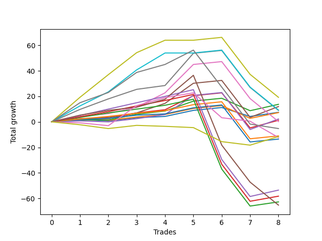

# Short Shepard 003 DB 
- Symbol: ES
- Date Range: 03/18/2022 - 12/30/2022
- Trading Period: 8:30-12:30
- Number of Trades: 36



| Name | Win Percent | Profit | Avg Profit / Trade | Avg Time / Trade |      | Name | Win Percent | Profit | Avg Profit / Trade | Avg Time / Trade |
| ---- | ----------- | ------ | ------------------ | ---------------- | ---- | ---- | ----------- | ------ | ------------------ | ---------------- |
| Sorted By <br> Profit | | | | | | Sorted By <br> Win Percentage ||||
| TP-9 | 75.00 | 57875.00 | 1607.64 | 35:38 |     | TP-1 | 94.44 | 7250.00 | 201.39 | 07:57 |
| TP-8 | 75.00 | 46500.00 | 1291.67 | 31:16 |     | TP-2 | 91.67 | 10625.00 | 295.14 | 12:28 |
| BB-100 Mid SL-10 | 66.67 | 42875.00 | 1190.97 | 25:06 |     | TP-4 | 88.89 | 35250.00 | 979.17 | 17:27 |
| BB-100 Mid | 72.22 | 40625.00 | 1128.47 | 35:38 |     | TP-3 | 88.89 | 23500.00 | 652.78 | 16:25 |
| V U/L 1SD | 55.56 | 40500.00 | 1125.00 | 51:23 |     | BB-20 U/L 2SD C | 86.11 | 36000.00 | 1000.00 | 17:49 |
| BB-50 U/L 1SD | 77.78 | 39875.00 | 1107.64 | 28:50 |     | TP-5 | 83.33 | 29500.00 | 819.44 | 20:46 |
| TP-10 | 66.67 | 39875.00 | 1107.64 | 39:32 |     | BB-20 U/L 2SD | 80.56 | 30875.00 | 857.64 | 17:26 |
| BB-20 U/L 2SD C | 86.11 | 36000.00 | 1000.00 | 17:49 |     | BB-20 U/L 2SD C SL-10 | 80.56 | 27000.00 | 750.00 | 12:07 |
| TP-4 | 88.89 | 35250.00 | 979.17 | 17:27 |     | BB-20 U/L 1SD | 80.56 | 18875.00 | 524.31 | 10:41 |
| V U/L 1SD SL-10 | 47.22 | 34875.00 | 968.75 | 38:13 |     | BB-20 U/L 1SD SL-10 | 80.56 | 17625.00 | 489.58 | 07:10 |
| BB-50 Mid | 77.78 | 34750.00 | 965.28 | 18:42 |     | BB-50 U/L 1SD | 77.78 | 39875.00 | 1107.64 | 28:50 |
| BB-50 U/L 1SD SL-10 | 69.44 | 32875.00 | 913.19 | 18:41 |     | BB-50 Mid | 77.78 | 34750.00 | 965.28 | 18:42 |
| TP-6 | 77.78 | 32500.00 | 902.78 | 27:03 |     | TP-6 | 77.78 | 32500.00 | 902.78 | 27:03 |
| TP-7 | 75.00 | 31625.00 | 878.47 | 30:22 |     | TP-9 | 75.00 | 57875.00 | 1607.64 | 35:38 |
| BB-50 Mid SL-10 | 72.22 | 31125.00 | 864.58 | 12:43 |     | TP-8 | 75.00 | 46500.00 | 1291.67 | 31:16 |
| BB-20 U/L 2SD | 80.56 | 30875.00 | 857.64 | 17:26 |     | TP-7 | 75.00 | 31625.00 | 878.47 | 30:22 |
| TP-5 | 83.33 | 29500.00 | 819.44 | 20:46 |     | BB-20 U/L 2SD SL-10 | 75.00 | 22750.00 | 631.94 | 11:45 |
| BB-20 U/L 2SD C SL-10 | 80.56 | 27000.00 | 750.00 | 12:07 |     | BB-100 Mid | 72.22 | 40625.00 | 1128.47 | 35:38 |
| BB-200 Mid | 58.33 | 24625.00 | 684.03 | 37:56 |     | BB-50 Mid SL-10 | 72.22 | 31125.00 | 864.58 | 12:43 |
| TP-3 | 88.89 | 23500.00 | 652.78 | 16:25 |     | BB-50 U/L 1SD SL-10 | 69.44 | 32875.00 | 913.19 | 18:41 |
| NEWFI 000 | 61.11 | 23250.00 | 645.83 | 45:26 |     | BB-100 Mid SL-10 | 66.67 | 42875.00 | 1190.97 | 25:06 |
| BB-20 U/L 2SD SL-10 | 75.00 | 22750.00 | 631.94 | 11:45 |     | TP-10 | 66.67 | 39875.00 | 1107.64 | 39:32 |
| BB-100 U/L 2SD | 52.78 | 22500.00 | 625.00 | 54:34 |     | BB-20 Mid | 66.67 | 5250.00 | 145.83 | 06:12 |
| BB-200 U/L 2SD | 52.78 | 20875.00 | 579.86 | 57:32 |     | BB-20 Mid SL-10 | 66.67 | 3000.00 | 83.33 | 04:38 |
| BB-20 U/L 1SD | 80.56 | 18875.00 | 524.31 | 10:41 |     | NEWFI 000 | 61.11 | 23250.00 | 645.83 | 45:26 |
| BB-20 U/L 1SD SL-10 | 80.56 | 17625.00 | 489.58 | 07:10 |     | BB-200 Mid | 58.33 | 24625.00 | 684.03 | 37:56 |
| BB-100 U/L 2SD SL-10 | 44.44 | 16875.00 | 468.75 | 41:24 |     | BB-50 U/L 2SD | 58.33 | -2500.00 | -69.44 | 40:43 |
| BB-200 U/L 2SD SL-10 | 44.44 | 15250.00 | 423.61 | 44:22 |     | V U/L 1SD | 55.56 | 40500.00 | 1125.00 | 51:23 |
| BB-200 Mid SL-10 | 50.00 | 15000.00 | 416.67 | 28:29 |     | BB-100 U/L 2SD | 52.78 | 22500.00 | 625.00 | 54:34 |
| TP-2 | 91.67 | 10625.00 | 295.14 | 12:28 |     | BB-200 U/L 2SD | 52.78 | 20875.00 | 579.86 | 57:32 |
| TP-1 | 94.44 | 7250.00 | 201.39 | 07:57 |     | BB-200 Mid SL-10 | 50.00 | 15000.00 | 416.67 | 28:29 |
| BB-20 Mid | 66.67 | 5250.00 | 145.83 | 06:12 |     | BB-50 U/L 2SD SL-10 | 50.00 | -2375.00 | -65.97 | 28:02 |
| BB-20 Mid SL-10 | 66.67 | 3000.00 | 83.33 | 04:38 |     | V U/L 1SD SL-10 | 47.22 | 34875.00 | 968.75 | 38:13 |
| BB-50 U/L 2SD SL-10 | 50.00 | -2375.00 | -65.97 | 28:02 |     | BB-100 U/L 2SD SL-10 | 44.44 | 16875.00 | 468.75 | 41:24 |
| BB-50 U/L 2SD | 58.33 | -2500.00 | -69.44 | 40:43 |     | BB-200 U/L 2SD SL-10 | 44.44 | 15250.00 | 423.61 | 44:22 |

## NO STOPLOSS

### Test BB-20 Mid
* Sell when price hits the middle line of the 20p bollinger
* No Stoploss
* Results:
```
Total Trades: 36
Percent Up: 33.33
Percent Down: 66.67
Total Points Moved Down: 10.50
Potential Profit: 5250.00
Total Points Ups: 41.50 Count Ups: 12
Total Points Downs: 52.00 Count Downs: 24
```

<details><summary>Trades</summary>

<code>In: 2022-03-21 08:30:00		Out: 2022-03-21 08:32:35		Total Position Time: 02:35		Total Move Down: 3.50		Total to Date: 3.50</code> <br />
<code>In: 2022-03-21 08:31:00		Out: 2022-03-21 08:32:35		Total Position Time: 01:35		Total Move Down: 1.25		Total to Date: 4.75</code> <br />
<code>In: 2022-03-25 11:18:00		Out: 2022-03-25 11:19:10		Total Position Time: 01:10		Total Move Down: 1.00		Total to Date: 5.75</code> <br />
<code>In: 2022-03-25 11:37:00		Out: 2022-03-25 11:40:25		Total Position Time: 03:25		Total Move Down: 1.75		Total to Date: 7.50</code> <br />
<code>In: 2022-03-25 11:41:00		Out: 2022-03-25 11:42:10		Total Position Time: 01:10		Total Move Down: -1.00		Total to Date: 6.50</code> <br />
<code>In: 2022-03-25 11:57:00		Out: 2022-03-25 11:58:10		Total Position Time: 01:10		Total Move Down: 0.25		Total to Date: 6.75</code> <br />
<code>In: 2022-03-28 11:34:00		Out: 2022-03-28 12:12:00		Total Position Time: 38:00		Total Move Down: -11.75		Total to Date: -5.00</code> <br />
<code>In: 2022-03-28 11:36:00		Out: 2022-03-28 12:12:00		Total Position Time: 36:00		Total Move Down: -12.50		Total to Date: -17.50</code> <br />
<code>In: 2022-04-01 12:09:00		Out: 2022-04-01 12:10:10		Total Position Time: 01:10		Total Move Down: 2.50		Total to Date: -15.00</code> <br />
<code>In: 2022-04-07 10:34:00		Out: 2022-04-07 10:37:30		Total Position Time: 03:30		Total Move Down: 1.25		Total to Date: -13.75</code> <br />
<code>In: 2022-04-07 11:06:00		Out: 2022-04-07 11:15:20		Total Position Time: 09:20		Total Move Down: 0.25		Total to Date: -13.50</code> <br />
<code>In: 2022-04-18 11:00:00		Out: 2022-04-18 11:01:10		Total Position Time: 01:10		Total Move Down: -0.00		Total to Date: -13.50</code> <br />
<code>In: 2022-04-28 08:36:00		Out: 2022-04-28 08:37:30		Total Position Time: 01:30		Total Move Down: 0.50		Total to Date: -13.00</code> <br />
<code>In: 2022-05-10 11:06:00		Out: 2022-05-10 11:07:10		Total Position Time: 01:10		Total Move Down: 4.75		Total to Date: -8.25</code> <br />
<code>In: 2022-05-16 08:51:00		Out: 2022-05-16 09:05:50		Total Position Time: 14:50		Total Move Down: -7.25		Total to Date: -15.50</code> <br />
<code>In: 2022-05-17 08:39:00		Out: 2022-05-17 08:44:50		Total Position Time: 05:50		Total Move Down: 2.50		Total to Date: -13.00</code> <br />
<code>In: 2022-06-09 10:14:00		Out: 2022-06-09 10:16:50		Total Position Time: 02:50		Total Move Down: 1.75		Total to Date: -11.25</code> <br />
<code>In: 2022-06-10 12:03:00		Out: 2022-06-10 12:04:10		Total Position Time: 01:10		Total Move Down: 4.00		Total to Date: -7.25</code> <br />
<code>In: 2022-06-10 12:21:00		Out: 2022-06-10 12:22:10		Total Position Time: 01:10		Total Move Down: 3.75		Total to Date: -3.50</code> <br />
<code>In: 2022-06-17 10:16:00		Out: 2022-06-17 10:22:55		Total Position Time: 06:55		Total Move Down: 2.50		Total to Date: -1.00</code> <br />
<code>In: 2022-06-29 11:08:00		Out: 2022-06-29 11:20:00		Total Position Time: 12:00		Total Move Down: -0.50		Total to Date: -1.50</code> <br />
<code>In: 2022-06-29 11:18:00		Out: 2022-06-29 11:20:00		Total Position Time: 02:00		Total Move Down: -0.25		Total to Date: -1.75</code> <br />
<code>In: 2022-07-01 10:55:00		Out: 2022-07-01 11:02:15		Total Position Time: 07:15		Total Move Down: -1.25		Total to Date: -3.00</code> <br />
<code>In: 2022-07-05 08:53:00		Out: 2022-07-05 09:03:00		Total Position Time: 10:00		Total Move Down: -0.75		Total to Date: -3.75</code> <br />
<code>In: 2022-07-12 08:34:00		Out: 2022-07-12 08:37:00		Total Position Time: 03:00		Total Move Down: 1.50		Total to Date: -2.25</code> <br />
<code>In: 2022-08-04 09:31:00		Out: 2022-08-04 09:32:10		Total Position Time: 01:10		Total Move Down: -0.25		Total to Date: -2.50</code> <br />
<code>In: 2022-09-01 10:36:00		Out: 2022-09-01 10:37:15		Total Position Time: 01:15		Total Move Down: 3.25		Total to Date: 0.75</code> <br />
<code>In: 2022-09-15 10:30:00		Out: 2022-09-15 10:31:30		Total Position Time: 01:30		Total Move Down: 1.00		Total to Date: 1.75</code> <br />
<code>In: 2022-09-16 11:36:00		Out: 2022-09-16 11:41:10		Total Position Time: 05:10		Total Move Down: 3.75		Total to Date: 5.50</code> <br />
<code>In: 2022-09-16 11:57:00		Out: 2022-09-16 12:11:10		Total Position Time: 14:10		Total Move Down: -5.00		Total to Date: 0.50</code> <br />
<code>In: 2022-09-16 12:11:00		Out: 2022-09-16 12:12:10		Total Position Time: 01:10		Total Move Down: 1.25		Total to Date: 1.75</code> <br />
<code>In: 2022-09-29 08:59:00		Out: 2022-09-29 09:02:05		Total Position Time: 03:05		Total Move Down: 3.00		Total to Date: 4.75</code> <br />
<code>In: 2022-11-09 08:50:00		Out: 2022-11-09 08:56:00		Total Position Time: 06:00		Total Move Down: 4.00		Total to Date: 8.75</code> <br />
<code>In: 2022-11-17 08:38:00		Out: 2022-11-17 08:49:45		Total Position Time: 11:45		Total Move Down: -1.00		Total to Date: 7.75</code> <br />
<code>In: 2022-11-21 10:23:00		Out: 2022-11-21 10:27:25		Total Position Time: 04:25		Total Move Down: 1.00		Total to Date: 8.75</code> <br />
<code>In: 2022-12-07 10:22:00		Out: 2022-12-07 10:25:55		Total Position Time: 03:55		Total Move Down: 1.75		Total to Date: 10.50</code> <br />


</details>

### Test BB-20 U/L 1SD
* Sell when the price hits the lower line of the 20p 1std bollinger
* No Stoploss
* Results:
```
Total Trades: 36
Percent Up: 19.44
Percent Down: 80.56
Total Points Moved Down: 37.75
Potential Profit: 18875.00
Total Points Ups: 50.00 Count Ups: 7
Total Points Downs: 87.75 Count Downs: 29
```

<details><summary>Trades</summary>

<code>In: 2022-03-21 08:30:00		Out: 2022-03-21 08:36:05		Total Position Time: 06:05		Total Move Down: 6.25		Total to Date: 6.25</code> <br />
<code>In: 2022-03-21 08:31:00		Out: 2022-03-21 08:36:05		Total Position Time: 05:05		Total Move Down: 4.00		Total to Date: 10.25</code> <br />
<code>In: 2022-03-25 11:18:00		Out: 2022-03-25 11:19:45		Total Position Time: 01:45		Total Move Down: 1.75		Total to Date: 12.00</code> <br />
<code>In: 2022-03-25 11:37:00		Out: 2022-03-25 11:41:25		Total Position Time: 04:25		Total Move Down: 2.25		Total to Date: 14.25</code> <br />
<code>In: 2022-03-25 11:41:00		Out: 2022-03-25 11:48:45		Total Position Time: 07:45		Total Move Down: -1.00		Total to Date: 13.25</code> <br />
<code>In: 2022-03-25 11:57:00		Out: 2022-03-25 12:00:45		Total Position Time: 03:45		Total Move Down: 1.75		Total to Date: 15.00</code> <br />
<code>In: 2022-03-28 11:34:00		Out: 2022-03-28 12:34:55		Total Position Time: 60:55		Total Move Down: -20.25		Total to Date: -5.25</code> <br />
<code>In: 2022-03-28 11:36:00		Out: 2022-03-28 12:36:55		Total Position Time: 60:55		Total Move Down: -18.50		Total to Date: -23.75</code> <br />
<code>In: 2022-04-01 12:09:00		Out: 2022-04-01 12:10:10		Total Position Time: 01:10		Total Move Down: 2.50		Total to Date: -21.25</code> <br />
<code>In: 2022-04-07 10:34:00		Out: 2022-04-07 10:40:00		Total Position Time: 06:00		Total Move Down: 3.00		Total to Date: -18.25</code> <br />
<code>In: 2022-04-07 11:06:00		Out: 2022-04-07 11:18:00		Total Position Time: 12:00		Total Move Down: 1.00		Total to Date: -17.25</code> <br />
<code>In: 2022-04-18 11:00:00		Out: 2022-04-18 11:06:35		Total Position Time: 06:35		Total Move Down: 1.75		Total to Date: -15.50</code> <br />
<code>In: 2022-04-28 08:36:00		Out: 2022-04-28 08:37:55		Total Position Time: 01:55		Total Move Down: 2.00		Total to Date: -13.50</code> <br />
<code>In: 2022-05-10 11:06:00		Out: 2022-05-10 11:07:10		Total Position Time: 01:10		Total Move Down: 4.75		Total to Date: -8.75</code> <br />
<code>In: 2022-05-16 08:51:00		Out: 2022-05-16 09:06:25		Total Position Time: 15:25		Total Move Down: -2.00		Total to Date: -10.75</code> <br />
<code>In: 2022-05-17 08:39:00		Out: 2022-05-17 08:47:25		Total Position Time: 08:25		Total Move Down: 5.25		Total to Date: -5.50</code> <br />
<code>In: 2022-06-09 10:14:00		Out: 2022-06-09 10:18:50		Total Position Time: 04:50		Total Move Down: 2.75		Total to Date: -2.75</code> <br />
<code>In: 2022-06-10 12:03:00		Out: 2022-06-10 12:05:05		Total Position Time: 02:05		Total Move Down: 6.50		Total to Date: 3.75</code> <br />
<code>In: 2022-06-10 12:21:00		Out: 2022-06-10 12:23:10		Total Position Time: 02:10		Total Move Down: 5.25		Total to Date: 9.00</code> <br />
<code>In: 2022-06-17 10:16:00		Out: 2022-06-17 10:26:20		Total Position Time: 10:20		Total Move Down: 3.50		Total to Date: 12.50</code> <br />
<code>In: 2022-06-29 11:08:00		Out: 2022-06-29 11:20:35		Total Position Time: 12:35		Total Move Down: 1.50		Total to Date: 14.00</code> <br />
<code>In: 2022-06-29 11:18:00		Out: 2022-06-29 11:20:35		Total Position Time: 02:35		Total Move Down: 1.75		Total to Date: 15.75</code> <br />
<code>In: 2022-07-01 10:55:00		Out: 2022-07-01 11:04:30		Total Position Time: 09:30		Total Move Down: 0.50		Total to Date: 16.25</code> <br />
<code>In: 2022-07-05 08:53:00		Out: 2022-07-05 09:03:30		Total Position Time: 10:30		Total Move Down: 0.75		Total to Date: 17.00</code> <br />
<code>In: 2022-07-12 08:34:00		Out: 2022-07-12 08:38:10		Total Position Time: 04:10		Total Move Down: 4.50		Total to Date: 21.50</code> <br />
<code>In: 2022-08-04 09:31:00		Out: 2022-08-04 09:33:20		Total Position Time: 02:20		Total Move Down: 0.50		Total to Date: 22.00</code> <br />
<code>In: 2022-09-01 10:36:00		Out: 2022-09-01 10:41:50		Total Position Time: 05:50		Total Move Down: 4.50		Total to Date: 26.50</code> <br />
<code>In: 2022-09-15 10:30:00		Out: 2022-09-15 10:32:20		Total Position Time: 02:20		Total Move Down: 3.25		Total to Date: 29.75</code> <br />
<code>In: 2022-09-16 11:36:00		Out: 2022-09-16 12:14:25		Total Position Time: 38:25		Total Move Down: -6.25		Total to Date: 23.50</code> <br />
<code>In: 2022-09-16 11:57:00		Out: 2022-09-16 12:14:25		Total Position Time: 17:25		Total Move Down: -1.50		Total to Date: 22.00</code> <br />
<code>In: 2022-09-16 12:11:00		Out: 2022-09-16 12:14:25		Total Position Time: 03:25		Total Move Down: 3.75		Total to Date: 25.75</code> <br />
<code>In: 2022-09-29 08:59:00		Out: 2022-09-29 09:10:55		Total Position Time: 11:55		Total Move Down: 3.25		Total to Date: 29.00</code> <br />
<code>In: 2022-11-09 08:50:00		Out: 2022-11-09 08:58:05		Total Position Time: 08:05		Total Move Down: 6.25		Total to Date: 35.25</code> <br />
<code>In: 2022-11-17 08:38:00		Out: 2022-11-17 08:52:30		Total Position Time: 14:30		Total Move Down: -0.50		Total to Date: 34.75</code> <br />
<code>In: 2022-11-21 10:23:00		Out: 2022-11-21 10:33:00		Total Position Time: 10:00		Total Move Down: 0.50		Total to Date: 35.25</code> <br />
<code>In: 2022-12-07 10:22:00		Out: 2022-12-07 10:30:45		Total Position Time: 08:45		Total Move Down: 2.50		Total to Date: 37.75</code> <br />


</details>

### Test BB-20 U/L 2SD
* Sell when the price hits the lower line of the 20p 2std bollinger
* No Stoploss
* Results:
```
Total Trades: 36
Percent Up: 19.44
Percent Down: 80.56
Total Points Moved Down: 61.75
Potential Profit: 30875.00
Total Points Ups: 61.25 Count Ups: 7
Total Points Downs: 123.00 Count Downs: 29
```

<details><summary>Trades</summary>

<code>In: 2022-03-21 08:30:00		Out: 2022-03-21 08:36:10		Total Position Time: 06:10		Total Move Down: 6.00		Total to Date: 6.00</code> <br />
<code>In: 2022-03-21 08:31:00		Out: 2022-03-21 08:36:10		Total Position Time: 05:10		Total Move Down: 3.75		Total to Date: 9.75</code> <br />
<code>In: 2022-03-25 11:18:00		Out: 2022-03-25 12:00:55		Total Position Time: 42:55		Total Move Down: -0.25		Total to Date: 9.50</code> <br />
<code>In: 2022-03-25 11:37:00		Out: 2022-03-25 12:00:55		Total Position Time: 23:55		Total Move Down: 1.50		Total to Date: 11.00</code> <br />
<code>In: 2022-03-25 11:41:00		Out: 2022-03-25 12:00:55		Total Position Time: 19:55		Total Move Down: -0.00		Total to Date: 11.00</code> <br />
<code>In: 2022-03-25 11:57:00		Out: 2022-03-25 12:00:55		Total Position Time: 03:55		Total Move Down: 2.75		Total to Date: 13.75</code> <br />
<code>In: 2022-03-28 11:34:00		Out: 2022-03-28 12:34:55		Total Position Time: 60:55		Total Move Down: -20.25		Total to Date: -6.50</code> <br />
<code>In: 2022-03-28 11:36:00		Out: 2022-03-28 12:36:55		Total Position Time: 60:55		Total Move Down: -18.50		Total to Date: -25.00</code> <br />
<code>In: 2022-04-01 12:09:00		Out: 2022-04-01 12:11:10		Total Position Time: 02:10		Total Move Down: 4.50		Total to Date: -20.50</code> <br />
<code>In: 2022-04-07 10:34:00		Out: 2022-04-07 10:45:15		Total Position Time: 11:15		Total Move Down: 3.75		Total to Date: -16.75</code> <br />
<code>In: 2022-04-07 11:06:00		Out: 2022-04-07 11:18:20		Total Position Time: 12:20		Total Move Down: 2.25		Total to Date: -14.50</code> <br />
<code>In: 2022-04-18 11:00:00		Out: 2022-04-18 11:10:40		Total Position Time: 10:40		Total Move Down: 3.25		Total to Date: -11.25</code> <br />
<code>In: 2022-04-28 08:36:00		Out: 2022-04-28 08:38:55		Total Position Time: 02:55		Total Move Down: 3.50		Total to Date: -7.75</code> <br />
<code>In: 2022-05-10 11:06:00		Out: 2022-05-10 11:11:10		Total Position Time: 05:10		Total Move Down: 7.75		Total to Date: 0.00</code> <br />
<code>In: 2022-05-16 08:51:00		Out: 2022-05-16 09:11:45		Total Position Time: 20:45		Total Move Down: -1.00		Total to Date: -1.00</code> <br />
<code>In: 2022-05-17 08:39:00		Out: 2022-05-17 09:06:00		Total Position Time: 27:00		Total Move Down: 5.25		Total to Date: 4.25</code> <br />
<code>In: 2022-06-09 10:14:00		Out: 2022-06-09 10:19:05		Total Position Time: 05:05		Total Move Down: 2.75		Total to Date: 7.00</code> <br />
<code>In: 2022-06-10 12:03:00		Out: 2022-06-10 12:06:05		Total Position Time: 03:05		Total Move Down: 10.50		Total to Date: 17.50</code> <br />
<code>In: 2022-06-10 12:21:00		Out: 2022-06-10 12:42:45		Total Position Time: 21:45		Total Move Down: 5.25		Total to Date: 22.75</code> <br />
<code>In: 2022-06-17 10:16:00		Out: 2022-06-17 10:27:15		Total Position Time: 11:15		Total Move Down: 6.50		Total to Date: 29.25</code> <br />
<code>In: 2022-06-29 11:08:00		Out: 2022-06-29 11:21:10		Total Position Time: 13:10		Total Move Down: 2.50		Total to Date: 31.75</code> <br />
<code>In: 2022-06-29 11:18:00		Out: 2022-06-29 11:21:10		Total Position Time: 03:10		Total Move Down: 2.75		Total to Date: 34.50</code> <br />
<code>In: 2022-07-01 10:55:00		Out: 2022-07-01 11:07:55		Total Position Time: 12:55		Total Move Down: 2.50		Total to Date: 37.00</code> <br />
<code>In: 2022-07-05 08:53:00		Out: 2022-07-05 09:05:50		Total Position Time: 12:50		Total Move Down: 2.00		Total to Date: 39.00</code> <br />
<code>In: 2022-07-12 08:34:00		Out: 2022-07-12 08:41:10		Total Position Time: 07:10		Total Move Down: 5.50		Total to Date: 44.50</code> <br />
<code>In: 2022-08-04 09:31:00		Out: 2022-08-04 09:38:50		Total Position Time: 07:50		Total Move Down: 1.75		Total to Date: 46.25</code> <br />
<code>In: 2022-09-01 10:36:00		Out: 2022-09-01 10:45:10		Total Position Time: 09:10		Total Move Down: 5.00		Total to Date: 51.25</code> <br />
<code>In: 2022-09-15 10:30:00		Out: 2022-09-15 10:36:30		Total Position Time: 06:30		Total Move Down: 3.75		Total to Date: 55.00</code> <br />
<code>In: 2022-09-16 11:36:00		Out: 2022-09-16 12:28:05		Total Position Time: 52:05		Total Move Down: -4.50		Total to Date: 50.50</code> <br />
<code>In: 2022-09-16 11:57:00		Out: 2022-09-16 12:28:05		Total Position Time: 31:05		Total Move Down: 0.25		Total to Date: 50.75</code> <br />
<code>In: 2022-09-16 12:11:00		Out: 2022-09-16 12:28:05		Total Position Time: 17:05		Total Move Down: 5.50		Total to Date: 56.25</code> <br />
<code>In: 2022-09-29 08:59:00		Out: 2022-09-29 09:11:30		Total Position Time: 12:30		Total Move Down: 5.50		Total to Date: 61.75</code> <br />
<code>In: 2022-11-09 08:50:00		Out: 2022-11-09 09:08:30		Total Position Time: 18:30		Total Move Down: 12.00		Total to Date: 73.75</code> <br />
<code>In: 2022-11-17 08:38:00		Out: 2022-11-17 09:23:55		Total Position Time: 45:55		Total Move Down: -16.75		Total to Date: 57.00</code> <br />
<code>In: 2022-11-21 10:23:00		Out: 2022-11-21 10:33:10		Total Position Time: 10:10		Total Move Down: 0.75		Total to Date: 57.75</code> <br />
<code>In: 2022-12-07 10:22:00		Out: 2022-12-07 10:32:25		Total Position Time: 10:25		Total Move Down: 4.00		Total to Date: 61.75</code> <br />


</details>

### Test BB-20 U/L 2SD C
* Sell when the price hits the lower line of the 20p 2std bollinger
* No Stoploss
* Results:
```
Total Trades: 36
Percent Up: 13.89
Percent Down: 86.11
Total Points Moved Down: 72.00
Potential Profit: 36000.00
Total Points Ups: 60.50 Count Ups: 5
Total Points Downs: 132.50 Count Downs: 31
```

<details><summary>Trades</summary>

<code>In: 2022-03-21 08:30:00		Out: 2022-03-21 08:36:15		Total Position Time: 06:15		Total Move Down: 6.25		Total to Date: 6.25</code> <br />
<code>In: 2022-03-21 08:31:00		Out: 2022-03-21 08:36:15		Total Position Time: 05:15		Total Move Down: 4.00		Total to Date: 10.25</code> <br />
<code>In: 2022-03-25 11:18:00		Out: 2022-03-25 12:01:15		Total Position Time: 43:15		Total Move Down: 0.25		Total to Date: 10.50</code> <br />
<code>In: 2022-03-25 11:37:00		Out: 2022-03-25 12:01:15		Total Position Time: 24:15		Total Move Down: 2.00		Total to Date: 12.50</code> <br />
<code>In: 2022-03-25 11:41:00		Out: 2022-03-25 12:01:15		Total Position Time: 20:15		Total Move Down: 0.50		Total to Date: 13.00</code> <br />
<code>In: 2022-03-25 11:57:00		Out: 2022-03-25 12:01:15		Total Position Time: 04:15		Total Move Down: 3.25		Total to Date: 16.25</code> <br />
<code>In: 2022-03-28 11:34:00		Out: 2022-03-28 12:34:55		Total Position Time: 60:55		Total Move Down: -20.25		Total to Date: -4.00</code> <br />
<code>In: 2022-03-28 11:36:00		Out: 2022-03-28 12:36:55		Total Position Time: 60:55		Total Move Down: -18.50		Total to Date: -22.50</code> <br />
<code>In: 2022-04-01 12:09:00		Out: 2022-04-01 12:11:10		Total Position Time: 02:10		Total Move Down: 4.50		Total to Date: -18.00</code> <br />
<code>In: 2022-04-07 10:34:00		Out: 2022-04-07 10:48:00		Total Position Time: 14:00		Total Move Down: 4.00		Total to Date: -14.00</code> <br />
<code>In: 2022-04-07 11:06:00		Out: 2022-04-07 11:18:20		Total Position Time: 12:20		Total Move Down: 2.25		Total to Date: -11.75</code> <br />
<code>In: 2022-04-18 11:00:00		Out: 2022-04-18 11:10:40		Total Position Time: 10:40		Total Move Down: 3.25		Total to Date: -8.50</code> <br />
<code>In: 2022-04-28 08:36:00		Out: 2022-04-28 08:39:20		Total Position Time: 03:20		Total Move Down: 3.75		Total to Date: -4.75</code> <br />
<code>In: 2022-05-10 11:06:00		Out: 2022-05-10 11:16:05		Total Position Time: 10:05		Total Move Down: 11.00		Total to Date: 6.25</code> <br />
<code>In: 2022-05-16 08:51:00		Out: 2022-05-16 09:11:45		Total Position Time: 20:45		Total Move Down: -1.00		Total to Date: 5.25</code> <br />
<code>In: 2022-05-17 08:39:00		Out: 2022-05-17 09:06:00		Total Position Time: 27:00		Total Move Down: 5.25		Total to Date: 10.50</code> <br />
<code>In: 2022-06-09 10:14:00		Out: 2022-06-09 10:21:10		Total Position Time: 07:10		Total Move Down: 2.75		Total to Date: 13.25</code> <br />
<code>In: 2022-06-10 12:03:00		Out: 2022-06-10 12:06:05		Total Position Time: 03:05		Total Move Down: 10.50		Total to Date: 23.75</code> <br />
<code>In: 2022-06-10 12:21:00		Out: 2022-06-10 12:43:10		Total Position Time: 22:10		Total Move Down: 6.00		Total to Date: 29.75</code> <br />
<code>In: 2022-06-17 10:16:00		Out: 2022-06-17 10:28:15		Total Position Time: 12:15		Total Move Down: 5.75		Total to Date: 35.50</code> <br />
<code>In: 2022-06-29 11:08:00		Out: 2022-06-29 11:21:15		Total Position Time: 13:15		Total Move Down: 2.50		Total to Date: 38.00</code> <br />
<code>In: 2022-06-29 11:18:00		Out: 2022-06-29 11:21:15		Total Position Time: 03:15		Total Move Down: 2.75		Total to Date: 40.75</code> <br />
<code>In: 2022-07-01 10:55:00		Out: 2022-07-01 11:07:55		Total Position Time: 12:55		Total Move Down: 2.50		Total to Date: 43.25</code> <br />
<code>In: 2022-07-05 08:53:00		Out: 2022-07-05 09:05:50		Total Position Time: 12:50		Total Move Down: 2.00		Total to Date: 45.25</code> <br />
<code>In: 2022-07-12 08:34:00		Out: 2022-07-12 08:41:10		Total Position Time: 07:10		Total Move Down: 5.50		Total to Date: 50.75</code> <br />
<code>In: 2022-08-04 09:31:00		Out: 2022-08-04 09:38:50		Total Position Time: 07:50		Total Move Down: 1.75		Total to Date: 52.50</code> <br />
<code>In: 2022-09-01 10:36:00		Out: 2022-09-01 10:45:15		Total Position Time: 09:15		Total Move Down: 6.00		Total to Date: 58.50</code> <br />
<code>In: 2022-09-15 10:30:00		Out: 2022-09-15 10:36:35		Total Position Time: 06:35		Total Move Down: 4.00		Total to Date: 62.50</code> <br />
<code>In: 2022-09-16 11:36:00		Out: 2022-09-16 12:28:15		Total Position Time: 52:15		Total Move Down: -4.00		Total to Date: 58.50</code> <br />
<code>In: 2022-09-16 11:57:00		Out: 2022-09-16 12:28:15		Total Position Time: 31:15		Total Move Down: 0.75		Total to Date: 59.25</code> <br />
<code>In: 2022-09-16 12:11:00		Out: 2022-09-16 12:28:15		Total Position Time: 17:15		Total Move Down: 6.00		Total to Date: 65.25</code> <br />
<code>In: 2022-09-29 08:59:00		Out: 2022-09-29 09:11:40		Total Position Time: 12:40		Total Move Down: 5.75		Total to Date: 71.00</code> <br />
<code>In: 2022-11-09 08:50:00		Out: 2022-11-09 09:08:35		Total Position Time: 18:35		Total Move Down: 13.00		Total to Date: 84.00</code> <br />
<code>In: 2022-11-17 08:38:00		Out: 2022-11-17 09:23:55		Total Position Time: 45:55		Total Move Down: -16.75		Total to Date: 67.25</code> <br />
<code>In: 2022-11-21 10:23:00		Out: 2022-11-21 10:33:10		Total Position Time: 10:10		Total Move Down: 0.75		Total to Date: 68.00</code> <br />
<code>In: 2022-12-07 10:22:00		Out: 2022-12-07 10:32:25		Total Position Time: 10:25		Total Move Down: 4.00		Total to Date: 72.00</code> <br />


</details>

### Test BB-50 Mid
* Sell when price hits the middle line of the 50p bollinger
* No Stoploss
* Results:
```
Total Trades: 36
Percent Up: 22.22
Percent Down: 77.78
Total Points Moved Down: 69.50
Potential Profit: 34750.00
Total Points Ups: 67.50 Count Ups: 8
Total Points Downs: 137.00 Count Downs: 28
```

<details><summary>Trades</summary>

<code>In: 2022-03-21 08:30:00		Out: 2022-03-21 08:36:10		Total Position Time: 06:10		Total Move Down: 6.00		Total to Date: 6.00</code> <br />
<code>In: 2022-03-21 08:31:00		Out: 2022-03-21 08:36:10		Total Position Time: 05:10		Total Move Down: 3.75		Total to Date: 9.75</code> <br />
<code>In: 2022-03-25 11:18:00		Out: 2022-03-25 11:49:30		Total Position Time: 31:30		Total Move Down: -1.00		Total to Date: 8.75</code> <br />
<code>In: 2022-03-25 11:37:00		Out: 2022-03-25 11:49:30		Total Position Time: 12:30		Total Move Down: 0.75		Total to Date: 9.50</code> <br />
<code>In: 2022-03-25 11:41:00		Out: 2022-03-25 11:49:30		Total Position Time: 08:30		Total Move Down: -0.75		Total to Date: 8.75</code> <br />
<code>In: 2022-03-25 11:57:00		Out: 2022-03-25 12:00:45		Total Position Time: 03:45		Total Move Down: 1.75		Total to Date: 10.50</code> <br />
<code>In: 2022-03-28 11:34:00		Out: 2022-03-28 12:34:55		Total Position Time: 60:55		Total Move Down: -20.25		Total to Date: -9.75</code> <br />
<code>In: 2022-03-28 11:36:00		Out: 2022-03-28 12:36:55		Total Position Time: 60:55		Total Move Down: -18.50		Total to Date: -28.25</code> <br />
<code>In: 2022-04-01 12:09:00		Out: 2022-04-01 12:10:10		Total Position Time: 01:10		Total Move Down: 2.50		Total to Date: -25.75</code> <br />
<code>In: 2022-04-07 10:34:00		Out: 2022-04-07 10:52:05		Total Position Time: 18:05		Total Move Down: 5.00		Total to Date: -20.75</code> <br />
<code>In: 2022-04-07 11:06:00		Out: 2022-04-07 11:33:40		Total Position Time: 27:40		Total Move Down: 2.50		Total to Date: -18.25</code> <br />
<code>In: 2022-04-18 11:00:00		Out: 2022-04-18 11:16:45		Total Position Time: 16:45		Total Move Down: 4.50		Total to Date: -13.75</code> <br />
<code>In: 2022-04-28 08:36:00		Out: 2022-04-28 08:40:20		Total Position Time: 04:20		Total Move Down: 7.75		Total to Date: -6.00</code> <br />
<code>In: 2022-05-10 11:06:00		Out: 2022-05-10 11:16:20		Total Position Time: 10:20		Total Move Down: 15.00		Total to Date: 9.00</code> <br />
<code>In: 2022-05-16 08:51:00		Out: 2022-05-16 09:15:30		Total Position Time: 24:30		Total Move Down: 0.50		Total to Date: 9.50</code> <br />
<code>In: 2022-05-17 08:39:00		Out: 2022-05-17 09:05:55		Total Position Time: 26:55		Total Move Down: 3.75		Total to Date: 13.25</code> <br />
<code>In: 2022-06-09 10:14:00		Out: 2022-06-09 10:22:05		Total Position Time: 08:05		Total Move Down: 4.75		Total to Date: 18.00</code> <br />
<code>In: 2022-06-10 12:03:00		Out: 2022-06-10 12:04:15		Total Position Time: 01:15		Total Move Down: 5.50		Total to Date: 23.50</code> <br />
<code>In: 2022-06-10 12:21:00		Out: 2022-06-10 12:22:10		Total Position Time: 01:10		Total Move Down: 3.75		Total to Date: 27.25</code> <br />
<code>In: 2022-06-17 10:16:00		Out: 2022-06-17 10:32:20		Total Position Time: 16:20		Total Move Down: 9.75		Total to Date: 37.00</code> <br />
<code>In: 2022-06-29 11:08:00		Out: 2022-06-29 11:31:05		Total Position Time: 23:05		Total Move Down: 4.50		Total to Date: 41.50</code> <br />
<code>In: 2022-06-29 11:18:00		Out: 2022-06-29 11:31:05		Total Position Time: 13:05		Total Move Down: 4.75		Total to Date: 46.25</code> <br />
<code>In: 2022-07-01 10:55:00		Out: 2022-07-01 11:11:05		Total Position Time: 16:05		Total Move Down: 5.75		Total to Date: 52.00</code> <br />
<code>In: 2022-07-05 08:53:00		Out: 2022-07-05 09:43:40		Total Position Time: 50:40		Total Move Down: -7.50		Total to Date: 44.50</code> <br />
<code>In: 2022-07-12 08:34:00		Out: 2022-07-12 08:38:20		Total Position Time: 04:20		Total Move Down: 5.25		Total to Date: 49.75</code> <br />
<code>In: 2022-08-04 09:31:00		Out: 2022-08-04 09:36:55		Total Position Time: 05:55		Total Move Down: 1.25		Total to Date: 51.00</code> <br />
<code>In: 2022-09-01 10:36:00		Out: 2022-09-01 10:47:15		Total Position Time: 11:15		Total Move Down: 8.25		Total to Date: 59.25</code> <br />
<code>In: 2022-09-15 10:30:00		Out: 2022-09-15 10:38:35		Total Position Time: 08:35		Total Move Down: 7.50		Total to Date: 66.75</code> <br />
<code>In: 2022-09-16 11:36:00		Out: 2022-09-16 12:19:05		Total Position Time: 43:05		Total Move Down: -4.50		Total to Date: 62.25</code> <br />
<code>In: 2022-09-16 11:57:00		Out: 2022-09-16 12:19:05		Total Position Time: 22:05		Total Move Down: 0.25		Total to Date: 62.50</code> <br />
<code>In: 2022-09-16 12:11:00		Out: 2022-09-16 12:19:05		Total Position Time: 08:05		Total Move Down: 5.50		Total to Date: 68.00</code> <br />
<code>In: 2022-09-29 08:59:00		Out: 2022-09-29 09:16:35		Total Position Time: 17:35		Total Move Down: 7.25		Total to Date: 75.25</code> <br />
<code>In: 2022-11-09 08:50:00		Out: 2022-11-09 08:56:25		Total Position Time: 06:25		Total Move Down: 5.75		Total to Date: 81.00</code> <br />
<code>In: 2022-11-17 08:38:00		Out: 2022-11-17 09:33:35		Total Position Time: 55:35		Total Move Down: -14.25		Total to Date: 66.75</code> <br />
<code>In: 2022-11-21 10:23:00		Out: 2022-11-21 10:54:25		Total Position Time: 31:25		Total Move Down: -0.75		Total to Date: 66.00</code> <br />
<code>In: 2022-12-07 10:22:00		Out: 2022-12-07 10:32:05		Total Position Time: 10:05		Total Move Down: 3.50		Total to Date: 69.50</code> <br />


</details>

### Test BB-50 U/L 1SD
* Sell when the price hits the lower line of the 50p 1std bollinger
* No Stoploss
* Results:
```
Total Trades: 36
Percent Up: 22.22
Percent Down: 77.78
Total Points Moved Down: 79.75
Potential Profit: 39875.00
Total Points Ups: 110.50 Count Ups: 8
Total Points Downs: 190.25 Count Downs: 28
```

<details><summary>Trades</summary>

<code>In: 2022-03-21 08:30:00		Out: 2022-03-21 08:44:55		Total Position Time: 14:55		Total Move Down: 6.50		Total to Date: 6.50</code> <br />
<code>In: 2022-03-21 08:31:00		Out: 2022-03-21 08:44:55		Total Position Time: 13:55		Total Move Down: 4.25		Total to Date: 10.75</code> <br />
<code>In: 2022-03-25 11:18:00		Out: 2022-03-25 12:01:35		Total Position Time: 43:35		Total Move Down: 0.75		Total to Date: 11.50</code> <br />
<code>In: 2022-03-25 11:37:00		Out: 2022-03-25 12:01:35		Total Position Time: 24:35		Total Move Down: 2.50		Total to Date: 14.00</code> <br />
<code>In: 2022-03-25 11:41:00		Out: 2022-03-25 12:01:35		Total Position Time: 20:35		Total Move Down: 1.00		Total to Date: 15.00</code> <br />
<code>In: 2022-03-25 11:57:00		Out: 2022-03-25 12:01:35		Total Position Time: 04:35		Total Move Down: 3.75		Total to Date: 18.75</code> <br />
<code>In: 2022-03-28 11:34:00		Out: 2022-03-28 12:34:55		Total Position Time: 60:55		Total Move Down: -20.25		Total to Date: -1.50</code> <br />
<code>In: 2022-03-28 11:36:00		Out: 2022-03-28 12:36:55		Total Position Time: 60:55		Total Move Down: -18.50		Total to Date: -20.00</code> <br />
<code>In: 2022-04-01 12:09:00		Out: 2022-04-01 12:11:05		Total Position Time: 02:05		Total Move Down: 3.50		Total to Date: -16.50</code> <br />
<code>In: 2022-04-07 10:34:00		Out: 2022-04-07 11:34:55		Total Position Time: 60:55		Total Move Down: -8.50		Total to Date: -25.00</code> <br />
<code>In: 2022-04-07 11:06:00		Out: 2022-04-07 12:06:55		Total Position Time: 60:55		Total Move Down: -26.00		Total to Date: -51.00</code> <br />
<code>In: 2022-04-18 11:00:00		Out: 2022-04-18 11:22:10		Total Position Time: 22:10		Total Move Down: 5.75		Total to Date: -45.25</code> <br />
<code>In: 2022-04-28 08:36:00		Out: 2022-04-28 08:46:10		Total Position Time: 10:10		Total Move Down: 13.00		Total to Date: -32.25</code> <br />
<code>In: 2022-05-10 11:06:00		Out: 2022-05-10 11:24:05		Total Position Time: 18:05		Total Move Down: 15.75		Total to Date: -16.50</code> <br />
<code>In: 2022-05-16 08:51:00		Out: 2022-05-16 09:30:55		Total Position Time: 39:55		Total Move Down: 3.75		Total to Date: -12.75</code> <br />
<code>In: 2022-05-17 08:39:00		Out: 2022-05-17 09:07:05		Total Position Time: 28:05		Total Move Down: 8.00		Total to Date: -4.75</code> <br />
<code>In: 2022-06-09 10:14:00		Out: 2022-06-09 10:24:05		Total Position Time: 10:05		Total Move Down: 7.75		Total to Date: 3.00</code> <br />
<code>In: 2022-06-10 12:03:00		Out: 2022-06-10 12:05:55		Total Position Time: 02:55		Total Move Down: 9.75		Total to Date: 12.75</code> <br />
<code>In: 2022-06-10 12:21:00		Out: 2022-06-10 12:42:40		Total Position Time: 21:40		Total Move Down: 5.25		Total to Date: 18.00</code> <br />
<code>In: 2022-06-17 10:16:00		Out: 2022-06-17 10:47:05		Total Position Time: 31:05		Total Move Down: 14.25		Total to Date: 32.25</code> <br />
<code>In: 2022-06-29 11:08:00		Out: 2022-06-29 11:39:25		Total Position Time: 31:25		Total Move Down: 7.25		Total to Date: 39.50</code> <br />
<code>In: 2022-06-29 11:18:00		Out: 2022-06-29 11:39:25		Total Position Time: 21:25		Total Move Down: 7.50		Total to Date: 47.00</code> <br />
<code>In: 2022-07-01 10:55:00		Out: 2022-07-01 11:55:55		Total Position Time: 60:55		Total Move Down: -14.00		Total to Date: 33.00</code> <br />
<code>In: 2022-07-05 08:53:00		Out: 2022-07-05 09:47:10		Total Position Time: 54:10		Total Move Down: -2.75		Total to Date: 30.25</code> <br />
<code>In: 2022-07-12 08:34:00		Out: 2022-07-12 08:43:55		Total Position Time: 09:55		Total Move Down: 8.25		Total to Date: 38.50</code> <br />
<code>In: 2022-08-04 09:31:00		Out: 2022-08-04 09:38:50		Total Position Time: 07:50		Total Move Down: 1.75		Total to Date: 40.25</code> <br />
<code>In: 2022-09-01 10:36:00		Out: 2022-09-01 11:02:50		Total Position Time: 26:50		Total Move Down: 8.50		Total to Date: 48.75</code> <br />
<code>In: 2022-09-15 10:30:00		Out: 2022-09-15 10:47:25		Total Position Time: 17:25		Total Move Down: 11.00		Total to Date: 59.75</code> <br />
<code>In: 2022-09-16 11:36:00		Out: 2022-09-16 12:30:25		Total Position Time: 54:25		Total Move Down: -2.00		Total to Date: 57.75</code> <br />
<code>In: 2022-09-16 11:57:00		Out: 2022-09-16 12:30:25		Total Position Time: 33:25		Total Move Down: 2.75		Total to Date: 60.50</code> <br />
<code>In: 2022-09-16 12:11:00		Out: 2022-09-16 12:30:25		Total Position Time: 19:25		Total Move Down: 8.00		Total to Date: 68.50</code> <br />
<code>In: 2022-09-29 08:59:00		Out: 2022-09-29 09:19:05		Total Position Time: 20:05		Total Move Down: 13.75		Total to Date: 82.25</code> <br />
<code>In: 2022-11-09 08:50:00		Out: 2022-11-09 09:05:55		Total Position Time: 15:55		Total Move Down: 10.00		Total to Date: 92.25</code> <br />
<code>In: 2022-11-17 08:38:00		Out: 2022-11-17 09:38:55		Total Position Time: 60:55		Total Move Down: -18.50		Total to Date: 73.75</code> <br />
<code>In: 2022-11-21 10:23:00		Out: 2022-11-21 10:59:25		Total Position Time: 36:25		Total Move Down: 1.25		Total to Date: 75.00</code> <br />
<code>In: 2022-12-07 10:22:00		Out: 2022-12-07 10:37:40		Total Position Time: 15:40		Total Move Down: 4.75		Total to Date: 79.75</code> <br />


</details>

### Test BB-50 U/L 2SD
* Sell when the price hits the lower line of the 50p 2std bollinger
* No Stoploss
* Results:
```
Total Trades: 36
Percent Up: 41.67
Percent Down: 58.33
Total Points Moved Down: -5.00
Potential Profit: -2500.00
Total Points Ups: 182.75 Count Ups: 15
Total Points Downs: 177.75 Count Downs: 21
```

<details><summary>Trades</summary>

<code>In: 2022-03-21 08:30:00		Out: 2022-03-21 09:05:45		Total Position Time: 35:45		Total Move Down: 7.00		Total to Date: 7.00</code> <br />
<code>In: 2022-03-21 08:31:00		Out: 2022-03-21 09:05:45		Total Position Time: 34:45		Total Move Down: 4.75		Total to Date: 11.75</code> <br />
<code>In: 2022-03-25 11:18:00		Out: 2022-03-25 12:01:55		Total Position Time: 43:55		Total Move Down: 2.25		Total to Date: 14.00</code> <br />
<code>In: 2022-03-25 11:37:00		Out: 2022-03-25 12:01:55		Total Position Time: 24:55		Total Move Down: 4.00		Total to Date: 18.00</code> <br />
<code>In: 2022-03-25 11:41:00		Out: 2022-03-25 12:01:55		Total Position Time: 20:55		Total Move Down: 2.50		Total to Date: 20.50</code> <br />
<code>In: 2022-03-25 11:57:00		Out: 2022-03-25 12:01:55		Total Position Time: 04:55		Total Move Down: 5.25		Total to Date: 25.75</code> <br />
<code>In: 2022-03-28 11:34:00		Out: 2022-03-28 12:34:55		Total Position Time: 60:55		Total Move Down: -20.25		Total to Date: 5.50</code> <br />
<code>In: 2022-03-28 11:36:00		Out: 2022-03-28 12:36:55		Total Position Time: 60:55		Total Move Down: -18.50		Total to Date: -13.00</code> <br />
<code>In: 2022-04-01 12:09:00		Out: 2022-04-01 12:11:20		Total Position Time: 02:20		Total Move Down: 5.00		Total to Date: -8.00</code> <br />
<code>In: 2022-04-07 10:34:00		Out: 2022-04-07 11:34:55		Total Position Time: 60:55		Total Move Down: -8.50		Total to Date: -16.50</code> <br />
<code>In: 2022-04-07 11:06:00		Out: 2022-04-07 12:06:55		Total Position Time: 60:55		Total Move Down: -26.00		Total to Date: -42.50</code> <br />
<code>In: 2022-04-18 11:00:00		Out: 2022-04-18 11:47:00		Total Position Time: 47:00		Total Move Down: 7.25		Total to Date: -35.25</code> <br />
<code>In: 2022-04-28 08:36:00		Out: 2022-04-28 09:36:55		Total Position Time: 60:55		Total Move Down: -27.75		Total to Date: -63.00</code> <br />
<code>In: 2022-05-10 11:06:00		Out: 2022-05-10 11:27:05		Total Position Time: 21:05		Total Move Down: 22.25		Total to Date: -40.75</code> <br />
<code>In: 2022-05-16 08:51:00		Out: 2022-05-16 09:39:35		Total Position Time: 48:35		Total Move Down: 6.25		Total to Date: -34.50</code> <br />
<code>In: 2022-05-17 08:39:00		Out: 2022-05-17 09:39:55		Total Position Time: 60:55		Total Move Down: -5.00		Total to Date: -39.50</code> <br />
<code>In: 2022-06-09 10:14:00		Out: 2022-06-09 10:27:20		Total Position Time: 13:20		Total Move Down: 11.50		Total to Date: -28.00</code> <br />
<code>In: 2022-06-10 12:03:00		Out: 2022-06-10 12:44:30		Total Position Time: 41:30		Total Move Down: 8.75		Total to Date: -19.25</code> <br />
<code>In: 2022-06-10 12:21:00		Out: 2022-06-10 12:44:30		Total Position Time: 23:30		Total Move Down: 9.00		Total to Date: -10.25</code> <br />
<code>In: 2022-06-17 10:16:00		Out: 2022-06-17 11:16:55		Total Position Time: 60:55		Total Move Down: -5.50		Total to Date: -15.75</code> <br />
<code>In: 2022-06-29 11:08:00		Out: 2022-06-29 11:41:15		Total Position Time: 33:15		Total Move Down: 11.25		Total to Date: -4.50</code> <br />
<code>In: 2022-06-29 11:18:00		Out: 2022-06-29 11:41:15		Total Position Time: 23:15		Total Move Down: 11.50		Total to Date: 7.00</code> <br />
<code>In: 2022-07-01 10:55:00		Out: 2022-07-01 11:55:55		Total Position Time: 60:55		Total Move Down: -14.00		Total to Date: -7.00</code> <br />
<code>In: 2022-07-05 08:53:00		Out: 2022-07-05 09:53:55		Total Position Time: 60:55		Total Move Down: -3.50		Total to Date: -10.50</code> <br />
<code>In: 2022-07-12 08:34:00		Out: 2022-07-12 09:34:55		Total Position Time: 60:55		Total Move Down: -2.25		Total to Date: -12.75</code> <br />
<code>In: 2022-08-04 09:31:00		Out: 2022-08-04 09:42:00		Total Position Time: 11:00		Total Move Down: 4.50		Total to Date: -8.25</code> <br />
<code>In: 2022-09-01 10:36:00		Out: 2022-09-01 11:36:55		Total Position Time: 60:55		Total Move Down: -18.00		Total to Date: -26.25</code> <br />
<code>In: 2022-09-15 10:30:00		Out: 2022-09-15 10:50:20		Total Position Time: 20:20		Total Move Down: 13.00		Total to Date: -13.25</code> <br />
<code>In: 2022-09-16 11:36:00		Out: 2022-09-16 12:36:55		Total Position Time: 60:55		Total Move Down: -6.25		Total to Date: -19.50</code> <br />
<code>In: 2022-09-16 11:57:00		Out: 2022-09-16 12:47:00		Total Position Time: 50:00		Total Move Down: -7.00		Total to Date: -26.50</code> <br />
<code>In: 2022-09-16 12:11:00		Out: 2022-09-16 12:47:00		Total Position Time: 36:00		Total Move Down: -1.75		Total to Date: -28.25</code> <br />
<code>In: 2022-09-29 08:59:00		Out: 2022-09-29 09:22:45		Total Position Time: 23:45		Total Move Down: 16.75		Total to Date: -11.50</code> <br />
<code>In: 2022-11-09 08:50:00		Out: 2022-11-09 09:16:25		Total Position Time: 26:25		Total Move Down: 15.75		Total to Date: 4.25</code> <br />
<code>In: 2022-11-17 08:38:00		Out: 2022-11-17 09:38:55		Total Position Time: 60:55		Total Move Down: -18.50		Total to Date: -14.25</code> <br />
<code>In: 2022-11-21 10:23:00		Out: 2022-11-21 11:22:10		Total Position Time: 59:10		Total Move Down: 2.25		Total to Date: -12.00</code> <br />
<code>In: 2022-12-07 10:22:00		Out: 2022-12-07 10:50:45		Total Position Time: 28:45		Total Move Down: 7.00		Total to Date: -5.00</code> <br />


</details>

### Test V U/L 1SD
* Sell when the price hits the lower line of the 1std VWAP
* No Stoploss
* Results:
```
Total Trades: 36
Percent Up: 44.44
Percent Down: 55.56
Total Points Moved Down: 81.00
Potential Profit: 40500.00
Total Points Ups: 182.75 Count Ups: 16
Total Points Downs: 263.75 Count Downs: 20
```

<details><summary>Trades</summary>

<code>In: 2022-03-21 08:30:00		Out: 2022-03-21 09:30:55		Total Position Time: 60:55		Total Move Down: 12.25		Total to Date: 12.25</code> <br />
<code>In: 2022-03-21 08:31:00		Out: 2022-03-21 09:31:40		Total Position Time: 60:40		Total Move Down: 15.75		Total to Date: 28.00</code> <br />
<code>In: 2022-03-25 11:18:00		Out: 2022-03-25 12:18:55		Total Position Time: 60:55		Total Move Down: 5.50		Total to Date: 33.50</code> <br />
<code>In: 2022-03-25 11:37:00		Out: 2022-03-25 12:33:10		Total Position Time: 56:10		Total Move Down: 19.25		Total to Date: 52.75</code> <br />
<code>In: 2022-03-25 11:41:00		Out: 2022-03-25 12:33:10		Total Position Time: 52:10		Total Move Down: 17.75		Total to Date: 70.50</code> <br />
<code>In: 2022-03-25 11:57:00		Out: 2022-03-25 12:33:10		Total Position Time: 36:10		Total Move Down: 20.50		Total to Date: 91.00</code> <br />
<code>In: 2022-03-28 11:34:00		Out: 2022-03-28 12:34:55		Total Position Time: 60:55		Total Move Down: -20.25		Total to Date: 70.75</code> <br />
<code>In: 2022-03-28 11:36:00		Out: 2022-03-28 12:36:55		Total Position Time: 60:55		Total Move Down: -18.50		Total to Date: 52.25</code> <br />
<code>In: 2022-04-01 12:09:00		Out: 2022-04-01 12:33:30		Total Position Time: 24:30		Total Move Down: 17.25		Total to Date: 69.50</code> <br />
<code>In: 2022-04-07 10:34:00		Out: 2022-04-07 11:34:55		Total Position Time: 60:55		Total Move Down: -8.50		Total to Date: 61.00</code> <br />
<code>In: 2022-04-07 11:06:00		Out: 2022-04-07 12:06:55		Total Position Time: 60:55		Total Move Down: -26.00		Total to Date: 35.00</code> <br />
<code>In: 2022-04-18 11:00:00		Out: 2022-04-18 12:00:55		Total Position Time: 60:55		Total Move Down: 7.25		Total to Date: 42.25</code> <br />
<code>In: 2022-04-28 08:36:00		Out: 2022-04-28 09:36:55		Total Position Time: 60:55		Total Move Down: -27.75		Total to Date: 14.50</code> <br />
<code>In: 2022-05-10 11:06:00		Out: 2022-05-10 12:06:55		Total Position Time: 60:55		Total Move Down: -0.00		Total to Date: 14.50</code> <br />
<code>In: 2022-05-16 08:51:00		Out: 2022-05-16 09:51:55		Total Position Time: 60:55		Total Move Down: 5.25		Total to Date: 19.75</code> <br />
<code>In: 2022-05-17 08:39:00		Out: 2022-05-17 09:39:55		Total Position Time: 60:55		Total Move Down: -5.00		Total to Date: 14.75</code> <br />
<code>In: 2022-06-09 10:14:00		Out: 2022-06-09 10:30:30		Total Position Time: 16:30		Total Move Down: 15.25		Total to Date: 30.00</code> <br />
<code>In: 2022-06-10 12:03:00		Out: 2022-06-10 12:47:00		Total Position Time: 44:00		Total Move Down: 15.00		Total to Date: 45.00</code> <br />
<code>In: 2022-06-10 12:21:00		Out: 2022-06-10 12:47:00		Total Position Time: 26:00		Total Move Down: 15.25		Total to Date: 60.25</code> <br />
<code>In: 2022-06-17 10:16:00		Out: 2022-06-17 11:16:55		Total Position Time: 60:55		Total Move Down: -5.50		Total to Date: 54.75</code> <br />
<code>In: 2022-06-29 11:08:00		Out: 2022-06-29 12:08:55		Total Position Time: 60:55		Total Move Down: 9.75		Total to Date: 64.50</code> <br />
<code>In: 2022-06-29 11:18:00		Out: 2022-06-29 12:18:55		Total Position Time: 60:55		Total Move Down: 4.50		Total to Date: 69.00</code> <br />
<code>In: 2022-07-01 10:55:00		Out: 2022-07-01 11:55:55		Total Position Time: 60:55		Total Move Down: -14.00		Total to Date: 55.00</code> <br />
<code>In: 2022-07-05 08:53:00		Out: 2022-07-05 09:53:55		Total Position Time: 60:55		Total Move Down: -3.50		Total to Date: 51.50</code> <br />
<code>In: 2022-07-12 08:34:00		Out: 2022-07-12 09:34:55		Total Position Time: 60:55		Total Move Down: -2.25		Total to Date: 49.25</code> <br />
<code>In: 2022-08-04 09:31:00		Out: 2022-08-04 09:47:20		Total Position Time: 16:20		Total Move Down: 9.50		Total to Date: 58.75</code> <br />
<code>In: 2022-09-01 10:36:00		Out: 2022-09-01 11:36:55		Total Position Time: 60:55		Total Move Down: -18.00		Total to Date: 40.75</code> <br />
<code>In: 2022-09-15 10:30:00		Out: 2022-09-15 11:07:45		Total Position Time: 37:45		Total Move Down: 26.50		Total to Date: 67.25</code> <br />
<code>In: 2022-09-16 11:36:00		Out: 2022-09-16 12:36:55		Total Position Time: 60:55		Total Move Down: -6.25		Total to Date: 61.00</code> <br />
<code>In: 2022-09-16 11:57:00		Out: 2022-09-16 12:47:00		Total Position Time: 50:00		Total Move Down: -7.00		Total to Date: 54.00</code> <br />
<code>In: 2022-09-16 12:11:00		Out: 2022-09-16 12:47:00		Total Position Time: 36:00		Total Move Down: -1.75		Total to Date: 52.25</code> <br />
<code>In: 2022-09-29 08:59:00		Out: 2022-09-29 09:59:55		Total Position Time: 60:55		Total Move Down: 19.25		Total to Date: 71.50</code> <br />
<code>In: 2022-11-09 08:50:00		Out: 2022-11-09 09:08:30		Total Position Time: 18:30		Total Move Down: 12.00		Total to Date: 83.50</code> <br />
<code>In: 2022-11-17 08:38:00		Out: 2022-11-17 09:38:55		Total Position Time: 60:55		Total Move Down: -18.50		Total to Date: 65.00</code> <br />
<code>In: 2022-11-21 10:23:00		Out: 2022-11-21 11:23:55		Total Position Time: 60:55		Total Move Down: 2.75		Total to Date: 67.75</code> <br />
<code>In: 2022-12-07 10:22:00		Out: 2022-12-07 10:57:20		Total Position Time: 35:20		Total Move Down: 13.25		Total to Date: 81.00</code> <br />


</details>

### Test BB-100 Mid
* Move to BB100 Mid
* No Stoploss
* Results:
```
Total Trades: 36
Percent Up: 27.78
Percent Down: 72.22
Total Points Moved Down: 81.25
Potential Profit: 40625.00
Total Points Ups: 132.50 Count Ups: 10
Total Points Downs: 213.75 Count Downs: 26
```

<details><summary>Trades</summary>

<code>In: 2022-03-21 08:30:00		Out: 2022-03-21 09:30:05		Total Position Time: 60:05		Total Move Down: 5.50		Total to Date: 5.50</code> <br />
<code>In: 2022-03-21 08:31:00		Out: 2022-03-21 09:30:05		Total Position Time: 59:05		Total Move Down: 3.25		Total to Date: 8.75</code> <br />
<code>In: 2022-03-25 11:18:00		Out: 2022-03-25 12:02:30		Total Position Time: 44:30		Total Move Down: 3.75		Total to Date: 12.50</code> <br />
<code>In: 2022-03-25 11:37:00		Out: 2022-03-25 12:02:30		Total Position Time: 25:30		Total Move Down: 5.50		Total to Date: 18.00</code> <br />
<code>In: 2022-03-25 11:41:00		Out: 2022-03-25 12:02:30		Total Position Time: 21:30		Total Move Down: 4.00		Total to Date: 22.00</code> <br />
<code>In: 2022-03-25 11:57:00		Out: 2022-03-25 12:02:30		Total Position Time: 05:30		Total Move Down: 6.75		Total to Date: 28.75</code> <br />
<code>In: 2022-03-28 11:34:00		Out: 2022-03-28 12:34:55		Total Position Time: 60:55		Total Move Down: -20.25		Total to Date: 8.50</code> <br />
<code>In: 2022-03-28 11:36:00		Out: 2022-03-28 12:36:55		Total Position Time: 60:55		Total Move Down: -18.50		Total to Date: -10.00</code> <br />
<code>In: 2022-04-01 12:09:00		Out: 2022-04-01 12:12:25		Total Position Time: 03:25		Total Move Down: 7.00		Total to Date: -3.00</code> <br />
<code>In: 2022-04-07 10:34:00		Out: 2022-04-07 11:34:55		Total Position Time: 60:55		Total Move Down: -8.50		Total to Date: -11.50</code> <br />
<code>In: 2022-04-07 11:06:00		Out: 2022-04-07 12:06:55		Total Position Time: 60:55		Total Move Down: -26.00		Total to Date: -37.50</code> <br />
<code>In: 2022-04-18 11:00:00		Out: 2022-04-18 11:46:55		Total Position Time: 46:55		Total Move Down: 7.00		Total to Date: -30.50</code> <br />
<code>In: 2022-04-28 08:36:00		Out: 2022-04-28 08:46:10		Total Position Time: 10:10		Total Move Down: 13.00		Total to Date: -17.50</code> <br />
<code>In: 2022-05-10 11:06:00		Out: 2022-05-10 11:40:30		Total Position Time: 34:30		Total Move Down: 25.50		Total to Date: 8.00</code> <br />
<code>In: 2022-05-16 08:51:00		Out: 2022-05-16 09:39:05		Total Position Time: 48:05		Total Move Down: 5.50		Total to Date: 13.50</code> <br />
<code>In: 2022-05-17 08:39:00		Out: 2022-05-17 09:39:55		Total Position Time: 60:55		Total Move Down: -5.00		Total to Date: 8.50</code> <br />
<code>In: 2022-06-09 10:14:00		Out: 2022-06-09 10:25:10		Total Position Time: 11:10		Total Move Down: 8.75		Total to Date: 17.25</code> <br />
<code>In: 2022-06-10 12:03:00		Out: 2022-06-10 12:05:20		Total Position Time: 02:20		Total Move Down: 8.75		Total to Date: 26.00</code> <br />
<code>In: 2022-06-10 12:21:00		Out: 2022-06-10 12:23:10		Total Position Time: 02:10		Total Move Down: 5.25		Total to Date: 31.25</code> <br />
<code>In: 2022-06-17 10:16:00		Out: 2022-06-17 10:47:05		Total Position Time: 31:05		Total Move Down: 14.25		Total to Date: 45.50</code> <br />
<code>In: 2022-06-29 11:08:00		Out: 2022-06-29 11:41:15		Total Position Time: 33:15		Total Move Down: 11.25		Total to Date: 56.75</code> <br />
<code>In: 2022-06-29 11:18:00		Out: 2022-06-29 11:41:15		Total Position Time: 23:15		Total Move Down: 11.50		Total to Date: 68.25</code> <br />
<code>In: 2022-07-01 10:55:00		Out: 2022-07-01 11:55:55		Total Position Time: 60:55		Total Move Down: -14.00		Total to Date: 54.25</code> <br />
<code>In: 2022-07-05 08:53:00		Out: 2022-07-05 09:53:55		Total Position Time: 60:55		Total Move Down: -3.50		Total to Date: 50.75</code> <br />
<code>In: 2022-07-12 08:34:00		Out: 2022-07-12 08:54:25		Total Position Time: 20:25		Total Move Down: 8.50		Total to Date: 59.25</code> <br />
<code>In: 2022-08-04 09:31:00		Out: 2022-08-04 09:42:00		Total Position Time: 11:00		Total Move Down: 4.50		Total to Date: 63.75</code> <br />
<code>In: 2022-09-01 10:36:00		Out: 2022-09-01 11:36:55		Total Position Time: 60:55		Total Move Down: -18.00		Total to Date: 45.75</code> <br />
<code>In: 2022-09-15 10:30:00		Out: 2022-09-15 11:00:20		Total Position Time: 30:20		Total Move Down: 14.25		Total to Date: 60.00</code> <br />
<code>In: 2022-09-16 11:36:00		Out: 2022-09-16 12:31:10		Total Position Time: 55:10		Total Move Down: -0.25		Total to Date: 59.75</code> <br />
<code>In: 2022-09-16 11:57:00		Out: 2022-09-16 12:31:10		Total Position Time: 34:10		Total Move Down: 4.50		Total to Date: 64.25</code> <br />
<code>In: 2022-09-16 12:11:00		Out: 2022-09-16 12:31:10		Total Position Time: 20:10		Total Move Down: 9.75		Total to Date: 74.00</code> <br />
<code>In: 2022-09-29 08:59:00		Out: 2022-09-29 09:18:20		Total Position Time: 19:20		Total Move Down: 11.50		Total to Date: 85.50</code> <br />
<code>In: 2022-11-09 08:50:00		Out: 2022-11-09 08:56:30		Total Position Time: 06:30		Total Move Down: 7.00		Total to Date: 92.50</code> <br />
<code>In: 2022-11-17 08:38:00		Out: 2022-11-17 09:38:55		Total Position Time: 60:55		Total Move Down: -18.50		Total to Date: 74.00</code> <br />
<code>In: 2022-11-21 10:23:00		Out: 2022-11-21 11:22:05		Total Position Time: 59:05		Total Move Down: 1.50		Total to Date: 75.50</code> <br />
<code>In: 2022-12-07 10:22:00		Out: 2022-12-07 10:38:00		Total Position Time: 16:00		Total Move Down: 5.75		Total to Date: 81.25</code> <br />


</details>

### Test BB-100 U/L 2SD
* Move to BB100 Upper Band
* No Stoploss
* Results:
```
Total Trades: 36
Percent Up: 47.22
Percent Down: 52.78
Total Points Moved Down: 45.00
Potential Profit: 22500.00
Total Points Ups: 183.25 Count Ups: 17
Total Points Downs: 228.25 Count Downs: 19
```

<details><summary>Trades</summary>

<code>In: 2022-03-21 08:30:00		Out: 2022-03-21 09:30:45		Total Position Time: 60:45		Total Move Down: 11.75		Total to Date: 11.75</code> <br />
<code>In: 2022-03-21 08:31:00		Out: 2022-03-21 09:30:45		Total Position Time: 59:45		Total Move Down: 9.50		Total to Date: 21.25</code> <br />
<code>In: 2022-03-25 11:18:00		Out: 2022-03-25 12:18:55		Total Position Time: 60:55		Total Move Down: 5.50		Total to Date: 26.75</code> <br />
<code>In: 2022-03-25 11:37:00		Out: 2022-03-25 12:21:35		Total Position Time: 44:35		Total Move Down: 12.50		Total to Date: 39.25</code> <br />
<code>In: 2022-03-25 11:41:00		Out: 2022-03-25 12:21:35		Total Position Time: 40:35		Total Move Down: 11.00		Total to Date: 50.25</code> <br />
<code>In: 2022-03-25 11:57:00		Out: 2022-03-25 12:21:35		Total Position Time: 24:35		Total Move Down: 13.75		Total to Date: 64.00</code> <br />
<code>In: 2022-03-28 11:34:00		Out: 2022-03-28 12:34:55		Total Position Time: 60:55		Total Move Down: -20.25		Total to Date: 43.75</code> <br />
<code>In: 2022-03-28 11:36:00		Out: 2022-03-28 12:36:55		Total Position Time: 60:55		Total Move Down: -18.50		Total to Date: 25.25</code> <br />
<code>In: 2022-04-01 12:09:00		Out: 2022-04-01 12:33:30		Total Position Time: 24:30		Total Move Down: 17.25		Total to Date: 42.50</code> <br />
<code>In: 2022-04-07 10:34:00		Out: 2022-04-07 11:34:55		Total Position Time: 60:55		Total Move Down: -8.50		Total to Date: 34.00</code> <br />
<code>In: 2022-04-07 11:06:00		Out: 2022-04-07 12:06:55		Total Position Time: 60:55		Total Move Down: -26.00		Total to Date: 8.00</code> <br />
<code>In: 2022-04-18 11:00:00		Out: 2022-04-18 12:00:55		Total Position Time: 60:55		Total Move Down: 7.25		Total to Date: 15.25</code> <br />
<code>In: 2022-04-28 08:36:00		Out: 2022-04-28 09:36:55		Total Position Time: 60:55		Total Move Down: -27.75		Total to Date: -12.50</code> <br />
<code>In: 2022-05-10 11:06:00		Out: 2022-05-10 12:06:55		Total Position Time: 60:55		Total Move Down: -0.00		Total to Date: -12.50</code> <br />
<code>In: 2022-05-16 08:51:00		Out: 2022-05-16 09:51:55		Total Position Time: 60:55		Total Move Down: 5.25		Total to Date: -7.25</code> <br />
<code>In: 2022-05-17 08:39:00		Out: 2022-05-17 09:39:55		Total Position Time: 60:55		Total Move Down: -5.00		Total to Date: -12.25</code> <br />
<code>In: 2022-06-09 10:14:00		Out: 2022-06-09 11:14:55		Total Position Time: 60:55		Total Move Down: 16.25		Total to Date: 4.00</code> <br />
<code>In: 2022-06-10 12:03:00		Out: 2022-06-10 12:47:00		Total Position Time: 44:00		Total Move Down: 15.00		Total to Date: 19.00</code> <br />
<code>In: 2022-06-10 12:21:00		Out: 2022-06-10 12:47:00		Total Position Time: 26:00		Total Move Down: 15.25		Total to Date: 34.25</code> <br />
<code>In: 2022-06-17 10:16:00		Out: 2022-06-17 11:16:55		Total Position Time: 60:55		Total Move Down: -5.50		Total to Date: 28.75</code> <br />
<code>In: 2022-06-29 11:08:00		Out: 2022-06-29 12:08:55		Total Position Time: 60:55		Total Move Down: 9.75		Total to Date: 38.50</code> <br />
<code>In: 2022-06-29 11:18:00		Out: 2022-06-29 12:18:55		Total Position Time: 60:55		Total Move Down: 4.50		Total to Date: 43.00</code> <br />
<code>In: 2022-07-01 10:55:00		Out: 2022-07-01 11:55:55		Total Position Time: 60:55		Total Move Down: -14.00		Total to Date: 29.00</code> <br />
<code>In: 2022-07-05 08:53:00		Out: 2022-07-05 09:53:55		Total Position Time: 60:55		Total Move Down: -3.50		Total to Date: 25.50</code> <br />
<code>In: 2022-07-12 08:34:00		Out: 2022-07-12 09:34:55		Total Position Time: 60:55		Total Move Down: -2.25		Total to Date: 23.25</code> <br />
<code>In: 2022-08-04 09:31:00		Out: 2022-08-04 10:31:55		Total Position Time: 60:55		Total Move Down: -0.50		Total to Date: 22.75</code> <br />
<code>In: 2022-09-01 10:36:00		Out: 2022-09-01 11:36:55		Total Position Time: 60:55		Total Move Down: -18.00		Total to Date: 4.75</code> <br />
<code>In: 2022-09-15 10:30:00		Out: 2022-09-15 11:30:55		Total Position Time: 60:55		Total Move Down: 19.50		Total to Date: 24.25</code> <br />
<code>In: 2022-09-16 11:36:00		Out: 2022-09-16 12:36:55		Total Position Time: 60:55		Total Move Down: -6.25		Total to Date: 18.00</code> <br />
<code>In: 2022-09-16 11:57:00		Out: 2022-09-16 12:47:00		Total Position Time: 50:00		Total Move Down: -7.00		Total to Date: 11.00</code> <br />
<code>In: 2022-09-16 12:11:00		Out: 2022-09-16 12:47:00		Total Position Time: 36:00		Total Move Down: -1.75		Total to Date: 9.25</code> <br />
<code>In: 2022-09-29 08:59:00		Out: 2022-09-29 09:59:55		Total Position Time: 60:55		Total Move Down: 19.25		Total to Date: 28.50</code> <br />
<code>In: 2022-11-09 08:50:00		Out: 2022-11-09 09:42:45		Total Position Time: 52:45		Total Move Down: 18.00		Total to Date: 46.50</code> <br />
<code>In: 2022-11-17 08:38:00		Out: 2022-11-17 09:38:55		Total Position Time: 60:55		Total Move Down: -18.50		Total to Date: 28.00</code> <br />
<code>In: 2022-11-21 10:23:00		Out: 2022-11-21 11:23:55		Total Position Time: 60:55		Total Move Down: 2.75		Total to Date: 30.75</code> <br />
<code>In: 2022-12-07 10:22:00		Out: 2022-12-07 11:01:15		Total Position Time: 39:15		Total Move Down: 14.25		Total to Date: 45.00</code> <br />


</details>

### Test BB-200 Mid
* Move to BB200 Mid
* No Stoploss
* Results:
```
Total Trades: 36
Percent Up: 41.67
Percent Down: 58.33
Total Points Moved Down: 49.25
Potential Profit: 24625.00
Total Points Ups: 138.75 Count Ups: 15
Total Points Downs: 188.00 Count Downs: 21
```

<details><summary>Trades</summary>

<code>In: 2022-03-21 08:30:00		Out: 2022-03-21 09:30:30		Total Position Time: 60:30		Total Move Down: 9.25		Total to Date: 9.25</code> <br />
<code>In: 2022-03-21 08:31:00		Out: 2022-03-21 09:30:30		Total Position Time: 59:30		Total Move Down: 7.00		Total to Date: 16.25</code> <br />
<code>In: 2022-03-25 11:18:00		Out: 2022-03-25 12:18:55		Total Position Time: 60:55		Total Move Down: 5.50		Total to Date: 21.75</code> <br />
<code>In: 2022-03-25 11:37:00		Out: 2022-03-25 12:20:40		Total Position Time: 43:40		Total Move Down: 11.25		Total to Date: 33.00</code> <br />
<code>In: 2022-03-25 11:41:00		Out: 2022-03-25 12:20:40		Total Position Time: 39:40		Total Move Down: 9.75		Total to Date: 42.75</code> <br />
<code>In: 2022-03-25 11:57:00		Out: 2022-03-25 12:20:40		Total Position Time: 23:40		Total Move Down: 12.50		Total to Date: 55.25</code> <br />
<code>In: 2022-03-28 11:34:00		Out: 2022-03-28 12:34:55		Total Position Time: 60:55		Total Move Down: -20.25		Total to Date: 35.00</code> <br />
<code>In: 2022-03-28 11:36:00		Out: 2022-03-28 12:36:55		Total Position Time: 60:55		Total Move Down: -18.50		Total to Date: 16.50</code> <br />
<code>In: 2022-04-01 12:09:00		Out: 2022-04-01 12:20:35		Total Position Time: 11:35		Total Move Down: 14.00		Total to Date: 30.50</code> <br />
<code>In: 2022-04-07 10:34:00		Out: 2022-04-07 11:34:55		Total Position Time: 60:55		Total Move Down: -8.50		Total to Date: 22.00</code> <br />
<code>In: 2022-04-07 11:06:00		Out: 2022-04-07 12:06:55		Total Position Time: 60:55		Total Move Down: -26.00		Total to Date: -4.00</code> <br />
<code>In: 2022-04-18 11:00:00		Out: 2022-04-18 12:00:55		Total Position Time: 60:55		Total Move Down: 7.25		Total to Date: 3.25</code> <br />
<code>In: 2022-04-28 08:36:00		Out: 2022-04-28 08:46:55		Total Position Time: 10:55		Total Move Down: 13.00		Total to Date: 16.25</code> <br />
<code>In: 2022-05-10 11:06:00		Out: 2022-05-10 12:06:55		Total Position Time: 60:55		Total Move Down: -0.00		Total to Date: 16.25</code> <br />
<code>In: 2022-05-16 08:51:00		Out: 2022-05-16 09:24:25		Total Position Time: 33:25		Total Move Down: 5.25		Total to Date: 21.50</code> <br />
<code>In: 2022-05-17 08:39:00		Out: 2022-05-17 09:39:55		Total Position Time: 60:55		Total Move Down: -5.00		Total to Date: 16.50</code> <br />
<code>In: 2022-06-09 10:14:00		Out: 2022-06-09 10:25:10		Total Position Time: 11:10		Total Move Down: 8.75		Total to Date: 25.25</code> <br />
<code>In: 2022-06-10 12:03:00		Out: 2022-06-10 12:45:45		Total Position Time: 42:45		Total Move Down: 9.50		Total to Date: 34.75</code> <br />
<code>In: 2022-06-10 12:21:00		Out: 2022-06-10 12:45:45		Total Position Time: 24:45		Total Move Down: 9.75		Total to Date: 44.50</code> <br />
<code>In: 2022-06-17 10:16:00		Out: 2022-06-17 11:16:55		Total Position Time: 60:55		Total Move Down: -5.50		Total to Date: 39.00</code> <br />
<code>In: 2022-06-29 11:08:00		Out: 2022-06-29 11:42:15		Total Position Time: 34:15		Total Move Down: 12.75		Total to Date: 51.75</code> <br />
<code>In: 2022-06-29 11:18:00		Out: 2022-06-29 11:42:15		Total Position Time: 24:15		Total Move Down: 13.00		Total to Date: 64.75</code> <br />
<code>In: 2022-07-01 10:55:00		Out: 2022-07-01 11:55:55		Total Position Time: 60:55		Total Move Down: -14.00		Total to Date: 50.75</code> <br />
<code>In: 2022-07-05 08:53:00		Out: 2022-07-05 08:54:10		Total Position Time: 01:10		Total Move Down: -4.25		Total to Date: 46.50</code> <br />
<code>In: 2022-07-12 08:34:00		Out: 2022-07-12 08:38:25		Total Position Time: 04:25		Total Move Down: 5.50		Total to Date: 52.00</code> <br />
<code>In: 2022-08-04 09:31:00		Out: 2022-08-04 09:42:00		Total Position Time: 11:00		Total Move Down: 4.50		Total to Date: 56.50</code> <br />
<code>In: 2022-09-01 10:36:00		Out: 2022-09-01 11:36:55		Total Position Time: 60:55		Total Move Down: -18.00		Total to Date: 38.50</code> <br />
<code>In: 2022-09-15 10:30:00		Out: 2022-09-15 11:01:35		Total Position Time: 31:35		Total Move Down: 20.00		Total to Date: 58.50</code> <br />
<code>In: 2022-09-16 11:36:00		Out: 2022-09-16 12:36:55		Total Position Time: 60:55		Total Move Down: -6.25		Total to Date: 52.25</code> <br />
<code>In: 2022-09-16 11:57:00		Out: 2022-09-16 12:47:00		Total Position Time: 50:00		Total Move Down: -7.00		Total to Date: 45.25</code> <br />
<code>In: 2022-09-16 12:11:00		Out: 2022-09-16 12:47:00		Total Position Time: 36:00		Total Move Down: -1.75		Total to Date: 43.50</code> <br />
<code>In: 2022-09-29 08:59:00		Out: 2022-09-29 09:00:10		Total Position Time: 01:10		Total Move Down: 1.75		Total to Date: 45.25</code> <br />
<code>In: 2022-11-09 08:50:00		Out: 2022-11-09 08:51:45		Total Position Time: 01:45		Total Move Down: -1.25		Total to Date: 44.00</code> <br />
<code>In: 2022-11-17 08:38:00		Out: 2022-11-17 08:39:10		Total Position Time: 01:10		Total Move Down: -2.50		Total to Date: 41.50</code> <br />
<code>In: 2022-11-21 10:23:00		Out: 2022-11-21 11:23:55		Total Position Time: 60:55		Total Move Down: 2.75		Total to Date: 44.25</code> <br />
<code>In: 2022-12-07 10:22:00		Out: 2022-12-07 10:37:35		Total Position Time: 15:35		Total Move Down: 5.00		Total to Date: 49.25</code> <br />


</details>

### Test BB-200 U/L 2SD
* Move to BB200 Upper Band
* No Stoploss
* Results:
```
Total Trades: 36
Percent Up: 47.22
Percent Down: 52.78
Total Points Moved Down: 41.75
Potential Profit: 20875.00
Total Points Ups: 183.25 Count Ups: 17
Total Points Downs: 225.00 Count Downs: 19
```

<details><summary>Trades</summary>

<code>In: 2022-03-21 08:30:00		Out: 2022-03-21 09:30:55		Total Position Time: 60:55		Total Move Down: 12.25		Total to Date: 12.25</code> <br />
<code>In: 2022-03-21 08:31:00		Out: 2022-03-21 09:31:55		Total Position Time: 60:55		Total Move Down: 16.50		Total to Date: 28.75</code> <br />
<code>In: 2022-03-25 11:18:00		Out: 2022-03-25 12:18:55		Total Position Time: 60:55		Total Move Down: 5.50		Total to Date: 34.25</code> <br />
<code>In: 2022-03-25 11:37:00		Out: 2022-03-25 12:37:55		Total Position Time: 60:55		Total Move Down: 15.00		Total to Date: 49.25</code> <br />
<code>In: 2022-03-25 11:41:00		Out: 2022-03-25 12:41:55		Total Position Time: 60:55		Total Move Down: 8.00		Total to Date: 57.25</code> <br />
<code>In: 2022-03-25 11:57:00		Out: 2022-03-25 12:47:00		Total Position Time: 50:00		Total Move Down: 6.00		Total to Date: 63.25</code> <br />
<code>In: 2022-03-28 11:34:00		Out: 2022-03-28 12:34:55		Total Position Time: 60:55		Total Move Down: -20.25		Total to Date: 43.00</code> <br />
<code>In: 2022-03-28 11:36:00		Out: 2022-03-28 12:36:55		Total Position Time: 60:55		Total Move Down: -18.50		Total to Date: 24.50</code> <br />
<code>In: 2022-04-01 12:09:00		Out: 2022-04-01 12:47:00		Total Position Time: 38:00		Total Move Down: 15.75		Total to Date: 40.25</code> <br />
<code>In: 2022-04-07 10:34:00		Out: 2022-04-07 11:34:55		Total Position Time: 60:55		Total Move Down: -8.50		Total to Date: 31.75</code> <br />
<code>In: 2022-04-07 11:06:00		Out: 2022-04-07 12:06:55		Total Position Time: 60:55		Total Move Down: -26.00		Total to Date: 5.75</code> <br />
<code>In: 2022-04-18 11:00:00		Out: 2022-04-18 12:00:55		Total Position Time: 60:55		Total Move Down: 7.25		Total to Date: 13.00</code> <br />
<code>In: 2022-04-28 08:36:00		Out: 2022-04-28 09:36:55		Total Position Time: 60:55		Total Move Down: -27.75		Total to Date: -14.75</code> <br />
<code>In: 2022-05-10 11:06:00		Out: 2022-05-10 12:06:55		Total Position Time: 60:55		Total Move Down: -0.00		Total to Date: -14.75</code> <br />
<code>In: 2022-05-16 08:51:00		Out: 2022-05-16 09:51:55		Total Position Time: 60:55		Total Move Down: 5.25		Total to Date: -9.50</code> <br />
<code>In: 2022-05-17 08:39:00		Out: 2022-05-17 09:39:55		Total Position Time: 60:55		Total Move Down: -5.00		Total to Date: -14.50</code> <br />
<code>In: 2022-06-09 10:14:00		Out: 2022-06-09 11:14:55		Total Position Time: 60:55		Total Move Down: 16.25		Total to Date: 1.75</code> <br />
<code>In: 2022-06-10 12:03:00		Out: 2022-06-10 12:47:00		Total Position Time: 44:00		Total Move Down: 15.00		Total to Date: 16.75</code> <br />
<code>In: 2022-06-10 12:21:00		Out: 2022-06-10 12:47:00		Total Position Time: 26:00		Total Move Down: 15.25		Total to Date: 32.00</code> <br />
<code>In: 2022-06-17 10:16:00		Out: 2022-06-17 11:16:55		Total Position Time: 60:55		Total Move Down: -5.50		Total to Date: 26.50</code> <br />
<code>In: 2022-06-29 11:08:00		Out: 2022-06-29 12:08:55		Total Position Time: 60:55		Total Move Down: 9.75		Total to Date: 36.25</code> <br />
<code>In: 2022-06-29 11:18:00		Out: 2022-06-29 12:18:55		Total Position Time: 60:55		Total Move Down: 4.50		Total to Date: 40.75</code> <br />
<code>In: 2022-07-01 10:55:00		Out: 2022-07-01 11:55:55		Total Position Time: 60:55		Total Move Down: -14.00		Total to Date: 26.75</code> <br />
<code>In: 2022-07-05 08:53:00		Out: 2022-07-05 09:53:55		Total Position Time: 60:55		Total Move Down: -3.50		Total to Date: 23.25</code> <br />
<code>In: 2022-07-12 08:34:00		Out: 2022-07-12 09:34:55		Total Position Time: 60:55		Total Move Down: -2.25		Total to Date: 21.00</code> <br />
<code>In: 2022-08-04 09:31:00		Out: 2022-08-04 10:31:55		Total Position Time: 60:55		Total Move Down: -0.50		Total to Date: 20.50</code> <br />
<code>In: 2022-09-01 10:36:00		Out: 2022-09-01 11:36:55		Total Position Time: 60:55		Total Move Down: -18.00		Total to Date: 2.50</code> <br />
<code>In: 2022-09-15 10:30:00		Out: 2022-09-15 11:30:55		Total Position Time: 60:55		Total Move Down: 19.50		Total to Date: 22.00</code> <br />
<code>In: 2022-09-16 11:36:00		Out: 2022-09-16 12:36:55		Total Position Time: 60:55		Total Move Down: -6.25		Total to Date: 15.75</code> <br />
<code>In: 2022-09-16 11:57:00		Out: 2022-09-16 12:47:00		Total Position Time: 50:00		Total Move Down: -7.00		Total to Date: 8.75</code> <br />
<code>In: 2022-09-16 12:11:00		Out: 2022-09-16 12:47:00		Total Position Time: 36:00		Total Move Down: -1.75		Total to Date: 7.00</code> <br />
<code>In: 2022-09-29 08:59:00		Out: 2022-09-29 09:59:55		Total Position Time: 60:55		Total Move Down: 19.25		Total to Date: 26.25</code> <br />
<code>In: 2022-11-09 08:50:00		Out: 2022-11-09 09:50:55		Total Position Time: 60:55		Total Move Down: 15.75		Total to Date: 42.00</code> <br />
<code>In: 2022-11-17 08:38:00		Out: 2022-11-17 09:38:55		Total Position Time: 60:55		Total Move Down: -18.50		Total to Date: 23.50</code> <br />
<code>In: 2022-11-21 10:23:00		Out: 2022-11-21 11:23:55		Total Position Time: 60:55		Total Move Down: 2.75		Total to Date: 26.25</code> <br />
<code>In: 2022-12-07 10:22:00		Out: 2022-12-07 11:22:55		Total Position Time: 60:55		Total Move Down: 15.50		Total to Date: 41.75</code> <br />


</details>

## STOPLOSS OF 10

### Test BB-20 Mid SL-10
* Sell when price hits the middle line of the 20p bollinger
* Stoploss is -10 points
* Results:
```
Total Trades: 36
Percent Up: 33.33
Percent Down: 66.67
Total Points Moved Down: 6.00
Potential Profit: 3000.00
Total Points Ups: 46.00 Count Ups: 12
Total Points Downs: 52.00 Count Downs: 24
```

<details><summary>Trades</summary>

<code>In: 2022-03-21 08:30:00		Out: 2022-03-21 08:32:35		Total Position Time: 02:35		Total Move Down: 3.50		Total to Date: 3.50</code> <br />
<code>In: 2022-03-21 08:31:00		Out: 2022-03-21 08:32:35		Total Position Time: 01:35		Total Move Down: 1.25		Total to Date: 4.75</code> <br />
<code>In: 2022-03-25 11:18:00		Out: 2022-03-25 11:19:10		Total Position Time: 01:10		Total Move Down: 1.00		Total to Date: 5.75</code> <br />
<code>In: 2022-03-25 11:37:00		Out: 2022-03-25 11:40:25		Total Position Time: 03:25		Total Move Down: 1.75		Total to Date: 7.50</code> <br />
<code>In: 2022-03-25 11:41:00		Out: 2022-03-25 11:42:10		Total Position Time: 01:10		Total Move Down: -1.00		Total to Date: 6.50</code> <br />
<code>In: 2022-03-25 11:57:00		Out: 2022-03-25 11:58:10		Total Position Time: 01:10		Total Move Down: 0.25		Total to Date: 6.75</code> <br />
<code>In: 2022-03-28 11:34:00		Out: 2022-03-28 11:51:55		Total Position Time: 17:55		Total Move Down: -10.00		Total to Date: -3.25</code> <br />
<code>In: 2022-03-28 11:36:00		Out: 2022-03-28 11:51:50		Total Position Time: 15:50		Total Move Down: -10.25		Total to Date: -13.50</code> <br />
<code>In: 2022-04-01 12:09:00		Out: 2022-04-01 12:10:10		Total Position Time: 01:10		Total Move Down: 2.50		Total to Date: -11.00</code> <br />
<code>In: 2022-04-07 10:34:00		Out: 2022-04-07 10:37:30		Total Position Time: 03:30		Total Move Down: 1.25		Total to Date: -9.75</code> <br />
<code>In: 2022-04-07 11:06:00		Out: 2022-04-07 11:15:20		Total Position Time: 09:20		Total Move Down: 0.25		Total to Date: -9.50</code> <br />
<code>In: 2022-04-18 11:00:00		Out: 2022-04-18 11:01:10		Total Position Time: 01:10		Total Move Down: -0.00		Total to Date: -9.50</code> <br />
<code>In: 2022-04-28 08:36:00		Out: 2022-04-28 08:37:30		Total Position Time: 01:30		Total Move Down: 0.50		Total to Date: -9.00</code> <br />
<code>In: 2022-05-10 11:06:00		Out: 2022-05-10 11:07:10		Total Position Time: 01:10		Total Move Down: 4.75		Total to Date: -4.25</code> <br />
<code>In: 2022-05-16 08:51:00		Out: 2022-05-16 08:55:10		Total Position Time: 04:10		Total Move Down: -10.50		Total to Date: -14.75</code> <br />
<code>In: 2022-05-17 08:39:00		Out: 2022-05-17 08:44:50		Total Position Time: 05:50		Total Move Down: 2.50		Total to Date: -12.25</code> <br />
<code>In: 2022-06-09 10:14:00		Out: 2022-06-09 10:16:50		Total Position Time: 02:50		Total Move Down: 1.75		Total to Date: -10.50</code> <br />
<code>In: 2022-06-10 12:03:00		Out: 2022-06-10 12:04:10		Total Position Time: 01:10		Total Move Down: 4.00		Total to Date: -6.50</code> <br />
<code>In: 2022-06-10 12:21:00		Out: 2022-06-10 12:22:10		Total Position Time: 01:10		Total Move Down: 3.75		Total to Date: -2.75</code> <br />
<code>In: 2022-06-17 10:16:00		Out: 2022-06-17 10:22:55		Total Position Time: 06:55		Total Move Down: 2.50		Total to Date: -0.25</code> <br />
<code>In: 2022-06-29 11:08:00		Out: 2022-06-29 11:20:00		Total Position Time: 12:00		Total Move Down: -0.50		Total to Date: -0.75</code> <br />
<code>In: 2022-06-29 11:18:00		Out: 2022-06-29 11:20:00		Total Position Time: 02:00		Total Move Down: -0.25		Total to Date: -1.00</code> <br />
<code>In: 2022-07-01 10:55:00		Out: 2022-07-01 11:02:15		Total Position Time: 07:15		Total Move Down: -1.25		Total to Date: -2.25</code> <br />
<code>In: 2022-07-05 08:53:00		Out: 2022-07-05 09:03:00		Total Position Time: 10:00		Total Move Down: -0.75		Total to Date: -3.00</code> <br />
<code>In: 2022-07-12 08:34:00		Out: 2022-07-12 08:37:00		Total Position Time: 03:00		Total Move Down: 1.50		Total to Date: -1.50</code> <br />
<code>In: 2022-08-04 09:31:00		Out: 2022-08-04 09:32:10		Total Position Time: 01:10		Total Move Down: -0.25		Total to Date: -1.75</code> <br />
<code>In: 2022-09-01 10:36:00		Out: 2022-09-01 10:37:15		Total Position Time: 01:15		Total Move Down: 3.25		Total to Date: 1.50</code> <br />
<code>In: 2022-09-15 10:30:00		Out: 2022-09-15 10:31:30		Total Position Time: 01:30		Total Move Down: 1.00		Total to Date: 2.50</code> <br />
<code>In: 2022-09-16 11:36:00		Out: 2022-09-16 11:41:10		Total Position Time: 05:10		Total Move Down: 3.75		Total to Date: 6.25</code> <br />
<code>In: 2022-09-16 11:57:00		Out: 2022-09-16 12:05:35		Total Position Time: 08:35		Total Move Down: -10.25		Total to Date: -4.00</code> <br />
<code>In: 2022-09-16 12:11:00		Out: 2022-09-16 12:12:10		Total Position Time: 01:10		Total Move Down: 1.25		Total to Date: -2.75</code> <br />
<code>In: 2022-09-29 08:59:00		Out: 2022-09-29 09:02:05		Total Position Time: 03:05		Total Move Down: 3.00		Total to Date: 0.25</code> <br />
<code>In: 2022-11-09 08:50:00		Out: 2022-11-09 08:56:00		Total Position Time: 06:00		Total Move Down: 4.00		Total to Date: 4.25</code> <br />
<code>In: 2022-11-17 08:38:00		Out: 2022-11-17 08:49:45		Total Position Time: 11:45		Total Move Down: -1.00		Total to Date: 3.25</code> <br />
<code>In: 2022-11-21 10:23:00		Out: 2022-11-21 10:27:25		Total Position Time: 04:25		Total Move Down: 1.00		Total to Date: 4.25</code> <br />
<code>In: 2022-12-07 10:22:00		Out: 2022-12-07 10:25:55		Total Position Time: 03:55		Total Move Down: 1.75		Total to Date: 6.00</code> <br />


</details>

### Test BB-20 U/L 1SD SL-10
* Sell when the price hits the lower line of the 20p 1std bollinger
* Stoploss is -10 points
* Results:
```
Total Trades: 36
Percent Up: 19.44
Percent Down: 80.56
Total Points Moved Down: 35.25
Potential Profit: 17625.00
Total Points Ups: 52.50 Count Ups: 7
Total Points Downs: 87.75 Count Downs: 29
```

<details><summary>Trades</summary>

<code>In: 2022-03-21 08:30:00		Out: 2022-03-21 08:36:05		Total Position Time: 06:05		Total Move Down: 6.25		Total to Date: 6.25</code> <br />
<code>In: 2022-03-21 08:31:00		Out: 2022-03-21 08:36:05		Total Position Time: 05:05		Total Move Down: 4.00		Total to Date: 10.25</code> <br />
<code>In: 2022-03-25 11:18:00		Out: 2022-03-25 11:19:45		Total Position Time: 01:45		Total Move Down: 1.75		Total to Date: 12.00</code> <br />
<code>In: 2022-03-25 11:37:00		Out: 2022-03-25 11:41:25		Total Position Time: 04:25		Total Move Down: 2.25		Total to Date: 14.25</code> <br />
<code>In: 2022-03-25 11:41:00		Out: 2022-03-25 11:48:45		Total Position Time: 07:45		Total Move Down: -1.00		Total to Date: 13.25</code> <br />
<code>In: 2022-03-25 11:57:00		Out: 2022-03-25 12:00:45		Total Position Time: 03:45		Total Move Down: 1.75		Total to Date: 15.00</code> <br />
<code>In: 2022-03-28 11:34:00		Out: 2022-03-28 11:51:55		Total Position Time: 17:55		Total Move Down: -10.00		Total to Date: 5.00</code> <br />
<code>In: 2022-03-28 11:36:00		Out: 2022-03-28 11:51:50		Total Position Time: 15:50		Total Move Down: -10.25		Total to Date: -5.25</code> <br />
<code>In: 2022-04-01 12:09:00		Out: 2022-04-01 12:10:10		Total Position Time: 01:10		Total Move Down: 2.50		Total to Date: -2.75</code> <br />
<code>In: 2022-04-07 10:34:00		Out: 2022-04-07 10:40:00		Total Position Time: 06:00		Total Move Down: 3.00		Total to Date: 0.25</code> <br />
<code>In: 2022-04-07 11:06:00		Out: 2022-04-07 11:18:00		Total Position Time: 12:00		Total Move Down: 1.00		Total to Date: 1.25</code> <br />
<code>In: 2022-04-18 11:00:00		Out: 2022-04-18 11:06:35		Total Position Time: 06:35		Total Move Down: 1.75		Total to Date: 3.00</code> <br />
<code>In: 2022-04-28 08:36:00		Out: 2022-04-28 08:37:55		Total Position Time: 01:55		Total Move Down: 2.00		Total to Date: 5.00</code> <br />
<code>In: 2022-05-10 11:06:00		Out: 2022-05-10 11:07:10		Total Position Time: 01:10		Total Move Down: 4.75		Total to Date: 9.75</code> <br />
<code>In: 2022-05-16 08:51:00		Out: 2022-05-16 08:55:10		Total Position Time: 04:10		Total Move Down: -10.50		Total to Date: -0.75</code> <br />
<code>In: 2022-05-17 08:39:00		Out: 2022-05-17 08:47:25		Total Position Time: 08:25		Total Move Down: 5.25		Total to Date: 4.50</code> <br />
<code>In: 2022-06-09 10:14:00		Out: 2022-06-09 10:18:50		Total Position Time: 04:50		Total Move Down: 2.75		Total to Date: 7.25</code> <br />
<code>In: 2022-06-10 12:03:00		Out: 2022-06-10 12:05:05		Total Position Time: 02:05		Total Move Down: 6.50		Total to Date: 13.75</code> <br />
<code>In: 2022-06-10 12:21:00		Out: 2022-06-10 12:23:10		Total Position Time: 02:10		Total Move Down: 5.25		Total to Date: 19.00</code> <br />
<code>In: 2022-06-17 10:16:00		Out: 2022-06-17 10:26:20		Total Position Time: 10:20		Total Move Down: 3.50		Total to Date: 22.50</code> <br />
<code>In: 2022-06-29 11:08:00		Out: 2022-06-29 11:20:35		Total Position Time: 12:35		Total Move Down: 1.50		Total to Date: 24.00</code> <br />
<code>In: 2022-06-29 11:18:00		Out: 2022-06-29 11:20:35		Total Position Time: 02:35		Total Move Down: 1.75		Total to Date: 25.75</code> <br />
<code>In: 2022-07-01 10:55:00		Out: 2022-07-01 11:04:30		Total Position Time: 09:30		Total Move Down: 0.50		Total to Date: 26.25</code> <br />
<code>In: 2022-07-05 08:53:00		Out: 2022-07-05 09:03:30		Total Position Time: 10:30		Total Move Down: 0.75		Total to Date: 27.00</code> <br />
<code>In: 2022-07-12 08:34:00		Out: 2022-07-12 08:38:10		Total Position Time: 04:10		Total Move Down: 4.50		Total to Date: 31.50</code> <br />
<code>In: 2022-08-04 09:31:00		Out: 2022-08-04 09:33:20		Total Position Time: 02:20		Total Move Down: 0.50		Total to Date: 32.00</code> <br />
<code>In: 2022-09-01 10:36:00		Out: 2022-09-01 10:41:50		Total Position Time: 05:50		Total Move Down: 4.50		Total to Date: 36.50</code> <br />
<code>In: 2022-09-15 10:30:00		Out: 2022-09-15 10:32:20		Total Position Time: 02:20		Total Move Down: 3.25		Total to Date: 39.75</code> <br />
<code>In: 2022-09-16 11:36:00		Out: 2022-09-16 11:55:40		Total Position Time: 19:40		Total Move Down: -10.00		Total to Date: 29.75</code> <br />
<code>In: 2022-09-16 11:57:00		Out: 2022-09-16 12:05:35		Total Position Time: 08:35		Total Move Down: -10.25		Total to Date: 19.50</code> <br />
<code>In: 2022-09-16 12:11:00		Out: 2022-09-16 12:14:25		Total Position Time: 03:25		Total Move Down: 3.75		Total to Date: 23.25</code> <br />
<code>In: 2022-09-29 08:59:00		Out: 2022-09-29 09:10:55		Total Position Time: 11:55		Total Move Down: 3.25		Total to Date: 26.50</code> <br />
<code>In: 2022-11-09 08:50:00		Out: 2022-11-09 08:58:05		Total Position Time: 08:05		Total Move Down: 6.25		Total to Date: 32.75</code> <br />
<code>In: 2022-11-17 08:38:00		Out: 2022-11-17 08:52:30		Total Position Time: 14:30		Total Move Down: -0.50		Total to Date: 32.25</code> <br />
<code>In: 2022-11-21 10:23:00		Out: 2022-11-21 10:33:00		Total Position Time: 10:00		Total Move Down: 0.50		Total to Date: 32.75</code> <br />
<code>In: 2022-12-07 10:22:00		Out: 2022-12-07 10:30:45		Total Position Time: 08:45		Total Move Down: 2.50		Total to Date: 35.25</code> <br />


</details>

### Test BB-20 U/L 2SD SL-10
* Sell when the price hits the lower line of the 20p 2std bollinger
* Stoploss is -10 points
* Results:
```
Total Trades: 36
Percent Up: 25.00
Percent Down: 75.00
Total Points Moved Down: 45.50
Potential Profit: 22750.00
Total Points Ups: 72.00 Count Ups: 9
Total Points Downs: 117.50 Count Downs: 27
```

<details><summary>Trades</summary>

<code>In: 2022-03-21 08:30:00		Out: 2022-03-21 08:36:10		Total Position Time: 06:10		Total Move Down: 6.00		Total to Date: 6.00</code> <br />
<code>In: 2022-03-21 08:31:00		Out: 2022-03-21 08:36:10		Total Position Time: 05:10		Total Move Down: 3.75		Total to Date: 9.75</code> <br />
<code>In: 2022-03-25 11:18:00		Out: 2022-03-25 12:00:55		Total Position Time: 42:55		Total Move Down: -0.25		Total to Date: 9.50</code> <br />
<code>In: 2022-03-25 11:37:00		Out: 2022-03-25 12:00:55		Total Position Time: 23:55		Total Move Down: 1.50		Total to Date: 11.00</code> <br />
<code>In: 2022-03-25 11:41:00		Out: 2022-03-25 12:00:55		Total Position Time: 19:55		Total Move Down: -0.00		Total to Date: 11.00</code> <br />
<code>In: 2022-03-25 11:57:00		Out: 2022-03-25 12:00:55		Total Position Time: 03:55		Total Move Down: 2.75		Total to Date: 13.75</code> <br />
<code>In: 2022-03-28 11:34:00		Out: 2022-03-28 11:51:55		Total Position Time: 17:55		Total Move Down: -10.00		Total to Date: 3.75</code> <br />
<code>In: 2022-03-28 11:36:00		Out: 2022-03-28 11:51:50		Total Position Time: 15:50		Total Move Down: -10.25		Total to Date: -6.50</code> <br />
<code>In: 2022-04-01 12:09:00		Out: 2022-04-01 12:11:10		Total Position Time: 02:10		Total Move Down: 4.50		Total to Date: -2.00</code> <br />
<code>In: 2022-04-07 10:34:00		Out: 2022-04-07 10:45:15		Total Position Time: 11:15		Total Move Down: 3.75		Total to Date: 1.75</code> <br />
<code>In: 2022-04-07 11:06:00		Out: 2022-04-07 11:18:20		Total Position Time: 12:20		Total Move Down: 2.25		Total to Date: 4.00</code> <br />
<code>In: 2022-04-18 11:00:00		Out: 2022-04-18 11:10:40		Total Position Time: 10:40		Total Move Down: 3.25		Total to Date: 7.25</code> <br />
<code>In: 2022-04-28 08:36:00		Out: 2022-04-28 08:38:55		Total Position Time: 02:55		Total Move Down: 3.50		Total to Date: 10.75</code> <br />
<code>In: 2022-05-10 11:06:00		Out: 2022-05-10 11:11:10		Total Position Time: 05:10		Total Move Down: 7.75		Total to Date: 18.50</code> <br />
<code>In: 2022-05-16 08:51:00		Out: 2022-05-16 08:55:10		Total Position Time: 04:10		Total Move Down: -10.50		Total to Date: 8.00</code> <br />
<code>In: 2022-05-17 08:39:00		Out: 2022-05-17 09:06:00		Total Position Time: 27:00		Total Move Down: 5.25		Total to Date: 13.25</code> <br />
<code>In: 2022-06-09 10:14:00		Out: 2022-06-09 10:19:05		Total Position Time: 05:05		Total Move Down: 2.75		Total to Date: 16.00</code> <br />
<code>In: 2022-06-10 12:03:00		Out: 2022-06-10 12:06:05		Total Position Time: 03:05		Total Move Down: 10.50		Total to Date: 26.50</code> <br />
<code>In: 2022-06-10 12:21:00		Out: 2022-06-10 12:26:05		Total Position Time: 05:05		Total Move Down: -10.25		Total to Date: 16.25</code> <br />
<code>In: 2022-06-17 10:16:00		Out: 2022-06-17 10:27:15		Total Position Time: 11:15		Total Move Down: 6.50		Total to Date: 22.75</code> <br />
<code>In: 2022-06-29 11:08:00		Out: 2022-06-29 11:21:10		Total Position Time: 13:10		Total Move Down: 2.50		Total to Date: 25.25</code> <br />
<code>In: 2022-06-29 11:18:00		Out: 2022-06-29 11:21:10		Total Position Time: 03:10		Total Move Down: 2.75		Total to Date: 28.00</code> <br />
<code>In: 2022-07-01 10:55:00		Out: 2022-07-01 11:07:55		Total Position Time: 12:55		Total Move Down: 2.50		Total to Date: 30.50</code> <br />
<code>In: 2022-07-05 08:53:00		Out: 2022-07-05 09:05:50		Total Position Time: 12:50		Total Move Down: 2.00		Total to Date: 32.50</code> <br />
<code>In: 2022-07-12 08:34:00		Out: 2022-07-12 08:41:10		Total Position Time: 07:10		Total Move Down: 5.50		Total to Date: 38.00</code> <br />
<code>In: 2022-08-04 09:31:00		Out: 2022-08-04 09:38:50		Total Position Time: 07:50		Total Move Down: 1.75		Total to Date: 39.75</code> <br />
<code>In: 2022-09-01 10:36:00		Out: 2022-09-01 10:45:10		Total Position Time: 09:10		Total Move Down: 5.00		Total to Date: 44.75</code> <br />
<code>In: 2022-09-15 10:30:00		Out: 2022-09-15 10:36:30		Total Position Time: 06:30		Total Move Down: 3.75		Total to Date: 48.50</code> <br />
<code>In: 2022-09-16 11:36:00		Out: 2022-09-16 11:55:40		Total Position Time: 19:40		Total Move Down: -10.00		Total to Date: 38.50</code> <br />
<code>In: 2022-09-16 11:57:00		Out: 2022-09-16 12:05:35		Total Position Time: 08:35		Total Move Down: -10.25		Total to Date: 28.25</code> <br />
<code>In: 2022-09-16 12:11:00		Out: 2022-09-16 12:28:05		Total Position Time: 17:05		Total Move Down: 5.50		Total to Date: 33.75</code> <br />
<code>In: 2022-09-29 08:59:00		Out: 2022-09-29 09:11:30		Total Position Time: 12:30		Total Move Down: 5.50		Total to Date: 39.25</code> <br />
<code>In: 2022-11-09 08:50:00		Out: 2022-11-09 09:08:30		Total Position Time: 18:30		Total Move Down: 12.00		Total to Date: 51.25</code> <br />
<code>In: 2022-11-17 08:38:00		Out: 2022-11-17 08:55:35		Total Position Time: 17:35		Total Move Down: -10.50		Total to Date: 40.75</code> <br />
<code>In: 2022-11-21 10:23:00		Out: 2022-11-21 10:33:10		Total Position Time: 10:10		Total Move Down: 0.75		Total to Date: 41.50</code> <br />
<code>In: 2022-12-07 10:22:00		Out: 2022-12-07 10:32:25		Total Position Time: 10:25		Total Move Down: 4.00		Total to Date: 45.50</code> <br />


</details>

### Test BB-20 U/L 2SD C SL-10
* Sell when the price hits the lower line of the 20p 2std bollinger
* Stoploss is -10 points
* Results:
```
Total Trades: 36
Percent Up: 19.44
Percent Down: 80.56
Total Points Moved Down: 54.00
Potential Profit: 27000.00
Total Points Ups: 71.75 Count Ups: 7
Total Points Downs: 125.75 Count Downs: 29
```

<details><summary>Trades</summary>

<code>In: 2022-03-21 08:30:00		Out: 2022-03-21 08:36:15		Total Position Time: 06:15		Total Move Down: 6.25		Total to Date: 6.25</code> <br />
<code>In: 2022-03-21 08:31:00		Out: 2022-03-21 08:36:15		Total Position Time: 05:15		Total Move Down: 4.00		Total to Date: 10.25</code> <br />
<code>In: 2022-03-25 11:18:00		Out: 2022-03-25 12:01:15		Total Position Time: 43:15		Total Move Down: 0.25		Total to Date: 10.50</code> <br />
<code>In: 2022-03-25 11:37:00		Out: 2022-03-25 12:01:15		Total Position Time: 24:15		Total Move Down: 2.00		Total to Date: 12.50</code> <br />
<code>In: 2022-03-25 11:41:00		Out: 2022-03-25 12:01:15		Total Position Time: 20:15		Total Move Down: 0.50		Total to Date: 13.00</code> <br />
<code>In: 2022-03-25 11:57:00		Out: 2022-03-25 12:01:15		Total Position Time: 04:15		Total Move Down: 3.25		Total to Date: 16.25</code> <br />
<code>In: 2022-03-28 11:34:00		Out: 2022-03-28 11:51:55		Total Position Time: 17:55		Total Move Down: -10.00		Total to Date: 6.25</code> <br />
<code>In: 2022-03-28 11:36:00		Out: 2022-03-28 11:51:50		Total Position Time: 15:50		Total Move Down: -10.25		Total to Date: -4.00</code> <br />
<code>In: 2022-04-01 12:09:00		Out: 2022-04-01 12:11:10		Total Position Time: 02:10		Total Move Down: 4.50		Total to Date: 0.50</code> <br />
<code>In: 2022-04-07 10:34:00		Out: 2022-04-07 10:48:00		Total Position Time: 14:00		Total Move Down: 4.00		Total to Date: 4.50</code> <br />
<code>In: 2022-04-07 11:06:00		Out: 2022-04-07 11:18:20		Total Position Time: 12:20		Total Move Down: 2.25		Total to Date: 6.75</code> <br />
<code>In: 2022-04-18 11:00:00		Out: 2022-04-18 11:10:40		Total Position Time: 10:40		Total Move Down: 3.25		Total to Date: 10.00</code> <br />
<code>In: 2022-04-28 08:36:00		Out: 2022-04-28 08:39:20		Total Position Time: 03:20		Total Move Down: 3.75		Total to Date: 13.75</code> <br />
<code>In: 2022-05-10 11:06:00		Out: 2022-05-10 11:16:05		Total Position Time: 10:05		Total Move Down: 11.00		Total to Date: 24.75</code> <br />
<code>In: 2022-05-16 08:51:00		Out: 2022-05-16 08:55:10		Total Position Time: 04:10		Total Move Down: -10.50		Total to Date: 14.25</code> <br />
<code>In: 2022-05-17 08:39:00		Out: 2022-05-17 09:06:00		Total Position Time: 27:00		Total Move Down: 5.25		Total to Date: 19.50</code> <br />
<code>In: 2022-06-09 10:14:00		Out: 2022-06-09 10:21:10		Total Position Time: 07:10		Total Move Down: 2.75		Total to Date: 22.25</code> <br />
<code>In: 2022-06-10 12:03:00		Out: 2022-06-10 12:06:05		Total Position Time: 03:05		Total Move Down: 10.50		Total to Date: 32.75</code> <br />
<code>In: 2022-06-10 12:21:00		Out: 2022-06-10 12:26:05		Total Position Time: 05:05		Total Move Down: -10.25		Total to Date: 22.50</code> <br />
<code>In: 2022-06-17 10:16:00		Out: 2022-06-17 10:28:15		Total Position Time: 12:15		Total Move Down: 5.75		Total to Date: 28.25</code> <br />
<code>In: 2022-06-29 11:08:00		Out: 2022-06-29 11:21:15		Total Position Time: 13:15		Total Move Down: 2.50		Total to Date: 30.75</code> <br />
<code>In: 2022-06-29 11:18:00		Out: 2022-06-29 11:21:15		Total Position Time: 03:15		Total Move Down: 2.75		Total to Date: 33.50</code> <br />
<code>In: 2022-07-01 10:55:00		Out: 2022-07-01 11:07:55		Total Position Time: 12:55		Total Move Down: 2.50		Total to Date: 36.00</code> <br />
<code>In: 2022-07-05 08:53:00		Out: 2022-07-05 09:05:50		Total Position Time: 12:50		Total Move Down: 2.00		Total to Date: 38.00</code> <br />
<code>In: 2022-07-12 08:34:00		Out: 2022-07-12 08:41:10		Total Position Time: 07:10		Total Move Down: 5.50		Total to Date: 43.50</code> <br />
<code>In: 2022-08-04 09:31:00		Out: 2022-08-04 09:38:50		Total Position Time: 07:50		Total Move Down: 1.75		Total to Date: 45.25</code> <br />
<code>In: 2022-09-01 10:36:00		Out: 2022-09-01 10:45:15		Total Position Time: 09:15		Total Move Down: 6.00		Total to Date: 51.25</code> <br />
<code>In: 2022-09-15 10:30:00		Out: 2022-09-15 10:36:35		Total Position Time: 06:35		Total Move Down: 4.00		Total to Date: 55.25</code> <br />
<code>In: 2022-09-16 11:36:00		Out: 2022-09-16 11:55:40		Total Position Time: 19:40		Total Move Down: -10.00		Total to Date: 45.25</code> <br />
<code>In: 2022-09-16 11:57:00		Out: 2022-09-16 12:05:35		Total Position Time: 08:35		Total Move Down: -10.25		Total to Date: 35.00</code> <br />
<code>In: 2022-09-16 12:11:00		Out: 2022-09-16 12:28:15		Total Position Time: 17:15		Total Move Down: 6.00		Total to Date: 41.00</code> <br />
<code>In: 2022-09-29 08:59:00		Out: 2022-09-29 09:11:40		Total Position Time: 12:40		Total Move Down: 5.75		Total to Date: 46.75</code> <br />
<code>In: 2022-11-09 08:50:00		Out: 2022-11-09 09:08:35		Total Position Time: 18:35		Total Move Down: 13.00		Total to Date: 59.75</code> <br />
<code>In: 2022-11-17 08:38:00		Out: 2022-11-17 08:55:35		Total Position Time: 17:35		Total Move Down: -10.50		Total to Date: 49.25</code> <br />
<code>In: 2022-11-21 10:23:00		Out: 2022-11-21 10:33:10		Total Position Time: 10:10		Total Move Down: 0.75		Total to Date: 50.00</code> <br />
<code>In: 2022-12-07 10:22:00		Out: 2022-12-07 10:32:25		Total Position Time: 10:25		Total Move Down: 4.00		Total to Date: 54.00</code> <br />


</details>

### Test BB-50 Mid SL-10
* Sell when price hits the middle line of the 50p bollinger
* Stoploss is -10 points
* Results:
```
Total Trades: 36
Percent Up: 27.78
Percent Down: 72.22
Total Points Moved Down: 62.25
Potential Profit: 31125.00
Total Points Ups: 74.00 Count Ups: 10
Total Points Downs: 136.25 Count Downs: 26
```

<details><summary>Trades</summary>

<code>In: 2022-03-21 08:30:00		Out: 2022-03-21 08:36:10		Total Position Time: 06:10		Total Move Down: 6.00		Total to Date: 6.00</code> <br />
<code>In: 2022-03-21 08:31:00		Out: 2022-03-21 08:36:10		Total Position Time: 05:10		Total Move Down: 3.75		Total to Date: 9.75</code> <br />
<code>In: 2022-03-25 11:18:00		Out: 2022-03-25 11:49:30		Total Position Time: 31:30		Total Move Down: -1.00		Total to Date: 8.75</code> <br />
<code>In: 2022-03-25 11:37:00		Out: 2022-03-25 11:49:30		Total Position Time: 12:30		Total Move Down: 0.75		Total to Date: 9.50</code> <br />
<code>In: 2022-03-25 11:41:00		Out: 2022-03-25 11:49:30		Total Position Time: 08:30		Total Move Down: -0.75		Total to Date: 8.75</code> <br />
<code>In: 2022-03-25 11:57:00		Out: 2022-03-25 12:00:45		Total Position Time: 03:45		Total Move Down: 1.75		Total to Date: 10.50</code> <br />
<code>In: 2022-03-28 11:34:00		Out: 2022-03-28 11:51:55		Total Position Time: 17:55		Total Move Down: -10.00		Total to Date: 0.50</code> <br />
<code>In: 2022-03-28 11:36:00		Out: 2022-03-28 11:51:50		Total Position Time: 15:50		Total Move Down: -10.25		Total to Date: -9.75</code> <br />
<code>In: 2022-04-01 12:09:00		Out: 2022-04-01 12:10:10		Total Position Time: 01:10		Total Move Down: 2.50		Total to Date: -7.25</code> <br />
<code>In: 2022-04-07 10:34:00		Out: 2022-04-07 10:52:05		Total Position Time: 18:05		Total Move Down: 5.00		Total to Date: -2.25</code> <br />
<code>In: 2022-04-07 11:06:00		Out: 2022-04-07 11:33:40		Total Position Time: 27:40		Total Move Down: 2.50		Total to Date: 0.25</code> <br />
<code>In: 2022-04-18 11:00:00		Out: 2022-04-18 11:16:45		Total Position Time: 16:45		Total Move Down: 4.50		Total to Date: 4.75</code> <br />
<code>In: 2022-04-28 08:36:00		Out: 2022-04-28 08:40:20		Total Position Time: 04:20		Total Move Down: 7.75		Total to Date: 12.50</code> <br />
<code>In: 2022-05-10 11:06:00		Out: 2022-05-10 11:16:20		Total Position Time: 10:20		Total Move Down: 15.00		Total to Date: 27.50</code> <br />
<code>In: 2022-05-16 08:51:00		Out: 2022-05-16 08:55:10		Total Position Time: 04:10		Total Move Down: -10.50		Total to Date: 17.00</code> <br />
<code>In: 2022-05-17 08:39:00		Out: 2022-05-17 09:05:55		Total Position Time: 26:55		Total Move Down: 3.75		Total to Date: 20.75</code> <br />
<code>In: 2022-06-09 10:14:00		Out: 2022-06-09 10:22:05		Total Position Time: 08:05		Total Move Down: 4.75		Total to Date: 25.50</code> <br />
<code>In: 2022-06-10 12:03:00		Out: 2022-06-10 12:04:15		Total Position Time: 01:15		Total Move Down: 5.50		Total to Date: 31.00</code> <br />
<code>In: 2022-06-10 12:21:00		Out: 2022-06-10 12:22:10		Total Position Time: 01:10		Total Move Down: 3.75		Total to Date: 34.75</code> <br />
<code>In: 2022-06-17 10:16:00		Out: 2022-06-17 10:32:20		Total Position Time: 16:20		Total Move Down: 9.75		Total to Date: 44.50</code> <br />
<code>In: 2022-06-29 11:08:00		Out: 2022-06-29 11:31:05		Total Position Time: 23:05		Total Move Down: 4.50		Total to Date: 49.00</code> <br />
<code>In: 2022-06-29 11:18:00		Out: 2022-06-29 11:31:05		Total Position Time: 13:05		Total Move Down: 4.75		Total to Date: 53.75</code> <br />
<code>In: 2022-07-01 10:55:00		Out: 2022-07-01 11:11:05		Total Position Time: 16:05		Total Move Down: 5.75		Total to Date: 59.50</code> <br />
<code>In: 2022-07-05 08:53:00		Out: 2022-07-05 09:11:55		Total Position Time: 18:55		Total Move Down: -10.00		Total to Date: 49.50</code> <br />
<code>In: 2022-07-12 08:34:00		Out: 2022-07-12 08:38:20		Total Position Time: 04:20		Total Move Down: 5.25		Total to Date: 54.75</code> <br />
<code>In: 2022-08-04 09:31:00		Out: 2022-08-04 09:36:55		Total Position Time: 05:55		Total Move Down: 1.25		Total to Date: 56.00</code> <br />
<code>In: 2022-09-01 10:36:00		Out: 2022-09-01 10:47:15		Total Position Time: 11:15		Total Move Down: 8.25		Total to Date: 64.25</code> <br />
<code>In: 2022-09-15 10:30:00		Out: 2022-09-15 10:38:35		Total Position Time: 08:35		Total Move Down: 7.50		Total to Date: 71.75</code> <br />
<code>In: 2022-09-16 11:36:00		Out: 2022-09-16 11:55:40		Total Position Time: 19:40		Total Move Down: -10.00		Total to Date: 61.75</code> <br />
<code>In: 2022-09-16 11:57:00		Out: 2022-09-16 12:05:35		Total Position Time: 08:35		Total Move Down: -10.25		Total to Date: 51.50</code> <br />
<code>In: 2022-09-16 12:11:00		Out: 2022-09-16 12:19:05		Total Position Time: 08:05		Total Move Down: 5.50		Total to Date: 57.00</code> <br />
<code>In: 2022-09-29 08:59:00		Out: 2022-09-29 09:16:35		Total Position Time: 17:35		Total Move Down: 7.25		Total to Date: 64.25</code> <br />
<code>In: 2022-11-09 08:50:00		Out: 2022-11-09 08:56:25		Total Position Time: 06:25		Total Move Down: 5.75		Total to Date: 70.00</code> <br />
<code>In: 2022-11-17 08:38:00		Out: 2022-11-17 08:55:35		Total Position Time: 17:35		Total Move Down: -10.50		Total to Date: 59.50</code> <br />
<code>In: 2022-11-21 10:23:00		Out: 2022-11-21 10:54:25		Total Position Time: 31:25		Total Move Down: -0.75		Total to Date: 58.75</code> <br />
<code>In: 2022-12-07 10:22:00		Out: 2022-12-07 10:32:05		Total Position Time: 10:05		Total Move Down: 3.50		Total to Date: 62.25</code> <br />


</details>

### Test BB-50 U/L 1SD SL-10
* Sell when the price hits the lower line of the 50p 1std bollinger
* Stoploss is -10 points
* Results:
```
Total Trades: 36
Percent Up: 30.56
Percent Down: 69.44
Total Points Moved Down: 65.75
Potential Profit: 32875.00
Total Points Ups: 112.75 Count Ups: 11
Total Points Downs: 178.50 Count Downs: 25
```

<details><summary>Trades</summary>

<code>In: 2022-03-21 08:30:00		Out: 2022-03-21 08:44:55		Total Position Time: 14:55		Total Move Down: 6.50		Total to Date: 6.50</code> <br />
<code>In: 2022-03-21 08:31:00		Out: 2022-03-21 08:44:55		Total Position Time: 13:55		Total Move Down: 4.25		Total to Date: 10.75</code> <br />
<code>In: 2022-03-25 11:18:00		Out: 2022-03-25 12:01:35		Total Position Time: 43:35		Total Move Down: 0.75		Total to Date: 11.50</code> <br />
<code>In: 2022-03-25 11:37:00		Out: 2022-03-25 12:01:35		Total Position Time: 24:35		Total Move Down: 2.50		Total to Date: 14.00</code> <br />
<code>In: 2022-03-25 11:41:00		Out: 2022-03-25 12:01:35		Total Position Time: 20:35		Total Move Down: 1.00		Total to Date: 15.00</code> <br />
<code>In: 2022-03-25 11:57:00		Out: 2022-03-25 12:01:35		Total Position Time: 04:35		Total Move Down: 3.75		Total to Date: 18.75</code> <br />
<code>In: 2022-03-28 11:34:00		Out: 2022-03-28 11:51:55		Total Position Time: 17:55		Total Move Down: -10.00		Total to Date: 8.75</code> <br />
<code>In: 2022-03-28 11:36:00		Out: 2022-03-28 11:51:50		Total Position Time: 15:50		Total Move Down: -10.25		Total to Date: -1.50</code> <br />
<code>In: 2022-04-01 12:09:00		Out: 2022-04-01 12:11:05		Total Position Time: 02:05		Total Move Down: 3.50		Total to Date: 2.00</code> <br />
<code>In: 2022-04-07 10:34:00		Out: 2022-04-07 10:59:35		Total Position Time: 25:35		Total Move Down: -10.50		Total to Date: -8.50</code> <br />
<code>In: 2022-04-07 11:06:00		Out: 2022-04-07 11:49:20		Total Position Time: 43:20		Total Move Down: -10.25		Total to Date: -18.75</code> <br />
<code>In: 2022-04-18 11:00:00		Out: 2022-04-18 11:22:10		Total Position Time: 22:10		Total Move Down: 5.75		Total to Date: -13.00</code> <br />
<code>In: 2022-04-28 08:36:00		Out: 2022-04-28 08:46:10		Total Position Time: 10:10		Total Move Down: 13.00		Total to Date: 0.00</code> <br />
<code>In: 2022-05-10 11:06:00		Out: 2022-05-10 11:24:05		Total Position Time: 18:05		Total Move Down: 15.75		Total to Date: 15.75</code> <br />
<code>In: 2022-05-16 08:51:00		Out: 2022-05-16 08:55:10		Total Position Time: 04:10		Total Move Down: -10.50		Total to Date: 5.25</code> <br />
<code>In: 2022-05-17 08:39:00		Out: 2022-05-17 09:07:05		Total Position Time: 28:05		Total Move Down: 8.00		Total to Date: 13.25</code> <br />
<code>In: 2022-06-09 10:14:00		Out: 2022-06-09 10:24:05		Total Position Time: 10:05		Total Move Down: 7.75		Total to Date: 21.00</code> <br />
<code>In: 2022-06-10 12:03:00		Out: 2022-06-10 12:05:55		Total Position Time: 02:55		Total Move Down: 9.75		Total to Date: 30.75</code> <br />
<code>In: 2022-06-10 12:21:00		Out: 2022-06-10 12:26:05		Total Position Time: 05:05		Total Move Down: -10.25		Total to Date: 20.50</code> <br />
<code>In: 2022-06-17 10:16:00		Out: 2022-06-17 10:47:05		Total Position Time: 31:05		Total Move Down: 14.25		Total to Date: 34.75</code> <br />
<code>In: 2022-06-29 11:08:00		Out: 2022-06-29 11:39:25		Total Position Time: 31:25		Total Move Down: 7.25		Total to Date: 42.00</code> <br />
<code>In: 2022-06-29 11:18:00		Out: 2022-06-29 11:39:25		Total Position Time: 21:25		Total Move Down: 7.50		Total to Date: 49.50</code> <br />
<code>In: 2022-07-01 10:55:00		Out: 2022-07-01 11:22:05		Total Position Time: 27:05		Total Move Down: -10.25		Total to Date: 39.25</code> <br />
<code>In: 2022-07-05 08:53:00		Out: 2022-07-05 09:11:55		Total Position Time: 18:55		Total Move Down: -10.00		Total to Date: 29.25</code> <br />
<code>In: 2022-07-12 08:34:00		Out: 2022-07-12 08:43:55		Total Position Time: 09:55		Total Move Down: 8.25		Total to Date: 37.50</code> <br />
<code>In: 2022-08-04 09:31:00		Out: 2022-08-04 09:38:50		Total Position Time: 07:50		Total Move Down: 1.75		Total to Date: 39.25</code> <br />
<code>In: 2022-09-01 10:36:00		Out: 2022-09-01 11:02:50		Total Position Time: 26:50		Total Move Down: 8.50		Total to Date: 47.75</code> <br />
<code>In: 2022-09-15 10:30:00		Out: 2022-09-15 10:47:25		Total Position Time: 17:25		Total Move Down: 11.00		Total to Date: 58.75</code> <br />
<code>In: 2022-09-16 11:36:00		Out: 2022-09-16 11:55:40		Total Position Time: 19:40		Total Move Down: -10.00		Total to Date: 48.75</code> <br />
<code>In: 2022-09-16 11:57:00		Out: 2022-09-16 12:05:35		Total Position Time: 08:35		Total Move Down: -10.25		Total to Date: 38.50</code> <br />
<code>In: 2022-09-16 12:11:00		Out: 2022-09-16 12:30:25		Total Position Time: 19:25		Total Move Down: 8.00		Total to Date: 46.50</code> <br />
<code>In: 2022-09-29 08:59:00		Out: 2022-09-29 09:19:05		Total Position Time: 20:05		Total Move Down: 13.75		Total to Date: 60.25</code> <br />
<code>In: 2022-11-09 08:50:00		Out: 2022-11-09 09:05:55		Total Position Time: 15:55		Total Move Down: 10.00		Total to Date: 70.25</code> <br />
<code>In: 2022-11-17 08:38:00		Out: 2022-11-17 08:55:35		Total Position Time: 17:35		Total Move Down: -10.50		Total to Date: 59.75</code> <br />
<code>In: 2022-11-21 10:23:00		Out: 2022-11-21 10:59:25		Total Position Time: 36:25		Total Move Down: 1.25		Total to Date: 61.00</code> <br />
<code>In: 2022-12-07 10:22:00		Out: 2022-12-07 10:37:40		Total Position Time: 15:40		Total Move Down: 4.75		Total to Date: 65.75</code> <br />


</details>

### Test BB-50 U/L 2SD SL-10
* Sell when the price hits the lower line of the 50p 2std bollinger
* Stoploss is -10 points
* Results:
```
Total Trades: 36
Percent Up: 50.00
Percent Down: 50.00
Total Points Moved Down: -4.75
Potential Profit: -2375.00
Total Points Ups: 158.50 Count Ups: 18
Total Points Downs: 153.75 Count Downs: 18
```

<details><summary>Trades</summary>

<code>In: 2022-03-21 08:30:00		Out: 2022-03-21 09:05:45		Total Position Time: 35:45		Total Move Down: 7.00		Total to Date: 7.00</code> <br />
<code>In: 2022-03-21 08:31:00		Out: 2022-03-21 09:05:45		Total Position Time: 34:45		Total Move Down: 4.75		Total to Date: 11.75</code> <br />
<code>In: 2022-03-25 11:18:00		Out: 2022-03-25 12:01:55		Total Position Time: 43:55		Total Move Down: 2.25		Total to Date: 14.00</code> <br />
<code>In: 2022-03-25 11:37:00		Out: 2022-03-25 12:01:55		Total Position Time: 24:55		Total Move Down: 4.00		Total to Date: 18.00</code> <br />
<code>In: 2022-03-25 11:41:00		Out: 2022-03-25 12:01:55		Total Position Time: 20:55		Total Move Down: 2.50		Total to Date: 20.50</code> <br />
<code>In: 2022-03-25 11:57:00		Out: 2022-03-25 12:01:55		Total Position Time: 04:55		Total Move Down: 5.25		Total to Date: 25.75</code> <br />
<code>In: 2022-03-28 11:34:00		Out: 2022-03-28 11:51:55		Total Position Time: 17:55		Total Move Down: -10.00		Total to Date: 15.75</code> <br />
<code>In: 2022-03-28 11:36:00		Out: 2022-03-28 11:51:50		Total Position Time: 15:50		Total Move Down: -10.25		Total to Date: 5.50</code> <br />
<code>In: 2022-04-01 12:09:00		Out: 2022-04-01 12:11:20		Total Position Time: 02:20		Total Move Down: 5.00		Total to Date: 10.50</code> <br />
<code>In: 2022-04-07 10:34:00		Out: 2022-04-07 10:59:35		Total Position Time: 25:35		Total Move Down: -10.50		Total to Date: 0.00</code> <br />
<code>In: 2022-04-07 11:06:00		Out: 2022-04-07 11:49:20		Total Position Time: 43:20		Total Move Down: -10.25		Total to Date: -10.25</code> <br />
<code>In: 2022-04-18 11:00:00		Out: 2022-04-18 11:47:00		Total Position Time: 47:00		Total Move Down: 7.25		Total to Date: -3.00</code> <br />
<code>In: 2022-04-28 08:36:00		Out: 2022-04-28 09:18:00		Total Position Time: 42:00		Total Move Down: -10.25		Total to Date: -13.25</code> <br />
<code>In: 2022-05-10 11:06:00		Out: 2022-05-10 11:27:05		Total Position Time: 21:05		Total Move Down: 22.25		Total to Date: 9.00</code> <br />
<code>In: 2022-05-16 08:51:00		Out: 2022-05-16 08:55:10		Total Position Time: 04:10		Total Move Down: -10.50		Total to Date: -1.50</code> <br />
<code>In: 2022-05-17 08:39:00		Out: 2022-05-17 09:39:55		Total Position Time: 60:55		Total Move Down: -5.00		Total to Date: -6.50</code> <br />
<code>In: 2022-06-09 10:14:00		Out: 2022-06-09 10:27:20		Total Position Time: 13:20		Total Move Down: 11.50		Total to Date: 5.00</code> <br />
<code>In: 2022-06-10 12:03:00		Out: 2022-06-10 12:26:05		Total Position Time: 23:05		Total Move Down: -10.50		Total to Date: -5.50</code> <br />
<code>In: 2022-06-10 12:21:00		Out: 2022-06-10 12:26:05		Total Position Time: 05:05		Total Move Down: -10.25		Total to Date: -15.75</code> <br />
<code>In: 2022-06-17 10:16:00		Out: 2022-06-17 11:16:55		Total Position Time: 60:55		Total Move Down: -5.50		Total to Date: -21.25</code> <br />
<code>In: 2022-06-29 11:08:00		Out: 2022-06-29 11:41:15		Total Position Time: 33:15		Total Move Down: 11.25		Total to Date: -10.00</code> <br />
<code>In: 2022-06-29 11:18:00		Out: 2022-06-29 11:41:15		Total Position Time: 23:15		Total Move Down: 11.50		Total to Date: 1.50</code> <br />
<code>In: 2022-07-01 10:55:00		Out: 2022-07-01 11:22:05		Total Position Time: 27:05		Total Move Down: -10.25		Total to Date: -8.75</code> <br />
<code>In: 2022-07-05 08:53:00		Out: 2022-07-05 09:11:55		Total Position Time: 18:55		Total Move Down: -10.00		Total to Date: -18.75</code> <br />
<code>In: 2022-07-12 08:34:00		Out: 2022-07-12 09:34:55		Total Position Time: 60:55		Total Move Down: -2.25		Total to Date: -21.00</code> <br />
<code>In: 2022-08-04 09:31:00		Out: 2022-08-04 09:42:00		Total Position Time: 11:00		Total Move Down: 4.50		Total to Date: -16.50</code> <br />
<code>In: 2022-09-01 10:36:00		Out: 2022-09-01 11:23:05		Total Position Time: 47:05		Total Move Down: -10.50		Total to Date: -27.00</code> <br />
<code>In: 2022-09-15 10:30:00		Out: 2022-09-15 10:50:20		Total Position Time: 20:20		Total Move Down: 13.00		Total to Date: -14.00</code> <br />
<code>In: 2022-09-16 11:36:00		Out: 2022-09-16 11:55:40		Total Position Time: 19:40		Total Move Down: -10.00		Total to Date: -24.00</code> <br />
<code>In: 2022-09-16 11:57:00		Out: 2022-09-16 12:05:35		Total Position Time: 08:35		Total Move Down: -10.25		Total to Date: -34.25</code> <br />
<code>In: 2022-09-16 12:11:00		Out: 2022-09-16 12:47:00		Total Position Time: 36:00		Total Move Down: -1.75		Total to Date: -36.00</code> <br />
<code>In: 2022-09-29 08:59:00		Out: 2022-09-29 09:22:45		Total Position Time: 23:45		Total Move Down: 16.75		Total to Date: -19.25</code> <br />
<code>In: 2022-11-09 08:50:00		Out: 2022-11-09 09:16:25		Total Position Time: 26:25		Total Move Down: 15.75		Total to Date: -3.50</code> <br />
<code>In: 2022-11-17 08:38:00		Out: 2022-11-17 08:55:35		Total Position Time: 17:35		Total Move Down: -10.50		Total to Date: -14.00</code> <br />
<code>In: 2022-11-21 10:23:00		Out: 2022-11-21 11:22:10		Total Position Time: 59:10		Total Move Down: 2.25		Total to Date: -11.75</code> <br />
<code>In: 2022-12-07 10:22:00		Out: 2022-12-07 10:50:45		Total Position Time: 28:45		Total Move Down: 7.00		Total to Date: -4.75</code> <br />


</details>

### Test V U/L 1SD SL-10
* Sell when the price hits the lower line of the 1std VWAP
* Stoploss is -10 points
* Results:
```
Total Trades: 36
Percent Up: 52.78
Percent Down: 47.22
Total Points Moved Down: 69.75
Potential Profit: 34875.00
Total Points Ups: 158.50 Count Ups: 19
Total Points Downs: 228.25 Count Downs: 17
```

<details><summary>Trades</summary>

<code>In: 2022-03-21 08:30:00		Out: 2022-03-21 09:30:55		Total Position Time: 60:55		Total Move Down: 12.25		Total to Date: 12.25</code> <br />
<code>In: 2022-03-21 08:31:00		Out: 2022-03-21 09:31:40		Total Position Time: 60:40		Total Move Down: 15.75		Total to Date: 28.00</code> <br />
<code>In: 2022-03-25 11:18:00		Out: 2022-03-25 12:18:55		Total Position Time: 60:55		Total Move Down: 5.50		Total to Date: 33.50</code> <br />
<code>In: 2022-03-25 11:37:00		Out: 2022-03-25 12:33:10		Total Position Time: 56:10		Total Move Down: 19.25		Total to Date: 52.75</code> <br />
<code>In: 2022-03-25 11:41:00		Out: 2022-03-25 12:33:10		Total Position Time: 52:10		Total Move Down: 17.75		Total to Date: 70.50</code> <br />
<code>In: 2022-03-25 11:57:00		Out: 2022-03-25 12:33:10		Total Position Time: 36:10		Total Move Down: 20.50		Total to Date: 91.00</code> <br />
<code>In: 2022-03-28 11:34:00		Out: 2022-03-28 11:51:55		Total Position Time: 17:55		Total Move Down: -10.00		Total to Date: 81.00</code> <br />
<code>In: 2022-03-28 11:36:00		Out: 2022-03-28 11:51:50		Total Position Time: 15:50		Total Move Down: -10.25		Total to Date: 70.75</code> <br />
<code>In: 2022-04-01 12:09:00		Out: 2022-04-01 12:33:30		Total Position Time: 24:30		Total Move Down: 17.25		Total to Date: 88.00</code> <br />
<code>In: 2022-04-07 10:34:00		Out: 2022-04-07 10:59:35		Total Position Time: 25:35		Total Move Down: -10.50		Total to Date: 77.50</code> <br />
<code>In: 2022-04-07 11:06:00		Out: 2022-04-07 11:49:20		Total Position Time: 43:20		Total Move Down: -10.25		Total to Date: 67.25</code> <br />
<code>In: 2022-04-18 11:00:00		Out: 2022-04-18 12:00:55		Total Position Time: 60:55		Total Move Down: 7.25		Total to Date: 74.50</code> <br />
<code>In: 2022-04-28 08:36:00		Out: 2022-04-28 09:18:00		Total Position Time: 42:00		Total Move Down: -10.25		Total to Date: 64.25</code> <br />
<code>In: 2022-05-10 11:06:00		Out: 2022-05-10 12:06:55		Total Position Time: 60:55		Total Move Down: -0.00		Total to Date: 64.25</code> <br />
<code>In: 2022-05-16 08:51:00		Out: 2022-05-16 08:55:10		Total Position Time: 04:10		Total Move Down: -10.50		Total to Date: 53.75</code> <br />
<code>In: 2022-05-17 08:39:00		Out: 2022-05-17 09:39:55		Total Position Time: 60:55		Total Move Down: -5.00		Total to Date: 48.75</code> <br />
<code>In: 2022-06-09 10:14:00		Out: 2022-06-09 10:30:30		Total Position Time: 16:30		Total Move Down: 15.25		Total to Date: 64.00</code> <br />
<code>In: 2022-06-10 12:03:00		Out: 2022-06-10 12:26:05		Total Position Time: 23:05		Total Move Down: -10.50		Total to Date: 53.50</code> <br />
<code>In: 2022-06-10 12:21:00		Out: 2022-06-10 12:26:05		Total Position Time: 05:05		Total Move Down: -10.25		Total to Date: 43.25</code> <br />
<code>In: 2022-06-17 10:16:00		Out: 2022-06-17 11:16:55		Total Position Time: 60:55		Total Move Down: -5.50		Total to Date: 37.75</code> <br />
<code>In: 2022-06-29 11:08:00		Out: 2022-06-29 12:08:55		Total Position Time: 60:55		Total Move Down: 9.75		Total to Date: 47.50</code> <br />
<code>In: 2022-06-29 11:18:00		Out: 2022-06-29 12:18:55		Total Position Time: 60:55		Total Move Down: 4.50		Total to Date: 52.00</code> <br />
<code>In: 2022-07-01 10:55:00		Out: 2022-07-01 11:22:05		Total Position Time: 27:05		Total Move Down: -10.25		Total to Date: 41.75</code> <br />
<code>In: 2022-07-05 08:53:00		Out: 2022-07-05 09:11:55		Total Position Time: 18:55		Total Move Down: -10.00		Total to Date: 31.75</code> <br />
<code>In: 2022-07-12 08:34:00		Out: 2022-07-12 09:34:55		Total Position Time: 60:55		Total Move Down: -2.25		Total to Date: 29.50</code> <br />
<code>In: 2022-08-04 09:31:00		Out: 2022-08-04 09:47:20		Total Position Time: 16:20		Total Move Down: 9.50		Total to Date: 39.00</code> <br />
<code>In: 2022-09-01 10:36:00		Out: 2022-09-01 11:23:05		Total Position Time: 47:05		Total Move Down: -10.50		Total to Date: 28.50</code> <br />
<code>In: 2022-09-15 10:30:00		Out: 2022-09-15 11:07:45		Total Position Time: 37:45		Total Move Down: 26.50		Total to Date: 55.00</code> <br />
<code>In: 2022-09-16 11:36:00		Out: 2022-09-16 11:55:40		Total Position Time: 19:40		Total Move Down: -10.00		Total to Date: 45.00</code> <br />
<code>In: 2022-09-16 11:57:00		Out: 2022-09-16 12:05:35		Total Position Time: 08:35		Total Move Down: -10.25		Total to Date: 34.75</code> <br />
<code>In: 2022-09-16 12:11:00		Out: 2022-09-16 12:47:00		Total Position Time: 36:00		Total Move Down: -1.75		Total to Date: 33.00</code> <br />
<code>In: 2022-09-29 08:59:00		Out: 2022-09-29 09:59:55		Total Position Time: 60:55		Total Move Down: 19.25		Total to Date: 52.25</code> <br />
<code>In: 2022-11-09 08:50:00		Out: 2022-11-09 09:08:30		Total Position Time: 18:30		Total Move Down: 12.00		Total to Date: 64.25</code> <br />
<code>In: 2022-11-17 08:38:00		Out: 2022-11-17 08:55:35		Total Position Time: 17:35		Total Move Down: -10.50		Total to Date: 53.75</code> <br />
<code>In: 2022-11-21 10:23:00		Out: 2022-11-21 11:23:55		Total Position Time: 60:55		Total Move Down: 2.75		Total to Date: 56.50</code> <br />
<code>In: 2022-12-07 10:22:00		Out: 2022-12-07 10:57:20		Total Position Time: 35:20		Total Move Down: 13.25		Total to Date: 69.75</code> <br />


</details>

### Test BB-100 Mid SL-10
* Move to BB100 Mid
* Stoploss is -10 points
* Results:
```
Total Trades: 36
Percent Up: 33.33
Percent Down: 66.67
Total Points Moved Down: 85.75
Potential Profit: 42875.00
Total Points Ups: 118.00 Count Ups: 12
Total Points Downs: 203.75 Count Downs: 24
```

<details><summary>Trades</summary>

<code>In: 2022-03-21 08:30:00		Out: 2022-03-21 09:30:05		Total Position Time: 60:05		Total Move Down: 5.50		Total to Date: 5.50</code> <br />
<code>In: 2022-03-21 08:31:00		Out: 2022-03-21 09:30:05		Total Position Time: 59:05		Total Move Down: 3.25		Total to Date: 8.75</code> <br />
<code>In: 2022-03-25 11:18:00		Out: 2022-03-25 12:02:30		Total Position Time: 44:30		Total Move Down: 3.75		Total to Date: 12.50</code> <br />
<code>In: 2022-03-25 11:37:00		Out: 2022-03-25 12:02:30		Total Position Time: 25:30		Total Move Down: 5.50		Total to Date: 18.00</code> <br />
<code>In: 2022-03-25 11:41:00		Out: 2022-03-25 12:02:30		Total Position Time: 21:30		Total Move Down: 4.00		Total to Date: 22.00</code> <br />
<code>In: 2022-03-25 11:57:00		Out: 2022-03-25 12:02:30		Total Position Time: 05:30		Total Move Down: 6.75		Total to Date: 28.75</code> <br />
<code>In: 2022-03-28 11:34:00		Out: 2022-03-28 11:51:55		Total Position Time: 17:55		Total Move Down: -10.00		Total to Date: 18.75</code> <br />
<code>In: 2022-03-28 11:36:00		Out: 2022-03-28 11:51:50		Total Position Time: 15:50		Total Move Down: -10.25		Total to Date: 8.50</code> <br />
<code>In: 2022-04-01 12:09:00		Out: 2022-04-01 12:12:25		Total Position Time: 03:25		Total Move Down: 7.00		Total to Date: 15.50</code> <br />
<code>In: 2022-04-07 10:34:00		Out: 2022-04-07 10:59:35		Total Position Time: 25:35		Total Move Down: -10.50		Total to Date: 5.00</code> <br />
<code>In: 2022-04-07 11:06:00		Out: 2022-04-07 11:49:20		Total Position Time: 43:20		Total Move Down: -10.25		Total to Date: -5.25</code> <br />
<code>In: 2022-04-18 11:00:00		Out: 2022-04-18 11:46:55		Total Position Time: 46:55		Total Move Down: 7.00		Total to Date: 1.75</code> <br />
<code>In: 2022-04-28 08:36:00		Out: 2022-04-28 08:46:10		Total Position Time: 10:10		Total Move Down: 13.00		Total to Date: 14.75</code> <br />
<code>In: 2022-05-10 11:06:00		Out: 2022-05-10 11:40:30		Total Position Time: 34:30		Total Move Down: 25.50		Total to Date: 40.25</code> <br />
<code>In: 2022-05-16 08:51:00		Out: 2022-05-16 08:55:10		Total Position Time: 04:10		Total Move Down: -10.50		Total to Date: 29.75</code> <br />
<code>In: 2022-05-17 08:39:00		Out: 2022-05-17 09:39:55		Total Position Time: 60:55		Total Move Down: -5.00		Total to Date: 24.75</code> <br />
<code>In: 2022-06-09 10:14:00		Out: 2022-06-09 10:25:10		Total Position Time: 11:10		Total Move Down: 8.75		Total to Date: 33.50</code> <br />
<code>In: 2022-06-10 12:03:00		Out: 2022-06-10 12:05:20		Total Position Time: 02:20		Total Move Down: 8.75		Total to Date: 42.25</code> <br />
<code>In: 2022-06-10 12:21:00		Out: 2022-06-10 12:23:10		Total Position Time: 02:10		Total Move Down: 5.25		Total to Date: 47.50</code> <br />
<code>In: 2022-06-17 10:16:00		Out: 2022-06-17 10:47:05		Total Position Time: 31:05		Total Move Down: 14.25		Total to Date: 61.75</code> <br />
<code>In: 2022-06-29 11:08:00		Out: 2022-06-29 11:41:15		Total Position Time: 33:15		Total Move Down: 11.25		Total to Date: 73.00</code> <br />
<code>In: 2022-06-29 11:18:00		Out: 2022-06-29 11:41:15		Total Position Time: 23:15		Total Move Down: 11.50		Total to Date: 84.50</code> <br />
<code>In: 2022-07-01 10:55:00		Out: 2022-07-01 11:22:05		Total Position Time: 27:05		Total Move Down: -10.25		Total to Date: 74.25</code> <br />
<code>In: 2022-07-05 08:53:00		Out: 2022-07-05 09:11:55		Total Position Time: 18:55		Total Move Down: -10.00		Total to Date: 64.25</code> <br />
<code>In: 2022-07-12 08:34:00		Out: 2022-07-12 08:54:25		Total Position Time: 20:25		Total Move Down: 8.50		Total to Date: 72.75</code> <br />
<code>In: 2022-08-04 09:31:00		Out: 2022-08-04 09:42:00		Total Position Time: 11:00		Total Move Down: 4.50		Total to Date: 77.25</code> <br />
<code>In: 2022-09-01 10:36:00		Out: 2022-09-01 11:23:05		Total Position Time: 47:05		Total Move Down: -10.50		Total to Date: 66.75</code> <br />
<code>In: 2022-09-15 10:30:00		Out: 2022-09-15 11:00:20		Total Position Time: 30:20		Total Move Down: 14.25		Total to Date: 81.00</code> <br />
<code>In: 2022-09-16 11:36:00		Out: 2022-09-16 11:55:40		Total Position Time: 19:40		Total Move Down: -10.00		Total to Date: 71.00</code> <br />
<code>In: 2022-09-16 11:57:00		Out: 2022-09-16 12:05:35		Total Position Time: 08:35		Total Move Down: -10.25		Total to Date: 60.75</code> <br />
<code>In: 2022-09-16 12:11:00		Out: 2022-09-16 12:31:10		Total Position Time: 20:10		Total Move Down: 9.75		Total to Date: 70.50</code> <br />
<code>In: 2022-09-29 08:59:00		Out: 2022-09-29 09:18:20		Total Position Time: 19:20		Total Move Down: 11.50		Total to Date: 82.00</code> <br />
<code>In: 2022-11-09 08:50:00		Out: 2022-11-09 08:56:30		Total Position Time: 06:30		Total Move Down: 7.00		Total to Date: 89.00</code> <br />
<code>In: 2022-11-17 08:38:00		Out: 2022-11-17 08:55:35		Total Position Time: 17:35		Total Move Down: -10.50		Total to Date: 78.50</code> <br />
<code>In: 2022-11-21 10:23:00		Out: 2022-11-21 11:22:05		Total Position Time: 59:05		Total Move Down: 1.50		Total to Date: 80.00</code> <br />
<code>In: 2022-12-07 10:22:00		Out: 2022-12-07 10:38:00		Total Position Time: 16:00		Total Move Down: 5.75		Total to Date: 85.75</code> <br />


</details>

### Test BB-100 U/L 2SD SL-10
* Move to BB100 Upper Band
* Stoploss is -10 points
* Results:
```
Total Trades: 36
Percent Up: 55.56
Percent Down: 44.44
Total Points Moved Down: 33.75
Potential Profit: 16875.00
Total Points Ups: 159.00 Count Ups: 20
Total Points Downs: 192.75 Count Downs: 16
```

<details><summary>Trades</summary>

<code>In: 2022-03-21 08:30:00		Out: 2022-03-21 09:30:45		Total Position Time: 60:45		Total Move Down: 11.75		Total to Date: 11.75</code> <br />
<code>In: 2022-03-21 08:31:00		Out: 2022-03-21 09:30:45		Total Position Time: 59:45		Total Move Down: 9.50		Total to Date: 21.25</code> <br />
<code>In: 2022-03-25 11:18:00		Out: 2022-03-25 12:18:55		Total Position Time: 60:55		Total Move Down: 5.50		Total to Date: 26.75</code> <br />
<code>In: 2022-03-25 11:37:00		Out: 2022-03-25 12:21:35		Total Position Time: 44:35		Total Move Down: 12.50		Total to Date: 39.25</code> <br />
<code>In: 2022-03-25 11:41:00		Out: 2022-03-25 12:21:35		Total Position Time: 40:35		Total Move Down: 11.00		Total to Date: 50.25</code> <br />
<code>In: 2022-03-25 11:57:00		Out: 2022-03-25 12:21:35		Total Position Time: 24:35		Total Move Down: 13.75		Total to Date: 64.00</code> <br />
<code>In: 2022-03-28 11:34:00		Out: 2022-03-28 11:51:55		Total Position Time: 17:55		Total Move Down: -10.00		Total to Date: 54.00</code> <br />
<code>In: 2022-03-28 11:36:00		Out: 2022-03-28 11:51:50		Total Position Time: 15:50		Total Move Down: -10.25		Total to Date: 43.75</code> <br />
<code>In: 2022-04-01 12:09:00		Out: 2022-04-01 12:33:30		Total Position Time: 24:30		Total Move Down: 17.25		Total to Date: 61.00</code> <br />
<code>In: 2022-04-07 10:34:00		Out: 2022-04-07 10:59:35		Total Position Time: 25:35		Total Move Down: -10.50		Total to Date: 50.50</code> <br />
<code>In: 2022-04-07 11:06:00		Out: 2022-04-07 11:49:20		Total Position Time: 43:20		Total Move Down: -10.25		Total to Date: 40.25</code> <br />
<code>In: 2022-04-18 11:00:00		Out: 2022-04-18 12:00:55		Total Position Time: 60:55		Total Move Down: 7.25		Total to Date: 47.50</code> <br />
<code>In: 2022-04-28 08:36:00		Out: 2022-04-28 09:18:00		Total Position Time: 42:00		Total Move Down: -10.25		Total to Date: 37.25</code> <br />
<code>In: 2022-05-10 11:06:00		Out: 2022-05-10 12:06:55		Total Position Time: 60:55		Total Move Down: -0.00		Total to Date: 37.25</code> <br />
<code>In: 2022-05-16 08:51:00		Out: 2022-05-16 08:55:10		Total Position Time: 04:10		Total Move Down: -10.50		Total to Date: 26.75</code> <br />
<code>In: 2022-05-17 08:39:00		Out: 2022-05-17 09:39:55		Total Position Time: 60:55		Total Move Down: -5.00		Total to Date: 21.75</code> <br />
<code>In: 2022-06-09 10:14:00		Out: 2022-06-09 11:14:55		Total Position Time: 60:55		Total Move Down: 16.25		Total to Date: 38.00</code> <br />
<code>In: 2022-06-10 12:03:00		Out: 2022-06-10 12:26:05		Total Position Time: 23:05		Total Move Down: -10.50		Total to Date: 27.50</code> <br />
<code>In: 2022-06-10 12:21:00		Out: 2022-06-10 12:26:05		Total Position Time: 05:05		Total Move Down: -10.25		Total to Date: 17.25</code> <br />
<code>In: 2022-06-17 10:16:00		Out: 2022-06-17 11:16:55		Total Position Time: 60:55		Total Move Down: -5.50		Total to Date: 11.75</code> <br />
<code>In: 2022-06-29 11:08:00		Out: 2022-06-29 12:08:55		Total Position Time: 60:55		Total Move Down: 9.75		Total to Date: 21.50</code> <br />
<code>In: 2022-06-29 11:18:00		Out: 2022-06-29 12:18:55		Total Position Time: 60:55		Total Move Down: 4.50		Total to Date: 26.00</code> <br />
<code>In: 2022-07-01 10:55:00		Out: 2022-07-01 11:22:05		Total Position Time: 27:05		Total Move Down: -10.25		Total to Date: 15.75</code> <br />
<code>In: 2022-07-05 08:53:00		Out: 2022-07-05 09:11:55		Total Position Time: 18:55		Total Move Down: -10.00		Total to Date: 5.75</code> <br />
<code>In: 2022-07-12 08:34:00		Out: 2022-07-12 09:34:55		Total Position Time: 60:55		Total Move Down: -2.25		Total to Date: 3.50</code> <br />
<code>In: 2022-08-04 09:31:00		Out: 2022-08-04 10:31:55		Total Position Time: 60:55		Total Move Down: -0.50		Total to Date: 3.00</code> <br />
<code>In: 2022-09-01 10:36:00		Out: 2022-09-01 11:23:05		Total Position Time: 47:05		Total Move Down: -10.50		Total to Date: -7.50</code> <br />
<code>In: 2022-09-15 10:30:00		Out: 2022-09-15 11:30:55		Total Position Time: 60:55		Total Move Down: 19.50		Total to Date: 12.00</code> <br />
<code>In: 2022-09-16 11:36:00		Out: 2022-09-16 11:55:40		Total Position Time: 19:40		Total Move Down: -10.00		Total to Date: 2.00</code> <br />
<code>In: 2022-09-16 11:57:00		Out: 2022-09-16 12:05:35		Total Position Time: 08:35		Total Move Down: -10.25		Total to Date: -8.25</code> <br />
<code>In: 2022-09-16 12:11:00		Out: 2022-09-16 12:47:00		Total Position Time: 36:00		Total Move Down: -1.75		Total to Date: -10.00</code> <br />
<code>In: 2022-09-29 08:59:00		Out: 2022-09-29 09:59:55		Total Position Time: 60:55		Total Move Down: 19.25		Total to Date: 9.25</code> <br />
<code>In: 2022-11-09 08:50:00		Out: 2022-11-09 09:42:45		Total Position Time: 52:45		Total Move Down: 18.00		Total to Date: 27.25</code> <br />
<code>In: 2022-11-17 08:38:00		Out: 2022-11-17 08:55:35		Total Position Time: 17:35		Total Move Down: -10.50		Total to Date: 16.75</code> <br />
<code>In: 2022-11-21 10:23:00		Out: 2022-11-21 11:23:55		Total Position Time: 60:55		Total Move Down: 2.75		Total to Date: 19.50</code> <br />
<code>In: 2022-12-07 10:22:00		Out: 2022-12-07 11:01:15		Total Position Time: 39:15		Total Move Down: 14.25		Total to Date: 33.75</code> <br />


</details>

### Test BB-200 Mid SL-10
* Move to BB200 Mid
* Stoploss is -10 points
* Results:
```
Total Trades: 36
Percent Up: 50.00
Percent Down: 50.00
Total Points Moved Down: 30.00
Potential Profit: 15000.00
Total Points Ups: 133.50 Count Ups: 18
Total Points Downs: 163.50 Count Downs: 18
```

<details><summary>Trades</summary>

<code>In: 2022-03-21 08:30:00		Out: 2022-03-21 09:30:30		Total Position Time: 60:30		Total Move Down: 9.25		Total to Date: 9.25</code> <br />
<code>In: 2022-03-21 08:31:00		Out: 2022-03-21 09:30:30		Total Position Time: 59:30		Total Move Down: 7.00		Total to Date: 16.25</code> <br />
<code>In: 2022-03-25 11:18:00		Out: 2022-03-25 12:18:55		Total Position Time: 60:55		Total Move Down: 5.50		Total to Date: 21.75</code> <br />
<code>In: 2022-03-25 11:37:00		Out: 2022-03-25 12:20:40		Total Position Time: 43:40		Total Move Down: 11.25		Total to Date: 33.00</code> <br />
<code>In: 2022-03-25 11:41:00		Out: 2022-03-25 12:20:40		Total Position Time: 39:40		Total Move Down: 9.75		Total to Date: 42.75</code> <br />
<code>In: 2022-03-25 11:57:00		Out: 2022-03-25 12:20:40		Total Position Time: 23:40		Total Move Down: 12.50		Total to Date: 55.25</code> <br />
<code>In: 2022-03-28 11:34:00		Out: 2022-03-28 11:51:55		Total Position Time: 17:55		Total Move Down: -10.00		Total to Date: 45.25</code> <br />
<code>In: 2022-03-28 11:36:00		Out: 2022-03-28 11:51:50		Total Position Time: 15:50		Total Move Down: -10.25		Total to Date: 35.00</code> <br />
<code>In: 2022-04-01 12:09:00		Out: 2022-04-01 12:20:35		Total Position Time: 11:35		Total Move Down: 14.00		Total to Date: 49.00</code> <br />
<code>In: 2022-04-07 10:34:00		Out: 2022-04-07 10:59:35		Total Position Time: 25:35		Total Move Down: -10.50		Total to Date: 38.50</code> <br />
<code>In: 2022-04-07 11:06:00		Out: 2022-04-07 11:49:20		Total Position Time: 43:20		Total Move Down: -10.25		Total to Date: 28.25</code> <br />
<code>In: 2022-04-18 11:00:00		Out: 2022-04-18 12:00:55		Total Position Time: 60:55		Total Move Down: 7.25		Total to Date: 35.50</code> <br />
<code>In: 2022-04-28 08:36:00		Out: 2022-04-28 08:46:55		Total Position Time: 10:55		Total Move Down: 13.00		Total to Date: 48.50</code> <br />
<code>In: 2022-05-10 11:06:00		Out: 2022-05-10 12:06:55		Total Position Time: 60:55		Total Move Down: -0.00		Total to Date: 48.50</code> <br />
<code>In: 2022-05-16 08:51:00		Out: 2022-05-16 08:55:10		Total Position Time: 04:10		Total Move Down: -10.50		Total to Date: 38.00</code> <br />
<code>In: 2022-05-17 08:39:00		Out: 2022-05-17 09:39:55		Total Position Time: 60:55		Total Move Down: -5.00		Total to Date: 33.00</code> <br />
<code>In: 2022-06-09 10:14:00		Out: 2022-06-09 10:25:10		Total Position Time: 11:10		Total Move Down: 8.75		Total to Date: 41.75</code> <br />
<code>In: 2022-06-10 12:03:00		Out: 2022-06-10 12:26:05		Total Position Time: 23:05		Total Move Down: -10.50		Total to Date: 31.25</code> <br />
<code>In: 2022-06-10 12:21:00		Out: 2022-06-10 12:26:05		Total Position Time: 05:05		Total Move Down: -10.25		Total to Date: 21.00</code> <br />
<code>In: 2022-06-17 10:16:00		Out: 2022-06-17 11:16:55		Total Position Time: 60:55		Total Move Down: -5.50		Total to Date: 15.50</code> <br />
<code>In: 2022-06-29 11:08:00		Out: 2022-06-29 11:42:15		Total Position Time: 34:15		Total Move Down: 12.75		Total to Date: 28.25</code> <br />
<code>In: 2022-06-29 11:18:00		Out: 2022-06-29 11:42:15		Total Position Time: 24:15		Total Move Down: 13.00		Total to Date: 41.25</code> <br />
<code>In: 2022-07-01 10:55:00		Out: 2022-07-01 11:22:05		Total Position Time: 27:05		Total Move Down: -10.25		Total to Date: 31.00</code> <br />
<code>In: 2022-07-05 08:53:00		Out: 2022-07-05 08:54:10		Total Position Time: 01:10		Total Move Down: -4.25		Total to Date: 26.75</code> <br />
<code>In: 2022-07-12 08:34:00		Out: 2022-07-12 08:38:25		Total Position Time: 04:25		Total Move Down: 5.50		Total to Date: 32.25</code> <br />
<code>In: 2022-08-04 09:31:00		Out: 2022-08-04 09:42:00		Total Position Time: 11:00		Total Move Down: 4.50		Total to Date: 36.75</code> <br />
<code>In: 2022-09-01 10:36:00		Out: 2022-09-01 11:23:05		Total Position Time: 47:05		Total Move Down: -10.50		Total to Date: 26.25</code> <br />
<code>In: 2022-09-15 10:30:00		Out: 2022-09-15 11:01:35		Total Position Time: 31:35		Total Move Down: 20.00		Total to Date: 46.25</code> <br />
<code>In: 2022-09-16 11:36:00		Out: 2022-09-16 11:55:40		Total Position Time: 19:40		Total Move Down: -10.00		Total to Date: 36.25</code> <br />
<code>In: 2022-09-16 11:57:00		Out: 2022-09-16 12:05:35		Total Position Time: 08:35		Total Move Down: -10.25		Total to Date: 26.00</code> <br />
<code>In: 2022-09-16 12:11:00		Out: 2022-09-16 12:47:00		Total Position Time: 36:00		Total Move Down: -1.75		Total to Date: 24.25</code> <br />
<code>In: 2022-09-29 08:59:00		Out: 2022-09-29 09:00:10		Total Position Time: 01:10		Total Move Down: 1.75		Total to Date: 26.00</code> <br />
<code>In: 2022-11-09 08:50:00		Out: 2022-11-09 08:51:45		Total Position Time: 01:45		Total Move Down: -1.25		Total to Date: 24.75</code> <br />
<code>In: 2022-11-17 08:38:00		Out: 2022-11-17 08:39:10		Total Position Time: 01:10		Total Move Down: -2.50		Total to Date: 22.25</code> <br />
<code>In: 2022-11-21 10:23:00		Out: 2022-11-21 11:23:55		Total Position Time: 60:55		Total Move Down: 2.75		Total to Date: 25.00</code> <br />
<code>In: 2022-12-07 10:22:00		Out: 2022-12-07 10:37:35		Total Position Time: 15:35		Total Move Down: 5.00		Total to Date: 30.00</code> <br />


</details>

### Test BB-200 U/L 2SD SL-10
* Move to BB200 Upper Band
* Stoploss is -10 points
* Results:
```
Total Trades: 36
Percent Up: 55.56
Percent Down: 44.44
Total Points Moved Down: 30.50
Potential Profit: 15250.00
Total Points Ups: 159.00 Count Ups: 20
Total Points Downs: 189.50 Count Downs: 16
```

<details><summary>Trades</summary>

<code>In: 2022-03-21 08:30:00		Out: 2022-03-21 09:30:55		Total Position Time: 60:55		Total Move Down: 12.25		Total to Date: 12.25</code> <br />
<code>In: 2022-03-21 08:31:00		Out: 2022-03-21 09:31:55		Total Position Time: 60:55		Total Move Down: 16.50		Total to Date: 28.75</code> <br />
<code>In: 2022-03-25 11:18:00		Out: 2022-03-25 12:18:55		Total Position Time: 60:55		Total Move Down: 5.50		Total to Date: 34.25</code> <br />
<code>In: 2022-03-25 11:37:00		Out: 2022-03-25 12:37:55		Total Position Time: 60:55		Total Move Down: 15.00		Total to Date: 49.25</code> <br />
<code>In: 2022-03-25 11:41:00		Out: 2022-03-25 12:41:55		Total Position Time: 60:55		Total Move Down: 8.00		Total to Date: 57.25</code> <br />
<code>In: 2022-03-25 11:57:00		Out: 2022-03-25 12:47:00		Total Position Time: 50:00		Total Move Down: 6.00		Total to Date: 63.25</code> <br />
<code>In: 2022-03-28 11:34:00		Out: 2022-03-28 11:51:55		Total Position Time: 17:55		Total Move Down: -10.00		Total to Date: 53.25</code> <br />
<code>In: 2022-03-28 11:36:00		Out: 2022-03-28 11:51:50		Total Position Time: 15:50		Total Move Down: -10.25		Total to Date: 43.00</code> <br />
<code>In: 2022-04-01 12:09:00		Out: 2022-04-01 12:47:00		Total Position Time: 38:00		Total Move Down: 15.75		Total to Date: 58.75</code> <br />
<code>In: 2022-04-07 10:34:00		Out: 2022-04-07 10:59:35		Total Position Time: 25:35		Total Move Down: -10.50		Total to Date: 48.25</code> <br />
<code>In: 2022-04-07 11:06:00		Out: 2022-04-07 11:49:20		Total Position Time: 43:20		Total Move Down: -10.25		Total to Date: 38.00</code> <br />
<code>In: 2022-04-18 11:00:00		Out: 2022-04-18 12:00:55		Total Position Time: 60:55		Total Move Down: 7.25		Total to Date: 45.25</code> <br />
<code>In: 2022-04-28 08:36:00		Out: 2022-04-28 09:18:00		Total Position Time: 42:00		Total Move Down: -10.25		Total to Date: 35.00</code> <br />
<code>In: 2022-05-10 11:06:00		Out: 2022-05-10 12:06:55		Total Position Time: 60:55		Total Move Down: -0.00		Total to Date: 35.00</code> <br />
<code>In: 2022-05-16 08:51:00		Out: 2022-05-16 08:55:10		Total Position Time: 04:10		Total Move Down: -10.50		Total to Date: 24.50</code> <br />
<code>In: 2022-05-17 08:39:00		Out: 2022-05-17 09:39:55		Total Position Time: 60:55		Total Move Down: -5.00		Total to Date: 19.50</code> <br />
<code>In: 2022-06-09 10:14:00		Out: 2022-06-09 11:14:55		Total Position Time: 60:55		Total Move Down: 16.25		Total to Date: 35.75</code> <br />
<code>In: 2022-06-10 12:03:00		Out: 2022-06-10 12:26:05		Total Position Time: 23:05		Total Move Down: -10.50		Total to Date: 25.25</code> <br />
<code>In: 2022-06-10 12:21:00		Out: 2022-06-10 12:26:05		Total Position Time: 05:05		Total Move Down: -10.25		Total to Date: 15.00</code> <br />
<code>In: 2022-06-17 10:16:00		Out: 2022-06-17 11:16:55		Total Position Time: 60:55		Total Move Down: -5.50		Total to Date: 9.50</code> <br />
<code>In: 2022-06-29 11:08:00		Out: 2022-06-29 12:08:55		Total Position Time: 60:55		Total Move Down: 9.75		Total to Date: 19.25</code> <br />
<code>In: 2022-06-29 11:18:00		Out: 2022-06-29 12:18:55		Total Position Time: 60:55		Total Move Down: 4.50		Total to Date: 23.75</code> <br />
<code>In: 2022-07-01 10:55:00		Out: 2022-07-01 11:22:05		Total Position Time: 27:05		Total Move Down: -10.25		Total to Date: 13.50</code> <br />
<code>In: 2022-07-05 08:53:00		Out: 2022-07-05 09:11:55		Total Position Time: 18:55		Total Move Down: -10.00		Total to Date: 3.50</code> <br />
<code>In: 2022-07-12 08:34:00		Out: 2022-07-12 09:34:55		Total Position Time: 60:55		Total Move Down: -2.25		Total to Date: 1.25</code> <br />
<code>In: 2022-08-04 09:31:00		Out: 2022-08-04 10:31:55		Total Position Time: 60:55		Total Move Down: -0.50		Total to Date: 0.75</code> <br />
<code>In: 2022-09-01 10:36:00		Out: 2022-09-01 11:23:05		Total Position Time: 47:05		Total Move Down: -10.50		Total to Date: -9.75</code> <br />
<code>In: 2022-09-15 10:30:00		Out: 2022-09-15 11:30:55		Total Position Time: 60:55		Total Move Down: 19.50		Total to Date: 9.75</code> <br />
<code>In: 2022-09-16 11:36:00		Out: 2022-09-16 11:55:40		Total Position Time: 19:40		Total Move Down: -10.00		Total to Date: -0.25</code> <br />
<code>In: 2022-09-16 11:57:00		Out: 2022-09-16 12:05:35		Total Position Time: 08:35		Total Move Down: -10.25		Total to Date: -10.50</code> <br />
<code>In: 2022-09-16 12:11:00		Out: 2022-09-16 12:47:00		Total Position Time: 36:00		Total Move Down: -1.75		Total to Date: -12.25</code> <br />
<code>In: 2022-09-29 08:59:00		Out: 2022-09-29 09:59:55		Total Position Time: 60:55		Total Move Down: 19.25		Total to Date: 7.00</code> <br />
<code>In: 2022-11-09 08:50:00		Out: 2022-11-09 09:50:55		Total Position Time: 60:55		Total Move Down: 15.75		Total to Date: 22.75</code> <br />
<code>In: 2022-11-17 08:38:00		Out: 2022-11-17 08:55:35		Total Position Time: 17:35		Total Move Down: -10.50		Total to Date: 12.25</code> <br />
<code>In: 2022-11-21 10:23:00		Out: 2022-11-21 11:23:55		Total Position Time: 60:55		Total Move Down: 2.75		Total to Date: 15.00</code> <br />
<code>In: 2022-12-07 10:22:00		Out: 2022-12-07 11:22:55		Total Position Time: 60:55		Total Move Down: 15.50		Total to Date: 30.50</code> <br />


</details>

## TAKE PROFIT

### Test TP-1
* Take Profit of 1 Point
* No Stoploss
* Results:
```
Total Trades: 36
Percent Up: 5.56
Percent Down: 94.44
Total Points Moved Down: 14.50
Potential Profit: 7250.00
Total Points Ups: 37.00 Count Ups: 2
Total Points Downs: 51.50 Count Downs: 34
```

<details><summary>Trades</summary>

<code>In: 2022-03-21 08:30:00		Out: 2022-03-21 08:31:10		Total Position Time: 01:10		Total Move Down: 2.25		Total to Date: 2.25</code> <br />
<code>In: 2022-03-21 08:31:00		Out: 2022-03-21 08:32:35		Total Position Time: 01:35		Total Move Down: 1.25		Total to Date: 3.50</code> <br />
<code>In: 2022-03-25 11:18:00		Out: 2022-03-25 11:19:10		Total Position Time: 01:10		Total Move Down: 1.00		Total to Date: 4.50</code> <br />
<code>In: 2022-03-25 11:37:00		Out: 2022-03-25 11:40:25		Total Position Time: 03:25		Total Move Down: 1.75		Total to Date: 6.25</code> <br />
<code>In: 2022-03-25 11:41:00		Out: 2022-03-25 12:01:40		Total Position Time: 20:40		Total Move Down: 1.00		Total to Date: 7.25</code> <br />
<code>In: 2022-03-25 11:57:00		Out: 2022-03-25 11:58:45		Total Position Time: 01:45		Total Move Down: 1.00		Total to Date: 8.25</code> <br />
<code>In: 2022-03-28 11:34:00		Out: 2022-03-28 11:36:05		Total Position Time: 02:05		Total Move Down: 1.00		Total to Date: 9.25</code> <br />
<code>In: 2022-03-28 11:36:00		Out: 2022-03-28 12:36:55		Total Position Time: 60:55		Total Move Down: -18.50		Total to Date: -9.25</code> <br />
<code>In: 2022-04-01 12:09:00		Out: 2022-04-01 12:10:10		Total Position Time: 01:10		Total Move Down: 2.50		Total to Date: -6.75</code> <br />
<code>In: 2022-04-07 10:34:00		Out: 2022-04-07 10:35:15		Total Position Time: 01:15		Total Move Down: 0.75		Total to Date: -6.00</code> <br />
<code>In: 2022-04-07 11:06:00		Out: 2022-04-07 11:07:10		Total Position Time: 01:10		Total Move Down: 1.50		Total to Date: -4.50</code> <br />
<code>In: 2022-04-18 11:00:00		Out: 2022-04-18 11:06:30		Total Position Time: 06:30		Total Move Down: 0.75		Total to Date: -3.75</code> <br />
<code>In: 2022-04-28 08:36:00		Out: 2022-04-28 08:37:35		Total Position Time: 01:35		Total Move Down: 1.50		Total to Date: -2.25</code> <br />
<code>In: 2022-05-10 11:06:00		Out: 2022-05-10 11:07:10		Total Position Time: 01:10		Total Move Down: 4.75		Total to Date: 2.50</code> <br />
<code>In: 2022-05-16 08:51:00		Out: 2022-05-16 09:15:55		Total Position Time: 24:55		Total Move Down: 2.00		Total to Date: 4.50</code> <br />
<code>In: 2022-05-17 08:39:00		Out: 2022-05-17 08:42:50		Total Position Time: 03:50		Total Move Down: 1.25		Total to Date: 5.75</code> <br />
<code>In: 2022-06-09 10:14:00		Out: 2022-06-09 10:16:30		Total Position Time: 02:30		Total Move Down: 1.00		Total to Date: 6.75</code> <br />
<code>In: 2022-06-10 12:03:00		Out: 2022-06-10 12:04:10		Total Position Time: 01:10		Total Move Down: 4.00		Total to Date: 10.75</code> <br />
<code>In: 2022-06-10 12:21:00		Out: 2022-06-10 12:22:10		Total Position Time: 01:10		Total Move Down: 3.75		Total to Date: 14.50</code> <br />
<code>In: 2022-06-17 10:16:00		Out: 2022-06-17 10:20:55		Total Position Time: 04:55		Total Move Down: 1.00		Total to Date: 15.50</code> <br />
<code>In: 2022-06-29 11:08:00		Out: 2022-06-29 11:10:20		Total Position Time: 02:20		Total Move Down: 0.75		Total to Date: 16.25</code> <br />
<code>In: 2022-06-29 11:18:00		Out: 2022-06-29 11:20:25		Total Position Time: 02:25		Total Move Down: 1.25		Total to Date: 17.50</code> <br />
<code>In: 2022-07-01 10:55:00		Out: 2022-07-01 11:04:55		Total Position Time: 09:55		Total Move Down: 1.00		Total to Date: 18.50</code> <br />
<code>In: 2022-07-05 08:53:00		Out: 2022-07-05 09:03:45		Total Position Time: 10:45		Total Move Down: 0.75		Total to Date: 19.25</code> <br />
<code>In: 2022-07-12 08:34:00		Out: 2022-07-12 08:36:55		Total Position Time: 02:55		Total Move Down: 1.25		Total to Date: 20.50</code> <br />
<code>In: 2022-08-04 09:31:00		Out: 2022-08-04 09:36:55		Total Position Time: 05:55		Total Move Down: 1.25		Total to Date: 21.75</code> <br />
<code>In: 2022-09-01 10:36:00		Out: 2022-09-01 10:37:10		Total Position Time: 01:10		Total Move Down: 2.25		Total to Date: 24.00</code> <br />
<code>In: 2022-09-15 10:30:00		Out: 2022-09-15 10:31:30		Total Position Time: 01:30		Total Move Down: 1.00		Total to Date: 25.00</code> <br />
<code>In: 2022-09-16 11:36:00		Out: 2022-09-16 11:37:30		Total Position Time: 01:30		Total Move Down: 1.00		Total to Date: 26.00</code> <br />
<code>In: 2022-09-16 11:57:00		Out: 2022-09-16 12:28:15		Total Position Time: 31:15		Total Move Down: 0.75		Total to Date: 26.75</code> <br />
<code>In: 2022-09-16 12:11:00		Out: 2022-09-16 12:12:10		Total Position Time: 01:10		Total Move Down: 1.25		Total to Date: 28.00</code> <br />
<code>In: 2022-09-29 08:59:00		Out: 2022-09-29 09:00:10		Total Position Time: 01:10		Total Move Down: 1.75		Total to Date: 29.75</code> <br />
<code>In: 2022-11-09 08:50:00		Out: 2022-11-09 08:53:40		Total Position Time: 03:40		Total Move Down: 1.25		Total to Date: 31.00</code> <br />
<code>In: 2022-11-17 08:38:00		Out: 2022-11-17 09:38:55		Total Position Time: 60:55		Total Move Down: -18.50		Total to Date: 12.50</code> <br />
<code>In: 2022-11-21 10:23:00		Out: 2022-11-21 10:27:25		Total Position Time: 04:25		Total Move Down: 1.00		Total to Date: 13.50</code> <br />
<code>In: 2022-12-07 10:22:00		Out: 2022-12-07 10:23:25		Total Position Time: 01:25		Total Move Down: 1.00		Total to Date: 14.50</code> <br />


</details>

### Test TP-2
* Take Profit of 2 Point
* No Stoploss
* Results:
```
Total Trades: 36
Percent Up: 8.33
Percent Down: 91.67
Total Points Moved Down: 21.25
Potential Profit: 10625.00
Total Points Ups: 57.25 Count Ups: 3
Total Points Downs: 78.50 Count Downs: 33
```

<details><summary>Trades</summary>

<code>In: 2022-03-21 08:30:00		Out: 2022-03-21 08:31:10		Total Position Time: 01:10		Total Move Down: 2.25		Total to Date: 2.25</code> <br />
<code>In: 2022-03-21 08:31:00		Out: 2022-03-21 08:36:00		Total Position Time: 05:00		Total Move Down: 2.00		Total to Date: 4.25</code> <br />
<code>In: 2022-03-25 11:18:00		Out: 2022-03-25 11:19:45		Total Position Time: 01:45		Total Move Down: 1.75		Total to Date: 6.00</code> <br />
<code>In: 2022-03-25 11:37:00		Out: 2022-03-25 11:40:50		Total Position Time: 03:50		Total Move Down: 2.25		Total to Date: 8.25</code> <br />
<code>In: 2022-03-25 11:41:00		Out: 2022-03-25 12:01:50		Total Position Time: 20:50		Total Move Down: 2.00		Total to Date: 10.25</code> <br />
<code>In: 2022-03-25 11:57:00		Out: 2022-03-25 12:00:50		Total Position Time: 03:50		Total Move Down: 2.75		Total to Date: 13.00</code> <br />
<code>In: 2022-03-28 11:34:00		Out: 2022-03-28 12:34:55		Total Position Time: 60:55		Total Move Down: -20.25		Total to Date: -7.25</code> <br />
<code>In: 2022-03-28 11:36:00		Out: 2022-03-28 12:36:55		Total Position Time: 60:55		Total Move Down: -18.50		Total to Date: -25.75</code> <br />
<code>In: 2022-04-01 12:09:00		Out: 2022-04-01 12:10:10		Total Position Time: 01:10		Total Move Down: 2.50		Total to Date: -23.25</code> <br />
<code>In: 2022-04-07 10:34:00		Out: 2022-04-07 10:39:50		Total Position Time: 05:50		Total Move Down: 2.50		Total to Date: -20.75</code> <br />
<code>In: 2022-04-07 11:06:00		Out: 2022-04-07 11:18:20		Total Position Time: 12:20		Total Move Down: 2.25		Total to Date: -18.50</code> <br />
<code>In: 2022-04-18 11:00:00		Out: 2022-04-18 11:06:40		Total Position Time: 06:40		Total Move Down: 2.50		Total to Date: -16.00</code> <br />
<code>In: 2022-04-28 08:36:00		Out: 2022-04-28 08:37:50		Total Position Time: 01:50		Total Move Down: 2.25		Total to Date: -13.75</code> <br />
<code>In: 2022-05-10 11:06:00		Out: 2022-05-10 11:07:10		Total Position Time: 01:10		Total Move Down: 4.75		Total to Date: -9.00</code> <br />
<code>In: 2022-05-16 08:51:00		Out: 2022-05-16 09:16:05		Total Position Time: 25:05		Total Move Down: 2.75		Total to Date: -6.25</code> <br />
<code>In: 2022-05-17 08:39:00		Out: 2022-05-17 08:44:50		Total Position Time: 05:50		Total Move Down: 2.50		Total to Date: -3.75</code> <br />
<code>In: 2022-06-09 10:14:00		Out: 2022-06-09 10:16:55		Total Position Time: 02:55		Total Move Down: 2.00		Total to Date: -1.75</code> <br />
<code>In: 2022-06-10 12:03:00		Out: 2022-06-10 12:04:10		Total Position Time: 01:10		Total Move Down: 4.00		Total to Date: 2.25</code> <br />
<code>In: 2022-06-10 12:21:00		Out: 2022-06-10 12:22:10		Total Position Time: 01:10		Total Move Down: 3.75		Total to Date: 6.00</code> <br />
<code>In: 2022-06-17 10:16:00		Out: 2022-06-17 10:22:10		Total Position Time: 06:10		Total Move Down: 2.00		Total to Date: 8.00</code> <br />
<code>In: 2022-06-29 11:08:00		Out: 2022-06-29 11:20:40		Total Position Time: 12:40		Total Move Down: 2.00		Total to Date: 10.00</code> <br />
<code>In: 2022-06-29 11:18:00		Out: 2022-06-29 11:20:40		Total Position Time: 02:40		Total Move Down: 2.25		Total to Date: 12.25</code> <br />
<code>In: 2022-07-01 10:55:00		Out: 2022-07-01 11:07:55		Total Position Time: 12:55		Total Move Down: 2.50		Total to Date: 14.75</code> <br />
<code>In: 2022-07-05 08:53:00		Out: 2022-07-05 09:03:50		Total Position Time: 10:50		Total Move Down: 2.50		Total to Date: 17.25</code> <br />
<code>In: 2022-07-12 08:34:00		Out: 2022-07-12 08:37:05		Total Position Time: 03:05		Total Move Down: 2.00		Total to Date: 19.25</code> <br />
<code>In: 2022-08-04 09:31:00		Out: 2022-08-04 09:38:50		Total Position Time: 07:50		Total Move Down: 1.75		Total to Date: 21.00</code> <br />
<code>In: 2022-09-01 10:36:00		Out: 2022-09-01 10:37:10		Total Position Time: 01:10		Total Move Down: 2.25		Total to Date: 23.25</code> <br />
<code>In: 2022-09-15 10:30:00		Out: 2022-09-15 10:31:40		Total Position Time: 01:40		Total Move Down: 2.25		Total to Date: 25.50</code> <br />
<code>In: 2022-09-16 11:36:00		Out: 2022-09-16 11:38:05		Total Position Time: 02:05		Total Move Down: 2.00		Total to Date: 27.50</code> <br />
<code>In: 2022-09-16 11:57:00		Out: 2022-09-16 12:30:15		Total Position Time: 33:15		Total Move Down: 2.00		Total to Date: 29.50</code> <br />
<code>In: 2022-09-16 12:11:00		Out: 2022-09-16 12:12:40		Total Position Time: 01:40		Total Move Down: 2.00		Total to Date: 31.50</code> <br />
<code>In: 2022-09-29 08:59:00		Out: 2022-09-29 09:00:15		Total Position Time: 01:15		Total Move Down: 2.25		Total to Date: 33.75</code> <br />
<code>In: 2022-11-09 08:50:00		Out: 2022-11-09 08:54:35		Total Position Time: 04:35		Total Move Down: 2.00		Total to Date: 35.75</code> <br />
<code>In: 2022-11-17 08:38:00		Out: 2022-11-17 09:38:55		Total Position Time: 60:55		Total Move Down: -18.50		Total to Date: 17.25</code> <br />
<code>In: 2022-11-21 10:23:00		Out: 2022-11-21 11:22:10		Total Position Time: 59:10		Total Move Down: 2.25		Total to Date: 19.50</code> <br />
<code>In: 2022-12-07 10:22:00		Out: 2022-12-07 10:26:00		Total Position Time: 04:00		Total Move Down: 1.75		Total to Date: 21.25</code> <br />


</details>

### Test TP-3
* Take Profit of 3 Point
* No Stoploss
* Results:
```
Total Trades: 36
Percent Up: 11.11
Percent Down: 88.89
Total Points Moved Down: 47.00
Potential Profit: 23500.00
Total Points Ups: 60.75 Count Ups: 4
Total Points Downs: 107.75 Count Downs: 32
```

<details><summary>Trades</summary>

<code>In: 2022-03-21 08:30:00		Out: 2022-03-21 08:32:35		Total Position Time: 02:35		Total Move Down: 3.50		Total to Date: 3.50</code> <br />
<code>In: 2022-03-21 08:31:00		Out: 2022-03-21 08:36:05		Total Position Time: 05:05		Total Move Down: 4.00		Total to Date: 7.50</code> <br />
<code>In: 2022-03-25 11:18:00		Out: 2022-03-25 12:02:00		Total Position Time: 44:00		Total Move Down: 3.25		Total to Date: 10.75</code> <br />
<code>In: 2022-03-25 11:37:00		Out: 2022-03-25 12:01:50		Total Position Time: 24:50		Total Move Down: 3.50		Total to Date: 14.25</code> <br />
<code>In: 2022-03-25 11:41:00		Out: 2022-03-25 12:02:00		Total Position Time: 21:00		Total Move Down: 3.50		Total to Date: 17.75</code> <br />
<code>In: 2022-03-25 11:57:00		Out: 2022-03-25 12:01:00		Total Position Time: 04:00		Total Move Down: 3.00		Total to Date: 20.75</code> <br />
<code>In: 2022-03-28 11:34:00		Out: 2022-03-28 12:34:55		Total Position Time: 60:55		Total Move Down: -20.25		Total to Date: 0.50</code> <br />
<code>In: 2022-03-28 11:36:00		Out: 2022-03-28 12:36:55		Total Position Time: 60:55		Total Move Down: -18.50		Total to Date: -18.00</code> <br />
<code>In: 2022-04-01 12:09:00		Out: 2022-04-01 12:11:00		Total Position Time: 02:00		Total Move Down: 3.00		Total to Date: -15.00</code> <br />
<code>In: 2022-04-07 10:34:00		Out: 2022-04-07 10:40:00		Total Position Time: 06:00		Total Move Down: 3.00		Total to Date: -12.00</code> <br />
<code>In: 2022-04-07 11:06:00		Out: 2022-04-07 11:18:40		Total Position Time: 12:40		Total Move Down: 3.25		Total to Date: -8.75</code> <br />
<code>In: 2022-04-18 11:00:00		Out: 2022-04-18 11:10:35		Total Position Time: 10:35		Total Move Down: 2.75		Total to Date: -6.00</code> <br />
<code>In: 2022-04-28 08:36:00		Out: 2022-04-28 08:38:05		Total Position Time: 02:05		Total Move Down: 3.25		Total to Date: -2.75</code> <br />
<code>In: 2022-05-10 11:06:00		Out: 2022-05-10 11:07:10		Total Position Time: 01:10		Total Move Down: 4.75		Total to Date: 2.00</code> <br />
<code>In: 2022-05-16 08:51:00		Out: 2022-05-16 09:16:05		Total Position Time: 25:05		Total Move Down: 2.75		Total to Date: 4.75</code> <br />
<code>In: 2022-05-17 08:39:00		Out: 2022-05-17 08:46:00		Total Position Time: 07:00		Total Move Down: 3.00		Total to Date: 7.75</code> <br />
<code>In: 2022-06-09 10:14:00		Out: 2022-06-09 10:18:55		Total Position Time: 04:55		Total Move Down: 3.25		Total to Date: 11.00</code> <br />
<code>In: 2022-06-10 12:03:00		Out: 2022-06-10 12:04:10		Total Position Time: 01:10		Total Move Down: 4.00		Total to Date: 15.00</code> <br />
<code>In: 2022-06-10 12:21:00		Out: 2022-06-10 12:22:10		Total Position Time: 01:10		Total Move Down: 3.75		Total to Date: 18.75</code> <br />
<code>In: 2022-06-17 10:16:00		Out: 2022-06-17 10:23:05		Total Position Time: 07:05		Total Move Down: 3.00		Total to Date: 21.75</code> <br />
<code>In: 2022-06-29 11:08:00		Out: 2022-06-29 11:21:30		Total Position Time: 13:30		Total Move Down: 3.00		Total to Date: 24.75</code> <br />
<code>In: 2022-06-29 11:18:00		Out: 2022-06-29 11:21:15		Total Position Time: 03:15		Total Move Down: 2.75		Total to Date: 27.50</code> <br />
<code>In: 2022-07-01 10:55:00		Out: 2022-07-01 11:08:30		Total Position Time: 13:30		Total Move Down: 3.50		Total to Date: 31.00</code> <br />
<code>In: 2022-07-05 08:53:00		Out: 2022-07-05 09:53:55		Total Position Time: 60:55		Total Move Down: -3.50		Total to Date: 27.50</code> <br />
<code>In: 2022-07-12 08:34:00		Out: 2022-07-12 08:38:05		Total Position Time: 04:05		Total Move Down: 4.00		Total to Date: 31.50</code> <br />
<code>In: 2022-08-04 09:31:00		Out: 2022-08-04 09:42:00		Total Position Time: 11:00		Total Move Down: 4.50		Total to Date: 36.00</code> <br />
<code>In: 2022-09-01 10:36:00		Out: 2022-09-01 10:37:15		Total Position Time: 01:15		Total Move Down: 3.25		Total to Date: 39.25</code> <br />
<code>In: 2022-09-15 10:30:00		Out: 2022-09-15 10:32:10		Total Position Time: 02:10		Total Move Down: 3.00		Total to Date: 42.25</code> <br />
<code>In: 2022-09-16 11:36:00		Out: 2022-09-16 11:38:25		Total Position Time: 02:25		Total Move Down: 3.50		Total to Date: 45.75</code> <br />
<code>In: 2022-09-16 11:57:00		Out: 2022-09-16 12:30:45		Total Position Time: 33:45		Total Move Down: 3.25		Total to Date: 49.00</code> <br />
<code>In: 2022-09-16 12:11:00		Out: 2022-09-16 12:14:20		Total Position Time: 03:20		Total Move Down: 3.00		Total to Date: 52.00</code> <br />
<code>In: 2022-09-29 08:59:00		Out: 2022-09-29 09:00:20		Total Position Time: 01:20		Total Move Down: 3.00		Total to Date: 55.00</code> <br />
<code>In: 2022-11-09 08:50:00		Out: 2022-11-09 08:56:00		Total Position Time: 06:00		Total Move Down: 4.00		Total to Date: 59.00</code> <br />
<code>In: 2022-11-17 08:38:00		Out: 2022-11-17 09:38:55		Total Position Time: 60:55		Total Move Down: -18.50		Total to Date: 40.50</code> <br />
<code>In: 2022-11-21 10:23:00		Out: 2022-11-21 11:22:25		Total Position Time: 59:25		Total Move Down: 3.00		Total to Date: 43.50</code> <br />
<code>In: 2022-12-07 10:22:00		Out: 2022-12-07 10:32:05		Total Position Time: 10:05		Total Move Down: 3.50		Total to Date: 47.00</code> <br />


</details>

### Test TP-4
* Take Profit of 4 Point
* No Stoploss
* Results:
```
Total Trades: 36
Percent Up: 11.11
Percent Down: 88.89
Total Points Moved Down: 70.50
Potential Profit: 35250.00
Total Points Ups: 60.75 Count Ups: 4
Total Points Downs: 131.25 Count Downs: 32
```

<details><summary>Trades</summary>

<code>In: 2022-03-21 08:30:00		Out: 2022-03-21 08:36:00		Total Position Time: 06:00		Total Move Down: 4.25		Total to Date: 4.25</code> <br />
<code>In: 2022-03-21 08:31:00		Out: 2022-03-21 08:36:10		Total Position Time: 05:10		Total Move Down: 3.75		Total to Date: 8.00</code> <br />
<code>In: 2022-03-25 11:18:00		Out: 2022-03-25 12:02:30		Total Position Time: 44:30		Total Move Down: 3.75		Total to Date: 11.75</code> <br />
<code>In: 2022-03-25 11:37:00		Out: 2022-03-25 12:01:55		Total Position Time: 24:55		Total Move Down: 4.00		Total to Date: 15.75</code> <br />
<code>In: 2022-03-25 11:41:00		Out: 2022-03-25 12:02:30		Total Position Time: 21:30		Total Move Down: 4.00		Total to Date: 19.75</code> <br />
<code>In: 2022-03-25 11:57:00		Out: 2022-03-25 12:01:45		Total Position Time: 04:45		Total Move Down: 4.00		Total to Date: 23.75</code> <br />
<code>In: 2022-03-28 11:34:00		Out: 2022-03-28 12:34:55		Total Position Time: 60:55		Total Move Down: -20.25		Total to Date: 3.50</code> <br />
<code>In: 2022-03-28 11:36:00		Out: 2022-03-28 12:36:55		Total Position Time: 60:55		Total Move Down: -18.50		Total to Date: -15.00</code> <br />
<code>In: 2022-04-01 12:09:00		Out: 2022-04-01 12:11:10		Total Position Time: 02:10		Total Move Down: 4.50		Total to Date: -10.50</code> <br />
<code>In: 2022-04-07 10:34:00		Out: 2022-04-07 10:45:15		Total Position Time: 11:15		Total Move Down: 3.75		Total to Date: -6.75</code> <br />
<code>In: 2022-04-07 11:06:00		Out: 2022-04-07 11:19:10		Total Position Time: 13:10		Total Move Down: 4.00		Total to Date: -2.75</code> <br />
<code>In: 2022-04-18 11:00:00		Out: 2022-04-18 11:11:10		Total Position Time: 11:10		Total Move Down: 4.00		Total to Date: 1.25</code> <br />
<code>In: 2022-04-28 08:36:00		Out: 2022-04-28 08:39:25		Total Position Time: 03:25		Total Move Down: 5.00		Total to Date: 6.25</code> <br />
<code>In: 2022-05-10 11:06:00		Out: 2022-05-10 11:07:10		Total Position Time: 01:10		Total Move Down: 4.75		Total to Date: 11.00</code> <br />
<code>In: 2022-05-16 08:51:00		Out: 2022-05-16 09:18:05		Total Position Time: 27:05		Total Move Down: 4.25		Total to Date: 15.25</code> <br />
<code>In: 2022-05-17 08:39:00		Out: 2022-05-17 08:47:20		Total Position Time: 08:20		Total Move Down: 4.00		Total to Date: 19.25</code> <br />
<code>In: 2022-06-09 10:14:00		Out: 2022-06-09 10:22:05		Total Position Time: 08:05		Total Move Down: 4.75		Total to Date: 24.00</code> <br />
<code>In: 2022-06-10 12:03:00		Out: 2022-06-10 12:04:10		Total Position Time: 01:10		Total Move Down: 4.00		Total to Date: 28.00</code> <br />
<code>In: 2022-06-10 12:21:00		Out: 2022-06-10 12:22:15		Total Position Time: 01:15		Total Move Down: 4.00		Total to Date: 32.00</code> <br />
<code>In: 2022-06-17 10:16:00		Out: 2022-06-17 10:26:30		Total Position Time: 10:30		Total Move Down: 4.50		Total to Date: 36.50</code> <br />
<code>In: 2022-06-29 11:08:00		Out: 2022-06-29 11:22:35		Total Position Time: 14:35		Total Move Down: 4.00		Total to Date: 40.50</code> <br />
<code>In: 2022-06-29 11:18:00		Out: 2022-06-29 11:22:35		Total Position Time: 04:35		Total Move Down: 4.25		Total to Date: 44.75</code> <br />
<code>In: 2022-07-01 10:55:00		Out: 2022-07-01 11:08:50		Total Position Time: 13:50		Total Move Down: 4.00		Total to Date: 48.75</code> <br />
<code>In: 2022-07-05 08:53:00		Out: 2022-07-05 09:53:55		Total Position Time: 60:55		Total Move Down: -3.50		Total to Date: 45.25</code> <br />
<code>In: 2022-07-12 08:34:00		Out: 2022-07-12 08:38:10		Total Position Time: 04:10		Total Move Down: 4.50		Total to Date: 49.75</code> <br />
<code>In: 2022-08-04 09:31:00		Out: 2022-08-04 09:42:00		Total Position Time: 11:00		Total Move Down: 4.50		Total to Date: 54.25</code> <br />
<code>In: 2022-09-01 10:36:00		Out: 2022-09-01 10:37:35		Total Position Time: 01:35		Total Move Down: 4.00		Total to Date: 58.25</code> <br />
<code>In: 2022-09-15 10:30:00		Out: 2022-09-15 10:36:35		Total Position Time: 06:35		Total Move Down: 4.00		Total to Date: 62.25</code> <br />
<code>In: 2022-09-16 11:36:00		Out: 2022-09-16 11:41:10		Total Position Time: 05:10		Total Move Down: 3.75		Total to Date: 66.00</code> <br />
<code>In: 2022-09-16 11:57:00		Out: 2022-09-16 12:30:50		Total Position Time: 33:50		Total Move Down: 4.25		Total to Date: 70.25</code> <br />
<code>In: 2022-09-16 12:11:00		Out: 2022-09-16 12:14:30		Total Position Time: 03:30		Total Move Down: 4.00		Total to Date: 74.25</code> <br />
<code>In: 2022-09-29 08:59:00		Out: 2022-09-29 09:02:20		Total Position Time: 03:20		Total Move Down: 4.00		Total to Date: 78.25</code> <br />
<code>In: 2022-11-09 08:50:00		Out: 2022-11-09 08:56:00		Total Position Time: 06:00		Total Move Down: 4.00		Total to Date: 82.25</code> <br />
<code>In: 2022-11-17 08:38:00		Out: 2022-11-17 09:38:55		Total Position Time: 60:55		Total Move Down: -18.50		Total to Date: 63.75</code> <br />
<code>In: 2022-11-21 10:23:00		Out: 2022-11-21 11:23:55		Total Position Time: 60:55		Total Move Down: 2.75		Total to Date: 66.50</code> <br />
<code>In: 2022-12-07 10:22:00		Out: 2022-12-07 10:32:25		Total Position Time: 10:25		Total Move Down: 4.00		Total to Date: 70.50</code> <br />


</details>

### Test TP-5
* Take Profit of 5 Point
* No Stoploss
* Results:
```
Total Trades: 36
Percent Up: 16.67
Percent Down: 83.33
Total Points Moved Down: 59.00
Potential Profit: 29500.00
Total Points Ups: 93.75 Count Ups: 6
Total Points Downs: 152.75 Count Downs: 30
```

<details><summary>Trades</summary>

<code>In: 2022-03-21 08:30:00		Out: 2022-03-21 08:36:05		Total Position Time: 06:05		Total Move Down: 6.25		Total to Date: 6.25</code> <br />
<code>In: 2022-03-21 08:31:00		Out: 2022-03-21 08:44:45		Total Position Time: 13:45		Total Move Down: 5.00		Total to Date: 11.25</code> <br />
<code>In: 2022-03-25 11:18:00		Out: 2022-03-25 12:03:05		Total Position Time: 45:05		Total Move Down: 5.50		Total to Date: 16.75</code> <br />
<code>In: 2022-03-25 11:37:00		Out: 2022-03-25 12:02:15		Total Position Time: 25:15		Total Move Down: 5.00		Total to Date: 21.75</code> <br />
<code>In: 2022-03-25 11:41:00		Out: 2022-03-25 12:03:00		Total Position Time: 22:00		Total Move Down: 5.00		Total to Date: 26.75</code> <br />
<code>In: 2022-03-25 11:57:00		Out: 2022-03-25 12:01:55		Total Position Time: 04:55		Total Move Down: 5.25		Total to Date: 32.00</code> <br />
<code>In: 2022-03-28 11:34:00		Out: 2022-03-28 12:34:55		Total Position Time: 60:55		Total Move Down: -20.25		Total to Date: 11.75</code> <br />
<code>In: 2022-03-28 11:36:00		Out: 2022-03-28 12:36:55		Total Position Time: 60:55		Total Move Down: -18.50		Total to Date: -6.75</code> <br />
<code>In: 2022-04-01 12:09:00		Out: 2022-04-01 12:11:20		Total Position Time: 02:20		Total Move Down: 5.00		Total to Date: -1.75</code> <br />
<code>In: 2022-04-07 10:34:00		Out: 2022-04-07 10:52:05		Total Position Time: 18:05		Total Move Down: 5.00		Total to Date: 3.25</code> <br />
<code>In: 2022-04-07 11:06:00		Out: 2022-04-07 12:06:55		Total Position Time: 60:55		Total Move Down: -26.00		Total to Date: -22.75</code> <br />
<code>In: 2022-04-18 11:00:00		Out: 2022-04-18 11:16:50		Total Position Time: 16:50		Total Move Down: 5.25		Total to Date: -17.50</code> <br />
<code>In: 2022-04-28 08:36:00		Out: 2022-04-28 08:39:25		Total Position Time: 03:25		Total Move Down: 5.00		Total to Date: -12.50</code> <br />
<code>In: 2022-05-10 11:06:00		Out: 2022-05-10 11:07:15		Total Position Time: 01:15		Total Move Down: 5.25		Total to Date: -7.25</code> <br />
<code>In: 2022-05-16 08:51:00		Out: 2022-05-16 09:24:25		Total Position Time: 33:25		Total Move Down: 5.25		Total to Date: -2.00</code> <br />
<code>In: 2022-05-17 08:39:00		Out: 2022-05-17 08:47:25		Total Position Time: 08:25		Total Move Down: 5.25		Total to Date: 3.25</code> <br />
<code>In: 2022-06-09 10:14:00		Out: 2022-06-09 10:22:35		Total Position Time: 08:35		Total Move Down: 5.75		Total to Date: 9.00</code> <br />
<code>In: 2022-06-10 12:03:00		Out: 2022-06-10 12:04:15		Total Position Time: 01:15		Total Move Down: 5.50		Total to Date: 14.50</code> <br />
<code>In: 2022-06-10 12:21:00		Out: 2022-06-10 12:22:40		Total Position Time: 01:40		Total Move Down: 4.75		Total to Date: 19.25</code> <br />
<code>In: 2022-06-17 10:16:00		Out: 2022-06-17 10:26:50		Total Position Time: 10:50		Total Move Down: 5.00		Total to Date: 24.25</code> <br />
<code>In: 2022-06-29 11:08:00		Out: 2022-06-29 11:24:15		Total Position Time: 16:15		Total Move Down: 4.75		Total to Date: 29.00</code> <br />
<code>In: 2022-06-29 11:18:00		Out: 2022-06-29 11:24:10		Total Position Time: 06:10		Total Move Down: 5.25		Total to Date: 34.25</code> <br />
<code>In: 2022-07-01 10:55:00		Out: 2022-07-01 11:11:05		Total Position Time: 16:05		Total Move Down: 5.75		Total to Date: 40.00</code> <br />
<code>In: 2022-07-05 08:53:00		Out: 2022-07-05 09:53:55		Total Position Time: 60:55		Total Move Down: -3.50		Total to Date: 36.50</code> <br />
<code>In: 2022-07-12 08:34:00		Out: 2022-07-12 08:38:15		Total Position Time: 04:15		Total Move Down: 5.00		Total to Date: 41.50</code> <br />
<code>In: 2022-08-04 09:31:00		Out: 2022-08-04 09:42:15		Total Position Time: 11:15		Total Move Down: 5.00		Total to Date: 46.50</code> <br />
<code>In: 2022-09-01 10:36:00		Out: 2022-09-01 10:45:10		Total Position Time: 09:10		Total Move Down: 5.00		Total to Date: 51.50</code> <br />
<code>In: 2022-09-15 10:30:00		Out: 2022-09-15 10:37:10		Total Position Time: 07:10		Total Move Down: 5.00		Total to Date: 56.50</code> <br />
<code>In: 2022-09-16 11:36:00		Out: 2022-09-16 11:41:20		Total Position Time: 05:20		Total Move Down: 5.00		Total to Date: 61.50</code> <br />
<code>In: 2022-09-16 11:57:00		Out: 2022-09-16 12:47:00		Total Position Time: 50:00		Total Move Down: -7.00		Total to Date: 54.50</code> <br />
<code>In: 2022-09-16 12:11:00		Out: 2022-09-16 12:19:05		Total Position Time: 08:05		Total Move Down: 5.50		Total to Date: 60.00</code> <br />
<code>In: 2022-09-29 08:59:00		Out: 2022-09-29 09:02:40		Total Position Time: 03:40		Total Move Down: 5.00		Total to Date: 65.00</code> <br />
<code>In: 2022-11-09 08:50:00		Out: 2022-11-09 08:56:20		Total Position Time: 06:20		Total Move Down: 4.75		Total to Date: 69.75</code> <br />
<code>In: 2022-11-17 08:38:00		Out: 2022-11-17 09:38:55		Total Position Time: 60:55		Total Move Down: -18.50		Total to Date: 51.25</code> <br />
<code>In: 2022-11-21 10:23:00		Out: 2022-11-21 11:23:55		Total Position Time: 60:55		Total Move Down: 2.75		Total to Date: 54.00</code> <br />
<code>In: 2022-12-07 10:22:00		Out: 2022-12-07 10:37:45		Total Position Time: 15:45		Total Move Down: 5.00		Total to Date: 59.00</code> <br />


</details>

### Test TP-6
* Take Profit of 6 Point
* No Stoploss
* Results:
```
Total Trades: 36
Percent Up: 22.22
Percent Down: 77.78
Total Points Moved Down: 65.00
Potential Profit: 32500.00
Total Points Ups: 108.50 Count Ups: 8
Total Points Downs: 173.50 Count Downs: 28
```

<details><summary>Trades</summary>

<code>In: 2022-03-21 08:30:00		Out: 2022-03-21 08:36:05		Total Position Time: 06:05		Total Move Down: 6.25		Total to Date: 6.25</code> <br />
<code>In: 2022-03-21 08:31:00		Out: 2022-03-21 09:30:30		Total Position Time: 59:30		Total Move Down: 7.00		Total to Date: 13.25</code> <br />
<code>In: 2022-03-25 11:18:00		Out: 2022-03-25 12:07:20		Total Position Time: 49:20		Total Move Down: 6.25		Total to Date: 19.50</code> <br />
<code>In: 2022-03-25 11:37:00		Out: 2022-03-25 12:02:45		Total Position Time: 25:45		Total Move Down: 6.00		Total to Date: 25.50</code> <br />
<code>In: 2022-03-25 11:41:00		Out: 2022-03-25 12:07:20		Total Position Time: 26:20		Total Move Down: 6.50		Total to Date: 32.00</code> <br />
<code>In: 2022-03-25 11:57:00		Out: 2022-03-25 12:02:00		Total Position Time: 05:00		Total Move Down: 6.25		Total to Date: 38.25</code> <br />
<code>In: 2022-03-28 11:34:00		Out: 2022-03-28 12:34:55		Total Position Time: 60:55		Total Move Down: -20.25		Total to Date: 18.00</code> <br />
<code>In: 2022-03-28 11:36:00		Out: 2022-03-28 12:36:55		Total Position Time: 60:55		Total Move Down: -18.50		Total to Date: -0.50</code> <br />
<code>In: 2022-04-01 12:09:00		Out: 2022-04-01 12:11:25		Total Position Time: 02:25		Total Move Down: 6.25		Total to Date: 5.75</code> <br />
<code>In: 2022-04-07 10:34:00		Out: 2022-04-07 11:34:55		Total Position Time: 60:55		Total Move Down: -8.50		Total to Date: -2.75</code> <br />
<code>In: 2022-04-07 11:06:00		Out: 2022-04-07 12:06:55		Total Position Time: 60:55		Total Move Down: -26.00		Total to Date: -28.75</code> <br />
<code>In: 2022-04-18 11:00:00		Out: 2022-04-18 11:17:05		Total Position Time: 17:05		Total Move Down: 7.00		Total to Date: -21.75</code> <br />
<code>In: 2022-04-28 08:36:00		Out: 2022-04-28 08:39:35		Total Position Time: 03:35		Total Move Down: 6.75		Total to Date: -15.00</code> <br />
<code>In: 2022-05-10 11:06:00		Out: 2022-05-10 11:07:25		Total Position Time: 01:25		Total Move Down: 7.00		Total to Date: -8.00</code> <br />
<code>In: 2022-05-16 08:51:00		Out: 2022-05-16 09:39:35		Total Position Time: 48:35		Total Move Down: 6.25		Total to Date: -1.75</code> <br />
<code>In: 2022-05-17 08:39:00		Out: 2022-05-17 09:06:45		Total Position Time: 27:45		Total Move Down: 7.00		Total to Date: 5.25</code> <br />
<code>In: 2022-06-09 10:14:00		Out: 2022-06-09 10:22:50		Total Position Time: 08:50		Total Move Down: 6.25		Total to Date: 11.50</code> <br />
<code>In: 2022-06-10 12:03:00		Out: 2022-06-10 12:04:20		Total Position Time: 01:20		Total Move Down: 6.00		Total to Date: 17.50</code> <br />
<code>In: 2022-06-10 12:21:00		Out: 2022-06-10 12:23:05		Total Position Time: 02:05		Total Move Down: 6.25		Total to Date: 23.75</code> <br />
<code>In: 2022-06-17 10:16:00		Out: 2022-06-17 10:27:15		Total Position Time: 11:15		Total Move Down: 6.50		Total to Date: 30.25</code> <br />
<code>In: 2022-06-29 11:08:00		Out: 2022-06-29 11:33:15		Total Position Time: 25:15		Total Move Down: 6.00		Total to Date: 36.25</code> <br />
<code>In: 2022-06-29 11:18:00		Out: 2022-06-29 11:33:15		Total Position Time: 15:15		Total Move Down: 6.25		Total to Date: 42.50</code> <br />
<code>In: 2022-07-01 10:55:00		Out: 2022-07-01 11:12:00		Total Position Time: 17:00		Total Move Down: 5.75		Total to Date: 48.25</code> <br />
<code>In: 2022-07-05 08:53:00		Out: 2022-07-05 09:53:55		Total Position Time: 60:55		Total Move Down: -3.50		Total to Date: 44.75</code> <br />
<code>In: 2022-07-12 08:34:00		Out: 2022-07-12 08:41:15		Total Position Time: 07:15		Total Move Down: 6.00		Total to Date: 50.75</code> <br />
<code>In: 2022-08-04 09:31:00		Out: 2022-08-04 09:46:50		Total Position Time: 15:50		Total Move Down: 6.50		Total to Date: 57.25</code> <br />
<code>In: 2022-09-01 10:36:00		Out: 2022-09-01 10:45:15		Total Position Time: 09:15		Total Move Down: 6.00		Total to Date: 63.25</code> <br />
<code>In: 2022-09-15 10:30:00		Out: 2022-09-15 10:37:20		Total Position Time: 07:20		Total Move Down: 6.00		Total to Date: 69.25</code> <br />
<code>In: 2022-09-16 11:36:00		Out: 2022-09-16 12:36:55		Total Position Time: 60:55		Total Move Down: -6.25		Total to Date: 63.00</code> <br />
<code>In: 2022-09-16 11:57:00		Out: 2022-09-16 12:47:00		Total Position Time: 50:00		Total Move Down: -7.00		Total to Date: 56.00</code> <br />
<code>In: 2022-09-16 12:11:00		Out: 2022-09-16 12:19:10		Total Position Time: 08:10		Total Move Down: 6.00		Total to Date: 62.00</code> <br />
<code>In: 2022-09-29 08:59:00		Out: 2022-09-29 09:11:40		Total Position Time: 12:40		Total Move Down: 5.75		Total to Date: 67.75</code> <br />
<code>In: 2022-11-09 08:50:00		Out: 2022-11-09 08:56:30		Total Position Time: 06:30		Total Move Down: 7.00		Total to Date: 74.75</code> <br />
<code>In: 2022-11-17 08:38:00		Out: 2022-11-17 09:38:55		Total Position Time: 60:55		Total Move Down: -18.50		Total to Date: 56.25</code> <br />
<code>In: 2022-11-21 10:23:00		Out: 2022-11-21 11:23:55		Total Position Time: 60:55		Total Move Down: 2.75		Total to Date: 59.00</code> <br />
<code>In: 2022-12-07 10:22:00		Out: 2022-12-07 10:38:05		Total Position Time: 16:05		Total Move Down: 6.00		Total to Date: 65.00</code> <br />


</details>

### Test TP-7
* Take Profit of 7 Point
* No Stoploss
* Results:
```
Total Trades: 36
Percent Up: 25.00
Percent Down: 75.00
Total Points Moved Down: 63.25
Potential Profit: 31625.00
Total Points Ups: 122.50 Count Ups: 9
Total Points Downs: 185.75 Count Downs: 27
```

<details><summary>Trades</summary>

<code>In: 2022-03-21 08:30:00		Out: 2022-03-21 08:44:40		Total Position Time: 14:40		Total Move Down: 7.00		Total to Date: 7.00</code> <br />
<code>In: 2022-03-21 08:31:00		Out: 2022-03-21 09:30:30		Total Position Time: 59:30		Total Move Down: 7.00		Total to Date: 14.00</code> <br />
<code>In: 2022-03-25 11:18:00		Out: 2022-03-25 12:07:30		Total Position Time: 49:30		Total Move Down: 7.00		Total to Date: 21.00</code> <br />
<code>In: 2022-03-25 11:37:00		Out: 2022-03-25 12:03:05		Total Position Time: 26:05		Total Move Down: 7.25		Total to Date: 28.25</code> <br />
<code>In: 2022-03-25 11:41:00		Out: 2022-03-25 12:07:25		Total Position Time: 26:25		Total Move Down: 7.00		Total to Date: 35.25</code> <br />
<code>In: 2022-03-25 11:57:00		Out: 2022-03-25 12:02:30		Total Position Time: 05:30		Total Move Down: 6.75		Total to Date: 42.00</code> <br />
<code>In: 2022-03-28 11:34:00		Out: 2022-03-28 12:34:55		Total Position Time: 60:55		Total Move Down: -20.25		Total to Date: 21.75</code> <br />
<code>In: 2022-03-28 11:36:00		Out: 2022-03-28 12:36:55		Total Position Time: 60:55		Total Move Down: -18.50		Total to Date: 3.25</code> <br />
<code>In: 2022-04-01 12:09:00		Out: 2022-04-01 12:12:25		Total Position Time: 03:25		Total Move Down: 7.00		Total to Date: 10.25</code> <br />
<code>In: 2022-04-07 10:34:00		Out: 2022-04-07 11:34:55		Total Position Time: 60:55		Total Move Down: -8.50		Total to Date: 1.75</code> <br />
<code>In: 2022-04-07 11:06:00		Out: 2022-04-07 12:06:55		Total Position Time: 60:55		Total Move Down: -26.00		Total to Date: -24.25</code> <br />
<code>In: 2022-04-18 11:00:00		Out: 2022-04-18 11:17:10		Total Position Time: 17:10		Total Move Down: 8.00		Total to Date: -16.25</code> <br />
<code>In: 2022-04-28 08:36:00		Out: 2022-04-28 08:39:55		Total Position Time: 03:55		Total Move Down: 7.25		Total to Date: -9.00</code> <br />
<code>In: 2022-05-10 11:06:00		Out: 2022-05-10 11:07:25		Total Position Time: 01:25		Total Move Down: 7.00		Total to Date: -2.00</code> <br />
<code>In: 2022-05-16 08:51:00		Out: 2022-05-16 09:39:45		Total Position Time: 48:45		Total Move Down: 6.75		Total to Date: 4.75</code> <br />
<code>In: 2022-05-17 08:39:00		Out: 2022-05-17 09:06:45		Total Position Time: 27:45		Total Move Down: 7.00		Total to Date: 11.75</code> <br />
<code>In: 2022-06-09 10:14:00		Out: 2022-06-09 10:23:45		Total Position Time: 09:45		Total Move Down: 7.25		Total to Date: 19.00</code> <br />
<code>In: 2022-06-10 12:03:00		Out: 2022-06-10 12:05:10		Total Position Time: 02:10		Total Move Down: 6.75		Total to Date: 25.75</code> <br />
<code>In: 2022-06-10 12:21:00		Out: 2022-06-10 12:43:20		Total Position Time: 22:20		Total Move Down: 6.75		Total to Date: 32.50</code> <br />
<code>In: 2022-06-17 10:16:00		Out: 2022-06-17 10:29:40		Total Position Time: 13:40		Total Move Down: 7.00		Total to Date: 39.50</code> <br />
<code>In: 2022-06-29 11:08:00		Out: 2022-06-29 11:37:45		Total Position Time: 29:45		Total Move Down: 6.75		Total to Date: 46.25</code> <br />
<code>In: 2022-06-29 11:18:00		Out: 2022-06-29 11:36:00		Total Position Time: 18:00		Total Move Down: 6.75		Total to Date: 53.00</code> <br />
<code>In: 2022-07-01 10:55:00		Out: 2022-07-01 11:55:55		Total Position Time: 60:55		Total Move Down: -14.00		Total to Date: 39.00</code> <br />
<code>In: 2022-07-05 08:53:00		Out: 2022-07-05 09:53:55		Total Position Time: 60:55		Total Move Down: -3.50		Total to Date: 35.50</code> <br />
<code>In: 2022-07-12 08:34:00		Out: 2022-07-12 08:42:20		Total Position Time: 08:20		Total Move Down: 7.25		Total to Date: 42.75</code> <br />
<code>In: 2022-08-04 09:31:00		Out: 2022-08-04 09:47:05		Total Position Time: 16:05		Total Move Down: 7.00		Total to Date: 49.75</code> <br />
<code>In: 2022-09-01 10:36:00		Out: 2022-09-01 10:46:45		Total Position Time: 10:45		Total Move Down: 6.75		Total to Date: 56.50</code> <br />
<code>In: 2022-09-15 10:30:00		Out: 2022-09-15 10:38:30		Total Position Time: 08:30		Total Move Down: 7.25		Total to Date: 63.75</code> <br />
<code>In: 2022-09-16 11:36:00		Out: 2022-09-16 12:36:55		Total Position Time: 60:55		Total Move Down: -6.25		Total to Date: 57.50</code> <br />
<code>In: 2022-09-16 11:57:00		Out: 2022-09-16 12:47:00		Total Position Time: 50:00		Total Move Down: -7.00		Total to Date: 50.50</code> <br />
<code>In: 2022-09-16 12:11:00		Out: 2022-09-16 12:30:15		Total Position Time: 19:15		Total Move Down: 7.25		Total to Date: 57.75</code> <br />
<code>In: 2022-09-29 08:59:00		Out: 2022-09-29 09:16:35		Total Position Time: 17:35		Total Move Down: 7.25		Total to Date: 65.00</code> <br />
<code>In: 2022-11-09 08:50:00		Out: 2022-11-09 08:56:30		Total Position Time: 06:30		Total Move Down: 7.00		Total to Date: 72.00</code> <br />
<code>In: 2022-11-17 08:38:00		Out: 2022-11-17 09:38:55		Total Position Time: 60:55		Total Move Down: -18.50		Total to Date: 53.50</code> <br />
<code>In: 2022-11-21 10:23:00		Out: 2022-11-21 11:23:55		Total Position Time: 60:55		Total Move Down: 2.75		Total to Date: 56.25</code> <br />
<code>In: 2022-12-07 10:22:00		Out: 2022-12-07 10:50:45		Total Position Time: 28:45		Total Move Down: 7.00		Total to Date: 63.25</code> <br />


</details>

### Test TP-8
* Take Profit of 8 Point
* No Stoploss
* Results:
```
Total Trades: 36
Percent Up: 25.00
Percent Down: 75.00
Total Points Moved Down: 93.00
Potential Profit: 46500.00
Total Points Ups: 122.50 Count Ups: 9
Total Points Downs: 215.50 Count Downs: 27
```

<details><summary>Trades</summary>

<code>In: 2022-03-21 08:30:00		Out: 2022-03-21 08:44:50		Total Position Time: 14:50		Total Move Down: 7.75		Total to Date: 7.75</code> <br />
<code>In: 2022-03-21 08:31:00		Out: 2022-03-21 09:30:45		Total Position Time: 59:45		Total Move Down: 9.50		Total to Date: 17.25</code> <br />
<code>In: 2022-03-25 11:18:00		Out: 2022-03-25 12:07:35		Total Position Time: 49:35		Total Move Down: 8.00		Total to Date: 25.25</code> <br />
<code>In: 2022-03-25 11:37:00		Out: 2022-03-25 12:07:20		Total Position Time: 30:20		Total Move Down: 8.00		Total to Date: 33.25</code> <br />
<code>In: 2022-03-25 11:41:00		Out: 2022-03-25 12:07:35		Total Position Time: 26:35		Total Move Down: 8.25		Total to Date: 41.50</code> <br />
<code>In: 2022-03-25 11:57:00		Out: 2022-03-25 12:03:05		Total Position Time: 06:05		Total Move Down: 8.50		Total to Date: 50.00</code> <br />
<code>In: 2022-03-28 11:34:00		Out: 2022-03-28 12:34:55		Total Position Time: 60:55		Total Move Down: -20.25		Total to Date: 29.75</code> <br />
<code>In: 2022-03-28 11:36:00		Out: 2022-03-28 12:36:55		Total Position Time: 60:55		Total Move Down: -18.50		Total to Date: 11.25</code> <br />
<code>In: 2022-04-01 12:09:00		Out: 2022-04-01 12:18:25		Total Position Time: 09:25		Total Move Down: 8.25		Total to Date: 19.50</code> <br />
<code>In: 2022-04-07 10:34:00		Out: 2022-04-07 11:34:55		Total Position Time: 60:55		Total Move Down: -8.50		Total to Date: 11.00</code> <br />
<code>In: 2022-04-07 11:06:00		Out: 2022-04-07 12:06:55		Total Position Time: 60:55		Total Move Down: -26.00		Total to Date: -15.00</code> <br />
<code>In: 2022-04-18 11:00:00		Out: 2022-04-18 11:18:00		Total Position Time: 18:00		Total Move Down: 8.00		Total to Date: -7.00</code> <br />
<code>In: 2022-04-28 08:36:00		Out: 2022-04-28 08:40:35		Total Position Time: 04:35		Total Move Down: 8.25		Total to Date: 1.25</code> <br />
<code>In: 2022-05-10 11:06:00		Out: 2022-05-10 11:11:40		Total Position Time: 05:40		Total Move Down: 8.00		Total to Date: 9.25</code> <br />
<code>In: 2022-05-16 08:51:00		Out: 2022-05-16 09:40:15		Total Position Time: 49:15		Total Move Down: 8.00		Total to Date: 17.25</code> <br />
<code>In: 2022-05-17 08:39:00		Out: 2022-05-17 09:06:50		Total Position Time: 27:50		Total Move Down: 8.50		Total to Date: 25.75</code> <br />
<code>In: 2022-06-09 10:14:00		Out: 2022-06-09 10:23:50		Total Position Time: 09:50		Total Move Down: 8.00		Total to Date: 33.75</code> <br />
<code>In: 2022-06-10 12:03:00		Out: 2022-06-10 12:05:20		Total Position Time: 02:20		Total Move Down: 8.75		Total to Date: 42.50</code> <br />
<code>In: 2022-06-10 12:21:00		Out: 2022-06-10 12:43:55		Total Position Time: 22:55		Total Move Down: 8.25		Total to Date: 50.75</code> <br />
<code>In: 2022-06-17 10:16:00		Out: 2022-06-17 10:31:55		Total Position Time: 15:55		Total Move Down: 8.00		Total to Date: 58.75</code> <br />
<code>In: 2022-06-29 11:08:00		Out: 2022-06-29 11:39:50		Total Position Time: 31:50		Total Move Down: 7.75		Total to Date: 66.50</code> <br />
<code>In: 2022-06-29 11:18:00		Out: 2022-06-29 11:39:40		Total Position Time: 21:40		Total Move Down: 7.50		Total to Date: 74.00</code> <br />
<code>In: 2022-07-01 10:55:00		Out: 2022-07-01 11:55:55		Total Position Time: 60:55		Total Move Down: -14.00		Total to Date: 60.00</code> <br />
<code>In: 2022-07-05 08:53:00		Out: 2022-07-05 09:53:55		Total Position Time: 60:55		Total Move Down: -3.50		Total to Date: 56.50</code> <br />
<code>In: 2022-07-12 08:34:00		Out: 2022-07-12 08:43:30		Total Position Time: 09:30		Total Move Down: 7.75		Total to Date: 64.25</code> <br />
<code>In: 2022-08-04 09:31:00		Out: 2022-08-04 09:47:10		Total Position Time: 16:10		Total Move Down: 8.75		Total to Date: 73.00</code> <br />
<code>In: 2022-09-01 10:36:00		Out: 2022-09-01 10:46:55		Total Position Time: 10:55		Total Move Down: 8.00		Total to Date: 81.00</code> <br />
<code>In: 2022-09-15 10:30:00		Out: 2022-09-15 10:38:40		Total Position Time: 08:40		Total Move Down: 8.00		Total to Date: 89.00</code> <br />
<code>In: 2022-09-16 11:36:00		Out: 2022-09-16 12:36:55		Total Position Time: 60:55		Total Move Down: -6.25		Total to Date: 82.75</code> <br />
<code>In: 2022-09-16 11:57:00		Out: 2022-09-16 12:47:00		Total Position Time: 50:00		Total Move Down: -7.00		Total to Date: 75.75</code> <br />
<code>In: 2022-09-16 12:11:00		Out: 2022-09-16 12:30:25		Total Position Time: 19:25		Total Move Down: 8.00		Total to Date: 83.75</code> <br />
<code>In: 2022-09-29 08:59:00		Out: 2022-09-29 09:17:25		Total Position Time: 18:25		Total Move Down: 8.75		Total to Date: 92.50</code> <br />
<code>In: 2022-11-09 08:50:00		Out: 2022-11-09 08:58:20		Total Position Time: 08:20		Total Move Down: 8.25		Total to Date: 100.75</code> <br />
<code>In: 2022-11-17 08:38:00		Out: 2022-11-17 09:38:55		Total Position Time: 60:55		Total Move Down: -18.50		Total to Date: 82.25</code> <br />
<code>In: 2022-11-21 10:23:00		Out: 2022-11-21 11:23:55		Total Position Time: 60:55		Total Move Down: 2.75		Total to Date: 85.00</code> <br />
<code>In: 2022-12-07 10:22:00		Out: 2022-12-07 10:51:40		Total Position Time: 29:40		Total Move Down: 8.00		Total to Date: 93.00</code> <br />


</details>

### Test TP-9
* Take Profit of 9 Point
* No Stoploss
* Results:
```
Total Trades: 36
Percent Up: 25.00
Percent Down: 75.00
Total Points Moved Down: 115.75
Potential Profit: 57875.00
Total Points Ups: 122.50 Count Ups: 9
Total Points Downs: 238.25 Count Downs: 27
```

<details><summary>Trades</summary>

<code>In: 2022-03-21 08:30:00		Out: 2022-03-21 09:30:30		Total Position Time: 60:30		Total Move Down: 9.25		Total to Date: 9.25</code> <br />
<code>In: 2022-03-21 08:31:00		Out: 2022-03-21 09:30:45		Total Position Time: 59:45		Total Move Down: 9.50		Total to Date: 18.75</code> <br />
<code>In: 2022-03-25 11:18:00		Out: 2022-03-25 12:18:55		Total Position Time: 60:55		Total Move Down: 5.50		Total to Date: 24.25</code> <br />
<code>In: 2022-03-25 11:37:00		Out: 2022-03-25 12:07:35		Total Position Time: 30:35		Total Move Down: 9.75		Total to Date: 34.00</code> <br />
<code>In: 2022-03-25 11:41:00		Out: 2022-03-25 12:20:30		Total Position Time: 39:30		Total Move Down: 8.75		Total to Date: 42.75</code> <br />
<code>In: 2022-03-25 11:57:00		Out: 2022-03-25 12:07:20		Total Position Time: 10:20		Total Move Down: 9.25		Total to Date: 52.00</code> <br />
<code>In: 2022-03-28 11:34:00		Out: 2022-03-28 12:34:55		Total Position Time: 60:55		Total Move Down: -20.25		Total to Date: 31.75</code> <br />
<code>In: 2022-03-28 11:36:00		Out: 2022-03-28 12:36:55		Total Position Time: 60:55		Total Move Down: -18.50		Total to Date: 13.25</code> <br />
<code>In: 2022-04-01 12:09:00		Out: 2022-04-01 12:19:00		Total Position Time: 10:00		Total Move Down: 9.00		Total to Date: 22.25</code> <br />
<code>In: 2022-04-07 10:34:00		Out: 2022-04-07 11:34:55		Total Position Time: 60:55		Total Move Down: -8.50		Total to Date: 13.75</code> <br />
<code>In: 2022-04-07 11:06:00		Out: 2022-04-07 12:06:55		Total Position Time: 60:55		Total Move Down: -26.00		Total to Date: -12.25</code> <br />
<code>In: 2022-04-18 11:00:00		Out: 2022-04-18 12:00:55		Total Position Time: 60:55		Total Move Down: 7.25		Total to Date: -5.00</code> <br />
<code>In: 2022-04-28 08:36:00		Out: 2022-04-28 08:44:30		Total Position Time: 08:30		Total Move Down: 9.00		Total to Date: 4.00</code> <br />
<code>In: 2022-05-10 11:06:00		Out: 2022-05-10 11:16:05		Total Position Time: 10:05		Total Move Down: 11.00		Total to Date: 15.00</code> <br />
<code>In: 2022-05-16 08:51:00		Out: 2022-05-16 09:44:15		Total Position Time: 53:15		Total Move Down: 9.50		Total to Date: 24.50</code> <br />
<code>In: 2022-05-17 08:39:00		Out: 2022-05-17 09:07:15		Total Position Time: 28:15		Total Move Down: 9.00		Total to Date: 33.50</code> <br />
<code>In: 2022-06-09 10:14:00		Out: 2022-06-09 10:26:30		Total Position Time: 12:30		Total Move Down: 9.50		Total to Date: 43.00</code> <br />
<code>In: 2022-06-10 12:03:00		Out: 2022-06-10 12:05:30		Total Position Time: 02:30		Total Move Down: 9.50		Total to Date: 52.50</code> <br />
<code>In: 2022-06-10 12:21:00		Out: 2022-06-10 12:44:05		Total Position Time: 23:05		Total Move Down: 9.00		Total to Date: 61.50</code> <br />
<code>In: 2022-06-17 10:16:00		Out: 2022-06-17 10:32:05		Total Position Time: 16:05		Total Move Down: 9.50		Total to Date: 71.00</code> <br />
<code>In: 2022-06-29 11:08:00		Out: 2022-06-29 11:41:05		Total Position Time: 33:05		Total Move Down: 9.25		Total to Date: 80.25</code> <br />
<code>In: 2022-06-29 11:18:00		Out: 2022-06-29 11:41:00		Total Position Time: 23:00		Total Move Down: 9.00		Total to Date: 89.25</code> <br />
<code>In: 2022-07-01 10:55:00		Out: 2022-07-01 11:55:55		Total Position Time: 60:55		Total Move Down: -14.00		Total to Date: 75.25</code> <br />
<code>In: 2022-07-05 08:53:00		Out: 2022-07-05 09:53:55		Total Position Time: 60:55		Total Move Down: -3.50		Total to Date: 71.75</code> <br />
<code>In: 2022-07-12 08:34:00		Out: 2022-07-12 08:55:10		Total Position Time: 21:10		Total Move Down: 9.00		Total to Date: 80.75</code> <br />
<code>In: 2022-08-04 09:31:00		Out: 2022-08-04 09:47:15		Total Position Time: 16:15		Total Move Down: 9.25		Total to Date: 90.00</code> <br />
<code>In: 2022-09-01 10:36:00		Out: 2022-09-01 10:47:25		Total Position Time: 11:25		Total Move Down: 8.75		Total to Date: 98.75</code> <br />
<code>In: 2022-09-15 10:30:00		Out: 2022-09-15 10:46:05		Total Position Time: 16:05		Total Move Down: 9.00		Total to Date: 107.75</code> <br />
<code>In: 2022-09-16 11:36:00		Out: 2022-09-16 12:36:55		Total Position Time: 60:55		Total Move Down: -6.25		Total to Date: 101.50</code> <br />
<code>In: 2022-09-16 11:57:00		Out: 2022-09-16 12:47:00		Total Position Time: 50:00		Total Move Down: -7.00		Total to Date: 94.50</code> <br />
<code>In: 2022-09-16 12:11:00		Out: 2022-09-16 12:30:50		Total Position Time: 19:50		Total Move Down: 9.50		Total to Date: 104.00</code> <br />
<code>In: 2022-09-29 08:59:00		Out: 2022-09-29 09:17:30		Total Position Time: 18:30		Total Move Down: 9.50		Total to Date: 113.50</code> <br />
<code>In: 2022-11-09 08:50:00		Out: 2022-11-09 08:58:55		Total Position Time: 08:55		Total Move Down: 9.00		Total to Date: 122.50</code> <br />
<code>In: 2022-11-17 08:38:00		Out: 2022-11-17 09:38:55		Total Position Time: 60:55		Total Move Down: -18.50		Total to Date: 104.00</code> <br />
<code>In: 2022-11-21 10:23:00		Out: 2022-11-21 11:23:55		Total Position Time: 60:55		Total Move Down: 2.75		Total to Date: 106.75</code> <br />
<code>In: 2022-12-07 10:22:00		Out: 2022-12-07 10:51:50		Total Position Time: 29:50		Total Move Down: 9.00		Total to Date: 115.75</code> <br />


</details>

### Test TP-10
* Take Profit of 10 Point
* No Stoploss
* Results:
```
Total Trades: 36
Percent Up: 33.33
Percent Down: 66.67
Total Points Moved Down: 79.75
Potential Profit: 39875.00
Total Points Ups: 147.75 Count Ups: 12
Total Points Downs: 227.50 Count Downs: 24
```

<details><summary>Trades</summary>

<code>In: 2022-03-21 08:30:00		Out: 2022-03-21 09:30:40		Total Position Time: 60:40		Total Move Down: 10.00		Total to Date: 10.00</code> <br />
<code>In: 2022-03-21 08:31:00		Out: 2022-03-21 09:30:55		Total Position Time: 59:55		Total Move Down: 10.00		Total to Date: 20.00</code> <br />
<code>In: 2022-03-25 11:18:00		Out: 2022-03-25 12:18:55		Total Position Time: 60:55		Total Move Down: 5.50		Total to Date: 25.50</code> <br />
<code>In: 2022-03-25 11:37:00		Out: 2022-03-25 12:07:35		Total Position Time: 30:35		Total Move Down: 9.75		Total to Date: 35.25</code> <br />
<code>In: 2022-03-25 11:41:00		Out: 2022-03-25 12:21:05		Total Position Time: 40:05		Total Move Down: 10.00		Total to Date: 45.25</code> <br />
<code>In: 2022-03-25 11:57:00		Out: 2022-03-25 12:07:30		Total Position Time: 10:30		Total Move Down: 10.00		Total to Date: 55.25</code> <br />
<code>In: 2022-03-28 11:34:00		Out: 2022-03-28 12:34:55		Total Position Time: 60:55		Total Move Down: -20.25		Total to Date: 35.00</code> <br />
<code>In: 2022-03-28 11:36:00		Out: 2022-03-28 12:36:55		Total Position Time: 60:55		Total Move Down: -18.50		Total to Date: 16.50</code> <br />
<code>In: 2022-04-01 12:09:00		Out: 2022-04-01 12:19:30		Total Position Time: 10:30		Total Move Down: 10.00		Total to Date: 26.50</code> <br />
<code>In: 2022-04-07 10:34:00		Out: 2022-04-07 11:34:55		Total Position Time: 60:55		Total Move Down: -8.50		Total to Date: 18.00</code> <br />
<code>In: 2022-04-07 11:06:00		Out: 2022-04-07 12:06:55		Total Position Time: 60:55		Total Move Down: -26.00		Total to Date: -8.00</code> <br />
<code>In: 2022-04-18 11:00:00		Out: 2022-04-18 12:00:55		Total Position Time: 60:55		Total Move Down: 7.25		Total to Date: -0.75</code> <br />
<code>In: 2022-04-28 08:36:00		Out: 2022-04-28 08:45:10		Total Position Time: 09:10		Total Move Down: 9.75		Total to Date: 9.00</code> <br />
<code>In: 2022-05-10 11:06:00		Out: 2022-05-10 11:16:05		Total Position Time: 10:05		Total Move Down: 11.00		Total to Date: 20.00</code> <br />
<code>In: 2022-05-16 08:51:00		Out: 2022-05-16 09:45:10		Total Position Time: 54:10		Total Move Down: 10.00		Total to Date: 30.00</code> <br />
<code>In: 2022-05-17 08:39:00		Out: 2022-05-17 09:39:55		Total Position Time: 60:55		Total Move Down: -5.00		Total to Date: 25.00</code> <br />
<code>In: 2022-06-09 10:14:00		Out: 2022-06-09 10:26:35		Total Position Time: 12:35		Total Move Down: 10.00		Total to Date: 35.00</code> <br />
<code>In: 2022-06-10 12:03:00		Out: 2022-06-10 12:06:00		Total Position Time: 03:00		Total Move Down: 10.25		Total to Date: 45.25</code> <br />
<code>In: 2022-06-10 12:21:00		Out: 2022-06-10 12:45:40		Total Position Time: 24:40		Total Move Down: 10.25		Total to Date: 55.50</code> <br />
<code>In: 2022-06-17 10:16:00		Out: 2022-06-17 10:32:25		Total Position Time: 16:25		Total Move Down: 10.50		Total to Date: 66.00</code> <br />
<code>In: 2022-06-29 11:08:00		Out: 2022-06-29 11:41:10		Total Position Time: 33:10		Total Move Down: 10.00		Total to Date: 76.00</code> <br />
<code>In: 2022-06-29 11:18:00		Out: 2022-06-29 11:41:10		Total Position Time: 23:10		Total Move Down: 10.25		Total to Date: 86.25</code> <br />
<code>In: 2022-07-01 10:55:00		Out: 2022-07-01 11:55:55		Total Position Time: 60:55		Total Move Down: -14.00		Total to Date: 72.25</code> <br />
<code>In: 2022-07-05 08:53:00		Out: 2022-07-05 09:53:55		Total Position Time: 60:55		Total Move Down: -3.50		Total to Date: 68.75</code> <br />
<code>In: 2022-07-12 08:34:00		Out: 2022-07-12 09:34:55		Total Position Time: 60:55		Total Move Down: -2.25		Total to Date: 66.50</code> <br />
<code>In: 2022-08-04 09:31:00		Out: 2022-08-04 09:47:45		Total Position Time: 16:45		Total Move Down: 10.25		Total to Date: 76.75</code> <br />
<code>In: 2022-09-01 10:36:00		Out: 2022-09-01 11:36:55		Total Position Time: 60:55		Total Move Down: -18.00		Total to Date: 58.75</code> <br />
<code>In: 2022-09-15 10:30:00		Out: 2022-09-15 10:46:35		Total Position Time: 16:35		Total Move Down: 10.25		Total to Date: 69.00</code> <br />
<code>In: 2022-09-16 11:36:00		Out: 2022-09-16 12:36:55		Total Position Time: 60:55		Total Move Down: -6.25		Total to Date: 62.75</code> <br />
<code>In: 2022-09-16 11:57:00		Out: 2022-09-16 12:47:00		Total Position Time: 50:00		Total Move Down: -7.00		Total to Date: 55.75</code> <br />
<code>In: 2022-09-16 12:11:00		Out: 2022-09-16 12:31:10		Total Position Time: 20:10		Total Move Down: 9.75		Total to Date: 65.50</code> <br />
<code>In: 2022-09-29 08:59:00		Out: 2022-09-29 09:17:35		Total Position Time: 18:35		Total Move Down: 10.25		Total to Date: 75.75</code> <br />
<code>In: 2022-11-09 08:50:00		Out: 2022-11-09 09:05:55		Total Position Time: 15:55		Total Move Down: 10.00		Total to Date: 85.75</code> <br />
<code>In: 2022-11-17 08:38:00		Out: 2022-11-17 09:38:55		Total Position Time: 60:55		Total Move Down: -18.50		Total to Date: 67.25</code> <br />
<code>In: 2022-11-21 10:23:00		Out: 2022-11-21 11:23:55		Total Position Time: 60:55		Total Move Down: 2.75		Total to Date: 70.00</code> <br />
<code>In: 2022-12-07 10:22:00		Out: 2022-12-07 10:56:00		Total Position Time: 34:00		Total Move Down: 9.75		Total to Date: 79.75</code> <br />


</details>

## Indicator Exits

### Test NEWFI 000
* Newfi 0000
* No Stoploss
* Results:
```
Total Trades: 36
Percent Up: 38.89
Percent Down: 61.11
Total Points Moved Down: 46.50
Potential Profit: 23250.00
Total Points Ups: 175.50 Count Ups: 14
Total Points Downs: 222.00 Count Downs: 22
```

<details><summary>Trades</summary>

<code>In: 2022-03-21 08:30:00		Out: 2022-03-21 09:30:55		Total Position Time: 60:55		Total Move Down: 12.25		Total to Date: 12.25</code> <br />
<code>In: 2022-03-21 08:31:00		Out: 2022-03-21 09:31:55		Total Position Time: 60:55		Total Move Down: 16.50		Total to Date: 28.75</code> <br />
<code>In: 2022-03-25 11:18:00		Out: 2022-03-25 12:13:05		Total Position Time: 55:05		Total Move Down: 3.50		Total to Date: 32.25</code> <br />
<code>In: 2022-03-25 11:37:00		Out: 2022-03-25 12:13:05		Total Position Time: 36:05		Total Move Down: 5.25		Total to Date: 37.50</code> <br />
<code>In: 2022-03-25 11:41:00		Out: 2022-03-25 12:13:05		Total Position Time: 32:05		Total Move Down: 3.75		Total to Date: 41.25</code> <br />
<code>In: 2022-03-25 11:57:00		Out: 2022-03-25 12:13:05		Total Position Time: 16:05		Total Move Down: 6.50		Total to Date: 47.75</code> <br />
<code>In: 2022-03-28 11:34:00		Out: 2022-03-28 12:34:55		Total Position Time: 60:55		Total Move Down: -20.25		Total to Date: 27.50</code> <br />
<code>In: 2022-03-28 11:36:00		Out: 2022-03-28 12:36:55		Total Position Time: 60:55		Total Move Down: -18.50		Total to Date: 9.00</code> <br />
<code>In: 2022-04-01 12:09:00		Out: 2022-04-01 12:16:05		Total Position Time: 07:05		Total Move Down: 2.50		Total to Date: 11.50</code> <br />
<code>In: 2022-04-07 10:34:00		Out: 2022-04-07 11:34:55		Total Position Time: 60:55		Total Move Down: -8.50		Total to Date: 3.00</code> <br />
<code>In: 2022-04-07 11:06:00		Out: 2022-04-07 12:06:55		Total Position Time: 60:55		Total Move Down: -26.00		Total to Date: -23.00</code> <br />
<code>In: 2022-04-18 11:00:00		Out: 2022-04-18 12:00:55		Total Position Time: 60:55		Total Move Down: 7.25		Total to Date: -15.75</code> <br />
<code>In: 2022-04-28 08:36:00		Out: 2022-04-28 09:36:55		Total Position Time: 60:55		Total Move Down: -27.75		Total to Date: -43.50</code> <br />
<code>In: 2022-05-10 11:06:00		Out: 2022-05-10 11:31:05		Total Position Time: 25:05		Total Move Down: 18.75		Total to Date: -24.75</code> <br />
<code>In: 2022-05-16 08:51:00		Out: 2022-05-16 09:49:05		Total Position Time: 58:05		Total Move Down: 2.50		Total to Date: -22.25</code> <br />
<code>In: 2022-05-17 08:39:00		Out: 2022-05-17 09:39:55		Total Position Time: 60:55		Total Move Down: -5.00		Total to Date: -27.25</code> <br />
<code>In: 2022-06-09 10:14:00		Out: 2022-06-09 10:48:05		Total Position Time: 34:05		Total Move Down: 18.25		Total to Date: -9.00</code> <br />
<code>In: 2022-06-10 12:03:00		Out: 2022-06-10 12:47:00		Total Position Time: 44:00		Total Move Down: 15.00		Total to Date: 6.00</code> <br />
<code>In: 2022-06-10 12:21:00		Out: 2022-06-10 12:47:00		Total Position Time: 26:00		Total Move Down: 15.25		Total to Date: 21.25</code> <br />
<code>In: 2022-06-17 10:16:00		Out: 2022-06-17 10:52:05		Total Position Time: 36:05		Total Move Down: 6.50		Total to Date: 27.75</code> <br />
<code>In: 2022-06-29 11:08:00		Out: 2022-06-29 11:48:05		Total Position Time: 40:05		Total Move Down: 15.25		Total to Date: 43.00</code> <br />
<code>In: 2022-06-29 11:18:00		Out: 2022-06-29 11:48:05		Total Position Time: 30:05		Total Move Down: 15.50		Total to Date: 58.50</code> <br />
<code>In: 2022-07-01 10:55:00		Out: 2022-07-01 11:55:55		Total Position Time: 60:55		Total Move Down: -14.00		Total to Date: 44.50</code> <br />
<code>In: 2022-07-05 08:53:00		Out: 2022-07-05 09:53:55		Total Position Time: 60:55		Total Move Down: -3.50		Total to Date: 41.00</code> <br />
<code>In: 2022-07-12 08:34:00		Out: 2022-07-12 08:58:05		Total Position Time: 24:05		Total Move Down: 6.50		Total to Date: 47.50</code> <br />
<code>In: 2022-08-04 09:31:00		Out: 2022-08-04 10:31:55		Total Position Time: 60:55		Total Move Down: -0.50		Total to Date: 47.00</code> <br />
<code>In: 2022-09-01 10:36:00		Out: 2022-09-01 11:36:55		Total Position Time: 60:55		Total Move Down: -18.00		Total to Date: 29.00</code> <br />
<code>In: 2022-09-15 10:30:00		Out: 2022-09-15 10:52:05		Total Position Time: 22:05		Total Move Down: 14.50		Total to Date: 43.50</code> <br />
<code>In: 2022-09-16 11:36:00		Out: 2022-09-16 12:36:55		Total Position Time: 60:55		Total Move Down: -6.25		Total to Date: 37.25</code> <br />
<code>In: 2022-09-16 11:57:00		Out: 2022-09-16 12:47:00		Total Position Time: 50:00		Total Move Down: -7.00		Total to Date: 30.25</code> <br />
<code>In: 2022-09-16 12:11:00		Out: 2022-09-16 12:47:00		Total Position Time: 36:00		Total Move Down: -1.75		Total to Date: 28.50</code> <br />
<code>In: 2022-09-29 08:59:00		Out: 2022-09-29 09:26:05		Total Position Time: 27:05		Total Move Down: 14.50		Total to Date: 43.00</code> <br />
<code>In: 2022-11-09 08:50:00		Out: 2022-11-09 09:19:05		Total Position Time: 29:05		Total Move Down: 11.25		Total to Date: 54.25</code> <br />
<code>In: 2022-11-17 08:38:00		Out: 2022-11-17 09:38:55		Total Position Time: 60:55		Total Move Down: -18.50		Total to Date: 35.75</code> <br />
<code>In: 2022-11-21 10:23:00		Out: 2022-11-21 11:23:55		Total Position Time: 60:55		Total Move Down: 2.75		Total to Date: 38.50</code> <br />
<code>In: 2022-12-07 10:22:00		Out: 2022-12-07 10:55:05		Total Position Time: 33:05		Total Move Down: 8.00		Total to Date: 46.50</code> <br />


</details>