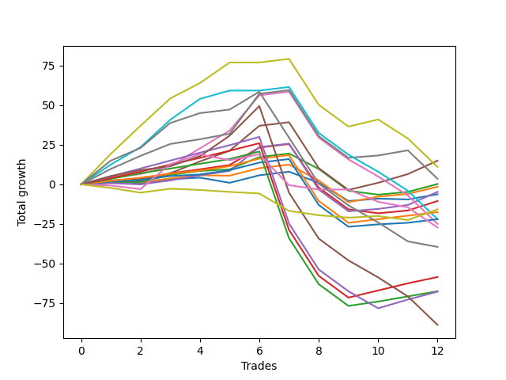

# Short Shepard 003 SD 
- Symbol: ES
- Date Range: 03/18/2022 - 12/30/2022
- Trading Period: 8:30-12:30
- Number of Trades: 12



| Name | Win Percent | Profit | Avg Profit / Trade | Avg Time / Trade |      | Name | Win Percent | Profit | Avg Profit / Trade | Avg Time / Trade |
| ---- | ----------- | ------ | ------------------ | ---------------- | ---- | ---- | ----------- | ------ | ------------------ | ---------------- |
| Sorted By <br> Profit | | | | | | Sorted By <br> Win Percentage ||||
| Four | 83.33 | 7500.00 | 625.00 | 23:10 |     | Four | 83.33 | 7500.00 | 625.00 | 23:10 |
| Seven | 58.33 | 5500.00 | 458.33 | 41:06 |     | Eighty-Two | 83.33 | -8750.00 | -729.17 | 15:27 |
| Six | 75.00 | 1750.00 | 145.83 | 26:17 |     | Eighty-One | 83.33 | -11000.00 | -916.67 | 14:44 |
| Two | 66.67 | 125.00 | 10.42 | 18:53 |     | Six | 75.00 | 1750.00 | 145.83 | 26:17 |
| One | 66.67 | -750.00 | -62.50 | 12:05 |     | Three | 75.00 | -2375.00 | -197.92 | 17:44 |
| Three | 75.00 | -2375.00 | -197.92 | 17:44 |     | Two_C | 75.00 | -5250.00 | -437.50 | 22:07 |
| Zero | 58.33 | -3125.00 | -260.42 | 08:09 |     | Eighty-Four | 75.00 | -29250.00 | -2437.50 | 24:05 |
| Two_C | 75.00 | -5250.00 | -437.50 | 22:07 |     | Eighty-Three | 75.00 | -33750.00 | -2812.50 | 23:31 |
| MALAMUTE 002 | 25.00 | -7875.00 | -656.25 | 04:55 |     | Two | 66.67 | 125.00 | 10.42 | 18:53 |
| Eighty-Two | 83.33 | -8750.00 | -729.17 | 15:27 |     | One | 66.67 | -750.00 | -62.50 | 12:05 |
| Eighty-One | 83.33 | -11000.00 | -916.67 | 14:44 |     | Eighty-Five | 66.67 | -33875.00 | -2822.92 | 29:39 |
| BB100 | 50.00 | -11000.00 | -916.67 | 46:47 |     | Seven | 58.33 | 5500.00 | 458.33 | 41:06 |
| Five | 58.33 | -12500.00 | -1041.67 | 35:32 |     | Zero | 58.33 | -3125.00 | -260.42 | 08:09 |
| NEWFI 0000 | 25.00 | -13625.00 | -1135.42 | 20:28 |     | Five | 58.33 | -12500.00 | -1041.67 | 35:32 |
| MALAMUTE 001 | 50.00 | -19750.00 | -1645.83 | 52:48 |     | BB100 | 50.00 | -11000.00 | -916.67 | 46:47 |
| Eighty-Four | 75.00 | -29250.00 | -2437.50 | 24:05 |     | MALAMUTE 001 | 50.00 | -19750.00 | -1645.83 | 52:48 |
| Eighty-Three | 75.00 | -33750.00 | -2812.50 | 23:31 |     | NEWFI 000 | 50.00 | -44375.00 | -3697.92 | 47:14 |
| Eighty-Five | 66.67 | -33875.00 | -2822.92 | 29:39 |     | MALAMUTE 002 | 25.00 | -7875.00 | -656.25 | 04:55 |
| NEWFI 000 | 50.00 | -44375.00 | -3697.92 | 47:14 |     | NEWFI 0000 | 25.00 | -13625.00 | -1135.42 | 20:28 |

## NO STOPLOSS

### Test Zero
* Sell when price hits the middle line of the 20p bollinger
* No Stoploss
* Results:
```
Total Trades: 12
Percent Up: 41.67
Percent Down: 58.33
Total Points Moved Down: -6.25
Potential Profit: -3125.00
Total Points Ups: 23.25 Count Ups: 5
Total Points Downs: 17.00 Count Downs: 7
```

<details><summary>Trades</summary>

<code>In: 2022-03-25 11:37:00		Out: 2022-03-25 11:40:25		Total Position Time: 03:25		Total Move Down: 1.75		Total to Date: 1.75</code> <br />
<code>In: 2022-03-25 11:41:00		Out: 2022-03-25 11:42:10		Total Position Time: 01:10		Total Move Down: -1.00		Total to Date: 0.75</code> <br />
<code>In: 2022-04-01 12:09:00		Out: 2022-04-01 12:10:10		Total Position Time: 01:10		Total Move Down: 2.50		Total to Date: 3.25</code> <br />
<code>In: 2022-04-06 08:57:00		Out: 2022-04-06 09:03:40		Total Position Time: 06:40		Total Move Down: 1.00		Total to Date: 4.25</code> <br />
<code>In: 2022-04-20 07:48:00		Out: 2022-04-20 08:00:20		Total Position Time: 12:20		Total Move Down: -3.25		Total to Date: 1.00</code> <br />
<code>In: 2022-05-10 11:06:00		Out: 2022-05-10 11:07:10		Total Position Time: 01:10		Total Move Down: 4.75		Total to Date: 5.75</code> <br />
<code>In: 2022-05-25 11:07:00		Out: 2022-05-25 11:08:10		Total Position Time: 01:10		Total Move Down: 2.25		Total to Date: 8.00</code> <br />
<code>In: 2022-05-25 11:23:00		Out: 2022-05-25 11:39:10		Total Position Time: 16:10		Total Move Down: -7.00		Total to Date: 1.00</code> <br />
<code>In: 2022-08-16 08:25:00		Out: 2022-08-16 09:07:50		Total Position Time: 42:50		Total Move Down: -11.50		Total to Date: -10.50</code> <br />
<code>In: 2022-08-18 07:28:00		Out: 2022-08-18 07:29:10		Total Position Time: 01:10		Total Move Down: 1.50		Total to Date: -9.00</code> <br />
<code>In: 2022-08-18 07:47:00		Out: 2022-08-18 07:56:25		Total Position Time: 09:25		Total Move Down: -0.50		Total to Date: -9.50</code> <br />
<code>In: 2022-09-01 10:36:00		Out: 2022-09-01 10:37:15		Total Position Time: 01:15		Total Move Down: 3.25		Total to Date: -6.25</code> <br />


</details>

### Test One
* Sell when the price hits the lower line of the 20p 1std bollinger
* No Stoploss
* Results:
```
Total Trades: 12
Percent Up: 33.33
Percent Down: 66.67
Total Points Moved Down: -1.50
Potential Profit: -750.00
Total Points Ups: 25.00 Count Ups: 4
Total Points Downs: 23.50 Count Downs: 8
```

<details><summary>Trades</summary>

<code>In: 2022-03-25 11:37:00		Out: 2022-03-25 11:41:25		Total Position Time: 04:25		Total Move Down: 2.25		Total to Date: 2.25</code> <br />
<code>In: 2022-03-25 11:41:00		Out: 2022-03-25 11:48:45		Total Position Time: 07:45		Total Move Down: -1.00		Total to Date: 1.25</code> <br />
<code>In: 2022-04-01 12:09:00		Out: 2022-04-01 12:10:10		Total Position Time: 01:10		Total Move Down: 2.50		Total to Date: 3.75</code> <br />
<code>In: 2022-04-06 08:57:00		Out: 2022-04-06 09:05:10		Total Position Time: 08:10		Total Move Down: 2.00		Total to Date: 5.75</code> <br />
<code>In: 2022-04-20 07:48:00		Out: 2022-04-20 08:00:40		Total Position Time: 12:40		Total Move Down: -0.25		Total to Date: 5.50</code> <br />
<code>In: 2022-05-10 11:06:00		Out: 2022-05-10 11:07:10		Total Position Time: 01:10		Total Move Down: 4.75		Total to Date: 10.25</code> <br />
<code>In: 2022-05-25 11:07:00		Out: 2022-05-25 11:08:10		Total Position Time: 01:10		Total Move Down: 2.25		Total to Date: 12.50</code> <br />
<code>In: 2022-05-25 11:23:00		Out: 2022-05-25 11:49:55		Total Position Time: 26:55		Total Move Down: -10.00		Total to Date: 2.50</code> <br />
<code>In: 2022-08-16 08:25:00		Out: 2022-08-16 09:25:55		Total Position Time: 60:55		Total Move Down: -13.75		Total to Date: -11.25</code> <br />
<code>In: 2022-08-18 07:28:00		Out: 2022-08-18 07:31:20		Total Position Time: 03:20		Total Move Down: 3.50		Total to Date: -7.75</code> <br />
<code>In: 2022-08-18 07:47:00		Out: 2022-08-18 07:58:30		Total Position Time: 11:30		Total Move Down: 1.75		Total to Date: -6.00</code> <br />
<code>In: 2022-09-01 10:36:00		Out: 2022-09-01 10:41:50		Total Position Time: 05:50		Total Move Down: 4.50		Total to Date: -1.50</code> <br />


</details>

### Test Two
* Sell when the price hits the lower line of the 20p 2std bollinger
* No Stoploss
* Results:
```
Total Trades: 12
Percent Up: 33.33
Percent Down: 66.67
Total Points Moved Down: 0.25
Potential Profit: 125.00
Total Points Ups: 26.00 Count Ups: 4
Total Points Downs: 26.25 Count Downs: 8
```

<details><summary>Trades</summary>

<code>In: 2022-03-25 11:37:00		Out: 2022-03-25 12:00:55		Total Position Time: 23:55		Total Move Down: 1.50		Total to Date: 1.50</code> <br />
<code>In: 2022-03-25 11:41:00		Out: 2022-03-25 12:00:55		Total Position Time: 19:55		Total Move Down: -0.00		Total to Date: 1.50</code> <br />
<code>In: 2022-04-01 12:09:00		Out: 2022-04-01 12:11:10		Total Position Time: 02:10		Total Move Down: 4.50		Total to Date: 6.00</code> <br />
<code>In: 2022-04-06 08:57:00		Out: 2022-04-06 09:09:40		Total Position Time: 12:40		Total Move Down: 2.50		Total to Date: 8.50</code> <br />
<code>In: 2022-04-20 07:48:00		Out: 2022-04-20 08:00:55		Total Position Time: 12:55		Total Move Down: 1.00		Total to Date: 9.50</code> <br />
<code>In: 2022-05-10 11:06:00		Out: 2022-05-10 11:11:10		Total Position Time: 05:10		Total Move Down: 7.75		Total to Date: 17.25</code> <br />
<code>In: 2022-05-25 11:07:00		Out: 2022-05-25 11:08:10		Total Position Time: 01:10		Total Move Down: 2.25		Total to Date: 19.50</code> <br />
<code>In: 2022-05-25 11:23:00		Out: 2022-05-25 11:50:00		Total Position Time: 27:00		Total Move Down: -9.75		Total to Date: 9.75</code> <br />
<code>In: 2022-08-16 08:25:00		Out: 2022-08-16 09:25:55		Total Position Time: 60:55		Total Move Down: -13.75		Total to Date: -4.00</code> <br />
<code>In: 2022-08-18 07:28:00		Out: 2022-08-18 08:03:20		Total Position Time: 35:20		Total Move Down: -2.50		Total to Date: -6.50</code> <br />
<code>In: 2022-08-18 07:47:00		Out: 2022-08-18 08:03:20		Total Position Time: 16:20		Total Move Down: 1.75		Total to Date: -4.75</code> <br />
<code>In: 2022-09-01 10:36:00		Out: 2022-09-01 10:45:10		Total Position Time: 09:10		Total Move Down: 5.00		Total to Date: 0.25</code> <br />


</details>

### Test Two_C
* Sell when the price hits the lower line of the 20p 2std bollinger
* No Stoploss
* Results:
```
Total Trades: 12
Percent Up: 25.00
Percent Down: 75.00
Total Points Moved Down: -10.50
Potential Profit: -5250.00
Total Points Ups: 43.75 Count Ups: 3
Total Points Downs: 33.25 Count Downs: 9
```

<details><summary>Trades</summary>

<code>In: 2022-03-25 11:37:00		Out: 2022-03-25 12:01:15		Total Position Time: 24:15		Total Move Down: 2.00		Total to Date: 2.00</code> <br />
<code>In: 2022-03-25 11:41:00		Out: 2022-03-25 12:01:15		Total Position Time: 20:15		Total Move Down: 0.50		Total to Date: 2.50</code> <br />
<code>In: 2022-04-01 12:09:00		Out: 2022-04-01 12:11:10		Total Position Time: 02:10		Total Move Down: 4.50		Total to Date: 7.00</code> <br />
<code>In: 2022-04-06 08:57:00		Out: 2022-04-06 09:09:40		Total Position Time: 12:40		Total Move Down: 2.50		Total to Date: 9.50</code> <br />
<code>In: 2022-04-20 07:48:00		Out: 2022-04-20 08:01:10		Total Position Time: 13:10		Total Move Down: 2.75		Total to Date: 12.25</code> <br />
<code>In: 2022-05-10 11:06:00		Out: 2022-05-10 11:16:05		Total Position Time: 10:05		Total Move Down: 11.00		Total to Date: 23.25</code> <br />
<code>In: 2022-05-25 11:07:00		Out: 2022-05-25 11:08:10		Total Position Time: 01:10		Total Move Down: 2.25		Total to Date: 25.50</code> <br />
<code>In: 2022-05-25 11:23:00		Out: 2022-05-25 12:23:00		Total Position Time: 60:00		Total Move Down: -27.50		Total to Date: -2.00</code> <br />
<code>In: 2022-08-16 08:25:00		Out: 2022-08-16 09:25:55		Total Position Time: 60:55		Total Move Down: -13.75		Total to Date: -15.75</code> <br />
<code>In: 2022-08-18 07:28:00		Out: 2022-08-18 08:03:20		Total Position Time: 35:20		Total Move Down: -2.50		Total to Date: -18.25</code> <br />
<code>In: 2022-08-18 07:47:00		Out: 2022-08-18 08:03:20		Total Position Time: 16:20		Total Move Down: 1.75		Total to Date: -16.50</code> <br />
<code>In: 2022-09-01 10:36:00		Out: 2022-09-01 10:45:15		Total Position Time: 09:15		Total Move Down: 6.00		Total to Date: -10.50</code> <br />


</details>

### Test Three
* Sell when price hits the middle line of the 50p bollinger
* No Stoploss
* Results:
```
Total Trades: 12
Percent Up: 25.00
Percent Down: 75.00
Total Points Moved Down: -4.75
Potential Profit: -2375.00
Total Points Ups: 43.50 Count Ups: 3
Total Points Downs: 38.75 Count Downs: 9
```

<details><summary>Trades</summary>

<code>In: 2022-03-25 11:37:00		Out: 2022-03-25 11:49:30		Total Position Time: 12:30		Total Move Down: 0.75		Total to Date: 0.75</code> <br />
<code>In: 2022-03-25 11:41:00		Out: 2022-03-25 11:49:30		Total Position Time: 08:30		Total Move Down: -0.75		Total to Date: 0.00</code> <br />
<code>In: 2022-04-01 12:09:00		Out: 2022-04-01 12:10:10		Total Position Time: 01:10		Total Move Down: 2.50		Total to Date: 2.50</code> <br />
<code>In: 2022-04-06 08:57:00		Out: 2022-04-06 09:12:05		Total Position Time: 15:05		Total Move Down: 3.25		Total to Date: 5.75</code> <br />
<code>In: 2022-04-20 07:48:00		Out: 2022-04-20 08:01:10		Total Position Time: 13:10		Total Move Down: 2.75		Total to Date: 8.50</code> <br />
<code>In: 2022-05-10 11:06:00		Out: 2022-05-10 11:16:20		Total Position Time: 10:20		Total Move Down: 15.00		Total to Date: 23.50</code> <br />
<code>In: 2022-05-25 11:07:00		Out: 2022-05-25 11:08:10		Total Position Time: 01:10		Total Move Down: 2.25		Total to Date: 25.75</code> <br />
<code>In: 2022-05-25 11:23:00		Out: 2022-05-25 12:23:55		Total Position Time: 60:55		Total Move Down: -29.00		Total to Date: -3.25</code> <br />
<code>In: 2022-08-16 08:25:00		Out: 2022-08-16 09:25:55		Total Position Time: 60:55		Total Move Down: -13.75		Total to Date: -17.00</code> <br />
<code>In: 2022-08-18 07:28:00		Out: 2022-08-18 07:29:10		Total Position Time: 01:10		Total Move Down: 1.50		Total to Date: -15.50</code> <br />
<code>In: 2022-08-18 07:47:00		Out: 2022-08-18 08:03:45		Total Position Time: 16:45		Total Move Down: 2.50		Total to Date: -13.00</code> <br />
<code>In: 2022-09-01 10:36:00		Out: 2022-09-01 10:47:15		Total Position Time: 11:15		Total Move Down: 8.25		Total to Date: -4.75</code> <br />


</details>

### Test Four
* Sell when the price hits the lower line of the 50p 1std bollinger
* No Stoploss
* Results:
```
Total Trades: 12
Percent Up: 16.67
Percent Down: 83.33
Total Points Moved Down: 15.00
Potential Profit: 7500.00
Total Points Ups: 42.75 Count Ups: 2
Total Points Downs: 57.75 Count Downs: 10
```

<details><summary>Trades</summary>

<code>In: 2022-03-25 11:37:00		Out: 2022-03-25 12:01:35		Total Position Time: 24:35		Total Move Down: 2.50		Total to Date: 2.50</code> <br />
<code>In: 2022-03-25 11:41:00		Out: 2022-03-25 12:01:35		Total Position Time: 20:35		Total Move Down: 1.00		Total to Date: 3.50</code> <br />
<code>In: 2022-04-01 12:09:00		Out: 2022-04-01 12:11:05		Total Position Time: 02:05		Total Move Down: 3.50		Total to Date: 7.00</code> <br />
<code>In: 2022-04-06 08:57:00		Out: 2022-04-06 09:15:00		Total Position Time: 18:00		Total Move Down: 7.50		Total to Date: 14.50</code> <br />
<code>In: 2022-04-20 07:48:00		Out: 2022-04-20 08:10:50		Total Position Time: 22:50		Total Move Down: 6.75		Total to Date: 21.25</code> <br />
<code>In: 2022-05-10 11:06:00		Out: 2022-05-10 11:24:05		Total Position Time: 18:05		Total Move Down: 15.75		Total to Date: 37.00</code> <br />
<code>In: 2022-05-25 11:07:00		Out: 2022-05-25 11:08:10		Total Position Time: 01:10		Total Move Down: 2.25		Total to Date: 39.25</code> <br />
<code>In: 2022-05-25 11:23:00		Out: 2022-05-25 12:23:55		Total Position Time: 60:55		Total Move Down: -29.00		Total to Date: 10.25</code> <br />
<code>In: 2022-08-16 08:25:00		Out: 2022-08-16 09:25:55		Total Position Time: 60:55		Total Move Down: -13.75		Total to Date: -3.50</code> <br />
<code>In: 2022-08-18 07:28:00		Out: 2022-08-18 07:31:30		Total Position Time: 03:30		Total Move Down: 4.50		Total to Date: 1.00</code> <br />
<code>In: 2022-08-18 07:47:00		Out: 2022-08-18 08:05:40		Total Position Time: 18:40		Total Move Down: 5.50		Total to Date: 6.50</code> <br />
<code>In: 2022-09-01 10:36:00		Out: 2022-09-01 11:02:50		Total Position Time: 26:50		Total Move Down: 8.50		Total to Date: 15.00</code> <br />


</details>

### Test Five
* Sell when the price hits the lower line of the 50p 2std bollinger
* No Stoploss
* Results:
```
Total Trades: 12
Percent Up: 41.67
Percent Down: 58.33
Total Points Moved Down: -25.00
Potential Profit: -12500.00
Total Points Ups: 83.50 Count Ups: 5
Total Points Downs: 58.50 Count Downs: 7
```

<details><summary>Trades</summary>

<code>In: 2022-03-25 11:37:00		Out: 2022-03-25 12:01:55		Total Position Time: 24:55		Total Move Down: 4.00		Total to Date: 4.00</code> <br />
<code>In: 2022-03-25 11:41:00		Out: 2022-03-25 12:01:55		Total Position Time: 20:55		Total Move Down: 2.50		Total to Date: 6.50</code> <br />
<code>In: 2022-04-01 12:09:00		Out: 2022-04-01 12:11:20		Total Position Time: 02:20		Total Move Down: 5.00		Total to Date: 11.50</code> <br />
<code>In: 2022-04-06 08:57:00		Out: 2022-04-06 09:20:15		Total Position Time: 23:15		Total Move Down: 11.25		Total to Date: 22.75</code> <br />
<code>In: 2022-04-20 07:48:00		Out: 2022-04-20 08:16:20		Total Position Time: 28:20		Total Move Down: 11.25		Total to Date: 34.00</code> <br />
<code>In: 2022-05-10 11:06:00		Out: 2022-05-10 11:27:05		Total Position Time: 21:05		Total Move Down: 22.25		Total to Date: 56.25</code> <br />
<code>In: 2022-05-25 11:07:00		Out: 2022-05-25 11:08:10		Total Position Time: 01:10		Total Move Down: 2.25		Total to Date: 58.50</code> <br />
<code>In: 2022-05-25 11:23:00		Out: 2022-05-25 12:23:55		Total Position Time: 60:55		Total Move Down: -29.00		Total to Date: 29.50</code> <br />
<code>In: 2022-08-16 08:25:00		Out: 2022-08-16 09:25:55		Total Position Time: 60:55		Total Move Down: -13.75		Total to Date: 15.75</code> <br />
<code>In: 2022-08-18 07:28:00		Out: 2022-08-18 08:28:55		Total Position Time: 60:55		Total Move Down: -10.75		Total to Date: 5.00</code> <br />
<code>In: 2022-08-18 07:47:00		Out: 2022-08-18 08:47:55		Total Position Time: 60:55		Total Move Down: -12.00		Total to Date: -7.00</code> <br />
<code>In: 2022-09-01 10:36:00		Out: 2022-09-01 11:36:55		Total Position Time: 60:55		Total Move Down: -18.00		Total to Date: -25.00</code> <br />


</details>

### Test Six
* Sell when the price hits the middle line of the 1std VWAP
* No Stoploss
* Results:
```
Total Trades: 12
Percent Up: 25.00
Percent Down: 75.00
Total Points Moved Down: 3.50
Potential Profit: 1750.00
Total Points Ups: 60.75 Count Ups: 3
Total Points Downs: 64.25 Count Downs: 9
```

<details><summary>Trades</summary>

<code>In: 2022-03-25 11:37:00		Out: 2022-03-25 12:07:35		Total Position Time: 30:35		Total Move Down: 9.75		Total to Date: 9.75</code> <br />
<code>In: 2022-03-25 11:41:00		Out: 2022-03-25 12:07:35		Total Position Time: 26:35		Total Move Down: 8.25		Total to Date: 18.00</code> <br />
<code>In: 2022-04-01 12:09:00		Out: 2022-04-01 12:12:40		Total Position Time: 03:40		Total Move Down: 7.50		Total to Date: 25.50</code> <br />
<code>In: 2022-04-06 08:57:00		Out: 2022-04-06 09:10:55		Total Position Time: 13:55		Total Move Down: 3.00		Total to Date: 28.50</code> <br />
<code>In: 2022-04-20 07:48:00		Out: 2022-04-20 08:05:05		Total Position Time: 17:05		Total Move Down: 3.50		Total to Date: 32.00</code> <br />
<code>In: 2022-05-10 11:06:00		Out: 2022-05-10 11:27:40		Total Position Time: 21:40		Total Move Down: 25.25		Total to Date: 57.25</code> <br />
<code>In: 2022-05-25 11:07:00		Out: 2022-05-25 11:08:10		Total Position Time: 01:10		Total Move Down: 2.25		Total to Date: 59.50</code> <br />
<code>In: 2022-05-25 11:23:00		Out: 2022-05-25 12:23:55		Total Position Time: 60:55		Total Move Down: -29.00		Total to Date: 30.50</code> <br />
<code>In: 2022-08-16 08:25:00		Out: 2022-08-16 09:25:55		Total Position Time: 60:55		Total Move Down: -13.75		Total to Date: 16.75</code> <br />
<code>In: 2022-08-18 07:28:00		Out: 2022-08-18 07:29:10		Total Position Time: 01:10		Total Move Down: 1.50		Total to Date: 18.25</code> <br />
<code>In: 2022-08-18 07:47:00		Out: 2022-08-18 08:03:55		Total Position Time: 16:55		Total Move Down: 3.25		Total to Date: 21.50</code> <br />
<code>In: 2022-09-01 10:36:00		Out: 2022-09-01 11:36:55		Total Position Time: 60:55		Total Move Down: -18.00		Total to Date: 3.50</code> <br />


</details>

### Test Seven
* Sell when the price hits the lower line of the 1std VWAP
* No Stoploss
* Results:
```
Total Trades: 12
Percent Up: 41.67
Percent Down: 58.33
Total Points Moved Down: 11.00
Potential Profit: 5500.00
Total Points Ups: 72.75 Count Ups: 5
Total Points Downs: 83.75 Count Downs: 7
```

<details><summary>Trades</summary>

<code>In: 2022-03-25 11:37:00		Out: 2022-03-25 12:33:10		Total Position Time: 56:10		Total Move Down: 19.25		Total to Date: 19.25</code> <br />
<code>In: 2022-03-25 11:41:00		Out: 2022-03-25 12:33:10		Total Position Time: 52:10		Total Move Down: 17.75		Total to Date: 37.00</code> <br />
<code>In: 2022-04-01 12:09:00		Out: 2022-04-01 12:33:30		Total Position Time: 24:30		Total Move Down: 17.25		Total to Date: 54.25</code> <br />
<code>In: 2022-04-06 08:57:00		Out: 2022-04-06 09:16:05		Total Position Time: 19:05		Total Move Down: 9.75		Total to Date: 64.00</code> <br />
<code>In: 2022-04-20 07:48:00		Out: 2022-04-20 08:20:10		Total Position Time: 32:10		Total Move Down: 13.00		Total to Date: 77.00</code> <br />
<code>In: 2022-05-10 11:06:00		Out: 2022-05-10 12:06:55		Total Position Time: 60:55		Total Move Down: -0.00		Total to Date: 77.00</code> <br />
<code>In: 2022-05-25 11:07:00		Out: 2022-05-25 11:08:10		Total Position Time: 01:10		Total Move Down: 2.25		Total to Date: 79.25</code> <br />
<code>In: 2022-05-25 11:23:00		Out: 2022-05-25 12:23:55		Total Position Time: 60:55		Total Move Down: -29.00		Total to Date: 50.25</code> <br />
<code>In: 2022-08-16 08:25:00		Out: 2022-08-16 09:25:55		Total Position Time: 60:55		Total Move Down: -13.75		Total to Date: 36.50</code> <br />
<code>In: 2022-08-18 07:28:00		Out: 2022-08-18 07:31:30		Total Position Time: 03:30		Total Move Down: 4.50		Total to Date: 41.00</code> <br />
<code>In: 2022-08-18 07:47:00		Out: 2022-08-18 08:47:55		Total Position Time: 60:55		Total Move Down: -12.00		Total to Date: 29.00</code> <br />
<code>In: 2022-09-01 10:36:00		Out: 2022-09-01 11:36:55		Total Position Time: 60:55		Total Move Down: -18.00		Total to Date: 11.00</code> <br />


</details>

### Test BB100
* Move to BB100 Upper Band
* No Stoploss
* Results:
```
Total Trades: 12
Percent Up: 50.00
Percent Down: 50.00
Total Points Moved Down: -22.00
Potential Profit: -11000.00
Total Points Ups: 83.50 Count Ups: 6
Total Points Downs: 61.50 Count Downs: 6
```

<details><summary>Trades</summary>

<code>In: 2022-03-25 11:37:00		Out: 2022-03-25 12:21:35		Total Position Time: 44:35		Total Move Down: 12.50		Total to Date: 12.50</code> <br />
<code>In: 2022-03-25 11:41:00		Out: 2022-03-25 12:21:35		Total Position Time: 40:35		Total Move Down: 11.00		Total to Date: 23.50</code> <br />
<code>In: 2022-04-01 12:09:00		Out: 2022-04-01 12:33:30		Total Position Time: 24:30		Total Move Down: 17.25		Total to Date: 40.75</code> <br />
<code>In: 2022-04-06 08:57:00		Out: 2022-04-06 09:21:15		Total Position Time: 24:15		Total Move Down: 13.25		Total to Date: 54.00</code> <br />
<code>In: 2022-04-20 07:48:00		Out: 2022-04-20 08:48:55		Total Position Time: 60:55		Total Move Down: 5.25		Total to Date: 59.25</code> <br />
<code>In: 2022-05-10 11:06:00		Out: 2022-05-10 12:06:55		Total Position Time: 60:55		Total Move Down: -0.00		Total to Date: 59.25</code> <br />
<code>In: 2022-05-25 11:07:00		Out: 2022-05-25 11:08:10		Total Position Time: 01:10		Total Move Down: 2.25		Total to Date: 61.50</code> <br />
<code>In: 2022-05-25 11:23:00		Out: 2022-05-25 12:23:55		Total Position Time: 60:55		Total Move Down: -29.00		Total to Date: 32.50</code> <br />
<code>In: 2022-08-16 08:25:00		Out: 2022-08-16 09:25:55		Total Position Time: 60:55		Total Move Down: -13.75		Total to Date: 18.75</code> <br />
<code>In: 2022-08-18 07:28:00		Out: 2022-08-18 08:28:55		Total Position Time: 60:55		Total Move Down: -10.75		Total to Date: 8.00</code> <br />
<code>In: 2022-08-18 07:47:00		Out: 2022-08-18 08:47:55		Total Position Time: 60:55		Total Move Down: -12.00		Total to Date: -4.00</code> <br />
<code>In: 2022-09-01 10:36:00		Out: 2022-09-01 11:36:55		Total Position Time: 60:55		Total Move Down: -18.00		Total to Date: -22.00</code> <br />


</details>

## TAKE PROFIT

### Test Eighty-One
* Take Profit of 1 Point
* No Stoploss
* Results:
```
Total Trades: 12
Percent Up: 16.67
Percent Down: 83.33
Total Points Moved Down: -22.00
Potential Profit: -11000.00
Total Points Ups: 42.75 Count Ups: 2
Total Points Downs: 20.75 Count Downs: 10
```

<details><summary>Trades</summary>

<code>In: 2022-03-25 11:37:00		Out: 2022-03-25 11:40:25		Total Position Time: 03:25		Total Move Down: 1.75		Total to Date: 1.75</code> <br />
<code>In: 2022-03-25 11:41:00		Out: 2022-03-25 12:01:40		Total Position Time: 20:40		Total Move Down: 1.00		Total to Date: 2.75</code> <br />
<code>In: 2022-04-01 12:09:00		Out: 2022-04-01 12:10:10		Total Position Time: 01:10		Total Move Down: 2.50		Total to Date: 5.25</code> <br />
<code>In: 2022-04-06 08:57:00		Out: 2022-04-06 08:58:25		Total Position Time: 01:25		Total Move Down: 1.00		Total to Date: 6.25</code> <br />
<code>In: 2022-04-20 07:48:00		Out: 2022-04-20 08:01:10		Total Position Time: 13:10		Total Move Down: 2.75		Total to Date: 9.00</code> <br />
<code>In: 2022-05-10 11:06:00		Out: 2022-05-10 11:07:10		Total Position Time: 01:10		Total Move Down: 4.75		Total to Date: 13.75</code> <br />
<code>In: 2022-05-25 11:07:00		Out: 2022-05-25 11:08:10		Total Position Time: 01:10		Total Move Down: 2.25		Total to Date: 16.00</code> <br />
<code>In: 2022-05-25 11:23:00		Out: 2022-05-25 12:23:55		Total Position Time: 60:55		Total Move Down: -29.00		Total to Date: -13.00</code> <br />
<code>In: 2022-08-16 08:25:00		Out: 2022-08-16 09:25:55		Total Position Time: 60:55		Total Move Down: -13.75		Total to Date: -26.75</code> <br />
<code>In: 2022-08-18 07:28:00		Out: 2022-08-18 07:29:10		Total Position Time: 01:10		Total Move Down: 1.50		Total to Date: -25.25</code> <br />
<code>In: 2022-08-18 07:47:00		Out: 2022-08-18 07:57:35		Total Position Time: 10:35		Total Move Down: 1.00		Total to Date: -24.25</code> <br />
<code>In: 2022-09-01 10:36:00		Out: 2022-09-01 10:37:10		Total Position Time: 01:10		Total Move Down: 2.25		Total to Date: -22.00</code> <br />


</details>

### Test Eighty-Two
* Take Profit of 2 Point
* No Stoploss
* Results:
```
Total Trades: 12
Percent Up: 16.67
Percent Down: 83.33
Total Points Moved Down: -17.50
Potential Profit: -8750.00
Total Points Ups: 42.75 Count Ups: 2
Total Points Downs: 25.25 Count Downs: 10
```

<details><summary>Trades</summary>

<code>In: 2022-03-25 11:37:00		Out: 2022-03-25 11:40:50		Total Position Time: 03:50		Total Move Down: 2.25		Total to Date: 2.25</code> <br />
<code>In: 2022-03-25 11:41:00		Out: 2022-03-25 12:01:50		Total Position Time: 20:50		Total Move Down: 2.00		Total to Date: 4.25</code> <br />
<code>In: 2022-04-01 12:09:00		Out: 2022-04-01 12:10:10		Total Position Time: 01:10		Total Move Down: 2.50		Total to Date: 6.75</code> <br />
<code>In: 2022-04-06 08:57:00		Out: 2022-04-06 09:04:20		Total Position Time: 07:20		Total Move Down: 2.00		Total to Date: 8.75</code> <br />
<code>In: 2022-04-20 07:48:00		Out: 2022-04-20 08:01:10		Total Position Time: 13:10		Total Move Down: 2.75		Total to Date: 11.50</code> <br />
<code>In: 2022-05-10 11:06:00		Out: 2022-05-10 11:07:10		Total Position Time: 01:10		Total Move Down: 4.75		Total to Date: 16.25</code> <br />
<code>In: 2022-05-25 11:07:00		Out: 2022-05-25 11:08:10		Total Position Time: 01:10		Total Move Down: 2.25		Total to Date: 18.50</code> <br />
<code>In: 2022-05-25 11:23:00		Out: 2022-05-25 12:23:55		Total Position Time: 60:55		Total Move Down: -29.00		Total to Date: -10.50</code> <br />
<code>In: 2022-08-16 08:25:00		Out: 2022-08-16 09:25:55		Total Position Time: 60:55		Total Move Down: -13.75		Total to Date: -24.25</code> <br />
<code>In: 2022-08-18 07:28:00		Out: 2022-08-18 07:31:10		Total Position Time: 03:10		Total Move Down: 2.25		Total to Date: -22.00</code> <br />
<code>In: 2022-08-18 07:47:00		Out: 2022-08-18 07:57:40		Total Position Time: 10:40		Total Move Down: 2.25		Total to Date: -19.75</code> <br />
<code>In: 2022-09-01 10:36:00		Out: 2022-09-01 10:37:10		Total Position Time: 01:10		Total Move Down: 2.25		Total to Date: -17.50</code> <br />


</details>

### Test Eighty-Three
* Take Profit of 3 Point
* No Stoploss
* Results:
```
Total Trades: 12
Percent Up: 25.00
Percent Down: 75.00
Total Points Moved Down: -67.50
Potential Profit: -33750.00
Total Points Ups: 97.50 Count Ups: 3
Total Points Downs: 30.00 Count Downs: 9
```

<details><summary>Trades</summary>

<code>In: 2022-03-25 11:37:00		Out: 2022-03-25 12:01:50		Total Position Time: 24:50		Total Move Down: 3.50		Total to Date: 3.50</code> <br />
<code>In: 2022-03-25 11:41:00		Out: 2022-03-25 12:02:00		Total Position Time: 21:00		Total Move Down: 3.50		Total to Date: 7.00</code> <br />
<code>In: 2022-04-01 12:09:00		Out: 2022-04-01 12:11:00		Total Position Time: 02:00		Total Move Down: 3.00		Total to Date: 10.00</code> <br />
<code>In: 2022-04-06 08:57:00		Out: 2022-04-06 09:11:00		Total Position Time: 14:00		Total Move Down: 3.00		Total to Date: 13.00</code> <br />
<code>In: 2022-04-20 07:48:00		Out: 2022-04-20 08:03:05		Total Position Time: 15:05		Total Move Down: 3.00		Total to Date: 16.00</code> <br />
<code>In: 2022-05-10 11:06:00		Out: 2022-05-10 11:07:10		Total Position Time: 01:10		Total Move Down: 4.75		Total to Date: 20.75</code> <br />
<code>In: 2022-05-25 11:07:00		Out: 2022-05-25 12:07:55		Total Position Time: 60:55		Total Move Down: -54.75		Total to Date: -34.00</code> <br />
<code>In: 2022-05-25 11:23:00		Out: 2022-05-25 12:23:55		Total Position Time: 60:55		Total Move Down: -29.00		Total to Date: -63.00</code> <br />
<code>In: 2022-08-16 08:25:00		Out: 2022-08-16 09:25:55		Total Position Time: 60:55		Total Move Down: -13.75		Total to Date: -76.75</code> <br />
<code>In: 2022-08-18 07:28:00		Out: 2022-08-18 07:31:15		Total Position Time: 03:15		Total Move Down: 2.75		Total to Date: -74.00</code> <br />
<code>In: 2022-08-18 07:47:00		Out: 2022-08-18 08:03:55		Total Position Time: 16:55		Total Move Down: 3.25		Total to Date: -70.75</code> <br />
<code>In: 2022-09-01 10:36:00		Out: 2022-09-01 10:37:15		Total Position Time: 01:15		Total Move Down: 3.25		Total to Date: -67.50</code> <br />


</details>

### Test Eighty-Four
* Take Profit of 4 Point
* No Stoploss
* Results:
```
Total Trades: 12
Percent Up: 25.00
Percent Down: 75.00
Total Points Moved Down: -58.50
Potential Profit: -29250.00
Total Points Ups: 97.50 Count Ups: 3
Total Points Downs: 39.00 Count Downs: 9
```

<details><summary>Trades</summary>

<code>In: 2022-03-25 11:37:00		Out: 2022-03-25 12:01:55		Total Position Time: 24:55		Total Move Down: 4.00		Total to Date: 4.00</code> <br />
<code>In: 2022-03-25 11:41:00		Out: 2022-03-25 12:02:30		Total Position Time: 21:30		Total Move Down: 4.00		Total to Date: 8.00</code> <br />
<code>In: 2022-04-01 12:09:00		Out: 2022-04-01 12:11:10		Total Position Time: 02:10		Total Move Down: 4.50		Total to Date: 12.50</code> <br />
<code>In: 2022-04-06 08:57:00		Out: 2022-04-06 09:13:05		Total Position Time: 16:05		Total Move Down: 4.25		Total to Date: 16.75</code> <br />
<code>In: 2022-04-20 07:48:00		Out: 2022-04-20 08:04:55		Total Position Time: 16:55		Total Move Down: 4.50		Total to Date: 21.25</code> <br />
<code>In: 2022-05-10 11:06:00		Out: 2022-05-10 11:07:10		Total Position Time: 01:10		Total Move Down: 4.75		Total to Date: 26.00</code> <br />
<code>In: 2022-05-25 11:07:00		Out: 2022-05-25 12:07:55		Total Position Time: 60:55		Total Move Down: -54.75		Total to Date: -28.75</code> <br />
<code>In: 2022-05-25 11:23:00		Out: 2022-05-25 12:23:55		Total Position Time: 60:55		Total Move Down: -29.00		Total to Date: -57.75</code> <br />
<code>In: 2022-08-16 08:25:00		Out: 2022-08-16 09:25:55		Total Position Time: 60:55		Total Move Down: -13.75		Total to Date: -71.50</code> <br />
<code>In: 2022-08-18 07:28:00		Out: 2022-08-18 07:31:30		Total Position Time: 03:30		Total Move Down: 4.50		Total to Date: -67.00</code> <br />
<code>In: 2022-08-18 07:47:00		Out: 2022-08-18 08:05:25		Total Position Time: 18:25		Total Move Down: 4.50		Total to Date: -62.50</code> <br />
<code>In: 2022-09-01 10:36:00		Out: 2022-09-01 10:37:35		Total Position Time: 01:35		Total Move Down: 4.00		Total to Date: -58.50</code> <br />


</details>

### Test Eighty-Five
* Take Profit of 5 Point
* No Stoploss
* Results:
```
Total Trades: 12
Percent Up: 33.33
Percent Down: 66.67
Total Points Moved Down: -67.75
Potential Profit: -33875.00
Total Points Ups: 108.25 Count Ups: 4
Total Points Downs: 40.50 Count Downs: 8
```

<details><summary>Trades</summary>

<code>In: 2022-03-25 11:37:00		Out: 2022-03-25 12:02:15		Total Position Time: 25:15		Total Move Down: 5.00		Total to Date: 5.00</code> <br />
<code>In: 2022-03-25 11:41:00		Out: 2022-03-25 12:03:00		Total Position Time: 22:00		Total Move Down: 5.00		Total to Date: 10.00</code> <br />
<code>In: 2022-04-01 12:09:00		Out: 2022-04-01 12:11:20		Total Position Time: 02:20		Total Move Down: 5.00		Total to Date: 15.00</code> <br />
<code>In: 2022-04-06 08:57:00		Out: 2022-04-06 09:13:30		Total Position Time: 16:30		Total Move Down: 5.00		Total to Date: 20.00</code> <br />
<code>In: 2022-04-20 07:48:00		Out: 2022-04-20 08:05:00		Total Position Time: 17:00		Total Move Down: 4.75		Total to Date: 24.75</code> <br />
<code>In: 2022-05-10 11:06:00		Out: 2022-05-10 11:07:15		Total Position Time: 01:15		Total Move Down: 5.25		Total to Date: 30.00</code> <br />
<code>In: 2022-05-25 11:07:00		Out: 2022-05-25 12:07:55		Total Position Time: 60:55		Total Move Down: -54.75		Total to Date: -24.75</code> <br />
<code>In: 2022-05-25 11:23:00		Out: 2022-05-25 12:23:55		Total Position Time: 60:55		Total Move Down: -29.00		Total to Date: -53.75</code> <br />
<code>In: 2022-08-16 08:25:00		Out: 2022-08-16 09:25:55		Total Position Time: 60:55		Total Move Down: -13.75		Total to Date: -67.50</code> <br />
<code>In: 2022-08-18 07:28:00		Out: 2022-08-18 08:28:55		Total Position Time: 60:55		Total Move Down: -10.75		Total to Date: -78.25</code> <br />
<code>In: 2022-08-18 07:47:00		Out: 2022-08-18 08:05:40		Total Position Time: 18:40		Total Move Down: 5.50		Total to Date: -72.75</code> <br />
<code>In: 2022-09-01 10:36:00		Out: 2022-09-01 10:45:10		Total Position Time: 09:10		Total Move Down: 5.00		Total to Date: -67.75</code> <br />


</details>

## Indicator Exits

### Test NEWFI 000
* Newfi 0000
* No Stoploss
* Results:
```
Total Trades: 12
Percent Up: 50.00
Percent Down: 50.00
Total Points Moved Down: -88.75
Potential Profit: -44375.00
Total Points Ups: 138.25 Count Ups: 6
Total Points Downs: 49.50 Count Downs: 6
```

<details><summary>Trades</summary>

<code>In: 2022-03-25 11:37:00		Out: 2022-03-25 12:13:05		Total Position Time: 36:05		Total Move Down: 5.25		Total to Date: 5.25</code> <br />
<code>In: 2022-03-25 11:41:00		Out: 2022-03-25 12:13:05		Total Position Time: 32:05		Total Move Down: 3.75		Total to Date: 9.00</code> <br />
<code>In: 2022-04-01 12:09:00		Out: 2022-04-01 12:16:05		Total Position Time: 07:05		Total Move Down: 2.50		Total to Date: 11.50</code> <br />
<code>In: 2022-04-06 08:57:00		Out: 2022-04-06 09:57:55		Total Position Time: 60:55		Total Move Down: 6.25		Total to Date: 17.75</code> <br />
<code>In: 2022-04-20 07:48:00		Out: 2022-04-20 08:28:05		Total Position Time: 40:05		Total Move Down: 13.00		Total to Date: 30.75</code> <br />
<code>In: 2022-05-10 11:06:00		Out: 2022-05-10 11:31:05		Total Position Time: 25:05		Total Move Down: 18.75		Total to Date: 49.50</code> <br />
<code>In: 2022-05-25 11:07:00		Out: 2022-05-25 12:07:55		Total Position Time: 60:55		Total Move Down: -54.75		Total to Date: -5.25</code> <br />
<code>In: 2022-05-25 11:23:00		Out: 2022-05-25 12:23:55		Total Position Time: 60:55		Total Move Down: -29.00		Total to Date: -34.25</code> <br />
<code>In: 2022-08-16 08:25:00		Out: 2022-08-16 09:25:55		Total Position Time: 60:55		Total Move Down: -13.75		Total to Date: -48.00</code> <br />
<code>In: 2022-08-18 07:28:00		Out: 2022-08-18 08:28:55		Total Position Time: 60:55		Total Move Down: -10.75		Total to Date: -58.75</code> <br />
<code>In: 2022-08-18 07:47:00		Out: 2022-08-18 08:47:55		Total Position Time: 60:55		Total Move Down: -12.00		Total to Date: -70.75</code> <br />
<code>In: 2022-09-01 10:36:00		Out: 2022-09-01 11:36:55		Total Position Time: 60:55		Total Move Down: -18.00		Total to Date: -88.75</code> <br />


</details>

### Test NEWFI 0000
* Newfi 0000
* No Stoploss
* Results:
```
Total Trades: 12
Percent Up: 75.00
Percent Down: 25.00
Total Points Moved Down: -27.25
Potential Profit: -13625.00
Total Points Ups: 53.00 Count Ups: 9
Total Points Downs: 25.75 Count Downs: 3
```

<details><summary>Trades</summary>

<code>In: 2022-03-25 11:37:00		Out: 2022-03-25 11:58:05		Total Position Time: 21:05		Total Move Down: -0.75		Total to Date: -0.75</code> <br />
<code>In: 2022-03-25 11:41:00		Out: 2022-03-25 11:58:05		Total Position Time: 17:05		Total Move Down: -2.25		Total to Date: -3.00</code> <br />
<code>In: 2022-04-01 12:09:00		Out: 2022-04-01 12:47:00		Total Position Time: 38:00		Total Move Down: 15.75		Total to Date: 12.75</code> <br />
<code>In: 2022-04-06 08:57:00		Out: 2022-04-06 09:57:55		Total Position Time: 60:55		Total Move Down: 6.25		Total to Date: 19.00</code> <br />
<code>In: 2022-04-20 07:48:00		Out: 2022-04-20 07:58:05		Total Position Time: 10:05		Total Move Down: -3.75		Total to Date: 15.25</code> <br />
<code>In: 2022-05-10 11:06:00		Out: 2022-05-10 11:07:05		Total Position Time: 01:05		Total Move Down: 3.75		Total to Date: 19.00</code> <br />
<code>In: 2022-05-25 11:07:00		Out: 2022-05-25 11:20:05		Total Position Time: 13:05		Total Move Down: -19.50		Total to Date: -0.50</code> <br />
<code>In: 2022-05-25 11:23:00		Out: 2022-05-25 11:24:05		Total Position Time: 01:05		Total Move Down: -2.75		Total to Date: -3.25</code> <br />
<code>In: 2022-08-16 08:25:00		Out: 2022-08-16 08:26:05		Total Position Time: 01:05		Total Move Down: -0.00		Total to Date: -3.25</code> <br />
<code>In: 2022-08-18 07:28:00		Out: 2022-08-18 07:52:05		Total Position Time: 24:05		Total Move Down: -7.75		Total to Date: -11.00</code> <br />
<code>In: 2022-08-18 07:47:00		Out: 2022-08-18 07:52:05		Total Position Time: 05:05		Total Move Down: -3.50		Total to Date: -14.50</code> <br />
<code>In: 2022-09-01 10:36:00		Out: 2022-09-01 11:29:05		Total Position Time: 53:05		Total Move Down: -12.75		Total to Date: -27.25</code> <br />


</details>

### Test MALAMUTE 001
* Malamute 001
* No Stoploss
* Results:
```
Total Trades: 12
Percent Up: 50.00
Percent Down: 50.00
Total Points Moved Down: -39.50
Potential Profit: -19750.00
Total Points Ups: 98.00 Count Ups: 6
Total Points Downs: 58.50 Count Downs: 6
```

<details><summary>Trades</summary>

<code>In: 2022-03-25 11:37:00		Out: 2022-03-25 12:37:55		Total Position Time: 60:55		Total Move Down: 15.00		Total to Date: 15.00</code> <br />
<code>In: 2022-03-25 11:41:00		Out: 2022-03-25 12:41:55		Total Position Time: 60:55		Total Move Down: 8.00		Total to Date: 23.00</code> <br />
<code>In: 2022-04-01 12:09:00		Out: 2022-04-01 12:47:00		Total Position Time: 38:00		Total Move Down: 15.75		Total to Date: 38.75</code> <br />
<code>In: 2022-04-06 08:57:00		Out: 2022-04-06 09:57:55		Total Position Time: 60:55		Total Move Down: 6.25		Total to Date: 45.00</code> <br />
<code>In: 2022-04-20 07:48:00		Out: 2022-04-20 08:47:05		Total Position Time: 59:05		Total Move Down: 2.25		Total to Date: 47.25</code> <br />
<code>In: 2022-05-10 11:06:00		Out: 2022-05-10 12:01:05		Total Position Time: 55:05		Total Move Down: 11.25		Total to Date: 58.50</code> <br />
<code>In: 2022-05-25 11:07:00		Out: 2022-05-25 11:17:05		Total Position Time: 10:05		Total Move Down: -29.00		Total to Date: 29.50</code> <br />
<code>In: 2022-05-25 11:23:00		Out: 2022-05-25 12:23:55		Total Position Time: 60:55		Total Move Down: -29.00		Total to Date: 0.50</code> <br />
<code>In: 2022-08-16 08:25:00		Out: 2022-08-16 09:25:55		Total Position Time: 60:55		Total Move Down: -13.75		Total to Date: -13.25</code> <br />
<code>In: 2022-08-18 07:28:00		Out: 2022-08-18 08:28:55		Total Position Time: 60:55		Total Move Down: -10.75		Total to Date: -24.00</code> <br />
<code>In: 2022-08-18 07:47:00		Out: 2022-08-18 08:47:55		Total Position Time: 60:55		Total Move Down: -12.00		Total to Date: -36.00</code> <br />
<code>In: 2022-09-01 10:36:00		Out: 2022-09-01 11:21:05		Total Position Time: 45:05		Total Move Down: -3.50		Total to Date: -39.50</code> <br />


</details>

### Test MALAMUTE 002
* Malamute 001
* No Stoploss
* Results:
```
Total Trades: 12
Percent Up: 75.00
Percent Down: 25.00
Total Points Moved Down: -15.75
Potential Profit: -7875.00
Total Points Ups: 26.00 Count Ups: 9
Total Points Downs: 10.25 Count Downs: 3
```

<details><summary>Trades</summary>

<code>In: 2022-03-25 11:37:00		Out: 2022-03-25 11:38:05		Total Position Time: 01:05		Total Move Down: -2.25		Total to Date: -2.25</code> <br />
<code>In: 2022-03-25 11:41:00		Out: 2022-03-25 11:45:05		Total Position Time: 04:05		Total Move Down: -3.00		Total to Date: -5.25</code> <br />
<code>In: 2022-04-01 12:09:00		Out: 2022-04-01 12:16:05		Total Position Time: 07:05		Total Move Down: 2.50		Total to Date: -2.75</code> <br />
<code>In: 2022-04-06 08:57:00		Out: 2022-04-06 09:01:05		Total Position Time: 04:05		Total Move Down: -0.75		Total to Date: -3.50</code> <br />
<code>In: 2022-04-20 07:48:00		Out: 2022-04-20 07:50:05		Total Position Time: 02:05		Total Move Down: -1.25		Total to Date: -4.75</code> <br />
<code>In: 2022-05-10 11:06:00		Out: 2022-05-10 11:14:05		Total Position Time: 08:05		Total Move Down: -1.00		Total to Date: -5.75</code> <br />
<code>In: 2022-05-25 11:07:00		Out: 2022-05-25 11:12:05		Total Position Time: 05:05		Total Move Down: -11.00		Total to Date: -16.75</code> <br />
<code>In: 2022-05-25 11:23:00		Out: 2022-05-25 11:24:05		Total Position Time: 01:05		Total Move Down: -2.75		Total to Date: -19.50</code> <br />
<code>In: 2022-08-16 08:25:00		Out: 2022-08-16 08:27:05		Total Position Time: 02:05		Total Move Down: -1.50		Total to Date: -21.00</code> <br />
<code>In: 2022-08-18 07:28:00		Out: 2022-08-18 07:35:05		Total Position Time: 07:05		Total Move Down: 1.00		Total to Date: -20.00</code> <br />
<code>In: 2022-08-18 07:47:00		Out: 2022-08-18 07:48:05		Total Position Time: 01:05		Total Move Down: -2.50		Total to Date: -22.50</code> <br />
<code>In: 2022-09-01 10:36:00		Out: 2022-09-01 10:52:05		Total Position Time: 16:05		Total Move Down: 6.75		Total to Date: -15.75</code> <br />


</details>