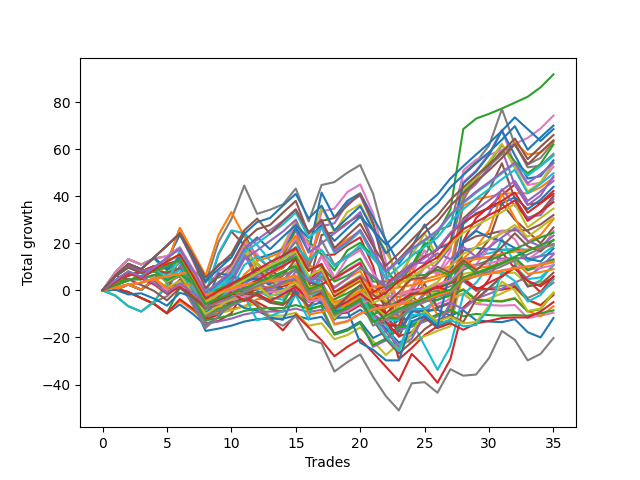

# Short Shepard 003 
- Symbol: ES
- Date Range: 03/18/2022 - 07/15/2022
- Trading Period: 7:20-12:30
- Number of Trades: 35



| Name | Win Percent | Profit | Avg Profit / Trade | Avg Time / Trade |      | Name | Win Percent | Profit | Avg Profit / Trade | Avg Time / Trade |
| ---- | ----------- | ------ | ------------------ | ---------------- | ---- | ---- | ----------- | ------ | ------------------ | ---------------- |
| Sorted By <br> Profit | | | | | | Sorted By <br> Win Percentage ||||
| Two | 77.14 | 45875.00 | 1310.71 | 13:07 |     | Eighty-One | 94.29 | 9625.00 | 275.00 | 04:52 |
| Fifty-Eight | 74.29 | 37125.00 | 1060.71 | 10:38 |     | One Hundred Twenty-One | 91.43 | 6125.00 | 175.00 | 03:44 |
| One Hundred Twenty-Five | 77.14 | 35000.00 | 1000.00 | 11:51 |     | One Hundred Twenty-Six | 91.43 | 6000.00 | 171.43 | 03:42 |
| One Hundred Fifteen | 68.57 | 34250.00 | 978.57 | 08:48 |     | Eighty-Two | 88.57 | 12250.00 | 350.00 | 08:02 |
| One Hundred Thirty | 74.29 | 33000.00 | 942.86 | 11:11 |     | One Hundred Twenty-Seven | 85.71 | 10625.00 | 303.57 | 05:46 |
| Eighty-Five | 80.00 | 31875.00 | 910.71 | 14:47 |     | One Hundred Twenty-Two | 85.71 | 9875.00 | 282.14 | 05:49 |
| Forty-Three | 65.71 | 31750.00 | 907.14 | 08:43 |     | One Hundred Eleven | 85.71 | 5375.00 | 153.57 | 02:27 |
| Seven | 68.57 | 31500.00 | 900.00 | 27:01 |     | Eighty-Three | 82.86 | 20500.00 | 585.71 | 11:39 |
| Forty-Four | 57.14 | 31000.00 | 885.71 | 12:58 |     | One Hundred Sixteen | 82.86 | 4500.00 | 128.57 | 02:24 |
| Fifty-Nine | 71.43 | 29000.00 | 828.57 | 11:48 |     | Eighty-Five | 80.00 | 31875.00 | 910.71 | 14:47 |
| One Hundred Fourteen | 71.43 | 28625.00 | 817.86 | 07:54 |     | One | 80.00 | 23875.00 | 682.14 | 08:21 |
| Sixty-Two | 65.71 | 27625.00 | 789.29 | 17:21 |     | Eighty-Four | 80.00 | 23250.00 | 664.29 | 13:12 |
| Sixty | 65.71 | 27125.00 | 775.00 | 16:44 |     | One Hundred Twenty-Eight | 80.00 | 18750.00 | 535.71 | 09:02 |
| One Hundred Twenty-Nine | 77.14 | 27000.00 | 771.43 | 09:58 |     | One Hundred Twenty-Three | 80.00 | 17375.00 | 496.43 | 09:07 |
| Six | 71.43 | 26250.00 | 750.00 | 21:15 |     | Two | 77.14 | 45875.00 | 1310.71 | 13:07 |
| One Hundred Twenty-Four | 77.14 | 24875.00 | 710.71 | 10:22 |     | One Hundred Twenty-Five | 77.14 | 35000.00 | 1000.00 | 11:51 |
| Four | 71.43 | 24250.00 | 692.86 | 20:37 |     | One Hundred Twenty-Nine | 77.14 | 27000.00 | 771.43 | 09:58 |
| One | 80.00 | 23875.00 | 682.14 | 08:21 |     | One Hundred Twenty-Four | 77.14 | 24875.00 | 710.71 | 10:22 |
| Eighty-Four | 80.00 | 23250.00 | 664.29 | 13:12 |     | Fifty-Seven | 77.14 | 16000.00 | 457.14 | 06:30 |
| Forty-Two | 62.86 | 22000.00 | 628.57 | 08:20 |     | One Hundred Twelve | 77.14 | 6625.00 | 189.29 | 04:10 |
| Three | 74.29 | 21125.00 | 603.57 | 14:50 |     | Fifty-Eight | 74.29 | 37125.00 | 1060.71 | 10:38 |
| Eighty-Three | 82.86 | 20500.00 | 585.71 | 11:39 |     | One Hundred Thirty | 74.29 | 33000.00 | 942.86 | 11:11 |
| Five | 68.57 | 20000.00 | 571.43 | 24:51 |     | Three | 74.29 | 21125.00 | 603.57 | 14:50 |
| Forty-Six | 54.29 | 19375.00 | 553.57 | 13:10 |     | Fifty-Nine | 71.43 | 29000.00 | 828.57 | 11:48 |
| One Hundred Twenty-Eight | 80.00 | 18750.00 | 535.71 | 09:02 |     | One Hundred Fourteen | 71.43 | 28625.00 | 817.86 | 07:54 |
| One Hundred Twenty-Three | 80.00 | 17375.00 | 496.43 | 09:07 |     | Six | 71.43 | 26250.00 | 750.00 | 21:15 |
| Fifty-Seven | 77.14 | 16000.00 | 457.14 | 06:30 |     | Four | 71.43 | 24250.00 | 692.86 | 20:37 |
| One Hundred Thirteen | 71.43 | 15375.00 | 439.29 | 07:05 |     | One Hundred Thirteen | 71.43 | 15375.00 | 439.29 | 07:05 |
| Sixty-Three | 60.00 | 15125.00 | 432.14 | 22:38 |     | Forty-One | 71.43 | 9375.00 | 267.86 | 05:05 |
| Forty-Seven | 45.71 | 13375.00 | 382.14 | 17:45 |     | One Hundred Seventeen | 71.43 | 6500.00 | 185.71 | 04:00 |
| Sixty-Eight | 57.14 | 12625.00 | 360.71 | 14:06 |     | Sixty-Five | 71.43 | -2500.00 | -71.43 | 06:09 |
| Eighty-Two | 88.57 | 12250.00 | 350.00 | 08:02 |     | One Hundred Fifteen | 68.57 | 34250.00 | 978.57 | 08:48 |
| One Hundred Ninteen | 57.14 | 11625.00 | 332.14 | 06:12 |     | Seven | 68.57 | 31500.00 | 900.00 | 27:01 |
| One Hundred Twenty | 48.57 | 10750.00 | 307.14 | 06:36 |     | Five | 68.57 | 20000.00 | 571.43 | 24:51 |
| One Hundred Twenty-Seven | 85.71 | 10625.00 | 303.57 | 05:46 |     | Zero | 68.57 | 9750.00 | 278.57 | 05:25 |
| One Hundred Twenty-Two | 85.71 | 9875.00 | 282.14 | 05:49 |     | Fifty-Six | 68.57 | 7875.00 | 225.00 | 04:01 |
| Zero | 68.57 | 9750.00 | 278.57 | 05:25 |     | Forty-Nine | 68.57 | 1625.00 | 46.43 | 04:07 |
| Eighty-One | 94.29 | 9625.00 | 275.00 | 04:52 |     | Forty-Three | 65.71 | 31750.00 | 907.14 | 08:43 |
| Forty-One | 71.43 | 9375.00 | 267.86 | 05:05 |     | Sixty-Two | 65.71 | 27625.00 | 789.29 | 17:21 |
| Seventy-Three | 34.29 | 8875.00 | 253.57 | 06:58 |     | Sixty | 65.71 | 27125.00 | 775.00 | 16:44 |
| Fifty-Six | 68.57 | 7875.00 | 225.00 | 04:01 |     | Sixty-Six | 65.71 | 7625.00 | 217.86 | 09:55 |
| Sixty-Six | 65.71 | 7625.00 | 217.86 | 09:55 |     | Sixty-Four | 65.71 | -4250.00 | -121.43 | 03:58 |
| One Hundred Twelve | 77.14 | 6625.00 | 189.29 | 04:10 |     | Forty-Two | 62.86 | 22000.00 | 628.57 | 08:20 |
| One Hundred Seventeen | 71.43 | 6500.00 | 185.71 | 04:00 |     | Sixty-Seven | 62.86 | 3750.00 | 107.14 | 10:32 |
| One Hundred Twenty-One | 91.43 | 6125.00 | 175.00 | 03:44 |     | Forty | 62.86 | 2375.00 | 67.86 | 03:00 |
| One Hundred Twenty-Six | 91.43 | 6000.00 | 171.43 | 03:42 |     | Sixty-Three | 60.00 | 15125.00 | 432.14 | 22:38 |
| Sixty-One | 60.00 | 5500.00 | 157.14 | 20:28 |     | Sixty-One | 60.00 | 5500.00 | 157.14 | 20:28 |
| One Hundred Eleven | 85.71 | 5375.00 | 153.57 | 02:27 |     | Forty-Eight | 60.00 | -4750.00 | -135.71 | 02:37 |
| Fifty-One | 57.14 | 5250.00 | 150.00 | 06:21 |     | Forty-Four | 57.14 | 31000.00 | 885.71 | 12:58 |
| One Hundred Sixteen | 82.86 | 4500.00 | 128.57 | 02:24 |     | Sixty-Eight | 57.14 | 12625.00 | 360.71 | 14:06 |
| Sixty-Seven | 62.86 | 3750.00 | 107.14 | 10:32 |     | One Hundred Ninteen | 57.14 | 11625.00 | 332.14 | 06:12 |
| Forty-Five | 45.71 | 3000.00 | 85.71 | 16:08 |     | Fifty-One | 57.14 | 5250.00 | 150.00 | 06:21 |
| One Hundred Eighteen | 57.14 | 2875.00 | 82.14 | 05:32 |     | One Hundred Eighteen | 57.14 | 2875.00 | 82.14 | 05:32 |
| Forty | 62.86 | 2375.00 | 67.86 | 03:00 |     | Forty-Six | 54.29 | 19375.00 | 553.57 | 13:10 |
| Seventy-One | 45.71 | 2375.00 | 67.86 | 18:35 |     | Fifty | 54.29 | -500.00 | -14.29 | 06:06 |
| Forty-Nine | 68.57 | 1625.00 | 46.43 | 04:07 |     | One Hundred Twenty | 48.57 | 10750.00 | 307.14 | 06:36 |
| Fifty | 54.29 | -500.00 | -14.29 | 06:06 |     | Seventy | 48.57 | -500.00 | -14.29 | 14:59 |
| Seventy | 48.57 | -500.00 | -14.29 | 14:59 |     | Forty-Seven | 45.71 | 13375.00 | 382.14 | 17:45 |
| Fifty-Four | 45.71 | -625.00 | -17.86 | 07:27 |     | Forty-Five | 45.71 | 3000.00 | 85.71 | 16:08 |
| Fifty-Five | 42.86 | -1000.00 | -28.57 | 08:53 |     | Seventy-One | 45.71 | 2375.00 | 67.86 | 18:35 |
| Sixty-Five | 71.43 | -2500.00 | -71.43 | 06:09 |     | Fifty-Four | 45.71 | -625.00 | -17.86 | 07:27 |
| Fifty-Three | 40.00 | -3375.00 | -96.43 | 08:31 |     | Sixty-Nine | 45.71 | -10125.00 | -289.29 | 16:42 |
| Sixty-Four | 65.71 | -4250.00 | -121.43 | 03:58 |     | Fifty-Five | 42.86 | -1000.00 | -28.57 | 08:53 |
| Forty-Eight | 60.00 | -4750.00 | -135.71 | 02:37 |     | Fifty-Three | 40.00 | -3375.00 | -96.43 | 08:31 |
| Fifty-Two | 40.00 | -5875.00 | -167.86 | 07:39 |     | Fifty-Two | 40.00 | -5875.00 | -167.86 | 07:39 |
| Sixty-Nine | 45.71 | -10125.00 | -289.29 | 16:42 |     | Seventy-Three | 34.29 | 8875.00 | 253.57 | 06:58 |

## NO STOPLOSS

### Test Zero
* Sell when price hits the middle line of the 20p bollinger
* No Stoploss
* Results:
```
Total Trades: 35
Percent Up: 31.43
Percent Down: 68.57
Total Points Moved Down: 19.50
Potential Profit: 9750.00
Total Points Ups: 40.50 Count Ups: 11
Total Points Downs: 60.00 Count Downs: 24
```

<details><summary>Trades</summary>

<code>In: 2022-03-21 08:30:00		Out: 2022-03-21 08:32:35		Total Position Time: 02:35		Total Move Down: 3.50		Total to Date: 3.50</code> <br />
<code>In: 2022-03-21 08:31:00		Out: 2022-03-21 08:32:35		Total Position Time: 01:35		Total Move Down: 1.25		Total to Date: 4.75</code> <br />
<code>In: 2022-03-25 11:18:00		Out: 2022-03-25 11:18:10		Total Position Time: 00:10		Total Move Down: -0.00		Total to Date: 4.75</code> <br />
<code>In: 2022-03-25 11:37:00		Out: 2022-03-25 11:40:25		Total Position Time: 03:25		Total Move Down: 1.75		Total to Date: 6.50</code> <br />
<code>In: 2022-03-25 11:41:00		Out: 2022-03-25 11:41:10		Total Position Time: 00:10		Total Move Down: -0.75		Total to Date: 5.75</code> <br />
<code>In: 2022-03-25 11:57:00		Out: 2022-03-25 11:57:15		Total Position Time: 00:15		Total Move Down: 0.25		Total to Date: 6.00</code> <br />
<code>In: 2022-03-28 11:34:00		Out: 2022-03-28 12:03:55		Total Position Time: 29:55		Total Move Down: -11.00		Total to Date: -5.00</code> <br />
<code>In: 2022-03-28 11:36:00		Out: 2022-03-28 12:05:55		Total Position Time: 29:55		Total Move Down: -12.25		Total to Date: -17.25</code> <br />
<code>In: 2022-04-01 12:09:00		Out: 2022-04-01 12:09:10		Total Position Time: 00:10		Total Move Down: 1.00		Total to Date: -16.25</code> <br />
<code>In: 2022-04-06 08:57:00		Out: 2022-04-06 09:00:40		Total Position Time: 03:40		Total Move Down: 1.25		Total to Date: -15.00</code> <br />
<code>In: 2022-04-06 10:47:00		Out: 2022-04-06 10:47:10		Total Position Time: 00:10		Total Move Down: 1.75		Total to Date: -13.25</code> <br />
<code>In: 2022-04-07 10:34:00		Out: 2022-04-07 10:36:05		Total Position Time: 02:05		Total Move Down: 1.00		Total to Date: -12.25</code> <br />
<code>In: 2022-04-07 11:06:00		Out: 2022-04-07 11:15:20		Total Position Time: 09:20		Total Move Down: 0.25		Total to Date: -12.00</code> <br />
<code>In: 2022-04-18 11:00:00		Out: 2022-04-18 11:00:10		Total Position Time: 00:10		Total Move Down: -0.00		Total to Date: -12.00</code> <br />
<code>In: 2022-04-28 08:36:00		Out: 2022-04-28 08:36:10		Total Position Time: 00:10		Total Move Down: 1.25		Total to Date: -10.75</code> <br />
<code>In: 2022-05-04 09:32:00		Out: 2022-05-04 09:45:30		Total Position Time: 13:30		Total Move Down: -1.50		Total to Date: -12.25</code> <br />
<code>In: 2022-05-10 11:06:00		Out: 2022-05-10 11:06:15		Total Position Time: 00:15		Total Move Down: 1.00		Total to Date: -11.25</code> <br />
<code>In: 2022-05-16 08:51:00		Out: 2022-05-16 09:05:45		Total Position Time: 14:45		Total Move Down: -7.00		Total to Date: -18.25</code> <br />
<code>In: 2022-05-17 08:39:00		Out: 2022-05-17 08:43:35		Total Position Time: 04:35		Total Move Down: 1.75		Total to Date: -16.50</code> <br />
<code>In: 2022-05-25 11:07:00		Out: 2022-05-25 11:07:10		Total Position Time: 00:10		Total Move Down: 3.25		Total to Date: -13.25</code> <br />
<code>In: 2022-05-25 11:23:00		Out: 2022-05-25 11:39:10		Total Position Time: 16:10		Total Move Down: -7.00		Total to Date: -20.25</code> <br />
<code>In: 2022-05-25 11:33:00		Out: 2022-05-25 11:39:10		Total Position Time: 06:10		Total Move Down: 2.75		Total to Date: -17.50</code> <br />
<code>In: 2022-05-25 11:37:00		Out: 2022-05-25 11:39:10		Total Position Time: 02:10		Total Move Down: 5.00		Total to Date: -12.50</code> <br />
<code>In: 2022-06-09 10:14:00		Out: 2022-06-09 10:16:15		Total Position Time: 02:15		Total Move Down: 0.75		Total to Date: -11.75</code> <br />
<code>In: 2022-06-10 12:03:00		Out: 2022-06-10 12:03:25		Total Position Time: 00:25		Total Move Down: 2.25		Total to Date: -9.50</code> <br />
<code>In: 2022-06-10 12:21:00		Out: 2022-06-10 12:21:45		Total Position Time: 00:45		Total Move Down: 2.25		Total to Date: -7.25</code> <br />
<code>In: 2022-06-15 11:02:00		Out: 2022-06-15 11:02:10		Total Position Time: 00:10		Total Move Down: 2.00		Total to Date: -5.25</code> <br />
<code>In: 2022-06-15 11:48:00		Out: 2022-06-15 11:52:30		Total Position Time: 04:30		Total Move Down: 22.25		Total to Date: 17.00</code> <br />
<code>In: 2022-06-17 10:16:00		Out: 2022-06-17 10:22:05		Total Position Time: 06:05		Total Move Down: 1.00		Total to Date: 18.00</code> <br />
<code>In: 2022-06-29 11:08:00		Out: 2022-06-29 11:20:00		Total Position Time: 12:00		Total Move Down: -0.50		Total to Date: 17.50</code> <br />
<code>In: 2022-06-29 11:18:00		Out: 2022-06-29 11:20:00		Total Position Time: 02:00		Total Move Down: -0.25		Total to Date: 17.25</code> <br />
<code>In: 2022-07-01 10:55:00		Out: 2022-07-01 10:58:45		Total Position Time: 03:45		Total Move Down: 0.25		Total to Date: 17.50</code> <br />
<code>In: 2022-07-05 08:53:00		Out: 2022-07-05 09:00:10		Total Position Time: 07:10		Total Move Down: -0.25		Total to Date: 17.25</code> <br />
<code>In: 2022-07-11 08:14:00		Out: 2022-07-11 08:20:10		Total Position Time: 06:10		Total Move Down: 1.00		Total to Date: 18.25</code> <br />
<code>In: 2022-07-12 08:34:00		Out: 2022-07-12 08:36:55		Total Position Time: 02:55		Total Move Down: 1.25		Total to Date: 19.50</code> <br />


</details>

### Test One
* Sell when the price hits the upper line of the 20p 1std bollinger
* No Stoploss
* Results:
```
Total Trades: 35
Percent Up: 20.00
Percent Down: 80.00
Total Points Moved Down: 47.75
Potential Profit: 23875.00
Total Points Ups: 38.00 Count Ups: 7
Total Points Downs: 85.75 Count Downs: 28
```

<details><summary>Trades</summary>

<code>In: 2022-03-21 08:30:00		Out: 2022-03-21 08:36:00		Total Position Time: 06:00		Total Move Down: 4.25		Total to Date: 4.25</code> <br />
<code>In: 2022-03-21 08:31:00		Out: 2022-03-21 08:36:00		Total Position Time: 05:00		Total Move Down: 2.00		Total to Date: 6.25</code> <br />
<code>In: 2022-03-25 11:18:00		Out: 2022-03-25 11:19:30		Total Position Time: 01:30		Total Move Down: 1.75		Total to Date: 8.00</code> <br />
<code>In: 2022-03-25 11:37:00		Out: 2022-03-25 11:40:55		Total Position Time: 03:55		Total Move Down: 2.25		Total to Date: 10.25</code> <br />
<code>In: 2022-03-25 11:41:00		Out: 2022-03-25 11:41:25		Total Position Time: 00:25		Total Move Down: 0.75		Total to Date: 11.00</code> <br />
<code>In: 2022-03-25 11:57:00		Out: 2022-03-25 12:00:45		Total Position Time: 03:45		Total Move Down: 1.75		Total to Date: 12.75</code> <br />
<code>In: 2022-03-28 11:34:00		Out: 2022-03-28 12:03:55		Total Position Time: 29:55		Total Move Down: -11.00		Total to Date: 1.75</code> <br />
<code>In: 2022-03-28 11:36:00		Out: 2022-03-28 12:05:55		Total Position Time: 29:55		Total Move Down: -12.25		Total to Date: -10.50</code> <br />
<code>In: 2022-04-01 12:09:00		Out: 2022-04-01 12:09:20		Total Position Time: 00:20		Total Move Down: 1.50		Total to Date: -9.00</code> <br />
<code>In: 2022-04-06 08:57:00		Out: 2022-04-06 09:04:35		Total Position Time: 07:35		Total Move Down: 1.00		Total to Date: -8.00</code> <br />
<code>In: 2022-04-06 10:47:00		Out: 2022-04-06 10:56:55		Total Position Time: 09:55		Total Move Down: 1.25		Total to Date: -6.75</code> <br />
<code>In: 2022-04-07 10:34:00		Out: 2022-04-07 10:39:55		Total Position Time: 05:55		Total Move Down: 3.00		Total to Date: -3.75</code> <br />
<code>In: 2022-04-07 11:06:00		Out: 2022-04-07 11:16:10		Total Position Time: 10:10		Total Move Down: 0.25		Total to Date: -3.50</code> <br />
<code>In: 2022-04-18 11:00:00		Out: 2022-04-18 11:06:20		Total Position Time: 06:20		Total Move Down: 0.75		Total to Date: -2.75</code> <br />
<code>In: 2022-04-28 08:36:00		Out: 2022-04-28 08:37:50		Total Position Time: 01:50		Total Move Down: 2.25		Total to Date: -0.50</code> <br />
<code>In: 2022-05-04 09:32:00		Out: 2022-05-04 09:46:30		Total Position Time: 14:30		Total Move Down: -0.00		Total to Date: -0.50</code> <br />
<code>In: 2022-05-10 11:06:00		Out: 2022-05-10 11:06:45		Total Position Time: 00:45		Total Move Down: 5.50		Total to Date: 5.00</code> <br />
<code>In: 2022-05-16 08:51:00		Out: 2022-05-16 09:06:10		Total Position Time: 15:10		Total Move Down: -3.50		Total to Date: 1.50</code> <br />
<code>In: 2022-05-17 08:39:00		Out: 2022-05-17 08:47:15		Total Position Time: 08:15		Total Move Down: 3.50		Total to Date: 5.00</code> <br />
<code>In: 2022-05-25 11:07:00		Out: 2022-05-25 11:07:10		Total Position Time: 00:10		Total Move Down: 3.25		Total to Date: 8.25</code> <br />
<code>In: 2022-05-25 11:23:00		Out: 2022-05-25 11:45:15		Total Position Time: 22:15		Total Move Down: -10.50		Total to Date: -2.25</code> <br />
<code>In: 2022-05-25 11:33:00		Out: 2022-05-25 11:45:15		Total Position Time: 12:15		Total Move Down: -0.75		Total to Date: -3.00</code> <br />
<code>In: 2022-05-25 11:37:00		Out: 2022-05-25 11:45:15		Total Position Time: 08:15		Total Move Down: 1.50		Total to Date: -1.50</code> <br />
<code>In: 2022-06-09 10:14:00		Out: 2022-06-09 10:18:10		Total Position Time: 04:10		Total Move Down: 1.75		Total to Date: 0.25</code> <br />
<code>In: 2022-06-10 12:03:00		Out: 2022-06-10 12:04:35		Total Position Time: 01:35		Total Move Down: 6.25		Total to Date: 6.50</code> <br />
<code>In: 2022-06-10 12:21:00		Out: 2022-06-10 12:35:45		Total Position Time: 14:45		Total Move Down: 1.75		Total to Date: 8.25</code> <br />
<code>In: 2022-06-15 11:02:00		Out: 2022-06-15 11:02:10		Total Position Time: 00:10		Total Move Down: 2.00		Total to Date: 10.25</code> <br />
<code>In: 2022-06-15 11:48:00		Out: 2022-06-15 11:57:35		Total Position Time: 09:35		Total Move Down: 25.75		Total to Date: 36.00</code> <br />
<code>In: 2022-06-17 10:16:00		Out: 2022-06-17 10:26:05		Total Position Time: 10:05		Total Move Down: 2.75		Total to Date: 38.75</code> <br />
<code>In: 2022-06-29 11:08:00		Out: 2022-06-29 11:20:25		Total Position Time: 12:25		Total Move Down: 1.00		Total to Date: 39.75</code> <br />
<code>In: 2022-06-29 11:18:00		Out: 2022-06-29 11:20:25		Total Position Time: 02:25		Total Move Down: 1.25		Total to Date: 41.00</code> <br />
<code>In: 2022-07-01 10:55:00		Out: 2022-07-01 11:04:25		Total Position Time: 09:25		Total Move Down: 0.25		Total to Date: 41.25</code> <br />
<code>In: 2022-07-05 08:53:00		Out: 2022-07-05 09:03:25		Total Position Time: 10:25		Total Move Down: -0.00		Total to Date: 41.25</code> <br />
<code>In: 2022-07-11 08:14:00		Out: 2022-07-11 08:23:35		Total Position Time: 09:35		Total Move Down: 2.50		Total to Date: 43.75</code> <br />
<code>In: 2022-07-12 08:34:00		Out: 2022-07-12 08:38:05		Total Position Time: 04:05		Total Move Down: 4.00		Total to Date: 47.75</code> <br />


</details>

### Test Two
* Sell when the price hits the upper line of the 20p 2std bollinger
* No Stoploss
* Results:
```
Total Trades: 35
Percent Up: 22.86
Percent Down: 77.14
Total Points Moved Down: 91.75
Potential Profit: 45875.00
Total Points Ups: 51.75 Count Ups: 8
Total Points Downs: 143.50 Count Downs: 27
```

<details><summary>Trades</summary>

<code>In: 2022-03-21 08:30:00		Out: 2022-03-21 08:36:05		Total Position Time: 06:05		Total Move Down: 6.25		Total to Date: 6.25</code> <br />
<code>In: 2022-03-21 08:31:00		Out: 2022-03-21 08:36:05		Total Position Time: 05:05		Total Move Down: 4.00		Total to Date: 10.25</code> <br />
<code>In: 2022-03-25 11:18:00		Out: 2022-03-25 11:47:55		Total Position Time: 29:55		Total Move Down: -2.25		Total to Date: 8.00</code> <br />
<code>In: 2022-03-25 11:37:00		Out: 2022-03-25 12:00:55		Total Position Time: 23:55		Total Move Down: 1.50		Total to Date: 9.50</code> <br />
<code>In: 2022-03-25 11:41:00		Out: 2022-03-25 12:00:55		Total Position Time: 19:55		Total Move Down: -0.00		Total to Date: 9.50</code> <br />
<code>In: 2022-03-25 11:57:00		Out: 2022-03-25 12:00:55		Total Position Time: 03:55		Total Move Down: 2.75		Total to Date: 12.25</code> <br />
<code>In: 2022-03-28 11:34:00		Out: 2022-03-28 12:03:55		Total Position Time: 29:55		Total Move Down: -11.00		Total to Date: 1.25</code> <br />
<code>In: 2022-03-28 11:36:00		Out: 2022-03-28 12:05:55		Total Position Time: 29:55		Total Move Down: -12.25		Total to Date: -11.00</code> <br />
<code>In: 2022-04-01 12:09:00		Out: 2022-04-01 12:11:10		Total Position Time: 02:10		Total Move Down: 4.50		Total to Date: -6.50</code> <br />
<code>In: 2022-04-06 08:57:00		Out: 2022-04-06 09:09:40		Total Position Time: 12:40		Total Move Down: 2.50		Total to Date: -4.00</code> <br />
<code>In: 2022-04-06 10:47:00		Out: 2022-04-06 10:57:20		Total Position Time: 10:20		Total Move Down: 2.25		Total to Date: -1.75</code> <br />
<code>In: 2022-04-07 10:34:00		Out: 2022-04-07 10:45:15		Total Position Time: 11:15		Total Move Down: 3.75		Total to Date: 2.00</code> <br />
<code>In: 2022-04-07 11:06:00		Out: 2022-04-07 11:18:20		Total Position Time: 12:20		Total Move Down: 2.25		Total to Date: 4.25</code> <br />
<code>In: 2022-04-18 11:00:00		Out: 2022-04-18 11:10:40		Total Position Time: 10:40		Total Move Down: 3.25		Total to Date: 7.50</code> <br />
<code>In: 2022-04-28 08:36:00		Out: 2022-04-28 08:38:55		Total Position Time: 02:55		Total Move Down: 3.50		Total to Date: 11.00</code> <br />
<code>In: 2022-05-04 09:32:00		Out: 2022-05-04 10:01:55		Total Position Time: 29:55		Total Move Down: -14.00		Total to Date: -3.00</code> <br />
<code>In: 2022-05-10 11:06:00		Out: 2022-05-10 11:16:05		Total Position Time: 10:05		Total Move Down: 11.00		Total to Date: 8.00</code> <br />
<code>In: 2022-05-16 08:51:00		Out: 2022-05-16 09:11:35		Total Position Time: 20:35		Total Move Down: -2.50		Total to Date: 5.50</code> <br />
<code>In: 2022-05-17 08:39:00		Out: 2022-05-17 08:48:20		Total Position Time: 09:20		Total Move Down: 4.75		Total to Date: 10.25</code> <br />
<code>In: 2022-05-25 11:07:00		Out: 2022-05-25 11:07:10		Total Position Time: 00:10		Total Move Down: 3.25		Total to Date: 13.50</code> <br />
<code>In: 2022-05-25 11:23:00		Out: 2022-05-25 11:50:00		Total Position Time: 27:00		Total Move Down: -9.75		Total to Date: 3.75</code> <br />
<code>In: 2022-05-25 11:33:00		Out: 2022-05-25 11:50:00		Total Position Time: 17:00		Total Move Down: -0.00		Total to Date: 3.75</code> <br />
<code>In: 2022-05-25 11:37:00		Out: 2022-05-25 11:50:00		Total Position Time: 13:00		Total Move Down: 2.25		Total to Date: 6.00</code> <br />
<code>In: 2022-06-09 10:14:00		Out: 2022-06-09 10:18:55		Total Position Time: 04:55		Total Move Down: 3.25		Total to Date: 9.25</code> <br />
<code>In: 2022-06-10 12:03:00		Out: 2022-06-10 12:05:55		Total Position Time: 02:55		Total Move Down: 9.75		Total to Date: 19.00</code> <br />
<code>In: 2022-06-10 12:21:00		Out: 2022-06-10 12:42:45		Total Position Time: 21:45		Total Move Down: 5.25		Total to Date: 24.25</code> <br />
<code>In: 2022-06-15 11:02:00		Out: 2022-06-15 11:03:05		Total Position Time: 01:05		Total Move Down: 10.00		Total to Date: 34.25</code> <br />
<code>In: 2022-06-15 11:48:00		Out: 2022-06-15 11:58:05		Total Position Time: 10:05		Total Move Down: 34.25		Total to Date: 68.50</code> <br />
<code>In: 2022-06-17 10:16:00		Out: 2022-06-17 10:27:05		Total Position Time: 11:05		Total Move Down: 4.50		Total to Date: 73.00</code> <br />
<code>In: 2022-06-29 11:08:00		Out: 2022-06-29 11:20:45		Total Position Time: 12:45		Total Move Down: 2.00		Total to Date: 75.00</code> <br />
<code>In: 2022-06-29 11:18:00		Out: 2022-06-29 11:20:45		Total Position Time: 02:45		Total Move Down: 2.25		Total to Date: 77.25</code> <br />
<code>In: 2022-07-01 10:55:00		Out: 2022-07-01 11:07:55		Total Position Time: 12:55		Total Move Down: 2.50		Total to Date: 79.75</code> <br />
<code>In: 2022-07-05 08:53:00		Out: 2022-07-05 09:03:50		Total Position Time: 10:50		Total Move Down: 2.50		Total to Date: 82.25</code> <br />
<code>In: 2022-07-11 08:14:00		Out: 2022-07-11 08:37:10		Total Position Time: 23:10		Total Move Down: 4.00		Total to Date: 86.25</code> <br />
<code>In: 2022-07-12 08:34:00		Out: 2022-07-12 08:41:10		Total Position Time: 07:10		Total Move Down: 5.50		Total to Date: 91.75</code> <br />


</details>

### Test Three
* Sell when price hits the middle line of the 50p bollinger
* No Stoploss
* Results:
```
Total Trades: 35
Percent Up: 25.71
Percent Down: 74.29
Total Points Moved Down: 42.25
Potential Profit: 21125.00
Total Points Ups: 100.50 Count Ups: 9
Total Points Downs: 142.75 Count Downs: 26
```

<details><summary>Trades</summary>

<code>In: 2022-03-21 08:30:00		Out: 2022-03-21 08:36:10		Total Position Time: 06:10		Total Move Down: 6.00		Total to Date: 6.00</code> <br />
<code>In: 2022-03-21 08:31:00		Out: 2022-03-21 08:36:10		Total Position Time: 05:10		Total Move Down: 3.75		Total to Date: 9.75</code> <br />
<code>In: 2022-03-25 11:18:00		Out: 2022-03-25 11:47:55		Total Position Time: 29:55		Total Move Down: -2.25		Total to Date: 7.50</code> <br />
<code>In: 2022-03-25 11:37:00		Out: 2022-03-25 11:49:30		Total Position Time: 12:30		Total Move Down: 0.75		Total to Date: 8.25</code> <br />
<code>In: 2022-03-25 11:41:00		Out: 2022-03-25 11:49:30		Total Position Time: 08:30		Total Move Down: -0.75		Total to Date: 7.50</code> <br />
<code>In: 2022-03-25 11:57:00		Out: 2022-03-25 12:00:45		Total Position Time: 03:45		Total Move Down: 1.75		Total to Date: 9.25</code> <br />
<code>In: 2022-03-28 11:34:00		Out: 2022-03-28 12:03:55		Total Position Time: 29:55		Total Move Down: -11.00		Total to Date: -1.75</code> <br />
<code>In: 2022-03-28 11:36:00		Out: 2022-03-28 12:05:55		Total Position Time: 29:55		Total Move Down: -12.25		Total to Date: -14.00</code> <br />
<code>In: 2022-04-01 12:09:00		Out: 2022-04-01 12:09:10		Total Position Time: 00:10		Total Move Down: 1.00		Total to Date: -13.00</code> <br />
<code>In: 2022-04-06 08:57:00		Out: 2022-04-06 09:12:05		Total Position Time: 15:05		Total Move Down: 3.25		Total to Date: -9.75</code> <br />
<code>In: 2022-04-06 10:47:00		Out: 2022-04-06 11:00:10		Total Position Time: 13:10		Total Move Down: 10.00		Total to Date: 0.25</code> <br />
<code>In: 2022-04-07 10:34:00		Out: 2022-04-07 10:51:55		Total Position Time: 17:55		Total Move Down: 4.75		Total to Date: 5.00</code> <br />
<code>In: 2022-04-07 11:06:00		Out: 2022-04-07 11:33:40		Total Position Time: 27:40		Total Move Down: 2.50		Total to Date: 7.50</code> <br />
<code>In: 2022-04-18 11:00:00		Out: 2022-04-18 11:16:30		Total Position Time: 16:30		Total Move Down: 3.25		Total to Date: 10.75</code> <br />
<code>In: 2022-04-28 08:36:00		Out: 2022-04-28 08:40:05		Total Position Time: 04:05		Total Move Down: 7.00		Total to Date: 17.75</code> <br />
<code>In: 2022-05-04 09:32:00		Out: 2022-05-04 10:01:55		Total Position Time: 29:55		Total Move Down: -14.00		Total to Date: 3.75</code> <br />
<code>In: 2022-05-10 11:06:00		Out: 2022-05-10 11:16:05		Total Position Time: 10:05		Total Move Down: 11.00		Total to Date: 14.75</code> <br />
<code>In: 2022-05-16 08:51:00		Out: 2022-05-16 09:15:30		Total Position Time: 24:30		Total Move Down: 0.50		Total to Date: 15.25</code> <br />
<code>In: 2022-05-17 08:39:00		Out: 2022-05-17 09:02:20		Total Position Time: 23:20		Total Move Down: 4.00		Total to Date: 19.25</code> <br />
<code>In: 2022-05-25 11:07:00		Out: 2022-05-25 11:07:10		Total Position Time: 00:10		Total Move Down: 3.25		Total to Date: 22.50</code> <br />
<code>In: 2022-05-25 11:23:00		Out: 2022-05-25 11:52:55		Total Position Time: 29:55		Total Move Down: -12.25		Total to Date: 10.25</code> <br />
<code>In: 2022-05-25 11:33:00		Out: 2022-05-25 12:02:55		Total Position Time: 29:55		Total Move Down: -20.75		Total to Date: -10.50</code> <br />
<code>In: 2022-05-25 11:37:00		Out: 2022-05-25 12:06:55		Total Position Time: 29:55		Total Move Down: -18.75		Total to Date: -29.25</code> <br />
<code>In: 2022-06-09 10:14:00		Out: 2022-06-09 10:22:05		Total Position Time: 08:05		Total Move Down: 4.75		Total to Date: -24.50</code> <br />
<code>In: 2022-06-10 12:03:00		Out: 2022-06-10 12:03:40		Total Position Time: 00:40		Total Move Down: 5.50		Total to Date: -19.00</code> <br />
<code>In: 2022-06-10 12:21:00		Out: 2022-06-10 12:22:10		Total Position Time: 01:10		Total Move Down: 3.75		Total to Date: -15.25</code> <br />
<code>In: 2022-06-15 11:02:00		Out: 2022-06-15 11:02:10		Total Position Time: 00:10		Total Move Down: 2.00		Total to Date: -13.25</code> <br />
<code>In: 2022-06-15 11:48:00		Out: 2022-06-15 11:58:05		Total Position Time: 10:05		Total Move Down: 34.25		Total to Date: 21.00</code> <br />
<code>In: 2022-06-17 10:16:00		Out: 2022-06-17 10:32:20		Total Position Time: 16:20		Total Move Down: 9.75		Total to Date: 30.75</code> <br />
<code>In: 2022-06-29 11:08:00		Out: 2022-06-29 11:27:35		Total Position Time: 19:35		Total Move Down: 4.75		Total to Date: 35.50</code> <br />
<code>In: 2022-06-29 11:18:00		Out: 2022-06-29 11:27:35		Total Position Time: 09:35		Total Move Down: 5.00		Total to Date: 40.50</code> <br />
<code>In: 2022-07-01 10:55:00		Out: 2022-07-01 11:10:55		Total Position Time: 15:55		Total Move Down: 4.50		Total to Date: 45.00</code> <br />
<code>In: 2022-07-05 08:53:00		Out: 2022-07-05 09:22:55		Total Position Time: 29:55		Total Move Down: -8.50		Total to Date: 36.50</code> <br />
<code>In: 2022-07-11 08:14:00		Out: 2022-07-11 08:19:40		Total Position Time: 05:40		Total Move Down: 0.75		Total to Date: 37.25</code> <br />
<code>In: 2022-07-12 08:34:00		Out: 2022-07-12 08:38:15		Total Position Time: 04:15		Total Move Down: 5.00		Total to Date: 42.25</code> <br />


</details>

### Test Four
* Sell when the price hits the upper line of the 50p 1std bollinger
* No Stoploss
* Results:
```
Total Trades: 35
Percent Up: 28.57
Percent Down: 71.43
Total Points Moved Down: 48.50
Potential Profit: 24250.00
Total Points Ups: 126.75 Count Ups: 10
Total Points Downs: 175.25 Count Downs: 25
```

<details><summary>Trades</summary>

<code>In: 2022-03-21 08:30:00		Out: 2022-03-21 08:44:50		Total Position Time: 14:50		Total Move Down: 7.75		Total to Date: 7.75</code> <br />
<code>In: 2022-03-21 08:31:00		Out: 2022-03-21 08:44:50		Total Position Time: 13:50		Total Move Down: 5.50		Total to Date: 13.25</code> <br />
<code>In: 2022-03-25 11:18:00		Out: 2022-03-25 11:47:55		Total Position Time: 29:55		Total Move Down: -2.25		Total to Date: 11.00</code> <br />
<code>In: 2022-03-25 11:37:00		Out: 2022-03-25 12:01:35		Total Position Time: 24:35		Total Move Down: 2.50		Total to Date: 13.50</code> <br />
<code>In: 2022-03-25 11:41:00		Out: 2022-03-25 12:01:35		Total Position Time: 20:35		Total Move Down: 1.00		Total to Date: 14.50</code> <br />
<code>In: 2022-03-25 11:57:00		Out: 2022-03-25 12:01:35		Total Position Time: 04:35		Total Move Down: 3.75		Total to Date: 18.25</code> <br />
<code>In: 2022-03-28 11:34:00		Out: 2022-03-28 12:03:55		Total Position Time: 29:55		Total Move Down: -11.00		Total to Date: 7.25</code> <br />
<code>In: 2022-03-28 11:36:00		Out: 2022-03-28 12:05:55		Total Position Time: 29:55		Total Move Down: -12.25		Total to Date: -5.00</code> <br />
<code>In: 2022-04-01 12:09:00		Out: 2022-04-01 12:09:35		Total Position Time: 00:35		Total Move Down: 3.25		Total to Date: -1.75</code> <br />
<code>In: 2022-04-06 08:57:00		Out: 2022-04-06 09:15:00		Total Position Time: 18:00		Total Move Down: 7.50		Total to Date: 5.75</code> <br />
<code>In: 2022-04-06 10:47:00		Out: 2022-04-06 11:00:10		Total Position Time: 13:10		Total Move Down: 10.00		Total to Date: 15.75</code> <br />
<code>In: 2022-04-07 10:34:00		Out: 2022-04-07 11:03:55		Total Position Time: 29:55		Total Move Down: -12.00		Total to Date: 3.75</code> <br />
<code>In: 2022-04-07 11:06:00		Out: 2022-04-07 11:35:55		Total Position Time: 29:55		Total Move Down: 1.75		Total to Date: 5.50</code> <br />
<code>In: 2022-04-18 11:00:00		Out: 2022-04-18 11:18:10		Total Position Time: 18:10		Total Move Down: 8.75		Total to Date: 14.25</code> <br />
<code>In: 2022-04-28 08:36:00		Out: 2022-04-28 08:46:05		Total Position Time: 10:05		Total Move Down: 11.25		Total to Date: 25.50</code> <br />
<code>In: 2022-05-04 09:32:00		Out: 2022-05-04 10:01:55		Total Position Time: 29:55		Total Move Down: -14.00		Total to Date: 11.50</code> <br />
<code>In: 2022-05-10 11:06:00		Out: 2022-05-10 11:24:05		Total Position Time: 18:05		Total Move Down: 15.75		Total to Date: 27.25</code> <br />
<code>In: 2022-05-16 08:51:00		Out: 2022-05-16 09:20:55		Total Position Time: 29:55		Total Move Down: 1.25		Total to Date: 28.50</code> <br />
<code>In: 2022-05-17 08:39:00		Out: 2022-05-17 09:06:50		Total Position Time: 27:50		Total Move Down: 8.50		Total to Date: 37.00</code> <br />
<code>In: 2022-05-25 11:07:00		Out: 2022-05-25 11:07:10		Total Position Time: 00:10		Total Move Down: 3.25		Total to Date: 40.25</code> <br />
<code>In: 2022-05-25 11:23:00		Out: 2022-05-25 11:52:55		Total Position Time: 29:55		Total Move Down: -12.25		Total to Date: 28.00</code> <br />
<code>In: 2022-05-25 11:33:00		Out: 2022-05-25 12:02:55		Total Position Time: 29:55		Total Move Down: -20.75		Total to Date: 7.25</code> <br />
<code>In: 2022-05-25 11:37:00		Out: 2022-05-25 12:06:55		Total Position Time: 29:55		Total Move Down: -18.75		Total to Date: -11.50</code> <br />
<code>In: 2022-06-09 10:14:00		Out: 2022-06-09 10:23:50		Total Position Time: 09:50		Total Move Down: 8.00		Total to Date: -3.50</code> <br />
<code>In: 2022-06-10 12:03:00		Out: 2022-06-10 12:05:55		Total Position Time: 02:55		Total Move Down: 9.75		Total to Date: 6.25</code> <br />
<code>In: 2022-06-10 12:21:00		Out: 2022-06-10 12:42:40		Total Position Time: 21:40		Total Move Down: 5.25		Total to Date: 11.50</code> <br />
<code>In: 2022-06-15 11:02:00		Out: 2022-06-15 11:03:00		Total Position Time: 01:00		Total Move Down: 6.75		Total to Date: 18.25</code> <br />
<code>In: 2022-06-15 11:48:00		Out: 2022-06-15 12:17:55		Total Position Time: 29:55		Total Move Down: 22.00		Total to Date: 40.25</code> <br />
<code>In: 2022-06-17 10:16:00		Out: 2022-06-17 10:45:55		Total Position Time: 29:55		Total Move Down: 5.00		Total to Date: 45.25</code> <br />
<code>In: 2022-06-29 11:08:00		Out: 2022-06-29 11:37:55		Total Position Time: 29:55		Total Move Down: 7.00		Total to Date: 52.25</code> <br />
<code>In: 2022-06-29 11:18:00		Out: 2022-06-29 11:38:05		Total Position Time: 20:05		Total Move Down: 7.50		Total to Date: 59.75</code> <br />
<code>In: 2022-07-01 10:55:00		Out: 2022-07-01 11:24:55		Total Position Time: 29:55		Total Move Down: -15.00		Total to Date: 44.75</code> <br />
<code>In: 2022-07-05 08:53:00		Out: 2022-07-05 09:22:55		Total Position Time: 29:55		Total Move Down: -8.50		Total to Date: 36.25</code> <br />
<code>In: 2022-07-11 08:14:00		Out: 2022-07-11 08:37:10		Total Position Time: 23:10		Total Move Down: 4.00		Total to Date: 40.25</code> <br />
<code>In: 2022-07-12 08:34:00		Out: 2022-07-12 08:43:40		Total Position Time: 09:40		Total Move Down: 8.25		Total to Date: 48.50</code> <br />


</details>

### Test Five
* Sell when the price hits the upper line of the 50p 2std bollinger
* No Stoploss
* Results:
```
Total Trades: 35
Percent Up: 31.43
Percent Down: 68.57
Total Points Moved Down: 40.00
Potential Profit: 20000.00
Total Points Ups: 129.25 Count Ups: 11
Total Points Downs: 169.25 Count Downs: 24
```

<details><summary>Trades</summary>

<code>In: 2022-03-21 08:30:00		Out: 2022-03-21 08:59:55		Total Position Time: 29:55		Total Move Down: 0.25		Total to Date: 0.25</code> <br />
<code>In: 2022-03-21 08:31:00		Out: 2022-03-21 09:00:55		Total Position Time: 29:55		Total Move Down: 2.25		Total to Date: 2.50</code> <br />
<code>In: 2022-03-25 11:18:00		Out: 2022-03-25 11:47:55		Total Position Time: 29:55		Total Move Down: -2.25		Total to Date: 0.25</code> <br />
<code>In: 2022-03-25 11:37:00		Out: 2022-03-25 12:01:55		Total Position Time: 24:55		Total Move Down: 4.00		Total to Date: 4.25</code> <br />
<code>In: 2022-03-25 11:41:00		Out: 2022-03-25 12:01:55		Total Position Time: 20:55		Total Move Down: 2.50		Total to Date: 6.75</code> <br />
<code>In: 2022-03-25 11:57:00		Out: 2022-03-25 12:01:55		Total Position Time: 04:55		Total Move Down: 5.25		Total to Date: 12.00</code> <br />
<code>In: 2022-03-28 11:34:00		Out: 2022-03-28 12:03:55		Total Position Time: 29:55		Total Move Down: -11.00		Total to Date: 1.00</code> <br />
<code>In: 2022-03-28 11:36:00		Out: 2022-03-28 12:05:55		Total Position Time: 29:55		Total Move Down: -12.25		Total to Date: -11.25</code> <br />
<code>In: 2022-04-01 12:09:00		Out: 2022-04-01 12:11:20		Total Position Time: 02:20		Total Move Down: 5.00		Total to Date: -6.25</code> <br />
<code>In: 2022-04-06 08:57:00		Out: 2022-04-06 09:20:15		Total Position Time: 23:15		Total Move Down: 11.25		Total to Date: 5.00</code> <br />
<code>In: 2022-04-06 10:47:00		Out: 2022-04-06 11:09:35		Total Position Time: 22:35		Total Move Down: 12.50		Total to Date: 17.50</code> <br />
<code>In: 2022-04-07 10:34:00		Out: 2022-04-07 11:03:55		Total Position Time: 29:55		Total Move Down: -12.00		Total to Date: 5.50</code> <br />
<code>In: 2022-04-07 11:06:00		Out: 2022-04-07 11:35:55		Total Position Time: 29:55		Total Move Down: 1.75		Total to Date: 7.25</code> <br />
<code>In: 2022-04-18 11:00:00		Out: 2022-04-18 11:29:55		Total Position Time: 29:55		Total Move Down: 2.25		Total to Date: 9.50</code> <br />
<code>In: 2022-04-28 08:36:00		Out: 2022-04-28 09:05:55		Total Position Time: 29:55		Total Move Down: 6.75		Total to Date: 16.25</code> <br />
<code>In: 2022-05-04 09:32:00		Out: 2022-05-04 10:01:55		Total Position Time: 29:55		Total Move Down: -14.00		Total to Date: 2.25</code> <br />
<code>In: 2022-05-10 11:06:00		Out: 2022-05-10 11:26:20		Total Position Time: 20:20		Total Move Down: 21.25		Total to Date: 23.50</code> <br />
<code>In: 2022-05-16 08:51:00		Out: 2022-05-16 09:20:55		Total Position Time: 29:55		Total Move Down: 1.25		Total to Date: 24.75</code> <br />
<code>In: 2022-05-17 08:39:00		Out: 2022-05-17 09:08:55		Total Position Time: 29:55		Total Move Down: 4.00		Total to Date: 28.75</code> <br />
<code>In: 2022-05-25 11:07:00		Out: 2022-05-25 11:07:10		Total Position Time: 00:10		Total Move Down: 3.25		Total to Date: 32.00</code> <br />
<code>In: 2022-05-25 11:23:00		Out: 2022-05-25 11:52:55		Total Position Time: 29:55		Total Move Down: -12.25		Total to Date: 19.75</code> <br />
<code>In: 2022-05-25 11:33:00		Out: 2022-05-25 12:02:55		Total Position Time: 29:55		Total Move Down: -20.75		Total to Date: -1.00</code> <br />
<code>In: 2022-05-25 11:37:00		Out: 2022-05-25 12:06:55		Total Position Time: 29:55		Total Move Down: -18.75		Total to Date: -19.75</code> <br />
<code>In: 2022-06-09 10:14:00		Out: 2022-06-09 10:27:20		Total Position Time: 13:20		Total Move Down: 11.50		Total to Date: -8.25</code> <br />
<code>In: 2022-06-10 12:03:00		Out: 2022-06-10 12:32:55		Total Position Time: 29:55		Total Move Down: -2.50		Total to Date: -10.75</code> <br />
<code>In: 2022-06-10 12:21:00		Out: 2022-06-10 12:45:35		Total Position Time: 24:35		Total Move Down: 9.25		Total to Date: -1.50</code> <br />
<code>In: 2022-06-15 11:02:00		Out: 2022-06-15 11:03:05		Total Position Time: 01:05		Total Move Down: 10.00		Total to Date: 8.50</code> <br />
<code>In: 2022-06-15 11:48:00		Out: 2022-06-15 12:17:55		Total Position Time: 29:55		Total Move Down: 22.00		Total to Date: 30.50</code> <br />
<code>In: 2022-06-17 10:16:00		Out: 2022-06-17 10:45:55		Total Position Time: 29:55		Total Move Down: 5.00		Total to Date: 35.50</code> <br />
<code>In: 2022-06-29 11:08:00		Out: 2022-06-29 11:37:55		Total Position Time: 29:55		Total Move Down: 7.00		Total to Date: 42.50</code> <br />
<code>In: 2022-06-29 11:18:00		Out: 2022-06-29 11:41:15		Total Position Time: 23:15		Total Move Down: 11.50		Total to Date: 54.00</code> <br />
<code>In: 2022-07-01 10:55:00		Out: 2022-07-01 11:24:55		Total Position Time: 29:55		Total Move Down: -15.00		Total to Date: 39.00</code> <br />
<code>In: 2022-07-05 08:53:00		Out: 2022-07-05 09:22:55		Total Position Time: 29:55		Total Move Down: -8.50		Total to Date: 30.50</code> <br />
<code>In: 2022-07-11 08:14:00		Out: 2022-07-11 08:43:55		Total Position Time: 29:55		Total Move Down: 2.75		Total to Date: 33.25</code> <br />
<code>In: 2022-07-12 08:34:00		Out: 2022-07-12 09:03:55		Total Position Time: 29:55		Total Move Down: 6.75		Total to Date: 40.00</code> <br />


</details>

### Test Six
* Sell when the price hits the middle line of the 1std VWAP
* No Stoploss
* Results:
```
Total Trades: 35
Percent Up: 28.57
Percent Down: 71.43
Total Points Moved Down: 52.50
Potential Profit: 26250.00
Total Points Ups: 126.75 Count Ups: 10
Total Points Downs: 179.25 Count Downs: 25
```

<details><summary>Trades</summary>

<code>In: 2022-03-21 08:30:00		Out: 2022-03-21 08:59:55		Total Position Time: 29:55		Total Move Down: 0.25		Total to Date: 0.25</code> <br />
<code>In: 2022-03-21 08:31:00		Out: 2022-03-21 09:00:55		Total Position Time: 29:55		Total Move Down: 2.25		Total to Date: 2.50</code> <br />
<code>In: 2022-03-25 11:18:00		Out: 2022-03-25 11:47:55		Total Position Time: 29:55		Total Move Down: -2.25		Total to Date: 0.25</code> <br />
<code>In: 2022-03-25 11:37:00		Out: 2022-03-25 12:06:55		Total Position Time: 29:55		Total Move Down: 4.25		Total to Date: 4.50</code> <br />
<code>In: 2022-03-25 11:41:00		Out: 2022-03-25 12:07:35		Total Position Time: 26:35		Total Move Down: 8.25		Total to Date: 12.75</code> <br />
<code>In: 2022-03-25 11:57:00		Out: 2022-03-25 12:07:35		Total Position Time: 10:35		Total Move Down: 11.00		Total to Date: 23.75</code> <br />
<code>In: 2022-03-28 11:34:00		Out: 2022-03-28 12:03:55		Total Position Time: 29:55		Total Move Down: -11.00		Total to Date: 12.75</code> <br />
<code>In: 2022-03-28 11:36:00		Out: 2022-03-28 12:05:55		Total Position Time: 29:55		Total Move Down: -12.25		Total to Date: 0.50</code> <br />
<code>In: 2022-04-01 12:09:00		Out: 2022-04-01 12:12:40		Total Position Time: 03:40		Total Move Down: 7.50		Total to Date: 8.00</code> <br />
<code>In: 2022-04-06 08:57:00		Out: 2022-04-06 09:10:55		Total Position Time: 13:55		Total Move Down: 3.00		Total to Date: 11.00</code> <br />
<code>In: 2022-04-06 10:47:00		Out: 2022-04-06 11:00:10		Total Position Time: 13:10		Total Move Down: 10.00		Total to Date: 21.00</code> <br />
<code>In: 2022-04-07 10:34:00		Out: 2022-04-07 11:03:55		Total Position Time: 29:55		Total Move Down: -12.00		Total to Date: 9.00</code> <br />
<code>In: 2022-04-07 11:06:00		Out: 2022-04-07 11:35:55		Total Position Time: 29:55		Total Move Down: 1.75		Total to Date: 10.75</code> <br />
<code>In: 2022-04-18 11:00:00		Out: 2022-04-18 11:29:55		Total Position Time: 29:55		Total Move Down: 2.25		Total to Date: 13.00</code> <br />
<code>In: 2022-04-28 08:36:00		Out: 2022-04-28 08:44:50		Total Position Time: 08:50		Total Move Down: 9.25		Total to Date: 22.25</code> <br />
<code>In: 2022-05-04 09:32:00		Out: 2022-05-04 10:01:55		Total Position Time: 29:55		Total Move Down: -14.00		Total to Date: 8.25</code> <br />
<code>In: 2022-05-10 11:06:00		Out: 2022-05-10 11:27:40		Total Position Time: 21:40		Total Move Down: 25.25		Total to Date: 33.50</code> <br />
<code>In: 2022-05-16 08:51:00		Out: 2022-05-16 09:20:55		Total Position Time: 29:55		Total Move Down: 1.25		Total to Date: 34.75</code> <br />
<code>In: 2022-05-17 08:39:00		Out: 2022-05-17 09:06:45		Total Position Time: 27:45		Total Move Down: 7.00		Total to Date: 41.75</code> <br />
<code>In: 2022-05-25 11:07:00		Out: 2022-05-25 11:07:10		Total Position Time: 00:10		Total Move Down: 3.25		Total to Date: 45.00</code> <br />
<code>In: 2022-05-25 11:23:00		Out: 2022-05-25 11:52:55		Total Position Time: 29:55		Total Move Down: -12.25		Total to Date: 32.75</code> <br />
<code>In: 2022-05-25 11:33:00		Out: 2022-05-25 12:02:55		Total Position Time: 29:55		Total Move Down: -20.75		Total to Date: 12.00</code> <br />
<code>In: 2022-05-25 11:37:00		Out: 2022-05-25 12:06:55		Total Position Time: 29:55		Total Move Down: -18.75		Total to Date: -6.75</code> <br />
<code>In: 2022-06-09 10:14:00		Out: 2022-06-09 10:23:45		Total Position Time: 09:45		Total Move Down: 7.25		Total to Date: 0.50</code> <br />
<code>In: 2022-06-10 12:03:00		Out: 2022-06-10 12:05:30		Total Position Time: 02:30		Total Move Down: 9.50		Total to Date: 10.00</code> <br />
<code>In: 2022-06-10 12:21:00		Out: 2022-06-10 12:43:55		Total Position Time: 22:55		Total Move Down: 8.25		Total to Date: 18.25</code> <br />
<code>In: 2022-06-15 11:02:00		Out: 2022-06-15 11:02:10		Total Position Time: 00:10		Total Move Down: 2.00		Total to Date: 20.25</code> <br />
<code>In: 2022-06-15 11:48:00		Out: 2022-06-15 11:54:50		Total Position Time: 06:50		Total Move Down: 25.75		Total to Date: 46.00</code> <br />
<code>In: 2022-06-17 10:16:00		Out: 2022-06-17 10:45:55		Total Position Time: 29:55		Total Move Down: 5.00		Total to Date: 51.00</code> <br />
<code>In: 2022-06-29 11:08:00		Out: 2022-06-29 11:37:55		Total Position Time: 29:55		Total Move Down: 7.00		Total to Date: 58.00</code> <br />
<code>In: 2022-06-29 11:18:00		Out: 2022-06-29 11:41:10		Total Position Time: 23:10		Total Move Down: 10.25		Total to Date: 68.25</code> <br />
<code>In: 2022-07-01 10:55:00		Out: 2022-07-01 11:24:55		Total Position Time: 29:55		Total Move Down: -15.00		Total to Date: 53.25</code> <br />
<code>In: 2022-07-05 08:53:00		Out: 2022-07-05 09:22:55		Total Position Time: 29:55		Total Move Down: -8.50		Total to Date: 44.75</code> <br />
<code>In: 2022-07-11 08:14:00		Out: 2022-07-11 08:20:10		Total Position Time: 06:10		Total Move Down: 1.00		Total to Date: 45.75</code> <br />
<code>In: 2022-07-12 08:34:00		Out: 2022-07-12 08:41:50		Total Position Time: 07:50		Total Move Down: 6.75		Total to Date: 52.50</code> <br />


</details>

### Test Seven
* Sell when the price hits the upper line of the 1std VWAP
* No Stoploss
* Results:
```
Total Trades: 35
Percent Up: 31.43
Percent Down: 68.57
Total Points Moved Down: 63.00
Potential Profit: 31500.00
Total Points Ups: 129.25 Count Ups: 11
Total Points Downs: 192.25 Count Downs: 24
```

<details><summary>Trades</summary>

<code>In: 2022-03-21 08:30:00		Out: 2022-03-21 08:59:55		Total Position Time: 29:55		Total Move Down: 0.25		Total to Date: 0.25</code> <br />
<code>In: 2022-03-21 08:31:00		Out: 2022-03-21 09:00:55		Total Position Time: 29:55		Total Move Down: 2.25		Total to Date: 2.50</code> <br />
<code>In: 2022-03-25 11:18:00		Out: 2022-03-25 11:47:55		Total Position Time: 29:55		Total Move Down: -2.25		Total to Date: 0.25</code> <br />
<code>In: 2022-03-25 11:37:00		Out: 2022-03-25 12:06:55		Total Position Time: 29:55		Total Move Down: 4.25		Total to Date: 4.50</code> <br />
<code>In: 2022-03-25 11:41:00		Out: 2022-03-25 12:10:55		Total Position Time: 29:55		Total Move Down: 6.75		Total to Date: 11.25</code> <br />
<code>In: 2022-03-25 11:57:00		Out: 2022-03-25 12:26:55		Total Position Time: 29:55		Total Move Down: 15.25		Total to Date: 26.50</code> <br />
<code>In: 2022-03-28 11:34:00		Out: 2022-03-28 12:03:55		Total Position Time: 29:55		Total Move Down: -11.00		Total to Date: 15.50</code> <br />
<code>In: 2022-03-28 11:36:00		Out: 2022-03-28 12:05:55		Total Position Time: 29:55		Total Move Down: -12.25		Total to Date: 3.25</code> <br />
<code>In: 2022-04-01 12:09:00		Out: 2022-04-01 12:33:30		Total Position Time: 24:30		Total Move Down: 17.25		Total to Date: 20.50</code> <br />
<code>In: 2022-04-06 08:57:00		Out: 2022-04-06 09:16:05		Total Position Time: 19:05		Total Move Down: 9.75		Total to Date: 30.25</code> <br />
<code>In: 2022-04-06 10:47:00		Out: 2022-04-06 11:09:40		Total Position Time: 22:40		Total Move Down: 14.25		Total to Date: 44.50</code> <br />
<code>In: 2022-04-07 10:34:00		Out: 2022-04-07 11:03:55		Total Position Time: 29:55		Total Move Down: -12.00		Total to Date: 32.50</code> <br />
<code>In: 2022-04-07 11:06:00		Out: 2022-04-07 11:35:55		Total Position Time: 29:55		Total Move Down: 1.75		Total to Date: 34.25</code> <br />
<code>In: 2022-04-18 11:00:00		Out: 2022-04-18 11:29:55		Total Position Time: 29:55		Total Move Down: 2.25		Total to Date: 36.50</code> <br />
<code>In: 2022-04-28 08:36:00		Out: 2022-04-28 09:05:55		Total Position Time: 29:55		Total Move Down: 6.75		Total to Date: 43.25</code> <br />
<code>In: 2022-05-04 09:32:00		Out: 2022-05-04 10:01:55		Total Position Time: 29:55		Total Move Down: -14.00		Total to Date: 29.25</code> <br />
<code>In: 2022-05-10 11:06:00		Out: 2022-05-10 11:35:55		Total Position Time: 29:55		Total Move Down: 15.50		Total to Date: 44.75</code> <br />
<code>In: 2022-05-16 08:51:00		Out: 2022-05-16 09:20:55		Total Position Time: 29:55		Total Move Down: 1.25		Total to Date: 46.00</code> <br />
<code>In: 2022-05-17 08:39:00		Out: 2022-05-17 09:08:55		Total Position Time: 29:55		Total Move Down: 4.00		Total to Date: 50.00</code> <br />
<code>In: 2022-05-25 11:07:00		Out: 2022-05-25 11:07:10		Total Position Time: 00:10		Total Move Down: 3.25		Total to Date: 53.25</code> <br />
<code>In: 2022-05-25 11:23:00		Out: 2022-05-25 11:52:55		Total Position Time: 29:55		Total Move Down: -12.25		Total to Date: 41.00</code> <br />
<code>In: 2022-05-25 11:33:00		Out: 2022-05-25 12:02:55		Total Position Time: 29:55		Total Move Down: -20.75		Total to Date: 20.25</code> <br />
<code>In: 2022-05-25 11:37:00		Out: 2022-05-25 12:06:55		Total Position Time: 29:55		Total Move Down: -18.75		Total to Date: 1.50</code> <br />
<code>In: 2022-06-09 10:14:00		Out: 2022-06-09 10:30:30		Total Position Time: 16:30		Total Move Down: 15.25		Total to Date: 16.75</code> <br />
<code>In: 2022-06-10 12:03:00		Out: 2022-06-10 12:32:55		Total Position Time: 29:55		Total Move Down: -2.50		Total to Date: 14.25</code> <br />
<code>In: 2022-06-10 12:21:00		Out: 2022-06-10 12:46:00		Total Position Time: 25:00		Total Move Down: 11.25		Total to Date: 25.50</code> <br />
<code>In: 2022-06-15 11:02:00		Out: 2022-06-15 11:02:10		Total Position Time: 00:10		Total Move Down: 2.00		Total to Date: 27.50</code> <br />
<code>In: 2022-06-15 11:48:00		Out: 2022-06-15 12:17:55		Total Position Time: 29:55		Total Move Down: 22.00		Total to Date: 49.50</code> <br />
<code>In: 2022-06-17 10:16:00		Out: 2022-06-17 10:45:55		Total Position Time: 29:55		Total Move Down: 5.00		Total to Date: 54.50</code> <br />
<code>In: 2022-06-29 11:08:00		Out: 2022-06-29 11:37:55		Total Position Time: 29:55		Total Move Down: 7.00		Total to Date: 61.50</code> <br />
<code>In: 2022-06-29 11:18:00		Out: 2022-06-29 11:47:55		Total Position Time: 29:55		Total Move Down: 15.50		Total to Date: 77.00</code> <br />
<code>In: 2022-07-01 10:55:00		Out: 2022-07-01 11:24:55		Total Position Time: 29:55		Total Move Down: -15.00		Total to Date: 62.00</code> <br />
<code>In: 2022-07-05 08:53:00		Out: 2022-07-05 09:22:55		Total Position Time: 29:55		Total Move Down: -8.50		Total to Date: 53.50</code> <br />
<code>In: 2022-07-11 08:14:00		Out: 2022-07-11 08:43:55		Total Position Time: 29:55		Total Move Down: 2.75		Total to Date: 56.25</code> <br />
<code>In: 2022-07-12 08:34:00		Out: 2022-07-12 09:03:55		Total Position Time: 29:55		Total Move Down: 6.75		Total to Date: 63.00</code> <br />


</details>

## STOPLOSS OF 5

### Test Forty
* Sell when price hits the middle line of the 20p bollinger
* Stoploss is -5 points
* Results:
```
Total Trades: 35
Percent Up: 37.14
Percent Down: 62.86
Total Points Moved Down: 4.75
Potential Profit: 2375.00
Total Points Ups: 52.25 Count Ups: 13
Total Points Downs: 57.00 Count Downs: 22
```

<details><summary>Trades</summary>

<code>In: 2022-03-21 08:30:00		Out: 2022-03-21 08:32:35		Total Position Time: 02:35		Total Move Down: 3.50		Total to Date: 3.50</code> <br />
<code>In: 2022-03-21 08:31:00		Out: 2022-03-21 08:32:35		Total Position Time: 01:35		Total Move Down: 1.25		Total to Date: 4.75</code> <br />
<code>In: 2022-03-25 11:18:00		Out: 2022-03-25 11:18:10		Total Position Time: 00:10		Total Move Down: -0.00		Total to Date: 4.75</code> <br />
<code>In: 2022-03-25 11:37:00		Out: 2022-03-25 11:40:25		Total Position Time: 03:25		Total Move Down: 1.75		Total to Date: 6.50</code> <br />
<code>In: 2022-03-25 11:41:00		Out: 2022-03-25 11:41:10		Total Position Time: 00:10		Total Move Down: -0.75		Total to Date: 5.75</code> <br />
<code>In: 2022-03-25 11:57:00		Out: 2022-03-25 11:57:15		Total Position Time: 00:15		Total Move Down: 0.25		Total to Date: 6.00</code> <br />
<code>In: 2022-03-28 11:34:00		Out: 2022-03-28 11:44:35		Total Position Time: 10:35		Total Move Down: -8.00		Total to Date: -2.00</code> <br />
<code>In: 2022-03-28 11:36:00		Out: 2022-03-28 11:44:35		Total Position Time: 08:35		Total Move Down: -8.75		Total to Date: -10.75</code> <br />
<code>In: 2022-04-01 12:09:00		Out: 2022-04-01 12:09:10		Total Position Time: 00:10		Total Move Down: 1.00		Total to Date: -9.75</code> <br />
<code>In: 2022-04-06 08:57:00		Out: 2022-04-06 09:00:40		Total Position Time: 03:40		Total Move Down: 1.25		Total to Date: -8.50</code> <br />
<code>In: 2022-04-06 10:47:00		Out: 2022-04-06 10:47:10		Total Position Time: 00:10		Total Move Down: 1.75		Total to Date: -6.75</code> <br />
<code>In: 2022-04-07 10:34:00		Out: 2022-04-07 10:36:05		Total Position Time: 02:05		Total Move Down: 1.00		Total to Date: -5.75</code> <br />
<code>In: 2022-04-07 11:06:00		Out: 2022-04-07 11:14:15		Total Position Time: 08:15		Total Move Down: -5.00		Total to Date: -10.75</code> <br />
<code>In: 2022-04-18 11:00:00		Out: 2022-04-18 11:00:10		Total Position Time: 00:10		Total Move Down: -0.00		Total to Date: -10.75</code> <br />
<code>In: 2022-04-28 08:36:00		Out: 2022-04-28 08:36:10		Total Position Time: 00:10		Total Move Down: 1.25		Total to Date: -9.50</code> <br />
<code>In: 2022-05-04 09:32:00		Out: 2022-05-04 09:39:10		Total Position Time: 07:10		Total Move Down: -5.50		Total to Date: -15.00</code> <br />
<code>In: 2022-05-10 11:06:00		Out: 2022-05-10 11:06:15		Total Position Time: 00:15		Total Move Down: 1.00		Total to Date: -14.00</code> <br />
<code>In: 2022-05-16 08:51:00		Out: 2022-05-16 08:52:20		Total Position Time: 01:20		Total Move Down: -6.75		Total to Date: -20.75</code> <br />
<code>In: 2022-05-17 08:39:00		Out: 2022-05-17 08:43:35		Total Position Time: 04:35		Total Move Down: 1.75		Total to Date: -19.00</code> <br />
<code>In: 2022-05-25 11:07:00		Out: 2022-05-25 11:07:10		Total Position Time: 00:10		Total Move Down: 3.25		Total to Date: -15.75</code> <br />
<code>In: 2022-05-25 11:23:00		Out: 2022-05-25 11:25:45		Total Position Time: 02:45		Total Move Down: -5.75		Total to Date: -21.50</code> <br />
<code>In: 2022-05-25 11:33:00		Out: 2022-05-25 11:35:15		Total Position Time: 02:15		Total Move Down: -6.00		Total to Date: -27.50</code> <br />
<code>In: 2022-05-25 11:37:00		Out: 2022-05-25 11:39:10		Total Position Time: 02:10		Total Move Down: 5.00		Total to Date: -22.50</code> <br />
<code>In: 2022-06-09 10:14:00		Out: 2022-06-09 10:16:15		Total Position Time: 02:15		Total Move Down: 0.75		Total to Date: -21.75</code> <br />
<code>In: 2022-06-10 12:03:00		Out: 2022-06-10 12:03:25		Total Position Time: 00:25		Total Move Down: 2.25		Total to Date: -19.50</code> <br />
<code>In: 2022-06-10 12:21:00		Out: 2022-06-10 12:21:45		Total Position Time: 00:45		Total Move Down: 2.25		Total to Date: -17.25</code> <br />
<code>In: 2022-06-15 11:02:00		Out: 2022-06-15 11:02:10		Total Position Time: 00:10		Total Move Down: 2.00		Total to Date: -15.25</code> <br />
<code>In: 2022-06-15 11:48:00		Out: 2022-06-15 11:52:30		Total Position Time: 04:30		Total Move Down: 22.25		Total to Date: 7.00</code> <br />
<code>In: 2022-06-17 10:16:00		Out: 2022-06-17 10:22:05		Total Position Time: 06:05		Total Move Down: 1.00		Total to Date: 8.00</code> <br />
<code>In: 2022-06-29 11:08:00		Out: 2022-06-29 11:20:00		Total Position Time: 12:00		Total Move Down: -0.50		Total to Date: 7.50</code> <br />
<code>In: 2022-06-29 11:18:00		Out: 2022-06-29 11:20:00		Total Position Time: 02:00		Total Move Down: -0.25		Total to Date: 7.25</code> <br />
<code>In: 2022-07-01 10:55:00		Out: 2022-07-01 10:58:45		Total Position Time: 03:45		Total Move Down: 0.25		Total to Date: 7.50</code> <br />
<code>In: 2022-07-05 08:53:00		Out: 2022-07-05 08:54:40		Total Position Time: 01:40		Total Move Down: -5.00		Total to Date: 2.50</code> <br />
<code>In: 2022-07-11 08:14:00		Out: 2022-07-11 08:20:10		Total Position Time: 06:10		Total Move Down: 1.00		Total to Date: 3.50</code> <br />
<code>In: 2022-07-12 08:34:00		Out: 2022-07-12 08:36:55		Total Position Time: 02:55		Total Move Down: 1.25		Total to Date: 4.75</code> <br />


</details>

### Test Forty-One
* Sell when the price hits the upper line of the 20p 1std bollinger
* Stoploss is -5 points
* Results:
```
Total Trades: 35
Percent Up: 28.57
Percent Down: 71.43
Total Points Moved Down: 18.75
Potential Profit: 9375.00
Total Points Ups: 63.50 Count Ups: 10
Total Points Downs: 82.25 Count Downs: 25
```

<details><summary>Trades</summary>

<code>In: 2022-03-21 08:30:00		Out: 2022-03-21 08:36:00		Total Position Time: 06:00		Total Move Down: 4.25		Total to Date: 4.25</code> <br />
<code>In: 2022-03-21 08:31:00		Out: 2022-03-21 08:36:00		Total Position Time: 05:00		Total Move Down: 2.00		Total to Date: 6.25</code> <br />
<code>In: 2022-03-25 11:18:00		Out: 2022-03-25 11:19:30		Total Position Time: 01:30		Total Move Down: 1.75		Total to Date: 8.00</code> <br />
<code>In: 2022-03-25 11:37:00		Out: 2022-03-25 11:40:55		Total Position Time: 03:55		Total Move Down: 2.25		Total to Date: 10.25</code> <br />
<code>In: 2022-03-25 11:41:00		Out: 2022-03-25 11:41:25		Total Position Time: 00:25		Total Move Down: 0.75		Total to Date: 11.00</code> <br />
<code>In: 2022-03-25 11:57:00		Out: 2022-03-25 12:00:45		Total Position Time: 03:45		Total Move Down: 1.75		Total to Date: 12.75</code> <br />
<code>In: 2022-03-28 11:34:00		Out: 2022-03-28 11:44:35		Total Position Time: 10:35		Total Move Down: -8.00		Total to Date: 4.75</code> <br />
<code>In: 2022-03-28 11:36:00		Out: 2022-03-28 11:44:35		Total Position Time: 08:35		Total Move Down: -8.75		Total to Date: -4.00</code> <br />
<code>In: 2022-04-01 12:09:00		Out: 2022-04-01 12:09:20		Total Position Time: 00:20		Total Move Down: 1.50		Total to Date: -2.50</code> <br />
<code>In: 2022-04-06 08:57:00		Out: 2022-04-06 09:04:35		Total Position Time: 07:35		Total Move Down: 1.00		Total to Date: -1.50</code> <br />
<code>In: 2022-04-06 10:47:00		Out: 2022-04-06 10:56:55		Total Position Time: 09:55		Total Move Down: 1.25		Total to Date: -0.25</code> <br />
<code>In: 2022-04-07 10:34:00		Out: 2022-04-07 10:39:55		Total Position Time: 05:55		Total Move Down: 3.00		Total to Date: 2.75</code> <br />
<code>In: 2022-04-07 11:06:00		Out: 2022-04-07 11:14:15		Total Position Time: 08:15		Total Move Down: -5.00		Total to Date: -2.25</code> <br />
<code>In: 2022-04-18 11:00:00		Out: 2022-04-18 11:06:20		Total Position Time: 06:20		Total Move Down: 0.75		Total to Date: -1.50</code> <br />
<code>In: 2022-04-28 08:36:00		Out: 2022-04-28 08:37:50		Total Position Time: 01:50		Total Move Down: 2.25		Total to Date: 0.75</code> <br />
<code>In: 2022-05-04 09:32:00		Out: 2022-05-04 09:39:10		Total Position Time: 07:10		Total Move Down: -5.50		Total to Date: -4.75</code> <br />
<code>In: 2022-05-10 11:06:00		Out: 2022-05-10 11:06:45		Total Position Time: 00:45		Total Move Down: 5.50		Total to Date: 0.75</code> <br />
<code>In: 2022-05-16 08:51:00		Out: 2022-05-16 08:52:20		Total Position Time: 01:20		Total Move Down: -6.75		Total to Date: -6.00</code> <br />
<code>In: 2022-05-17 08:39:00		Out: 2022-05-17 08:47:15		Total Position Time: 08:15		Total Move Down: 3.50		Total to Date: -2.50</code> <br />
<code>In: 2022-05-25 11:07:00		Out: 2022-05-25 11:07:10		Total Position Time: 00:10		Total Move Down: 3.25		Total to Date: 0.75</code> <br />
<code>In: 2022-05-25 11:23:00		Out: 2022-05-25 11:25:45		Total Position Time: 02:45		Total Move Down: -5.75		Total to Date: -5.00</code> <br />
<code>In: 2022-05-25 11:33:00		Out: 2022-05-25 11:35:15		Total Position Time: 02:15		Total Move Down: -6.00		Total to Date: -11.00</code> <br />
<code>In: 2022-05-25 11:37:00		Out: 2022-05-25 11:43:10		Total Position Time: 06:10		Total Move Down: -6.00		Total to Date: -17.00</code> <br />
<code>In: 2022-06-09 10:14:00		Out: 2022-06-09 10:18:10		Total Position Time: 04:10		Total Move Down: 1.75		Total to Date: -15.25</code> <br />
<code>In: 2022-06-10 12:03:00		Out: 2022-06-10 12:04:35		Total Position Time: 01:35		Total Move Down: 6.25		Total to Date: -9.00</code> <br />
<code>In: 2022-06-10 12:21:00		Out: 2022-06-10 12:25:15		Total Position Time: 04:15		Total Move Down: -6.75		Total to Date: -15.75</code> <br />
<code>In: 2022-06-15 11:02:00		Out: 2022-06-15 11:02:10		Total Position Time: 00:10		Total Move Down: 2.00		Total to Date: -13.75</code> <br />
<code>In: 2022-06-15 11:48:00		Out: 2022-06-15 11:57:35		Total Position Time: 09:35		Total Move Down: 25.75		Total to Date: 12.00</code> <br />
<code>In: 2022-06-17 10:16:00		Out: 2022-06-17 10:26:05		Total Position Time: 10:05		Total Move Down: 2.75		Total to Date: 14.75</code> <br />
<code>In: 2022-06-29 11:08:00		Out: 2022-06-29 11:20:25		Total Position Time: 12:25		Total Move Down: 1.00		Total to Date: 15.75</code> <br />
<code>In: 2022-06-29 11:18:00		Out: 2022-06-29 11:20:25		Total Position Time: 02:25		Total Move Down: 1.25		Total to Date: 17.00</code> <br />
<code>In: 2022-07-01 10:55:00		Out: 2022-07-01 11:04:25		Total Position Time: 09:25		Total Move Down: 0.25		Total to Date: 17.25</code> <br />
<code>In: 2022-07-05 08:53:00		Out: 2022-07-05 08:54:40		Total Position Time: 01:40		Total Move Down: -5.00		Total to Date: 12.25</code> <br />
<code>In: 2022-07-11 08:14:00		Out: 2022-07-11 08:23:35		Total Position Time: 09:35		Total Move Down: 2.50		Total to Date: 14.75</code> <br />
<code>In: 2022-07-12 08:34:00		Out: 2022-07-12 08:38:05		Total Position Time: 04:05		Total Move Down: 4.00		Total to Date: 18.75</code> <br />


</details>

### Test Forty-Two
* Sell when the price hits the upper line of the 20p 2std bollinger
* Stoploss is -5 points
* Results:
```
Total Trades: 35
Percent Up: 37.14
Percent Down: 62.86
Total Points Moved Down: 44.00
Potential Profit: 22000.00
Total Points Ups: 76.25 Count Ups: 13
Total Points Downs: 120.25 Count Downs: 22
```

<details><summary>Trades</summary>

<code>In: 2022-03-21 08:30:00		Out: 2022-03-21 08:36:05		Total Position Time: 06:05		Total Move Down: 6.25		Total to Date: 6.25</code> <br />
<code>In: 2022-03-21 08:31:00		Out: 2022-03-21 08:36:05		Total Position Time: 05:05		Total Move Down: 4.00		Total to Date: 10.25</code> <br />
<code>In: 2022-03-25 11:18:00		Out: 2022-03-25 11:47:55		Total Position Time: 29:55		Total Move Down: -2.25		Total to Date: 8.00</code> <br />
<code>In: 2022-03-25 11:37:00		Out: 2022-03-25 12:00:55		Total Position Time: 23:55		Total Move Down: 1.50		Total to Date: 9.50</code> <br />
<code>In: 2022-03-25 11:41:00		Out: 2022-03-25 11:53:50		Total Position Time: 12:50		Total Move Down: -5.00		Total to Date: 4.50</code> <br />
<code>In: 2022-03-25 11:57:00		Out: 2022-03-25 12:00:55		Total Position Time: 03:55		Total Move Down: 2.75		Total to Date: 7.25</code> <br />
<code>In: 2022-03-28 11:34:00		Out: 2022-03-28 11:44:35		Total Position Time: 10:35		Total Move Down: -8.00		Total to Date: -0.75</code> <br />
<code>In: 2022-03-28 11:36:00		Out: 2022-03-28 11:44:35		Total Position Time: 08:35		Total Move Down: -8.75		Total to Date: -9.50</code> <br />
<code>In: 2022-04-01 12:09:00		Out: 2022-04-01 12:11:10		Total Position Time: 02:10		Total Move Down: 4.50		Total to Date: -5.00</code> <br />
<code>In: 2022-04-06 08:57:00		Out: 2022-04-06 09:09:40		Total Position Time: 12:40		Total Move Down: 2.50		Total to Date: -2.50</code> <br />
<code>In: 2022-04-06 10:47:00		Out: 2022-04-06 10:57:20		Total Position Time: 10:20		Total Move Down: 2.25		Total to Date: -0.25</code> <br />
<code>In: 2022-04-07 10:34:00		Out: 2022-04-07 10:45:15		Total Position Time: 11:15		Total Move Down: 3.75		Total to Date: 3.50</code> <br />
<code>In: 2022-04-07 11:06:00		Out: 2022-04-07 11:14:15		Total Position Time: 08:15		Total Move Down: -5.00		Total to Date: -1.50</code> <br />
<code>In: 2022-04-18 11:00:00		Out: 2022-04-18 11:10:40		Total Position Time: 10:40		Total Move Down: 3.25		Total to Date: 1.75</code> <br />
<code>In: 2022-04-28 08:36:00		Out: 2022-04-28 08:38:55		Total Position Time: 02:55		Total Move Down: 3.50		Total to Date: 5.25</code> <br />
<code>In: 2022-05-04 09:32:00		Out: 2022-05-04 09:39:10		Total Position Time: 07:10		Total Move Down: -5.50		Total to Date: -0.25</code> <br />
<code>In: 2022-05-10 11:06:00		Out: 2022-05-10 11:14:45		Total Position Time: 08:45		Total Move Down: -5.50		Total to Date: -5.75</code> <br />
<code>In: 2022-05-16 08:51:00		Out: 2022-05-16 08:52:20		Total Position Time: 01:20		Total Move Down: -6.75		Total to Date: -12.50</code> <br />
<code>In: 2022-05-17 08:39:00		Out: 2022-05-17 08:48:20		Total Position Time: 09:20		Total Move Down: 4.75		Total to Date: -7.75</code> <br />
<code>In: 2022-05-25 11:07:00		Out: 2022-05-25 11:07:10		Total Position Time: 00:10		Total Move Down: 3.25		Total to Date: -4.50</code> <br />
<code>In: 2022-05-25 11:23:00		Out: 2022-05-25 11:25:45		Total Position Time: 02:45		Total Move Down: -5.75		Total to Date: -10.25</code> <br />
<code>In: 2022-05-25 11:33:00		Out: 2022-05-25 11:35:15		Total Position Time: 02:15		Total Move Down: -6.00		Total to Date: -16.25</code> <br />
<code>In: 2022-05-25 11:37:00		Out: 2022-05-25 11:43:10		Total Position Time: 06:10		Total Move Down: -6.00		Total to Date: -22.25</code> <br />
<code>In: 2022-06-09 10:14:00		Out: 2022-06-09 10:18:55		Total Position Time: 04:55		Total Move Down: 3.25		Total to Date: -19.00</code> <br />
<code>In: 2022-06-10 12:03:00		Out: 2022-06-10 12:05:55		Total Position Time: 02:55		Total Move Down: 9.75		Total to Date: -9.25</code> <br />
<code>In: 2022-06-10 12:21:00		Out: 2022-06-10 12:25:15		Total Position Time: 04:15		Total Move Down: -6.75		Total to Date: -16.00</code> <br />
<code>In: 2022-06-15 11:02:00		Out: 2022-06-15 11:03:05		Total Position Time: 01:05		Total Move Down: 10.00		Total to Date: -6.00</code> <br />
<code>In: 2022-06-15 11:48:00		Out: 2022-06-15 11:58:05		Total Position Time: 10:05		Total Move Down: 34.25		Total to Date: 28.25</code> <br />
<code>In: 2022-06-17 10:16:00		Out: 2022-06-17 10:27:05		Total Position Time: 11:05		Total Move Down: 4.50		Total to Date: 32.75</code> <br />
<code>In: 2022-06-29 11:08:00		Out: 2022-06-29 11:20:45		Total Position Time: 12:45		Total Move Down: 2.00		Total to Date: 34.75</code> <br />
<code>In: 2022-06-29 11:18:00		Out: 2022-06-29 11:20:45		Total Position Time: 02:45		Total Move Down: 2.25		Total to Date: 37.00</code> <br />
<code>In: 2022-07-01 10:55:00		Out: 2022-07-01 11:07:55		Total Position Time: 12:55		Total Move Down: 2.50		Total to Date: 39.50</code> <br />
<code>In: 2022-07-05 08:53:00		Out: 2022-07-05 08:54:40		Total Position Time: 01:40		Total Move Down: -5.00		Total to Date: 34.50</code> <br />
<code>In: 2022-07-11 08:14:00		Out: 2022-07-11 08:37:10		Total Position Time: 23:10		Total Move Down: 4.00		Total to Date: 38.50</code> <br />
<code>In: 2022-07-12 08:34:00		Out: 2022-07-12 08:41:10		Total Position Time: 07:10		Total Move Down: 5.50		Total to Date: 44.00</code> <br />


</details>

### Test Forty-Three
* Sell when price hits the middle line of the 50p bollinger
* Stoploss is -5 points
* Results:
```
Total Trades: 35
Percent Up: 34.29
Percent Down: 65.71
Total Points Moved Down: 63.50
Potential Profit: 31750.00
Total Points Ups: 65.25 Count Ups: 12
Total Points Downs: 128.75 Count Downs: 23
```

<details><summary>Trades</summary>

<code>In: 2022-03-21 08:30:00		Out: 2022-03-21 08:36:10		Total Position Time: 06:10		Total Move Down: 6.00		Total to Date: 6.00</code> <br />
<code>In: 2022-03-21 08:31:00		Out: 2022-03-21 08:36:10		Total Position Time: 05:10		Total Move Down: 3.75		Total to Date: 9.75</code> <br />
<code>In: 2022-03-25 11:18:00		Out: 2022-03-25 11:47:55		Total Position Time: 29:55		Total Move Down: -2.25		Total to Date: 7.50</code> <br />
<code>In: 2022-03-25 11:37:00		Out: 2022-03-25 11:49:30		Total Position Time: 12:30		Total Move Down: 0.75		Total to Date: 8.25</code> <br />
<code>In: 2022-03-25 11:41:00		Out: 2022-03-25 11:49:30		Total Position Time: 08:30		Total Move Down: -0.75		Total to Date: 7.50</code> <br />
<code>In: 2022-03-25 11:57:00		Out: 2022-03-25 12:00:45		Total Position Time: 03:45		Total Move Down: 1.75		Total to Date: 9.25</code> <br />
<code>In: 2022-03-28 11:34:00		Out: 2022-03-28 11:44:35		Total Position Time: 10:35		Total Move Down: -8.00		Total to Date: 1.25</code> <br />
<code>In: 2022-03-28 11:36:00		Out: 2022-03-28 11:44:35		Total Position Time: 08:35		Total Move Down: -8.75		Total to Date: -7.50</code> <br />
<code>In: 2022-04-01 12:09:00		Out: 2022-04-01 12:09:10		Total Position Time: 00:10		Total Move Down: 1.00		Total to Date: -6.50</code> <br />
<code>In: 2022-04-06 08:57:00		Out: 2022-04-06 09:12:05		Total Position Time: 15:05		Total Move Down: 3.25		Total to Date: -3.25</code> <br />
<code>In: 2022-04-06 10:47:00		Out: 2022-04-06 11:00:10		Total Position Time: 13:10		Total Move Down: 10.00		Total to Date: 6.75</code> <br />
<code>In: 2022-04-07 10:34:00		Out: 2022-04-07 10:51:55		Total Position Time: 17:55		Total Move Down: 4.75		Total to Date: 11.50</code> <br />
<code>In: 2022-04-07 11:06:00		Out: 2022-04-07 11:14:15		Total Position Time: 08:15		Total Move Down: -5.00		Total to Date: 6.50</code> <br />
<code>In: 2022-04-18 11:00:00		Out: 2022-04-18 11:16:30		Total Position Time: 16:30		Total Move Down: 3.25		Total to Date: 9.75</code> <br />
<code>In: 2022-04-28 08:36:00		Out: 2022-04-28 08:40:05		Total Position Time: 04:05		Total Move Down: 7.00		Total to Date: 16.75</code> <br />
<code>In: 2022-05-04 09:32:00		Out: 2022-05-04 09:39:10		Total Position Time: 07:10		Total Move Down: -5.50		Total to Date: 11.25</code> <br />
<code>In: 2022-05-10 11:06:00		Out: 2022-05-10 11:14:45		Total Position Time: 08:45		Total Move Down: -5.50		Total to Date: 5.75</code> <br />
<code>In: 2022-05-16 08:51:00		Out: 2022-05-16 08:52:20		Total Position Time: 01:20		Total Move Down: -6.75		Total to Date: -1.00</code> <br />
<code>In: 2022-05-17 08:39:00		Out: 2022-05-17 09:02:20		Total Position Time: 23:20		Total Move Down: 4.00		Total to Date: 3.00</code> <br />
<code>In: 2022-05-25 11:07:00		Out: 2022-05-25 11:07:10		Total Position Time: 00:10		Total Move Down: 3.25		Total to Date: 6.25</code> <br />
<code>In: 2022-05-25 11:23:00		Out: 2022-05-25 11:25:45		Total Position Time: 02:45		Total Move Down: -5.75		Total to Date: 0.50</code> <br />
<code>In: 2022-05-25 11:33:00		Out: 2022-05-25 11:35:15		Total Position Time: 02:15		Total Move Down: -6.00		Total to Date: -5.50</code> <br />
<code>In: 2022-05-25 11:37:00		Out: 2022-05-25 11:43:10		Total Position Time: 06:10		Total Move Down: -6.00		Total to Date: -11.50</code> <br />
<code>In: 2022-06-09 10:14:00		Out: 2022-06-09 10:22:05		Total Position Time: 08:05		Total Move Down: 4.75		Total to Date: -6.75</code> <br />
<code>In: 2022-06-10 12:03:00		Out: 2022-06-10 12:03:40		Total Position Time: 00:40		Total Move Down: 5.50		Total to Date: -1.25</code> <br />
<code>In: 2022-06-10 12:21:00		Out: 2022-06-10 12:22:10		Total Position Time: 01:10		Total Move Down: 3.75		Total to Date: 2.50</code> <br />
<code>In: 2022-06-15 11:02:00		Out: 2022-06-15 11:02:10		Total Position Time: 00:10		Total Move Down: 2.00		Total to Date: 4.50</code> <br />
<code>In: 2022-06-15 11:48:00		Out: 2022-06-15 11:58:05		Total Position Time: 10:05		Total Move Down: 34.25		Total to Date: 38.75</code> <br />
<code>In: 2022-06-17 10:16:00		Out: 2022-06-17 10:32:20		Total Position Time: 16:20		Total Move Down: 9.75		Total to Date: 48.50</code> <br />
<code>In: 2022-06-29 11:08:00		Out: 2022-06-29 11:27:35		Total Position Time: 19:35		Total Move Down: 4.75		Total to Date: 53.25</code> <br />
<code>In: 2022-06-29 11:18:00		Out: 2022-06-29 11:27:35		Total Position Time: 09:35		Total Move Down: 5.00		Total to Date: 58.25</code> <br />
<code>In: 2022-07-01 10:55:00		Out: 2022-07-01 11:10:55		Total Position Time: 15:55		Total Move Down: 4.50		Total to Date: 62.75</code> <br />
<code>In: 2022-07-05 08:53:00		Out: 2022-07-05 08:54:40		Total Position Time: 01:40		Total Move Down: -5.00		Total to Date: 57.75</code> <br />
<code>In: 2022-07-11 08:14:00		Out: 2022-07-11 08:19:40		Total Position Time: 05:40		Total Move Down: 0.75		Total to Date: 58.50</code> <br />
<code>In: 2022-07-12 08:34:00		Out: 2022-07-12 08:38:15		Total Position Time: 04:15		Total Move Down: 5.00		Total to Date: 63.50</code> <br />


</details>

### Test Forty-Four
* Sell when the price hits the upper line of the 50p 1std bollinger
* Stoploss is -5 points
* Results:
```
Total Trades: 35
Percent Up: 42.86
Percent Down: 57.14
Total Points Moved Down: 62.00
Potential Profit: 31000.00
Total Points Ups: 88.25 Count Ups: 15
Total Points Downs: 150.25 Count Downs: 20
```

<details><summary>Trades</summary>

<code>In: 2022-03-21 08:30:00		Out: 2022-03-21 08:44:50		Total Position Time: 14:50		Total Move Down: 7.75		Total to Date: 7.75</code> <br />
<code>In: 2022-03-21 08:31:00		Out: 2022-03-21 08:44:50		Total Position Time: 13:50		Total Move Down: 5.50		Total to Date: 13.25</code> <br />
<code>In: 2022-03-25 11:18:00		Out: 2022-03-25 11:47:55		Total Position Time: 29:55		Total Move Down: -2.25		Total to Date: 11.00</code> <br />
<code>In: 2022-03-25 11:37:00		Out: 2022-03-25 12:01:35		Total Position Time: 24:35		Total Move Down: 2.50		Total to Date: 13.50</code> <br />
<code>In: 2022-03-25 11:41:00		Out: 2022-03-25 11:53:50		Total Position Time: 12:50		Total Move Down: -5.00		Total to Date: 8.50</code> <br />
<code>In: 2022-03-25 11:57:00		Out: 2022-03-25 12:01:35		Total Position Time: 04:35		Total Move Down: 3.75		Total to Date: 12.25</code> <br />
<code>In: 2022-03-28 11:34:00		Out: 2022-03-28 11:44:35		Total Position Time: 10:35		Total Move Down: -8.00		Total to Date: 4.25</code> <br />
<code>In: 2022-03-28 11:36:00		Out: 2022-03-28 11:44:35		Total Position Time: 08:35		Total Move Down: -8.75		Total to Date: -4.50</code> <br />
<code>In: 2022-04-01 12:09:00		Out: 2022-04-01 12:09:35		Total Position Time: 00:35		Total Move Down: 3.25		Total to Date: -1.25</code> <br />
<code>In: 2022-04-06 08:57:00		Out: 2022-04-06 09:15:00		Total Position Time: 18:00		Total Move Down: 7.50		Total to Date: 6.25</code> <br />
<code>In: 2022-04-06 10:47:00		Out: 2022-04-06 11:00:10		Total Position Time: 13:10		Total Move Down: 10.00		Total to Date: 16.25</code> <br />
<code>In: 2022-04-07 10:34:00		Out: 2022-04-07 10:56:05		Total Position Time: 22:05		Total Move Down: -5.00		Total to Date: 11.25</code> <br />
<code>In: 2022-04-07 11:06:00		Out: 2022-04-07 11:14:15		Total Position Time: 08:15		Total Move Down: -5.00		Total to Date: 6.25</code> <br />
<code>In: 2022-04-18 11:00:00		Out: 2022-04-18 11:18:10		Total Position Time: 18:10		Total Move Down: 8.75		Total to Date: 15.00</code> <br />
<code>In: 2022-04-28 08:36:00		Out: 2022-04-28 08:46:05		Total Position Time: 10:05		Total Move Down: 11.25		Total to Date: 26.25</code> <br />
<code>In: 2022-05-04 09:32:00		Out: 2022-05-04 09:39:10		Total Position Time: 07:10		Total Move Down: -5.50		Total to Date: 20.75</code> <br />
<code>In: 2022-05-10 11:06:00		Out: 2022-05-10 11:14:45		Total Position Time: 08:45		Total Move Down: -5.50		Total to Date: 15.25</code> <br />
<code>In: 2022-05-16 08:51:00		Out: 2022-05-16 08:52:20		Total Position Time: 01:20		Total Move Down: -6.75		Total to Date: 8.50</code> <br />
<code>In: 2022-05-17 08:39:00		Out: 2022-05-17 09:06:50		Total Position Time: 27:50		Total Move Down: 8.50		Total to Date: 17.00</code> <br />
<code>In: 2022-05-25 11:07:00		Out: 2022-05-25 11:07:10		Total Position Time: 00:10		Total Move Down: 3.25		Total to Date: 20.25</code> <br />
<code>In: 2022-05-25 11:23:00		Out: 2022-05-25 11:25:45		Total Position Time: 02:45		Total Move Down: -5.75		Total to Date: 14.50</code> <br />
<code>In: 2022-05-25 11:33:00		Out: 2022-05-25 11:35:15		Total Position Time: 02:15		Total Move Down: -6.00		Total to Date: 8.50</code> <br />
<code>In: 2022-05-25 11:37:00		Out: 2022-05-25 11:43:10		Total Position Time: 06:10		Total Move Down: -6.00		Total to Date: 2.50</code> <br />
<code>In: 2022-06-09 10:14:00		Out: 2022-06-09 10:23:50		Total Position Time: 09:50		Total Move Down: 8.00		Total to Date: 10.50</code> <br />
<code>In: 2022-06-10 12:03:00		Out: 2022-06-10 12:05:55		Total Position Time: 02:55		Total Move Down: 9.75		Total to Date: 20.25</code> <br />
<code>In: 2022-06-10 12:21:00		Out: 2022-06-10 12:25:15		Total Position Time: 04:15		Total Move Down: -6.75		Total to Date: 13.50</code> <br />
<code>In: 2022-06-15 11:02:00		Out: 2022-06-15 11:03:00		Total Position Time: 01:00		Total Move Down: 6.75		Total to Date: 20.25</code> <br />
<code>In: 2022-06-15 11:48:00		Out: 2022-06-15 12:17:55		Total Position Time: 29:55		Total Move Down: 22.00		Total to Date: 42.25</code> <br />
<code>In: 2022-06-17 10:16:00		Out: 2022-06-17 10:45:55		Total Position Time: 29:55		Total Move Down: 5.00		Total to Date: 47.25</code> <br />
<code>In: 2022-06-29 11:08:00		Out: 2022-06-29 11:37:55		Total Position Time: 29:55		Total Move Down: 7.00		Total to Date: 54.25</code> <br />
<code>In: 2022-06-29 11:18:00		Out: 2022-06-29 11:38:05		Total Position Time: 20:05		Total Move Down: 7.50		Total to Date: 61.75</code> <br />
<code>In: 2022-07-01 10:55:00		Out: 2022-07-01 11:20:00		Total Position Time: 25:00		Total Move Down: -7.00		Total to Date: 54.75</code> <br />
<code>In: 2022-07-05 08:53:00		Out: 2022-07-05 08:54:40		Total Position Time: 01:40		Total Move Down: -5.00		Total to Date: 49.75</code> <br />
<code>In: 2022-07-11 08:14:00		Out: 2022-07-11 08:37:10		Total Position Time: 23:10		Total Move Down: 4.00		Total to Date: 53.75</code> <br />
<code>In: 2022-07-12 08:34:00		Out: 2022-07-12 08:43:40		Total Position Time: 09:40		Total Move Down: 8.25		Total to Date: 62.00</code> <br />


</details>

### Test Forty-Five
* Sell when the price hits the upper line of the 50p 2std bollinger
* Stoploss is -5 points
* Results:
```
Total Trades: 35
Percent Up: 54.29
Percent Down: 45.71
Total Points Moved Down: 6.00
Potential Profit: 3000.00
Total Points Ups: 109.75 Count Ups: 19
Total Points Downs: 115.75 Count Downs: 16
```

<details><summary>Trades</summary>

<code>In: 2022-03-21 08:30:00		Out: 2022-03-21 08:59:55		Total Position Time: 29:55		Total Move Down: 0.25		Total to Date: 0.25</code> <br />
<code>In: 2022-03-21 08:31:00		Out: 2022-03-21 09:00:55		Total Position Time: 29:55		Total Move Down: 2.25		Total to Date: 2.50</code> <br />
<code>In: 2022-03-25 11:18:00		Out: 2022-03-25 11:47:55		Total Position Time: 29:55		Total Move Down: -2.25		Total to Date: 0.25</code> <br />
<code>In: 2022-03-25 11:37:00		Out: 2022-03-25 12:01:55		Total Position Time: 24:55		Total Move Down: 4.00		Total to Date: 4.25</code> <br />
<code>In: 2022-03-25 11:41:00		Out: 2022-03-25 11:53:50		Total Position Time: 12:50		Total Move Down: -5.00		Total to Date: -0.75</code> <br />
<code>In: 2022-03-25 11:57:00		Out: 2022-03-25 12:01:55		Total Position Time: 04:55		Total Move Down: 5.25		Total to Date: 4.50</code> <br />
<code>In: 2022-03-28 11:34:00		Out: 2022-03-28 11:44:35		Total Position Time: 10:35		Total Move Down: -8.00		Total to Date: -3.50</code> <br />
<code>In: 2022-03-28 11:36:00		Out: 2022-03-28 11:44:35		Total Position Time: 08:35		Total Move Down: -8.75		Total to Date: -12.25</code> <br />
<code>In: 2022-04-01 12:09:00		Out: 2022-04-01 12:11:20		Total Position Time: 02:20		Total Move Down: 5.00		Total to Date: -7.25</code> <br />
<code>In: 2022-04-06 08:57:00		Out: 2022-04-06 09:20:15		Total Position Time: 23:15		Total Move Down: 11.25		Total to Date: 4.00</code> <br />
<code>In: 2022-04-06 10:47:00		Out: 2022-04-06 11:00:55		Total Position Time: 13:55		Total Move Down: -5.75		Total to Date: -1.75</code> <br />
<code>In: 2022-04-07 10:34:00		Out: 2022-04-07 10:56:05		Total Position Time: 22:05		Total Move Down: -5.00		Total to Date: -6.75</code> <br />
<code>In: 2022-04-07 11:06:00		Out: 2022-04-07 11:14:15		Total Position Time: 08:15		Total Move Down: -5.00		Total to Date: -11.75</code> <br />
<code>In: 2022-04-18 11:00:00		Out: 2022-04-18 11:25:15		Total Position Time: 25:15		Total Move Down: -5.25		Total to Date: -17.00</code> <br />
<code>In: 2022-04-28 08:36:00		Out: 2022-04-28 09:05:55		Total Position Time: 29:55		Total Move Down: 6.75		Total to Date: -10.25</code> <br />
<code>In: 2022-05-04 09:32:00		Out: 2022-05-04 09:39:10		Total Position Time: 07:10		Total Move Down: -5.50		Total to Date: -15.75</code> <br />
<code>In: 2022-05-10 11:06:00		Out: 2022-05-10 11:14:45		Total Position Time: 08:45		Total Move Down: -5.50		Total to Date: -21.25</code> <br />
<code>In: 2022-05-16 08:51:00		Out: 2022-05-16 08:52:20		Total Position Time: 01:20		Total Move Down: -6.75		Total to Date: -28.00</code> <br />
<code>In: 2022-05-17 08:39:00		Out: 2022-05-17 09:08:55		Total Position Time: 29:55		Total Move Down: 4.00		Total to Date: -24.00</code> <br />
<code>In: 2022-05-25 11:07:00		Out: 2022-05-25 11:07:10		Total Position Time: 00:10		Total Move Down: 3.25		Total to Date: -20.75</code> <br />
<code>In: 2022-05-25 11:23:00		Out: 2022-05-25 11:25:45		Total Position Time: 02:45		Total Move Down: -5.75		Total to Date: -26.50</code> <br />
<code>In: 2022-05-25 11:33:00		Out: 2022-05-25 11:35:15		Total Position Time: 02:15		Total Move Down: -6.00		Total to Date: -32.50</code> <br />
<code>In: 2022-05-25 11:37:00		Out: 2022-05-25 11:43:10		Total Position Time: 06:10		Total Move Down: -6.00		Total to Date: -38.50</code> <br />
<code>In: 2022-06-09 10:14:00		Out: 2022-06-09 10:27:20		Total Position Time: 13:20		Total Move Down: 11.50		Total to Date: -27.00</code> <br />
<code>In: 2022-06-10 12:03:00		Out: 2022-06-10 12:19:20		Total Position Time: 16:20		Total Move Down: -5.50		Total to Date: -32.50</code> <br />
<code>In: 2022-06-10 12:21:00		Out: 2022-06-10 12:25:15		Total Position Time: 04:15		Total Move Down: -6.75		Total to Date: -39.25</code> <br />
<code>In: 2022-06-15 11:02:00		Out: 2022-06-15 11:03:05		Total Position Time: 01:05		Total Move Down: 10.00		Total to Date: -29.25</code> <br />
<code>In: 2022-06-15 11:48:00		Out: 2022-06-15 12:17:55		Total Position Time: 29:55		Total Move Down: 22.00		Total to Date: -7.25</code> <br />
<code>In: 2022-06-17 10:16:00		Out: 2022-06-17 10:45:55		Total Position Time: 29:55		Total Move Down: 5.00		Total to Date: -2.25</code> <br />
<code>In: 2022-06-29 11:08:00		Out: 2022-06-29 11:37:55		Total Position Time: 29:55		Total Move Down: 7.00		Total to Date: 4.75</code> <br />
<code>In: 2022-06-29 11:18:00		Out: 2022-06-29 11:41:15		Total Position Time: 23:15		Total Move Down: 11.50		Total to Date: 16.25</code> <br />
<code>In: 2022-07-01 10:55:00		Out: 2022-07-01 11:20:00		Total Position Time: 25:00		Total Move Down: -7.00		Total to Date: 9.25</code> <br />
<code>In: 2022-07-05 08:53:00		Out: 2022-07-05 08:54:40		Total Position Time: 01:40		Total Move Down: -5.00		Total to Date: 4.25</code> <br />
<code>In: 2022-07-11 08:14:00		Out: 2022-07-11 08:39:10		Total Position Time: 25:10		Total Move Down: -5.00		Total to Date: -0.75</code> <br />
<code>In: 2022-07-12 08:34:00		Out: 2022-07-12 09:03:55		Total Position Time: 29:55		Total Move Down: 6.75		Total to Date: 6.00</code> <br />


</details>

### Test Forty-Six
* Sell when the price hits the middle line of the 1std VWAP
* Stoploss is -5 points
* Results:
```
Total Trades: 35
Percent Up: 45.71
Percent Down: 54.29
Total Points Moved Down: 38.75
Potential Profit: 19375.00
Total Points Ups: 93.50 Count Ups: 16
Total Points Downs: 132.25 Count Downs: 19
```

<details><summary>Trades</summary>

<code>In: 2022-03-21 08:30:00		Out: 2022-03-21 08:59:55		Total Position Time: 29:55		Total Move Down: 0.25		Total to Date: 0.25</code> <br />
<code>In: 2022-03-21 08:31:00		Out: 2022-03-21 09:00:55		Total Position Time: 29:55		Total Move Down: 2.25		Total to Date: 2.50</code> <br />
<code>In: 2022-03-25 11:18:00		Out: 2022-03-25 11:47:55		Total Position Time: 29:55		Total Move Down: -2.25		Total to Date: 0.25</code> <br />
<code>In: 2022-03-25 11:37:00		Out: 2022-03-25 12:06:55		Total Position Time: 29:55		Total Move Down: 4.25		Total to Date: 4.50</code> <br />
<code>In: 2022-03-25 11:41:00		Out: 2022-03-25 11:53:50		Total Position Time: 12:50		Total Move Down: -5.00		Total to Date: -0.50</code> <br />
<code>In: 2022-03-25 11:57:00		Out: 2022-03-25 12:07:35		Total Position Time: 10:35		Total Move Down: 11.00		Total to Date: 10.50</code> <br />
<code>In: 2022-03-28 11:34:00		Out: 2022-03-28 11:44:35		Total Position Time: 10:35		Total Move Down: -8.00		Total to Date: 2.50</code> <br />
<code>In: 2022-03-28 11:36:00		Out: 2022-03-28 11:44:35		Total Position Time: 08:35		Total Move Down: -8.75		Total to Date: -6.25</code> <br />
<code>In: 2022-04-01 12:09:00		Out: 2022-04-01 12:12:40		Total Position Time: 03:40		Total Move Down: 7.50		Total to Date: 1.25</code> <br />
<code>In: 2022-04-06 08:57:00		Out: 2022-04-06 09:10:55		Total Position Time: 13:55		Total Move Down: 3.00		Total to Date: 4.25</code> <br />
<code>In: 2022-04-06 10:47:00		Out: 2022-04-06 11:00:10		Total Position Time: 13:10		Total Move Down: 10.00		Total to Date: 14.25</code> <br />
<code>In: 2022-04-07 10:34:00		Out: 2022-04-07 10:56:05		Total Position Time: 22:05		Total Move Down: -5.00		Total to Date: 9.25</code> <br />
<code>In: 2022-04-07 11:06:00		Out: 2022-04-07 11:14:15		Total Position Time: 08:15		Total Move Down: -5.00		Total to Date: 4.25</code> <br />
<code>In: 2022-04-18 11:00:00		Out: 2022-04-18 11:25:15		Total Position Time: 25:15		Total Move Down: -5.25		Total to Date: -1.00</code> <br />
<code>In: 2022-04-28 08:36:00		Out: 2022-04-28 08:44:50		Total Position Time: 08:50		Total Move Down: 9.25		Total to Date: 8.25</code> <br />
<code>In: 2022-05-04 09:32:00		Out: 2022-05-04 09:39:10		Total Position Time: 07:10		Total Move Down: -5.50		Total to Date: 2.75</code> <br />
<code>In: 2022-05-10 11:06:00		Out: 2022-05-10 11:14:45		Total Position Time: 08:45		Total Move Down: -5.50		Total to Date: -2.75</code> <br />
<code>In: 2022-05-16 08:51:00		Out: 2022-05-16 08:52:20		Total Position Time: 01:20		Total Move Down: -6.75		Total to Date: -9.50</code> <br />
<code>In: 2022-05-17 08:39:00		Out: 2022-05-17 09:06:45		Total Position Time: 27:45		Total Move Down: 7.00		Total to Date: -2.50</code> <br />
<code>In: 2022-05-25 11:07:00		Out: 2022-05-25 11:07:10		Total Position Time: 00:10		Total Move Down: 3.25		Total to Date: 0.75</code> <br />
<code>In: 2022-05-25 11:23:00		Out: 2022-05-25 11:25:45		Total Position Time: 02:45		Total Move Down: -5.75		Total to Date: -5.00</code> <br />
<code>In: 2022-05-25 11:33:00		Out: 2022-05-25 11:35:15		Total Position Time: 02:15		Total Move Down: -6.00		Total to Date: -11.00</code> <br />
<code>In: 2022-05-25 11:37:00		Out: 2022-05-25 11:43:10		Total Position Time: 06:10		Total Move Down: -6.00		Total to Date: -17.00</code> <br />
<code>In: 2022-06-09 10:14:00		Out: 2022-06-09 10:23:45		Total Position Time: 09:45		Total Move Down: 7.25		Total to Date: -9.75</code> <br />
<code>In: 2022-06-10 12:03:00		Out: 2022-06-10 12:05:30		Total Position Time: 02:30		Total Move Down: 9.50		Total to Date: -0.25</code> <br />
<code>In: 2022-06-10 12:21:00		Out: 2022-06-10 12:25:15		Total Position Time: 04:15		Total Move Down: -6.75		Total to Date: -7.00</code> <br />
<code>In: 2022-06-15 11:02:00		Out: 2022-06-15 11:02:10		Total Position Time: 00:10		Total Move Down: 2.00		Total to Date: -5.00</code> <br />
<code>In: 2022-06-15 11:48:00		Out: 2022-06-15 11:54:50		Total Position Time: 06:50		Total Move Down: 25.75		Total to Date: 20.75</code> <br />
<code>In: 2022-06-17 10:16:00		Out: 2022-06-17 10:45:55		Total Position Time: 29:55		Total Move Down: 5.00		Total to Date: 25.75</code> <br />
<code>In: 2022-06-29 11:08:00		Out: 2022-06-29 11:37:55		Total Position Time: 29:55		Total Move Down: 7.00		Total to Date: 32.75</code> <br />
<code>In: 2022-06-29 11:18:00		Out: 2022-06-29 11:41:10		Total Position Time: 23:10		Total Move Down: 10.25		Total to Date: 43.00</code> <br />
<code>In: 2022-07-01 10:55:00		Out: 2022-07-01 11:20:00		Total Position Time: 25:00		Total Move Down: -7.00		Total to Date: 36.00</code> <br />
<code>In: 2022-07-05 08:53:00		Out: 2022-07-05 08:54:40		Total Position Time: 01:40		Total Move Down: -5.00		Total to Date: 31.00</code> <br />
<code>In: 2022-07-11 08:14:00		Out: 2022-07-11 08:20:10		Total Position Time: 06:10		Total Move Down: 1.00		Total to Date: 32.00</code> <br />
<code>In: 2022-07-12 08:34:00		Out: 2022-07-12 08:41:50		Total Position Time: 07:50		Total Move Down: 6.75		Total to Date: 38.75</code> <br />


</details>

### Test Forty-Seven
* Sell when the price hits the upper line of the 1std VWAP
* Stoploss is -5 points
* Results:
```
Total Trades: 35
Percent Up: 54.29
Percent Down: 45.71
Total Points Moved Down: 26.75
Potential Profit: 13375.00
Total Points Ups: 109.75 Count Ups: 19
Total Points Downs: 136.50 Count Downs: 16
```

<details><summary>Trades</summary>

<code>In: 2022-03-21 08:30:00		Out: 2022-03-21 08:59:55		Total Position Time: 29:55		Total Move Down: 0.25		Total to Date: 0.25</code> <br />
<code>In: 2022-03-21 08:31:00		Out: 2022-03-21 09:00:55		Total Position Time: 29:55		Total Move Down: 2.25		Total to Date: 2.50</code> <br />
<code>In: 2022-03-25 11:18:00		Out: 2022-03-25 11:47:55		Total Position Time: 29:55		Total Move Down: -2.25		Total to Date: 0.25</code> <br />
<code>In: 2022-03-25 11:37:00		Out: 2022-03-25 12:06:55		Total Position Time: 29:55		Total Move Down: 4.25		Total to Date: 4.50</code> <br />
<code>In: 2022-03-25 11:41:00		Out: 2022-03-25 11:53:50		Total Position Time: 12:50		Total Move Down: -5.00		Total to Date: -0.50</code> <br />
<code>In: 2022-03-25 11:57:00		Out: 2022-03-25 12:26:55		Total Position Time: 29:55		Total Move Down: 15.25		Total to Date: 14.75</code> <br />
<code>In: 2022-03-28 11:34:00		Out: 2022-03-28 11:44:35		Total Position Time: 10:35		Total Move Down: -8.00		Total to Date: 6.75</code> <br />
<code>In: 2022-03-28 11:36:00		Out: 2022-03-28 11:44:35		Total Position Time: 08:35		Total Move Down: -8.75		Total to Date: -2.00</code> <br />
<code>In: 2022-04-01 12:09:00		Out: 2022-04-01 12:33:30		Total Position Time: 24:30		Total Move Down: 17.25		Total to Date: 15.25</code> <br />
<code>In: 2022-04-06 08:57:00		Out: 2022-04-06 09:16:05		Total Position Time: 19:05		Total Move Down: 9.75		Total to Date: 25.00</code> <br />
<code>In: 2022-04-06 10:47:00		Out: 2022-04-06 11:00:55		Total Position Time: 13:55		Total Move Down: -5.75		Total to Date: 19.25</code> <br />
<code>In: 2022-04-07 10:34:00		Out: 2022-04-07 10:56:05		Total Position Time: 22:05		Total Move Down: -5.00		Total to Date: 14.25</code> <br />
<code>In: 2022-04-07 11:06:00		Out: 2022-04-07 11:14:15		Total Position Time: 08:15		Total Move Down: -5.00		Total to Date: 9.25</code> <br />
<code>In: 2022-04-18 11:00:00		Out: 2022-04-18 11:25:15		Total Position Time: 25:15		Total Move Down: -5.25		Total to Date: 4.00</code> <br />
<code>In: 2022-04-28 08:36:00		Out: 2022-04-28 09:05:55		Total Position Time: 29:55		Total Move Down: 6.75		Total to Date: 10.75</code> <br />
<code>In: 2022-05-04 09:32:00		Out: 2022-05-04 09:39:10		Total Position Time: 07:10		Total Move Down: -5.50		Total to Date: 5.25</code> <br />
<code>In: 2022-05-10 11:06:00		Out: 2022-05-10 11:14:45		Total Position Time: 08:45		Total Move Down: -5.50		Total to Date: -0.25</code> <br />
<code>In: 2022-05-16 08:51:00		Out: 2022-05-16 08:52:20		Total Position Time: 01:20		Total Move Down: -6.75		Total to Date: -7.00</code> <br />
<code>In: 2022-05-17 08:39:00		Out: 2022-05-17 09:08:55		Total Position Time: 29:55		Total Move Down: 4.00		Total to Date: -3.00</code> <br />
<code>In: 2022-05-25 11:07:00		Out: 2022-05-25 11:07:10		Total Position Time: 00:10		Total Move Down: 3.25		Total to Date: 0.25</code> <br />
<code>In: 2022-05-25 11:23:00		Out: 2022-05-25 11:25:45		Total Position Time: 02:45		Total Move Down: -5.75		Total to Date: -5.50</code> <br />
<code>In: 2022-05-25 11:33:00		Out: 2022-05-25 11:35:15		Total Position Time: 02:15		Total Move Down: -6.00		Total to Date: -11.50</code> <br />
<code>In: 2022-05-25 11:37:00		Out: 2022-05-25 11:43:10		Total Position Time: 06:10		Total Move Down: -6.00		Total to Date: -17.50</code> <br />
<code>In: 2022-06-09 10:14:00		Out: 2022-06-09 10:30:30		Total Position Time: 16:30		Total Move Down: 15.25		Total to Date: -2.25</code> <br />
<code>In: 2022-06-10 12:03:00		Out: 2022-06-10 12:19:20		Total Position Time: 16:20		Total Move Down: -5.50		Total to Date: -7.75</code> <br />
<code>In: 2022-06-10 12:21:00		Out: 2022-06-10 12:25:15		Total Position Time: 04:15		Total Move Down: -6.75		Total to Date: -14.50</code> <br />
<code>In: 2022-06-15 11:02:00		Out: 2022-06-15 11:02:10		Total Position Time: 00:10		Total Move Down: 2.00		Total to Date: -12.50</code> <br />
<code>In: 2022-06-15 11:48:00		Out: 2022-06-15 12:17:55		Total Position Time: 29:55		Total Move Down: 22.00		Total to Date: 9.50</code> <br />
<code>In: 2022-06-17 10:16:00		Out: 2022-06-17 10:45:55		Total Position Time: 29:55		Total Move Down: 5.00		Total to Date: 14.50</code> <br />
<code>In: 2022-06-29 11:08:00		Out: 2022-06-29 11:37:55		Total Position Time: 29:55		Total Move Down: 7.00		Total to Date: 21.50</code> <br />
<code>In: 2022-06-29 11:18:00		Out: 2022-06-29 11:47:55		Total Position Time: 29:55		Total Move Down: 15.50		Total to Date: 37.00</code> <br />
<code>In: 2022-07-01 10:55:00		Out: 2022-07-01 11:20:00		Total Position Time: 25:00		Total Move Down: -7.00		Total to Date: 30.00</code> <br />
<code>In: 2022-07-05 08:53:00		Out: 2022-07-05 08:54:40		Total Position Time: 01:40		Total Move Down: -5.00		Total to Date: 25.00</code> <br />
<code>In: 2022-07-11 08:14:00		Out: 2022-07-11 08:39:10		Total Position Time: 25:10		Total Move Down: -5.00		Total to Date: 20.00</code> <br />
<code>In: 2022-07-12 08:34:00		Out: 2022-07-12 09:03:55		Total Position Time: 29:55		Total Move Down: 6.75		Total to Date: 26.75</code> <br />


</details>

## TRAIL STOP OF 5

### Test Forty-Eight
* Sell when price hits the middle line of the 20p bollinger
* Trailing Stop is -5 points
* Results:
```
Total Trades: 35
Percent Up: 40.00
Percent Down: 60.00
Total Points Moved Down: -9.50
Potential Profit: -4750.00
Total Points Ups: 43.50 Count Ups: 14
Total Points Downs: 34.00 Count Downs: 21
```

<details><summary>Trades</summary>

<code>In: 2022-03-21 08:30:00		Out: 2022-03-21 08:32:35		Total Position Time: 02:35		Total Move Down: 3.50		Total to Date: 3.50</code> <br />
<code>In: 2022-03-21 08:31:00		Out: 2022-03-21 08:32:35		Total Position Time: 01:35		Total Move Down: 1.25		Total to Date: 4.75</code> <br />
<code>In: 2022-03-25 11:18:00		Out: 2022-03-25 11:18:10		Total Position Time: 00:10		Total Move Down: -0.00		Total to Date: 4.75</code> <br />
<code>In: 2022-03-25 11:37:00		Out: 2022-03-25 11:40:25		Total Position Time: 03:25		Total Move Down: 1.75		Total to Date: 6.50</code> <br />
<code>In: 2022-03-25 11:41:00		Out: 2022-03-25 11:41:10		Total Position Time: 00:10		Total Move Down: -0.75		Total to Date: 5.75</code> <br />
<code>In: 2022-03-25 11:57:00		Out: 2022-03-25 11:57:15		Total Position Time: 00:15		Total Move Down: 0.25		Total to Date: 6.00</code> <br />
<code>In: 2022-03-28 11:34:00		Out: 2022-03-28 11:44:30		Total Position Time: 10:30		Total Move Down: -4.00		Total to Date: 2.00</code> <br />
<code>In: 2022-03-28 11:36:00		Out: 2022-03-28 11:44:30		Total Position Time: 08:30		Total Move Down: -4.75		Total to Date: -2.75</code> <br />
<code>In: 2022-04-01 12:09:00		Out: 2022-04-01 12:09:10		Total Position Time: 00:10		Total Move Down: 1.00		Total to Date: -1.75</code> <br />
<code>In: 2022-04-06 08:57:00		Out: 2022-04-06 09:00:40		Total Position Time: 03:40		Total Move Down: 1.25		Total to Date: -0.50</code> <br />
<code>In: 2022-04-06 10:47:00		Out: 2022-04-06 10:47:10		Total Position Time: 00:10		Total Move Down: 1.75		Total to Date: 1.25</code> <br />
<code>In: 2022-04-07 10:34:00		Out: 2022-04-07 10:36:05		Total Position Time: 02:05		Total Move Down: 1.00		Total to Date: 2.25</code> <br />
<code>In: 2022-04-07 11:06:00		Out: 2022-04-07 11:09:45		Total Position Time: 03:45		Total Move Down: -3.00		Total to Date: -0.75</code> <br />
<code>In: 2022-04-18 11:00:00		Out: 2022-04-18 11:00:10		Total Position Time: 00:10		Total Move Down: -0.00		Total to Date: -0.75</code> <br />
<code>In: 2022-04-28 08:36:00		Out: 2022-04-28 08:36:10		Total Position Time: 00:10		Total Move Down: 1.25		Total to Date: 0.50</code> <br />
<code>In: 2022-05-04 09:32:00		Out: 2022-05-04 09:39:10		Total Position Time: 07:10		Total Move Down: -5.50		Total to Date: -5.00</code> <br />
<code>In: 2022-05-10 11:06:00		Out: 2022-05-10 11:06:15		Total Position Time: 00:15		Total Move Down: 1.00		Total to Date: -4.00</code> <br />
<code>In: 2022-05-16 08:51:00		Out: 2022-05-16 08:52:20		Total Position Time: 01:20		Total Move Down: -6.75		Total to Date: -10.75</code> <br />
<code>In: 2022-05-17 08:39:00		Out: 2022-05-17 08:43:35		Total Position Time: 04:35		Total Move Down: 1.75		Total to Date: -9.00</code> <br />
<code>In: 2022-05-25 11:07:00		Out: 2022-05-25 11:07:10		Total Position Time: 00:10		Total Move Down: 3.25		Total to Date: -5.75</code> <br />
<code>In: 2022-05-25 11:23:00		Out: 2022-05-25 11:24:45		Total Position Time: 01:45		Total Move Down: -4.00		Total to Date: -9.75</code> <br />
<code>In: 2022-05-25 11:33:00		Out: 2022-05-25 11:34:20		Total Position Time: 01:20		Total Move Down: -4.25		Total to Date: -14.00</code> <br />
<code>In: 2022-05-25 11:37:00		Out: 2022-05-25 11:39:10		Total Position Time: 02:10		Total Move Down: 5.00		Total to Date: -9.00</code> <br />
<code>In: 2022-06-09 10:14:00		Out: 2022-06-09 10:16:15		Total Position Time: 02:15		Total Move Down: 0.75		Total to Date: -8.25</code> <br />
<code>In: 2022-06-10 12:03:00		Out: 2022-06-10 12:03:10		Total Position Time: 00:10		Total Move Down: 0.25		Total to Date: -8.00</code> <br />
<code>In: 2022-06-10 12:21:00		Out: 2022-06-10 12:21:45		Total Position Time: 00:45		Total Move Down: 2.25		Total to Date: -5.75</code> <br />
<code>In: 2022-06-15 11:02:00		Out: 2022-06-15 11:02:10		Total Position Time: 00:10		Total Move Down: 2.00		Total to Date: -3.75</code> <br />
<code>In: 2022-06-15 11:48:00		Out: 2022-06-15 11:48:20		Total Position Time: 00:20		Total Move Down: 2.25		Total to Date: -1.50</code> <br />
<code>In: 2022-06-17 10:16:00		Out: 2022-06-17 10:17:55		Total Position Time: 01:55		Total Move Down: -4.25		Total to Date: -5.75</code> <br />
<code>In: 2022-06-29 11:08:00		Out: 2022-06-29 11:20:00		Total Position Time: 12:00		Total Move Down: -0.50		Total to Date: -6.25</code> <br />
<code>In: 2022-06-29 11:18:00		Out: 2022-06-29 11:20:00		Total Position Time: 02:00		Total Move Down: -0.25		Total to Date: -6.50</code> <br />
<code>In: 2022-07-01 10:55:00		Out: 2022-07-01 10:58:45		Total Position Time: 03:45		Total Move Down: 0.25		Total to Date: -6.25</code> <br />
<code>In: 2022-07-05 08:53:00		Out: 2022-07-05 08:56:20		Total Position Time: 03:20		Total Move Down: -5.50		Total to Date: -11.75</code> <br />
<code>In: 2022-07-11 08:14:00		Out: 2022-07-11 08:20:10		Total Position Time: 06:10		Total Move Down: 1.00		Total to Date: -10.75</code> <br />
<code>In: 2022-07-12 08:34:00		Out: 2022-07-12 08:36:55		Total Position Time: 02:55		Total Move Down: 1.25		Total to Date: -9.50</code> <br />


</details>

### Test Forty-Nine
* Sell when the price hits the upper line of the 20p 1std bollinger
* Trailing Stop is -5 points
* Results:
```
Total Trades: 35
Percent Up: 31.43
Percent Down: 68.57
Total Points Moved Down: 3.25
Potential Profit: 1625.00
Total Points Ups: 46.00 Count Ups: 11
Total Points Downs: 49.25 Count Downs: 24
```

<details><summary>Trades</summary>

<code>In: 2022-03-21 08:30:00		Out: 2022-03-21 08:36:00		Total Position Time: 06:00		Total Move Down: 4.25		Total to Date: 4.25</code> <br />
<code>In: 2022-03-21 08:31:00		Out: 2022-03-21 08:36:00		Total Position Time: 05:00		Total Move Down: 2.00		Total to Date: 6.25</code> <br />
<code>In: 2022-03-25 11:18:00		Out: 2022-03-25 11:19:30		Total Position Time: 01:30		Total Move Down: 1.75		Total to Date: 8.00</code> <br />
<code>In: 2022-03-25 11:37:00		Out: 2022-03-25 11:40:55		Total Position Time: 03:55		Total Move Down: 2.25		Total to Date: 10.25</code> <br />
<code>In: 2022-03-25 11:41:00		Out: 2022-03-25 11:41:25		Total Position Time: 00:25		Total Move Down: 0.75		Total to Date: 11.00</code> <br />
<code>In: 2022-03-25 11:57:00		Out: 2022-03-25 12:00:45		Total Position Time: 03:45		Total Move Down: 1.75		Total to Date: 12.75</code> <br />
<code>In: 2022-03-28 11:34:00		Out: 2022-03-28 11:44:30		Total Position Time: 10:30		Total Move Down: -4.00		Total to Date: 8.75</code> <br />
<code>In: 2022-03-28 11:36:00		Out: 2022-03-28 11:44:30		Total Position Time: 08:30		Total Move Down: -4.75		Total to Date: 4.00</code> <br />
<code>In: 2022-04-01 12:09:00		Out: 2022-04-01 12:09:20		Total Position Time: 00:20		Total Move Down: 1.50		Total to Date: 5.50</code> <br />
<code>In: 2022-04-06 08:57:00		Out: 2022-04-06 09:04:35		Total Position Time: 07:35		Total Move Down: 1.00		Total to Date: 6.50</code> <br />
<code>In: 2022-04-06 10:47:00		Out: 2022-04-06 10:49:50		Total Position Time: 02:50		Total Move Down: -3.50		Total to Date: 3.00</code> <br />
<code>In: 2022-04-07 10:34:00		Out: 2022-04-07 10:39:55		Total Position Time: 05:55		Total Move Down: 3.00		Total to Date: 6.00</code> <br />
<code>In: 2022-04-07 11:06:00		Out: 2022-04-07 11:09:45		Total Position Time: 03:45		Total Move Down: -3.00		Total to Date: 3.00</code> <br />
<code>In: 2022-04-18 11:00:00		Out: 2022-04-18 11:06:20		Total Position Time: 06:20		Total Move Down: 0.75		Total to Date: 3.75</code> <br />
<code>In: 2022-04-28 08:36:00		Out: 2022-04-28 08:37:50		Total Position Time: 01:50		Total Move Down: 2.25		Total to Date: 6.00</code> <br />
<code>In: 2022-05-04 09:32:00		Out: 2022-05-04 09:39:10		Total Position Time: 07:10		Total Move Down: -5.50		Total to Date: 0.50</code> <br />
<code>In: 2022-05-10 11:06:00		Out: 2022-05-10 11:06:45		Total Position Time: 00:45		Total Move Down: 5.50		Total to Date: 6.00</code> <br />
<code>In: 2022-05-16 08:51:00		Out: 2022-05-16 08:52:20		Total Position Time: 01:20		Total Move Down: -6.75		Total to Date: -0.75</code> <br />
<code>In: 2022-05-17 08:39:00		Out: 2022-05-17 08:47:15		Total Position Time: 08:15		Total Move Down: 3.50		Total to Date: 2.75</code> <br />
<code>In: 2022-05-25 11:07:00		Out: 2022-05-25 11:07:10		Total Position Time: 00:10		Total Move Down: 3.25		Total to Date: 6.00</code> <br />
<code>In: 2022-05-25 11:23:00		Out: 2022-05-25 11:24:45		Total Position Time: 01:45		Total Move Down: -4.00		Total to Date: 2.00</code> <br />
<code>In: 2022-05-25 11:33:00		Out: 2022-05-25 11:34:20		Total Position Time: 01:20		Total Move Down: -4.25		Total to Date: -2.25</code> <br />
<code>In: 2022-05-25 11:37:00		Out: 2022-05-25 11:41:05		Total Position Time: 04:05		Total Move Down: -0.50		Total to Date: -2.75</code> <br />
<code>In: 2022-06-09 10:14:00		Out: 2022-06-09 10:18:10		Total Position Time: 04:10		Total Move Down: 1.75		Total to Date: -1.00</code> <br />
<code>In: 2022-06-10 12:03:00		Out: 2022-06-10 12:03:10		Total Position Time: 00:10		Total Move Down: 0.25		Total to Date: -0.75</code> <br />
<code>In: 2022-06-10 12:21:00		Out: 2022-06-10 12:24:05		Total Position Time: 03:05		Total Move Down: 0.50		Total to Date: -0.25</code> <br />
<code>In: 2022-06-15 11:02:00		Out: 2022-06-15 11:02:10		Total Position Time: 00:10		Total Move Down: 2.00		Total to Date: 1.75</code> <br />
<code>In: 2022-06-15 11:48:00		Out: 2022-06-15 11:48:20		Total Position Time: 00:20		Total Move Down: 2.25		Total to Date: 4.00</code> <br />
<code>In: 2022-06-17 10:16:00		Out: 2022-06-17 10:17:55		Total Position Time: 01:55		Total Move Down: -4.25		Total to Date: -0.25</code> <br />
<code>In: 2022-06-29 11:08:00		Out: 2022-06-29 11:20:25		Total Position Time: 12:25		Total Move Down: 1.00		Total to Date: 0.75</code> <br />
<code>In: 2022-06-29 11:18:00		Out: 2022-06-29 11:20:25		Total Position Time: 02:25		Total Move Down: 1.25		Total to Date: 2.00</code> <br />
<code>In: 2022-07-01 10:55:00		Out: 2022-07-01 11:04:25		Total Position Time: 09:25		Total Move Down: 0.25		Total to Date: 2.25</code> <br />
<code>In: 2022-07-05 08:53:00		Out: 2022-07-05 08:56:20		Total Position Time: 03:20		Total Move Down: -5.50		Total to Date: -3.25</code> <br />
<code>In: 2022-07-11 08:14:00		Out: 2022-07-11 08:23:35		Total Position Time: 09:35		Total Move Down: 2.50		Total to Date: -0.75</code> <br />
<code>In: 2022-07-12 08:34:00		Out: 2022-07-12 08:38:05		Total Position Time: 04:05		Total Move Down: 4.00		Total to Date: 3.25</code> <br />


</details>

### Test Fifty
* Sell when the price hits the upper line of the 20p 2std bollinger
* Trailing Stop is -5 points
* Results:
```
Total Trades: 35
Percent Up: 45.71
Percent Down: 54.29
Total Points Moved Down: -1.00
Potential Profit: -500.00
Total Points Ups: 59.75 Count Ups: 16
Total Points Downs: 58.75 Count Downs: 19
```

<details><summary>Trades</summary>

<code>In: 2022-03-21 08:30:00		Out: 2022-03-21 08:36:05		Total Position Time: 06:05		Total Move Down: 6.25		Total to Date: 6.25</code> <br />
<code>In: 2022-03-21 08:31:00		Out: 2022-03-21 08:36:05		Total Position Time: 05:05		Total Move Down: 4.00		Total to Date: 10.25</code> <br />
<code>In: 2022-03-25 11:18:00		Out: 2022-03-25 11:30:15		Total Position Time: 12:15		Total Move Down: -2.50		Total to Date: 7.75</code> <br />
<code>In: 2022-03-25 11:37:00		Out: 2022-03-25 11:53:35		Total Position Time: 16:35		Total Move Down: -2.50		Total to Date: 5.25</code> <br />
<code>In: 2022-03-25 11:41:00		Out: 2022-03-25 11:53:35		Total Position Time: 12:35		Total Move Down: -4.00		Total to Date: 1.25</code> <br />
<code>In: 2022-03-25 11:57:00		Out: 2022-03-25 12:00:55		Total Position Time: 03:55		Total Move Down: 2.75		Total to Date: 4.00</code> <br />
<code>In: 2022-03-28 11:34:00		Out: 2022-03-28 11:44:30		Total Position Time: 10:30		Total Move Down: -4.00		Total to Date: 0.00</code> <br />
<code>In: 2022-03-28 11:36:00		Out: 2022-03-28 11:44:30		Total Position Time: 08:30		Total Move Down: -4.75		Total to Date: -4.75</code> <br />
<code>In: 2022-04-01 12:09:00		Out: 2022-04-01 12:11:10		Total Position Time: 02:10		Total Move Down: 4.50		Total to Date: -0.25</code> <br />
<code>In: 2022-04-06 08:57:00		Out: 2022-04-06 09:09:40		Total Position Time: 12:40		Total Move Down: 2.50		Total to Date: 2.25</code> <br />
<code>In: 2022-04-06 10:47:00		Out: 2022-04-06 10:49:50		Total Position Time: 02:50		Total Move Down: -3.50		Total to Date: -1.25</code> <br />
<code>In: 2022-04-07 10:34:00		Out: 2022-04-07 10:45:15		Total Position Time: 11:15		Total Move Down: 3.75		Total to Date: 2.50</code> <br />
<code>In: 2022-04-07 11:06:00		Out: 2022-04-07 11:09:45		Total Position Time: 03:45		Total Move Down: -3.00		Total to Date: -0.50</code> <br />
<code>In: 2022-04-18 11:00:00		Out: 2022-04-18 11:10:40		Total Position Time: 10:40		Total Move Down: 3.25		Total to Date: 2.75</code> <br />
<code>In: 2022-04-28 08:36:00		Out: 2022-04-28 08:38:55		Total Position Time: 02:55		Total Move Down: 3.50		Total to Date: 6.25</code> <br />
<code>In: 2022-05-04 09:32:00		Out: 2022-05-04 09:39:10		Total Position Time: 07:10		Total Move Down: -5.50		Total to Date: 0.75</code> <br />
<code>In: 2022-05-10 11:06:00		Out: 2022-05-10 11:08:30		Total Position Time: 02:30		Total Move Down: 1.75		Total to Date: 2.50</code> <br />
<code>In: 2022-05-16 08:51:00		Out: 2022-05-16 08:52:20		Total Position Time: 01:20		Total Move Down: -6.75		Total to Date: -4.25</code> <br />
<code>In: 2022-05-17 08:39:00		Out: 2022-05-17 08:48:20		Total Position Time: 09:20		Total Move Down: 4.75		Total to Date: 0.50</code> <br />
<code>In: 2022-05-25 11:07:00		Out: 2022-05-25 11:07:10		Total Position Time: 00:10		Total Move Down: 3.25		Total to Date: 3.75</code> <br />
<code>In: 2022-05-25 11:23:00		Out: 2022-05-25 11:24:45		Total Position Time: 01:45		Total Move Down: -4.00		Total to Date: -0.25</code> <br />
<code>In: 2022-05-25 11:33:00		Out: 2022-05-25 11:34:20		Total Position Time: 01:20		Total Move Down: -4.25		Total to Date: -4.50</code> <br />
<code>In: 2022-05-25 11:37:00		Out: 2022-05-25 11:41:05		Total Position Time: 04:05		Total Move Down: -0.50		Total to Date: -5.00</code> <br />
<code>In: 2022-06-09 10:14:00		Out: 2022-06-09 10:18:55		Total Position Time: 04:55		Total Move Down: 3.25		Total to Date: -1.75</code> <br />
<code>In: 2022-06-10 12:03:00		Out: 2022-06-10 12:03:10		Total Position Time: 00:10		Total Move Down: 0.25		Total to Date: -1.50</code> <br />
<code>In: 2022-06-10 12:21:00		Out: 2022-06-10 12:24:05		Total Position Time: 03:05		Total Move Down: 0.50		Total to Date: -1.00</code> <br />
<code>In: 2022-06-15 11:02:00		Out: 2022-06-15 11:02:15		Total Position Time: 00:15		Total Move Down: -2.50		Total to Date: -3.50</code> <br />
<code>In: 2022-06-15 11:48:00		Out: 2022-06-15 11:48:20		Total Position Time: 00:20		Total Move Down: 2.25		Total to Date: -1.25</code> <br />
<code>In: 2022-06-17 10:16:00		Out: 2022-06-17 10:17:55		Total Position Time: 01:55		Total Move Down: -4.25		Total to Date: -5.50</code> <br />
<code>In: 2022-06-29 11:08:00		Out: 2022-06-29 11:20:45		Total Position Time: 12:45		Total Move Down: 2.00		Total to Date: -3.50</code> <br />
<code>In: 2022-06-29 11:18:00		Out: 2022-06-29 11:20:45		Total Position Time: 02:45		Total Move Down: 2.25		Total to Date: -1.25</code> <br />
<code>In: 2022-07-01 10:55:00		Out: 2022-07-01 11:07:55		Total Position Time: 12:55		Total Move Down: 2.50		Total to Date: 1.25</code> <br />
<code>In: 2022-07-05 08:53:00		Out: 2022-07-05 08:56:20		Total Position Time: 03:20		Total Move Down: -5.50		Total to Date: -4.25</code> <br />
<code>In: 2022-07-11 08:14:00		Out: 2022-07-11 08:28:50		Total Position Time: 14:50		Total Move Down: -2.25		Total to Date: -6.50</code> <br />
<code>In: 2022-07-12 08:34:00		Out: 2022-07-12 08:41:10		Total Position Time: 07:10		Total Move Down: 5.50		Total to Date: -1.00</code> <br />


</details>

### Test Fifty-One
* Sell when price hits the middle line of the 50p bollinger
* Trailing Stop is -5 points
* Results:
```
Total Trades: 35
Percent Up: 42.86
Percent Down: 57.14
Total Points Moved Down: 10.50
Potential Profit: 5250.00
Total Points Ups: 51.25 Count Ups: 15
Total Points Downs: 61.75 Count Downs: 20
```

<details><summary>Trades</summary>

<code>In: 2022-03-21 08:30:00		Out: 2022-03-21 08:36:10		Total Position Time: 06:10		Total Move Down: 6.00		Total to Date: 6.00</code> <br />
<code>In: 2022-03-21 08:31:00		Out: 2022-03-21 08:36:10		Total Position Time: 05:10		Total Move Down: 3.75		Total to Date: 9.75</code> <br />
<code>In: 2022-03-25 11:18:00		Out: 2022-03-25 11:30:15		Total Position Time: 12:15		Total Move Down: -2.50		Total to Date: 7.25</code> <br />
<code>In: 2022-03-25 11:37:00		Out: 2022-03-25 11:49:30		Total Position Time: 12:30		Total Move Down: 0.75		Total to Date: 8.00</code> <br />
<code>In: 2022-03-25 11:41:00		Out: 2022-03-25 11:49:30		Total Position Time: 08:30		Total Move Down: -0.75		Total to Date: 7.25</code> <br />
<code>In: 2022-03-25 11:57:00		Out: 2022-03-25 12:00:45		Total Position Time: 03:45		Total Move Down: 1.75		Total to Date: 9.00</code> <br />
<code>In: 2022-03-28 11:34:00		Out: 2022-03-28 11:44:30		Total Position Time: 10:30		Total Move Down: -4.00		Total to Date: 5.00</code> <br />
<code>In: 2022-03-28 11:36:00		Out: 2022-03-28 11:44:30		Total Position Time: 08:30		Total Move Down: -4.75		Total to Date: 0.25</code> <br />
<code>In: 2022-04-01 12:09:00		Out: 2022-04-01 12:09:10		Total Position Time: 00:10		Total Move Down: 1.00		Total to Date: 1.25</code> <br />
<code>In: 2022-04-06 08:57:00		Out: 2022-04-06 09:12:05		Total Position Time: 15:05		Total Move Down: 3.25		Total to Date: 4.50</code> <br />
<code>In: 2022-04-06 10:47:00		Out: 2022-04-06 10:49:50		Total Position Time: 02:50		Total Move Down: -3.50		Total to Date: 1.00</code> <br />
<code>In: 2022-04-07 10:34:00		Out: 2022-04-07 10:46:35		Total Position Time: 12:35		Total Move Down: -1.00		Total to Date: 0.00</code> <br />
<code>In: 2022-04-07 11:06:00		Out: 2022-04-07 11:09:45		Total Position Time: 03:45		Total Move Down: -3.00		Total to Date: -3.00</code> <br />
<code>In: 2022-04-18 11:00:00		Out: 2022-04-18 11:15:15		Total Position Time: 15:15		Total Move Down: -1.00		Total to Date: -4.00</code> <br />
<code>In: 2022-04-28 08:36:00		Out: 2022-04-28 08:40:05		Total Position Time: 04:05		Total Move Down: 7.00		Total to Date: 3.00</code> <br />
<code>In: 2022-05-04 09:32:00		Out: 2022-05-04 09:39:10		Total Position Time: 07:10		Total Move Down: -5.50		Total to Date: -2.50</code> <br />
<code>In: 2022-05-10 11:06:00		Out: 2022-05-10 11:08:30		Total Position Time: 02:30		Total Move Down: 1.75		Total to Date: -0.75</code> <br />
<code>In: 2022-05-16 08:51:00		Out: 2022-05-16 08:52:20		Total Position Time: 01:20		Total Move Down: -6.75		Total to Date: -7.50</code> <br />
<code>In: 2022-05-17 08:39:00		Out: 2022-05-17 08:51:50		Total Position Time: 12:50		Total Move Down: 0.25		Total to Date: -7.25</code> <br />
<code>In: 2022-05-25 11:07:00		Out: 2022-05-25 11:07:10		Total Position Time: 00:10		Total Move Down: 3.25		Total to Date: -4.00</code> <br />
<code>In: 2022-05-25 11:23:00		Out: 2022-05-25 11:24:45		Total Position Time: 01:45		Total Move Down: -4.00		Total to Date: -8.00</code> <br />
<code>In: 2022-05-25 11:33:00		Out: 2022-05-25 11:34:20		Total Position Time: 01:20		Total Move Down: -4.25		Total to Date: -12.25</code> <br />
<code>In: 2022-05-25 11:37:00		Out: 2022-05-25 11:41:05		Total Position Time: 04:05		Total Move Down: -0.50		Total to Date: -12.75</code> <br />
<code>In: 2022-06-09 10:14:00		Out: 2022-06-09 10:22:05		Total Position Time: 08:05		Total Move Down: 4.75		Total to Date: -8.00</code> <br />
<code>In: 2022-06-10 12:03:00		Out: 2022-06-10 12:03:10		Total Position Time: 00:10		Total Move Down: 0.25		Total to Date: -7.75</code> <br />
<code>In: 2022-06-10 12:21:00		Out: 2022-06-10 12:22:10		Total Position Time: 01:10		Total Move Down: 3.75		Total to Date: -4.00</code> <br />
<code>In: 2022-06-15 11:02:00		Out: 2022-06-15 11:02:10		Total Position Time: 00:10		Total Move Down: 2.00		Total to Date: -2.00</code> <br />
<code>In: 2022-06-15 11:48:00		Out: 2022-06-15 11:48:20		Total Position Time: 00:20		Total Move Down: 2.25		Total to Date: 0.25</code> <br />
<code>In: 2022-06-17 10:16:00		Out: 2022-06-17 10:17:55		Total Position Time: 01:55		Total Move Down: -4.25		Total to Date: -4.00</code> <br />
<code>In: 2022-06-29 11:08:00		Out: 2022-06-29 11:27:35		Total Position Time: 19:35		Total Move Down: 4.75		Total to Date: 0.75</code> <br />
<code>In: 2022-06-29 11:18:00		Out: 2022-06-29 11:27:35		Total Position Time: 09:35		Total Move Down: 5.00		Total to Date: 5.75</code> <br />
<code>In: 2022-07-01 10:55:00		Out: 2022-07-01 11:10:55		Total Position Time: 15:55		Total Move Down: 4.50		Total to Date: 10.25</code> <br />
<code>In: 2022-07-05 08:53:00		Out: 2022-07-05 08:56:20		Total Position Time: 03:20		Total Move Down: -5.50		Total to Date: 4.75</code> <br />
<code>In: 2022-07-11 08:14:00		Out: 2022-07-11 08:19:40		Total Position Time: 05:40		Total Move Down: 0.75		Total to Date: 5.50</code> <br />
<code>In: 2022-07-12 08:34:00		Out: 2022-07-12 08:38:15		Total Position Time: 04:15		Total Move Down: 5.00		Total to Date: 10.50</code> <br />


</details>

### Test Fifty-Two
* Sell when the price hits the upper line of the 50p 1std bollinger
* Trailing Stop is -5 points
* Results:
```
Total Trades: 35
Percent Up: 60.00
Percent Down: 40.00
Total Points Moved Down: -11.75
Potential Profit: -5875.00
Total Points Ups: 64.00 Count Ups: 21
Total Points Downs: 52.25 Count Downs: 14
```

<details><summary>Trades</summary>

<code>In: 2022-03-21 08:30:00		Out: 2022-03-21 08:37:20		Total Position Time: 07:20		Total Move Down: 0.75		Total to Date: 0.75</code> <br />
<code>In: 2022-03-21 08:31:00		Out: 2022-03-21 08:37:20		Total Position Time: 06:20		Total Move Down: -1.50		Total to Date: -0.75</code> <br />
<code>In: 2022-03-25 11:18:00		Out: 2022-03-25 11:30:15		Total Position Time: 12:15		Total Move Down: -2.50		Total to Date: -3.25</code> <br />
<code>In: 2022-03-25 11:37:00		Out: 2022-03-25 11:53:35		Total Position Time: 16:35		Total Move Down: -2.50		Total to Date: -5.75</code> <br />
<code>In: 2022-03-25 11:41:00		Out: 2022-03-25 11:53:35		Total Position Time: 12:35		Total Move Down: -4.00		Total to Date: -9.75</code> <br />
<code>In: 2022-03-25 11:57:00		Out: 2022-03-25 12:01:35		Total Position Time: 04:35		Total Move Down: 3.75		Total to Date: -6.00</code> <br />
<code>In: 2022-03-28 11:34:00		Out: 2022-03-28 11:44:30		Total Position Time: 10:30		Total Move Down: -4.00		Total to Date: -10.00</code> <br />
<code>In: 2022-03-28 11:36:00		Out: 2022-03-28 11:44:30		Total Position Time: 08:30		Total Move Down: -4.75		Total to Date: -14.75</code> <br />
<code>In: 2022-04-01 12:09:00		Out: 2022-04-01 12:09:35		Total Position Time: 00:35		Total Move Down: 3.25		Total to Date: -11.50</code> <br />
<code>In: 2022-04-06 08:57:00		Out: 2022-04-06 09:15:00		Total Position Time: 18:00		Total Move Down: 7.50		Total to Date: -4.00</code> <br />
<code>In: 2022-04-06 10:47:00		Out: 2022-04-06 10:49:50		Total Position Time: 02:50		Total Move Down: -3.50		Total to Date: -7.50</code> <br />
<code>In: 2022-04-07 10:34:00		Out: 2022-04-07 10:46:35		Total Position Time: 12:35		Total Move Down: -1.00		Total to Date: -8.50</code> <br />
<code>In: 2022-04-07 11:06:00		Out: 2022-04-07 11:09:45		Total Position Time: 03:45		Total Move Down: -3.00		Total to Date: -11.50</code> <br />
<code>In: 2022-04-18 11:00:00		Out: 2022-04-18 11:15:15		Total Position Time: 15:15		Total Move Down: -1.00		Total to Date: -12.50</code> <br />
<code>In: 2022-04-28 08:36:00		Out: 2022-04-28 08:46:05		Total Position Time: 10:05		Total Move Down: 11.25		Total to Date: -1.25</code> <br />
<code>In: 2022-05-04 09:32:00		Out: 2022-05-04 09:39:10		Total Position Time: 07:10		Total Move Down: -5.50		Total to Date: -6.75</code> <br />
<code>In: 2022-05-10 11:06:00		Out: 2022-05-10 11:08:30		Total Position Time: 02:30		Total Move Down: 1.75		Total to Date: -5.00</code> <br />
<code>In: 2022-05-16 08:51:00		Out: 2022-05-16 08:52:20		Total Position Time: 01:20		Total Move Down: -6.75		Total to Date: -11.75</code> <br />
<code>In: 2022-05-17 08:39:00		Out: 2022-05-17 08:51:50		Total Position Time: 12:50		Total Move Down: 0.25		Total to Date: -11.50</code> <br />
<code>In: 2022-05-25 11:07:00		Out: 2022-05-25 11:07:10		Total Position Time: 00:10		Total Move Down: 3.25		Total to Date: -8.25</code> <br />
<code>In: 2022-05-25 11:23:00		Out: 2022-05-25 11:24:45		Total Position Time: 01:45		Total Move Down: -4.00		Total to Date: -12.25</code> <br />
<code>In: 2022-05-25 11:33:00		Out: 2022-05-25 11:34:20		Total Position Time: 01:20		Total Move Down: -4.25		Total to Date: -16.50</code> <br />
<code>In: 2022-05-25 11:37:00		Out: 2022-05-25 11:41:05		Total Position Time: 04:05		Total Move Down: -0.50		Total to Date: -17.00</code> <br />
<code>In: 2022-06-09 10:14:00		Out: 2022-06-09 10:23:50		Total Position Time: 09:50		Total Move Down: 8.00		Total to Date: -9.00</code> <br />
<code>In: 2022-06-10 12:03:00		Out: 2022-06-10 12:03:10		Total Position Time: 00:10		Total Move Down: 0.25		Total to Date: -8.75</code> <br />
<code>In: 2022-06-10 12:21:00		Out: 2022-06-10 12:24:05		Total Position Time: 03:05		Total Move Down: 0.50		Total to Date: -8.25</code> <br />
<code>In: 2022-06-15 11:02:00		Out: 2022-06-15 11:02:15		Total Position Time: 00:15		Total Move Down: -2.50		Total to Date: -10.75</code> <br />
<code>In: 2022-06-15 11:48:00		Out: 2022-06-15 11:48:20		Total Position Time: 00:20		Total Move Down: 2.25		Total to Date: -8.50</code> <br />
<code>In: 2022-06-17 10:16:00		Out: 2022-06-17 10:17:55		Total Position Time: 01:55		Total Move Down: -4.25		Total to Date: -12.75</code> <br />
<code>In: 2022-06-29 11:08:00		Out: 2022-06-29 11:29:15		Total Position Time: 21:15		Total Move Down: -0.50		Total to Date: -13.25</code> <br />
<code>In: 2022-06-29 11:18:00		Out: 2022-06-29 11:29:15		Total Position Time: 11:15		Total Move Down: -0.25		Total to Date: -13.50</code> <br />
<code>In: 2022-07-01 10:55:00		Out: 2022-07-01 11:14:15		Total Position Time: 19:15		Total Move Down: 1.25		Total to Date: -12.25</code> <br />
<code>In: 2022-07-05 08:53:00		Out: 2022-07-05 08:56:20		Total Position Time: 03:20		Total Move Down: -5.50		Total to Date: -17.75</code> <br />
<code>In: 2022-07-11 08:14:00		Out: 2022-07-11 08:28:50		Total Position Time: 14:50		Total Move Down: -2.25		Total to Date: -20.00</code> <br />
<code>In: 2022-07-12 08:34:00		Out: 2022-07-12 08:43:40		Total Position Time: 09:40		Total Move Down: 8.25		Total to Date: -11.75</code> <br />


</details>

### Test Fifty-Three
* Sell when the price hits the upper line of the 50p 2std bollinger
* Trailing Stop is -5 points
* Results:
```
Total Trades: 35
Percent Up: 60.00
Percent Down: 40.00
Total Points Moved Down: -6.75
Potential Profit: -3375.00
Total Points Ups: 64.00 Count Ups: 21
Total Points Downs: 57.25 Count Downs: 14
```

<details><summary>Trades</summary>

<code>In: 2022-03-21 08:30:00		Out: 2022-03-21 08:37:20		Total Position Time: 07:20		Total Move Down: 0.75		Total to Date: 0.75</code> <br />
<code>In: 2022-03-21 08:31:00		Out: 2022-03-21 08:37:20		Total Position Time: 06:20		Total Move Down: -1.50		Total to Date: -0.75</code> <br />
<code>In: 2022-03-25 11:18:00		Out: 2022-03-25 11:30:15		Total Position Time: 12:15		Total Move Down: -2.50		Total to Date: -3.25</code> <br />
<code>In: 2022-03-25 11:37:00		Out: 2022-03-25 11:53:35		Total Position Time: 16:35		Total Move Down: -2.50		Total to Date: -5.75</code> <br />
<code>In: 2022-03-25 11:41:00		Out: 2022-03-25 11:53:35		Total Position Time: 12:35		Total Move Down: -4.00		Total to Date: -9.75</code> <br />
<code>In: 2022-03-25 11:57:00		Out: 2022-03-25 12:01:55		Total Position Time: 04:55		Total Move Down: 5.25		Total to Date: -4.50</code> <br />
<code>In: 2022-03-28 11:34:00		Out: 2022-03-28 11:44:30		Total Position Time: 10:30		Total Move Down: -4.00		Total to Date: -8.50</code> <br />
<code>In: 2022-03-28 11:36:00		Out: 2022-03-28 11:44:30		Total Position Time: 08:30		Total Move Down: -4.75		Total to Date: -13.25</code> <br />
<code>In: 2022-04-01 12:09:00		Out: 2022-04-01 12:11:20		Total Position Time: 02:20		Total Move Down: 5.00		Total to Date: -8.25</code> <br />
<code>In: 2022-04-06 08:57:00		Out: 2022-04-06 09:20:15		Total Position Time: 23:15		Total Move Down: 11.25		Total to Date: 3.00</code> <br />
<code>In: 2022-04-06 10:47:00		Out: 2022-04-06 10:49:50		Total Position Time: 02:50		Total Move Down: -3.50		Total to Date: -0.50</code> <br />
<code>In: 2022-04-07 10:34:00		Out: 2022-04-07 10:46:35		Total Position Time: 12:35		Total Move Down: -1.00		Total to Date: -1.50</code> <br />
<code>In: 2022-04-07 11:06:00		Out: 2022-04-07 11:09:45		Total Position Time: 03:45		Total Move Down: -3.00		Total to Date: -4.50</code> <br />
<code>In: 2022-04-18 11:00:00		Out: 2022-04-18 11:15:15		Total Position Time: 15:15		Total Move Down: -1.00		Total to Date: -5.50</code> <br />
<code>In: 2022-04-28 08:36:00		Out: 2022-04-28 08:48:55		Total Position Time: 12:55		Total Move Down: 9.75		Total to Date: 4.25</code> <br />
<code>In: 2022-05-04 09:32:00		Out: 2022-05-04 09:39:10		Total Position Time: 07:10		Total Move Down: -5.50		Total to Date: -1.25</code> <br />
<code>In: 2022-05-10 11:06:00		Out: 2022-05-10 11:08:30		Total Position Time: 02:30		Total Move Down: 1.75		Total to Date: 0.50</code> <br />
<code>In: 2022-05-16 08:51:00		Out: 2022-05-16 08:52:20		Total Position Time: 01:20		Total Move Down: -6.75		Total to Date: -6.25</code> <br />
<code>In: 2022-05-17 08:39:00		Out: 2022-05-17 08:51:50		Total Position Time: 12:50		Total Move Down: 0.25		Total to Date: -6.00</code> <br />
<code>In: 2022-05-25 11:07:00		Out: 2022-05-25 11:07:10		Total Position Time: 00:10		Total Move Down: 3.25		Total to Date: -2.75</code> <br />
<code>In: 2022-05-25 11:23:00		Out: 2022-05-25 11:24:45		Total Position Time: 01:45		Total Move Down: -4.00		Total to Date: -6.75</code> <br />
<code>In: 2022-05-25 11:33:00		Out: 2022-05-25 11:34:20		Total Position Time: 01:20		Total Move Down: -4.25		Total to Date: -11.00</code> <br />
<code>In: 2022-05-25 11:37:00		Out: 2022-05-25 11:41:05		Total Position Time: 04:05		Total Move Down: -0.50		Total to Date: -11.50</code> <br />
<code>In: 2022-06-09 10:14:00		Out: 2022-06-09 10:27:20		Total Position Time: 13:20		Total Move Down: 11.50		Total to Date: 0.00</code> <br />
<code>In: 2022-06-10 12:03:00		Out: 2022-06-10 12:03:10		Total Position Time: 00:10		Total Move Down: 0.25		Total to Date: 0.25</code> <br />
<code>In: 2022-06-10 12:21:00		Out: 2022-06-10 12:24:05		Total Position Time: 03:05		Total Move Down: 0.50		Total to Date: 0.75</code> <br />
<code>In: 2022-06-15 11:02:00		Out: 2022-06-15 11:02:15		Total Position Time: 00:15		Total Move Down: -2.50		Total to Date: -1.75</code> <br />
<code>In: 2022-06-15 11:48:00		Out: 2022-06-15 11:48:20		Total Position Time: 00:20		Total Move Down: 2.25		Total to Date: 0.50</code> <br />
<code>In: 2022-06-17 10:16:00		Out: 2022-06-17 10:17:55		Total Position Time: 01:55		Total Move Down: -4.25		Total to Date: -3.75</code> <br />
<code>In: 2022-06-29 11:08:00		Out: 2022-06-29 11:29:15		Total Position Time: 21:15		Total Move Down: -0.50		Total to Date: -4.25</code> <br />
<code>In: 2022-06-29 11:18:00		Out: 2022-06-29 11:29:15		Total Position Time: 11:15		Total Move Down: -0.25		Total to Date: -4.50</code> <br />
<code>In: 2022-07-01 10:55:00		Out: 2022-07-01 11:14:15		Total Position Time: 19:15		Total Move Down: 1.25		Total to Date: -3.25</code> <br />
<code>In: 2022-07-05 08:53:00		Out: 2022-07-05 08:56:20		Total Position Time: 03:20		Total Move Down: -5.50		Total to Date: -8.75</code> <br />
<code>In: 2022-07-11 08:14:00		Out: 2022-07-11 08:28:50		Total Position Time: 14:50		Total Move Down: -2.25		Total to Date: -11.00</code> <br />
<code>In: 2022-07-12 08:34:00		Out: 2022-07-12 09:00:05		Total Position Time: 26:05		Total Move Down: 4.25		Total to Date: -6.75</code> <br />


</details>

### Test Fifty-Four
* Sell when the price hits the middle line of the 1std VWAP
* Trailing Stop is -5 points
* Results:
```
Total Trades: 35
Percent Up: 54.29
Percent Down: 45.71
Total Points Moved Down: -1.25
Potential Profit: -625.00
Total Points Ups: 59.25 Count Ups: 19
Total Points Downs: 58.00 Count Downs: 16
```

<details><summary>Trades</summary>

<code>In: 2022-03-21 08:30:00		Out: 2022-03-21 08:37:20		Total Position Time: 07:20		Total Move Down: 0.75		Total to Date: 0.75</code> <br />
<code>In: 2022-03-21 08:31:00		Out: 2022-03-21 08:37:20		Total Position Time: 06:20		Total Move Down: -1.50		Total to Date: -0.75</code> <br />
<code>In: 2022-03-25 11:18:00		Out: 2022-03-25 11:30:15		Total Position Time: 12:15		Total Move Down: -2.50		Total to Date: -3.25</code> <br />
<code>In: 2022-03-25 11:37:00		Out: 2022-03-25 11:53:35		Total Position Time: 16:35		Total Move Down: -2.50		Total to Date: -5.75</code> <br />
<code>In: 2022-03-25 11:41:00		Out: 2022-03-25 11:53:35		Total Position Time: 12:35		Total Move Down: -4.00		Total to Date: -9.75</code> <br />
<code>In: 2022-03-25 11:57:00		Out: 2022-03-25 12:07:35		Total Position Time: 10:35		Total Move Down: 11.00		Total to Date: 1.25</code> <br />
<code>In: 2022-03-28 11:34:00		Out: 2022-03-28 11:44:30		Total Position Time: 10:30		Total Move Down: -4.00		Total to Date: -2.75</code> <br />
<code>In: 2022-03-28 11:36:00		Out: 2022-03-28 11:44:30		Total Position Time: 08:30		Total Move Down: -4.75		Total to Date: -7.50</code> <br />
<code>In: 2022-04-01 12:09:00		Out: 2022-04-01 12:12:40		Total Position Time: 03:40		Total Move Down: 7.50		Total to Date: 0.00</code> <br />
<code>In: 2022-04-06 08:57:00		Out: 2022-04-06 09:10:55		Total Position Time: 13:55		Total Move Down: 3.00		Total to Date: 3.00</code> <br />
<code>In: 2022-04-06 10:47:00		Out: 2022-04-06 10:49:50		Total Position Time: 02:50		Total Move Down: -3.50		Total to Date: -0.50</code> <br />
<code>In: 2022-04-07 10:34:00		Out: 2022-04-07 10:46:35		Total Position Time: 12:35		Total Move Down: -1.00		Total to Date: -1.50</code> <br />
<code>In: 2022-04-07 11:06:00		Out: 2022-04-07 11:09:45		Total Position Time: 03:45		Total Move Down: -3.00		Total to Date: -4.50</code> <br />
<code>In: 2022-04-18 11:00:00		Out: 2022-04-18 11:15:15		Total Position Time: 15:15		Total Move Down: -1.00		Total to Date: -5.50</code> <br />
<code>In: 2022-04-28 08:36:00		Out: 2022-04-28 08:44:50		Total Position Time: 08:50		Total Move Down: 9.25		Total to Date: 3.75</code> <br />
<code>In: 2022-05-04 09:32:00		Out: 2022-05-04 09:39:10		Total Position Time: 07:10		Total Move Down: -5.50		Total to Date: -1.75</code> <br />
<code>In: 2022-05-10 11:06:00		Out: 2022-05-10 11:08:30		Total Position Time: 02:30		Total Move Down: 1.75		Total to Date: 0.00</code> <br />
<code>In: 2022-05-16 08:51:00		Out: 2022-05-16 08:52:20		Total Position Time: 01:20		Total Move Down: -6.75		Total to Date: -6.75</code> <br />
<code>In: 2022-05-17 08:39:00		Out: 2022-05-17 08:51:50		Total Position Time: 12:50		Total Move Down: 0.25		Total to Date: -6.50</code> <br />
<code>In: 2022-05-25 11:07:00		Out: 2022-05-25 11:07:10		Total Position Time: 00:10		Total Move Down: 3.25		Total to Date: -3.25</code> <br />
<code>In: 2022-05-25 11:23:00		Out: 2022-05-25 11:24:45		Total Position Time: 01:45		Total Move Down: -4.00		Total to Date: -7.25</code> <br />
<code>In: 2022-05-25 11:33:00		Out: 2022-05-25 11:34:20		Total Position Time: 01:20		Total Move Down: -4.25		Total to Date: -11.50</code> <br />
<code>In: 2022-05-25 11:37:00		Out: 2022-05-25 11:41:05		Total Position Time: 04:05		Total Move Down: -0.50		Total to Date: -12.00</code> <br />
<code>In: 2022-06-09 10:14:00		Out: 2022-06-09 10:23:45		Total Position Time: 09:45		Total Move Down: 7.25		Total to Date: -4.75</code> <br />
<code>In: 2022-06-10 12:03:00		Out: 2022-06-10 12:03:10		Total Position Time: 00:10		Total Move Down: 0.25		Total to Date: -4.50</code> <br />
<code>In: 2022-06-10 12:21:00		Out: 2022-06-10 12:24:05		Total Position Time: 03:05		Total Move Down: 0.50		Total to Date: -4.00</code> <br />
<code>In: 2022-06-15 11:02:00		Out: 2022-06-15 11:02:10		Total Position Time: 00:10		Total Move Down: 2.00		Total to Date: -2.00</code> <br />
<code>In: 2022-06-15 11:48:00		Out: 2022-06-15 11:48:20		Total Position Time: 00:20		Total Move Down: 2.25		Total to Date: 0.25</code> <br />
<code>In: 2022-06-17 10:16:00		Out: 2022-06-17 10:17:55		Total Position Time: 01:55		Total Move Down: -4.25		Total to Date: -4.00</code> <br />
<code>In: 2022-06-29 11:08:00		Out: 2022-06-29 11:29:15		Total Position Time: 21:15		Total Move Down: -0.50		Total to Date: -4.50</code> <br />
<code>In: 2022-06-29 11:18:00		Out: 2022-06-29 11:29:15		Total Position Time: 11:15		Total Move Down: -0.25		Total to Date: -4.75</code> <br />
<code>In: 2022-07-01 10:55:00		Out: 2022-07-01 11:14:15		Total Position Time: 19:15		Total Move Down: 1.25		Total to Date: -3.50</code> <br />
<code>In: 2022-07-05 08:53:00		Out: 2022-07-05 08:56:20		Total Position Time: 03:20		Total Move Down: -5.50		Total to Date: -9.00</code> <br />
<code>In: 2022-07-11 08:14:00		Out: 2022-07-11 08:20:10		Total Position Time: 06:10		Total Move Down: 1.00		Total to Date: -8.00</code> <br />
<code>In: 2022-07-12 08:34:00		Out: 2022-07-12 08:41:50		Total Position Time: 07:50		Total Move Down: 6.75		Total to Date: -1.25</code> <br />


</details>

### Test Fifty-Five
* Sell when the price hits the upper line of the 1std VWAP
* Trailing Stop is -5 points
* Results:
```
Total Trades: 35
Percent Up: 57.14
Percent Down: 42.86
Total Points Moved Down: -2.00
Potential Profit: -1000.00
Total Points Ups: 61.50 Count Ups: 20
Total Points Downs: 59.50 Count Downs: 15
```

<details><summary>Trades</summary>

<code>In: 2022-03-21 08:30:00		Out: 2022-03-21 08:37:20		Total Position Time: 07:20		Total Move Down: 0.75		Total to Date: 0.75</code> <br />
<code>In: 2022-03-21 08:31:00		Out: 2022-03-21 08:37:20		Total Position Time: 06:20		Total Move Down: -1.50		Total to Date: -0.75</code> <br />
<code>In: 2022-03-25 11:18:00		Out: 2022-03-25 11:30:15		Total Position Time: 12:15		Total Move Down: -2.50		Total to Date: -3.25</code> <br />
<code>In: 2022-03-25 11:37:00		Out: 2022-03-25 11:53:35		Total Position Time: 16:35		Total Move Down: -2.50		Total to Date: -5.75</code> <br />
<code>In: 2022-03-25 11:41:00		Out: 2022-03-25 11:53:35		Total Position Time: 12:35		Total Move Down: -4.00		Total to Date: -9.75</code> <br />
<code>In: 2022-03-25 11:57:00		Out: 2022-03-25 12:12:00		Total Position Time: 15:00		Total Move Down: 6.00		Total to Date: -3.75</code> <br />
<code>In: 2022-03-28 11:34:00		Out: 2022-03-28 11:44:30		Total Position Time: 10:30		Total Move Down: -4.00		Total to Date: -7.75</code> <br />
<code>In: 2022-03-28 11:36:00		Out: 2022-03-28 11:44:30		Total Position Time: 08:30		Total Move Down: -4.75		Total to Date: -12.50</code> <br />
<code>In: 2022-04-01 12:09:00		Out: 2022-04-01 12:15:05		Total Position Time: 06:05		Total Move Down: 2.25		Total to Date: -10.25</code> <br />
<code>In: 2022-04-06 08:57:00		Out: 2022-04-06 09:16:05		Total Position Time: 19:05		Total Move Down: 9.75		Total to Date: -0.50</code> <br />
<code>In: 2022-04-06 10:47:00		Out: 2022-04-06 10:49:50		Total Position Time: 02:50		Total Move Down: -3.50		Total to Date: -4.00</code> <br />
<code>In: 2022-04-07 10:34:00		Out: 2022-04-07 10:46:35		Total Position Time: 12:35		Total Move Down: -1.00		Total to Date: -5.00</code> <br />
<code>In: 2022-04-07 11:06:00		Out: 2022-04-07 11:09:45		Total Position Time: 03:45		Total Move Down: -3.00		Total to Date: -8.00</code> <br />
<code>In: 2022-04-18 11:00:00		Out: 2022-04-18 11:15:15		Total Position Time: 15:15		Total Move Down: -1.00		Total to Date: -9.00</code> <br />
<code>In: 2022-04-28 08:36:00		Out: 2022-04-28 08:48:55		Total Position Time: 12:55		Total Move Down: 9.75		Total to Date: 0.75</code> <br />
<code>In: 2022-05-04 09:32:00		Out: 2022-05-04 09:39:10		Total Position Time: 07:10		Total Move Down: -5.50		Total to Date: -4.75</code> <br />
<code>In: 2022-05-10 11:06:00		Out: 2022-05-10 11:08:30		Total Position Time: 02:30		Total Move Down: 1.75		Total to Date: -3.00</code> <br />
<code>In: 2022-05-16 08:51:00		Out: 2022-05-16 08:52:20		Total Position Time: 01:20		Total Move Down: -6.75		Total to Date: -9.75</code> <br />
<code>In: 2022-05-17 08:39:00		Out: 2022-05-17 08:51:50		Total Position Time: 12:50		Total Move Down: 0.25		Total to Date: -9.50</code> <br />
<code>In: 2022-05-25 11:07:00		Out: 2022-05-25 11:07:10		Total Position Time: 00:10		Total Move Down: 3.25		Total to Date: -6.25</code> <br />
<code>In: 2022-05-25 11:23:00		Out: 2022-05-25 11:24:45		Total Position Time: 01:45		Total Move Down: -4.00		Total to Date: -10.25</code> <br />
<code>In: 2022-05-25 11:33:00		Out: 2022-05-25 11:34:20		Total Position Time: 01:20		Total Move Down: -4.25		Total to Date: -14.50</code> <br />
<code>In: 2022-05-25 11:37:00		Out: 2022-05-25 11:41:05		Total Position Time: 04:05		Total Move Down: -0.50		Total to Date: -15.00</code> <br />
<code>In: 2022-06-09 10:14:00		Out: 2022-06-09 10:30:30		Total Position Time: 16:30		Total Move Down: 15.25		Total to Date: 0.25</code> <br />
<code>In: 2022-06-10 12:03:00		Out: 2022-06-10 12:03:10		Total Position Time: 00:10		Total Move Down: 0.25		Total to Date: 0.50</code> <br />
<code>In: 2022-06-10 12:21:00		Out: 2022-06-10 12:24:05		Total Position Time: 03:05		Total Move Down: 0.50		Total to Date: 1.00</code> <br />
<code>In: 2022-06-15 11:02:00		Out: 2022-06-15 11:02:10		Total Position Time: 00:10		Total Move Down: 2.00		Total to Date: 3.00</code> <br />
<code>In: 2022-06-15 11:48:00		Out: 2022-06-15 11:48:20		Total Position Time: 00:20		Total Move Down: 2.25		Total to Date: 5.25</code> <br />
<code>In: 2022-06-17 10:16:00		Out: 2022-06-17 10:17:55		Total Position Time: 01:55		Total Move Down: -4.25		Total to Date: 1.00</code> <br />
<code>In: 2022-06-29 11:08:00		Out: 2022-06-29 11:29:15		Total Position Time: 21:15		Total Move Down: -0.50		Total to Date: 0.50</code> <br />
<code>In: 2022-06-29 11:18:00		Out: 2022-06-29 11:29:15		Total Position Time: 11:15		Total Move Down: -0.25		Total to Date: 0.25</code> <br />
<code>In: 2022-07-01 10:55:00		Out: 2022-07-01 11:14:15		Total Position Time: 19:15		Total Move Down: 1.25		Total to Date: 1.50</code> <br />
<code>In: 2022-07-05 08:53:00		Out: 2022-07-05 08:56:20		Total Position Time: 03:20		Total Move Down: -5.50		Total to Date: -4.00</code> <br />
<code>In: 2022-07-11 08:14:00		Out: 2022-07-11 08:28:50		Total Position Time: 14:50		Total Move Down: -2.25		Total to Date: -6.25</code> <br />
<code>In: 2022-07-12 08:34:00		Out: 2022-07-12 09:00:05		Total Position Time: 26:05		Total Move Down: 4.25		Total to Date: -2.00</code> <br />


</details>

## STOPLOSS OF 10

### Test Fifty-Six
* Sell when price hits the middle line of the 20p bollinger
* Stoploss is -10 points
* Results:
```
Total Trades: 35
Percent Up: 31.43
Percent Down: 68.57
Total Points Moved Down: 15.75
Potential Profit: 7875.00
Total Points Ups: 44.25 Count Ups: 11
Total Points Downs: 60.00 Count Downs: 24
```

<details><summary>Trades</summary>

<code>In: 2022-03-21 08:30:00		Out: 2022-03-21 08:32:35		Total Position Time: 02:35		Total Move Down: 3.50		Total to Date: 3.50</code> <br />
<code>In: 2022-03-21 08:31:00		Out: 2022-03-21 08:32:35		Total Position Time: 01:35		Total Move Down: 1.25		Total to Date: 4.75</code> <br />
<code>In: 2022-03-25 11:18:00		Out: 2022-03-25 11:18:10		Total Position Time: 00:10		Total Move Down: -0.00		Total to Date: 4.75</code> <br />
<code>In: 2022-03-25 11:37:00		Out: 2022-03-25 11:40:25		Total Position Time: 03:25		Total Move Down: 1.75		Total to Date: 6.50</code> <br />
<code>In: 2022-03-25 11:41:00		Out: 2022-03-25 11:41:10		Total Position Time: 00:10		Total Move Down: -0.75		Total to Date: 5.75</code> <br />
<code>In: 2022-03-25 11:57:00		Out: 2022-03-25 11:57:15		Total Position Time: 00:15		Total Move Down: 0.25		Total to Date: 6.00</code> <br />
<code>In: 2022-03-28 11:34:00		Out: 2022-03-28 11:51:55		Total Position Time: 17:55		Total Move Down: -10.00		Total to Date: -4.00</code> <br />
<code>In: 2022-03-28 11:36:00		Out: 2022-03-28 11:51:50		Total Position Time: 15:50		Total Move Down: -10.25		Total to Date: -14.25</code> <br />
<code>In: 2022-04-01 12:09:00		Out: 2022-04-01 12:09:10		Total Position Time: 00:10		Total Move Down: 1.00		Total to Date: -13.25</code> <br />
<code>In: 2022-04-06 08:57:00		Out: 2022-04-06 09:00:40		Total Position Time: 03:40		Total Move Down: 1.25		Total to Date: -12.00</code> <br />
<code>In: 2022-04-06 10:47:00		Out: 2022-04-06 10:47:10		Total Position Time: 00:10		Total Move Down: 1.75		Total to Date: -10.25</code> <br />
<code>In: 2022-04-07 10:34:00		Out: 2022-04-07 10:36:05		Total Position Time: 02:05		Total Move Down: 1.00		Total to Date: -9.25</code> <br />
<code>In: 2022-04-07 11:06:00		Out: 2022-04-07 11:15:20		Total Position Time: 09:20		Total Move Down: 0.25		Total to Date: -9.00</code> <br />
<code>In: 2022-04-18 11:00:00		Out: 2022-04-18 11:00:10		Total Position Time: 00:10		Total Move Down: -0.00		Total to Date: -9.00</code> <br />
<code>In: 2022-04-28 08:36:00		Out: 2022-04-28 08:36:10		Total Position Time: 00:10		Total Move Down: 1.25		Total to Date: -7.75</code> <br />
<code>In: 2022-05-04 09:32:00		Out: 2022-05-04 09:45:30		Total Position Time: 13:30		Total Move Down: -1.50		Total to Date: -9.25</code> <br />
<code>In: 2022-05-10 11:06:00		Out: 2022-05-10 11:06:15		Total Position Time: 00:15		Total Move Down: 1.00		Total to Date: -8.25</code> <br />
<code>In: 2022-05-16 08:51:00		Out: 2022-05-16 08:55:10		Total Position Time: 04:10		Total Move Down: -10.50		Total to Date: -18.75</code> <br />
<code>In: 2022-05-17 08:39:00		Out: 2022-05-17 08:43:35		Total Position Time: 04:35		Total Move Down: 1.75		Total to Date: -17.00</code> <br />
<code>In: 2022-05-25 11:07:00		Out: 2022-05-25 11:07:10		Total Position Time: 00:10		Total Move Down: 3.25		Total to Date: -13.75</code> <br />
<code>In: 2022-05-25 11:23:00		Out: 2022-05-25 11:27:10		Total Position Time: 04:10		Total Move Down: -10.25		Total to Date: -24.00</code> <br />
<code>In: 2022-05-25 11:33:00		Out: 2022-05-25 11:39:10		Total Position Time: 06:10		Total Move Down: 2.75		Total to Date: -21.25</code> <br />
<code>In: 2022-05-25 11:37:00		Out: 2022-05-25 11:39:10		Total Position Time: 02:10		Total Move Down: 5.00		Total to Date: -16.25</code> <br />
<code>In: 2022-06-09 10:14:00		Out: 2022-06-09 10:16:15		Total Position Time: 02:15		Total Move Down: 0.75		Total to Date: -15.50</code> <br />
<code>In: 2022-06-10 12:03:00		Out: 2022-06-10 12:03:25		Total Position Time: 00:25		Total Move Down: 2.25		Total to Date: -13.25</code> <br />
<code>In: 2022-06-10 12:21:00		Out: 2022-06-10 12:21:45		Total Position Time: 00:45		Total Move Down: 2.25		Total to Date: -11.00</code> <br />
<code>In: 2022-06-15 11:02:00		Out: 2022-06-15 11:02:10		Total Position Time: 00:10		Total Move Down: 2.00		Total to Date: -9.00</code> <br />
<code>In: 2022-06-15 11:48:00		Out: 2022-06-15 11:52:30		Total Position Time: 04:30		Total Move Down: 22.25		Total to Date: 13.25</code> <br />
<code>In: 2022-06-17 10:16:00		Out: 2022-06-17 10:22:05		Total Position Time: 06:05		Total Move Down: 1.00		Total to Date: 14.25</code> <br />
<code>In: 2022-06-29 11:08:00		Out: 2022-06-29 11:20:00		Total Position Time: 12:00		Total Move Down: -0.50		Total to Date: 13.75</code> <br />
<code>In: 2022-06-29 11:18:00		Out: 2022-06-29 11:20:00		Total Position Time: 02:00		Total Move Down: -0.25		Total to Date: 13.50</code> <br />
<code>In: 2022-07-01 10:55:00		Out: 2022-07-01 10:58:45		Total Position Time: 03:45		Total Move Down: 0.25		Total to Date: 13.75</code> <br />
<code>In: 2022-07-05 08:53:00		Out: 2022-07-05 09:00:10		Total Position Time: 07:10		Total Move Down: -0.25		Total to Date: 13.50</code> <br />
<code>In: 2022-07-11 08:14:00		Out: 2022-07-11 08:20:10		Total Position Time: 06:10		Total Move Down: 1.00		Total to Date: 14.50</code> <br />
<code>In: 2022-07-12 08:34:00		Out: 2022-07-12 08:36:55		Total Position Time: 02:55		Total Move Down: 1.25		Total to Date: 15.75</code> <br />


</details>

### Test Fifty-Seven
* Sell when the price hits the upper line of the 20p 1std bollinger
* Stoploss is -10 points
* Results:
```
Total Trades: 35
Percent Up: 22.86
Percent Down: 77.14
Total Points Moved Down: 32.00
Potential Profit: 16000.00
Total Points Ups: 52.00 Count Ups: 8
Total Points Downs: 84.00 Count Downs: 27
```

<details><summary>Trades</summary>

<code>In: 2022-03-21 08:30:00		Out: 2022-03-21 08:36:00		Total Position Time: 06:00		Total Move Down: 4.25		Total to Date: 4.25</code> <br />
<code>In: 2022-03-21 08:31:00		Out: 2022-03-21 08:36:00		Total Position Time: 05:00		Total Move Down: 2.00		Total to Date: 6.25</code> <br />
<code>In: 2022-03-25 11:18:00		Out: 2022-03-25 11:19:30		Total Position Time: 01:30		Total Move Down: 1.75		Total to Date: 8.00</code> <br />
<code>In: 2022-03-25 11:37:00		Out: 2022-03-25 11:40:55		Total Position Time: 03:55		Total Move Down: 2.25		Total to Date: 10.25</code> <br />
<code>In: 2022-03-25 11:41:00		Out: 2022-03-25 11:41:25		Total Position Time: 00:25		Total Move Down: 0.75		Total to Date: 11.00</code> <br />
<code>In: 2022-03-25 11:57:00		Out: 2022-03-25 12:00:45		Total Position Time: 03:45		Total Move Down: 1.75		Total to Date: 12.75</code> <br />
<code>In: 2022-03-28 11:34:00		Out: 2022-03-28 11:51:55		Total Position Time: 17:55		Total Move Down: -10.00		Total to Date: 2.75</code> <br />
<code>In: 2022-03-28 11:36:00		Out: 2022-03-28 11:51:50		Total Position Time: 15:50		Total Move Down: -10.25		Total to Date: -7.50</code> <br />
<code>In: 2022-04-01 12:09:00		Out: 2022-04-01 12:09:20		Total Position Time: 00:20		Total Move Down: 1.50		Total to Date: -6.00</code> <br />
<code>In: 2022-04-06 08:57:00		Out: 2022-04-06 09:04:35		Total Position Time: 07:35		Total Move Down: 1.00		Total to Date: -5.00</code> <br />
<code>In: 2022-04-06 10:47:00		Out: 2022-04-06 10:56:55		Total Position Time: 09:55		Total Move Down: 1.25		Total to Date: -3.75</code> <br />
<code>In: 2022-04-07 10:34:00		Out: 2022-04-07 10:39:55		Total Position Time: 05:55		Total Move Down: 3.00		Total to Date: -0.75</code> <br />
<code>In: 2022-04-07 11:06:00		Out: 2022-04-07 11:16:10		Total Position Time: 10:10		Total Move Down: 0.25		Total to Date: -0.50</code> <br />
<code>In: 2022-04-18 11:00:00		Out: 2022-04-18 11:06:20		Total Position Time: 06:20		Total Move Down: 0.75		Total to Date: 0.25</code> <br />
<code>In: 2022-04-28 08:36:00		Out: 2022-04-28 08:37:50		Total Position Time: 01:50		Total Move Down: 2.25		Total to Date: 2.50</code> <br />
<code>In: 2022-05-04 09:32:00		Out: 2022-05-04 09:46:30		Total Position Time: 14:30		Total Move Down: -0.00		Total to Date: 2.50</code> <br />
<code>In: 2022-05-10 11:06:00		Out: 2022-05-10 11:06:45		Total Position Time: 00:45		Total Move Down: 5.50		Total to Date: 8.00</code> <br />
<code>In: 2022-05-16 08:51:00		Out: 2022-05-16 08:55:10		Total Position Time: 04:10		Total Move Down: -10.50		Total to Date: -2.50</code> <br />
<code>In: 2022-05-17 08:39:00		Out: 2022-05-17 08:47:15		Total Position Time: 08:15		Total Move Down: 3.50		Total to Date: 1.00</code> <br />
<code>In: 2022-05-25 11:07:00		Out: 2022-05-25 11:07:10		Total Position Time: 00:10		Total Move Down: 3.25		Total to Date: 4.25</code> <br />
<code>In: 2022-05-25 11:23:00		Out: 2022-05-25 11:27:10		Total Position Time: 04:10		Total Move Down: -10.25		Total to Date: -6.00</code> <br />
<code>In: 2022-05-25 11:33:00		Out: 2022-05-25 11:45:15		Total Position Time: 12:15		Total Move Down: -0.75		Total to Date: -6.75</code> <br />
<code>In: 2022-05-25 11:37:00		Out: 2022-05-25 11:45:15		Total Position Time: 08:15		Total Move Down: 1.50		Total to Date: -5.25</code> <br />
<code>In: 2022-06-09 10:14:00		Out: 2022-06-09 10:18:10		Total Position Time: 04:10		Total Move Down: 1.75		Total to Date: -3.50</code> <br />
<code>In: 2022-06-10 12:03:00		Out: 2022-06-10 12:04:35		Total Position Time: 01:35		Total Move Down: 6.25		Total to Date: 2.75</code> <br />
<code>In: 2022-06-10 12:21:00		Out: 2022-06-10 12:26:05		Total Position Time: 05:05		Total Move Down: -10.25		Total to Date: -7.50</code> <br />
<code>In: 2022-06-15 11:02:00		Out: 2022-06-15 11:02:10		Total Position Time: 00:10		Total Move Down: 2.00		Total to Date: -5.50</code> <br />
<code>In: 2022-06-15 11:48:00		Out: 2022-06-15 11:57:35		Total Position Time: 09:35		Total Move Down: 25.75		Total to Date: 20.25</code> <br />
<code>In: 2022-06-17 10:16:00		Out: 2022-06-17 10:26:05		Total Position Time: 10:05		Total Move Down: 2.75		Total to Date: 23.00</code> <br />
<code>In: 2022-06-29 11:08:00		Out: 2022-06-29 11:20:25		Total Position Time: 12:25		Total Move Down: 1.00		Total to Date: 24.00</code> <br />
<code>In: 2022-06-29 11:18:00		Out: 2022-06-29 11:20:25		Total Position Time: 02:25		Total Move Down: 1.25		Total to Date: 25.25</code> <br />
<code>In: 2022-07-01 10:55:00		Out: 2022-07-01 11:04:25		Total Position Time: 09:25		Total Move Down: 0.25		Total to Date: 25.50</code> <br />
<code>In: 2022-07-05 08:53:00		Out: 2022-07-05 09:03:25		Total Position Time: 10:25		Total Move Down: -0.00		Total to Date: 25.50</code> <br />
<code>In: 2022-07-11 08:14:00		Out: 2022-07-11 08:23:35		Total Position Time: 09:35		Total Move Down: 2.50		Total to Date: 28.00</code> <br />
<code>In: 2022-07-12 08:34:00		Out: 2022-07-12 08:38:05		Total Position Time: 04:05		Total Move Down: 4.00		Total to Date: 32.00</code> <br />


</details>

### Test Fifty-Eight
* Sell when the price hits the upper line of the 20p 2std bollinger
* Stoploss is -10 points
* Results:
```
Total Trades: 35
Percent Up: 25.71
Percent Down: 74.29
Total Points Moved Down: 74.25
Potential Profit: 37125.00
Total Points Ups: 64.00 Count Ups: 9
Total Points Downs: 138.25 Count Downs: 26
```

<details><summary>Trades</summary>

<code>In: 2022-03-21 08:30:00		Out: 2022-03-21 08:36:05		Total Position Time: 06:05		Total Move Down: 6.25		Total to Date: 6.25</code> <br />
<code>In: 2022-03-21 08:31:00		Out: 2022-03-21 08:36:05		Total Position Time: 05:05		Total Move Down: 4.00		Total to Date: 10.25</code> <br />
<code>In: 2022-03-25 11:18:00		Out: 2022-03-25 11:47:55		Total Position Time: 29:55		Total Move Down: -2.25		Total to Date: 8.00</code> <br />
<code>In: 2022-03-25 11:37:00		Out: 2022-03-25 12:00:55		Total Position Time: 23:55		Total Move Down: 1.50		Total to Date: 9.50</code> <br />
<code>In: 2022-03-25 11:41:00		Out: 2022-03-25 12:00:55		Total Position Time: 19:55		Total Move Down: -0.00		Total to Date: 9.50</code> <br />
<code>In: 2022-03-25 11:57:00		Out: 2022-03-25 12:00:55		Total Position Time: 03:55		Total Move Down: 2.75		Total to Date: 12.25</code> <br />
<code>In: 2022-03-28 11:34:00		Out: 2022-03-28 11:51:55		Total Position Time: 17:55		Total Move Down: -10.00		Total to Date: 2.25</code> <br />
<code>In: 2022-03-28 11:36:00		Out: 2022-03-28 11:51:50		Total Position Time: 15:50		Total Move Down: -10.25		Total to Date: -8.00</code> <br />
<code>In: 2022-04-01 12:09:00		Out: 2022-04-01 12:11:10		Total Position Time: 02:10		Total Move Down: 4.50		Total to Date: -3.50</code> <br />
<code>In: 2022-04-06 08:57:00		Out: 2022-04-06 09:09:40		Total Position Time: 12:40		Total Move Down: 2.50		Total to Date: -1.00</code> <br />
<code>In: 2022-04-06 10:47:00		Out: 2022-04-06 10:57:20		Total Position Time: 10:20		Total Move Down: 2.25		Total to Date: 1.25</code> <br />
<code>In: 2022-04-07 10:34:00		Out: 2022-04-07 10:45:15		Total Position Time: 11:15		Total Move Down: 3.75		Total to Date: 5.00</code> <br />
<code>In: 2022-04-07 11:06:00		Out: 2022-04-07 11:18:20		Total Position Time: 12:20		Total Move Down: 2.25		Total to Date: 7.25</code> <br />
<code>In: 2022-04-18 11:00:00		Out: 2022-04-18 11:10:40		Total Position Time: 10:40		Total Move Down: 3.25		Total to Date: 10.50</code> <br />
<code>In: 2022-04-28 08:36:00		Out: 2022-04-28 08:38:55		Total Position Time: 02:55		Total Move Down: 3.50		Total to Date: 14.00</code> <br />
<code>In: 2022-05-04 09:32:00		Out: 2022-05-04 09:57:05		Total Position Time: 25:05		Total Move Down: -10.50		Total to Date: 3.50</code> <br />
<code>In: 2022-05-10 11:06:00		Out: 2022-05-10 11:16:05		Total Position Time: 10:05		Total Move Down: 11.00		Total to Date: 14.50</code> <br />
<code>In: 2022-05-16 08:51:00		Out: 2022-05-16 08:55:10		Total Position Time: 04:10		Total Move Down: -10.50		Total to Date: 4.00</code> <br />
<code>In: 2022-05-17 08:39:00		Out: 2022-05-17 08:48:20		Total Position Time: 09:20		Total Move Down: 4.75		Total to Date: 8.75</code> <br />
<code>In: 2022-05-25 11:07:00		Out: 2022-05-25 11:07:10		Total Position Time: 00:10		Total Move Down: 3.25		Total to Date: 12.00</code> <br />
<code>In: 2022-05-25 11:23:00		Out: 2022-05-25 11:27:10		Total Position Time: 04:10		Total Move Down: -10.25		Total to Date: 1.75</code> <br />
<code>In: 2022-05-25 11:33:00		Out: 2022-05-25 11:50:00		Total Position Time: 17:00		Total Move Down: -0.00		Total to Date: 1.75</code> <br />
<code>In: 2022-05-25 11:37:00		Out: 2022-05-25 11:50:00		Total Position Time: 13:00		Total Move Down: 2.25		Total to Date: 4.00</code> <br />
<code>In: 2022-06-09 10:14:00		Out: 2022-06-09 10:18:55		Total Position Time: 04:55		Total Move Down: 3.25		Total to Date: 7.25</code> <br />
<code>In: 2022-06-10 12:03:00		Out: 2022-06-10 12:05:55		Total Position Time: 02:55		Total Move Down: 9.75		Total to Date: 17.00</code> <br />
<code>In: 2022-06-10 12:21:00		Out: 2022-06-10 12:26:05		Total Position Time: 05:05		Total Move Down: -10.25		Total to Date: 6.75</code> <br />
<code>In: 2022-06-15 11:02:00		Out: 2022-06-15 11:03:05		Total Position Time: 01:05		Total Move Down: 10.00		Total to Date: 16.75</code> <br />
<code>In: 2022-06-15 11:48:00		Out: 2022-06-15 11:58:05		Total Position Time: 10:05		Total Move Down: 34.25		Total to Date: 51.00</code> <br />
<code>In: 2022-06-17 10:16:00		Out: 2022-06-17 10:27:05		Total Position Time: 11:05		Total Move Down: 4.50		Total to Date: 55.50</code> <br />
<code>In: 2022-06-29 11:08:00		Out: 2022-06-29 11:20:45		Total Position Time: 12:45		Total Move Down: 2.00		Total to Date: 57.50</code> <br />
<code>In: 2022-06-29 11:18:00		Out: 2022-06-29 11:20:45		Total Position Time: 02:45		Total Move Down: 2.25		Total to Date: 59.75</code> <br />
<code>In: 2022-07-01 10:55:00		Out: 2022-07-01 11:07:55		Total Position Time: 12:55		Total Move Down: 2.50		Total to Date: 62.25</code> <br />
<code>In: 2022-07-05 08:53:00		Out: 2022-07-05 09:03:50		Total Position Time: 10:50		Total Move Down: 2.50		Total to Date: 64.75</code> <br />
<code>In: 2022-07-11 08:14:00		Out: 2022-07-11 08:37:10		Total Position Time: 23:10		Total Move Down: 4.00		Total to Date: 68.75</code> <br />
<code>In: 2022-07-12 08:34:00		Out: 2022-07-12 08:41:10		Total Position Time: 07:10		Total Move Down: 5.50		Total to Date: 74.25</code> <br />


</details>

### Test Fifty-Nine
* Sell when price hits the middle line of the 50p bollinger
* Stoploss is -10 points
* Results:
```
Total Trades: 35
Percent Up: 28.57
Percent Down: 71.43
Total Points Moved Down: 58.00
Potential Profit: 29000.00
Total Points Ups: 84.25 Count Ups: 10
Total Points Downs: 142.25 Count Downs: 25
```

<details><summary>Trades</summary>

<code>In: 2022-03-21 08:30:00		Out: 2022-03-21 08:36:10		Total Position Time: 06:10		Total Move Down: 6.00		Total to Date: 6.00</code> <br />
<code>In: 2022-03-21 08:31:00		Out: 2022-03-21 08:36:10		Total Position Time: 05:10		Total Move Down: 3.75		Total to Date: 9.75</code> <br />
<code>In: 2022-03-25 11:18:00		Out: 2022-03-25 11:47:55		Total Position Time: 29:55		Total Move Down: -2.25		Total to Date: 7.50</code> <br />
<code>In: 2022-03-25 11:37:00		Out: 2022-03-25 11:49:30		Total Position Time: 12:30		Total Move Down: 0.75		Total to Date: 8.25</code> <br />
<code>In: 2022-03-25 11:41:00		Out: 2022-03-25 11:49:30		Total Position Time: 08:30		Total Move Down: -0.75		Total to Date: 7.50</code> <br />
<code>In: 2022-03-25 11:57:00		Out: 2022-03-25 12:00:45		Total Position Time: 03:45		Total Move Down: 1.75		Total to Date: 9.25</code> <br />
<code>In: 2022-03-28 11:34:00		Out: 2022-03-28 11:51:55		Total Position Time: 17:55		Total Move Down: -10.00		Total to Date: -0.75</code> <br />
<code>In: 2022-03-28 11:36:00		Out: 2022-03-28 11:51:50		Total Position Time: 15:50		Total Move Down: -10.25		Total to Date: -11.00</code> <br />
<code>In: 2022-04-01 12:09:00		Out: 2022-04-01 12:09:10		Total Position Time: 00:10		Total Move Down: 1.00		Total to Date: -10.00</code> <br />
<code>In: 2022-04-06 08:57:00		Out: 2022-04-06 09:12:05		Total Position Time: 15:05		Total Move Down: 3.25		Total to Date: -6.75</code> <br />
<code>In: 2022-04-06 10:47:00		Out: 2022-04-06 11:00:10		Total Position Time: 13:10		Total Move Down: 10.00		Total to Date: 3.25</code> <br />
<code>In: 2022-04-07 10:34:00		Out: 2022-04-07 10:51:55		Total Position Time: 17:55		Total Move Down: 4.75		Total to Date: 8.00</code> <br />
<code>In: 2022-04-07 11:06:00		Out: 2022-04-07 11:33:40		Total Position Time: 27:40		Total Move Down: 2.50		Total to Date: 10.50</code> <br />
<code>In: 2022-04-18 11:00:00		Out: 2022-04-18 11:16:30		Total Position Time: 16:30		Total Move Down: 3.25		Total to Date: 13.75</code> <br />
<code>In: 2022-04-28 08:36:00		Out: 2022-04-28 08:40:05		Total Position Time: 04:05		Total Move Down: 7.00		Total to Date: 20.75</code> <br />
<code>In: 2022-05-04 09:32:00		Out: 2022-05-04 09:57:05		Total Position Time: 25:05		Total Move Down: -10.50		Total to Date: 10.25</code> <br />
<code>In: 2022-05-10 11:06:00		Out: 2022-05-10 11:16:05		Total Position Time: 10:05		Total Move Down: 11.00		Total to Date: 21.25</code> <br />
<code>In: 2022-05-16 08:51:00		Out: 2022-05-16 08:55:10		Total Position Time: 04:10		Total Move Down: -10.50		Total to Date: 10.75</code> <br />
<code>In: 2022-05-17 08:39:00		Out: 2022-05-17 09:02:20		Total Position Time: 23:20		Total Move Down: 4.00		Total to Date: 14.75</code> <br />
<code>In: 2022-05-25 11:07:00		Out: 2022-05-25 11:07:10		Total Position Time: 00:10		Total Move Down: 3.25		Total to Date: 18.00</code> <br />
<code>In: 2022-05-25 11:23:00		Out: 2022-05-25 11:27:10		Total Position Time: 04:10		Total Move Down: -10.25		Total to Date: 7.75</code> <br />
<code>In: 2022-05-25 11:33:00		Out: 2022-05-25 11:54:10		Total Position Time: 21:10		Total Move Down: -9.75		Total to Date: -2.00</code> <br />
<code>In: 2022-05-25 11:37:00		Out: 2022-05-25 11:57:10		Total Position Time: 20:10		Total Move Down: -10.00		Total to Date: -12.00</code> <br />
<code>In: 2022-06-09 10:14:00		Out: 2022-06-09 10:22:05		Total Position Time: 08:05		Total Move Down: 4.75		Total to Date: -7.25</code> <br />
<code>In: 2022-06-10 12:03:00		Out: 2022-06-10 12:03:40		Total Position Time: 00:40		Total Move Down: 5.50		Total to Date: -1.75</code> <br />
<code>In: 2022-06-10 12:21:00		Out: 2022-06-10 12:22:10		Total Position Time: 01:10		Total Move Down: 3.75		Total to Date: 2.00</code> <br />
<code>In: 2022-06-15 11:02:00		Out: 2022-06-15 11:02:10		Total Position Time: 00:10		Total Move Down: 2.00		Total to Date: 4.00</code> <br />
<code>In: 2022-06-15 11:48:00		Out: 2022-06-15 11:58:05		Total Position Time: 10:05		Total Move Down: 34.25		Total to Date: 38.25</code> <br />
<code>In: 2022-06-17 10:16:00		Out: 2022-06-17 10:32:20		Total Position Time: 16:20		Total Move Down: 9.75		Total to Date: 48.00</code> <br />
<code>In: 2022-06-29 11:08:00		Out: 2022-06-29 11:27:35		Total Position Time: 19:35		Total Move Down: 4.75		Total to Date: 52.75</code> <br />
<code>In: 2022-06-29 11:18:00		Out: 2022-06-29 11:27:35		Total Position Time: 09:35		Total Move Down: 5.00		Total to Date: 57.75</code> <br />
<code>In: 2022-07-01 10:55:00		Out: 2022-07-01 11:10:55		Total Position Time: 15:55		Total Move Down: 4.50		Total to Date: 62.25</code> <br />
<code>In: 2022-07-05 08:53:00		Out: 2022-07-05 09:11:55		Total Position Time: 18:55		Total Move Down: -10.00		Total to Date: 52.25</code> <br />
<code>In: 2022-07-11 08:14:00		Out: 2022-07-11 08:19:40		Total Position Time: 05:40		Total Move Down: 0.75		Total to Date: 53.00</code> <br />
<code>In: 2022-07-12 08:34:00		Out: 2022-07-12 08:38:15		Total Position Time: 04:15		Total Move Down: 5.00		Total to Date: 58.00</code> <br />


</details>

### Test Sixty
* Sell when the price hits the upper line of the 50p 1std bollinger
* Stoploss is -10 points
* Results:
```
Total Trades: 35
Percent Up: 34.29
Percent Down: 65.71
Total Points Moved Down: 54.25
Potential Profit: 27125.00
Total Points Ups: 114.50 Count Ups: 12
Total Points Downs: 168.75 Count Downs: 23
```

<details><summary>Trades</summary>

<code>In: 2022-03-21 08:30:00		Out: 2022-03-21 08:44:50		Total Position Time: 14:50		Total Move Down: 7.75		Total to Date: 7.75</code> <br />
<code>In: 2022-03-21 08:31:00		Out: 2022-03-21 08:44:50		Total Position Time: 13:50		Total Move Down: 5.50		Total to Date: 13.25</code> <br />
<code>In: 2022-03-25 11:18:00		Out: 2022-03-25 11:47:55		Total Position Time: 29:55		Total Move Down: -2.25		Total to Date: 11.00</code> <br />
<code>In: 2022-03-25 11:37:00		Out: 2022-03-25 12:01:35		Total Position Time: 24:35		Total Move Down: 2.50		Total to Date: 13.50</code> <br />
<code>In: 2022-03-25 11:41:00		Out: 2022-03-25 12:01:35		Total Position Time: 20:35		Total Move Down: 1.00		Total to Date: 14.50</code> <br />
<code>In: 2022-03-25 11:57:00		Out: 2022-03-25 12:01:35		Total Position Time: 04:35		Total Move Down: 3.75		Total to Date: 18.25</code> <br />
<code>In: 2022-03-28 11:34:00		Out: 2022-03-28 11:51:55		Total Position Time: 17:55		Total Move Down: -10.00		Total to Date: 8.25</code> <br />
<code>In: 2022-03-28 11:36:00		Out: 2022-03-28 11:51:50		Total Position Time: 15:50		Total Move Down: -10.25		Total to Date: -2.00</code> <br />
<code>In: 2022-04-01 12:09:00		Out: 2022-04-01 12:09:35		Total Position Time: 00:35		Total Move Down: 3.25		Total to Date: 1.25</code> <br />
<code>In: 2022-04-06 08:57:00		Out: 2022-04-06 09:15:00		Total Position Time: 18:00		Total Move Down: 7.50		Total to Date: 8.75</code> <br />
<code>In: 2022-04-06 10:47:00		Out: 2022-04-06 11:00:10		Total Position Time: 13:10		Total Move Down: 10.00		Total to Date: 18.75</code> <br />
<code>In: 2022-04-07 10:34:00		Out: 2022-04-07 10:59:35		Total Position Time: 25:35		Total Move Down: -10.50		Total to Date: 8.25</code> <br />
<code>In: 2022-04-07 11:06:00		Out: 2022-04-07 11:35:55		Total Position Time: 29:55		Total Move Down: 1.75		Total to Date: 10.00</code> <br />
<code>In: 2022-04-18 11:00:00		Out: 2022-04-18 11:18:10		Total Position Time: 18:10		Total Move Down: 8.75		Total to Date: 18.75</code> <br />
<code>In: 2022-04-28 08:36:00		Out: 2022-04-28 08:46:05		Total Position Time: 10:05		Total Move Down: 11.25		Total to Date: 30.00</code> <br />
<code>In: 2022-05-04 09:32:00		Out: 2022-05-04 09:57:05		Total Position Time: 25:05		Total Move Down: -10.50		Total to Date: 19.50</code> <br />
<code>In: 2022-05-10 11:06:00		Out: 2022-05-10 11:24:05		Total Position Time: 18:05		Total Move Down: 15.75		Total to Date: 35.25</code> <br />
<code>In: 2022-05-16 08:51:00		Out: 2022-05-16 08:55:10		Total Position Time: 04:10		Total Move Down: -10.50		Total to Date: 24.75</code> <br />
<code>In: 2022-05-17 08:39:00		Out: 2022-05-17 09:06:50		Total Position Time: 27:50		Total Move Down: 8.50		Total to Date: 33.25</code> <br />
<code>In: 2022-05-25 11:07:00		Out: 2022-05-25 11:07:10		Total Position Time: 00:10		Total Move Down: 3.25		Total to Date: 36.50</code> <br />
<code>In: 2022-05-25 11:23:00		Out: 2022-05-25 11:27:10		Total Position Time: 04:10		Total Move Down: -10.25		Total to Date: 26.25</code> <br />
<code>In: 2022-05-25 11:33:00		Out: 2022-05-25 11:54:10		Total Position Time: 21:10		Total Move Down: -9.75		Total to Date: 16.50</code> <br />
<code>In: 2022-05-25 11:37:00		Out: 2022-05-25 11:57:10		Total Position Time: 20:10		Total Move Down: -10.00		Total to Date: 6.50</code> <br />
<code>In: 2022-06-09 10:14:00		Out: 2022-06-09 10:23:50		Total Position Time: 09:50		Total Move Down: 8.00		Total to Date: 14.50</code> <br />
<code>In: 2022-06-10 12:03:00		Out: 2022-06-10 12:05:55		Total Position Time: 02:55		Total Move Down: 9.75		Total to Date: 24.25</code> <br />
<code>In: 2022-06-10 12:21:00		Out: 2022-06-10 12:26:05		Total Position Time: 05:05		Total Move Down: -10.25		Total to Date: 14.00</code> <br />
<code>In: 2022-06-15 11:02:00		Out: 2022-06-15 11:03:00		Total Position Time: 01:00		Total Move Down: 6.75		Total to Date: 20.75</code> <br />
<code>In: 2022-06-15 11:48:00		Out: 2022-06-15 12:17:55		Total Position Time: 29:55		Total Move Down: 22.00		Total to Date: 42.75</code> <br />
<code>In: 2022-06-17 10:16:00		Out: 2022-06-17 10:45:55		Total Position Time: 29:55		Total Move Down: 5.00		Total to Date: 47.75</code> <br />
<code>In: 2022-06-29 11:08:00		Out: 2022-06-29 11:37:55		Total Position Time: 29:55		Total Move Down: 7.00		Total to Date: 54.75</code> <br />
<code>In: 2022-06-29 11:18:00		Out: 2022-06-29 11:38:05		Total Position Time: 20:05		Total Move Down: 7.50		Total to Date: 62.25</code> <br />
<code>In: 2022-07-01 10:55:00		Out: 2022-07-01 11:22:05		Total Position Time: 27:05		Total Move Down: -10.25		Total to Date: 52.00</code> <br />
<code>In: 2022-07-05 08:53:00		Out: 2022-07-05 09:11:55		Total Position Time: 18:55		Total Move Down: -10.00		Total to Date: 42.00</code> <br />
<code>In: 2022-07-11 08:14:00		Out: 2022-07-11 08:37:10		Total Position Time: 23:10		Total Move Down: 4.00		Total to Date: 46.00</code> <br />
<code>In: 2022-07-12 08:34:00		Out: 2022-07-12 08:43:40		Total Position Time: 09:40		Total Move Down: 8.25		Total to Date: 54.25</code> <br />


</details>

### Test Sixty-One
* Sell when the price hits the upper line of the 50p 2std bollinger
* Stoploss is -10 points
* Results:
```
Total Trades: 35
Percent Up: 40.00
Percent Down: 60.00
Total Points Moved Down: 11.00
Potential Profit: 5500.00
Total Points Ups: 135.25 Count Ups: 14
Total Points Downs: 146.25 Count Downs: 21
```

<details><summary>Trades</summary>

<code>In: 2022-03-21 08:30:00		Out: 2022-03-21 08:59:55		Total Position Time: 29:55		Total Move Down: 0.25		Total to Date: 0.25</code> <br />
<code>In: 2022-03-21 08:31:00		Out: 2022-03-21 09:00:55		Total Position Time: 29:55		Total Move Down: 2.25		Total to Date: 2.50</code> <br />
<code>In: 2022-03-25 11:18:00		Out: 2022-03-25 11:47:55		Total Position Time: 29:55		Total Move Down: -2.25		Total to Date: 0.25</code> <br />
<code>In: 2022-03-25 11:37:00		Out: 2022-03-25 12:01:55		Total Position Time: 24:55		Total Move Down: 4.00		Total to Date: 4.25</code> <br />
<code>In: 2022-03-25 11:41:00		Out: 2022-03-25 12:01:55		Total Position Time: 20:55		Total Move Down: 2.50		Total to Date: 6.75</code> <br />
<code>In: 2022-03-25 11:57:00		Out: 2022-03-25 12:01:55		Total Position Time: 04:55		Total Move Down: 5.25		Total to Date: 12.00</code> <br />
<code>In: 2022-03-28 11:34:00		Out: 2022-03-28 11:51:55		Total Position Time: 17:55		Total Move Down: -10.00		Total to Date: 2.00</code> <br />
<code>In: 2022-03-28 11:36:00		Out: 2022-03-28 11:51:50		Total Position Time: 15:50		Total Move Down: -10.25		Total to Date: -8.25</code> <br />
<code>In: 2022-04-01 12:09:00		Out: 2022-04-01 12:11:20		Total Position Time: 02:20		Total Move Down: 5.00		Total to Date: -3.25</code> <br />
<code>In: 2022-04-06 08:57:00		Out: 2022-04-06 09:20:15		Total Position Time: 23:15		Total Move Down: 11.25		Total to Date: 8.00</code> <br />
<code>In: 2022-04-06 10:47:00		Out: 2022-04-06 11:02:00		Total Position Time: 15:00		Total Move Down: -10.25		Total to Date: -2.25</code> <br />
<code>In: 2022-04-07 10:34:00		Out: 2022-04-07 10:59:35		Total Position Time: 25:35		Total Move Down: -10.50		Total to Date: -12.75</code> <br />
<code>In: 2022-04-07 11:06:00		Out: 2022-04-07 11:35:55		Total Position Time: 29:55		Total Move Down: 1.75		Total to Date: -11.00</code> <br />
<code>In: 2022-04-18 11:00:00		Out: 2022-04-18 11:29:55		Total Position Time: 29:55		Total Move Down: 2.25		Total to Date: -8.75</code> <br />
<code>In: 2022-04-28 08:36:00		Out: 2022-04-28 09:05:55		Total Position Time: 29:55		Total Move Down: 6.75		Total to Date: -2.00</code> <br />
<code>In: 2022-05-04 09:32:00		Out: 2022-05-04 09:57:05		Total Position Time: 25:05		Total Move Down: -10.50		Total to Date: -12.50</code> <br />
<code>In: 2022-05-10 11:06:00		Out: 2022-05-10 11:26:20		Total Position Time: 20:20		Total Move Down: 21.25		Total to Date: 8.75</code> <br />
<code>In: 2022-05-16 08:51:00		Out: 2022-05-16 08:55:10		Total Position Time: 04:10		Total Move Down: -10.50		Total to Date: -1.75</code> <br />
<code>In: 2022-05-17 08:39:00		Out: 2022-05-17 09:08:55		Total Position Time: 29:55		Total Move Down: 4.00		Total to Date: 2.25</code> <br />
<code>In: 2022-05-25 11:07:00		Out: 2022-05-25 11:07:10		Total Position Time: 00:10		Total Move Down: 3.25		Total to Date: 5.50</code> <br />
<code>In: 2022-05-25 11:23:00		Out: 2022-05-25 11:27:10		Total Position Time: 04:10		Total Move Down: -10.25		Total to Date: -4.75</code> <br />
<code>In: 2022-05-25 11:33:00		Out: 2022-05-25 11:54:10		Total Position Time: 21:10		Total Move Down: -9.75		Total to Date: -14.50</code> <br />
<code>In: 2022-05-25 11:37:00		Out: 2022-05-25 11:57:10		Total Position Time: 20:10		Total Move Down: -10.00		Total to Date: -24.50</code> <br />
<code>In: 2022-06-09 10:14:00		Out: 2022-06-09 10:27:20		Total Position Time: 13:20		Total Move Down: 11.50		Total to Date: -13.00</code> <br />
<code>In: 2022-06-10 12:03:00		Out: 2022-06-10 12:26:05		Total Position Time: 23:05		Total Move Down: -10.50		Total to Date: -23.50</code> <br />
<code>In: 2022-06-10 12:21:00		Out: 2022-06-10 12:26:05		Total Position Time: 05:05		Total Move Down: -10.25		Total to Date: -33.75</code> <br />
<code>In: 2022-06-15 11:02:00		Out: 2022-06-15 11:03:05		Total Position Time: 01:05		Total Move Down: 10.00		Total to Date: -23.75</code> <br />
<code>In: 2022-06-15 11:48:00		Out: 2022-06-15 12:17:55		Total Position Time: 29:55		Total Move Down: 22.00		Total to Date: -1.75</code> <br />
<code>In: 2022-06-17 10:16:00		Out: 2022-06-17 10:45:55		Total Position Time: 29:55		Total Move Down: 5.00		Total to Date: 3.25</code> <br />
<code>In: 2022-06-29 11:08:00		Out: 2022-06-29 11:37:55		Total Position Time: 29:55		Total Move Down: 7.00		Total to Date: 10.25</code> <br />
<code>In: 2022-06-29 11:18:00		Out: 2022-06-29 11:41:15		Total Position Time: 23:15		Total Move Down: 11.50		Total to Date: 21.75</code> <br />
<code>In: 2022-07-01 10:55:00		Out: 2022-07-01 11:22:05		Total Position Time: 27:05		Total Move Down: -10.25		Total to Date: 11.50</code> <br />
<code>In: 2022-07-05 08:53:00		Out: 2022-07-05 09:11:55		Total Position Time: 18:55		Total Move Down: -10.00		Total to Date: 1.50</code> <br />
<code>In: 2022-07-11 08:14:00		Out: 2022-07-11 08:43:55		Total Position Time: 29:55		Total Move Down: 2.75		Total to Date: 4.25</code> <br />
<code>In: 2022-07-12 08:34:00		Out: 2022-07-12 09:03:55		Total Position Time: 29:55		Total Move Down: 6.75		Total to Date: 11.00</code> <br />


</details>

### Test Sixty-Two
* Sell when the price hits the middle line of the 1std VWAP
* Stoploss is -10 points
* Results:
```
Total Trades: 35
Percent Up: 34.29
Percent Down: 65.71
Total Points Moved Down: 55.25
Potential Profit: 27625.00
Total Points Ups: 114.50 Count Ups: 12
Total Points Downs: 169.75 Count Downs: 23
```

<details><summary>Trades</summary>

<code>In: 2022-03-21 08:30:00		Out: 2022-03-21 08:59:55		Total Position Time: 29:55		Total Move Down: 0.25		Total to Date: 0.25</code> <br />
<code>In: 2022-03-21 08:31:00		Out: 2022-03-21 09:00:55		Total Position Time: 29:55		Total Move Down: 2.25		Total to Date: 2.50</code> <br />
<code>In: 2022-03-25 11:18:00		Out: 2022-03-25 11:47:55		Total Position Time: 29:55		Total Move Down: -2.25		Total to Date: 0.25</code> <br />
<code>In: 2022-03-25 11:37:00		Out: 2022-03-25 12:06:55		Total Position Time: 29:55		Total Move Down: 4.25		Total to Date: 4.50</code> <br />
<code>In: 2022-03-25 11:41:00		Out: 2022-03-25 12:07:35		Total Position Time: 26:35		Total Move Down: 8.25		Total to Date: 12.75</code> <br />
<code>In: 2022-03-25 11:57:00		Out: 2022-03-25 12:07:35		Total Position Time: 10:35		Total Move Down: 11.00		Total to Date: 23.75</code> <br />
<code>In: 2022-03-28 11:34:00		Out: 2022-03-28 11:51:55		Total Position Time: 17:55		Total Move Down: -10.00		Total to Date: 13.75</code> <br />
<code>In: 2022-03-28 11:36:00		Out: 2022-03-28 11:51:50		Total Position Time: 15:50		Total Move Down: -10.25		Total to Date: 3.50</code> <br />
<code>In: 2022-04-01 12:09:00		Out: 2022-04-01 12:12:40		Total Position Time: 03:40		Total Move Down: 7.50		Total to Date: 11.00</code> <br />
<code>In: 2022-04-06 08:57:00		Out: 2022-04-06 09:10:55		Total Position Time: 13:55		Total Move Down: 3.00		Total to Date: 14.00</code> <br />
<code>In: 2022-04-06 10:47:00		Out: 2022-04-06 11:00:10		Total Position Time: 13:10		Total Move Down: 10.00		Total to Date: 24.00</code> <br />
<code>In: 2022-04-07 10:34:00		Out: 2022-04-07 10:59:35		Total Position Time: 25:35		Total Move Down: -10.50		Total to Date: 13.50</code> <br />
<code>In: 2022-04-07 11:06:00		Out: 2022-04-07 11:35:55		Total Position Time: 29:55		Total Move Down: 1.75		Total to Date: 15.25</code> <br />
<code>In: 2022-04-18 11:00:00		Out: 2022-04-18 11:29:55		Total Position Time: 29:55		Total Move Down: 2.25		Total to Date: 17.50</code> <br />
<code>In: 2022-04-28 08:36:00		Out: 2022-04-28 08:44:50		Total Position Time: 08:50		Total Move Down: 9.25		Total to Date: 26.75</code> <br />
<code>In: 2022-05-04 09:32:00		Out: 2022-05-04 09:57:05		Total Position Time: 25:05		Total Move Down: -10.50		Total to Date: 16.25</code> <br />
<code>In: 2022-05-10 11:06:00		Out: 2022-05-10 11:27:40		Total Position Time: 21:40		Total Move Down: 25.25		Total to Date: 41.50</code> <br />
<code>In: 2022-05-16 08:51:00		Out: 2022-05-16 08:55:10		Total Position Time: 04:10		Total Move Down: -10.50		Total to Date: 31.00</code> <br />
<code>In: 2022-05-17 08:39:00		Out: 2022-05-17 09:06:45		Total Position Time: 27:45		Total Move Down: 7.00		Total to Date: 38.00</code> <br />
<code>In: 2022-05-25 11:07:00		Out: 2022-05-25 11:07:10		Total Position Time: 00:10		Total Move Down: 3.25		Total to Date: 41.25</code> <br />
<code>In: 2022-05-25 11:23:00		Out: 2022-05-25 11:27:10		Total Position Time: 04:10		Total Move Down: -10.25		Total to Date: 31.00</code> <br />
<code>In: 2022-05-25 11:33:00		Out: 2022-05-25 11:54:10		Total Position Time: 21:10		Total Move Down: -9.75		Total to Date: 21.25</code> <br />
<code>In: 2022-05-25 11:37:00		Out: 2022-05-25 11:57:10		Total Position Time: 20:10		Total Move Down: -10.00		Total to Date: 11.25</code> <br />
<code>In: 2022-06-09 10:14:00		Out: 2022-06-09 10:23:45		Total Position Time: 09:45		Total Move Down: 7.25		Total to Date: 18.50</code> <br />
<code>In: 2022-06-10 12:03:00		Out: 2022-06-10 12:05:30		Total Position Time: 02:30		Total Move Down: 9.50		Total to Date: 28.00</code> <br />
<code>In: 2022-06-10 12:21:00		Out: 2022-06-10 12:26:05		Total Position Time: 05:05		Total Move Down: -10.25		Total to Date: 17.75</code> <br />
<code>In: 2022-06-15 11:02:00		Out: 2022-06-15 11:02:10		Total Position Time: 00:10		Total Move Down: 2.00		Total to Date: 19.75</code> <br />
<code>In: 2022-06-15 11:48:00		Out: 2022-06-15 11:54:50		Total Position Time: 06:50		Total Move Down: 25.75		Total to Date: 45.50</code> <br />
<code>In: 2022-06-17 10:16:00		Out: 2022-06-17 10:45:55		Total Position Time: 29:55		Total Move Down: 5.00		Total to Date: 50.50</code> <br />
<code>In: 2022-06-29 11:08:00		Out: 2022-06-29 11:37:55		Total Position Time: 29:55		Total Move Down: 7.00		Total to Date: 57.50</code> <br />
<code>In: 2022-06-29 11:18:00		Out: 2022-06-29 11:41:10		Total Position Time: 23:10		Total Move Down: 10.25		Total to Date: 67.75</code> <br />
<code>In: 2022-07-01 10:55:00		Out: 2022-07-01 11:22:05		Total Position Time: 27:05		Total Move Down: -10.25		Total to Date: 57.50</code> <br />
<code>In: 2022-07-05 08:53:00		Out: 2022-07-05 09:11:55		Total Position Time: 18:55		Total Move Down: -10.00		Total to Date: 47.50</code> <br />
<code>In: 2022-07-11 08:14:00		Out: 2022-07-11 08:20:10		Total Position Time: 06:10		Total Move Down: 1.00		Total to Date: 48.50</code> <br />
<code>In: 2022-07-12 08:34:00		Out: 2022-07-12 08:41:50		Total Position Time: 07:50		Total Move Down: 6.75		Total to Date: 55.25</code> <br />


</details>

### Test Sixty-Three
* Sell when the price hits the upper line of the 1std VWAP
* Stoploss is -10 points
* Results:
```
Total Trades: 35
Percent Up: 40.00
Percent Down: 60.00
Total Points Moved Down: 30.25
Potential Profit: 15125.00
Total Points Ups: 135.25 Count Ups: 14
Total Points Downs: 165.50 Count Downs: 21
```

<details><summary>Trades</summary>

<code>In: 2022-03-21 08:30:00		Out: 2022-03-21 08:59:55		Total Position Time: 29:55		Total Move Down: 0.25		Total to Date: 0.25</code> <br />
<code>In: 2022-03-21 08:31:00		Out: 2022-03-21 09:00:55		Total Position Time: 29:55		Total Move Down: 2.25		Total to Date: 2.50</code> <br />
<code>In: 2022-03-25 11:18:00		Out: 2022-03-25 11:47:55		Total Position Time: 29:55		Total Move Down: -2.25		Total to Date: 0.25</code> <br />
<code>In: 2022-03-25 11:37:00		Out: 2022-03-25 12:06:55		Total Position Time: 29:55		Total Move Down: 4.25		Total to Date: 4.50</code> <br />
<code>In: 2022-03-25 11:41:00		Out: 2022-03-25 12:10:55		Total Position Time: 29:55		Total Move Down: 6.75		Total to Date: 11.25</code> <br />
<code>In: 2022-03-25 11:57:00		Out: 2022-03-25 12:26:55		Total Position Time: 29:55		Total Move Down: 15.25		Total to Date: 26.50</code> <br />
<code>In: 2022-03-28 11:34:00		Out: 2022-03-28 11:51:55		Total Position Time: 17:55		Total Move Down: -10.00		Total to Date: 16.50</code> <br />
<code>In: 2022-03-28 11:36:00		Out: 2022-03-28 11:51:50		Total Position Time: 15:50		Total Move Down: -10.25		Total to Date: 6.25</code> <br />
<code>In: 2022-04-01 12:09:00		Out: 2022-04-01 12:33:30		Total Position Time: 24:30		Total Move Down: 17.25		Total to Date: 23.50</code> <br />
<code>In: 2022-04-06 08:57:00		Out: 2022-04-06 09:16:05		Total Position Time: 19:05		Total Move Down: 9.75		Total to Date: 33.25</code> <br />
<code>In: 2022-04-06 10:47:00		Out: 2022-04-06 11:02:00		Total Position Time: 15:00		Total Move Down: -10.25		Total to Date: 23.00</code> <br />
<code>In: 2022-04-07 10:34:00		Out: 2022-04-07 10:59:35		Total Position Time: 25:35		Total Move Down: -10.50		Total to Date: 12.50</code> <br />
<code>In: 2022-04-07 11:06:00		Out: 2022-04-07 11:35:55		Total Position Time: 29:55		Total Move Down: 1.75		Total to Date: 14.25</code> <br />
<code>In: 2022-04-18 11:00:00		Out: 2022-04-18 11:29:55		Total Position Time: 29:55		Total Move Down: 2.25		Total to Date: 16.50</code> <br />
<code>In: 2022-04-28 08:36:00		Out: 2022-04-28 09:05:55		Total Position Time: 29:55		Total Move Down: 6.75		Total to Date: 23.25</code> <br />
<code>In: 2022-05-04 09:32:00		Out: 2022-05-04 09:57:05		Total Position Time: 25:05		Total Move Down: -10.50		Total to Date: 12.75</code> <br />
<code>In: 2022-05-10 11:06:00		Out: 2022-05-10 11:35:55		Total Position Time: 29:55		Total Move Down: 15.50		Total to Date: 28.25</code> <br />
<code>In: 2022-05-16 08:51:00		Out: 2022-05-16 08:55:10		Total Position Time: 04:10		Total Move Down: -10.50		Total to Date: 17.75</code> <br />
<code>In: 2022-05-17 08:39:00		Out: 2022-05-17 09:08:55		Total Position Time: 29:55		Total Move Down: 4.00		Total to Date: 21.75</code> <br />
<code>In: 2022-05-25 11:07:00		Out: 2022-05-25 11:07:10		Total Position Time: 00:10		Total Move Down: 3.25		Total to Date: 25.00</code> <br />
<code>In: 2022-05-25 11:23:00		Out: 2022-05-25 11:27:10		Total Position Time: 04:10		Total Move Down: -10.25		Total to Date: 14.75</code> <br />
<code>In: 2022-05-25 11:33:00		Out: 2022-05-25 11:54:10		Total Position Time: 21:10		Total Move Down: -9.75		Total to Date: 5.00</code> <br />
<code>In: 2022-05-25 11:37:00		Out: 2022-05-25 11:57:10		Total Position Time: 20:10		Total Move Down: -10.00		Total to Date: -5.00</code> <br />
<code>In: 2022-06-09 10:14:00		Out: 2022-06-09 10:30:30		Total Position Time: 16:30		Total Move Down: 15.25		Total to Date: 10.25</code> <br />
<code>In: 2022-06-10 12:03:00		Out: 2022-06-10 12:26:05		Total Position Time: 23:05		Total Move Down: -10.50		Total to Date: -0.25</code> <br />
<code>In: 2022-06-10 12:21:00		Out: 2022-06-10 12:26:05		Total Position Time: 05:05		Total Move Down: -10.25		Total to Date: -10.50</code> <br />
<code>In: 2022-06-15 11:02:00		Out: 2022-06-15 11:02:10		Total Position Time: 00:10		Total Move Down: 2.00		Total to Date: -8.50</code> <br />
<code>In: 2022-06-15 11:48:00		Out: 2022-06-15 12:17:55		Total Position Time: 29:55		Total Move Down: 22.00		Total to Date: 13.50</code> <br />
<code>In: 2022-06-17 10:16:00		Out: 2022-06-17 10:45:55		Total Position Time: 29:55		Total Move Down: 5.00		Total to Date: 18.50</code> <br />
<code>In: 2022-06-29 11:08:00		Out: 2022-06-29 11:37:55		Total Position Time: 29:55		Total Move Down: 7.00		Total to Date: 25.50</code> <br />
<code>In: 2022-06-29 11:18:00		Out: 2022-06-29 11:47:55		Total Position Time: 29:55		Total Move Down: 15.50		Total to Date: 41.00</code> <br />
<code>In: 2022-07-01 10:55:00		Out: 2022-07-01 11:22:05		Total Position Time: 27:05		Total Move Down: -10.25		Total to Date: 30.75</code> <br />
<code>In: 2022-07-05 08:53:00		Out: 2022-07-05 09:11:55		Total Position Time: 18:55		Total Move Down: -10.00		Total to Date: 20.75</code> <br />
<code>In: 2022-07-11 08:14:00		Out: 2022-07-11 08:43:55		Total Position Time: 29:55		Total Move Down: 2.75		Total to Date: 23.50</code> <br />
<code>In: 2022-07-12 08:34:00		Out: 2022-07-12 09:03:55		Total Position Time: 29:55		Total Move Down: 6.75		Total to Date: 30.25</code> <br />


</details>

## TRAIL STOP OF 10

### Test Sixty-Four
* Sell when price hits the middle line of the 20p bollinger
* Trailing Stop is -10 points
* Results:
```
Total Trades: 35
Percent Up: 34.29
Percent Down: 65.71
Total Points Moved Down: -8.50
Potential Profit: -4250.00
Total Points Ups: 46.25 Count Ups: 12
Total Points Downs: 37.75 Count Downs: 23
```

<details><summary>Trades</summary>

<code>In: 2022-03-21 08:30:00		Out: 2022-03-21 08:32:35		Total Position Time: 02:35		Total Move Down: 3.50		Total to Date: 3.50</code> <br />
<code>In: 2022-03-21 08:31:00		Out: 2022-03-21 08:32:35		Total Position Time: 01:35		Total Move Down: 1.25		Total to Date: 4.75</code> <br />
<code>In: 2022-03-25 11:18:00		Out: 2022-03-25 11:18:10		Total Position Time: 00:10		Total Move Down: -0.00		Total to Date: 4.75</code> <br />
<code>In: 2022-03-25 11:37:00		Out: 2022-03-25 11:40:25		Total Position Time: 03:25		Total Move Down: 1.75		Total to Date: 6.50</code> <br />
<code>In: 2022-03-25 11:41:00		Out: 2022-03-25 11:41:10		Total Position Time: 00:10		Total Move Down: -0.75		Total to Date: 5.75</code> <br />
<code>In: 2022-03-25 11:57:00		Out: 2022-03-25 11:57:15		Total Position Time: 00:15		Total Move Down: 0.25		Total to Date: 6.00</code> <br />
<code>In: 2022-03-28 11:34:00		Out: 2022-03-28 11:51:25		Total Position Time: 17:25		Total Move Down: -9.00		Total to Date: -3.00</code> <br />
<code>In: 2022-03-28 11:36:00		Out: 2022-03-28 11:51:25		Total Position Time: 15:25		Total Move Down: -9.75		Total to Date: -12.75</code> <br />
<code>In: 2022-04-01 12:09:00		Out: 2022-04-01 12:09:10		Total Position Time: 00:10		Total Move Down: 1.00		Total to Date: -11.75</code> <br />
<code>In: 2022-04-06 08:57:00		Out: 2022-04-06 09:00:40		Total Position Time: 03:40		Total Move Down: 1.25		Total to Date: -10.50</code> <br />
<code>In: 2022-04-06 10:47:00		Out: 2022-04-06 10:47:10		Total Position Time: 00:10		Total Move Down: 1.75		Total to Date: -8.75</code> <br />
<code>In: 2022-04-07 10:34:00		Out: 2022-04-07 10:36:05		Total Position Time: 02:05		Total Move Down: 1.00		Total to Date: -7.75</code> <br />
<code>In: 2022-04-07 11:06:00		Out: 2022-04-07 11:15:20		Total Position Time: 09:20		Total Move Down: 0.25		Total to Date: -7.50</code> <br />
<code>In: 2022-04-18 11:00:00		Out: 2022-04-18 11:00:10		Total Position Time: 00:10		Total Move Down: -0.00		Total to Date: -7.50</code> <br />
<code>In: 2022-04-28 08:36:00		Out: 2022-04-28 08:36:10		Total Position Time: 00:10		Total Move Down: 1.25		Total to Date: -6.25</code> <br />
<code>In: 2022-05-04 09:32:00		Out: 2022-05-04 09:45:30		Total Position Time: 13:30		Total Move Down: -1.50		Total to Date: -7.75</code> <br />
<code>In: 2022-05-10 11:06:00		Out: 2022-05-10 11:06:15		Total Position Time: 00:15		Total Move Down: 1.00		Total to Date: -6.75</code> <br />
<code>In: 2022-05-16 08:51:00		Out: 2022-05-16 08:56:05		Total Position Time: 05:05		Total Move Down: -12.00		Total to Date: -18.75</code> <br />
<code>In: 2022-05-17 08:39:00		Out: 2022-05-17 08:43:35		Total Position Time: 04:35		Total Move Down: 1.75		Total to Date: -17.00</code> <br />
<code>In: 2022-05-25 11:07:00		Out: 2022-05-25 11:07:10		Total Position Time: 00:10		Total Move Down: 3.25		Total to Date: -13.75</code> <br />
<code>In: 2022-05-25 11:23:00		Out: 2022-05-25 11:26:50		Total Position Time: 03:50		Total Move Down: -9.50		Total to Date: -23.25</code> <br />
<code>In: 2022-05-25 11:33:00		Out: 2022-05-25 11:39:10		Total Position Time: 06:10		Total Move Down: 2.75		Total to Date: -20.50</code> <br />
<code>In: 2022-05-25 11:37:00		Out: 2022-05-25 11:39:10		Total Position Time: 02:10		Total Move Down: 5.00		Total to Date: -15.50</code> <br />
<code>In: 2022-06-09 10:14:00		Out: 2022-06-09 10:16:15		Total Position Time: 02:15		Total Move Down: 0.75		Total to Date: -14.75</code> <br />
<code>In: 2022-06-10 12:03:00		Out: 2022-06-10 12:03:25		Total Position Time: 00:25		Total Move Down: 2.25		Total to Date: -12.50</code> <br />
<code>In: 2022-06-10 12:21:00		Out: 2022-06-10 12:21:45		Total Position Time: 00:45		Total Move Down: 2.25		Total to Date: -10.25</code> <br />
<code>In: 2022-06-15 11:02:00		Out: 2022-06-15 11:02:10		Total Position Time: 00:10		Total Move Down: 2.00		Total to Date: -8.25</code> <br />
<code>In: 2022-06-15 11:48:00		Out: 2022-06-15 11:51:05		Total Position Time: 03:05		Total Move Down: -2.75		Total to Date: -11.00</code> <br />
<code>In: 2022-06-17 10:16:00		Out: 2022-06-17 10:22:05		Total Position Time: 06:05		Total Move Down: 1.00		Total to Date: -10.00</code> <br />
<code>In: 2022-06-29 11:08:00		Out: 2022-06-29 11:20:00		Total Position Time: 12:00		Total Move Down: -0.50		Total to Date: -10.50</code> <br />
<code>In: 2022-06-29 11:18:00		Out: 2022-06-29 11:20:00		Total Position Time: 02:00		Total Move Down: -0.25		Total to Date: -10.75</code> <br />
<code>In: 2022-07-01 10:55:00		Out: 2022-07-01 10:58:45		Total Position Time: 03:45		Total Move Down: 0.25		Total to Date: -10.50</code> <br />
<code>In: 2022-07-05 08:53:00		Out: 2022-07-05 09:00:10		Total Position Time: 07:10		Total Move Down: -0.25		Total to Date: -10.75</code> <br />
<code>In: 2022-07-11 08:14:00		Out: 2022-07-11 08:20:10		Total Position Time: 06:10		Total Move Down: 1.00		Total to Date: -9.75</code> <br />
<code>In: 2022-07-12 08:34:00		Out: 2022-07-12 08:36:55		Total Position Time: 02:55		Total Move Down: 1.25		Total to Date: -8.50</code> <br />


</details>

### Test Sixty-Five
* Sell when the price hits the upper line of the 20p 1std bollinger
* Trailing Stop is -10 points
* Results:
```
Total Trades: 35
Percent Up: 28.57
Percent Down: 71.43
Total Points Moved Down: -5.00
Potential Profit: -2500.00
Total Points Ups: 61.75 Count Ups: 10
Total Points Downs: 56.75 Count Downs: 25
```

<details><summary>Trades</summary>

<code>In: 2022-03-21 08:30:00		Out: 2022-03-21 08:36:00		Total Position Time: 06:00		Total Move Down: 4.25		Total to Date: 4.25</code> <br />
<code>In: 2022-03-21 08:31:00		Out: 2022-03-21 08:36:00		Total Position Time: 05:00		Total Move Down: 2.00		Total to Date: 6.25</code> <br />
<code>In: 2022-03-25 11:18:00		Out: 2022-03-25 11:19:30		Total Position Time: 01:30		Total Move Down: 1.75		Total to Date: 8.00</code> <br />
<code>In: 2022-03-25 11:37:00		Out: 2022-03-25 11:40:55		Total Position Time: 03:55		Total Move Down: 2.25		Total to Date: 10.25</code> <br />
<code>In: 2022-03-25 11:41:00		Out: 2022-03-25 11:41:25		Total Position Time: 00:25		Total Move Down: 0.75		Total to Date: 11.00</code> <br />
<code>In: 2022-03-25 11:57:00		Out: 2022-03-25 12:00:45		Total Position Time: 03:45		Total Move Down: 1.75		Total to Date: 12.75</code> <br />
<code>In: 2022-03-28 11:34:00		Out: 2022-03-28 11:51:25		Total Position Time: 17:25		Total Move Down: -9.00		Total to Date: 3.75</code> <br />
<code>In: 2022-03-28 11:36:00		Out: 2022-03-28 11:51:25		Total Position Time: 15:25		Total Move Down: -9.75		Total to Date: -6.00</code> <br />
<code>In: 2022-04-01 12:09:00		Out: 2022-04-01 12:09:20		Total Position Time: 00:20		Total Move Down: 1.50		Total to Date: -4.50</code> <br />
<code>In: 2022-04-06 08:57:00		Out: 2022-04-06 09:04:35		Total Position Time: 07:35		Total Move Down: 1.00		Total to Date: -3.50</code> <br />
<code>In: 2022-04-06 10:47:00		Out: 2022-04-06 10:56:55		Total Position Time: 09:55		Total Move Down: 1.25		Total to Date: -2.25</code> <br />
<code>In: 2022-04-07 10:34:00		Out: 2022-04-07 10:39:55		Total Position Time: 05:55		Total Move Down: 3.00		Total to Date: 0.75</code> <br />
<code>In: 2022-04-07 11:06:00		Out: 2022-04-07 11:16:10		Total Position Time: 10:10		Total Move Down: 0.25		Total to Date: 1.00</code> <br />
<code>In: 2022-04-18 11:00:00		Out: 2022-04-18 11:06:20		Total Position Time: 06:20		Total Move Down: 0.75		Total to Date: 1.75</code> <br />
<code>In: 2022-04-28 08:36:00		Out: 2022-04-28 08:37:50		Total Position Time: 01:50		Total Move Down: 2.25		Total to Date: 4.00</code> <br />
<code>In: 2022-05-04 09:32:00		Out: 2022-05-04 09:46:30		Total Position Time: 14:30		Total Move Down: -0.00		Total to Date: 4.00</code> <br />
<code>In: 2022-05-10 11:06:00		Out: 2022-05-10 11:06:45		Total Position Time: 00:45		Total Move Down: 5.50		Total to Date: 9.50</code> <br />
<code>In: 2022-05-16 08:51:00		Out: 2022-05-16 08:56:05		Total Position Time: 05:05		Total Move Down: -12.00		Total to Date: -2.50</code> <br />
<code>In: 2022-05-17 08:39:00		Out: 2022-05-17 08:47:15		Total Position Time: 08:15		Total Move Down: 3.50		Total to Date: 1.00</code> <br />
<code>In: 2022-05-25 11:07:00		Out: 2022-05-25 11:07:10		Total Position Time: 00:10		Total Move Down: 3.25		Total to Date: 4.25</code> <br />
<code>In: 2022-05-25 11:23:00		Out: 2022-05-25 11:26:50		Total Position Time: 03:50		Total Move Down: -9.50		Total to Date: -5.25</code> <br />
<code>In: 2022-05-25 11:33:00		Out: 2022-05-25 11:43:10		Total Position Time: 10:10		Total Move Down: -8.25		Total to Date: -13.50</code> <br />
<code>In: 2022-05-25 11:37:00		Out: 2022-05-25 11:43:10		Total Position Time: 06:10		Total Move Down: -6.00		Total to Date: -19.50</code> <br />
<code>In: 2022-06-09 10:14:00		Out: 2022-06-09 10:18:10		Total Position Time: 04:10		Total Move Down: 1.75		Total to Date: -17.75</code> <br />
<code>In: 2022-06-10 12:03:00		Out: 2022-06-10 12:04:35		Total Position Time: 01:35		Total Move Down: 6.25		Total to Date: -11.50</code> <br />
<code>In: 2022-06-10 12:21:00		Out: 2022-06-10 12:24:55		Total Position Time: 03:55		Total Move Down: -4.50		Total to Date: -16.00</code> <br />
<code>In: 2022-06-15 11:02:00		Out: 2022-06-15 11:02:10		Total Position Time: 00:10		Total Move Down: 2.00		Total to Date: -14.00</code> <br />
<code>In: 2022-06-15 11:48:00		Out: 2022-06-15 11:51:05		Total Position Time: 03:05		Total Move Down: -2.75		Total to Date: -16.75</code> <br />
<code>In: 2022-06-17 10:16:00		Out: 2022-06-17 10:26:05		Total Position Time: 10:05		Total Move Down: 2.75		Total to Date: -14.00</code> <br />
<code>In: 2022-06-29 11:08:00		Out: 2022-06-29 11:20:25		Total Position Time: 12:25		Total Move Down: 1.00		Total to Date: -13.00</code> <br />
<code>In: 2022-06-29 11:18:00		Out: 2022-06-29 11:20:25		Total Position Time: 02:25		Total Move Down: 1.25		Total to Date: -11.75</code> <br />
<code>In: 2022-07-01 10:55:00		Out: 2022-07-01 11:04:25		Total Position Time: 09:25		Total Move Down: 0.25		Total to Date: -11.50</code> <br />
<code>In: 2022-07-05 08:53:00		Out: 2022-07-05 09:03:25		Total Position Time: 10:25		Total Move Down: -0.00		Total to Date: -11.50</code> <br />
<code>In: 2022-07-11 08:14:00		Out: 2022-07-11 08:23:35		Total Position Time: 09:35		Total Move Down: 2.50		Total to Date: -9.00</code> <br />
<code>In: 2022-07-12 08:34:00		Out: 2022-07-12 08:38:05		Total Position Time: 04:05		Total Move Down: 4.00		Total to Date: -5.00</code> <br />


</details>

### Test Sixty-Six
* Sell when the price hits the upper line of the 20p 2std bollinger
* Trailing Stop is -10 points
* Results:
```
Total Trades: 35
Percent Up: 34.29
Percent Down: 65.71
Total Points Moved Down: 15.25
Potential Profit: 7625.00
Total Points Ups: 75.50 Count Ups: 12
Total Points Downs: 90.75 Count Downs: 23
```

<details><summary>Trades</summary>

<code>In: 2022-03-21 08:30:00		Out: 2022-03-21 08:36:05		Total Position Time: 06:05		Total Move Down: 6.25		Total to Date: 6.25</code> <br />
<code>In: 2022-03-21 08:31:00		Out: 2022-03-21 08:36:05		Total Position Time: 05:05		Total Move Down: 4.00		Total to Date: 10.25</code> <br />
<code>In: 2022-03-25 11:18:00		Out: 2022-03-25 11:47:55		Total Position Time: 29:55		Total Move Down: -2.25		Total to Date: 8.00</code> <br />
<code>In: 2022-03-25 11:37:00		Out: 2022-03-25 12:00:55		Total Position Time: 23:55		Total Move Down: 1.50		Total to Date: 9.50</code> <br />
<code>In: 2022-03-25 11:41:00		Out: 2022-03-25 12:00:55		Total Position Time: 19:55		Total Move Down: -0.00		Total to Date: 9.50</code> <br />
<code>In: 2022-03-25 11:57:00		Out: 2022-03-25 12:00:55		Total Position Time: 03:55		Total Move Down: 2.75		Total to Date: 12.25</code> <br />
<code>In: 2022-03-28 11:34:00		Out: 2022-03-28 11:51:25		Total Position Time: 17:25		Total Move Down: -9.00		Total to Date: 3.25</code> <br />
<code>In: 2022-03-28 11:36:00		Out: 2022-03-28 11:51:25		Total Position Time: 15:25		Total Move Down: -9.75		Total to Date: -6.50</code> <br />
<code>In: 2022-04-01 12:09:00		Out: 2022-04-01 12:11:10		Total Position Time: 02:10		Total Move Down: 4.50		Total to Date: -2.00</code> <br />
<code>In: 2022-04-06 08:57:00		Out: 2022-04-06 09:09:40		Total Position Time: 12:40		Total Move Down: 2.50		Total to Date: 0.50</code> <br />
<code>In: 2022-04-06 10:47:00		Out: 2022-04-06 10:57:20		Total Position Time: 10:20		Total Move Down: 2.25		Total to Date: 2.75</code> <br />
<code>In: 2022-04-07 10:34:00		Out: 2022-04-07 10:45:15		Total Position Time: 11:15		Total Move Down: 3.75		Total to Date: 6.50</code> <br />
<code>In: 2022-04-07 11:06:00		Out: 2022-04-07 11:18:20		Total Position Time: 12:20		Total Move Down: 2.25		Total to Date: 8.75</code> <br />
<code>In: 2022-04-18 11:00:00		Out: 2022-04-18 11:10:40		Total Position Time: 10:40		Total Move Down: 3.25		Total to Date: 12.00</code> <br />
<code>In: 2022-04-28 08:36:00		Out: 2022-04-28 08:38:55		Total Position Time: 02:55		Total Move Down: 3.50		Total to Date: 15.50</code> <br />
<code>In: 2022-05-04 09:32:00		Out: 2022-05-04 09:55:30		Total Position Time: 23:30		Total Move Down: -9.75		Total to Date: 5.75</code> <br />
<code>In: 2022-05-10 11:06:00		Out: 2022-05-10 11:14:20		Total Position Time: 08:20		Total Move Down: -1.75		Total to Date: 4.00</code> <br />
<code>In: 2022-05-16 08:51:00		Out: 2022-05-16 08:56:05		Total Position Time: 05:05		Total Move Down: -12.00		Total to Date: -8.00</code> <br />
<code>In: 2022-05-17 08:39:00		Out: 2022-05-17 08:48:20		Total Position Time: 09:20		Total Move Down: 4.75		Total to Date: -3.25</code> <br />
<code>In: 2022-05-25 11:07:00		Out: 2022-05-25 11:07:10		Total Position Time: 00:10		Total Move Down: 3.25		Total to Date: 0.00</code> <br />
<code>In: 2022-05-25 11:23:00		Out: 2022-05-25 11:26:50		Total Position Time: 03:50		Total Move Down: -9.50		Total to Date: -9.50</code> <br />
<code>In: 2022-05-25 11:33:00		Out: 2022-05-25 11:43:10		Total Position Time: 10:10		Total Move Down: -8.25		Total to Date: -17.75</code> <br />
<code>In: 2022-05-25 11:37:00		Out: 2022-05-25 11:43:10		Total Position Time: 06:10		Total Move Down: -6.00		Total to Date: -23.75</code> <br />
<code>In: 2022-06-09 10:14:00		Out: 2022-06-09 10:18:55		Total Position Time: 04:55		Total Move Down: 3.25		Total to Date: -20.50</code> <br />
<code>In: 2022-06-10 12:03:00		Out: 2022-06-10 12:05:55		Total Position Time: 02:55		Total Move Down: 9.75		Total to Date: -10.75</code> <br />
<code>In: 2022-06-10 12:21:00		Out: 2022-06-10 12:24:55		Total Position Time: 03:55		Total Move Down: -4.50		Total to Date: -15.25</code> <br />
<code>In: 2022-06-15 11:02:00		Out: 2022-06-15 11:03:05		Total Position Time: 01:05		Total Move Down: 10.00		Total to Date: -5.25</code> <br />
<code>In: 2022-06-15 11:48:00		Out: 2022-06-15 11:51:05		Total Position Time: 03:05		Total Move Down: -2.75		Total to Date: -8.00</code> <br />
<code>In: 2022-06-17 10:16:00		Out: 2022-06-17 10:27:05		Total Position Time: 11:05		Total Move Down: 4.50		Total to Date: -3.50</code> <br />
<code>In: 2022-06-29 11:08:00		Out: 2022-06-29 11:20:45		Total Position Time: 12:45		Total Move Down: 2.00		Total to Date: -1.50</code> <br />
<code>In: 2022-06-29 11:18:00		Out: 2022-06-29 11:20:45		Total Position Time: 02:45		Total Move Down: 2.25		Total to Date: 0.75</code> <br />
<code>In: 2022-07-01 10:55:00		Out: 2022-07-01 11:07:55		Total Position Time: 12:55		Total Move Down: 2.50		Total to Date: 3.25</code> <br />
<code>In: 2022-07-05 08:53:00		Out: 2022-07-05 09:03:50		Total Position Time: 10:50		Total Move Down: 2.50		Total to Date: 5.75</code> <br />
<code>In: 2022-07-11 08:14:00		Out: 2022-07-11 08:37:10		Total Position Time: 23:10		Total Move Down: 4.00		Total to Date: 9.75</code> <br />
<code>In: 2022-07-12 08:34:00		Out: 2022-07-12 08:41:10		Total Position Time: 07:10		Total Move Down: 5.50		Total to Date: 15.25</code> <br />


</details>

### Test Sixty-Seven
* Sell when price hits the middle line of the 50p bollinger
* Trailing Stop is -10 points
* Results:
```
Total Trades: 35
Percent Up: 37.14
Percent Down: 62.86
Total Points Moved Down: 7.50
Potential Profit: 3750.00
Total Points Ups: 87.00 Count Ups: 13
Total Points Downs: 94.50 Count Downs: 22
```

<details><summary>Trades</summary>

<code>In: 2022-03-21 08:30:00		Out: 2022-03-21 08:36:10		Total Position Time: 06:10		Total Move Down: 6.00		Total to Date: 6.00</code> <br />
<code>In: 2022-03-21 08:31:00		Out: 2022-03-21 08:36:10		Total Position Time: 05:10		Total Move Down: 3.75		Total to Date: 9.75</code> <br />
<code>In: 2022-03-25 11:18:00		Out: 2022-03-25 11:47:55		Total Position Time: 29:55		Total Move Down: -2.25		Total to Date: 7.50</code> <br />
<code>In: 2022-03-25 11:37:00		Out: 2022-03-25 11:49:30		Total Position Time: 12:30		Total Move Down: 0.75		Total to Date: 8.25</code> <br />
<code>In: 2022-03-25 11:41:00		Out: 2022-03-25 11:49:30		Total Position Time: 08:30		Total Move Down: -0.75		Total to Date: 7.50</code> <br />
<code>In: 2022-03-25 11:57:00		Out: 2022-03-25 12:00:45		Total Position Time: 03:45		Total Move Down: 1.75		Total to Date: 9.25</code> <br />
<code>In: 2022-03-28 11:34:00		Out: 2022-03-28 11:51:25		Total Position Time: 17:25		Total Move Down: -9.00		Total to Date: 0.25</code> <br />
<code>In: 2022-03-28 11:36:00		Out: 2022-03-28 11:51:25		Total Position Time: 15:25		Total Move Down: -9.75		Total to Date: -9.50</code> <br />
<code>In: 2022-04-01 12:09:00		Out: 2022-04-01 12:09:10		Total Position Time: 00:10		Total Move Down: 1.00		Total to Date: -8.50</code> <br />
<code>In: 2022-04-06 08:57:00		Out: 2022-04-06 09:12:05		Total Position Time: 15:05		Total Move Down: 3.25		Total to Date: -5.25</code> <br />
<code>In: 2022-04-06 10:47:00		Out: 2022-04-06 11:00:10		Total Position Time: 13:10		Total Move Down: 10.00		Total to Date: 4.75</code> <br />
<code>In: 2022-04-07 10:34:00		Out: 2022-04-07 10:51:55		Total Position Time: 17:55		Total Move Down: 4.75		Total to Date: 9.50</code> <br />
<code>In: 2022-04-07 11:06:00		Out: 2022-04-07 11:26:10		Total Position Time: 20:10		Total Move Down: -6.50		Total to Date: 3.00</code> <br />
<code>In: 2022-04-18 11:00:00		Out: 2022-04-18 11:16:30		Total Position Time: 16:30		Total Move Down: 3.25		Total to Date: 6.25</code> <br />
<code>In: 2022-04-28 08:36:00		Out: 2022-04-28 08:40:05		Total Position Time: 04:05		Total Move Down: 7.00		Total to Date: 13.25</code> <br />
<code>In: 2022-05-04 09:32:00		Out: 2022-05-04 09:55:30		Total Position Time: 23:30		Total Move Down: -9.75		Total to Date: 3.50</code> <br />
<code>In: 2022-05-10 11:06:00		Out: 2022-05-10 11:14:20		Total Position Time: 08:20		Total Move Down: -1.75		Total to Date: 1.75</code> <br />
<code>In: 2022-05-16 08:51:00		Out: 2022-05-16 08:56:05		Total Position Time: 05:05		Total Move Down: -12.00		Total to Date: -10.25</code> <br />
<code>In: 2022-05-17 08:39:00		Out: 2022-05-17 09:02:20		Total Position Time: 23:20		Total Move Down: 4.00		Total to Date: -6.25</code> <br />
<code>In: 2022-05-25 11:07:00		Out: 2022-05-25 11:07:10		Total Position Time: 00:10		Total Move Down: 3.25		Total to Date: -3.00</code> <br />
<code>In: 2022-05-25 11:23:00		Out: 2022-05-25 11:26:50		Total Position Time: 03:50		Total Move Down: -9.50		Total to Date: -12.50</code> <br />
<code>In: 2022-05-25 11:33:00		Out: 2022-05-25 11:43:10		Total Position Time: 10:10		Total Move Down: -8.25		Total to Date: -20.75</code> <br />
<code>In: 2022-05-25 11:37:00		Out: 2022-05-25 11:43:10		Total Position Time: 06:10		Total Move Down: -6.00		Total to Date: -26.75</code> <br />
<code>In: 2022-06-09 10:14:00		Out: 2022-06-09 10:22:05		Total Position Time: 08:05		Total Move Down: 4.75		Total to Date: -22.00</code> <br />
<code>In: 2022-06-10 12:03:00		Out: 2022-06-10 12:03:40		Total Position Time: 00:40		Total Move Down: 5.50		Total to Date: -16.50</code> <br />
<code>In: 2022-06-10 12:21:00		Out: 2022-06-10 12:22:10		Total Position Time: 01:10		Total Move Down: 3.75		Total to Date: -12.75</code> <br />
<code>In: 2022-06-15 11:02:00		Out: 2022-06-15 11:02:10		Total Position Time: 00:10		Total Move Down: 2.00		Total to Date: -10.75</code> <br />
<code>In: 2022-06-15 11:48:00		Out: 2022-06-15 11:51:05		Total Position Time: 03:05		Total Move Down: -2.75		Total to Date: -13.50</code> <br />
<code>In: 2022-06-17 10:16:00		Out: 2022-06-17 10:32:20		Total Position Time: 16:20		Total Move Down: 9.75		Total to Date: -3.75</code> <br />
<code>In: 2022-06-29 11:08:00		Out: 2022-06-29 11:27:35		Total Position Time: 19:35		Total Move Down: 4.75		Total to Date: 1.00</code> <br />
<code>In: 2022-06-29 11:18:00		Out: 2022-06-29 11:27:35		Total Position Time: 09:35		Total Move Down: 5.00		Total to Date: 6.00</code> <br />
<code>In: 2022-07-01 10:55:00		Out: 2022-07-01 11:10:55		Total Position Time: 15:55		Total Move Down: 4.50		Total to Date: 10.50</code> <br />
<code>In: 2022-07-05 08:53:00		Out: 2022-07-05 09:10:50		Total Position Time: 17:50		Total Move Down: -8.75		Total to Date: 1.75</code> <br />
<code>In: 2022-07-11 08:14:00		Out: 2022-07-11 08:19:40		Total Position Time: 05:40		Total Move Down: 0.75		Total to Date: 2.50</code> <br />
<code>In: 2022-07-12 08:34:00		Out: 2022-07-12 08:38:15		Total Position Time: 04:15		Total Move Down: 5.00		Total to Date: 7.50</code> <br />


</details>

### Test Sixty-Eight
* Sell when the price hits the upper line of the 50p 1std bollinger
* Trailing Stop is -10 points
* Results:
```
Total Trades: 35
Percent Up: 42.86
Percent Down: 57.14
Total Points Moved Down: 25.25
Potential Profit: 12625.00
Total Points Ups: 99.50 Count Ups: 15
Total Points Downs: 124.75 Count Downs: 20
```

<details><summary>Trades</summary>

<code>In: 2022-03-21 08:30:00		Out: 2022-03-21 08:44:50		Total Position Time: 14:50		Total Move Down: 7.75		Total to Date: 7.75</code> <br />
<code>In: 2022-03-21 08:31:00		Out: 2022-03-21 08:44:50		Total Position Time: 13:50		Total Move Down: 5.50		Total to Date: 13.25</code> <br />
<code>In: 2022-03-25 11:18:00		Out: 2022-03-25 11:47:55		Total Position Time: 29:55		Total Move Down: -2.25		Total to Date: 11.00</code> <br />
<code>In: 2022-03-25 11:37:00		Out: 2022-03-25 12:01:35		Total Position Time: 24:35		Total Move Down: 2.50		Total to Date: 13.50</code> <br />
<code>In: 2022-03-25 11:41:00		Out: 2022-03-25 12:01:35		Total Position Time: 20:35		Total Move Down: 1.00		Total to Date: 14.50</code> <br />
<code>In: 2022-03-25 11:57:00		Out: 2022-03-25 12:01:35		Total Position Time: 04:35		Total Move Down: 3.75		Total to Date: 18.25</code> <br />
<code>In: 2022-03-28 11:34:00		Out: 2022-03-28 11:51:25		Total Position Time: 17:25		Total Move Down: -9.00		Total to Date: 9.25</code> <br />
<code>In: 2022-03-28 11:36:00		Out: 2022-03-28 11:51:25		Total Position Time: 15:25		Total Move Down: -9.75		Total to Date: -0.50</code> <br />
<code>In: 2022-04-01 12:09:00		Out: 2022-04-01 12:09:35		Total Position Time: 00:35		Total Move Down: 3.25		Total to Date: 2.75</code> <br />
<code>In: 2022-04-06 08:57:00		Out: 2022-04-06 09:15:00		Total Position Time: 18:00		Total Move Down: 7.50		Total to Date: 10.25</code> <br />
<code>In: 2022-04-06 10:47:00		Out: 2022-04-06 11:00:10		Total Position Time: 13:10		Total Move Down: 10.00		Total to Date: 20.25</code> <br />
<code>In: 2022-04-07 10:34:00		Out: 2022-04-07 10:56:05		Total Position Time: 22:05		Total Move Down: -5.00		Total to Date: 15.25</code> <br />
<code>In: 2022-04-07 11:06:00		Out: 2022-04-07 11:26:10		Total Position Time: 20:10		Total Move Down: -6.50		Total to Date: 8.75</code> <br />
<code>In: 2022-04-18 11:00:00		Out: 2022-04-18 11:18:10		Total Position Time: 18:10		Total Move Down: 8.75		Total to Date: 17.50</code> <br />
<code>In: 2022-04-28 08:36:00		Out: 2022-04-28 08:46:05		Total Position Time: 10:05		Total Move Down: 11.25		Total to Date: 28.75</code> <br />
<code>In: 2022-05-04 09:32:00		Out: 2022-05-04 09:55:30		Total Position Time: 23:30		Total Move Down: -9.75		Total to Date: 19.00</code> <br />
<code>In: 2022-05-10 11:06:00		Out: 2022-05-10 11:14:20		Total Position Time: 08:20		Total Move Down: -1.75		Total to Date: 17.25</code> <br />
<code>In: 2022-05-16 08:51:00		Out: 2022-05-16 08:56:05		Total Position Time: 05:05		Total Move Down: -12.00		Total to Date: 5.25</code> <br />
<code>In: 2022-05-17 08:39:00		Out: 2022-05-17 09:06:50		Total Position Time: 27:50		Total Move Down: 8.50		Total to Date: 13.75</code> <br />
<code>In: 2022-05-25 11:07:00		Out: 2022-05-25 11:07:10		Total Position Time: 00:10		Total Move Down: 3.25		Total to Date: 17.00</code> <br />
<code>In: 2022-05-25 11:23:00		Out: 2022-05-25 11:26:50		Total Position Time: 03:50		Total Move Down: -9.50		Total to Date: 7.50</code> <br />
<code>In: 2022-05-25 11:33:00		Out: 2022-05-25 11:43:10		Total Position Time: 10:10		Total Move Down: -8.25		Total to Date: -0.75</code> <br />
<code>In: 2022-05-25 11:37:00		Out: 2022-05-25 11:43:10		Total Position Time: 06:10		Total Move Down: -6.00		Total to Date: -6.75</code> <br />
<code>In: 2022-06-09 10:14:00		Out: 2022-06-09 10:23:50		Total Position Time: 09:50		Total Move Down: 8.00		Total to Date: 1.25</code> <br />
<code>In: 2022-06-10 12:03:00		Out: 2022-06-10 12:05:55		Total Position Time: 02:55		Total Move Down: 9.75		Total to Date: 11.00</code> <br />
<code>In: 2022-06-10 12:21:00		Out: 2022-06-10 12:24:55		Total Position Time: 03:55		Total Move Down: -4.50		Total to Date: 6.50</code> <br />
<code>In: 2022-06-15 11:02:00		Out: 2022-06-15 11:03:00		Total Position Time: 01:00		Total Move Down: 6.75		Total to Date: 13.25</code> <br />
<code>In: 2022-06-15 11:48:00		Out: 2022-06-15 11:51:05		Total Position Time: 03:05		Total Move Down: -2.75		Total to Date: 10.50</code> <br />
<code>In: 2022-06-17 10:16:00		Out: 2022-06-17 10:37:00		Total Position Time: 21:00		Total Move Down: 0.50		Total to Date: 11.00</code> <br />
<code>In: 2022-06-29 11:08:00		Out: 2022-06-29 11:37:55		Total Position Time: 29:55		Total Move Down: 7.00		Total to Date: 18.00</code> <br />
<code>In: 2022-06-29 11:18:00		Out: 2022-06-29 11:38:05		Total Position Time: 20:05		Total Move Down: 7.50		Total to Date: 25.50</code> <br />
<code>In: 2022-07-01 10:55:00		Out: 2022-07-01 11:18:05		Total Position Time: 23:05		Total Move Down: -3.75		Total to Date: 21.75</code> <br />
<code>In: 2022-07-05 08:53:00		Out: 2022-07-05 09:10:50		Total Position Time: 17:50		Total Move Down: -8.75		Total to Date: 13.00</code> <br />
<code>In: 2022-07-11 08:14:00		Out: 2022-07-11 08:37:10		Total Position Time: 23:10		Total Move Down: 4.00		Total to Date: 17.00</code> <br />
<code>In: 2022-07-12 08:34:00		Out: 2022-07-12 08:43:40		Total Position Time: 09:40		Total Move Down: 8.25		Total to Date: 25.25</code> <br />


</details>

### Test Sixty-Nine
* Sell when the price hits the upper line of the 50p 2std bollinger
* Trailing Stop is -10 points
* Results:
```
Total Trades: 35
Percent Up: 54.29
Percent Down: 45.71
Total Points Moved Down: -20.25
Potential Profit: -10125.00
Total Points Ups: 110.00 Count Ups: 19
Total Points Downs: 89.75 Count Downs: 16
```

<details><summary>Trades</summary>

<code>In: 2022-03-21 08:30:00		Out: 2022-03-21 08:58:05		Total Position Time: 28:05		Total Move Down: -2.25		Total to Date: -2.25</code> <br />
<code>In: 2022-03-21 08:31:00		Out: 2022-03-21 08:58:05		Total Position Time: 27:05		Total Move Down: -4.50		Total to Date: -6.75</code> <br />
<code>In: 2022-03-25 11:18:00		Out: 2022-03-25 11:47:55		Total Position Time: 29:55		Total Move Down: -2.25		Total to Date: -9.00</code> <br />
<code>In: 2022-03-25 11:37:00		Out: 2022-03-25 12:01:55		Total Position Time: 24:55		Total Move Down: 4.00		Total to Date: -5.00</code> <br />
<code>In: 2022-03-25 11:41:00		Out: 2022-03-25 12:01:55		Total Position Time: 20:55		Total Move Down: 2.50		Total to Date: -2.50</code> <br />
<code>In: 2022-03-25 11:57:00		Out: 2022-03-25 12:01:55		Total Position Time: 04:55		Total Move Down: 5.25		Total to Date: 2.75</code> <br />
<code>In: 2022-03-28 11:34:00		Out: 2022-03-28 11:51:25		Total Position Time: 17:25		Total Move Down: -9.00		Total to Date: -6.25</code> <br />
<code>In: 2022-03-28 11:36:00		Out: 2022-03-28 11:51:25		Total Position Time: 15:25		Total Move Down: -9.75		Total to Date: -16.00</code> <br />
<code>In: 2022-04-01 12:09:00		Out: 2022-04-01 12:11:20		Total Position Time: 02:20		Total Move Down: 5.00		Total to Date: -11.00</code> <br />
<code>In: 2022-04-06 08:57:00		Out: 2022-04-06 09:20:15		Total Position Time: 23:15		Total Move Down: 11.25		Total to Date: 0.25</code> <br />
<code>In: 2022-04-06 10:47:00		Out: 2022-04-06 11:00:25		Total Position Time: 13:25		Total Move Down: -1.25		Total to Date: -1.00</code> <br />
<code>In: 2022-04-07 10:34:00		Out: 2022-04-07 10:56:05		Total Position Time: 22:05		Total Move Down: -5.00		Total to Date: -6.00</code> <br />
<code>In: 2022-04-07 11:06:00		Out: 2022-04-07 11:26:10		Total Position Time: 20:10		Total Move Down: -6.50		Total to Date: -12.50</code> <br />
<code>In: 2022-04-18 11:00:00		Out: 2022-04-18 11:24:30		Total Position Time: 24:30		Total Move Down: -2.50		Total to Date: -15.00</code> <br />
<code>In: 2022-04-28 08:36:00		Out: 2022-04-28 08:52:15		Total Position Time: 16:15		Total Move Down: 4.00		Total to Date: -11.00</code> <br />
<code>In: 2022-05-04 09:32:00		Out: 2022-05-04 09:55:30		Total Position Time: 23:30		Total Move Down: -9.75		Total to Date: -20.75</code> <br />
<code>In: 2022-05-10 11:06:00		Out: 2022-05-10 11:14:20		Total Position Time: 08:20		Total Move Down: -1.75		Total to Date: -22.50</code> <br />
<code>In: 2022-05-16 08:51:00		Out: 2022-05-16 08:56:05		Total Position Time: 05:05		Total Move Down: -12.00		Total to Date: -34.50</code> <br />
<code>In: 2022-05-17 08:39:00		Out: 2022-05-17 09:08:55		Total Position Time: 29:55		Total Move Down: 4.00		Total to Date: -30.50</code> <br />
<code>In: 2022-05-25 11:07:00		Out: 2022-05-25 11:07:10		Total Position Time: 00:10		Total Move Down: 3.25		Total to Date: -27.25</code> <br />
<code>In: 2022-05-25 11:23:00		Out: 2022-05-25 11:26:50		Total Position Time: 03:50		Total Move Down: -9.50		Total to Date: -36.75</code> <br />
<code>In: 2022-05-25 11:33:00		Out: 2022-05-25 11:43:10		Total Position Time: 10:10		Total Move Down: -8.25		Total to Date: -45.00</code> <br />
<code>In: 2022-05-25 11:37:00		Out: 2022-05-25 11:43:10		Total Position Time: 06:10		Total Move Down: -6.00		Total to Date: -51.00</code> <br />
<code>In: 2022-06-09 10:14:00		Out: 2022-06-09 10:27:20		Total Position Time: 13:20		Total Move Down: 11.50		Total to Date: -39.50</code> <br />
<code>In: 2022-06-10 12:03:00		Out: 2022-06-10 12:13:20		Total Position Time: 10:20		Total Move Down: 0.50		Total to Date: -39.00</code> <br />
<code>In: 2022-06-10 12:21:00		Out: 2022-06-10 12:24:55		Total Position Time: 03:55		Total Move Down: -4.50		Total to Date: -43.50</code> <br />
<code>In: 2022-06-15 11:02:00		Out: 2022-06-15 11:03:05		Total Position Time: 01:05		Total Move Down: 10.00		Total to Date: -33.50</code> <br />
<code>In: 2022-06-15 11:48:00		Out: 2022-06-15 11:51:05		Total Position Time: 03:05		Total Move Down: -2.75		Total to Date: -36.25</code> <br />
<code>In: 2022-06-17 10:16:00		Out: 2022-06-17 10:37:00		Total Position Time: 21:00		Total Move Down: 0.50		Total to Date: -35.75</code> <br />
<code>In: 2022-06-29 11:08:00		Out: 2022-06-29 11:37:55		Total Position Time: 29:55		Total Move Down: 7.00		Total to Date: -28.75</code> <br />
<code>In: 2022-06-29 11:18:00		Out: 2022-06-29 11:41:15		Total Position Time: 23:15		Total Move Down: 11.50		Total to Date: -17.25</code> <br />
<code>In: 2022-07-01 10:55:00		Out: 2022-07-01 11:18:05		Total Position Time: 23:05		Total Move Down: -3.75		Total to Date: -21.00</code> <br />
<code>In: 2022-07-05 08:53:00		Out: 2022-07-05 09:10:50		Total Position Time: 17:50		Total Move Down: -8.75		Total to Date: -29.75</code> <br />
<code>In: 2022-07-11 08:14:00		Out: 2022-07-11 08:43:55		Total Position Time: 29:55		Total Move Down: 2.75		Total to Date: -27.00</code> <br />
<code>In: 2022-07-12 08:34:00		Out: 2022-07-12 09:03:55		Total Position Time: 29:55		Total Move Down: 6.75		Total to Date: -20.25</code> <br />


</details>

### Test Seventy
* Sell when the price hits the middle line of the 1std VWAP
* Trailing Stop is -10 points
* Results:
```
Total Trades: 35
Percent Up: 51.43
Percent Down: 48.57
Total Points Moved Down: -1.00
Potential Profit: -500.00
Total Points Ups: 108.75 Count Ups: 18
Total Points Downs: 107.75 Count Downs: 17
```

<details><summary>Trades</summary>

<code>In: 2022-03-21 08:30:00		Out: 2022-03-21 08:58:05		Total Position Time: 28:05		Total Move Down: -2.25		Total to Date: -2.25</code> <br />
<code>In: 2022-03-21 08:31:00		Out: 2022-03-21 08:58:05		Total Position Time: 27:05		Total Move Down: -4.50		Total to Date: -6.75</code> <br />
<code>In: 2022-03-25 11:18:00		Out: 2022-03-25 11:47:55		Total Position Time: 29:55		Total Move Down: -2.25		Total to Date: -9.00</code> <br />
<code>In: 2022-03-25 11:37:00		Out: 2022-03-25 12:06:55		Total Position Time: 29:55		Total Move Down: 4.25		Total to Date: -4.75</code> <br />
<code>In: 2022-03-25 11:41:00		Out: 2022-03-25 12:07:35		Total Position Time: 26:35		Total Move Down: 8.25		Total to Date: 3.50</code> <br />
<code>In: 2022-03-25 11:57:00		Out: 2022-03-25 12:07:35		Total Position Time: 10:35		Total Move Down: 11.00		Total to Date: 14.50</code> <br />
<code>In: 2022-03-28 11:34:00		Out: 2022-03-28 11:51:25		Total Position Time: 17:25		Total Move Down: -9.00		Total to Date: 5.50</code> <br />
<code>In: 2022-03-28 11:36:00		Out: 2022-03-28 11:51:25		Total Position Time: 15:25		Total Move Down: -9.75		Total to Date: -4.25</code> <br />
<code>In: 2022-04-01 12:09:00		Out: 2022-04-01 12:12:40		Total Position Time: 03:40		Total Move Down: 7.50		Total to Date: 3.25</code> <br />
<code>In: 2022-04-06 08:57:00		Out: 2022-04-06 09:10:55		Total Position Time: 13:55		Total Move Down: 3.00		Total to Date: 6.25</code> <br />
<code>In: 2022-04-06 10:47:00		Out: 2022-04-06 11:00:10		Total Position Time: 13:10		Total Move Down: 10.00		Total to Date: 16.25</code> <br />
<code>In: 2022-04-07 10:34:00		Out: 2022-04-07 10:56:05		Total Position Time: 22:05		Total Move Down: -5.00		Total to Date: 11.25</code> <br />
<code>In: 2022-04-07 11:06:00		Out: 2022-04-07 11:26:10		Total Position Time: 20:10		Total Move Down: -6.50		Total to Date: 4.75</code> <br />
<code>In: 2022-04-18 11:00:00		Out: 2022-04-18 11:24:30		Total Position Time: 24:30		Total Move Down: -2.50		Total to Date: 2.25</code> <br />
<code>In: 2022-04-28 08:36:00		Out: 2022-04-28 08:44:50		Total Position Time: 08:50		Total Move Down: 9.25		Total to Date: 11.50</code> <br />
<code>In: 2022-05-04 09:32:00		Out: 2022-05-04 09:55:30		Total Position Time: 23:30		Total Move Down: -9.75		Total to Date: 1.75</code> <br />
<code>In: 2022-05-10 11:06:00		Out: 2022-05-10 11:14:20		Total Position Time: 08:20		Total Move Down: -1.75		Total to Date: 0.00</code> <br />
<code>In: 2022-05-16 08:51:00		Out: 2022-05-16 08:56:05		Total Position Time: 05:05		Total Move Down: -12.00		Total to Date: -12.00</code> <br />
<code>In: 2022-05-17 08:39:00		Out: 2022-05-17 09:06:45		Total Position Time: 27:45		Total Move Down: 7.00		Total to Date: -5.00</code> <br />
<code>In: 2022-05-25 11:07:00		Out: 2022-05-25 11:07:10		Total Position Time: 00:10		Total Move Down: 3.25		Total to Date: -1.75</code> <br />
<code>In: 2022-05-25 11:23:00		Out: 2022-05-25 11:26:50		Total Position Time: 03:50		Total Move Down: -9.50		Total to Date: -11.25</code> <br />
<code>In: 2022-05-25 11:33:00		Out: 2022-05-25 11:43:10		Total Position Time: 10:10		Total Move Down: -8.25		Total to Date: -19.50</code> <br />
<code>In: 2022-05-25 11:37:00		Out: 2022-05-25 11:43:10		Total Position Time: 06:10		Total Move Down: -6.00		Total to Date: -25.50</code> <br />
<code>In: 2022-06-09 10:14:00		Out: 2022-06-09 10:23:45		Total Position Time: 09:45		Total Move Down: 7.25		Total to Date: -18.25</code> <br />
<code>In: 2022-06-10 12:03:00		Out: 2022-06-10 12:05:30		Total Position Time: 02:30		Total Move Down: 9.50		Total to Date: -8.75</code> <br />
<code>In: 2022-06-10 12:21:00		Out: 2022-06-10 12:24:55		Total Position Time: 03:55		Total Move Down: -4.50		Total to Date: -13.25</code> <br />
<code>In: 2022-06-15 11:02:00		Out: 2022-06-15 11:02:10		Total Position Time: 00:10		Total Move Down: 2.00		Total to Date: -11.25</code> <br />
<code>In: 2022-06-15 11:48:00		Out: 2022-06-15 11:51:05		Total Position Time: 03:05		Total Move Down: -2.75		Total to Date: -14.00</code> <br />
<code>In: 2022-06-17 10:16:00		Out: 2022-06-17 10:37:00		Total Position Time: 21:00		Total Move Down: 0.50		Total to Date: -13.50</code> <br />
<code>In: 2022-06-29 11:08:00		Out: 2022-06-29 11:37:55		Total Position Time: 29:55		Total Move Down: 7.00		Total to Date: -6.50</code> <br />
<code>In: 2022-06-29 11:18:00		Out: 2022-06-29 11:41:10		Total Position Time: 23:10		Total Move Down: 10.25		Total to Date: 3.75</code> <br />
<code>In: 2022-07-01 10:55:00		Out: 2022-07-01 11:18:05		Total Position Time: 23:05		Total Move Down: -3.75		Total to Date: 0.00</code> <br />
<code>In: 2022-07-05 08:53:00		Out: 2022-07-05 09:10:50		Total Position Time: 17:50		Total Move Down: -8.75		Total to Date: -8.75</code> <br />
<code>In: 2022-07-11 08:14:00		Out: 2022-07-11 08:20:10		Total Position Time: 06:10		Total Move Down: 1.00		Total to Date: -7.75</code> <br />
<code>In: 2022-07-12 08:34:00		Out: 2022-07-12 08:41:50		Total Position Time: 07:50		Total Move Down: 6.75		Total to Date: -1.00</code> <br />


</details>

### Test Seventy-One
* Sell when the price hits the upper line of the 1std VWAP
* Trailing Stop is -10 points
* Results:
```
Total Trades: 35
Percent Up: 54.29
Percent Down: 45.71
Total Points Moved Down: 4.75
Potential Profit: 2375.00
Total Points Ups: 110.00 Count Ups: 19
Total Points Downs: 114.75 Count Downs: 16
```

<details><summary>Trades</summary>

<code>In: 2022-03-21 08:30:00		Out: 2022-03-21 08:58:05		Total Position Time: 28:05		Total Move Down: -2.25		Total to Date: -2.25</code> <br />
<code>In: 2022-03-21 08:31:00		Out: 2022-03-21 08:58:05		Total Position Time: 27:05		Total Move Down: -4.50		Total to Date: -6.75</code> <br />
<code>In: 2022-03-25 11:18:00		Out: 2022-03-25 11:47:55		Total Position Time: 29:55		Total Move Down: -2.25		Total to Date: -9.00</code> <br />
<code>In: 2022-03-25 11:37:00		Out: 2022-03-25 12:06:55		Total Position Time: 29:55		Total Move Down: 4.25		Total to Date: -4.75</code> <br />
<code>In: 2022-03-25 11:41:00		Out: 2022-03-25 12:10:55		Total Position Time: 29:55		Total Move Down: 6.75		Total to Date: 2.00</code> <br />
<code>In: 2022-03-25 11:57:00		Out: 2022-03-25 12:26:55		Total Position Time: 29:55		Total Move Down: 15.25		Total to Date: 17.25</code> <br />
<code>In: 2022-03-28 11:34:00		Out: 2022-03-28 11:51:25		Total Position Time: 17:25		Total Move Down: -9.00		Total to Date: 8.25</code> <br />
<code>In: 2022-03-28 11:36:00		Out: 2022-03-28 11:51:25		Total Position Time: 15:25		Total Move Down: -9.75		Total to Date: -1.50</code> <br />
<code>In: 2022-04-01 12:09:00		Out: 2022-04-01 12:33:30		Total Position Time: 24:30		Total Move Down: 17.25		Total to Date: 15.75</code> <br />
<code>In: 2022-04-06 08:57:00		Out: 2022-04-06 09:16:05		Total Position Time: 19:05		Total Move Down: 9.75		Total to Date: 25.50</code> <br />
<code>In: 2022-04-06 10:47:00		Out: 2022-04-06 11:00:25		Total Position Time: 13:25		Total Move Down: -1.25		Total to Date: 24.25</code> <br />
<code>In: 2022-04-07 10:34:00		Out: 2022-04-07 10:56:05		Total Position Time: 22:05		Total Move Down: -5.00		Total to Date: 19.25</code> <br />
<code>In: 2022-04-07 11:06:00		Out: 2022-04-07 11:26:10		Total Position Time: 20:10		Total Move Down: -6.50		Total to Date: 12.75</code> <br />
<code>In: 2022-04-18 11:00:00		Out: 2022-04-18 11:24:30		Total Position Time: 24:30		Total Move Down: -2.50		Total to Date: 10.25</code> <br />
<code>In: 2022-04-28 08:36:00		Out: 2022-04-28 08:52:15		Total Position Time: 16:15		Total Move Down: 4.00		Total to Date: 14.25</code> <br />
<code>In: 2022-05-04 09:32:00		Out: 2022-05-04 09:55:30		Total Position Time: 23:30		Total Move Down: -9.75		Total to Date: 4.50</code> <br />
<code>In: 2022-05-10 11:06:00		Out: 2022-05-10 11:14:20		Total Position Time: 08:20		Total Move Down: -1.75		Total to Date: 2.75</code> <br />
<code>In: 2022-05-16 08:51:00		Out: 2022-05-16 08:56:05		Total Position Time: 05:05		Total Move Down: -12.00		Total to Date: -9.25</code> <br />
<code>In: 2022-05-17 08:39:00		Out: 2022-05-17 09:08:55		Total Position Time: 29:55		Total Move Down: 4.00		Total to Date: -5.25</code> <br />
<code>In: 2022-05-25 11:07:00		Out: 2022-05-25 11:07:10		Total Position Time: 00:10		Total Move Down: 3.25		Total to Date: -2.00</code> <br />
<code>In: 2022-05-25 11:23:00		Out: 2022-05-25 11:26:50		Total Position Time: 03:50		Total Move Down: -9.50		Total to Date: -11.50</code> <br />
<code>In: 2022-05-25 11:33:00		Out: 2022-05-25 11:43:10		Total Position Time: 10:10		Total Move Down: -8.25		Total to Date: -19.75</code> <br />
<code>In: 2022-05-25 11:37:00		Out: 2022-05-25 11:43:10		Total Position Time: 06:10		Total Move Down: -6.00		Total to Date: -25.75</code> <br />
<code>In: 2022-06-09 10:14:00		Out: 2022-06-09 10:30:30		Total Position Time: 16:30		Total Move Down: 15.25		Total to Date: -10.50</code> <br />
<code>In: 2022-06-10 12:03:00		Out: 2022-06-10 12:13:20		Total Position Time: 10:20		Total Move Down: 0.50		Total to Date: -10.00</code> <br />
<code>In: 2022-06-10 12:21:00		Out: 2022-06-10 12:24:55		Total Position Time: 03:55		Total Move Down: -4.50		Total to Date: -14.50</code> <br />
<code>In: 2022-06-15 11:02:00		Out: 2022-06-15 11:02:10		Total Position Time: 00:10		Total Move Down: 2.00		Total to Date: -12.50</code> <br />
<code>In: 2022-06-15 11:48:00		Out: 2022-06-15 11:51:05		Total Position Time: 03:05		Total Move Down: -2.75		Total to Date: -15.25</code> <br />
<code>In: 2022-06-17 10:16:00		Out: 2022-06-17 10:37:00		Total Position Time: 21:00		Total Move Down: 0.50		Total to Date: -14.75</code> <br />
<code>In: 2022-06-29 11:08:00		Out: 2022-06-29 11:37:55		Total Position Time: 29:55		Total Move Down: 7.00		Total to Date: -7.75</code> <br />
<code>In: 2022-06-29 11:18:00		Out: 2022-06-29 11:47:55		Total Position Time: 29:55		Total Move Down: 15.50		Total to Date: 7.75</code> <br />
<code>In: 2022-07-01 10:55:00		Out: 2022-07-01 11:18:05		Total Position Time: 23:05		Total Move Down: -3.75		Total to Date: 4.00</code> <br />
<code>In: 2022-07-05 08:53:00		Out: 2022-07-05 09:10:50		Total Position Time: 17:50		Total Move Down: -8.75		Total to Date: -4.75</code> <br />
<code>In: 2022-07-11 08:14:00		Out: 2022-07-11 08:43:55		Total Position Time: 29:55		Total Move Down: 2.75		Total to Date: -2.00</code> <br />
<code>In: 2022-07-12 08:34:00		Out: 2022-07-12 09:03:55		Total Position Time: 29:55		Total Move Down: 6.75		Total to Date: 4.75</code> <br />


</details>

## SPECIAL EXIT CONDITIONS 

### Test Seventy-Three
* Sell when the linear regression slope changes to negative
* No Stoploss
* Results:
```
Total Trades: 35
Percent Up: 65.71
Percent Down: 34.29
Total Points Moved Down: 17.75
Potential Profit: 8875.00
Total Points Ups: 66.75 Count Ups: 23
Total Points Downs: 84.50 Count Downs: 12
```

<details><summary>Trades</summary>

<code>In: 2022-03-21 08:30:00		Out: 2022-03-21 08:32:05		Total Position Time: 02:05		Total Move Down: 0.25		Total to Date: 0.25</code> <br />
<code>In: 2022-03-21 08:31:00		Out: 2022-03-21 08:32:05		Total Position Time: 01:05		Total Move Down: -2.00		Total to Date: -1.75</code> <br />
<code>In: 2022-03-25 11:18:00		Out: 2022-03-25 11:23:05		Total Position Time: 05:05		Total Move Down: 0.50		Total to Date: -1.25</code> <br />
<code>In: 2022-03-25 11:37:00		Out: 2022-03-25 11:38:05		Total Position Time: 01:05		Total Move Down: -2.25		Total to Date: -3.50</code> <br />
<code>In: 2022-03-25 11:41:00		Out: 2022-03-25 11:45:05		Total Position Time: 04:05		Total Move Down: -3.00		Total to Date: -6.50</code> <br />
<code>In: 2022-03-25 11:57:00		Out: 2022-03-25 12:12:05		Total Position Time: 15:05		Total Move Down: 5.50		Total to Date: -1.00</code> <br />
<code>In: 2022-03-28 11:34:00		Out: 2022-03-28 11:41:05		Total Position Time: 07:05		Total Move Down: -1.75		Total to Date: -2.75</code> <br />
<code>In: 2022-03-28 11:36:00		Out: 2022-03-28 11:41:05		Total Position Time: 05:05		Total Move Down: -2.50		Total to Date: -5.25</code> <br />
<code>In: 2022-04-01 12:09:00		Out: 2022-04-01 12:29:05		Total Position Time: 20:05		Total Move Down: 12.50		Total to Date: 7.25</code> <br />
<code>In: 2022-04-06 08:57:00		Out: 2022-04-06 09:06:05		Total Position Time: 09:05		Total Move Down: -1.00		Total to Date: 6.25</code> <br />
<code>In: 2022-04-06 10:47:00		Out: 2022-04-06 10:50:05		Total Position Time: 03:05		Total Move Down: -2.00		Total to Date: 4.25</code> <br />
<code>In: 2022-04-07 10:34:00		Out: 2022-04-07 10:46:05		Total Position Time: 12:05		Total Move Down: 0.75		Total to Date: 5.00</code> <br />
<code>In: 2022-04-07 11:06:00		Out: 2022-04-07 11:10:05		Total Position Time: 04:05		Total Move Down: -2.75		Total to Date: 2.25</code> <br />
<code>In: 2022-04-18 11:00:00		Out: 2022-04-18 11:02:05		Total Position Time: 02:05		Total Move Down: -1.75		Total to Date: 0.50</code> <br />
<code>In: 2022-04-28 08:36:00		Out: 2022-04-28 08:37:05		Total Position Time: 01:05		Total Move Down: -1.25		Total to Date: -0.75</code> <br />
<code>In: 2022-05-04 09:32:00		Out: 2022-05-04 09:36:05		Total Position Time: 04:05		Total Move Down: -2.25		Total to Date: -3.00</code> <br />
<code>In: 2022-05-10 11:06:00		Out: 2022-05-10 11:14:05		Total Position Time: 08:05		Total Move Down: -1.00		Total to Date: -4.00</code> <br />
<code>In: 2022-05-16 08:51:00		Out: 2022-05-16 08:52:05		Total Position Time: 01:05		Total Move Down: -4.75		Total to Date: -8.75</code> <br />
<code>In: 2022-05-17 08:39:00		Out: 2022-05-17 08:52:05		Total Position Time: 13:05		Total Move Down: 0.25		Total to Date: -8.50</code> <br />
<code>In: 2022-05-25 11:07:00		Out: 2022-05-25 11:11:05		Total Position Time: 04:05		Total Move Down: -13.75		Total to Date: -22.25</code> <br />
<code>In: 2022-05-25 11:23:00		Out: 2022-05-25 11:25:05		Total Position Time: 02:05		Total Move Down: -3.00		Total to Date: -25.25</code> <br />
<code>In: 2022-05-25 11:33:00		Out: 2022-05-25 11:35:05		Total Position Time: 02:05		Total Move Down: -4.50		Total to Date: -29.75</code> <br />
<code>In: 2022-05-25 11:37:00		Out: 2022-05-25 11:42:05		Total Position Time: 05:05		Total Move Down: -0.00		Total to Date: -29.75</code> <br />
<code>In: 2022-06-09 10:14:00		Out: 2022-06-09 10:39:05		Total Position Time: 25:05		Total Move Down: 16.50		Total to Date: -13.25</code> <br />
<code>In: 2022-06-10 12:03:00		Out: 2022-06-10 12:12:05		Total Position Time: 09:05		Total Move Down: 2.25		Total to Date: -11.00</code> <br />
<code>In: 2022-06-10 12:21:00		Out: 2022-06-10 12:25:05		Total Position Time: 04:05		Total Move Down: -4.25		Total to Date: -15.25</code> <br />
<code>In: 2022-06-15 11:02:00		Out: 2022-06-15 11:12:05		Total Position Time: 10:05		Total Move Down: 24.00		Total to Date: 8.75</code> <br />
<code>In: 2022-06-15 11:48:00		Out: 2022-06-15 12:01:05		Total Position Time: 13:05		Total Move Down: 12.00		Total to Date: 20.75</code> <br />
<code>In: 2022-06-17 10:16:00		Out: 2022-06-17 10:34:05		Total Position Time: 18:05		Total Move Down: 4.50		Total to Date: 25.25</code> <br />
<code>In: 2022-06-29 11:08:00		Out: 2022-06-29 11:16:05		Total Position Time: 08:05		Total Move Down: -2.75		Total to Date: 22.50</code> <br />
<code>In: 2022-06-29 11:18:00		Out: 2022-06-29 11:19:05		Total Position Time: 01:05		Total Move Down: -1.50		Total to Date: 21.00</code> <br />
<code>In: 2022-07-01 10:55:00		Out: 2022-07-01 11:00:05		Total Position Time: 05:05		Total Move Down: -3.00		Total to Date: 18.00</code> <br />
<code>In: 2022-07-05 08:53:00		Out: 2022-07-05 08:55:05		Total Position Time: 02:05		Total Move Down: -4.50		Total to Date: 13.50</code> <br />
<code>In: 2022-07-11 08:14:00		Out: 2022-07-11 08:15:05		Total Position Time: 01:05		Total Move Down: -1.25		Total to Date: 12.25</code> <br />
<code>In: 2022-07-12 08:34:00		Out: 2022-07-12 08:49:05		Total Position Time: 15:05		Total Move Down: 5.50		Total to Date: 17.75</code> <br />


</details>

## TAKE PROFIT

### Test Eighty-One
* Take Profit of 1 Point
* No Stoploss
* Results:
```
Total Trades: 35
Percent Up: 5.71
Percent Down: 94.29
Total Points Moved Down: 19.25
Potential Profit: 9625.00
Total Points Ups: 26.25 Count Ups: 2
Total Points Downs: 45.50 Count Downs: 33
```

<details><summary>Trades</summary>

<code>In: 2022-03-21 08:30:00		Out: 2022-03-21 08:30:35		Total Position Time: 00:35		Total Move Down: 1.25		Total to Date: 1.25</code> <br />
<code>In: 2022-03-21 08:31:00		Out: 2022-03-21 08:32:35		Total Position Time: 01:35		Total Move Down: 1.25		Total to Date: 2.50</code> <br />
<code>In: 2022-03-25 11:18:00		Out: 2022-03-25 11:18:15		Total Position Time: 00:15		Total Move Down: 0.75		Total to Date: 3.25</code> <br />
<code>In: 2022-03-25 11:37:00		Out: 2022-03-25 11:40:25		Total Position Time: 03:25		Total Move Down: 1.75		Total to Date: 5.00</code> <br />
<code>In: 2022-03-25 11:41:00		Out: 2022-03-25 12:01:40		Total Position Time: 20:40		Total Move Down: 1.00		Total to Date: 6.00</code> <br />
<code>In: 2022-03-25 11:57:00		Out: 2022-03-25 11:58:45		Total Position Time: 01:45		Total Move Down: 1.00		Total to Date: 7.00</code> <br />
<code>In: 2022-03-28 11:34:00		Out: 2022-03-28 11:36:05		Total Position Time: 02:05		Total Move Down: 1.00		Total to Date: 8.00</code> <br />
<code>In: 2022-03-28 11:36:00		Out: 2022-03-28 12:05:55		Total Position Time: 29:55		Total Move Down: -12.25		Total to Date: -4.25</code> <br />
<code>In: 2022-04-01 12:09:00		Out: 2022-04-01 12:09:15		Total Position Time: 00:15		Total Move Down: 1.25		Total to Date: -3.00</code> <br />
<code>In: 2022-04-06 08:57:00		Out: 2022-04-06 08:57:35		Total Position Time: 00:35		Total Move Down: 1.25		Total to Date: -1.75</code> <br />
<code>In: 2022-04-06 10:47:00		Out: 2022-04-06 10:47:10		Total Position Time: 00:10		Total Move Down: 1.75		Total to Date: 0.00</code> <br />
<code>In: 2022-04-07 10:34:00		Out: 2022-04-07 10:34:15		Total Position Time: 00:15		Total Move Down: 0.75		Total to Date: 0.75</code> <br />
<code>In: 2022-04-07 11:06:00		Out: 2022-04-07 11:06:15		Total Position Time: 00:15		Total Move Down: 1.00		Total to Date: 1.75</code> <br />
<code>In: 2022-04-18 11:00:00		Out: 2022-04-18 11:06:30		Total Position Time: 06:30		Total Move Down: 0.75		Total to Date: 2.50</code> <br />
<code>In: 2022-04-28 08:36:00		Out: 2022-04-28 08:36:10		Total Position Time: 00:10		Total Move Down: 1.25		Total to Date: 3.75</code> <br />
<code>In: 2022-05-04 09:32:00		Out: 2022-05-04 10:01:55		Total Position Time: 29:55		Total Move Down: -14.00		Total to Date: -10.25</code> <br />
<code>In: 2022-05-10 11:06:00		Out: 2022-05-10 11:06:15		Total Position Time: 00:15		Total Move Down: 1.00		Total to Date: -9.25</code> <br />
<code>In: 2022-05-16 08:51:00		Out: 2022-05-16 09:15:55		Total Position Time: 24:55		Total Move Down: 2.00		Total to Date: -7.25</code> <br />
<code>In: 2022-05-17 08:39:00		Out: 2022-05-17 08:42:50		Total Position Time: 03:50		Total Move Down: 1.25		Total to Date: -6.00</code> <br />
<code>In: 2022-05-25 11:07:00		Out: 2022-05-25 11:07:10		Total Position Time: 00:10		Total Move Down: 3.25		Total to Date: -2.75</code> <br />
<code>In: 2022-05-25 11:23:00		Out: 2022-05-25 11:23:25		Total Position Time: 00:25		Total Move Down: 1.75		Total to Date: -1.00</code> <br />
<code>In: 2022-05-25 11:33:00		Out: 2022-05-25 11:33:15		Total Position Time: 00:15		Total Move Down: 1.00		Total to Date: 0.00</code> <br />
<code>In: 2022-05-25 11:37:00		Out: 2022-05-25 11:38:50		Total Position Time: 01:50		Total Move Down: 1.25		Total to Date: 1.25</code> <br />
<code>In: 2022-06-09 10:14:00		Out: 2022-06-09 10:16:30		Total Position Time: 02:30		Total Move Down: 1.00		Total to Date: 2.25</code> <br />
<code>In: 2022-06-10 12:03:00		Out: 2022-06-10 12:03:15		Total Position Time: 00:15		Total Move Down: 1.25		Total to Date: 3.50</code> <br />
<code>In: 2022-06-10 12:21:00		Out: 2022-06-10 12:21:40		Total Position Time: 00:40		Total Move Down: 1.50		Total to Date: 5.00</code> <br />
<code>In: 2022-06-15 11:02:00		Out: 2022-06-15 11:02:10		Total Position Time: 00:10		Total Move Down: 2.00		Total to Date: 7.00</code> <br />
<code>In: 2022-06-15 11:48:00		Out: 2022-06-15 11:48:10		Total Position Time: 00:10		Total Move Down: 5.25		Total to Date: 12.25</code> <br />
<code>In: 2022-06-17 10:16:00		Out: 2022-06-17 10:20:55		Total Position Time: 04:55		Total Move Down: 1.00		Total to Date: 13.25</code> <br />
<code>In: 2022-06-29 11:08:00		Out: 2022-06-29 11:08:20		Total Position Time: 00:20		Total Move Down: 1.00		Total to Date: 14.25</code> <br />
<code>In: 2022-06-29 11:18:00		Out: 2022-06-29 11:20:25		Total Position Time: 02:25		Total Move Down: 1.25		Total to Date: 15.50</code> <br />
<code>In: 2022-07-01 10:55:00		Out: 2022-07-01 11:04:55		Total Position Time: 09:55		Total Move Down: 1.00		Total to Date: 16.50</code> <br />
<code>In: 2022-07-05 08:53:00		Out: 2022-07-05 09:03:45		Total Position Time: 10:45		Total Move Down: 0.75		Total to Date: 17.25</code> <br />
<code>In: 2022-07-11 08:14:00		Out: 2022-07-11 08:19:45		Total Position Time: 05:45		Total Move Down: 0.75		Total to Date: 18.00</code> <br />
<code>In: 2022-07-12 08:34:00		Out: 2022-07-12 08:36:55		Total Position Time: 02:55		Total Move Down: 1.25		Total to Date: 19.25</code> <br />


</details>

### Test Eighty-Two
* Take Profit of 2 Point
* No Stoploss
* Results:
```
Total Trades: 35
Percent Up: 11.43
Percent Down: 88.57
Total Points Moved Down: 24.50
Potential Profit: 12250.00
Total Points Ups: 49.50 Count Ups: 4
Total Points Downs: 74.00 Count Downs: 31
```

<details><summary>Trades</summary>

<code>In: 2022-03-21 08:30:00		Out: 2022-03-21 08:30:55		Total Position Time: 00:55		Total Move Down: 2.25		Total to Date: 2.25</code> <br />
<code>In: 2022-03-21 08:31:00		Out: 2022-03-21 08:36:00		Total Position Time: 05:00		Total Move Down: 2.00		Total to Date: 4.25</code> <br />
<code>In: 2022-03-25 11:18:00		Out: 2022-03-25 11:19:45		Total Position Time: 01:45		Total Move Down: 1.75		Total to Date: 6.00</code> <br />
<code>In: 2022-03-25 11:37:00		Out: 2022-03-25 11:40:50		Total Position Time: 03:50		Total Move Down: 2.25		Total to Date: 8.25</code> <br />
<code>In: 2022-03-25 11:41:00		Out: 2022-03-25 12:01:50		Total Position Time: 20:50		Total Move Down: 2.00		Total to Date: 10.25</code> <br />
<code>In: 2022-03-25 11:57:00		Out: 2022-03-25 12:00:50		Total Position Time: 03:50		Total Move Down: 2.75		Total to Date: 13.00</code> <br />
<code>In: 2022-03-28 11:34:00		Out: 2022-03-28 12:03:55		Total Position Time: 29:55		Total Move Down: -11.00		Total to Date: 2.00</code> <br />
<code>In: 2022-03-28 11:36:00		Out: 2022-03-28 12:05:55		Total Position Time: 29:55		Total Move Down: -12.25		Total to Date: -10.25</code> <br />
<code>In: 2022-04-01 12:09:00		Out: 2022-04-01 12:09:25		Total Position Time: 00:25		Total Move Down: 2.25		Total to Date: -8.00</code> <br />
<code>In: 2022-04-06 08:57:00		Out: 2022-04-06 09:04:20		Total Position Time: 07:20		Total Move Down: 2.00		Total to Date: -6.00</code> <br />
<code>In: 2022-04-06 10:47:00		Out: 2022-04-06 10:47:15		Total Position Time: 00:15		Total Move Down: 2.25		Total to Date: -3.75</code> <br />
<code>In: 2022-04-07 10:34:00		Out: 2022-04-07 10:39:50		Total Position Time: 05:50		Total Move Down: 2.50		Total to Date: -1.25</code> <br />
<code>In: 2022-04-07 11:06:00		Out: 2022-04-07 11:06:40		Total Position Time: 00:40		Total Move Down: 2.25		Total to Date: 1.00</code> <br />
<code>In: 2022-04-18 11:00:00		Out: 2022-04-18 11:06:40		Total Position Time: 06:40		Total Move Down: 2.50		Total to Date: 3.50</code> <br />
<code>In: 2022-04-28 08:36:00		Out: 2022-04-28 08:37:50		Total Position Time: 01:50		Total Move Down: 2.25		Total to Date: 5.75</code> <br />
<code>In: 2022-05-04 09:32:00		Out: 2022-05-04 10:01:55		Total Position Time: 29:55		Total Move Down: -14.00		Total to Date: -8.25</code> <br />
<code>In: 2022-05-10 11:06:00		Out: 2022-05-10 11:06:30		Total Position Time: 00:30		Total Move Down: 1.75		Total to Date: -6.50</code> <br />
<code>In: 2022-05-16 08:51:00		Out: 2022-05-16 09:16:05		Total Position Time: 25:05		Total Move Down: 2.75		Total to Date: -3.75</code> <br />
<code>In: 2022-05-17 08:39:00		Out: 2022-05-17 08:44:50		Total Position Time: 05:50		Total Move Down: 2.50		Total to Date: -1.25</code> <br />
<code>In: 2022-05-25 11:07:00		Out: 2022-05-25 11:07:10		Total Position Time: 00:10		Total Move Down: 3.25		Total to Date: 2.00</code> <br />
<code>In: 2022-05-25 11:23:00		Out: 2022-05-25 11:52:55		Total Position Time: 29:55		Total Move Down: -12.25		Total to Date: -10.25</code> <br />
<code>In: 2022-05-25 11:33:00		Out: 2022-05-25 11:39:10		Total Position Time: 06:10		Total Move Down: 2.75		Total to Date: -7.50</code> <br />
<code>In: 2022-05-25 11:37:00		Out: 2022-05-25 11:39:05		Total Position Time: 02:05		Total Move Down: 3.00		Total to Date: -4.50</code> <br />
<code>In: 2022-06-09 10:14:00		Out: 2022-06-09 10:16:55		Total Position Time: 02:55		Total Move Down: 2.00		Total to Date: -2.50</code> <br />
<code>In: 2022-06-10 12:03:00		Out: 2022-06-10 12:03:25		Total Position Time: 00:25		Total Move Down: 2.25		Total to Date: -0.25</code> <br />
<code>In: 2022-06-10 12:21:00		Out: 2022-06-10 12:21:45		Total Position Time: 00:45		Total Move Down: 2.25		Total to Date: 2.00</code> <br />
<code>In: 2022-06-15 11:02:00		Out: 2022-06-15 11:02:45		Total Position Time: 00:45		Total Move Down: 1.50		Total to Date: 3.50</code> <br />
<code>In: 2022-06-15 11:48:00		Out: 2022-06-15 11:48:10		Total Position Time: 00:10		Total Move Down: 5.25		Total to Date: 8.75</code> <br />
<code>In: 2022-06-17 10:16:00		Out: 2022-06-17 10:22:10		Total Position Time: 06:10		Total Move Down: 2.00		Total to Date: 10.75</code> <br />
<code>In: 2022-06-29 11:08:00		Out: 2022-06-29 11:20:40		Total Position Time: 12:40		Total Move Down: 2.00		Total to Date: 12.75</code> <br />
<code>In: 2022-06-29 11:18:00		Out: 2022-06-29 11:20:40		Total Position Time: 02:40		Total Move Down: 2.25		Total to Date: 15.00</code> <br />
<code>In: 2022-07-01 10:55:00		Out: 2022-07-01 11:07:55		Total Position Time: 12:55		Total Move Down: 2.50		Total to Date: 17.50</code> <br />
<code>In: 2022-07-05 08:53:00		Out: 2022-07-05 09:03:50		Total Position Time: 10:50		Total Move Down: 2.50		Total to Date: 20.00</code> <br />
<code>In: 2022-07-11 08:14:00		Out: 2022-07-11 08:23:25		Total Position Time: 09:25		Total Move Down: 2.50		Total to Date: 22.50</code> <br />
<code>In: 2022-07-12 08:34:00		Out: 2022-07-12 08:37:05		Total Position Time: 03:05		Total Move Down: 2.00		Total to Date: 24.50</code> <br />


</details>

### Test Eighty-Three
* Take Profit of 3 Point
* No Stoploss
* Results:
```
Total Trades: 35
Percent Up: 17.14
Percent Down: 82.86
Total Points Moved Down: 41.00
Potential Profit: 20500.00
Total Points Ups: 60.25 Count Ups: 6
Total Points Downs: 101.25 Count Downs: 29
```

<details><summary>Trades</summary>

<code>In: 2022-03-21 08:30:00		Out: 2022-03-21 08:32:35		Total Position Time: 02:35		Total Move Down: 3.50		Total to Date: 3.50</code> <br />
<code>In: 2022-03-21 08:31:00		Out: 2022-03-21 08:36:05		Total Position Time: 05:05		Total Move Down: 4.00		Total to Date: 7.50</code> <br />
<code>In: 2022-03-25 11:18:00		Out: 2022-03-25 11:47:55		Total Position Time: 29:55		Total Move Down: -2.25		Total to Date: 5.25</code> <br />
<code>In: 2022-03-25 11:37:00		Out: 2022-03-25 12:01:50		Total Position Time: 24:50		Total Move Down: 3.50		Total to Date: 8.75</code> <br />
<code>In: 2022-03-25 11:41:00		Out: 2022-03-25 12:02:00		Total Position Time: 21:00		Total Move Down: 3.50		Total to Date: 12.25</code> <br />
<code>In: 2022-03-25 11:57:00		Out: 2022-03-25 12:01:00		Total Position Time: 04:00		Total Move Down: 3.00		Total to Date: 15.25</code> <br />
<code>In: 2022-03-28 11:34:00		Out: 2022-03-28 12:03:55		Total Position Time: 29:55		Total Move Down: -11.00		Total to Date: 4.25</code> <br />
<code>In: 2022-03-28 11:36:00		Out: 2022-03-28 12:05:55		Total Position Time: 29:55		Total Move Down: -12.25		Total to Date: -8.00</code> <br />
<code>In: 2022-04-01 12:09:00		Out: 2022-04-01 12:09:35		Total Position Time: 00:35		Total Move Down: 3.25		Total to Date: -4.75</code> <br />
<code>In: 2022-04-06 08:57:00		Out: 2022-04-06 09:11:00		Total Position Time: 14:00		Total Move Down: 3.00		Total to Date: -1.75</code> <br />
<code>In: 2022-04-06 10:47:00		Out: 2022-04-06 10:58:00		Total Position Time: 11:00		Total Move Down: 3.00		Total to Date: 1.25</code> <br />
<code>In: 2022-04-07 10:34:00		Out: 2022-04-07 10:40:00		Total Position Time: 06:00		Total Move Down: 3.00		Total to Date: 4.25</code> <br />
<code>In: 2022-04-07 11:06:00		Out: 2022-04-07 11:18:40		Total Position Time: 12:40		Total Move Down: 3.25		Total to Date: 7.50</code> <br />
<code>In: 2022-04-18 11:00:00		Out: 2022-04-18 11:10:35		Total Position Time: 10:35		Total Move Down: 2.75		Total to Date: 10.25</code> <br />
<code>In: 2022-04-28 08:36:00		Out: 2022-04-28 08:38:05		Total Position Time: 02:05		Total Move Down: 3.25		Total to Date: 13.50</code> <br />
<code>In: 2022-05-04 09:32:00		Out: 2022-05-04 10:01:55		Total Position Time: 29:55		Total Move Down: -14.00		Total to Date: -0.50</code> <br />
<code>In: 2022-05-10 11:06:00		Out: 2022-05-10 11:06:35		Total Position Time: 00:35		Total Move Down: 3.00		Total to Date: 2.50</code> <br />
<code>In: 2022-05-16 08:51:00		Out: 2022-05-16 09:16:05		Total Position Time: 25:05		Total Move Down: 2.75		Total to Date: 5.25</code> <br />
<code>In: 2022-05-17 08:39:00		Out: 2022-05-17 08:46:00		Total Position Time: 07:00		Total Move Down: 3.00		Total to Date: 8.25</code> <br />
<code>In: 2022-05-25 11:07:00		Out: 2022-05-25 11:07:10		Total Position Time: 00:10		Total Move Down: 3.25		Total to Date: 11.50</code> <br />
<code>In: 2022-05-25 11:23:00		Out: 2022-05-25 11:52:55		Total Position Time: 29:55		Total Move Down: -12.25		Total to Date: -0.75</code> <br />
<code>In: 2022-05-25 11:33:00		Out: 2022-05-25 11:39:55		Total Position Time: 06:55		Total Move Down: 3.00		Total to Date: 2.25</code> <br />
<code>In: 2022-05-25 11:37:00		Out: 2022-05-25 11:39:10		Total Position Time: 02:10		Total Move Down: 5.00		Total to Date: 7.25</code> <br />
<code>In: 2022-06-09 10:14:00		Out: 2022-06-09 10:18:55		Total Position Time: 04:55		Total Move Down: 3.25		Total to Date: 10.50</code> <br />
<code>In: 2022-06-10 12:03:00		Out: 2022-06-10 12:03:30		Total Position Time: 00:30		Total Move Down: 3.75		Total to Date: 14.25</code> <br />
<code>In: 2022-06-10 12:21:00		Out: 2022-06-10 12:21:50		Total Position Time: 00:50		Total Move Down: 3.00		Total to Date: 17.25</code> <br />
<code>In: 2022-06-15 11:02:00		Out: 2022-06-15 11:03:00		Total Position Time: 01:00		Total Move Down: 6.75		Total to Date: 24.00</code> <br />
<code>In: 2022-06-15 11:48:00		Out: 2022-06-15 11:48:10		Total Position Time: 00:10		Total Move Down: 5.25		Total to Date: 29.25</code> <br />
<code>In: 2022-06-17 10:16:00		Out: 2022-06-17 10:23:05		Total Position Time: 07:05		Total Move Down: 3.00		Total to Date: 32.25</code> <br />
<code>In: 2022-06-29 11:08:00		Out: 2022-06-29 11:21:30		Total Position Time: 13:30		Total Move Down: 3.00		Total to Date: 35.25</code> <br />
<code>In: 2022-06-29 11:18:00		Out: 2022-06-29 11:21:15		Total Position Time: 03:15		Total Move Down: 2.75		Total to Date: 38.00</code> <br />
<code>In: 2022-07-01 10:55:00		Out: 2022-07-01 11:08:30		Total Position Time: 13:30		Total Move Down: 3.50		Total to Date: 41.50</code> <br />
<code>In: 2022-07-05 08:53:00		Out: 2022-07-05 09:22:55		Total Position Time: 29:55		Total Move Down: -8.50		Total to Date: 33.00</code> <br />
<code>In: 2022-07-11 08:14:00		Out: 2022-07-11 08:37:10		Total Position Time: 23:10		Total Move Down: 4.00		Total to Date: 37.00</code> <br />
<code>In: 2022-07-12 08:34:00		Out: 2022-07-12 08:38:05		Total Position Time: 04:05		Total Move Down: 4.00		Total to Date: 41.00</code> <br />


</details>

### Test Eighty-Four
* Take Profit of 4 Point
* No Stoploss
* Results:
```
Total Trades: 35
Percent Up: 20.00
Percent Down: 80.00
Total Points Moved Down: 46.50
Potential Profit: 23250.00
Total Points Ups: 81.00 Count Ups: 7
Total Points Downs: 127.50 Count Downs: 28
```

<details><summary>Trades</summary>

<code>In: 2022-03-21 08:30:00		Out: 2022-03-21 08:36:00		Total Position Time: 06:00		Total Move Down: 4.25		Total to Date: 4.25</code> <br />
<code>In: 2022-03-21 08:31:00		Out: 2022-03-21 08:36:10		Total Position Time: 05:10		Total Move Down: 3.75		Total to Date: 8.00</code> <br />
<code>In: 2022-03-25 11:18:00		Out: 2022-03-25 11:47:55		Total Position Time: 29:55		Total Move Down: -2.25		Total to Date: 5.75</code> <br />
<code>In: 2022-03-25 11:37:00		Out: 2022-03-25 12:01:55		Total Position Time: 24:55		Total Move Down: 4.00		Total to Date: 9.75</code> <br />
<code>In: 2022-03-25 11:41:00		Out: 2022-03-25 12:02:30		Total Position Time: 21:30		Total Move Down: 4.00		Total to Date: 13.75</code> <br />
<code>In: 2022-03-25 11:57:00		Out: 2022-03-25 12:01:45		Total Position Time: 04:45		Total Move Down: 4.00		Total to Date: 17.75</code> <br />
<code>In: 2022-03-28 11:34:00		Out: 2022-03-28 12:03:55		Total Position Time: 29:55		Total Move Down: -11.00		Total to Date: 6.75</code> <br />
<code>In: 2022-03-28 11:36:00		Out: 2022-03-28 12:05:55		Total Position Time: 29:55		Total Move Down: -12.25		Total to Date: -5.50</code> <br />
<code>In: 2022-04-01 12:09:00		Out: 2022-04-01 12:11:10		Total Position Time: 02:10		Total Move Down: 4.50		Total to Date: -1.00</code> <br />
<code>In: 2022-04-06 08:57:00		Out: 2022-04-06 09:13:05		Total Position Time: 16:05		Total Move Down: 4.25		Total to Date: 3.25</code> <br />
<code>In: 2022-04-06 10:47:00		Out: 2022-04-06 11:00:10		Total Position Time: 13:10		Total Move Down: 10.00		Total to Date: 13.25</code> <br />
<code>In: 2022-04-07 10:34:00		Out: 2022-04-07 10:45:15		Total Position Time: 11:15		Total Move Down: 3.75		Total to Date: 17.00</code> <br />
<code>In: 2022-04-07 11:06:00		Out: 2022-04-07 11:19:10		Total Position Time: 13:10		Total Move Down: 4.00		Total to Date: 21.00</code> <br />
<code>In: 2022-04-18 11:00:00		Out: 2022-04-18 11:11:10		Total Position Time: 11:10		Total Move Down: 4.00		Total to Date: 25.00</code> <br />
<code>In: 2022-04-28 08:36:00		Out: 2022-04-28 08:39:25		Total Position Time: 03:25		Total Move Down: 5.00		Total to Date: 30.00</code> <br />
<code>In: 2022-05-04 09:32:00		Out: 2022-05-04 10:01:55		Total Position Time: 29:55		Total Move Down: -14.00		Total to Date: 16.00</code> <br />
<code>In: 2022-05-10 11:06:00		Out: 2022-05-10 11:06:40		Total Position Time: 00:40		Total Move Down: 4.00		Total to Date: 20.00</code> <br />
<code>In: 2022-05-16 08:51:00		Out: 2022-05-16 09:18:05		Total Position Time: 27:05		Total Move Down: 4.25		Total to Date: 24.25</code> <br />
<code>In: 2022-05-17 08:39:00		Out: 2022-05-17 08:47:20		Total Position Time: 08:20		Total Move Down: 4.00		Total to Date: 28.25</code> <br />
<code>In: 2022-05-25 11:07:00		Out: 2022-05-25 11:07:15		Total Position Time: 00:15		Total Move Down: 5.00		Total to Date: 33.25</code> <br />
<code>In: 2022-05-25 11:23:00		Out: 2022-05-25 11:52:55		Total Position Time: 29:55		Total Move Down: -12.25		Total to Date: 21.00</code> <br />
<code>In: 2022-05-25 11:33:00		Out: 2022-05-25 12:02:55		Total Position Time: 29:55		Total Move Down: -20.75		Total to Date: 0.25</code> <br />
<code>In: 2022-05-25 11:37:00		Out: 2022-05-25 11:39:10		Total Position Time: 02:10		Total Move Down: 5.00		Total to Date: 5.25</code> <br />
<code>In: 2022-06-09 10:14:00		Out: 2022-06-09 10:22:05		Total Position Time: 08:05		Total Move Down: 4.75		Total to Date: 10.00</code> <br />
<code>In: 2022-06-10 12:03:00		Out: 2022-06-10 12:03:30		Total Position Time: 00:30		Total Move Down: 3.75		Total to Date: 13.75</code> <br />
<code>In: 2022-06-10 12:21:00		Out: 2022-06-10 12:22:15		Total Position Time: 01:15		Total Move Down: 4.00		Total to Date: 17.75</code> <br />
<code>In: 2022-06-15 11:02:00		Out: 2022-06-15 11:03:00		Total Position Time: 01:00		Total Move Down: 6.75		Total to Date: 24.50</code> <br />
<code>In: 2022-06-15 11:48:00		Out: 2022-06-15 11:48:10		Total Position Time: 00:10		Total Move Down: 5.25		Total to Date: 29.75</code> <br />
<code>In: 2022-06-17 10:16:00		Out: 2022-06-17 10:26:30		Total Position Time: 10:30		Total Move Down: 4.50		Total to Date: 34.25</code> <br />
<code>In: 2022-06-29 11:08:00		Out: 2022-06-29 11:22:35		Total Position Time: 14:35		Total Move Down: 4.00		Total to Date: 38.25</code> <br />
<code>In: 2022-06-29 11:18:00		Out: 2022-06-29 11:22:35		Total Position Time: 04:35		Total Move Down: 4.25		Total to Date: 42.50</code> <br />
<code>In: 2022-07-01 10:55:00		Out: 2022-07-01 11:08:50		Total Position Time: 13:50		Total Move Down: 4.00		Total to Date: 46.50</code> <br />
<code>In: 2022-07-05 08:53:00		Out: 2022-07-05 09:22:55		Total Position Time: 29:55		Total Move Down: -8.50		Total to Date: 38.00</code> <br />
<code>In: 2022-07-11 08:14:00		Out: 2022-07-11 08:37:10		Total Position Time: 23:10		Total Move Down: 4.00		Total to Date: 42.00</code> <br />
<code>In: 2022-07-12 08:34:00		Out: 2022-07-12 08:38:10		Total Position Time: 04:10		Total Move Down: 4.50		Total to Date: 46.50</code> <br />


</details>

### Test Eighty-Five
* Take Profit of 5 Point
* No Stoploss
* Results:
```
Total Trades: 35
Percent Up: 20.00
Percent Down: 80.00
Total Points Moved Down: 63.75
Potential Profit: 31875.00
Total Points Ups: 81.00 Count Ups: 7
Total Points Downs: 144.75 Count Downs: 28
```

<details><summary>Trades</summary>

<code>In: 2022-03-21 08:30:00		Out: 2022-03-21 08:36:05		Total Position Time: 06:05		Total Move Down: 6.25		Total to Date: 6.25</code> <br />
<code>In: 2022-03-21 08:31:00		Out: 2022-03-21 08:44:45		Total Position Time: 13:45		Total Move Down: 5.00		Total to Date: 11.25</code> <br />
<code>In: 2022-03-25 11:18:00		Out: 2022-03-25 11:47:55		Total Position Time: 29:55		Total Move Down: -2.25		Total to Date: 9.00</code> <br />
<code>In: 2022-03-25 11:37:00		Out: 2022-03-25 12:02:15		Total Position Time: 25:15		Total Move Down: 5.00		Total to Date: 14.00</code> <br />
<code>In: 2022-03-25 11:41:00		Out: 2022-03-25 12:03:00		Total Position Time: 22:00		Total Move Down: 5.00		Total to Date: 19.00</code> <br />
<code>In: 2022-03-25 11:57:00		Out: 2022-03-25 12:01:55		Total Position Time: 04:55		Total Move Down: 5.25		Total to Date: 24.25</code> <br />
<code>In: 2022-03-28 11:34:00		Out: 2022-03-28 12:03:55		Total Position Time: 29:55		Total Move Down: -11.00		Total to Date: 13.25</code> <br />
<code>In: 2022-03-28 11:36:00		Out: 2022-03-28 12:05:55		Total Position Time: 29:55		Total Move Down: -12.25		Total to Date: 1.00</code> <br />
<code>In: 2022-04-01 12:09:00		Out: 2022-04-01 12:11:20		Total Position Time: 02:20		Total Move Down: 5.00		Total to Date: 6.00</code> <br />
<code>In: 2022-04-06 08:57:00		Out: 2022-04-06 09:13:30		Total Position Time: 16:30		Total Move Down: 5.00		Total to Date: 11.00</code> <br />
<code>In: 2022-04-06 10:47:00		Out: 2022-04-06 11:00:10		Total Position Time: 13:10		Total Move Down: 10.00		Total to Date: 21.00</code> <br />
<code>In: 2022-04-07 10:34:00		Out: 2022-04-07 10:52:05		Total Position Time: 18:05		Total Move Down: 5.00		Total to Date: 26.00</code> <br />
<code>In: 2022-04-07 11:06:00		Out: 2022-04-07 11:35:55		Total Position Time: 29:55		Total Move Down: 1.75		Total to Date: 27.75</code> <br />
<code>In: 2022-04-18 11:00:00		Out: 2022-04-18 11:16:50		Total Position Time: 16:50		Total Move Down: 5.25		Total to Date: 33.00</code> <br />
<code>In: 2022-04-28 08:36:00		Out: 2022-04-28 08:39:25		Total Position Time: 03:25		Total Move Down: 5.00		Total to Date: 38.00</code> <br />
<code>In: 2022-05-04 09:32:00		Out: 2022-05-04 10:01:55		Total Position Time: 29:55		Total Move Down: -14.00		Total to Date: 24.00</code> <br />
<code>In: 2022-05-10 11:06:00		Out: 2022-05-10 11:06:45		Total Position Time: 00:45		Total Move Down: 5.50		Total to Date: 29.50</code> <br />
<code>In: 2022-05-16 08:51:00		Out: 2022-05-16 09:20:55		Total Position Time: 29:55		Total Move Down: 1.25		Total to Date: 30.75</code> <br />
<code>In: 2022-05-17 08:39:00		Out: 2022-05-17 08:47:25		Total Position Time: 08:25		Total Move Down: 5.25		Total to Date: 36.00</code> <br />
<code>In: 2022-05-25 11:07:00		Out: 2022-05-25 11:07:15		Total Position Time: 00:15		Total Move Down: 5.00		Total to Date: 41.00</code> <br />
<code>In: 2022-05-25 11:23:00		Out: 2022-05-25 11:52:55		Total Position Time: 29:55		Total Move Down: -12.25		Total to Date: 28.75</code> <br />
<code>In: 2022-05-25 11:33:00		Out: 2022-05-25 12:02:55		Total Position Time: 29:55		Total Move Down: -20.75		Total to Date: 8.00</code> <br />
<code>In: 2022-05-25 11:37:00		Out: 2022-05-25 11:39:25		Total Position Time: 02:25		Total Move Down: 5.25		Total to Date: 13.25</code> <br />
<code>In: 2022-06-09 10:14:00		Out: 2022-06-09 10:22:35		Total Position Time: 08:35		Total Move Down: 5.75		Total to Date: 19.00</code> <br />
<code>In: 2022-06-10 12:03:00		Out: 2022-06-10 12:03:40		Total Position Time: 00:40		Total Move Down: 5.50		Total to Date: 24.50</code> <br />
<code>In: 2022-06-10 12:21:00		Out: 2022-06-10 12:22:40		Total Position Time: 01:40		Total Move Down: 4.75		Total to Date: 29.25</code> <br />
<code>In: 2022-06-15 11:02:00		Out: 2022-06-15 11:03:00		Total Position Time: 01:00		Total Move Down: 6.75		Total to Date: 36.00</code> <br />
<code>In: 2022-06-15 11:48:00		Out: 2022-06-15 11:48:10		Total Position Time: 00:10		Total Move Down: 5.25		Total to Date: 41.25</code> <br />
<code>In: 2022-06-17 10:16:00		Out: 2022-06-17 10:26:50		Total Position Time: 10:50		Total Move Down: 5.00		Total to Date: 46.25</code> <br />
<code>In: 2022-06-29 11:08:00		Out: 2022-06-29 11:24:15		Total Position Time: 16:15		Total Move Down: 4.75		Total to Date: 51.00</code> <br />
<code>In: 2022-06-29 11:18:00		Out: 2022-06-29 11:24:10		Total Position Time: 06:10		Total Move Down: 5.25		Total to Date: 56.25</code> <br />
<code>In: 2022-07-01 10:55:00		Out: 2022-07-01 11:11:05		Total Position Time: 16:05		Total Move Down: 5.75		Total to Date: 62.00</code> <br />
<code>In: 2022-07-05 08:53:00		Out: 2022-07-05 09:22:55		Total Position Time: 29:55		Total Move Down: -8.50		Total to Date: 53.50</code> <br />
<code>In: 2022-07-11 08:14:00		Out: 2022-07-11 08:42:20		Total Position Time: 28:20		Total Move Down: 5.25		Total to Date: 58.75</code> <br />
<code>In: 2022-07-12 08:34:00		Out: 2022-07-12 08:38:15		Total Position Time: 04:15		Total Move Down: 5.00		Total to Date: 63.75</code> <br />


</details>

## TAKE PROFIT Stoploss of Five

### Test One Hundred Eleven
* Take Profit of 1 Point
* Stoploss is -5 points
* Results:
```
Total Trades: 35
Percent Up: 14.29
Percent Down: 85.71
Total Points Moved Down: 10.75
Potential Profit: 5375.00
Total Points Ups: 31.00 Count Ups: 5
Total Points Downs: 41.75 Count Downs: 30
```

<details><summary>Trades</summary>

<code>In: 2022-03-21 08:30:00		Out: 2022-03-21 08:30:35		Total Position Time: 00:35		Total Move Down: 1.25		Total to Date: 1.25</code> <br />
<code>In: 2022-03-21 08:31:00		Out: 2022-03-21 08:32:35		Total Position Time: 01:35		Total Move Down: 1.25		Total to Date: 2.50</code> <br />
<code>In: 2022-03-25 11:18:00		Out: 2022-03-25 11:18:15		Total Position Time: 00:15		Total Move Down: 0.75		Total to Date: 3.25</code> <br />
<code>In: 2022-03-25 11:37:00		Out: 2022-03-25 11:40:25		Total Position Time: 03:25		Total Move Down: 1.75		Total to Date: 5.00</code> <br />
<code>In: 2022-03-25 11:41:00		Out: 2022-03-25 11:53:50		Total Position Time: 12:50		Total Move Down: -5.00		Total to Date: 0.00</code> <br />
<code>In: 2022-03-25 11:57:00		Out: 2022-03-25 11:58:45		Total Position Time: 01:45		Total Move Down: 1.00		Total to Date: 1.00</code> <br />
<code>In: 2022-03-28 11:34:00		Out: 2022-03-28 11:36:05		Total Position Time: 02:05		Total Move Down: 1.00		Total to Date: 2.00</code> <br />
<code>In: 2022-03-28 11:36:00		Out: 2022-03-28 11:44:35		Total Position Time: 08:35		Total Move Down: -8.75		Total to Date: -6.75</code> <br />
<code>In: 2022-04-01 12:09:00		Out: 2022-04-01 12:09:15		Total Position Time: 00:15		Total Move Down: 1.25		Total to Date: -5.50</code> <br />
<code>In: 2022-04-06 08:57:00		Out: 2022-04-06 08:57:35		Total Position Time: 00:35		Total Move Down: 1.25		Total to Date: -4.25</code> <br />
<code>In: 2022-04-06 10:47:00		Out: 2022-04-06 10:47:10		Total Position Time: 00:10		Total Move Down: 1.75		Total to Date: -2.50</code> <br />
<code>In: 2022-04-07 10:34:00		Out: 2022-04-07 10:34:15		Total Position Time: 00:15		Total Move Down: 0.75		Total to Date: -1.75</code> <br />
<code>In: 2022-04-07 11:06:00		Out: 2022-04-07 11:06:15		Total Position Time: 00:15		Total Move Down: 1.00		Total to Date: -0.75</code> <br />
<code>In: 2022-04-18 11:00:00		Out: 2022-04-18 11:06:30		Total Position Time: 06:30		Total Move Down: 0.75		Total to Date: 0.00</code> <br />
<code>In: 2022-04-28 08:36:00		Out: 2022-04-28 08:36:10		Total Position Time: 00:10		Total Move Down: 1.25		Total to Date: 1.25</code> <br />
<code>In: 2022-05-04 09:32:00		Out: 2022-05-04 09:39:10		Total Position Time: 07:10		Total Move Down: -5.50		Total to Date: -4.25</code> <br />
<code>In: 2022-05-10 11:06:00		Out: 2022-05-10 11:06:15		Total Position Time: 00:15		Total Move Down: 1.00		Total to Date: -3.25</code> <br />
<code>In: 2022-05-16 08:51:00		Out: 2022-05-16 08:52:20		Total Position Time: 01:20		Total Move Down: -6.75		Total to Date: -10.00</code> <br />
<code>In: 2022-05-17 08:39:00		Out: 2022-05-17 08:42:50		Total Position Time: 03:50		Total Move Down: 1.25		Total to Date: -8.75</code> <br />
<code>In: 2022-05-25 11:07:00		Out: 2022-05-25 11:07:10		Total Position Time: 00:10		Total Move Down: 3.25		Total to Date: -5.50</code> <br />
<code>In: 2022-05-25 11:23:00		Out: 2022-05-25 11:23:25		Total Position Time: 00:25		Total Move Down: 1.75		Total to Date: -3.75</code> <br />
<code>In: 2022-05-25 11:33:00		Out: 2022-05-25 11:33:15		Total Position Time: 00:15		Total Move Down: 1.00		Total to Date: -2.75</code> <br />
<code>In: 2022-05-25 11:37:00		Out: 2022-05-25 11:38:50		Total Position Time: 01:50		Total Move Down: 1.25		Total to Date: -1.50</code> <br />
<code>In: 2022-06-09 10:14:00		Out: 2022-06-09 10:16:30		Total Position Time: 02:30		Total Move Down: 1.00		Total to Date: -0.50</code> <br />
<code>In: 2022-06-10 12:03:00		Out: 2022-06-10 12:03:15		Total Position Time: 00:15		Total Move Down: 1.25		Total to Date: 0.75</code> <br />
<code>In: 2022-06-10 12:21:00		Out: 2022-06-10 12:21:40		Total Position Time: 00:40		Total Move Down: 1.50		Total to Date: 2.25</code> <br />
<code>In: 2022-06-15 11:02:00		Out: 2022-06-15 11:02:10		Total Position Time: 00:10		Total Move Down: 2.00		Total to Date: 4.25</code> <br />
<code>In: 2022-06-15 11:48:00		Out: 2022-06-15 11:48:10		Total Position Time: 00:10		Total Move Down: 5.25		Total to Date: 9.50</code> <br />
<code>In: 2022-06-17 10:16:00		Out: 2022-06-17 10:20:55		Total Position Time: 04:55		Total Move Down: 1.00		Total to Date: 10.50</code> <br />
<code>In: 2022-06-29 11:08:00		Out: 2022-06-29 11:08:20		Total Position Time: 00:20		Total Move Down: 1.00		Total to Date: 11.50</code> <br />
<code>In: 2022-06-29 11:18:00		Out: 2022-06-29 11:20:25		Total Position Time: 02:25		Total Move Down: 1.25		Total to Date: 12.75</code> <br />
<code>In: 2022-07-01 10:55:00		Out: 2022-07-01 11:04:55		Total Position Time: 09:55		Total Move Down: 1.00		Total to Date: 13.75</code> <br />
<code>In: 2022-07-05 08:53:00		Out: 2022-07-05 08:54:40		Total Position Time: 01:40		Total Move Down: -5.00		Total to Date: 8.75</code> <br />
<code>In: 2022-07-11 08:14:00		Out: 2022-07-11 08:19:45		Total Position Time: 05:45		Total Move Down: 0.75		Total to Date: 9.50</code> <br />
<code>In: 2022-07-12 08:34:00		Out: 2022-07-12 08:36:55		Total Position Time: 02:55		Total Move Down: 1.25		Total to Date: 10.75</code> <br />


</details>

### Test One Hundred Twelve
* Take Profit of 2 Point
* Stoploss is -5 points
* Results:
```
Total Trades: 35
Percent Up: 22.86
Percent Down: 77.14
Total Points Moved Down: 13.25
Potential Profit: 6625.00
Total Points Ups: 50.75 Count Ups: 8
Total Points Downs: 64.00 Count Downs: 27
```

<details><summary>Trades</summary>

<code>In: 2022-03-21 08:30:00		Out: 2022-03-21 08:30:55		Total Position Time: 00:55		Total Move Down: 2.25		Total to Date: 2.25</code> <br />
<code>In: 2022-03-21 08:31:00		Out: 2022-03-21 08:36:00		Total Position Time: 05:00		Total Move Down: 2.00		Total to Date: 4.25</code> <br />
<code>In: 2022-03-25 11:18:00		Out: 2022-03-25 11:19:45		Total Position Time: 01:45		Total Move Down: 1.75		Total to Date: 6.00</code> <br />
<code>In: 2022-03-25 11:37:00		Out: 2022-03-25 11:40:50		Total Position Time: 03:50		Total Move Down: 2.25		Total to Date: 8.25</code> <br />
<code>In: 2022-03-25 11:41:00		Out: 2022-03-25 11:53:50		Total Position Time: 12:50		Total Move Down: -5.00		Total to Date: 3.25</code> <br />
<code>In: 2022-03-25 11:57:00		Out: 2022-03-25 12:00:50		Total Position Time: 03:50		Total Move Down: 2.75		Total to Date: 6.00</code> <br />
<code>In: 2022-03-28 11:34:00		Out: 2022-03-28 11:44:35		Total Position Time: 10:35		Total Move Down: -8.00		Total to Date: -2.00</code> <br />
<code>In: 2022-03-28 11:36:00		Out: 2022-03-28 11:44:35		Total Position Time: 08:35		Total Move Down: -8.75		Total to Date: -10.75</code> <br />
<code>In: 2022-04-01 12:09:00		Out: 2022-04-01 12:09:25		Total Position Time: 00:25		Total Move Down: 2.25		Total to Date: -8.50</code> <br />
<code>In: 2022-04-06 08:57:00		Out: 2022-04-06 09:04:20		Total Position Time: 07:20		Total Move Down: 2.00		Total to Date: -6.50</code> <br />
<code>In: 2022-04-06 10:47:00		Out: 2022-04-06 10:47:15		Total Position Time: 00:15		Total Move Down: 2.25		Total to Date: -4.25</code> <br />
<code>In: 2022-04-07 10:34:00		Out: 2022-04-07 10:39:50		Total Position Time: 05:50		Total Move Down: 2.50		Total to Date: -1.75</code> <br />
<code>In: 2022-04-07 11:06:00		Out: 2022-04-07 11:06:40		Total Position Time: 00:40		Total Move Down: 2.25		Total to Date: 0.50</code> <br />
<code>In: 2022-04-18 11:00:00		Out: 2022-04-18 11:06:40		Total Position Time: 06:40		Total Move Down: 2.50		Total to Date: 3.00</code> <br />
<code>In: 2022-04-28 08:36:00		Out: 2022-04-28 08:37:50		Total Position Time: 01:50		Total Move Down: 2.25		Total to Date: 5.25</code> <br />
<code>In: 2022-05-04 09:32:00		Out: 2022-05-04 09:39:10		Total Position Time: 07:10		Total Move Down: -5.50		Total to Date: -0.25</code> <br />
<code>In: 2022-05-10 11:06:00		Out: 2022-05-10 11:06:30		Total Position Time: 00:30		Total Move Down: 1.75		Total to Date: 1.50</code> <br />
<code>In: 2022-05-16 08:51:00		Out: 2022-05-16 08:52:20		Total Position Time: 01:20		Total Move Down: -6.75		Total to Date: -5.25</code> <br />
<code>In: 2022-05-17 08:39:00		Out: 2022-05-17 08:44:50		Total Position Time: 05:50		Total Move Down: 2.50		Total to Date: -2.75</code> <br />
<code>In: 2022-05-25 11:07:00		Out: 2022-05-25 11:07:10		Total Position Time: 00:10		Total Move Down: 3.25		Total to Date: 0.50</code> <br />
<code>In: 2022-05-25 11:23:00		Out: 2022-05-25 11:25:45		Total Position Time: 02:45		Total Move Down: -5.75		Total to Date: -5.25</code> <br />
<code>In: 2022-05-25 11:33:00		Out: 2022-05-25 11:35:15		Total Position Time: 02:15		Total Move Down: -6.00		Total to Date: -11.25</code> <br />
<code>In: 2022-05-25 11:37:00		Out: 2022-05-25 11:39:05		Total Position Time: 02:05		Total Move Down: 3.00		Total to Date: -8.25</code> <br />
<code>In: 2022-06-09 10:14:00		Out: 2022-06-09 10:16:55		Total Position Time: 02:55		Total Move Down: 2.00		Total to Date: -6.25</code> <br />
<code>In: 2022-06-10 12:03:00		Out: 2022-06-10 12:03:25		Total Position Time: 00:25		Total Move Down: 2.25		Total to Date: -4.00</code> <br />
<code>In: 2022-06-10 12:21:00		Out: 2022-06-10 12:21:45		Total Position Time: 00:45		Total Move Down: 2.25		Total to Date: -1.75</code> <br />
<code>In: 2022-06-15 11:02:00		Out: 2022-06-15 11:02:45		Total Position Time: 00:45		Total Move Down: 1.50		Total to Date: -0.25</code> <br />
<code>In: 2022-06-15 11:48:00		Out: 2022-06-15 11:48:10		Total Position Time: 00:10		Total Move Down: 5.25		Total to Date: 5.00</code> <br />
<code>In: 2022-06-17 10:16:00		Out: 2022-06-17 10:22:10		Total Position Time: 06:10		Total Move Down: 2.00		Total to Date: 7.00</code> <br />
<code>In: 2022-06-29 11:08:00		Out: 2022-06-29 11:20:40		Total Position Time: 12:40		Total Move Down: 2.00		Total to Date: 9.00</code> <br />
<code>In: 2022-06-29 11:18:00		Out: 2022-06-29 11:20:40		Total Position Time: 02:40		Total Move Down: 2.25		Total to Date: 11.25</code> <br />
<code>In: 2022-07-01 10:55:00		Out: 2022-07-01 11:07:55		Total Position Time: 12:55		Total Move Down: 2.50		Total to Date: 13.75</code> <br />
<code>In: 2022-07-05 08:53:00		Out: 2022-07-05 08:54:40		Total Position Time: 01:40		Total Move Down: -5.00		Total to Date: 8.75</code> <br />
<code>In: 2022-07-11 08:14:00		Out: 2022-07-11 08:23:25		Total Position Time: 09:25		Total Move Down: 2.50		Total to Date: 11.25</code> <br />
<code>In: 2022-07-12 08:34:00		Out: 2022-07-12 08:37:05		Total Position Time: 03:05		Total Move Down: 2.00		Total to Date: 13.25</code> <br />


</details>

### Test One Hundred Thirteen
* Take Profit of 3 Point
* Stoploss is -5 points
* Results:
```
Total Trades: 35
Percent Up: 28.57
Percent Down: 71.43
Total Points Moved Down: 30.75
Potential Profit: 15375.00
Total Points Ups: 58.00 Count Ups: 10
Total Points Downs: 88.75 Count Downs: 25
```

<details><summary>Trades</summary>

<code>In: 2022-03-21 08:30:00		Out: 2022-03-21 08:32:35		Total Position Time: 02:35		Total Move Down: 3.50		Total to Date: 3.50</code> <br />
<code>In: 2022-03-21 08:31:00		Out: 2022-03-21 08:36:05		Total Position Time: 05:05		Total Move Down: 4.00		Total to Date: 7.50</code> <br />
<code>In: 2022-03-25 11:18:00		Out: 2022-03-25 11:47:55		Total Position Time: 29:55		Total Move Down: -2.25		Total to Date: 5.25</code> <br />
<code>In: 2022-03-25 11:37:00		Out: 2022-03-25 12:01:50		Total Position Time: 24:50		Total Move Down: 3.50		Total to Date: 8.75</code> <br />
<code>In: 2022-03-25 11:41:00		Out: 2022-03-25 11:53:50		Total Position Time: 12:50		Total Move Down: -5.00		Total to Date: 3.75</code> <br />
<code>In: 2022-03-25 11:57:00		Out: 2022-03-25 12:01:00		Total Position Time: 04:00		Total Move Down: 3.00		Total to Date: 6.75</code> <br />
<code>In: 2022-03-28 11:34:00		Out: 2022-03-28 11:44:35		Total Position Time: 10:35		Total Move Down: -8.00		Total to Date: -1.25</code> <br />
<code>In: 2022-03-28 11:36:00		Out: 2022-03-28 11:44:35		Total Position Time: 08:35		Total Move Down: -8.75		Total to Date: -10.00</code> <br />
<code>In: 2022-04-01 12:09:00		Out: 2022-04-01 12:09:35		Total Position Time: 00:35		Total Move Down: 3.25		Total to Date: -6.75</code> <br />
<code>In: 2022-04-06 08:57:00		Out: 2022-04-06 09:11:00		Total Position Time: 14:00		Total Move Down: 3.00		Total to Date: -3.75</code> <br />
<code>In: 2022-04-06 10:47:00		Out: 2022-04-06 10:58:00		Total Position Time: 11:00		Total Move Down: 3.00		Total to Date: -0.75</code> <br />
<code>In: 2022-04-07 10:34:00		Out: 2022-04-07 10:40:00		Total Position Time: 06:00		Total Move Down: 3.00		Total to Date: 2.25</code> <br />
<code>In: 2022-04-07 11:06:00		Out: 2022-04-07 11:14:15		Total Position Time: 08:15		Total Move Down: -5.00		Total to Date: -2.75</code> <br />
<code>In: 2022-04-18 11:00:00		Out: 2022-04-18 11:10:35		Total Position Time: 10:35		Total Move Down: 2.75		Total to Date: 0.00</code> <br />
<code>In: 2022-04-28 08:36:00		Out: 2022-04-28 08:38:05		Total Position Time: 02:05		Total Move Down: 3.25		Total to Date: 3.25</code> <br />
<code>In: 2022-05-04 09:32:00		Out: 2022-05-04 09:39:10		Total Position Time: 07:10		Total Move Down: -5.50		Total to Date: -2.25</code> <br />
<code>In: 2022-05-10 11:06:00		Out: 2022-05-10 11:06:35		Total Position Time: 00:35		Total Move Down: 3.00		Total to Date: 0.75</code> <br />
<code>In: 2022-05-16 08:51:00		Out: 2022-05-16 08:52:20		Total Position Time: 01:20		Total Move Down: -6.75		Total to Date: -6.00</code> <br />
<code>In: 2022-05-17 08:39:00		Out: 2022-05-17 08:46:00		Total Position Time: 07:00		Total Move Down: 3.00		Total to Date: -3.00</code> <br />
<code>In: 2022-05-25 11:07:00		Out: 2022-05-25 11:07:10		Total Position Time: 00:10		Total Move Down: 3.25		Total to Date: 0.25</code> <br />
<code>In: 2022-05-25 11:23:00		Out: 2022-05-25 11:25:45		Total Position Time: 02:45		Total Move Down: -5.75		Total to Date: -5.50</code> <br />
<code>In: 2022-05-25 11:33:00		Out: 2022-05-25 11:35:15		Total Position Time: 02:15		Total Move Down: -6.00		Total to Date: -11.50</code> <br />
<code>In: 2022-05-25 11:37:00		Out: 2022-05-25 11:39:10		Total Position Time: 02:10		Total Move Down: 5.00		Total to Date: -6.50</code> <br />
<code>In: 2022-06-09 10:14:00		Out: 2022-06-09 10:18:55		Total Position Time: 04:55		Total Move Down: 3.25		Total to Date: -3.25</code> <br />
<code>In: 2022-06-10 12:03:00		Out: 2022-06-10 12:03:30		Total Position Time: 00:30		Total Move Down: 3.75		Total to Date: 0.50</code> <br />
<code>In: 2022-06-10 12:21:00		Out: 2022-06-10 12:21:50		Total Position Time: 00:50		Total Move Down: 3.00		Total to Date: 3.50</code> <br />
<code>In: 2022-06-15 11:02:00		Out: 2022-06-15 11:03:00		Total Position Time: 01:00		Total Move Down: 6.75		Total to Date: 10.25</code> <br />
<code>In: 2022-06-15 11:48:00		Out: 2022-06-15 11:48:10		Total Position Time: 00:10		Total Move Down: 5.25		Total to Date: 15.50</code> <br />
<code>In: 2022-06-17 10:16:00		Out: 2022-06-17 10:23:05		Total Position Time: 07:05		Total Move Down: 3.00		Total to Date: 18.50</code> <br />
<code>In: 2022-06-29 11:08:00		Out: 2022-06-29 11:21:30		Total Position Time: 13:30		Total Move Down: 3.00		Total to Date: 21.50</code> <br />
<code>In: 2022-06-29 11:18:00		Out: 2022-06-29 11:21:15		Total Position Time: 03:15		Total Move Down: 2.75		Total to Date: 24.25</code> <br />
<code>In: 2022-07-01 10:55:00		Out: 2022-07-01 11:08:30		Total Position Time: 13:30		Total Move Down: 3.50		Total to Date: 27.75</code> <br />
<code>In: 2022-07-05 08:53:00		Out: 2022-07-05 08:54:40		Total Position Time: 01:40		Total Move Down: -5.00		Total to Date: 22.75</code> <br />
<code>In: 2022-07-11 08:14:00		Out: 2022-07-11 08:37:10		Total Position Time: 23:10		Total Move Down: 4.00		Total to Date: 26.75</code> <br />
<code>In: 2022-07-12 08:34:00		Out: 2022-07-12 08:38:05		Total Position Time: 04:05		Total Move Down: 4.00		Total to Date: 30.75</code> <br />


</details>

### Test One Hundred Fourteen
* Take Profit of 4 Point
* Stoploss is -5 points
* Results:
```
Total Trades: 35
Percent Up: 28.57
Percent Down: 71.43
Total Points Moved Down: 57.25
Potential Profit: 28625.00
Total Points Ups: 58.00 Count Ups: 10
Total Points Downs: 115.25 Count Downs: 25
```

<details><summary>Trades</summary>

<code>In: 2022-03-21 08:30:00		Out: 2022-03-21 08:36:00		Total Position Time: 06:00		Total Move Down: 4.25		Total to Date: 4.25</code> <br />
<code>In: 2022-03-21 08:31:00		Out: 2022-03-21 08:36:10		Total Position Time: 05:10		Total Move Down: 3.75		Total to Date: 8.00</code> <br />
<code>In: 2022-03-25 11:18:00		Out: 2022-03-25 11:47:55		Total Position Time: 29:55		Total Move Down: -2.25		Total to Date: 5.75</code> <br />
<code>In: 2022-03-25 11:37:00		Out: 2022-03-25 12:01:55		Total Position Time: 24:55		Total Move Down: 4.00		Total to Date: 9.75</code> <br />
<code>In: 2022-03-25 11:41:00		Out: 2022-03-25 11:53:50		Total Position Time: 12:50		Total Move Down: -5.00		Total to Date: 4.75</code> <br />
<code>In: 2022-03-25 11:57:00		Out: 2022-03-25 12:01:45		Total Position Time: 04:45		Total Move Down: 4.00		Total to Date: 8.75</code> <br />
<code>In: 2022-03-28 11:34:00		Out: 2022-03-28 11:44:35		Total Position Time: 10:35		Total Move Down: -8.00		Total to Date: 0.75</code> <br />
<code>In: 2022-03-28 11:36:00		Out: 2022-03-28 11:44:35		Total Position Time: 08:35		Total Move Down: -8.75		Total to Date: -8.00</code> <br />
<code>In: 2022-04-01 12:09:00		Out: 2022-04-01 12:11:10		Total Position Time: 02:10		Total Move Down: 4.50		Total to Date: -3.50</code> <br />
<code>In: 2022-04-06 08:57:00		Out: 2022-04-06 09:13:05		Total Position Time: 16:05		Total Move Down: 4.25		Total to Date: 0.75</code> <br />
<code>In: 2022-04-06 10:47:00		Out: 2022-04-06 11:00:10		Total Position Time: 13:10		Total Move Down: 10.00		Total to Date: 10.75</code> <br />
<code>In: 2022-04-07 10:34:00		Out: 2022-04-07 10:45:15		Total Position Time: 11:15		Total Move Down: 3.75		Total to Date: 14.50</code> <br />
<code>In: 2022-04-07 11:06:00		Out: 2022-04-07 11:14:15		Total Position Time: 08:15		Total Move Down: -5.00		Total to Date: 9.50</code> <br />
<code>In: 2022-04-18 11:00:00		Out: 2022-04-18 11:11:10		Total Position Time: 11:10		Total Move Down: 4.00		Total to Date: 13.50</code> <br />
<code>In: 2022-04-28 08:36:00		Out: 2022-04-28 08:39:25		Total Position Time: 03:25		Total Move Down: 5.00		Total to Date: 18.50</code> <br />
<code>In: 2022-05-04 09:32:00		Out: 2022-05-04 09:39:10		Total Position Time: 07:10		Total Move Down: -5.50		Total to Date: 13.00</code> <br />
<code>In: 2022-05-10 11:06:00		Out: 2022-05-10 11:06:40		Total Position Time: 00:40		Total Move Down: 4.00		Total to Date: 17.00</code> <br />
<code>In: 2022-05-16 08:51:00		Out: 2022-05-16 08:52:20		Total Position Time: 01:20		Total Move Down: -6.75		Total to Date: 10.25</code> <br />
<code>In: 2022-05-17 08:39:00		Out: 2022-05-17 08:47:20		Total Position Time: 08:20		Total Move Down: 4.00		Total to Date: 14.25</code> <br />
<code>In: 2022-05-25 11:07:00		Out: 2022-05-25 11:07:15		Total Position Time: 00:15		Total Move Down: 5.00		Total to Date: 19.25</code> <br />
<code>In: 2022-05-25 11:23:00		Out: 2022-05-25 11:25:45		Total Position Time: 02:45		Total Move Down: -5.75		Total to Date: 13.50</code> <br />
<code>In: 2022-05-25 11:33:00		Out: 2022-05-25 11:35:15		Total Position Time: 02:15		Total Move Down: -6.00		Total to Date: 7.50</code> <br />
<code>In: 2022-05-25 11:37:00		Out: 2022-05-25 11:39:10		Total Position Time: 02:10		Total Move Down: 5.00		Total to Date: 12.50</code> <br />
<code>In: 2022-06-09 10:14:00		Out: 2022-06-09 10:22:05		Total Position Time: 08:05		Total Move Down: 4.75		Total to Date: 17.25</code> <br />
<code>In: 2022-06-10 12:03:00		Out: 2022-06-10 12:03:30		Total Position Time: 00:30		Total Move Down: 3.75		Total to Date: 21.00</code> <br />
<code>In: 2022-06-10 12:21:00		Out: 2022-06-10 12:22:15		Total Position Time: 01:15		Total Move Down: 4.00		Total to Date: 25.00</code> <br />
<code>In: 2022-06-15 11:02:00		Out: 2022-06-15 11:03:00		Total Position Time: 01:00		Total Move Down: 6.75		Total to Date: 31.75</code> <br />
<code>In: 2022-06-15 11:48:00		Out: 2022-06-15 11:48:10		Total Position Time: 00:10		Total Move Down: 5.25		Total to Date: 37.00</code> <br />
<code>In: 2022-06-17 10:16:00		Out: 2022-06-17 10:26:30		Total Position Time: 10:30		Total Move Down: 4.50		Total to Date: 41.50</code> <br />
<code>In: 2022-06-29 11:08:00		Out: 2022-06-29 11:22:35		Total Position Time: 14:35		Total Move Down: 4.00		Total to Date: 45.50</code> <br />
<code>In: 2022-06-29 11:18:00		Out: 2022-06-29 11:22:35		Total Position Time: 04:35		Total Move Down: 4.25		Total to Date: 49.75</code> <br />
<code>In: 2022-07-01 10:55:00		Out: 2022-07-01 11:08:50		Total Position Time: 13:50		Total Move Down: 4.00		Total to Date: 53.75</code> <br />
<code>In: 2022-07-05 08:53:00		Out: 2022-07-05 08:54:40		Total Position Time: 01:40		Total Move Down: -5.00		Total to Date: 48.75</code> <br />
<code>In: 2022-07-11 08:14:00		Out: 2022-07-11 08:37:10		Total Position Time: 23:10		Total Move Down: 4.00		Total to Date: 52.75</code> <br />
<code>In: 2022-07-12 08:34:00		Out: 2022-07-12 08:38:10		Total Position Time: 04:10		Total Move Down: 4.50		Total to Date: 57.25</code> <br />


</details>

### Test One Hundred Fifteen
* Take Profit of 5 Point
* Stoploss is -5 points
* Results:
```
Total Trades: 35
Percent Up: 31.43
Percent Down: 68.57
Total Points Moved Down: 68.50
Potential Profit: 34250.00
Total Points Ups: 63.00 Count Ups: 11
Total Points Downs: 131.50 Count Downs: 24
```

<details><summary>Trades</summary>

<code>In: 2022-03-21 08:30:00		Out: 2022-03-21 08:36:05		Total Position Time: 06:05		Total Move Down: 6.25		Total to Date: 6.25</code> <br />
<code>In: 2022-03-21 08:31:00		Out: 2022-03-21 08:44:45		Total Position Time: 13:45		Total Move Down: 5.00		Total to Date: 11.25</code> <br />
<code>In: 2022-03-25 11:18:00		Out: 2022-03-25 11:47:55		Total Position Time: 29:55		Total Move Down: -2.25		Total to Date: 9.00</code> <br />
<code>In: 2022-03-25 11:37:00		Out: 2022-03-25 12:02:15		Total Position Time: 25:15		Total Move Down: 5.00		Total to Date: 14.00</code> <br />
<code>In: 2022-03-25 11:41:00		Out: 2022-03-25 11:53:50		Total Position Time: 12:50		Total Move Down: -5.00		Total to Date: 9.00</code> <br />
<code>In: 2022-03-25 11:57:00		Out: 2022-03-25 12:01:55		Total Position Time: 04:55		Total Move Down: 5.25		Total to Date: 14.25</code> <br />
<code>In: 2022-03-28 11:34:00		Out: 2022-03-28 11:44:35		Total Position Time: 10:35		Total Move Down: -8.00		Total to Date: 6.25</code> <br />
<code>In: 2022-03-28 11:36:00		Out: 2022-03-28 11:44:35		Total Position Time: 08:35		Total Move Down: -8.75		Total to Date: -2.50</code> <br />
<code>In: 2022-04-01 12:09:00		Out: 2022-04-01 12:11:20		Total Position Time: 02:20		Total Move Down: 5.00		Total to Date: 2.50</code> <br />
<code>In: 2022-04-06 08:57:00		Out: 2022-04-06 09:13:30		Total Position Time: 16:30		Total Move Down: 5.00		Total to Date: 7.50</code> <br />
<code>In: 2022-04-06 10:47:00		Out: 2022-04-06 11:00:10		Total Position Time: 13:10		Total Move Down: 10.00		Total to Date: 17.50</code> <br />
<code>In: 2022-04-07 10:34:00		Out: 2022-04-07 10:52:05		Total Position Time: 18:05		Total Move Down: 5.00		Total to Date: 22.50</code> <br />
<code>In: 2022-04-07 11:06:00		Out: 2022-04-07 11:14:15		Total Position Time: 08:15		Total Move Down: -5.00		Total to Date: 17.50</code> <br />
<code>In: 2022-04-18 11:00:00		Out: 2022-04-18 11:16:50		Total Position Time: 16:50		Total Move Down: 5.25		Total to Date: 22.75</code> <br />
<code>In: 2022-04-28 08:36:00		Out: 2022-04-28 08:39:25		Total Position Time: 03:25		Total Move Down: 5.00		Total to Date: 27.75</code> <br />
<code>In: 2022-05-04 09:32:00		Out: 2022-05-04 09:39:10		Total Position Time: 07:10		Total Move Down: -5.50		Total to Date: 22.25</code> <br />
<code>In: 2022-05-10 11:06:00		Out: 2022-05-10 11:06:45		Total Position Time: 00:45		Total Move Down: 5.50		Total to Date: 27.75</code> <br />
<code>In: 2022-05-16 08:51:00		Out: 2022-05-16 08:52:20		Total Position Time: 01:20		Total Move Down: -6.75		Total to Date: 21.00</code> <br />
<code>In: 2022-05-17 08:39:00		Out: 2022-05-17 08:47:25		Total Position Time: 08:25		Total Move Down: 5.25		Total to Date: 26.25</code> <br />
<code>In: 2022-05-25 11:07:00		Out: 2022-05-25 11:07:15		Total Position Time: 00:15		Total Move Down: 5.00		Total to Date: 31.25</code> <br />
<code>In: 2022-05-25 11:23:00		Out: 2022-05-25 11:25:45		Total Position Time: 02:45		Total Move Down: -5.75		Total to Date: 25.50</code> <br />
<code>In: 2022-05-25 11:33:00		Out: 2022-05-25 11:35:15		Total Position Time: 02:15		Total Move Down: -6.00		Total to Date: 19.50</code> <br />
<code>In: 2022-05-25 11:37:00		Out: 2022-05-25 11:39:25		Total Position Time: 02:25		Total Move Down: 5.25		Total to Date: 24.75</code> <br />
<code>In: 2022-06-09 10:14:00		Out: 2022-06-09 10:22:35		Total Position Time: 08:35		Total Move Down: 5.75		Total to Date: 30.50</code> <br />
<code>In: 2022-06-10 12:03:00		Out: 2022-06-10 12:03:40		Total Position Time: 00:40		Total Move Down: 5.50		Total to Date: 36.00</code> <br />
<code>In: 2022-06-10 12:21:00		Out: 2022-06-10 12:22:40		Total Position Time: 01:40		Total Move Down: 4.75		Total to Date: 40.75</code> <br />
<code>In: 2022-06-15 11:02:00		Out: 2022-06-15 11:03:00		Total Position Time: 01:00		Total Move Down: 6.75		Total to Date: 47.50</code> <br />
<code>In: 2022-06-15 11:48:00		Out: 2022-06-15 11:48:10		Total Position Time: 00:10		Total Move Down: 5.25		Total to Date: 52.75</code> <br />
<code>In: 2022-06-17 10:16:00		Out: 2022-06-17 10:26:50		Total Position Time: 10:50		Total Move Down: 5.00		Total to Date: 57.75</code> <br />
<code>In: 2022-06-29 11:08:00		Out: 2022-06-29 11:24:15		Total Position Time: 16:15		Total Move Down: 4.75		Total to Date: 62.50</code> <br />
<code>In: 2022-06-29 11:18:00		Out: 2022-06-29 11:24:10		Total Position Time: 06:10		Total Move Down: 5.25		Total to Date: 67.75</code> <br />
<code>In: 2022-07-01 10:55:00		Out: 2022-07-01 11:11:05		Total Position Time: 16:05		Total Move Down: 5.75		Total to Date: 73.50</code> <br />
<code>In: 2022-07-05 08:53:00		Out: 2022-07-05 08:54:40		Total Position Time: 01:40		Total Move Down: -5.00		Total to Date: 68.50</code> <br />
<code>In: 2022-07-11 08:14:00		Out: 2022-07-11 08:39:10		Total Position Time: 25:10		Total Move Down: -5.00		Total to Date: 63.50</code> <br />
<code>In: 2022-07-12 08:34:00		Out: 2022-07-12 08:38:15		Total Position Time: 04:15		Total Move Down: 5.00		Total to Date: 68.50</code> <br />


</details>

## TAKE PROFIT Trailstop of Five

### Test One Hundred Sixteen
* Take Profit of 1 Point
* Trailing stop is -5 points
* Results:
```
Total Trades: 35
Percent Up: 17.14
Percent Down: 82.86
Total Points Moved Down: 9.00
Potential Profit: 4500.00
Total Points Ups: 30.75 Count Ups: 6
Total Points Downs: 39.75 Count Downs: 29
```

<details><summary>Trades</summary>

<code>In: 2022-03-21 08:30:00		Out: 2022-03-21 08:30:35		Total Position Time: 00:35		Total Move Down: 1.25		Total to Date: 1.25</code> <br />
<code>In: 2022-03-21 08:31:00		Out: 2022-03-21 08:32:35		Total Position Time: 01:35		Total Move Down: 1.25		Total to Date: 2.50</code> <br />
<code>In: 2022-03-25 11:18:00		Out: 2022-03-25 11:18:15		Total Position Time: 00:15		Total Move Down: 0.75		Total to Date: 3.25</code> <br />
<code>In: 2022-03-25 11:37:00		Out: 2022-03-25 11:40:25		Total Position Time: 03:25		Total Move Down: 1.75		Total to Date: 5.00</code> <br />
<code>In: 2022-03-25 11:41:00		Out: 2022-03-25 11:53:35		Total Position Time: 12:35		Total Move Down: -4.00		Total to Date: 1.00</code> <br />
<code>In: 2022-03-25 11:57:00		Out: 2022-03-25 11:58:45		Total Position Time: 01:45		Total Move Down: 1.00		Total to Date: 2.00</code> <br />
<code>In: 2022-03-28 11:34:00		Out: 2022-03-28 11:36:05		Total Position Time: 02:05		Total Move Down: 1.00		Total to Date: 3.00</code> <br />
<code>In: 2022-03-28 11:36:00		Out: 2022-03-28 11:44:30		Total Position Time: 08:30		Total Move Down: -4.75		Total to Date: -1.75</code> <br />
<code>In: 2022-04-01 12:09:00		Out: 2022-04-01 12:09:15		Total Position Time: 00:15		Total Move Down: 1.25		Total to Date: -0.50</code> <br />
<code>In: 2022-04-06 08:57:00		Out: 2022-04-06 08:57:35		Total Position Time: 00:35		Total Move Down: 1.25		Total to Date: 0.75</code> <br />
<code>In: 2022-04-06 10:47:00		Out: 2022-04-06 10:47:10		Total Position Time: 00:10		Total Move Down: 1.75		Total to Date: 2.50</code> <br />
<code>In: 2022-04-07 10:34:00		Out: 2022-04-07 10:34:15		Total Position Time: 00:15		Total Move Down: 0.75		Total to Date: 3.25</code> <br />
<code>In: 2022-04-07 11:06:00		Out: 2022-04-07 11:06:15		Total Position Time: 00:15		Total Move Down: 1.00		Total to Date: 4.25</code> <br />
<code>In: 2022-04-18 11:00:00		Out: 2022-04-18 11:06:30		Total Position Time: 06:30		Total Move Down: 0.75		Total to Date: 5.00</code> <br />
<code>In: 2022-04-28 08:36:00		Out: 2022-04-28 08:36:10		Total Position Time: 00:10		Total Move Down: 1.25		Total to Date: 6.25</code> <br />
<code>In: 2022-05-04 09:32:00		Out: 2022-05-04 09:39:10		Total Position Time: 07:10		Total Move Down: -5.50		Total to Date: 0.75</code> <br />
<code>In: 2022-05-10 11:06:00		Out: 2022-05-10 11:06:15		Total Position Time: 00:15		Total Move Down: 1.00		Total to Date: 1.75</code> <br />
<code>In: 2022-05-16 08:51:00		Out: 2022-05-16 08:52:20		Total Position Time: 01:20		Total Move Down: -6.75		Total to Date: -5.00</code> <br />
<code>In: 2022-05-17 08:39:00		Out: 2022-05-17 08:42:50		Total Position Time: 03:50		Total Move Down: 1.25		Total to Date: -3.75</code> <br />
<code>In: 2022-05-25 11:07:00		Out: 2022-05-25 11:07:10		Total Position Time: 00:10		Total Move Down: 3.25		Total to Date: -0.50</code> <br />
<code>In: 2022-05-25 11:23:00		Out: 2022-05-25 11:23:25		Total Position Time: 00:25		Total Move Down: 1.75		Total to Date: 1.25</code> <br />
<code>In: 2022-05-25 11:33:00		Out: 2022-05-25 11:33:15		Total Position Time: 00:15		Total Move Down: 1.00		Total to Date: 2.25</code> <br />
<code>In: 2022-05-25 11:37:00		Out: 2022-05-25 11:38:50		Total Position Time: 01:50		Total Move Down: 1.25		Total to Date: 3.50</code> <br />
<code>In: 2022-06-09 10:14:00		Out: 2022-06-09 10:16:30		Total Position Time: 02:30		Total Move Down: 1.00		Total to Date: 4.50</code> <br />
<code>In: 2022-06-10 12:03:00		Out: 2022-06-10 12:03:10		Total Position Time: 00:10		Total Move Down: 0.25		Total to Date: 4.75</code> <br />
<code>In: 2022-06-10 12:21:00		Out: 2022-06-10 12:21:40		Total Position Time: 00:40		Total Move Down: 1.50		Total to Date: 6.25</code> <br />
<code>In: 2022-06-15 11:02:00		Out: 2022-06-15 11:02:10		Total Position Time: 00:10		Total Move Down: 2.00		Total to Date: 8.25</code> <br />
<code>In: 2022-06-15 11:48:00		Out: 2022-06-15 11:48:10		Total Position Time: 00:10		Total Move Down: 5.25		Total to Date: 13.50</code> <br />
<code>In: 2022-06-17 10:16:00		Out: 2022-06-17 10:17:55		Total Position Time: 01:55		Total Move Down: -4.25		Total to Date: 9.25</code> <br />
<code>In: 2022-06-29 11:08:00		Out: 2022-06-29 11:08:20		Total Position Time: 00:20		Total Move Down: 1.00		Total to Date: 10.25</code> <br />
<code>In: 2022-06-29 11:18:00		Out: 2022-06-29 11:20:25		Total Position Time: 02:25		Total Move Down: 1.25		Total to Date: 11.50</code> <br />
<code>In: 2022-07-01 10:55:00		Out: 2022-07-01 11:04:55		Total Position Time: 09:55		Total Move Down: 1.00		Total to Date: 12.50</code> <br />
<code>In: 2022-07-05 08:53:00		Out: 2022-07-05 08:56:20		Total Position Time: 03:20		Total Move Down: -5.50		Total to Date: 7.00</code> <br />
<code>In: 2022-07-11 08:14:00		Out: 2022-07-11 08:19:45		Total Position Time: 05:45		Total Move Down: 0.75		Total to Date: 7.75</code> <br />
<code>In: 2022-07-12 08:34:00		Out: 2022-07-12 08:36:55		Total Position Time: 02:55		Total Move Down: 1.25		Total to Date: 9.00</code> <br />


</details>

### Test One Hundred Seventeen
* Take Profit of 2 Point
* Trailing stop is -5 points
* Results:
```
Total Trades: 35
Percent Up: 28.57
Percent Down: 71.43
Total Points Moved Down: 13.00
Potential Profit: 6500.00
Total Points Ups: 45.50 Count Ups: 10
Total Points Downs: 58.50 Count Downs: 25
```

<details><summary>Trades</summary>

<code>In: 2022-03-21 08:30:00		Out: 2022-03-21 08:30:55		Total Position Time: 00:55		Total Move Down: 2.25		Total to Date: 2.25</code> <br />
<code>In: 2022-03-21 08:31:00		Out: 2022-03-21 08:36:00		Total Position Time: 05:00		Total Move Down: 2.00		Total to Date: 4.25</code> <br />
<code>In: 2022-03-25 11:18:00		Out: 2022-03-25 11:19:45		Total Position Time: 01:45		Total Move Down: 1.75		Total to Date: 6.00</code> <br />
<code>In: 2022-03-25 11:37:00		Out: 2022-03-25 11:40:50		Total Position Time: 03:50		Total Move Down: 2.25		Total to Date: 8.25</code> <br />
<code>In: 2022-03-25 11:41:00		Out: 2022-03-25 11:53:35		Total Position Time: 12:35		Total Move Down: -4.00		Total to Date: 4.25</code> <br />
<code>In: 2022-03-25 11:57:00		Out: 2022-03-25 12:00:50		Total Position Time: 03:50		Total Move Down: 2.75		Total to Date: 7.00</code> <br />
<code>In: 2022-03-28 11:34:00		Out: 2022-03-28 11:44:30		Total Position Time: 10:30		Total Move Down: -4.00		Total to Date: 3.00</code> <br />
<code>In: 2022-03-28 11:36:00		Out: 2022-03-28 11:44:30		Total Position Time: 08:30		Total Move Down: -4.75		Total to Date: -1.75</code> <br />
<code>In: 2022-04-01 12:09:00		Out: 2022-04-01 12:09:25		Total Position Time: 00:25		Total Move Down: 2.25		Total to Date: 0.50</code> <br />
<code>In: 2022-04-06 08:57:00		Out: 2022-04-06 09:04:20		Total Position Time: 07:20		Total Move Down: 2.00		Total to Date: 2.50</code> <br />
<code>In: 2022-04-06 10:47:00		Out: 2022-04-06 10:47:15		Total Position Time: 00:15		Total Move Down: 2.25		Total to Date: 4.75</code> <br />
<code>In: 2022-04-07 10:34:00		Out: 2022-04-07 10:39:50		Total Position Time: 05:50		Total Move Down: 2.50		Total to Date: 7.25</code> <br />
<code>In: 2022-04-07 11:06:00		Out: 2022-04-07 11:06:40		Total Position Time: 00:40		Total Move Down: 2.25		Total to Date: 9.50</code> <br />
<code>In: 2022-04-18 11:00:00		Out: 2022-04-18 11:06:40		Total Position Time: 06:40		Total Move Down: 2.50		Total to Date: 12.00</code> <br />
<code>In: 2022-04-28 08:36:00		Out: 2022-04-28 08:37:50		Total Position Time: 01:50		Total Move Down: 2.25		Total to Date: 14.25</code> <br />
<code>In: 2022-05-04 09:32:00		Out: 2022-05-04 09:39:10		Total Position Time: 07:10		Total Move Down: -5.50		Total to Date: 8.75</code> <br />
<code>In: 2022-05-10 11:06:00		Out: 2022-05-10 11:06:30		Total Position Time: 00:30		Total Move Down: 1.75		Total to Date: 10.50</code> <br />
<code>In: 2022-05-16 08:51:00		Out: 2022-05-16 08:52:20		Total Position Time: 01:20		Total Move Down: -6.75		Total to Date: 3.75</code> <br />
<code>In: 2022-05-17 08:39:00		Out: 2022-05-17 08:44:50		Total Position Time: 05:50		Total Move Down: 2.50		Total to Date: 6.25</code> <br />
<code>In: 2022-05-25 11:07:00		Out: 2022-05-25 11:07:10		Total Position Time: 00:10		Total Move Down: 3.25		Total to Date: 9.50</code> <br />
<code>In: 2022-05-25 11:23:00		Out: 2022-05-25 11:24:45		Total Position Time: 01:45		Total Move Down: -4.00		Total to Date: 5.50</code> <br />
<code>In: 2022-05-25 11:33:00		Out: 2022-05-25 11:34:20		Total Position Time: 01:20		Total Move Down: -4.25		Total to Date: 1.25</code> <br />
<code>In: 2022-05-25 11:37:00		Out: 2022-05-25 11:39:05		Total Position Time: 02:05		Total Move Down: 3.00		Total to Date: 4.25</code> <br />
<code>In: 2022-06-09 10:14:00		Out: 2022-06-09 10:16:55		Total Position Time: 02:55		Total Move Down: 2.00		Total to Date: 6.25</code> <br />
<code>In: 2022-06-10 12:03:00		Out: 2022-06-10 12:03:10		Total Position Time: 00:10		Total Move Down: 0.25		Total to Date: 6.50</code> <br />
<code>In: 2022-06-10 12:21:00		Out: 2022-06-10 12:21:45		Total Position Time: 00:45		Total Move Down: 2.25		Total to Date: 8.75</code> <br />
<code>In: 2022-06-15 11:02:00		Out: 2022-06-15 11:02:15		Total Position Time: 00:15		Total Move Down: -2.50		Total to Date: 6.25</code> <br />
<code>In: 2022-06-15 11:48:00		Out: 2022-06-15 11:48:10		Total Position Time: 00:10		Total Move Down: 5.25		Total to Date: 11.50</code> <br />
<code>In: 2022-06-17 10:16:00		Out: 2022-06-17 10:17:55		Total Position Time: 01:55		Total Move Down: -4.25		Total to Date: 7.25</code> <br />
<code>In: 2022-06-29 11:08:00		Out: 2022-06-29 11:20:40		Total Position Time: 12:40		Total Move Down: 2.00		Total to Date: 9.25</code> <br />
<code>In: 2022-06-29 11:18:00		Out: 2022-06-29 11:20:40		Total Position Time: 02:40		Total Move Down: 2.25		Total to Date: 11.50</code> <br />
<code>In: 2022-07-01 10:55:00		Out: 2022-07-01 11:07:55		Total Position Time: 12:55		Total Move Down: 2.50		Total to Date: 14.00</code> <br />
<code>In: 2022-07-05 08:53:00		Out: 2022-07-05 08:56:20		Total Position Time: 03:20		Total Move Down: -5.50		Total to Date: 8.50</code> <br />
<code>In: 2022-07-11 08:14:00		Out: 2022-07-11 08:23:25		Total Position Time: 09:25		Total Move Down: 2.50		Total to Date: 11.00</code> <br />
<code>In: 2022-07-12 08:34:00		Out: 2022-07-12 08:37:05		Total Position Time: 03:05		Total Move Down: 2.00		Total to Date: 13.00</code> <br />


</details>

### Test One Hundred Eighteen
* Take Profit of 3 Point
* Trailing stop is -5 points
* Results:
```
Total Trades: 35
Percent Up: 42.86
Percent Down: 57.14
Total Points Moved Down: 5.75
Potential Profit: 2875.00
Total Points Ups: 59.25 Count Ups: 15
Total Points Downs: 65.00 Count Downs: 20
```

<details><summary>Trades</summary>

<code>In: 2022-03-21 08:30:00		Out: 2022-03-21 08:32:35		Total Position Time: 02:35		Total Move Down: 3.50		Total to Date: 3.50</code> <br />
<code>In: 2022-03-21 08:31:00		Out: 2022-03-21 08:36:05		Total Position Time: 05:05		Total Move Down: 4.00		Total to Date: 7.50</code> <br />
<code>In: 2022-03-25 11:18:00		Out: 2022-03-25 11:30:15		Total Position Time: 12:15		Total Move Down: -2.50		Total to Date: 5.00</code> <br />
<code>In: 2022-03-25 11:37:00		Out: 2022-03-25 11:53:35		Total Position Time: 16:35		Total Move Down: -2.50		Total to Date: 2.50</code> <br />
<code>In: 2022-03-25 11:41:00		Out: 2022-03-25 11:53:35		Total Position Time: 12:35		Total Move Down: -4.00		Total to Date: -1.50</code> <br />
<code>In: 2022-03-25 11:57:00		Out: 2022-03-25 12:01:00		Total Position Time: 04:00		Total Move Down: 3.00		Total to Date: 1.50</code> <br />
<code>In: 2022-03-28 11:34:00		Out: 2022-03-28 11:44:30		Total Position Time: 10:30		Total Move Down: -4.00		Total to Date: -2.50</code> <br />
<code>In: 2022-03-28 11:36:00		Out: 2022-03-28 11:44:30		Total Position Time: 08:30		Total Move Down: -4.75		Total to Date: -7.25</code> <br />
<code>In: 2022-04-01 12:09:00		Out: 2022-04-01 12:09:35		Total Position Time: 00:35		Total Move Down: 3.25		Total to Date: -4.00</code> <br />
<code>In: 2022-04-06 08:57:00		Out: 2022-04-06 09:11:00		Total Position Time: 14:00		Total Move Down: 3.00		Total to Date: -1.00</code> <br />
<code>In: 2022-04-06 10:47:00		Out: 2022-04-06 10:49:50		Total Position Time: 02:50		Total Move Down: -3.50		Total to Date: -4.50</code> <br />
<code>In: 2022-04-07 10:34:00		Out: 2022-04-07 10:40:00		Total Position Time: 06:00		Total Move Down: 3.00		Total to Date: -1.50</code> <br />
<code>In: 2022-04-07 11:06:00		Out: 2022-04-07 11:09:45		Total Position Time: 03:45		Total Move Down: -3.00		Total to Date: -4.50</code> <br />
<code>In: 2022-04-18 11:00:00		Out: 2022-04-18 11:10:35		Total Position Time: 10:35		Total Move Down: 2.75		Total to Date: -1.75</code> <br />
<code>In: 2022-04-28 08:36:00		Out: 2022-04-28 08:38:05		Total Position Time: 02:05		Total Move Down: 3.25		Total to Date: 1.50</code> <br />
<code>In: 2022-05-04 09:32:00		Out: 2022-05-04 09:39:10		Total Position Time: 07:10		Total Move Down: -5.50		Total to Date: -4.00</code> <br />
<code>In: 2022-05-10 11:06:00		Out: 2022-05-10 11:06:35		Total Position Time: 00:35		Total Move Down: 3.00		Total to Date: -1.00</code> <br />
<code>In: 2022-05-16 08:51:00		Out: 2022-05-16 08:52:20		Total Position Time: 01:20		Total Move Down: -6.75		Total to Date: -7.75</code> <br />
<code>In: 2022-05-17 08:39:00		Out: 2022-05-17 08:46:00		Total Position Time: 07:00		Total Move Down: 3.00		Total to Date: -4.75</code> <br />
<code>In: 2022-05-25 11:07:00		Out: 2022-05-25 11:07:10		Total Position Time: 00:10		Total Move Down: 3.25		Total to Date: -1.50</code> <br />
<code>In: 2022-05-25 11:23:00		Out: 2022-05-25 11:24:45		Total Position Time: 01:45		Total Move Down: -4.00		Total to Date: -5.50</code> <br />
<code>In: 2022-05-25 11:33:00		Out: 2022-05-25 11:34:20		Total Position Time: 01:20		Total Move Down: -4.25		Total to Date: -9.75</code> <br />
<code>In: 2022-05-25 11:37:00		Out: 2022-05-25 11:39:10		Total Position Time: 02:10		Total Move Down: 5.00		Total to Date: -4.75</code> <br />
<code>In: 2022-06-09 10:14:00		Out: 2022-06-09 10:18:55		Total Position Time: 04:55		Total Move Down: 3.25		Total to Date: -1.50</code> <br />
<code>In: 2022-06-10 12:03:00		Out: 2022-06-10 12:03:10		Total Position Time: 00:10		Total Move Down: 0.25		Total to Date: -1.25</code> <br />
<code>In: 2022-06-10 12:21:00		Out: 2022-06-10 12:21:50		Total Position Time: 00:50		Total Move Down: 3.00		Total to Date: 1.75</code> <br />
<code>In: 2022-06-15 11:02:00		Out: 2022-06-15 11:02:15		Total Position Time: 00:15		Total Move Down: -2.50		Total to Date: -0.75</code> <br />
<code>In: 2022-06-15 11:48:00		Out: 2022-06-15 11:48:10		Total Position Time: 00:10		Total Move Down: 5.25		Total to Date: 4.50</code> <br />
<code>In: 2022-06-17 10:16:00		Out: 2022-06-17 10:17:55		Total Position Time: 01:55		Total Move Down: -4.25		Total to Date: 0.25</code> <br />
<code>In: 2022-06-29 11:08:00		Out: 2022-06-29 11:21:30		Total Position Time: 13:30		Total Move Down: 3.00		Total to Date: 3.25</code> <br />
<code>In: 2022-06-29 11:18:00		Out: 2022-06-29 11:21:15		Total Position Time: 03:15		Total Move Down: 2.75		Total to Date: 6.00</code> <br />
<code>In: 2022-07-01 10:55:00		Out: 2022-07-01 11:08:30		Total Position Time: 13:30		Total Move Down: 3.50		Total to Date: 9.50</code> <br />
<code>In: 2022-07-05 08:53:00		Out: 2022-07-05 08:56:20		Total Position Time: 03:20		Total Move Down: -5.50		Total to Date: 4.00</code> <br />
<code>In: 2022-07-11 08:14:00		Out: 2022-07-11 08:28:50		Total Position Time: 14:50		Total Move Down: -2.25		Total to Date: 1.75</code> <br />
<code>In: 2022-07-12 08:34:00		Out: 2022-07-12 08:38:05		Total Position Time: 04:05		Total Move Down: 4.00		Total to Date: 5.75</code> <br />


</details>

### Test One Hundred Ninteen
* Take Profit of 4 Point
* Trailing stop is -5 points
* Results:
```
Total Trades: 35
Percent Up: 42.86
Percent Down: 57.14
Total Points Moved Down: 23.25
Potential Profit: 11625.00
Total Points Ups: 59.25 Count Ups: 15
Total Points Downs: 82.50 Count Downs: 20
```

<details><summary>Trades</summary>

<code>In: 2022-03-21 08:30:00		Out: 2022-03-21 08:36:00		Total Position Time: 06:00		Total Move Down: 4.25		Total to Date: 4.25</code> <br />
<code>In: 2022-03-21 08:31:00		Out: 2022-03-21 08:36:10		Total Position Time: 05:10		Total Move Down: 3.75		Total to Date: 8.00</code> <br />
<code>In: 2022-03-25 11:18:00		Out: 2022-03-25 11:30:15		Total Position Time: 12:15		Total Move Down: -2.50		Total to Date: 5.50</code> <br />
<code>In: 2022-03-25 11:37:00		Out: 2022-03-25 11:53:35		Total Position Time: 16:35		Total Move Down: -2.50		Total to Date: 3.00</code> <br />
<code>In: 2022-03-25 11:41:00		Out: 2022-03-25 11:53:35		Total Position Time: 12:35		Total Move Down: -4.00		Total to Date: -1.00</code> <br />
<code>In: 2022-03-25 11:57:00		Out: 2022-03-25 12:01:45		Total Position Time: 04:45		Total Move Down: 4.00		Total to Date: 3.00</code> <br />
<code>In: 2022-03-28 11:34:00		Out: 2022-03-28 11:44:30		Total Position Time: 10:30		Total Move Down: -4.00		Total to Date: -1.00</code> <br />
<code>In: 2022-03-28 11:36:00		Out: 2022-03-28 11:44:30		Total Position Time: 08:30		Total Move Down: -4.75		Total to Date: -5.75</code> <br />
<code>In: 2022-04-01 12:09:00		Out: 2022-04-01 12:11:10		Total Position Time: 02:10		Total Move Down: 4.50		Total to Date: -1.25</code> <br />
<code>In: 2022-04-06 08:57:00		Out: 2022-04-06 09:13:05		Total Position Time: 16:05		Total Move Down: 4.25		Total to Date: 3.00</code> <br />
<code>In: 2022-04-06 10:47:00		Out: 2022-04-06 10:49:50		Total Position Time: 02:50		Total Move Down: -3.50		Total to Date: -0.50</code> <br />
<code>In: 2022-04-07 10:34:00		Out: 2022-04-07 10:45:15		Total Position Time: 11:15		Total Move Down: 3.75		Total to Date: 3.25</code> <br />
<code>In: 2022-04-07 11:06:00		Out: 2022-04-07 11:09:45		Total Position Time: 03:45		Total Move Down: -3.00		Total to Date: 0.25</code> <br />
<code>In: 2022-04-18 11:00:00		Out: 2022-04-18 11:11:10		Total Position Time: 11:10		Total Move Down: 4.00		Total to Date: 4.25</code> <br />
<code>In: 2022-04-28 08:36:00		Out: 2022-04-28 08:39:25		Total Position Time: 03:25		Total Move Down: 5.00		Total to Date: 9.25</code> <br />
<code>In: 2022-05-04 09:32:00		Out: 2022-05-04 09:39:10		Total Position Time: 07:10		Total Move Down: -5.50		Total to Date: 3.75</code> <br />
<code>In: 2022-05-10 11:06:00		Out: 2022-05-10 11:06:40		Total Position Time: 00:40		Total Move Down: 4.00		Total to Date: 7.75</code> <br />
<code>In: 2022-05-16 08:51:00		Out: 2022-05-16 08:52:20		Total Position Time: 01:20		Total Move Down: -6.75		Total to Date: 1.00</code> <br />
<code>In: 2022-05-17 08:39:00		Out: 2022-05-17 08:47:20		Total Position Time: 08:20		Total Move Down: 4.00		Total to Date: 5.00</code> <br />
<code>In: 2022-05-25 11:07:00		Out: 2022-05-25 11:07:15		Total Position Time: 00:15		Total Move Down: 5.00		Total to Date: 10.00</code> <br />
<code>In: 2022-05-25 11:23:00		Out: 2022-05-25 11:24:45		Total Position Time: 01:45		Total Move Down: -4.00		Total to Date: 6.00</code> <br />
<code>In: 2022-05-25 11:33:00		Out: 2022-05-25 11:34:20		Total Position Time: 01:20		Total Move Down: -4.25		Total to Date: 1.75</code> <br />
<code>In: 2022-05-25 11:37:00		Out: 2022-05-25 11:39:10		Total Position Time: 02:10		Total Move Down: 5.00		Total to Date: 6.75</code> <br />
<code>In: 2022-06-09 10:14:00		Out: 2022-06-09 10:22:05		Total Position Time: 08:05		Total Move Down: 4.75		Total to Date: 11.50</code> <br />
<code>In: 2022-06-10 12:03:00		Out: 2022-06-10 12:03:10		Total Position Time: 00:10		Total Move Down: 0.25		Total to Date: 11.75</code> <br />
<code>In: 2022-06-10 12:21:00		Out: 2022-06-10 12:22:15		Total Position Time: 01:15		Total Move Down: 4.00		Total to Date: 15.75</code> <br />
<code>In: 2022-06-15 11:02:00		Out: 2022-06-15 11:02:15		Total Position Time: 00:15		Total Move Down: -2.50		Total to Date: 13.25</code> <br />
<code>In: 2022-06-15 11:48:00		Out: 2022-06-15 11:48:10		Total Position Time: 00:10		Total Move Down: 5.25		Total to Date: 18.50</code> <br />
<code>In: 2022-06-17 10:16:00		Out: 2022-06-17 10:17:55		Total Position Time: 01:55		Total Move Down: -4.25		Total to Date: 14.25</code> <br />
<code>In: 2022-06-29 11:08:00		Out: 2022-06-29 11:22:35		Total Position Time: 14:35		Total Move Down: 4.00		Total to Date: 18.25</code> <br />
<code>In: 2022-06-29 11:18:00		Out: 2022-06-29 11:22:35		Total Position Time: 04:35		Total Move Down: 4.25		Total to Date: 22.50</code> <br />
<code>In: 2022-07-01 10:55:00		Out: 2022-07-01 11:08:50		Total Position Time: 13:50		Total Move Down: 4.00		Total to Date: 26.50</code> <br />
<code>In: 2022-07-05 08:53:00		Out: 2022-07-05 08:56:20		Total Position Time: 03:20		Total Move Down: -5.50		Total to Date: 21.00</code> <br />
<code>In: 2022-07-11 08:14:00		Out: 2022-07-11 08:28:50		Total Position Time: 14:50		Total Move Down: -2.25		Total to Date: 18.75</code> <br />
<code>In: 2022-07-12 08:34:00		Out: 2022-07-12 08:38:10		Total Position Time: 04:10		Total Move Down: 4.50		Total to Date: 23.25</code> <br />


</details>

### Test One Hundred Twenty
* Take Profit of 5 Point
* Trailing stop is -5 points
* Results:
```
Total Trades: 35
Percent Up: 51.43
Percent Down: 48.57
Total Points Moved Down: 21.50
Potential Profit: 10750.00
Total Points Ups: 62.75 Count Ups: 18
Total Points Downs: 84.25 Count Downs: 17
```

<details><summary>Trades</summary>

<code>In: 2022-03-21 08:30:00		Out: 2022-03-21 08:36:05		Total Position Time: 06:05		Total Move Down: 6.25		Total to Date: 6.25</code> <br />
<code>In: 2022-03-21 08:31:00		Out: 2022-03-21 08:37:20		Total Position Time: 06:20		Total Move Down: -1.50		Total to Date: 4.75</code> <br />
<code>In: 2022-03-25 11:18:00		Out: 2022-03-25 11:30:15		Total Position Time: 12:15		Total Move Down: -2.50		Total to Date: 2.25</code> <br />
<code>In: 2022-03-25 11:37:00		Out: 2022-03-25 11:53:35		Total Position Time: 16:35		Total Move Down: -2.50		Total to Date: -0.25</code> <br />
<code>In: 2022-03-25 11:41:00		Out: 2022-03-25 11:53:35		Total Position Time: 12:35		Total Move Down: -4.00		Total to Date: -4.25</code> <br />
<code>In: 2022-03-25 11:57:00		Out: 2022-03-25 12:01:55		Total Position Time: 04:55		Total Move Down: 5.25		Total to Date: 1.00</code> <br />
<code>In: 2022-03-28 11:34:00		Out: 2022-03-28 11:44:30		Total Position Time: 10:30		Total Move Down: -4.00		Total to Date: -3.00</code> <br />
<code>In: 2022-03-28 11:36:00		Out: 2022-03-28 11:44:30		Total Position Time: 08:30		Total Move Down: -4.75		Total to Date: -7.75</code> <br />
<code>In: 2022-04-01 12:09:00		Out: 2022-04-01 12:11:20		Total Position Time: 02:20		Total Move Down: 5.00		Total to Date: -2.75</code> <br />
<code>In: 2022-04-06 08:57:00		Out: 2022-04-06 09:13:30		Total Position Time: 16:30		Total Move Down: 5.00		Total to Date: 2.25</code> <br />
<code>In: 2022-04-06 10:47:00		Out: 2022-04-06 10:49:50		Total Position Time: 02:50		Total Move Down: -3.50		Total to Date: -1.25</code> <br />
<code>In: 2022-04-07 10:34:00		Out: 2022-04-07 10:46:35		Total Position Time: 12:35		Total Move Down: -1.00		Total to Date: -2.25</code> <br />
<code>In: 2022-04-07 11:06:00		Out: 2022-04-07 11:09:45		Total Position Time: 03:45		Total Move Down: -3.00		Total to Date: -5.25</code> <br />
<code>In: 2022-04-18 11:00:00		Out: 2022-04-18 11:15:15		Total Position Time: 15:15		Total Move Down: -1.00		Total to Date: -6.25</code> <br />
<code>In: 2022-04-28 08:36:00		Out: 2022-04-28 08:39:25		Total Position Time: 03:25		Total Move Down: 5.00		Total to Date: -1.25</code> <br />
<code>In: 2022-05-04 09:32:00		Out: 2022-05-04 09:39:10		Total Position Time: 07:10		Total Move Down: -5.50		Total to Date: -6.75</code> <br />
<code>In: 2022-05-10 11:06:00		Out: 2022-05-10 11:06:45		Total Position Time: 00:45		Total Move Down: 5.50		Total to Date: -1.25</code> <br />
<code>In: 2022-05-16 08:51:00		Out: 2022-05-16 08:52:20		Total Position Time: 01:20		Total Move Down: -6.75		Total to Date: -8.00</code> <br />
<code>In: 2022-05-17 08:39:00		Out: 2022-05-17 08:47:25		Total Position Time: 08:25		Total Move Down: 5.25		Total to Date: -2.75</code> <br />
<code>In: 2022-05-25 11:07:00		Out: 2022-05-25 11:07:15		Total Position Time: 00:15		Total Move Down: 5.00		Total to Date: 2.25</code> <br />
<code>In: 2022-05-25 11:23:00		Out: 2022-05-25 11:24:45		Total Position Time: 01:45		Total Move Down: -4.00		Total to Date: -1.75</code> <br />
<code>In: 2022-05-25 11:33:00		Out: 2022-05-25 11:34:20		Total Position Time: 01:20		Total Move Down: -4.25		Total to Date: -6.00</code> <br />
<code>In: 2022-05-25 11:37:00		Out: 2022-05-25 11:39:25		Total Position Time: 02:25		Total Move Down: 5.25		Total to Date: -0.75</code> <br />
<code>In: 2022-06-09 10:14:00		Out: 2022-06-09 10:22:35		Total Position Time: 08:35		Total Move Down: 5.75		Total to Date: 5.00</code> <br />
<code>In: 2022-06-10 12:03:00		Out: 2022-06-10 12:03:10		Total Position Time: 00:10		Total Move Down: 0.25		Total to Date: 5.25</code> <br />
<code>In: 2022-06-10 12:21:00		Out: 2022-06-10 12:22:40		Total Position Time: 01:40		Total Move Down: 4.75		Total to Date: 10.00</code> <br />
<code>In: 2022-06-15 11:02:00		Out: 2022-06-15 11:02:15		Total Position Time: 00:15		Total Move Down: -2.50		Total to Date: 7.50</code> <br />
<code>In: 2022-06-15 11:48:00		Out: 2022-06-15 11:48:10		Total Position Time: 00:10		Total Move Down: 5.25		Total to Date: 12.75</code> <br />
<code>In: 2022-06-17 10:16:00		Out: 2022-06-17 10:17:55		Total Position Time: 01:55		Total Move Down: -4.25		Total to Date: 8.50</code> <br />
<code>In: 2022-06-29 11:08:00		Out: 2022-06-29 11:24:15		Total Position Time: 16:15		Total Move Down: 4.75		Total to Date: 13.25</code> <br />
<code>In: 2022-06-29 11:18:00		Out: 2022-06-29 11:24:10		Total Position Time: 06:10		Total Move Down: 5.25		Total to Date: 18.50</code> <br />
<code>In: 2022-07-01 10:55:00		Out: 2022-07-01 11:11:05		Total Position Time: 16:05		Total Move Down: 5.75		Total to Date: 24.25</code> <br />
<code>In: 2022-07-05 08:53:00		Out: 2022-07-05 08:56:20		Total Position Time: 03:20		Total Move Down: -5.50		Total to Date: 18.75</code> <br />
<code>In: 2022-07-11 08:14:00		Out: 2022-07-11 08:28:50		Total Position Time: 14:50		Total Move Down: -2.25		Total to Date: 16.50</code> <br />
<code>In: 2022-07-12 08:34:00		Out: 2022-07-12 08:38:15		Total Position Time: 04:15		Total Move Down: 5.00		Total to Date: 21.50</code> <br />


</details>

## TAKE PROFIT Stoploss of Ten

### Test One Hundred Twenty-One
* Take Profit of 1 Point
* Stoploss is -10 points
* Results:
```
Total Trades: 35
Percent Up: 8.57
Percent Down: 91.43
Total Points Moved Down: 12.25
Potential Profit: 6125.00
Total Points Ups: 31.25 Count Ups: 3
Total Points Downs: 43.50 Count Downs: 32
```

<details><summary>Trades</summary>

<code>In: 2022-03-21 08:30:00		Out: 2022-03-21 08:30:35		Total Position Time: 00:35		Total Move Down: 1.25		Total to Date: 1.25</code> <br />
<code>In: 2022-03-21 08:31:00		Out: 2022-03-21 08:32:35		Total Position Time: 01:35		Total Move Down: 1.25		Total to Date: 2.50</code> <br />
<code>In: 2022-03-25 11:18:00		Out: 2022-03-25 11:18:15		Total Position Time: 00:15		Total Move Down: 0.75		Total to Date: 3.25</code> <br />
<code>In: 2022-03-25 11:37:00		Out: 2022-03-25 11:40:25		Total Position Time: 03:25		Total Move Down: 1.75		Total to Date: 5.00</code> <br />
<code>In: 2022-03-25 11:41:00		Out: 2022-03-25 12:01:40		Total Position Time: 20:40		Total Move Down: 1.00		Total to Date: 6.00</code> <br />
<code>In: 2022-03-25 11:57:00		Out: 2022-03-25 11:58:45		Total Position Time: 01:45		Total Move Down: 1.00		Total to Date: 7.00</code> <br />
<code>In: 2022-03-28 11:34:00		Out: 2022-03-28 11:36:05		Total Position Time: 02:05		Total Move Down: 1.00		Total to Date: 8.00</code> <br />
<code>In: 2022-03-28 11:36:00		Out: 2022-03-28 11:51:50		Total Position Time: 15:50		Total Move Down: -10.25		Total to Date: -2.25</code> <br />
<code>In: 2022-04-01 12:09:00		Out: 2022-04-01 12:09:15		Total Position Time: 00:15		Total Move Down: 1.25		Total to Date: -1.00</code> <br />
<code>In: 2022-04-06 08:57:00		Out: 2022-04-06 08:57:35		Total Position Time: 00:35		Total Move Down: 1.25		Total to Date: 0.25</code> <br />
<code>In: 2022-04-06 10:47:00		Out: 2022-04-06 10:47:10		Total Position Time: 00:10		Total Move Down: 1.75		Total to Date: 2.00</code> <br />
<code>In: 2022-04-07 10:34:00		Out: 2022-04-07 10:34:15		Total Position Time: 00:15		Total Move Down: 0.75		Total to Date: 2.75</code> <br />
<code>In: 2022-04-07 11:06:00		Out: 2022-04-07 11:06:15		Total Position Time: 00:15		Total Move Down: 1.00		Total to Date: 3.75</code> <br />
<code>In: 2022-04-18 11:00:00		Out: 2022-04-18 11:06:30		Total Position Time: 06:30		Total Move Down: 0.75		Total to Date: 4.50</code> <br />
<code>In: 2022-04-28 08:36:00		Out: 2022-04-28 08:36:10		Total Position Time: 00:10		Total Move Down: 1.25		Total to Date: 5.75</code> <br />
<code>In: 2022-05-04 09:32:00		Out: 2022-05-04 09:57:05		Total Position Time: 25:05		Total Move Down: -10.50		Total to Date: -4.75</code> <br />
<code>In: 2022-05-10 11:06:00		Out: 2022-05-10 11:06:15		Total Position Time: 00:15		Total Move Down: 1.00		Total to Date: -3.75</code> <br />
<code>In: 2022-05-16 08:51:00		Out: 2022-05-16 08:55:10		Total Position Time: 04:10		Total Move Down: -10.50		Total to Date: -14.25</code> <br />
<code>In: 2022-05-17 08:39:00		Out: 2022-05-17 08:42:50		Total Position Time: 03:50		Total Move Down: 1.25		Total to Date: -13.00</code> <br />
<code>In: 2022-05-25 11:07:00		Out: 2022-05-25 11:07:10		Total Position Time: 00:10		Total Move Down: 3.25		Total to Date: -9.75</code> <br />
<code>In: 2022-05-25 11:23:00		Out: 2022-05-25 11:23:25		Total Position Time: 00:25		Total Move Down: 1.75		Total to Date: -8.00</code> <br />
<code>In: 2022-05-25 11:33:00		Out: 2022-05-25 11:33:15		Total Position Time: 00:15		Total Move Down: 1.00		Total to Date: -7.00</code> <br />
<code>In: 2022-05-25 11:37:00		Out: 2022-05-25 11:38:50		Total Position Time: 01:50		Total Move Down: 1.25		Total to Date: -5.75</code> <br />
<code>In: 2022-06-09 10:14:00		Out: 2022-06-09 10:16:30		Total Position Time: 02:30		Total Move Down: 1.00		Total to Date: -4.75</code> <br />
<code>In: 2022-06-10 12:03:00		Out: 2022-06-10 12:03:15		Total Position Time: 00:15		Total Move Down: 1.25		Total to Date: -3.50</code> <br />
<code>In: 2022-06-10 12:21:00		Out: 2022-06-10 12:21:40		Total Position Time: 00:40		Total Move Down: 1.50		Total to Date: -2.00</code> <br />
<code>In: 2022-06-15 11:02:00		Out: 2022-06-15 11:02:10		Total Position Time: 00:10		Total Move Down: 2.00		Total to Date: 0.00</code> <br />
<code>In: 2022-06-15 11:48:00		Out: 2022-06-15 11:48:10		Total Position Time: 00:10		Total Move Down: 5.25		Total to Date: 5.25</code> <br />
<code>In: 2022-06-17 10:16:00		Out: 2022-06-17 10:20:55		Total Position Time: 04:55		Total Move Down: 1.00		Total to Date: 6.25</code> <br />
<code>In: 2022-06-29 11:08:00		Out: 2022-06-29 11:08:20		Total Position Time: 00:20		Total Move Down: 1.00		Total to Date: 7.25</code> <br />
<code>In: 2022-06-29 11:18:00		Out: 2022-06-29 11:20:25		Total Position Time: 02:25		Total Move Down: 1.25		Total to Date: 8.50</code> <br />
<code>In: 2022-07-01 10:55:00		Out: 2022-07-01 11:04:55		Total Position Time: 09:55		Total Move Down: 1.00		Total to Date: 9.50</code> <br />
<code>In: 2022-07-05 08:53:00		Out: 2022-07-05 09:03:45		Total Position Time: 10:45		Total Move Down: 0.75		Total to Date: 10.25</code> <br />
<code>In: 2022-07-11 08:14:00		Out: 2022-07-11 08:19:45		Total Position Time: 05:45		Total Move Down: 0.75		Total to Date: 11.00</code> <br />
<code>In: 2022-07-12 08:34:00		Out: 2022-07-12 08:36:55		Total Position Time: 02:55		Total Move Down: 1.25		Total to Date: 12.25</code> <br />


</details>

### Test One Hundred Twenty-Two
* Take Profit of 2 Point
* Stoploss is -10 points
* Results:
```
Total Trades: 35
Percent Up: 14.29
Percent Down: 85.71
Total Points Moved Down: 19.75
Potential Profit: 9875.00
Total Points Ups: 51.50 Count Ups: 5
Total Points Downs: 71.25 Count Downs: 30
```

<details><summary>Trades</summary>

<code>In: 2022-03-21 08:30:00		Out: 2022-03-21 08:30:55		Total Position Time: 00:55		Total Move Down: 2.25		Total to Date: 2.25</code> <br />
<code>In: 2022-03-21 08:31:00		Out: 2022-03-21 08:36:00		Total Position Time: 05:00		Total Move Down: 2.00		Total to Date: 4.25</code> <br />
<code>In: 2022-03-25 11:18:00		Out: 2022-03-25 11:19:45		Total Position Time: 01:45		Total Move Down: 1.75		Total to Date: 6.00</code> <br />
<code>In: 2022-03-25 11:37:00		Out: 2022-03-25 11:40:50		Total Position Time: 03:50		Total Move Down: 2.25		Total to Date: 8.25</code> <br />
<code>In: 2022-03-25 11:41:00		Out: 2022-03-25 12:01:50		Total Position Time: 20:50		Total Move Down: 2.00		Total to Date: 10.25</code> <br />
<code>In: 2022-03-25 11:57:00		Out: 2022-03-25 12:00:50		Total Position Time: 03:50		Total Move Down: 2.75		Total to Date: 13.00</code> <br />
<code>In: 2022-03-28 11:34:00		Out: 2022-03-28 11:51:55		Total Position Time: 17:55		Total Move Down: -10.00		Total to Date: 3.00</code> <br />
<code>In: 2022-03-28 11:36:00		Out: 2022-03-28 11:51:50		Total Position Time: 15:50		Total Move Down: -10.25		Total to Date: -7.25</code> <br />
<code>In: 2022-04-01 12:09:00		Out: 2022-04-01 12:09:25		Total Position Time: 00:25		Total Move Down: 2.25		Total to Date: -5.00</code> <br />
<code>In: 2022-04-06 08:57:00		Out: 2022-04-06 09:04:20		Total Position Time: 07:20		Total Move Down: 2.00		Total to Date: -3.00</code> <br />
<code>In: 2022-04-06 10:47:00		Out: 2022-04-06 10:47:15		Total Position Time: 00:15		Total Move Down: 2.25		Total to Date: -0.75</code> <br />
<code>In: 2022-04-07 10:34:00		Out: 2022-04-07 10:39:50		Total Position Time: 05:50		Total Move Down: 2.50		Total to Date: 1.75</code> <br />
<code>In: 2022-04-07 11:06:00		Out: 2022-04-07 11:06:40		Total Position Time: 00:40		Total Move Down: 2.25		Total to Date: 4.00</code> <br />
<code>In: 2022-04-18 11:00:00		Out: 2022-04-18 11:06:40		Total Position Time: 06:40		Total Move Down: 2.50		Total to Date: 6.50</code> <br />
<code>In: 2022-04-28 08:36:00		Out: 2022-04-28 08:37:50		Total Position Time: 01:50		Total Move Down: 2.25		Total to Date: 8.75</code> <br />
<code>In: 2022-05-04 09:32:00		Out: 2022-05-04 09:57:05		Total Position Time: 25:05		Total Move Down: -10.50		Total to Date: -1.75</code> <br />
<code>In: 2022-05-10 11:06:00		Out: 2022-05-10 11:06:30		Total Position Time: 00:30		Total Move Down: 1.75		Total to Date: 0.00</code> <br />
<code>In: 2022-05-16 08:51:00		Out: 2022-05-16 08:55:10		Total Position Time: 04:10		Total Move Down: -10.50		Total to Date: -10.50</code> <br />
<code>In: 2022-05-17 08:39:00		Out: 2022-05-17 08:44:50		Total Position Time: 05:50		Total Move Down: 2.50		Total to Date: -8.00</code> <br />
<code>In: 2022-05-25 11:07:00		Out: 2022-05-25 11:07:10		Total Position Time: 00:10		Total Move Down: 3.25		Total to Date: -4.75</code> <br />
<code>In: 2022-05-25 11:23:00		Out: 2022-05-25 11:27:10		Total Position Time: 04:10		Total Move Down: -10.25		Total to Date: -15.00</code> <br />
<code>In: 2022-05-25 11:33:00		Out: 2022-05-25 11:39:10		Total Position Time: 06:10		Total Move Down: 2.75		Total to Date: -12.25</code> <br />
<code>In: 2022-05-25 11:37:00		Out: 2022-05-25 11:39:05		Total Position Time: 02:05		Total Move Down: 3.00		Total to Date: -9.25</code> <br />
<code>In: 2022-06-09 10:14:00		Out: 2022-06-09 10:16:55		Total Position Time: 02:55		Total Move Down: 2.00		Total to Date: -7.25</code> <br />
<code>In: 2022-06-10 12:03:00		Out: 2022-06-10 12:03:25		Total Position Time: 00:25		Total Move Down: 2.25		Total to Date: -5.00</code> <br />
<code>In: 2022-06-10 12:21:00		Out: 2022-06-10 12:21:45		Total Position Time: 00:45		Total Move Down: 2.25		Total to Date: -2.75</code> <br />
<code>In: 2022-06-15 11:02:00		Out: 2022-06-15 11:02:45		Total Position Time: 00:45		Total Move Down: 1.50		Total to Date: -1.25</code> <br />
<code>In: 2022-06-15 11:48:00		Out: 2022-06-15 11:48:10		Total Position Time: 00:10		Total Move Down: 5.25		Total to Date: 4.00</code> <br />
<code>In: 2022-06-17 10:16:00		Out: 2022-06-17 10:22:10		Total Position Time: 06:10		Total Move Down: 2.00		Total to Date: 6.00</code> <br />
<code>In: 2022-06-29 11:08:00		Out: 2022-06-29 11:20:40		Total Position Time: 12:40		Total Move Down: 2.00		Total to Date: 8.00</code> <br />
<code>In: 2022-06-29 11:18:00		Out: 2022-06-29 11:20:40		Total Position Time: 02:40		Total Move Down: 2.25		Total to Date: 10.25</code> <br />
<code>In: 2022-07-01 10:55:00		Out: 2022-07-01 11:07:55		Total Position Time: 12:55		Total Move Down: 2.50		Total to Date: 12.75</code> <br />
<code>In: 2022-07-05 08:53:00		Out: 2022-07-05 09:03:50		Total Position Time: 10:50		Total Move Down: 2.50		Total to Date: 15.25</code> <br />
<code>In: 2022-07-11 08:14:00		Out: 2022-07-11 08:23:25		Total Position Time: 09:25		Total Move Down: 2.50		Total to Date: 17.75</code> <br />
<code>In: 2022-07-12 08:34:00		Out: 2022-07-12 08:37:05		Total Position Time: 03:05		Total Move Down: 2.00		Total to Date: 19.75</code> <br />


</details>

### Test One Hundred Twenty-Three
* Take Profit of 3 Point
* Stoploss is -10 points
* Results:
```
Total Trades: 35
Percent Up: 20.00
Percent Down: 80.00
Total Points Moved Down: 34.75
Potential Profit: 17375.00
Total Points Ups: 63.75 Count Ups: 7
Total Points Downs: 98.50 Count Downs: 28
```

<details><summary>Trades</summary>

<code>In: 2022-03-21 08:30:00		Out: 2022-03-21 08:32:35		Total Position Time: 02:35		Total Move Down: 3.50		Total to Date: 3.50</code> <br />
<code>In: 2022-03-21 08:31:00		Out: 2022-03-21 08:36:05		Total Position Time: 05:05		Total Move Down: 4.00		Total to Date: 7.50</code> <br />
<code>In: 2022-03-25 11:18:00		Out: 2022-03-25 11:47:55		Total Position Time: 29:55		Total Move Down: -2.25		Total to Date: 5.25</code> <br />
<code>In: 2022-03-25 11:37:00		Out: 2022-03-25 12:01:50		Total Position Time: 24:50		Total Move Down: 3.50		Total to Date: 8.75</code> <br />
<code>In: 2022-03-25 11:41:00		Out: 2022-03-25 12:02:00		Total Position Time: 21:00		Total Move Down: 3.50		Total to Date: 12.25</code> <br />
<code>In: 2022-03-25 11:57:00		Out: 2022-03-25 12:01:00		Total Position Time: 04:00		Total Move Down: 3.00		Total to Date: 15.25</code> <br />
<code>In: 2022-03-28 11:34:00		Out: 2022-03-28 11:51:55		Total Position Time: 17:55		Total Move Down: -10.00		Total to Date: 5.25</code> <br />
<code>In: 2022-03-28 11:36:00		Out: 2022-03-28 11:51:50		Total Position Time: 15:50		Total Move Down: -10.25		Total to Date: -5.00</code> <br />
<code>In: 2022-04-01 12:09:00		Out: 2022-04-01 12:09:35		Total Position Time: 00:35		Total Move Down: 3.25		Total to Date: -1.75</code> <br />
<code>In: 2022-04-06 08:57:00		Out: 2022-04-06 09:11:00		Total Position Time: 14:00		Total Move Down: 3.00		Total to Date: 1.25</code> <br />
<code>In: 2022-04-06 10:47:00		Out: 2022-04-06 10:58:00		Total Position Time: 11:00		Total Move Down: 3.00		Total to Date: 4.25</code> <br />
<code>In: 2022-04-07 10:34:00		Out: 2022-04-07 10:40:00		Total Position Time: 06:00		Total Move Down: 3.00		Total to Date: 7.25</code> <br />
<code>In: 2022-04-07 11:06:00		Out: 2022-04-07 11:18:40		Total Position Time: 12:40		Total Move Down: 3.25		Total to Date: 10.50</code> <br />
<code>In: 2022-04-18 11:00:00		Out: 2022-04-18 11:10:35		Total Position Time: 10:35		Total Move Down: 2.75		Total to Date: 13.25</code> <br />
<code>In: 2022-04-28 08:36:00		Out: 2022-04-28 08:38:05		Total Position Time: 02:05		Total Move Down: 3.25		Total to Date: 16.50</code> <br />
<code>In: 2022-05-04 09:32:00		Out: 2022-05-04 09:57:05		Total Position Time: 25:05		Total Move Down: -10.50		Total to Date: 6.00</code> <br />
<code>In: 2022-05-10 11:06:00		Out: 2022-05-10 11:06:35		Total Position Time: 00:35		Total Move Down: 3.00		Total to Date: 9.00</code> <br />
<code>In: 2022-05-16 08:51:00		Out: 2022-05-16 08:55:10		Total Position Time: 04:10		Total Move Down: -10.50		Total to Date: -1.50</code> <br />
<code>In: 2022-05-17 08:39:00		Out: 2022-05-17 08:46:00		Total Position Time: 07:00		Total Move Down: 3.00		Total to Date: 1.50</code> <br />
<code>In: 2022-05-25 11:07:00		Out: 2022-05-25 11:07:10		Total Position Time: 00:10		Total Move Down: 3.25		Total to Date: 4.75</code> <br />
<code>In: 2022-05-25 11:23:00		Out: 2022-05-25 11:27:10		Total Position Time: 04:10		Total Move Down: -10.25		Total to Date: -5.50</code> <br />
<code>In: 2022-05-25 11:33:00		Out: 2022-05-25 11:39:55		Total Position Time: 06:55		Total Move Down: 3.00		Total to Date: -2.50</code> <br />
<code>In: 2022-05-25 11:37:00		Out: 2022-05-25 11:39:10		Total Position Time: 02:10		Total Move Down: 5.00		Total to Date: 2.50</code> <br />
<code>In: 2022-06-09 10:14:00		Out: 2022-06-09 10:18:55		Total Position Time: 04:55		Total Move Down: 3.25		Total to Date: 5.75</code> <br />
<code>In: 2022-06-10 12:03:00		Out: 2022-06-10 12:03:30		Total Position Time: 00:30		Total Move Down: 3.75		Total to Date: 9.50</code> <br />
<code>In: 2022-06-10 12:21:00		Out: 2022-06-10 12:21:50		Total Position Time: 00:50		Total Move Down: 3.00		Total to Date: 12.50</code> <br />
<code>In: 2022-06-15 11:02:00		Out: 2022-06-15 11:03:00		Total Position Time: 01:00		Total Move Down: 6.75		Total to Date: 19.25</code> <br />
<code>In: 2022-06-15 11:48:00		Out: 2022-06-15 11:48:10		Total Position Time: 00:10		Total Move Down: 5.25		Total to Date: 24.50</code> <br />
<code>In: 2022-06-17 10:16:00		Out: 2022-06-17 10:23:05		Total Position Time: 07:05		Total Move Down: 3.00		Total to Date: 27.50</code> <br />
<code>In: 2022-06-29 11:08:00		Out: 2022-06-29 11:21:30		Total Position Time: 13:30		Total Move Down: 3.00		Total to Date: 30.50</code> <br />
<code>In: 2022-06-29 11:18:00		Out: 2022-06-29 11:21:15		Total Position Time: 03:15		Total Move Down: 2.75		Total to Date: 33.25</code> <br />
<code>In: 2022-07-01 10:55:00		Out: 2022-07-01 11:08:30		Total Position Time: 13:30		Total Move Down: 3.50		Total to Date: 36.75</code> <br />
<code>In: 2022-07-05 08:53:00		Out: 2022-07-05 09:11:55		Total Position Time: 18:55		Total Move Down: -10.00		Total to Date: 26.75</code> <br />
<code>In: 2022-07-11 08:14:00		Out: 2022-07-11 08:37:10		Total Position Time: 23:10		Total Move Down: 4.00		Total to Date: 30.75</code> <br />
<code>In: 2022-07-12 08:34:00		Out: 2022-07-12 08:38:05		Total Position Time: 04:05		Total Move Down: 4.00		Total to Date: 34.75</code> <br />


</details>

### Test One Hundred Twenty-Four
* Take Profit of 4 Point
* Stoploss is -10 points
* Results:
```
Total Trades: 35
Percent Up: 22.86
Percent Down: 77.14
Total Points Moved Down: 49.75
Potential Profit: 24875.00
Total Points Ups: 73.50 Count Ups: 8
Total Points Downs: 123.25 Count Downs: 27
```

<details><summary>Trades</summary>

<code>In: 2022-03-21 08:30:00		Out: 2022-03-21 08:36:00		Total Position Time: 06:00		Total Move Down: 4.25		Total to Date: 4.25</code> <br />
<code>In: 2022-03-21 08:31:00		Out: 2022-03-21 08:36:10		Total Position Time: 05:10		Total Move Down: 3.75		Total to Date: 8.00</code> <br />
<code>In: 2022-03-25 11:18:00		Out: 2022-03-25 11:47:55		Total Position Time: 29:55		Total Move Down: -2.25		Total to Date: 5.75</code> <br />
<code>In: 2022-03-25 11:37:00		Out: 2022-03-25 12:01:55		Total Position Time: 24:55		Total Move Down: 4.00		Total to Date: 9.75</code> <br />
<code>In: 2022-03-25 11:41:00		Out: 2022-03-25 12:02:30		Total Position Time: 21:30		Total Move Down: 4.00		Total to Date: 13.75</code> <br />
<code>In: 2022-03-25 11:57:00		Out: 2022-03-25 12:01:45		Total Position Time: 04:45		Total Move Down: 4.00		Total to Date: 17.75</code> <br />
<code>In: 2022-03-28 11:34:00		Out: 2022-03-28 11:51:55		Total Position Time: 17:55		Total Move Down: -10.00		Total to Date: 7.75</code> <br />
<code>In: 2022-03-28 11:36:00		Out: 2022-03-28 11:51:50		Total Position Time: 15:50		Total Move Down: -10.25		Total to Date: -2.50</code> <br />
<code>In: 2022-04-01 12:09:00		Out: 2022-04-01 12:11:10		Total Position Time: 02:10		Total Move Down: 4.50		Total to Date: 2.00</code> <br />
<code>In: 2022-04-06 08:57:00		Out: 2022-04-06 09:13:05		Total Position Time: 16:05		Total Move Down: 4.25		Total to Date: 6.25</code> <br />
<code>In: 2022-04-06 10:47:00		Out: 2022-04-06 11:00:10		Total Position Time: 13:10		Total Move Down: 10.00		Total to Date: 16.25</code> <br />
<code>In: 2022-04-07 10:34:00		Out: 2022-04-07 10:45:15		Total Position Time: 11:15		Total Move Down: 3.75		Total to Date: 20.00</code> <br />
<code>In: 2022-04-07 11:06:00		Out: 2022-04-07 11:19:10		Total Position Time: 13:10		Total Move Down: 4.00		Total to Date: 24.00</code> <br />
<code>In: 2022-04-18 11:00:00		Out: 2022-04-18 11:11:10		Total Position Time: 11:10		Total Move Down: 4.00		Total to Date: 28.00</code> <br />
<code>In: 2022-04-28 08:36:00		Out: 2022-04-28 08:39:25		Total Position Time: 03:25		Total Move Down: 5.00		Total to Date: 33.00</code> <br />
<code>In: 2022-05-04 09:32:00		Out: 2022-05-04 09:57:05		Total Position Time: 25:05		Total Move Down: -10.50		Total to Date: 22.50</code> <br />
<code>In: 2022-05-10 11:06:00		Out: 2022-05-10 11:06:40		Total Position Time: 00:40		Total Move Down: 4.00		Total to Date: 26.50</code> <br />
<code>In: 2022-05-16 08:51:00		Out: 2022-05-16 08:55:10		Total Position Time: 04:10		Total Move Down: -10.50		Total to Date: 16.00</code> <br />
<code>In: 2022-05-17 08:39:00		Out: 2022-05-17 08:47:20		Total Position Time: 08:20		Total Move Down: 4.00		Total to Date: 20.00</code> <br />
<code>In: 2022-05-25 11:07:00		Out: 2022-05-25 11:07:15		Total Position Time: 00:15		Total Move Down: 5.00		Total to Date: 25.00</code> <br />
<code>In: 2022-05-25 11:23:00		Out: 2022-05-25 11:27:10		Total Position Time: 04:10		Total Move Down: -10.25		Total to Date: 14.75</code> <br />
<code>In: 2022-05-25 11:33:00		Out: 2022-05-25 11:54:10		Total Position Time: 21:10		Total Move Down: -9.75		Total to Date: 5.00</code> <br />
<code>In: 2022-05-25 11:37:00		Out: 2022-05-25 11:39:10		Total Position Time: 02:10		Total Move Down: 5.00		Total to Date: 10.00</code> <br />
<code>In: 2022-06-09 10:14:00		Out: 2022-06-09 10:22:05		Total Position Time: 08:05		Total Move Down: 4.75		Total to Date: 14.75</code> <br />
<code>In: 2022-06-10 12:03:00		Out: 2022-06-10 12:03:30		Total Position Time: 00:30		Total Move Down: 3.75		Total to Date: 18.50</code> <br />
<code>In: 2022-06-10 12:21:00		Out: 2022-06-10 12:22:15		Total Position Time: 01:15		Total Move Down: 4.00		Total to Date: 22.50</code> <br />
<code>In: 2022-06-15 11:02:00		Out: 2022-06-15 11:03:00		Total Position Time: 01:00		Total Move Down: 6.75		Total to Date: 29.25</code> <br />
<code>In: 2022-06-15 11:48:00		Out: 2022-06-15 11:48:10		Total Position Time: 00:10		Total Move Down: 5.25		Total to Date: 34.50</code> <br />
<code>In: 2022-06-17 10:16:00		Out: 2022-06-17 10:26:30		Total Position Time: 10:30		Total Move Down: 4.50		Total to Date: 39.00</code> <br />
<code>In: 2022-06-29 11:08:00		Out: 2022-06-29 11:22:35		Total Position Time: 14:35		Total Move Down: 4.00		Total to Date: 43.00</code> <br />
<code>In: 2022-06-29 11:18:00		Out: 2022-06-29 11:22:35		Total Position Time: 04:35		Total Move Down: 4.25		Total to Date: 47.25</code> <br />
<code>In: 2022-07-01 10:55:00		Out: 2022-07-01 11:08:50		Total Position Time: 13:50		Total Move Down: 4.00		Total to Date: 51.25</code> <br />
<code>In: 2022-07-05 08:53:00		Out: 2022-07-05 09:11:55		Total Position Time: 18:55		Total Move Down: -10.00		Total to Date: 41.25</code> <br />
<code>In: 2022-07-11 08:14:00		Out: 2022-07-11 08:37:10		Total Position Time: 23:10		Total Move Down: 4.00		Total to Date: 45.25</code> <br />
<code>In: 2022-07-12 08:34:00		Out: 2022-07-12 08:38:10		Total Position Time: 04:10		Total Move Down: 4.50		Total to Date: 49.75</code> <br />


</details>

### Test One Hundred Twenty-Five
* Take Profit of 5 Point
* Stoploss is -10 points
* Results:
```
Total Trades: 35
Percent Up: 22.86
Percent Down: 77.14
Total Points Moved Down: 70.00
Potential Profit: 35000.00
Total Points Ups: 73.50 Count Ups: 8
Total Points Downs: 143.50 Count Downs: 27
```

<details><summary>Trades</summary>

<code>In: 2022-03-21 08:30:00		Out: 2022-03-21 08:36:05		Total Position Time: 06:05		Total Move Down: 6.25		Total to Date: 6.25</code> <br />
<code>In: 2022-03-21 08:31:00		Out: 2022-03-21 08:44:45		Total Position Time: 13:45		Total Move Down: 5.00		Total to Date: 11.25</code> <br />
<code>In: 2022-03-25 11:18:00		Out: 2022-03-25 11:47:55		Total Position Time: 29:55		Total Move Down: -2.25		Total to Date: 9.00</code> <br />
<code>In: 2022-03-25 11:37:00		Out: 2022-03-25 12:02:15		Total Position Time: 25:15		Total Move Down: 5.00		Total to Date: 14.00</code> <br />
<code>In: 2022-03-25 11:41:00		Out: 2022-03-25 12:03:00		Total Position Time: 22:00		Total Move Down: 5.00		Total to Date: 19.00</code> <br />
<code>In: 2022-03-25 11:57:00		Out: 2022-03-25 12:01:55		Total Position Time: 04:55		Total Move Down: 5.25		Total to Date: 24.25</code> <br />
<code>In: 2022-03-28 11:34:00		Out: 2022-03-28 11:51:55		Total Position Time: 17:55		Total Move Down: -10.00		Total to Date: 14.25</code> <br />
<code>In: 2022-03-28 11:36:00		Out: 2022-03-28 11:51:50		Total Position Time: 15:50		Total Move Down: -10.25		Total to Date: 4.00</code> <br />
<code>In: 2022-04-01 12:09:00		Out: 2022-04-01 12:11:20		Total Position Time: 02:20		Total Move Down: 5.00		Total to Date: 9.00</code> <br />
<code>In: 2022-04-06 08:57:00		Out: 2022-04-06 09:13:30		Total Position Time: 16:30		Total Move Down: 5.00		Total to Date: 14.00</code> <br />
<code>In: 2022-04-06 10:47:00		Out: 2022-04-06 11:00:10		Total Position Time: 13:10		Total Move Down: 10.00		Total to Date: 24.00</code> <br />
<code>In: 2022-04-07 10:34:00		Out: 2022-04-07 10:52:05		Total Position Time: 18:05		Total Move Down: 5.00		Total to Date: 29.00</code> <br />
<code>In: 2022-04-07 11:06:00		Out: 2022-04-07 11:35:55		Total Position Time: 29:55		Total Move Down: 1.75		Total to Date: 30.75</code> <br />
<code>In: 2022-04-18 11:00:00		Out: 2022-04-18 11:16:50		Total Position Time: 16:50		Total Move Down: 5.25		Total to Date: 36.00</code> <br />
<code>In: 2022-04-28 08:36:00		Out: 2022-04-28 08:39:25		Total Position Time: 03:25		Total Move Down: 5.00		Total to Date: 41.00</code> <br />
<code>In: 2022-05-04 09:32:00		Out: 2022-05-04 09:57:05		Total Position Time: 25:05		Total Move Down: -10.50		Total to Date: 30.50</code> <br />
<code>In: 2022-05-10 11:06:00		Out: 2022-05-10 11:06:45		Total Position Time: 00:45		Total Move Down: 5.50		Total to Date: 36.00</code> <br />
<code>In: 2022-05-16 08:51:00		Out: 2022-05-16 08:55:10		Total Position Time: 04:10		Total Move Down: -10.50		Total to Date: 25.50</code> <br />
<code>In: 2022-05-17 08:39:00		Out: 2022-05-17 08:47:25		Total Position Time: 08:25		Total Move Down: 5.25		Total to Date: 30.75</code> <br />
<code>In: 2022-05-25 11:07:00		Out: 2022-05-25 11:07:15		Total Position Time: 00:15		Total Move Down: 5.00		Total to Date: 35.75</code> <br />
<code>In: 2022-05-25 11:23:00		Out: 2022-05-25 11:27:10		Total Position Time: 04:10		Total Move Down: -10.25		Total to Date: 25.50</code> <br />
<code>In: 2022-05-25 11:33:00		Out: 2022-05-25 11:54:10		Total Position Time: 21:10		Total Move Down: -9.75		Total to Date: 15.75</code> <br />
<code>In: 2022-05-25 11:37:00		Out: 2022-05-25 11:39:25		Total Position Time: 02:25		Total Move Down: 5.25		Total to Date: 21.00</code> <br />
<code>In: 2022-06-09 10:14:00		Out: 2022-06-09 10:22:35		Total Position Time: 08:35		Total Move Down: 5.75		Total to Date: 26.75</code> <br />
<code>In: 2022-06-10 12:03:00		Out: 2022-06-10 12:03:40		Total Position Time: 00:40		Total Move Down: 5.50		Total to Date: 32.25</code> <br />
<code>In: 2022-06-10 12:21:00		Out: 2022-06-10 12:22:40		Total Position Time: 01:40		Total Move Down: 4.75		Total to Date: 37.00</code> <br />
<code>In: 2022-06-15 11:02:00		Out: 2022-06-15 11:03:00		Total Position Time: 01:00		Total Move Down: 6.75		Total to Date: 43.75</code> <br />
<code>In: 2022-06-15 11:48:00		Out: 2022-06-15 11:48:10		Total Position Time: 00:10		Total Move Down: 5.25		Total to Date: 49.00</code> <br />
<code>In: 2022-06-17 10:16:00		Out: 2022-06-17 10:26:50		Total Position Time: 10:50		Total Move Down: 5.00		Total to Date: 54.00</code> <br />
<code>In: 2022-06-29 11:08:00		Out: 2022-06-29 11:24:15		Total Position Time: 16:15		Total Move Down: 4.75		Total to Date: 58.75</code> <br />
<code>In: 2022-06-29 11:18:00		Out: 2022-06-29 11:24:10		Total Position Time: 06:10		Total Move Down: 5.25		Total to Date: 64.00</code> <br />
<code>In: 2022-07-01 10:55:00		Out: 2022-07-01 11:11:05		Total Position Time: 16:05		Total Move Down: 5.75		Total to Date: 69.75</code> <br />
<code>In: 2022-07-05 08:53:00		Out: 2022-07-05 09:11:55		Total Position Time: 18:55		Total Move Down: -10.00		Total to Date: 59.75</code> <br />
<code>In: 2022-07-11 08:14:00		Out: 2022-07-11 08:42:20		Total Position Time: 28:20		Total Move Down: 5.25		Total to Date: 65.00</code> <br />
<code>In: 2022-07-12 08:34:00		Out: 2022-07-12 08:38:15		Total Position Time: 04:15		Total Move Down: 5.00		Total to Date: 70.00</code> <br />


</details>

## TAKE PROFIT Trailstop of Ten

### Test One Hundred Twenty-Six
* Take Profit of 1 Point
* Trailing stop is -10 points
* Results:
```
Total Trades: 35
Percent Up: 8.57
Percent Down: 91.43
Total Points Moved Down: 12.00
Potential Profit: 6000.00
Total Points Ups: 31.50 Count Ups: 3
Total Points Downs: 43.50 Count Downs: 32
```

<details><summary>Trades</summary>

<code>In: 2022-03-21 08:30:00		Out: 2022-03-21 08:30:35		Total Position Time: 00:35		Total Move Down: 1.25		Total to Date: 1.25</code> <br />
<code>In: 2022-03-21 08:31:00		Out: 2022-03-21 08:32:35		Total Position Time: 01:35		Total Move Down: 1.25		Total to Date: 2.50</code> <br />
<code>In: 2022-03-25 11:18:00		Out: 2022-03-25 11:18:15		Total Position Time: 00:15		Total Move Down: 0.75		Total to Date: 3.25</code> <br />
<code>In: 2022-03-25 11:37:00		Out: 2022-03-25 11:40:25		Total Position Time: 03:25		Total Move Down: 1.75		Total to Date: 5.00</code> <br />
<code>In: 2022-03-25 11:41:00		Out: 2022-03-25 12:01:40		Total Position Time: 20:40		Total Move Down: 1.00		Total to Date: 6.00</code> <br />
<code>In: 2022-03-25 11:57:00		Out: 2022-03-25 11:58:45		Total Position Time: 01:45		Total Move Down: 1.00		Total to Date: 7.00</code> <br />
<code>In: 2022-03-28 11:34:00		Out: 2022-03-28 11:36:05		Total Position Time: 02:05		Total Move Down: 1.00		Total to Date: 8.00</code> <br />
<code>In: 2022-03-28 11:36:00		Out: 2022-03-28 11:51:25		Total Position Time: 15:25		Total Move Down: -9.75		Total to Date: -1.75</code> <br />
<code>In: 2022-04-01 12:09:00		Out: 2022-04-01 12:09:15		Total Position Time: 00:15		Total Move Down: 1.25		Total to Date: -0.50</code> <br />
<code>In: 2022-04-06 08:57:00		Out: 2022-04-06 08:57:35		Total Position Time: 00:35		Total Move Down: 1.25		Total to Date: 0.75</code> <br />
<code>In: 2022-04-06 10:47:00		Out: 2022-04-06 10:47:10		Total Position Time: 00:10		Total Move Down: 1.75		Total to Date: 2.50</code> <br />
<code>In: 2022-04-07 10:34:00		Out: 2022-04-07 10:34:15		Total Position Time: 00:15		Total Move Down: 0.75		Total to Date: 3.25</code> <br />
<code>In: 2022-04-07 11:06:00		Out: 2022-04-07 11:06:15		Total Position Time: 00:15		Total Move Down: 1.00		Total to Date: 4.25</code> <br />
<code>In: 2022-04-18 11:00:00		Out: 2022-04-18 11:06:30		Total Position Time: 06:30		Total Move Down: 0.75		Total to Date: 5.00</code> <br />
<code>In: 2022-04-28 08:36:00		Out: 2022-04-28 08:36:10		Total Position Time: 00:10		Total Move Down: 1.25		Total to Date: 6.25</code> <br />
<code>In: 2022-05-04 09:32:00		Out: 2022-05-04 09:55:30		Total Position Time: 23:30		Total Move Down: -9.75		Total to Date: -3.50</code> <br />
<code>In: 2022-05-10 11:06:00		Out: 2022-05-10 11:06:15		Total Position Time: 00:15		Total Move Down: 1.00		Total to Date: -2.50</code> <br />
<code>In: 2022-05-16 08:51:00		Out: 2022-05-16 08:56:05		Total Position Time: 05:05		Total Move Down: -12.00		Total to Date: -14.50</code> <br />
<code>In: 2022-05-17 08:39:00		Out: 2022-05-17 08:42:50		Total Position Time: 03:50		Total Move Down: 1.25		Total to Date: -13.25</code> <br />
<code>In: 2022-05-25 11:07:00		Out: 2022-05-25 11:07:10		Total Position Time: 00:10		Total Move Down: 3.25		Total to Date: -10.00</code> <br />
<code>In: 2022-05-25 11:23:00		Out: 2022-05-25 11:23:25		Total Position Time: 00:25		Total Move Down: 1.75		Total to Date: -8.25</code> <br />
<code>In: 2022-05-25 11:33:00		Out: 2022-05-25 11:33:15		Total Position Time: 00:15		Total Move Down: 1.00		Total to Date: -7.25</code> <br />
<code>In: 2022-05-25 11:37:00		Out: 2022-05-25 11:38:50		Total Position Time: 01:50		Total Move Down: 1.25		Total to Date: -6.00</code> <br />
<code>In: 2022-06-09 10:14:00		Out: 2022-06-09 10:16:30		Total Position Time: 02:30		Total Move Down: 1.00		Total to Date: -5.00</code> <br />
<code>In: 2022-06-10 12:03:00		Out: 2022-06-10 12:03:15		Total Position Time: 00:15		Total Move Down: 1.25		Total to Date: -3.75</code> <br />
<code>In: 2022-06-10 12:21:00		Out: 2022-06-10 12:21:40		Total Position Time: 00:40		Total Move Down: 1.50		Total to Date: -2.25</code> <br />
<code>In: 2022-06-15 11:02:00		Out: 2022-06-15 11:02:10		Total Position Time: 00:10		Total Move Down: 2.00		Total to Date: -0.25</code> <br />
<code>In: 2022-06-15 11:48:00		Out: 2022-06-15 11:48:10		Total Position Time: 00:10		Total Move Down: 5.25		Total to Date: 5.00</code> <br />
<code>In: 2022-06-17 10:16:00		Out: 2022-06-17 10:20:55		Total Position Time: 04:55		Total Move Down: 1.00		Total to Date: 6.00</code> <br />
<code>In: 2022-06-29 11:08:00		Out: 2022-06-29 11:08:20		Total Position Time: 00:20		Total Move Down: 1.00		Total to Date: 7.00</code> <br />
<code>In: 2022-06-29 11:18:00		Out: 2022-06-29 11:20:25		Total Position Time: 02:25		Total Move Down: 1.25		Total to Date: 8.25</code> <br />
<code>In: 2022-07-01 10:55:00		Out: 2022-07-01 11:04:55		Total Position Time: 09:55		Total Move Down: 1.00		Total to Date: 9.25</code> <br />
<code>In: 2022-07-05 08:53:00		Out: 2022-07-05 09:03:45		Total Position Time: 10:45		Total Move Down: 0.75		Total to Date: 10.00</code> <br />
<code>In: 2022-07-11 08:14:00		Out: 2022-07-11 08:19:45		Total Position Time: 05:45		Total Move Down: 0.75		Total to Date: 10.75</code> <br />
<code>In: 2022-07-12 08:34:00		Out: 2022-07-12 08:36:55		Total Position Time: 02:55		Total Move Down: 1.25		Total to Date: 12.00</code> <br />


</details>

### Test One Hundred Twenty-Seven
* Take Profit of 2 Point
* Trailing stop is -10 points
* Results:
```
Total Trades: 35
Percent Up: 14.29
Percent Down: 85.71
Total Points Moved Down: 21.25
Potential Profit: 10625.00
Total Points Ups: 50.00 Count Ups: 5
Total Points Downs: 71.25 Count Downs: 30
```

<details><summary>Trades</summary>

<code>In: 2022-03-21 08:30:00		Out: 2022-03-21 08:30:55		Total Position Time: 00:55		Total Move Down: 2.25		Total to Date: 2.25</code> <br />
<code>In: 2022-03-21 08:31:00		Out: 2022-03-21 08:36:00		Total Position Time: 05:00		Total Move Down: 2.00		Total to Date: 4.25</code> <br />
<code>In: 2022-03-25 11:18:00		Out: 2022-03-25 11:19:45		Total Position Time: 01:45		Total Move Down: 1.75		Total to Date: 6.00</code> <br />
<code>In: 2022-03-25 11:37:00		Out: 2022-03-25 11:40:50		Total Position Time: 03:50		Total Move Down: 2.25		Total to Date: 8.25</code> <br />
<code>In: 2022-03-25 11:41:00		Out: 2022-03-25 12:01:50		Total Position Time: 20:50		Total Move Down: 2.00		Total to Date: 10.25</code> <br />
<code>In: 2022-03-25 11:57:00		Out: 2022-03-25 12:00:50		Total Position Time: 03:50		Total Move Down: 2.75		Total to Date: 13.00</code> <br />
<code>In: 2022-03-28 11:34:00		Out: 2022-03-28 11:51:25		Total Position Time: 17:25		Total Move Down: -9.00		Total to Date: 4.00</code> <br />
<code>In: 2022-03-28 11:36:00		Out: 2022-03-28 11:51:25		Total Position Time: 15:25		Total Move Down: -9.75		Total to Date: -5.75</code> <br />
<code>In: 2022-04-01 12:09:00		Out: 2022-04-01 12:09:25		Total Position Time: 00:25		Total Move Down: 2.25		Total to Date: -3.50</code> <br />
<code>In: 2022-04-06 08:57:00		Out: 2022-04-06 09:04:20		Total Position Time: 07:20		Total Move Down: 2.00		Total to Date: -1.50</code> <br />
<code>In: 2022-04-06 10:47:00		Out: 2022-04-06 10:47:15		Total Position Time: 00:15		Total Move Down: 2.25		Total to Date: 0.75</code> <br />
<code>In: 2022-04-07 10:34:00		Out: 2022-04-07 10:39:50		Total Position Time: 05:50		Total Move Down: 2.50		Total to Date: 3.25</code> <br />
<code>In: 2022-04-07 11:06:00		Out: 2022-04-07 11:06:40		Total Position Time: 00:40		Total Move Down: 2.25		Total to Date: 5.50</code> <br />
<code>In: 2022-04-18 11:00:00		Out: 2022-04-18 11:06:40		Total Position Time: 06:40		Total Move Down: 2.50		Total to Date: 8.00</code> <br />
<code>In: 2022-04-28 08:36:00		Out: 2022-04-28 08:37:50		Total Position Time: 01:50		Total Move Down: 2.25		Total to Date: 10.25</code> <br />
<code>In: 2022-05-04 09:32:00		Out: 2022-05-04 09:55:30		Total Position Time: 23:30		Total Move Down: -9.75		Total to Date: 0.50</code> <br />
<code>In: 2022-05-10 11:06:00		Out: 2022-05-10 11:06:30		Total Position Time: 00:30		Total Move Down: 1.75		Total to Date: 2.25</code> <br />
<code>In: 2022-05-16 08:51:00		Out: 2022-05-16 08:56:05		Total Position Time: 05:05		Total Move Down: -12.00		Total to Date: -9.75</code> <br />
<code>In: 2022-05-17 08:39:00		Out: 2022-05-17 08:44:50		Total Position Time: 05:50		Total Move Down: 2.50		Total to Date: -7.25</code> <br />
<code>In: 2022-05-25 11:07:00		Out: 2022-05-25 11:07:10		Total Position Time: 00:10		Total Move Down: 3.25		Total to Date: -4.00</code> <br />
<code>In: 2022-05-25 11:23:00		Out: 2022-05-25 11:26:50		Total Position Time: 03:50		Total Move Down: -9.50		Total to Date: -13.50</code> <br />
<code>In: 2022-05-25 11:33:00		Out: 2022-05-25 11:39:10		Total Position Time: 06:10		Total Move Down: 2.75		Total to Date: -10.75</code> <br />
<code>In: 2022-05-25 11:37:00		Out: 2022-05-25 11:39:05		Total Position Time: 02:05		Total Move Down: 3.00		Total to Date: -7.75</code> <br />
<code>In: 2022-06-09 10:14:00		Out: 2022-06-09 10:16:55		Total Position Time: 02:55		Total Move Down: 2.00		Total to Date: -5.75</code> <br />
<code>In: 2022-06-10 12:03:00		Out: 2022-06-10 12:03:25		Total Position Time: 00:25		Total Move Down: 2.25		Total to Date: -3.50</code> <br />
<code>In: 2022-06-10 12:21:00		Out: 2022-06-10 12:21:45		Total Position Time: 00:45		Total Move Down: 2.25		Total to Date: -1.25</code> <br />
<code>In: 2022-06-15 11:02:00		Out: 2022-06-15 11:02:45		Total Position Time: 00:45		Total Move Down: 1.50		Total to Date: 0.25</code> <br />
<code>In: 2022-06-15 11:48:00		Out: 2022-06-15 11:48:10		Total Position Time: 00:10		Total Move Down: 5.25		Total to Date: 5.50</code> <br />
<code>In: 2022-06-17 10:16:00		Out: 2022-06-17 10:22:10		Total Position Time: 06:10		Total Move Down: 2.00		Total to Date: 7.50</code> <br />
<code>In: 2022-06-29 11:08:00		Out: 2022-06-29 11:20:40		Total Position Time: 12:40		Total Move Down: 2.00		Total to Date: 9.50</code> <br />
<code>In: 2022-06-29 11:18:00		Out: 2022-06-29 11:20:40		Total Position Time: 02:40		Total Move Down: 2.25		Total to Date: 11.75</code> <br />
<code>In: 2022-07-01 10:55:00		Out: 2022-07-01 11:07:55		Total Position Time: 12:55		Total Move Down: 2.50		Total to Date: 14.25</code> <br />
<code>In: 2022-07-05 08:53:00		Out: 2022-07-05 09:03:50		Total Position Time: 10:50		Total Move Down: 2.50		Total to Date: 16.75</code> <br />
<code>In: 2022-07-11 08:14:00		Out: 2022-07-11 08:23:25		Total Position Time: 09:25		Total Move Down: 2.50		Total to Date: 19.25</code> <br />
<code>In: 2022-07-12 08:34:00		Out: 2022-07-12 08:37:05		Total Position Time: 03:05		Total Move Down: 2.00		Total to Date: 21.25</code> <br />


</details>

### Test One Hundred Twenty-Eight
* Take Profit of 3 Point
* Trailing stop is -10 points
* Results:
```
Total Trades: 35
Percent Up: 20.00
Percent Down: 80.00
Total Points Moved Down: 37.50
Potential Profit: 18750.00
Total Points Ups: 61.00 Count Ups: 7
Total Points Downs: 98.50 Count Downs: 28
```

<details><summary>Trades</summary>

<code>In: 2022-03-21 08:30:00		Out: 2022-03-21 08:32:35		Total Position Time: 02:35		Total Move Down: 3.50		Total to Date: 3.50</code> <br />
<code>In: 2022-03-21 08:31:00		Out: 2022-03-21 08:36:05		Total Position Time: 05:05		Total Move Down: 4.00		Total to Date: 7.50</code> <br />
<code>In: 2022-03-25 11:18:00		Out: 2022-03-25 11:47:55		Total Position Time: 29:55		Total Move Down: -2.25		Total to Date: 5.25</code> <br />
<code>In: 2022-03-25 11:37:00		Out: 2022-03-25 12:01:50		Total Position Time: 24:50		Total Move Down: 3.50		Total to Date: 8.75</code> <br />
<code>In: 2022-03-25 11:41:00		Out: 2022-03-25 12:02:00		Total Position Time: 21:00		Total Move Down: 3.50		Total to Date: 12.25</code> <br />
<code>In: 2022-03-25 11:57:00		Out: 2022-03-25 12:01:00		Total Position Time: 04:00		Total Move Down: 3.00		Total to Date: 15.25</code> <br />
<code>In: 2022-03-28 11:34:00		Out: 2022-03-28 11:51:25		Total Position Time: 17:25		Total Move Down: -9.00		Total to Date: 6.25</code> <br />
<code>In: 2022-03-28 11:36:00		Out: 2022-03-28 11:51:25		Total Position Time: 15:25		Total Move Down: -9.75		Total to Date: -3.50</code> <br />
<code>In: 2022-04-01 12:09:00		Out: 2022-04-01 12:09:35		Total Position Time: 00:35		Total Move Down: 3.25		Total to Date: -0.25</code> <br />
<code>In: 2022-04-06 08:57:00		Out: 2022-04-06 09:11:00		Total Position Time: 14:00		Total Move Down: 3.00		Total to Date: 2.75</code> <br />
<code>In: 2022-04-06 10:47:00		Out: 2022-04-06 10:58:00		Total Position Time: 11:00		Total Move Down: 3.00		Total to Date: 5.75</code> <br />
<code>In: 2022-04-07 10:34:00		Out: 2022-04-07 10:40:00		Total Position Time: 06:00		Total Move Down: 3.00		Total to Date: 8.75</code> <br />
<code>In: 2022-04-07 11:06:00		Out: 2022-04-07 11:18:40		Total Position Time: 12:40		Total Move Down: 3.25		Total to Date: 12.00</code> <br />
<code>In: 2022-04-18 11:00:00		Out: 2022-04-18 11:10:35		Total Position Time: 10:35		Total Move Down: 2.75		Total to Date: 14.75</code> <br />
<code>In: 2022-04-28 08:36:00		Out: 2022-04-28 08:38:05		Total Position Time: 02:05		Total Move Down: 3.25		Total to Date: 18.00</code> <br />
<code>In: 2022-05-04 09:32:00		Out: 2022-05-04 09:55:30		Total Position Time: 23:30		Total Move Down: -9.75		Total to Date: 8.25</code> <br />
<code>In: 2022-05-10 11:06:00		Out: 2022-05-10 11:06:35		Total Position Time: 00:35		Total Move Down: 3.00		Total to Date: 11.25</code> <br />
<code>In: 2022-05-16 08:51:00		Out: 2022-05-16 08:56:05		Total Position Time: 05:05		Total Move Down: -12.00		Total to Date: -0.75</code> <br />
<code>In: 2022-05-17 08:39:00		Out: 2022-05-17 08:46:00		Total Position Time: 07:00		Total Move Down: 3.00		Total to Date: 2.25</code> <br />
<code>In: 2022-05-25 11:07:00		Out: 2022-05-25 11:07:10		Total Position Time: 00:10		Total Move Down: 3.25		Total to Date: 5.50</code> <br />
<code>In: 2022-05-25 11:23:00		Out: 2022-05-25 11:26:50		Total Position Time: 03:50		Total Move Down: -9.50		Total to Date: -4.00</code> <br />
<code>In: 2022-05-25 11:33:00		Out: 2022-05-25 11:39:55		Total Position Time: 06:55		Total Move Down: 3.00		Total to Date: -1.00</code> <br />
<code>In: 2022-05-25 11:37:00		Out: 2022-05-25 11:39:10		Total Position Time: 02:10		Total Move Down: 5.00		Total to Date: 4.00</code> <br />
<code>In: 2022-06-09 10:14:00		Out: 2022-06-09 10:18:55		Total Position Time: 04:55		Total Move Down: 3.25		Total to Date: 7.25</code> <br />
<code>In: 2022-06-10 12:03:00		Out: 2022-06-10 12:03:30		Total Position Time: 00:30		Total Move Down: 3.75		Total to Date: 11.00</code> <br />
<code>In: 2022-06-10 12:21:00		Out: 2022-06-10 12:21:50		Total Position Time: 00:50		Total Move Down: 3.00		Total to Date: 14.00</code> <br />
<code>In: 2022-06-15 11:02:00		Out: 2022-06-15 11:03:00		Total Position Time: 01:00		Total Move Down: 6.75		Total to Date: 20.75</code> <br />
<code>In: 2022-06-15 11:48:00		Out: 2022-06-15 11:48:10		Total Position Time: 00:10		Total Move Down: 5.25		Total to Date: 26.00</code> <br />
<code>In: 2022-06-17 10:16:00		Out: 2022-06-17 10:23:05		Total Position Time: 07:05		Total Move Down: 3.00		Total to Date: 29.00</code> <br />
<code>In: 2022-06-29 11:08:00		Out: 2022-06-29 11:21:30		Total Position Time: 13:30		Total Move Down: 3.00		Total to Date: 32.00</code> <br />
<code>In: 2022-06-29 11:18:00		Out: 2022-06-29 11:21:15		Total Position Time: 03:15		Total Move Down: 2.75		Total to Date: 34.75</code> <br />
<code>In: 2022-07-01 10:55:00		Out: 2022-07-01 11:08:30		Total Position Time: 13:30		Total Move Down: 3.50		Total to Date: 38.25</code> <br />
<code>In: 2022-07-05 08:53:00		Out: 2022-07-05 09:10:50		Total Position Time: 17:50		Total Move Down: -8.75		Total to Date: 29.50</code> <br />
<code>In: 2022-07-11 08:14:00		Out: 2022-07-11 08:37:10		Total Position Time: 23:10		Total Move Down: 4.00		Total to Date: 33.50</code> <br />
<code>In: 2022-07-12 08:34:00		Out: 2022-07-12 08:38:05		Total Position Time: 04:05		Total Move Down: 4.00		Total to Date: 37.50</code> <br />


</details>

### Test One Hundred Twenty-Nine
* Take Profit of 4 Point
* Trailing stop is -10 points
* Results:
```
Total Trades: 35
Percent Up: 22.86
Percent Down: 77.14
Total Points Moved Down: 54.00
Potential Profit: 27000.00
Total Points Ups: 69.25 Count Ups: 8
Total Points Downs: 123.25 Count Downs: 27
```

<details><summary>Trades</summary>

<code>In: 2022-03-21 08:30:00		Out: 2022-03-21 08:36:00		Total Position Time: 06:00		Total Move Down: 4.25		Total to Date: 4.25</code> <br />
<code>In: 2022-03-21 08:31:00		Out: 2022-03-21 08:36:10		Total Position Time: 05:10		Total Move Down: 3.75		Total to Date: 8.00</code> <br />
<code>In: 2022-03-25 11:18:00		Out: 2022-03-25 11:47:55		Total Position Time: 29:55		Total Move Down: -2.25		Total to Date: 5.75</code> <br />
<code>In: 2022-03-25 11:37:00		Out: 2022-03-25 12:01:55		Total Position Time: 24:55		Total Move Down: 4.00		Total to Date: 9.75</code> <br />
<code>In: 2022-03-25 11:41:00		Out: 2022-03-25 12:02:30		Total Position Time: 21:30		Total Move Down: 4.00		Total to Date: 13.75</code> <br />
<code>In: 2022-03-25 11:57:00		Out: 2022-03-25 12:01:45		Total Position Time: 04:45		Total Move Down: 4.00		Total to Date: 17.75</code> <br />
<code>In: 2022-03-28 11:34:00		Out: 2022-03-28 11:51:25		Total Position Time: 17:25		Total Move Down: -9.00		Total to Date: 8.75</code> <br />
<code>In: 2022-03-28 11:36:00		Out: 2022-03-28 11:51:25		Total Position Time: 15:25		Total Move Down: -9.75		Total to Date: -1.00</code> <br />
<code>In: 2022-04-01 12:09:00		Out: 2022-04-01 12:11:10		Total Position Time: 02:10		Total Move Down: 4.50		Total to Date: 3.50</code> <br />
<code>In: 2022-04-06 08:57:00		Out: 2022-04-06 09:13:05		Total Position Time: 16:05		Total Move Down: 4.25		Total to Date: 7.75</code> <br />
<code>In: 2022-04-06 10:47:00		Out: 2022-04-06 11:00:10		Total Position Time: 13:10		Total Move Down: 10.00		Total to Date: 17.75</code> <br />
<code>In: 2022-04-07 10:34:00		Out: 2022-04-07 10:45:15		Total Position Time: 11:15		Total Move Down: 3.75		Total to Date: 21.50</code> <br />
<code>In: 2022-04-07 11:06:00		Out: 2022-04-07 11:19:10		Total Position Time: 13:10		Total Move Down: 4.00		Total to Date: 25.50</code> <br />
<code>In: 2022-04-18 11:00:00		Out: 2022-04-18 11:11:10		Total Position Time: 11:10		Total Move Down: 4.00		Total to Date: 29.50</code> <br />
<code>In: 2022-04-28 08:36:00		Out: 2022-04-28 08:39:25		Total Position Time: 03:25		Total Move Down: 5.00		Total to Date: 34.50</code> <br />
<code>In: 2022-05-04 09:32:00		Out: 2022-05-04 09:55:30		Total Position Time: 23:30		Total Move Down: -9.75		Total to Date: 24.75</code> <br />
<code>In: 2022-05-10 11:06:00		Out: 2022-05-10 11:06:40		Total Position Time: 00:40		Total Move Down: 4.00		Total to Date: 28.75</code> <br />
<code>In: 2022-05-16 08:51:00		Out: 2022-05-16 08:56:05		Total Position Time: 05:05		Total Move Down: -12.00		Total to Date: 16.75</code> <br />
<code>In: 2022-05-17 08:39:00		Out: 2022-05-17 08:47:20		Total Position Time: 08:20		Total Move Down: 4.00		Total to Date: 20.75</code> <br />
<code>In: 2022-05-25 11:07:00		Out: 2022-05-25 11:07:15		Total Position Time: 00:15		Total Move Down: 5.00		Total to Date: 25.75</code> <br />
<code>In: 2022-05-25 11:23:00		Out: 2022-05-25 11:26:50		Total Position Time: 03:50		Total Move Down: -9.50		Total to Date: 16.25</code> <br />
<code>In: 2022-05-25 11:33:00		Out: 2022-05-25 11:43:10		Total Position Time: 10:10		Total Move Down: -8.25		Total to Date: 8.00</code> <br />
<code>In: 2022-05-25 11:37:00		Out: 2022-05-25 11:39:10		Total Position Time: 02:10		Total Move Down: 5.00		Total to Date: 13.00</code> <br />
<code>In: 2022-06-09 10:14:00		Out: 2022-06-09 10:22:05		Total Position Time: 08:05		Total Move Down: 4.75		Total to Date: 17.75</code> <br />
<code>In: 2022-06-10 12:03:00		Out: 2022-06-10 12:03:30		Total Position Time: 00:30		Total Move Down: 3.75		Total to Date: 21.50</code> <br />
<code>In: 2022-06-10 12:21:00		Out: 2022-06-10 12:22:15		Total Position Time: 01:15		Total Move Down: 4.00		Total to Date: 25.50</code> <br />
<code>In: 2022-06-15 11:02:00		Out: 2022-06-15 11:03:00		Total Position Time: 01:00		Total Move Down: 6.75		Total to Date: 32.25</code> <br />
<code>In: 2022-06-15 11:48:00		Out: 2022-06-15 11:48:10		Total Position Time: 00:10		Total Move Down: 5.25		Total to Date: 37.50</code> <br />
<code>In: 2022-06-17 10:16:00		Out: 2022-06-17 10:26:30		Total Position Time: 10:30		Total Move Down: 4.50		Total to Date: 42.00</code> <br />
<code>In: 2022-06-29 11:08:00		Out: 2022-06-29 11:22:35		Total Position Time: 14:35		Total Move Down: 4.00		Total to Date: 46.00</code> <br />
<code>In: 2022-06-29 11:18:00		Out: 2022-06-29 11:22:35		Total Position Time: 04:35		Total Move Down: 4.25		Total to Date: 50.25</code> <br />
<code>In: 2022-07-01 10:55:00		Out: 2022-07-01 11:08:50		Total Position Time: 13:50		Total Move Down: 4.00		Total to Date: 54.25</code> <br />
<code>In: 2022-07-05 08:53:00		Out: 2022-07-05 09:10:50		Total Position Time: 17:50		Total Move Down: -8.75		Total to Date: 45.50</code> <br />
<code>In: 2022-07-11 08:14:00		Out: 2022-07-11 08:37:10		Total Position Time: 23:10		Total Move Down: 4.00		Total to Date: 49.50</code> <br />
<code>In: 2022-07-12 08:34:00		Out: 2022-07-12 08:38:10		Total Position Time: 04:10		Total Move Down: 4.50		Total to Date: 54.00</code> <br />


</details>

### Test One Hundred Thirty
* Take Profit of 5 Point
* Trailing stop is -10 points
* Results:
```
Total Trades: 35
Percent Up: 25.71
Percent Down: 74.29
Total Points Moved Down: 66.00
Potential Profit: 33000.00
Total Points Ups: 75.75 Count Ups: 9
Total Points Downs: 141.75 Count Downs: 26
```

<details><summary>Trades</summary>

<code>In: 2022-03-21 08:30:00		Out: 2022-03-21 08:36:05		Total Position Time: 06:05		Total Move Down: 6.25		Total to Date: 6.25</code> <br />
<code>In: 2022-03-21 08:31:00		Out: 2022-03-21 08:44:45		Total Position Time: 13:45		Total Move Down: 5.00		Total to Date: 11.25</code> <br />
<code>In: 2022-03-25 11:18:00		Out: 2022-03-25 11:47:55		Total Position Time: 29:55		Total Move Down: -2.25		Total to Date: 9.00</code> <br />
<code>In: 2022-03-25 11:37:00		Out: 2022-03-25 12:02:15		Total Position Time: 25:15		Total Move Down: 5.00		Total to Date: 14.00</code> <br />
<code>In: 2022-03-25 11:41:00		Out: 2022-03-25 12:03:00		Total Position Time: 22:00		Total Move Down: 5.00		Total to Date: 19.00</code> <br />
<code>In: 2022-03-25 11:57:00		Out: 2022-03-25 12:01:55		Total Position Time: 04:55		Total Move Down: 5.25		Total to Date: 24.25</code> <br />
<code>In: 2022-03-28 11:34:00		Out: 2022-03-28 11:51:25		Total Position Time: 17:25		Total Move Down: -9.00		Total to Date: 15.25</code> <br />
<code>In: 2022-03-28 11:36:00		Out: 2022-03-28 11:51:25		Total Position Time: 15:25		Total Move Down: -9.75		Total to Date: 5.50</code> <br />
<code>In: 2022-04-01 12:09:00		Out: 2022-04-01 12:11:20		Total Position Time: 02:20		Total Move Down: 5.00		Total to Date: 10.50</code> <br />
<code>In: 2022-04-06 08:57:00		Out: 2022-04-06 09:13:30		Total Position Time: 16:30		Total Move Down: 5.00		Total to Date: 15.50</code> <br />
<code>In: 2022-04-06 10:47:00		Out: 2022-04-06 11:00:10		Total Position Time: 13:10		Total Move Down: 10.00		Total to Date: 25.50</code> <br />
<code>In: 2022-04-07 10:34:00		Out: 2022-04-07 10:52:05		Total Position Time: 18:05		Total Move Down: 5.00		Total to Date: 30.50</code> <br />
<code>In: 2022-04-07 11:06:00		Out: 2022-04-07 11:26:10		Total Position Time: 20:10		Total Move Down: -6.50		Total to Date: 24.00</code> <br />
<code>In: 2022-04-18 11:00:00		Out: 2022-04-18 11:16:50		Total Position Time: 16:50		Total Move Down: 5.25		Total to Date: 29.25</code> <br />
<code>In: 2022-04-28 08:36:00		Out: 2022-04-28 08:39:25		Total Position Time: 03:25		Total Move Down: 5.00		Total to Date: 34.25</code> <br />
<code>In: 2022-05-04 09:32:00		Out: 2022-05-04 09:55:30		Total Position Time: 23:30		Total Move Down: -9.75		Total to Date: 24.50</code> <br />
<code>In: 2022-05-10 11:06:00		Out: 2022-05-10 11:06:45		Total Position Time: 00:45		Total Move Down: 5.50		Total to Date: 30.00</code> <br />
<code>In: 2022-05-16 08:51:00		Out: 2022-05-16 08:56:05		Total Position Time: 05:05		Total Move Down: -12.00		Total to Date: 18.00</code> <br />
<code>In: 2022-05-17 08:39:00		Out: 2022-05-17 08:47:25		Total Position Time: 08:25		Total Move Down: 5.25		Total to Date: 23.25</code> <br />
<code>In: 2022-05-25 11:07:00		Out: 2022-05-25 11:07:15		Total Position Time: 00:15		Total Move Down: 5.00		Total to Date: 28.25</code> <br />
<code>In: 2022-05-25 11:23:00		Out: 2022-05-25 11:26:50		Total Position Time: 03:50		Total Move Down: -9.50		Total to Date: 18.75</code> <br />
<code>In: 2022-05-25 11:33:00		Out: 2022-05-25 11:43:10		Total Position Time: 10:10		Total Move Down: -8.25		Total to Date: 10.50</code> <br />
<code>In: 2022-05-25 11:37:00		Out: 2022-05-25 11:39:25		Total Position Time: 02:25		Total Move Down: 5.25		Total to Date: 15.75</code> <br />
<code>In: 2022-06-09 10:14:00		Out: 2022-06-09 10:22:35		Total Position Time: 08:35		Total Move Down: 5.75		Total to Date: 21.50</code> <br />
<code>In: 2022-06-10 12:03:00		Out: 2022-06-10 12:03:40		Total Position Time: 00:40		Total Move Down: 5.50		Total to Date: 27.00</code> <br />
<code>In: 2022-06-10 12:21:00		Out: 2022-06-10 12:22:40		Total Position Time: 01:40		Total Move Down: 4.75		Total to Date: 31.75</code> <br />
<code>In: 2022-06-15 11:02:00		Out: 2022-06-15 11:03:00		Total Position Time: 01:00		Total Move Down: 6.75		Total to Date: 38.50</code> <br />
<code>In: 2022-06-15 11:48:00		Out: 2022-06-15 11:48:10		Total Position Time: 00:10		Total Move Down: 5.25		Total to Date: 43.75</code> <br />
<code>In: 2022-06-17 10:16:00		Out: 2022-06-17 10:26:50		Total Position Time: 10:50		Total Move Down: 5.00		Total to Date: 48.75</code> <br />
<code>In: 2022-06-29 11:08:00		Out: 2022-06-29 11:24:15		Total Position Time: 16:15		Total Move Down: 4.75		Total to Date: 53.50</code> <br />
<code>In: 2022-06-29 11:18:00		Out: 2022-06-29 11:24:10		Total Position Time: 06:10		Total Move Down: 5.25		Total to Date: 58.75</code> <br />
<code>In: 2022-07-01 10:55:00		Out: 2022-07-01 11:11:05		Total Position Time: 16:05		Total Move Down: 5.75		Total to Date: 64.50</code> <br />
<code>In: 2022-07-05 08:53:00		Out: 2022-07-05 09:10:50		Total Position Time: 17:50		Total Move Down: -8.75		Total to Date: 55.75</code> <br />
<code>In: 2022-07-11 08:14:00		Out: 2022-07-11 08:42:20		Total Position Time: 28:20		Total Move Down: 5.25		Total to Date: 61.00</code> <br />
<code>In: 2022-07-12 08:34:00		Out: 2022-07-12 08:38:15		Total Position Time: 04:15		Total Move Down: 5.00		Total to Date: 66.00</code> <br />


</details>