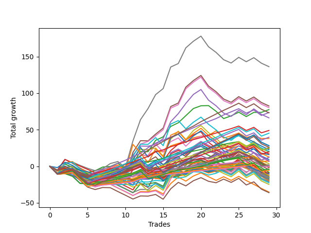

# Short Shepard 004 AB 
- Symbol: ES
- Date Range: 03/18/2022 - 07/15/2022
- Trading Period: 7:20-12:30
- Number of Trades: 29



| Name | Win Percent | Profit | Avg Profit / Trade | Avg Time / Trade |      | Name | Win Percent | Profit | Avg Profit / Trade | Avg Time / Trade |
| ---- | ----------- | ------ | ------------------ | ---------------- | ---- | ---- | ----------- | ------ | ------------------ | ---------------- |
| Sorted By <br> Profit | | | | | | Sorted By <br> Win Percentage ||||
| Seven | 58.62 | 68125.00 | 2349.14 | 27:39 |     | Eighty-One | 86.21 | 3625.00 | 125.00 | 06:48 |
| Five | 55.17 | 41250.00 | 1422.41 | 24:45 |     | One Hundred Twenty-One | 86.21 | -0.00 | -0.00 | 04:59 |
| Six | 58.62 | 40125.00 | 1383.62 | 26:09 |     | One Hundred Twenty-Six | 86.21 | -2875.00 | -99.14 | 04:41 |
| Two | 72.41 | 38750.00 | 1336.21 | 15:50 |     | Eighty-Four | 82.76 | 36750.00 | 1267.24 | 10:50 |
| Eighty-Four | 82.76 | 36750.00 | 1267.24 | 10:50 |     | Eighty-Three | 82.76 | 24500.00 | 844.83 | 09:29 |
| Eighty-Five | 75.86 | 36625.00 | 1262.93 | 13:38 |     | Eighty-Two | 82.76 | 12125.00 | 418.10 | 09:10 |
| Four | 55.17 | 33125.00 | 1142.24 | 22:28 |     | One Hundred Twenty-Four | 79.31 | 22625.00 | 780.17 | 08:38 |
| Eighty-Three | 82.76 | 24500.00 | 844.83 | 09:29 |     | One Hundred Twenty-Nine | 79.31 | 19875.00 | 685.34 | 08:12 |
| One Hundred Twenty-Four | 79.31 | 22625.00 | 780.17 | 08:38 |     | One Hundred Twenty-Three | 79.31 | 12625.00 | 435.34 | 07:20 |
| One Hundred Twenty-Nine | 79.31 | 19875.00 | 685.34 | 08:12 |     | One Hundred Twenty-Eight | 79.31 | 9875.00 | 340.52 | 06:54 |
| One | 62.07 | 19000.00 | 655.17 | 11:09 |     | One Hundred Twenty-Two | 79.31 | 875.00 | 30.17 | 07:02 |
| One Hundred Twenty-Five | 68.97 | 14125.00 | 487.07 | 10:50 |     | One Hundred Twenty-Seven | 79.31 | -1875.00 | -64.66 | 06:36 |
| Sixty-One | 48.28 | 14000.00 | 482.76 | 20:55 |     | Eighty-Five | 75.86 | 36625.00 | 1262.93 | 13:38 |
| One Hundred Thirty | 68.97 | 13000.00 | 448.28 | 10:23 |     | Two | 72.41 | 38750.00 | 1336.21 | 15:50 |
| Fifty-Eight | 65.52 | 13000.00 | 448.28 | 13:10 |     | One Hundred Sixteen | 72.41 | -6375.00 | -219.83 | 02:20 |
| One Hundred Twenty-Three | 79.31 | 12625.00 | 435.34 | 07:20 |     | One Hundred Eleven | 72.41 | -7875.00 | -271.55 | 02:17 |
| Eighty-Two | 82.76 | 12125.00 | 418.10 | 09:10 |     | One Hundred Twenty-Five | 68.97 | 14125.00 | 487.07 | 10:50 |
| One Hundred Fifteen | 58.62 | 11375.00 | 392.24 | 05:57 |     | One Hundred Thirty | 68.97 | 13000.00 | 448.28 | 10:23 |
| One Hundred Fourteen | 62.07 | 10125.00 | 349.14 | 04:38 |     | Fifty-Eight | 65.52 | 13000.00 | 448.28 | 13:10 |
| One Hundred Twenty-Eight | 79.31 | 9875.00 | 340.52 | 06:54 |     | One | 62.07 | 19000.00 | 655.17 | 11:09 |
| Sixty | 48.28 | 9750.00 | 336.21 | 18:50 |     | One Hundred Fourteen | 62.07 | 10125.00 | 349.14 | 04:38 |
| Three | 55.17 | 8500.00 | 293.10 | 18:54 |     | One Hundred Thirteen | 62.07 | 375.00 | 12.93 | 03:45 |
| Zero | 58.62 | 8000.00 | 275.86 | 06:19 |     | One Hundred Seventeen | 62.07 | -4125.00 | -142.24 | 03:40 |
| Sixty-Three | 44.83 | 6375.00 | 219.83 | 22:43 |     | One Hundred Twelve | 62.07 | -7750.00 | -267.24 | 03:37 |
| Sixty-Six | 58.62 | 6125.00 | 211.21 | 11:38 |     | Seven | 58.62 | 68125.00 | 2349.14 | 27:39 |
| Sixty-Two | 48.28 | 4625.00 | 159.48 | 21:59 |     | Six | 58.62 | 40125.00 | 1383.62 | 26:09 |
| Eighty-One | 86.21 | 3625.00 | 125.00 | 06:48 |     | One Hundred Fifteen | 58.62 | 11375.00 | 392.24 | 05:57 |
| One Hundred Ninteen | 51.72 | 3625.00 | 125.00 | 04:25 |     | Zero | 58.62 | 8000.00 | 275.86 | 06:19 |
| Forty-Eight | 51.72 | 3250.00 | 112.07 | 03:05 |     | Sixty-Six | 58.62 | 6125.00 | 211.21 | 11:38 |
| Forty | 58.62 | 1750.00 | 60.34 | 03:20 |     | Forty | 58.62 | 1750.00 | 60.34 | 03:20 |
| One Hundred Twenty-Two | 79.31 | 875.00 | 30.17 | 07:02 |     | Fifty-Six | 58.62 | 875.00 | 30.17 | 05:09 |
| Fifty-Six | 58.62 | 875.00 | 30.17 | 05:09 |     | Sixty-Four | 58.62 | 625.00 | 21.55 | 05:04 |
| Sixty-Four | 58.62 | 625.00 | 21.55 | 05:04 |     | Fifty-Seven | 58.62 | 625.00 | 21.55 | 09:12 |
| Fifty-Seven | 58.62 | 625.00 | 21.55 | 09:12 |     | One Hundred Eighteen | 58.62 | -500.00 | -17.24 | 03:47 |
| One Hundred Thirteen | 62.07 | 375.00 | 12.93 | 03:45 |     | Five | 55.17 | 41250.00 | 1422.41 | 24:45 |
| One Hundred Twenty-One | 86.21 | -0.00 | -0.00 | 04:59 |     | Four | 55.17 | 33125.00 | 1142.24 | 22:28 |
| Forty-Six | 34.48 | -0.00 | -0.00 | 14:19 |     | Three | 55.17 | 8500.00 | 293.10 | 18:54 |
| Forty-Two | 41.38 | -375.00 | -12.93 | 08:40 |     | One Hundred Ninteen | 51.72 | 3625.00 | 125.00 | 04:25 |
| One Hundred Eighteen | 58.62 | -500.00 | -17.24 | 03:47 |     | Forty-Eight | 51.72 | 3250.00 | 112.07 | 03:05 |
| One Hundred Twenty | 41.38 | -500.00 | -17.24 | 05:01 |     | Sixty-Five | 51.72 | -4375.00 | -150.86 | 08:22 |
| Forty-Five | 34.48 | -875.00 | -30.17 | 12:59 |     | Sixty-One | 48.28 | 14000.00 | 482.76 | 20:55 |
| One Hundred Twenty-Seven | 79.31 | -1875.00 | -64.66 | 06:36 |     | Sixty | 48.28 | 9750.00 | 336.21 | 18:50 |
| Forty-Seven | 31.03 | -2250.00 | -77.59 | 14:48 |     | Sixty-Two | 48.28 | 4625.00 | 159.48 | 21:59 |
| One Hundred Twenty-Six | 86.21 | -2875.00 | -99.14 | 04:41 |     | Fifty-Nine | 48.28 | -9125.00 | -314.66 | 15:58 |
| One Hundred Seventeen | 62.07 | -4125.00 | -142.24 | 03:40 |     | Sixty-Three | 44.83 | 6375.00 | 219.83 | 22:43 |
| Sixty-Five | 51.72 | -4375.00 | -150.86 | 08:22 |     | Forty-One | 44.83 | -7250.00 | -250.00 | 06:03 |
| Seventy-Three | 41.38 | -5250.00 | -181.03 | 07:29 |     | Forty-Two | 41.38 | -375.00 | -12.93 | 08:40 |
| Fifty-Five | 34.48 | -5250.00 | -181.03 | 07:35 |     | One Hundred Twenty | 41.38 | -500.00 | -17.24 | 05:01 |
| One Hundred Sixteen | 72.41 | -6375.00 | -219.83 | 02:20 |     | Seventy-Three | 41.38 | -5250.00 | -181.03 | 07:29 |
| Forty-Four | 34.48 | -6625.00 | -228.45 | 11:17 |     | Sixty-Eight | 41.38 | -7875.00 | -271.55 | 16:11 |
| Forty-One | 44.83 | -7250.00 | -250.00 | 06:03 |     | Sixty-Nine | 41.38 | -10500.00 | -362.07 | 17:55 |
| Forty-Nine | 37.93 | -7500.00 | -258.62 | 04:57 |     | Seventy-One | 41.38 | -11250.00 | -387.93 | 19:02 |
| One Hundred Twelve | 62.07 | -7750.00 | -267.24 | 03:37 |     | Seventy | 41.38 | -12375.00 | -426.72 | 18:53 |
| One Hundred Eleven | 72.41 | -7875.00 | -271.55 | 02:17 |     | Sixty-Seven | 41.38 | -18000.00 | -620.69 | 14:00 |
| Sixty-Eight | 41.38 | -7875.00 | -271.55 | 16:11 |     | Forty-Nine | 37.93 | -7500.00 | -258.62 | 04:57 |
| Fifty | 37.93 | -8125.00 | -280.17 | 05:28 |     | Fifty | 37.93 | -8125.00 | -280.17 | 05:28 |
| Fifty-Four | 34.48 | -8375.00 | -288.79 | 07:30 |     | Fifty-Two | 37.93 | -9125.00 | -314.66 | 06:13 |
| Fifty-Nine | 48.28 | -9125.00 | -314.66 | 15:58 |     | Forty-Six | 34.48 | -0.00 | -0.00 | 14:19 |
| Fifty-Two | 37.93 | -9125.00 | -314.66 | 06:13 |     | Forty-Five | 34.48 | -875.00 | -30.17 | 12:59 |
| Fifty-Three | 34.48 | -9875.00 | -340.52 | 06:33 |     | Fifty-Five | 34.48 | -5250.00 | -181.03 | 07:35 |
| Fifty-One | 34.48 | -10000.00 | -344.83 | 05:35 |     | Forty-Four | 34.48 | -6625.00 | -228.45 | 11:17 |
| Sixty-Nine | 41.38 | -10500.00 | -362.07 | 17:55 |     | Fifty-Four | 34.48 | -8375.00 | -288.79 | 07:30 |
| Seventy-One | 41.38 | -11250.00 | -387.93 | 19:02 |     | Fifty-Three | 34.48 | -9875.00 | -340.52 | 06:33 |
| Seventy | 41.38 | -12375.00 | -426.72 | 18:53 |     | Fifty-One | 34.48 | -10000.00 | -344.83 | 05:35 |
| Forty-Three | 34.48 | -17625.00 | -607.76 | 09:43 |     | Forty-Three | 34.48 | -17625.00 | -607.76 | 09:43 |
| Sixty-Seven | 41.38 | -18000.00 | -620.69 | 14:00 |     | Forty-Seven | 31.03 | -2250.00 | -77.59 | 14:48 |

## NO STOPLOSS

### Test Zero
* Sell when price hits the middle line of the 20p bollinger
* No Stoploss
* Results:
```
Total Trades: 29
Percent Up: 41.38
Percent Down: 58.62
Total Points Moved Down: 16.00
Potential Profit: 8000.00
Total Points Ups: 37.00 Count Ups: 12
Total Points Downs: 53.00 Count Downs: 17
```

<details><summary>Trades</summary>

<code>In: 2022-03-18 12:13:00		Out: 2022-03-18 12:37:20		Total Position Time: 24:20		Total Move Down: -9.00		Total to Date: -9.00</code> <br />
<code>In: 2022-03-23 09:05:00		Out: 2022-03-23 09:05:25		Total Position Time: 00:25		Total Move Down: 0.75		Total to Date: -8.25</code> <br />
<code>In: 2022-03-24 08:35:00		Out: 2022-03-24 08:50:05		Total Position Time: 15:05		Total Move Down: -3.75		Total to Date: -12.00</code> <br />
<code>In: 2022-03-25 07:29:00		Out: 2022-03-25 07:51:05		Total Position Time: 22:05		Total Move Down: -6.75		Total to Date: -18.75</code> <br />
<code>In: 2022-03-29 12:15:00		Out: 2022-03-29 12:18:55		Total Position Time: 03:55		Total Move Down: -0.25		Total to Date: -19.00</code> <br />
<code>In: 2022-04-07 12:08:00		Out: 2022-04-07 12:19:10		Total Position Time: 11:10		Total Move Down: -2.50		Total to Date: -21.50</code> <br />
<code>In: 2022-04-08 08:05:00		Out: 2022-04-08 08:15:35		Total Position Time: 10:35		Total Move Down: 3.00		Total to Date: -18.50</code> <br />
<code>In: 2022-04-13 10:26:00		Out: 2022-04-13 10:26:10		Total Position Time: 00:10		Total Move Down: -0.25		Total to Date: -18.75</code> <br />
<code>In: 2022-04-27 09:34:00		Out: 2022-04-27 09:37:00		Total Position Time: 03:00		Total Move Down: 4.75		Total to Date: -14.00</code> <br />
<code>In: 2022-04-28 11:54:00		Out: 2022-04-28 11:55:05		Total Position Time: 01:05		Total Move Down: 5.00		Total to Date: -9.00</code> <br />
<code>In: 2022-05-02 07:36:00		Out: 2022-05-02 07:44:10		Total Position Time: 08:10		Total Move Down: -0.75		Total to Date: -9.75</code> <br />
<code>In: 2022-05-04 11:07:00		Out: 2022-05-04 11:07:10		Total Position Time: 00:10		Total Move Down: 4.25		Total to Date: -5.50</code> <br />
<code>In: 2022-05-04 11:08:00		Out: 2022-05-04 11:08:10		Total Position Time: 00:10		Total Move Down: -0.25		Total to Date: -5.75</code> <br />
<code>In: 2022-05-04 11:31:00		Out: 2022-05-04 11:31:10		Total Position Time: 00:10		Total Move Down: 2.25		Total to Date: -3.50</code> <br />
<code>In: 2022-05-12 08:01:00		Out: 2022-05-12 08:15:00		Total Position Time: 14:00		Total Move Down: -5.25		Total to Date: -8.75</code> <br />
<code>In: 2022-05-12 08:13:00		Out: 2022-05-12 08:15:00		Total Position Time: 02:00		Total Move Down: 4.25		Total to Date: -4.50</code> <br />
<code>In: 2022-05-16 11:36:00		Out: 2022-05-16 11:41:45		Total Position Time: 05:45		Total Move Down: 1.50		Total to Date: -3.00</code> <br />
<code>In: 2022-05-19 11:56:00		Out: 2022-05-19 11:57:50		Total Position Time: 01:50		Total Move Down: 7.00		Total to Date: 4.00</code> <br />
<code>In: 2022-05-25 07:41:00		Out: 2022-05-25 07:42:00		Total Position Time: 01:00		Total Move Down: 4.50		Total to Date: 8.50</code> <br />
<code>In: 2022-05-31 11:04:00		Out: 2022-05-31 11:05:10		Total Position Time: 01:10		Total Move Down: 1.75		Total to Date: 10.25</code> <br />
<code>In: 2022-06-02 08:18:00		Out: 2022-06-02 08:22:05		Total Position Time: 04:05		Total Move Down: 1.25		Total to Date: 11.50</code> <br />
<code>In: 2022-06-02 08:55:00		Out: 2022-06-02 08:57:05		Total Position Time: 02:05		Total Move Down: 4.00		Total to Date: 15.50</code> <br />
<code>In: 2022-07-01 12:18:00		Out: 2022-07-01 12:20:55		Total Position Time: 02:55		Total Move Down: 3.50		Total to Date: 19.00</code> <br />
<code>In: 2022-07-05 11:43:00		Out: 2022-07-05 11:48:10		Total Position Time: 05:10		Total Move Down: 3.00		Total to Date: 22.00</code> <br />
<code>In: 2022-07-07 12:23:00		Out: 2022-07-07 12:24:15		Total Position Time: 01:15		Total Move Down: 1.75		Total to Date: 23.75</code> <br />
<code>In: 2022-07-11 10:15:00		Out: 2022-07-11 10:23:05		Total Position Time: 08:05		Total Move Down: 0.50		Total to Date: 24.25</code> <br />
<code>In: 2022-07-13 10:08:00		Out: 2022-07-13 10:16:20		Total Position Time: 08:20		Total Move Down: -0.50		Total to Date: 23.75</code> <br />
<code>In: 2022-07-14 11:28:00		Out: 2022-07-14 11:42:40		Total Position Time: 14:40		Total Move Down: -5.75		Total to Date: 18.00</code> <br />
<code>In: 2022-07-14 11:32:00		Out: 2022-07-14 11:42:40		Total Position Time: 10:40		Total Move Down: -2.00		Total to Date: 16.00</code> <br />


</details>

### Test One
* Sell when the price hits the upper line of the 20p 1std bollinger
* No Stoploss
* Results:
```
Total Trades: 29
Percent Up: 37.93
Percent Down: 62.07
Total Points Moved Down: 38.00
Potential Profit: 19000.00
Total Points Ups: 35.00 Count Ups: 11
Total Points Downs: 73.00 Count Downs: 18
```

<details><summary>Trades</summary>

<code>In: 2022-03-18 12:13:00		Out: 2022-03-18 12:39:40		Total Position Time: 26:40		Total Move Down: -6.75		Total to Date: -6.75</code> <br />
<code>In: 2022-03-23 09:05:00		Out: 2022-03-23 09:06:10		Total Position Time: 01:10		Total Move Down: 3.50		Total to Date: -3.25</code> <br />
<code>In: 2022-03-24 08:35:00		Out: 2022-03-24 08:53:45		Total Position Time: 18:45		Total Move Down: -1.50		Total to Date: -4.75</code> <br />
<code>In: 2022-03-25 07:29:00		Out: 2022-03-25 07:53:50		Total Position Time: 24:50		Total Move Down: -5.25		Total to Date: -10.00</code> <br />
<code>In: 2022-03-29 12:15:00		Out: 2022-03-29 12:27:35		Total Position Time: 12:35		Total Move Down: 0.25		Total to Date: -9.75</code> <br />
<code>In: 2022-04-07 12:08:00		Out: 2022-04-07 12:20:50		Total Position Time: 12:50		Total Move Down: -0.00		Total to Date: -9.75</code> <br />
<code>In: 2022-04-08 08:05:00		Out: 2022-04-08 08:17:05		Total Position Time: 12:05		Total Move Down: 4.75		Total to Date: -5.00</code> <br />
<code>In: 2022-04-13 10:26:00		Out: 2022-04-13 10:26:10		Total Position Time: 00:10		Total Move Down: -0.25		Total to Date: -5.25</code> <br />
<code>In: 2022-04-27 09:34:00		Out: 2022-04-27 09:50:25		Total Position Time: 16:25		Total Move Down: 1.50		Total to Date: -3.75</code> <br />
<code>In: 2022-04-28 11:54:00		Out: 2022-04-28 12:02:10		Total Position Time: 08:10		Total Move Down: 4.25		Total to Date: 0.50</code> <br />
<code>In: 2022-05-02 07:36:00		Out: 2022-05-02 07:44:50		Total Position Time: 08:50		Total Move Down: 5.00		Total to Date: 5.50</code> <br />
<code>In: 2022-05-04 11:07:00		Out: 2022-05-04 11:07:20		Total Position Time: 00:20		Total Move Down: 9.50		Total to Date: 15.00</code> <br />
<code>In: 2022-05-04 11:08:00		Out: 2022-05-04 11:08:10		Total Position Time: 00:10		Total Move Down: -0.25		Total to Date: 14.75</code> <br />
<code>In: 2022-05-04 11:31:00		Out: 2022-05-04 11:31:20		Total Position Time: 00:20		Total Move Down: 6.25		Total to Date: 21.00</code> <br />
<code>In: 2022-05-12 08:01:00		Out: 2022-05-12 08:17:30		Total Position Time: 16:30		Total Move Down: -1.25		Total to Date: 19.75</code> <br />
<code>In: 2022-05-12 08:13:00		Out: 2022-05-12 08:17:30		Total Position Time: 04:30		Total Move Down: 8.25		Total to Date: 28.00</code> <br />
<code>In: 2022-05-16 11:36:00		Out: 2022-05-16 11:44:50		Total Position Time: 08:50		Total Move Down: 3.25		Total to Date: 31.25</code> <br />
<code>In: 2022-05-19 11:56:00		Out: 2022-05-19 12:10:10		Total Position Time: 14:10		Total Move Down: 1.75		Total to Date: 33.00</code> <br />
<code>In: 2022-05-25 07:41:00		Out: 2022-05-25 07:46:40		Total Position Time: 05:40		Total Move Down: 6.00		Total to Date: 39.00</code> <br />
<code>In: 2022-05-31 11:04:00		Out: 2022-05-31 11:13:25		Total Position Time: 09:25		Total Move Down: 2.25		Total to Date: 41.25</code> <br />
<code>In: 2022-06-02 08:18:00		Out: 2022-06-02 08:27:30		Total Position Time: 09:30		Total Move Down: 1.00		Total to Date: 42.25</code> <br />
<code>In: 2022-06-02 08:55:00		Out: 2022-06-02 09:01:05		Total Position Time: 06:05		Total Move Down: 6.25		Total to Date: 48.50</code> <br />
<code>In: 2022-07-01 12:18:00		Out: 2022-07-01 12:46:00		Total Position Time: 28:00		Total Move Down: -10.00		Total to Date: 38.50</code> <br />
<code>In: 2022-07-05 11:43:00		Out: 2022-07-05 11:52:50		Total Position Time: 09:50		Total Move Down: 3.25		Total to Date: 41.75</code> <br />
<code>In: 2022-07-07 12:23:00		Out: 2022-07-07 12:25:10		Total Position Time: 02:10		Total Move Down: 3.75		Total to Date: 45.50</code> <br />
<code>In: 2022-07-11 10:15:00		Out: 2022-07-11 10:44:55		Total Position Time: 29:55		Total Move Down: -6.00		Total to Date: 39.50</code> <br />
<code>In: 2022-07-13 10:08:00		Out: 2022-07-13 10:16:30		Total Position Time: 08:30		Total Move Down: 2.25		Total to Date: 41.75</code> <br />
<code>In: 2022-07-14 11:28:00		Out: 2022-07-14 11:43:35		Total Position Time: 15:35		Total Move Down: -3.75		Total to Date: 38.00</code> <br />
<code>In: 2022-07-14 11:32:00		Out: 2022-07-14 11:43:35		Total Position Time: 11:35		Total Move Down: -0.00		Total to Date: 38.00</code> <br />


</details>

### Test Two
* Sell when the price hits the upper line of the 20p 2std bollinger
* No Stoploss
* Results:
```
Total Trades: 29
Percent Up: 27.59
Percent Down: 72.41
Total Points Moved Down: 77.50
Potential Profit: 38750.00
Total Points Ups: 47.25 Count Ups: 8
Total Points Downs: 124.75 Count Downs: 21
```

<details><summary>Trades</summary>

<code>In: 2022-03-18 12:13:00		Out: 2022-03-18 12:42:55		Total Position Time: 29:55		Total Move Down: -10.75		Total to Date: -10.75</code> <br />
<code>In: 2022-03-23 09:05:00		Out: 2022-03-23 09:06:25		Total Position Time: 01:25		Total Move Down: 5.50		Total to Date: -5.25</code> <br />
<code>In: 2022-03-24 08:35:00		Out: 2022-03-24 09:03:10		Total Position Time: 28:10		Total Move Down: 0.50		Total to Date: -4.75</code> <br />
<code>In: 2022-03-25 07:29:00		Out: 2022-03-25 07:54:10		Total Position Time: 25:10		Total Move Down: -4.25		Total to Date: -9.00</code> <br />
<code>In: 2022-03-29 12:15:00		Out: 2022-03-29 12:27:50		Total Position Time: 12:50		Total Move Down: 0.75		Total to Date: -8.25</code> <br />
<code>In: 2022-04-07 12:08:00		Out: 2022-04-07 12:21:20		Total Position Time: 13:20		Total Move Down: 2.25		Total to Date: -6.00</code> <br />
<code>In: 2022-04-08 08:05:00		Out: 2022-04-08 08:20:10		Total Position Time: 15:10		Total Move Down: 5.00		Total to Date: -1.00</code> <br />
<code>In: 2022-04-13 10:26:00		Out: 2022-04-13 10:26:55		Total Position Time: 00:55		Total Move Down: 0.75		Total to Date: -0.25</code> <br />
<code>In: 2022-04-27 09:34:00		Out: 2022-04-27 10:00:10		Total Position Time: 26:10		Total Move Down: 4.50		Total to Date: 4.25</code> <br />
<code>In: 2022-04-28 11:54:00		Out: 2022-04-28 12:23:55		Total Position Time: 29:55		Total Move Down: -8.25		Total to Date: -4.00</code> <br />
<code>In: 2022-05-02 07:36:00		Out: 2022-05-02 07:47:15		Total Position Time: 11:15		Total Move Down: 8.25		Total to Date: 4.25</code> <br />
<code>In: 2022-05-04 11:07:00		Out: 2022-05-04 11:07:40		Total Position Time: 00:40		Total Move Down: 16.00		Total to Date: 20.25</code> <br />
<code>In: 2022-05-04 11:08:00		Out: 2022-05-04 11:08:10		Total Position Time: 00:10		Total Move Down: -0.25		Total to Date: 20.00</code> <br />
<code>In: 2022-05-04 11:31:00		Out: 2022-05-04 11:32:25		Total Position Time: 01:25		Total Move Down: 15.50		Total to Date: 35.50</code> <br />
<code>In: 2022-05-12 08:01:00		Out: 2022-05-12 08:22:05		Total Position Time: 21:05		Total Move Down: 4.75		Total to Date: 40.25</code> <br />
<code>In: 2022-05-12 08:13:00		Out: 2022-05-12 08:22:05		Total Position Time: 09:05		Total Move Down: 14.25		Total to Date: 54.50</code> <br />
<code>In: 2022-05-16 11:36:00		Out: 2022-05-16 11:45:35		Total Position Time: 09:35		Total Move Down: 5.00		Total to Date: 59.50</code> <br />
<code>In: 2022-05-19 11:56:00		Out: 2022-05-19 12:14:05		Total Position Time: 18:05		Total Move Down: 9.75		Total to Date: 69.25</code> <br />
<code>In: 2022-05-25 07:41:00		Out: 2022-05-25 07:48:10		Total Position Time: 07:10		Total Move Down: 9.75		Total to Date: 79.00</code> <br />
<code>In: 2022-05-31 11:04:00		Out: 2022-05-31 11:22:35		Total Position Time: 18:35		Total Move Down: 3.75		Total to Date: 82.75</code> <br />
<code>In: 2022-06-02 08:18:00		Out: 2022-06-02 08:30:55		Total Position Time: 12:55		Total Move Down: 0.25		Total to Date: 83.00</code> <br />
<code>In: 2022-06-02 08:55:00		Out: 2022-06-02 09:24:55		Total Position Time: 29:55		Total Move Down: -7.75		Total to Date: 75.25</code> <br />
<code>In: 2022-07-01 12:18:00		Out: 2022-07-01 12:46:00		Total Position Time: 28:00		Total Move Down: -10.00		Total to Date: 65.25</code> <br />
<code>In: 2022-07-05 11:43:00		Out: 2022-07-05 12:01:15		Total Position Time: 18:15		Total Move Down: 3.75		Total to Date: 69.00</code> <br />
<code>In: 2022-07-07 12:23:00		Out: 2022-07-07 12:28:30		Total Position Time: 05:30		Total Move Down: 5.00		Total to Date: 74.00</code> <br />
<code>In: 2022-07-11 10:15:00		Out: 2022-07-11 10:44:55		Total Position Time: 29:55		Total Move Down: -6.00		Total to Date: 68.00</code> <br />
<code>In: 2022-07-13 10:08:00		Out: 2022-07-13 10:18:35		Total Position Time: 10:35		Total Move Down: 5.75		Total to Date: 73.75</code> <br />
<code>In: 2022-07-14 11:28:00		Out: 2022-07-14 11:52:00		Total Position Time: 24:00		Total Move Down: -0.00		Total to Date: 73.75</code> <br />
<code>In: 2022-07-14 11:32:00		Out: 2022-07-14 11:52:00		Total Position Time: 20:00		Total Move Down: 3.75		Total to Date: 77.50</code> <br />


</details>

### Test Three
* Sell when price hits the middle line of the 50p bollinger
* No Stoploss
* Results:
```
Total Trades: 29
Percent Up: 44.83
Percent Down: 55.17
Total Points Moved Down: 17.00
Potential Profit: 8500.00
Total Points Ups: 73.00 Count Ups: 13
Total Points Downs: 90.00 Count Downs: 16
```

<details><summary>Trades</summary>

<code>In: 2022-03-18 12:13:00		Out: 2022-03-18 12:42:55		Total Position Time: 29:55		Total Move Down: -10.75		Total to Date: -10.75</code> <br />
<code>In: 2022-03-23 09:05:00		Out: 2022-03-23 09:05:25		Total Position Time: 00:25		Total Move Down: 0.75		Total to Date: -10.00</code> <br />
<code>In: 2022-03-24 08:35:00		Out: 2022-03-24 09:03:10		Total Position Time: 28:10		Total Move Down: 0.50		Total to Date: -9.50</code> <br />
<code>In: 2022-03-25 07:29:00		Out: 2022-03-25 07:58:55		Total Position Time: 29:55		Total Move Down: -4.50		Total to Date: -14.00</code> <br />
<code>In: 2022-03-29 12:15:00		Out: 2022-03-29 12:43:05		Total Position Time: 28:05		Total Move Down: -0.75		Total to Date: -14.75</code> <br />
<code>In: 2022-04-07 12:08:00		Out: 2022-04-07 12:37:55		Total Position Time: 29:55		Total Move Down: -3.25		Total to Date: -18.00</code> <br />
<code>In: 2022-04-08 08:05:00		Out: 2022-04-08 08:34:55		Total Position Time: 29:55		Total Move Down: 2.75		Total to Date: -15.25</code> <br />
<code>In: 2022-04-13 10:26:00		Out: 2022-04-13 10:26:10		Total Position Time: 00:10		Total Move Down: -0.25		Total to Date: -15.50</code> <br />
<code>In: 2022-04-27 09:34:00		Out: 2022-04-27 10:00:10		Total Position Time: 26:10		Total Move Down: 4.50		Total to Date: -11.00</code> <br />
<code>In: 2022-04-28 11:54:00		Out: 2022-04-28 12:23:55		Total Position Time: 29:55		Total Move Down: -8.25		Total to Date: -19.25</code> <br />
<code>In: 2022-05-02 07:36:00		Out: 2022-05-02 07:53:35		Total Position Time: 17:35		Total Move Down: 14.25		Total to Date: -5.00</code> <br />
<code>In: 2022-05-04 11:07:00		Out: 2022-05-04 11:07:15		Total Position Time: 00:15		Total Move Down: 5.50		Total to Date: 0.50</code> <br />
<code>In: 2022-05-04 11:08:00		Out: 2022-05-04 11:08:10		Total Position Time: 00:10		Total Move Down: -0.25		Total to Date: 0.25</code> <br />
<code>In: 2022-05-04 11:31:00		Out: 2022-05-04 11:31:10		Total Position Time: 00:10		Total Move Down: 2.25		Total to Date: 2.50</code> <br />
<code>In: 2022-05-12 08:01:00		Out: 2022-05-12 08:22:05		Total Position Time: 21:05		Total Move Down: 4.75		Total to Date: 7.25</code> <br />
<code>In: 2022-05-12 08:13:00		Out: 2022-05-12 08:22:05		Total Position Time: 09:05		Total Move Down: 14.25		Total to Date: 21.50</code> <br />
<code>In: 2022-05-16 11:36:00		Out: 2022-05-16 11:49:00		Total Position Time: 13:00		Total Move Down: 8.75		Total to Date: 30.25</code> <br />
<code>In: 2022-05-19 11:56:00		Out: 2022-05-19 12:13:30		Total Position Time: 17:30		Total Move Down: 5.75		Total to Date: 36.00</code> <br />
<code>In: 2022-05-25 07:41:00		Out: 2022-05-25 08:00:40		Total Position Time: 19:40		Total Move Down: 7.00		Total to Date: 43.00</code> <br />
<code>In: 2022-05-31 11:04:00		Out: 2022-05-31 11:22:40		Total Position Time: 18:40		Total Move Down: 4.25		Total to Date: 47.25</code> <br />
<code>In: 2022-06-02 08:18:00		Out: 2022-06-02 08:47:55		Total Position Time: 29:55		Total Move Down: -14.50		Total to Date: 32.75</code> <br />
<code>In: 2022-06-02 08:55:00		Out: 2022-06-02 09:24:55		Total Position Time: 29:55		Total Move Down: -7.75		Total to Date: 25.00</code> <br />
<code>In: 2022-07-01 12:18:00		Out: 2022-07-01 12:21:00		Total Position Time: 03:00		Total Move Down: 5.00		Total to Date: 30.00</code> <br />
<code>In: 2022-07-05 11:43:00		Out: 2022-07-05 12:12:55		Total Position Time: 29:55		Total Move Down: -4.50		Total to Date: 25.50</code> <br />
<code>In: 2022-07-07 12:23:00		Out: 2022-07-07 12:30:00		Total Position Time: 07:00		Total Move Down: 5.50		Total to Date: 31.00</code> <br />
<code>In: 2022-07-11 10:15:00		Out: 2022-07-11 10:44:55		Total Position Time: 29:55		Total Move Down: -6.00		Total to Date: 25.00</code> <br />
<code>In: 2022-07-13 10:08:00		Out: 2022-07-13 10:17:05		Total Position Time: 09:05		Total Move Down: 4.25		Total to Date: 29.25</code> <br />
<code>In: 2022-07-14 11:28:00		Out: 2022-07-14 11:57:55		Total Position Time: 29:55		Total Move Down: -7.50		Total to Date: 21.75</code> <br />
<code>In: 2022-07-14 11:32:00		Out: 2022-07-14 12:01:55		Total Position Time: 29:55		Total Move Down: -4.75		Total to Date: 17.00</code> <br />


</details>

### Test Four
* Sell when the price hits the upper line of the 50p 1std bollinger
* No Stoploss
* Results:
```
Total Trades: 29
Percent Up: 44.83
Percent Down: 55.17
Total Points Moved Down: 66.25
Potential Profit: 33125.00
Total Points Ups: 86.00 Count Ups: 13
Total Points Downs: 152.25 Count Downs: 16
```

<details><summary>Trades</summary>

<code>In: 2022-03-18 12:13:00		Out: 2022-03-18 12:42:55		Total Position Time: 29:55		Total Move Down: -10.75		Total to Date: -10.75</code> <br />
<code>In: 2022-03-23 09:05:00		Out: 2022-03-23 09:06:05		Total Position Time: 01:05		Total Move Down: 3.00		Total to Date: -7.75</code> <br />
<code>In: 2022-03-24 08:35:00		Out: 2022-03-24 09:04:55		Total Position Time: 29:55		Total Move Down: 1.75		Total to Date: -6.00</code> <br />
<code>In: 2022-03-25 07:29:00		Out: 2022-03-25 07:58:55		Total Position Time: 29:55		Total Move Down: -4.50		Total to Date: -10.50</code> <br />
<code>In: 2022-03-29 12:15:00		Out: 2022-03-29 12:44:55		Total Position Time: 29:55		Total Move Down: -4.00		Total to Date: -14.50</code> <br />
<code>In: 2022-04-07 12:08:00		Out: 2022-04-07 12:37:55		Total Position Time: 29:55		Total Move Down: -3.25		Total to Date: -17.75</code> <br />
<code>In: 2022-04-08 08:05:00		Out: 2022-04-08 08:34:55		Total Position Time: 29:55		Total Move Down: 2.75		Total to Date: -15.00</code> <br />
<code>In: 2022-04-13 10:26:00		Out: 2022-04-13 10:31:20		Total Position Time: 05:20		Total Move Down: 1.25		Total to Date: -13.75</code> <br />
<code>In: 2022-04-27 09:34:00		Out: 2022-04-27 10:01:20		Total Position Time: 27:20		Total Move Down: 11.50		Total to Date: -2.25</code> <br />
<code>In: 2022-04-28 11:54:00		Out: 2022-04-28 12:23:55		Total Position Time: 29:55		Total Move Down: -8.25		Total to Date: -10.50</code> <br />
<code>In: 2022-05-02 07:36:00		Out: 2022-05-02 08:02:05		Total Position Time: 26:05		Total Move Down: 26.00		Total to Date: 15.50</code> <br />
<code>In: 2022-05-04 11:07:00		Out: 2022-05-04 11:07:25		Total Position Time: 00:25		Total Move Down: 12.25		Total to Date: 27.75</code> <br />
<code>In: 2022-05-04 11:08:00		Out: 2022-05-04 11:08:10		Total Position Time: 00:10		Total Move Down: -0.25		Total to Date: 27.50</code> <br />
<code>In: 2022-05-04 11:31:00		Out: 2022-05-04 11:31:10		Total Position Time: 00:10		Total Move Down: 2.25		Total to Date: 29.75</code> <br />
<code>In: 2022-05-12 08:01:00		Out: 2022-05-12 08:30:55		Total Position Time: 29:55		Total Move Down: 8.25		Total to Date: 38.00</code> <br />
<code>In: 2022-05-12 08:13:00		Out: 2022-05-12 08:31:20		Total Position Time: 18:20		Total Move Down: 23.00		Total to Date: 61.00</code> <br />
<code>In: 2022-05-16 11:36:00		Out: 2022-05-16 11:52:15		Total Position Time: 16:15		Total Move Down: 11.00		Total to Date: 72.00</code> <br />
<code>In: 2022-05-19 11:56:00		Out: 2022-05-19 12:18:25		Total Position Time: 22:25		Total Move Down: 14.00		Total to Date: 86.00</code> <br />
<code>In: 2022-05-25 07:41:00		Out: 2022-05-25 08:04:45		Total Position Time: 23:45		Total Move Down: 12.25		Total to Date: 98.25</code> <br />
<code>In: 2022-05-31 11:04:00		Out: 2022-05-31 11:26:15		Total Position Time: 22:15		Total Move Down: 6.75		Total to Date: 105.00</code> <br />
<code>In: 2022-06-02 08:18:00		Out: 2022-06-02 08:47:55		Total Position Time: 29:55		Total Move Down: -14.50		Total to Date: 90.50</code> <br />
<code>In: 2022-06-02 08:55:00		Out: 2022-06-02 09:24:55		Total Position Time: 29:55		Total Move Down: -7.75		Total to Date: 82.75</code> <br />
<code>In: 2022-07-01 12:18:00		Out: 2022-07-01 12:46:00		Total Position Time: 28:00		Total Move Down: -10.00		Total to Date: 72.75</code> <br />
<code>In: 2022-07-05 11:43:00		Out: 2022-07-05 12:12:55		Total Position Time: 29:55		Total Move Down: -4.50		Total to Date: 68.25</code> <br />
<code>In: 2022-07-07 12:23:00		Out: 2022-07-07 12:38:50		Total Position Time: 15:50		Total Move Down: 8.25		Total to Date: 76.50</code> <br />
<code>In: 2022-07-11 10:15:00		Out: 2022-07-11 10:44:55		Total Position Time: 29:55		Total Move Down: -6.00		Total to Date: 70.50</code> <br />
<code>In: 2022-07-13 10:08:00		Out: 2022-07-13 10:33:20		Total Position Time: 25:20		Total Move Down: 8.00		Total to Date: 78.50</code> <br />
<code>In: 2022-07-14 11:28:00		Out: 2022-07-14 11:57:55		Total Position Time: 29:55		Total Move Down: -7.50		Total to Date: 71.00</code> <br />
<code>In: 2022-07-14 11:32:00		Out: 2022-07-14 12:01:55		Total Position Time: 29:55		Total Move Down: -4.75		Total to Date: 66.25</code> <br />


</details>

### Test Five
* Sell when the price hits the upper line of the 50p 2std bollinger
* No Stoploss
* Results:
```
Total Trades: 29
Percent Up: 44.83
Percent Down: 55.17
Total Points Moved Down: 82.50
Potential Profit: 41250.00
Total Points Ups: 86.00 Count Ups: 13
Total Points Downs: 168.50 Count Downs: 16
```

<details><summary>Trades</summary>

<code>In: 2022-03-18 12:13:00		Out: 2022-03-18 12:42:55		Total Position Time: 29:55		Total Move Down: -10.75		Total to Date: -10.75</code> <br />
<code>In: 2022-03-23 09:05:00		Out: 2022-03-23 09:06:20		Total Position Time: 01:20		Total Move Down: 5.25		Total to Date: -5.50</code> <br />
<code>In: 2022-03-24 08:35:00		Out: 2022-03-24 09:04:55		Total Position Time: 29:55		Total Move Down: 1.75		Total to Date: -3.75</code> <br />
<code>In: 2022-03-25 07:29:00		Out: 2022-03-25 07:58:55		Total Position Time: 29:55		Total Move Down: -4.50		Total to Date: -8.25</code> <br />
<code>In: 2022-03-29 12:15:00		Out: 2022-03-29 12:44:55		Total Position Time: 29:55		Total Move Down: -4.00		Total to Date: -12.25</code> <br />
<code>In: 2022-04-07 12:08:00		Out: 2022-04-07 12:37:55		Total Position Time: 29:55		Total Move Down: -3.25		Total to Date: -15.50</code> <br />
<code>In: 2022-04-08 08:05:00		Out: 2022-04-08 08:34:55		Total Position Time: 29:55		Total Move Down: 2.75		Total to Date: -12.75</code> <br />
<code>In: 2022-04-13 10:26:00		Out: 2022-04-13 10:33:25		Total Position Time: 07:25		Total Move Down: 3.00		Total to Date: -9.75</code> <br />
<code>In: 2022-04-27 09:34:00		Out: 2022-04-27 10:03:55		Total Position Time: 29:55		Total Move Down: 2.75		Total to Date: -7.00</code> <br />
<code>In: 2022-04-28 11:54:00		Out: 2022-04-28 12:23:55		Total Position Time: 29:55		Total Move Down: -8.25		Total to Date: -15.25</code> <br />
<code>In: 2022-05-02 07:36:00		Out: 2022-05-02 08:05:55		Total Position Time: 29:55		Total Move Down: 34.25		Total to Date: 19.00</code> <br />
<code>In: 2022-05-04 11:07:00		Out: 2022-05-04 11:07:40		Total Position Time: 00:40		Total Move Down: 16.00		Total to Date: 35.00</code> <br />
<code>In: 2022-05-04 11:08:00		Out: 2022-05-04 11:08:10		Total Position Time: 00:10		Total Move Down: -0.25		Total to Date: 34.75</code> <br />
<code>In: 2022-05-04 11:31:00		Out: 2022-05-04 11:31:40		Total Position Time: 00:40		Total Move Down: 9.25		Total to Date: 44.00</code> <br />
<code>In: 2022-05-12 08:01:00		Out: 2022-05-12 08:30:55		Total Position Time: 29:55		Total Move Down: 8.25		Total to Date: 52.25</code> <br />
<code>In: 2022-05-12 08:13:00		Out: 2022-05-12 08:42:55		Total Position Time: 29:55		Total Move Down: 29.50		Total to Date: 81.75</code> <br />
<code>In: 2022-05-16 11:36:00		Out: 2022-05-16 12:05:55		Total Position Time: 29:55		Total Move Down: 4.75		Total to Date: 86.50</code> <br />
<code>In: 2022-05-19 11:56:00		Out: 2022-05-19 12:24:40		Total Position Time: 28:40		Total Move Down: 21.75		Total to Date: 108.25</code> <br />
<code>In: 2022-05-25 07:41:00		Out: 2022-05-25 08:10:55		Total Position Time: 29:55		Total Move Down: 9.00		Total to Date: 117.25</code> <br />
<code>In: 2022-05-31 11:04:00		Out: 2022-05-31 11:33:55		Total Position Time: 29:55		Total Move Down: 7.00		Total to Date: 124.25</code> <br />
<code>In: 2022-06-02 08:18:00		Out: 2022-06-02 08:47:55		Total Position Time: 29:55		Total Move Down: -14.50		Total to Date: 109.75</code> <br />
<code>In: 2022-06-02 08:55:00		Out: 2022-06-02 09:24:55		Total Position Time: 29:55		Total Move Down: -7.75		Total to Date: 102.00</code> <br />
<code>In: 2022-07-01 12:18:00		Out: 2022-07-01 12:46:00		Total Position Time: 28:00		Total Move Down: -10.00		Total to Date: 92.00</code> <br />
<code>In: 2022-07-05 11:43:00		Out: 2022-07-05 12:12:55		Total Position Time: 29:55		Total Move Down: -4.50		Total to Date: 87.50</code> <br />
<code>In: 2022-07-07 12:23:00		Out: 2022-07-07 12:46:00		Total Position Time: 23:00		Total Move Down: 7.75		Total to Date: 95.25</code> <br />
<code>In: 2022-07-11 10:15:00		Out: 2022-07-11 10:44:55		Total Position Time: 29:55		Total Move Down: -6.00		Total to Date: 89.25</code> <br />
<code>In: 2022-07-13 10:08:00		Out: 2022-07-13 10:37:55		Total Position Time: 29:55		Total Move Down: 5.50		Total to Date: 94.75</code> <br />
<code>In: 2022-07-14 11:28:00		Out: 2022-07-14 11:57:55		Total Position Time: 29:55		Total Move Down: -7.50		Total to Date: 87.25</code> <br />
<code>In: 2022-07-14 11:32:00		Out: 2022-07-14 12:01:55		Total Position Time: 29:55		Total Move Down: -4.75		Total to Date: 82.50</code> <br />


</details>

### Test Six
* Sell when the price hits the middle line of the 1std VWAP
* No Stoploss
* Results:
```
Total Trades: 29
Percent Up: 41.38
Percent Down: 58.62
Total Points Moved Down: 80.25
Potential Profit: 40125.00
Total Points Ups: 85.75 Count Ups: 12
Total Points Downs: 166.00 Count Downs: 17
```

<details><summary>Trades</summary>

<code>In: 2022-03-18 12:13:00		Out: 2022-03-18 12:42:55		Total Position Time: 29:55		Total Move Down: -10.75		Total to Date: -10.75</code> <br />
<code>In: 2022-03-23 09:05:00		Out: 2022-03-23 09:10:55		Total Position Time: 05:55		Total Move Down: 8.50		Total to Date: -2.25</code> <br />
<code>In: 2022-03-24 08:35:00		Out: 2022-03-24 09:04:55		Total Position Time: 29:55		Total Move Down: 1.75		Total to Date: -0.50</code> <br />
<code>In: 2022-03-25 07:29:00		Out: 2022-03-25 07:58:55		Total Position Time: 29:55		Total Move Down: -4.50		Total to Date: -5.00</code> <br />
<code>In: 2022-03-29 12:15:00		Out: 2022-03-29 12:44:55		Total Position Time: 29:55		Total Move Down: -4.00		Total to Date: -9.00</code> <br />
<code>In: 2022-04-07 12:08:00		Out: 2022-04-07 12:37:55		Total Position Time: 29:55		Total Move Down: -3.25		Total to Date: -12.25</code> <br />
<code>In: 2022-04-08 08:05:00		Out: 2022-04-08 08:34:55		Total Position Time: 29:55		Total Move Down: 2.75		Total to Date: -9.50</code> <br />
<code>In: 2022-04-13 10:26:00		Out: 2022-04-13 10:55:55		Total Position Time: 29:55		Total Move Down: 7.00		Total to Date: -2.50</code> <br />
<code>In: 2022-04-27 09:34:00		Out: 2022-04-27 10:03:55		Total Position Time: 29:55		Total Move Down: 2.75		Total to Date: 0.25</code> <br />
<code>In: 2022-04-28 11:54:00		Out: 2022-04-28 12:23:55		Total Position Time: 29:55		Total Move Down: -8.25		Total to Date: -8.00</code> <br />
<code>In: 2022-05-02 07:36:00		Out: 2022-05-02 07:57:15		Total Position Time: 21:15		Total Move Down: 21.25		Total to Date: 13.25</code> <br />
<code>In: 2022-05-04 11:07:00		Out: 2022-05-04 11:19:05		Total Position Time: 12:05		Total Move Down: 17.25		Total to Date: 30.50</code> <br />
<code>In: 2022-05-04 11:08:00		Out: 2022-05-04 11:19:05		Total Position Time: 11:05		Total Move Down: 3.50		Total to Date: 34.00</code> <br />
<code>In: 2022-05-04 11:31:00		Out: 2022-05-04 11:31:25		Total Position Time: 00:25		Total Move Down: 7.75		Total to Date: 41.75</code> <br />
<code>In: 2022-05-12 08:01:00		Out: 2022-05-12 08:30:55		Total Position Time: 29:55		Total Move Down: 8.25		Total to Date: 50.00</code> <br />
<code>In: 2022-05-12 08:13:00		Out: 2022-05-12 08:42:55		Total Position Time: 29:55		Total Move Down: 29.50		Total to Date: 79.50</code> <br />
<code>In: 2022-05-16 11:36:00		Out: 2022-05-16 12:05:55		Total Position Time: 29:55		Total Move Down: 4.75		Total to Date: 84.25</code> <br />
<code>In: 2022-05-19 11:56:00		Out: 2022-05-19 12:24:40		Total Position Time: 28:40		Total Move Down: 21.75		Total to Date: 106.00</code> <br />
<code>In: 2022-05-25 07:41:00		Out: 2022-05-25 08:10:55		Total Position Time: 29:55		Total Move Down: 9.00		Total to Date: 115.00</code> <br />
<code>In: 2022-05-31 11:04:00		Out: 2022-05-31 11:33:55		Total Position Time: 29:55		Total Move Down: 7.00		Total to Date: 122.00</code> <br />
<code>In: 2022-06-02 08:18:00		Out: 2022-06-02 08:47:55		Total Position Time: 29:55		Total Move Down: -14.50		Total to Date: 107.50</code> <br />
<code>In: 2022-06-02 08:55:00		Out: 2022-06-02 09:24:55		Total Position Time: 29:55		Total Move Down: -7.75		Total to Date: 99.75</code> <br />
<code>In: 2022-07-01 12:18:00		Out: 2022-07-01 12:46:00		Total Position Time: 28:00		Total Move Down: -10.00		Total to Date: 89.75</code> <br />
<code>In: 2022-07-05 11:43:00		Out: 2022-07-05 12:12:55		Total Position Time: 29:55		Total Move Down: -4.50		Total to Date: 85.25</code> <br />
<code>In: 2022-07-07 12:23:00		Out: 2022-07-07 12:46:00		Total Position Time: 23:00		Total Move Down: 7.75		Total to Date: 93.00</code> <br />
<code>In: 2022-07-11 10:15:00		Out: 2022-07-11 10:44:55		Total Position Time: 29:55		Total Move Down: -6.00		Total to Date: 87.00</code> <br />
<code>In: 2022-07-13 10:08:00		Out: 2022-07-13 10:37:55		Total Position Time: 29:55		Total Move Down: 5.50		Total to Date: 92.50</code> <br />
<code>In: 2022-07-14 11:28:00		Out: 2022-07-14 11:57:55		Total Position Time: 29:55		Total Move Down: -7.50		Total to Date: 85.00</code> <br />
<code>In: 2022-07-14 11:32:00		Out: 2022-07-14 12:01:55		Total Position Time: 29:55		Total Move Down: -4.75		Total to Date: 80.25</code> <br />


</details>

### Test Seven
* Sell when the price hits the upper line of the 1std VWAP
* No Stoploss
* Results:
```
Total Trades: 29
Percent Up: 41.38
Percent Down: 58.62
Total Points Moved Down: 136.25
Potential Profit: 68125.00
Total Points Ups: 85.75 Count Ups: 12
Total Points Downs: 222.00 Count Downs: 17
```

<details><summary>Trades</summary>

<code>In: 2022-03-18 12:13:00		Out: 2022-03-18 12:42:55		Total Position Time: 29:55		Total Move Down: -10.75		Total to Date: -10.75</code> <br />
<code>In: 2022-03-23 09:05:00		Out: 2022-03-23 09:13:35		Total Position Time: 08:35		Total Move Down: 14.75		Total to Date: 4.00</code> <br />
<code>In: 2022-03-24 08:35:00		Out: 2022-03-24 09:04:55		Total Position Time: 29:55		Total Move Down: 1.75		Total to Date: 5.75</code> <br />
<code>In: 2022-03-25 07:29:00		Out: 2022-03-25 07:58:55		Total Position Time: 29:55		Total Move Down: -4.50		Total to Date: 1.25</code> <br />
<code>In: 2022-03-29 12:15:00		Out: 2022-03-29 12:44:55		Total Position Time: 29:55		Total Move Down: -4.00		Total to Date: -2.75</code> <br />
<code>In: 2022-04-07 12:08:00		Out: 2022-04-07 12:37:55		Total Position Time: 29:55		Total Move Down: -3.25		Total to Date: -6.00</code> <br />
<code>In: 2022-04-08 08:05:00		Out: 2022-04-08 08:34:55		Total Position Time: 29:55		Total Move Down: 2.75		Total to Date: -3.25</code> <br />
<code>In: 2022-04-13 10:26:00		Out: 2022-04-13 10:55:55		Total Position Time: 29:55		Total Move Down: 7.00		Total to Date: 3.75</code> <br />
<code>In: 2022-04-27 09:34:00		Out: 2022-04-27 10:03:55		Total Position Time: 29:55		Total Move Down: 2.75		Total to Date: 6.50</code> <br />
<code>In: 2022-04-28 11:54:00		Out: 2022-04-28 12:23:55		Total Position Time: 29:55		Total Move Down: -8.25		Total to Date: -1.75</code> <br />
<code>In: 2022-05-02 07:36:00		Out: 2022-05-02 08:04:30		Total Position Time: 28:30		Total Move Down: 36.50		Total to Date: 34.75</code> <br />
<code>In: 2022-05-04 11:07:00		Out: 2022-05-04 11:34:00		Total Position Time: 27:00		Total Move Down: 29.00		Total to Date: 63.75</code> <br />
<code>In: 2022-05-04 11:08:00		Out: 2022-05-04 11:34:00		Total Position Time: 26:00		Total Move Down: 15.25		Total to Date: 79.00</code> <br />
<code>In: 2022-05-04 11:31:00		Out: 2022-05-04 11:34:00		Total Position Time: 03:00		Total Move Down: 19.00		Total to Date: 98.00</code> <br />
<code>In: 2022-05-12 08:01:00		Out: 2022-05-12 08:30:55		Total Position Time: 29:55		Total Move Down: 8.25		Total to Date: 106.25</code> <br />
<code>In: 2022-05-12 08:13:00		Out: 2022-05-12 08:42:55		Total Position Time: 29:55		Total Move Down: 29.50		Total to Date: 135.75</code> <br />
<code>In: 2022-05-16 11:36:00		Out: 2022-05-16 12:05:55		Total Position Time: 29:55		Total Move Down: 4.75		Total to Date: 140.50</code> <br />
<code>In: 2022-05-19 11:56:00		Out: 2022-05-19 12:25:55		Total Position Time: 29:55		Total Move Down: 21.50		Total to Date: 162.00</code> <br />
<code>In: 2022-05-25 07:41:00		Out: 2022-05-25 08:10:55		Total Position Time: 29:55		Total Move Down: 9.00		Total to Date: 171.00</code> <br />
<code>In: 2022-05-31 11:04:00		Out: 2022-05-31 11:33:55		Total Position Time: 29:55		Total Move Down: 7.00		Total to Date: 178.00</code> <br />
<code>In: 2022-06-02 08:18:00		Out: 2022-06-02 08:47:55		Total Position Time: 29:55		Total Move Down: -14.50		Total to Date: 163.50</code> <br />
<code>In: 2022-06-02 08:55:00		Out: 2022-06-02 09:24:55		Total Position Time: 29:55		Total Move Down: -7.75		Total to Date: 155.75</code> <br />
<code>In: 2022-07-01 12:18:00		Out: 2022-07-01 12:46:00		Total Position Time: 28:00		Total Move Down: -10.00		Total to Date: 145.75</code> <br />
<code>In: 2022-07-05 11:43:00		Out: 2022-07-05 12:12:55		Total Position Time: 29:55		Total Move Down: -4.50		Total to Date: 141.25</code> <br />
<code>In: 2022-07-07 12:23:00		Out: 2022-07-07 12:46:00		Total Position Time: 23:00		Total Move Down: 7.75		Total to Date: 149.00</code> <br />
<code>In: 2022-07-11 10:15:00		Out: 2022-07-11 10:44:55		Total Position Time: 29:55		Total Move Down: -6.00		Total to Date: 143.00</code> <br />
<code>In: 2022-07-13 10:08:00		Out: 2022-07-13 10:37:55		Total Position Time: 29:55		Total Move Down: 5.50		Total to Date: 148.50</code> <br />
<code>In: 2022-07-14 11:28:00		Out: 2022-07-14 11:57:55		Total Position Time: 29:55		Total Move Down: -7.50		Total to Date: 141.00</code> <br />
<code>In: 2022-07-14 11:32:00		Out: 2022-07-14 12:01:55		Total Position Time: 29:55		Total Move Down: -4.75		Total to Date: 136.25</code> <br />


</details>

## STOPLOSS OF 5

### Test Forty
* Sell when price hits the middle line of the 20p bollinger
* Stoploss is -5 points
* Results:
```
Total Trades: 29
Percent Up: 41.38
Percent Down: 58.62
Total Points Moved Down: 3.50
Potential Profit: 1750.00
Total Points Ups: 49.50 Count Ups: 12
Total Points Downs: 53.00 Count Downs: 17
```

<details><summary>Trades</summary>

<code>In: 2022-03-18 12:13:00		Out: 2022-03-18 12:19:35		Total Position Time: 06:35		Total Move Down: -5.25		Total to Date: -5.25</code> <br />
<code>In: 2022-03-23 09:05:00		Out: 2022-03-23 09:05:25		Total Position Time: 00:25		Total Move Down: 0.75		Total to Date: -4.50</code> <br />
<code>In: 2022-03-24 08:35:00		Out: 2022-03-24 08:41:15		Total Position Time: 06:15		Total Move Down: -5.25		Total to Date: -9.75</code> <br />
<code>In: 2022-03-25 07:29:00		Out: 2022-03-25 07:35:05		Total Position Time: 06:05		Total Move Down: -6.75		Total to Date: -16.50</code> <br />
<code>In: 2022-03-29 12:15:00		Out: 2022-03-29 12:18:55		Total Position Time: 03:55		Total Move Down: -0.25		Total to Date: -16.75</code> <br />
<code>In: 2022-04-07 12:08:00		Out: 2022-04-07 12:11:10		Total Position Time: 03:10		Total Move Down: -5.25		Total to Date: -22.00</code> <br />
<code>In: 2022-04-08 08:05:00		Out: 2022-04-08 08:15:35		Total Position Time: 10:35		Total Move Down: 3.00		Total to Date: -19.00</code> <br />
<code>In: 2022-04-13 10:26:00		Out: 2022-04-13 10:26:10		Total Position Time: 00:10		Total Move Down: -0.25		Total to Date: -19.25</code> <br />
<code>In: 2022-04-27 09:34:00		Out: 2022-04-27 09:37:00		Total Position Time: 03:00		Total Move Down: 4.75		Total to Date: -14.50</code> <br />
<code>In: 2022-04-28 11:54:00		Out: 2022-04-28 11:55:05		Total Position Time: 01:05		Total Move Down: 5.00		Total to Date: -9.50</code> <br />
<code>In: 2022-05-02 07:36:00		Out: 2022-05-02 07:42:35		Total Position Time: 06:35		Total Move Down: -5.25		Total to Date: -14.75</code> <br />
<code>In: 2022-05-04 11:07:00		Out: 2022-05-04 11:07:10		Total Position Time: 00:10		Total Move Down: 4.25		Total to Date: -10.50</code> <br />
<code>In: 2022-05-04 11:08:00		Out: 2022-05-04 11:08:10		Total Position Time: 00:10		Total Move Down: -0.25		Total to Date: -10.75</code> <br />
<code>In: 2022-05-04 11:31:00		Out: 2022-05-04 11:31:10		Total Position Time: 00:10		Total Move Down: 2.25		Total to Date: -8.50</code> <br />
<code>In: 2022-05-12 08:01:00		Out: 2022-05-12 08:04:10		Total Position Time: 03:10		Total Move Down: -5.25		Total to Date: -13.75</code> <br />
<code>In: 2022-05-12 08:13:00		Out: 2022-05-12 08:15:00		Total Position Time: 02:00		Total Move Down: 4.25		Total to Date: -9.50</code> <br />
<code>In: 2022-05-16 11:36:00		Out: 2022-05-16 11:41:45		Total Position Time: 05:45		Total Move Down: 1.50		Total to Date: -8.00</code> <br />
<code>In: 2022-05-19 11:56:00		Out: 2022-05-19 11:57:50		Total Position Time: 01:50		Total Move Down: 7.00		Total to Date: -1.00</code> <br />
<code>In: 2022-05-25 07:41:00		Out: 2022-05-25 07:42:00		Total Position Time: 01:00		Total Move Down: 4.50		Total to Date: 3.50</code> <br />
<code>In: 2022-05-31 11:04:00		Out: 2022-05-31 11:05:10		Total Position Time: 01:10		Total Move Down: 1.75		Total to Date: 5.25</code> <br />
<code>In: 2022-06-02 08:18:00		Out: 2022-06-02 08:22:05		Total Position Time: 04:05		Total Move Down: 1.25		Total to Date: 6.50</code> <br />
<code>In: 2022-06-02 08:55:00		Out: 2022-06-02 08:57:05		Total Position Time: 02:05		Total Move Down: 4.00		Total to Date: 10.50</code> <br />
<code>In: 2022-07-01 12:18:00		Out: 2022-07-01 12:20:55		Total Position Time: 02:55		Total Move Down: 3.50		Total to Date: 14.00</code> <br />
<code>In: 2022-07-05 11:43:00		Out: 2022-07-05 11:48:10		Total Position Time: 05:10		Total Move Down: 3.00		Total to Date: 17.00</code> <br />
<code>In: 2022-07-07 12:23:00		Out: 2022-07-07 12:24:15		Total Position Time: 01:15		Total Move Down: 1.75		Total to Date: 18.75</code> <br />
<code>In: 2022-07-11 10:15:00		Out: 2022-07-11 10:23:05		Total Position Time: 08:05		Total Move Down: 0.50		Total to Date: 19.25</code> <br />
<code>In: 2022-07-13 10:08:00		Out: 2022-07-13 10:12:35		Total Position Time: 04:35		Total Move Down: -5.25		Total to Date: 14.00</code> <br />
<code>In: 2022-07-14 11:28:00		Out: 2022-07-14 11:29:15		Total Position Time: 01:15		Total Move Down: -5.50		Total to Date: 8.50</code> <br />
<code>In: 2022-07-14 11:32:00		Out: 2022-07-14 11:36:00		Total Position Time: 04:00		Total Move Down: -5.00		Total to Date: 3.50</code> <br />


</details>

### Test Forty-One
* Sell when the price hits the upper line of the 20p 1std bollinger
* Stoploss is -5 points
* Results:
```
Total Trades: 29
Percent Up: 55.17
Percent Down: 44.83
Total Points Moved Down: -14.50
Potential Profit: -7250.00
Total Points Ups: 76.00 Count Ups: 16
Total Points Downs: 61.50 Count Downs: 13
```

<details><summary>Trades</summary>

<code>In: 2022-03-18 12:13:00		Out: 2022-03-18 12:19:35		Total Position Time: 06:35		Total Move Down: -5.25		Total to Date: -5.25</code> <br />
<code>In: 2022-03-23 09:05:00		Out: 2022-03-23 09:06:10		Total Position Time: 01:10		Total Move Down: 3.50		Total to Date: -1.75</code> <br />
<code>In: 2022-03-24 08:35:00		Out: 2022-03-24 08:41:15		Total Position Time: 06:15		Total Move Down: -5.25		Total to Date: -7.00</code> <br />
<code>In: 2022-03-25 07:29:00		Out: 2022-03-25 07:35:05		Total Position Time: 06:05		Total Move Down: -6.75		Total to Date: -13.75</code> <br />
<code>In: 2022-03-29 12:15:00		Out: 2022-03-29 12:27:35		Total Position Time: 12:35		Total Move Down: 0.25		Total to Date: -13.50</code> <br />
<code>In: 2022-04-07 12:08:00		Out: 2022-04-07 12:11:10		Total Position Time: 03:10		Total Move Down: -5.25		Total to Date: -18.75</code> <br />
<code>In: 2022-04-08 08:05:00		Out: 2022-04-08 08:17:05		Total Position Time: 12:05		Total Move Down: 4.75		Total to Date: -14.00</code> <br />
<code>In: 2022-04-13 10:26:00		Out: 2022-04-13 10:26:10		Total Position Time: 00:10		Total Move Down: -0.25		Total to Date: -14.25</code> <br />
<code>In: 2022-04-27 09:34:00		Out: 2022-04-27 09:43:20		Total Position Time: 09:20		Total Move Down: -5.25		Total to Date: -19.50</code> <br />
<code>In: 2022-04-28 11:54:00		Out: 2022-04-28 12:02:10		Total Position Time: 08:10		Total Move Down: 4.25		Total to Date: -15.25</code> <br />
<code>In: 2022-05-02 07:36:00		Out: 2022-05-02 07:42:35		Total Position Time: 06:35		Total Move Down: -5.25		Total to Date: -20.50</code> <br />
<code>In: 2022-05-04 11:07:00		Out: 2022-05-04 11:07:20		Total Position Time: 00:20		Total Move Down: 9.50		Total to Date: -11.00</code> <br />
<code>In: 2022-05-04 11:08:00		Out: 2022-05-04 11:08:10		Total Position Time: 00:10		Total Move Down: -0.25		Total to Date: -11.25</code> <br />
<code>In: 2022-05-04 11:31:00		Out: 2022-05-04 11:31:20		Total Position Time: 00:20		Total Move Down: 6.25		Total to Date: -5.00</code> <br />
<code>In: 2022-05-12 08:01:00		Out: 2022-05-12 08:04:10		Total Position Time: 03:10		Total Move Down: -5.25		Total to Date: -10.25</code> <br />
<code>In: 2022-05-12 08:13:00		Out: 2022-05-12 08:17:30		Total Position Time: 04:30		Total Move Down: 8.25		Total to Date: -2.00</code> <br />
<code>In: 2022-05-16 11:36:00		Out: 2022-05-16 11:44:50		Total Position Time: 08:50		Total Move Down: 3.25		Total to Date: 1.25</code> <br />
<code>In: 2022-05-19 11:56:00		Out: 2022-05-19 12:00:50		Total Position Time: 04:50		Total Move Down: -5.50		Total to Date: -4.25</code> <br />
<code>In: 2022-05-25 07:41:00		Out: 2022-05-25 07:46:40		Total Position Time: 05:40		Total Move Down: 6.00		Total to Date: 1.75</code> <br />
<code>In: 2022-05-31 11:04:00		Out: 2022-05-31 11:13:25		Total Position Time: 09:25		Total Move Down: 2.25		Total to Date: 4.00</code> <br />
<code>In: 2022-06-02 08:18:00		Out: 2022-06-02 08:26:45		Total Position Time: 08:45		Total Move Down: -5.25		Total to Date: -1.25</code> <br />
<code>In: 2022-06-02 08:55:00		Out: 2022-06-02 09:01:05		Total Position Time: 06:05		Total Move Down: 6.25		Total to Date: 5.00</code> <br />
<code>In: 2022-07-01 12:18:00		Out: 2022-07-01 12:31:35		Total Position Time: 13:35		Total Move Down: -5.00		Total to Date: 0.00</code> <br />
<code>In: 2022-07-05 11:43:00		Out: 2022-07-05 11:52:50		Total Position Time: 09:50		Total Move Down: 3.25		Total to Date: 3.25</code> <br />
<code>In: 2022-07-07 12:23:00		Out: 2022-07-07 12:25:10		Total Position Time: 02:10		Total Move Down: 3.75		Total to Date: 7.00</code> <br />
<code>In: 2022-07-11 10:15:00		Out: 2022-07-11 10:31:15		Total Position Time: 16:15		Total Move Down: -5.75		Total to Date: 1.25</code> <br />
<code>In: 2022-07-13 10:08:00		Out: 2022-07-13 10:12:35		Total Position Time: 04:35		Total Move Down: -5.25		Total to Date: -4.00</code> <br />
<code>In: 2022-07-14 11:28:00		Out: 2022-07-14 11:29:15		Total Position Time: 01:15		Total Move Down: -5.50		Total to Date: -9.50</code> <br />
<code>In: 2022-07-14 11:32:00		Out: 2022-07-14 11:36:00		Total Position Time: 04:00		Total Move Down: -5.00		Total to Date: -14.50</code> <br />


</details>

### Test Forty-Two
* Sell when the price hits the upper line of the 20p 2std bollinger
* Stoploss is -5 points
* Results:
```
Total Trades: 29
Percent Up: 58.62
Percent Down: 41.38
Total Points Moved Down: -0.75
Potential Profit: -375.00
Total Points Ups: 85.75 Count Ups: 17
Total Points Downs: 85.00 Count Downs: 12
```

<details><summary>Trades</summary>

<code>In: 2022-03-18 12:13:00		Out: 2022-03-18 12:19:35		Total Position Time: 06:35		Total Move Down: -5.25		Total to Date: -5.25</code> <br />
<code>In: 2022-03-23 09:05:00		Out: 2022-03-23 09:06:25		Total Position Time: 01:25		Total Move Down: 5.50		Total to Date: 0.25</code> <br />
<code>In: 2022-03-24 08:35:00		Out: 2022-03-24 08:41:15		Total Position Time: 06:15		Total Move Down: -5.25		Total to Date: -5.00</code> <br />
<code>In: 2022-03-25 07:29:00		Out: 2022-03-25 07:35:05		Total Position Time: 06:05		Total Move Down: -6.75		Total to Date: -11.75</code> <br />
<code>In: 2022-03-29 12:15:00		Out: 2022-03-29 12:27:50		Total Position Time: 12:50		Total Move Down: 0.75		Total to Date: -11.00</code> <br />
<code>In: 2022-04-07 12:08:00		Out: 2022-04-07 12:11:10		Total Position Time: 03:10		Total Move Down: -5.25		Total to Date: -16.25</code> <br />
<code>In: 2022-04-08 08:05:00		Out: 2022-04-08 08:20:10		Total Position Time: 15:10		Total Move Down: 5.00		Total to Date: -11.25</code> <br />
<code>In: 2022-04-13 10:26:00		Out: 2022-04-13 10:26:55		Total Position Time: 00:55		Total Move Down: 0.75		Total to Date: -10.50</code> <br />
<code>In: 2022-04-27 09:34:00		Out: 2022-04-27 09:43:20		Total Position Time: 09:20		Total Move Down: -5.25		Total to Date: -15.75</code> <br />
<code>In: 2022-04-28 11:54:00		Out: 2022-04-28 12:21:35		Total Position Time: 27:35		Total Move Down: -5.00		Total to Date: -20.75</code> <br />
<code>In: 2022-05-02 07:36:00		Out: 2022-05-02 07:42:35		Total Position Time: 06:35		Total Move Down: -5.25		Total to Date: -26.00</code> <br />
<code>In: 2022-05-04 11:07:00		Out: 2022-05-04 11:07:40		Total Position Time: 00:40		Total Move Down: 16.00		Total to Date: -10.00</code> <br />
<code>In: 2022-05-04 11:08:00		Out: 2022-05-04 11:08:10		Total Position Time: 00:10		Total Move Down: -0.25		Total to Date: -10.25</code> <br />
<code>In: 2022-05-04 11:31:00		Out: 2022-05-04 11:32:25		Total Position Time: 01:25		Total Move Down: 15.50		Total to Date: 5.25</code> <br />
<code>In: 2022-05-12 08:01:00		Out: 2022-05-12 08:04:10		Total Position Time: 03:10		Total Move Down: -5.25		Total to Date: 0.00</code> <br />
<code>In: 2022-05-12 08:13:00		Out: 2022-05-12 08:22:05		Total Position Time: 09:05		Total Move Down: 14.25		Total to Date: 14.25</code> <br />
<code>In: 2022-05-16 11:36:00		Out: 2022-05-16 11:45:35		Total Position Time: 09:35		Total Move Down: 5.00		Total to Date: 19.25</code> <br />
<code>In: 2022-05-19 11:56:00		Out: 2022-05-19 12:00:50		Total Position Time: 04:50		Total Move Down: -5.50		Total to Date: 13.75</code> <br />
<code>In: 2022-05-25 07:41:00		Out: 2022-05-25 07:48:10		Total Position Time: 07:10		Total Move Down: 9.75		Total to Date: 23.50</code> <br />
<code>In: 2022-05-31 11:04:00		Out: 2022-05-31 11:22:35		Total Position Time: 18:35		Total Move Down: 3.75		Total to Date: 27.25</code> <br />
<code>In: 2022-06-02 08:18:00		Out: 2022-06-02 08:26:45		Total Position Time: 08:45		Total Move Down: -5.25		Total to Date: 22.00</code> <br />
<code>In: 2022-06-02 08:55:00		Out: 2022-06-02 09:23:50		Total Position Time: 28:50		Total Move Down: -5.00		Total to Date: 17.00</code> <br />
<code>In: 2022-07-01 12:18:00		Out: 2022-07-01 12:31:35		Total Position Time: 13:35		Total Move Down: -5.00		Total to Date: 12.00</code> <br />
<code>In: 2022-07-05 11:43:00		Out: 2022-07-05 12:01:15		Total Position Time: 18:15		Total Move Down: 3.75		Total to Date: 15.75</code> <br />
<code>In: 2022-07-07 12:23:00		Out: 2022-07-07 12:28:30		Total Position Time: 05:30		Total Move Down: 5.00		Total to Date: 20.75</code> <br />
<code>In: 2022-07-11 10:15:00		Out: 2022-07-11 10:31:15		Total Position Time: 16:15		Total Move Down: -5.75		Total to Date: 15.00</code> <br />
<code>In: 2022-07-13 10:08:00		Out: 2022-07-13 10:12:35		Total Position Time: 04:35		Total Move Down: -5.25		Total to Date: 9.75</code> <br />
<code>In: 2022-07-14 11:28:00		Out: 2022-07-14 11:29:15		Total Position Time: 01:15		Total Move Down: -5.50		Total to Date: 4.25</code> <br />
<code>In: 2022-07-14 11:32:00		Out: 2022-07-14 11:36:00		Total Position Time: 04:00		Total Move Down: -5.00		Total to Date: -0.75</code> <br />


</details>

### Test Forty-Three
* Sell when price hits the middle line of the 50p bollinger
* Stoploss is -5 points
* Results:
```
Total Trades: 29
Percent Up: 65.52
Percent Down: 34.48
Total Points Moved Down: -35.25
Potential Profit: -17625.00
Total Points Ups: 91.25 Count Ups: 19
Total Points Downs: 56.00 Count Downs: 10
```

<details><summary>Trades</summary>

<code>In: 2022-03-18 12:13:00		Out: 2022-03-18 12:19:35		Total Position Time: 06:35		Total Move Down: -5.25		Total to Date: -5.25</code> <br />
<code>In: 2022-03-23 09:05:00		Out: 2022-03-23 09:05:25		Total Position Time: 00:25		Total Move Down: 0.75		Total to Date: -4.50</code> <br />
<code>In: 2022-03-24 08:35:00		Out: 2022-03-24 08:41:15		Total Position Time: 06:15		Total Move Down: -5.25		Total to Date: -9.75</code> <br />
<code>In: 2022-03-25 07:29:00		Out: 2022-03-25 07:35:05		Total Position Time: 06:05		Total Move Down: -6.75		Total to Date: -16.50</code> <br />
<code>In: 2022-03-29 12:15:00		Out: 2022-03-29 12:33:35		Total Position Time: 18:35		Total Move Down: -5.25		Total to Date: -21.75</code> <br />
<code>In: 2022-04-07 12:08:00		Out: 2022-04-07 12:11:10		Total Position Time: 03:10		Total Move Down: -5.25		Total to Date: -27.00</code> <br />
<code>In: 2022-04-08 08:05:00		Out: 2022-04-08 08:34:55		Total Position Time: 29:55		Total Move Down: 2.75		Total to Date: -24.25</code> <br />
<code>In: 2022-04-13 10:26:00		Out: 2022-04-13 10:26:10		Total Position Time: 00:10		Total Move Down: -0.25		Total to Date: -24.50</code> <br />
<code>In: 2022-04-27 09:34:00		Out: 2022-04-27 09:43:20		Total Position Time: 09:20		Total Move Down: -5.25		Total to Date: -29.75</code> <br />
<code>In: 2022-04-28 11:54:00		Out: 2022-04-28 12:21:35		Total Position Time: 27:35		Total Move Down: -5.00		Total to Date: -34.75</code> <br />
<code>In: 2022-05-02 07:36:00		Out: 2022-05-02 07:42:35		Total Position Time: 06:35		Total Move Down: -5.25		Total to Date: -40.00</code> <br />
<code>In: 2022-05-04 11:07:00		Out: 2022-05-04 11:07:15		Total Position Time: 00:15		Total Move Down: 5.50		Total to Date: -34.50</code> <br />
<code>In: 2022-05-04 11:08:00		Out: 2022-05-04 11:08:10		Total Position Time: 00:10		Total Move Down: -0.25		Total to Date: -34.75</code> <br />
<code>In: 2022-05-04 11:31:00		Out: 2022-05-04 11:31:10		Total Position Time: 00:10		Total Move Down: 2.25		Total to Date: -32.50</code> <br />
<code>In: 2022-05-12 08:01:00		Out: 2022-05-12 08:04:10		Total Position Time: 03:10		Total Move Down: -5.25		Total to Date: -37.75</code> <br />
<code>In: 2022-05-12 08:13:00		Out: 2022-05-12 08:22:05		Total Position Time: 09:05		Total Move Down: 14.25		Total to Date: -23.50</code> <br />
<code>In: 2022-05-16 11:36:00		Out: 2022-05-16 11:49:00		Total Position Time: 13:00		Total Move Down: 8.75		Total to Date: -14.75</code> <br />
<code>In: 2022-05-19 11:56:00		Out: 2022-05-19 12:00:50		Total Position Time: 04:50		Total Move Down: -5.50		Total to Date: -20.25</code> <br />
<code>In: 2022-05-25 07:41:00		Out: 2022-05-25 08:00:40		Total Position Time: 19:40		Total Move Down: 7.00		Total to Date: -13.25</code> <br />
<code>In: 2022-05-31 11:04:00		Out: 2022-05-31 11:22:40		Total Position Time: 18:40		Total Move Down: 4.25		Total to Date: -9.00</code> <br />
<code>In: 2022-06-02 08:18:00		Out: 2022-06-02 08:26:45		Total Position Time: 08:45		Total Move Down: -5.25		Total to Date: -14.25</code> <br />
<code>In: 2022-06-02 08:55:00		Out: 2022-06-02 09:23:50		Total Position Time: 28:50		Total Move Down: -5.00		Total to Date: -19.25</code> <br />
<code>In: 2022-07-01 12:18:00		Out: 2022-07-01 12:21:00		Total Position Time: 03:00		Total Move Down: 5.00		Total to Date: -14.25</code> <br />
<code>In: 2022-07-05 11:43:00		Out: 2022-07-05 12:07:30		Total Position Time: 24:30		Total Move Down: -5.00		Total to Date: -19.25</code> <br />
<code>In: 2022-07-07 12:23:00		Out: 2022-07-07 12:30:00		Total Position Time: 07:00		Total Move Down: 5.50		Total to Date: -13.75</code> <br />
<code>In: 2022-07-11 10:15:00		Out: 2022-07-11 10:31:15		Total Position Time: 16:15		Total Move Down: -5.75		Total to Date: -19.50</code> <br />
<code>In: 2022-07-13 10:08:00		Out: 2022-07-13 10:12:35		Total Position Time: 04:35		Total Move Down: -5.25		Total to Date: -24.75</code> <br />
<code>In: 2022-07-14 11:28:00		Out: 2022-07-14 11:29:15		Total Position Time: 01:15		Total Move Down: -5.50		Total to Date: -30.25</code> <br />
<code>In: 2022-07-14 11:32:00		Out: 2022-07-14 11:36:00		Total Position Time: 04:00		Total Move Down: -5.00		Total to Date: -35.25</code> <br />


</details>

### Test Forty-Four
* Sell when the price hits the upper line of the 50p 1std bollinger
* Stoploss is -5 points
* Results:
```
Total Trades: 29
Percent Up: 65.52
Percent Down: 34.48
Total Points Moved Down: -13.25
Potential Profit: -6625.00
Total Points Ups: 96.00 Count Ups: 19
Total Points Downs: 82.75 Count Downs: 10
```

<details><summary>Trades</summary>

<code>In: 2022-03-18 12:13:00		Out: 2022-03-18 12:19:35		Total Position Time: 06:35		Total Move Down: -5.25		Total to Date: -5.25</code> <br />
<code>In: 2022-03-23 09:05:00		Out: 2022-03-23 09:06:05		Total Position Time: 01:05		Total Move Down: 3.00		Total to Date: -2.25</code> <br />
<code>In: 2022-03-24 08:35:00		Out: 2022-03-24 08:41:15		Total Position Time: 06:15		Total Move Down: -5.25		Total to Date: -7.50</code> <br />
<code>In: 2022-03-25 07:29:00		Out: 2022-03-25 07:35:05		Total Position Time: 06:05		Total Move Down: -6.75		Total to Date: -14.25</code> <br />
<code>In: 2022-03-29 12:15:00		Out: 2022-03-29 12:33:35		Total Position Time: 18:35		Total Move Down: -5.25		Total to Date: -19.50</code> <br />
<code>In: 2022-04-07 12:08:00		Out: 2022-04-07 12:11:10		Total Position Time: 03:10		Total Move Down: -5.25		Total to Date: -24.75</code> <br />
<code>In: 2022-04-08 08:05:00		Out: 2022-04-08 08:34:55		Total Position Time: 29:55		Total Move Down: 2.75		Total to Date: -22.00</code> <br />
<code>In: 2022-04-13 10:26:00		Out: 2022-04-13 10:31:20		Total Position Time: 05:20		Total Move Down: 1.25		Total to Date: -20.75</code> <br />
<code>In: 2022-04-27 09:34:00		Out: 2022-04-27 09:43:20		Total Position Time: 09:20		Total Move Down: -5.25		Total to Date: -26.00</code> <br />
<code>In: 2022-04-28 11:54:00		Out: 2022-04-28 12:21:35		Total Position Time: 27:35		Total Move Down: -5.00		Total to Date: -31.00</code> <br />
<code>In: 2022-05-02 07:36:00		Out: 2022-05-02 07:42:35		Total Position Time: 06:35		Total Move Down: -5.25		Total to Date: -36.25</code> <br />
<code>In: 2022-05-04 11:07:00		Out: 2022-05-04 11:07:25		Total Position Time: 00:25		Total Move Down: 12.25		Total to Date: -24.00</code> <br />
<code>In: 2022-05-04 11:08:00		Out: 2022-05-04 11:08:10		Total Position Time: 00:10		Total Move Down: -0.25		Total to Date: -24.25</code> <br />
<code>In: 2022-05-04 11:31:00		Out: 2022-05-04 11:31:10		Total Position Time: 00:10		Total Move Down: 2.25		Total to Date: -22.00</code> <br />
<code>In: 2022-05-12 08:01:00		Out: 2022-05-12 08:04:10		Total Position Time: 03:10		Total Move Down: -5.25		Total to Date: -27.25</code> <br />
<code>In: 2022-05-12 08:13:00		Out: 2022-05-12 08:31:20		Total Position Time: 18:20		Total Move Down: 23.00		Total to Date: -4.25</code> <br />
<code>In: 2022-05-16 11:36:00		Out: 2022-05-16 11:52:15		Total Position Time: 16:15		Total Move Down: 11.00		Total to Date: 6.75</code> <br />
<code>In: 2022-05-19 11:56:00		Out: 2022-05-19 12:00:50		Total Position Time: 04:50		Total Move Down: -5.50		Total to Date: 1.25</code> <br />
<code>In: 2022-05-25 07:41:00		Out: 2022-05-25 08:04:45		Total Position Time: 23:45		Total Move Down: 12.25		Total to Date: 13.50</code> <br />
<code>In: 2022-05-31 11:04:00		Out: 2022-05-31 11:26:15		Total Position Time: 22:15		Total Move Down: 6.75		Total to Date: 20.25</code> <br />
<code>In: 2022-06-02 08:18:00		Out: 2022-06-02 08:26:45		Total Position Time: 08:45		Total Move Down: -5.25		Total to Date: 15.00</code> <br />
<code>In: 2022-06-02 08:55:00		Out: 2022-06-02 09:23:50		Total Position Time: 28:50		Total Move Down: -5.00		Total to Date: 10.00</code> <br />
<code>In: 2022-07-01 12:18:00		Out: 2022-07-01 12:31:35		Total Position Time: 13:35		Total Move Down: -5.00		Total to Date: 5.00</code> <br />
<code>In: 2022-07-05 11:43:00		Out: 2022-07-05 12:07:30		Total Position Time: 24:30		Total Move Down: -5.00		Total to Date: 0.00</code> <br />
<code>In: 2022-07-07 12:23:00		Out: 2022-07-07 12:38:50		Total Position Time: 15:50		Total Move Down: 8.25		Total to Date: 8.25</code> <br />
<code>In: 2022-07-11 10:15:00		Out: 2022-07-11 10:31:15		Total Position Time: 16:15		Total Move Down: -5.75		Total to Date: 2.50</code> <br />
<code>In: 2022-07-13 10:08:00		Out: 2022-07-13 10:12:35		Total Position Time: 04:35		Total Move Down: -5.25		Total to Date: -2.75</code> <br />
<code>In: 2022-07-14 11:28:00		Out: 2022-07-14 11:29:15		Total Position Time: 01:15		Total Move Down: -5.50		Total to Date: -8.25</code> <br />
<code>In: 2022-07-14 11:32:00		Out: 2022-07-14 11:36:00		Total Position Time: 04:00		Total Move Down: -5.00		Total to Date: -13.25</code> <br />


</details>

### Test Forty-Five
* Sell when the price hits the upper line of the 50p 2std bollinger
* Stoploss is -5 points
* Results:
```
Total Trades: 29
Percent Up: 65.52
Percent Down: 34.48
Total Points Moved Down: -1.75
Potential Profit: -875.00
Total Points Ups: 96.00 Count Ups: 19
Total Points Downs: 94.25 Count Downs: 10
```

<details><summary>Trades</summary>

<code>In: 2022-03-18 12:13:00		Out: 2022-03-18 12:19:35		Total Position Time: 06:35		Total Move Down: -5.25		Total to Date: -5.25</code> <br />
<code>In: 2022-03-23 09:05:00		Out: 2022-03-23 09:06:20		Total Position Time: 01:20		Total Move Down: 5.25		Total to Date: 0.00</code> <br />
<code>In: 2022-03-24 08:35:00		Out: 2022-03-24 08:41:15		Total Position Time: 06:15		Total Move Down: -5.25		Total to Date: -5.25</code> <br />
<code>In: 2022-03-25 07:29:00		Out: 2022-03-25 07:35:05		Total Position Time: 06:05		Total Move Down: -6.75		Total to Date: -12.00</code> <br />
<code>In: 2022-03-29 12:15:00		Out: 2022-03-29 12:33:35		Total Position Time: 18:35		Total Move Down: -5.25		Total to Date: -17.25</code> <br />
<code>In: 2022-04-07 12:08:00		Out: 2022-04-07 12:11:10		Total Position Time: 03:10		Total Move Down: -5.25		Total to Date: -22.50</code> <br />
<code>In: 2022-04-08 08:05:00		Out: 2022-04-08 08:34:55		Total Position Time: 29:55		Total Move Down: 2.75		Total to Date: -19.75</code> <br />
<code>In: 2022-04-13 10:26:00		Out: 2022-04-13 10:33:25		Total Position Time: 07:25		Total Move Down: 3.00		Total to Date: -16.75</code> <br />
<code>In: 2022-04-27 09:34:00		Out: 2022-04-27 09:43:20		Total Position Time: 09:20		Total Move Down: -5.25		Total to Date: -22.00</code> <br />
<code>In: 2022-04-28 11:54:00		Out: 2022-04-28 12:21:35		Total Position Time: 27:35		Total Move Down: -5.00		Total to Date: -27.00</code> <br />
<code>In: 2022-05-02 07:36:00		Out: 2022-05-02 07:42:35		Total Position Time: 06:35		Total Move Down: -5.25		Total to Date: -32.25</code> <br />
<code>In: 2022-05-04 11:07:00		Out: 2022-05-04 11:07:40		Total Position Time: 00:40		Total Move Down: 16.00		Total to Date: -16.25</code> <br />
<code>In: 2022-05-04 11:08:00		Out: 2022-05-04 11:08:10		Total Position Time: 00:10		Total Move Down: -0.25		Total to Date: -16.50</code> <br />
<code>In: 2022-05-04 11:31:00		Out: 2022-05-04 11:31:40		Total Position Time: 00:40		Total Move Down: 9.25		Total to Date: -7.25</code> <br />
<code>In: 2022-05-12 08:01:00		Out: 2022-05-12 08:04:10		Total Position Time: 03:10		Total Move Down: -5.25		Total to Date: -12.50</code> <br />
<code>In: 2022-05-12 08:13:00		Out: 2022-05-12 08:42:55		Total Position Time: 29:55		Total Move Down: 29.50		Total to Date: 17.00</code> <br />
<code>In: 2022-05-16 11:36:00		Out: 2022-05-16 12:05:55		Total Position Time: 29:55		Total Move Down: 4.75		Total to Date: 21.75</code> <br />
<code>In: 2022-05-19 11:56:00		Out: 2022-05-19 12:00:50		Total Position Time: 04:50		Total Move Down: -5.50		Total to Date: 16.25</code> <br />
<code>In: 2022-05-25 07:41:00		Out: 2022-05-25 08:10:55		Total Position Time: 29:55		Total Move Down: 9.00		Total to Date: 25.25</code> <br />
<code>In: 2022-05-31 11:04:00		Out: 2022-05-31 11:33:55		Total Position Time: 29:55		Total Move Down: 7.00		Total to Date: 32.25</code> <br />
<code>In: 2022-06-02 08:18:00		Out: 2022-06-02 08:26:45		Total Position Time: 08:45		Total Move Down: -5.25		Total to Date: 27.00</code> <br />
<code>In: 2022-06-02 08:55:00		Out: 2022-06-02 09:23:50		Total Position Time: 28:50		Total Move Down: -5.00		Total to Date: 22.00</code> <br />
<code>In: 2022-07-01 12:18:00		Out: 2022-07-01 12:31:35		Total Position Time: 13:35		Total Move Down: -5.00		Total to Date: 17.00</code> <br />
<code>In: 2022-07-05 11:43:00		Out: 2022-07-05 12:07:30		Total Position Time: 24:30		Total Move Down: -5.00		Total to Date: 12.00</code> <br />
<code>In: 2022-07-07 12:23:00		Out: 2022-07-07 12:46:00		Total Position Time: 23:00		Total Move Down: 7.75		Total to Date: 19.75</code> <br />
<code>In: 2022-07-11 10:15:00		Out: 2022-07-11 10:31:15		Total Position Time: 16:15		Total Move Down: -5.75		Total to Date: 14.00</code> <br />
<code>In: 2022-07-13 10:08:00		Out: 2022-07-13 10:12:35		Total Position Time: 04:35		Total Move Down: -5.25		Total to Date: 8.75</code> <br />
<code>In: 2022-07-14 11:28:00		Out: 2022-07-14 11:29:15		Total Position Time: 01:15		Total Move Down: -5.50		Total to Date: 3.25</code> <br />
<code>In: 2022-07-14 11:32:00		Out: 2022-07-14 11:36:00		Total Position Time: 04:00		Total Move Down: -5.00		Total to Date: -1.75</code> <br />


</details>

### Test Forty-Six
* Sell when the price hits the middle line of the 1std VWAP
* Stoploss is -5 points
* Results:
```
Total Trades: 29
Percent Up: 65.52
Percent Down: 34.48
Total Points Moved Down: -0.00
Potential Profit: -0.00
Total Points Ups: 101.25 Count Ups: 19
Total Points Downs: 101.25 Count Downs: 10
```

<details><summary>Trades</summary>

<code>In: 2022-03-18 12:13:00		Out: 2022-03-18 12:19:35		Total Position Time: 06:35		Total Move Down: -5.25		Total to Date: -5.25</code> <br />
<code>In: 2022-03-23 09:05:00		Out: 2022-03-23 09:10:55		Total Position Time: 05:55		Total Move Down: 8.50		Total to Date: 3.25</code> <br />
<code>In: 2022-03-24 08:35:00		Out: 2022-03-24 08:41:15		Total Position Time: 06:15		Total Move Down: -5.25		Total to Date: -2.00</code> <br />
<code>In: 2022-03-25 07:29:00		Out: 2022-03-25 07:35:05		Total Position Time: 06:05		Total Move Down: -6.75		Total to Date: -8.75</code> <br />
<code>In: 2022-03-29 12:15:00		Out: 2022-03-29 12:33:35		Total Position Time: 18:35		Total Move Down: -5.25		Total to Date: -14.00</code> <br />
<code>In: 2022-04-07 12:08:00		Out: 2022-04-07 12:11:10		Total Position Time: 03:10		Total Move Down: -5.25		Total to Date: -19.25</code> <br />
<code>In: 2022-04-08 08:05:00		Out: 2022-04-08 08:34:55		Total Position Time: 29:55		Total Move Down: 2.75		Total to Date: -16.50</code> <br />
<code>In: 2022-04-13 10:26:00		Out: 2022-04-13 10:55:55		Total Position Time: 29:55		Total Move Down: 7.00		Total to Date: -9.50</code> <br />
<code>In: 2022-04-27 09:34:00		Out: 2022-04-27 09:43:20		Total Position Time: 09:20		Total Move Down: -5.25		Total to Date: -14.75</code> <br />
<code>In: 2022-04-28 11:54:00		Out: 2022-04-28 12:21:35		Total Position Time: 27:35		Total Move Down: -5.00		Total to Date: -19.75</code> <br />
<code>In: 2022-05-02 07:36:00		Out: 2022-05-02 07:42:35		Total Position Time: 06:35		Total Move Down: -5.25		Total to Date: -25.00</code> <br />
<code>In: 2022-05-04 11:07:00		Out: 2022-05-04 11:19:05		Total Position Time: 12:05		Total Move Down: 17.25		Total to Date: -7.75</code> <br />
<code>In: 2022-05-04 11:08:00		Out: 2022-05-04 11:08:35		Total Position Time: 00:35		Total Move Down: -5.50		Total to Date: -13.25</code> <br />
<code>In: 2022-05-04 11:31:00		Out: 2022-05-04 11:31:25		Total Position Time: 00:25		Total Move Down: 7.75		Total to Date: -5.50</code> <br />
<code>In: 2022-05-12 08:01:00		Out: 2022-05-12 08:04:10		Total Position Time: 03:10		Total Move Down: -5.25		Total to Date: -10.75</code> <br />
<code>In: 2022-05-12 08:13:00		Out: 2022-05-12 08:42:55		Total Position Time: 29:55		Total Move Down: 29.50		Total to Date: 18.75</code> <br />
<code>In: 2022-05-16 11:36:00		Out: 2022-05-16 12:05:55		Total Position Time: 29:55		Total Move Down: 4.75		Total to Date: 23.50</code> <br />
<code>In: 2022-05-19 11:56:00		Out: 2022-05-19 12:00:50		Total Position Time: 04:50		Total Move Down: -5.50		Total to Date: 18.00</code> <br />
<code>In: 2022-05-25 07:41:00		Out: 2022-05-25 08:10:55		Total Position Time: 29:55		Total Move Down: 9.00		Total to Date: 27.00</code> <br />
<code>In: 2022-05-31 11:04:00		Out: 2022-05-31 11:33:55		Total Position Time: 29:55		Total Move Down: 7.00		Total to Date: 34.00</code> <br />
<code>In: 2022-06-02 08:18:00		Out: 2022-06-02 08:26:45		Total Position Time: 08:45		Total Move Down: -5.25		Total to Date: 28.75</code> <br />
<code>In: 2022-06-02 08:55:00		Out: 2022-06-02 09:23:50		Total Position Time: 28:50		Total Move Down: -5.00		Total to Date: 23.75</code> <br />
<code>In: 2022-07-01 12:18:00		Out: 2022-07-01 12:31:35		Total Position Time: 13:35		Total Move Down: -5.00		Total to Date: 18.75</code> <br />
<code>In: 2022-07-05 11:43:00		Out: 2022-07-05 12:07:30		Total Position Time: 24:30		Total Move Down: -5.00		Total to Date: 13.75</code> <br />
<code>In: 2022-07-07 12:23:00		Out: 2022-07-07 12:46:00		Total Position Time: 23:00		Total Move Down: 7.75		Total to Date: 21.50</code> <br />
<code>In: 2022-07-11 10:15:00		Out: 2022-07-11 10:31:15		Total Position Time: 16:15		Total Move Down: -5.75		Total to Date: 15.75</code> <br />
<code>In: 2022-07-13 10:08:00		Out: 2022-07-13 10:12:35		Total Position Time: 04:35		Total Move Down: -5.25		Total to Date: 10.50</code> <br />
<code>In: 2022-07-14 11:28:00		Out: 2022-07-14 11:29:15		Total Position Time: 01:15		Total Move Down: -5.50		Total to Date: 5.00</code> <br />
<code>In: 2022-07-14 11:32:00		Out: 2022-07-14 11:36:00		Total Position Time: 04:00		Total Move Down: -5.00		Total to Date: 0.00</code> <br />


</details>

### Test Forty-Seven
* Sell when the price hits the upper line of the 1std VWAP
* Stoploss is -5 points
* Results:
```
Total Trades: 29
Percent Up: 68.97
Percent Down: 31.03
Total Points Moved Down: -4.50
Potential Profit: -2250.00
Total Points Ups: 106.00 Count Ups: 20
Total Points Downs: 101.50 Count Downs: 9
```

<details><summary>Trades</summary>

<code>In: 2022-03-18 12:13:00		Out: 2022-03-18 12:19:35		Total Position Time: 06:35		Total Move Down: -5.25		Total to Date: -5.25</code> <br />
<code>In: 2022-03-23 09:05:00		Out: 2022-03-23 09:13:35		Total Position Time: 08:35		Total Move Down: 14.75		Total to Date: 9.50</code> <br />
<code>In: 2022-03-24 08:35:00		Out: 2022-03-24 08:41:15		Total Position Time: 06:15		Total Move Down: -5.25		Total to Date: 4.25</code> <br />
<code>In: 2022-03-25 07:29:00		Out: 2022-03-25 07:35:05		Total Position Time: 06:05		Total Move Down: -6.75		Total to Date: -2.50</code> <br />
<code>In: 2022-03-29 12:15:00		Out: 2022-03-29 12:33:35		Total Position Time: 18:35		Total Move Down: -5.25		Total to Date: -7.75</code> <br />
<code>In: 2022-04-07 12:08:00		Out: 2022-04-07 12:11:10		Total Position Time: 03:10		Total Move Down: -5.25		Total to Date: -13.00</code> <br />
<code>In: 2022-04-08 08:05:00		Out: 2022-04-08 08:34:55		Total Position Time: 29:55		Total Move Down: 2.75		Total to Date: -10.25</code> <br />
<code>In: 2022-04-13 10:26:00		Out: 2022-04-13 10:55:55		Total Position Time: 29:55		Total Move Down: 7.00		Total to Date: -3.25</code> <br />
<code>In: 2022-04-27 09:34:00		Out: 2022-04-27 09:43:20		Total Position Time: 09:20		Total Move Down: -5.25		Total to Date: -8.50</code> <br />
<code>In: 2022-04-28 11:54:00		Out: 2022-04-28 12:21:35		Total Position Time: 27:35		Total Move Down: -5.00		Total to Date: -13.50</code> <br />
<code>In: 2022-05-02 07:36:00		Out: 2022-05-02 07:42:35		Total Position Time: 06:35		Total Move Down: -5.25		Total to Date: -18.75</code> <br />
<code>In: 2022-05-04 11:07:00		Out: 2022-05-04 11:27:40		Total Position Time: 20:40		Total Move Down: -4.75		Total to Date: -23.50</code> <br />
<code>In: 2022-05-04 11:08:00		Out: 2022-05-04 11:08:35		Total Position Time: 00:35		Total Move Down: -5.50		Total to Date: -29.00</code> <br />
<code>In: 2022-05-04 11:31:00		Out: 2022-05-04 11:34:00		Total Position Time: 03:00		Total Move Down: 19.00		Total to Date: -10.00</code> <br />
<code>In: 2022-05-12 08:01:00		Out: 2022-05-12 08:04:10		Total Position Time: 03:10		Total Move Down: -5.25		Total to Date: -15.25</code> <br />
<code>In: 2022-05-12 08:13:00		Out: 2022-05-12 08:42:55		Total Position Time: 29:55		Total Move Down: 29.50		Total to Date: 14.25</code> <br />
<code>In: 2022-05-16 11:36:00		Out: 2022-05-16 12:05:55		Total Position Time: 29:55		Total Move Down: 4.75		Total to Date: 19.00</code> <br />
<code>In: 2022-05-19 11:56:00		Out: 2022-05-19 12:00:50		Total Position Time: 04:50		Total Move Down: -5.50		Total to Date: 13.50</code> <br />
<code>In: 2022-05-25 07:41:00		Out: 2022-05-25 08:10:55		Total Position Time: 29:55		Total Move Down: 9.00		Total to Date: 22.50</code> <br />
<code>In: 2022-05-31 11:04:00		Out: 2022-05-31 11:33:55		Total Position Time: 29:55		Total Move Down: 7.00		Total to Date: 29.50</code> <br />
<code>In: 2022-06-02 08:18:00		Out: 2022-06-02 08:26:45		Total Position Time: 08:45		Total Move Down: -5.25		Total to Date: 24.25</code> <br />
<code>In: 2022-06-02 08:55:00		Out: 2022-06-02 09:23:50		Total Position Time: 28:50		Total Move Down: -5.00		Total to Date: 19.25</code> <br />
<code>In: 2022-07-01 12:18:00		Out: 2022-07-01 12:31:35		Total Position Time: 13:35		Total Move Down: -5.00		Total to Date: 14.25</code> <br />
<code>In: 2022-07-05 11:43:00		Out: 2022-07-05 12:07:30		Total Position Time: 24:30		Total Move Down: -5.00		Total to Date: 9.25</code> <br />
<code>In: 2022-07-07 12:23:00		Out: 2022-07-07 12:46:00		Total Position Time: 23:00		Total Move Down: 7.75		Total to Date: 17.00</code> <br />
<code>In: 2022-07-11 10:15:00		Out: 2022-07-11 10:31:15		Total Position Time: 16:15		Total Move Down: -5.75		Total to Date: 11.25</code> <br />
<code>In: 2022-07-13 10:08:00		Out: 2022-07-13 10:12:35		Total Position Time: 04:35		Total Move Down: -5.25		Total to Date: 6.00</code> <br />
<code>In: 2022-07-14 11:28:00		Out: 2022-07-14 11:29:15		Total Position Time: 01:15		Total Move Down: -5.50		Total to Date: 0.50</code> <br />
<code>In: 2022-07-14 11:32:00		Out: 2022-07-14 11:36:00		Total Position Time: 04:00		Total Move Down: -5.00		Total to Date: -4.50</code> <br />


</details>

## TRAIL STOP OF 5

### Test Forty-Eight
* Sell when price hits the middle line of the 20p bollinger
* Trailing Stop is -5 points
* Results:
```
Total Trades: 29
Percent Up: 48.28
Percent Down: 51.72
Total Points Moved Down: 6.50
Potential Profit: 3250.00
Total Points Ups: 42.00 Count Ups: 14
Total Points Downs: 48.50 Count Downs: 15
```

<details><summary>Trades</summary>

<code>In: 2022-03-18 12:13:00		Out: 2022-03-18 12:19:45		Total Position Time: 06:45		Total Move Down: -5.50		Total to Date: -5.50</code> <br />
<code>In: 2022-03-23 09:05:00		Out: 2022-03-23 09:05:25		Total Position Time: 00:25		Total Move Down: 0.75		Total to Date: -4.75</code> <br />
<code>In: 2022-03-24 08:35:00		Out: 2022-03-24 08:40:45		Total Position Time: 05:45		Total Move Down: -4.25		Total to Date: -9.00</code> <br />
<code>In: 2022-03-25 07:29:00		Out: 2022-03-25 07:35:00		Total Position Time: 06:00		Total Move Down: -4.75		Total to Date: -13.75</code> <br />
<code>In: 2022-03-29 12:15:00		Out: 2022-03-29 12:18:55		Total Position Time: 03:55		Total Move Down: -0.25		Total to Date: -14.00</code> <br />
<code>In: 2022-04-07 12:08:00		Out: 2022-04-07 12:11:05		Total Position Time: 03:05		Total Move Down: -4.50		Total to Date: -18.50</code> <br />
<code>In: 2022-04-08 08:05:00		Out: 2022-04-08 08:13:30		Total Position Time: 08:30		Total Move Down: -1.75		Total to Date: -20.25</code> <br />
<code>In: 2022-04-13 10:26:00		Out: 2022-04-13 10:26:10		Total Position Time: 00:10		Total Move Down: -0.25		Total to Date: -20.50</code> <br />
<code>In: 2022-04-27 09:34:00		Out: 2022-04-27 09:37:00		Total Position Time: 03:00		Total Move Down: 4.75		Total to Date: -15.75</code> <br />
<code>In: 2022-04-28 11:54:00		Out: 2022-04-28 11:55:05		Total Position Time: 01:05		Total Move Down: 5.00		Total to Date: -10.75</code> <br />
<code>In: 2022-05-02 07:36:00		Out: 2022-05-02 07:37:20		Total Position Time: 01:20		Total Move Down: -0.75		Total to Date: -11.50</code> <br />
<code>In: 2022-05-04 11:07:00		Out: 2022-05-04 11:07:10		Total Position Time: 00:10		Total Move Down: 4.25		Total to Date: -7.25</code> <br />
<code>In: 2022-05-04 11:08:00		Out: 2022-05-04 11:08:10		Total Position Time: 00:10		Total Move Down: -0.25		Total to Date: -7.50</code> <br />
<code>In: 2022-05-04 11:31:00		Out: 2022-05-04 11:31:10		Total Position Time: 00:10		Total Move Down: 2.25		Total to Date: -5.25</code> <br />
<code>In: 2022-05-12 08:01:00		Out: 2022-05-12 08:03:50		Total Position Time: 02:50		Total Move Down: -1.00		Total to Date: -6.25</code> <br />
<code>In: 2022-05-12 08:13:00		Out: 2022-05-12 08:15:00		Total Position Time: 02:00		Total Move Down: 4.25		Total to Date: -2.00</code> <br />
<code>In: 2022-05-16 11:36:00		Out: 2022-05-16 11:40:15		Total Position Time: 04:15		Total Move Down: -1.75		Total to Date: -3.75</code> <br />
<code>In: 2022-05-19 11:56:00		Out: 2022-05-19 11:57:50		Total Position Time: 01:50		Total Move Down: 7.00		Total to Date: 3.25</code> <br />
<code>In: 2022-05-25 07:41:00		Out: 2022-05-25 07:42:00		Total Position Time: 01:00		Total Move Down: 4.50		Total to Date: 7.75</code> <br />
<code>In: 2022-05-31 11:04:00		Out: 2022-05-31 11:05:10		Total Position Time: 01:10		Total Move Down: 1.75		Total to Date: 9.50</code> <br />
<code>In: 2022-06-02 08:18:00		Out: 2022-06-02 08:22:05		Total Position Time: 04:05		Total Move Down: 1.25		Total to Date: 10.75</code> <br />
<code>In: 2022-06-02 08:55:00		Out: 2022-06-02 08:57:05		Total Position Time: 02:05		Total Move Down: 4.00		Total to Date: 14.75</code> <br />
<code>In: 2022-07-01 12:18:00		Out: 2022-07-01 12:20:55		Total Position Time: 02:55		Total Move Down: 3.50		Total to Date: 18.25</code> <br />
<code>In: 2022-07-05 11:43:00		Out: 2022-07-05 11:48:10		Total Position Time: 05:10		Total Move Down: 3.00		Total to Date: 21.25</code> <br />
<code>In: 2022-07-07 12:23:00		Out: 2022-07-07 12:24:15		Total Position Time: 01:15		Total Move Down: 1.75		Total to Date: 23.00</code> <br />
<code>In: 2022-07-11 10:15:00		Out: 2022-07-11 10:23:05		Total Position Time: 08:05		Total Move Down: 0.50		Total to Date: 23.50</code> <br />
<code>In: 2022-07-13 10:08:00		Out: 2022-07-13 10:12:35		Total Position Time: 04:35		Total Move Down: -5.25		Total to Date: 18.25</code> <br />
<code>In: 2022-07-14 11:28:00		Out: 2022-07-14 11:29:15		Total Position Time: 01:15		Total Move Down: -5.50		Total to Date: 12.75</code> <br />
<code>In: 2022-07-14 11:32:00		Out: 2022-07-14 11:38:50		Total Position Time: 06:50		Total Move Down: -6.25		Total to Date: 6.50</code> <br />


</details>

### Test Forty-Nine
* Sell when the price hits the upper line of the 20p 1std bollinger
* Trailing Stop is -5 points
* Results:
```
Total Trades: 29
Percent Up: 62.07
Percent Down: 37.93
Total Points Moved Down: -15.00
Potential Profit: -7500.00
Total Points Ups: 53.00 Count Ups: 18
Total Points Downs: 38.00 Count Downs: 11
```

<details><summary>Trades</summary>

<code>In: 2022-03-18 12:13:00		Out: 2022-03-18 12:19:45		Total Position Time: 06:45		Total Move Down: -5.50		Total to Date: -5.50</code> <br />
<code>In: 2022-03-23 09:05:00		Out: 2022-03-23 09:06:10		Total Position Time: 01:10		Total Move Down: 3.50		Total to Date: -2.00</code> <br />
<code>In: 2022-03-24 08:35:00		Out: 2022-03-24 08:40:45		Total Position Time: 05:45		Total Move Down: -4.25		Total to Date: -6.25</code> <br />
<code>In: 2022-03-25 07:29:00		Out: 2022-03-25 07:35:00		Total Position Time: 06:00		Total Move Down: -4.75		Total to Date: -11.00</code> <br />
<code>In: 2022-03-29 12:15:00		Out: 2022-03-29 12:27:35		Total Position Time: 12:35		Total Move Down: 0.25		Total to Date: -10.75</code> <br />
<code>In: 2022-04-07 12:08:00		Out: 2022-04-07 12:11:05		Total Position Time: 03:05		Total Move Down: -4.50		Total to Date: -15.25</code> <br />
<code>In: 2022-04-08 08:05:00		Out: 2022-04-08 08:13:30		Total Position Time: 08:30		Total Move Down: -1.75		Total to Date: -17.00</code> <br />
<code>In: 2022-04-13 10:26:00		Out: 2022-04-13 10:26:10		Total Position Time: 00:10		Total Move Down: -0.25		Total to Date: -17.25</code> <br />
<code>In: 2022-04-27 09:34:00		Out: 2022-04-27 09:39:50		Total Position Time: 05:50		Total Move Down: -0.25		Total to Date: -17.50</code> <br />
<code>In: 2022-04-28 11:54:00		Out: 2022-04-28 11:57:55		Total Position Time: 03:55		Total Move Down: 0.25		Total to Date: -17.25</code> <br />
<code>In: 2022-05-02 07:36:00		Out: 2022-05-02 07:37:20		Total Position Time: 01:20		Total Move Down: -0.75		Total to Date: -18.00</code> <br />
<code>In: 2022-05-04 11:07:00		Out: 2022-05-04 11:07:10		Total Position Time: 00:10		Total Move Down: 4.25		Total to Date: -13.75</code> <br />
<code>In: 2022-05-04 11:08:00		Out: 2022-05-04 11:08:10		Total Position Time: 00:10		Total Move Down: -0.25		Total to Date: -14.00</code> <br />
<code>In: 2022-05-04 11:31:00		Out: 2022-05-04 11:31:15		Total Position Time: 00:15		Total Move Down: -2.75		Total to Date: -16.75</code> <br />
<code>In: 2022-05-12 08:01:00		Out: 2022-05-12 08:03:50		Total Position Time: 02:50		Total Move Down: -1.00		Total to Date: -17.75</code> <br />
<code>In: 2022-05-12 08:13:00		Out: 2022-05-12 08:17:30		Total Position Time: 04:30		Total Move Down: 8.25		Total to Date: -9.50</code> <br />
<code>In: 2022-05-16 11:36:00		Out: 2022-05-16 11:40:15		Total Position Time: 04:15		Total Move Down: -1.75		Total to Date: -11.25</code> <br />
<code>In: 2022-05-19 11:56:00		Out: 2022-05-19 11:59:20		Total Position Time: 03:20		Total Move Down: 2.00		Total to Date: -9.25</code> <br />
<code>In: 2022-05-25 07:41:00		Out: 2022-05-25 07:46:40		Total Position Time: 05:40		Total Move Down: 6.00		Total to Date: -3.25</code> <br />
<code>In: 2022-05-31 11:04:00		Out: 2022-05-31 11:09:25		Total Position Time: 05:25		Total Move Down: -0.50		Total to Date: -3.75</code> <br />
<code>In: 2022-06-02 08:18:00		Out: 2022-06-02 08:26:25		Total Position Time: 08:25		Total Move Down: -4.00		Total to Date: -7.75</code> <br />
<code>In: 2022-06-02 08:55:00		Out: 2022-06-02 09:01:05		Total Position Time: 06:05		Total Move Down: 6.25		Total to Date: -1.50</code> <br />
<code>In: 2022-07-01 12:18:00		Out: 2022-07-01 12:24:50		Total Position Time: 06:50		Total Move Down: 0.25		Total to Date: -1.25</code> <br />
<code>In: 2022-07-05 11:43:00		Out: 2022-07-05 11:52:50		Total Position Time: 09:50		Total Move Down: 3.25		Total to Date: 2.00</code> <br />
<code>In: 2022-07-07 12:23:00		Out: 2022-07-07 12:25:10		Total Position Time: 02:10		Total Move Down: 3.75		Total to Date: 5.75</code> <br />
<code>In: 2022-07-11 10:15:00		Out: 2022-07-11 10:31:05		Total Position Time: 16:05		Total Move Down: -3.75		Total to Date: 2.00</code> <br />
<code>In: 2022-07-13 10:08:00		Out: 2022-07-13 10:12:35		Total Position Time: 04:35		Total Move Down: -5.25		Total to Date: -3.25</code> <br />
<code>In: 2022-07-14 11:28:00		Out: 2022-07-14 11:29:15		Total Position Time: 01:15		Total Move Down: -5.50		Total to Date: -8.75</code> <br />
<code>In: 2022-07-14 11:32:00		Out: 2022-07-14 11:38:50		Total Position Time: 06:50		Total Move Down: -6.25		Total to Date: -15.00</code> <br />


</details>

### Test Fifty
* Sell when the price hits the upper line of the 20p 2std bollinger
* Trailing Stop is -5 points
* Results:
```
Total Trades: 29
Percent Up: 62.07
Percent Down: 37.93
Total Points Moved Down: -16.25
Potential Profit: -8125.00
Total Points Ups: 53.00 Count Ups: 18
Total Points Downs: 36.75 Count Downs: 11
```

<details><summary>Trades</summary>

<code>In: 2022-03-18 12:13:00		Out: 2022-03-18 12:19:45		Total Position Time: 06:45		Total Move Down: -5.50		Total to Date: -5.50</code> <br />
<code>In: 2022-03-23 09:05:00		Out: 2022-03-23 09:06:25		Total Position Time: 01:25		Total Move Down: 5.50		Total to Date: 0.00</code> <br />
<code>In: 2022-03-24 08:35:00		Out: 2022-03-24 08:40:45		Total Position Time: 05:45		Total Move Down: -4.25		Total to Date: -4.25</code> <br />
<code>In: 2022-03-25 07:29:00		Out: 2022-03-25 07:35:00		Total Position Time: 06:00		Total Move Down: -4.75		Total to Date: -9.00</code> <br />
<code>In: 2022-03-29 12:15:00		Out: 2022-03-29 12:27:50		Total Position Time: 12:50		Total Move Down: 0.75		Total to Date: -8.25</code> <br />
<code>In: 2022-04-07 12:08:00		Out: 2022-04-07 12:11:05		Total Position Time: 03:05		Total Move Down: -4.50		Total to Date: -12.75</code> <br />
<code>In: 2022-04-08 08:05:00		Out: 2022-04-08 08:13:30		Total Position Time: 08:30		Total Move Down: -1.75		Total to Date: -14.50</code> <br />
<code>In: 2022-04-13 10:26:00		Out: 2022-04-13 10:26:55		Total Position Time: 00:55		Total Move Down: 0.75		Total to Date: -13.75</code> <br />
<code>In: 2022-04-27 09:34:00		Out: 2022-04-27 09:39:50		Total Position Time: 05:50		Total Move Down: -0.25		Total to Date: -14.00</code> <br />
<code>In: 2022-04-28 11:54:00		Out: 2022-04-28 11:57:55		Total Position Time: 03:55		Total Move Down: 0.25		Total to Date: -13.75</code> <br />
<code>In: 2022-05-02 07:36:00		Out: 2022-05-02 07:37:20		Total Position Time: 01:20		Total Move Down: -0.75		Total to Date: -14.50</code> <br />
<code>In: 2022-05-04 11:07:00		Out: 2022-05-04 11:07:10		Total Position Time: 00:10		Total Move Down: 4.25		Total to Date: -10.25</code> <br />
<code>In: 2022-05-04 11:08:00		Out: 2022-05-04 11:08:10		Total Position Time: 00:10		Total Move Down: -0.25		Total to Date: -10.50</code> <br />
<code>In: 2022-05-04 11:31:00		Out: 2022-05-04 11:31:15		Total Position Time: 00:15		Total Move Down: -2.75		Total to Date: -13.25</code> <br />
<code>In: 2022-05-12 08:01:00		Out: 2022-05-12 08:03:50		Total Position Time: 02:50		Total Move Down: -1.00		Total to Date: -14.25</code> <br />
<code>In: 2022-05-12 08:13:00		Out: 2022-05-12 08:18:35		Total Position Time: 05:35		Total Move Down: 5.75		Total to Date: -8.50</code> <br />
<code>In: 2022-05-16 11:36:00		Out: 2022-05-16 11:40:15		Total Position Time: 04:15		Total Move Down: -1.75		Total to Date: -10.25</code> <br />
<code>In: 2022-05-19 11:56:00		Out: 2022-05-19 11:59:20		Total Position Time: 03:20		Total Move Down: 2.00		Total to Date: -8.25</code> <br />
<code>In: 2022-05-25 07:41:00		Out: 2022-05-25 07:48:10		Total Position Time: 07:10		Total Move Down: 9.75		Total to Date: 1.50</code> <br />
<code>In: 2022-05-31 11:04:00		Out: 2022-05-31 11:09:25		Total Position Time: 05:25		Total Move Down: -0.50		Total to Date: 1.00</code> <br />
<code>In: 2022-06-02 08:18:00		Out: 2022-06-02 08:26:25		Total Position Time: 08:25		Total Move Down: -4.00		Total to Date: -3.00</code> <br />
<code>In: 2022-06-02 08:55:00		Out: 2022-06-02 09:05:10		Total Position Time: 10:10		Total Move Down: 2.50		Total to Date: -0.50</code> <br />
<code>In: 2022-07-01 12:18:00		Out: 2022-07-01 12:24:50		Total Position Time: 06:50		Total Move Down: 0.25		Total to Date: -0.25</code> <br />
<code>In: 2022-07-05 11:43:00		Out: 2022-07-05 11:56:40		Total Position Time: 13:40		Total Move Down: -0.25		Total to Date: -0.50</code> <br />
<code>In: 2022-07-07 12:23:00		Out: 2022-07-07 12:28:30		Total Position Time: 05:30		Total Move Down: 5.00		Total to Date: 4.50</code> <br />
<code>In: 2022-07-11 10:15:00		Out: 2022-07-11 10:31:05		Total Position Time: 16:05		Total Move Down: -3.75		Total to Date: 0.75</code> <br />
<code>In: 2022-07-13 10:08:00		Out: 2022-07-13 10:12:35		Total Position Time: 04:35		Total Move Down: -5.25		Total to Date: -4.50</code> <br />
<code>In: 2022-07-14 11:28:00		Out: 2022-07-14 11:29:15		Total Position Time: 01:15		Total Move Down: -5.50		Total to Date: -10.00</code> <br />
<code>In: 2022-07-14 11:32:00		Out: 2022-07-14 11:38:50		Total Position Time: 06:50		Total Move Down: -6.25		Total to Date: -16.25</code> <br />


</details>

### Test Fifty-One
* Sell when price hits the middle line of the 50p bollinger
* Trailing Stop is -5 points
* Results:
```
Total Trades: 29
Percent Up: 65.52
Percent Down: 34.48
Total Points Moved Down: -20.00
Potential Profit: -10000.00
Total Points Ups: 55.00 Count Ups: 19
Total Points Downs: 35.00 Count Downs: 10
```

<details><summary>Trades</summary>

<code>In: 2022-03-18 12:13:00		Out: 2022-03-18 12:19:45		Total Position Time: 06:45		Total Move Down: -5.50		Total to Date: -5.50</code> <br />
<code>In: 2022-03-23 09:05:00		Out: 2022-03-23 09:05:25		Total Position Time: 00:25		Total Move Down: 0.75		Total to Date: -4.75</code> <br />
<code>In: 2022-03-24 08:35:00		Out: 2022-03-24 08:40:45		Total Position Time: 05:45		Total Move Down: -4.25		Total to Date: -9.00</code> <br />
<code>In: 2022-03-25 07:29:00		Out: 2022-03-25 07:35:00		Total Position Time: 06:00		Total Move Down: -4.75		Total to Date: -13.75</code> <br />
<code>In: 2022-03-29 12:15:00		Out: 2022-03-29 12:32:55		Total Position Time: 17:55		Total Move Down: -4.50		Total to Date: -18.25</code> <br />
<code>In: 2022-04-07 12:08:00		Out: 2022-04-07 12:11:05		Total Position Time: 03:05		Total Move Down: -4.50		Total to Date: -22.75</code> <br />
<code>In: 2022-04-08 08:05:00		Out: 2022-04-08 08:13:30		Total Position Time: 08:30		Total Move Down: -1.75		Total to Date: -24.50</code> <br />
<code>In: 2022-04-13 10:26:00		Out: 2022-04-13 10:26:10		Total Position Time: 00:10		Total Move Down: -0.25		Total to Date: -24.75</code> <br />
<code>In: 2022-04-27 09:34:00		Out: 2022-04-27 09:39:50		Total Position Time: 05:50		Total Move Down: -0.25		Total to Date: -25.00</code> <br />
<code>In: 2022-04-28 11:54:00		Out: 2022-04-28 11:57:55		Total Position Time: 03:55		Total Move Down: 0.25		Total to Date: -24.75</code> <br />
<code>In: 2022-05-02 07:36:00		Out: 2022-05-02 07:37:20		Total Position Time: 01:20		Total Move Down: -0.75		Total to Date: -25.50</code> <br />
<code>In: 2022-05-04 11:07:00		Out: 2022-05-04 11:07:10		Total Position Time: 00:10		Total Move Down: 4.25		Total to Date: -21.25</code> <br />
<code>In: 2022-05-04 11:08:00		Out: 2022-05-04 11:08:10		Total Position Time: 00:10		Total Move Down: -0.25		Total to Date: -21.50</code> <br />
<code>In: 2022-05-04 11:31:00		Out: 2022-05-04 11:31:10		Total Position Time: 00:10		Total Move Down: 2.25		Total to Date: -19.25</code> <br />
<code>In: 2022-05-12 08:01:00		Out: 2022-05-12 08:03:50		Total Position Time: 02:50		Total Move Down: -1.00		Total to Date: -20.25</code> <br />
<code>In: 2022-05-12 08:13:00		Out: 2022-05-12 08:18:35		Total Position Time: 05:35		Total Move Down: 5.75		Total to Date: -14.50</code> <br />
<code>In: 2022-05-16 11:36:00		Out: 2022-05-16 11:40:15		Total Position Time: 04:15		Total Move Down: -1.75		Total to Date: -16.25</code> <br />
<code>In: 2022-05-19 11:56:00		Out: 2022-05-19 11:59:20		Total Position Time: 03:20		Total Move Down: 2.00		Total to Date: -14.25</code> <br />
<code>In: 2022-05-25 07:41:00		Out: 2022-05-25 07:50:25		Total Position Time: 09:25		Total Move Down: 6.75		Total to Date: -7.50</code> <br />
<code>In: 2022-05-31 11:04:00		Out: 2022-05-31 11:09:25		Total Position Time: 05:25		Total Move Down: -0.50		Total to Date: -8.00</code> <br />
<code>In: 2022-06-02 08:18:00		Out: 2022-06-02 08:26:25		Total Position Time: 08:25		Total Move Down: -4.00		Total to Date: -12.00</code> <br />
<code>In: 2022-06-02 08:55:00		Out: 2022-06-02 09:05:10		Total Position Time: 10:10		Total Move Down: 2.50		Total to Date: -9.50</code> <br />
<code>In: 2022-07-01 12:18:00		Out: 2022-07-01 12:21:00		Total Position Time: 03:00		Total Move Down: 5.00		Total to Date: -4.50</code> <br />
<code>In: 2022-07-05 11:43:00		Out: 2022-07-05 11:56:40		Total Position Time: 13:40		Total Move Down: -0.25		Total to Date: -4.75</code> <br />
<code>In: 2022-07-07 12:23:00		Out: 2022-07-07 12:30:00		Total Position Time: 07:00		Total Move Down: 5.50		Total to Date: 0.75</code> <br />
<code>In: 2022-07-11 10:15:00		Out: 2022-07-11 10:31:05		Total Position Time: 16:05		Total Move Down: -3.75		Total to Date: -3.00</code> <br />
<code>In: 2022-07-13 10:08:00		Out: 2022-07-13 10:12:35		Total Position Time: 04:35		Total Move Down: -5.25		Total to Date: -8.25</code> <br />
<code>In: 2022-07-14 11:28:00		Out: 2022-07-14 11:29:15		Total Position Time: 01:15		Total Move Down: -5.50		Total to Date: -13.75</code> <br />
<code>In: 2022-07-14 11:32:00		Out: 2022-07-14 11:38:50		Total Position Time: 06:50		Total Move Down: -6.25		Total to Date: -20.00</code> <br />


</details>

### Test Fifty-Two
* Sell when the price hits the upper line of the 50p 1std bollinger
* Trailing Stop is -5 points
* Results:
```
Total Trades: 29
Percent Up: 62.07
Percent Down: 37.93
Total Points Moved Down: -18.25
Potential Profit: -9125.00
Total Points Ups: 54.75 Count Ups: 18
Total Points Downs: 36.50 Count Downs: 11
```

<details><summary>Trades</summary>

<code>In: 2022-03-18 12:13:00		Out: 2022-03-18 12:19:45		Total Position Time: 06:45		Total Move Down: -5.50		Total to Date: -5.50</code> <br />
<code>In: 2022-03-23 09:05:00		Out: 2022-03-23 09:06:05		Total Position Time: 01:05		Total Move Down: 3.00		Total to Date: -2.50</code> <br />
<code>In: 2022-03-24 08:35:00		Out: 2022-03-24 08:40:45		Total Position Time: 05:45		Total Move Down: -4.25		Total to Date: -6.75</code> <br />
<code>In: 2022-03-25 07:29:00		Out: 2022-03-25 07:35:00		Total Position Time: 06:00		Total Move Down: -4.75		Total to Date: -11.50</code> <br />
<code>In: 2022-03-29 12:15:00		Out: 2022-03-29 12:32:55		Total Position Time: 17:55		Total Move Down: -4.50		Total to Date: -16.00</code> <br />
<code>In: 2022-04-07 12:08:00		Out: 2022-04-07 12:11:05		Total Position Time: 03:05		Total Move Down: -4.50		Total to Date: -20.50</code> <br />
<code>In: 2022-04-08 08:05:00		Out: 2022-04-08 08:13:30		Total Position Time: 08:30		Total Move Down: -1.75		Total to Date: -22.25</code> <br />
<code>In: 2022-04-13 10:26:00		Out: 2022-04-13 10:31:20		Total Position Time: 05:20		Total Move Down: 1.25		Total to Date: -21.00</code> <br />
<code>In: 2022-04-27 09:34:00		Out: 2022-04-27 09:39:50		Total Position Time: 05:50		Total Move Down: -0.25		Total to Date: -21.25</code> <br />
<code>In: 2022-04-28 11:54:00		Out: 2022-04-28 11:57:55		Total Position Time: 03:55		Total Move Down: 0.25		Total to Date: -21.00</code> <br />
<code>In: 2022-05-02 07:36:00		Out: 2022-05-02 07:37:20		Total Position Time: 01:20		Total Move Down: -0.75		Total to Date: -21.75</code> <br />
<code>In: 2022-05-04 11:07:00		Out: 2022-05-04 11:07:10		Total Position Time: 00:10		Total Move Down: 4.25		Total to Date: -17.50</code> <br />
<code>In: 2022-05-04 11:08:00		Out: 2022-05-04 11:08:10		Total Position Time: 00:10		Total Move Down: -0.25		Total to Date: -17.75</code> <br />
<code>In: 2022-05-04 11:31:00		Out: 2022-05-04 11:31:10		Total Position Time: 00:10		Total Move Down: 2.25		Total to Date: -15.50</code> <br />
<code>In: 2022-05-12 08:01:00		Out: 2022-05-12 08:03:50		Total Position Time: 02:50		Total Move Down: -1.00		Total to Date: -16.50</code> <br />
<code>In: 2022-05-12 08:13:00		Out: 2022-05-12 08:18:35		Total Position Time: 05:35		Total Move Down: 5.75		Total to Date: -10.75</code> <br />
<code>In: 2022-05-16 11:36:00		Out: 2022-05-16 11:40:15		Total Position Time: 04:15		Total Move Down: -1.75		Total to Date: -12.50</code> <br />
<code>In: 2022-05-19 11:56:00		Out: 2022-05-19 11:59:20		Total Position Time: 03:20		Total Move Down: 2.00		Total to Date: -10.50</code> <br />
<code>In: 2022-05-25 07:41:00		Out: 2022-05-25 07:50:25		Total Position Time: 09:25		Total Move Down: 6.75		Total to Date: -3.75</code> <br />
<code>In: 2022-05-31 11:04:00		Out: 2022-05-31 11:09:25		Total Position Time: 05:25		Total Move Down: -0.50		Total to Date: -4.25</code> <br />
<code>In: 2022-06-02 08:18:00		Out: 2022-06-02 08:26:25		Total Position Time: 08:25		Total Move Down: -4.00		Total to Date: -8.25</code> <br />
<code>In: 2022-06-02 08:55:00		Out: 2022-06-02 09:05:10		Total Position Time: 10:10		Total Move Down: 2.50		Total to Date: -5.75</code> <br />
<code>In: 2022-07-01 12:18:00		Out: 2022-07-01 12:24:50		Total Position Time: 06:50		Total Move Down: 0.25		Total to Date: -5.50</code> <br />
<code>In: 2022-07-05 11:43:00		Out: 2022-07-05 11:56:40		Total Position Time: 13:40		Total Move Down: -0.25		Total to Date: -5.75</code> <br />
<code>In: 2022-07-07 12:23:00		Out: 2022-07-07 12:38:50		Total Position Time: 15:50		Total Move Down: 8.25		Total to Date: 2.50</code> <br />
<code>In: 2022-07-11 10:15:00		Out: 2022-07-11 10:31:05		Total Position Time: 16:05		Total Move Down: -3.75		Total to Date: -1.25</code> <br />
<code>In: 2022-07-13 10:08:00		Out: 2022-07-13 10:12:35		Total Position Time: 04:35		Total Move Down: -5.25		Total to Date: -6.50</code> <br />
<code>In: 2022-07-14 11:28:00		Out: 2022-07-14 11:29:15		Total Position Time: 01:15		Total Move Down: -5.50		Total to Date: -12.00</code> <br />
<code>In: 2022-07-14 11:32:00		Out: 2022-07-14 11:38:50		Total Position Time: 06:50		Total Move Down: -6.25		Total to Date: -18.25</code> <br />


</details>

### Test Fifty-Three
* Sell when the price hits the upper line of the 50p 2std bollinger
* Trailing Stop is -5 points
* Results:
```
Total Trades: 29
Percent Up: 65.52
Percent Down: 34.48
Total Points Moved Down: -19.75
Potential Profit: -9875.00
Total Points Ups: 57.50 Count Ups: 19
Total Points Downs: 37.75 Count Downs: 10
```

<details><summary>Trades</summary>

<code>In: 2022-03-18 12:13:00		Out: 2022-03-18 12:19:45		Total Position Time: 06:45		Total Move Down: -5.50		Total to Date: -5.50</code> <br />
<code>In: 2022-03-23 09:05:00		Out: 2022-03-23 09:06:20		Total Position Time: 01:20		Total Move Down: 5.25		Total to Date: -0.25</code> <br />
<code>In: 2022-03-24 08:35:00		Out: 2022-03-24 08:40:45		Total Position Time: 05:45		Total Move Down: -4.25		Total to Date: -4.50</code> <br />
<code>In: 2022-03-25 07:29:00		Out: 2022-03-25 07:35:00		Total Position Time: 06:00		Total Move Down: -4.75		Total to Date: -9.25</code> <br />
<code>In: 2022-03-29 12:15:00		Out: 2022-03-29 12:32:55		Total Position Time: 17:55		Total Move Down: -4.50		Total to Date: -13.75</code> <br />
<code>In: 2022-04-07 12:08:00		Out: 2022-04-07 12:11:05		Total Position Time: 03:05		Total Move Down: -4.50		Total to Date: -18.25</code> <br />
<code>In: 2022-04-08 08:05:00		Out: 2022-04-08 08:13:30		Total Position Time: 08:30		Total Move Down: -1.75		Total to Date: -20.00</code> <br />
<code>In: 2022-04-13 10:26:00		Out: 2022-04-13 10:33:25		Total Position Time: 07:25		Total Move Down: 3.00		Total to Date: -17.00</code> <br />
<code>In: 2022-04-27 09:34:00		Out: 2022-04-27 09:39:50		Total Position Time: 05:50		Total Move Down: -0.25		Total to Date: -17.25</code> <br />
<code>In: 2022-04-28 11:54:00		Out: 2022-04-28 11:57:55		Total Position Time: 03:55		Total Move Down: 0.25		Total to Date: -17.00</code> <br />
<code>In: 2022-05-02 07:36:00		Out: 2022-05-02 07:37:20		Total Position Time: 01:20		Total Move Down: -0.75		Total to Date: -17.75</code> <br />
<code>In: 2022-05-04 11:07:00		Out: 2022-05-04 11:07:10		Total Position Time: 00:10		Total Move Down: 4.25		Total to Date: -13.50</code> <br />
<code>In: 2022-05-04 11:08:00		Out: 2022-05-04 11:08:10		Total Position Time: 00:10		Total Move Down: -0.25		Total to Date: -13.75</code> <br />
<code>In: 2022-05-04 11:31:00		Out: 2022-05-04 11:31:15		Total Position Time: 00:15		Total Move Down: -2.75		Total to Date: -16.50</code> <br />
<code>In: 2022-05-12 08:01:00		Out: 2022-05-12 08:03:50		Total Position Time: 02:50		Total Move Down: -1.00		Total to Date: -17.50</code> <br />
<code>In: 2022-05-12 08:13:00		Out: 2022-05-12 08:18:35		Total Position Time: 05:35		Total Move Down: 5.75		Total to Date: -11.75</code> <br />
<code>In: 2022-05-16 11:36:00		Out: 2022-05-16 11:40:15		Total Position Time: 04:15		Total Move Down: -1.75		Total to Date: -13.50</code> <br />
<code>In: 2022-05-19 11:56:00		Out: 2022-05-19 11:59:20		Total Position Time: 03:20		Total Move Down: 2.00		Total to Date: -11.50</code> <br />
<code>In: 2022-05-25 07:41:00		Out: 2022-05-25 07:50:25		Total Position Time: 09:25		Total Move Down: 6.75		Total to Date: -4.75</code> <br />
<code>In: 2022-05-31 11:04:00		Out: 2022-05-31 11:09:25		Total Position Time: 05:25		Total Move Down: -0.50		Total to Date: -5.25</code> <br />
<code>In: 2022-06-02 08:18:00		Out: 2022-06-02 08:26:25		Total Position Time: 08:25		Total Move Down: -4.00		Total to Date: -9.25</code> <br />
<code>In: 2022-06-02 08:55:00		Out: 2022-06-02 09:05:10		Total Position Time: 10:10		Total Move Down: 2.50		Total to Date: -6.75</code> <br />
<code>In: 2022-07-01 12:18:00		Out: 2022-07-01 12:24:50		Total Position Time: 06:50		Total Move Down: 0.25		Total to Date: -6.50</code> <br />
<code>In: 2022-07-05 11:43:00		Out: 2022-07-05 11:56:40		Total Position Time: 13:40		Total Move Down: -0.25		Total to Date: -6.75</code> <br />
<code>In: 2022-07-07 12:23:00		Out: 2022-07-07 12:46:00		Total Position Time: 23:00		Total Move Down: 7.75		Total to Date: 1.00</code> <br />
<code>In: 2022-07-11 10:15:00		Out: 2022-07-11 10:31:05		Total Position Time: 16:05		Total Move Down: -3.75		Total to Date: -2.75</code> <br />
<code>In: 2022-07-13 10:08:00		Out: 2022-07-13 10:12:35		Total Position Time: 04:35		Total Move Down: -5.25		Total to Date: -8.00</code> <br />
<code>In: 2022-07-14 11:28:00		Out: 2022-07-14 11:29:15		Total Position Time: 01:15		Total Move Down: -5.50		Total to Date: -13.50</code> <br />
<code>In: 2022-07-14 11:32:00		Out: 2022-07-14 11:38:50		Total Position Time: 06:50		Total Move Down: -6.25		Total to Date: -19.75</code> <br />


</details>

### Test Fifty-Four
* Sell when the price hits the middle line of the 1std VWAP
* Trailing Stop is -5 points
* Results:
```
Total Trades: 29
Percent Up: 65.52
Percent Down: 34.48
Total Points Moved Down: -16.75
Potential Profit: -8375.00
Total Points Ups: 61.75 Count Ups: 19
Total Points Downs: 45.00 Count Downs: 10
```

<details><summary>Trades</summary>

<code>In: 2022-03-18 12:13:00		Out: 2022-03-18 12:19:45		Total Position Time: 06:45		Total Move Down: -5.50		Total to Date: -5.50</code> <br />
<code>In: 2022-03-23 09:05:00		Out: 2022-03-23 09:10:55		Total Position Time: 05:55		Total Move Down: 8.50		Total to Date: 3.00</code> <br />
<code>In: 2022-03-24 08:35:00		Out: 2022-03-24 08:40:45		Total Position Time: 05:45		Total Move Down: -4.25		Total to Date: -1.25</code> <br />
<code>In: 2022-03-25 07:29:00		Out: 2022-03-25 07:35:00		Total Position Time: 06:00		Total Move Down: -4.75		Total to Date: -6.00</code> <br />
<code>In: 2022-03-29 12:15:00		Out: 2022-03-29 12:32:55		Total Position Time: 17:55		Total Move Down: -4.50		Total to Date: -10.50</code> <br />
<code>In: 2022-04-07 12:08:00		Out: 2022-04-07 12:11:05		Total Position Time: 03:05		Total Move Down: -4.50		Total to Date: -15.00</code> <br />
<code>In: 2022-04-08 08:05:00		Out: 2022-04-08 08:13:30		Total Position Time: 08:30		Total Move Down: -1.75		Total to Date: -16.75</code> <br />
<code>In: 2022-04-13 10:26:00		Out: 2022-04-13 10:55:55		Total Position Time: 29:55		Total Move Down: 7.00		Total to Date: -9.75</code> <br />
<code>In: 2022-04-27 09:34:00		Out: 2022-04-27 09:39:50		Total Position Time: 05:50		Total Move Down: -0.25		Total to Date: -10.00</code> <br />
<code>In: 2022-04-28 11:54:00		Out: 2022-04-28 11:57:55		Total Position Time: 03:55		Total Move Down: 0.25		Total to Date: -9.75</code> <br />
<code>In: 2022-05-02 07:36:00		Out: 2022-05-02 07:37:20		Total Position Time: 01:20		Total Move Down: -0.75		Total to Date: -10.50</code> <br />
<code>In: 2022-05-04 11:07:00		Out: 2022-05-04 11:07:10		Total Position Time: 00:10		Total Move Down: 4.25		Total to Date: -6.25</code> <br />
<code>In: 2022-05-04 11:08:00		Out: 2022-05-04 11:08:30		Total Position Time: 00:30		Total Move Down: -4.50		Total to Date: -10.75</code> <br />
<code>In: 2022-05-04 11:31:00		Out: 2022-05-04 11:31:15		Total Position Time: 00:15		Total Move Down: -2.75		Total to Date: -13.50</code> <br />
<code>In: 2022-05-12 08:01:00		Out: 2022-05-12 08:03:50		Total Position Time: 02:50		Total Move Down: -1.00		Total to Date: -14.50</code> <br />
<code>In: 2022-05-12 08:13:00		Out: 2022-05-12 08:18:35		Total Position Time: 05:35		Total Move Down: 5.75		Total to Date: -8.75</code> <br />
<code>In: 2022-05-16 11:36:00		Out: 2022-05-16 11:40:15		Total Position Time: 04:15		Total Move Down: -1.75		Total to Date: -10.50</code> <br />
<code>In: 2022-05-19 11:56:00		Out: 2022-05-19 11:59:20		Total Position Time: 03:20		Total Move Down: 2.00		Total to Date: -8.50</code> <br />
<code>In: 2022-05-25 07:41:00		Out: 2022-05-25 07:50:25		Total Position Time: 09:25		Total Move Down: 6.75		Total to Date: -1.75</code> <br />
<code>In: 2022-05-31 11:04:00		Out: 2022-05-31 11:09:25		Total Position Time: 05:25		Total Move Down: -0.50		Total to Date: -2.25</code> <br />
<code>In: 2022-06-02 08:18:00		Out: 2022-06-02 08:26:25		Total Position Time: 08:25		Total Move Down: -4.00		Total to Date: -6.25</code> <br />
<code>In: 2022-06-02 08:55:00		Out: 2022-06-02 09:05:10		Total Position Time: 10:10		Total Move Down: 2.50		Total to Date: -3.75</code> <br />
<code>In: 2022-07-01 12:18:00		Out: 2022-07-01 12:24:50		Total Position Time: 06:50		Total Move Down: 0.25		Total to Date: -3.50</code> <br />
<code>In: 2022-07-05 11:43:00		Out: 2022-07-05 11:56:40		Total Position Time: 13:40		Total Move Down: -0.25		Total to Date: -3.75</code> <br />
<code>In: 2022-07-07 12:23:00		Out: 2022-07-07 12:46:00		Total Position Time: 23:00		Total Move Down: 7.75		Total to Date: 4.00</code> <br />
<code>In: 2022-07-11 10:15:00		Out: 2022-07-11 10:31:05		Total Position Time: 16:05		Total Move Down: -3.75		Total to Date: 0.25</code> <br />
<code>In: 2022-07-13 10:08:00		Out: 2022-07-13 10:12:35		Total Position Time: 04:35		Total Move Down: -5.25		Total to Date: -5.00</code> <br />
<code>In: 2022-07-14 11:28:00		Out: 2022-07-14 11:29:15		Total Position Time: 01:15		Total Move Down: -5.50		Total to Date: -10.50</code> <br />
<code>In: 2022-07-14 11:32:00		Out: 2022-07-14 11:38:50		Total Position Time: 06:50		Total Move Down: -6.25		Total to Date: -16.75</code> <br />


</details>

### Test Fifty-Five
* Sell when the price hits the upper line of the 1std VWAP
* Trailing Stop is -5 points
* Results:
```
Total Trades: 29
Percent Up: 65.52
Percent Down: 34.48
Total Points Moved Down: -10.50
Potential Profit: -5250.00
Total Points Ups: 61.75 Count Ups: 19
Total Points Downs: 51.25 Count Downs: 10
```

<details><summary>Trades</summary>

<code>In: 2022-03-18 12:13:00		Out: 2022-03-18 12:19:45		Total Position Time: 06:45		Total Move Down: -5.50		Total to Date: -5.50</code> <br />
<code>In: 2022-03-23 09:05:00		Out: 2022-03-23 09:13:35		Total Position Time: 08:35		Total Move Down: 14.75		Total to Date: 9.25</code> <br />
<code>In: 2022-03-24 08:35:00		Out: 2022-03-24 08:40:45		Total Position Time: 05:45		Total Move Down: -4.25		Total to Date: 5.00</code> <br />
<code>In: 2022-03-25 07:29:00		Out: 2022-03-25 07:35:00		Total Position Time: 06:00		Total Move Down: -4.75		Total to Date: 0.25</code> <br />
<code>In: 2022-03-29 12:15:00		Out: 2022-03-29 12:32:55		Total Position Time: 17:55		Total Move Down: -4.50		Total to Date: -4.25</code> <br />
<code>In: 2022-04-07 12:08:00		Out: 2022-04-07 12:11:05		Total Position Time: 03:05		Total Move Down: -4.50		Total to Date: -8.75</code> <br />
<code>In: 2022-04-08 08:05:00		Out: 2022-04-08 08:13:30		Total Position Time: 08:30		Total Move Down: -1.75		Total to Date: -10.50</code> <br />
<code>In: 2022-04-13 10:26:00		Out: 2022-04-13 10:55:55		Total Position Time: 29:55		Total Move Down: 7.00		Total to Date: -3.50</code> <br />
<code>In: 2022-04-27 09:34:00		Out: 2022-04-27 09:39:50		Total Position Time: 05:50		Total Move Down: -0.25		Total to Date: -3.75</code> <br />
<code>In: 2022-04-28 11:54:00		Out: 2022-04-28 11:57:55		Total Position Time: 03:55		Total Move Down: 0.25		Total to Date: -3.50</code> <br />
<code>In: 2022-05-02 07:36:00		Out: 2022-05-02 07:37:20		Total Position Time: 01:20		Total Move Down: -0.75		Total to Date: -4.25</code> <br />
<code>In: 2022-05-04 11:07:00		Out: 2022-05-04 11:07:10		Total Position Time: 00:10		Total Move Down: 4.25		Total to Date: 0.00</code> <br />
<code>In: 2022-05-04 11:08:00		Out: 2022-05-04 11:08:30		Total Position Time: 00:30		Total Move Down: -4.50		Total to Date: -4.50</code> <br />
<code>In: 2022-05-04 11:31:00		Out: 2022-05-04 11:31:15		Total Position Time: 00:15		Total Move Down: -2.75		Total to Date: -7.25</code> <br />
<code>In: 2022-05-12 08:01:00		Out: 2022-05-12 08:03:50		Total Position Time: 02:50		Total Move Down: -1.00		Total to Date: -8.25</code> <br />
<code>In: 2022-05-12 08:13:00		Out: 2022-05-12 08:18:35		Total Position Time: 05:35		Total Move Down: 5.75		Total to Date: -2.50</code> <br />
<code>In: 2022-05-16 11:36:00		Out: 2022-05-16 11:40:15		Total Position Time: 04:15		Total Move Down: -1.75		Total to Date: -4.25</code> <br />
<code>In: 2022-05-19 11:56:00		Out: 2022-05-19 11:59:20		Total Position Time: 03:20		Total Move Down: 2.00		Total to Date: -2.25</code> <br />
<code>In: 2022-05-25 07:41:00		Out: 2022-05-25 07:50:25		Total Position Time: 09:25		Total Move Down: 6.75		Total to Date: 4.50</code> <br />
<code>In: 2022-05-31 11:04:00		Out: 2022-05-31 11:09:25		Total Position Time: 05:25		Total Move Down: -0.50		Total to Date: 4.00</code> <br />
<code>In: 2022-06-02 08:18:00		Out: 2022-06-02 08:26:25		Total Position Time: 08:25		Total Move Down: -4.00		Total to Date: 0.00</code> <br />
<code>In: 2022-06-02 08:55:00		Out: 2022-06-02 09:05:10		Total Position Time: 10:10		Total Move Down: 2.50		Total to Date: 2.50</code> <br />
<code>In: 2022-07-01 12:18:00		Out: 2022-07-01 12:24:50		Total Position Time: 06:50		Total Move Down: 0.25		Total to Date: 2.75</code> <br />
<code>In: 2022-07-05 11:43:00		Out: 2022-07-05 11:56:40		Total Position Time: 13:40		Total Move Down: -0.25		Total to Date: 2.50</code> <br />
<code>In: 2022-07-07 12:23:00		Out: 2022-07-07 12:46:00		Total Position Time: 23:00		Total Move Down: 7.75		Total to Date: 10.25</code> <br />
<code>In: 2022-07-11 10:15:00		Out: 2022-07-11 10:31:05		Total Position Time: 16:05		Total Move Down: -3.75		Total to Date: 6.50</code> <br />
<code>In: 2022-07-13 10:08:00		Out: 2022-07-13 10:12:35		Total Position Time: 04:35		Total Move Down: -5.25		Total to Date: 1.25</code> <br />
<code>In: 2022-07-14 11:28:00		Out: 2022-07-14 11:29:15		Total Position Time: 01:15		Total Move Down: -5.50		Total to Date: -4.25</code> <br />
<code>In: 2022-07-14 11:32:00		Out: 2022-07-14 11:38:50		Total Position Time: 06:50		Total Move Down: -6.25		Total to Date: -10.50</code> <br />


</details>

## STOPLOSS OF 10

### Test Fifty-Six
* Sell when price hits the middle line of the 20p bollinger
* Stoploss is -10 points
* Results:
```
Total Trades: 29
Percent Up: 41.38
Percent Down: 58.62
Total Points Moved Down: 1.75
Potential Profit: 875.00
Total Points Ups: 51.25 Count Ups: 12
Total Points Downs: 53.00 Count Downs: 17
```

<details><summary>Trades</summary>

<code>In: 2022-03-18 12:13:00		Out: 2022-03-18 12:25:50		Total Position Time: 12:50		Total Move Down: -10.00		Total to Date: -10.00</code> <br />
<code>In: 2022-03-23 09:05:00		Out: 2022-03-23 09:05:25		Total Position Time: 00:25		Total Move Down: 0.75		Total to Date: -9.25</code> <br />
<code>In: 2022-03-24 08:35:00		Out: 2022-03-24 08:50:05		Total Position Time: 15:05		Total Move Down: -3.75		Total to Date: -13.00</code> <br />
<code>In: 2022-03-25 07:29:00		Out: 2022-03-25 07:42:20		Total Position Time: 13:20		Total Move Down: -10.00		Total to Date: -23.00</code> <br />
<code>In: 2022-03-29 12:15:00		Out: 2022-03-29 12:18:55		Total Position Time: 03:55		Total Move Down: -0.25		Total to Date: -23.25</code> <br />
<code>In: 2022-04-07 12:08:00		Out: 2022-04-07 12:19:10		Total Position Time: 11:10		Total Move Down: -2.50		Total to Date: -25.75</code> <br />
<code>In: 2022-04-08 08:05:00		Out: 2022-04-08 08:15:35		Total Position Time: 10:35		Total Move Down: 3.00		Total to Date: -22.75</code> <br />
<code>In: 2022-04-13 10:26:00		Out: 2022-04-13 10:26:10		Total Position Time: 00:10		Total Move Down: -0.25		Total to Date: -23.00</code> <br />
<code>In: 2022-04-27 09:34:00		Out: 2022-04-27 09:37:00		Total Position Time: 03:00		Total Move Down: 4.75		Total to Date: -18.25</code> <br />
<code>In: 2022-04-28 11:54:00		Out: 2022-04-28 11:55:05		Total Position Time: 01:05		Total Move Down: 5.00		Total to Date: -13.25</code> <br />
<code>In: 2022-05-02 07:36:00		Out: 2022-05-02 07:44:10		Total Position Time: 08:10		Total Move Down: -0.75		Total to Date: -14.00</code> <br />
<code>In: 2022-05-04 11:07:00		Out: 2022-05-04 11:07:10		Total Position Time: 00:10		Total Move Down: 4.25		Total to Date: -9.75</code> <br />
<code>In: 2022-05-04 11:08:00		Out: 2022-05-04 11:08:10		Total Position Time: 00:10		Total Move Down: -0.25		Total to Date: -10.00</code> <br />
<code>In: 2022-05-04 11:31:00		Out: 2022-05-04 11:31:10		Total Position Time: 00:10		Total Move Down: 2.25		Total to Date: -7.75</code> <br />
<code>In: 2022-05-12 08:01:00		Out: 2022-05-12 08:05:00		Total Position Time: 04:00		Total Move Down: -11.00		Total to Date: -18.75</code> <br />
<code>In: 2022-05-12 08:13:00		Out: 2022-05-12 08:15:00		Total Position Time: 02:00		Total Move Down: 4.25		Total to Date: -14.50</code> <br />
<code>In: 2022-05-16 11:36:00		Out: 2022-05-16 11:41:45		Total Position Time: 05:45		Total Move Down: 1.50		Total to Date: -13.00</code> <br />
<code>In: 2022-05-19 11:56:00		Out: 2022-05-19 11:57:50		Total Position Time: 01:50		Total Move Down: 7.00		Total to Date: -6.00</code> <br />
<code>In: 2022-05-25 07:41:00		Out: 2022-05-25 07:42:00		Total Position Time: 01:00		Total Move Down: 4.50		Total to Date: -1.50</code> <br />
<code>In: 2022-05-31 11:04:00		Out: 2022-05-31 11:05:10		Total Position Time: 01:10		Total Move Down: 1.75		Total to Date: 0.25</code> <br />
<code>In: 2022-06-02 08:18:00		Out: 2022-06-02 08:22:05		Total Position Time: 04:05		Total Move Down: 1.25		Total to Date: 1.50</code> <br />
<code>In: 2022-06-02 08:55:00		Out: 2022-06-02 08:57:05		Total Position Time: 02:05		Total Move Down: 4.00		Total to Date: 5.50</code> <br />
<code>In: 2022-07-01 12:18:00		Out: 2022-07-01 12:20:55		Total Position Time: 02:55		Total Move Down: 3.50		Total to Date: 9.00</code> <br />
<code>In: 2022-07-05 11:43:00		Out: 2022-07-05 11:48:10		Total Position Time: 05:10		Total Move Down: 3.00		Total to Date: 12.00</code> <br />
<code>In: 2022-07-07 12:23:00		Out: 2022-07-07 12:24:15		Total Position Time: 01:15		Total Move Down: 1.75		Total to Date: 13.75</code> <br />
<code>In: 2022-07-11 10:15:00		Out: 2022-07-11 10:23:05		Total Position Time: 08:05		Total Move Down: 0.50		Total to Date: 14.25</code> <br />
<code>In: 2022-07-13 10:08:00		Out: 2022-07-13 10:16:20		Total Position Time: 08:20		Total Move Down: -0.50		Total to Date: 13.75</code> <br />
<code>In: 2022-07-14 11:28:00		Out: 2022-07-14 11:38:50		Total Position Time: 10:50		Total Move Down: -10.00		Total to Date: 3.75</code> <br />
<code>In: 2022-07-14 11:32:00		Out: 2022-07-14 11:42:40		Total Position Time: 10:40		Total Move Down: -2.00		Total to Date: 1.75</code> <br />


</details>

### Test Fifty-Seven
* Sell when the price hits the upper line of the 20p 1std bollinger
* Stoploss is -10 points
* Results:
```
Total Trades: 29
Percent Up: 41.38
Percent Down: 58.62
Total Points Moved Down: 1.25
Potential Profit: 625.00
Total Points Ups: 70.00 Count Ups: 12
Total Points Downs: 71.25 Count Downs: 17
```

<details><summary>Trades</summary>

<code>In: 2022-03-18 12:13:00		Out: 2022-03-18 12:25:50		Total Position Time: 12:50		Total Move Down: -10.00		Total to Date: -10.00</code> <br />
<code>In: 2022-03-23 09:05:00		Out: 2022-03-23 09:06:10		Total Position Time: 01:10		Total Move Down: 3.50		Total to Date: -6.50</code> <br />
<code>In: 2022-03-24 08:35:00		Out: 2022-03-24 08:53:45		Total Position Time: 18:45		Total Move Down: -1.50		Total to Date: -8.00</code> <br />
<code>In: 2022-03-25 07:29:00		Out: 2022-03-25 07:42:20		Total Position Time: 13:20		Total Move Down: -10.00		Total to Date: -18.00</code> <br />
<code>In: 2022-03-29 12:15:00		Out: 2022-03-29 12:27:35		Total Position Time: 12:35		Total Move Down: 0.25		Total to Date: -17.75</code> <br />
<code>In: 2022-04-07 12:08:00		Out: 2022-04-07 12:20:50		Total Position Time: 12:50		Total Move Down: -0.00		Total to Date: -17.75</code> <br />
<code>In: 2022-04-08 08:05:00		Out: 2022-04-08 08:17:05		Total Position Time: 12:05		Total Move Down: 4.75		Total to Date: -13.00</code> <br />
<code>In: 2022-04-13 10:26:00		Out: 2022-04-13 10:26:10		Total Position Time: 00:10		Total Move Down: -0.25		Total to Date: -13.25</code> <br />
<code>In: 2022-04-27 09:34:00		Out: 2022-04-27 09:50:25		Total Position Time: 16:25		Total Move Down: 1.50		Total to Date: -11.75</code> <br />
<code>In: 2022-04-28 11:54:00		Out: 2022-04-28 12:02:10		Total Position Time: 08:10		Total Move Down: 4.25		Total to Date: -7.50</code> <br />
<code>In: 2022-05-02 07:36:00		Out: 2022-05-02 07:44:50		Total Position Time: 08:50		Total Move Down: 5.00		Total to Date: -2.50</code> <br />
<code>In: 2022-05-04 11:07:00		Out: 2022-05-04 11:07:20		Total Position Time: 00:20		Total Move Down: 9.50		Total to Date: 7.00</code> <br />
<code>In: 2022-05-04 11:08:00		Out: 2022-05-04 11:08:10		Total Position Time: 00:10		Total Move Down: -0.25		Total to Date: 6.75</code> <br />
<code>In: 2022-05-04 11:31:00		Out: 2022-05-04 11:31:20		Total Position Time: 00:20		Total Move Down: 6.25		Total to Date: 13.00</code> <br />
<code>In: 2022-05-12 08:01:00		Out: 2022-05-12 08:05:00		Total Position Time: 04:00		Total Move Down: -11.00		Total to Date: 2.00</code> <br />
<code>In: 2022-05-12 08:13:00		Out: 2022-05-12 08:17:30		Total Position Time: 04:30		Total Move Down: 8.25		Total to Date: 10.25</code> <br />
<code>In: 2022-05-16 11:36:00		Out: 2022-05-16 11:44:50		Total Position Time: 08:50		Total Move Down: 3.25		Total to Date: 13.50</code> <br />
<code>In: 2022-05-19 11:56:00		Out: 2022-05-19 12:02:45		Total Position Time: 06:45		Total Move Down: -11.25		Total to Date: 2.25</code> <br />
<code>In: 2022-05-25 07:41:00		Out: 2022-05-25 07:46:40		Total Position Time: 05:40		Total Move Down: 6.00		Total to Date: 8.25</code> <br />
<code>In: 2022-05-31 11:04:00		Out: 2022-05-31 11:13:25		Total Position Time: 09:25		Total Move Down: 2.25		Total to Date: 10.50</code> <br />
<code>In: 2022-06-02 08:18:00		Out: 2022-06-02 08:27:30		Total Position Time: 09:30		Total Move Down: 1.00		Total to Date: 11.50</code> <br />
<code>In: 2022-06-02 08:55:00		Out: 2022-06-02 09:01:05		Total Position Time: 06:05		Total Move Down: 6.25		Total to Date: 17.75</code> <br />
<code>In: 2022-07-01 12:18:00		Out: 2022-07-01 12:39:30		Total Position Time: 21:30		Total Move Down: -9.75		Total to Date: 8.00</code> <br />
<code>In: 2022-07-05 11:43:00		Out: 2022-07-05 11:52:50		Total Position Time: 09:50		Total Move Down: 3.25		Total to Date: 11.25</code> <br />
<code>In: 2022-07-07 12:23:00		Out: 2022-07-07 12:25:10		Total Position Time: 02:10		Total Move Down: 3.75		Total to Date: 15.00</code> <br />
<code>In: 2022-07-11 10:15:00		Out: 2022-07-11 10:44:55		Total Position Time: 29:55		Total Move Down: -6.00		Total to Date: 9.00</code> <br />
<code>In: 2022-07-13 10:08:00		Out: 2022-07-13 10:16:30		Total Position Time: 08:30		Total Move Down: 2.25		Total to Date: 11.25</code> <br />
<code>In: 2022-07-14 11:28:00		Out: 2022-07-14 11:38:50		Total Position Time: 10:50		Total Move Down: -10.00		Total to Date: 1.25</code> <br />
<code>In: 2022-07-14 11:32:00		Out: 2022-07-14 11:43:35		Total Position Time: 11:35		Total Move Down: -0.00		Total to Date: 1.25</code> <br />


</details>

### Test Fifty-Eight
* Sell when the price hits the upper line of the 20p 2std bollinger
* Stoploss is -10 points
* Results:
```
Total Trades: 29
Percent Up: 34.48
Percent Down: 65.52
Total Points Moved Down: 26.00
Potential Profit: 13000.00
Total Points Ups: 84.25 Count Ups: 10
Total Points Downs: 110.25 Count Downs: 19
```

<details><summary>Trades</summary>

<code>In: 2022-03-18 12:13:00		Out: 2022-03-18 12:25:50		Total Position Time: 12:50		Total Move Down: -10.00		Total to Date: -10.00</code> <br />
<code>In: 2022-03-23 09:05:00		Out: 2022-03-23 09:06:25		Total Position Time: 01:25		Total Move Down: 5.50		Total to Date: -4.50</code> <br />
<code>In: 2022-03-24 08:35:00		Out: 2022-03-24 09:03:10		Total Position Time: 28:10		Total Move Down: 0.50		Total to Date: -4.00</code> <br />
<code>In: 2022-03-25 07:29:00		Out: 2022-03-25 07:42:20		Total Position Time: 13:20		Total Move Down: -10.00		Total to Date: -14.00</code> <br />
<code>In: 2022-03-29 12:15:00		Out: 2022-03-29 12:27:50		Total Position Time: 12:50		Total Move Down: 0.75		Total to Date: -13.25</code> <br />
<code>In: 2022-04-07 12:08:00		Out: 2022-04-07 12:21:20		Total Position Time: 13:20		Total Move Down: 2.25		Total to Date: -11.00</code> <br />
<code>In: 2022-04-08 08:05:00		Out: 2022-04-08 08:20:10		Total Position Time: 15:10		Total Move Down: 5.00		Total to Date: -6.00</code> <br />
<code>In: 2022-04-13 10:26:00		Out: 2022-04-13 10:26:55		Total Position Time: 00:55		Total Move Down: 0.75		Total to Date: -5.25</code> <br />
<code>In: 2022-04-27 09:34:00		Out: 2022-04-27 10:00:10		Total Position Time: 26:10		Total Move Down: 4.50		Total to Date: -0.75</code> <br />
<code>In: 2022-04-28 11:54:00		Out: 2022-04-28 12:23:55		Total Position Time: 29:55		Total Move Down: -8.25		Total to Date: -9.00</code> <br />
<code>In: 2022-05-02 07:36:00		Out: 2022-05-02 07:47:15		Total Position Time: 11:15		Total Move Down: 8.25		Total to Date: -0.75</code> <br />
<code>In: 2022-05-04 11:07:00		Out: 2022-05-04 11:07:40		Total Position Time: 00:40		Total Move Down: 16.00		Total to Date: 15.25</code> <br />
<code>In: 2022-05-04 11:08:00		Out: 2022-05-04 11:08:10		Total Position Time: 00:10		Total Move Down: -0.25		Total to Date: 15.00</code> <br />
<code>In: 2022-05-04 11:31:00		Out: 2022-05-04 11:32:25		Total Position Time: 01:25		Total Move Down: 15.50		Total to Date: 30.50</code> <br />
<code>In: 2022-05-12 08:01:00		Out: 2022-05-12 08:05:00		Total Position Time: 04:00		Total Move Down: -11.00		Total to Date: 19.50</code> <br />
<code>In: 2022-05-12 08:13:00		Out: 2022-05-12 08:22:05		Total Position Time: 09:05		Total Move Down: 14.25		Total to Date: 33.75</code> <br />
<code>In: 2022-05-16 11:36:00		Out: 2022-05-16 11:45:35		Total Position Time: 09:35		Total Move Down: 5.00		Total to Date: 38.75</code> <br />
<code>In: 2022-05-19 11:56:00		Out: 2022-05-19 12:02:45		Total Position Time: 06:45		Total Move Down: -11.25		Total to Date: 27.50</code> <br />
<code>In: 2022-05-25 07:41:00		Out: 2022-05-25 07:48:10		Total Position Time: 07:10		Total Move Down: 9.75		Total to Date: 37.25</code> <br />
<code>In: 2022-05-31 11:04:00		Out: 2022-05-31 11:22:35		Total Position Time: 18:35		Total Move Down: 3.75		Total to Date: 41.00</code> <br />
<code>In: 2022-06-02 08:18:00		Out: 2022-06-02 08:30:55		Total Position Time: 12:55		Total Move Down: 0.25		Total to Date: 41.25</code> <br />
<code>In: 2022-06-02 08:55:00		Out: 2022-06-02 09:24:55		Total Position Time: 29:55		Total Move Down: -7.75		Total to Date: 33.50</code> <br />
<code>In: 2022-07-01 12:18:00		Out: 2022-07-01 12:39:30		Total Position Time: 21:30		Total Move Down: -9.75		Total to Date: 23.75</code> <br />
<code>In: 2022-07-05 11:43:00		Out: 2022-07-05 12:01:15		Total Position Time: 18:15		Total Move Down: 3.75		Total to Date: 27.50</code> <br />
<code>In: 2022-07-07 12:23:00		Out: 2022-07-07 12:28:30		Total Position Time: 05:30		Total Move Down: 5.00		Total to Date: 32.50</code> <br />
<code>In: 2022-07-11 10:15:00		Out: 2022-07-11 10:44:55		Total Position Time: 29:55		Total Move Down: -6.00		Total to Date: 26.50</code> <br />
<code>In: 2022-07-13 10:08:00		Out: 2022-07-13 10:18:35		Total Position Time: 10:35		Total Move Down: 5.75		Total to Date: 32.25</code> <br />
<code>In: 2022-07-14 11:28:00		Out: 2022-07-14 11:38:50		Total Position Time: 10:50		Total Move Down: -10.00		Total to Date: 22.25</code> <br />
<code>In: 2022-07-14 11:32:00		Out: 2022-07-14 11:52:00		Total Position Time: 20:00		Total Move Down: 3.75		Total to Date: 26.00</code> <br />


</details>

### Test Fifty-Nine
* Sell when price hits the middle line of the 50p bollinger
* Stoploss is -10 points
* Results:
```
Total Trades: 29
Percent Up: 51.72
Percent Down: 48.28
Total Points Moved Down: -18.25
Potential Profit: -9125.00
Total Points Ups: 97.75 Count Ups: 15
Total Points Downs: 79.50 Count Downs: 14
```

<details><summary>Trades</summary>

<code>In: 2022-03-18 12:13:00		Out: 2022-03-18 12:25:50		Total Position Time: 12:50		Total Move Down: -10.00		Total to Date: -10.00</code> <br />
<code>In: 2022-03-23 09:05:00		Out: 2022-03-23 09:05:25		Total Position Time: 00:25		Total Move Down: 0.75		Total to Date: -9.25</code> <br />
<code>In: 2022-03-24 08:35:00		Out: 2022-03-24 09:03:10		Total Position Time: 28:10		Total Move Down: 0.50		Total to Date: -8.75</code> <br />
<code>In: 2022-03-25 07:29:00		Out: 2022-03-25 07:42:20		Total Position Time: 13:20		Total Move Down: -10.00		Total to Date: -18.75</code> <br />
<code>In: 2022-03-29 12:15:00		Out: 2022-03-29 12:43:05		Total Position Time: 28:05		Total Move Down: -0.75		Total to Date: -19.50</code> <br />
<code>In: 2022-04-07 12:08:00		Out: 2022-04-07 12:37:55		Total Position Time: 29:55		Total Move Down: -3.25		Total to Date: -22.75</code> <br />
<code>In: 2022-04-08 08:05:00		Out: 2022-04-08 08:34:55		Total Position Time: 29:55		Total Move Down: 2.75		Total to Date: -20.00</code> <br />
<code>In: 2022-04-13 10:26:00		Out: 2022-04-13 10:26:10		Total Position Time: 00:10		Total Move Down: -0.25		Total to Date: -20.25</code> <br />
<code>In: 2022-04-27 09:34:00		Out: 2022-04-27 10:00:10		Total Position Time: 26:10		Total Move Down: 4.50		Total to Date: -15.75</code> <br />
<code>In: 2022-04-28 11:54:00		Out: 2022-04-28 12:23:55		Total Position Time: 29:55		Total Move Down: -8.25		Total to Date: -24.00</code> <br />
<code>In: 2022-05-02 07:36:00		Out: 2022-05-02 07:53:35		Total Position Time: 17:35		Total Move Down: 14.25		Total to Date: -9.75</code> <br />
<code>In: 2022-05-04 11:07:00		Out: 2022-05-04 11:07:15		Total Position Time: 00:15		Total Move Down: 5.50		Total to Date: -4.25</code> <br />
<code>In: 2022-05-04 11:08:00		Out: 2022-05-04 11:08:10		Total Position Time: 00:10		Total Move Down: -0.25		Total to Date: -4.50</code> <br />
<code>In: 2022-05-04 11:31:00		Out: 2022-05-04 11:31:10		Total Position Time: 00:10		Total Move Down: 2.25		Total to Date: -2.25</code> <br />
<code>In: 2022-05-12 08:01:00		Out: 2022-05-12 08:05:00		Total Position Time: 04:00		Total Move Down: -11.00		Total to Date: -13.25</code> <br />
<code>In: 2022-05-12 08:13:00		Out: 2022-05-12 08:22:05		Total Position Time: 09:05		Total Move Down: 14.25		Total to Date: 1.00</code> <br />
<code>In: 2022-05-16 11:36:00		Out: 2022-05-16 11:49:00		Total Position Time: 13:00		Total Move Down: 8.75		Total to Date: 9.75</code> <br />
<code>In: 2022-05-19 11:56:00		Out: 2022-05-19 12:02:45		Total Position Time: 06:45		Total Move Down: -11.25		Total to Date: -1.50</code> <br />
<code>In: 2022-05-25 07:41:00		Out: 2022-05-25 08:00:40		Total Position Time: 19:40		Total Move Down: 7.00		Total to Date: 5.50</code> <br />
<code>In: 2022-05-31 11:04:00		Out: 2022-05-31 11:22:40		Total Position Time: 18:40		Total Move Down: 4.25		Total to Date: 9.75</code> <br />
<code>In: 2022-06-02 08:18:00		Out: 2022-06-02 08:43:30		Total Position Time: 25:30		Total Move Down: -9.75		Total to Date: 0.00</code> <br />
<code>In: 2022-06-02 08:55:00		Out: 2022-06-02 09:24:55		Total Position Time: 29:55		Total Move Down: -7.75		Total to Date: -7.75</code> <br />
<code>In: 2022-07-01 12:18:00		Out: 2022-07-01 12:21:00		Total Position Time: 03:00		Total Move Down: 5.00		Total to Date: -2.75</code> <br />
<code>In: 2022-07-05 11:43:00		Out: 2022-07-05 12:12:55		Total Position Time: 29:55		Total Move Down: -4.50		Total to Date: -7.25</code> <br />
<code>In: 2022-07-07 12:23:00		Out: 2022-07-07 12:30:00		Total Position Time: 07:00		Total Move Down: 5.50		Total to Date: -1.75</code> <br />
<code>In: 2022-07-11 10:15:00		Out: 2022-07-11 10:44:55		Total Position Time: 29:55		Total Move Down: -6.00		Total to Date: -7.75</code> <br />
<code>In: 2022-07-13 10:08:00		Out: 2022-07-13 10:17:05		Total Position Time: 09:05		Total Move Down: 4.25		Total to Date: -3.50</code> <br />
<code>In: 2022-07-14 11:28:00		Out: 2022-07-14 11:38:50		Total Position Time: 10:50		Total Move Down: -10.00		Total to Date: -13.50</code> <br />
<code>In: 2022-07-14 11:32:00		Out: 2022-07-14 12:01:55		Total Position Time: 29:55		Total Move Down: -4.75		Total to Date: -18.25</code> <br />


</details>

### Test Sixty
* Sell when the price hits the upper line of the 50p 1std bollinger
* Stoploss is -10 points
* Results:
```
Total Trades: 29
Percent Up: 51.72
Percent Down: 48.28
Total Points Moved Down: 19.50
Potential Profit: 9750.00
Total Points Ups: 110.50 Count Ups: 15
Total Points Downs: 130.00 Count Downs: 14
```

<details><summary>Trades</summary>

<code>In: 2022-03-18 12:13:00		Out: 2022-03-18 12:25:50		Total Position Time: 12:50		Total Move Down: -10.00		Total to Date: -10.00</code> <br />
<code>In: 2022-03-23 09:05:00		Out: 2022-03-23 09:06:05		Total Position Time: 01:05		Total Move Down: 3.00		Total to Date: -7.00</code> <br />
<code>In: 2022-03-24 08:35:00		Out: 2022-03-24 09:04:55		Total Position Time: 29:55		Total Move Down: 1.75		Total to Date: -5.25</code> <br />
<code>In: 2022-03-25 07:29:00		Out: 2022-03-25 07:42:20		Total Position Time: 13:20		Total Move Down: -10.00		Total to Date: -15.25</code> <br />
<code>In: 2022-03-29 12:15:00		Out: 2022-03-29 12:44:55		Total Position Time: 29:55		Total Move Down: -4.00		Total to Date: -19.25</code> <br />
<code>In: 2022-04-07 12:08:00		Out: 2022-04-07 12:37:55		Total Position Time: 29:55		Total Move Down: -3.25		Total to Date: -22.50</code> <br />
<code>In: 2022-04-08 08:05:00		Out: 2022-04-08 08:34:55		Total Position Time: 29:55		Total Move Down: 2.75		Total to Date: -19.75</code> <br />
<code>In: 2022-04-13 10:26:00		Out: 2022-04-13 10:31:20		Total Position Time: 05:20		Total Move Down: 1.25		Total to Date: -18.50</code> <br />
<code>In: 2022-04-27 09:34:00		Out: 2022-04-27 10:01:20		Total Position Time: 27:20		Total Move Down: 11.50		Total to Date: -7.00</code> <br />
<code>In: 2022-04-28 11:54:00		Out: 2022-04-28 12:23:55		Total Position Time: 29:55		Total Move Down: -8.25		Total to Date: -15.25</code> <br />
<code>In: 2022-05-02 07:36:00		Out: 2022-05-02 08:02:05		Total Position Time: 26:05		Total Move Down: 26.00		Total to Date: 10.75</code> <br />
<code>In: 2022-05-04 11:07:00		Out: 2022-05-04 11:07:25		Total Position Time: 00:25		Total Move Down: 12.25		Total to Date: 23.00</code> <br />
<code>In: 2022-05-04 11:08:00		Out: 2022-05-04 11:08:10		Total Position Time: 00:10		Total Move Down: -0.25		Total to Date: 22.75</code> <br />
<code>In: 2022-05-04 11:31:00		Out: 2022-05-04 11:31:10		Total Position Time: 00:10		Total Move Down: 2.25		Total to Date: 25.00</code> <br />
<code>In: 2022-05-12 08:01:00		Out: 2022-05-12 08:05:00		Total Position Time: 04:00		Total Move Down: -11.00		Total to Date: 14.00</code> <br />
<code>In: 2022-05-12 08:13:00		Out: 2022-05-12 08:31:20		Total Position Time: 18:20		Total Move Down: 23.00		Total to Date: 37.00</code> <br />
<code>In: 2022-05-16 11:36:00		Out: 2022-05-16 11:52:15		Total Position Time: 16:15		Total Move Down: 11.00		Total to Date: 48.00</code> <br />
<code>In: 2022-05-19 11:56:00		Out: 2022-05-19 12:02:45		Total Position Time: 06:45		Total Move Down: -11.25		Total to Date: 36.75</code> <br />
<code>In: 2022-05-25 07:41:00		Out: 2022-05-25 08:04:45		Total Position Time: 23:45		Total Move Down: 12.25		Total to Date: 49.00</code> <br />
<code>In: 2022-05-31 11:04:00		Out: 2022-05-31 11:26:15		Total Position Time: 22:15		Total Move Down: 6.75		Total to Date: 55.75</code> <br />
<code>In: 2022-06-02 08:18:00		Out: 2022-06-02 08:43:30		Total Position Time: 25:30		Total Move Down: -9.75		Total to Date: 46.00</code> <br />
<code>In: 2022-06-02 08:55:00		Out: 2022-06-02 09:24:55		Total Position Time: 29:55		Total Move Down: -7.75		Total to Date: 38.25</code> <br />
<code>In: 2022-07-01 12:18:00		Out: 2022-07-01 12:39:30		Total Position Time: 21:30		Total Move Down: -9.75		Total to Date: 28.50</code> <br />
<code>In: 2022-07-05 11:43:00		Out: 2022-07-05 12:12:55		Total Position Time: 29:55		Total Move Down: -4.50		Total to Date: 24.00</code> <br />
<code>In: 2022-07-07 12:23:00		Out: 2022-07-07 12:38:50		Total Position Time: 15:50		Total Move Down: 8.25		Total to Date: 32.25</code> <br />
<code>In: 2022-07-11 10:15:00		Out: 2022-07-11 10:44:55		Total Position Time: 29:55		Total Move Down: -6.00		Total to Date: 26.25</code> <br />
<code>In: 2022-07-13 10:08:00		Out: 2022-07-13 10:33:20		Total Position Time: 25:20		Total Move Down: 8.00		Total to Date: 34.25</code> <br />
<code>In: 2022-07-14 11:28:00		Out: 2022-07-14 11:38:50		Total Position Time: 10:50		Total Move Down: -10.00		Total to Date: 24.25</code> <br />
<code>In: 2022-07-14 11:32:00		Out: 2022-07-14 12:01:55		Total Position Time: 29:55		Total Move Down: -4.75		Total to Date: 19.50</code> <br />


</details>

### Test Sixty-One
* Sell when the price hits the upper line of the 50p 2std bollinger
* Stoploss is -10 points
* Results:
```
Total Trades: 29
Percent Up: 51.72
Percent Down: 48.28
Total Points Moved Down: 28.00
Potential Profit: 14000.00
Total Points Ups: 110.50 Count Ups: 15
Total Points Downs: 138.50 Count Downs: 14
```

<details><summary>Trades</summary>

<code>In: 2022-03-18 12:13:00		Out: 2022-03-18 12:25:50		Total Position Time: 12:50		Total Move Down: -10.00		Total to Date: -10.00</code> <br />
<code>In: 2022-03-23 09:05:00		Out: 2022-03-23 09:06:20		Total Position Time: 01:20		Total Move Down: 5.25		Total to Date: -4.75</code> <br />
<code>In: 2022-03-24 08:35:00		Out: 2022-03-24 09:04:55		Total Position Time: 29:55		Total Move Down: 1.75		Total to Date: -3.00</code> <br />
<code>In: 2022-03-25 07:29:00		Out: 2022-03-25 07:42:20		Total Position Time: 13:20		Total Move Down: -10.00		Total to Date: -13.00</code> <br />
<code>In: 2022-03-29 12:15:00		Out: 2022-03-29 12:44:55		Total Position Time: 29:55		Total Move Down: -4.00		Total to Date: -17.00</code> <br />
<code>In: 2022-04-07 12:08:00		Out: 2022-04-07 12:37:55		Total Position Time: 29:55		Total Move Down: -3.25		Total to Date: -20.25</code> <br />
<code>In: 2022-04-08 08:05:00		Out: 2022-04-08 08:34:55		Total Position Time: 29:55		Total Move Down: 2.75		Total to Date: -17.50</code> <br />
<code>In: 2022-04-13 10:26:00		Out: 2022-04-13 10:33:25		Total Position Time: 07:25		Total Move Down: 3.00		Total to Date: -14.50</code> <br />
<code>In: 2022-04-27 09:34:00		Out: 2022-04-27 10:03:55		Total Position Time: 29:55		Total Move Down: 2.75		Total to Date: -11.75</code> <br />
<code>In: 2022-04-28 11:54:00		Out: 2022-04-28 12:23:55		Total Position Time: 29:55		Total Move Down: -8.25		Total to Date: -20.00</code> <br />
<code>In: 2022-05-02 07:36:00		Out: 2022-05-02 08:05:55		Total Position Time: 29:55		Total Move Down: 34.25		Total to Date: 14.25</code> <br />
<code>In: 2022-05-04 11:07:00		Out: 2022-05-04 11:07:40		Total Position Time: 00:40		Total Move Down: 16.00		Total to Date: 30.25</code> <br />
<code>In: 2022-05-04 11:08:00		Out: 2022-05-04 11:08:10		Total Position Time: 00:10		Total Move Down: -0.25		Total to Date: 30.00</code> <br />
<code>In: 2022-05-04 11:31:00		Out: 2022-05-04 11:31:40		Total Position Time: 00:40		Total Move Down: 9.25		Total to Date: 39.25</code> <br />
<code>In: 2022-05-12 08:01:00		Out: 2022-05-12 08:05:00		Total Position Time: 04:00		Total Move Down: -11.00		Total to Date: 28.25</code> <br />
<code>In: 2022-05-12 08:13:00		Out: 2022-05-12 08:42:55		Total Position Time: 29:55		Total Move Down: 29.50		Total to Date: 57.75</code> <br />
<code>In: 2022-05-16 11:36:00		Out: 2022-05-16 12:05:55		Total Position Time: 29:55		Total Move Down: 4.75		Total to Date: 62.50</code> <br />
<code>In: 2022-05-19 11:56:00		Out: 2022-05-19 12:02:45		Total Position Time: 06:45		Total Move Down: -11.25		Total to Date: 51.25</code> <br />
<code>In: 2022-05-25 07:41:00		Out: 2022-05-25 08:10:55		Total Position Time: 29:55		Total Move Down: 9.00		Total to Date: 60.25</code> <br />
<code>In: 2022-05-31 11:04:00		Out: 2022-05-31 11:33:55		Total Position Time: 29:55		Total Move Down: 7.00		Total to Date: 67.25</code> <br />
<code>In: 2022-06-02 08:18:00		Out: 2022-06-02 08:43:30		Total Position Time: 25:30		Total Move Down: -9.75		Total to Date: 57.50</code> <br />
<code>In: 2022-06-02 08:55:00		Out: 2022-06-02 09:24:55		Total Position Time: 29:55		Total Move Down: -7.75		Total to Date: 49.75</code> <br />
<code>In: 2022-07-01 12:18:00		Out: 2022-07-01 12:39:30		Total Position Time: 21:30		Total Move Down: -9.75		Total to Date: 40.00</code> <br />
<code>In: 2022-07-05 11:43:00		Out: 2022-07-05 12:12:55		Total Position Time: 29:55		Total Move Down: -4.50		Total to Date: 35.50</code> <br />
<code>In: 2022-07-07 12:23:00		Out: 2022-07-07 12:46:00		Total Position Time: 23:00		Total Move Down: 7.75		Total to Date: 43.25</code> <br />
<code>In: 2022-07-11 10:15:00		Out: 2022-07-11 10:44:55		Total Position Time: 29:55		Total Move Down: -6.00		Total to Date: 37.25</code> <br />
<code>In: 2022-07-13 10:08:00		Out: 2022-07-13 10:37:55		Total Position Time: 29:55		Total Move Down: 5.50		Total to Date: 42.75</code> <br />
<code>In: 2022-07-14 11:28:00		Out: 2022-07-14 11:38:50		Total Position Time: 10:50		Total Move Down: -10.00		Total to Date: 32.75</code> <br />
<code>In: 2022-07-14 11:32:00		Out: 2022-07-14 12:01:55		Total Position Time: 29:55		Total Move Down: -4.75		Total to Date: 28.00</code> <br />


</details>

### Test Sixty-Two
* Sell when the price hits the middle line of the 1std VWAP
* Stoploss is -10 points
* Results:
```
Total Trades: 29
Percent Up: 51.72
Percent Down: 48.28
Total Points Moved Down: 9.25
Potential Profit: 4625.00
Total Points Ups: 123.25 Count Ups: 15
Total Points Downs: 132.50 Count Downs: 14
```

<details><summary>Trades</summary>

<code>In: 2022-03-18 12:13:00		Out: 2022-03-18 12:25:50		Total Position Time: 12:50		Total Move Down: -10.00		Total to Date: -10.00</code> <br />
<code>In: 2022-03-23 09:05:00		Out: 2022-03-23 09:10:55		Total Position Time: 05:55		Total Move Down: 8.50		Total to Date: -1.50</code> <br />
<code>In: 2022-03-24 08:35:00		Out: 2022-03-24 09:04:55		Total Position Time: 29:55		Total Move Down: 1.75		Total to Date: 0.25</code> <br />
<code>In: 2022-03-25 07:29:00		Out: 2022-03-25 07:42:20		Total Position Time: 13:20		Total Move Down: -10.00		Total to Date: -9.75</code> <br />
<code>In: 2022-03-29 12:15:00		Out: 2022-03-29 12:44:55		Total Position Time: 29:55		Total Move Down: -4.00		Total to Date: -13.75</code> <br />
<code>In: 2022-04-07 12:08:00		Out: 2022-04-07 12:37:55		Total Position Time: 29:55		Total Move Down: -3.25		Total to Date: -17.00</code> <br />
<code>In: 2022-04-08 08:05:00		Out: 2022-04-08 08:34:55		Total Position Time: 29:55		Total Move Down: 2.75		Total to Date: -14.25</code> <br />
<code>In: 2022-04-13 10:26:00		Out: 2022-04-13 10:55:55		Total Position Time: 29:55		Total Move Down: 7.00		Total to Date: -7.25</code> <br />
<code>In: 2022-04-27 09:34:00		Out: 2022-04-27 10:03:55		Total Position Time: 29:55		Total Move Down: 2.75		Total to Date: -4.50</code> <br />
<code>In: 2022-04-28 11:54:00		Out: 2022-04-28 12:23:55		Total Position Time: 29:55		Total Move Down: -8.25		Total to Date: -12.75</code> <br />
<code>In: 2022-05-02 07:36:00		Out: 2022-05-02 07:57:15		Total Position Time: 21:15		Total Move Down: 21.25		Total to Date: 8.50</code> <br />
<code>In: 2022-05-04 11:07:00		Out: 2022-05-04 11:19:05		Total Position Time: 12:05		Total Move Down: 17.25		Total to Date: 25.75</code> <br />
<code>In: 2022-05-04 11:08:00		Out: 2022-05-04 11:09:40		Total Position Time: 01:40		Total Move Down: -13.00		Total to Date: 12.75</code> <br />
<code>In: 2022-05-04 11:31:00		Out: 2022-05-04 11:31:25		Total Position Time: 00:25		Total Move Down: 7.75		Total to Date: 20.50</code> <br />
<code>In: 2022-05-12 08:01:00		Out: 2022-05-12 08:05:00		Total Position Time: 04:00		Total Move Down: -11.00		Total to Date: 9.50</code> <br />
<code>In: 2022-05-12 08:13:00		Out: 2022-05-12 08:42:55		Total Position Time: 29:55		Total Move Down: 29.50		Total to Date: 39.00</code> <br />
<code>In: 2022-05-16 11:36:00		Out: 2022-05-16 12:05:55		Total Position Time: 29:55		Total Move Down: 4.75		Total to Date: 43.75</code> <br />
<code>In: 2022-05-19 11:56:00		Out: 2022-05-19 12:02:45		Total Position Time: 06:45		Total Move Down: -11.25		Total to Date: 32.50</code> <br />
<code>In: 2022-05-25 07:41:00		Out: 2022-05-25 08:10:55		Total Position Time: 29:55		Total Move Down: 9.00		Total to Date: 41.50</code> <br />
<code>In: 2022-05-31 11:04:00		Out: 2022-05-31 11:33:55		Total Position Time: 29:55		Total Move Down: 7.00		Total to Date: 48.50</code> <br />
<code>In: 2022-06-02 08:18:00		Out: 2022-06-02 08:43:30		Total Position Time: 25:30		Total Move Down: -9.75		Total to Date: 38.75</code> <br />
<code>In: 2022-06-02 08:55:00		Out: 2022-06-02 09:24:55		Total Position Time: 29:55		Total Move Down: -7.75		Total to Date: 31.00</code> <br />
<code>In: 2022-07-01 12:18:00		Out: 2022-07-01 12:39:30		Total Position Time: 21:30		Total Move Down: -9.75		Total to Date: 21.25</code> <br />
<code>In: 2022-07-05 11:43:00		Out: 2022-07-05 12:12:55		Total Position Time: 29:55		Total Move Down: -4.50		Total to Date: 16.75</code> <br />
<code>In: 2022-07-07 12:23:00		Out: 2022-07-07 12:46:00		Total Position Time: 23:00		Total Move Down: 7.75		Total to Date: 24.50</code> <br />
<code>In: 2022-07-11 10:15:00		Out: 2022-07-11 10:44:55		Total Position Time: 29:55		Total Move Down: -6.00		Total to Date: 18.50</code> <br />
<code>In: 2022-07-13 10:08:00		Out: 2022-07-13 10:37:55		Total Position Time: 29:55		Total Move Down: 5.50		Total to Date: 24.00</code> <br />
<code>In: 2022-07-14 11:28:00		Out: 2022-07-14 11:38:50		Total Position Time: 10:50		Total Move Down: -10.00		Total to Date: 14.00</code> <br />
<code>In: 2022-07-14 11:32:00		Out: 2022-07-14 12:01:55		Total Position Time: 29:55		Total Move Down: -4.75		Total to Date: 9.25</code> <br />


</details>

### Test Sixty-Three
* Sell when the price hits the upper line of the 1std VWAP
* Stoploss is -10 points
* Results:
```
Total Trades: 29
Percent Up: 55.17
Percent Down: 44.83
Total Points Moved Down: 12.75
Potential Profit: 6375.00
Total Points Ups: 135.25 Count Ups: 16
Total Points Downs: 148.00 Count Downs: 13
```

<details><summary>Trades</summary>

<code>In: 2022-03-18 12:13:00		Out: 2022-03-18 12:25:50		Total Position Time: 12:50		Total Move Down: -10.00		Total to Date: -10.00</code> <br />
<code>In: 2022-03-23 09:05:00		Out: 2022-03-23 09:13:35		Total Position Time: 08:35		Total Move Down: 14.75		Total to Date: 4.75</code> <br />
<code>In: 2022-03-24 08:35:00		Out: 2022-03-24 09:04:55		Total Position Time: 29:55		Total Move Down: 1.75		Total to Date: 6.50</code> <br />
<code>In: 2022-03-25 07:29:00		Out: 2022-03-25 07:42:20		Total Position Time: 13:20		Total Move Down: -10.00		Total to Date: -3.50</code> <br />
<code>In: 2022-03-29 12:15:00		Out: 2022-03-29 12:44:55		Total Position Time: 29:55		Total Move Down: -4.00		Total to Date: -7.50</code> <br />
<code>In: 2022-04-07 12:08:00		Out: 2022-04-07 12:37:55		Total Position Time: 29:55		Total Move Down: -3.25		Total to Date: -10.75</code> <br />
<code>In: 2022-04-08 08:05:00		Out: 2022-04-08 08:34:55		Total Position Time: 29:55		Total Move Down: 2.75		Total to Date: -8.00</code> <br />
<code>In: 2022-04-13 10:26:00		Out: 2022-04-13 10:55:55		Total Position Time: 29:55		Total Move Down: 7.00		Total to Date: -1.00</code> <br />
<code>In: 2022-04-27 09:34:00		Out: 2022-04-27 10:03:55		Total Position Time: 29:55		Total Move Down: 2.75		Total to Date: 1.75</code> <br />
<code>In: 2022-04-28 11:54:00		Out: 2022-04-28 12:23:55		Total Position Time: 29:55		Total Move Down: -8.25		Total to Date: -6.50</code> <br />
<code>In: 2022-05-02 07:36:00		Out: 2022-05-02 08:04:30		Total Position Time: 28:30		Total Move Down: 36.50		Total to Date: 30.00</code> <br />
<code>In: 2022-05-04 11:07:00		Out: 2022-05-04 11:28:05		Total Position Time: 21:05		Total Move Down: -12.00		Total to Date: 18.00</code> <br />
<code>In: 2022-05-04 11:08:00		Out: 2022-05-04 11:09:40		Total Position Time: 01:40		Total Move Down: -13.00		Total to Date: 5.00</code> <br />
<code>In: 2022-05-04 11:31:00		Out: 2022-05-04 11:34:00		Total Position Time: 03:00		Total Move Down: 19.00		Total to Date: 24.00</code> <br />
<code>In: 2022-05-12 08:01:00		Out: 2022-05-12 08:05:00		Total Position Time: 04:00		Total Move Down: -11.00		Total to Date: 13.00</code> <br />
<code>In: 2022-05-12 08:13:00		Out: 2022-05-12 08:42:55		Total Position Time: 29:55		Total Move Down: 29.50		Total to Date: 42.50</code> <br />
<code>In: 2022-05-16 11:36:00		Out: 2022-05-16 12:05:55		Total Position Time: 29:55		Total Move Down: 4.75		Total to Date: 47.25</code> <br />
<code>In: 2022-05-19 11:56:00		Out: 2022-05-19 12:02:45		Total Position Time: 06:45		Total Move Down: -11.25		Total to Date: 36.00</code> <br />
<code>In: 2022-05-25 07:41:00		Out: 2022-05-25 08:10:55		Total Position Time: 29:55		Total Move Down: 9.00		Total to Date: 45.00</code> <br />
<code>In: 2022-05-31 11:04:00		Out: 2022-05-31 11:33:55		Total Position Time: 29:55		Total Move Down: 7.00		Total to Date: 52.00</code> <br />
<code>In: 2022-06-02 08:18:00		Out: 2022-06-02 08:43:30		Total Position Time: 25:30		Total Move Down: -9.75		Total to Date: 42.25</code> <br />
<code>In: 2022-06-02 08:55:00		Out: 2022-06-02 09:24:55		Total Position Time: 29:55		Total Move Down: -7.75		Total to Date: 34.50</code> <br />
<code>In: 2022-07-01 12:18:00		Out: 2022-07-01 12:39:30		Total Position Time: 21:30		Total Move Down: -9.75		Total to Date: 24.75</code> <br />
<code>In: 2022-07-05 11:43:00		Out: 2022-07-05 12:12:55		Total Position Time: 29:55		Total Move Down: -4.50		Total to Date: 20.25</code> <br />
<code>In: 2022-07-07 12:23:00		Out: 2022-07-07 12:46:00		Total Position Time: 23:00		Total Move Down: 7.75		Total to Date: 28.00</code> <br />
<code>In: 2022-07-11 10:15:00		Out: 2022-07-11 10:44:55		Total Position Time: 29:55		Total Move Down: -6.00		Total to Date: 22.00</code> <br />
<code>In: 2022-07-13 10:08:00		Out: 2022-07-13 10:37:55		Total Position Time: 29:55		Total Move Down: 5.50		Total to Date: 27.50</code> <br />
<code>In: 2022-07-14 11:28:00		Out: 2022-07-14 11:38:50		Total Position Time: 10:50		Total Move Down: -10.00		Total to Date: 17.50</code> <br />
<code>In: 2022-07-14 11:32:00		Out: 2022-07-14 12:01:55		Total Position Time: 29:55		Total Move Down: -4.75		Total to Date: 12.75</code> <br />


</details>

## TRAIL STOP OF 10

### Test Sixty-Four
* Sell when price hits the middle line of the 20p bollinger
* Trailing Stop is -10 points
* Results:
```
Total Trades: 29
Percent Up: 41.38
Percent Down: 58.62
Total Points Moved Down: 1.25
Potential Profit: 625.00
Total Points Ups: 51.75 Count Ups: 12
Total Points Downs: 53.00 Count Downs: 17
```

<details><summary>Trades</summary>

<code>In: 2022-03-18 12:13:00		Out: 2022-03-18 12:26:00		Total Position Time: 13:00		Total Move Down: -10.75		Total to Date: -10.75</code> <br />
<code>In: 2022-03-23 09:05:00		Out: 2022-03-23 09:05:25		Total Position Time: 00:25		Total Move Down: 0.75		Total to Date: -10.00</code> <br />
<code>In: 2022-03-24 08:35:00		Out: 2022-03-24 08:50:05		Total Position Time: 15:05		Total Move Down: -3.75		Total to Date: -13.75</code> <br />
<code>In: 2022-03-25 07:29:00		Out: 2022-03-25 07:42:15		Total Position Time: 13:15		Total Move Down: -9.75		Total to Date: -23.50</code> <br />
<code>In: 2022-03-29 12:15:00		Out: 2022-03-29 12:18:55		Total Position Time: 03:55		Total Move Down: -0.25		Total to Date: -23.75</code> <br />
<code>In: 2022-04-07 12:08:00		Out: 2022-04-07 12:19:10		Total Position Time: 11:10		Total Move Down: -2.50		Total to Date: -26.25</code> <br />
<code>In: 2022-04-08 08:05:00		Out: 2022-04-08 08:15:35		Total Position Time: 10:35		Total Move Down: 3.00		Total to Date: -23.25</code> <br />
<code>In: 2022-04-13 10:26:00		Out: 2022-04-13 10:26:10		Total Position Time: 00:10		Total Move Down: -0.25		Total to Date: -23.50</code> <br />
<code>In: 2022-04-27 09:34:00		Out: 2022-04-27 09:37:00		Total Position Time: 03:00		Total Move Down: 4.75		Total to Date: -18.75</code> <br />
<code>In: 2022-04-28 11:54:00		Out: 2022-04-28 11:55:05		Total Position Time: 01:05		Total Move Down: 5.00		Total to Date: -13.75</code> <br />
<code>In: 2022-05-02 07:36:00		Out: 2022-05-02 07:42:35		Total Position Time: 06:35		Total Move Down: -5.25		Total to Date: -19.00</code> <br />
<code>In: 2022-05-04 11:07:00		Out: 2022-05-04 11:07:10		Total Position Time: 00:10		Total Move Down: 4.25		Total to Date: -14.75</code> <br />
<code>In: 2022-05-04 11:08:00		Out: 2022-05-04 11:08:10		Total Position Time: 00:10		Total Move Down: -0.25		Total to Date: -15.00</code> <br />
<code>In: 2022-05-04 11:31:00		Out: 2022-05-04 11:31:10		Total Position Time: 00:10		Total Move Down: 2.25		Total to Date: -12.75</code> <br />
<code>In: 2022-05-12 08:01:00		Out: 2022-05-12 08:04:20		Total Position Time: 03:20		Total Move Down: -6.50		Total to Date: -19.25</code> <br />
<code>In: 2022-05-12 08:13:00		Out: 2022-05-12 08:15:00		Total Position Time: 02:00		Total Move Down: 4.25		Total to Date: -15.00</code> <br />
<code>In: 2022-05-16 11:36:00		Out: 2022-05-16 11:41:45		Total Position Time: 05:45		Total Move Down: 1.50		Total to Date: -13.50</code> <br />
<code>In: 2022-05-19 11:56:00		Out: 2022-05-19 11:57:50		Total Position Time: 01:50		Total Move Down: 7.00		Total to Date: -6.50</code> <br />
<code>In: 2022-05-25 07:41:00		Out: 2022-05-25 07:42:00		Total Position Time: 01:00		Total Move Down: 4.50		Total to Date: -2.00</code> <br />
<code>In: 2022-05-31 11:04:00		Out: 2022-05-31 11:05:10		Total Position Time: 01:10		Total Move Down: 1.75		Total to Date: -0.25</code> <br />
<code>In: 2022-06-02 08:18:00		Out: 2022-06-02 08:22:05		Total Position Time: 04:05		Total Move Down: 1.25		Total to Date: 1.00</code> <br />
<code>In: 2022-06-02 08:55:00		Out: 2022-06-02 08:57:05		Total Position Time: 02:05		Total Move Down: 4.00		Total to Date: 5.00</code> <br />
<code>In: 2022-07-01 12:18:00		Out: 2022-07-01 12:20:55		Total Position Time: 02:55		Total Move Down: 3.50		Total to Date: 8.50</code> <br />
<code>In: 2022-07-05 11:43:00		Out: 2022-07-05 11:48:10		Total Position Time: 05:10		Total Move Down: 3.00		Total to Date: 11.50</code> <br />
<code>In: 2022-07-07 12:23:00		Out: 2022-07-07 12:24:15		Total Position Time: 01:15		Total Move Down: 1.75		Total to Date: 13.25</code> <br />
<code>In: 2022-07-11 10:15:00		Out: 2022-07-11 10:23:05		Total Position Time: 08:05		Total Move Down: 0.50		Total to Date: 13.75</code> <br />
<code>In: 2022-07-13 10:08:00		Out: 2022-07-13 10:16:20		Total Position Time: 08:20		Total Move Down: -0.50		Total to Date: 13.25</code> <br />
<code>In: 2022-07-14 11:28:00		Out: 2022-07-14 11:38:50		Total Position Time: 10:50		Total Move Down: -10.00		Total to Date: 3.25</code> <br />
<code>In: 2022-07-14 11:32:00		Out: 2022-07-14 11:42:40		Total Position Time: 10:40		Total Move Down: -2.00		Total to Date: 1.25</code> <br />


</details>

### Test Sixty-Five
* Sell when the price hits the upper line of the 20p 1std bollinger
* Trailing Stop is -10 points
* Results:
```
Total Trades: 29
Percent Up: 48.28
Percent Down: 51.72
Total Points Moved Down: -8.75
Potential Profit: -4375.00
Total Points Ups: 68.25 Count Ups: 14
Total Points Downs: 59.50 Count Downs: 15
```

<details><summary>Trades</summary>

<code>In: 2022-03-18 12:13:00		Out: 2022-03-18 12:26:00		Total Position Time: 13:00		Total Move Down: -10.75		Total to Date: -10.75</code> <br />
<code>In: 2022-03-23 09:05:00		Out: 2022-03-23 09:06:10		Total Position Time: 01:10		Total Move Down: 3.50		Total to Date: -7.25</code> <br />
<code>In: 2022-03-24 08:35:00		Out: 2022-03-24 08:53:45		Total Position Time: 18:45		Total Move Down: -1.50		Total to Date: -8.75</code> <br />
<code>In: 2022-03-25 07:29:00		Out: 2022-03-25 07:42:15		Total Position Time: 13:15		Total Move Down: -9.75		Total to Date: -18.50</code> <br />
<code>In: 2022-03-29 12:15:00		Out: 2022-03-29 12:27:35		Total Position Time: 12:35		Total Move Down: 0.25		Total to Date: -18.25</code> <br />
<code>In: 2022-04-07 12:08:00		Out: 2022-04-07 12:20:50		Total Position Time: 12:50		Total Move Down: -0.00		Total to Date: -18.25</code> <br />
<code>In: 2022-04-08 08:05:00		Out: 2022-04-08 08:17:05		Total Position Time: 12:05		Total Move Down: 4.75		Total to Date: -13.50</code> <br />
<code>In: 2022-04-13 10:26:00		Out: 2022-04-13 10:26:10		Total Position Time: 00:10		Total Move Down: -0.25		Total to Date: -13.75</code> <br />
<code>In: 2022-04-27 09:34:00		Out: 2022-04-27 09:43:20		Total Position Time: 09:20		Total Move Down: -5.25		Total to Date: -19.00</code> <br />
<code>In: 2022-04-28 11:54:00		Out: 2022-04-28 12:02:10		Total Position Time: 08:10		Total Move Down: 4.25		Total to Date: -14.75</code> <br />
<code>In: 2022-05-02 07:36:00		Out: 2022-05-02 07:42:35		Total Position Time: 06:35		Total Move Down: -5.25		Total to Date: -20.00</code> <br />
<code>In: 2022-05-04 11:07:00		Out: 2022-05-04 11:07:10		Total Position Time: 00:10		Total Move Down: 4.25		Total to Date: -15.75</code> <br />
<code>In: 2022-05-04 11:08:00		Out: 2022-05-04 11:08:10		Total Position Time: 00:10		Total Move Down: -0.25		Total to Date: -16.00</code> <br />
<code>In: 2022-05-04 11:31:00		Out: 2022-05-04 11:31:20		Total Position Time: 00:20		Total Move Down: 6.25		Total to Date: -9.75</code> <br />
<code>In: 2022-05-12 08:01:00		Out: 2022-05-12 08:04:20		Total Position Time: 03:20		Total Move Down: -6.50		Total to Date: -16.25</code> <br />
<code>In: 2022-05-12 08:13:00		Out: 2022-05-12 08:17:30		Total Position Time: 04:30		Total Move Down: 8.25		Total to Date: -8.00</code> <br />
<code>In: 2022-05-16 11:36:00		Out: 2022-05-16 11:44:50		Total Position Time: 08:50		Total Move Down: 3.25		Total to Date: -4.75</code> <br />
<code>In: 2022-05-19 11:56:00		Out: 2022-05-19 12:00:15		Total Position Time: 04:15		Total Move Down: -4.75		Total to Date: -9.50</code> <br />
<code>In: 2022-05-25 07:41:00		Out: 2022-05-25 07:46:40		Total Position Time: 05:40		Total Move Down: 6.00		Total to Date: -3.50</code> <br />
<code>In: 2022-05-31 11:04:00		Out: 2022-05-31 11:13:25		Total Position Time: 09:25		Total Move Down: 2.25		Total to Date: -1.25</code> <br />
<code>In: 2022-06-02 08:18:00		Out: 2022-06-02 08:27:30		Total Position Time: 09:30		Total Move Down: 1.00		Total to Date: -0.25</code> <br />
<code>In: 2022-06-02 08:55:00		Out: 2022-06-02 09:01:05		Total Position Time: 06:05		Total Move Down: 6.25		Total to Date: 6.00</code> <br />
<code>In: 2022-07-01 12:18:00		Out: 2022-07-01 12:31:35		Total Position Time: 13:35		Total Move Down: -5.00		Total to Date: 1.00</code> <br />
<code>In: 2022-07-05 11:43:00		Out: 2022-07-05 11:52:50		Total Position Time: 09:50		Total Move Down: 3.25		Total to Date: 4.25</code> <br />
<code>In: 2022-07-07 12:23:00		Out: 2022-07-07 12:25:10		Total Position Time: 02:10		Total Move Down: 3.75		Total to Date: 8.00</code> <br />
<code>In: 2022-07-11 10:15:00		Out: 2022-07-11 10:41:15		Total Position Time: 26:15		Total Move Down: -9.00		Total to Date: -1.00</code> <br />
<code>In: 2022-07-13 10:08:00		Out: 2022-07-13 10:16:30		Total Position Time: 08:30		Total Move Down: 2.25		Total to Date: 1.25</code> <br />
<code>In: 2022-07-14 11:28:00		Out: 2022-07-14 11:38:50		Total Position Time: 10:50		Total Move Down: -10.00		Total to Date: -8.75</code> <br />
<code>In: 2022-07-14 11:32:00		Out: 2022-07-14 11:43:35		Total Position Time: 11:35		Total Move Down: -0.00		Total to Date: -8.75</code> <br />


</details>

### Test Sixty-Six
* Sell when the price hits the upper line of the 20p 2std bollinger
* Trailing Stop is -10 points
* Results:
```
Total Trades: 29
Percent Up: 41.38
Percent Down: 58.62
Total Points Moved Down: 12.25
Potential Profit: 6125.00
Total Points Ups: 73.50 Count Ups: 12
Total Points Downs: 85.75 Count Downs: 17
```

<details><summary>Trades</summary>

<code>In: 2022-03-18 12:13:00		Out: 2022-03-18 12:26:00		Total Position Time: 13:00		Total Move Down: -10.75		Total to Date: -10.75</code> <br />
<code>In: 2022-03-23 09:05:00		Out: 2022-03-23 09:06:25		Total Position Time: 01:25		Total Move Down: 5.50		Total to Date: -5.25</code> <br />
<code>In: 2022-03-24 08:35:00		Out: 2022-03-24 09:03:10		Total Position Time: 28:10		Total Move Down: 0.50		Total to Date: -4.75</code> <br />
<code>In: 2022-03-25 07:29:00		Out: 2022-03-25 07:42:15		Total Position Time: 13:15		Total Move Down: -9.75		Total to Date: -14.50</code> <br />
<code>In: 2022-03-29 12:15:00		Out: 2022-03-29 12:27:50		Total Position Time: 12:50		Total Move Down: 0.75		Total to Date: -13.75</code> <br />
<code>In: 2022-04-07 12:08:00		Out: 2022-04-07 12:21:20		Total Position Time: 13:20		Total Move Down: 2.25		Total to Date: -11.50</code> <br />
<code>In: 2022-04-08 08:05:00		Out: 2022-04-08 08:20:10		Total Position Time: 15:10		Total Move Down: 5.00		Total to Date: -6.50</code> <br />
<code>In: 2022-04-13 10:26:00		Out: 2022-04-13 10:26:55		Total Position Time: 00:55		Total Move Down: 0.75		Total to Date: -5.75</code> <br />
<code>In: 2022-04-27 09:34:00		Out: 2022-04-27 09:43:20		Total Position Time: 09:20		Total Move Down: -5.25		Total to Date: -11.00</code> <br />
<code>In: 2022-04-28 11:54:00		Out: 2022-04-28 12:21:35		Total Position Time: 27:35		Total Move Down: -5.00		Total to Date: -16.00</code> <br />
<code>In: 2022-05-02 07:36:00		Out: 2022-05-02 07:42:35		Total Position Time: 06:35		Total Move Down: -5.25		Total to Date: -21.25</code> <br />
<code>In: 2022-05-04 11:07:00		Out: 2022-05-04 11:07:10		Total Position Time: 00:10		Total Move Down: 4.25		Total to Date: -17.00</code> <br />
<code>In: 2022-05-04 11:08:00		Out: 2022-05-04 11:08:10		Total Position Time: 00:10		Total Move Down: -0.25		Total to Date: -17.25</code> <br />
<code>In: 2022-05-04 11:31:00		Out: 2022-05-04 11:32:25		Total Position Time: 01:25		Total Move Down: 15.50		Total to Date: -1.75</code> <br />
<code>In: 2022-05-12 08:01:00		Out: 2022-05-12 08:04:20		Total Position Time: 03:20		Total Move Down: -6.50		Total to Date: -8.25</code> <br />
<code>In: 2022-05-12 08:13:00		Out: 2022-05-12 08:22:05		Total Position Time: 09:05		Total Move Down: 14.25		Total to Date: 6.00</code> <br />
<code>In: 2022-05-16 11:36:00		Out: 2022-05-16 11:45:35		Total Position Time: 09:35		Total Move Down: 5.00		Total to Date: 11.00</code> <br />
<code>In: 2022-05-19 11:56:00		Out: 2022-05-19 12:00:15		Total Position Time: 04:15		Total Move Down: -4.75		Total to Date: 6.25</code> <br />
<code>In: 2022-05-25 07:41:00		Out: 2022-05-25 07:48:10		Total Position Time: 07:10		Total Move Down: 9.75		Total to Date: 16.00</code> <br />
<code>In: 2022-05-31 11:04:00		Out: 2022-05-31 11:22:35		Total Position Time: 18:35		Total Move Down: 3.75		Total to Date: 19.75</code> <br />
<code>In: 2022-06-02 08:18:00		Out: 2022-06-02 08:30:55		Total Position Time: 12:55		Total Move Down: 0.25		Total to Date: 20.00</code> <br />
<code>In: 2022-06-02 08:55:00		Out: 2022-06-02 09:19:20		Total Position Time: 24:20		Total Move Down: -2.00		Total to Date: 18.00</code> <br />
<code>In: 2022-07-01 12:18:00		Out: 2022-07-01 12:31:35		Total Position Time: 13:35		Total Move Down: -5.00		Total to Date: 13.00</code> <br />
<code>In: 2022-07-05 11:43:00		Out: 2022-07-05 12:01:15		Total Position Time: 18:15		Total Move Down: 3.75		Total to Date: 16.75</code> <br />
<code>In: 2022-07-07 12:23:00		Out: 2022-07-07 12:28:30		Total Position Time: 05:30		Total Move Down: 5.00		Total to Date: 21.75</code> <br />
<code>In: 2022-07-11 10:15:00		Out: 2022-07-11 10:41:15		Total Position Time: 26:15		Total Move Down: -9.00		Total to Date: 12.75</code> <br />
<code>In: 2022-07-13 10:08:00		Out: 2022-07-13 10:18:35		Total Position Time: 10:35		Total Move Down: 5.75		Total to Date: 18.50</code> <br />
<code>In: 2022-07-14 11:28:00		Out: 2022-07-14 11:38:50		Total Position Time: 10:50		Total Move Down: -10.00		Total to Date: 8.50</code> <br />
<code>In: 2022-07-14 11:32:00		Out: 2022-07-14 11:52:00		Total Position Time: 20:00		Total Move Down: 3.75		Total to Date: 12.25</code> <br />


</details>

### Test Sixty-Seven
* Sell when price hits the middle line of the 50p bollinger
* Trailing Stop is -10 points
* Results:
```
Total Trades: 29
Percent Up: 58.62
Percent Down: 41.38
Total Points Moved Down: -36.00
Potential Profit: -18000.00
Total Points Ups: 95.50 Count Ups: 17
Total Points Downs: 59.50 Count Downs: 12
```

<details><summary>Trades</summary>

<code>In: 2022-03-18 12:13:00		Out: 2022-03-18 12:26:00		Total Position Time: 13:00		Total Move Down: -10.75		Total to Date: -10.75</code> <br />
<code>In: 2022-03-23 09:05:00		Out: 2022-03-23 09:05:25		Total Position Time: 00:25		Total Move Down: 0.75		Total to Date: -10.00</code> <br />
<code>In: 2022-03-24 08:35:00		Out: 2022-03-24 09:03:10		Total Position Time: 28:10		Total Move Down: 0.50		Total to Date: -9.50</code> <br />
<code>In: 2022-03-25 07:29:00		Out: 2022-03-25 07:42:15		Total Position Time: 13:15		Total Move Down: -9.75		Total to Date: -19.25</code> <br />
<code>In: 2022-03-29 12:15:00		Out: 2022-03-29 12:36:00		Total Position Time: 21:00		Total Move Down: -9.25		Total to Date: -28.50</code> <br />
<code>In: 2022-04-07 12:08:00		Out: 2022-04-07 12:37:55		Total Position Time: 29:55		Total Move Down: -3.25		Total to Date: -31.75</code> <br />
<code>In: 2022-04-08 08:05:00		Out: 2022-04-08 08:34:55		Total Position Time: 29:55		Total Move Down: 2.75		Total to Date: -29.00</code> <br />
<code>In: 2022-04-13 10:26:00		Out: 2022-04-13 10:26:10		Total Position Time: 00:10		Total Move Down: -0.25		Total to Date: -29.25</code> <br />
<code>In: 2022-04-27 09:34:00		Out: 2022-04-27 09:43:20		Total Position Time: 09:20		Total Move Down: -5.25		Total to Date: -34.50</code> <br />
<code>In: 2022-04-28 11:54:00		Out: 2022-04-28 12:21:35		Total Position Time: 27:35		Total Move Down: -5.00		Total to Date: -39.50</code> <br />
<code>In: 2022-05-02 07:36:00		Out: 2022-05-02 07:42:35		Total Position Time: 06:35		Total Move Down: -5.25		Total to Date: -44.75</code> <br />
<code>In: 2022-05-04 11:07:00		Out: 2022-05-04 11:07:10		Total Position Time: 00:10		Total Move Down: 4.25		Total to Date: -40.50</code> <br />
<code>In: 2022-05-04 11:08:00		Out: 2022-05-04 11:08:10		Total Position Time: 00:10		Total Move Down: -0.25		Total to Date: -40.75</code> <br />
<code>In: 2022-05-04 11:31:00		Out: 2022-05-04 11:31:10		Total Position Time: 00:10		Total Move Down: 2.25		Total to Date: -38.50</code> <br />
<code>In: 2022-05-12 08:01:00		Out: 2022-05-12 08:04:20		Total Position Time: 03:20		Total Move Down: -6.50		Total to Date: -45.00</code> <br />
<code>In: 2022-05-12 08:13:00		Out: 2022-05-12 08:22:05		Total Position Time: 09:05		Total Move Down: 14.25		Total to Date: -30.75</code> <br />
<code>In: 2022-05-16 11:36:00		Out: 2022-05-16 11:49:00		Total Position Time: 13:00		Total Move Down: 8.75		Total to Date: -22.00</code> <br />
<code>In: 2022-05-19 11:56:00		Out: 2022-05-19 12:00:15		Total Position Time: 04:15		Total Move Down: -4.75		Total to Date: -26.75</code> <br />
<code>In: 2022-05-25 07:41:00		Out: 2022-05-25 08:00:40		Total Position Time: 19:40		Total Move Down: 7.00		Total to Date: -19.75</code> <br />
<code>In: 2022-05-31 11:04:00		Out: 2022-05-31 11:22:40		Total Position Time: 18:40		Total Move Down: 4.25		Total to Date: -15.50</code> <br />
<code>In: 2022-06-02 08:18:00		Out: 2022-06-02 08:41:45		Total Position Time: 23:45		Total Move Down: -5.00		Total to Date: -20.50</code> <br />
<code>In: 2022-06-02 08:55:00		Out: 2022-06-02 09:19:20		Total Position Time: 24:20		Total Move Down: -2.00		Total to Date: -22.50</code> <br />
<code>In: 2022-07-01 12:18:00		Out: 2022-07-01 12:21:00		Total Position Time: 03:00		Total Move Down: 5.00		Total to Date: -17.50</code> <br />
<code>In: 2022-07-05 11:43:00		Out: 2022-07-05 12:07:00		Total Position Time: 24:00		Total Move Down: -4.50		Total to Date: -22.00</code> <br />
<code>In: 2022-07-07 12:23:00		Out: 2022-07-07 12:30:00		Total Position Time: 07:00		Total Move Down: 5.50		Total to Date: -16.50</code> <br />
<code>In: 2022-07-11 10:15:00		Out: 2022-07-11 10:41:15		Total Position Time: 26:15		Total Move Down: -9.00		Total to Date: -25.50</code> <br />
<code>In: 2022-07-13 10:08:00		Out: 2022-07-13 10:17:05		Total Position Time: 09:05		Total Move Down: 4.25		Total to Date: -21.25</code> <br />
<code>In: 2022-07-14 11:28:00		Out: 2022-07-14 11:38:50		Total Position Time: 10:50		Total Move Down: -10.00		Total to Date: -31.25</code> <br />
<code>In: 2022-07-14 11:32:00		Out: 2022-07-14 12:01:55		Total Position Time: 29:55		Total Move Down: -4.75		Total to Date: -36.00</code> <br />


</details>

### Test Sixty-Eight
* Sell when the price hits the upper line of the 50p 1std bollinger
* Trailing Stop is -10 points
* Results:
```
Total Trades: 29
Percent Up: 58.62
Percent Down: 41.38
Total Points Moved Down: -15.75
Potential Profit: -7875.00
Total Points Ups: 100.25 Count Ups: 17
Total Points Downs: 84.50 Count Downs: 12
```

<details><summary>Trades</summary>

<code>In: 2022-03-18 12:13:00		Out: 2022-03-18 12:26:00		Total Position Time: 13:00		Total Move Down: -10.75		Total to Date: -10.75</code> <br />
<code>In: 2022-03-23 09:05:00		Out: 2022-03-23 09:06:05		Total Position Time: 01:05		Total Move Down: 3.00		Total to Date: -7.75</code> <br />
<code>In: 2022-03-24 08:35:00		Out: 2022-03-24 09:04:55		Total Position Time: 29:55		Total Move Down: 1.75		Total to Date: -6.00</code> <br />
<code>In: 2022-03-25 07:29:00		Out: 2022-03-25 07:42:15		Total Position Time: 13:15		Total Move Down: -9.75		Total to Date: -15.75</code> <br />
<code>In: 2022-03-29 12:15:00		Out: 2022-03-29 12:36:00		Total Position Time: 21:00		Total Move Down: -9.25		Total to Date: -25.00</code> <br />
<code>In: 2022-04-07 12:08:00		Out: 2022-04-07 12:37:55		Total Position Time: 29:55		Total Move Down: -3.25		Total to Date: -28.25</code> <br />
<code>In: 2022-04-08 08:05:00		Out: 2022-04-08 08:34:55		Total Position Time: 29:55		Total Move Down: 2.75		Total to Date: -25.50</code> <br />
<code>In: 2022-04-13 10:26:00		Out: 2022-04-13 10:31:20		Total Position Time: 05:20		Total Move Down: 1.25		Total to Date: -24.25</code> <br />
<code>In: 2022-04-27 09:34:00		Out: 2022-04-27 09:43:20		Total Position Time: 09:20		Total Move Down: -5.25		Total to Date: -29.50</code> <br />
<code>In: 2022-04-28 11:54:00		Out: 2022-04-28 12:21:35		Total Position Time: 27:35		Total Move Down: -5.00		Total to Date: -34.50</code> <br />
<code>In: 2022-05-02 07:36:00		Out: 2022-05-02 07:42:35		Total Position Time: 06:35		Total Move Down: -5.25		Total to Date: -39.75</code> <br />
<code>In: 2022-05-04 11:07:00		Out: 2022-05-04 11:07:10		Total Position Time: 00:10		Total Move Down: 4.25		Total to Date: -35.50</code> <br />
<code>In: 2022-05-04 11:08:00		Out: 2022-05-04 11:08:10		Total Position Time: 00:10		Total Move Down: -0.25		Total to Date: -35.75</code> <br />
<code>In: 2022-05-04 11:31:00		Out: 2022-05-04 11:31:10		Total Position Time: 00:10		Total Move Down: 2.25		Total to Date: -33.50</code> <br />
<code>In: 2022-05-12 08:01:00		Out: 2022-05-12 08:04:20		Total Position Time: 03:20		Total Move Down: -6.50		Total to Date: -40.00</code> <br />
<code>In: 2022-05-12 08:13:00		Out: 2022-05-12 08:31:20		Total Position Time: 18:20		Total Move Down: 23.00		Total to Date: -17.00</code> <br />
<code>In: 2022-05-16 11:36:00		Out: 2022-05-16 11:52:15		Total Position Time: 16:15		Total Move Down: 11.00		Total to Date: -6.00</code> <br />
<code>In: 2022-05-19 11:56:00		Out: 2022-05-19 12:00:15		Total Position Time: 04:15		Total Move Down: -4.75		Total to Date: -10.75</code> <br />
<code>In: 2022-05-25 07:41:00		Out: 2022-05-25 08:04:45		Total Position Time: 23:45		Total Move Down: 12.25		Total to Date: 1.50</code> <br />
<code>In: 2022-05-31 11:04:00		Out: 2022-05-31 11:26:15		Total Position Time: 22:15		Total Move Down: 6.75		Total to Date: 8.25</code> <br />
<code>In: 2022-06-02 08:18:00		Out: 2022-06-02 08:41:45		Total Position Time: 23:45		Total Move Down: -5.00		Total to Date: 3.25</code> <br />
<code>In: 2022-06-02 08:55:00		Out: 2022-06-02 09:19:20		Total Position Time: 24:20		Total Move Down: -2.00		Total to Date: 1.25</code> <br />
<code>In: 2022-07-01 12:18:00		Out: 2022-07-01 12:31:35		Total Position Time: 13:35		Total Move Down: -5.00		Total to Date: -3.75</code> <br />
<code>In: 2022-07-05 11:43:00		Out: 2022-07-05 12:07:00		Total Position Time: 24:00		Total Move Down: -4.50		Total to Date: -8.25</code> <br />
<code>In: 2022-07-07 12:23:00		Out: 2022-07-07 12:38:50		Total Position Time: 15:50		Total Move Down: 8.25		Total to Date: 0.00</code> <br />
<code>In: 2022-07-11 10:15:00		Out: 2022-07-11 10:41:15		Total Position Time: 26:15		Total Move Down: -9.00		Total to Date: -9.00</code> <br />
<code>In: 2022-07-13 10:08:00		Out: 2022-07-13 10:33:20		Total Position Time: 25:20		Total Move Down: 8.00		Total to Date: -1.00</code> <br />
<code>In: 2022-07-14 11:28:00		Out: 2022-07-14 11:38:50		Total Position Time: 10:50		Total Move Down: -10.00		Total to Date: -11.00</code> <br />
<code>In: 2022-07-14 11:32:00		Out: 2022-07-14 12:01:55		Total Position Time: 29:55		Total Move Down: -4.75		Total to Date: -15.75</code> <br />


</details>

### Test Sixty-Nine
* Sell when the price hits the upper line of the 50p 2std bollinger
* Trailing Stop is -10 points
* Results:
```
Total Trades: 29
Percent Up: 58.62
Percent Down: 41.38
Total Points Moved Down: -21.00
Potential Profit: -10500.00
Total Points Ups: 100.25 Count Ups: 17
Total Points Downs: 79.25 Count Downs: 12
```

<details><summary>Trades</summary>

<code>In: 2022-03-18 12:13:00		Out: 2022-03-18 12:26:00		Total Position Time: 13:00		Total Move Down: -10.75		Total to Date: -10.75</code> <br />
<code>In: 2022-03-23 09:05:00		Out: 2022-03-23 09:06:20		Total Position Time: 01:20		Total Move Down: 5.25		Total to Date: -5.50</code> <br />
<code>In: 2022-03-24 08:35:00		Out: 2022-03-24 09:04:55		Total Position Time: 29:55		Total Move Down: 1.75		Total to Date: -3.75</code> <br />
<code>In: 2022-03-25 07:29:00		Out: 2022-03-25 07:42:15		Total Position Time: 13:15		Total Move Down: -9.75		Total to Date: -13.50</code> <br />
<code>In: 2022-03-29 12:15:00		Out: 2022-03-29 12:36:00		Total Position Time: 21:00		Total Move Down: -9.25		Total to Date: -22.75</code> <br />
<code>In: 2022-04-07 12:08:00		Out: 2022-04-07 12:37:55		Total Position Time: 29:55		Total Move Down: -3.25		Total to Date: -26.00</code> <br />
<code>In: 2022-04-08 08:05:00		Out: 2022-04-08 08:34:55		Total Position Time: 29:55		Total Move Down: 2.75		Total to Date: -23.25</code> <br />
<code>In: 2022-04-13 10:26:00		Out: 2022-04-13 10:33:25		Total Position Time: 07:25		Total Move Down: 3.00		Total to Date: -20.25</code> <br />
<code>In: 2022-04-27 09:34:00		Out: 2022-04-27 09:43:20		Total Position Time: 09:20		Total Move Down: -5.25		Total to Date: -25.50</code> <br />
<code>In: 2022-04-28 11:54:00		Out: 2022-04-28 12:21:35		Total Position Time: 27:35		Total Move Down: -5.00		Total to Date: -30.50</code> <br />
<code>In: 2022-05-02 07:36:00		Out: 2022-05-02 07:42:35		Total Position Time: 06:35		Total Move Down: -5.25		Total to Date: -35.75</code> <br />
<code>In: 2022-05-04 11:07:00		Out: 2022-05-04 11:07:10		Total Position Time: 00:10		Total Move Down: 4.25		Total to Date: -31.50</code> <br />
<code>In: 2022-05-04 11:08:00		Out: 2022-05-04 11:08:10		Total Position Time: 00:10		Total Move Down: -0.25		Total to Date: -31.75</code> <br />
<code>In: 2022-05-04 11:31:00		Out: 2022-05-04 11:31:40		Total Position Time: 00:40		Total Move Down: 9.25		Total to Date: -22.50</code> <br />
<code>In: 2022-05-12 08:01:00		Out: 2022-05-12 08:04:20		Total Position Time: 03:20		Total Move Down: -6.50		Total to Date: -29.00</code> <br />
<code>In: 2022-05-12 08:13:00		Out: 2022-05-12 08:39:40		Total Position Time: 26:40		Total Move Down: 19.00		Total to Date: -10.00</code> <br />
<code>In: 2022-05-16 11:36:00		Out: 2022-05-16 12:05:55		Total Position Time: 29:55		Total Move Down: 4.75		Total to Date: -5.25</code> <br />
<code>In: 2022-05-19 11:56:00		Out: 2022-05-19 12:00:15		Total Position Time: 04:15		Total Move Down: -4.75		Total to Date: -10.00</code> <br />
<code>In: 2022-05-25 07:41:00		Out: 2022-05-25 08:10:55		Total Position Time: 29:55		Total Move Down: 9.00		Total to Date: -1.00</code> <br />
<code>In: 2022-05-31 11:04:00		Out: 2022-05-31 11:33:55		Total Position Time: 29:55		Total Move Down: 7.00		Total to Date: 6.00</code> <br />
<code>In: 2022-06-02 08:18:00		Out: 2022-06-02 08:41:45		Total Position Time: 23:45		Total Move Down: -5.00		Total to Date: 1.00</code> <br />
<code>In: 2022-06-02 08:55:00		Out: 2022-06-02 09:19:20		Total Position Time: 24:20		Total Move Down: -2.00		Total to Date: -1.00</code> <br />
<code>In: 2022-07-01 12:18:00		Out: 2022-07-01 12:31:35		Total Position Time: 13:35		Total Move Down: -5.00		Total to Date: -6.00</code> <br />
<code>In: 2022-07-05 11:43:00		Out: 2022-07-05 12:07:00		Total Position Time: 24:00		Total Move Down: -4.50		Total to Date: -10.50</code> <br />
<code>In: 2022-07-07 12:23:00		Out: 2022-07-07 12:46:00		Total Position Time: 23:00		Total Move Down: 7.75		Total to Date: -2.75</code> <br />
<code>In: 2022-07-11 10:15:00		Out: 2022-07-11 10:41:15		Total Position Time: 26:15		Total Move Down: -9.00		Total to Date: -11.75</code> <br />
<code>In: 2022-07-13 10:08:00		Out: 2022-07-13 10:37:55		Total Position Time: 29:55		Total Move Down: 5.50		Total to Date: -6.25</code> <br />
<code>In: 2022-07-14 11:28:00		Out: 2022-07-14 11:38:50		Total Position Time: 10:50		Total Move Down: -10.00		Total to Date: -16.25</code> <br />
<code>In: 2022-07-14 11:32:00		Out: 2022-07-14 12:01:55		Total Position Time: 29:55		Total Move Down: -4.75		Total to Date: -21.00</code> <br />


</details>

### Test Seventy
* Sell when the price hits the middle line of the 1std VWAP
* Trailing Stop is -10 points
* Results:
```
Total Trades: 29
Percent Up: 58.62
Percent Down: 41.38
Total Points Moved Down: -24.75
Potential Profit: -12375.00
Total Points Ups: 109.75 Count Ups: 17
Total Points Downs: 85.00 Count Downs: 12
```

<details><summary>Trades</summary>

<code>In: 2022-03-18 12:13:00		Out: 2022-03-18 12:26:00		Total Position Time: 13:00		Total Move Down: -10.75		Total to Date: -10.75</code> <br />
<code>In: 2022-03-23 09:05:00		Out: 2022-03-23 09:10:55		Total Position Time: 05:55		Total Move Down: 8.50		Total to Date: -2.25</code> <br />
<code>In: 2022-03-24 08:35:00		Out: 2022-03-24 09:04:55		Total Position Time: 29:55		Total Move Down: 1.75		Total to Date: -0.50</code> <br />
<code>In: 2022-03-25 07:29:00		Out: 2022-03-25 07:42:15		Total Position Time: 13:15		Total Move Down: -9.75		Total to Date: -10.25</code> <br />
<code>In: 2022-03-29 12:15:00		Out: 2022-03-29 12:36:00		Total Position Time: 21:00		Total Move Down: -9.25		Total to Date: -19.50</code> <br />
<code>In: 2022-04-07 12:08:00		Out: 2022-04-07 12:37:55		Total Position Time: 29:55		Total Move Down: -3.25		Total to Date: -22.75</code> <br />
<code>In: 2022-04-08 08:05:00		Out: 2022-04-08 08:34:55		Total Position Time: 29:55		Total Move Down: 2.75		Total to Date: -20.00</code> <br />
<code>In: 2022-04-13 10:26:00		Out: 2022-04-13 10:55:55		Total Position Time: 29:55		Total Move Down: 7.00		Total to Date: -13.00</code> <br />
<code>In: 2022-04-27 09:34:00		Out: 2022-04-27 09:43:20		Total Position Time: 09:20		Total Move Down: -5.25		Total to Date: -18.25</code> <br />
<code>In: 2022-04-28 11:54:00		Out: 2022-04-28 12:21:35		Total Position Time: 27:35		Total Move Down: -5.00		Total to Date: -23.25</code> <br />
<code>In: 2022-05-02 07:36:00		Out: 2022-05-02 07:42:35		Total Position Time: 06:35		Total Move Down: -5.25		Total to Date: -28.50</code> <br />
<code>In: 2022-05-04 11:07:00		Out: 2022-05-04 11:07:10		Total Position Time: 00:10		Total Move Down: 4.25		Total to Date: -24.25</code> <br />
<code>In: 2022-05-04 11:08:00		Out: 2022-05-04 11:09:35		Total Position Time: 01:35		Total Move Down: -9.75		Total to Date: -34.00</code> <br />
<code>In: 2022-05-04 11:31:00		Out: 2022-05-04 11:31:25		Total Position Time: 00:25		Total Move Down: 7.75		Total to Date: -26.25</code> <br />
<code>In: 2022-05-12 08:01:00		Out: 2022-05-12 08:04:20		Total Position Time: 03:20		Total Move Down: -6.50		Total to Date: -32.75</code> <br />
<code>In: 2022-05-12 08:13:00		Out: 2022-05-12 08:39:40		Total Position Time: 26:40		Total Move Down: 19.00		Total to Date: -13.75</code> <br />
<code>In: 2022-05-16 11:36:00		Out: 2022-05-16 12:05:55		Total Position Time: 29:55		Total Move Down: 4.75		Total to Date: -9.00</code> <br />
<code>In: 2022-05-19 11:56:00		Out: 2022-05-19 12:00:15		Total Position Time: 04:15		Total Move Down: -4.75		Total to Date: -13.75</code> <br />
<code>In: 2022-05-25 07:41:00		Out: 2022-05-25 08:10:55		Total Position Time: 29:55		Total Move Down: 9.00		Total to Date: -4.75</code> <br />
<code>In: 2022-05-31 11:04:00		Out: 2022-05-31 11:33:55		Total Position Time: 29:55		Total Move Down: 7.00		Total to Date: 2.25</code> <br />
<code>In: 2022-06-02 08:18:00		Out: 2022-06-02 08:41:45		Total Position Time: 23:45		Total Move Down: -5.00		Total to Date: -2.75</code> <br />
<code>In: 2022-06-02 08:55:00		Out: 2022-06-02 09:19:20		Total Position Time: 24:20		Total Move Down: -2.00		Total to Date: -4.75</code> <br />
<code>In: 2022-07-01 12:18:00		Out: 2022-07-01 12:31:35		Total Position Time: 13:35		Total Move Down: -5.00		Total to Date: -9.75</code> <br />
<code>In: 2022-07-05 11:43:00		Out: 2022-07-05 12:07:00		Total Position Time: 24:00		Total Move Down: -4.50		Total to Date: -14.25</code> <br />
<code>In: 2022-07-07 12:23:00		Out: 2022-07-07 12:46:00		Total Position Time: 23:00		Total Move Down: 7.75		Total to Date: -6.50</code> <br />
<code>In: 2022-07-11 10:15:00		Out: 2022-07-11 10:41:15		Total Position Time: 26:15		Total Move Down: -9.00		Total to Date: -15.50</code> <br />
<code>In: 2022-07-13 10:08:00		Out: 2022-07-13 10:37:55		Total Position Time: 29:55		Total Move Down: 5.50		Total to Date: -10.00</code> <br />
<code>In: 2022-07-14 11:28:00		Out: 2022-07-14 11:38:50		Total Position Time: 10:50		Total Move Down: -10.00		Total to Date: -20.00</code> <br />
<code>In: 2022-07-14 11:32:00		Out: 2022-07-14 12:01:55		Total Position Time: 29:55		Total Move Down: -4.75		Total to Date: -24.75</code> <br />


</details>

### Test Seventy-One
* Sell when the price hits the upper line of the 1std VWAP
* Trailing Stop is -10 points
* Results:
```
Total Trades: 29
Percent Up: 58.62
Percent Down: 41.38
Total Points Moved Down: -22.50
Potential Profit: -11250.00
Total Points Ups: 109.75 Count Ups: 17
Total Points Downs: 87.25 Count Downs: 12
```

<details><summary>Trades</summary>

<code>In: 2022-03-18 12:13:00		Out: 2022-03-18 12:26:00		Total Position Time: 13:00		Total Move Down: -10.75		Total to Date: -10.75</code> <br />
<code>In: 2022-03-23 09:05:00		Out: 2022-03-23 09:13:35		Total Position Time: 08:35		Total Move Down: 14.75		Total to Date: 4.00</code> <br />
<code>In: 2022-03-24 08:35:00		Out: 2022-03-24 09:04:55		Total Position Time: 29:55		Total Move Down: 1.75		Total to Date: 5.75</code> <br />
<code>In: 2022-03-25 07:29:00		Out: 2022-03-25 07:42:15		Total Position Time: 13:15		Total Move Down: -9.75		Total to Date: -4.00</code> <br />
<code>In: 2022-03-29 12:15:00		Out: 2022-03-29 12:36:00		Total Position Time: 21:00		Total Move Down: -9.25		Total to Date: -13.25</code> <br />
<code>In: 2022-04-07 12:08:00		Out: 2022-04-07 12:37:55		Total Position Time: 29:55		Total Move Down: -3.25		Total to Date: -16.50</code> <br />
<code>In: 2022-04-08 08:05:00		Out: 2022-04-08 08:34:55		Total Position Time: 29:55		Total Move Down: 2.75		Total to Date: -13.75</code> <br />
<code>In: 2022-04-13 10:26:00		Out: 2022-04-13 10:55:55		Total Position Time: 29:55		Total Move Down: 7.00		Total to Date: -6.75</code> <br />
<code>In: 2022-04-27 09:34:00		Out: 2022-04-27 09:43:20		Total Position Time: 09:20		Total Move Down: -5.25		Total to Date: -12.00</code> <br />
<code>In: 2022-04-28 11:54:00		Out: 2022-04-28 12:21:35		Total Position Time: 27:35		Total Move Down: -5.00		Total to Date: -17.00</code> <br />
<code>In: 2022-05-02 07:36:00		Out: 2022-05-02 07:42:35		Total Position Time: 06:35		Total Move Down: -5.25		Total to Date: -22.25</code> <br />
<code>In: 2022-05-04 11:07:00		Out: 2022-05-04 11:07:10		Total Position Time: 00:10		Total Move Down: 4.25		Total to Date: -18.00</code> <br />
<code>In: 2022-05-04 11:08:00		Out: 2022-05-04 11:09:35		Total Position Time: 01:35		Total Move Down: -9.75		Total to Date: -27.75</code> <br />
<code>In: 2022-05-04 11:31:00		Out: 2022-05-04 11:32:55		Total Position Time: 01:55		Total Move Down: 3.75		Total to Date: -24.00</code> <br />
<code>In: 2022-05-12 08:01:00		Out: 2022-05-12 08:04:20		Total Position Time: 03:20		Total Move Down: -6.50		Total to Date: -30.50</code> <br />
<code>In: 2022-05-12 08:13:00		Out: 2022-05-12 08:39:40		Total Position Time: 26:40		Total Move Down: 19.00		Total to Date: -11.50</code> <br />
<code>In: 2022-05-16 11:36:00		Out: 2022-05-16 12:05:55		Total Position Time: 29:55		Total Move Down: 4.75		Total to Date: -6.75</code> <br />
<code>In: 2022-05-19 11:56:00		Out: 2022-05-19 12:00:15		Total Position Time: 04:15		Total Move Down: -4.75		Total to Date: -11.50</code> <br />
<code>In: 2022-05-25 07:41:00		Out: 2022-05-25 08:10:55		Total Position Time: 29:55		Total Move Down: 9.00		Total to Date: -2.50</code> <br />
<code>In: 2022-05-31 11:04:00		Out: 2022-05-31 11:33:55		Total Position Time: 29:55		Total Move Down: 7.00		Total to Date: 4.50</code> <br />
<code>In: 2022-06-02 08:18:00		Out: 2022-06-02 08:41:45		Total Position Time: 23:45		Total Move Down: -5.00		Total to Date: -0.50</code> <br />
<code>In: 2022-06-02 08:55:00		Out: 2022-06-02 09:19:20		Total Position Time: 24:20		Total Move Down: -2.00		Total to Date: -2.50</code> <br />
<code>In: 2022-07-01 12:18:00		Out: 2022-07-01 12:31:35		Total Position Time: 13:35		Total Move Down: -5.00		Total to Date: -7.50</code> <br />
<code>In: 2022-07-05 11:43:00		Out: 2022-07-05 12:07:00		Total Position Time: 24:00		Total Move Down: -4.50		Total to Date: -12.00</code> <br />
<code>In: 2022-07-07 12:23:00		Out: 2022-07-07 12:46:00		Total Position Time: 23:00		Total Move Down: 7.75		Total to Date: -4.25</code> <br />
<code>In: 2022-07-11 10:15:00		Out: 2022-07-11 10:41:15		Total Position Time: 26:15		Total Move Down: -9.00		Total to Date: -13.25</code> <br />
<code>In: 2022-07-13 10:08:00		Out: 2022-07-13 10:37:55		Total Position Time: 29:55		Total Move Down: 5.50		Total to Date: -7.75</code> <br />
<code>In: 2022-07-14 11:28:00		Out: 2022-07-14 11:38:50		Total Position Time: 10:50		Total Move Down: -10.00		Total to Date: -17.75</code> <br />
<code>In: 2022-07-14 11:32:00		Out: 2022-07-14 12:01:55		Total Position Time: 29:55		Total Move Down: -4.75		Total to Date: -22.50</code> <br />


</details>

## SPECIAL EXIT CONDITIONS 

### Test Seventy-Three
* Sell when the linear regression slope changes to negative
* No Stoploss
* Results:
```
Total Trades: 29
Percent Up: 58.62
Percent Down: 41.38
Total Points Moved Down: -10.50
Potential Profit: -5250.00
Total Points Ups: 60.75 Count Ups: 17
Total Points Downs: 50.25 Count Downs: 12
```

<details><summary>Trades</summary>

<code>In: 2022-03-18 12:13:00		Out: 2022-03-18 12:14:05		Total Position Time: 01:05		Total Move Down: -1.75		Total to Date: -1.75</code> <br />
<code>In: 2022-03-23 09:05:00		Out: 2022-03-23 09:16:05		Total Position Time: 11:05		Total Move Down: 7.25		Total to Date: 5.50</code> <br />
<code>In: 2022-03-24 08:35:00		Out: 2022-03-24 08:41:05		Total Position Time: 06:05		Total Move Down: -4.25		Total to Date: 1.25</code> <br />
<code>In: 2022-03-25 07:29:00		Out: 2022-03-25 07:35:05		Total Position Time: 06:05		Total Move Down: -6.75		Total to Date: -5.50</code> <br />
<code>In: 2022-03-29 12:15:00		Out: 2022-03-29 12:21:05		Total Position Time: 06:05		Total Move Down: -2.00		Total to Date: -7.50</code> <br />
<code>In: 2022-04-07 12:08:00		Out: 2022-04-07 12:10:05		Total Position Time: 02:05		Total Move Down: -3.50		Total to Date: -11.00</code> <br />
<code>In: 2022-04-08 08:05:00		Out: 2022-04-08 08:06:05		Total Position Time: 01:05		Total Move Down: -1.00		Total to Date: -12.00</code> <br />
<code>In: 2022-04-13 10:26:00		Out: 2022-04-13 10:45:05		Total Position Time: 19:05		Total Move Down: 5.75		Total to Date: -6.25</code> <br />
<code>In: 2022-04-27 09:34:00		Out: 2022-04-27 09:42:05		Total Position Time: 08:05		Total Move Down: -1.25		Total to Date: -7.50</code> <br />
<code>In: 2022-04-28 11:54:00		Out: 2022-04-28 12:04:05		Total Position Time: 10:05		Total Move Down: -2.00		Total to Date: -9.50</code> <br />
<code>In: 2022-05-02 07:36:00		Out: 2022-05-02 07:43:05		Total Position Time: 07:05		Total Move Down: -5.00		Total to Date: -14.50</code> <br />
<code>In: 2022-05-04 11:07:00		Out: 2022-05-04 11:24:05		Total Position Time: 17:05		Total Move Down: 8.25		Total to Date: -6.25</code> <br />
<code>In: 2022-05-04 11:08:00		Out: 2022-05-04 11:24:05		Total Position Time: 16:05		Total Move Down: -5.50		Total to Date: -11.75</code> <br />
<code>In: 2022-05-04 11:31:00		Out: 2022-05-04 11:41:05		Total Position Time: 10:05		Total Move Down: 2.75		Total to Date: -9.00</code> <br />
<code>In: 2022-05-12 08:01:00		Out: 2022-05-12 08:05:05		Total Position Time: 04:05		Total Move Down: -11.25		Total to Date: -20.25</code> <br />
<code>In: 2022-05-12 08:13:00		Out: 2022-05-12 08:26:05		Total Position Time: 13:05		Total Move Down: 10.25		Total to Date: -10.00</code> <br />
<code>In: 2022-05-16 11:36:00		Out: 2022-05-16 11:44:05		Total Position Time: 08:05		Total Move Down: 0.50		Total to Date: -9.50</code> <br />
<code>In: 2022-05-19 11:56:00		Out: 2022-05-19 12:00:05		Total Position Time: 04:05		Total Move Down: -1.00		Total to Date: -10.50</code> <br />
<code>In: 2022-05-25 07:41:00		Out: 2022-05-25 07:52:05		Total Position Time: 11:05		Total Move Down: 6.50		Total to Date: -4.00</code> <br />
<code>In: 2022-05-31 11:04:00		Out: 2022-05-31 11:10:05		Total Position Time: 06:05		Total Move Down: -1.50		Total to Date: -5.50</code> <br />
<code>In: 2022-06-02 08:18:00		Out: 2022-06-02 08:19:05		Total Position Time: 01:05		Total Move Down: -2.25		Total to Date: -7.75</code> <br />
<code>In: 2022-06-02 08:55:00		Out: 2022-06-02 09:04:05		Total Position Time: 09:05		Total Move Down: 3.75		Total to Date: -4.00</code> <br />
<code>In: 2022-07-01 12:18:00		Out: 2022-07-01 12:25:05		Total Position Time: 07:05		Total Move Down: 1.75		Total to Date: -2.25</code> <br />
<code>In: 2022-07-05 11:43:00		Out: 2022-07-05 11:55:05		Total Position Time: 12:05		Total Move Down: 1.00		Total to Date: -1.25</code> <br />
<code>In: 2022-07-07 12:23:00		Out: 2022-07-07 12:32:05		Total Position Time: 09:05		Total Move Down: 2.25		Total to Date: 1.00</code> <br />
<code>In: 2022-07-11 10:15:00		Out: 2022-07-11 10:18:05		Total Position Time: 03:05		Total Move Down: 0.25		Total to Date: 1.25</code> <br />
<code>In: 2022-07-13 10:08:00		Out: 2022-07-13 10:14:05		Total Position Time: 06:05		Total Move Down: -4.75		Total to Date: -3.50</code> <br />
<code>In: 2022-07-14 11:28:00		Out: 2022-07-14 11:29:05		Total Position Time: 01:05		Total Move Down: -4.25		Total to Date: -7.75</code> <br />
<code>In: 2022-07-14 11:32:00		Out: 2022-07-14 11:33:05		Total Position Time: 01:05		Total Move Down: -2.75		Total to Date: -10.50</code> <br />


</details>

## TAKE PROFIT

### Test Eighty-One
* Take Profit of 1 Point
* No Stoploss
* Results:
```
Total Trades: 29
Percent Up: 13.79
Percent Down: 86.21
Total Points Moved Down: 7.25
Potential Profit: 3625.00
Total Points Ups: 26.75 Count Ups: 4
Total Points Downs: 34.00 Count Downs: 25
```

<details><summary>Trades</summary>

<code>In: 2022-03-18 12:13:00		Out: 2022-03-18 12:42:55		Total Position Time: 29:55		Total Move Down: -10.75		Total to Date: -10.75</code> <br />
<code>In: 2022-03-23 09:05:00		Out: 2022-03-23 09:05:30		Total Position Time: 00:30		Total Move Down: 1.00		Total to Date: -9.75</code> <br />
<code>In: 2022-03-24 08:35:00		Out: 2022-03-24 09:03:15		Total Position Time: 28:15		Total Move Down: 1.00		Total to Date: -8.75</code> <br />
<code>In: 2022-03-25 07:29:00		Out: 2022-03-25 07:58:55		Total Position Time: 29:55		Total Move Down: -4.50		Total to Date: -13.25</code> <br />
<code>In: 2022-03-29 12:15:00		Out: 2022-03-29 12:44:55		Total Position Time: 29:55		Total Move Down: -4.00		Total to Date: -17.25</code> <br />
<code>In: 2022-04-07 12:08:00		Out: 2022-04-07 12:21:20		Total Position Time: 13:20		Total Move Down: 2.25		Total to Date: -15.00</code> <br />
<code>In: 2022-04-08 08:05:00		Out: 2022-04-08 08:06:25		Total Position Time: 01:25		Total Move Down: 1.00		Total to Date: -14.00</code> <br />
<code>In: 2022-04-13 10:26:00		Out: 2022-04-13 10:28:10		Total Position Time: 02:10		Total Move Down: 1.00		Total to Date: -13.00</code> <br />
<code>In: 2022-04-27 09:34:00		Out: 2022-04-27 09:34:10		Total Position Time: 00:10		Total Move Down: 1.00		Total to Date: -12.00</code> <br />
<code>In: 2022-04-28 11:54:00		Out: 2022-04-28 11:54:20		Total Position Time: 00:20		Total Move Down: 1.50		Total to Date: -10.50</code> <br />
<code>In: 2022-05-02 07:36:00		Out: 2022-05-02 07:36:10		Total Position Time: 00:10		Total Move Down: 1.00		Total to Date: -9.50</code> <br />
<code>In: 2022-05-04 11:07:00		Out: 2022-05-04 11:07:10		Total Position Time: 00:10		Total Move Down: 4.25		Total to Date: -5.25</code> <br />
<code>In: 2022-05-04 11:08:00		Out: 2022-05-04 11:08:15		Total Position Time: 00:15		Total Move Down: 1.75		Total to Date: -3.50</code> <br />
<code>In: 2022-05-04 11:31:00		Out: 2022-05-04 11:31:10		Total Position Time: 00:10		Total Move Down: 2.25		Total to Date: -1.25</code> <br />
<code>In: 2022-05-12 08:01:00		Out: 2022-05-12 08:01:15		Total Position Time: 00:15		Total Move Down: 1.00		Total to Date: -0.25</code> <br />
<code>In: 2022-05-12 08:13:00		Out: 2022-05-12 08:14:00		Total Position Time: 01:00		Total Move Down: 1.25		Total to Date: 1.00</code> <br />
<code>In: 2022-05-16 11:36:00		Out: 2022-05-16 11:36:10		Total Position Time: 00:10		Total Move Down: 1.00		Total to Date: 2.00</code> <br />
<code>In: 2022-05-19 11:56:00		Out: 2022-05-19 11:57:00		Total Position Time: 01:00		Total Move Down: 1.00		Total to Date: 3.00</code> <br />
<code>In: 2022-05-25 07:41:00		Out: 2022-05-25 07:41:20		Total Position Time: 00:20		Total Move Down: 1.50		Total to Date: 4.50</code> <br />
<code>In: 2022-05-31 11:04:00		Out: 2022-05-31 11:04:10		Total Position Time: 00:10		Total Move Down: 1.25		Total to Date: 5.75</code> <br />
<code>In: 2022-06-02 08:18:00		Out: 2022-06-02 08:20:30		Total Position Time: 02:30		Total Move Down: 1.00		Total to Date: 6.75</code> <br />
<code>In: 2022-06-02 08:55:00		Out: 2022-06-02 08:55:30		Total Position Time: 00:30		Total Move Down: 0.75		Total to Date: 7.50</code> <br />
<code>In: 2022-07-01 12:18:00		Out: 2022-07-01 12:19:50		Total Position Time: 01:50		Total Move Down: 1.00		Total to Date: 8.50</code> <br />
<code>In: 2022-07-05 11:43:00		Out: 2022-07-05 11:44:10		Total Position Time: 01:10		Total Move Down: 1.25		Total to Date: 9.75</code> <br />
<code>In: 2022-07-07 12:23:00		Out: 2022-07-07 12:24:05		Total Position Time: 01:05		Total Move Down: 1.00		Total to Date: 10.75</code> <br />
<code>In: 2022-07-11 10:15:00		Out: 2022-07-11 10:15:35		Total Position Time: 00:35		Total Move Down: 1.00		Total to Date: 11.75</code> <br />
<code>In: 2022-07-13 10:08:00		Out: 2022-07-13 10:16:30		Total Position Time: 08:30		Total Move Down: 2.25		Total to Date: 14.00</code> <br />
<code>In: 2022-07-14 11:28:00		Out: 2022-07-14 11:57:55		Total Position Time: 29:55		Total Move Down: -7.50		Total to Date: 6.50</code> <br />
<code>In: 2022-07-14 11:32:00		Out: 2022-07-14 11:44:00		Total Position Time: 12:00		Total Move Down: 0.75		Total to Date: 7.25</code> <br />


</details>

### Test Eighty-Two
* Take Profit of 2 Point
* No Stoploss
* Results:
```
Total Trades: 29
Percent Up: 17.24
Percent Down: 82.76
Total Points Moved Down: 24.25
Potential Profit: 12125.00
Total Points Ups: 32.75 Count Ups: 5
Total Points Downs: 57.00 Count Downs: 24
```

<details><summary>Trades</summary>

<code>In: 2022-03-18 12:13:00		Out: 2022-03-18 12:42:55		Total Position Time: 29:55		Total Move Down: -10.75		Total to Date: -10.75</code> <br />
<code>In: 2022-03-23 09:05:00		Out: 2022-03-23 09:05:55		Total Position Time: 00:55		Total Move Down: 2.25		Total to Date: -8.50</code> <br />
<code>In: 2022-03-24 08:35:00		Out: 2022-03-24 09:03:20		Total Position Time: 28:20		Total Move Down: 2.00		Total to Date: -6.50</code> <br />
<code>In: 2022-03-25 07:29:00		Out: 2022-03-25 07:58:55		Total Position Time: 29:55		Total Move Down: -4.50		Total to Date: -11.00</code> <br />
<code>In: 2022-03-29 12:15:00		Out: 2022-03-29 12:44:55		Total Position Time: 29:55		Total Move Down: -4.00		Total to Date: -15.00</code> <br />
<code>In: 2022-04-07 12:08:00		Out: 2022-04-07 12:21:20		Total Position Time: 13:20		Total Move Down: 2.25		Total to Date: -12.75</code> <br />
<code>In: 2022-04-08 08:05:00		Out: 2022-04-08 08:06:35		Total Position Time: 01:35		Total Move Down: 2.00		Total to Date: -10.75</code> <br />
<code>In: 2022-04-13 10:26:00		Out: 2022-04-13 10:33:10		Total Position Time: 07:10		Total Move Down: 2.00		Total to Date: -8.75</code> <br />
<code>In: 2022-04-27 09:34:00		Out: 2022-04-27 09:36:40		Total Position Time: 02:40		Total Move Down: 2.50		Total to Date: -6.25</code> <br />
<code>In: 2022-04-28 11:54:00		Out: 2022-04-28 11:54:30		Total Position Time: 00:30		Total Move Down: 2.75		Total to Date: -3.50</code> <br />
<code>In: 2022-05-02 07:36:00		Out: 2022-05-02 07:36:15		Total Position Time: 00:15		Total Move Down: 3.00		Total to Date: -0.50</code> <br />
<code>In: 2022-05-04 11:07:00		Out: 2022-05-04 11:07:10		Total Position Time: 00:10		Total Move Down: 4.25		Total to Date: 3.75</code> <br />
<code>In: 2022-05-04 11:08:00		Out: 2022-05-04 11:18:50		Total Position Time: 10:50		Total Move Down: 2.25		Total to Date: 6.00</code> <br />
<code>In: 2022-05-04 11:31:00		Out: 2022-05-04 11:31:10		Total Position Time: 00:10		Total Move Down: 2.25		Total to Date: 8.25</code> <br />
<code>In: 2022-05-12 08:01:00		Out: 2022-05-12 08:01:25		Total Position Time: 00:25		Total Move Down: 2.75		Total to Date: 11.00</code> <br />
<code>In: 2022-05-12 08:13:00		Out: 2022-05-12 08:15:00		Total Position Time: 02:00		Total Move Down: 4.25		Total to Date: 15.25</code> <br />
<code>In: 2022-05-16 11:36:00		Out: 2022-05-16 11:36:25		Total Position Time: 00:25		Total Move Down: 2.00		Total to Date: 17.25</code> <br />
<code>In: 2022-05-19 11:56:00		Out: 2022-05-19 11:57:25		Total Position Time: 01:25		Total Move Down: 1.75		Total to Date: 19.00</code> <br />
<code>In: 2022-05-25 07:41:00		Out: 2022-05-25 07:41:45		Total Position Time: 00:45		Total Move Down: 1.75		Total to Date: 20.75</code> <br />
<code>In: 2022-05-31 11:04:00		Out: 2022-05-31 11:05:05		Total Position Time: 01:05		Total Move Down: 2.25		Total to Date: 23.00</code> <br />
<code>In: 2022-06-02 08:18:00		Out: 2022-06-02 08:31:35		Total Position Time: 13:35		Total Move Down: 2.00		Total to Date: 25.00</code> <br />
<code>In: 2022-06-02 08:55:00		Out: 2022-06-02 08:56:10		Total Position Time: 01:10		Total Move Down: 2.75		Total to Date: 27.75</code> <br />
<code>In: 2022-07-01 12:18:00		Out: 2022-07-01 12:20:30		Total Position Time: 02:30		Total Move Down: 2.25		Total to Date: 30.00</code> <br />
<code>In: 2022-07-05 11:43:00		Out: 2022-07-05 11:47:40		Total Position Time: 04:40		Total Move Down: 2.00		Total to Date: 32.00</code> <br />
<code>In: 2022-07-07 12:23:00		Out: 2022-07-07 12:24:25		Total Position Time: 01:25		Total Move Down: 1.75		Total to Date: 33.75</code> <br />
<code>In: 2022-07-11 10:15:00		Out: 2022-07-11 10:44:55		Total Position Time: 29:55		Total Move Down: -6.00		Total to Date: 27.75</code> <br />
<code>In: 2022-07-13 10:08:00		Out: 2022-07-13 10:16:30		Total Position Time: 08:30		Total Move Down: 2.25		Total to Date: 30.00</code> <br />
<code>In: 2022-07-14 11:28:00		Out: 2022-07-14 11:57:55		Total Position Time: 29:55		Total Move Down: -7.50		Total to Date: 22.50</code> <br />
<code>In: 2022-07-14 11:32:00		Out: 2022-07-14 11:44:30		Total Position Time: 12:30		Total Move Down: 1.75		Total to Date: 24.25</code> <br />


</details>

### Test Eighty-Three
* Take Profit of 3 Point
* No Stoploss
* Results:
```
Total Trades: 29
Percent Up: 17.24
Percent Down: 82.76
Total Points Moved Down: 49.00
Potential Profit: 24500.00
Total Points Ups: 32.75 Count Ups: 5
Total Points Downs: 81.75 Count Downs: 24
```

<details><summary>Trades</summary>

<code>In: 2022-03-18 12:13:00		Out: 2022-03-18 12:42:55		Total Position Time: 29:55		Total Move Down: -10.75		Total to Date: -10.75</code> <br />
<code>In: 2022-03-23 09:05:00		Out: 2022-03-23 09:06:05		Total Position Time: 01:05		Total Move Down: 3.00		Total to Date: -7.75</code> <br />
<code>In: 2022-03-24 08:35:00		Out: 2022-03-24 09:03:30		Total Position Time: 28:30		Total Move Down: 3.00		Total to Date: -4.75</code> <br />
<code>In: 2022-03-25 07:29:00		Out: 2022-03-25 07:58:55		Total Position Time: 29:55		Total Move Down: -4.50		Total to Date: -9.25</code> <br />
<code>In: 2022-03-29 12:15:00		Out: 2022-03-29 12:44:55		Total Position Time: 29:55		Total Move Down: -4.00		Total to Date: -13.25</code> <br />
<code>In: 2022-04-07 12:08:00		Out: 2022-04-07 12:24:10		Total Position Time: 16:10		Total Move Down: 3.75		Total to Date: -9.50</code> <br />
<code>In: 2022-04-08 08:05:00		Out: 2022-04-08 08:06:50		Total Position Time: 01:50		Total Move Down: 2.75		Total to Date: -6.75</code> <br />
<code>In: 2022-04-13 10:26:00		Out: 2022-04-13 10:33:25		Total Position Time: 07:25		Total Move Down: 3.00		Total to Date: -3.75</code> <br />
<code>In: 2022-04-27 09:34:00		Out: 2022-04-27 09:36:55		Total Position Time: 02:55		Total Move Down: 3.00		Total to Date: -0.75</code> <br />
<code>In: 2022-04-28 11:54:00		Out: 2022-04-28 11:54:40		Total Position Time: 00:40		Total Move Down: 3.50		Total to Date: 2.75</code> <br />
<code>In: 2022-05-02 07:36:00		Out: 2022-05-02 07:36:15		Total Position Time: 00:15		Total Move Down: 3.00		Total to Date: 5.75</code> <br />
<code>In: 2022-05-04 11:07:00		Out: 2022-05-04 11:07:10		Total Position Time: 00:10		Total Move Down: 4.25		Total to Date: 10.00</code> <br />
<code>In: 2022-05-04 11:08:00		Out: 2022-05-04 11:19:05		Total Position Time: 11:05		Total Move Down: 3.50		Total to Date: 13.50</code> <br />
<code>In: 2022-05-04 11:31:00		Out: 2022-05-04 11:31:20		Total Position Time: 00:20		Total Move Down: 6.25		Total to Date: 19.75</code> <br />
<code>In: 2022-05-12 08:01:00		Out: 2022-05-12 08:01:25		Total Position Time: 00:25		Total Move Down: 2.75		Total to Date: 22.50</code> <br />
<code>In: 2022-05-12 08:13:00		Out: 2022-05-12 08:15:00		Total Position Time: 02:00		Total Move Down: 4.25		Total to Date: 26.75</code> <br />
<code>In: 2022-05-16 11:36:00		Out: 2022-05-16 11:36:45		Total Position Time: 00:45		Total Move Down: 3.00		Total to Date: 29.75</code> <br />
<code>In: 2022-05-19 11:56:00		Out: 2022-05-19 11:57:30		Total Position Time: 01:30		Total Move Down: 3.75		Total to Date: 33.50</code> <br />
<code>In: 2022-05-25 07:41:00		Out: 2022-05-25 07:41:50		Total Position Time: 00:50		Total Move Down: 3.00		Total to Date: 36.50</code> <br />
<code>In: 2022-05-31 11:04:00		Out: 2022-05-31 11:05:20		Total Position Time: 01:20		Total Move Down: 2.75		Total to Date: 39.25</code> <br />
<code>In: 2022-06-02 08:18:00		Out: 2022-06-02 08:31:45		Total Position Time: 13:45		Total Move Down: 3.25		Total to Date: 42.50</code> <br />
<code>In: 2022-06-02 08:55:00		Out: 2022-06-02 08:56:25		Total Position Time: 01:25		Total Move Down: 3.00		Total to Date: 45.50</code> <br />
<code>In: 2022-07-01 12:18:00		Out: 2022-07-01 12:20:50		Total Position Time: 02:50		Total Move Down: 3.00		Total to Date: 48.50</code> <br />
<code>In: 2022-07-05 11:43:00		Out: 2022-07-05 11:48:10		Total Position Time: 05:10		Total Move Down: 3.00		Total to Date: 51.50</code> <br />
<code>In: 2022-07-07 12:23:00		Out: 2022-07-07 12:25:05		Total Position Time: 02:05		Total Move Down: 3.50		Total to Date: 55.00</code> <br />
<code>In: 2022-07-11 10:15:00		Out: 2022-07-11 10:44:55		Total Position Time: 29:55		Total Move Down: -6.00		Total to Date: 49.00</code> <br />
<code>In: 2022-07-13 10:08:00		Out: 2022-07-13 10:17:05		Total Position Time: 09:05		Total Move Down: 4.25		Total to Date: 53.25</code> <br />
<code>In: 2022-07-14 11:28:00		Out: 2022-07-14 11:57:55		Total Position Time: 29:55		Total Move Down: -7.50		Total to Date: 45.75</code> <br />
<code>In: 2022-07-14 11:32:00		Out: 2022-07-14 11:46:00		Total Position Time: 14:00		Total Move Down: 3.25		Total to Date: 49.00</code> <br />


</details>

### Test Eighty-Four
* Take Profit of 4 Point
* No Stoploss
* Results:
```
Total Trades: 29
Percent Up: 17.24
Percent Down: 82.76
Total Points Moved Down: 73.50
Potential Profit: 36750.00
Total Points Ups: 32.75 Count Ups: 5
Total Points Downs: 106.25 Count Downs: 24
```

<details><summary>Trades</summary>

<code>In: 2022-03-18 12:13:00		Out: 2022-03-18 12:42:55		Total Position Time: 29:55		Total Move Down: -10.75		Total to Date: -10.75</code> <br />
<code>In: 2022-03-23 09:05:00		Out: 2022-03-23 09:06:20		Total Position Time: 01:20		Total Move Down: 5.25		Total to Date: -5.50</code> <br />
<code>In: 2022-03-24 08:35:00		Out: 2022-03-24 09:04:55		Total Position Time: 29:55		Total Move Down: 1.75		Total to Date: -3.75</code> <br />
<code>In: 2022-03-25 07:29:00		Out: 2022-03-25 07:58:55		Total Position Time: 29:55		Total Move Down: -4.50		Total to Date: -8.25</code> <br />
<code>In: 2022-03-29 12:15:00		Out: 2022-03-29 12:44:55		Total Position Time: 29:55		Total Move Down: -4.00		Total to Date: -12.25</code> <br />
<code>In: 2022-04-07 12:08:00		Out: 2022-04-07 12:24:35		Total Position Time: 16:35		Total Move Down: 4.00		Total to Date: -8.25</code> <br />
<code>In: 2022-04-08 08:05:00		Out: 2022-04-08 08:15:45		Total Position Time: 10:45		Total Move Down: 3.75		Total to Date: -4.50</code> <br />
<code>In: 2022-04-13 10:26:00		Out: 2022-04-13 10:34:30		Total Position Time: 08:30		Total Move Down: 3.75		Total to Date: -0.75</code> <br />
<code>In: 2022-04-27 09:34:00		Out: 2022-04-27 09:37:00		Total Position Time: 03:00		Total Move Down: 4.75		Total to Date: 4.00</code> <br />
<code>In: 2022-04-28 11:54:00		Out: 2022-04-28 11:55:00		Total Position Time: 01:00		Total Move Down: 4.25		Total to Date: 8.25</code> <br />
<code>In: 2022-05-02 07:36:00		Out: 2022-05-02 07:37:00		Total Position Time: 01:00		Total Move Down: 5.00		Total to Date: 13.25</code> <br />
<code>In: 2022-05-04 11:07:00		Out: 2022-05-04 11:07:10		Total Position Time: 00:10		Total Move Down: 4.25		Total to Date: 17.50</code> <br />
<code>In: 2022-05-04 11:08:00		Out: 2022-05-04 11:20:50		Total Position Time: 12:50		Total Move Down: 8.00		Total to Date: 25.50</code> <br />
<code>In: 2022-05-04 11:31:00		Out: 2022-05-04 11:31:20		Total Position Time: 00:20		Total Move Down: 6.25		Total to Date: 31.75</code> <br />
<code>In: 2022-05-12 08:01:00		Out: 2022-05-12 08:02:10		Total Position Time: 01:10		Total Move Down: 4.00		Total to Date: 35.75</code> <br />
<code>In: 2022-05-12 08:13:00		Out: 2022-05-12 08:15:00		Total Position Time: 02:00		Total Move Down: 4.25		Total to Date: 40.00</code> <br />
<code>In: 2022-05-16 11:36:00		Out: 2022-05-16 11:45:10		Total Position Time: 09:10		Total Move Down: 4.00		Total to Date: 44.00</code> <br />
<code>In: 2022-05-19 11:56:00		Out: 2022-05-19 11:57:35		Total Position Time: 01:35		Total Move Down: 4.25		Total to Date: 48.25</code> <br />
<code>In: 2022-05-25 07:41:00		Out: 2022-05-25 07:42:00		Total Position Time: 01:00		Total Move Down: 4.50		Total to Date: 52.75</code> <br />
<code>In: 2022-05-31 11:04:00		Out: 2022-05-31 11:05:45		Total Position Time: 01:45		Total Move Down: 4.50		Total to Date: 57.25</code> <br />
<code>In: 2022-06-02 08:18:00		Out: 2022-06-02 08:36:00		Total Position Time: 18:00		Total Move Down: 4.00		Total to Date: 61.25</code> <br />
<code>In: 2022-06-02 08:55:00		Out: 2022-06-02 08:57:05		Total Position Time: 02:05		Total Move Down: 4.00		Total to Date: 65.25</code> <br />
<code>In: 2022-07-01 12:18:00		Out: 2022-07-01 12:21:00		Total Position Time: 03:00		Total Move Down: 5.00		Total to Date: 70.25</code> <br />
<code>In: 2022-07-05 11:43:00		Out: 2022-07-05 11:48:55		Total Position Time: 05:55		Total Move Down: 4.25		Total to Date: 74.50</code> <br />
<code>In: 2022-07-07 12:23:00		Out: 2022-07-07 12:27:40		Total Position Time: 04:40		Total Move Down: 4.25		Total to Date: 78.75</code> <br />
<code>In: 2022-07-11 10:15:00		Out: 2022-07-11 10:44:55		Total Position Time: 29:55		Total Move Down: -6.00		Total to Date: 72.75</code> <br />
<code>In: 2022-07-13 10:08:00		Out: 2022-07-13 10:17:05		Total Position Time: 09:05		Total Move Down: 4.25		Total to Date: 77.00</code> <br />
<code>In: 2022-07-14 11:28:00		Out: 2022-07-14 11:57:55		Total Position Time: 29:55		Total Move Down: -7.50		Total to Date: 69.50</code> <br />
<code>In: 2022-07-14 11:32:00		Out: 2022-07-14 11:52:05		Total Position Time: 20:05		Total Move Down: 4.00		Total to Date: 73.50</code> <br />


</details>

### Test Eighty-Five
* Take Profit of 5 Point
* No Stoploss
* Results:
```
Total Trades: 29
Percent Up: 24.14
Percent Down: 75.86
Total Points Moved Down: 73.25
Potential Profit: 36625.00
Total Points Ups: 40.75 Count Ups: 7
Total Points Downs: 114.00 Count Downs: 22
```

<details><summary>Trades</summary>

<code>In: 2022-03-18 12:13:00		Out: 2022-03-18 12:42:55		Total Position Time: 29:55		Total Move Down: -10.75		Total to Date: -10.75</code> <br />
<code>In: 2022-03-23 09:05:00		Out: 2022-03-23 09:06:20		Total Position Time: 01:20		Total Move Down: 5.25		Total to Date: -5.50</code> <br />
<code>In: 2022-03-24 08:35:00		Out: 2022-03-24 09:04:55		Total Position Time: 29:55		Total Move Down: 1.75		Total to Date: -3.75</code> <br />
<code>In: 2022-03-25 07:29:00		Out: 2022-03-25 07:58:55		Total Position Time: 29:55		Total Move Down: -4.50		Total to Date: -8.25</code> <br />
<code>In: 2022-03-29 12:15:00		Out: 2022-03-29 12:44:55		Total Position Time: 29:55		Total Move Down: -4.00		Total to Date: -12.25</code> <br />
<code>In: 2022-04-07 12:08:00		Out: 2022-04-07 12:37:55		Total Position Time: 29:55		Total Move Down: -3.25		Total to Date: -15.50</code> <br />
<code>In: 2022-04-08 08:05:00		Out: 2022-04-08 08:17:10		Total Position Time: 12:10		Total Move Down: 4.75		Total to Date: -10.75</code> <br />
<code>In: 2022-04-13 10:26:00		Out: 2022-04-13 10:36:00		Total Position Time: 10:00		Total Move Down: 4.50		Total to Date: -6.25</code> <br />
<code>In: 2022-04-27 09:34:00		Out: 2022-04-27 09:37:00		Total Position Time: 03:00		Total Move Down: 4.75		Total to Date: -1.50</code> <br />
<code>In: 2022-04-28 11:54:00		Out: 2022-04-28 11:55:10		Total Position Time: 01:10		Total Move Down: 5.00		Total to Date: 3.50</code> <br />
<code>In: 2022-05-02 07:36:00		Out: 2022-05-02 07:37:00		Total Position Time: 01:00		Total Move Down: 5.00		Total to Date: 8.50</code> <br />
<code>In: 2022-05-04 11:07:00		Out: 2022-05-04 11:07:15		Total Position Time: 00:15		Total Move Down: 5.50		Total to Date: 14.00</code> <br />
<code>In: 2022-05-04 11:08:00		Out: 2022-05-04 11:20:50		Total Position Time: 12:50		Total Move Down: 8.00		Total to Date: 22.00</code> <br />
<code>In: 2022-05-04 11:31:00		Out: 2022-05-04 11:31:20		Total Position Time: 00:20		Total Move Down: 6.25		Total to Date: 28.25</code> <br />
<code>In: 2022-05-12 08:01:00		Out: 2022-05-12 08:22:10		Total Position Time: 21:10		Total Move Down: 5.75		Total to Date: 34.00</code> <br />
<code>In: 2022-05-12 08:13:00		Out: 2022-05-12 08:15:10		Total Position Time: 02:10		Total Move Down: 5.25		Total to Date: 39.25</code> <br />
<code>In: 2022-05-16 11:36:00		Out: 2022-05-16 11:45:40		Total Position Time: 09:40		Total Move Down: 5.25		Total to Date: 44.50</code> <br />
<code>In: 2022-05-19 11:56:00		Out: 2022-05-19 11:57:40		Total Position Time: 01:40		Total Move Down: 5.50		Total to Date: 50.00</code> <br />
<code>In: 2022-05-25 07:41:00		Out: 2022-05-25 07:43:15		Total Position Time: 02:15		Total Move Down: 5.00		Total to Date: 55.00</code> <br />
<code>In: 2022-05-31 11:04:00		Out: 2022-05-31 11:22:50		Total Position Time: 18:50		Total Move Down: 6.00		Total to Date: 61.00</code> <br />
<code>In: 2022-06-02 08:18:00		Out: 2022-06-02 08:36:10		Total Position Time: 18:10		Total Move Down: 5.25		Total to Date: 66.25</code> <br />
<code>In: 2022-06-02 08:55:00		Out: 2022-06-02 08:57:25		Total Position Time: 02:25		Total Move Down: 5.25		Total to Date: 71.50</code> <br />
<code>In: 2022-07-01 12:18:00		Out: 2022-07-01 12:21:00		Total Position Time: 03:00		Total Move Down: 5.00		Total to Date: 76.50</code> <br />
<code>In: 2022-07-05 11:43:00		Out: 2022-07-05 12:01:50		Total Position Time: 18:50		Total Move Down: 4.75		Total to Date: 81.25</code> <br />
<code>In: 2022-07-07 12:23:00		Out: 2022-07-07 12:28:30		Total Position Time: 05:30		Total Move Down: 5.00		Total to Date: 86.25</code> <br />
<code>In: 2022-07-11 10:15:00		Out: 2022-07-11 10:44:55		Total Position Time: 29:55		Total Move Down: -6.00		Total to Date: 80.25</code> <br />
<code>In: 2022-07-13 10:08:00		Out: 2022-07-13 10:18:30		Total Position Time: 10:30		Total Move Down: 5.25		Total to Date: 85.50</code> <br />
<code>In: 2022-07-14 11:28:00		Out: 2022-07-14 11:57:55		Total Position Time: 29:55		Total Move Down: -7.50		Total to Date: 78.00</code> <br />
<code>In: 2022-07-14 11:32:00		Out: 2022-07-14 12:01:55		Total Position Time: 29:55		Total Move Down: -4.75		Total to Date: 73.25</code> <br />


</details>

## TAKE PROFIT Stoploss of Five

### Test One Hundred Eleven
* Take Profit of 1 Point
* Stoploss is -5 points
* Results:
```
Total Trades: 29
Percent Up: 27.59
Percent Down: 72.41
Total Points Moved Down: -15.75
Potential Profit: -7875.00
Total Points Ups: 43.50 Count Ups: 8
Total Points Downs: 27.75 Count Downs: 21
```

<details><summary>Trades</summary>

<code>In: 2022-03-18 12:13:00		Out: 2022-03-18 12:19:35		Total Position Time: 06:35		Total Move Down: -5.25		Total to Date: -5.25</code> <br />
<code>In: 2022-03-23 09:05:00		Out: 2022-03-23 09:05:30		Total Position Time: 00:30		Total Move Down: 1.00		Total to Date: -4.25</code> <br />
<code>In: 2022-03-24 08:35:00		Out: 2022-03-24 08:41:15		Total Position Time: 06:15		Total Move Down: -5.25		Total to Date: -9.50</code> <br />
<code>In: 2022-03-25 07:29:00		Out: 2022-03-25 07:35:05		Total Position Time: 06:05		Total Move Down: -6.75		Total to Date: -16.25</code> <br />
<code>In: 2022-03-29 12:15:00		Out: 2022-03-29 12:33:35		Total Position Time: 18:35		Total Move Down: -5.25		Total to Date: -21.50</code> <br />
<code>In: 2022-04-07 12:08:00		Out: 2022-04-07 12:11:10		Total Position Time: 03:10		Total Move Down: -5.25		Total to Date: -26.75</code> <br />
<code>In: 2022-04-08 08:05:00		Out: 2022-04-08 08:06:25		Total Position Time: 01:25		Total Move Down: 1.00		Total to Date: -25.75</code> <br />
<code>In: 2022-04-13 10:26:00		Out: 2022-04-13 10:28:10		Total Position Time: 02:10		Total Move Down: 1.00		Total to Date: -24.75</code> <br />
<code>In: 2022-04-27 09:34:00		Out: 2022-04-27 09:34:10		Total Position Time: 00:10		Total Move Down: 1.00		Total to Date: -23.75</code> <br />
<code>In: 2022-04-28 11:54:00		Out: 2022-04-28 11:54:20		Total Position Time: 00:20		Total Move Down: 1.50		Total to Date: -22.25</code> <br />
<code>In: 2022-05-02 07:36:00		Out: 2022-05-02 07:36:10		Total Position Time: 00:10		Total Move Down: 1.00		Total to Date: -21.25</code> <br />
<code>In: 2022-05-04 11:07:00		Out: 2022-05-04 11:07:10		Total Position Time: 00:10		Total Move Down: 4.25		Total to Date: -17.00</code> <br />
<code>In: 2022-05-04 11:08:00		Out: 2022-05-04 11:08:15		Total Position Time: 00:15		Total Move Down: 1.75		Total to Date: -15.25</code> <br />
<code>In: 2022-05-04 11:31:00		Out: 2022-05-04 11:31:10		Total Position Time: 00:10		Total Move Down: 2.25		Total to Date: -13.00</code> <br />
<code>In: 2022-05-12 08:01:00		Out: 2022-05-12 08:01:15		Total Position Time: 00:15		Total Move Down: 1.00		Total to Date: -12.00</code> <br />
<code>In: 2022-05-12 08:13:00		Out: 2022-05-12 08:14:00		Total Position Time: 01:00		Total Move Down: 1.25		Total to Date: -10.75</code> <br />
<code>In: 2022-05-16 11:36:00		Out: 2022-05-16 11:36:10		Total Position Time: 00:10		Total Move Down: 1.00		Total to Date: -9.75</code> <br />
<code>In: 2022-05-19 11:56:00		Out: 2022-05-19 11:57:00		Total Position Time: 01:00		Total Move Down: 1.00		Total to Date: -8.75</code> <br />
<code>In: 2022-05-25 07:41:00		Out: 2022-05-25 07:41:20		Total Position Time: 00:20		Total Move Down: 1.50		Total to Date: -7.25</code> <br />
<code>In: 2022-05-31 11:04:00		Out: 2022-05-31 11:04:10		Total Position Time: 00:10		Total Move Down: 1.25		Total to Date: -6.00</code> <br />
<code>In: 2022-06-02 08:18:00		Out: 2022-06-02 08:20:30		Total Position Time: 02:30		Total Move Down: 1.00		Total to Date: -5.00</code> <br />
<code>In: 2022-06-02 08:55:00		Out: 2022-06-02 08:55:30		Total Position Time: 00:30		Total Move Down: 0.75		Total to Date: -4.25</code> <br />
<code>In: 2022-07-01 12:18:00		Out: 2022-07-01 12:19:50		Total Position Time: 01:50		Total Move Down: 1.00		Total to Date: -3.25</code> <br />
<code>In: 2022-07-05 11:43:00		Out: 2022-07-05 11:44:10		Total Position Time: 01:10		Total Move Down: 1.25		Total to Date: -2.00</code> <br />
<code>In: 2022-07-07 12:23:00		Out: 2022-07-07 12:24:05		Total Position Time: 01:05		Total Move Down: 1.00		Total to Date: -1.00</code> <br />
<code>In: 2022-07-11 10:15:00		Out: 2022-07-11 10:15:35		Total Position Time: 00:35		Total Move Down: 1.00		Total to Date: 0.00</code> <br />
<code>In: 2022-07-13 10:08:00		Out: 2022-07-13 10:12:35		Total Position Time: 04:35		Total Move Down: -5.25		Total to Date: -5.25</code> <br />
<code>In: 2022-07-14 11:28:00		Out: 2022-07-14 11:29:15		Total Position Time: 01:15		Total Move Down: -5.50		Total to Date: -10.75</code> <br />
<code>In: 2022-07-14 11:32:00		Out: 2022-07-14 11:36:00		Total Position Time: 04:00		Total Move Down: -5.00		Total to Date: -15.75</code> <br />


</details>

### Test One Hundred Twelve
* Take Profit of 2 Point
* Stoploss is -5 points
* Results:
```
Total Trades: 29
Percent Up: 37.93
Percent Down: 62.07
Total Points Moved Down: -15.50
Potential Profit: -7750.00
Total Points Ups: 60.00 Count Ups: 11
Total Points Downs: 44.50 Count Downs: 18
```

<details><summary>Trades</summary>

<code>In: 2022-03-18 12:13:00		Out: 2022-03-18 12:19:35		Total Position Time: 06:35		Total Move Down: -5.25		Total to Date: -5.25</code> <br />
<code>In: 2022-03-23 09:05:00		Out: 2022-03-23 09:05:55		Total Position Time: 00:55		Total Move Down: 2.25		Total to Date: -3.00</code> <br />
<code>In: 2022-03-24 08:35:00		Out: 2022-03-24 08:41:15		Total Position Time: 06:15		Total Move Down: -5.25		Total to Date: -8.25</code> <br />
<code>In: 2022-03-25 07:29:00		Out: 2022-03-25 07:35:05		Total Position Time: 06:05		Total Move Down: -6.75		Total to Date: -15.00</code> <br />
<code>In: 2022-03-29 12:15:00		Out: 2022-03-29 12:33:35		Total Position Time: 18:35		Total Move Down: -5.25		Total to Date: -20.25</code> <br />
<code>In: 2022-04-07 12:08:00		Out: 2022-04-07 12:11:10		Total Position Time: 03:10		Total Move Down: -5.25		Total to Date: -25.50</code> <br />
<code>In: 2022-04-08 08:05:00		Out: 2022-04-08 08:06:35		Total Position Time: 01:35		Total Move Down: 2.00		Total to Date: -23.50</code> <br />
<code>In: 2022-04-13 10:26:00		Out: 2022-04-13 10:33:10		Total Position Time: 07:10		Total Move Down: 2.00		Total to Date: -21.50</code> <br />
<code>In: 2022-04-27 09:34:00		Out: 2022-04-27 09:36:40		Total Position Time: 02:40		Total Move Down: 2.50		Total to Date: -19.00</code> <br />
<code>In: 2022-04-28 11:54:00		Out: 2022-04-28 11:54:30		Total Position Time: 00:30		Total Move Down: 2.75		Total to Date: -16.25</code> <br />
<code>In: 2022-05-02 07:36:00		Out: 2022-05-02 07:36:15		Total Position Time: 00:15		Total Move Down: 3.00		Total to Date: -13.25</code> <br />
<code>In: 2022-05-04 11:07:00		Out: 2022-05-04 11:07:10		Total Position Time: 00:10		Total Move Down: 4.25		Total to Date: -9.00</code> <br />
<code>In: 2022-05-04 11:08:00		Out: 2022-05-04 11:08:35		Total Position Time: 00:35		Total Move Down: -5.50		Total to Date: -14.50</code> <br />
<code>In: 2022-05-04 11:31:00		Out: 2022-05-04 11:31:10		Total Position Time: 00:10		Total Move Down: 2.25		Total to Date: -12.25</code> <br />
<code>In: 2022-05-12 08:01:00		Out: 2022-05-12 08:01:25		Total Position Time: 00:25		Total Move Down: 2.75		Total to Date: -9.50</code> <br />
<code>In: 2022-05-12 08:13:00		Out: 2022-05-12 08:15:00		Total Position Time: 02:00		Total Move Down: 4.25		Total to Date: -5.25</code> <br />
<code>In: 2022-05-16 11:36:00		Out: 2022-05-16 11:36:25		Total Position Time: 00:25		Total Move Down: 2.00		Total to Date: -3.25</code> <br />
<code>In: 2022-05-19 11:56:00		Out: 2022-05-19 11:57:25		Total Position Time: 01:25		Total Move Down: 1.75		Total to Date: -1.50</code> <br />
<code>In: 2022-05-25 07:41:00		Out: 2022-05-25 07:41:45		Total Position Time: 00:45		Total Move Down: 1.75		Total to Date: 0.25</code> <br />
<code>In: 2022-05-31 11:04:00		Out: 2022-05-31 11:05:05		Total Position Time: 01:05		Total Move Down: 2.25		Total to Date: 2.50</code> <br />
<code>In: 2022-06-02 08:18:00		Out: 2022-06-02 08:26:45		Total Position Time: 08:45		Total Move Down: -5.25		Total to Date: -2.75</code> <br />
<code>In: 2022-06-02 08:55:00		Out: 2022-06-02 08:56:10		Total Position Time: 01:10		Total Move Down: 2.75		Total to Date: 0.00</code> <br />
<code>In: 2022-07-01 12:18:00		Out: 2022-07-01 12:20:30		Total Position Time: 02:30		Total Move Down: 2.25		Total to Date: 2.25</code> <br />
<code>In: 2022-07-05 11:43:00		Out: 2022-07-05 11:47:40		Total Position Time: 04:40		Total Move Down: 2.00		Total to Date: 4.25</code> <br />
<code>In: 2022-07-07 12:23:00		Out: 2022-07-07 12:24:25		Total Position Time: 01:25		Total Move Down: 1.75		Total to Date: 6.00</code> <br />
<code>In: 2022-07-11 10:15:00		Out: 2022-07-11 10:31:15		Total Position Time: 16:15		Total Move Down: -5.75		Total to Date: 0.25</code> <br />
<code>In: 2022-07-13 10:08:00		Out: 2022-07-13 10:12:35		Total Position Time: 04:35		Total Move Down: -5.25		Total to Date: -5.00</code> <br />
<code>In: 2022-07-14 11:28:00		Out: 2022-07-14 11:29:15		Total Position Time: 01:15		Total Move Down: -5.50		Total to Date: -10.50</code> <br />
<code>In: 2022-07-14 11:32:00		Out: 2022-07-14 11:36:00		Total Position Time: 04:00		Total Move Down: -5.00		Total to Date: -15.50</code> <br />


</details>

### Test One Hundred Thirteen
* Take Profit of 3 Point
* Stoploss is -5 points
* Results:
```
Total Trades: 29
Percent Up: 37.93
Percent Down: 62.07
Total Points Moved Down: 0.75
Potential Profit: 375.00
Total Points Ups: 60.00 Count Ups: 11
Total Points Downs: 60.75 Count Downs: 18
```

<details><summary>Trades</summary>

<code>In: 2022-03-18 12:13:00		Out: 2022-03-18 12:19:35		Total Position Time: 06:35		Total Move Down: -5.25		Total to Date: -5.25</code> <br />
<code>In: 2022-03-23 09:05:00		Out: 2022-03-23 09:06:05		Total Position Time: 01:05		Total Move Down: 3.00		Total to Date: -2.25</code> <br />
<code>In: 2022-03-24 08:35:00		Out: 2022-03-24 08:41:15		Total Position Time: 06:15		Total Move Down: -5.25		Total to Date: -7.50</code> <br />
<code>In: 2022-03-25 07:29:00		Out: 2022-03-25 07:35:05		Total Position Time: 06:05		Total Move Down: -6.75		Total to Date: -14.25</code> <br />
<code>In: 2022-03-29 12:15:00		Out: 2022-03-29 12:33:35		Total Position Time: 18:35		Total Move Down: -5.25		Total to Date: -19.50</code> <br />
<code>In: 2022-04-07 12:08:00		Out: 2022-04-07 12:11:10		Total Position Time: 03:10		Total Move Down: -5.25		Total to Date: -24.75</code> <br />
<code>In: 2022-04-08 08:05:00		Out: 2022-04-08 08:06:50		Total Position Time: 01:50		Total Move Down: 2.75		Total to Date: -22.00</code> <br />
<code>In: 2022-04-13 10:26:00		Out: 2022-04-13 10:33:25		Total Position Time: 07:25		Total Move Down: 3.00		Total to Date: -19.00</code> <br />
<code>In: 2022-04-27 09:34:00		Out: 2022-04-27 09:36:55		Total Position Time: 02:55		Total Move Down: 3.00		Total to Date: -16.00</code> <br />
<code>In: 2022-04-28 11:54:00		Out: 2022-04-28 11:54:40		Total Position Time: 00:40		Total Move Down: 3.50		Total to Date: -12.50</code> <br />
<code>In: 2022-05-02 07:36:00		Out: 2022-05-02 07:36:15		Total Position Time: 00:15		Total Move Down: 3.00		Total to Date: -9.50</code> <br />
<code>In: 2022-05-04 11:07:00		Out: 2022-05-04 11:07:10		Total Position Time: 00:10		Total Move Down: 4.25		Total to Date: -5.25</code> <br />
<code>In: 2022-05-04 11:08:00		Out: 2022-05-04 11:08:35		Total Position Time: 00:35		Total Move Down: -5.50		Total to Date: -10.75</code> <br />
<code>In: 2022-05-04 11:31:00		Out: 2022-05-04 11:31:20		Total Position Time: 00:20		Total Move Down: 6.25		Total to Date: -4.50</code> <br />
<code>In: 2022-05-12 08:01:00		Out: 2022-05-12 08:01:25		Total Position Time: 00:25		Total Move Down: 2.75		Total to Date: -1.75</code> <br />
<code>In: 2022-05-12 08:13:00		Out: 2022-05-12 08:15:00		Total Position Time: 02:00		Total Move Down: 4.25		Total to Date: 2.50</code> <br />
<code>In: 2022-05-16 11:36:00		Out: 2022-05-16 11:36:45		Total Position Time: 00:45		Total Move Down: 3.00		Total to Date: 5.50</code> <br />
<code>In: 2022-05-19 11:56:00		Out: 2022-05-19 11:57:30		Total Position Time: 01:30		Total Move Down: 3.75		Total to Date: 9.25</code> <br />
<code>In: 2022-05-25 07:41:00		Out: 2022-05-25 07:41:50		Total Position Time: 00:50		Total Move Down: 3.00		Total to Date: 12.25</code> <br />
<code>In: 2022-05-31 11:04:00		Out: 2022-05-31 11:05:20		Total Position Time: 01:20		Total Move Down: 2.75		Total to Date: 15.00</code> <br />
<code>In: 2022-06-02 08:18:00		Out: 2022-06-02 08:26:45		Total Position Time: 08:45		Total Move Down: -5.25		Total to Date: 9.75</code> <br />
<code>In: 2022-06-02 08:55:00		Out: 2022-06-02 08:56:25		Total Position Time: 01:25		Total Move Down: 3.00		Total to Date: 12.75</code> <br />
<code>In: 2022-07-01 12:18:00		Out: 2022-07-01 12:20:50		Total Position Time: 02:50		Total Move Down: 3.00		Total to Date: 15.75</code> <br />
<code>In: 2022-07-05 11:43:00		Out: 2022-07-05 11:48:10		Total Position Time: 05:10		Total Move Down: 3.00		Total to Date: 18.75</code> <br />
<code>In: 2022-07-07 12:23:00		Out: 2022-07-07 12:25:05		Total Position Time: 02:05		Total Move Down: 3.50		Total to Date: 22.25</code> <br />
<code>In: 2022-07-11 10:15:00		Out: 2022-07-11 10:31:15		Total Position Time: 16:15		Total Move Down: -5.75		Total to Date: 16.50</code> <br />
<code>In: 2022-07-13 10:08:00		Out: 2022-07-13 10:12:35		Total Position Time: 04:35		Total Move Down: -5.25		Total to Date: 11.25</code> <br />
<code>In: 2022-07-14 11:28:00		Out: 2022-07-14 11:29:15		Total Position Time: 01:15		Total Move Down: -5.50		Total to Date: 5.75</code> <br />
<code>In: 2022-07-14 11:32:00		Out: 2022-07-14 11:36:00		Total Position Time: 04:00		Total Move Down: -5.00		Total to Date: 0.75</code> <br />


</details>

### Test One Hundred Fourteen
* Take Profit of 4 Point
* Stoploss is -5 points
* Results:
```
Total Trades: 29
Percent Up: 37.93
Percent Down: 62.07
Total Points Moved Down: 20.25
Potential Profit: 10125.00
Total Points Ups: 60.00 Count Ups: 11
Total Points Downs: 80.25 Count Downs: 18
```

<details><summary>Trades</summary>

<code>In: 2022-03-18 12:13:00		Out: 2022-03-18 12:19:35		Total Position Time: 06:35		Total Move Down: -5.25		Total to Date: -5.25</code> <br />
<code>In: 2022-03-23 09:05:00		Out: 2022-03-23 09:06:20		Total Position Time: 01:20		Total Move Down: 5.25		Total to Date: 0.00</code> <br />
<code>In: 2022-03-24 08:35:00		Out: 2022-03-24 08:41:15		Total Position Time: 06:15		Total Move Down: -5.25		Total to Date: -5.25</code> <br />
<code>In: 2022-03-25 07:29:00		Out: 2022-03-25 07:35:05		Total Position Time: 06:05		Total Move Down: -6.75		Total to Date: -12.00</code> <br />
<code>In: 2022-03-29 12:15:00		Out: 2022-03-29 12:33:35		Total Position Time: 18:35		Total Move Down: -5.25		Total to Date: -17.25</code> <br />
<code>In: 2022-04-07 12:08:00		Out: 2022-04-07 12:11:10		Total Position Time: 03:10		Total Move Down: -5.25		Total to Date: -22.50</code> <br />
<code>In: 2022-04-08 08:05:00		Out: 2022-04-08 08:15:45		Total Position Time: 10:45		Total Move Down: 3.75		Total to Date: -18.75</code> <br />
<code>In: 2022-04-13 10:26:00		Out: 2022-04-13 10:34:30		Total Position Time: 08:30		Total Move Down: 3.75		Total to Date: -15.00</code> <br />
<code>In: 2022-04-27 09:34:00		Out: 2022-04-27 09:37:00		Total Position Time: 03:00		Total Move Down: 4.75		Total to Date: -10.25</code> <br />
<code>In: 2022-04-28 11:54:00		Out: 2022-04-28 11:55:00		Total Position Time: 01:00		Total Move Down: 4.25		Total to Date: -6.00</code> <br />
<code>In: 2022-05-02 07:36:00		Out: 2022-05-02 07:37:00		Total Position Time: 01:00		Total Move Down: 5.00		Total to Date: -1.00</code> <br />
<code>In: 2022-05-04 11:07:00		Out: 2022-05-04 11:07:10		Total Position Time: 00:10		Total Move Down: 4.25		Total to Date: 3.25</code> <br />
<code>In: 2022-05-04 11:08:00		Out: 2022-05-04 11:08:35		Total Position Time: 00:35		Total Move Down: -5.50		Total to Date: -2.25</code> <br />
<code>In: 2022-05-04 11:31:00		Out: 2022-05-04 11:31:20		Total Position Time: 00:20		Total Move Down: 6.25		Total to Date: 4.00</code> <br />
<code>In: 2022-05-12 08:01:00		Out: 2022-05-12 08:02:10		Total Position Time: 01:10		Total Move Down: 4.00		Total to Date: 8.00</code> <br />
<code>In: 2022-05-12 08:13:00		Out: 2022-05-12 08:15:00		Total Position Time: 02:00		Total Move Down: 4.25		Total to Date: 12.25</code> <br />
<code>In: 2022-05-16 11:36:00		Out: 2022-05-16 11:45:10		Total Position Time: 09:10		Total Move Down: 4.00		Total to Date: 16.25</code> <br />
<code>In: 2022-05-19 11:56:00		Out: 2022-05-19 11:57:35		Total Position Time: 01:35		Total Move Down: 4.25		Total to Date: 20.50</code> <br />
<code>In: 2022-05-25 07:41:00		Out: 2022-05-25 07:42:00		Total Position Time: 01:00		Total Move Down: 4.50		Total to Date: 25.00</code> <br />
<code>In: 2022-05-31 11:04:00		Out: 2022-05-31 11:05:45		Total Position Time: 01:45		Total Move Down: 4.50		Total to Date: 29.50</code> <br />
<code>In: 2022-06-02 08:18:00		Out: 2022-06-02 08:26:45		Total Position Time: 08:45		Total Move Down: -5.25		Total to Date: 24.25</code> <br />
<code>In: 2022-06-02 08:55:00		Out: 2022-06-02 08:57:05		Total Position Time: 02:05		Total Move Down: 4.00		Total to Date: 28.25</code> <br />
<code>In: 2022-07-01 12:18:00		Out: 2022-07-01 12:21:00		Total Position Time: 03:00		Total Move Down: 5.00		Total to Date: 33.25</code> <br />
<code>In: 2022-07-05 11:43:00		Out: 2022-07-05 11:48:55		Total Position Time: 05:55		Total Move Down: 4.25		Total to Date: 37.50</code> <br />
<code>In: 2022-07-07 12:23:00		Out: 2022-07-07 12:27:40		Total Position Time: 04:40		Total Move Down: 4.25		Total to Date: 41.75</code> <br />
<code>In: 2022-07-11 10:15:00		Out: 2022-07-11 10:31:15		Total Position Time: 16:15		Total Move Down: -5.75		Total to Date: 36.00</code> <br />
<code>In: 2022-07-13 10:08:00		Out: 2022-07-13 10:12:35		Total Position Time: 04:35		Total Move Down: -5.25		Total to Date: 30.75</code> <br />
<code>In: 2022-07-14 11:28:00		Out: 2022-07-14 11:29:15		Total Position Time: 01:15		Total Move Down: -5.50		Total to Date: 25.25</code> <br />
<code>In: 2022-07-14 11:32:00		Out: 2022-07-14 11:36:00		Total Position Time: 04:00		Total Move Down: -5.00		Total to Date: 20.25</code> <br />


</details>

### Test One Hundred Fifteen
* Take Profit of 5 Point
* Stoploss is -5 points
* Results:
```
Total Trades: 29
Percent Up: 41.38
Percent Down: 58.62
Total Points Moved Down: 22.75
Potential Profit: 11375.00
Total Points Ups: 65.25 Count Ups: 12
Total Points Downs: 88.00 Count Downs: 17
```

<details><summary>Trades</summary>

<code>In: 2022-03-18 12:13:00		Out: 2022-03-18 12:19:35		Total Position Time: 06:35		Total Move Down: -5.25		Total to Date: -5.25</code> <br />
<code>In: 2022-03-23 09:05:00		Out: 2022-03-23 09:06:20		Total Position Time: 01:20		Total Move Down: 5.25		Total to Date: 0.00</code> <br />
<code>In: 2022-03-24 08:35:00		Out: 2022-03-24 08:41:15		Total Position Time: 06:15		Total Move Down: -5.25		Total to Date: -5.25</code> <br />
<code>In: 2022-03-25 07:29:00		Out: 2022-03-25 07:35:05		Total Position Time: 06:05		Total Move Down: -6.75		Total to Date: -12.00</code> <br />
<code>In: 2022-03-29 12:15:00		Out: 2022-03-29 12:33:35		Total Position Time: 18:35		Total Move Down: -5.25		Total to Date: -17.25</code> <br />
<code>In: 2022-04-07 12:08:00		Out: 2022-04-07 12:11:10		Total Position Time: 03:10		Total Move Down: -5.25		Total to Date: -22.50</code> <br />
<code>In: 2022-04-08 08:05:00		Out: 2022-04-08 08:17:10		Total Position Time: 12:10		Total Move Down: 4.75		Total to Date: -17.75</code> <br />
<code>In: 2022-04-13 10:26:00		Out: 2022-04-13 10:36:00		Total Position Time: 10:00		Total Move Down: 4.50		Total to Date: -13.25</code> <br />
<code>In: 2022-04-27 09:34:00		Out: 2022-04-27 09:37:00		Total Position Time: 03:00		Total Move Down: 4.75		Total to Date: -8.50</code> <br />
<code>In: 2022-04-28 11:54:00		Out: 2022-04-28 11:55:10		Total Position Time: 01:10		Total Move Down: 5.00		Total to Date: -3.50</code> <br />
<code>In: 2022-05-02 07:36:00		Out: 2022-05-02 07:37:00		Total Position Time: 01:00		Total Move Down: 5.00		Total to Date: 1.50</code> <br />
<code>In: 2022-05-04 11:07:00		Out: 2022-05-04 11:07:15		Total Position Time: 00:15		Total Move Down: 5.50		Total to Date: 7.00</code> <br />
<code>In: 2022-05-04 11:08:00		Out: 2022-05-04 11:08:35		Total Position Time: 00:35		Total Move Down: -5.50		Total to Date: 1.50</code> <br />
<code>In: 2022-05-04 11:31:00		Out: 2022-05-04 11:31:20		Total Position Time: 00:20		Total Move Down: 6.25		Total to Date: 7.75</code> <br />
<code>In: 2022-05-12 08:01:00		Out: 2022-05-12 08:04:10		Total Position Time: 03:10		Total Move Down: -5.25		Total to Date: 2.50</code> <br />
<code>In: 2022-05-12 08:13:00		Out: 2022-05-12 08:15:10		Total Position Time: 02:10		Total Move Down: 5.25		Total to Date: 7.75</code> <br />
<code>In: 2022-05-16 11:36:00		Out: 2022-05-16 11:45:40		Total Position Time: 09:40		Total Move Down: 5.25		Total to Date: 13.00</code> <br />
<code>In: 2022-05-19 11:56:00		Out: 2022-05-19 11:57:40		Total Position Time: 01:40		Total Move Down: 5.50		Total to Date: 18.50</code> <br />
<code>In: 2022-05-25 07:41:00		Out: 2022-05-25 07:43:15		Total Position Time: 02:15		Total Move Down: 5.00		Total to Date: 23.50</code> <br />
<code>In: 2022-05-31 11:04:00		Out: 2022-05-31 11:22:50		Total Position Time: 18:50		Total Move Down: 6.00		Total to Date: 29.50</code> <br />
<code>In: 2022-06-02 08:18:00		Out: 2022-06-02 08:26:45		Total Position Time: 08:45		Total Move Down: -5.25		Total to Date: 24.25</code> <br />
<code>In: 2022-06-02 08:55:00		Out: 2022-06-02 08:57:25		Total Position Time: 02:25		Total Move Down: 5.25		Total to Date: 29.50</code> <br />
<code>In: 2022-07-01 12:18:00		Out: 2022-07-01 12:21:00		Total Position Time: 03:00		Total Move Down: 5.00		Total to Date: 34.50</code> <br />
<code>In: 2022-07-05 11:43:00		Out: 2022-07-05 12:01:50		Total Position Time: 18:50		Total Move Down: 4.75		Total to Date: 39.25</code> <br />
<code>In: 2022-07-07 12:23:00		Out: 2022-07-07 12:28:30		Total Position Time: 05:30		Total Move Down: 5.00		Total to Date: 44.25</code> <br />
<code>In: 2022-07-11 10:15:00		Out: 2022-07-11 10:31:15		Total Position Time: 16:15		Total Move Down: -5.75		Total to Date: 38.50</code> <br />
<code>In: 2022-07-13 10:08:00		Out: 2022-07-13 10:12:35		Total Position Time: 04:35		Total Move Down: -5.25		Total to Date: 33.25</code> <br />
<code>In: 2022-07-14 11:28:00		Out: 2022-07-14 11:29:15		Total Position Time: 01:15		Total Move Down: -5.50		Total to Date: 27.75</code> <br />
<code>In: 2022-07-14 11:32:00		Out: 2022-07-14 11:36:00		Total Position Time: 04:00		Total Move Down: -5.00		Total to Date: 22.75</code> <br />


</details>

## TAKE PROFIT Trailstop of Five

### Test One Hundred Sixteen
* Take Profit of 1 Point
* Trailing stop is -5 points
* Results:
```
Total Trades: 29
Percent Up: 27.59
Percent Down: 72.41
Total Points Moved Down: -12.75
Potential Profit: -6375.00
Total Points Ups: 40.50 Count Ups: 8
Total Points Downs: 27.75 Count Downs: 21
```

<details><summary>Trades</summary>

<code>In: 2022-03-18 12:13:00		Out: 2022-03-18 12:19:45		Total Position Time: 06:45		Total Move Down: -5.50		Total to Date: -5.50</code> <br />
<code>In: 2022-03-23 09:05:00		Out: 2022-03-23 09:05:30		Total Position Time: 00:30		Total Move Down: 1.00		Total to Date: -4.50</code> <br />
<code>In: 2022-03-24 08:35:00		Out: 2022-03-24 08:40:45		Total Position Time: 05:45		Total Move Down: -4.25		Total to Date: -8.75</code> <br />
<code>In: 2022-03-25 07:29:00		Out: 2022-03-25 07:35:00		Total Position Time: 06:00		Total Move Down: -4.75		Total to Date: -13.50</code> <br />
<code>In: 2022-03-29 12:15:00		Out: 2022-03-29 12:32:55		Total Position Time: 17:55		Total Move Down: -4.50		Total to Date: -18.00</code> <br />
<code>In: 2022-04-07 12:08:00		Out: 2022-04-07 12:11:05		Total Position Time: 03:05		Total Move Down: -4.50		Total to Date: -22.50</code> <br />
<code>In: 2022-04-08 08:05:00		Out: 2022-04-08 08:06:25		Total Position Time: 01:25		Total Move Down: 1.00		Total to Date: -21.50</code> <br />
<code>In: 2022-04-13 10:26:00		Out: 2022-04-13 10:28:10		Total Position Time: 02:10		Total Move Down: 1.00		Total to Date: -20.50</code> <br />
<code>In: 2022-04-27 09:34:00		Out: 2022-04-27 09:34:10		Total Position Time: 00:10		Total Move Down: 1.00		Total to Date: -19.50</code> <br />
<code>In: 2022-04-28 11:54:00		Out: 2022-04-28 11:54:20		Total Position Time: 00:20		Total Move Down: 1.50		Total to Date: -18.00</code> <br />
<code>In: 2022-05-02 07:36:00		Out: 2022-05-02 07:36:10		Total Position Time: 00:10		Total Move Down: 1.00		Total to Date: -17.00</code> <br />
<code>In: 2022-05-04 11:07:00		Out: 2022-05-04 11:07:10		Total Position Time: 00:10		Total Move Down: 4.25		Total to Date: -12.75</code> <br />
<code>In: 2022-05-04 11:08:00		Out: 2022-05-04 11:08:15		Total Position Time: 00:15		Total Move Down: 1.75		Total to Date: -11.00</code> <br />
<code>In: 2022-05-04 11:31:00		Out: 2022-05-04 11:31:10		Total Position Time: 00:10		Total Move Down: 2.25		Total to Date: -8.75</code> <br />
<code>In: 2022-05-12 08:01:00		Out: 2022-05-12 08:01:15		Total Position Time: 00:15		Total Move Down: 1.00		Total to Date: -7.75</code> <br />
<code>In: 2022-05-12 08:13:00		Out: 2022-05-12 08:14:00		Total Position Time: 01:00		Total Move Down: 1.25		Total to Date: -6.50</code> <br />
<code>In: 2022-05-16 11:36:00		Out: 2022-05-16 11:36:10		Total Position Time: 00:10		Total Move Down: 1.00		Total to Date: -5.50</code> <br />
<code>In: 2022-05-19 11:56:00		Out: 2022-05-19 11:57:00		Total Position Time: 01:00		Total Move Down: 1.00		Total to Date: -4.50</code> <br />
<code>In: 2022-05-25 07:41:00		Out: 2022-05-25 07:41:20		Total Position Time: 00:20		Total Move Down: 1.50		Total to Date: -3.00</code> <br />
<code>In: 2022-05-31 11:04:00		Out: 2022-05-31 11:04:10		Total Position Time: 00:10		Total Move Down: 1.25		Total to Date: -1.75</code> <br />
<code>In: 2022-06-02 08:18:00		Out: 2022-06-02 08:20:30		Total Position Time: 02:30		Total Move Down: 1.00		Total to Date: -0.75</code> <br />
<code>In: 2022-06-02 08:55:00		Out: 2022-06-02 08:55:30		Total Position Time: 00:30		Total Move Down: 0.75		Total to Date: 0.00</code> <br />
<code>In: 2022-07-01 12:18:00		Out: 2022-07-01 12:19:50		Total Position Time: 01:50		Total Move Down: 1.00		Total to Date: 1.00</code> <br />
<code>In: 2022-07-05 11:43:00		Out: 2022-07-05 11:44:10		Total Position Time: 01:10		Total Move Down: 1.25		Total to Date: 2.25</code> <br />
<code>In: 2022-07-07 12:23:00		Out: 2022-07-07 12:24:05		Total Position Time: 01:05		Total Move Down: 1.00		Total to Date: 3.25</code> <br />
<code>In: 2022-07-11 10:15:00		Out: 2022-07-11 10:15:35		Total Position Time: 00:35		Total Move Down: 1.00		Total to Date: 4.25</code> <br />
<code>In: 2022-07-13 10:08:00		Out: 2022-07-13 10:12:35		Total Position Time: 04:35		Total Move Down: -5.25		Total to Date: -1.00</code> <br />
<code>In: 2022-07-14 11:28:00		Out: 2022-07-14 11:29:15		Total Position Time: 01:15		Total Move Down: -5.50		Total to Date: -6.50</code> <br />
<code>In: 2022-07-14 11:32:00		Out: 2022-07-14 11:38:50		Total Position Time: 06:50		Total Move Down: -6.25		Total to Date: -12.75</code> <br />


</details>

### Test One Hundred Seventeen
* Take Profit of 2 Point
* Trailing stop is -5 points
* Results:
```
Total Trades: 29
Percent Up: 37.93
Percent Down: 62.07
Total Points Moved Down: -8.25
Potential Profit: -4125.00
Total Points Ups: 52.75 Count Ups: 11
Total Points Downs: 44.50 Count Downs: 18
```

<details><summary>Trades</summary>

<code>In: 2022-03-18 12:13:00		Out: 2022-03-18 12:19:45		Total Position Time: 06:45		Total Move Down: -5.50		Total to Date: -5.50</code> <br />
<code>In: 2022-03-23 09:05:00		Out: 2022-03-23 09:05:55		Total Position Time: 00:55		Total Move Down: 2.25		Total to Date: -3.25</code> <br />
<code>In: 2022-03-24 08:35:00		Out: 2022-03-24 08:40:45		Total Position Time: 05:45		Total Move Down: -4.25		Total to Date: -7.50</code> <br />
<code>In: 2022-03-25 07:29:00		Out: 2022-03-25 07:35:00		Total Position Time: 06:00		Total Move Down: -4.75		Total to Date: -12.25</code> <br />
<code>In: 2022-03-29 12:15:00		Out: 2022-03-29 12:32:55		Total Position Time: 17:55		Total Move Down: -4.50		Total to Date: -16.75</code> <br />
<code>In: 2022-04-07 12:08:00		Out: 2022-04-07 12:11:05		Total Position Time: 03:05		Total Move Down: -4.50		Total to Date: -21.25</code> <br />
<code>In: 2022-04-08 08:05:00		Out: 2022-04-08 08:06:35		Total Position Time: 01:35		Total Move Down: 2.00		Total to Date: -19.25</code> <br />
<code>In: 2022-04-13 10:26:00		Out: 2022-04-13 10:33:10		Total Position Time: 07:10		Total Move Down: 2.00		Total to Date: -17.25</code> <br />
<code>In: 2022-04-27 09:34:00		Out: 2022-04-27 09:36:40		Total Position Time: 02:40		Total Move Down: 2.50		Total to Date: -14.75</code> <br />
<code>In: 2022-04-28 11:54:00		Out: 2022-04-28 11:54:30		Total Position Time: 00:30		Total Move Down: 2.75		Total to Date: -12.00</code> <br />
<code>In: 2022-05-02 07:36:00		Out: 2022-05-02 07:36:15		Total Position Time: 00:15		Total Move Down: 3.00		Total to Date: -9.00</code> <br />
<code>In: 2022-05-04 11:07:00		Out: 2022-05-04 11:07:10		Total Position Time: 00:10		Total Move Down: 4.25		Total to Date: -4.75</code> <br />
<code>In: 2022-05-04 11:08:00		Out: 2022-05-04 11:08:30		Total Position Time: 00:30		Total Move Down: -4.50		Total to Date: -9.25</code> <br />
<code>In: 2022-05-04 11:31:00		Out: 2022-05-04 11:31:10		Total Position Time: 00:10		Total Move Down: 2.25		Total to Date: -7.00</code> <br />
<code>In: 2022-05-12 08:01:00		Out: 2022-05-12 08:01:25		Total Position Time: 00:25		Total Move Down: 2.75		Total to Date: -4.25</code> <br />
<code>In: 2022-05-12 08:13:00		Out: 2022-05-12 08:15:00		Total Position Time: 02:00		Total Move Down: 4.25		Total to Date: 0.00</code> <br />
<code>In: 2022-05-16 11:36:00		Out: 2022-05-16 11:36:25		Total Position Time: 00:25		Total Move Down: 2.00		Total to Date: 2.00</code> <br />
<code>In: 2022-05-19 11:56:00		Out: 2022-05-19 11:57:25		Total Position Time: 01:25		Total Move Down: 1.75		Total to Date: 3.75</code> <br />
<code>In: 2022-05-25 07:41:00		Out: 2022-05-25 07:41:45		Total Position Time: 00:45		Total Move Down: 1.75		Total to Date: 5.50</code> <br />
<code>In: 2022-05-31 11:04:00		Out: 2022-05-31 11:05:05		Total Position Time: 01:05		Total Move Down: 2.25		Total to Date: 7.75</code> <br />
<code>In: 2022-06-02 08:18:00		Out: 2022-06-02 08:26:25		Total Position Time: 08:25		Total Move Down: -4.00		Total to Date: 3.75</code> <br />
<code>In: 2022-06-02 08:55:00		Out: 2022-06-02 08:56:10		Total Position Time: 01:10		Total Move Down: 2.75		Total to Date: 6.50</code> <br />
<code>In: 2022-07-01 12:18:00		Out: 2022-07-01 12:20:30		Total Position Time: 02:30		Total Move Down: 2.25		Total to Date: 8.75</code> <br />
<code>In: 2022-07-05 11:43:00		Out: 2022-07-05 11:47:40		Total Position Time: 04:40		Total Move Down: 2.00		Total to Date: 10.75</code> <br />
<code>In: 2022-07-07 12:23:00		Out: 2022-07-07 12:24:25		Total Position Time: 01:25		Total Move Down: 1.75		Total to Date: 12.50</code> <br />
<code>In: 2022-07-11 10:15:00		Out: 2022-07-11 10:31:05		Total Position Time: 16:05		Total Move Down: -3.75		Total to Date: 8.75</code> <br />
<code>In: 2022-07-13 10:08:00		Out: 2022-07-13 10:12:35		Total Position Time: 04:35		Total Move Down: -5.25		Total to Date: 3.50</code> <br />
<code>In: 2022-07-14 11:28:00		Out: 2022-07-14 11:29:15		Total Position Time: 01:15		Total Move Down: -5.50		Total to Date: -2.00</code> <br />
<code>In: 2022-07-14 11:32:00		Out: 2022-07-14 11:38:50		Total Position Time: 06:50		Total Move Down: -6.25		Total to Date: -8.25</code> <br />


</details>

### Test One Hundred Eighteen
* Take Profit of 3 Point
* Trailing stop is -5 points
* Results:
```
Total Trades: 29
Percent Up: 41.38
Percent Down: 58.62
Total Points Moved Down: -1.00
Potential Profit: -500.00
Total Points Ups: 55.50 Count Ups: 12
Total Points Downs: 54.50 Count Downs: 17
```

<details><summary>Trades</summary>

<code>In: 2022-03-18 12:13:00		Out: 2022-03-18 12:19:45		Total Position Time: 06:45		Total Move Down: -5.50		Total to Date: -5.50</code> <br />
<code>In: 2022-03-23 09:05:00		Out: 2022-03-23 09:06:05		Total Position Time: 01:05		Total Move Down: 3.00		Total to Date: -2.50</code> <br />
<code>In: 2022-03-24 08:35:00		Out: 2022-03-24 08:40:45		Total Position Time: 05:45		Total Move Down: -4.25		Total to Date: -6.75</code> <br />
<code>In: 2022-03-25 07:29:00		Out: 2022-03-25 07:35:00		Total Position Time: 06:00		Total Move Down: -4.75		Total to Date: -11.50</code> <br />
<code>In: 2022-03-29 12:15:00		Out: 2022-03-29 12:32:55		Total Position Time: 17:55		Total Move Down: -4.50		Total to Date: -16.00</code> <br />
<code>In: 2022-04-07 12:08:00		Out: 2022-04-07 12:11:05		Total Position Time: 03:05		Total Move Down: -4.50		Total to Date: -20.50</code> <br />
<code>In: 2022-04-08 08:05:00		Out: 2022-04-08 08:06:50		Total Position Time: 01:50		Total Move Down: 2.75		Total to Date: -17.75</code> <br />
<code>In: 2022-04-13 10:26:00		Out: 2022-04-13 10:33:25		Total Position Time: 07:25		Total Move Down: 3.00		Total to Date: -14.75</code> <br />
<code>In: 2022-04-27 09:34:00		Out: 2022-04-27 09:36:55		Total Position Time: 02:55		Total Move Down: 3.00		Total to Date: -11.75</code> <br />
<code>In: 2022-04-28 11:54:00		Out: 2022-04-28 11:54:40		Total Position Time: 00:40		Total Move Down: 3.50		Total to Date: -8.25</code> <br />
<code>In: 2022-05-02 07:36:00		Out: 2022-05-02 07:36:15		Total Position Time: 00:15		Total Move Down: 3.00		Total to Date: -5.25</code> <br />
<code>In: 2022-05-04 11:07:00		Out: 2022-05-04 11:07:10		Total Position Time: 00:10		Total Move Down: 4.25		Total to Date: -1.00</code> <br />
<code>In: 2022-05-04 11:08:00		Out: 2022-05-04 11:08:30		Total Position Time: 00:30		Total Move Down: -4.50		Total to Date: -5.50</code> <br />
<code>In: 2022-05-04 11:31:00		Out: 2022-05-04 11:31:15		Total Position Time: 00:15		Total Move Down: -2.75		Total to Date: -8.25</code> <br />
<code>In: 2022-05-12 08:01:00		Out: 2022-05-12 08:01:25		Total Position Time: 00:25		Total Move Down: 2.75		Total to Date: -5.50</code> <br />
<code>In: 2022-05-12 08:13:00		Out: 2022-05-12 08:15:00		Total Position Time: 02:00		Total Move Down: 4.25		Total to Date: -1.25</code> <br />
<code>In: 2022-05-16 11:36:00		Out: 2022-05-16 11:36:45		Total Position Time: 00:45		Total Move Down: 3.00		Total to Date: 1.75</code> <br />
<code>In: 2022-05-19 11:56:00		Out: 2022-05-19 11:57:30		Total Position Time: 01:30		Total Move Down: 3.75		Total to Date: 5.50</code> <br />
<code>In: 2022-05-25 07:41:00		Out: 2022-05-25 07:41:50		Total Position Time: 00:50		Total Move Down: 3.00		Total to Date: 8.50</code> <br />
<code>In: 2022-05-31 11:04:00		Out: 2022-05-31 11:05:20		Total Position Time: 01:20		Total Move Down: 2.75		Total to Date: 11.25</code> <br />
<code>In: 2022-06-02 08:18:00		Out: 2022-06-02 08:26:25		Total Position Time: 08:25		Total Move Down: -4.00		Total to Date: 7.25</code> <br />
<code>In: 2022-06-02 08:55:00		Out: 2022-06-02 08:56:25		Total Position Time: 01:25		Total Move Down: 3.00		Total to Date: 10.25</code> <br />
<code>In: 2022-07-01 12:18:00		Out: 2022-07-01 12:20:50		Total Position Time: 02:50		Total Move Down: 3.00		Total to Date: 13.25</code> <br />
<code>In: 2022-07-05 11:43:00		Out: 2022-07-05 11:48:10		Total Position Time: 05:10		Total Move Down: 3.00		Total to Date: 16.25</code> <br />
<code>In: 2022-07-07 12:23:00		Out: 2022-07-07 12:25:05		Total Position Time: 02:05		Total Move Down: 3.50		Total to Date: 19.75</code> <br />
<code>In: 2022-07-11 10:15:00		Out: 2022-07-11 10:31:05		Total Position Time: 16:05		Total Move Down: -3.75		Total to Date: 16.00</code> <br />
<code>In: 2022-07-13 10:08:00		Out: 2022-07-13 10:12:35		Total Position Time: 04:35		Total Move Down: -5.25		Total to Date: 10.75</code> <br />
<code>In: 2022-07-14 11:28:00		Out: 2022-07-14 11:29:15		Total Position Time: 01:15		Total Move Down: -5.50		Total to Date: 5.25</code> <br />
<code>In: 2022-07-14 11:32:00		Out: 2022-07-14 11:38:50		Total Position Time: 06:50		Total Move Down: -6.25		Total to Date: -1.00</code> <br />


</details>

### Test One Hundred Ninteen
* Take Profit of 4 Point
* Trailing stop is -5 points
* Results:
```
Total Trades: 29
Percent Up: 48.28
Percent Down: 51.72
Total Points Moved Down: 7.25
Potential Profit: 3625.00
Total Points Ups: 59.00 Count Ups: 14
Total Points Downs: 66.25 Count Downs: 15
```

<details><summary>Trades</summary>

<code>In: 2022-03-18 12:13:00		Out: 2022-03-18 12:19:45		Total Position Time: 06:45		Total Move Down: -5.50		Total to Date: -5.50</code> <br />
<code>In: 2022-03-23 09:05:00		Out: 2022-03-23 09:06:20		Total Position Time: 01:20		Total Move Down: 5.25		Total to Date: -0.25</code> <br />
<code>In: 2022-03-24 08:35:00		Out: 2022-03-24 08:40:45		Total Position Time: 05:45		Total Move Down: -4.25		Total to Date: -4.50</code> <br />
<code>In: 2022-03-25 07:29:00		Out: 2022-03-25 07:35:00		Total Position Time: 06:00		Total Move Down: -4.75		Total to Date: -9.25</code> <br />
<code>In: 2022-03-29 12:15:00		Out: 2022-03-29 12:32:55		Total Position Time: 17:55		Total Move Down: -4.50		Total to Date: -13.75</code> <br />
<code>In: 2022-04-07 12:08:00		Out: 2022-04-07 12:11:05		Total Position Time: 03:05		Total Move Down: -4.50		Total to Date: -18.25</code> <br />
<code>In: 2022-04-08 08:05:00		Out: 2022-04-08 08:13:30		Total Position Time: 08:30		Total Move Down: -1.75		Total to Date: -20.00</code> <br />
<code>In: 2022-04-13 10:26:00		Out: 2022-04-13 10:34:30		Total Position Time: 08:30		Total Move Down: 3.75		Total to Date: -16.25</code> <br />
<code>In: 2022-04-27 09:34:00		Out: 2022-04-27 09:37:00		Total Position Time: 03:00		Total Move Down: 4.75		Total to Date: -11.50</code> <br />
<code>In: 2022-04-28 11:54:00		Out: 2022-04-28 11:55:00		Total Position Time: 01:00		Total Move Down: 4.25		Total to Date: -7.25</code> <br />
<code>In: 2022-05-02 07:36:00		Out: 2022-05-02 07:37:00		Total Position Time: 01:00		Total Move Down: 5.00		Total to Date: -2.25</code> <br />
<code>In: 2022-05-04 11:07:00		Out: 2022-05-04 11:07:10		Total Position Time: 00:10		Total Move Down: 4.25		Total to Date: 2.00</code> <br />
<code>In: 2022-05-04 11:08:00		Out: 2022-05-04 11:08:30		Total Position Time: 00:30		Total Move Down: -4.50		Total to Date: -2.50</code> <br />
<code>In: 2022-05-04 11:31:00		Out: 2022-05-04 11:31:15		Total Position Time: 00:15		Total Move Down: -2.75		Total to Date: -5.25</code> <br />
<code>In: 2022-05-12 08:01:00		Out: 2022-05-12 08:02:10		Total Position Time: 01:10		Total Move Down: 4.00		Total to Date: -1.25</code> <br />
<code>In: 2022-05-12 08:13:00		Out: 2022-05-12 08:15:00		Total Position Time: 02:00		Total Move Down: 4.25		Total to Date: 3.00</code> <br />
<code>In: 2022-05-16 11:36:00		Out: 2022-05-16 11:40:15		Total Position Time: 04:15		Total Move Down: -1.75		Total to Date: 1.25</code> <br />
<code>In: 2022-05-19 11:56:00		Out: 2022-05-19 11:57:35		Total Position Time: 01:35		Total Move Down: 4.25		Total to Date: 5.50</code> <br />
<code>In: 2022-05-25 07:41:00		Out: 2022-05-25 07:42:00		Total Position Time: 01:00		Total Move Down: 4.50		Total to Date: 10.00</code> <br />
<code>In: 2022-05-31 11:04:00		Out: 2022-05-31 11:05:45		Total Position Time: 01:45		Total Move Down: 4.50		Total to Date: 14.50</code> <br />
<code>In: 2022-06-02 08:18:00		Out: 2022-06-02 08:26:25		Total Position Time: 08:25		Total Move Down: -4.00		Total to Date: 10.50</code> <br />
<code>In: 2022-06-02 08:55:00		Out: 2022-06-02 08:57:05		Total Position Time: 02:05		Total Move Down: 4.00		Total to Date: 14.50</code> <br />
<code>In: 2022-07-01 12:18:00		Out: 2022-07-01 12:21:00		Total Position Time: 03:00		Total Move Down: 5.00		Total to Date: 19.50</code> <br />
<code>In: 2022-07-05 11:43:00		Out: 2022-07-05 11:48:55		Total Position Time: 05:55		Total Move Down: 4.25		Total to Date: 23.75</code> <br />
<code>In: 2022-07-07 12:23:00		Out: 2022-07-07 12:27:40		Total Position Time: 04:40		Total Move Down: 4.25		Total to Date: 28.00</code> <br />
<code>In: 2022-07-11 10:15:00		Out: 2022-07-11 10:31:05		Total Position Time: 16:05		Total Move Down: -3.75		Total to Date: 24.25</code> <br />
<code>In: 2022-07-13 10:08:00		Out: 2022-07-13 10:12:35		Total Position Time: 04:35		Total Move Down: -5.25		Total to Date: 19.00</code> <br />
<code>In: 2022-07-14 11:28:00		Out: 2022-07-14 11:29:15		Total Position Time: 01:15		Total Move Down: -5.50		Total to Date: 13.50</code> <br />
<code>In: 2022-07-14 11:32:00		Out: 2022-07-14 11:38:50		Total Position Time: 06:50		Total Move Down: -6.25		Total to Date: 7.25</code> <br />


</details>

### Test One Hundred Twenty
* Take Profit of 5 Point
* Trailing stop is -5 points
* Results:
```
Total Trades: 29
Percent Up: 58.62
Percent Down: 41.38
Total Points Moved Down: -1.00
Potential Profit: -500.00
Total Points Ups: 60.75 Count Ups: 17
Total Points Downs: 59.75 Count Downs: 12
```

<details><summary>Trades</summary>

<code>In: 2022-03-18 12:13:00		Out: 2022-03-18 12:19:45		Total Position Time: 06:45		Total Move Down: -5.50		Total to Date: -5.50</code> <br />
<code>In: 2022-03-23 09:05:00		Out: 2022-03-23 09:06:20		Total Position Time: 01:20		Total Move Down: 5.25		Total to Date: -0.25</code> <br />
<code>In: 2022-03-24 08:35:00		Out: 2022-03-24 08:40:45		Total Position Time: 05:45		Total Move Down: -4.25		Total to Date: -4.50</code> <br />
<code>In: 2022-03-25 07:29:00		Out: 2022-03-25 07:35:00		Total Position Time: 06:00		Total Move Down: -4.75		Total to Date: -9.25</code> <br />
<code>In: 2022-03-29 12:15:00		Out: 2022-03-29 12:32:55		Total Position Time: 17:55		Total Move Down: -4.50		Total to Date: -13.75</code> <br />
<code>In: 2022-04-07 12:08:00		Out: 2022-04-07 12:11:05		Total Position Time: 03:05		Total Move Down: -4.50		Total to Date: -18.25</code> <br />
<code>In: 2022-04-08 08:05:00		Out: 2022-04-08 08:13:30		Total Position Time: 08:30		Total Move Down: -1.75		Total to Date: -20.00</code> <br />
<code>In: 2022-04-13 10:26:00		Out: 2022-04-13 10:36:00		Total Position Time: 10:00		Total Move Down: 4.50		Total to Date: -15.50</code> <br />
<code>In: 2022-04-27 09:34:00		Out: 2022-04-27 09:37:00		Total Position Time: 03:00		Total Move Down: 4.75		Total to Date: -10.75</code> <br />
<code>In: 2022-04-28 11:54:00		Out: 2022-04-28 11:55:10		Total Position Time: 01:10		Total Move Down: 5.00		Total to Date: -5.75</code> <br />
<code>In: 2022-05-02 07:36:00		Out: 2022-05-02 07:37:00		Total Position Time: 01:00		Total Move Down: 5.00		Total to Date: -0.75</code> <br />
<code>In: 2022-05-04 11:07:00		Out: 2022-05-04 11:07:10		Total Position Time: 00:10		Total Move Down: 4.25		Total to Date: 3.50</code> <br />
<code>In: 2022-05-04 11:08:00		Out: 2022-05-04 11:08:30		Total Position Time: 00:30		Total Move Down: -4.50		Total to Date: -1.00</code> <br />
<code>In: 2022-05-04 11:31:00		Out: 2022-05-04 11:31:15		Total Position Time: 00:15		Total Move Down: -2.75		Total to Date: -3.75</code> <br />
<code>In: 2022-05-12 08:01:00		Out: 2022-05-12 08:03:50		Total Position Time: 02:50		Total Move Down: -1.00		Total to Date: -4.75</code> <br />
<code>In: 2022-05-12 08:13:00		Out: 2022-05-12 08:15:10		Total Position Time: 02:10		Total Move Down: 5.25		Total to Date: 0.50</code> <br />
<code>In: 2022-05-16 11:36:00		Out: 2022-05-16 11:40:15		Total Position Time: 04:15		Total Move Down: -1.75		Total to Date: -1.25</code> <br />
<code>In: 2022-05-19 11:56:00		Out: 2022-05-19 11:57:40		Total Position Time: 01:40		Total Move Down: 5.50		Total to Date: 4.25</code> <br />
<code>In: 2022-05-25 07:41:00		Out: 2022-05-25 07:43:15		Total Position Time: 02:15		Total Move Down: 5.00		Total to Date: 9.25</code> <br />
<code>In: 2022-05-31 11:04:00		Out: 2022-05-31 11:09:25		Total Position Time: 05:25		Total Move Down: -0.50		Total to Date: 8.75</code> <br />
<code>In: 2022-06-02 08:18:00		Out: 2022-06-02 08:26:25		Total Position Time: 08:25		Total Move Down: -4.00		Total to Date: 4.75</code> <br />
<code>In: 2022-06-02 08:55:00		Out: 2022-06-02 08:57:25		Total Position Time: 02:25		Total Move Down: 5.25		Total to Date: 10.00</code> <br />
<code>In: 2022-07-01 12:18:00		Out: 2022-07-01 12:21:00		Total Position Time: 03:00		Total Move Down: 5.00		Total to Date: 15.00</code> <br />
<code>In: 2022-07-05 11:43:00		Out: 2022-07-05 11:56:40		Total Position Time: 13:40		Total Move Down: -0.25		Total to Date: 14.75</code> <br />
<code>In: 2022-07-07 12:23:00		Out: 2022-07-07 12:28:30		Total Position Time: 05:30		Total Move Down: 5.00		Total to Date: 19.75</code> <br />
<code>In: 2022-07-11 10:15:00		Out: 2022-07-11 10:31:05		Total Position Time: 16:05		Total Move Down: -3.75		Total to Date: 16.00</code> <br />
<code>In: 2022-07-13 10:08:00		Out: 2022-07-13 10:12:35		Total Position Time: 04:35		Total Move Down: -5.25		Total to Date: 10.75</code> <br />
<code>In: 2022-07-14 11:28:00		Out: 2022-07-14 11:29:15		Total Position Time: 01:15		Total Move Down: -5.50		Total to Date: 5.25</code> <br />
<code>In: 2022-07-14 11:32:00		Out: 2022-07-14 11:38:50		Total Position Time: 06:50		Total Move Down: -6.25		Total to Date: -1.00</code> <br />


</details>

## TAKE PROFIT Stoploss of Ten

### Test One Hundred Twenty-One
* Take Profit of 1 Point
* Stoploss is -10 points
* Results:
```
Total Trades: 29
Percent Up: 13.79
Percent Down: 86.21
Total Points Moved Down: -0.00
Potential Profit: -0.00
Total Points Ups: 34.00 Count Ups: 4
Total Points Downs: 34.00 Count Downs: 25
```

<details><summary>Trades</summary>

<code>In: 2022-03-18 12:13:00		Out: 2022-03-18 12:25:50		Total Position Time: 12:50		Total Move Down: -10.00		Total to Date: -10.00</code> <br />
<code>In: 2022-03-23 09:05:00		Out: 2022-03-23 09:05:30		Total Position Time: 00:30		Total Move Down: 1.00		Total to Date: -9.00</code> <br />
<code>In: 2022-03-24 08:35:00		Out: 2022-03-24 09:03:15		Total Position Time: 28:15		Total Move Down: 1.00		Total to Date: -8.00</code> <br />
<code>In: 2022-03-25 07:29:00		Out: 2022-03-25 07:42:20		Total Position Time: 13:20		Total Move Down: -10.00		Total to Date: -18.00</code> <br />
<code>In: 2022-03-29 12:15:00		Out: 2022-03-29 12:44:55		Total Position Time: 29:55		Total Move Down: -4.00		Total to Date: -22.00</code> <br />
<code>In: 2022-04-07 12:08:00		Out: 2022-04-07 12:21:20		Total Position Time: 13:20		Total Move Down: 2.25		Total to Date: -19.75</code> <br />
<code>In: 2022-04-08 08:05:00		Out: 2022-04-08 08:06:25		Total Position Time: 01:25		Total Move Down: 1.00		Total to Date: -18.75</code> <br />
<code>In: 2022-04-13 10:26:00		Out: 2022-04-13 10:28:10		Total Position Time: 02:10		Total Move Down: 1.00		Total to Date: -17.75</code> <br />
<code>In: 2022-04-27 09:34:00		Out: 2022-04-27 09:34:10		Total Position Time: 00:10		Total Move Down: 1.00		Total to Date: -16.75</code> <br />
<code>In: 2022-04-28 11:54:00		Out: 2022-04-28 11:54:20		Total Position Time: 00:20		Total Move Down: 1.50		Total to Date: -15.25</code> <br />
<code>In: 2022-05-02 07:36:00		Out: 2022-05-02 07:36:10		Total Position Time: 00:10		Total Move Down: 1.00		Total to Date: -14.25</code> <br />
<code>In: 2022-05-04 11:07:00		Out: 2022-05-04 11:07:10		Total Position Time: 00:10		Total Move Down: 4.25		Total to Date: -10.00</code> <br />
<code>In: 2022-05-04 11:08:00		Out: 2022-05-04 11:08:15		Total Position Time: 00:15		Total Move Down: 1.75		Total to Date: -8.25</code> <br />
<code>In: 2022-05-04 11:31:00		Out: 2022-05-04 11:31:10		Total Position Time: 00:10		Total Move Down: 2.25		Total to Date: -6.00</code> <br />
<code>In: 2022-05-12 08:01:00		Out: 2022-05-12 08:01:15		Total Position Time: 00:15		Total Move Down: 1.00		Total to Date: -5.00</code> <br />
<code>In: 2022-05-12 08:13:00		Out: 2022-05-12 08:14:00		Total Position Time: 01:00		Total Move Down: 1.25		Total to Date: -3.75</code> <br />
<code>In: 2022-05-16 11:36:00		Out: 2022-05-16 11:36:10		Total Position Time: 00:10		Total Move Down: 1.00		Total to Date: -2.75</code> <br />
<code>In: 2022-05-19 11:56:00		Out: 2022-05-19 11:57:00		Total Position Time: 01:00		Total Move Down: 1.00		Total to Date: -1.75</code> <br />
<code>In: 2022-05-25 07:41:00		Out: 2022-05-25 07:41:20		Total Position Time: 00:20		Total Move Down: 1.50		Total to Date: -0.25</code> <br />
<code>In: 2022-05-31 11:04:00		Out: 2022-05-31 11:04:10		Total Position Time: 00:10		Total Move Down: 1.25		Total to Date: 1.00</code> <br />
<code>In: 2022-06-02 08:18:00		Out: 2022-06-02 08:20:30		Total Position Time: 02:30		Total Move Down: 1.00		Total to Date: 2.00</code> <br />
<code>In: 2022-06-02 08:55:00		Out: 2022-06-02 08:55:30		Total Position Time: 00:30		Total Move Down: 0.75		Total to Date: 2.75</code> <br />
<code>In: 2022-07-01 12:18:00		Out: 2022-07-01 12:19:50		Total Position Time: 01:50		Total Move Down: 1.00		Total to Date: 3.75</code> <br />
<code>In: 2022-07-05 11:43:00		Out: 2022-07-05 11:44:10		Total Position Time: 01:10		Total Move Down: 1.25		Total to Date: 5.00</code> <br />
<code>In: 2022-07-07 12:23:00		Out: 2022-07-07 12:24:05		Total Position Time: 01:05		Total Move Down: 1.00		Total to Date: 6.00</code> <br />
<code>In: 2022-07-11 10:15:00		Out: 2022-07-11 10:15:35		Total Position Time: 00:35		Total Move Down: 1.00		Total to Date: 7.00</code> <br />
<code>In: 2022-07-13 10:08:00		Out: 2022-07-13 10:16:30		Total Position Time: 08:30		Total Move Down: 2.25		Total to Date: 9.25</code> <br />
<code>In: 2022-07-14 11:28:00		Out: 2022-07-14 11:38:50		Total Position Time: 10:50		Total Move Down: -10.00		Total to Date: -0.75</code> <br />
<code>In: 2022-07-14 11:32:00		Out: 2022-07-14 11:44:00		Total Position Time: 12:00		Total Move Down: 0.75		Total to Date: 0.00</code> <br />


</details>

### Test One Hundred Twenty-Two
* Take Profit of 2 Point
* Stoploss is -10 points
* Results:
```
Total Trades: 29
Percent Up: 20.69
Percent Down: 79.31
Total Points Moved Down: 1.75
Potential Profit: 875.00
Total Points Ups: 53.00 Count Ups: 6
Total Points Downs: 54.75 Count Downs: 23
```

<details><summary>Trades</summary>

<code>In: 2022-03-18 12:13:00		Out: 2022-03-18 12:25:50		Total Position Time: 12:50		Total Move Down: -10.00		Total to Date: -10.00</code> <br />
<code>In: 2022-03-23 09:05:00		Out: 2022-03-23 09:05:55		Total Position Time: 00:55		Total Move Down: 2.25		Total to Date: -7.75</code> <br />
<code>In: 2022-03-24 08:35:00		Out: 2022-03-24 09:03:20		Total Position Time: 28:20		Total Move Down: 2.00		Total to Date: -5.75</code> <br />
<code>In: 2022-03-25 07:29:00		Out: 2022-03-25 07:42:20		Total Position Time: 13:20		Total Move Down: -10.00		Total to Date: -15.75</code> <br />
<code>In: 2022-03-29 12:15:00		Out: 2022-03-29 12:44:55		Total Position Time: 29:55		Total Move Down: -4.00		Total to Date: -19.75</code> <br />
<code>In: 2022-04-07 12:08:00		Out: 2022-04-07 12:21:20		Total Position Time: 13:20		Total Move Down: 2.25		Total to Date: -17.50</code> <br />
<code>In: 2022-04-08 08:05:00		Out: 2022-04-08 08:06:35		Total Position Time: 01:35		Total Move Down: 2.00		Total to Date: -15.50</code> <br />
<code>In: 2022-04-13 10:26:00		Out: 2022-04-13 10:33:10		Total Position Time: 07:10		Total Move Down: 2.00		Total to Date: -13.50</code> <br />
<code>In: 2022-04-27 09:34:00		Out: 2022-04-27 09:36:40		Total Position Time: 02:40		Total Move Down: 2.50		Total to Date: -11.00</code> <br />
<code>In: 2022-04-28 11:54:00		Out: 2022-04-28 11:54:30		Total Position Time: 00:30		Total Move Down: 2.75		Total to Date: -8.25</code> <br />
<code>In: 2022-05-02 07:36:00		Out: 2022-05-02 07:36:15		Total Position Time: 00:15		Total Move Down: 3.00		Total to Date: -5.25</code> <br />
<code>In: 2022-05-04 11:07:00		Out: 2022-05-04 11:07:10		Total Position Time: 00:10		Total Move Down: 4.25		Total to Date: -1.00</code> <br />
<code>In: 2022-05-04 11:08:00		Out: 2022-05-04 11:09:40		Total Position Time: 01:40		Total Move Down: -13.00		Total to Date: -14.00</code> <br />
<code>In: 2022-05-04 11:31:00		Out: 2022-05-04 11:31:10		Total Position Time: 00:10		Total Move Down: 2.25		Total to Date: -11.75</code> <br />
<code>In: 2022-05-12 08:01:00		Out: 2022-05-12 08:01:25		Total Position Time: 00:25		Total Move Down: 2.75		Total to Date: -9.00</code> <br />
<code>In: 2022-05-12 08:13:00		Out: 2022-05-12 08:15:00		Total Position Time: 02:00		Total Move Down: 4.25		Total to Date: -4.75</code> <br />
<code>In: 2022-05-16 11:36:00		Out: 2022-05-16 11:36:25		Total Position Time: 00:25		Total Move Down: 2.00		Total to Date: -2.75</code> <br />
<code>In: 2022-05-19 11:56:00		Out: 2022-05-19 11:57:25		Total Position Time: 01:25		Total Move Down: 1.75		Total to Date: -1.00</code> <br />
<code>In: 2022-05-25 07:41:00		Out: 2022-05-25 07:41:45		Total Position Time: 00:45		Total Move Down: 1.75		Total to Date: 0.75</code> <br />
<code>In: 2022-05-31 11:04:00		Out: 2022-05-31 11:05:05		Total Position Time: 01:05		Total Move Down: 2.25		Total to Date: 3.00</code> <br />
<code>In: 2022-06-02 08:18:00		Out: 2022-06-02 08:31:35		Total Position Time: 13:35		Total Move Down: 2.00		Total to Date: 5.00</code> <br />
<code>In: 2022-06-02 08:55:00		Out: 2022-06-02 08:56:10		Total Position Time: 01:10		Total Move Down: 2.75		Total to Date: 7.75</code> <br />
<code>In: 2022-07-01 12:18:00		Out: 2022-07-01 12:20:30		Total Position Time: 02:30		Total Move Down: 2.25		Total to Date: 10.00</code> <br />
<code>In: 2022-07-05 11:43:00		Out: 2022-07-05 11:47:40		Total Position Time: 04:40		Total Move Down: 2.00		Total to Date: 12.00</code> <br />
<code>In: 2022-07-07 12:23:00		Out: 2022-07-07 12:24:25		Total Position Time: 01:25		Total Move Down: 1.75		Total to Date: 13.75</code> <br />
<code>In: 2022-07-11 10:15:00		Out: 2022-07-11 10:44:55		Total Position Time: 29:55		Total Move Down: -6.00		Total to Date: 7.75</code> <br />
<code>In: 2022-07-13 10:08:00		Out: 2022-07-13 10:16:30		Total Position Time: 08:30		Total Move Down: 2.25		Total to Date: 10.00</code> <br />
<code>In: 2022-07-14 11:28:00		Out: 2022-07-14 11:38:50		Total Position Time: 10:50		Total Move Down: -10.00		Total to Date: 0.00</code> <br />
<code>In: 2022-07-14 11:32:00		Out: 2022-07-14 11:44:30		Total Position Time: 12:30		Total Move Down: 1.75		Total to Date: 1.75</code> <br />


</details>

### Test One Hundred Twenty-Three
* Take Profit of 3 Point
* Stoploss is -10 points
* Results:
```
Total Trades: 29
Percent Up: 20.69
Percent Down: 79.31
Total Points Moved Down: 25.25
Potential Profit: 12625.00
Total Points Ups: 53.00 Count Ups: 6
Total Points Downs: 78.25 Count Downs: 23
```

<details><summary>Trades</summary>

<code>In: 2022-03-18 12:13:00		Out: 2022-03-18 12:25:50		Total Position Time: 12:50		Total Move Down: -10.00		Total to Date: -10.00</code> <br />
<code>In: 2022-03-23 09:05:00		Out: 2022-03-23 09:06:05		Total Position Time: 01:05		Total Move Down: 3.00		Total to Date: -7.00</code> <br />
<code>In: 2022-03-24 08:35:00		Out: 2022-03-24 09:03:30		Total Position Time: 28:30		Total Move Down: 3.00		Total to Date: -4.00</code> <br />
<code>In: 2022-03-25 07:29:00		Out: 2022-03-25 07:42:20		Total Position Time: 13:20		Total Move Down: -10.00		Total to Date: -14.00</code> <br />
<code>In: 2022-03-29 12:15:00		Out: 2022-03-29 12:44:55		Total Position Time: 29:55		Total Move Down: -4.00		Total to Date: -18.00</code> <br />
<code>In: 2022-04-07 12:08:00		Out: 2022-04-07 12:24:10		Total Position Time: 16:10		Total Move Down: 3.75		Total to Date: -14.25</code> <br />
<code>In: 2022-04-08 08:05:00		Out: 2022-04-08 08:06:50		Total Position Time: 01:50		Total Move Down: 2.75		Total to Date: -11.50</code> <br />
<code>In: 2022-04-13 10:26:00		Out: 2022-04-13 10:33:25		Total Position Time: 07:25		Total Move Down: 3.00		Total to Date: -8.50</code> <br />
<code>In: 2022-04-27 09:34:00		Out: 2022-04-27 09:36:55		Total Position Time: 02:55		Total Move Down: 3.00		Total to Date: -5.50</code> <br />
<code>In: 2022-04-28 11:54:00		Out: 2022-04-28 11:54:40		Total Position Time: 00:40		Total Move Down: 3.50		Total to Date: -2.00</code> <br />
<code>In: 2022-05-02 07:36:00		Out: 2022-05-02 07:36:15		Total Position Time: 00:15		Total Move Down: 3.00		Total to Date: 1.00</code> <br />
<code>In: 2022-05-04 11:07:00		Out: 2022-05-04 11:07:10		Total Position Time: 00:10		Total Move Down: 4.25		Total to Date: 5.25</code> <br />
<code>In: 2022-05-04 11:08:00		Out: 2022-05-04 11:09:40		Total Position Time: 01:40		Total Move Down: -13.00		Total to Date: -7.75</code> <br />
<code>In: 2022-05-04 11:31:00		Out: 2022-05-04 11:31:20		Total Position Time: 00:20		Total Move Down: 6.25		Total to Date: -1.50</code> <br />
<code>In: 2022-05-12 08:01:00		Out: 2022-05-12 08:01:25		Total Position Time: 00:25		Total Move Down: 2.75		Total to Date: 1.25</code> <br />
<code>In: 2022-05-12 08:13:00		Out: 2022-05-12 08:15:00		Total Position Time: 02:00		Total Move Down: 4.25		Total to Date: 5.50</code> <br />
<code>In: 2022-05-16 11:36:00		Out: 2022-05-16 11:36:45		Total Position Time: 00:45		Total Move Down: 3.00		Total to Date: 8.50</code> <br />
<code>In: 2022-05-19 11:56:00		Out: 2022-05-19 11:57:30		Total Position Time: 01:30		Total Move Down: 3.75		Total to Date: 12.25</code> <br />
<code>In: 2022-05-25 07:41:00		Out: 2022-05-25 07:41:50		Total Position Time: 00:50		Total Move Down: 3.00		Total to Date: 15.25</code> <br />
<code>In: 2022-05-31 11:04:00		Out: 2022-05-31 11:05:20		Total Position Time: 01:20		Total Move Down: 2.75		Total to Date: 18.00</code> <br />
<code>In: 2022-06-02 08:18:00		Out: 2022-06-02 08:31:45		Total Position Time: 13:45		Total Move Down: 3.25		Total to Date: 21.25</code> <br />
<code>In: 2022-06-02 08:55:00		Out: 2022-06-02 08:56:25		Total Position Time: 01:25		Total Move Down: 3.00		Total to Date: 24.25</code> <br />
<code>In: 2022-07-01 12:18:00		Out: 2022-07-01 12:20:50		Total Position Time: 02:50		Total Move Down: 3.00		Total to Date: 27.25</code> <br />
<code>In: 2022-07-05 11:43:00		Out: 2022-07-05 11:48:10		Total Position Time: 05:10		Total Move Down: 3.00		Total to Date: 30.25</code> <br />
<code>In: 2022-07-07 12:23:00		Out: 2022-07-07 12:25:05		Total Position Time: 02:05		Total Move Down: 3.50		Total to Date: 33.75</code> <br />
<code>In: 2022-07-11 10:15:00		Out: 2022-07-11 10:44:55		Total Position Time: 29:55		Total Move Down: -6.00		Total to Date: 27.75</code> <br />
<code>In: 2022-07-13 10:08:00		Out: 2022-07-13 10:17:05		Total Position Time: 09:05		Total Move Down: 4.25		Total to Date: 32.00</code> <br />
<code>In: 2022-07-14 11:28:00		Out: 2022-07-14 11:38:50		Total Position Time: 10:50		Total Move Down: -10.00		Total to Date: 22.00</code> <br />
<code>In: 2022-07-14 11:32:00		Out: 2022-07-14 11:46:00		Total Position Time: 14:00		Total Move Down: 3.25		Total to Date: 25.25</code> <br />


</details>

### Test One Hundred Twenty-Four
* Take Profit of 4 Point
* Stoploss is -10 points
* Results:
```
Total Trades: 29
Percent Up: 20.69
Percent Down: 79.31
Total Points Moved Down: 45.25
Potential Profit: 22625.00
Total Points Ups: 53.00 Count Ups: 6
Total Points Downs: 98.25 Count Downs: 23
```

<details><summary>Trades</summary>

<code>In: 2022-03-18 12:13:00		Out: 2022-03-18 12:25:50		Total Position Time: 12:50		Total Move Down: -10.00		Total to Date: -10.00</code> <br />
<code>In: 2022-03-23 09:05:00		Out: 2022-03-23 09:06:20		Total Position Time: 01:20		Total Move Down: 5.25		Total to Date: -4.75</code> <br />
<code>In: 2022-03-24 08:35:00		Out: 2022-03-24 09:04:55		Total Position Time: 29:55		Total Move Down: 1.75		Total to Date: -3.00</code> <br />
<code>In: 2022-03-25 07:29:00		Out: 2022-03-25 07:42:20		Total Position Time: 13:20		Total Move Down: -10.00		Total to Date: -13.00</code> <br />
<code>In: 2022-03-29 12:15:00		Out: 2022-03-29 12:44:55		Total Position Time: 29:55		Total Move Down: -4.00		Total to Date: -17.00</code> <br />
<code>In: 2022-04-07 12:08:00		Out: 2022-04-07 12:24:35		Total Position Time: 16:35		Total Move Down: 4.00		Total to Date: -13.00</code> <br />
<code>In: 2022-04-08 08:05:00		Out: 2022-04-08 08:15:45		Total Position Time: 10:45		Total Move Down: 3.75		Total to Date: -9.25</code> <br />
<code>In: 2022-04-13 10:26:00		Out: 2022-04-13 10:34:30		Total Position Time: 08:30		Total Move Down: 3.75		Total to Date: -5.50</code> <br />
<code>In: 2022-04-27 09:34:00		Out: 2022-04-27 09:37:00		Total Position Time: 03:00		Total Move Down: 4.75		Total to Date: -0.75</code> <br />
<code>In: 2022-04-28 11:54:00		Out: 2022-04-28 11:55:00		Total Position Time: 01:00		Total Move Down: 4.25		Total to Date: 3.50</code> <br />
<code>In: 2022-05-02 07:36:00		Out: 2022-05-02 07:37:00		Total Position Time: 01:00		Total Move Down: 5.00		Total to Date: 8.50</code> <br />
<code>In: 2022-05-04 11:07:00		Out: 2022-05-04 11:07:10		Total Position Time: 00:10		Total Move Down: 4.25		Total to Date: 12.75</code> <br />
<code>In: 2022-05-04 11:08:00		Out: 2022-05-04 11:09:40		Total Position Time: 01:40		Total Move Down: -13.00		Total to Date: -0.25</code> <br />
<code>In: 2022-05-04 11:31:00		Out: 2022-05-04 11:31:20		Total Position Time: 00:20		Total Move Down: 6.25		Total to Date: 6.00</code> <br />
<code>In: 2022-05-12 08:01:00		Out: 2022-05-12 08:02:10		Total Position Time: 01:10		Total Move Down: 4.00		Total to Date: 10.00</code> <br />
<code>In: 2022-05-12 08:13:00		Out: 2022-05-12 08:15:00		Total Position Time: 02:00		Total Move Down: 4.25		Total to Date: 14.25</code> <br />
<code>In: 2022-05-16 11:36:00		Out: 2022-05-16 11:45:10		Total Position Time: 09:10		Total Move Down: 4.00		Total to Date: 18.25</code> <br />
<code>In: 2022-05-19 11:56:00		Out: 2022-05-19 11:57:35		Total Position Time: 01:35		Total Move Down: 4.25		Total to Date: 22.50</code> <br />
<code>In: 2022-05-25 07:41:00		Out: 2022-05-25 07:42:00		Total Position Time: 01:00		Total Move Down: 4.50		Total to Date: 27.00</code> <br />
<code>In: 2022-05-31 11:04:00		Out: 2022-05-31 11:05:45		Total Position Time: 01:45		Total Move Down: 4.50		Total to Date: 31.50</code> <br />
<code>In: 2022-06-02 08:18:00		Out: 2022-06-02 08:36:00		Total Position Time: 18:00		Total Move Down: 4.00		Total to Date: 35.50</code> <br />
<code>In: 2022-06-02 08:55:00		Out: 2022-06-02 08:57:05		Total Position Time: 02:05		Total Move Down: 4.00		Total to Date: 39.50</code> <br />
<code>In: 2022-07-01 12:18:00		Out: 2022-07-01 12:21:00		Total Position Time: 03:00		Total Move Down: 5.00		Total to Date: 44.50</code> <br />
<code>In: 2022-07-05 11:43:00		Out: 2022-07-05 11:48:55		Total Position Time: 05:55		Total Move Down: 4.25		Total to Date: 48.75</code> <br />
<code>In: 2022-07-07 12:23:00		Out: 2022-07-07 12:27:40		Total Position Time: 04:40		Total Move Down: 4.25		Total to Date: 53.00</code> <br />
<code>In: 2022-07-11 10:15:00		Out: 2022-07-11 10:44:55		Total Position Time: 29:55		Total Move Down: -6.00		Total to Date: 47.00</code> <br />
<code>In: 2022-07-13 10:08:00		Out: 2022-07-13 10:17:05		Total Position Time: 09:05		Total Move Down: 4.25		Total to Date: 51.25</code> <br />
<code>In: 2022-07-14 11:28:00		Out: 2022-07-14 11:38:50		Total Position Time: 10:50		Total Move Down: -10.00		Total to Date: 41.25</code> <br />
<code>In: 2022-07-14 11:32:00		Out: 2022-07-14 11:52:05		Total Position Time: 20:05		Total Move Down: 4.00		Total to Date: 45.25</code> <br />


</details>

### Test One Hundred Twenty-Five
* Take Profit of 5 Point
* Stoploss is -10 points
* Results:
```
Total Trades: 29
Percent Up: 31.03
Percent Down: 68.97
Total Points Moved Down: 28.25
Potential Profit: 14125.00
Total Points Ups: 72.00 Count Ups: 9
Total Points Downs: 100.25 Count Downs: 20
```

<details><summary>Trades</summary>

<code>In: 2022-03-18 12:13:00		Out: 2022-03-18 12:25:50		Total Position Time: 12:50		Total Move Down: -10.00		Total to Date: -10.00</code> <br />
<code>In: 2022-03-23 09:05:00		Out: 2022-03-23 09:06:20		Total Position Time: 01:20		Total Move Down: 5.25		Total to Date: -4.75</code> <br />
<code>In: 2022-03-24 08:35:00		Out: 2022-03-24 09:04:55		Total Position Time: 29:55		Total Move Down: 1.75		Total to Date: -3.00</code> <br />
<code>In: 2022-03-25 07:29:00		Out: 2022-03-25 07:42:20		Total Position Time: 13:20		Total Move Down: -10.00		Total to Date: -13.00</code> <br />
<code>In: 2022-03-29 12:15:00		Out: 2022-03-29 12:44:55		Total Position Time: 29:55		Total Move Down: -4.00		Total to Date: -17.00</code> <br />
<code>In: 2022-04-07 12:08:00		Out: 2022-04-07 12:37:55		Total Position Time: 29:55		Total Move Down: -3.25		Total to Date: -20.25</code> <br />
<code>In: 2022-04-08 08:05:00		Out: 2022-04-08 08:17:10		Total Position Time: 12:10		Total Move Down: 4.75		Total to Date: -15.50</code> <br />
<code>In: 2022-04-13 10:26:00		Out: 2022-04-13 10:36:00		Total Position Time: 10:00		Total Move Down: 4.50		Total to Date: -11.00</code> <br />
<code>In: 2022-04-27 09:34:00		Out: 2022-04-27 09:37:00		Total Position Time: 03:00		Total Move Down: 4.75		Total to Date: -6.25</code> <br />
<code>In: 2022-04-28 11:54:00		Out: 2022-04-28 11:55:10		Total Position Time: 01:10		Total Move Down: 5.00		Total to Date: -1.25</code> <br />
<code>In: 2022-05-02 07:36:00		Out: 2022-05-02 07:37:00		Total Position Time: 01:00		Total Move Down: 5.00		Total to Date: 3.75</code> <br />
<code>In: 2022-05-04 11:07:00		Out: 2022-05-04 11:07:15		Total Position Time: 00:15		Total Move Down: 5.50		Total to Date: 9.25</code> <br />
<code>In: 2022-05-04 11:08:00		Out: 2022-05-04 11:09:40		Total Position Time: 01:40		Total Move Down: -13.00		Total to Date: -3.75</code> <br />
<code>In: 2022-05-04 11:31:00		Out: 2022-05-04 11:31:20		Total Position Time: 00:20		Total Move Down: 6.25		Total to Date: 2.50</code> <br />
<code>In: 2022-05-12 08:01:00		Out: 2022-05-12 08:05:00		Total Position Time: 04:00		Total Move Down: -11.00		Total to Date: -8.50</code> <br />
<code>In: 2022-05-12 08:13:00		Out: 2022-05-12 08:15:10		Total Position Time: 02:10		Total Move Down: 5.25		Total to Date: -3.25</code> <br />
<code>In: 2022-05-16 11:36:00		Out: 2022-05-16 11:45:40		Total Position Time: 09:40		Total Move Down: 5.25		Total to Date: 2.00</code> <br />
<code>In: 2022-05-19 11:56:00		Out: 2022-05-19 11:57:40		Total Position Time: 01:40		Total Move Down: 5.50		Total to Date: 7.50</code> <br />
<code>In: 2022-05-25 07:41:00		Out: 2022-05-25 07:43:15		Total Position Time: 02:15		Total Move Down: 5.00		Total to Date: 12.50</code> <br />
<code>In: 2022-05-31 11:04:00		Out: 2022-05-31 11:22:50		Total Position Time: 18:50		Total Move Down: 6.00		Total to Date: 18.50</code> <br />
<code>In: 2022-06-02 08:18:00		Out: 2022-06-02 08:36:10		Total Position Time: 18:10		Total Move Down: 5.25		Total to Date: 23.75</code> <br />
<code>In: 2022-06-02 08:55:00		Out: 2022-06-02 08:57:25		Total Position Time: 02:25		Total Move Down: 5.25		Total to Date: 29.00</code> <br />
<code>In: 2022-07-01 12:18:00		Out: 2022-07-01 12:21:00		Total Position Time: 03:00		Total Move Down: 5.00		Total to Date: 34.00</code> <br />
<code>In: 2022-07-05 11:43:00		Out: 2022-07-05 12:01:50		Total Position Time: 18:50		Total Move Down: 4.75		Total to Date: 38.75</code> <br />
<code>In: 2022-07-07 12:23:00		Out: 2022-07-07 12:28:30		Total Position Time: 05:30		Total Move Down: 5.00		Total to Date: 43.75</code> <br />
<code>In: 2022-07-11 10:15:00		Out: 2022-07-11 10:44:55		Total Position Time: 29:55		Total Move Down: -6.00		Total to Date: 37.75</code> <br />
<code>In: 2022-07-13 10:08:00		Out: 2022-07-13 10:18:30		Total Position Time: 10:30		Total Move Down: 5.25		Total to Date: 43.00</code> <br />
<code>In: 2022-07-14 11:28:00		Out: 2022-07-14 11:38:50		Total Position Time: 10:50		Total Move Down: -10.00		Total to Date: 33.00</code> <br />
<code>In: 2022-07-14 11:32:00		Out: 2022-07-14 12:01:55		Total Position Time: 29:55		Total Move Down: -4.75		Total to Date: 28.25</code> <br />


</details>

## TAKE PROFIT Trailstop of Ten

### Test One Hundred Twenty-Six
* Take Profit of 1 Point
* Trailing stop is -10 points
* Results:
```
Total Trades: 29
Percent Up: 13.79
Percent Down: 86.21
Total Points Moved Down: -5.75
Potential Profit: -2875.00
Total Points Ups: 39.75 Count Ups: 4
Total Points Downs: 34.00 Count Downs: 25
```

<details><summary>Trades</summary>

<code>In: 2022-03-18 12:13:00		Out: 2022-03-18 12:26:00		Total Position Time: 13:00		Total Move Down: -10.75		Total to Date: -10.75</code> <br />
<code>In: 2022-03-23 09:05:00		Out: 2022-03-23 09:05:30		Total Position Time: 00:30		Total Move Down: 1.00		Total to Date: -9.75</code> <br />
<code>In: 2022-03-24 08:35:00		Out: 2022-03-24 09:03:15		Total Position Time: 28:15		Total Move Down: 1.00		Total to Date: -8.75</code> <br />
<code>In: 2022-03-25 07:29:00		Out: 2022-03-25 07:42:15		Total Position Time: 13:15		Total Move Down: -9.75		Total to Date: -18.50</code> <br />
<code>In: 2022-03-29 12:15:00		Out: 2022-03-29 12:36:00		Total Position Time: 21:00		Total Move Down: -9.25		Total to Date: -27.75</code> <br />
<code>In: 2022-04-07 12:08:00		Out: 2022-04-07 12:21:20		Total Position Time: 13:20		Total Move Down: 2.25		Total to Date: -25.50</code> <br />
<code>In: 2022-04-08 08:05:00		Out: 2022-04-08 08:06:25		Total Position Time: 01:25		Total Move Down: 1.00		Total to Date: -24.50</code> <br />
<code>In: 2022-04-13 10:26:00		Out: 2022-04-13 10:28:10		Total Position Time: 02:10		Total Move Down: 1.00		Total to Date: -23.50</code> <br />
<code>In: 2022-04-27 09:34:00		Out: 2022-04-27 09:34:10		Total Position Time: 00:10		Total Move Down: 1.00		Total to Date: -22.50</code> <br />
<code>In: 2022-04-28 11:54:00		Out: 2022-04-28 11:54:20		Total Position Time: 00:20		Total Move Down: 1.50		Total to Date: -21.00</code> <br />
<code>In: 2022-05-02 07:36:00		Out: 2022-05-02 07:36:10		Total Position Time: 00:10		Total Move Down: 1.00		Total to Date: -20.00</code> <br />
<code>In: 2022-05-04 11:07:00		Out: 2022-05-04 11:07:10		Total Position Time: 00:10		Total Move Down: 4.25		Total to Date: -15.75</code> <br />
<code>In: 2022-05-04 11:08:00		Out: 2022-05-04 11:08:15		Total Position Time: 00:15		Total Move Down: 1.75		Total to Date: -14.00</code> <br />
<code>In: 2022-05-04 11:31:00		Out: 2022-05-04 11:31:10		Total Position Time: 00:10		Total Move Down: 2.25		Total to Date: -11.75</code> <br />
<code>In: 2022-05-12 08:01:00		Out: 2022-05-12 08:01:15		Total Position Time: 00:15		Total Move Down: 1.00		Total to Date: -10.75</code> <br />
<code>In: 2022-05-12 08:13:00		Out: 2022-05-12 08:14:00		Total Position Time: 01:00		Total Move Down: 1.25		Total to Date: -9.50</code> <br />
<code>In: 2022-05-16 11:36:00		Out: 2022-05-16 11:36:10		Total Position Time: 00:10		Total Move Down: 1.00		Total to Date: -8.50</code> <br />
<code>In: 2022-05-19 11:56:00		Out: 2022-05-19 11:57:00		Total Position Time: 01:00		Total Move Down: 1.00		Total to Date: -7.50</code> <br />
<code>In: 2022-05-25 07:41:00		Out: 2022-05-25 07:41:20		Total Position Time: 00:20		Total Move Down: 1.50		Total to Date: -6.00</code> <br />
<code>In: 2022-05-31 11:04:00		Out: 2022-05-31 11:04:10		Total Position Time: 00:10		Total Move Down: 1.25		Total to Date: -4.75</code> <br />
<code>In: 2022-06-02 08:18:00		Out: 2022-06-02 08:20:30		Total Position Time: 02:30		Total Move Down: 1.00		Total to Date: -3.75</code> <br />
<code>In: 2022-06-02 08:55:00		Out: 2022-06-02 08:55:30		Total Position Time: 00:30		Total Move Down: 0.75		Total to Date: -3.00</code> <br />
<code>In: 2022-07-01 12:18:00		Out: 2022-07-01 12:19:50		Total Position Time: 01:50		Total Move Down: 1.00		Total to Date: -2.00</code> <br />
<code>In: 2022-07-05 11:43:00		Out: 2022-07-05 11:44:10		Total Position Time: 01:10		Total Move Down: 1.25		Total to Date: -0.75</code> <br />
<code>In: 2022-07-07 12:23:00		Out: 2022-07-07 12:24:05		Total Position Time: 01:05		Total Move Down: 1.00		Total to Date: 0.25</code> <br />
<code>In: 2022-07-11 10:15:00		Out: 2022-07-11 10:15:35		Total Position Time: 00:35		Total Move Down: 1.00		Total to Date: 1.25</code> <br />
<code>In: 2022-07-13 10:08:00		Out: 2022-07-13 10:16:30		Total Position Time: 08:30		Total Move Down: 2.25		Total to Date: 3.50</code> <br />
<code>In: 2022-07-14 11:28:00		Out: 2022-07-14 11:38:50		Total Position Time: 10:50		Total Move Down: -10.00		Total to Date: -6.50</code> <br />
<code>In: 2022-07-14 11:32:00		Out: 2022-07-14 11:44:00		Total Position Time: 12:00		Total Move Down: 0.75		Total to Date: -5.75</code> <br />


</details>

### Test One Hundred Twenty-Seven
* Take Profit of 2 Point
* Trailing stop is -10 points
* Results:
```
Total Trades: 29
Percent Up: 20.69
Percent Down: 79.31
Total Points Moved Down: -3.75
Potential Profit: -1875.00
Total Points Ups: 58.50 Count Ups: 6
Total Points Downs: 54.75 Count Downs: 23
```

<details><summary>Trades</summary>

<code>In: 2022-03-18 12:13:00		Out: 2022-03-18 12:26:00		Total Position Time: 13:00		Total Move Down: -10.75		Total to Date: -10.75</code> <br />
<code>In: 2022-03-23 09:05:00		Out: 2022-03-23 09:05:55		Total Position Time: 00:55		Total Move Down: 2.25		Total to Date: -8.50</code> <br />
<code>In: 2022-03-24 08:35:00		Out: 2022-03-24 09:03:20		Total Position Time: 28:20		Total Move Down: 2.00		Total to Date: -6.50</code> <br />
<code>In: 2022-03-25 07:29:00		Out: 2022-03-25 07:42:15		Total Position Time: 13:15		Total Move Down: -9.75		Total to Date: -16.25</code> <br />
<code>In: 2022-03-29 12:15:00		Out: 2022-03-29 12:36:00		Total Position Time: 21:00		Total Move Down: -9.25		Total to Date: -25.50</code> <br />
<code>In: 2022-04-07 12:08:00		Out: 2022-04-07 12:21:20		Total Position Time: 13:20		Total Move Down: 2.25		Total to Date: -23.25</code> <br />
<code>In: 2022-04-08 08:05:00		Out: 2022-04-08 08:06:35		Total Position Time: 01:35		Total Move Down: 2.00		Total to Date: -21.25</code> <br />
<code>In: 2022-04-13 10:26:00		Out: 2022-04-13 10:33:10		Total Position Time: 07:10		Total Move Down: 2.00		Total to Date: -19.25</code> <br />
<code>In: 2022-04-27 09:34:00		Out: 2022-04-27 09:36:40		Total Position Time: 02:40		Total Move Down: 2.50		Total to Date: -16.75</code> <br />
<code>In: 2022-04-28 11:54:00		Out: 2022-04-28 11:54:30		Total Position Time: 00:30		Total Move Down: 2.75		Total to Date: -14.00</code> <br />
<code>In: 2022-05-02 07:36:00		Out: 2022-05-02 07:36:15		Total Position Time: 00:15		Total Move Down: 3.00		Total to Date: -11.00</code> <br />
<code>In: 2022-05-04 11:07:00		Out: 2022-05-04 11:07:10		Total Position Time: 00:10		Total Move Down: 4.25		Total to Date: -6.75</code> <br />
<code>In: 2022-05-04 11:08:00		Out: 2022-05-04 11:09:35		Total Position Time: 01:35		Total Move Down: -9.75		Total to Date: -16.50</code> <br />
<code>In: 2022-05-04 11:31:00		Out: 2022-05-04 11:31:10		Total Position Time: 00:10		Total Move Down: 2.25		Total to Date: -14.25</code> <br />
<code>In: 2022-05-12 08:01:00		Out: 2022-05-12 08:01:25		Total Position Time: 00:25		Total Move Down: 2.75		Total to Date: -11.50</code> <br />
<code>In: 2022-05-12 08:13:00		Out: 2022-05-12 08:15:00		Total Position Time: 02:00		Total Move Down: 4.25		Total to Date: -7.25</code> <br />
<code>In: 2022-05-16 11:36:00		Out: 2022-05-16 11:36:25		Total Position Time: 00:25		Total Move Down: 2.00		Total to Date: -5.25</code> <br />
<code>In: 2022-05-19 11:56:00		Out: 2022-05-19 11:57:25		Total Position Time: 01:25		Total Move Down: 1.75		Total to Date: -3.50</code> <br />
<code>In: 2022-05-25 07:41:00		Out: 2022-05-25 07:41:45		Total Position Time: 00:45		Total Move Down: 1.75		Total to Date: -1.75</code> <br />
<code>In: 2022-05-31 11:04:00		Out: 2022-05-31 11:05:05		Total Position Time: 01:05		Total Move Down: 2.25		Total to Date: 0.50</code> <br />
<code>In: 2022-06-02 08:18:00		Out: 2022-06-02 08:31:35		Total Position Time: 13:35		Total Move Down: 2.00		Total to Date: 2.50</code> <br />
<code>In: 2022-06-02 08:55:00		Out: 2022-06-02 08:56:10		Total Position Time: 01:10		Total Move Down: 2.75		Total to Date: 5.25</code> <br />
<code>In: 2022-07-01 12:18:00		Out: 2022-07-01 12:20:30		Total Position Time: 02:30		Total Move Down: 2.25		Total to Date: 7.50</code> <br />
<code>In: 2022-07-05 11:43:00		Out: 2022-07-05 11:47:40		Total Position Time: 04:40		Total Move Down: 2.00		Total to Date: 9.50</code> <br />
<code>In: 2022-07-07 12:23:00		Out: 2022-07-07 12:24:25		Total Position Time: 01:25		Total Move Down: 1.75		Total to Date: 11.25</code> <br />
<code>In: 2022-07-11 10:15:00		Out: 2022-07-11 10:41:15		Total Position Time: 26:15		Total Move Down: -9.00		Total to Date: 2.25</code> <br />
<code>In: 2022-07-13 10:08:00		Out: 2022-07-13 10:16:30		Total Position Time: 08:30		Total Move Down: 2.25		Total to Date: 4.50</code> <br />
<code>In: 2022-07-14 11:28:00		Out: 2022-07-14 11:38:50		Total Position Time: 10:50		Total Move Down: -10.00		Total to Date: -5.50</code> <br />
<code>In: 2022-07-14 11:32:00		Out: 2022-07-14 11:44:30		Total Position Time: 12:30		Total Move Down: 1.75		Total to Date: -3.75</code> <br />


</details>

### Test One Hundred Twenty-Eight
* Take Profit of 3 Point
* Trailing stop is -10 points
* Results:
```
Total Trades: 29
Percent Up: 20.69
Percent Down: 79.31
Total Points Moved Down: 19.75
Potential Profit: 9875.00
Total Points Ups: 58.50 Count Ups: 6
Total Points Downs: 78.25 Count Downs: 23
```

<details><summary>Trades</summary>

<code>In: 2022-03-18 12:13:00		Out: 2022-03-18 12:26:00		Total Position Time: 13:00		Total Move Down: -10.75		Total to Date: -10.75</code> <br />
<code>In: 2022-03-23 09:05:00		Out: 2022-03-23 09:06:05		Total Position Time: 01:05		Total Move Down: 3.00		Total to Date: -7.75</code> <br />
<code>In: 2022-03-24 08:35:00		Out: 2022-03-24 09:03:30		Total Position Time: 28:30		Total Move Down: 3.00		Total to Date: -4.75</code> <br />
<code>In: 2022-03-25 07:29:00		Out: 2022-03-25 07:42:15		Total Position Time: 13:15		Total Move Down: -9.75		Total to Date: -14.50</code> <br />
<code>In: 2022-03-29 12:15:00		Out: 2022-03-29 12:36:00		Total Position Time: 21:00		Total Move Down: -9.25		Total to Date: -23.75</code> <br />
<code>In: 2022-04-07 12:08:00		Out: 2022-04-07 12:24:10		Total Position Time: 16:10		Total Move Down: 3.75		Total to Date: -20.00</code> <br />
<code>In: 2022-04-08 08:05:00		Out: 2022-04-08 08:06:50		Total Position Time: 01:50		Total Move Down: 2.75		Total to Date: -17.25</code> <br />
<code>In: 2022-04-13 10:26:00		Out: 2022-04-13 10:33:25		Total Position Time: 07:25		Total Move Down: 3.00		Total to Date: -14.25</code> <br />
<code>In: 2022-04-27 09:34:00		Out: 2022-04-27 09:36:55		Total Position Time: 02:55		Total Move Down: 3.00		Total to Date: -11.25</code> <br />
<code>In: 2022-04-28 11:54:00		Out: 2022-04-28 11:54:40		Total Position Time: 00:40		Total Move Down: 3.50		Total to Date: -7.75</code> <br />
<code>In: 2022-05-02 07:36:00		Out: 2022-05-02 07:36:15		Total Position Time: 00:15		Total Move Down: 3.00		Total to Date: -4.75</code> <br />
<code>In: 2022-05-04 11:07:00		Out: 2022-05-04 11:07:10		Total Position Time: 00:10		Total Move Down: 4.25		Total to Date: -0.50</code> <br />
<code>In: 2022-05-04 11:08:00		Out: 2022-05-04 11:09:35		Total Position Time: 01:35		Total Move Down: -9.75		Total to Date: -10.25</code> <br />
<code>In: 2022-05-04 11:31:00		Out: 2022-05-04 11:31:20		Total Position Time: 00:20		Total Move Down: 6.25		Total to Date: -4.00</code> <br />
<code>In: 2022-05-12 08:01:00		Out: 2022-05-12 08:01:25		Total Position Time: 00:25		Total Move Down: 2.75		Total to Date: -1.25</code> <br />
<code>In: 2022-05-12 08:13:00		Out: 2022-05-12 08:15:00		Total Position Time: 02:00		Total Move Down: 4.25		Total to Date: 3.00</code> <br />
<code>In: 2022-05-16 11:36:00		Out: 2022-05-16 11:36:45		Total Position Time: 00:45		Total Move Down: 3.00		Total to Date: 6.00</code> <br />
<code>In: 2022-05-19 11:56:00		Out: 2022-05-19 11:57:30		Total Position Time: 01:30		Total Move Down: 3.75		Total to Date: 9.75</code> <br />
<code>In: 2022-05-25 07:41:00		Out: 2022-05-25 07:41:50		Total Position Time: 00:50		Total Move Down: 3.00		Total to Date: 12.75</code> <br />
<code>In: 2022-05-31 11:04:00		Out: 2022-05-31 11:05:20		Total Position Time: 01:20		Total Move Down: 2.75		Total to Date: 15.50</code> <br />
<code>In: 2022-06-02 08:18:00		Out: 2022-06-02 08:31:45		Total Position Time: 13:45		Total Move Down: 3.25		Total to Date: 18.75</code> <br />
<code>In: 2022-06-02 08:55:00		Out: 2022-06-02 08:56:25		Total Position Time: 01:25		Total Move Down: 3.00		Total to Date: 21.75</code> <br />
<code>In: 2022-07-01 12:18:00		Out: 2022-07-01 12:20:50		Total Position Time: 02:50		Total Move Down: 3.00		Total to Date: 24.75</code> <br />
<code>In: 2022-07-05 11:43:00		Out: 2022-07-05 11:48:10		Total Position Time: 05:10		Total Move Down: 3.00		Total to Date: 27.75</code> <br />
<code>In: 2022-07-07 12:23:00		Out: 2022-07-07 12:25:05		Total Position Time: 02:05		Total Move Down: 3.50		Total to Date: 31.25</code> <br />
<code>In: 2022-07-11 10:15:00		Out: 2022-07-11 10:41:15		Total Position Time: 26:15		Total Move Down: -9.00		Total to Date: 22.25</code> <br />
<code>In: 2022-07-13 10:08:00		Out: 2022-07-13 10:17:05		Total Position Time: 09:05		Total Move Down: 4.25		Total to Date: 26.50</code> <br />
<code>In: 2022-07-14 11:28:00		Out: 2022-07-14 11:38:50		Total Position Time: 10:50		Total Move Down: -10.00		Total to Date: 16.50</code> <br />
<code>In: 2022-07-14 11:32:00		Out: 2022-07-14 11:46:00		Total Position Time: 14:00		Total Move Down: 3.25		Total to Date: 19.75</code> <br />


</details>

### Test One Hundred Twenty-Nine
* Take Profit of 4 Point
* Trailing stop is -10 points
* Results:
```
Total Trades: 29
Percent Up: 20.69
Percent Down: 79.31
Total Points Moved Down: 39.75
Potential Profit: 19875.00
Total Points Ups: 58.50 Count Ups: 6
Total Points Downs: 98.25 Count Downs: 23
```

<details><summary>Trades</summary>

<code>In: 2022-03-18 12:13:00		Out: 2022-03-18 12:26:00		Total Position Time: 13:00		Total Move Down: -10.75		Total to Date: -10.75</code> <br />
<code>In: 2022-03-23 09:05:00		Out: 2022-03-23 09:06:20		Total Position Time: 01:20		Total Move Down: 5.25		Total to Date: -5.50</code> <br />
<code>In: 2022-03-24 08:35:00		Out: 2022-03-24 09:04:55		Total Position Time: 29:55		Total Move Down: 1.75		Total to Date: -3.75</code> <br />
<code>In: 2022-03-25 07:29:00		Out: 2022-03-25 07:42:15		Total Position Time: 13:15		Total Move Down: -9.75		Total to Date: -13.50</code> <br />
<code>In: 2022-03-29 12:15:00		Out: 2022-03-29 12:36:00		Total Position Time: 21:00		Total Move Down: -9.25		Total to Date: -22.75</code> <br />
<code>In: 2022-04-07 12:08:00		Out: 2022-04-07 12:24:35		Total Position Time: 16:35		Total Move Down: 4.00		Total to Date: -18.75</code> <br />
<code>In: 2022-04-08 08:05:00		Out: 2022-04-08 08:15:45		Total Position Time: 10:45		Total Move Down: 3.75		Total to Date: -15.00</code> <br />
<code>In: 2022-04-13 10:26:00		Out: 2022-04-13 10:34:30		Total Position Time: 08:30		Total Move Down: 3.75		Total to Date: -11.25</code> <br />
<code>In: 2022-04-27 09:34:00		Out: 2022-04-27 09:37:00		Total Position Time: 03:00		Total Move Down: 4.75		Total to Date: -6.50</code> <br />
<code>In: 2022-04-28 11:54:00		Out: 2022-04-28 11:55:00		Total Position Time: 01:00		Total Move Down: 4.25		Total to Date: -2.25</code> <br />
<code>In: 2022-05-02 07:36:00		Out: 2022-05-02 07:37:00		Total Position Time: 01:00		Total Move Down: 5.00		Total to Date: 2.75</code> <br />
<code>In: 2022-05-04 11:07:00		Out: 2022-05-04 11:07:10		Total Position Time: 00:10		Total Move Down: 4.25		Total to Date: 7.00</code> <br />
<code>In: 2022-05-04 11:08:00		Out: 2022-05-04 11:09:35		Total Position Time: 01:35		Total Move Down: -9.75		Total to Date: -2.75</code> <br />
<code>In: 2022-05-04 11:31:00		Out: 2022-05-04 11:31:20		Total Position Time: 00:20		Total Move Down: 6.25		Total to Date: 3.50</code> <br />
<code>In: 2022-05-12 08:01:00		Out: 2022-05-12 08:02:10		Total Position Time: 01:10		Total Move Down: 4.00		Total to Date: 7.50</code> <br />
<code>In: 2022-05-12 08:13:00		Out: 2022-05-12 08:15:00		Total Position Time: 02:00		Total Move Down: 4.25		Total to Date: 11.75</code> <br />
<code>In: 2022-05-16 11:36:00		Out: 2022-05-16 11:45:10		Total Position Time: 09:10		Total Move Down: 4.00		Total to Date: 15.75</code> <br />
<code>In: 2022-05-19 11:56:00		Out: 2022-05-19 11:57:35		Total Position Time: 01:35		Total Move Down: 4.25		Total to Date: 20.00</code> <br />
<code>In: 2022-05-25 07:41:00		Out: 2022-05-25 07:42:00		Total Position Time: 01:00		Total Move Down: 4.50		Total to Date: 24.50</code> <br />
<code>In: 2022-05-31 11:04:00		Out: 2022-05-31 11:05:45		Total Position Time: 01:45		Total Move Down: 4.50		Total to Date: 29.00</code> <br />
<code>In: 2022-06-02 08:18:00		Out: 2022-06-02 08:36:00		Total Position Time: 18:00		Total Move Down: 4.00		Total to Date: 33.00</code> <br />
<code>In: 2022-06-02 08:55:00		Out: 2022-06-02 08:57:05		Total Position Time: 02:05		Total Move Down: 4.00		Total to Date: 37.00</code> <br />
<code>In: 2022-07-01 12:18:00		Out: 2022-07-01 12:21:00		Total Position Time: 03:00		Total Move Down: 5.00		Total to Date: 42.00</code> <br />
<code>In: 2022-07-05 11:43:00		Out: 2022-07-05 11:48:55		Total Position Time: 05:55		Total Move Down: 4.25		Total to Date: 46.25</code> <br />
<code>In: 2022-07-07 12:23:00		Out: 2022-07-07 12:27:40		Total Position Time: 04:40		Total Move Down: 4.25		Total to Date: 50.50</code> <br />
<code>In: 2022-07-11 10:15:00		Out: 2022-07-11 10:41:15		Total Position Time: 26:15		Total Move Down: -9.00		Total to Date: 41.50</code> <br />
<code>In: 2022-07-13 10:08:00		Out: 2022-07-13 10:17:05		Total Position Time: 09:05		Total Move Down: 4.25		Total to Date: 45.75</code> <br />
<code>In: 2022-07-14 11:28:00		Out: 2022-07-14 11:38:50		Total Position Time: 10:50		Total Move Down: -10.00		Total to Date: 35.75</code> <br />
<code>In: 2022-07-14 11:32:00		Out: 2022-07-14 11:52:05		Total Position Time: 20:05		Total Move Down: 4.00		Total to Date: 39.75</code> <br />


</details>

### Test One Hundred Thirty
* Take Profit of 5 Point
* Trailing stop is -10 points
* Results:
```
Total Trades: 29
Percent Up: 31.03
Percent Down: 68.97
Total Points Moved Down: 26.00
Potential Profit: 13000.00
Total Points Ups: 73.00 Count Ups: 9
Total Points Downs: 99.00 Count Downs: 20
```

<details><summary>Trades</summary>

<code>In: 2022-03-18 12:13:00		Out: 2022-03-18 12:26:00		Total Position Time: 13:00		Total Move Down: -10.75		Total to Date: -10.75</code> <br />
<code>In: 2022-03-23 09:05:00		Out: 2022-03-23 09:06:20		Total Position Time: 01:20		Total Move Down: 5.25		Total to Date: -5.50</code> <br />
<code>In: 2022-03-24 08:35:00		Out: 2022-03-24 09:04:55		Total Position Time: 29:55		Total Move Down: 1.75		Total to Date: -3.75</code> <br />
<code>In: 2022-03-25 07:29:00		Out: 2022-03-25 07:42:15		Total Position Time: 13:15		Total Move Down: -9.75		Total to Date: -13.50</code> <br />
<code>In: 2022-03-29 12:15:00		Out: 2022-03-29 12:36:00		Total Position Time: 21:00		Total Move Down: -9.25		Total to Date: -22.75</code> <br />
<code>In: 2022-04-07 12:08:00		Out: 2022-04-07 12:37:55		Total Position Time: 29:55		Total Move Down: -3.25		Total to Date: -26.00</code> <br />
<code>In: 2022-04-08 08:05:00		Out: 2022-04-08 08:17:10		Total Position Time: 12:10		Total Move Down: 4.75		Total to Date: -21.25</code> <br />
<code>In: 2022-04-13 10:26:00		Out: 2022-04-13 10:36:00		Total Position Time: 10:00		Total Move Down: 4.50		Total to Date: -16.75</code> <br />
<code>In: 2022-04-27 09:34:00		Out: 2022-04-27 09:37:00		Total Position Time: 03:00		Total Move Down: 4.75		Total to Date: -12.00</code> <br />
<code>In: 2022-04-28 11:54:00		Out: 2022-04-28 11:55:10		Total Position Time: 01:10		Total Move Down: 5.00		Total to Date: -7.00</code> <br />
<code>In: 2022-05-02 07:36:00		Out: 2022-05-02 07:37:00		Total Position Time: 01:00		Total Move Down: 5.00		Total to Date: -2.00</code> <br />
<code>In: 2022-05-04 11:07:00		Out: 2022-05-04 11:07:10		Total Position Time: 00:10		Total Move Down: 4.25		Total to Date: 2.25</code> <br />
<code>In: 2022-05-04 11:08:00		Out: 2022-05-04 11:09:35		Total Position Time: 01:35		Total Move Down: -9.75		Total to Date: -7.50</code> <br />
<code>In: 2022-05-04 11:31:00		Out: 2022-05-04 11:31:20		Total Position Time: 00:20		Total Move Down: 6.25		Total to Date: -1.25</code> <br />
<code>In: 2022-05-12 08:01:00		Out: 2022-05-12 08:04:20		Total Position Time: 03:20		Total Move Down: -6.50		Total to Date: -7.75</code> <br />
<code>In: 2022-05-12 08:13:00		Out: 2022-05-12 08:15:10		Total Position Time: 02:10		Total Move Down: 5.25		Total to Date: -2.50</code> <br />
<code>In: 2022-05-16 11:36:00		Out: 2022-05-16 11:45:40		Total Position Time: 09:40		Total Move Down: 5.25		Total to Date: 2.75</code> <br />
<code>In: 2022-05-19 11:56:00		Out: 2022-05-19 11:57:40		Total Position Time: 01:40		Total Move Down: 5.50		Total to Date: 8.25</code> <br />
<code>In: 2022-05-25 07:41:00		Out: 2022-05-25 07:43:15		Total Position Time: 02:15		Total Move Down: 5.00		Total to Date: 13.25</code> <br />
<code>In: 2022-05-31 11:04:00		Out: 2022-05-31 11:22:50		Total Position Time: 18:50		Total Move Down: 6.00		Total to Date: 19.25</code> <br />
<code>In: 2022-06-02 08:18:00		Out: 2022-06-02 08:36:10		Total Position Time: 18:10		Total Move Down: 5.25		Total to Date: 24.50</code> <br />
<code>In: 2022-06-02 08:55:00		Out: 2022-06-02 08:57:25		Total Position Time: 02:25		Total Move Down: 5.25		Total to Date: 29.75</code> <br />
<code>In: 2022-07-01 12:18:00		Out: 2022-07-01 12:21:00		Total Position Time: 03:00		Total Move Down: 5.00		Total to Date: 34.75</code> <br />
<code>In: 2022-07-05 11:43:00		Out: 2022-07-05 12:01:50		Total Position Time: 18:50		Total Move Down: 4.75		Total to Date: 39.50</code> <br />
<code>In: 2022-07-07 12:23:00		Out: 2022-07-07 12:28:30		Total Position Time: 05:30		Total Move Down: 5.00		Total to Date: 44.50</code> <br />
<code>In: 2022-07-11 10:15:00		Out: 2022-07-11 10:41:15		Total Position Time: 26:15		Total Move Down: -9.00		Total to Date: 35.50</code> <br />
<code>In: 2022-07-13 10:08:00		Out: 2022-07-13 10:18:30		Total Position Time: 10:30		Total Move Down: 5.25		Total to Date: 40.75</code> <br />
<code>In: 2022-07-14 11:28:00		Out: 2022-07-14 11:38:50		Total Position Time: 10:50		Total Move Down: -10.00		Total to Date: 30.75</code> <br />
<code>In: 2022-07-14 11:32:00		Out: 2022-07-14 12:01:55		Total Position Time: 29:55		Total Move Down: -4.75		Total to Date: 26.00</code> <br />


</details>