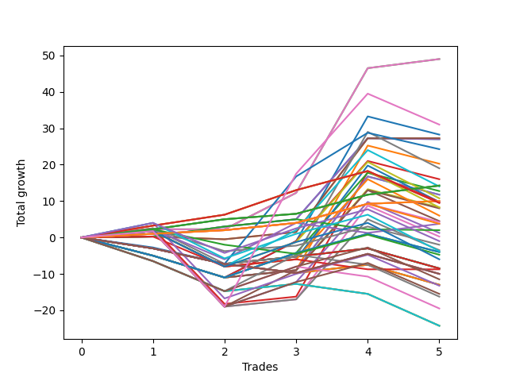

# Short Shepard 004 DB 
- Symbol: ES
- Date Range: 03/18/2022 - 07/15/2022
- Trading Period: 7:20-12:30
- Number of Trades: 5



| Name | Win Percent | Profit | Avg Profit / Trade | Avg Time / Trade |      | Name | Win Percent | Profit | Avg Profit / Trade | Avg Time / Trade |
| ---- | ----------- | ------ | ------------------ | ---------------- | ---- | ---- | ----------- | ------ | ------------------ | ---------------- |
| Sorted By <br> Profit | | | | | | Sorted By <br> Win Percentage ||||
| Two | 80.00 | 24500.00 | 4900.00 | 10:16 |     | Eighty-Two | 100.00 | 7125.00 | 1425.00 | 03:43 |
| Two Hundred Three.Five | 60.00 | 21625.00 | 4325.00 | 20:58 |     | Eighty-One | 100.00 | 5000.00 | 1000.00 | 02:19 |
| Two Hundred Four | 60.00 | 17125.00 | 3425.00 | 29:50 |     | Two | 80.00 | 24500.00 | 4900.00 | 10:16 |
| Two Hundred Three | 60.00 | 16750.00 | 3350.00 | 20:13 |     | Zero | 80.00 | 13500.00 | 2700.00 | 05:28 |
| Two Hundred Fifteen | 60.00 | 15500.00 | 3100.00 | 29:55 |     | Eighty-Three | 80.00 | 4875.00 | 975.00 | 10:08 |
| Two Hundred Fourteen.Five | 60.00 | 15500.00 | 3100.00 | 29:55 |     | Two Hundred Three.Five | 60.00 | 21625.00 | 4325.00 | 20:58 |
| Two Hundred Fourteen | 60.00 | 15500.00 | 3100.00 | 29:55 |     | Two Hundred Four | 60.00 | 17125.00 | 3425.00 | 29:50 |
| Two Hundred Thirteen.Five | 60.00 | 15500.00 | 3100.00 | 29:55 |     | Two Hundred Three | 60.00 | 16750.00 | 3350.00 | 20:13 |
| Two Hundred Thirteen | 60.00 | 15500.00 | 3100.00 | 29:55 |     | Two Hundred Fifteen | 60.00 | 15500.00 | 3100.00 | 29:55 |
| Two Hundred Twelve.Five | 60.00 | 15500.00 | 3100.00 | 29:55 |     | Two Hundred Fourteen.Five | 60.00 | 15500.00 | 3100.00 | 29:55 |
| Two Hundred Twelve | 60.00 | 15500.00 | 3100.00 | 29:55 |     | Two Hundred Fourteen | 60.00 | 15500.00 | 3100.00 | 29:55 |
| Two Hundred Eleven.Five | 60.00 | 15500.00 | 3100.00 | 29:55 |     | Two Hundred Thirteen.Five | 60.00 | 15500.00 | 3100.00 | 29:55 |
| Two Hundred Eleven | 60.00 | 15500.00 | 3100.00 | 29:55 |     | Two Hundred Thirteen | 60.00 | 15500.00 | 3100.00 | 29:55 |
| Two Hundred Ten.Five | 60.00 | 15500.00 | 3100.00 | 29:55 |     | Two Hundred Twelve.Five | 60.00 | 15500.00 | 3100.00 | 29:55 |
| Two Hundred Ten | 60.00 | 15500.00 | 3100.00 | 29:55 |     | Two Hundred Twelve | 60.00 | 15500.00 | 3100.00 | 29:55 |
| Two Hundred Nine.Five | 60.00 | 15500.00 | 3100.00 | 29:55 |     | Two Hundred Eleven.Five | 60.00 | 15500.00 | 3100.00 | 29:55 |
| Two Hundred Nine | 60.00 | 15500.00 | 3100.00 | 29:55 |     | Two Hundred Eleven | 60.00 | 15500.00 | 3100.00 | 29:55 |
| Two Hundred Eight.Five | 60.00 | 15500.00 | 3100.00 | 29:55 |     | Two Hundred Ten.Five | 60.00 | 15500.00 | 3100.00 | 29:55 |
| Two Hundred Eight | 60.00 | 15500.00 | 3100.00 | 29:55 |     | Two Hundred Ten | 60.00 | 15500.00 | 3100.00 | 29:55 |
| Two Hundred Seven.Five | 60.00 | 15500.00 | 3100.00 | 29:55 |     | Two Hundred Nine.Five | 60.00 | 15500.00 | 3100.00 | 29:55 |
| Two Hundred Seven | 60.00 | 15500.00 | 3100.00 | 29:55 |     | Two Hundred Nine | 60.00 | 15500.00 | 3100.00 | 29:55 |
| Two Hundred Six.Five | 60.00 | 15500.00 | 3100.00 | 29:55 |     | Two Hundred Eight.Five | 60.00 | 15500.00 | 3100.00 | 29:55 |
| Two Hundred Six | 60.00 | 15500.00 | 3100.00 | 29:55 |     | Two Hundred Eight | 60.00 | 15500.00 | 3100.00 | 29:55 |
| Two Hundred Five.Five | 60.00 | 15500.00 | 3100.00 | 29:55 |     | Two Hundred Seven.Five | 60.00 | 15500.00 | 3100.00 | 29:55 |
| Two Hundred Five | 60.00 | 15500.00 | 3100.00 | 29:55 |     | Two Hundred Seven | 60.00 | 15500.00 | 3100.00 | 29:55 |
| Two Hundred Four.Five | 60.00 | 15500.00 | 3100.00 | 29:55 |     | Two Hundred Six.Five | 60.00 | 15500.00 | 3100.00 | 29:55 |
| One | 60.00 | 13625.00 | 2725.00 | 08:31 |     | Two Hundred Six | 60.00 | 15500.00 | 3100.00 | 29:55 |
| Zero | 80.00 | 13500.00 | 2700.00 | 05:28 |     | Two Hundred Five.Five | 60.00 | 15500.00 | 3100.00 | 29:55 |
| Two Hundred Two.Five | 60.00 | 11625.00 | 2325.00 | 19:47 |     | Two Hundred Five | 60.00 | 15500.00 | 3100.00 | 29:55 |
| Two Hundred Two | 60.00 | 8250.00 | 1650.00 | 19:22 |     | Two Hundred Four.Five | 60.00 | 15500.00 | 3100.00 | 29:55 |
| Eighty-Two | 100.00 | 7125.00 | 1425.00 | 03:43 |     | One | 60.00 | 13625.00 | 2725.00 | 08:31 |
| Eighty-One | 100.00 | 5000.00 | 1000.00 | 02:19 |     | Two Hundred Two.Five | 60.00 | 11625.00 | 2325.00 | 19:47 |
| Eighty-Three | 80.00 | 4875.00 | 975.00 | 10:08 |     | Two Hundred Two | 60.00 | 8250.00 | 1650.00 | 19:22 |
| Three | 60.00 | 4750.00 | 950.00 | 19:33 |     | Three | 60.00 | 4750.00 | 950.00 | 19:33 |
| Two Hundred One.Five | 60.00 | 2750.00 | 550.00 | 19:16 |     | Two Hundred One.Five | 60.00 | 2750.00 | 550.00 | 19:16 |
| Five | 60.00 | 2250.00 | 450.00 | 24:09 |     | Five | 60.00 | 2250.00 | 450.00 | 24:09 |
| Four | 60.00 | 625.00 | 125.00 | 24:08 |     | Four | 60.00 | 625.00 | 125.00 | 24:08 |
| Six | 60.00 | 125.00 | 25.00 | 19:21 |     | Six | 60.00 | 125.00 | 25.00 | 19:21 |
| Two Hundred One | 60.00 | -1500.00 | -300.00 | 19:01 |     | Two Hundred One | 60.00 | -1500.00 | -300.00 | 19:01 |
| Ninety | 60.00 | -1500.00 | -300.00 | 19:01 |     | Ninety | 60.00 | -1500.00 | -300.00 | 19:01 |
| Seven | 60.00 | -1750.00 | -350.00 | 23:58 |     | Seven | 60.00 | -1750.00 | -350.00 | 23:58 |
| Eighty-Nine | 60.00 | -2000.00 | -400.00 | 19:00 |     | Eighty-Nine | 60.00 | -2000.00 | -400.00 | 19:00 |
| Eighty-Eight | 60.00 | -4375.00 | -875.00 | 18:59 |     | Eighty-Eight | 60.00 | -4375.00 | -875.00 | 18:59 |
| Eighty-Seven | 60.00 | -4375.00 | -875.00 | 18:59 |     | Eighty-Seven | 60.00 | -4375.00 | -875.00 | 18:59 |
| Eighty-Four | 60.00 | -6625.00 | -1325.00 | 14:50 |     | Eighty-Four | 60.00 | -6625.00 | -1325.00 | 14:50 |
| Eighty-Six | 60.00 | -7750.00 | -1550.00 | 18:11 |     | Eighty-Six | 60.00 | -7750.00 | -1550.00 | 18:11 |
| Eighty-Five | 60.00 | -7750.00 | -1550.00 | 18:11 |     | Eighty-Five | 60.00 | -7750.00 | -1550.00 | 18:11 |

## NO STOPLOSS

### Test Zero
* Sell when price hits the middle line of the 20p bollinger
* No Stoploss
* Results:
```
Total Trades: 5
Percent Up: 20.00
Percent Down: 80.00
Total Points Moved Down: 27.00
Potential Profit: 13500.00
Total Points Ups: 0.25 Count Ups: 1
Total Points Downs: 27.25 Count Downs: 4
```

<details><summary>Trades</summary>

<code>In: 2022-04-07 11:06:00		Out: 2022-04-07 11:15:20		Total Position Time: 09:20		Total Move Down: 0.25		Total to Date: 0.25</code> <br />
<code>In: 2022-05-25 11:33:00		Out: 2022-05-25 11:39:10		Total Position Time: 06:10		Total Move Down: 2.75		Total to Date: 3.00</code> <br />
<code>In: 2022-06-15 11:02:00		Out: 2022-06-15 11:02:10		Total Position Time: 00:10		Total Move Down: 2.00		Total to Date: 5.00</code> <br />
<code>In: 2022-06-15 11:48:00		Out: 2022-06-15 11:52:30		Total Position Time: 04:30		Total Move Down: 22.25		Total to Date: 27.25</code> <br />
<code>In: 2022-07-05 08:53:00		Out: 2022-07-05 09:00:10		Total Position Time: 07:10		Total Move Down: -0.25		Total to Date: 27.00</code> <br />


</details>

### Test One
* Sell when the price hits the upper line of the 20p 1std bollinger
* No Stoploss
* Results:
```
Total Trades: 5
Percent Up: 40.00
Percent Down: 60.00
Total Points Moved Down: 27.25
Potential Profit: 13625.00
Total Points Ups: 0.75 Count Ups: 2
Total Points Downs: 28.00 Count Downs: 3
```

<details><summary>Trades</summary>

<code>In: 2022-04-07 11:06:00		Out: 2022-04-07 11:16:10		Total Position Time: 10:10		Total Move Down: 0.25		Total to Date: 0.25</code> <br />
<code>In: 2022-05-25 11:33:00		Out: 2022-05-25 11:45:15		Total Position Time: 12:15		Total Move Down: -0.75		Total to Date: -0.50</code> <br />
<code>In: 2022-06-15 11:02:00		Out: 2022-06-15 11:02:10		Total Position Time: 00:10		Total Move Down: 2.00		Total to Date: 1.50</code> <br />
<code>In: 2022-06-15 11:48:00		Out: 2022-06-15 11:57:35		Total Position Time: 09:35		Total Move Down: 25.75		Total to Date: 27.25</code> <br />
<code>In: 2022-07-05 08:53:00		Out: 2022-07-05 09:03:25		Total Position Time: 10:25		Total Move Down: -0.00		Total to Date: 27.25</code> <br />


</details>

### Test Two
* Sell when the price hits the upper line of the 20p 2std bollinger
* No Stoploss
* Results:
```
Total Trades: 5
Percent Up: 20.00
Percent Down: 80.00
Total Points Moved Down: 49.00
Potential Profit: 24500.00
Total Points Ups: 0.00 Count Ups: 1
Total Points Downs: 49.00 Count Downs: 4
```

<details><summary>Trades</summary>

<code>In: 2022-04-07 11:06:00		Out: 2022-04-07 11:18:20		Total Position Time: 12:20		Total Move Down: 2.25		Total to Date: 2.25</code> <br />
<code>In: 2022-05-25 11:33:00		Out: 2022-05-25 11:50:00		Total Position Time: 17:00		Total Move Down: -0.00		Total to Date: 2.25</code> <br />
<code>In: 2022-06-15 11:02:00		Out: 2022-06-15 11:03:05		Total Position Time: 01:05		Total Move Down: 10.00		Total to Date: 12.25</code> <br />
<code>In: 2022-06-15 11:48:00		Out: 2022-06-15 11:58:05		Total Position Time: 10:05		Total Move Down: 34.25		Total to Date: 46.50</code> <br />
<code>In: 2022-07-05 08:53:00		Out: 2022-07-05 09:03:50		Total Position Time: 10:50		Total Move Down: 2.50		Total to Date: 49.00</code> <br />


</details>

### Test Three
* Sell when price hits the middle line of the 50p bollinger
* No Stoploss
* Results:
```
Total Trades: 5
Percent Up: 40.00
Percent Down: 60.00
Total Points Moved Down: 9.50
Potential Profit: 4750.00
Total Points Ups: 29.25 Count Ups: 2
Total Points Downs: 38.75 Count Downs: 3
```

<details><summary>Trades</summary>

<code>In: 2022-04-07 11:06:00		Out: 2022-04-07 11:33:40		Total Position Time: 27:40		Total Move Down: 2.50		Total to Date: 2.50</code> <br />
<code>In: 2022-05-25 11:33:00		Out: 2022-05-25 12:02:55		Total Position Time: 29:55		Total Move Down: -20.75		Total to Date: -18.25</code> <br />
<code>In: 2022-06-15 11:02:00		Out: 2022-06-15 11:02:10		Total Position Time: 00:10		Total Move Down: 2.00		Total to Date: -16.25</code> <br />
<code>In: 2022-06-15 11:48:00		Out: 2022-06-15 11:58:05		Total Position Time: 10:05		Total Move Down: 34.25		Total to Date: 18.00</code> <br />
<code>In: 2022-07-05 08:53:00		Out: 2022-07-05 09:22:55		Total Position Time: 29:55		Total Move Down: -8.50		Total to Date: 9.50</code> <br />


</details>

### Test Four
* Sell when the price hits the upper line of the 50p 1std bollinger
* No Stoploss
* Results:
```
Total Trades: 5
Percent Up: 40.00
Percent Down: 60.00
Total Points Moved Down: 1.25
Potential Profit: 625.00
Total Points Ups: 29.25 Count Ups: 2
Total Points Downs: 30.50 Count Downs: 3
```

<details><summary>Trades</summary>

<code>In: 2022-04-07 11:06:00		Out: 2022-04-07 11:35:55		Total Position Time: 29:55		Total Move Down: 1.75		Total to Date: 1.75</code> <br />
<code>In: 2022-05-25 11:33:00		Out: 2022-05-25 12:02:55		Total Position Time: 29:55		Total Move Down: -20.75		Total to Date: -19.00</code> <br />
<code>In: 2022-06-15 11:02:00		Out: 2022-06-15 11:03:00		Total Position Time: 01:00		Total Move Down: 6.75		Total to Date: -12.25</code> <br />
<code>In: 2022-06-15 11:48:00		Out: 2022-06-15 12:17:55		Total Position Time: 29:55		Total Move Down: 22.00		Total to Date: 9.75</code> <br />
<code>In: 2022-07-05 08:53:00		Out: 2022-07-05 09:22:55		Total Position Time: 29:55		Total Move Down: -8.50		Total to Date: 1.25</code> <br />


</details>

### Test Five
* Sell when the price hits the upper line of the 50p 2std bollinger
* No Stoploss
* Results:
```
Total Trades: 5
Percent Up: 40.00
Percent Down: 60.00
Total Points Moved Down: 4.50
Potential Profit: 2250.00
Total Points Ups: 29.25 Count Ups: 2
Total Points Downs: 33.75 Count Downs: 3
```

<details><summary>Trades</summary>

<code>In: 2022-04-07 11:06:00		Out: 2022-04-07 11:35:55		Total Position Time: 29:55		Total Move Down: 1.75		Total to Date: 1.75</code> <br />
<code>In: 2022-05-25 11:33:00		Out: 2022-05-25 12:02:55		Total Position Time: 29:55		Total Move Down: -20.75		Total to Date: -19.00</code> <br />
<code>In: 2022-06-15 11:02:00		Out: 2022-06-15 11:03:05		Total Position Time: 01:05		Total Move Down: 10.00		Total to Date: -9.00</code> <br />
<code>In: 2022-06-15 11:48:00		Out: 2022-06-15 12:17:55		Total Position Time: 29:55		Total Move Down: 22.00		Total to Date: 13.00</code> <br />
<code>In: 2022-07-05 08:53:00		Out: 2022-07-05 09:22:55		Total Position Time: 29:55		Total Move Down: -8.50		Total to Date: 4.50</code> <br />


</details>

### Test Six
* Sell when the price hits the middle line of the 1std VWAP
* No Stoploss
* Results:
```
Total Trades: 5
Percent Up: 40.00
Percent Down: 60.00
Total Points Moved Down: 0.25
Potential Profit: 125.00
Total Points Ups: 29.25 Count Ups: 2
Total Points Downs: 29.50 Count Downs: 3
```

<details><summary>Trades</summary>

<code>In: 2022-04-07 11:06:00		Out: 2022-04-07 11:35:55		Total Position Time: 29:55		Total Move Down: 1.75		Total to Date: 1.75</code> <br />
<code>In: 2022-05-25 11:33:00		Out: 2022-05-25 12:02:55		Total Position Time: 29:55		Total Move Down: -20.75		Total to Date: -19.00</code> <br />
<code>In: 2022-06-15 11:02:00		Out: 2022-06-15 11:02:10		Total Position Time: 00:10		Total Move Down: 2.00		Total to Date: -17.00</code> <br />
<code>In: 2022-06-15 11:48:00		Out: 2022-06-15 11:54:50		Total Position Time: 06:50		Total Move Down: 25.75		Total to Date: 8.75</code> <br />
<code>In: 2022-07-05 08:53:00		Out: 2022-07-05 09:22:55		Total Position Time: 29:55		Total Move Down: -8.50		Total to Date: 0.25</code> <br />


</details>

### Test Seven
* Sell when the price hits the upper line of the 1std VWAP
* No Stoploss
* Results:
```
Total Trades: 5
Percent Up: 40.00
Percent Down: 60.00
Total Points Moved Down: -3.50
Potential Profit: -1750.00
Total Points Ups: 29.25 Count Ups: 2
Total Points Downs: 25.75 Count Downs: 3
```

<details><summary>Trades</summary>

<code>In: 2022-04-07 11:06:00		Out: 2022-04-07 11:35:55		Total Position Time: 29:55		Total Move Down: 1.75		Total to Date: 1.75</code> <br />
<code>In: 2022-05-25 11:33:00		Out: 2022-05-25 12:02:55		Total Position Time: 29:55		Total Move Down: -20.75		Total to Date: -19.00</code> <br />
<code>In: 2022-06-15 11:02:00		Out: 2022-06-15 11:02:10		Total Position Time: 00:10		Total Move Down: 2.00		Total to Date: -17.00</code> <br />
<code>In: 2022-06-15 11:48:00		Out: 2022-06-15 12:17:55		Total Position Time: 29:55		Total Move Down: 22.00		Total to Date: 5.00</code> <br />
<code>In: 2022-07-05 08:53:00		Out: 2022-07-05 09:22:55		Total Position Time: 29:55		Total Move Down: -8.50		Total to Date: -3.50</code> <br />


</details>

## TAKE PROFIT

### Test Eighty-One
* Take Profit of 1 Point
* No Stoploss
* Results:
```
Total Trades: 5
Percent Up: 0.00
Percent Down: 100.00
Total Points Moved Down: 10.00
Potential Profit: 5000.00
Total Points Ups: 0.00 Count Ups: 0
Total Points Downs: 10.00 Count Downs: 5
```

<details><summary>Trades</summary>

<code>In: 2022-04-07 11:06:00		Out: 2022-04-07 11:06:15		Total Position Time: 00:15		Total Move Down: 1.00		Total to Date: 1.00</code> <br />
<code>In: 2022-05-25 11:33:00		Out: 2022-05-25 11:33:15		Total Position Time: 00:15		Total Move Down: 1.00		Total to Date: 2.00</code> <br />
<code>In: 2022-06-15 11:02:00		Out: 2022-06-15 11:02:10		Total Position Time: 00:10		Total Move Down: 2.00		Total to Date: 4.00</code> <br />
<code>In: 2022-06-15 11:48:00		Out: 2022-06-15 11:48:10		Total Position Time: 00:10		Total Move Down: 5.25		Total to Date: 9.25</code> <br />
<code>In: 2022-07-05 08:53:00		Out: 2022-07-05 09:03:45		Total Position Time: 10:45		Total Move Down: 0.75		Total to Date: 10.00</code> <br />


</details>

### Test Eighty-Two
* Take Profit of 2 Point
* No Stoploss
* Results:
```
Total Trades: 5
Percent Up: 0.00
Percent Down: 100.00
Total Points Moved Down: 14.25
Potential Profit: 7125.00
Total Points Ups: 0.00 Count Ups: 0
Total Points Downs: 14.25 Count Downs: 5
```

<details><summary>Trades</summary>

<code>In: 2022-04-07 11:06:00		Out: 2022-04-07 11:06:40		Total Position Time: 00:40		Total Move Down: 2.25		Total to Date: 2.25</code> <br />
<code>In: 2022-05-25 11:33:00		Out: 2022-05-25 11:39:10		Total Position Time: 06:10		Total Move Down: 2.75		Total to Date: 5.00</code> <br />
<code>In: 2022-06-15 11:02:00		Out: 2022-06-15 11:02:45		Total Position Time: 00:45		Total Move Down: 1.50		Total to Date: 6.50</code> <br />
<code>In: 2022-06-15 11:48:00		Out: 2022-06-15 11:48:10		Total Position Time: 00:10		Total Move Down: 5.25		Total to Date: 11.75</code> <br />
<code>In: 2022-07-05 08:53:00		Out: 2022-07-05 09:03:50		Total Position Time: 10:50		Total Move Down: 2.50		Total to Date: 14.25</code> <br />


</details>

### Test Eighty-Three
* Take Profit of 3 Point
* No Stoploss
* Results:
```
Total Trades: 5
Percent Up: 20.00
Percent Down: 80.00
Total Points Moved Down: 9.75
Potential Profit: 4875.00
Total Points Ups: 8.50 Count Ups: 1
Total Points Downs: 18.25 Count Downs: 4
```

<details><summary>Trades</summary>

<code>In: 2022-04-07 11:06:00		Out: 2022-04-07 11:18:40		Total Position Time: 12:40		Total Move Down: 3.25		Total to Date: 3.25</code> <br />
<code>In: 2022-05-25 11:33:00		Out: 2022-05-25 11:39:55		Total Position Time: 06:55		Total Move Down: 3.00		Total to Date: 6.25</code> <br />
<code>In: 2022-06-15 11:02:00		Out: 2022-06-15 11:03:00		Total Position Time: 01:00		Total Move Down: 6.75		Total to Date: 13.00</code> <br />
<code>In: 2022-06-15 11:48:00		Out: 2022-06-15 11:48:10		Total Position Time: 00:10		Total Move Down: 5.25		Total to Date: 18.25</code> <br />
<code>In: 2022-07-05 08:53:00		Out: 2022-07-05 09:22:55		Total Position Time: 29:55		Total Move Down: -8.50		Total to Date: 9.75</code> <br />


</details>

### Test Eighty-Four
* Take Profit of 4 Point
* No Stoploss
* Results:
```
Total Trades: 5
Percent Up: 40.00
Percent Down: 60.00
Total Points Moved Down: -13.25
Potential Profit: -6625.00
Total Points Ups: 29.25 Count Ups: 2
Total Points Downs: 16.00 Count Downs: 3
```

<details><summary>Trades</summary>

<code>In: 2022-04-07 11:06:00		Out: 2022-04-07 11:19:10		Total Position Time: 13:10		Total Move Down: 4.00		Total to Date: 4.00</code> <br />
<code>In: 2022-05-25 11:33:00		Out: 2022-05-25 12:02:55		Total Position Time: 29:55		Total Move Down: -20.75		Total to Date: -16.75</code> <br />
<code>In: 2022-06-15 11:02:00		Out: 2022-06-15 11:03:00		Total Position Time: 01:00		Total Move Down: 6.75		Total to Date: -10.00</code> <br />
<code>In: 2022-06-15 11:48:00		Out: 2022-06-15 11:48:10		Total Position Time: 00:10		Total Move Down: 5.25		Total to Date: -4.75</code> <br />
<code>In: 2022-07-05 08:53:00		Out: 2022-07-05 09:22:55		Total Position Time: 29:55		Total Move Down: -8.50		Total to Date: -13.25</code> <br />


</details>

### Test Eighty-Five
* Take Profit of 5 Point
* No Stoploss
* Results:
```
Total Trades: 5
Percent Up: 40.00
Percent Down: 60.00
Total Points Moved Down: -15.50
Potential Profit: -7750.00
Total Points Ups: 29.25 Count Ups: 2
Total Points Downs: 13.75 Count Downs: 3
```

<details><summary>Trades</summary>

<code>In: 2022-04-07 11:06:00		Out: 2022-04-07 11:35:55		Total Position Time: 29:55		Total Move Down: 1.75		Total to Date: 1.75</code> <br />
<code>In: 2022-05-25 11:33:00		Out: 2022-05-25 12:02:55		Total Position Time: 29:55		Total Move Down: -20.75		Total to Date: -19.00</code> <br />
<code>In: 2022-06-15 11:02:00		Out: 2022-06-15 11:03:00		Total Position Time: 01:00		Total Move Down: 6.75		Total to Date: -12.25</code> <br />
<code>In: 2022-06-15 11:48:00		Out: 2022-06-15 11:48:10		Total Position Time: 00:10		Total Move Down: 5.25		Total to Date: -7.00</code> <br />
<code>In: 2022-07-05 08:53:00		Out: 2022-07-05 09:22:55		Total Position Time: 29:55		Total Move Down: -8.50		Total to Date: -15.50</code> <br />


</details>

### Test Eighty-Six
* Take Profit of 6 Point
* No Stoploss
* Results:
```
Total Trades: 5
Percent Up: 40.00
Percent Down: 60.00
Total Points Moved Down: -15.50
Potential Profit: -7750.00
Total Points Ups: 29.25 Count Ups: 2
Total Points Downs: 13.75 Count Downs: 3
```

<details><summary>Trades</summary>

<code>In: 2022-04-07 11:06:00		Out: 2022-04-07 11:35:55		Total Position Time: 29:55		Total Move Down: 1.75		Total to Date: 1.75</code> <br />
<code>In: 2022-05-25 11:33:00		Out: 2022-05-25 12:02:55		Total Position Time: 29:55		Total Move Down: -20.75		Total to Date: -19.00</code> <br />
<code>In: 2022-06-15 11:02:00		Out: 2022-06-15 11:03:00		Total Position Time: 01:00		Total Move Down: 6.75		Total to Date: -12.25</code> <br />
<code>In: 2022-06-15 11:48:00		Out: 2022-06-15 11:48:10		Total Position Time: 00:10		Total Move Down: 5.25		Total to Date: -7.00</code> <br />
<code>In: 2022-07-05 08:53:00		Out: 2022-07-05 09:22:55		Total Position Time: 29:55		Total Move Down: -8.50		Total to Date: -15.50</code> <br />


</details>

### Test Eighty-Seven
* Take Profit of 7 Point
* No Stoploss
* Results:
```
Total Trades: 5
Percent Up: 40.00
Percent Down: 60.00
Total Points Moved Down: -8.75
Potential Profit: -4375.00
Total Points Ups: 29.25 Count Ups: 2
Total Points Downs: 20.50 Count Downs: 3
```

<details><summary>Trades</summary>

<code>In: 2022-04-07 11:06:00		Out: 2022-04-07 11:35:55		Total Position Time: 29:55		Total Move Down: 1.75		Total to Date: 1.75</code> <br />
<code>In: 2022-05-25 11:33:00		Out: 2022-05-25 12:02:55		Total Position Time: 29:55		Total Move Down: -20.75		Total to Date: -19.00</code> <br />
<code>In: 2022-06-15 11:02:00		Out: 2022-06-15 11:03:05		Total Position Time: 01:05		Total Move Down: 10.00		Total to Date: -9.00</code> <br />
<code>In: 2022-06-15 11:48:00		Out: 2022-06-15 11:52:05		Total Position Time: 04:05		Total Move Down: 8.75		Total to Date: -0.25</code> <br />
<code>In: 2022-07-05 08:53:00		Out: 2022-07-05 09:22:55		Total Position Time: 29:55		Total Move Down: -8.50		Total to Date: -8.75</code> <br />


</details>

### Test Eighty-Eight
* Take Profit of 8 Point
* No Stoploss
* Results:
```
Total Trades: 5
Percent Up: 40.00
Percent Down: 60.00
Total Points Moved Down: -8.75
Potential Profit: -4375.00
Total Points Ups: 29.25 Count Ups: 2
Total Points Downs: 20.50 Count Downs: 3
```

<details><summary>Trades</summary>

<code>In: 2022-04-07 11:06:00		Out: 2022-04-07 11:35:55		Total Position Time: 29:55		Total Move Down: 1.75		Total to Date: 1.75</code> <br />
<code>In: 2022-05-25 11:33:00		Out: 2022-05-25 12:02:55		Total Position Time: 29:55		Total Move Down: -20.75		Total to Date: -19.00</code> <br />
<code>In: 2022-06-15 11:02:00		Out: 2022-06-15 11:03:05		Total Position Time: 01:05		Total Move Down: 10.00		Total to Date: -9.00</code> <br />
<code>In: 2022-06-15 11:48:00		Out: 2022-06-15 11:52:05		Total Position Time: 04:05		Total Move Down: 8.75		Total to Date: -0.25</code> <br />
<code>In: 2022-07-05 08:53:00		Out: 2022-07-05 09:22:55		Total Position Time: 29:55		Total Move Down: -8.50		Total to Date: -8.75</code> <br />


</details>

### Test Eighty-Nine
* Take Profit of 9 Point
* No Stoploss
* Results:
```
Total Trades: 5
Percent Up: 40.00
Percent Down: 60.00
Total Points Moved Down: -4.00
Potential Profit: -2000.00
Total Points Ups: 29.25 Count Ups: 2
Total Points Downs: 25.25 Count Downs: 3
```

<details><summary>Trades</summary>

<code>In: 2022-04-07 11:06:00		Out: 2022-04-07 11:35:55		Total Position Time: 29:55		Total Move Down: 1.75		Total to Date: 1.75</code> <br />
<code>In: 2022-05-25 11:33:00		Out: 2022-05-25 12:02:55		Total Position Time: 29:55		Total Move Down: -20.75		Total to Date: -19.00</code> <br />
<code>In: 2022-06-15 11:02:00		Out: 2022-06-15 11:03:05		Total Position Time: 01:05		Total Move Down: 10.00		Total to Date: -9.00</code> <br />
<code>In: 2022-06-15 11:48:00		Out: 2022-06-15 11:52:10		Total Position Time: 04:10		Total Move Down: 13.50		Total to Date: 4.50</code> <br />
<code>In: 2022-07-05 08:53:00		Out: 2022-07-05 09:22:55		Total Position Time: 29:55		Total Move Down: -8.50		Total to Date: -4.00</code> <br />


</details>

### Test Ninety
* Take Profit of 10 Point
* No Stoploss
* Results:
```
Total Trades: 5
Percent Up: 40.00
Percent Down: 60.00
Total Points Moved Down: -3.00
Potential Profit: -1500.00
Total Points Ups: 29.25 Count Ups: 2
Total Points Downs: 26.25 Count Downs: 3
```

<details><summary>Trades</summary>

<code>In: 2022-04-07 11:06:00		Out: 2022-04-07 11:35:55		Total Position Time: 29:55		Total Move Down: 1.75		Total to Date: 1.75</code> <br />
<code>In: 2022-05-25 11:33:00		Out: 2022-05-25 12:02:55		Total Position Time: 29:55		Total Move Down: -20.75		Total to Date: -19.00</code> <br />
<code>In: 2022-06-15 11:02:00		Out: 2022-06-15 11:03:10		Total Position Time: 01:10		Total Move Down: 11.00		Total to Date: -8.00</code> <br />
<code>In: 2022-06-15 11:48:00		Out: 2022-06-15 11:52:10		Total Position Time: 04:10		Total Move Down: 13.50		Total to Date: 5.50</code> <br />
<code>In: 2022-07-05 08:53:00		Out: 2022-07-05 09:22:55		Total Position Time: 29:55		Total Move Down: -8.50		Total to Date: -3.00</code> <br />


</details>

## DAILY TAKE PROFITS

### Test Two Hundred One
* Take Profit of 10 Point
* No Stoploss
* Results:
```
Total Trades: 5
Percent Up: 40.00
Percent Down: 60.00
Total Points Moved Down: -3.00
Potential Profit: -1500.00
Total Points Ups: 29.25 Count Ups: 2
Total Points Downs: 26.25 Count Downs: 3
```

<details><summary>Trades</summary>

<code>In: 2022-04-07 11:06:00		Out: 2022-04-07 11:35:55		Total Position Time: 29:55		Total Move Down: 1.75		Total to Date: 1.75</code> <br />
<code>In: 2022-05-25 11:33:00		Out: 2022-05-25 12:02:55		Total Position Time: 29:55		Total Move Down: -20.75		Total to Date: -19.00</code> <br />
<code>In: 2022-06-15 11:02:00		Out: 2022-06-15 11:03:10		Total Position Time: 01:10		Total Move Down: 11.00		Total to Date: -8.00</code> <br />
<code>In: 2022-06-15 11:48:00		Out: 2022-06-15 11:52:10		Total Position Time: 04:10		Total Move Down: 13.50		Total to Date: 5.50</code> <br />
<code>In: 2022-07-05 08:53:00		Out: 2022-07-05 09:22:55		Total Position Time: 29:55		Total Move Down: -8.50		Total to Date: -3.00</code> <br />


</details>

### Test Two Hundred One.Five
* Take Profit of 15 Point
* No Stoploss
* Results:
```
Total Trades: 5
Percent Up: 40.00
Percent Down: 60.00
Total Points Moved Down: 5.50
Potential Profit: 2750.00
Total Points Ups: 29.25 Count Ups: 2
Total Points Downs: 34.75 Count Downs: 3
```

<details><summary>Trades</summary>

<code>In: 2022-04-07 11:06:00		Out: 2022-04-07 11:35:55		Total Position Time: 29:55		Total Move Down: 1.75		Total to Date: 1.75</code> <br />
<code>In: 2022-05-25 11:33:00		Out: 2022-05-25 12:02:55		Total Position Time: 29:55		Total Move Down: -20.75		Total to Date: -19.00</code> <br />
<code>In: 2022-06-15 11:02:00		Out: 2022-06-15 11:04:20		Total Position Time: 02:20		Total Move Down: 14.50		Total to Date: -4.50</code> <br />
<code>In: 2022-06-15 11:48:00		Out: 2022-06-15 11:52:15		Total Position Time: 04:15		Total Move Down: 18.50		Total to Date: 14.00</code> <br />
<code>In: 2022-07-05 08:53:00		Out: 2022-07-05 09:22:55		Total Position Time: 29:55		Total Move Down: -8.50		Total to Date: 5.50</code> <br />


</details>

### Test Two Hundred Two
* Take Profit of 20 Point
* No Stoploss
* Results:
```
Total Trades: 5
Percent Up: 40.00
Percent Down: 60.00
Total Points Moved Down: 16.50
Potential Profit: 8250.00
Total Points Ups: 29.25 Count Ups: 2
Total Points Downs: 45.75 Count Downs: 3
```

<details><summary>Trades</summary>

<code>In: 2022-04-07 11:06:00		Out: 2022-04-07 11:35:55		Total Position Time: 29:55		Total Move Down: 1.75		Total to Date: 1.75</code> <br />
<code>In: 2022-05-25 11:33:00		Out: 2022-05-25 12:02:55		Total Position Time: 29:55		Total Move Down: -20.75		Total to Date: -19.00</code> <br />
<code>In: 2022-06-15 11:02:00		Out: 2022-06-15 11:04:35		Total Position Time: 02:35		Total Move Down: 21.75		Total to Date: 2.75</code> <br />
<code>In: 2022-06-15 11:48:00		Out: 2022-06-15 11:52:30		Total Position Time: 04:30		Total Move Down: 22.25		Total to Date: 25.00</code> <br />
<code>In: 2022-07-05 08:53:00		Out: 2022-07-05 09:22:55		Total Position Time: 29:55		Total Move Down: -8.50		Total to Date: 16.50</code> <br />


</details>

### Test Two Hundred Two.Five
* Take Profit of 25 Point
* No Stoploss
* Results:
```
Total Trades: 5
Percent Up: 40.00
Percent Down: 60.00
Total Points Moved Down: 23.25
Potential Profit: 11625.00
Total Points Ups: 29.25 Count Ups: 2
Total Points Downs: 52.50 Count Downs: 3
```

<details><summary>Trades</summary>

<code>In: 2022-04-07 11:06:00		Out: 2022-04-07 11:35:55		Total Position Time: 29:55		Total Move Down: 1.75		Total to Date: 1.75</code> <br />
<code>In: 2022-05-25 11:33:00		Out: 2022-05-25 12:02:55		Total Position Time: 29:55		Total Move Down: -20.75		Total to Date: -19.00</code> <br />
<code>In: 2022-06-15 11:02:00		Out: 2022-06-15 11:04:40		Total Position Time: 02:40		Total Move Down: 24.75		Total to Date: 5.75</code> <br />
<code>In: 2022-06-15 11:48:00		Out: 2022-06-15 11:54:30		Total Position Time: 06:30		Total Move Down: 26.00		Total to Date: 31.75</code> <br />
<code>In: 2022-07-05 08:53:00		Out: 2022-07-05 09:22:55		Total Position Time: 29:55		Total Move Down: -8.50		Total to Date: 23.25</code> <br />


</details>

### Test Two Hundred Three
* Take Profit of 30 Point
* No Stoploss
* Results:
```
Total Trades: 5
Percent Up: 40.00
Percent Down: 60.00
Total Points Moved Down: 33.50
Potential Profit: 16750.00
Total Points Ups: 29.25 Count Ups: 2
Total Points Downs: 62.75 Count Downs: 3
```

<details><summary>Trades</summary>

<code>In: 2022-04-07 11:06:00		Out: 2022-04-07 11:35:55		Total Position Time: 29:55		Total Move Down: 1.75		Total to Date: 1.75</code> <br />
<code>In: 2022-05-25 11:33:00		Out: 2022-05-25 12:02:55		Total Position Time: 29:55		Total Move Down: -20.75		Total to Date: -19.00</code> <br />
<code>In: 2022-06-15 11:02:00		Out: 2022-06-15 11:06:35		Total Position Time: 04:35		Total Move Down: 31.25		Total to Date: 12.25</code> <br />
<code>In: 2022-06-15 11:48:00		Out: 2022-06-15 11:54:45		Total Position Time: 06:45		Total Move Down: 29.75		Total to Date: 42.00</code> <br />
<code>In: 2022-07-05 08:53:00		Out: 2022-07-05 09:22:55		Total Position Time: 29:55		Total Move Down: -8.50		Total to Date: 33.50</code> <br />


</details>

### Test Two Hundred Three.Five
* Take Profit of 35 Point
* No Stoploss
* Results:
```
Total Trades: 5
Percent Up: 40.00
Percent Down: 60.00
Total Points Moved Down: 43.25
Potential Profit: 21625.00
Total Points Ups: 29.25 Count Ups: 2
Total Points Downs: 72.50 Count Downs: 3
```

<details><summary>Trades</summary>

<code>In: 2022-04-07 11:06:00		Out: 2022-04-07 11:35:55		Total Position Time: 29:55		Total Move Down: 1.75		Total to Date: 1.75</code> <br />
<code>In: 2022-05-25 11:33:00		Out: 2022-05-25 12:02:55		Total Position Time: 29:55		Total Move Down: -20.75		Total to Date: -19.00</code> <br />
<code>In: 2022-06-15 11:02:00		Out: 2022-06-15 11:06:55		Total Position Time: 04:55		Total Move Down: 35.75		Total to Date: 16.75</code> <br />
<code>In: 2022-06-15 11:48:00		Out: 2022-06-15 11:58:10		Total Position Time: 10:10		Total Move Down: 35.00		Total to Date: 51.75</code> <br />
<code>In: 2022-07-05 08:53:00		Out: 2022-07-05 09:22:55		Total Position Time: 29:55		Total Move Down: -8.50		Total to Date: 43.25</code> <br />


</details>

### Test Two Hundred Four
* Take Profit of 40 Point
* No Stoploss
* Results:
```
Total Trades: 5
Percent Up: 40.00
Percent Down: 60.00
Total Points Moved Down: 34.25
Potential Profit: 17125.00
Total Points Ups: 29.25 Count Ups: 2
Total Points Downs: 63.50 Count Downs: 3
```

<details><summary>Trades</summary>

<code>In: 2022-04-07 11:06:00		Out: 2022-04-07 11:35:55		Total Position Time: 29:55		Total Move Down: 1.75		Total to Date: 1.75</code> <br />
<code>In: 2022-05-25 11:33:00		Out: 2022-05-25 12:02:55		Total Position Time: 29:55		Total Move Down: -20.75		Total to Date: -19.00</code> <br />
<code>In: 2022-06-15 11:02:00		Out: 2022-06-15 11:31:30		Total Position Time: 29:30		Total Move Down: 39.75		Total to Date: 20.75</code> <br />
<code>In: 2022-06-15 11:48:00		Out: 2022-06-15 12:17:55		Total Position Time: 29:55		Total Move Down: 22.00		Total to Date: 42.75</code> <br />
<code>In: 2022-07-05 08:53:00		Out: 2022-07-05 09:22:55		Total Position Time: 29:55		Total Move Down: -8.50		Total to Date: 34.25</code> <br />


</details>

### Test Two Hundred Four.Five
* Take Profit of 45 Point
* No Stoploss
* Results:
```
Total Trades: 5
Percent Up: 40.00
Percent Down: 60.00
Total Points Moved Down: 31.00
Potential Profit: 15500.00
Total Points Ups: 29.25 Count Ups: 2
Total Points Downs: 60.25 Count Downs: 3
```

<details><summary>Trades</summary>

<code>In: 2022-04-07 11:06:00		Out: 2022-04-07 11:35:55		Total Position Time: 29:55		Total Move Down: 1.75		Total to Date: 1.75</code> <br />
<code>In: 2022-05-25 11:33:00		Out: 2022-05-25 12:02:55		Total Position Time: 29:55		Total Move Down: -20.75		Total to Date: -19.00</code> <br />
<code>In: 2022-06-15 11:02:00		Out: 2022-06-15 11:31:55		Total Position Time: 29:55		Total Move Down: 36.50		Total to Date: 17.50</code> <br />
<code>In: 2022-06-15 11:48:00		Out: 2022-06-15 12:17:55		Total Position Time: 29:55		Total Move Down: 22.00		Total to Date: 39.50</code> <br />
<code>In: 2022-07-05 08:53:00		Out: 2022-07-05 09:22:55		Total Position Time: 29:55		Total Move Down: -8.50		Total to Date: 31.00</code> <br />


</details>

### Test Two Hundred Five
* Take Profit of 50 Point
* No Stoploss
* Results:
```
Total Trades: 5
Percent Up: 40.00
Percent Down: 60.00
Total Points Moved Down: 31.00
Potential Profit: 15500.00
Total Points Ups: 29.25 Count Ups: 2
Total Points Downs: 60.25 Count Downs: 3
```

<details><summary>Trades</summary>

<code>In: 2022-04-07 11:06:00		Out: 2022-04-07 11:35:55		Total Position Time: 29:55		Total Move Down: 1.75		Total to Date: 1.75</code> <br />
<code>In: 2022-05-25 11:33:00		Out: 2022-05-25 12:02:55		Total Position Time: 29:55		Total Move Down: -20.75		Total to Date: -19.00</code> <br />
<code>In: 2022-06-15 11:02:00		Out: 2022-06-15 11:31:55		Total Position Time: 29:55		Total Move Down: 36.50		Total to Date: 17.50</code> <br />
<code>In: 2022-06-15 11:48:00		Out: 2022-06-15 12:17:55		Total Position Time: 29:55		Total Move Down: 22.00		Total to Date: 39.50</code> <br />
<code>In: 2022-07-05 08:53:00		Out: 2022-07-05 09:22:55		Total Position Time: 29:55		Total Move Down: -8.50		Total to Date: 31.00</code> <br />


</details>

### Test Two Hundred Five.Five
* Take Profit of 55 Point
* No Stoploss
* Results:
```
Total Trades: 5
Percent Up: 40.00
Percent Down: 60.00
Total Points Moved Down: 31.00
Potential Profit: 15500.00
Total Points Ups: 29.25 Count Ups: 2
Total Points Downs: 60.25 Count Downs: 3
```

<details><summary>Trades</summary>

<code>In: 2022-04-07 11:06:00		Out: 2022-04-07 11:35:55		Total Position Time: 29:55		Total Move Down: 1.75		Total to Date: 1.75</code> <br />
<code>In: 2022-05-25 11:33:00		Out: 2022-05-25 12:02:55		Total Position Time: 29:55		Total Move Down: -20.75		Total to Date: -19.00</code> <br />
<code>In: 2022-06-15 11:02:00		Out: 2022-06-15 11:31:55		Total Position Time: 29:55		Total Move Down: 36.50		Total to Date: 17.50</code> <br />
<code>In: 2022-06-15 11:48:00		Out: 2022-06-15 12:17:55		Total Position Time: 29:55		Total Move Down: 22.00		Total to Date: 39.50</code> <br />
<code>In: 2022-07-05 08:53:00		Out: 2022-07-05 09:22:55		Total Position Time: 29:55		Total Move Down: -8.50		Total to Date: 31.00</code> <br />


</details>

### Test Two Hundred Six
* Take Profit of 60 Point
* No Stoploss
* Results:
```
Total Trades: 5
Percent Up: 40.00
Percent Down: 60.00
Total Points Moved Down: 31.00
Potential Profit: 15500.00
Total Points Ups: 29.25 Count Ups: 2
Total Points Downs: 60.25 Count Downs: 3
```

<details><summary>Trades</summary>

<code>In: 2022-04-07 11:06:00		Out: 2022-04-07 11:35:55		Total Position Time: 29:55		Total Move Down: 1.75		Total to Date: 1.75</code> <br />
<code>In: 2022-05-25 11:33:00		Out: 2022-05-25 12:02:55		Total Position Time: 29:55		Total Move Down: -20.75		Total to Date: -19.00</code> <br />
<code>In: 2022-06-15 11:02:00		Out: 2022-06-15 11:31:55		Total Position Time: 29:55		Total Move Down: 36.50		Total to Date: 17.50</code> <br />
<code>In: 2022-06-15 11:48:00		Out: 2022-06-15 12:17:55		Total Position Time: 29:55		Total Move Down: 22.00		Total to Date: 39.50</code> <br />
<code>In: 2022-07-05 08:53:00		Out: 2022-07-05 09:22:55		Total Position Time: 29:55		Total Move Down: -8.50		Total to Date: 31.00</code> <br />


</details>

### Test Two Hundred Six.Five
* Take Profit of 65 Point
* No Stoploss
* Results:
```
Total Trades: 5
Percent Up: 40.00
Percent Down: 60.00
Total Points Moved Down: 31.00
Potential Profit: 15500.00
Total Points Ups: 29.25 Count Ups: 2
Total Points Downs: 60.25 Count Downs: 3
```

<details><summary>Trades</summary>

<code>In: 2022-04-07 11:06:00		Out: 2022-04-07 11:35:55		Total Position Time: 29:55		Total Move Down: 1.75		Total to Date: 1.75</code> <br />
<code>In: 2022-05-25 11:33:00		Out: 2022-05-25 12:02:55		Total Position Time: 29:55		Total Move Down: -20.75		Total to Date: -19.00</code> <br />
<code>In: 2022-06-15 11:02:00		Out: 2022-06-15 11:31:55		Total Position Time: 29:55		Total Move Down: 36.50		Total to Date: 17.50</code> <br />
<code>In: 2022-06-15 11:48:00		Out: 2022-06-15 12:17:55		Total Position Time: 29:55		Total Move Down: 22.00		Total to Date: 39.50</code> <br />
<code>In: 2022-07-05 08:53:00		Out: 2022-07-05 09:22:55		Total Position Time: 29:55		Total Move Down: -8.50		Total to Date: 31.00</code> <br />


</details>

### Test Two Hundred Seven
* Take Profit of 70 Point
* No Stoploss
* Results:
```
Total Trades: 5
Percent Up: 40.00
Percent Down: 60.00
Total Points Moved Down: 31.00
Potential Profit: 15500.00
Total Points Ups: 29.25 Count Ups: 2
Total Points Downs: 60.25 Count Downs: 3
```

<details><summary>Trades</summary>

<code>In: 2022-04-07 11:06:00		Out: 2022-04-07 11:35:55		Total Position Time: 29:55		Total Move Down: 1.75		Total to Date: 1.75</code> <br />
<code>In: 2022-05-25 11:33:00		Out: 2022-05-25 12:02:55		Total Position Time: 29:55		Total Move Down: -20.75		Total to Date: -19.00</code> <br />
<code>In: 2022-06-15 11:02:00		Out: 2022-06-15 11:31:55		Total Position Time: 29:55		Total Move Down: 36.50		Total to Date: 17.50</code> <br />
<code>In: 2022-06-15 11:48:00		Out: 2022-06-15 12:17:55		Total Position Time: 29:55		Total Move Down: 22.00		Total to Date: 39.50</code> <br />
<code>In: 2022-07-05 08:53:00		Out: 2022-07-05 09:22:55		Total Position Time: 29:55		Total Move Down: -8.50		Total to Date: 31.00</code> <br />


</details>

### Test Two Hundred Seven.Five
* Take Profit of 75 Point
* No Stoploss
* Results:
```
Total Trades: 5
Percent Up: 40.00
Percent Down: 60.00
Total Points Moved Down: 31.00
Potential Profit: 15500.00
Total Points Ups: 29.25 Count Ups: 2
Total Points Downs: 60.25 Count Downs: 3
```

<details><summary>Trades</summary>

<code>In: 2022-04-07 11:06:00		Out: 2022-04-07 11:35:55		Total Position Time: 29:55		Total Move Down: 1.75		Total to Date: 1.75</code> <br />
<code>In: 2022-05-25 11:33:00		Out: 2022-05-25 12:02:55		Total Position Time: 29:55		Total Move Down: -20.75		Total to Date: -19.00</code> <br />
<code>In: 2022-06-15 11:02:00		Out: 2022-06-15 11:31:55		Total Position Time: 29:55		Total Move Down: 36.50		Total to Date: 17.50</code> <br />
<code>In: 2022-06-15 11:48:00		Out: 2022-06-15 12:17:55		Total Position Time: 29:55		Total Move Down: 22.00		Total to Date: 39.50</code> <br />
<code>In: 2022-07-05 08:53:00		Out: 2022-07-05 09:22:55		Total Position Time: 29:55		Total Move Down: -8.50		Total to Date: 31.00</code> <br />


</details>

### Test Two Hundred Eight
* Take Profit of 80 Point
* No Stoploss
* Results:
```
Total Trades: 5
Percent Up: 40.00
Percent Down: 60.00
Total Points Moved Down: 31.00
Potential Profit: 15500.00
Total Points Ups: 29.25 Count Ups: 2
Total Points Downs: 60.25 Count Downs: 3
```

<details><summary>Trades</summary>

<code>In: 2022-04-07 11:06:00		Out: 2022-04-07 11:35:55		Total Position Time: 29:55		Total Move Down: 1.75		Total to Date: 1.75</code> <br />
<code>In: 2022-05-25 11:33:00		Out: 2022-05-25 12:02:55		Total Position Time: 29:55		Total Move Down: -20.75		Total to Date: -19.00</code> <br />
<code>In: 2022-06-15 11:02:00		Out: 2022-06-15 11:31:55		Total Position Time: 29:55		Total Move Down: 36.50		Total to Date: 17.50</code> <br />
<code>In: 2022-06-15 11:48:00		Out: 2022-06-15 12:17:55		Total Position Time: 29:55		Total Move Down: 22.00		Total to Date: 39.50</code> <br />
<code>In: 2022-07-05 08:53:00		Out: 2022-07-05 09:22:55		Total Position Time: 29:55		Total Move Down: -8.50		Total to Date: 31.00</code> <br />


</details>

### Test Two Hundred Eight.Five
* Take Profit of 85 Point
* No Stoploss
* Results:
```
Total Trades: 5
Percent Up: 40.00
Percent Down: 60.00
Total Points Moved Down: 31.00
Potential Profit: 15500.00
Total Points Ups: 29.25 Count Ups: 2
Total Points Downs: 60.25 Count Downs: 3
```

<details><summary>Trades</summary>

<code>In: 2022-04-07 11:06:00		Out: 2022-04-07 11:35:55		Total Position Time: 29:55		Total Move Down: 1.75		Total to Date: 1.75</code> <br />
<code>In: 2022-05-25 11:33:00		Out: 2022-05-25 12:02:55		Total Position Time: 29:55		Total Move Down: -20.75		Total to Date: -19.00</code> <br />
<code>In: 2022-06-15 11:02:00		Out: 2022-06-15 11:31:55		Total Position Time: 29:55		Total Move Down: 36.50		Total to Date: 17.50</code> <br />
<code>In: 2022-06-15 11:48:00		Out: 2022-06-15 12:17:55		Total Position Time: 29:55		Total Move Down: 22.00		Total to Date: 39.50</code> <br />
<code>In: 2022-07-05 08:53:00		Out: 2022-07-05 09:22:55		Total Position Time: 29:55		Total Move Down: -8.50		Total to Date: 31.00</code> <br />


</details>

### Test Two Hundred Nine
* Take Profit of 90 Point
* No Stoploss
* Results:
```
Total Trades: 5
Percent Up: 40.00
Percent Down: 60.00
Total Points Moved Down: 31.00
Potential Profit: 15500.00
Total Points Ups: 29.25 Count Ups: 2
Total Points Downs: 60.25 Count Downs: 3
```

<details><summary>Trades</summary>

<code>In: 2022-04-07 11:06:00		Out: 2022-04-07 11:35:55		Total Position Time: 29:55		Total Move Down: 1.75		Total to Date: 1.75</code> <br />
<code>In: 2022-05-25 11:33:00		Out: 2022-05-25 12:02:55		Total Position Time: 29:55		Total Move Down: -20.75		Total to Date: -19.00</code> <br />
<code>In: 2022-06-15 11:02:00		Out: 2022-06-15 11:31:55		Total Position Time: 29:55		Total Move Down: 36.50		Total to Date: 17.50</code> <br />
<code>In: 2022-06-15 11:48:00		Out: 2022-06-15 12:17:55		Total Position Time: 29:55		Total Move Down: 22.00		Total to Date: 39.50</code> <br />
<code>In: 2022-07-05 08:53:00		Out: 2022-07-05 09:22:55		Total Position Time: 29:55		Total Move Down: -8.50		Total to Date: 31.00</code> <br />


</details>

### Test Two Hundred Nine.Five
* Take Profit of 95 Point
* No Stoploss
* Results:
```
Total Trades: 5
Percent Up: 40.00
Percent Down: 60.00
Total Points Moved Down: 31.00
Potential Profit: 15500.00
Total Points Ups: 29.25 Count Ups: 2
Total Points Downs: 60.25 Count Downs: 3
```

<details><summary>Trades</summary>

<code>In: 2022-04-07 11:06:00		Out: 2022-04-07 11:35:55		Total Position Time: 29:55		Total Move Down: 1.75		Total to Date: 1.75</code> <br />
<code>In: 2022-05-25 11:33:00		Out: 2022-05-25 12:02:55		Total Position Time: 29:55		Total Move Down: -20.75		Total to Date: -19.00</code> <br />
<code>In: 2022-06-15 11:02:00		Out: 2022-06-15 11:31:55		Total Position Time: 29:55		Total Move Down: 36.50		Total to Date: 17.50</code> <br />
<code>In: 2022-06-15 11:48:00		Out: 2022-06-15 12:17:55		Total Position Time: 29:55		Total Move Down: 22.00		Total to Date: 39.50</code> <br />
<code>In: 2022-07-05 08:53:00		Out: 2022-07-05 09:22:55		Total Position Time: 29:55		Total Move Down: -8.50		Total to Date: 31.00</code> <br />


</details>

### Test Two Hundred Ten
* Take Profit of 100 Point
* No Stoploss
* Results:
```
Total Trades: 5
Percent Up: 40.00
Percent Down: 60.00
Total Points Moved Down: 31.00
Potential Profit: 15500.00
Total Points Ups: 29.25 Count Ups: 2
Total Points Downs: 60.25 Count Downs: 3
```

<details><summary>Trades</summary>

<code>In: 2022-04-07 11:06:00		Out: 2022-04-07 11:35:55		Total Position Time: 29:55		Total Move Down: 1.75		Total to Date: 1.75</code> <br />
<code>In: 2022-05-25 11:33:00		Out: 2022-05-25 12:02:55		Total Position Time: 29:55		Total Move Down: -20.75		Total to Date: -19.00</code> <br />
<code>In: 2022-06-15 11:02:00		Out: 2022-06-15 11:31:55		Total Position Time: 29:55		Total Move Down: 36.50		Total to Date: 17.50</code> <br />
<code>In: 2022-06-15 11:48:00		Out: 2022-06-15 12:17:55		Total Position Time: 29:55		Total Move Down: 22.00		Total to Date: 39.50</code> <br />
<code>In: 2022-07-05 08:53:00		Out: 2022-07-05 09:22:55		Total Position Time: 29:55		Total Move Down: -8.50		Total to Date: 31.00</code> <br />


</details>

### Test Two Hundred Ten.Five
* Take Profit of 105 Point
* No Stoploss
* Results:
```
Total Trades: 5
Percent Up: 40.00
Percent Down: 60.00
Total Points Moved Down: 31.00
Potential Profit: 15500.00
Total Points Ups: 29.25 Count Ups: 2
Total Points Downs: 60.25 Count Downs: 3
```

<details><summary>Trades</summary>

<code>In: 2022-04-07 11:06:00		Out: 2022-04-07 11:35:55		Total Position Time: 29:55		Total Move Down: 1.75		Total to Date: 1.75</code> <br />
<code>In: 2022-05-25 11:33:00		Out: 2022-05-25 12:02:55		Total Position Time: 29:55		Total Move Down: -20.75		Total to Date: -19.00</code> <br />
<code>In: 2022-06-15 11:02:00		Out: 2022-06-15 11:31:55		Total Position Time: 29:55		Total Move Down: 36.50		Total to Date: 17.50</code> <br />
<code>In: 2022-06-15 11:48:00		Out: 2022-06-15 12:17:55		Total Position Time: 29:55		Total Move Down: 22.00		Total to Date: 39.50</code> <br />
<code>In: 2022-07-05 08:53:00		Out: 2022-07-05 09:22:55		Total Position Time: 29:55		Total Move Down: -8.50		Total to Date: 31.00</code> <br />


</details>

### Test Two Hundred Eleven
* Take Profit of 110 Point
* No Stoploss
* Results:
```
Total Trades: 5
Percent Up: 40.00
Percent Down: 60.00
Total Points Moved Down: 31.00
Potential Profit: 15500.00
Total Points Ups: 29.25 Count Ups: 2
Total Points Downs: 60.25 Count Downs: 3
```

<details><summary>Trades</summary>

<code>In: 2022-04-07 11:06:00		Out: 2022-04-07 11:35:55		Total Position Time: 29:55		Total Move Down: 1.75		Total to Date: 1.75</code> <br />
<code>In: 2022-05-25 11:33:00		Out: 2022-05-25 12:02:55		Total Position Time: 29:55		Total Move Down: -20.75		Total to Date: -19.00</code> <br />
<code>In: 2022-06-15 11:02:00		Out: 2022-06-15 11:31:55		Total Position Time: 29:55		Total Move Down: 36.50		Total to Date: 17.50</code> <br />
<code>In: 2022-06-15 11:48:00		Out: 2022-06-15 12:17:55		Total Position Time: 29:55		Total Move Down: 22.00		Total to Date: 39.50</code> <br />
<code>In: 2022-07-05 08:53:00		Out: 2022-07-05 09:22:55		Total Position Time: 29:55		Total Move Down: -8.50		Total to Date: 31.00</code> <br />


</details>

### Test Two Hundred Eleven.Five
* Take Profit of 115 Point
* No Stoploss
* Results:
```
Total Trades: 5
Percent Up: 40.00
Percent Down: 60.00
Total Points Moved Down: 31.00
Potential Profit: 15500.00
Total Points Ups: 29.25 Count Ups: 2
Total Points Downs: 60.25 Count Downs: 3
```

<details><summary>Trades</summary>

<code>In: 2022-04-07 11:06:00		Out: 2022-04-07 11:35:55		Total Position Time: 29:55		Total Move Down: 1.75		Total to Date: 1.75</code> <br />
<code>In: 2022-05-25 11:33:00		Out: 2022-05-25 12:02:55		Total Position Time: 29:55		Total Move Down: -20.75		Total to Date: -19.00</code> <br />
<code>In: 2022-06-15 11:02:00		Out: 2022-06-15 11:31:55		Total Position Time: 29:55		Total Move Down: 36.50		Total to Date: 17.50</code> <br />
<code>In: 2022-06-15 11:48:00		Out: 2022-06-15 12:17:55		Total Position Time: 29:55		Total Move Down: 22.00		Total to Date: 39.50</code> <br />
<code>In: 2022-07-05 08:53:00		Out: 2022-07-05 09:22:55		Total Position Time: 29:55		Total Move Down: -8.50		Total to Date: 31.00</code> <br />


</details>

### Test Two Hundred Twelve
* Take Profit of 120 Point
* No Stoploss
* Results:
```
Total Trades: 5
Percent Up: 40.00
Percent Down: 60.00
Total Points Moved Down: 31.00
Potential Profit: 15500.00
Total Points Ups: 29.25 Count Ups: 2
Total Points Downs: 60.25 Count Downs: 3
```

<details><summary>Trades</summary>

<code>In: 2022-04-07 11:06:00		Out: 2022-04-07 11:35:55		Total Position Time: 29:55		Total Move Down: 1.75		Total to Date: 1.75</code> <br />
<code>In: 2022-05-25 11:33:00		Out: 2022-05-25 12:02:55		Total Position Time: 29:55		Total Move Down: -20.75		Total to Date: -19.00</code> <br />
<code>In: 2022-06-15 11:02:00		Out: 2022-06-15 11:31:55		Total Position Time: 29:55		Total Move Down: 36.50		Total to Date: 17.50</code> <br />
<code>In: 2022-06-15 11:48:00		Out: 2022-06-15 12:17:55		Total Position Time: 29:55		Total Move Down: 22.00		Total to Date: 39.50</code> <br />
<code>In: 2022-07-05 08:53:00		Out: 2022-07-05 09:22:55		Total Position Time: 29:55		Total Move Down: -8.50		Total to Date: 31.00</code> <br />


</details>

### Test Two Hundred Twelve.Five
* Take Profit of 125 Point
* No Stoploss
* Results:
```
Total Trades: 5
Percent Up: 40.00
Percent Down: 60.00
Total Points Moved Down: 31.00
Potential Profit: 15500.00
Total Points Ups: 29.25 Count Ups: 2
Total Points Downs: 60.25 Count Downs: 3
```

<details><summary>Trades</summary>

<code>In: 2022-04-07 11:06:00		Out: 2022-04-07 11:35:55		Total Position Time: 29:55		Total Move Down: 1.75		Total to Date: 1.75</code> <br />
<code>In: 2022-05-25 11:33:00		Out: 2022-05-25 12:02:55		Total Position Time: 29:55		Total Move Down: -20.75		Total to Date: -19.00</code> <br />
<code>In: 2022-06-15 11:02:00		Out: 2022-06-15 11:31:55		Total Position Time: 29:55		Total Move Down: 36.50		Total to Date: 17.50</code> <br />
<code>In: 2022-06-15 11:48:00		Out: 2022-06-15 12:17:55		Total Position Time: 29:55		Total Move Down: 22.00		Total to Date: 39.50</code> <br />
<code>In: 2022-07-05 08:53:00		Out: 2022-07-05 09:22:55		Total Position Time: 29:55		Total Move Down: -8.50		Total to Date: 31.00</code> <br />


</details>

### Test Two Hundred Thirteen
* Take Profit of 130 Point
* No Stoploss
* Results:
```
Total Trades: 5
Percent Up: 40.00
Percent Down: 60.00
Total Points Moved Down: 31.00
Potential Profit: 15500.00
Total Points Ups: 29.25 Count Ups: 2
Total Points Downs: 60.25 Count Downs: 3
```

<details><summary>Trades</summary>

<code>In: 2022-04-07 11:06:00		Out: 2022-04-07 11:35:55		Total Position Time: 29:55		Total Move Down: 1.75		Total to Date: 1.75</code> <br />
<code>In: 2022-05-25 11:33:00		Out: 2022-05-25 12:02:55		Total Position Time: 29:55		Total Move Down: -20.75		Total to Date: -19.00</code> <br />
<code>In: 2022-06-15 11:02:00		Out: 2022-06-15 11:31:55		Total Position Time: 29:55		Total Move Down: 36.50		Total to Date: 17.50</code> <br />
<code>In: 2022-06-15 11:48:00		Out: 2022-06-15 12:17:55		Total Position Time: 29:55		Total Move Down: 22.00		Total to Date: 39.50</code> <br />
<code>In: 2022-07-05 08:53:00		Out: 2022-07-05 09:22:55		Total Position Time: 29:55		Total Move Down: -8.50		Total to Date: 31.00</code> <br />


</details>

### Test Two Hundred Thirteen.Five
* Take Profit of 135 Point
* No Stoploss
* Results:
```
Total Trades: 5
Percent Up: 40.00
Percent Down: 60.00
Total Points Moved Down: 31.00
Potential Profit: 15500.00
Total Points Ups: 29.25 Count Ups: 2
Total Points Downs: 60.25 Count Downs: 3
```

<details><summary>Trades</summary>

<code>In: 2022-04-07 11:06:00		Out: 2022-04-07 11:35:55		Total Position Time: 29:55		Total Move Down: 1.75		Total to Date: 1.75</code> <br />
<code>In: 2022-05-25 11:33:00		Out: 2022-05-25 12:02:55		Total Position Time: 29:55		Total Move Down: -20.75		Total to Date: -19.00</code> <br />
<code>In: 2022-06-15 11:02:00		Out: 2022-06-15 11:31:55		Total Position Time: 29:55		Total Move Down: 36.50		Total to Date: 17.50</code> <br />
<code>In: 2022-06-15 11:48:00		Out: 2022-06-15 12:17:55		Total Position Time: 29:55		Total Move Down: 22.00		Total to Date: 39.50</code> <br />
<code>In: 2022-07-05 08:53:00		Out: 2022-07-05 09:22:55		Total Position Time: 29:55		Total Move Down: -8.50		Total to Date: 31.00</code> <br />


</details>

### Test Two Hundred Fourteen
* Take Profit of 140 Point
* No Stoploss
* Results:
```
Total Trades: 5
Percent Up: 40.00
Percent Down: 60.00
Total Points Moved Down: 31.00
Potential Profit: 15500.00
Total Points Ups: 29.25 Count Ups: 2
Total Points Downs: 60.25 Count Downs: 3
```

<details><summary>Trades</summary>

<code>In: 2022-04-07 11:06:00		Out: 2022-04-07 11:35:55		Total Position Time: 29:55		Total Move Down: 1.75		Total to Date: 1.75</code> <br />
<code>In: 2022-05-25 11:33:00		Out: 2022-05-25 12:02:55		Total Position Time: 29:55		Total Move Down: -20.75		Total to Date: -19.00</code> <br />
<code>In: 2022-06-15 11:02:00		Out: 2022-06-15 11:31:55		Total Position Time: 29:55		Total Move Down: 36.50		Total to Date: 17.50</code> <br />
<code>In: 2022-06-15 11:48:00		Out: 2022-06-15 12:17:55		Total Position Time: 29:55		Total Move Down: 22.00		Total to Date: 39.50</code> <br />
<code>In: 2022-07-05 08:53:00		Out: 2022-07-05 09:22:55		Total Position Time: 29:55		Total Move Down: -8.50		Total to Date: 31.00</code> <br />


</details>

### Test Two Hundred Fourteen.Five
* Take Profit of 145 Point
* No Stoploss
* Results:
```
Total Trades: 5
Percent Up: 40.00
Percent Down: 60.00
Total Points Moved Down: 31.00
Potential Profit: 15500.00
Total Points Ups: 29.25 Count Ups: 2
Total Points Downs: 60.25 Count Downs: 3
```

<details><summary>Trades</summary>

<code>In: 2022-04-07 11:06:00		Out: 2022-04-07 11:35:55		Total Position Time: 29:55		Total Move Down: 1.75		Total to Date: 1.75</code> <br />
<code>In: 2022-05-25 11:33:00		Out: 2022-05-25 12:02:55		Total Position Time: 29:55		Total Move Down: -20.75		Total to Date: -19.00</code> <br />
<code>In: 2022-06-15 11:02:00		Out: 2022-06-15 11:31:55		Total Position Time: 29:55		Total Move Down: 36.50		Total to Date: 17.50</code> <br />
<code>In: 2022-06-15 11:48:00		Out: 2022-06-15 12:17:55		Total Position Time: 29:55		Total Move Down: 22.00		Total to Date: 39.50</code> <br />
<code>In: 2022-07-05 08:53:00		Out: 2022-07-05 09:22:55		Total Position Time: 29:55		Total Move Down: -8.50		Total to Date: 31.00</code> <br />


</details>

### Test Two Hundred Fifteen
* Take Profit of 150 Point
* No Stoploss
* Results:
```
Total Trades: 5
Percent Up: 40.00
Percent Down: 60.00
Total Points Moved Down: 31.00
Potential Profit: 15500.00
Total Points Ups: 29.25 Count Ups: 2
Total Points Downs: 60.25 Count Downs: 3
```

<details><summary>Trades</summary>

<code>In: 2022-04-07 11:06:00		Out: 2022-04-07 11:35:55		Total Position Time: 29:55		Total Move Down: 1.75		Total to Date: 1.75</code> <br />
<code>In: 2022-05-25 11:33:00		Out: 2022-05-25 12:02:55		Total Position Time: 29:55		Total Move Down: -20.75		Total to Date: -19.00</code> <br />
<code>In: 2022-06-15 11:02:00		Out: 2022-06-15 11:31:55		Total Position Time: 29:55		Total Move Down: 36.50		Total to Date: 17.50</code> <br />
<code>In: 2022-06-15 11:48:00		Out: 2022-06-15 12:17:55		Total Position Time: 29:55		Total Move Down: 22.00		Total to Date: 39.50</code> <br />
<code>In: 2022-07-05 08:53:00		Out: 2022-07-05 09:22:55		Total Position Time: 29:55		Total Move Down: -8.50		Total to Date: 31.00</code> <br />


</details>