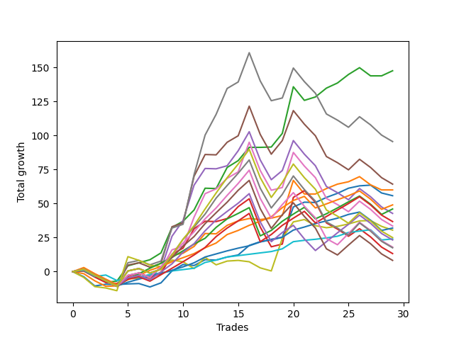

# Short Shepard 004 SD 
- Symbol: ES
- Date Range: 03/18/2022 - 07/15/2022
- Trading Period: 7:20-12:30
- Number of Trades: 29



| Name | Win Percent | Profit | Avg Profit / Trade | Avg Time / Trade |      | Name | Win Percent | Profit | Avg Profit / Trade | Avg Time / Trade |
| ---- | ----------- | ------ | ------------------ | ---------------- | ---- | ---- | ----------- | ------ | ------------------ | ---------------- |
| Sorted By <br> Profit | | | | | | Sorted By <br> Win Percentage ||||
| Two | 75.86 | 73750.00 | 2543.10 | 14:22 |     | Eighty-One | 89.66 | 12000.00 | 413.79 | 05:50 |
| Seven | 51.72 | 47750.00 | 1646.55 | 26:05 |     | Eighty-Two | 82.76 | 16000.00 | 551.72 | 09:06 |
| Five | 48.28 | 32125.00 | 1107.76 | 24:37 |     | Eighty-Three | 79.31 | 24500.00 | 844.83 | 10:31 |
| One | 62.07 | 30000.00 | 1034.48 | 11:28 |     | Two | 75.86 | 73750.00 | 2543.10 | 14:22 |
| Zero | 68.97 | 27875.00 | 961.21 | 05:47 |     | Eighty-Four | 75.86 | 23000.00 | 793.10 | 12:38 |
| Eighty-Three | 79.31 | 24500.00 | 844.83 | 10:31 |     | Zero | 68.97 | 27875.00 | 961.21 | 05:47 |
| Eighty-Four | 75.86 | 23000.00 | 793.10 | 12:38 |     | Eighty-Five | 68.97 | 18375.00 | 633.62 | 14:43 |
| Four | 48.28 | 21375.00 | 737.07 | 23:01 |     | One | 62.07 | 30000.00 | 1034.48 | 11:28 |
| Eighty-Five | 68.97 | 18375.00 | 633.62 | 14:43 |     | Eighty-Six | 62.07 | 11625.00 | 400.86 | 17:58 |
| Six | 51.72 | 16750.00 | 577.59 | 23:19 |     | Eighty-Eight | 55.17 | 9000.00 | 310.34 | 20:12 |
| Eighty-Two | 82.76 | 16000.00 | 551.72 | 09:06 |     | Eighty-Seven | 55.17 | 4125.00 | 142.24 | 19:32 |
| Seventy-Three | 41.38 | 15250.00 | 525.86 | 07:02 |     | Seven | 51.72 | 47750.00 | 1646.55 | 26:05 |
| Ninety | 51.72 | 12500.00 | 431.03 | 22:07 |     | Six | 51.72 | 16750.00 | 577.59 | 23:19 |
| Eighty-One | 89.66 | 12000.00 | 413.79 | 05:50 |     | Ninety | 51.72 | 12500.00 | 431.03 | 22:07 |
| Eighty-Six | 62.07 | 11625.00 | 400.86 | 17:58 |     | Eighty-Nine | 51.72 | 8750.00 | 301.72 | 21:37 |
| Eighty-Eight | 55.17 | 9000.00 | 310.34 | 20:12 |     | Three | 51.72 | 6625.00 | 228.45 | 20:04 |
| Eighty-Nine | 51.72 | 8750.00 | 301.72 | 21:37 |     | Five | 48.28 | 32125.00 | 1107.76 | 24:37 |
| Three | 51.72 | 6625.00 | 228.45 | 20:04 |     | Four | 48.28 | 21375.00 | 737.07 | 23:01 |
| Eighty-Seven | 55.17 | 4125.00 | 142.24 | 19:32 |     | Seventy-Three | 41.38 | 15250.00 | 525.86 | 07:02 |

## NO STOPLOSS

### Test Zero
* Sell when price hits the middle line of the 20p bollinger
* No Stoploss
* Results:
```
Total Trades: 29
Percent Up: 31.03
Percent Down: 68.97
Total Points Moved Down: 55.75
Potential Profit: 27875.00
Total Points Ups: 22.25 Count Ups: 9
Total Points Downs: 78.00 Count Downs: 20
```

<details><summary>Trades</summary>

<code>In: 2022-03-24 08:35:00		Out: 2022-03-24 08:50:05		Total Position Time: 15:05		Total Move Down: -3.75		Total to Date: -3.75</code> <br />
<code>In: 2022-03-25 07:29:00		Out: 2022-03-25 07:51:05		Total Position Time: 22:05		Total Move Down: -6.75		Total to Date: -10.50</code> <br />
<code>In: 2022-03-28 12:01:00		Out: 2022-03-28 12:06:45		Total Position Time: 05:45		Total Move Down: 1.25		Total to Date: -9.25</code> <br />
<code>In: 2022-03-29 12:15:00		Out: 2022-03-29 12:18:55		Total Position Time: 03:55		Total Move Down: -0.25		Total to Date: -9.50</code> <br />
<code>In: 2022-04-06 11:06:00		Out: 2022-04-06 11:06:10		Total Position Time: 00:10		Total Move Down: 0.50		Total to Date: -9.00</code> <br />
<code>In: 2022-04-07 11:06:00		Out: 2022-04-07 11:15:20		Total Position Time: 09:20		Total Move Down: 0.25		Total to Date: -8.75</code> <br />
<code>In: 2022-04-07 12:08:00		Out: 2022-04-07 12:19:10		Total Position Time: 11:10		Total Move Down: -2.50		Total to Date: -11.25</code> <br />
<code>In: 2022-04-08 08:05:00		Out: 2022-04-08 08:15:35		Total Position Time: 10:35		Total Move Down: 3.00		Total to Date: -8.25</code> <br />
<code>In: 2022-04-25 07:39:00		Out: 2022-04-25 07:40:25		Total Position Time: 01:25		Total Move Down: 8.75		Total to Date: 0.50</code> <br />
<code>In: 2022-04-27 09:34:00		Out: 2022-04-27 09:37:00		Total Position Time: 03:00		Total Move Down: 4.75		Total to Date: 5.25</code> <br />
<code>In: 2022-05-02 07:36:00		Out: 2022-05-02 07:44:10		Total Position Time: 08:10		Total Move Down: -0.75		Total to Date: 4.50</code> <br />
<code>In: 2022-05-04 11:07:00		Out: 2022-05-04 11:07:10		Total Position Time: 00:10		Total Move Down: 4.25		Total to Date: 8.75</code> <br />
<code>In: 2022-05-04 11:08:00		Out: 2022-05-04 11:08:10		Total Position Time: 00:10		Total Move Down: -0.25		Total to Date: 8.50</code> <br />
<code>In: 2022-05-04 11:31:00		Out: 2022-05-04 11:31:10		Total Position Time: 00:10		Total Move Down: 2.25		Total to Date: 10.75</code> <br />
<code>In: 2022-05-16 11:36:00		Out: 2022-05-16 11:41:45		Total Position Time: 05:45		Total Move Down: 1.50		Total to Date: 12.25</code> <br />
<code>In: 2022-05-19 11:56:00		Out: 2022-05-19 11:57:50		Total Position Time: 01:50		Total Move Down: 7.00		Total to Date: 19.25</code> <br />
<code>In: 2022-05-25 11:33:00		Out: 2022-05-25 11:39:10		Total Position Time: 06:10		Total Move Down: 2.75		Total to Date: 22.00</code> <br />
<code>In: 2022-06-02 08:18:00		Out: 2022-06-02 08:22:05		Total Position Time: 04:05		Total Move Down: 1.25		Total to Date: 23.25</code> <br />
<code>In: 2022-06-15 11:02:00		Out: 2022-06-15 11:02:10		Total Position Time: 00:10		Total Move Down: 2.00		Total to Date: 25.25</code> <br />
<code>In: 2022-06-15 11:48:00		Out: 2022-06-15 11:52:30		Total Position Time: 04:30		Total Move Down: 22.25		Total to Date: 47.50</code> <br />
<code>In: 2022-07-01 12:18:00		Out: 2022-07-01 12:20:55		Total Position Time: 02:55		Total Move Down: 3.50		Total to Date: 51.00</code> <br />
<code>In: 2022-07-05 08:53:00		Out: 2022-07-05 09:00:10		Total Position Time: 07:10		Total Move Down: -0.25		Total to Date: 50.75</code> <br />
<code>In: 2022-07-05 08:58:00		Out: 2022-07-05 09:00:10		Total Position Time: 02:10		Total Move Down: 3.75		Total to Date: 54.50</code> <br />
<code>In: 2022-07-05 11:43:00		Out: 2022-07-05 11:48:10		Total Position Time: 05:10		Total Move Down: 3.00		Total to Date: 57.50</code> <br />
<code>In: 2022-07-06 11:48:00		Out: 2022-07-06 11:50:00		Total Position Time: 02:00		Total Move Down: 3.75		Total to Date: 61.25</code> <br />
<code>In: 2022-07-07 12:23:00		Out: 2022-07-07 12:24:15		Total Position Time: 01:15		Total Move Down: 1.75		Total to Date: 63.00</code> <br />
<code>In: 2022-07-11 10:15:00		Out: 2022-07-11 10:23:05		Total Position Time: 08:05		Total Move Down: 0.50		Total to Date: 63.50</code> <br />
<code>In: 2022-07-14 11:28:00		Out: 2022-07-14 11:42:40		Total Position Time: 14:40		Total Move Down: -5.75		Total to Date: 57.75</code> <br />
<code>In: 2022-07-14 11:32:00		Out: 2022-07-14 11:42:40		Total Position Time: 10:40		Total Move Down: -2.00		Total to Date: 55.75</code> <br />


</details>

### Test One
* Sell when the price hits the upper line of the 20p 1std bollinger
* No Stoploss
* Results:
```
Total Trades: 29
Percent Up: 37.93
Percent Down: 62.07
Total Points Moved Down: 60.00
Potential Profit: 30000.00
Total Points Ups: 31.50 Count Ups: 11
Total Points Downs: 91.50 Count Downs: 18
```

<details><summary>Trades</summary>

<code>In: 2022-03-24 08:35:00		Out: 2022-03-24 08:53:45		Total Position Time: 18:45		Total Move Down: -1.50		Total to Date: -1.50</code> <br />
<code>In: 2022-03-25 07:29:00		Out: 2022-03-25 07:53:50		Total Position Time: 24:50		Total Move Down: -5.25		Total to Date: -6.75</code> <br />
<code>In: 2022-03-28 12:01:00		Out: 2022-03-28 12:30:55		Total Position Time: 29:55		Total Move Down: -4.00		Total to Date: -10.75</code> <br />
<code>In: 2022-03-29 12:15:00		Out: 2022-03-29 12:27:35		Total Position Time: 12:35		Total Move Down: 0.25		Total to Date: -10.50</code> <br />
<code>In: 2022-04-06 11:06:00		Out: 2022-04-06 11:07:20		Total Position Time: 01:20		Total Move Down: 5.25		Total to Date: -5.25</code> <br />
<code>In: 2022-04-07 11:06:00		Out: 2022-04-07 11:16:10		Total Position Time: 10:10		Total Move Down: 0.25		Total to Date: -5.00</code> <br />
<code>In: 2022-04-07 12:08:00		Out: 2022-04-07 12:20:50		Total Position Time: 12:50		Total Move Down: -0.00		Total to Date: -5.00</code> <br />
<code>In: 2022-04-08 08:05:00		Out: 2022-04-08 08:17:05		Total Position Time: 12:05		Total Move Down: 4.75		Total to Date: -0.25</code> <br />
<code>In: 2022-04-25 07:39:00		Out: 2022-04-25 07:43:05		Total Position Time: 04:05		Total Move Down: 12.25		Total to Date: 12.00</code> <br />
<code>In: 2022-04-27 09:34:00		Out: 2022-04-27 09:50:25		Total Position Time: 16:25		Total Move Down: 1.50		Total to Date: 13.50</code> <br />
<code>In: 2022-05-02 07:36:00		Out: 2022-05-02 07:44:50		Total Position Time: 08:50		Total Move Down: 5.00		Total to Date: 18.50</code> <br />
<code>In: 2022-05-04 11:07:00		Out: 2022-05-04 11:07:20		Total Position Time: 00:20		Total Move Down: 9.50		Total to Date: 28.00</code> <br />
<code>In: 2022-05-04 11:08:00		Out: 2022-05-04 11:08:10		Total Position Time: 00:10		Total Move Down: -0.25		Total to Date: 27.75</code> <br />
<code>In: 2022-05-04 11:31:00		Out: 2022-05-04 11:31:20		Total Position Time: 00:20		Total Move Down: 6.25		Total to Date: 34.00</code> <br />
<code>In: 2022-05-16 11:36:00		Out: 2022-05-16 11:44:50		Total Position Time: 08:50		Total Move Down: 3.25		Total to Date: 37.25</code> <br />
<code>In: 2022-05-19 11:56:00		Out: 2022-05-19 12:10:10		Total Position Time: 14:10		Total Move Down: 1.75		Total to Date: 39.00</code> <br />
<code>In: 2022-05-25 11:33:00		Out: 2022-05-25 11:45:15		Total Position Time: 12:15		Total Move Down: -0.75		Total to Date: 38.25</code> <br />
<code>In: 2022-06-02 08:18:00		Out: 2022-06-02 08:27:30		Total Position Time: 09:30		Total Move Down: 1.00		Total to Date: 39.25</code> <br />
<code>In: 2022-06-15 11:02:00		Out: 2022-06-15 11:02:10		Total Position Time: 00:10		Total Move Down: 2.00		Total to Date: 41.25</code> <br />
<code>In: 2022-06-15 11:48:00		Out: 2022-06-15 11:57:35		Total Position Time: 09:35		Total Move Down: 25.75		Total to Date: 67.00</code> <br />
<code>In: 2022-07-01 12:18:00		Out: 2022-07-01 12:46:00		Total Position Time: 28:00		Total Move Down: -10.00		Total to Date: 57.00</code> <br />
<code>In: 2022-07-05 08:53:00		Out: 2022-07-05 09:03:25		Total Position Time: 10:25		Total Move Down: -0.00		Total to Date: 57.00</code> <br />
<code>In: 2022-07-05 08:58:00		Out: 2022-07-05 09:03:25		Total Position Time: 05:25		Total Move Down: 4.00		Total to Date: 61.00</code> <br />
<code>In: 2022-07-05 11:43:00		Out: 2022-07-05 11:52:50		Total Position Time: 09:50		Total Move Down: 3.25		Total to Date: 64.25</code> <br />
<code>In: 2022-07-06 11:48:00		Out: 2022-07-06 12:00:30		Total Position Time: 12:30		Total Move Down: 1.75		Total to Date: 66.00</code> <br />
<code>In: 2022-07-07 12:23:00		Out: 2022-07-07 12:25:10		Total Position Time: 02:10		Total Move Down: 3.75		Total to Date: 69.75</code> <br />
<code>In: 2022-07-11 10:15:00		Out: 2022-07-11 10:44:55		Total Position Time: 29:55		Total Move Down: -6.00		Total to Date: 63.75</code> <br />
<code>In: 2022-07-14 11:28:00		Out: 2022-07-14 11:43:35		Total Position Time: 15:35		Total Move Down: -3.75		Total to Date: 60.00</code> <br />
<code>In: 2022-07-14 11:32:00		Out: 2022-07-14 11:43:35		Total Position Time: 11:35		Total Move Down: -0.00		Total to Date: 60.00</code> <br />


</details>

### Test Two
* Sell when the price hits the upper line of the 20p 2std bollinger
* No Stoploss
* Results:
```
Total Trades: 29
Percent Up: 24.14
Percent Down: 75.86
Total Points Moved Down: 147.50
Potential Profit: 73750.00
Total Points Ups: 24.50 Count Ups: 7
Total Points Downs: 172.00 Count Downs: 22
```

<details><summary>Trades</summary>

<code>In: 2022-03-24 08:35:00		Out: 2022-03-24 09:03:10		Total Position Time: 28:10		Total Move Down: 0.50		Total to Date: 0.50</code> <br />
<code>In: 2022-03-25 07:29:00		Out: 2022-03-25 07:54:10		Total Position Time: 25:10		Total Move Down: -4.25		Total to Date: -3.75</code> <br />
<code>In: 2022-03-28 12:01:00		Out: 2022-03-28 12:30:55		Total Position Time: 29:55		Total Move Down: -4.00		Total to Date: -7.75</code> <br />
<code>In: 2022-03-29 12:15:00		Out: 2022-03-29 12:27:50		Total Position Time: 12:50		Total Move Down: 0.75		Total to Date: -7.00</code> <br />
<code>In: 2022-04-06 11:06:00		Out: 2022-04-06 11:08:10		Total Position Time: 02:10		Total Move Down: 11.25		Total to Date: 4.25</code> <br />
<code>In: 2022-04-07 11:06:00		Out: 2022-04-07 11:18:20		Total Position Time: 12:20		Total Move Down: 2.25		Total to Date: 6.50</code> <br />
<code>In: 2022-04-07 12:08:00		Out: 2022-04-07 12:21:20		Total Position Time: 13:20		Total Move Down: 2.25		Total to Date: 8.75</code> <br />
<code>In: 2022-04-08 08:05:00		Out: 2022-04-08 08:20:10		Total Position Time: 15:10		Total Move Down: 5.00		Total to Date: 13.75</code> <br />
<code>In: 2022-04-25 07:39:00		Out: 2022-04-25 07:52:35		Total Position Time: 13:35		Total Move Down: 18.75		Total to Date: 32.50</code> <br />
<code>In: 2022-04-27 09:34:00		Out: 2022-04-27 10:00:10		Total Position Time: 26:10		Total Move Down: 4.50		Total to Date: 37.00</code> <br />
<code>In: 2022-05-02 07:36:00		Out: 2022-05-02 07:47:15		Total Position Time: 11:15		Total Move Down: 8.25		Total to Date: 45.25</code> <br />
<code>In: 2022-05-04 11:07:00		Out: 2022-05-04 11:07:40		Total Position Time: 00:40		Total Move Down: 16.00		Total to Date: 61.25</code> <br />
<code>In: 2022-05-04 11:08:00		Out: 2022-05-04 11:08:10		Total Position Time: 00:10		Total Move Down: -0.25		Total to Date: 61.00</code> <br />
<code>In: 2022-05-04 11:31:00		Out: 2022-05-04 11:32:25		Total Position Time: 01:25		Total Move Down: 15.50		Total to Date: 76.50</code> <br />
<code>In: 2022-05-16 11:36:00		Out: 2022-05-16 11:45:35		Total Position Time: 09:35		Total Move Down: 5.00		Total to Date: 81.50</code> <br />
<code>In: 2022-05-19 11:56:00		Out: 2022-05-19 12:14:05		Total Position Time: 18:05		Total Move Down: 9.75		Total to Date: 91.25</code> <br />
<code>In: 2022-05-25 11:33:00		Out: 2022-05-25 11:50:00		Total Position Time: 17:00		Total Move Down: -0.00		Total to Date: 91.25</code> <br />
<code>In: 2022-06-02 08:18:00		Out: 2022-06-02 08:30:55		Total Position Time: 12:55		Total Move Down: 0.25		Total to Date: 91.50</code> <br />
<code>In: 2022-06-15 11:02:00		Out: 2022-06-15 11:03:05		Total Position Time: 01:05		Total Move Down: 10.00		Total to Date: 101.50</code> <br />
<code>In: 2022-06-15 11:48:00		Out: 2022-06-15 11:58:05		Total Position Time: 10:05		Total Move Down: 34.25		Total to Date: 135.75</code> <br />
<code>In: 2022-07-01 12:18:00		Out: 2022-07-01 12:46:00		Total Position Time: 28:00		Total Move Down: -10.00		Total to Date: 125.75</code> <br />
<code>In: 2022-07-05 08:53:00		Out: 2022-07-05 09:03:50		Total Position Time: 10:50		Total Move Down: 2.50		Total to Date: 128.25</code> <br />
<code>In: 2022-07-05 08:58:00		Out: 2022-07-05 09:03:50		Total Position Time: 05:50		Total Move Down: 6.50		Total to Date: 134.75</code> <br />
<code>In: 2022-07-05 11:43:00		Out: 2022-07-05 12:01:15		Total Position Time: 18:15		Total Move Down: 3.75		Total to Date: 138.50</code> <br />
<code>In: 2022-07-06 11:48:00		Out: 2022-07-06 12:01:25		Total Position Time: 13:25		Total Move Down: 6.25		Total to Date: 144.75</code> <br />
<code>In: 2022-07-07 12:23:00		Out: 2022-07-07 12:28:30		Total Position Time: 05:30		Total Move Down: 5.00		Total to Date: 149.75</code> <br />
<code>In: 2022-07-11 10:15:00		Out: 2022-07-11 10:44:55		Total Position Time: 29:55		Total Move Down: -6.00		Total to Date: 143.75</code> <br />
<code>In: 2022-07-14 11:28:00		Out: 2022-07-14 11:52:00		Total Position Time: 24:00		Total Move Down: -0.00		Total to Date: 143.75</code> <br />
<code>In: 2022-07-14 11:32:00		Out: 2022-07-14 11:52:00		Total Position Time: 20:00		Total Move Down: 3.75		Total to Date: 147.50</code> <br />


</details>

### Test Three
* Sell when price hits the middle line of the 50p bollinger
* No Stoploss
* Results:
```
Total Trades: 29
Percent Up: 48.28
Percent Down: 51.72
Total Points Moved Down: 13.25
Potential Profit: 6625.00
Total Points Ups: 99.75 Count Ups: 14
Total Points Downs: 113.00 Count Downs: 15
```

<details><summary>Trades</summary>

<code>In: 2022-03-24 08:35:00		Out: 2022-03-24 09:03:10		Total Position Time: 28:10		Total Move Down: 0.50		Total to Date: 0.50</code> <br />
<code>In: 2022-03-25 07:29:00		Out: 2022-03-25 07:58:55		Total Position Time: 29:55		Total Move Down: -4.50		Total to Date: -4.00</code> <br />
<code>In: 2022-03-28 12:01:00		Out: 2022-03-28 12:30:55		Total Position Time: 29:55		Total Move Down: -4.00		Total to Date: -8.00</code> <br />
<code>In: 2022-03-29 12:15:00		Out: 2022-03-29 12:43:05		Total Position Time: 28:05		Total Move Down: -0.75		Total to Date: -8.75</code> <br />
<code>In: 2022-04-06 11:06:00		Out: 2022-04-06 11:07:20		Total Position Time: 01:20		Total Move Down: 5.25		Total to Date: -3.50</code> <br />
<code>In: 2022-04-07 11:06:00		Out: 2022-04-07 11:33:40		Total Position Time: 27:40		Total Move Down: 2.50		Total to Date: -1.00</code> <br />
<code>In: 2022-04-07 12:08:00		Out: 2022-04-07 12:37:55		Total Position Time: 29:55		Total Move Down: -3.25		Total to Date: -4.25</code> <br />
<code>In: 2022-04-08 08:05:00		Out: 2022-04-08 08:34:55		Total Position Time: 29:55		Total Move Down: 2.75		Total to Date: -1.50</code> <br />
<code>In: 2022-04-25 07:39:00		Out: 2022-04-25 07:52:00		Total Position Time: 13:00		Total Move Down: 14.25		Total to Date: 12.75</code> <br />
<code>In: 2022-04-27 09:34:00		Out: 2022-04-27 10:00:10		Total Position Time: 26:10		Total Move Down: 4.50		Total to Date: 17.25</code> <br />
<code>In: 2022-05-02 07:36:00		Out: 2022-05-02 07:53:35		Total Position Time: 17:35		Total Move Down: 14.25		Total to Date: 31.50</code> <br />
<code>In: 2022-05-04 11:07:00		Out: 2022-05-04 11:07:15		Total Position Time: 00:15		Total Move Down: 5.50		Total to Date: 37.00</code> <br />
<code>In: 2022-05-04 11:08:00		Out: 2022-05-04 11:08:10		Total Position Time: 00:10		Total Move Down: -0.25		Total to Date: 36.75</code> <br />
<code>In: 2022-05-04 11:31:00		Out: 2022-05-04 11:31:10		Total Position Time: 00:10		Total Move Down: 2.25		Total to Date: 39.00</code> <br />
<code>In: 2022-05-16 11:36:00		Out: 2022-05-16 11:49:00		Total Position Time: 13:00		Total Move Down: 8.75		Total to Date: 47.75</code> <br />
<code>In: 2022-05-19 11:56:00		Out: 2022-05-19 12:13:30		Total Position Time: 17:30		Total Move Down: 5.75		Total to Date: 53.50</code> <br />
<code>In: 2022-05-25 11:33:00		Out: 2022-05-25 12:02:55		Total Position Time: 29:55		Total Move Down: -20.75		Total to Date: 32.75</code> <br />
<code>In: 2022-06-02 08:18:00		Out: 2022-06-02 08:47:55		Total Position Time: 29:55		Total Move Down: -14.50		Total to Date: 18.25</code> <br />
<code>In: 2022-06-15 11:02:00		Out: 2022-06-15 11:02:10		Total Position Time: 00:10		Total Move Down: 2.00		Total to Date: 20.25</code> <br />
<code>In: 2022-06-15 11:48:00		Out: 2022-06-15 11:58:05		Total Position Time: 10:05		Total Move Down: 34.25		Total to Date: 54.50</code> <br />
<code>In: 2022-07-01 12:18:00		Out: 2022-07-01 12:21:00		Total Position Time: 03:00		Total Move Down: 5.00		Total to Date: 59.50</code> <br />
<code>In: 2022-07-05 08:53:00		Out: 2022-07-05 09:22:55		Total Position Time: 29:55		Total Move Down: -8.50		Total to Date: 51.00</code> <br />
<code>In: 2022-07-05 08:58:00		Out: 2022-07-05 09:27:55		Total Position Time: 29:55		Total Move Down: -15.25		Total to Date: 35.75</code> <br />
<code>In: 2022-07-05 11:43:00		Out: 2022-07-05 12:12:55		Total Position Time: 29:55		Total Move Down: -4.50		Total to Date: 31.25</code> <br />
<code>In: 2022-07-06 11:48:00		Out: 2022-07-06 12:17:55		Total Position Time: 29:55		Total Move Down: -5.25		Total to Date: 26.00</code> <br />
<code>In: 2022-07-07 12:23:00		Out: 2022-07-07 12:30:00		Total Position Time: 07:00		Total Move Down: 5.50		Total to Date: 31.50</code> <br />
<code>In: 2022-07-11 10:15:00		Out: 2022-07-11 10:44:55		Total Position Time: 29:55		Total Move Down: -6.00		Total to Date: 25.50</code> <br />
<code>In: 2022-07-14 11:28:00		Out: 2022-07-14 11:57:55		Total Position Time: 29:55		Total Move Down: -7.50		Total to Date: 18.00</code> <br />
<code>In: 2022-07-14 11:32:00		Out: 2022-07-14 12:01:55		Total Position Time: 29:55		Total Move Down: -4.75		Total to Date: 13.25</code> <br />


</details>

### Test Four
* Sell when the price hits the upper line of the 50p 1std bollinger
* No Stoploss
* Results:
```
Total Trades: 29
Percent Up: 51.72
Percent Down: 48.28
Total Points Moved Down: 42.75
Potential Profit: 21375.00
Total Points Ups: 113.00 Count Ups: 15
Total Points Downs: 155.75 Count Downs: 14
```

<details><summary>Trades</summary>

<code>In: 2022-03-24 08:35:00		Out: 2022-03-24 09:04:55		Total Position Time: 29:55		Total Move Down: 1.75		Total to Date: 1.75</code> <br />
<code>In: 2022-03-25 07:29:00		Out: 2022-03-25 07:58:55		Total Position Time: 29:55		Total Move Down: -4.50		Total to Date: -2.75</code> <br />
<code>In: 2022-03-28 12:01:00		Out: 2022-03-28 12:30:55		Total Position Time: 29:55		Total Move Down: -4.00		Total to Date: -6.75</code> <br />
<code>In: 2022-03-29 12:15:00		Out: 2022-03-29 12:44:55		Total Position Time: 29:55		Total Move Down: -4.00		Total to Date: -10.75</code> <br />
<code>In: 2022-04-06 11:06:00		Out: 2022-04-06 11:08:10		Total Position Time: 02:10		Total Move Down: 11.25		Total to Date: 0.50</code> <br />
<code>In: 2022-04-07 11:06:00		Out: 2022-04-07 11:35:55		Total Position Time: 29:55		Total Move Down: 1.75		Total to Date: 2.25</code> <br />
<code>In: 2022-04-07 12:08:00		Out: 2022-04-07 12:37:55		Total Position Time: 29:55		Total Move Down: -3.25		Total to Date: -1.00</code> <br />
<code>In: 2022-04-08 08:05:00		Out: 2022-04-08 08:34:55		Total Position Time: 29:55		Total Move Down: 2.75		Total to Date: 1.75</code> <br />
<code>In: 2022-04-25 07:39:00		Out: 2022-04-25 07:58:05		Total Position Time: 19:05		Total Move Down: 24.25		Total to Date: 26.00</code> <br />
<code>In: 2022-04-27 09:34:00		Out: 2022-04-27 10:01:20		Total Position Time: 27:20		Total Move Down: 11.50		Total to Date: 37.50</code> <br />
<code>In: 2022-05-02 07:36:00		Out: 2022-05-02 08:02:05		Total Position Time: 26:05		Total Move Down: 26.00		Total to Date: 63.50</code> <br />
<code>In: 2022-05-04 11:07:00		Out: 2022-05-04 11:07:25		Total Position Time: 00:25		Total Move Down: 12.25		Total to Date: 75.75</code> <br />
<code>In: 2022-05-04 11:08:00		Out: 2022-05-04 11:08:10		Total Position Time: 00:10		Total Move Down: -0.25		Total to Date: 75.50</code> <br />
<code>In: 2022-05-04 11:31:00		Out: 2022-05-04 11:31:10		Total Position Time: 00:10		Total Move Down: 2.25		Total to Date: 77.75</code> <br />
<code>In: 2022-05-16 11:36:00		Out: 2022-05-16 11:52:15		Total Position Time: 16:15		Total Move Down: 11.00		Total to Date: 88.75</code> <br />
<code>In: 2022-05-19 11:56:00		Out: 2022-05-19 12:18:25		Total Position Time: 22:25		Total Move Down: 14.00		Total to Date: 102.75</code> <br />
<code>In: 2022-05-25 11:33:00		Out: 2022-05-25 12:02:55		Total Position Time: 29:55		Total Move Down: -20.75		Total to Date: 82.00</code> <br />
<code>In: 2022-06-02 08:18:00		Out: 2022-06-02 08:47:55		Total Position Time: 29:55		Total Move Down: -14.50		Total to Date: 67.50</code> <br />
<code>In: 2022-06-15 11:02:00		Out: 2022-06-15 11:03:00		Total Position Time: 01:00		Total Move Down: 6.75		Total to Date: 74.25</code> <br />
<code>In: 2022-06-15 11:48:00		Out: 2022-06-15 12:17:55		Total Position Time: 29:55		Total Move Down: 22.00		Total to Date: 96.25</code> <br />
<code>In: 2022-07-01 12:18:00		Out: 2022-07-01 12:46:00		Total Position Time: 28:00		Total Move Down: -10.00		Total to Date: 86.25</code> <br />
<code>In: 2022-07-05 08:53:00		Out: 2022-07-05 09:22:55		Total Position Time: 29:55		Total Move Down: -8.50		Total to Date: 77.75</code> <br />
<code>In: 2022-07-05 08:58:00		Out: 2022-07-05 09:27:55		Total Position Time: 29:55		Total Move Down: -15.25		Total to Date: 62.50</code> <br />
<code>In: 2022-07-05 11:43:00		Out: 2022-07-05 12:12:55		Total Position Time: 29:55		Total Move Down: -4.50		Total to Date: 58.00</code> <br />
<code>In: 2022-07-06 11:48:00		Out: 2022-07-06 12:17:55		Total Position Time: 29:55		Total Move Down: -5.25		Total to Date: 52.75</code> <br />
<code>In: 2022-07-07 12:23:00		Out: 2022-07-07 12:38:50		Total Position Time: 15:50		Total Move Down: 8.25		Total to Date: 61.00</code> <br />
<code>In: 2022-07-11 10:15:00		Out: 2022-07-11 10:44:55		Total Position Time: 29:55		Total Move Down: -6.00		Total to Date: 55.00</code> <br />
<code>In: 2022-07-14 11:28:00		Out: 2022-07-14 11:57:55		Total Position Time: 29:55		Total Move Down: -7.50		Total to Date: 47.50</code> <br />
<code>In: 2022-07-14 11:32:00		Out: 2022-07-14 12:01:55		Total Position Time: 29:55		Total Move Down: -4.75		Total to Date: 42.75</code> <br />


</details>

### Test Five
* Sell when the price hits the upper line of the 50p 2std bollinger
* No Stoploss
* Results:
```
Total Trades: 29
Percent Up: 51.72
Percent Down: 48.28
Total Points Moved Down: 64.25
Potential Profit: 32125.00
Total Points Ups: 113.00 Count Ups: 15
Total Points Downs: 177.25 Count Downs: 14
```

<details><summary>Trades</summary>

<code>In: 2022-03-24 08:35:00		Out: 2022-03-24 09:04:55		Total Position Time: 29:55		Total Move Down: 1.75		Total to Date: 1.75</code> <br />
<code>In: 2022-03-25 07:29:00		Out: 2022-03-25 07:58:55		Total Position Time: 29:55		Total Move Down: -4.50		Total to Date: -2.75</code> <br />
<code>In: 2022-03-28 12:01:00		Out: 2022-03-28 12:30:55		Total Position Time: 29:55		Total Move Down: -4.00		Total to Date: -6.75</code> <br />
<code>In: 2022-03-29 12:15:00		Out: 2022-03-29 12:44:55		Total Position Time: 29:55		Total Move Down: -4.00		Total to Date: -10.75</code> <br />
<code>In: 2022-04-06 11:06:00		Out: 2022-04-06 11:09:35		Total Position Time: 03:35		Total Move Down: 15.50		Total to Date: 4.75</code> <br />
<code>In: 2022-04-07 11:06:00		Out: 2022-04-07 11:35:55		Total Position Time: 29:55		Total Move Down: 1.75		Total to Date: 6.50</code> <br />
<code>In: 2022-04-07 12:08:00		Out: 2022-04-07 12:37:55		Total Position Time: 29:55		Total Move Down: -3.25		Total to Date: 3.25</code> <br />
<code>In: 2022-04-08 08:05:00		Out: 2022-04-08 08:34:55		Total Position Time: 29:55		Total Move Down: 2.75		Total to Date: 6.00</code> <br />
<code>In: 2022-04-25 07:39:00		Out: 2022-04-25 08:08:55		Total Position Time: 29:55		Total Move Down: 27.00		Total to Date: 33.00</code> <br />
<code>In: 2022-04-27 09:34:00		Out: 2022-04-27 10:03:55		Total Position Time: 29:55		Total Move Down: 2.75		Total to Date: 35.75</code> <br />
<code>In: 2022-05-02 07:36:00		Out: 2022-05-02 08:05:55		Total Position Time: 29:55		Total Move Down: 34.25		Total to Date: 70.00</code> <br />
<code>In: 2022-05-04 11:07:00		Out: 2022-05-04 11:07:40		Total Position Time: 00:40		Total Move Down: 16.00		Total to Date: 86.00</code> <br />
<code>In: 2022-05-04 11:08:00		Out: 2022-05-04 11:08:10		Total Position Time: 00:10		Total Move Down: -0.25		Total to Date: 85.75</code> <br />
<code>In: 2022-05-04 11:31:00		Out: 2022-05-04 11:31:40		Total Position Time: 00:40		Total Move Down: 9.25		Total to Date: 95.00</code> <br />
<code>In: 2022-05-16 11:36:00		Out: 2022-05-16 12:05:55		Total Position Time: 29:55		Total Move Down: 4.75		Total to Date: 99.75</code> <br />
<code>In: 2022-05-19 11:56:00		Out: 2022-05-19 12:24:40		Total Position Time: 28:40		Total Move Down: 21.75		Total to Date: 121.50</code> <br />
<code>In: 2022-05-25 11:33:00		Out: 2022-05-25 12:02:55		Total Position Time: 29:55		Total Move Down: -20.75		Total to Date: 100.75</code> <br />
<code>In: 2022-06-02 08:18:00		Out: 2022-06-02 08:47:55		Total Position Time: 29:55		Total Move Down: -14.50		Total to Date: 86.25</code> <br />
<code>In: 2022-06-15 11:02:00		Out: 2022-06-15 11:03:05		Total Position Time: 01:05		Total Move Down: 10.00		Total to Date: 96.25</code> <br />
<code>In: 2022-06-15 11:48:00		Out: 2022-06-15 12:17:55		Total Position Time: 29:55		Total Move Down: 22.00		Total to Date: 118.25</code> <br />
<code>In: 2022-07-01 12:18:00		Out: 2022-07-01 12:46:00		Total Position Time: 28:00		Total Move Down: -10.00		Total to Date: 108.25</code> <br />
<code>In: 2022-07-05 08:53:00		Out: 2022-07-05 09:22:55		Total Position Time: 29:55		Total Move Down: -8.50		Total to Date: 99.75</code> <br />
<code>In: 2022-07-05 08:58:00		Out: 2022-07-05 09:27:55		Total Position Time: 29:55		Total Move Down: -15.25		Total to Date: 84.50</code> <br />
<code>In: 2022-07-05 11:43:00		Out: 2022-07-05 12:12:55		Total Position Time: 29:55		Total Move Down: -4.50		Total to Date: 80.00</code> <br />
<code>In: 2022-07-06 11:48:00		Out: 2022-07-06 12:17:55		Total Position Time: 29:55		Total Move Down: -5.25		Total to Date: 74.75</code> <br />
<code>In: 2022-07-07 12:23:00		Out: 2022-07-07 12:46:00		Total Position Time: 23:00		Total Move Down: 7.75		Total to Date: 82.50</code> <br />
<code>In: 2022-07-11 10:15:00		Out: 2022-07-11 10:44:55		Total Position Time: 29:55		Total Move Down: -6.00		Total to Date: 76.50</code> <br />
<code>In: 2022-07-14 11:28:00		Out: 2022-07-14 11:57:55		Total Position Time: 29:55		Total Move Down: -7.50		Total to Date: 69.00</code> <br />
<code>In: 2022-07-14 11:32:00		Out: 2022-07-14 12:01:55		Total Position Time: 29:55		Total Move Down: -4.75		Total to Date: 64.25</code> <br />


</details>

### Test Six
* Sell when the price hits the middle line of the 1std VWAP
* No Stoploss
* Results:
```
Total Trades: 29
Percent Up: 48.28
Percent Down: 51.72
Total Points Moved Down: 33.50
Potential Profit: 16750.00
Total Points Ups: 112.75 Count Ups: 14
Total Points Downs: 146.25 Count Downs: 15
```

<details><summary>Trades</summary>

<code>In: 2022-03-24 08:35:00		Out: 2022-03-24 09:04:55		Total Position Time: 29:55		Total Move Down: 1.75		Total to Date: 1.75</code> <br />
<code>In: 2022-03-25 07:29:00		Out: 2022-03-25 07:58:55		Total Position Time: 29:55		Total Move Down: -4.50		Total to Date: -2.75</code> <br />
<code>In: 2022-03-28 12:01:00		Out: 2022-03-28 12:30:55		Total Position Time: 29:55		Total Move Down: -4.00		Total to Date: -6.75</code> <br />
<code>In: 2022-03-29 12:15:00		Out: 2022-03-29 12:44:55		Total Position Time: 29:55		Total Move Down: -4.00		Total to Date: -10.75</code> <br />
<code>In: 2022-04-06 11:06:00		Out: 2022-04-06 11:08:10		Total Position Time: 02:10		Total Move Down: 11.25		Total to Date: 0.50</code> <br />
<code>In: 2022-04-07 11:06:00		Out: 2022-04-07 11:35:55		Total Position Time: 29:55		Total Move Down: 1.75		Total to Date: 2.25</code> <br />
<code>In: 2022-04-07 12:08:00		Out: 2022-04-07 12:37:55		Total Position Time: 29:55		Total Move Down: -3.25		Total to Date: -1.00</code> <br />
<code>In: 2022-04-08 08:05:00		Out: 2022-04-08 08:34:55		Total Position Time: 29:55		Total Move Down: 2.75		Total to Date: 1.75</code> <br />
<code>In: 2022-04-25 07:39:00		Out: 2022-04-25 07:43:25		Total Position Time: 04:25		Total Move Down: 14.25		Total to Date: 16.00</code> <br />
<code>In: 2022-04-27 09:34:00		Out: 2022-04-27 10:03:55		Total Position Time: 29:55		Total Move Down: 2.75		Total to Date: 18.75</code> <br />
<code>In: 2022-05-02 07:36:00		Out: 2022-05-02 07:57:15		Total Position Time: 21:15		Total Move Down: 21.25		Total to Date: 40.00</code> <br />
<code>In: 2022-05-04 11:07:00		Out: 2022-05-04 11:19:05		Total Position Time: 12:05		Total Move Down: 17.25		Total to Date: 57.25</code> <br />
<code>In: 2022-05-04 11:08:00		Out: 2022-05-04 11:19:05		Total Position Time: 11:05		Total Move Down: 3.50		Total to Date: 60.75</code> <br />
<code>In: 2022-05-04 11:31:00		Out: 2022-05-04 11:31:25		Total Position Time: 00:25		Total Move Down: 7.75		Total to Date: 68.50</code> <br />
<code>In: 2022-05-16 11:36:00		Out: 2022-05-16 12:05:55		Total Position Time: 29:55		Total Move Down: 4.75		Total to Date: 73.25</code> <br />
<code>In: 2022-05-19 11:56:00		Out: 2022-05-19 12:24:40		Total Position Time: 28:40		Total Move Down: 21.75		Total to Date: 95.00</code> <br />
<code>In: 2022-05-25 11:33:00		Out: 2022-05-25 12:02:55		Total Position Time: 29:55		Total Move Down: -20.75		Total to Date: 74.25</code> <br />
<code>In: 2022-06-02 08:18:00		Out: 2022-06-02 08:47:55		Total Position Time: 29:55		Total Move Down: -14.50		Total to Date: 59.75</code> <br />
<code>In: 2022-06-15 11:02:00		Out: 2022-06-15 11:02:10		Total Position Time: 00:10		Total Move Down: 2.00		Total to Date: 61.75</code> <br />
<code>In: 2022-06-15 11:48:00		Out: 2022-06-15 11:54:50		Total Position Time: 06:50		Total Move Down: 25.75		Total to Date: 87.50</code> <br />
<code>In: 2022-07-01 12:18:00		Out: 2022-07-01 12:46:00		Total Position Time: 28:00		Total Move Down: -10.00		Total to Date: 77.50</code> <br />
<code>In: 2022-07-05 08:53:00		Out: 2022-07-05 09:22:55		Total Position Time: 29:55		Total Move Down: -8.50		Total to Date: 69.00</code> <br />
<code>In: 2022-07-05 08:58:00		Out: 2022-07-05 09:27:55		Total Position Time: 29:55		Total Move Down: -15.25		Total to Date: 53.75</code> <br />
<code>In: 2022-07-05 11:43:00		Out: 2022-07-05 12:12:55		Total Position Time: 29:55		Total Move Down: -4.50		Total to Date: 49.25</code> <br />
<code>In: 2022-07-06 11:48:00		Out: 2022-07-06 12:17:55		Total Position Time: 29:55		Total Move Down: -5.25		Total to Date: 44.00</code> <br />
<code>In: 2022-07-07 12:23:00		Out: 2022-07-07 12:46:00		Total Position Time: 23:00		Total Move Down: 7.75		Total to Date: 51.75</code> <br />
<code>In: 2022-07-11 10:15:00		Out: 2022-07-11 10:44:55		Total Position Time: 29:55		Total Move Down: -6.00		Total to Date: 45.75</code> <br />
<code>In: 2022-07-14 11:28:00		Out: 2022-07-14 11:57:55		Total Position Time: 29:55		Total Move Down: -7.50		Total to Date: 38.25</code> <br />
<code>In: 2022-07-14 11:32:00		Out: 2022-07-14 12:01:55		Total Position Time: 29:55		Total Move Down: -4.75		Total to Date: 33.50</code> <br />


</details>

### Test Seven
* Sell when the price hits the upper line of the 1std VWAP
* No Stoploss
* Results:
```
Total Trades: 29
Percent Up: 48.28
Percent Down: 51.72
Total Points Moved Down: 95.50
Potential Profit: 47750.00
Total Points Ups: 112.75 Count Ups: 14
Total Points Downs: 208.25 Count Downs: 15
```

<details><summary>Trades</summary>

<code>In: 2022-03-24 08:35:00		Out: 2022-03-24 09:04:55		Total Position Time: 29:55		Total Move Down: 1.75		Total to Date: 1.75</code> <br />
<code>In: 2022-03-25 07:29:00		Out: 2022-03-25 07:58:55		Total Position Time: 29:55		Total Move Down: -4.50		Total to Date: -2.75</code> <br />
<code>In: 2022-03-28 12:01:00		Out: 2022-03-28 12:30:55		Total Position Time: 29:55		Total Move Down: -4.00		Total to Date: -6.75</code> <br />
<code>In: 2022-03-29 12:15:00		Out: 2022-03-29 12:44:55		Total Position Time: 29:55		Total Move Down: -4.00		Total to Date: -10.75</code> <br />
<code>In: 2022-04-06 11:06:00		Out: 2022-04-06 11:09:40		Total Position Time: 03:40		Total Move Down: 17.25		Total to Date: 6.50</code> <br />
<code>In: 2022-04-07 11:06:00		Out: 2022-04-07 11:35:55		Total Position Time: 29:55		Total Move Down: 1.75		Total to Date: 8.25</code> <br />
<code>In: 2022-04-07 12:08:00		Out: 2022-04-07 12:37:55		Total Position Time: 29:55		Total Move Down: -3.25		Total to Date: 5.00</code> <br />
<code>In: 2022-04-08 08:05:00		Out: 2022-04-08 08:34:55		Total Position Time: 29:55		Total Move Down: 2.75		Total to Date: 7.75</code> <br />
<code>In: 2022-04-25 07:39:00		Out: 2022-04-25 07:58:05		Total Position Time: 19:05		Total Move Down: 24.25		Total to Date: 32.00</code> <br />
<code>In: 2022-04-27 09:34:00		Out: 2022-04-27 10:03:55		Total Position Time: 29:55		Total Move Down: 2.75		Total to Date: 34.75</code> <br />
<code>In: 2022-05-02 07:36:00		Out: 2022-05-02 08:04:30		Total Position Time: 28:30		Total Move Down: 36.50		Total to Date: 71.25</code> <br />
<code>In: 2022-05-04 11:07:00		Out: 2022-05-04 11:34:00		Total Position Time: 27:00		Total Move Down: 29.00		Total to Date: 100.25</code> <br />
<code>In: 2022-05-04 11:08:00		Out: 2022-05-04 11:34:00		Total Position Time: 26:00		Total Move Down: 15.25		Total to Date: 115.50</code> <br />
<code>In: 2022-05-04 11:31:00		Out: 2022-05-04 11:34:00		Total Position Time: 03:00		Total Move Down: 19.00		Total to Date: 134.50</code> <br />
<code>In: 2022-05-16 11:36:00		Out: 2022-05-16 12:05:55		Total Position Time: 29:55		Total Move Down: 4.75		Total to Date: 139.25</code> <br />
<code>In: 2022-05-19 11:56:00		Out: 2022-05-19 12:25:55		Total Position Time: 29:55		Total Move Down: 21.50		Total to Date: 160.75</code> <br />
<code>In: 2022-05-25 11:33:00		Out: 2022-05-25 12:02:55		Total Position Time: 29:55		Total Move Down: -20.75		Total to Date: 140.00</code> <br />
<code>In: 2022-06-02 08:18:00		Out: 2022-06-02 08:47:55		Total Position Time: 29:55		Total Move Down: -14.50		Total to Date: 125.50</code> <br />
<code>In: 2022-06-15 11:02:00		Out: 2022-06-15 11:02:10		Total Position Time: 00:10		Total Move Down: 2.00		Total to Date: 127.50</code> <br />
<code>In: 2022-06-15 11:48:00		Out: 2022-06-15 12:17:55		Total Position Time: 29:55		Total Move Down: 22.00		Total to Date: 149.50</code> <br />
<code>In: 2022-07-01 12:18:00		Out: 2022-07-01 12:46:00		Total Position Time: 28:00		Total Move Down: -10.00		Total to Date: 139.50</code> <br />
<code>In: 2022-07-05 08:53:00		Out: 2022-07-05 09:22:55		Total Position Time: 29:55		Total Move Down: -8.50		Total to Date: 131.00</code> <br />
<code>In: 2022-07-05 08:58:00		Out: 2022-07-05 09:27:55		Total Position Time: 29:55		Total Move Down: -15.25		Total to Date: 115.75</code> <br />
<code>In: 2022-07-05 11:43:00		Out: 2022-07-05 12:12:55		Total Position Time: 29:55		Total Move Down: -4.50		Total to Date: 111.25</code> <br />
<code>In: 2022-07-06 11:48:00		Out: 2022-07-06 12:17:55		Total Position Time: 29:55		Total Move Down: -5.25		Total to Date: 106.00</code> <br />
<code>In: 2022-07-07 12:23:00		Out: 2022-07-07 12:46:00		Total Position Time: 23:00		Total Move Down: 7.75		Total to Date: 113.75</code> <br />
<code>In: 2022-07-11 10:15:00		Out: 2022-07-11 10:44:55		Total Position Time: 29:55		Total Move Down: -6.00		Total to Date: 107.75</code> <br />
<code>In: 2022-07-14 11:28:00		Out: 2022-07-14 11:57:55		Total Position Time: 29:55		Total Move Down: -7.50		Total to Date: 100.25</code> <br />
<code>In: 2022-07-14 11:32:00		Out: 2022-07-14 12:01:55		Total Position Time: 29:55		Total Move Down: -4.75		Total to Date: 95.50</code> <br />


</details>

## SPECIAL EXIT CONDITIONS 

### Test Seventy-Three
* Sell when the linear regression slope changes to negative
* No Stoploss
* Results:
```
Total Trades: 29
Percent Up: 58.62
Percent Down: 41.38
Total Points Moved Down: 30.50
Potential Profit: 15250.00
Total Points Ups: 53.75 Count Ups: 17
Total Points Downs: 84.25 Count Downs: 12
```

<details><summary>Trades</summary>

<code>In: 2022-03-24 08:35:00		Out: 2022-03-24 08:41:05		Total Position Time: 06:05		Total Move Down: -4.25		Total to Date: -4.25</code> <br />
<code>In: 2022-03-25 07:29:00		Out: 2022-03-25 07:35:05		Total Position Time: 06:05		Total Move Down: -6.75		Total to Date: -11.00</code> <br />
<code>In: 2022-03-28 12:01:00		Out: 2022-03-28 12:11:05		Total Position Time: 10:05		Total Move Down: -1.00		Total to Date: -12.00</code> <br />
<code>In: 2022-03-29 12:15:00		Out: 2022-03-29 12:21:05		Total Position Time: 06:05		Total Move Down: -2.00		Total to Date: -14.00</code> <br />
<code>In: 2022-04-06 11:06:00		Out: 2022-04-06 11:21:05		Total Position Time: 15:05		Total Move Down: 25.00		Total to Date: 11.00</code> <br />
<code>In: 2022-04-07 11:06:00		Out: 2022-04-07 11:10:05		Total Position Time: 04:05		Total Move Down: -2.75		Total to Date: 8.25</code> <br />
<code>In: 2022-04-07 12:08:00		Out: 2022-04-07 12:10:05		Total Position Time: 02:05		Total Move Down: -3.50		Total to Date: 4.75</code> <br />
<code>In: 2022-04-08 08:05:00		Out: 2022-04-08 08:06:05		Total Position Time: 01:05		Total Move Down: -1.00		Total to Date: 3.75</code> <br />
<code>In: 2022-04-25 07:39:00		Out: 2022-04-25 07:48:05		Total Position Time: 09:05		Total Move Down: 4.75		Total to Date: 8.50</code> <br />
<code>In: 2022-04-27 09:34:00		Out: 2022-04-27 09:42:05		Total Position Time: 08:05		Total Move Down: -1.25		Total to Date: 7.25</code> <br />
<code>In: 2022-05-02 07:36:00		Out: 2022-05-02 07:43:05		Total Position Time: 07:05		Total Move Down: -5.00		Total to Date: 2.25</code> <br />
<code>In: 2022-05-04 11:07:00		Out: 2022-05-04 11:24:05		Total Position Time: 17:05		Total Move Down: 8.25		Total to Date: 10.50</code> <br />
<code>In: 2022-05-04 11:08:00		Out: 2022-05-04 11:24:05		Total Position Time: 16:05		Total Move Down: -5.50		Total to Date: 5.00</code> <br />
<code>In: 2022-05-04 11:31:00		Out: 2022-05-04 11:41:05		Total Position Time: 10:05		Total Move Down: 2.75		Total to Date: 7.75</code> <br />
<code>In: 2022-05-16 11:36:00		Out: 2022-05-16 11:44:05		Total Position Time: 08:05		Total Move Down: 0.50		Total to Date: 8.25</code> <br />
<code>In: 2022-05-19 11:56:00		Out: 2022-05-19 12:00:05		Total Position Time: 04:05		Total Move Down: -1.00		Total to Date: 7.25</code> <br />
<code>In: 2022-05-25 11:33:00		Out: 2022-05-25 11:35:05		Total Position Time: 02:05		Total Move Down: -4.50		Total to Date: 2.75</code> <br />
<code>In: 2022-06-02 08:18:00		Out: 2022-06-02 08:19:05		Total Position Time: 01:05		Total Move Down: -2.25		Total to Date: 0.50</code> <br />
<code>In: 2022-06-15 11:02:00		Out: 2022-06-15 11:12:05		Total Position Time: 10:05		Total Move Down: 24.00		Total to Date: 24.50</code> <br />
<code>In: 2022-06-15 11:48:00		Out: 2022-06-15 12:01:05		Total Position Time: 13:05		Total Move Down: 12.00		Total to Date: 36.50</code> <br />
<code>In: 2022-07-01 12:18:00		Out: 2022-07-01 12:25:05		Total Position Time: 07:05		Total Move Down: 1.75		Total to Date: 38.25</code> <br />
<code>In: 2022-07-05 08:53:00		Out: 2022-07-05 08:55:05		Total Position Time: 02:05		Total Move Down: -4.50		Total to Date: 33.75</code> <br />
<code>In: 2022-07-05 08:58:00		Out: 2022-07-05 09:02:05		Total Position Time: 04:05		Total Move Down: -1.50		Total to Date: 32.25</code> <br />
<code>In: 2022-07-05 11:43:00		Out: 2022-07-05 11:55:05		Total Position Time: 12:05		Total Move Down: 1.00		Total to Date: 33.25</code> <br />
<code>In: 2022-07-06 11:48:00		Out: 2022-07-06 11:56:05		Total Position Time: 08:05		Total Move Down: 1.75		Total to Date: 35.00</code> <br />
<code>In: 2022-07-07 12:23:00		Out: 2022-07-07 12:32:05		Total Position Time: 09:05		Total Move Down: 2.25		Total to Date: 37.25</code> <br />
<code>In: 2022-07-11 10:15:00		Out: 2022-07-11 10:18:05		Total Position Time: 03:05		Total Move Down: 0.25		Total to Date: 37.50</code> <br />
<code>In: 2022-07-14 11:28:00		Out: 2022-07-14 11:29:05		Total Position Time: 01:05		Total Move Down: -4.25		Total to Date: 33.25</code> <br />
<code>In: 2022-07-14 11:32:00		Out: 2022-07-14 11:33:05		Total Position Time: 01:05		Total Move Down: -2.75		Total to Date: 30.50</code> <br />


</details>

## TAKE PROFIT

### Test Eighty-One
* Take Profit of 1 Point
* No Stoploss
* Results:
```
Total Trades: 29
Percent Up: 10.34
Percent Down: 89.66
Total Points Moved Down: 24.00
Potential Profit: 12000.00
Total Points Ups: 16.00 Count Ups: 3
Total Points Downs: 40.00 Count Downs: 26
```

<details><summary>Trades</summary>

<code>In: 2022-03-24 08:35:00		Out: 2022-03-24 09:03:15		Total Position Time: 28:15		Total Move Down: 1.00		Total to Date: 1.00</code> <br />
<code>In: 2022-03-25 07:29:00		Out: 2022-03-25 07:58:55		Total Position Time: 29:55		Total Move Down: -4.50		Total to Date: -3.50</code> <br />
<code>In: 2022-03-28 12:01:00		Out: 2022-03-28 12:03:00		Total Position Time: 02:00		Total Move Down: 1.00		Total to Date: -2.50</code> <br />
<code>In: 2022-03-29 12:15:00		Out: 2022-03-29 12:44:55		Total Position Time: 29:55		Total Move Down: -4.00		Total to Date: -6.50</code> <br />
<code>In: 2022-04-06 11:06:00		Out: 2022-04-06 11:07:00		Total Position Time: 01:00		Total Move Down: 1.25		Total to Date: -5.25</code> <br />
<code>In: 2022-04-07 11:06:00		Out: 2022-04-07 11:06:15		Total Position Time: 00:15		Total Move Down: 1.00		Total to Date: -4.25</code> <br />
<code>In: 2022-04-07 12:08:00		Out: 2022-04-07 12:21:20		Total Position Time: 13:20		Total Move Down: 2.25		Total to Date: -2.00</code> <br />
<code>In: 2022-04-08 08:05:00		Out: 2022-04-08 08:06:25		Total Position Time: 01:25		Total Move Down: 1.00		Total to Date: -1.00</code> <br />
<code>In: 2022-04-25 07:39:00		Out: 2022-04-25 07:39:15		Total Position Time: 00:15		Total Move Down: 1.50		Total to Date: 0.50</code> <br />
<code>In: 2022-04-27 09:34:00		Out: 2022-04-27 09:34:10		Total Position Time: 00:10		Total Move Down: 1.00		Total to Date: 1.50</code> <br />
<code>In: 2022-05-02 07:36:00		Out: 2022-05-02 07:36:10		Total Position Time: 00:10		Total Move Down: 1.00		Total to Date: 2.50</code> <br />
<code>In: 2022-05-04 11:07:00		Out: 2022-05-04 11:07:10		Total Position Time: 00:10		Total Move Down: 4.25		Total to Date: 6.75</code> <br />
<code>In: 2022-05-04 11:08:00		Out: 2022-05-04 11:08:15		Total Position Time: 00:15		Total Move Down: 1.75		Total to Date: 8.50</code> <br />
<code>In: 2022-05-04 11:31:00		Out: 2022-05-04 11:31:10		Total Position Time: 00:10		Total Move Down: 2.25		Total to Date: 10.75</code> <br />
<code>In: 2022-05-16 11:36:00		Out: 2022-05-16 11:36:10		Total Position Time: 00:10		Total Move Down: 1.00		Total to Date: 11.75</code> <br />
<code>In: 2022-05-19 11:56:00		Out: 2022-05-19 11:57:00		Total Position Time: 01:00		Total Move Down: 1.00		Total to Date: 12.75</code> <br />
<code>In: 2022-05-25 11:33:00		Out: 2022-05-25 11:33:15		Total Position Time: 00:15		Total Move Down: 1.00		Total to Date: 13.75</code> <br />
<code>In: 2022-06-02 08:18:00		Out: 2022-06-02 08:20:30		Total Position Time: 02:30		Total Move Down: 1.00		Total to Date: 14.75</code> <br />
<code>In: 2022-06-15 11:02:00		Out: 2022-06-15 11:02:10		Total Position Time: 00:10		Total Move Down: 2.00		Total to Date: 16.75</code> <br />
<code>In: 2022-06-15 11:48:00		Out: 2022-06-15 11:48:10		Total Position Time: 00:10		Total Move Down: 5.25		Total to Date: 22.00</code> <br />
<code>In: 2022-07-01 12:18:00		Out: 2022-07-01 12:19:50		Total Position Time: 01:50		Total Move Down: 1.00		Total to Date: 23.00</code> <br />
<code>In: 2022-07-05 08:53:00		Out: 2022-07-05 09:03:45		Total Position Time: 10:45		Total Move Down: 0.75		Total to Date: 23.75</code> <br />
<code>In: 2022-07-05 08:58:00		Out: 2022-07-05 08:58:20		Total Position Time: 00:20		Total Move Down: 1.00		Total to Date: 24.75</code> <br />
<code>In: 2022-07-05 11:43:00		Out: 2022-07-05 11:44:10		Total Position Time: 01:10		Total Move Down: 1.25		Total to Date: 26.00</code> <br />
<code>In: 2022-07-06 11:48:00		Out: 2022-07-06 11:48:10		Total Position Time: 00:10		Total Move Down: 2.75		Total to Date: 28.75</code> <br />
<code>In: 2022-07-07 12:23:00		Out: 2022-07-07 12:24:05		Total Position Time: 01:05		Total Move Down: 1.00		Total to Date: 29.75</code> <br />
<code>In: 2022-07-11 10:15:00		Out: 2022-07-11 10:15:35		Total Position Time: 00:35		Total Move Down: 1.00		Total to Date: 30.75</code> <br />
<code>In: 2022-07-14 11:28:00		Out: 2022-07-14 11:57:55		Total Position Time: 29:55		Total Move Down: -7.50		Total to Date: 23.25</code> <br />
<code>In: 2022-07-14 11:32:00		Out: 2022-07-14 11:44:00		Total Position Time: 12:00		Total Move Down: 0.75		Total to Date: 24.00</code> <br />


</details>

### Test Eighty-Two
* Take Profit of 2 Point
* No Stoploss
* Results:
```
Total Trades: 29
Percent Up: 17.24
Percent Down: 82.76
Total Points Moved Down: 32.00
Potential Profit: 16000.00
Total Points Ups: 26.00 Count Ups: 5
Total Points Downs: 58.00 Count Downs: 24
```

<details><summary>Trades</summary>

<code>In: 2022-03-24 08:35:00		Out: 2022-03-24 09:03:20		Total Position Time: 28:20		Total Move Down: 2.00		Total to Date: 2.00</code> <br />
<code>In: 2022-03-25 07:29:00		Out: 2022-03-25 07:58:55		Total Position Time: 29:55		Total Move Down: -4.50		Total to Date: -2.50</code> <br />
<code>In: 2022-03-28 12:01:00		Out: 2022-03-28 12:30:55		Total Position Time: 29:55		Total Move Down: -4.00		Total to Date: -6.50</code> <br />
<code>In: 2022-03-29 12:15:00		Out: 2022-03-29 12:44:55		Total Position Time: 29:55		Total Move Down: -4.00		Total to Date: -10.50</code> <br />
<code>In: 2022-04-06 11:06:00		Out: 2022-04-06 11:07:05		Total Position Time: 01:05		Total Move Down: 2.75		Total to Date: -7.75</code> <br />
<code>In: 2022-04-07 11:06:00		Out: 2022-04-07 11:06:40		Total Position Time: 00:40		Total Move Down: 2.25		Total to Date: -5.50</code> <br />
<code>In: 2022-04-07 12:08:00		Out: 2022-04-07 12:21:20		Total Position Time: 13:20		Total Move Down: 2.25		Total to Date: -3.25</code> <br />
<code>In: 2022-04-08 08:05:00		Out: 2022-04-08 08:06:35		Total Position Time: 01:35		Total Move Down: 2.00		Total to Date: -1.25</code> <br />
<code>In: 2022-04-25 07:39:00		Out: 2022-04-25 07:39:20		Total Position Time: 00:20		Total Move Down: 2.25		Total to Date: 1.00</code> <br />
<code>In: 2022-04-27 09:34:00		Out: 2022-04-27 09:36:40		Total Position Time: 02:40		Total Move Down: 2.50		Total to Date: 3.50</code> <br />
<code>In: 2022-05-02 07:36:00		Out: 2022-05-02 07:36:15		Total Position Time: 00:15		Total Move Down: 3.00		Total to Date: 6.50</code> <br />
<code>In: 2022-05-04 11:07:00		Out: 2022-05-04 11:07:10		Total Position Time: 00:10		Total Move Down: 4.25		Total to Date: 10.75</code> <br />
<code>In: 2022-05-04 11:08:00		Out: 2022-05-04 11:18:50		Total Position Time: 10:50		Total Move Down: 2.25		Total to Date: 13.00</code> <br />
<code>In: 2022-05-04 11:31:00		Out: 2022-05-04 11:31:10		Total Position Time: 00:10		Total Move Down: 2.25		Total to Date: 15.25</code> <br />
<code>In: 2022-05-16 11:36:00		Out: 2022-05-16 11:36:25		Total Position Time: 00:25		Total Move Down: 2.00		Total to Date: 17.25</code> <br />
<code>In: 2022-05-19 11:56:00		Out: 2022-05-19 11:57:25		Total Position Time: 01:25		Total Move Down: 1.75		Total to Date: 19.00</code> <br />
<code>In: 2022-05-25 11:33:00		Out: 2022-05-25 11:39:10		Total Position Time: 06:10		Total Move Down: 2.75		Total to Date: 21.75</code> <br />
<code>In: 2022-06-02 08:18:00		Out: 2022-06-02 08:31:35		Total Position Time: 13:35		Total Move Down: 2.00		Total to Date: 23.75</code> <br />
<code>In: 2022-06-15 11:02:00		Out: 2022-06-15 11:02:45		Total Position Time: 00:45		Total Move Down: 1.50		Total to Date: 25.25</code> <br />
<code>In: 2022-06-15 11:48:00		Out: 2022-06-15 11:48:10		Total Position Time: 00:10		Total Move Down: 5.25		Total to Date: 30.50</code> <br />
<code>In: 2022-07-01 12:18:00		Out: 2022-07-01 12:20:30		Total Position Time: 02:30		Total Move Down: 2.25		Total to Date: 32.75</code> <br />
<code>In: 2022-07-05 08:53:00		Out: 2022-07-05 09:03:50		Total Position Time: 10:50		Total Move Down: 2.50		Total to Date: 35.25</code> <br />
<code>In: 2022-07-05 08:58:00		Out: 2022-07-05 08:58:40		Total Position Time: 00:40		Total Move Down: 2.00		Total to Date: 37.25</code> <br />
<code>In: 2022-07-05 11:43:00		Out: 2022-07-05 11:47:40		Total Position Time: 04:40		Total Move Down: 2.00		Total to Date: 39.25</code> <br />
<code>In: 2022-07-06 11:48:00		Out: 2022-07-06 11:48:10		Total Position Time: 00:10		Total Move Down: 2.75		Total to Date: 42.00</code> <br />
<code>In: 2022-07-07 12:23:00		Out: 2022-07-07 12:24:25		Total Position Time: 01:25		Total Move Down: 1.75		Total to Date: 43.75</code> <br />
<code>In: 2022-07-11 10:15:00		Out: 2022-07-11 10:44:55		Total Position Time: 29:55		Total Move Down: -6.00		Total to Date: 37.75</code> <br />
<code>In: 2022-07-14 11:28:00		Out: 2022-07-14 11:57:55		Total Position Time: 29:55		Total Move Down: -7.50		Total to Date: 30.25</code> <br />
<code>In: 2022-07-14 11:32:00		Out: 2022-07-14 11:44:30		Total Position Time: 12:30		Total Move Down: 1.75		Total to Date: 32.00</code> <br />


</details>

### Test Eighty-Three
* Take Profit of 3 Point
* No Stoploss
* Results:
```
Total Trades: 29
Percent Up: 20.69
Percent Down: 79.31
Total Points Moved Down: 49.00
Potential Profit: 24500.00
Total Points Ups: 34.50 Count Ups: 6
Total Points Downs: 83.50 Count Downs: 23
```

<details><summary>Trades</summary>

<code>In: 2022-03-24 08:35:00		Out: 2022-03-24 09:03:30		Total Position Time: 28:30		Total Move Down: 3.00		Total to Date: 3.00</code> <br />
<code>In: 2022-03-25 07:29:00		Out: 2022-03-25 07:58:55		Total Position Time: 29:55		Total Move Down: -4.50		Total to Date: -1.50</code> <br />
<code>In: 2022-03-28 12:01:00		Out: 2022-03-28 12:30:55		Total Position Time: 29:55		Total Move Down: -4.00		Total to Date: -5.50</code> <br />
<code>In: 2022-03-29 12:15:00		Out: 2022-03-29 12:44:55		Total Position Time: 29:55		Total Move Down: -4.00		Total to Date: -9.50</code> <br />
<code>In: 2022-04-06 11:06:00		Out: 2022-04-06 11:07:15		Total Position Time: 01:15		Total Move Down: 3.50		Total to Date: -6.00</code> <br />
<code>In: 2022-04-07 11:06:00		Out: 2022-04-07 11:18:40		Total Position Time: 12:40		Total Move Down: 3.25		Total to Date: -2.75</code> <br />
<code>In: 2022-04-07 12:08:00		Out: 2022-04-07 12:24:10		Total Position Time: 16:10		Total Move Down: 3.75		Total to Date: 1.00</code> <br />
<code>In: 2022-04-08 08:05:00		Out: 2022-04-08 08:06:50		Total Position Time: 01:50		Total Move Down: 2.75		Total to Date: 3.75</code> <br />
<code>In: 2022-04-25 07:39:00		Out: 2022-04-25 07:39:30		Total Position Time: 00:30		Total Move Down: 3.50		Total to Date: 7.25</code> <br />
<code>In: 2022-04-27 09:34:00		Out: 2022-04-27 09:36:55		Total Position Time: 02:55		Total Move Down: 3.00		Total to Date: 10.25</code> <br />
<code>In: 2022-05-02 07:36:00		Out: 2022-05-02 07:36:15		Total Position Time: 00:15		Total Move Down: 3.00		Total to Date: 13.25</code> <br />
<code>In: 2022-05-04 11:07:00		Out: 2022-05-04 11:07:10		Total Position Time: 00:10		Total Move Down: 4.25		Total to Date: 17.50</code> <br />
<code>In: 2022-05-04 11:08:00		Out: 2022-05-04 11:19:05		Total Position Time: 11:05		Total Move Down: 3.50		Total to Date: 21.00</code> <br />
<code>In: 2022-05-04 11:31:00		Out: 2022-05-04 11:31:20		Total Position Time: 00:20		Total Move Down: 6.25		Total to Date: 27.25</code> <br />
<code>In: 2022-05-16 11:36:00		Out: 2022-05-16 11:36:45		Total Position Time: 00:45		Total Move Down: 3.00		Total to Date: 30.25</code> <br />
<code>In: 2022-05-19 11:56:00		Out: 2022-05-19 11:57:30		Total Position Time: 01:30		Total Move Down: 3.75		Total to Date: 34.00</code> <br />
<code>In: 2022-05-25 11:33:00		Out: 2022-05-25 11:39:55		Total Position Time: 06:55		Total Move Down: 3.00		Total to Date: 37.00</code> <br />
<code>In: 2022-06-02 08:18:00		Out: 2022-06-02 08:31:45		Total Position Time: 13:45		Total Move Down: 3.25		Total to Date: 40.25</code> <br />
<code>In: 2022-06-15 11:02:00		Out: 2022-06-15 11:03:00		Total Position Time: 01:00		Total Move Down: 6.75		Total to Date: 47.00</code> <br />
<code>In: 2022-06-15 11:48:00		Out: 2022-06-15 11:48:10		Total Position Time: 00:10		Total Move Down: 5.25		Total to Date: 52.25</code> <br />
<code>In: 2022-07-01 12:18:00		Out: 2022-07-01 12:20:50		Total Position Time: 02:50		Total Move Down: 3.00		Total to Date: 55.25</code> <br />
<code>In: 2022-07-05 08:53:00		Out: 2022-07-05 09:22:55		Total Position Time: 29:55		Total Move Down: -8.50		Total to Date: 46.75</code> <br />
<code>In: 2022-07-05 08:58:00		Out: 2022-07-05 08:59:15		Total Position Time: 01:15		Total Move Down: 3.00		Total to Date: 49.75</code> <br />
<code>In: 2022-07-05 11:43:00		Out: 2022-07-05 11:48:10		Total Position Time: 05:10		Total Move Down: 3.00		Total to Date: 52.75</code> <br />
<code>In: 2022-07-06 11:48:00		Out: 2022-07-06 11:48:35		Total Position Time: 00:35		Total Move Down: 3.00		Total to Date: 55.75</code> <br />
<code>In: 2022-07-07 12:23:00		Out: 2022-07-07 12:25:05		Total Position Time: 02:05		Total Move Down: 3.50		Total to Date: 59.25</code> <br />
<code>In: 2022-07-11 10:15:00		Out: 2022-07-11 10:44:55		Total Position Time: 29:55		Total Move Down: -6.00		Total to Date: 53.25</code> <br />
<code>In: 2022-07-14 11:28:00		Out: 2022-07-14 11:57:55		Total Position Time: 29:55		Total Move Down: -7.50		Total to Date: 45.75</code> <br />
<code>In: 2022-07-14 11:32:00		Out: 2022-07-14 11:46:00		Total Position Time: 14:00		Total Move Down: 3.25		Total to Date: 49.00</code> <br />


</details>

### Test Eighty-Four
* Take Profit of 4 Point
* No Stoploss
* Results:
```
Total Trades: 29
Percent Up: 24.14
Percent Down: 75.86
Total Points Moved Down: 46.00
Potential Profit: 23000.00
Total Points Ups: 55.25 Count Ups: 7
Total Points Downs: 101.25 Count Downs: 22
```

<details><summary>Trades</summary>

<code>In: 2022-03-24 08:35:00		Out: 2022-03-24 09:04:55		Total Position Time: 29:55		Total Move Down: 1.75		Total to Date: 1.75</code> <br />
<code>In: 2022-03-25 07:29:00		Out: 2022-03-25 07:58:55		Total Position Time: 29:55		Total Move Down: -4.50		Total to Date: -2.75</code> <br />
<code>In: 2022-03-28 12:01:00		Out: 2022-03-28 12:30:55		Total Position Time: 29:55		Total Move Down: -4.00		Total to Date: -6.75</code> <br />
<code>In: 2022-03-29 12:15:00		Out: 2022-03-29 12:44:55		Total Position Time: 29:55		Total Move Down: -4.00		Total to Date: -10.75</code> <br />
<code>In: 2022-04-06 11:06:00		Out: 2022-04-06 11:07:20		Total Position Time: 01:20		Total Move Down: 5.25		Total to Date: -5.50</code> <br />
<code>In: 2022-04-07 11:06:00		Out: 2022-04-07 11:19:10		Total Position Time: 13:10		Total Move Down: 4.00		Total to Date: -1.50</code> <br />
<code>In: 2022-04-07 12:08:00		Out: 2022-04-07 12:24:35		Total Position Time: 16:35		Total Move Down: 4.00		Total to Date: 2.50</code> <br />
<code>In: 2022-04-08 08:05:00		Out: 2022-04-08 08:15:45		Total Position Time: 10:45		Total Move Down: 3.75		Total to Date: 6.25</code> <br />
<code>In: 2022-04-25 07:39:00		Out: 2022-04-25 07:39:40		Total Position Time: 00:40		Total Move Down: 4.25		Total to Date: 10.50</code> <br />
<code>In: 2022-04-27 09:34:00		Out: 2022-04-27 09:37:00		Total Position Time: 03:00		Total Move Down: 4.75		Total to Date: 15.25</code> <br />
<code>In: 2022-05-02 07:36:00		Out: 2022-05-02 07:37:00		Total Position Time: 01:00		Total Move Down: 5.00		Total to Date: 20.25</code> <br />
<code>In: 2022-05-04 11:07:00		Out: 2022-05-04 11:07:10		Total Position Time: 00:10		Total Move Down: 4.25		Total to Date: 24.50</code> <br />
<code>In: 2022-05-04 11:08:00		Out: 2022-05-04 11:20:50		Total Position Time: 12:50		Total Move Down: 8.00		Total to Date: 32.50</code> <br />
<code>In: 2022-05-04 11:31:00		Out: 2022-05-04 11:31:20		Total Position Time: 00:20		Total Move Down: 6.25		Total to Date: 38.75</code> <br />
<code>In: 2022-05-16 11:36:00		Out: 2022-05-16 11:45:10		Total Position Time: 09:10		Total Move Down: 4.00		Total to Date: 42.75</code> <br />
<code>In: 2022-05-19 11:56:00		Out: 2022-05-19 11:57:35		Total Position Time: 01:35		Total Move Down: 4.25		Total to Date: 47.00</code> <br />
<code>In: 2022-05-25 11:33:00		Out: 2022-05-25 12:02:55		Total Position Time: 29:55		Total Move Down: -20.75		Total to Date: 26.25</code> <br />
<code>In: 2022-06-02 08:18:00		Out: 2022-06-02 08:36:00		Total Position Time: 18:00		Total Move Down: 4.00		Total to Date: 30.25</code> <br />
<code>In: 2022-06-15 11:02:00		Out: 2022-06-15 11:03:00		Total Position Time: 01:00		Total Move Down: 6.75		Total to Date: 37.00</code> <br />
<code>In: 2022-06-15 11:48:00		Out: 2022-06-15 11:48:10		Total Position Time: 00:10		Total Move Down: 5.25		Total to Date: 42.25</code> <br />
<code>In: 2022-07-01 12:18:00		Out: 2022-07-01 12:21:00		Total Position Time: 03:00		Total Move Down: 5.00		Total to Date: 47.25</code> <br />
<code>In: 2022-07-05 08:53:00		Out: 2022-07-05 09:22:55		Total Position Time: 29:55		Total Move Down: -8.50		Total to Date: 38.75</code> <br />
<code>In: 2022-07-05 08:58:00		Out: 2022-07-05 08:59:30		Total Position Time: 01:30		Total Move Down: 3.75		Total to Date: 42.50</code> <br />
<code>In: 2022-07-05 11:43:00		Out: 2022-07-05 11:48:55		Total Position Time: 05:55		Total Move Down: 4.25		Total to Date: 46.75</code> <br />
<code>In: 2022-07-06 11:48:00		Out: 2022-07-06 11:50:15		Total Position Time: 02:15		Total Move Down: 4.50		Total to Date: 51.25</code> <br />
<code>In: 2022-07-07 12:23:00		Out: 2022-07-07 12:27:40		Total Position Time: 04:40		Total Move Down: 4.25		Total to Date: 55.50</code> <br />
<code>In: 2022-07-11 10:15:00		Out: 2022-07-11 10:44:55		Total Position Time: 29:55		Total Move Down: -6.00		Total to Date: 49.50</code> <br />
<code>In: 2022-07-14 11:28:00		Out: 2022-07-14 11:57:55		Total Position Time: 29:55		Total Move Down: -7.50		Total to Date: 42.00</code> <br />
<code>In: 2022-07-14 11:32:00		Out: 2022-07-14 11:52:05		Total Position Time: 20:05		Total Move Down: 4.00		Total to Date: 46.00</code> <br />


</details>

### Test Eighty-Five
* Take Profit of 5 Point
* No Stoploss
* Results:
```
Total Trades: 29
Percent Up: 31.03
Percent Down: 68.97
Total Points Moved Down: 36.75
Potential Profit: 18375.00
Total Points Ups: 63.25 Count Ups: 9
Total Points Downs: 100.00 Count Downs: 20
```

<details><summary>Trades</summary>

<code>In: 2022-03-24 08:35:00		Out: 2022-03-24 09:04:55		Total Position Time: 29:55		Total Move Down: 1.75		Total to Date: 1.75</code> <br />
<code>In: 2022-03-25 07:29:00		Out: 2022-03-25 07:58:55		Total Position Time: 29:55		Total Move Down: -4.50		Total to Date: -2.75</code> <br />
<code>In: 2022-03-28 12:01:00		Out: 2022-03-28 12:30:55		Total Position Time: 29:55		Total Move Down: -4.00		Total to Date: -6.75</code> <br />
<code>In: 2022-03-29 12:15:00		Out: 2022-03-29 12:44:55		Total Position Time: 29:55		Total Move Down: -4.00		Total to Date: -10.75</code> <br />
<code>In: 2022-04-06 11:06:00		Out: 2022-04-06 11:07:20		Total Position Time: 01:20		Total Move Down: 5.25		Total to Date: -5.50</code> <br />
<code>In: 2022-04-07 11:06:00		Out: 2022-04-07 11:35:55		Total Position Time: 29:55		Total Move Down: 1.75		Total to Date: -3.75</code> <br />
<code>In: 2022-04-07 12:08:00		Out: 2022-04-07 12:37:55		Total Position Time: 29:55		Total Move Down: -3.25		Total to Date: -7.00</code> <br />
<code>In: 2022-04-08 08:05:00		Out: 2022-04-08 08:17:10		Total Position Time: 12:10		Total Move Down: 4.75		Total to Date: -2.25</code> <br />
<code>In: 2022-04-25 07:39:00		Out: 2022-04-25 07:39:55		Total Position Time: 00:55		Total Move Down: 4.75		Total to Date: 2.50</code> <br />
<code>In: 2022-04-27 09:34:00		Out: 2022-04-27 09:37:00		Total Position Time: 03:00		Total Move Down: 4.75		Total to Date: 7.25</code> <br />
<code>In: 2022-05-02 07:36:00		Out: 2022-05-02 07:37:00		Total Position Time: 01:00		Total Move Down: 5.00		Total to Date: 12.25</code> <br />
<code>In: 2022-05-04 11:07:00		Out: 2022-05-04 11:07:15		Total Position Time: 00:15		Total Move Down: 5.50		Total to Date: 17.75</code> <br />
<code>In: 2022-05-04 11:08:00		Out: 2022-05-04 11:20:50		Total Position Time: 12:50		Total Move Down: 8.00		Total to Date: 25.75</code> <br />
<code>In: 2022-05-04 11:31:00		Out: 2022-05-04 11:31:20		Total Position Time: 00:20		Total Move Down: 6.25		Total to Date: 32.00</code> <br />
<code>In: 2022-05-16 11:36:00		Out: 2022-05-16 11:45:40		Total Position Time: 09:40		Total Move Down: 5.25		Total to Date: 37.25</code> <br />
<code>In: 2022-05-19 11:56:00		Out: 2022-05-19 11:57:40		Total Position Time: 01:40		Total Move Down: 5.50		Total to Date: 42.75</code> <br />
<code>In: 2022-05-25 11:33:00		Out: 2022-05-25 12:02:55		Total Position Time: 29:55		Total Move Down: -20.75		Total to Date: 22.00</code> <br />
<code>In: 2022-06-02 08:18:00		Out: 2022-06-02 08:36:10		Total Position Time: 18:10		Total Move Down: 5.25		Total to Date: 27.25</code> <br />
<code>In: 2022-06-15 11:02:00		Out: 2022-06-15 11:03:00		Total Position Time: 01:00		Total Move Down: 6.75		Total to Date: 34.00</code> <br />
<code>In: 2022-06-15 11:48:00		Out: 2022-06-15 11:48:10		Total Position Time: 00:10		Total Move Down: 5.25		Total to Date: 39.25</code> <br />
<code>In: 2022-07-01 12:18:00		Out: 2022-07-01 12:21:00		Total Position Time: 03:00		Total Move Down: 5.00		Total to Date: 44.25</code> <br />
<code>In: 2022-07-05 08:53:00		Out: 2022-07-05 09:22:55		Total Position Time: 29:55		Total Move Down: -8.50		Total to Date: 35.75</code> <br />
<code>In: 2022-07-05 08:58:00		Out: 2022-07-05 09:03:45		Total Position Time: 05:45		Total Move Down: 4.75		Total to Date: 40.50</code> <br />
<code>In: 2022-07-05 11:43:00		Out: 2022-07-05 12:01:50		Total Position Time: 18:50		Total Move Down: 4.75		Total to Date: 45.25</code> <br />
<code>In: 2022-07-06 11:48:00		Out: 2022-07-06 11:50:20		Total Position Time: 02:20		Total Move Down: 4.75		Total to Date: 50.00</code> <br />
<code>In: 2022-07-07 12:23:00		Out: 2022-07-07 12:28:30		Total Position Time: 05:30		Total Move Down: 5.00		Total to Date: 55.00</code> <br />
<code>In: 2022-07-11 10:15:00		Out: 2022-07-11 10:44:55		Total Position Time: 29:55		Total Move Down: -6.00		Total to Date: 49.00</code> <br />
<code>In: 2022-07-14 11:28:00		Out: 2022-07-14 11:57:55		Total Position Time: 29:55		Total Move Down: -7.50		Total to Date: 41.50</code> <br />
<code>In: 2022-07-14 11:32:00		Out: 2022-07-14 12:01:55		Total Position Time: 29:55		Total Move Down: -4.75		Total to Date: 36.75</code> <br />


</details>

### Test Eighty-Six
* Take Profit of 6 Point
* No Stoploss
* Results:
```
Total Trades: 29
Percent Up: 37.93
Percent Down: 62.07
Total Points Moved Down: 23.25
Potential Profit: 11625.00
Total Points Ups: 87.75 Count Ups: 11
Total Points Downs: 111.00 Count Downs: 18
```

<details><summary>Trades</summary>

<code>In: 2022-03-24 08:35:00		Out: 2022-03-24 09:04:55		Total Position Time: 29:55		Total Move Down: 1.75		Total to Date: 1.75</code> <br />
<code>In: 2022-03-25 07:29:00		Out: 2022-03-25 07:58:55		Total Position Time: 29:55		Total Move Down: -4.50		Total to Date: -2.75</code> <br />
<code>In: 2022-03-28 12:01:00		Out: 2022-03-28 12:30:55		Total Position Time: 29:55		Total Move Down: -4.00		Total to Date: -6.75</code> <br />
<code>In: 2022-03-29 12:15:00		Out: 2022-03-29 12:44:55		Total Position Time: 29:55		Total Move Down: -4.00		Total to Date: -10.75</code> <br />
<code>In: 2022-04-06 11:06:00		Out: 2022-04-06 11:07:25		Total Position Time: 01:25		Total Move Down: 6.25		Total to Date: -4.50</code> <br />
<code>In: 2022-04-07 11:06:00		Out: 2022-04-07 11:35:55		Total Position Time: 29:55		Total Move Down: 1.75		Total to Date: -2.75</code> <br />
<code>In: 2022-04-07 12:08:00		Out: 2022-04-07 12:37:55		Total Position Time: 29:55		Total Move Down: -3.25		Total to Date: -6.00</code> <br />
<code>In: 2022-04-08 08:05:00		Out: 2022-04-08 08:20:30		Total Position Time: 15:30		Total Move Down: 5.75		Total to Date: -0.25</code> <br />
<code>In: 2022-04-25 07:39:00		Out: 2022-04-25 07:40:10		Total Position Time: 01:10		Total Move Down: 6.00		Total to Date: 5.75</code> <br />
<code>In: 2022-04-27 09:34:00		Out: 2022-04-27 10:01:15		Total Position Time: 27:15		Total Move Down: 8.50		Total to Date: 14.25</code> <br />
<code>In: 2022-05-02 07:36:00		Out: 2022-05-02 07:45:05		Total Position Time: 09:05		Total Move Down: 6.25		Total to Date: 20.50</code> <br />
<code>In: 2022-05-04 11:07:00		Out: 2022-05-04 11:07:20		Total Position Time: 00:20		Total Move Down: 9.50		Total to Date: 30.00</code> <br />
<code>In: 2022-05-04 11:08:00		Out: 2022-05-04 11:20:50		Total Position Time: 12:50		Total Move Down: 8.00		Total to Date: 38.00</code> <br />
<code>In: 2022-05-04 11:31:00		Out: 2022-05-04 11:31:20		Total Position Time: 00:20		Total Move Down: 6.25		Total to Date: 44.25</code> <br />
<code>In: 2022-05-16 11:36:00		Out: 2022-05-16 11:45:55		Total Position Time: 09:55		Total Move Down: 6.00		Total to Date: 50.25</code> <br />
<code>In: 2022-05-19 11:56:00		Out: 2022-05-19 11:57:50		Total Position Time: 01:50		Total Move Down: 7.00		Total to Date: 57.25</code> <br />
<code>In: 2022-05-25 11:33:00		Out: 2022-05-25 12:02:55		Total Position Time: 29:55		Total Move Down: -20.75		Total to Date: 36.50</code> <br />
<code>In: 2022-06-02 08:18:00		Out: 2022-06-02 08:47:55		Total Position Time: 29:55		Total Move Down: -14.50		Total to Date: 22.00</code> <br />
<code>In: 2022-06-15 11:02:00		Out: 2022-06-15 11:03:00		Total Position Time: 01:00		Total Move Down: 6.75		Total to Date: 28.75</code> <br />
<code>In: 2022-06-15 11:48:00		Out: 2022-06-15 11:48:10		Total Position Time: 00:10		Total Move Down: 5.25		Total to Date: 34.00</code> <br />
<code>In: 2022-07-01 12:18:00		Out: 2022-07-01 12:46:00		Total Position Time: 28:00		Total Move Down: -10.00		Total to Date: 24.00</code> <br />
<code>In: 2022-07-05 08:53:00		Out: 2022-07-05 09:22:55		Total Position Time: 29:55		Total Move Down: -8.50		Total to Date: 15.50</code> <br />
<code>In: 2022-07-05 08:58:00		Out: 2022-07-05 09:03:50		Total Position Time: 05:50		Total Move Down: 6.50		Total to Date: 22.00</code> <br />
<code>In: 2022-07-05 11:43:00		Out: 2022-07-05 12:02:00		Total Position Time: 19:00		Total Move Down: 6.50		Total to Date: 28.50</code> <br />
<code>In: 2022-07-06 11:48:00		Out: 2022-07-06 12:01:25		Total Position Time: 13:25		Total Move Down: 6.25		Total to Date: 34.75</code> <br />
<code>In: 2022-07-07 12:23:00		Out: 2022-07-07 12:38:20		Total Position Time: 15:20		Total Move Down: 6.75		Total to Date: 41.50</code> <br />
<code>In: 2022-07-11 10:15:00		Out: 2022-07-11 10:44:55		Total Position Time: 29:55		Total Move Down: -6.00		Total to Date: 35.50</code> <br />
<code>In: 2022-07-14 11:28:00		Out: 2022-07-14 11:57:55		Total Position Time: 29:55		Total Move Down: -7.50		Total to Date: 28.00</code> <br />
<code>In: 2022-07-14 11:32:00		Out: 2022-07-14 12:01:55		Total Position Time: 29:55		Total Move Down: -4.75		Total to Date: 23.25</code> <br />


</details>

### Test Eighty-Seven
* Take Profit of 7 Point
* No Stoploss
* Results:
```
Total Trades: 29
Percent Up: 44.83
Percent Down: 55.17
Total Points Moved Down: 8.25
Potential Profit: 4125.00
Total Points Ups: 107.50 Count Ups: 13
Total Points Downs: 115.75 Count Downs: 16
```

<details><summary>Trades</summary>

<code>In: 2022-03-24 08:35:00		Out: 2022-03-24 09:04:55		Total Position Time: 29:55		Total Move Down: 1.75		Total to Date: 1.75</code> <br />
<code>In: 2022-03-25 07:29:00		Out: 2022-03-25 07:58:55		Total Position Time: 29:55		Total Move Down: -4.50		Total to Date: -2.75</code> <br />
<code>In: 2022-03-28 12:01:00		Out: 2022-03-28 12:30:55		Total Position Time: 29:55		Total Move Down: -4.00		Total to Date: -6.75</code> <br />
<code>In: 2022-03-29 12:15:00		Out: 2022-03-29 12:44:55		Total Position Time: 29:55		Total Move Down: -4.00		Total to Date: -10.75</code> <br />
<code>In: 2022-04-06 11:06:00		Out: 2022-04-06 11:07:30		Total Position Time: 01:30		Total Move Down: 8.00		Total to Date: -2.75</code> <br />
<code>In: 2022-04-07 11:06:00		Out: 2022-04-07 11:35:55		Total Position Time: 29:55		Total Move Down: 1.75		Total to Date: -1.00</code> <br />
<code>In: 2022-04-07 12:08:00		Out: 2022-04-07 12:37:55		Total Position Time: 29:55		Total Move Down: -3.25		Total to Date: -4.25</code> <br />
<code>In: 2022-04-08 08:05:00		Out: 2022-04-08 08:23:05		Total Position Time: 18:05		Total Move Down: 7.50		Total to Date: 3.25</code> <br />
<code>In: 2022-04-25 07:39:00		Out: 2022-04-25 07:40:20		Total Position Time: 01:20		Total Move Down: 7.00		Total to Date: 10.25</code> <br />
<code>In: 2022-04-27 09:34:00		Out: 2022-04-27 10:01:15		Total Position Time: 27:15		Total Move Down: 8.50		Total to Date: 18.75</code> <br />
<code>In: 2022-05-02 07:36:00		Out: 2022-05-02 07:45:20		Total Position Time: 09:20		Total Move Down: 7.00		Total to Date: 25.75</code> <br />
<code>In: 2022-05-04 11:07:00		Out: 2022-05-04 11:07:20		Total Position Time: 00:20		Total Move Down: 9.50		Total to Date: 35.25</code> <br />
<code>In: 2022-05-04 11:08:00		Out: 2022-05-04 11:20:50		Total Position Time: 12:50		Total Move Down: 8.00		Total to Date: 43.25</code> <br />
<code>In: 2022-05-04 11:31:00		Out: 2022-05-04 11:31:25		Total Position Time: 00:25		Total Move Down: 7.75		Total to Date: 51.00</code> <br />
<code>In: 2022-05-16 11:36:00		Out: 2022-05-16 11:49:00		Total Position Time: 13:00		Total Move Down: 8.75		Total to Date: 59.75</code> <br />
<code>In: 2022-05-19 11:56:00		Out: 2022-05-19 11:57:55		Total Position Time: 01:55		Total Move Down: 7.25		Total to Date: 67.00</code> <br />
<code>In: 2022-05-25 11:33:00		Out: 2022-05-25 12:02:55		Total Position Time: 29:55		Total Move Down: -20.75		Total to Date: 46.25</code> <br />
<code>In: 2022-06-02 08:18:00		Out: 2022-06-02 08:47:55		Total Position Time: 29:55		Total Move Down: -14.50		Total to Date: 31.75</code> <br />
<code>In: 2022-06-15 11:02:00		Out: 2022-06-15 11:03:05		Total Position Time: 01:05		Total Move Down: 10.00		Total to Date: 41.75</code> <br />
<code>In: 2022-06-15 11:48:00		Out: 2022-06-15 11:52:05		Total Position Time: 04:05		Total Move Down: 8.75		Total to Date: 50.50</code> <br />
<code>In: 2022-07-01 12:18:00		Out: 2022-07-01 12:46:00		Total Position Time: 28:00		Total Move Down: -10.00		Total to Date: 40.50</code> <br />
<code>In: 2022-07-05 08:53:00		Out: 2022-07-05 09:22:55		Total Position Time: 29:55		Total Move Down: -8.50		Total to Date: 32.00</code> <br />
<code>In: 2022-07-05 08:58:00		Out: 2022-07-05 09:27:55		Total Position Time: 29:55		Total Move Down: -15.25		Total to Date: 16.75</code> <br />
<code>In: 2022-07-05 11:43:00		Out: 2022-07-05 12:12:55		Total Position Time: 29:55		Total Move Down: -4.50		Total to Date: 12.25</code> <br />
<code>In: 2022-07-06 11:48:00		Out: 2022-07-06 12:01:30		Total Position Time: 13:30		Total Move Down: 7.25		Total to Date: 19.50</code> <br />
<code>In: 2022-07-07 12:23:00		Out: 2022-07-07 12:38:25		Total Position Time: 15:25		Total Move Down: 7.00		Total to Date: 26.50</code> <br />
<code>In: 2022-07-11 10:15:00		Out: 2022-07-11 10:44:55		Total Position Time: 29:55		Total Move Down: -6.00		Total to Date: 20.50</code> <br />
<code>In: 2022-07-14 11:28:00		Out: 2022-07-14 11:57:55		Total Position Time: 29:55		Total Move Down: -7.50		Total to Date: 13.00</code> <br />
<code>In: 2022-07-14 11:32:00		Out: 2022-07-14 12:01:55		Total Position Time: 29:55		Total Move Down: -4.75		Total to Date: 8.25</code> <br />


</details>

### Test Eighty-Eight
* Take Profit of 8 Point
* No Stoploss
* Results:
```
Total Trades: 29
Percent Up: 44.83
Percent Down: 55.17
Total Points Moved Down: 18.00
Potential Profit: 9000.00
Total Points Ups: 107.50 Count Ups: 13
Total Points Downs: 125.50 Count Downs: 16
```

<details><summary>Trades</summary>

<code>In: 2022-03-24 08:35:00		Out: 2022-03-24 09:04:55		Total Position Time: 29:55		Total Move Down: 1.75		Total to Date: 1.75</code> <br />
<code>In: 2022-03-25 07:29:00		Out: 2022-03-25 07:58:55		Total Position Time: 29:55		Total Move Down: -4.50		Total to Date: -2.75</code> <br />
<code>In: 2022-03-28 12:01:00		Out: 2022-03-28 12:30:55		Total Position Time: 29:55		Total Move Down: -4.00		Total to Date: -6.75</code> <br />
<code>In: 2022-03-29 12:15:00		Out: 2022-03-29 12:44:55		Total Position Time: 29:55		Total Move Down: -4.00		Total to Date: -10.75</code> <br />
<code>In: 2022-04-06 11:06:00		Out: 2022-04-06 11:07:30		Total Position Time: 01:30		Total Move Down: 8.00		Total to Date: -2.75</code> <br />
<code>In: 2022-04-07 11:06:00		Out: 2022-04-07 11:35:55		Total Position Time: 29:55		Total Move Down: 1.75		Total to Date: -1.00</code> <br />
<code>In: 2022-04-07 12:08:00		Out: 2022-04-07 12:37:55		Total Position Time: 29:55		Total Move Down: -3.25		Total to Date: -4.25</code> <br />
<code>In: 2022-04-08 08:05:00		Out: 2022-04-08 08:23:10		Total Position Time: 18:10		Total Move Down: 8.00		Total to Date: 3.75</code> <br />
<code>In: 2022-04-25 07:39:00		Out: 2022-04-25 07:40:25		Total Position Time: 01:25		Total Move Down: 8.75		Total to Date: 12.50</code> <br />
<code>In: 2022-04-27 09:34:00		Out: 2022-04-27 10:01:15		Total Position Time: 27:15		Total Move Down: 8.50		Total to Date: 21.00</code> <br />
<code>In: 2022-05-02 07:36:00		Out: 2022-05-02 07:47:15		Total Position Time: 11:15		Total Move Down: 8.25		Total to Date: 29.25</code> <br />
<code>In: 2022-05-04 11:07:00		Out: 2022-05-04 11:07:20		Total Position Time: 00:20		Total Move Down: 9.50		Total to Date: 38.75</code> <br />
<code>In: 2022-05-04 11:08:00		Out: 2022-05-04 11:20:50		Total Position Time: 12:50		Total Move Down: 8.00		Total to Date: 46.75</code> <br />
<code>In: 2022-05-04 11:31:00		Out: 2022-05-04 11:31:40		Total Position Time: 00:40		Total Move Down: 9.25		Total to Date: 56.00</code> <br />
<code>In: 2022-05-16 11:36:00		Out: 2022-05-16 11:49:00		Total Position Time: 13:00		Total Move Down: 8.75		Total to Date: 64.75</code> <br />
<code>In: 2022-05-19 11:56:00		Out: 2022-05-19 12:14:05		Total Position Time: 18:05		Total Move Down: 9.75		Total to Date: 74.50</code> <br />
<code>In: 2022-05-25 11:33:00		Out: 2022-05-25 12:02:55		Total Position Time: 29:55		Total Move Down: -20.75		Total to Date: 53.75</code> <br />
<code>In: 2022-06-02 08:18:00		Out: 2022-06-02 08:47:55		Total Position Time: 29:55		Total Move Down: -14.50		Total to Date: 39.25</code> <br />
<code>In: 2022-06-15 11:02:00		Out: 2022-06-15 11:03:05		Total Position Time: 01:05		Total Move Down: 10.00		Total to Date: 49.25</code> <br />
<code>In: 2022-06-15 11:48:00		Out: 2022-06-15 11:52:05		Total Position Time: 04:05		Total Move Down: 8.75		Total to Date: 58.00</code> <br />
<code>In: 2022-07-01 12:18:00		Out: 2022-07-01 12:46:00		Total Position Time: 28:00		Total Move Down: -10.00		Total to Date: 48.00</code> <br />
<code>In: 2022-07-05 08:53:00		Out: 2022-07-05 09:22:55		Total Position Time: 29:55		Total Move Down: -8.50		Total to Date: 39.50</code> <br />
<code>In: 2022-07-05 08:58:00		Out: 2022-07-05 09:27:55		Total Position Time: 29:55		Total Move Down: -15.25		Total to Date: 24.25</code> <br />
<code>In: 2022-07-05 11:43:00		Out: 2022-07-05 12:12:55		Total Position Time: 29:55		Total Move Down: -4.50		Total to Date: 19.75</code> <br />
<code>In: 2022-07-06 11:48:00		Out: 2022-07-06 12:01:40		Total Position Time: 13:40		Total Move Down: 8.25		Total to Date: 28.00</code> <br />
<code>In: 2022-07-07 12:23:00		Out: 2022-07-07 12:38:50		Total Position Time: 15:50		Total Move Down: 8.25		Total to Date: 36.25</code> <br />
<code>In: 2022-07-11 10:15:00		Out: 2022-07-11 10:44:55		Total Position Time: 29:55		Total Move Down: -6.00		Total to Date: 30.25</code> <br />
<code>In: 2022-07-14 11:28:00		Out: 2022-07-14 11:57:55		Total Position Time: 29:55		Total Move Down: -7.50		Total to Date: 22.75</code> <br />
<code>In: 2022-07-14 11:32:00		Out: 2022-07-14 12:01:55		Total Position Time: 29:55		Total Move Down: -4.75		Total to Date: 18.00</code> <br />


</details>

### Test Eighty-Nine
* Take Profit of 9 Point
* No Stoploss
* Results:
```
Total Trades: 29
Percent Up: 48.28
Percent Down: 51.72
Total Points Moved Down: 17.50
Potential Profit: 8750.00
Total Points Ups: 112.75 Count Ups: 14
Total Points Downs: 130.25 Count Downs: 15
```

<details><summary>Trades</summary>

<code>In: 2022-03-24 08:35:00		Out: 2022-03-24 09:04:55		Total Position Time: 29:55		Total Move Down: 1.75		Total to Date: 1.75</code> <br />
<code>In: 2022-03-25 07:29:00		Out: 2022-03-25 07:58:55		Total Position Time: 29:55		Total Move Down: -4.50		Total to Date: -2.75</code> <br />
<code>In: 2022-03-28 12:01:00		Out: 2022-03-28 12:30:55		Total Position Time: 29:55		Total Move Down: -4.00		Total to Date: -6.75</code> <br />
<code>In: 2022-03-29 12:15:00		Out: 2022-03-29 12:44:55		Total Position Time: 29:55		Total Move Down: -4.00		Total to Date: -10.75</code> <br />
<code>In: 2022-04-06 11:06:00		Out: 2022-04-06 11:08:10		Total Position Time: 02:10		Total Move Down: 11.25		Total to Date: 0.50</code> <br />
<code>In: 2022-04-07 11:06:00		Out: 2022-04-07 11:35:55		Total Position Time: 29:55		Total Move Down: 1.75		Total to Date: 2.25</code> <br />
<code>In: 2022-04-07 12:08:00		Out: 2022-04-07 12:37:55		Total Position Time: 29:55		Total Move Down: -3.25		Total to Date: -1.00</code> <br />
<code>In: 2022-04-08 08:05:00		Out: 2022-04-08 08:34:55		Total Position Time: 29:55		Total Move Down: 2.75		Total to Date: 1.75</code> <br />
<code>In: 2022-04-25 07:39:00		Out: 2022-04-25 07:40:35		Total Position Time: 01:35		Total Move Down: 10.50		Total to Date: 12.25</code> <br />
<code>In: 2022-04-27 09:34:00		Out: 2022-04-27 10:01:20		Total Position Time: 27:20		Total Move Down: 11.50		Total to Date: 23.75</code> <br />
<code>In: 2022-05-02 07:36:00		Out: 2022-05-02 07:47:35		Total Position Time: 11:35		Total Move Down: 9.00		Total to Date: 32.75</code> <br />
<code>In: 2022-05-04 11:07:00		Out: 2022-05-04 11:07:20		Total Position Time: 00:20		Total Move Down: 9.50		Total to Date: 42.25</code> <br />
<code>In: 2022-05-04 11:08:00		Out: 2022-05-04 11:32:25		Total Position Time: 24:25		Total Move Down: 11.75		Total to Date: 54.00</code> <br />
<code>In: 2022-05-04 11:31:00		Out: 2022-05-04 11:31:40		Total Position Time: 00:40		Total Move Down: 9.25		Total to Date: 63.25</code> <br />
<code>In: 2022-05-16 11:36:00		Out: 2022-05-16 11:49:05		Total Position Time: 13:05		Total Move Down: 9.00		Total to Date: 72.25</code> <br />
<code>In: 2022-05-19 11:56:00		Out: 2022-05-19 12:14:05		Total Position Time: 18:05		Total Move Down: 9.75		Total to Date: 82.00</code> <br />
<code>In: 2022-05-25 11:33:00		Out: 2022-05-25 12:02:55		Total Position Time: 29:55		Total Move Down: -20.75		Total to Date: 61.25</code> <br />
<code>In: 2022-06-02 08:18:00		Out: 2022-06-02 08:47:55		Total Position Time: 29:55		Total Move Down: -14.50		Total to Date: 46.75</code> <br />
<code>In: 2022-06-15 11:02:00		Out: 2022-06-15 11:03:05		Total Position Time: 01:05		Total Move Down: 10.00		Total to Date: 56.75</code> <br />
<code>In: 2022-06-15 11:48:00		Out: 2022-06-15 11:52:10		Total Position Time: 04:10		Total Move Down: 13.50		Total to Date: 70.25</code> <br />
<code>In: 2022-07-01 12:18:00		Out: 2022-07-01 12:46:00		Total Position Time: 28:00		Total Move Down: -10.00		Total to Date: 60.25</code> <br />
<code>In: 2022-07-05 08:53:00		Out: 2022-07-05 09:22:55		Total Position Time: 29:55		Total Move Down: -8.50		Total to Date: 51.75</code> <br />
<code>In: 2022-07-05 08:58:00		Out: 2022-07-05 09:27:55		Total Position Time: 29:55		Total Move Down: -15.25		Total to Date: 36.50</code> <br />
<code>In: 2022-07-05 11:43:00		Out: 2022-07-05 12:12:55		Total Position Time: 29:55		Total Move Down: -4.50		Total to Date: 32.00</code> <br />
<code>In: 2022-07-06 11:48:00		Out: 2022-07-06 12:17:55		Total Position Time: 29:55		Total Move Down: -5.25		Total to Date: 26.75</code> <br />
<code>In: 2022-07-07 12:23:00		Out: 2022-07-07 12:38:55		Total Position Time: 15:55		Total Move Down: 9.00		Total to Date: 35.75</code> <br />
<code>In: 2022-07-11 10:15:00		Out: 2022-07-11 10:44:55		Total Position Time: 29:55		Total Move Down: -6.00		Total to Date: 29.75</code> <br />
<code>In: 2022-07-14 11:28:00		Out: 2022-07-14 11:57:55		Total Position Time: 29:55		Total Move Down: -7.50		Total to Date: 22.25</code> <br />
<code>In: 2022-07-14 11:32:00		Out: 2022-07-14 12:01:55		Total Position Time: 29:55		Total Move Down: -4.75		Total to Date: 17.50</code> <br />


</details>

### Test Ninety
* Take Profit of 10 Point
* No Stoploss
* Results:
```
Total Trades: 29
Percent Up: 48.28
Percent Down: 51.72
Total Points Moved Down: 25.00
Potential Profit: 12500.00
Total Points Ups: 112.75 Count Ups: 14
Total Points Downs: 137.75 Count Downs: 15
```

<details><summary>Trades</summary>

<code>In: 2022-03-24 08:35:00		Out: 2022-03-24 09:04:55		Total Position Time: 29:55		Total Move Down: 1.75		Total to Date: 1.75</code> <br />
<code>In: 2022-03-25 07:29:00		Out: 2022-03-25 07:58:55		Total Position Time: 29:55		Total Move Down: -4.50		Total to Date: -2.75</code> <br />
<code>In: 2022-03-28 12:01:00		Out: 2022-03-28 12:30:55		Total Position Time: 29:55		Total Move Down: -4.00		Total to Date: -6.75</code> <br />
<code>In: 2022-03-29 12:15:00		Out: 2022-03-29 12:44:55		Total Position Time: 29:55		Total Move Down: -4.00		Total to Date: -10.75</code> <br />
<code>In: 2022-04-06 11:06:00		Out: 2022-04-06 11:08:10		Total Position Time: 02:10		Total Move Down: 11.25		Total to Date: 0.50</code> <br />
<code>In: 2022-04-07 11:06:00		Out: 2022-04-07 11:35:55		Total Position Time: 29:55		Total Move Down: 1.75		Total to Date: 2.25</code> <br />
<code>In: 2022-04-07 12:08:00		Out: 2022-04-07 12:37:55		Total Position Time: 29:55		Total Move Down: -3.25		Total to Date: -1.00</code> <br />
<code>In: 2022-04-08 08:05:00		Out: 2022-04-08 08:34:55		Total Position Time: 29:55		Total Move Down: 2.75		Total to Date: 1.75</code> <br />
<code>In: 2022-04-25 07:39:00		Out: 2022-04-25 07:40:35		Total Position Time: 01:35		Total Move Down: 10.50		Total to Date: 12.25</code> <br />
<code>In: 2022-04-27 09:34:00		Out: 2022-04-27 10:01:20		Total Position Time: 27:20		Total Move Down: 11.50		Total to Date: 23.75</code> <br />
<code>In: 2022-05-02 07:36:00		Out: 2022-05-02 07:48:30		Total Position Time: 12:30		Total Move Down: 10.00		Total to Date: 33.75</code> <br />
<code>In: 2022-05-04 11:07:00		Out: 2022-05-04 11:07:25		Total Position Time: 00:25		Total Move Down: 12.25		Total to Date: 46.00</code> <br />
<code>In: 2022-05-04 11:08:00		Out: 2022-05-04 11:32:25		Total Position Time: 24:25		Total Move Down: 11.75		Total to Date: 57.75</code> <br />
<code>In: 2022-05-04 11:31:00		Out: 2022-05-04 11:32:05		Total Position Time: 01:05		Total Move Down: 11.25		Total to Date: 69.00</code> <br />
<code>In: 2022-05-16 11:36:00		Out: 2022-05-16 11:50:55		Total Position Time: 14:55		Total Move Down: 10.00		Total to Date: 79.00</code> <br />
<code>In: 2022-05-19 11:56:00		Out: 2022-05-19 12:18:15		Total Position Time: 22:15		Total Move Down: 10.75		Total to Date: 89.75</code> <br />
<code>In: 2022-05-25 11:33:00		Out: 2022-05-25 12:02:55		Total Position Time: 29:55		Total Move Down: -20.75		Total to Date: 69.00</code> <br />
<code>In: 2022-06-02 08:18:00		Out: 2022-06-02 08:47:55		Total Position Time: 29:55		Total Move Down: -14.50		Total to Date: 54.50</code> <br />
<code>In: 2022-06-15 11:02:00		Out: 2022-06-15 11:03:10		Total Position Time: 01:10		Total Move Down: 11.00		Total to Date: 65.50</code> <br />
<code>In: 2022-06-15 11:48:00		Out: 2022-06-15 11:52:10		Total Position Time: 04:10		Total Move Down: 13.50		Total to Date: 79.00</code> <br />
<code>In: 2022-07-01 12:18:00		Out: 2022-07-01 12:46:00		Total Position Time: 28:00		Total Move Down: -10.00		Total to Date: 69.00</code> <br />
<code>In: 2022-07-05 08:53:00		Out: 2022-07-05 09:22:55		Total Position Time: 29:55		Total Move Down: -8.50		Total to Date: 60.50</code> <br />
<code>In: 2022-07-05 08:58:00		Out: 2022-07-05 09:27:55		Total Position Time: 29:55		Total Move Down: -15.25		Total to Date: 45.25</code> <br />
<code>In: 2022-07-05 11:43:00		Out: 2022-07-05 12:12:55		Total Position Time: 29:55		Total Move Down: -4.50		Total to Date: 40.75</code> <br />
<code>In: 2022-07-06 11:48:00		Out: 2022-07-06 12:17:55		Total Position Time: 29:55		Total Move Down: -5.25		Total to Date: 35.50</code> <br />
<code>In: 2022-07-07 12:23:00		Out: 2022-07-07 12:46:00		Total Position Time: 23:00		Total Move Down: 7.75		Total to Date: 43.25</code> <br />
<code>In: 2022-07-11 10:15:00		Out: 2022-07-11 10:44:55		Total Position Time: 29:55		Total Move Down: -6.00		Total to Date: 37.25</code> <br />
<code>In: 2022-07-14 11:28:00		Out: 2022-07-14 11:57:55		Total Position Time: 29:55		Total Move Down: -7.50		Total to Date: 29.75</code> <br />
<code>In: 2022-07-14 11:32:00		Out: 2022-07-14 12:01:55		Total Position Time: 29:55		Total Move Down: -4.75		Total to Date: 25.00</code> <br />


</details>