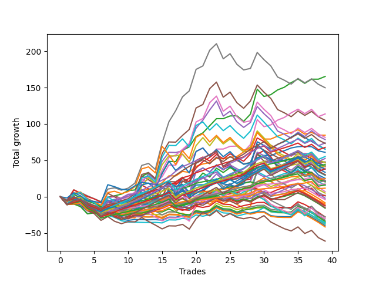

# Short Shepard 004 
- Symbol: ES
- Date Range: 03/18/2022 - 07/15/2022
- Trading Period: 7:20-12:30
- Number of Trades: 39



| Name | Win Percent | Profit | Avg Profit / Trade | Avg Time / Trade |      | Name | Win Percent | Profit | Avg Profit / Trade | Avg Time / Trade |
| ---- | ----------- | ------ | ------------------ | ---------------- | ---- | ---- | ----------- | ------ | ------------------ | ---------------- |
| Sorted By <br> Profit | | | | | | Sorted By <br> Win Percentage ||||
| Two | 74.36 | 82625.00 | 2118.59 | 14:45 |     | Eighty-One | 89.74 | 12375.00 | 317.31 | 05:27 |
| Seven | 56.41 | 74875.00 | 1919.87 | 26:31 |     | One Hundred Twenty-One | 89.74 | 8750.00 | 224.36 | 04:06 |
| Fifty-Eight | 69.23 | 56875.00 | 1458.33 | 12:46 |     | One Hundred Twenty-Six | 89.74 | 5875.00 | 150.64 | 03:52 |
| Five | 53.85 | 52500.00 | 1346.15 | 24:40 |     | Eighty-Two | 84.62 | 22125.00 | 567.31 | 08:07 |
| One | 64.10 | 42250.00 | 1083.33 | 10:45 |     | Eighty-Three | 82.05 | 33875.00 | 868.59 | 09:12 |
| Six | 56.41 | 40750.00 | 1044.87 | 24:24 |     | One Hundred Twenty-Two | 82.05 | 10875.00 | 278.85 | 06:31 |
| Four | 53.85 | 39250.00 | 1006.41 | 22:38 |     | One Hundred Twenty-Seven | 82.05 | 8125.00 | 208.33 | 06:12 |
| Eighty-Four | 79.49 | 37000.00 | 948.72 | 10:52 |     | Eighty-Four | 79.49 | 37000.00 | 948.72 | 10:52 |
| Eighty-Five | 74.36 | 36625.00 | 939.10 | 13:30 |     | One Hundred Twenty-Three | 79.49 | 21250.00 | 544.87 | 07:20 |
| Eighty-Three | 82.05 | 33875.00 | 868.59 | 09:12 |     | One Hundred Twenty-Eight | 79.49 | 19125.00 | 490.38 | 06:59 |
| Forty-Two | 46.15 | 32750.00 | 839.74 | 08:32 |     | One Hundred Twenty-Four | 76.92 | 27625.00 | 708.33 | 08:44 |
| Sixty-One | 48.72 | 32625.00 | 836.54 | 21:11 |     | One Hundred Twenty-Nine | 76.92 | 26250.00 | 673.08 | 08:06 |
| Zero | 66.67 | 30500.00 | 782.05 | 05:42 |     | One Hundred Eleven | 76.92 | -2000.00 | -51.28 | 01:51 |
| One Hundred Twenty-Four | 76.92 | 27625.00 | 708.33 | 08:44 |     | Two | 74.36 | 82625.00 | 2118.59 | 14:45 |
| One Hundred Twenty-Nine | 76.92 | 26250.00 | 673.08 | 08:06 |     | Eighty-Five | 74.36 | 36625.00 | 939.10 | 13:30 |
| Fifty-Seven | 61.54 | 23875.00 | 612.18 | 09:18 |     | One Hundred Sixteen | 71.79 | -4250.00 | -108.97 | 01:56 |
| Fifty-Six | 66.67 | 23375.00 | 599.36 | 04:49 |     | Fifty-Eight | 69.23 | 56875.00 | 1458.33 | 12:46 |
| Sixty | 48.72 | 23250.00 | 596.15 | 19:19 |     | One Hundred Twenty-Five | 69.23 | 18875.00 | 483.97 | 10:55 |
| Eighty-Two | 84.62 | 22125.00 | 567.31 | 08:07 |     | Zero | 66.67 | 30500.00 | 782.05 | 05:42 |
| Seventy-Three | 43.59 | 21375.00 | 548.08 | 07:34 |     | Fifty-Six | 66.67 | 23375.00 | 599.36 | 04:49 |
| One Hundred Twenty-Three | 79.49 | 21250.00 | 544.87 | 07:20 |     | One Hundred Thirty | 66.67 | 15000.00 | 384.62 | 10:01 |
| Forty-Five | 35.90 | 21000.00 | 538.46 | 13:18 |     | One | 64.10 | 42250.00 | 1083.33 | 10:45 |
| Sixty-Six | 61.54 | 20875.00 | 535.26 | 11:09 |     | Sixty-Four | 64.10 | 10625.00 | 272.44 | 04:44 |
| Sixty-Three | 46.15 | 20500.00 | 525.64 | 22:14 |     | One Hundred Twelve | 64.10 | -6250.00 | -160.26 | 03:29 |
| One Hundred Twenty-Eight | 79.49 | 19125.00 | 490.38 | 06:59 |     | Fifty-Seven | 61.54 | 23875.00 | 612.18 | 09:18 |
| One Hundred Twenty-Five | 69.23 | 18875.00 | 483.97 | 10:55 |     | Sixty-Six | 61.54 | 20875.00 | 535.26 | 11:09 |
| One Hundred Fifteen | 58.97 | 16750.00 | 429.49 | 05:37 |     | Forty | 61.54 | 14875.00 | 381.41 | 03:12 |
| Forty-Seven | 33.33 | 15125.00 | 387.82 | 14:21 |     | One Hundred Fourteen | 61.54 | 14625.00 | 375.00 | 04:31 |
| One Hundred Thirty | 66.67 | 15000.00 | 384.62 | 10:01 |     | One Hundred Thirteen | 61.54 | 2500.00 | 64.10 | 03:49 |
| Forty | 61.54 | 14875.00 | 381.41 | 03:12 |     | One Hundred Fifteen | 58.97 | 16750.00 | 429.49 | 05:37 |
| One Hundred Fourteen | 61.54 | 14625.00 | 375.00 | 04:31 |     | Seven | 56.41 | 74875.00 | 1919.87 | 26:31 |
| Sixty-Two | 48.72 | 12625.00 | 323.72 | 20:41 |     | Six | 56.41 | 40750.00 | 1044.87 | 24:24 |
| Eighty-One | 89.74 | 12375.00 | 317.31 | 05:27 |     | One Hundred Seventeen | 56.41 | -7875.00 | -201.92 | 03:26 |
| Forty-Six | 35.90 | 11250.00 | 288.46 | 12:59 |     | Five | 53.85 | 52500.00 | 1346.15 | 24:40 |
| One Hundred Twenty-Two | 82.05 | 10875.00 | 278.85 | 06:31 |     | Four | 53.85 | 39250.00 | 1006.41 | 22:38 |
| Three | 53.85 | 10750.00 | 275.64 | 19:14 |     | Three | 53.85 | 10750.00 | 275.64 | 19:14 |
| Sixty-Four | 64.10 | 10625.00 | 272.44 | 04:44 |     | Forty-Eight | 53.85 | 3500.00 | 89.74 | 02:47 |
| Forty-Four | 35.90 | 10125.00 | 259.62 | 11:43 |     | Sixty-Five | 53.85 | 875.00 | 22.44 | 08:27 |
| One Hundred Twenty-One | 89.74 | 8750.00 | 224.36 | 04:06 |     | One Hundred Eighteen | 51.28 | -6250.00 | -160.26 | 03:38 |
| One Hundred Twenty-Seven | 82.05 | 8125.00 | 208.33 | 06:12 |     | Sixty-One | 48.72 | 32625.00 | 836.54 | 21:11 |
| Forty-One | 48.72 | 7875.00 | 201.92 | 06:15 |     | Sixty | 48.72 | 23250.00 | 596.15 | 19:19 |
| One Hundred Twenty-Six | 89.74 | 5875.00 | 150.64 | 03:52 |     | Sixty-Two | 48.72 | 12625.00 | 323.72 | 20:41 |
| Forty-Eight | 53.85 | 3500.00 | 89.74 | 02:47 |     | Forty-One | 48.72 | 7875.00 | 201.92 | 06:15 |
| One Hundred Thirteen | 61.54 | 2500.00 | 64.10 | 03:49 |     | Fifty-Nine | 48.72 | 500.00 | 12.82 | 16:26 |
| Sixty-Five | 53.85 | 875.00 | 22.44 | 08:27 |     | Forty-Two | 46.15 | 32750.00 | 839.74 | 08:32 |
| Fifty-Nine | 48.72 | 500.00 | 12.82 | 16:26 |     | Sixty-Three | 46.15 | 20500.00 | 525.64 | 22:14 |
| One Hundred Ninteen | 46.15 | -1000.00 | -25.64 | 04:09 |     | One Hundred Ninteen | 46.15 | -1000.00 | -25.64 | 04:09 |
| One Hundred Eleven | 76.92 | -2000.00 | -51.28 | 01:51 |     | Seventy-Three | 43.59 | 21375.00 | 548.08 | 07:34 |
| One Hundred Sixteen | 71.79 | -4250.00 | -108.97 | 01:56 |     | Sixty-Nine | 38.46 | -13875.00 | -355.77 | 16:40 |
| Forty-Three | 35.90 | -5125.00 | -131.41 | 09:51 |     | Sixty-Eight | 38.46 | -15000.00 | -384.62 | 15:20 |
| One Hundred Twelve | 64.10 | -6250.00 | -160.26 | 03:29 |     | Seventy | 38.46 | -17625.00 | -451.92 | 17:13 |
| One Hundred Eighteen | 51.28 | -6250.00 | -160.26 | 03:38 |     | Seventy-One | 38.46 | -17750.00 | -455.13 | 17:28 |
| One Hundred Twenty | 35.90 | -7500.00 | -192.31 | 04:40 |     | Sixty-Seven | 38.46 | -30500.00 | -782.05 | 13:40 |
| One Hundred Seventeen | 56.41 | -7875.00 | -201.92 | 03:26 |     | Forty-Five | 35.90 | 21000.00 | 538.46 | 13:18 |
| Sixty-Nine | 38.46 | -13875.00 | -355.77 | 16:40 |     | Forty-Six | 35.90 | 11250.00 | 288.46 | 12:59 |
| Fifty-Five | 30.77 | -13875.00 | -355.77 | 06:41 |     | Forty-Four | 35.90 | 10125.00 | 259.62 | 11:43 |
| Sixty-Eight | 38.46 | -15000.00 | -384.62 | 15:20 |     | Forty-Three | 35.90 | -5125.00 | -131.41 | 09:51 |
| Forty-Nine | 33.33 | -16125.00 | -413.46 | 04:44 |     | One Hundred Twenty | 35.90 | -7500.00 | -192.31 | 04:40 |
| Fifty-Four | 30.77 | -17000.00 | -435.90 | 06:37 |     | Forty-Seven | 33.33 | 15125.00 | 387.82 | 14:21 |
| Seventy | 38.46 | -17625.00 | -451.92 | 17:13 |     | Forty-Nine | 33.33 | -16125.00 | -413.46 | 04:44 |
| Seventy-One | 38.46 | -17750.00 | -455.13 | 17:28 |     | Fifty-Five | 30.77 | -13875.00 | -355.77 | 06:41 |
| Fifty-One | 30.77 | -18625.00 | -477.56 | 05:12 |     | Fifty-Four | 30.77 | -17000.00 | -435.90 | 06:37 |
| Fifty | 30.77 | -19000.00 | -487.18 | 05:07 |     | Fifty-One | 30.77 | -18625.00 | -477.56 | 05:12 |
| Fifty-Two | 30.77 | -20000.00 | -512.82 | 05:40 |     | Fifty | 30.77 | -19000.00 | -487.18 | 05:07 |
| Fifty-Three | 28.21 | -20750.00 | -532.05 | 05:55 |     | Fifty-Two | 30.77 | -20000.00 | -512.82 | 05:40 |
| Sixty-Seven | 38.46 | -30500.00 | -782.05 | 13:40 |     | Fifty-Three | 28.21 | -20750.00 | -532.05 | 05:55 |

## NO STOPLOSS

### Test Zero
* Sell when price hits the middle line of the 20p bollinger
* No Stoploss
* Results:
```
Total Trades: 39
Percent Up: 33.33
Percent Down: 66.67
Total Points Moved Down: 61.00
Potential Profit: 30500.00
Total Points Ups: 37.25 Count Ups: 13
Total Points Downs: 98.25 Count Downs: 26
```

<details><summary>Trades</summary>

<code>In: 2022-03-18 12:13:00		Out: 2022-03-18 12:37:20		Total Position Time: 24:20		Total Move Down: -9.00		Total to Date: -9.00</code> <br />
<code>In: 2022-03-23 09:05:00		Out: 2022-03-23 09:05:25		Total Position Time: 00:25		Total Move Down: 0.75		Total to Date: -8.25</code> <br />
<code>In: 2022-03-24 08:35:00		Out: 2022-03-24 08:50:05		Total Position Time: 15:05		Total Move Down: -3.75		Total to Date: -12.00</code> <br />
<code>In: 2022-03-25 07:29:00		Out: 2022-03-25 07:51:05		Total Position Time: 22:05		Total Move Down: -6.75		Total to Date: -18.75</code> <br />
<code>In: 2022-03-28 12:01:00		Out: 2022-03-28 12:06:45		Total Position Time: 05:45		Total Move Down: 1.25		Total to Date: -17.50</code> <br />
<code>In: 2022-03-29 12:15:00		Out: 2022-03-29 12:18:55		Total Position Time: 03:55		Total Move Down: -0.25		Total to Date: -17.75</code> <br />
<code>In: 2022-04-06 11:06:00		Out: 2022-04-06 11:06:10		Total Position Time: 00:10		Total Move Down: 0.50		Total to Date: -17.25</code> <br />
<code>In: 2022-04-07 11:06:00		Out: 2022-04-07 11:15:20		Total Position Time: 09:20		Total Move Down: 0.25		Total to Date: -17.00</code> <br />
<code>In: 2022-04-07 12:08:00		Out: 2022-04-07 12:19:10		Total Position Time: 11:10		Total Move Down: -2.50		Total to Date: -19.50</code> <br />
<code>In: 2022-04-08 08:05:00		Out: 2022-04-08 08:15:35		Total Position Time: 10:35		Total Move Down: 3.00		Total to Date: -16.50</code> <br />
<code>In: 2022-04-13 10:26:00		Out: 2022-04-13 10:26:10		Total Position Time: 00:10		Total Move Down: -0.25		Total to Date: -16.75</code> <br />
<code>In: 2022-04-25 07:39:00		Out: 2022-04-25 07:40:25		Total Position Time: 01:25		Total Move Down: 8.75		Total to Date: -8.00</code> <br />
<code>In: 2022-04-27 09:34:00		Out: 2022-04-27 09:37:00		Total Position Time: 03:00		Total Move Down: 4.75		Total to Date: -3.25</code> <br />
<code>In: 2022-04-28 11:54:00		Out: 2022-04-28 11:55:05		Total Position Time: 01:05		Total Move Down: 5.00		Total to Date: 1.75</code> <br />
<code>In: 2022-05-02 07:36:00		Out: 2022-05-02 07:44:10		Total Position Time: 08:10		Total Move Down: -0.75		Total to Date: 1.00</code> <br />
<code>In: 2022-05-04 11:07:00		Out: 2022-05-04 11:07:10		Total Position Time: 00:10		Total Move Down: 4.25		Total to Date: 5.25</code> <br />
<code>In: 2022-05-04 11:08:00		Out: 2022-05-04 11:08:10		Total Position Time: 00:10		Total Move Down: -0.25		Total to Date: 5.00</code> <br />
<code>In: 2022-05-04 11:31:00		Out: 2022-05-04 11:31:10		Total Position Time: 00:10		Total Move Down: 2.25		Total to Date: 7.25</code> <br />
<code>In: 2022-05-12 08:01:00		Out: 2022-05-12 08:15:00		Total Position Time: 14:00		Total Move Down: -5.25		Total to Date: 2.00</code> <br />
<code>In: 2022-05-12 08:13:00		Out: 2022-05-12 08:15:00		Total Position Time: 02:00		Total Move Down: 4.25		Total to Date: 6.25</code> <br />
<code>In: 2022-05-16 11:36:00		Out: 2022-05-16 11:41:45		Total Position Time: 05:45		Total Move Down: 1.50		Total to Date: 7.75</code> <br />
<code>In: 2022-05-19 11:56:00		Out: 2022-05-19 11:57:50		Total Position Time: 01:50		Total Move Down: 7.00		Total to Date: 14.75</code> <br />
<code>In: 2022-05-25 07:41:00		Out: 2022-05-25 07:42:00		Total Position Time: 01:00		Total Move Down: 4.50		Total to Date: 19.25</code> <br />
<code>In: 2022-05-25 11:33:00		Out: 2022-05-25 11:39:10		Total Position Time: 06:10		Total Move Down: 2.75		Total to Date: 22.00</code> <br />
<code>In: 2022-05-31 11:04:00		Out: 2022-05-31 11:05:10		Total Position Time: 01:10		Total Move Down: 1.75		Total to Date: 23.75</code> <br />
<code>In: 2022-06-02 08:18:00		Out: 2022-06-02 08:22:05		Total Position Time: 04:05		Total Move Down: 1.25		Total to Date: 25.00</code> <br />
<code>In: 2022-06-02 08:55:00		Out: 2022-06-02 08:57:05		Total Position Time: 02:05		Total Move Down: 4.00		Total to Date: 29.00</code> <br />
<code>In: 2022-06-15 11:02:00		Out: 2022-06-15 11:02:10		Total Position Time: 00:10		Total Move Down: 2.00		Total to Date: 31.00</code> <br />
<code>In: 2022-06-15 11:48:00		Out: 2022-06-15 11:52:30		Total Position Time: 04:30		Total Move Down: 22.25		Total to Date: 53.25</code> <br />
<code>In: 2022-07-01 12:18:00		Out: 2022-07-01 12:20:55		Total Position Time: 02:55		Total Move Down: 3.50		Total to Date: 56.75</code> <br />
<code>In: 2022-07-05 08:53:00		Out: 2022-07-05 09:00:10		Total Position Time: 07:10		Total Move Down: -0.25		Total to Date: 56.50</code> <br />
<code>In: 2022-07-05 08:58:00		Out: 2022-07-05 09:00:10		Total Position Time: 02:10		Total Move Down: 3.75		Total to Date: 60.25</code> <br />
<code>In: 2022-07-05 11:43:00		Out: 2022-07-05 11:48:10		Total Position Time: 05:10		Total Move Down: 3.00		Total to Date: 63.25</code> <br />
<code>In: 2022-07-06 11:48:00		Out: 2022-07-06 11:50:00		Total Position Time: 02:00		Total Move Down: 3.75		Total to Date: 67.00</code> <br />
<code>In: 2022-07-07 12:23:00		Out: 2022-07-07 12:24:15		Total Position Time: 01:15		Total Move Down: 1.75		Total to Date: 68.75</code> <br />
<code>In: 2022-07-11 10:15:00		Out: 2022-07-11 10:23:05		Total Position Time: 08:05		Total Move Down: 0.50		Total to Date: 69.25</code> <br />
<code>In: 2022-07-13 10:08:00		Out: 2022-07-13 10:16:20		Total Position Time: 08:20		Total Move Down: -0.50		Total to Date: 68.75</code> <br />
<code>In: 2022-07-14 11:28:00		Out: 2022-07-14 11:42:40		Total Position Time: 14:40		Total Move Down: -5.75		Total to Date: 63.00</code> <br />
<code>In: 2022-07-14 11:32:00		Out: 2022-07-14 11:42:40		Total Position Time: 10:40		Total Move Down: -2.00		Total to Date: 61.00</code> <br />


</details>

### Test One
* Sell when the price hits the upper line of the 20p 1std bollinger
* No Stoploss
* Results:
```
Total Trades: 39
Percent Up: 35.90
Percent Down: 64.10
Total Points Moved Down: 84.50
Potential Profit: 42250.00
Total Points Ups: 39.75 Count Ups: 14
Total Points Downs: 124.25 Count Downs: 25
```

<details><summary>Trades</summary>

<code>In: 2022-03-18 12:13:00		Out: 2022-03-18 12:39:40		Total Position Time: 26:40		Total Move Down: -6.75		Total to Date: -6.75</code> <br />
<code>In: 2022-03-23 09:05:00		Out: 2022-03-23 09:06:10		Total Position Time: 01:10		Total Move Down: 3.50		Total to Date: -3.25</code> <br />
<code>In: 2022-03-24 08:35:00		Out: 2022-03-24 08:53:45		Total Position Time: 18:45		Total Move Down: -1.50		Total to Date: -4.75</code> <br />
<code>In: 2022-03-25 07:29:00		Out: 2022-03-25 07:53:50		Total Position Time: 24:50		Total Move Down: -5.25		Total to Date: -10.00</code> <br />
<code>In: 2022-03-28 12:01:00		Out: 2022-03-28 12:30:55		Total Position Time: 29:55		Total Move Down: -4.00		Total to Date: -14.00</code> <br />
<code>In: 2022-03-29 12:15:00		Out: 2022-03-29 12:27:35		Total Position Time: 12:35		Total Move Down: 0.25		Total to Date: -13.75</code> <br />
<code>In: 2022-04-06 11:06:00		Out: 2022-04-06 11:07:20		Total Position Time: 01:20		Total Move Down: 5.25		Total to Date: -8.50</code> <br />
<code>In: 2022-04-07 11:06:00		Out: 2022-04-07 11:16:10		Total Position Time: 10:10		Total Move Down: 0.25		Total to Date: -8.25</code> <br />
<code>In: 2022-04-07 12:08:00		Out: 2022-04-07 12:20:50		Total Position Time: 12:50		Total Move Down: -0.00		Total to Date: -8.25</code> <br />
<code>In: 2022-04-08 08:05:00		Out: 2022-04-08 08:17:05		Total Position Time: 12:05		Total Move Down: 4.75		Total to Date: -3.50</code> <br />
<code>In: 2022-04-13 10:26:00		Out: 2022-04-13 10:26:10		Total Position Time: 00:10		Total Move Down: -0.25		Total to Date: -3.75</code> <br />
<code>In: 2022-04-25 07:39:00		Out: 2022-04-25 07:43:05		Total Position Time: 04:05		Total Move Down: 12.25		Total to Date: 8.50</code> <br />
<code>In: 2022-04-27 09:34:00		Out: 2022-04-27 09:50:25		Total Position Time: 16:25		Total Move Down: 1.50		Total to Date: 10.00</code> <br />
<code>In: 2022-04-28 11:54:00		Out: 2022-04-28 12:02:10		Total Position Time: 08:10		Total Move Down: 4.25		Total to Date: 14.25</code> <br />
<code>In: 2022-05-02 07:36:00		Out: 2022-05-02 07:44:50		Total Position Time: 08:50		Total Move Down: 5.00		Total to Date: 19.25</code> <br />
<code>In: 2022-05-04 11:07:00		Out: 2022-05-04 11:07:20		Total Position Time: 00:20		Total Move Down: 9.50		Total to Date: 28.75</code> <br />
<code>In: 2022-05-04 11:08:00		Out: 2022-05-04 11:08:10		Total Position Time: 00:10		Total Move Down: -0.25		Total to Date: 28.50</code> <br />
<code>In: 2022-05-04 11:31:00		Out: 2022-05-04 11:31:20		Total Position Time: 00:20		Total Move Down: 6.25		Total to Date: 34.75</code> <br />
<code>In: 2022-05-12 08:01:00		Out: 2022-05-12 08:17:30		Total Position Time: 16:30		Total Move Down: -1.25		Total to Date: 33.50</code> <br />
<code>In: 2022-05-12 08:13:00		Out: 2022-05-12 08:17:30		Total Position Time: 04:30		Total Move Down: 8.25		Total to Date: 41.75</code> <br />
<code>In: 2022-05-16 11:36:00		Out: 2022-05-16 11:44:50		Total Position Time: 08:50		Total Move Down: 3.25		Total to Date: 45.00</code> <br />
<code>In: 2022-05-19 11:56:00		Out: 2022-05-19 12:10:10		Total Position Time: 14:10		Total Move Down: 1.75		Total to Date: 46.75</code> <br />
<code>In: 2022-05-25 07:41:00		Out: 2022-05-25 07:46:40		Total Position Time: 05:40		Total Move Down: 6.00		Total to Date: 52.75</code> <br />
<code>In: 2022-05-25 11:33:00		Out: 2022-05-25 11:45:15		Total Position Time: 12:15		Total Move Down: -0.75		Total to Date: 52.00</code> <br />
<code>In: 2022-05-31 11:04:00		Out: 2022-05-31 11:13:25		Total Position Time: 09:25		Total Move Down: 2.25		Total to Date: 54.25</code> <br />
<code>In: 2022-06-02 08:18:00		Out: 2022-06-02 08:27:30		Total Position Time: 09:30		Total Move Down: 1.00		Total to Date: 55.25</code> <br />
<code>In: 2022-06-02 08:55:00		Out: 2022-06-02 09:01:05		Total Position Time: 06:05		Total Move Down: 6.25		Total to Date: 61.50</code> <br />
<code>In: 2022-06-15 11:02:00		Out: 2022-06-15 11:02:10		Total Position Time: 00:10		Total Move Down: 2.00		Total to Date: 63.50</code> <br />
<code>In: 2022-06-15 11:48:00		Out: 2022-06-15 11:57:35		Total Position Time: 09:35		Total Move Down: 25.75		Total to Date: 89.25</code> <br />
<code>In: 2022-07-01 12:18:00		Out: 2022-07-01 12:46:00		Total Position Time: 28:00		Total Move Down: -10.00		Total to Date: 79.25</code> <br />
<code>In: 2022-07-05 08:53:00		Out: 2022-07-05 09:03:25		Total Position Time: 10:25		Total Move Down: -0.00		Total to Date: 79.25</code> <br />
<code>In: 2022-07-05 08:58:00		Out: 2022-07-05 09:03:25		Total Position Time: 05:25		Total Move Down: 4.00		Total to Date: 83.25</code> <br />
<code>In: 2022-07-05 11:43:00		Out: 2022-07-05 11:52:50		Total Position Time: 09:50		Total Move Down: 3.25		Total to Date: 86.50</code> <br />
<code>In: 2022-07-06 11:48:00		Out: 2022-07-06 12:00:30		Total Position Time: 12:30		Total Move Down: 1.75		Total to Date: 88.25</code> <br />
<code>In: 2022-07-07 12:23:00		Out: 2022-07-07 12:25:10		Total Position Time: 02:10		Total Move Down: 3.75		Total to Date: 92.00</code> <br />
<code>In: 2022-07-11 10:15:00		Out: 2022-07-11 10:44:55		Total Position Time: 29:55		Total Move Down: -6.00		Total to Date: 86.00</code> <br />
<code>In: 2022-07-13 10:08:00		Out: 2022-07-13 10:16:30		Total Position Time: 08:30		Total Move Down: 2.25		Total to Date: 88.25</code> <br />
<code>In: 2022-07-14 11:28:00		Out: 2022-07-14 11:43:35		Total Position Time: 15:35		Total Move Down: -3.75		Total to Date: 84.50</code> <br />
<code>In: 2022-07-14 11:32:00		Out: 2022-07-14 11:43:35		Total Position Time: 11:35		Total Move Down: -0.00		Total to Date: 84.50</code> <br />


</details>

### Test Two
* Sell when the price hits the upper line of the 20p 2std bollinger
* No Stoploss
* Results:
```
Total Trades: 39
Percent Up: 25.64
Percent Down: 74.36
Total Points Moved Down: 165.25
Potential Profit: 82625.00
Total Points Ups: 51.25 Count Ups: 10
Total Points Downs: 216.50 Count Downs: 29
```

<details><summary>Trades</summary>

<code>In: 2022-03-18 12:13:00		Out: 2022-03-18 12:42:55		Total Position Time: 29:55		Total Move Down: -10.75		Total to Date: -10.75</code> <br />
<code>In: 2022-03-23 09:05:00		Out: 2022-03-23 09:06:25		Total Position Time: 01:25		Total Move Down: 5.50		Total to Date: -5.25</code> <br />
<code>In: 2022-03-24 08:35:00		Out: 2022-03-24 09:03:10		Total Position Time: 28:10		Total Move Down: 0.50		Total to Date: -4.75</code> <br />
<code>In: 2022-03-25 07:29:00		Out: 2022-03-25 07:54:10		Total Position Time: 25:10		Total Move Down: -4.25		Total to Date: -9.00</code> <br />
<code>In: 2022-03-28 12:01:00		Out: 2022-03-28 12:30:55		Total Position Time: 29:55		Total Move Down: -4.00		Total to Date: -13.00</code> <br />
<code>In: 2022-03-29 12:15:00		Out: 2022-03-29 12:27:50		Total Position Time: 12:50		Total Move Down: 0.75		Total to Date: -12.25</code> <br />
<code>In: 2022-04-06 11:06:00		Out: 2022-04-06 11:08:10		Total Position Time: 02:10		Total Move Down: 11.25		Total to Date: -1.00</code> <br />
<code>In: 2022-04-07 11:06:00		Out: 2022-04-07 11:18:20		Total Position Time: 12:20		Total Move Down: 2.25		Total to Date: 1.25</code> <br />
<code>In: 2022-04-07 12:08:00		Out: 2022-04-07 12:21:20		Total Position Time: 13:20		Total Move Down: 2.25		Total to Date: 3.50</code> <br />
<code>In: 2022-04-08 08:05:00		Out: 2022-04-08 08:20:10		Total Position Time: 15:10		Total Move Down: 5.00		Total to Date: 8.50</code> <br />
<code>In: 2022-04-13 10:26:00		Out: 2022-04-13 10:26:55		Total Position Time: 00:55		Total Move Down: 0.75		Total to Date: 9.25</code> <br />
<code>In: 2022-04-25 07:39:00		Out: 2022-04-25 07:52:35		Total Position Time: 13:35		Total Move Down: 18.75		Total to Date: 28.00</code> <br />
<code>In: 2022-04-27 09:34:00		Out: 2022-04-27 10:00:10		Total Position Time: 26:10		Total Move Down: 4.50		Total to Date: 32.50</code> <br />
<code>In: 2022-04-28 11:54:00		Out: 2022-04-28 12:23:55		Total Position Time: 29:55		Total Move Down: -8.25		Total to Date: 24.25</code> <br />
<code>In: 2022-05-02 07:36:00		Out: 2022-05-02 07:47:15		Total Position Time: 11:15		Total Move Down: 8.25		Total to Date: 32.50</code> <br />
<code>In: 2022-05-04 11:07:00		Out: 2022-05-04 11:07:40		Total Position Time: 00:40		Total Move Down: 16.00		Total to Date: 48.50</code> <br />
<code>In: 2022-05-04 11:08:00		Out: 2022-05-04 11:08:10		Total Position Time: 00:10		Total Move Down: -0.25		Total to Date: 48.25</code> <br />
<code>In: 2022-05-04 11:31:00		Out: 2022-05-04 11:32:25		Total Position Time: 01:25		Total Move Down: 15.50		Total to Date: 63.75</code> <br />
<code>In: 2022-05-12 08:01:00		Out: 2022-05-12 08:22:05		Total Position Time: 21:05		Total Move Down: 4.75		Total to Date: 68.50</code> <br />
<code>In: 2022-05-12 08:13:00		Out: 2022-05-12 08:22:05		Total Position Time: 09:05		Total Move Down: 14.25		Total to Date: 82.75</code> <br />
<code>In: 2022-05-16 11:36:00		Out: 2022-05-16 11:45:35		Total Position Time: 09:35		Total Move Down: 5.00		Total to Date: 87.75</code> <br />
<code>In: 2022-05-19 11:56:00		Out: 2022-05-19 12:14:05		Total Position Time: 18:05		Total Move Down: 9.75		Total to Date: 97.50</code> <br />
<code>In: 2022-05-25 07:41:00		Out: 2022-05-25 07:48:10		Total Position Time: 07:10		Total Move Down: 9.75		Total to Date: 107.25</code> <br />
<code>In: 2022-05-25 11:33:00		Out: 2022-05-25 11:50:00		Total Position Time: 17:00		Total Move Down: -0.00		Total to Date: 107.25</code> <br />
<code>In: 2022-05-31 11:04:00		Out: 2022-05-31 11:22:35		Total Position Time: 18:35		Total Move Down: 3.75		Total to Date: 111.00</code> <br />
<code>In: 2022-06-02 08:18:00		Out: 2022-06-02 08:30:55		Total Position Time: 12:55		Total Move Down: 0.25		Total to Date: 111.25</code> <br />
<code>In: 2022-06-02 08:55:00		Out: 2022-06-02 09:24:55		Total Position Time: 29:55		Total Move Down: -7.75		Total to Date: 103.50</code> <br />
<code>In: 2022-06-15 11:02:00		Out: 2022-06-15 11:03:05		Total Position Time: 01:05		Total Move Down: 10.00		Total to Date: 113.50</code> <br />
<code>In: 2022-06-15 11:48:00		Out: 2022-06-15 11:58:05		Total Position Time: 10:05		Total Move Down: 34.25		Total to Date: 147.75</code> <br />
<code>In: 2022-07-01 12:18:00		Out: 2022-07-01 12:46:00		Total Position Time: 28:00		Total Move Down: -10.00		Total to Date: 137.75</code> <br />
<code>In: 2022-07-05 08:53:00		Out: 2022-07-05 09:03:50		Total Position Time: 10:50		Total Move Down: 2.50		Total to Date: 140.25</code> <br />
<code>In: 2022-07-05 08:58:00		Out: 2022-07-05 09:03:50		Total Position Time: 05:50		Total Move Down: 6.50		Total to Date: 146.75</code> <br />
<code>In: 2022-07-05 11:43:00		Out: 2022-07-05 12:01:15		Total Position Time: 18:15		Total Move Down: 3.75		Total to Date: 150.50</code> <br />
<code>In: 2022-07-06 11:48:00		Out: 2022-07-06 12:01:25		Total Position Time: 13:25		Total Move Down: 6.25		Total to Date: 156.75</code> <br />
<code>In: 2022-07-07 12:23:00		Out: 2022-07-07 12:28:30		Total Position Time: 05:30		Total Move Down: 5.00		Total to Date: 161.75</code> <br />
<code>In: 2022-07-11 10:15:00		Out: 2022-07-11 10:44:55		Total Position Time: 29:55		Total Move Down: -6.00		Total to Date: 155.75</code> <br />
<code>In: 2022-07-13 10:08:00		Out: 2022-07-13 10:18:35		Total Position Time: 10:35		Total Move Down: 5.75		Total to Date: 161.50</code> <br />
<code>In: 2022-07-14 11:28:00		Out: 2022-07-14 11:52:00		Total Position Time: 24:00		Total Move Down: -0.00		Total to Date: 161.50</code> <br />
<code>In: 2022-07-14 11:32:00		Out: 2022-07-14 11:52:00		Total Position Time: 20:00		Total Move Down: 3.75		Total to Date: 165.25</code> <br />


</details>

### Test Three
* Sell when price hits the middle line of the 50p bollinger
* No Stoploss
* Results:
```
Total Trades: 39
Percent Up: 46.15
Percent Down: 53.85
Total Points Moved Down: 21.50
Potential Profit: 10750.00
Total Points Ups: 126.75 Count Ups: 18
Total Points Downs: 148.25 Count Downs: 21
```

<details><summary>Trades</summary>

<code>In: 2022-03-18 12:13:00		Out: 2022-03-18 12:42:55		Total Position Time: 29:55		Total Move Down: -10.75		Total to Date: -10.75</code> <br />
<code>In: 2022-03-23 09:05:00		Out: 2022-03-23 09:05:25		Total Position Time: 00:25		Total Move Down: 0.75		Total to Date: -10.00</code> <br />
<code>In: 2022-03-24 08:35:00		Out: 2022-03-24 09:03:10		Total Position Time: 28:10		Total Move Down: 0.50		Total to Date: -9.50</code> <br />
<code>In: 2022-03-25 07:29:00		Out: 2022-03-25 07:58:55		Total Position Time: 29:55		Total Move Down: -4.50		Total to Date: -14.00</code> <br />
<code>In: 2022-03-28 12:01:00		Out: 2022-03-28 12:30:55		Total Position Time: 29:55		Total Move Down: -4.00		Total to Date: -18.00</code> <br />
<code>In: 2022-03-29 12:15:00		Out: 2022-03-29 12:43:05		Total Position Time: 28:05		Total Move Down: -0.75		Total to Date: -18.75</code> <br />
<code>In: 2022-04-06 11:06:00		Out: 2022-04-06 11:07:20		Total Position Time: 01:20		Total Move Down: 5.25		Total to Date: -13.50</code> <br />
<code>In: 2022-04-07 11:06:00		Out: 2022-04-07 11:33:40		Total Position Time: 27:40		Total Move Down: 2.50		Total to Date: -11.00</code> <br />
<code>In: 2022-04-07 12:08:00		Out: 2022-04-07 12:37:55		Total Position Time: 29:55		Total Move Down: -3.25		Total to Date: -14.25</code> <br />
<code>In: 2022-04-08 08:05:00		Out: 2022-04-08 08:34:55		Total Position Time: 29:55		Total Move Down: 2.75		Total to Date: -11.50</code> <br />
<code>In: 2022-04-13 10:26:00		Out: 2022-04-13 10:26:10		Total Position Time: 00:10		Total Move Down: -0.25		Total to Date: -11.75</code> <br />
<code>In: 2022-04-25 07:39:00		Out: 2022-04-25 07:52:00		Total Position Time: 13:00		Total Move Down: 14.25		Total to Date: 2.50</code> <br />
<code>In: 2022-04-27 09:34:00		Out: 2022-04-27 10:00:10		Total Position Time: 26:10		Total Move Down: 4.50		Total to Date: 7.00</code> <br />
<code>In: 2022-04-28 11:54:00		Out: 2022-04-28 12:23:55		Total Position Time: 29:55		Total Move Down: -8.25		Total to Date: -1.25</code> <br />
<code>In: 2022-05-02 07:36:00		Out: 2022-05-02 07:53:35		Total Position Time: 17:35		Total Move Down: 14.25		Total to Date: 13.00</code> <br />
<code>In: 2022-05-04 11:07:00		Out: 2022-05-04 11:07:15		Total Position Time: 00:15		Total Move Down: 5.50		Total to Date: 18.50</code> <br />
<code>In: 2022-05-04 11:08:00		Out: 2022-05-04 11:08:10		Total Position Time: 00:10		Total Move Down: -0.25		Total to Date: 18.25</code> <br />
<code>In: 2022-05-04 11:31:00		Out: 2022-05-04 11:31:10		Total Position Time: 00:10		Total Move Down: 2.25		Total to Date: 20.50</code> <br />
<code>In: 2022-05-12 08:01:00		Out: 2022-05-12 08:22:05		Total Position Time: 21:05		Total Move Down: 4.75		Total to Date: 25.25</code> <br />
<code>In: 2022-05-12 08:13:00		Out: 2022-05-12 08:22:05		Total Position Time: 09:05		Total Move Down: 14.25		Total to Date: 39.50</code> <br />
<code>In: 2022-05-16 11:36:00		Out: 2022-05-16 11:49:00		Total Position Time: 13:00		Total Move Down: 8.75		Total to Date: 48.25</code> <br />
<code>In: 2022-05-19 11:56:00		Out: 2022-05-19 12:13:30		Total Position Time: 17:30		Total Move Down: 5.75		Total to Date: 54.00</code> <br />
<code>In: 2022-05-25 07:41:00		Out: 2022-05-25 08:00:40		Total Position Time: 19:40		Total Move Down: 7.00		Total to Date: 61.00</code> <br />
<code>In: 2022-05-25 11:33:00		Out: 2022-05-25 12:02:55		Total Position Time: 29:55		Total Move Down: -20.75		Total to Date: 40.25</code> <br />
<code>In: 2022-05-31 11:04:00		Out: 2022-05-31 11:22:40		Total Position Time: 18:40		Total Move Down: 4.25		Total to Date: 44.50</code> <br />
<code>In: 2022-06-02 08:18:00		Out: 2022-06-02 08:47:55		Total Position Time: 29:55		Total Move Down: -14.50		Total to Date: 30.00</code> <br />
<code>In: 2022-06-02 08:55:00		Out: 2022-06-02 09:24:55		Total Position Time: 29:55		Total Move Down: -7.75		Total to Date: 22.25</code> <br />
<code>In: 2022-06-15 11:02:00		Out: 2022-06-15 11:02:10		Total Position Time: 00:10		Total Move Down: 2.00		Total to Date: 24.25</code> <br />
<code>In: 2022-06-15 11:48:00		Out: 2022-06-15 11:58:05		Total Position Time: 10:05		Total Move Down: 34.25		Total to Date: 58.50</code> <br />
<code>In: 2022-07-01 12:18:00		Out: 2022-07-01 12:21:00		Total Position Time: 03:00		Total Move Down: 5.00		Total to Date: 63.50</code> <br />
<code>In: 2022-07-05 08:53:00		Out: 2022-07-05 09:22:55		Total Position Time: 29:55		Total Move Down: -8.50		Total to Date: 55.00</code> <br />
<code>In: 2022-07-05 08:58:00		Out: 2022-07-05 09:27:55		Total Position Time: 29:55		Total Move Down: -15.25		Total to Date: 39.75</code> <br />
<code>In: 2022-07-05 11:43:00		Out: 2022-07-05 12:12:55		Total Position Time: 29:55		Total Move Down: -4.50		Total to Date: 35.25</code> <br />
<code>In: 2022-07-06 11:48:00		Out: 2022-07-06 12:17:55		Total Position Time: 29:55		Total Move Down: -5.25		Total to Date: 30.00</code> <br />
<code>In: 2022-07-07 12:23:00		Out: 2022-07-07 12:30:00		Total Position Time: 07:00		Total Move Down: 5.50		Total to Date: 35.50</code> <br />
<code>In: 2022-07-11 10:15:00		Out: 2022-07-11 10:44:55		Total Position Time: 29:55		Total Move Down: -6.00		Total to Date: 29.50</code> <br />
<code>In: 2022-07-13 10:08:00		Out: 2022-07-13 10:17:05		Total Position Time: 09:05		Total Move Down: 4.25		Total to Date: 33.75</code> <br />
<code>In: 2022-07-14 11:28:00		Out: 2022-07-14 11:57:55		Total Position Time: 29:55		Total Move Down: -7.50		Total to Date: 26.25</code> <br />
<code>In: 2022-07-14 11:32:00		Out: 2022-07-14 12:01:55		Total Position Time: 29:55		Total Move Down: -4.75		Total to Date: 21.50</code> <br />


</details>

### Test Four
* Sell when the price hits the upper line of the 50p 1std bollinger
* No Stoploss
* Results:
```
Total Trades: 39
Percent Up: 46.15
Percent Down: 53.85
Total Points Moved Down: 78.50
Potential Profit: 39250.00
Total Points Ups: 139.75 Count Ups: 18
Total Points Downs: 218.25 Count Downs: 21
```

<details><summary>Trades</summary>

<code>In: 2022-03-18 12:13:00		Out: 2022-03-18 12:42:55		Total Position Time: 29:55		Total Move Down: -10.75		Total to Date: -10.75</code> <br />
<code>In: 2022-03-23 09:05:00		Out: 2022-03-23 09:06:05		Total Position Time: 01:05		Total Move Down: 3.00		Total to Date: -7.75</code> <br />
<code>In: 2022-03-24 08:35:00		Out: 2022-03-24 09:04:55		Total Position Time: 29:55		Total Move Down: 1.75		Total to Date: -6.00</code> <br />
<code>In: 2022-03-25 07:29:00		Out: 2022-03-25 07:58:55		Total Position Time: 29:55		Total Move Down: -4.50		Total to Date: -10.50</code> <br />
<code>In: 2022-03-28 12:01:00		Out: 2022-03-28 12:30:55		Total Position Time: 29:55		Total Move Down: -4.00		Total to Date: -14.50</code> <br />
<code>In: 2022-03-29 12:15:00		Out: 2022-03-29 12:44:55		Total Position Time: 29:55		Total Move Down: -4.00		Total to Date: -18.50</code> <br />
<code>In: 2022-04-06 11:06:00		Out: 2022-04-06 11:08:10		Total Position Time: 02:10		Total Move Down: 11.25		Total to Date: -7.25</code> <br />
<code>In: 2022-04-07 11:06:00		Out: 2022-04-07 11:35:55		Total Position Time: 29:55		Total Move Down: 1.75		Total to Date: -5.50</code> <br />
<code>In: 2022-04-07 12:08:00		Out: 2022-04-07 12:37:55		Total Position Time: 29:55		Total Move Down: -3.25		Total to Date: -8.75</code> <br />
<code>In: 2022-04-08 08:05:00		Out: 2022-04-08 08:34:55		Total Position Time: 29:55		Total Move Down: 2.75		Total to Date: -6.00</code> <br />
<code>In: 2022-04-13 10:26:00		Out: 2022-04-13 10:31:20		Total Position Time: 05:20		Total Move Down: 1.25		Total to Date: -4.75</code> <br />
<code>In: 2022-04-25 07:39:00		Out: 2022-04-25 07:58:05		Total Position Time: 19:05		Total Move Down: 24.25		Total to Date: 19.50</code> <br />
<code>In: 2022-04-27 09:34:00		Out: 2022-04-27 10:01:20		Total Position Time: 27:20		Total Move Down: 11.50		Total to Date: 31.00</code> <br />
<code>In: 2022-04-28 11:54:00		Out: 2022-04-28 12:23:55		Total Position Time: 29:55		Total Move Down: -8.25		Total to Date: 22.75</code> <br />
<code>In: 2022-05-02 07:36:00		Out: 2022-05-02 08:02:05		Total Position Time: 26:05		Total Move Down: 26.00		Total to Date: 48.75</code> <br />
<code>In: 2022-05-04 11:07:00		Out: 2022-05-04 11:07:25		Total Position Time: 00:25		Total Move Down: 12.25		Total to Date: 61.00</code> <br />
<code>In: 2022-05-04 11:08:00		Out: 2022-05-04 11:08:10		Total Position Time: 00:10		Total Move Down: -0.25		Total to Date: 60.75</code> <br />
<code>In: 2022-05-04 11:31:00		Out: 2022-05-04 11:31:10		Total Position Time: 00:10		Total Move Down: 2.25		Total to Date: 63.00</code> <br />
<code>In: 2022-05-12 08:01:00		Out: 2022-05-12 08:30:55		Total Position Time: 29:55		Total Move Down: 8.25		Total to Date: 71.25</code> <br />
<code>In: 2022-05-12 08:13:00		Out: 2022-05-12 08:31:20		Total Position Time: 18:20		Total Move Down: 23.00		Total to Date: 94.25</code> <br />
<code>In: 2022-05-16 11:36:00		Out: 2022-05-16 11:52:15		Total Position Time: 16:15		Total Move Down: 11.00		Total to Date: 105.25</code> <br />
<code>In: 2022-05-19 11:56:00		Out: 2022-05-19 12:18:25		Total Position Time: 22:25		Total Move Down: 14.00		Total to Date: 119.25</code> <br />
<code>In: 2022-05-25 07:41:00		Out: 2022-05-25 08:04:45		Total Position Time: 23:45		Total Move Down: 12.25		Total to Date: 131.50</code> <br />
<code>In: 2022-05-25 11:33:00		Out: 2022-05-25 12:02:55		Total Position Time: 29:55		Total Move Down: -20.75		Total to Date: 110.75</code> <br />
<code>In: 2022-05-31 11:04:00		Out: 2022-05-31 11:26:15		Total Position Time: 22:15		Total Move Down: 6.75		Total to Date: 117.50</code> <br />
<code>In: 2022-06-02 08:18:00		Out: 2022-06-02 08:47:55		Total Position Time: 29:55		Total Move Down: -14.50		Total to Date: 103.00</code> <br />
<code>In: 2022-06-02 08:55:00		Out: 2022-06-02 09:24:55		Total Position Time: 29:55		Total Move Down: -7.75		Total to Date: 95.25</code> <br />
<code>In: 2022-06-15 11:02:00		Out: 2022-06-15 11:03:00		Total Position Time: 01:00		Total Move Down: 6.75		Total to Date: 102.00</code> <br />
<code>In: 2022-06-15 11:48:00		Out: 2022-06-15 12:17:55		Total Position Time: 29:55		Total Move Down: 22.00		Total to Date: 124.00</code> <br />
<code>In: 2022-07-01 12:18:00		Out: 2022-07-01 12:46:00		Total Position Time: 28:00		Total Move Down: -10.00		Total to Date: 114.00</code> <br />
<code>In: 2022-07-05 08:53:00		Out: 2022-07-05 09:22:55		Total Position Time: 29:55		Total Move Down: -8.50		Total to Date: 105.50</code> <br />
<code>In: 2022-07-05 08:58:00		Out: 2022-07-05 09:27:55		Total Position Time: 29:55		Total Move Down: -15.25		Total to Date: 90.25</code> <br />
<code>In: 2022-07-05 11:43:00		Out: 2022-07-05 12:12:55		Total Position Time: 29:55		Total Move Down: -4.50		Total to Date: 85.75</code> <br />
<code>In: 2022-07-06 11:48:00		Out: 2022-07-06 12:17:55		Total Position Time: 29:55		Total Move Down: -5.25		Total to Date: 80.50</code> <br />
<code>In: 2022-07-07 12:23:00		Out: 2022-07-07 12:38:50		Total Position Time: 15:50		Total Move Down: 8.25		Total to Date: 88.75</code> <br />
<code>In: 2022-07-11 10:15:00		Out: 2022-07-11 10:44:55		Total Position Time: 29:55		Total Move Down: -6.00		Total to Date: 82.75</code> <br />
<code>In: 2022-07-13 10:08:00		Out: 2022-07-13 10:33:20		Total Position Time: 25:20		Total Move Down: 8.00		Total to Date: 90.75</code> <br />
<code>In: 2022-07-14 11:28:00		Out: 2022-07-14 11:57:55		Total Position Time: 29:55		Total Move Down: -7.50		Total to Date: 83.25</code> <br />
<code>In: 2022-07-14 11:32:00		Out: 2022-07-14 12:01:55		Total Position Time: 29:55		Total Move Down: -4.75		Total to Date: 78.50</code> <br />


</details>

### Test Five
* Sell when the price hits the upper line of the 50p 2std bollinger
* No Stoploss
* Results:
```
Total Trades: 39
Percent Up: 46.15
Percent Down: 53.85
Total Points Moved Down: 105.00
Potential Profit: 52500.00
Total Points Ups: 139.75 Count Ups: 18
Total Points Downs: 244.75 Count Downs: 21
```

<details><summary>Trades</summary>

<code>In: 2022-03-18 12:13:00		Out: 2022-03-18 12:42:55		Total Position Time: 29:55		Total Move Down: -10.75		Total to Date: -10.75</code> <br />
<code>In: 2022-03-23 09:05:00		Out: 2022-03-23 09:06:20		Total Position Time: 01:20		Total Move Down: 5.25		Total to Date: -5.50</code> <br />
<code>In: 2022-03-24 08:35:00		Out: 2022-03-24 09:04:55		Total Position Time: 29:55		Total Move Down: 1.75		Total to Date: -3.75</code> <br />
<code>In: 2022-03-25 07:29:00		Out: 2022-03-25 07:58:55		Total Position Time: 29:55		Total Move Down: -4.50		Total to Date: -8.25</code> <br />
<code>In: 2022-03-28 12:01:00		Out: 2022-03-28 12:30:55		Total Position Time: 29:55		Total Move Down: -4.00		Total to Date: -12.25</code> <br />
<code>In: 2022-03-29 12:15:00		Out: 2022-03-29 12:44:55		Total Position Time: 29:55		Total Move Down: -4.00		Total to Date: -16.25</code> <br />
<code>In: 2022-04-06 11:06:00		Out: 2022-04-06 11:09:35		Total Position Time: 03:35		Total Move Down: 15.50		Total to Date: -0.75</code> <br />
<code>In: 2022-04-07 11:06:00		Out: 2022-04-07 11:35:55		Total Position Time: 29:55		Total Move Down: 1.75		Total to Date: 1.00</code> <br />
<code>In: 2022-04-07 12:08:00		Out: 2022-04-07 12:37:55		Total Position Time: 29:55		Total Move Down: -3.25		Total to Date: -2.25</code> <br />
<code>In: 2022-04-08 08:05:00		Out: 2022-04-08 08:34:55		Total Position Time: 29:55		Total Move Down: 2.75		Total to Date: 0.50</code> <br />
<code>In: 2022-04-13 10:26:00		Out: 2022-04-13 10:33:25		Total Position Time: 07:25		Total Move Down: 3.00		Total to Date: 3.50</code> <br />
<code>In: 2022-04-25 07:39:00		Out: 2022-04-25 08:08:55		Total Position Time: 29:55		Total Move Down: 27.00		Total to Date: 30.50</code> <br />
<code>In: 2022-04-27 09:34:00		Out: 2022-04-27 10:03:55		Total Position Time: 29:55		Total Move Down: 2.75		Total to Date: 33.25</code> <br />
<code>In: 2022-04-28 11:54:00		Out: 2022-04-28 12:23:55		Total Position Time: 29:55		Total Move Down: -8.25		Total to Date: 25.00</code> <br />
<code>In: 2022-05-02 07:36:00		Out: 2022-05-02 08:05:55		Total Position Time: 29:55		Total Move Down: 34.25		Total to Date: 59.25</code> <br />
<code>In: 2022-05-04 11:07:00		Out: 2022-05-04 11:07:40		Total Position Time: 00:40		Total Move Down: 16.00		Total to Date: 75.25</code> <br />
<code>In: 2022-05-04 11:08:00		Out: 2022-05-04 11:08:10		Total Position Time: 00:10		Total Move Down: -0.25		Total to Date: 75.00</code> <br />
<code>In: 2022-05-04 11:31:00		Out: 2022-05-04 11:31:40		Total Position Time: 00:40		Total Move Down: 9.25		Total to Date: 84.25</code> <br />
<code>In: 2022-05-12 08:01:00		Out: 2022-05-12 08:30:55		Total Position Time: 29:55		Total Move Down: 8.25		Total to Date: 92.50</code> <br />
<code>In: 2022-05-12 08:13:00		Out: 2022-05-12 08:42:55		Total Position Time: 29:55		Total Move Down: 29.50		Total to Date: 122.00</code> <br />
<code>In: 2022-05-16 11:36:00		Out: 2022-05-16 12:05:55		Total Position Time: 29:55		Total Move Down: 4.75		Total to Date: 126.75</code> <br />
<code>In: 2022-05-19 11:56:00		Out: 2022-05-19 12:24:40		Total Position Time: 28:40		Total Move Down: 21.75		Total to Date: 148.50</code> <br />
<code>In: 2022-05-25 07:41:00		Out: 2022-05-25 08:10:55		Total Position Time: 29:55		Total Move Down: 9.00		Total to Date: 157.50</code> <br />
<code>In: 2022-05-25 11:33:00		Out: 2022-05-25 12:02:55		Total Position Time: 29:55		Total Move Down: -20.75		Total to Date: 136.75</code> <br />
<code>In: 2022-05-31 11:04:00		Out: 2022-05-31 11:33:55		Total Position Time: 29:55		Total Move Down: 7.00		Total to Date: 143.75</code> <br />
<code>In: 2022-06-02 08:18:00		Out: 2022-06-02 08:47:55		Total Position Time: 29:55		Total Move Down: -14.50		Total to Date: 129.25</code> <br />
<code>In: 2022-06-02 08:55:00		Out: 2022-06-02 09:24:55		Total Position Time: 29:55		Total Move Down: -7.75		Total to Date: 121.50</code> <br />
<code>In: 2022-06-15 11:02:00		Out: 2022-06-15 11:03:05		Total Position Time: 01:05		Total Move Down: 10.00		Total to Date: 131.50</code> <br />
<code>In: 2022-06-15 11:48:00		Out: 2022-06-15 12:17:55		Total Position Time: 29:55		Total Move Down: 22.00		Total to Date: 153.50</code> <br />
<code>In: 2022-07-01 12:18:00		Out: 2022-07-01 12:46:00		Total Position Time: 28:00		Total Move Down: -10.00		Total to Date: 143.50</code> <br />
<code>In: 2022-07-05 08:53:00		Out: 2022-07-05 09:22:55		Total Position Time: 29:55		Total Move Down: -8.50		Total to Date: 135.00</code> <br />
<code>In: 2022-07-05 08:58:00		Out: 2022-07-05 09:27:55		Total Position Time: 29:55		Total Move Down: -15.25		Total to Date: 119.75</code> <br />
<code>In: 2022-07-05 11:43:00		Out: 2022-07-05 12:12:55		Total Position Time: 29:55		Total Move Down: -4.50		Total to Date: 115.25</code> <br />
<code>In: 2022-07-06 11:48:00		Out: 2022-07-06 12:17:55		Total Position Time: 29:55		Total Move Down: -5.25		Total to Date: 110.00</code> <br />
<code>In: 2022-07-07 12:23:00		Out: 2022-07-07 12:46:00		Total Position Time: 23:00		Total Move Down: 7.75		Total to Date: 117.75</code> <br />
<code>In: 2022-07-11 10:15:00		Out: 2022-07-11 10:44:55		Total Position Time: 29:55		Total Move Down: -6.00		Total to Date: 111.75</code> <br />
<code>In: 2022-07-13 10:08:00		Out: 2022-07-13 10:37:55		Total Position Time: 29:55		Total Move Down: 5.50		Total to Date: 117.25</code> <br />
<code>In: 2022-07-14 11:28:00		Out: 2022-07-14 11:57:55		Total Position Time: 29:55		Total Move Down: -7.50		Total to Date: 109.75</code> <br />
<code>In: 2022-07-14 11:32:00		Out: 2022-07-14 12:01:55		Total Position Time: 29:55		Total Move Down: -4.75		Total to Date: 105.00</code> <br />


</details>

### Test Six
* Sell when the price hits the middle line of the 1std VWAP
* No Stoploss
* Results:
```
Total Trades: 39
Percent Up: 43.59
Percent Down: 56.41
Total Points Moved Down: 81.50
Potential Profit: 40750.00
Total Points Ups: 139.50 Count Ups: 17
Total Points Downs: 221.00 Count Downs: 22
```

<details><summary>Trades</summary>

<code>In: 2022-03-18 12:13:00		Out: 2022-03-18 12:42:55		Total Position Time: 29:55		Total Move Down: -10.75		Total to Date: -10.75</code> <br />
<code>In: 2022-03-23 09:05:00		Out: 2022-03-23 09:10:55		Total Position Time: 05:55		Total Move Down: 8.50		Total to Date: -2.25</code> <br />
<code>In: 2022-03-24 08:35:00		Out: 2022-03-24 09:04:55		Total Position Time: 29:55		Total Move Down: 1.75		Total to Date: -0.50</code> <br />
<code>In: 2022-03-25 07:29:00		Out: 2022-03-25 07:58:55		Total Position Time: 29:55		Total Move Down: -4.50		Total to Date: -5.00</code> <br />
<code>In: 2022-03-28 12:01:00		Out: 2022-03-28 12:30:55		Total Position Time: 29:55		Total Move Down: -4.00		Total to Date: -9.00</code> <br />
<code>In: 2022-03-29 12:15:00		Out: 2022-03-29 12:44:55		Total Position Time: 29:55		Total Move Down: -4.00		Total to Date: -13.00</code> <br />
<code>In: 2022-04-06 11:06:00		Out: 2022-04-06 11:08:10		Total Position Time: 02:10		Total Move Down: 11.25		Total to Date: -1.75</code> <br />
<code>In: 2022-04-07 11:06:00		Out: 2022-04-07 11:35:55		Total Position Time: 29:55		Total Move Down: 1.75		Total to Date: 0.00</code> <br />
<code>In: 2022-04-07 12:08:00		Out: 2022-04-07 12:37:55		Total Position Time: 29:55		Total Move Down: -3.25		Total to Date: -3.25</code> <br />
<code>In: 2022-04-08 08:05:00		Out: 2022-04-08 08:34:55		Total Position Time: 29:55		Total Move Down: 2.75		Total to Date: -0.50</code> <br />
<code>In: 2022-04-13 10:26:00		Out: 2022-04-13 10:55:55		Total Position Time: 29:55		Total Move Down: 7.00		Total to Date: 6.50</code> <br />
<code>In: 2022-04-25 07:39:00		Out: 2022-04-25 07:43:25		Total Position Time: 04:25		Total Move Down: 14.25		Total to Date: 20.75</code> <br />
<code>In: 2022-04-27 09:34:00		Out: 2022-04-27 10:03:55		Total Position Time: 29:55		Total Move Down: 2.75		Total to Date: 23.50</code> <br />
<code>In: 2022-04-28 11:54:00		Out: 2022-04-28 12:23:55		Total Position Time: 29:55		Total Move Down: -8.25		Total to Date: 15.25</code> <br />
<code>In: 2022-05-02 07:36:00		Out: 2022-05-02 07:57:15		Total Position Time: 21:15		Total Move Down: 21.25		Total to Date: 36.50</code> <br />
<code>In: 2022-05-04 11:07:00		Out: 2022-05-04 11:19:05		Total Position Time: 12:05		Total Move Down: 17.25		Total to Date: 53.75</code> <br />
<code>In: 2022-05-04 11:08:00		Out: 2022-05-04 11:19:05		Total Position Time: 11:05		Total Move Down: 3.50		Total to Date: 57.25</code> <br />
<code>In: 2022-05-04 11:31:00		Out: 2022-05-04 11:31:25		Total Position Time: 00:25		Total Move Down: 7.75		Total to Date: 65.00</code> <br />
<code>In: 2022-05-12 08:01:00		Out: 2022-05-12 08:30:55		Total Position Time: 29:55		Total Move Down: 8.25		Total to Date: 73.25</code> <br />
<code>In: 2022-05-12 08:13:00		Out: 2022-05-12 08:42:55		Total Position Time: 29:55		Total Move Down: 29.50		Total to Date: 102.75</code> <br />
<code>In: 2022-05-16 11:36:00		Out: 2022-05-16 12:05:55		Total Position Time: 29:55		Total Move Down: 4.75		Total to Date: 107.50</code> <br />
<code>In: 2022-05-19 11:56:00		Out: 2022-05-19 12:24:40		Total Position Time: 28:40		Total Move Down: 21.75		Total to Date: 129.25</code> <br />
<code>In: 2022-05-25 07:41:00		Out: 2022-05-25 08:10:55		Total Position Time: 29:55		Total Move Down: 9.00		Total to Date: 138.25</code> <br />
<code>In: 2022-05-25 11:33:00		Out: 2022-05-25 12:02:55		Total Position Time: 29:55		Total Move Down: -20.75		Total to Date: 117.50</code> <br />
<code>In: 2022-05-31 11:04:00		Out: 2022-05-31 11:33:55		Total Position Time: 29:55		Total Move Down: 7.00		Total to Date: 124.50</code> <br />
<code>In: 2022-06-02 08:18:00		Out: 2022-06-02 08:47:55		Total Position Time: 29:55		Total Move Down: -14.50		Total to Date: 110.00</code> <br />
<code>In: 2022-06-02 08:55:00		Out: 2022-06-02 09:24:55		Total Position Time: 29:55		Total Move Down: -7.75		Total to Date: 102.25</code> <br />
<code>In: 2022-06-15 11:02:00		Out: 2022-06-15 11:02:10		Total Position Time: 00:10		Total Move Down: 2.00		Total to Date: 104.25</code> <br />
<code>In: 2022-06-15 11:48:00		Out: 2022-06-15 11:54:50		Total Position Time: 06:50		Total Move Down: 25.75		Total to Date: 130.00</code> <br />
<code>In: 2022-07-01 12:18:00		Out: 2022-07-01 12:46:00		Total Position Time: 28:00		Total Move Down: -10.00		Total to Date: 120.00</code> <br />
<code>In: 2022-07-05 08:53:00		Out: 2022-07-05 09:22:55		Total Position Time: 29:55		Total Move Down: -8.50		Total to Date: 111.50</code> <br />
<code>In: 2022-07-05 08:58:00		Out: 2022-07-05 09:27:55		Total Position Time: 29:55		Total Move Down: -15.25		Total to Date: 96.25</code> <br />
<code>In: 2022-07-05 11:43:00		Out: 2022-07-05 12:12:55		Total Position Time: 29:55		Total Move Down: -4.50		Total to Date: 91.75</code> <br />
<code>In: 2022-07-06 11:48:00		Out: 2022-07-06 12:17:55		Total Position Time: 29:55		Total Move Down: -5.25		Total to Date: 86.50</code> <br />
<code>In: 2022-07-07 12:23:00		Out: 2022-07-07 12:46:00		Total Position Time: 23:00		Total Move Down: 7.75		Total to Date: 94.25</code> <br />
<code>In: 2022-07-11 10:15:00		Out: 2022-07-11 10:44:55		Total Position Time: 29:55		Total Move Down: -6.00		Total to Date: 88.25</code> <br />
<code>In: 2022-07-13 10:08:00		Out: 2022-07-13 10:37:55		Total Position Time: 29:55		Total Move Down: 5.50		Total to Date: 93.75</code> <br />
<code>In: 2022-07-14 11:28:00		Out: 2022-07-14 11:57:55		Total Position Time: 29:55		Total Move Down: -7.50		Total to Date: 86.25</code> <br />
<code>In: 2022-07-14 11:32:00		Out: 2022-07-14 12:01:55		Total Position Time: 29:55		Total Move Down: -4.75		Total to Date: 81.50</code> <br />


</details>

### Test Seven
* Sell when the price hits the upper line of the 1std VWAP
* No Stoploss
* Results:
```
Total Trades: 39
Percent Up: 43.59
Percent Down: 56.41
Total Points Moved Down: 149.75
Potential Profit: 74875.00
Total Points Ups: 139.50 Count Ups: 17
Total Points Downs: 289.25 Count Downs: 22
```

<details><summary>Trades</summary>

<code>In: 2022-03-18 12:13:00		Out: 2022-03-18 12:42:55		Total Position Time: 29:55		Total Move Down: -10.75		Total to Date: -10.75</code> <br />
<code>In: 2022-03-23 09:05:00		Out: 2022-03-23 09:13:35		Total Position Time: 08:35		Total Move Down: 14.75		Total to Date: 4.00</code> <br />
<code>In: 2022-03-24 08:35:00		Out: 2022-03-24 09:04:55		Total Position Time: 29:55		Total Move Down: 1.75		Total to Date: 5.75</code> <br />
<code>In: 2022-03-25 07:29:00		Out: 2022-03-25 07:58:55		Total Position Time: 29:55		Total Move Down: -4.50		Total to Date: 1.25</code> <br />
<code>In: 2022-03-28 12:01:00		Out: 2022-03-28 12:30:55		Total Position Time: 29:55		Total Move Down: -4.00		Total to Date: -2.75</code> <br />
<code>In: 2022-03-29 12:15:00		Out: 2022-03-29 12:44:55		Total Position Time: 29:55		Total Move Down: -4.00		Total to Date: -6.75</code> <br />
<code>In: 2022-04-06 11:06:00		Out: 2022-04-06 11:09:40		Total Position Time: 03:40		Total Move Down: 17.25		Total to Date: 10.50</code> <br />
<code>In: 2022-04-07 11:06:00		Out: 2022-04-07 11:35:55		Total Position Time: 29:55		Total Move Down: 1.75		Total to Date: 12.25</code> <br />
<code>In: 2022-04-07 12:08:00		Out: 2022-04-07 12:37:55		Total Position Time: 29:55		Total Move Down: -3.25		Total to Date: 9.00</code> <br />
<code>In: 2022-04-08 08:05:00		Out: 2022-04-08 08:34:55		Total Position Time: 29:55		Total Move Down: 2.75		Total to Date: 11.75</code> <br />
<code>In: 2022-04-13 10:26:00		Out: 2022-04-13 10:55:55		Total Position Time: 29:55		Total Move Down: 7.00		Total to Date: 18.75</code> <br />
<code>In: 2022-04-25 07:39:00		Out: 2022-04-25 07:58:05		Total Position Time: 19:05		Total Move Down: 24.25		Total to Date: 43.00</code> <br />
<code>In: 2022-04-27 09:34:00		Out: 2022-04-27 10:03:55		Total Position Time: 29:55		Total Move Down: 2.75		Total to Date: 45.75</code> <br />
<code>In: 2022-04-28 11:54:00		Out: 2022-04-28 12:23:55		Total Position Time: 29:55		Total Move Down: -8.25		Total to Date: 37.50</code> <br />
<code>In: 2022-05-02 07:36:00		Out: 2022-05-02 08:04:30		Total Position Time: 28:30		Total Move Down: 36.50		Total to Date: 74.00</code> <br />
<code>In: 2022-05-04 11:07:00		Out: 2022-05-04 11:34:00		Total Position Time: 27:00		Total Move Down: 29.00		Total to Date: 103.00</code> <br />
<code>In: 2022-05-04 11:08:00		Out: 2022-05-04 11:34:00		Total Position Time: 26:00		Total Move Down: 15.25		Total to Date: 118.25</code> <br />
<code>In: 2022-05-04 11:31:00		Out: 2022-05-04 11:34:00		Total Position Time: 03:00		Total Move Down: 19.00		Total to Date: 137.25</code> <br />
<code>In: 2022-05-12 08:01:00		Out: 2022-05-12 08:30:55		Total Position Time: 29:55		Total Move Down: 8.25		Total to Date: 145.50</code> <br />
<code>In: 2022-05-12 08:13:00		Out: 2022-05-12 08:42:55		Total Position Time: 29:55		Total Move Down: 29.50		Total to Date: 175.00</code> <br />
<code>In: 2022-05-16 11:36:00		Out: 2022-05-16 12:05:55		Total Position Time: 29:55		Total Move Down: 4.75		Total to Date: 179.75</code> <br />
<code>In: 2022-05-19 11:56:00		Out: 2022-05-19 12:25:55		Total Position Time: 29:55		Total Move Down: 21.50		Total to Date: 201.25</code> <br />
<code>In: 2022-05-25 07:41:00		Out: 2022-05-25 08:10:55		Total Position Time: 29:55		Total Move Down: 9.00		Total to Date: 210.25</code> <br />
<code>In: 2022-05-25 11:33:00		Out: 2022-05-25 12:02:55		Total Position Time: 29:55		Total Move Down: -20.75		Total to Date: 189.50</code> <br />
<code>In: 2022-05-31 11:04:00		Out: 2022-05-31 11:33:55		Total Position Time: 29:55		Total Move Down: 7.00		Total to Date: 196.50</code> <br />
<code>In: 2022-06-02 08:18:00		Out: 2022-06-02 08:47:55		Total Position Time: 29:55		Total Move Down: -14.50		Total to Date: 182.00</code> <br />
<code>In: 2022-06-02 08:55:00		Out: 2022-06-02 09:24:55		Total Position Time: 29:55		Total Move Down: -7.75		Total to Date: 174.25</code> <br />
<code>In: 2022-06-15 11:02:00		Out: 2022-06-15 11:02:10		Total Position Time: 00:10		Total Move Down: 2.00		Total to Date: 176.25</code> <br />
<code>In: 2022-06-15 11:48:00		Out: 2022-06-15 12:17:55		Total Position Time: 29:55		Total Move Down: 22.00		Total to Date: 198.25</code> <br />
<code>In: 2022-07-01 12:18:00		Out: 2022-07-01 12:46:00		Total Position Time: 28:00		Total Move Down: -10.00		Total to Date: 188.25</code> <br />
<code>In: 2022-07-05 08:53:00		Out: 2022-07-05 09:22:55		Total Position Time: 29:55		Total Move Down: -8.50		Total to Date: 179.75</code> <br />
<code>In: 2022-07-05 08:58:00		Out: 2022-07-05 09:27:55		Total Position Time: 29:55		Total Move Down: -15.25		Total to Date: 164.50</code> <br />
<code>In: 2022-07-05 11:43:00		Out: 2022-07-05 12:12:55		Total Position Time: 29:55		Total Move Down: -4.50		Total to Date: 160.00</code> <br />
<code>In: 2022-07-06 11:48:00		Out: 2022-07-06 12:17:55		Total Position Time: 29:55		Total Move Down: -5.25		Total to Date: 154.75</code> <br />
<code>In: 2022-07-07 12:23:00		Out: 2022-07-07 12:46:00		Total Position Time: 23:00		Total Move Down: 7.75		Total to Date: 162.50</code> <br />
<code>In: 2022-07-11 10:15:00		Out: 2022-07-11 10:44:55		Total Position Time: 29:55		Total Move Down: -6.00		Total to Date: 156.50</code> <br />
<code>In: 2022-07-13 10:08:00		Out: 2022-07-13 10:37:55		Total Position Time: 29:55		Total Move Down: 5.50		Total to Date: 162.00</code> <br />
<code>In: 2022-07-14 11:28:00		Out: 2022-07-14 11:57:55		Total Position Time: 29:55		Total Move Down: -7.50		Total to Date: 154.50</code> <br />
<code>In: 2022-07-14 11:32:00		Out: 2022-07-14 12:01:55		Total Position Time: 29:55		Total Move Down: -4.75		Total to Date: 149.75</code> <br />


</details>

## STOPLOSS OF 5

### Test Forty
* Sell when price hits the middle line of the 20p bollinger
* Stoploss is -5 points
* Results:
```
Total Trades: 39
Percent Up: 38.46
Percent Down: 61.54
Total Points Moved Down: 29.75
Potential Profit: 14875.00
Total Points Ups: 65.50 Count Ups: 15
Total Points Downs: 95.25 Count Downs: 24
```

<details><summary>Trades</summary>

<code>In: 2022-03-18 12:13:00		Out: 2022-03-18 12:19:35		Total Position Time: 06:35		Total Move Down: -5.25		Total to Date: -5.25</code> <br />
<code>In: 2022-03-23 09:05:00		Out: 2022-03-23 09:05:25		Total Position Time: 00:25		Total Move Down: 0.75		Total to Date: -4.50</code> <br />
<code>In: 2022-03-24 08:35:00		Out: 2022-03-24 08:41:15		Total Position Time: 06:15		Total Move Down: -5.25		Total to Date: -9.75</code> <br />
<code>In: 2022-03-25 07:29:00		Out: 2022-03-25 07:35:05		Total Position Time: 06:05		Total Move Down: -6.75		Total to Date: -16.50</code> <br />
<code>In: 2022-03-28 12:01:00		Out: 2022-03-28 12:06:45		Total Position Time: 05:45		Total Move Down: 1.25		Total to Date: -15.25</code> <br />
<code>In: 2022-03-29 12:15:00		Out: 2022-03-29 12:18:55		Total Position Time: 03:55		Total Move Down: -0.25		Total to Date: -15.50</code> <br />
<code>In: 2022-04-06 11:06:00		Out: 2022-04-06 11:06:10		Total Position Time: 00:10		Total Move Down: 0.50		Total to Date: -15.00</code> <br />
<code>In: 2022-04-07 11:06:00		Out: 2022-04-07 11:14:15		Total Position Time: 08:15		Total Move Down: -5.00		Total to Date: -20.00</code> <br />
<code>In: 2022-04-07 12:08:00		Out: 2022-04-07 12:11:10		Total Position Time: 03:10		Total Move Down: -5.25		Total to Date: -25.25</code> <br />
<code>In: 2022-04-08 08:05:00		Out: 2022-04-08 08:15:35		Total Position Time: 10:35		Total Move Down: 3.00		Total to Date: -22.25</code> <br />
<code>In: 2022-04-13 10:26:00		Out: 2022-04-13 10:26:10		Total Position Time: 00:10		Total Move Down: -0.25		Total to Date: -22.50</code> <br />
<code>In: 2022-04-25 07:39:00		Out: 2022-04-25 07:40:25		Total Position Time: 01:25		Total Move Down: 8.75		Total to Date: -13.75</code> <br />
<code>In: 2022-04-27 09:34:00		Out: 2022-04-27 09:37:00		Total Position Time: 03:00		Total Move Down: 4.75		Total to Date: -9.00</code> <br />
<code>In: 2022-04-28 11:54:00		Out: 2022-04-28 11:55:05		Total Position Time: 01:05		Total Move Down: 5.00		Total to Date: -4.00</code> <br />
<code>In: 2022-05-02 07:36:00		Out: 2022-05-02 07:42:35		Total Position Time: 06:35		Total Move Down: -5.25		Total to Date: -9.25</code> <br />
<code>In: 2022-05-04 11:07:00		Out: 2022-05-04 11:07:10		Total Position Time: 00:10		Total Move Down: 4.25		Total to Date: -5.00</code> <br />
<code>In: 2022-05-04 11:08:00		Out: 2022-05-04 11:08:10		Total Position Time: 00:10		Total Move Down: -0.25		Total to Date: -5.25</code> <br />
<code>In: 2022-05-04 11:31:00		Out: 2022-05-04 11:31:10		Total Position Time: 00:10		Total Move Down: 2.25		Total to Date: -3.00</code> <br />
<code>In: 2022-05-12 08:01:00		Out: 2022-05-12 08:04:10		Total Position Time: 03:10		Total Move Down: -5.25		Total to Date: -8.25</code> <br />
<code>In: 2022-05-12 08:13:00		Out: 2022-05-12 08:15:00		Total Position Time: 02:00		Total Move Down: 4.25		Total to Date: -4.00</code> <br />
<code>In: 2022-05-16 11:36:00		Out: 2022-05-16 11:41:45		Total Position Time: 05:45		Total Move Down: 1.50		Total to Date: -2.50</code> <br />
<code>In: 2022-05-19 11:56:00		Out: 2022-05-19 11:57:50		Total Position Time: 01:50		Total Move Down: 7.00		Total to Date: 4.50</code> <br />
<code>In: 2022-05-25 07:41:00		Out: 2022-05-25 07:42:00		Total Position Time: 01:00		Total Move Down: 4.50		Total to Date: 9.00</code> <br />
<code>In: 2022-05-25 11:33:00		Out: 2022-05-25 11:35:15		Total Position Time: 02:15		Total Move Down: -6.00		Total to Date: 3.00</code> <br />
<code>In: 2022-05-31 11:04:00		Out: 2022-05-31 11:05:10		Total Position Time: 01:10		Total Move Down: 1.75		Total to Date: 4.75</code> <br />
<code>In: 2022-06-02 08:18:00		Out: 2022-06-02 08:22:05		Total Position Time: 04:05		Total Move Down: 1.25		Total to Date: 6.00</code> <br />
<code>In: 2022-06-02 08:55:00		Out: 2022-06-02 08:57:05		Total Position Time: 02:05		Total Move Down: 4.00		Total to Date: 10.00</code> <br />
<code>In: 2022-06-15 11:02:00		Out: 2022-06-15 11:02:10		Total Position Time: 00:10		Total Move Down: 2.00		Total to Date: 12.00</code> <br />
<code>In: 2022-06-15 11:48:00		Out: 2022-06-15 11:52:30		Total Position Time: 04:30		Total Move Down: 22.25		Total to Date: 34.25</code> <br />
<code>In: 2022-07-01 12:18:00		Out: 2022-07-01 12:20:55		Total Position Time: 02:55		Total Move Down: 3.50		Total to Date: 37.75</code> <br />
<code>In: 2022-07-05 08:53:00		Out: 2022-07-05 08:54:40		Total Position Time: 01:40		Total Move Down: -5.00		Total to Date: 32.75</code> <br />
<code>In: 2022-07-05 08:58:00		Out: 2022-07-05 09:00:10		Total Position Time: 02:10		Total Move Down: 3.75		Total to Date: 36.50</code> <br />
<code>In: 2022-07-05 11:43:00		Out: 2022-07-05 11:48:10		Total Position Time: 05:10		Total Move Down: 3.00		Total to Date: 39.50</code> <br />
<code>In: 2022-07-06 11:48:00		Out: 2022-07-06 11:50:00		Total Position Time: 02:00		Total Move Down: 3.75		Total to Date: 43.25</code> <br />
<code>In: 2022-07-07 12:23:00		Out: 2022-07-07 12:24:15		Total Position Time: 01:15		Total Move Down: 1.75		Total to Date: 45.00</code> <br />
<code>In: 2022-07-11 10:15:00		Out: 2022-07-11 10:23:05		Total Position Time: 08:05		Total Move Down: 0.50		Total to Date: 45.50</code> <br />
<code>In: 2022-07-13 10:08:00		Out: 2022-07-13 10:12:35		Total Position Time: 04:35		Total Move Down: -5.25		Total to Date: 40.25</code> <br />
<code>In: 2022-07-14 11:28:00		Out: 2022-07-14 11:29:15		Total Position Time: 01:15		Total Move Down: -5.50		Total to Date: 34.75</code> <br />
<code>In: 2022-07-14 11:32:00		Out: 2022-07-14 11:36:00		Total Position Time: 04:00		Total Move Down: -5.00		Total to Date: 29.75</code> <br />


</details>

### Test Forty-One
* Sell when the price hits the upper line of the 20p 1std bollinger
* Stoploss is -5 points
* Results:
```
Total Trades: 39
Percent Up: 51.28
Percent Down: 48.72
Total Points Moved Down: 15.75
Potential Profit: 7875.00
Total Points Ups: 96.75 Count Ups: 20
Total Points Downs: 112.50 Count Downs: 19
```

<details><summary>Trades</summary>

<code>In: 2022-03-18 12:13:00		Out: 2022-03-18 12:19:35		Total Position Time: 06:35		Total Move Down: -5.25		Total to Date: -5.25</code> <br />
<code>In: 2022-03-23 09:05:00		Out: 2022-03-23 09:06:10		Total Position Time: 01:10		Total Move Down: 3.50		Total to Date: -1.75</code> <br />
<code>In: 2022-03-24 08:35:00		Out: 2022-03-24 08:41:15		Total Position Time: 06:15		Total Move Down: -5.25		Total to Date: -7.00</code> <br />
<code>In: 2022-03-25 07:29:00		Out: 2022-03-25 07:35:05		Total Position Time: 06:05		Total Move Down: -6.75		Total to Date: -13.75</code> <br />
<code>In: 2022-03-28 12:01:00		Out: 2022-03-28 12:24:00		Total Position Time: 23:00		Total Move Down: -4.75		Total to Date: -18.50</code> <br />
<code>In: 2022-03-29 12:15:00		Out: 2022-03-29 12:27:35		Total Position Time: 12:35		Total Move Down: 0.25		Total to Date: -18.25</code> <br />
<code>In: 2022-04-06 11:06:00		Out: 2022-04-06 11:07:20		Total Position Time: 01:20		Total Move Down: 5.25		Total to Date: -13.00</code> <br />
<code>In: 2022-04-07 11:06:00		Out: 2022-04-07 11:14:15		Total Position Time: 08:15		Total Move Down: -5.00		Total to Date: -18.00</code> <br />
<code>In: 2022-04-07 12:08:00		Out: 2022-04-07 12:11:10		Total Position Time: 03:10		Total Move Down: -5.25		Total to Date: -23.25</code> <br />
<code>In: 2022-04-08 08:05:00		Out: 2022-04-08 08:17:05		Total Position Time: 12:05		Total Move Down: 4.75		Total to Date: -18.50</code> <br />
<code>In: 2022-04-13 10:26:00		Out: 2022-04-13 10:26:10		Total Position Time: 00:10		Total Move Down: -0.25		Total to Date: -18.75</code> <br />
<code>In: 2022-04-25 07:39:00		Out: 2022-04-25 07:43:05		Total Position Time: 04:05		Total Move Down: 12.25		Total to Date: -6.50</code> <br />
<code>In: 2022-04-27 09:34:00		Out: 2022-04-27 09:43:20		Total Position Time: 09:20		Total Move Down: -5.25		Total to Date: -11.75</code> <br />
<code>In: 2022-04-28 11:54:00		Out: 2022-04-28 12:02:10		Total Position Time: 08:10		Total Move Down: 4.25		Total to Date: -7.50</code> <br />
<code>In: 2022-05-02 07:36:00		Out: 2022-05-02 07:42:35		Total Position Time: 06:35		Total Move Down: -5.25		Total to Date: -12.75</code> <br />
<code>In: 2022-05-04 11:07:00		Out: 2022-05-04 11:07:20		Total Position Time: 00:20		Total Move Down: 9.50		Total to Date: -3.25</code> <br />
<code>In: 2022-05-04 11:08:00		Out: 2022-05-04 11:08:10		Total Position Time: 00:10		Total Move Down: -0.25		Total to Date: -3.50</code> <br />
<code>In: 2022-05-04 11:31:00		Out: 2022-05-04 11:31:20		Total Position Time: 00:20		Total Move Down: 6.25		Total to Date: 2.75</code> <br />
<code>In: 2022-05-12 08:01:00		Out: 2022-05-12 08:04:10		Total Position Time: 03:10		Total Move Down: -5.25		Total to Date: -2.50</code> <br />
<code>In: 2022-05-12 08:13:00		Out: 2022-05-12 08:17:30		Total Position Time: 04:30		Total Move Down: 8.25		Total to Date: 5.75</code> <br />
<code>In: 2022-05-16 11:36:00		Out: 2022-05-16 11:44:50		Total Position Time: 08:50		Total Move Down: 3.25		Total to Date: 9.00</code> <br />
<code>In: 2022-05-19 11:56:00		Out: 2022-05-19 12:00:50		Total Position Time: 04:50		Total Move Down: -5.50		Total to Date: 3.50</code> <br />
<code>In: 2022-05-25 07:41:00		Out: 2022-05-25 07:46:40		Total Position Time: 05:40		Total Move Down: 6.00		Total to Date: 9.50</code> <br />
<code>In: 2022-05-25 11:33:00		Out: 2022-05-25 11:35:15		Total Position Time: 02:15		Total Move Down: -6.00		Total to Date: 3.50</code> <br />
<code>In: 2022-05-31 11:04:00		Out: 2022-05-31 11:13:25		Total Position Time: 09:25		Total Move Down: 2.25		Total to Date: 5.75</code> <br />
<code>In: 2022-06-02 08:18:00		Out: 2022-06-02 08:26:45		Total Position Time: 08:45		Total Move Down: -5.25		Total to Date: 0.50</code> <br />
<code>In: 2022-06-02 08:55:00		Out: 2022-06-02 09:01:05		Total Position Time: 06:05		Total Move Down: 6.25		Total to Date: 6.75</code> <br />
<code>In: 2022-06-15 11:02:00		Out: 2022-06-15 11:02:10		Total Position Time: 00:10		Total Move Down: 2.00		Total to Date: 8.75</code> <br />
<code>In: 2022-06-15 11:48:00		Out: 2022-06-15 11:57:35		Total Position Time: 09:35		Total Move Down: 25.75		Total to Date: 34.50</code> <br />
<code>In: 2022-07-01 12:18:00		Out: 2022-07-01 12:31:35		Total Position Time: 13:35		Total Move Down: -5.00		Total to Date: 29.50</code> <br />
<code>In: 2022-07-05 08:53:00		Out: 2022-07-05 08:54:40		Total Position Time: 01:40		Total Move Down: -5.00		Total to Date: 24.50</code> <br />
<code>In: 2022-07-05 08:58:00		Out: 2022-07-05 09:03:25		Total Position Time: 05:25		Total Move Down: 4.00		Total to Date: 28.50</code> <br />
<code>In: 2022-07-05 11:43:00		Out: 2022-07-05 11:52:50		Total Position Time: 09:50		Total Move Down: 3.25		Total to Date: 31.75</code> <br />
<code>In: 2022-07-06 11:48:00		Out: 2022-07-06 12:00:30		Total Position Time: 12:30		Total Move Down: 1.75		Total to Date: 33.50</code> <br />
<code>In: 2022-07-07 12:23:00		Out: 2022-07-07 12:25:10		Total Position Time: 02:10		Total Move Down: 3.75		Total to Date: 37.25</code> <br />
<code>In: 2022-07-11 10:15:00		Out: 2022-07-11 10:31:15		Total Position Time: 16:15		Total Move Down: -5.75		Total to Date: 31.50</code> <br />
<code>In: 2022-07-13 10:08:00		Out: 2022-07-13 10:12:35		Total Position Time: 04:35		Total Move Down: -5.25		Total to Date: 26.25</code> <br />
<code>In: 2022-07-14 11:28:00		Out: 2022-07-14 11:29:15		Total Position Time: 01:15		Total Move Down: -5.50		Total to Date: 20.75</code> <br />
<code>In: 2022-07-14 11:32:00		Out: 2022-07-14 11:36:00		Total Position Time: 04:00		Total Move Down: -5.00		Total to Date: 15.75</code> <br />


</details>

### Test Forty-Two
* Sell when the price hits the upper line of the 20p 2std bollinger
* Stoploss is -5 points
* Results:
```
Total Trades: 39
Percent Up: 53.85
Percent Down: 46.15
Total Points Moved Down: 65.50
Potential Profit: 32750.00
Total Points Ups: 106.50 Count Ups: 21
Total Points Downs: 172.00 Count Downs: 18
```

<details><summary>Trades</summary>

<code>In: 2022-03-18 12:13:00		Out: 2022-03-18 12:19:35		Total Position Time: 06:35		Total Move Down: -5.25		Total to Date: -5.25</code> <br />
<code>In: 2022-03-23 09:05:00		Out: 2022-03-23 09:06:25		Total Position Time: 01:25		Total Move Down: 5.50		Total to Date: 0.25</code> <br />
<code>In: 2022-03-24 08:35:00		Out: 2022-03-24 08:41:15		Total Position Time: 06:15		Total Move Down: -5.25		Total to Date: -5.00</code> <br />
<code>In: 2022-03-25 07:29:00		Out: 2022-03-25 07:35:05		Total Position Time: 06:05		Total Move Down: -6.75		Total to Date: -11.75</code> <br />
<code>In: 2022-03-28 12:01:00		Out: 2022-03-28 12:24:00		Total Position Time: 23:00		Total Move Down: -4.75		Total to Date: -16.50</code> <br />
<code>In: 2022-03-29 12:15:00		Out: 2022-03-29 12:27:50		Total Position Time: 12:50		Total Move Down: 0.75		Total to Date: -15.75</code> <br />
<code>In: 2022-04-06 11:06:00		Out: 2022-04-06 11:08:10		Total Position Time: 02:10		Total Move Down: 11.25		Total to Date: -4.50</code> <br />
<code>In: 2022-04-07 11:06:00		Out: 2022-04-07 11:14:15		Total Position Time: 08:15		Total Move Down: -5.00		Total to Date: -9.50</code> <br />
<code>In: 2022-04-07 12:08:00		Out: 2022-04-07 12:11:10		Total Position Time: 03:10		Total Move Down: -5.25		Total to Date: -14.75</code> <br />
<code>In: 2022-04-08 08:05:00		Out: 2022-04-08 08:20:10		Total Position Time: 15:10		Total Move Down: 5.00		Total to Date: -9.75</code> <br />
<code>In: 2022-04-13 10:26:00		Out: 2022-04-13 10:26:55		Total Position Time: 00:55		Total Move Down: 0.75		Total to Date: -9.00</code> <br />
<code>In: 2022-04-25 07:39:00		Out: 2022-04-25 07:52:35		Total Position Time: 13:35		Total Move Down: 18.75		Total to Date: 9.75</code> <br />
<code>In: 2022-04-27 09:34:00		Out: 2022-04-27 09:43:20		Total Position Time: 09:20		Total Move Down: -5.25		Total to Date: 4.50</code> <br />
<code>In: 2022-04-28 11:54:00		Out: 2022-04-28 12:21:35		Total Position Time: 27:35		Total Move Down: -5.00		Total to Date: -0.50</code> <br />
<code>In: 2022-05-02 07:36:00		Out: 2022-05-02 07:42:35		Total Position Time: 06:35		Total Move Down: -5.25		Total to Date: -5.75</code> <br />
<code>In: 2022-05-04 11:07:00		Out: 2022-05-04 11:07:40		Total Position Time: 00:40		Total Move Down: 16.00		Total to Date: 10.25</code> <br />
<code>In: 2022-05-04 11:08:00		Out: 2022-05-04 11:08:10		Total Position Time: 00:10		Total Move Down: -0.25		Total to Date: 10.00</code> <br />
<code>In: 2022-05-04 11:31:00		Out: 2022-05-04 11:32:25		Total Position Time: 01:25		Total Move Down: 15.50		Total to Date: 25.50</code> <br />
<code>In: 2022-05-12 08:01:00		Out: 2022-05-12 08:04:10		Total Position Time: 03:10		Total Move Down: -5.25		Total to Date: 20.25</code> <br />
<code>In: 2022-05-12 08:13:00		Out: 2022-05-12 08:22:05		Total Position Time: 09:05		Total Move Down: 14.25		Total to Date: 34.50</code> <br />
<code>In: 2022-05-16 11:36:00		Out: 2022-05-16 11:45:35		Total Position Time: 09:35		Total Move Down: 5.00		Total to Date: 39.50</code> <br />
<code>In: 2022-05-19 11:56:00		Out: 2022-05-19 12:00:50		Total Position Time: 04:50		Total Move Down: -5.50		Total to Date: 34.00</code> <br />
<code>In: 2022-05-25 07:41:00		Out: 2022-05-25 07:48:10		Total Position Time: 07:10		Total Move Down: 9.75		Total to Date: 43.75</code> <br />
<code>In: 2022-05-25 11:33:00		Out: 2022-05-25 11:35:15		Total Position Time: 02:15		Total Move Down: -6.00		Total to Date: 37.75</code> <br />
<code>In: 2022-05-31 11:04:00		Out: 2022-05-31 11:22:35		Total Position Time: 18:35		Total Move Down: 3.75		Total to Date: 41.50</code> <br />
<code>In: 2022-06-02 08:18:00		Out: 2022-06-02 08:26:45		Total Position Time: 08:45		Total Move Down: -5.25		Total to Date: 36.25</code> <br />
<code>In: 2022-06-02 08:55:00		Out: 2022-06-02 09:23:50		Total Position Time: 28:50		Total Move Down: -5.00		Total to Date: 31.25</code> <br />
<code>In: 2022-06-15 11:02:00		Out: 2022-06-15 11:03:05		Total Position Time: 01:05		Total Move Down: 10.00		Total to Date: 41.25</code> <br />
<code>In: 2022-06-15 11:48:00		Out: 2022-06-15 11:58:05		Total Position Time: 10:05		Total Move Down: 34.25		Total to Date: 75.50</code> <br />
<code>In: 2022-07-01 12:18:00		Out: 2022-07-01 12:31:35		Total Position Time: 13:35		Total Move Down: -5.00		Total to Date: 70.50</code> <br />
<code>In: 2022-07-05 08:53:00		Out: 2022-07-05 08:54:40		Total Position Time: 01:40		Total Move Down: -5.00		Total to Date: 65.50</code> <br />
<code>In: 2022-07-05 08:58:00		Out: 2022-07-05 09:03:50		Total Position Time: 05:50		Total Move Down: 6.50		Total to Date: 72.00</code> <br />
<code>In: 2022-07-05 11:43:00		Out: 2022-07-05 12:01:15		Total Position Time: 18:15		Total Move Down: 3.75		Total to Date: 75.75</code> <br />
<code>In: 2022-07-06 11:48:00		Out: 2022-07-06 12:01:25		Total Position Time: 13:25		Total Move Down: 6.25		Total to Date: 82.00</code> <br />
<code>In: 2022-07-07 12:23:00		Out: 2022-07-07 12:28:30		Total Position Time: 05:30		Total Move Down: 5.00		Total to Date: 87.00</code> <br />
<code>In: 2022-07-11 10:15:00		Out: 2022-07-11 10:31:15		Total Position Time: 16:15		Total Move Down: -5.75		Total to Date: 81.25</code> <br />
<code>In: 2022-07-13 10:08:00		Out: 2022-07-13 10:12:35		Total Position Time: 04:35		Total Move Down: -5.25		Total to Date: 76.00</code> <br />
<code>In: 2022-07-14 11:28:00		Out: 2022-07-14 11:29:15		Total Position Time: 01:15		Total Move Down: -5.50		Total to Date: 70.50</code> <br />
<code>In: 2022-07-14 11:32:00		Out: 2022-07-14 11:36:00		Total Position Time: 04:00		Total Move Down: -5.00		Total to Date: 65.50</code> <br />


</details>

### Test Forty-Three
* Sell when price hits the middle line of the 50p bollinger
* Stoploss is -5 points
* Results:
```
Total Trades: 39
Percent Up: 64.10
Percent Down: 35.90
Total Points Moved Down: -10.25
Potential Profit: -5125.00
Total Points Ups: 122.00 Count Ups: 25
Total Points Downs: 111.75 Count Downs: 14
```

<details><summary>Trades</summary>

<code>In: 2022-03-18 12:13:00		Out: 2022-03-18 12:19:35		Total Position Time: 06:35		Total Move Down: -5.25		Total to Date: -5.25</code> <br />
<code>In: 2022-03-23 09:05:00		Out: 2022-03-23 09:05:25		Total Position Time: 00:25		Total Move Down: 0.75		Total to Date: -4.50</code> <br />
<code>In: 2022-03-24 08:35:00		Out: 2022-03-24 08:41:15		Total Position Time: 06:15		Total Move Down: -5.25		Total to Date: -9.75</code> <br />
<code>In: 2022-03-25 07:29:00		Out: 2022-03-25 07:35:05		Total Position Time: 06:05		Total Move Down: -6.75		Total to Date: -16.50</code> <br />
<code>In: 2022-03-28 12:01:00		Out: 2022-03-28 12:24:00		Total Position Time: 23:00		Total Move Down: -4.75		Total to Date: -21.25</code> <br />
<code>In: 2022-03-29 12:15:00		Out: 2022-03-29 12:33:35		Total Position Time: 18:35		Total Move Down: -5.25		Total to Date: -26.50</code> <br />
<code>In: 2022-04-06 11:06:00		Out: 2022-04-06 11:07:20		Total Position Time: 01:20		Total Move Down: 5.25		Total to Date: -21.25</code> <br />
<code>In: 2022-04-07 11:06:00		Out: 2022-04-07 11:14:15		Total Position Time: 08:15		Total Move Down: -5.00		Total to Date: -26.25</code> <br />
<code>In: 2022-04-07 12:08:00		Out: 2022-04-07 12:11:10		Total Position Time: 03:10		Total Move Down: -5.25		Total to Date: -31.50</code> <br />
<code>In: 2022-04-08 08:05:00		Out: 2022-04-08 08:34:55		Total Position Time: 29:55		Total Move Down: 2.75		Total to Date: -28.75</code> <br />
<code>In: 2022-04-13 10:26:00		Out: 2022-04-13 10:26:10		Total Position Time: 00:10		Total Move Down: -0.25		Total to Date: -29.00</code> <br />
<code>In: 2022-04-25 07:39:00		Out: 2022-04-25 07:52:00		Total Position Time: 13:00		Total Move Down: 14.25		Total to Date: -14.75</code> <br />
<code>In: 2022-04-27 09:34:00		Out: 2022-04-27 09:43:20		Total Position Time: 09:20		Total Move Down: -5.25		Total to Date: -20.00</code> <br />
<code>In: 2022-04-28 11:54:00		Out: 2022-04-28 12:21:35		Total Position Time: 27:35		Total Move Down: -5.00		Total to Date: -25.00</code> <br />
<code>In: 2022-05-02 07:36:00		Out: 2022-05-02 07:42:35		Total Position Time: 06:35		Total Move Down: -5.25		Total to Date: -30.25</code> <br />
<code>In: 2022-05-04 11:07:00		Out: 2022-05-04 11:07:15		Total Position Time: 00:15		Total Move Down: 5.50		Total to Date: -24.75</code> <br />
<code>In: 2022-05-04 11:08:00		Out: 2022-05-04 11:08:10		Total Position Time: 00:10		Total Move Down: -0.25		Total to Date: -25.00</code> <br />
<code>In: 2022-05-04 11:31:00		Out: 2022-05-04 11:31:10		Total Position Time: 00:10		Total Move Down: 2.25		Total to Date: -22.75</code> <br />
<code>In: 2022-05-12 08:01:00		Out: 2022-05-12 08:04:10		Total Position Time: 03:10		Total Move Down: -5.25		Total to Date: -28.00</code> <br />
<code>In: 2022-05-12 08:13:00		Out: 2022-05-12 08:22:05		Total Position Time: 09:05		Total Move Down: 14.25		Total to Date: -13.75</code> <br />
<code>In: 2022-05-16 11:36:00		Out: 2022-05-16 11:49:00		Total Position Time: 13:00		Total Move Down: 8.75		Total to Date: -5.00</code> <br />
<code>In: 2022-05-19 11:56:00		Out: 2022-05-19 12:00:50		Total Position Time: 04:50		Total Move Down: -5.50		Total to Date: -10.50</code> <br />
<code>In: 2022-05-25 07:41:00		Out: 2022-05-25 08:00:40		Total Position Time: 19:40		Total Move Down: 7.00		Total to Date: -3.50</code> <br />
<code>In: 2022-05-25 11:33:00		Out: 2022-05-25 11:35:15		Total Position Time: 02:15		Total Move Down: -6.00		Total to Date: -9.50</code> <br />
<code>In: 2022-05-31 11:04:00		Out: 2022-05-31 11:22:40		Total Position Time: 18:40		Total Move Down: 4.25		Total to Date: -5.25</code> <br />
<code>In: 2022-06-02 08:18:00		Out: 2022-06-02 08:26:45		Total Position Time: 08:45		Total Move Down: -5.25		Total to Date: -10.50</code> <br />
<code>In: 2022-06-02 08:55:00		Out: 2022-06-02 09:23:50		Total Position Time: 28:50		Total Move Down: -5.00		Total to Date: -15.50</code> <br />
<code>In: 2022-06-15 11:02:00		Out: 2022-06-15 11:02:10		Total Position Time: 00:10		Total Move Down: 2.00		Total to Date: -13.50</code> <br />
<code>In: 2022-06-15 11:48:00		Out: 2022-06-15 11:58:05		Total Position Time: 10:05		Total Move Down: 34.25		Total to Date: 20.75</code> <br />
<code>In: 2022-07-01 12:18:00		Out: 2022-07-01 12:21:00		Total Position Time: 03:00		Total Move Down: 5.00		Total to Date: 25.75</code> <br />
<code>In: 2022-07-05 08:53:00		Out: 2022-07-05 08:54:40		Total Position Time: 01:40		Total Move Down: -5.00		Total to Date: 20.75</code> <br />
<code>In: 2022-07-05 08:58:00		Out: 2022-07-05 09:11:00		Total Position Time: 13:00		Total Move Down: -5.00		Total to Date: 15.75</code> <br />
<code>In: 2022-07-05 11:43:00		Out: 2022-07-05 12:07:30		Total Position Time: 24:30		Total Move Down: -5.00		Total to Date: 10.75</code> <br />
<code>In: 2022-07-06 11:48:00		Out: 2022-07-06 12:17:35		Total Position Time: 29:35		Total Move Down: -5.00		Total to Date: 5.75</code> <br />
<code>In: 2022-07-07 12:23:00		Out: 2022-07-07 12:30:00		Total Position Time: 07:00		Total Move Down: 5.50		Total to Date: 11.25</code> <br />
<code>In: 2022-07-11 10:15:00		Out: 2022-07-11 10:31:15		Total Position Time: 16:15		Total Move Down: -5.75		Total to Date: 5.50</code> <br />
<code>In: 2022-07-13 10:08:00		Out: 2022-07-13 10:12:35		Total Position Time: 04:35		Total Move Down: -5.25		Total to Date: 0.25</code> <br />
<code>In: 2022-07-14 11:28:00		Out: 2022-07-14 11:29:15		Total Position Time: 01:15		Total Move Down: -5.50		Total to Date: -5.25</code> <br />
<code>In: 2022-07-14 11:32:00		Out: 2022-07-14 11:36:00		Total Position Time: 04:00		Total Move Down: -5.00		Total to Date: -10.25</code> <br />


</details>

### Test Forty-Four
* Sell when the price hits the upper line of the 50p 1std bollinger
* Stoploss is -5 points
* Results:
```
Total Trades: 39
Percent Up: 64.10
Percent Down: 35.90
Total Points Moved Down: 20.25
Potential Profit: 10125.00
Total Points Ups: 126.75 Count Ups: 25
Total Points Downs: 147.00 Count Downs: 14
```

<details><summary>Trades</summary>

<code>In: 2022-03-18 12:13:00		Out: 2022-03-18 12:19:35		Total Position Time: 06:35		Total Move Down: -5.25		Total to Date: -5.25</code> <br />
<code>In: 2022-03-23 09:05:00		Out: 2022-03-23 09:06:05		Total Position Time: 01:05		Total Move Down: 3.00		Total to Date: -2.25</code> <br />
<code>In: 2022-03-24 08:35:00		Out: 2022-03-24 08:41:15		Total Position Time: 06:15		Total Move Down: -5.25		Total to Date: -7.50</code> <br />
<code>In: 2022-03-25 07:29:00		Out: 2022-03-25 07:35:05		Total Position Time: 06:05		Total Move Down: -6.75		Total to Date: -14.25</code> <br />
<code>In: 2022-03-28 12:01:00		Out: 2022-03-28 12:24:00		Total Position Time: 23:00		Total Move Down: -4.75		Total to Date: -19.00</code> <br />
<code>In: 2022-03-29 12:15:00		Out: 2022-03-29 12:33:35		Total Position Time: 18:35		Total Move Down: -5.25		Total to Date: -24.25</code> <br />
<code>In: 2022-04-06 11:06:00		Out: 2022-04-06 11:08:10		Total Position Time: 02:10		Total Move Down: 11.25		Total to Date: -13.00</code> <br />
<code>In: 2022-04-07 11:06:00		Out: 2022-04-07 11:14:15		Total Position Time: 08:15		Total Move Down: -5.00		Total to Date: -18.00</code> <br />
<code>In: 2022-04-07 12:08:00		Out: 2022-04-07 12:11:10		Total Position Time: 03:10		Total Move Down: -5.25		Total to Date: -23.25</code> <br />
<code>In: 2022-04-08 08:05:00		Out: 2022-04-08 08:34:55		Total Position Time: 29:55		Total Move Down: 2.75		Total to Date: -20.50</code> <br />
<code>In: 2022-04-13 10:26:00		Out: 2022-04-13 10:31:20		Total Position Time: 05:20		Total Move Down: 1.25		Total to Date: -19.25</code> <br />
<code>In: 2022-04-25 07:39:00		Out: 2022-04-25 07:58:05		Total Position Time: 19:05		Total Move Down: 24.25		Total to Date: 5.00</code> <br />
<code>In: 2022-04-27 09:34:00		Out: 2022-04-27 09:43:20		Total Position Time: 09:20		Total Move Down: -5.25		Total to Date: -0.25</code> <br />
<code>In: 2022-04-28 11:54:00		Out: 2022-04-28 12:21:35		Total Position Time: 27:35		Total Move Down: -5.00		Total to Date: -5.25</code> <br />
<code>In: 2022-05-02 07:36:00		Out: 2022-05-02 07:42:35		Total Position Time: 06:35		Total Move Down: -5.25		Total to Date: -10.50</code> <br />
<code>In: 2022-05-04 11:07:00		Out: 2022-05-04 11:07:25		Total Position Time: 00:25		Total Move Down: 12.25		Total to Date: 1.75</code> <br />
<code>In: 2022-05-04 11:08:00		Out: 2022-05-04 11:08:10		Total Position Time: 00:10		Total Move Down: -0.25		Total to Date: 1.50</code> <br />
<code>In: 2022-05-04 11:31:00		Out: 2022-05-04 11:31:10		Total Position Time: 00:10		Total Move Down: 2.25		Total to Date: 3.75</code> <br />
<code>In: 2022-05-12 08:01:00		Out: 2022-05-12 08:04:10		Total Position Time: 03:10		Total Move Down: -5.25		Total to Date: -1.50</code> <br />
<code>In: 2022-05-12 08:13:00		Out: 2022-05-12 08:31:20		Total Position Time: 18:20		Total Move Down: 23.00		Total to Date: 21.50</code> <br />
<code>In: 2022-05-16 11:36:00		Out: 2022-05-16 11:52:15		Total Position Time: 16:15		Total Move Down: 11.00		Total to Date: 32.50</code> <br />
<code>In: 2022-05-19 11:56:00		Out: 2022-05-19 12:00:50		Total Position Time: 04:50		Total Move Down: -5.50		Total to Date: 27.00</code> <br />
<code>In: 2022-05-25 07:41:00		Out: 2022-05-25 08:04:45		Total Position Time: 23:45		Total Move Down: 12.25		Total to Date: 39.25</code> <br />
<code>In: 2022-05-25 11:33:00		Out: 2022-05-25 11:35:15		Total Position Time: 02:15		Total Move Down: -6.00		Total to Date: 33.25</code> <br />
<code>In: 2022-05-31 11:04:00		Out: 2022-05-31 11:26:15		Total Position Time: 22:15		Total Move Down: 6.75		Total to Date: 40.00</code> <br />
<code>In: 2022-06-02 08:18:00		Out: 2022-06-02 08:26:45		Total Position Time: 08:45		Total Move Down: -5.25		Total to Date: 34.75</code> <br />
<code>In: 2022-06-02 08:55:00		Out: 2022-06-02 09:23:50		Total Position Time: 28:50		Total Move Down: -5.00		Total to Date: 29.75</code> <br />
<code>In: 2022-06-15 11:02:00		Out: 2022-06-15 11:03:00		Total Position Time: 01:00		Total Move Down: 6.75		Total to Date: 36.50</code> <br />
<code>In: 2022-06-15 11:48:00		Out: 2022-06-15 12:17:55		Total Position Time: 29:55		Total Move Down: 22.00		Total to Date: 58.50</code> <br />
<code>In: 2022-07-01 12:18:00		Out: 2022-07-01 12:31:35		Total Position Time: 13:35		Total Move Down: -5.00		Total to Date: 53.50</code> <br />
<code>In: 2022-07-05 08:53:00		Out: 2022-07-05 08:54:40		Total Position Time: 01:40		Total Move Down: -5.00		Total to Date: 48.50</code> <br />
<code>In: 2022-07-05 08:58:00		Out: 2022-07-05 09:11:00		Total Position Time: 13:00		Total Move Down: -5.00		Total to Date: 43.50</code> <br />
<code>In: 2022-07-05 11:43:00		Out: 2022-07-05 12:07:30		Total Position Time: 24:30		Total Move Down: -5.00		Total to Date: 38.50</code> <br />
<code>In: 2022-07-06 11:48:00		Out: 2022-07-06 12:17:35		Total Position Time: 29:35		Total Move Down: -5.00		Total to Date: 33.50</code> <br />
<code>In: 2022-07-07 12:23:00		Out: 2022-07-07 12:38:50		Total Position Time: 15:50		Total Move Down: 8.25		Total to Date: 41.75</code> <br />
<code>In: 2022-07-11 10:15:00		Out: 2022-07-11 10:31:15		Total Position Time: 16:15		Total Move Down: -5.75		Total to Date: 36.00</code> <br />
<code>In: 2022-07-13 10:08:00		Out: 2022-07-13 10:12:35		Total Position Time: 04:35		Total Move Down: -5.25		Total to Date: 30.75</code> <br />
<code>In: 2022-07-14 11:28:00		Out: 2022-07-14 11:29:15		Total Position Time: 01:15		Total Move Down: -5.50		Total to Date: 25.25</code> <br />
<code>In: 2022-07-14 11:32:00		Out: 2022-07-14 11:36:00		Total Position Time: 04:00		Total Move Down: -5.00		Total to Date: 20.25</code> <br />


</details>

### Test Forty-Five
* Sell when the price hits the upper line of the 50p 2std bollinger
* Stoploss is -5 points
* Results:
```
Total Trades: 39
Percent Up: 64.10
Percent Down: 35.90
Total Points Moved Down: 42.00
Potential Profit: 21000.00
Total Points Ups: 126.75 Count Ups: 25
Total Points Downs: 168.75 Count Downs: 14
```

<details><summary>Trades</summary>

<code>In: 2022-03-18 12:13:00		Out: 2022-03-18 12:19:35		Total Position Time: 06:35		Total Move Down: -5.25		Total to Date: -5.25</code> <br />
<code>In: 2022-03-23 09:05:00		Out: 2022-03-23 09:06:20		Total Position Time: 01:20		Total Move Down: 5.25		Total to Date: 0.00</code> <br />
<code>In: 2022-03-24 08:35:00		Out: 2022-03-24 08:41:15		Total Position Time: 06:15		Total Move Down: -5.25		Total to Date: -5.25</code> <br />
<code>In: 2022-03-25 07:29:00		Out: 2022-03-25 07:35:05		Total Position Time: 06:05		Total Move Down: -6.75		Total to Date: -12.00</code> <br />
<code>In: 2022-03-28 12:01:00		Out: 2022-03-28 12:24:00		Total Position Time: 23:00		Total Move Down: -4.75		Total to Date: -16.75</code> <br />
<code>In: 2022-03-29 12:15:00		Out: 2022-03-29 12:33:35		Total Position Time: 18:35		Total Move Down: -5.25		Total to Date: -22.00</code> <br />
<code>In: 2022-04-06 11:06:00		Out: 2022-04-06 11:09:35		Total Position Time: 03:35		Total Move Down: 15.50		Total to Date: -6.50</code> <br />
<code>In: 2022-04-07 11:06:00		Out: 2022-04-07 11:14:15		Total Position Time: 08:15		Total Move Down: -5.00		Total to Date: -11.50</code> <br />
<code>In: 2022-04-07 12:08:00		Out: 2022-04-07 12:11:10		Total Position Time: 03:10		Total Move Down: -5.25		Total to Date: -16.75</code> <br />
<code>In: 2022-04-08 08:05:00		Out: 2022-04-08 08:34:55		Total Position Time: 29:55		Total Move Down: 2.75		Total to Date: -14.00</code> <br />
<code>In: 2022-04-13 10:26:00		Out: 2022-04-13 10:33:25		Total Position Time: 07:25		Total Move Down: 3.00		Total to Date: -11.00</code> <br />
<code>In: 2022-04-25 07:39:00		Out: 2022-04-25 08:08:55		Total Position Time: 29:55		Total Move Down: 27.00		Total to Date: 16.00</code> <br />
<code>In: 2022-04-27 09:34:00		Out: 2022-04-27 09:43:20		Total Position Time: 09:20		Total Move Down: -5.25		Total to Date: 10.75</code> <br />
<code>In: 2022-04-28 11:54:00		Out: 2022-04-28 12:21:35		Total Position Time: 27:35		Total Move Down: -5.00		Total to Date: 5.75</code> <br />
<code>In: 2022-05-02 07:36:00		Out: 2022-05-02 07:42:35		Total Position Time: 06:35		Total Move Down: -5.25		Total to Date: 0.50</code> <br />
<code>In: 2022-05-04 11:07:00		Out: 2022-05-04 11:07:40		Total Position Time: 00:40		Total Move Down: 16.00		Total to Date: 16.50</code> <br />
<code>In: 2022-05-04 11:08:00		Out: 2022-05-04 11:08:10		Total Position Time: 00:10		Total Move Down: -0.25		Total to Date: 16.25</code> <br />
<code>In: 2022-05-04 11:31:00		Out: 2022-05-04 11:31:40		Total Position Time: 00:40		Total Move Down: 9.25		Total to Date: 25.50</code> <br />
<code>In: 2022-05-12 08:01:00		Out: 2022-05-12 08:04:10		Total Position Time: 03:10		Total Move Down: -5.25		Total to Date: 20.25</code> <br />
<code>In: 2022-05-12 08:13:00		Out: 2022-05-12 08:42:55		Total Position Time: 29:55		Total Move Down: 29.50		Total to Date: 49.75</code> <br />
<code>In: 2022-05-16 11:36:00		Out: 2022-05-16 12:05:55		Total Position Time: 29:55		Total Move Down: 4.75		Total to Date: 54.50</code> <br />
<code>In: 2022-05-19 11:56:00		Out: 2022-05-19 12:00:50		Total Position Time: 04:50		Total Move Down: -5.50		Total to Date: 49.00</code> <br />
<code>In: 2022-05-25 07:41:00		Out: 2022-05-25 08:10:55		Total Position Time: 29:55		Total Move Down: 9.00		Total to Date: 58.00</code> <br />
<code>In: 2022-05-25 11:33:00		Out: 2022-05-25 11:35:15		Total Position Time: 02:15		Total Move Down: -6.00		Total to Date: 52.00</code> <br />
<code>In: 2022-05-31 11:04:00		Out: 2022-05-31 11:33:55		Total Position Time: 29:55		Total Move Down: 7.00		Total to Date: 59.00</code> <br />
<code>In: 2022-06-02 08:18:00		Out: 2022-06-02 08:26:45		Total Position Time: 08:45		Total Move Down: -5.25		Total to Date: 53.75</code> <br />
<code>In: 2022-06-02 08:55:00		Out: 2022-06-02 09:23:50		Total Position Time: 28:50		Total Move Down: -5.00		Total to Date: 48.75</code> <br />
<code>In: 2022-06-15 11:02:00		Out: 2022-06-15 11:03:05		Total Position Time: 01:05		Total Move Down: 10.00		Total to Date: 58.75</code> <br />
<code>In: 2022-06-15 11:48:00		Out: 2022-06-15 12:17:55		Total Position Time: 29:55		Total Move Down: 22.00		Total to Date: 80.75</code> <br />
<code>In: 2022-07-01 12:18:00		Out: 2022-07-01 12:31:35		Total Position Time: 13:35		Total Move Down: -5.00		Total to Date: 75.75</code> <br />
<code>In: 2022-07-05 08:53:00		Out: 2022-07-05 08:54:40		Total Position Time: 01:40		Total Move Down: -5.00		Total to Date: 70.75</code> <br />
<code>In: 2022-07-05 08:58:00		Out: 2022-07-05 09:11:00		Total Position Time: 13:00		Total Move Down: -5.00		Total to Date: 65.75</code> <br />
<code>In: 2022-07-05 11:43:00		Out: 2022-07-05 12:07:30		Total Position Time: 24:30		Total Move Down: -5.00		Total to Date: 60.75</code> <br />
<code>In: 2022-07-06 11:48:00		Out: 2022-07-06 12:17:35		Total Position Time: 29:35		Total Move Down: -5.00		Total to Date: 55.75</code> <br />
<code>In: 2022-07-07 12:23:00		Out: 2022-07-07 12:46:00		Total Position Time: 23:00		Total Move Down: 7.75		Total to Date: 63.50</code> <br />
<code>In: 2022-07-11 10:15:00		Out: 2022-07-11 10:31:15		Total Position Time: 16:15		Total Move Down: -5.75		Total to Date: 57.75</code> <br />
<code>In: 2022-07-13 10:08:00		Out: 2022-07-13 10:12:35		Total Position Time: 04:35		Total Move Down: -5.25		Total to Date: 52.50</code> <br />
<code>In: 2022-07-14 11:28:00		Out: 2022-07-14 11:29:15		Total Position Time: 01:15		Total Move Down: -5.50		Total to Date: 47.00</code> <br />
<code>In: 2022-07-14 11:32:00		Out: 2022-07-14 11:36:00		Total Position Time: 04:00		Total Move Down: -5.00		Total to Date: 42.00</code> <br />


</details>

### Test Forty-Six
* Sell when the price hits the middle line of the 1std VWAP
* Stoploss is -5 points
* Results:
```
Total Trades: 39
Percent Up: 64.10
Percent Down: 35.90
Total Points Moved Down: 22.50
Potential Profit: 11250.00
Total Points Ups: 132.00 Count Ups: 25
Total Points Downs: 154.50 Count Downs: 14
```

<details><summary>Trades</summary>

<code>In: 2022-03-18 12:13:00		Out: 2022-03-18 12:19:35		Total Position Time: 06:35		Total Move Down: -5.25		Total to Date: -5.25</code> <br />
<code>In: 2022-03-23 09:05:00		Out: 2022-03-23 09:10:55		Total Position Time: 05:55		Total Move Down: 8.50		Total to Date: 3.25</code> <br />
<code>In: 2022-03-24 08:35:00		Out: 2022-03-24 08:41:15		Total Position Time: 06:15		Total Move Down: -5.25		Total to Date: -2.00</code> <br />
<code>In: 2022-03-25 07:29:00		Out: 2022-03-25 07:35:05		Total Position Time: 06:05		Total Move Down: -6.75		Total to Date: -8.75</code> <br />
<code>In: 2022-03-28 12:01:00		Out: 2022-03-28 12:24:00		Total Position Time: 23:00		Total Move Down: -4.75		Total to Date: -13.50</code> <br />
<code>In: 2022-03-29 12:15:00		Out: 2022-03-29 12:33:35		Total Position Time: 18:35		Total Move Down: -5.25		Total to Date: -18.75</code> <br />
<code>In: 2022-04-06 11:06:00		Out: 2022-04-06 11:08:10		Total Position Time: 02:10		Total Move Down: 11.25		Total to Date: -7.50</code> <br />
<code>In: 2022-04-07 11:06:00		Out: 2022-04-07 11:14:15		Total Position Time: 08:15		Total Move Down: -5.00		Total to Date: -12.50</code> <br />
<code>In: 2022-04-07 12:08:00		Out: 2022-04-07 12:11:10		Total Position Time: 03:10		Total Move Down: -5.25		Total to Date: -17.75</code> <br />
<code>In: 2022-04-08 08:05:00		Out: 2022-04-08 08:34:55		Total Position Time: 29:55		Total Move Down: 2.75		Total to Date: -15.00</code> <br />
<code>In: 2022-04-13 10:26:00		Out: 2022-04-13 10:55:55		Total Position Time: 29:55		Total Move Down: 7.00		Total to Date: -8.00</code> <br />
<code>In: 2022-04-25 07:39:00		Out: 2022-04-25 07:43:25		Total Position Time: 04:25		Total Move Down: 14.25		Total to Date: 6.25</code> <br />
<code>In: 2022-04-27 09:34:00		Out: 2022-04-27 09:43:20		Total Position Time: 09:20		Total Move Down: -5.25		Total to Date: 1.00</code> <br />
<code>In: 2022-04-28 11:54:00		Out: 2022-04-28 12:21:35		Total Position Time: 27:35		Total Move Down: -5.00		Total to Date: -4.00</code> <br />
<code>In: 2022-05-02 07:36:00		Out: 2022-05-02 07:42:35		Total Position Time: 06:35		Total Move Down: -5.25		Total to Date: -9.25</code> <br />
<code>In: 2022-05-04 11:07:00		Out: 2022-05-04 11:19:05		Total Position Time: 12:05		Total Move Down: 17.25		Total to Date: 8.00</code> <br />
<code>In: 2022-05-04 11:08:00		Out: 2022-05-04 11:08:35		Total Position Time: 00:35		Total Move Down: -5.50		Total to Date: 2.50</code> <br />
<code>In: 2022-05-04 11:31:00		Out: 2022-05-04 11:31:25		Total Position Time: 00:25		Total Move Down: 7.75		Total to Date: 10.25</code> <br />
<code>In: 2022-05-12 08:01:00		Out: 2022-05-12 08:04:10		Total Position Time: 03:10		Total Move Down: -5.25		Total to Date: 5.00</code> <br />
<code>In: 2022-05-12 08:13:00		Out: 2022-05-12 08:42:55		Total Position Time: 29:55		Total Move Down: 29.50		Total to Date: 34.50</code> <br />
<code>In: 2022-05-16 11:36:00		Out: 2022-05-16 12:05:55		Total Position Time: 29:55		Total Move Down: 4.75		Total to Date: 39.25</code> <br />
<code>In: 2022-05-19 11:56:00		Out: 2022-05-19 12:00:50		Total Position Time: 04:50		Total Move Down: -5.50		Total to Date: 33.75</code> <br />
<code>In: 2022-05-25 07:41:00		Out: 2022-05-25 08:10:55		Total Position Time: 29:55		Total Move Down: 9.00		Total to Date: 42.75</code> <br />
<code>In: 2022-05-25 11:33:00		Out: 2022-05-25 11:35:15		Total Position Time: 02:15		Total Move Down: -6.00		Total to Date: 36.75</code> <br />
<code>In: 2022-05-31 11:04:00		Out: 2022-05-31 11:33:55		Total Position Time: 29:55		Total Move Down: 7.00		Total to Date: 43.75</code> <br />
<code>In: 2022-06-02 08:18:00		Out: 2022-06-02 08:26:45		Total Position Time: 08:45		Total Move Down: -5.25		Total to Date: 38.50</code> <br />
<code>In: 2022-06-02 08:55:00		Out: 2022-06-02 09:23:50		Total Position Time: 28:50		Total Move Down: -5.00		Total to Date: 33.50</code> <br />
<code>In: 2022-06-15 11:02:00		Out: 2022-06-15 11:02:10		Total Position Time: 00:10		Total Move Down: 2.00		Total to Date: 35.50</code> <br />
<code>In: 2022-06-15 11:48:00		Out: 2022-06-15 11:54:50		Total Position Time: 06:50		Total Move Down: 25.75		Total to Date: 61.25</code> <br />
<code>In: 2022-07-01 12:18:00		Out: 2022-07-01 12:31:35		Total Position Time: 13:35		Total Move Down: -5.00		Total to Date: 56.25</code> <br />
<code>In: 2022-07-05 08:53:00		Out: 2022-07-05 08:54:40		Total Position Time: 01:40		Total Move Down: -5.00		Total to Date: 51.25</code> <br />
<code>In: 2022-07-05 08:58:00		Out: 2022-07-05 09:11:00		Total Position Time: 13:00		Total Move Down: -5.00		Total to Date: 46.25</code> <br />
<code>In: 2022-07-05 11:43:00		Out: 2022-07-05 12:07:30		Total Position Time: 24:30		Total Move Down: -5.00		Total to Date: 41.25</code> <br />
<code>In: 2022-07-06 11:48:00		Out: 2022-07-06 12:17:35		Total Position Time: 29:35		Total Move Down: -5.00		Total to Date: 36.25</code> <br />
<code>In: 2022-07-07 12:23:00		Out: 2022-07-07 12:46:00		Total Position Time: 23:00		Total Move Down: 7.75		Total to Date: 44.00</code> <br />
<code>In: 2022-07-11 10:15:00		Out: 2022-07-11 10:31:15		Total Position Time: 16:15		Total Move Down: -5.75		Total to Date: 38.25</code> <br />
<code>In: 2022-07-13 10:08:00		Out: 2022-07-13 10:12:35		Total Position Time: 04:35		Total Move Down: -5.25		Total to Date: 33.00</code> <br />
<code>In: 2022-07-14 11:28:00		Out: 2022-07-14 11:29:15		Total Position Time: 01:15		Total Move Down: -5.50		Total to Date: 27.50</code> <br />
<code>In: 2022-07-14 11:32:00		Out: 2022-07-14 11:36:00		Total Position Time: 04:00		Total Move Down: -5.00		Total to Date: 22.50</code> <br />


</details>

### Test Forty-Seven
* Sell when the price hits the upper line of the 1std VWAP
* Stoploss is -5 points
* Results:
```
Total Trades: 39
Percent Up: 66.67
Percent Down: 33.33
Total Points Moved Down: 30.25
Potential Profit: 15125.00
Total Points Ups: 136.75 Count Ups: 26
Total Points Downs: 167.00 Count Downs: 13
```

<details><summary>Trades</summary>

<code>In: 2022-03-18 12:13:00		Out: 2022-03-18 12:19:35		Total Position Time: 06:35		Total Move Down: -5.25		Total to Date: -5.25</code> <br />
<code>In: 2022-03-23 09:05:00		Out: 2022-03-23 09:13:35		Total Position Time: 08:35		Total Move Down: 14.75		Total to Date: 9.50</code> <br />
<code>In: 2022-03-24 08:35:00		Out: 2022-03-24 08:41:15		Total Position Time: 06:15		Total Move Down: -5.25		Total to Date: 4.25</code> <br />
<code>In: 2022-03-25 07:29:00		Out: 2022-03-25 07:35:05		Total Position Time: 06:05		Total Move Down: -6.75		Total to Date: -2.50</code> <br />
<code>In: 2022-03-28 12:01:00		Out: 2022-03-28 12:24:00		Total Position Time: 23:00		Total Move Down: -4.75		Total to Date: -7.25</code> <br />
<code>In: 2022-03-29 12:15:00		Out: 2022-03-29 12:33:35		Total Position Time: 18:35		Total Move Down: -5.25		Total to Date: -12.50</code> <br />
<code>In: 2022-04-06 11:06:00		Out: 2022-04-06 11:09:40		Total Position Time: 03:40		Total Move Down: 17.25		Total to Date: 4.75</code> <br />
<code>In: 2022-04-07 11:06:00		Out: 2022-04-07 11:14:15		Total Position Time: 08:15		Total Move Down: -5.00		Total to Date: -0.25</code> <br />
<code>In: 2022-04-07 12:08:00		Out: 2022-04-07 12:11:10		Total Position Time: 03:10		Total Move Down: -5.25		Total to Date: -5.50</code> <br />
<code>In: 2022-04-08 08:05:00		Out: 2022-04-08 08:34:55		Total Position Time: 29:55		Total Move Down: 2.75		Total to Date: -2.75</code> <br />
<code>In: 2022-04-13 10:26:00		Out: 2022-04-13 10:55:55		Total Position Time: 29:55		Total Move Down: 7.00		Total to Date: 4.25</code> <br />
<code>In: 2022-04-25 07:39:00		Out: 2022-04-25 07:58:05		Total Position Time: 19:05		Total Move Down: 24.25		Total to Date: 28.50</code> <br />
<code>In: 2022-04-27 09:34:00		Out: 2022-04-27 09:43:20		Total Position Time: 09:20		Total Move Down: -5.25		Total to Date: 23.25</code> <br />
<code>In: 2022-04-28 11:54:00		Out: 2022-04-28 12:21:35		Total Position Time: 27:35		Total Move Down: -5.00		Total to Date: 18.25</code> <br />
<code>In: 2022-05-02 07:36:00		Out: 2022-05-02 07:42:35		Total Position Time: 06:35		Total Move Down: -5.25		Total to Date: 13.00</code> <br />
<code>In: 2022-05-04 11:07:00		Out: 2022-05-04 11:27:40		Total Position Time: 20:40		Total Move Down: -4.75		Total to Date: 8.25</code> <br />
<code>In: 2022-05-04 11:08:00		Out: 2022-05-04 11:08:35		Total Position Time: 00:35		Total Move Down: -5.50		Total to Date: 2.75</code> <br />
<code>In: 2022-05-04 11:31:00		Out: 2022-05-04 11:34:00		Total Position Time: 03:00		Total Move Down: 19.00		Total to Date: 21.75</code> <br />
<code>In: 2022-05-12 08:01:00		Out: 2022-05-12 08:04:10		Total Position Time: 03:10		Total Move Down: -5.25		Total to Date: 16.50</code> <br />
<code>In: 2022-05-12 08:13:00		Out: 2022-05-12 08:42:55		Total Position Time: 29:55		Total Move Down: 29.50		Total to Date: 46.00</code> <br />
<code>In: 2022-05-16 11:36:00		Out: 2022-05-16 12:05:55		Total Position Time: 29:55		Total Move Down: 4.75		Total to Date: 50.75</code> <br />
<code>In: 2022-05-19 11:56:00		Out: 2022-05-19 12:00:50		Total Position Time: 04:50		Total Move Down: -5.50		Total to Date: 45.25</code> <br />
<code>In: 2022-05-25 07:41:00		Out: 2022-05-25 08:10:55		Total Position Time: 29:55		Total Move Down: 9.00		Total to Date: 54.25</code> <br />
<code>In: 2022-05-25 11:33:00		Out: 2022-05-25 11:35:15		Total Position Time: 02:15		Total Move Down: -6.00		Total to Date: 48.25</code> <br />
<code>In: 2022-05-31 11:04:00		Out: 2022-05-31 11:33:55		Total Position Time: 29:55		Total Move Down: 7.00		Total to Date: 55.25</code> <br />
<code>In: 2022-06-02 08:18:00		Out: 2022-06-02 08:26:45		Total Position Time: 08:45		Total Move Down: -5.25		Total to Date: 50.00</code> <br />
<code>In: 2022-06-02 08:55:00		Out: 2022-06-02 09:23:50		Total Position Time: 28:50		Total Move Down: -5.00		Total to Date: 45.00</code> <br />
<code>In: 2022-06-15 11:02:00		Out: 2022-06-15 11:02:10		Total Position Time: 00:10		Total Move Down: 2.00		Total to Date: 47.00</code> <br />
<code>In: 2022-06-15 11:48:00		Out: 2022-06-15 12:17:55		Total Position Time: 29:55		Total Move Down: 22.00		Total to Date: 69.00</code> <br />
<code>In: 2022-07-01 12:18:00		Out: 2022-07-01 12:31:35		Total Position Time: 13:35		Total Move Down: -5.00		Total to Date: 64.00</code> <br />
<code>In: 2022-07-05 08:53:00		Out: 2022-07-05 08:54:40		Total Position Time: 01:40		Total Move Down: -5.00		Total to Date: 59.00</code> <br />
<code>In: 2022-07-05 08:58:00		Out: 2022-07-05 09:11:00		Total Position Time: 13:00		Total Move Down: -5.00		Total to Date: 54.00</code> <br />
<code>In: 2022-07-05 11:43:00		Out: 2022-07-05 12:07:30		Total Position Time: 24:30		Total Move Down: -5.00		Total to Date: 49.00</code> <br />
<code>In: 2022-07-06 11:48:00		Out: 2022-07-06 12:17:35		Total Position Time: 29:35		Total Move Down: -5.00		Total to Date: 44.00</code> <br />
<code>In: 2022-07-07 12:23:00		Out: 2022-07-07 12:46:00		Total Position Time: 23:00		Total Move Down: 7.75		Total to Date: 51.75</code> <br />
<code>In: 2022-07-11 10:15:00		Out: 2022-07-11 10:31:15		Total Position Time: 16:15		Total Move Down: -5.75		Total to Date: 46.00</code> <br />
<code>In: 2022-07-13 10:08:00		Out: 2022-07-13 10:12:35		Total Position Time: 04:35		Total Move Down: -5.25		Total to Date: 40.75</code> <br />
<code>In: 2022-07-14 11:28:00		Out: 2022-07-14 11:29:15		Total Position Time: 01:15		Total Move Down: -5.50		Total to Date: 35.25</code> <br />
<code>In: 2022-07-14 11:32:00		Out: 2022-07-14 11:36:00		Total Position Time: 04:00		Total Move Down: -5.00		Total to Date: 30.25</code> <br />


</details>

## TRAIL STOP OF 5

### Test Forty-Eight
* Sell when price hits the middle line of the 20p bollinger
* Trailing Stop is -5 points
* Results:
```
Total Trades: 39
Percent Up: 46.15
Percent Down: 53.85
Total Points Moved Down: 7.00
Potential Profit: 3500.00
Total Points Ups: 55.00 Count Ups: 18
Total Points Downs: 62.00 Count Downs: 21
```

<details><summary>Trades</summary>

<code>In: 2022-03-18 12:13:00		Out: 2022-03-18 12:19:45		Total Position Time: 06:45		Total Move Down: -5.50		Total to Date: -5.50</code> <br />
<code>In: 2022-03-23 09:05:00		Out: 2022-03-23 09:05:25		Total Position Time: 00:25		Total Move Down: 0.75		Total to Date: -4.75</code> <br />
<code>In: 2022-03-24 08:35:00		Out: 2022-03-24 08:40:45		Total Position Time: 05:45		Total Move Down: -4.25		Total to Date: -9.00</code> <br />
<code>In: 2022-03-25 07:29:00		Out: 2022-03-25 07:35:00		Total Position Time: 06:00		Total Move Down: -4.75		Total to Date: -13.75</code> <br />
<code>In: 2022-03-28 12:01:00		Out: 2022-03-28 12:06:45		Total Position Time: 05:45		Total Move Down: 1.25		Total to Date: -12.50</code> <br />
<code>In: 2022-03-29 12:15:00		Out: 2022-03-29 12:18:55		Total Position Time: 03:55		Total Move Down: -0.25		Total to Date: -12.75</code> <br />
<code>In: 2022-04-06 11:06:00		Out: 2022-04-06 11:06:10		Total Position Time: 00:10		Total Move Down: 0.50		Total to Date: -12.25</code> <br />
<code>In: 2022-04-07 11:06:00		Out: 2022-04-07 11:09:45		Total Position Time: 03:45		Total Move Down: -3.00		Total to Date: -15.25</code> <br />
<code>In: 2022-04-07 12:08:00		Out: 2022-04-07 12:11:05		Total Position Time: 03:05		Total Move Down: -4.50		Total to Date: -19.75</code> <br />
<code>In: 2022-04-08 08:05:00		Out: 2022-04-08 08:13:30		Total Position Time: 08:30		Total Move Down: -1.75		Total to Date: -21.50</code> <br />
<code>In: 2022-04-13 10:26:00		Out: 2022-04-13 10:26:10		Total Position Time: 00:10		Total Move Down: -0.25		Total to Date: -21.75</code> <br />
<code>In: 2022-04-25 07:39:00		Out: 2022-04-25 07:39:10		Total Position Time: 00:10		Total Move Down: -0.25		Total to Date: -22.00</code> <br />
<code>In: 2022-04-27 09:34:00		Out: 2022-04-27 09:37:00		Total Position Time: 03:00		Total Move Down: 4.75		Total to Date: -17.25</code> <br />
<code>In: 2022-04-28 11:54:00		Out: 2022-04-28 11:55:05		Total Position Time: 01:05		Total Move Down: 5.00		Total to Date: -12.25</code> <br />
<code>In: 2022-05-02 07:36:00		Out: 2022-05-02 07:37:20		Total Position Time: 01:20		Total Move Down: -0.75		Total to Date: -13.00</code> <br />
<code>In: 2022-05-04 11:07:00		Out: 2022-05-04 11:07:10		Total Position Time: 00:10		Total Move Down: 4.25		Total to Date: -8.75</code> <br />
<code>In: 2022-05-04 11:08:00		Out: 2022-05-04 11:08:10		Total Position Time: 00:10		Total Move Down: -0.25		Total to Date: -9.00</code> <br />
<code>In: 2022-05-04 11:31:00		Out: 2022-05-04 11:31:10		Total Position Time: 00:10		Total Move Down: 2.25		Total to Date: -6.75</code> <br />
<code>In: 2022-05-12 08:01:00		Out: 2022-05-12 08:03:50		Total Position Time: 02:50		Total Move Down: -1.00		Total to Date: -7.75</code> <br />
<code>In: 2022-05-12 08:13:00		Out: 2022-05-12 08:15:00		Total Position Time: 02:00		Total Move Down: 4.25		Total to Date: -3.50</code> <br />
<code>In: 2022-05-16 11:36:00		Out: 2022-05-16 11:40:15		Total Position Time: 04:15		Total Move Down: -1.75		Total to Date: -5.25</code> <br />
<code>In: 2022-05-19 11:56:00		Out: 2022-05-19 11:57:50		Total Position Time: 01:50		Total Move Down: 7.00		Total to Date: 1.75</code> <br />
<code>In: 2022-05-25 07:41:00		Out: 2022-05-25 07:42:00		Total Position Time: 01:00		Total Move Down: 4.50		Total to Date: 6.25</code> <br />
<code>In: 2022-05-25 11:33:00		Out: 2022-05-25 11:34:20		Total Position Time: 01:20		Total Move Down: -4.25		Total to Date: 2.00</code> <br />
<code>In: 2022-05-31 11:04:00		Out: 2022-05-31 11:05:10		Total Position Time: 01:10		Total Move Down: 1.75		Total to Date: 3.75</code> <br />
<code>In: 2022-06-02 08:18:00		Out: 2022-06-02 08:22:05		Total Position Time: 04:05		Total Move Down: 1.25		Total to Date: 5.00</code> <br />
<code>In: 2022-06-02 08:55:00		Out: 2022-06-02 08:57:05		Total Position Time: 02:05		Total Move Down: 4.00		Total to Date: 9.00</code> <br />
<code>In: 2022-06-15 11:02:00		Out: 2022-06-15 11:02:10		Total Position Time: 00:10		Total Move Down: 2.00		Total to Date: 11.00</code> <br />
<code>In: 2022-06-15 11:48:00		Out: 2022-06-15 11:48:20		Total Position Time: 00:20		Total Move Down: 2.25		Total to Date: 13.25</code> <br />
<code>In: 2022-07-01 12:18:00		Out: 2022-07-01 12:20:55		Total Position Time: 02:55		Total Move Down: 3.50		Total to Date: 16.75</code> <br />
<code>In: 2022-07-05 08:53:00		Out: 2022-07-05 08:56:20		Total Position Time: 03:20		Total Move Down: -5.50		Total to Date: 11.25</code> <br />
<code>In: 2022-07-05 08:58:00		Out: 2022-07-05 09:00:10		Total Position Time: 02:10		Total Move Down: 3.75		Total to Date: 15.00</code> <br />
<code>In: 2022-07-05 11:43:00		Out: 2022-07-05 11:48:10		Total Position Time: 05:10		Total Move Down: 3.00		Total to Date: 18.00</code> <br />
<code>In: 2022-07-06 11:48:00		Out: 2022-07-06 11:50:00		Total Position Time: 02:00		Total Move Down: 3.75		Total to Date: 21.75</code> <br />
<code>In: 2022-07-07 12:23:00		Out: 2022-07-07 12:24:15		Total Position Time: 01:15		Total Move Down: 1.75		Total to Date: 23.50</code> <br />
<code>In: 2022-07-11 10:15:00		Out: 2022-07-11 10:23:05		Total Position Time: 08:05		Total Move Down: 0.50		Total to Date: 24.00</code> <br />
<code>In: 2022-07-13 10:08:00		Out: 2022-07-13 10:12:35		Total Position Time: 04:35		Total Move Down: -5.25		Total to Date: 18.75</code> <br />
<code>In: 2022-07-14 11:28:00		Out: 2022-07-14 11:29:15		Total Position Time: 01:15		Total Move Down: -5.50		Total to Date: 13.25</code> <br />
<code>In: 2022-07-14 11:32:00		Out: 2022-07-14 11:38:50		Total Position Time: 06:50		Total Move Down: -6.25		Total to Date: 7.00</code> <br />


</details>

### Test Forty-Nine
* Sell when the price hits the upper line of the 20p 1std bollinger
* Trailing Stop is -5 points
* Results:
```
Total Trades: 39
Percent Up: 66.67
Percent Down: 33.33
Total Points Moved Down: -32.25
Potential Profit: -16125.00
Total Points Ups: 74.50 Count Ups: 26
Total Points Downs: 42.25 Count Downs: 13
```

<details><summary>Trades</summary>

<code>In: 2022-03-18 12:13:00		Out: 2022-03-18 12:19:45		Total Position Time: 06:45		Total Move Down: -5.50		Total to Date: -5.50</code> <br />
<code>In: 2022-03-23 09:05:00		Out: 2022-03-23 09:06:10		Total Position Time: 01:10		Total Move Down: 3.50		Total to Date: -2.00</code> <br />
<code>In: 2022-03-24 08:35:00		Out: 2022-03-24 08:40:45		Total Position Time: 05:45		Total Move Down: -4.25		Total to Date: -6.25</code> <br />
<code>In: 2022-03-25 07:29:00		Out: 2022-03-25 07:35:00		Total Position Time: 06:00		Total Move Down: -4.75		Total to Date: -11.00</code> <br />
<code>In: 2022-03-28 12:01:00		Out: 2022-03-28 12:21:45		Total Position Time: 20:45		Total Move Down: -3.25		Total to Date: -14.25</code> <br />
<code>In: 2022-03-29 12:15:00		Out: 2022-03-29 12:27:35		Total Position Time: 12:35		Total Move Down: 0.25		Total to Date: -14.00</code> <br />
<code>In: 2022-04-06 11:06:00		Out: 2022-04-06 11:06:30		Total Position Time: 00:30		Total Move Down: -4.00		Total to Date: -18.00</code> <br />
<code>In: 2022-04-07 11:06:00		Out: 2022-04-07 11:09:45		Total Position Time: 03:45		Total Move Down: -3.00		Total to Date: -21.00</code> <br />
<code>In: 2022-04-07 12:08:00		Out: 2022-04-07 12:11:05		Total Position Time: 03:05		Total Move Down: -4.50		Total to Date: -25.50</code> <br />
<code>In: 2022-04-08 08:05:00		Out: 2022-04-08 08:13:30		Total Position Time: 08:30		Total Move Down: -1.75		Total to Date: -27.25</code> <br />
<code>In: 2022-04-13 10:26:00		Out: 2022-04-13 10:26:10		Total Position Time: 00:10		Total Move Down: -0.25		Total to Date: -27.50</code> <br />
<code>In: 2022-04-25 07:39:00		Out: 2022-04-25 07:39:10		Total Position Time: 00:10		Total Move Down: -0.25		Total to Date: -27.75</code> <br />
<code>In: 2022-04-27 09:34:00		Out: 2022-04-27 09:39:50		Total Position Time: 05:50		Total Move Down: -0.25		Total to Date: -28.00</code> <br />
<code>In: 2022-04-28 11:54:00		Out: 2022-04-28 11:57:55		Total Position Time: 03:55		Total Move Down: 0.25		Total to Date: -27.75</code> <br />
<code>In: 2022-05-02 07:36:00		Out: 2022-05-02 07:37:20		Total Position Time: 01:20		Total Move Down: -0.75		Total to Date: -28.50</code> <br />
<code>In: 2022-05-04 11:07:00		Out: 2022-05-04 11:07:10		Total Position Time: 00:10		Total Move Down: 4.25		Total to Date: -24.25</code> <br />
<code>In: 2022-05-04 11:08:00		Out: 2022-05-04 11:08:10		Total Position Time: 00:10		Total Move Down: -0.25		Total to Date: -24.50</code> <br />
<code>In: 2022-05-04 11:31:00		Out: 2022-05-04 11:31:15		Total Position Time: 00:15		Total Move Down: -2.75		Total to Date: -27.25</code> <br />
<code>In: 2022-05-12 08:01:00		Out: 2022-05-12 08:03:50		Total Position Time: 02:50		Total Move Down: -1.00		Total to Date: -28.25</code> <br />
<code>In: 2022-05-12 08:13:00		Out: 2022-05-12 08:17:30		Total Position Time: 04:30		Total Move Down: 8.25		Total to Date: -20.00</code> <br />
<code>In: 2022-05-16 11:36:00		Out: 2022-05-16 11:40:15		Total Position Time: 04:15		Total Move Down: -1.75		Total to Date: -21.75</code> <br />
<code>In: 2022-05-19 11:56:00		Out: 2022-05-19 11:59:20		Total Position Time: 03:20		Total Move Down: 2.00		Total to Date: -19.75</code> <br />
<code>In: 2022-05-25 07:41:00		Out: 2022-05-25 07:46:40		Total Position Time: 05:40		Total Move Down: 6.00		Total to Date: -13.75</code> <br />
<code>In: 2022-05-25 11:33:00		Out: 2022-05-25 11:34:20		Total Position Time: 01:20		Total Move Down: -4.25		Total to Date: -18.00</code> <br />
<code>In: 2022-05-31 11:04:00		Out: 2022-05-31 11:09:25		Total Position Time: 05:25		Total Move Down: -0.50		Total to Date: -18.50</code> <br />
<code>In: 2022-06-02 08:18:00		Out: 2022-06-02 08:26:25		Total Position Time: 08:25		Total Move Down: -4.00		Total to Date: -22.50</code> <br />
<code>In: 2022-06-02 08:55:00		Out: 2022-06-02 09:01:05		Total Position Time: 06:05		Total Move Down: 6.25		Total to Date: -16.25</code> <br />
<code>In: 2022-06-15 11:02:00		Out: 2022-06-15 11:02:10		Total Position Time: 00:10		Total Move Down: 2.00		Total to Date: -14.25</code> <br />
<code>In: 2022-06-15 11:48:00		Out: 2022-06-15 11:48:20		Total Position Time: 00:20		Total Move Down: 2.25		Total to Date: -12.00</code> <br />
<code>In: 2022-07-01 12:18:00		Out: 2022-07-01 12:24:50		Total Position Time: 06:50		Total Move Down: 0.25		Total to Date: -11.75</code> <br />
<code>In: 2022-07-05 08:53:00		Out: 2022-07-05 08:56:20		Total Position Time: 03:20		Total Move Down: -5.50		Total to Date: -17.25</code> <br />
<code>In: 2022-07-05 08:58:00		Out: 2022-07-05 09:01:50		Total Position Time: 03:50		Total Move Down: -1.25		Total to Date: -18.50</code> <br />
<code>In: 2022-07-05 11:43:00		Out: 2022-07-05 11:52:50		Total Position Time: 09:50		Total Move Down: 3.25		Total to Date: -15.25</code> <br />
<code>In: 2022-07-06 11:48:00		Out: 2022-07-06 11:54:50		Total Position Time: 06:50		Total Move Down: -0.00		Total to Date: -15.25</code> <br />
<code>In: 2022-07-07 12:23:00		Out: 2022-07-07 12:25:10		Total Position Time: 02:10		Total Move Down: 3.75		Total to Date: -11.50</code> <br />
<code>In: 2022-07-11 10:15:00		Out: 2022-07-11 10:31:05		Total Position Time: 16:05		Total Move Down: -3.75		Total to Date: -15.25</code> <br />
<code>In: 2022-07-13 10:08:00		Out: 2022-07-13 10:12:35		Total Position Time: 04:35		Total Move Down: -5.25		Total to Date: -20.50</code> <br />
<code>In: 2022-07-14 11:28:00		Out: 2022-07-14 11:29:15		Total Position Time: 01:15		Total Move Down: -5.50		Total to Date: -26.00</code> <br />
<code>In: 2022-07-14 11:32:00		Out: 2022-07-14 11:38:50		Total Position Time: 06:50		Total Move Down: -6.25		Total to Date: -32.25</code> <br />


</details>

### Test Fifty
* Sell when the price hits the upper line of the 20p 2std bollinger
* Trailing Stop is -5 points
* Results:
```
Total Trades: 39
Percent Up: 69.23
Percent Down: 30.77
Total Points Moved Down: -38.00
Potential Profit: -19000.00
Total Points Ups: 77.00 Count Ups: 27
Total Points Downs: 39.00 Count Downs: 12
```

<details><summary>Trades</summary>

<code>In: 2022-03-18 12:13:00		Out: 2022-03-18 12:19:45		Total Position Time: 06:45		Total Move Down: -5.50		Total to Date: -5.50</code> <br />
<code>In: 2022-03-23 09:05:00		Out: 2022-03-23 09:06:25		Total Position Time: 01:25		Total Move Down: 5.50		Total to Date: 0.00</code> <br />
<code>In: 2022-03-24 08:35:00		Out: 2022-03-24 08:40:45		Total Position Time: 05:45		Total Move Down: -4.25		Total to Date: -4.25</code> <br />
<code>In: 2022-03-25 07:29:00		Out: 2022-03-25 07:35:00		Total Position Time: 06:00		Total Move Down: -4.75		Total to Date: -9.00</code> <br />
<code>In: 2022-03-28 12:01:00		Out: 2022-03-28 12:21:45		Total Position Time: 20:45		Total Move Down: -3.25		Total to Date: -12.25</code> <br />
<code>In: 2022-03-29 12:15:00		Out: 2022-03-29 12:27:50		Total Position Time: 12:50		Total Move Down: 0.75		Total to Date: -11.50</code> <br />
<code>In: 2022-04-06 11:06:00		Out: 2022-04-06 11:06:30		Total Position Time: 00:30		Total Move Down: -4.00		Total to Date: -15.50</code> <br />
<code>In: 2022-04-07 11:06:00		Out: 2022-04-07 11:09:45		Total Position Time: 03:45		Total Move Down: -3.00		Total to Date: -18.50</code> <br />
<code>In: 2022-04-07 12:08:00		Out: 2022-04-07 12:11:05		Total Position Time: 03:05		Total Move Down: -4.50		Total to Date: -23.00</code> <br />
<code>In: 2022-04-08 08:05:00		Out: 2022-04-08 08:13:30		Total Position Time: 08:30		Total Move Down: -1.75		Total to Date: -24.75</code> <br />
<code>In: 2022-04-13 10:26:00		Out: 2022-04-13 10:26:55		Total Position Time: 00:55		Total Move Down: 0.75		Total to Date: -24.00</code> <br />
<code>In: 2022-04-25 07:39:00		Out: 2022-04-25 07:39:10		Total Position Time: 00:10		Total Move Down: -0.25		Total to Date: -24.25</code> <br />
<code>In: 2022-04-27 09:34:00		Out: 2022-04-27 09:39:50		Total Position Time: 05:50		Total Move Down: -0.25		Total to Date: -24.50</code> <br />
<code>In: 2022-04-28 11:54:00		Out: 2022-04-28 11:57:55		Total Position Time: 03:55		Total Move Down: 0.25		Total to Date: -24.25</code> <br />
<code>In: 2022-05-02 07:36:00		Out: 2022-05-02 07:37:20		Total Position Time: 01:20		Total Move Down: -0.75		Total to Date: -25.00</code> <br />
<code>In: 2022-05-04 11:07:00		Out: 2022-05-04 11:07:10		Total Position Time: 00:10		Total Move Down: 4.25		Total to Date: -20.75</code> <br />
<code>In: 2022-05-04 11:08:00		Out: 2022-05-04 11:08:10		Total Position Time: 00:10		Total Move Down: -0.25		Total to Date: -21.00</code> <br />
<code>In: 2022-05-04 11:31:00		Out: 2022-05-04 11:31:15		Total Position Time: 00:15		Total Move Down: -2.75		Total to Date: -23.75</code> <br />
<code>In: 2022-05-12 08:01:00		Out: 2022-05-12 08:03:50		Total Position Time: 02:50		Total Move Down: -1.00		Total to Date: -24.75</code> <br />
<code>In: 2022-05-12 08:13:00		Out: 2022-05-12 08:18:35		Total Position Time: 05:35		Total Move Down: 5.75		Total to Date: -19.00</code> <br />
<code>In: 2022-05-16 11:36:00		Out: 2022-05-16 11:40:15		Total Position Time: 04:15		Total Move Down: -1.75		Total to Date: -20.75</code> <br />
<code>In: 2022-05-19 11:56:00		Out: 2022-05-19 11:59:20		Total Position Time: 03:20		Total Move Down: 2.00		Total to Date: -18.75</code> <br />
<code>In: 2022-05-25 07:41:00		Out: 2022-05-25 07:48:10		Total Position Time: 07:10		Total Move Down: 9.75		Total to Date: -9.00</code> <br />
<code>In: 2022-05-25 11:33:00		Out: 2022-05-25 11:34:20		Total Position Time: 01:20		Total Move Down: -4.25		Total to Date: -13.25</code> <br />
<code>In: 2022-05-31 11:04:00		Out: 2022-05-31 11:09:25		Total Position Time: 05:25		Total Move Down: -0.50		Total to Date: -13.75</code> <br />
<code>In: 2022-06-02 08:18:00		Out: 2022-06-02 08:26:25		Total Position Time: 08:25		Total Move Down: -4.00		Total to Date: -17.75</code> <br />
<code>In: 2022-06-02 08:55:00		Out: 2022-06-02 09:05:10		Total Position Time: 10:10		Total Move Down: 2.50		Total to Date: -15.25</code> <br />
<code>In: 2022-06-15 11:02:00		Out: 2022-06-15 11:02:15		Total Position Time: 00:15		Total Move Down: -2.50		Total to Date: -17.75</code> <br />
<code>In: 2022-06-15 11:48:00		Out: 2022-06-15 11:48:20		Total Position Time: 00:20		Total Move Down: 2.25		Total to Date: -15.50</code> <br />
<code>In: 2022-07-01 12:18:00		Out: 2022-07-01 12:24:50		Total Position Time: 06:50		Total Move Down: 0.25		Total to Date: -15.25</code> <br />
<code>In: 2022-07-05 08:53:00		Out: 2022-07-05 08:56:20		Total Position Time: 03:20		Total Move Down: -5.50		Total to Date: -20.75</code> <br />
<code>In: 2022-07-05 08:58:00		Out: 2022-07-05 09:01:50		Total Position Time: 03:50		Total Move Down: -1.25		Total to Date: -22.00</code> <br />
<code>In: 2022-07-05 11:43:00		Out: 2022-07-05 11:56:40		Total Position Time: 13:40		Total Move Down: -0.25		Total to Date: -22.25</code> <br />
<code>In: 2022-07-06 11:48:00		Out: 2022-07-06 11:54:50		Total Position Time: 06:50		Total Move Down: -0.00		Total to Date: -22.25</code> <br />
<code>In: 2022-07-07 12:23:00		Out: 2022-07-07 12:28:30		Total Position Time: 05:30		Total Move Down: 5.00		Total to Date: -17.25</code> <br />
<code>In: 2022-07-11 10:15:00		Out: 2022-07-11 10:31:05		Total Position Time: 16:05		Total Move Down: -3.75		Total to Date: -21.00</code> <br />
<code>In: 2022-07-13 10:08:00		Out: 2022-07-13 10:12:35		Total Position Time: 04:35		Total Move Down: -5.25		Total to Date: -26.25</code> <br />
<code>In: 2022-07-14 11:28:00		Out: 2022-07-14 11:29:15		Total Position Time: 01:15		Total Move Down: -5.50		Total to Date: -31.75</code> <br />
<code>In: 2022-07-14 11:32:00		Out: 2022-07-14 11:38:50		Total Position Time: 06:50		Total Move Down: -6.25		Total to Date: -38.00</code> <br />


</details>

### Test Fifty-One
* Sell when price hits the middle line of the 50p bollinger
* Trailing Stop is -5 points
* Results:
```
Total Trades: 39
Percent Up: 69.23
Percent Down: 30.77
Total Points Moved Down: -37.25
Potential Profit: -18625.00
Total Points Ups: 76.50 Count Ups: 27
Total Points Downs: 39.25 Count Downs: 12
```

<details><summary>Trades</summary>

<code>In: 2022-03-18 12:13:00		Out: 2022-03-18 12:19:45		Total Position Time: 06:45		Total Move Down: -5.50		Total to Date: -5.50</code> <br />
<code>In: 2022-03-23 09:05:00		Out: 2022-03-23 09:05:25		Total Position Time: 00:25		Total Move Down: 0.75		Total to Date: -4.75</code> <br />
<code>In: 2022-03-24 08:35:00		Out: 2022-03-24 08:40:45		Total Position Time: 05:45		Total Move Down: -4.25		Total to Date: -9.00</code> <br />
<code>In: 2022-03-25 07:29:00		Out: 2022-03-25 07:35:00		Total Position Time: 06:00		Total Move Down: -4.75		Total to Date: -13.75</code> <br />
<code>In: 2022-03-28 12:01:00		Out: 2022-03-28 12:21:45		Total Position Time: 20:45		Total Move Down: -3.25		Total to Date: -17.00</code> <br />
<code>In: 2022-03-29 12:15:00		Out: 2022-03-29 12:32:55		Total Position Time: 17:55		Total Move Down: -4.50		Total to Date: -21.50</code> <br />
<code>In: 2022-04-06 11:06:00		Out: 2022-04-06 11:06:30		Total Position Time: 00:30		Total Move Down: -4.00		Total to Date: -25.50</code> <br />
<code>In: 2022-04-07 11:06:00		Out: 2022-04-07 11:09:45		Total Position Time: 03:45		Total Move Down: -3.00		Total to Date: -28.50</code> <br />
<code>In: 2022-04-07 12:08:00		Out: 2022-04-07 12:11:05		Total Position Time: 03:05		Total Move Down: -4.50		Total to Date: -33.00</code> <br />
<code>In: 2022-04-08 08:05:00		Out: 2022-04-08 08:13:30		Total Position Time: 08:30		Total Move Down: -1.75		Total to Date: -34.75</code> <br />
<code>In: 2022-04-13 10:26:00		Out: 2022-04-13 10:26:10		Total Position Time: 00:10		Total Move Down: -0.25		Total to Date: -35.00</code> <br />
<code>In: 2022-04-25 07:39:00		Out: 2022-04-25 07:39:10		Total Position Time: 00:10		Total Move Down: -0.25		Total to Date: -35.25</code> <br />
<code>In: 2022-04-27 09:34:00		Out: 2022-04-27 09:39:50		Total Position Time: 05:50		Total Move Down: -0.25		Total to Date: -35.50</code> <br />
<code>In: 2022-04-28 11:54:00		Out: 2022-04-28 11:57:55		Total Position Time: 03:55		Total Move Down: 0.25		Total to Date: -35.25</code> <br />
<code>In: 2022-05-02 07:36:00		Out: 2022-05-02 07:37:20		Total Position Time: 01:20		Total Move Down: -0.75		Total to Date: -36.00</code> <br />
<code>In: 2022-05-04 11:07:00		Out: 2022-05-04 11:07:10		Total Position Time: 00:10		Total Move Down: 4.25		Total to Date: -31.75</code> <br />
<code>In: 2022-05-04 11:08:00		Out: 2022-05-04 11:08:10		Total Position Time: 00:10		Total Move Down: -0.25		Total to Date: -32.00</code> <br />
<code>In: 2022-05-04 11:31:00		Out: 2022-05-04 11:31:10		Total Position Time: 00:10		Total Move Down: 2.25		Total to Date: -29.75</code> <br />
<code>In: 2022-05-12 08:01:00		Out: 2022-05-12 08:03:50		Total Position Time: 02:50		Total Move Down: -1.00		Total to Date: -30.75</code> <br />
<code>In: 2022-05-12 08:13:00		Out: 2022-05-12 08:18:35		Total Position Time: 05:35		Total Move Down: 5.75		Total to Date: -25.00</code> <br />
<code>In: 2022-05-16 11:36:00		Out: 2022-05-16 11:40:15		Total Position Time: 04:15		Total Move Down: -1.75		Total to Date: -26.75</code> <br />
<code>In: 2022-05-19 11:56:00		Out: 2022-05-19 11:59:20		Total Position Time: 03:20		Total Move Down: 2.00		Total to Date: -24.75</code> <br />
<code>In: 2022-05-25 07:41:00		Out: 2022-05-25 07:50:25		Total Position Time: 09:25		Total Move Down: 6.75		Total to Date: -18.00</code> <br />
<code>In: 2022-05-25 11:33:00		Out: 2022-05-25 11:34:20		Total Position Time: 01:20		Total Move Down: -4.25		Total to Date: -22.25</code> <br />
<code>In: 2022-05-31 11:04:00		Out: 2022-05-31 11:09:25		Total Position Time: 05:25		Total Move Down: -0.50		Total to Date: -22.75</code> <br />
<code>In: 2022-06-02 08:18:00		Out: 2022-06-02 08:26:25		Total Position Time: 08:25		Total Move Down: -4.00		Total to Date: -26.75</code> <br />
<code>In: 2022-06-02 08:55:00		Out: 2022-06-02 09:05:10		Total Position Time: 10:10		Total Move Down: 2.50		Total to Date: -24.25</code> <br />
<code>In: 2022-06-15 11:02:00		Out: 2022-06-15 11:02:10		Total Position Time: 00:10		Total Move Down: 2.00		Total to Date: -22.25</code> <br />
<code>In: 2022-06-15 11:48:00		Out: 2022-06-15 11:48:20		Total Position Time: 00:20		Total Move Down: 2.25		Total to Date: -20.00</code> <br />
<code>In: 2022-07-01 12:18:00		Out: 2022-07-01 12:21:00		Total Position Time: 03:00		Total Move Down: 5.00		Total to Date: -15.00</code> <br />
<code>In: 2022-07-05 08:53:00		Out: 2022-07-05 08:56:20		Total Position Time: 03:20		Total Move Down: -5.50		Total to Date: -20.50</code> <br />
<code>In: 2022-07-05 08:58:00		Out: 2022-07-05 09:01:50		Total Position Time: 03:50		Total Move Down: -1.25		Total to Date: -21.75</code> <br />
<code>In: 2022-07-05 11:43:00		Out: 2022-07-05 11:56:40		Total Position Time: 13:40		Total Move Down: -0.25		Total to Date: -22.00</code> <br />
<code>In: 2022-07-06 11:48:00		Out: 2022-07-06 11:54:50		Total Position Time: 06:50		Total Move Down: -0.00		Total to Date: -22.00</code> <br />
<code>In: 2022-07-07 12:23:00		Out: 2022-07-07 12:30:00		Total Position Time: 07:00		Total Move Down: 5.50		Total to Date: -16.50</code> <br />
<code>In: 2022-07-11 10:15:00		Out: 2022-07-11 10:31:05		Total Position Time: 16:05		Total Move Down: -3.75		Total to Date: -20.25</code> <br />
<code>In: 2022-07-13 10:08:00		Out: 2022-07-13 10:12:35		Total Position Time: 04:35		Total Move Down: -5.25		Total to Date: -25.50</code> <br />
<code>In: 2022-07-14 11:28:00		Out: 2022-07-14 11:29:15		Total Position Time: 01:15		Total Move Down: -5.50		Total to Date: -31.00</code> <br />
<code>In: 2022-07-14 11:32:00		Out: 2022-07-14 11:38:50		Total Position Time: 06:50		Total Move Down: -6.25		Total to Date: -37.25</code> <br />


</details>

### Test Fifty-Two
* Sell when the price hits the upper line of the 50p 1std bollinger
* Trailing Stop is -5 points
* Results:
```
Total Trades: 39
Percent Up: 69.23
Percent Down: 30.77
Total Points Moved Down: -40.00
Potential Profit: -20000.00
Total Points Ups: 78.75 Count Ups: 27
Total Points Downs: 38.75 Count Downs: 12
```

<details><summary>Trades</summary>

<code>In: 2022-03-18 12:13:00		Out: 2022-03-18 12:19:45		Total Position Time: 06:45		Total Move Down: -5.50		Total to Date: -5.50</code> <br />
<code>In: 2022-03-23 09:05:00		Out: 2022-03-23 09:06:05		Total Position Time: 01:05		Total Move Down: 3.00		Total to Date: -2.50</code> <br />
<code>In: 2022-03-24 08:35:00		Out: 2022-03-24 08:40:45		Total Position Time: 05:45		Total Move Down: -4.25		Total to Date: -6.75</code> <br />
<code>In: 2022-03-25 07:29:00		Out: 2022-03-25 07:35:00		Total Position Time: 06:00		Total Move Down: -4.75		Total to Date: -11.50</code> <br />
<code>In: 2022-03-28 12:01:00		Out: 2022-03-28 12:21:45		Total Position Time: 20:45		Total Move Down: -3.25		Total to Date: -14.75</code> <br />
<code>In: 2022-03-29 12:15:00		Out: 2022-03-29 12:32:55		Total Position Time: 17:55		Total Move Down: -4.50		Total to Date: -19.25</code> <br />
<code>In: 2022-04-06 11:06:00		Out: 2022-04-06 11:06:30		Total Position Time: 00:30		Total Move Down: -4.00		Total to Date: -23.25</code> <br />
<code>In: 2022-04-07 11:06:00		Out: 2022-04-07 11:09:45		Total Position Time: 03:45		Total Move Down: -3.00		Total to Date: -26.25</code> <br />
<code>In: 2022-04-07 12:08:00		Out: 2022-04-07 12:11:05		Total Position Time: 03:05		Total Move Down: -4.50		Total to Date: -30.75</code> <br />
<code>In: 2022-04-08 08:05:00		Out: 2022-04-08 08:13:30		Total Position Time: 08:30		Total Move Down: -1.75		Total to Date: -32.50</code> <br />
<code>In: 2022-04-13 10:26:00		Out: 2022-04-13 10:31:20		Total Position Time: 05:20		Total Move Down: 1.25		Total to Date: -31.25</code> <br />
<code>In: 2022-04-25 07:39:00		Out: 2022-04-25 07:39:10		Total Position Time: 00:10		Total Move Down: -0.25		Total to Date: -31.50</code> <br />
<code>In: 2022-04-27 09:34:00		Out: 2022-04-27 09:39:50		Total Position Time: 05:50		Total Move Down: -0.25		Total to Date: -31.75</code> <br />
<code>In: 2022-04-28 11:54:00		Out: 2022-04-28 11:57:55		Total Position Time: 03:55		Total Move Down: 0.25		Total to Date: -31.50</code> <br />
<code>In: 2022-05-02 07:36:00		Out: 2022-05-02 07:37:20		Total Position Time: 01:20		Total Move Down: -0.75		Total to Date: -32.25</code> <br />
<code>In: 2022-05-04 11:07:00		Out: 2022-05-04 11:07:10		Total Position Time: 00:10		Total Move Down: 4.25		Total to Date: -28.00</code> <br />
<code>In: 2022-05-04 11:08:00		Out: 2022-05-04 11:08:10		Total Position Time: 00:10		Total Move Down: -0.25		Total to Date: -28.25</code> <br />
<code>In: 2022-05-04 11:31:00		Out: 2022-05-04 11:31:10		Total Position Time: 00:10		Total Move Down: 2.25		Total to Date: -26.00</code> <br />
<code>In: 2022-05-12 08:01:00		Out: 2022-05-12 08:03:50		Total Position Time: 02:50		Total Move Down: -1.00		Total to Date: -27.00</code> <br />
<code>In: 2022-05-12 08:13:00		Out: 2022-05-12 08:18:35		Total Position Time: 05:35		Total Move Down: 5.75		Total to Date: -21.25</code> <br />
<code>In: 2022-05-16 11:36:00		Out: 2022-05-16 11:40:15		Total Position Time: 04:15		Total Move Down: -1.75		Total to Date: -23.00</code> <br />
<code>In: 2022-05-19 11:56:00		Out: 2022-05-19 11:59:20		Total Position Time: 03:20		Total Move Down: 2.00		Total to Date: -21.00</code> <br />
<code>In: 2022-05-25 07:41:00		Out: 2022-05-25 07:50:25		Total Position Time: 09:25		Total Move Down: 6.75		Total to Date: -14.25</code> <br />
<code>In: 2022-05-25 11:33:00		Out: 2022-05-25 11:34:20		Total Position Time: 01:20		Total Move Down: -4.25		Total to Date: -18.50</code> <br />
<code>In: 2022-05-31 11:04:00		Out: 2022-05-31 11:09:25		Total Position Time: 05:25		Total Move Down: -0.50		Total to Date: -19.00</code> <br />
<code>In: 2022-06-02 08:18:00		Out: 2022-06-02 08:26:25		Total Position Time: 08:25		Total Move Down: -4.00		Total to Date: -23.00</code> <br />
<code>In: 2022-06-02 08:55:00		Out: 2022-06-02 09:05:10		Total Position Time: 10:10		Total Move Down: 2.50		Total to Date: -20.50</code> <br />
<code>In: 2022-06-15 11:02:00		Out: 2022-06-15 11:02:15		Total Position Time: 00:15		Total Move Down: -2.50		Total to Date: -23.00</code> <br />
<code>In: 2022-06-15 11:48:00		Out: 2022-06-15 11:48:20		Total Position Time: 00:20		Total Move Down: 2.25		Total to Date: -20.75</code> <br />
<code>In: 2022-07-01 12:18:00		Out: 2022-07-01 12:24:50		Total Position Time: 06:50		Total Move Down: 0.25		Total to Date: -20.50</code> <br />
<code>In: 2022-07-05 08:53:00		Out: 2022-07-05 08:56:20		Total Position Time: 03:20		Total Move Down: -5.50		Total to Date: -26.00</code> <br />
<code>In: 2022-07-05 08:58:00		Out: 2022-07-05 09:01:50		Total Position Time: 03:50		Total Move Down: -1.25		Total to Date: -27.25</code> <br />
<code>In: 2022-07-05 11:43:00		Out: 2022-07-05 11:56:40		Total Position Time: 13:40		Total Move Down: -0.25		Total to Date: -27.50</code> <br />
<code>In: 2022-07-06 11:48:00		Out: 2022-07-06 11:54:50		Total Position Time: 06:50		Total Move Down: -0.00		Total to Date: -27.50</code> <br />
<code>In: 2022-07-07 12:23:00		Out: 2022-07-07 12:38:50		Total Position Time: 15:50		Total Move Down: 8.25		Total to Date: -19.25</code> <br />
<code>In: 2022-07-11 10:15:00		Out: 2022-07-11 10:31:05		Total Position Time: 16:05		Total Move Down: -3.75		Total to Date: -23.00</code> <br />
<code>In: 2022-07-13 10:08:00		Out: 2022-07-13 10:12:35		Total Position Time: 04:35		Total Move Down: -5.25		Total to Date: -28.25</code> <br />
<code>In: 2022-07-14 11:28:00		Out: 2022-07-14 11:29:15		Total Position Time: 01:15		Total Move Down: -5.50		Total to Date: -33.75</code> <br />
<code>In: 2022-07-14 11:32:00		Out: 2022-07-14 11:38:50		Total Position Time: 06:50		Total Move Down: -6.25		Total to Date: -40.00</code> <br />


</details>

### Test Fifty-Three
* Sell when the price hits the upper line of the 50p 2std bollinger
* Trailing Stop is -5 points
* Results:
```
Total Trades: 39
Percent Up: 71.79
Percent Down: 28.21
Total Points Moved Down: -41.50
Potential Profit: -20750.00
Total Points Ups: 81.50 Count Ups: 28
Total Points Downs: 40.00 Count Downs: 11
```

<details><summary>Trades</summary>

<code>In: 2022-03-18 12:13:00		Out: 2022-03-18 12:19:45		Total Position Time: 06:45		Total Move Down: -5.50		Total to Date: -5.50</code> <br />
<code>In: 2022-03-23 09:05:00		Out: 2022-03-23 09:06:20		Total Position Time: 01:20		Total Move Down: 5.25		Total to Date: -0.25</code> <br />
<code>In: 2022-03-24 08:35:00		Out: 2022-03-24 08:40:45		Total Position Time: 05:45		Total Move Down: -4.25		Total to Date: -4.50</code> <br />
<code>In: 2022-03-25 07:29:00		Out: 2022-03-25 07:35:00		Total Position Time: 06:00		Total Move Down: -4.75		Total to Date: -9.25</code> <br />
<code>In: 2022-03-28 12:01:00		Out: 2022-03-28 12:21:45		Total Position Time: 20:45		Total Move Down: -3.25		Total to Date: -12.50</code> <br />
<code>In: 2022-03-29 12:15:00		Out: 2022-03-29 12:32:55		Total Position Time: 17:55		Total Move Down: -4.50		Total to Date: -17.00</code> <br />
<code>In: 2022-04-06 11:06:00		Out: 2022-04-06 11:06:30		Total Position Time: 00:30		Total Move Down: -4.00		Total to Date: -21.00</code> <br />
<code>In: 2022-04-07 11:06:00		Out: 2022-04-07 11:09:45		Total Position Time: 03:45		Total Move Down: -3.00		Total to Date: -24.00</code> <br />
<code>In: 2022-04-07 12:08:00		Out: 2022-04-07 12:11:05		Total Position Time: 03:05		Total Move Down: -4.50		Total to Date: -28.50</code> <br />
<code>In: 2022-04-08 08:05:00		Out: 2022-04-08 08:13:30		Total Position Time: 08:30		Total Move Down: -1.75		Total to Date: -30.25</code> <br />
<code>In: 2022-04-13 10:26:00		Out: 2022-04-13 10:33:25		Total Position Time: 07:25		Total Move Down: 3.00		Total to Date: -27.25</code> <br />
<code>In: 2022-04-25 07:39:00		Out: 2022-04-25 07:39:10		Total Position Time: 00:10		Total Move Down: -0.25		Total to Date: -27.50</code> <br />
<code>In: 2022-04-27 09:34:00		Out: 2022-04-27 09:39:50		Total Position Time: 05:50		Total Move Down: -0.25		Total to Date: -27.75</code> <br />
<code>In: 2022-04-28 11:54:00		Out: 2022-04-28 11:57:55		Total Position Time: 03:55		Total Move Down: 0.25		Total to Date: -27.50</code> <br />
<code>In: 2022-05-02 07:36:00		Out: 2022-05-02 07:37:20		Total Position Time: 01:20		Total Move Down: -0.75		Total to Date: -28.25</code> <br />
<code>In: 2022-05-04 11:07:00		Out: 2022-05-04 11:07:10		Total Position Time: 00:10		Total Move Down: 4.25		Total to Date: -24.00</code> <br />
<code>In: 2022-05-04 11:08:00		Out: 2022-05-04 11:08:10		Total Position Time: 00:10		Total Move Down: -0.25		Total to Date: -24.25</code> <br />
<code>In: 2022-05-04 11:31:00		Out: 2022-05-04 11:31:15		Total Position Time: 00:15		Total Move Down: -2.75		Total to Date: -27.00</code> <br />
<code>In: 2022-05-12 08:01:00		Out: 2022-05-12 08:03:50		Total Position Time: 02:50		Total Move Down: -1.00		Total to Date: -28.00</code> <br />
<code>In: 2022-05-12 08:13:00		Out: 2022-05-12 08:18:35		Total Position Time: 05:35		Total Move Down: 5.75		Total to Date: -22.25</code> <br />
<code>In: 2022-05-16 11:36:00		Out: 2022-05-16 11:40:15		Total Position Time: 04:15		Total Move Down: -1.75		Total to Date: -24.00</code> <br />
<code>In: 2022-05-19 11:56:00		Out: 2022-05-19 11:59:20		Total Position Time: 03:20		Total Move Down: 2.00		Total to Date: -22.00</code> <br />
<code>In: 2022-05-25 07:41:00		Out: 2022-05-25 07:50:25		Total Position Time: 09:25		Total Move Down: 6.75		Total to Date: -15.25</code> <br />
<code>In: 2022-05-25 11:33:00		Out: 2022-05-25 11:34:20		Total Position Time: 01:20		Total Move Down: -4.25		Total to Date: -19.50</code> <br />
<code>In: 2022-05-31 11:04:00		Out: 2022-05-31 11:09:25		Total Position Time: 05:25		Total Move Down: -0.50		Total to Date: -20.00</code> <br />
<code>In: 2022-06-02 08:18:00		Out: 2022-06-02 08:26:25		Total Position Time: 08:25		Total Move Down: -4.00		Total to Date: -24.00</code> <br />
<code>In: 2022-06-02 08:55:00		Out: 2022-06-02 09:05:10		Total Position Time: 10:10		Total Move Down: 2.50		Total to Date: -21.50</code> <br />
<code>In: 2022-06-15 11:02:00		Out: 2022-06-15 11:02:15		Total Position Time: 00:15		Total Move Down: -2.50		Total to Date: -24.00</code> <br />
<code>In: 2022-06-15 11:48:00		Out: 2022-06-15 11:48:20		Total Position Time: 00:20		Total Move Down: 2.25		Total to Date: -21.75</code> <br />
<code>In: 2022-07-01 12:18:00		Out: 2022-07-01 12:24:50		Total Position Time: 06:50		Total Move Down: 0.25		Total to Date: -21.50</code> <br />
<code>In: 2022-07-05 08:53:00		Out: 2022-07-05 08:56:20		Total Position Time: 03:20		Total Move Down: -5.50		Total to Date: -27.00</code> <br />
<code>In: 2022-07-05 08:58:00		Out: 2022-07-05 09:01:50		Total Position Time: 03:50		Total Move Down: -1.25		Total to Date: -28.25</code> <br />
<code>In: 2022-07-05 11:43:00		Out: 2022-07-05 11:56:40		Total Position Time: 13:40		Total Move Down: -0.25		Total to Date: -28.50</code> <br />
<code>In: 2022-07-06 11:48:00		Out: 2022-07-06 11:54:50		Total Position Time: 06:50		Total Move Down: -0.00		Total to Date: -28.50</code> <br />
<code>In: 2022-07-07 12:23:00		Out: 2022-07-07 12:46:00		Total Position Time: 23:00		Total Move Down: 7.75		Total to Date: -20.75</code> <br />
<code>In: 2022-07-11 10:15:00		Out: 2022-07-11 10:31:05		Total Position Time: 16:05		Total Move Down: -3.75		Total to Date: -24.50</code> <br />
<code>In: 2022-07-13 10:08:00		Out: 2022-07-13 10:12:35		Total Position Time: 04:35		Total Move Down: -5.25		Total to Date: -29.75</code> <br />
<code>In: 2022-07-14 11:28:00		Out: 2022-07-14 11:29:15		Total Position Time: 01:15		Total Move Down: -5.50		Total to Date: -35.25</code> <br />
<code>In: 2022-07-14 11:32:00		Out: 2022-07-14 11:38:50		Total Position Time: 06:50		Total Move Down: -6.25		Total to Date: -41.50</code> <br />


</details>

### Test Fifty-Four
* Sell when the price hits the middle line of the 1std VWAP
* Trailing Stop is -5 points
* Results:
```
Total Trades: 39
Percent Up: 69.23
Percent Down: 30.77
Total Points Moved Down: -34.00
Potential Profit: -17000.00
Total Points Ups: 83.25 Count Ups: 27
Total Points Downs: 49.25 Count Downs: 12
```

<details><summary>Trades</summary>

<code>In: 2022-03-18 12:13:00		Out: 2022-03-18 12:19:45		Total Position Time: 06:45		Total Move Down: -5.50		Total to Date: -5.50</code> <br />
<code>In: 2022-03-23 09:05:00		Out: 2022-03-23 09:10:55		Total Position Time: 05:55		Total Move Down: 8.50		Total to Date: 3.00</code> <br />
<code>In: 2022-03-24 08:35:00		Out: 2022-03-24 08:40:45		Total Position Time: 05:45		Total Move Down: -4.25		Total to Date: -1.25</code> <br />
<code>In: 2022-03-25 07:29:00		Out: 2022-03-25 07:35:00		Total Position Time: 06:00		Total Move Down: -4.75		Total to Date: -6.00</code> <br />
<code>In: 2022-03-28 12:01:00		Out: 2022-03-28 12:21:45		Total Position Time: 20:45		Total Move Down: -3.25		Total to Date: -9.25</code> <br />
<code>In: 2022-03-29 12:15:00		Out: 2022-03-29 12:32:55		Total Position Time: 17:55		Total Move Down: -4.50		Total to Date: -13.75</code> <br />
<code>In: 2022-04-06 11:06:00		Out: 2022-04-06 11:06:30		Total Position Time: 00:30		Total Move Down: -4.00		Total to Date: -17.75</code> <br />
<code>In: 2022-04-07 11:06:00		Out: 2022-04-07 11:09:45		Total Position Time: 03:45		Total Move Down: -3.00		Total to Date: -20.75</code> <br />
<code>In: 2022-04-07 12:08:00		Out: 2022-04-07 12:11:05		Total Position Time: 03:05		Total Move Down: -4.50		Total to Date: -25.25</code> <br />
<code>In: 2022-04-08 08:05:00		Out: 2022-04-08 08:13:30		Total Position Time: 08:30		Total Move Down: -1.75		Total to Date: -27.00</code> <br />
<code>In: 2022-04-13 10:26:00		Out: 2022-04-13 10:55:55		Total Position Time: 29:55		Total Move Down: 7.00		Total to Date: -20.00</code> <br />
<code>In: 2022-04-25 07:39:00		Out: 2022-04-25 07:39:10		Total Position Time: 00:10		Total Move Down: -0.25		Total to Date: -20.25</code> <br />
<code>In: 2022-04-27 09:34:00		Out: 2022-04-27 09:39:50		Total Position Time: 05:50		Total Move Down: -0.25		Total to Date: -20.50</code> <br />
<code>In: 2022-04-28 11:54:00		Out: 2022-04-28 11:57:55		Total Position Time: 03:55		Total Move Down: 0.25		Total to Date: -20.25</code> <br />
<code>In: 2022-05-02 07:36:00		Out: 2022-05-02 07:37:20		Total Position Time: 01:20		Total Move Down: -0.75		Total to Date: -21.00</code> <br />
<code>In: 2022-05-04 11:07:00		Out: 2022-05-04 11:07:10		Total Position Time: 00:10		Total Move Down: 4.25		Total to Date: -16.75</code> <br />
<code>In: 2022-05-04 11:08:00		Out: 2022-05-04 11:08:30		Total Position Time: 00:30		Total Move Down: -4.50		Total to Date: -21.25</code> <br />
<code>In: 2022-05-04 11:31:00		Out: 2022-05-04 11:31:15		Total Position Time: 00:15		Total Move Down: -2.75		Total to Date: -24.00</code> <br />
<code>In: 2022-05-12 08:01:00		Out: 2022-05-12 08:03:50		Total Position Time: 02:50		Total Move Down: -1.00		Total to Date: -25.00</code> <br />
<code>In: 2022-05-12 08:13:00		Out: 2022-05-12 08:18:35		Total Position Time: 05:35		Total Move Down: 5.75		Total to Date: -19.25</code> <br />
<code>In: 2022-05-16 11:36:00		Out: 2022-05-16 11:40:15		Total Position Time: 04:15		Total Move Down: -1.75		Total to Date: -21.00</code> <br />
<code>In: 2022-05-19 11:56:00		Out: 2022-05-19 11:59:20		Total Position Time: 03:20		Total Move Down: 2.00		Total to Date: -19.00</code> <br />
<code>In: 2022-05-25 07:41:00		Out: 2022-05-25 07:50:25		Total Position Time: 09:25		Total Move Down: 6.75		Total to Date: -12.25</code> <br />
<code>In: 2022-05-25 11:33:00		Out: 2022-05-25 11:34:20		Total Position Time: 01:20		Total Move Down: -4.25		Total to Date: -16.50</code> <br />
<code>In: 2022-05-31 11:04:00		Out: 2022-05-31 11:09:25		Total Position Time: 05:25		Total Move Down: -0.50		Total to Date: -17.00</code> <br />
<code>In: 2022-06-02 08:18:00		Out: 2022-06-02 08:26:25		Total Position Time: 08:25		Total Move Down: -4.00		Total to Date: -21.00</code> <br />
<code>In: 2022-06-02 08:55:00		Out: 2022-06-02 09:05:10		Total Position Time: 10:10		Total Move Down: 2.50		Total to Date: -18.50</code> <br />
<code>In: 2022-06-15 11:02:00		Out: 2022-06-15 11:02:10		Total Position Time: 00:10		Total Move Down: 2.00		Total to Date: -16.50</code> <br />
<code>In: 2022-06-15 11:48:00		Out: 2022-06-15 11:48:20		Total Position Time: 00:20		Total Move Down: 2.25		Total to Date: -14.25</code> <br />
<code>In: 2022-07-01 12:18:00		Out: 2022-07-01 12:24:50		Total Position Time: 06:50		Total Move Down: 0.25		Total to Date: -14.00</code> <br />
<code>In: 2022-07-05 08:53:00		Out: 2022-07-05 08:56:20		Total Position Time: 03:20		Total Move Down: -5.50		Total to Date: -19.50</code> <br />
<code>In: 2022-07-05 08:58:00		Out: 2022-07-05 09:01:50		Total Position Time: 03:50		Total Move Down: -1.25		Total to Date: -20.75</code> <br />
<code>In: 2022-07-05 11:43:00		Out: 2022-07-05 11:56:40		Total Position Time: 13:40		Total Move Down: -0.25		Total to Date: -21.00</code> <br />
<code>In: 2022-07-06 11:48:00		Out: 2022-07-06 11:54:50		Total Position Time: 06:50		Total Move Down: -0.00		Total to Date: -21.00</code> <br />
<code>In: 2022-07-07 12:23:00		Out: 2022-07-07 12:46:00		Total Position Time: 23:00		Total Move Down: 7.75		Total to Date: -13.25</code> <br />
<code>In: 2022-07-11 10:15:00		Out: 2022-07-11 10:31:05		Total Position Time: 16:05		Total Move Down: -3.75		Total to Date: -17.00</code> <br />
<code>In: 2022-07-13 10:08:00		Out: 2022-07-13 10:12:35		Total Position Time: 04:35		Total Move Down: -5.25		Total to Date: -22.25</code> <br />
<code>In: 2022-07-14 11:28:00		Out: 2022-07-14 11:29:15		Total Position Time: 01:15		Total Move Down: -5.50		Total to Date: -27.75</code> <br />
<code>In: 2022-07-14 11:32:00		Out: 2022-07-14 11:38:50		Total Position Time: 06:50		Total Move Down: -6.25		Total to Date: -34.00</code> <br />


</details>

### Test Fifty-Five
* Sell when the price hits the upper line of the 1std VWAP
* Trailing Stop is -5 points
* Results:
```
Total Trades: 39
Percent Up: 69.23
Percent Down: 30.77
Total Points Moved Down: -27.75
Potential Profit: -13875.00
Total Points Ups: 83.25 Count Ups: 27
Total Points Downs: 55.50 Count Downs: 12
```

<details><summary>Trades</summary>

<code>In: 2022-03-18 12:13:00		Out: 2022-03-18 12:19:45		Total Position Time: 06:45		Total Move Down: -5.50		Total to Date: -5.50</code> <br />
<code>In: 2022-03-23 09:05:00		Out: 2022-03-23 09:13:35		Total Position Time: 08:35		Total Move Down: 14.75		Total to Date: 9.25</code> <br />
<code>In: 2022-03-24 08:35:00		Out: 2022-03-24 08:40:45		Total Position Time: 05:45		Total Move Down: -4.25		Total to Date: 5.00</code> <br />
<code>In: 2022-03-25 07:29:00		Out: 2022-03-25 07:35:00		Total Position Time: 06:00		Total Move Down: -4.75		Total to Date: 0.25</code> <br />
<code>In: 2022-03-28 12:01:00		Out: 2022-03-28 12:21:45		Total Position Time: 20:45		Total Move Down: -3.25		Total to Date: -3.00</code> <br />
<code>In: 2022-03-29 12:15:00		Out: 2022-03-29 12:32:55		Total Position Time: 17:55		Total Move Down: -4.50		Total to Date: -7.50</code> <br />
<code>In: 2022-04-06 11:06:00		Out: 2022-04-06 11:06:30		Total Position Time: 00:30		Total Move Down: -4.00		Total to Date: -11.50</code> <br />
<code>In: 2022-04-07 11:06:00		Out: 2022-04-07 11:09:45		Total Position Time: 03:45		Total Move Down: -3.00		Total to Date: -14.50</code> <br />
<code>In: 2022-04-07 12:08:00		Out: 2022-04-07 12:11:05		Total Position Time: 03:05		Total Move Down: -4.50		Total to Date: -19.00</code> <br />
<code>In: 2022-04-08 08:05:00		Out: 2022-04-08 08:13:30		Total Position Time: 08:30		Total Move Down: -1.75		Total to Date: -20.75</code> <br />
<code>In: 2022-04-13 10:26:00		Out: 2022-04-13 10:55:55		Total Position Time: 29:55		Total Move Down: 7.00		Total to Date: -13.75</code> <br />
<code>In: 2022-04-25 07:39:00		Out: 2022-04-25 07:39:10		Total Position Time: 00:10		Total Move Down: -0.25		Total to Date: -14.00</code> <br />
<code>In: 2022-04-27 09:34:00		Out: 2022-04-27 09:39:50		Total Position Time: 05:50		Total Move Down: -0.25		Total to Date: -14.25</code> <br />
<code>In: 2022-04-28 11:54:00		Out: 2022-04-28 11:57:55		Total Position Time: 03:55		Total Move Down: 0.25		Total to Date: -14.00</code> <br />
<code>In: 2022-05-02 07:36:00		Out: 2022-05-02 07:37:20		Total Position Time: 01:20		Total Move Down: -0.75		Total to Date: -14.75</code> <br />
<code>In: 2022-05-04 11:07:00		Out: 2022-05-04 11:07:10		Total Position Time: 00:10		Total Move Down: 4.25		Total to Date: -10.50</code> <br />
<code>In: 2022-05-04 11:08:00		Out: 2022-05-04 11:08:30		Total Position Time: 00:30		Total Move Down: -4.50		Total to Date: -15.00</code> <br />
<code>In: 2022-05-04 11:31:00		Out: 2022-05-04 11:31:15		Total Position Time: 00:15		Total Move Down: -2.75		Total to Date: -17.75</code> <br />
<code>In: 2022-05-12 08:01:00		Out: 2022-05-12 08:03:50		Total Position Time: 02:50		Total Move Down: -1.00		Total to Date: -18.75</code> <br />
<code>In: 2022-05-12 08:13:00		Out: 2022-05-12 08:18:35		Total Position Time: 05:35		Total Move Down: 5.75		Total to Date: -13.00</code> <br />
<code>In: 2022-05-16 11:36:00		Out: 2022-05-16 11:40:15		Total Position Time: 04:15		Total Move Down: -1.75		Total to Date: -14.75</code> <br />
<code>In: 2022-05-19 11:56:00		Out: 2022-05-19 11:59:20		Total Position Time: 03:20		Total Move Down: 2.00		Total to Date: -12.75</code> <br />
<code>In: 2022-05-25 07:41:00		Out: 2022-05-25 07:50:25		Total Position Time: 09:25		Total Move Down: 6.75		Total to Date: -6.00</code> <br />
<code>In: 2022-05-25 11:33:00		Out: 2022-05-25 11:34:20		Total Position Time: 01:20		Total Move Down: -4.25		Total to Date: -10.25</code> <br />
<code>In: 2022-05-31 11:04:00		Out: 2022-05-31 11:09:25		Total Position Time: 05:25		Total Move Down: -0.50		Total to Date: -10.75</code> <br />
<code>In: 2022-06-02 08:18:00		Out: 2022-06-02 08:26:25		Total Position Time: 08:25		Total Move Down: -4.00		Total to Date: -14.75</code> <br />
<code>In: 2022-06-02 08:55:00		Out: 2022-06-02 09:05:10		Total Position Time: 10:10		Total Move Down: 2.50		Total to Date: -12.25</code> <br />
<code>In: 2022-06-15 11:02:00		Out: 2022-06-15 11:02:10		Total Position Time: 00:10		Total Move Down: 2.00		Total to Date: -10.25</code> <br />
<code>In: 2022-06-15 11:48:00		Out: 2022-06-15 11:48:20		Total Position Time: 00:20		Total Move Down: 2.25		Total to Date: -8.00</code> <br />
<code>In: 2022-07-01 12:18:00		Out: 2022-07-01 12:24:50		Total Position Time: 06:50		Total Move Down: 0.25		Total to Date: -7.75</code> <br />
<code>In: 2022-07-05 08:53:00		Out: 2022-07-05 08:56:20		Total Position Time: 03:20		Total Move Down: -5.50		Total to Date: -13.25</code> <br />
<code>In: 2022-07-05 08:58:00		Out: 2022-07-05 09:01:50		Total Position Time: 03:50		Total Move Down: -1.25		Total to Date: -14.50</code> <br />
<code>In: 2022-07-05 11:43:00		Out: 2022-07-05 11:56:40		Total Position Time: 13:40		Total Move Down: -0.25		Total to Date: -14.75</code> <br />
<code>In: 2022-07-06 11:48:00		Out: 2022-07-06 11:54:50		Total Position Time: 06:50		Total Move Down: -0.00		Total to Date: -14.75</code> <br />
<code>In: 2022-07-07 12:23:00		Out: 2022-07-07 12:46:00		Total Position Time: 23:00		Total Move Down: 7.75		Total to Date: -7.00</code> <br />
<code>In: 2022-07-11 10:15:00		Out: 2022-07-11 10:31:05		Total Position Time: 16:05		Total Move Down: -3.75		Total to Date: -10.75</code> <br />
<code>In: 2022-07-13 10:08:00		Out: 2022-07-13 10:12:35		Total Position Time: 04:35		Total Move Down: -5.25		Total to Date: -16.00</code> <br />
<code>In: 2022-07-14 11:28:00		Out: 2022-07-14 11:29:15		Total Position Time: 01:15		Total Move Down: -5.50		Total to Date: -21.50</code> <br />
<code>In: 2022-07-14 11:32:00		Out: 2022-07-14 11:38:50		Total Position Time: 06:50		Total Move Down: -6.25		Total to Date: -27.75</code> <br />


</details>

## STOPLOSS OF 10

### Test Fifty-Six
* Sell when price hits the middle line of the 20p bollinger
* Stoploss is -10 points
* Results:
```
Total Trades: 39
Percent Up: 33.33
Percent Down: 66.67
Total Points Moved Down: 46.75
Potential Profit: 23375.00
Total Points Ups: 51.50 Count Ups: 13
Total Points Downs: 98.25 Count Downs: 26
```

<details><summary>Trades</summary>

<code>In: 2022-03-18 12:13:00		Out: 2022-03-18 12:25:50		Total Position Time: 12:50		Total Move Down: -10.00		Total to Date: -10.00</code> <br />
<code>In: 2022-03-23 09:05:00		Out: 2022-03-23 09:05:25		Total Position Time: 00:25		Total Move Down: 0.75		Total to Date: -9.25</code> <br />
<code>In: 2022-03-24 08:35:00		Out: 2022-03-24 08:50:05		Total Position Time: 15:05		Total Move Down: -3.75		Total to Date: -13.00</code> <br />
<code>In: 2022-03-25 07:29:00		Out: 2022-03-25 07:42:20		Total Position Time: 13:20		Total Move Down: -10.00		Total to Date: -23.00</code> <br />
<code>In: 2022-03-28 12:01:00		Out: 2022-03-28 12:06:45		Total Position Time: 05:45		Total Move Down: 1.25		Total to Date: -21.75</code> <br />
<code>In: 2022-03-29 12:15:00		Out: 2022-03-29 12:18:55		Total Position Time: 03:55		Total Move Down: -0.25		Total to Date: -22.00</code> <br />
<code>In: 2022-04-06 11:06:00		Out: 2022-04-06 11:06:10		Total Position Time: 00:10		Total Move Down: 0.50		Total to Date: -21.50</code> <br />
<code>In: 2022-04-07 11:06:00		Out: 2022-04-07 11:15:20		Total Position Time: 09:20		Total Move Down: 0.25		Total to Date: -21.25</code> <br />
<code>In: 2022-04-07 12:08:00		Out: 2022-04-07 12:19:10		Total Position Time: 11:10		Total Move Down: -2.50		Total to Date: -23.75</code> <br />
<code>In: 2022-04-08 08:05:00		Out: 2022-04-08 08:15:35		Total Position Time: 10:35		Total Move Down: 3.00		Total to Date: -20.75</code> <br />
<code>In: 2022-04-13 10:26:00		Out: 2022-04-13 10:26:10		Total Position Time: 00:10		Total Move Down: -0.25		Total to Date: -21.00</code> <br />
<code>In: 2022-04-25 07:39:00		Out: 2022-04-25 07:40:25		Total Position Time: 01:25		Total Move Down: 8.75		Total to Date: -12.25</code> <br />
<code>In: 2022-04-27 09:34:00		Out: 2022-04-27 09:37:00		Total Position Time: 03:00		Total Move Down: 4.75		Total to Date: -7.50</code> <br />
<code>In: 2022-04-28 11:54:00		Out: 2022-04-28 11:55:05		Total Position Time: 01:05		Total Move Down: 5.00		Total to Date: -2.50</code> <br />
<code>In: 2022-05-02 07:36:00		Out: 2022-05-02 07:44:10		Total Position Time: 08:10		Total Move Down: -0.75		Total to Date: -3.25</code> <br />
<code>In: 2022-05-04 11:07:00		Out: 2022-05-04 11:07:10		Total Position Time: 00:10		Total Move Down: 4.25		Total to Date: 1.00</code> <br />
<code>In: 2022-05-04 11:08:00		Out: 2022-05-04 11:08:10		Total Position Time: 00:10		Total Move Down: -0.25		Total to Date: 0.75</code> <br />
<code>In: 2022-05-04 11:31:00		Out: 2022-05-04 11:31:10		Total Position Time: 00:10		Total Move Down: 2.25		Total to Date: 3.00</code> <br />
<code>In: 2022-05-12 08:01:00		Out: 2022-05-12 08:05:00		Total Position Time: 04:00		Total Move Down: -11.00		Total to Date: -8.00</code> <br />
<code>In: 2022-05-12 08:13:00		Out: 2022-05-12 08:15:00		Total Position Time: 02:00		Total Move Down: 4.25		Total to Date: -3.75</code> <br />
<code>In: 2022-05-16 11:36:00		Out: 2022-05-16 11:41:45		Total Position Time: 05:45		Total Move Down: 1.50		Total to Date: -2.25</code> <br />
<code>In: 2022-05-19 11:56:00		Out: 2022-05-19 11:57:50		Total Position Time: 01:50		Total Move Down: 7.00		Total to Date: 4.75</code> <br />
<code>In: 2022-05-25 07:41:00		Out: 2022-05-25 07:42:00		Total Position Time: 01:00		Total Move Down: 4.50		Total to Date: 9.25</code> <br />
<code>In: 2022-05-25 11:33:00		Out: 2022-05-25 11:39:10		Total Position Time: 06:10		Total Move Down: 2.75		Total to Date: 12.00</code> <br />
<code>In: 2022-05-31 11:04:00		Out: 2022-05-31 11:05:10		Total Position Time: 01:10		Total Move Down: 1.75		Total to Date: 13.75</code> <br />
<code>In: 2022-06-02 08:18:00		Out: 2022-06-02 08:22:05		Total Position Time: 04:05		Total Move Down: 1.25		Total to Date: 15.00</code> <br />
<code>In: 2022-06-02 08:55:00		Out: 2022-06-02 08:57:05		Total Position Time: 02:05		Total Move Down: 4.00		Total to Date: 19.00</code> <br />
<code>In: 2022-06-15 11:02:00		Out: 2022-06-15 11:02:10		Total Position Time: 00:10		Total Move Down: 2.00		Total to Date: 21.00</code> <br />
<code>In: 2022-06-15 11:48:00		Out: 2022-06-15 11:52:30		Total Position Time: 04:30		Total Move Down: 22.25		Total to Date: 43.25</code> <br />
<code>In: 2022-07-01 12:18:00		Out: 2022-07-01 12:20:55		Total Position Time: 02:55		Total Move Down: 3.50		Total to Date: 46.75</code> <br />
<code>In: 2022-07-05 08:53:00		Out: 2022-07-05 09:00:10		Total Position Time: 07:10		Total Move Down: -0.25		Total to Date: 46.50</code> <br />
<code>In: 2022-07-05 08:58:00		Out: 2022-07-05 09:00:10		Total Position Time: 02:10		Total Move Down: 3.75		Total to Date: 50.25</code> <br />
<code>In: 2022-07-05 11:43:00		Out: 2022-07-05 11:48:10		Total Position Time: 05:10		Total Move Down: 3.00		Total to Date: 53.25</code> <br />
<code>In: 2022-07-06 11:48:00		Out: 2022-07-06 11:50:00		Total Position Time: 02:00		Total Move Down: 3.75		Total to Date: 57.00</code> <br />
<code>In: 2022-07-07 12:23:00		Out: 2022-07-07 12:24:15		Total Position Time: 01:15		Total Move Down: 1.75		Total to Date: 58.75</code> <br />
<code>In: 2022-07-11 10:15:00		Out: 2022-07-11 10:23:05		Total Position Time: 08:05		Total Move Down: 0.50		Total to Date: 59.25</code> <br />
<code>In: 2022-07-13 10:08:00		Out: 2022-07-13 10:16:20		Total Position Time: 08:20		Total Move Down: -0.50		Total to Date: 58.75</code> <br />
<code>In: 2022-07-14 11:28:00		Out: 2022-07-14 11:38:50		Total Position Time: 10:50		Total Move Down: -10.00		Total to Date: 48.75</code> <br />
<code>In: 2022-07-14 11:32:00		Out: 2022-07-14 11:42:40		Total Position Time: 10:40		Total Move Down: -2.00		Total to Date: 46.75</code> <br />


</details>

### Test Fifty-Seven
* Sell when the price hits the upper line of the 20p 1std bollinger
* Stoploss is -10 points
* Results:
```
Total Trades: 39
Percent Up: 38.46
Percent Down: 61.54
Total Points Moved Down: 47.75
Potential Profit: 23875.00
Total Points Ups: 74.75 Count Ups: 15
Total Points Downs: 122.50 Count Downs: 24
```

<details><summary>Trades</summary>

<code>In: 2022-03-18 12:13:00		Out: 2022-03-18 12:25:50		Total Position Time: 12:50		Total Move Down: -10.00		Total to Date: -10.00</code> <br />
<code>In: 2022-03-23 09:05:00		Out: 2022-03-23 09:06:10		Total Position Time: 01:10		Total Move Down: 3.50		Total to Date: -6.50</code> <br />
<code>In: 2022-03-24 08:35:00		Out: 2022-03-24 08:53:45		Total Position Time: 18:45		Total Move Down: -1.50		Total to Date: -8.00</code> <br />
<code>In: 2022-03-25 07:29:00		Out: 2022-03-25 07:42:20		Total Position Time: 13:20		Total Move Down: -10.00		Total to Date: -18.00</code> <br />
<code>In: 2022-03-28 12:01:00		Out: 2022-03-28 12:30:55		Total Position Time: 29:55		Total Move Down: -4.00		Total to Date: -22.00</code> <br />
<code>In: 2022-03-29 12:15:00		Out: 2022-03-29 12:27:35		Total Position Time: 12:35		Total Move Down: 0.25		Total to Date: -21.75</code> <br />
<code>In: 2022-04-06 11:06:00		Out: 2022-04-06 11:07:20		Total Position Time: 01:20		Total Move Down: 5.25		Total to Date: -16.50</code> <br />
<code>In: 2022-04-07 11:06:00		Out: 2022-04-07 11:16:10		Total Position Time: 10:10		Total Move Down: 0.25		Total to Date: -16.25</code> <br />
<code>In: 2022-04-07 12:08:00		Out: 2022-04-07 12:20:50		Total Position Time: 12:50		Total Move Down: -0.00		Total to Date: -16.25</code> <br />
<code>In: 2022-04-08 08:05:00		Out: 2022-04-08 08:17:05		Total Position Time: 12:05		Total Move Down: 4.75		Total to Date: -11.50</code> <br />
<code>In: 2022-04-13 10:26:00		Out: 2022-04-13 10:26:10		Total Position Time: 00:10		Total Move Down: -0.25		Total to Date: -11.75</code> <br />
<code>In: 2022-04-25 07:39:00		Out: 2022-04-25 07:43:05		Total Position Time: 04:05		Total Move Down: 12.25		Total to Date: 0.50</code> <br />
<code>In: 2022-04-27 09:34:00		Out: 2022-04-27 09:50:25		Total Position Time: 16:25		Total Move Down: 1.50		Total to Date: 2.00</code> <br />
<code>In: 2022-04-28 11:54:00		Out: 2022-04-28 12:02:10		Total Position Time: 08:10		Total Move Down: 4.25		Total to Date: 6.25</code> <br />
<code>In: 2022-05-02 07:36:00		Out: 2022-05-02 07:44:50		Total Position Time: 08:50		Total Move Down: 5.00		Total to Date: 11.25</code> <br />
<code>In: 2022-05-04 11:07:00		Out: 2022-05-04 11:07:20		Total Position Time: 00:20		Total Move Down: 9.50		Total to Date: 20.75</code> <br />
<code>In: 2022-05-04 11:08:00		Out: 2022-05-04 11:08:10		Total Position Time: 00:10		Total Move Down: -0.25		Total to Date: 20.50</code> <br />
<code>In: 2022-05-04 11:31:00		Out: 2022-05-04 11:31:20		Total Position Time: 00:20		Total Move Down: 6.25		Total to Date: 26.75</code> <br />
<code>In: 2022-05-12 08:01:00		Out: 2022-05-12 08:05:00		Total Position Time: 04:00		Total Move Down: -11.00		Total to Date: 15.75</code> <br />
<code>In: 2022-05-12 08:13:00		Out: 2022-05-12 08:17:30		Total Position Time: 04:30		Total Move Down: 8.25		Total to Date: 24.00</code> <br />
<code>In: 2022-05-16 11:36:00		Out: 2022-05-16 11:44:50		Total Position Time: 08:50		Total Move Down: 3.25		Total to Date: 27.25</code> <br />
<code>In: 2022-05-19 11:56:00		Out: 2022-05-19 12:02:45		Total Position Time: 06:45		Total Move Down: -11.25		Total to Date: 16.00</code> <br />
<code>In: 2022-05-25 07:41:00		Out: 2022-05-25 07:46:40		Total Position Time: 05:40		Total Move Down: 6.00		Total to Date: 22.00</code> <br />
<code>In: 2022-05-25 11:33:00		Out: 2022-05-25 11:45:15		Total Position Time: 12:15		Total Move Down: -0.75		Total to Date: 21.25</code> <br />
<code>In: 2022-05-31 11:04:00		Out: 2022-05-31 11:13:25		Total Position Time: 09:25		Total Move Down: 2.25		Total to Date: 23.50</code> <br />
<code>In: 2022-06-02 08:18:00		Out: 2022-06-02 08:27:30		Total Position Time: 09:30		Total Move Down: 1.00		Total to Date: 24.50</code> <br />
<code>In: 2022-06-02 08:55:00		Out: 2022-06-02 09:01:05		Total Position Time: 06:05		Total Move Down: 6.25		Total to Date: 30.75</code> <br />
<code>In: 2022-06-15 11:02:00		Out: 2022-06-15 11:02:10		Total Position Time: 00:10		Total Move Down: 2.00		Total to Date: 32.75</code> <br />
<code>In: 2022-06-15 11:48:00		Out: 2022-06-15 11:57:35		Total Position Time: 09:35		Total Move Down: 25.75		Total to Date: 58.50</code> <br />
<code>In: 2022-07-01 12:18:00		Out: 2022-07-01 12:39:30		Total Position Time: 21:30		Total Move Down: -9.75		Total to Date: 48.75</code> <br />
<code>In: 2022-07-05 08:53:00		Out: 2022-07-05 09:03:25		Total Position Time: 10:25		Total Move Down: -0.00		Total to Date: 48.75</code> <br />
<code>In: 2022-07-05 08:58:00		Out: 2022-07-05 09:03:25		Total Position Time: 05:25		Total Move Down: 4.00		Total to Date: 52.75</code> <br />
<code>In: 2022-07-05 11:43:00		Out: 2022-07-05 11:52:50		Total Position Time: 09:50		Total Move Down: 3.25		Total to Date: 56.00</code> <br />
<code>In: 2022-07-06 11:48:00		Out: 2022-07-06 12:00:30		Total Position Time: 12:30		Total Move Down: 1.75		Total to Date: 57.75</code> <br />
<code>In: 2022-07-07 12:23:00		Out: 2022-07-07 12:25:10		Total Position Time: 02:10		Total Move Down: 3.75		Total to Date: 61.50</code> <br />
<code>In: 2022-07-11 10:15:00		Out: 2022-07-11 10:44:55		Total Position Time: 29:55		Total Move Down: -6.00		Total to Date: 55.50</code> <br />
<code>In: 2022-07-13 10:08:00		Out: 2022-07-13 10:16:30		Total Position Time: 08:30		Total Move Down: 2.25		Total to Date: 57.75</code> <br />
<code>In: 2022-07-14 11:28:00		Out: 2022-07-14 11:38:50		Total Position Time: 10:50		Total Move Down: -10.00		Total to Date: 47.75</code> <br />
<code>In: 2022-07-14 11:32:00		Out: 2022-07-14 11:43:35		Total Position Time: 11:35		Total Move Down: -0.00		Total to Date: 47.75</code> <br />


</details>

### Test Fifty-Eight
* Sell when the price hits the upper line of the 20p 2std bollinger
* Stoploss is -10 points
* Results:
```
Total Trades: 39
Percent Up: 30.77
Percent Down: 69.23
Total Points Moved Down: 113.75
Potential Profit: 56875.00
Total Points Ups: 88.25 Count Ups: 12
Total Points Downs: 202.00 Count Downs: 27
```

<details><summary>Trades</summary>

<code>In: 2022-03-18 12:13:00		Out: 2022-03-18 12:25:50		Total Position Time: 12:50		Total Move Down: -10.00		Total to Date: -10.00</code> <br />
<code>In: 2022-03-23 09:05:00		Out: 2022-03-23 09:06:25		Total Position Time: 01:25		Total Move Down: 5.50		Total to Date: -4.50</code> <br />
<code>In: 2022-03-24 08:35:00		Out: 2022-03-24 09:03:10		Total Position Time: 28:10		Total Move Down: 0.50		Total to Date: -4.00</code> <br />
<code>In: 2022-03-25 07:29:00		Out: 2022-03-25 07:42:20		Total Position Time: 13:20		Total Move Down: -10.00		Total to Date: -14.00</code> <br />
<code>In: 2022-03-28 12:01:00		Out: 2022-03-28 12:30:55		Total Position Time: 29:55		Total Move Down: -4.00		Total to Date: -18.00</code> <br />
<code>In: 2022-03-29 12:15:00		Out: 2022-03-29 12:27:50		Total Position Time: 12:50		Total Move Down: 0.75		Total to Date: -17.25</code> <br />
<code>In: 2022-04-06 11:06:00		Out: 2022-04-06 11:08:10		Total Position Time: 02:10		Total Move Down: 11.25		Total to Date: -6.00</code> <br />
<code>In: 2022-04-07 11:06:00		Out: 2022-04-07 11:18:20		Total Position Time: 12:20		Total Move Down: 2.25		Total to Date: -3.75</code> <br />
<code>In: 2022-04-07 12:08:00		Out: 2022-04-07 12:21:20		Total Position Time: 13:20		Total Move Down: 2.25		Total to Date: -1.50</code> <br />
<code>In: 2022-04-08 08:05:00		Out: 2022-04-08 08:20:10		Total Position Time: 15:10		Total Move Down: 5.00		Total to Date: 3.50</code> <br />
<code>In: 2022-04-13 10:26:00		Out: 2022-04-13 10:26:55		Total Position Time: 00:55		Total Move Down: 0.75		Total to Date: 4.25</code> <br />
<code>In: 2022-04-25 07:39:00		Out: 2022-04-25 07:52:35		Total Position Time: 13:35		Total Move Down: 18.75		Total to Date: 23.00</code> <br />
<code>In: 2022-04-27 09:34:00		Out: 2022-04-27 10:00:10		Total Position Time: 26:10		Total Move Down: 4.50		Total to Date: 27.50</code> <br />
<code>In: 2022-04-28 11:54:00		Out: 2022-04-28 12:23:55		Total Position Time: 29:55		Total Move Down: -8.25		Total to Date: 19.25</code> <br />
<code>In: 2022-05-02 07:36:00		Out: 2022-05-02 07:47:15		Total Position Time: 11:15		Total Move Down: 8.25		Total to Date: 27.50</code> <br />
<code>In: 2022-05-04 11:07:00		Out: 2022-05-04 11:07:40		Total Position Time: 00:40		Total Move Down: 16.00		Total to Date: 43.50</code> <br />
<code>In: 2022-05-04 11:08:00		Out: 2022-05-04 11:08:10		Total Position Time: 00:10		Total Move Down: -0.25		Total to Date: 43.25</code> <br />
<code>In: 2022-05-04 11:31:00		Out: 2022-05-04 11:32:25		Total Position Time: 01:25		Total Move Down: 15.50		Total to Date: 58.75</code> <br />
<code>In: 2022-05-12 08:01:00		Out: 2022-05-12 08:05:00		Total Position Time: 04:00		Total Move Down: -11.00		Total to Date: 47.75</code> <br />
<code>In: 2022-05-12 08:13:00		Out: 2022-05-12 08:22:05		Total Position Time: 09:05		Total Move Down: 14.25		Total to Date: 62.00</code> <br />
<code>In: 2022-05-16 11:36:00		Out: 2022-05-16 11:45:35		Total Position Time: 09:35		Total Move Down: 5.00		Total to Date: 67.00</code> <br />
<code>In: 2022-05-19 11:56:00		Out: 2022-05-19 12:02:45		Total Position Time: 06:45		Total Move Down: -11.25		Total to Date: 55.75</code> <br />
<code>In: 2022-05-25 07:41:00		Out: 2022-05-25 07:48:10		Total Position Time: 07:10		Total Move Down: 9.75		Total to Date: 65.50</code> <br />
<code>In: 2022-05-25 11:33:00		Out: 2022-05-25 11:50:00		Total Position Time: 17:00		Total Move Down: -0.00		Total to Date: 65.50</code> <br />
<code>In: 2022-05-31 11:04:00		Out: 2022-05-31 11:22:35		Total Position Time: 18:35		Total Move Down: 3.75		Total to Date: 69.25</code> <br />
<code>In: 2022-06-02 08:18:00		Out: 2022-06-02 08:30:55		Total Position Time: 12:55		Total Move Down: 0.25		Total to Date: 69.50</code> <br />
<code>In: 2022-06-02 08:55:00		Out: 2022-06-02 09:24:55		Total Position Time: 29:55		Total Move Down: -7.75		Total to Date: 61.75</code> <br />
<code>In: 2022-06-15 11:02:00		Out: 2022-06-15 11:03:05		Total Position Time: 01:05		Total Move Down: 10.00		Total to Date: 71.75</code> <br />
<code>In: 2022-06-15 11:48:00		Out: 2022-06-15 11:58:05		Total Position Time: 10:05		Total Move Down: 34.25		Total to Date: 106.00</code> <br />
<code>In: 2022-07-01 12:18:00		Out: 2022-07-01 12:39:30		Total Position Time: 21:30		Total Move Down: -9.75		Total to Date: 96.25</code> <br />
<code>In: 2022-07-05 08:53:00		Out: 2022-07-05 09:03:50		Total Position Time: 10:50		Total Move Down: 2.50		Total to Date: 98.75</code> <br />
<code>In: 2022-07-05 08:58:00		Out: 2022-07-05 09:03:50		Total Position Time: 05:50		Total Move Down: 6.50		Total to Date: 105.25</code> <br />
<code>In: 2022-07-05 11:43:00		Out: 2022-07-05 12:01:15		Total Position Time: 18:15		Total Move Down: 3.75		Total to Date: 109.00</code> <br />
<code>In: 2022-07-06 11:48:00		Out: 2022-07-06 12:01:25		Total Position Time: 13:25		Total Move Down: 6.25		Total to Date: 115.25</code> <br />
<code>In: 2022-07-07 12:23:00		Out: 2022-07-07 12:28:30		Total Position Time: 05:30		Total Move Down: 5.00		Total to Date: 120.25</code> <br />
<code>In: 2022-07-11 10:15:00		Out: 2022-07-11 10:44:55		Total Position Time: 29:55		Total Move Down: -6.00		Total to Date: 114.25</code> <br />
<code>In: 2022-07-13 10:08:00		Out: 2022-07-13 10:18:35		Total Position Time: 10:35		Total Move Down: 5.75		Total to Date: 120.00</code> <br />
<code>In: 2022-07-14 11:28:00		Out: 2022-07-14 11:38:50		Total Position Time: 10:50		Total Move Down: -10.00		Total to Date: 110.00</code> <br />
<code>In: 2022-07-14 11:32:00		Out: 2022-07-14 11:52:00		Total Position Time: 20:00		Total Move Down: 3.75		Total to Date: 113.75</code> <br />


</details>

### Test Fifty-Nine
* Sell when price hits the middle line of the 50p bollinger
* Stoploss is -10 points
* Results:
```
Total Trades: 39
Percent Up: 51.28
Percent Down: 48.72
Total Points Moved Down: 1.00
Potential Profit: 500.00
Total Points Ups: 136.75 Count Ups: 20
Total Points Downs: 137.75 Count Downs: 19
```

<details><summary>Trades</summary>

<code>In: 2022-03-18 12:13:00		Out: 2022-03-18 12:25:50		Total Position Time: 12:50		Total Move Down: -10.00		Total to Date: -10.00</code> <br />
<code>In: 2022-03-23 09:05:00		Out: 2022-03-23 09:05:25		Total Position Time: 00:25		Total Move Down: 0.75		Total to Date: -9.25</code> <br />
<code>In: 2022-03-24 08:35:00		Out: 2022-03-24 09:03:10		Total Position Time: 28:10		Total Move Down: 0.50		Total to Date: -8.75</code> <br />
<code>In: 2022-03-25 07:29:00		Out: 2022-03-25 07:42:20		Total Position Time: 13:20		Total Move Down: -10.00		Total to Date: -18.75</code> <br />
<code>In: 2022-03-28 12:01:00		Out: 2022-03-28 12:30:55		Total Position Time: 29:55		Total Move Down: -4.00		Total to Date: -22.75</code> <br />
<code>In: 2022-03-29 12:15:00		Out: 2022-03-29 12:43:05		Total Position Time: 28:05		Total Move Down: -0.75		Total to Date: -23.50</code> <br />
<code>In: 2022-04-06 11:06:00		Out: 2022-04-06 11:07:20		Total Position Time: 01:20		Total Move Down: 5.25		Total to Date: -18.25</code> <br />
<code>In: 2022-04-07 11:06:00		Out: 2022-04-07 11:33:40		Total Position Time: 27:40		Total Move Down: 2.50		Total to Date: -15.75</code> <br />
<code>In: 2022-04-07 12:08:00		Out: 2022-04-07 12:37:55		Total Position Time: 29:55		Total Move Down: -3.25		Total to Date: -19.00</code> <br />
<code>In: 2022-04-08 08:05:00		Out: 2022-04-08 08:34:55		Total Position Time: 29:55		Total Move Down: 2.75		Total to Date: -16.25</code> <br />
<code>In: 2022-04-13 10:26:00		Out: 2022-04-13 10:26:10		Total Position Time: 00:10		Total Move Down: -0.25		Total to Date: -16.50</code> <br />
<code>In: 2022-04-25 07:39:00		Out: 2022-04-25 07:52:00		Total Position Time: 13:00		Total Move Down: 14.25		Total to Date: -2.25</code> <br />
<code>In: 2022-04-27 09:34:00		Out: 2022-04-27 10:00:10		Total Position Time: 26:10		Total Move Down: 4.50		Total to Date: 2.25</code> <br />
<code>In: 2022-04-28 11:54:00		Out: 2022-04-28 12:23:55		Total Position Time: 29:55		Total Move Down: -8.25		Total to Date: -6.00</code> <br />
<code>In: 2022-05-02 07:36:00		Out: 2022-05-02 07:53:35		Total Position Time: 17:35		Total Move Down: 14.25		Total to Date: 8.25</code> <br />
<code>In: 2022-05-04 11:07:00		Out: 2022-05-04 11:07:15		Total Position Time: 00:15		Total Move Down: 5.50		Total to Date: 13.75</code> <br />
<code>In: 2022-05-04 11:08:00		Out: 2022-05-04 11:08:10		Total Position Time: 00:10		Total Move Down: -0.25		Total to Date: 13.50</code> <br />
<code>In: 2022-05-04 11:31:00		Out: 2022-05-04 11:31:10		Total Position Time: 00:10		Total Move Down: 2.25		Total to Date: 15.75</code> <br />
<code>In: 2022-05-12 08:01:00		Out: 2022-05-12 08:05:00		Total Position Time: 04:00		Total Move Down: -11.00		Total to Date: 4.75</code> <br />
<code>In: 2022-05-12 08:13:00		Out: 2022-05-12 08:22:05		Total Position Time: 09:05		Total Move Down: 14.25		Total to Date: 19.00</code> <br />
<code>In: 2022-05-16 11:36:00		Out: 2022-05-16 11:49:00		Total Position Time: 13:00		Total Move Down: 8.75		Total to Date: 27.75</code> <br />
<code>In: 2022-05-19 11:56:00		Out: 2022-05-19 12:02:45		Total Position Time: 06:45		Total Move Down: -11.25		Total to Date: 16.50</code> <br />
<code>In: 2022-05-25 07:41:00		Out: 2022-05-25 08:00:40		Total Position Time: 19:40		Total Move Down: 7.00		Total to Date: 23.50</code> <br />
<code>In: 2022-05-25 11:33:00		Out: 2022-05-25 11:54:10		Total Position Time: 21:10		Total Move Down: -9.75		Total to Date: 13.75</code> <br />
<code>In: 2022-05-31 11:04:00		Out: 2022-05-31 11:22:40		Total Position Time: 18:40		Total Move Down: 4.25		Total to Date: 18.00</code> <br />
<code>In: 2022-06-02 08:18:00		Out: 2022-06-02 08:43:30		Total Position Time: 25:30		Total Move Down: -9.75		Total to Date: 8.25</code> <br />
<code>In: 2022-06-02 08:55:00		Out: 2022-06-02 09:24:55		Total Position Time: 29:55		Total Move Down: -7.75		Total to Date: 0.50</code> <br />
<code>In: 2022-06-15 11:02:00		Out: 2022-06-15 11:02:10		Total Position Time: 00:10		Total Move Down: 2.00		Total to Date: 2.50</code> <br />
<code>In: 2022-06-15 11:48:00		Out: 2022-06-15 11:58:05		Total Position Time: 10:05		Total Move Down: 34.25		Total to Date: 36.75</code> <br />
<code>In: 2022-07-01 12:18:00		Out: 2022-07-01 12:21:00		Total Position Time: 03:00		Total Move Down: 5.00		Total to Date: 41.75</code> <br />
<code>In: 2022-07-05 08:53:00		Out: 2022-07-05 09:11:55		Total Position Time: 18:55		Total Move Down: -10.00		Total to Date: 31.75</code> <br />
<code>In: 2022-07-05 08:58:00		Out: 2022-07-05 09:23:30		Total Position Time: 25:30		Total Move Down: -10.00		Total to Date: 21.75</code> <br />
<code>In: 2022-07-05 11:43:00		Out: 2022-07-05 12:12:55		Total Position Time: 29:55		Total Move Down: -4.50		Total to Date: 17.25</code> <br />
<code>In: 2022-07-06 11:48:00		Out: 2022-07-06 12:17:55		Total Position Time: 29:55		Total Move Down: -5.25		Total to Date: 12.00</code> <br />
<code>In: 2022-07-07 12:23:00		Out: 2022-07-07 12:30:00		Total Position Time: 07:00		Total Move Down: 5.50		Total to Date: 17.50</code> <br />
<code>In: 2022-07-11 10:15:00		Out: 2022-07-11 10:44:55		Total Position Time: 29:55		Total Move Down: -6.00		Total to Date: 11.50</code> <br />
<code>In: 2022-07-13 10:08:00		Out: 2022-07-13 10:17:05		Total Position Time: 09:05		Total Move Down: 4.25		Total to Date: 15.75</code> <br />
<code>In: 2022-07-14 11:28:00		Out: 2022-07-14 11:38:50		Total Position Time: 10:50		Total Move Down: -10.00		Total to Date: 5.75</code> <br />
<code>In: 2022-07-14 11:32:00		Out: 2022-07-14 12:01:55		Total Position Time: 29:55		Total Move Down: -4.75		Total to Date: 1.00</code> <br />


</details>

### Test Sixty
* Sell when the price hits the upper line of the 50p 1std bollinger
* Stoploss is -10 points
* Results:
```
Total Trades: 39
Percent Up: 51.28
Percent Down: 48.72
Total Points Moved Down: 46.50
Potential Profit: 23250.00
Total Points Ups: 149.50 Count Ups: 20
Total Points Downs: 196.00 Count Downs: 19
```

<details><summary>Trades</summary>

<code>In: 2022-03-18 12:13:00		Out: 2022-03-18 12:25:50		Total Position Time: 12:50		Total Move Down: -10.00		Total to Date: -10.00</code> <br />
<code>In: 2022-03-23 09:05:00		Out: 2022-03-23 09:06:05		Total Position Time: 01:05		Total Move Down: 3.00		Total to Date: -7.00</code> <br />
<code>In: 2022-03-24 08:35:00		Out: 2022-03-24 09:04:55		Total Position Time: 29:55		Total Move Down: 1.75		Total to Date: -5.25</code> <br />
<code>In: 2022-03-25 07:29:00		Out: 2022-03-25 07:42:20		Total Position Time: 13:20		Total Move Down: -10.00		Total to Date: -15.25</code> <br />
<code>In: 2022-03-28 12:01:00		Out: 2022-03-28 12:30:55		Total Position Time: 29:55		Total Move Down: -4.00		Total to Date: -19.25</code> <br />
<code>In: 2022-03-29 12:15:00		Out: 2022-03-29 12:44:55		Total Position Time: 29:55		Total Move Down: -4.00		Total to Date: -23.25</code> <br />
<code>In: 2022-04-06 11:06:00		Out: 2022-04-06 11:08:10		Total Position Time: 02:10		Total Move Down: 11.25		Total to Date: -12.00</code> <br />
<code>In: 2022-04-07 11:06:00		Out: 2022-04-07 11:35:55		Total Position Time: 29:55		Total Move Down: 1.75		Total to Date: -10.25</code> <br />
<code>In: 2022-04-07 12:08:00		Out: 2022-04-07 12:37:55		Total Position Time: 29:55		Total Move Down: -3.25		Total to Date: -13.50</code> <br />
<code>In: 2022-04-08 08:05:00		Out: 2022-04-08 08:34:55		Total Position Time: 29:55		Total Move Down: 2.75		Total to Date: -10.75</code> <br />
<code>In: 2022-04-13 10:26:00		Out: 2022-04-13 10:31:20		Total Position Time: 05:20		Total Move Down: 1.25		Total to Date: -9.50</code> <br />
<code>In: 2022-04-25 07:39:00		Out: 2022-04-25 07:58:05		Total Position Time: 19:05		Total Move Down: 24.25		Total to Date: 14.75</code> <br />
<code>In: 2022-04-27 09:34:00		Out: 2022-04-27 10:01:20		Total Position Time: 27:20		Total Move Down: 11.50		Total to Date: 26.25</code> <br />
<code>In: 2022-04-28 11:54:00		Out: 2022-04-28 12:23:55		Total Position Time: 29:55		Total Move Down: -8.25		Total to Date: 18.00</code> <br />
<code>In: 2022-05-02 07:36:00		Out: 2022-05-02 08:02:05		Total Position Time: 26:05		Total Move Down: 26.00		Total to Date: 44.00</code> <br />
<code>In: 2022-05-04 11:07:00		Out: 2022-05-04 11:07:25		Total Position Time: 00:25		Total Move Down: 12.25		Total to Date: 56.25</code> <br />
<code>In: 2022-05-04 11:08:00		Out: 2022-05-04 11:08:10		Total Position Time: 00:10		Total Move Down: -0.25		Total to Date: 56.00</code> <br />
<code>In: 2022-05-04 11:31:00		Out: 2022-05-04 11:31:10		Total Position Time: 00:10		Total Move Down: 2.25		Total to Date: 58.25</code> <br />
<code>In: 2022-05-12 08:01:00		Out: 2022-05-12 08:05:00		Total Position Time: 04:00		Total Move Down: -11.00		Total to Date: 47.25</code> <br />
<code>In: 2022-05-12 08:13:00		Out: 2022-05-12 08:31:20		Total Position Time: 18:20		Total Move Down: 23.00		Total to Date: 70.25</code> <br />
<code>In: 2022-05-16 11:36:00		Out: 2022-05-16 11:52:15		Total Position Time: 16:15		Total Move Down: 11.00		Total to Date: 81.25</code> <br />
<code>In: 2022-05-19 11:56:00		Out: 2022-05-19 12:02:45		Total Position Time: 06:45		Total Move Down: -11.25		Total to Date: 70.00</code> <br />
<code>In: 2022-05-25 07:41:00		Out: 2022-05-25 08:04:45		Total Position Time: 23:45		Total Move Down: 12.25		Total to Date: 82.25</code> <br />
<code>In: 2022-05-25 11:33:00		Out: 2022-05-25 11:54:10		Total Position Time: 21:10		Total Move Down: -9.75		Total to Date: 72.50</code> <br />
<code>In: 2022-05-31 11:04:00		Out: 2022-05-31 11:26:15		Total Position Time: 22:15		Total Move Down: 6.75		Total to Date: 79.25</code> <br />
<code>In: 2022-06-02 08:18:00		Out: 2022-06-02 08:43:30		Total Position Time: 25:30		Total Move Down: -9.75		Total to Date: 69.50</code> <br />
<code>In: 2022-06-02 08:55:00		Out: 2022-06-02 09:24:55		Total Position Time: 29:55		Total Move Down: -7.75		Total to Date: 61.75</code> <br />
<code>In: 2022-06-15 11:02:00		Out: 2022-06-15 11:03:00		Total Position Time: 01:00		Total Move Down: 6.75		Total to Date: 68.50</code> <br />
<code>In: 2022-06-15 11:48:00		Out: 2022-06-15 12:17:55		Total Position Time: 29:55		Total Move Down: 22.00		Total to Date: 90.50</code> <br />
<code>In: 2022-07-01 12:18:00		Out: 2022-07-01 12:39:30		Total Position Time: 21:30		Total Move Down: -9.75		Total to Date: 80.75</code> <br />
<code>In: 2022-07-05 08:53:00		Out: 2022-07-05 09:11:55		Total Position Time: 18:55		Total Move Down: -10.00		Total to Date: 70.75</code> <br />
<code>In: 2022-07-05 08:58:00		Out: 2022-07-05 09:23:30		Total Position Time: 25:30		Total Move Down: -10.00		Total to Date: 60.75</code> <br />
<code>In: 2022-07-05 11:43:00		Out: 2022-07-05 12:12:55		Total Position Time: 29:55		Total Move Down: -4.50		Total to Date: 56.25</code> <br />
<code>In: 2022-07-06 11:48:00		Out: 2022-07-06 12:17:55		Total Position Time: 29:55		Total Move Down: -5.25		Total to Date: 51.00</code> <br />
<code>In: 2022-07-07 12:23:00		Out: 2022-07-07 12:38:50		Total Position Time: 15:50		Total Move Down: 8.25		Total to Date: 59.25</code> <br />
<code>In: 2022-07-11 10:15:00		Out: 2022-07-11 10:44:55		Total Position Time: 29:55		Total Move Down: -6.00		Total to Date: 53.25</code> <br />
<code>In: 2022-07-13 10:08:00		Out: 2022-07-13 10:33:20		Total Position Time: 25:20		Total Move Down: 8.00		Total to Date: 61.25</code> <br />
<code>In: 2022-07-14 11:28:00		Out: 2022-07-14 11:38:50		Total Position Time: 10:50		Total Move Down: -10.00		Total to Date: 51.25</code> <br />
<code>In: 2022-07-14 11:32:00		Out: 2022-07-14 12:01:55		Total Position Time: 29:55		Total Move Down: -4.75		Total to Date: 46.50</code> <br />


</details>

### Test Sixty-One
* Sell when the price hits the upper line of the 50p 2std bollinger
* Stoploss is -10 points
* Results:
```
Total Trades: 39
Percent Up: 51.28
Percent Down: 48.72
Total Points Moved Down: 65.25
Potential Profit: 32625.00
Total Points Ups: 149.50 Count Ups: 20
Total Points Downs: 214.75 Count Downs: 19
```

<details><summary>Trades</summary>

<code>In: 2022-03-18 12:13:00		Out: 2022-03-18 12:25:50		Total Position Time: 12:50		Total Move Down: -10.00		Total to Date: -10.00</code> <br />
<code>In: 2022-03-23 09:05:00		Out: 2022-03-23 09:06:20		Total Position Time: 01:20		Total Move Down: 5.25		Total to Date: -4.75</code> <br />
<code>In: 2022-03-24 08:35:00		Out: 2022-03-24 09:04:55		Total Position Time: 29:55		Total Move Down: 1.75		Total to Date: -3.00</code> <br />
<code>In: 2022-03-25 07:29:00		Out: 2022-03-25 07:42:20		Total Position Time: 13:20		Total Move Down: -10.00		Total to Date: -13.00</code> <br />
<code>In: 2022-03-28 12:01:00		Out: 2022-03-28 12:30:55		Total Position Time: 29:55		Total Move Down: -4.00		Total to Date: -17.00</code> <br />
<code>In: 2022-03-29 12:15:00		Out: 2022-03-29 12:44:55		Total Position Time: 29:55		Total Move Down: -4.00		Total to Date: -21.00</code> <br />
<code>In: 2022-04-06 11:06:00		Out: 2022-04-06 11:09:35		Total Position Time: 03:35		Total Move Down: 15.50		Total to Date: -5.50</code> <br />
<code>In: 2022-04-07 11:06:00		Out: 2022-04-07 11:35:55		Total Position Time: 29:55		Total Move Down: 1.75		Total to Date: -3.75</code> <br />
<code>In: 2022-04-07 12:08:00		Out: 2022-04-07 12:37:55		Total Position Time: 29:55		Total Move Down: -3.25		Total to Date: -7.00</code> <br />
<code>In: 2022-04-08 08:05:00		Out: 2022-04-08 08:34:55		Total Position Time: 29:55		Total Move Down: 2.75		Total to Date: -4.25</code> <br />
<code>In: 2022-04-13 10:26:00		Out: 2022-04-13 10:33:25		Total Position Time: 07:25		Total Move Down: 3.00		Total to Date: -1.25</code> <br />
<code>In: 2022-04-25 07:39:00		Out: 2022-04-25 08:08:55		Total Position Time: 29:55		Total Move Down: 27.00		Total to Date: 25.75</code> <br />
<code>In: 2022-04-27 09:34:00		Out: 2022-04-27 10:03:55		Total Position Time: 29:55		Total Move Down: 2.75		Total to Date: 28.50</code> <br />
<code>In: 2022-04-28 11:54:00		Out: 2022-04-28 12:23:55		Total Position Time: 29:55		Total Move Down: -8.25		Total to Date: 20.25</code> <br />
<code>In: 2022-05-02 07:36:00		Out: 2022-05-02 08:05:55		Total Position Time: 29:55		Total Move Down: 34.25		Total to Date: 54.50</code> <br />
<code>In: 2022-05-04 11:07:00		Out: 2022-05-04 11:07:40		Total Position Time: 00:40		Total Move Down: 16.00		Total to Date: 70.50</code> <br />
<code>In: 2022-05-04 11:08:00		Out: 2022-05-04 11:08:10		Total Position Time: 00:10		Total Move Down: -0.25		Total to Date: 70.25</code> <br />
<code>In: 2022-05-04 11:31:00		Out: 2022-05-04 11:31:40		Total Position Time: 00:40		Total Move Down: 9.25		Total to Date: 79.50</code> <br />
<code>In: 2022-05-12 08:01:00		Out: 2022-05-12 08:05:00		Total Position Time: 04:00		Total Move Down: -11.00		Total to Date: 68.50</code> <br />
<code>In: 2022-05-12 08:13:00		Out: 2022-05-12 08:42:55		Total Position Time: 29:55		Total Move Down: 29.50		Total to Date: 98.00</code> <br />
<code>In: 2022-05-16 11:36:00		Out: 2022-05-16 12:05:55		Total Position Time: 29:55		Total Move Down: 4.75		Total to Date: 102.75</code> <br />
<code>In: 2022-05-19 11:56:00		Out: 2022-05-19 12:02:45		Total Position Time: 06:45		Total Move Down: -11.25		Total to Date: 91.50</code> <br />
<code>In: 2022-05-25 07:41:00		Out: 2022-05-25 08:10:55		Total Position Time: 29:55		Total Move Down: 9.00		Total to Date: 100.50</code> <br />
<code>In: 2022-05-25 11:33:00		Out: 2022-05-25 11:54:10		Total Position Time: 21:10		Total Move Down: -9.75		Total to Date: 90.75</code> <br />
<code>In: 2022-05-31 11:04:00		Out: 2022-05-31 11:33:55		Total Position Time: 29:55		Total Move Down: 7.00		Total to Date: 97.75</code> <br />
<code>In: 2022-06-02 08:18:00		Out: 2022-06-02 08:43:30		Total Position Time: 25:30		Total Move Down: -9.75		Total to Date: 88.00</code> <br />
<code>In: 2022-06-02 08:55:00		Out: 2022-06-02 09:24:55		Total Position Time: 29:55		Total Move Down: -7.75		Total to Date: 80.25</code> <br />
<code>In: 2022-06-15 11:02:00		Out: 2022-06-15 11:03:05		Total Position Time: 01:05		Total Move Down: 10.00		Total to Date: 90.25</code> <br />
<code>In: 2022-06-15 11:48:00		Out: 2022-06-15 12:17:55		Total Position Time: 29:55		Total Move Down: 22.00		Total to Date: 112.25</code> <br />
<code>In: 2022-07-01 12:18:00		Out: 2022-07-01 12:39:30		Total Position Time: 21:30		Total Move Down: -9.75		Total to Date: 102.50</code> <br />
<code>In: 2022-07-05 08:53:00		Out: 2022-07-05 09:11:55		Total Position Time: 18:55		Total Move Down: -10.00		Total to Date: 92.50</code> <br />
<code>In: 2022-07-05 08:58:00		Out: 2022-07-05 09:23:30		Total Position Time: 25:30		Total Move Down: -10.00		Total to Date: 82.50</code> <br />
<code>In: 2022-07-05 11:43:00		Out: 2022-07-05 12:12:55		Total Position Time: 29:55		Total Move Down: -4.50		Total to Date: 78.00</code> <br />
<code>In: 2022-07-06 11:48:00		Out: 2022-07-06 12:17:55		Total Position Time: 29:55		Total Move Down: -5.25		Total to Date: 72.75</code> <br />
<code>In: 2022-07-07 12:23:00		Out: 2022-07-07 12:46:00		Total Position Time: 23:00		Total Move Down: 7.75		Total to Date: 80.50</code> <br />
<code>In: 2022-07-11 10:15:00		Out: 2022-07-11 10:44:55		Total Position Time: 29:55		Total Move Down: -6.00		Total to Date: 74.50</code> <br />
<code>In: 2022-07-13 10:08:00		Out: 2022-07-13 10:37:55		Total Position Time: 29:55		Total Move Down: 5.50		Total to Date: 80.00</code> <br />
<code>In: 2022-07-14 11:28:00		Out: 2022-07-14 11:38:50		Total Position Time: 10:50		Total Move Down: -10.00		Total to Date: 70.00</code> <br />
<code>In: 2022-07-14 11:32:00		Out: 2022-07-14 12:01:55		Total Position Time: 29:55		Total Move Down: -4.75		Total to Date: 65.25</code> <br />


</details>

### Test Sixty-Two
* Sell when the price hits the middle line of the 1std VWAP
* Stoploss is -10 points
* Results:
```
Total Trades: 39
Percent Up: 51.28
Percent Down: 48.72
Total Points Moved Down: 25.25
Potential Profit: 12625.00
Total Points Ups: 162.25 Count Ups: 20
Total Points Downs: 187.50 Count Downs: 19
```

<details><summary>Trades</summary>

<code>In: 2022-03-18 12:13:00		Out: 2022-03-18 12:25:50		Total Position Time: 12:50		Total Move Down: -10.00		Total to Date: -10.00</code> <br />
<code>In: 2022-03-23 09:05:00		Out: 2022-03-23 09:10:55		Total Position Time: 05:55		Total Move Down: 8.50		Total to Date: -1.50</code> <br />
<code>In: 2022-03-24 08:35:00		Out: 2022-03-24 09:04:55		Total Position Time: 29:55		Total Move Down: 1.75		Total to Date: 0.25</code> <br />
<code>In: 2022-03-25 07:29:00		Out: 2022-03-25 07:42:20		Total Position Time: 13:20		Total Move Down: -10.00		Total to Date: -9.75</code> <br />
<code>In: 2022-03-28 12:01:00		Out: 2022-03-28 12:30:55		Total Position Time: 29:55		Total Move Down: -4.00		Total to Date: -13.75</code> <br />
<code>In: 2022-03-29 12:15:00		Out: 2022-03-29 12:44:55		Total Position Time: 29:55		Total Move Down: -4.00		Total to Date: -17.75</code> <br />
<code>In: 2022-04-06 11:06:00		Out: 2022-04-06 11:08:10		Total Position Time: 02:10		Total Move Down: 11.25		Total to Date: -6.50</code> <br />
<code>In: 2022-04-07 11:06:00		Out: 2022-04-07 11:35:55		Total Position Time: 29:55		Total Move Down: 1.75		Total to Date: -4.75</code> <br />
<code>In: 2022-04-07 12:08:00		Out: 2022-04-07 12:37:55		Total Position Time: 29:55		Total Move Down: -3.25		Total to Date: -8.00</code> <br />
<code>In: 2022-04-08 08:05:00		Out: 2022-04-08 08:34:55		Total Position Time: 29:55		Total Move Down: 2.75		Total to Date: -5.25</code> <br />
<code>In: 2022-04-13 10:26:00		Out: 2022-04-13 10:55:55		Total Position Time: 29:55		Total Move Down: 7.00		Total to Date: 1.75</code> <br />
<code>In: 2022-04-25 07:39:00		Out: 2022-04-25 07:43:25		Total Position Time: 04:25		Total Move Down: 14.25		Total to Date: 16.00</code> <br />
<code>In: 2022-04-27 09:34:00		Out: 2022-04-27 10:03:55		Total Position Time: 29:55		Total Move Down: 2.75		Total to Date: 18.75</code> <br />
<code>In: 2022-04-28 11:54:00		Out: 2022-04-28 12:23:55		Total Position Time: 29:55		Total Move Down: -8.25		Total to Date: 10.50</code> <br />
<code>In: 2022-05-02 07:36:00		Out: 2022-05-02 07:57:15		Total Position Time: 21:15		Total Move Down: 21.25		Total to Date: 31.75</code> <br />
<code>In: 2022-05-04 11:07:00		Out: 2022-05-04 11:19:05		Total Position Time: 12:05		Total Move Down: 17.25		Total to Date: 49.00</code> <br />
<code>In: 2022-05-04 11:08:00		Out: 2022-05-04 11:09:40		Total Position Time: 01:40		Total Move Down: -13.00		Total to Date: 36.00</code> <br />
<code>In: 2022-05-04 11:31:00		Out: 2022-05-04 11:31:25		Total Position Time: 00:25		Total Move Down: 7.75		Total to Date: 43.75</code> <br />
<code>In: 2022-05-12 08:01:00		Out: 2022-05-12 08:05:00		Total Position Time: 04:00		Total Move Down: -11.00		Total to Date: 32.75</code> <br />
<code>In: 2022-05-12 08:13:00		Out: 2022-05-12 08:42:55		Total Position Time: 29:55		Total Move Down: 29.50		Total to Date: 62.25</code> <br />
<code>In: 2022-05-16 11:36:00		Out: 2022-05-16 12:05:55		Total Position Time: 29:55		Total Move Down: 4.75		Total to Date: 67.00</code> <br />
<code>In: 2022-05-19 11:56:00		Out: 2022-05-19 12:02:45		Total Position Time: 06:45		Total Move Down: -11.25		Total to Date: 55.75</code> <br />
<code>In: 2022-05-25 07:41:00		Out: 2022-05-25 08:10:55		Total Position Time: 29:55		Total Move Down: 9.00		Total to Date: 64.75</code> <br />
<code>In: 2022-05-25 11:33:00		Out: 2022-05-25 11:54:10		Total Position Time: 21:10		Total Move Down: -9.75		Total to Date: 55.00</code> <br />
<code>In: 2022-05-31 11:04:00		Out: 2022-05-31 11:33:55		Total Position Time: 29:55		Total Move Down: 7.00		Total to Date: 62.00</code> <br />
<code>In: 2022-06-02 08:18:00		Out: 2022-06-02 08:43:30		Total Position Time: 25:30		Total Move Down: -9.75		Total to Date: 52.25</code> <br />
<code>In: 2022-06-02 08:55:00		Out: 2022-06-02 09:24:55		Total Position Time: 29:55		Total Move Down: -7.75		Total to Date: 44.50</code> <br />
<code>In: 2022-06-15 11:02:00		Out: 2022-06-15 11:02:10		Total Position Time: 00:10		Total Move Down: 2.00		Total to Date: 46.50</code> <br />
<code>In: 2022-06-15 11:48:00		Out: 2022-06-15 11:54:50		Total Position Time: 06:50		Total Move Down: 25.75		Total to Date: 72.25</code> <br />
<code>In: 2022-07-01 12:18:00		Out: 2022-07-01 12:39:30		Total Position Time: 21:30		Total Move Down: -9.75		Total to Date: 62.50</code> <br />
<code>In: 2022-07-05 08:53:00		Out: 2022-07-05 09:11:55		Total Position Time: 18:55		Total Move Down: -10.00		Total to Date: 52.50</code> <br />
<code>In: 2022-07-05 08:58:00		Out: 2022-07-05 09:23:30		Total Position Time: 25:30		Total Move Down: -10.00		Total to Date: 42.50</code> <br />
<code>In: 2022-07-05 11:43:00		Out: 2022-07-05 12:12:55		Total Position Time: 29:55		Total Move Down: -4.50		Total to Date: 38.00</code> <br />
<code>In: 2022-07-06 11:48:00		Out: 2022-07-06 12:17:55		Total Position Time: 29:55		Total Move Down: -5.25		Total to Date: 32.75</code> <br />
<code>In: 2022-07-07 12:23:00		Out: 2022-07-07 12:46:00		Total Position Time: 23:00		Total Move Down: 7.75		Total to Date: 40.50</code> <br />
<code>In: 2022-07-11 10:15:00		Out: 2022-07-11 10:44:55		Total Position Time: 29:55		Total Move Down: -6.00		Total to Date: 34.50</code> <br />
<code>In: 2022-07-13 10:08:00		Out: 2022-07-13 10:37:55		Total Position Time: 29:55		Total Move Down: 5.50		Total to Date: 40.00</code> <br />
<code>In: 2022-07-14 11:28:00		Out: 2022-07-14 11:38:50		Total Position Time: 10:50		Total Move Down: -10.00		Total to Date: 30.00</code> <br />
<code>In: 2022-07-14 11:32:00		Out: 2022-07-14 12:01:55		Total Position Time: 29:55		Total Move Down: -4.75		Total to Date: 25.25</code> <br />


</details>

### Test Sixty-Three
* Sell when the price hits the upper line of the 1std VWAP
* Stoploss is -10 points
* Results:
```
Total Trades: 39
Percent Up: 53.85
Percent Down: 46.15
Total Points Moved Down: 41.00
Potential Profit: 20500.00
Total Points Ups: 174.25 Count Ups: 21
Total Points Downs: 215.25 Count Downs: 18
```

<details><summary>Trades</summary>

<code>In: 2022-03-18 12:13:00		Out: 2022-03-18 12:25:50		Total Position Time: 12:50		Total Move Down: -10.00		Total to Date: -10.00</code> <br />
<code>In: 2022-03-23 09:05:00		Out: 2022-03-23 09:13:35		Total Position Time: 08:35		Total Move Down: 14.75		Total to Date: 4.75</code> <br />
<code>In: 2022-03-24 08:35:00		Out: 2022-03-24 09:04:55		Total Position Time: 29:55		Total Move Down: 1.75		Total to Date: 6.50</code> <br />
<code>In: 2022-03-25 07:29:00		Out: 2022-03-25 07:42:20		Total Position Time: 13:20		Total Move Down: -10.00		Total to Date: -3.50</code> <br />
<code>In: 2022-03-28 12:01:00		Out: 2022-03-28 12:30:55		Total Position Time: 29:55		Total Move Down: -4.00		Total to Date: -7.50</code> <br />
<code>In: 2022-03-29 12:15:00		Out: 2022-03-29 12:44:55		Total Position Time: 29:55		Total Move Down: -4.00		Total to Date: -11.50</code> <br />
<code>In: 2022-04-06 11:06:00		Out: 2022-04-06 11:09:40		Total Position Time: 03:40		Total Move Down: 17.25		Total to Date: 5.75</code> <br />
<code>In: 2022-04-07 11:06:00		Out: 2022-04-07 11:35:55		Total Position Time: 29:55		Total Move Down: 1.75		Total to Date: 7.50</code> <br />
<code>In: 2022-04-07 12:08:00		Out: 2022-04-07 12:37:55		Total Position Time: 29:55		Total Move Down: -3.25		Total to Date: 4.25</code> <br />
<code>In: 2022-04-08 08:05:00		Out: 2022-04-08 08:34:55		Total Position Time: 29:55		Total Move Down: 2.75		Total to Date: 7.00</code> <br />
<code>In: 2022-04-13 10:26:00		Out: 2022-04-13 10:55:55		Total Position Time: 29:55		Total Move Down: 7.00		Total to Date: 14.00</code> <br />
<code>In: 2022-04-25 07:39:00		Out: 2022-04-25 07:58:05		Total Position Time: 19:05		Total Move Down: 24.25		Total to Date: 38.25</code> <br />
<code>In: 2022-04-27 09:34:00		Out: 2022-04-27 10:03:55		Total Position Time: 29:55		Total Move Down: 2.75		Total to Date: 41.00</code> <br />
<code>In: 2022-04-28 11:54:00		Out: 2022-04-28 12:23:55		Total Position Time: 29:55		Total Move Down: -8.25		Total to Date: 32.75</code> <br />
<code>In: 2022-05-02 07:36:00		Out: 2022-05-02 08:04:30		Total Position Time: 28:30		Total Move Down: 36.50		Total to Date: 69.25</code> <br />
<code>In: 2022-05-04 11:07:00		Out: 2022-05-04 11:28:05		Total Position Time: 21:05		Total Move Down: -12.00		Total to Date: 57.25</code> <br />
<code>In: 2022-05-04 11:08:00		Out: 2022-05-04 11:09:40		Total Position Time: 01:40		Total Move Down: -13.00		Total to Date: 44.25</code> <br />
<code>In: 2022-05-04 11:31:00		Out: 2022-05-04 11:34:00		Total Position Time: 03:00		Total Move Down: 19.00		Total to Date: 63.25</code> <br />
<code>In: 2022-05-12 08:01:00		Out: 2022-05-12 08:05:00		Total Position Time: 04:00		Total Move Down: -11.00		Total to Date: 52.25</code> <br />
<code>In: 2022-05-12 08:13:00		Out: 2022-05-12 08:42:55		Total Position Time: 29:55		Total Move Down: 29.50		Total to Date: 81.75</code> <br />
<code>In: 2022-05-16 11:36:00		Out: 2022-05-16 12:05:55		Total Position Time: 29:55		Total Move Down: 4.75		Total to Date: 86.50</code> <br />
<code>In: 2022-05-19 11:56:00		Out: 2022-05-19 12:02:45		Total Position Time: 06:45		Total Move Down: -11.25		Total to Date: 75.25</code> <br />
<code>In: 2022-05-25 07:41:00		Out: 2022-05-25 08:10:55		Total Position Time: 29:55		Total Move Down: 9.00		Total to Date: 84.25</code> <br />
<code>In: 2022-05-25 11:33:00		Out: 2022-05-25 11:54:10		Total Position Time: 21:10		Total Move Down: -9.75		Total to Date: 74.50</code> <br />
<code>In: 2022-05-31 11:04:00		Out: 2022-05-31 11:33:55		Total Position Time: 29:55		Total Move Down: 7.00		Total to Date: 81.50</code> <br />
<code>In: 2022-06-02 08:18:00		Out: 2022-06-02 08:43:30		Total Position Time: 25:30		Total Move Down: -9.75		Total to Date: 71.75</code> <br />
<code>In: 2022-06-02 08:55:00		Out: 2022-06-02 09:24:55		Total Position Time: 29:55		Total Move Down: -7.75		Total to Date: 64.00</code> <br />
<code>In: 2022-06-15 11:02:00		Out: 2022-06-15 11:02:10		Total Position Time: 00:10		Total Move Down: 2.00		Total to Date: 66.00</code> <br />
<code>In: 2022-06-15 11:48:00		Out: 2022-06-15 12:17:55		Total Position Time: 29:55		Total Move Down: 22.00		Total to Date: 88.00</code> <br />
<code>In: 2022-07-01 12:18:00		Out: 2022-07-01 12:39:30		Total Position Time: 21:30		Total Move Down: -9.75		Total to Date: 78.25</code> <br />
<code>In: 2022-07-05 08:53:00		Out: 2022-07-05 09:11:55		Total Position Time: 18:55		Total Move Down: -10.00		Total to Date: 68.25</code> <br />
<code>In: 2022-07-05 08:58:00		Out: 2022-07-05 09:23:30		Total Position Time: 25:30		Total Move Down: -10.00		Total to Date: 58.25</code> <br />
<code>In: 2022-07-05 11:43:00		Out: 2022-07-05 12:12:55		Total Position Time: 29:55		Total Move Down: -4.50		Total to Date: 53.75</code> <br />
<code>In: 2022-07-06 11:48:00		Out: 2022-07-06 12:17:55		Total Position Time: 29:55		Total Move Down: -5.25		Total to Date: 48.50</code> <br />
<code>In: 2022-07-07 12:23:00		Out: 2022-07-07 12:46:00		Total Position Time: 23:00		Total Move Down: 7.75		Total to Date: 56.25</code> <br />
<code>In: 2022-07-11 10:15:00		Out: 2022-07-11 10:44:55		Total Position Time: 29:55		Total Move Down: -6.00		Total to Date: 50.25</code> <br />
<code>In: 2022-07-13 10:08:00		Out: 2022-07-13 10:37:55		Total Position Time: 29:55		Total Move Down: 5.50		Total to Date: 55.75</code> <br />
<code>In: 2022-07-14 11:28:00		Out: 2022-07-14 11:38:50		Total Position Time: 10:50		Total Move Down: -10.00		Total to Date: 45.75</code> <br />
<code>In: 2022-07-14 11:32:00		Out: 2022-07-14 12:01:55		Total Position Time: 29:55		Total Move Down: -4.75		Total to Date: 41.00</code> <br />


</details>

## TRAIL STOP OF 10

### Test Sixty-Four
* Sell when price hits the middle line of the 20p bollinger
* Trailing Stop is -10 points
* Results:
```
Total Trades: 39
Percent Up: 35.90
Percent Down: 64.10
Total Points Moved Down: 21.25
Potential Profit: 10625.00
Total Points Ups: 54.75 Count Ups: 14
Total Points Downs: 76.00 Count Downs: 25
```

<details><summary>Trades</summary>

<code>In: 2022-03-18 12:13:00		Out: 2022-03-18 12:26:00		Total Position Time: 13:00		Total Move Down: -10.75		Total to Date: -10.75</code> <br />
<code>In: 2022-03-23 09:05:00		Out: 2022-03-23 09:05:25		Total Position Time: 00:25		Total Move Down: 0.75		Total to Date: -10.00</code> <br />
<code>In: 2022-03-24 08:35:00		Out: 2022-03-24 08:50:05		Total Position Time: 15:05		Total Move Down: -3.75		Total to Date: -13.75</code> <br />
<code>In: 2022-03-25 07:29:00		Out: 2022-03-25 07:42:15		Total Position Time: 13:15		Total Move Down: -9.75		Total to Date: -23.50</code> <br />
<code>In: 2022-03-28 12:01:00		Out: 2022-03-28 12:06:45		Total Position Time: 05:45		Total Move Down: 1.25		Total to Date: -22.25</code> <br />
<code>In: 2022-03-29 12:15:00		Out: 2022-03-29 12:18:55		Total Position Time: 03:55		Total Move Down: -0.25		Total to Date: -22.50</code> <br />
<code>In: 2022-04-06 11:06:00		Out: 2022-04-06 11:06:10		Total Position Time: 00:10		Total Move Down: 0.50		Total to Date: -22.00</code> <br />
<code>In: 2022-04-07 11:06:00		Out: 2022-04-07 11:15:20		Total Position Time: 09:20		Total Move Down: 0.25		Total to Date: -21.75</code> <br />
<code>In: 2022-04-07 12:08:00		Out: 2022-04-07 12:19:10		Total Position Time: 11:10		Total Move Down: -2.50		Total to Date: -24.25</code> <br />
<code>In: 2022-04-08 08:05:00		Out: 2022-04-08 08:15:35		Total Position Time: 10:35		Total Move Down: 3.00		Total to Date: -21.25</code> <br />
<code>In: 2022-04-13 10:26:00		Out: 2022-04-13 10:26:10		Total Position Time: 00:10		Total Move Down: -0.25		Total to Date: -21.50</code> <br />
<code>In: 2022-04-25 07:39:00		Out: 2022-04-25 07:40:25		Total Position Time: 01:25		Total Move Down: 8.75		Total to Date: -12.75</code> <br />
<code>In: 2022-04-27 09:34:00		Out: 2022-04-27 09:37:00		Total Position Time: 03:00		Total Move Down: 4.75		Total to Date: -8.00</code> <br />
<code>In: 2022-04-28 11:54:00		Out: 2022-04-28 11:55:05		Total Position Time: 01:05		Total Move Down: 5.00		Total to Date: -3.00</code> <br />
<code>In: 2022-05-02 07:36:00		Out: 2022-05-02 07:42:35		Total Position Time: 06:35		Total Move Down: -5.25		Total to Date: -8.25</code> <br />
<code>In: 2022-05-04 11:07:00		Out: 2022-05-04 11:07:10		Total Position Time: 00:10		Total Move Down: 4.25		Total to Date: -4.00</code> <br />
<code>In: 2022-05-04 11:08:00		Out: 2022-05-04 11:08:10		Total Position Time: 00:10		Total Move Down: -0.25		Total to Date: -4.25</code> <br />
<code>In: 2022-05-04 11:31:00		Out: 2022-05-04 11:31:10		Total Position Time: 00:10		Total Move Down: 2.25		Total to Date: -2.00</code> <br />
<code>In: 2022-05-12 08:01:00		Out: 2022-05-12 08:04:20		Total Position Time: 03:20		Total Move Down: -6.50		Total to Date: -8.50</code> <br />
<code>In: 2022-05-12 08:13:00		Out: 2022-05-12 08:15:00		Total Position Time: 02:00		Total Move Down: 4.25		Total to Date: -4.25</code> <br />
<code>In: 2022-05-16 11:36:00		Out: 2022-05-16 11:41:45		Total Position Time: 05:45		Total Move Down: 1.50		Total to Date: -2.75</code> <br />
<code>In: 2022-05-19 11:56:00		Out: 2022-05-19 11:57:50		Total Position Time: 01:50		Total Move Down: 7.00		Total to Date: 4.25</code> <br />
<code>In: 2022-05-25 07:41:00		Out: 2022-05-25 07:42:00		Total Position Time: 01:00		Total Move Down: 4.50		Total to Date: 8.75</code> <br />
<code>In: 2022-05-25 11:33:00		Out: 2022-05-25 11:39:10		Total Position Time: 06:10		Total Move Down: 2.75		Total to Date: 11.50</code> <br />
<code>In: 2022-05-31 11:04:00		Out: 2022-05-31 11:05:10		Total Position Time: 01:10		Total Move Down: 1.75		Total to Date: 13.25</code> <br />
<code>In: 2022-06-02 08:18:00		Out: 2022-06-02 08:22:05		Total Position Time: 04:05		Total Move Down: 1.25		Total to Date: 14.50</code> <br />
<code>In: 2022-06-02 08:55:00		Out: 2022-06-02 08:57:05		Total Position Time: 02:05		Total Move Down: 4.00		Total to Date: 18.50</code> <br />
<code>In: 2022-06-15 11:02:00		Out: 2022-06-15 11:02:10		Total Position Time: 00:10		Total Move Down: 2.00		Total to Date: 20.50</code> <br />
<code>In: 2022-06-15 11:48:00		Out: 2022-06-15 11:51:05		Total Position Time: 03:05		Total Move Down: -2.75		Total to Date: 17.75</code> <br />
<code>In: 2022-07-01 12:18:00		Out: 2022-07-01 12:20:55		Total Position Time: 02:55		Total Move Down: 3.50		Total to Date: 21.25</code> <br />
<code>In: 2022-07-05 08:53:00		Out: 2022-07-05 09:00:10		Total Position Time: 07:10		Total Move Down: -0.25		Total to Date: 21.00</code> <br />
<code>In: 2022-07-05 08:58:00		Out: 2022-07-05 09:00:10		Total Position Time: 02:10		Total Move Down: 3.75		Total to Date: 24.75</code> <br />
<code>In: 2022-07-05 11:43:00		Out: 2022-07-05 11:48:10		Total Position Time: 05:10		Total Move Down: 3.00		Total to Date: 27.75</code> <br />
<code>In: 2022-07-06 11:48:00		Out: 2022-07-06 11:50:00		Total Position Time: 02:00		Total Move Down: 3.75		Total to Date: 31.50</code> <br />
<code>In: 2022-07-07 12:23:00		Out: 2022-07-07 12:24:15		Total Position Time: 01:15		Total Move Down: 1.75		Total to Date: 33.25</code> <br />
<code>In: 2022-07-11 10:15:00		Out: 2022-07-11 10:23:05		Total Position Time: 08:05		Total Move Down: 0.50		Total to Date: 33.75</code> <br />
<code>In: 2022-07-13 10:08:00		Out: 2022-07-13 10:16:20		Total Position Time: 08:20		Total Move Down: -0.50		Total to Date: 33.25</code> <br />
<code>In: 2022-07-14 11:28:00		Out: 2022-07-14 11:38:50		Total Position Time: 10:50		Total Move Down: -10.00		Total to Date: 23.25</code> <br />
<code>In: 2022-07-14 11:32:00		Out: 2022-07-14 11:42:40		Total Position Time: 10:40		Total Move Down: -2.00		Total to Date: 21.25</code> <br />


</details>

### Test Sixty-Five
* Sell when the price hits the upper line of the 20p 1std bollinger
* Trailing Stop is -10 points
* Results:
```
Total Trades: 39
Percent Up: 46.15
Percent Down: 53.85
Total Points Moved Down: 1.75
Potential Profit: 875.00
Total Points Ups: 83.25 Count Ups: 18
Total Points Downs: 85.00 Count Downs: 21
```

<details><summary>Trades</summary>

<code>In: 2022-03-18 12:13:00		Out: 2022-03-18 12:26:00		Total Position Time: 13:00		Total Move Down: -10.75		Total to Date: -10.75</code> <br />
<code>In: 2022-03-23 09:05:00		Out: 2022-03-23 09:06:10		Total Position Time: 01:10		Total Move Down: 3.50		Total to Date: -7.25</code> <br />
<code>In: 2022-03-24 08:35:00		Out: 2022-03-24 08:53:45		Total Position Time: 18:45		Total Move Down: -1.50		Total to Date: -8.75</code> <br />
<code>In: 2022-03-25 07:29:00		Out: 2022-03-25 07:42:15		Total Position Time: 13:15		Total Move Down: -9.75		Total to Date: -18.50</code> <br />
<code>In: 2022-03-28 12:01:00		Out: 2022-03-28 12:30:55		Total Position Time: 29:55		Total Move Down: -4.00		Total to Date: -22.50</code> <br />
<code>In: 2022-03-29 12:15:00		Out: 2022-03-29 12:27:35		Total Position Time: 12:35		Total Move Down: 0.25		Total to Date: -22.25</code> <br />
<code>In: 2022-04-06 11:06:00		Out: 2022-04-06 11:07:20		Total Position Time: 01:20		Total Move Down: 5.25		Total to Date: -17.00</code> <br />
<code>In: 2022-04-07 11:06:00		Out: 2022-04-07 11:16:10		Total Position Time: 10:10		Total Move Down: 0.25		Total to Date: -16.75</code> <br />
<code>In: 2022-04-07 12:08:00		Out: 2022-04-07 12:20:50		Total Position Time: 12:50		Total Move Down: -0.00		Total to Date: -16.75</code> <br />
<code>In: 2022-04-08 08:05:00		Out: 2022-04-08 08:17:05		Total Position Time: 12:05		Total Move Down: 4.75		Total to Date: -12.00</code> <br />
<code>In: 2022-04-13 10:26:00		Out: 2022-04-13 10:26:10		Total Position Time: 00:10		Total Move Down: -0.25		Total to Date: -12.25</code> <br />
<code>In: 2022-04-25 07:39:00		Out: 2022-04-25 07:43:05		Total Position Time: 04:05		Total Move Down: 12.25		Total to Date: 0.00</code> <br />
<code>In: 2022-04-27 09:34:00		Out: 2022-04-27 09:43:20		Total Position Time: 09:20		Total Move Down: -5.25		Total to Date: -5.25</code> <br />
<code>In: 2022-04-28 11:54:00		Out: 2022-04-28 12:02:10		Total Position Time: 08:10		Total Move Down: 4.25		Total to Date: -1.00</code> <br />
<code>In: 2022-05-02 07:36:00		Out: 2022-05-02 07:42:35		Total Position Time: 06:35		Total Move Down: -5.25		Total to Date: -6.25</code> <br />
<code>In: 2022-05-04 11:07:00		Out: 2022-05-04 11:07:10		Total Position Time: 00:10		Total Move Down: 4.25		Total to Date: -2.00</code> <br />
<code>In: 2022-05-04 11:08:00		Out: 2022-05-04 11:08:10		Total Position Time: 00:10		Total Move Down: -0.25		Total to Date: -2.25</code> <br />
<code>In: 2022-05-04 11:31:00		Out: 2022-05-04 11:31:20		Total Position Time: 00:20		Total Move Down: 6.25		Total to Date: 4.00</code> <br />
<code>In: 2022-05-12 08:01:00		Out: 2022-05-12 08:04:20		Total Position Time: 03:20		Total Move Down: -6.50		Total to Date: -2.50</code> <br />
<code>In: 2022-05-12 08:13:00		Out: 2022-05-12 08:17:30		Total Position Time: 04:30		Total Move Down: 8.25		Total to Date: 5.75</code> <br />
<code>In: 2022-05-16 11:36:00		Out: 2022-05-16 11:44:50		Total Position Time: 08:50		Total Move Down: 3.25		Total to Date: 9.00</code> <br />
<code>In: 2022-05-19 11:56:00		Out: 2022-05-19 12:00:15		Total Position Time: 04:15		Total Move Down: -4.75		Total to Date: 4.25</code> <br />
<code>In: 2022-05-25 07:41:00		Out: 2022-05-25 07:46:40		Total Position Time: 05:40		Total Move Down: 6.00		Total to Date: 10.25</code> <br />
<code>In: 2022-05-25 11:33:00		Out: 2022-05-25 11:43:10		Total Position Time: 10:10		Total Move Down: -8.25		Total to Date: 2.00</code> <br />
<code>In: 2022-05-31 11:04:00		Out: 2022-05-31 11:13:25		Total Position Time: 09:25		Total Move Down: 2.25		Total to Date: 4.25</code> <br />
<code>In: 2022-06-02 08:18:00		Out: 2022-06-02 08:27:30		Total Position Time: 09:30		Total Move Down: 1.00		Total to Date: 5.25</code> <br />
<code>In: 2022-06-02 08:55:00		Out: 2022-06-02 09:01:05		Total Position Time: 06:05		Total Move Down: 6.25		Total to Date: 11.50</code> <br />
<code>In: 2022-06-15 11:02:00		Out: 2022-06-15 11:02:10		Total Position Time: 00:10		Total Move Down: 2.00		Total to Date: 13.50</code> <br />
<code>In: 2022-06-15 11:48:00		Out: 2022-06-15 11:51:05		Total Position Time: 03:05		Total Move Down: -2.75		Total to Date: 10.75</code> <br />
<code>In: 2022-07-01 12:18:00		Out: 2022-07-01 12:31:35		Total Position Time: 13:35		Total Move Down: -5.00		Total to Date: 5.75</code> <br />
<code>In: 2022-07-05 08:53:00		Out: 2022-07-05 09:03:25		Total Position Time: 10:25		Total Move Down: -0.00		Total to Date: 5.75</code> <br />
<code>In: 2022-07-05 08:58:00		Out: 2022-07-05 09:03:25		Total Position Time: 05:25		Total Move Down: 4.00		Total to Date: 9.75</code> <br />
<code>In: 2022-07-05 11:43:00		Out: 2022-07-05 11:52:50		Total Position Time: 09:50		Total Move Down: 3.25		Total to Date: 13.00</code> <br />
<code>In: 2022-07-06 11:48:00		Out: 2022-07-06 12:00:30		Total Position Time: 12:30		Total Move Down: 1.75		Total to Date: 14.75</code> <br />
<code>In: 2022-07-07 12:23:00		Out: 2022-07-07 12:25:10		Total Position Time: 02:10		Total Move Down: 3.75		Total to Date: 18.50</code> <br />
<code>In: 2022-07-11 10:15:00		Out: 2022-07-11 10:41:15		Total Position Time: 26:15		Total Move Down: -9.00		Total to Date: 9.50</code> <br />
<code>In: 2022-07-13 10:08:00		Out: 2022-07-13 10:16:30		Total Position Time: 08:30		Total Move Down: 2.25		Total to Date: 11.75</code> <br />
<code>In: 2022-07-14 11:28:00		Out: 2022-07-14 11:38:50		Total Position Time: 10:50		Total Move Down: -10.00		Total to Date: 1.75</code> <br />
<code>In: 2022-07-14 11:32:00		Out: 2022-07-14 11:43:35		Total Position Time: 11:35		Total Move Down: -0.00		Total to Date: 1.75</code> <br />


</details>

### Test Sixty-Six
* Sell when the price hits the upper line of the 20p 2std bollinger
* Trailing Stop is -10 points
* Results:
```
Total Trades: 39
Percent Up: 38.46
Percent Down: 61.54
Total Points Moved Down: 41.75
Potential Profit: 20875.00
Total Points Ups: 88.50 Count Ups: 15
Total Points Downs: 130.25 Count Downs: 24
```

<details><summary>Trades</summary>

<code>In: 2022-03-18 12:13:00		Out: 2022-03-18 12:26:00		Total Position Time: 13:00		Total Move Down: -10.75		Total to Date: -10.75</code> <br />
<code>In: 2022-03-23 09:05:00		Out: 2022-03-23 09:06:25		Total Position Time: 01:25		Total Move Down: 5.50		Total to Date: -5.25</code> <br />
<code>In: 2022-03-24 08:35:00		Out: 2022-03-24 09:03:10		Total Position Time: 28:10		Total Move Down: 0.50		Total to Date: -4.75</code> <br />
<code>In: 2022-03-25 07:29:00		Out: 2022-03-25 07:42:15		Total Position Time: 13:15		Total Move Down: -9.75		Total to Date: -14.50</code> <br />
<code>In: 2022-03-28 12:01:00		Out: 2022-03-28 12:30:55		Total Position Time: 29:55		Total Move Down: -4.00		Total to Date: -18.50</code> <br />
<code>In: 2022-03-29 12:15:00		Out: 2022-03-29 12:27:50		Total Position Time: 12:50		Total Move Down: 0.75		Total to Date: -17.75</code> <br />
<code>In: 2022-04-06 11:06:00		Out: 2022-04-06 11:08:10		Total Position Time: 02:10		Total Move Down: 11.25		Total to Date: -6.50</code> <br />
<code>In: 2022-04-07 11:06:00		Out: 2022-04-07 11:18:20		Total Position Time: 12:20		Total Move Down: 2.25		Total to Date: -4.25</code> <br />
<code>In: 2022-04-07 12:08:00		Out: 2022-04-07 12:21:20		Total Position Time: 13:20		Total Move Down: 2.25		Total to Date: -2.00</code> <br />
<code>In: 2022-04-08 08:05:00		Out: 2022-04-08 08:20:10		Total Position Time: 15:10		Total Move Down: 5.00		Total to Date: 3.00</code> <br />
<code>In: 2022-04-13 10:26:00		Out: 2022-04-13 10:26:55		Total Position Time: 00:55		Total Move Down: 0.75		Total to Date: 3.75</code> <br />
<code>In: 2022-04-25 07:39:00		Out: 2022-04-25 07:47:40		Total Position Time: 08:40		Total Move Down: 5.75		Total to Date: 9.50</code> <br />
<code>In: 2022-04-27 09:34:00		Out: 2022-04-27 09:43:20		Total Position Time: 09:20		Total Move Down: -5.25		Total to Date: 4.25</code> <br />
<code>In: 2022-04-28 11:54:00		Out: 2022-04-28 12:21:35		Total Position Time: 27:35		Total Move Down: -5.00		Total to Date: -0.75</code> <br />
<code>In: 2022-05-02 07:36:00		Out: 2022-05-02 07:42:35		Total Position Time: 06:35		Total Move Down: -5.25		Total to Date: -6.00</code> <br />
<code>In: 2022-05-04 11:07:00		Out: 2022-05-04 11:07:10		Total Position Time: 00:10		Total Move Down: 4.25		Total to Date: -1.75</code> <br />
<code>In: 2022-05-04 11:08:00		Out: 2022-05-04 11:08:10		Total Position Time: 00:10		Total Move Down: -0.25		Total to Date: -2.00</code> <br />
<code>In: 2022-05-04 11:31:00		Out: 2022-05-04 11:32:25		Total Position Time: 01:25		Total Move Down: 15.50		Total to Date: 13.50</code> <br />
<code>In: 2022-05-12 08:01:00		Out: 2022-05-12 08:04:20		Total Position Time: 03:20		Total Move Down: -6.50		Total to Date: 7.00</code> <br />
<code>In: 2022-05-12 08:13:00		Out: 2022-05-12 08:22:05		Total Position Time: 09:05		Total Move Down: 14.25		Total to Date: 21.25</code> <br />
<code>In: 2022-05-16 11:36:00		Out: 2022-05-16 11:45:35		Total Position Time: 09:35		Total Move Down: 5.00		Total to Date: 26.25</code> <br />
<code>In: 2022-05-19 11:56:00		Out: 2022-05-19 12:00:15		Total Position Time: 04:15		Total Move Down: -4.75		Total to Date: 21.50</code> <br />
<code>In: 2022-05-25 07:41:00		Out: 2022-05-25 07:48:10		Total Position Time: 07:10		Total Move Down: 9.75		Total to Date: 31.25</code> <br />
<code>In: 2022-05-25 11:33:00		Out: 2022-05-25 11:43:10		Total Position Time: 10:10		Total Move Down: -8.25		Total to Date: 23.00</code> <br />
<code>In: 2022-05-31 11:04:00		Out: 2022-05-31 11:22:35		Total Position Time: 18:35		Total Move Down: 3.75		Total to Date: 26.75</code> <br />
<code>In: 2022-06-02 08:18:00		Out: 2022-06-02 08:30:55		Total Position Time: 12:55		Total Move Down: 0.25		Total to Date: 27.00</code> <br />
<code>In: 2022-06-02 08:55:00		Out: 2022-06-02 09:19:20		Total Position Time: 24:20		Total Move Down: -2.00		Total to Date: 25.00</code> <br />
<code>In: 2022-06-15 11:02:00		Out: 2022-06-15 11:03:05		Total Position Time: 01:05		Total Move Down: 10.00		Total to Date: 35.00</code> <br />
<code>In: 2022-06-15 11:48:00		Out: 2022-06-15 11:51:05		Total Position Time: 03:05		Total Move Down: -2.75		Total to Date: 32.25</code> <br />
<code>In: 2022-07-01 12:18:00		Out: 2022-07-01 12:31:35		Total Position Time: 13:35		Total Move Down: -5.00		Total to Date: 27.25</code> <br />
<code>In: 2022-07-05 08:53:00		Out: 2022-07-05 09:03:50		Total Position Time: 10:50		Total Move Down: 2.50		Total to Date: 29.75</code> <br />
<code>In: 2022-07-05 08:58:00		Out: 2022-07-05 09:03:50		Total Position Time: 05:50		Total Move Down: 6.50		Total to Date: 36.25</code> <br />
<code>In: 2022-07-05 11:43:00		Out: 2022-07-05 12:01:15		Total Position Time: 18:15		Total Move Down: 3.75		Total to Date: 40.00</code> <br />
<code>In: 2022-07-06 11:48:00		Out: 2022-07-06 12:01:25		Total Position Time: 13:25		Total Move Down: 6.25		Total to Date: 46.25</code> <br />
<code>In: 2022-07-07 12:23:00		Out: 2022-07-07 12:28:30		Total Position Time: 05:30		Total Move Down: 5.00		Total to Date: 51.25</code> <br />
<code>In: 2022-07-11 10:15:00		Out: 2022-07-11 10:41:15		Total Position Time: 26:15		Total Move Down: -9.00		Total to Date: 42.25</code> <br />
<code>In: 2022-07-13 10:08:00		Out: 2022-07-13 10:18:35		Total Position Time: 10:35		Total Move Down: 5.75		Total to Date: 48.00</code> <br />
<code>In: 2022-07-14 11:28:00		Out: 2022-07-14 11:38:50		Total Position Time: 10:50		Total Move Down: -10.00		Total to Date: 38.00</code> <br />
<code>In: 2022-07-14 11:32:00		Out: 2022-07-14 11:52:00		Total Position Time: 20:00		Total Move Down: 3.75		Total to Date: 41.75</code> <br />


</details>

### Test Sixty-Seven
* Sell when price hits the middle line of the 50p bollinger
* Trailing Stop is -10 points
* Results:
```
Total Trades: 39
Percent Up: 61.54
Percent Down: 38.46
Total Points Moved Down: -61.00
Potential Profit: -30500.00
Total Points Ups: 133.50 Count Ups: 24
Total Points Downs: 72.50 Count Downs: 15
```

<details><summary>Trades</summary>

<code>In: 2022-03-18 12:13:00		Out: 2022-03-18 12:26:00		Total Position Time: 13:00		Total Move Down: -10.75		Total to Date: -10.75</code> <br />
<code>In: 2022-03-23 09:05:00		Out: 2022-03-23 09:05:25		Total Position Time: 00:25		Total Move Down: 0.75		Total to Date: -10.00</code> <br />
<code>In: 2022-03-24 08:35:00		Out: 2022-03-24 09:03:10		Total Position Time: 28:10		Total Move Down: 0.50		Total to Date: -9.50</code> <br />
<code>In: 2022-03-25 07:29:00		Out: 2022-03-25 07:42:15		Total Position Time: 13:15		Total Move Down: -9.75		Total to Date: -19.25</code> <br />
<code>In: 2022-03-28 12:01:00		Out: 2022-03-28 12:30:55		Total Position Time: 29:55		Total Move Down: -4.00		Total to Date: -23.25</code> <br />
<code>In: 2022-03-29 12:15:00		Out: 2022-03-29 12:36:00		Total Position Time: 21:00		Total Move Down: -9.25		Total to Date: -32.50</code> <br />
<code>In: 2022-04-06 11:06:00		Out: 2022-04-06 11:07:20		Total Position Time: 01:20		Total Move Down: 5.25		Total to Date: -27.25</code> <br />
<code>In: 2022-04-07 11:06:00		Out: 2022-04-07 11:26:10		Total Position Time: 20:10		Total Move Down: -6.50		Total to Date: -33.75</code> <br />
<code>In: 2022-04-07 12:08:00		Out: 2022-04-07 12:37:55		Total Position Time: 29:55		Total Move Down: -3.25		Total to Date: -37.00</code> <br />
<code>In: 2022-04-08 08:05:00		Out: 2022-04-08 08:34:55		Total Position Time: 29:55		Total Move Down: 2.75		Total to Date: -34.25</code> <br />
<code>In: 2022-04-13 10:26:00		Out: 2022-04-13 10:26:10		Total Position Time: 00:10		Total Move Down: -0.25		Total to Date: -34.50</code> <br />
<code>In: 2022-04-25 07:39:00		Out: 2022-04-25 07:47:40		Total Position Time: 08:40		Total Move Down: 5.75		Total to Date: -28.75</code> <br />
<code>In: 2022-04-27 09:34:00		Out: 2022-04-27 09:43:20		Total Position Time: 09:20		Total Move Down: -5.25		Total to Date: -34.00</code> <br />
<code>In: 2022-04-28 11:54:00		Out: 2022-04-28 12:21:35		Total Position Time: 27:35		Total Move Down: -5.00		Total to Date: -39.00</code> <br />
<code>In: 2022-05-02 07:36:00		Out: 2022-05-02 07:42:35		Total Position Time: 06:35		Total Move Down: -5.25		Total to Date: -44.25</code> <br />
<code>In: 2022-05-04 11:07:00		Out: 2022-05-04 11:07:10		Total Position Time: 00:10		Total Move Down: 4.25		Total to Date: -40.00</code> <br />
<code>In: 2022-05-04 11:08:00		Out: 2022-05-04 11:08:10		Total Position Time: 00:10		Total Move Down: -0.25		Total to Date: -40.25</code> <br />
<code>In: 2022-05-04 11:31:00		Out: 2022-05-04 11:31:10		Total Position Time: 00:10		Total Move Down: 2.25		Total to Date: -38.00</code> <br />
<code>In: 2022-05-12 08:01:00		Out: 2022-05-12 08:04:20		Total Position Time: 03:20		Total Move Down: -6.50		Total to Date: -44.50</code> <br />
<code>In: 2022-05-12 08:13:00		Out: 2022-05-12 08:22:05		Total Position Time: 09:05		Total Move Down: 14.25		Total to Date: -30.25</code> <br />
<code>In: 2022-05-16 11:36:00		Out: 2022-05-16 11:49:00		Total Position Time: 13:00		Total Move Down: 8.75		Total to Date: -21.50</code> <br />
<code>In: 2022-05-19 11:56:00		Out: 2022-05-19 12:00:15		Total Position Time: 04:15		Total Move Down: -4.75		Total to Date: -26.25</code> <br />
<code>In: 2022-05-25 07:41:00		Out: 2022-05-25 08:00:40		Total Position Time: 19:40		Total Move Down: 7.00		Total to Date: -19.25</code> <br />
<code>In: 2022-05-25 11:33:00		Out: 2022-05-25 11:43:10		Total Position Time: 10:10		Total Move Down: -8.25		Total to Date: -27.50</code> <br />
<code>In: 2022-05-31 11:04:00		Out: 2022-05-31 11:22:40		Total Position Time: 18:40		Total Move Down: 4.25		Total to Date: -23.25</code> <br />
<code>In: 2022-06-02 08:18:00		Out: 2022-06-02 08:41:45		Total Position Time: 23:45		Total Move Down: -5.00		Total to Date: -28.25</code> <br />
<code>In: 2022-06-02 08:55:00		Out: 2022-06-02 09:19:20		Total Position Time: 24:20		Total Move Down: -2.00		Total to Date: -30.25</code> <br />
<code>In: 2022-06-15 11:02:00		Out: 2022-06-15 11:02:10		Total Position Time: 00:10		Total Move Down: 2.00		Total to Date: -28.25</code> <br />
<code>In: 2022-06-15 11:48:00		Out: 2022-06-15 11:51:05		Total Position Time: 03:05		Total Move Down: -2.75		Total to Date: -31.00</code> <br />
<code>In: 2022-07-01 12:18:00		Out: 2022-07-01 12:21:00		Total Position Time: 03:00		Total Move Down: 5.00		Total to Date: -26.00</code> <br />
<code>In: 2022-07-05 08:53:00		Out: 2022-07-05 09:10:50		Total Position Time: 17:50		Total Move Down: -8.75		Total to Date: -34.75</code> <br />
<code>In: 2022-07-05 08:58:00		Out: 2022-07-05 09:10:50		Total Position Time: 12:50		Total Move Down: -4.75		Total to Date: -39.50</code> <br />
<code>In: 2022-07-05 11:43:00		Out: 2022-07-05 12:07:00		Total Position Time: 24:00		Total Move Down: -4.50		Total to Date: -44.00</code> <br />
<code>In: 2022-07-06 11:48:00		Out: 2022-07-06 12:11:05		Total Position Time: 23:05		Total Move Down: -3.00		Total to Date: -47.00</code> <br />
<code>In: 2022-07-07 12:23:00		Out: 2022-07-07 12:30:00		Total Position Time: 07:00		Total Move Down: 5.50		Total to Date: -41.50</code> <br />
<code>In: 2022-07-11 10:15:00		Out: 2022-07-11 10:41:15		Total Position Time: 26:15		Total Move Down: -9.00		Total to Date: -50.50</code> <br />
<code>In: 2022-07-13 10:08:00		Out: 2022-07-13 10:17:05		Total Position Time: 09:05		Total Move Down: 4.25		Total to Date: -46.25</code> <br />
<code>In: 2022-07-14 11:28:00		Out: 2022-07-14 11:38:50		Total Position Time: 10:50		Total Move Down: -10.00		Total to Date: -56.25</code> <br />
<code>In: 2022-07-14 11:32:00		Out: 2022-07-14 12:01:55		Total Position Time: 29:55		Total Move Down: -4.75		Total to Date: -61.00</code> <br />


</details>

### Test Sixty-Eight
* Sell when the price hits the upper line of the 50p 1std bollinger
* Trailing Stop is -10 points
* Results:
```
Total Trades: 39
Percent Up: 61.54
Percent Down: 38.46
Total Points Moved Down: -30.00
Potential Profit: -15000.00
Total Points Ups: 138.25 Count Ups: 24
Total Points Downs: 108.25 Count Downs: 15
```

<details><summary>Trades</summary>

<code>In: 2022-03-18 12:13:00		Out: 2022-03-18 12:26:00		Total Position Time: 13:00		Total Move Down: -10.75		Total to Date: -10.75</code> <br />
<code>In: 2022-03-23 09:05:00		Out: 2022-03-23 09:06:05		Total Position Time: 01:05		Total Move Down: 3.00		Total to Date: -7.75</code> <br />
<code>In: 2022-03-24 08:35:00		Out: 2022-03-24 09:04:55		Total Position Time: 29:55		Total Move Down: 1.75		Total to Date: -6.00</code> <br />
<code>In: 2022-03-25 07:29:00		Out: 2022-03-25 07:42:15		Total Position Time: 13:15		Total Move Down: -9.75		Total to Date: -15.75</code> <br />
<code>In: 2022-03-28 12:01:00		Out: 2022-03-28 12:30:55		Total Position Time: 29:55		Total Move Down: -4.00		Total to Date: -19.75</code> <br />
<code>In: 2022-03-29 12:15:00		Out: 2022-03-29 12:36:00		Total Position Time: 21:00		Total Move Down: -9.25		Total to Date: -29.00</code> <br />
<code>In: 2022-04-06 11:06:00		Out: 2022-04-06 11:08:10		Total Position Time: 02:10		Total Move Down: 11.25		Total to Date: -17.75</code> <br />
<code>In: 2022-04-07 11:06:00		Out: 2022-04-07 11:26:10		Total Position Time: 20:10		Total Move Down: -6.50		Total to Date: -24.25</code> <br />
<code>In: 2022-04-07 12:08:00		Out: 2022-04-07 12:37:55		Total Position Time: 29:55		Total Move Down: -3.25		Total to Date: -27.50</code> <br />
<code>In: 2022-04-08 08:05:00		Out: 2022-04-08 08:34:55		Total Position Time: 29:55		Total Move Down: 2.75		Total to Date: -24.75</code> <br />
<code>In: 2022-04-13 10:26:00		Out: 2022-04-13 10:31:20		Total Position Time: 05:20		Total Move Down: 1.25		Total to Date: -23.50</code> <br />
<code>In: 2022-04-25 07:39:00		Out: 2022-04-25 07:47:40		Total Position Time: 08:40		Total Move Down: 5.75		Total to Date: -17.75</code> <br />
<code>In: 2022-04-27 09:34:00		Out: 2022-04-27 09:43:20		Total Position Time: 09:20		Total Move Down: -5.25		Total to Date: -23.00</code> <br />
<code>In: 2022-04-28 11:54:00		Out: 2022-04-28 12:21:35		Total Position Time: 27:35		Total Move Down: -5.00		Total to Date: -28.00</code> <br />
<code>In: 2022-05-02 07:36:00		Out: 2022-05-02 07:42:35		Total Position Time: 06:35		Total Move Down: -5.25		Total to Date: -33.25</code> <br />
<code>In: 2022-05-04 11:07:00		Out: 2022-05-04 11:07:10		Total Position Time: 00:10		Total Move Down: 4.25		Total to Date: -29.00</code> <br />
<code>In: 2022-05-04 11:08:00		Out: 2022-05-04 11:08:10		Total Position Time: 00:10		Total Move Down: -0.25		Total to Date: -29.25</code> <br />
<code>In: 2022-05-04 11:31:00		Out: 2022-05-04 11:31:10		Total Position Time: 00:10		Total Move Down: 2.25		Total to Date: -27.00</code> <br />
<code>In: 2022-05-12 08:01:00		Out: 2022-05-12 08:04:20		Total Position Time: 03:20		Total Move Down: -6.50		Total to Date: -33.50</code> <br />
<code>In: 2022-05-12 08:13:00		Out: 2022-05-12 08:31:20		Total Position Time: 18:20		Total Move Down: 23.00		Total to Date: -10.50</code> <br />
<code>In: 2022-05-16 11:36:00		Out: 2022-05-16 11:52:15		Total Position Time: 16:15		Total Move Down: 11.00		Total to Date: 0.50</code> <br />
<code>In: 2022-05-19 11:56:00		Out: 2022-05-19 12:00:15		Total Position Time: 04:15		Total Move Down: -4.75		Total to Date: -4.25</code> <br />
<code>In: 2022-05-25 07:41:00		Out: 2022-05-25 08:04:45		Total Position Time: 23:45		Total Move Down: 12.25		Total to Date: 8.00</code> <br />
<code>In: 2022-05-25 11:33:00		Out: 2022-05-25 11:43:10		Total Position Time: 10:10		Total Move Down: -8.25		Total to Date: -0.25</code> <br />
<code>In: 2022-05-31 11:04:00		Out: 2022-05-31 11:26:15		Total Position Time: 22:15		Total Move Down: 6.75		Total to Date: 6.50</code> <br />
<code>In: 2022-06-02 08:18:00		Out: 2022-06-02 08:41:45		Total Position Time: 23:45		Total Move Down: -5.00		Total to Date: 1.50</code> <br />
<code>In: 2022-06-02 08:55:00		Out: 2022-06-02 09:19:20		Total Position Time: 24:20		Total Move Down: -2.00		Total to Date: -0.50</code> <br />
<code>In: 2022-06-15 11:02:00		Out: 2022-06-15 11:03:00		Total Position Time: 01:00		Total Move Down: 6.75		Total to Date: 6.25</code> <br />
<code>In: 2022-06-15 11:48:00		Out: 2022-06-15 11:51:05		Total Position Time: 03:05		Total Move Down: -2.75		Total to Date: 3.50</code> <br />
<code>In: 2022-07-01 12:18:00		Out: 2022-07-01 12:31:35		Total Position Time: 13:35		Total Move Down: -5.00		Total to Date: -1.50</code> <br />
<code>In: 2022-07-05 08:53:00		Out: 2022-07-05 09:10:50		Total Position Time: 17:50		Total Move Down: -8.75		Total to Date: -10.25</code> <br />
<code>In: 2022-07-05 08:58:00		Out: 2022-07-05 09:10:50		Total Position Time: 12:50		Total Move Down: -4.75		Total to Date: -15.00</code> <br />
<code>In: 2022-07-05 11:43:00		Out: 2022-07-05 12:07:00		Total Position Time: 24:00		Total Move Down: -4.50		Total to Date: -19.50</code> <br />
<code>In: 2022-07-06 11:48:00		Out: 2022-07-06 12:11:05		Total Position Time: 23:05		Total Move Down: -3.00		Total to Date: -22.50</code> <br />
<code>In: 2022-07-07 12:23:00		Out: 2022-07-07 12:38:50		Total Position Time: 15:50		Total Move Down: 8.25		Total to Date: -14.25</code> <br />
<code>In: 2022-07-11 10:15:00		Out: 2022-07-11 10:41:15		Total Position Time: 26:15		Total Move Down: -9.00		Total to Date: -23.25</code> <br />
<code>In: 2022-07-13 10:08:00		Out: 2022-07-13 10:33:20		Total Position Time: 25:20		Total Move Down: 8.00		Total to Date: -15.25</code> <br />
<code>In: 2022-07-14 11:28:00		Out: 2022-07-14 11:38:50		Total Position Time: 10:50		Total Move Down: -10.00		Total to Date: -25.25</code> <br />
<code>In: 2022-07-14 11:32:00		Out: 2022-07-14 12:01:55		Total Position Time: 29:55		Total Move Down: -4.75		Total to Date: -30.00</code> <br />


</details>

### Test Sixty-Nine
* Sell when the price hits the upper line of the 50p 2std bollinger
* Trailing Stop is -10 points
* Results:
```
Total Trades: 39
Percent Up: 61.54
Percent Down: 38.46
Total Points Moved Down: -27.75
Potential Profit: -13875.00
Total Points Ups: 138.25 Count Ups: 24
Total Points Downs: 110.50 Count Downs: 15
```

<details><summary>Trades</summary>

<code>In: 2022-03-18 12:13:00		Out: 2022-03-18 12:26:00		Total Position Time: 13:00		Total Move Down: -10.75		Total to Date: -10.75</code> <br />
<code>In: 2022-03-23 09:05:00		Out: 2022-03-23 09:06:20		Total Position Time: 01:20		Total Move Down: 5.25		Total to Date: -5.50</code> <br />
<code>In: 2022-03-24 08:35:00		Out: 2022-03-24 09:04:55		Total Position Time: 29:55		Total Move Down: 1.75		Total to Date: -3.75</code> <br />
<code>In: 2022-03-25 07:29:00		Out: 2022-03-25 07:42:15		Total Position Time: 13:15		Total Move Down: -9.75		Total to Date: -13.50</code> <br />
<code>In: 2022-03-28 12:01:00		Out: 2022-03-28 12:30:55		Total Position Time: 29:55		Total Move Down: -4.00		Total to Date: -17.50</code> <br />
<code>In: 2022-03-29 12:15:00		Out: 2022-03-29 12:36:00		Total Position Time: 21:00		Total Move Down: -9.25		Total to Date: -26.75</code> <br />
<code>In: 2022-04-06 11:06:00		Out: 2022-04-06 11:09:35		Total Position Time: 03:35		Total Move Down: 15.50		Total to Date: -11.25</code> <br />
<code>In: 2022-04-07 11:06:00		Out: 2022-04-07 11:26:10		Total Position Time: 20:10		Total Move Down: -6.50		Total to Date: -17.75</code> <br />
<code>In: 2022-04-07 12:08:00		Out: 2022-04-07 12:37:55		Total Position Time: 29:55		Total Move Down: -3.25		Total to Date: -21.00</code> <br />
<code>In: 2022-04-08 08:05:00		Out: 2022-04-08 08:34:55		Total Position Time: 29:55		Total Move Down: 2.75		Total to Date: -18.25</code> <br />
<code>In: 2022-04-13 10:26:00		Out: 2022-04-13 10:33:25		Total Position Time: 07:25		Total Move Down: 3.00		Total to Date: -15.25</code> <br />
<code>In: 2022-04-25 07:39:00		Out: 2022-04-25 07:47:40		Total Position Time: 08:40		Total Move Down: 5.75		Total to Date: -9.50</code> <br />
<code>In: 2022-04-27 09:34:00		Out: 2022-04-27 09:43:20		Total Position Time: 09:20		Total Move Down: -5.25		Total to Date: -14.75</code> <br />
<code>In: 2022-04-28 11:54:00		Out: 2022-04-28 12:21:35		Total Position Time: 27:35		Total Move Down: -5.00		Total to Date: -19.75</code> <br />
<code>In: 2022-05-02 07:36:00		Out: 2022-05-02 07:42:35		Total Position Time: 06:35		Total Move Down: -5.25		Total to Date: -25.00</code> <br />
<code>In: 2022-05-04 11:07:00		Out: 2022-05-04 11:07:10		Total Position Time: 00:10		Total Move Down: 4.25		Total to Date: -20.75</code> <br />
<code>In: 2022-05-04 11:08:00		Out: 2022-05-04 11:08:10		Total Position Time: 00:10		Total Move Down: -0.25		Total to Date: -21.00</code> <br />
<code>In: 2022-05-04 11:31:00		Out: 2022-05-04 11:31:40		Total Position Time: 00:40		Total Move Down: 9.25		Total to Date: -11.75</code> <br />
<code>In: 2022-05-12 08:01:00		Out: 2022-05-12 08:04:20		Total Position Time: 03:20		Total Move Down: -6.50		Total to Date: -18.25</code> <br />
<code>In: 2022-05-12 08:13:00		Out: 2022-05-12 08:39:40		Total Position Time: 26:40		Total Move Down: 19.00		Total to Date: 0.75</code> <br />
<code>In: 2022-05-16 11:36:00		Out: 2022-05-16 12:05:55		Total Position Time: 29:55		Total Move Down: 4.75		Total to Date: 5.50</code> <br />
<code>In: 2022-05-19 11:56:00		Out: 2022-05-19 12:00:15		Total Position Time: 04:15		Total Move Down: -4.75		Total to Date: 0.75</code> <br />
<code>In: 2022-05-25 07:41:00		Out: 2022-05-25 08:10:55		Total Position Time: 29:55		Total Move Down: 9.00		Total to Date: 9.75</code> <br />
<code>In: 2022-05-25 11:33:00		Out: 2022-05-25 11:43:10		Total Position Time: 10:10		Total Move Down: -8.25		Total to Date: 1.50</code> <br />
<code>In: 2022-05-31 11:04:00		Out: 2022-05-31 11:33:55		Total Position Time: 29:55		Total Move Down: 7.00		Total to Date: 8.50</code> <br />
<code>In: 2022-06-02 08:18:00		Out: 2022-06-02 08:41:45		Total Position Time: 23:45		Total Move Down: -5.00		Total to Date: 3.50</code> <br />
<code>In: 2022-06-02 08:55:00		Out: 2022-06-02 09:19:20		Total Position Time: 24:20		Total Move Down: -2.00		Total to Date: 1.50</code> <br />
<code>In: 2022-06-15 11:02:00		Out: 2022-06-15 11:03:05		Total Position Time: 01:05		Total Move Down: 10.00		Total to Date: 11.50</code> <br />
<code>In: 2022-06-15 11:48:00		Out: 2022-06-15 11:51:05		Total Position Time: 03:05		Total Move Down: -2.75		Total to Date: 8.75</code> <br />
<code>In: 2022-07-01 12:18:00		Out: 2022-07-01 12:31:35		Total Position Time: 13:35		Total Move Down: -5.00		Total to Date: 3.75</code> <br />
<code>In: 2022-07-05 08:53:00		Out: 2022-07-05 09:10:50		Total Position Time: 17:50		Total Move Down: -8.75		Total to Date: -5.00</code> <br />
<code>In: 2022-07-05 08:58:00		Out: 2022-07-05 09:10:50		Total Position Time: 12:50		Total Move Down: -4.75		Total to Date: -9.75</code> <br />
<code>In: 2022-07-05 11:43:00		Out: 2022-07-05 12:07:00		Total Position Time: 24:00		Total Move Down: -4.50		Total to Date: -14.25</code> <br />
<code>In: 2022-07-06 11:48:00		Out: 2022-07-06 12:11:05		Total Position Time: 23:05		Total Move Down: -3.00		Total to Date: -17.25</code> <br />
<code>In: 2022-07-07 12:23:00		Out: 2022-07-07 12:46:00		Total Position Time: 23:00		Total Move Down: 7.75		Total to Date: -9.50</code> <br />
<code>In: 2022-07-11 10:15:00		Out: 2022-07-11 10:41:15		Total Position Time: 26:15		Total Move Down: -9.00		Total to Date: -18.50</code> <br />
<code>In: 2022-07-13 10:08:00		Out: 2022-07-13 10:37:55		Total Position Time: 29:55		Total Move Down: 5.50		Total to Date: -13.00</code> <br />
<code>In: 2022-07-14 11:28:00		Out: 2022-07-14 11:38:50		Total Position Time: 10:50		Total Move Down: -10.00		Total to Date: -23.00</code> <br />
<code>In: 2022-07-14 11:32:00		Out: 2022-07-14 12:01:55		Total Position Time: 29:55		Total Move Down: -4.75		Total to Date: -27.75</code> <br />


</details>

### Test Seventy
* Sell when the price hits the middle line of the 1std VWAP
* Trailing Stop is -10 points
* Results:
```
Total Trades: 39
Percent Up: 61.54
Percent Down: 38.46
Total Points Moved Down: -35.25
Potential Profit: -17625.00
Total Points Ups: 147.75 Count Ups: 24
Total Points Downs: 112.50 Count Downs: 15
```

<details><summary>Trades</summary>

<code>In: 2022-03-18 12:13:00		Out: 2022-03-18 12:26:00		Total Position Time: 13:00		Total Move Down: -10.75		Total to Date: -10.75</code> <br />
<code>In: 2022-03-23 09:05:00		Out: 2022-03-23 09:10:55		Total Position Time: 05:55		Total Move Down: 8.50		Total to Date: -2.25</code> <br />
<code>In: 2022-03-24 08:35:00		Out: 2022-03-24 09:04:55		Total Position Time: 29:55		Total Move Down: 1.75		Total to Date: -0.50</code> <br />
<code>In: 2022-03-25 07:29:00		Out: 2022-03-25 07:42:15		Total Position Time: 13:15		Total Move Down: -9.75		Total to Date: -10.25</code> <br />
<code>In: 2022-03-28 12:01:00		Out: 2022-03-28 12:30:55		Total Position Time: 29:55		Total Move Down: -4.00		Total to Date: -14.25</code> <br />
<code>In: 2022-03-29 12:15:00		Out: 2022-03-29 12:36:00		Total Position Time: 21:00		Total Move Down: -9.25		Total to Date: -23.50</code> <br />
<code>In: 2022-04-06 11:06:00		Out: 2022-04-06 11:08:10		Total Position Time: 02:10		Total Move Down: 11.25		Total to Date: -12.25</code> <br />
<code>In: 2022-04-07 11:06:00		Out: 2022-04-07 11:26:10		Total Position Time: 20:10		Total Move Down: -6.50		Total to Date: -18.75</code> <br />
<code>In: 2022-04-07 12:08:00		Out: 2022-04-07 12:37:55		Total Position Time: 29:55		Total Move Down: -3.25		Total to Date: -22.00</code> <br />
<code>In: 2022-04-08 08:05:00		Out: 2022-04-08 08:34:55		Total Position Time: 29:55		Total Move Down: 2.75		Total to Date: -19.25</code> <br />
<code>In: 2022-04-13 10:26:00		Out: 2022-04-13 10:55:55		Total Position Time: 29:55		Total Move Down: 7.00		Total to Date: -12.25</code> <br />
<code>In: 2022-04-25 07:39:00		Out: 2022-04-25 07:43:25		Total Position Time: 04:25		Total Move Down: 14.25		Total to Date: 2.00</code> <br />
<code>In: 2022-04-27 09:34:00		Out: 2022-04-27 09:43:20		Total Position Time: 09:20		Total Move Down: -5.25		Total to Date: -3.25</code> <br />
<code>In: 2022-04-28 11:54:00		Out: 2022-04-28 12:21:35		Total Position Time: 27:35		Total Move Down: -5.00		Total to Date: -8.25</code> <br />
<code>In: 2022-05-02 07:36:00		Out: 2022-05-02 07:42:35		Total Position Time: 06:35		Total Move Down: -5.25		Total to Date: -13.50</code> <br />
<code>In: 2022-05-04 11:07:00		Out: 2022-05-04 11:07:10		Total Position Time: 00:10		Total Move Down: 4.25		Total to Date: -9.25</code> <br />
<code>In: 2022-05-04 11:08:00		Out: 2022-05-04 11:09:35		Total Position Time: 01:35		Total Move Down: -9.75		Total to Date: -19.00</code> <br />
<code>In: 2022-05-04 11:31:00		Out: 2022-05-04 11:31:25		Total Position Time: 00:25		Total Move Down: 7.75		Total to Date: -11.25</code> <br />
<code>In: 2022-05-12 08:01:00		Out: 2022-05-12 08:04:20		Total Position Time: 03:20		Total Move Down: -6.50		Total to Date: -17.75</code> <br />
<code>In: 2022-05-12 08:13:00		Out: 2022-05-12 08:39:40		Total Position Time: 26:40		Total Move Down: 19.00		Total to Date: 1.25</code> <br />
<code>In: 2022-05-16 11:36:00		Out: 2022-05-16 12:05:55		Total Position Time: 29:55		Total Move Down: 4.75		Total to Date: 6.00</code> <br />
<code>In: 2022-05-19 11:56:00		Out: 2022-05-19 12:00:15		Total Position Time: 04:15		Total Move Down: -4.75		Total to Date: 1.25</code> <br />
<code>In: 2022-05-25 07:41:00		Out: 2022-05-25 08:10:55		Total Position Time: 29:55		Total Move Down: 9.00		Total to Date: 10.25</code> <br />
<code>In: 2022-05-25 11:33:00		Out: 2022-05-25 11:43:10		Total Position Time: 10:10		Total Move Down: -8.25		Total to Date: 2.00</code> <br />
<code>In: 2022-05-31 11:04:00		Out: 2022-05-31 11:33:55		Total Position Time: 29:55		Total Move Down: 7.00		Total to Date: 9.00</code> <br />
<code>In: 2022-06-02 08:18:00		Out: 2022-06-02 08:41:45		Total Position Time: 23:45		Total Move Down: -5.00		Total to Date: 4.00</code> <br />
<code>In: 2022-06-02 08:55:00		Out: 2022-06-02 09:19:20		Total Position Time: 24:20		Total Move Down: -2.00		Total to Date: 2.00</code> <br />
<code>In: 2022-06-15 11:02:00		Out: 2022-06-15 11:02:10		Total Position Time: 00:10		Total Move Down: 2.00		Total to Date: 4.00</code> <br />
<code>In: 2022-06-15 11:48:00		Out: 2022-06-15 11:51:05		Total Position Time: 03:05		Total Move Down: -2.75		Total to Date: 1.25</code> <br />
<code>In: 2022-07-01 12:18:00		Out: 2022-07-01 12:31:35		Total Position Time: 13:35		Total Move Down: -5.00		Total to Date: -3.75</code> <br />
<code>In: 2022-07-05 08:53:00		Out: 2022-07-05 09:10:50		Total Position Time: 17:50		Total Move Down: -8.75		Total to Date: -12.50</code> <br />
<code>In: 2022-07-05 08:58:00		Out: 2022-07-05 09:10:50		Total Position Time: 12:50		Total Move Down: -4.75		Total to Date: -17.25</code> <br />
<code>In: 2022-07-05 11:43:00		Out: 2022-07-05 12:07:00		Total Position Time: 24:00		Total Move Down: -4.50		Total to Date: -21.75</code> <br />
<code>In: 2022-07-06 11:48:00		Out: 2022-07-06 12:11:05		Total Position Time: 23:05		Total Move Down: -3.00		Total to Date: -24.75</code> <br />
<code>In: 2022-07-07 12:23:00		Out: 2022-07-07 12:46:00		Total Position Time: 23:00		Total Move Down: 7.75		Total to Date: -17.00</code> <br />
<code>In: 2022-07-11 10:15:00		Out: 2022-07-11 10:41:15		Total Position Time: 26:15		Total Move Down: -9.00		Total to Date: -26.00</code> <br />
<code>In: 2022-07-13 10:08:00		Out: 2022-07-13 10:37:55		Total Position Time: 29:55		Total Move Down: 5.50		Total to Date: -20.50</code> <br />
<code>In: 2022-07-14 11:28:00		Out: 2022-07-14 11:38:50		Total Position Time: 10:50		Total Move Down: -10.00		Total to Date: -30.50</code> <br />
<code>In: 2022-07-14 11:32:00		Out: 2022-07-14 12:01:55		Total Position Time: 29:55		Total Move Down: -4.75		Total to Date: -35.25</code> <br />


</details>

### Test Seventy-One
* Sell when the price hits the upper line of the 1std VWAP
* Trailing Stop is -10 points
* Results:
```
Total Trades: 39
Percent Up: 61.54
Percent Down: 38.46
Total Points Moved Down: -35.50
Potential Profit: -17750.00
Total Points Ups: 147.75 Count Ups: 24
Total Points Downs: 112.25 Count Downs: 15
```

<details><summary>Trades</summary>

<code>In: 2022-03-18 12:13:00		Out: 2022-03-18 12:26:00		Total Position Time: 13:00		Total Move Down: -10.75		Total to Date: -10.75</code> <br />
<code>In: 2022-03-23 09:05:00		Out: 2022-03-23 09:13:35		Total Position Time: 08:35		Total Move Down: 14.75		Total to Date: 4.00</code> <br />
<code>In: 2022-03-24 08:35:00		Out: 2022-03-24 09:04:55		Total Position Time: 29:55		Total Move Down: 1.75		Total to Date: 5.75</code> <br />
<code>In: 2022-03-25 07:29:00		Out: 2022-03-25 07:42:15		Total Position Time: 13:15		Total Move Down: -9.75		Total to Date: -4.00</code> <br />
<code>In: 2022-03-28 12:01:00		Out: 2022-03-28 12:30:55		Total Position Time: 29:55		Total Move Down: -4.00		Total to Date: -8.00</code> <br />
<code>In: 2022-03-29 12:15:00		Out: 2022-03-29 12:36:00		Total Position Time: 21:00		Total Move Down: -9.25		Total to Date: -17.25</code> <br />
<code>In: 2022-04-06 11:06:00		Out: 2022-04-06 11:09:40		Total Position Time: 03:40		Total Move Down: 17.25		Total to Date: 0.00</code> <br />
<code>In: 2022-04-07 11:06:00		Out: 2022-04-07 11:26:10		Total Position Time: 20:10		Total Move Down: -6.50		Total to Date: -6.50</code> <br />
<code>In: 2022-04-07 12:08:00		Out: 2022-04-07 12:37:55		Total Position Time: 29:55		Total Move Down: -3.25		Total to Date: -9.75</code> <br />
<code>In: 2022-04-08 08:05:00		Out: 2022-04-08 08:34:55		Total Position Time: 29:55		Total Move Down: 2.75		Total to Date: -7.00</code> <br />
<code>In: 2022-04-13 10:26:00		Out: 2022-04-13 10:55:55		Total Position Time: 29:55		Total Move Down: 7.00		Total to Date: 0.00</code> <br />
<code>In: 2022-04-25 07:39:00		Out: 2022-04-25 07:47:40		Total Position Time: 08:40		Total Move Down: 5.75		Total to Date: 5.75</code> <br />
<code>In: 2022-04-27 09:34:00		Out: 2022-04-27 09:43:20		Total Position Time: 09:20		Total Move Down: -5.25		Total to Date: 0.50</code> <br />
<code>In: 2022-04-28 11:54:00		Out: 2022-04-28 12:21:35		Total Position Time: 27:35		Total Move Down: -5.00		Total to Date: -4.50</code> <br />
<code>In: 2022-05-02 07:36:00		Out: 2022-05-02 07:42:35		Total Position Time: 06:35		Total Move Down: -5.25		Total to Date: -9.75</code> <br />
<code>In: 2022-05-04 11:07:00		Out: 2022-05-04 11:07:10		Total Position Time: 00:10		Total Move Down: 4.25		Total to Date: -5.50</code> <br />
<code>In: 2022-05-04 11:08:00		Out: 2022-05-04 11:09:35		Total Position Time: 01:35		Total Move Down: -9.75		Total to Date: -15.25</code> <br />
<code>In: 2022-05-04 11:31:00		Out: 2022-05-04 11:32:55		Total Position Time: 01:55		Total Move Down: 3.75		Total to Date: -11.50</code> <br />
<code>In: 2022-05-12 08:01:00		Out: 2022-05-12 08:04:20		Total Position Time: 03:20		Total Move Down: -6.50		Total to Date: -18.00</code> <br />
<code>In: 2022-05-12 08:13:00		Out: 2022-05-12 08:39:40		Total Position Time: 26:40		Total Move Down: 19.00		Total to Date: 1.00</code> <br />
<code>In: 2022-05-16 11:36:00		Out: 2022-05-16 12:05:55		Total Position Time: 29:55		Total Move Down: 4.75		Total to Date: 5.75</code> <br />
<code>In: 2022-05-19 11:56:00		Out: 2022-05-19 12:00:15		Total Position Time: 04:15		Total Move Down: -4.75		Total to Date: 1.00</code> <br />
<code>In: 2022-05-25 07:41:00		Out: 2022-05-25 08:10:55		Total Position Time: 29:55		Total Move Down: 9.00		Total to Date: 10.00</code> <br />
<code>In: 2022-05-25 11:33:00		Out: 2022-05-25 11:43:10		Total Position Time: 10:10		Total Move Down: -8.25		Total to Date: 1.75</code> <br />
<code>In: 2022-05-31 11:04:00		Out: 2022-05-31 11:33:55		Total Position Time: 29:55		Total Move Down: 7.00		Total to Date: 8.75</code> <br />
<code>In: 2022-06-02 08:18:00		Out: 2022-06-02 08:41:45		Total Position Time: 23:45		Total Move Down: -5.00		Total to Date: 3.75</code> <br />
<code>In: 2022-06-02 08:55:00		Out: 2022-06-02 09:19:20		Total Position Time: 24:20		Total Move Down: -2.00		Total to Date: 1.75</code> <br />
<code>In: 2022-06-15 11:02:00		Out: 2022-06-15 11:02:10		Total Position Time: 00:10		Total Move Down: 2.00		Total to Date: 3.75</code> <br />
<code>In: 2022-06-15 11:48:00		Out: 2022-06-15 11:51:05		Total Position Time: 03:05		Total Move Down: -2.75		Total to Date: 1.00</code> <br />
<code>In: 2022-07-01 12:18:00		Out: 2022-07-01 12:31:35		Total Position Time: 13:35		Total Move Down: -5.00		Total to Date: -4.00</code> <br />
<code>In: 2022-07-05 08:53:00		Out: 2022-07-05 09:10:50		Total Position Time: 17:50		Total Move Down: -8.75		Total to Date: -12.75</code> <br />
<code>In: 2022-07-05 08:58:00		Out: 2022-07-05 09:10:50		Total Position Time: 12:50		Total Move Down: -4.75		Total to Date: -17.50</code> <br />
<code>In: 2022-07-05 11:43:00		Out: 2022-07-05 12:07:00		Total Position Time: 24:00		Total Move Down: -4.50		Total to Date: -22.00</code> <br />
<code>In: 2022-07-06 11:48:00		Out: 2022-07-06 12:11:05		Total Position Time: 23:05		Total Move Down: -3.00		Total to Date: -25.00</code> <br />
<code>In: 2022-07-07 12:23:00		Out: 2022-07-07 12:46:00		Total Position Time: 23:00		Total Move Down: 7.75		Total to Date: -17.25</code> <br />
<code>In: 2022-07-11 10:15:00		Out: 2022-07-11 10:41:15		Total Position Time: 26:15		Total Move Down: -9.00		Total to Date: -26.25</code> <br />
<code>In: 2022-07-13 10:08:00		Out: 2022-07-13 10:37:55		Total Position Time: 29:55		Total Move Down: 5.50		Total to Date: -20.75</code> <br />
<code>In: 2022-07-14 11:28:00		Out: 2022-07-14 11:38:50		Total Position Time: 10:50		Total Move Down: -10.00		Total to Date: -30.75</code> <br />
<code>In: 2022-07-14 11:32:00		Out: 2022-07-14 12:01:55		Total Position Time: 29:55		Total Move Down: -4.75		Total to Date: -35.50</code> <br />


</details>

## SPECIAL EXIT CONDITIONS 

### Test Seventy-Three
* Sell when the linear regression slope changes to negative
* No Stoploss
* Results:
```
Total Trades: 39
Percent Up: 56.41
Percent Down: 43.59
Total Points Moved Down: 42.75
Potential Profit: 21375.00
Total Points Ups: 75.00 Count Ups: 22
Total Points Downs: 117.75 Count Downs: 17
```

<details><summary>Trades</summary>

<code>In: 2022-03-18 12:13:00		Out: 2022-03-18 12:14:05		Total Position Time: 01:05		Total Move Down: -1.75		Total to Date: -1.75</code> <br />
<code>In: 2022-03-23 09:05:00		Out: 2022-03-23 09:16:05		Total Position Time: 11:05		Total Move Down: 7.25		Total to Date: 5.50</code> <br />
<code>In: 2022-03-24 08:35:00		Out: 2022-03-24 08:41:05		Total Position Time: 06:05		Total Move Down: -4.25		Total to Date: 1.25</code> <br />
<code>In: 2022-03-25 07:29:00		Out: 2022-03-25 07:35:05		Total Position Time: 06:05		Total Move Down: -6.75		Total to Date: -5.50</code> <br />
<code>In: 2022-03-28 12:01:00		Out: 2022-03-28 12:11:05		Total Position Time: 10:05		Total Move Down: -1.00		Total to Date: -6.50</code> <br />
<code>In: 2022-03-29 12:15:00		Out: 2022-03-29 12:21:05		Total Position Time: 06:05		Total Move Down: -2.00		Total to Date: -8.50</code> <br />
<code>In: 2022-04-06 11:06:00		Out: 2022-04-06 11:21:05		Total Position Time: 15:05		Total Move Down: 25.00		Total to Date: 16.50</code> <br />
<code>In: 2022-04-07 11:06:00		Out: 2022-04-07 11:10:05		Total Position Time: 04:05		Total Move Down: -2.75		Total to Date: 13.75</code> <br />
<code>In: 2022-04-07 12:08:00		Out: 2022-04-07 12:10:05		Total Position Time: 02:05		Total Move Down: -3.50		Total to Date: 10.25</code> <br />
<code>In: 2022-04-08 08:05:00		Out: 2022-04-08 08:06:05		Total Position Time: 01:05		Total Move Down: -1.00		Total to Date: 9.25</code> <br />
<code>In: 2022-04-13 10:26:00		Out: 2022-04-13 10:45:05		Total Position Time: 19:05		Total Move Down: 5.75		Total to Date: 15.00</code> <br />
<code>In: 2022-04-25 07:39:00		Out: 2022-04-25 07:48:05		Total Position Time: 09:05		Total Move Down: 4.75		Total to Date: 19.75</code> <br />
<code>In: 2022-04-27 09:34:00		Out: 2022-04-27 09:42:05		Total Position Time: 08:05		Total Move Down: -1.25		Total to Date: 18.50</code> <br />
<code>In: 2022-04-28 11:54:00		Out: 2022-04-28 12:04:05		Total Position Time: 10:05		Total Move Down: -2.00		Total to Date: 16.50</code> <br />
<code>In: 2022-05-02 07:36:00		Out: 2022-05-02 07:43:05		Total Position Time: 07:05		Total Move Down: -5.00		Total to Date: 11.50</code> <br />
<code>In: 2022-05-04 11:07:00		Out: 2022-05-04 11:24:05		Total Position Time: 17:05		Total Move Down: 8.25		Total to Date: 19.75</code> <br />
<code>In: 2022-05-04 11:08:00		Out: 2022-05-04 11:24:05		Total Position Time: 16:05		Total Move Down: -5.50		Total to Date: 14.25</code> <br />
<code>In: 2022-05-04 11:31:00		Out: 2022-05-04 11:41:05		Total Position Time: 10:05		Total Move Down: 2.75		Total to Date: 17.00</code> <br />
<code>In: 2022-05-12 08:01:00		Out: 2022-05-12 08:05:05		Total Position Time: 04:05		Total Move Down: -11.25		Total to Date: 5.75</code> <br />
<code>In: 2022-05-12 08:13:00		Out: 2022-05-12 08:26:05		Total Position Time: 13:05		Total Move Down: 10.25		Total to Date: 16.00</code> <br />
<code>In: 2022-05-16 11:36:00		Out: 2022-05-16 11:44:05		Total Position Time: 08:05		Total Move Down: 0.50		Total to Date: 16.50</code> <br />
<code>In: 2022-05-19 11:56:00		Out: 2022-05-19 12:00:05		Total Position Time: 04:05		Total Move Down: -1.00		Total to Date: 15.50</code> <br />
<code>In: 2022-05-25 07:41:00		Out: 2022-05-25 07:52:05		Total Position Time: 11:05		Total Move Down: 6.50		Total to Date: 22.00</code> <br />
<code>In: 2022-05-25 11:33:00		Out: 2022-05-25 11:35:05		Total Position Time: 02:05		Total Move Down: -4.50		Total to Date: 17.50</code> <br />
<code>In: 2022-05-31 11:04:00		Out: 2022-05-31 11:10:05		Total Position Time: 06:05		Total Move Down: -1.50		Total to Date: 16.00</code> <br />
<code>In: 2022-06-02 08:18:00		Out: 2022-06-02 08:19:05		Total Position Time: 01:05		Total Move Down: -2.25		Total to Date: 13.75</code> <br />
<code>In: 2022-06-02 08:55:00		Out: 2022-06-02 09:04:05		Total Position Time: 09:05		Total Move Down: 3.75		Total to Date: 17.50</code> <br />
<code>In: 2022-06-15 11:02:00		Out: 2022-06-15 11:12:05		Total Position Time: 10:05		Total Move Down: 24.00		Total to Date: 41.50</code> <br />
<code>In: 2022-06-15 11:48:00		Out: 2022-06-15 12:01:05		Total Position Time: 13:05		Total Move Down: 12.00		Total to Date: 53.50</code> <br />
<code>In: 2022-07-01 12:18:00		Out: 2022-07-01 12:25:05		Total Position Time: 07:05		Total Move Down: 1.75		Total to Date: 55.25</code> <br />
<code>In: 2022-07-05 08:53:00		Out: 2022-07-05 08:55:05		Total Position Time: 02:05		Total Move Down: -4.50		Total to Date: 50.75</code> <br />
<code>In: 2022-07-05 08:58:00		Out: 2022-07-05 09:02:05		Total Position Time: 04:05		Total Move Down: -1.50		Total to Date: 49.25</code> <br />
<code>In: 2022-07-05 11:43:00		Out: 2022-07-05 11:55:05		Total Position Time: 12:05		Total Move Down: 1.00		Total to Date: 50.25</code> <br />
<code>In: 2022-07-06 11:48:00		Out: 2022-07-06 11:56:05		Total Position Time: 08:05		Total Move Down: 1.75		Total to Date: 52.00</code> <br />
<code>In: 2022-07-07 12:23:00		Out: 2022-07-07 12:32:05		Total Position Time: 09:05		Total Move Down: 2.25		Total to Date: 54.25</code> <br />
<code>In: 2022-07-11 10:15:00		Out: 2022-07-11 10:18:05		Total Position Time: 03:05		Total Move Down: 0.25		Total to Date: 54.50</code> <br />
<code>In: 2022-07-13 10:08:00		Out: 2022-07-13 10:14:05		Total Position Time: 06:05		Total Move Down: -4.75		Total to Date: 49.75</code> <br />
<code>In: 2022-07-14 11:28:00		Out: 2022-07-14 11:29:05		Total Position Time: 01:05		Total Move Down: -4.25		Total to Date: 45.50</code> <br />
<code>In: 2022-07-14 11:32:00		Out: 2022-07-14 11:33:05		Total Position Time: 01:05		Total Move Down: -2.75		Total to Date: 42.75</code> <br />


</details>

## TAKE PROFIT

### Test Eighty-One
* Take Profit of 1 Point
* No Stoploss
* Results:
```
Total Trades: 39
Percent Up: 10.26
Percent Down: 89.74
Total Points Moved Down: 24.75
Potential Profit: 12375.00
Total Points Ups: 26.75 Count Ups: 4
Total Points Downs: 51.50 Count Downs: 35
```

<details><summary>Trades</summary>

<code>In: 2022-03-18 12:13:00		Out: 2022-03-18 12:42:55		Total Position Time: 29:55		Total Move Down: -10.75		Total to Date: -10.75</code> <br />
<code>In: 2022-03-23 09:05:00		Out: 2022-03-23 09:05:30		Total Position Time: 00:30		Total Move Down: 1.00		Total to Date: -9.75</code> <br />
<code>In: 2022-03-24 08:35:00		Out: 2022-03-24 09:03:15		Total Position Time: 28:15		Total Move Down: 1.00		Total to Date: -8.75</code> <br />
<code>In: 2022-03-25 07:29:00		Out: 2022-03-25 07:58:55		Total Position Time: 29:55		Total Move Down: -4.50		Total to Date: -13.25</code> <br />
<code>In: 2022-03-28 12:01:00		Out: 2022-03-28 12:03:00		Total Position Time: 02:00		Total Move Down: 1.00		Total to Date: -12.25</code> <br />
<code>In: 2022-03-29 12:15:00		Out: 2022-03-29 12:44:55		Total Position Time: 29:55		Total Move Down: -4.00		Total to Date: -16.25</code> <br />
<code>In: 2022-04-06 11:06:00		Out: 2022-04-06 11:07:00		Total Position Time: 01:00		Total Move Down: 1.25		Total to Date: -15.00</code> <br />
<code>In: 2022-04-07 11:06:00		Out: 2022-04-07 11:06:15		Total Position Time: 00:15		Total Move Down: 1.00		Total to Date: -14.00</code> <br />
<code>In: 2022-04-07 12:08:00		Out: 2022-04-07 12:21:20		Total Position Time: 13:20		Total Move Down: 2.25		Total to Date: -11.75</code> <br />
<code>In: 2022-04-08 08:05:00		Out: 2022-04-08 08:06:25		Total Position Time: 01:25		Total Move Down: 1.00		Total to Date: -10.75</code> <br />
<code>In: 2022-04-13 10:26:00		Out: 2022-04-13 10:28:10		Total Position Time: 02:10		Total Move Down: 1.00		Total to Date: -9.75</code> <br />
<code>In: 2022-04-25 07:39:00		Out: 2022-04-25 07:39:15		Total Position Time: 00:15		Total Move Down: 1.50		Total to Date: -8.25</code> <br />
<code>In: 2022-04-27 09:34:00		Out: 2022-04-27 09:34:10		Total Position Time: 00:10		Total Move Down: 1.00		Total to Date: -7.25</code> <br />
<code>In: 2022-04-28 11:54:00		Out: 2022-04-28 11:54:20		Total Position Time: 00:20		Total Move Down: 1.50		Total to Date: -5.75</code> <br />
<code>In: 2022-05-02 07:36:00		Out: 2022-05-02 07:36:10		Total Position Time: 00:10		Total Move Down: 1.00		Total to Date: -4.75</code> <br />
<code>In: 2022-05-04 11:07:00		Out: 2022-05-04 11:07:10		Total Position Time: 00:10		Total Move Down: 4.25		Total to Date: -0.50</code> <br />
<code>In: 2022-05-04 11:08:00		Out: 2022-05-04 11:08:15		Total Position Time: 00:15		Total Move Down: 1.75		Total to Date: 1.25</code> <br />
<code>In: 2022-05-04 11:31:00		Out: 2022-05-04 11:31:10		Total Position Time: 00:10		Total Move Down: 2.25		Total to Date: 3.50</code> <br />
<code>In: 2022-05-12 08:01:00		Out: 2022-05-12 08:01:15		Total Position Time: 00:15		Total Move Down: 1.00		Total to Date: 4.50</code> <br />
<code>In: 2022-05-12 08:13:00		Out: 2022-05-12 08:14:00		Total Position Time: 01:00		Total Move Down: 1.25		Total to Date: 5.75</code> <br />
<code>In: 2022-05-16 11:36:00		Out: 2022-05-16 11:36:10		Total Position Time: 00:10		Total Move Down: 1.00		Total to Date: 6.75</code> <br />
<code>In: 2022-05-19 11:56:00		Out: 2022-05-19 11:57:00		Total Position Time: 01:00		Total Move Down: 1.00		Total to Date: 7.75</code> <br />
<code>In: 2022-05-25 07:41:00		Out: 2022-05-25 07:41:20		Total Position Time: 00:20		Total Move Down: 1.50		Total to Date: 9.25</code> <br />
<code>In: 2022-05-25 11:33:00		Out: 2022-05-25 11:33:15		Total Position Time: 00:15		Total Move Down: 1.00		Total to Date: 10.25</code> <br />
<code>In: 2022-05-31 11:04:00		Out: 2022-05-31 11:04:10		Total Position Time: 00:10		Total Move Down: 1.25		Total to Date: 11.50</code> <br />
<code>In: 2022-06-02 08:18:00		Out: 2022-06-02 08:20:30		Total Position Time: 02:30		Total Move Down: 1.00		Total to Date: 12.50</code> <br />
<code>In: 2022-06-02 08:55:00		Out: 2022-06-02 08:55:30		Total Position Time: 00:30		Total Move Down: 0.75		Total to Date: 13.25</code> <br />
<code>In: 2022-06-15 11:02:00		Out: 2022-06-15 11:02:10		Total Position Time: 00:10		Total Move Down: 2.00		Total to Date: 15.25</code> <br />
<code>In: 2022-06-15 11:48:00		Out: 2022-06-15 11:48:10		Total Position Time: 00:10		Total Move Down: 5.25		Total to Date: 20.50</code> <br />
<code>In: 2022-07-01 12:18:00		Out: 2022-07-01 12:19:50		Total Position Time: 01:50		Total Move Down: 1.00		Total to Date: 21.50</code> <br />
<code>In: 2022-07-05 08:53:00		Out: 2022-07-05 09:03:45		Total Position Time: 10:45		Total Move Down: 0.75		Total to Date: 22.25</code> <br />
<code>In: 2022-07-05 08:58:00		Out: 2022-07-05 08:58:20		Total Position Time: 00:20		Total Move Down: 1.00		Total to Date: 23.25</code> <br />
<code>In: 2022-07-05 11:43:00		Out: 2022-07-05 11:44:10		Total Position Time: 01:10		Total Move Down: 1.25		Total to Date: 24.50</code> <br />
<code>In: 2022-07-06 11:48:00		Out: 2022-07-06 11:48:10		Total Position Time: 00:10		Total Move Down: 2.75		Total to Date: 27.25</code> <br />
<code>In: 2022-07-07 12:23:00		Out: 2022-07-07 12:24:05		Total Position Time: 01:05		Total Move Down: 1.00		Total to Date: 28.25</code> <br />
<code>In: 2022-07-11 10:15:00		Out: 2022-07-11 10:15:35		Total Position Time: 00:35		Total Move Down: 1.00		Total to Date: 29.25</code> <br />
<code>In: 2022-07-13 10:08:00		Out: 2022-07-13 10:16:30		Total Position Time: 08:30		Total Move Down: 2.25		Total to Date: 31.50</code> <br />
<code>In: 2022-07-14 11:28:00		Out: 2022-07-14 11:57:55		Total Position Time: 29:55		Total Move Down: -7.50		Total to Date: 24.00</code> <br />
<code>In: 2022-07-14 11:32:00		Out: 2022-07-14 11:44:00		Total Position Time: 12:00		Total Move Down: 0.75		Total to Date: 24.75</code> <br />


</details>

### Test Eighty-Two
* Take Profit of 2 Point
* No Stoploss
* Results:
```
Total Trades: 39
Percent Up: 15.38
Percent Down: 84.62
Total Points Moved Down: 44.25
Potential Profit: 22125.00
Total Points Ups: 36.75 Count Ups: 6
Total Points Downs: 81.00 Count Downs: 33
```

<details><summary>Trades</summary>

<code>In: 2022-03-18 12:13:00		Out: 2022-03-18 12:42:55		Total Position Time: 29:55		Total Move Down: -10.75		Total to Date: -10.75</code> <br />
<code>In: 2022-03-23 09:05:00		Out: 2022-03-23 09:05:55		Total Position Time: 00:55		Total Move Down: 2.25		Total to Date: -8.50</code> <br />
<code>In: 2022-03-24 08:35:00		Out: 2022-03-24 09:03:20		Total Position Time: 28:20		Total Move Down: 2.00		Total to Date: -6.50</code> <br />
<code>In: 2022-03-25 07:29:00		Out: 2022-03-25 07:58:55		Total Position Time: 29:55		Total Move Down: -4.50		Total to Date: -11.00</code> <br />
<code>In: 2022-03-28 12:01:00		Out: 2022-03-28 12:30:55		Total Position Time: 29:55		Total Move Down: -4.00		Total to Date: -15.00</code> <br />
<code>In: 2022-03-29 12:15:00		Out: 2022-03-29 12:44:55		Total Position Time: 29:55		Total Move Down: -4.00		Total to Date: -19.00</code> <br />
<code>In: 2022-04-06 11:06:00		Out: 2022-04-06 11:07:05		Total Position Time: 01:05		Total Move Down: 2.75		Total to Date: -16.25</code> <br />
<code>In: 2022-04-07 11:06:00		Out: 2022-04-07 11:06:40		Total Position Time: 00:40		Total Move Down: 2.25		Total to Date: -14.00</code> <br />
<code>In: 2022-04-07 12:08:00		Out: 2022-04-07 12:21:20		Total Position Time: 13:20		Total Move Down: 2.25		Total to Date: -11.75</code> <br />
<code>In: 2022-04-08 08:05:00		Out: 2022-04-08 08:06:35		Total Position Time: 01:35		Total Move Down: 2.00		Total to Date: -9.75</code> <br />
<code>In: 2022-04-13 10:26:00		Out: 2022-04-13 10:33:10		Total Position Time: 07:10		Total Move Down: 2.00		Total to Date: -7.75</code> <br />
<code>In: 2022-04-25 07:39:00		Out: 2022-04-25 07:39:20		Total Position Time: 00:20		Total Move Down: 2.25		Total to Date: -5.50</code> <br />
<code>In: 2022-04-27 09:34:00		Out: 2022-04-27 09:36:40		Total Position Time: 02:40		Total Move Down: 2.50		Total to Date: -3.00</code> <br />
<code>In: 2022-04-28 11:54:00		Out: 2022-04-28 11:54:30		Total Position Time: 00:30		Total Move Down: 2.75		Total to Date: -0.25</code> <br />
<code>In: 2022-05-02 07:36:00		Out: 2022-05-02 07:36:15		Total Position Time: 00:15		Total Move Down: 3.00		Total to Date: 2.75</code> <br />
<code>In: 2022-05-04 11:07:00		Out: 2022-05-04 11:07:10		Total Position Time: 00:10		Total Move Down: 4.25		Total to Date: 7.00</code> <br />
<code>In: 2022-05-04 11:08:00		Out: 2022-05-04 11:18:50		Total Position Time: 10:50		Total Move Down: 2.25		Total to Date: 9.25</code> <br />
<code>In: 2022-05-04 11:31:00		Out: 2022-05-04 11:31:10		Total Position Time: 00:10		Total Move Down: 2.25		Total to Date: 11.50</code> <br />
<code>In: 2022-05-12 08:01:00		Out: 2022-05-12 08:01:25		Total Position Time: 00:25		Total Move Down: 2.75		Total to Date: 14.25</code> <br />
<code>In: 2022-05-12 08:13:00		Out: 2022-05-12 08:15:00		Total Position Time: 02:00		Total Move Down: 4.25		Total to Date: 18.50</code> <br />
<code>In: 2022-05-16 11:36:00		Out: 2022-05-16 11:36:25		Total Position Time: 00:25		Total Move Down: 2.00		Total to Date: 20.50</code> <br />
<code>In: 2022-05-19 11:56:00		Out: 2022-05-19 11:57:25		Total Position Time: 01:25		Total Move Down: 1.75		Total to Date: 22.25</code> <br />
<code>In: 2022-05-25 07:41:00		Out: 2022-05-25 07:41:45		Total Position Time: 00:45		Total Move Down: 1.75		Total to Date: 24.00</code> <br />
<code>In: 2022-05-25 11:33:00		Out: 2022-05-25 11:39:10		Total Position Time: 06:10		Total Move Down: 2.75		Total to Date: 26.75</code> <br />
<code>In: 2022-05-31 11:04:00		Out: 2022-05-31 11:05:05		Total Position Time: 01:05		Total Move Down: 2.25		Total to Date: 29.00</code> <br />
<code>In: 2022-06-02 08:18:00		Out: 2022-06-02 08:31:35		Total Position Time: 13:35		Total Move Down: 2.00		Total to Date: 31.00</code> <br />
<code>In: 2022-06-02 08:55:00		Out: 2022-06-02 08:56:10		Total Position Time: 01:10		Total Move Down: 2.75		Total to Date: 33.75</code> <br />
<code>In: 2022-06-15 11:02:00		Out: 2022-06-15 11:02:45		Total Position Time: 00:45		Total Move Down: 1.50		Total to Date: 35.25</code> <br />
<code>In: 2022-06-15 11:48:00		Out: 2022-06-15 11:48:10		Total Position Time: 00:10		Total Move Down: 5.25		Total to Date: 40.50</code> <br />
<code>In: 2022-07-01 12:18:00		Out: 2022-07-01 12:20:30		Total Position Time: 02:30		Total Move Down: 2.25		Total to Date: 42.75</code> <br />
<code>In: 2022-07-05 08:53:00		Out: 2022-07-05 09:03:50		Total Position Time: 10:50		Total Move Down: 2.50		Total to Date: 45.25</code> <br />
<code>In: 2022-07-05 08:58:00		Out: 2022-07-05 08:58:40		Total Position Time: 00:40		Total Move Down: 2.00		Total to Date: 47.25</code> <br />
<code>In: 2022-07-05 11:43:00		Out: 2022-07-05 11:47:40		Total Position Time: 04:40		Total Move Down: 2.00		Total to Date: 49.25</code> <br />
<code>In: 2022-07-06 11:48:00		Out: 2022-07-06 11:48:10		Total Position Time: 00:10		Total Move Down: 2.75		Total to Date: 52.00</code> <br />
<code>In: 2022-07-07 12:23:00		Out: 2022-07-07 12:24:25		Total Position Time: 01:25		Total Move Down: 1.75		Total to Date: 53.75</code> <br />
<code>In: 2022-07-11 10:15:00		Out: 2022-07-11 10:44:55		Total Position Time: 29:55		Total Move Down: -6.00		Total to Date: 47.75</code> <br />
<code>In: 2022-07-13 10:08:00		Out: 2022-07-13 10:16:30		Total Position Time: 08:30		Total Move Down: 2.25		Total to Date: 50.00</code> <br />
<code>In: 2022-07-14 11:28:00		Out: 2022-07-14 11:57:55		Total Position Time: 29:55		Total Move Down: -7.50		Total to Date: 42.50</code> <br />
<code>In: 2022-07-14 11:32:00		Out: 2022-07-14 11:44:30		Total Position Time: 12:30		Total Move Down: 1.75		Total to Date: 44.25</code> <br />


</details>

### Test Eighty-Three
* Take Profit of 3 Point
* No Stoploss
* Results:
```
Total Trades: 39
Percent Up: 17.95
Percent Down: 82.05
Total Points Moved Down: 67.75
Potential Profit: 33875.00
Total Points Ups: 45.25 Count Ups: 7
Total Points Downs: 113.00 Count Downs: 32
```

<details><summary>Trades</summary>

<code>In: 2022-03-18 12:13:00		Out: 2022-03-18 12:42:55		Total Position Time: 29:55		Total Move Down: -10.75		Total to Date: -10.75</code> <br />
<code>In: 2022-03-23 09:05:00		Out: 2022-03-23 09:06:05		Total Position Time: 01:05		Total Move Down: 3.00		Total to Date: -7.75</code> <br />
<code>In: 2022-03-24 08:35:00		Out: 2022-03-24 09:03:30		Total Position Time: 28:30		Total Move Down: 3.00		Total to Date: -4.75</code> <br />
<code>In: 2022-03-25 07:29:00		Out: 2022-03-25 07:58:55		Total Position Time: 29:55		Total Move Down: -4.50		Total to Date: -9.25</code> <br />
<code>In: 2022-03-28 12:01:00		Out: 2022-03-28 12:30:55		Total Position Time: 29:55		Total Move Down: -4.00		Total to Date: -13.25</code> <br />
<code>In: 2022-03-29 12:15:00		Out: 2022-03-29 12:44:55		Total Position Time: 29:55		Total Move Down: -4.00		Total to Date: -17.25</code> <br />
<code>In: 2022-04-06 11:06:00		Out: 2022-04-06 11:07:15		Total Position Time: 01:15		Total Move Down: 3.50		Total to Date: -13.75</code> <br />
<code>In: 2022-04-07 11:06:00		Out: 2022-04-07 11:18:40		Total Position Time: 12:40		Total Move Down: 3.25		Total to Date: -10.50</code> <br />
<code>In: 2022-04-07 12:08:00		Out: 2022-04-07 12:24:10		Total Position Time: 16:10		Total Move Down: 3.75		Total to Date: -6.75</code> <br />
<code>In: 2022-04-08 08:05:00		Out: 2022-04-08 08:06:50		Total Position Time: 01:50		Total Move Down: 2.75		Total to Date: -4.00</code> <br />
<code>In: 2022-04-13 10:26:00		Out: 2022-04-13 10:33:25		Total Position Time: 07:25		Total Move Down: 3.00		Total to Date: -1.00</code> <br />
<code>In: 2022-04-25 07:39:00		Out: 2022-04-25 07:39:30		Total Position Time: 00:30		Total Move Down: 3.50		Total to Date: 2.50</code> <br />
<code>In: 2022-04-27 09:34:00		Out: 2022-04-27 09:36:55		Total Position Time: 02:55		Total Move Down: 3.00		Total to Date: 5.50</code> <br />
<code>In: 2022-04-28 11:54:00		Out: 2022-04-28 11:54:40		Total Position Time: 00:40		Total Move Down: 3.50		Total to Date: 9.00</code> <br />
<code>In: 2022-05-02 07:36:00		Out: 2022-05-02 07:36:15		Total Position Time: 00:15		Total Move Down: 3.00		Total to Date: 12.00</code> <br />
<code>In: 2022-05-04 11:07:00		Out: 2022-05-04 11:07:10		Total Position Time: 00:10		Total Move Down: 4.25		Total to Date: 16.25</code> <br />
<code>In: 2022-05-04 11:08:00		Out: 2022-05-04 11:19:05		Total Position Time: 11:05		Total Move Down: 3.50		Total to Date: 19.75</code> <br />
<code>In: 2022-05-04 11:31:00		Out: 2022-05-04 11:31:20		Total Position Time: 00:20		Total Move Down: 6.25		Total to Date: 26.00</code> <br />
<code>In: 2022-05-12 08:01:00		Out: 2022-05-12 08:01:25		Total Position Time: 00:25		Total Move Down: 2.75		Total to Date: 28.75</code> <br />
<code>In: 2022-05-12 08:13:00		Out: 2022-05-12 08:15:00		Total Position Time: 02:00		Total Move Down: 4.25		Total to Date: 33.00</code> <br />
<code>In: 2022-05-16 11:36:00		Out: 2022-05-16 11:36:45		Total Position Time: 00:45		Total Move Down: 3.00		Total to Date: 36.00</code> <br />
<code>In: 2022-05-19 11:56:00		Out: 2022-05-19 11:57:30		Total Position Time: 01:30		Total Move Down: 3.75		Total to Date: 39.75</code> <br />
<code>In: 2022-05-25 07:41:00		Out: 2022-05-25 07:41:50		Total Position Time: 00:50		Total Move Down: 3.00		Total to Date: 42.75</code> <br />
<code>In: 2022-05-25 11:33:00		Out: 2022-05-25 11:39:55		Total Position Time: 06:55		Total Move Down: 3.00		Total to Date: 45.75</code> <br />
<code>In: 2022-05-31 11:04:00		Out: 2022-05-31 11:05:20		Total Position Time: 01:20		Total Move Down: 2.75		Total to Date: 48.50</code> <br />
<code>In: 2022-06-02 08:18:00		Out: 2022-06-02 08:31:45		Total Position Time: 13:45		Total Move Down: 3.25		Total to Date: 51.75</code> <br />
<code>In: 2022-06-02 08:55:00		Out: 2022-06-02 08:56:25		Total Position Time: 01:25		Total Move Down: 3.00		Total to Date: 54.75</code> <br />
<code>In: 2022-06-15 11:02:00		Out: 2022-06-15 11:03:00		Total Position Time: 01:00		Total Move Down: 6.75		Total to Date: 61.50</code> <br />
<code>In: 2022-06-15 11:48:00		Out: 2022-06-15 11:48:10		Total Position Time: 00:10		Total Move Down: 5.25		Total to Date: 66.75</code> <br />
<code>In: 2022-07-01 12:18:00		Out: 2022-07-01 12:20:50		Total Position Time: 02:50		Total Move Down: 3.00		Total to Date: 69.75</code> <br />
<code>In: 2022-07-05 08:53:00		Out: 2022-07-05 09:22:55		Total Position Time: 29:55		Total Move Down: -8.50		Total to Date: 61.25</code> <br />
<code>In: 2022-07-05 08:58:00		Out: 2022-07-05 08:59:15		Total Position Time: 01:15		Total Move Down: 3.00		Total to Date: 64.25</code> <br />
<code>In: 2022-07-05 11:43:00		Out: 2022-07-05 11:48:10		Total Position Time: 05:10		Total Move Down: 3.00		Total to Date: 67.25</code> <br />
<code>In: 2022-07-06 11:48:00		Out: 2022-07-06 11:48:35		Total Position Time: 00:35		Total Move Down: 3.00		Total to Date: 70.25</code> <br />
<code>In: 2022-07-07 12:23:00		Out: 2022-07-07 12:25:05		Total Position Time: 02:05		Total Move Down: 3.50		Total to Date: 73.75</code> <br />
<code>In: 2022-07-11 10:15:00		Out: 2022-07-11 10:44:55		Total Position Time: 29:55		Total Move Down: -6.00		Total to Date: 67.75</code> <br />
<code>In: 2022-07-13 10:08:00		Out: 2022-07-13 10:17:05		Total Position Time: 09:05		Total Move Down: 4.25		Total to Date: 72.00</code> <br />
<code>In: 2022-07-14 11:28:00		Out: 2022-07-14 11:57:55		Total Position Time: 29:55		Total Move Down: -7.50		Total to Date: 64.50</code> <br />
<code>In: 2022-07-14 11:32:00		Out: 2022-07-14 11:46:00		Total Position Time: 14:00		Total Move Down: 3.25		Total to Date: 67.75</code> <br />


</details>

### Test Eighty-Four
* Take Profit of 4 Point
* No Stoploss
* Results:
```
Total Trades: 39
Percent Up: 20.51
Percent Down: 79.49
Total Points Moved Down: 74.00
Potential Profit: 37000.00
Total Points Ups: 66.00 Count Ups: 8
Total Points Downs: 140.00 Count Downs: 31
```

<details><summary>Trades</summary>

<code>In: 2022-03-18 12:13:00		Out: 2022-03-18 12:42:55		Total Position Time: 29:55		Total Move Down: -10.75		Total to Date: -10.75</code> <br />
<code>In: 2022-03-23 09:05:00		Out: 2022-03-23 09:06:20		Total Position Time: 01:20		Total Move Down: 5.25		Total to Date: -5.50</code> <br />
<code>In: 2022-03-24 08:35:00		Out: 2022-03-24 09:04:55		Total Position Time: 29:55		Total Move Down: 1.75		Total to Date: -3.75</code> <br />
<code>In: 2022-03-25 07:29:00		Out: 2022-03-25 07:58:55		Total Position Time: 29:55		Total Move Down: -4.50		Total to Date: -8.25</code> <br />
<code>In: 2022-03-28 12:01:00		Out: 2022-03-28 12:30:55		Total Position Time: 29:55		Total Move Down: -4.00		Total to Date: -12.25</code> <br />
<code>In: 2022-03-29 12:15:00		Out: 2022-03-29 12:44:55		Total Position Time: 29:55		Total Move Down: -4.00		Total to Date: -16.25</code> <br />
<code>In: 2022-04-06 11:06:00		Out: 2022-04-06 11:07:20		Total Position Time: 01:20		Total Move Down: 5.25		Total to Date: -11.00</code> <br />
<code>In: 2022-04-07 11:06:00		Out: 2022-04-07 11:19:10		Total Position Time: 13:10		Total Move Down: 4.00		Total to Date: -7.00</code> <br />
<code>In: 2022-04-07 12:08:00		Out: 2022-04-07 12:24:35		Total Position Time: 16:35		Total Move Down: 4.00		Total to Date: -3.00</code> <br />
<code>In: 2022-04-08 08:05:00		Out: 2022-04-08 08:15:45		Total Position Time: 10:45		Total Move Down: 3.75		Total to Date: 0.75</code> <br />
<code>In: 2022-04-13 10:26:00		Out: 2022-04-13 10:34:30		Total Position Time: 08:30		Total Move Down: 3.75		Total to Date: 4.50</code> <br />
<code>In: 2022-04-25 07:39:00		Out: 2022-04-25 07:39:40		Total Position Time: 00:40		Total Move Down: 4.25		Total to Date: 8.75</code> <br />
<code>In: 2022-04-27 09:34:00		Out: 2022-04-27 09:37:00		Total Position Time: 03:00		Total Move Down: 4.75		Total to Date: 13.50</code> <br />
<code>In: 2022-04-28 11:54:00		Out: 2022-04-28 11:55:00		Total Position Time: 01:00		Total Move Down: 4.25		Total to Date: 17.75</code> <br />
<code>In: 2022-05-02 07:36:00		Out: 2022-05-02 07:37:00		Total Position Time: 01:00		Total Move Down: 5.00		Total to Date: 22.75</code> <br />
<code>In: 2022-05-04 11:07:00		Out: 2022-05-04 11:07:10		Total Position Time: 00:10		Total Move Down: 4.25		Total to Date: 27.00</code> <br />
<code>In: 2022-05-04 11:08:00		Out: 2022-05-04 11:20:50		Total Position Time: 12:50		Total Move Down: 8.00		Total to Date: 35.00</code> <br />
<code>In: 2022-05-04 11:31:00		Out: 2022-05-04 11:31:20		Total Position Time: 00:20		Total Move Down: 6.25		Total to Date: 41.25</code> <br />
<code>In: 2022-05-12 08:01:00		Out: 2022-05-12 08:02:10		Total Position Time: 01:10		Total Move Down: 4.00		Total to Date: 45.25</code> <br />
<code>In: 2022-05-12 08:13:00		Out: 2022-05-12 08:15:00		Total Position Time: 02:00		Total Move Down: 4.25		Total to Date: 49.50</code> <br />
<code>In: 2022-05-16 11:36:00		Out: 2022-05-16 11:45:10		Total Position Time: 09:10		Total Move Down: 4.00		Total to Date: 53.50</code> <br />
<code>In: 2022-05-19 11:56:00		Out: 2022-05-19 11:57:35		Total Position Time: 01:35		Total Move Down: 4.25		Total to Date: 57.75</code> <br />
<code>In: 2022-05-25 07:41:00		Out: 2022-05-25 07:42:00		Total Position Time: 01:00		Total Move Down: 4.50		Total to Date: 62.25</code> <br />
<code>In: 2022-05-25 11:33:00		Out: 2022-05-25 12:02:55		Total Position Time: 29:55		Total Move Down: -20.75		Total to Date: 41.50</code> <br />
<code>In: 2022-05-31 11:04:00		Out: 2022-05-31 11:05:45		Total Position Time: 01:45		Total Move Down: 4.50		Total to Date: 46.00</code> <br />
<code>In: 2022-06-02 08:18:00		Out: 2022-06-02 08:36:00		Total Position Time: 18:00		Total Move Down: 4.00		Total to Date: 50.00</code> <br />
<code>In: 2022-06-02 08:55:00		Out: 2022-06-02 08:57:05		Total Position Time: 02:05		Total Move Down: 4.00		Total to Date: 54.00</code> <br />
<code>In: 2022-06-15 11:02:00		Out: 2022-06-15 11:03:00		Total Position Time: 01:00		Total Move Down: 6.75		Total to Date: 60.75</code> <br />
<code>In: 2022-06-15 11:48:00		Out: 2022-06-15 11:48:10		Total Position Time: 00:10		Total Move Down: 5.25		Total to Date: 66.00</code> <br />
<code>In: 2022-07-01 12:18:00		Out: 2022-07-01 12:21:00		Total Position Time: 03:00		Total Move Down: 5.00		Total to Date: 71.00</code> <br />
<code>In: 2022-07-05 08:53:00		Out: 2022-07-05 09:22:55		Total Position Time: 29:55		Total Move Down: -8.50		Total to Date: 62.50</code> <br />
<code>In: 2022-07-05 08:58:00		Out: 2022-07-05 08:59:30		Total Position Time: 01:30		Total Move Down: 3.75		Total to Date: 66.25</code> <br />
<code>In: 2022-07-05 11:43:00		Out: 2022-07-05 11:48:55		Total Position Time: 05:55		Total Move Down: 4.25		Total to Date: 70.50</code> <br />
<code>In: 2022-07-06 11:48:00		Out: 2022-07-06 11:50:15		Total Position Time: 02:15		Total Move Down: 4.50		Total to Date: 75.00</code> <br />
<code>In: 2022-07-07 12:23:00		Out: 2022-07-07 12:27:40		Total Position Time: 04:40		Total Move Down: 4.25		Total to Date: 79.25</code> <br />
<code>In: 2022-07-11 10:15:00		Out: 2022-07-11 10:44:55		Total Position Time: 29:55		Total Move Down: -6.00		Total to Date: 73.25</code> <br />
<code>In: 2022-07-13 10:08:00		Out: 2022-07-13 10:17:05		Total Position Time: 09:05		Total Move Down: 4.25		Total to Date: 77.50</code> <br />
<code>In: 2022-07-14 11:28:00		Out: 2022-07-14 11:57:55		Total Position Time: 29:55		Total Move Down: -7.50		Total to Date: 70.00</code> <br />
<code>In: 2022-07-14 11:32:00		Out: 2022-07-14 11:52:05		Total Position Time: 20:05		Total Move Down: 4.00		Total to Date: 74.00</code> <br />


</details>

### Test Eighty-Five
* Take Profit of 5 Point
* No Stoploss
* Results:
```
Total Trades: 39
Percent Up: 25.64
Percent Down: 74.36
Total Points Moved Down: 73.25
Potential Profit: 36625.00
Total Points Ups: 74.00 Count Ups: 10
Total Points Downs: 147.25 Count Downs: 29
```

<details><summary>Trades</summary>

<code>In: 2022-03-18 12:13:00		Out: 2022-03-18 12:42:55		Total Position Time: 29:55		Total Move Down: -10.75		Total to Date: -10.75</code> <br />
<code>In: 2022-03-23 09:05:00		Out: 2022-03-23 09:06:20		Total Position Time: 01:20		Total Move Down: 5.25		Total to Date: -5.50</code> <br />
<code>In: 2022-03-24 08:35:00		Out: 2022-03-24 09:04:55		Total Position Time: 29:55		Total Move Down: 1.75		Total to Date: -3.75</code> <br />
<code>In: 2022-03-25 07:29:00		Out: 2022-03-25 07:58:55		Total Position Time: 29:55		Total Move Down: -4.50		Total to Date: -8.25</code> <br />
<code>In: 2022-03-28 12:01:00		Out: 2022-03-28 12:30:55		Total Position Time: 29:55		Total Move Down: -4.00		Total to Date: -12.25</code> <br />
<code>In: 2022-03-29 12:15:00		Out: 2022-03-29 12:44:55		Total Position Time: 29:55		Total Move Down: -4.00		Total to Date: -16.25</code> <br />
<code>In: 2022-04-06 11:06:00		Out: 2022-04-06 11:07:20		Total Position Time: 01:20		Total Move Down: 5.25		Total to Date: -11.00</code> <br />
<code>In: 2022-04-07 11:06:00		Out: 2022-04-07 11:35:55		Total Position Time: 29:55		Total Move Down: 1.75		Total to Date: -9.25</code> <br />
<code>In: 2022-04-07 12:08:00		Out: 2022-04-07 12:37:55		Total Position Time: 29:55		Total Move Down: -3.25		Total to Date: -12.50</code> <br />
<code>In: 2022-04-08 08:05:00		Out: 2022-04-08 08:17:10		Total Position Time: 12:10		Total Move Down: 4.75		Total to Date: -7.75</code> <br />
<code>In: 2022-04-13 10:26:00		Out: 2022-04-13 10:36:00		Total Position Time: 10:00		Total Move Down: 4.50		Total to Date: -3.25</code> <br />
<code>In: 2022-04-25 07:39:00		Out: 2022-04-25 07:39:55		Total Position Time: 00:55		Total Move Down: 4.75		Total to Date: 1.50</code> <br />
<code>In: 2022-04-27 09:34:00		Out: 2022-04-27 09:37:00		Total Position Time: 03:00		Total Move Down: 4.75		Total to Date: 6.25</code> <br />
<code>In: 2022-04-28 11:54:00		Out: 2022-04-28 11:55:10		Total Position Time: 01:10		Total Move Down: 5.00		Total to Date: 11.25</code> <br />
<code>In: 2022-05-02 07:36:00		Out: 2022-05-02 07:37:00		Total Position Time: 01:00		Total Move Down: 5.00		Total to Date: 16.25</code> <br />
<code>In: 2022-05-04 11:07:00		Out: 2022-05-04 11:07:15		Total Position Time: 00:15		Total Move Down: 5.50		Total to Date: 21.75</code> <br />
<code>In: 2022-05-04 11:08:00		Out: 2022-05-04 11:20:50		Total Position Time: 12:50		Total Move Down: 8.00		Total to Date: 29.75</code> <br />
<code>In: 2022-05-04 11:31:00		Out: 2022-05-04 11:31:20		Total Position Time: 00:20		Total Move Down: 6.25		Total to Date: 36.00</code> <br />
<code>In: 2022-05-12 08:01:00		Out: 2022-05-12 08:22:10		Total Position Time: 21:10		Total Move Down: 5.75		Total to Date: 41.75</code> <br />
<code>In: 2022-05-12 08:13:00		Out: 2022-05-12 08:15:10		Total Position Time: 02:10		Total Move Down: 5.25		Total to Date: 47.00</code> <br />
<code>In: 2022-05-16 11:36:00		Out: 2022-05-16 11:45:40		Total Position Time: 09:40		Total Move Down: 5.25		Total to Date: 52.25</code> <br />
<code>In: 2022-05-19 11:56:00		Out: 2022-05-19 11:57:40		Total Position Time: 01:40		Total Move Down: 5.50		Total to Date: 57.75</code> <br />
<code>In: 2022-05-25 07:41:00		Out: 2022-05-25 07:43:15		Total Position Time: 02:15		Total Move Down: 5.00		Total to Date: 62.75</code> <br />
<code>In: 2022-05-25 11:33:00		Out: 2022-05-25 12:02:55		Total Position Time: 29:55		Total Move Down: -20.75		Total to Date: 42.00</code> <br />
<code>In: 2022-05-31 11:04:00		Out: 2022-05-31 11:22:50		Total Position Time: 18:50		Total Move Down: 6.00		Total to Date: 48.00</code> <br />
<code>In: 2022-06-02 08:18:00		Out: 2022-06-02 08:36:10		Total Position Time: 18:10		Total Move Down: 5.25		Total to Date: 53.25</code> <br />
<code>In: 2022-06-02 08:55:00		Out: 2022-06-02 08:57:25		Total Position Time: 02:25		Total Move Down: 5.25		Total to Date: 58.50</code> <br />
<code>In: 2022-06-15 11:02:00		Out: 2022-06-15 11:03:00		Total Position Time: 01:00		Total Move Down: 6.75		Total to Date: 65.25</code> <br />
<code>In: 2022-06-15 11:48:00		Out: 2022-06-15 11:48:10		Total Position Time: 00:10		Total Move Down: 5.25		Total to Date: 70.50</code> <br />
<code>In: 2022-07-01 12:18:00		Out: 2022-07-01 12:21:00		Total Position Time: 03:00		Total Move Down: 5.00		Total to Date: 75.50</code> <br />
<code>In: 2022-07-05 08:53:00		Out: 2022-07-05 09:22:55		Total Position Time: 29:55		Total Move Down: -8.50		Total to Date: 67.00</code> <br />
<code>In: 2022-07-05 08:58:00		Out: 2022-07-05 09:03:45		Total Position Time: 05:45		Total Move Down: 4.75		Total to Date: 71.75</code> <br />
<code>In: 2022-07-05 11:43:00		Out: 2022-07-05 12:01:50		Total Position Time: 18:50		Total Move Down: 4.75		Total to Date: 76.50</code> <br />
<code>In: 2022-07-06 11:48:00		Out: 2022-07-06 11:50:20		Total Position Time: 02:20		Total Move Down: 4.75		Total to Date: 81.25</code> <br />
<code>In: 2022-07-07 12:23:00		Out: 2022-07-07 12:28:30		Total Position Time: 05:30		Total Move Down: 5.00		Total to Date: 86.25</code> <br />
<code>In: 2022-07-11 10:15:00		Out: 2022-07-11 10:44:55		Total Position Time: 29:55		Total Move Down: -6.00		Total to Date: 80.25</code> <br />
<code>In: 2022-07-13 10:08:00		Out: 2022-07-13 10:18:30		Total Position Time: 10:30		Total Move Down: 5.25		Total to Date: 85.50</code> <br />
<code>In: 2022-07-14 11:28:00		Out: 2022-07-14 11:57:55		Total Position Time: 29:55		Total Move Down: -7.50		Total to Date: 78.00</code> <br />
<code>In: 2022-07-14 11:32:00		Out: 2022-07-14 12:01:55		Total Position Time: 29:55		Total Move Down: -4.75		Total to Date: 73.25</code> <br />


</details>

## TAKE PROFIT Stoploss of Five

### Test One Hundred Eleven
* Take Profit of 1 Point
* Stoploss is -5 points
* Results:
```
Total Trades: 39
Percent Up: 23.08
Percent Down: 76.92
Total Points Moved Down: -4.00
Potential Profit: -2000.00
Total Points Ups: 48.50 Count Ups: 9
Total Points Downs: 44.50 Count Downs: 30
```

<details><summary>Trades</summary>

<code>In: 2022-03-18 12:13:00		Out: 2022-03-18 12:19:35		Total Position Time: 06:35		Total Move Down: -5.25		Total to Date: -5.25</code> <br />
<code>In: 2022-03-23 09:05:00		Out: 2022-03-23 09:05:30		Total Position Time: 00:30		Total Move Down: 1.00		Total to Date: -4.25</code> <br />
<code>In: 2022-03-24 08:35:00		Out: 2022-03-24 08:41:15		Total Position Time: 06:15		Total Move Down: -5.25		Total to Date: -9.50</code> <br />
<code>In: 2022-03-25 07:29:00		Out: 2022-03-25 07:35:05		Total Position Time: 06:05		Total Move Down: -6.75		Total to Date: -16.25</code> <br />
<code>In: 2022-03-28 12:01:00		Out: 2022-03-28 12:03:00		Total Position Time: 02:00		Total Move Down: 1.00		Total to Date: -15.25</code> <br />
<code>In: 2022-03-29 12:15:00		Out: 2022-03-29 12:33:35		Total Position Time: 18:35		Total Move Down: -5.25		Total to Date: -20.50</code> <br />
<code>In: 2022-04-06 11:06:00		Out: 2022-04-06 11:07:00		Total Position Time: 01:00		Total Move Down: 1.25		Total to Date: -19.25</code> <br />
<code>In: 2022-04-07 11:06:00		Out: 2022-04-07 11:06:15		Total Position Time: 00:15		Total Move Down: 1.00		Total to Date: -18.25</code> <br />
<code>In: 2022-04-07 12:08:00		Out: 2022-04-07 12:11:10		Total Position Time: 03:10		Total Move Down: -5.25		Total to Date: -23.50</code> <br />
<code>In: 2022-04-08 08:05:00		Out: 2022-04-08 08:06:25		Total Position Time: 01:25		Total Move Down: 1.00		Total to Date: -22.50</code> <br />
<code>In: 2022-04-13 10:26:00		Out: 2022-04-13 10:28:10		Total Position Time: 02:10		Total Move Down: 1.00		Total to Date: -21.50</code> <br />
<code>In: 2022-04-25 07:39:00		Out: 2022-04-25 07:39:15		Total Position Time: 00:15		Total Move Down: 1.50		Total to Date: -20.00</code> <br />
<code>In: 2022-04-27 09:34:00		Out: 2022-04-27 09:34:10		Total Position Time: 00:10		Total Move Down: 1.00		Total to Date: -19.00</code> <br />
<code>In: 2022-04-28 11:54:00		Out: 2022-04-28 11:54:20		Total Position Time: 00:20		Total Move Down: 1.50		Total to Date: -17.50</code> <br />
<code>In: 2022-05-02 07:36:00		Out: 2022-05-02 07:36:10		Total Position Time: 00:10		Total Move Down: 1.00		Total to Date: -16.50</code> <br />
<code>In: 2022-05-04 11:07:00		Out: 2022-05-04 11:07:10		Total Position Time: 00:10		Total Move Down: 4.25		Total to Date: -12.25</code> <br />
<code>In: 2022-05-04 11:08:00		Out: 2022-05-04 11:08:15		Total Position Time: 00:15		Total Move Down: 1.75		Total to Date: -10.50</code> <br />
<code>In: 2022-05-04 11:31:00		Out: 2022-05-04 11:31:10		Total Position Time: 00:10		Total Move Down: 2.25		Total to Date: -8.25</code> <br />
<code>In: 2022-05-12 08:01:00		Out: 2022-05-12 08:01:15		Total Position Time: 00:15		Total Move Down: 1.00		Total to Date: -7.25</code> <br />
<code>In: 2022-05-12 08:13:00		Out: 2022-05-12 08:14:00		Total Position Time: 01:00		Total Move Down: 1.25		Total to Date: -6.00</code> <br />
<code>In: 2022-05-16 11:36:00		Out: 2022-05-16 11:36:10		Total Position Time: 00:10		Total Move Down: 1.00		Total to Date: -5.00</code> <br />
<code>In: 2022-05-19 11:56:00		Out: 2022-05-19 11:57:00		Total Position Time: 01:00		Total Move Down: 1.00		Total to Date: -4.00</code> <br />
<code>In: 2022-05-25 07:41:00		Out: 2022-05-25 07:41:20		Total Position Time: 00:20		Total Move Down: 1.50		Total to Date: -2.50</code> <br />
<code>In: 2022-05-25 11:33:00		Out: 2022-05-25 11:33:15		Total Position Time: 00:15		Total Move Down: 1.00		Total to Date: -1.50</code> <br />
<code>In: 2022-05-31 11:04:00		Out: 2022-05-31 11:04:10		Total Position Time: 00:10		Total Move Down: 1.25		Total to Date: -0.25</code> <br />
<code>In: 2022-06-02 08:18:00		Out: 2022-06-02 08:20:30		Total Position Time: 02:30		Total Move Down: 1.00		Total to Date: 0.75</code> <br />
<code>In: 2022-06-02 08:55:00		Out: 2022-06-02 08:55:30		Total Position Time: 00:30		Total Move Down: 0.75		Total to Date: 1.50</code> <br />
<code>In: 2022-06-15 11:02:00		Out: 2022-06-15 11:02:10		Total Position Time: 00:10		Total Move Down: 2.00		Total to Date: 3.50</code> <br />
<code>In: 2022-06-15 11:48:00		Out: 2022-06-15 11:48:10		Total Position Time: 00:10		Total Move Down: 5.25		Total to Date: 8.75</code> <br />
<code>In: 2022-07-01 12:18:00		Out: 2022-07-01 12:19:50		Total Position Time: 01:50		Total Move Down: 1.00		Total to Date: 9.75</code> <br />
<code>In: 2022-07-05 08:53:00		Out: 2022-07-05 08:54:40		Total Position Time: 01:40		Total Move Down: -5.00		Total to Date: 4.75</code> <br />
<code>In: 2022-07-05 08:58:00		Out: 2022-07-05 08:58:20		Total Position Time: 00:20		Total Move Down: 1.00		Total to Date: 5.75</code> <br />
<code>In: 2022-07-05 11:43:00		Out: 2022-07-05 11:44:10		Total Position Time: 01:10		Total Move Down: 1.25		Total to Date: 7.00</code> <br />
<code>In: 2022-07-06 11:48:00		Out: 2022-07-06 11:48:10		Total Position Time: 00:10		Total Move Down: 2.75		Total to Date: 9.75</code> <br />
<code>In: 2022-07-07 12:23:00		Out: 2022-07-07 12:24:05		Total Position Time: 01:05		Total Move Down: 1.00		Total to Date: 10.75</code> <br />
<code>In: 2022-07-11 10:15:00		Out: 2022-07-11 10:15:35		Total Position Time: 00:35		Total Move Down: 1.00		Total to Date: 11.75</code> <br />
<code>In: 2022-07-13 10:08:00		Out: 2022-07-13 10:12:35		Total Position Time: 04:35		Total Move Down: -5.25		Total to Date: 6.50</code> <br />
<code>In: 2022-07-14 11:28:00		Out: 2022-07-14 11:29:15		Total Position Time: 01:15		Total Move Down: -5.50		Total to Date: 1.00</code> <br />
<code>In: 2022-07-14 11:32:00		Out: 2022-07-14 11:36:00		Total Position Time: 04:00		Total Move Down: -5.00		Total to Date: -4.00</code> <br />


</details>

### Test One Hundred Twelve
* Take Profit of 2 Point
* Stoploss is -5 points
* Results:
```
Total Trades: 39
Percent Up: 35.90
Percent Down: 64.10
Total Points Moved Down: -12.50
Potential Profit: -6250.00
Total Points Ups: 75.75 Count Ups: 14
Total Points Downs: 63.25 Count Downs: 25
```

<details><summary>Trades</summary>

<code>In: 2022-03-18 12:13:00		Out: 2022-03-18 12:19:35		Total Position Time: 06:35		Total Move Down: -5.25		Total to Date: -5.25</code> <br />
<code>In: 2022-03-23 09:05:00		Out: 2022-03-23 09:05:55		Total Position Time: 00:55		Total Move Down: 2.25		Total to Date: -3.00</code> <br />
<code>In: 2022-03-24 08:35:00		Out: 2022-03-24 08:41:15		Total Position Time: 06:15		Total Move Down: -5.25		Total to Date: -8.25</code> <br />
<code>In: 2022-03-25 07:29:00		Out: 2022-03-25 07:35:05		Total Position Time: 06:05		Total Move Down: -6.75		Total to Date: -15.00</code> <br />
<code>In: 2022-03-28 12:01:00		Out: 2022-03-28 12:24:00		Total Position Time: 23:00		Total Move Down: -4.75		Total to Date: -19.75</code> <br />
<code>In: 2022-03-29 12:15:00		Out: 2022-03-29 12:33:35		Total Position Time: 18:35		Total Move Down: -5.25		Total to Date: -25.00</code> <br />
<code>In: 2022-04-06 11:06:00		Out: 2022-04-06 11:07:05		Total Position Time: 01:05		Total Move Down: 2.75		Total to Date: -22.25</code> <br />
<code>In: 2022-04-07 11:06:00		Out: 2022-04-07 11:06:40		Total Position Time: 00:40		Total Move Down: 2.25		Total to Date: -20.00</code> <br />
<code>In: 2022-04-07 12:08:00		Out: 2022-04-07 12:11:10		Total Position Time: 03:10		Total Move Down: -5.25		Total to Date: -25.25</code> <br />
<code>In: 2022-04-08 08:05:00		Out: 2022-04-08 08:06:35		Total Position Time: 01:35		Total Move Down: 2.00		Total to Date: -23.25</code> <br />
<code>In: 2022-04-13 10:26:00		Out: 2022-04-13 10:33:10		Total Position Time: 07:10		Total Move Down: 2.00		Total to Date: -21.25</code> <br />
<code>In: 2022-04-25 07:39:00		Out: 2022-04-25 07:39:20		Total Position Time: 00:20		Total Move Down: 2.25		Total to Date: -19.00</code> <br />
<code>In: 2022-04-27 09:34:00		Out: 2022-04-27 09:36:40		Total Position Time: 02:40		Total Move Down: 2.50		Total to Date: -16.50</code> <br />
<code>In: 2022-04-28 11:54:00		Out: 2022-04-28 11:54:30		Total Position Time: 00:30		Total Move Down: 2.75		Total to Date: -13.75</code> <br />
<code>In: 2022-05-02 07:36:00		Out: 2022-05-02 07:36:15		Total Position Time: 00:15		Total Move Down: 3.00		Total to Date: -10.75</code> <br />
<code>In: 2022-05-04 11:07:00		Out: 2022-05-04 11:07:10		Total Position Time: 00:10		Total Move Down: 4.25		Total to Date: -6.50</code> <br />
<code>In: 2022-05-04 11:08:00		Out: 2022-05-04 11:08:35		Total Position Time: 00:35		Total Move Down: -5.50		Total to Date: -12.00</code> <br />
<code>In: 2022-05-04 11:31:00		Out: 2022-05-04 11:31:10		Total Position Time: 00:10		Total Move Down: 2.25		Total to Date: -9.75</code> <br />
<code>In: 2022-05-12 08:01:00		Out: 2022-05-12 08:01:25		Total Position Time: 00:25		Total Move Down: 2.75		Total to Date: -7.00</code> <br />
<code>In: 2022-05-12 08:13:00		Out: 2022-05-12 08:15:00		Total Position Time: 02:00		Total Move Down: 4.25		Total to Date: -2.75</code> <br />
<code>In: 2022-05-16 11:36:00		Out: 2022-05-16 11:36:25		Total Position Time: 00:25		Total Move Down: 2.00		Total to Date: -0.75</code> <br />
<code>In: 2022-05-19 11:56:00		Out: 2022-05-19 11:57:25		Total Position Time: 01:25		Total Move Down: 1.75		Total to Date: 1.00</code> <br />
<code>In: 2022-05-25 07:41:00		Out: 2022-05-25 07:41:45		Total Position Time: 00:45		Total Move Down: 1.75		Total to Date: 2.75</code> <br />
<code>In: 2022-05-25 11:33:00		Out: 2022-05-25 11:35:15		Total Position Time: 02:15		Total Move Down: -6.00		Total to Date: -3.25</code> <br />
<code>In: 2022-05-31 11:04:00		Out: 2022-05-31 11:05:05		Total Position Time: 01:05		Total Move Down: 2.25		Total to Date: -1.00</code> <br />
<code>In: 2022-06-02 08:18:00		Out: 2022-06-02 08:26:45		Total Position Time: 08:45		Total Move Down: -5.25		Total to Date: -6.25</code> <br />
<code>In: 2022-06-02 08:55:00		Out: 2022-06-02 08:56:10		Total Position Time: 01:10		Total Move Down: 2.75		Total to Date: -3.50</code> <br />
<code>In: 2022-06-15 11:02:00		Out: 2022-06-15 11:02:45		Total Position Time: 00:45		Total Move Down: 1.50		Total to Date: -2.00</code> <br />
<code>In: 2022-06-15 11:48:00		Out: 2022-06-15 11:48:10		Total Position Time: 00:10		Total Move Down: 5.25		Total to Date: 3.25</code> <br />
<code>In: 2022-07-01 12:18:00		Out: 2022-07-01 12:20:30		Total Position Time: 02:30		Total Move Down: 2.25		Total to Date: 5.50</code> <br />
<code>In: 2022-07-05 08:53:00		Out: 2022-07-05 08:54:40		Total Position Time: 01:40		Total Move Down: -5.00		Total to Date: 0.50</code> <br />
<code>In: 2022-07-05 08:58:00		Out: 2022-07-05 08:58:40		Total Position Time: 00:40		Total Move Down: 2.00		Total to Date: 2.50</code> <br />
<code>In: 2022-07-05 11:43:00		Out: 2022-07-05 11:47:40		Total Position Time: 04:40		Total Move Down: 2.00		Total to Date: 4.50</code> <br />
<code>In: 2022-07-06 11:48:00		Out: 2022-07-06 11:48:10		Total Position Time: 00:10		Total Move Down: 2.75		Total to Date: 7.25</code> <br />
<code>In: 2022-07-07 12:23:00		Out: 2022-07-07 12:24:25		Total Position Time: 01:25		Total Move Down: 1.75		Total to Date: 9.00</code> <br />
<code>In: 2022-07-11 10:15:00		Out: 2022-07-11 10:31:15		Total Position Time: 16:15		Total Move Down: -5.75		Total to Date: 3.25</code> <br />
<code>In: 2022-07-13 10:08:00		Out: 2022-07-13 10:12:35		Total Position Time: 04:35		Total Move Down: -5.25		Total to Date: -2.00</code> <br />
<code>In: 2022-07-14 11:28:00		Out: 2022-07-14 11:29:15		Total Position Time: 01:15		Total Move Down: -5.50		Total to Date: -7.50</code> <br />
<code>In: 2022-07-14 11:32:00		Out: 2022-07-14 11:36:00		Total Position Time: 04:00		Total Move Down: -5.00		Total to Date: -12.50</code> <br />


</details>

### Test One Hundred Thirteen
* Take Profit of 3 Point
* Stoploss is -5 points
* Results:
```
Total Trades: 39
Percent Up: 38.46
Percent Down: 61.54
Total Points Moved Down: 5.00
Potential Profit: 2500.00
Total Points Ups: 80.75 Count Ups: 15
Total Points Downs: 85.75 Count Downs: 24
```

<details><summary>Trades</summary>

<code>In: 2022-03-18 12:13:00		Out: 2022-03-18 12:19:35		Total Position Time: 06:35		Total Move Down: -5.25		Total to Date: -5.25</code> <br />
<code>In: 2022-03-23 09:05:00		Out: 2022-03-23 09:06:05		Total Position Time: 01:05		Total Move Down: 3.00		Total to Date: -2.25</code> <br />
<code>In: 2022-03-24 08:35:00		Out: 2022-03-24 08:41:15		Total Position Time: 06:15		Total Move Down: -5.25		Total to Date: -7.50</code> <br />
<code>In: 2022-03-25 07:29:00		Out: 2022-03-25 07:35:05		Total Position Time: 06:05		Total Move Down: -6.75		Total to Date: -14.25</code> <br />
<code>In: 2022-03-28 12:01:00		Out: 2022-03-28 12:24:00		Total Position Time: 23:00		Total Move Down: -4.75		Total to Date: -19.00</code> <br />
<code>In: 2022-03-29 12:15:00		Out: 2022-03-29 12:33:35		Total Position Time: 18:35		Total Move Down: -5.25		Total to Date: -24.25</code> <br />
<code>In: 2022-04-06 11:06:00		Out: 2022-04-06 11:07:15		Total Position Time: 01:15		Total Move Down: 3.50		Total to Date: -20.75</code> <br />
<code>In: 2022-04-07 11:06:00		Out: 2022-04-07 11:14:15		Total Position Time: 08:15		Total Move Down: -5.00		Total to Date: -25.75</code> <br />
<code>In: 2022-04-07 12:08:00		Out: 2022-04-07 12:11:10		Total Position Time: 03:10		Total Move Down: -5.25		Total to Date: -31.00</code> <br />
<code>In: 2022-04-08 08:05:00		Out: 2022-04-08 08:06:50		Total Position Time: 01:50		Total Move Down: 2.75		Total to Date: -28.25</code> <br />
<code>In: 2022-04-13 10:26:00		Out: 2022-04-13 10:33:25		Total Position Time: 07:25		Total Move Down: 3.00		Total to Date: -25.25</code> <br />
<code>In: 2022-04-25 07:39:00		Out: 2022-04-25 07:39:30		Total Position Time: 00:30		Total Move Down: 3.50		Total to Date: -21.75</code> <br />
<code>In: 2022-04-27 09:34:00		Out: 2022-04-27 09:36:55		Total Position Time: 02:55		Total Move Down: 3.00		Total to Date: -18.75</code> <br />
<code>In: 2022-04-28 11:54:00		Out: 2022-04-28 11:54:40		Total Position Time: 00:40		Total Move Down: 3.50		Total to Date: -15.25</code> <br />
<code>In: 2022-05-02 07:36:00		Out: 2022-05-02 07:36:15		Total Position Time: 00:15		Total Move Down: 3.00		Total to Date: -12.25</code> <br />
<code>In: 2022-05-04 11:07:00		Out: 2022-05-04 11:07:10		Total Position Time: 00:10		Total Move Down: 4.25		Total to Date: -8.00</code> <br />
<code>In: 2022-05-04 11:08:00		Out: 2022-05-04 11:08:35		Total Position Time: 00:35		Total Move Down: -5.50		Total to Date: -13.50</code> <br />
<code>In: 2022-05-04 11:31:00		Out: 2022-05-04 11:31:20		Total Position Time: 00:20		Total Move Down: 6.25		Total to Date: -7.25</code> <br />
<code>In: 2022-05-12 08:01:00		Out: 2022-05-12 08:01:25		Total Position Time: 00:25		Total Move Down: 2.75		Total to Date: -4.50</code> <br />
<code>In: 2022-05-12 08:13:00		Out: 2022-05-12 08:15:00		Total Position Time: 02:00		Total Move Down: 4.25		Total to Date: -0.25</code> <br />
<code>In: 2022-05-16 11:36:00		Out: 2022-05-16 11:36:45		Total Position Time: 00:45		Total Move Down: 3.00		Total to Date: 2.75</code> <br />
<code>In: 2022-05-19 11:56:00		Out: 2022-05-19 11:57:30		Total Position Time: 01:30		Total Move Down: 3.75		Total to Date: 6.50</code> <br />
<code>In: 2022-05-25 07:41:00		Out: 2022-05-25 07:41:50		Total Position Time: 00:50		Total Move Down: 3.00		Total to Date: 9.50</code> <br />
<code>In: 2022-05-25 11:33:00		Out: 2022-05-25 11:35:15		Total Position Time: 02:15		Total Move Down: -6.00		Total to Date: 3.50</code> <br />
<code>In: 2022-05-31 11:04:00		Out: 2022-05-31 11:05:20		Total Position Time: 01:20		Total Move Down: 2.75		Total to Date: 6.25</code> <br />
<code>In: 2022-06-02 08:18:00		Out: 2022-06-02 08:26:45		Total Position Time: 08:45		Total Move Down: -5.25		Total to Date: 1.00</code> <br />
<code>In: 2022-06-02 08:55:00		Out: 2022-06-02 08:56:25		Total Position Time: 01:25		Total Move Down: 3.00		Total to Date: 4.00</code> <br />
<code>In: 2022-06-15 11:02:00		Out: 2022-06-15 11:03:00		Total Position Time: 01:00		Total Move Down: 6.75		Total to Date: 10.75</code> <br />
<code>In: 2022-06-15 11:48:00		Out: 2022-06-15 11:48:10		Total Position Time: 00:10		Total Move Down: 5.25		Total to Date: 16.00</code> <br />
<code>In: 2022-07-01 12:18:00		Out: 2022-07-01 12:20:50		Total Position Time: 02:50		Total Move Down: 3.00		Total to Date: 19.00</code> <br />
<code>In: 2022-07-05 08:53:00		Out: 2022-07-05 08:54:40		Total Position Time: 01:40		Total Move Down: -5.00		Total to Date: 14.00</code> <br />
<code>In: 2022-07-05 08:58:00		Out: 2022-07-05 08:59:15		Total Position Time: 01:15		Total Move Down: 3.00		Total to Date: 17.00</code> <br />
<code>In: 2022-07-05 11:43:00		Out: 2022-07-05 11:48:10		Total Position Time: 05:10		Total Move Down: 3.00		Total to Date: 20.00</code> <br />
<code>In: 2022-07-06 11:48:00		Out: 2022-07-06 11:48:35		Total Position Time: 00:35		Total Move Down: 3.00		Total to Date: 23.00</code> <br />
<code>In: 2022-07-07 12:23:00		Out: 2022-07-07 12:25:05		Total Position Time: 02:05		Total Move Down: 3.50		Total to Date: 26.50</code> <br />
<code>In: 2022-07-11 10:15:00		Out: 2022-07-11 10:31:15		Total Position Time: 16:15		Total Move Down: -5.75		Total to Date: 20.75</code> <br />
<code>In: 2022-07-13 10:08:00		Out: 2022-07-13 10:12:35		Total Position Time: 04:35		Total Move Down: -5.25		Total to Date: 15.50</code> <br />
<code>In: 2022-07-14 11:28:00		Out: 2022-07-14 11:29:15		Total Position Time: 01:15		Total Move Down: -5.50		Total to Date: 10.00</code> <br />
<code>In: 2022-07-14 11:32:00		Out: 2022-07-14 11:36:00		Total Position Time: 04:00		Total Move Down: -5.00		Total to Date: 5.00</code> <br />


</details>

### Test One Hundred Fourteen
* Take Profit of 4 Point
* Stoploss is -5 points
* Results:
```
Total Trades: 39
Percent Up: 38.46
Percent Down: 61.54
Total Points Moved Down: 29.25
Potential Profit: 14625.00
Total Points Ups: 80.75 Count Ups: 15
Total Points Downs: 110.00 Count Downs: 24
```

<details><summary>Trades</summary>

<code>In: 2022-03-18 12:13:00		Out: 2022-03-18 12:19:35		Total Position Time: 06:35		Total Move Down: -5.25		Total to Date: -5.25</code> <br />
<code>In: 2022-03-23 09:05:00		Out: 2022-03-23 09:06:20		Total Position Time: 01:20		Total Move Down: 5.25		Total to Date: 0.00</code> <br />
<code>In: 2022-03-24 08:35:00		Out: 2022-03-24 08:41:15		Total Position Time: 06:15		Total Move Down: -5.25		Total to Date: -5.25</code> <br />
<code>In: 2022-03-25 07:29:00		Out: 2022-03-25 07:35:05		Total Position Time: 06:05		Total Move Down: -6.75		Total to Date: -12.00</code> <br />
<code>In: 2022-03-28 12:01:00		Out: 2022-03-28 12:24:00		Total Position Time: 23:00		Total Move Down: -4.75		Total to Date: -16.75</code> <br />
<code>In: 2022-03-29 12:15:00		Out: 2022-03-29 12:33:35		Total Position Time: 18:35		Total Move Down: -5.25		Total to Date: -22.00</code> <br />
<code>In: 2022-04-06 11:06:00		Out: 2022-04-06 11:07:20		Total Position Time: 01:20		Total Move Down: 5.25		Total to Date: -16.75</code> <br />
<code>In: 2022-04-07 11:06:00		Out: 2022-04-07 11:14:15		Total Position Time: 08:15		Total Move Down: -5.00		Total to Date: -21.75</code> <br />
<code>In: 2022-04-07 12:08:00		Out: 2022-04-07 12:11:10		Total Position Time: 03:10		Total Move Down: -5.25		Total to Date: -27.00</code> <br />
<code>In: 2022-04-08 08:05:00		Out: 2022-04-08 08:15:45		Total Position Time: 10:45		Total Move Down: 3.75		Total to Date: -23.25</code> <br />
<code>In: 2022-04-13 10:26:00		Out: 2022-04-13 10:34:30		Total Position Time: 08:30		Total Move Down: 3.75		Total to Date: -19.50</code> <br />
<code>In: 2022-04-25 07:39:00		Out: 2022-04-25 07:39:40		Total Position Time: 00:40		Total Move Down: 4.25		Total to Date: -15.25</code> <br />
<code>In: 2022-04-27 09:34:00		Out: 2022-04-27 09:37:00		Total Position Time: 03:00		Total Move Down: 4.75		Total to Date: -10.50</code> <br />
<code>In: 2022-04-28 11:54:00		Out: 2022-04-28 11:55:00		Total Position Time: 01:00		Total Move Down: 4.25		Total to Date: -6.25</code> <br />
<code>In: 2022-05-02 07:36:00		Out: 2022-05-02 07:37:00		Total Position Time: 01:00		Total Move Down: 5.00		Total to Date: -1.25</code> <br />
<code>In: 2022-05-04 11:07:00		Out: 2022-05-04 11:07:10		Total Position Time: 00:10		Total Move Down: 4.25		Total to Date: 3.00</code> <br />
<code>In: 2022-05-04 11:08:00		Out: 2022-05-04 11:08:35		Total Position Time: 00:35		Total Move Down: -5.50		Total to Date: -2.50</code> <br />
<code>In: 2022-05-04 11:31:00		Out: 2022-05-04 11:31:20		Total Position Time: 00:20		Total Move Down: 6.25		Total to Date: 3.75</code> <br />
<code>In: 2022-05-12 08:01:00		Out: 2022-05-12 08:02:10		Total Position Time: 01:10		Total Move Down: 4.00		Total to Date: 7.75</code> <br />
<code>In: 2022-05-12 08:13:00		Out: 2022-05-12 08:15:00		Total Position Time: 02:00		Total Move Down: 4.25		Total to Date: 12.00</code> <br />
<code>In: 2022-05-16 11:36:00		Out: 2022-05-16 11:45:10		Total Position Time: 09:10		Total Move Down: 4.00		Total to Date: 16.00</code> <br />
<code>In: 2022-05-19 11:56:00		Out: 2022-05-19 11:57:35		Total Position Time: 01:35		Total Move Down: 4.25		Total to Date: 20.25</code> <br />
<code>In: 2022-05-25 07:41:00		Out: 2022-05-25 07:42:00		Total Position Time: 01:00		Total Move Down: 4.50		Total to Date: 24.75</code> <br />
<code>In: 2022-05-25 11:33:00		Out: 2022-05-25 11:35:15		Total Position Time: 02:15		Total Move Down: -6.00		Total to Date: 18.75</code> <br />
<code>In: 2022-05-31 11:04:00		Out: 2022-05-31 11:05:45		Total Position Time: 01:45		Total Move Down: 4.50		Total to Date: 23.25</code> <br />
<code>In: 2022-06-02 08:18:00		Out: 2022-06-02 08:26:45		Total Position Time: 08:45		Total Move Down: -5.25		Total to Date: 18.00</code> <br />
<code>In: 2022-06-02 08:55:00		Out: 2022-06-02 08:57:05		Total Position Time: 02:05		Total Move Down: 4.00		Total to Date: 22.00</code> <br />
<code>In: 2022-06-15 11:02:00		Out: 2022-06-15 11:03:00		Total Position Time: 01:00		Total Move Down: 6.75		Total to Date: 28.75</code> <br />
<code>In: 2022-06-15 11:48:00		Out: 2022-06-15 11:48:10		Total Position Time: 00:10		Total Move Down: 5.25		Total to Date: 34.00</code> <br />
<code>In: 2022-07-01 12:18:00		Out: 2022-07-01 12:21:00		Total Position Time: 03:00		Total Move Down: 5.00		Total to Date: 39.00</code> <br />
<code>In: 2022-07-05 08:53:00		Out: 2022-07-05 08:54:40		Total Position Time: 01:40		Total Move Down: -5.00		Total to Date: 34.00</code> <br />
<code>In: 2022-07-05 08:58:00		Out: 2022-07-05 08:59:30		Total Position Time: 01:30		Total Move Down: 3.75		Total to Date: 37.75</code> <br />
<code>In: 2022-07-05 11:43:00		Out: 2022-07-05 11:48:55		Total Position Time: 05:55		Total Move Down: 4.25		Total to Date: 42.00</code> <br />
<code>In: 2022-07-06 11:48:00		Out: 2022-07-06 11:50:15		Total Position Time: 02:15		Total Move Down: 4.50		Total to Date: 46.50</code> <br />
<code>In: 2022-07-07 12:23:00		Out: 2022-07-07 12:27:40		Total Position Time: 04:40		Total Move Down: 4.25		Total to Date: 50.75</code> <br />
<code>In: 2022-07-11 10:15:00		Out: 2022-07-11 10:31:15		Total Position Time: 16:15		Total Move Down: -5.75		Total to Date: 45.00</code> <br />
<code>In: 2022-07-13 10:08:00		Out: 2022-07-13 10:12:35		Total Position Time: 04:35		Total Move Down: -5.25		Total to Date: 39.75</code> <br />
<code>In: 2022-07-14 11:28:00		Out: 2022-07-14 11:29:15		Total Position Time: 01:15		Total Move Down: -5.50		Total to Date: 34.25</code> <br />
<code>In: 2022-07-14 11:32:00		Out: 2022-07-14 11:36:00		Total Position Time: 04:00		Total Move Down: -5.00		Total to Date: 29.25</code> <br />


</details>

### Test One Hundred Fifteen
* Take Profit of 5 Point
* Stoploss is -5 points
* Results:
```
Total Trades: 39
Percent Up: 41.03
Percent Down: 58.97
Total Points Moved Down: 33.50
Potential Profit: 16750.00
Total Points Ups: 86.00 Count Ups: 16
Total Points Downs: 119.50 Count Downs: 23
```

<details><summary>Trades</summary>

<code>In: 2022-03-18 12:13:00		Out: 2022-03-18 12:19:35		Total Position Time: 06:35		Total Move Down: -5.25		Total to Date: -5.25</code> <br />
<code>In: 2022-03-23 09:05:00		Out: 2022-03-23 09:06:20		Total Position Time: 01:20		Total Move Down: 5.25		Total to Date: 0.00</code> <br />
<code>In: 2022-03-24 08:35:00		Out: 2022-03-24 08:41:15		Total Position Time: 06:15		Total Move Down: -5.25		Total to Date: -5.25</code> <br />
<code>In: 2022-03-25 07:29:00		Out: 2022-03-25 07:35:05		Total Position Time: 06:05		Total Move Down: -6.75		Total to Date: -12.00</code> <br />
<code>In: 2022-03-28 12:01:00		Out: 2022-03-28 12:24:00		Total Position Time: 23:00		Total Move Down: -4.75		Total to Date: -16.75</code> <br />
<code>In: 2022-03-29 12:15:00		Out: 2022-03-29 12:33:35		Total Position Time: 18:35		Total Move Down: -5.25		Total to Date: -22.00</code> <br />
<code>In: 2022-04-06 11:06:00		Out: 2022-04-06 11:07:20		Total Position Time: 01:20		Total Move Down: 5.25		Total to Date: -16.75</code> <br />
<code>In: 2022-04-07 11:06:00		Out: 2022-04-07 11:14:15		Total Position Time: 08:15		Total Move Down: -5.00		Total to Date: -21.75</code> <br />
<code>In: 2022-04-07 12:08:00		Out: 2022-04-07 12:11:10		Total Position Time: 03:10		Total Move Down: -5.25		Total to Date: -27.00</code> <br />
<code>In: 2022-04-08 08:05:00		Out: 2022-04-08 08:17:10		Total Position Time: 12:10		Total Move Down: 4.75		Total to Date: -22.25</code> <br />
<code>In: 2022-04-13 10:26:00		Out: 2022-04-13 10:36:00		Total Position Time: 10:00		Total Move Down: 4.50		Total to Date: -17.75</code> <br />
<code>In: 2022-04-25 07:39:00		Out: 2022-04-25 07:39:55		Total Position Time: 00:55		Total Move Down: 4.75		Total to Date: -13.00</code> <br />
<code>In: 2022-04-27 09:34:00		Out: 2022-04-27 09:37:00		Total Position Time: 03:00		Total Move Down: 4.75		Total to Date: -8.25</code> <br />
<code>In: 2022-04-28 11:54:00		Out: 2022-04-28 11:55:10		Total Position Time: 01:10		Total Move Down: 5.00		Total to Date: -3.25</code> <br />
<code>In: 2022-05-02 07:36:00		Out: 2022-05-02 07:37:00		Total Position Time: 01:00		Total Move Down: 5.00		Total to Date: 1.75</code> <br />
<code>In: 2022-05-04 11:07:00		Out: 2022-05-04 11:07:15		Total Position Time: 00:15		Total Move Down: 5.50		Total to Date: 7.25</code> <br />
<code>In: 2022-05-04 11:08:00		Out: 2022-05-04 11:08:35		Total Position Time: 00:35		Total Move Down: -5.50		Total to Date: 1.75</code> <br />
<code>In: 2022-05-04 11:31:00		Out: 2022-05-04 11:31:20		Total Position Time: 00:20		Total Move Down: 6.25		Total to Date: 8.00</code> <br />
<code>In: 2022-05-12 08:01:00		Out: 2022-05-12 08:04:10		Total Position Time: 03:10		Total Move Down: -5.25		Total to Date: 2.75</code> <br />
<code>In: 2022-05-12 08:13:00		Out: 2022-05-12 08:15:10		Total Position Time: 02:10		Total Move Down: 5.25		Total to Date: 8.00</code> <br />
<code>In: 2022-05-16 11:36:00		Out: 2022-05-16 11:45:40		Total Position Time: 09:40		Total Move Down: 5.25		Total to Date: 13.25</code> <br />
<code>In: 2022-05-19 11:56:00		Out: 2022-05-19 11:57:40		Total Position Time: 01:40		Total Move Down: 5.50		Total to Date: 18.75</code> <br />
<code>In: 2022-05-25 07:41:00		Out: 2022-05-25 07:43:15		Total Position Time: 02:15		Total Move Down: 5.00		Total to Date: 23.75</code> <br />
<code>In: 2022-05-25 11:33:00		Out: 2022-05-25 11:35:15		Total Position Time: 02:15		Total Move Down: -6.00		Total to Date: 17.75</code> <br />
<code>In: 2022-05-31 11:04:00		Out: 2022-05-31 11:22:50		Total Position Time: 18:50		Total Move Down: 6.00		Total to Date: 23.75</code> <br />
<code>In: 2022-06-02 08:18:00		Out: 2022-06-02 08:26:45		Total Position Time: 08:45		Total Move Down: -5.25		Total to Date: 18.50</code> <br />
<code>In: 2022-06-02 08:55:00		Out: 2022-06-02 08:57:25		Total Position Time: 02:25		Total Move Down: 5.25		Total to Date: 23.75</code> <br />
<code>In: 2022-06-15 11:02:00		Out: 2022-06-15 11:03:00		Total Position Time: 01:00		Total Move Down: 6.75		Total to Date: 30.50</code> <br />
<code>In: 2022-06-15 11:48:00		Out: 2022-06-15 11:48:10		Total Position Time: 00:10		Total Move Down: 5.25		Total to Date: 35.75</code> <br />
<code>In: 2022-07-01 12:18:00		Out: 2022-07-01 12:21:00		Total Position Time: 03:00		Total Move Down: 5.00		Total to Date: 40.75</code> <br />
<code>In: 2022-07-05 08:53:00		Out: 2022-07-05 08:54:40		Total Position Time: 01:40		Total Move Down: -5.00		Total to Date: 35.75</code> <br />
<code>In: 2022-07-05 08:58:00		Out: 2022-07-05 09:03:45		Total Position Time: 05:45		Total Move Down: 4.75		Total to Date: 40.50</code> <br />
<code>In: 2022-07-05 11:43:00		Out: 2022-07-05 12:01:50		Total Position Time: 18:50		Total Move Down: 4.75		Total to Date: 45.25</code> <br />
<code>In: 2022-07-06 11:48:00		Out: 2022-07-06 11:50:20		Total Position Time: 02:20		Total Move Down: 4.75		Total to Date: 50.00</code> <br />
<code>In: 2022-07-07 12:23:00		Out: 2022-07-07 12:28:30		Total Position Time: 05:30		Total Move Down: 5.00		Total to Date: 55.00</code> <br />
<code>In: 2022-07-11 10:15:00		Out: 2022-07-11 10:31:15		Total Position Time: 16:15		Total Move Down: -5.75		Total to Date: 49.25</code> <br />
<code>In: 2022-07-13 10:08:00		Out: 2022-07-13 10:12:35		Total Position Time: 04:35		Total Move Down: -5.25		Total to Date: 44.00</code> <br />
<code>In: 2022-07-14 11:28:00		Out: 2022-07-14 11:29:15		Total Position Time: 01:15		Total Move Down: -5.50		Total to Date: 38.50</code> <br />
<code>In: 2022-07-14 11:32:00		Out: 2022-07-14 11:36:00		Total Position Time: 04:00		Total Move Down: -5.00		Total to Date: 33.50</code> <br />


</details>

## TAKE PROFIT Trailstop of Five

### Test One Hundred Sixteen
* Take Profit of 1 Point
* Trailing stop is -5 points
* Results:
```
Total Trades: 39
Percent Up: 28.21
Percent Down: 71.79
Total Points Moved Down: -8.50
Potential Profit: -4250.00
Total Points Ups: 50.25 Count Ups: 11
Total Points Downs: 41.75 Count Downs: 28
```

<details><summary>Trades</summary>

<code>In: 2022-03-18 12:13:00		Out: 2022-03-18 12:19:45		Total Position Time: 06:45		Total Move Down: -5.50		Total to Date: -5.50</code> <br />
<code>In: 2022-03-23 09:05:00		Out: 2022-03-23 09:05:30		Total Position Time: 00:30		Total Move Down: 1.00		Total to Date: -4.50</code> <br />
<code>In: 2022-03-24 08:35:00		Out: 2022-03-24 08:40:45		Total Position Time: 05:45		Total Move Down: -4.25		Total to Date: -8.75</code> <br />
<code>In: 2022-03-25 07:29:00		Out: 2022-03-25 07:35:00		Total Position Time: 06:00		Total Move Down: -4.75		Total to Date: -13.50</code> <br />
<code>In: 2022-03-28 12:01:00		Out: 2022-03-28 12:03:00		Total Position Time: 02:00		Total Move Down: 1.00		Total to Date: -12.50</code> <br />
<code>In: 2022-03-29 12:15:00		Out: 2022-03-29 12:32:55		Total Position Time: 17:55		Total Move Down: -4.50		Total to Date: -17.00</code> <br />
<code>In: 2022-04-06 11:06:00		Out: 2022-04-06 11:06:30		Total Position Time: 00:30		Total Move Down: -4.00		Total to Date: -21.00</code> <br />
<code>In: 2022-04-07 11:06:00		Out: 2022-04-07 11:06:15		Total Position Time: 00:15		Total Move Down: 1.00		Total to Date: -20.00</code> <br />
<code>In: 2022-04-07 12:08:00		Out: 2022-04-07 12:11:05		Total Position Time: 03:05		Total Move Down: -4.50		Total to Date: -24.50</code> <br />
<code>In: 2022-04-08 08:05:00		Out: 2022-04-08 08:06:25		Total Position Time: 01:25		Total Move Down: 1.00		Total to Date: -23.50</code> <br />
<code>In: 2022-04-13 10:26:00		Out: 2022-04-13 10:28:10		Total Position Time: 02:10		Total Move Down: 1.00		Total to Date: -22.50</code> <br />
<code>In: 2022-04-25 07:39:00		Out: 2022-04-25 07:39:10		Total Position Time: 00:10		Total Move Down: -0.25		Total to Date: -22.75</code> <br />
<code>In: 2022-04-27 09:34:00		Out: 2022-04-27 09:34:10		Total Position Time: 00:10		Total Move Down: 1.00		Total to Date: -21.75</code> <br />
<code>In: 2022-04-28 11:54:00		Out: 2022-04-28 11:54:20		Total Position Time: 00:20		Total Move Down: 1.50		Total to Date: -20.25</code> <br />
<code>In: 2022-05-02 07:36:00		Out: 2022-05-02 07:36:10		Total Position Time: 00:10		Total Move Down: 1.00		Total to Date: -19.25</code> <br />
<code>In: 2022-05-04 11:07:00		Out: 2022-05-04 11:07:10		Total Position Time: 00:10		Total Move Down: 4.25		Total to Date: -15.00</code> <br />
<code>In: 2022-05-04 11:08:00		Out: 2022-05-04 11:08:15		Total Position Time: 00:15		Total Move Down: 1.75		Total to Date: -13.25</code> <br />
<code>In: 2022-05-04 11:31:00		Out: 2022-05-04 11:31:10		Total Position Time: 00:10		Total Move Down: 2.25		Total to Date: -11.00</code> <br />
<code>In: 2022-05-12 08:01:00		Out: 2022-05-12 08:01:15		Total Position Time: 00:15		Total Move Down: 1.00		Total to Date: -10.00</code> <br />
<code>In: 2022-05-12 08:13:00		Out: 2022-05-12 08:14:00		Total Position Time: 01:00		Total Move Down: 1.25		Total to Date: -8.75</code> <br />
<code>In: 2022-05-16 11:36:00		Out: 2022-05-16 11:36:10		Total Position Time: 00:10		Total Move Down: 1.00		Total to Date: -7.75</code> <br />
<code>In: 2022-05-19 11:56:00		Out: 2022-05-19 11:57:00		Total Position Time: 01:00		Total Move Down: 1.00		Total to Date: -6.75</code> <br />
<code>In: 2022-05-25 07:41:00		Out: 2022-05-25 07:41:20		Total Position Time: 00:20		Total Move Down: 1.50		Total to Date: -5.25</code> <br />
<code>In: 2022-05-25 11:33:00		Out: 2022-05-25 11:33:15		Total Position Time: 00:15		Total Move Down: 1.00		Total to Date: -4.25</code> <br />
<code>In: 2022-05-31 11:04:00		Out: 2022-05-31 11:04:10		Total Position Time: 00:10		Total Move Down: 1.25		Total to Date: -3.00</code> <br />
<code>In: 2022-06-02 08:18:00		Out: 2022-06-02 08:20:30		Total Position Time: 02:30		Total Move Down: 1.00		Total to Date: -2.00</code> <br />
<code>In: 2022-06-02 08:55:00		Out: 2022-06-02 08:55:30		Total Position Time: 00:30		Total Move Down: 0.75		Total to Date: -1.25</code> <br />
<code>In: 2022-06-15 11:02:00		Out: 2022-06-15 11:02:10		Total Position Time: 00:10		Total Move Down: 2.00		Total to Date: 0.75</code> <br />
<code>In: 2022-06-15 11:48:00		Out: 2022-06-15 11:48:10		Total Position Time: 00:10		Total Move Down: 5.25		Total to Date: 6.00</code> <br />
<code>In: 2022-07-01 12:18:00		Out: 2022-07-01 12:19:50		Total Position Time: 01:50		Total Move Down: 1.00		Total to Date: 7.00</code> <br />
<code>In: 2022-07-05 08:53:00		Out: 2022-07-05 08:56:20		Total Position Time: 03:20		Total Move Down: -5.50		Total to Date: 1.50</code> <br />
<code>In: 2022-07-05 08:58:00		Out: 2022-07-05 08:58:20		Total Position Time: 00:20		Total Move Down: 1.00		Total to Date: 2.50</code> <br />
<code>In: 2022-07-05 11:43:00		Out: 2022-07-05 11:44:10		Total Position Time: 01:10		Total Move Down: 1.25		Total to Date: 3.75</code> <br />
<code>In: 2022-07-06 11:48:00		Out: 2022-07-06 11:48:10		Total Position Time: 00:10		Total Move Down: 2.75		Total to Date: 6.50</code> <br />
<code>In: 2022-07-07 12:23:00		Out: 2022-07-07 12:24:05		Total Position Time: 01:05		Total Move Down: 1.00		Total to Date: 7.50</code> <br />
<code>In: 2022-07-11 10:15:00		Out: 2022-07-11 10:15:35		Total Position Time: 00:35		Total Move Down: 1.00		Total to Date: 8.50</code> <br />
<code>In: 2022-07-13 10:08:00		Out: 2022-07-13 10:12:35		Total Position Time: 04:35		Total Move Down: -5.25		Total to Date: 3.25</code> <br />
<code>In: 2022-07-14 11:28:00		Out: 2022-07-14 11:29:15		Total Position Time: 01:15		Total Move Down: -5.50		Total to Date: -2.25</code> <br />
<code>In: 2022-07-14 11:32:00		Out: 2022-07-14 11:38:50		Total Position Time: 06:50		Total Move Down: -6.25		Total to Date: -8.50</code> <br />


</details>

### Test One Hundred Seventeen
* Take Profit of 2 Point
* Trailing stop is -5 points
* Results:
```
Total Trades: 39
Percent Up: 43.59
Percent Down: 56.41
Total Points Moved Down: -15.75
Potential Profit: -7875.00
Total Points Ups: 72.50 Count Ups: 17
Total Points Downs: 56.75 Count Downs: 22
```

<details><summary>Trades</summary>

<code>In: 2022-03-18 12:13:00		Out: 2022-03-18 12:19:45		Total Position Time: 06:45		Total Move Down: -5.50		Total to Date: -5.50</code> <br />
<code>In: 2022-03-23 09:05:00		Out: 2022-03-23 09:05:55		Total Position Time: 00:55		Total Move Down: 2.25		Total to Date: -3.25</code> <br />
<code>In: 2022-03-24 08:35:00		Out: 2022-03-24 08:40:45		Total Position Time: 05:45		Total Move Down: -4.25		Total to Date: -7.50</code> <br />
<code>In: 2022-03-25 07:29:00		Out: 2022-03-25 07:35:00		Total Position Time: 06:00		Total Move Down: -4.75		Total to Date: -12.25</code> <br />
<code>In: 2022-03-28 12:01:00		Out: 2022-03-28 12:21:45		Total Position Time: 20:45		Total Move Down: -3.25		Total to Date: -15.50</code> <br />
<code>In: 2022-03-29 12:15:00		Out: 2022-03-29 12:32:55		Total Position Time: 17:55		Total Move Down: -4.50		Total to Date: -20.00</code> <br />
<code>In: 2022-04-06 11:06:00		Out: 2022-04-06 11:06:30		Total Position Time: 00:30		Total Move Down: -4.00		Total to Date: -24.00</code> <br />
<code>In: 2022-04-07 11:06:00		Out: 2022-04-07 11:06:40		Total Position Time: 00:40		Total Move Down: 2.25		Total to Date: -21.75</code> <br />
<code>In: 2022-04-07 12:08:00		Out: 2022-04-07 12:11:05		Total Position Time: 03:05		Total Move Down: -4.50		Total to Date: -26.25</code> <br />
<code>In: 2022-04-08 08:05:00		Out: 2022-04-08 08:06:35		Total Position Time: 01:35		Total Move Down: 2.00		Total to Date: -24.25</code> <br />
<code>In: 2022-04-13 10:26:00		Out: 2022-04-13 10:33:10		Total Position Time: 07:10		Total Move Down: 2.00		Total to Date: -22.25</code> <br />
<code>In: 2022-04-25 07:39:00		Out: 2022-04-25 07:39:10		Total Position Time: 00:10		Total Move Down: -0.25		Total to Date: -22.50</code> <br />
<code>In: 2022-04-27 09:34:00		Out: 2022-04-27 09:36:40		Total Position Time: 02:40		Total Move Down: 2.50		Total to Date: -20.00</code> <br />
<code>In: 2022-04-28 11:54:00		Out: 2022-04-28 11:54:30		Total Position Time: 00:30		Total Move Down: 2.75		Total to Date: -17.25</code> <br />
<code>In: 2022-05-02 07:36:00		Out: 2022-05-02 07:36:15		Total Position Time: 00:15		Total Move Down: 3.00		Total to Date: -14.25</code> <br />
<code>In: 2022-05-04 11:07:00		Out: 2022-05-04 11:07:10		Total Position Time: 00:10		Total Move Down: 4.25		Total to Date: -10.00</code> <br />
<code>In: 2022-05-04 11:08:00		Out: 2022-05-04 11:08:30		Total Position Time: 00:30		Total Move Down: -4.50		Total to Date: -14.50</code> <br />
<code>In: 2022-05-04 11:31:00		Out: 2022-05-04 11:31:10		Total Position Time: 00:10		Total Move Down: 2.25		Total to Date: -12.25</code> <br />
<code>In: 2022-05-12 08:01:00		Out: 2022-05-12 08:01:25		Total Position Time: 00:25		Total Move Down: 2.75		Total to Date: -9.50</code> <br />
<code>In: 2022-05-12 08:13:00		Out: 2022-05-12 08:15:00		Total Position Time: 02:00		Total Move Down: 4.25		Total to Date: -5.25</code> <br />
<code>In: 2022-05-16 11:36:00		Out: 2022-05-16 11:36:25		Total Position Time: 00:25		Total Move Down: 2.00		Total to Date: -3.25</code> <br />
<code>In: 2022-05-19 11:56:00		Out: 2022-05-19 11:57:25		Total Position Time: 01:25		Total Move Down: 1.75		Total to Date: -1.50</code> <br />
<code>In: 2022-05-25 07:41:00		Out: 2022-05-25 07:41:45		Total Position Time: 00:45		Total Move Down: 1.75		Total to Date: 0.25</code> <br />
<code>In: 2022-05-25 11:33:00		Out: 2022-05-25 11:34:20		Total Position Time: 01:20		Total Move Down: -4.25		Total to Date: -4.00</code> <br />
<code>In: 2022-05-31 11:04:00		Out: 2022-05-31 11:05:05		Total Position Time: 01:05		Total Move Down: 2.25		Total to Date: -1.75</code> <br />
<code>In: 2022-06-02 08:18:00		Out: 2022-06-02 08:26:25		Total Position Time: 08:25		Total Move Down: -4.00		Total to Date: -5.75</code> <br />
<code>In: 2022-06-02 08:55:00		Out: 2022-06-02 08:56:10		Total Position Time: 01:10		Total Move Down: 2.75		Total to Date: -3.00</code> <br />
<code>In: 2022-06-15 11:02:00		Out: 2022-06-15 11:02:15		Total Position Time: 00:15		Total Move Down: -2.50		Total to Date: -5.50</code> <br />
<code>In: 2022-06-15 11:48:00		Out: 2022-06-15 11:48:10		Total Position Time: 00:10		Total Move Down: 5.25		Total to Date: -0.25</code> <br />
<code>In: 2022-07-01 12:18:00		Out: 2022-07-01 12:20:30		Total Position Time: 02:30		Total Move Down: 2.25		Total to Date: 2.00</code> <br />
<code>In: 2022-07-05 08:53:00		Out: 2022-07-05 08:56:20		Total Position Time: 03:20		Total Move Down: -5.50		Total to Date: -3.50</code> <br />
<code>In: 2022-07-05 08:58:00		Out: 2022-07-05 08:58:40		Total Position Time: 00:40		Total Move Down: 2.00		Total to Date: -1.50</code> <br />
<code>In: 2022-07-05 11:43:00		Out: 2022-07-05 11:47:40		Total Position Time: 04:40		Total Move Down: 2.00		Total to Date: 0.50</code> <br />
<code>In: 2022-07-06 11:48:00		Out: 2022-07-06 11:48:10		Total Position Time: 00:10		Total Move Down: 2.75		Total to Date: 3.25</code> <br />
<code>In: 2022-07-07 12:23:00		Out: 2022-07-07 12:24:25		Total Position Time: 01:25		Total Move Down: 1.75		Total to Date: 5.00</code> <br />
<code>In: 2022-07-11 10:15:00		Out: 2022-07-11 10:31:05		Total Position Time: 16:05		Total Move Down: -3.75		Total to Date: 1.25</code> <br />
<code>In: 2022-07-13 10:08:00		Out: 2022-07-13 10:12:35		Total Position Time: 04:35		Total Move Down: -5.25		Total to Date: -4.00</code> <br />
<code>In: 2022-07-14 11:28:00		Out: 2022-07-14 11:29:15		Total Position Time: 01:15		Total Move Down: -5.50		Total to Date: -9.50</code> <br />
<code>In: 2022-07-14 11:32:00		Out: 2022-07-14 11:38:50		Total Position Time: 06:50		Total Move Down: -6.25		Total to Date: -15.75</code> <br />


</details>

### Test One Hundred Eighteen
* Take Profit of 3 Point
* Trailing stop is -5 points
* Results:
```
Total Trades: 39
Percent Up: 48.72
Percent Down: 51.28
Total Points Moved Down: -12.50
Potential Profit: -6250.00
Total Points Ups: 78.25 Count Ups: 19
Total Points Downs: 65.75 Count Downs: 20
```

<details><summary>Trades</summary>

<code>In: 2022-03-18 12:13:00		Out: 2022-03-18 12:19:45		Total Position Time: 06:45		Total Move Down: -5.50		Total to Date: -5.50</code> <br />
<code>In: 2022-03-23 09:05:00		Out: 2022-03-23 09:06:05		Total Position Time: 01:05		Total Move Down: 3.00		Total to Date: -2.50</code> <br />
<code>In: 2022-03-24 08:35:00		Out: 2022-03-24 08:40:45		Total Position Time: 05:45		Total Move Down: -4.25		Total to Date: -6.75</code> <br />
<code>In: 2022-03-25 07:29:00		Out: 2022-03-25 07:35:00		Total Position Time: 06:00		Total Move Down: -4.75		Total to Date: -11.50</code> <br />
<code>In: 2022-03-28 12:01:00		Out: 2022-03-28 12:21:45		Total Position Time: 20:45		Total Move Down: -3.25		Total to Date: -14.75</code> <br />
<code>In: 2022-03-29 12:15:00		Out: 2022-03-29 12:32:55		Total Position Time: 17:55		Total Move Down: -4.50		Total to Date: -19.25</code> <br />
<code>In: 2022-04-06 11:06:00		Out: 2022-04-06 11:06:30		Total Position Time: 00:30		Total Move Down: -4.00		Total to Date: -23.25</code> <br />
<code>In: 2022-04-07 11:06:00		Out: 2022-04-07 11:09:45		Total Position Time: 03:45		Total Move Down: -3.00		Total to Date: -26.25</code> <br />
<code>In: 2022-04-07 12:08:00		Out: 2022-04-07 12:11:05		Total Position Time: 03:05		Total Move Down: -4.50		Total to Date: -30.75</code> <br />
<code>In: 2022-04-08 08:05:00		Out: 2022-04-08 08:06:50		Total Position Time: 01:50		Total Move Down: 2.75		Total to Date: -28.00</code> <br />
<code>In: 2022-04-13 10:26:00		Out: 2022-04-13 10:33:25		Total Position Time: 07:25		Total Move Down: 3.00		Total to Date: -25.00</code> <br />
<code>In: 2022-04-25 07:39:00		Out: 2022-04-25 07:39:10		Total Position Time: 00:10		Total Move Down: -0.25		Total to Date: -25.25</code> <br />
<code>In: 2022-04-27 09:34:00		Out: 2022-04-27 09:36:55		Total Position Time: 02:55		Total Move Down: 3.00		Total to Date: -22.25</code> <br />
<code>In: 2022-04-28 11:54:00		Out: 2022-04-28 11:54:40		Total Position Time: 00:40		Total Move Down: 3.50		Total to Date: -18.75</code> <br />
<code>In: 2022-05-02 07:36:00		Out: 2022-05-02 07:36:15		Total Position Time: 00:15		Total Move Down: 3.00		Total to Date: -15.75</code> <br />
<code>In: 2022-05-04 11:07:00		Out: 2022-05-04 11:07:10		Total Position Time: 00:10		Total Move Down: 4.25		Total to Date: -11.50</code> <br />
<code>In: 2022-05-04 11:08:00		Out: 2022-05-04 11:08:30		Total Position Time: 00:30		Total Move Down: -4.50		Total to Date: -16.00</code> <br />
<code>In: 2022-05-04 11:31:00		Out: 2022-05-04 11:31:15		Total Position Time: 00:15		Total Move Down: -2.75		Total to Date: -18.75</code> <br />
<code>In: 2022-05-12 08:01:00		Out: 2022-05-12 08:01:25		Total Position Time: 00:25		Total Move Down: 2.75		Total to Date: -16.00</code> <br />
<code>In: 2022-05-12 08:13:00		Out: 2022-05-12 08:15:00		Total Position Time: 02:00		Total Move Down: 4.25		Total to Date: -11.75</code> <br />
<code>In: 2022-05-16 11:36:00		Out: 2022-05-16 11:36:45		Total Position Time: 00:45		Total Move Down: 3.00		Total to Date: -8.75</code> <br />
<code>In: 2022-05-19 11:56:00		Out: 2022-05-19 11:57:30		Total Position Time: 01:30		Total Move Down: 3.75		Total to Date: -5.00</code> <br />
<code>In: 2022-05-25 07:41:00		Out: 2022-05-25 07:41:50		Total Position Time: 00:50		Total Move Down: 3.00		Total to Date: -2.00</code> <br />
<code>In: 2022-05-25 11:33:00		Out: 2022-05-25 11:34:20		Total Position Time: 01:20		Total Move Down: -4.25		Total to Date: -6.25</code> <br />
<code>In: 2022-05-31 11:04:00		Out: 2022-05-31 11:05:20		Total Position Time: 01:20		Total Move Down: 2.75		Total to Date: -3.50</code> <br />
<code>In: 2022-06-02 08:18:00		Out: 2022-06-02 08:26:25		Total Position Time: 08:25		Total Move Down: -4.00		Total to Date: -7.50</code> <br />
<code>In: 2022-06-02 08:55:00		Out: 2022-06-02 08:56:25		Total Position Time: 01:25		Total Move Down: 3.00		Total to Date: -4.50</code> <br />
<code>In: 2022-06-15 11:02:00		Out: 2022-06-15 11:02:15		Total Position Time: 00:15		Total Move Down: -2.50		Total to Date: -7.00</code> <br />
<code>In: 2022-06-15 11:48:00		Out: 2022-06-15 11:48:10		Total Position Time: 00:10		Total Move Down: 5.25		Total to Date: -1.75</code> <br />
<code>In: 2022-07-01 12:18:00		Out: 2022-07-01 12:20:50		Total Position Time: 02:50		Total Move Down: 3.00		Total to Date: 1.25</code> <br />
<code>In: 2022-07-05 08:53:00		Out: 2022-07-05 08:56:20		Total Position Time: 03:20		Total Move Down: -5.50		Total to Date: -4.25</code> <br />
<code>In: 2022-07-05 08:58:00		Out: 2022-07-05 08:59:15		Total Position Time: 01:15		Total Move Down: 3.00		Total to Date: -1.25</code> <br />
<code>In: 2022-07-05 11:43:00		Out: 2022-07-05 11:48:10		Total Position Time: 05:10		Total Move Down: 3.00		Total to Date: 1.75</code> <br />
<code>In: 2022-07-06 11:48:00		Out: 2022-07-06 11:48:35		Total Position Time: 00:35		Total Move Down: 3.00		Total to Date: 4.75</code> <br />
<code>In: 2022-07-07 12:23:00		Out: 2022-07-07 12:25:05		Total Position Time: 02:05		Total Move Down: 3.50		Total to Date: 8.25</code> <br />
<code>In: 2022-07-11 10:15:00		Out: 2022-07-11 10:31:05		Total Position Time: 16:05		Total Move Down: -3.75		Total to Date: 4.50</code> <br />
<code>In: 2022-07-13 10:08:00		Out: 2022-07-13 10:12:35		Total Position Time: 04:35		Total Move Down: -5.25		Total to Date: -0.75</code> <br />
<code>In: 2022-07-14 11:28:00		Out: 2022-07-14 11:29:15		Total Position Time: 01:15		Total Move Down: -5.50		Total to Date: -6.25</code> <br />
<code>In: 2022-07-14 11:32:00		Out: 2022-07-14 11:38:50		Total Position Time: 06:50		Total Move Down: -6.25		Total to Date: -12.50</code> <br />


</details>

### Test One Hundred Ninteen
* Take Profit of 4 Point
* Trailing stop is -5 points
* Results:
```
Total Trades: 39
Percent Up: 53.85
Percent Down: 46.15
Total Points Moved Down: -2.00
Potential Profit: -1000.00
Total Points Ups: 81.75 Count Ups: 21
Total Points Downs: 79.75 Count Downs: 18
```

<details><summary>Trades</summary>

<code>In: 2022-03-18 12:13:00		Out: 2022-03-18 12:19:45		Total Position Time: 06:45		Total Move Down: -5.50		Total to Date: -5.50</code> <br />
<code>In: 2022-03-23 09:05:00		Out: 2022-03-23 09:06:20		Total Position Time: 01:20		Total Move Down: 5.25		Total to Date: -0.25</code> <br />
<code>In: 2022-03-24 08:35:00		Out: 2022-03-24 08:40:45		Total Position Time: 05:45		Total Move Down: -4.25		Total to Date: -4.50</code> <br />
<code>In: 2022-03-25 07:29:00		Out: 2022-03-25 07:35:00		Total Position Time: 06:00		Total Move Down: -4.75		Total to Date: -9.25</code> <br />
<code>In: 2022-03-28 12:01:00		Out: 2022-03-28 12:21:45		Total Position Time: 20:45		Total Move Down: -3.25		Total to Date: -12.50</code> <br />
<code>In: 2022-03-29 12:15:00		Out: 2022-03-29 12:32:55		Total Position Time: 17:55		Total Move Down: -4.50		Total to Date: -17.00</code> <br />
<code>In: 2022-04-06 11:06:00		Out: 2022-04-06 11:06:30		Total Position Time: 00:30		Total Move Down: -4.00		Total to Date: -21.00</code> <br />
<code>In: 2022-04-07 11:06:00		Out: 2022-04-07 11:09:45		Total Position Time: 03:45		Total Move Down: -3.00		Total to Date: -24.00</code> <br />
<code>In: 2022-04-07 12:08:00		Out: 2022-04-07 12:11:05		Total Position Time: 03:05		Total Move Down: -4.50		Total to Date: -28.50</code> <br />
<code>In: 2022-04-08 08:05:00		Out: 2022-04-08 08:13:30		Total Position Time: 08:30		Total Move Down: -1.75		Total to Date: -30.25</code> <br />
<code>In: 2022-04-13 10:26:00		Out: 2022-04-13 10:34:30		Total Position Time: 08:30		Total Move Down: 3.75		Total to Date: -26.50</code> <br />
<code>In: 2022-04-25 07:39:00		Out: 2022-04-25 07:39:10		Total Position Time: 00:10		Total Move Down: -0.25		Total to Date: -26.75</code> <br />
<code>In: 2022-04-27 09:34:00		Out: 2022-04-27 09:37:00		Total Position Time: 03:00		Total Move Down: 4.75		Total to Date: -22.00</code> <br />
<code>In: 2022-04-28 11:54:00		Out: 2022-04-28 11:55:00		Total Position Time: 01:00		Total Move Down: 4.25		Total to Date: -17.75</code> <br />
<code>In: 2022-05-02 07:36:00		Out: 2022-05-02 07:37:00		Total Position Time: 01:00		Total Move Down: 5.00		Total to Date: -12.75</code> <br />
<code>In: 2022-05-04 11:07:00		Out: 2022-05-04 11:07:10		Total Position Time: 00:10		Total Move Down: 4.25		Total to Date: -8.50</code> <br />
<code>In: 2022-05-04 11:08:00		Out: 2022-05-04 11:08:30		Total Position Time: 00:30		Total Move Down: -4.50		Total to Date: -13.00</code> <br />
<code>In: 2022-05-04 11:31:00		Out: 2022-05-04 11:31:15		Total Position Time: 00:15		Total Move Down: -2.75		Total to Date: -15.75</code> <br />
<code>In: 2022-05-12 08:01:00		Out: 2022-05-12 08:02:10		Total Position Time: 01:10		Total Move Down: 4.00		Total to Date: -11.75</code> <br />
<code>In: 2022-05-12 08:13:00		Out: 2022-05-12 08:15:00		Total Position Time: 02:00		Total Move Down: 4.25		Total to Date: -7.50</code> <br />
<code>In: 2022-05-16 11:36:00		Out: 2022-05-16 11:40:15		Total Position Time: 04:15		Total Move Down: -1.75		Total to Date: -9.25</code> <br />
<code>In: 2022-05-19 11:56:00		Out: 2022-05-19 11:57:35		Total Position Time: 01:35		Total Move Down: 4.25		Total to Date: -5.00</code> <br />
<code>In: 2022-05-25 07:41:00		Out: 2022-05-25 07:42:00		Total Position Time: 01:00		Total Move Down: 4.50		Total to Date: -0.50</code> <br />
<code>In: 2022-05-25 11:33:00		Out: 2022-05-25 11:34:20		Total Position Time: 01:20		Total Move Down: -4.25		Total to Date: -4.75</code> <br />
<code>In: 2022-05-31 11:04:00		Out: 2022-05-31 11:05:45		Total Position Time: 01:45		Total Move Down: 4.50		Total to Date: -0.25</code> <br />
<code>In: 2022-06-02 08:18:00		Out: 2022-06-02 08:26:25		Total Position Time: 08:25		Total Move Down: -4.00		Total to Date: -4.25</code> <br />
<code>In: 2022-06-02 08:55:00		Out: 2022-06-02 08:57:05		Total Position Time: 02:05		Total Move Down: 4.00		Total to Date: -0.25</code> <br />
<code>In: 2022-06-15 11:02:00		Out: 2022-06-15 11:02:15		Total Position Time: 00:15		Total Move Down: -2.50		Total to Date: -2.75</code> <br />
<code>In: 2022-06-15 11:48:00		Out: 2022-06-15 11:48:10		Total Position Time: 00:10		Total Move Down: 5.25		Total to Date: 2.50</code> <br />
<code>In: 2022-07-01 12:18:00		Out: 2022-07-01 12:21:00		Total Position Time: 03:00		Total Move Down: 5.00		Total to Date: 7.50</code> <br />
<code>In: 2022-07-05 08:53:00		Out: 2022-07-05 08:56:20		Total Position Time: 03:20		Total Move Down: -5.50		Total to Date: 2.00</code> <br />
<code>In: 2022-07-05 08:58:00		Out: 2022-07-05 08:59:30		Total Position Time: 01:30		Total Move Down: 3.75		Total to Date: 5.75</code> <br />
<code>In: 2022-07-05 11:43:00		Out: 2022-07-05 11:48:55		Total Position Time: 05:55		Total Move Down: 4.25		Total to Date: 10.00</code> <br />
<code>In: 2022-07-06 11:48:00		Out: 2022-07-06 11:50:15		Total Position Time: 02:15		Total Move Down: 4.50		Total to Date: 14.50</code> <br />
<code>In: 2022-07-07 12:23:00		Out: 2022-07-07 12:27:40		Total Position Time: 04:40		Total Move Down: 4.25		Total to Date: 18.75</code> <br />
<code>In: 2022-07-11 10:15:00		Out: 2022-07-11 10:31:05		Total Position Time: 16:05		Total Move Down: -3.75		Total to Date: 15.00</code> <br />
<code>In: 2022-07-13 10:08:00		Out: 2022-07-13 10:12:35		Total Position Time: 04:35		Total Move Down: -5.25		Total to Date: 9.75</code> <br />
<code>In: 2022-07-14 11:28:00		Out: 2022-07-14 11:29:15		Total Position Time: 01:15		Total Move Down: -5.50		Total to Date: 4.25</code> <br />
<code>In: 2022-07-14 11:32:00		Out: 2022-07-14 11:38:50		Total Position Time: 06:50		Total Move Down: -6.25		Total to Date: -2.00</code> <br />


</details>

### Test One Hundred Twenty
* Take Profit of 5 Point
* Trailing stop is -5 points
* Results:
```
Total Trades: 39
Percent Up: 64.10
Percent Down: 35.90
Total Points Moved Down: -15.00
Potential Profit: -7500.00
Total Points Ups: 84.75 Count Ups: 25
Total Points Downs: 69.75 Count Downs: 14
```

<details><summary>Trades</summary>

<code>In: 2022-03-18 12:13:00		Out: 2022-03-18 12:19:45		Total Position Time: 06:45		Total Move Down: -5.50		Total to Date: -5.50</code> <br />
<code>In: 2022-03-23 09:05:00		Out: 2022-03-23 09:06:20		Total Position Time: 01:20		Total Move Down: 5.25		Total to Date: -0.25</code> <br />
<code>In: 2022-03-24 08:35:00		Out: 2022-03-24 08:40:45		Total Position Time: 05:45		Total Move Down: -4.25		Total to Date: -4.50</code> <br />
<code>In: 2022-03-25 07:29:00		Out: 2022-03-25 07:35:00		Total Position Time: 06:00		Total Move Down: -4.75		Total to Date: -9.25</code> <br />
<code>In: 2022-03-28 12:01:00		Out: 2022-03-28 12:21:45		Total Position Time: 20:45		Total Move Down: -3.25		Total to Date: -12.50</code> <br />
<code>In: 2022-03-29 12:15:00		Out: 2022-03-29 12:32:55		Total Position Time: 17:55		Total Move Down: -4.50		Total to Date: -17.00</code> <br />
<code>In: 2022-04-06 11:06:00		Out: 2022-04-06 11:06:30		Total Position Time: 00:30		Total Move Down: -4.00		Total to Date: -21.00</code> <br />
<code>In: 2022-04-07 11:06:00		Out: 2022-04-07 11:09:45		Total Position Time: 03:45		Total Move Down: -3.00		Total to Date: -24.00</code> <br />
<code>In: 2022-04-07 12:08:00		Out: 2022-04-07 12:11:05		Total Position Time: 03:05		Total Move Down: -4.50		Total to Date: -28.50</code> <br />
<code>In: 2022-04-08 08:05:00		Out: 2022-04-08 08:13:30		Total Position Time: 08:30		Total Move Down: -1.75		Total to Date: -30.25</code> <br />
<code>In: 2022-04-13 10:26:00		Out: 2022-04-13 10:36:00		Total Position Time: 10:00		Total Move Down: 4.50		Total to Date: -25.75</code> <br />
<code>In: 2022-04-25 07:39:00		Out: 2022-04-25 07:39:10		Total Position Time: 00:10		Total Move Down: -0.25		Total to Date: -26.00</code> <br />
<code>In: 2022-04-27 09:34:00		Out: 2022-04-27 09:37:00		Total Position Time: 03:00		Total Move Down: 4.75		Total to Date: -21.25</code> <br />
<code>In: 2022-04-28 11:54:00		Out: 2022-04-28 11:55:10		Total Position Time: 01:10		Total Move Down: 5.00		Total to Date: -16.25</code> <br />
<code>In: 2022-05-02 07:36:00		Out: 2022-05-02 07:37:00		Total Position Time: 01:00		Total Move Down: 5.00		Total to Date: -11.25</code> <br />
<code>In: 2022-05-04 11:07:00		Out: 2022-05-04 11:07:10		Total Position Time: 00:10		Total Move Down: 4.25		Total to Date: -7.00</code> <br />
<code>In: 2022-05-04 11:08:00		Out: 2022-05-04 11:08:30		Total Position Time: 00:30		Total Move Down: -4.50		Total to Date: -11.50</code> <br />
<code>In: 2022-05-04 11:31:00		Out: 2022-05-04 11:31:15		Total Position Time: 00:15		Total Move Down: -2.75		Total to Date: -14.25</code> <br />
<code>In: 2022-05-12 08:01:00		Out: 2022-05-12 08:03:50		Total Position Time: 02:50		Total Move Down: -1.00		Total to Date: -15.25</code> <br />
<code>In: 2022-05-12 08:13:00		Out: 2022-05-12 08:15:10		Total Position Time: 02:10		Total Move Down: 5.25		Total to Date: -10.00</code> <br />
<code>In: 2022-05-16 11:36:00		Out: 2022-05-16 11:40:15		Total Position Time: 04:15		Total Move Down: -1.75		Total to Date: -11.75</code> <br />
<code>In: 2022-05-19 11:56:00		Out: 2022-05-19 11:57:40		Total Position Time: 01:40		Total Move Down: 5.50		Total to Date: -6.25</code> <br />
<code>In: 2022-05-25 07:41:00		Out: 2022-05-25 07:43:15		Total Position Time: 02:15		Total Move Down: 5.00		Total to Date: -1.25</code> <br />
<code>In: 2022-05-25 11:33:00		Out: 2022-05-25 11:34:20		Total Position Time: 01:20		Total Move Down: -4.25		Total to Date: -5.50</code> <br />
<code>In: 2022-05-31 11:04:00		Out: 2022-05-31 11:09:25		Total Position Time: 05:25		Total Move Down: -0.50		Total to Date: -6.00</code> <br />
<code>In: 2022-06-02 08:18:00		Out: 2022-06-02 08:26:25		Total Position Time: 08:25		Total Move Down: -4.00		Total to Date: -10.00</code> <br />
<code>In: 2022-06-02 08:55:00		Out: 2022-06-02 08:57:25		Total Position Time: 02:25		Total Move Down: 5.25		Total to Date: -4.75</code> <br />
<code>In: 2022-06-15 11:02:00		Out: 2022-06-15 11:02:15		Total Position Time: 00:15		Total Move Down: -2.50		Total to Date: -7.25</code> <br />
<code>In: 2022-06-15 11:48:00		Out: 2022-06-15 11:48:10		Total Position Time: 00:10		Total Move Down: 5.25		Total to Date: -2.00</code> <br />
<code>In: 2022-07-01 12:18:00		Out: 2022-07-01 12:21:00		Total Position Time: 03:00		Total Move Down: 5.00		Total to Date: 3.00</code> <br />
<code>In: 2022-07-05 08:53:00		Out: 2022-07-05 08:56:20		Total Position Time: 03:20		Total Move Down: -5.50		Total to Date: -2.50</code> <br />
<code>In: 2022-07-05 08:58:00		Out: 2022-07-05 09:01:50		Total Position Time: 03:50		Total Move Down: -1.25		Total to Date: -3.75</code> <br />
<code>In: 2022-07-05 11:43:00		Out: 2022-07-05 11:56:40		Total Position Time: 13:40		Total Move Down: -0.25		Total to Date: -4.00</code> <br />
<code>In: 2022-07-06 11:48:00		Out: 2022-07-06 11:50:20		Total Position Time: 02:20		Total Move Down: 4.75		Total to Date: 0.75</code> <br />
<code>In: 2022-07-07 12:23:00		Out: 2022-07-07 12:28:30		Total Position Time: 05:30		Total Move Down: 5.00		Total to Date: 5.75</code> <br />
<code>In: 2022-07-11 10:15:00		Out: 2022-07-11 10:31:05		Total Position Time: 16:05		Total Move Down: -3.75		Total to Date: 2.00</code> <br />
<code>In: 2022-07-13 10:08:00		Out: 2022-07-13 10:12:35		Total Position Time: 04:35		Total Move Down: -5.25		Total to Date: -3.25</code> <br />
<code>In: 2022-07-14 11:28:00		Out: 2022-07-14 11:29:15		Total Position Time: 01:15		Total Move Down: -5.50		Total to Date: -8.75</code> <br />
<code>In: 2022-07-14 11:32:00		Out: 2022-07-14 11:38:50		Total Position Time: 06:50		Total Move Down: -6.25		Total to Date: -15.00</code> <br />


</details>

## TAKE PROFIT Stoploss of Ten

### Test One Hundred Twenty-One
* Take Profit of 1 Point
* Stoploss is -10 points
* Results:
```
Total Trades: 39
Percent Up: 10.26
Percent Down: 89.74
Total Points Moved Down: 17.50
Potential Profit: 8750.00
Total Points Ups: 34.00 Count Ups: 4
Total Points Downs: 51.50 Count Downs: 35
```

<details><summary>Trades</summary>

<code>In: 2022-03-18 12:13:00		Out: 2022-03-18 12:25:50		Total Position Time: 12:50		Total Move Down: -10.00		Total to Date: -10.00</code> <br />
<code>In: 2022-03-23 09:05:00		Out: 2022-03-23 09:05:30		Total Position Time: 00:30		Total Move Down: 1.00		Total to Date: -9.00</code> <br />
<code>In: 2022-03-24 08:35:00		Out: 2022-03-24 09:03:15		Total Position Time: 28:15		Total Move Down: 1.00		Total to Date: -8.00</code> <br />
<code>In: 2022-03-25 07:29:00		Out: 2022-03-25 07:42:20		Total Position Time: 13:20		Total Move Down: -10.00		Total to Date: -18.00</code> <br />
<code>In: 2022-03-28 12:01:00		Out: 2022-03-28 12:03:00		Total Position Time: 02:00		Total Move Down: 1.00		Total to Date: -17.00</code> <br />
<code>In: 2022-03-29 12:15:00		Out: 2022-03-29 12:44:55		Total Position Time: 29:55		Total Move Down: -4.00		Total to Date: -21.00</code> <br />
<code>In: 2022-04-06 11:06:00		Out: 2022-04-06 11:07:00		Total Position Time: 01:00		Total Move Down: 1.25		Total to Date: -19.75</code> <br />
<code>In: 2022-04-07 11:06:00		Out: 2022-04-07 11:06:15		Total Position Time: 00:15		Total Move Down: 1.00		Total to Date: -18.75</code> <br />
<code>In: 2022-04-07 12:08:00		Out: 2022-04-07 12:21:20		Total Position Time: 13:20		Total Move Down: 2.25		Total to Date: -16.50</code> <br />
<code>In: 2022-04-08 08:05:00		Out: 2022-04-08 08:06:25		Total Position Time: 01:25		Total Move Down: 1.00		Total to Date: -15.50</code> <br />
<code>In: 2022-04-13 10:26:00		Out: 2022-04-13 10:28:10		Total Position Time: 02:10		Total Move Down: 1.00		Total to Date: -14.50</code> <br />
<code>In: 2022-04-25 07:39:00		Out: 2022-04-25 07:39:15		Total Position Time: 00:15		Total Move Down: 1.50		Total to Date: -13.00</code> <br />
<code>In: 2022-04-27 09:34:00		Out: 2022-04-27 09:34:10		Total Position Time: 00:10		Total Move Down: 1.00		Total to Date: -12.00</code> <br />
<code>In: 2022-04-28 11:54:00		Out: 2022-04-28 11:54:20		Total Position Time: 00:20		Total Move Down: 1.50		Total to Date: -10.50</code> <br />
<code>In: 2022-05-02 07:36:00		Out: 2022-05-02 07:36:10		Total Position Time: 00:10		Total Move Down: 1.00		Total to Date: -9.50</code> <br />
<code>In: 2022-05-04 11:07:00		Out: 2022-05-04 11:07:10		Total Position Time: 00:10		Total Move Down: 4.25		Total to Date: -5.25</code> <br />
<code>In: 2022-05-04 11:08:00		Out: 2022-05-04 11:08:15		Total Position Time: 00:15		Total Move Down: 1.75		Total to Date: -3.50</code> <br />
<code>In: 2022-05-04 11:31:00		Out: 2022-05-04 11:31:10		Total Position Time: 00:10		Total Move Down: 2.25		Total to Date: -1.25</code> <br />
<code>In: 2022-05-12 08:01:00		Out: 2022-05-12 08:01:15		Total Position Time: 00:15		Total Move Down: 1.00		Total to Date: -0.25</code> <br />
<code>In: 2022-05-12 08:13:00		Out: 2022-05-12 08:14:00		Total Position Time: 01:00		Total Move Down: 1.25		Total to Date: 1.00</code> <br />
<code>In: 2022-05-16 11:36:00		Out: 2022-05-16 11:36:10		Total Position Time: 00:10		Total Move Down: 1.00		Total to Date: 2.00</code> <br />
<code>In: 2022-05-19 11:56:00		Out: 2022-05-19 11:57:00		Total Position Time: 01:00		Total Move Down: 1.00		Total to Date: 3.00</code> <br />
<code>In: 2022-05-25 07:41:00		Out: 2022-05-25 07:41:20		Total Position Time: 00:20		Total Move Down: 1.50		Total to Date: 4.50</code> <br />
<code>In: 2022-05-25 11:33:00		Out: 2022-05-25 11:33:15		Total Position Time: 00:15		Total Move Down: 1.00		Total to Date: 5.50</code> <br />
<code>In: 2022-05-31 11:04:00		Out: 2022-05-31 11:04:10		Total Position Time: 00:10		Total Move Down: 1.25		Total to Date: 6.75</code> <br />
<code>In: 2022-06-02 08:18:00		Out: 2022-06-02 08:20:30		Total Position Time: 02:30		Total Move Down: 1.00		Total to Date: 7.75</code> <br />
<code>In: 2022-06-02 08:55:00		Out: 2022-06-02 08:55:30		Total Position Time: 00:30		Total Move Down: 0.75		Total to Date: 8.50</code> <br />
<code>In: 2022-06-15 11:02:00		Out: 2022-06-15 11:02:10		Total Position Time: 00:10		Total Move Down: 2.00		Total to Date: 10.50</code> <br />
<code>In: 2022-06-15 11:48:00		Out: 2022-06-15 11:48:10		Total Position Time: 00:10		Total Move Down: 5.25		Total to Date: 15.75</code> <br />
<code>In: 2022-07-01 12:18:00		Out: 2022-07-01 12:19:50		Total Position Time: 01:50		Total Move Down: 1.00		Total to Date: 16.75</code> <br />
<code>In: 2022-07-05 08:53:00		Out: 2022-07-05 09:03:45		Total Position Time: 10:45		Total Move Down: 0.75		Total to Date: 17.50</code> <br />
<code>In: 2022-07-05 08:58:00		Out: 2022-07-05 08:58:20		Total Position Time: 00:20		Total Move Down: 1.00		Total to Date: 18.50</code> <br />
<code>In: 2022-07-05 11:43:00		Out: 2022-07-05 11:44:10		Total Position Time: 01:10		Total Move Down: 1.25		Total to Date: 19.75</code> <br />
<code>In: 2022-07-06 11:48:00		Out: 2022-07-06 11:48:10		Total Position Time: 00:10		Total Move Down: 2.75		Total to Date: 22.50</code> <br />
<code>In: 2022-07-07 12:23:00		Out: 2022-07-07 12:24:05		Total Position Time: 01:05		Total Move Down: 1.00		Total to Date: 23.50</code> <br />
<code>In: 2022-07-11 10:15:00		Out: 2022-07-11 10:15:35		Total Position Time: 00:35		Total Move Down: 1.00		Total to Date: 24.50</code> <br />
<code>In: 2022-07-13 10:08:00		Out: 2022-07-13 10:16:30		Total Position Time: 08:30		Total Move Down: 2.25		Total to Date: 26.75</code> <br />
<code>In: 2022-07-14 11:28:00		Out: 2022-07-14 11:38:50		Total Position Time: 10:50		Total Move Down: -10.00		Total to Date: 16.75</code> <br />
<code>In: 2022-07-14 11:32:00		Out: 2022-07-14 11:44:00		Total Position Time: 12:00		Total Move Down: 0.75		Total to Date: 17.50</code> <br />


</details>

### Test One Hundred Twenty-Two
* Take Profit of 2 Point
* Stoploss is -10 points
* Results:
```
Total Trades: 39
Percent Up: 17.95
Percent Down: 82.05
Total Points Moved Down: 21.75
Potential Profit: 10875.00
Total Points Ups: 57.00 Count Ups: 7
Total Points Downs: 78.75 Count Downs: 32
```

<details><summary>Trades</summary>

<code>In: 2022-03-18 12:13:00		Out: 2022-03-18 12:25:50		Total Position Time: 12:50		Total Move Down: -10.00		Total to Date: -10.00</code> <br />
<code>In: 2022-03-23 09:05:00		Out: 2022-03-23 09:05:55		Total Position Time: 00:55		Total Move Down: 2.25		Total to Date: -7.75</code> <br />
<code>In: 2022-03-24 08:35:00		Out: 2022-03-24 09:03:20		Total Position Time: 28:20		Total Move Down: 2.00		Total to Date: -5.75</code> <br />
<code>In: 2022-03-25 07:29:00		Out: 2022-03-25 07:42:20		Total Position Time: 13:20		Total Move Down: -10.00		Total to Date: -15.75</code> <br />
<code>In: 2022-03-28 12:01:00		Out: 2022-03-28 12:30:55		Total Position Time: 29:55		Total Move Down: -4.00		Total to Date: -19.75</code> <br />
<code>In: 2022-03-29 12:15:00		Out: 2022-03-29 12:44:55		Total Position Time: 29:55		Total Move Down: -4.00		Total to Date: -23.75</code> <br />
<code>In: 2022-04-06 11:06:00		Out: 2022-04-06 11:07:05		Total Position Time: 01:05		Total Move Down: 2.75		Total to Date: -21.00</code> <br />
<code>In: 2022-04-07 11:06:00		Out: 2022-04-07 11:06:40		Total Position Time: 00:40		Total Move Down: 2.25		Total to Date: -18.75</code> <br />
<code>In: 2022-04-07 12:08:00		Out: 2022-04-07 12:21:20		Total Position Time: 13:20		Total Move Down: 2.25		Total to Date: -16.50</code> <br />
<code>In: 2022-04-08 08:05:00		Out: 2022-04-08 08:06:35		Total Position Time: 01:35		Total Move Down: 2.00		Total to Date: -14.50</code> <br />
<code>In: 2022-04-13 10:26:00		Out: 2022-04-13 10:33:10		Total Position Time: 07:10		Total Move Down: 2.00		Total to Date: -12.50</code> <br />
<code>In: 2022-04-25 07:39:00		Out: 2022-04-25 07:39:20		Total Position Time: 00:20		Total Move Down: 2.25		Total to Date: -10.25</code> <br />
<code>In: 2022-04-27 09:34:00		Out: 2022-04-27 09:36:40		Total Position Time: 02:40		Total Move Down: 2.50		Total to Date: -7.75</code> <br />
<code>In: 2022-04-28 11:54:00		Out: 2022-04-28 11:54:30		Total Position Time: 00:30		Total Move Down: 2.75		Total to Date: -5.00</code> <br />
<code>In: 2022-05-02 07:36:00		Out: 2022-05-02 07:36:15		Total Position Time: 00:15		Total Move Down: 3.00		Total to Date: -2.00</code> <br />
<code>In: 2022-05-04 11:07:00		Out: 2022-05-04 11:07:10		Total Position Time: 00:10		Total Move Down: 4.25		Total to Date: 2.25</code> <br />
<code>In: 2022-05-04 11:08:00		Out: 2022-05-04 11:09:40		Total Position Time: 01:40		Total Move Down: -13.00		Total to Date: -10.75</code> <br />
<code>In: 2022-05-04 11:31:00		Out: 2022-05-04 11:31:10		Total Position Time: 00:10		Total Move Down: 2.25		Total to Date: -8.50</code> <br />
<code>In: 2022-05-12 08:01:00		Out: 2022-05-12 08:01:25		Total Position Time: 00:25		Total Move Down: 2.75		Total to Date: -5.75</code> <br />
<code>In: 2022-05-12 08:13:00		Out: 2022-05-12 08:15:00		Total Position Time: 02:00		Total Move Down: 4.25		Total to Date: -1.50</code> <br />
<code>In: 2022-05-16 11:36:00		Out: 2022-05-16 11:36:25		Total Position Time: 00:25		Total Move Down: 2.00		Total to Date: 0.50</code> <br />
<code>In: 2022-05-19 11:56:00		Out: 2022-05-19 11:57:25		Total Position Time: 01:25		Total Move Down: 1.75		Total to Date: 2.25</code> <br />
<code>In: 2022-05-25 07:41:00		Out: 2022-05-25 07:41:45		Total Position Time: 00:45		Total Move Down: 1.75		Total to Date: 4.00</code> <br />
<code>In: 2022-05-25 11:33:00		Out: 2022-05-25 11:39:10		Total Position Time: 06:10		Total Move Down: 2.75		Total to Date: 6.75</code> <br />
<code>In: 2022-05-31 11:04:00		Out: 2022-05-31 11:05:05		Total Position Time: 01:05		Total Move Down: 2.25		Total to Date: 9.00</code> <br />
<code>In: 2022-06-02 08:18:00		Out: 2022-06-02 08:31:35		Total Position Time: 13:35		Total Move Down: 2.00		Total to Date: 11.00</code> <br />
<code>In: 2022-06-02 08:55:00		Out: 2022-06-02 08:56:10		Total Position Time: 01:10		Total Move Down: 2.75		Total to Date: 13.75</code> <br />
<code>In: 2022-06-15 11:02:00		Out: 2022-06-15 11:02:45		Total Position Time: 00:45		Total Move Down: 1.50		Total to Date: 15.25</code> <br />
<code>In: 2022-06-15 11:48:00		Out: 2022-06-15 11:48:10		Total Position Time: 00:10		Total Move Down: 5.25		Total to Date: 20.50</code> <br />
<code>In: 2022-07-01 12:18:00		Out: 2022-07-01 12:20:30		Total Position Time: 02:30		Total Move Down: 2.25		Total to Date: 22.75</code> <br />
<code>In: 2022-07-05 08:53:00		Out: 2022-07-05 09:03:50		Total Position Time: 10:50		Total Move Down: 2.50		Total to Date: 25.25</code> <br />
<code>In: 2022-07-05 08:58:00		Out: 2022-07-05 08:58:40		Total Position Time: 00:40		Total Move Down: 2.00		Total to Date: 27.25</code> <br />
<code>In: 2022-07-05 11:43:00		Out: 2022-07-05 11:47:40		Total Position Time: 04:40		Total Move Down: 2.00		Total to Date: 29.25</code> <br />
<code>In: 2022-07-06 11:48:00		Out: 2022-07-06 11:48:10		Total Position Time: 00:10		Total Move Down: 2.75		Total to Date: 32.00</code> <br />
<code>In: 2022-07-07 12:23:00		Out: 2022-07-07 12:24:25		Total Position Time: 01:25		Total Move Down: 1.75		Total to Date: 33.75</code> <br />
<code>In: 2022-07-11 10:15:00		Out: 2022-07-11 10:44:55		Total Position Time: 29:55		Total Move Down: -6.00		Total to Date: 27.75</code> <br />
<code>In: 2022-07-13 10:08:00		Out: 2022-07-13 10:16:30		Total Position Time: 08:30		Total Move Down: 2.25		Total to Date: 30.00</code> <br />
<code>In: 2022-07-14 11:28:00		Out: 2022-07-14 11:38:50		Total Position Time: 10:50		Total Move Down: -10.00		Total to Date: 20.00</code> <br />
<code>In: 2022-07-14 11:32:00		Out: 2022-07-14 11:44:30		Total Position Time: 12:30		Total Move Down: 1.75		Total to Date: 21.75</code> <br />


</details>

### Test One Hundred Twenty-Three
* Take Profit of 3 Point
* Stoploss is -10 points
* Results:
```
Total Trades: 39
Percent Up: 20.51
Percent Down: 79.49
Total Points Moved Down: 42.50
Potential Profit: 21250.00
Total Points Ups: 67.00 Count Ups: 8
Total Points Downs: 109.50 Count Downs: 31
```

<details><summary>Trades</summary>

<code>In: 2022-03-18 12:13:00		Out: 2022-03-18 12:25:50		Total Position Time: 12:50		Total Move Down: -10.00		Total to Date: -10.00</code> <br />
<code>In: 2022-03-23 09:05:00		Out: 2022-03-23 09:06:05		Total Position Time: 01:05		Total Move Down: 3.00		Total to Date: -7.00</code> <br />
<code>In: 2022-03-24 08:35:00		Out: 2022-03-24 09:03:30		Total Position Time: 28:30		Total Move Down: 3.00		Total to Date: -4.00</code> <br />
<code>In: 2022-03-25 07:29:00		Out: 2022-03-25 07:42:20		Total Position Time: 13:20		Total Move Down: -10.00		Total to Date: -14.00</code> <br />
<code>In: 2022-03-28 12:01:00		Out: 2022-03-28 12:30:55		Total Position Time: 29:55		Total Move Down: -4.00		Total to Date: -18.00</code> <br />
<code>In: 2022-03-29 12:15:00		Out: 2022-03-29 12:44:55		Total Position Time: 29:55		Total Move Down: -4.00		Total to Date: -22.00</code> <br />
<code>In: 2022-04-06 11:06:00		Out: 2022-04-06 11:07:15		Total Position Time: 01:15		Total Move Down: 3.50		Total to Date: -18.50</code> <br />
<code>In: 2022-04-07 11:06:00		Out: 2022-04-07 11:18:40		Total Position Time: 12:40		Total Move Down: 3.25		Total to Date: -15.25</code> <br />
<code>In: 2022-04-07 12:08:00		Out: 2022-04-07 12:24:10		Total Position Time: 16:10		Total Move Down: 3.75		Total to Date: -11.50</code> <br />
<code>In: 2022-04-08 08:05:00		Out: 2022-04-08 08:06:50		Total Position Time: 01:50		Total Move Down: 2.75		Total to Date: -8.75</code> <br />
<code>In: 2022-04-13 10:26:00		Out: 2022-04-13 10:33:25		Total Position Time: 07:25		Total Move Down: 3.00		Total to Date: -5.75</code> <br />
<code>In: 2022-04-25 07:39:00		Out: 2022-04-25 07:39:30		Total Position Time: 00:30		Total Move Down: 3.50		Total to Date: -2.25</code> <br />
<code>In: 2022-04-27 09:34:00		Out: 2022-04-27 09:36:55		Total Position Time: 02:55		Total Move Down: 3.00		Total to Date: 0.75</code> <br />
<code>In: 2022-04-28 11:54:00		Out: 2022-04-28 11:54:40		Total Position Time: 00:40		Total Move Down: 3.50		Total to Date: 4.25</code> <br />
<code>In: 2022-05-02 07:36:00		Out: 2022-05-02 07:36:15		Total Position Time: 00:15		Total Move Down: 3.00		Total to Date: 7.25</code> <br />
<code>In: 2022-05-04 11:07:00		Out: 2022-05-04 11:07:10		Total Position Time: 00:10		Total Move Down: 4.25		Total to Date: 11.50</code> <br />
<code>In: 2022-05-04 11:08:00		Out: 2022-05-04 11:09:40		Total Position Time: 01:40		Total Move Down: -13.00		Total to Date: -1.50</code> <br />
<code>In: 2022-05-04 11:31:00		Out: 2022-05-04 11:31:20		Total Position Time: 00:20		Total Move Down: 6.25		Total to Date: 4.75</code> <br />
<code>In: 2022-05-12 08:01:00		Out: 2022-05-12 08:01:25		Total Position Time: 00:25		Total Move Down: 2.75		Total to Date: 7.50</code> <br />
<code>In: 2022-05-12 08:13:00		Out: 2022-05-12 08:15:00		Total Position Time: 02:00		Total Move Down: 4.25		Total to Date: 11.75</code> <br />
<code>In: 2022-05-16 11:36:00		Out: 2022-05-16 11:36:45		Total Position Time: 00:45		Total Move Down: 3.00		Total to Date: 14.75</code> <br />
<code>In: 2022-05-19 11:56:00		Out: 2022-05-19 11:57:30		Total Position Time: 01:30		Total Move Down: 3.75		Total to Date: 18.50</code> <br />
<code>In: 2022-05-25 07:41:00		Out: 2022-05-25 07:41:50		Total Position Time: 00:50		Total Move Down: 3.00		Total to Date: 21.50</code> <br />
<code>In: 2022-05-25 11:33:00		Out: 2022-05-25 11:39:55		Total Position Time: 06:55		Total Move Down: 3.00		Total to Date: 24.50</code> <br />
<code>In: 2022-05-31 11:04:00		Out: 2022-05-31 11:05:20		Total Position Time: 01:20		Total Move Down: 2.75		Total to Date: 27.25</code> <br />
<code>In: 2022-06-02 08:18:00		Out: 2022-06-02 08:31:45		Total Position Time: 13:45		Total Move Down: 3.25		Total to Date: 30.50</code> <br />
<code>In: 2022-06-02 08:55:00		Out: 2022-06-02 08:56:25		Total Position Time: 01:25		Total Move Down: 3.00		Total to Date: 33.50</code> <br />
<code>In: 2022-06-15 11:02:00		Out: 2022-06-15 11:03:00		Total Position Time: 01:00		Total Move Down: 6.75		Total to Date: 40.25</code> <br />
<code>In: 2022-06-15 11:48:00		Out: 2022-06-15 11:48:10		Total Position Time: 00:10		Total Move Down: 5.25		Total to Date: 45.50</code> <br />
<code>In: 2022-07-01 12:18:00		Out: 2022-07-01 12:20:50		Total Position Time: 02:50		Total Move Down: 3.00		Total to Date: 48.50</code> <br />
<code>In: 2022-07-05 08:53:00		Out: 2022-07-05 09:11:55		Total Position Time: 18:55		Total Move Down: -10.00		Total to Date: 38.50</code> <br />
<code>In: 2022-07-05 08:58:00		Out: 2022-07-05 08:59:15		Total Position Time: 01:15		Total Move Down: 3.00		Total to Date: 41.50</code> <br />
<code>In: 2022-07-05 11:43:00		Out: 2022-07-05 11:48:10		Total Position Time: 05:10		Total Move Down: 3.00		Total to Date: 44.50</code> <br />
<code>In: 2022-07-06 11:48:00		Out: 2022-07-06 11:48:35		Total Position Time: 00:35		Total Move Down: 3.00		Total to Date: 47.50</code> <br />
<code>In: 2022-07-07 12:23:00		Out: 2022-07-07 12:25:05		Total Position Time: 02:05		Total Move Down: 3.50		Total to Date: 51.00</code> <br />
<code>In: 2022-07-11 10:15:00		Out: 2022-07-11 10:44:55		Total Position Time: 29:55		Total Move Down: -6.00		Total to Date: 45.00</code> <br />
<code>In: 2022-07-13 10:08:00		Out: 2022-07-13 10:17:05		Total Position Time: 09:05		Total Move Down: 4.25		Total to Date: 49.25</code> <br />
<code>In: 2022-07-14 11:28:00		Out: 2022-07-14 11:38:50		Total Position Time: 10:50		Total Move Down: -10.00		Total to Date: 39.25</code> <br />
<code>In: 2022-07-14 11:32:00		Out: 2022-07-14 11:46:00		Total Position Time: 14:00		Total Move Down: 3.25		Total to Date: 42.50</code> <br />


</details>

### Test One Hundred Twenty-Four
* Take Profit of 4 Point
* Stoploss is -10 points
* Results:
```
Total Trades: 39
Percent Up: 23.08
Percent Down: 76.92
Total Points Moved Down: 55.25
Potential Profit: 27625.00
Total Points Ups: 76.75 Count Ups: 9
Total Points Downs: 132.00 Count Downs: 30
```

<details><summary>Trades</summary>

<code>In: 2022-03-18 12:13:00		Out: 2022-03-18 12:25:50		Total Position Time: 12:50		Total Move Down: -10.00		Total to Date: -10.00</code> <br />
<code>In: 2022-03-23 09:05:00		Out: 2022-03-23 09:06:20		Total Position Time: 01:20		Total Move Down: 5.25		Total to Date: -4.75</code> <br />
<code>In: 2022-03-24 08:35:00		Out: 2022-03-24 09:04:55		Total Position Time: 29:55		Total Move Down: 1.75		Total to Date: -3.00</code> <br />
<code>In: 2022-03-25 07:29:00		Out: 2022-03-25 07:42:20		Total Position Time: 13:20		Total Move Down: -10.00		Total to Date: -13.00</code> <br />
<code>In: 2022-03-28 12:01:00		Out: 2022-03-28 12:30:55		Total Position Time: 29:55		Total Move Down: -4.00		Total to Date: -17.00</code> <br />
<code>In: 2022-03-29 12:15:00		Out: 2022-03-29 12:44:55		Total Position Time: 29:55		Total Move Down: -4.00		Total to Date: -21.00</code> <br />
<code>In: 2022-04-06 11:06:00		Out: 2022-04-06 11:07:20		Total Position Time: 01:20		Total Move Down: 5.25		Total to Date: -15.75</code> <br />
<code>In: 2022-04-07 11:06:00		Out: 2022-04-07 11:19:10		Total Position Time: 13:10		Total Move Down: 4.00		Total to Date: -11.75</code> <br />
<code>In: 2022-04-07 12:08:00		Out: 2022-04-07 12:24:35		Total Position Time: 16:35		Total Move Down: 4.00		Total to Date: -7.75</code> <br />
<code>In: 2022-04-08 08:05:00		Out: 2022-04-08 08:15:45		Total Position Time: 10:45		Total Move Down: 3.75		Total to Date: -4.00</code> <br />
<code>In: 2022-04-13 10:26:00		Out: 2022-04-13 10:34:30		Total Position Time: 08:30		Total Move Down: 3.75		Total to Date: -0.25</code> <br />
<code>In: 2022-04-25 07:39:00		Out: 2022-04-25 07:39:40		Total Position Time: 00:40		Total Move Down: 4.25		Total to Date: 4.00</code> <br />
<code>In: 2022-04-27 09:34:00		Out: 2022-04-27 09:37:00		Total Position Time: 03:00		Total Move Down: 4.75		Total to Date: 8.75</code> <br />
<code>In: 2022-04-28 11:54:00		Out: 2022-04-28 11:55:00		Total Position Time: 01:00		Total Move Down: 4.25		Total to Date: 13.00</code> <br />
<code>In: 2022-05-02 07:36:00		Out: 2022-05-02 07:37:00		Total Position Time: 01:00		Total Move Down: 5.00		Total to Date: 18.00</code> <br />
<code>In: 2022-05-04 11:07:00		Out: 2022-05-04 11:07:10		Total Position Time: 00:10		Total Move Down: 4.25		Total to Date: 22.25</code> <br />
<code>In: 2022-05-04 11:08:00		Out: 2022-05-04 11:09:40		Total Position Time: 01:40		Total Move Down: -13.00		Total to Date: 9.25</code> <br />
<code>In: 2022-05-04 11:31:00		Out: 2022-05-04 11:31:20		Total Position Time: 00:20		Total Move Down: 6.25		Total to Date: 15.50</code> <br />
<code>In: 2022-05-12 08:01:00		Out: 2022-05-12 08:02:10		Total Position Time: 01:10		Total Move Down: 4.00		Total to Date: 19.50</code> <br />
<code>In: 2022-05-12 08:13:00		Out: 2022-05-12 08:15:00		Total Position Time: 02:00		Total Move Down: 4.25		Total to Date: 23.75</code> <br />
<code>In: 2022-05-16 11:36:00		Out: 2022-05-16 11:45:10		Total Position Time: 09:10		Total Move Down: 4.00		Total to Date: 27.75</code> <br />
<code>In: 2022-05-19 11:56:00		Out: 2022-05-19 11:57:35		Total Position Time: 01:35		Total Move Down: 4.25		Total to Date: 32.00</code> <br />
<code>In: 2022-05-25 07:41:00		Out: 2022-05-25 07:42:00		Total Position Time: 01:00		Total Move Down: 4.50		Total to Date: 36.50</code> <br />
<code>In: 2022-05-25 11:33:00		Out: 2022-05-25 11:54:10		Total Position Time: 21:10		Total Move Down: -9.75		Total to Date: 26.75</code> <br />
<code>In: 2022-05-31 11:04:00		Out: 2022-05-31 11:05:45		Total Position Time: 01:45		Total Move Down: 4.50		Total to Date: 31.25</code> <br />
<code>In: 2022-06-02 08:18:00		Out: 2022-06-02 08:36:00		Total Position Time: 18:00		Total Move Down: 4.00		Total to Date: 35.25</code> <br />
<code>In: 2022-06-02 08:55:00		Out: 2022-06-02 08:57:05		Total Position Time: 02:05		Total Move Down: 4.00		Total to Date: 39.25</code> <br />
<code>In: 2022-06-15 11:02:00		Out: 2022-06-15 11:03:00		Total Position Time: 01:00		Total Move Down: 6.75		Total to Date: 46.00</code> <br />
<code>In: 2022-06-15 11:48:00		Out: 2022-06-15 11:48:10		Total Position Time: 00:10		Total Move Down: 5.25		Total to Date: 51.25</code> <br />
<code>In: 2022-07-01 12:18:00		Out: 2022-07-01 12:21:00		Total Position Time: 03:00		Total Move Down: 5.00		Total to Date: 56.25</code> <br />
<code>In: 2022-07-05 08:53:00		Out: 2022-07-05 09:11:55		Total Position Time: 18:55		Total Move Down: -10.00		Total to Date: 46.25</code> <br />
<code>In: 2022-07-05 08:58:00		Out: 2022-07-05 08:59:30		Total Position Time: 01:30		Total Move Down: 3.75		Total to Date: 50.00</code> <br />
<code>In: 2022-07-05 11:43:00		Out: 2022-07-05 11:48:55		Total Position Time: 05:55		Total Move Down: 4.25		Total to Date: 54.25</code> <br />
<code>In: 2022-07-06 11:48:00		Out: 2022-07-06 11:50:15		Total Position Time: 02:15		Total Move Down: 4.50		Total to Date: 58.75</code> <br />
<code>In: 2022-07-07 12:23:00		Out: 2022-07-07 12:27:40		Total Position Time: 04:40		Total Move Down: 4.25		Total to Date: 63.00</code> <br />
<code>In: 2022-07-11 10:15:00		Out: 2022-07-11 10:44:55		Total Position Time: 29:55		Total Move Down: -6.00		Total to Date: 57.00</code> <br />
<code>In: 2022-07-13 10:08:00		Out: 2022-07-13 10:17:05		Total Position Time: 09:05		Total Move Down: 4.25		Total to Date: 61.25</code> <br />
<code>In: 2022-07-14 11:28:00		Out: 2022-07-14 11:38:50		Total Position Time: 10:50		Total Move Down: -10.00		Total to Date: 51.25</code> <br />
<code>In: 2022-07-14 11:32:00		Out: 2022-07-14 11:52:05		Total Position Time: 20:05		Total Move Down: 4.00		Total to Date: 55.25</code> <br />


</details>

### Test One Hundred Twenty-Five
* Take Profit of 5 Point
* Stoploss is -10 points
* Results:
```
Total Trades: 39
Percent Up: 30.77
Percent Down: 69.23
Total Points Moved Down: 37.75
Potential Profit: 18875.00
Total Points Ups: 95.75 Count Ups: 12
Total Points Downs: 133.50 Count Downs: 27
```

<details><summary>Trades</summary>

<code>In: 2022-03-18 12:13:00		Out: 2022-03-18 12:25:50		Total Position Time: 12:50		Total Move Down: -10.00		Total to Date: -10.00</code> <br />
<code>In: 2022-03-23 09:05:00		Out: 2022-03-23 09:06:20		Total Position Time: 01:20		Total Move Down: 5.25		Total to Date: -4.75</code> <br />
<code>In: 2022-03-24 08:35:00		Out: 2022-03-24 09:04:55		Total Position Time: 29:55		Total Move Down: 1.75		Total to Date: -3.00</code> <br />
<code>In: 2022-03-25 07:29:00		Out: 2022-03-25 07:42:20		Total Position Time: 13:20		Total Move Down: -10.00		Total to Date: -13.00</code> <br />
<code>In: 2022-03-28 12:01:00		Out: 2022-03-28 12:30:55		Total Position Time: 29:55		Total Move Down: -4.00		Total to Date: -17.00</code> <br />
<code>In: 2022-03-29 12:15:00		Out: 2022-03-29 12:44:55		Total Position Time: 29:55		Total Move Down: -4.00		Total to Date: -21.00</code> <br />
<code>In: 2022-04-06 11:06:00		Out: 2022-04-06 11:07:20		Total Position Time: 01:20		Total Move Down: 5.25		Total to Date: -15.75</code> <br />
<code>In: 2022-04-07 11:06:00		Out: 2022-04-07 11:35:55		Total Position Time: 29:55		Total Move Down: 1.75		Total to Date: -14.00</code> <br />
<code>In: 2022-04-07 12:08:00		Out: 2022-04-07 12:37:55		Total Position Time: 29:55		Total Move Down: -3.25		Total to Date: -17.25</code> <br />
<code>In: 2022-04-08 08:05:00		Out: 2022-04-08 08:17:10		Total Position Time: 12:10		Total Move Down: 4.75		Total to Date: -12.50</code> <br />
<code>In: 2022-04-13 10:26:00		Out: 2022-04-13 10:36:00		Total Position Time: 10:00		Total Move Down: 4.50		Total to Date: -8.00</code> <br />
<code>In: 2022-04-25 07:39:00		Out: 2022-04-25 07:39:55		Total Position Time: 00:55		Total Move Down: 4.75		Total to Date: -3.25</code> <br />
<code>In: 2022-04-27 09:34:00		Out: 2022-04-27 09:37:00		Total Position Time: 03:00		Total Move Down: 4.75		Total to Date: 1.50</code> <br />
<code>In: 2022-04-28 11:54:00		Out: 2022-04-28 11:55:10		Total Position Time: 01:10		Total Move Down: 5.00		Total to Date: 6.50</code> <br />
<code>In: 2022-05-02 07:36:00		Out: 2022-05-02 07:37:00		Total Position Time: 01:00		Total Move Down: 5.00		Total to Date: 11.50</code> <br />
<code>In: 2022-05-04 11:07:00		Out: 2022-05-04 11:07:15		Total Position Time: 00:15		Total Move Down: 5.50		Total to Date: 17.00</code> <br />
<code>In: 2022-05-04 11:08:00		Out: 2022-05-04 11:09:40		Total Position Time: 01:40		Total Move Down: -13.00		Total to Date: 4.00</code> <br />
<code>In: 2022-05-04 11:31:00		Out: 2022-05-04 11:31:20		Total Position Time: 00:20		Total Move Down: 6.25		Total to Date: 10.25</code> <br />
<code>In: 2022-05-12 08:01:00		Out: 2022-05-12 08:05:00		Total Position Time: 04:00		Total Move Down: -11.00		Total to Date: -0.75</code> <br />
<code>In: 2022-05-12 08:13:00		Out: 2022-05-12 08:15:10		Total Position Time: 02:10		Total Move Down: 5.25		Total to Date: 4.50</code> <br />
<code>In: 2022-05-16 11:36:00		Out: 2022-05-16 11:45:40		Total Position Time: 09:40		Total Move Down: 5.25		Total to Date: 9.75</code> <br />
<code>In: 2022-05-19 11:56:00		Out: 2022-05-19 11:57:40		Total Position Time: 01:40		Total Move Down: 5.50		Total to Date: 15.25</code> <br />
<code>In: 2022-05-25 07:41:00		Out: 2022-05-25 07:43:15		Total Position Time: 02:15		Total Move Down: 5.00		Total to Date: 20.25</code> <br />
<code>In: 2022-05-25 11:33:00		Out: 2022-05-25 11:54:10		Total Position Time: 21:10		Total Move Down: -9.75		Total to Date: 10.50</code> <br />
<code>In: 2022-05-31 11:04:00		Out: 2022-05-31 11:22:50		Total Position Time: 18:50		Total Move Down: 6.00		Total to Date: 16.50</code> <br />
<code>In: 2022-06-02 08:18:00		Out: 2022-06-02 08:36:10		Total Position Time: 18:10		Total Move Down: 5.25		Total to Date: 21.75</code> <br />
<code>In: 2022-06-02 08:55:00		Out: 2022-06-02 08:57:25		Total Position Time: 02:25		Total Move Down: 5.25		Total to Date: 27.00</code> <br />
<code>In: 2022-06-15 11:02:00		Out: 2022-06-15 11:03:00		Total Position Time: 01:00		Total Move Down: 6.75		Total to Date: 33.75</code> <br />
<code>In: 2022-06-15 11:48:00		Out: 2022-06-15 11:48:10		Total Position Time: 00:10		Total Move Down: 5.25		Total to Date: 39.00</code> <br />
<code>In: 2022-07-01 12:18:00		Out: 2022-07-01 12:21:00		Total Position Time: 03:00		Total Move Down: 5.00		Total to Date: 44.00</code> <br />
<code>In: 2022-07-05 08:53:00		Out: 2022-07-05 09:11:55		Total Position Time: 18:55		Total Move Down: -10.00		Total to Date: 34.00</code> <br />
<code>In: 2022-07-05 08:58:00		Out: 2022-07-05 09:03:45		Total Position Time: 05:45		Total Move Down: 4.75		Total to Date: 38.75</code> <br />
<code>In: 2022-07-05 11:43:00		Out: 2022-07-05 12:01:50		Total Position Time: 18:50		Total Move Down: 4.75		Total to Date: 43.50</code> <br />
<code>In: 2022-07-06 11:48:00		Out: 2022-07-06 11:50:20		Total Position Time: 02:20		Total Move Down: 4.75		Total to Date: 48.25</code> <br />
<code>In: 2022-07-07 12:23:00		Out: 2022-07-07 12:28:30		Total Position Time: 05:30		Total Move Down: 5.00		Total to Date: 53.25</code> <br />
<code>In: 2022-07-11 10:15:00		Out: 2022-07-11 10:44:55		Total Position Time: 29:55		Total Move Down: -6.00		Total to Date: 47.25</code> <br />
<code>In: 2022-07-13 10:08:00		Out: 2022-07-13 10:18:30		Total Position Time: 10:30		Total Move Down: 5.25		Total to Date: 52.50</code> <br />
<code>In: 2022-07-14 11:28:00		Out: 2022-07-14 11:38:50		Total Position Time: 10:50		Total Move Down: -10.00		Total to Date: 42.50</code> <br />
<code>In: 2022-07-14 11:32:00		Out: 2022-07-14 12:01:55		Total Position Time: 29:55		Total Move Down: -4.75		Total to Date: 37.75</code> <br />


</details>

## TAKE PROFIT Trailstop of Ten

### Test One Hundred Twenty-Six
* Take Profit of 1 Point
* Trailing stop is -10 points
* Results:
```
Total Trades: 39
Percent Up: 10.26
Percent Down: 89.74
Total Points Moved Down: 11.75
Potential Profit: 5875.00
Total Points Ups: 39.75 Count Ups: 4
Total Points Downs: 51.50 Count Downs: 35
```

<details><summary>Trades</summary>

<code>In: 2022-03-18 12:13:00		Out: 2022-03-18 12:26:00		Total Position Time: 13:00		Total Move Down: -10.75		Total to Date: -10.75</code> <br />
<code>In: 2022-03-23 09:05:00		Out: 2022-03-23 09:05:30		Total Position Time: 00:30		Total Move Down: 1.00		Total to Date: -9.75</code> <br />
<code>In: 2022-03-24 08:35:00		Out: 2022-03-24 09:03:15		Total Position Time: 28:15		Total Move Down: 1.00		Total to Date: -8.75</code> <br />
<code>In: 2022-03-25 07:29:00		Out: 2022-03-25 07:42:15		Total Position Time: 13:15		Total Move Down: -9.75		Total to Date: -18.50</code> <br />
<code>In: 2022-03-28 12:01:00		Out: 2022-03-28 12:03:00		Total Position Time: 02:00		Total Move Down: 1.00		Total to Date: -17.50</code> <br />
<code>In: 2022-03-29 12:15:00		Out: 2022-03-29 12:36:00		Total Position Time: 21:00		Total Move Down: -9.25		Total to Date: -26.75</code> <br />
<code>In: 2022-04-06 11:06:00		Out: 2022-04-06 11:07:00		Total Position Time: 01:00		Total Move Down: 1.25		Total to Date: -25.50</code> <br />
<code>In: 2022-04-07 11:06:00		Out: 2022-04-07 11:06:15		Total Position Time: 00:15		Total Move Down: 1.00		Total to Date: -24.50</code> <br />
<code>In: 2022-04-07 12:08:00		Out: 2022-04-07 12:21:20		Total Position Time: 13:20		Total Move Down: 2.25		Total to Date: -22.25</code> <br />
<code>In: 2022-04-08 08:05:00		Out: 2022-04-08 08:06:25		Total Position Time: 01:25		Total Move Down: 1.00		Total to Date: -21.25</code> <br />
<code>In: 2022-04-13 10:26:00		Out: 2022-04-13 10:28:10		Total Position Time: 02:10		Total Move Down: 1.00		Total to Date: -20.25</code> <br />
<code>In: 2022-04-25 07:39:00		Out: 2022-04-25 07:39:15		Total Position Time: 00:15		Total Move Down: 1.50		Total to Date: -18.75</code> <br />
<code>In: 2022-04-27 09:34:00		Out: 2022-04-27 09:34:10		Total Position Time: 00:10		Total Move Down: 1.00		Total to Date: -17.75</code> <br />
<code>In: 2022-04-28 11:54:00		Out: 2022-04-28 11:54:20		Total Position Time: 00:20		Total Move Down: 1.50		Total to Date: -16.25</code> <br />
<code>In: 2022-05-02 07:36:00		Out: 2022-05-02 07:36:10		Total Position Time: 00:10		Total Move Down: 1.00		Total to Date: -15.25</code> <br />
<code>In: 2022-05-04 11:07:00		Out: 2022-05-04 11:07:10		Total Position Time: 00:10		Total Move Down: 4.25		Total to Date: -11.00</code> <br />
<code>In: 2022-05-04 11:08:00		Out: 2022-05-04 11:08:15		Total Position Time: 00:15		Total Move Down: 1.75		Total to Date: -9.25</code> <br />
<code>In: 2022-05-04 11:31:00		Out: 2022-05-04 11:31:10		Total Position Time: 00:10		Total Move Down: 2.25		Total to Date: -7.00</code> <br />
<code>In: 2022-05-12 08:01:00		Out: 2022-05-12 08:01:15		Total Position Time: 00:15		Total Move Down: 1.00		Total to Date: -6.00</code> <br />
<code>In: 2022-05-12 08:13:00		Out: 2022-05-12 08:14:00		Total Position Time: 01:00		Total Move Down: 1.25		Total to Date: -4.75</code> <br />
<code>In: 2022-05-16 11:36:00		Out: 2022-05-16 11:36:10		Total Position Time: 00:10		Total Move Down: 1.00		Total to Date: -3.75</code> <br />
<code>In: 2022-05-19 11:56:00		Out: 2022-05-19 11:57:00		Total Position Time: 01:00		Total Move Down: 1.00		Total to Date: -2.75</code> <br />
<code>In: 2022-05-25 07:41:00		Out: 2022-05-25 07:41:20		Total Position Time: 00:20		Total Move Down: 1.50		Total to Date: -1.25</code> <br />
<code>In: 2022-05-25 11:33:00		Out: 2022-05-25 11:33:15		Total Position Time: 00:15		Total Move Down: 1.00		Total to Date: -0.25</code> <br />
<code>In: 2022-05-31 11:04:00		Out: 2022-05-31 11:04:10		Total Position Time: 00:10		Total Move Down: 1.25		Total to Date: 1.00</code> <br />
<code>In: 2022-06-02 08:18:00		Out: 2022-06-02 08:20:30		Total Position Time: 02:30		Total Move Down: 1.00		Total to Date: 2.00</code> <br />
<code>In: 2022-06-02 08:55:00		Out: 2022-06-02 08:55:30		Total Position Time: 00:30		Total Move Down: 0.75		Total to Date: 2.75</code> <br />
<code>In: 2022-06-15 11:02:00		Out: 2022-06-15 11:02:10		Total Position Time: 00:10		Total Move Down: 2.00		Total to Date: 4.75</code> <br />
<code>In: 2022-06-15 11:48:00		Out: 2022-06-15 11:48:10		Total Position Time: 00:10		Total Move Down: 5.25		Total to Date: 10.00</code> <br />
<code>In: 2022-07-01 12:18:00		Out: 2022-07-01 12:19:50		Total Position Time: 01:50		Total Move Down: 1.00		Total to Date: 11.00</code> <br />
<code>In: 2022-07-05 08:53:00		Out: 2022-07-05 09:03:45		Total Position Time: 10:45		Total Move Down: 0.75		Total to Date: 11.75</code> <br />
<code>In: 2022-07-05 08:58:00		Out: 2022-07-05 08:58:20		Total Position Time: 00:20		Total Move Down: 1.00		Total to Date: 12.75</code> <br />
<code>In: 2022-07-05 11:43:00		Out: 2022-07-05 11:44:10		Total Position Time: 01:10		Total Move Down: 1.25		Total to Date: 14.00</code> <br />
<code>In: 2022-07-06 11:48:00		Out: 2022-07-06 11:48:10		Total Position Time: 00:10		Total Move Down: 2.75		Total to Date: 16.75</code> <br />
<code>In: 2022-07-07 12:23:00		Out: 2022-07-07 12:24:05		Total Position Time: 01:05		Total Move Down: 1.00		Total to Date: 17.75</code> <br />
<code>In: 2022-07-11 10:15:00		Out: 2022-07-11 10:15:35		Total Position Time: 00:35		Total Move Down: 1.00		Total to Date: 18.75</code> <br />
<code>In: 2022-07-13 10:08:00		Out: 2022-07-13 10:16:30		Total Position Time: 08:30		Total Move Down: 2.25		Total to Date: 21.00</code> <br />
<code>In: 2022-07-14 11:28:00		Out: 2022-07-14 11:38:50		Total Position Time: 10:50		Total Move Down: -10.00		Total to Date: 11.00</code> <br />
<code>In: 2022-07-14 11:32:00		Out: 2022-07-14 11:44:00		Total Position Time: 12:00		Total Move Down: 0.75		Total to Date: 11.75</code> <br />


</details>

### Test One Hundred Twenty-Seven
* Take Profit of 2 Point
* Trailing stop is -10 points
* Results:
```
Total Trades: 39
Percent Up: 17.95
Percent Down: 82.05
Total Points Moved Down: 16.25
Potential Profit: 8125.00
Total Points Ups: 62.50 Count Ups: 7
Total Points Downs: 78.75 Count Downs: 32
```

<details><summary>Trades</summary>

<code>In: 2022-03-18 12:13:00		Out: 2022-03-18 12:26:00		Total Position Time: 13:00		Total Move Down: -10.75		Total to Date: -10.75</code> <br />
<code>In: 2022-03-23 09:05:00		Out: 2022-03-23 09:05:55		Total Position Time: 00:55		Total Move Down: 2.25		Total to Date: -8.50</code> <br />
<code>In: 2022-03-24 08:35:00		Out: 2022-03-24 09:03:20		Total Position Time: 28:20		Total Move Down: 2.00		Total to Date: -6.50</code> <br />
<code>In: 2022-03-25 07:29:00		Out: 2022-03-25 07:42:15		Total Position Time: 13:15		Total Move Down: -9.75		Total to Date: -16.25</code> <br />
<code>In: 2022-03-28 12:01:00		Out: 2022-03-28 12:30:55		Total Position Time: 29:55		Total Move Down: -4.00		Total to Date: -20.25</code> <br />
<code>In: 2022-03-29 12:15:00		Out: 2022-03-29 12:36:00		Total Position Time: 21:00		Total Move Down: -9.25		Total to Date: -29.50</code> <br />
<code>In: 2022-04-06 11:06:00		Out: 2022-04-06 11:07:05		Total Position Time: 01:05		Total Move Down: 2.75		Total to Date: -26.75</code> <br />
<code>In: 2022-04-07 11:06:00		Out: 2022-04-07 11:06:40		Total Position Time: 00:40		Total Move Down: 2.25		Total to Date: -24.50</code> <br />
<code>In: 2022-04-07 12:08:00		Out: 2022-04-07 12:21:20		Total Position Time: 13:20		Total Move Down: 2.25		Total to Date: -22.25</code> <br />
<code>In: 2022-04-08 08:05:00		Out: 2022-04-08 08:06:35		Total Position Time: 01:35		Total Move Down: 2.00		Total to Date: -20.25</code> <br />
<code>In: 2022-04-13 10:26:00		Out: 2022-04-13 10:33:10		Total Position Time: 07:10		Total Move Down: 2.00		Total to Date: -18.25</code> <br />
<code>In: 2022-04-25 07:39:00		Out: 2022-04-25 07:39:20		Total Position Time: 00:20		Total Move Down: 2.25		Total to Date: -16.00</code> <br />
<code>In: 2022-04-27 09:34:00		Out: 2022-04-27 09:36:40		Total Position Time: 02:40		Total Move Down: 2.50		Total to Date: -13.50</code> <br />
<code>In: 2022-04-28 11:54:00		Out: 2022-04-28 11:54:30		Total Position Time: 00:30		Total Move Down: 2.75		Total to Date: -10.75</code> <br />
<code>In: 2022-05-02 07:36:00		Out: 2022-05-02 07:36:15		Total Position Time: 00:15		Total Move Down: 3.00		Total to Date: -7.75</code> <br />
<code>In: 2022-05-04 11:07:00		Out: 2022-05-04 11:07:10		Total Position Time: 00:10		Total Move Down: 4.25		Total to Date: -3.50</code> <br />
<code>In: 2022-05-04 11:08:00		Out: 2022-05-04 11:09:35		Total Position Time: 01:35		Total Move Down: -9.75		Total to Date: -13.25</code> <br />
<code>In: 2022-05-04 11:31:00		Out: 2022-05-04 11:31:10		Total Position Time: 00:10		Total Move Down: 2.25		Total to Date: -11.00</code> <br />
<code>In: 2022-05-12 08:01:00		Out: 2022-05-12 08:01:25		Total Position Time: 00:25		Total Move Down: 2.75		Total to Date: -8.25</code> <br />
<code>In: 2022-05-12 08:13:00		Out: 2022-05-12 08:15:00		Total Position Time: 02:00		Total Move Down: 4.25		Total to Date: -4.00</code> <br />
<code>In: 2022-05-16 11:36:00		Out: 2022-05-16 11:36:25		Total Position Time: 00:25		Total Move Down: 2.00		Total to Date: -2.00</code> <br />
<code>In: 2022-05-19 11:56:00		Out: 2022-05-19 11:57:25		Total Position Time: 01:25		Total Move Down: 1.75		Total to Date: -0.25</code> <br />
<code>In: 2022-05-25 07:41:00		Out: 2022-05-25 07:41:45		Total Position Time: 00:45		Total Move Down: 1.75		Total to Date: 1.50</code> <br />
<code>In: 2022-05-25 11:33:00		Out: 2022-05-25 11:39:10		Total Position Time: 06:10		Total Move Down: 2.75		Total to Date: 4.25</code> <br />
<code>In: 2022-05-31 11:04:00		Out: 2022-05-31 11:05:05		Total Position Time: 01:05		Total Move Down: 2.25		Total to Date: 6.50</code> <br />
<code>In: 2022-06-02 08:18:00		Out: 2022-06-02 08:31:35		Total Position Time: 13:35		Total Move Down: 2.00		Total to Date: 8.50</code> <br />
<code>In: 2022-06-02 08:55:00		Out: 2022-06-02 08:56:10		Total Position Time: 01:10		Total Move Down: 2.75		Total to Date: 11.25</code> <br />
<code>In: 2022-06-15 11:02:00		Out: 2022-06-15 11:02:45		Total Position Time: 00:45		Total Move Down: 1.50		Total to Date: 12.75</code> <br />
<code>In: 2022-06-15 11:48:00		Out: 2022-06-15 11:48:10		Total Position Time: 00:10		Total Move Down: 5.25		Total to Date: 18.00</code> <br />
<code>In: 2022-07-01 12:18:00		Out: 2022-07-01 12:20:30		Total Position Time: 02:30		Total Move Down: 2.25		Total to Date: 20.25</code> <br />
<code>In: 2022-07-05 08:53:00		Out: 2022-07-05 09:03:50		Total Position Time: 10:50		Total Move Down: 2.50		Total to Date: 22.75</code> <br />
<code>In: 2022-07-05 08:58:00		Out: 2022-07-05 08:58:40		Total Position Time: 00:40		Total Move Down: 2.00		Total to Date: 24.75</code> <br />
<code>In: 2022-07-05 11:43:00		Out: 2022-07-05 11:47:40		Total Position Time: 04:40		Total Move Down: 2.00		Total to Date: 26.75</code> <br />
<code>In: 2022-07-06 11:48:00		Out: 2022-07-06 11:48:10		Total Position Time: 00:10		Total Move Down: 2.75		Total to Date: 29.50</code> <br />
<code>In: 2022-07-07 12:23:00		Out: 2022-07-07 12:24:25		Total Position Time: 01:25		Total Move Down: 1.75		Total to Date: 31.25</code> <br />
<code>In: 2022-07-11 10:15:00		Out: 2022-07-11 10:41:15		Total Position Time: 26:15		Total Move Down: -9.00		Total to Date: 22.25</code> <br />
<code>In: 2022-07-13 10:08:00		Out: 2022-07-13 10:16:30		Total Position Time: 08:30		Total Move Down: 2.25		Total to Date: 24.50</code> <br />
<code>In: 2022-07-14 11:28:00		Out: 2022-07-14 11:38:50		Total Position Time: 10:50		Total Move Down: -10.00		Total to Date: 14.50</code> <br />
<code>In: 2022-07-14 11:32:00		Out: 2022-07-14 11:44:30		Total Position Time: 12:30		Total Move Down: 1.75		Total to Date: 16.25</code> <br />


</details>

### Test One Hundred Twenty-Eight
* Take Profit of 3 Point
* Trailing stop is -10 points
* Results:
```
Total Trades: 39
Percent Up: 20.51
Percent Down: 79.49
Total Points Moved Down: 38.25
Potential Profit: 19125.00
Total Points Ups: 71.25 Count Ups: 8
Total Points Downs: 109.50 Count Downs: 31
```

<details><summary>Trades</summary>

<code>In: 2022-03-18 12:13:00		Out: 2022-03-18 12:26:00		Total Position Time: 13:00		Total Move Down: -10.75		Total to Date: -10.75</code> <br />
<code>In: 2022-03-23 09:05:00		Out: 2022-03-23 09:06:05		Total Position Time: 01:05		Total Move Down: 3.00		Total to Date: -7.75</code> <br />
<code>In: 2022-03-24 08:35:00		Out: 2022-03-24 09:03:30		Total Position Time: 28:30		Total Move Down: 3.00		Total to Date: -4.75</code> <br />
<code>In: 2022-03-25 07:29:00		Out: 2022-03-25 07:42:15		Total Position Time: 13:15		Total Move Down: -9.75		Total to Date: -14.50</code> <br />
<code>In: 2022-03-28 12:01:00		Out: 2022-03-28 12:30:55		Total Position Time: 29:55		Total Move Down: -4.00		Total to Date: -18.50</code> <br />
<code>In: 2022-03-29 12:15:00		Out: 2022-03-29 12:36:00		Total Position Time: 21:00		Total Move Down: -9.25		Total to Date: -27.75</code> <br />
<code>In: 2022-04-06 11:06:00		Out: 2022-04-06 11:07:15		Total Position Time: 01:15		Total Move Down: 3.50		Total to Date: -24.25</code> <br />
<code>In: 2022-04-07 11:06:00		Out: 2022-04-07 11:18:40		Total Position Time: 12:40		Total Move Down: 3.25		Total to Date: -21.00</code> <br />
<code>In: 2022-04-07 12:08:00		Out: 2022-04-07 12:24:10		Total Position Time: 16:10		Total Move Down: 3.75		Total to Date: -17.25</code> <br />
<code>In: 2022-04-08 08:05:00		Out: 2022-04-08 08:06:50		Total Position Time: 01:50		Total Move Down: 2.75		Total to Date: -14.50</code> <br />
<code>In: 2022-04-13 10:26:00		Out: 2022-04-13 10:33:25		Total Position Time: 07:25		Total Move Down: 3.00		Total to Date: -11.50</code> <br />
<code>In: 2022-04-25 07:39:00		Out: 2022-04-25 07:39:30		Total Position Time: 00:30		Total Move Down: 3.50		Total to Date: -8.00</code> <br />
<code>In: 2022-04-27 09:34:00		Out: 2022-04-27 09:36:55		Total Position Time: 02:55		Total Move Down: 3.00		Total to Date: -5.00</code> <br />
<code>In: 2022-04-28 11:54:00		Out: 2022-04-28 11:54:40		Total Position Time: 00:40		Total Move Down: 3.50		Total to Date: -1.50</code> <br />
<code>In: 2022-05-02 07:36:00		Out: 2022-05-02 07:36:15		Total Position Time: 00:15		Total Move Down: 3.00		Total to Date: 1.50</code> <br />
<code>In: 2022-05-04 11:07:00		Out: 2022-05-04 11:07:10		Total Position Time: 00:10		Total Move Down: 4.25		Total to Date: 5.75</code> <br />
<code>In: 2022-05-04 11:08:00		Out: 2022-05-04 11:09:35		Total Position Time: 01:35		Total Move Down: -9.75		Total to Date: -4.00</code> <br />
<code>In: 2022-05-04 11:31:00		Out: 2022-05-04 11:31:20		Total Position Time: 00:20		Total Move Down: 6.25		Total to Date: 2.25</code> <br />
<code>In: 2022-05-12 08:01:00		Out: 2022-05-12 08:01:25		Total Position Time: 00:25		Total Move Down: 2.75		Total to Date: 5.00</code> <br />
<code>In: 2022-05-12 08:13:00		Out: 2022-05-12 08:15:00		Total Position Time: 02:00		Total Move Down: 4.25		Total to Date: 9.25</code> <br />
<code>In: 2022-05-16 11:36:00		Out: 2022-05-16 11:36:45		Total Position Time: 00:45		Total Move Down: 3.00		Total to Date: 12.25</code> <br />
<code>In: 2022-05-19 11:56:00		Out: 2022-05-19 11:57:30		Total Position Time: 01:30		Total Move Down: 3.75		Total to Date: 16.00</code> <br />
<code>In: 2022-05-25 07:41:00		Out: 2022-05-25 07:41:50		Total Position Time: 00:50		Total Move Down: 3.00		Total to Date: 19.00</code> <br />
<code>In: 2022-05-25 11:33:00		Out: 2022-05-25 11:39:55		Total Position Time: 06:55		Total Move Down: 3.00		Total to Date: 22.00</code> <br />
<code>In: 2022-05-31 11:04:00		Out: 2022-05-31 11:05:20		Total Position Time: 01:20		Total Move Down: 2.75		Total to Date: 24.75</code> <br />
<code>In: 2022-06-02 08:18:00		Out: 2022-06-02 08:31:45		Total Position Time: 13:45		Total Move Down: 3.25		Total to Date: 28.00</code> <br />
<code>In: 2022-06-02 08:55:00		Out: 2022-06-02 08:56:25		Total Position Time: 01:25		Total Move Down: 3.00		Total to Date: 31.00</code> <br />
<code>In: 2022-06-15 11:02:00		Out: 2022-06-15 11:03:00		Total Position Time: 01:00		Total Move Down: 6.75		Total to Date: 37.75</code> <br />
<code>In: 2022-06-15 11:48:00		Out: 2022-06-15 11:48:10		Total Position Time: 00:10		Total Move Down: 5.25		Total to Date: 43.00</code> <br />
<code>In: 2022-07-01 12:18:00		Out: 2022-07-01 12:20:50		Total Position Time: 02:50		Total Move Down: 3.00		Total to Date: 46.00</code> <br />
<code>In: 2022-07-05 08:53:00		Out: 2022-07-05 09:10:50		Total Position Time: 17:50		Total Move Down: -8.75		Total to Date: 37.25</code> <br />
<code>In: 2022-07-05 08:58:00		Out: 2022-07-05 08:59:15		Total Position Time: 01:15		Total Move Down: 3.00		Total to Date: 40.25</code> <br />
<code>In: 2022-07-05 11:43:00		Out: 2022-07-05 11:48:10		Total Position Time: 05:10		Total Move Down: 3.00		Total to Date: 43.25</code> <br />
<code>In: 2022-07-06 11:48:00		Out: 2022-07-06 11:48:35		Total Position Time: 00:35		Total Move Down: 3.00		Total to Date: 46.25</code> <br />
<code>In: 2022-07-07 12:23:00		Out: 2022-07-07 12:25:05		Total Position Time: 02:05		Total Move Down: 3.50		Total to Date: 49.75</code> <br />
<code>In: 2022-07-11 10:15:00		Out: 2022-07-11 10:41:15		Total Position Time: 26:15		Total Move Down: -9.00		Total to Date: 40.75</code> <br />
<code>In: 2022-07-13 10:08:00		Out: 2022-07-13 10:17:05		Total Position Time: 09:05		Total Move Down: 4.25		Total to Date: 45.00</code> <br />
<code>In: 2022-07-14 11:28:00		Out: 2022-07-14 11:38:50		Total Position Time: 10:50		Total Move Down: -10.00		Total to Date: 35.00</code> <br />
<code>In: 2022-07-14 11:32:00		Out: 2022-07-14 11:46:00		Total Position Time: 14:00		Total Move Down: 3.25		Total to Date: 38.25</code> <br />


</details>

### Test One Hundred Twenty-Nine
* Take Profit of 4 Point
* Trailing stop is -10 points
* Results:
```
Total Trades: 39
Percent Up: 23.08
Percent Down: 76.92
Total Points Moved Down: 52.50
Potential Profit: 26250.00
Total Points Ups: 79.50 Count Ups: 9
Total Points Downs: 132.00 Count Downs: 30
```

<details><summary>Trades</summary>

<code>In: 2022-03-18 12:13:00		Out: 2022-03-18 12:26:00		Total Position Time: 13:00		Total Move Down: -10.75		Total to Date: -10.75</code> <br />
<code>In: 2022-03-23 09:05:00		Out: 2022-03-23 09:06:20		Total Position Time: 01:20		Total Move Down: 5.25		Total to Date: -5.50</code> <br />
<code>In: 2022-03-24 08:35:00		Out: 2022-03-24 09:04:55		Total Position Time: 29:55		Total Move Down: 1.75		Total to Date: -3.75</code> <br />
<code>In: 2022-03-25 07:29:00		Out: 2022-03-25 07:42:15		Total Position Time: 13:15		Total Move Down: -9.75		Total to Date: -13.50</code> <br />
<code>In: 2022-03-28 12:01:00		Out: 2022-03-28 12:30:55		Total Position Time: 29:55		Total Move Down: -4.00		Total to Date: -17.50</code> <br />
<code>In: 2022-03-29 12:15:00		Out: 2022-03-29 12:36:00		Total Position Time: 21:00		Total Move Down: -9.25		Total to Date: -26.75</code> <br />
<code>In: 2022-04-06 11:06:00		Out: 2022-04-06 11:07:20		Total Position Time: 01:20		Total Move Down: 5.25		Total to Date: -21.50</code> <br />
<code>In: 2022-04-07 11:06:00		Out: 2022-04-07 11:19:10		Total Position Time: 13:10		Total Move Down: 4.00		Total to Date: -17.50</code> <br />
<code>In: 2022-04-07 12:08:00		Out: 2022-04-07 12:24:35		Total Position Time: 16:35		Total Move Down: 4.00		Total to Date: -13.50</code> <br />
<code>In: 2022-04-08 08:05:00		Out: 2022-04-08 08:15:45		Total Position Time: 10:45		Total Move Down: 3.75		Total to Date: -9.75</code> <br />
<code>In: 2022-04-13 10:26:00		Out: 2022-04-13 10:34:30		Total Position Time: 08:30		Total Move Down: 3.75		Total to Date: -6.00</code> <br />
<code>In: 2022-04-25 07:39:00		Out: 2022-04-25 07:39:40		Total Position Time: 00:40		Total Move Down: 4.25		Total to Date: -1.75</code> <br />
<code>In: 2022-04-27 09:34:00		Out: 2022-04-27 09:37:00		Total Position Time: 03:00		Total Move Down: 4.75		Total to Date: 3.00</code> <br />
<code>In: 2022-04-28 11:54:00		Out: 2022-04-28 11:55:00		Total Position Time: 01:00		Total Move Down: 4.25		Total to Date: 7.25</code> <br />
<code>In: 2022-05-02 07:36:00		Out: 2022-05-02 07:37:00		Total Position Time: 01:00		Total Move Down: 5.00		Total to Date: 12.25</code> <br />
<code>In: 2022-05-04 11:07:00		Out: 2022-05-04 11:07:10		Total Position Time: 00:10		Total Move Down: 4.25		Total to Date: 16.50</code> <br />
<code>In: 2022-05-04 11:08:00		Out: 2022-05-04 11:09:35		Total Position Time: 01:35		Total Move Down: -9.75		Total to Date: 6.75</code> <br />
<code>In: 2022-05-04 11:31:00		Out: 2022-05-04 11:31:20		Total Position Time: 00:20		Total Move Down: 6.25		Total to Date: 13.00</code> <br />
<code>In: 2022-05-12 08:01:00		Out: 2022-05-12 08:02:10		Total Position Time: 01:10		Total Move Down: 4.00		Total to Date: 17.00</code> <br />
<code>In: 2022-05-12 08:13:00		Out: 2022-05-12 08:15:00		Total Position Time: 02:00		Total Move Down: 4.25		Total to Date: 21.25</code> <br />
<code>In: 2022-05-16 11:36:00		Out: 2022-05-16 11:45:10		Total Position Time: 09:10		Total Move Down: 4.00		Total to Date: 25.25</code> <br />
<code>In: 2022-05-19 11:56:00		Out: 2022-05-19 11:57:35		Total Position Time: 01:35		Total Move Down: 4.25		Total to Date: 29.50</code> <br />
<code>In: 2022-05-25 07:41:00		Out: 2022-05-25 07:42:00		Total Position Time: 01:00		Total Move Down: 4.50		Total to Date: 34.00</code> <br />
<code>In: 2022-05-25 11:33:00		Out: 2022-05-25 11:43:10		Total Position Time: 10:10		Total Move Down: -8.25		Total to Date: 25.75</code> <br />
<code>In: 2022-05-31 11:04:00		Out: 2022-05-31 11:05:45		Total Position Time: 01:45		Total Move Down: 4.50		Total to Date: 30.25</code> <br />
<code>In: 2022-06-02 08:18:00		Out: 2022-06-02 08:36:00		Total Position Time: 18:00		Total Move Down: 4.00		Total to Date: 34.25</code> <br />
<code>In: 2022-06-02 08:55:00		Out: 2022-06-02 08:57:05		Total Position Time: 02:05		Total Move Down: 4.00		Total to Date: 38.25</code> <br />
<code>In: 2022-06-15 11:02:00		Out: 2022-06-15 11:03:00		Total Position Time: 01:00		Total Move Down: 6.75		Total to Date: 45.00</code> <br />
<code>In: 2022-06-15 11:48:00		Out: 2022-06-15 11:48:10		Total Position Time: 00:10		Total Move Down: 5.25		Total to Date: 50.25</code> <br />
<code>In: 2022-07-01 12:18:00		Out: 2022-07-01 12:21:00		Total Position Time: 03:00		Total Move Down: 5.00		Total to Date: 55.25</code> <br />
<code>In: 2022-07-05 08:53:00		Out: 2022-07-05 09:10:50		Total Position Time: 17:50		Total Move Down: -8.75		Total to Date: 46.50</code> <br />
<code>In: 2022-07-05 08:58:00		Out: 2022-07-05 08:59:30		Total Position Time: 01:30		Total Move Down: 3.75		Total to Date: 50.25</code> <br />
<code>In: 2022-07-05 11:43:00		Out: 2022-07-05 11:48:55		Total Position Time: 05:55		Total Move Down: 4.25		Total to Date: 54.50</code> <br />
<code>In: 2022-07-06 11:48:00		Out: 2022-07-06 11:50:15		Total Position Time: 02:15		Total Move Down: 4.50		Total to Date: 59.00</code> <br />
<code>In: 2022-07-07 12:23:00		Out: 2022-07-07 12:27:40		Total Position Time: 04:40		Total Move Down: 4.25		Total to Date: 63.25</code> <br />
<code>In: 2022-07-11 10:15:00		Out: 2022-07-11 10:41:15		Total Position Time: 26:15		Total Move Down: -9.00		Total to Date: 54.25</code> <br />
<code>In: 2022-07-13 10:08:00		Out: 2022-07-13 10:17:05		Total Position Time: 09:05		Total Move Down: 4.25		Total to Date: 58.50</code> <br />
<code>In: 2022-07-14 11:28:00		Out: 2022-07-14 11:38:50		Total Position Time: 10:50		Total Move Down: -10.00		Total to Date: 48.50</code> <br />
<code>In: 2022-07-14 11:32:00		Out: 2022-07-14 11:52:05		Total Position Time: 20:05		Total Move Down: 4.00		Total to Date: 52.50</code> <br />


</details>

### Test One Hundred Thirty
* Take Profit of 5 Point
* Trailing stop is -10 points
* Results:
```
Total Trades: 39
Percent Up: 33.33
Percent Down: 66.67
Total Points Moved Down: 30.00
Potential Profit: 15000.00
Total Points Ups: 100.50 Count Ups: 13
Total Points Downs: 130.50 Count Downs: 26
```

<details><summary>Trades</summary>

<code>In: 2022-03-18 12:13:00		Out: 2022-03-18 12:26:00		Total Position Time: 13:00		Total Move Down: -10.75		Total to Date: -10.75</code> <br />
<code>In: 2022-03-23 09:05:00		Out: 2022-03-23 09:06:20		Total Position Time: 01:20		Total Move Down: 5.25		Total to Date: -5.50</code> <br />
<code>In: 2022-03-24 08:35:00		Out: 2022-03-24 09:04:55		Total Position Time: 29:55		Total Move Down: 1.75		Total to Date: -3.75</code> <br />
<code>In: 2022-03-25 07:29:00		Out: 2022-03-25 07:42:15		Total Position Time: 13:15		Total Move Down: -9.75		Total to Date: -13.50</code> <br />
<code>In: 2022-03-28 12:01:00		Out: 2022-03-28 12:30:55		Total Position Time: 29:55		Total Move Down: -4.00		Total to Date: -17.50</code> <br />
<code>In: 2022-03-29 12:15:00		Out: 2022-03-29 12:36:00		Total Position Time: 21:00		Total Move Down: -9.25		Total to Date: -26.75</code> <br />
<code>In: 2022-04-06 11:06:00		Out: 2022-04-06 11:07:20		Total Position Time: 01:20		Total Move Down: 5.25		Total to Date: -21.50</code> <br />
<code>In: 2022-04-07 11:06:00		Out: 2022-04-07 11:26:10		Total Position Time: 20:10		Total Move Down: -6.50		Total to Date: -28.00</code> <br />
<code>In: 2022-04-07 12:08:00		Out: 2022-04-07 12:37:55		Total Position Time: 29:55		Total Move Down: -3.25		Total to Date: -31.25</code> <br />
<code>In: 2022-04-08 08:05:00		Out: 2022-04-08 08:17:10		Total Position Time: 12:10		Total Move Down: 4.75		Total to Date: -26.50</code> <br />
<code>In: 2022-04-13 10:26:00		Out: 2022-04-13 10:36:00		Total Position Time: 10:00		Total Move Down: 4.50		Total to Date: -22.00</code> <br />
<code>In: 2022-04-25 07:39:00		Out: 2022-04-25 07:39:55		Total Position Time: 00:55		Total Move Down: 4.75		Total to Date: -17.25</code> <br />
<code>In: 2022-04-27 09:34:00		Out: 2022-04-27 09:37:00		Total Position Time: 03:00		Total Move Down: 4.75		Total to Date: -12.50</code> <br />
<code>In: 2022-04-28 11:54:00		Out: 2022-04-28 11:55:10		Total Position Time: 01:10		Total Move Down: 5.00		Total to Date: -7.50</code> <br />
<code>In: 2022-05-02 07:36:00		Out: 2022-05-02 07:37:00		Total Position Time: 01:00		Total Move Down: 5.00		Total to Date: -2.50</code> <br />
<code>In: 2022-05-04 11:07:00		Out: 2022-05-04 11:07:10		Total Position Time: 00:10		Total Move Down: 4.25		Total to Date: 1.75</code> <br />
<code>In: 2022-05-04 11:08:00		Out: 2022-05-04 11:09:35		Total Position Time: 01:35		Total Move Down: -9.75		Total to Date: -8.00</code> <br />
<code>In: 2022-05-04 11:31:00		Out: 2022-05-04 11:31:20		Total Position Time: 00:20		Total Move Down: 6.25		Total to Date: -1.75</code> <br />
<code>In: 2022-05-12 08:01:00		Out: 2022-05-12 08:04:20		Total Position Time: 03:20		Total Move Down: -6.50		Total to Date: -8.25</code> <br />
<code>In: 2022-05-12 08:13:00		Out: 2022-05-12 08:15:10		Total Position Time: 02:10		Total Move Down: 5.25		Total to Date: -3.00</code> <br />
<code>In: 2022-05-16 11:36:00		Out: 2022-05-16 11:45:40		Total Position Time: 09:40		Total Move Down: 5.25		Total to Date: 2.25</code> <br />
<code>In: 2022-05-19 11:56:00		Out: 2022-05-19 11:57:40		Total Position Time: 01:40		Total Move Down: 5.50		Total to Date: 7.75</code> <br />
<code>In: 2022-05-25 07:41:00		Out: 2022-05-25 07:43:15		Total Position Time: 02:15		Total Move Down: 5.00		Total to Date: 12.75</code> <br />
<code>In: 2022-05-25 11:33:00		Out: 2022-05-25 11:43:10		Total Position Time: 10:10		Total Move Down: -8.25		Total to Date: 4.50</code> <br />
<code>In: 2022-05-31 11:04:00		Out: 2022-05-31 11:22:50		Total Position Time: 18:50		Total Move Down: 6.00		Total to Date: 10.50</code> <br />
<code>In: 2022-06-02 08:18:00		Out: 2022-06-02 08:36:10		Total Position Time: 18:10		Total Move Down: 5.25		Total to Date: 15.75</code> <br />
<code>In: 2022-06-02 08:55:00		Out: 2022-06-02 08:57:25		Total Position Time: 02:25		Total Move Down: 5.25		Total to Date: 21.00</code> <br />
<code>In: 2022-06-15 11:02:00		Out: 2022-06-15 11:03:00		Total Position Time: 01:00		Total Move Down: 6.75		Total to Date: 27.75</code> <br />
<code>In: 2022-06-15 11:48:00		Out: 2022-06-15 11:48:10		Total Position Time: 00:10		Total Move Down: 5.25		Total to Date: 33.00</code> <br />
<code>In: 2022-07-01 12:18:00		Out: 2022-07-01 12:21:00		Total Position Time: 03:00		Total Move Down: 5.00		Total to Date: 38.00</code> <br />
<code>In: 2022-07-05 08:53:00		Out: 2022-07-05 09:10:50		Total Position Time: 17:50		Total Move Down: -8.75		Total to Date: 29.25</code> <br />
<code>In: 2022-07-05 08:58:00		Out: 2022-07-05 09:03:45		Total Position Time: 05:45		Total Move Down: 4.75		Total to Date: 34.00</code> <br />
<code>In: 2022-07-05 11:43:00		Out: 2022-07-05 12:01:50		Total Position Time: 18:50		Total Move Down: 4.75		Total to Date: 38.75</code> <br />
<code>In: 2022-07-06 11:48:00		Out: 2022-07-06 11:50:20		Total Position Time: 02:20		Total Move Down: 4.75		Total to Date: 43.50</code> <br />
<code>In: 2022-07-07 12:23:00		Out: 2022-07-07 12:28:30		Total Position Time: 05:30		Total Move Down: 5.00		Total to Date: 48.50</code> <br />
<code>In: 2022-07-11 10:15:00		Out: 2022-07-11 10:41:15		Total Position Time: 26:15		Total Move Down: -9.00		Total to Date: 39.50</code> <br />
<code>In: 2022-07-13 10:08:00		Out: 2022-07-13 10:18:30		Total Position Time: 10:30		Total Move Down: 5.25		Total to Date: 44.75</code> <br />
<code>In: 2022-07-14 11:28:00		Out: 2022-07-14 11:38:50		Total Position Time: 10:50		Total Move Down: -10.00		Total to Date: 34.75</code> <br />
<code>In: 2022-07-14 11:32:00		Out: 2022-07-14 12:01:55		Total Position Time: 29:55		Total Move Down: -4.75		Total to Date: 30.00</code> <br />


</details>