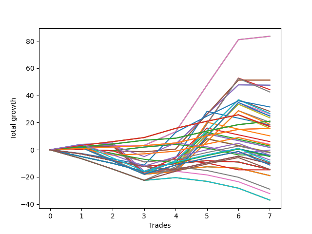

# Short Shepard 005 
- Symbol: ES
- Date Range: 03/18/2022 - 07/15/2022
- Trading Period: 7:20-12:30
- Number of Trades: 7



| Name | Win Percent | Profit | Avg Profit / Trade | Avg Time / Trade |      | Name | Win Percent | Profit | Avg Profit / Trade | Avg Time / Trade |
| ---- | ----------- | ------ | ------------------ | ---------------- | ---- | ---- | ----------- | ------ | ------------------ | ---------------- |
| Sorted By <br> Profit | | | | | | Sorted By <br> Win Percentage ||||
| Fifty-Eight | 85.71 | 41750.00 | 5964.29 | 10:15 |     | One Hundred Twenty-Seven | 100.00 | 10500.00 | 1500.00 | 04:20 |
| Two | 85.71 | 41750.00 | 5964.29 | 10:15 |     | One Hundred Twenty-Two | 100.00 | 10500.00 | 1500.00 | 04:20 |
| Fifty-Seven | 57.14 | 25625.00 | 3660.71 | 08:37 |     | Eighty-Two | 100.00 | 10500.00 | 1500.00 | 04:20 |
| One | 57.14 | 25625.00 | 3660.71 | 08:37 |     | One Hundred Twenty-Six | 100.00 | 7875.00 | 1125.00 | 03:17 |
| Fifty-Six | 71.43 | 23750.00 | 3392.86 | 05:35 |     | One Hundred Twenty-One | 100.00 | 7875.00 | 1125.00 | 03:17 |
| Zero | 71.43 | 23750.00 | 3392.86 | 05:35 |     | Eighty-One | 100.00 | 7875.00 | 1125.00 | 03:17 |
| Three | 71.43 | 22125.00 | 3160.71 | 19:04 |     | Fifty-Eight | 85.71 | 41750.00 | 5964.29 | 10:15 |
| Fifty-Nine | 57.14 | 21250.00 | 3035.71 | 15:18 |     | Two | 85.71 | 41750.00 | 5964.29 | 10:15 |
| Seventy-Three | 42.86 | 15750.00 | 2250.00 | 06:39 |     | Eighty-Three | 85.71 | 8625.00 | 1232.14 | 09:00 |
| Five | 71.43 | 14125.00 | 2017.86 | 25:47 |     | One Hundred Twenty-Eight | 85.71 | 8500.00 | 1214.29 | 07:16 |
| Sixty-One | 57.14 | 13375.00 | 1910.71 | 21:34 |     | One Hundred Twenty-Three | 85.71 | 7875.00 | 1125.00 | 07:25 |
| Six | 71.43 | 13125.00 | 1875.00 | 18:55 |     | Fifty-Six | 71.43 | 23750.00 | 3392.86 | 05:35 |
| Four | 71.43 | 12500.00 | 1785.71 | 25:47 |     | Zero | 71.43 | 23750.00 | 3392.86 | 05:35 |
| Sixty-Two | 57.14 | 12375.00 | 1767.86 | 14:42 |     | Three | 71.43 | 22125.00 | 3160.71 | 19:04 |
| Sixty | 57.14 | 11750.00 | 1678.57 | 21:33 |     | Five | 71.43 | 14125.00 | 2017.86 | 25:47 |
| One Hundred Twenty-Seven | 100.00 | 10500.00 | 1500.00 | 04:20 |     | Six | 71.43 | 13125.00 | 1875.00 | 18:55 |
| One Hundred Twenty-Two | 100.00 | 10500.00 | 1500.00 | 04:20 |     | Four | 71.43 | 12500.00 | 1785.71 | 25:47 |
| Eighty-Two | 100.00 | 10500.00 | 1500.00 | 04:20 |     | Seven | 71.43 | 10125.00 | 1446.43 | 25:40 |
| Seven | 71.43 | 10125.00 | 1446.43 | 25:40 |     | One Hundred Eleven | 71.43 | 2000.00 | 285.71 | 00:47 |
| Sixty-Three | 57.14 | 9375.00 | 1339.29 | 21:26 |     | One Hundred Sixteen | 71.43 | 1750.00 | 250.00 | 01:02 |
| Forty-Two | 28.57 | 9125.00 | 1303.57 | 04:03 |     | Eighty-Four | 71.43 | -3750.00 | -535.71 | 14:53 |
| Eighty-Three | 85.71 | 8625.00 | 1232.14 | 09:00 |     | Eighty-Five | 71.43 | -4875.00 | -696.43 | 17:17 |
| One Hundred Twenty-Eight | 85.71 | 8500.00 | 1214.29 | 07:16 |     | Fifty-Seven | 57.14 | 25625.00 | 3660.71 | 08:37 |
| One Hundred Twenty-Six | 100.00 | 7875.00 | 1125.00 | 03:17 |     | One | 57.14 | 25625.00 | 3660.71 | 08:37 |
| One Hundred Twenty-One | 100.00 | 7875.00 | 1125.00 | 03:17 |     | Fifty-Nine | 57.14 | 21250.00 | 3035.71 | 15:18 |
| Eighty-One | 100.00 | 7875.00 | 1125.00 | 03:17 |     | Sixty-One | 57.14 | 13375.00 | 1910.71 | 21:34 |
| One Hundred Twenty-Three | 85.71 | 7875.00 | 1125.00 | 07:25 |     | Sixty-Two | 57.14 | 12375.00 | 1767.86 | 14:42 |
| Forty-Three | 28.57 | 5125.00 | 732.14 | 03:55 |     | Sixty | 57.14 | 11750.00 | 1678.57 | 21:33 |
| Forty-Five | 28.57 | 3000.00 | 428.57 | 06:53 |     | Sixty-Three | 57.14 | 9375.00 | 1339.29 | 21:26 |
| One Hundred Eleven | 71.43 | 2000.00 | 285.71 | 00:47 |     | Sixty-Six | 57.14 | -125.00 | -17.86 | 07:17 |
| One Hundred Sixteen | 71.43 | 1750.00 | 250.00 | 01:02 |     | One Hundred Twelve | 57.14 | -1125.00 | -160.71 | 01:13 |
| Forty-Four | 28.57 | 1375.00 | 196.43 | 06:52 |     | One Hundred Twenty-Nine | 57.14 | -2000.00 | -285.71 | 08:48 |
| Forty-Six | 28.57 | 875.00 | 125.00 | 03:27 |     | One Hundred Twenty-Four | 57.14 | -4500.00 | -642.86 | 10:40 |
| Forty-One | 28.57 | 875.00 | 125.00 | 03:51 |     | One Hundred Twenty-Five | 57.14 | -5625.00 | -803.57 | 13:03 |
| Sixty-Six | 57.14 | -125.00 | -17.86 | 07:17 |     | Seventy-Three | 42.86 | 15750.00 | 2250.00 | 06:39 |
| Forty | 28.57 | -875.00 | -125.00 | 03:07 |     | Sixty-Four | 42.86 | -2000.00 | -285.71 | 05:12 |
| Forty-Seven | 28.57 | -1000.00 | -142.86 | 06:45 |     | One Hundred Fifteen | 42.86 | -2125.00 | -303.57 | 02:20 |
| One Hundred Twelve | 57.14 | -1125.00 | -160.71 | 01:13 |     | One Hundred Fourteen | 42.86 | -2125.00 | -303.57 | 02:20 |
| One Hundred Twenty-Nine | 57.14 | -2000.00 | -285.71 | 08:48 |     | One Hundred Thirteen | 42.86 | -2125.00 | -303.57 | 02:20 |
| Sixty-Four | 42.86 | -2000.00 | -285.71 | 05:12 |     | One Hundred Seventeen | 42.86 | -2500.00 | -357.14 | 01:15 |
| One Hundred Fifteen | 42.86 | -2125.00 | -303.57 | 02:20 |     | One Hundred Thirty | 42.86 | -7250.00 | -1035.71 | 09:48 |
| One Hundred Fourteen | 42.86 | -2125.00 | -303.57 | 02:20 |     | Forty-Two | 28.57 | 9125.00 | 1303.57 | 04:03 |
| One Hundred Thirteen | 42.86 | -2125.00 | -303.57 | 02:20 |     | Forty-Three | 28.57 | 5125.00 | 732.14 | 03:55 |
| One Hundred Seventeen | 42.86 | -2500.00 | -357.14 | 01:15 |     | Forty-Five | 28.57 | 3000.00 | 428.57 | 06:53 |
| Eighty-Four | 71.43 | -3750.00 | -535.71 | 14:53 |     | Forty-Four | 28.57 | 1375.00 | 196.43 | 06:52 |
| One Hundred Twenty-Four | 57.14 | -4500.00 | -642.86 | 10:40 |     | Forty-Six | 28.57 | 875.00 | 125.00 | 03:27 |
| Eighty-Five | 71.43 | -4875.00 | -696.43 | 17:17 |     | Forty-One | 28.57 | 875.00 | 125.00 | 03:51 |
| One Hundred Twenty | 28.57 | -5125.00 | -732.14 | 01:42 |     | Forty | 28.57 | -875.00 | -125.00 | 03:07 |
| One Hundred Ninteen | 28.57 | -5125.00 | -732.14 | 01:42 |     | Forty-Seven | 28.57 | -1000.00 | -142.86 | 06:45 |
| One Hundred Eighteen | 28.57 | -5125.00 | -732.14 | 01:42 |     | One Hundred Twenty | 28.57 | -5125.00 | -732.14 | 01:42 |
| One Hundred Twenty-Five | 57.14 | -5625.00 | -803.57 | 13:03 |     | One Hundred Ninteen | 28.57 | -5125.00 | -732.14 | 01:42 |
| One Hundred Thirty | 42.86 | -7250.00 | -1035.71 | 09:48 |     | One Hundred Eighteen | 28.57 | -5125.00 | -732.14 | 01:42 |
| Fifty-Five | 28.57 | -7250.00 | -1035.71 | 01:44 |     | Fifty-Five | 28.57 | -7250.00 | -1035.71 | 01:44 |
| Fifty-Four | 28.57 | -7250.00 | -1035.71 | 01:44 |     | Fifty-Four | 28.57 | -7250.00 | -1035.71 | 01:44 |
| Fifty-One | 28.57 | -7250.00 | -1035.71 | 01:44 |     | Fifty-One | 28.57 | -7250.00 | -1035.71 | 01:44 |
| Forty-Nine | 28.57 | -7250.00 | -1035.71 | 01:44 |     | Forty-Nine | 28.57 | -7250.00 | -1035.71 | 01:44 |
| Forty-Eight | 28.57 | -7250.00 | -1035.71 | 01:44 |     | Forty-Eight | 28.57 | -7250.00 | -1035.71 | 01:44 |
| Sixty-Five | 28.57 | -7375.00 | -1053.57 | 06:28 |     | Sixty-Five | 28.57 | -7375.00 | -1053.57 | 06:28 |
| Fifty-Three | 14.29 | -9500.00 | -1357.14 | 01:45 |     | Fifty-Three | 14.29 | -9500.00 | -1357.14 | 01:45 |
| Fifty-Two | 14.29 | -9500.00 | -1357.14 | 01:45 |     | Fifty-Two | 14.29 | -9500.00 | -1357.14 | 01:45 |
| Fifty | 14.29 | -9500.00 | -1357.14 | 01:45 |     | Fifty | 14.29 | -9500.00 | -1357.14 | 01:45 |
| Sixty-Nine | 14.29 | -14500.00 | -2071.43 | 10:31 |     | Sixty-Nine | 14.29 | -14500.00 | -2071.43 | 10:31 |
| Sixty-Eight | 14.29 | -16125.00 | -2303.57 | 10:30 |     | Sixty-Eight | 14.29 | -16125.00 | -2303.57 | 10:30 |
| Seventy-One | 14.29 | -18500.00 | -2642.86 | 10:23 |     | Seventy-One | 14.29 | -18500.00 | -2642.86 | 10:23 |
| Seventy | 14.29 | -18500.00 | -2642.86 | 10:23 |     | Seventy | 14.29 | -18500.00 | -2642.86 | 10:23 |
| Sixty-Seven | 14.29 | -18500.00 | -2642.86 | 10:23 |     | Sixty-Seven | 14.29 | -18500.00 | -2642.86 | 10:23 |

## NO STOPLOSS

### Test Zero
* Sell when price hits the middle line of the 20p bollinger
* No Stoploss
* Results:
```
Total Trades: 7
Percent Up: 28.57
Percent Down: 71.43
Total Points Moved Down: 47.50
Potential Profit: 23750.00
Total Points Ups: 1.25 Count Ups: 2
Total Points Downs: 48.75 Count Downs: 5
```

<details><summary>Trades</summary>

<code>In: 2022-04-07 11:06:00		Out: 2022-04-07 11:15:20		Total Position Time: 09:20		Total Move Down: 0.25		Total to Date: 0.25</code> <br />
<code>In: 2022-04-07 11:07:00		Out: 2022-04-07 11:15:20		Total Position Time: 08:20		Total Move Down: -1.00		Total to Date: -0.75</code> <br />
<code>In: 2022-05-25 11:33:00		Out: 2022-05-25 11:39:10		Total Position Time: 06:10		Total Move Down: 2.75		Total to Date: 2.00</code> <br />
<code>In: 2022-06-15 11:02:00		Out: 2022-06-15 11:02:10		Total Position Time: 00:10		Total Move Down: 2.00		Total to Date: 4.00</code> <br />
<code>In: 2022-06-15 11:48:00		Out: 2022-06-15 11:52:30		Total Position Time: 04:30		Total Move Down: 22.25		Total to Date: 26.25</code> <br />
<code>In: 2022-06-15 11:49:00		Out: 2022-06-15 11:52:30		Total Position Time: 03:30		Total Move Down: 21.50		Total to Date: 47.75</code> <br />
<code>In: 2022-07-05 08:53:00		Out: 2022-07-05 09:00:10		Total Position Time: 07:10		Total Move Down: -0.25		Total to Date: 47.50</code> <br />


</details>

### Test One
* Sell when the price hits the upper line of the 20p 1std bollinger
* No Stoploss
* Results:
```
Total Trades: 7
Percent Up: 42.86
Percent Down: 57.14
Total Points Moved Down: 51.25
Potential Profit: 25625.00
Total Points Ups: 1.75 Count Ups: 3
Total Points Downs: 53.00 Count Downs: 4
```

<details><summary>Trades</summary>

<code>In: 2022-04-07 11:06:00		Out: 2022-04-07 11:16:10		Total Position Time: 10:10		Total Move Down: 0.25		Total to Date: 0.25</code> <br />
<code>In: 2022-04-07 11:07:00		Out: 2022-04-07 11:16:10		Total Position Time: 09:10		Total Move Down: -1.00		Total to Date: -0.75</code> <br />
<code>In: 2022-05-25 11:33:00		Out: 2022-05-25 11:45:15		Total Position Time: 12:15		Total Move Down: -0.75		Total to Date: -1.50</code> <br />
<code>In: 2022-06-15 11:02:00		Out: 2022-06-15 11:02:10		Total Position Time: 00:10		Total Move Down: 2.00		Total to Date: 0.50</code> <br />
<code>In: 2022-06-15 11:48:00		Out: 2022-06-15 11:57:35		Total Position Time: 09:35		Total Move Down: 25.75		Total to Date: 26.25</code> <br />
<code>In: 2022-06-15 11:49:00		Out: 2022-06-15 11:57:35		Total Position Time: 08:35		Total Move Down: 25.00		Total to Date: 51.25</code> <br />
<code>In: 2022-07-05 08:53:00		Out: 2022-07-05 09:03:25		Total Position Time: 10:25		Total Move Down: -0.00		Total to Date: 51.25</code> <br />


</details>

### Test Two
* Sell when the price hits the upper line of the 20p 2std bollinger
* No Stoploss
* Results:
```
Total Trades: 7
Percent Up: 14.29
Percent Down: 85.71
Total Points Moved Down: 83.50
Potential Profit: 41750.00
Total Points Ups: 0.00 Count Ups: 1
Total Points Downs: 83.50 Count Downs: 6
```

<details><summary>Trades</summary>

<code>In: 2022-04-07 11:06:00		Out: 2022-04-07 11:18:20		Total Position Time: 12:20		Total Move Down: 2.25		Total to Date: 2.25</code> <br />
<code>In: 2022-04-07 11:07:00		Out: 2022-04-07 11:18:20		Total Position Time: 11:20		Total Move Down: 1.00		Total to Date: 3.25</code> <br />
<code>In: 2022-05-25 11:33:00		Out: 2022-05-25 11:50:00		Total Position Time: 17:00		Total Move Down: -0.00		Total to Date: 3.25</code> <br />
<code>In: 2022-06-15 11:02:00		Out: 2022-06-15 11:03:05		Total Position Time: 01:05		Total Move Down: 10.00		Total to Date: 13.25</code> <br />
<code>In: 2022-06-15 11:48:00		Out: 2022-06-15 11:58:05		Total Position Time: 10:05		Total Move Down: 34.25		Total to Date: 47.50</code> <br />
<code>In: 2022-06-15 11:49:00		Out: 2022-06-15 11:58:05		Total Position Time: 09:05		Total Move Down: 33.50		Total to Date: 81.00</code> <br />
<code>In: 2022-07-05 08:53:00		Out: 2022-07-05 09:03:50		Total Position Time: 10:50		Total Move Down: 2.50		Total to Date: 83.50</code> <br />


</details>

### Test Three
* Sell when price hits the middle line of the 50p bollinger
* No Stoploss
* Results:
```
Total Trades: 7
Percent Up: 28.57
Percent Down: 71.43
Total Points Moved Down: 44.25
Potential Profit: 22125.00
Total Points Ups: 29.25 Count Ups: 2
Total Points Downs: 73.50 Count Downs: 5
```

<details><summary>Trades</summary>

<code>In: 2022-04-07 11:06:00		Out: 2022-04-07 11:33:40		Total Position Time: 27:40		Total Move Down: 2.50		Total to Date: 2.50</code> <br />
<code>In: 2022-04-07 11:07:00		Out: 2022-04-07 11:33:40		Total Position Time: 26:40		Total Move Down: 1.25		Total to Date: 3.75</code> <br />
<code>In: 2022-05-25 11:33:00		Out: 2022-05-25 12:02:55		Total Position Time: 29:55		Total Move Down: -20.75		Total to Date: -17.00</code> <br />
<code>In: 2022-06-15 11:02:00		Out: 2022-06-15 11:02:10		Total Position Time: 00:10		Total Move Down: 2.00		Total to Date: -15.00</code> <br />
<code>In: 2022-06-15 11:48:00		Out: 2022-06-15 11:58:05		Total Position Time: 10:05		Total Move Down: 34.25		Total to Date: 19.25</code> <br />
<code>In: 2022-06-15 11:49:00		Out: 2022-06-15 11:58:05		Total Position Time: 09:05		Total Move Down: 33.50		Total to Date: 52.75</code> <br />
<code>In: 2022-07-05 08:53:00		Out: 2022-07-05 09:22:55		Total Position Time: 29:55		Total Move Down: -8.50		Total to Date: 44.25</code> <br />


</details>

### Test Four
* Sell when the price hits the upper line of the 50p 1std bollinger
* No Stoploss
* Results:
```
Total Trades: 7
Percent Up: 28.57
Percent Down: 71.43
Total Points Moved Down: 25.00
Potential Profit: 12500.00
Total Points Ups: 29.25 Count Ups: 2
Total Points Downs: 54.25 Count Downs: 5
```

<details><summary>Trades</summary>

<code>In: 2022-04-07 11:06:00		Out: 2022-04-07 11:35:55		Total Position Time: 29:55		Total Move Down: 1.75		Total to Date: 1.75</code> <br />
<code>In: 2022-04-07 11:07:00		Out: 2022-04-07 11:36:55		Total Position Time: 29:55		Total Move Down: 1.00		Total to Date: 2.75</code> <br />
<code>In: 2022-05-25 11:33:00		Out: 2022-05-25 12:02:55		Total Position Time: 29:55		Total Move Down: -20.75		Total to Date: -18.00</code> <br />
<code>In: 2022-06-15 11:02:00		Out: 2022-06-15 11:03:00		Total Position Time: 01:00		Total Move Down: 6.75		Total to Date: -11.25</code> <br />
<code>In: 2022-06-15 11:48:00		Out: 2022-06-15 12:17:55		Total Position Time: 29:55		Total Move Down: 22.00		Total to Date: 10.75</code> <br />
<code>In: 2022-06-15 11:49:00		Out: 2022-06-15 12:18:55		Total Position Time: 29:55		Total Move Down: 22.75		Total to Date: 33.50</code> <br />
<code>In: 2022-07-05 08:53:00		Out: 2022-07-05 09:22:55		Total Position Time: 29:55		Total Move Down: -8.50		Total to Date: 25.00</code> <br />


</details>

### Test Five
* Sell when the price hits the upper line of the 50p 2std bollinger
* No Stoploss
* Results:
```
Total Trades: 7
Percent Up: 28.57
Percent Down: 71.43
Total Points Moved Down: 28.25
Potential Profit: 14125.00
Total Points Ups: 29.25 Count Ups: 2
Total Points Downs: 57.50 Count Downs: 5
```

<details><summary>Trades</summary>

<code>In: 2022-04-07 11:06:00		Out: 2022-04-07 11:35:55		Total Position Time: 29:55		Total Move Down: 1.75		Total to Date: 1.75</code> <br />
<code>In: 2022-04-07 11:07:00		Out: 2022-04-07 11:36:55		Total Position Time: 29:55		Total Move Down: 1.00		Total to Date: 2.75</code> <br />
<code>In: 2022-05-25 11:33:00		Out: 2022-05-25 12:02:55		Total Position Time: 29:55		Total Move Down: -20.75		Total to Date: -18.00</code> <br />
<code>In: 2022-06-15 11:02:00		Out: 2022-06-15 11:03:05		Total Position Time: 01:05		Total Move Down: 10.00		Total to Date: -8.00</code> <br />
<code>In: 2022-06-15 11:48:00		Out: 2022-06-15 12:17:55		Total Position Time: 29:55		Total Move Down: 22.00		Total to Date: 14.00</code> <br />
<code>In: 2022-06-15 11:49:00		Out: 2022-06-15 12:18:55		Total Position Time: 29:55		Total Move Down: 22.75		Total to Date: 36.75</code> <br />
<code>In: 2022-07-05 08:53:00		Out: 2022-07-05 09:22:55		Total Position Time: 29:55		Total Move Down: -8.50		Total to Date: 28.25</code> <br />


</details>

### Test Six
* Sell when the price hits the middle line of the 1std VWAP
* No Stoploss
* Results:
```
Total Trades: 7
Percent Up: 28.57
Percent Down: 71.43
Total Points Moved Down: 26.25
Potential Profit: 13125.00
Total Points Ups: 29.25 Count Ups: 2
Total Points Downs: 55.50 Count Downs: 5
```

<details><summary>Trades</summary>

<code>In: 2022-04-07 11:06:00		Out: 2022-04-07 11:35:55		Total Position Time: 29:55		Total Move Down: 1.75		Total to Date: 1.75</code> <br />
<code>In: 2022-04-07 11:07:00		Out: 2022-04-07 11:36:55		Total Position Time: 29:55		Total Move Down: 1.00		Total to Date: 2.75</code> <br />
<code>In: 2022-05-25 11:33:00		Out: 2022-05-25 12:02:55		Total Position Time: 29:55		Total Move Down: -20.75		Total to Date: -18.00</code> <br />
<code>In: 2022-06-15 11:02:00		Out: 2022-06-15 11:02:10		Total Position Time: 00:10		Total Move Down: 2.00		Total to Date: -16.00</code> <br />
<code>In: 2022-06-15 11:48:00		Out: 2022-06-15 11:54:50		Total Position Time: 06:50		Total Move Down: 25.75		Total to Date: 9.75</code> <br />
<code>In: 2022-06-15 11:49:00		Out: 2022-06-15 11:54:50		Total Position Time: 05:50		Total Move Down: 25.00		Total to Date: 34.75</code> <br />
<code>In: 2022-07-05 08:53:00		Out: 2022-07-05 09:22:55		Total Position Time: 29:55		Total Move Down: -8.50		Total to Date: 26.25</code> <br />


</details>

### Test Seven
* Sell when the price hits the upper line of the 1std VWAP
* No Stoploss
* Results:
```
Total Trades: 7
Percent Up: 28.57
Percent Down: 71.43
Total Points Moved Down: 20.25
Potential Profit: 10125.00
Total Points Ups: 29.25 Count Ups: 2
Total Points Downs: 49.50 Count Downs: 5
```

<details><summary>Trades</summary>

<code>In: 2022-04-07 11:06:00		Out: 2022-04-07 11:35:55		Total Position Time: 29:55		Total Move Down: 1.75		Total to Date: 1.75</code> <br />
<code>In: 2022-04-07 11:07:00		Out: 2022-04-07 11:36:55		Total Position Time: 29:55		Total Move Down: 1.00		Total to Date: 2.75</code> <br />
<code>In: 2022-05-25 11:33:00		Out: 2022-05-25 12:02:55		Total Position Time: 29:55		Total Move Down: -20.75		Total to Date: -18.00</code> <br />
<code>In: 2022-06-15 11:02:00		Out: 2022-06-15 11:02:10		Total Position Time: 00:10		Total Move Down: 2.00		Total to Date: -16.00</code> <br />
<code>In: 2022-06-15 11:48:00		Out: 2022-06-15 12:17:55		Total Position Time: 29:55		Total Move Down: 22.00		Total to Date: 6.00</code> <br />
<code>In: 2022-06-15 11:49:00		Out: 2022-06-15 12:18:55		Total Position Time: 29:55		Total Move Down: 22.75		Total to Date: 28.75</code> <br />
<code>In: 2022-07-05 08:53:00		Out: 2022-07-05 09:22:55		Total Position Time: 29:55		Total Move Down: -8.50		Total to Date: 20.25</code> <br />


</details>

## STOPLOSS OF 5

### Test Forty
* Sell when price hits the middle line of the 20p bollinger
* Stoploss is -5 points
* Results:
```
Total Trades: 7
Percent Up: 71.43
Percent Down: 28.57
Total Points Moved Down: -1.75
Potential Profit: -875.00
Total Points Ups: 26.00 Count Ups: 5
Total Points Downs: 24.25 Count Downs: 2
```

<details><summary>Trades</summary>

<code>In: 2022-04-07 11:06:00		Out: 2022-04-07 11:14:15		Total Position Time: 08:15		Total Move Down: -5.00		Total to Date: -5.00</code> <br />
<code>In: 2022-04-07 11:07:00		Out: 2022-04-07 11:09:55		Total Position Time: 02:55		Total Move Down: -5.00		Total to Date: -10.00</code> <br />
<code>In: 2022-05-25 11:33:00		Out: 2022-05-25 11:35:15		Total Position Time: 02:15		Total Move Down: -6.00		Total to Date: -16.00</code> <br />
<code>In: 2022-06-15 11:02:00		Out: 2022-06-15 11:02:10		Total Position Time: 00:10		Total Move Down: 2.00		Total to Date: -14.00</code> <br />
<code>In: 2022-06-15 11:48:00		Out: 2022-06-15 11:52:30		Total Position Time: 04:30		Total Move Down: 22.25		Total to Date: 8.25</code> <br />
<code>In: 2022-06-15 11:49:00		Out: 2022-06-15 11:51:10		Total Position Time: 02:10		Total Move Down: -5.00		Total to Date: 3.25</code> <br />
<code>In: 2022-07-05 08:53:00		Out: 2022-07-05 08:54:40		Total Position Time: 01:40		Total Move Down: -5.00		Total to Date: -1.75</code> <br />


</details>

### Test Forty-One
* Sell when the price hits the upper line of the 20p 1std bollinger
* Stoploss is -5 points
* Results:
```
Total Trades: 7
Percent Up: 71.43
Percent Down: 28.57
Total Points Moved Down: 1.75
Potential Profit: 875.00
Total Points Ups: 26.00 Count Ups: 5
Total Points Downs: 27.75 Count Downs: 2
```

<details><summary>Trades</summary>

<code>In: 2022-04-07 11:06:00		Out: 2022-04-07 11:14:15		Total Position Time: 08:15		Total Move Down: -5.00		Total to Date: -5.00</code> <br />
<code>In: 2022-04-07 11:07:00		Out: 2022-04-07 11:09:55		Total Position Time: 02:55		Total Move Down: -5.00		Total to Date: -10.00</code> <br />
<code>In: 2022-05-25 11:33:00		Out: 2022-05-25 11:35:15		Total Position Time: 02:15		Total Move Down: -6.00		Total to Date: -16.00</code> <br />
<code>In: 2022-06-15 11:02:00		Out: 2022-06-15 11:02:10		Total Position Time: 00:10		Total Move Down: 2.00		Total to Date: -14.00</code> <br />
<code>In: 2022-06-15 11:48:00		Out: 2022-06-15 11:57:35		Total Position Time: 09:35		Total Move Down: 25.75		Total to Date: 11.75</code> <br />
<code>In: 2022-06-15 11:49:00		Out: 2022-06-15 11:51:10		Total Position Time: 02:10		Total Move Down: -5.00		Total to Date: 6.75</code> <br />
<code>In: 2022-07-05 08:53:00		Out: 2022-07-05 08:54:40		Total Position Time: 01:40		Total Move Down: -5.00		Total to Date: 1.75</code> <br />


</details>

### Test Forty-Two
* Sell when the price hits the upper line of the 20p 2std bollinger
* Stoploss is -5 points
* Results:
```
Total Trades: 7
Percent Up: 71.43
Percent Down: 28.57
Total Points Moved Down: 18.25
Potential Profit: 9125.00
Total Points Ups: 26.00 Count Ups: 5
Total Points Downs: 44.25 Count Downs: 2
```

<details><summary>Trades</summary>

<code>In: 2022-04-07 11:06:00		Out: 2022-04-07 11:14:15		Total Position Time: 08:15		Total Move Down: -5.00		Total to Date: -5.00</code> <br />
<code>In: 2022-04-07 11:07:00		Out: 2022-04-07 11:09:55		Total Position Time: 02:55		Total Move Down: -5.00		Total to Date: -10.00</code> <br />
<code>In: 2022-05-25 11:33:00		Out: 2022-05-25 11:35:15		Total Position Time: 02:15		Total Move Down: -6.00		Total to Date: -16.00</code> <br />
<code>In: 2022-06-15 11:02:00		Out: 2022-06-15 11:03:05		Total Position Time: 01:05		Total Move Down: 10.00		Total to Date: -6.00</code> <br />
<code>In: 2022-06-15 11:48:00		Out: 2022-06-15 11:58:05		Total Position Time: 10:05		Total Move Down: 34.25		Total to Date: 28.25</code> <br />
<code>In: 2022-06-15 11:49:00		Out: 2022-06-15 11:51:10		Total Position Time: 02:10		Total Move Down: -5.00		Total to Date: 23.25</code> <br />
<code>In: 2022-07-05 08:53:00		Out: 2022-07-05 08:54:40		Total Position Time: 01:40		Total Move Down: -5.00		Total to Date: 18.25</code> <br />


</details>

### Test Forty-Three
* Sell when price hits the middle line of the 50p bollinger
* Stoploss is -5 points
* Results:
```
Total Trades: 7
Percent Up: 71.43
Percent Down: 28.57
Total Points Moved Down: 10.25
Potential Profit: 5125.00
Total Points Ups: 26.00 Count Ups: 5
Total Points Downs: 36.25 Count Downs: 2
```

<details><summary>Trades</summary>

<code>In: 2022-04-07 11:06:00		Out: 2022-04-07 11:14:15		Total Position Time: 08:15		Total Move Down: -5.00		Total to Date: -5.00</code> <br />
<code>In: 2022-04-07 11:07:00		Out: 2022-04-07 11:09:55		Total Position Time: 02:55		Total Move Down: -5.00		Total to Date: -10.00</code> <br />
<code>In: 2022-05-25 11:33:00		Out: 2022-05-25 11:35:15		Total Position Time: 02:15		Total Move Down: -6.00		Total to Date: -16.00</code> <br />
<code>In: 2022-06-15 11:02:00		Out: 2022-06-15 11:02:10		Total Position Time: 00:10		Total Move Down: 2.00		Total to Date: -14.00</code> <br />
<code>In: 2022-06-15 11:48:00		Out: 2022-06-15 11:58:05		Total Position Time: 10:05		Total Move Down: 34.25		Total to Date: 20.25</code> <br />
<code>In: 2022-06-15 11:49:00		Out: 2022-06-15 11:51:10		Total Position Time: 02:10		Total Move Down: -5.00		Total to Date: 15.25</code> <br />
<code>In: 2022-07-05 08:53:00		Out: 2022-07-05 08:54:40		Total Position Time: 01:40		Total Move Down: -5.00		Total to Date: 10.25</code> <br />


</details>

### Test Forty-Four
* Sell when the price hits the upper line of the 50p 1std bollinger
* Stoploss is -5 points
* Results:
```
Total Trades: 7
Percent Up: 71.43
Percent Down: 28.57
Total Points Moved Down: 2.75
Potential Profit: 1375.00
Total Points Ups: 26.00 Count Ups: 5
Total Points Downs: 28.75 Count Downs: 2
```

<details><summary>Trades</summary>

<code>In: 2022-04-07 11:06:00		Out: 2022-04-07 11:14:15		Total Position Time: 08:15		Total Move Down: -5.00		Total to Date: -5.00</code> <br />
<code>In: 2022-04-07 11:07:00		Out: 2022-04-07 11:09:55		Total Position Time: 02:55		Total Move Down: -5.00		Total to Date: -10.00</code> <br />
<code>In: 2022-05-25 11:33:00		Out: 2022-05-25 11:35:15		Total Position Time: 02:15		Total Move Down: -6.00		Total to Date: -16.00</code> <br />
<code>In: 2022-06-15 11:02:00		Out: 2022-06-15 11:03:00		Total Position Time: 01:00		Total Move Down: 6.75		Total to Date: -9.25</code> <br />
<code>In: 2022-06-15 11:48:00		Out: 2022-06-15 12:17:55		Total Position Time: 29:55		Total Move Down: 22.00		Total to Date: 12.75</code> <br />
<code>In: 2022-06-15 11:49:00		Out: 2022-06-15 11:51:10		Total Position Time: 02:10		Total Move Down: -5.00		Total to Date: 7.75</code> <br />
<code>In: 2022-07-05 08:53:00		Out: 2022-07-05 08:54:40		Total Position Time: 01:40		Total Move Down: -5.00		Total to Date: 2.75</code> <br />


</details>

### Test Forty-Five
* Sell when the price hits the upper line of the 50p 2std bollinger
* Stoploss is -5 points
* Results:
```
Total Trades: 7
Percent Up: 71.43
Percent Down: 28.57
Total Points Moved Down: 6.00
Potential Profit: 3000.00
Total Points Ups: 26.00 Count Ups: 5
Total Points Downs: 32.00 Count Downs: 2
```

<details><summary>Trades</summary>

<code>In: 2022-04-07 11:06:00		Out: 2022-04-07 11:14:15		Total Position Time: 08:15		Total Move Down: -5.00		Total to Date: -5.00</code> <br />
<code>In: 2022-04-07 11:07:00		Out: 2022-04-07 11:09:55		Total Position Time: 02:55		Total Move Down: -5.00		Total to Date: -10.00</code> <br />
<code>In: 2022-05-25 11:33:00		Out: 2022-05-25 11:35:15		Total Position Time: 02:15		Total Move Down: -6.00		Total to Date: -16.00</code> <br />
<code>In: 2022-06-15 11:02:00		Out: 2022-06-15 11:03:05		Total Position Time: 01:05		Total Move Down: 10.00		Total to Date: -6.00</code> <br />
<code>In: 2022-06-15 11:48:00		Out: 2022-06-15 12:17:55		Total Position Time: 29:55		Total Move Down: 22.00		Total to Date: 16.00</code> <br />
<code>In: 2022-06-15 11:49:00		Out: 2022-06-15 11:51:10		Total Position Time: 02:10		Total Move Down: -5.00		Total to Date: 11.00</code> <br />
<code>In: 2022-07-05 08:53:00		Out: 2022-07-05 08:54:40		Total Position Time: 01:40		Total Move Down: -5.00		Total to Date: 6.00</code> <br />


</details>

### Test Forty-Six
* Sell when the price hits the middle line of the 1std VWAP
* Stoploss is -5 points
* Results:
```
Total Trades: 7
Percent Up: 71.43
Percent Down: 28.57
Total Points Moved Down: 1.75
Potential Profit: 875.00
Total Points Ups: 26.00 Count Ups: 5
Total Points Downs: 27.75 Count Downs: 2
```

<details><summary>Trades</summary>

<code>In: 2022-04-07 11:06:00		Out: 2022-04-07 11:14:15		Total Position Time: 08:15		Total Move Down: -5.00		Total to Date: -5.00</code> <br />
<code>In: 2022-04-07 11:07:00		Out: 2022-04-07 11:09:55		Total Position Time: 02:55		Total Move Down: -5.00		Total to Date: -10.00</code> <br />
<code>In: 2022-05-25 11:33:00		Out: 2022-05-25 11:35:15		Total Position Time: 02:15		Total Move Down: -6.00		Total to Date: -16.00</code> <br />
<code>In: 2022-06-15 11:02:00		Out: 2022-06-15 11:02:10		Total Position Time: 00:10		Total Move Down: 2.00		Total to Date: -14.00</code> <br />
<code>In: 2022-06-15 11:48:00		Out: 2022-06-15 11:54:50		Total Position Time: 06:50		Total Move Down: 25.75		Total to Date: 11.75</code> <br />
<code>In: 2022-06-15 11:49:00		Out: 2022-06-15 11:51:10		Total Position Time: 02:10		Total Move Down: -5.00		Total to Date: 6.75</code> <br />
<code>In: 2022-07-05 08:53:00		Out: 2022-07-05 08:54:40		Total Position Time: 01:40		Total Move Down: -5.00		Total to Date: 1.75</code> <br />


</details>

### Test Forty-Seven
* Sell when the price hits the upper line of the 1std VWAP
* Stoploss is -5 points
* Results:
```
Total Trades: 7
Percent Up: 71.43
Percent Down: 28.57
Total Points Moved Down: -2.00
Potential Profit: -1000.00
Total Points Ups: 26.00 Count Ups: 5
Total Points Downs: 24.00 Count Downs: 2
```

<details><summary>Trades</summary>

<code>In: 2022-04-07 11:06:00		Out: 2022-04-07 11:14:15		Total Position Time: 08:15		Total Move Down: -5.00		Total to Date: -5.00</code> <br />
<code>In: 2022-04-07 11:07:00		Out: 2022-04-07 11:09:55		Total Position Time: 02:55		Total Move Down: -5.00		Total to Date: -10.00</code> <br />
<code>In: 2022-05-25 11:33:00		Out: 2022-05-25 11:35:15		Total Position Time: 02:15		Total Move Down: -6.00		Total to Date: -16.00</code> <br />
<code>In: 2022-06-15 11:02:00		Out: 2022-06-15 11:02:10		Total Position Time: 00:10		Total Move Down: 2.00		Total to Date: -14.00</code> <br />
<code>In: 2022-06-15 11:48:00		Out: 2022-06-15 12:17:55		Total Position Time: 29:55		Total Move Down: 22.00		Total to Date: 8.00</code> <br />
<code>In: 2022-06-15 11:49:00		Out: 2022-06-15 11:51:10		Total Position Time: 02:10		Total Move Down: -5.00		Total to Date: 3.00</code> <br />
<code>In: 2022-07-05 08:53:00		Out: 2022-07-05 08:54:40		Total Position Time: 01:40		Total Move Down: -5.00		Total to Date: -2.00</code> <br />


</details>

## TRAIL STOP OF 5

### Test Forty-Eight
* Sell when price hits the middle line of the 20p bollinger
* Trailing Stop is -5 points
* Results:
```
Total Trades: 7
Percent Up: 71.43
Percent Down: 28.57
Total Points Moved Down: -14.50
Potential Profit: -7250.00
Total Points Ups: 18.75 Count Ups: 5
Total Points Downs: 4.25 Count Downs: 2
```

<details><summary>Trades</summary>

<code>In: 2022-04-07 11:06:00		Out: 2022-04-07 11:09:45		Total Position Time: 03:45		Total Move Down: -3.00		Total to Date: -3.00</code> <br />
<code>In: 2022-04-07 11:07:00		Out: 2022-04-07 11:09:55		Total Position Time: 02:55		Total Move Down: -5.00		Total to Date: -8.00</code> <br />
<code>In: 2022-05-25 11:33:00		Out: 2022-05-25 11:34:20		Total Position Time: 01:20		Total Move Down: -4.25		Total to Date: -12.25</code> <br />
<code>In: 2022-06-15 11:02:00		Out: 2022-06-15 11:02:10		Total Position Time: 00:10		Total Move Down: 2.00		Total to Date: -10.25</code> <br />
<code>In: 2022-06-15 11:48:00		Out: 2022-06-15 11:48:20		Total Position Time: 00:20		Total Move Down: 2.25		Total to Date: -8.00</code> <br />
<code>In: 2022-06-15 11:49:00		Out: 2022-06-15 11:49:20		Total Position Time: 00:20		Total Move Down: -1.00		Total to Date: -9.00</code> <br />
<code>In: 2022-07-05 08:53:00		Out: 2022-07-05 08:56:20		Total Position Time: 03:20		Total Move Down: -5.50		Total to Date: -14.50</code> <br />


</details>

### Test Forty-Nine
* Sell when the price hits the upper line of the 20p 1std bollinger
* Trailing Stop is -5 points
* Results:
```
Total Trades: 7
Percent Up: 71.43
Percent Down: 28.57
Total Points Moved Down: -14.50
Potential Profit: -7250.00
Total Points Ups: 18.75 Count Ups: 5
Total Points Downs: 4.25 Count Downs: 2
```

<details><summary>Trades</summary>

<code>In: 2022-04-07 11:06:00		Out: 2022-04-07 11:09:45		Total Position Time: 03:45		Total Move Down: -3.00		Total to Date: -3.00</code> <br />
<code>In: 2022-04-07 11:07:00		Out: 2022-04-07 11:09:55		Total Position Time: 02:55		Total Move Down: -5.00		Total to Date: -8.00</code> <br />
<code>In: 2022-05-25 11:33:00		Out: 2022-05-25 11:34:20		Total Position Time: 01:20		Total Move Down: -4.25		Total to Date: -12.25</code> <br />
<code>In: 2022-06-15 11:02:00		Out: 2022-06-15 11:02:10		Total Position Time: 00:10		Total Move Down: 2.00		Total to Date: -10.25</code> <br />
<code>In: 2022-06-15 11:48:00		Out: 2022-06-15 11:48:20		Total Position Time: 00:20		Total Move Down: 2.25		Total to Date: -8.00</code> <br />
<code>In: 2022-06-15 11:49:00		Out: 2022-06-15 11:49:20		Total Position Time: 00:20		Total Move Down: -1.00		Total to Date: -9.00</code> <br />
<code>In: 2022-07-05 08:53:00		Out: 2022-07-05 08:56:20		Total Position Time: 03:20		Total Move Down: -5.50		Total to Date: -14.50</code> <br />


</details>

### Test Fifty
* Sell when the price hits the upper line of the 20p 2std bollinger
* Trailing Stop is -5 points
* Results:
```
Total Trades: 7
Percent Up: 85.71
Percent Down: 14.29
Total Points Moved Down: -19.00
Potential Profit: -9500.00
Total Points Ups: 21.25 Count Ups: 6
Total Points Downs: 2.25 Count Downs: 1
```

<details><summary>Trades</summary>

<code>In: 2022-04-07 11:06:00		Out: 2022-04-07 11:09:45		Total Position Time: 03:45		Total Move Down: -3.00		Total to Date: -3.00</code> <br />
<code>In: 2022-04-07 11:07:00		Out: 2022-04-07 11:09:55		Total Position Time: 02:55		Total Move Down: -5.00		Total to Date: -8.00</code> <br />
<code>In: 2022-05-25 11:33:00		Out: 2022-05-25 11:34:20		Total Position Time: 01:20		Total Move Down: -4.25		Total to Date: -12.25</code> <br />
<code>In: 2022-06-15 11:02:00		Out: 2022-06-15 11:02:15		Total Position Time: 00:15		Total Move Down: -2.50		Total to Date: -14.75</code> <br />
<code>In: 2022-06-15 11:48:00		Out: 2022-06-15 11:48:20		Total Position Time: 00:20		Total Move Down: 2.25		Total to Date: -12.50</code> <br />
<code>In: 2022-06-15 11:49:00		Out: 2022-06-15 11:49:20		Total Position Time: 00:20		Total Move Down: -1.00		Total to Date: -13.50</code> <br />
<code>In: 2022-07-05 08:53:00		Out: 2022-07-05 08:56:20		Total Position Time: 03:20		Total Move Down: -5.50		Total to Date: -19.00</code> <br />


</details>

### Test Fifty-One
* Sell when price hits the middle line of the 50p bollinger
* Trailing Stop is -5 points
* Results:
```
Total Trades: 7
Percent Up: 71.43
Percent Down: 28.57
Total Points Moved Down: -14.50
Potential Profit: -7250.00
Total Points Ups: 18.75 Count Ups: 5
Total Points Downs: 4.25 Count Downs: 2
```

<details><summary>Trades</summary>

<code>In: 2022-04-07 11:06:00		Out: 2022-04-07 11:09:45		Total Position Time: 03:45		Total Move Down: -3.00		Total to Date: -3.00</code> <br />
<code>In: 2022-04-07 11:07:00		Out: 2022-04-07 11:09:55		Total Position Time: 02:55		Total Move Down: -5.00		Total to Date: -8.00</code> <br />
<code>In: 2022-05-25 11:33:00		Out: 2022-05-25 11:34:20		Total Position Time: 01:20		Total Move Down: -4.25		Total to Date: -12.25</code> <br />
<code>In: 2022-06-15 11:02:00		Out: 2022-06-15 11:02:10		Total Position Time: 00:10		Total Move Down: 2.00		Total to Date: -10.25</code> <br />
<code>In: 2022-06-15 11:48:00		Out: 2022-06-15 11:48:20		Total Position Time: 00:20		Total Move Down: 2.25		Total to Date: -8.00</code> <br />
<code>In: 2022-06-15 11:49:00		Out: 2022-06-15 11:49:20		Total Position Time: 00:20		Total Move Down: -1.00		Total to Date: -9.00</code> <br />
<code>In: 2022-07-05 08:53:00		Out: 2022-07-05 08:56:20		Total Position Time: 03:20		Total Move Down: -5.50		Total to Date: -14.50</code> <br />


</details>

### Test Fifty-Two
* Sell when the price hits the upper line of the 50p 1std bollinger
* Trailing Stop is -5 points
* Results:
```
Total Trades: 7
Percent Up: 85.71
Percent Down: 14.29
Total Points Moved Down: -19.00
Potential Profit: -9500.00
Total Points Ups: 21.25 Count Ups: 6
Total Points Downs: 2.25 Count Downs: 1
```

<details><summary>Trades</summary>

<code>In: 2022-04-07 11:06:00		Out: 2022-04-07 11:09:45		Total Position Time: 03:45		Total Move Down: -3.00		Total to Date: -3.00</code> <br />
<code>In: 2022-04-07 11:07:00		Out: 2022-04-07 11:09:55		Total Position Time: 02:55		Total Move Down: -5.00		Total to Date: -8.00</code> <br />
<code>In: 2022-05-25 11:33:00		Out: 2022-05-25 11:34:20		Total Position Time: 01:20		Total Move Down: -4.25		Total to Date: -12.25</code> <br />
<code>In: 2022-06-15 11:02:00		Out: 2022-06-15 11:02:15		Total Position Time: 00:15		Total Move Down: -2.50		Total to Date: -14.75</code> <br />
<code>In: 2022-06-15 11:48:00		Out: 2022-06-15 11:48:20		Total Position Time: 00:20		Total Move Down: 2.25		Total to Date: -12.50</code> <br />
<code>In: 2022-06-15 11:49:00		Out: 2022-06-15 11:49:20		Total Position Time: 00:20		Total Move Down: -1.00		Total to Date: -13.50</code> <br />
<code>In: 2022-07-05 08:53:00		Out: 2022-07-05 08:56:20		Total Position Time: 03:20		Total Move Down: -5.50		Total to Date: -19.00</code> <br />


</details>

### Test Fifty-Three
* Sell when the price hits the upper line of the 50p 2std bollinger
* Trailing Stop is -5 points
* Results:
```
Total Trades: 7
Percent Up: 85.71
Percent Down: 14.29
Total Points Moved Down: -19.00
Potential Profit: -9500.00
Total Points Ups: 21.25 Count Ups: 6
Total Points Downs: 2.25 Count Downs: 1
```

<details><summary>Trades</summary>

<code>In: 2022-04-07 11:06:00		Out: 2022-04-07 11:09:45		Total Position Time: 03:45		Total Move Down: -3.00		Total to Date: -3.00</code> <br />
<code>In: 2022-04-07 11:07:00		Out: 2022-04-07 11:09:55		Total Position Time: 02:55		Total Move Down: -5.00		Total to Date: -8.00</code> <br />
<code>In: 2022-05-25 11:33:00		Out: 2022-05-25 11:34:20		Total Position Time: 01:20		Total Move Down: -4.25		Total to Date: -12.25</code> <br />
<code>In: 2022-06-15 11:02:00		Out: 2022-06-15 11:02:15		Total Position Time: 00:15		Total Move Down: -2.50		Total to Date: -14.75</code> <br />
<code>In: 2022-06-15 11:48:00		Out: 2022-06-15 11:48:20		Total Position Time: 00:20		Total Move Down: 2.25		Total to Date: -12.50</code> <br />
<code>In: 2022-06-15 11:49:00		Out: 2022-06-15 11:49:20		Total Position Time: 00:20		Total Move Down: -1.00		Total to Date: -13.50</code> <br />
<code>In: 2022-07-05 08:53:00		Out: 2022-07-05 08:56:20		Total Position Time: 03:20		Total Move Down: -5.50		Total to Date: -19.00</code> <br />


</details>

### Test Fifty-Four
* Sell when the price hits the middle line of the 1std VWAP
* Trailing Stop is -5 points
* Results:
```
Total Trades: 7
Percent Up: 71.43
Percent Down: 28.57
Total Points Moved Down: -14.50
Potential Profit: -7250.00
Total Points Ups: 18.75 Count Ups: 5
Total Points Downs: 4.25 Count Downs: 2
```

<details><summary>Trades</summary>

<code>In: 2022-04-07 11:06:00		Out: 2022-04-07 11:09:45		Total Position Time: 03:45		Total Move Down: -3.00		Total to Date: -3.00</code> <br />
<code>In: 2022-04-07 11:07:00		Out: 2022-04-07 11:09:55		Total Position Time: 02:55		Total Move Down: -5.00		Total to Date: -8.00</code> <br />
<code>In: 2022-05-25 11:33:00		Out: 2022-05-25 11:34:20		Total Position Time: 01:20		Total Move Down: -4.25		Total to Date: -12.25</code> <br />
<code>In: 2022-06-15 11:02:00		Out: 2022-06-15 11:02:10		Total Position Time: 00:10		Total Move Down: 2.00		Total to Date: -10.25</code> <br />
<code>In: 2022-06-15 11:48:00		Out: 2022-06-15 11:48:20		Total Position Time: 00:20		Total Move Down: 2.25		Total to Date: -8.00</code> <br />
<code>In: 2022-06-15 11:49:00		Out: 2022-06-15 11:49:20		Total Position Time: 00:20		Total Move Down: -1.00		Total to Date: -9.00</code> <br />
<code>In: 2022-07-05 08:53:00		Out: 2022-07-05 08:56:20		Total Position Time: 03:20		Total Move Down: -5.50		Total to Date: -14.50</code> <br />


</details>

### Test Fifty-Five
* Sell when the price hits the upper line of the 1std VWAP
* Trailing Stop is -5 points
* Results:
```
Total Trades: 7
Percent Up: 71.43
Percent Down: 28.57
Total Points Moved Down: -14.50
Potential Profit: -7250.00
Total Points Ups: 18.75 Count Ups: 5
Total Points Downs: 4.25 Count Downs: 2
```

<details><summary>Trades</summary>

<code>In: 2022-04-07 11:06:00		Out: 2022-04-07 11:09:45		Total Position Time: 03:45		Total Move Down: -3.00		Total to Date: -3.00</code> <br />
<code>In: 2022-04-07 11:07:00		Out: 2022-04-07 11:09:55		Total Position Time: 02:55		Total Move Down: -5.00		Total to Date: -8.00</code> <br />
<code>In: 2022-05-25 11:33:00		Out: 2022-05-25 11:34:20		Total Position Time: 01:20		Total Move Down: -4.25		Total to Date: -12.25</code> <br />
<code>In: 2022-06-15 11:02:00		Out: 2022-06-15 11:02:10		Total Position Time: 00:10		Total Move Down: 2.00		Total to Date: -10.25</code> <br />
<code>In: 2022-06-15 11:48:00		Out: 2022-06-15 11:48:20		Total Position Time: 00:20		Total Move Down: 2.25		Total to Date: -8.00</code> <br />
<code>In: 2022-06-15 11:49:00		Out: 2022-06-15 11:49:20		Total Position Time: 00:20		Total Move Down: -1.00		Total to Date: -9.00</code> <br />
<code>In: 2022-07-05 08:53:00		Out: 2022-07-05 08:56:20		Total Position Time: 03:20		Total Move Down: -5.50		Total to Date: -14.50</code> <br />


</details>

## STOPLOSS OF 10

### Test Fifty-Six
* Sell when price hits the middle line of the 20p bollinger
* Stoploss is -10 points
* Results:
```
Total Trades: 7
Percent Up: 28.57
Percent Down: 71.43
Total Points Moved Down: 47.50
Potential Profit: 23750.00
Total Points Ups: 1.25 Count Ups: 2
Total Points Downs: 48.75 Count Downs: 5
```

<details><summary>Trades</summary>

<code>In: 2022-04-07 11:06:00		Out: 2022-04-07 11:15:20		Total Position Time: 09:20		Total Move Down: 0.25		Total to Date: 0.25</code> <br />
<code>In: 2022-04-07 11:07:00		Out: 2022-04-07 11:15:20		Total Position Time: 08:20		Total Move Down: -1.00		Total to Date: -0.75</code> <br />
<code>In: 2022-05-25 11:33:00		Out: 2022-05-25 11:39:10		Total Position Time: 06:10		Total Move Down: 2.75		Total to Date: 2.00</code> <br />
<code>In: 2022-06-15 11:02:00		Out: 2022-06-15 11:02:10		Total Position Time: 00:10		Total Move Down: 2.00		Total to Date: 4.00</code> <br />
<code>In: 2022-06-15 11:48:00		Out: 2022-06-15 11:52:30		Total Position Time: 04:30		Total Move Down: 22.25		Total to Date: 26.25</code> <br />
<code>In: 2022-06-15 11:49:00		Out: 2022-06-15 11:52:30		Total Position Time: 03:30		Total Move Down: 21.50		Total to Date: 47.75</code> <br />
<code>In: 2022-07-05 08:53:00		Out: 2022-07-05 09:00:10		Total Position Time: 07:10		Total Move Down: -0.25		Total to Date: 47.50</code> <br />


</details>

### Test Fifty-Seven
* Sell when the price hits the upper line of the 20p 1std bollinger
* Stoploss is -10 points
* Results:
```
Total Trades: 7
Percent Up: 42.86
Percent Down: 57.14
Total Points Moved Down: 51.25
Potential Profit: 25625.00
Total Points Ups: 1.75 Count Ups: 3
Total Points Downs: 53.00 Count Downs: 4
```

<details><summary>Trades</summary>

<code>In: 2022-04-07 11:06:00		Out: 2022-04-07 11:16:10		Total Position Time: 10:10		Total Move Down: 0.25		Total to Date: 0.25</code> <br />
<code>In: 2022-04-07 11:07:00		Out: 2022-04-07 11:16:10		Total Position Time: 09:10		Total Move Down: -1.00		Total to Date: -0.75</code> <br />
<code>In: 2022-05-25 11:33:00		Out: 2022-05-25 11:45:15		Total Position Time: 12:15		Total Move Down: -0.75		Total to Date: -1.50</code> <br />
<code>In: 2022-06-15 11:02:00		Out: 2022-06-15 11:02:10		Total Position Time: 00:10		Total Move Down: 2.00		Total to Date: 0.50</code> <br />
<code>In: 2022-06-15 11:48:00		Out: 2022-06-15 11:57:35		Total Position Time: 09:35		Total Move Down: 25.75		Total to Date: 26.25</code> <br />
<code>In: 2022-06-15 11:49:00		Out: 2022-06-15 11:57:35		Total Position Time: 08:35		Total Move Down: 25.00		Total to Date: 51.25</code> <br />
<code>In: 2022-07-05 08:53:00		Out: 2022-07-05 09:03:25		Total Position Time: 10:25		Total Move Down: -0.00		Total to Date: 51.25</code> <br />


</details>

### Test Fifty-Eight
* Sell when the price hits the upper line of the 20p 2std bollinger
* Stoploss is -10 points
* Results:
```
Total Trades: 7
Percent Up: 14.29
Percent Down: 85.71
Total Points Moved Down: 83.50
Potential Profit: 41750.00
Total Points Ups: 0.00 Count Ups: 1
Total Points Downs: 83.50 Count Downs: 6
```

<details><summary>Trades</summary>

<code>In: 2022-04-07 11:06:00		Out: 2022-04-07 11:18:20		Total Position Time: 12:20		Total Move Down: 2.25		Total to Date: 2.25</code> <br />
<code>In: 2022-04-07 11:07:00		Out: 2022-04-07 11:18:20		Total Position Time: 11:20		Total Move Down: 1.00		Total to Date: 3.25</code> <br />
<code>In: 2022-05-25 11:33:00		Out: 2022-05-25 11:50:00		Total Position Time: 17:00		Total Move Down: -0.00		Total to Date: 3.25</code> <br />
<code>In: 2022-06-15 11:02:00		Out: 2022-06-15 11:03:05		Total Position Time: 01:05		Total Move Down: 10.00		Total to Date: 13.25</code> <br />
<code>In: 2022-06-15 11:48:00		Out: 2022-06-15 11:58:05		Total Position Time: 10:05		Total Move Down: 34.25		Total to Date: 47.50</code> <br />
<code>In: 2022-06-15 11:49:00		Out: 2022-06-15 11:58:05		Total Position Time: 09:05		Total Move Down: 33.50		Total to Date: 81.00</code> <br />
<code>In: 2022-07-05 08:53:00		Out: 2022-07-05 09:03:50		Total Position Time: 10:50		Total Move Down: 2.50		Total to Date: 83.50</code> <br />


</details>

### Test Fifty-Nine
* Sell when price hits the middle line of the 50p bollinger
* Stoploss is -10 points
* Results:
```
Total Trades: 7
Percent Up: 42.86
Percent Down: 57.14
Total Points Moved Down: 42.50
Potential Profit: 21250.00
Total Points Ups: 29.75 Count Ups: 3
Total Points Downs: 72.25 Count Downs: 4
```

<details><summary>Trades</summary>

<code>In: 2022-04-07 11:06:00		Out: 2022-04-07 11:33:40		Total Position Time: 27:40		Total Move Down: 2.50		Total to Date: 2.50</code> <br />
<code>In: 2022-04-07 11:07:00		Out: 2022-04-07 11:27:05		Total Position Time: 20:05		Total Move Down: -10.00		Total to Date: -7.50</code> <br />
<code>In: 2022-05-25 11:33:00		Out: 2022-05-25 11:54:10		Total Position Time: 21:10		Total Move Down: -9.75		Total to Date: -17.25</code> <br />
<code>In: 2022-06-15 11:02:00		Out: 2022-06-15 11:02:10		Total Position Time: 00:10		Total Move Down: 2.00		Total to Date: -15.25</code> <br />
<code>In: 2022-06-15 11:48:00		Out: 2022-06-15 11:58:05		Total Position Time: 10:05		Total Move Down: 34.25		Total to Date: 19.00</code> <br />
<code>In: 2022-06-15 11:49:00		Out: 2022-06-15 11:58:05		Total Position Time: 09:05		Total Move Down: 33.50		Total to Date: 52.50</code> <br />
<code>In: 2022-07-05 08:53:00		Out: 2022-07-05 09:11:55		Total Position Time: 18:55		Total Move Down: -10.00		Total to Date: 42.50</code> <br />


</details>

### Test Sixty
* Sell when the price hits the upper line of the 50p 1std bollinger
* Stoploss is -10 points
* Results:
```
Total Trades: 7
Percent Up: 42.86
Percent Down: 57.14
Total Points Moved Down: 23.50
Potential Profit: 11750.00
Total Points Ups: 29.75 Count Ups: 3
Total Points Downs: 53.25 Count Downs: 4
```

<details><summary>Trades</summary>

<code>In: 2022-04-07 11:06:00		Out: 2022-04-07 11:35:55		Total Position Time: 29:55		Total Move Down: 1.75		Total to Date: 1.75</code> <br />
<code>In: 2022-04-07 11:07:00		Out: 2022-04-07 11:27:05		Total Position Time: 20:05		Total Move Down: -10.00		Total to Date: -8.25</code> <br />
<code>In: 2022-05-25 11:33:00		Out: 2022-05-25 11:54:10		Total Position Time: 21:10		Total Move Down: -9.75		Total to Date: -18.00</code> <br />
<code>In: 2022-06-15 11:02:00		Out: 2022-06-15 11:03:00		Total Position Time: 01:00		Total Move Down: 6.75		Total to Date: -11.25</code> <br />
<code>In: 2022-06-15 11:48:00		Out: 2022-06-15 12:17:55		Total Position Time: 29:55		Total Move Down: 22.00		Total to Date: 10.75</code> <br />
<code>In: 2022-06-15 11:49:00		Out: 2022-06-15 12:18:55		Total Position Time: 29:55		Total Move Down: 22.75		Total to Date: 33.50</code> <br />
<code>In: 2022-07-05 08:53:00		Out: 2022-07-05 09:11:55		Total Position Time: 18:55		Total Move Down: -10.00		Total to Date: 23.50</code> <br />


</details>

### Test Sixty-One
* Sell when the price hits the upper line of the 50p 2std bollinger
* Stoploss is -10 points
* Results:
```
Total Trades: 7
Percent Up: 42.86
Percent Down: 57.14
Total Points Moved Down: 26.75
Potential Profit: 13375.00
Total Points Ups: 29.75 Count Ups: 3
Total Points Downs: 56.50 Count Downs: 4
```

<details><summary>Trades</summary>

<code>In: 2022-04-07 11:06:00		Out: 2022-04-07 11:35:55		Total Position Time: 29:55		Total Move Down: 1.75		Total to Date: 1.75</code> <br />
<code>In: 2022-04-07 11:07:00		Out: 2022-04-07 11:27:05		Total Position Time: 20:05		Total Move Down: -10.00		Total to Date: -8.25</code> <br />
<code>In: 2022-05-25 11:33:00		Out: 2022-05-25 11:54:10		Total Position Time: 21:10		Total Move Down: -9.75		Total to Date: -18.00</code> <br />
<code>In: 2022-06-15 11:02:00		Out: 2022-06-15 11:03:05		Total Position Time: 01:05		Total Move Down: 10.00		Total to Date: -8.00</code> <br />
<code>In: 2022-06-15 11:48:00		Out: 2022-06-15 12:17:55		Total Position Time: 29:55		Total Move Down: 22.00		Total to Date: 14.00</code> <br />
<code>In: 2022-06-15 11:49:00		Out: 2022-06-15 12:18:55		Total Position Time: 29:55		Total Move Down: 22.75		Total to Date: 36.75</code> <br />
<code>In: 2022-07-05 08:53:00		Out: 2022-07-05 09:11:55		Total Position Time: 18:55		Total Move Down: -10.00		Total to Date: 26.75</code> <br />


</details>

### Test Sixty-Two
* Sell when the price hits the middle line of the 1std VWAP
* Stoploss is -10 points
* Results:
```
Total Trades: 7
Percent Up: 42.86
Percent Down: 57.14
Total Points Moved Down: 24.75
Potential Profit: 12375.00
Total Points Ups: 29.75 Count Ups: 3
Total Points Downs: 54.50 Count Downs: 4
```

<details><summary>Trades</summary>

<code>In: 2022-04-07 11:06:00		Out: 2022-04-07 11:35:55		Total Position Time: 29:55		Total Move Down: 1.75		Total to Date: 1.75</code> <br />
<code>In: 2022-04-07 11:07:00		Out: 2022-04-07 11:27:05		Total Position Time: 20:05		Total Move Down: -10.00		Total to Date: -8.25</code> <br />
<code>In: 2022-05-25 11:33:00		Out: 2022-05-25 11:54:10		Total Position Time: 21:10		Total Move Down: -9.75		Total to Date: -18.00</code> <br />
<code>In: 2022-06-15 11:02:00		Out: 2022-06-15 11:02:10		Total Position Time: 00:10		Total Move Down: 2.00		Total to Date: -16.00</code> <br />
<code>In: 2022-06-15 11:48:00		Out: 2022-06-15 11:54:50		Total Position Time: 06:50		Total Move Down: 25.75		Total to Date: 9.75</code> <br />
<code>In: 2022-06-15 11:49:00		Out: 2022-06-15 11:54:50		Total Position Time: 05:50		Total Move Down: 25.00		Total to Date: 34.75</code> <br />
<code>In: 2022-07-05 08:53:00		Out: 2022-07-05 09:11:55		Total Position Time: 18:55		Total Move Down: -10.00		Total to Date: 24.75</code> <br />


</details>

### Test Sixty-Three
* Sell when the price hits the upper line of the 1std VWAP
* Stoploss is -10 points
* Results:
```
Total Trades: 7
Percent Up: 42.86
Percent Down: 57.14
Total Points Moved Down: 18.75
Potential Profit: 9375.00
Total Points Ups: 29.75 Count Ups: 3
Total Points Downs: 48.50 Count Downs: 4
```

<details><summary>Trades</summary>

<code>In: 2022-04-07 11:06:00		Out: 2022-04-07 11:35:55		Total Position Time: 29:55		Total Move Down: 1.75		Total to Date: 1.75</code> <br />
<code>In: 2022-04-07 11:07:00		Out: 2022-04-07 11:27:05		Total Position Time: 20:05		Total Move Down: -10.00		Total to Date: -8.25</code> <br />
<code>In: 2022-05-25 11:33:00		Out: 2022-05-25 11:54:10		Total Position Time: 21:10		Total Move Down: -9.75		Total to Date: -18.00</code> <br />
<code>In: 2022-06-15 11:02:00		Out: 2022-06-15 11:02:10		Total Position Time: 00:10		Total Move Down: 2.00		Total to Date: -16.00</code> <br />
<code>In: 2022-06-15 11:48:00		Out: 2022-06-15 12:17:55		Total Position Time: 29:55		Total Move Down: 22.00		Total to Date: 6.00</code> <br />
<code>In: 2022-06-15 11:49:00		Out: 2022-06-15 12:18:55		Total Position Time: 29:55		Total Move Down: 22.75		Total to Date: 28.75</code> <br />
<code>In: 2022-07-05 08:53:00		Out: 2022-07-05 09:11:55		Total Position Time: 18:55		Total Move Down: -10.00		Total to Date: 18.75</code> <br />


</details>

## TRAIL STOP OF 10

### Test Sixty-Four
* Sell when price hits the middle line of the 20p bollinger
* Trailing Stop is -10 points
* Results:
```
Total Trades: 7
Percent Up: 57.14
Percent Down: 42.86
Total Points Moved Down: -4.00
Potential Profit: -2000.00
Total Points Ups: 9.00 Count Ups: 4
Total Points Downs: 5.00 Count Downs: 3
```

<details><summary>Trades</summary>

<code>In: 2022-04-07 11:06:00		Out: 2022-04-07 11:15:20		Total Position Time: 09:20		Total Move Down: 0.25		Total to Date: 0.25</code> <br />
<code>In: 2022-04-07 11:07:00		Out: 2022-04-07 11:15:20		Total Position Time: 08:20		Total Move Down: -1.00		Total to Date: -0.75</code> <br />
<code>In: 2022-05-25 11:33:00		Out: 2022-05-25 11:39:10		Total Position Time: 06:10		Total Move Down: 2.75		Total to Date: 2.00</code> <br />
<code>In: 2022-06-15 11:02:00		Out: 2022-06-15 11:02:10		Total Position Time: 00:10		Total Move Down: 2.00		Total to Date: 4.00</code> <br />
<code>In: 2022-06-15 11:48:00		Out: 2022-06-15 11:51:05		Total Position Time: 03:05		Total Move Down: -2.75		Total to Date: 1.25</code> <br />
<code>In: 2022-06-15 11:49:00		Out: 2022-06-15 11:51:10		Total Position Time: 02:10		Total Move Down: -5.00		Total to Date: -3.75</code> <br />
<code>In: 2022-07-05 08:53:00		Out: 2022-07-05 09:00:10		Total Position Time: 07:10		Total Move Down: -0.25		Total to Date: -4.00</code> <br />


</details>

### Test Sixty-Five
* Sell when the price hits the upper line of the 20p 1std bollinger
* Trailing Stop is -10 points
* Results:
```
Total Trades: 7
Percent Up: 71.43
Percent Down: 28.57
Total Points Moved Down: -14.75
Potential Profit: -7375.00
Total Points Ups: 17.00 Count Ups: 5
Total Points Downs: 2.25 Count Downs: 2
```

<details><summary>Trades</summary>

<code>In: 2022-04-07 11:06:00		Out: 2022-04-07 11:16:10		Total Position Time: 10:10		Total Move Down: 0.25		Total to Date: 0.25</code> <br />
<code>In: 2022-04-07 11:07:00		Out: 2022-04-07 11:16:10		Total Position Time: 09:10		Total Move Down: -1.00		Total to Date: -0.75</code> <br />
<code>In: 2022-05-25 11:33:00		Out: 2022-05-25 11:43:10		Total Position Time: 10:10		Total Move Down: -8.25		Total to Date: -9.00</code> <br />
<code>In: 2022-06-15 11:02:00		Out: 2022-06-15 11:02:10		Total Position Time: 00:10		Total Move Down: 2.00		Total to Date: -7.00</code> <br />
<code>In: 2022-06-15 11:48:00		Out: 2022-06-15 11:51:05		Total Position Time: 03:05		Total Move Down: -2.75		Total to Date: -9.75</code> <br />
<code>In: 2022-06-15 11:49:00		Out: 2022-06-15 11:51:10		Total Position Time: 02:10		Total Move Down: -5.00		Total to Date: -14.75</code> <br />
<code>In: 2022-07-05 08:53:00		Out: 2022-07-05 09:03:25		Total Position Time: 10:25		Total Move Down: -0.00		Total to Date: -14.75</code> <br />


</details>

### Test Sixty-Six
* Sell when the price hits the upper line of the 20p 2std bollinger
* Trailing Stop is -10 points
* Results:
```
Total Trades: 7
Percent Up: 42.86
Percent Down: 57.14
Total Points Moved Down: -0.25
Potential Profit: -125.00
Total Points Ups: 16.00 Count Ups: 3
Total Points Downs: 15.75 Count Downs: 4
```

<details><summary>Trades</summary>

<code>In: 2022-04-07 11:06:00		Out: 2022-04-07 11:18:20		Total Position Time: 12:20		Total Move Down: 2.25		Total to Date: 2.25</code> <br />
<code>In: 2022-04-07 11:07:00		Out: 2022-04-07 11:18:20		Total Position Time: 11:20		Total Move Down: 1.00		Total to Date: 3.25</code> <br />
<code>In: 2022-05-25 11:33:00		Out: 2022-05-25 11:43:10		Total Position Time: 10:10		Total Move Down: -8.25		Total to Date: -5.00</code> <br />
<code>In: 2022-06-15 11:02:00		Out: 2022-06-15 11:03:05		Total Position Time: 01:05		Total Move Down: 10.00		Total to Date: 5.00</code> <br />
<code>In: 2022-06-15 11:48:00		Out: 2022-06-15 11:51:05		Total Position Time: 03:05		Total Move Down: -2.75		Total to Date: 2.25</code> <br />
<code>In: 2022-06-15 11:49:00		Out: 2022-06-15 11:51:10		Total Position Time: 02:10		Total Move Down: -5.00		Total to Date: -2.75</code> <br />
<code>In: 2022-07-05 08:53:00		Out: 2022-07-05 09:03:50		Total Position Time: 10:50		Total Move Down: 2.50		Total to Date: -0.25</code> <br />


</details>

### Test Sixty-Seven
* Sell when price hits the middle line of the 50p bollinger
* Trailing Stop is -10 points
* Results:
```
Total Trades: 7
Percent Up: 85.71
Percent Down: 14.29
Total Points Moved Down: -37.00
Potential Profit: -18500.00
Total Points Ups: 39.00 Count Ups: 6
Total Points Downs: 2.00 Count Downs: 1
```

<details><summary>Trades</summary>

<code>In: 2022-04-07 11:06:00		Out: 2022-04-07 11:26:10		Total Position Time: 20:10		Total Move Down: -6.50		Total to Date: -6.50</code> <br />
<code>In: 2022-04-07 11:07:00		Out: 2022-04-07 11:26:10		Total Position Time: 19:10		Total Move Down: -7.75		Total to Date: -14.25</code> <br />
<code>In: 2022-05-25 11:33:00		Out: 2022-05-25 11:43:10		Total Position Time: 10:10		Total Move Down: -8.25		Total to Date: -22.50</code> <br />
<code>In: 2022-06-15 11:02:00		Out: 2022-06-15 11:02:10		Total Position Time: 00:10		Total Move Down: 2.00		Total to Date: -20.50</code> <br />
<code>In: 2022-06-15 11:48:00		Out: 2022-06-15 11:51:05		Total Position Time: 03:05		Total Move Down: -2.75		Total to Date: -23.25</code> <br />
<code>In: 2022-06-15 11:49:00		Out: 2022-06-15 11:51:10		Total Position Time: 02:10		Total Move Down: -5.00		Total to Date: -28.25</code> <br />
<code>In: 2022-07-05 08:53:00		Out: 2022-07-05 09:10:50		Total Position Time: 17:50		Total Move Down: -8.75		Total to Date: -37.00</code> <br />


</details>

### Test Sixty-Eight
* Sell when the price hits the upper line of the 50p 1std bollinger
* Trailing Stop is -10 points
* Results:
```
Total Trades: 7
Percent Up: 85.71
Percent Down: 14.29
Total Points Moved Down: -32.25
Potential Profit: -16125.00
Total Points Ups: 39.00 Count Ups: 6
Total Points Downs: 6.75 Count Downs: 1
```

<details><summary>Trades</summary>

<code>In: 2022-04-07 11:06:00		Out: 2022-04-07 11:26:10		Total Position Time: 20:10		Total Move Down: -6.50		Total to Date: -6.50</code> <br />
<code>In: 2022-04-07 11:07:00		Out: 2022-04-07 11:26:10		Total Position Time: 19:10		Total Move Down: -7.75		Total to Date: -14.25</code> <br />
<code>In: 2022-05-25 11:33:00		Out: 2022-05-25 11:43:10		Total Position Time: 10:10		Total Move Down: -8.25		Total to Date: -22.50</code> <br />
<code>In: 2022-06-15 11:02:00		Out: 2022-06-15 11:03:00		Total Position Time: 01:00		Total Move Down: 6.75		Total to Date: -15.75</code> <br />
<code>In: 2022-06-15 11:48:00		Out: 2022-06-15 11:51:05		Total Position Time: 03:05		Total Move Down: -2.75		Total to Date: -18.50</code> <br />
<code>In: 2022-06-15 11:49:00		Out: 2022-06-15 11:51:10		Total Position Time: 02:10		Total Move Down: -5.00		Total to Date: -23.50</code> <br />
<code>In: 2022-07-05 08:53:00		Out: 2022-07-05 09:10:50		Total Position Time: 17:50		Total Move Down: -8.75		Total to Date: -32.25</code> <br />


</details>

### Test Sixty-Nine
* Sell when the price hits the upper line of the 50p 2std bollinger
* Trailing Stop is -10 points
* Results:
```
Total Trades: 7
Percent Up: 85.71
Percent Down: 14.29
Total Points Moved Down: -29.00
Potential Profit: -14500.00
Total Points Ups: 39.00 Count Ups: 6
Total Points Downs: 10.00 Count Downs: 1
```

<details><summary>Trades</summary>

<code>In: 2022-04-07 11:06:00		Out: 2022-04-07 11:26:10		Total Position Time: 20:10		Total Move Down: -6.50		Total to Date: -6.50</code> <br />
<code>In: 2022-04-07 11:07:00		Out: 2022-04-07 11:26:10		Total Position Time: 19:10		Total Move Down: -7.75		Total to Date: -14.25</code> <br />
<code>In: 2022-05-25 11:33:00		Out: 2022-05-25 11:43:10		Total Position Time: 10:10		Total Move Down: -8.25		Total to Date: -22.50</code> <br />
<code>In: 2022-06-15 11:02:00		Out: 2022-06-15 11:03:05		Total Position Time: 01:05		Total Move Down: 10.00		Total to Date: -12.50</code> <br />
<code>In: 2022-06-15 11:48:00		Out: 2022-06-15 11:51:05		Total Position Time: 03:05		Total Move Down: -2.75		Total to Date: -15.25</code> <br />
<code>In: 2022-06-15 11:49:00		Out: 2022-06-15 11:51:10		Total Position Time: 02:10		Total Move Down: -5.00		Total to Date: -20.25</code> <br />
<code>In: 2022-07-05 08:53:00		Out: 2022-07-05 09:10:50		Total Position Time: 17:50		Total Move Down: -8.75		Total to Date: -29.00</code> <br />


</details>

### Test Seventy
* Sell when the price hits the middle line of the 1std VWAP
* Trailing Stop is -10 points
* Results:
```
Total Trades: 7
Percent Up: 85.71
Percent Down: 14.29
Total Points Moved Down: -37.00
Potential Profit: -18500.00
Total Points Ups: 39.00 Count Ups: 6
Total Points Downs: 2.00 Count Downs: 1
```

<details><summary>Trades</summary>

<code>In: 2022-04-07 11:06:00		Out: 2022-04-07 11:26:10		Total Position Time: 20:10		Total Move Down: -6.50		Total to Date: -6.50</code> <br />
<code>In: 2022-04-07 11:07:00		Out: 2022-04-07 11:26:10		Total Position Time: 19:10		Total Move Down: -7.75		Total to Date: -14.25</code> <br />
<code>In: 2022-05-25 11:33:00		Out: 2022-05-25 11:43:10		Total Position Time: 10:10		Total Move Down: -8.25		Total to Date: -22.50</code> <br />
<code>In: 2022-06-15 11:02:00		Out: 2022-06-15 11:02:10		Total Position Time: 00:10		Total Move Down: 2.00		Total to Date: -20.50</code> <br />
<code>In: 2022-06-15 11:48:00		Out: 2022-06-15 11:51:05		Total Position Time: 03:05		Total Move Down: -2.75		Total to Date: -23.25</code> <br />
<code>In: 2022-06-15 11:49:00		Out: 2022-06-15 11:51:10		Total Position Time: 02:10		Total Move Down: -5.00		Total to Date: -28.25</code> <br />
<code>In: 2022-07-05 08:53:00		Out: 2022-07-05 09:10:50		Total Position Time: 17:50		Total Move Down: -8.75		Total to Date: -37.00</code> <br />


</details>

### Test Seventy-One
* Sell when the price hits the upper line of the 1std VWAP
* Trailing Stop is -10 points
* Results:
```
Total Trades: 7
Percent Up: 85.71
Percent Down: 14.29
Total Points Moved Down: -37.00
Potential Profit: -18500.00
Total Points Ups: 39.00 Count Ups: 6
Total Points Downs: 2.00 Count Downs: 1
```

<details><summary>Trades</summary>

<code>In: 2022-04-07 11:06:00		Out: 2022-04-07 11:26:10		Total Position Time: 20:10		Total Move Down: -6.50		Total to Date: -6.50</code> <br />
<code>In: 2022-04-07 11:07:00		Out: 2022-04-07 11:26:10		Total Position Time: 19:10		Total Move Down: -7.75		Total to Date: -14.25</code> <br />
<code>In: 2022-05-25 11:33:00		Out: 2022-05-25 11:43:10		Total Position Time: 10:10		Total Move Down: -8.25		Total to Date: -22.50</code> <br />
<code>In: 2022-06-15 11:02:00		Out: 2022-06-15 11:02:10		Total Position Time: 00:10		Total Move Down: 2.00		Total to Date: -20.50</code> <br />
<code>In: 2022-06-15 11:48:00		Out: 2022-06-15 11:51:05		Total Position Time: 03:05		Total Move Down: -2.75		Total to Date: -23.25</code> <br />
<code>In: 2022-06-15 11:49:00		Out: 2022-06-15 11:51:10		Total Position Time: 02:10		Total Move Down: -5.00		Total to Date: -28.25</code> <br />
<code>In: 2022-07-05 08:53:00		Out: 2022-07-05 09:10:50		Total Position Time: 17:50		Total Move Down: -8.75		Total to Date: -37.00</code> <br />


</details>

## SPECIAL EXIT CONDITIONS 

### Test Seventy-Three
* Sell when the linear regression slope changes to negative
* No Stoploss
* Results:
```
Total Trades: 7
Percent Up: 57.14
Percent Down: 42.86
Total Points Moved Down: 31.50
Potential Profit: 15750.00
Total Points Ups: 15.75 Count Ups: 4
Total Points Downs: 47.25 Count Downs: 3
```

<details><summary>Trades</summary>

<code>In: 2022-04-07 11:06:00		Out: 2022-04-07 11:10:05		Total Position Time: 04:05		Total Move Down: -2.75		Total to Date: -2.75</code> <br />
<code>In: 2022-04-07 11:07:00		Out: 2022-04-07 11:10:05		Total Position Time: 03:05		Total Move Down: -4.00		Total to Date: -6.75</code> <br />
<code>In: 2022-05-25 11:33:00		Out: 2022-05-25 11:35:05		Total Position Time: 02:05		Total Move Down: -4.50		Total to Date: -11.25</code> <br />
<code>In: 2022-06-15 11:02:00		Out: 2022-06-15 11:12:05		Total Position Time: 10:05		Total Move Down: 24.00		Total to Date: 12.75</code> <br />
<code>In: 2022-06-15 11:48:00		Out: 2022-06-15 12:01:05		Total Position Time: 13:05		Total Move Down: 12.00		Total to Date: 24.75</code> <br />
<code>In: 2022-06-15 11:49:00		Out: 2022-06-15 12:01:05		Total Position Time: 12:05		Total Move Down: 11.25		Total to Date: 36.00</code> <br />
<code>In: 2022-07-05 08:53:00		Out: 2022-07-05 08:55:05		Total Position Time: 02:05		Total Move Down: -4.50		Total to Date: 31.50</code> <br />


</details>

## TAKE PROFIT

### Test Eighty-One
* Take Profit of 1 Point
* No Stoploss
* Results:
```
Total Trades: 7
Percent Up: 0.00
Percent Down: 100.00
Total Points Moved Down: 15.75
Potential Profit: 7875.00
Total Points Ups: 0.00 Count Ups: 0
Total Points Downs: 15.75 Count Downs: 7
```

<details><summary>Trades</summary>

<code>In: 2022-04-07 11:06:00		Out: 2022-04-07 11:06:15		Total Position Time: 00:15		Total Move Down: 1.00		Total to Date: 1.00</code> <br />
<code>In: 2022-04-07 11:07:00		Out: 2022-04-07 11:18:20		Total Position Time: 11:20		Total Move Down: 1.00		Total to Date: 2.00</code> <br />
<code>In: 2022-05-25 11:33:00		Out: 2022-05-25 11:33:15		Total Position Time: 00:15		Total Move Down: 1.00		Total to Date: 3.00</code> <br />
<code>In: 2022-06-15 11:02:00		Out: 2022-06-15 11:02:10		Total Position Time: 00:10		Total Move Down: 2.00		Total to Date: 5.00</code> <br />
<code>In: 2022-06-15 11:48:00		Out: 2022-06-15 11:48:10		Total Position Time: 00:10		Total Move Down: 5.25		Total to Date: 10.25</code> <br />
<code>In: 2022-06-15 11:49:00		Out: 2022-06-15 11:49:10		Total Position Time: 00:10		Total Move Down: 4.75		Total to Date: 15.00</code> <br />
<code>In: 2022-07-05 08:53:00		Out: 2022-07-05 09:03:45		Total Position Time: 10:45		Total Move Down: 0.75		Total to Date: 15.75</code> <br />


</details>

### Test Eighty-Two
* Take Profit of 2 Point
* No Stoploss
* Results:
```
Total Trades: 7
Percent Up: 0.00
Percent Down: 100.00
Total Points Moved Down: 21.00
Potential Profit: 10500.00
Total Points Ups: 0.00 Count Ups: 0
Total Points Downs: 21.00 Count Downs: 7
```

<details><summary>Trades</summary>

<code>In: 2022-04-07 11:06:00		Out: 2022-04-07 11:06:40		Total Position Time: 00:40		Total Move Down: 2.25		Total to Date: 2.25</code> <br />
<code>In: 2022-04-07 11:07:00		Out: 2022-04-07 11:18:40		Total Position Time: 11:40		Total Move Down: 2.00		Total to Date: 4.25</code> <br />
<code>In: 2022-05-25 11:33:00		Out: 2022-05-25 11:39:10		Total Position Time: 06:10		Total Move Down: 2.75		Total to Date: 7.00</code> <br />
<code>In: 2022-06-15 11:02:00		Out: 2022-06-15 11:02:45		Total Position Time: 00:45		Total Move Down: 1.50		Total to Date: 8.50</code> <br />
<code>In: 2022-06-15 11:48:00		Out: 2022-06-15 11:48:10		Total Position Time: 00:10		Total Move Down: 5.25		Total to Date: 13.75</code> <br />
<code>In: 2022-06-15 11:49:00		Out: 2022-06-15 11:49:10		Total Position Time: 00:10		Total Move Down: 4.75		Total to Date: 18.50</code> <br />
<code>In: 2022-07-05 08:53:00		Out: 2022-07-05 09:03:50		Total Position Time: 10:50		Total Move Down: 2.50		Total to Date: 21.00</code> <br />


</details>

### Test Eighty-Three
* Take Profit of 3 Point
* No Stoploss
* Results:
```
Total Trades: 7
Percent Up: 14.29
Percent Down: 85.71
Total Points Moved Down: 17.25
Potential Profit: 8625.00
Total Points Ups: 8.50 Count Ups: 1
Total Points Downs: 25.75 Count Downs: 6
```

<details><summary>Trades</summary>

<code>In: 2022-04-07 11:06:00		Out: 2022-04-07 11:18:40		Total Position Time: 12:40		Total Move Down: 3.25		Total to Date: 3.25</code> <br />
<code>In: 2022-04-07 11:07:00		Out: 2022-04-07 11:19:10		Total Position Time: 12:10		Total Move Down: 2.75		Total to Date: 6.00</code> <br />
<code>In: 2022-05-25 11:33:00		Out: 2022-05-25 11:39:55		Total Position Time: 06:55		Total Move Down: 3.00		Total to Date: 9.00</code> <br />
<code>In: 2022-06-15 11:02:00		Out: 2022-06-15 11:03:00		Total Position Time: 01:00		Total Move Down: 6.75		Total to Date: 15.75</code> <br />
<code>In: 2022-06-15 11:48:00		Out: 2022-06-15 11:48:10		Total Position Time: 00:10		Total Move Down: 5.25		Total to Date: 21.00</code> <br />
<code>In: 2022-06-15 11:49:00		Out: 2022-06-15 11:49:10		Total Position Time: 00:10		Total Move Down: 4.75		Total to Date: 25.75</code> <br />
<code>In: 2022-07-05 08:53:00		Out: 2022-07-05 09:22:55		Total Position Time: 29:55		Total Move Down: -8.50		Total to Date: 17.25</code> <br />


</details>

### Test Eighty-Four
* Take Profit of 4 Point
* No Stoploss
* Results:
```
Total Trades: 7
Percent Up: 28.57
Percent Down: 71.43
Total Points Moved Down: -7.50
Potential Profit: -3750.00
Total Points Ups: 29.25 Count Ups: 2
Total Points Downs: 21.75 Count Downs: 5
```

<details><summary>Trades</summary>

<code>In: 2022-04-07 11:06:00		Out: 2022-04-07 11:19:10		Total Position Time: 13:10		Total Move Down: 4.00		Total to Date: 4.00</code> <br />
<code>In: 2022-04-07 11:07:00		Out: 2022-04-07 11:36:55		Total Position Time: 29:55		Total Move Down: 1.00		Total to Date: 5.00</code> <br />
<code>In: 2022-05-25 11:33:00		Out: 2022-05-25 12:02:55		Total Position Time: 29:55		Total Move Down: -20.75		Total to Date: -15.75</code> <br />
<code>In: 2022-06-15 11:02:00		Out: 2022-06-15 11:03:00		Total Position Time: 01:00		Total Move Down: 6.75		Total to Date: -9.00</code> <br />
<code>In: 2022-06-15 11:48:00		Out: 2022-06-15 11:48:10		Total Position Time: 00:10		Total Move Down: 5.25		Total to Date: -3.75</code> <br />
<code>In: 2022-06-15 11:49:00		Out: 2022-06-15 11:49:10		Total Position Time: 00:10		Total Move Down: 4.75		Total to Date: 1.00</code> <br />
<code>In: 2022-07-05 08:53:00		Out: 2022-07-05 09:22:55		Total Position Time: 29:55		Total Move Down: -8.50		Total to Date: -7.50</code> <br />


</details>

### Test Eighty-Five
* Take Profit of 5 Point
* No Stoploss
* Results:
```
Total Trades: 7
Percent Up: 28.57
Percent Down: 71.43
Total Points Moved Down: -9.75
Potential Profit: -4875.00
Total Points Ups: 29.25 Count Ups: 2
Total Points Downs: 19.50 Count Downs: 5
```

<details><summary>Trades</summary>

<code>In: 2022-04-07 11:06:00		Out: 2022-04-07 11:35:55		Total Position Time: 29:55		Total Move Down: 1.75		Total to Date: 1.75</code> <br />
<code>In: 2022-04-07 11:07:00		Out: 2022-04-07 11:36:55		Total Position Time: 29:55		Total Move Down: 1.00		Total to Date: 2.75</code> <br />
<code>In: 2022-05-25 11:33:00		Out: 2022-05-25 12:02:55		Total Position Time: 29:55		Total Move Down: -20.75		Total to Date: -18.00</code> <br />
<code>In: 2022-06-15 11:02:00		Out: 2022-06-15 11:03:00		Total Position Time: 01:00		Total Move Down: 6.75		Total to Date: -11.25</code> <br />
<code>In: 2022-06-15 11:48:00		Out: 2022-06-15 11:48:10		Total Position Time: 00:10		Total Move Down: 5.25		Total to Date: -6.00</code> <br />
<code>In: 2022-06-15 11:49:00		Out: 2022-06-15 11:49:10		Total Position Time: 00:10		Total Move Down: 4.75		Total to Date: -1.25</code> <br />
<code>In: 2022-07-05 08:53:00		Out: 2022-07-05 09:22:55		Total Position Time: 29:55		Total Move Down: -8.50		Total to Date: -9.75</code> <br />


</details>

## TAKE PROFIT Stoploss of Five

### Test One Hundred Eleven
* Take Profit of 1 Point
* Stoploss is -5 points
* Results:
```
Total Trades: 7
Percent Up: 28.57
Percent Down: 71.43
Total Points Moved Down: 4.00
Potential Profit: 2000.00
Total Points Ups: 10.00 Count Ups: 2
Total Points Downs: 14.00 Count Downs: 5
```

<details><summary>Trades</summary>

<code>In: 2022-04-07 11:06:00		Out: 2022-04-07 11:06:15		Total Position Time: 00:15		Total Move Down: 1.00		Total to Date: 1.00</code> <br />
<code>In: 2022-04-07 11:07:00		Out: 2022-04-07 11:09:55		Total Position Time: 02:55		Total Move Down: -5.00		Total to Date: -4.00</code> <br />
<code>In: 2022-05-25 11:33:00		Out: 2022-05-25 11:33:15		Total Position Time: 00:15		Total Move Down: 1.00		Total to Date: -3.00</code> <br />
<code>In: 2022-06-15 11:02:00		Out: 2022-06-15 11:02:10		Total Position Time: 00:10		Total Move Down: 2.00		Total to Date: -1.00</code> <br />
<code>In: 2022-06-15 11:48:00		Out: 2022-06-15 11:48:10		Total Position Time: 00:10		Total Move Down: 5.25		Total to Date: 4.25</code> <br />
<code>In: 2022-06-15 11:49:00		Out: 2022-06-15 11:49:10		Total Position Time: 00:10		Total Move Down: 4.75		Total to Date: 9.00</code> <br />
<code>In: 2022-07-05 08:53:00		Out: 2022-07-05 08:54:40		Total Position Time: 01:40		Total Move Down: -5.00		Total to Date: 4.00</code> <br />


</details>

### Test One Hundred Twelve
* Take Profit of 2 Point
* Stoploss is -5 points
* Results:
```
Total Trades: 7
Percent Up: 42.86
Percent Down: 57.14
Total Points Moved Down: -2.25
Potential Profit: -1125.00
Total Points Ups: 16.00 Count Ups: 3
Total Points Downs: 13.75 Count Downs: 4
```

<details><summary>Trades</summary>

<code>In: 2022-04-07 11:06:00		Out: 2022-04-07 11:06:40		Total Position Time: 00:40		Total Move Down: 2.25		Total to Date: 2.25</code> <br />
<code>In: 2022-04-07 11:07:00		Out: 2022-04-07 11:09:55		Total Position Time: 02:55		Total Move Down: -5.00		Total to Date: -2.75</code> <br />
<code>In: 2022-05-25 11:33:00		Out: 2022-05-25 11:35:15		Total Position Time: 02:15		Total Move Down: -6.00		Total to Date: -8.75</code> <br />
<code>In: 2022-06-15 11:02:00		Out: 2022-06-15 11:02:45		Total Position Time: 00:45		Total Move Down: 1.50		Total to Date: -7.25</code> <br />
<code>In: 2022-06-15 11:48:00		Out: 2022-06-15 11:48:10		Total Position Time: 00:10		Total Move Down: 5.25		Total to Date: -2.00</code> <br />
<code>In: 2022-06-15 11:49:00		Out: 2022-06-15 11:49:10		Total Position Time: 00:10		Total Move Down: 4.75		Total to Date: 2.75</code> <br />
<code>In: 2022-07-05 08:53:00		Out: 2022-07-05 08:54:40		Total Position Time: 01:40		Total Move Down: -5.00		Total to Date: -2.25</code> <br />


</details>

### Test One Hundred Thirteen
* Take Profit of 3 Point
* Stoploss is -5 points
* Results:
```
Total Trades: 7
Percent Up: 57.14
Percent Down: 42.86
Total Points Moved Down: -4.25
Potential Profit: -2125.00
Total Points Ups: 21.00 Count Ups: 4
Total Points Downs: 16.75 Count Downs: 3
```

<details><summary>Trades</summary>

<code>In: 2022-04-07 11:06:00		Out: 2022-04-07 11:14:15		Total Position Time: 08:15		Total Move Down: -5.00		Total to Date: -5.00</code> <br />
<code>In: 2022-04-07 11:07:00		Out: 2022-04-07 11:09:55		Total Position Time: 02:55		Total Move Down: -5.00		Total to Date: -10.00</code> <br />
<code>In: 2022-05-25 11:33:00		Out: 2022-05-25 11:35:15		Total Position Time: 02:15		Total Move Down: -6.00		Total to Date: -16.00</code> <br />
<code>In: 2022-06-15 11:02:00		Out: 2022-06-15 11:03:00		Total Position Time: 01:00		Total Move Down: 6.75		Total to Date: -9.25</code> <br />
<code>In: 2022-06-15 11:48:00		Out: 2022-06-15 11:48:10		Total Position Time: 00:10		Total Move Down: 5.25		Total to Date: -4.00</code> <br />
<code>In: 2022-06-15 11:49:00		Out: 2022-06-15 11:49:10		Total Position Time: 00:10		Total Move Down: 4.75		Total to Date: 0.75</code> <br />
<code>In: 2022-07-05 08:53:00		Out: 2022-07-05 08:54:40		Total Position Time: 01:40		Total Move Down: -5.00		Total to Date: -4.25</code> <br />


</details>

### Test One Hundred Fourteen
* Take Profit of 4 Point
* Stoploss is -5 points
* Results:
```
Total Trades: 7
Percent Up: 57.14
Percent Down: 42.86
Total Points Moved Down: -4.25
Potential Profit: -2125.00
Total Points Ups: 21.00 Count Ups: 4
Total Points Downs: 16.75 Count Downs: 3
```

<details><summary>Trades</summary>

<code>In: 2022-04-07 11:06:00		Out: 2022-04-07 11:14:15		Total Position Time: 08:15		Total Move Down: -5.00		Total to Date: -5.00</code> <br />
<code>In: 2022-04-07 11:07:00		Out: 2022-04-07 11:09:55		Total Position Time: 02:55		Total Move Down: -5.00		Total to Date: -10.00</code> <br />
<code>In: 2022-05-25 11:33:00		Out: 2022-05-25 11:35:15		Total Position Time: 02:15		Total Move Down: -6.00		Total to Date: -16.00</code> <br />
<code>In: 2022-06-15 11:02:00		Out: 2022-06-15 11:03:00		Total Position Time: 01:00		Total Move Down: 6.75		Total to Date: -9.25</code> <br />
<code>In: 2022-06-15 11:48:00		Out: 2022-06-15 11:48:10		Total Position Time: 00:10		Total Move Down: 5.25		Total to Date: -4.00</code> <br />
<code>In: 2022-06-15 11:49:00		Out: 2022-06-15 11:49:10		Total Position Time: 00:10		Total Move Down: 4.75		Total to Date: 0.75</code> <br />
<code>In: 2022-07-05 08:53:00		Out: 2022-07-05 08:54:40		Total Position Time: 01:40		Total Move Down: -5.00		Total to Date: -4.25</code> <br />


</details>

### Test One Hundred Fifteen
* Take Profit of 5 Point
* Stoploss is -5 points
* Results:
```
Total Trades: 7
Percent Up: 57.14
Percent Down: 42.86
Total Points Moved Down: -4.25
Potential Profit: -2125.00
Total Points Ups: 21.00 Count Ups: 4
Total Points Downs: 16.75 Count Downs: 3
```

<details><summary>Trades</summary>

<code>In: 2022-04-07 11:06:00		Out: 2022-04-07 11:14:15		Total Position Time: 08:15		Total Move Down: -5.00		Total to Date: -5.00</code> <br />
<code>In: 2022-04-07 11:07:00		Out: 2022-04-07 11:09:55		Total Position Time: 02:55		Total Move Down: -5.00		Total to Date: -10.00</code> <br />
<code>In: 2022-05-25 11:33:00		Out: 2022-05-25 11:35:15		Total Position Time: 02:15		Total Move Down: -6.00		Total to Date: -16.00</code> <br />
<code>In: 2022-06-15 11:02:00		Out: 2022-06-15 11:03:00		Total Position Time: 01:00		Total Move Down: 6.75		Total to Date: -9.25</code> <br />
<code>In: 2022-06-15 11:48:00		Out: 2022-06-15 11:48:10		Total Position Time: 00:10		Total Move Down: 5.25		Total to Date: -4.00</code> <br />
<code>In: 2022-06-15 11:49:00		Out: 2022-06-15 11:49:10		Total Position Time: 00:10		Total Move Down: 4.75		Total to Date: 0.75</code> <br />
<code>In: 2022-07-05 08:53:00		Out: 2022-07-05 08:54:40		Total Position Time: 01:40		Total Move Down: -5.00		Total to Date: -4.25</code> <br />


</details>

## TAKE PROFIT Trailstop of Five

### Test One Hundred Sixteen
* Take Profit of 1 Point
* Trailing stop is -5 points
* Results:
```
Total Trades: 7
Percent Up: 28.57
Percent Down: 71.43
Total Points Moved Down: 3.50
Potential Profit: 1750.00
Total Points Ups: 10.50 Count Ups: 2
Total Points Downs: 14.00 Count Downs: 5
```

<details><summary>Trades</summary>

<code>In: 2022-04-07 11:06:00		Out: 2022-04-07 11:06:15		Total Position Time: 00:15		Total Move Down: 1.00		Total to Date: 1.00</code> <br />
<code>In: 2022-04-07 11:07:00		Out: 2022-04-07 11:09:55		Total Position Time: 02:55		Total Move Down: -5.00		Total to Date: -4.00</code> <br />
<code>In: 2022-05-25 11:33:00		Out: 2022-05-25 11:33:15		Total Position Time: 00:15		Total Move Down: 1.00		Total to Date: -3.00</code> <br />
<code>In: 2022-06-15 11:02:00		Out: 2022-06-15 11:02:10		Total Position Time: 00:10		Total Move Down: 2.00		Total to Date: -1.00</code> <br />
<code>In: 2022-06-15 11:48:00		Out: 2022-06-15 11:48:10		Total Position Time: 00:10		Total Move Down: 5.25		Total to Date: 4.25</code> <br />
<code>In: 2022-06-15 11:49:00		Out: 2022-06-15 11:49:10		Total Position Time: 00:10		Total Move Down: 4.75		Total to Date: 9.00</code> <br />
<code>In: 2022-07-05 08:53:00		Out: 2022-07-05 08:56:20		Total Position Time: 03:20		Total Move Down: -5.50		Total to Date: 3.50</code> <br />


</details>

### Test One Hundred Seventeen
* Take Profit of 2 Point
* Trailing stop is -5 points
* Results:
```
Total Trades: 7
Percent Up: 57.14
Percent Down: 42.86
Total Points Moved Down: -5.00
Potential Profit: -2500.00
Total Points Ups: 17.25 Count Ups: 4
Total Points Downs: 12.25 Count Downs: 3
```

<details><summary>Trades</summary>

<code>In: 2022-04-07 11:06:00		Out: 2022-04-07 11:06:40		Total Position Time: 00:40		Total Move Down: 2.25		Total to Date: 2.25</code> <br />
<code>In: 2022-04-07 11:07:00		Out: 2022-04-07 11:09:55		Total Position Time: 02:55		Total Move Down: -5.00		Total to Date: -2.75</code> <br />
<code>In: 2022-05-25 11:33:00		Out: 2022-05-25 11:34:20		Total Position Time: 01:20		Total Move Down: -4.25		Total to Date: -7.00</code> <br />
<code>In: 2022-06-15 11:02:00		Out: 2022-06-15 11:02:15		Total Position Time: 00:15		Total Move Down: -2.50		Total to Date: -9.50</code> <br />
<code>In: 2022-06-15 11:48:00		Out: 2022-06-15 11:48:10		Total Position Time: 00:10		Total Move Down: 5.25		Total to Date: -4.25</code> <br />
<code>In: 2022-06-15 11:49:00		Out: 2022-06-15 11:49:10		Total Position Time: 00:10		Total Move Down: 4.75		Total to Date: 0.50</code> <br />
<code>In: 2022-07-05 08:53:00		Out: 2022-07-05 08:56:20		Total Position Time: 03:20		Total Move Down: -5.50		Total to Date: -5.00</code> <br />


</details>

### Test One Hundred Eighteen
* Take Profit of 3 Point
* Trailing stop is -5 points
* Results:
```
Total Trades: 7
Percent Up: 71.43
Percent Down: 28.57
Total Points Moved Down: -10.25
Potential Profit: -5125.00
Total Points Ups: 20.25 Count Ups: 5
Total Points Downs: 10.00 Count Downs: 2
```

<details><summary>Trades</summary>

<code>In: 2022-04-07 11:06:00		Out: 2022-04-07 11:09:45		Total Position Time: 03:45		Total Move Down: -3.00		Total to Date: -3.00</code> <br />
<code>In: 2022-04-07 11:07:00		Out: 2022-04-07 11:09:55		Total Position Time: 02:55		Total Move Down: -5.00		Total to Date: -8.00</code> <br />
<code>In: 2022-05-25 11:33:00		Out: 2022-05-25 11:34:20		Total Position Time: 01:20		Total Move Down: -4.25		Total to Date: -12.25</code> <br />
<code>In: 2022-06-15 11:02:00		Out: 2022-06-15 11:02:15		Total Position Time: 00:15		Total Move Down: -2.50		Total to Date: -14.75</code> <br />
<code>In: 2022-06-15 11:48:00		Out: 2022-06-15 11:48:10		Total Position Time: 00:10		Total Move Down: 5.25		Total to Date: -9.50</code> <br />
<code>In: 2022-06-15 11:49:00		Out: 2022-06-15 11:49:10		Total Position Time: 00:10		Total Move Down: 4.75		Total to Date: -4.75</code> <br />
<code>In: 2022-07-05 08:53:00		Out: 2022-07-05 08:56:20		Total Position Time: 03:20		Total Move Down: -5.50		Total to Date: -10.25</code> <br />


</details>

### Test One Hundred Ninteen
* Take Profit of 4 Point
* Trailing stop is -5 points
* Results:
```
Total Trades: 7
Percent Up: 71.43
Percent Down: 28.57
Total Points Moved Down: -10.25
Potential Profit: -5125.00
Total Points Ups: 20.25 Count Ups: 5
Total Points Downs: 10.00 Count Downs: 2
```

<details><summary>Trades</summary>

<code>In: 2022-04-07 11:06:00		Out: 2022-04-07 11:09:45		Total Position Time: 03:45		Total Move Down: -3.00		Total to Date: -3.00</code> <br />
<code>In: 2022-04-07 11:07:00		Out: 2022-04-07 11:09:55		Total Position Time: 02:55		Total Move Down: -5.00		Total to Date: -8.00</code> <br />
<code>In: 2022-05-25 11:33:00		Out: 2022-05-25 11:34:20		Total Position Time: 01:20		Total Move Down: -4.25		Total to Date: -12.25</code> <br />
<code>In: 2022-06-15 11:02:00		Out: 2022-06-15 11:02:15		Total Position Time: 00:15		Total Move Down: -2.50		Total to Date: -14.75</code> <br />
<code>In: 2022-06-15 11:48:00		Out: 2022-06-15 11:48:10		Total Position Time: 00:10		Total Move Down: 5.25		Total to Date: -9.50</code> <br />
<code>In: 2022-06-15 11:49:00		Out: 2022-06-15 11:49:10		Total Position Time: 00:10		Total Move Down: 4.75		Total to Date: -4.75</code> <br />
<code>In: 2022-07-05 08:53:00		Out: 2022-07-05 08:56:20		Total Position Time: 03:20		Total Move Down: -5.50		Total to Date: -10.25</code> <br />


</details>

### Test One Hundred Twenty
* Take Profit of 5 Point
* Trailing stop is -5 points
* Results:
```
Total Trades: 7
Percent Up: 71.43
Percent Down: 28.57
Total Points Moved Down: -10.25
Potential Profit: -5125.00
Total Points Ups: 20.25 Count Ups: 5
Total Points Downs: 10.00 Count Downs: 2
```

<details><summary>Trades</summary>

<code>In: 2022-04-07 11:06:00		Out: 2022-04-07 11:09:45		Total Position Time: 03:45		Total Move Down: -3.00		Total to Date: -3.00</code> <br />
<code>In: 2022-04-07 11:07:00		Out: 2022-04-07 11:09:55		Total Position Time: 02:55		Total Move Down: -5.00		Total to Date: -8.00</code> <br />
<code>In: 2022-05-25 11:33:00		Out: 2022-05-25 11:34:20		Total Position Time: 01:20		Total Move Down: -4.25		Total to Date: -12.25</code> <br />
<code>In: 2022-06-15 11:02:00		Out: 2022-06-15 11:02:15		Total Position Time: 00:15		Total Move Down: -2.50		Total to Date: -14.75</code> <br />
<code>In: 2022-06-15 11:48:00		Out: 2022-06-15 11:48:10		Total Position Time: 00:10		Total Move Down: 5.25		Total to Date: -9.50</code> <br />
<code>In: 2022-06-15 11:49:00		Out: 2022-06-15 11:49:10		Total Position Time: 00:10		Total Move Down: 4.75		Total to Date: -4.75</code> <br />
<code>In: 2022-07-05 08:53:00		Out: 2022-07-05 08:56:20		Total Position Time: 03:20		Total Move Down: -5.50		Total to Date: -10.25</code> <br />


</details>

## TAKE PROFIT Stoploss of Ten

### Test One Hundred Twenty-One
* Take Profit of 1 Point
* Stoploss is -10 points
* Results:
```
Total Trades: 7
Percent Up: 0.00
Percent Down: 100.00
Total Points Moved Down: 15.75
Potential Profit: 7875.00
Total Points Ups: 0.00 Count Ups: 0
Total Points Downs: 15.75 Count Downs: 7
```

<details><summary>Trades</summary>

<code>In: 2022-04-07 11:06:00		Out: 2022-04-07 11:06:15		Total Position Time: 00:15		Total Move Down: 1.00		Total to Date: 1.00</code> <br />
<code>In: 2022-04-07 11:07:00		Out: 2022-04-07 11:18:20		Total Position Time: 11:20		Total Move Down: 1.00		Total to Date: 2.00</code> <br />
<code>In: 2022-05-25 11:33:00		Out: 2022-05-25 11:33:15		Total Position Time: 00:15		Total Move Down: 1.00		Total to Date: 3.00</code> <br />
<code>In: 2022-06-15 11:02:00		Out: 2022-06-15 11:02:10		Total Position Time: 00:10		Total Move Down: 2.00		Total to Date: 5.00</code> <br />
<code>In: 2022-06-15 11:48:00		Out: 2022-06-15 11:48:10		Total Position Time: 00:10		Total Move Down: 5.25		Total to Date: 10.25</code> <br />
<code>In: 2022-06-15 11:49:00		Out: 2022-06-15 11:49:10		Total Position Time: 00:10		Total Move Down: 4.75		Total to Date: 15.00</code> <br />
<code>In: 2022-07-05 08:53:00		Out: 2022-07-05 09:03:45		Total Position Time: 10:45		Total Move Down: 0.75		Total to Date: 15.75</code> <br />


</details>

### Test One Hundred Twenty-Two
* Take Profit of 2 Point
* Stoploss is -10 points
* Results:
```
Total Trades: 7
Percent Up: 0.00
Percent Down: 100.00
Total Points Moved Down: 21.00
Potential Profit: 10500.00
Total Points Ups: 0.00 Count Ups: 0
Total Points Downs: 21.00 Count Downs: 7
```

<details><summary>Trades</summary>

<code>In: 2022-04-07 11:06:00		Out: 2022-04-07 11:06:40		Total Position Time: 00:40		Total Move Down: 2.25		Total to Date: 2.25</code> <br />
<code>In: 2022-04-07 11:07:00		Out: 2022-04-07 11:18:40		Total Position Time: 11:40		Total Move Down: 2.00		Total to Date: 4.25</code> <br />
<code>In: 2022-05-25 11:33:00		Out: 2022-05-25 11:39:10		Total Position Time: 06:10		Total Move Down: 2.75		Total to Date: 7.00</code> <br />
<code>In: 2022-06-15 11:02:00		Out: 2022-06-15 11:02:45		Total Position Time: 00:45		Total Move Down: 1.50		Total to Date: 8.50</code> <br />
<code>In: 2022-06-15 11:48:00		Out: 2022-06-15 11:48:10		Total Position Time: 00:10		Total Move Down: 5.25		Total to Date: 13.75</code> <br />
<code>In: 2022-06-15 11:49:00		Out: 2022-06-15 11:49:10		Total Position Time: 00:10		Total Move Down: 4.75		Total to Date: 18.50</code> <br />
<code>In: 2022-07-05 08:53:00		Out: 2022-07-05 09:03:50		Total Position Time: 10:50		Total Move Down: 2.50		Total to Date: 21.00</code> <br />


</details>

### Test One Hundred Twenty-Three
* Take Profit of 3 Point
* Stoploss is -10 points
* Results:
```
Total Trades: 7
Percent Up: 14.29
Percent Down: 85.71
Total Points Moved Down: 15.75
Potential Profit: 7875.00
Total Points Ups: 10.00 Count Ups: 1
Total Points Downs: 25.75 Count Downs: 6
```

<details><summary>Trades</summary>

<code>In: 2022-04-07 11:06:00		Out: 2022-04-07 11:18:40		Total Position Time: 12:40		Total Move Down: 3.25		Total to Date: 3.25</code> <br />
<code>In: 2022-04-07 11:07:00		Out: 2022-04-07 11:19:10		Total Position Time: 12:10		Total Move Down: 2.75		Total to Date: 6.00</code> <br />
<code>In: 2022-05-25 11:33:00		Out: 2022-05-25 11:39:55		Total Position Time: 06:55		Total Move Down: 3.00		Total to Date: 9.00</code> <br />
<code>In: 2022-06-15 11:02:00		Out: 2022-06-15 11:03:00		Total Position Time: 01:00		Total Move Down: 6.75		Total to Date: 15.75</code> <br />
<code>In: 2022-06-15 11:48:00		Out: 2022-06-15 11:48:10		Total Position Time: 00:10		Total Move Down: 5.25		Total to Date: 21.00</code> <br />
<code>In: 2022-06-15 11:49:00		Out: 2022-06-15 11:49:10		Total Position Time: 00:10		Total Move Down: 4.75		Total to Date: 25.75</code> <br />
<code>In: 2022-07-05 08:53:00		Out: 2022-07-05 09:11:55		Total Position Time: 18:55		Total Move Down: -10.00		Total to Date: 15.75</code> <br />


</details>

### Test One Hundred Twenty-Four
* Take Profit of 4 Point
* Stoploss is -10 points
* Results:
```
Total Trades: 7
Percent Up: 42.86
Percent Down: 57.14
Total Points Moved Down: -9.00
Potential Profit: -4500.00
Total Points Ups: 29.75 Count Ups: 3
Total Points Downs: 20.75 Count Downs: 4
```

<details><summary>Trades</summary>

<code>In: 2022-04-07 11:06:00		Out: 2022-04-07 11:19:10		Total Position Time: 13:10		Total Move Down: 4.00		Total to Date: 4.00</code> <br />
<code>In: 2022-04-07 11:07:00		Out: 2022-04-07 11:27:05		Total Position Time: 20:05		Total Move Down: -10.00		Total to Date: -6.00</code> <br />
<code>In: 2022-05-25 11:33:00		Out: 2022-05-25 11:54:10		Total Position Time: 21:10		Total Move Down: -9.75		Total to Date: -15.75</code> <br />
<code>In: 2022-06-15 11:02:00		Out: 2022-06-15 11:03:00		Total Position Time: 01:00		Total Move Down: 6.75		Total to Date: -9.00</code> <br />
<code>In: 2022-06-15 11:48:00		Out: 2022-06-15 11:48:10		Total Position Time: 00:10		Total Move Down: 5.25		Total to Date: -3.75</code> <br />
<code>In: 2022-06-15 11:49:00		Out: 2022-06-15 11:49:10		Total Position Time: 00:10		Total Move Down: 4.75		Total to Date: 1.00</code> <br />
<code>In: 2022-07-05 08:53:00		Out: 2022-07-05 09:11:55		Total Position Time: 18:55		Total Move Down: -10.00		Total to Date: -9.00</code> <br />


</details>

### Test One Hundred Twenty-Five
* Take Profit of 5 Point
* Stoploss is -10 points
* Results:
```
Total Trades: 7
Percent Up: 42.86
Percent Down: 57.14
Total Points Moved Down: -11.25
Potential Profit: -5625.00
Total Points Ups: 29.75 Count Ups: 3
Total Points Downs: 18.50 Count Downs: 4
```

<details><summary>Trades</summary>

<code>In: 2022-04-07 11:06:00		Out: 2022-04-07 11:35:55		Total Position Time: 29:55		Total Move Down: 1.75		Total to Date: 1.75</code> <br />
<code>In: 2022-04-07 11:07:00		Out: 2022-04-07 11:27:05		Total Position Time: 20:05		Total Move Down: -10.00		Total to Date: -8.25</code> <br />
<code>In: 2022-05-25 11:33:00		Out: 2022-05-25 11:54:10		Total Position Time: 21:10		Total Move Down: -9.75		Total to Date: -18.00</code> <br />
<code>In: 2022-06-15 11:02:00		Out: 2022-06-15 11:03:00		Total Position Time: 01:00		Total Move Down: 6.75		Total to Date: -11.25</code> <br />
<code>In: 2022-06-15 11:48:00		Out: 2022-06-15 11:48:10		Total Position Time: 00:10		Total Move Down: 5.25		Total to Date: -6.00</code> <br />
<code>In: 2022-06-15 11:49:00		Out: 2022-06-15 11:49:10		Total Position Time: 00:10		Total Move Down: 4.75		Total to Date: -1.25</code> <br />
<code>In: 2022-07-05 08:53:00		Out: 2022-07-05 09:11:55		Total Position Time: 18:55		Total Move Down: -10.00		Total to Date: -11.25</code> <br />


</details>

## TAKE PROFIT Trailstop of Ten

### Test One Hundred Twenty-Six
* Take Profit of 1 Point
* Trailing stop is -10 points
* Results:
```
Total Trades: 7
Percent Up: 0.00
Percent Down: 100.00
Total Points Moved Down: 15.75
Potential Profit: 7875.00
Total Points Ups: 0.00 Count Ups: 0
Total Points Downs: 15.75 Count Downs: 7
```

<details><summary>Trades</summary>

<code>In: 2022-04-07 11:06:00		Out: 2022-04-07 11:06:15		Total Position Time: 00:15		Total Move Down: 1.00		Total to Date: 1.00</code> <br />
<code>In: 2022-04-07 11:07:00		Out: 2022-04-07 11:18:20		Total Position Time: 11:20		Total Move Down: 1.00		Total to Date: 2.00</code> <br />
<code>In: 2022-05-25 11:33:00		Out: 2022-05-25 11:33:15		Total Position Time: 00:15		Total Move Down: 1.00		Total to Date: 3.00</code> <br />
<code>In: 2022-06-15 11:02:00		Out: 2022-06-15 11:02:10		Total Position Time: 00:10		Total Move Down: 2.00		Total to Date: 5.00</code> <br />
<code>In: 2022-06-15 11:48:00		Out: 2022-06-15 11:48:10		Total Position Time: 00:10		Total Move Down: 5.25		Total to Date: 10.25</code> <br />
<code>In: 2022-06-15 11:49:00		Out: 2022-06-15 11:49:10		Total Position Time: 00:10		Total Move Down: 4.75		Total to Date: 15.00</code> <br />
<code>In: 2022-07-05 08:53:00		Out: 2022-07-05 09:03:45		Total Position Time: 10:45		Total Move Down: 0.75		Total to Date: 15.75</code> <br />


</details>

### Test One Hundred Twenty-Seven
* Take Profit of 2 Point
* Trailing stop is -10 points
* Results:
```
Total Trades: 7
Percent Up: 0.00
Percent Down: 100.00
Total Points Moved Down: 21.00
Potential Profit: 10500.00
Total Points Ups: 0.00 Count Ups: 0
Total Points Downs: 21.00 Count Downs: 7
```

<details><summary>Trades</summary>

<code>In: 2022-04-07 11:06:00		Out: 2022-04-07 11:06:40		Total Position Time: 00:40		Total Move Down: 2.25		Total to Date: 2.25</code> <br />
<code>In: 2022-04-07 11:07:00		Out: 2022-04-07 11:18:40		Total Position Time: 11:40		Total Move Down: 2.00		Total to Date: 4.25</code> <br />
<code>In: 2022-05-25 11:33:00		Out: 2022-05-25 11:39:10		Total Position Time: 06:10		Total Move Down: 2.75		Total to Date: 7.00</code> <br />
<code>In: 2022-06-15 11:02:00		Out: 2022-06-15 11:02:45		Total Position Time: 00:45		Total Move Down: 1.50		Total to Date: 8.50</code> <br />
<code>In: 2022-06-15 11:48:00		Out: 2022-06-15 11:48:10		Total Position Time: 00:10		Total Move Down: 5.25		Total to Date: 13.75</code> <br />
<code>In: 2022-06-15 11:49:00		Out: 2022-06-15 11:49:10		Total Position Time: 00:10		Total Move Down: 4.75		Total to Date: 18.50</code> <br />
<code>In: 2022-07-05 08:53:00		Out: 2022-07-05 09:03:50		Total Position Time: 10:50		Total Move Down: 2.50		Total to Date: 21.00</code> <br />


</details>

### Test One Hundred Twenty-Eight
* Take Profit of 3 Point
* Trailing stop is -10 points
* Results:
```
Total Trades: 7
Percent Up: 14.29
Percent Down: 85.71
Total Points Moved Down: 17.00
Potential Profit: 8500.00
Total Points Ups: 8.75 Count Ups: 1
Total Points Downs: 25.75 Count Downs: 6
```

<details><summary>Trades</summary>

<code>In: 2022-04-07 11:06:00		Out: 2022-04-07 11:18:40		Total Position Time: 12:40		Total Move Down: 3.25		Total to Date: 3.25</code> <br />
<code>In: 2022-04-07 11:07:00		Out: 2022-04-07 11:19:10		Total Position Time: 12:10		Total Move Down: 2.75		Total to Date: 6.00</code> <br />
<code>In: 2022-05-25 11:33:00		Out: 2022-05-25 11:39:55		Total Position Time: 06:55		Total Move Down: 3.00		Total to Date: 9.00</code> <br />
<code>In: 2022-06-15 11:02:00		Out: 2022-06-15 11:03:00		Total Position Time: 01:00		Total Move Down: 6.75		Total to Date: 15.75</code> <br />
<code>In: 2022-06-15 11:48:00		Out: 2022-06-15 11:48:10		Total Position Time: 00:10		Total Move Down: 5.25		Total to Date: 21.00</code> <br />
<code>In: 2022-06-15 11:49:00		Out: 2022-06-15 11:49:10		Total Position Time: 00:10		Total Move Down: 4.75		Total to Date: 25.75</code> <br />
<code>In: 2022-07-05 08:53:00		Out: 2022-07-05 09:10:50		Total Position Time: 17:50		Total Move Down: -8.75		Total to Date: 17.00</code> <br />


</details>

### Test One Hundred Twenty-Nine
* Take Profit of 4 Point
* Trailing stop is -10 points
* Results:
```
Total Trades: 7
Percent Up: 42.86
Percent Down: 57.14
Total Points Moved Down: -4.00
Potential Profit: -2000.00
Total Points Ups: 24.75 Count Ups: 3
Total Points Downs: 20.75 Count Downs: 4
```

<details><summary>Trades</summary>

<code>In: 2022-04-07 11:06:00		Out: 2022-04-07 11:19:10		Total Position Time: 13:10		Total Move Down: 4.00		Total to Date: 4.00</code> <br />
<code>In: 2022-04-07 11:07:00		Out: 2022-04-07 11:26:10		Total Position Time: 19:10		Total Move Down: -7.75		Total to Date: -3.75</code> <br />
<code>In: 2022-05-25 11:33:00		Out: 2022-05-25 11:43:10		Total Position Time: 10:10		Total Move Down: -8.25		Total to Date: -12.00</code> <br />
<code>In: 2022-06-15 11:02:00		Out: 2022-06-15 11:03:00		Total Position Time: 01:00		Total Move Down: 6.75		Total to Date: -5.25</code> <br />
<code>In: 2022-06-15 11:48:00		Out: 2022-06-15 11:48:10		Total Position Time: 00:10		Total Move Down: 5.25		Total to Date: 0.00</code> <br />
<code>In: 2022-06-15 11:49:00		Out: 2022-06-15 11:49:10		Total Position Time: 00:10		Total Move Down: 4.75		Total to Date: 4.75</code> <br />
<code>In: 2022-07-05 08:53:00		Out: 2022-07-05 09:10:50		Total Position Time: 17:50		Total Move Down: -8.75		Total to Date: -4.00</code> <br />


</details>

### Test One Hundred Thirty
* Take Profit of 5 Point
* Trailing stop is -10 points
* Results:
```
Total Trades: 7
Percent Up: 57.14
Percent Down: 42.86
Total Points Moved Down: -14.50
Potential Profit: -7250.00
Total Points Ups: 31.25 Count Ups: 4
Total Points Downs: 16.75 Count Downs: 3
```

<details><summary>Trades</summary>

<code>In: 2022-04-07 11:06:00		Out: 2022-04-07 11:26:10		Total Position Time: 20:10		Total Move Down: -6.50		Total to Date: -6.50</code> <br />
<code>In: 2022-04-07 11:07:00		Out: 2022-04-07 11:26:10		Total Position Time: 19:10		Total Move Down: -7.75		Total to Date: -14.25</code> <br />
<code>In: 2022-05-25 11:33:00		Out: 2022-05-25 11:43:10		Total Position Time: 10:10		Total Move Down: -8.25		Total to Date: -22.50</code> <br />
<code>In: 2022-06-15 11:02:00		Out: 2022-06-15 11:03:00		Total Position Time: 01:00		Total Move Down: 6.75		Total to Date: -15.75</code> <br />
<code>In: 2022-06-15 11:48:00		Out: 2022-06-15 11:48:10		Total Position Time: 00:10		Total Move Down: 5.25		Total to Date: -10.50</code> <br />
<code>In: 2022-06-15 11:49:00		Out: 2022-06-15 11:49:10		Total Position Time: 00:10		Total Move Down: 4.75		Total to Date: -5.75</code> <br />
<code>In: 2022-07-05 08:53:00		Out: 2022-07-05 09:10:50		Total Position Time: 17:50		Total Move Down: -8.75		Total to Date: -14.50</code> <br />


</details>