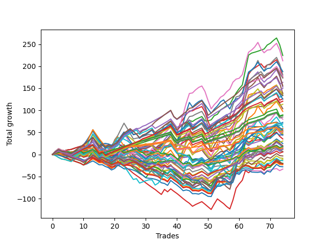

# Short Shepard 006 
- Symbol: ES
- Date Range: 03/18/2022 - 07/15/2022
- Trading Period: 7:20-12:30
- Number of Trades: 74



| Name | Win Percent | Profit | Avg Profit / Trade | Avg Time / Trade |      | Name | Win Percent | Profit | Avg Profit / Trade | Avg Time / Trade |
| ---- | ----------- | ------ | ------------------ | ---------------- | ---- | ---- | ----------- | ------ | ------------------ | ---------------- |
| Sorted By <br> Profit | | | | | | Sorted By <br> Win Percentage ||||
| Two | 78.38 | 112125.00 | 1515.20 | 13:45 |     | Eighty-One | 94.59 | 29375.00 | 396.96 | 04:43 |
| Six | 70.27 | 106125.00 | 1434.12 | 20:52 |     | One Hundred Twenty-Six | 93.24 | 26750.00 | 361.49 | 03:33 |
| Sixty-Two | 63.51 | 93875.00 | 1268.58 | 17:30 |     | One Hundred Twenty-One | 93.24 | 25875.00 | 349.66 | 03:36 |
| Seven | 63.51 | 90125.00 | 1217.91 | 27:17 |     | Eighty-Two | 89.19 | 44875.00 | 606.42 | 08:04 |
| Fifty-Eight | 74.32 | 88375.00 | 1194.26 | 11:15 |     | One Hundred Twenty-Seven | 87.84 | 44250.00 | 597.97 | 06:23 |
| Three | 78.38 | 87500.00 | 1182.43 | 14:48 |     | One Hundred Twenty-Two | 87.84 | 42500.00 | 574.32 | 06:27 |
| Fifty-Nine | 74.32 | 86500.00 | 1168.92 | 12:16 |     | Eighty-Three | 83.78 | 63000.00 | 851.35 | 11:38 |
| Eighty-Four | 82.43 | 81750.00 | 1104.73 | 13:29 |     | Eighty-Four | 82.43 | 81750.00 | 1104.73 | 13:29 |
| Eighty-Five | 78.38 | 77750.00 | 1050.68 | 15:38 |     | One Hundred Twenty-Eight | 82.43 | 60375.00 | 815.88 | 09:29 |
| Four | 68.92 | 76375.00 | 1032.09 | 21:09 |     | One Hundred Twenty-Three | 82.43 | 56875.00 | 768.58 | 09:42 |
| One Hundred Twenty-Nine | 78.38 | 74875.00 | 1011.82 | 10:44 |     | One Hundred Eleven | 81.08 | 8625.00 | 116.55 | 02:12 |
| One | 75.68 | 69625.00 | 940.88 | 07:59 |     | One Hundred Sixteen | 79.73 | 7250.00 | 97.97 | 02:10 |
| Five | 63.51 | 68875.00 | 930.74 | 25:13 |     | Two | 78.38 | 112125.00 | 1515.20 | 13:45 |
| Sixty | 62.16 | 67375.00 | 910.47 | 17:34 |     | Three | 78.38 | 87500.00 | 1182.43 | 14:48 |
| One Hundred Twenty-Four | 78.38 | 67000.00 | 905.41 | 11:07 |     | Eighty-Five | 78.38 | 77750.00 | 1050.68 | 15:38 |
| One Hundred Thirty | 70.27 | 66750.00 | 902.03 | 11:59 |     | One Hundred Twenty-Nine | 78.38 | 74875.00 | 1011.82 | 10:44 |
| Eighty-Three | 83.78 | 63000.00 | 851.35 | 11:38 |     | One Hundred Twenty-Four | 78.38 | 67000.00 | 905.41 | 11:07 |
| One Hundred Twenty-Five | 72.97 | 62750.00 | 847.97 | 12:38 |     | One | 75.68 | 69625.00 | 940.88 | 07:59 |
| One Hundred Twenty-Eight | 82.43 | 60375.00 | 815.88 | 09:29 |     | Fifty-Eight | 74.32 | 88375.00 | 1194.26 | 11:15 |
| One Hundred Twenty-Three | 82.43 | 56875.00 | 768.58 | 09:42 |     | Fifty-Nine | 74.32 | 86500.00 | 1168.92 | 12:16 |
| Fifty-Seven | 74.32 | 51875.00 | 701.01 | 06:23 |     | Fifty-Seven | 74.32 | 51875.00 | 701.01 | 06:23 |
| Sixty-Three | 55.41 | 48750.00 | 658.78 | 22:58 |     | One Hundred Twenty-Five | 72.97 | 62750.00 | 847.97 | 12:38 |
| Eighty-Two | 89.19 | 44875.00 | 606.42 | 08:04 |     | One Hundred Twelve | 71.62 | 6250.00 | 84.46 | 03:56 |
| One Hundred Twenty-Seven | 87.84 | 44250.00 | 597.97 | 06:23 |     | Six | 70.27 | 106125.00 | 1434.12 | 20:52 |
| One Hundred Twenty-Two | 87.84 | 42500.00 | 574.32 | 06:27 |     | One Hundred Thirty | 70.27 | 66750.00 | 902.03 | 11:59 |
| Sixty-Eight | 52.70 | 40000.00 | 540.54 | 14:44 |     | Four | 68.92 | 76375.00 | 1032.09 | 21:09 |
| Zero | 59.46 | 36375.00 | 491.55 | 04:43 |     | Sixty-Five | 68.92 | 17625.00 | 238.18 | 05:53 |
| One Hundred Fourteen | 63.51 | 34750.00 | 469.59 | 07:34 |     | One Hundred Seventeen | 68.92 | 9000.00 | 121.62 | 03:46 |
| Sixty-One | 55.41 | 31250.00 | 422.30 | 20:55 |     | Sixty-Seven | 64.86 | 26625.00 | 359.80 | 11:13 |
| Fifty-Six | 59.46 | 29500.00 | 398.65 | 03:55 |     | One Hundred Thirteen | 64.86 | 15250.00 | 206.08 | 06:34 |
| Eighty-One | 94.59 | 29375.00 | 396.96 | 04:43 |     | Forty-One | 64.86 | 8500.00 | 114.86 | 04:26 |
| One Hundred Fifteen | 56.76 | 27875.00 | 376.69 | 08:28 |     | Sixty-Two | 63.51 | 93875.00 | 1268.58 | 17:30 |
| One Hundred Twenty-Six | 93.24 | 26750.00 | 361.49 | 03:33 |     | Seven | 63.51 | 90125.00 | 1217.91 | 27:17 |
| Sixty-Seven | 64.86 | 26625.00 | 359.80 | 11:13 |     | Five | 63.51 | 68875.00 | 930.74 | 25:13 |
| One Hundred Twenty-One | 93.24 | 25875.00 | 349.66 | 03:36 |     | One Hundred Fourteen | 63.51 | 34750.00 | 469.59 | 07:34 |
| Seventy-One | 43.24 | 25750.00 | 347.97 | 18:48 |     | Sixty-Six | 63.51 | 21750.00 | 293.92 | 10:25 |
| Forty-Three | 56.76 | 24625.00 | 332.77 | 08:06 |     | Sixty | 62.16 | 67375.00 | 910.47 | 17:34 |
| Seventy | 48.65 | 23250.00 | 314.19 | 15:11 |     | Forty-Nine | 60.81 | 3500.00 | 47.30 | 03:41 |
| Forty-Four | 45.95 | 23250.00 | 314.19 | 11:25 |     | Zero | 59.46 | 36375.00 | 491.55 | 04:43 |
| Seventy-Three | 32.43 | 22375.00 | 302.36 | 06:48 |     | Fifty-Six | 59.46 | 29500.00 | 398.65 | 03:55 |
| Sixty-Six | 63.51 | 21750.00 | 293.92 | 10:25 |     | One Hundred Fifteen | 56.76 | 27875.00 | 376.69 | 08:28 |
| Sixty-Five | 68.92 | 17625.00 | 238.18 | 05:53 |     | Forty-Three | 56.76 | 24625.00 | 332.77 | 08:06 |
| One Hundred Thirteen | 64.86 | 15250.00 | 206.08 | 06:34 |     | Sixty-Four | 56.76 | 5875.00 | 79.39 | 03:43 |
| Forty-Two | 54.05 | 12500.00 | 168.92 | 08:00 |     | Sixty-Three | 55.41 | 48750.00 | 658.78 | 22:58 |
| Forty-Seven | 37.84 | 10000.00 | 135.14 | 15:32 |     | Sixty-One | 55.41 | 31250.00 | 422.30 | 20:55 |
| One Hundred Seventeen | 68.92 | 9000.00 | 121.62 | 03:46 |     | One Hundred Eighteen | 55.41 | 3000.00 | 40.54 | 05:20 |
| Forty-Six | 44.59 | 8750.00 | 118.24 | 11:37 |     | Forty-Two | 54.05 | 12500.00 | 168.92 | 08:00 |
| One Hundred Eleven | 81.08 | 8625.00 | 116.55 | 02:12 |     | Forty | 54.05 | -5500.00 | -74.32 | 02:48 |
| Forty-One | 64.86 | 8500.00 | 114.86 | 04:26 |     | Sixty-Eight | 52.70 | 40000.00 | 540.54 | 14:44 |
| One Hundred Sixteen | 79.73 | 7250.00 | 97.97 | 02:10 |     | Forty-Eight | 50.00 | -16500.00 | -222.97 | 02:28 |
| One Hundred Twelve | 71.62 | 6250.00 | 84.46 | 03:56 |     | Seventy | 48.65 | 23250.00 | 314.19 | 15:11 |
| One Hundred Ninteen | 48.65 | 6250.00 | 84.46 | 05:54 |     | One Hundred Ninteen | 48.65 | 6250.00 | 84.46 | 05:54 |
| Sixty-Four | 56.76 | 5875.00 | 79.39 | 03:43 |     | Forty-Four | 45.95 | 23250.00 | 314.19 | 11:25 |
| Forty-Nine | 60.81 | 3500.00 | 47.30 | 03:41 |     | Fifty | 45.95 | -4250.00 | -57.43 | 06:07 |
| One Hundred Eighteen | 55.41 | 3000.00 | 40.54 | 05:20 |     | Fifty-One | 45.95 | -7000.00 | -94.59 | 05:58 |
| Sixty-Nine | 43.24 | 2875.00 | 38.85 | 17:06 |     | Forty-Six | 44.59 | 8750.00 | 118.24 | 11:37 |
| One Hundred Twenty | 39.19 | -1625.00 | -21.96 | 06:18 |     | Seventy-One | 43.24 | 25750.00 | 347.97 | 18:48 |
| Fifty | 45.95 | -4250.00 | -57.43 | 06:07 |     | Sixty-Nine | 43.24 | 2875.00 | 38.85 | 17:06 |
| Forty | 54.05 | -5500.00 | -74.32 | 02:48 |     | One Hundred Twenty | 39.19 | -1625.00 | -21.96 | 06:18 |
| Fifty-One | 45.95 | -7000.00 | -94.59 | 05:58 |     | Forty-Seven | 37.84 | 10000.00 | 135.14 | 15:32 |
| Fifty-Four | 37.84 | -9875.00 | -133.45 | 07:03 |     | Fifty-Four | 37.84 | -9875.00 | -133.45 | 07:03 |
| Fifty-Five | 33.78 | -10500.00 | -141.89 | 08:22 |     | Forty-Five | 37.84 | -10750.00 | -145.27 | 13:57 |
| Forty-Five | 37.84 | -10750.00 | -145.27 | 13:57 |     | Fifty-Five | 33.78 | -10500.00 | -141.89 | 08:22 |
| Fifty-Three | 32.43 | -11625.00 | -157.09 | 08:01 |     | Fifty-Two | 33.78 | -13875.00 | -187.50 | 07:13 |
| Fifty-Two | 33.78 | -13875.00 | -187.50 | 07:13 |     | Seventy-Three | 32.43 | 22375.00 | 302.36 | 06:48 |
| Forty-Eight | 50.00 | -16500.00 | -222.97 | 02:28 |     | Fifty-Three | 32.43 | -11625.00 | -157.09 | 08:01 |

## NO STOPLOSS

### Test Zero
* Sell when price hits the middle line of the 20p bollinger
* No Stoploss
* Results:
```
Total Trades: 74
Percent Up: 40.54
Percent Down: 59.46
Total Points Moved Down: 72.75
Potential Profit: 36375.00
Total Points Ups: 64.00 Count Ups: 30
Total Points Downs: 136.75 Count Downs: 44
```

<details><summary>Trades</summary>

<code>In: 2022-03-21 08:30:00		Out: 2022-03-21 08:32:35		Total Position Time: 02:35		Total Move Down: 3.50		Total to Date: 3.50</code> <br />
<code>In: 2022-03-21 08:31:00		Out: 2022-03-21 08:32:35		Total Position Time: 01:35		Total Move Down: 1.25		Total to Date: 4.75</code> <br />
<code>In: 2022-03-25 11:09:00		Out: 2022-03-25 11:18:10		Total Position Time: 09:10		Total Move Down: -0.00		Total to Date: 4.75</code> <br />
<code>In: 2022-03-25 11:12:00		Out: 2022-03-25 11:18:10		Total Position Time: 06:10		Total Move Down: -1.00		Total to Date: 3.75</code> <br />
<code>In: 2022-03-25 11:18:00		Out: 2022-03-25 11:18:10		Total Position Time: 00:10		Total Move Down: -0.00		Total to Date: 3.75</code> <br />
<code>In: 2022-03-25 11:19:00		Out: 2022-03-25 11:19:10		Total Position Time: 00:10		Total Move Down: 0.25		Total to Date: 4.00</code> <br />
<code>In: 2022-03-25 11:34:00		Out: 2022-03-25 11:40:25		Total Position Time: 06:25		Total Move Down: 2.00		Total to Date: 6.00</code> <br />
<code>In: 2022-03-25 11:37:00		Out: 2022-03-25 11:40:25		Total Position Time: 03:25		Total Move Down: 1.75		Total to Date: 7.75</code> <br />
<code>In: 2022-03-25 11:40:00		Out: 2022-03-25 11:40:25		Total Position Time: 00:25		Total Move Down: 1.75		Total to Date: 9.50</code> <br />
<code>In: 2022-03-25 11:41:00		Out: 2022-03-25 11:41:10		Total Position Time: 00:10		Total Move Down: -0.75		Total to Date: 8.75</code> <br />
<code>In: 2022-03-25 11:49:00		Out: 2022-03-25 11:49:10		Total Position Time: 00:10		Total Move Down: -0.00		Total to Date: 8.75</code> <br />
<code>In: 2022-03-25 11:57:00		Out: 2022-03-25 11:57:15		Total Position Time: 00:15		Total Move Down: 0.25		Total to Date: 9.00</code> <br />
<code>In: 2022-03-25 11:58:00		Out: 2022-03-25 11:58:10		Total Position Time: 00:10		Total Move Down: -0.25		Total to Date: 8.75</code> <br />
<code>In: 2022-03-28 11:34:00		Out: 2022-03-28 12:03:55		Total Position Time: 29:55		Total Move Down: -11.00		Total to Date: -2.25</code> <br />
<code>In: 2022-03-28 11:36:00		Out: 2022-03-28 12:05:55		Total Position Time: 29:55		Total Move Down: -12.25		Total to Date: -14.50</code> <br />
<code>In: 2022-03-29 11:16:00		Out: 2022-03-29 11:16:30		Total Position Time: 00:30		Total Move Down: 0.50		Total to Date: -14.00</code> <br />
<code>In: 2022-03-31 07:39:00		Out: 2022-03-31 08:03:05		Total Position Time: 24:05		Total Move Down: -6.50		Total to Date: -20.50</code> <br />
<code>In: 2022-04-01 11:37:00		Out: 2022-04-01 11:43:00		Total Position Time: 06:00		Total Move Down: -0.75		Total to Date: -21.25</code> <br />
<code>In: 2022-04-01 11:38:00		Out: 2022-04-01 11:43:00		Total Position Time: 05:00		Total Move Down: -2.50		Total to Date: -23.75</code> <br />
<code>In: 2022-04-01 12:09:00		Out: 2022-04-01 12:09:10		Total Position Time: 00:10		Total Move Down: 1.00		Total to Date: -22.75</code> <br />
<code>In: 2022-04-06 08:57:00		Out: 2022-04-06 09:00:40		Total Position Time: 03:40		Total Move Down: 1.25		Total to Date: -21.50</code> <br />
<code>In: 2022-04-06 10:47:00		Out: 2022-04-06 10:47:10		Total Position Time: 00:10		Total Move Down: 1.75		Total to Date: -19.75</code> <br />
<code>In: 2022-04-06 10:48:00		Out: 2022-04-06 10:55:45		Total Position Time: 07:45		Total Move Down: -1.00		Total to Date: -20.75</code> <br />
<code>In: 2022-04-07 10:33:00		Out: 2022-04-07 10:36:05		Total Position Time: 03:05		Total Move Down: 2.25		Total to Date: -18.50</code> <br />
<code>In: 2022-04-07 10:34:00		Out: 2022-04-07 10:36:05		Total Position Time: 02:05		Total Move Down: 1.00		Total to Date: -17.50</code> <br />
<code>In: 2022-04-07 10:35:00		Out: 2022-04-07 10:36:05		Total Position Time: 01:05		Total Move Down: -0.00		Total to Date: -17.50</code> <br />
<code>In: 2022-04-07 11:06:00		Out: 2022-04-07 11:15:20		Total Position Time: 09:20		Total Move Down: 0.25		Total to Date: -17.25</code> <br />
<code>In: 2022-04-07 11:07:00		Out: 2022-04-07 11:15:20		Total Position Time: 08:20		Total Move Down: -1.00		Total to Date: -18.25</code> <br />
<code>In: 2022-04-18 07:29:00		Out: 2022-04-18 07:36:45		Total Position Time: 07:45		Total Move Down: -0.50		Total to Date: -18.75</code> <br />
<code>In: 2022-04-18 10:47:00		Out: 2022-04-18 10:59:30		Total Position Time: 12:30		Total Move Down: -1.50		Total to Date: -20.25</code> <br />
<code>In: 2022-04-18 11:00:00		Out: 2022-04-18 11:00:10		Total Position Time: 00:10		Total Move Down: -0.00		Total to Date: -20.25</code> <br />
<code>In: 2022-04-18 11:04:00		Out: 2022-04-18 11:04:10		Total Position Time: 00:10		Total Move Down: 0.25		Total to Date: -20.00</code> <br />
<code>In: 2022-04-25 09:41:00		Out: 2022-04-25 09:41:10		Total Position Time: 00:10		Total Move Down: -1.25		Total to Date: -21.25</code> <br />
<code>In: 2022-04-25 10:19:00		Out: 2022-04-25 10:26:25		Total Position Time: 07:25		Total Move Down: 1.75		Total to Date: -19.50</code> <br />
<code>In: 2022-04-28 08:17:00		Out: 2022-04-28 08:26:35		Total Position Time: 09:35		Total Move Down: -1.00		Total to Date: -20.50</code> <br />
<code>In: 2022-04-28 08:21:00		Out: 2022-04-28 08:26:35		Total Position Time: 05:35		Total Move Down: 2.25		Total to Date: -18.25</code> <br />
<code>In: 2022-04-28 08:33:00		Out: 2022-04-28 08:33:10		Total Position Time: 00:10		Total Move Down: 1.00		Total to Date: -17.25</code> <br />
<code>In: 2022-04-28 08:36:00		Out: 2022-04-28 08:36:10		Total Position Time: 00:10		Total Move Down: 1.25		Total to Date: -16.00</code> <br />
<code>In: 2022-05-04 09:32:00		Out: 2022-05-04 09:45:30		Total Position Time: 13:30		Total Move Down: -1.50		Total to Date: -17.50</code> <br />
<code>In: 2022-05-04 09:47:00		Out: 2022-05-04 09:47:10		Total Position Time: 00:10		Total Move Down: -0.00		Total to Date: -17.50</code> <br />
<code>In: 2022-05-06 07:25:00		Out: 2022-05-06 07:30:00		Total Position Time: 05:00		Total Move Down: 11.00		Total to Date: -6.50</code> <br />
<code>In: 2022-05-10 11:02:00		Out: 2022-05-10 11:06:15		Total Position Time: 04:15		Total Move Down: -0.00		Total to Date: -6.50</code> <br />
<code>In: 2022-05-10 11:06:00		Out: 2022-05-10 11:06:15		Total Position Time: 00:15		Total Move Down: 1.00		Total to Date: -5.50</code> <br />
<code>In: 2022-05-10 11:07:00		Out: 2022-05-10 11:07:10		Total Position Time: 00:10		Total Move Down: 1.25		Total to Date: -4.25</code> <br />
<code>In: 2022-05-16 08:51:00		Out: 2022-05-16 09:05:45		Total Position Time: 14:45		Total Move Down: -7.00		Total to Date: -11.25</code> <br />
<code>In: 2022-05-17 08:39:00		Out: 2022-05-17 08:43:35		Total Position Time: 04:35		Total Move Down: 1.75		Total to Date: -9.50</code> <br />
<code>In: 2022-05-17 08:44:00		Out: 2022-05-17 08:44:10		Total Position Time: 00:10		Total Move Down: -0.75		Total to Date: -10.25</code> <br />
<code>In: 2022-05-25 11:07:00		Out: 2022-05-25 11:07:10		Total Position Time: 00:10		Total Move Down: 3.25		Total to Date: -7.00</code> <br />
<code>In: 2022-05-25 11:23:00		Out: 2022-05-25 11:39:10		Total Position Time: 16:10		Total Move Down: -7.00		Total to Date: -14.00</code> <br />
<code>In: 2022-05-25 11:33:00		Out: 2022-05-25 11:39:10		Total Position Time: 06:10		Total Move Down: 2.75		Total to Date: -11.25</code> <br />
<code>In: 2022-05-25 11:37:00		Out: 2022-05-25 11:39:10		Total Position Time: 02:10		Total Move Down: 5.00		Total to Date: -6.25</code> <br />
<code>In: 2022-06-03 10:09:00		Out: 2022-06-03 10:13:20		Total Position Time: 04:20		Total Move Down: 2.00		Total to Date: -4.25</code> <br />
<code>In: 2022-06-09 10:14:00		Out: 2022-06-09 10:16:15		Total Position Time: 02:15		Total Move Down: 0.75		Total to Date: -3.50</code> <br />
<code>In: 2022-06-10 12:03:00		Out: 2022-06-10 12:03:25		Total Position Time: 00:25		Total Move Down: 2.25		Total to Date: -1.25</code> <br />
<code>In: 2022-06-10 12:04:00		Out: 2022-06-10 12:04:10		Total Position Time: 00:10		Total Move Down: -1.25		Total to Date: -2.50</code> <br />
<code>In: 2022-06-10 12:21:00		Out: 2022-06-10 12:21:45		Total Position Time: 00:45		Total Move Down: 2.25		Total to Date: -0.25</code> <br />
<code>In: 2022-06-10 12:22:00		Out: 2022-06-10 12:22:10		Total Position Time: 00:10		Total Move Down: 1.50		Total to Date: 1.25</code> <br />
<code>In: 2022-06-13 09:42:00		Out: 2022-06-13 09:43:15		Total Position Time: 01:15		Total Move Down: 3.00		Total to Date: 4.25</code> <br />
<code>In: 2022-06-14 10:26:00		Out: 2022-06-14 10:26:10		Total Position Time: 00:10		Total Move Down: 4.50		Total to Date: 8.75</code> <br />
<code>In: 2022-06-15 11:02:00		Out: 2022-06-15 11:02:10		Total Position Time: 00:10		Total Move Down: 2.00		Total to Date: 10.75</code> <br />
<code>In: 2022-06-15 11:03:00		Out: 2022-06-15 11:03:10		Total Position Time: 00:10		Total Move Down: 8.25		Total to Date: 19.00</code> <br />
<code>In: 2022-06-15 11:48:00		Out: 2022-06-15 11:52:30		Total Position Time: 04:30		Total Move Down: 22.25		Total to Date: 41.25</code> <br />
<code>In: 2022-06-15 11:49:00		Out: 2022-06-15 11:52:30		Total Position Time: 03:30		Total Move Down: 21.50		Total to Date: 62.75</code> <br />
<code>In: 2022-06-17 10:16:00		Out: 2022-06-17 10:22:05		Total Position Time: 06:05		Total Move Down: 1.00		Total to Date: 63.75</code> <br />
<code>In: 2022-06-29 11:08:00		Out: 2022-06-29 11:20:00		Total Position Time: 12:00		Total Move Down: -0.50		Total to Date: 63.25</code> <br />
<code>In: 2022-06-29 11:18:00		Out: 2022-06-29 11:20:00		Total Position Time: 02:00		Total Move Down: -0.25		Total to Date: 63.00</code> <br />
<code>In: 2022-07-01 10:55:00		Out: 2022-07-01 10:58:45		Total Position Time: 03:45		Total Move Down: 0.25		Total to Date: 63.25</code> <br />
<code>In: 2022-07-05 08:53:00		Out: 2022-07-05 09:00:10		Total Position Time: 07:10		Total Move Down: -0.25		Total to Date: 63.00</code> <br />
<code>In: 2022-07-06 11:11:00		Out: 2022-07-06 11:11:10		Total Position Time: 00:10		Total Move Down: 6.00		Total to Date: 69.00</code> <br />
<code>In: 2022-07-11 08:14:00		Out: 2022-07-11 08:20:10		Total Position Time: 06:10		Total Move Down: 1.00		Total to Date: 70.00</code> <br />
<code>In: 2022-07-12 08:33:00		Out: 2022-07-12 08:36:55		Total Position Time: 03:55		Total Move Down: 2.25		Total to Date: 72.25</code> <br />
<code>In: 2022-07-12 08:34:00		Out: 2022-07-12 08:36:55		Total Position Time: 02:55		Total Move Down: 1.25		Total to Date: 73.50</code> <br />
<code>In: 2022-07-14 08:03:00		Out: 2022-07-14 08:15:30		Total Position Time: 12:30		Total Move Down: -4.25		Total to Date: 69.25</code> <br />
<code>In: 2022-07-14 08:13:00		Out: 2022-07-14 08:15:30		Total Position Time: 02:30		Total Move Down: 3.50		Total to Date: 72.75</code> <br />


</details>

### Test One
* Sell when the price hits the upper line of the 20p 1std bollinger
* No Stoploss
* Results:
```
Total Trades: 74
Percent Up: 24.32
Percent Down: 75.68
Total Points Moved Down: 139.25
Potential Profit: 69625.00
Total Points Ups: 66.50 Count Ups: 18
Total Points Downs: 205.75 Count Downs: 56
```

<details><summary>Trades</summary>

<code>In: 2022-03-21 08:30:00		Out: 2022-03-21 08:36:00		Total Position Time: 06:00		Total Move Down: 4.25		Total to Date: 4.25</code> <br />
<code>In: 2022-03-21 08:31:00		Out: 2022-03-21 08:36:00		Total Position Time: 05:00		Total Move Down: 2.00		Total to Date: 6.25</code> <br />
<code>In: 2022-03-25 11:09:00		Out: 2022-03-25 11:19:30		Total Position Time: 10:30		Total Move Down: 1.75		Total to Date: 8.00</code> <br />
<code>In: 2022-03-25 11:12:00		Out: 2022-03-25 11:19:30		Total Position Time: 07:30		Total Move Down: 0.75		Total to Date: 8.75</code> <br />
<code>In: 2022-03-25 11:18:00		Out: 2022-03-25 11:19:30		Total Position Time: 01:30		Total Move Down: 1.75		Total to Date: 10.50</code> <br />
<code>In: 2022-03-25 11:19:00		Out: 2022-03-25 11:19:30		Total Position Time: 00:30		Total Move Down: 1.00		Total to Date: 11.50</code> <br />
<code>In: 2022-03-25 11:34:00		Out: 2022-03-25 11:40:55		Total Position Time: 06:55		Total Move Down: 2.50		Total to Date: 14.00</code> <br />
<code>In: 2022-03-25 11:37:00		Out: 2022-03-25 11:40:55		Total Position Time: 03:55		Total Move Down: 2.25		Total to Date: 16.25</code> <br />
<code>In: 2022-03-25 11:40:00		Out: 2022-03-25 11:40:55		Total Position Time: 00:55		Total Move Down: 2.25		Total to Date: 18.50</code> <br />
<code>In: 2022-03-25 11:41:00		Out: 2022-03-25 11:41:25		Total Position Time: 00:25		Total Move Down: 0.75		Total to Date: 19.25</code> <br />
<code>In: 2022-03-25 11:49:00		Out: 2022-03-25 11:49:10		Total Position Time: 00:10		Total Move Down: -0.00		Total to Date: 19.25</code> <br />
<code>In: 2022-03-25 11:57:00		Out: 2022-03-25 12:00:45		Total Position Time: 03:45		Total Move Down: 1.75		Total to Date: 21.00</code> <br />
<code>In: 2022-03-25 11:58:00		Out: 2022-03-25 12:00:45		Total Position Time: 02:45		Total Move Down: 1.25		Total to Date: 22.25</code> <br />
<code>In: 2022-03-28 11:34:00		Out: 2022-03-28 12:03:55		Total Position Time: 29:55		Total Move Down: -11.00		Total to Date: 11.25</code> <br />
<code>In: 2022-03-28 11:36:00		Out: 2022-03-28 12:05:55		Total Position Time: 29:55		Total Move Down: -12.25		Total to Date: -1.00</code> <br />
<code>In: 2022-03-29 11:16:00		Out: 2022-03-29 11:18:25		Total Position Time: 02:25		Total Move Down: 1.50		Total to Date: 0.50</code> <br />
<code>In: 2022-03-31 07:39:00		Out: 2022-03-31 08:03:30		Total Position Time: 24:30		Total Move Down: -4.25		Total to Date: -3.75</code> <br />
<code>In: 2022-04-01 11:37:00		Out: 2022-04-01 11:50:15		Total Position Time: 13:15		Total Move Down: 1.25		Total to Date: -2.50</code> <br />
<code>In: 2022-04-01 11:38:00		Out: 2022-04-01 11:50:15		Total Position Time: 12:15		Total Move Down: -0.50		Total to Date: -3.00</code> <br />
<code>In: 2022-04-01 12:09:00		Out: 2022-04-01 12:09:20		Total Position Time: 00:20		Total Move Down: 1.50		Total to Date: -1.50</code> <br />
<code>In: 2022-04-06 08:57:00		Out: 2022-04-06 09:04:35		Total Position Time: 07:35		Total Move Down: 1.00		Total to Date: -0.50</code> <br />
<code>In: 2022-04-06 10:47:00		Out: 2022-04-06 10:56:55		Total Position Time: 09:55		Total Move Down: 1.25		Total to Date: 0.75</code> <br />
<code>In: 2022-04-06 10:48:00		Out: 2022-04-06 10:56:55		Total Position Time: 08:55		Total Move Down: 0.75		Total to Date: 1.50</code> <br />
<code>In: 2022-04-07 10:33:00		Out: 2022-04-07 10:39:55		Total Position Time: 06:55		Total Move Down: 4.25		Total to Date: 5.75</code> <br />
<code>In: 2022-04-07 10:34:00		Out: 2022-04-07 10:39:55		Total Position Time: 05:55		Total Move Down: 3.00		Total to Date: 8.75</code> <br />
<code>In: 2022-04-07 10:35:00		Out: 2022-04-07 10:39:55		Total Position Time: 04:55		Total Move Down: 2.00		Total to Date: 10.75</code> <br />
<code>In: 2022-04-07 11:06:00		Out: 2022-04-07 11:16:10		Total Position Time: 10:10		Total Move Down: 0.25		Total to Date: 11.00</code> <br />
<code>In: 2022-04-07 11:07:00		Out: 2022-04-07 11:16:10		Total Position Time: 09:10		Total Move Down: -1.00		Total to Date: 10.00</code> <br />
<code>In: 2022-04-18 07:29:00		Out: 2022-04-18 07:51:15		Total Position Time: 22:15		Total Move Down: -1.75		Total to Date: 8.25</code> <br />
<code>In: 2022-04-18 10:47:00		Out: 2022-04-18 11:06:20		Total Position Time: 19:20		Total Move Down: -2.25		Total to Date: 6.00</code> <br />
<code>In: 2022-04-18 11:00:00		Out: 2022-04-18 11:06:20		Total Position Time: 06:20		Total Move Down: 0.75		Total to Date: 6.75</code> <br />
<code>In: 2022-04-18 11:04:00		Out: 2022-04-18 11:06:20		Total Position Time: 02:20		Total Move Down: 1.00		Total to Date: 7.75</code> <br />
<code>In: 2022-04-25 09:41:00		Out: 2022-04-25 09:42:35		Total Position Time: 01:35		Total Move Down: 1.50		Total to Date: 9.25</code> <br />
<code>In: 2022-04-25 10:19:00		Out: 2022-04-25 10:27:10		Total Position Time: 08:10		Total Move Down: 5.50		Total to Date: 14.75</code> <br />
<code>In: 2022-04-28 08:17:00		Out: 2022-04-28 08:28:35		Total Position Time: 11:35		Total Move Down: -0.00		Total to Date: 14.75</code> <br />
<code>In: 2022-04-28 08:21:00		Out: 2022-04-28 08:28:35		Total Position Time: 07:35		Total Move Down: 3.25		Total to Date: 18.00</code> <br />
<code>In: 2022-04-28 08:33:00		Out: 2022-04-28 08:33:10		Total Position Time: 00:10		Total Move Down: 1.00		Total to Date: 19.00</code> <br />
<code>In: 2022-04-28 08:36:00		Out: 2022-04-28 08:37:50		Total Position Time: 01:50		Total Move Down: 2.25		Total to Date: 21.25</code> <br />
<code>In: 2022-05-04 09:32:00		Out: 2022-05-04 09:46:30		Total Position Time: 14:30		Total Move Down: -0.00		Total to Date: 21.25</code> <br />
<code>In: 2022-05-04 09:47:00		Out: 2022-05-04 09:47:10		Total Position Time: 00:10		Total Move Down: -0.00		Total to Date: 21.25</code> <br />
<code>In: 2022-05-06 07:25:00		Out: 2022-05-06 07:34:10		Total Position Time: 09:10		Total Move Down: 14.25		Total to Date: 35.50</code> <br />
<code>In: 2022-05-10 11:02:00		Out: 2022-05-10 11:06:45		Total Position Time: 04:45		Total Move Down: 4.50		Total to Date: 40.00</code> <br />
<code>In: 2022-05-10 11:06:00		Out: 2022-05-10 11:06:45		Total Position Time: 00:45		Total Move Down: 5.50		Total to Date: 45.50</code> <br />
<code>In: 2022-05-10 11:07:00		Out: 2022-05-10 11:07:10		Total Position Time: 00:10		Total Move Down: 1.25		Total to Date: 46.75</code> <br />
<code>In: 2022-05-16 08:51:00		Out: 2022-05-16 09:06:10		Total Position Time: 15:10		Total Move Down: -3.50		Total to Date: 43.25</code> <br />
<code>In: 2022-05-17 08:39:00		Out: 2022-05-17 08:47:15		Total Position Time: 08:15		Total Move Down: 3.50		Total to Date: 46.75</code> <br />
<code>In: 2022-05-17 08:44:00		Out: 2022-05-17 08:47:15		Total Position Time: 03:15		Total Move Down: 2.00		Total to Date: 48.75</code> <br />
<code>In: 2022-05-25 11:07:00		Out: 2022-05-25 11:07:10		Total Position Time: 00:10		Total Move Down: 3.25		Total to Date: 52.00</code> <br />
<code>In: 2022-05-25 11:23:00		Out: 2022-05-25 11:45:15		Total Position Time: 22:15		Total Move Down: -10.50		Total to Date: 41.50</code> <br />
<code>In: 2022-05-25 11:33:00		Out: 2022-05-25 11:45:15		Total Position Time: 12:15		Total Move Down: -0.75		Total to Date: 40.75</code> <br />
<code>In: 2022-05-25 11:37:00		Out: 2022-05-25 11:45:15		Total Position Time: 08:15		Total Move Down: 1.50		Total to Date: 42.25</code> <br />
<code>In: 2022-06-03 10:09:00		Out: 2022-06-03 10:15:05		Total Position Time: 06:05		Total Move Down: 4.50		Total to Date: 46.75</code> <br />
<code>In: 2022-06-09 10:14:00		Out: 2022-06-09 10:18:10		Total Position Time: 04:10		Total Move Down: 1.75		Total to Date: 48.50</code> <br />
<code>In: 2022-06-10 12:03:00		Out: 2022-06-10 12:04:35		Total Position Time: 01:35		Total Move Down: 6.25		Total to Date: 54.75</code> <br />
<code>In: 2022-06-10 12:04:00		Out: 2022-06-10 12:04:35		Total Position Time: 00:35		Total Move Down: 1.00		Total to Date: 55.75</code> <br />
<code>In: 2022-06-10 12:21:00		Out: 2022-06-10 12:35:45		Total Position Time: 14:45		Total Move Down: 1.75		Total to Date: 57.50</code> <br />
<code>In: 2022-06-10 12:22:00		Out: 2022-06-10 12:35:45		Total Position Time: 13:45		Total Move Down: -0.50		Total to Date: 57.00</code> <br />
<code>In: 2022-06-13 09:42:00		Out: 2022-06-13 09:47:50		Total Position Time: 05:50		Total Move Down: 8.50		Total to Date: 65.50</code> <br />
<code>In: 2022-06-14 10:26:00		Out: 2022-06-14 10:29:05		Total Position Time: 03:05		Total Move Down: 8.25		Total to Date: 73.75</code> <br />
<code>In: 2022-06-15 11:02:00		Out: 2022-06-15 11:02:10		Total Position Time: 00:10		Total Move Down: 2.00		Total to Date: 75.75</code> <br />
<code>In: 2022-06-15 11:03:00		Out: 2022-06-15 11:03:10		Total Position Time: 00:10		Total Move Down: 8.25		Total to Date: 84.00</code> <br />
<code>In: 2022-06-15 11:48:00		Out: 2022-06-15 11:57:35		Total Position Time: 09:35		Total Move Down: 25.75		Total to Date: 109.75</code> <br />
<code>In: 2022-06-15 11:49:00		Out: 2022-06-15 11:57:35		Total Position Time: 08:35		Total Move Down: 25.00		Total to Date: 134.75</code> <br />
<code>In: 2022-06-17 10:16:00		Out: 2022-06-17 10:26:05		Total Position Time: 10:05		Total Move Down: 2.75		Total to Date: 137.50</code> <br />
<code>In: 2022-06-29 11:08:00		Out: 2022-06-29 11:20:25		Total Position Time: 12:25		Total Move Down: 1.00		Total to Date: 138.50</code> <br />
<code>In: 2022-06-29 11:18:00		Out: 2022-06-29 11:20:25		Total Position Time: 02:25		Total Move Down: 1.25		Total to Date: 139.75</code> <br />
<code>In: 2022-07-01 10:55:00		Out: 2022-07-01 11:04:25		Total Position Time: 09:25		Total Move Down: 0.25		Total to Date: 140.00</code> <br />
<code>In: 2022-07-05 08:53:00		Out: 2022-07-05 09:03:25		Total Position Time: 10:25		Total Move Down: -0.00		Total to Date: 140.00</code> <br />
<code>In: 2022-07-06 11:11:00		Out: 2022-07-06 11:11:10		Total Position Time: 00:10		Total Move Down: 6.00		Total to Date: 146.00</code> <br />
<code>In: 2022-07-11 08:14:00		Out: 2022-07-11 08:23:35		Total Position Time: 09:35		Total Move Down: 2.50		Total to Date: 148.50</code> <br />
<code>In: 2022-07-12 08:33:00		Out: 2022-07-12 08:38:05		Total Position Time: 05:05		Total Move Down: 5.00		Total to Date: 153.50</code> <br />
<code>In: 2022-07-12 08:34:00		Out: 2022-07-12 08:38:05		Total Position Time: 04:05		Total Move Down: 4.00		Total to Date: 157.50</code> <br />
<code>In: 2022-07-14 08:03:00		Out: 2022-07-14 08:32:55		Total Position Time: 29:55		Total Move Down: -15.25		Total to Date: 142.25</code> <br />
<code>In: 2022-07-14 08:13:00		Out: 2022-07-14 08:35:50		Total Position Time: 22:50		Total Move Down: -3.00		Total to Date: 139.25</code> <br />


</details>

### Test Two
* Sell when the price hits the upper line of the 20p 2std bollinger
* No Stoploss
* Results:
```
Total Trades: 74
Percent Up: 21.62
Percent Down: 78.38
Total Points Moved Down: 224.25
Potential Profit: 112125.00
Total Points Ups: 103.75 Count Ups: 16
Total Points Downs: 328.00 Count Downs: 58
```

<details><summary>Trades</summary>

<code>In: 2022-03-21 08:30:00		Out: 2022-03-21 08:36:05		Total Position Time: 06:05		Total Move Down: 6.25		Total to Date: 6.25</code> <br />
<code>In: 2022-03-21 08:31:00		Out: 2022-03-21 08:36:05		Total Position Time: 05:05		Total Move Down: 4.00		Total to Date: 10.25</code> <br />
<code>In: 2022-03-25 11:09:00		Out: 2022-03-25 11:38:55		Total Position Time: 29:55		Total Move Down: -3.50		Total to Date: 6.75</code> <br />
<code>In: 2022-03-25 11:12:00		Out: 2022-03-25 11:41:55		Total Position Time: 29:55		Total Move Down: -1.00		Total to Date: 5.75</code> <br />
<code>In: 2022-03-25 11:18:00		Out: 2022-03-25 11:47:55		Total Position Time: 29:55		Total Move Down: -2.25		Total to Date: 3.50</code> <br />
<code>In: 2022-03-25 11:19:00		Out: 2022-03-25 11:48:55		Total Position Time: 29:55		Total Move Down: -2.25		Total to Date: 1.25</code> <br />
<code>In: 2022-03-25 11:34:00		Out: 2022-03-25 12:00:55		Total Position Time: 26:55		Total Move Down: 1.75		Total to Date: 3.00</code> <br />
<code>In: 2022-03-25 11:37:00		Out: 2022-03-25 12:00:55		Total Position Time: 23:55		Total Move Down: 1.50		Total to Date: 4.50</code> <br />
<code>In: 2022-03-25 11:40:00		Out: 2022-03-25 12:00:55		Total Position Time: 20:55		Total Move Down: 1.50		Total to Date: 6.00</code> <br />
<code>In: 2022-03-25 11:41:00		Out: 2022-03-25 12:00:55		Total Position Time: 19:55		Total Move Down: -0.00		Total to Date: 6.00</code> <br />
<code>In: 2022-03-25 11:49:00		Out: 2022-03-25 12:00:55		Total Position Time: 11:55		Total Move Down: 1.25		Total to Date: 7.25</code> <br />
<code>In: 2022-03-25 11:57:00		Out: 2022-03-25 12:00:55		Total Position Time: 03:55		Total Move Down: 2.75		Total to Date: 10.00</code> <br />
<code>In: 2022-03-25 11:58:00		Out: 2022-03-25 12:00:55		Total Position Time: 02:55		Total Move Down: 2.25		Total to Date: 12.25</code> <br />
<code>In: 2022-03-28 11:34:00		Out: 2022-03-28 12:03:55		Total Position Time: 29:55		Total Move Down: -11.00		Total to Date: 1.25</code> <br />
<code>In: 2022-03-28 11:36:00		Out: 2022-03-28 12:05:55		Total Position Time: 29:55		Total Move Down: -12.25		Total to Date: -11.00</code> <br />
<code>In: 2022-03-29 11:16:00		Out: 2022-03-29 11:18:30		Total Position Time: 02:30		Total Move Down: 1.75		Total to Date: -9.25</code> <br />
<code>In: 2022-03-31 07:39:00		Out: 2022-03-31 08:08:30		Total Position Time: 29:30		Total Move Down: -3.00		Total to Date: -12.25</code> <br />
<code>In: 2022-04-01 11:37:00		Out: 2022-04-01 11:50:20		Total Position Time: 13:20		Total Move Down: 1.75		Total to Date: -10.50</code> <br />
<code>In: 2022-04-01 11:38:00		Out: 2022-04-01 11:50:20		Total Position Time: 12:20		Total Move Down: -0.00		Total to Date: -10.50</code> <br />
<code>In: 2022-04-01 12:09:00		Out: 2022-04-01 12:11:10		Total Position Time: 02:10		Total Move Down: 4.50		Total to Date: -6.00</code> <br />
<code>In: 2022-04-06 08:57:00		Out: 2022-04-06 09:09:40		Total Position Time: 12:40		Total Move Down: 2.50		Total to Date: -3.50</code> <br />
<code>In: 2022-04-06 10:47:00		Out: 2022-04-06 10:57:20		Total Position Time: 10:20		Total Move Down: 2.25		Total to Date: -1.25</code> <br />
<code>In: 2022-04-06 10:48:00		Out: 2022-04-06 10:57:20		Total Position Time: 09:20		Total Move Down: 1.75		Total to Date: 0.50</code> <br />
<code>In: 2022-04-07 10:33:00		Out: 2022-04-07 10:45:15		Total Position Time: 12:15		Total Move Down: 5.00		Total to Date: 5.50</code> <br />
<code>In: 2022-04-07 10:34:00		Out: 2022-04-07 10:45:15		Total Position Time: 11:15		Total Move Down: 3.75		Total to Date: 9.25</code> <br />
<code>In: 2022-04-07 10:35:00		Out: 2022-04-07 10:45:15		Total Position Time: 10:15		Total Move Down: 2.75		Total to Date: 12.00</code> <br />
<code>In: 2022-04-07 11:06:00		Out: 2022-04-07 11:18:20		Total Position Time: 12:20		Total Move Down: 2.25		Total to Date: 14.25</code> <br />
<code>In: 2022-04-07 11:07:00		Out: 2022-04-07 11:18:20		Total Position Time: 11:20		Total Move Down: 1.00		Total to Date: 15.25</code> <br />
<code>In: 2022-04-18 07:29:00		Out: 2022-04-18 07:51:45		Total Position Time: 22:45		Total Move Down: 1.25		Total to Date: 16.50</code> <br />
<code>In: 2022-04-18 10:47:00		Out: 2022-04-18 11:10:40		Total Position Time: 23:40		Total Move Down: 0.25		Total to Date: 16.75</code> <br />
<code>In: 2022-04-18 11:00:00		Out: 2022-04-18 11:10:40		Total Position Time: 10:40		Total Move Down: 3.25		Total to Date: 20.00</code> <br />
<code>In: 2022-04-18 11:04:00		Out: 2022-04-18 11:10:40		Total Position Time: 06:40		Total Move Down: 3.50		Total to Date: 23.50</code> <br />
<code>In: 2022-04-25 09:41:00		Out: 2022-04-25 10:01:20		Total Position Time: 20:20		Total Move Down: 7.25		Total to Date: 30.75</code> <br />
<code>In: 2022-04-25 10:19:00		Out: 2022-04-25 10:33:35		Total Position Time: 14:35		Total Move Down: 6.50		Total to Date: 37.25</code> <br />
<code>In: 2022-04-28 08:17:00		Out: 2022-04-28 08:32:15		Total Position Time: 15:15		Total Move Down: 0.75		Total to Date: 38.00</code> <br />
<code>In: 2022-04-28 08:21:00		Out: 2022-04-28 08:32:15		Total Position Time: 11:15		Total Move Down: 4.00		Total to Date: 42.00</code> <br />
<code>In: 2022-04-28 08:33:00		Out: 2022-04-28 08:33:10		Total Position Time: 00:10		Total Move Down: 1.00		Total to Date: 43.00</code> <br />
<code>In: 2022-04-28 08:36:00		Out: 2022-04-28 08:38:55		Total Position Time: 02:55		Total Move Down: 3.50		Total to Date: 46.50</code> <br />
<code>In: 2022-05-04 09:32:00		Out: 2022-05-04 10:01:55		Total Position Time: 29:55		Total Move Down: -14.00		Total to Date: 32.50</code> <br />
<code>In: 2022-05-04 09:47:00		Out: 2022-05-04 10:11:15		Total Position Time: 24:15		Total Move Down: -2.50		Total to Date: 30.00</code> <br />
<code>In: 2022-05-06 07:25:00		Out: 2022-05-06 07:36:30		Total Position Time: 11:30		Total Move Down: 18.75		Total to Date: 48.75</code> <br />
<code>In: 2022-05-10 11:02:00		Out: 2022-05-10 11:16:05		Total Position Time: 14:05		Total Move Down: 10.00		Total to Date: 58.75</code> <br />
<code>In: 2022-05-10 11:06:00		Out: 2022-05-10 11:16:05		Total Position Time: 10:05		Total Move Down: 11.00		Total to Date: 69.75</code> <br />
<code>In: 2022-05-10 11:07:00		Out: 2022-05-10 11:16:05		Total Position Time: 09:05		Total Move Down: 7.50		Total to Date: 77.25</code> <br />
<code>In: 2022-05-16 08:51:00		Out: 2022-05-16 09:11:35		Total Position Time: 20:35		Total Move Down: -2.50		Total to Date: 74.75</code> <br />
<code>In: 2022-05-17 08:39:00		Out: 2022-05-17 08:48:20		Total Position Time: 09:20		Total Move Down: 4.75		Total to Date: 79.50</code> <br />
<code>In: 2022-05-17 08:44:00		Out: 2022-05-17 08:48:20		Total Position Time: 04:20		Total Move Down: 3.25		Total to Date: 82.75</code> <br />
<code>In: 2022-05-25 11:07:00		Out: 2022-05-25 11:07:10		Total Position Time: 00:10		Total Move Down: 3.25		Total to Date: 86.00</code> <br />
<code>In: 2022-05-25 11:23:00		Out: 2022-05-25 11:50:00		Total Position Time: 27:00		Total Move Down: -9.75		Total to Date: 76.25</code> <br />
<code>In: 2022-05-25 11:33:00		Out: 2022-05-25 11:50:00		Total Position Time: 17:00		Total Move Down: -0.00		Total to Date: 76.25</code> <br />
<code>In: 2022-05-25 11:37:00		Out: 2022-05-25 11:50:00		Total Position Time: 13:00		Total Move Down: 2.25		Total to Date: 78.50</code> <br />
<code>In: 2022-06-03 10:09:00		Out: 2022-06-03 10:17:55		Total Position Time: 08:55		Total Move Down: 9.50		Total to Date: 88.00</code> <br />
<code>In: 2022-06-09 10:14:00		Out: 2022-06-09 10:18:55		Total Position Time: 04:55		Total Move Down: 3.25		Total to Date: 91.25</code> <br />
<code>In: 2022-06-10 12:03:00		Out: 2022-06-10 12:05:55		Total Position Time: 02:55		Total Move Down: 9.75		Total to Date: 101.00</code> <br />
<code>In: 2022-06-10 12:04:00		Out: 2022-06-10 12:05:55		Total Position Time: 01:55		Total Move Down: 4.50		Total to Date: 105.50</code> <br />
<code>In: 2022-06-10 12:21:00		Out: 2022-06-10 12:42:45		Total Position Time: 21:45		Total Move Down: 5.25		Total to Date: 110.75</code> <br />
<code>In: 2022-06-10 12:22:00		Out: 2022-06-10 12:42:45		Total Position Time: 20:45		Total Move Down: 3.00		Total to Date: 113.75</code> <br />
<code>In: 2022-06-13 09:42:00		Out: 2022-06-13 09:54:20		Total Position Time: 12:20		Total Move Down: 13.25		Total to Date: 127.00</code> <br />
<code>In: 2022-06-14 10:26:00		Out: 2022-06-14 10:31:00		Total Position Time: 05:00		Total Move Down: 12.25		Total to Date: 139.25</code> <br />
<code>In: 2022-06-15 11:02:00		Out: 2022-06-15 11:03:05		Total Position Time: 01:05		Total Move Down: 10.00		Total to Date: 149.25</code> <br />
<code>In: 2022-06-15 11:03:00		Out: 2022-06-15 11:03:10		Total Position Time: 00:10		Total Move Down: 8.25		Total to Date: 157.50</code> <br />
<code>In: 2022-06-15 11:48:00		Out: 2022-06-15 11:58:05		Total Position Time: 10:05		Total Move Down: 34.25		Total to Date: 191.75</code> <br />
<code>In: 2022-06-15 11:49:00		Out: 2022-06-15 11:58:05		Total Position Time: 09:05		Total Move Down: 33.50		Total to Date: 225.25</code> <br />
<code>In: 2022-06-17 10:16:00		Out: 2022-06-17 10:27:05		Total Position Time: 11:05		Total Move Down: 4.50		Total to Date: 229.75</code> <br />
<code>In: 2022-06-29 11:08:00		Out: 2022-06-29 11:20:45		Total Position Time: 12:45		Total Move Down: 2.00		Total to Date: 231.75</code> <br />
<code>In: 2022-06-29 11:18:00		Out: 2022-06-29 11:20:45		Total Position Time: 02:45		Total Move Down: 2.25		Total to Date: 234.00</code> <br />
<code>In: 2022-07-01 10:55:00		Out: 2022-07-01 11:07:55		Total Position Time: 12:55		Total Move Down: 2.50		Total to Date: 236.50</code> <br />
<code>In: 2022-07-05 08:53:00		Out: 2022-07-05 09:03:50		Total Position Time: 10:50		Total Move Down: 2.50		Total to Date: 239.00</code> <br />
<code>In: 2022-07-06 11:11:00		Out: 2022-07-06 11:11:45		Total Position Time: 00:45		Total Move Down: 9.00		Total to Date: 248.00</code> <br />
<code>In: 2022-07-11 08:14:00		Out: 2022-07-11 08:37:10		Total Position Time: 23:10		Total Move Down: 4.00		Total to Date: 252.00</code> <br />
<code>In: 2022-07-12 08:33:00		Out: 2022-07-12 08:41:10		Total Position Time: 08:10		Total Move Down: 6.50		Total to Date: 258.50</code> <br />
<code>In: 2022-07-12 08:34:00		Out: 2022-07-12 08:41:10		Total Position Time: 07:10		Total Move Down: 5.50		Total to Date: 264.00</code> <br />
<code>In: 2022-07-14 08:03:00		Out: 2022-07-14 08:32:55		Total Position Time: 29:55		Total Move Down: -15.25		Total to Date: 248.75</code> <br />
<code>In: 2022-07-14 08:13:00		Out: 2022-07-14 08:42:55		Total Position Time: 29:55		Total Move Down: -24.50		Total to Date: 224.25</code> <br />


</details>

### Test Three
* Sell when price hits the middle line of the 50p bollinger
* No Stoploss
* Results:
```
Total Trades: 74
Percent Up: 21.62
Percent Down: 78.38
Total Points Moved Down: 175.00
Potential Profit: 87500.00
Total Points Ups: 156.25 Count Ups: 16
Total Points Downs: 331.25 Count Downs: 58
```

<details><summary>Trades</summary>

<code>In: 2022-03-21 08:30:00		Out: 2022-03-21 08:36:10		Total Position Time: 06:10		Total Move Down: 6.00		Total to Date: 6.00</code> <br />
<code>In: 2022-03-21 08:31:00		Out: 2022-03-21 08:36:10		Total Position Time: 05:10		Total Move Down: 3.75		Total to Date: 9.75</code> <br />
<code>In: 2022-03-25 11:09:00		Out: 2022-03-25 11:38:55		Total Position Time: 29:55		Total Move Down: -3.50		Total to Date: 6.25</code> <br />
<code>In: 2022-03-25 11:12:00		Out: 2022-03-25 11:41:55		Total Position Time: 29:55		Total Move Down: -1.00		Total to Date: 5.25</code> <br />
<code>In: 2022-03-25 11:18:00		Out: 2022-03-25 11:47:55		Total Position Time: 29:55		Total Move Down: -2.25		Total to Date: 3.00</code> <br />
<code>In: 2022-03-25 11:19:00		Out: 2022-03-25 11:48:55		Total Position Time: 29:55		Total Move Down: -2.25		Total to Date: 0.75</code> <br />
<code>In: 2022-03-25 11:34:00		Out: 2022-03-25 11:49:30		Total Position Time: 15:30		Total Move Down: 1.00		Total to Date: 1.75</code> <br />
<code>In: 2022-03-25 11:37:00		Out: 2022-03-25 11:49:30		Total Position Time: 12:30		Total Move Down: 0.75		Total to Date: 2.50</code> <br />
<code>In: 2022-03-25 11:40:00		Out: 2022-03-25 11:49:30		Total Position Time: 09:30		Total Move Down: 0.75		Total to Date: 3.25</code> <br />
<code>In: 2022-03-25 11:41:00		Out: 2022-03-25 11:49:30		Total Position Time: 08:30		Total Move Down: -0.75		Total to Date: 2.50</code> <br />
<code>In: 2022-03-25 11:49:00		Out: 2022-03-25 11:49:30		Total Position Time: 00:30		Total Move Down: 0.50		Total to Date: 3.00</code> <br />
<code>In: 2022-03-25 11:57:00		Out: 2022-03-25 12:00:45		Total Position Time: 03:45		Total Move Down: 1.75		Total to Date: 4.75</code> <br />
<code>In: 2022-03-25 11:58:00		Out: 2022-03-25 12:00:45		Total Position Time: 02:45		Total Move Down: 1.25		Total to Date: 6.00</code> <br />
<code>In: 2022-03-28 11:34:00		Out: 2022-03-28 12:03:55		Total Position Time: 29:55		Total Move Down: -11.00		Total to Date: -5.00</code> <br />
<code>In: 2022-03-28 11:36:00		Out: 2022-03-28 12:05:55		Total Position Time: 29:55		Total Move Down: -12.25		Total to Date: -17.25</code> <br />
<code>In: 2022-03-29 11:16:00		Out: 2022-03-29 11:21:20		Total Position Time: 05:20		Total Move Down: 5.00		Total to Date: -12.25</code> <br />
<code>In: 2022-03-31 07:39:00		Out: 2022-03-31 08:08:55		Total Position Time: 29:55		Total Move Down: -4.00		Total to Date: -16.25</code> <br />
<code>In: 2022-04-01 11:37:00		Out: 2022-04-01 11:57:50		Total Position Time: 20:50		Total Move Down: 2.50		Total to Date: -13.75</code> <br />
<code>In: 2022-04-01 11:38:00		Out: 2022-04-01 11:57:50		Total Position Time: 19:50		Total Move Down: 0.75		Total to Date: -13.00</code> <br />
<code>In: 2022-04-01 12:09:00		Out: 2022-04-01 12:09:10		Total Position Time: 00:10		Total Move Down: 1.00		Total to Date: -12.00</code> <br />
<code>In: 2022-04-06 08:57:00		Out: 2022-04-06 09:12:05		Total Position Time: 15:05		Total Move Down: 3.25		Total to Date: -8.75</code> <br />
<code>In: 2022-04-06 10:47:00		Out: 2022-04-06 11:00:10		Total Position Time: 13:10		Total Move Down: 10.00		Total to Date: 1.25</code> <br />
<code>In: 2022-04-06 10:48:00		Out: 2022-04-06 11:00:10		Total Position Time: 12:10		Total Move Down: 9.50		Total to Date: 10.75</code> <br />
<code>In: 2022-04-07 10:33:00		Out: 2022-04-07 10:51:55		Total Position Time: 18:55		Total Move Down: 6.00		Total to Date: 16.75</code> <br />
<code>In: 2022-04-07 10:34:00		Out: 2022-04-07 10:51:55		Total Position Time: 17:55		Total Move Down: 4.75		Total to Date: 21.50</code> <br />
<code>In: 2022-04-07 10:35:00		Out: 2022-04-07 10:51:55		Total Position Time: 16:55		Total Move Down: 3.75		Total to Date: 25.25</code> <br />
<code>In: 2022-04-07 11:06:00		Out: 2022-04-07 11:33:40		Total Position Time: 27:40		Total Move Down: 2.50		Total to Date: 27.75</code> <br />
<code>In: 2022-04-07 11:07:00		Out: 2022-04-07 11:33:40		Total Position Time: 26:40		Total Move Down: 1.25		Total to Date: 29.00</code> <br />
<code>In: 2022-04-18 07:29:00		Out: 2022-04-18 07:51:50		Total Position Time: 22:50		Total Move Down: 1.75		Total to Date: 30.75</code> <br />
<code>In: 2022-04-18 10:47:00		Out: 2022-04-18 11:16:30		Total Position Time: 29:30		Total Move Down: 0.25		Total to Date: 31.00</code> <br />
<code>In: 2022-04-18 11:00:00		Out: 2022-04-18 11:16:30		Total Position Time: 16:30		Total Move Down: 3.25		Total to Date: 34.25</code> <br />
<code>In: 2022-04-18 11:04:00		Out: 2022-04-18 11:16:30		Total Position Time: 12:30		Total Move Down: 3.50		Total to Date: 37.75</code> <br />
<code>In: 2022-04-25 09:41:00		Out: 2022-04-25 09:55:05		Total Position Time: 14:05		Total Move Down: 0.75		Total to Date: 38.50</code> <br />
<code>In: 2022-04-25 10:19:00		Out: 2022-04-25 10:28:15		Total Position Time: 09:15		Total Move Down: 6.50		Total to Date: 45.00</code> <br />
<code>In: 2022-04-28 08:17:00		Out: 2022-04-28 08:40:05		Total Position Time: 23:05		Total Move Down: 3.75		Total to Date: 48.75</code> <br />
<code>In: 2022-04-28 08:21:00		Out: 2022-04-28 08:40:05		Total Position Time: 19:05		Total Move Down: 7.00		Total to Date: 55.75</code> <br />
<code>In: 2022-04-28 08:33:00		Out: 2022-04-28 08:40:05		Total Position Time: 07:05		Total Move Down: 4.00		Total to Date: 59.75</code> <br />
<code>In: 2022-04-28 08:36:00		Out: 2022-04-28 08:40:05		Total Position Time: 04:05		Total Move Down: 7.00		Total to Date: 66.75</code> <br />
<code>In: 2022-05-04 09:32:00		Out: 2022-05-04 10:01:55		Total Position Time: 29:55		Total Move Down: -14.00		Total to Date: 52.75</code> <br />
<code>In: 2022-05-04 09:47:00		Out: 2022-05-04 10:10:20		Total Position Time: 23:20		Total Move Down: -5.25		Total to Date: 47.50</code> <br />
<code>In: 2022-05-06 07:25:00		Out: 2022-05-06 07:36:40		Total Position Time: 11:40		Total Move Down: 22.50		Total to Date: 70.00</code> <br />
<code>In: 2022-05-10 11:02:00		Out: 2022-05-10 11:16:05		Total Position Time: 14:05		Total Move Down: 10.00		Total to Date: 80.00</code> <br />
<code>In: 2022-05-10 11:06:00		Out: 2022-05-10 11:16:05		Total Position Time: 10:05		Total Move Down: 11.00		Total to Date: 91.00</code> <br />
<code>In: 2022-05-10 11:07:00		Out: 2022-05-10 11:16:05		Total Position Time: 09:05		Total Move Down: 7.50		Total to Date: 98.50</code> <br />
<code>In: 2022-05-16 08:51:00		Out: 2022-05-16 09:15:30		Total Position Time: 24:30		Total Move Down: 0.50		Total to Date: 99.00</code> <br />
<code>In: 2022-05-17 08:39:00		Out: 2022-05-17 09:02:20		Total Position Time: 23:20		Total Move Down: 4.00		Total to Date: 103.00</code> <br />
<code>In: 2022-05-17 08:44:00		Out: 2022-05-17 09:02:20		Total Position Time: 18:20		Total Move Down: 2.50		Total to Date: 105.50</code> <br />
<code>In: 2022-05-25 11:07:00		Out: 2022-05-25 11:07:10		Total Position Time: 00:10		Total Move Down: 3.25		Total to Date: 108.75</code> <br />
<code>In: 2022-05-25 11:23:00		Out: 2022-05-25 11:52:55		Total Position Time: 29:55		Total Move Down: -12.25		Total to Date: 96.50</code> <br />
<code>In: 2022-05-25 11:33:00		Out: 2022-05-25 12:02:55		Total Position Time: 29:55		Total Move Down: -20.75		Total to Date: 75.75</code> <br />
<code>In: 2022-05-25 11:37:00		Out: 2022-05-25 12:06:55		Total Position Time: 29:55		Total Move Down: -18.75		Total to Date: 57.00</code> <br />
<code>In: 2022-06-03 10:09:00		Out: 2022-06-03 10:17:55		Total Position Time: 08:55		Total Move Down: 9.50		Total to Date: 66.50</code> <br />
<code>In: 2022-06-09 10:14:00		Out: 2022-06-09 10:22:05		Total Position Time: 08:05		Total Move Down: 4.75		Total to Date: 71.25</code> <br />
<code>In: 2022-06-10 12:03:00		Out: 2022-06-10 12:03:40		Total Position Time: 00:40		Total Move Down: 5.50		Total to Date: 76.75</code> <br />
<code>In: 2022-06-10 12:04:00		Out: 2022-06-10 12:04:15		Total Position Time: 00:15		Total Move Down: 0.25		Total to Date: 77.00</code> <br />
<code>In: 2022-06-10 12:21:00		Out: 2022-06-10 12:22:10		Total Position Time: 01:10		Total Move Down: 3.75		Total to Date: 80.75</code> <br />
<code>In: 2022-06-10 12:22:00		Out: 2022-06-10 12:22:10		Total Position Time: 00:10		Total Move Down: 1.50		Total to Date: 82.25</code> <br />
<code>In: 2022-06-13 09:42:00		Out: 2022-06-13 09:47:50		Total Position Time: 05:50		Total Move Down: 8.50		Total to Date: 90.75</code> <br />
<code>In: 2022-06-14 10:26:00		Out: 2022-06-14 10:30:05		Total Position Time: 04:05		Total Move Down: 12.75		Total to Date: 103.50</code> <br />
<code>In: 2022-06-15 11:02:00		Out: 2022-06-15 11:02:10		Total Position Time: 00:10		Total Move Down: 2.00		Total to Date: 105.50</code> <br />
<code>In: 2022-06-15 11:03:00		Out: 2022-06-15 11:03:10		Total Position Time: 00:10		Total Move Down: 8.25		Total to Date: 113.75</code> <br />
<code>In: 2022-06-15 11:48:00		Out: 2022-06-15 11:58:05		Total Position Time: 10:05		Total Move Down: 34.25		Total to Date: 148.00</code> <br />
<code>In: 2022-06-15 11:49:00		Out: 2022-06-15 11:58:05		Total Position Time: 09:05		Total Move Down: 33.50		Total to Date: 181.50</code> <br />
<code>In: 2022-06-17 10:16:00		Out: 2022-06-17 10:32:20		Total Position Time: 16:20		Total Move Down: 9.75		Total to Date: 191.25</code> <br />
<code>In: 2022-06-29 11:08:00		Out: 2022-06-29 11:27:35		Total Position Time: 19:35		Total Move Down: 4.75		Total to Date: 196.00</code> <br />
<code>In: 2022-06-29 11:18:00		Out: 2022-06-29 11:27:35		Total Position Time: 09:35		Total Move Down: 5.00		Total to Date: 201.00</code> <br />
<code>In: 2022-07-01 10:55:00		Out: 2022-07-01 11:10:55		Total Position Time: 15:55		Total Move Down: 4.50		Total to Date: 205.50</code> <br />
<code>In: 2022-07-05 08:53:00		Out: 2022-07-05 09:22:55		Total Position Time: 29:55		Total Move Down: -8.50		Total to Date: 197.00</code> <br />
<code>In: 2022-07-06 11:11:00		Out: 2022-07-06 11:11:10		Total Position Time: 00:10		Total Move Down: 6.00		Total to Date: 203.00</code> <br />
<code>In: 2022-07-11 08:14:00		Out: 2022-07-11 08:19:40		Total Position Time: 05:40		Total Move Down: 0.75		Total to Date: 203.75</code> <br />
<code>In: 2022-07-12 08:33:00		Out: 2022-07-12 08:38:15		Total Position Time: 05:15		Total Move Down: 6.00		Total to Date: 209.75</code> <br />
<code>In: 2022-07-12 08:34:00		Out: 2022-07-12 08:38:15		Total Position Time: 04:15		Total Move Down: 5.00		Total to Date: 214.75</code> <br />
<code>In: 2022-07-14 08:03:00		Out: 2022-07-14 08:32:55		Total Position Time: 29:55		Total Move Down: -15.25		Total to Date: 199.50</code> <br />
<code>In: 2022-07-14 08:13:00		Out: 2022-07-14 08:42:55		Total Position Time: 29:55		Total Move Down: -24.50		Total to Date: 175.00</code> <br />


</details>

### Test Four
* Sell when the price hits the upper line of the 50p 1std bollinger
* No Stoploss
* Results:
```
Total Trades: 74
Percent Up: 31.08
Percent Down: 68.92
Total Points Moved Down: 152.75
Potential Profit: 76375.00
Total Points Ups: 237.25 Count Ups: 23
Total Points Downs: 390.00 Count Downs: 51
```

<details><summary>Trades</summary>

<code>In: 2022-03-21 08:30:00		Out: 2022-03-21 08:44:50		Total Position Time: 14:50		Total Move Down: 7.75		Total to Date: 7.75</code> <br />
<code>In: 2022-03-21 08:31:00		Out: 2022-03-21 08:44:50		Total Position Time: 13:50		Total Move Down: 5.50		Total to Date: 13.25</code> <br />
<code>In: 2022-03-25 11:09:00		Out: 2022-03-25 11:38:55		Total Position Time: 29:55		Total Move Down: -3.50		Total to Date: 9.75</code> <br />
<code>In: 2022-03-25 11:12:00		Out: 2022-03-25 11:41:55		Total Position Time: 29:55		Total Move Down: -1.00		Total to Date: 8.75</code> <br />
<code>In: 2022-03-25 11:18:00		Out: 2022-03-25 11:47:55		Total Position Time: 29:55		Total Move Down: -2.25		Total to Date: 6.50</code> <br />
<code>In: 2022-03-25 11:19:00		Out: 2022-03-25 11:48:55		Total Position Time: 29:55		Total Move Down: -2.25		Total to Date: 4.25</code> <br />
<code>In: 2022-03-25 11:34:00		Out: 2022-03-25 12:01:35		Total Position Time: 27:35		Total Move Down: 2.75		Total to Date: 7.00</code> <br />
<code>In: 2022-03-25 11:37:00		Out: 2022-03-25 12:01:35		Total Position Time: 24:35		Total Move Down: 2.50		Total to Date: 9.50</code> <br />
<code>In: 2022-03-25 11:40:00		Out: 2022-03-25 12:01:35		Total Position Time: 21:35		Total Move Down: 2.50		Total to Date: 12.00</code> <br />
<code>In: 2022-03-25 11:41:00		Out: 2022-03-25 12:01:35		Total Position Time: 20:35		Total Move Down: 1.00		Total to Date: 13.00</code> <br />
<code>In: 2022-03-25 11:49:00		Out: 2022-03-25 12:01:35		Total Position Time: 12:35		Total Move Down: 2.25		Total to Date: 15.25</code> <br />
<code>In: 2022-03-25 11:57:00		Out: 2022-03-25 12:01:35		Total Position Time: 04:35		Total Move Down: 3.75		Total to Date: 19.00</code> <br />
<code>In: 2022-03-25 11:58:00		Out: 2022-03-25 12:01:35		Total Position Time: 03:35		Total Move Down: 3.25		Total to Date: 22.25</code> <br />
<code>In: 2022-03-28 11:34:00		Out: 2022-03-28 12:03:55		Total Position Time: 29:55		Total Move Down: -11.00		Total to Date: 11.25</code> <br />
<code>In: 2022-03-28 11:36:00		Out: 2022-03-28 12:05:55		Total Position Time: 29:55		Total Move Down: -12.25		Total to Date: -1.00</code> <br />
<code>In: 2022-03-29 11:16:00		Out: 2022-03-29 11:45:55		Total Position Time: 29:55		Total Move Down: -8.75		Total to Date: -9.75</code> <br />
<code>In: 2022-03-31 07:39:00		Out: 2022-03-31 08:08:55		Total Position Time: 29:55		Total Move Down: -4.00		Total to Date: -13.75</code> <br />
<code>In: 2022-04-01 11:37:00		Out: 2022-04-01 12:06:55		Total Position Time: 29:55		Total Move Down: -1.25		Total to Date: -15.00</code> <br />
<code>In: 2022-04-01 11:38:00		Out: 2022-04-01 12:07:55		Total Position Time: 29:55		Total Move Down: -3.00		Total to Date: -18.00</code> <br />
<code>In: 2022-04-01 12:09:00		Out: 2022-04-01 12:09:35		Total Position Time: 00:35		Total Move Down: 3.25		Total to Date: -14.75</code> <br />
<code>In: 2022-04-06 08:57:00		Out: 2022-04-06 09:15:00		Total Position Time: 18:00		Total Move Down: 7.50		Total to Date: -7.25</code> <br />
<code>In: 2022-04-06 10:47:00		Out: 2022-04-06 11:00:10		Total Position Time: 13:10		Total Move Down: 10.00		Total to Date: 2.75</code> <br />
<code>In: 2022-04-06 10:48:00		Out: 2022-04-06 11:00:10		Total Position Time: 12:10		Total Move Down: 9.50		Total to Date: 12.25</code> <br />
<code>In: 2022-04-07 10:33:00		Out: 2022-04-07 11:02:55		Total Position Time: 29:55		Total Move Down: -11.50		Total to Date: 0.75</code> <br />
<code>In: 2022-04-07 10:34:00		Out: 2022-04-07 11:03:55		Total Position Time: 29:55		Total Move Down: -12.00		Total to Date: -11.25</code> <br />
<code>In: 2022-04-07 10:35:00		Out: 2022-04-07 11:04:55		Total Position Time: 29:55		Total Move Down: -12.25		Total to Date: -23.50</code> <br />
<code>In: 2022-04-07 11:06:00		Out: 2022-04-07 11:35:55		Total Position Time: 29:55		Total Move Down: 1.75		Total to Date: -21.75</code> <br />
<code>In: 2022-04-07 11:07:00		Out: 2022-04-07 11:36:55		Total Position Time: 29:55		Total Move Down: 1.00		Total to Date: -20.75</code> <br />
<code>In: 2022-04-18 07:29:00		Out: 2022-04-18 07:57:05		Total Position Time: 28:05		Total Move Down: 6.00		Total to Date: -14.75</code> <br />
<code>In: 2022-04-18 10:47:00		Out: 2022-04-18 11:16:55		Total Position Time: 29:55		Total Move Down: 2.50		Total to Date: -12.25</code> <br />
<code>In: 2022-04-18 11:00:00		Out: 2022-04-18 11:18:10		Total Position Time: 18:10		Total Move Down: 8.75		Total to Date: -3.50</code> <br />
<code>In: 2022-04-18 11:04:00		Out: 2022-04-18 11:18:10		Total Position Time: 14:10		Total Move Down: 9.00		Total to Date: 5.50</code> <br />
<code>In: 2022-04-25 09:41:00		Out: 2022-04-25 10:01:15		Total Position Time: 20:15		Total Move Down: 4.75		Total to Date: 10.25</code> <br />
<code>In: 2022-04-25 10:19:00		Out: 2022-04-25 10:48:55		Total Position Time: 29:55		Total Move Down: 4.50		Total to Date: 14.75</code> <br />
<code>In: 2022-04-28 08:17:00		Out: 2022-04-28 08:46:05		Total Position Time: 29:05		Total Move Down: 8.00		Total to Date: 22.75</code> <br />
<code>In: 2022-04-28 08:21:00		Out: 2022-04-28 08:46:05		Total Position Time: 25:05		Total Move Down: 11.25		Total to Date: 34.00</code> <br />
<code>In: 2022-04-28 08:33:00		Out: 2022-04-28 08:46:05		Total Position Time: 13:05		Total Move Down: 8.25		Total to Date: 42.25</code> <br />
<code>In: 2022-04-28 08:36:00		Out: 2022-04-28 08:46:05		Total Position Time: 10:05		Total Move Down: 11.25		Total to Date: 53.50</code> <br />
<code>In: 2022-05-04 09:32:00		Out: 2022-05-04 10:01:55		Total Position Time: 29:55		Total Move Down: -14.00		Total to Date: 39.50</code> <br />
<code>In: 2022-05-04 09:47:00		Out: 2022-05-04 10:16:55		Total Position Time: 29:55		Total Move Down: -6.00		Total to Date: 33.50</code> <br />
<code>In: 2022-05-06 07:25:00		Out: 2022-05-06 07:54:55		Total Position Time: 29:55		Total Move Down: -17.25		Total to Date: 16.25</code> <br />
<code>In: 2022-05-10 11:02:00		Out: 2022-05-10 11:24:05		Total Position Time: 22:05		Total Move Down: 14.75		Total to Date: 31.00</code> <br />
<code>In: 2022-05-10 11:06:00		Out: 2022-05-10 11:24:05		Total Position Time: 18:05		Total Move Down: 15.75		Total to Date: 46.75</code> <br />
<code>In: 2022-05-10 11:07:00		Out: 2022-05-10 11:24:05		Total Position Time: 17:05		Total Move Down: 12.25		Total to Date: 59.00</code> <br />
<code>In: 2022-05-16 08:51:00		Out: 2022-05-16 09:20:55		Total Position Time: 29:55		Total Move Down: 1.25		Total to Date: 60.25</code> <br />
<code>In: 2022-05-17 08:39:00		Out: 2022-05-17 09:06:50		Total Position Time: 27:50		Total Move Down: 8.50		Total to Date: 68.75</code> <br />
<code>In: 2022-05-17 08:44:00		Out: 2022-05-17 09:06:50		Total Position Time: 22:50		Total Move Down: 7.00		Total to Date: 75.75</code> <br />
<code>In: 2022-05-25 11:07:00		Out: 2022-05-25 11:07:10		Total Position Time: 00:10		Total Move Down: 3.25		Total to Date: 79.00</code> <br />
<code>In: 2022-05-25 11:23:00		Out: 2022-05-25 11:52:55		Total Position Time: 29:55		Total Move Down: -12.25		Total to Date: 66.75</code> <br />
<code>In: 2022-05-25 11:33:00		Out: 2022-05-25 12:02:55		Total Position Time: 29:55		Total Move Down: -20.75		Total to Date: 46.00</code> <br />
<code>In: 2022-05-25 11:37:00		Out: 2022-05-25 12:06:55		Total Position Time: 29:55		Total Move Down: -18.75		Total to Date: 27.25</code> <br />
<code>In: 2022-06-03 10:09:00		Out: 2022-06-03 10:19:00		Total Position Time: 10:00		Total Move Down: 15.25		Total to Date: 42.50</code> <br />
<code>In: 2022-06-09 10:14:00		Out: 2022-06-09 10:23:50		Total Position Time: 09:50		Total Move Down: 8.00		Total to Date: 50.50</code> <br />
<code>In: 2022-06-10 12:03:00		Out: 2022-06-10 12:05:55		Total Position Time: 02:55		Total Move Down: 9.75		Total to Date: 60.25</code> <br />
<code>In: 2022-06-10 12:04:00		Out: 2022-06-10 12:05:55		Total Position Time: 01:55		Total Move Down: 4.50		Total to Date: 64.75</code> <br />
<code>In: 2022-06-10 12:21:00		Out: 2022-06-10 12:42:40		Total Position Time: 21:40		Total Move Down: 5.25		Total to Date: 70.00</code> <br />
<code>In: 2022-06-10 12:22:00		Out: 2022-06-10 12:42:40		Total Position Time: 20:40		Total Move Down: 3.00		Total to Date: 73.00</code> <br />
<code>In: 2022-06-13 09:42:00		Out: 2022-06-13 09:54:40		Total Position Time: 12:40		Total Move Down: 14.75		Total to Date: 87.75</code> <br />
<code>In: 2022-06-14 10:26:00		Out: 2022-06-14 10:36:10		Total Position Time: 10:10		Total Move Down: 20.25		Total to Date: 108.00</code> <br />
<code>In: 2022-06-15 11:02:00		Out: 2022-06-15 11:03:00		Total Position Time: 01:00		Total Move Down: 6.75		Total to Date: 114.75</code> <br />
<code>In: 2022-06-15 11:03:00		Out: 2022-06-15 11:03:10		Total Position Time: 00:10		Total Move Down: 8.25		Total to Date: 123.00</code> <br />
<code>In: 2022-06-15 11:48:00		Out: 2022-06-15 12:17:55		Total Position Time: 29:55		Total Move Down: 22.00		Total to Date: 145.00</code> <br />
<code>In: 2022-06-15 11:49:00		Out: 2022-06-15 12:18:55		Total Position Time: 29:55		Total Move Down: 22.75		Total to Date: 167.75</code> <br />
<code>In: 2022-06-17 10:16:00		Out: 2022-06-17 10:45:55		Total Position Time: 29:55		Total Move Down: 5.00		Total to Date: 172.75</code> <br />
<code>In: 2022-06-29 11:08:00		Out: 2022-06-29 11:37:55		Total Position Time: 29:55		Total Move Down: 7.00		Total to Date: 179.75</code> <br />
<code>In: 2022-06-29 11:18:00		Out: 2022-06-29 11:38:05		Total Position Time: 20:05		Total Move Down: 7.50		Total to Date: 187.25</code> <br />
<code>In: 2022-07-01 10:55:00		Out: 2022-07-01 11:24:55		Total Position Time: 29:55		Total Move Down: -15.00		Total to Date: 172.25</code> <br />
<code>In: 2022-07-05 08:53:00		Out: 2022-07-05 09:22:55		Total Position Time: 29:55		Total Move Down: -8.50		Total to Date: 163.75</code> <br />
<code>In: 2022-07-06 11:11:00		Out: 2022-07-06 11:11:35		Total Position Time: 00:35		Total Move Down: 7.25		Total to Date: 171.00</code> <br />
<code>In: 2022-07-11 08:14:00		Out: 2022-07-11 08:37:10		Total Position Time: 23:10		Total Move Down: 4.00		Total to Date: 175.00</code> <br />
<code>In: 2022-07-12 08:33:00		Out: 2022-07-12 08:43:40		Total Position Time: 10:40		Total Move Down: 9.25		Total to Date: 184.25</code> <br />
<code>In: 2022-07-12 08:34:00		Out: 2022-07-12 08:43:40		Total Position Time: 09:40		Total Move Down: 8.25		Total to Date: 192.50</code> <br />
<code>In: 2022-07-14 08:03:00		Out: 2022-07-14 08:32:55		Total Position Time: 29:55		Total Move Down: -15.25		Total to Date: 177.25</code> <br />
<code>In: 2022-07-14 08:13:00		Out: 2022-07-14 08:42:55		Total Position Time: 29:55		Total Move Down: -24.50		Total to Date: 152.75</code> <br />


</details>

### Test Five
* Sell when the price hits the upper line of the 50p 2std bollinger
* No Stoploss
* Results:
```
Total Trades: 74
Percent Up: 36.49
Percent Down: 63.51
Total Points Moved Down: 137.75
Potential Profit: 68875.00
Total Points Ups: 249.25 Count Ups: 27
Total Points Downs: 387.00 Count Downs: 47
```

<details><summary>Trades</summary>

<code>In: 2022-03-21 08:30:00		Out: 2022-03-21 08:59:55		Total Position Time: 29:55		Total Move Down: 0.25		Total to Date: 0.25</code> <br />
<code>In: 2022-03-21 08:31:00		Out: 2022-03-21 09:00:55		Total Position Time: 29:55		Total Move Down: 2.25		Total to Date: 2.50</code> <br />
<code>In: 2022-03-25 11:09:00		Out: 2022-03-25 11:38:55		Total Position Time: 29:55		Total Move Down: -3.50		Total to Date: -1.00</code> <br />
<code>In: 2022-03-25 11:12:00		Out: 2022-03-25 11:41:55		Total Position Time: 29:55		Total Move Down: -1.00		Total to Date: -2.00</code> <br />
<code>In: 2022-03-25 11:18:00		Out: 2022-03-25 11:47:55		Total Position Time: 29:55		Total Move Down: -2.25		Total to Date: -4.25</code> <br />
<code>In: 2022-03-25 11:19:00		Out: 2022-03-25 11:48:55		Total Position Time: 29:55		Total Move Down: -2.25		Total to Date: -6.50</code> <br />
<code>In: 2022-03-25 11:34:00		Out: 2022-03-25 12:01:55		Total Position Time: 27:55		Total Move Down: 4.25		Total to Date: -2.25</code> <br />
<code>In: 2022-03-25 11:37:00		Out: 2022-03-25 12:01:55		Total Position Time: 24:55		Total Move Down: 4.00		Total to Date: 1.75</code> <br />
<code>In: 2022-03-25 11:40:00		Out: 2022-03-25 12:01:55		Total Position Time: 21:55		Total Move Down: 4.00		Total to Date: 5.75</code> <br />
<code>In: 2022-03-25 11:41:00		Out: 2022-03-25 12:01:55		Total Position Time: 20:55		Total Move Down: 2.50		Total to Date: 8.25</code> <br />
<code>In: 2022-03-25 11:49:00		Out: 2022-03-25 12:01:55		Total Position Time: 12:55		Total Move Down: 3.75		Total to Date: 12.00</code> <br />
<code>In: 2022-03-25 11:57:00		Out: 2022-03-25 12:01:55		Total Position Time: 04:55		Total Move Down: 5.25		Total to Date: 17.25</code> <br />
<code>In: 2022-03-25 11:58:00		Out: 2022-03-25 12:01:55		Total Position Time: 03:55		Total Move Down: 4.75		Total to Date: 22.00</code> <br />
<code>In: 2022-03-28 11:34:00		Out: 2022-03-28 12:03:55		Total Position Time: 29:55		Total Move Down: -11.00		Total to Date: 11.00</code> <br />
<code>In: 2022-03-28 11:36:00		Out: 2022-03-28 12:05:55		Total Position Time: 29:55		Total Move Down: -12.25		Total to Date: -1.25</code> <br />
<code>In: 2022-03-29 11:16:00		Out: 2022-03-29 11:45:55		Total Position Time: 29:55		Total Move Down: -8.75		Total to Date: -10.00</code> <br />
<code>In: 2022-03-31 07:39:00		Out: 2022-03-31 08:08:55		Total Position Time: 29:55		Total Move Down: -4.00		Total to Date: -14.00</code> <br />
<code>In: 2022-04-01 11:37:00		Out: 2022-04-01 12:06:55		Total Position Time: 29:55		Total Move Down: -1.25		Total to Date: -15.25</code> <br />
<code>In: 2022-04-01 11:38:00		Out: 2022-04-01 12:07:55		Total Position Time: 29:55		Total Move Down: -3.00		Total to Date: -18.25</code> <br />
<code>In: 2022-04-01 12:09:00		Out: 2022-04-01 12:11:20		Total Position Time: 02:20		Total Move Down: 5.00		Total to Date: -13.25</code> <br />
<code>In: 2022-04-06 08:57:00		Out: 2022-04-06 09:20:15		Total Position Time: 23:15		Total Move Down: 11.25		Total to Date: -2.00</code> <br />
<code>In: 2022-04-06 10:47:00		Out: 2022-04-06 11:09:35		Total Position Time: 22:35		Total Move Down: 12.50		Total to Date: 10.50</code> <br />
<code>In: 2022-04-06 10:48:00		Out: 2022-04-06 11:09:35		Total Position Time: 21:35		Total Move Down: 12.00		Total to Date: 22.50</code> <br />
<code>In: 2022-04-07 10:33:00		Out: 2022-04-07 11:02:55		Total Position Time: 29:55		Total Move Down: -11.50		Total to Date: 11.00</code> <br />
<code>In: 2022-04-07 10:34:00		Out: 2022-04-07 11:03:55		Total Position Time: 29:55		Total Move Down: -12.00		Total to Date: -1.00</code> <br />
<code>In: 2022-04-07 10:35:00		Out: 2022-04-07 11:04:55		Total Position Time: 29:55		Total Move Down: -12.25		Total to Date: -13.25</code> <br />
<code>In: 2022-04-07 11:06:00		Out: 2022-04-07 11:35:55		Total Position Time: 29:55		Total Move Down: 1.75		Total to Date: -11.50</code> <br />
<code>In: 2022-04-07 11:07:00		Out: 2022-04-07 11:36:55		Total Position Time: 29:55		Total Move Down: 1.00		Total to Date: -10.50</code> <br />
<code>In: 2022-04-18 07:29:00		Out: 2022-04-18 07:58:55		Total Position Time: 29:55		Total Move Down: 2.75		Total to Date: -7.75</code> <br />
<code>In: 2022-04-18 10:47:00		Out: 2022-04-18 11:16:55		Total Position Time: 29:55		Total Move Down: 2.50		Total to Date: -5.25</code> <br />
<code>In: 2022-04-18 11:00:00		Out: 2022-04-18 11:29:55		Total Position Time: 29:55		Total Move Down: 2.25		Total to Date: -3.00</code> <br />
<code>In: 2022-04-18 11:04:00		Out: 2022-04-18 11:33:55		Total Position Time: 29:55		Total Move Down: -0.25		Total to Date: -3.25</code> <br />
<code>In: 2022-04-25 09:41:00		Out: 2022-04-25 10:10:55		Total Position Time: 29:55		Total Move Down: -4.75		Total to Date: -8.00</code> <br />
<code>In: 2022-04-25 10:19:00		Out: 2022-04-25 10:48:55		Total Position Time: 29:55		Total Move Down: 4.50		Total to Date: -3.50</code> <br />
<code>In: 2022-04-28 08:17:00		Out: 2022-04-28 08:46:55		Total Position Time: 29:55		Total Move Down: 9.75		Total to Date: 6.25</code> <br />
<code>In: 2022-04-28 08:21:00		Out: 2022-04-28 08:50:55		Total Position Time: 29:55		Total Move Down: 11.50		Total to Date: 17.75</code> <br />
<code>In: 2022-04-28 08:33:00		Out: 2022-04-28 09:02:55		Total Position Time: 29:55		Total Move Down: 1.75		Total to Date: 19.50</code> <br />
<code>In: 2022-04-28 08:36:00		Out: 2022-04-28 09:05:55		Total Position Time: 29:55		Total Move Down: 6.75		Total to Date: 26.25</code> <br />
<code>In: 2022-05-04 09:32:00		Out: 2022-05-04 10:01:55		Total Position Time: 29:55		Total Move Down: -14.00		Total to Date: 12.25</code> <br />
<code>In: 2022-05-04 09:47:00		Out: 2022-05-04 10:16:55		Total Position Time: 29:55		Total Move Down: -6.00		Total to Date: 6.25</code> <br />
<code>In: 2022-05-06 07:25:00		Out: 2022-05-06 07:54:55		Total Position Time: 29:55		Total Move Down: -17.25		Total to Date: -11.00</code> <br />
<code>In: 2022-05-10 11:02:00		Out: 2022-05-10 11:26:20		Total Position Time: 24:20		Total Move Down: 20.25		Total to Date: 9.25</code> <br />
<code>In: 2022-05-10 11:06:00		Out: 2022-05-10 11:26:20		Total Position Time: 20:20		Total Move Down: 21.25		Total to Date: 30.50</code> <br />
<code>In: 2022-05-10 11:07:00		Out: 2022-05-10 11:26:20		Total Position Time: 19:20		Total Move Down: 17.75		Total to Date: 48.25</code> <br />
<code>In: 2022-05-16 08:51:00		Out: 2022-05-16 09:20:55		Total Position Time: 29:55		Total Move Down: 1.25		Total to Date: 49.50</code> <br />
<code>In: 2022-05-17 08:39:00		Out: 2022-05-17 09:08:55		Total Position Time: 29:55		Total Move Down: 4.00		Total to Date: 53.50</code> <br />
<code>In: 2022-05-17 08:44:00		Out: 2022-05-17 09:13:55		Total Position Time: 29:55		Total Move Down: 3.25		Total to Date: 56.75</code> <br />
<code>In: 2022-05-25 11:07:00		Out: 2022-05-25 11:07:10		Total Position Time: 00:10		Total Move Down: 3.25		Total to Date: 60.00</code> <br />
<code>In: 2022-05-25 11:23:00		Out: 2022-05-25 11:52:55		Total Position Time: 29:55		Total Move Down: -12.25		Total to Date: 47.75</code> <br />
<code>In: 2022-05-25 11:33:00		Out: 2022-05-25 12:02:55		Total Position Time: 29:55		Total Move Down: -20.75		Total to Date: 27.00</code> <br />
<code>In: 2022-05-25 11:37:00		Out: 2022-05-25 12:06:55		Total Position Time: 29:55		Total Move Down: -18.75		Total to Date: 8.25</code> <br />
<code>In: 2022-06-03 10:09:00		Out: 2022-06-03 10:38:55		Total Position Time: 29:55		Total Move Down: 12.50		Total to Date: 20.75</code> <br />
<code>In: 2022-06-09 10:14:00		Out: 2022-06-09 10:27:20		Total Position Time: 13:20		Total Move Down: 11.50		Total to Date: 32.25</code> <br />
<code>In: 2022-06-10 12:03:00		Out: 2022-06-10 12:32:55		Total Position Time: 29:55		Total Move Down: -2.50		Total to Date: 29.75</code> <br />
<code>In: 2022-06-10 12:04:00		Out: 2022-06-10 12:33:55		Total Position Time: 29:55		Total Move Down: -4.50		Total to Date: 25.25</code> <br />
<code>In: 2022-06-10 12:21:00		Out: 2022-06-10 12:45:35		Total Position Time: 24:35		Total Move Down: 9.25		Total to Date: 34.50</code> <br />
<code>In: 2022-06-10 12:22:00		Out: 2022-06-10 12:45:35		Total Position Time: 23:35		Total Move Down: 7.00		Total to Date: 41.50</code> <br />
<code>In: 2022-06-13 09:42:00		Out: 2022-06-13 09:58:05		Total Position Time: 16:05		Total Move Down: 20.25		Total to Date: 61.75</code> <br />
<code>In: 2022-06-14 10:26:00		Out: 2022-06-14 10:42:40		Total Position Time: 16:40		Total Move Down: 26.50		Total to Date: 88.25</code> <br />
<code>In: 2022-06-15 11:02:00		Out: 2022-06-15 11:03:05		Total Position Time: 01:05		Total Move Down: 10.00		Total to Date: 98.25</code> <br />
<code>In: 2022-06-15 11:03:00		Out: 2022-06-15 11:03:10		Total Position Time: 00:10		Total Move Down: 8.25		Total to Date: 106.50</code> <br />
<code>In: 2022-06-15 11:48:00		Out: 2022-06-15 12:17:55		Total Position Time: 29:55		Total Move Down: 22.00		Total to Date: 128.50</code> <br />
<code>In: 2022-06-15 11:49:00		Out: 2022-06-15 12:18:55		Total Position Time: 29:55		Total Move Down: 22.75		Total to Date: 151.25</code> <br />
<code>In: 2022-06-17 10:16:00		Out: 2022-06-17 10:45:55		Total Position Time: 29:55		Total Move Down: 5.00		Total to Date: 156.25</code> <br />
<code>In: 2022-06-29 11:08:00		Out: 2022-06-29 11:37:55		Total Position Time: 29:55		Total Move Down: 7.00		Total to Date: 163.25</code> <br />
<code>In: 2022-06-29 11:18:00		Out: 2022-06-29 11:41:15		Total Position Time: 23:15		Total Move Down: 11.50		Total to Date: 174.75</code> <br />
<code>In: 2022-07-01 10:55:00		Out: 2022-07-01 11:24:55		Total Position Time: 29:55		Total Move Down: -15.00		Total to Date: 159.75</code> <br />
<code>In: 2022-07-05 08:53:00		Out: 2022-07-05 09:22:55		Total Position Time: 29:55		Total Move Down: -8.50		Total to Date: 151.25</code> <br />
<code>In: 2022-07-06 11:11:00		Out: 2022-07-06 11:11:50		Total Position Time: 00:50		Total Move Down: 9.00		Total to Date: 160.25</code> <br />
<code>In: 2022-07-11 08:14:00		Out: 2022-07-11 08:43:55		Total Position Time: 29:55		Total Move Down: 2.75		Total to Date: 163.00</code> <br />
<code>In: 2022-07-12 08:33:00		Out: 2022-07-12 09:02:55		Total Position Time: 29:55		Total Move Down: 7.75		Total to Date: 170.75</code> <br />
<code>In: 2022-07-12 08:34:00		Out: 2022-07-12 09:03:55		Total Position Time: 29:55		Total Move Down: 6.75		Total to Date: 177.50</code> <br />
<code>In: 2022-07-14 08:03:00		Out: 2022-07-14 08:32:55		Total Position Time: 29:55		Total Move Down: -15.25		Total to Date: 162.25</code> <br />
<code>In: 2022-07-14 08:13:00		Out: 2022-07-14 08:42:55		Total Position Time: 29:55		Total Move Down: -24.50		Total to Date: 137.75</code> <br />


</details>

### Test Six
* Sell when the price hits the middle line of the 1std VWAP
* No Stoploss
* Results:
```
Total Trades: 74
Percent Up: 29.73
Percent Down: 70.27
Total Points Moved Down: 212.25
Potential Profit: 106125.00
Total Points Ups: 216.25 Count Ups: 22
Total Points Downs: 428.50 Count Downs: 52
```

<details><summary>Trades</summary>

<code>In: 2022-03-21 08:30:00		Out: 2022-03-21 08:59:55		Total Position Time: 29:55		Total Move Down: 0.25		Total to Date: 0.25</code> <br />
<code>In: 2022-03-21 08:31:00		Out: 2022-03-21 09:00:55		Total Position Time: 29:55		Total Move Down: 2.25		Total to Date: 2.50</code> <br />
<code>In: 2022-03-25 11:09:00		Out: 2022-03-25 11:38:55		Total Position Time: 29:55		Total Move Down: -3.50		Total to Date: -1.00</code> <br />
<code>In: 2022-03-25 11:12:00		Out: 2022-03-25 11:41:55		Total Position Time: 29:55		Total Move Down: -1.00		Total to Date: -2.00</code> <br />
<code>In: 2022-03-25 11:18:00		Out: 2022-03-25 11:47:55		Total Position Time: 29:55		Total Move Down: -2.25		Total to Date: -4.25</code> <br />
<code>In: 2022-03-25 11:19:00		Out: 2022-03-25 11:48:55		Total Position Time: 29:55		Total Move Down: -2.25		Total to Date: -6.50</code> <br />
<code>In: 2022-03-25 11:34:00		Out: 2022-03-25 12:03:55		Total Position Time: 29:55		Total Move Down: 6.25		Total to Date: -0.25</code> <br />
<code>In: 2022-03-25 11:37:00		Out: 2022-03-25 12:06:55		Total Position Time: 29:55		Total Move Down: 4.25		Total to Date: 4.00</code> <br />
<code>In: 2022-03-25 11:40:00		Out: 2022-03-25 12:07:35		Total Position Time: 27:35		Total Move Down: 9.75		Total to Date: 13.75</code> <br />
<code>In: 2022-03-25 11:41:00		Out: 2022-03-25 12:07:35		Total Position Time: 26:35		Total Move Down: 8.25		Total to Date: 22.00</code> <br />
<code>In: 2022-03-25 11:49:00		Out: 2022-03-25 12:07:35		Total Position Time: 18:35		Total Move Down: 9.50		Total to Date: 31.50</code> <br />
<code>In: 2022-03-25 11:57:00		Out: 2022-03-25 12:07:35		Total Position Time: 10:35		Total Move Down: 11.00		Total to Date: 42.50</code> <br />
<code>In: 2022-03-25 11:58:00		Out: 2022-03-25 12:07:35		Total Position Time: 09:35		Total Move Down: 10.50		Total to Date: 53.00</code> <br />
<code>In: 2022-03-28 11:34:00		Out: 2022-03-28 12:03:55		Total Position Time: 29:55		Total Move Down: -11.00		Total to Date: 42.00</code> <br />
<code>In: 2022-03-28 11:36:00		Out: 2022-03-28 12:05:55		Total Position Time: 29:55		Total Move Down: -12.25		Total to Date: 29.75</code> <br />
<code>In: 2022-03-29 11:16:00		Out: 2022-03-29 11:45:55		Total Position Time: 29:55		Total Move Down: -8.75		Total to Date: 21.00</code> <br />
<code>In: 2022-03-31 07:39:00		Out: 2022-03-31 07:41:25		Total Position Time: 02:25		Total Move Down: 1.25		Total to Date: 22.25</code> <br />
<code>In: 2022-04-01 11:37:00		Out: 2022-04-01 12:06:55		Total Position Time: 29:55		Total Move Down: -1.25		Total to Date: 21.00</code> <br />
<code>In: 2022-04-01 11:38:00		Out: 2022-04-01 12:07:55		Total Position Time: 29:55		Total Move Down: -3.00		Total to Date: 18.00</code> <br />
<code>In: 2022-04-01 12:09:00		Out: 2022-04-01 12:12:40		Total Position Time: 03:40		Total Move Down: 7.50		Total to Date: 25.50</code> <br />
<code>In: 2022-04-06 08:57:00		Out: 2022-04-06 09:10:55		Total Position Time: 13:55		Total Move Down: 3.00		Total to Date: 28.50</code> <br />
<code>In: 2022-04-06 10:47:00		Out: 2022-04-06 11:00:10		Total Position Time: 13:10		Total Move Down: 10.00		Total to Date: 38.50</code> <br />
<code>In: 2022-04-06 10:48:00		Out: 2022-04-06 11:00:10		Total Position Time: 12:10		Total Move Down: 9.50		Total to Date: 48.00</code> <br />
<code>In: 2022-04-07 10:33:00		Out: 2022-04-07 11:02:55		Total Position Time: 29:55		Total Move Down: -11.50		Total to Date: 36.50</code> <br />
<code>In: 2022-04-07 10:34:00		Out: 2022-04-07 11:03:55		Total Position Time: 29:55		Total Move Down: -12.00		Total to Date: 24.50</code> <br />
<code>In: 2022-04-07 10:35:00		Out: 2022-04-07 11:04:55		Total Position Time: 29:55		Total Move Down: -12.25		Total to Date: 12.25</code> <br />
<code>In: 2022-04-07 11:06:00		Out: 2022-04-07 11:35:55		Total Position Time: 29:55		Total Move Down: 1.75		Total to Date: 14.00</code> <br />
<code>In: 2022-04-07 11:07:00		Out: 2022-04-07 11:36:55		Total Position Time: 29:55		Total Move Down: 1.00		Total to Date: 15.00</code> <br />
<code>In: 2022-04-18 07:29:00		Out: 2022-04-18 07:55:15		Total Position Time: 26:15		Total Move Down: 4.50		Total to Date: 19.50</code> <br />
<code>In: 2022-04-18 10:47:00		Out: 2022-04-18 11:16:55		Total Position Time: 29:55		Total Move Down: 2.50		Total to Date: 22.00</code> <br />
<code>In: 2022-04-18 11:00:00		Out: 2022-04-18 11:29:55		Total Position Time: 29:55		Total Move Down: 2.25		Total to Date: 24.25</code> <br />
<code>In: 2022-04-18 11:04:00		Out: 2022-04-18 11:33:55		Total Position Time: 29:55		Total Move Down: -0.25		Total to Date: 24.00</code> <br />
<code>In: 2022-04-25 09:41:00		Out: 2022-04-25 10:01:15		Total Position Time: 20:15		Total Move Down: 4.75		Total to Date: 28.75</code> <br />
<code>In: 2022-04-25 10:19:00		Out: 2022-04-25 10:48:55		Total Position Time: 29:55		Total Move Down: 4.50		Total to Date: 33.25</code> <br />
<code>In: 2022-04-28 08:17:00		Out: 2022-04-28 08:44:50		Total Position Time: 27:50		Total Move Down: 6.00		Total to Date: 39.25</code> <br />
<code>In: 2022-04-28 08:21:00		Out: 2022-04-28 08:44:50		Total Position Time: 23:50		Total Move Down: 9.25		Total to Date: 48.50</code> <br />
<code>In: 2022-04-28 08:33:00		Out: 2022-04-28 08:44:50		Total Position Time: 11:50		Total Move Down: 6.25		Total to Date: 54.75</code> <br />
<code>In: 2022-04-28 08:36:00		Out: 2022-04-28 08:44:50		Total Position Time: 08:50		Total Move Down: 9.25		Total to Date: 64.00</code> <br />
<code>In: 2022-05-04 09:32:00		Out: 2022-05-04 10:01:55		Total Position Time: 29:55		Total Move Down: -14.00		Total to Date: 50.00</code> <br />
<code>In: 2022-05-04 09:47:00		Out: 2022-05-04 10:16:55		Total Position Time: 29:55		Total Move Down: -6.00		Total to Date: 44.00</code> <br />
<code>In: 2022-05-06 07:25:00		Out: 2022-05-06 07:36:35		Total Position Time: 11:35		Total Move Down: 23.00		Total to Date: 67.00</code> <br />
<code>In: 2022-05-10 11:02:00		Out: 2022-05-10 11:27:40		Total Position Time: 25:40		Total Move Down: 24.25		Total to Date: 91.25</code> <br />
<code>In: 2022-05-10 11:06:00		Out: 2022-05-10 11:27:40		Total Position Time: 21:40		Total Move Down: 25.25		Total to Date: 116.50</code> <br />
<code>In: 2022-05-10 11:07:00		Out: 2022-05-10 11:27:40		Total Position Time: 20:40		Total Move Down: 21.75		Total to Date: 138.25</code> <br />
<code>In: 2022-05-16 08:51:00		Out: 2022-05-16 09:20:55		Total Position Time: 29:55		Total Move Down: 1.25		Total to Date: 139.50</code> <br />
<code>In: 2022-05-17 08:39:00		Out: 2022-05-17 09:06:45		Total Position Time: 27:45		Total Move Down: 7.00		Total to Date: 146.50</code> <br />
<code>In: 2022-05-17 08:44:00		Out: 2022-05-17 09:06:45		Total Position Time: 22:45		Total Move Down: 5.50		Total to Date: 152.00</code> <br />
<code>In: 2022-05-25 11:07:00		Out: 2022-05-25 11:07:10		Total Position Time: 00:10		Total Move Down: 3.25		Total to Date: 155.25</code> <br />
<code>In: 2022-05-25 11:23:00		Out: 2022-05-25 11:52:55		Total Position Time: 29:55		Total Move Down: -12.25		Total to Date: 143.00</code> <br />
<code>In: 2022-05-25 11:33:00		Out: 2022-05-25 12:02:55		Total Position Time: 29:55		Total Move Down: -20.75		Total to Date: 122.25</code> <br />
<code>In: 2022-05-25 11:37:00		Out: 2022-05-25 12:06:55		Total Position Time: 29:55		Total Move Down: -18.75		Total to Date: 103.50</code> <br />
<code>In: 2022-06-03 10:09:00		Out: 2022-06-03 10:17:55		Total Position Time: 08:55		Total Move Down: 9.50		Total to Date: 113.00</code> <br />
<code>In: 2022-06-09 10:14:00		Out: 2022-06-09 10:23:45		Total Position Time: 09:45		Total Move Down: 7.25		Total to Date: 120.25</code> <br />
<code>In: 2022-06-10 12:03:00		Out: 2022-06-10 12:05:30		Total Position Time: 02:30		Total Move Down: 9.50		Total to Date: 129.75</code> <br />
<code>In: 2022-06-10 12:04:00		Out: 2022-06-10 12:05:30		Total Position Time: 01:30		Total Move Down: 4.25		Total to Date: 134.00</code> <br />
<code>In: 2022-06-10 12:21:00		Out: 2022-06-10 12:43:55		Total Position Time: 22:55		Total Move Down: 8.25		Total to Date: 142.25</code> <br />
<code>In: 2022-06-10 12:22:00		Out: 2022-06-10 12:43:55		Total Position Time: 21:55		Total Move Down: 6.00		Total to Date: 148.25</code> <br />
<code>In: 2022-06-13 09:42:00		Out: 2022-06-13 09:54:45		Total Position Time: 12:45		Total Move Down: 15.75		Total to Date: 164.00</code> <br />
<code>In: 2022-06-14 10:26:00		Out: 2022-06-14 10:26:45		Total Position Time: 00:45		Total Move Down: 6.75		Total to Date: 170.75</code> <br />
<code>In: 2022-06-15 11:02:00		Out: 2022-06-15 11:02:10		Total Position Time: 00:10		Total Move Down: 2.00		Total to Date: 172.75</code> <br />
<code>In: 2022-06-15 11:03:00		Out: 2022-06-15 11:03:10		Total Position Time: 00:10		Total Move Down: 8.25		Total to Date: 181.00</code> <br />
<code>In: 2022-06-15 11:48:00		Out: 2022-06-15 11:54:50		Total Position Time: 06:50		Total Move Down: 25.75		Total to Date: 206.75</code> <br />
<code>In: 2022-06-15 11:49:00		Out: 2022-06-15 11:54:50		Total Position Time: 05:50		Total Move Down: 25.00		Total to Date: 231.75</code> <br />
<code>In: 2022-06-17 10:16:00		Out: 2022-06-17 10:45:55		Total Position Time: 29:55		Total Move Down: 5.00		Total to Date: 236.75</code> <br />
<code>In: 2022-06-29 11:08:00		Out: 2022-06-29 11:37:55		Total Position Time: 29:55		Total Move Down: 7.00		Total to Date: 243.75</code> <br />
<code>In: 2022-06-29 11:18:00		Out: 2022-06-29 11:41:10		Total Position Time: 23:10		Total Move Down: 10.25		Total to Date: 254.00</code> <br />
<code>In: 2022-07-01 10:55:00		Out: 2022-07-01 11:24:55		Total Position Time: 29:55		Total Move Down: -15.00		Total to Date: 239.00</code> <br />
<code>In: 2022-07-05 08:53:00		Out: 2022-07-05 09:22:55		Total Position Time: 29:55		Total Move Down: -8.50		Total to Date: 230.50</code> <br />
<code>In: 2022-07-06 11:11:00		Out: 2022-07-06 11:11:10		Total Position Time: 00:10		Total Move Down: 6.00		Total to Date: 236.50</code> <br />
<code>In: 2022-07-11 08:14:00		Out: 2022-07-11 08:20:10		Total Position Time: 06:10		Total Move Down: 1.00		Total to Date: 237.50</code> <br />
<code>In: 2022-07-12 08:33:00		Out: 2022-07-12 08:41:50		Total Position Time: 08:50		Total Move Down: 7.75		Total to Date: 245.25</code> <br />
<code>In: 2022-07-12 08:34:00		Out: 2022-07-12 08:41:50		Total Position Time: 07:50		Total Move Down: 6.75		Total to Date: 252.00</code> <br />
<code>In: 2022-07-14 08:03:00		Out: 2022-07-14 08:32:55		Total Position Time: 29:55		Total Move Down: -15.25		Total to Date: 236.75</code> <br />
<code>In: 2022-07-14 08:13:00		Out: 2022-07-14 08:42:55		Total Position Time: 29:55		Total Move Down: -24.50		Total to Date: 212.25</code> <br />


</details>

### Test Seven
* Sell when the price hits the upper line of the 1std VWAP
* No Stoploss
* Results:
```
Total Trades: 74
Percent Up: 36.49
Percent Down: 63.51
Total Points Moved Down: 180.25
Potential Profit: 90125.00
Total Points Ups: 249.25 Count Ups: 27
Total Points Downs: 429.50 Count Downs: 47
```

<details><summary>Trades</summary>

<code>In: 2022-03-21 08:30:00		Out: 2022-03-21 08:59:55		Total Position Time: 29:55		Total Move Down: 0.25		Total to Date: 0.25</code> <br />
<code>In: 2022-03-21 08:31:00		Out: 2022-03-21 09:00:55		Total Position Time: 29:55		Total Move Down: 2.25		Total to Date: 2.50</code> <br />
<code>In: 2022-03-25 11:09:00		Out: 2022-03-25 11:38:55		Total Position Time: 29:55		Total Move Down: -3.50		Total to Date: -1.00</code> <br />
<code>In: 2022-03-25 11:12:00		Out: 2022-03-25 11:41:55		Total Position Time: 29:55		Total Move Down: -1.00		Total to Date: -2.00</code> <br />
<code>In: 2022-03-25 11:18:00		Out: 2022-03-25 11:47:55		Total Position Time: 29:55		Total Move Down: -2.25		Total to Date: -4.25</code> <br />
<code>In: 2022-03-25 11:19:00		Out: 2022-03-25 11:48:55		Total Position Time: 29:55		Total Move Down: -2.25		Total to Date: -6.50</code> <br />
<code>In: 2022-03-25 11:34:00		Out: 2022-03-25 12:03:55		Total Position Time: 29:55		Total Move Down: 6.25		Total to Date: -0.25</code> <br />
<code>In: 2022-03-25 11:37:00		Out: 2022-03-25 12:06:55		Total Position Time: 29:55		Total Move Down: 4.25		Total to Date: 4.00</code> <br />
<code>In: 2022-03-25 11:40:00		Out: 2022-03-25 12:09:55		Total Position Time: 29:55		Total Move Down: 8.75		Total to Date: 12.75</code> <br />
<code>In: 2022-03-25 11:41:00		Out: 2022-03-25 12:10:55		Total Position Time: 29:55		Total Move Down: 6.75		Total to Date: 19.50</code> <br />
<code>In: 2022-03-25 11:49:00		Out: 2022-03-25 12:18:55		Total Position Time: 29:55		Total Move Down: 7.00		Total to Date: 26.50</code> <br />
<code>In: 2022-03-25 11:57:00		Out: 2022-03-25 12:26:55		Total Position Time: 29:55		Total Move Down: 15.25		Total to Date: 41.75</code> <br />
<code>In: 2022-03-25 11:58:00		Out: 2022-03-25 12:27:55		Total Position Time: 29:55		Total Move Down: 14.50		Total to Date: 56.25</code> <br />
<code>In: 2022-03-28 11:34:00		Out: 2022-03-28 12:03:55		Total Position Time: 29:55		Total Move Down: -11.00		Total to Date: 45.25</code> <br />
<code>In: 2022-03-28 11:36:00		Out: 2022-03-28 12:05:55		Total Position Time: 29:55		Total Move Down: -12.25		Total to Date: 33.00</code> <br />
<code>In: 2022-03-29 11:16:00		Out: 2022-03-29 11:45:55		Total Position Time: 29:55		Total Move Down: -8.75		Total to Date: 24.25</code> <br />
<code>In: 2022-03-31 07:39:00		Out: 2022-03-31 08:08:55		Total Position Time: 29:55		Total Move Down: -4.00		Total to Date: 20.25</code> <br />
<code>In: 2022-04-01 11:37:00		Out: 2022-04-01 12:06:55		Total Position Time: 29:55		Total Move Down: -1.25		Total to Date: 19.00</code> <br />
<code>In: 2022-04-01 11:38:00		Out: 2022-04-01 12:07:55		Total Position Time: 29:55		Total Move Down: -3.00		Total to Date: 16.00</code> <br />
<code>In: 2022-04-01 12:09:00		Out: 2022-04-01 12:33:30		Total Position Time: 24:30		Total Move Down: 17.25		Total to Date: 33.25</code> <br />
<code>In: 2022-04-06 08:57:00		Out: 2022-04-06 09:16:05		Total Position Time: 19:05		Total Move Down: 9.75		Total to Date: 43.00</code> <br />
<code>In: 2022-04-06 10:47:00		Out: 2022-04-06 11:09:40		Total Position Time: 22:40		Total Move Down: 14.25		Total to Date: 57.25</code> <br />
<code>In: 2022-04-06 10:48:00		Out: 2022-04-06 11:09:40		Total Position Time: 21:40		Total Move Down: 13.75		Total to Date: 71.00</code> <br />
<code>In: 2022-04-07 10:33:00		Out: 2022-04-07 11:02:55		Total Position Time: 29:55		Total Move Down: -11.50		Total to Date: 59.50</code> <br />
<code>In: 2022-04-07 10:34:00		Out: 2022-04-07 11:03:55		Total Position Time: 29:55		Total Move Down: -12.00		Total to Date: 47.50</code> <br />
<code>In: 2022-04-07 10:35:00		Out: 2022-04-07 11:04:55		Total Position Time: 29:55		Total Move Down: -12.25		Total to Date: 35.25</code> <br />
<code>In: 2022-04-07 11:06:00		Out: 2022-04-07 11:35:55		Total Position Time: 29:55		Total Move Down: 1.75		Total to Date: 37.00</code> <br />
<code>In: 2022-04-07 11:07:00		Out: 2022-04-07 11:36:55		Total Position Time: 29:55		Total Move Down: 1.00		Total to Date: 38.00</code> <br />
<code>In: 2022-04-18 07:29:00		Out: 2022-04-18 07:58:55		Total Position Time: 29:55		Total Move Down: 2.75		Total to Date: 40.75</code> <br />
<code>In: 2022-04-18 10:47:00		Out: 2022-04-18 11:16:55		Total Position Time: 29:55		Total Move Down: 2.50		Total to Date: 43.25</code> <br />
<code>In: 2022-04-18 11:00:00		Out: 2022-04-18 11:29:55		Total Position Time: 29:55		Total Move Down: 2.25		Total to Date: 45.50</code> <br />
<code>In: 2022-04-18 11:04:00		Out: 2022-04-18 11:33:55		Total Position Time: 29:55		Total Move Down: -0.25		Total to Date: 45.25</code> <br />
<code>In: 2022-04-25 09:41:00		Out: 2022-04-25 10:10:55		Total Position Time: 29:55		Total Move Down: -4.75		Total to Date: 40.50</code> <br />
<code>In: 2022-04-25 10:19:00		Out: 2022-04-25 10:48:55		Total Position Time: 29:55		Total Move Down: 4.50		Total to Date: 45.00</code> <br />
<code>In: 2022-04-28 08:17:00		Out: 2022-04-28 08:46:55		Total Position Time: 29:55		Total Move Down: 9.75		Total to Date: 54.75</code> <br />
<code>In: 2022-04-28 08:21:00		Out: 2022-04-28 08:50:55		Total Position Time: 29:55		Total Move Down: 11.50		Total to Date: 66.25</code> <br />
<code>In: 2022-04-28 08:33:00		Out: 2022-04-28 09:02:55		Total Position Time: 29:55		Total Move Down: 1.75		Total to Date: 68.00</code> <br />
<code>In: 2022-04-28 08:36:00		Out: 2022-04-28 09:05:55		Total Position Time: 29:55		Total Move Down: 6.75		Total to Date: 74.75</code> <br />
<code>In: 2022-05-04 09:32:00		Out: 2022-05-04 10:01:55		Total Position Time: 29:55		Total Move Down: -14.00		Total to Date: 60.75</code> <br />
<code>In: 2022-05-04 09:47:00		Out: 2022-05-04 10:16:55		Total Position Time: 29:55		Total Move Down: -6.00		Total to Date: 54.75</code> <br />
<code>In: 2022-05-06 07:25:00		Out: 2022-05-06 07:54:55		Total Position Time: 29:55		Total Move Down: -17.25		Total to Date: 37.50</code> <br />
<code>In: 2022-05-10 11:02:00		Out: 2022-05-10 11:31:55		Total Position Time: 29:55		Total Move Down: 21.25		Total to Date: 58.75</code> <br />
<code>In: 2022-05-10 11:06:00		Out: 2022-05-10 11:35:55		Total Position Time: 29:55		Total Move Down: 15.50		Total to Date: 74.25</code> <br />
<code>In: 2022-05-10 11:07:00		Out: 2022-05-10 11:36:55		Total Position Time: 29:55		Total Move Down: 11.75		Total to Date: 86.00</code> <br />
<code>In: 2022-05-16 08:51:00		Out: 2022-05-16 09:20:55		Total Position Time: 29:55		Total Move Down: 1.25		Total to Date: 87.25</code> <br />
<code>In: 2022-05-17 08:39:00		Out: 2022-05-17 09:08:55		Total Position Time: 29:55		Total Move Down: 4.00		Total to Date: 91.25</code> <br />
<code>In: 2022-05-17 08:44:00		Out: 2022-05-17 09:13:55		Total Position Time: 29:55		Total Move Down: 3.25		Total to Date: 94.50</code> <br />
<code>In: 2022-05-25 11:07:00		Out: 2022-05-25 11:07:10		Total Position Time: 00:10		Total Move Down: 3.25		Total to Date: 97.75</code> <br />
<code>In: 2022-05-25 11:23:00		Out: 2022-05-25 11:52:55		Total Position Time: 29:55		Total Move Down: -12.25		Total to Date: 85.50</code> <br />
<code>In: 2022-05-25 11:33:00		Out: 2022-05-25 12:02:55		Total Position Time: 29:55		Total Move Down: -20.75		Total to Date: 64.75</code> <br />
<code>In: 2022-05-25 11:37:00		Out: 2022-05-25 12:06:55		Total Position Time: 29:55		Total Move Down: -18.75		Total to Date: 46.00</code> <br />
<code>In: 2022-06-03 10:09:00		Out: 2022-06-03 10:38:55		Total Position Time: 29:55		Total Move Down: 12.50		Total to Date: 58.50</code> <br />
<code>In: 2022-06-09 10:14:00		Out: 2022-06-09 10:30:30		Total Position Time: 16:30		Total Move Down: 15.25		Total to Date: 73.75</code> <br />
<code>In: 2022-06-10 12:03:00		Out: 2022-06-10 12:32:55		Total Position Time: 29:55		Total Move Down: -2.50		Total to Date: 71.25</code> <br />
<code>In: 2022-06-10 12:04:00		Out: 2022-06-10 12:33:55		Total Position Time: 29:55		Total Move Down: -4.50		Total to Date: 66.75</code> <br />
<code>In: 2022-06-10 12:21:00		Out: 2022-06-10 12:46:00		Total Position Time: 25:00		Total Move Down: 11.25		Total to Date: 78.00</code> <br />
<code>In: 2022-06-10 12:22:00		Out: 2022-06-10 12:46:00		Total Position Time: 24:00		Total Move Down: 9.00		Total to Date: 87.00</code> <br />
<code>In: 2022-06-13 09:42:00		Out: 2022-06-13 10:11:55		Total Position Time: 29:55		Total Move Down: 25.25		Total to Date: 112.25</code> <br />
<code>In: 2022-06-14 10:26:00		Out: 2022-06-14 10:35:05		Total Position Time: 09:05		Total Move Down: 18.25		Total to Date: 130.50</code> <br />
<code>In: 2022-06-15 11:02:00		Out: 2022-06-15 11:02:10		Total Position Time: 00:10		Total Move Down: 2.00		Total to Date: 132.50</code> <br />
<code>In: 2022-06-15 11:03:00		Out: 2022-06-15 11:03:10		Total Position Time: 00:10		Total Move Down: 8.25		Total to Date: 140.75</code> <br />
<code>In: 2022-06-15 11:48:00		Out: 2022-06-15 12:17:55		Total Position Time: 29:55		Total Move Down: 22.00		Total to Date: 162.75</code> <br />
<code>In: 2022-06-15 11:49:00		Out: 2022-06-15 12:18:55		Total Position Time: 29:55		Total Move Down: 22.75		Total to Date: 185.50</code> <br />
<code>In: 2022-06-17 10:16:00		Out: 2022-06-17 10:45:55		Total Position Time: 29:55		Total Move Down: 5.00		Total to Date: 190.50</code> <br />
<code>In: 2022-06-29 11:08:00		Out: 2022-06-29 11:37:55		Total Position Time: 29:55		Total Move Down: 7.00		Total to Date: 197.50</code> <br />
<code>In: 2022-06-29 11:18:00		Out: 2022-06-29 11:47:55		Total Position Time: 29:55		Total Move Down: 15.50		Total to Date: 213.00</code> <br />
<code>In: 2022-07-01 10:55:00		Out: 2022-07-01 11:24:55		Total Position Time: 29:55		Total Move Down: -15.00		Total to Date: 198.00</code> <br />
<code>In: 2022-07-05 08:53:00		Out: 2022-07-05 09:22:55		Total Position Time: 29:55		Total Move Down: -8.50		Total to Date: 189.50</code> <br />
<code>In: 2022-07-06 11:11:00		Out: 2022-07-06 11:12:20		Total Position Time: 01:20		Total Move Down: 13.25		Total to Date: 202.75</code> <br />
<code>In: 2022-07-11 08:14:00		Out: 2022-07-11 08:43:55		Total Position Time: 29:55		Total Move Down: 2.75		Total to Date: 205.50</code> <br />
<code>In: 2022-07-12 08:33:00		Out: 2022-07-12 09:02:55		Total Position Time: 29:55		Total Move Down: 7.75		Total to Date: 213.25</code> <br />
<code>In: 2022-07-12 08:34:00		Out: 2022-07-12 09:03:55		Total Position Time: 29:55		Total Move Down: 6.75		Total to Date: 220.00</code> <br />
<code>In: 2022-07-14 08:03:00		Out: 2022-07-14 08:32:55		Total Position Time: 29:55		Total Move Down: -15.25		Total to Date: 204.75</code> <br />
<code>In: 2022-07-14 08:13:00		Out: 2022-07-14 08:42:55		Total Position Time: 29:55		Total Move Down: -24.50		Total to Date: 180.25</code> <br />


</details>

## STOPLOSS OF 5

### Test Forty
* Sell when price hits the middle line of the 20p bollinger
* Stoploss is -5 points
* Results:
```
Total Trades: 74
Percent Up: 45.95
Percent Down: 54.05
Total Points Moved Down: -11.00
Potential Profit: -5500.00
Total Points Ups: 112.25 Count Ups: 34
Total Points Downs: 101.25 Count Downs: 40
```

<details><summary>Trades</summary>

<code>In: 2022-03-21 08:30:00		Out: 2022-03-21 08:32:35		Total Position Time: 02:35		Total Move Down: 3.50		Total to Date: 3.50</code> <br />
<code>In: 2022-03-21 08:31:00		Out: 2022-03-21 08:32:35		Total Position Time: 01:35		Total Move Down: 1.25		Total to Date: 4.75</code> <br />
<code>In: 2022-03-25 11:09:00		Out: 2022-03-25 11:18:10		Total Position Time: 09:10		Total Move Down: -0.00		Total to Date: 4.75</code> <br />
<code>In: 2022-03-25 11:12:00		Out: 2022-03-25 11:18:10		Total Position Time: 06:10		Total Move Down: -1.00		Total to Date: 3.75</code> <br />
<code>In: 2022-03-25 11:18:00		Out: 2022-03-25 11:18:10		Total Position Time: 00:10		Total Move Down: -0.00		Total to Date: 3.75</code> <br />
<code>In: 2022-03-25 11:19:00		Out: 2022-03-25 11:19:10		Total Position Time: 00:10		Total Move Down: 0.25		Total to Date: 4.00</code> <br />
<code>In: 2022-03-25 11:34:00		Out: 2022-03-25 11:40:25		Total Position Time: 06:25		Total Move Down: 2.00		Total to Date: 6.00</code> <br />
<code>In: 2022-03-25 11:37:00		Out: 2022-03-25 11:40:25		Total Position Time: 03:25		Total Move Down: 1.75		Total to Date: 7.75</code> <br />
<code>In: 2022-03-25 11:40:00		Out: 2022-03-25 11:40:25		Total Position Time: 00:25		Total Move Down: 1.75		Total to Date: 9.50</code> <br />
<code>In: 2022-03-25 11:41:00		Out: 2022-03-25 11:41:10		Total Position Time: 00:10		Total Move Down: -0.75		Total to Date: 8.75</code> <br />
<code>In: 2022-03-25 11:49:00		Out: 2022-03-25 11:49:10		Total Position Time: 00:10		Total Move Down: -0.00		Total to Date: 8.75</code> <br />
<code>In: 2022-03-25 11:57:00		Out: 2022-03-25 11:57:15		Total Position Time: 00:15		Total Move Down: 0.25		Total to Date: 9.00</code> <br />
<code>In: 2022-03-25 11:58:00		Out: 2022-03-25 11:58:10		Total Position Time: 00:10		Total Move Down: -0.25		Total to Date: 8.75</code> <br />
<code>In: 2022-03-28 11:34:00		Out: 2022-03-28 11:44:35		Total Position Time: 10:35		Total Move Down: -8.00		Total to Date: 0.75</code> <br />
<code>In: 2022-03-28 11:36:00		Out: 2022-03-28 11:44:35		Total Position Time: 08:35		Total Move Down: -8.75		Total to Date: -8.00</code> <br />
<code>In: 2022-03-29 11:16:00		Out: 2022-03-29 11:16:30		Total Position Time: 00:30		Total Move Down: 0.50		Total to Date: -7.50</code> <br />
<code>In: 2022-03-31 07:39:00		Out: 2022-03-31 07:46:45		Total Position Time: 07:45		Total Move Down: -6.50		Total to Date: -14.00</code> <br />
<code>In: 2022-04-01 11:37:00		Out: 2022-04-01 11:43:00		Total Position Time: 06:00		Total Move Down: -0.75		Total to Date: -14.75</code> <br />
<code>In: 2022-04-01 11:38:00		Out: 2022-04-01 11:41:15		Total Position Time: 03:15		Total Move Down: -5.00		Total to Date: -19.75</code> <br />
<code>In: 2022-04-01 12:09:00		Out: 2022-04-01 12:09:10		Total Position Time: 00:10		Total Move Down: 1.00		Total to Date: -18.75</code> <br />
<code>In: 2022-04-06 08:57:00		Out: 2022-04-06 09:00:40		Total Position Time: 03:40		Total Move Down: 1.25		Total to Date: -17.50</code> <br />
<code>In: 2022-04-06 10:47:00		Out: 2022-04-06 10:47:10		Total Position Time: 00:10		Total Move Down: 1.75		Total to Date: -15.75</code> <br />
<code>In: 2022-04-06 10:48:00		Out: 2022-04-06 10:52:50		Total Position Time: 04:50		Total Move Down: -4.75		Total to Date: -20.50</code> <br />
<code>In: 2022-04-07 10:33:00		Out: 2022-04-07 10:36:05		Total Position Time: 03:05		Total Move Down: 2.25		Total to Date: -18.25</code> <br />
<code>In: 2022-04-07 10:34:00		Out: 2022-04-07 10:36:05		Total Position Time: 02:05		Total Move Down: 1.00		Total to Date: -17.25</code> <br />
<code>In: 2022-04-07 10:35:00		Out: 2022-04-07 10:36:05		Total Position Time: 01:05		Total Move Down: -0.00		Total to Date: -17.25</code> <br />
<code>In: 2022-04-07 11:06:00		Out: 2022-04-07 11:14:15		Total Position Time: 08:15		Total Move Down: -5.00		Total to Date: -22.25</code> <br />
<code>In: 2022-04-07 11:07:00		Out: 2022-04-07 11:09:55		Total Position Time: 02:55		Total Move Down: -5.00		Total to Date: -27.25</code> <br />
<code>In: 2022-04-18 07:29:00		Out: 2022-04-18 07:36:45		Total Position Time: 07:45		Total Move Down: -0.50		Total to Date: -27.75</code> <br />
<code>In: 2022-04-18 10:47:00		Out: 2022-04-18 10:55:10		Total Position Time: 08:10		Total Move Down: -5.75		Total to Date: -33.50</code> <br />
<code>In: 2022-04-18 11:00:00		Out: 2022-04-18 11:00:10		Total Position Time: 00:10		Total Move Down: -0.00		Total to Date: -33.50</code> <br />
<code>In: 2022-04-18 11:04:00		Out: 2022-04-18 11:04:10		Total Position Time: 00:10		Total Move Down: 0.25		Total to Date: -33.25</code> <br />
<code>In: 2022-04-25 09:41:00		Out: 2022-04-25 09:41:10		Total Position Time: 00:10		Total Move Down: -1.25		Total to Date: -34.50</code> <br />
<code>In: 2022-04-25 10:19:00		Out: 2022-04-25 10:26:25		Total Position Time: 07:25		Total Move Down: 1.75		Total to Date: -32.75</code> <br />
<code>In: 2022-04-28 08:17:00		Out: 2022-04-28 08:19:40		Total Position Time: 02:40		Total Move Down: -5.50		Total to Date: -38.25</code> <br />
<code>In: 2022-04-28 08:21:00		Out: 2022-04-28 08:26:35		Total Position Time: 05:35		Total Move Down: 2.25		Total to Date: -36.00</code> <br />
<code>In: 2022-04-28 08:33:00		Out: 2022-04-28 08:33:10		Total Position Time: 00:10		Total Move Down: 1.00		Total to Date: -35.00</code> <br />
<code>In: 2022-04-28 08:36:00		Out: 2022-04-28 08:36:10		Total Position Time: 00:10		Total Move Down: 1.25		Total to Date: -33.75</code> <br />
<code>In: 2022-05-04 09:32:00		Out: 2022-05-04 09:39:10		Total Position Time: 07:10		Total Move Down: -5.50		Total to Date: -39.25</code> <br />
<code>In: 2022-05-04 09:47:00		Out: 2022-05-04 09:47:10		Total Position Time: 00:10		Total Move Down: -0.00		Total to Date: -39.25</code> <br />
<code>In: 2022-05-06 07:25:00		Out: 2022-05-06 07:26:10		Total Position Time: 01:10		Total Move Down: -5.75		Total to Date: -45.00</code> <br />
<code>In: 2022-05-10 11:02:00		Out: 2022-05-10 11:02:50		Total Position Time: 00:50		Total Move Down: -6.00		Total to Date: -51.00</code> <br />
<code>In: 2022-05-10 11:06:00		Out: 2022-05-10 11:06:15		Total Position Time: 00:15		Total Move Down: 1.00		Total to Date: -50.00</code> <br />
<code>In: 2022-05-10 11:07:00		Out: 2022-05-10 11:07:10		Total Position Time: 00:10		Total Move Down: 1.25		Total to Date: -48.75</code> <br />
<code>In: 2022-05-16 08:51:00		Out: 2022-05-16 08:52:20		Total Position Time: 01:20		Total Move Down: -6.75		Total to Date: -55.50</code> <br />
<code>In: 2022-05-17 08:39:00		Out: 2022-05-17 08:43:35		Total Position Time: 04:35		Total Move Down: 1.75		Total to Date: -53.75</code> <br />
<code>In: 2022-05-17 08:44:00		Out: 2022-05-17 08:44:10		Total Position Time: 00:10		Total Move Down: -0.75		Total to Date: -54.50</code> <br />
<code>In: 2022-05-25 11:07:00		Out: 2022-05-25 11:07:10		Total Position Time: 00:10		Total Move Down: 3.25		Total to Date: -51.25</code> <br />
<code>In: 2022-05-25 11:23:00		Out: 2022-05-25 11:25:45		Total Position Time: 02:45		Total Move Down: -5.75		Total to Date: -57.00</code> <br />
<code>In: 2022-05-25 11:33:00		Out: 2022-05-25 11:35:15		Total Position Time: 02:15		Total Move Down: -6.00		Total to Date: -63.00</code> <br />
<code>In: 2022-05-25 11:37:00		Out: 2022-05-25 11:39:10		Total Position Time: 02:10		Total Move Down: 5.00		Total to Date: -58.00</code> <br />
<code>In: 2022-06-03 10:09:00		Out: 2022-06-03 10:13:20		Total Position Time: 04:20		Total Move Down: 2.00		Total to Date: -56.00</code> <br />
<code>In: 2022-06-09 10:14:00		Out: 2022-06-09 10:16:15		Total Position Time: 02:15		Total Move Down: 0.75		Total to Date: -55.25</code> <br />
<code>In: 2022-06-10 12:03:00		Out: 2022-06-10 12:03:25		Total Position Time: 00:25		Total Move Down: 2.25		Total to Date: -53.00</code> <br />
<code>In: 2022-06-10 12:04:00		Out: 2022-06-10 12:04:10		Total Position Time: 00:10		Total Move Down: -1.25		Total to Date: -54.25</code> <br />
<code>In: 2022-06-10 12:21:00		Out: 2022-06-10 12:21:45		Total Position Time: 00:45		Total Move Down: 2.25		Total to Date: -52.00</code> <br />
<code>In: 2022-06-10 12:22:00		Out: 2022-06-10 12:22:10		Total Position Time: 00:10		Total Move Down: 1.50		Total to Date: -50.50</code> <br />
<code>In: 2022-06-13 09:42:00		Out: 2022-06-13 09:43:15		Total Position Time: 01:15		Total Move Down: 3.00		Total to Date: -47.50</code> <br />
<code>In: 2022-06-14 10:26:00		Out: 2022-06-14 10:26:10		Total Position Time: 00:10		Total Move Down: 4.50		Total to Date: -43.00</code> <br />
<code>In: 2022-06-15 11:02:00		Out: 2022-06-15 11:02:10		Total Position Time: 00:10		Total Move Down: 2.00		Total to Date: -41.00</code> <br />
<code>In: 2022-06-15 11:03:00		Out: 2022-06-15 11:03:10		Total Position Time: 00:10		Total Move Down: 8.25		Total to Date: -32.75</code> <br />
<code>In: 2022-06-15 11:48:00		Out: 2022-06-15 11:52:30		Total Position Time: 04:30		Total Move Down: 22.25		Total to Date: -10.50</code> <br />
<code>In: 2022-06-15 11:49:00		Out: 2022-06-15 11:51:10		Total Position Time: 02:10		Total Move Down: -5.00		Total to Date: -15.50</code> <br />
<code>In: 2022-06-17 10:16:00		Out: 2022-06-17 10:22:05		Total Position Time: 06:05		Total Move Down: 1.00		Total to Date: -14.50</code> <br />
<code>In: 2022-06-29 11:08:00		Out: 2022-06-29 11:20:00		Total Position Time: 12:00		Total Move Down: -0.50		Total to Date: -15.00</code> <br />
<code>In: 2022-06-29 11:18:00		Out: 2022-06-29 11:20:00		Total Position Time: 02:00		Total Move Down: -0.25		Total to Date: -15.25</code> <br />
<code>In: 2022-07-01 10:55:00		Out: 2022-07-01 10:58:45		Total Position Time: 03:45		Total Move Down: 0.25		Total to Date: -15.00</code> <br />
<code>In: 2022-07-05 08:53:00		Out: 2022-07-05 08:54:40		Total Position Time: 01:40		Total Move Down: -5.00		Total to Date: -20.00</code> <br />
<code>In: 2022-07-06 11:11:00		Out: 2022-07-06 11:11:10		Total Position Time: 00:10		Total Move Down: 6.00		Total to Date: -14.00</code> <br />
<code>In: 2022-07-11 08:14:00		Out: 2022-07-11 08:20:10		Total Position Time: 06:10		Total Move Down: 1.00		Total to Date: -13.00</code> <br />
<code>In: 2022-07-12 08:33:00		Out: 2022-07-12 08:36:55		Total Position Time: 03:55		Total Move Down: 2.25		Total to Date: -10.75</code> <br />
<code>In: 2022-07-12 08:34:00		Out: 2022-07-12 08:36:55		Total Position Time: 02:55		Total Move Down: 1.25		Total to Date: -9.50</code> <br />
<code>In: 2022-07-14 08:03:00		Out: 2022-07-14 08:04:10		Total Position Time: 01:10		Total Move Down: -5.00		Total to Date: -14.50</code> <br />
<code>In: 2022-07-14 08:13:00		Out: 2022-07-14 08:15:30		Total Position Time: 02:30		Total Move Down: 3.50		Total to Date: -11.00</code> <br />


</details>

### Test Forty-One
* Sell when the price hits the upper line of the 20p 1std bollinger
* Stoploss is -5 points
* Results:
```
Total Trades: 74
Percent Up: 35.14
Percent Down: 64.86
Total Points Moved Down: 17.00
Potential Profit: 8500.00
Total Points Ups: 139.50 Count Ups: 26
Total Points Downs: 156.50 Count Downs: 48
```

<details><summary>Trades</summary>

<code>In: 2022-03-21 08:30:00		Out: 2022-03-21 08:36:00		Total Position Time: 06:00		Total Move Down: 4.25		Total to Date: 4.25</code> <br />
<code>In: 2022-03-21 08:31:00		Out: 2022-03-21 08:36:00		Total Position Time: 05:00		Total Move Down: 2.00		Total to Date: 6.25</code> <br />
<code>In: 2022-03-25 11:09:00		Out: 2022-03-25 11:19:30		Total Position Time: 10:30		Total Move Down: 1.75		Total to Date: 8.00</code> <br />
<code>In: 2022-03-25 11:12:00		Out: 2022-03-25 11:19:30		Total Position Time: 07:30		Total Move Down: 0.75		Total to Date: 8.75</code> <br />
<code>In: 2022-03-25 11:18:00		Out: 2022-03-25 11:19:30		Total Position Time: 01:30		Total Move Down: 1.75		Total to Date: 10.50</code> <br />
<code>In: 2022-03-25 11:19:00		Out: 2022-03-25 11:19:30		Total Position Time: 00:30		Total Move Down: 1.00		Total to Date: 11.50</code> <br />
<code>In: 2022-03-25 11:34:00		Out: 2022-03-25 11:40:55		Total Position Time: 06:55		Total Move Down: 2.50		Total to Date: 14.00</code> <br />
<code>In: 2022-03-25 11:37:00		Out: 2022-03-25 11:40:55		Total Position Time: 03:55		Total Move Down: 2.25		Total to Date: 16.25</code> <br />
<code>In: 2022-03-25 11:40:00		Out: 2022-03-25 11:40:55		Total Position Time: 00:55		Total Move Down: 2.25		Total to Date: 18.50</code> <br />
<code>In: 2022-03-25 11:41:00		Out: 2022-03-25 11:41:25		Total Position Time: 00:25		Total Move Down: 0.75		Total to Date: 19.25</code> <br />
<code>In: 2022-03-25 11:49:00		Out: 2022-03-25 11:49:10		Total Position Time: 00:10		Total Move Down: -0.00		Total to Date: 19.25</code> <br />
<code>In: 2022-03-25 11:57:00		Out: 2022-03-25 12:00:45		Total Position Time: 03:45		Total Move Down: 1.75		Total to Date: 21.00</code> <br />
<code>In: 2022-03-25 11:58:00		Out: 2022-03-25 12:00:45		Total Position Time: 02:45		Total Move Down: 1.25		Total to Date: 22.25</code> <br />
<code>In: 2022-03-28 11:34:00		Out: 2022-03-28 11:44:35		Total Position Time: 10:35		Total Move Down: -8.00		Total to Date: 14.25</code> <br />
<code>In: 2022-03-28 11:36:00		Out: 2022-03-28 11:44:35		Total Position Time: 08:35		Total Move Down: -8.75		Total to Date: 5.50</code> <br />
<code>In: 2022-03-29 11:16:00		Out: 2022-03-29 11:18:25		Total Position Time: 02:25		Total Move Down: 1.50		Total to Date: 7.00</code> <br />
<code>In: 2022-03-31 07:39:00		Out: 2022-03-31 07:46:45		Total Position Time: 07:45		Total Move Down: -6.50		Total to Date: 0.50</code> <br />
<code>In: 2022-04-01 11:37:00		Out: 2022-04-01 11:45:40		Total Position Time: 08:40		Total Move Down: -5.25		Total to Date: -4.75</code> <br />
<code>In: 2022-04-01 11:38:00		Out: 2022-04-01 11:41:15		Total Position Time: 03:15		Total Move Down: -5.00		Total to Date: -9.75</code> <br />
<code>In: 2022-04-01 12:09:00		Out: 2022-04-01 12:09:20		Total Position Time: 00:20		Total Move Down: 1.50		Total to Date: -8.25</code> <br />
<code>In: 2022-04-06 08:57:00		Out: 2022-04-06 09:04:35		Total Position Time: 07:35		Total Move Down: 1.00		Total to Date: -7.25</code> <br />
<code>In: 2022-04-06 10:47:00		Out: 2022-04-06 10:56:55		Total Position Time: 09:55		Total Move Down: 1.25		Total to Date: -6.00</code> <br />
<code>In: 2022-04-06 10:48:00		Out: 2022-04-06 10:52:50		Total Position Time: 04:50		Total Move Down: -4.75		Total to Date: -10.75</code> <br />
<code>In: 2022-04-07 10:33:00		Out: 2022-04-07 10:39:55		Total Position Time: 06:55		Total Move Down: 4.25		Total to Date: -6.50</code> <br />
<code>In: 2022-04-07 10:34:00		Out: 2022-04-07 10:39:55		Total Position Time: 05:55		Total Move Down: 3.00		Total to Date: -3.50</code> <br />
<code>In: 2022-04-07 10:35:00		Out: 2022-04-07 10:39:55		Total Position Time: 04:55		Total Move Down: 2.00		Total to Date: -1.50</code> <br />
<code>In: 2022-04-07 11:06:00		Out: 2022-04-07 11:14:15		Total Position Time: 08:15		Total Move Down: -5.00		Total to Date: -6.50</code> <br />
<code>In: 2022-04-07 11:07:00		Out: 2022-04-07 11:09:55		Total Position Time: 02:55		Total Move Down: -5.00		Total to Date: -11.50</code> <br />
<code>In: 2022-04-18 07:29:00		Out: 2022-04-18 07:40:05		Total Position Time: 11:05		Total Move Down: -6.00		Total to Date: -17.50</code> <br />
<code>In: 2022-04-18 10:47:00		Out: 2022-04-18 10:55:10		Total Position Time: 08:10		Total Move Down: -5.75		Total to Date: -23.25</code> <br />
<code>In: 2022-04-18 11:00:00		Out: 2022-04-18 11:06:20		Total Position Time: 06:20		Total Move Down: 0.75		Total to Date: -22.50</code> <br />
<code>In: 2022-04-18 11:04:00		Out: 2022-04-18 11:06:20		Total Position Time: 02:20		Total Move Down: 1.00		Total to Date: -21.50</code> <br />
<code>In: 2022-04-25 09:41:00		Out: 2022-04-25 09:42:35		Total Position Time: 01:35		Total Move Down: 1.50		Total to Date: -20.00</code> <br />
<code>In: 2022-04-25 10:19:00		Out: 2022-04-25 10:27:10		Total Position Time: 08:10		Total Move Down: 5.50		Total to Date: -14.50</code> <br />
<code>In: 2022-04-28 08:17:00		Out: 2022-04-28 08:19:40		Total Position Time: 02:40		Total Move Down: -5.50		Total to Date: -20.00</code> <br />
<code>In: 2022-04-28 08:21:00		Out: 2022-04-28 08:28:35		Total Position Time: 07:35		Total Move Down: 3.25		Total to Date: -16.75</code> <br />
<code>In: 2022-04-28 08:33:00		Out: 2022-04-28 08:33:10		Total Position Time: 00:10		Total Move Down: 1.00		Total to Date: -15.75</code> <br />
<code>In: 2022-04-28 08:36:00		Out: 2022-04-28 08:37:50		Total Position Time: 01:50		Total Move Down: 2.25		Total to Date: -13.50</code> <br />
<code>In: 2022-05-04 09:32:00		Out: 2022-05-04 09:39:10		Total Position Time: 07:10		Total Move Down: -5.50		Total to Date: -19.00</code> <br />
<code>In: 2022-05-04 09:47:00		Out: 2022-05-04 09:47:10		Total Position Time: 00:10		Total Move Down: -0.00		Total to Date: -19.00</code> <br />
<code>In: 2022-05-06 07:25:00		Out: 2022-05-06 07:26:10		Total Position Time: 01:10		Total Move Down: -5.75		Total to Date: -24.75</code> <br />
<code>In: 2022-05-10 11:02:00		Out: 2022-05-10 11:02:50		Total Position Time: 00:50		Total Move Down: -6.00		Total to Date: -30.75</code> <br />
<code>In: 2022-05-10 11:06:00		Out: 2022-05-10 11:06:45		Total Position Time: 00:45		Total Move Down: 5.50		Total to Date: -25.25</code> <br />
<code>In: 2022-05-10 11:07:00		Out: 2022-05-10 11:07:10		Total Position Time: 00:10		Total Move Down: 1.25		Total to Date: -24.00</code> <br />
<code>In: 2022-05-16 08:51:00		Out: 2022-05-16 08:52:20		Total Position Time: 01:20		Total Move Down: -6.75		Total to Date: -30.75</code> <br />
<code>In: 2022-05-17 08:39:00		Out: 2022-05-17 08:47:15		Total Position Time: 08:15		Total Move Down: 3.50		Total to Date: -27.25</code> <br />
<code>In: 2022-05-17 08:44:00		Out: 2022-05-17 08:47:15		Total Position Time: 03:15		Total Move Down: 2.00		Total to Date: -25.25</code> <br />
<code>In: 2022-05-25 11:07:00		Out: 2022-05-25 11:07:10		Total Position Time: 00:10		Total Move Down: 3.25		Total to Date: -22.00</code> <br />
<code>In: 2022-05-25 11:23:00		Out: 2022-05-25 11:25:45		Total Position Time: 02:45		Total Move Down: -5.75		Total to Date: -27.75</code> <br />
<code>In: 2022-05-25 11:33:00		Out: 2022-05-25 11:35:15		Total Position Time: 02:15		Total Move Down: -6.00		Total to Date: -33.75</code> <br />
<code>In: 2022-05-25 11:37:00		Out: 2022-05-25 11:43:10		Total Position Time: 06:10		Total Move Down: -6.00		Total to Date: -39.75</code> <br />
<code>In: 2022-06-03 10:09:00		Out: 2022-06-03 10:15:05		Total Position Time: 06:05		Total Move Down: 4.50		Total to Date: -35.25</code> <br />
<code>In: 2022-06-09 10:14:00		Out: 2022-06-09 10:18:10		Total Position Time: 04:10		Total Move Down: 1.75		Total to Date: -33.50</code> <br />
<code>In: 2022-06-10 12:03:00		Out: 2022-06-10 12:04:35		Total Position Time: 01:35		Total Move Down: 6.25		Total to Date: -27.25</code> <br />
<code>In: 2022-06-10 12:04:00		Out: 2022-06-10 12:04:35		Total Position Time: 00:35		Total Move Down: 1.00		Total to Date: -26.25</code> <br />
<code>In: 2022-06-10 12:21:00		Out: 2022-06-10 12:25:15		Total Position Time: 04:15		Total Move Down: -6.75		Total to Date: -33.00</code> <br />
<code>In: 2022-06-10 12:22:00		Out: 2022-06-10 12:24:35		Total Position Time: 02:35		Total Move Down: -5.25		Total to Date: -38.25</code> <br />
<code>In: 2022-06-13 09:42:00		Out: 2022-06-13 09:47:50		Total Position Time: 05:50		Total Move Down: 8.50		Total to Date: -29.75</code> <br />
<code>In: 2022-06-14 10:26:00		Out: 2022-06-14 10:29:05		Total Position Time: 03:05		Total Move Down: 8.25		Total to Date: -21.50</code> <br />
<code>In: 2022-06-15 11:02:00		Out: 2022-06-15 11:02:10		Total Position Time: 00:10		Total Move Down: 2.00		Total to Date: -19.50</code> <br />
<code>In: 2022-06-15 11:03:00		Out: 2022-06-15 11:03:10		Total Position Time: 00:10		Total Move Down: 8.25		Total to Date: -11.25</code> <br />
<code>In: 2022-06-15 11:48:00		Out: 2022-06-15 11:57:35		Total Position Time: 09:35		Total Move Down: 25.75		Total to Date: 14.50</code> <br />
<code>In: 2022-06-15 11:49:00		Out: 2022-06-15 11:51:10		Total Position Time: 02:10		Total Move Down: -5.00		Total to Date: 9.50</code> <br />
<code>In: 2022-06-17 10:16:00		Out: 2022-06-17 10:26:05		Total Position Time: 10:05		Total Move Down: 2.75		Total to Date: 12.25</code> <br />
<code>In: 2022-06-29 11:08:00		Out: 2022-06-29 11:20:25		Total Position Time: 12:25		Total Move Down: 1.00		Total to Date: 13.25</code> <br />
<code>In: 2022-06-29 11:18:00		Out: 2022-06-29 11:20:25		Total Position Time: 02:25		Total Move Down: 1.25		Total to Date: 14.50</code> <br />
<code>In: 2022-07-01 10:55:00		Out: 2022-07-01 11:04:25		Total Position Time: 09:25		Total Move Down: 0.25		Total to Date: 14.75</code> <br />
<code>In: 2022-07-05 08:53:00		Out: 2022-07-05 08:54:40		Total Position Time: 01:40		Total Move Down: -5.00		Total to Date: 9.75</code> <br />
<code>In: 2022-07-06 11:11:00		Out: 2022-07-06 11:11:10		Total Position Time: 00:10		Total Move Down: 6.00		Total to Date: 15.75</code> <br />
<code>In: 2022-07-11 08:14:00		Out: 2022-07-11 08:23:35		Total Position Time: 09:35		Total Move Down: 2.50		Total to Date: 18.25</code> <br />
<code>In: 2022-07-12 08:33:00		Out: 2022-07-12 08:38:05		Total Position Time: 05:05		Total Move Down: 5.00		Total to Date: 23.25</code> <br />
<code>In: 2022-07-12 08:34:00		Out: 2022-07-12 08:38:05		Total Position Time: 04:05		Total Move Down: 4.00		Total to Date: 27.25</code> <br />
<code>In: 2022-07-14 08:03:00		Out: 2022-07-14 08:04:10		Total Position Time: 01:10		Total Move Down: -5.00		Total to Date: 22.25</code> <br />
<code>In: 2022-07-14 08:13:00		Out: 2022-07-14 08:18:05		Total Position Time: 05:05		Total Move Down: -5.25		Total to Date: 17.00</code> <br />


</details>

### Test Forty-Two
* Sell when the price hits the upper line of the 20p 2std bollinger
* Stoploss is -5 points
* Results:
```
Total Trades: 74
Percent Up: 45.95
Percent Down: 54.05
Total Points Moved Down: 25.00
Potential Profit: 12500.00
Total Points Ups: 186.50 Count Ups: 34
Total Points Downs: 211.50 Count Downs: 40
```

<details><summary>Trades</summary>

<code>In: 2022-03-21 08:30:00		Out: 2022-03-21 08:36:05		Total Position Time: 06:05		Total Move Down: 6.25		Total to Date: 6.25</code> <br />
<code>In: 2022-03-21 08:31:00		Out: 2022-03-21 08:36:05		Total Position Time: 05:05		Total Move Down: 4.00		Total to Date: 10.25</code> <br />
<code>In: 2022-03-25 11:09:00		Out: 2022-03-25 11:38:55		Total Position Time: 29:55		Total Move Down: -3.50		Total to Date: 6.75</code> <br />
<code>In: 2022-03-25 11:12:00		Out: 2022-03-25 11:31:15		Total Position Time: 19:15		Total Move Down: -5.25		Total to Date: 1.50</code> <br />
<code>In: 2022-03-25 11:18:00		Out: 2022-03-25 11:47:55		Total Position Time: 29:55		Total Move Down: -2.25		Total to Date: -0.75</code> <br />
<code>In: 2022-03-25 11:19:00		Out: 2022-03-25 11:31:15		Total Position Time: 12:15		Total Move Down: -5.00		Total to Date: -5.75</code> <br />
<code>In: 2022-03-25 11:34:00		Out: 2022-03-25 12:00:55		Total Position Time: 26:55		Total Move Down: 1.75		Total to Date: -4.00</code> <br />
<code>In: 2022-03-25 11:37:00		Out: 2022-03-25 12:00:55		Total Position Time: 23:55		Total Move Down: 1.50		Total to Date: -2.50</code> <br />
<code>In: 2022-03-25 11:40:00		Out: 2022-03-25 12:00:55		Total Position Time: 20:55		Total Move Down: 1.50		Total to Date: -1.00</code> <br />
<code>In: 2022-03-25 11:41:00		Out: 2022-03-25 11:53:50		Total Position Time: 12:50		Total Move Down: -5.00		Total to Date: -6.00</code> <br />
<code>In: 2022-03-25 11:49:00		Out: 2022-03-25 12:00:55		Total Position Time: 11:55		Total Move Down: 1.25		Total to Date: -4.75</code> <br />
<code>In: 2022-03-25 11:57:00		Out: 2022-03-25 12:00:55		Total Position Time: 03:55		Total Move Down: 2.75		Total to Date: -2.00</code> <br />
<code>In: 2022-03-25 11:58:00		Out: 2022-03-25 12:00:55		Total Position Time: 02:55		Total Move Down: 2.25		Total to Date: 0.25</code> <br />
<code>In: 2022-03-28 11:34:00		Out: 2022-03-28 11:44:35		Total Position Time: 10:35		Total Move Down: -8.00		Total to Date: -7.75</code> <br />
<code>In: 2022-03-28 11:36:00		Out: 2022-03-28 11:44:35		Total Position Time: 08:35		Total Move Down: -8.75		Total to Date: -16.50</code> <br />
<code>In: 2022-03-29 11:16:00		Out: 2022-03-29 11:18:30		Total Position Time: 02:30		Total Move Down: 1.75		Total to Date: -14.75</code> <br />
<code>In: 2022-03-31 07:39:00		Out: 2022-03-31 07:46:45		Total Position Time: 07:45		Total Move Down: -6.50		Total to Date: -21.25</code> <br />
<code>In: 2022-04-01 11:37:00		Out: 2022-04-01 11:45:40		Total Position Time: 08:40		Total Move Down: -5.25		Total to Date: -26.50</code> <br />
<code>In: 2022-04-01 11:38:00		Out: 2022-04-01 11:41:15		Total Position Time: 03:15		Total Move Down: -5.00		Total to Date: -31.50</code> <br />
<code>In: 2022-04-01 12:09:00		Out: 2022-04-01 12:11:10		Total Position Time: 02:10		Total Move Down: 4.50		Total to Date: -27.00</code> <br />
<code>In: 2022-04-06 08:57:00		Out: 2022-04-06 09:09:40		Total Position Time: 12:40		Total Move Down: 2.50		Total to Date: -24.50</code> <br />
<code>In: 2022-04-06 10:47:00		Out: 2022-04-06 10:57:20		Total Position Time: 10:20		Total Move Down: 2.25		Total to Date: -22.25</code> <br />
<code>In: 2022-04-06 10:48:00		Out: 2022-04-06 10:52:50		Total Position Time: 04:50		Total Move Down: -4.75		Total to Date: -27.00</code> <br />
<code>In: 2022-04-07 10:33:00		Out: 2022-04-07 10:45:15		Total Position Time: 12:15		Total Move Down: 5.00		Total to Date: -22.00</code> <br />
<code>In: 2022-04-07 10:34:00		Out: 2022-04-07 10:45:15		Total Position Time: 11:15		Total Move Down: 3.75		Total to Date: -18.25</code> <br />
<code>In: 2022-04-07 10:35:00		Out: 2022-04-07 10:45:15		Total Position Time: 10:15		Total Move Down: 2.75		Total to Date: -15.50</code> <br />
<code>In: 2022-04-07 11:06:00		Out: 2022-04-07 11:14:15		Total Position Time: 08:15		Total Move Down: -5.00		Total to Date: -20.50</code> <br />
<code>In: 2022-04-07 11:07:00		Out: 2022-04-07 11:09:55		Total Position Time: 02:55		Total Move Down: -5.00		Total to Date: -25.50</code> <br />
<code>In: 2022-04-18 07:29:00		Out: 2022-04-18 07:40:05		Total Position Time: 11:05		Total Move Down: -6.00		Total to Date: -31.50</code> <br />
<code>In: 2022-04-18 10:47:00		Out: 2022-04-18 10:55:10		Total Position Time: 08:10		Total Move Down: -5.75		Total to Date: -37.25</code> <br />
<code>In: 2022-04-18 11:00:00		Out: 2022-04-18 11:10:40		Total Position Time: 10:40		Total Move Down: 3.25		Total to Date: -34.00</code> <br />
<code>In: 2022-04-18 11:04:00		Out: 2022-04-18 11:10:40		Total Position Time: 06:40		Total Move Down: 3.50		Total to Date: -30.50</code> <br />
<code>In: 2022-04-25 09:41:00		Out: 2022-04-25 09:46:40		Total Position Time: 05:40		Total Move Down: -4.75		Total to Date: -35.25</code> <br />
<code>In: 2022-04-25 10:19:00		Out: 2022-04-25 10:30:35		Total Position Time: 11:35		Total Move Down: -5.75		Total to Date: -41.00</code> <br />
<code>In: 2022-04-28 08:17:00		Out: 2022-04-28 08:19:40		Total Position Time: 02:40		Total Move Down: -5.50		Total to Date: -46.50</code> <br />
<code>In: 2022-04-28 08:21:00		Out: 2022-04-28 08:32:15		Total Position Time: 11:15		Total Move Down: 4.00		Total to Date: -42.50</code> <br />
<code>In: 2022-04-28 08:33:00		Out: 2022-04-28 08:33:10		Total Position Time: 00:10		Total Move Down: 1.00		Total to Date: -41.50</code> <br />
<code>In: 2022-04-28 08:36:00		Out: 2022-04-28 08:38:55		Total Position Time: 02:55		Total Move Down: 3.50		Total to Date: -38.00</code> <br />
<code>In: 2022-05-04 09:32:00		Out: 2022-05-04 09:39:10		Total Position Time: 07:10		Total Move Down: -5.50		Total to Date: -43.50</code> <br />
<code>In: 2022-05-04 09:47:00		Out: 2022-05-04 09:52:35		Total Position Time: 05:35		Total Move Down: -5.00		Total to Date: -48.50</code> <br />
<code>In: 2022-05-06 07:25:00		Out: 2022-05-06 07:26:10		Total Position Time: 01:10		Total Move Down: -5.75		Total to Date: -54.25</code> <br />
<code>In: 2022-05-10 11:02:00		Out: 2022-05-10 11:02:50		Total Position Time: 00:50		Total Move Down: -6.00		Total to Date: -60.25</code> <br />
<code>In: 2022-05-10 11:06:00		Out: 2022-05-10 11:14:45		Total Position Time: 08:45		Total Move Down: -5.50		Total to Date: -65.75</code> <br />
<code>In: 2022-05-10 11:07:00		Out: 2022-05-10 11:14:15		Total Position Time: 07:15		Total Move Down: -5.00		Total to Date: -70.75</code> <br />
<code>In: 2022-05-16 08:51:00		Out: 2022-05-16 08:52:20		Total Position Time: 01:20		Total Move Down: -6.75		Total to Date: -77.50</code> <br />
<code>In: 2022-05-17 08:39:00		Out: 2022-05-17 08:48:20		Total Position Time: 09:20		Total Move Down: 4.75		Total to Date: -72.75</code> <br />
<code>In: 2022-05-17 08:44:00		Out: 2022-05-17 08:48:20		Total Position Time: 04:20		Total Move Down: 3.25		Total to Date: -69.50</code> <br />
<code>In: 2022-05-25 11:07:00		Out: 2022-05-25 11:07:10		Total Position Time: 00:10		Total Move Down: 3.25		Total to Date: -66.25</code> <br />
<code>In: 2022-05-25 11:23:00		Out: 2022-05-25 11:25:45		Total Position Time: 02:45		Total Move Down: -5.75		Total to Date: -72.00</code> <br />
<code>In: 2022-05-25 11:33:00		Out: 2022-05-25 11:35:15		Total Position Time: 02:15		Total Move Down: -6.00		Total to Date: -78.00</code> <br />
<code>In: 2022-05-25 11:37:00		Out: 2022-05-25 11:43:10		Total Position Time: 06:10		Total Move Down: -6.00		Total to Date: -84.00</code> <br />
<code>In: 2022-06-03 10:09:00		Out: 2022-06-03 10:17:55		Total Position Time: 08:55		Total Move Down: 9.50		Total to Date: -74.50</code> <br />
<code>In: 2022-06-09 10:14:00		Out: 2022-06-09 10:18:55		Total Position Time: 04:55		Total Move Down: 3.25		Total to Date: -71.25</code> <br />
<code>In: 2022-06-10 12:03:00		Out: 2022-06-10 12:05:55		Total Position Time: 02:55		Total Move Down: 9.75		Total to Date: -61.50</code> <br />
<code>In: 2022-06-10 12:04:00		Out: 2022-06-10 12:05:55		Total Position Time: 01:55		Total Move Down: 4.50		Total to Date: -57.00</code> <br />
<code>In: 2022-06-10 12:21:00		Out: 2022-06-10 12:25:15		Total Position Time: 04:15		Total Move Down: -6.75		Total to Date: -63.75</code> <br />
<code>In: 2022-06-10 12:22:00		Out: 2022-06-10 12:24:35		Total Position Time: 02:35		Total Move Down: -5.25		Total to Date: -69.00</code> <br />
<code>In: 2022-06-13 09:42:00		Out: 2022-06-13 09:54:20		Total Position Time: 12:20		Total Move Down: 13.25		Total to Date: -55.75</code> <br />
<code>In: 2022-06-14 10:26:00		Out: 2022-06-14 10:31:00		Total Position Time: 05:00		Total Move Down: 12.25		Total to Date: -43.50</code> <br />
<code>In: 2022-06-15 11:02:00		Out: 2022-06-15 11:03:05		Total Position Time: 01:05		Total Move Down: 10.00		Total to Date: -33.50</code> <br />
<code>In: 2022-06-15 11:03:00		Out: 2022-06-15 11:03:10		Total Position Time: 00:10		Total Move Down: 8.25		Total to Date: -25.25</code> <br />
<code>In: 2022-06-15 11:48:00		Out: 2022-06-15 11:58:05		Total Position Time: 10:05		Total Move Down: 34.25		Total to Date: 9.00</code> <br />
<code>In: 2022-06-15 11:49:00		Out: 2022-06-15 11:51:10		Total Position Time: 02:10		Total Move Down: -5.00		Total to Date: 4.00</code> <br />
<code>In: 2022-06-17 10:16:00		Out: 2022-06-17 10:27:05		Total Position Time: 11:05		Total Move Down: 4.50		Total to Date: 8.50</code> <br />
<code>In: 2022-06-29 11:08:00		Out: 2022-06-29 11:20:45		Total Position Time: 12:45		Total Move Down: 2.00		Total to Date: 10.50</code> <br />
<code>In: 2022-06-29 11:18:00		Out: 2022-06-29 11:20:45		Total Position Time: 02:45		Total Move Down: 2.25		Total to Date: 12.75</code> <br />
<code>In: 2022-07-01 10:55:00		Out: 2022-07-01 11:07:55		Total Position Time: 12:55		Total Move Down: 2.50		Total to Date: 15.25</code> <br />
<code>In: 2022-07-05 08:53:00		Out: 2022-07-05 08:54:40		Total Position Time: 01:40		Total Move Down: -5.00		Total to Date: 10.25</code> <br />
<code>In: 2022-07-06 11:11:00		Out: 2022-07-06 11:11:45		Total Position Time: 00:45		Total Move Down: 9.00		Total to Date: 19.25</code> <br />
<code>In: 2022-07-11 08:14:00		Out: 2022-07-11 08:37:10		Total Position Time: 23:10		Total Move Down: 4.00		Total to Date: 23.25</code> <br />
<code>In: 2022-07-12 08:33:00		Out: 2022-07-12 08:41:10		Total Position Time: 08:10		Total Move Down: 6.50		Total to Date: 29.75</code> <br />
<code>In: 2022-07-12 08:34:00		Out: 2022-07-12 08:41:10		Total Position Time: 07:10		Total Move Down: 5.50		Total to Date: 35.25</code> <br />
<code>In: 2022-07-14 08:03:00		Out: 2022-07-14 08:04:10		Total Position Time: 01:10		Total Move Down: -5.00		Total to Date: 30.25</code> <br />
<code>In: 2022-07-14 08:13:00		Out: 2022-07-14 08:18:05		Total Position Time: 05:05		Total Move Down: -5.25		Total to Date: 25.00</code> <br />


</details>

### Test Forty-Three
* Sell when price hits the middle line of the 50p bollinger
* Stoploss is -5 points
* Results:
```
Total Trades: 74
Percent Up: 43.24
Percent Down: 56.76
Total Points Moved Down: 49.25
Potential Profit: 24625.00
Total Points Ups: 170.00 Count Ups: 32
Total Points Downs: 219.25 Count Downs: 42
```

<details><summary>Trades</summary>

<code>In: 2022-03-21 08:30:00		Out: 2022-03-21 08:36:10		Total Position Time: 06:10		Total Move Down: 6.00		Total to Date: 6.00</code> <br />
<code>In: 2022-03-21 08:31:00		Out: 2022-03-21 08:36:10		Total Position Time: 05:10		Total Move Down: 3.75		Total to Date: 9.75</code> <br />
<code>In: 2022-03-25 11:09:00		Out: 2022-03-25 11:38:55		Total Position Time: 29:55		Total Move Down: -3.50		Total to Date: 6.25</code> <br />
<code>In: 2022-03-25 11:12:00		Out: 2022-03-25 11:31:15		Total Position Time: 19:15		Total Move Down: -5.25		Total to Date: 1.00</code> <br />
<code>In: 2022-03-25 11:18:00		Out: 2022-03-25 11:47:55		Total Position Time: 29:55		Total Move Down: -2.25		Total to Date: -1.25</code> <br />
<code>In: 2022-03-25 11:19:00		Out: 2022-03-25 11:31:15		Total Position Time: 12:15		Total Move Down: -5.00		Total to Date: -6.25</code> <br />
<code>In: 2022-03-25 11:34:00		Out: 2022-03-25 11:49:30		Total Position Time: 15:30		Total Move Down: 1.00		Total to Date: -5.25</code> <br />
<code>In: 2022-03-25 11:37:00		Out: 2022-03-25 11:49:30		Total Position Time: 12:30		Total Move Down: 0.75		Total to Date: -4.50</code> <br />
<code>In: 2022-03-25 11:40:00		Out: 2022-03-25 11:49:30		Total Position Time: 09:30		Total Move Down: 0.75		Total to Date: -3.75</code> <br />
<code>In: 2022-03-25 11:41:00		Out: 2022-03-25 11:49:30		Total Position Time: 08:30		Total Move Down: -0.75		Total to Date: -4.50</code> <br />
<code>In: 2022-03-25 11:49:00		Out: 2022-03-25 11:49:30		Total Position Time: 00:30		Total Move Down: 0.50		Total to Date: -4.00</code> <br />
<code>In: 2022-03-25 11:57:00		Out: 2022-03-25 12:00:45		Total Position Time: 03:45		Total Move Down: 1.75		Total to Date: -2.25</code> <br />
<code>In: 2022-03-25 11:58:00		Out: 2022-03-25 12:00:45		Total Position Time: 02:45		Total Move Down: 1.25		Total to Date: -1.00</code> <br />
<code>In: 2022-03-28 11:34:00		Out: 2022-03-28 11:44:35		Total Position Time: 10:35		Total Move Down: -8.00		Total to Date: -9.00</code> <br />
<code>In: 2022-03-28 11:36:00		Out: 2022-03-28 11:44:35		Total Position Time: 08:35		Total Move Down: -8.75		Total to Date: -17.75</code> <br />
<code>In: 2022-03-29 11:16:00		Out: 2022-03-29 11:21:20		Total Position Time: 05:20		Total Move Down: 5.00		Total to Date: -12.75</code> <br />
<code>In: 2022-03-31 07:39:00		Out: 2022-03-31 07:46:45		Total Position Time: 07:45		Total Move Down: -6.50		Total to Date: -19.25</code> <br />
<code>In: 2022-04-01 11:37:00		Out: 2022-04-01 11:45:40		Total Position Time: 08:40		Total Move Down: -5.25		Total to Date: -24.50</code> <br />
<code>In: 2022-04-01 11:38:00		Out: 2022-04-01 11:41:15		Total Position Time: 03:15		Total Move Down: -5.00		Total to Date: -29.50</code> <br />
<code>In: 2022-04-01 12:09:00		Out: 2022-04-01 12:09:10		Total Position Time: 00:10		Total Move Down: 1.00		Total to Date: -28.50</code> <br />
<code>In: 2022-04-06 08:57:00		Out: 2022-04-06 09:12:05		Total Position Time: 15:05		Total Move Down: 3.25		Total to Date: -25.25</code> <br />
<code>In: 2022-04-06 10:47:00		Out: 2022-04-06 11:00:10		Total Position Time: 13:10		Total Move Down: 10.00		Total to Date: -15.25</code> <br />
<code>In: 2022-04-06 10:48:00		Out: 2022-04-06 10:52:50		Total Position Time: 04:50		Total Move Down: -4.75		Total to Date: -20.00</code> <br />
<code>In: 2022-04-07 10:33:00		Out: 2022-04-07 10:51:55		Total Position Time: 18:55		Total Move Down: 6.00		Total to Date: -14.00</code> <br />
<code>In: 2022-04-07 10:34:00		Out: 2022-04-07 10:51:55		Total Position Time: 17:55		Total Move Down: 4.75		Total to Date: -9.25</code> <br />
<code>In: 2022-04-07 10:35:00		Out: 2022-04-07 10:51:55		Total Position Time: 16:55		Total Move Down: 3.75		Total to Date: -5.50</code> <br />
<code>In: 2022-04-07 11:06:00		Out: 2022-04-07 11:14:15		Total Position Time: 08:15		Total Move Down: -5.00		Total to Date: -10.50</code> <br />
<code>In: 2022-04-07 11:07:00		Out: 2022-04-07 11:09:55		Total Position Time: 02:55		Total Move Down: -5.00		Total to Date: -15.50</code> <br />
<code>In: 2022-04-18 07:29:00		Out: 2022-04-18 07:40:05		Total Position Time: 11:05		Total Move Down: -6.00		Total to Date: -21.50</code> <br />
<code>In: 2022-04-18 10:47:00		Out: 2022-04-18 10:55:10		Total Position Time: 08:10		Total Move Down: -5.75		Total to Date: -27.25</code> <br />
<code>In: 2022-04-18 11:00:00		Out: 2022-04-18 11:16:30		Total Position Time: 16:30		Total Move Down: 3.25		Total to Date: -24.00</code> <br />
<code>In: 2022-04-18 11:04:00		Out: 2022-04-18 11:16:30		Total Position Time: 12:30		Total Move Down: 3.50		Total to Date: -20.50</code> <br />
<code>In: 2022-04-25 09:41:00		Out: 2022-04-25 09:46:40		Total Position Time: 05:40		Total Move Down: -4.75		Total to Date: -25.25</code> <br />
<code>In: 2022-04-25 10:19:00		Out: 2022-04-25 10:28:15		Total Position Time: 09:15		Total Move Down: 6.50		Total to Date: -18.75</code> <br />
<code>In: 2022-04-28 08:17:00		Out: 2022-04-28 08:19:40		Total Position Time: 02:40		Total Move Down: -5.50		Total to Date: -24.25</code> <br />
<code>In: 2022-04-28 08:21:00		Out: 2022-04-28 08:40:05		Total Position Time: 19:05		Total Move Down: 7.00		Total to Date: -17.25</code> <br />
<code>In: 2022-04-28 08:33:00		Out: 2022-04-28 08:33:55		Total Position Time: 00:55		Total Move Down: -5.50		Total to Date: -22.75</code> <br />
<code>In: 2022-04-28 08:36:00		Out: 2022-04-28 08:40:05		Total Position Time: 04:05		Total Move Down: 7.00		Total to Date: -15.75</code> <br />
<code>In: 2022-05-04 09:32:00		Out: 2022-05-04 09:39:10		Total Position Time: 07:10		Total Move Down: -5.50		Total to Date: -21.25</code> <br />
<code>In: 2022-05-04 09:47:00		Out: 2022-05-04 09:52:35		Total Position Time: 05:35		Total Move Down: -5.00		Total to Date: -26.25</code> <br />
<code>In: 2022-05-06 07:25:00		Out: 2022-05-06 07:26:10		Total Position Time: 01:10		Total Move Down: -5.75		Total to Date: -32.00</code> <br />
<code>In: 2022-05-10 11:02:00		Out: 2022-05-10 11:02:50		Total Position Time: 00:50		Total Move Down: -6.00		Total to Date: -38.00</code> <br />
<code>In: 2022-05-10 11:06:00		Out: 2022-05-10 11:14:45		Total Position Time: 08:45		Total Move Down: -5.50		Total to Date: -43.50</code> <br />
<code>In: 2022-05-10 11:07:00		Out: 2022-05-10 11:14:15		Total Position Time: 07:15		Total Move Down: -5.00		Total to Date: -48.50</code> <br />
<code>In: 2022-05-16 08:51:00		Out: 2022-05-16 08:52:20		Total Position Time: 01:20		Total Move Down: -6.75		Total to Date: -55.25</code> <br />
<code>In: 2022-05-17 08:39:00		Out: 2022-05-17 09:02:20		Total Position Time: 23:20		Total Move Down: 4.00		Total to Date: -51.25</code> <br />
<code>In: 2022-05-17 08:44:00		Out: 2022-05-17 09:02:20		Total Position Time: 18:20		Total Move Down: 2.50		Total to Date: -48.75</code> <br />
<code>In: 2022-05-25 11:07:00		Out: 2022-05-25 11:07:10		Total Position Time: 00:10		Total Move Down: 3.25		Total to Date: -45.50</code> <br />
<code>In: 2022-05-25 11:23:00		Out: 2022-05-25 11:25:45		Total Position Time: 02:45		Total Move Down: -5.75		Total to Date: -51.25</code> <br />
<code>In: 2022-05-25 11:33:00		Out: 2022-05-25 11:35:15		Total Position Time: 02:15		Total Move Down: -6.00		Total to Date: -57.25</code> <br />
<code>In: 2022-05-25 11:37:00		Out: 2022-05-25 11:43:10		Total Position Time: 06:10		Total Move Down: -6.00		Total to Date: -63.25</code> <br />
<code>In: 2022-06-03 10:09:00		Out: 2022-06-03 10:17:55		Total Position Time: 08:55		Total Move Down: 9.50		Total to Date: -53.75</code> <br />
<code>In: 2022-06-09 10:14:00		Out: 2022-06-09 10:22:05		Total Position Time: 08:05		Total Move Down: 4.75		Total to Date: -49.00</code> <br />
<code>In: 2022-06-10 12:03:00		Out: 2022-06-10 12:03:40		Total Position Time: 00:40		Total Move Down: 5.50		Total to Date: -43.50</code> <br />
<code>In: 2022-06-10 12:04:00		Out: 2022-06-10 12:04:15		Total Position Time: 00:15		Total Move Down: 0.25		Total to Date: -43.25</code> <br />
<code>In: 2022-06-10 12:21:00		Out: 2022-06-10 12:22:10		Total Position Time: 01:10		Total Move Down: 3.75		Total to Date: -39.50</code> <br />
<code>In: 2022-06-10 12:22:00		Out: 2022-06-10 12:22:10		Total Position Time: 00:10		Total Move Down: 1.50		Total to Date: -38.00</code> <br />
<code>In: 2022-06-13 09:42:00		Out: 2022-06-13 09:47:50		Total Position Time: 05:50		Total Move Down: 8.50		Total to Date: -29.50</code> <br />
<code>In: 2022-06-14 10:26:00		Out: 2022-06-14 10:30:05		Total Position Time: 04:05		Total Move Down: 12.75		Total to Date: -16.75</code> <br />
<code>In: 2022-06-15 11:02:00		Out: 2022-06-15 11:02:10		Total Position Time: 00:10		Total Move Down: 2.00		Total to Date: -14.75</code> <br />
<code>In: 2022-06-15 11:03:00		Out: 2022-06-15 11:03:10		Total Position Time: 00:10		Total Move Down: 8.25		Total to Date: -6.50</code> <br />
<code>In: 2022-06-15 11:48:00		Out: 2022-06-15 11:58:05		Total Position Time: 10:05		Total Move Down: 34.25		Total to Date: 27.75</code> <br />
<code>In: 2022-06-15 11:49:00		Out: 2022-06-15 11:51:10		Total Position Time: 02:10		Total Move Down: -5.00		Total to Date: 22.75</code> <br />
<code>In: 2022-06-17 10:16:00		Out: 2022-06-17 10:32:20		Total Position Time: 16:20		Total Move Down: 9.75		Total to Date: 32.50</code> <br />
<code>In: 2022-06-29 11:08:00		Out: 2022-06-29 11:27:35		Total Position Time: 19:35		Total Move Down: 4.75		Total to Date: 37.25</code> <br />
<code>In: 2022-06-29 11:18:00		Out: 2022-06-29 11:27:35		Total Position Time: 09:35		Total Move Down: 5.00		Total to Date: 42.25</code> <br />
<code>In: 2022-07-01 10:55:00		Out: 2022-07-01 11:10:55		Total Position Time: 15:55		Total Move Down: 4.50		Total to Date: 46.75</code> <br />
<code>In: 2022-07-05 08:53:00		Out: 2022-07-05 08:54:40		Total Position Time: 01:40		Total Move Down: -5.00		Total to Date: 41.75</code> <br />
<code>In: 2022-07-06 11:11:00		Out: 2022-07-06 11:11:10		Total Position Time: 00:10		Total Move Down: 6.00		Total to Date: 47.75</code> <br />
<code>In: 2022-07-11 08:14:00		Out: 2022-07-11 08:19:40		Total Position Time: 05:40		Total Move Down: 0.75		Total to Date: 48.50</code> <br />
<code>In: 2022-07-12 08:33:00		Out: 2022-07-12 08:38:15		Total Position Time: 05:15		Total Move Down: 6.00		Total to Date: 54.50</code> <br />
<code>In: 2022-07-12 08:34:00		Out: 2022-07-12 08:38:15		Total Position Time: 04:15		Total Move Down: 5.00		Total to Date: 59.50</code> <br />
<code>In: 2022-07-14 08:03:00		Out: 2022-07-14 08:04:10		Total Position Time: 01:10		Total Move Down: -5.00		Total to Date: 54.50</code> <br />
<code>In: 2022-07-14 08:13:00		Out: 2022-07-14 08:18:05		Total Position Time: 05:05		Total Move Down: -5.25		Total to Date: 49.25</code> <br />


</details>

### Test Forty-Four
* Sell when the price hits the upper line of the 50p 1std bollinger
* Stoploss is -5 points
* Results:
```
Total Trades: 74
Percent Up: 54.05
Percent Down: 45.95
Total Points Moved Down: 46.50
Potential Profit: 23250.00
Total Points Ups: 221.25 Count Ups: 40
Total Points Downs: 267.75 Count Downs: 34
```

<details><summary>Trades</summary>

<code>In: 2022-03-21 08:30:00		Out: 2022-03-21 08:44:50		Total Position Time: 14:50		Total Move Down: 7.75		Total to Date: 7.75</code> <br />
<code>In: 2022-03-21 08:31:00		Out: 2022-03-21 08:44:50		Total Position Time: 13:50		Total Move Down: 5.50		Total to Date: 13.25</code> <br />
<code>In: 2022-03-25 11:09:00		Out: 2022-03-25 11:38:55		Total Position Time: 29:55		Total Move Down: -3.50		Total to Date: 9.75</code> <br />
<code>In: 2022-03-25 11:12:00		Out: 2022-03-25 11:31:15		Total Position Time: 19:15		Total Move Down: -5.25		Total to Date: 4.50</code> <br />
<code>In: 2022-03-25 11:18:00		Out: 2022-03-25 11:47:55		Total Position Time: 29:55		Total Move Down: -2.25		Total to Date: 2.25</code> <br />
<code>In: 2022-03-25 11:19:00		Out: 2022-03-25 11:31:15		Total Position Time: 12:15		Total Move Down: -5.00		Total to Date: -2.75</code> <br />
<code>In: 2022-03-25 11:34:00		Out: 2022-03-25 12:01:35		Total Position Time: 27:35		Total Move Down: 2.75		Total to Date: 0.00</code> <br />
<code>In: 2022-03-25 11:37:00		Out: 2022-03-25 12:01:35		Total Position Time: 24:35		Total Move Down: 2.50		Total to Date: 2.50</code> <br />
<code>In: 2022-03-25 11:40:00		Out: 2022-03-25 12:01:35		Total Position Time: 21:35		Total Move Down: 2.50		Total to Date: 5.00</code> <br />
<code>In: 2022-03-25 11:41:00		Out: 2022-03-25 11:53:50		Total Position Time: 12:50		Total Move Down: -5.00		Total to Date: 0.00</code> <br />
<code>In: 2022-03-25 11:49:00		Out: 2022-03-25 12:01:35		Total Position Time: 12:35		Total Move Down: 2.25		Total to Date: 2.25</code> <br />
<code>In: 2022-03-25 11:57:00		Out: 2022-03-25 12:01:35		Total Position Time: 04:35		Total Move Down: 3.75		Total to Date: 6.00</code> <br />
<code>In: 2022-03-25 11:58:00		Out: 2022-03-25 12:01:35		Total Position Time: 03:35		Total Move Down: 3.25		Total to Date: 9.25</code> <br />
<code>In: 2022-03-28 11:34:00		Out: 2022-03-28 11:44:35		Total Position Time: 10:35		Total Move Down: -8.00		Total to Date: 1.25</code> <br />
<code>In: 2022-03-28 11:36:00		Out: 2022-03-28 11:44:35		Total Position Time: 08:35		Total Move Down: -8.75		Total to Date: -7.50</code> <br />
<code>In: 2022-03-29 11:16:00		Out: 2022-03-29 11:34:55		Total Position Time: 18:55		Total Move Down: -5.50		Total to Date: -13.00</code> <br />
<code>In: 2022-03-31 07:39:00		Out: 2022-03-31 07:46:45		Total Position Time: 07:45		Total Move Down: -6.50		Total to Date: -19.50</code> <br />
<code>In: 2022-04-01 11:37:00		Out: 2022-04-01 11:45:40		Total Position Time: 08:40		Total Move Down: -5.25		Total to Date: -24.75</code> <br />
<code>In: 2022-04-01 11:38:00		Out: 2022-04-01 11:41:15		Total Position Time: 03:15		Total Move Down: -5.00		Total to Date: -29.75</code> <br />
<code>In: 2022-04-01 12:09:00		Out: 2022-04-01 12:09:35		Total Position Time: 00:35		Total Move Down: 3.25		Total to Date: -26.50</code> <br />
<code>In: 2022-04-06 08:57:00		Out: 2022-04-06 09:15:00		Total Position Time: 18:00		Total Move Down: 7.50		Total to Date: -19.00</code> <br />
<code>In: 2022-04-06 10:47:00		Out: 2022-04-06 11:00:10		Total Position Time: 13:10		Total Move Down: 10.00		Total to Date: -9.00</code> <br />
<code>In: 2022-04-06 10:48:00		Out: 2022-04-06 10:52:50		Total Position Time: 04:50		Total Move Down: -4.75		Total to Date: -13.75</code> <br />
<code>In: 2022-04-07 10:33:00		Out: 2022-04-07 10:56:10		Total Position Time: 23:10		Total Move Down: -5.75		Total to Date: -19.50</code> <br />
<code>In: 2022-04-07 10:34:00		Out: 2022-04-07 10:56:05		Total Position Time: 22:05		Total Move Down: -5.00		Total to Date: -24.50</code> <br />
<code>In: 2022-04-07 10:35:00		Out: 2022-04-07 10:56:05		Total Position Time: 21:05		Total Move Down: -6.00		Total to Date: -30.50</code> <br />
<code>In: 2022-04-07 11:06:00		Out: 2022-04-07 11:14:15		Total Position Time: 08:15		Total Move Down: -5.00		Total to Date: -35.50</code> <br />
<code>In: 2022-04-07 11:07:00		Out: 2022-04-07 11:09:55		Total Position Time: 02:55		Total Move Down: -5.00		Total to Date: -40.50</code> <br />
<code>In: 2022-04-18 07:29:00		Out: 2022-04-18 07:40:05		Total Position Time: 11:05		Total Move Down: -6.00		Total to Date: -46.50</code> <br />
<code>In: 2022-04-18 10:47:00		Out: 2022-04-18 10:55:10		Total Position Time: 08:10		Total Move Down: -5.75		Total to Date: -52.25</code> <br />
<code>In: 2022-04-18 11:00:00		Out: 2022-04-18 11:18:10		Total Position Time: 18:10		Total Move Down: 8.75		Total to Date: -43.50</code> <br />
<code>In: 2022-04-18 11:04:00		Out: 2022-04-18 11:18:10		Total Position Time: 14:10		Total Move Down: 9.00		Total to Date: -34.50</code> <br />
<code>In: 2022-04-25 09:41:00		Out: 2022-04-25 09:46:40		Total Position Time: 05:40		Total Move Down: -4.75		Total to Date: -39.25</code> <br />
<code>In: 2022-04-25 10:19:00		Out: 2022-04-25 10:30:35		Total Position Time: 11:35		Total Move Down: -5.75		Total to Date: -45.00</code> <br />
<code>In: 2022-04-28 08:17:00		Out: 2022-04-28 08:19:40		Total Position Time: 02:40		Total Move Down: -5.50		Total to Date: -50.50</code> <br />
<code>In: 2022-04-28 08:21:00		Out: 2022-04-28 08:46:05		Total Position Time: 25:05		Total Move Down: 11.25		Total to Date: -39.25</code> <br />
<code>In: 2022-04-28 08:33:00		Out: 2022-04-28 08:33:55		Total Position Time: 00:55		Total Move Down: -5.50		Total to Date: -44.75</code> <br />
<code>In: 2022-04-28 08:36:00		Out: 2022-04-28 08:46:05		Total Position Time: 10:05		Total Move Down: 11.25		Total to Date: -33.50</code> <br />
<code>In: 2022-05-04 09:32:00		Out: 2022-05-04 09:39:10		Total Position Time: 07:10		Total Move Down: -5.50		Total to Date: -39.00</code> <br />
<code>In: 2022-05-04 09:47:00		Out: 2022-05-04 09:52:35		Total Position Time: 05:35		Total Move Down: -5.00		Total to Date: -44.00</code> <br />
<code>In: 2022-05-06 07:25:00		Out: 2022-05-06 07:26:10		Total Position Time: 01:10		Total Move Down: -5.75		Total to Date: -49.75</code> <br />
<code>In: 2022-05-10 11:02:00		Out: 2022-05-10 11:02:50		Total Position Time: 00:50		Total Move Down: -6.00		Total to Date: -55.75</code> <br />
<code>In: 2022-05-10 11:06:00		Out: 2022-05-10 11:14:45		Total Position Time: 08:45		Total Move Down: -5.50		Total to Date: -61.25</code> <br />
<code>In: 2022-05-10 11:07:00		Out: 2022-05-10 11:14:15		Total Position Time: 07:15		Total Move Down: -5.00		Total to Date: -66.25</code> <br />
<code>In: 2022-05-16 08:51:00		Out: 2022-05-16 08:52:20		Total Position Time: 01:20		Total Move Down: -6.75		Total to Date: -73.00</code> <br />
<code>In: 2022-05-17 08:39:00		Out: 2022-05-17 09:06:50		Total Position Time: 27:50		Total Move Down: 8.50		Total to Date: -64.50</code> <br />
<code>In: 2022-05-17 08:44:00		Out: 2022-05-17 09:06:50		Total Position Time: 22:50		Total Move Down: 7.00		Total to Date: -57.50</code> <br />
<code>In: 2022-05-25 11:07:00		Out: 2022-05-25 11:07:10		Total Position Time: 00:10		Total Move Down: 3.25		Total to Date: -54.25</code> <br />
<code>In: 2022-05-25 11:23:00		Out: 2022-05-25 11:25:45		Total Position Time: 02:45		Total Move Down: -5.75		Total to Date: -60.00</code> <br />
<code>In: 2022-05-25 11:33:00		Out: 2022-05-25 11:35:15		Total Position Time: 02:15		Total Move Down: -6.00		Total to Date: -66.00</code> <br />
<code>In: 2022-05-25 11:37:00		Out: 2022-05-25 11:43:10		Total Position Time: 06:10		Total Move Down: -6.00		Total to Date: -72.00</code> <br />
<code>In: 2022-06-03 10:09:00		Out: 2022-06-03 10:19:00		Total Position Time: 10:00		Total Move Down: 15.25		Total to Date: -56.75</code> <br />
<code>In: 2022-06-09 10:14:00		Out: 2022-06-09 10:23:50		Total Position Time: 09:50		Total Move Down: 8.00		Total to Date: -48.75</code> <br />
<code>In: 2022-06-10 12:03:00		Out: 2022-06-10 12:05:55		Total Position Time: 02:55		Total Move Down: 9.75		Total to Date: -39.00</code> <br />
<code>In: 2022-06-10 12:04:00		Out: 2022-06-10 12:05:55		Total Position Time: 01:55		Total Move Down: 4.50		Total to Date: -34.50</code> <br />
<code>In: 2022-06-10 12:21:00		Out: 2022-06-10 12:25:15		Total Position Time: 04:15		Total Move Down: -6.75		Total to Date: -41.25</code> <br />
<code>In: 2022-06-10 12:22:00		Out: 2022-06-10 12:24:35		Total Position Time: 02:35		Total Move Down: -5.25		Total to Date: -46.50</code> <br />
<code>In: 2022-06-13 09:42:00		Out: 2022-06-13 09:54:40		Total Position Time: 12:40		Total Move Down: 14.75		Total to Date: -31.75</code> <br />
<code>In: 2022-06-14 10:26:00		Out: 2022-06-14 10:36:10		Total Position Time: 10:10		Total Move Down: 20.25		Total to Date: -11.50</code> <br />
<code>In: 2022-06-15 11:02:00		Out: 2022-06-15 11:03:00		Total Position Time: 01:00		Total Move Down: 6.75		Total to Date: -4.75</code> <br />
<code>In: 2022-06-15 11:03:00		Out: 2022-06-15 11:03:10		Total Position Time: 00:10		Total Move Down: 8.25		Total to Date: 3.50</code> <br />
<code>In: 2022-06-15 11:48:00		Out: 2022-06-15 12:17:55		Total Position Time: 29:55		Total Move Down: 22.00		Total to Date: 25.50</code> <br />
<code>In: 2022-06-15 11:49:00		Out: 2022-06-15 11:51:10		Total Position Time: 02:10		Total Move Down: -5.00		Total to Date: 20.50</code> <br />
<code>In: 2022-06-17 10:16:00		Out: 2022-06-17 10:45:55		Total Position Time: 29:55		Total Move Down: 5.00		Total to Date: 25.50</code> <br />
<code>In: 2022-06-29 11:08:00		Out: 2022-06-29 11:37:55		Total Position Time: 29:55		Total Move Down: 7.00		Total to Date: 32.50</code> <br />
<code>In: 2022-06-29 11:18:00		Out: 2022-06-29 11:38:05		Total Position Time: 20:05		Total Move Down: 7.50		Total to Date: 40.00</code> <br />
<code>In: 2022-07-01 10:55:00		Out: 2022-07-01 11:20:00		Total Position Time: 25:00		Total Move Down: -7.00		Total to Date: 33.00</code> <br />
<code>In: 2022-07-05 08:53:00		Out: 2022-07-05 08:54:40		Total Position Time: 01:40		Total Move Down: -5.00		Total to Date: 28.00</code> <br />
<code>In: 2022-07-06 11:11:00		Out: 2022-07-06 11:11:35		Total Position Time: 00:35		Total Move Down: 7.25		Total to Date: 35.25</code> <br />
<code>In: 2022-07-11 08:14:00		Out: 2022-07-11 08:37:10		Total Position Time: 23:10		Total Move Down: 4.00		Total to Date: 39.25</code> <br />
<code>In: 2022-07-12 08:33:00		Out: 2022-07-12 08:43:40		Total Position Time: 10:40		Total Move Down: 9.25		Total to Date: 48.50</code> <br />
<code>In: 2022-07-12 08:34:00		Out: 2022-07-12 08:43:40		Total Position Time: 09:40		Total Move Down: 8.25		Total to Date: 56.75</code> <br />
<code>In: 2022-07-14 08:03:00		Out: 2022-07-14 08:04:10		Total Position Time: 01:10		Total Move Down: -5.00		Total to Date: 51.75</code> <br />
<code>In: 2022-07-14 08:13:00		Out: 2022-07-14 08:18:05		Total Position Time: 05:05		Total Move Down: -5.25		Total to Date: 46.50</code> <br />


</details>

### Test Forty-Five
* Sell when the price hits the upper line of the 50p 2std bollinger
* Stoploss is -5 points
* Results:
```
Total Trades: 74
Percent Up: 62.16
Percent Down: 37.84
Total Points Moved Down: -21.50
Potential Profit: -10750.00
Total Points Ups: 253.00 Count Ups: 46
Total Points Downs: 231.50 Count Downs: 28
```

<details><summary>Trades</summary>

<code>In: 2022-03-21 08:30:00		Out: 2022-03-21 08:59:55		Total Position Time: 29:55		Total Move Down: 0.25		Total to Date: 0.25</code> <br />
<code>In: 2022-03-21 08:31:00		Out: 2022-03-21 09:00:55		Total Position Time: 29:55		Total Move Down: 2.25		Total to Date: 2.50</code> <br />
<code>In: 2022-03-25 11:09:00		Out: 2022-03-25 11:38:55		Total Position Time: 29:55		Total Move Down: -3.50		Total to Date: -1.00</code> <br />
<code>In: 2022-03-25 11:12:00		Out: 2022-03-25 11:31:15		Total Position Time: 19:15		Total Move Down: -5.25		Total to Date: -6.25</code> <br />
<code>In: 2022-03-25 11:18:00		Out: 2022-03-25 11:47:55		Total Position Time: 29:55		Total Move Down: -2.25		Total to Date: -8.50</code> <br />
<code>In: 2022-03-25 11:19:00		Out: 2022-03-25 11:31:15		Total Position Time: 12:15		Total Move Down: -5.00		Total to Date: -13.50</code> <br />
<code>In: 2022-03-25 11:34:00		Out: 2022-03-25 12:01:55		Total Position Time: 27:55		Total Move Down: 4.25		Total to Date: -9.25</code> <br />
<code>In: 2022-03-25 11:37:00		Out: 2022-03-25 12:01:55		Total Position Time: 24:55		Total Move Down: 4.00		Total to Date: -5.25</code> <br />
<code>In: 2022-03-25 11:40:00		Out: 2022-03-25 12:01:55		Total Position Time: 21:55		Total Move Down: 4.00		Total to Date: -1.25</code> <br />
<code>In: 2022-03-25 11:41:00		Out: 2022-03-25 11:53:50		Total Position Time: 12:50		Total Move Down: -5.00		Total to Date: -6.25</code> <br />
<code>In: 2022-03-25 11:49:00		Out: 2022-03-25 12:01:55		Total Position Time: 12:55		Total Move Down: 3.75		Total to Date: -2.50</code> <br />
<code>In: 2022-03-25 11:57:00		Out: 2022-03-25 12:01:55		Total Position Time: 04:55		Total Move Down: 5.25		Total to Date: 2.75</code> <br />
<code>In: 2022-03-25 11:58:00		Out: 2022-03-25 12:01:55		Total Position Time: 03:55		Total Move Down: 4.75		Total to Date: 7.50</code> <br />
<code>In: 2022-03-28 11:34:00		Out: 2022-03-28 11:44:35		Total Position Time: 10:35		Total Move Down: -8.00		Total to Date: -0.50</code> <br />
<code>In: 2022-03-28 11:36:00		Out: 2022-03-28 11:44:35		Total Position Time: 08:35		Total Move Down: -8.75		Total to Date: -9.25</code> <br />
<code>In: 2022-03-29 11:16:00		Out: 2022-03-29 11:34:55		Total Position Time: 18:55		Total Move Down: -5.50		Total to Date: -14.75</code> <br />
<code>In: 2022-03-31 07:39:00		Out: 2022-03-31 07:46:45		Total Position Time: 07:45		Total Move Down: -6.50		Total to Date: -21.25</code> <br />
<code>In: 2022-04-01 11:37:00		Out: 2022-04-01 11:45:40		Total Position Time: 08:40		Total Move Down: -5.25		Total to Date: -26.50</code> <br />
<code>In: 2022-04-01 11:38:00		Out: 2022-04-01 11:41:15		Total Position Time: 03:15		Total Move Down: -5.00		Total to Date: -31.50</code> <br />
<code>In: 2022-04-01 12:09:00		Out: 2022-04-01 12:11:20		Total Position Time: 02:20		Total Move Down: 5.00		Total to Date: -26.50</code> <br />
<code>In: 2022-04-06 08:57:00		Out: 2022-04-06 09:20:15		Total Position Time: 23:15		Total Move Down: 11.25		Total to Date: -15.25</code> <br />
<code>In: 2022-04-06 10:47:00		Out: 2022-04-06 11:00:55		Total Position Time: 13:55		Total Move Down: -5.75		Total to Date: -21.00</code> <br />
<code>In: 2022-04-06 10:48:00		Out: 2022-04-06 10:52:50		Total Position Time: 04:50		Total Move Down: -4.75		Total to Date: -25.75</code> <br />
<code>In: 2022-04-07 10:33:00		Out: 2022-04-07 10:56:10		Total Position Time: 23:10		Total Move Down: -5.75		Total to Date: -31.50</code> <br />
<code>In: 2022-04-07 10:34:00		Out: 2022-04-07 10:56:05		Total Position Time: 22:05		Total Move Down: -5.00		Total to Date: -36.50</code> <br />
<code>In: 2022-04-07 10:35:00		Out: 2022-04-07 10:56:05		Total Position Time: 21:05		Total Move Down: -6.00		Total to Date: -42.50</code> <br />
<code>In: 2022-04-07 11:06:00		Out: 2022-04-07 11:14:15		Total Position Time: 08:15		Total Move Down: -5.00		Total to Date: -47.50</code> <br />
<code>In: 2022-04-07 11:07:00		Out: 2022-04-07 11:09:55		Total Position Time: 02:55		Total Move Down: -5.00		Total to Date: -52.50</code> <br />
<code>In: 2022-04-18 07:29:00		Out: 2022-04-18 07:40:05		Total Position Time: 11:05		Total Move Down: -6.00		Total to Date: -58.50</code> <br />
<code>In: 2022-04-18 10:47:00		Out: 2022-04-18 10:55:10		Total Position Time: 08:10		Total Move Down: -5.75		Total to Date: -64.25</code> <br />
<code>In: 2022-04-18 11:00:00		Out: 2022-04-18 11:25:15		Total Position Time: 25:15		Total Move Down: -5.25		Total to Date: -69.50</code> <br />
<code>In: 2022-04-18 11:04:00		Out: 2022-04-18 11:25:15		Total Position Time: 21:15		Total Move Down: -5.00		Total to Date: -74.50</code> <br />
<code>In: 2022-04-25 09:41:00		Out: 2022-04-25 09:46:40		Total Position Time: 05:40		Total Move Down: -4.75		Total to Date: -79.25</code> <br />
<code>In: 2022-04-25 10:19:00		Out: 2022-04-25 10:30:35		Total Position Time: 11:35		Total Move Down: -5.75		Total to Date: -85.00</code> <br />
<code>In: 2022-04-28 08:17:00		Out: 2022-04-28 08:19:40		Total Position Time: 02:40		Total Move Down: -5.50		Total to Date: -90.50</code> <br />
<code>In: 2022-04-28 08:21:00		Out: 2022-04-28 08:50:55		Total Position Time: 29:55		Total Move Down: 11.50		Total to Date: -79.00</code> <br />
<code>In: 2022-04-28 08:33:00		Out: 2022-04-28 08:33:55		Total Position Time: 00:55		Total Move Down: -5.50		Total to Date: -84.50</code> <br />
<code>In: 2022-04-28 08:36:00		Out: 2022-04-28 09:05:55		Total Position Time: 29:55		Total Move Down: 6.75		Total to Date: -77.75</code> <br />
<code>In: 2022-05-04 09:32:00		Out: 2022-05-04 09:39:10		Total Position Time: 07:10		Total Move Down: -5.50		Total to Date: -83.25</code> <br />
<code>In: 2022-05-04 09:47:00		Out: 2022-05-04 09:52:35		Total Position Time: 05:35		Total Move Down: -5.00		Total to Date: -88.25</code> <br />
<code>In: 2022-05-06 07:25:00		Out: 2022-05-06 07:26:10		Total Position Time: 01:10		Total Move Down: -5.75		Total to Date: -94.00</code> <br />
<code>In: 2022-05-10 11:02:00		Out: 2022-05-10 11:02:50		Total Position Time: 00:50		Total Move Down: -6.00		Total to Date: -100.00</code> <br />
<code>In: 2022-05-10 11:06:00		Out: 2022-05-10 11:14:45		Total Position Time: 08:45		Total Move Down: -5.50		Total to Date: -105.50</code> <br />
<code>In: 2022-05-10 11:07:00		Out: 2022-05-10 11:14:15		Total Position Time: 07:15		Total Move Down: -5.00		Total to Date: -110.50</code> <br />
<code>In: 2022-05-16 08:51:00		Out: 2022-05-16 08:52:20		Total Position Time: 01:20		Total Move Down: -6.75		Total to Date: -117.25</code> <br />
<code>In: 2022-05-17 08:39:00		Out: 2022-05-17 09:08:55		Total Position Time: 29:55		Total Move Down: 4.00		Total to Date: -113.25</code> <br />
<code>In: 2022-05-17 08:44:00		Out: 2022-05-17 09:13:55		Total Position Time: 29:55		Total Move Down: 3.25		Total to Date: -110.00</code> <br />
<code>In: 2022-05-25 11:07:00		Out: 2022-05-25 11:07:10		Total Position Time: 00:10		Total Move Down: 3.25		Total to Date: -106.75</code> <br />
<code>In: 2022-05-25 11:23:00		Out: 2022-05-25 11:25:45		Total Position Time: 02:45		Total Move Down: -5.75		Total to Date: -112.50</code> <br />
<code>In: 2022-05-25 11:33:00		Out: 2022-05-25 11:35:15		Total Position Time: 02:15		Total Move Down: -6.00		Total to Date: -118.50</code> <br />
<code>In: 2022-05-25 11:37:00		Out: 2022-05-25 11:43:10		Total Position Time: 06:10		Total Move Down: -6.00		Total to Date: -124.50</code> <br />
<code>In: 2022-06-03 10:09:00		Out: 2022-06-03 10:38:55		Total Position Time: 29:55		Total Move Down: 12.50		Total to Date: -112.00</code> <br />
<code>In: 2022-06-09 10:14:00		Out: 2022-06-09 10:27:20		Total Position Time: 13:20		Total Move Down: 11.50		Total to Date: -100.50</code> <br />
<code>In: 2022-06-10 12:03:00		Out: 2022-06-10 12:19:20		Total Position Time: 16:20		Total Move Down: -5.50		Total to Date: -106.00</code> <br />
<code>In: 2022-06-10 12:04:00		Out: 2022-06-10 12:13:25		Total Position Time: 09:25		Total Move Down: -5.25		Total to Date: -111.25</code> <br />
<code>In: 2022-06-10 12:21:00		Out: 2022-06-10 12:25:15		Total Position Time: 04:15		Total Move Down: -6.75		Total to Date: -118.00</code> <br />
<code>In: 2022-06-10 12:22:00		Out: 2022-06-10 12:24:35		Total Position Time: 02:35		Total Move Down: -5.25		Total to Date: -123.25</code> <br />
<code>In: 2022-06-13 09:42:00		Out: 2022-06-13 09:58:05		Total Position Time: 16:05		Total Move Down: 20.25		Total to Date: -103.00</code> <br />
<code>In: 2022-06-14 10:26:00		Out: 2022-06-14 10:42:40		Total Position Time: 16:40		Total Move Down: 26.50		Total to Date: -76.50</code> <br />
<code>In: 2022-06-15 11:02:00		Out: 2022-06-15 11:03:05		Total Position Time: 01:05		Total Move Down: 10.00		Total to Date: -66.50</code> <br />
<code>In: 2022-06-15 11:03:00		Out: 2022-06-15 11:03:10		Total Position Time: 00:10		Total Move Down: 8.25		Total to Date: -58.25</code> <br />
<code>In: 2022-06-15 11:48:00		Out: 2022-06-15 12:17:55		Total Position Time: 29:55		Total Move Down: 22.00		Total to Date: -36.25</code> <br />
<code>In: 2022-06-15 11:49:00		Out: 2022-06-15 11:51:10		Total Position Time: 02:10		Total Move Down: -5.00		Total to Date: -41.25</code> <br />
<code>In: 2022-06-17 10:16:00		Out: 2022-06-17 10:45:55		Total Position Time: 29:55		Total Move Down: 5.00		Total to Date: -36.25</code> <br />
<code>In: 2022-06-29 11:08:00		Out: 2022-06-29 11:37:55		Total Position Time: 29:55		Total Move Down: 7.00		Total to Date: -29.25</code> <br />
<code>In: 2022-06-29 11:18:00		Out: 2022-06-29 11:41:15		Total Position Time: 23:15		Total Move Down: 11.50		Total to Date: -17.75</code> <br />
<code>In: 2022-07-01 10:55:00		Out: 2022-07-01 11:20:00		Total Position Time: 25:00		Total Move Down: -7.00		Total to Date: -24.75</code> <br />
<code>In: 2022-07-05 08:53:00		Out: 2022-07-05 08:54:40		Total Position Time: 01:40		Total Move Down: -5.00		Total to Date: -29.75</code> <br />
<code>In: 2022-07-06 11:11:00		Out: 2022-07-06 11:11:50		Total Position Time: 00:50		Total Move Down: 9.00		Total to Date: -20.75</code> <br />
<code>In: 2022-07-11 08:14:00		Out: 2022-07-11 08:39:10		Total Position Time: 25:10		Total Move Down: -5.00		Total to Date: -25.75</code> <br />
<code>In: 2022-07-12 08:33:00		Out: 2022-07-12 09:02:55		Total Position Time: 29:55		Total Move Down: 7.75		Total to Date: -18.00</code> <br />
<code>In: 2022-07-12 08:34:00		Out: 2022-07-12 09:03:55		Total Position Time: 29:55		Total Move Down: 6.75		Total to Date: -11.25</code> <br />
<code>In: 2022-07-14 08:03:00		Out: 2022-07-14 08:04:10		Total Position Time: 01:10		Total Move Down: -5.00		Total to Date: -16.25</code> <br />
<code>In: 2022-07-14 08:13:00		Out: 2022-07-14 08:18:05		Total Position Time: 05:05		Total Move Down: -5.25		Total to Date: -21.50</code> <br />


</details>

### Test Forty-Six
* Sell when the price hits the middle line of the 1std VWAP
* Stoploss is -5 points
* Results:
```
Total Trades: 74
Percent Up: 55.41
Percent Down: 44.59
Total Points Moved Down: 17.50
Potential Profit: 8750.00
Total Points Ups: 225.00 Count Ups: 41
Total Points Downs: 242.50 Count Downs: 33
```

<details><summary>Trades</summary>

<code>In: 2022-03-21 08:30:00		Out: 2022-03-21 08:59:55		Total Position Time: 29:55		Total Move Down: 0.25		Total to Date: 0.25</code> <br />
<code>In: 2022-03-21 08:31:00		Out: 2022-03-21 09:00:55		Total Position Time: 29:55		Total Move Down: 2.25		Total to Date: 2.50</code> <br />
<code>In: 2022-03-25 11:09:00		Out: 2022-03-25 11:38:55		Total Position Time: 29:55		Total Move Down: -3.50		Total to Date: -1.00</code> <br />
<code>In: 2022-03-25 11:12:00		Out: 2022-03-25 11:31:15		Total Position Time: 19:15		Total Move Down: -5.25		Total to Date: -6.25</code> <br />
<code>In: 2022-03-25 11:18:00		Out: 2022-03-25 11:47:55		Total Position Time: 29:55		Total Move Down: -2.25		Total to Date: -8.50</code> <br />
<code>In: 2022-03-25 11:19:00		Out: 2022-03-25 11:31:15		Total Position Time: 12:15		Total Move Down: -5.00		Total to Date: -13.50</code> <br />
<code>In: 2022-03-25 11:34:00		Out: 2022-03-25 12:03:55		Total Position Time: 29:55		Total Move Down: 6.25		Total to Date: -7.25</code> <br />
<code>In: 2022-03-25 11:37:00		Out: 2022-03-25 12:06:55		Total Position Time: 29:55		Total Move Down: 4.25		Total to Date: -3.00</code> <br />
<code>In: 2022-03-25 11:40:00		Out: 2022-03-25 12:07:35		Total Position Time: 27:35		Total Move Down: 9.75		Total to Date: 6.75</code> <br />
<code>In: 2022-03-25 11:41:00		Out: 2022-03-25 11:53:50		Total Position Time: 12:50		Total Move Down: -5.00		Total to Date: 1.75</code> <br />
<code>In: 2022-03-25 11:49:00		Out: 2022-03-25 12:07:35		Total Position Time: 18:35		Total Move Down: 9.50		Total to Date: 11.25</code> <br />
<code>In: 2022-03-25 11:57:00		Out: 2022-03-25 12:07:35		Total Position Time: 10:35		Total Move Down: 11.00		Total to Date: 22.25</code> <br />
<code>In: 2022-03-25 11:58:00		Out: 2022-03-25 12:07:35		Total Position Time: 09:35		Total Move Down: 10.50		Total to Date: 32.75</code> <br />
<code>In: 2022-03-28 11:34:00		Out: 2022-03-28 11:44:35		Total Position Time: 10:35		Total Move Down: -8.00		Total to Date: 24.75</code> <br />
<code>In: 2022-03-28 11:36:00		Out: 2022-03-28 11:44:35		Total Position Time: 08:35		Total Move Down: -8.75		Total to Date: 16.00</code> <br />
<code>In: 2022-03-29 11:16:00		Out: 2022-03-29 11:34:55		Total Position Time: 18:55		Total Move Down: -5.50		Total to Date: 10.50</code> <br />
<code>In: 2022-03-31 07:39:00		Out: 2022-03-31 07:41:25		Total Position Time: 02:25		Total Move Down: 1.25		Total to Date: 11.75</code> <br />
<code>In: 2022-04-01 11:37:00		Out: 2022-04-01 11:45:40		Total Position Time: 08:40		Total Move Down: -5.25		Total to Date: 6.50</code> <br />
<code>In: 2022-04-01 11:38:00		Out: 2022-04-01 11:41:15		Total Position Time: 03:15		Total Move Down: -5.00		Total to Date: 1.50</code> <br />
<code>In: 2022-04-01 12:09:00		Out: 2022-04-01 12:12:40		Total Position Time: 03:40		Total Move Down: 7.50		Total to Date: 9.00</code> <br />
<code>In: 2022-04-06 08:57:00		Out: 2022-04-06 09:10:55		Total Position Time: 13:55		Total Move Down: 3.00		Total to Date: 12.00</code> <br />
<code>In: 2022-04-06 10:47:00		Out: 2022-04-06 11:00:10		Total Position Time: 13:10		Total Move Down: 10.00		Total to Date: 22.00</code> <br />
<code>In: 2022-04-06 10:48:00		Out: 2022-04-06 10:52:50		Total Position Time: 04:50		Total Move Down: -4.75		Total to Date: 17.25</code> <br />
<code>In: 2022-04-07 10:33:00		Out: 2022-04-07 10:56:10		Total Position Time: 23:10		Total Move Down: -5.75		Total to Date: 11.50</code> <br />
<code>In: 2022-04-07 10:34:00		Out: 2022-04-07 10:56:05		Total Position Time: 22:05		Total Move Down: -5.00		Total to Date: 6.50</code> <br />
<code>In: 2022-04-07 10:35:00		Out: 2022-04-07 10:56:05		Total Position Time: 21:05		Total Move Down: -6.00		Total to Date: 0.50</code> <br />
<code>In: 2022-04-07 11:06:00		Out: 2022-04-07 11:14:15		Total Position Time: 08:15		Total Move Down: -5.00		Total to Date: -4.50</code> <br />
<code>In: 2022-04-07 11:07:00		Out: 2022-04-07 11:09:55		Total Position Time: 02:55		Total Move Down: -5.00		Total to Date: -9.50</code> <br />
<code>In: 2022-04-18 07:29:00		Out: 2022-04-18 07:40:05		Total Position Time: 11:05		Total Move Down: -6.00		Total to Date: -15.50</code> <br />
<code>In: 2022-04-18 10:47:00		Out: 2022-04-18 10:55:10		Total Position Time: 08:10		Total Move Down: -5.75		Total to Date: -21.25</code> <br />
<code>In: 2022-04-18 11:00:00		Out: 2022-04-18 11:25:15		Total Position Time: 25:15		Total Move Down: -5.25		Total to Date: -26.50</code> <br />
<code>In: 2022-04-18 11:04:00		Out: 2022-04-18 11:25:15		Total Position Time: 21:15		Total Move Down: -5.00		Total to Date: -31.50</code> <br />
<code>In: 2022-04-25 09:41:00		Out: 2022-04-25 09:46:40		Total Position Time: 05:40		Total Move Down: -4.75		Total to Date: -36.25</code> <br />
<code>In: 2022-04-25 10:19:00		Out: 2022-04-25 10:30:35		Total Position Time: 11:35		Total Move Down: -5.75		Total to Date: -42.00</code> <br />
<code>In: 2022-04-28 08:17:00		Out: 2022-04-28 08:19:40		Total Position Time: 02:40		Total Move Down: -5.50		Total to Date: -47.50</code> <br />
<code>In: 2022-04-28 08:21:00		Out: 2022-04-28 08:44:50		Total Position Time: 23:50		Total Move Down: 9.25		Total to Date: -38.25</code> <br />
<code>In: 2022-04-28 08:33:00		Out: 2022-04-28 08:33:55		Total Position Time: 00:55		Total Move Down: -5.50		Total to Date: -43.75</code> <br />
<code>In: 2022-04-28 08:36:00		Out: 2022-04-28 08:44:50		Total Position Time: 08:50		Total Move Down: 9.25		Total to Date: -34.50</code> <br />
<code>In: 2022-05-04 09:32:00		Out: 2022-05-04 09:39:10		Total Position Time: 07:10		Total Move Down: -5.50		Total to Date: -40.00</code> <br />
<code>In: 2022-05-04 09:47:00		Out: 2022-05-04 09:52:35		Total Position Time: 05:35		Total Move Down: -5.00		Total to Date: -45.00</code> <br />
<code>In: 2022-05-06 07:25:00		Out: 2022-05-06 07:26:10		Total Position Time: 01:10		Total Move Down: -5.75		Total to Date: -50.75</code> <br />
<code>In: 2022-05-10 11:02:00		Out: 2022-05-10 11:02:50		Total Position Time: 00:50		Total Move Down: -6.00		Total to Date: -56.75</code> <br />
<code>In: 2022-05-10 11:06:00		Out: 2022-05-10 11:14:45		Total Position Time: 08:45		Total Move Down: -5.50		Total to Date: -62.25</code> <br />
<code>In: 2022-05-10 11:07:00		Out: 2022-05-10 11:14:15		Total Position Time: 07:15		Total Move Down: -5.00		Total to Date: -67.25</code> <br />
<code>In: 2022-05-16 08:51:00		Out: 2022-05-16 08:52:20		Total Position Time: 01:20		Total Move Down: -6.75		Total to Date: -74.00</code> <br />
<code>In: 2022-05-17 08:39:00		Out: 2022-05-17 09:06:45		Total Position Time: 27:45		Total Move Down: 7.00		Total to Date: -67.00</code> <br />
<code>In: 2022-05-17 08:44:00		Out: 2022-05-17 09:06:45		Total Position Time: 22:45		Total Move Down: 5.50		Total to Date: -61.50</code> <br />
<code>In: 2022-05-25 11:07:00		Out: 2022-05-25 11:07:10		Total Position Time: 00:10		Total Move Down: 3.25		Total to Date: -58.25</code> <br />
<code>In: 2022-05-25 11:23:00		Out: 2022-05-25 11:25:45		Total Position Time: 02:45		Total Move Down: -5.75		Total to Date: -64.00</code> <br />
<code>In: 2022-05-25 11:33:00		Out: 2022-05-25 11:35:15		Total Position Time: 02:15		Total Move Down: -6.00		Total to Date: -70.00</code> <br />
<code>In: 2022-05-25 11:37:00		Out: 2022-05-25 11:43:10		Total Position Time: 06:10		Total Move Down: -6.00		Total to Date: -76.00</code> <br />
<code>In: 2022-06-03 10:09:00		Out: 2022-06-03 10:17:55		Total Position Time: 08:55		Total Move Down: 9.50		Total to Date: -66.50</code> <br />
<code>In: 2022-06-09 10:14:00		Out: 2022-06-09 10:23:45		Total Position Time: 09:45		Total Move Down: 7.25		Total to Date: -59.25</code> <br />
<code>In: 2022-06-10 12:03:00		Out: 2022-06-10 12:05:30		Total Position Time: 02:30		Total Move Down: 9.50		Total to Date: -49.75</code> <br />
<code>In: 2022-06-10 12:04:00		Out: 2022-06-10 12:05:30		Total Position Time: 01:30		Total Move Down: 4.25		Total to Date: -45.50</code> <br />
<code>In: 2022-06-10 12:21:00		Out: 2022-06-10 12:25:15		Total Position Time: 04:15		Total Move Down: -6.75		Total to Date: -52.25</code> <br />
<code>In: 2022-06-10 12:22:00		Out: 2022-06-10 12:24:35		Total Position Time: 02:35		Total Move Down: -5.25		Total to Date: -57.50</code> <br />
<code>In: 2022-06-13 09:42:00		Out: 2022-06-13 09:54:45		Total Position Time: 12:45		Total Move Down: 15.75		Total to Date: -41.75</code> <br />
<code>In: 2022-06-14 10:26:00		Out: 2022-06-14 10:26:45		Total Position Time: 00:45		Total Move Down: 6.75		Total to Date: -35.00</code> <br />
<code>In: 2022-06-15 11:02:00		Out: 2022-06-15 11:02:10		Total Position Time: 00:10		Total Move Down: 2.00		Total to Date: -33.00</code> <br />
<code>In: 2022-06-15 11:03:00		Out: 2022-06-15 11:03:10		Total Position Time: 00:10		Total Move Down: 8.25		Total to Date: -24.75</code> <br />
<code>In: 2022-06-15 11:48:00		Out: 2022-06-15 11:54:50		Total Position Time: 06:50		Total Move Down: 25.75		Total to Date: 1.00</code> <br />
<code>In: 2022-06-15 11:49:00		Out: 2022-06-15 11:51:10		Total Position Time: 02:10		Total Move Down: -5.00		Total to Date: -4.00</code> <br />
<code>In: 2022-06-17 10:16:00		Out: 2022-06-17 10:45:55		Total Position Time: 29:55		Total Move Down: 5.00		Total to Date: 1.00</code> <br />
<code>In: 2022-06-29 11:08:00		Out: 2022-06-29 11:37:55		Total Position Time: 29:55		Total Move Down: 7.00		Total to Date: 8.00</code> <br />
<code>In: 2022-06-29 11:18:00		Out: 2022-06-29 11:41:10		Total Position Time: 23:10		Total Move Down: 10.25		Total to Date: 18.25</code> <br />
<code>In: 2022-07-01 10:55:00		Out: 2022-07-01 11:20:00		Total Position Time: 25:00		Total Move Down: -7.00		Total to Date: 11.25</code> <br />
<code>In: 2022-07-05 08:53:00		Out: 2022-07-05 08:54:40		Total Position Time: 01:40		Total Move Down: -5.00		Total to Date: 6.25</code> <br />
<code>In: 2022-07-06 11:11:00		Out: 2022-07-06 11:11:10		Total Position Time: 00:10		Total Move Down: 6.00		Total to Date: 12.25</code> <br />
<code>In: 2022-07-11 08:14:00		Out: 2022-07-11 08:20:10		Total Position Time: 06:10		Total Move Down: 1.00		Total to Date: 13.25</code> <br />
<code>In: 2022-07-12 08:33:00		Out: 2022-07-12 08:41:50		Total Position Time: 08:50		Total Move Down: 7.75		Total to Date: 21.00</code> <br />
<code>In: 2022-07-12 08:34:00		Out: 2022-07-12 08:41:50		Total Position Time: 07:50		Total Move Down: 6.75		Total to Date: 27.75</code> <br />
<code>In: 2022-07-14 08:03:00		Out: 2022-07-14 08:04:10		Total Position Time: 01:10		Total Move Down: -5.00		Total to Date: 22.75</code> <br />
<code>In: 2022-07-14 08:13:00		Out: 2022-07-14 08:18:05		Total Position Time: 05:05		Total Move Down: -5.25		Total to Date: 17.50</code> <br />


</details>

### Test Forty-Seven
* Sell when the price hits the upper line of the 1std VWAP
* Stoploss is -5 points
* Results:
```
Total Trades: 74
Percent Up: 62.16
Percent Down: 37.84
Total Points Moved Down: 20.00
Potential Profit: 10000.00
Total Points Ups: 253.00 Count Ups: 46
Total Points Downs: 273.00 Count Downs: 28
```

<details><summary>Trades</summary>

<code>In: 2022-03-21 08:30:00		Out: 2022-03-21 08:59:55		Total Position Time: 29:55		Total Move Down: 0.25		Total to Date: 0.25</code> <br />
<code>In: 2022-03-21 08:31:00		Out: 2022-03-21 09:00:55		Total Position Time: 29:55		Total Move Down: 2.25		Total to Date: 2.50</code> <br />
<code>In: 2022-03-25 11:09:00		Out: 2022-03-25 11:38:55		Total Position Time: 29:55		Total Move Down: -3.50		Total to Date: -1.00</code> <br />
<code>In: 2022-03-25 11:12:00		Out: 2022-03-25 11:31:15		Total Position Time: 19:15		Total Move Down: -5.25		Total to Date: -6.25</code> <br />
<code>In: 2022-03-25 11:18:00		Out: 2022-03-25 11:47:55		Total Position Time: 29:55		Total Move Down: -2.25		Total to Date: -8.50</code> <br />
<code>In: 2022-03-25 11:19:00		Out: 2022-03-25 11:31:15		Total Position Time: 12:15		Total Move Down: -5.00		Total to Date: -13.50</code> <br />
<code>In: 2022-03-25 11:34:00		Out: 2022-03-25 12:03:55		Total Position Time: 29:55		Total Move Down: 6.25		Total to Date: -7.25</code> <br />
<code>In: 2022-03-25 11:37:00		Out: 2022-03-25 12:06:55		Total Position Time: 29:55		Total Move Down: 4.25		Total to Date: -3.00</code> <br />
<code>In: 2022-03-25 11:40:00		Out: 2022-03-25 12:09:55		Total Position Time: 29:55		Total Move Down: 8.75		Total to Date: 5.75</code> <br />
<code>In: 2022-03-25 11:41:00		Out: 2022-03-25 11:53:50		Total Position Time: 12:50		Total Move Down: -5.00		Total to Date: 0.75</code> <br />
<code>In: 2022-03-25 11:49:00		Out: 2022-03-25 12:18:55		Total Position Time: 29:55		Total Move Down: 7.00		Total to Date: 7.75</code> <br />
<code>In: 2022-03-25 11:57:00		Out: 2022-03-25 12:26:55		Total Position Time: 29:55		Total Move Down: 15.25		Total to Date: 23.00</code> <br />
<code>In: 2022-03-25 11:58:00		Out: 2022-03-25 12:27:55		Total Position Time: 29:55		Total Move Down: 14.50		Total to Date: 37.50</code> <br />
<code>In: 2022-03-28 11:34:00		Out: 2022-03-28 11:44:35		Total Position Time: 10:35		Total Move Down: -8.00		Total to Date: 29.50</code> <br />
<code>In: 2022-03-28 11:36:00		Out: 2022-03-28 11:44:35		Total Position Time: 08:35		Total Move Down: -8.75		Total to Date: 20.75</code> <br />
<code>In: 2022-03-29 11:16:00		Out: 2022-03-29 11:34:55		Total Position Time: 18:55		Total Move Down: -5.50		Total to Date: 15.25</code> <br />
<code>In: 2022-03-31 07:39:00		Out: 2022-03-31 07:46:45		Total Position Time: 07:45		Total Move Down: -6.50		Total to Date: 8.75</code> <br />
<code>In: 2022-04-01 11:37:00		Out: 2022-04-01 11:45:40		Total Position Time: 08:40		Total Move Down: -5.25		Total to Date: 3.50</code> <br />
<code>In: 2022-04-01 11:38:00		Out: 2022-04-01 11:41:15		Total Position Time: 03:15		Total Move Down: -5.00		Total to Date: -1.50</code> <br />
<code>In: 2022-04-01 12:09:00		Out: 2022-04-01 12:33:30		Total Position Time: 24:30		Total Move Down: 17.25		Total to Date: 15.75</code> <br />
<code>In: 2022-04-06 08:57:00		Out: 2022-04-06 09:16:05		Total Position Time: 19:05		Total Move Down: 9.75		Total to Date: 25.50</code> <br />
<code>In: 2022-04-06 10:47:00		Out: 2022-04-06 11:00:55		Total Position Time: 13:55		Total Move Down: -5.75		Total to Date: 19.75</code> <br />
<code>In: 2022-04-06 10:48:00		Out: 2022-04-06 10:52:50		Total Position Time: 04:50		Total Move Down: -4.75		Total to Date: 15.00</code> <br />
<code>In: 2022-04-07 10:33:00		Out: 2022-04-07 10:56:10		Total Position Time: 23:10		Total Move Down: -5.75		Total to Date: 9.25</code> <br />
<code>In: 2022-04-07 10:34:00		Out: 2022-04-07 10:56:05		Total Position Time: 22:05		Total Move Down: -5.00		Total to Date: 4.25</code> <br />
<code>In: 2022-04-07 10:35:00		Out: 2022-04-07 10:56:05		Total Position Time: 21:05		Total Move Down: -6.00		Total to Date: -1.75</code> <br />
<code>In: 2022-04-07 11:06:00		Out: 2022-04-07 11:14:15		Total Position Time: 08:15		Total Move Down: -5.00		Total to Date: -6.75</code> <br />
<code>In: 2022-04-07 11:07:00		Out: 2022-04-07 11:09:55		Total Position Time: 02:55		Total Move Down: -5.00		Total to Date: -11.75</code> <br />
<code>In: 2022-04-18 07:29:00		Out: 2022-04-18 07:40:05		Total Position Time: 11:05		Total Move Down: -6.00		Total to Date: -17.75</code> <br />
<code>In: 2022-04-18 10:47:00		Out: 2022-04-18 10:55:10		Total Position Time: 08:10		Total Move Down: -5.75		Total to Date: -23.50</code> <br />
<code>In: 2022-04-18 11:00:00		Out: 2022-04-18 11:25:15		Total Position Time: 25:15		Total Move Down: -5.25		Total to Date: -28.75</code> <br />
<code>In: 2022-04-18 11:04:00		Out: 2022-04-18 11:25:15		Total Position Time: 21:15		Total Move Down: -5.00		Total to Date: -33.75</code> <br />
<code>In: 2022-04-25 09:41:00		Out: 2022-04-25 09:46:40		Total Position Time: 05:40		Total Move Down: -4.75		Total to Date: -38.50</code> <br />
<code>In: 2022-04-25 10:19:00		Out: 2022-04-25 10:30:35		Total Position Time: 11:35		Total Move Down: -5.75		Total to Date: -44.25</code> <br />
<code>In: 2022-04-28 08:17:00		Out: 2022-04-28 08:19:40		Total Position Time: 02:40		Total Move Down: -5.50		Total to Date: -49.75</code> <br />
<code>In: 2022-04-28 08:21:00		Out: 2022-04-28 08:50:55		Total Position Time: 29:55		Total Move Down: 11.50		Total to Date: -38.25</code> <br />
<code>In: 2022-04-28 08:33:00		Out: 2022-04-28 08:33:55		Total Position Time: 00:55		Total Move Down: -5.50		Total to Date: -43.75</code> <br />
<code>In: 2022-04-28 08:36:00		Out: 2022-04-28 09:05:55		Total Position Time: 29:55		Total Move Down: 6.75		Total to Date: -37.00</code> <br />
<code>In: 2022-05-04 09:32:00		Out: 2022-05-04 09:39:10		Total Position Time: 07:10		Total Move Down: -5.50		Total to Date: -42.50</code> <br />
<code>In: 2022-05-04 09:47:00		Out: 2022-05-04 09:52:35		Total Position Time: 05:35		Total Move Down: -5.00		Total to Date: -47.50</code> <br />
<code>In: 2022-05-06 07:25:00		Out: 2022-05-06 07:26:10		Total Position Time: 01:10		Total Move Down: -5.75		Total to Date: -53.25</code> <br />
<code>In: 2022-05-10 11:02:00		Out: 2022-05-10 11:02:50		Total Position Time: 00:50		Total Move Down: -6.00		Total to Date: -59.25</code> <br />
<code>In: 2022-05-10 11:06:00		Out: 2022-05-10 11:14:45		Total Position Time: 08:45		Total Move Down: -5.50		Total to Date: -64.75</code> <br />
<code>In: 2022-05-10 11:07:00		Out: 2022-05-10 11:14:15		Total Position Time: 07:15		Total Move Down: -5.00		Total to Date: -69.75</code> <br />
<code>In: 2022-05-16 08:51:00		Out: 2022-05-16 08:52:20		Total Position Time: 01:20		Total Move Down: -6.75		Total to Date: -76.50</code> <br />
<code>In: 2022-05-17 08:39:00		Out: 2022-05-17 09:08:55		Total Position Time: 29:55		Total Move Down: 4.00		Total to Date: -72.50</code> <br />
<code>In: 2022-05-17 08:44:00		Out: 2022-05-17 09:13:55		Total Position Time: 29:55		Total Move Down: 3.25		Total to Date: -69.25</code> <br />
<code>In: 2022-05-25 11:07:00		Out: 2022-05-25 11:07:10		Total Position Time: 00:10		Total Move Down: 3.25		Total to Date: -66.00</code> <br />
<code>In: 2022-05-25 11:23:00		Out: 2022-05-25 11:25:45		Total Position Time: 02:45		Total Move Down: -5.75		Total to Date: -71.75</code> <br />
<code>In: 2022-05-25 11:33:00		Out: 2022-05-25 11:35:15		Total Position Time: 02:15		Total Move Down: -6.00		Total to Date: -77.75</code> <br />
<code>In: 2022-05-25 11:37:00		Out: 2022-05-25 11:43:10		Total Position Time: 06:10		Total Move Down: -6.00		Total to Date: -83.75</code> <br />
<code>In: 2022-06-03 10:09:00		Out: 2022-06-03 10:38:55		Total Position Time: 29:55		Total Move Down: 12.50		Total to Date: -71.25</code> <br />
<code>In: 2022-06-09 10:14:00		Out: 2022-06-09 10:30:30		Total Position Time: 16:30		Total Move Down: 15.25		Total to Date: -56.00</code> <br />
<code>In: 2022-06-10 12:03:00		Out: 2022-06-10 12:19:20		Total Position Time: 16:20		Total Move Down: -5.50		Total to Date: -61.50</code> <br />
<code>In: 2022-06-10 12:04:00		Out: 2022-06-10 12:13:25		Total Position Time: 09:25		Total Move Down: -5.25		Total to Date: -66.75</code> <br />
<code>In: 2022-06-10 12:21:00		Out: 2022-06-10 12:25:15		Total Position Time: 04:15		Total Move Down: -6.75		Total to Date: -73.50</code> <br />
<code>In: 2022-06-10 12:22:00		Out: 2022-06-10 12:24:35		Total Position Time: 02:35		Total Move Down: -5.25		Total to Date: -78.75</code> <br />
<code>In: 2022-06-13 09:42:00		Out: 2022-06-13 10:11:55		Total Position Time: 29:55		Total Move Down: 25.25		Total to Date: -53.50</code> <br />
<code>In: 2022-06-14 10:26:00		Out: 2022-06-14 10:35:05		Total Position Time: 09:05		Total Move Down: 18.25		Total to Date: -35.25</code> <br />
<code>In: 2022-06-15 11:02:00		Out: 2022-06-15 11:02:10		Total Position Time: 00:10		Total Move Down: 2.00		Total to Date: -33.25</code> <br />
<code>In: 2022-06-15 11:03:00		Out: 2022-06-15 11:03:10		Total Position Time: 00:10		Total Move Down: 8.25		Total to Date: -25.00</code> <br />
<code>In: 2022-06-15 11:48:00		Out: 2022-06-15 12:17:55		Total Position Time: 29:55		Total Move Down: 22.00		Total to Date: -3.00</code> <br />
<code>In: 2022-06-15 11:49:00		Out: 2022-06-15 11:51:10		Total Position Time: 02:10		Total Move Down: -5.00		Total to Date: -8.00</code> <br />
<code>In: 2022-06-17 10:16:00		Out: 2022-06-17 10:45:55		Total Position Time: 29:55		Total Move Down: 5.00		Total to Date: -3.00</code> <br />
<code>In: 2022-06-29 11:08:00		Out: 2022-06-29 11:37:55		Total Position Time: 29:55		Total Move Down: 7.00		Total to Date: 4.00</code> <br />
<code>In: 2022-06-29 11:18:00		Out: 2022-06-29 11:47:55		Total Position Time: 29:55		Total Move Down: 15.50		Total to Date: 19.50</code> <br />
<code>In: 2022-07-01 10:55:00		Out: 2022-07-01 11:20:00		Total Position Time: 25:00		Total Move Down: -7.00		Total to Date: 12.50</code> <br />
<code>In: 2022-07-05 08:53:00		Out: 2022-07-05 08:54:40		Total Position Time: 01:40		Total Move Down: -5.00		Total to Date: 7.50</code> <br />
<code>In: 2022-07-06 11:11:00		Out: 2022-07-06 11:12:20		Total Position Time: 01:20		Total Move Down: 13.25		Total to Date: 20.75</code> <br />
<code>In: 2022-07-11 08:14:00		Out: 2022-07-11 08:39:10		Total Position Time: 25:10		Total Move Down: -5.00		Total to Date: 15.75</code> <br />
<code>In: 2022-07-12 08:33:00		Out: 2022-07-12 09:02:55		Total Position Time: 29:55		Total Move Down: 7.75		Total to Date: 23.50</code> <br />
<code>In: 2022-07-12 08:34:00		Out: 2022-07-12 09:03:55		Total Position Time: 29:55		Total Move Down: 6.75		Total to Date: 30.25</code> <br />
<code>In: 2022-07-14 08:03:00		Out: 2022-07-14 08:04:10		Total Position Time: 01:10		Total Move Down: -5.00		Total to Date: 25.25</code> <br />
<code>In: 2022-07-14 08:13:00		Out: 2022-07-14 08:18:05		Total Position Time: 05:05		Total Move Down: -5.25		Total to Date: 20.00</code> <br />


</details>

## TRAIL STOP OF 5

### Test Forty-Eight
* Sell when price hits the middle line of the 20p bollinger
* Trailing Stop is -5 points
* Results:
```
Total Trades: 74
Percent Up: 50.00
Percent Down: 50.00
Total Points Moved Down: -33.00
Potential Profit: -16500.00
Total Points Ups: 107.25 Count Ups: 37
Total Points Downs: 74.25 Count Downs: 37
```

<details><summary>Trades</summary>

<code>In: 2022-03-21 08:30:00		Out: 2022-03-21 08:32:35		Total Position Time: 02:35		Total Move Down: 3.50		Total to Date: 3.50</code> <br />
<code>In: 2022-03-21 08:31:00		Out: 2022-03-21 08:32:35		Total Position Time: 01:35		Total Move Down: 1.25		Total to Date: 4.75</code> <br />
<code>In: 2022-03-25 11:09:00		Out: 2022-03-25 11:18:10		Total Position Time: 09:10		Total Move Down: -0.00		Total to Date: 4.75</code> <br />
<code>In: 2022-03-25 11:12:00		Out: 2022-03-25 11:18:10		Total Position Time: 06:10		Total Move Down: -1.00		Total to Date: 3.75</code> <br />
<code>In: 2022-03-25 11:18:00		Out: 2022-03-25 11:18:10		Total Position Time: 00:10		Total Move Down: -0.00		Total to Date: 3.75</code> <br />
<code>In: 2022-03-25 11:19:00		Out: 2022-03-25 11:19:10		Total Position Time: 00:10		Total Move Down: 0.25		Total to Date: 4.00</code> <br />
<code>In: 2022-03-25 11:34:00		Out: 2022-03-25 11:40:25		Total Position Time: 06:25		Total Move Down: 2.00		Total to Date: 6.00</code> <br />
<code>In: 2022-03-25 11:37:00		Out: 2022-03-25 11:40:25		Total Position Time: 03:25		Total Move Down: 1.75		Total to Date: 7.75</code> <br />
<code>In: 2022-03-25 11:40:00		Out: 2022-03-25 11:40:25		Total Position Time: 00:25		Total Move Down: 1.75		Total to Date: 9.50</code> <br />
<code>In: 2022-03-25 11:41:00		Out: 2022-03-25 11:41:10		Total Position Time: 00:10		Total Move Down: -0.75		Total to Date: 8.75</code> <br />
<code>In: 2022-03-25 11:49:00		Out: 2022-03-25 11:49:10		Total Position Time: 00:10		Total Move Down: -0.00		Total to Date: 8.75</code> <br />
<code>In: 2022-03-25 11:57:00		Out: 2022-03-25 11:57:15		Total Position Time: 00:15		Total Move Down: 0.25		Total to Date: 9.00</code> <br />
<code>In: 2022-03-25 11:58:00		Out: 2022-03-25 11:58:10		Total Position Time: 00:10		Total Move Down: -0.25		Total to Date: 8.75</code> <br />
<code>In: 2022-03-28 11:34:00		Out: 2022-03-28 11:44:30		Total Position Time: 10:30		Total Move Down: -4.00		Total to Date: 4.75</code> <br />
<code>In: 2022-03-28 11:36:00		Out: 2022-03-28 11:44:30		Total Position Time: 08:30		Total Move Down: -4.75		Total to Date: 0.00</code> <br />
<code>In: 2022-03-29 11:16:00		Out: 2022-03-29 11:16:30		Total Position Time: 00:30		Total Move Down: 0.50		Total to Date: 0.50</code> <br />
<code>In: 2022-03-31 07:39:00		Out: 2022-03-31 07:46:05		Total Position Time: 07:05		Total Move Down: -4.00		Total to Date: -3.50</code> <br />
<code>In: 2022-04-01 11:37:00		Out: 2022-04-01 11:41:10		Total Position Time: 04:10		Total Move Down: -2.75		Total to Date: -6.25</code> <br />
<code>In: 2022-04-01 11:38:00		Out: 2022-04-01 11:41:30		Total Position Time: 03:30		Total Move Down: -5.25		Total to Date: -11.50</code> <br />
<code>In: 2022-04-01 12:09:00		Out: 2022-04-01 12:09:10		Total Position Time: 00:10		Total Move Down: 1.00		Total to Date: -10.50</code> <br />
<code>In: 2022-04-06 08:57:00		Out: 2022-04-06 09:00:40		Total Position Time: 03:40		Total Move Down: 1.25		Total to Date: -9.25</code> <br />
<code>In: 2022-04-06 10:47:00		Out: 2022-04-06 10:47:10		Total Position Time: 00:10		Total Move Down: 1.75		Total to Date: -7.50</code> <br />
<code>In: 2022-04-06 10:48:00		Out: 2022-04-06 10:52:50		Total Position Time: 04:50		Total Move Down: -4.75		Total to Date: -12.25</code> <br />
<code>In: 2022-04-07 10:33:00		Out: 2022-04-07 10:36:05		Total Position Time: 03:05		Total Move Down: 2.25		Total to Date: -10.00</code> <br />
<code>In: 2022-04-07 10:34:00		Out: 2022-04-07 10:36:05		Total Position Time: 02:05		Total Move Down: 1.00		Total to Date: -9.00</code> <br />
<code>In: 2022-04-07 10:35:00		Out: 2022-04-07 10:36:05		Total Position Time: 01:05		Total Move Down: -0.00		Total to Date: -9.00</code> <br />
<code>In: 2022-04-07 11:06:00		Out: 2022-04-07 11:09:45		Total Position Time: 03:45		Total Move Down: -3.00		Total to Date: -12.00</code> <br />
<code>In: 2022-04-07 11:07:00		Out: 2022-04-07 11:09:55		Total Position Time: 02:55		Total Move Down: -5.00		Total to Date: -17.00</code> <br />
<code>In: 2022-04-18 07:29:00		Out: 2022-04-18 07:35:00		Total Position Time: 06:00		Total Move Down: -3.75		Total to Date: -20.75</code> <br />
<code>In: 2022-04-18 10:47:00		Out: 2022-04-18 10:55:10		Total Position Time: 08:10		Total Move Down: -5.75		Total to Date: -26.50</code> <br />
<code>In: 2022-04-18 11:00:00		Out: 2022-04-18 11:00:10		Total Position Time: 00:10		Total Move Down: -0.00		Total to Date: -26.50</code> <br />
<code>In: 2022-04-18 11:04:00		Out: 2022-04-18 11:04:10		Total Position Time: 00:10		Total Move Down: 0.25		Total to Date: -26.25</code> <br />
<code>In: 2022-04-25 09:41:00		Out: 2022-04-25 09:41:10		Total Position Time: 00:10		Total Move Down: -1.25		Total to Date: -27.50</code> <br />
<code>In: 2022-04-25 10:19:00		Out: 2022-04-25 10:25:05		Total Position Time: 06:05		Total Move Down: -2.50		Total to Date: -30.00</code> <br />
<code>In: 2022-04-28 08:17:00		Out: 2022-04-28 08:19:40		Total Position Time: 02:40		Total Move Down: -5.50		Total to Date: -35.50</code> <br />
<code>In: 2022-04-28 08:21:00		Out: 2022-04-28 08:22:20		Total Position Time: 01:20		Total Move Down: -1.50		Total to Date: -37.00</code> <br />
<code>In: 2022-04-28 08:33:00		Out: 2022-04-28 08:33:10		Total Position Time: 00:10		Total Move Down: 1.00		Total to Date: -36.00</code> <br />
<code>In: 2022-04-28 08:36:00		Out: 2022-04-28 08:36:10		Total Position Time: 00:10		Total Move Down: 1.25		Total to Date: -34.75</code> <br />
<code>In: 2022-05-04 09:32:00		Out: 2022-05-04 09:39:10		Total Position Time: 07:10		Total Move Down: -5.50		Total to Date: -40.25</code> <br />
<code>In: 2022-05-04 09:47:00		Out: 2022-05-04 09:47:10		Total Position Time: 00:10		Total Move Down: -0.00		Total to Date: -40.25</code> <br />
<code>In: 2022-05-06 07:25:00		Out: 2022-05-06 07:26:10		Total Position Time: 01:10		Total Move Down: -5.75		Total to Date: -46.00</code> <br />
<code>In: 2022-05-10 11:02:00		Out: 2022-05-10 11:02:55		Total Position Time: 00:55		Total Move Down: -7.00		Total to Date: -53.00</code> <br />
<code>In: 2022-05-10 11:06:00		Out: 2022-05-10 11:06:15		Total Position Time: 00:15		Total Move Down: 1.00		Total to Date: -52.00</code> <br />
<code>In: 2022-05-10 11:07:00		Out: 2022-05-10 11:07:10		Total Position Time: 00:10		Total Move Down: 1.25		Total to Date: -50.75</code> <br />
<code>In: 2022-05-16 08:51:00		Out: 2022-05-16 08:52:20		Total Position Time: 01:20		Total Move Down: -6.75		Total to Date: -57.50</code> <br />
<code>In: 2022-05-17 08:39:00		Out: 2022-05-17 08:43:35		Total Position Time: 04:35		Total Move Down: 1.75		Total to Date: -55.75</code> <br />
<code>In: 2022-05-17 08:44:00		Out: 2022-05-17 08:44:10		Total Position Time: 00:10		Total Move Down: -0.75		Total to Date: -56.50</code> <br />
<code>In: 2022-05-25 11:07:00		Out: 2022-05-25 11:07:10		Total Position Time: 00:10		Total Move Down: 3.25		Total to Date: -53.25</code> <br />
<code>In: 2022-05-25 11:23:00		Out: 2022-05-25 11:24:45		Total Position Time: 01:45		Total Move Down: -4.00		Total to Date: -57.25</code> <br />
<code>In: 2022-05-25 11:33:00		Out: 2022-05-25 11:34:20		Total Position Time: 01:20		Total Move Down: -4.25		Total to Date: -61.50</code> <br />
<code>In: 2022-05-25 11:37:00		Out: 2022-05-25 11:39:10		Total Position Time: 02:10		Total Move Down: 5.00		Total to Date: -56.50</code> <br />
<code>In: 2022-06-03 10:09:00		Out: 2022-06-03 10:13:20		Total Position Time: 04:20		Total Move Down: 2.00		Total to Date: -54.50</code> <br />
<code>In: 2022-06-09 10:14:00		Out: 2022-06-09 10:16:15		Total Position Time: 02:15		Total Move Down: 0.75		Total to Date: -53.75</code> <br />
<code>In: 2022-06-10 12:03:00		Out: 2022-06-10 12:03:10		Total Position Time: 00:10		Total Move Down: 0.25		Total to Date: -53.50</code> <br />
<code>In: 2022-06-10 12:04:00		Out: 2022-06-10 12:04:10		Total Position Time: 00:10		Total Move Down: -1.25		Total to Date: -54.75</code> <br />
<code>In: 2022-06-10 12:21:00		Out: 2022-06-10 12:21:45		Total Position Time: 00:45		Total Move Down: 2.25		Total to Date: -52.50</code> <br />
<code>In: 2022-06-10 12:22:00		Out: 2022-06-10 12:22:10		Total Position Time: 00:10		Total Move Down: 1.50		Total to Date: -51.00</code> <br />
<code>In: 2022-06-13 09:42:00		Out: 2022-06-13 09:43:15		Total Position Time: 01:15		Total Move Down: 3.00		Total to Date: -48.00</code> <br />
<code>In: 2022-06-14 10:26:00		Out: 2022-06-14 10:26:10		Total Position Time: 00:10		Total Move Down: 4.50		Total to Date: -43.50</code> <br />
<code>In: 2022-06-15 11:02:00		Out: 2022-06-15 11:02:10		Total Position Time: 00:10		Total Move Down: 2.00		Total to Date: -41.50</code> <br />
<code>In: 2022-06-15 11:03:00		Out: 2022-06-15 11:03:10		Total Position Time: 00:10		Total Move Down: 8.25		Total to Date: -33.25</code> <br />
<code>In: 2022-06-15 11:48:00		Out: 2022-06-15 11:48:20		Total Position Time: 00:20		Total Move Down: 2.25		Total to Date: -31.00</code> <br />
<code>In: 2022-06-15 11:49:00		Out: 2022-06-15 11:49:20		Total Position Time: 00:20		Total Move Down: -1.00		Total to Date: -32.00</code> <br />
<code>In: 2022-06-17 10:16:00		Out: 2022-06-17 10:17:55		Total Position Time: 01:55		Total Move Down: -4.25		Total to Date: -36.25</code> <br />
<code>In: 2022-06-29 11:08:00		Out: 2022-06-29 11:20:00		Total Position Time: 12:00		Total Move Down: -0.50		Total to Date: -36.75</code> <br />
<code>In: 2022-06-29 11:18:00		Out: 2022-06-29 11:20:00		Total Position Time: 02:00		Total Move Down: -0.25		Total to Date: -37.00</code> <br />
<code>In: 2022-07-01 10:55:00		Out: 2022-07-01 10:58:45		Total Position Time: 03:45		Total Move Down: 0.25		Total to Date: -36.75</code> <br />
<code>In: 2022-07-05 08:53:00		Out: 2022-07-05 08:56:20		Total Position Time: 03:20		Total Move Down: -5.50		Total to Date: -42.25</code> <br />
<code>In: 2022-07-06 11:11:00		Out: 2022-07-06 11:11:10		Total Position Time: 00:10		Total Move Down: 6.00		Total to Date: -36.25</code> <br />
<code>In: 2022-07-11 08:14:00		Out: 2022-07-11 08:20:10		Total Position Time: 06:10		Total Move Down: 1.00		Total to Date: -35.25</code> <br />
<code>In: 2022-07-12 08:33:00		Out: 2022-07-12 08:36:55		Total Position Time: 03:55		Total Move Down: 2.25		Total to Date: -33.00</code> <br />
<code>In: 2022-07-12 08:34:00		Out: 2022-07-12 08:36:55		Total Position Time: 02:55		Total Move Down: 1.25		Total to Date: -31.75</code> <br />
<code>In: 2022-07-14 08:03:00		Out: 2022-07-14 08:03:50		Total Position Time: 00:50		Total Move Down: -4.75		Total to Date: -36.50</code> <br />
<code>In: 2022-07-14 08:13:00		Out: 2022-07-14 08:15:30		Total Position Time: 02:30		Total Move Down: 3.50		Total to Date: -33.00</code> <br />


</details>

### Test Forty-Nine
* Sell when the price hits the upper line of the 20p 1std bollinger
* Trailing Stop is -5 points
* Results:
```
Total Trades: 74
Percent Up: 39.19
Percent Down: 60.81
Total Points Moved Down: 7.00
Potential Profit: 3500.00
Total Points Ups: 107.75 Count Ups: 29
Total Points Downs: 114.75 Count Downs: 45
```

<details><summary>Trades</summary>

<code>In: 2022-03-21 08:30:00		Out: 2022-03-21 08:36:00		Total Position Time: 06:00		Total Move Down: 4.25		Total to Date: 4.25</code> <br />
<code>In: 2022-03-21 08:31:00		Out: 2022-03-21 08:36:00		Total Position Time: 05:00		Total Move Down: 2.00		Total to Date: 6.25</code> <br />
<code>In: 2022-03-25 11:09:00		Out: 2022-03-25 11:19:30		Total Position Time: 10:30		Total Move Down: 1.75		Total to Date: 8.00</code> <br />
<code>In: 2022-03-25 11:12:00		Out: 2022-03-25 11:19:30		Total Position Time: 07:30		Total Move Down: 0.75		Total to Date: 8.75</code> <br />
<code>In: 2022-03-25 11:18:00		Out: 2022-03-25 11:19:30		Total Position Time: 01:30		Total Move Down: 1.75		Total to Date: 10.50</code> <br />
<code>In: 2022-03-25 11:19:00		Out: 2022-03-25 11:19:30		Total Position Time: 00:30		Total Move Down: 1.00		Total to Date: 11.50</code> <br />
<code>In: 2022-03-25 11:34:00		Out: 2022-03-25 11:40:55		Total Position Time: 06:55		Total Move Down: 2.50		Total to Date: 14.00</code> <br />
<code>In: 2022-03-25 11:37:00		Out: 2022-03-25 11:40:55		Total Position Time: 03:55		Total Move Down: 2.25		Total to Date: 16.25</code> <br />
<code>In: 2022-03-25 11:40:00		Out: 2022-03-25 11:40:55		Total Position Time: 00:55		Total Move Down: 2.25		Total to Date: 18.50</code> <br />
<code>In: 2022-03-25 11:41:00		Out: 2022-03-25 11:41:25		Total Position Time: 00:25		Total Move Down: 0.75		Total to Date: 19.25</code> <br />
<code>In: 2022-03-25 11:49:00		Out: 2022-03-25 11:49:10		Total Position Time: 00:10		Total Move Down: -0.00		Total to Date: 19.25</code> <br />
<code>In: 2022-03-25 11:57:00		Out: 2022-03-25 12:00:45		Total Position Time: 03:45		Total Move Down: 1.75		Total to Date: 21.00</code> <br />
<code>In: 2022-03-25 11:58:00		Out: 2022-03-25 12:00:45		Total Position Time: 02:45		Total Move Down: 1.25		Total to Date: 22.25</code> <br />
<code>In: 2022-03-28 11:34:00		Out: 2022-03-28 11:44:30		Total Position Time: 10:30		Total Move Down: -4.00		Total to Date: 18.25</code> <br />
<code>In: 2022-03-28 11:36:00		Out: 2022-03-28 11:44:30		Total Position Time: 08:30		Total Move Down: -4.75		Total to Date: 13.50</code> <br />
<code>In: 2022-03-29 11:16:00		Out: 2022-03-29 11:18:25		Total Position Time: 02:25		Total Move Down: 1.50		Total to Date: 15.00</code> <br />
<code>In: 2022-03-31 07:39:00		Out: 2022-03-31 07:46:05		Total Position Time: 07:05		Total Move Down: -4.00		Total to Date: 11.00</code> <br />
<code>In: 2022-04-01 11:37:00		Out: 2022-04-01 11:41:10		Total Position Time: 04:10		Total Move Down: -2.75		Total to Date: 8.25</code> <br />
<code>In: 2022-04-01 11:38:00		Out: 2022-04-01 11:41:30		Total Position Time: 03:30		Total Move Down: -5.25		Total to Date: 3.00</code> <br />
<code>In: 2022-04-01 12:09:00		Out: 2022-04-01 12:09:20		Total Position Time: 00:20		Total Move Down: 1.50		Total to Date: 4.50</code> <br />
<code>In: 2022-04-06 08:57:00		Out: 2022-04-06 09:04:35		Total Position Time: 07:35		Total Move Down: 1.00		Total to Date: 5.50</code> <br />
<code>In: 2022-04-06 10:47:00		Out: 2022-04-06 10:49:50		Total Position Time: 02:50		Total Move Down: -3.50		Total to Date: 2.00</code> <br />
<code>In: 2022-04-06 10:48:00		Out: 2022-04-06 10:52:50		Total Position Time: 04:50		Total Move Down: -4.75		Total to Date: -2.75</code> <br />
<code>In: 2022-04-07 10:33:00		Out: 2022-04-07 10:39:55		Total Position Time: 06:55		Total Move Down: 4.25		Total to Date: 1.50</code> <br />
<code>In: 2022-04-07 10:34:00		Out: 2022-04-07 10:39:55		Total Position Time: 05:55		Total Move Down: 3.00		Total to Date: 4.50</code> <br />
<code>In: 2022-04-07 10:35:00		Out: 2022-04-07 10:39:55		Total Position Time: 04:55		Total Move Down: 2.00		Total to Date: 6.50</code> <br />
<code>In: 2022-04-07 11:06:00		Out: 2022-04-07 11:09:45		Total Position Time: 03:45		Total Move Down: -3.00		Total to Date: 3.50</code> <br />
<code>In: 2022-04-07 11:07:00		Out: 2022-04-07 11:09:55		Total Position Time: 02:55		Total Move Down: -5.00		Total to Date: -1.50</code> <br />
<code>In: 2022-04-18 07:29:00		Out: 2022-04-18 07:35:00		Total Position Time: 06:00		Total Move Down: -3.75		Total to Date: -5.25</code> <br />
<code>In: 2022-04-18 10:47:00		Out: 2022-04-18 10:55:10		Total Position Time: 08:10		Total Move Down: -5.75		Total to Date: -11.00</code> <br />
<code>In: 2022-04-18 11:00:00		Out: 2022-04-18 11:06:20		Total Position Time: 06:20		Total Move Down: 0.75		Total to Date: -10.25</code> <br />
<code>In: 2022-04-18 11:04:00		Out: 2022-04-18 11:06:20		Total Position Time: 02:20		Total Move Down: 1.00		Total to Date: -9.25</code> <br />
<code>In: 2022-04-25 09:41:00		Out: 2022-04-25 09:42:35		Total Position Time: 01:35		Total Move Down: 1.50		Total to Date: -7.75</code> <br />
<code>In: 2022-04-25 10:19:00		Out: 2022-04-25 10:25:05		Total Position Time: 06:05		Total Move Down: -2.50		Total to Date: -10.25</code> <br />
<code>In: 2022-04-28 08:17:00		Out: 2022-04-28 08:19:40		Total Position Time: 02:40		Total Move Down: -5.50		Total to Date: -15.75</code> <br />
<code>In: 2022-04-28 08:21:00		Out: 2022-04-28 08:22:20		Total Position Time: 01:20		Total Move Down: -1.50		Total to Date: -17.25</code> <br />
<code>In: 2022-04-28 08:33:00		Out: 2022-04-28 08:33:10		Total Position Time: 00:10		Total Move Down: 1.00		Total to Date: -16.25</code> <br />
<code>In: 2022-04-28 08:36:00		Out: 2022-04-28 08:37:50		Total Position Time: 01:50		Total Move Down: 2.25		Total to Date: -14.00</code> <br />
<code>In: 2022-05-04 09:32:00		Out: 2022-05-04 09:39:10		Total Position Time: 07:10		Total Move Down: -5.50		Total to Date: -19.50</code> <br />
<code>In: 2022-05-04 09:47:00		Out: 2022-05-04 09:47:10		Total Position Time: 00:10		Total Move Down: -0.00		Total to Date: -19.50</code> <br />
<code>In: 2022-05-06 07:25:00		Out: 2022-05-06 07:26:10		Total Position Time: 01:10		Total Move Down: -5.75		Total to Date: -25.25</code> <br />
<code>In: 2022-05-10 11:02:00		Out: 2022-05-10 11:02:55		Total Position Time: 00:55		Total Move Down: -7.00		Total to Date: -32.25</code> <br />
<code>In: 2022-05-10 11:06:00		Out: 2022-05-10 11:06:45		Total Position Time: 00:45		Total Move Down: 5.50		Total to Date: -26.75</code> <br />
<code>In: 2022-05-10 11:07:00		Out: 2022-05-10 11:07:10		Total Position Time: 00:10		Total Move Down: 1.25		Total to Date: -25.50</code> <br />
<code>In: 2022-05-16 08:51:00		Out: 2022-05-16 08:52:20		Total Position Time: 01:20		Total Move Down: -6.75		Total to Date: -32.25</code> <br />
<code>In: 2022-05-17 08:39:00		Out: 2022-05-17 08:47:15		Total Position Time: 08:15		Total Move Down: 3.50		Total to Date: -28.75</code> <br />
<code>In: 2022-05-17 08:44:00		Out: 2022-05-17 08:47:15		Total Position Time: 03:15		Total Move Down: 2.00		Total to Date: -26.75</code> <br />
<code>In: 2022-05-25 11:07:00		Out: 2022-05-25 11:07:10		Total Position Time: 00:10		Total Move Down: 3.25		Total to Date: -23.50</code> <br />
<code>In: 2022-05-25 11:23:00		Out: 2022-05-25 11:24:45		Total Position Time: 01:45		Total Move Down: -4.00		Total to Date: -27.50</code> <br />
<code>In: 2022-05-25 11:33:00		Out: 2022-05-25 11:34:20		Total Position Time: 01:20		Total Move Down: -4.25		Total to Date: -31.75</code> <br />
<code>In: 2022-05-25 11:37:00		Out: 2022-05-25 11:41:05		Total Position Time: 04:05		Total Move Down: -0.50		Total to Date: -32.25</code> <br />
<code>In: 2022-06-03 10:09:00		Out: 2022-06-03 10:15:05		Total Position Time: 06:05		Total Move Down: 4.50		Total to Date: -27.75</code> <br />
<code>In: 2022-06-09 10:14:00		Out: 2022-06-09 10:18:10		Total Position Time: 04:10		Total Move Down: 1.75		Total to Date: -26.00</code> <br />
<code>In: 2022-06-10 12:03:00		Out: 2022-06-10 12:03:10		Total Position Time: 00:10		Total Move Down: 0.25		Total to Date: -25.75</code> <br />
<code>In: 2022-06-10 12:04:00		Out: 2022-06-10 12:04:35		Total Position Time: 00:35		Total Move Down: 1.00		Total to Date: -24.75</code> <br />
<code>In: 2022-06-10 12:21:00		Out: 2022-06-10 12:24:05		Total Position Time: 03:05		Total Move Down: 0.50		Total to Date: -24.25</code> <br />
<code>In: 2022-06-10 12:22:00		Out: 2022-06-10 12:24:05		Total Position Time: 02:05		Total Move Down: -1.75		Total to Date: -26.00</code> <br />
<code>In: 2022-06-13 09:42:00		Out: 2022-06-13 09:47:50		Total Position Time: 05:50		Total Move Down: 8.50		Total to Date: -17.50</code> <br />
<code>In: 2022-06-14 10:26:00		Out: 2022-06-14 10:29:05		Total Position Time: 03:05		Total Move Down: 8.25		Total to Date: -9.25</code> <br />
<code>In: 2022-06-15 11:02:00		Out: 2022-06-15 11:02:10		Total Position Time: 00:10		Total Move Down: 2.00		Total to Date: -7.25</code> <br />
<code>In: 2022-06-15 11:03:00		Out: 2022-06-15 11:03:10		Total Position Time: 00:10		Total Move Down: 8.25		Total to Date: 1.00</code> <br />
<code>In: 2022-06-15 11:48:00		Out: 2022-06-15 11:48:20		Total Position Time: 00:20		Total Move Down: 2.25		Total to Date: 3.25</code> <br />
<code>In: 2022-06-15 11:49:00		Out: 2022-06-15 11:49:20		Total Position Time: 00:20		Total Move Down: -1.00		Total to Date: 2.25</code> <br />
<code>In: 2022-06-17 10:16:00		Out: 2022-06-17 10:17:55		Total Position Time: 01:55		Total Move Down: -4.25		Total to Date: -2.00</code> <br />
<code>In: 2022-06-29 11:08:00		Out: 2022-06-29 11:20:25		Total Position Time: 12:25		Total Move Down: 1.00		Total to Date: -1.00</code> <br />
<code>In: 2022-06-29 11:18:00		Out: 2022-06-29 11:20:25		Total Position Time: 02:25		Total Move Down: 1.25		Total to Date: 0.25</code> <br />
<code>In: 2022-07-01 10:55:00		Out: 2022-07-01 11:04:25		Total Position Time: 09:25		Total Move Down: 0.25		Total to Date: 0.50</code> <br />
<code>In: 2022-07-05 08:53:00		Out: 2022-07-05 08:56:20		Total Position Time: 03:20		Total Move Down: -5.50		Total to Date: -5.00</code> <br />
<code>In: 2022-07-06 11:11:00		Out: 2022-07-06 11:11:10		Total Position Time: 00:10		Total Move Down: 6.00		Total to Date: 1.00</code> <br />
<code>In: 2022-07-11 08:14:00		Out: 2022-07-11 08:23:35		Total Position Time: 09:35		Total Move Down: 2.50		Total to Date: 3.50</code> <br />
<code>In: 2022-07-12 08:33:00		Out: 2022-07-12 08:38:05		Total Position Time: 05:05		Total Move Down: 5.00		Total to Date: 8.50</code> <br />
<code>In: 2022-07-12 08:34:00		Out: 2022-07-12 08:38:05		Total Position Time: 04:05		Total Move Down: 4.00		Total to Date: 12.50</code> <br />
<code>In: 2022-07-14 08:03:00		Out: 2022-07-14 08:03:50		Total Position Time: 00:50		Total Move Down: -4.75		Total to Date: 7.75</code> <br />
<code>In: 2022-07-14 08:13:00		Out: 2022-07-14 08:17:15		Total Position Time: 04:15		Total Move Down: -0.75		Total to Date: 7.00</code> <br />


</details>

### Test Fifty
* Sell when the price hits the upper line of the 20p 2std bollinger
* Trailing Stop is -5 points
* Results:
```
Total Trades: 74
Percent Up: 54.05
Percent Down: 45.95
Total Points Moved Down: -8.50
Potential Profit: -4250.00
Total Points Ups: 143.75 Count Ups: 40
Total Points Downs: 135.25 Count Downs: 34
```

<details><summary>Trades</summary>

<code>In: 2022-03-21 08:30:00		Out: 2022-03-21 08:36:05		Total Position Time: 06:05		Total Move Down: 6.25		Total to Date: 6.25</code> <br />
<code>In: 2022-03-21 08:31:00		Out: 2022-03-21 08:36:05		Total Position Time: 05:05		Total Move Down: 4.00		Total to Date: 10.25</code> <br />
<code>In: 2022-03-25 11:09:00		Out: 2022-03-25 11:30:15		Total Position Time: 21:15		Total Move Down: -2.50		Total to Date: 7.75</code> <br />
<code>In: 2022-03-25 11:12:00		Out: 2022-03-25 11:30:15		Total Position Time: 18:15		Total Move Down: -3.50		Total to Date: 4.25</code> <br />
<code>In: 2022-03-25 11:18:00		Out: 2022-03-25 11:30:15		Total Position Time: 12:15		Total Move Down: -2.50		Total to Date: 1.75</code> <br />
<code>In: 2022-03-25 11:19:00		Out: 2022-03-25 11:30:15		Total Position Time: 11:15		Total Move Down: -3.25		Total to Date: -1.50</code> <br />
<code>In: 2022-03-25 11:34:00		Out: 2022-03-25 11:53:35		Total Position Time: 19:35		Total Move Down: -2.25		Total to Date: -3.75</code> <br />
<code>In: 2022-03-25 11:37:00		Out: 2022-03-25 11:53:35		Total Position Time: 16:35		Total Move Down: -2.50		Total to Date: -6.25</code> <br />
<code>In: 2022-03-25 11:40:00		Out: 2022-03-25 11:53:35		Total Position Time: 13:35		Total Move Down: -2.50		Total to Date: -8.75</code> <br />
<code>In: 2022-03-25 11:41:00		Out: 2022-03-25 11:53:35		Total Position Time: 12:35		Total Move Down: -4.00		Total to Date: -12.75</code> <br />
<code>In: 2022-03-25 11:49:00		Out: 2022-03-25 12:00:55		Total Position Time: 11:55		Total Move Down: 1.25		Total to Date: -11.50</code> <br />
<code>In: 2022-03-25 11:57:00		Out: 2022-03-25 12:00:55		Total Position Time: 03:55		Total Move Down: 2.75		Total to Date: -8.75</code> <br />
<code>In: 2022-03-25 11:58:00		Out: 2022-03-25 12:00:55		Total Position Time: 02:55		Total Move Down: 2.25		Total to Date: -6.50</code> <br />
<code>In: 2022-03-28 11:34:00		Out: 2022-03-28 11:44:30		Total Position Time: 10:30		Total Move Down: -4.00		Total to Date: -10.50</code> <br />
<code>In: 2022-03-28 11:36:00		Out: 2022-03-28 11:44:30		Total Position Time: 08:30		Total Move Down: -4.75		Total to Date: -15.25</code> <br />
<code>In: 2022-03-29 11:16:00		Out: 2022-03-29 11:18:30		Total Position Time: 02:30		Total Move Down: 1.75		Total to Date: -13.50</code> <br />
<code>In: 2022-03-31 07:39:00		Out: 2022-03-31 07:46:05		Total Position Time: 07:05		Total Move Down: -4.00		Total to Date: -17.50</code> <br />
<code>In: 2022-04-01 11:37:00		Out: 2022-04-01 11:41:10		Total Position Time: 04:10		Total Move Down: -2.75		Total to Date: -20.25</code> <br />
<code>In: 2022-04-01 11:38:00		Out: 2022-04-01 11:41:30		Total Position Time: 03:30		Total Move Down: -5.25		Total to Date: -25.50</code> <br />
<code>In: 2022-04-01 12:09:00		Out: 2022-04-01 12:11:10		Total Position Time: 02:10		Total Move Down: 4.50		Total to Date: -21.00</code> <br />
<code>In: 2022-04-06 08:57:00		Out: 2022-04-06 09:09:40		Total Position Time: 12:40		Total Move Down: 2.50		Total to Date: -18.50</code> <br />
<code>In: 2022-04-06 10:47:00		Out: 2022-04-06 10:49:50		Total Position Time: 02:50		Total Move Down: -3.50		Total to Date: -22.00</code> <br />
<code>In: 2022-04-06 10:48:00		Out: 2022-04-06 10:52:50		Total Position Time: 04:50		Total Move Down: -4.75		Total to Date: -26.75</code> <br />
<code>In: 2022-04-07 10:33:00		Out: 2022-04-07 10:45:15		Total Position Time: 12:15		Total Move Down: 5.00		Total to Date: -21.75</code> <br />
<code>In: 2022-04-07 10:34:00		Out: 2022-04-07 10:45:15		Total Position Time: 11:15		Total Move Down: 3.75		Total to Date: -18.00</code> <br />
<code>In: 2022-04-07 10:35:00		Out: 2022-04-07 10:45:15		Total Position Time: 10:15		Total Move Down: 2.75		Total to Date: -15.25</code> <br />
<code>In: 2022-04-07 11:06:00		Out: 2022-04-07 11:09:45		Total Position Time: 03:45		Total Move Down: -3.00		Total to Date: -18.25</code> <br />
<code>In: 2022-04-07 11:07:00		Out: 2022-04-07 11:09:55		Total Position Time: 02:55		Total Move Down: -5.00		Total to Date: -23.25</code> <br />
<code>In: 2022-04-18 07:29:00		Out: 2022-04-18 07:35:00		Total Position Time: 06:00		Total Move Down: -3.75		Total to Date: -27.00</code> <br />
<code>In: 2022-04-18 10:47:00		Out: 2022-04-18 10:55:10		Total Position Time: 08:10		Total Move Down: -5.75		Total to Date: -32.75</code> <br />
<code>In: 2022-04-18 11:00:00		Out: 2022-04-18 11:10:40		Total Position Time: 10:40		Total Move Down: 3.25		Total to Date: -29.50</code> <br />
<code>In: 2022-04-18 11:04:00		Out: 2022-04-18 11:10:40		Total Position Time: 06:40		Total Move Down: 3.50		Total to Date: -26.00</code> <br />
<code>In: 2022-04-25 09:41:00		Out: 2022-04-25 09:45:45		Total Position Time: 04:45		Total Move Down: -1.50		Total to Date: -27.50</code> <br />
<code>In: 2022-04-25 10:19:00		Out: 2022-04-25 10:25:05		Total Position Time: 06:05		Total Move Down: -2.50		Total to Date: -30.00</code> <br />
<code>In: 2022-04-28 08:17:00		Out: 2022-04-28 08:19:40		Total Position Time: 02:40		Total Move Down: -5.50		Total to Date: -35.50</code> <br />
<code>In: 2022-04-28 08:21:00		Out: 2022-04-28 08:22:20		Total Position Time: 01:20		Total Move Down: -1.50		Total to Date: -37.00</code> <br />
<code>In: 2022-04-28 08:33:00		Out: 2022-04-28 08:33:10		Total Position Time: 00:10		Total Move Down: 1.00		Total to Date: -36.00</code> <br />
<code>In: 2022-04-28 08:36:00		Out: 2022-04-28 08:38:55		Total Position Time: 02:55		Total Move Down: 3.50		Total to Date: -32.50</code> <br />
<code>In: 2022-05-04 09:32:00		Out: 2022-05-04 09:39:10		Total Position Time: 07:10		Total Move Down: -5.50		Total to Date: -38.00</code> <br />
<code>In: 2022-05-04 09:47:00		Out: 2022-05-04 09:52:35		Total Position Time: 05:35		Total Move Down: -5.00		Total to Date: -43.00</code> <br />
<code>In: 2022-05-06 07:25:00		Out: 2022-05-06 07:26:10		Total Position Time: 01:10		Total Move Down: -5.75		Total to Date: -48.75</code> <br />
<code>In: 2022-05-10 11:02:00		Out: 2022-05-10 11:02:55		Total Position Time: 00:55		Total Move Down: -7.00		Total to Date: -55.75</code> <br />
<code>In: 2022-05-10 11:06:00		Out: 2022-05-10 11:08:30		Total Position Time: 02:30		Total Move Down: 1.75		Total to Date: -54.00</code> <br />
<code>In: 2022-05-10 11:07:00		Out: 2022-05-10 11:08:30		Total Position Time: 01:30		Total Move Down: -1.75		Total to Date: -55.75</code> <br />
<code>In: 2022-05-16 08:51:00		Out: 2022-05-16 08:52:20		Total Position Time: 01:20		Total Move Down: -6.75		Total to Date: -62.50</code> <br />
<code>In: 2022-05-17 08:39:00		Out: 2022-05-17 08:48:20		Total Position Time: 09:20		Total Move Down: 4.75		Total to Date: -57.75</code> <br />
<code>In: 2022-05-17 08:44:00		Out: 2022-05-17 08:48:20		Total Position Time: 04:20		Total Move Down: 3.25		Total to Date: -54.50</code> <br />
<code>In: 2022-05-25 11:07:00		Out: 2022-05-25 11:07:10		Total Position Time: 00:10		Total Move Down: 3.25		Total to Date: -51.25</code> <br />
<code>In: 2022-05-25 11:23:00		Out: 2022-05-25 11:24:45		Total Position Time: 01:45		Total Move Down: -4.00		Total to Date: -55.25</code> <br />
<code>In: 2022-05-25 11:33:00		Out: 2022-05-25 11:34:20		Total Position Time: 01:20		Total Move Down: -4.25		Total to Date: -59.50</code> <br />
<code>In: 2022-05-25 11:37:00		Out: 2022-05-25 11:41:05		Total Position Time: 04:05		Total Move Down: -0.50		Total to Date: -60.00</code> <br />
<code>In: 2022-06-03 10:09:00		Out: 2022-06-03 10:17:55		Total Position Time: 08:55		Total Move Down: 9.50		Total to Date: -50.50</code> <br />
<code>In: 2022-06-09 10:14:00		Out: 2022-06-09 10:18:55		Total Position Time: 04:55		Total Move Down: 3.25		Total to Date: -47.25</code> <br />
<code>In: 2022-06-10 12:03:00		Out: 2022-06-10 12:03:10		Total Position Time: 00:10		Total Move Down: 0.25		Total to Date: -47.00</code> <br />
<code>In: 2022-06-10 12:04:00		Out: 2022-06-10 12:05:55		Total Position Time: 01:55		Total Move Down: 4.50		Total to Date: -42.50</code> <br />
<code>In: 2022-06-10 12:21:00		Out: 2022-06-10 12:24:05		Total Position Time: 03:05		Total Move Down: 0.50		Total to Date: -42.00</code> <br />
<code>In: 2022-06-10 12:22:00		Out: 2022-06-10 12:24:05		Total Position Time: 02:05		Total Move Down: -1.75		Total to Date: -43.75</code> <br />
<code>In: 2022-06-13 09:42:00		Out: 2022-06-13 09:53:00		Total Position Time: 11:00		Total Move Down: 5.75		Total to Date: -38.00</code> <br />
<code>In: 2022-06-14 10:26:00		Out: 2022-06-14 10:31:00		Total Position Time: 05:00		Total Move Down: 12.25		Total to Date: -25.75</code> <br />
<code>In: 2022-06-15 11:02:00		Out: 2022-06-15 11:02:15		Total Position Time: 00:15		Total Move Down: -2.50		Total to Date: -28.25</code> <br />
<code>In: 2022-06-15 11:03:00		Out: 2022-06-15 11:03:10		Total Position Time: 00:10		Total Move Down: 8.25		Total to Date: -20.00</code> <br />
<code>In: 2022-06-15 11:48:00		Out: 2022-06-15 11:48:20		Total Position Time: 00:20		Total Move Down: 2.25		Total to Date: -17.75</code> <br />
<code>In: 2022-06-15 11:49:00		Out: 2022-06-15 11:49:20		Total Position Time: 00:20		Total Move Down: -1.00		Total to Date: -18.75</code> <br />
<code>In: 2022-06-17 10:16:00		Out: 2022-06-17 10:17:55		Total Position Time: 01:55		Total Move Down: -4.25		Total to Date: -23.00</code> <br />
<code>In: 2022-06-29 11:08:00		Out: 2022-06-29 11:20:45		Total Position Time: 12:45		Total Move Down: 2.00		Total to Date: -21.00</code> <br />
<code>In: 2022-06-29 11:18:00		Out: 2022-06-29 11:20:45		Total Position Time: 02:45		Total Move Down: 2.25		Total to Date: -18.75</code> <br />
<code>In: 2022-07-01 10:55:00		Out: 2022-07-01 11:07:55		Total Position Time: 12:55		Total Move Down: 2.50		Total to Date: -16.25</code> <br />
<code>In: 2022-07-05 08:53:00		Out: 2022-07-05 08:56:20		Total Position Time: 03:20		Total Move Down: -5.50		Total to Date: -21.75</code> <br />
<code>In: 2022-07-06 11:11:00		Out: 2022-07-06 11:11:45		Total Position Time: 00:45		Total Move Down: 9.00		Total to Date: -12.75</code> <br />
<code>In: 2022-07-11 08:14:00		Out: 2022-07-11 08:28:50		Total Position Time: 14:50		Total Move Down: -2.25		Total to Date: -15.00</code> <br />
<code>In: 2022-07-12 08:33:00		Out: 2022-07-12 08:41:10		Total Position Time: 08:10		Total Move Down: 6.50		Total to Date: -8.50</code> <br />
<code>In: 2022-07-12 08:34:00		Out: 2022-07-12 08:41:10		Total Position Time: 07:10		Total Move Down: 5.50		Total to Date: -3.00</code> <br />
<code>In: 2022-07-14 08:03:00		Out: 2022-07-14 08:03:50		Total Position Time: 00:50		Total Move Down: -4.75		Total to Date: -7.75</code> <br />
<code>In: 2022-07-14 08:13:00		Out: 2022-07-14 08:17:15		Total Position Time: 04:15		Total Move Down: -0.75		Total to Date: -8.50</code> <br />


</details>

### Test Fifty-One
* Sell when price hits the middle line of the 50p bollinger
* Trailing Stop is -5 points
* Results:
```
Total Trades: 74
Percent Up: 54.05
Percent Down: 45.95
Total Points Moved Down: -14.00
Potential Profit: -7000.00
Total Points Ups: 137.25 Count Ups: 40
Total Points Downs: 123.25 Count Downs: 34
```

<details><summary>Trades</summary>

<code>In: 2022-03-21 08:30:00		Out: 2022-03-21 08:36:10		Total Position Time: 06:10		Total Move Down: 6.00		Total to Date: 6.00</code> <br />
<code>In: 2022-03-21 08:31:00		Out: 2022-03-21 08:36:10		Total Position Time: 05:10		Total Move Down: 3.75		Total to Date: 9.75</code> <br />
<code>In: 2022-03-25 11:09:00		Out: 2022-03-25 11:30:15		Total Position Time: 21:15		Total Move Down: -2.50		Total to Date: 7.25</code> <br />
<code>In: 2022-03-25 11:12:00		Out: 2022-03-25 11:30:15		Total Position Time: 18:15		Total Move Down: -3.50		Total to Date: 3.75</code> <br />
<code>In: 2022-03-25 11:18:00		Out: 2022-03-25 11:30:15		Total Position Time: 12:15		Total Move Down: -2.50		Total to Date: 1.25</code> <br />
<code>In: 2022-03-25 11:19:00		Out: 2022-03-25 11:30:15		Total Position Time: 11:15		Total Move Down: -3.25		Total to Date: -2.00</code> <br />
<code>In: 2022-03-25 11:34:00		Out: 2022-03-25 11:49:30		Total Position Time: 15:30		Total Move Down: 1.00		Total to Date: -1.00</code> <br />
<code>In: 2022-03-25 11:37:00		Out: 2022-03-25 11:49:30		Total Position Time: 12:30		Total Move Down: 0.75		Total to Date: -0.25</code> <br />
<code>In: 2022-03-25 11:40:00		Out: 2022-03-25 11:49:30		Total Position Time: 09:30		Total Move Down: 0.75		Total to Date: 0.50</code> <br />
<code>In: 2022-03-25 11:41:00		Out: 2022-03-25 11:49:30		Total Position Time: 08:30		Total Move Down: -0.75		Total to Date: -0.25</code> <br />
<code>In: 2022-03-25 11:49:00		Out: 2022-03-25 11:49:30		Total Position Time: 00:30		Total Move Down: 0.50		Total to Date: 0.25</code> <br />
<code>In: 2022-03-25 11:57:00		Out: 2022-03-25 12:00:45		Total Position Time: 03:45		Total Move Down: 1.75		Total to Date: 2.00</code> <br />
<code>In: 2022-03-25 11:58:00		Out: 2022-03-25 12:00:45		Total Position Time: 02:45		Total Move Down: 1.25		Total to Date: 3.25</code> <br />
<code>In: 2022-03-28 11:34:00		Out: 2022-03-28 11:44:30		Total Position Time: 10:30		Total Move Down: -4.00		Total to Date: -0.75</code> <br />
<code>In: 2022-03-28 11:36:00		Out: 2022-03-28 11:44:30		Total Position Time: 08:30		Total Move Down: -4.75		Total to Date: -5.50</code> <br />
<code>In: 2022-03-29 11:16:00		Out: 2022-03-29 11:21:20		Total Position Time: 05:20		Total Move Down: 5.00		Total to Date: -0.50</code> <br />
<code>In: 2022-03-31 07:39:00		Out: 2022-03-31 07:46:05		Total Position Time: 07:05		Total Move Down: -4.00		Total to Date: -4.50</code> <br />
<code>In: 2022-04-01 11:37:00		Out: 2022-04-01 11:41:10		Total Position Time: 04:10		Total Move Down: -2.75		Total to Date: -7.25</code> <br />
<code>In: 2022-04-01 11:38:00		Out: 2022-04-01 11:41:30		Total Position Time: 03:30		Total Move Down: -5.25		Total to Date: -12.50</code> <br />
<code>In: 2022-04-01 12:09:00		Out: 2022-04-01 12:09:10		Total Position Time: 00:10		Total Move Down: 1.00		Total to Date: -11.50</code> <br />
<code>In: 2022-04-06 08:57:00		Out: 2022-04-06 09:12:05		Total Position Time: 15:05		Total Move Down: 3.25		Total to Date: -8.25</code> <br />
<code>In: 2022-04-06 10:47:00		Out: 2022-04-06 10:49:50		Total Position Time: 02:50		Total Move Down: -3.50		Total to Date: -11.75</code> <br />
<code>In: 2022-04-06 10:48:00		Out: 2022-04-06 10:52:50		Total Position Time: 04:50		Total Move Down: -4.75		Total to Date: -16.50</code> <br />
<code>In: 2022-04-07 10:33:00		Out: 2022-04-07 10:46:35		Total Position Time: 13:35		Total Move Down: 0.25		Total to Date: -16.25</code> <br />
<code>In: 2022-04-07 10:34:00		Out: 2022-04-07 10:46:35		Total Position Time: 12:35		Total Move Down: -1.00		Total to Date: -17.25</code> <br />
<code>In: 2022-04-07 10:35:00		Out: 2022-04-07 10:46:35		Total Position Time: 11:35		Total Move Down: -2.00		Total to Date: -19.25</code> <br />
<code>In: 2022-04-07 11:06:00		Out: 2022-04-07 11:09:45		Total Position Time: 03:45		Total Move Down: -3.00		Total to Date: -22.25</code> <br />
<code>In: 2022-04-07 11:07:00		Out: 2022-04-07 11:09:55		Total Position Time: 02:55		Total Move Down: -5.00		Total to Date: -27.25</code> <br />
<code>In: 2022-04-18 07:29:00		Out: 2022-04-18 07:35:00		Total Position Time: 06:00		Total Move Down: -3.75		Total to Date: -31.00</code> <br />
<code>In: 2022-04-18 10:47:00		Out: 2022-04-18 10:55:10		Total Position Time: 08:10		Total Move Down: -5.75		Total to Date: -36.75</code> <br />
<code>In: 2022-04-18 11:00:00		Out: 2022-04-18 11:15:15		Total Position Time: 15:15		Total Move Down: -1.00		Total to Date: -37.75</code> <br />
<code>In: 2022-04-18 11:04:00		Out: 2022-04-18 11:15:15		Total Position Time: 11:15		Total Move Down: -0.75		Total to Date: -38.50</code> <br />
<code>In: 2022-04-25 09:41:00		Out: 2022-04-25 09:45:45		Total Position Time: 04:45		Total Move Down: -1.50		Total to Date: -40.00</code> <br />
<code>In: 2022-04-25 10:19:00		Out: 2022-04-25 10:25:05		Total Position Time: 06:05		Total Move Down: -2.50		Total to Date: -42.50</code> <br />
<code>In: 2022-04-28 08:17:00		Out: 2022-04-28 08:19:40		Total Position Time: 02:40		Total Move Down: -5.50		Total to Date: -48.00</code> <br />
<code>In: 2022-04-28 08:21:00		Out: 2022-04-28 08:22:20		Total Position Time: 01:20		Total Move Down: -1.50		Total to Date: -49.50</code> <br />
<code>In: 2022-04-28 08:33:00		Out: 2022-04-28 08:33:50		Total Position Time: 00:50		Total Move Down: -4.50		Total to Date: -54.00</code> <br />
<code>In: 2022-04-28 08:36:00		Out: 2022-04-28 08:40:05		Total Position Time: 04:05		Total Move Down: 7.00		Total to Date: -47.00</code> <br />
<code>In: 2022-05-04 09:32:00		Out: 2022-05-04 09:39:10		Total Position Time: 07:10		Total Move Down: -5.50		Total to Date: -52.50</code> <br />
<code>In: 2022-05-04 09:47:00		Out: 2022-05-04 09:52:35		Total Position Time: 05:35		Total Move Down: -5.00		Total to Date: -57.50</code> <br />
<code>In: 2022-05-06 07:25:00		Out: 2022-05-06 07:26:10		Total Position Time: 01:10		Total Move Down: -5.75		Total to Date: -63.25</code> <br />
<code>In: 2022-05-10 11:02:00		Out: 2022-05-10 11:02:55		Total Position Time: 00:55		Total Move Down: -7.00		Total to Date: -70.25</code> <br />
<code>In: 2022-05-10 11:06:00		Out: 2022-05-10 11:08:30		Total Position Time: 02:30		Total Move Down: 1.75		Total to Date: -68.50</code> <br />
<code>In: 2022-05-10 11:07:00		Out: 2022-05-10 11:08:30		Total Position Time: 01:30		Total Move Down: -1.75		Total to Date: -70.25</code> <br />
<code>In: 2022-05-16 08:51:00		Out: 2022-05-16 08:52:20		Total Position Time: 01:20		Total Move Down: -6.75		Total to Date: -77.00</code> <br />
<code>In: 2022-05-17 08:39:00		Out: 2022-05-17 08:51:50		Total Position Time: 12:50		Total Move Down: 0.25		Total to Date: -76.75</code> <br />
<code>In: 2022-05-17 08:44:00		Out: 2022-05-17 08:51:50		Total Position Time: 07:50		Total Move Down: -1.25		Total to Date: -78.00</code> <br />
<code>In: 2022-05-25 11:07:00		Out: 2022-05-25 11:07:10		Total Position Time: 00:10		Total Move Down: 3.25		Total to Date: -74.75</code> <br />
<code>In: 2022-05-25 11:23:00		Out: 2022-05-25 11:24:45		Total Position Time: 01:45		Total Move Down: -4.00		Total to Date: -78.75</code> <br />
<code>In: 2022-05-25 11:33:00		Out: 2022-05-25 11:34:20		Total Position Time: 01:20		Total Move Down: -4.25		Total to Date: -83.00</code> <br />
<code>In: 2022-05-25 11:37:00		Out: 2022-05-25 11:41:05		Total Position Time: 04:05		Total Move Down: -0.50		Total to Date: -83.50</code> <br />
<code>In: 2022-06-03 10:09:00		Out: 2022-06-03 10:17:55		Total Position Time: 08:55		Total Move Down: 9.50		Total to Date: -74.00</code> <br />
<code>In: 2022-06-09 10:14:00		Out: 2022-06-09 10:22:05		Total Position Time: 08:05		Total Move Down: 4.75		Total to Date: -69.25</code> <br />
<code>In: 2022-06-10 12:03:00		Out: 2022-06-10 12:03:10		Total Position Time: 00:10		Total Move Down: 0.25		Total to Date: -69.00</code> <br />
<code>In: 2022-06-10 12:04:00		Out: 2022-06-10 12:04:15		Total Position Time: 00:15		Total Move Down: 0.25		Total to Date: -68.75</code> <br />
<code>In: 2022-06-10 12:21:00		Out: 2022-06-10 12:22:10		Total Position Time: 01:10		Total Move Down: 3.75		Total to Date: -65.00</code> <br />
<code>In: 2022-06-10 12:22:00		Out: 2022-06-10 12:22:10		Total Position Time: 00:10		Total Move Down: 1.50		Total to Date: -63.50</code> <br />
<code>In: 2022-06-13 09:42:00		Out: 2022-06-13 09:47:50		Total Position Time: 05:50		Total Move Down: 8.50		Total to Date: -55.00</code> <br />
<code>In: 2022-06-14 10:26:00		Out: 2022-06-14 10:30:05		Total Position Time: 04:05		Total Move Down: 12.75		Total to Date: -42.25</code> <br />
<code>In: 2022-06-15 11:02:00		Out: 2022-06-15 11:02:10		Total Position Time: 00:10		Total Move Down: 2.00		Total to Date: -40.25</code> <br />
<code>In: 2022-06-15 11:03:00		Out: 2022-06-15 11:03:10		Total Position Time: 00:10		Total Move Down: 8.25		Total to Date: -32.00</code> <br />
<code>In: 2022-06-15 11:48:00		Out: 2022-06-15 11:48:20		Total Position Time: 00:20		Total Move Down: 2.25		Total to Date: -29.75</code> <br />
<code>In: 2022-06-15 11:49:00		Out: 2022-06-15 11:49:20		Total Position Time: 00:20		Total Move Down: -1.00		Total to Date: -30.75</code> <br />
<code>In: 2022-06-17 10:16:00		Out: 2022-06-17 10:17:55		Total Position Time: 01:55		Total Move Down: -4.25		Total to Date: -35.00</code> <br />
<code>In: 2022-06-29 11:08:00		Out: 2022-06-29 11:27:35		Total Position Time: 19:35		Total Move Down: 4.75		Total to Date: -30.25</code> <br />
<code>In: 2022-06-29 11:18:00		Out: 2022-06-29 11:27:35		Total Position Time: 09:35		Total Move Down: 5.00		Total to Date: -25.25</code> <br />
<code>In: 2022-07-01 10:55:00		Out: 2022-07-01 11:10:55		Total Position Time: 15:55		Total Move Down: 4.50		Total to Date: -20.75</code> <br />
<code>In: 2022-07-05 08:53:00		Out: 2022-07-05 08:56:20		Total Position Time: 03:20		Total Move Down: -5.50		Total to Date: -26.25</code> <br />
<code>In: 2022-07-06 11:11:00		Out: 2022-07-06 11:11:10		Total Position Time: 00:10		Total Move Down: 6.00		Total to Date: -20.25</code> <br />
<code>In: 2022-07-11 08:14:00		Out: 2022-07-11 08:19:40		Total Position Time: 05:40		Total Move Down: 0.75		Total to Date: -19.50</code> <br />
<code>In: 2022-07-12 08:33:00		Out: 2022-07-12 08:38:15		Total Position Time: 05:15		Total Move Down: 6.00		Total to Date: -13.50</code> <br />
<code>In: 2022-07-12 08:34:00		Out: 2022-07-12 08:38:15		Total Position Time: 04:15		Total Move Down: 5.00		Total to Date: -8.50</code> <br />
<code>In: 2022-07-14 08:03:00		Out: 2022-07-14 08:03:50		Total Position Time: 00:50		Total Move Down: -4.75		Total to Date: -13.25</code> <br />
<code>In: 2022-07-14 08:13:00		Out: 2022-07-14 08:17:15		Total Position Time: 04:15		Total Move Down: -0.75		Total to Date: -14.00</code> <br />


</details>

### Test Fifty-Two
* Sell when the price hits the upper line of the 50p 1std bollinger
* Trailing Stop is -5 points
* Results:
```
Total Trades: 74
Percent Up: 66.22
Percent Down: 33.78
Total Points Moved Down: -27.75
Potential Profit: -13875.00
Total Points Ups: 156.50 Count Ups: 49
Total Points Downs: 128.75 Count Downs: 25
```

<details><summary>Trades</summary>

<code>In: 2022-03-21 08:30:00		Out: 2022-03-21 08:37:20		Total Position Time: 07:20		Total Move Down: 0.75		Total to Date: 0.75</code> <br />
<code>In: 2022-03-21 08:31:00		Out: 2022-03-21 08:37:20		Total Position Time: 06:20		Total Move Down: -1.50		Total to Date: -0.75</code> <br />
<code>In: 2022-03-25 11:09:00		Out: 2022-03-25 11:30:15		Total Position Time: 21:15		Total Move Down: -2.50		Total to Date: -3.25</code> <br />
<code>In: 2022-03-25 11:12:00		Out: 2022-03-25 11:30:15		Total Position Time: 18:15		Total Move Down: -3.50		Total to Date: -6.75</code> <br />
<code>In: 2022-03-25 11:18:00		Out: 2022-03-25 11:30:15		Total Position Time: 12:15		Total Move Down: -2.50		Total to Date: -9.25</code> <br />
<code>In: 2022-03-25 11:19:00		Out: 2022-03-25 11:30:15		Total Position Time: 11:15		Total Move Down: -3.25		Total to Date: -12.50</code> <br />
<code>In: 2022-03-25 11:34:00		Out: 2022-03-25 11:53:35		Total Position Time: 19:35		Total Move Down: -2.25		Total to Date: -14.75</code> <br />
<code>In: 2022-03-25 11:37:00		Out: 2022-03-25 11:53:35		Total Position Time: 16:35		Total Move Down: -2.50		Total to Date: -17.25</code> <br />
<code>In: 2022-03-25 11:40:00		Out: 2022-03-25 11:53:35		Total Position Time: 13:35		Total Move Down: -2.50		Total to Date: -19.75</code> <br />
<code>In: 2022-03-25 11:41:00		Out: 2022-03-25 11:53:35		Total Position Time: 12:35		Total Move Down: -4.00		Total to Date: -23.75</code> <br />
<code>In: 2022-03-25 11:49:00		Out: 2022-03-25 12:01:35		Total Position Time: 12:35		Total Move Down: 2.25		Total to Date: -21.50</code> <br />
<code>In: 2022-03-25 11:57:00		Out: 2022-03-25 12:01:35		Total Position Time: 04:35		Total Move Down: 3.75		Total to Date: -17.75</code> <br />
<code>In: 2022-03-25 11:58:00		Out: 2022-03-25 12:01:35		Total Position Time: 03:35		Total Move Down: 3.25		Total to Date: -14.50</code> <br />
<code>In: 2022-03-28 11:34:00		Out: 2022-03-28 11:44:30		Total Position Time: 10:30		Total Move Down: -4.00		Total to Date: -18.50</code> <br />
<code>In: 2022-03-28 11:36:00		Out: 2022-03-28 11:44:30		Total Position Time: 08:30		Total Move Down: -4.75		Total to Date: -23.25</code> <br />
<code>In: 2022-03-29 11:16:00		Out: 2022-03-29 11:24:45		Total Position Time: 08:45		Total Move Down: 0.25		Total to Date: -23.00</code> <br />
<code>In: 2022-03-31 07:39:00		Out: 2022-03-31 07:46:05		Total Position Time: 07:05		Total Move Down: -4.00		Total to Date: -27.00</code> <br />
<code>In: 2022-04-01 11:37:00		Out: 2022-04-01 11:41:10		Total Position Time: 04:10		Total Move Down: -2.75		Total to Date: -29.75</code> <br />
<code>In: 2022-04-01 11:38:00		Out: 2022-04-01 11:41:30		Total Position Time: 03:30		Total Move Down: -5.25		Total to Date: -35.00</code> <br />
<code>In: 2022-04-01 12:09:00		Out: 2022-04-01 12:09:35		Total Position Time: 00:35		Total Move Down: 3.25		Total to Date: -31.75</code> <br />
<code>In: 2022-04-06 08:57:00		Out: 2022-04-06 09:15:00		Total Position Time: 18:00		Total Move Down: 7.50		Total to Date: -24.25</code> <br />
<code>In: 2022-04-06 10:47:00		Out: 2022-04-06 10:49:50		Total Position Time: 02:50		Total Move Down: -3.50		Total to Date: -27.75</code> <br />
<code>In: 2022-04-06 10:48:00		Out: 2022-04-06 10:52:50		Total Position Time: 04:50		Total Move Down: -4.75		Total to Date: -32.50</code> <br />
<code>In: 2022-04-07 10:33:00		Out: 2022-04-07 10:46:35		Total Position Time: 13:35		Total Move Down: 0.25		Total to Date: -32.25</code> <br />
<code>In: 2022-04-07 10:34:00		Out: 2022-04-07 10:46:35		Total Position Time: 12:35		Total Move Down: -1.00		Total to Date: -33.25</code> <br />
<code>In: 2022-04-07 10:35:00		Out: 2022-04-07 10:46:35		Total Position Time: 11:35		Total Move Down: -2.00		Total to Date: -35.25</code> <br />
<code>In: 2022-04-07 11:06:00		Out: 2022-04-07 11:09:45		Total Position Time: 03:45		Total Move Down: -3.00		Total to Date: -38.25</code> <br />
<code>In: 2022-04-07 11:07:00		Out: 2022-04-07 11:09:55		Total Position Time: 02:55		Total Move Down: -5.00		Total to Date: -43.25</code> <br />
<code>In: 2022-04-18 07:29:00		Out: 2022-04-18 07:35:00		Total Position Time: 06:00		Total Move Down: -3.75		Total to Date: -47.00</code> <br />
<code>In: 2022-04-18 10:47:00		Out: 2022-04-18 10:55:10		Total Position Time: 08:10		Total Move Down: -5.75		Total to Date: -52.75</code> <br />
<code>In: 2022-04-18 11:00:00		Out: 2022-04-18 11:15:15		Total Position Time: 15:15		Total Move Down: -1.00		Total to Date: -53.75</code> <br />
<code>In: 2022-04-18 11:04:00		Out: 2022-04-18 11:15:15		Total Position Time: 11:15		Total Move Down: -0.75		Total to Date: -54.50</code> <br />
<code>In: 2022-04-25 09:41:00		Out: 2022-04-25 09:45:45		Total Position Time: 04:45		Total Move Down: -1.50		Total to Date: -56.00</code> <br />
<code>In: 2022-04-25 10:19:00		Out: 2022-04-25 10:25:05		Total Position Time: 06:05		Total Move Down: -2.50		Total to Date: -58.50</code> <br />
<code>In: 2022-04-28 08:17:00		Out: 2022-04-28 08:19:40		Total Position Time: 02:40		Total Move Down: -5.50		Total to Date: -64.00</code> <br />
<code>In: 2022-04-28 08:21:00		Out: 2022-04-28 08:22:20		Total Position Time: 01:20		Total Move Down: -1.50		Total to Date: -65.50</code> <br />
<code>In: 2022-04-28 08:33:00		Out: 2022-04-28 08:33:50		Total Position Time: 00:50		Total Move Down: -4.50		Total to Date: -70.00</code> <br />
<code>In: 2022-04-28 08:36:00		Out: 2022-04-28 08:46:05		Total Position Time: 10:05		Total Move Down: 11.25		Total to Date: -58.75</code> <br />
<code>In: 2022-05-04 09:32:00		Out: 2022-05-04 09:39:10		Total Position Time: 07:10		Total Move Down: -5.50		Total to Date: -64.25</code> <br />
<code>In: 2022-05-04 09:47:00		Out: 2022-05-04 09:52:35		Total Position Time: 05:35		Total Move Down: -5.00		Total to Date: -69.25</code> <br />
<code>In: 2022-05-06 07:25:00		Out: 2022-05-06 07:26:10		Total Position Time: 01:10		Total Move Down: -5.75		Total to Date: -75.00</code> <br />
<code>In: 2022-05-10 11:02:00		Out: 2022-05-10 11:02:55		Total Position Time: 00:55		Total Move Down: -7.00		Total to Date: -82.00</code> <br />
<code>In: 2022-05-10 11:06:00		Out: 2022-05-10 11:08:30		Total Position Time: 02:30		Total Move Down: 1.75		Total to Date: -80.25</code> <br />
<code>In: 2022-05-10 11:07:00		Out: 2022-05-10 11:08:30		Total Position Time: 01:30		Total Move Down: -1.75		Total to Date: -82.00</code> <br />
<code>In: 2022-05-16 08:51:00		Out: 2022-05-16 08:52:20		Total Position Time: 01:20		Total Move Down: -6.75		Total to Date: -88.75</code> <br />
<code>In: 2022-05-17 08:39:00		Out: 2022-05-17 08:51:50		Total Position Time: 12:50		Total Move Down: 0.25		Total to Date: -88.50</code> <br />
<code>In: 2022-05-17 08:44:00		Out: 2022-05-17 08:51:50		Total Position Time: 07:50		Total Move Down: -1.25		Total to Date: -89.75</code> <br />
<code>In: 2022-05-25 11:07:00		Out: 2022-05-25 11:07:10		Total Position Time: 00:10		Total Move Down: 3.25		Total to Date: -86.50</code> <br />
<code>In: 2022-05-25 11:23:00		Out: 2022-05-25 11:24:45		Total Position Time: 01:45		Total Move Down: -4.00		Total to Date: -90.50</code> <br />
<code>In: 2022-05-25 11:33:00		Out: 2022-05-25 11:34:20		Total Position Time: 01:20		Total Move Down: -4.25		Total to Date: -94.75</code> <br />
<code>In: 2022-05-25 11:37:00		Out: 2022-05-25 11:41:05		Total Position Time: 04:05		Total Move Down: -0.50		Total to Date: -95.25</code> <br />
<code>In: 2022-06-03 10:09:00		Out: 2022-06-03 10:19:00		Total Position Time: 10:00		Total Move Down: 15.25		Total to Date: -80.00</code> <br />
<code>In: 2022-06-09 10:14:00		Out: 2022-06-09 10:23:50		Total Position Time: 09:50		Total Move Down: 8.00		Total to Date: -72.00</code> <br />
<code>In: 2022-06-10 12:03:00		Out: 2022-06-10 12:03:10		Total Position Time: 00:10		Total Move Down: 0.25		Total to Date: -71.75</code> <br />
<code>In: 2022-06-10 12:04:00		Out: 2022-06-10 12:05:55		Total Position Time: 01:55		Total Move Down: 4.50		Total to Date: -67.25</code> <br />
<code>In: 2022-06-10 12:21:00		Out: 2022-06-10 12:24:05		Total Position Time: 03:05		Total Move Down: 0.50		Total to Date: -66.75</code> <br />
<code>In: 2022-06-10 12:22:00		Out: 2022-06-10 12:24:05		Total Position Time: 02:05		Total Move Down: -1.75		Total to Date: -68.50</code> <br />
<code>In: 2022-06-13 09:42:00		Out: 2022-06-13 09:53:00		Total Position Time: 11:00		Total Move Down: 5.75		Total to Date: -62.75</code> <br />
<code>In: 2022-06-14 10:26:00		Out: 2022-06-14 10:36:10		Total Position Time: 10:10		Total Move Down: 20.25		Total to Date: -42.50</code> <br />
<code>In: 2022-06-15 11:02:00		Out: 2022-06-15 11:02:15		Total Position Time: 00:15		Total Move Down: -2.50		Total to Date: -45.00</code> <br />
<code>In: 2022-06-15 11:03:00		Out: 2022-06-15 11:03:10		Total Position Time: 00:10		Total Move Down: 8.25		Total to Date: -36.75</code> <br />
<code>In: 2022-06-15 11:48:00		Out: 2022-06-15 11:48:20		Total Position Time: 00:20		Total Move Down: 2.25		Total to Date: -34.50</code> <br />
<code>In: 2022-06-15 11:49:00		Out: 2022-06-15 11:49:20		Total Position Time: 00:20		Total Move Down: -1.00		Total to Date: -35.50</code> <br />
<code>In: 2022-06-17 10:16:00		Out: 2022-06-17 10:17:55		Total Position Time: 01:55		Total Move Down: -4.25		Total to Date: -39.75</code> <br />
<code>In: 2022-06-29 11:08:00		Out: 2022-06-29 11:29:15		Total Position Time: 21:15		Total Move Down: -0.50		Total to Date: -40.25</code> <br />
<code>In: 2022-06-29 11:18:00		Out: 2022-06-29 11:29:15		Total Position Time: 11:15		Total Move Down: -0.25		Total to Date: -40.50</code> <br />
<code>In: 2022-07-01 10:55:00		Out: 2022-07-01 11:14:15		Total Position Time: 19:15		Total Move Down: 1.25		Total to Date: -39.25</code> <br />
<code>In: 2022-07-05 08:53:00		Out: 2022-07-05 08:56:20		Total Position Time: 03:20		Total Move Down: -5.50		Total to Date: -44.75</code> <br />
<code>In: 2022-07-06 11:11:00		Out: 2022-07-06 11:11:35		Total Position Time: 00:35		Total Move Down: 7.25		Total to Date: -37.50</code> <br />
<code>In: 2022-07-11 08:14:00		Out: 2022-07-11 08:28:50		Total Position Time: 14:50		Total Move Down: -2.25		Total to Date: -39.75</code> <br />
<code>In: 2022-07-12 08:33:00		Out: 2022-07-12 08:43:40		Total Position Time: 10:40		Total Move Down: 9.25		Total to Date: -30.50</code> <br />
<code>In: 2022-07-12 08:34:00		Out: 2022-07-12 08:43:40		Total Position Time: 09:40		Total Move Down: 8.25		Total to Date: -22.25</code> <br />
<code>In: 2022-07-14 08:03:00		Out: 2022-07-14 08:03:50		Total Position Time: 00:50		Total Move Down: -4.75		Total to Date: -27.00</code> <br />
<code>In: 2022-07-14 08:13:00		Out: 2022-07-14 08:17:15		Total Position Time: 04:15		Total Move Down: -0.75		Total to Date: -27.75</code> <br />


</details>

### Test Fifty-Three
* Sell when the price hits the upper line of the 50p 2std bollinger
* Trailing Stop is -5 points
* Results:
```
Total Trades: 74
Percent Up: 67.57
Percent Down: 32.43
Total Points Moved Down: -23.25
Potential Profit: -11625.00
Total Points Ups: 156.50 Count Ups: 50
Total Points Downs: 133.25 Count Downs: 24
```

<details><summary>Trades</summary>

<code>In: 2022-03-21 08:30:00		Out: 2022-03-21 08:37:20		Total Position Time: 07:20		Total Move Down: 0.75		Total to Date: 0.75</code> <br />
<code>In: 2022-03-21 08:31:00		Out: 2022-03-21 08:37:20		Total Position Time: 06:20		Total Move Down: -1.50		Total to Date: -0.75</code> <br />
<code>In: 2022-03-25 11:09:00		Out: 2022-03-25 11:30:15		Total Position Time: 21:15		Total Move Down: -2.50		Total to Date: -3.25</code> <br />
<code>In: 2022-03-25 11:12:00		Out: 2022-03-25 11:30:15		Total Position Time: 18:15		Total Move Down: -3.50		Total to Date: -6.75</code> <br />
<code>In: 2022-03-25 11:18:00		Out: 2022-03-25 11:30:15		Total Position Time: 12:15		Total Move Down: -2.50		Total to Date: -9.25</code> <br />
<code>In: 2022-03-25 11:19:00		Out: 2022-03-25 11:30:15		Total Position Time: 11:15		Total Move Down: -3.25		Total to Date: -12.50</code> <br />
<code>In: 2022-03-25 11:34:00		Out: 2022-03-25 11:53:35		Total Position Time: 19:35		Total Move Down: -2.25		Total to Date: -14.75</code> <br />
<code>In: 2022-03-25 11:37:00		Out: 2022-03-25 11:53:35		Total Position Time: 16:35		Total Move Down: -2.50		Total to Date: -17.25</code> <br />
<code>In: 2022-03-25 11:40:00		Out: 2022-03-25 11:53:35		Total Position Time: 13:35		Total Move Down: -2.50		Total to Date: -19.75</code> <br />
<code>In: 2022-03-25 11:41:00		Out: 2022-03-25 11:53:35		Total Position Time: 12:35		Total Move Down: -4.00		Total to Date: -23.75</code> <br />
<code>In: 2022-03-25 11:49:00		Out: 2022-03-25 12:01:55		Total Position Time: 12:55		Total Move Down: 3.75		Total to Date: -20.00</code> <br />
<code>In: 2022-03-25 11:57:00		Out: 2022-03-25 12:01:55		Total Position Time: 04:55		Total Move Down: 5.25		Total to Date: -14.75</code> <br />
<code>In: 2022-03-25 11:58:00		Out: 2022-03-25 12:01:55		Total Position Time: 03:55		Total Move Down: 4.75		Total to Date: -10.00</code> <br />
<code>In: 2022-03-28 11:34:00		Out: 2022-03-28 11:44:30		Total Position Time: 10:30		Total Move Down: -4.00		Total to Date: -14.00</code> <br />
<code>In: 2022-03-28 11:36:00		Out: 2022-03-28 11:44:30		Total Position Time: 08:30		Total Move Down: -4.75		Total to Date: -18.75</code> <br />
<code>In: 2022-03-29 11:16:00		Out: 2022-03-29 11:24:45		Total Position Time: 08:45		Total Move Down: 0.25		Total to Date: -18.50</code> <br />
<code>In: 2022-03-31 07:39:00		Out: 2022-03-31 07:46:05		Total Position Time: 07:05		Total Move Down: -4.00		Total to Date: -22.50</code> <br />
<code>In: 2022-04-01 11:37:00		Out: 2022-04-01 11:41:10		Total Position Time: 04:10		Total Move Down: -2.75		Total to Date: -25.25</code> <br />
<code>In: 2022-04-01 11:38:00		Out: 2022-04-01 11:41:30		Total Position Time: 03:30		Total Move Down: -5.25		Total to Date: -30.50</code> <br />
<code>In: 2022-04-01 12:09:00		Out: 2022-04-01 12:11:20		Total Position Time: 02:20		Total Move Down: 5.00		Total to Date: -25.50</code> <br />
<code>In: 2022-04-06 08:57:00		Out: 2022-04-06 09:20:15		Total Position Time: 23:15		Total Move Down: 11.25		Total to Date: -14.25</code> <br />
<code>In: 2022-04-06 10:47:00		Out: 2022-04-06 10:49:50		Total Position Time: 02:50		Total Move Down: -3.50		Total to Date: -17.75</code> <br />
<code>In: 2022-04-06 10:48:00		Out: 2022-04-06 10:52:50		Total Position Time: 04:50		Total Move Down: -4.75		Total to Date: -22.50</code> <br />
<code>In: 2022-04-07 10:33:00		Out: 2022-04-07 10:46:35		Total Position Time: 13:35		Total Move Down: 0.25		Total to Date: -22.25</code> <br />
<code>In: 2022-04-07 10:34:00		Out: 2022-04-07 10:46:35		Total Position Time: 12:35		Total Move Down: -1.00		Total to Date: -23.25</code> <br />
<code>In: 2022-04-07 10:35:00		Out: 2022-04-07 10:46:35		Total Position Time: 11:35		Total Move Down: -2.00		Total to Date: -25.25</code> <br />
<code>In: 2022-04-07 11:06:00		Out: 2022-04-07 11:09:45		Total Position Time: 03:45		Total Move Down: -3.00		Total to Date: -28.25</code> <br />
<code>In: 2022-04-07 11:07:00		Out: 2022-04-07 11:09:55		Total Position Time: 02:55		Total Move Down: -5.00		Total to Date: -33.25</code> <br />
<code>In: 2022-04-18 07:29:00		Out: 2022-04-18 07:35:00		Total Position Time: 06:00		Total Move Down: -3.75		Total to Date: -37.00</code> <br />
<code>In: 2022-04-18 10:47:00		Out: 2022-04-18 10:55:10		Total Position Time: 08:10		Total Move Down: -5.75		Total to Date: -42.75</code> <br />
<code>In: 2022-04-18 11:00:00		Out: 2022-04-18 11:15:15		Total Position Time: 15:15		Total Move Down: -1.00		Total to Date: -43.75</code> <br />
<code>In: 2022-04-18 11:04:00		Out: 2022-04-18 11:15:15		Total Position Time: 11:15		Total Move Down: -0.75		Total to Date: -44.50</code> <br />
<code>In: 2022-04-25 09:41:00		Out: 2022-04-25 09:45:45		Total Position Time: 04:45		Total Move Down: -1.50		Total to Date: -46.00</code> <br />
<code>In: 2022-04-25 10:19:00		Out: 2022-04-25 10:25:05		Total Position Time: 06:05		Total Move Down: -2.50		Total to Date: -48.50</code> <br />
<code>In: 2022-04-28 08:17:00		Out: 2022-04-28 08:19:40		Total Position Time: 02:40		Total Move Down: -5.50		Total to Date: -54.00</code> <br />
<code>In: 2022-04-28 08:21:00		Out: 2022-04-28 08:22:20		Total Position Time: 01:20		Total Move Down: -1.50		Total to Date: -55.50</code> <br />
<code>In: 2022-04-28 08:33:00		Out: 2022-04-28 08:33:50		Total Position Time: 00:50		Total Move Down: -4.50		Total to Date: -60.00</code> <br />
<code>In: 2022-04-28 08:36:00		Out: 2022-04-28 08:48:55		Total Position Time: 12:55		Total Move Down: 9.75		Total to Date: -50.25</code> <br />
<code>In: 2022-05-04 09:32:00		Out: 2022-05-04 09:39:10		Total Position Time: 07:10		Total Move Down: -5.50		Total to Date: -55.75</code> <br />
<code>In: 2022-05-04 09:47:00		Out: 2022-05-04 09:52:35		Total Position Time: 05:35		Total Move Down: -5.00		Total to Date: -60.75</code> <br />
<code>In: 2022-05-06 07:25:00		Out: 2022-05-06 07:26:10		Total Position Time: 01:10		Total Move Down: -5.75		Total to Date: -66.50</code> <br />
<code>In: 2022-05-10 11:02:00		Out: 2022-05-10 11:02:55		Total Position Time: 00:55		Total Move Down: -7.00		Total to Date: -73.50</code> <br />
<code>In: 2022-05-10 11:06:00		Out: 2022-05-10 11:08:30		Total Position Time: 02:30		Total Move Down: 1.75		Total to Date: -71.75</code> <br />
<code>In: 2022-05-10 11:07:00		Out: 2022-05-10 11:08:30		Total Position Time: 01:30		Total Move Down: -1.75		Total to Date: -73.50</code> <br />
<code>In: 2022-05-16 08:51:00		Out: 2022-05-16 08:52:20		Total Position Time: 01:20		Total Move Down: -6.75		Total to Date: -80.25</code> <br />
<code>In: 2022-05-17 08:39:00		Out: 2022-05-17 08:51:50		Total Position Time: 12:50		Total Move Down: 0.25		Total to Date: -80.00</code> <br />
<code>In: 2022-05-17 08:44:00		Out: 2022-05-17 08:51:50		Total Position Time: 07:50		Total Move Down: -1.25		Total to Date: -81.25</code> <br />
<code>In: 2022-05-25 11:07:00		Out: 2022-05-25 11:07:10		Total Position Time: 00:10		Total Move Down: 3.25		Total to Date: -78.00</code> <br />
<code>In: 2022-05-25 11:23:00		Out: 2022-05-25 11:24:45		Total Position Time: 01:45		Total Move Down: -4.00		Total to Date: -82.00</code> <br />
<code>In: 2022-05-25 11:33:00		Out: 2022-05-25 11:34:20		Total Position Time: 01:20		Total Move Down: -4.25		Total to Date: -86.25</code> <br />
<code>In: 2022-05-25 11:37:00		Out: 2022-05-25 11:41:05		Total Position Time: 04:05		Total Move Down: -0.50		Total to Date: -86.75</code> <br />
<code>In: 2022-06-03 10:09:00		Out: 2022-06-03 10:22:55		Total Position Time: 13:55		Total Move Down: 12.25		Total to Date: -74.50</code> <br />
<code>In: 2022-06-09 10:14:00		Out: 2022-06-09 10:27:20		Total Position Time: 13:20		Total Move Down: 11.50		Total to Date: -63.00</code> <br />
<code>In: 2022-06-10 12:03:00		Out: 2022-06-10 12:03:10		Total Position Time: 00:10		Total Move Down: 0.25		Total to Date: -62.75</code> <br />
<code>In: 2022-06-10 12:04:00		Out: 2022-06-10 12:07:45		Total Position Time: 03:45		Total Move Down: -0.00		Total to Date: -62.75</code> <br />
<code>In: 2022-06-10 12:21:00		Out: 2022-06-10 12:24:05		Total Position Time: 03:05		Total Move Down: 0.50		Total to Date: -62.25</code> <br />
<code>In: 2022-06-10 12:22:00		Out: 2022-06-10 12:24:05		Total Position Time: 02:05		Total Move Down: -1.75		Total to Date: -64.00</code> <br />
<code>In: 2022-06-13 09:42:00		Out: 2022-06-13 09:53:00		Total Position Time: 11:00		Total Move Down: 5.75		Total to Date: -58.25</code> <br />
<code>In: 2022-06-14 10:26:00		Out: 2022-06-14 10:42:40		Total Position Time: 16:40		Total Move Down: 26.50		Total to Date: -31.75</code> <br />
<code>In: 2022-06-15 11:02:00		Out: 2022-06-15 11:02:15		Total Position Time: 00:15		Total Move Down: -2.50		Total to Date: -34.25</code> <br />
<code>In: 2022-06-15 11:03:00		Out: 2022-06-15 11:03:10		Total Position Time: 00:10		Total Move Down: 8.25		Total to Date: -26.00</code> <br />
<code>In: 2022-06-15 11:48:00		Out: 2022-06-15 11:48:20		Total Position Time: 00:20		Total Move Down: 2.25		Total to Date: -23.75</code> <br />
<code>In: 2022-06-15 11:49:00		Out: 2022-06-15 11:49:20		Total Position Time: 00:20		Total Move Down: -1.00		Total to Date: -24.75</code> <br />
<code>In: 2022-06-17 10:16:00		Out: 2022-06-17 10:17:55		Total Position Time: 01:55		Total Move Down: -4.25		Total to Date: -29.00</code> <br />
<code>In: 2022-06-29 11:08:00		Out: 2022-06-29 11:29:15		Total Position Time: 21:15		Total Move Down: -0.50		Total to Date: -29.50</code> <br />
<code>In: 2022-06-29 11:18:00		Out: 2022-06-29 11:29:15		Total Position Time: 11:15		Total Move Down: -0.25		Total to Date: -29.75</code> <br />
<code>In: 2022-07-01 10:55:00		Out: 2022-07-01 11:14:15		Total Position Time: 19:15		Total Move Down: 1.25		Total to Date: -28.50</code> <br />
<code>In: 2022-07-05 08:53:00		Out: 2022-07-05 08:56:20		Total Position Time: 03:20		Total Move Down: -5.50		Total to Date: -34.00</code> <br />
<code>In: 2022-07-06 11:11:00		Out: 2022-07-06 11:11:50		Total Position Time: 00:50		Total Move Down: 9.00		Total to Date: -25.00</code> <br />
<code>In: 2022-07-11 08:14:00		Out: 2022-07-11 08:28:50		Total Position Time: 14:50		Total Move Down: -2.25		Total to Date: -27.25</code> <br />
<code>In: 2022-07-12 08:33:00		Out: 2022-07-12 09:00:05		Total Position Time: 27:05		Total Move Down: 5.25		Total to Date: -22.00</code> <br />
<code>In: 2022-07-12 08:34:00		Out: 2022-07-12 09:00:05		Total Position Time: 26:05		Total Move Down: 4.25		Total to Date: -17.75</code> <br />
<code>In: 2022-07-14 08:03:00		Out: 2022-07-14 08:03:50		Total Position Time: 00:50		Total Move Down: -4.75		Total to Date: -22.50</code> <br />
<code>In: 2022-07-14 08:13:00		Out: 2022-07-14 08:17:15		Total Position Time: 04:15		Total Move Down: -0.75		Total to Date: -23.25</code> <br />


</details>

### Test Fifty-Four
* Sell when the price hits the middle line of the 1std VWAP
* Trailing Stop is -5 points
* Results:
```
Total Trades: 74
Percent Up: 62.16
Percent Down: 37.84
Total Points Moved Down: -19.75
Potential Profit: -9875.00
Total Points Ups: 147.75 Count Ups: 46
Total Points Downs: 128.00 Count Downs: 28
```

<details><summary>Trades</summary>

<code>In: 2022-03-21 08:30:00		Out: 2022-03-21 08:37:20		Total Position Time: 07:20		Total Move Down: 0.75		Total to Date: 0.75</code> <br />
<code>In: 2022-03-21 08:31:00		Out: 2022-03-21 08:37:20		Total Position Time: 06:20		Total Move Down: -1.50		Total to Date: -0.75</code> <br />
<code>In: 2022-03-25 11:09:00		Out: 2022-03-25 11:30:15		Total Position Time: 21:15		Total Move Down: -2.50		Total to Date: -3.25</code> <br />
<code>In: 2022-03-25 11:12:00		Out: 2022-03-25 11:30:15		Total Position Time: 18:15		Total Move Down: -3.50		Total to Date: -6.75</code> <br />
<code>In: 2022-03-25 11:18:00		Out: 2022-03-25 11:30:15		Total Position Time: 12:15		Total Move Down: -2.50		Total to Date: -9.25</code> <br />
<code>In: 2022-03-25 11:19:00		Out: 2022-03-25 11:30:15		Total Position Time: 11:15		Total Move Down: -3.25		Total to Date: -12.50</code> <br />
<code>In: 2022-03-25 11:34:00		Out: 2022-03-25 11:53:35		Total Position Time: 19:35		Total Move Down: -2.25		Total to Date: -14.75</code> <br />
<code>In: 2022-03-25 11:37:00		Out: 2022-03-25 11:53:35		Total Position Time: 16:35		Total Move Down: -2.50		Total to Date: -17.25</code> <br />
<code>In: 2022-03-25 11:40:00		Out: 2022-03-25 11:53:35		Total Position Time: 13:35		Total Move Down: -2.50		Total to Date: -19.75</code> <br />
<code>In: 2022-03-25 11:41:00		Out: 2022-03-25 11:53:35		Total Position Time: 12:35		Total Move Down: -4.00		Total to Date: -23.75</code> <br />
<code>In: 2022-03-25 11:49:00		Out: 2022-03-25 12:07:35		Total Position Time: 18:35		Total Move Down: 9.50		Total to Date: -14.25</code> <br />
<code>In: 2022-03-25 11:57:00		Out: 2022-03-25 12:07:35		Total Position Time: 10:35		Total Move Down: 11.00		Total to Date: -3.25</code> <br />
<code>In: 2022-03-25 11:58:00		Out: 2022-03-25 12:07:35		Total Position Time: 09:35		Total Move Down: 10.50		Total to Date: 7.25</code> <br />
<code>In: 2022-03-28 11:34:00		Out: 2022-03-28 11:44:30		Total Position Time: 10:30		Total Move Down: -4.00		Total to Date: 3.25</code> <br />
<code>In: 2022-03-28 11:36:00		Out: 2022-03-28 11:44:30		Total Position Time: 08:30		Total Move Down: -4.75		Total to Date: -1.50</code> <br />
<code>In: 2022-03-29 11:16:00		Out: 2022-03-29 11:24:45		Total Position Time: 08:45		Total Move Down: 0.25		Total to Date: -1.25</code> <br />
<code>In: 2022-03-31 07:39:00		Out: 2022-03-31 07:41:25		Total Position Time: 02:25		Total Move Down: 1.25		Total to Date: 0.00</code> <br />
<code>In: 2022-04-01 11:37:00		Out: 2022-04-01 11:41:10		Total Position Time: 04:10		Total Move Down: -2.75		Total to Date: -2.75</code> <br />
<code>In: 2022-04-01 11:38:00		Out: 2022-04-01 11:41:30		Total Position Time: 03:30		Total Move Down: -5.25		Total to Date: -8.00</code> <br />
<code>In: 2022-04-01 12:09:00		Out: 2022-04-01 12:12:40		Total Position Time: 03:40		Total Move Down: 7.50		Total to Date: -0.50</code> <br />
<code>In: 2022-04-06 08:57:00		Out: 2022-04-06 09:10:55		Total Position Time: 13:55		Total Move Down: 3.00		Total to Date: 2.50</code> <br />
<code>In: 2022-04-06 10:47:00		Out: 2022-04-06 10:49:50		Total Position Time: 02:50		Total Move Down: -3.50		Total to Date: -1.00</code> <br />
<code>In: 2022-04-06 10:48:00		Out: 2022-04-06 10:52:50		Total Position Time: 04:50		Total Move Down: -4.75		Total to Date: -5.75</code> <br />
<code>In: 2022-04-07 10:33:00		Out: 2022-04-07 10:46:35		Total Position Time: 13:35		Total Move Down: 0.25		Total to Date: -5.50</code> <br />
<code>In: 2022-04-07 10:34:00		Out: 2022-04-07 10:46:35		Total Position Time: 12:35		Total Move Down: -1.00		Total to Date: -6.50</code> <br />
<code>In: 2022-04-07 10:35:00		Out: 2022-04-07 10:46:35		Total Position Time: 11:35		Total Move Down: -2.00		Total to Date: -8.50</code> <br />
<code>In: 2022-04-07 11:06:00		Out: 2022-04-07 11:09:45		Total Position Time: 03:45		Total Move Down: -3.00		Total to Date: -11.50</code> <br />
<code>In: 2022-04-07 11:07:00		Out: 2022-04-07 11:09:55		Total Position Time: 02:55		Total Move Down: -5.00		Total to Date: -16.50</code> <br />
<code>In: 2022-04-18 07:29:00		Out: 2022-04-18 07:35:00		Total Position Time: 06:00		Total Move Down: -3.75		Total to Date: -20.25</code> <br />
<code>In: 2022-04-18 10:47:00		Out: 2022-04-18 10:55:10		Total Position Time: 08:10		Total Move Down: -5.75		Total to Date: -26.00</code> <br />
<code>In: 2022-04-18 11:00:00		Out: 2022-04-18 11:15:15		Total Position Time: 15:15		Total Move Down: -1.00		Total to Date: -27.00</code> <br />
<code>In: 2022-04-18 11:04:00		Out: 2022-04-18 11:15:15		Total Position Time: 11:15		Total Move Down: -0.75		Total to Date: -27.75</code> <br />
<code>In: 2022-04-25 09:41:00		Out: 2022-04-25 09:45:45		Total Position Time: 04:45		Total Move Down: -1.50		Total to Date: -29.25</code> <br />
<code>In: 2022-04-25 10:19:00		Out: 2022-04-25 10:25:05		Total Position Time: 06:05		Total Move Down: -2.50		Total to Date: -31.75</code> <br />
<code>In: 2022-04-28 08:17:00		Out: 2022-04-28 08:19:40		Total Position Time: 02:40		Total Move Down: -5.50		Total to Date: -37.25</code> <br />
<code>In: 2022-04-28 08:21:00		Out: 2022-04-28 08:22:20		Total Position Time: 01:20		Total Move Down: -1.50		Total to Date: -38.75</code> <br />
<code>In: 2022-04-28 08:33:00		Out: 2022-04-28 08:33:50		Total Position Time: 00:50		Total Move Down: -4.50		Total to Date: -43.25</code> <br />
<code>In: 2022-04-28 08:36:00		Out: 2022-04-28 08:44:50		Total Position Time: 08:50		Total Move Down: 9.25		Total to Date: -34.00</code> <br />
<code>In: 2022-05-04 09:32:00		Out: 2022-05-04 09:39:10		Total Position Time: 07:10		Total Move Down: -5.50		Total to Date: -39.50</code> <br />
<code>In: 2022-05-04 09:47:00		Out: 2022-05-04 09:52:35		Total Position Time: 05:35		Total Move Down: -5.00		Total to Date: -44.50</code> <br />
<code>In: 2022-05-06 07:25:00		Out: 2022-05-06 07:26:10		Total Position Time: 01:10		Total Move Down: -5.75		Total to Date: -50.25</code> <br />
<code>In: 2022-05-10 11:02:00		Out: 2022-05-10 11:02:55		Total Position Time: 00:55		Total Move Down: -7.00		Total to Date: -57.25</code> <br />
<code>In: 2022-05-10 11:06:00		Out: 2022-05-10 11:08:30		Total Position Time: 02:30		Total Move Down: 1.75		Total to Date: -55.50</code> <br />
<code>In: 2022-05-10 11:07:00		Out: 2022-05-10 11:08:30		Total Position Time: 01:30		Total Move Down: -1.75		Total to Date: -57.25</code> <br />
<code>In: 2022-05-16 08:51:00		Out: 2022-05-16 08:52:20		Total Position Time: 01:20		Total Move Down: -6.75		Total to Date: -64.00</code> <br />
<code>In: 2022-05-17 08:39:00		Out: 2022-05-17 08:51:50		Total Position Time: 12:50		Total Move Down: 0.25		Total to Date: -63.75</code> <br />
<code>In: 2022-05-17 08:44:00		Out: 2022-05-17 08:51:50		Total Position Time: 07:50		Total Move Down: -1.25		Total to Date: -65.00</code> <br />
<code>In: 2022-05-25 11:07:00		Out: 2022-05-25 11:07:10		Total Position Time: 00:10		Total Move Down: 3.25		Total to Date: -61.75</code> <br />
<code>In: 2022-05-25 11:23:00		Out: 2022-05-25 11:24:45		Total Position Time: 01:45		Total Move Down: -4.00		Total to Date: -65.75</code> <br />
<code>In: 2022-05-25 11:33:00		Out: 2022-05-25 11:34:20		Total Position Time: 01:20		Total Move Down: -4.25		Total to Date: -70.00</code> <br />
<code>In: 2022-05-25 11:37:00		Out: 2022-05-25 11:41:05		Total Position Time: 04:05		Total Move Down: -0.50		Total to Date: -70.50</code> <br />
<code>In: 2022-06-03 10:09:00		Out: 2022-06-03 10:17:55		Total Position Time: 08:55		Total Move Down: 9.50		Total to Date: -61.00</code> <br />
<code>In: 2022-06-09 10:14:00		Out: 2022-06-09 10:23:45		Total Position Time: 09:45		Total Move Down: 7.25		Total to Date: -53.75</code> <br />
<code>In: 2022-06-10 12:03:00		Out: 2022-06-10 12:03:10		Total Position Time: 00:10		Total Move Down: 0.25		Total to Date: -53.50</code> <br />
<code>In: 2022-06-10 12:04:00		Out: 2022-06-10 12:05:30		Total Position Time: 01:30		Total Move Down: 4.25		Total to Date: -49.25</code> <br />
<code>In: 2022-06-10 12:21:00		Out: 2022-06-10 12:24:05		Total Position Time: 03:05		Total Move Down: 0.50		Total to Date: -48.75</code> <br />
<code>In: 2022-06-10 12:22:00		Out: 2022-06-10 12:24:05		Total Position Time: 02:05		Total Move Down: -1.75		Total to Date: -50.50</code> <br />
<code>In: 2022-06-13 09:42:00		Out: 2022-06-13 09:53:00		Total Position Time: 11:00		Total Move Down: 5.75		Total to Date: -44.75</code> <br />
<code>In: 2022-06-14 10:26:00		Out: 2022-06-14 10:26:45		Total Position Time: 00:45		Total Move Down: 6.75		Total to Date: -38.00</code> <br />
<code>In: 2022-06-15 11:02:00		Out: 2022-06-15 11:02:10		Total Position Time: 00:10		Total Move Down: 2.00		Total to Date: -36.00</code> <br />
<code>In: 2022-06-15 11:03:00		Out: 2022-06-15 11:03:10		Total Position Time: 00:10		Total Move Down: 8.25		Total to Date: -27.75</code> <br />
<code>In: 2022-06-15 11:48:00		Out: 2022-06-15 11:48:20		Total Position Time: 00:20		Total Move Down: 2.25		Total to Date: -25.50</code> <br />
<code>In: 2022-06-15 11:49:00		Out: 2022-06-15 11:49:20		Total Position Time: 00:20		Total Move Down: -1.00		Total to Date: -26.50</code> <br />
<code>In: 2022-06-17 10:16:00		Out: 2022-06-17 10:17:55		Total Position Time: 01:55		Total Move Down: -4.25		Total to Date: -30.75</code> <br />
<code>In: 2022-06-29 11:08:00		Out: 2022-06-29 11:29:15		Total Position Time: 21:15		Total Move Down: -0.50		Total to Date: -31.25</code> <br />
<code>In: 2022-06-29 11:18:00		Out: 2022-06-29 11:29:15		Total Position Time: 11:15		Total Move Down: -0.25		Total to Date: -31.50</code> <br />
<code>In: 2022-07-01 10:55:00		Out: 2022-07-01 11:14:15		Total Position Time: 19:15		Total Move Down: 1.25		Total to Date: -30.25</code> <br />
<code>In: 2022-07-05 08:53:00		Out: 2022-07-05 08:56:20		Total Position Time: 03:20		Total Move Down: -5.50		Total to Date: -35.75</code> <br />
<code>In: 2022-07-06 11:11:00		Out: 2022-07-06 11:11:10		Total Position Time: 00:10		Total Move Down: 6.00		Total to Date: -29.75</code> <br />
<code>In: 2022-07-11 08:14:00		Out: 2022-07-11 08:20:10		Total Position Time: 06:10		Total Move Down: 1.00		Total to Date: -28.75</code> <br />
<code>In: 2022-07-12 08:33:00		Out: 2022-07-12 08:41:50		Total Position Time: 08:50		Total Move Down: 7.75		Total to Date: -21.00</code> <br />
<code>In: 2022-07-12 08:34:00		Out: 2022-07-12 08:41:50		Total Position Time: 07:50		Total Move Down: 6.75		Total to Date: -14.25</code> <br />
<code>In: 2022-07-14 08:03:00		Out: 2022-07-14 08:03:50		Total Position Time: 00:50		Total Move Down: -4.75		Total to Date: -19.00</code> <br />
<code>In: 2022-07-14 08:13:00		Out: 2022-07-14 08:17:15		Total Position Time: 04:15		Total Move Down: -0.75		Total to Date: -19.75</code> <br />


</details>

### Test Fifty-Five
* Sell when the price hits the upper line of the 1std VWAP
* Trailing Stop is -5 points
* Results:
```
Total Trades: 74
Percent Up: 66.22
Percent Down: 33.78
Total Points Moved Down: -21.00
Potential Profit: -10500.00
Total Points Ups: 154.00 Count Ups: 49
Total Points Downs: 133.00 Count Downs: 25
```

<details><summary>Trades</summary>

<code>In: 2022-03-21 08:30:00		Out: 2022-03-21 08:37:20		Total Position Time: 07:20		Total Move Down: 0.75		Total to Date: 0.75</code> <br />
<code>In: 2022-03-21 08:31:00		Out: 2022-03-21 08:37:20		Total Position Time: 06:20		Total Move Down: -1.50		Total to Date: -0.75</code> <br />
<code>In: 2022-03-25 11:09:00		Out: 2022-03-25 11:30:15		Total Position Time: 21:15		Total Move Down: -2.50		Total to Date: -3.25</code> <br />
<code>In: 2022-03-25 11:12:00		Out: 2022-03-25 11:30:15		Total Position Time: 18:15		Total Move Down: -3.50		Total to Date: -6.75</code> <br />
<code>In: 2022-03-25 11:18:00		Out: 2022-03-25 11:30:15		Total Position Time: 12:15		Total Move Down: -2.50		Total to Date: -9.25</code> <br />
<code>In: 2022-03-25 11:19:00		Out: 2022-03-25 11:30:15		Total Position Time: 11:15		Total Move Down: -3.25		Total to Date: -12.50</code> <br />
<code>In: 2022-03-25 11:34:00		Out: 2022-03-25 11:53:35		Total Position Time: 19:35		Total Move Down: -2.25		Total to Date: -14.75</code> <br />
<code>In: 2022-03-25 11:37:00		Out: 2022-03-25 11:53:35		Total Position Time: 16:35		Total Move Down: -2.50		Total to Date: -17.25</code> <br />
<code>In: 2022-03-25 11:40:00		Out: 2022-03-25 11:53:35		Total Position Time: 13:35		Total Move Down: -2.50		Total to Date: -19.75</code> <br />
<code>In: 2022-03-25 11:41:00		Out: 2022-03-25 11:53:35		Total Position Time: 12:35		Total Move Down: -4.00		Total to Date: -23.75</code> <br />
<code>In: 2022-03-25 11:49:00		Out: 2022-03-25 12:12:00		Total Position Time: 23:00		Total Move Down: 4.50		Total to Date: -19.25</code> <br />
<code>In: 2022-03-25 11:57:00		Out: 2022-03-25 12:12:00		Total Position Time: 15:00		Total Move Down: 6.00		Total to Date: -13.25</code> <br />
<code>In: 2022-03-25 11:58:00		Out: 2022-03-25 12:12:00		Total Position Time: 14:00		Total Move Down: 5.50		Total to Date: -7.75</code> <br />
<code>In: 2022-03-28 11:34:00		Out: 2022-03-28 11:44:30		Total Position Time: 10:30		Total Move Down: -4.00		Total to Date: -11.75</code> <br />
<code>In: 2022-03-28 11:36:00		Out: 2022-03-28 11:44:30		Total Position Time: 08:30		Total Move Down: -4.75		Total to Date: -16.50</code> <br />
<code>In: 2022-03-29 11:16:00		Out: 2022-03-29 11:24:45		Total Position Time: 08:45		Total Move Down: 0.25		Total to Date: -16.25</code> <br />
<code>In: 2022-03-31 07:39:00		Out: 2022-03-31 07:46:05		Total Position Time: 07:05		Total Move Down: -4.00		Total to Date: -20.25</code> <br />
<code>In: 2022-04-01 11:37:00		Out: 2022-04-01 11:41:10		Total Position Time: 04:10		Total Move Down: -2.75		Total to Date: -23.00</code> <br />
<code>In: 2022-04-01 11:38:00		Out: 2022-04-01 11:41:30		Total Position Time: 03:30		Total Move Down: -5.25		Total to Date: -28.25</code> <br />
<code>In: 2022-04-01 12:09:00		Out: 2022-04-01 12:15:05		Total Position Time: 06:05		Total Move Down: 2.25		Total to Date: -26.00</code> <br />
<code>In: 2022-04-06 08:57:00		Out: 2022-04-06 09:16:05		Total Position Time: 19:05		Total Move Down: 9.75		Total to Date: -16.25</code> <br />
<code>In: 2022-04-06 10:47:00		Out: 2022-04-06 10:49:50		Total Position Time: 02:50		Total Move Down: -3.50		Total to Date: -19.75</code> <br />
<code>In: 2022-04-06 10:48:00		Out: 2022-04-06 10:52:50		Total Position Time: 04:50		Total Move Down: -4.75		Total to Date: -24.50</code> <br />
<code>In: 2022-04-07 10:33:00		Out: 2022-04-07 10:46:35		Total Position Time: 13:35		Total Move Down: 0.25		Total to Date: -24.25</code> <br />
<code>In: 2022-04-07 10:34:00		Out: 2022-04-07 10:46:35		Total Position Time: 12:35		Total Move Down: -1.00		Total to Date: -25.25</code> <br />
<code>In: 2022-04-07 10:35:00		Out: 2022-04-07 10:46:35		Total Position Time: 11:35		Total Move Down: -2.00		Total to Date: -27.25</code> <br />
<code>In: 2022-04-07 11:06:00		Out: 2022-04-07 11:09:45		Total Position Time: 03:45		Total Move Down: -3.00		Total to Date: -30.25</code> <br />
<code>In: 2022-04-07 11:07:00		Out: 2022-04-07 11:09:55		Total Position Time: 02:55		Total Move Down: -5.00		Total to Date: -35.25</code> <br />
<code>In: 2022-04-18 07:29:00		Out: 2022-04-18 07:35:00		Total Position Time: 06:00		Total Move Down: -3.75		Total to Date: -39.00</code> <br />
<code>In: 2022-04-18 10:47:00		Out: 2022-04-18 10:55:10		Total Position Time: 08:10		Total Move Down: -5.75		Total to Date: -44.75</code> <br />
<code>In: 2022-04-18 11:00:00		Out: 2022-04-18 11:15:15		Total Position Time: 15:15		Total Move Down: -1.00		Total to Date: -45.75</code> <br />
<code>In: 2022-04-18 11:04:00		Out: 2022-04-18 11:15:15		Total Position Time: 11:15		Total Move Down: -0.75		Total to Date: -46.50</code> <br />
<code>In: 2022-04-25 09:41:00		Out: 2022-04-25 09:45:45		Total Position Time: 04:45		Total Move Down: -1.50		Total to Date: -48.00</code> <br />
<code>In: 2022-04-25 10:19:00		Out: 2022-04-25 10:25:05		Total Position Time: 06:05		Total Move Down: -2.50		Total to Date: -50.50</code> <br />
<code>In: 2022-04-28 08:17:00		Out: 2022-04-28 08:19:40		Total Position Time: 02:40		Total Move Down: -5.50		Total to Date: -56.00</code> <br />
<code>In: 2022-04-28 08:21:00		Out: 2022-04-28 08:22:20		Total Position Time: 01:20		Total Move Down: -1.50		Total to Date: -57.50</code> <br />
<code>In: 2022-04-28 08:33:00		Out: 2022-04-28 08:33:50		Total Position Time: 00:50		Total Move Down: -4.50		Total to Date: -62.00</code> <br />
<code>In: 2022-04-28 08:36:00		Out: 2022-04-28 08:48:55		Total Position Time: 12:55		Total Move Down: 9.75		Total to Date: -52.25</code> <br />
<code>In: 2022-05-04 09:32:00		Out: 2022-05-04 09:39:10		Total Position Time: 07:10		Total Move Down: -5.50		Total to Date: -57.75</code> <br />
<code>In: 2022-05-04 09:47:00		Out: 2022-05-04 09:52:35		Total Position Time: 05:35		Total Move Down: -5.00		Total to Date: -62.75</code> <br />
<code>In: 2022-05-06 07:25:00		Out: 2022-05-06 07:26:10		Total Position Time: 01:10		Total Move Down: -5.75		Total to Date: -68.50</code> <br />
<code>In: 2022-05-10 11:02:00		Out: 2022-05-10 11:02:55		Total Position Time: 00:55		Total Move Down: -7.00		Total to Date: -75.50</code> <br />
<code>In: 2022-05-10 11:06:00		Out: 2022-05-10 11:08:30		Total Position Time: 02:30		Total Move Down: 1.75		Total to Date: -73.75</code> <br />
<code>In: 2022-05-10 11:07:00		Out: 2022-05-10 11:08:30		Total Position Time: 01:30		Total Move Down: -1.75		Total to Date: -75.50</code> <br />
<code>In: 2022-05-16 08:51:00		Out: 2022-05-16 08:52:20		Total Position Time: 01:20		Total Move Down: -6.75		Total to Date: -82.25</code> <br />
<code>In: 2022-05-17 08:39:00		Out: 2022-05-17 08:51:50		Total Position Time: 12:50		Total Move Down: 0.25		Total to Date: -82.00</code> <br />
<code>In: 2022-05-17 08:44:00		Out: 2022-05-17 08:51:50		Total Position Time: 07:50		Total Move Down: -1.25		Total to Date: -83.25</code> <br />
<code>In: 2022-05-25 11:07:00		Out: 2022-05-25 11:07:10		Total Position Time: 00:10		Total Move Down: 3.25		Total to Date: -80.00</code> <br />
<code>In: 2022-05-25 11:23:00		Out: 2022-05-25 11:24:45		Total Position Time: 01:45		Total Move Down: -4.00		Total to Date: -84.00</code> <br />
<code>In: 2022-05-25 11:33:00		Out: 2022-05-25 11:34:20		Total Position Time: 01:20		Total Move Down: -4.25		Total to Date: -88.25</code> <br />
<code>In: 2022-05-25 11:37:00		Out: 2022-05-25 11:41:05		Total Position Time: 04:05		Total Move Down: -0.50		Total to Date: -88.75</code> <br />
<code>In: 2022-06-03 10:09:00		Out: 2022-06-03 10:22:55		Total Position Time: 13:55		Total Move Down: 12.25		Total to Date: -76.50</code> <br />
<code>In: 2022-06-09 10:14:00		Out: 2022-06-09 10:30:30		Total Position Time: 16:30		Total Move Down: 15.25		Total to Date: -61.25</code> <br />
<code>In: 2022-06-10 12:03:00		Out: 2022-06-10 12:03:10		Total Position Time: 00:10		Total Move Down: 0.25		Total to Date: -61.00</code> <br />
<code>In: 2022-06-10 12:04:00		Out: 2022-06-10 12:07:45		Total Position Time: 03:45		Total Move Down: -0.00		Total to Date: -61.00</code> <br />
<code>In: 2022-06-10 12:21:00		Out: 2022-06-10 12:24:05		Total Position Time: 03:05		Total Move Down: 0.50		Total to Date: -60.50</code> <br />
<code>In: 2022-06-10 12:22:00		Out: 2022-06-10 12:24:05		Total Position Time: 02:05		Total Move Down: -1.75		Total to Date: -62.25</code> <br />
<code>In: 2022-06-13 09:42:00		Out: 2022-06-13 09:53:00		Total Position Time: 11:00		Total Move Down: 5.75		Total to Date: -56.50</code> <br />
<code>In: 2022-06-14 10:26:00		Out: 2022-06-14 10:35:05		Total Position Time: 09:05		Total Move Down: 18.25		Total to Date: -38.25</code> <br />
<code>In: 2022-06-15 11:02:00		Out: 2022-06-15 11:02:10		Total Position Time: 00:10		Total Move Down: 2.00		Total to Date: -36.25</code> <br />
<code>In: 2022-06-15 11:03:00		Out: 2022-06-15 11:03:10		Total Position Time: 00:10		Total Move Down: 8.25		Total to Date: -28.00</code> <br />
<code>In: 2022-06-15 11:48:00		Out: 2022-06-15 11:48:20		Total Position Time: 00:20		Total Move Down: 2.25		Total to Date: -25.75</code> <br />
<code>In: 2022-06-15 11:49:00		Out: 2022-06-15 11:49:20		Total Position Time: 00:20		Total Move Down: -1.00		Total to Date: -26.75</code> <br />
<code>In: 2022-06-17 10:16:00		Out: 2022-06-17 10:17:55		Total Position Time: 01:55		Total Move Down: -4.25		Total to Date: -31.00</code> <br />
<code>In: 2022-06-29 11:08:00		Out: 2022-06-29 11:29:15		Total Position Time: 21:15		Total Move Down: -0.50		Total to Date: -31.50</code> <br />
<code>In: 2022-06-29 11:18:00		Out: 2022-06-29 11:29:15		Total Position Time: 11:15		Total Move Down: -0.25		Total to Date: -31.75</code> <br />
<code>In: 2022-07-01 10:55:00		Out: 2022-07-01 11:14:15		Total Position Time: 19:15		Total Move Down: 1.25		Total to Date: -30.50</code> <br />
<code>In: 2022-07-05 08:53:00		Out: 2022-07-05 08:56:20		Total Position Time: 03:20		Total Move Down: -5.50		Total to Date: -36.00</code> <br />
<code>In: 2022-07-06 11:11:00		Out: 2022-07-06 11:12:20		Total Position Time: 01:20		Total Move Down: 13.25		Total to Date: -22.75</code> <br />
<code>In: 2022-07-11 08:14:00		Out: 2022-07-11 08:28:50		Total Position Time: 14:50		Total Move Down: -2.25		Total to Date: -25.00</code> <br />
<code>In: 2022-07-12 08:33:00		Out: 2022-07-12 09:00:05		Total Position Time: 27:05		Total Move Down: 5.25		Total to Date: -19.75</code> <br />
<code>In: 2022-07-12 08:34:00		Out: 2022-07-12 09:00:05		Total Position Time: 26:05		Total Move Down: 4.25		Total to Date: -15.50</code> <br />
<code>In: 2022-07-14 08:03:00		Out: 2022-07-14 08:03:50		Total Position Time: 00:50		Total Move Down: -4.75		Total to Date: -20.25</code> <br />
<code>In: 2022-07-14 08:13:00		Out: 2022-07-14 08:17:15		Total Position Time: 04:15		Total Move Down: -0.75		Total to Date: -21.00</code> <br />


</details>

## STOPLOSS OF 10

### Test Fifty-Six
* Sell when price hits the middle line of the 20p bollinger
* Stoploss is -10 points
* Results:
```
Total Trades: 74
Percent Up: 40.54
Percent Down: 59.46
Total Points Moved Down: 59.00
Potential Profit: 29500.00
Total Points Ups: 77.75 Count Ups: 30
Total Points Downs: 136.75 Count Downs: 44
```

<details><summary>Trades</summary>

<code>In: 2022-03-21 08:30:00		Out: 2022-03-21 08:32:35		Total Position Time: 02:35		Total Move Down: 3.50		Total to Date: 3.50</code> <br />
<code>In: 2022-03-21 08:31:00		Out: 2022-03-21 08:32:35		Total Position Time: 01:35		Total Move Down: 1.25		Total to Date: 4.75</code> <br />
<code>In: 2022-03-25 11:09:00		Out: 2022-03-25 11:18:10		Total Position Time: 09:10		Total Move Down: -0.00		Total to Date: 4.75</code> <br />
<code>In: 2022-03-25 11:12:00		Out: 2022-03-25 11:18:10		Total Position Time: 06:10		Total Move Down: -1.00		Total to Date: 3.75</code> <br />
<code>In: 2022-03-25 11:18:00		Out: 2022-03-25 11:18:10		Total Position Time: 00:10		Total Move Down: -0.00		Total to Date: 3.75</code> <br />
<code>In: 2022-03-25 11:19:00		Out: 2022-03-25 11:19:10		Total Position Time: 00:10		Total Move Down: 0.25		Total to Date: 4.00</code> <br />
<code>In: 2022-03-25 11:34:00		Out: 2022-03-25 11:40:25		Total Position Time: 06:25		Total Move Down: 2.00		Total to Date: 6.00</code> <br />
<code>In: 2022-03-25 11:37:00		Out: 2022-03-25 11:40:25		Total Position Time: 03:25		Total Move Down: 1.75		Total to Date: 7.75</code> <br />
<code>In: 2022-03-25 11:40:00		Out: 2022-03-25 11:40:25		Total Position Time: 00:25		Total Move Down: 1.75		Total to Date: 9.50</code> <br />
<code>In: 2022-03-25 11:41:00		Out: 2022-03-25 11:41:10		Total Position Time: 00:10		Total Move Down: -0.75		Total to Date: 8.75</code> <br />
<code>In: 2022-03-25 11:49:00		Out: 2022-03-25 11:49:10		Total Position Time: 00:10		Total Move Down: -0.00		Total to Date: 8.75</code> <br />
<code>In: 2022-03-25 11:57:00		Out: 2022-03-25 11:57:15		Total Position Time: 00:15		Total Move Down: 0.25		Total to Date: 9.00</code> <br />
<code>In: 2022-03-25 11:58:00		Out: 2022-03-25 11:58:10		Total Position Time: 00:10		Total Move Down: -0.25		Total to Date: 8.75</code> <br />
<code>In: 2022-03-28 11:34:00		Out: 2022-03-28 11:51:55		Total Position Time: 17:55		Total Move Down: -10.00		Total to Date: -1.25</code> <br />
<code>In: 2022-03-28 11:36:00		Out: 2022-03-28 11:51:50		Total Position Time: 15:50		Total Move Down: -10.25		Total to Date: -11.50</code> <br />
<code>In: 2022-03-29 11:16:00		Out: 2022-03-29 11:16:30		Total Position Time: 00:30		Total Move Down: 0.50		Total to Date: -11.00</code> <br />
<code>In: 2022-03-31 07:39:00		Out: 2022-03-31 07:57:10		Total Position Time: 18:10		Total Move Down: -10.00		Total to Date: -21.00</code> <br />
<code>In: 2022-04-01 11:37:00		Out: 2022-04-01 11:43:00		Total Position Time: 06:00		Total Move Down: -0.75		Total to Date: -21.75</code> <br />
<code>In: 2022-04-01 11:38:00		Out: 2022-04-01 11:43:00		Total Position Time: 05:00		Total Move Down: -2.50		Total to Date: -24.25</code> <br />
<code>In: 2022-04-01 12:09:00		Out: 2022-04-01 12:09:10		Total Position Time: 00:10		Total Move Down: 1.00		Total to Date: -23.25</code> <br />
<code>In: 2022-04-06 08:57:00		Out: 2022-04-06 09:00:40		Total Position Time: 03:40		Total Move Down: 1.25		Total to Date: -22.00</code> <br />
<code>In: 2022-04-06 10:47:00		Out: 2022-04-06 10:47:10		Total Position Time: 00:10		Total Move Down: 1.75		Total to Date: -20.25</code> <br />
<code>In: 2022-04-06 10:48:00		Out: 2022-04-06 10:55:45		Total Position Time: 07:45		Total Move Down: -1.00		Total to Date: -21.25</code> <br />
<code>In: 2022-04-07 10:33:00		Out: 2022-04-07 10:36:05		Total Position Time: 03:05		Total Move Down: 2.25		Total to Date: -19.00</code> <br />
<code>In: 2022-04-07 10:34:00		Out: 2022-04-07 10:36:05		Total Position Time: 02:05		Total Move Down: 1.00		Total to Date: -18.00</code> <br />
<code>In: 2022-04-07 10:35:00		Out: 2022-04-07 10:36:05		Total Position Time: 01:05		Total Move Down: -0.00		Total to Date: -18.00</code> <br />
<code>In: 2022-04-07 11:06:00		Out: 2022-04-07 11:15:20		Total Position Time: 09:20		Total Move Down: 0.25		Total to Date: -17.75</code> <br />
<code>In: 2022-04-07 11:07:00		Out: 2022-04-07 11:15:20		Total Position Time: 08:20		Total Move Down: -1.00		Total to Date: -18.75</code> <br />
<code>In: 2022-04-18 07:29:00		Out: 2022-04-18 07:36:45		Total Position Time: 07:45		Total Move Down: -0.50		Total to Date: -19.25</code> <br />
<code>In: 2022-04-18 10:47:00		Out: 2022-04-18 10:59:30		Total Position Time: 12:30		Total Move Down: -1.50		Total to Date: -20.75</code> <br />
<code>In: 2022-04-18 11:00:00		Out: 2022-04-18 11:00:10		Total Position Time: 00:10		Total Move Down: -0.00		Total to Date: -20.75</code> <br />
<code>In: 2022-04-18 11:04:00		Out: 2022-04-18 11:04:10		Total Position Time: 00:10		Total Move Down: 0.25		Total to Date: -20.50</code> <br />
<code>In: 2022-04-25 09:41:00		Out: 2022-04-25 09:41:10		Total Position Time: 00:10		Total Move Down: -1.25		Total to Date: -21.75</code> <br />
<code>In: 2022-04-25 10:19:00		Out: 2022-04-25 10:26:25		Total Position Time: 07:25		Total Move Down: 1.75		Total to Date: -20.00</code> <br />
<code>In: 2022-04-28 08:17:00		Out: 2022-04-28 08:26:35		Total Position Time: 09:35		Total Move Down: -1.00		Total to Date: -21.00</code> <br />
<code>In: 2022-04-28 08:21:00		Out: 2022-04-28 08:26:35		Total Position Time: 05:35		Total Move Down: 2.25		Total to Date: -18.75</code> <br />
<code>In: 2022-04-28 08:33:00		Out: 2022-04-28 08:33:10		Total Position Time: 00:10		Total Move Down: 1.00		Total to Date: -17.75</code> <br />
<code>In: 2022-04-28 08:36:00		Out: 2022-04-28 08:36:10		Total Position Time: 00:10		Total Move Down: 1.25		Total to Date: -16.50</code> <br />
<code>In: 2022-05-04 09:32:00		Out: 2022-05-04 09:45:30		Total Position Time: 13:30		Total Move Down: -1.50		Total to Date: -18.00</code> <br />
<code>In: 2022-05-04 09:47:00		Out: 2022-05-04 09:47:10		Total Position Time: 00:10		Total Move Down: -0.00		Total to Date: -18.00</code> <br />
<code>In: 2022-05-06 07:25:00		Out: 2022-05-06 07:30:00		Total Position Time: 05:00		Total Move Down: 11.00		Total to Date: -7.00</code> <br />
<code>In: 2022-05-10 11:02:00		Out: 2022-05-10 11:06:15		Total Position Time: 04:15		Total Move Down: -0.00		Total to Date: -7.00</code> <br />
<code>In: 2022-05-10 11:06:00		Out: 2022-05-10 11:06:15		Total Position Time: 00:15		Total Move Down: 1.00		Total to Date: -6.00</code> <br />
<code>In: 2022-05-10 11:07:00		Out: 2022-05-10 11:07:10		Total Position Time: 00:10		Total Move Down: 1.25		Total to Date: -4.75</code> <br />
<code>In: 2022-05-16 08:51:00		Out: 2022-05-16 08:55:10		Total Position Time: 04:10		Total Move Down: -10.50		Total to Date: -15.25</code> <br />
<code>In: 2022-05-17 08:39:00		Out: 2022-05-17 08:43:35		Total Position Time: 04:35		Total Move Down: 1.75		Total to Date: -13.50</code> <br />
<code>In: 2022-05-17 08:44:00		Out: 2022-05-17 08:44:10		Total Position Time: 00:10		Total Move Down: -0.75		Total to Date: -14.25</code> <br />
<code>In: 2022-05-25 11:07:00		Out: 2022-05-25 11:07:10		Total Position Time: 00:10		Total Move Down: 3.25		Total to Date: -11.00</code> <br />
<code>In: 2022-05-25 11:23:00		Out: 2022-05-25 11:27:10		Total Position Time: 04:10		Total Move Down: -10.25		Total to Date: -21.25</code> <br />
<code>In: 2022-05-25 11:33:00		Out: 2022-05-25 11:39:10		Total Position Time: 06:10		Total Move Down: 2.75		Total to Date: -18.50</code> <br />
<code>In: 2022-05-25 11:37:00		Out: 2022-05-25 11:39:10		Total Position Time: 02:10		Total Move Down: 5.00		Total to Date: -13.50</code> <br />
<code>In: 2022-06-03 10:09:00		Out: 2022-06-03 10:13:20		Total Position Time: 04:20		Total Move Down: 2.00		Total to Date: -11.50</code> <br />
<code>In: 2022-06-09 10:14:00		Out: 2022-06-09 10:16:15		Total Position Time: 02:15		Total Move Down: 0.75		Total to Date: -10.75</code> <br />
<code>In: 2022-06-10 12:03:00		Out: 2022-06-10 12:03:25		Total Position Time: 00:25		Total Move Down: 2.25		Total to Date: -8.50</code> <br />
<code>In: 2022-06-10 12:04:00		Out: 2022-06-10 12:04:10		Total Position Time: 00:10		Total Move Down: -1.25		Total to Date: -9.75</code> <br />
<code>In: 2022-06-10 12:21:00		Out: 2022-06-10 12:21:45		Total Position Time: 00:45		Total Move Down: 2.25		Total to Date: -7.50</code> <br />
<code>In: 2022-06-10 12:22:00		Out: 2022-06-10 12:22:10		Total Position Time: 00:10		Total Move Down: 1.50		Total to Date: -6.00</code> <br />
<code>In: 2022-06-13 09:42:00		Out: 2022-06-13 09:43:15		Total Position Time: 01:15		Total Move Down: 3.00		Total to Date: -3.00</code> <br />
<code>In: 2022-06-14 10:26:00		Out: 2022-06-14 10:26:10		Total Position Time: 00:10		Total Move Down: 4.50		Total to Date: 1.50</code> <br />
<code>In: 2022-06-15 11:02:00		Out: 2022-06-15 11:02:10		Total Position Time: 00:10		Total Move Down: 2.00		Total to Date: 3.50</code> <br />
<code>In: 2022-06-15 11:03:00		Out: 2022-06-15 11:03:10		Total Position Time: 00:10		Total Move Down: 8.25		Total to Date: 11.75</code> <br />
<code>In: 2022-06-15 11:48:00		Out: 2022-06-15 11:52:30		Total Position Time: 04:30		Total Move Down: 22.25		Total to Date: 34.00</code> <br />
<code>In: 2022-06-15 11:49:00		Out: 2022-06-15 11:52:30		Total Position Time: 03:30		Total Move Down: 21.50		Total to Date: 55.50</code> <br />
<code>In: 2022-06-17 10:16:00		Out: 2022-06-17 10:22:05		Total Position Time: 06:05		Total Move Down: 1.00		Total to Date: 56.50</code> <br />
<code>In: 2022-06-29 11:08:00		Out: 2022-06-29 11:20:00		Total Position Time: 12:00		Total Move Down: -0.50		Total to Date: 56.00</code> <br />
<code>In: 2022-06-29 11:18:00		Out: 2022-06-29 11:20:00		Total Position Time: 02:00		Total Move Down: -0.25		Total to Date: 55.75</code> <br />
<code>In: 2022-07-01 10:55:00		Out: 2022-07-01 10:58:45		Total Position Time: 03:45		Total Move Down: 0.25		Total to Date: 56.00</code> <br />
<code>In: 2022-07-05 08:53:00		Out: 2022-07-05 09:00:10		Total Position Time: 07:10		Total Move Down: -0.25		Total to Date: 55.75</code> <br />
<code>In: 2022-07-06 11:11:00		Out: 2022-07-06 11:11:10		Total Position Time: 00:10		Total Move Down: 6.00		Total to Date: 61.75</code> <br />
<code>In: 2022-07-11 08:14:00		Out: 2022-07-11 08:20:10		Total Position Time: 06:10		Total Move Down: 1.00		Total to Date: 62.75</code> <br />
<code>In: 2022-07-12 08:33:00		Out: 2022-07-12 08:36:55		Total Position Time: 03:55		Total Move Down: 2.25		Total to Date: 65.00</code> <br />
<code>In: 2022-07-12 08:34:00		Out: 2022-07-12 08:36:55		Total Position Time: 02:55		Total Move Down: 1.25		Total to Date: 66.25</code> <br />
<code>In: 2022-07-14 08:03:00		Out: 2022-07-14 08:09:50		Total Position Time: 06:50		Total Move Down: -10.75		Total to Date: 55.50</code> <br />
<code>In: 2022-07-14 08:13:00		Out: 2022-07-14 08:15:30		Total Position Time: 02:30		Total Move Down: 3.50		Total to Date: 59.00</code> <br />


</details>

### Test Fifty-Seven
* Sell when the price hits the upper line of the 20p 1std bollinger
* Stoploss is -10 points
* Results:
```
Total Trades: 74
Percent Up: 25.68
Percent Down: 74.32
Total Points Moved Down: 103.75
Potential Profit: 51875.00
Total Points Ups: 100.25 Count Ups: 19
Total Points Downs: 204.00 Count Downs: 55
```

<details><summary>Trades</summary>

<code>In: 2022-03-21 08:30:00		Out: 2022-03-21 08:36:00		Total Position Time: 06:00		Total Move Down: 4.25		Total to Date: 4.25</code> <br />
<code>In: 2022-03-21 08:31:00		Out: 2022-03-21 08:36:00		Total Position Time: 05:00		Total Move Down: 2.00		Total to Date: 6.25</code> <br />
<code>In: 2022-03-25 11:09:00		Out: 2022-03-25 11:19:30		Total Position Time: 10:30		Total Move Down: 1.75		Total to Date: 8.00</code> <br />
<code>In: 2022-03-25 11:12:00		Out: 2022-03-25 11:19:30		Total Position Time: 07:30		Total Move Down: 0.75		Total to Date: 8.75</code> <br />
<code>In: 2022-03-25 11:18:00		Out: 2022-03-25 11:19:30		Total Position Time: 01:30		Total Move Down: 1.75		Total to Date: 10.50</code> <br />
<code>In: 2022-03-25 11:19:00		Out: 2022-03-25 11:19:30		Total Position Time: 00:30		Total Move Down: 1.00		Total to Date: 11.50</code> <br />
<code>In: 2022-03-25 11:34:00		Out: 2022-03-25 11:40:55		Total Position Time: 06:55		Total Move Down: 2.50		Total to Date: 14.00</code> <br />
<code>In: 2022-03-25 11:37:00		Out: 2022-03-25 11:40:55		Total Position Time: 03:55		Total Move Down: 2.25		Total to Date: 16.25</code> <br />
<code>In: 2022-03-25 11:40:00		Out: 2022-03-25 11:40:55		Total Position Time: 00:55		Total Move Down: 2.25		Total to Date: 18.50</code> <br />
<code>In: 2022-03-25 11:41:00		Out: 2022-03-25 11:41:25		Total Position Time: 00:25		Total Move Down: 0.75		Total to Date: 19.25</code> <br />
<code>In: 2022-03-25 11:49:00		Out: 2022-03-25 11:49:10		Total Position Time: 00:10		Total Move Down: -0.00		Total to Date: 19.25</code> <br />
<code>In: 2022-03-25 11:57:00		Out: 2022-03-25 12:00:45		Total Position Time: 03:45		Total Move Down: 1.75		Total to Date: 21.00</code> <br />
<code>In: 2022-03-25 11:58:00		Out: 2022-03-25 12:00:45		Total Position Time: 02:45		Total Move Down: 1.25		Total to Date: 22.25</code> <br />
<code>In: 2022-03-28 11:34:00		Out: 2022-03-28 11:51:55		Total Position Time: 17:55		Total Move Down: -10.00		Total to Date: 12.25</code> <br />
<code>In: 2022-03-28 11:36:00		Out: 2022-03-28 11:51:50		Total Position Time: 15:50		Total Move Down: -10.25		Total to Date: 2.00</code> <br />
<code>In: 2022-03-29 11:16:00		Out: 2022-03-29 11:18:25		Total Position Time: 02:25		Total Move Down: 1.50		Total to Date: 3.50</code> <br />
<code>In: 2022-03-31 07:39:00		Out: 2022-03-31 07:57:10		Total Position Time: 18:10		Total Move Down: -10.00		Total to Date: -6.50</code> <br />
<code>In: 2022-04-01 11:37:00		Out: 2022-04-01 11:50:15		Total Position Time: 13:15		Total Move Down: 1.25		Total to Date: -5.25</code> <br />
<code>In: 2022-04-01 11:38:00		Out: 2022-04-01 11:50:15		Total Position Time: 12:15		Total Move Down: -0.50		Total to Date: -5.75</code> <br />
<code>In: 2022-04-01 12:09:00		Out: 2022-04-01 12:09:20		Total Position Time: 00:20		Total Move Down: 1.50		Total to Date: -4.25</code> <br />
<code>In: 2022-04-06 08:57:00		Out: 2022-04-06 09:04:35		Total Position Time: 07:35		Total Move Down: 1.00		Total to Date: -3.25</code> <br />
<code>In: 2022-04-06 10:47:00		Out: 2022-04-06 10:56:55		Total Position Time: 09:55		Total Move Down: 1.25		Total to Date: -2.00</code> <br />
<code>In: 2022-04-06 10:48:00		Out: 2022-04-06 10:56:55		Total Position Time: 08:55		Total Move Down: 0.75		Total to Date: -1.25</code> <br />
<code>In: 2022-04-07 10:33:00		Out: 2022-04-07 10:39:55		Total Position Time: 06:55		Total Move Down: 4.25		Total to Date: 3.00</code> <br />
<code>In: 2022-04-07 10:34:00		Out: 2022-04-07 10:39:55		Total Position Time: 05:55		Total Move Down: 3.00		Total to Date: 6.00</code> <br />
<code>In: 2022-04-07 10:35:00		Out: 2022-04-07 10:39:55		Total Position Time: 04:55		Total Move Down: 2.00		Total to Date: 8.00</code> <br />
<code>In: 2022-04-07 11:06:00		Out: 2022-04-07 11:16:10		Total Position Time: 10:10		Total Move Down: 0.25		Total to Date: 8.25</code> <br />
<code>In: 2022-04-07 11:07:00		Out: 2022-04-07 11:16:10		Total Position Time: 09:10		Total Move Down: -1.00		Total to Date: 7.25</code> <br />
<code>In: 2022-04-18 07:29:00		Out: 2022-04-18 07:51:15		Total Position Time: 22:15		Total Move Down: -1.75		Total to Date: 5.50</code> <br />
<code>In: 2022-04-18 10:47:00		Out: 2022-04-18 11:06:20		Total Position Time: 19:20		Total Move Down: -2.25		Total to Date: 3.25</code> <br />
<code>In: 2022-04-18 11:00:00		Out: 2022-04-18 11:06:20		Total Position Time: 06:20		Total Move Down: 0.75		Total to Date: 4.00</code> <br />
<code>In: 2022-04-18 11:04:00		Out: 2022-04-18 11:06:20		Total Position Time: 02:20		Total Move Down: 1.00		Total to Date: 5.00</code> <br />
<code>In: 2022-04-25 09:41:00		Out: 2022-04-25 09:42:35		Total Position Time: 01:35		Total Move Down: 1.50		Total to Date: 6.50</code> <br />
<code>In: 2022-04-25 10:19:00		Out: 2022-04-25 10:27:10		Total Position Time: 08:10		Total Move Down: 5.50		Total to Date: 12.00</code> <br />
<code>In: 2022-04-28 08:17:00		Out: 2022-04-28 08:28:35		Total Position Time: 11:35		Total Move Down: -0.00		Total to Date: 12.00</code> <br />
<code>In: 2022-04-28 08:21:00		Out: 2022-04-28 08:28:35		Total Position Time: 07:35		Total Move Down: 3.25		Total to Date: 15.25</code> <br />
<code>In: 2022-04-28 08:33:00		Out: 2022-04-28 08:33:10		Total Position Time: 00:10		Total Move Down: 1.00		Total to Date: 16.25</code> <br />
<code>In: 2022-04-28 08:36:00		Out: 2022-04-28 08:37:50		Total Position Time: 01:50		Total Move Down: 2.25		Total to Date: 18.50</code> <br />
<code>In: 2022-05-04 09:32:00		Out: 2022-05-04 09:46:30		Total Position Time: 14:30		Total Move Down: -0.00		Total to Date: 18.50</code> <br />
<code>In: 2022-05-04 09:47:00		Out: 2022-05-04 09:47:10		Total Position Time: 00:10		Total Move Down: -0.00		Total to Date: 18.50</code> <br />
<code>In: 2022-05-06 07:25:00		Out: 2022-05-06 07:34:10		Total Position Time: 09:10		Total Move Down: 14.25		Total to Date: 32.75</code> <br />
<code>In: 2022-05-10 11:02:00		Out: 2022-05-10 11:06:45		Total Position Time: 04:45		Total Move Down: 4.50		Total to Date: 37.25</code> <br />
<code>In: 2022-05-10 11:06:00		Out: 2022-05-10 11:06:45		Total Position Time: 00:45		Total Move Down: 5.50		Total to Date: 42.75</code> <br />
<code>In: 2022-05-10 11:07:00		Out: 2022-05-10 11:07:10		Total Position Time: 00:10		Total Move Down: 1.25		Total to Date: 44.00</code> <br />
<code>In: 2022-05-16 08:51:00		Out: 2022-05-16 08:55:10		Total Position Time: 04:10		Total Move Down: -10.50		Total to Date: 33.50</code> <br />
<code>In: 2022-05-17 08:39:00		Out: 2022-05-17 08:47:15		Total Position Time: 08:15		Total Move Down: 3.50		Total to Date: 37.00</code> <br />
<code>In: 2022-05-17 08:44:00		Out: 2022-05-17 08:47:15		Total Position Time: 03:15		Total Move Down: 2.00		Total to Date: 39.00</code> <br />
<code>In: 2022-05-25 11:07:00		Out: 2022-05-25 11:07:10		Total Position Time: 00:10		Total Move Down: 3.25		Total to Date: 42.25</code> <br />
<code>In: 2022-05-25 11:23:00		Out: 2022-05-25 11:27:10		Total Position Time: 04:10		Total Move Down: -10.25		Total to Date: 32.00</code> <br />
<code>In: 2022-05-25 11:33:00		Out: 2022-05-25 11:45:15		Total Position Time: 12:15		Total Move Down: -0.75		Total to Date: 31.25</code> <br />
<code>In: 2022-05-25 11:37:00		Out: 2022-05-25 11:45:15		Total Position Time: 08:15		Total Move Down: 1.50		Total to Date: 32.75</code> <br />
<code>In: 2022-06-03 10:09:00		Out: 2022-06-03 10:15:05		Total Position Time: 06:05		Total Move Down: 4.50		Total to Date: 37.25</code> <br />
<code>In: 2022-06-09 10:14:00		Out: 2022-06-09 10:18:10		Total Position Time: 04:10		Total Move Down: 1.75		Total to Date: 39.00</code> <br />
<code>In: 2022-06-10 12:03:00		Out: 2022-06-10 12:04:35		Total Position Time: 01:35		Total Move Down: 6.25		Total to Date: 45.25</code> <br />
<code>In: 2022-06-10 12:04:00		Out: 2022-06-10 12:04:35		Total Position Time: 00:35		Total Move Down: 1.00		Total to Date: 46.25</code> <br />
<code>In: 2022-06-10 12:21:00		Out: 2022-06-10 12:26:05		Total Position Time: 05:05		Total Move Down: -10.25		Total to Date: 36.00</code> <br />
<code>In: 2022-06-10 12:22:00		Out: 2022-06-10 12:25:30		Total Position Time: 03:30		Total Move Down: -10.25		Total to Date: 25.75</code> <br />
<code>In: 2022-06-13 09:42:00		Out: 2022-06-13 09:47:50		Total Position Time: 05:50		Total Move Down: 8.50		Total to Date: 34.25</code> <br />
<code>In: 2022-06-14 10:26:00		Out: 2022-06-14 10:29:05		Total Position Time: 03:05		Total Move Down: 8.25		Total to Date: 42.50</code> <br />
<code>In: 2022-06-15 11:02:00		Out: 2022-06-15 11:02:10		Total Position Time: 00:10		Total Move Down: 2.00		Total to Date: 44.50</code> <br />
<code>In: 2022-06-15 11:03:00		Out: 2022-06-15 11:03:10		Total Position Time: 00:10		Total Move Down: 8.25		Total to Date: 52.75</code> <br />
<code>In: 2022-06-15 11:48:00		Out: 2022-06-15 11:57:35		Total Position Time: 09:35		Total Move Down: 25.75		Total to Date: 78.50</code> <br />
<code>In: 2022-06-15 11:49:00		Out: 2022-06-15 11:57:35		Total Position Time: 08:35		Total Move Down: 25.00		Total to Date: 103.50</code> <br />
<code>In: 2022-06-17 10:16:00		Out: 2022-06-17 10:26:05		Total Position Time: 10:05		Total Move Down: 2.75		Total to Date: 106.25</code> <br />
<code>In: 2022-06-29 11:08:00		Out: 2022-06-29 11:20:25		Total Position Time: 12:25		Total Move Down: 1.00		Total to Date: 107.25</code> <br />
<code>In: 2022-06-29 11:18:00		Out: 2022-06-29 11:20:25		Total Position Time: 02:25		Total Move Down: 1.25		Total to Date: 108.50</code> <br />
<code>In: 2022-07-01 10:55:00		Out: 2022-07-01 11:04:25		Total Position Time: 09:25		Total Move Down: 0.25		Total to Date: 108.75</code> <br />
<code>In: 2022-07-05 08:53:00		Out: 2022-07-05 09:03:25		Total Position Time: 10:25		Total Move Down: -0.00		Total to Date: 108.75</code> <br />
<code>In: 2022-07-06 11:11:00		Out: 2022-07-06 11:11:10		Total Position Time: 00:10		Total Move Down: 6.00		Total to Date: 114.75</code> <br />
<code>In: 2022-07-11 08:14:00		Out: 2022-07-11 08:23:35		Total Position Time: 09:35		Total Move Down: 2.50		Total to Date: 117.25</code> <br />
<code>In: 2022-07-12 08:33:00		Out: 2022-07-12 08:38:05		Total Position Time: 05:05		Total Move Down: 5.00		Total to Date: 122.25</code> <br />
<code>In: 2022-07-12 08:34:00		Out: 2022-07-12 08:38:05		Total Position Time: 04:05		Total Move Down: 4.00		Total to Date: 126.25</code> <br />
<code>In: 2022-07-14 08:03:00		Out: 2022-07-14 08:09:50		Total Position Time: 06:50		Total Move Down: -10.75		Total to Date: 115.50</code> <br />
<code>In: 2022-07-14 08:13:00		Out: 2022-07-14 08:22:35		Total Position Time: 09:35		Total Move Down: -11.75		Total to Date: 103.75</code> <br />


</details>

### Test Fifty-Eight
* Sell when the price hits the upper line of the 20p 2std bollinger
* Stoploss is -10 points
* Results:
```
Total Trades: 74
Percent Up: 25.68
Percent Down: 74.32
Total Points Moved Down: 176.75
Potential Profit: 88375.00
Total Points Ups: 135.75 Count Ups: 19
Total Points Downs: 312.50 Count Downs: 55
```

<details><summary>Trades</summary>

<code>In: 2022-03-21 08:30:00		Out: 2022-03-21 08:36:05		Total Position Time: 06:05		Total Move Down: 6.25		Total to Date: 6.25</code> <br />
<code>In: 2022-03-21 08:31:00		Out: 2022-03-21 08:36:05		Total Position Time: 05:05		Total Move Down: 4.00		Total to Date: 10.25</code> <br />
<code>In: 2022-03-25 11:09:00		Out: 2022-03-25 11:38:55		Total Position Time: 29:55		Total Move Down: -3.50		Total to Date: 6.75</code> <br />
<code>In: 2022-03-25 11:12:00		Out: 2022-03-25 11:41:55		Total Position Time: 29:55		Total Move Down: -1.00		Total to Date: 5.75</code> <br />
<code>In: 2022-03-25 11:18:00		Out: 2022-03-25 11:47:55		Total Position Time: 29:55		Total Move Down: -2.25		Total to Date: 3.50</code> <br />
<code>In: 2022-03-25 11:19:00		Out: 2022-03-25 11:48:55		Total Position Time: 29:55		Total Move Down: -2.25		Total to Date: 1.25</code> <br />
<code>In: 2022-03-25 11:34:00		Out: 2022-03-25 12:00:55		Total Position Time: 26:55		Total Move Down: 1.75		Total to Date: 3.00</code> <br />
<code>In: 2022-03-25 11:37:00		Out: 2022-03-25 12:00:55		Total Position Time: 23:55		Total Move Down: 1.50		Total to Date: 4.50</code> <br />
<code>In: 2022-03-25 11:40:00		Out: 2022-03-25 12:00:55		Total Position Time: 20:55		Total Move Down: 1.50		Total to Date: 6.00</code> <br />
<code>In: 2022-03-25 11:41:00		Out: 2022-03-25 12:00:55		Total Position Time: 19:55		Total Move Down: -0.00		Total to Date: 6.00</code> <br />
<code>In: 2022-03-25 11:49:00		Out: 2022-03-25 12:00:55		Total Position Time: 11:55		Total Move Down: 1.25		Total to Date: 7.25</code> <br />
<code>In: 2022-03-25 11:57:00		Out: 2022-03-25 12:00:55		Total Position Time: 03:55		Total Move Down: 2.75		Total to Date: 10.00</code> <br />
<code>In: 2022-03-25 11:58:00		Out: 2022-03-25 12:00:55		Total Position Time: 02:55		Total Move Down: 2.25		Total to Date: 12.25</code> <br />
<code>In: 2022-03-28 11:34:00		Out: 2022-03-28 11:51:55		Total Position Time: 17:55		Total Move Down: -10.00		Total to Date: 2.25</code> <br />
<code>In: 2022-03-28 11:36:00		Out: 2022-03-28 11:51:50		Total Position Time: 15:50		Total Move Down: -10.25		Total to Date: -8.00</code> <br />
<code>In: 2022-03-29 11:16:00		Out: 2022-03-29 11:18:30		Total Position Time: 02:30		Total Move Down: 1.75		Total to Date: -6.25</code> <br />
<code>In: 2022-03-31 07:39:00		Out: 2022-03-31 07:57:10		Total Position Time: 18:10		Total Move Down: -10.00		Total to Date: -16.25</code> <br />
<code>In: 2022-04-01 11:37:00		Out: 2022-04-01 11:50:20		Total Position Time: 13:20		Total Move Down: 1.75		Total to Date: -14.50</code> <br />
<code>In: 2022-04-01 11:38:00		Out: 2022-04-01 11:50:20		Total Position Time: 12:20		Total Move Down: -0.00		Total to Date: -14.50</code> <br />
<code>In: 2022-04-01 12:09:00		Out: 2022-04-01 12:11:10		Total Position Time: 02:10		Total Move Down: 4.50		Total to Date: -10.00</code> <br />
<code>In: 2022-04-06 08:57:00		Out: 2022-04-06 09:09:40		Total Position Time: 12:40		Total Move Down: 2.50		Total to Date: -7.50</code> <br />
<code>In: 2022-04-06 10:47:00		Out: 2022-04-06 10:57:20		Total Position Time: 10:20		Total Move Down: 2.25		Total to Date: -5.25</code> <br />
<code>In: 2022-04-06 10:48:00		Out: 2022-04-06 10:57:20		Total Position Time: 09:20		Total Move Down: 1.75		Total to Date: -3.50</code> <br />
<code>In: 2022-04-07 10:33:00		Out: 2022-04-07 10:45:15		Total Position Time: 12:15		Total Move Down: 5.00		Total to Date: 1.50</code> <br />
<code>In: 2022-04-07 10:34:00		Out: 2022-04-07 10:45:15		Total Position Time: 11:15		Total Move Down: 3.75		Total to Date: 5.25</code> <br />
<code>In: 2022-04-07 10:35:00		Out: 2022-04-07 10:45:15		Total Position Time: 10:15		Total Move Down: 2.75		Total to Date: 8.00</code> <br />
<code>In: 2022-04-07 11:06:00		Out: 2022-04-07 11:18:20		Total Position Time: 12:20		Total Move Down: 2.25		Total to Date: 10.25</code> <br />
<code>In: 2022-04-07 11:07:00		Out: 2022-04-07 11:18:20		Total Position Time: 11:20		Total Move Down: 1.00		Total to Date: 11.25</code> <br />
<code>In: 2022-04-18 07:29:00		Out: 2022-04-18 07:51:45		Total Position Time: 22:45		Total Move Down: 1.25		Total to Date: 12.50</code> <br />
<code>In: 2022-04-18 10:47:00		Out: 2022-04-18 11:10:40		Total Position Time: 23:40		Total Move Down: 0.25		Total to Date: 12.75</code> <br />
<code>In: 2022-04-18 11:00:00		Out: 2022-04-18 11:10:40		Total Position Time: 10:40		Total Move Down: 3.25		Total to Date: 16.00</code> <br />
<code>In: 2022-04-18 11:04:00		Out: 2022-04-18 11:10:40		Total Position Time: 06:40		Total Move Down: 3.50		Total to Date: 19.50</code> <br />
<code>In: 2022-04-25 09:41:00		Out: 2022-04-25 09:49:40		Total Position Time: 08:40		Total Move Down: -11.75		Total to Date: 7.75</code> <br />
<code>In: 2022-04-25 10:19:00		Out: 2022-04-25 10:33:35		Total Position Time: 14:35		Total Move Down: 6.50		Total to Date: 14.25</code> <br />
<code>In: 2022-04-28 08:17:00		Out: 2022-04-28 08:32:15		Total Position Time: 15:15		Total Move Down: 0.75		Total to Date: 15.00</code> <br />
<code>In: 2022-04-28 08:21:00		Out: 2022-04-28 08:32:15		Total Position Time: 11:15		Total Move Down: 4.00		Total to Date: 19.00</code> <br />
<code>In: 2022-04-28 08:33:00		Out: 2022-04-28 08:33:10		Total Position Time: 00:10		Total Move Down: 1.00		Total to Date: 20.00</code> <br />
<code>In: 2022-04-28 08:36:00		Out: 2022-04-28 08:38:55		Total Position Time: 02:55		Total Move Down: 3.50		Total to Date: 23.50</code> <br />
<code>In: 2022-05-04 09:32:00		Out: 2022-05-04 09:57:05		Total Position Time: 25:05		Total Move Down: -10.50		Total to Date: 13.00</code> <br />
<code>In: 2022-05-04 09:47:00		Out: 2022-05-04 09:57:05		Total Position Time: 10:05		Total Move Down: -10.50		Total to Date: 2.50</code> <br />
<code>In: 2022-05-06 07:25:00		Out: 2022-05-06 07:36:30		Total Position Time: 11:30		Total Move Down: 18.75		Total to Date: 21.25</code> <br />
<code>In: 2022-05-10 11:02:00		Out: 2022-05-10 11:16:05		Total Position Time: 14:05		Total Move Down: 10.00		Total to Date: 31.25</code> <br />
<code>In: 2022-05-10 11:06:00		Out: 2022-05-10 11:16:05		Total Position Time: 10:05		Total Move Down: 11.00		Total to Date: 42.25</code> <br />
<code>In: 2022-05-10 11:07:00		Out: 2022-05-10 11:16:05		Total Position Time: 09:05		Total Move Down: 7.50		Total to Date: 49.75</code> <br />
<code>In: 2022-05-16 08:51:00		Out: 2022-05-16 08:55:10		Total Position Time: 04:10		Total Move Down: -10.50		Total to Date: 39.25</code> <br />
<code>In: 2022-05-17 08:39:00		Out: 2022-05-17 08:48:20		Total Position Time: 09:20		Total Move Down: 4.75		Total to Date: 44.00</code> <br />
<code>In: 2022-05-17 08:44:00		Out: 2022-05-17 08:48:20		Total Position Time: 04:20		Total Move Down: 3.25		Total to Date: 47.25</code> <br />
<code>In: 2022-05-25 11:07:00		Out: 2022-05-25 11:07:10		Total Position Time: 00:10		Total Move Down: 3.25		Total to Date: 50.50</code> <br />
<code>In: 2022-05-25 11:23:00		Out: 2022-05-25 11:27:10		Total Position Time: 04:10		Total Move Down: -10.25		Total to Date: 40.25</code> <br />
<code>In: 2022-05-25 11:33:00		Out: 2022-05-25 11:50:00		Total Position Time: 17:00		Total Move Down: -0.00		Total to Date: 40.25</code> <br />
<code>In: 2022-05-25 11:37:00		Out: 2022-05-25 11:50:00		Total Position Time: 13:00		Total Move Down: 2.25		Total to Date: 42.50</code> <br />
<code>In: 2022-06-03 10:09:00		Out: 2022-06-03 10:17:55		Total Position Time: 08:55		Total Move Down: 9.50		Total to Date: 52.00</code> <br />
<code>In: 2022-06-09 10:14:00		Out: 2022-06-09 10:18:55		Total Position Time: 04:55		Total Move Down: 3.25		Total to Date: 55.25</code> <br />
<code>In: 2022-06-10 12:03:00		Out: 2022-06-10 12:05:55		Total Position Time: 02:55		Total Move Down: 9.75		Total to Date: 65.00</code> <br />
<code>In: 2022-06-10 12:04:00		Out: 2022-06-10 12:05:55		Total Position Time: 01:55		Total Move Down: 4.50		Total to Date: 69.50</code> <br />
<code>In: 2022-06-10 12:21:00		Out: 2022-06-10 12:26:05		Total Position Time: 05:05		Total Move Down: -10.25		Total to Date: 59.25</code> <br />
<code>In: 2022-06-10 12:22:00		Out: 2022-06-10 12:25:30		Total Position Time: 03:30		Total Move Down: -10.25		Total to Date: 49.00</code> <br />
<code>In: 2022-06-13 09:42:00		Out: 2022-06-13 09:54:20		Total Position Time: 12:20		Total Move Down: 13.25		Total to Date: 62.25</code> <br />
<code>In: 2022-06-14 10:26:00		Out: 2022-06-14 10:31:00		Total Position Time: 05:00		Total Move Down: 12.25		Total to Date: 74.50</code> <br />
<code>In: 2022-06-15 11:02:00		Out: 2022-06-15 11:03:05		Total Position Time: 01:05		Total Move Down: 10.00		Total to Date: 84.50</code> <br />
<code>In: 2022-06-15 11:03:00		Out: 2022-06-15 11:03:10		Total Position Time: 00:10		Total Move Down: 8.25		Total to Date: 92.75</code> <br />
<code>In: 2022-06-15 11:48:00		Out: 2022-06-15 11:58:05		Total Position Time: 10:05		Total Move Down: 34.25		Total to Date: 127.00</code> <br />
<code>In: 2022-06-15 11:49:00		Out: 2022-06-15 11:58:05		Total Position Time: 09:05		Total Move Down: 33.50		Total to Date: 160.50</code> <br />
<code>In: 2022-06-17 10:16:00		Out: 2022-06-17 10:27:05		Total Position Time: 11:05		Total Move Down: 4.50		Total to Date: 165.00</code> <br />
<code>In: 2022-06-29 11:08:00		Out: 2022-06-29 11:20:45		Total Position Time: 12:45		Total Move Down: 2.00		Total to Date: 167.00</code> <br />
<code>In: 2022-06-29 11:18:00		Out: 2022-06-29 11:20:45		Total Position Time: 02:45		Total Move Down: 2.25		Total to Date: 169.25</code> <br />
<code>In: 2022-07-01 10:55:00		Out: 2022-07-01 11:07:55		Total Position Time: 12:55		Total Move Down: 2.50		Total to Date: 171.75</code> <br />
<code>In: 2022-07-05 08:53:00		Out: 2022-07-05 09:03:50		Total Position Time: 10:50		Total Move Down: 2.50		Total to Date: 174.25</code> <br />
<code>In: 2022-07-06 11:11:00		Out: 2022-07-06 11:11:45		Total Position Time: 00:45		Total Move Down: 9.00		Total to Date: 183.25</code> <br />
<code>In: 2022-07-11 08:14:00		Out: 2022-07-11 08:37:10		Total Position Time: 23:10		Total Move Down: 4.00		Total to Date: 187.25</code> <br />
<code>In: 2022-07-12 08:33:00		Out: 2022-07-12 08:41:10		Total Position Time: 08:10		Total Move Down: 6.50		Total to Date: 193.75</code> <br />
<code>In: 2022-07-12 08:34:00		Out: 2022-07-12 08:41:10		Total Position Time: 07:10		Total Move Down: 5.50		Total to Date: 199.25</code> <br />
<code>In: 2022-07-14 08:03:00		Out: 2022-07-14 08:09:50		Total Position Time: 06:50		Total Move Down: -10.75		Total to Date: 188.50</code> <br />
<code>In: 2022-07-14 08:13:00		Out: 2022-07-14 08:22:35		Total Position Time: 09:35		Total Move Down: -11.75		Total to Date: 176.75</code> <br />


</details>

### Test Fifty-Nine
* Sell when price hits the middle line of the 50p bollinger
* Stoploss is -10 points
* Results:
```
Total Trades: 74
Percent Up: 25.68
Percent Down: 74.32
Total Points Moved Down: 173.00
Potential Profit: 86500.00
Total Points Ups: 155.75 Count Ups: 19
Total Points Downs: 328.75 Count Downs: 55
```

<details><summary>Trades</summary>

<code>In: 2022-03-21 08:30:00		Out: 2022-03-21 08:36:10		Total Position Time: 06:10		Total Move Down: 6.00		Total to Date: 6.00</code> <br />
<code>In: 2022-03-21 08:31:00		Out: 2022-03-21 08:36:10		Total Position Time: 05:10		Total Move Down: 3.75		Total to Date: 9.75</code> <br />
<code>In: 2022-03-25 11:09:00		Out: 2022-03-25 11:38:55		Total Position Time: 29:55		Total Move Down: -3.50		Total to Date: 6.25</code> <br />
<code>In: 2022-03-25 11:12:00		Out: 2022-03-25 11:41:55		Total Position Time: 29:55		Total Move Down: -1.00		Total to Date: 5.25</code> <br />
<code>In: 2022-03-25 11:18:00		Out: 2022-03-25 11:47:55		Total Position Time: 29:55		Total Move Down: -2.25		Total to Date: 3.00</code> <br />
<code>In: 2022-03-25 11:19:00		Out: 2022-03-25 11:48:55		Total Position Time: 29:55		Total Move Down: -2.25		Total to Date: 0.75</code> <br />
<code>In: 2022-03-25 11:34:00		Out: 2022-03-25 11:49:30		Total Position Time: 15:30		Total Move Down: 1.00		Total to Date: 1.75</code> <br />
<code>In: 2022-03-25 11:37:00		Out: 2022-03-25 11:49:30		Total Position Time: 12:30		Total Move Down: 0.75		Total to Date: 2.50</code> <br />
<code>In: 2022-03-25 11:40:00		Out: 2022-03-25 11:49:30		Total Position Time: 09:30		Total Move Down: 0.75		Total to Date: 3.25</code> <br />
<code>In: 2022-03-25 11:41:00		Out: 2022-03-25 11:49:30		Total Position Time: 08:30		Total Move Down: -0.75		Total to Date: 2.50</code> <br />
<code>In: 2022-03-25 11:49:00		Out: 2022-03-25 11:49:30		Total Position Time: 00:30		Total Move Down: 0.50		Total to Date: 3.00</code> <br />
<code>In: 2022-03-25 11:57:00		Out: 2022-03-25 12:00:45		Total Position Time: 03:45		Total Move Down: 1.75		Total to Date: 4.75</code> <br />
<code>In: 2022-03-25 11:58:00		Out: 2022-03-25 12:00:45		Total Position Time: 02:45		Total Move Down: 1.25		Total to Date: 6.00</code> <br />
<code>In: 2022-03-28 11:34:00		Out: 2022-03-28 11:51:55		Total Position Time: 17:55		Total Move Down: -10.00		Total to Date: -4.00</code> <br />
<code>In: 2022-03-28 11:36:00		Out: 2022-03-28 11:51:50		Total Position Time: 15:50		Total Move Down: -10.25		Total to Date: -14.25</code> <br />
<code>In: 2022-03-29 11:16:00		Out: 2022-03-29 11:21:20		Total Position Time: 05:20		Total Move Down: 5.00		Total to Date: -9.25</code> <br />
<code>In: 2022-03-31 07:39:00		Out: 2022-03-31 07:57:10		Total Position Time: 18:10		Total Move Down: -10.00		Total to Date: -19.25</code> <br />
<code>In: 2022-04-01 11:37:00		Out: 2022-04-01 11:57:50		Total Position Time: 20:50		Total Move Down: 2.50		Total to Date: -16.75</code> <br />
<code>In: 2022-04-01 11:38:00		Out: 2022-04-01 11:57:50		Total Position Time: 19:50		Total Move Down: 0.75		Total to Date: -16.00</code> <br />
<code>In: 2022-04-01 12:09:00		Out: 2022-04-01 12:09:10		Total Position Time: 00:10		Total Move Down: 1.00		Total to Date: -15.00</code> <br />
<code>In: 2022-04-06 08:57:00		Out: 2022-04-06 09:12:05		Total Position Time: 15:05		Total Move Down: 3.25		Total to Date: -11.75</code> <br />
<code>In: 2022-04-06 10:47:00		Out: 2022-04-06 11:00:10		Total Position Time: 13:10		Total Move Down: 10.00		Total to Date: -1.75</code> <br />
<code>In: 2022-04-06 10:48:00		Out: 2022-04-06 11:00:10		Total Position Time: 12:10		Total Move Down: 9.50		Total to Date: 7.75</code> <br />
<code>In: 2022-04-07 10:33:00		Out: 2022-04-07 10:51:55		Total Position Time: 18:55		Total Move Down: 6.00		Total to Date: 13.75</code> <br />
<code>In: 2022-04-07 10:34:00		Out: 2022-04-07 10:51:55		Total Position Time: 17:55		Total Move Down: 4.75		Total to Date: 18.50</code> <br />
<code>In: 2022-04-07 10:35:00		Out: 2022-04-07 10:51:55		Total Position Time: 16:55		Total Move Down: 3.75		Total to Date: 22.25</code> <br />
<code>In: 2022-04-07 11:06:00		Out: 2022-04-07 11:33:40		Total Position Time: 27:40		Total Move Down: 2.50		Total to Date: 24.75</code> <br />
<code>In: 2022-04-07 11:07:00		Out: 2022-04-07 11:27:05		Total Position Time: 20:05		Total Move Down: -10.00		Total to Date: 14.75</code> <br />
<code>In: 2022-04-18 07:29:00		Out: 2022-04-18 07:51:50		Total Position Time: 22:50		Total Move Down: 1.75		Total to Date: 16.50</code> <br />
<code>In: 2022-04-18 10:47:00		Out: 2022-04-18 11:16:30		Total Position Time: 29:30		Total Move Down: 0.25		Total to Date: 16.75</code> <br />
<code>In: 2022-04-18 11:00:00		Out: 2022-04-18 11:16:30		Total Position Time: 16:30		Total Move Down: 3.25		Total to Date: 20.00</code> <br />
<code>In: 2022-04-18 11:04:00		Out: 2022-04-18 11:16:30		Total Position Time: 12:30		Total Move Down: 3.50		Total to Date: 23.50</code> <br />
<code>In: 2022-04-25 09:41:00		Out: 2022-04-25 09:49:40		Total Position Time: 08:40		Total Move Down: -11.75		Total to Date: 11.75</code> <br />
<code>In: 2022-04-25 10:19:00		Out: 2022-04-25 10:28:15		Total Position Time: 09:15		Total Move Down: 6.50		Total to Date: 18.25</code> <br />
<code>In: 2022-04-28 08:17:00		Out: 2022-04-28 08:40:05		Total Position Time: 23:05		Total Move Down: 3.75		Total to Date: 22.00</code> <br />
<code>In: 2022-04-28 08:21:00		Out: 2022-04-28 08:40:05		Total Position Time: 19:05		Total Move Down: 7.00		Total to Date: 29.00</code> <br />
<code>In: 2022-04-28 08:33:00		Out: 2022-04-28 08:40:05		Total Position Time: 07:05		Total Move Down: 4.00		Total to Date: 33.00</code> <br />
<code>In: 2022-04-28 08:36:00		Out: 2022-04-28 08:40:05		Total Position Time: 04:05		Total Move Down: 7.00		Total to Date: 40.00</code> <br />
<code>In: 2022-05-04 09:32:00		Out: 2022-05-04 09:57:05		Total Position Time: 25:05		Total Move Down: -10.50		Total to Date: 29.50</code> <br />
<code>In: 2022-05-04 09:47:00		Out: 2022-05-04 09:57:05		Total Position Time: 10:05		Total Move Down: -10.50		Total to Date: 19.00</code> <br />
<code>In: 2022-05-06 07:25:00		Out: 2022-05-06 07:36:40		Total Position Time: 11:40		Total Move Down: 22.50		Total to Date: 41.50</code> <br />
<code>In: 2022-05-10 11:02:00		Out: 2022-05-10 11:16:05		Total Position Time: 14:05		Total Move Down: 10.00		Total to Date: 51.50</code> <br />
<code>In: 2022-05-10 11:06:00		Out: 2022-05-10 11:16:05		Total Position Time: 10:05		Total Move Down: 11.00		Total to Date: 62.50</code> <br />
<code>In: 2022-05-10 11:07:00		Out: 2022-05-10 11:16:05		Total Position Time: 09:05		Total Move Down: 7.50		Total to Date: 70.00</code> <br />
<code>In: 2022-05-16 08:51:00		Out: 2022-05-16 08:55:10		Total Position Time: 04:10		Total Move Down: -10.50		Total to Date: 59.50</code> <br />
<code>In: 2022-05-17 08:39:00		Out: 2022-05-17 09:02:20		Total Position Time: 23:20		Total Move Down: 4.00		Total to Date: 63.50</code> <br />
<code>In: 2022-05-17 08:44:00		Out: 2022-05-17 09:02:20		Total Position Time: 18:20		Total Move Down: 2.50		Total to Date: 66.00</code> <br />
<code>In: 2022-05-25 11:07:00		Out: 2022-05-25 11:07:10		Total Position Time: 00:10		Total Move Down: 3.25		Total to Date: 69.25</code> <br />
<code>In: 2022-05-25 11:23:00		Out: 2022-05-25 11:27:10		Total Position Time: 04:10		Total Move Down: -10.25		Total to Date: 59.00</code> <br />
<code>In: 2022-05-25 11:33:00		Out: 2022-05-25 11:54:10		Total Position Time: 21:10		Total Move Down: -9.75		Total to Date: 49.25</code> <br />
<code>In: 2022-05-25 11:37:00		Out: 2022-05-25 11:57:10		Total Position Time: 20:10		Total Move Down: -10.00		Total to Date: 39.25</code> <br />
<code>In: 2022-06-03 10:09:00		Out: 2022-06-03 10:17:55		Total Position Time: 08:55		Total Move Down: 9.50		Total to Date: 48.75</code> <br />
<code>In: 2022-06-09 10:14:00		Out: 2022-06-09 10:22:05		Total Position Time: 08:05		Total Move Down: 4.75		Total to Date: 53.50</code> <br />
<code>In: 2022-06-10 12:03:00		Out: 2022-06-10 12:03:40		Total Position Time: 00:40		Total Move Down: 5.50		Total to Date: 59.00</code> <br />
<code>In: 2022-06-10 12:04:00		Out: 2022-06-10 12:04:15		Total Position Time: 00:15		Total Move Down: 0.25		Total to Date: 59.25</code> <br />
<code>In: 2022-06-10 12:21:00		Out: 2022-06-10 12:22:10		Total Position Time: 01:10		Total Move Down: 3.75		Total to Date: 63.00</code> <br />
<code>In: 2022-06-10 12:22:00		Out: 2022-06-10 12:22:10		Total Position Time: 00:10		Total Move Down: 1.50		Total to Date: 64.50</code> <br />
<code>In: 2022-06-13 09:42:00		Out: 2022-06-13 09:47:50		Total Position Time: 05:50		Total Move Down: 8.50		Total to Date: 73.00</code> <br />
<code>In: 2022-06-14 10:26:00		Out: 2022-06-14 10:30:05		Total Position Time: 04:05		Total Move Down: 12.75		Total to Date: 85.75</code> <br />
<code>In: 2022-06-15 11:02:00		Out: 2022-06-15 11:02:10		Total Position Time: 00:10		Total Move Down: 2.00		Total to Date: 87.75</code> <br />
<code>In: 2022-06-15 11:03:00		Out: 2022-06-15 11:03:10		Total Position Time: 00:10		Total Move Down: 8.25		Total to Date: 96.00</code> <br />
<code>In: 2022-06-15 11:48:00		Out: 2022-06-15 11:58:05		Total Position Time: 10:05		Total Move Down: 34.25		Total to Date: 130.25</code> <br />
<code>In: 2022-06-15 11:49:00		Out: 2022-06-15 11:58:05		Total Position Time: 09:05		Total Move Down: 33.50		Total to Date: 163.75</code> <br />
<code>In: 2022-06-17 10:16:00		Out: 2022-06-17 10:32:20		Total Position Time: 16:20		Total Move Down: 9.75		Total to Date: 173.50</code> <br />
<code>In: 2022-06-29 11:08:00		Out: 2022-06-29 11:27:35		Total Position Time: 19:35		Total Move Down: 4.75		Total to Date: 178.25</code> <br />
<code>In: 2022-06-29 11:18:00		Out: 2022-06-29 11:27:35		Total Position Time: 09:35		Total Move Down: 5.00		Total to Date: 183.25</code> <br />
<code>In: 2022-07-01 10:55:00		Out: 2022-07-01 11:10:55		Total Position Time: 15:55		Total Move Down: 4.50		Total to Date: 187.75</code> <br />
<code>In: 2022-07-05 08:53:00		Out: 2022-07-05 09:11:55		Total Position Time: 18:55		Total Move Down: -10.00		Total to Date: 177.75</code> <br />
<code>In: 2022-07-06 11:11:00		Out: 2022-07-06 11:11:10		Total Position Time: 00:10		Total Move Down: 6.00		Total to Date: 183.75</code> <br />
<code>In: 2022-07-11 08:14:00		Out: 2022-07-11 08:19:40		Total Position Time: 05:40		Total Move Down: 0.75		Total to Date: 184.50</code> <br />
<code>In: 2022-07-12 08:33:00		Out: 2022-07-12 08:38:15		Total Position Time: 05:15		Total Move Down: 6.00		Total to Date: 190.50</code> <br />
<code>In: 2022-07-12 08:34:00		Out: 2022-07-12 08:38:15		Total Position Time: 04:15		Total Move Down: 5.00		Total to Date: 195.50</code> <br />
<code>In: 2022-07-14 08:03:00		Out: 2022-07-14 08:09:50		Total Position Time: 06:50		Total Move Down: -10.75		Total to Date: 184.75</code> <br />
<code>In: 2022-07-14 08:13:00		Out: 2022-07-14 08:22:35		Total Position Time: 09:35		Total Move Down: -11.75		Total to Date: 173.00</code> <br />


</details>

### Test Sixty
* Sell when the price hits the upper line of the 50p 1std bollinger
* Stoploss is -10 points
* Results:
```
Total Trades: 74
Percent Up: 37.84
Percent Down: 62.16
Total Points Moved Down: 134.75
Potential Profit: 67375.00
Total Points Ups: 240.00 Count Ups: 28
Total Points Downs: 374.75 Count Downs: 46
```

<details><summary>Trades</summary>

<code>In: 2022-03-21 08:30:00		Out: 2022-03-21 08:44:50		Total Position Time: 14:50		Total Move Down: 7.75		Total to Date: 7.75</code> <br />
<code>In: 2022-03-21 08:31:00		Out: 2022-03-21 08:44:50		Total Position Time: 13:50		Total Move Down: 5.50		Total to Date: 13.25</code> <br />
<code>In: 2022-03-25 11:09:00		Out: 2022-03-25 11:38:55		Total Position Time: 29:55		Total Move Down: -3.50		Total to Date: 9.75</code> <br />
<code>In: 2022-03-25 11:12:00		Out: 2022-03-25 11:41:55		Total Position Time: 29:55		Total Move Down: -1.00		Total to Date: 8.75</code> <br />
<code>In: 2022-03-25 11:18:00		Out: 2022-03-25 11:47:55		Total Position Time: 29:55		Total Move Down: -2.25		Total to Date: 6.50</code> <br />
<code>In: 2022-03-25 11:19:00		Out: 2022-03-25 11:48:55		Total Position Time: 29:55		Total Move Down: -2.25		Total to Date: 4.25</code> <br />
<code>In: 2022-03-25 11:34:00		Out: 2022-03-25 12:01:35		Total Position Time: 27:35		Total Move Down: 2.75		Total to Date: 7.00</code> <br />
<code>In: 2022-03-25 11:37:00		Out: 2022-03-25 12:01:35		Total Position Time: 24:35		Total Move Down: 2.50		Total to Date: 9.50</code> <br />
<code>In: 2022-03-25 11:40:00		Out: 2022-03-25 12:01:35		Total Position Time: 21:35		Total Move Down: 2.50		Total to Date: 12.00</code> <br />
<code>In: 2022-03-25 11:41:00		Out: 2022-03-25 12:01:35		Total Position Time: 20:35		Total Move Down: 1.00		Total to Date: 13.00</code> <br />
<code>In: 2022-03-25 11:49:00		Out: 2022-03-25 12:01:35		Total Position Time: 12:35		Total Move Down: 2.25		Total to Date: 15.25</code> <br />
<code>In: 2022-03-25 11:57:00		Out: 2022-03-25 12:01:35		Total Position Time: 04:35		Total Move Down: 3.75		Total to Date: 19.00</code> <br />
<code>In: 2022-03-25 11:58:00		Out: 2022-03-25 12:01:35		Total Position Time: 03:35		Total Move Down: 3.25		Total to Date: 22.25</code> <br />
<code>In: 2022-03-28 11:34:00		Out: 2022-03-28 11:51:55		Total Position Time: 17:55		Total Move Down: -10.00		Total to Date: 12.25</code> <br />
<code>In: 2022-03-28 11:36:00		Out: 2022-03-28 11:51:50		Total Position Time: 15:50		Total Move Down: -10.25		Total to Date: 2.00</code> <br />
<code>In: 2022-03-29 11:16:00		Out: 2022-03-29 11:45:55		Total Position Time: 29:55		Total Move Down: -8.75		Total to Date: -6.75</code> <br />
<code>In: 2022-03-31 07:39:00		Out: 2022-03-31 07:57:10		Total Position Time: 18:10		Total Move Down: -10.00		Total to Date: -16.75</code> <br />
<code>In: 2022-04-01 11:37:00		Out: 2022-04-01 12:06:55		Total Position Time: 29:55		Total Move Down: -1.25		Total to Date: -18.00</code> <br />
<code>In: 2022-04-01 11:38:00		Out: 2022-04-01 12:07:55		Total Position Time: 29:55		Total Move Down: -3.00		Total to Date: -21.00</code> <br />
<code>In: 2022-04-01 12:09:00		Out: 2022-04-01 12:09:35		Total Position Time: 00:35		Total Move Down: 3.25		Total to Date: -17.75</code> <br />
<code>In: 2022-04-06 08:57:00		Out: 2022-04-06 09:15:00		Total Position Time: 18:00		Total Move Down: 7.50		Total to Date: -10.25</code> <br />
<code>In: 2022-04-06 10:47:00		Out: 2022-04-06 11:00:10		Total Position Time: 13:10		Total Move Down: 10.00		Total to Date: -0.25</code> <br />
<code>In: 2022-04-06 10:48:00		Out: 2022-04-06 11:00:10		Total Position Time: 12:10		Total Move Down: 9.50		Total to Date: 9.25</code> <br />
<code>In: 2022-04-07 10:33:00		Out: 2022-04-07 10:59:55		Total Position Time: 26:55		Total Move Down: -10.00		Total to Date: -0.75</code> <br />
<code>In: 2022-04-07 10:34:00		Out: 2022-04-07 10:59:35		Total Position Time: 25:35		Total Move Down: -10.50		Total to Date: -11.25</code> <br />
<code>In: 2022-04-07 10:35:00		Out: 2022-04-07 10:59:25		Total Position Time: 24:25		Total Move Down: -10.00		Total to Date: -21.25</code> <br />
<code>In: 2022-04-07 11:06:00		Out: 2022-04-07 11:35:55		Total Position Time: 29:55		Total Move Down: 1.75		Total to Date: -19.50</code> <br />
<code>In: 2022-04-07 11:07:00		Out: 2022-04-07 11:27:05		Total Position Time: 20:05		Total Move Down: -10.00		Total to Date: -29.50</code> <br />
<code>In: 2022-04-18 07:29:00		Out: 2022-04-18 07:57:05		Total Position Time: 28:05		Total Move Down: 6.00		Total to Date: -23.50</code> <br />
<code>In: 2022-04-18 10:47:00		Out: 2022-04-18 11:16:55		Total Position Time: 29:55		Total Move Down: 2.50		Total to Date: -21.00</code> <br />
<code>In: 2022-04-18 11:00:00		Out: 2022-04-18 11:18:10		Total Position Time: 18:10		Total Move Down: 8.75		Total to Date: -12.25</code> <br />
<code>In: 2022-04-18 11:04:00		Out: 2022-04-18 11:18:10		Total Position Time: 14:10		Total Move Down: 9.00		Total to Date: -3.25</code> <br />
<code>In: 2022-04-25 09:41:00		Out: 2022-04-25 09:49:40		Total Position Time: 08:40		Total Move Down: -11.75		Total to Date: -15.00</code> <br />
<code>In: 2022-04-25 10:19:00		Out: 2022-04-25 10:48:55		Total Position Time: 29:55		Total Move Down: 4.50		Total to Date: -10.50</code> <br />
<code>In: 2022-04-28 08:17:00		Out: 2022-04-28 08:46:05		Total Position Time: 29:05		Total Move Down: 8.00		Total to Date: -2.50</code> <br />
<code>In: 2022-04-28 08:21:00		Out: 2022-04-28 08:46:05		Total Position Time: 25:05		Total Move Down: 11.25		Total to Date: 8.75</code> <br />
<code>In: 2022-04-28 08:33:00		Out: 2022-04-28 08:46:05		Total Position Time: 13:05		Total Move Down: 8.25		Total to Date: 17.00</code> <br />
<code>In: 2022-04-28 08:36:00		Out: 2022-04-28 08:46:05		Total Position Time: 10:05		Total Move Down: 11.25		Total to Date: 28.25</code> <br />
<code>In: 2022-05-04 09:32:00		Out: 2022-05-04 09:57:05		Total Position Time: 25:05		Total Move Down: -10.50		Total to Date: 17.75</code> <br />
<code>In: 2022-05-04 09:47:00		Out: 2022-05-04 09:57:05		Total Position Time: 10:05		Total Move Down: -10.50		Total to Date: 7.25</code> <br />
<code>In: 2022-05-06 07:25:00		Out: 2022-05-06 07:46:45		Total Position Time: 21:45		Total Move Down: -10.75		Total to Date: -3.50</code> <br />
<code>In: 2022-05-10 11:02:00		Out: 2022-05-10 11:24:05		Total Position Time: 22:05		Total Move Down: 14.75		Total to Date: 11.25</code> <br />
<code>In: 2022-05-10 11:06:00		Out: 2022-05-10 11:24:05		Total Position Time: 18:05		Total Move Down: 15.75		Total to Date: 27.00</code> <br />
<code>In: 2022-05-10 11:07:00		Out: 2022-05-10 11:24:05		Total Position Time: 17:05		Total Move Down: 12.25		Total to Date: 39.25</code> <br />
<code>In: 2022-05-16 08:51:00		Out: 2022-05-16 08:55:10		Total Position Time: 04:10		Total Move Down: -10.50		Total to Date: 28.75</code> <br />
<code>In: 2022-05-17 08:39:00		Out: 2022-05-17 09:06:50		Total Position Time: 27:50		Total Move Down: 8.50		Total to Date: 37.25</code> <br />
<code>In: 2022-05-17 08:44:00		Out: 2022-05-17 09:06:50		Total Position Time: 22:50		Total Move Down: 7.00		Total to Date: 44.25</code> <br />
<code>In: 2022-05-25 11:07:00		Out: 2022-05-25 11:07:10		Total Position Time: 00:10		Total Move Down: 3.25		Total to Date: 47.50</code> <br />
<code>In: 2022-05-25 11:23:00		Out: 2022-05-25 11:27:10		Total Position Time: 04:10		Total Move Down: -10.25		Total to Date: 37.25</code> <br />
<code>In: 2022-05-25 11:33:00		Out: 2022-05-25 11:54:10		Total Position Time: 21:10		Total Move Down: -9.75		Total to Date: 27.50</code> <br />
<code>In: 2022-05-25 11:37:00		Out: 2022-05-25 11:57:10		Total Position Time: 20:10		Total Move Down: -10.00		Total to Date: 17.50</code> <br />
<code>In: 2022-06-03 10:09:00		Out: 2022-06-03 10:19:00		Total Position Time: 10:00		Total Move Down: 15.25		Total to Date: 32.75</code> <br />
<code>In: 2022-06-09 10:14:00		Out: 2022-06-09 10:23:50		Total Position Time: 09:50		Total Move Down: 8.00		Total to Date: 40.75</code> <br />
<code>In: 2022-06-10 12:03:00		Out: 2022-06-10 12:05:55		Total Position Time: 02:55		Total Move Down: 9.75		Total to Date: 50.50</code> <br />
<code>In: 2022-06-10 12:04:00		Out: 2022-06-10 12:05:55		Total Position Time: 01:55		Total Move Down: 4.50		Total to Date: 55.00</code> <br />
<code>In: 2022-06-10 12:21:00		Out: 2022-06-10 12:26:05		Total Position Time: 05:05		Total Move Down: -10.25		Total to Date: 44.75</code> <br />
<code>In: 2022-06-10 12:22:00		Out: 2022-06-10 12:25:30		Total Position Time: 03:30		Total Move Down: -10.25		Total to Date: 34.50</code> <br />
<code>In: 2022-06-13 09:42:00		Out: 2022-06-13 09:54:40		Total Position Time: 12:40		Total Move Down: 14.75		Total to Date: 49.25</code> <br />
<code>In: 2022-06-14 10:26:00		Out: 2022-06-14 10:36:10		Total Position Time: 10:10		Total Move Down: 20.25		Total to Date: 69.50</code> <br />
<code>In: 2022-06-15 11:02:00		Out: 2022-06-15 11:03:00		Total Position Time: 01:00		Total Move Down: 6.75		Total to Date: 76.25</code> <br />
<code>In: 2022-06-15 11:03:00		Out: 2022-06-15 11:03:10		Total Position Time: 00:10		Total Move Down: 8.25		Total to Date: 84.50</code> <br />
<code>In: 2022-06-15 11:48:00		Out: 2022-06-15 12:17:55		Total Position Time: 29:55		Total Move Down: 22.00		Total to Date: 106.50</code> <br />
<code>In: 2022-06-15 11:49:00		Out: 2022-06-15 12:18:55		Total Position Time: 29:55		Total Move Down: 22.75		Total to Date: 129.25</code> <br />
<code>In: 2022-06-17 10:16:00		Out: 2022-06-17 10:45:55		Total Position Time: 29:55		Total Move Down: 5.00		Total to Date: 134.25</code> <br />
<code>In: 2022-06-29 11:08:00		Out: 2022-06-29 11:37:55		Total Position Time: 29:55		Total Move Down: 7.00		Total to Date: 141.25</code> <br />
<code>In: 2022-06-29 11:18:00		Out: 2022-06-29 11:38:05		Total Position Time: 20:05		Total Move Down: 7.50		Total to Date: 148.75</code> <br />
<code>In: 2022-07-01 10:55:00		Out: 2022-07-01 11:22:05		Total Position Time: 27:05		Total Move Down: -10.25		Total to Date: 138.50</code> <br />
<code>In: 2022-07-05 08:53:00		Out: 2022-07-05 09:11:55		Total Position Time: 18:55		Total Move Down: -10.00		Total to Date: 128.50</code> <br />
<code>In: 2022-07-06 11:11:00		Out: 2022-07-06 11:11:35		Total Position Time: 00:35		Total Move Down: 7.25		Total to Date: 135.75</code> <br />
<code>In: 2022-07-11 08:14:00		Out: 2022-07-11 08:37:10		Total Position Time: 23:10		Total Move Down: 4.00		Total to Date: 139.75</code> <br />
<code>In: 2022-07-12 08:33:00		Out: 2022-07-12 08:43:40		Total Position Time: 10:40		Total Move Down: 9.25		Total to Date: 149.00</code> <br />
<code>In: 2022-07-12 08:34:00		Out: 2022-07-12 08:43:40		Total Position Time: 09:40		Total Move Down: 8.25		Total to Date: 157.25</code> <br />
<code>In: 2022-07-14 08:03:00		Out: 2022-07-14 08:09:50		Total Position Time: 06:50		Total Move Down: -10.75		Total to Date: 146.50</code> <br />
<code>In: 2022-07-14 08:13:00		Out: 2022-07-14 08:22:35		Total Position Time: 09:35		Total Move Down: -11.75		Total to Date: 134.75</code> <br />


</details>

### Test Sixty-One
* Sell when the price hits the upper line of the 50p 2std bollinger
* Stoploss is -10 points
* Results:
```
Total Trades: 74
Percent Up: 44.59
Percent Down: 55.41
Total Points Moved Down: 62.50
Potential Profit: 31250.00
Total Points Ups: 281.50 Count Ups: 33
Total Points Downs: 344.00 Count Downs: 41
```

<details><summary>Trades</summary>

<code>In: 2022-03-21 08:30:00		Out: 2022-03-21 08:59:55		Total Position Time: 29:55		Total Move Down: 0.25		Total to Date: 0.25</code> <br />
<code>In: 2022-03-21 08:31:00		Out: 2022-03-21 09:00:55		Total Position Time: 29:55		Total Move Down: 2.25		Total to Date: 2.50</code> <br />
<code>In: 2022-03-25 11:09:00		Out: 2022-03-25 11:38:55		Total Position Time: 29:55		Total Move Down: -3.50		Total to Date: -1.00</code> <br />
<code>In: 2022-03-25 11:12:00		Out: 2022-03-25 11:41:55		Total Position Time: 29:55		Total Move Down: -1.00		Total to Date: -2.00</code> <br />
<code>In: 2022-03-25 11:18:00		Out: 2022-03-25 11:47:55		Total Position Time: 29:55		Total Move Down: -2.25		Total to Date: -4.25</code> <br />
<code>In: 2022-03-25 11:19:00		Out: 2022-03-25 11:48:55		Total Position Time: 29:55		Total Move Down: -2.25		Total to Date: -6.50</code> <br />
<code>In: 2022-03-25 11:34:00		Out: 2022-03-25 12:01:55		Total Position Time: 27:55		Total Move Down: 4.25		Total to Date: -2.25</code> <br />
<code>In: 2022-03-25 11:37:00		Out: 2022-03-25 12:01:55		Total Position Time: 24:55		Total Move Down: 4.00		Total to Date: 1.75</code> <br />
<code>In: 2022-03-25 11:40:00		Out: 2022-03-25 12:01:55		Total Position Time: 21:55		Total Move Down: 4.00		Total to Date: 5.75</code> <br />
<code>In: 2022-03-25 11:41:00		Out: 2022-03-25 12:01:55		Total Position Time: 20:55		Total Move Down: 2.50		Total to Date: 8.25</code> <br />
<code>In: 2022-03-25 11:49:00		Out: 2022-03-25 12:01:55		Total Position Time: 12:55		Total Move Down: 3.75		Total to Date: 12.00</code> <br />
<code>In: 2022-03-25 11:57:00		Out: 2022-03-25 12:01:55		Total Position Time: 04:55		Total Move Down: 5.25		Total to Date: 17.25</code> <br />
<code>In: 2022-03-25 11:58:00		Out: 2022-03-25 12:01:55		Total Position Time: 03:55		Total Move Down: 4.75		Total to Date: 22.00</code> <br />
<code>In: 2022-03-28 11:34:00		Out: 2022-03-28 11:51:55		Total Position Time: 17:55		Total Move Down: -10.00		Total to Date: 12.00</code> <br />
<code>In: 2022-03-28 11:36:00		Out: 2022-03-28 11:51:50		Total Position Time: 15:50		Total Move Down: -10.25		Total to Date: 1.75</code> <br />
<code>In: 2022-03-29 11:16:00		Out: 2022-03-29 11:45:55		Total Position Time: 29:55		Total Move Down: -8.75		Total to Date: -7.00</code> <br />
<code>In: 2022-03-31 07:39:00		Out: 2022-03-31 07:57:10		Total Position Time: 18:10		Total Move Down: -10.00		Total to Date: -17.00</code> <br />
<code>In: 2022-04-01 11:37:00		Out: 2022-04-01 12:06:55		Total Position Time: 29:55		Total Move Down: -1.25		Total to Date: -18.25</code> <br />
<code>In: 2022-04-01 11:38:00		Out: 2022-04-01 12:07:55		Total Position Time: 29:55		Total Move Down: -3.00		Total to Date: -21.25</code> <br />
<code>In: 2022-04-01 12:09:00		Out: 2022-04-01 12:11:20		Total Position Time: 02:20		Total Move Down: 5.00		Total to Date: -16.25</code> <br />
<code>In: 2022-04-06 08:57:00		Out: 2022-04-06 09:20:15		Total Position Time: 23:15		Total Move Down: 11.25		Total to Date: -5.00</code> <br />
<code>In: 2022-04-06 10:47:00		Out: 2022-04-06 11:02:00		Total Position Time: 15:00		Total Move Down: -10.25		Total to Date: -15.25</code> <br />
<code>In: 2022-04-06 10:48:00		Out: 2022-04-06 11:02:00		Total Position Time: 14:00		Total Move Down: -10.75		Total to Date: -26.00</code> <br />
<code>In: 2022-04-07 10:33:00		Out: 2022-04-07 10:59:55		Total Position Time: 26:55		Total Move Down: -10.00		Total to Date: -36.00</code> <br />
<code>In: 2022-04-07 10:34:00		Out: 2022-04-07 10:59:35		Total Position Time: 25:35		Total Move Down: -10.50		Total to Date: -46.50</code> <br />
<code>In: 2022-04-07 10:35:00		Out: 2022-04-07 10:59:25		Total Position Time: 24:25		Total Move Down: -10.00		Total to Date: -56.50</code> <br />
<code>In: 2022-04-07 11:06:00		Out: 2022-04-07 11:35:55		Total Position Time: 29:55		Total Move Down: 1.75		Total to Date: -54.75</code> <br />
<code>In: 2022-04-07 11:07:00		Out: 2022-04-07 11:27:05		Total Position Time: 20:05		Total Move Down: -10.00		Total to Date: -64.75</code> <br />
<code>In: 2022-04-18 07:29:00		Out: 2022-04-18 07:58:55		Total Position Time: 29:55		Total Move Down: 2.75		Total to Date: -62.00</code> <br />
<code>In: 2022-04-18 10:47:00		Out: 2022-04-18 11:16:55		Total Position Time: 29:55		Total Move Down: 2.50		Total to Date: -59.50</code> <br />
<code>In: 2022-04-18 11:00:00		Out: 2022-04-18 11:29:55		Total Position Time: 29:55		Total Move Down: 2.25		Total to Date: -57.25</code> <br />
<code>In: 2022-04-18 11:04:00		Out: 2022-04-18 11:33:55		Total Position Time: 29:55		Total Move Down: -0.25		Total to Date: -57.50</code> <br />
<code>In: 2022-04-25 09:41:00		Out: 2022-04-25 09:49:40		Total Position Time: 08:40		Total Move Down: -11.75		Total to Date: -69.25</code> <br />
<code>In: 2022-04-25 10:19:00		Out: 2022-04-25 10:48:55		Total Position Time: 29:55		Total Move Down: 4.50		Total to Date: -64.75</code> <br />
<code>In: 2022-04-28 08:17:00		Out: 2022-04-28 08:46:55		Total Position Time: 29:55		Total Move Down: 9.75		Total to Date: -55.00</code> <br />
<code>In: 2022-04-28 08:21:00		Out: 2022-04-28 08:50:55		Total Position Time: 29:55		Total Move Down: 11.50		Total to Date: -43.50</code> <br />
<code>In: 2022-04-28 08:33:00		Out: 2022-04-28 09:02:55		Total Position Time: 29:55		Total Move Down: 1.75		Total to Date: -41.75</code> <br />
<code>In: 2022-04-28 08:36:00		Out: 2022-04-28 09:05:55		Total Position Time: 29:55		Total Move Down: 6.75		Total to Date: -35.00</code> <br />
<code>In: 2022-05-04 09:32:00		Out: 2022-05-04 09:57:05		Total Position Time: 25:05		Total Move Down: -10.50		Total to Date: -45.50</code> <br />
<code>In: 2022-05-04 09:47:00		Out: 2022-05-04 09:57:05		Total Position Time: 10:05		Total Move Down: -10.50		Total to Date: -56.00</code> <br />
<code>In: 2022-05-06 07:25:00		Out: 2022-05-06 07:46:45		Total Position Time: 21:45		Total Move Down: -10.75		Total to Date: -66.75</code> <br />
<code>In: 2022-05-10 11:02:00		Out: 2022-05-10 11:26:20		Total Position Time: 24:20		Total Move Down: 20.25		Total to Date: -46.50</code> <br />
<code>In: 2022-05-10 11:06:00		Out: 2022-05-10 11:26:20		Total Position Time: 20:20		Total Move Down: 21.25		Total to Date: -25.25</code> <br />
<code>In: 2022-05-10 11:07:00		Out: 2022-05-10 11:26:20		Total Position Time: 19:20		Total Move Down: 17.75		Total to Date: -7.50</code> <br />
<code>In: 2022-05-16 08:51:00		Out: 2022-05-16 08:55:10		Total Position Time: 04:10		Total Move Down: -10.50		Total to Date: -18.00</code> <br />
<code>In: 2022-05-17 08:39:00		Out: 2022-05-17 09:08:55		Total Position Time: 29:55		Total Move Down: 4.00		Total to Date: -14.00</code> <br />
<code>In: 2022-05-17 08:44:00		Out: 2022-05-17 09:13:55		Total Position Time: 29:55		Total Move Down: 3.25		Total to Date: -10.75</code> <br />
<code>In: 2022-05-25 11:07:00		Out: 2022-05-25 11:07:10		Total Position Time: 00:10		Total Move Down: 3.25		Total to Date: -7.50</code> <br />
<code>In: 2022-05-25 11:23:00		Out: 2022-05-25 11:27:10		Total Position Time: 04:10		Total Move Down: -10.25		Total to Date: -17.75</code> <br />
<code>In: 2022-05-25 11:33:00		Out: 2022-05-25 11:54:10		Total Position Time: 21:10		Total Move Down: -9.75		Total to Date: -27.50</code> <br />
<code>In: 2022-05-25 11:37:00		Out: 2022-05-25 11:57:10		Total Position Time: 20:10		Total Move Down: -10.00		Total to Date: -37.50</code> <br />
<code>In: 2022-06-03 10:09:00		Out: 2022-06-03 10:38:55		Total Position Time: 29:55		Total Move Down: 12.50		Total to Date: -25.00</code> <br />
<code>In: 2022-06-09 10:14:00		Out: 2022-06-09 10:27:20		Total Position Time: 13:20		Total Move Down: 11.50		Total to Date: -13.50</code> <br />
<code>In: 2022-06-10 12:03:00		Out: 2022-06-10 12:26:05		Total Position Time: 23:05		Total Move Down: -10.50		Total to Date: -24.00</code> <br />
<code>In: 2022-06-10 12:04:00		Out: 2022-06-10 12:18:50		Total Position Time: 14:50		Total Move Down: -9.75		Total to Date: -33.75</code> <br />
<code>In: 2022-06-10 12:21:00		Out: 2022-06-10 12:26:05		Total Position Time: 05:05		Total Move Down: -10.25		Total to Date: -44.00</code> <br />
<code>In: 2022-06-10 12:22:00		Out: 2022-06-10 12:25:30		Total Position Time: 03:30		Total Move Down: -10.25		Total to Date: -54.25</code> <br />
<code>In: 2022-06-13 09:42:00		Out: 2022-06-13 09:58:05		Total Position Time: 16:05		Total Move Down: 20.25		Total to Date: -34.00</code> <br />
<code>In: 2022-06-14 10:26:00		Out: 2022-06-14 10:42:40		Total Position Time: 16:40		Total Move Down: 26.50		Total to Date: -7.50</code> <br />
<code>In: 2022-06-15 11:02:00		Out: 2022-06-15 11:03:05		Total Position Time: 01:05		Total Move Down: 10.00		Total to Date: 2.50</code> <br />
<code>In: 2022-06-15 11:03:00		Out: 2022-06-15 11:03:10		Total Position Time: 00:10		Total Move Down: 8.25		Total to Date: 10.75</code> <br />
<code>In: 2022-06-15 11:48:00		Out: 2022-06-15 12:17:55		Total Position Time: 29:55		Total Move Down: 22.00		Total to Date: 32.75</code> <br />
<code>In: 2022-06-15 11:49:00		Out: 2022-06-15 12:18:55		Total Position Time: 29:55		Total Move Down: 22.75		Total to Date: 55.50</code> <br />
<code>In: 2022-06-17 10:16:00		Out: 2022-06-17 10:45:55		Total Position Time: 29:55		Total Move Down: 5.00		Total to Date: 60.50</code> <br />
<code>In: 2022-06-29 11:08:00		Out: 2022-06-29 11:37:55		Total Position Time: 29:55		Total Move Down: 7.00		Total to Date: 67.50</code> <br />
<code>In: 2022-06-29 11:18:00		Out: 2022-06-29 11:41:15		Total Position Time: 23:15		Total Move Down: 11.50		Total to Date: 79.00</code> <br />
<code>In: 2022-07-01 10:55:00		Out: 2022-07-01 11:22:05		Total Position Time: 27:05		Total Move Down: -10.25		Total to Date: 68.75</code> <br />
<code>In: 2022-07-05 08:53:00		Out: 2022-07-05 09:11:55		Total Position Time: 18:55		Total Move Down: -10.00		Total to Date: 58.75</code> <br />
<code>In: 2022-07-06 11:11:00		Out: 2022-07-06 11:11:50		Total Position Time: 00:50		Total Move Down: 9.00		Total to Date: 67.75</code> <br />
<code>In: 2022-07-11 08:14:00		Out: 2022-07-11 08:43:55		Total Position Time: 29:55		Total Move Down: 2.75		Total to Date: 70.50</code> <br />
<code>In: 2022-07-12 08:33:00		Out: 2022-07-12 09:02:55		Total Position Time: 29:55		Total Move Down: 7.75		Total to Date: 78.25</code> <br />
<code>In: 2022-07-12 08:34:00		Out: 2022-07-12 09:03:55		Total Position Time: 29:55		Total Move Down: 6.75		Total to Date: 85.00</code> <br />
<code>In: 2022-07-14 08:03:00		Out: 2022-07-14 08:09:50		Total Position Time: 06:50		Total Move Down: -10.75		Total to Date: 74.25</code> <br />
<code>In: 2022-07-14 08:13:00		Out: 2022-07-14 08:22:35		Total Position Time: 09:35		Total Move Down: -11.75		Total to Date: 62.50</code> <br />


</details>

### Test Sixty-Two
* Sell when the price hits the middle line of the 1std VWAP
* Stoploss is -10 points
* Results:
```
Total Trades: 74
Percent Up: 36.49
Percent Down: 63.51
Total Points Moved Down: 187.75
Potential Profit: 93875.00
Total Points Ups: 219.50 Count Ups: 27
Total Points Downs: 407.25 Count Downs: 47
```

<details><summary>Trades</summary>

<code>In: 2022-03-21 08:30:00		Out: 2022-03-21 08:59:55		Total Position Time: 29:55		Total Move Down: 0.25		Total to Date: 0.25</code> <br />
<code>In: 2022-03-21 08:31:00		Out: 2022-03-21 09:00:55		Total Position Time: 29:55		Total Move Down: 2.25		Total to Date: 2.50</code> <br />
<code>In: 2022-03-25 11:09:00		Out: 2022-03-25 11:38:55		Total Position Time: 29:55		Total Move Down: -3.50		Total to Date: -1.00</code> <br />
<code>In: 2022-03-25 11:12:00		Out: 2022-03-25 11:41:55		Total Position Time: 29:55		Total Move Down: -1.00		Total to Date: -2.00</code> <br />
<code>In: 2022-03-25 11:18:00		Out: 2022-03-25 11:47:55		Total Position Time: 29:55		Total Move Down: -2.25		Total to Date: -4.25</code> <br />
<code>In: 2022-03-25 11:19:00		Out: 2022-03-25 11:48:55		Total Position Time: 29:55		Total Move Down: -2.25		Total to Date: -6.50</code> <br />
<code>In: 2022-03-25 11:34:00		Out: 2022-03-25 12:03:55		Total Position Time: 29:55		Total Move Down: 6.25		Total to Date: -0.25</code> <br />
<code>In: 2022-03-25 11:37:00		Out: 2022-03-25 12:06:55		Total Position Time: 29:55		Total Move Down: 4.25		Total to Date: 4.00</code> <br />
<code>In: 2022-03-25 11:40:00		Out: 2022-03-25 12:07:35		Total Position Time: 27:35		Total Move Down: 9.75		Total to Date: 13.75</code> <br />
<code>In: 2022-03-25 11:41:00		Out: 2022-03-25 12:07:35		Total Position Time: 26:35		Total Move Down: 8.25		Total to Date: 22.00</code> <br />
<code>In: 2022-03-25 11:49:00		Out: 2022-03-25 12:07:35		Total Position Time: 18:35		Total Move Down: 9.50		Total to Date: 31.50</code> <br />
<code>In: 2022-03-25 11:57:00		Out: 2022-03-25 12:07:35		Total Position Time: 10:35		Total Move Down: 11.00		Total to Date: 42.50</code> <br />
<code>In: 2022-03-25 11:58:00		Out: 2022-03-25 12:07:35		Total Position Time: 09:35		Total Move Down: 10.50		Total to Date: 53.00</code> <br />
<code>In: 2022-03-28 11:34:00		Out: 2022-03-28 11:51:55		Total Position Time: 17:55		Total Move Down: -10.00		Total to Date: 43.00</code> <br />
<code>In: 2022-03-28 11:36:00		Out: 2022-03-28 11:51:50		Total Position Time: 15:50		Total Move Down: -10.25		Total to Date: 32.75</code> <br />
<code>In: 2022-03-29 11:16:00		Out: 2022-03-29 11:45:55		Total Position Time: 29:55		Total Move Down: -8.75		Total to Date: 24.00</code> <br />
<code>In: 2022-03-31 07:39:00		Out: 2022-03-31 07:41:25		Total Position Time: 02:25		Total Move Down: 1.25		Total to Date: 25.25</code> <br />
<code>In: 2022-04-01 11:37:00		Out: 2022-04-01 12:06:55		Total Position Time: 29:55		Total Move Down: -1.25		Total to Date: 24.00</code> <br />
<code>In: 2022-04-01 11:38:00		Out: 2022-04-01 12:07:55		Total Position Time: 29:55		Total Move Down: -3.00		Total to Date: 21.00</code> <br />
<code>In: 2022-04-01 12:09:00		Out: 2022-04-01 12:12:40		Total Position Time: 03:40		Total Move Down: 7.50		Total to Date: 28.50</code> <br />
<code>In: 2022-04-06 08:57:00		Out: 2022-04-06 09:10:55		Total Position Time: 13:55		Total Move Down: 3.00		Total to Date: 31.50</code> <br />
<code>In: 2022-04-06 10:47:00		Out: 2022-04-06 11:00:10		Total Position Time: 13:10		Total Move Down: 10.00		Total to Date: 41.50</code> <br />
<code>In: 2022-04-06 10:48:00		Out: 2022-04-06 11:00:10		Total Position Time: 12:10		Total Move Down: 9.50		Total to Date: 51.00</code> <br />
<code>In: 2022-04-07 10:33:00		Out: 2022-04-07 10:59:55		Total Position Time: 26:55		Total Move Down: -10.00		Total to Date: 41.00</code> <br />
<code>In: 2022-04-07 10:34:00		Out: 2022-04-07 10:59:35		Total Position Time: 25:35		Total Move Down: -10.50		Total to Date: 30.50</code> <br />
<code>In: 2022-04-07 10:35:00		Out: 2022-04-07 10:59:25		Total Position Time: 24:25		Total Move Down: -10.00		Total to Date: 20.50</code> <br />
<code>In: 2022-04-07 11:06:00		Out: 2022-04-07 11:35:55		Total Position Time: 29:55		Total Move Down: 1.75		Total to Date: 22.25</code> <br />
<code>In: 2022-04-07 11:07:00		Out: 2022-04-07 11:27:05		Total Position Time: 20:05		Total Move Down: -10.00		Total to Date: 12.25</code> <br />
<code>In: 2022-04-18 07:29:00		Out: 2022-04-18 07:55:15		Total Position Time: 26:15		Total Move Down: 4.50		Total to Date: 16.75</code> <br />
<code>In: 2022-04-18 10:47:00		Out: 2022-04-18 11:16:55		Total Position Time: 29:55		Total Move Down: 2.50		Total to Date: 19.25</code> <br />
<code>In: 2022-04-18 11:00:00		Out: 2022-04-18 11:29:55		Total Position Time: 29:55		Total Move Down: 2.25		Total to Date: 21.50</code> <br />
<code>In: 2022-04-18 11:04:00		Out: 2022-04-18 11:33:55		Total Position Time: 29:55		Total Move Down: -0.25		Total to Date: 21.25</code> <br />
<code>In: 2022-04-25 09:41:00		Out: 2022-04-25 09:49:40		Total Position Time: 08:40		Total Move Down: -11.75		Total to Date: 9.50</code> <br />
<code>In: 2022-04-25 10:19:00		Out: 2022-04-25 10:48:55		Total Position Time: 29:55		Total Move Down: 4.50		Total to Date: 14.00</code> <br />
<code>In: 2022-04-28 08:17:00		Out: 2022-04-28 08:44:50		Total Position Time: 27:50		Total Move Down: 6.00		Total to Date: 20.00</code> <br />
<code>In: 2022-04-28 08:21:00		Out: 2022-04-28 08:44:50		Total Position Time: 23:50		Total Move Down: 9.25		Total to Date: 29.25</code> <br />
<code>In: 2022-04-28 08:33:00		Out: 2022-04-28 08:44:50		Total Position Time: 11:50		Total Move Down: 6.25		Total to Date: 35.50</code> <br />
<code>In: 2022-04-28 08:36:00		Out: 2022-04-28 08:44:50		Total Position Time: 08:50		Total Move Down: 9.25		Total to Date: 44.75</code> <br />
<code>In: 2022-05-04 09:32:00		Out: 2022-05-04 09:57:05		Total Position Time: 25:05		Total Move Down: -10.50		Total to Date: 34.25</code> <br />
<code>In: 2022-05-04 09:47:00		Out: 2022-05-04 09:57:05		Total Position Time: 10:05		Total Move Down: -10.50		Total to Date: 23.75</code> <br />
<code>In: 2022-05-06 07:25:00		Out: 2022-05-06 07:36:35		Total Position Time: 11:35		Total Move Down: 23.00		Total to Date: 46.75</code> <br />
<code>In: 2022-05-10 11:02:00		Out: 2022-05-10 11:27:40		Total Position Time: 25:40		Total Move Down: 24.25		Total to Date: 71.00</code> <br />
<code>In: 2022-05-10 11:06:00		Out: 2022-05-10 11:27:40		Total Position Time: 21:40		Total Move Down: 25.25		Total to Date: 96.25</code> <br />
<code>In: 2022-05-10 11:07:00		Out: 2022-05-10 11:27:40		Total Position Time: 20:40		Total Move Down: 21.75		Total to Date: 118.00</code> <br />
<code>In: 2022-05-16 08:51:00		Out: 2022-05-16 08:55:10		Total Position Time: 04:10		Total Move Down: -10.50		Total to Date: 107.50</code> <br />
<code>In: 2022-05-17 08:39:00		Out: 2022-05-17 09:06:45		Total Position Time: 27:45		Total Move Down: 7.00		Total to Date: 114.50</code> <br />
<code>In: 2022-05-17 08:44:00		Out: 2022-05-17 09:06:45		Total Position Time: 22:45		Total Move Down: 5.50		Total to Date: 120.00</code> <br />
<code>In: 2022-05-25 11:07:00		Out: 2022-05-25 11:07:10		Total Position Time: 00:10		Total Move Down: 3.25		Total to Date: 123.25</code> <br />
<code>In: 2022-05-25 11:23:00		Out: 2022-05-25 11:27:10		Total Position Time: 04:10		Total Move Down: -10.25		Total to Date: 113.00</code> <br />
<code>In: 2022-05-25 11:33:00		Out: 2022-05-25 11:54:10		Total Position Time: 21:10		Total Move Down: -9.75		Total to Date: 103.25</code> <br />
<code>In: 2022-05-25 11:37:00		Out: 2022-05-25 11:57:10		Total Position Time: 20:10		Total Move Down: -10.00		Total to Date: 93.25</code> <br />
<code>In: 2022-06-03 10:09:00		Out: 2022-06-03 10:17:55		Total Position Time: 08:55		Total Move Down: 9.50		Total to Date: 102.75</code> <br />
<code>In: 2022-06-09 10:14:00		Out: 2022-06-09 10:23:45		Total Position Time: 09:45		Total Move Down: 7.25		Total to Date: 110.00</code> <br />
<code>In: 2022-06-10 12:03:00		Out: 2022-06-10 12:05:30		Total Position Time: 02:30		Total Move Down: 9.50		Total to Date: 119.50</code> <br />
<code>In: 2022-06-10 12:04:00		Out: 2022-06-10 12:05:30		Total Position Time: 01:30		Total Move Down: 4.25		Total to Date: 123.75</code> <br />
<code>In: 2022-06-10 12:21:00		Out: 2022-06-10 12:26:05		Total Position Time: 05:05		Total Move Down: -10.25		Total to Date: 113.50</code> <br />
<code>In: 2022-06-10 12:22:00		Out: 2022-06-10 12:25:30		Total Position Time: 03:30		Total Move Down: -10.25		Total to Date: 103.25</code> <br />
<code>In: 2022-06-13 09:42:00		Out: 2022-06-13 09:54:45		Total Position Time: 12:45		Total Move Down: 15.75		Total to Date: 119.00</code> <br />
<code>In: 2022-06-14 10:26:00		Out: 2022-06-14 10:26:45		Total Position Time: 00:45		Total Move Down: 6.75		Total to Date: 125.75</code> <br />
<code>In: 2022-06-15 11:02:00		Out: 2022-06-15 11:02:10		Total Position Time: 00:10		Total Move Down: 2.00		Total to Date: 127.75</code> <br />
<code>In: 2022-06-15 11:03:00		Out: 2022-06-15 11:03:10		Total Position Time: 00:10		Total Move Down: 8.25		Total to Date: 136.00</code> <br />
<code>In: 2022-06-15 11:48:00		Out: 2022-06-15 11:54:50		Total Position Time: 06:50		Total Move Down: 25.75		Total to Date: 161.75</code> <br />
<code>In: 2022-06-15 11:49:00		Out: 2022-06-15 11:54:50		Total Position Time: 05:50		Total Move Down: 25.00		Total to Date: 186.75</code> <br />
<code>In: 2022-06-17 10:16:00		Out: 2022-06-17 10:45:55		Total Position Time: 29:55		Total Move Down: 5.00		Total to Date: 191.75</code> <br />
<code>In: 2022-06-29 11:08:00		Out: 2022-06-29 11:37:55		Total Position Time: 29:55		Total Move Down: 7.00		Total to Date: 198.75</code> <br />
<code>In: 2022-06-29 11:18:00		Out: 2022-06-29 11:41:10		Total Position Time: 23:10		Total Move Down: 10.25		Total to Date: 209.00</code> <br />
<code>In: 2022-07-01 10:55:00		Out: 2022-07-01 11:22:05		Total Position Time: 27:05		Total Move Down: -10.25		Total to Date: 198.75</code> <br />
<code>In: 2022-07-05 08:53:00		Out: 2022-07-05 09:11:55		Total Position Time: 18:55		Total Move Down: -10.00		Total to Date: 188.75</code> <br />
<code>In: 2022-07-06 11:11:00		Out: 2022-07-06 11:11:10		Total Position Time: 00:10		Total Move Down: 6.00		Total to Date: 194.75</code> <br />
<code>In: 2022-07-11 08:14:00		Out: 2022-07-11 08:20:10		Total Position Time: 06:10		Total Move Down: 1.00		Total to Date: 195.75</code> <br />
<code>In: 2022-07-12 08:33:00		Out: 2022-07-12 08:41:50		Total Position Time: 08:50		Total Move Down: 7.75		Total to Date: 203.50</code> <br />
<code>In: 2022-07-12 08:34:00		Out: 2022-07-12 08:41:50		Total Position Time: 07:50		Total Move Down: 6.75		Total to Date: 210.25</code> <br />
<code>In: 2022-07-14 08:03:00		Out: 2022-07-14 08:09:50		Total Position Time: 06:50		Total Move Down: -10.75		Total to Date: 199.50</code> <br />
<code>In: 2022-07-14 08:13:00		Out: 2022-07-14 08:22:35		Total Position Time: 09:35		Total Move Down: -11.75		Total to Date: 187.75</code> <br />


</details>

### Test Sixty-Three
* Sell when the price hits the upper line of the 1std VWAP
* Stoploss is -10 points
* Results:
```
Total Trades: 74
Percent Up: 44.59
Percent Down: 55.41
Total Points Moved Down: 97.50
Potential Profit: 48750.00
Total Points Ups: 281.50 Count Ups: 33
Total Points Downs: 379.00 Count Downs: 41
```

<details><summary>Trades</summary>

<code>In: 2022-03-21 08:30:00		Out: 2022-03-21 08:59:55		Total Position Time: 29:55		Total Move Down: 0.25		Total to Date: 0.25</code> <br />
<code>In: 2022-03-21 08:31:00		Out: 2022-03-21 09:00:55		Total Position Time: 29:55		Total Move Down: 2.25		Total to Date: 2.50</code> <br />
<code>In: 2022-03-25 11:09:00		Out: 2022-03-25 11:38:55		Total Position Time: 29:55		Total Move Down: -3.50		Total to Date: -1.00</code> <br />
<code>In: 2022-03-25 11:12:00		Out: 2022-03-25 11:41:55		Total Position Time: 29:55		Total Move Down: -1.00		Total to Date: -2.00</code> <br />
<code>In: 2022-03-25 11:18:00		Out: 2022-03-25 11:47:55		Total Position Time: 29:55		Total Move Down: -2.25		Total to Date: -4.25</code> <br />
<code>In: 2022-03-25 11:19:00		Out: 2022-03-25 11:48:55		Total Position Time: 29:55		Total Move Down: -2.25		Total to Date: -6.50</code> <br />
<code>In: 2022-03-25 11:34:00		Out: 2022-03-25 12:03:55		Total Position Time: 29:55		Total Move Down: 6.25		Total to Date: -0.25</code> <br />
<code>In: 2022-03-25 11:37:00		Out: 2022-03-25 12:06:55		Total Position Time: 29:55		Total Move Down: 4.25		Total to Date: 4.00</code> <br />
<code>In: 2022-03-25 11:40:00		Out: 2022-03-25 12:09:55		Total Position Time: 29:55		Total Move Down: 8.75		Total to Date: 12.75</code> <br />
<code>In: 2022-03-25 11:41:00		Out: 2022-03-25 12:10:55		Total Position Time: 29:55		Total Move Down: 6.75		Total to Date: 19.50</code> <br />
<code>In: 2022-03-25 11:49:00		Out: 2022-03-25 12:18:55		Total Position Time: 29:55		Total Move Down: 7.00		Total to Date: 26.50</code> <br />
<code>In: 2022-03-25 11:57:00		Out: 2022-03-25 12:26:55		Total Position Time: 29:55		Total Move Down: 15.25		Total to Date: 41.75</code> <br />
<code>In: 2022-03-25 11:58:00		Out: 2022-03-25 12:27:55		Total Position Time: 29:55		Total Move Down: 14.50		Total to Date: 56.25</code> <br />
<code>In: 2022-03-28 11:34:00		Out: 2022-03-28 11:51:55		Total Position Time: 17:55		Total Move Down: -10.00		Total to Date: 46.25</code> <br />
<code>In: 2022-03-28 11:36:00		Out: 2022-03-28 11:51:50		Total Position Time: 15:50		Total Move Down: -10.25		Total to Date: 36.00</code> <br />
<code>In: 2022-03-29 11:16:00		Out: 2022-03-29 11:45:55		Total Position Time: 29:55		Total Move Down: -8.75		Total to Date: 27.25</code> <br />
<code>In: 2022-03-31 07:39:00		Out: 2022-03-31 07:57:10		Total Position Time: 18:10		Total Move Down: -10.00		Total to Date: 17.25</code> <br />
<code>In: 2022-04-01 11:37:00		Out: 2022-04-01 12:06:55		Total Position Time: 29:55		Total Move Down: -1.25		Total to Date: 16.00</code> <br />
<code>In: 2022-04-01 11:38:00		Out: 2022-04-01 12:07:55		Total Position Time: 29:55		Total Move Down: -3.00		Total to Date: 13.00</code> <br />
<code>In: 2022-04-01 12:09:00		Out: 2022-04-01 12:33:30		Total Position Time: 24:30		Total Move Down: 17.25		Total to Date: 30.25</code> <br />
<code>In: 2022-04-06 08:57:00		Out: 2022-04-06 09:16:05		Total Position Time: 19:05		Total Move Down: 9.75		Total to Date: 40.00</code> <br />
<code>In: 2022-04-06 10:47:00		Out: 2022-04-06 11:02:00		Total Position Time: 15:00		Total Move Down: -10.25		Total to Date: 29.75</code> <br />
<code>In: 2022-04-06 10:48:00		Out: 2022-04-06 11:02:00		Total Position Time: 14:00		Total Move Down: -10.75		Total to Date: 19.00</code> <br />
<code>In: 2022-04-07 10:33:00		Out: 2022-04-07 10:59:55		Total Position Time: 26:55		Total Move Down: -10.00		Total to Date: 9.00</code> <br />
<code>In: 2022-04-07 10:34:00		Out: 2022-04-07 10:59:35		Total Position Time: 25:35		Total Move Down: -10.50		Total to Date: -1.50</code> <br />
<code>In: 2022-04-07 10:35:00		Out: 2022-04-07 10:59:25		Total Position Time: 24:25		Total Move Down: -10.00		Total to Date: -11.50</code> <br />
<code>In: 2022-04-07 11:06:00		Out: 2022-04-07 11:35:55		Total Position Time: 29:55		Total Move Down: 1.75		Total to Date: -9.75</code> <br />
<code>In: 2022-04-07 11:07:00		Out: 2022-04-07 11:27:05		Total Position Time: 20:05		Total Move Down: -10.00		Total to Date: -19.75</code> <br />
<code>In: 2022-04-18 07:29:00		Out: 2022-04-18 07:58:55		Total Position Time: 29:55		Total Move Down: 2.75		Total to Date: -17.00</code> <br />
<code>In: 2022-04-18 10:47:00		Out: 2022-04-18 11:16:55		Total Position Time: 29:55		Total Move Down: 2.50		Total to Date: -14.50</code> <br />
<code>In: 2022-04-18 11:00:00		Out: 2022-04-18 11:29:55		Total Position Time: 29:55		Total Move Down: 2.25		Total to Date: -12.25</code> <br />
<code>In: 2022-04-18 11:04:00		Out: 2022-04-18 11:33:55		Total Position Time: 29:55		Total Move Down: -0.25		Total to Date: -12.50</code> <br />
<code>In: 2022-04-25 09:41:00		Out: 2022-04-25 09:49:40		Total Position Time: 08:40		Total Move Down: -11.75		Total to Date: -24.25</code> <br />
<code>In: 2022-04-25 10:19:00		Out: 2022-04-25 10:48:55		Total Position Time: 29:55		Total Move Down: 4.50		Total to Date: -19.75</code> <br />
<code>In: 2022-04-28 08:17:00		Out: 2022-04-28 08:46:55		Total Position Time: 29:55		Total Move Down: 9.75		Total to Date: -10.00</code> <br />
<code>In: 2022-04-28 08:21:00		Out: 2022-04-28 08:50:55		Total Position Time: 29:55		Total Move Down: 11.50		Total to Date: 1.50</code> <br />
<code>In: 2022-04-28 08:33:00		Out: 2022-04-28 09:02:55		Total Position Time: 29:55		Total Move Down: 1.75		Total to Date: 3.25</code> <br />
<code>In: 2022-04-28 08:36:00		Out: 2022-04-28 09:05:55		Total Position Time: 29:55		Total Move Down: 6.75		Total to Date: 10.00</code> <br />
<code>In: 2022-05-04 09:32:00		Out: 2022-05-04 09:57:05		Total Position Time: 25:05		Total Move Down: -10.50		Total to Date: -0.50</code> <br />
<code>In: 2022-05-04 09:47:00		Out: 2022-05-04 09:57:05		Total Position Time: 10:05		Total Move Down: -10.50		Total to Date: -11.00</code> <br />
<code>In: 2022-05-06 07:25:00		Out: 2022-05-06 07:46:45		Total Position Time: 21:45		Total Move Down: -10.75		Total to Date: -21.75</code> <br />
<code>In: 2022-05-10 11:02:00		Out: 2022-05-10 11:31:55		Total Position Time: 29:55		Total Move Down: 21.25		Total to Date: -0.50</code> <br />
<code>In: 2022-05-10 11:06:00		Out: 2022-05-10 11:35:55		Total Position Time: 29:55		Total Move Down: 15.50		Total to Date: 15.00</code> <br />
<code>In: 2022-05-10 11:07:00		Out: 2022-05-10 11:36:55		Total Position Time: 29:55		Total Move Down: 11.75		Total to Date: 26.75</code> <br />
<code>In: 2022-05-16 08:51:00		Out: 2022-05-16 08:55:10		Total Position Time: 04:10		Total Move Down: -10.50		Total to Date: 16.25</code> <br />
<code>In: 2022-05-17 08:39:00		Out: 2022-05-17 09:08:55		Total Position Time: 29:55		Total Move Down: 4.00		Total to Date: 20.25</code> <br />
<code>In: 2022-05-17 08:44:00		Out: 2022-05-17 09:13:55		Total Position Time: 29:55		Total Move Down: 3.25		Total to Date: 23.50</code> <br />
<code>In: 2022-05-25 11:07:00		Out: 2022-05-25 11:07:10		Total Position Time: 00:10		Total Move Down: 3.25		Total to Date: 26.75</code> <br />
<code>In: 2022-05-25 11:23:00		Out: 2022-05-25 11:27:10		Total Position Time: 04:10		Total Move Down: -10.25		Total to Date: 16.50</code> <br />
<code>In: 2022-05-25 11:33:00		Out: 2022-05-25 11:54:10		Total Position Time: 21:10		Total Move Down: -9.75		Total to Date: 6.75</code> <br />
<code>In: 2022-05-25 11:37:00		Out: 2022-05-25 11:57:10		Total Position Time: 20:10		Total Move Down: -10.00		Total to Date: -3.25</code> <br />
<code>In: 2022-06-03 10:09:00		Out: 2022-06-03 10:38:55		Total Position Time: 29:55		Total Move Down: 12.50		Total to Date: 9.25</code> <br />
<code>In: 2022-06-09 10:14:00		Out: 2022-06-09 10:30:30		Total Position Time: 16:30		Total Move Down: 15.25		Total to Date: 24.50</code> <br />
<code>In: 2022-06-10 12:03:00		Out: 2022-06-10 12:26:05		Total Position Time: 23:05		Total Move Down: -10.50		Total to Date: 14.00</code> <br />
<code>In: 2022-06-10 12:04:00		Out: 2022-06-10 12:18:50		Total Position Time: 14:50		Total Move Down: -9.75		Total to Date: 4.25</code> <br />
<code>In: 2022-06-10 12:21:00		Out: 2022-06-10 12:26:05		Total Position Time: 05:05		Total Move Down: -10.25		Total to Date: -6.00</code> <br />
<code>In: 2022-06-10 12:22:00		Out: 2022-06-10 12:25:30		Total Position Time: 03:30		Total Move Down: -10.25		Total to Date: -16.25</code> <br />
<code>In: 2022-06-13 09:42:00		Out: 2022-06-13 10:11:55		Total Position Time: 29:55		Total Move Down: 25.25		Total to Date: 9.00</code> <br />
<code>In: 2022-06-14 10:26:00		Out: 2022-06-14 10:35:05		Total Position Time: 09:05		Total Move Down: 18.25		Total to Date: 27.25</code> <br />
<code>In: 2022-06-15 11:02:00		Out: 2022-06-15 11:02:10		Total Position Time: 00:10		Total Move Down: 2.00		Total to Date: 29.25</code> <br />
<code>In: 2022-06-15 11:03:00		Out: 2022-06-15 11:03:10		Total Position Time: 00:10		Total Move Down: 8.25		Total to Date: 37.50</code> <br />
<code>In: 2022-06-15 11:48:00		Out: 2022-06-15 12:17:55		Total Position Time: 29:55		Total Move Down: 22.00		Total to Date: 59.50</code> <br />
<code>In: 2022-06-15 11:49:00		Out: 2022-06-15 12:18:55		Total Position Time: 29:55		Total Move Down: 22.75		Total to Date: 82.25</code> <br />
<code>In: 2022-06-17 10:16:00		Out: 2022-06-17 10:45:55		Total Position Time: 29:55		Total Move Down: 5.00		Total to Date: 87.25</code> <br />
<code>In: 2022-06-29 11:08:00		Out: 2022-06-29 11:37:55		Total Position Time: 29:55		Total Move Down: 7.00		Total to Date: 94.25</code> <br />
<code>In: 2022-06-29 11:18:00		Out: 2022-06-29 11:47:55		Total Position Time: 29:55		Total Move Down: 15.50		Total to Date: 109.75</code> <br />
<code>In: 2022-07-01 10:55:00		Out: 2022-07-01 11:22:05		Total Position Time: 27:05		Total Move Down: -10.25		Total to Date: 99.50</code> <br />
<code>In: 2022-07-05 08:53:00		Out: 2022-07-05 09:11:55		Total Position Time: 18:55		Total Move Down: -10.00		Total to Date: 89.50</code> <br />
<code>In: 2022-07-06 11:11:00		Out: 2022-07-06 11:12:20		Total Position Time: 01:20		Total Move Down: 13.25		Total to Date: 102.75</code> <br />
<code>In: 2022-07-11 08:14:00		Out: 2022-07-11 08:43:55		Total Position Time: 29:55		Total Move Down: 2.75		Total to Date: 105.50</code> <br />
<code>In: 2022-07-12 08:33:00		Out: 2022-07-12 09:02:55		Total Position Time: 29:55		Total Move Down: 7.75		Total to Date: 113.25</code> <br />
<code>In: 2022-07-12 08:34:00		Out: 2022-07-12 09:03:55		Total Position Time: 29:55		Total Move Down: 6.75		Total to Date: 120.00</code> <br />
<code>In: 2022-07-14 08:03:00		Out: 2022-07-14 08:09:50		Total Position Time: 06:50		Total Move Down: -10.75		Total to Date: 109.25</code> <br />
<code>In: 2022-07-14 08:13:00		Out: 2022-07-14 08:22:35		Total Position Time: 09:35		Total Move Down: -11.75		Total to Date: 97.50</code> <br />


</details>

## TRAIL STOP OF 10

### Test Sixty-Four
* Sell when price hits the middle line of the 20p bollinger
* Trailing Stop is -10 points
* Results:
```
Total Trades: 74
Percent Up: 43.24
Percent Down: 56.76
Total Points Moved Down: 11.75
Potential Profit: 5875.00
Total Points Ups: 81.25 Count Ups: 32
Total Points Downs: 93.00 Count Downs: 42
```

<details><summary>Trades</summary>

<code>In: 2022-03-21 08:30:00		Out: 2022-03-21 08:32:35		Total Position Time: 02:35		Total Move Down: 3.50		Total to Date: 3.50</code> <br />
<code>In: 2022-03-21 08:31:00		Out: 2022-03-21 08:32:35		Total Position Time: 01:35		Total Move Down: 1.25		Total to Date: 4.75</code> <br />
<code>In: 2022-03-25 11:09:00		Out: 2022-03-25 11:18:10		Total Position Time: 09:10		Total Move Down: -0.00		Total to Date: 4.75</code> <br />
<code>In: 2022-03-25 11:12:00		Out: 2022-03-25 11:18:10		Total Position Time: 06:10		Total Move Down: -1.00		Total to Date: 3.75</code> <br />
<code>In: 2022-03-25 11:18:00		Out: 2022-03-25 11:18:10		Total Position Time: 00:10		Total Move Down: -0.00		Total to Date: 3.75</code> <br />
<code>In: 2022-03-25 11:19:00		Out: 2022-03-25 11:19:10		Total Position Time: 00:10		Total Move Down: 0.25		Total to Date: 4.00</code> <br />
<code>In: 2022-03-25 11:34:00		Out: 2022-03-25 11:40:25		Total Position Time: 06:25		Total Move Down: 2.00		Total to Date: 6.00</code> <br />
<code>In: 2022-03-25 11:37:00		Out: 2022-03-25 11:40:25		Total Position Time: 03:25		Total Move Down: 1.75		Total to Date: 7.75</code> <br />
<code>In: 2022-03-25 11:40:00		Out: 2022-03-25 11:40:25		Total Position Time: 00:25		Total Move Down: 1.75		Total to Date: 9.50</code> <br />
<code>In: 2022-03-25 11:41:00		Out: 2022-03-25 11:41:10		Total Position Time: 00:10		Total Move Down: -0.75		Total to Date: 8.75</code> <br />
<code>In: 2022-03-25 11:49:00		Out: 2022-03-25 11:49:10		Total Position Time: 00:10		Total Move Down: -0.00		Total to Date: 8.75</code> <br />
<code>In: 2022-03-25 11:57:00		Out: 2022-03-25 11:57:15		Total Position Time: 00:15		Total Move Down: 0.25		Total to Date: 9.00</code> <br />
<code>In: 2022-03-25 11:58:00		Out: 2022-03-25 11:58:10		Total Position Time: 00:10		Total Move Down: -0.25		Total to Date: 8.75</code> <br />
<code>In: 2022-03-28 11:34:00		Out: 2022-03-28 11:51:25		Total Position Time: 17:25		Total Move Down: -9.00		Total to Date: -0.25</code> <br />
<code>In: 2022-03-28 11:36:00		Out: 2022-03-28 11:51:25		Total Position Time: 15:25		Total Move Down: -9.75		Total to Date: -10.00</code> <br />
<code>In: 2022-03-29 11:16:00		Out: 2022-03-29 11:16:30		Total Position Time: 00:30		Total Move Down: 0.50		Total to Date: -9.50</code> <br />
<code>In: 2022-03-31 07:39:00		Out: 2022-03-31 07:46:50		Total Position Time: 07:50		Total Move Down: -7.75		Total to Date: -17.25</code> <br />
<code>In: 2022-04-01 11:37:00		Out: 2022-04-01 11:43:00		Total Position Time: 06:00		Total Move Down: -0.75		Total to Date: -18.00</code> <br />
<code>In: 2022-04-01 11:38:00		Out: 2022-04-01 11:43:00		Total Position Time: 05:00		Total Move Down: -2.50		Total to Date: -20.50</code> <br />
<code>In: 2022-04-01 12:09:00		Out: 2022-04-01 12:09:10		Total Position Time: 00:10		Total Move Down: 1.00		Total to Date: -19.50</code> <br />
<code>In: 2022-04-06 08:57:00		Out: 2022-04-06 09:00:40		Total Position Time: 03:40		Total Move Down: 1.25		Total to Date: -18.25</code> <br />
<code>In: 2022-04-06 10:47:00		Out: 2022-04-06 10:47:10		Total Position Time: 00:10		Total Move Down: 1.75		Total to Date: -16.50</code> <br />
<code>In: 2022-04-06 10:48:00		Out: 2022-04-06 10:55:45		Total Position Time: 07:45		Total Move Down: -1.00		Total to Date: -17.50</code> <br />
<code>In: 2022-04-07 10:33:00		Out: 2022-04-07 10:36:05		Total Position Time: 03:05		Total Move Down: 2.25		Total to Date: -15.25</code> <br />
<code>In: 2022-04-07 10:34:00		Out: 2022-04-07 10:36:05		Total Position Time: 02:05		Total Move Down: 1.00		Total to Date: -14.25</code> <br />
<code>In: 2022-04-07 10:35:00		Out: 2022-04-07 10:36:05		Total Position Time: 01:05		Total Move Down: -0.00		Total to Date: -14.25</code> <br />
<code>In: 2022-04-07 11:06:00		Out: 2022-04-07 11:15:20		Total Position Time: 09:20		Total Move Down: 0.25		Total to Date: -14.00</code> <br />
<code>In: 2022-04-07 11:07:00		Out: 2022-04-07 11:15:20		Total Position Time: 08:20		Total Move Down: -1.00		Total to Date: -15.00</code> <br />
<code>In: 2022-04-18 07:29:00		Out: 2022-04-18 07:36:45		Total Position Time: 07:45		Total Move Down: -0.50		Total to Date: -15.50</code> <br />
<code>In: 2022-04-18 10:47:00		Out: 2022-04-18 10:59:30		Total Position Time: 12:30		Total Move Down: -1.50		Total to Date: -17.00</code> <br />
<code>In: 2022-04-18 11:00:00		Out: 2022-04-18 11:00:10		Total Position Time: 00:10		Total Move Down: -0.00		Total to Date: -17.00</code> <br />
<code>In: 2022-04-18 11:04:00		Out: 2022-04-18 11:04:10		Total Position Time: 00:10		Total Move Down: 0.25		Total to Date: -16.75</code> <br />
<code>In: 2022-04-25 09:41:00		Out: 2022-04-25 09:41:10		Total Position Time: 00:10		Total Move Down: -1.25		Total to Date: -18.00</code> <br />
<code>In: 2022-04-25 10:19:00		Out: 2022-04-25 10:26:25		Total Position Time: 07:25		Total Move Down: 1.75		Total to Date: -16.25</code> <br />
<code>In: 2022-04-28 08:17:00		Out: 2022-04-28 08:26:35		Total Position Time: 09:35		Total Move Down: -1.00		Total to Date: -17.25</code> <br />
<code>In: 2022-04-28 08:21:00		Out: 2022-04-28 08:26:35		Total Position Time: 05:35		Total Move Down: 2.25		Total to Date: -15.00</code> <br />
<code>In: 2022-04-28 08:33:00		Out: 2022-04-28 08:33:10		Total Position Time: 00:10		Total Move Down: 1.00		Total to Date: -14.00</code> <br />
<code>In: 2022-04-28 08:36:00		Out: 2022-04-28 08:36:10		Total Position Time: 00:10		Total Move Down: 1.25		Total to Date: -12.75</code> <br />
<code>In: 2022-05-04 09:32:00		Out: 2022-05-04 09:45:30		Total Position Time: 13:30		Total Move Down: -1.50		Total to Date: -14.25</code> <br />
<code>In: 2022-05-04 09:47:00		Out: 2022-05-04 09:47:10		Total Position Time: 00:10		Total Move Down: -0.00		Total to Date: -14.25</code> <br />
<code>In: 2022-05-06 07:25:00		Out: 2022-05-06 07:30:00		Total Position Time: 05:00		Total Move Down: 11.00		Total to Date: -3.25</code> <br />
<code>In: 2022-05-10 11:02:00		Out: 2022-05-10 11:06:15		Total Position Time: 04:15		Total Move Down: -0.00		Total to Date: -3.25</code> <br />
<code>In: 2022-05-10 11:06:00		Out: 2022-05-10 11:06:15		Total Position Time: 00:15		Total Move Down: 1.00		Total to Date: -2.25</code> <br />
<code>In: 2022-05-10 11:07:00		Out: 2022-05-10 11:07:10		Total Position Time: 00:10		Total Move Down: 1.25		Total to Date: -1.00</code> <br />
<code>In: 2022-05-16 08:51:00		Out: 2022-05-16 08:56:05		Total Position Time: 05:05		Total Move Down: -12.00		Total to Date: -13.00</code> <br />
<code>In: 2022-05-17 08:39:00		Out: 2022-05-17 08:43:35		Total Position Time: 04:35		Total Move Down: 1.75		Total to Date: -11.25</code> <br />
<code>In: 2022-05-17 08:44:00		Out: 2022-05-17 08:44:10		Total Position Time: 00:10		Total Move Down: -0.75		Total to Date: -12.00</code> <br />
<code>In: 2022-05-25 11:07:00		Out: 2022-05-25 11:07:10		Total Position Time: 00:10		Total Move Down: 3.25		Total to Date: -8.75</code> <br />
<code>In: 2022-05-25 11:23:00		Out: 2022-05-25 11:26:50		Total Position Time: 03:50		Total Move Down: -9.50		Total to Date: -18.25</code> <br />
<code>In: 2022-05-25 11:33:00		Out: 2022-05-25 11:39:10		Total Position Time: 06:10		Total Move Down: 2.75		Total to Date: -15.50</code> <br />
<code>In: 2022-05-25 11:37:00		Out: 2022-05-25 11:39:10		Total Position Time: 02:10		Total Move Down: 5.00		Total to Date: -10.50</code> <br />
<code>In: 2022-06-03 10:09:00		Out: 2022-06-03 10:13:20		Total Position Time: 04:20		Total Move Down: 2.00		Total to Date: -8.50</code> <br />
<code>In: 2022-06-09 10:14:00		Out: 2022-06-09 10:16:15		Total Position Time: 02:15		Total Move Down: 0.75		Total to Date: -7.75</code> <br />
<code>In: 2022-06-10 12:03:00		Out: 2022-06-10 12:03:25		Total Position Time: 00:25		Total Move Down: 2.25		Total to Date: -5.50</code> <br />
<code>In: 2022-06-10 12:04:00		Out: 2022-06-10 12:04:10		Total Position Time: 00:10		Total Move Down: -1.25		Total to Date: -6.75</code> <br />
<code>In: 2022-06-10 12:21:00		Out: 2022-06-10 12:21:45		Total Position Time: 00:45		Total Move Down: 2.25		Total to Date: -4.50</code> <br />
<code>In: 2022-06-10 12:22:00		Out: 2022-06-10 12:22:10		Total Position Time: 00:10		Total Move Down: 1.50		Total to Date: -3.00</code> <br />
<code>In: 2022-06-13 09:42:00		Out: 2022-06-13 09:43:15		Total Position Time: 01:15		Total Move Down: 3.00		Total to Date: 0.00</code> <br />
<code>In: 2022-06-14 10:26:00		Out: 2022-06-14 10:26:10		Total Position Time: 00:10		Total Move Down: 4.50		Total to Date: 4.50</code> <br />
<code>In: 2022-06-15 11:02:00		Out: 2022-06-15 11:02:10		Total Position Time: 00:10		Total Move Down: 2.00		Total to Date: 6.50</code> <br />
<code>In: 2022-06-15 11:03:00		Out: 2022-06-15 11:03:10		Total Position Time: 00:10		Total Move Down: 8.25		Total to Date: 14.75</code> <br />
<code>In: 2022-06-15 11:48:00		Out: 2022-06-15 11:51:05		Total Position Time: 03:05		Total Move Down: -2.75		Total to Date: 12.00</code> <br />
<code>In: 2022-06-15 11:49:00		Out: 2022-06-15 11:51:10		Total Position Time: 02:10		Total Move Down: -5.00		Total to Date: 7.00</code> <br />
<code>In: 2022-06-17 10:16:00		Out: 2022-06-17 10:22:05		Total Position Time: 06:05		Total Move Down: 1.00		Total to Date: 8.00</code> <br />
<code>In: 2022-06-29 11:08:00		Out: 2022-06-29 11:20:00		Total Position Time: 12:00		Total Move Down: -0.50		Total to Date: 7.50</code> <br />
<code>In: 2022-06-29 11:18:00		Out: 2022-06-29 11:20:00		Total Position Time: 02:00		Total Move Down: -0.25		Total to Date: 7.25</code> <br />
<code>In: 2022-07-01 10:55:00		Out: 2022-07-01 10:58:45		Total Position Time: 03:45		Total Move Down: 0.25		Total to Date: 7.50</code> <br />
<code>In: 2022-07-05 08:53:00		Out: 2022-07-05 09:00:10		Total Position Time: 07:10		Total Move Down: -0.25		Total to Date: 7.25</code> <br />
<code>In: 2022-07-06 11:11:00		Out: 2022-07-06 11:11:10		Total Position Time: 00:10		Total Move Down: 6.00		Total to Date: 13.25</code> <br />
<code>In: 2022-07-11 08:14:00		Out: 2022-07-11 08:20:10		Total Position Time: 06:10		Total Move Down: 1.00		Total to Date: 14.25</code> <br />
<code>In: 2022-07-12 08:33:00		Out: 2022-07-12 08:36:55		Total Position Time: 03:55		Total Move Down: 2.25		Total to Date: 16.50</code> <br />
<code>In: 2022-07-12 08:34:00		Out: 2022-07-12 08:36:55		Total Position Time: 02:55		Total Move Down: 1.25		Total to Date: 17.75</code> <br />
<code>In: 2022-07-14 08:03:00		Out: 2022-07-14 08:08:50		Total Position Time: 05:50		Total Move Down: -9.50		Total to Date: 8.25</code> <br />
<code>In: 2022-07-14 08:13:00		Out: 2022-07-14 08:15:30		Total Position Time: 02:30		Total Move Down: 3.50		Total to Date: 11.75</code> <br />


</details>

### Test Sixty-Five
* Sell when the price hits the upper line of the 20p 1std bollinger
* Trailing Stop is -10 points
* Results:
```
Total Trades: 74
Percent Up: 31.08
Percent Down: 68.92
Total Points Moved Down: 35.25
Potential Profit: 17625.00
Total Points Ups: 102.25 Count Ups: 23
Total Points Downs: 137.50 Count Downs: 51
```

<details><summary>Trades</summary>

<code>In: 2022-03-21 08:30:00		Out: 2022-03-21 08:36:00		Total Position Time: 06:00		Total Move Down: 4.25		Total to Date: 4.25</code> <br />
<code>In: 2022-03-21 08:31:00		Out: 2022-03-21 08:36:00		Total Position Time: 05:00		Total Move Down: 2.00		Total to Date: 6.25</code> <br />
<code>In: 2022-03-25 11:09:00		Out: 2022-03-25 11:19:30		Total Position Time: 10:30		Total Move Down: 1.75		Total to Date: 8.00</code> <br />
<code>In: 2022-03-25 11:12:00		Out: 2022-03-25 11:19:30		Total Position Time: 07:30		Total Move Down: 0.75		Total to Date: 8.75</code> <br />
<code>In: 2022-03-25 11:18:00		Out: 2022-03-25 11:19:30		Total Position Time: 01:30		Total Move Down: 1.75		Total to Date: 10.50</code> <br />
<code>In: 2022-03-25 11:19:00		Out: 2022-03-25 11:19:30		Total Position Time: 00:30		Total Move Down: 1.00		Total to Date: 11.50</code> <br />
<code>In: 2022-03-25 11:34:00		Out: 2022-03-25 11:40:55		Total Position Time: 06:55		Total Move Down: 2.50		Total to Date: 14.00</code> <br />
<code>In: 2022-03-25 11:37:00		Out: 2022-03-25 11:40:55		Total Position Time: 03:55		Total Move Down: 2.25		Total to Date: 16.25</code> <br />
<code>In: 2022-03-25 11:40:00		Out: 2022-03-25 11:40:55		Total Position Time: 00:55		Total Move Down: 2.25		Total to Date: 18.50</code> <br />
<code>In: 2022-03-25 11:41:00		Out: 2022-03-25 11:41:25		Total Position Time: 00:25		Total Move Down: 0.75		Total to Date: 19.25</code> <br />
<code>In: 2022-03-25 11:49:00		Out: 2022-03-25 11:49:10		Total Position Time: 00:10		Total Move Down: -0.00		Total to Date: 19.25</code> <br />
<code>In: 2022-03-25 11:57:00		Out: 2022-03-25 12:00:45		Total Position Time: 03:45		Total Move Down: 1.75		Total to Date: 21.00</code> <br />
<code>In: 2022-03-25 11:58:00		Out: 2022-03-25 12:00:45		Total Position Time: 02:45		Total Move Down: 1.25		Total to Date: 22.25</code> <br />
<code>In: 2022-03-28 11:34:00		Out: 2022-03-28 11:51:25		Total Position Time: 17:25		Total Move Down: -9.00		Total to Date: 13.25</code> <br />
<code>In: 2022-03-28 11:36:00		Out: 2022-03-28 11:51:25		Total Position Time: 15:25		Total Move Down: -9.75		Total to Date: 3.50</code> <br />
<code>In: 2022-03-29 11:16:00		Out: 2022-03-29 11:18:25		Total Position Time: 02:25		Total Move Down: 1.50		Total to Date: 5.00</code> <br />
<code>In: 2022-03-31 07:39:00		Out: 2022-03-31 07:46:50		Total Position Time: 07:50		Total Move Down: -7.75		Total to Date: -2.75</code> <br />
<code>In: 2022-04-01 11:37:00		Out: 2022-04-01 11:50:15		Total Position Time: 13:15		Total Move Down: 1.25		Total to Date: -1.50</code> <br />
<code>In: 2022-04-01 11:38:00		Out: 2022-04-01 11:50:15		Total Position Time: 12:15		Total Move Down: -0.50		Total to Date: -2.00</code> <br />
<code>In: 2022-04-01 12:09:00		Out: 2022-04-01 12:09:20		Total Position Time: 00:20		Total Move Down: 1.50		Total to Date: -0.50</code> <br />
<code>In: 2022-04-06 08:57:00		Out: 2022-04-06 09:04:35		Total Position Time: 07:35		Total Move Down: 1.00		Total to Date: 0.50</code> <br />
<code>In: 2022-04-06 10:47:00		Out: 2022-04-06 10:56:55		Total Position Time: 09:55		Total Move Down: 1.25		Total to Date: 1.75</code> <br />
<code>In: 2022-04-06 10:48:00		Out: 2022-04-06 10:56:55		Total Position Time: 08:55		Total Move Down: 0.75		Total to Date: 2.50</code> <br />
<code>In: 2022-04-07 10:33:00		Out: 2022-04-07 10:39:55		Total Position Time: 06:55		Total Move Down: 4.25		Total to Date: 6.75</code> <br />
<code>In: 2022-04-07 10:34:00		Out: 2022-04-07 10:39:55		Total Position Time: 05:55		Total Move Down: 3.00		Total to Date: 9.75</code> <br />
<code>In: 2022-04-07 10:35:00		Out: 2022-04-07 10:39:55		Total Position Time: 04:55		Total Move Down: 2.00		Total to Date: 11.75</code> <br />
<code>In: 2022-04-07 11:06:00		Out: 2022-04-07 11:16:10		Total Position Time: 10:10		Total Move Down: 0.25		Total to Date: 12.00</code> <br />
<code>In: 2022-04-07 11:07:00		Out: 2022-04-07 11:16:10		Total Position Time: 09:10		Total Move Down: -1.00		Total to Date: 11.00</code> <br />
<code>In: 2022-04-18 07:29:00		Out: 2022-04-18 07:51:15		Total Position Time: 22:15		Total Move Down: -1.75		Total to Date: 9.25</code> <br />
<code>In: 2022-04-18 10:47:00		Out: 2022-04-18 11:06:20		Total Position Time: 19:20		Total Move Down: -2.25		Total to Date: 7.00</code> <br />
<code>In: 2022-04-18 11:00:00		Out: 2022-04-18 11:06:20		Total Position Time: 06:20		Total Move Down: 0.75		Total to Date: 7.75</code> <br />
<code>In: 2022-04-18 11:04:00		Out: 2022-04-18 11:06:20		Total Position Time: 02:20		Total Move Down: 1.00		Total to Date: 8.75</code> <br />
<code>In: 2022-04-25 09:41:00		Out: 2022-04-25 09:42:35		Total Position Time: 01:35		Total Move Down: 1.50		Total to Date: 10.25</code> <br />
<code>In: 2022-04-25 10:19:00		Out: 2022-04-25 10:27:10		Total Position Time: 08:10		Total Move Down: 5.50		Total to Date: 15.75</code> <br />
<code>In: 2022-04-28 08:17:00		Out: 2022-04-28 08:28:35		Total Position Time: 11:35		Total Move Down: -0.00		Total to Date: 15.75</code> <br />
<code>In: 2022-04-28 08:21:00		Out: 2022-04-28 08:28:35		Total Position Time: 07:35		Total Move Down: 3.25		Total to Date: 19.00</code> <br />
<code>In: 2022-04-28 08:33:00		Out: 2022-04-28 08:33:10		Total Position Time: 00:10		Total Move Down: 1.00		Total to Date: 20.00</code> <br />
<code>In: 2022-04-28 08:36:00		Out: 2022-04-28 08:37:50		Total Position Time: 01:50		Total Move Down: 2.25		Total to Date: 22.25</code> <br />
<code>In: 2022-05-04 09:32:00		Out: 2022-05-04 09:46:30		Total Position Time: 14:30		Total Move Down: -0.00		Total to Date: 22.25</code> <br />
<code>In: 2022-05-04 09:47:00		Out: 2022-05-04 09:47:10		Total Position Time: 00:10		Total Move Down: -0.00		Total to Date: 22.25</code> <br />
<code>In: 2022-05-06 07:25:00		Out: 2022-05-06 07:31:55		Total Position Time: 06:55		Total Move Down: -0.00		Total to Date: 22.25</code> <br />
<code>In: 2022-05-10 11:02:00		Out: 2022-05-10 11:06:45		Total Position Time: 04:45		Total Move Down: 4.50		Total to Date: 26.75</code> <br />
<code>In: 2022-05-10 11:06:00		Out: 2022-05-10 11:06:45		Total Position Time: 00:45		Total Move Down: 5.50		Total to Date: 32.25</code> <br />
<code>In: 2022-05-10 11:07:00		Out: 2022-05-10 11:07:10		Total Position Time: 00:10		Total Move Down: 1.25		Total to Date: 33.50</code> <br />
<code>In: 2022-05-16 08:51:00		Out: 2022-05-16 08:56:05		Total Position Time: 05:05		Total Move Down: -12.00		Total to Date: 21.50</code> <br />
<code>In: 2022-05-17 08:39:00		Out: 2022-05-17 08:47:15		Total Position Time: 08:15		Total Move Down: 3.50		Total to Date: 25.00</code> <br />
<code>In: 2022-05-17 08:44:00		Out: 2022-05-17 08:47:15		Total Position Time: 03:15		Total Move Down: 2.00		Total to Date: 27.00</code> <br />
<code>In: 2022-05-25 11:07:00		Out: 2022-05-25 11:07:10		Total Position Time: 00:10		Total Move Down: 3.25		Total to Date: 30.25</code> <br />
<code>In: 2022-05-25 11:23:00		Out: 2022-05-25 11:26:50		Total Position Time: 03:50		Total Move Down: -9.50		Total to Date: 20.75</code> <br />
<code>In: 2022-05-25 11:33:00		Out: 2022-05-25 11:43:10		Total Position Time: 10:10		Total Move Down: -8.25		Total to Date: 12.50</code> <br />
<code>In: 2022-05-25 11:37:00		Out: 2022-05-25 11:43:10		Total Position Time: 06:10		Total Move Down: -6.00		Total to Date: 6.50</code> <br />
<code>In: 2022-06-03 10:09:00		Out: 2022-06-03 10:15:05		Total Position Time: 06:05		Total Move Down: 4.50		Total to Date: 11.00</code> <br />
<code>In: 2022-06-09 10:14:00		Out: 2022-06-09 10:18:10		Total Position Time: 04:10		Total Move Down: 1.75		Total to Date: 12.75</code> <br />
<code>In: 2022-06-10 12:03:00		Out: 2022-06-10 12:04:35		Total Position Time: 01:35		Total Move Down: 6.25		Total to Date: 19.00</code> <br />
<code>In: 2022-06-10 12:04:00		Out: 2022-06-10 12:04:35		Total Position Time: 00:35		Total Move Down: 1.00		Total to Date: 20.00</code> <br />
<code>In: 2022-06-10 12:21:00		Out: 2022-06-10 12:24:55		Total Position Time: 03:55		Total Move Down: -4.50		Total to Date: 15.50</code> <br />
<code>In: 2022-06-10 12:22:00		Out: 2022-06-10 12:24:55		Total Position Time: 02:55		Total Move Down: -6.75		Total to Date: 8.75</code> <br />
<code>In: 2022-06-13 09:42:00		Out: 2022-06-13 09:47:50		Total Position Time: 05:50		Total Move Down: 8.50		Total to Date: 17.25</code> <br />
<code>In: 2022-06-14 10:26:00		Out: 2022-06-14 10:29:05		Total Position Time: 03:05		Total Move Down: 8.25		Total to Date: 25.50</code> <br />
<code>In: 2022-06-15 11:02:00		Out: 2022-06-15 11:02:10		Total Position Time: 00:10		Total Move Down: 2.00		Total to Date: 27.50</code> <br />
<code>In: 2022-06-15 11:03:00		Out: 2022-06-15 11:03:10		Total Position Time: 00:10		Total Move Down: 8.25		Total to Date: 35.75</code> <br />
<code>In: 2022-06-15 11:48:00		Out: 2022-06-15 11:51:05		Total Position Time: 03:05		Total Move Down: -2.75		Total to Date: 33.00</code> <br />
<code>In: 2022-06-15 11:49:00		Out: 2022-06-15 11:51:10		Total Position Time: 02:10		Total Move Down: -5.00		Total to Date: 28.00</code> <br />
<code>In: 2022-06-17 10:16:00		Out: 2022-06-17 10:26:05		Total Position Time: 10:05		Total Move Down: 2.75		Total to Date: 30.75</code> <br />
<code>In: 2022-06-29 11:08:00		Out: 2022-06-29 11:20:25		Total Position Time: 12:25		Total Move Down: 1.00		Total to Date: 31.75</code> <br />
<code>In: 2022-06-29 11:18:00		Out: 2022-06-29 11:20:25		Total Position Time: 02:25		Total Move Down: 1.25		Total to Date: 33.00</code> <br />
<code>In: 2022-07-01 10:55:00		Out: 2022-07-01 11:04:25		Total Position Time: 09:25		Total Move Down: 0.25		Total to Date: 33.25</code> <br />
<code>In: 2022-07-05 08:53:00		Out: 2022-07-05 09:03:25		Total Position Time: 10:25		Total Move Down: -0.00		Total to Date: 33.25</code> <br />
<code>In: 2022-07-06 11:11:00		Out: 2022-07-06 11:11:10		Total Position Time: 00:10		Total Move Down: 6.00		Total to Date: 39.25</code> <br />
<code>In: 2022-07-11 08:14:00		Out: 2022-07-11 08:23:35		Total Position Time: 09:35		Total Move Down: 2.50		Total to Date: 41.75</code> <br />
<code>In: 2022-07-12 08:33:00		Out: 2022-07-12 08:38:05		Total Position Time: 05:05		Total Move Down: 5.00		Total to Date: 46.75</code> <br />
<code>In: 2022-07-12 08:34:00		Out: 2022-07-12 08:38:05		Total Position Time: 04:05		Total Move Down: 4.00		Total to Date: 50.75</code> <br />
<code>In: 2022-07-14 08:03:00		Out: 2022-07-14 08:08:50		Total Position Time: 05:50		Total Move Down: -9.50		Total to Date: 41.25</code> <br />
<code>In: 2022-07-14 08:13:00		Out: 2022-07-14 08:18:10		Total Position Time: 05:10		Total Move Down: -6.00		Total to Date: 35.25</code> <br />


</details>

### Test Sixty-Six
* Sell when the price hits the upper line of the 20p 2std bollinger
* Trailing Stop is -10 points
* Results:
```
Total Trades: 74
Percent Up: 36.49
Percent Down: 63.51
Total Points Moved Down: 43.50
Potential Profit: 21750.00
Total Points Ups: 145.25 Count Ups: 27
Total Points Downs: 188.75 Count Downs: 47
```

<details><summary>Trades</summary>

<code>In: 2022-03-21 08:30:00		Out: 2022-03-21 08:36:05		Total Position Time: 06:05		Total Move Down: 6.25		Total to Date: 6.25</code> <br />
<code>In: 2022-03-21 08:31:00		Out: 2022-03-21 08:36:05		Total Position Time: 05:05		Total Move Down: 4.00		Total to Date: 10.25</code> <br />
<code>In: 2022-03-25 11:09:00		Out: 2022-03-25 11:38:55		Total Position Time: 29:55		Total Move Down: -3.50		Total to Date: 6.75</code> <br />
<code>In: 2022-03-25 11:12:00		Out: 2022-03-25 11:41:55		Total Position Time: 29:55		Total Move Down: -1.00		Total to Date: 5.75</code> <br />
<code>In: 2022-03-25 11:18:00		Out: 2022-03-25 11:47:55		Total Position Time: 29:55		Total Move Down: -2.25		Total to Date: 3.50</code> <br />
<code>In: 2022-03-25 11:19:00		Out: 2022-03-25 11:48:55		Total Position Time: 29:55		Total Move Down: -2.25		Total to Date: 1.25</code> <br />
<code>In: 2022-03-25 11:34:00		Out: 2022-03-25 12:00:55		Total Position Time: 26:55		Total Move Down: 1.75		Total to Date: 3.00</code> <br />
<code>In: 2022-03-25 11:37:00		Out: 2022-03-25 12:00:55		Total Position Time: 23:55		Total Move Down: 1.50		Total to Date: 4.50</code> <br />
<code>In: 2022-03-25 11:40:00		Out: 2022-03-25 12:00:55		Total Position Time: 20:55		Total Move Down: 1.50		Total to Date: 6.00</code> <br />
<code>In: 2022-03-25 11:41:00		Out: 2022-03-25 12:00:55		Total Position Time: 19:55		Total Move Down: -0.00		Total to Date: 6.00</code> <br />
<code>In: 2022-03-25 11:49:00		Out: 2022-03-25 12:00:55		Total Position Time: 11:55		Total Move Down: 1.25		Total to Date: 7.25</code> <br />
<code>In: 2022-03-25 11:57:00		Out: 2022-03-25 12:00:55		Total Position Time: 03:55		Total Move Down: 2.75		Total to Date: 10.00</code> <br />
<code>In: 2022-03-25 11:58:00		Out: 2022-03-25 12:00:55		Total Position Time: 02:55		Total Move Down: 2.25		Total to Date: 12.25</code> <br />
<code>In: 2022-03-28 11:34:00		Out: 2022-03-28 11:51:25		Total Position Time: 17:25		Total Move Down: -9.00		Total to Date: 3.25</code> <br />
<code>In: 2022-03-28 11:36:00		Out: 2022-03-28 11:51:25		Total Position Time: 15:25		Total Move Down: -9.75		Total to Date: -6.50</code> <br />
<code>In: 2022-03-29 11:16:00		Out: 2022-03-29 11:18:30		Total Position Time: 02:30		Total Move Down: 1.75		Total to Date: -4.75</code> <br />
<code>In: 2022-03-31 07:39:00		Out: 2022-03-31 07:46:50		Total Position Time: 07:50		Total Move Down: -7.75		Total to Date: -12.50</code> <br />
<code>In: 2022-04-01 11:37:00		Out: 2022-04-01 11:50:20		Total Position Time: 13:20		Total Move Down: 1.75		Total to Date: -10.75</code> <br />
<code>In: 2022-04-01 11:38:00		Out: 2022-04-01 11:50:20		Total Position Time: 12:20		Total Move Down: -0.00		Total to Date: -10.75</code> <br />
<code>In: 2022-04-01 12:09:00		Out: 2022-04-01 12:11:10		Total Position Time: 02:10		Total Move Down: 4.50		Total to Date: -6.25</code> <br />
<code>In: 2022-04-06 08:57:00		Out: 2022-04-06 09:09:40		Total Position Time: 12:40		Total Move Down: 2.50		Total to Date: -3.75</code> <br />
<code>In: 2022-04-06 10:47:00		Out: 2022-04-06 10:57:20		Total Position Time: 10:20		Total Move Down: 2.25		Total to Date: -1.50</code> <br />
<code>In: 2022-04-06 10:48:00		Out: 2022-04-06 10:57:20		Total Position Time: 09:20		Total Move Down: 1.75		Total to Date: 0.25</code> <br />
<code>In: 2022-04-07 10:33:00		Out: 2022-04-07 10:45:15		Total Position Time: 12:15		Total Move Down: 5.00		Total to Date: 5.25</code> <br />
<code>In: 2022-04-07 10:34:00		Out: 2022-04-07 10:45:15		Total Position Time: 11:15		Total Move Down: 3.75		Total to Date: 9.00</code> <br />
<code>In: 2022-04-07 10:35:00		Out: 2022-04-07 10:45:15		Total Position Time: 10:15		Total Move Down: 2.75		Total to Date: 11.75</code> <br />
<code>In: 2022-04-07 11:06:00		Out: 2022-04-07 11:18:20		Total Position Time: 12:20		Total Move Down: 2.25		Total to Date: 14.00</code> <br />
<code>In: 2022-04-07 11:07:00		Out: 2022-04-07 11:18:20		Total Position Time: 11:20		Total Move Down: 1.00		Total to Date: 15.00</code> <br />
<code>In: 2022-04-18 07:29:00		Out: 2022-04-18 07:51:45		Total Position Time: 22:45		Total Move Down: 1.25		Total to Date: 16.25</code> <br />
<code>In: 2022-04-18 10:47:00		Out: 2022-04-18 11:10:40		Total Position Time: 23:40		Total Move Down: 0.25		Total to Date: 16.50</code> <br />
<code>In: 2022-04-18 11:00:00		Out: 2022-04-18 11:10:40		Total Position Time: 10:40		Total Move Down: 3.25		Total to Date: 19.75</code> <br />
<code>In: 2022-04-18 11:04:00		Out: 2022-04-18 11:10:40		Total Position Time: 06:40		Total Move Down: 3.50		Total to Date: 23.25</code> <br />
<code>In: 2022-04-25 09:41:00		Out: 2022-04-25 09:49:15		Total Position Time: 08:15		Total Move Down: -6.75		Total to Date: 16.50</code> <br />
<code>In: 2022-04-25 10:19:00		Out: 2022-04-25 10:30:25		Total Position Time: 11:25		Total Move Down: -3.50		Total to Date: 13.00</code> <br />
<code>In: 2022-04-28 08:17:00		Out: 2022-04-28 08:32:15		Total Position Time: 15:15		Total Move Down: 0.75		Total to Date: 13.75</code> <br />
<code>In: 2022-04-28 08:21:00		Out: 2022-04-28 08:32:15		Total Position Time: 11:15		Total Move Down: 4.00		Total to Date: 17.75</code> <br />
<code>In: 2022-04-28 08:33:00		Out: 2022-04-28 08:33:10		Total Position Time: 00:10		Total Move Down: 1.00		Total to Date: 18.75</code> <br />
<code>In: 2022-04-28 08:36:00		Out: 2022-04-28 08:38:55		Total Position Time: 02:55		Total Move Down: 3.50		Total to Date: 22.25</code> <br />
<code>In: 2022-05-04 09:32:00		Out: 2022-05-04 09:55:30		Total Position Time: 23:30		Total Move Down: -9.75		Total to Date: 12.50</code> <br />
<code>In: 2022-05-04 09:47:00		Out: 2022-05-04 09:55:30		Total Position Time: 08:30		Total Move Down: -9.75		Total to Date: 2.75</code> <br />
<code>In: 2022-05-06 07:25:00		Out: 2022-05-06 07:31:55		Total Position Time: 06:55		Total Move Down: -0.00		Total to Date: 2.75</code> <br />
<code>In: 2022-05-10 11:02:00		Out: 2022-05-10 11:14:20		Total Position Time: 12:20		Total Move Down: -2.75		Total to Date: 0.00</code> <br />
<code>In: 2022-05-10 11:06:00		Out: 2022-05-10 11:14:20		Total Position Time: 08:20		Total Move Down: -1.75		Total to Date: -1.75</code> <br />
<code>In: 2022-05-10 11:07:00		Out: 2022-05-10 11:14:20		Total Position Time: 07:20		Total Move Down: -5.25		Total to Date: -7.00</code> <br />
<code>In: 2022-05-16 08:51:00		Out: 2022-05-16 08:56:05		Total Position Time: 05:05		Total Move Down: -12.00		Total to Date: -19.00</code> <br />
<code>In: 2022-05-17 08:39:00		Out: 2022-05-17 08:48:20		Total Position Time: 09:20		Total Move Down: 4.75		Total to Date: -14.25</code> <br />
<code>In: 2022-05-17 08:44:00		Out: 2022-05-17 08:48:20		Total Position Time: 04:20		Total Move Down: 3.25		Total to Date: -11.00</code> <br />
<code>In: 2022-05-25 11:07:00		Out: 2022-05-25 11:07:10		Total Position Time: 00:10		Total Move Down: 3.25		Total to Date: -7.75</code> <br />
<code>In: 2022-05-25 11:23:00		Out: 2022-05-25 11:26:50		Total Position Time: 03:50		Total Move Down: -9.50		Total to Date: -17.25</code> <br />
<code>In: 2022-05-25 11:33:00		Out: 2022-05-25 11:43:10		Total Position Time: 10:10		Total Move Down: -8.25		Total to Date: -25.50</code> <br />
<code>In: 2022-05-25 11:37:00		Out: 2022-05-25 11:43:10		Total Position Time: 06:10		Total Move Down: -6.00		Total to Date: -31.50</code> <br />
<code>In: 2022-06-03 10:09:00		Out: 2022-06-03 10:17:55		Total Position Time: 08:55		Total Move Down: 9.50		Total to Date: -22.00</code> <br />
<code>In: 2022-06-09 10:14:00		Out: 2022-06-09 10:18:55		Total Position Time: 04:55		Total Move Down: 3.25		Total to Date: -18.75</code> <br />
<code>In: 2022-06-10 12:03:00		Out: 2022-06-10 12:05:55		Total Position Time: 02:55		Total Move Down: 9.75		Total to Date: -9.00</code> <br />
<code>In: 2022-06-10 12:04:00		Out: 2022-06-10 12:05:55		Total Position Time: 01:55		Total Move Down: 4.50		Total to Date: -4.50</code> <br />
<code>In: 2022-06-10 12:21:00		Out: 2022-06-10 12:24:55		Total Position Time: 03:55		Total Move Down: -4.50		Total to Date: -9.00</code> <br />
<code>In: 2022-06-10 12:22:00		Out: 2022-06-10 12:24:55		Total Position Time: 02:55		Total Move Down: -6.75		Total to Date: -15.75</code> <br />
<code>In: 2022-06-13 09:42:00		Out: 2022-06-13 09:54:20		Total Position Time: 12:20		Total Move Down: 13.25		Total to Date: -2.50</code> <br />
<code>In: 2022-06-14 10:26:00		Out: 2022-06-14 10:31:00		Total Position Time: 05:00		Total Move Down: 12.25		Total to Date: 9.75</code> <br />
<code>In: 2022-06-15 11:02:00		Out: 2022-06-15 11:03:05		Total Position Time: 01:05		Total Move Down: 10.00		Total to Date: 19.75</code> <br />
<code>In: 2022-06-15 11:03:00		Out: 2022-06-15 11:03:10		Total Position Time: 00:10		Total Move Down: 8.25		Total to Date: 28.00</code> <br />
<code>In: 2022-06-15 11:48:00		Out: 2022-06-15 11:51:05		Total Position Time: 03:05		Total Move Down: -2.75		Total to Date: 25.25</code> <br />
<code>In: 2022-06-15 11:49:00		Out: 2022-06-15 11:51:10		Total Position Time: 02:10		Total Move Down: -5.00		Total to Date: 20.25</code> <br />
<code>In: 2022-06-17 10:16:00		Out: 2022-06-17 10:27:05		Total Position Time: 11:05		Total Move Down: 4.50		Total to Date: 24.75</code> <br />
<code>In: 2022-06-29 11:08:00		Out: 2022-06-29 11:20:45		Total Position Time: 12:45		Total Move Down: 2.00		Total to Date: 26.75</code> <br />
<code>In: 2022-06-29 11:18:00		Out: 2022-06-29 11:20:45		Total Position Time: 02:45		Total Move Down: 2.25		Total to Date: 29.00</code> <br />
<code>In: 2022-07-01 10:55:00		Out: 2022-07-01 11:07:55		Total Position Time: 12:55		Total Move Down: 2.50		Total to Date: 31.50</code> <br />
<code>In: 2022-07-05 08:53:00		Out: 2022-07-05 09:03:50		Total Position Time: 10:50		Total Move Down: 2.50		Total to Date: 34.00</code> <br />
<code>In: 2022-07-06 11:11:00		Out: 2022-07-06 11:11:45		Total Position Time: 00:45		Total Move Down: 9.00		Total to Date: 43.00</code> <br />
<code>In: 2022-07-11 08:14:00		Out: 2022-07-11 08:37:10		Total Position Time: 23:10		Total Move Down: 4.00		Total to Date: 47.00</code> <br />
<code>In: 2022-07-12 08:33:00		Out: 2022-07-12 08:41:10		Total Position Time: 08:10		Total Move Down: 6.50		Total to Date: 53.50</code> <br />
<code>In: 2022-07-12 08:34:00		Out: 2022-07-12 08:41:10		Total Position Time: 07:10		Total Move Down: 5.50		Total to Date: 59.00</code> <br />
<code>In: 2022-07-14 08:03:00		Out: 2022-07-14 08:08:50		Total Position Time: 05:50		Total Move Down: -9.50		Total to Date: 49.50</code> <br />
<code>In: 2022-07-14 08:13:00		Out: 2022-07-14 08:18:10		Total Position Time: 05:10		Total Move Down: -6.00		Total to Date: 43.50</code> <br />


</details>

### Test Sixty-Seven
* Sell when price hits the middle line of the 50p bollinger
* Trailing Stop is -10 points
* Results:
```
Total Trades: 74
Percent Up: 35.14
Percent Down: 64.86
Total Points Moved Down: 53.25
Potential Profit: 26625.00
Total Points Ups: 154.25 Count Ups: 26
Total Points Downs: 207.50 Count Downs: 48
```

<details><summary>Trades</summary>

<code>In: 2022-03-21 08:30:00		Out: 2022-03-21 08:36:10		Total Position Time: 06:10		Total Move Down: 6.00		Total to Date: 6.00</code> <br />
<code>In: 2022-03-21 08:31:00		Out: 2022-03-21 08:36:10		Total Position Time: 05:10		Total Move Down: 3.75		Total to Date: 9.75</code> <br />
<code>In: 2022-03-25 11:09:00		Out: 2022-03-25 11:38:55		Total Position Time: 29:55		Total Move Down: -3.50		Total to Date: 6.25</code> <br />
<code>In: 2022-03-25 11:12:00		Out: 2022-03-25 11:41:55		Total Position Time: 29:55		Total Move Down: -1.00		Total to Date: 5.25</code> <br />
<code>In: 2022-03-25 11:18:00		Out: 2022-03-25 11:47:55		Total Position Time: 29:55		Total Move Down: -2.25		Total to Date: 3.00</code> <br />
<code>In: 2022-03-25 11:19:00		Out: 2022-03-25 11:48:55		Total Position Time: 29:55		Total Move Down: -2.25		Total to Date: 0.75</code> <br />
<code>In: 2022-03-25 11:34:00		Out: 2022-03-25 11:49:30		Total Position Time: 15:30		Total Move Down: 1.00		Total to Date: 1.75</code> <br />
<code>In: 2022-03-25 11:37:00		Out: 2022-03-25 11:49:30		Total Position Time: 12:30		Total Move Down: 0.75		Total to Date: 2.50</code> <br />
<code>In: 2022-03-25 11:40:00		Out: 2022-03-25 11:49:30		Total Position Time: 09:30		Total Move Down: 0.75		Total to Date: 3.25</code> <br />
<code>In: 2022-03-25 11:41:00		Out: 2022-03-25 11:49:30		Total Position Time: 08:30		Total Move Down: -0.75		Total to Date: 2.50</code> <br />
<code>In: 2022-03-25 11:49:00		Out: 2022-03-25 11:49:30		Total Position Time: 00:30		Total Move Down: 0.50		Total to Date: 3.00</code> <br />
<code>In: 2022-03-25 11:57:00		Out: 2022-03-25 12:00:45		Total Position Time: 03:45		Total Move Down: 1.75		Total to Date: 4.75</code> <br />
<code>In: 2022-03-25 11:58:00		Out: 2022-03-25 12:00:45		Total Position Time: 02:45		Total Move Down: 1.25		Total to Date: 6.00</code> <br />
<code>In: 2022-03-28 11:34:00		Out: 2022-03-28 11:51:25		Total Position Time: 17:25		Total Move Down: -9.00		Total to Date: -3.00</code> <br />
<code>In: 2022-03-28 11:36:00		Out: 2022-03-28 11:51:25		Total Position Time: 15:25		Total Move Down: -9.75		Total to Date: -12.75</code> <br />
<code>In: 2022-03-29 11:16:00		Out: 2022-03-29 11:21:20		Total Position Time: 05:20		Total Move Down: 5.00		Total to Date: -7.75</code> <br />
<code>In: 2022-03-31 07:39:00		Out: 2022-03-31 07:46:50		Total Position Time: 07:50		Total Move Down: -7.75		Total to Date: -15.50</code> <br />
<code>In: 2022-04-01 11:37:00		Out: 2022-04-01 11:57:50		Total Position Time: 20:50		Total Move Down: 2.50		Total to Date: -13.00</code> <br />
<code>In: 2022-04-01 11:38:00		Out: 2022-04-01 11:57:50		Total Position Time: 19:50		Total Move Down: 0.75		Total to Date: -12.25</code> <br />
<code>In: 2022-04-01 12:09:00		Out: 2022-04-01 12:09:10		Total Position Time: 00:10		Total Move Down: 1.00		Total to Date: -11.25</code> <br />
<code>In: 2022-04-06 08:57:00		Out: 2022-04-06 09:12:05		Total Position Time: 15:05		Total Move Down: 3.25		Total to Date: -8.00</code> <br />
<code>In: 2022-04-06 10:47:00		Out: 2022-04-06 11:00:10		Total Position Time: 13:10		Total Move Down: 10.00		Total to Date: 2.00</code> <br />
<code>In: 2022-04-06 10:48:00		Out: 2022-04-06 11:00:10		Total Position Time: 12:10		Total Move Down: 9.50		Total to Date: 11.50</code> <br />
<code>In: 2022-04-07 10:33:00		Out: 2022-04-07 10:51:55		Total Position Time: 18:55		Total Move Down: 6.00		Total to Date: 17.50</code> <br />
<code>In: 2022-04-07 10:34:00		Out: 2022-04-07 10:51:55		Total Position Time: 17:55		Total Move Down: 4.75		Total to Date: 22.25</code> <br />
<code>In: 2022-04-07 10:35:00		Out: 2022-04-07 10:51:55		Total Position Time: 16:55		Total Move Down: 3.75		Total to Date: 26.00</code> <br />
<code>In: 2022-04-07 11:06:00		Out: 2022-04-07 11:26:10		Total Position Time: 20:10		Total Move Down: -6.50		Total to Date: 19.50</code> <br />
<code>In: 2022-04-07 11:07:00		Out: 2022-04-07 11:26:10		Total Position Time: 19:10		Total Move Down: -7.75		Total to Date: 11.75</code> <br />
<code>In: 2022-04-18 07:29:00		Out: 2022-04-18 07:51:50		Total Position Time: 22:50		Total Move Down: 1.75		Total to Date: 13.50</code> <br />
<code>In: 2022-04-18 10:47:00		Out: 2022-04-18 11:16:30		Total Position Time: 29:30		Total Move Down: 0.25		Total to Date: 13.75</code> <br />
<code>In: 2022-04-18 11:00:00		Out: 2022-04-18 11:16:30		Total Position Time: 16:30		Total Move Down: 3.25		Total to Date: 17.00</code> <br />
<code>In: 2022-04-18 11:04:00		Out: 2022-04-18 11:16:30		Total Position Time: 12:30		Total Move Down: 3.50		Total to Date: 20.50</code> <br />
<code>In: 2022-04-25 09:41:00		Out: 2022-04-25 09:49:15		Total Position Time: 08:15		Total Move Down: -6.75		Total to Date: 13.75</code> <br />
<code>In: 2022-04-25 10:19:00		Out: 2022-04-25 10:28:15		Total Position Time: 09:15		Total Move Down: 6.50		Total to Date: 20.25</code> <br />
<code>In: 2022-04-28 08:17:00		Out: 2022-04-28 08:40:05		Total Position Time: 23:05		Total Move Down: 3.75		Total to Date: 24.00</code> <br />
<code>In: 2022-04-28 08:21:00		Out: 2022-04-28 08:40:05		Total Position Time: 19:05		Total Move Down: 7.00		Total to Date: 31.00</code> <br />
<code>In: 2022-04-28 08:33:00		Out: 2022-04-28 08:40:05		Total Position Time: 07:05		Total Move Down: 4.00		Total to Date: 35.00</code> <br />
<code>In: 2022-04-28 08:36:00		Out: 2022-04-28 08:40:05		Total Position Time: 04:05		Total Move Down: 7.00		Total to Date: 42.00</code> <br />
<code>In: 2022-05-04 09:32:00		Out: 2022-05-04 09:55:30		Total Position Time: 23:30		Total Move Down: -9.75		Total to Date: 32.25</code> <br />
<code>In: 2022-05-04 09:47:00		Out: 2022-05-04 09:55:30		Total Position Time: 08:30		Total Move Down: -9.75		Total to Date: 22.50</code> <br />
<code>In: 2022-05-06 07:25:00		Out: 2022-05-06 07:31:55		Total Position Time: 06:55		Total Move Down: -0.00		Total to Date: 22.50</code> <br />
<code>In: 2022-05-10 11:02:00		Out: 2022-05-10 11:14:20		Total Position Time: 12:20		Total Move Down: -2.75		Total to Date: 19.75</code> <br />
<code>In: 2022-05-10 11:06:00		Out: 2022-05-10 11:14:20		Total Position Time: 08:20		Total Move Down: -1.75		Total to Date: 18.00</code> <br />
<code>In: 2022-05-10 11:07:00		Out: 2022-05-10 11:14:20		Total Position Time: 07:20		Total Move Down: -5.25		Total to Date: 12.75</code> <br />
<code>In: 2022-05-16 08:51:00		Out: 2022-05-16 08:56:05		Total Position Time: 05:05		Total Move Down: -12.00		Total to Date: 0.75</code> <br />
<code>In: 2022-05-17 08:39:00		Out: 2022-05-17 09:02:20		Total Position Time: 23:20		Total Move Down: 4.00		Total to Date: 4.75</code> <br />
<code>In: 2022-05-17 08:44:00		Out: 2022-05-17 09:02:20		Total Position Time: 18:20		Total Move Down: 2.50		Total to Date: 7.25</code> <br />
<code>In: 2022-05-25 11:07:00		Out: 2022-05-25 11:07:10		Total Position Time: 00:10		Total Move Down: 3.25		Total to Date: 10.50</code> <br />
<code>In: 2022-05-25 11:23:00		Out: 2022-05-25 11:26:50		Total Position Time: 03:50		Total Move Down: -9.50		Total to Date: 1.00</code> <br />
<code>In: 2022-05-25 11:33:00		Out: 2022-05-25 11:43:10		Total Position Time: 10:10		Total Move Down: -8.25		Total to Date: -7.25</code> <br />
<code>In: 2022-05-25 11:37:00		Out: 2022-05-25 11:43:10		Total Position Time: 06:10		Total Move Down: -6.00		Total to Date: -13.25</code> <br />
<code>In: 2022-06-03 10:09:00		Out: 2022-06-03 10:17:55		Total Position Time: 08:55		Total Move Down: 9.50		Total to Date: -3.75</code> <br />
<code>In: 2022-06-09 10:14:00		Out: 2022-06-09 10:22:05		Total Position Time: 08:05		Total Move Down: 4.75		Total to Date: 1.00</code> <br />
<code>In: 2022-06-10 12:03:00		Out: 2022-06-10 12:03:40		Total Position Time: 00:40		Total Move Down: 5.50		Total to Date: 6.50</code> <br />
<code>In: 2022-06-10 12:04:00		Out: 2022-06-10 12:04:15		Total Position Time: 00:15		Total Move Down: 0.25		Total to Date: 6.75</code> <br />
<code>In: 2022-06-10 12:21:00		Out: 2022-06-10 12:22:10		Total Position Time: 01:10		Total Move Down: 3.75		Total to Date: 10.50</code> <br />
<code>In: 2022-06-10 12:22:00		Out: 2022-06-10 12:22:10		Total Position Time: 00:10		Total Move Down: 1.50		Total to Date: 12.00</code> <br />
<code>In: 2022-06-13 09:42:00		Out: 2022-06-13 09:47:50		Total Position Time: 05:50		Total Move Down: 8.50		Total to Date: 20.50</code> <br />
<code>In: 2022-06-14 10:26:00		Out: 2022-06-14 10:30:05		Total Position Time: 04:05		Total Move Down: 12.75		Total to Date: 33.25</code> <br />
<code>In: 2022-06-15 11:02:00		Out: 2022-06-15 11:02:10		Total Position Time: 00:10		Total Move Down: 2.00		Total to Date: 35.25</code> <br />
<code>In: 2022-06-15 11:03:00		Out: 2022-06-15 11:03:10		Total Position Time: 00:10		Total Move Down: 8.25		Total to Date: 43.50</code> <br />
<code>In: 2022-06-15 11:48:00		Out: 2022-06-15 11:51:05		Total Position Time: 03:05		Total Move Down: -2.75		Total to Date: 40.75</code> <br />
<code>In: 2022-06-15 11:49:00		Out: 2022-06-15 11:51:10		Total Position Time: 02:10		Total Move Down: -5.00		Total to Date: 35.75</code> <br />
<code>In: 2022-06-17 10:16:00		Out: 2022-06-17 10:32:20		Total Position Time: 16:20		Total Move Down: 9.75		Total to Date: 45.50</code> <br />
<code>In: 2022-06-29 11:08:00		Out: 2022-06-29 11:27:35		Total Position Time: 19:35		Total Move Down: 4.75		Total to Date: 50.25</code> <br />
<code>In: 2022-06-29 11:18:00		Out: 2022-06-29 11:27:35		Total Position Time: 09:35		Total Move Down: 5.00		Total to Date: 55.25</code> <br />
<code>In: 2022-07-01 10:55:00		Out: 2022-07-01 11:10:55		Total Position Time: 15:55		Total Move Down: 4.50		Total to Date: 59.75</code> <br />
<code>In: 2022-07-05 08:53:00		Out: 2022-07-05 09:10:50		Total Position Time: 17:50		Total Move Down: -8.75		Total to Date: 51.00</code> <br />
<code>In: 2022-07-06 11:11:00		Out: 2022-07-06 11:11:10		Total Position Time: 00:10		Total Move Down: 6.00		Total to Date: 57.00</code> <br />
<code>In: 2022-07-11 08:14:00		Out: 2022-07-11 08:19:40		Total Position Time: 05:40		Total Move Down: 0.75		Total to Date: 57.75</code> <br />
<code>In: 2022-07-12 08:33:00		Out: 2022-07-12 08:38:15		Total Position Time: 05:15		Total Move Down: 6.00		Total to Date: 63.75</code> <br />
<code>In: 2022-07-12 08:34:00		Out: 2022-07-12 08:38:15		Total Position Time: 04:15		Total Move Down: 5.00		Total to Date: 68.75</code> <br />
<code>In: 2022-07-14 08:03:00		Out: 2022-07-14 08:08:50		Total Position Time: 05:50		Total Move Down: -9.50		Total to Date: 59.25</code> <br />
<code>In: 2022-07-14 08:13:00		Out: 2022-07-14 08:18:10		Total Position Time: 05:10		Total Move Down: -6.00		Total to Date: 53.25</code> <br />


</details>

### Test Sixty-Eight
* Sell when the price hits the upper line of the 50p 1std bollinger
* Trailing Stop is -10 points
* Results:
```
Total Trades: 74
Percent Up: 47.30
Percent Down: 52.70
Total Points Moved Down: 80.00
Potential Profit: 40000.00
Total Points Ups: 196.50 Count Ups: 35
Total Points Downs: 276.50 Count Downs: 39
```

<details><summary>Trades</summary>

<code>In: 2022-03-21 08:30:00		Out: 2022-03-21 08:44:50		Total Position Time: 14:50		Total Move Down: 7.75		Total to Date: 7.75</code> <br />
<code>In: 2022-03-21 08:31:00		Out: 2022-03-21 08:44:50		Total Position Time: 13:50		Total Move Down: 5.50		Total to Date: 13.25</code> <br />
<code>In: 2022-03-25 11:09:00		Out: 2022-03-25 11:38:55		Total Position Time: 29:55		Total Move Down: -3.50		Total to Date: 9.75</code> <br />
<code>In: 2022-03-25 11:12:00		Out: 2022-03-25 11:41:55		Total Position Time: 29:55		Total Move Down: -1.00		Total to Date: 8.75</code> <br />
<code>In: 2022-03-25 11:18:00		Out: 2022-03-25 11:47:55		Total Position Time: 29:55		Total Move Down: -2.25		Total to Date: 6.50</code> <br />
<code>In: 2022-03-25 11:19:00		Out: 2022-03-25 11:48:55		Total Position Time: 29:55		Total Move Down: -2.25		Total to Date: 4.25</code> <br />
<code>In: 2022-03-25 11:34:00		Out: 2022-03-25 12:01:35		Total Position Time: 27:35		Total Move Down: 2.75		Total to Date: 7.00</code> <br />
<code>In: 2022-03-25 11:37:00		Out: 2022-03-25 12:01:35		Total Position Time: 24:35		Total Move Down: 2.50		Total to Date: 9.50</code> <br />
<code>In: 2022-03-25 11:40:00		Out: 2022-03-25 12:01:35		Total Position Time: 21:35		Total Move Down: 2.50		Total to Date: 12.00</code> <br />
<code>In: 2022-03-25 11:41:00		Out: 2022-03-25 12:01:35		Total Position Time: 20:35		Total Move Down: 1.00		Total to Date: 13.00</code> <br />
<code>In: 2022-03-25 11:49:00		Out: 2022-03-25 12:01:35		Total Position Time: 12:35		Total Move Down: 2.25		Total to Date: 15.25</code> <br />
<code>In: 2022-03-25 11:57:00		Out: 2022-03-25 12:01:35		Total Position Time: 04:35		Total Move Down: 3.75		Total to Date: 19.00</code> <br />
<code>In: 2022-03-25 11:58:00		Out: 2022-03-25 12:01:35		Total Position Time: 03:35		Total Move Down: 3.25		Total to Date: 22.25</code> <br />
<code>In: 2022-03-28 11:34:00		Out: 2022-03-28 11:51:25		Total Position Time: 17:25		Total Move Down: -9.00		Total to Date: 13.25</code> <br />
<code>In: 2022-03-28 11:36:00		Out: 2022-03-28 11:51:25		Total Position Time: 15:25		Total Move Down: -9.75		Total to Date: 3.50</code> <br />
<code>In: 2022-03-29 11:16:00		Out: 2022-03-29 11:34:55		Total Position Time: 18:55		Total Move Down: -5.50		Total to Date: -2.00</code> <br />
<code>In: 2022-03-31 07:39:00		Out: 2022-03-31 07:46:50		Total Position Time: 07:50		Total Move Down: -7.75		Total to Date: -9.75</code> <br />
<code>In: 2022-04-01 11:37:00		Out: 2022-04-01 12:06:55		Total Position Time: 29:55		Total Move Down: -1.25		Total to Date: -11.00</code> <br />
<code>In: 2022-04-01 11:38:00		Out: 2022-04-01 12:07:55		Total Position Time: 29:55		Total Move Down: -3.00		Total to Date: -14.00</code> <br />
<code>In: 2022-04-01 12:09:00		Out: 2022-04-01 12:09:35		Total Position Time: 00:35		Total Move Down: 3.25		Total to Date: -10.75</code> <br />
<code>In: 2022-04-06 08:57:00		Out: 2022-04-06 09:15:00		Total Position Time: 18:00		Total Move Down: 7.50		Total to Date: -3.25</code> <br />
<code>In: 2022-04-06 10:47:00		Out: 2022-04-06 11:00:10		Total Position Time: 13:10		Total Move Down: 10.00		Total to Date: 6.75</code> <br />
<code>In: 2022-04-06 10:48:00		Out: 2022-04-06 11:00:10		Total Position Time: 12:10		Total Move Down: 9.50		Total to Date: 16.25</code> <br />
<code>In: 2022-04-07 10:33:00		Out: 2022-04-07 10:56:05		Total Position Time: 23:05		Total Move Down: -3.75		Total to Date: 12.50</code> <br />
<code>In: 2022-04-07 10:34:00		Out: 2022-04-07 10:56:05		Total Position Time: 22:05		Total Move Down: -5.00		Total to Date: 7.50</code> <br />
<code>In: 2022-04-07 10:35:00		Out: 2022-04-07 10:56:05		Total Position Time: 21:05		Total Move Down: -6.00		Total to Date: 1.50</code> <br />
<code>In: 2022-04-07 11:06:00		Out: 2022-04-07 11:26:10		Total Position Time: 20:10		Total Move Down: -6.50		Total to Date: -5.00</code> <br />
<code>In: 2022-04-07 11:07:00		Out: 2022-04-07 11:26:10		Total Position Time: 19:10		Total Move Down: -7.75		Total to Date: -12.75</code> <br />
<code>In: 2022-04-18 07:29:00		Out: 2022-04-18 07:57:05		Total Position Time: 28:05		Total Move Down: 6.00		Total to Date: -6.75</code> <br />
<code>In: 2022-04-18 10:47:00		Out: 2022-04-18 11:16:55		Total Position Time: 29:55		Total Move Down: 2.50		Total to Date: -4.25</code> <br />
<code>In: 2022-04-18 11:00:00		Out: 2022-04-18 11:18:10		Total Position Time: 18:10		Total Move Down: 8.75		Total to Date: 4.50</code> <br />
<code>In: 2022-04-18 11:04:00		Out: 2022-04-18 11:18:10		Total Position Time: 14:10		Total Move Down: 9.00		Total to Date: 13.50</code> <br />
<code>In: 2022-04-25 09:41:00		Out: 2022-04-25 09:49:15		Total Position Time: 08:15		Total Move Down: -6.75		Total to Date: 6.75</code> <br />
<code>In: 2022-04-25 10:19:00		Out: 2022-04-25 10:30:25		Total Position Time: 11:25		Total Move Down: -3.50		Total to Date: 3.25</code> <br />
<code>In: 2022-04-28 08:17:00		Out: 2022-04-28 08:46:05		Total Position Time: 29:05		Total Move Down: 8.00		Total to Date: 11.25</code> <br />
<code>In: 2022-04-28 08:21:00		Out: 2022-04-28 08:46:05		Total Position Time: 25:05		Total Move Down: 11.25		Total to Date: 22.50</code> <br />
<code>In: 2022-04-28 08:33:00		Out: 2022-04-28 08:46:05		Total Position Time: 13:05		Total Move Down: 8.25		Total to Date: 30.75</code> <br />
<code>In: 2022-04-28 08:36:00		Out: 2022-04-28 08:46:05		Total Position Time: 10:05		Total Move Down: 11.25		Total to Date: 42.00</code> <br />
<code>In: 2022-05-04 09:32:00		Out: 2022-05-04 09:55:30		Total Position Time: 23:30		Total Move Down: -9.75		Total to Date: 32.25</code> <br />
<code>In: 2022-05-04 09:47:00		Out: 2022-05-04 09:55:30		Total Position Time: 08:30		Total Move Down: -9.75		Total to Date: 22.50</code> <br />
<code>In: 2022-05-06 07:25:00		Out: 2022-05-06 07:31:55		Total Position Time: 06:55		Total Move Down: -0.00		Total to Date: 22.50</code> <br />
<code>In: 2022-05-10 11:02:00		Out: 2022-05-10 11:14:20		Total Position Time: 12:20		Total Move Down: -2.75		Total to Date: 19.75</code> <br />
<code>In: 2022-05-10 11:06:00		Out: 2022-05-10 11:14:20		Total Position Time: 08:20		Total Move Down: -1.75		Total to Date: 18.00</code> <br />
<code>In: 2022-05-10 11:07:00		Out: 2022-05-10 11:14:20		Total Position Time: 07:20		Total Move Down: -5.25		Total to Date: 12.75</code> <br />
<code>In: 2022-05-16 08:51:00		Out: 2022-05-16 08:56:05		Total Position Time: 05:05		Total Move Down: -12.00		Total to Date: 0.75</code> <br />
<code>In: 2022-05-17 08:39:00		Out: 2022-05-17 09:06:50		Total Position Time: 27:50		Total Move Down: 8.50		Total to Date: 9.25</code> <br />
<code>In: 2022-05-17 08:44:00		Out: 2022-05-17 09:06:50		Total Position Time: 22:50		Total Move Down: 7.00		Total to Date: 16.25</code> <br />
<code>In: 2022-05-25 11:07:00		Out: 2022-05-25 11:07:10		Total Position Time: 00:10		Total Move Down: 3.25		Total to Date: 19.50</code> <br />
<code>In: 2022-05-25 11:23:00		Out: 2022-05-25 11:26:50		Total Position Time: 03:50		Total Move Down: -9.50		Total to Date: 10.00</code> <br />
<code>In: 2022-05-25 11:33:00		Out: 2022-05-25 11:43:10		Total Position Time: 10:10		Total Move Down: -8.25		Total to Date: 1.75</code> <br />
<code>In: 2022-05-25 11:37:00		Out: 2022-05-25 11:43:10		Total Position Time: 06:10		Total Move Down: -6.00		Total to Date: -4.25</code> <br />
<code>In: 2022-06-03 10:09:00		Out: 2022-06-03 10:19:00		Total Position Time: 10:00		Total Move Down: 15.25		Total to Date: 11.00</code> <br />
<code>In: 2022-06-09 10:14:00		Out: 2022-06-09 10:23:50		Total Position Time: 09:50		Total Move Down: 8.00		Total to Date: 19.00</code> <br />
<code>In: 2022-06-10 12:03:00		Out: 2022-06-10 12:05:55		Total Position Time: 02:55		Total Move Down: 9.75		Total to Date: 28.75</code> <br />
<code>In: 2022-06-10 12:04:00		Out: 2022-06-10 12:05:55		Total Position Time: 01:55		Total Move Down: 4.50		Total to Date: 33.25</code> <br />
<code>In: 2022-06-10 12:21:00		Out: 2022-06-10 12:24:55		Total Position Time: 03:55		Total Move Down: -4.50		Total to Date: 28.75</code> <br />
<code>In: 2022-06-10 12:22:00		Out: 2022-06-10 12:24:55		Total Position Time: 02:55		Total Move Down: -6.75		Total to Date: 22.00</code> <br />
<code>In: 2022-06-13 09:42:00		Out: 2022-06-13 09:54:40		Total Position Time: 12:40		Total Move Down: 14.75		Total to Date: 36.75</code> <br />
<code>In: 2022-06-14 10:26:00		Out: 2022-06-14 10:36:10		Total Position Time: 10:10		Total Move Down: 20.25		Total to Date: 57.00</code> <br />
<code>In: 2022-06-15 11:02:00		Out: 2022-06-15 11:03:00		Total Position Time: 01:00		Total Move Down: 6.75		Total to Date: 63.75</code> <br />
<code>In: 2022-06-15 11:03:00		Out: 2022-06-15 11:03:10		Total Position Time: 00:10		Total Move Down: 8.25		Total to Date: 72.00</code> <br />
<code>In: 2022-06-15 11:48:00		Out: 2022-06-15 11:51:05		Total Position Time: 03:05		Total Move Down: -2.75		Total to Date: 69.25</code> <br />
<code>In: 2022-06-15 11:49:00		Out: 2022-06-15 11:51:10		Total Position Time: 02:10		Total Move Down: -5.00		Total to Date: 64.25</code> <br />
<code>In: 2022-06-17 10:16:00		Out: 2022-06-17 10:37:00		Total Position Time: 21:00		Total Move Down: 0.50		Total to Date: 64.75</code> <br />
<code>In: 2022-06-29 11:08:00		Out: 2022-06-29 11:37:55		Total Position Time: 29:55		Total Move Down: 7.00		Total to Date: 71.75</code> <br />
<code>In: 2022-06-29 11:18:00		Out: 2022-06-29 11:38:05		Total Position Time: 20:05		Total Move Down: 7.50		Total to Date: 79.25</code> <br />
<code>In: 2022-07-01 10:55:00		Out: 2022-07-01 11:18:05		Total Position Time: 23:05		Total Move Down: -3.75		Total to Date: 75.50</code> <br />
<code>In: 2022-07-05 08:53:00		Out: 2022-07-05 09:10:50		Total Position Time: 17:50		Total Move Down: -8.75		Total to Date: 66.75</code> <br />
<code>In: 2022-07-06 11:11:00		Out: 2022-07-06 11:11:35		Total Position Time: 00:35		Total Move Down: 7.25		Total to Date: 74.00</code> <br />
<code>In: 2022-07-11 08:14:00		Out: 2022-07-11 08:37:10		Total Position Time: 23:10		Total Move Down: 4.00		Total to Date: 78.00</code> <br />
<code>In: 2022-07-12 08:33:00		Out: 2022-07-12 08:43:40		Total Position Time: 10:40		Total Move Down: 9.25		Total to Date: 87.25</code> <br />
<code>In: 2022-07-12 08:34:00		Out: 2022-07-12 08:43:40		Total Position Time: 09:40		Total Move Down: 8.25		Total to Date: 95.50</code> <br />
<code>In: 2022-07-14 08:03:00		Out: 2022-07-14 08:08:50		Total Position Time: 05:50		Total Move Down: -9.50		Total to Date: 86.00</code> <br />
<code>In: 2022-07-14 08:13:00		Out: 2022-07-14 08:18:10		Total Position Time: 05:10		Total Move Down: -6.00		Total to Date: 80.00</code> <br />


</details>

### Test Sixty-Nine
* Sell when the price hits the upper line of the 50p 2std bollinger
* Trailing Stop is -10 points
* Results:
```
Total Trades: 74
Percent Up: 56.76
Percent Down: 43.24
Total Points Moved Down: 5.75
Potential Profit: 2875.00
Total Points Ups: 215.75 Count Ups: 42
Total Points Downs: 221.50 Count Downs: 32
```

<details><summary>Trades</summary>

<code>In: 2022-03-21 08:30:00		Out: 2022-03-21 08:58:05		Total Position Time: 28:05		Total Move Down: -2.25		Total to Date: -2.25</code> <br />
<code>In: 2022-03-21 08:31:00		Out: 2022-03-21 08:58:05		Total Position Time: 27:05		Total Move Down: -4.50		Total to Date: -6.75</code> <br />
<code>In: 2022-03-25 11:09:00		Out: 2022-03-25 11:38:55		Total Position Time: 29:55		Total Move Down: -3.50		Total to Date: -10.25</code> <br />
<code>In: 2022-03-25 11:12:00		Out: 2022-03-25 11:41:55		Total Position Time: 29:55		Total Move Down: -1.00		Total to Date: -11.25</code> <br />
<code>In: 2022-03-25 11:18:00		Out: 2022-03-25 11:47:55		Total Position Time: 29:55		Total Move Down: -2.25		Total to Date: -13.50</code> <br />
<code>In: 2022-03-25 11:19:00		Out: 2022-03-25 11:48:55		Total Position Time: 29:55		Total Move Down: -2.25		Total to Date: -15.75</code> <br />
<code>In: 2022-03-25 11:34:00		Out: 2022-03-25 12:01:55		Total Position Time: 27:55		Total Move Down: 4.25		Total to Date: -11.50</code> <br />
<code>In: 2022-03-25 11:37:00		Out: 2022-03-25 12:01:55		Total Position Time: 24:55		Total Move Down: 4.00		Total to Date: -7.50</code> <br />
<code>In: 2022-03-25 11:40:00		Out: 2022-03-25 12:01:55		Total Position Time: 21:55		Total Move Down: 4.00		Total to Date: -3.50</code> <br />
<code>In: 2022-03-25 11:41:00		Out: 2022-03-25 12:01:55		Total Position Time: 20:55		Total Move Down: 2.50		Total to Date: -1.00</code> <br />
<code>In: 2022-03-25 11:49:00		Out: 2022-03-25 12:01:55		Total Position Time: 12:55		Total Move Down: 3.75		Total to Date: 2.75</code> <br />
<code>In: 2022-03-25 11:57:00		Out: 2022-03-25 12:01:55		Total Position Time: 04:55		Total Move Down: 5.25		Total to Date: 8.00</code> <br />
<code>In: 2022-03-25 11:58:00		Out: 2022-03-25 12:01:55		Total Position Time: 03:55		Total Move Down: 4.75		Total to Date: 12.75</code> <br />
<code>In: 2022-03-28 11:34:00		Out: 2022-03-28 11:51:25		Total Position Time: 17:25		Total Move Down: -9.00		Total to Date: 3.75</code> <br />
<code>In: 2022-03-28 11:36:00		Out: 2022-03-28 11:51:25		Total Position Time: 15:25		Total Move Down: -9.75		Total to Date: -6.00</code> <br />
<code>In: 2022-03-29 11:16:00		Out: 2022-03-29 11:34:55		Total Position Time: 18:55		Total Move Down: -5.50		Total to Date: -11.50</code> <br />
<code>In: 2022-03-31 07:39:00		Out: 2022-03-31 07:46:50		Total Position Time: 07:50		Total Move Down: -7.75		Total to Date: -19.25</code> <br />
<code>In: 2022-04-01 11:37:00		Out: 2022-04-01 12:06:55		Total Position Time: 29:55		Total Move Down: -1.25		Total to Date: -20.50</code> <br />
<code>In: 2022-04-01 11:38:00		Out: 2022-04-01 12:07:55		Total Position Time: 29:55		Total Move Down: -3.00		Total to Date: -23.50</code> <br />
<code>In: 2022-04-01 12:09:00		Out: 2022-04-01 12:11:20		Total Position Time: 02:20		Total Move Down: 5.00		Total to Date: -18.50</code> <br />
<code>In: 2022-04-06 08:57:00		Out: 2022-04-06 09:20:15		Total Position Time: 23:15		Total Move Down: 11.25		Total to Date: -7.25</code> <br />
<code>In: 2022-04-06 10:47:00		Out: 2022-04-06 11:00:25		Total Position Time: 13:25		Total Move Down: -1.25		Total to Date: -8.50</code> <br />
<code>In: 2022-04-06 10:48:00		Out: 2022-04-06 11:00:25		Total Position Time: 12:25		Total Move Down: -1.75		Total to Date: -10.25</code> <br />
<code>In: 2022-04-07 10:33:00		Out: 2022-04-07 10:56:05		Total Position Time: 23:05		Total Move Down: -3.75		Total to Date: -14.00</code> <br />
<code>In: 2022-04-07 10:34:00		Out: 2022-04-07 10:56:05		Total Position Time: 22:05		Total Move Down: -5.00		Total to Date: -19.00</code> <br />
<code>In: 2022-04-07 10:35:00		Out: 2022-04-07 10:56:05		Total Position Time: 21:05		Total Move Down: -6.00		Total to Date: -25.00</code> <br />
<code>In: 2022-04-07 11:06:00		Out: 2022-04-07 11:26:10		Total Position Time: 20:10		Total Move Down: -6.50		Total to Date: -31.50</code> <br />
<code>In: 2022-04-07 11:07:00		Out: 2022-04-07 11:26:10		Total Position Time: 19:10		Total Move Down: -7.75		Total to Date: -39.25</code> <br />
<code>In: 2022-04-18 07:29:00		Out: 2022-04-18 07:58:55		Total Position Time: 29:55		Total Move Down: 2.75		Total to Date: -36.50</code> <br />
<code>In: 2022-04-18 10:47:00		Out: 2022-04-18 11:16:55		Total Position Time: 29:55		Total Move Down: 2.50		Total to Date: -34.00</code> <br />
<code>In: 2022-04-18 11:00:00		Out: 2022-04-18 11:24:30		Total Position Time: 24:30		Total Move Down: -2.50		Total to Date: -36.50</code> <br />
<code>In: 2022-04-18 11:04:00		Out: 2022-04-18 11:24:30		Total Position Time: 20:30		Total Move Down: -2.25		Total to Date: -38.75</code> <br />
<code>In: 2022-04-25 09:41:00		Out: 2022-04-25 09:49:15		Total Position Time: 08:15		Total Move Down: -6.75		Total to Date: -45.50</code> <br />
<code>In: 2022-04-25 10:19:00		Out: 2022-04-25 10:30:25		Total Position Time: 11:25		Total Move Down: -3.50		Total to Date: -49.00</code> <br />
<code>In: 2022-04-28 08:17:00		Out: 2022-04-28 08:46:55		Total Position Time: 29:55		Total Move Down: 9.75		Total to Date: -39.25</code> <br />
<code>In: 2022-04-28 08:21:00		Out: 2022-04-28 08:50:55		Total Position Time: 29:55		Total Move Down: 11.50		Total to Date: -27.75</code> <br />
<code>In: 2022-04-28 08:33:00		Out: 2022-04-28 08:52:15		Total Position Time: 19:15		Total Move Down: 1.00		Total to Date: -26.75</code> <br />
<code>In: 2022-04-28 08:36:00		Out: 2022-04-28 08:52:15		Total Position Time: 16:15		Total Move Down: 4.00		Total to Date: -22.75</code> <br />
<code>In: 2022-05-04 09:32:00		Out: 2022-05-04 09:55:30		Total Position Time: 23:30		Total Move Down: -9.75		Total to Date: -32.50</code> <br />
<code>In: 2022-05-04 09:47:00		Out: 2022-05-04 09:55:30		Total Position Time: 08:30		Total Move Down: -9.75		Total to Date: -42.25</code> <br />
<code>In: 2022-05-06 07:25:00		Out: 2022-05-06 07:31:55		Total Position Time: 06:55		Total Move Down: -0.00		Total to Date: -42.25</code> <br />
<code>In: 2022-05-10 11:02:00		Out: 2022-05-10 11:14:20		Total Position Time: 12:20		Total Move Down: -2.75		Total to Date: -45.00</code> <br />
<code>In: 2022-05-10 11:06:00		Out: 2022-05-10 11:14:20		Total Position Time: 08:20		Total Move Down: -1.75		Total to Date: -46.75</code> <br />
<code>In: 2022-05-10 11:07:00		Out: 2022-05-10 11:14:20		Total Position Time: 07:20		Total Move Down: -5.25		Total to Date: -52.00</code> <br />
<code>In: 2022-05-16 08:51:00		Out: 2022-05-16 08:56:05		Total Position Time: 05:05		Total Move Down: -12.00		Total to Date: -64.00</code> <br />
<code>In: 2022-05-17 08:39:00		Out: 2022-05-17 09:08:55		Total Position Time: 29:55		Total Move Down: 4.00		Total to Date: -60.00</code> <br />
<code>In: 2022-05-17 08:44:00		Out: 2022-05-17 09:13:55		Total Position Time: 29:55		Total Move Down: 3.25		Total to Date: -56.75</code> <br />
<code>In: 2022-05-25 11:07:00		Out: 2022-05-25 11:07:10		Total Position Time: 00:10		Total Move Down: 3.25		Total to Date: -53.50</code> <br />
<code>In: 2022-05-25 11:23:00		Out: 2022-05-25 11:26:50		Total Position Time: 03:50		Total Move Down: -9.50		Total to Date: -63.00</code> <br />
<code>In: 2022-05-25 11:33:00		Out: 2022-05-25 11:43:10		Total Position Time: 10:10		Total Move Down: -8.25		Total to Date: -71.25</code> <br />
<code>In: 2022-05-25 11:37:00		Out: 2022-05-25 11:43:10		Total Position Time: 06:10		Total Move Down: -6.00		Total to Date: -77.25</code> <br />
<code>In: 2022-06-03 10:09:00		Out: 2022-06-03 10:38:55		Total Position Time: 29:55		Total Move Down: 12.50		Total to Date: -64.75</code> <br />
<code>In: 2022-06-09 10:14:00		Out: 2022-06-09 10:27:20		Total Position Time: 13:20		Total Move Down: 11.50		Total to Date: -53.25</code> <br />
<code>In: 2022-06-10 12:03:00		Out: 2022-06-10 12:13:20		Total Position Time: 10:20		Total Move Down: 0.50		Total to Date: -52.75</code> <br />
<code>In: 2022-06-10 12:04:00		Out: 2022-06-10 12:13:20		Total Position Time: 09:20		Total Move Down: -4.75		Total to Date: -57.50</code> <br />
<code>In: 2022-06-10 12:21:00		Out: 2022-06-10 12:24:55		Total Position Time: 03:55		Total Move Down: -4.50		Total to Date: -62.00</code> <br />
<code>In: 2022-06-10 12:22:00		Out: 2022-06-10 12:24:55		Total Position Time: 02:55		Total Move Down: -6.75		Total to Date: -68.75</code> <br />
<code>In: 2022-06-13 09:42:00		Out: 2022-06-13 09:58:05		Total Position Time: 16:05		Total Move Down: 20.25		Total to Date: -48.50</code> <br />
<code>In: 2022-06-14 10:26:00		Out: 2022-06-14 10:42:40		Total Position Time: 16:40		Total Move Down: 26.50		Total to Date: -22.00</code> <br />
<code>In: 2022-06-15 11:02:00		Out: 2022-06-15 11:03:05		Total Position Time: 01:05		Total Move Down: 10.00		Total to Date: -12.00</code> <br />
<code>In: 2022-06-15 11:03:00		Out: 2022-06-15 11:03:10		Total Position Time: 00:10		Total Move Down: 8.25		Total to Date: -3.75</code> <br />
<code>In: 2022-06-15 11:48:00		Out: 2022-06-15 11:51:05		Total Position Time: 03:05		Total Move Down: -2.75		Total to Date: -6.50</code> <br />
<code>In: 2022-06-15 11:49:00		Out: 2022-06-15 11:51:10		Total Position Time: 02:10		Total Move Down: -5.00		Total to Date: -11.50</code> <br />
<code>In: 2022-06-17 10:16:00		Out: 2022-06-17 10:37:00		Total Position Time: 21:00		Total Move Down: 0.50		Total to Date: -11.00</code> <br />
<code>In: 2022-06-29 11:08:00		Out: 2022-06-29 11:37:55		Total Position Time: 29:55		Total Move Down: 7.00		Total to Date: -4.00</code> <br />
<code>In: 2022-06-29 11:18:00		Out: 2022-06-29 11:41:15		Total Position Time: 23:15		Total Move Down: 11.50		Total to Date: 7.50</code> <br />
<code>In: 2022-07-01 10:55:00		Out: 2022-07-01 11:18:05		Total Position Time: 23:05		Total Move Down: -3.75		Total to Date: 3.75</code> <br />
<code>In: 2022-07-05 08:53:00		Out: 2022-07-05 09:10:50		Total Position Time: 17:50		Total Move Down: -8.75		Total to Date: -5.00</code> <br />
<code>In: 2022-07-06 11:11:00		Out: 2022-07-06 11:11:50		Total Position Time: 00:50		Total Move Down: 9.00		Total to Date: 4.00</code> <br />
<code>In: 2022-07-11 08:14:00		Out: 2022-07-11 08:43:55		Total Position Time: 29:55		Total Move Down: 2.75		Total to Date: 6.75</code> <br />
<code>In: 2022-07-12 08:33:00		Out: 2022-07-12 09:02:55		Total Position Time: 29:55		Total Move Down: 7.75		Total to Date: 14.50</code> <br />
<code>In: 2022-07-12 08:34:00		Out: 2022-07-12 09:03:55		Total Position Time: 29:55		Total Move Down: 6.75		Total to Date: 21.25</code> <br />
<code>In: 2022-07-14 08:03:00		Out: 2022-07-14 08:08:50		Total Position Time: 05:50		Total Move Down: -9.50		Total to Date: 11.75</code> <br />
<code>In: 2022-07-14 08:13:00		Out: 2022-07-14 08:18:10		Total Position Time: 05:10		Total Move Down: -6.00		Total to Date: 5.75</code> <br />


</details>

### Test Seventy
* Sell when the price hits the middle line of the 1std VWAP
* Trailing Stop is -10 points
* Results:
```
Total Trades: 74
Percent Up: 51.35
Percent Down: 48.65
Total Points Moved Down: 46.50
Potential Profit: 23250.00
Total Points Ups: 200.25 Count Ups: 38
Total Points Downs: 246.75 Count Downs: 36
```

<details><summary>Trades</summary>

<code>In: 2022-03-21 08:30:00		Out: 2022-03-21 08:58:05		Total Position Time: 28:05		Total Move Down: -2.25		Total to Date: -2.25</code> <br />
<code>In: 2022-03-21 08:31:00		Out: 2022-03-21 08:58:05		Total Position Time: 27:05		Total Move Down: -4.50		Total to Date: -6.75</code> <br />
<code>In: 2022-03-25 11:09:00		Out: 2022-03-25 11:38:55		Total Position Time: 29:55		Total Move Down: -3.50		Total to Date: -10.25</code> <br />
<code>In: 2022-03-25 11:12:00		Out: 2022-03-25 11:41:55		Total Position Time: 29:55		Total Move Down: -1.00		Total to Date: -11.25</code> <br />
<code>In: 2022-03-25 11:18:00		Out: 2022-03-25 11:47:55		Total Position Time: 29:55		Total Move Down: -2.25		Total to Date: -13.50</code> <br />
<code>In: 2022-03-25 11:19:00		Out: 2022-03-25 11:48:55		Total Position Time: 29:55		Total Move Down: -2.25		Total to Date: -15.75</code> <br />
<code>In: 2022-03-25 11:34:00		Out: 2022-03-25 12:03:55		Total Position Time: 29:55		Total Move Down: 6.25		Total to Date: -9.50</code> <br />
<code>In: 2022-03-25 11:37:00		Out: 2022-03-25 12:06:55		Total Position Time: 29:55		Total Move Down: 4.25		Total to Date: -5.25</code> <br />
<code>In: 2022-03-25 11:40:00		Out: 2022-03-25 12:07:35		Total Position Time: 27:35		Total Move Down: 9.75		Total to Date: 4.50</code> <br />
<code>In: 2022-03-25 11:41:00		Out: 2022-03-25 12:07:35		Total Position Time: 26:35		Total Move Down: 8.25		Total to Date: 12.75</code> <br />
<code>In: 2022-03-25 11:49:00		Out: 2022-03-25 12:07:35		Total Position Time: 18:35		Total Move Down: 9.50		Total to Date: 22.25</code> <br />
<code>In: 2022-03-25 11:57:00		Out: 2022-03-25 12:07:35		Total Position Time: 10:35		Total Move Down: 11.00		Total to Date: 33.25</code> <br />
<code>In: 2022-03-25 11:58:00		Out: 2022-03-25 12:07:35		Total Position Time: 09:35		Total Move Down: 10.50		Total to Date: 43.75</code> <br />
<code>In: 2022-03-28 11:34:00		Out: 2022-03-28 11:51:25		Total Position Time: 17:25		Total Move Down: -9.00		Total to Date: 34.75</code> <br />
<code>In: 2022-03-28 11:36:00		Out: 2022-03-28 11:51:25		Total Position Time: 15:25		Total Move Down: -9.75		Total to Date: 25.00</code> <br />
<code>In: 2022-03-29 11:16:00		Out: 2022-03-29 11:34:55		Total Position Time: 18:55		Total Move Down: -5.50		Total to Date: 19.50</code> <br />
<code>In: 2022-03-31 07:39:00		Out: 2022-03-31 07:41:25		Total Position Time: 02:25		Total Move Down: 1.25		Total to Date: 20.75</code> <br />
<code>In: 2022-04-01 11:37:00		Out: 2022-04-01 12:06:55		Total Position Time: 29:55		Total Move Down: -1.25		Total to Date: 19.50</code> <br />
<code>In: 2022-04-01 11:38:00		Out: 2022-04-01 12:07:55		Total Position Time: 29:55		Total Move Down: -3.00		Total to Date: 16.50</code> <br />
<code>In: 2022-04-01 12:09:00		Out: 2022-04-01 12:12:40		Total Position Time: 03:40		Total Move Down: 7.50		Total to Date: 24.00</code> <br />
<code>In: 2022-04-06 08:57:00		Out: 2022-04-06 09:10:55		Total Position Time: 13:55		Total Move Down: 3.00		Total to Date: 27.00</code> <br />
<code>In: 2022-04-06 10:47:00		Out: 2022-04-06 11:00:10		Total Position Time: 13:10		Total Move Down: 10.00		Total to Date: 37.00</code> <br />
<code>In: 2022-04-06 10:48:00		Out: 2022-04-06 11:00:10		Total Position Time: 12:10		Total Move Down: 9.50		Total to Date: 46.50</code> <br />
<code>In: 2022-04-07 10:33:00		Out: 2022-04-07 10:56:05		Total Position Time: 23:05		Total Move Down: -3.75		Total to Date: 42.75</code> <br />
<code>In: 2022-04-07 10:34:00		Out: 2022-04-07 10:56:05		Total Position Time: 22:05		Total Move Down: -5.00		Total to Date: 37.75</code> <br />
<code>In: 2022-04-07 10:35:00		Out: 2022-04-07 10:56:05		Total Position Time: 21:05		Total Move Down: -6.00		Total to Date: 31.75</code> <br />
<code>In: 2022-04-07 11:06:00		Out: 2022-04-07 11:26:10		Total Position Time: 20:10		Total Move Down: -6.50		Total to Date: 25.25</code> <br />
<code>In: 2022-04-07 11:07:00		Out: 2022-04-07 11:26:10		Total Position Time: 19:10		Total Move Down: -7.75		Total to Date: 17.50</code> <br />
<code>In: 2022-04-18 07:29:00		Out: 2022-04-18 07:55:15		Total Position Time: 26:15		Total Move Down: 4.50		Total to Date: 22.00</code> <br />
<code>In: 2022-04-18 10:47:00		Out: 2022-04-18 11:16:55		Total Position Time: 29:55		Total Move Down: 2.50		Total to Date: 24.50</code> <br />
<code>In: 2022-04-18 11:00:00		Out: 2022-04-18 11:24:30		Total Position Time: 24:30		Total Move Down: -2.50		Total to Date: 22.00</code> <br />
<code>In: 2022-04-18 11:04:00		Out: 2022-04-18 11:24:30		Total Position Time: 20:30		Total Move Down: -2.25		Total to Date: 19.75</code> <br />
<code>In: 2022-04-25 09:41:00		Out: 2022-04-25 09:49:15		Total Position Time: 08:15		Total Move Down: -6.75		Total to Date: 13.00</code> <br />
<code>In: 2022-04-25 10:19:00		Out: 2022-04-25 10:30:25		Total Position Time: 11:25		Total Move Down: -3.50		Total to Date: 9.50</code> <br />
<code>In: 2022-04-28 08:17:00		Out: 2022-04-28 08:44:50		Total Position Time: 27:50		Total Move Down: 6.00		Total to Date: 15.50</code> <br />
<code>In: 2022-04-28 08:21:00		Out: 2022-04-28 08:44:50		Total Position Time: 23:50		Total Move Down: 9.25		Total to Date: 24.75</code> <br />
<code>In: 2022-04-28 08:33:00		Out: 2022-04-28 08:44:50		Total Position Time: 11:50		Total Move Down: 6.25		Total to Date: 31.00</code> <br />
<code>In: 2022-04-28 08:36:00		Out: 2022-04-28 08:44:50		Total Position Time: 08:50		Total Move Down: 9.25		Total to Date: 40.25</code> <br />
<code>In: 2022-05-04 09:32:00		Out: 2022-05-04 09:55:30		Total Position Time: 23:30		Total Move Down: -9.75		Total to Date: 30.50</code> <br />
<code>In: 2022-05-04 09:47:00		Out: 2022-05-04 09:55:30		Total Position Time: 08:30		Total Move Down: -9.75		Total to Date: 20.75</code> <br />
<code>In: 2022-05-06 07:25:00		Out: 2022-05-06 07:31:55		Total Position Time: 06:55		Total Move Down: -0.00		Total to Date: 20.75</code> <br />
<code>In: 2022-05-10 11:02:00		Out: 2022-05-10 11:14:20		Total Position Time: 12:20		Total Move Down: -2.75		Total to Date: 18.00</code> <br />
<code>In: 2022-05-10 11:06:00		Out: 2022-05-10 11:14:20		Total Position Time: 08:20		Total Move Down: -1.75		Total to Date: 16.25</code> <br />
<code>In: 2022-05-10 11:07:00		Out: 2022-05-10 11:14:20		Total Position Time: 07:20		Total Move Down: -5.25		Total to Date: 11.00</code> <br />
<code>In: 2022-05-16 08:51:00		Out: 2022-05-16 08:56:05		Total Position Time: 05:05		Total Move Down: -12.00		Total to Date: -1.00</code> <br />
<code>In: 2022-05-17 08:39:00		Out: 2022-05-17 09:06:45		Total Position Time: 27:45		Total Move Down: 7.00		Total to Date: 6.00</code> <br />
<code>In: 2022-05-17 08:44:00		Out: 2022-05-17 09:06:45		Total Position Time: 22:45		Total Move Down: 5.50		Total to Date: 11.50</code> <br />
<code>In: 2022-05-25 11:07:00		Out: 2022-05-25 11:07:10		Total Position Time: 00:10		Total Move Down: 3.25		Total to Date: 14.75</code> <br />
<code>In: 2022-05-25 11:23:00		Out: 2022-05-25 11:26:50		Total Position Time: 03:50		Total Move Down: -9.50		Total to Date: 5.25</code> <br />
<code>In: 2022-05-25 11:33:00		Out: 2022-05-25 11:43:10		Total Position Time: 10:10		Total Move Down: -8.25		Total to Date: -3.00</code> <br />
<code>In: 2022-05-25 11:37:00		Out: 2022-05-25 11:43:10		Total Position Time: 06:10		Total Move Down: -6.00		Total to Date: -9.00</code> <br />
<code>In: 2022-06-03 10:09:00		Out: 2022-06-03 10:17:55		Total Position Time: 08:55		Total Move Down: 9.50		Total to Date: 0.50</code> <br />
<code>In: 2022-06-09 10:14:00		Out: 2022-06-09 10:23:45		Total Position Time: 09:45		Total Move Down: 7.25		Total to Date: 7.75</code> <br />
<code>In: 2022-06-10 12:03:00		Out: 2022-06-10 12:05:30		Total Position Time: 02:30		Total Move Down: 9.50		Total to Date: 17.25</code> <br />
<code>In: 2022-06-10 12:04:00		Out: 2022-06-10 12:05:30		Total Position Time: 01:30		Total Move Down: 4.25		Total to Date: 21.50</code> <br />
<code>In: 2022-06-10 12:21:00		Out: 2022-06-10 12:24:55		Total Position Time: 03:55		Total Move Down: -4.50		Total to Date: 17.00</code> <br />
<code>In: 2022-06-10 12:22:00		Out: 2022-06-10 12:24:55		Total Position Time: 02:55		Total Move Down: -6.75		Total to Date: 10.25</code> <br />
<code>In: 2022-06-13 09:42:00		Out: 2022-06-13 09:54:45		Total Position Time: 12:45		Total Move Down: 15.75		Total to Date: 26.00</code> <br />
<code>In: 2022-06-14 10:26:00		Out: 2022-06-14 10:26:45		Total Position Time: 00:45		Total Move Down: 6.75		Total to Date: 32.75</code> <br />
<code>In: 2022-06-15 11:02:00		Out: 2022-06-15 11:02:10		Total Position Time: 00:10		Total Move Down: 2.00		Total to Date: 34.75</code> <br />
<code>In: 2022-06-15 11:03:00		Out: 2022-06-15 11:03:10		Total Position Time: 00:10		Total Move Down: 8.25		Total to Date: 43.00</code> <br />
<code>In: 2022-06-15 11:48:00		Out: 2022-06-15 11:51:05		Total Position Time: 03:05		Total Move Down: -2.75		Total to Date: 40.25</code> <br />
<code>In: 2022-06-15 11:49:00		Out: 2022-06-15 11:51:10		Total Position Time: 02:10		Total Move Down: -5.00		Total to Date: 35.25</code> <br />
<code>In: 2022-06-17 10:16:00		Out: 2022-06-17 10:37:00		Total Position Time: 21:00		Total Move Down: 0.50		Total to Date: 35.75</code> <br />
<code>In: 2022-06-29 11:08:00		Out: 2022-06-29 11:37:55		Total Position Time: 29:55		Total Move Down: 7.00		Total to Date: 42.75</code> <br />
<code>In: 2022-06-29 11:18:00		Out: 2022-06-29 11:41:10		Total Position Time: 23:10		Total Move Down: 10.25		Total to Date: 53.00</code> <br />
<code>In: 2022-07-01 10:55:00		Out: 2022-07-01 11:18:05		Total Position Time: 23:05		Total Move Down: -3.75		Total to Date: 49.25</code> <br />
<code>In: 2022-07-05 08:53:00		Out: 2022-07-05 09:10:50		Total Position Time: 17:50		Total Move Down: -8.75		Total to Date: 40.50</code> <br />
<code>In: 2022-07-06 11:11:00		Out: 2022-07-06 11:11:10		Total Position Time: 00:10		Total Move Down: 6.00		Total to Date: 46.50</code> <br />
<code>In: 2022-07-11 08:14:00		Out: 2022-07-11 08:20:10		Total Position Time: 06:10		Total Move Down: 1.00		Total to Date: 47.50</code> <br />
<code>In: 2022-07-12 08:33:00		Out: 2022-07-12 08:41:50		Total Position Time: 08:50		Total Move Down: 7.75		Total to Date: 55.25</code> <br />
<code>In: 2022-07-12 08:34:00		Out: 2022-07-12 08:41:50		Total Position Time: 07:50		Total Move Down: 6.75		Total to Date: 62.00</code> <br />
<code>In: 2022-07-14 08:03:00		Out: 2022-07-14 08:08:50		Total Position Time: 05:50		Total Move Down: -9.50		Total to Date: 52.50</code> <br />
<code>In: 2022-07-14 08:13:00		Out: 2022-07-14 08:18:10		Total Position Time: 05:10		Total Move Down: -6.00		Total to Date: 46.50</code> <br />


</details>

### Test Seventy-One
* Sell when the price hits the upper line of the 1std VWAP
* Trailing Stop is -10 points
* Results:
```
Total Trades: 74
Percent Up: 56.76
Percent Down: 43.24
Total Points Moved Down: 51.50
Potential Profit: 25750.00
Total Points Ups: 215.75 Count Ups: 42
Total Points Downs: 267.25 Count Downs: 32
```

<details><summary>Trades</summary>

<code>In: 2022-03-21 08:30:00		Out: 2022-03-21 08:58:05		Total Position Time: 28:05		Total Move Down: -2.25		Total to Date: -2.25</code> <br />
<code>In: 2022-03-21 08:31:00		Out: 2022-03-21 08:58:05		Total Position Time: 27:05		Total Move Down: -4.50		Total to Date: -6.75</code> <br />
<code>In: 2022-03-25 11:09:00		Out: 2022-03-25 11:38:55		Total Position Time: 29:55		Total Move Down: -3.50		Total to Date: -10.25</code> <br />
<code>In: 2022-03-25 11:12:00		Out: 2022-03-25 11:41:55		Total Position Time: 29:55		Total Move Down: -1.00		Total to Date: -11.25</code> <br />
<code>In: 2022-03-25 11:18:00		Out: 2022-03-25 11:47:55		Total Position Time: 29:55		Total Move Down: -2.25		Total to Date: -13.50</code> <br />
<code>In: 2022-03-25 11:19:00		Out: 2022-03-25 11:48:55		Total Position Time: 29:55		Total Move Down: -2.25		Total to Date: -15.75</code> <br />
<code>In: 2022-03-25 11:34:00		Out: 2022-03-25 12:03:55		Total Position Time: 29:55		Total Move Down: 6.25		Total to Date: -9.50</code> <br />
<code>In: 2022-03-25 11:37:00		Out: 2022-03-25 12:06:55		Total Position Time: 29:55		Total Move Down: 4.25		Total to Date: -5.25</code> <br />
<code>In: 2022-03-25 11:40:00		Out: 2022-03-25 12:09:55		Total Position Time: 29:55		Total Move Down: 8.75		Total to Date: 3.50</code> <br />
<code>In: 2022-03-25 11:41:00		Out: 2022-03-25 12:10:55		Total Position Time: 29:55		Total Move Down: 6.75		Total to Date: 10.25</code> <br />
<code>In: 2022-03-25 11:49:00		Out: 2022-03-25 12:18:55		Total Position Time: 29:55		Total Move Down: 7.00		Total to Date: 17.25</code> <br />
<code>In: 2022-03-25 11:57:00		Out: 2022-03-25 12:26:55		Total Position Time: 29:55		Total Move Down: 15.25		Total to Date: 32.50</code> <br />
<code>In: 2022-03-25 11:58:00		Out: 2022-03-25 12:27:55		Total Position Time: 29:55		Total Move Down: 14.50		Total to Date: 47.00</code> <br />
<code>In: 2022-03-28 11:34:00		Out: 2022-03-28 11:51:25		Total Position Time: 17:25		Total Move Down: -9.00		Total to Date: 38.00</code> <br />
<code>In: 2022-03-28 11:36:00		Out: 2022-03-28 11:51:25		Total Position Time: 15:25		Total Move Down: -9.75		Total to Date: 28.25</code> <br />
<code>In: 2022-03-29 11:16:00		Out: 2022-03-29 11:34:55		Total Position Time: 18:55		Total Move Down: -5.50		Total to Date: 22.75</code> <br />
<code>In: 2022-03-31 07:39:00		Out: 2022-03-31 07:46:50		Total Position Time: 07:50		Total Move Down: -7.75		Total to Date: 15.00</code> <br />
<code>In: 2022-04-01 11:37:00		Out: 2022-04-01 12:06:55		Total Position Time: 29:55		Total Move Down: -1.25		Total to Date: 13.75</code> <br />
<code>In: 2022-04-01 11:38:00		Out: 2022-04-01 12:07:55		Total Position Time: 29:55		Total Move Down: -3.00		Total to Date: 10.75</code> <br />
<code>In: 2022-04-01 12:09:00		Out: 2022-04-01 12:33:30		Total Position Time: 24:30		Total Move Down: 17.25		Total to Date: 28.00</code> <br />
<code>In: 2022-04-06 08:57:00		Out: 2022-04-06 09:16:05		Total Position Time: 19:05		Total Move Down: 9.75		Total to Date: 37.75</code> <br />
<code>In: 2022-04-06 10:47:00		Out: 2022-04-06 11:00:25		Total Position Time: 13:25		Total Move Down: -1.25		Total to Date: 36.50</code> <br />
<code>In: 2022-04-06 10:48:00		Out: 2022-04-06 11:00:25		Total Position Time: 12:25		Total Move Down: -1.75		Total to Date: 34.75</code> <br />
<code>In: 2022-04-07 10:33:00		Out: 2022-04-07 10:56:05		Total Position Time: 23:05		Total Move Down: -3.75		Total to Date: 31.00</code> <br />
<code>In: 2022-04-07 10:34:00		Out: 2022-04-07 10:56:05		Total Position Time: 22:05		Total Move Down: -5.00		Total to Date: 26.00</code> <br />
<code>In: 2022-04-07 10:35:00		Out: 2022-04-07 10:56:05		Total Position Time: 21:05		Total Move Down: -6.00		Total to Date: 20.00</code> <br />
<code>In: 2022-04-07 11:06:00		Out: 2022-04-07 11:26:10		Total Position Time: 20:10		Total Move Down: -6.50		Total to Date: 13.50</code> <br />
<code>In: 2022-04-07 11:07:00		Out: 2022-04-07 11:26:10		Total Position Time: 19:10		Total Move Down: -7.75		Total to Date: 5.75</code> <br />
<code>In: 2022-04-18 07:29:00		Out: 2022-04-18 07:58:55		Total Position Time: 29:55		Total Move Down: 2.75		Total to Date: 8.50</code> <br />
<code>In: 2022-04-18 10:47:00		Out: 2022-04-18 11:16:55		Total Position Time: 29:55		Total Move Down: 2.50		Total to Date: 11.00</code> <br />
<code>In: 2022-04-18 11:00:00		Out: 2022-04-18 11:24:30		Total Position Time: 24:30		Total Move Down: -2.50		Total to Date: 8.50</code> <br />
<code>In: 2022-04-18 11:04:00		Out: 2022-04-18 11:24:30		Total Position Time: 20:30		Total Move Down: -2.25		Total to Date: 6.25</code> <br />
<code>In: 2022-04-25 09:41:00		Out: 2022-04-25 09:49:15		Total Position Time: 08:15		Total Move Down: -6.75		Total to Date: -0.50</code> <br />
<code>In: 2022-04-25 10:19:00		Out: 2022-04-25 10:30:25		Total Position Time: 11:25		Total Move Down: -3.50		Total to Date: -4.00</code> <br />
<code>In: 2022-04-28 08:17:00		Out: 2022-04-28 08:46:55		Total Position Time: 29:55		Total Move Down: 9.75		Total to Date: 5.75</code> <br />
<code>In: 2022-04-28 08:21:00		Out: 2022-04-28 08:50:55		Total Position Time: 29:55		Total Move Down: 11.50		Total to Date: 17.25</code> <br />
<code>In: 2022-04-28 08:33:00		Out: 2022-04-28 08:52:15		Total Position Time: 19:15		Total Move Down: 1.00		Total to Date: 18.25</code> <br />
<code>In: 2022-04-28 08:36:00		Out: 2022-04-28 08:52:15		Total Position Time: 16:15		Total Move Down: 4.00		Total to Date: 22.25</code> <br />
<code>In: 2022-05-04 09:32:00		Out: 2022-05-04 09:55:30		Total Position Time: 23:30		Total Move Down: -9.75		Total to Date: 12.50</code> <br />
<code>In: 2022-05-04 09:47:00		Out: 2022-05-04 09:55:30		Total Position Time: 08:30		Total Move Down: -9.75		Total to Date: 2.75</code> <br />
<code>In: 2022-05-06 07:25:00		Out: 2022-05-06 07:31:55		Total Position Time: 06:55		Total Move Down: -0.00		Total to Date: 2.75</code> <br />
<code>In: 2022-05-10 11:02:00		Out: 2022-05-10 11:14:20		Total Position Time: 12:20		Total Move Down: -2.75		Total to Date: 0.00</code> <br />
<code>In: 2022-05-10 11:06:00		Out: 2022-05-10 11:14:20		Total Position Time: 08:20		Total Move Down: -1.75		Total to Date: -1.75</code> <br />
<code>In: 2022-05-10 11:07:00		Out: 2022-05-10 11:14:20		Total Position Time: 07:20		Total Move Down: -5.25		Total to Date: -7.00</code> <br />
<code>In: 2022-05-16 08:51:00		Out: 2022-05-16 08:56:05		Total Position Time: 05:05		Total Move Down: -12.00		Total to Date: -19.00</code> <br />
<code>In: 2022-05-17 08:39:00		Out: 2022-05-17 09:08:55		Total Position Time: 29:55		Total Move Down: 4.00		Total to Date: -15.00</code> <br />
<code>In: 2022-05-17 08:44:00		Out: 2022-05-17 09:13:55		Total Position Time: 29:55		Total Move Down: 3.25		Total to Date: -11.75</code> <br />
<code>In: 2022-05-25 11:07:00		Out: 2022-05-25 11:07:10		Total Position Time: 00:10		Total Move Down: 3.25		Total to Date: -8.50</code> <br />
<code>In: 2022-05-25 11:23:00		Out: 2022-05-25 11:26:50		Total Position Time: 03:50		Total Move Down: -9.50		Total to Date: -18.00</code> <br />
<code>In: 2022-05-25 11:33:00		Out: 2022-05-25 11:43:10		Total Position Time: 10:10		Total Move Down: -8.25		Total to Date: -26.25</code> <br />
<code>In: 2022-05-25 11:37:00		Out: 2022-05-25 11:43:10		Total Position Time: 06:10		Total Move Down: -6.00		Total to Date: -32.25</code> <br />
<code>In: 2022-06-03 10:09:00		Out: 2022-06-03 10:38:55		Total Position Time: 29:55		Total Move Down: 12.50		Total to Date: -19.75</code> <br />
<code>In: 2022-06-09 10:14:00		Out: 2022-06-09 10:30:30		Total Position Time: 16:30		Total Move Down: 15.25		Total to Date: -4.50</code> <br />
<code>In: 2022-06-10 12:03:00		Out: 2022-06-10 12:13:20		Total Position Time: 10:20		Total Move Down: 0.50		Total to Date: -4.00</code> <br />
<code>In: 2022-06-10 12:04:00		Out: 2022-06-10 12:13:20		Total Position Time: 09:20		Total Move Down: -4.75		Total to Date: -8.75</code> <br />
<code>In: 2022-06-10 12:21:00		Out: 2022-06-10 12:24:55		Total Position Time: 03:55		Total Move Down: -4.50		Total to Date: -13.25</code> <br />
<code>In: 2022-06-10 12:22:00		Out: 2022-06-10 12:24:55		Total Position Time: 02:55		Total Move Down: -6.75		Total to Date: -20.00</code> <br />
<code>In: 2022-06-13 09:42:00		Out: 2022-06-13 10:11:55		Total Position Time: 29:55		Total Move Down: 25.25		Total to Date: 5.25</code> <br />
<code>In: 2022-06-14 10:26:00		Out: 2022-06-14 10:35:05		Total Position Time: 09:05		Total Move Down: 18.25		Total to Date: 23.50</code> <br />
<code>In: 2022-06-15 11:02:00		Out: 2022-06-15 11:02:10		Total Position Time: 00:10		Total Move Down: 2.00		Total to Date: 25.50</code> <br />
<code>In: 2022-06-15 11:03:00		Out: 2022-06-15 11:03:10		Total Position Time: 00:10		Total Move Down: 8.25		Total to Date: 33.75</code> <br />
<code>In: 2022-06-15 11:48:00		Out: 2022-06-15 11:51:05		Total Position Time: 03:05		Total Move Down: -2.75		Total to Date: 31.00</code> <br />
<code>In: 2022-06-15 11:49:00		Out: 2022-06-15 11:51:10		Total Position Time: 02:10		Total Move Down: -5.00		Total to Date: 26.00</code> <br />
<code>In: 2022-06-17 10:16:00		Out: 2022-06-17 10:37:00		Total Position Time: 21:00		Total Move Down: 0.50		Total to Date: 26.50</code> <br />
<code>In: 2022-06-29 11:08:00		Out: 2022-06-29 11:37:55		Total Position Time: 29:55		Total Move Down: 7.00		Total to Date: 33.50</code> <br />
<code>In: 2022-06-29 11:18:00		Out: 2022-06-29 11:47:55		Total Position Time: 29:55		Total Move Down: 15.50		Total to Date: 49.00</code> <br />
<code>In: 2022-07-01 10:55:00		Out: 2022-07-01 11:18:05		Total Position Time: 23:05		Total Move Down: -3.75		Total to Date: 45.25</code> <br />
<code>In: 2022-07-05 08:53:00		Out: 2022-07-05 09:10:50		Total Position Time: 17:50		Total Move Down: -8.75		Total to Date: 36.50</code> <br />
<code>In: 2022-07-06 11:11:00		Out: 2022-07-06 11:12:20		Total Position Time: 01:20		Total Move Down: 13.25		Total to Date: 49.75</code> <br />
<code>In: 2022-07-11 08:14:00		Out: 2022-07-11 08:43:55		Total Position Time: 29:55		Total Move Down: 2.75		Total to Date: 52.50</code> <br />
<code>In: 2022-07-12 08:33:00		Out: 2022-07-12 09:02:55		Total Position Time: 29:55		Total Move Down: 7.75		Total to Date: 60.25</code> <br />
<code>In: 2022-07-12 08:34:00		Out: 2022-07-12 09:03:55		Total Position Time: 29:55		Total Move Down: 6.75		Total to Date: 67.00</code> <br />
<code>In: 2022-07-14 08:03:00		Out: 2022-07-14 08:08:50		Total Position Time: 05:50		Total Move Down: -9.50		Total to Date: 57.50</code> <br />
<code>In: 2022-07-14 08:13:00		Out: 2022-07-14 08:18:10		Total Position Time: 05:10		Total Move Down: -6.00		Total to Date: 51.50</code> <br />


</details>

## SPECIAL EXIT CONDITIONS 

### Test Seventy-Three
* Sell when the linear regression slope changes to negative
* No Stoploss
* Results:
```
Total Trades: 74
Percent Up: 67.57
Percent Down: 32.43
Total Points Moved Down: 44.75
Potential Profit: 22375.00
Total Points Ups: 141.00 Count Ups: 50
Total Points Downs: 185.75 Count Downs: 24
```

<details><summary>Trades</summary>

<code>In: 2022-03-21 08:30:00		Out: 2022-03-21 08:32:05		Total Position Time: 02:05		Total Move Down: 0.25		Total to Date: 0.25</code> <br />
<code>In: 2022-03-21 08:31:00		Out: 2022-03-21 08:32:05		Total Position Time: 01:05		Total Move Down: -2.00		Total to Date: -1.75</code> <br />
<code>In: 2022-03-25 11:09:00		Out: 2022-03-25 11:10:05		Total Position Time: 01:05		Total Move Down: -2.00		Total to Date: -3.75</code> <br />
<code>In: 2022-03-25 11:12:00		Out: 2022-03-25 11:16:05		Total Position Time: 04:05		Total Move Down: -2.00		Total to Date: -5.75</code> <br />
<code>In: 2022-03-25 11:18:00		Out: 2022-03-25 11:23:05		Total Position Time: 05:05		Total Move Down: 0.50		Total to Date: -5.25</code> <br />
<code>In: 2022-03-25 11:19:00		Out: 2022-03-25 11:23:05		Total Position Time: 04:05		Total Move Down: -0.25		Total to Date: -5.50</code> <br />
<code>In: 2022-03-25 11:34:00		Out: 2022-03-25 11:35:05		Total Position Time: 01:05		Total Move Down: -0.25		Total to Date: -5.75</code> <br />
<code>In: 2022-03-25 11:37:00		Out: 2022-03-25 11:38:05		Total Position Time: 01:05		Total Move Down: -2.25		Total to Date: -8.00</code> <br />
<code>In: 2022-03-25 11:40:00		Out: 2022-03-25 11:45:05		Total Position Time: 05:05		Total Move Down: -1.50		Total to Date: -9.50</code> <br />
<code>In: 2022-03-25 11:41:00		Out: 2022-03-25 11:45:05		Total Position Time: 04:05		Total Move Down: -3.00		Total to Date: -12.50</code> <br />
<code>In: 2022-03-25 11:49:00		Out: 2022-03-25 11:50:05		Total Position Time: 01:05		Total Move Down: -1.00		Total to Date: -13.50</code> <br />
<code>In: 2022-03-25 11:57:00		Out: 2022-03-25 12:12:05		Total Position Time: 15:05		Total Move Down: 5.50		Total to Date: -8.00</code> <br />
<code>In: 2022-03-25 11:58:00		Out: 2022-03-25 12:12:05		Total Position Time: 14:05		Total Move Down: 5.00		Total to Date: -3.00</code> <br />
<code>In: 2022-03-28 11:34:00		Out: 2022-03-28 11:41:05		Total Position Time: 07:05		Total Move Down: -1.75		Total to Date: -4.75</code> <br />
<code>In: 2022-03-28 11:36:00		Out: 2022-03-28 11:41:05		Total Position Time: 05:05		Total Move Down: -2.50		Total to Date: -7.25</code> <br />
<code>In: 2022-03-29 11:16:00		Out: 2022-03-29 11:24:05		Total Position Time: 08:05		Total Move Down: 0.75		Total to Date: -6.50</code> <br />
<code>In: 2022-03-31 07:39:00		Out: 2022-03-31 07:45:05		Total Position Time: 06:05		Total Move Down: -1.50		Total to Date: -8.00</code> <br />
<code>In: 2022-04-01 11:37:00		Out: 2022-04-01 11:45:05		Total Position Time: 08:05		Total Move Down: -2.50		Total to Date: -10.50</code> <br />
<code>In: 2022-04-01 11:38:00		Out: 2022-04-01 11:45:05		Total Position Time: 07:05		Total Move Down: -4.25		Total to Date: -14.75</code> <br />
<code>In: 2022-04-01 12:09:00		Out: 2022-04-01 12:29:05		Total Position Time: 20:05		Total Move Down: 12.50		Total to Date: -2.25</code> <br />
<code>In: 2022-04-06 08:57:00		Out: 2022-04-06 09:06:05		Total Position Time: 09:05		Total Move Down: -1.00		Total to Date: -3.25</code> <br />
<code>In: 2022-04-06 10:47:00		Out: 2022-04-06 10:50:05		Total Position Time: 03:05		Total Move Down: -2.00		Total to Date: -5.25</code> <br />
<code>In: 2022-04-06 10:48:00		Out: 2022-04-06 10:50:05		Total Position Time: 02:05		Total Move Down: -2.50		Total to Date: -7.75</code> <br />
<code>In: 2022-04-07 10:33:00		Out: 2022-04-07 10:46:05		Total Position Time: 13:05		Total Move Down: 2.00		Total to Date: -5.75</code> <br />
<code>In: 2022-04-07 10:34:00		Out: 2022-04-07 10:46:05		Total Position Time: 12:05		Total Move Down: 0.75		Total to Date: -5.00</code> <br />
<code>In: 2022-04-07 10:35:00		Out: 2022-04-07 10:46:05		Total Position Time: 11:05		Total Move Down: -0.25		Total to Date: -5.25</code> <br />
<code>In: 2022-04-07 11:06:00		Out: 2022-04-07 11:10:05		Total Position Time: 04:05		Total Move Down: -2.75		Total to Date: -8.00</code> <br />
<code>In: 2022-04-07 11:07:00		Out: 2022-04-07 11:10:05		Total Position Time: 03:05		Total Move Down: -4.00		Total to Date: -12.00</code> <br />
<code>In: 2022-04-18 07:29:00		Out: 2022-04-18 07:35:05		Total Position Time: 06:05		Total Move Down: -4.00		Total to Date: -16.00</code> <br />
<code>In: 2022-04-18 10:47:00		Out: 2022-04-18 10:50:05		Total Position Time: 03:05		Total Move Down: -3.25		Total to Date: -19.25</code> <br />
<code>In: 2022-04-18 11:00:00		Out: 2022-04-18 11:02:05		Total Position Time: 02:05		Total Move Down: -1.75		Total to Date: -21.00</code> <br />
<code>In: 2022-04-18 11:04:00		Out: 2022-04-18 11:16:05		Total Position Time: 12:05		Total Move Down: 2.00		Total to Date: -19.00</code> <br />
<code>In: 2022-04-25 09:41:00		Out: 2022-04-25 09:47:05		Total Position Time: 06:05		Total Move Down: -2.50		Total to Date: -21.50</code> <br />
<code>In: 2022-04-25 10:19:00		Out: 2022-04-25 10:26:05		Total Position Time: 07:05		Total Move Down: -0.75		Total to Date: -22.25</code> <br />
<code>In: 2022-04-28 08:17:00		Out: 2022-04-28 08:19:05		Total Position Time: 02:05		Total Move Down: -3.75		Total to Date: -26.00</code> <br />
<code>In: 2022-04-28 08:21:00		Out: 2022-04-28 08:22:05		Total Position Time: 01:05		Total Move Down: -0.00		Total to Date: -26.00</code> <br />
<code>In: 2022-04-28 08:33:00		Out: 2022-04-28 08:34:05		Total Position Time: 01:05		Total Move Down: -5.25		Total to Date: -31.25</code> <br />
<code>In: 2022-04-28 08:36:00		Out: 2022-04-28 08:37:05		Total Position Time: 01:05		Total Move Down: -1.25		Total to Date: -32.50</code> <br />
<code>In: 2022-05-04 09:32:00		Out: 2022-05-04 09:36:05		Total Position Time: 04:05		Total Move Down: -2.25		Total to Date: -34.75</code> <br />
<code>In: 2022-05-04 09:47:00		Out: 2022-05-04 09:52:05		Total Position Time: 05:05		Total Move Down: -3.50		Total to Date: -38.25</code> <br />
<code>In: 2022-05-06 07:25:00		Out: 2022-05-06 07:26:05		Total Position Time: 01:05		Total Move Down: -3.25		Total to Date: -41.50</code> <br />
<code>In: 2022-05-10 11:02:00		Out: 2022-05-10 11:03:05		Total Position Time: 01:05		Total Move Down: -6.25		Total to Date: -47.75</code> <br />
<code>In: 2022-05-10 11:06:00		Out: 2022-05-10 11:14:05		Total Position Time: 08:05		Total Move Down: -1.00		Total to Date: -48.75</code> <br />
<code>In: 2022-05-10 11:07:00		Out: 2022-05-10 11:14:05		Total Position Time: 07:05		Total Move Down: -4.50		Total to Date: -53.25</code> <br />
<code>In: 2022-05-16 08:51:00		Out: 2022-05-16 08:52:05		Total Position Time: 01:05		Total Move Down: -4.75		Total to Date: -58.00</code> <br />
<code>In: 2022-05-17 08:39:00		Out: 2022-05-17 08:52:05		Total Position Time: 13:05		Total Move Down: 0.25		Total to Date: -57.75</code> <br />
<code>In: 2022-05-17 08:44:00		Out: 2022-05-17 08:52:05		Total Position Time: 08:05		Total Move Down: -1.25		Total to Date: -59.00</code> <br />
<code>In: 2022-05-25 11:07:00		Out: 2022-05-25 11:11:05		Total Position Time: 04:05		Total Move Down: -13.75		Total to Date: -72.75</code> <br />
<code>In: 2022-05-25 11:23:00		Out: 2022-05-25 11:25:05		Total Position Time: 02:05		Total Move Down: -3.00		Total to Date: -75.75</code> <br />
<code>In: 2022-05-25 11:33:00		Out: 2022-05-25 11:35:05		Total Position Time: 02:05		Total Move Down: -4.50		Total to Date: -80.25</code> <br />
<code>In: 2022-05-25 11:37:00		Out: 2022-05-25 11:42:05		Total Position Time: 05:05		Total Move Down: -0.00		Total to Date: -80.25</code> <br />
<code>In: 2022-06-03 10:09:00		Out: 2022-06-03 10:25:05		Total Position Time: 16:05		Total Move Down: 10.50		Total to Date: -69.75</code> <br />
<code>In: 2022-06-09 10:14:00		Out: 2022-06-09 10:39:05		Total Position Time: 25:05		Total Move Down: 16.50		Total to Date: -53.25</code> <br />
<code>In: 2022-06-10 12:03:00		Out: 2022-06-10 12:12:05		Total Position Time: 09:05		Total Move Down: 2.25		Total to Date: -51.00</code> <br />
<code>In: 2022-06-10 12:04:00		Out: 2022-06-10 12:12:05		Total Position Time: 08:05		Total Move Down: -3.00		Total to Date: -54.00</code> <br />
<code>In: 2022-06-10 12:21:00		Out: 2022-06-10 12:25:05		Total Position Time: 04:05		Total Move Down: -4.25		Total to Date: -58.25</code> <br />
<code>In: 2022-06-10 12:22:00		Out: 2022-06-10 12:25:05		Total Position Time: 03:05		Total Move Down: -6.50		Total to Date: -64.75</code> <br />
<code>In: 2022-06-13 09:42:00		Out: 2022-06-13 09:53:05		Total Position Time: 11:05		Total Move Down: 7.75		Total to Date: -57.00</code> <br />
<code>In: 2022-06-14 10:26:00		Out: 2022-06-14 10:47:05		Total Position Time: 21:05		Total Move Down: 27.25		Total to Date: -29.75</code> <br />
<code>In: 2022-06-15 11:02:00		Out: 2022-06-15 11:12:05		Total Position Time: 10:05		Total Move Down: 24.00		Total to Date: -5.75</code> <br />
<code>In: 2022-06-15 11:03:00		Out: 2022-06-15 11:12:05		Total Position Time: 09:05		Total Move Down: 21.25		Total to Date: 15.50</code> <br />
<code>In: 2022-06-15 11:48:00		Out: 2022-06-15 12:01:05		Total Position Time: 13:05		Total Move Down: 12.00		Total to Date: 27.50</code> <br />
<code>In: 2022-06-15 11:49:00		Out: 2022-06-15 12:01:05		Total Position Time: 12:05		Total Move Down: 11.25		Total to Date: 38.75</code> <br />
<code>In: 2022-06-17 10:16:00		Out: 2022-06-17 10:34:05		Total Position Time: 18:05		Total Move Down: 4.50		Total to Date: 43.25</code> <br />
<code>In: 2022-06-29 11:08:00		Out: 2022-06-29 11:16:05		Total Position Time: 08:05		Total Move Down: -2.75		Total to Date: 40.50</code> <br />
<code>In: 2022-06-29 11:18:00		Out: 2022-06-29 11:19:05		Total Position Time: 01:05		Total Move Down: -1.50		Total to Date: 39.00</code> <br />
<code>In: 2022-07-01 10:55:00		Out: 2022-07-01 11:00:05		Total Position Time: 05:05		Total Move Down: -3.00		Total to Date: 36.00</code> <br />
<code>In: 2022-07-05 08:53:00		Out: 2022-07-05 08:55:05		Total Position Time: 02:05		Total Move Down: -4.50		Total to Date: 31.50</code> <br />
<code>In: 2022-07-06 11:11:00		Out: 2022-07-06 11:21:05		Total Position Time: 10:05		Total Move Down: 6.25		Total to Date: 37.75</code> <br />
<code>In: 2022-07-11 08:14:00		Out: 2022-07-11 08:15:05		Total Position Time: 01:05		Total Move Down: -1.25		Total to Date: 36.50</code> <br />
<code>In: 2022-07-12 08:33:00		Out: 2022-07-12 08:49:05		Total Position Time: 16:05		Total Move Down: 6.50		Total to Date: 43.00</code> <br />
<code>In: 2022-07-12 08:34:00		Out: 2022-07-12 08:49:05		Total Position Time: 15:05		Total Move Down: 5.50		Total to Date: 48.50</code> <br />
<code>In: 2022-07-14 08:03:00		Out: 2022-07-14 08:04:05		Total Position Time: 01:05		Total Move Down: -4.50		Total to Date: 44.00</code> <br />
<code>In: 2022-07-14 08:13:00		Out: 2022-07-14 08:15:05		Total Position Time: 02:05		Total Move Down: 0.75		Total to Date: 44.75</code> <br />


</details>

## TAKE PROFIT

### Test Eighty-One
* Take Profit of 1 Point
* No Stoploss
* Results:
```
Total Trades: 74
Percent Up: 5.41
Percent Down: 94.59
Total Points Moved Down: 58.75
Potential Profit: 29375.00
Total Points Ups: 47.50 Count Ups: 4
Total Points Downs: 106.25 Count Downs: 70
```

<details><summary>Trades</summary>

<code>In: 2022-03-21 08:30:00		Out: 2022-03-21 08:30:35		Total Position Time: 00:35		Total Move Down: 1.25		Total to Date: 1.25</code> <br />
<code>In: 2022-03-21 08:31:00		Out: 2022-03-21 08:32:35		Total Position Time: 01:35		Total Move Down: 1.25		Total to Date: 2.50</code> <br />
<code>In: 2022-03-25 11:09:00		Out: 2022-03-25 11:11:30		Total Position Time: 02:30		Total Move Down: 1.00		Total to Date: 3.50</code> <br />
<code>In: 2022-03-25 11:12:00		Out: 2022-03-25 11:19:45		Total Position Time: 07:45		Total Move Down: 0.75		Total to Date: 4.25</code> <br />
<code>In: 2022-03-25 11:18:00		Out: 2022-03-25 11:18:15		Total Position Time: 00:15		Total Move Down: 0.75		Total to Date: 5.00</code> <br />
<code>In: 2022-03-25 11:19:00		Out: 2022-03-25 11:19:35		Total Position Time: 00:35		Total Move Down: 0.75		Total to Date: 5.75</code> <br />
<code>In: 2022-03-25 11:34:00		Out: 2022-03-25 11:35:15		Total Position Time: 01:15		Total Move Down: 1.25		Total to Date: 7.00</code> <br />
<code>In: 2022-03-25 11:37:00		Out: 2022-03-25 11:40:25		Total Position Time: 03:25		Total Move Down: 1.75		Total to Date: 8.75</code> <br />
<code>In: 2022-03-25 11:40:00		Out: 2022-03-25 11:40:25		Total Position Time: 00:25		Total Move Down: 1.75		Total to Date: 10.50</code> <br />
<code>In: 2022-03-25 11:41:00		Out: 2022-03-25 12:01:40		Total Position Time: 20:40		Total Move Down: 1.00		Total to Date: 11.50</code> <br />
<code>In: 2022-03-25 11:49:00		Out: 2022-03-25 12:00:50		Total Position Time: 11:50		Total Move Down: 1.25		Total to Date: 12.75</code> <br />
<code>In: 2022-03-25 11:57:00		Out: 2022-03-25 11:58:45		Total Position Time: 01:45		Total Move Down: 1.00		Total to Date: 13.75</code> <br />
<code>In: 2022-03-25 11:58:00		Out: 2022-03-25 12:00:45		Total Position Time: 02:45		Total Move Down: 1.25		Total to Date: 15.00</code> <br />
<code>In: 2022-03-28 11:34:00		Out: 2022-03-28 11:36:05		Total Position Time: 02:05		Total Move Down: 1.00		Total to Date: 16.00</code> <br />
<code>In: 2022-03-28 11:36:00		Out: 2022-03-28 12:05:55		Total Position Time: 29:55		Total Move Down: -12.25		Total to Date: 3.75</code> <br />
<code>In: 2022-03-29 11:16:00		Out: 2022-03-29 11:16:35		Total Position Time: 00:35		Total Move Down: 1.25		Total to Date: 5.00</code> <br />
<code>In: 2022-03-31 07:39:00		Out: 2022-03-31 07:41:25		Total Position Time: 02:25		Total Move Down: 1.25		Total to Date: 6.25</code> <br />
<code>In: 2022-04-01 11:37:00		Out: 2022-04-01 11:37:40		Total Position Time: 00:40		Total Move Down: 1.25		Total to Date: 7.50</code> <br />
<code>In: 2022-04-01 11:38:00		Out: 2022-04-01 11:53:40		Total Position Time: 15:40		Total Move Down: 1.00		Total to Date: 8.50</code> <br />
<code>In: 2022-04-01 12:09:00		Out: 2022-04-01 12:09:15		Total Position Time: 00:15		Total Move Down: 1.25		Total to Date: 9.75</code> <br />
<code>In: 2022-04-06 08:57:00		Out: 2022-04-06 08:57:35		Total Position Time: 00:35		Total Move Down: 1.25		Total to Date: 11.00</code> <br />
<code>In: 2022-04-06 10:47:00		Out: 2022-04-06 10:47:10		Total Position Time: 00:10		Total Move Down: 1.75		Total to Date: 12.75</code> <br />
<code>In: 2022-04-06 10:48:00		Out: 2022-04-06 10:56:55		Total Position Time: 08:55		Total Move Down: 0.75		Total to Date: 13.50</code> <br />
<code>In: 2022-04-07 10:33:00		Out: 2022-04-07 10:33:55		Total Position Time: 00:55		Total Move Down: 1.25		Total to Date: 14.75</code> <br />
<code>In: 2022-04-07 10:34:00		Out: 2022-04-07 10:34:15		Total Position Time: 00:15		Total Move Down: 0.75		Total to Date: 15.50</code> <br />
<code>In: 2022-04-07 10:35:00		Out: 2022-04-07 10:39:50		Total Position Time: 04:50		Total Move Down: 1.50		Total to Date: 17.00</code> <br />
<code>In: 2022-04-07 11:06:00		Out: 2022-04-07 11:06:15		Total Position Time: 00:15		Total Move Down: 1.00		Total to Date: 18.00</code> <br />
<code>In: 2022-04-07 11:07:00		Out: 2022-04-07 11:18:20		Total Position Time: 11:20		Total Move Down: 1.00		Total to Date: 19.00</code> <br />
<code>In: 2022-04-18 07:29:00		Out: 2022-04-18 07:29:55		Total Position Time: 00:55		Total Move Down: 0.75		Total to Date: 19.75</code> <br />
<code>In: 2022-04-18 10:47:00		Out: 2022-04-18 11:11:10		Total Position Time: 24:10		Total Move Down: 1.00		Total to Date: 20.75</code> <br />
<code>In: 2022-04-18 11:00:00		Out: 2022-04-18 11:06:30		Total Position Time: 06:30		Total Move Down: 0.75		Total to Date: 21.50</code> <br />
<code>In: 2022-04-18 11:04:00		Out: 2022-04-18 11:06:15		Total Position Time: 02:15		Total Move Down: 0.75		Total to Date: 22.25</code> <br />
<code>In: 2022-04-25 09:41:00		Out: 2022-04-25 09:41:55		Total Position Time: 00:55		Total Move Down: 1.25		Total to Date: 23.50</code> <br />
<code>In: 2022-04-25 10:19:00		Out: 2022-04-25 10:19:30		Total Position Time: 00:30		Total Move Down: 1.25		Total to Date: 24.75</code> <br />
<code>In: 2022-04-28 08:17:00		Out: 2022-04-28 08:21:25		Total Position Time: 04:25		Total Move Down: 1.00		Total to Date: 25.75</code> <br />
<code>In: 2022-04-28 08:21:00		Out: 2022-04-28 08:21:10		Total Position Time: 00:10		Total Move Down: 2.00		Total to Date: 27.75</code> <br />
<code>In: 2022-04-28 08:33:00		Out: 2022-04-28 08:33:10		Total Position Time: 00:10		Total Move Down: 1.00		Total to Date: 28.75</code> <br />
<code>In: 2022-04-28 08:36:00		Out: 2022-04-28 08:36:10		Total Position Time: 00:10		Total Move Down: 1.25		Total to Date: 30.00</code> <br />
<code>In: 2022-05-04 09:32:00		Out: 2022-05-04 10:01:55		Total Position Time: 29:55		Total Move Down: -14.00		Total to Date: 16.00</code> <br />
<code>In: 2022-05-04 09:47:00		Out: 2022-05-04 10:16:55		Total Position Time: 29:55		Total Move Down: -6.00		Total to Date: 10.00</code> <br />
<code>In: 2022-05-06 07:25:00		Out: 2022-05-06 07:28:50		Total Position Time: 03:50		Total Move Down: 1.00		Total to Date: 11.00</code> <br />
<code>In: 2022-05-10 11:02:00		Out: 2022-05-10 11:06:30		Total Position Time: 04:30		Total Move Down: 0.75		Total to Date: 11.75</code> <br />
<code>In: 2022-05-10 11:06:00		Out: 2022-05-10 11:06:15		Total Position Time: 00:15		Total Move Down: 1.00		Total to Date: 12.75</code> <br />
<code>In: 2022-05-10 11:07:00		Out: 2022-05-10 11:07:10		Total Position Time: 00:10		Total Move Down: 1.25		Total to Date: 14.00</code> <br />
<code>In: 2022-05-16 08:51:00		Out: 2022-05-16 09:15:55		Total Position Time: 24:55		Total Move Down: 2.00		Total to Date: 16.00</code> <br />
<code>In: 2022-05-17 08:39:00		Out: 2022-05-17 08:42:50		Total Position Time: 03:50		Total Move Down: 1.25		Total to Date: 17.25</code> <br />
<code>In: 2022-05-17 08:44:00		Out: 2022-05-17 08:44:50		Total Position Time: 00:50		Total Move Down: 1.00		Total to Date: 18.25</code> <br />
<code>In: 2022-05-25 11:07:00		Out: 2022-05-25 11:07:10		Total Position Time: 00:10		Total Move Down: 3.25		Total to Date: 21.50</code> <br />
<code>In: 2022-05-25 11:23:00		Out: 2022-05-25 11:23:25		Total Position Time: 00:25		Total Move Down: 1.75		Total to Date: 23.25</code> <br />
<code>In: 2022-05-25 11:33:00		Out: 2022-05-25 11:33:15		Total Position Time: 00:15		Total Move Down: 1.00		Total to Date: 24.25</code> <br />
<code>In: 2022-05-25 11:37:00		Out: 2022-05-25 11:38:50		Total Position Time: 01:50		Total Move Down: 1.25		Total to Date: 25.50</code> <br />
<code>In: 2022-06-03 10:09:00		Out: 2022-06-03 10:09:10		Total Position Time: 00:10		Total Move Down: 1.00		Total to Date: 26.50</code> <br />
<code>In: 2022-06-09 10:14:00		Out: 2022-06-09 10:16:30		Total Position Time: 02:30		Total Move Down: 1.00		Total to Date: 27.50</code> <br />
<code>In: 2022-06-10 12:03:00		Out: 2022-06-10 12:03:15		Total Position Time: 00:15		Total Move Down: 1.25		Total to Date: 28.75</code> <br />
<code>In: 2022-06-10 12:04:00		Out: 2022-06-10 12:04:40		Total Position Time: 00:40		Total Move Down: 1.00		Total to Date: 29.75</code> <br />
<code>In: 2022-06-10 12:21:00		Out: 2022-06-10 12:21:40		Total Position Time: 00:40		Total Move Down: 1.50		Total to Date: 31.25</code> <br />
<code>In: 2022-06-10 12:22:00		Out: 2022-06-10 12:22:10		Total Position Time: 00:10		Total Move Down: 1.50		Total to Date: 32.75</code> <br />
<code>In: 2022-06-13 09:42:00		Out: 2022-06-13 09:42:10		Total Position Time: 00:10		Total Move Down: 1.50		Total to Date: 34.25</code> <br />
<code>In: 2022-06-14 10:26:00		Out: 2022-06-14 10:26:10		Total Position Time: 00:10		Total Move Down: 4.50		Total to Date: 38.75</code> <br />
<code>In: 2022-06-15 11:02:00		Out: 2022-06-15 11:02:10		Total Position Time: 00:10		Total Move Down: 2.00		Total to Date: 40.75</code> <br />
<code>In: 2022-06-15 11:03:00		Out: 2022-06-15 11:03:10		Total Position Time: 00:10		Total Move Down: 8.25		Total to Date: 49.00</code> <br />
<code>In: 2022-06-15 11:48:00		Out: 2022-06-15 11:48:10		Total Position Time: 00:10		Total Move Down: 5.25		Total to Date: 54.25</code> <br />
<code>In: 2022-06-15 11:49:00		Out: 2022-06-15 11:49:10		Total Position Time: 00:10		Total Move Down: 4.75		Total to Date: 59.00</code> <br />
<code>In: 2022-06-17 10:16:00		Out: 2022-06-17 10:20:55		Total Position Time: 04:55		Total Move Down: 1.00		Total to Date: 60.00</code> <br />
<code>In: 2022-06-29 11:08:00		Out: 2022-06-29 11:08:20		Total Position Time: 00:20		Total Move Down: 1.00		Total to Date: 61.00</code> <br />
<code>In: 2022-06-29 11:18:00		Out: 2022-06-29 11:20:25		Total Position Time: 02:25		Total Move Down: 1.25		Total to Date: 62.25</code> <br />
<code>In: 2022-07-01 10:55:00		Out: 2022-07-01 11:04:55		Total Position Time: 09:55		Total Move Down: 1.00		Total to Date: 63.25</code> <br />
<code>In: 2022-07-05 08:53:00		Out: 2022-07-05 09:03:45		Total Position Time: 10:45		Total Move Down: 0.75		Total to Date: 64.00</code> <br />
<code>In: 2022-07-06 11:11:00		Out: 2022-07-06 11:11:10		Total Position Time: 00:10		Total Move Down: 6.00		Total to Date: 70.00</code> <br />
<code>In: 2022-07-11 08:14:00		Out: 2022-07-11 08:19:45		Total Position Time: 05:45		Total Move Down: 0.75		Total to Date: 70.75</code> <br />
<code>In: 2022-07-12 08:33:00		Out: 2022-07-12 08:33:45		Total Position Time: 00:45		Total Move Down: 0.75		Total to Date: 71.50</code> <br />
<code>In: 2022-07-12 08:34:00		Out: 2022-07-12 08:36:55		Total Position Time: 02:55		Total Move Down: 1.25		Total to Date: 72.75</code> <br />
<code>In: 2022-07-14 08:03:00		Out: 2022-07-14 08:32:55		Total Position Time: 29:55		Total Move Down: -15.25		Total to Date: 57.50</code> <br />
<code>In: 2022-07-14 08:13:00		Out: 2022-07-14 08:14:30		Total Position Time: 01:30		Total Move Down: 1.25		Total to Date: 58.75</code> <br />


</details>

### Test Eighty-Two
* Take Profit of 2 Point
* No Stoploss
* Results:
```
Total Trades: 74
Percent Up: 10.81
Percent Down: 89.19
Total Points Moved Down: 89.75
Potential Profit: 44875.00
Total Points Ups: 74.00 Count Ups: 8
Total Points Downs: 163.75 Count Downs: 66
```

<details><summary>Trades</summary>

<code>In: 2022-03-21 08:30:00		Out: 2022-03-21 08:30:55		Total Position Time: 00:55		Total Move Down: 2.25		Total to Date: 2.25</code> <br />
<code>In: 2022-03-21 08:31:00		Out: 2022-03-21 08:36:00		Total Position Time: 05:00		Total Move Down: 2.00		Total to Date: 4.25</code> <br />
<code>In: 2022-03-25 11:09:00		Out: 2022-03-25 11:19:45		Total Position Time: 10:45		Total Move Down: 1.75		Total to Date: 6.00</code> <br />
<code>In: 2022-03-25 11:12:00		Out: 2022-03-25 11:41:55		Total Position Time: 29:55		Total Move Down: -1.00		Total to Date: 5.00</code> <br />
<code>In: 2022-03-25 11:18:00		Out: 2022-03-25 11:19:45		Total Position Time: 01:45		Total Move Down: 1.75		Total to Date: 6.75</code> <br />
<code>In: 2022-03-25 11:19:00		Out: 2022-03-25 11:48:55		Total Position Time: 29:55		Total Move Down: -2.25		Total to Date: 4.50</code> <br />
<code>In: 2022-03-25 11:34:00		Out: 2022-03-25 11:40:25		Total Position Time: 06:25		Total Move Down: 2.00		Total to Date: 6.50</code> <br />
<code>In: 2022-03-25 11:37:00		Out: 2022-03-25 11:40:50		Total Position Time: 03:50		Total Move Down: 2.25		Total to Date: 8.75</code> <br />
<code>In: 2022-03-25 11:40:00		Out: 2022-03-25 11:40:50		Total Position Time: 00:50		Total Move Down: 2.25		Total to Date: 11.00</code> <br />
<code>In: 2022-03-25 11:41:00		Out: 2022-03-25 12:01:50		Total Position Time: 20:50		Total Move Down: 2.00		Total to Date: 13.00</code> <br />
<code>In: 2022-03-25 11:49:00		Out: 2022-03-25 12:01:40		Total Position Time: 12:40		Total Move Down: 2.25		Total to Date: 15.25</code> <br />
<code>In: 2022-03-25 11:57:00		Out: 2022-03-25 12:00:50		Total Position Time: 03:50		Total Move Down: 2.75		Total to Date: 18.00</code> <br />
<code>In: 2022-03-25 11:58:00		Out: 2022-03-25 12:00:50		Total Position Time: 02:50		Total Move Down: 2.25		Total to Date: 20.25</code> <br />
<code>In: 2022-03-28 11:34:00		Out: 2022-03-28 12:03:55		Total Position Time: 29:55		Total Move Down: -11.00		Total to Date: 9.25</code> <br />
<code>In: 2022-03-28 11:36:00		Out: 2022-03-28 12:05:55		Total Position Time: 29:55		Total Move Down: -12.25		Total to Date: -3.00</code> <br />
<code>In: 2022-03-29 11:16:00		Out: 2022-03-29 11:18:35		Total Position Time: 02:35		Total Move Down: 2.00		Total to Date: -1.00</code> <br />
<code>In: 2022-03-31 07:39:00		Out: 2022-03-31 07:41:50		Total Position Time: 02:50		Total Move Down: 1.75		Total to Date: 0.75</code> <br />
<code>In: 2022-04-01 11:37:00		Out: 2022-04-01 11:37:50		Total Position Time: 00:50		Total Move Down: 2.00		Total to Date: 2.75</code> <br />
<code>In: 2022-04-01 11:38:00		Out: 2022-04-01 11:58:10		Total Position Time: 20:10		Total Move Down: 2.50		Total to Date: 5.25</code> <br />
<code>In: 2022-04-01 12:09:00		Out: 2022-04-01 12:09:25		Total Position Time: 00:25		Total Move Down: 2.25		Total to Date: 7.50</code> <br />
<code>In: 2022-04-06 08:57:00		Out: 2022-04-06 09:04:20		Total Position Time: 07:20		Total Move Down: 2.00		Total to Date: 9.50</code> <br />
<code>In: 2022-04-06 10:47:00		Out: 2022-04-06 10:47:15		Total Position Time: 00:15		Total Move Down: 2.25		Total to Date: 11.75</code> <br />
<code>In: 2022-04-06 10:48:00		Out: 2022-04-06 10:58:00		Total Position Time: 10:00		Total Move Down: 2.50		Total to Date: 14.25</code> <br />
<code>In: 2022-04-07 10:33:00		Out: 2022-04-07 10:34:15		Total Position Time: 01:15		Total Move Down: 2.00		Total to Date: 16.25</code> <br />
<code>In: 2022-04-07 10:34:00		Out: 2022-04-07 10:39:50		Total Position Time: 05:50		Total Move Down: 2.50		Total to Date: 18.75</code> <br />
<code>In: 2022-04-07 10:35:00		Out: 2022-04-07 10:40:00		Total Position Time: 05:00		Total Move Down: 2.00		Total to Date: 20.75</code> <br />
<code>In: 2022-04-07 11:06:00		Out: 2022-04-07 11:06:40		Total Position Time: 00:40		Total Move Down: 2.25		Total to Date: 23.00</code> <br />
<code>In: 2022-04-07 11:07:00		Out: 2022-04-07 11:18:40		Total Position Time: 11:40		Total Move Down: 2.00		Total to Date: 25.00</code> <br />
<code>In: 2022-04-18 07:29:00		Out: 2022-04-18 07:52:25		Total Position Time: 23:25		Total Move Down: 2.00		Total to Date: 27.00</code> <br />
<code>In: 2022-04-18 10:47:00		Out: 2022-04-18 11:16:50		Total Position Time: 29:50		Total Move Down: 2.25		Total to Date: 29.25</code> <br />
<code>In: 2022-04-18 11:00:00		Out: 2022-04-18 11:06:40		Total Position Time: 06:40		Total Move Down: 2.50		Total to Date: 31.75</code> <br />
<code>In: 2022-04-18 11:04:00		Out: 2022-04-18 11:06:35		Total Position Time: 02:35		Total Move Down: 2.00		Total to Date: 33.75</code> <br />
<code>In: 2022-04-25 09:41:00		Out: 2022-04-25 09:42:40		Total Position Time: 01:40		Total Move Down: 2.00		Total to Date: 35.75</code> <br />
<code>In: 2022-04-25 10:19:00		Out: 2022-04-25 10:22:40		Total Position Time: 03:40		Total Move Down: 2.25		Total to Date: 38.00</code> <br />
<code>In: 2022-04-28 08:17:00		Out: 2022-04-28 08:32:20		Total Position Time: 15:20		Total Move Down: 2.25		Total to Date: 40.25</code> <br />
<code>In: 2022-04-28 08:21:00		Out: 2022-04-28 08:21:10		Total Position Time: 00:10		Total Move Down: 2.00		Total to Date: 42.25</code> <br />
<code>In: 2022-04-28 08:33:00		Out: 2022-04-28 08:39:25		Total Position Time: 06:25		Total Move Down: 2.00		Total to Date: 44.25</code> <br />
<code>In: 2022-04-28 08:36:00		Out: 2022-04-28 08:37:50		Total Position Time: 01:50		Total Move Down: 2.25		Total to Date: 46.50</code> <br />
<code>In: 2022-05-04 09:32:00		Out: 2022-05-04 10:01:55		Total Position Time: 29:55		Total Move Down: -14.00		Total to Date: 32.50</code> <br />
<code>In: 2022-05-04 09:47:00		Out: 2022-05-04 10:16:55		Total Position Time: 29:55		Total Move Down: -6.00		Total to Date: 26.50</code> <br />
<code>In: 2022-05-06 07:25:00		Out: 2022-05-06 07:28:55		Total Position Time: 03:55		Total Move Down: 3.50		Total to Date: 30.00</code> <br />
<code>In: 2022-05-10 11:02:00		Out: 2022-05-10 11:06:35		Total Position Time: 04:35		Total Move Down: 2.00		Total to Date: 32.00</code> <br />
<code>In: 2022-05-10 11:06:00		Out: 2022-05-10 11:06:30		Total Position Time: 00:30		Total Move Down: 1.75		Total to Date: 33.75</code> <br />
<code>In: 2022-05-10 11:07:00		Out: 2022-05-10 11:07:15		Total Position Time: 00:15		Total Move Down: 1.75		Total to Date: 35.50</code> <br />
<code>In: 2022-05-16 08:51:00		Out: 2022-05-16 09:16:05		Total Position Time: 25:05		Total Move Down: 2.75		Total to Date: 38.25</code> <br />
<code>In: 2022-05-17 08:39:00		Out: 2022-05-17 08:44:50		Total Position Time: 05:50		Total Move Down: 2.50		Total to Date: 40.75</code> <br />
<code>In: 2022-05-17 08:44:00		Out: 2022-05-17 08:47:15		Total Position Time: 03:15		Total Move Down: 2.00		Total to Date: 42.75</code> <br />
<code>In: 2022-05-25 11:07:00		Out: 2022-05-25 11:07:10		Total Position Time: 00:10		Total Move Down: 3.25		Total to Date: 46.00</code> <br />
<code>In: 2022-05-25 11:23:00		Out: 2022-05-25 11:52:55		Total Position Time: 29:55		Total Move Down: -12.25		Total to Date: 33.75</code> <br />
<code>In: 2022-05-25 11:33:00		Out: 2022-05-25 11:39:10		Total Position Time: 06:10		Total Move Down: 2.75		Total to Date: 36.50</code> <br />
<code>In: 2022-05-25 11:37:00		Out: 2022-05-25 11:39:05		Total Position Time: 02:05		Total Move Down: 3.00		Total to Date: 39.50</code> <br />
<code>In: 2022-06-03 10:09:00		Out: 2022-06-03 10:13:30		Total Position Time: 04:30		Total Move Down: 2.00		Total to Date: 41.50</code> <br />
<code>In: 2022-06-09 10:14:00		Out: 2022-06-09 10:16:55		Total Position Time: 02:55		Total Move Down: 2.00		Total to Date: 43.50</code> <br />
<code>In: 2022-06-10 12:03:00		Out: 2022-06-10 12:03:25		Total Position Time: 00:25		Total Move Down: 2.25		Total to Date: 45.75</code> <br />
<code>In: 2022-06-10 12:04:00		Out: 2022-06-10 12:05:15		Total Position Time: 01:15		Total Move Down: 2.50		Total to Date: 48.25</code> <br />
<code>In: 2022-06-10 12:21:00		Out: 2022-06-10 12:21:45		Total Position Time: 00:45		Total Move Down: 2.25		Total to Date: 50.50</code> <br />
<code>In: 2022-06-10 12:22:00		Out: 2022-06-10 12:22:35		Total Position Time: 00:35		Total Move Down: 2.00		Total to Date: 52.50</code> <br />
<code>In: 2022-06-13 09:42:00		Out: 2022-06-13 09:42:45		Total Position Time: 00:45		Total Move Down: 2.00		Total to Date: 54.50</code> <br />
<code>In: 2022-06-14 10:26:00		Out: 2022-06-14 10:26:10		Total Position Time: 00:10		Total Move Down: 4.50		Total to Date: 59.00</code> <br />
<code>In: 2022-06-15 11:02:00		Out: 2022-06-15 11:02:45		Total Position Time: 00:45		Total Move Down: 1.50		Total to Date: 60.50</code> <br />
<code>In: 2022-06-15 11:03:00		Out: 2022-06-15 11:03:10		Total Position Time: 00:10		Total Move Down: 8.25		Total to Date: 68.75</code> <br />
<code>In: 2022-06-15 11:48:00		Out: 2022-06-15 11:48:10		Total Position Time: 00:10		Total Move Down: 5.25		Total to Date: 74.00</code> <br />
<code>In: 2022-06-15 11:49:00		Out: 2022-06-15 11:49:10		Total Position Time: 00:10		Total Move Down: 4.75		Total to Date: 78.75</code> <br />
<code>In: 2022-06-17 10:16:00		Out: 2022-06-17 10:22:10		Total Position Time: 06:10		Total Move Down: 2.00		Total to Date: 80.75</code> <br />
<code>In: 2022-06-29 11:08:00		Out: 2022-06-29 11:20:40		Total Position Time: 12:40		Total Move Down: 2.00		Total to Date: 82.75</code> <br />
<code>In: 2022-06-29 11:18:00		Out: 2022-06-29 11:20:40		Total Position Time: 02:40		Total Move Down: 2.25		Total to Date: 85.00</code> <br />
<code>In: 2022-07-01 10:55:00		Out: 2022-07-01 11:07:55		Total Position Time: 12:55		Total Move Down: 2.50		Total to Date: 87.50</code> <br />
<code>In: 2022-07-05 08:53:00		Out: 2022-07-05 09:03:50		Total Position Time: 10:50		Total Move Down: 2.50		Total to Date: 90.00</code> <br />
<code>In: 2022-07-06 11:11:00		Out: 2022-07-06 11:11:10		Total Position Time: 00:10		Total Move Down: 6.00		Total to Date: 96.00</code> <br />
<code>In: 2022-07-11 08:14:00		Out: 2022-07-11 08:23:25		Total Position Time: 09:25		Total Move Down: 2.50		Total to Date: 98.50</code> <br />
<code>In: 2022-07-12 08:33:00		Out: 2022-07-12 08:36:55		Total Position Time: 03:55		Total Move Down: 2.25		Total to Date: 100.75</code> <br />
<code>In: 2022-07-12 08:34:00		Out: 2022-07-12 08:37:05		Total Position Time: 03:05		Total Move Down: 2.00		Total to Date: 102.75</code> <br />
<code>In: 2022-07-14 08:03:00		Out: 2022-07-14 08:32:55		Total Position Time: 29:55		Total Move Down: -15.25		Total to Date: 87.50</code> <br />
<code>In: 2022-07-14 08:13:00		Out: 2022-07-14 08:15:15		Total Position Time: 02:15		Total Move Down: 2.25		Total to Date: 89.75</code> <br />


</details>

### Test Eighty-Three
* Take Profit of 3 Point
* No Stoploss
* Results:
```
Total Trades: 74
Percent Up: 16.22
Percent Down: 83.78
Total Points Moved Down: 126.00
Potential Profit: 63000.00
Total Points Ups: 92.25 Count Ups: 12
Total Points Downs: 218.25 Count Downs: 62
```

<details><summary>Trades</summary>

<code>In: 2022-03-21 08:30:00		Out: 2022-03-21 08:32:35		Total Position Time: 02:35		Total Move Down: 3.50		Total to Date: 3.50</code> <br />
<code>In: 2022-03-21 08:31:00		Out: 2022-03-21 08:36:05		Total Position Time: 05:05		Total Move Down: 4.00		Total to Date: 7.50</code> <br />
<code>In: 2022-03-25 11:09:00		Out: 2022-03-25 11:38:55		Total Position Time: 29:55		Total Move Down: -3.50		Total to Date: 4.00</code> <br />
<code>In: 2022-03-25 11:12:00		Out: 2022-03-25 11:41:55		Total Position Time: 29:55		Total Move Down: -1.00		Total to Date: 3.00</code> <br />
<code>In: 2022-03-25 11:18:00		Out: 2022-03-25 11:47:55		Total Position Time: 29:55		Total Move Down: -2.25		Total to Date: 0.75</code> <br />
<code>In: 2022-03-25 11:19:00		Out: 2022-03-25 11:48:55		Total Position Time: 29:55		Total Move Down: -2.25		Total to Date: -1.50</code> <br />
<code>In: 2022-03-25 11:34:00		Out: 2022-03-25 12:01:45		Total Position Time: 27:45		Total Move Down: 3.00		Total to Date: 1.50</code> <br />
<code>In: 2022-03-25 11:37:00		Out: 2022-03-25 12:01:50		Total Position Time: 24:50		Total Move Down: 3.50		Total to Date: 5.00</code> <br />
<code>In: 2022-03-25 11:40:00		Out: 2022-03-25 12:01:50		Total Position Time: 21:50		Total Move Down: 3.50		Total to Date: 8.50</code> <br />
<code>In: 2022-03-25 11:41:00		Out: 2022-03-25 12:02:00		Total Position Time: 21:00		Total Move Down: 3.50		Total to Date: 12.00</code> <br />
<code>In: 2022-03-25 11:49:00		Out: 2022-03-25 12:01:50		Total Position Time: 12:50		Total Move Down: 3.25		Total to Date: 15.25</code> <br />
<code>In: 2022-03-25 11:57:00		Out: 2022-03-25 12:01:00		Total Position Time: 04:00		Total Move Down: 3.00		Total to Date: 18.25</code> <br />
<code>In: 2022-03-25 11:58:00		Out: 2022-03-25 12:01:40		Total Position Time: 03:40		Total Move Down: 3.25		Total to Date: 21.50</code> <br />
<code>In: 2022-03-28 11:34:00		Out: 2022-03-28 12:03:55		Total Position Time: 29:55		Total Move Down: -11.00		Total to Date: 10.50</code> <br />
<code>In: 2022-03-28 11:36:00		Out: 2022-03-28 12:05:55		Total Position Time: 29:55		Total Move Down: -12.25		Total to Date: -1.75</code> <br />
<code>In: 2022-03-29 11:16:00		Out: 2022-03-29 11:18:50		Total Position Time: 02:50		Total Move Down: 3.25		Total to Date: 1.50</code> <br />
<code>In: 2022-03-31 07:39:00		Out: 2022-03-31 08:08:55		Total Position Time: 29:55		Total Move Down: -4.00		Total to Date: -2.50</code> <br />
<code>In: 2022-04-01 11:37:00		Out: 2022-04-01 11:54:00		Total Position Time: 17:00		Total Move Down: 3.00		Total to Date: 0.50</code> <br />
<code>In: 2022-04-01 11:38:00		Out: 2022-04-01 11:58:35		Total Position Time: 20:35		Total Move Down: 3.00		Total to Date: 3.50</code> <br />
<code>In: 2022-04-01 12:09:00		Out: 2022-04-01 12:09:35		Total Position Time: 00:35		Total Move Down: 3.25		Total to Date: 6.75</code> <br />
<code>In: 2022-04-06 08:57:00		Out: 2022-04-06 09:11:00		Total Position Time: 14:00		Total Move Down: 3.00		Total to Date: 9.75</code> <br />
<code>In: 2022-04-06 10:47:00		Out: 2022-04-06 10:58:00		Total Position Time: 11:00		Total Move Down: 3.00		Total to Date: 12.75</code> <br />
<code>In: 2022-04-06 10:48:00		Out: 2022-04-06 11:00:00		Total Position Time: 12:00		Total Move Down: 3.00		Total to Date: 15.75</code> <br />
<code>In: 2022-04-07 10:33:00		Out: 2022-04-07 10:37:50		Total Position Time: 04:50		Total Move Down: 3.00		Total to Date: 18.75</code> <br />
<code>In: 2022-04-07 10:34:00		Out: 2022-04-07 10:40:00		Total Position Time: 06:00		Total Move Down: 3.00		Total to Date: 21.75</code> <br />
<code>In: 2022-04-07 10:35:00		Out: 2022-04-07 10:45:15		Total Position Time: 10:15		Total Move Down: 2.75		Total to Date: 24.50</code> <br />
<code>In: 2022-04-07 11:06:00		Out: 2022-04-07 11:18:40		Total Position Time: 12:40		Total Move Down: 3.25		Total to Date: 27.75</code> <br />
<code>In: 2022-04-07 11:07:00		Out: 2022-04-07 11:19:10		Total Position Time: 12:10		Total Move Down: 2.75		Total to Date: 30.50</code> <br />
<code>In: 2022-04-18 07:29:00		Out: 2022-04-18 07:55:15		Total Position Time: 26:15		Total Move Down: 4.50		Total to Date: 35.00</code> <br />
<code>In: 2022-04-18 10:47:00		Out: 2022-04-18 11:16:55		Total Position Time: 29:55		Total Move Down: 2.50		Total to Date: 37.50</code> <br />
<code>In: 2022-04-18 11:00:00		Out: 2022-04-18 11:10:35		Total Position Time: 10:35		Total Move Down: 2.75		Total to Date: 40.25</code> <br />
<code>In: 2022-04-18 11:04:00		Out: 2022-04-18 11:10:35		Total Position Time: 06:35		Total Move Down: 3.00		Total to Date: 43.25</code> <br />
<code>In: 2022-04-25 09:41:00		Out: 2022-04-25 09:45:00		Total Position Time: 04:00		Total Move Down: 3.50		Total to Date: 46.75</code> <br />
<code>In: 2022-04-25 10:19:00		Out: 2022-04-25 10:23:05		Total Position Time: 04:05		Total Move Down: 3.25		Total to Date: 50.00</code> <br />
<code>In: 2022-04-28 08:17:00		Out: 2022-04-28 08:39:35		Total Position Time: 22:35		Total Move Down: 3.50		Total to Date: 53.50</code> <br />
<code>In: 2022-04-28 08:21:00		Out: 2022-04-28 08:21:20		Total Position Time: 00:20		Total Move Down: 3.25		Total to Date: 56.75</code> <br />
<code>In: 2022-04-28 08:33:00		Out: 2022-04-28 08:39:35		Total Position Time: 06:35		Total Move Down: 3.75		Total to Date: 60.50</code> <br />
<code>In: 2022-04-28 08:36:00		Out: 2022-04-28 08:38:05		Total Position Time: 02:05		Total Move Down: 3.25		Total to Date: 63.75</code> <br />
<code>In: 2022-05-04 09:32:00		Out: 2022-05-04 10:01:55		Total Position Time: 29:55		Total Move Down: -14.00		Total to Date: 49.75</code> <br />
<code>In: 2022-05-04 09:47:00		Out: 2022-05-04 10:16:55		Total Position Time: 29:55		Total Move Down: -6.00		Total to Date: 43.75</code> <br />
<code>In: 2022-05-06 07:25:00		Out: 2022-05-06 07:28:55		Total Position Time: 03:55		Total Move Down: 3.50		Total to Date: 47.25</code> <br />
<code>In: 2022-05-10 11:02:00		Out: 2022-05-10 11:06:40		Total Position Time: 04:40		Total Move Down: 3.00		Total to Date: 50.25</code> <br />
<code>In: 2022-05-10 11:06:00		Out: 2022-05-10 11:06:35		Total Position Time: 00:35		Total Move Down: 3.00		Total to Date: 53.25</code> <br />
<code>In: 2022-05-10 11:07:00		Out: 2022-05-10 11:07:25		Total Position Time: 00:25		Total Move Down: 3.50		Total to Date: 56.75</code> <br />
<code>In: 2022-05-16 08:51:00		Out: 2022-05-16 09:16:05		Total Position Time: 25:05		Total Move Down: 2.75		Total to Date: 59.50</code> <br />
<code>In: 2022-05-17 08:39:00		Out: 2022-05-17 08:46:00		Total Position Time: 07:00		Total Move Down: 3.00		Total to Date: 62.50</code> <br />
<code>In: 2022-05-17 08:44:00		Out: 2022-05-17 08:47:25		Total Position Time: 03:25		Total Move Down: 3.75		Total to Date: 66.25</code> <br />
<code>In: 2022-05-25 11:07:00		Out: 2022-05-25 11:07:10		Total Position Time: 00:10		Total Move Down: 3.25		Total to Date: 69.50</code> <br />
<code>In: 2022-05-25 11:23:00		Out: 2022-05-25 11:52:55		Total Position Time: 29:55		Total Move Down: -12.25		Total to Date: 57.25</code> <br />
<code>In: 2022-05-25 11:33:00		Out: 2022-05-25 11:39:55		Total Position Time: 06:55		Total Move Down: 3.00		Total to Date: 60.25</code> <br />
<code>In: 2022-05-25 11:37:00		Out: 2022-05-25 11:39:10		Total Position Time: 02:10		Total Move Down: 5.00		Total to Date: 65.25</code> <br />
<code>In: 2022-06-03 10:09:00		Out: 2022-06-03 10:14:30		Total Position Time: 05:30		Total Move Down: 3.25		Total to Date: 68.50</code> <br />
<code>In: 2022-06-09 10:14:00		Out: 2022-06-09 10:18:55		Total Position Time: 04:55		Total Move Down: 3.25		Total to Date: 71.75</code> <br />
<code>In: 2022-06-10 12:03:00		Out: 2022-06-10 12:03:30		Total Position Time: 00:30		Total Move Down: 3.75		Total to Date: 75.50</code> <br />
<code>In: 2022-06-10 12:04:00		Out: 2022-06-10 12:05:20		Total Position Time: 01:20		Total Move Down: 3.50		Total to Date: 79.00</code> <br />
<code>In: 2022-06-10 12:21:00		Out: 2022-06-10 12:21:50		Total Position Time: 00:50		Total Move Down: 3.00		Total to Date: 82.00</code> <br />
<code>In: 2022-06-10 12:22:00		Out: 2022-06-10 12:22:45		Total Position Time: 00:45		Total Move Down: 3.00		Total to Date: 85.00</code> <br />
<code>In: 2022-06-13 09:42:00		Out: 2022-06-13 09:42:55		Total Position Time: 00:55		Total Move Down: 3.00		Total to Date: 88.00</code> <br />
<code>In: 2022-06-14 10:26:00		Out: 2022-06-14 10:26:10		Total Position Time: 00:10		Total Move Down: 4.50		Total to Date: 92.50</code> <br />
<code>In: 2022-06-15 11:02:00		Out: 2022-06-15 11:03:00		Total Position Time: 01:00		Total Move Down: 6.75		Total to Date: 99.25</code> <br />
<code>In: 2022-06-15 11:03:00		Out: 2022-06-15 11:03:10		Total Position Time: 00:10		Total Move Down: 8.25		Total to Date: 107.50</code> <br />
<code>In: 2022-06-15 11:48:00		Out: 2022-06-15 11:48:10		Total Position Time: 00:10		Total Move Down: 5.25		Total to Date: 112.75</code> <br />
<code>In: 2022-06-15 11:49:00		Out: 2022-06-15 11:49:10		Total Position Time: 00:10		Total Move Down: 4.75		Total to Date: 117.50</code> <br />
<code>In: 2022-06-17 10:16:00		Out: 2022-06-17 10:23:05		Total Position Time: 07:05		Total Move Down: 3.00		Total to Date: 120.50</code> <br />
<code>In: 2022-06-29 11:08:00		Out: 2022-06-29 11:21:30		Total Position Time: 13:30		Total Move Down: 3.00		Total to Date: 123.50</code> <br />
<code>In: 2022-06-29 11:18:00		Out: 2022-06-29 11:21:15		Total Position Time: 03:15		Total Move Down: 2.75		Total to Date: 126.25</code> <br />
<code>In: 2022-07-01 10:55:00		Out: 2022-07-01 11:08:30		Total Position Time: 13:30		Total Move Down: 3.50		Total to Date: 129.75</code> <br />
<code>In: 2022-07-05 08:53:00		Out: 2022-07-05 09:22:55		Total Position Time: 29:55		Total Move Down: -8.50		Total to Date: 121.25</code> <br />
<code>In: 2022-07-06 11:11:00		Out: 2022-07-06 11:11:10		Total Position Time: 00:10		Total Move Down: 6.00		Total to Date: 127.25</code> <br />
<code>In: 2022-07-11 08:14:00		Out: 2022-07-11 08:37:10		Total Position Time: 23:10		Total Move Down: 4.00		Total to Date: 131.25</code> <br />
<code>In: 2022-07-12 08:33:00		Out: 2022-07-12 08:37:05		Total Position Time: 04:05		Total Move Down: 3.00		Total to Date: 134.25</code> <br />
<code>In: 2022-07-12 08:34:00		Out: 2022-07-12 08:38:05		Total Position Time: 04:05		Total Move Down: 4.00		Total to Date: 138.25</code> <br />
<code>In: 2022-07-14 08:03:00		Out: 2022-07-14 08:32:55		Total Position Time: 29:55		Total Move Down: -15.25		Total to Date: 123.00</code> <br />
<code>In: 2022-07-14 08:13:00		Out: 2022-07-14 08:15:25		Total Position Time: 02:25		Total Move Down: 3.00		Total to Date: 126.00</code> <br />


</details>

### Test Eighty-Four
* Take Profit of 4 Point
* No Stoploss
* Results:
```
Total Trades: 74
Percent Up: 17.57
Percent Down: 82.43
Total Points Moved Down: 163.50
Potential Profit: 81750.00
Total Points Ups: 113.00 Count Ups: 13
Total Points Downs: 276.50 Count Downs: 61
```

<details><summary>Trades</summary>

<code>In: 2022-03-21 08:30:00		Out: 2022-03-21 08:36:00		Total Position Time: 06:00		Total Move Down: 4.25		Total to Date: 4.25</code> <br />
<code>In: 2022-03-21 08:31:00		Out: 2022-03-21 08:36:10		Total Position Time: 05:10		Total Move Down: 3.75		Total to Date: 8.00</code> <br />
<code>In: 2022-03-25 11:09:00		Out: 2022-03-25 11:38:55		Total Position Time: 29:55		Total Move Down: -3.50		Total to Date: 4.50</code> <br />
<code>In: 2022-03-25 11:12:00		Out: 2022-03-25 11:41:55		Total Position Time: 29:55		Total Move Down: -1.00		Total to Date: 3.50</code> <br />
<code>In: 2022-03-25 11:18:00		Out: 2022-03-25 11:47:55		Total Position Time: 29:55		Total Move Down: -2.25		Total to Date: 1.25</code> <br />
<code>In: 2022-03-25 11:19:00		Out: 2022-03-25 11:48:55		Total Position Time: 29:55		Total Move Down: -2.25		Total to Date: -1.00</code> <br />
<code>In: 2022-03-25 11:34:00		Out: 2022-03-25 12:01:55		Total Position Time: 27:55		Total Move Down: 4.25		Total to Date: 3.25</code> <br />
<code>In: 2022-03-25 11:37:00		Out: 2022-03-25 12:01:55		Total Position Time: 24:55		Total Move Down: 4.00		Total to Date: 7.25</code> <br />
<code>In: 2022-03-25 11:40:00		Out: 2022-03-25 12:01:55		Total Position Time: 21:55		Total Move Down: 4.00		Total to Date: 11.25</code> <br />
<code>In: 2022-03-25 11:41:00		Out: 2022-03-25 12:02:30		Total Position Time: 21:30		Total Move Down: 4.00		Total to Date: 15.25</code> <br />
<code>In: 2022-03-25 11:49:00		Out: 2022-03-25 12:02:00		Total Position Time: 13:00		Total Move Down: 4.75		Total to Date: 20.00</code> <br />
<code>In: 2022-03-25 11:57:00		Out: 2022-03-25 12:01:45		Total Position Time: 04:45		Total Move Down: 4.00		Total to Date: 24.00</code> <br />
<code>In: 2022-03-25 11:58:00		Out: 2022-03-25 12:01:50		Total Position Time: 03:50		Total Move Down: 4.25		Total to Date: 28.25</code> <br />
<code>In: 2022-03-28 11:34:00		Out: 2022-03-28 12:03:55		Total Position Time: 29:55		Total Move Down: -11.00		Total to Date: 17.25</code> <br />
<code>In: 2022-03-28 11:36:00		Out: 2022-03-28 12:05:55		Total Position Time: 29:55		Total Move Down: -12.25		Total to Date: 5.00</code> <br />
<code>In: 2022-03-29 11:16:00		Out: 2022-03-29 11:21:20		Total Position Time: 05:20		Total Move Down: 5.00		Total to Date: 10.00</code> <br />
<code>In: 2022-03-31 07:39:00		Out: 2022-03-31 08:08:55		Total Position Time: 29:55		Total Move Down: -4.00		Total to Date: 6.00</code> <br />
<code>In: 2022-04-01 11:37:00		Out: 2022-04-01 11:58:10		Total Position Time: 21:10		Total Move Down: 4.25		Total to Date: 10.25</code> <br />
<code>In: 2022-04-01 11:38:00		Out: 2022-04-01 11:58:50		Total Position Time: 20:50		Total Move Down: 4.00		Total to Date: 14.25</code> <br />
<code>In: 2022-04-01 12:09:00		Out: 2022-04-01 12:11:10		Total Position Time: 02:10		Total Move Down: 4.50		Total to Date: 18.75</code> <br />
<code>In: 2022-04-06 08:57:00		Out: 2022-04-06 09:13:05		Total Position Time: 16:05		Total Move Down: 4.25		Total to Date: 23.00</code> <br />
<code>In: 2022-04-06 10:47:00		Out: 2022-04-06 11:00:10		Total Position Time: 13:10		Total Move Down: 10.00		Total to Date: 33.00</code> <br />
<code>In: 2022-04-06 10:48:00		Out: 2022-04-06 11:00:10		Total Position Time: 12:10		Total Move Down: 9.50		Total to Date: 42.50</code> <br />
<code>In: 2022-04-07 10:33:00		Out: 2022-04-07 10:39:55		Total Position Time: 06:55		Total Move Down: 4.25		Total to Date: 46.75</code> <br />
<code>In: 2022-04-07 10:34:00		Out: 2022-04-07 10:45:15		Total Position Time: 11:15		Total Move Down: 3.75		Total to Date: 50.50</code> <br />
<code>In: 2022-04-07 10:35:00		Out: 2022-04-07 10:52:05		Total Position Time: 17:05		Total Move Down: 4.00		Total to Date: 54.50</code> <br />
<code>In: 2022-04-07 11:06:00		Out: 2022-04-07 11:19:10		Total Position Time: 13:10		Total Move Down: 4.00		Total to Date: 58.50</code> <br />
<code>In: 2022-04-07 11:07:00		Out: 2022-04-07 11:36:55		Total Position Time: 29:55		Total Move Down: 1.00		Total to Date: 59.50</code> <br />
<code>In: 2022-04-18 07:29:00		Out: 2022-04-18 07:55:15		Total Position Time: 26:15		Total Move Down: 4.50		Total to Date: 64.00</code> <br />
<code>In: 2022-04-18 10:47:00		Out: 2022-04-18 11:16:55		Total Position Time: 29:55		Total Move Down: 2.50		Total to Date: 66.50</code> <br />
<code>In: 2022-04-18 11:00:00		Out: 2022-04-18 11:11:10		Total Position Time: 11:10		Total Move Down: 4.00		Total to Date: 70.50</code> <br />
<code>In: 2022-04-18 11:04:00		Out: 2022-04-18 11:11:00		Total Position Time: 07:00		Total Move Down: 3.50		Total to Date: 74.00</code> <br />
<code>In: 2022-04-25 09:41:00		Out: 2022-04-25 10:01:10		Total Position Time: 20:10		Total Move Down: 4.00		Total to Date: 78.00</code> <br />
<code>In: 2022-04-25 10:19:00		Out: 2022-04-25 10:27:00		Total Position Time: 08:00		Total Move Down: 3.75		Total to Date: 81.75</code> <br />
<code>In: 2022-04-28 08:17:00		Out: 2022-04-28 08:39:55		Total Position Time: 22:55		Total Move Down: 4.00		Total to Date: 85.75</code> <br />
<code>In: 2022-04-28 08:21:00		Out: 2022-04-28 08:21:25		Total Position Time: 00:25		Total Move Down: 4.25		Total to Date: 90.00</code> <br />
<code>In: 2022-04-28 08:33:00		Out: 2022-04-28 08:39:55		Total Position Time: 06:55		Total Move Down: 4.25		Total to Date: 94.25</code> <br />
<code>In: 2022-04-28 08:36:00		Out: 2022-04-28 08:39:25		Total Position Time: 03:25		Total Move Down: 5.00		Total to Date: 99.25</code> <br />
<code>In: 2022-05-04 09:32:00		Out: 2022-05-04 10:01:55		Total Position Time: 29:55		Total Move Down: -14.00		Total to Date: 85.25</code> <br />
<code>In: 2022-05-04 09:47:00		Out: 2022-05-04 10:16:55		Total Position Time: 29:55		Total Move Down: -6.00		Total to Date: 79.25</code> <br />
<code>In: 2022-05-06 07:25:00		Out: 2022-05-06 07:29:00		Total Position Time: 04:00		Total Move Down: 4.75		Total to Date: 84.00</code> <br />
<code>In: 2022-05-10 11:02:00		Out: 2022-05-10 11:06:45		Total Position Time: 04:45		Total Move Down: 4.50		Total to Date: 88.50</code> <br />
<code>In: 2022-05-10 11:06:00		Out: 2022-05-10 11:06:40		Total Position Time: 00:40		Total Move Down: 4.00		Total to Date: 92.50</code> <br />
<code>In: 2022-05-10 11:07:00		Out: 2022-05-10 11:11:10		Total Position Time: 04:10		Total Move Down: 4.25		Total to Date: 96.75</code> <br />
<code>In: 2022-05-16 08:51:00		Out: 2022-05-16 09:18:05		Total Position Time: 27:05		Total Move Down: 4.25		Total to Date: 101.00</code> <br />
<code>In: 2022-05-17 08:39:00		Out: 2022-05-17 08:47:20		Total Position Time: 08:20		Total Move Down: 4.00		Total to Date: 105.00</code> <br />
<code>In: 2022-05-17 08:44:00		Out: 2022-05-17 09:06:45		Total Position Time: 22:45		Total Move Down: 5.50		Total to Date: 110.50</code> <br />
<code>In: 2022-05-25 11:07:00		Out: 2022-05-25 11:07:15		Total Position Time: 00:15		Total Move Down: 5.00		Total to Date: 115.50</code> <br />
<code>In: 2022-05-25 11:23:00		Out: 2022-05-25 11:52:55		Total Position Time: 29:55		Total Move Down: -12.25		Total to Date: 103.25</code> <br />
<code>In: 2022-05-25 11:33:00		Out: 2022-05-25 12:02:55		Total Position Time: 29:55		Total Move Down: -20.75		Total to Date: 82.50</code> <br />
<code>In: 2022-05-25 11:37:00		Out: 2022-05-25 11:39:10		Total Position Time: 02:10		Total Move Down: 5.00		Total to Date: 87.50</code> <br />
<code>In: 2022-06-03 10:09:00		Out: 2022-06-03 10:14:45		Total Position Time: 05:45		Total Move Down: 4.50		Total to Date: 92.00</code> <br />
<code>In: 2022-06-09 10:14:00		Out: 2022-06-09 10:22:05		Total Position Time: 08:05		Total Move Down: 4.75		Total to Date: 96.75</code> <br />
<code>In: 2022-06-10 12:03:00		Out: 2022-06-10 12:03:30		Total Position Time: 00:30		Total Move Down: 3.75		Total to Date: 100.50</code> <br />
<code>In: 2022-06-10 12:04:00		Out: 2022-06-10 12:05:30		Total Position Time: 01:30		Total Move Down: 4.25		Total to Date: 104.75</code> <br />
<code>In: 2022-06-10 12:21:00		Out: 2022-06-10 12:22:15		Total Position Time: 01:15		Total Move Down: 4.00		Total to Date: 108.75</code> <br />
<code>In: 2022-06-10 12:22:00		Out: 2022-06-10 12:23:05		Total Position Time: 01:05		Total Move Down: 4.00		Total to Date: 112.75</code> <br />
<code>In: 2022-06-13 09:42:00		Out: 2022-06-13 09:44:05		Total Position Time: 02:05		Total Move Down: 4.25		Total to Date: 117.00</code> <br />
<code>In: 2022-06-14 10:26:00		Out: 2022-06-14 10:26:10		Total Position Time: 00:10		Total Move Down: 4.50		Total to Date: 121.50</code> <br />
<code>In: 2022-06-15 11:02:00		Out: 2022-06-15 11:03:00		Total Position Time: 01:00		Total Move Down: 6.75		Total to Date: 128.25</code> <br />
<code>In: 2022-06-15 11:03:00		Out: 2022-06-15 11:03:10		Total Position Time: 00:10		Total Move Down: 8.25		Total to Date: 136.50</code> <br />
<code>In: 2022-06-15 11:48:00		Out: 2022-06-15 11:48:10		Total Position Time: 00:10		Total Move Down: 5.25		Total to Date: 141.75</code> <br />
<code>In: 2022-06-15 11:49:00		Out: 2022-06-15 11:49:10		Total Position Time: 00:10		Total Move Down: 4.75		Total to Date: 146.50</code> <br />
<code>In: 2022-06-17 10:16:00		Out: 2022-06-17 10:26:30		Total Position Time: 10:30		Total Move Down: 4.50		Total to Date: 151.00</code> <br />
<code>In: 2022-06-29 11:08:00		Out: 2022-06-29 11:22:35		Total Position Time: 14:35		Total Move Down: 4.00		Total to Date: 155.00</code> <br />
<code>In: 2022-06-29 11:18:00		Out: 2022-06-29 11:22:35		Total Position Time: 04:35		Total Move Down: 4.25		Total to Date: 159.25</code> <br />
<code>In: 2022-07-01 10:55:00		Out: 2022-07-01 11:08:50		Total Position Time: 13:50		Total Move Down: 4.00		Total to Date: 163.25</code> <br />
<code>In: 2022-07-05 08:53:00		Out: 2022-07-05 09:22:55		Total Position Time: 29:55		Total Move Down: -8.50		Total to Date: 154.75</code> <br />
<code>In: 2022-07-06 11:11:00		Out: 2022-07-06 11:11:10		Total Position Time: 00:10		Total Move Down: 6.00		Total to Date: 160.75</code> <br />
<code>In: 2022-07-11 08:14:00		Out: 2022-07-11 08:37:10		Total Position Time: 23:10		Total Move Down: 4.00		Total to Date: 164.75</code> <br />
<code>In: 2022-07-12 08:33:00		Out: 2022-07-12 08:38:05		Total Position Time: 05:05		Total Move Down: 5.00		Total to Date: 169.75</code> <br />
<code>In: 2022-07-12 08:34:00		Out: 2022-07-12 08:38:10		Total Position Time: 04:10		Total Move Down: 4.50		Total to Date: 174.25</code> <br />
<code>In: 2022-07-14 08:03:00		Out: 2022-07-14 08:32:55		Total Position Time: 29:55		Total Move Down: -15.25		Total to Date: 159.00</code> <br />
<code>In: 2022-07-14 08:13:00		Out: 2022-07-14 08:15:45		Total Position Time: 02:45		Total Move Down: 4.50		Total to Date: 163.50</code> <br />


</details>

### Test Eighty-Five
* Take Profit of 5 Point
* No Stoploss
* Results:
```
Total Trades: 74
Percent Up: 21.62
Percent Down: 78.38
Total Points Moved Down: 155.50
Potential Profit: 77750.00
Total Points Ups: 152.75 Count Ups: 16
Total Points Downs: 308.25 Count Downs: 58
```

<details><summary>Trades</summary>

<code>In: 2022-03-21 08:30:00		Out: 2022-03-21 08:36:05		Total Position Time: 06:05		Total Move Down: 6.25		Total to Date: 6.25</code> <br />
<code>In: 2022-03-21 08:31:00		Out: 2022-03-21 08:44:45		Total Position Time: 13:45		Total Move Down: 5.00		Total to Date: 11.25</code> <br />
<code>In: 2022-03-25 11:09:00		Out: 2022-03-25 11:38:55		Total Position Time: 29:55		Total Move Down: -3.50		Total to Date: 7.75</code> <br />
<code>In: 2022-03-25 11:12:00		Out: 2022-03-25 11:41:55		Total Position Time: 29:55		Total Move Down: -1.00		Total to Date: 6.75</code> <br />
<code>In: 2022-03-25 11:18:00		Out: 2022-03-25 11:47:55		Total Position Time: 29:55		Total Move Down: -2.25		Total to Date: 4.50</code> <br />
<code>In: 2022-03-25 11:19:00		Out: 2022-03-25 11:48:55		Total Position Time: 29:55		Total Move Down: -2.25		Total to Date: 2.25</code> <br />
<code>In: 2022-03-25 11:34:00		Out: 2022-03-25 12:02:00		Total Position Time: 28:00		Total Move Down: 5.25		Total to Date: 7.50</code> <br />
<code>In: 2022-03-25 11:37:00		Out: 2022-03-25 12:02:15		Total Position Time: 25:15		Total Move Down: 5.00		Total to Date: 12.50</code> <br />
<code>In: 2022-03-25 11:40:00		Out: 2022-03-25 12:02:15		Total Position Time: 22:15		Total Move Down: 5.00		Total to Date: 17.50</code> <br />
<code>In: 2022-03-25 11:41:00		Out: 2022-03-25 12:03:00		Total Position Time: 22:00		Total Move Down: 5.00		Total to Date: 22.50</code> <br />
<code>In: 2022-03-25 11:49:00		Out: 2022-03-25 12:02:30		Total Position Time: 13:30		Total Move Down: 5.25		Total to Date: 27.75</code> <br />
<code>In: 2022-03-25 11:57:00		Out: 2022-03-25 12:01:55		Total Position Time: 04:55		Total Move Down: 5.25		Total to Date: 33.00</code> <br />
<code>In: 2022-03-25 11:58:00		Out: 2022-03-25 12:02:00		Total Position Time: 04:00		Total Move Down: 5.75		Total to Date: 38.75</code> <br />
<code>In: 2022-03-28 11:34:00		Out: 2022-03-28 12:03:55		Total Position Time: 29:55		Total Move Down: -11.00		Total to Date: 27.75</code> <br />
<code>In: 2022-03-28 11:36:00		Out: 2022-03-28 12:05:55		Total Position Time: 29:55		Total Move Down: -12.25		Total to Date: 15.50</code> <br />
<code>In: 2022-03-29 11:16:00		Out: 2022-03-29 11:21:20		Total Position Time: 05:20		Total Move Down: 5.00		Total to Date: 20.50</code> <br />
<code>In: 2022-03-31 07:39:00		Out: 2022-03-31 08:08:55		Total Position Time: 29:55		Total Move Down: -4.00		Total to Date: 16.50</code> <br />
<code>In: 2022-04-01 11:37:00		Out: 2022-04-01 11:58:40		Total Position Time: 21:40		Total Move Down: 4.75		Total to Date: 21.25</code> <br />
<code>In: 2022-04-01 11:38:00		Out: 2022-04-01 12:07:55		Total Position Time: 29:55		Total Move Down: -3.00		Total to Date: 18.25</code> <br />
<code>In: 2022-04-01 12:09:00		Out: 2022-04-01 12:11:20		Total Position Time: 02:20		Total Move Down: 5.00		Total to Date: 23.25</code> <br />
<code>In: 2022-04-06 08:57:00		Out: 2022-04-06 09:13:30		Total Position Time: 16:30		Total Move Down: 5.00		Total to Date: 28.25</code> <br />
<code>In: 2022-04-06 10:47:00		Out: 2022-04-06 11:00:10		Total Position Time: 13:10		Total Move Down: 10.00		Total to Date: 38.25</code> <br />
<code>In: 2022-04-06 10:48:00		Out: 2022-04-06 11:00:10		Total Position Time: 12:10		Total Move Down: 9.50		Total to Date: 47.75</code> <br />
<code>In: 2022-04-07 10:33:00		Out: 2022-04-07 10:45:15		Total Position Time: 12:15		Total Move Down: 5.00		Total to Date: 52.75</code> <br />
<code>In: 2022-04-07 10:34:00		Out: 2022-04-07 10:52:05		Total Position Time: 18:05		Total Move Down: 5.00		Total to Date: 57.75</code> <br />
<code>In: 2022-04-07 10:35:00		Out: 2022-04-07 11:04:55		Total Position Time: 29:55		Total Move Down: -12.25		Total to Date: 45.50</code> <br />
<code>In: 2022-04-07 11:06:00		Out: 2022-04-07 11:35:55		Total Position Time: 29:55		Total Move Down: 1.75		Total to Date: 47.25</code> <br />
<code>In: 2022-04-07 11:07:00		Out: 2022-04-07 11:36:55		Total Position Time: 29:55		Total Move Down: 1.00		Total to Date: 48.25</code> <br />
<code>In: 2022-04-18 07:29:00		Out: 2022-04-18 07:57:05		Total Position Time: 28:05		Total Move Down: 6.00		Total to Date: 54.25</code> <br />
<code>In: 2022-04-18 10:47:00		Out: 2022-04-18 11:16:55		Total Position Time: 29:55		Total Move Down: 2.50		Total to Date: 56.75</code> <br />
<code>In: 2022-04-18 11:00:00		Out: 2022-04-18 11:16:50		Total Position Time: 16:50		Total Move Down: 5.25		Total to Date: 62.00</code> <br />
<code>In: 2022-04-18 11:04:00		Out: 2022-04-18 11:16:45		Total Position Time: 12:45		Total Move Down: 4.75		Total to Date: 66.75</code> <br />
<code>In: 2022-04-25 09:41:00		Out: 2022-04-25 10:01:20		Total Position Time: 20:20		Total Move Down: 7.25		Total to Date: 74.00</code> <br />
<code>In: 2022-04-25 10:19:00		Out: 2022-04-25 10:27:10		Total Position Time: 08:10		Total Move Down: 5.50		Total to Date: 79.50</code> <br />
<code>In: 2022-04-28 08:17:00		Out: 2022-04-28 08:40:35		Total Position Time: 23:35		Total Move Down: 5.00		Total to Date: 84.50</code> <br />
<code>In: 2022-04-28 08:21:00		Out: 2022-04-28 08:32:20		Total Position Time: 11:20		Total Move Down: 5.50		Total to Date: 90.00</code> <br />
<code>In: 2022-04-28 08:33:00		Out: 2022-04-28 08:40:35		Total Position Time: 07:35		Total Move Down: 5.25		Total to Date: 95.25</code> <br />
<code>In: 2022-04-28 08:36:00		Out: 2022-04-28 08:39:25		Total Position Time: 03:25		Total Move Down: 5.00		Total to Date: 100.25</code> <br />
<code>In: 2022-05-04 09:32:00		Out: 2022-05-04 10:01:55		Total Position Time: 29:55		Total Move Down: -14.00		Total to Date: 86.25</code> <br />
<code>In: 2022-05-04 09:47:00		Out: 2022-05-04 10:16:55		Total Position Time: 29:55		Total Move Down: -6.00		Total to Date: 80.25</code> <br />
<code>In: 2022-05-06 07:25:00		Out: 2022-05-06 07:29:40		Total Position Time: 04:40		Total Move Down: 5.50		Total to Date: 85.75</code> <br />
<code>In: 2022-05-10 11:02:00		Out: 2022-05-10 11:07:25		Total Position Time: 05:25		Total Move Down: 6.00		Total to Date: 91.75</code> <br />
<code>In: 2022-05-10 11:06:00		Out: 2022-05-10 11:06:45		Total Position Time: 00:45		Total Move Down: 5.50		Total to Date: 97.25</code> <br />
<code>In: 2022-05-10 11:07:00		Out: 2022-05-10 11:16:05		Total Position Time: 09:05		Total Move Down: 7.50		Total to Date: 104.75</code> <br />
<code>In: 2022-05-16 08:51:00		Out: 2022-05-16 09:20:55		Total Position Time: 29:55		Total Move Down: 1.25		Total to Date: 106.00</code> <br />
<code>In: 2022-05-17 08:39:00		Out: 2022-05-17 08:47:25		Total Position Time: 08:25		Total Move Down: 5.25		Total to Date: 111.25</code> <br />
<code>In: 2022-05-17 08:44:00		Out: 2022-05-17 09:06:45		Total Position Time: 22:45		Total Move Down: 5.50		Total to Date: 116.75</code> <br />
<code>In: 2022-05-25 11:07:00		Out: 2022-05-25 11:07:15		Total Position Time: 00:15		Total Move Down: 5.00		Total to Date: 121.75</code> <br />
<code>In: 2022-05-25 11:23:00		Out: 2022-05-25 11:52:55		Total Position Time: 29:55		Total Move Down: -12.25		Total to Date: 109.50</code> <br />
<code>In: 2022-05-25 11:33:00		Out: 2022-05-25 12:02:55		Total Position Time: 29:55		Total Move Down: -20.75		Total to Date: 88.75</code> <br />
<code>In: 2022-05-25 11:37:00		Out: 2022-05-25 11:39:25		Total Position Time: 02:25		Total Move Down: 5.25		Total to Date: 94.00</code> <br />
<code>In: 2022-06-03 10:09:00		Out: 2022-06-03 10:15:10		Total Position Time: 06:10		Total Move Down: 5.75		Total to Date: 99.75</code> <br />
<code>In: 2022-06-09 10:14:00		Out: 2022-06-09 10:22:35		Total Position Time: 08:35		Total Move Down: 5.75		Total to Date: 105.50</code> <br />
<code>In: 2022-06-10 12:03:00		Out: 2022-06-10 12:03:40		Total Position Time: 00:40		Total Move Down: 5.50		Total to Date: 111.00</code> <br />
<code>In: 2022-06-10 12:04:00		Out: 2022-06-10 12:06:05		Total Position Time: 02:05		Total Move Down: 5.25		Total to Date: 116.25</code> <br />
<code>In: 2022-06-10 12:21:00		Out: 2022-06-10 12:22:40		Total Position Time: 01:40		Total Move Down: 4.75		Total to Date: 121.00</code> <br />
<code>In: 2022-06-10 12:22:00		Out: 2022-06-10 12:43:25		Total Position Time: 21:25		Total Move Down: 5.00		Total to Date: 126.00</code> <br />
<code>In: 2022-06-13 09:42:00		Out: 2022-06-13 09:44:20		Total Position Time: 02:20		Total Move Down: 5.00		Total to Date: 131.00</code> <br />
<code>In: 2022-06-14 10:26:00		Out: 2022-06-14 10:26:30		Total Position Time: 00:30		Total Move Down: 5.25		Total to Date: 136.25</code> <br />
<code>In: 2022-06-15 11:02:00		Out: 2022-06-15 11:03:00		Total Position Time: 01:00		Total Move Down: 6.75		Total to Date: 143.00</code> <br />
<code>In: 2022-06-15 11:03:00		Out: 2022-06-15 11:03:10		Total Position Time: 00:10		Total Move Down: 8.25		Total to Date: 151.25</code> <br />
<code>In: 2022-06-15 11:48:00		Out: 2022-06-15 11:48:10		Total Position Time: 00:10		Total Move Down: 5.25		Total to Date: 156.50</code> <br />
<code>In: 2022-06-15 11:49:00		Out: 2022-06-15 11:49:10		Total Position Time: 00:10		Total Move Down: 4.75		Total to Date: 161.25</code> <br />
<code>In: 2022-06-17 10:16:00		Out: 2022-06-17 10:26:50		Total Position Time: 10:50		Total Move Down: 5.00		Total to Date: 166.25</code> <br />
<code>In: 2022-06-29 11:08:00		Out: 2022-06-29 11:24:15		Total Position Time: 16:15		Total Move Down: 4.75		Total to Date: 171.00</code> <br />
<code>In: 2022-06-29 11:18:00		Out: 2022-06-29 11:24:10		Total Position Time: 06:10		Total Move Down: 5.25		Total to Date: 176.25</code> <br />
<code>In: 2022-07-01 10:55:00		Out: 2022-07-01 11:11:05		Total Position Time: 16:05		Total Move Down: 5.75		Total to Date: 182.00</code> <br />
<code>In: 2022-07-05 08:53:00		Out: 2022-07-05 09:22:55		Total Position Time: 29:55		Total Move Down: -8.50		Total to Date: 173.50</code> <br />
<code>In: 2022-07-06 11:11:00		Out: 2022-07-06 11:11:10		Total Position Time: 00:10		Total Move Down: 6.00		Total to Date: 179.50</code> <br />
<code>In: 2022-07-11 08:14:00		Out: 2022-07-11 08:42:20		Total Position Time: 28:20		Total Move Down: 5.25		Total to Date: 184.75</code> <br />
<code>In: 2022-07-12 08:33:00		Out: 2022-07-12 08:38:10		Total Position Time: 05:10		Total Move Down: 5.50		Total to Date: 190.25</code> <br />
<code>In: 2022-07-12 08:34:00		Out: 2022-07-12 08:38:15		Total Position Time: 04:15		Total Move Down: 5.00		Total to Date: 195.25</code> <br />
<code>In: 2022-07-14 08:03:00		Out: 2022-07-14 08:32:55		Total Position Time: 29:55		Total Move Down: -15.25		Total to Date: 180.00</code> <br />
<code>In: 2022-07-14 08:13:00		Out: 2022-07-14 08:42:55		Total Position Time: 29:55		Total Move Down: -24.50		Total to Date: 155.50</code> <br />


</details>

## TAKE PROFIT Stoploss of Five

### Test One Hundred Eleven
* Take Profit of 1 Point
* Stoploss is -5 points
* Results:
```
Total Trades: 74
Percent Up: 18.92
Percent Down: 81.08
Total Points Moved Down: 17.25
Potential Profit: 8625.00
Total Points Ups: 78.75 Count Ups: 14
Total Points Downs: 96.00 Count Downs: 60
```

<details><summary>Trades</summary>

<code>In: 2022-03-21 08:30:00		Out: 2022-03-21 08:30:35		Total Position Time: 00:35		Total Move Down: 1.25		Total to Date: 1.25</code> <br />
<code>In: 2022-03-21 08:31:00		Out: 2022-03-21 08:32:35		Total Position Time: 01:35		Total Move Down: 1.25		Total to Date: 2.50</code> <br />
<code>In: 2022-03-25 11:09:00		Out: 2022-03-25 11:11:30		Total Position Time: 02:30		Total Move Down: 1.00		Total to Date: 3.50</code> <br />
<code>In: 2022-03-25 11:12:00		Out: 2022-03-25 11:19:45		Total Position Time: 07:45		Total Move Down: 0.75		Total to Date: 4.25</code> <br />
<code>In: 2022-03-25 11:18:00		Out: 2022-03-25 11:18:15		Total Position Time: 00:15		Total Move Down: 0.75		Total to Date: 5.00</code> <br />
<code>In: 2022-03-25 11:19:00		Out: 2022-03-25 11:19:35		Total Position Time: 00:35		Total Move Down: 0.75		Total to Date: 5.75</code> <br />
<code>In: 2022-03-25 11:34:00		Out: 2022-03-25 11:35:15		Total Position Time: 01:15		Total Move Down: 1.25		Total to Date: 7.00</code> <br />
<code>In: 2022-03-25 11:37:00		Out: 2022-03-25 11:40:25		Total Position Time: 03:25		Total Move Down: 1.75		Total to Date: 8.75</code> <br />
<code>In: 2022-03-25 11:40:00		Out: 2022-03-25 11:40:25		Total Position Time: 00:25		Total Move Down: 1.75		Total to Date: 10.50</code> <br />
<code>In: 2022-03-25 11:41:00		Out: 2022-03-25 11:53:50		Total Position Time: 12:50		Total Move Down: -5.00		Total to Date: 5.50</code> <br />
<code>In: 2022-03-25 11:49:00		Out: 2022-03-25 12:00:50		Total Position Time: 11:50		Total Move Down: 1.25		Total to Date: 6.75</code> <br />
<code>In: 2022-03-25 11:57:00		Out: 2022-03-25 11:58:45		Total Position Time: 01:45		Total Move Down: 1.00		Total to Date: 7.75</code> <br />
<code>In: 2022-03-25 11:58:00		Out: 2022-03-25 12:00:45		Total Position Time: 02:45		Total Move Down: 1.25		Total to Date: 9.00</code> <br />
<code>In: 2022-03-28 11:34:00		Out: 2022-03-28 11:36:05		Total Position Time: 02:05		Total Move Down: 1.00		Total to Date: 10.00</code> <br />
<code>In: 2022-03-28 11:36:00		Out: 2022-03-28 11:44:35		Total Position Time: 08:35		Total Move Down: -8.75		Total to Date: 1.25</code> <br />
<code>In: 2022-03-29 11:16:00		Out: 2022-03-29 11:16:35		Total Position Time: 00:35		Total Move Down: 1.25		Total to Date: 2.50</code> <br />
<code>In: 2022-03-31 07:39:00		Out: 2022-03-31 07:41:25		Total Position Time: 02:25		Total Move Down: 1.25		Total to Date: 3.75</code> <br />
<code>In: 2022-04-01 11:37:00		Out: 2022-04-01 11:37:40		Total Position Time: 00:40		Total Move Down: 1.25		Total to Date: 5.00</code> <br />
<code>In: 2022-04-01 11:38:00		Out: 2022-04-01 11:41:15		Total Position Time: 03:15		Total Move Down: -5.00		Total to Date: 0.00</code> <br />
<code>In: 2022-04-01 12:09:00		Out: 2022-04-01 12:09:15		Total Position Time: 00:15		Total Move Down: 1.25		Total to Date: 1.25</code> <br />
<code>In: 2022-04-06 08:57:00		Out: 2022-04-06 08:57:35		Total Position Time: 00:35		Total Move Down: 1.25		Total to Date: 2.50</code> <br />
<code>In: 2022-04-06 10:47:00		Out: 2022-04-06 10:47:10		Total Position Time: 00:10		Total Move Down: 1.75		Total to Date: 4.25</code> <br />
<code>In: 2022-04-06 10:48:00		Out: 2022-04-06 10:52:50		Total Position Time: 04:50		Total Move Down: -4.75		Total to Date: -0.50</code> <br />
<code>In: 2022-04-07 10:33:00		Out: 2022-04-07 10:33:55		Total Position Time: 00:55		Total Move Down: 1.25		Total to Date: 0.75</code> <br />
<code>In: 2022-04-07 10:34:00		Out: 2022-04-07 10:34:15		Total Position Time: 00:15		Total Move Down: 0.75		Total to Date: 1.50</code> <br />
<code>In: 2022-04-07 10:35:00		Out: 2022-04-07 10:39:50		Total Position Time: 04:50		Total Move Down: 1.50		Total to Date: 3.00</code> <br />
<code>In: 2022-04-07 11:06:00		Out: 2022-04-07 11:06:15		Total Position Time: 00:15		Total Move Down: 1.00		Total to Date: 4.00</code> <br />
<code>In: 2022-04-07 11:07:00		Out: 2022-04-07 11:09:55		Total Position Time: 02:55		Total Move Down: -5.00		Total to Date: -1.00</code> <br />
<code>In: 2022-04-18 07:29:00		Out: 2022-04-18 07:29:55		Total Position Time: 00:55		Total Move Down: 0.75		Total to Date: -0.25</code> <br />
<code>In: 2022-04-18 10:47:00		Out: 2022-04-18 10:55:10		Total Position Time: 08:10		Total Move Down: -5.75		Total to Date: -6.00</code> <br />
<code>In: 2022-04-18 11:00:00		Out: 2022-04-18 11:06:30		Total Position Time: 06:30		Total Move Down: 0.75		Total to Date: -5.25</code> <br />
<code>In: 2022-04-18 11:04:00		Out: 2022-04-18 11:06:15		Total Position Time: 02:15		Total Move Down: 0.75		Total to Date: -4.50</code> <br />
<code>In: 2022-04-25 09:41:00		Out: 2022-04-25 09:41:55		Total Position Time: 00:55		Total Move Down: 1.25		Total to Date: -3.25</code> <br />
<code>In: 2022-04-25 10:19:00		Out: 2022-04-25 10:19:30		Total Position Time: 00:30		Total Move Down: 1.25		Total to Date: -2.00</code> <br />
<code>In: 2022-04-28 08:17:00		Out: 2022-04-28 08:19:40		Total Position Time: 02:40		Total Move Down: -5.50		Total to Date: -7.50</code> <br />
<code>In: 2022-04-28 08:21:00		Out: 2022-04-28 08:21:10		Total Position Time: 00:10		Total Move Down: 2.00		Total to Date: -5.50</code> <br />
<code>In: 2022-04-28 08:33:00		Out: 2022-04-28 08:33:10		Total Position Time: 00:10		Total Move Down: 1.00		Total to Date: -4.50</code> <br />
<code>In: 2022-04-28 08:36:00		Out: 2022-04-28 08:36:10		Total Position Time: 00:10		Total Move Down: 1.25		Total to Date: -3.25</code> <br />
<code>In: 2022-05-04 09:32:00		Out: 2022-05-04 09:39:10		Total Position Time: 07:10		Total Move Down: -5.50		Total to Date: -8.75</code> <br />
<code>In: 2022-05-04 09:47:00		Out: 2022-05-04 09:52:35		Total Position Time: 05:35		Total Move Down: -5.00		Total to Date: -13.75</code> <br />
<code>In: 2022-05-06 07:25:00		Out: 2022-05-06 07:26:10		Total Position Time: 01:10		Total Move Down: -5.75		Total to Date: -19.50</code> <br />
<code>In: 2022-05-10 11:02:00		Out: 2022-05-10 11:02:50		Total Position Time: 00:50		Total Move Down: -6.00		Total to Date: -25.50</code> <br />
<code>In: 2022-05-10 11:06:00		Out: 2022-05-10 11:06:15		Total Position Time: 00:15		Total Move Down: 1.00		Total to Date: -24.50</code> <br />
<code>In: 2022-05-10 11:07:00		Out: 2022-05-10 11:07:10		Total Position Time: 00:10		Total Move Down: 1.25		Total to Date: -23.25</code> <br />
<code>In: 2022-05-16 08:51:00		Out: 2022-05-16 08:52:20		Total Position Time: 01:20		Total Move Down: -6.75		Total to Date: -30.00</code> <br />
<code>In: 2022-05-17 08:39:00		Out: 2022-05-17 08:42:50		Total Position Time: 03:50		Total Move Down: 1.25		Total to Date: -28.75</code> <br />
<code>In: 2022-05-17 08:44:00		Out: 2022-05-17 08:44:50		Total Position Time: 00:50		Total Move Down: 1.00		Total to Date: -27.75</code> <br />
<code>In: 2022-05-25 11:07:00		Out: 2022-05-25 11:07:10		Total Position Time: 00:10		Total Move Down: 3.25		Total to Date: -24.50</code> <br />
<code>In: 2022-05-25 11:23:00		Out: 2022-05-25 11:23:25		Total Position Time: 00:25		Total Move Down: 1.75		Total to Date: -22.75</code> <br />
<code>In: 2022-05-25 11:33:00		Out: 2022-05-25 11:33:15		Total Position Time: 00:15		Total Move Down: 1.00		Total to Date: -21.75</code> <br />
<code>In: 2022-05-25 11:37:00		Out: 2022-05-25 11:38:50		Total Position Time: 01:50		Total Move Down: 1.25		Total to Date: -20.50</code> <br />
<code>In: 2022-06-03 10:09:00		Out: 2022-06-03 10:09:10		Total Position Time: 00:10		Total Move Down: 1.00		Total to Date: -19.50</code> <br />
<code>In: 2022-06-09 10:14:00		Out: 2022-06-09 10:16:30		Total Position Time: 02:30		Total Move Down: 1.00		Total to Date: -18.50</code> <br />
<code>In: 2022-06-10 12:03:00		Out: 2022-06-10 12:03:15		Total Position Time: 00:15		Total Move Down: 1.25		Total to Date: -17.25</code> <br />
<code>In: 2022-06-10 12:04:00		Out: 2022-06-10 12:04:40		Total Position Time: 00:40		Total Move Down: 1.00		Total to Date: -16.25</code> <br />
<code>In: 2022-06-10 12:21:00		Out: 2022-06-10 12:21:40		Total Position Time: 00:40		Total Move Down: 1.50		Total to Date: -14.75</code> <br />
<code>In: 2022-06-10 12:22:00		Out: 2022-06-10 12:22:10		Total Position Time: 00:10		Total Move Down: 1.50		Total to Date: -13.25</code> <br />
<code>In: 2022-06-13 09:42:00		Out: 2022-06-13 09:42:10		Total Position Time: 00:10		Total Move Down: 1.50		Total to Date: -11.75</code> <br />
<code>In: 2022-06-14 10:26:00		Out: 2022-06-14 10:26:10		Total Position Time: 00:10		Total Move Down: 4.50		Total to Date: -7.25</code> <br />
<code>In: 2022-06-15 11:02:00		Out: 2022-06-15 11:02:10		Total Position Time: 00:10		Total Move Down: 2.00		Total to Date: -5.25</code> <br />
<code>In: 2022-06-15 11:03:00		Out: 2022-06-15 11:03:10		Total Position Time: 00:10		Total Move Down: 8.25		Total to Date: 3.00</code> <br />
<code>In: 2022-06-15 11:48:00		Out: 2022-06-15 11:48:10		Total Position Time: 00:10		Total Move Down: 5.25		Total to Date: 8.25</code> <br />
<code>In: 2022-06-15 11:49:00		Out: 2022-06-15 11:49:10		Total Position Time: 00:10		Total Move Down: 4.75		Total to Date: 13.00</code> <br />
<code>In: 2022-06-17 10:16:00		Out: 2022-06-17 10:20:55		Total Position Time: 04:55		Total Move Down: 1.00		Total to Date: 14.00</code> <br />
<code>In: 2022-06-29 11:08:00		Out: 2022-06-29 11:08:20		Total Position Time: 00:20		Total Move Down: 1.00		Total to Date: 15.00</code> <br />
<code>In: 2022-06-29 11:18:00		Out: 2022-06-29 11:20:25		Total Position Time: 02:25		Total Move Down: 1.25		Total to Date: 16.25</code> <br />
<code>In: 2022-07-01 10:55:00		Out: 2022-07-01 11:04:55		Total Position Time: 09:55		Total Move Down: 1.00		Total to Date: 17.25</code> <br />
<code>In: 2022-07-05 08:53:00		Out: 2022-07-05 08:54:40		Total Position Time: 01:40		Total Move Down: -5.00		Total to Date: 12.25</code> <br />
<code>In: 2022-07-06 11:11:00		Out: 2022-07-06 11:11:10		Total Position Time: 00:10		Total Move Down: 6.00		Total to Date: 18.25</code> <br />
<code>In: 2022-07-11 08:14:00		Out: 2022-07-11 08:19:45		Total Position Time: 05:45		Total Move Down: 0.75		Total to Date: 19.00</code> <br />
<code>In: 2022-07-12 08:33:00		Out: 2022-07-12 08:33:45		Total Position Time: 00:45		Total Move Down: 0.75		Total to Date: 19.75</code> <br />
<code>In: 2022-07-12 08:34:00		Out: 2022-07-12 08:36:55		Total Position Time: 02:55		Total Move Down: 1.25		Total to Date: 21.00</code> <br />
<code>In: 2022-07-14 08:03:00		Out: 2022-07-14 08:04:10		Total Position Time: 01:10		Total Move Down: -5.00		Total to Date: 16.00</code> <br />
<code>In: 2022-07-14 08:13:00		Out: 2022-07-14 08:14:30		Total Position Time: 01:30		Total Move Down: 1.25		Total to Date: 17.25</code> <br />


</details>

### Test One Hundred Twelve
* Take Profit of 2 Point
* Stoploss is -5 points
* Results:
```
Total Trades: 74
Percent Up: 28.38
Percent Down: 71.62
Total Points Moved Down: 12.50
Potential Profit: 6250.00
Total Points Ups: 120.25 Count Ups: 21
Total Points Downs: 132.75 Count Downs: 53
```

<details><summary>Trades</summary>

<code>In: 2022-03-21 08:30:00		Out: 2022-03-21 08:30:55		Total Position Time: 00:55		Total Move Down: 2.25		Total to Date: 2.25</code> <br />
<code>In: 2022-03-21 08:31:00		Out: 2022-03-21 08:36:00		Total Position Time: 05:00		Total Move Down: 2.00		Total to Date: 4.25</code> <br />
<code>In: 2022-03-25 11:09:00		Out: 2022-03-25 11:19:45		Total Position Time: 10:45		Total Move Down: 1.75		Total to Date: 6.00</code> <br />
<code>In: 2022-03-25 11:12:00		Out: 2022-03-25 11:31:15		Total Position Time: 19:15		Total Move Down: -5.25		Total to Date: 0.75</code> <br />
<code>In: 2022-03-25 11:18:00		Out: 2022-03-25 11:19:45		Total Position Time: 01:45		Total Move Down: 1.75		Total to Date: 2.50</code> <br />
<code>In: 2022-03-25 11:19:00		Out: 2022-03-25 11:31:15		Total Position Time: 12:15		Total Move Down: -5.00		Total to Date: -2.50</code> <br />
<code>In: 2022-03-25 11:34:00		Out: 2022-03-25 11:40:25		Total Position Time: 06:25		Total Move Down: 2.00		Total to Date: -0.50</code> <br />
<code>In: 2022-03-25 11:37:00		Out: 2022-03-25 11:40:50		Total Position Time: 03:50		Total Move Down: 2.25		Total to Date: 1.75</code> <br />
<code>In: 2022-03-25 11:40:00		Out: 2022-03-25 11:40:50		Total Position Time: 00:50		Total Move Down: 2.25		Total to Date: 4.00</code> <br />
<code>In: 2022-03-25 11:41:00		Out: 2022-03-25 11:53:50		Total Position Time: 12:50		Total Move Down: -5.00		Total to Date: -1.00</code> <br />
<code>In: 2022-03-25 11:49:00		Out: 2022-03-25 12:01:40		Total Position Time: 12:40		Total Move Down: 2.25		Total to Date: 1.25</code> <br />
<code>In: 2022-03-25 11:57:00		Out: 2022-03-25 12:00:50		Total Position Time: 03:50		Total Move Down: 2.75		Total to Date: 4.00</code> <br />
<code>In: 2022-03-25 11:58:00		Out: 2022-03-25 12:00:50		Total Position Time: 02:50		Total Move Down: 2.25		Total to Date: 6.25</code> <br />
<code>In: 2022-03-28 11:34:00		Out: 2022-03-28 11:44:35		Total Position Time: 10:35		Total Move Down: -8.00		Total to Date: -1.75</code> <br />
<code>In: 2022-03-28 11:36:00		Out: 2022-03-28 11:44:35		Total Position Time: 08:35		Total Move Down: -8.75		Total to Date: -10.50</code> <br />
<code>In: 2022-03-29 11:16:00		Out: 2022-03-29 11:18:35		Total Position Time: 02:35		Total Move Down: 2.00		Total to Date: -8.50</code> <br />
<code>In: 2022-03-31 07:39:00		Out: 2022-03-31 07:41:50		Total Position Time: 02:50		Total Move Down: 1.75		Total to Date: -6.75</code> <br />
<code>In: 2022-04-01 11:37:00		Out: 2022-04-01 11:37:50		Total Position Time: 00:50		Total Move Down: 2.00		Total to Date: -4.75</code> <br />
<code>In: 2022-04-01 11:38:00		Out: 2022-04-01 11:41:15		Total Position Time: 03:15		Total Move Down: -5.00		Total to Date: -9.75</code> <br />
<code>In: 2022-04-01 12:09:00		Out: 2022-04-01 12:09:25		Total Position Time: 00:25		Total Move Down: 2.25		Total to Date: -7.50</code> <br />
<code>In: 2022-04-06 08:57:00		Out: 2022-04-06 09:04:20		Total Position Time: 07:20		Total Move Down: 2.00		Total to Date: -5.50</code> <br />
<code>In: 2022-04-06 10:47:00		Out: 2022-04-06 10:47:15		Total Position Time: 00:15		Total Move Down: 2.25		Total to Date: -3.25</code> <br />
<code>In: 2022-04-06 10:48:00		Out: 2022-04-06 10:52:50		Total Position Time: 04:50		Total Move Down: -4.75		Total to Date: -8.00</code> <br />
<code>In: 2022-04-07 10:33:00		Out: 2022-04-07 10:34:15		Total Position Time: 01:15		Total Move Down: 2.00		Total to Date: -6.00</code> <br />
<code>In: 2022-04-07 10:34:00		Out: 2022-04-07 10:39:50		Total Position Time: 05:50		Total Move Down: 2.50		Total to Date: -3.50</code> <br />
<code>In: 2022-04-07 10:35:00		Out: 2022-04-07 10:40:00		Total Position Time: 05:00		Total Move Down: 2.00		Total to Date: -1.50</code> <br />
<code>In: 2022-04-07 11:06:00		Out: 2022-04-07 11:06:40		Total Position Time: 00:40		Total Move Down: 2.25		Total to Date: 0.75</code> <br />
<code>In: 2022-04-07 11:07:00		Out: 2022-04-07 11:09:55		Total Position Time: 02:55		Total Move Down: -5.00		Total to Date: -4.25</code> <br />
<code>In: 2022-04-18 07:29:00		Out: 2022-04-18 07:40:05		Total Position Time: 11:05		Total Move Down: -6.00		Total to Date: -10.25</code> <br />
<code>In: 2022-04-18 10:47:00		Out: 2022-04-18 10:55:10		Total Position Time: 08:10		Total Move Down: -5.75		Total to Date: -16.00</code> <br />
<code>In: 2022-04-18 11:00:00		Out: 2022-04-18 11:06:40		Total Position Time: 06:40		Total Move Down: 2.50		Total to Date: -13.50</code> <br />
<code>In: 2022-04-18 11:04:00		Out: 2022-04-18 11:06:35		Total Position Time: 02:35		Total Move Down: 2.00		Total to Date: -11.50</code> <br />
<code>In: 2022-04-25 09:41:00		Out: 2022-04-25 09:42:40		Total Position Time: 01:40		Total Move Down: 2.00		Total to Date: -9.50</code> <br />
<code>In: 2022-04-25 10:19:00		Out: 2022-04-25 10:22:40		Total Position Time: 03:40		Total Move Down: 2.25		Total to Date: -7.25</code> <br />
<code>In: 2022-04-28 08:17:00		Out: 2022-04-28 08:19:40		Total Position Time: 02:40		Total Move Down: -5.50		Total to Date: -12.75</code> <br />
<code>In: 2022-04-28 08:21:00		Out: 2022-04-28 08:21:10		Total Position Time: 00:10		Total Move Down: 2.00		Total to Date: -10.75</code> <br />
<code>In: 2022-04-28 08:33:00		Out: 2022-04-28 08:33:55		Total Position Time: 00:55		Total Move Down: -5.50		Total to Date: -16.25</code> <br />
<code>In: 2022-04-28 08:36:00		Out: 2022-04-28 08:37:50		Total Position Time: 01:50		Total Move Down: 2.25		Total to Date: -14.00</code> <br />
<code>In: 2022-05-04 09:32:00		Out: 2022-05-04 09:39:10		Total Position Time: 07:10		Total Move Down: -5.50		Total to Date: -19.50</code> <br />
<code>In: 2022-05-04 09:47:00		Out: 2022-05-04 09:52:35		Total Position Time: 05:35		Total Move Down: -5.00		Total to Date: -24.50</code> <br />
<code>In: 2022-05-06 07:25:00		Out: 2022-05-06 07:26:10		Total Position Time: 01:10		Total Move Down: -5.75		Total to Date: -30.25</code> <br />
<code>In: 2022-05-10 11:02:00		Out: 2022-05-10 11:02:50		Total Position Time: 00:50		Total Move Down: -6.00		Total to Date: -36.25</code> <br />
<code>In: 2022-05-10 11:06:00		Out: 2022-05-10 11:06:30		Total Position Time: 00:30		Total Move Down: 1.75		Total to Date: -34.50</code> <br />
<code>In: 2022-05-10 11:07:00		Out: 2022-05-10 11:07:15		Total Position Time: 00:15		Total Move Down: 1.75		Total to Date: -32.75</code> <br />
<code>In: 2022-05-16 08:51:00		Out: 2022-05-16 08:52:20		Total Position Time: 01:20		Total Move Down: -6.75		Total to Date: -39.50</code> <br />
<code>In: 2022-05-17 08:39:00		Out: 2022-05-17 08:44:50		Total Position Time: 05:50		Total Move Down: 2.50		Total to Date: -37.00</code> <br />
<code>In: 2022-05-17 08:44:00		Out: 2022-05-17 08:47:15		Total Position Time: 03:15		Total Move Down: 2.00		Total to Date: -35.00</code> <br />
<code>In: 2022-05-25 11:07:00		Out: 2022-05-25 11:07:10		Total Position Time: 00:10		Total Move Down: 3.25		Total to Date: -31.75</code> <br />
<code>In: 2022-05-25 11:23:00		Out: 2022-05-25 11:25:45		Total Position Time: 02:45		Total Move Down: -5.75		Total to Date: -37.50</code> <br />
<code>In: 2022-05-25 11:33:00		Out: 2022-05-25 11:35:15		Total Position Time: 02:15		Total Move Down: -6.00		Total to Date: -43.50</code> <br />
<code>In: 2022-05-25 11:37:00		Out: 2022-05-25 11:39:05		Total Position Time: 02:05		Total Move Down: 3.00		Total to Date: -40.50</code> <br />
<code>In: 2022-06-03 10:09:00		Out: 2022-06-03 10:13:30		Total Position Time: 04:30		Total Move Down: 2.00		Total to Date: -38.50</code> <br />
<code>In: 2022-06-09 10:14:00		Out: 2022-06-09 10:16:55		Total Position Time: 02:55		Total Move Down: 2.00		Total to Date: -36.50</code> <br />
<code>In: 2022-06-10 12:03:00		Out: 2022-06-10 12:03:25		Total Position Time: 00:25		Total Move Down: 2.25		Total to Date: -34.25</code> <br />
<code>In: 2022-06-10 12:04:00		Out: 2022-06-10 12:05:15		Total Position Time: 01:15		Total Move Down: 2.50		Total to Date: -31.75</code> <br />
<code>In: 2022-06-10 12:21:00		Out: 2022-06-10 12:21:45		Total Position Time: 00:45		Total Move Down: 2.25		Total to Date: -29.50</code> <br />
<code>In: 2022-06-10 12:22:00		Out: 2022-06-10 12:22:35		Total Position Time: 00:35		Total Move Down: 2.00		Total to Date: -27.50</code> <br />
<code>In: 2022-06-13 09:42:00		Out: 2022-06-13 09:42:45		Total Position Time: 00:45		Total Move Down: 2.00		Total to Date: -25.50</code> <br />
<code>In: 2022-06-14 10:26:00		Out: 2022-06-14 10:26:10		Total Position Time: 00:10		Total Move Down: 4.50		Total to Date: -21.00</code> <br />
<code>In: 2022-06-15 11:02:00		Out: 2022-06-15 11:02:45		Total Position Time: 00:45		Total Move Down: 1.50		Total to Date: -19.50</code> <br />
<code>In: 2022-06-15 11:03:00		Out: 2022-06-15 11:03:10		Total Position Time: 00:10		Total Move Down: 8.25		Total to Date: -11.25</code> <br />
<code>In: 2022-06-15 11:48:00		Out: 2022-06-15 11:48:10		Total Position Time: 00:10		Total Move Down: 5.25		Total to Date: -6.00</code> <br />
<code>In: 2022-06-15 11:49:00		Out: 2022-06-15 11:49:10		Total Position Time: 00:10		Total Move Down: 4.75		Total to Date: -1.25</code> <br />
<code>In: 2022-06-17 10:16:00		Out: 2022-06-17 10:22:10		Total Position Time: 06:10		Total Move Down: 2.00		Total to Date: 0.75</code> <br />
<code>In: 2022-06-29 11:08:00		Out: 2022-06-29 11:20:40		Total Position Time: 12:40		Total Move Down: 2.00		Total to Date: 2.75</code> <br />
<code>In: 2022-06-29 11:18:00		Out: 2022-06-29 11:20:40		Total Position Time: 02:40		Total Move Down: 2.25		Total to Date: 5.00</code> <br />
<code>In: 2022-07-01 10:55:00		Out: 2022-07-01 11:07:55		Total Position Time: 12:55		Total Move Down: 2.50		Total to Date: 7.50</code> <br />
<code>In: 2022-07-05 08:53:00		Out: 2022-07-05 08:54:40		Total Position Time: 01:40		Total Move Down: -5.00		Total to Date: 2.50</code> <br />
<code>In: 2022-07-06 11:11:00		Out: 2022-07-06 11:11:10		Total Position Time: 00:10		Total Move Down: 6.00		Total to Date: 8.50</code> <br />
<code>In: 2022-07-11 08:14:00		Out: 2022-07-11 08:23:25		Total Position Time: 09:25		Total Move Down: 2.50		Total to Date: 11.00</code> <br />
<code>In: 2022-07-12 08:33:00		Out: 2022-07-12 08:36:55		Total Position Time: 03:55		Total Move Down: 2.25		Total to Date: 13.25</code> <br />
<code>In: 2022-07-12 08:34:00		Out: 2022-07-12 08:37:05		Total Position Time: 03:05		Total Move Down: 2.00		Total to Date: 15.25</code> <br />
<code>In: 2022-07-14 08:03:00		Out: 2022-07-14 08:04:10		Total Position Time: 01:10		Total Move Down: -5.00		Total to Date: 10.25</code> <br />
<code>In: 2022-07-14 08:13:00		Out: 2022-07-14 08:15:15		Total Position Time: 02:15		Total Move Down: 2.25		Total to Date: 12.50</code> <br />


</details>

### Test One Hundred Thirteen
* Take Profit of 3 Point
* Stoploss is -5 points
* Results:
```
Total Trades: 74
Percent Up: 35.14
Percent Down: 64.86
Total Points Moved Down: 30.50
Potential Profit: 15250.00
Total Points Ups: 142.75 Count Ups: 26
Total Points Downs: 173.25 Count Downs: 48
```

<details><summary>Trades</summary>

<code>In: 2022-03-21 08:30:00		Out: 2022-03-21 08:32:35		Total Position Time: 02:35		Total Move Down: 3.50		Total to Date: 3.50</code> <br />
<code>In: 2022-03-21 08:31:00		Out: 2022-03-21 08:36:05		Total Position Time: 05:05		Total Move Down: 4.00		Total to Date: 7.50</code> <br />
<code>In: 2022-03-25 11:09:00		Out: 2022-03-25 11:38:55		Total Position Time: 29:55		Total Move Down: -3.50		Total to Date: 4.00</code> <br />
<code>In: 2022-03-25 11:12:00		Out: 2022-03-25 11:31:15		Total Position Time: 19:15		Total Move Down: -5.25		Total to Date: -1.25</code> <br />
<code>In: 2022-03-25 11:18:00		Out: 2022-03-25 11:47:55		Total Position Time: 29:55		Total Move Down: -2.25		Total to Date: -3.50</code> <br />
<code>In: 2022-03-25 11:19:00		Out: 2022-03-25 11:31:15		Total Position Time: 12:15		Total Move Down: -5.00		Total to Date: -8.50</code> <br />
<code>In: 2022-03-25 11:34:00		Out: 2022-03-25 12:01:45		Total Position Time: 27:45		Total Move Down: 3.00		Total to Date: -5.50</code> <br />
<code>In: 2022-03-25 11:37:00		Out: 2022-03-25 12:01:50		Total Position Time: 24:50		Total Move Down: 3.50		Total to Date: -2.00</code> <br />
<code>In: 2022-03-25 11:40:00		Out: 2022-03-25 12:01:50		Total Position Time: 21:50		Total Move Down: 3.50		Total to Date: 1.50</code> <br />
<code>In: 2022-03-25 11:41:00		Out: 2022-03-25 11:53:50		Total Position Time: 12:50		Total Move Down: -5.00		Total to Date: -3.50</code> <br />
<code>In: 2022-03-25 11:49:00		Out: 2022-03-25 12:01:50		Total Position Time: 12:50		Total Move Down: 3.25		Total to Date: -0.25</code> <br />
<code>In: 2022-03-25 11:57:00		Out: 2022-03-25 12:01:00		Total Position Time: 04:00		Total Move Down: 3.00		Total to Date: 2.75</code> <br />
<code>In: 2022-03-25 11:58:00		Out: 2022-03-25 12:01:40		Total Position Time: 03:40		Total Move Down: 3.25		Total to Date: 6.00</code> <br />
<code>In: 2022-03-28 11:34:00		Out: 2022-03-28 11:44:35		Total Position Time: 10:35		Total Move Down: -8.00		Total to Date: -2.00</code> <br />
<code>In: 2022-03-28 11:36:00		Out: 2022-03-28 11:44:35		Total Position Time: 08:35		Total Move Down: -8.75		Total to Date: -10.75</code> <br />
<code>In: 2022-03-29 11:16:00		Out: 2022-03-29 11:18:50		Total Position Time: 02:50		Total Move Down: 3.25		Total to Date: -7.50</code> <br />
<code>In: 2022-03-31 07:39:00		Out: 2022-03-31 07:46:45		Total Position Time: 07:45		Total Move Down: -6.50		Total to Date: -14.00</code> <br />
<code>In: 2022-04-01 11:37:00		Out: 2022-04-01 11:45:40		Total Position Time: 08:40		Total Move Down: -5.25		Total to Date: -19.25</code> <br />
<code>In: 2022-04-01 11:38:00		Out: 2022-04-01 11:41:15		Total Position Time: 03:15		Total Move Down: -5.00		Total to Date: -24.25</code> <br />
<code>In: 2022-04-01 12:09:00		Out: 2022-04-01 12:09:35		Total Position Time: 00:35		Total Move Down: 3.25		Total to Date: -21.00</code> <br />
<code>In: 2022-04-06 08:57:00		Out: 2022-04-06 09:11:00		Total Position Time: 14:00		Total Move Down: 3.00		Total to Date: -18.00</code> <br />
<code>In: 2022-04-06 10:47:00		Out: 2022-04-06 10:58:00		Total Position Time: 11:00		Total Move Down: 3.00		Total to Date: -15.00</code> <br />
<code>In: 2022-04-06 10:48:00		Out: 2022-04-06 10:52:50		Total Position Time: 04:50		Total Move Down: -4.75		Total to Date: -19.75</code> <br />
<code>In: 2022-04-07 10:33:00		Out: 2022-04-07 10:37:50		Total Position Time: 04:50		Total Move Down: 3.00		Total to Date: -16.75</code> <br />
<code>In: 2022-04-07 10:34:00		Out: 2022-04-07 10:40:00		Total Position Time: 06:00		Total Move Down: 3.00		Total to Date: -13.75</code> <br />
<code>In: 2022-04-07 10:35:00		Out: 2022-04-07 10:45:15		Total Position Time: 10:15		Total Move Down: 2.75		Total to Date: -11.00</code> <br />
<code>In: 2022-04-07 11:06:00		Out: 2022-04-07 11:14:15		Total Position Time: 08:15		Total Move Down: -5.00		Total to Date: -16.00</code> <br />
<code>In: 2022-04-07 11:07:00		Out: 2022-04-07 11:09:55		Total Position Time: 02:55		Total Move Down: -5.00		Total to Date: -21.00</code> <br />
<code>In: 2022-04-18 07:29:00		Out: 2022-04-18 07:40:05		Total Position Time: 11:05		Total Move Down: -6.00		Total to Date: -27.00</code> <br />
<code>In: 2022-04-18 10:47:00		Out: 2022-04-18 10:55:10		Total Position Time: 08:10		Total Move Down: -5.75		Total to Date: -32.75</code> <br />
<code>In: 2022-04-18 11:00:00		Out: 2022-04-18 11:10:35		Total Position Time: 10:35		Total Move Down: 2.75		Total to Date: -30.00</code> <br />
<code>In: 2022-04-18 11:04:00		Out: 2022-04-18 11:10:35		Total Position Time: 06:35		Total Move Down: 3.00		Total to Date: -27.00</code> <br />
<code>In: 2022-04-25 09:41:00		Out: 2022-04-25 09:45:00		Total Position Time: 04:00		Total Move Down: 3.50		Total to Date: -23.50</code> <br />
<code>In: 2022-04-25 10:19:00		Out: 2022-04-25 10:23:05		Total Position Time: 04:05		Total Move Down: 3.25		Total to Date: -20.25</code> <br />
<code>In: 2022-04-28 08:17:00		Out: 2022-04-28 08:19:40		Total Position Time: 02:40		Total Move Down: -5.50		Total to Date: -25.75</code> <br />
<code>In: 2022-04-28 08:21:00		Out: 2022-04-28 08:21:20		Total Position Time: 00:20		Total Move Down: 3.25		Total to Date: -22.50</code> <br />
<code>In: 2022-04-28 08:33:00		Out: 2022-04-28 08:33:55		Total Position Time: 00:55		Total Move Down: -5.50		Total to Date: -28.00</code> <br />
<code>In: 2022-04-28 08:36:00		Out: 2022-04-28 08:38:05		Total Position Time: 02:05		Total Move Down: 3.25		Total to Date: -24.75</code> <br />
<code>In: 2022-05-04 09:32:00		Out: 2022-05-04 09:39:10		Total Position Time: 07:10		Total Move Down: -5.50		Total to Date: -30.25</code> <br />
<code>In: 2022-05-04 09:47:00		Out: 2022-05-04 09:52:35		Total Position Time: 05:35		Total Move Down: -5.00		Total to Date: -35.25</code> <br />
<code>In: 2022-05-06 07:25:00		Out: 2022-05-06 07:26:10		Total Position Time: 01:10		Total Move Down: -5.75		Total to Date: -41.00</code> <br />
<code>In: 2022-05-10 11:02:00		Out: 2022-05-10 11:02:50		Total Position Time: 00:50		Total Move Down: -6.00		Total to Date: -47.00</code> <br />
<code>In: 2022-05-10 11:06:00		Out: 2022-05-10 11:06:35		Total Position Time: 00:35		Total Move Down: 3.00		Total to Date: -44.00</code> <br />
<code>In: 2022-05-10 11:07:00		Out: 2022-05-10 11:07:25		Total Position Time: 00:25		Total Move Down: 3.50		Total to Date: -40.50</code> <br />
<code>In: 2022-05-16 08:51:00		Out: 2022-05-16 08:52:20		Total Position Time: 01:20		Total Move Down: -6.75		Total to Date: -47.25</code> <br />
<code>In: 2022-05-17 08:39:00		Out: 2022-05-17 08:46:00		Total Position Time: 07:00		Total Move Down: 3.00		Total to Date: -44.25</code> <br />
<code>In: 2022-05-17 08:44:00		Out: 2022-05-17 08:47:25		Total Position Time: 03:25		Total Move Down: 3.75		Total to Date: -40.50</code> <br />
<code>In: 2022-05-25 11:07:00		Out: 2022-05-25 11:07:10		Total Position Time: 00:10		Total Move Down: 3.25		Total to Date: -37.25</code> <br />
<code>In: 2022-05-25 11:23:00		Out: 2022-05-25 11:25:45		Total Position Time: 02:45		Total Move Down: -5.75		Total to Date: -43.00</code> <br />
<code>In: 2022-05-25 11:33:00		Out: 2022-05-25 11:35:15		Total Position Time: 02:15		Total Move Down: -6.00		Total to Date: -49.00</code> <br />
<code>In: 2022-05-25 11:37:00		Out: 2022-05-25 11:39:10		Total Position Time: 02:10		Total Move Down: 5.00		Total to Date: -44.00</code> <br />
<code>In: 2022-06-03 10:09:00		Out: 2022-06-03 10:14:30		Total Position Time: 05:30		Total Move Down: 3.25		Total to Date: -40.75</code> <br />
<code>In: 2022-06-09 10:14:00		Out: 2022-06-09 10:18:55		Total Position Time: 04:55		Total Move Down: 3.25		Total to Date: -37.50</code> <br />
<code>In: 2022-06-10 12:03:00		Out: 2022-06-10 12:03:30		Total Position Time: 00:30		Total Move Down: 3.75		Total to Date: -33.75</code> <br />
<code>In: 2022-06-10 12:04:00		Out: 2022-06-10 12:05:20		Total Position Time: 01:20		Total Move Down: 3.50		Total to Date: -30.25</code> <br />
<code>In: 2022-06-10 12:21:00		Out: 2022-06-10 12:21:50		Total Position Time: 00:50		Total Move Down: 3.00		Total to Date: -27.25</code> <br />
<code>In: 2022-06-10 12:22:00		Out: 2022-06-10 12:22:45		Total Position Time: 00:45		Total Move Down: 3.00		Total to Date: -24.25</code> <br />
<code>In: 2022-06-13 09:42:00		Out: 2022-06-13 09:42:55		Total Position Time: 00:55		Total Move Down: 3.00		Total to Date: -21.25</code> <br />
<code>In: 2022-06-14 10:26:00		Out: 2022-06-14 10:26:10		Total Position Time: 00:10		Total Move Down: 4.50		Total to Date: -16.75</code> <br />
<code>In: 2022-06-15 11:02:00		Out: 2022-06-15 11:03:00		Total Position Time: 01:00		Total Move Down: 6.75		Total to Date: -10.00</code> <br />
<code>In: 2022-06-15 11:03:00		Out: 2022-06-15 11:03:10		Total Position Time: 00:10		Total Move Down: 8.25		Total to Date: -1.75</code> <br />
<code>In: 2022-06-15 11:48:00		Out: 2022-06-15 11:48:10		Total Position Time: 00:10		Total Move Down: 5.25		Total to Date: 3.50</code> <br />
<code>In: 2022-06-15 11:49:00		Out: 2022-06-15 11:49:10		Total Position Time: 00:10		Total Move Down: 4.75		Total to Date: 8.25</code> <br />
<code>In: 2022-06-17 10:16:00		Out: 2022-06-17 10:23:05		Total Position Time: 07:05		Total Move Down: 3.00		Total to Date: 11.25</code> <br />
<code>In: 2022-06-29 11:08:00		Out: 2022-06-29 11:21:30		Total Position Time: 13:30		Total Move Down: 3.00		Total to Date: 14.25</code> <br />
<code>In: 2022-06-29 11:18:00		Out: 2022-06-29 11:21:15		Total Position Time: 03:15		Total Move Down: 2.75		Total to Date: 17.00</code> <br />
<code>In: 2022-07-01 10:55:00		Out: 2022-07-01 11:08:30		Total Position Time: 13:30		Total Move Down: 3.50		Total to Date: 20.50</code> <br />
<code>In: 2022-07-05 08:53:00		Out: 2022-07-05 08:54:40		Total Position Time: 01:40		Total Move Down: -5.00		Total to Date: 15.50</code> <br />
<code>In: 2022-07-06 11:11:00		Out: 2022-07-06 11:11:10		Total Position Time: 00:10		Total Move Down: 6.00		Total to Date: 21.50</code> <br />
<code>In: 2022-07-11 08:14:00		Out: 2022-07-11 08:37:10		Total Position Time: 23:10		Total Move Down: 4.00		Total to Date: 25.50</code> <br />
<code>In: 2022-07-12 08:33:00		Out: 2022-07-12 08:37:05		Total Position Time: 04:05		Total Move Down: 3.00		Total to Date: 28.50</code> <br />
<code>In: 2022-07-12 08:34:00		Out: 2022-07-12 08:38:05		Total Position Time: 04:05		Total Move Down: 4.00		Total to Date: 32.50</code> <br />
<code>In: 2022-07-14 08:03:00		Out: 2022-07-14 08:04:10		Total Position Time: 01:10		Total Move Down: -5.00		Total to Date: 27.50</code> <br />
<code>In: 2022-07-14 08:13:00		Out: 2022-07-14 08:15:25		Total Position Time: 02:25		Total Move Down: 3.00		Total to Date: 30.50</code> <br />


</details>

### Test One Hundred Fourteen
* Take Profit of 4 Point
* Stoploss is -5 points
* Results:
```
Total Trades: 74
Percent Up: 36.49
Percent Down: 63.51
Total Points Moved Down: 69.50
Potential Profit: 34750.00
Total Points Ups: 147.50 Count Ups: 27
Total Points Downs: 217.00 Count Downs: 47
```

<details><summary>Trades</summary>

<code>In: 2022-03-21 08:30:00		Out: 2022-03-21 08:36:00		Total Position Time: 06:00		Total Move Down: 4.25		Total to Date: 4.25</code> <br />
<code>In: 2022-03-21 08:31:00		Out: 2022-03-21 08:36:10		Total Position Time: 05:10		Total Move Down: 3.75		Total to Date: 8.00</code> <br />
<code>In: 2022-03-25 11:09:00		Out: 2022-03-25 11:38:55		Total Position Time: 29:55		Total Move Down: -3.50		Total to Date: 4.50</code> <br />
<code>In: 2022-03-25 11:12:00		Out: 2022-03-25 11:31:15		Total Position Time: 19:15		Total Move Down: -5.25		Total to Date: -0.75</code> <br />
<code>In: 2022-03-25 11:18:00		Out: 2022-03-25 11:47:55		Total Position Time: 29:55		Total Move Down: -2.25		Total to Date: -3.00</code> <br />
<code>In: 2022-03-25 11:19:00		Out: 2022-03-25 11:31:15		Total Position Time: 12:15		Total Move Down: -5.00		Total to Date: -8.00</code> <br />
<code>In: 2022-03-25 11:34:00		Out: 2022-03-25 12:01:55		Total Position Time: 27:55		Total Move Down: 4.25		Total to Date: -3.75</code> <br />
<code>In: 2022-03-25 11:37:00		Out: 2022-03-25 12:01:55		Total Position Time: 24:55		Total Move Down: 4.00		Total to Date: 0.25</code> <br />
<code>In: 2022-03-25 11:40:00		Out: 2022-03-25 12:01:55		Total Position Time: 21:55		Total Move Down: 4.00		Total to Date: 4.25</code> <br />
<code>In: 2022-03-25 11:41:00		Out: 2022-03-25 11:53:50		Total Position Time: 12:50		Total Move Down: -5.00		Total to Date: -0.75</code> <br />
<code>In: 2022-03-25 11:49:00		Out: 2022-03-25 12:02:00		Total Position Time: 13:00		Total Move Down: 4.75		Total to Date: 4.00</code> <br />
<code>In: 2022-03-25 11:57:00		Out: 2022-03-25 12:01:45		Total Position Time: 04:45		Total Move Down: 4.00		Total to Date: 8.00</code> <br />
<code>In: 2022-03-25 11:58:00		Out: 2022-03-25 12:01:50		Total Position Time: 03:50		Total Move Down: 4.25		Total to Date: 12.25</code> <br />
<code>In: 2022-03-28 11:34:00		Out: 2022-03-28 11:44:35		Total Position Time: 10:35		Total Move Down: -8.00		Total to Date: 4.25</code> <br />
<code>In: 2022-03-28 11:36:00		Out: 2022-03-28 11:44:35		Total Position Time: 08:35		Total Move Down: -8.75		Total to Date: -4.50</code> <br />
<code>In: 2022-03-29 11:16:00		Out: 2022-03-29 11:21:20		Total Position Time: 05:20		Total Move Down: 5.00		Total to Date: 0.50</code> <br />
<code>In: 2022-03-31 07:39:00		Out: 2022-03-31 07:46:45		Total Position Time: 07:45		Total Move Down: -6.50		Total to Date: -6.00</code> <br />
<code>In: 2022-04-01 11:37:00		Out: 2022-04-01 11:45:40		Total Position Time: 08:40		Total Move Down: -5.25		Total to Date: -11.25</code> <br />
<code>In: 2022-04-01 11:38:00		Out: 2022-04-01 11:41:15		Total Position Time: 03:15		Total Move Down: -5.00		Total to Date: -16.25</code> <br />
<code>In: 2022-04-01 12:09:00		Out: 2022-04-01 12:11:10		Total Position Time: 02:10		Total Move Down: 4.50		Total to Date: -11.75</code> <br />
<code>In: 2022-04-06 08:57:00		Out: 2022-04-06 09:13:05		Total Position Time: 16:05		Total Move Down: 4.25		Total to Date: -7.50</code> <br />
<code>In: 2022-04-06 10:47:00		Out: 2022-04-06 11:00:10		Total Position Time: 13:10		Total Move Down: 10.00		Total to Date: 2.50</code> <br />
<code>In: 2022-04-06 10:48:00		Out: 2022-04-06 10:52:50		Total Position Time: 04:50		Total Move Down: -4.75		Total to Date: -2.25</code> <br />
<code>In: 2022-04-07 10:33:00		Out: 2022-04-07 10:39:55		Total Position Time: 06:55		Total Move Down: 4.25		Total to Date: 2.00</code> <br />
<code>In: 2022-04-07 10:34:00		Out: 2022-04-07 10:45:15		Total Position Time: 11:15		Total Move Down: 3.75		Total to Date: 5.75</code> <br />
<code>In: 2022-04-07 10:35:00		Out: 2022-04-07 10:52:05		Total Position Time: 17:05		Total Move Down: 4.00		Total to Date: 9.75</code> <br />
<code>In: 2022-04-07 11:06:00		Out: 2022-04-07 11:14:15		Total Position Time: 08:15		Total Move Down: -5.00		Total to Date: 4.75</code> <br />
<code>In: 2022-04-07 11:07:00		Out: 2022-04-07 11:09:55		Total Position Time: 02:55		Total Move Down: -5.00		Total to Date: -0.25</code> <br />
<code>In: 2022-04-18 07:29:00		Out: 2022-04-18 07:40:05		Total Position Time: 11:05		Total Move Down: -6.00		Total to Date: -6.25</code> <br />
<code>In: 2022-04-18 10:47:00		Out: 2022-04-18 10:55:10		Total Position Time: 08:10		Total Move Down: -5.75		Total to Date: -12.00</code> <br />
<code>In: 2022-04-18 11:00:00		Out: 2022-04-18 11:11:10		Total Position Time: 11:10		Total Move Down: 4.00		Total to Date: -8.00</code> <br />
<code>In: 2022-04-18 11:04:00		Out: 2022-04-18 11:11:00		Total Position Time: 07:00		Total Move Down: 3.50		Total to Date: -4.50</code> <br />
<code>In: 2022-04-25 09:41:00		Out: 2022-04-25 09:46:40		Total Position Time: 05:40		Total Move Down: -4.75		Total to Date: -9.25</code> <br />
<code>In: 2022-04-25 10:19:00		Out: 2022-04-25 10:27:00		Total Position Time: 08:00		Total Move Down: 3.75		Total to Date: -5.50</code> <br />
<code>In: 2022-04-28 08:17:00		Out: 2022-04-28 08:19:40		Total Position Time: 02:40		Total Move Down: -5.50		Total to Date: -11.00</code> <br />
<code>In: 2022-04-28 08:21:00		Out: 2022-04-28 08:21:25		Total Position Time: 00:25		Total Move Down: 4.25		Total to Date: -6.75</code> <br />
<code>In: 2022-04-28 08:33:00		Out: 2022-04-28 08:33:55		Total Position Time: 00:55		Total Move Down: -5.50		Total to Date: -12.25</code> <br />
<code>In: 2022-04-28 08:36:00		Out: 2022-04-28 08:39:25		Total Position Time: 03:25		Total Move Down: 5.00		Total to Date: -7.25</code> <br />
<code>In: 2022-05-04 09:32:00		Out: 2022-05-04 09:39:10		Total Position Time: 07:10		Total Move Down: -5.50		Total to Date: -12.75</code> <br />
<code>In: 2022-05-04 09:47:00		Out: 2022-05-04 09:52:35		Total Position Time: 05:35		Total Move Down: -5.00		Total to Date: -17.75</code> <br />
<code>In: 2022-05-06 07:25:00		Out: 2022-05-06 07:26:10		Total Position Time: 01:10		Total Move Down: -5.75		Total to Date: -23.50</code> <br />
<code>In: 2022-05-10 11:02:00		Out: 2022-05-10 11:02:50		Total Position Time: 00:50		Total Move Down: -6.00		Total to Date: -29.50</code> <br />
<code>In: 2022-05-10 11:06:00		Out: 2022-05-10 11:06:40		Total Position Time: 00:40		Total Move Down: 4.00		Total to Date: -25.50</code> <br />
<code>In: 2022-05-10 11:07:00		Out: 2022-05-10 11:11:10		Total Position Time: 04:10		Total Move Down: 4.25		Total to Date: -21.25</code> <br />
<code>In: 2022-05-16 08:51:00		Out: 2022-05-16 08:52:20		Total Position Time: 01:20		Total Move Down: -6.75		Total to Date: -28.00</code> <br />
<code>In: 2022-05-17 08:39:00		Out: 2022-05-17 08:47:20		Total Position Time: 08:20		Total Move Down: 4.00		Total to Date: -24.00</code> <br />
<code>In: 2022-05-17 08:44:00		Out: 2022-05-17 09:06:45		Total Position Time: 22:45		Total Move Down: 5.50		Total to Date: -18.50</code> <br />
<code>In: 2022-05-25 11:07:00		Out: 2022-05-25 11:07:15		Total Position Time: 00:15		Total Move Down: 5.00		Total to Date: -13.50</code> <br />
<code>In: 2022-05-25 11:23:00		Out: 2022-05-25 11:25:45		Total Position Time: 02:45		Total Move Down: -5.75		Total to Date: -19.25</code> <br />
<code>In: 2022-05-25 11:33:00		Out: 2022-05-25 11:35:15		Total Position Time: 02:15		Total Move Down: -6.00		Total to Date: -25.25</code> <br />
<code>In: 2022-05-25 11:37:00		Out: 2022-05-25 11:39:10		Total Position Time: 02:10		Total Move Down: 5.00		Total to Date: -20.25</code> <br />
<code>In: 2022-06-03 10:09:00		Out: 2022-06-03 10:14:45		Total Position Time: 05:45		Total Move Down: 4.50		Total to Date: -15.75</code> <br />
<code>In: 2022-06-09 10:14:00		Out: 2022-06-09 10:22:05		Total Position Time: 08:05		Total Move Down: 4.75		Total to Date: -11.00</code> <br />
<code>In: 2022-06-10 12:03:00		Out: 2022-06-10 12:03:30		Total Position Time: 00:30		Total Move Down: 3.75		Total to Date: -7.25</code> <br />
<code>In: 2022-06-10 12:04:00		Out: 2022-06-10 12:05:30		Total Position Time: 01:30		Total Move Down: 4.25		Total to Date: -3.00</code> <br />
<code>In: 2022-06-10 12:21:00		Out: 2022-06-10 12:22:15		Total Position Time: 01:15		Total Move Down: 4.00		Total to Date: 1.00</code> <br />
<code>In: 2022-06-10 12:22:00		Out: 2022-06-10 12:23:05		Total Position Time: 01:05		Total Move Down: 4.00		Total to Date: 5.00</code> <br />
<code>In: 2022-06-13 09:42:00		Out: 2022-06-13 09:44:05		Total Position Time: 02:05		Total Move Down: 4.25		Total to Date: 9.25</code> <br />
<code>In: 2022-06-14 10:26:00		Out: 2022-06-14 10:26:10		Total Position Time: 00:10		Total Move Down: 4.50		Total to Date: 13.75</code> <br />
<code>In: 2022-06-15 11:02:00		Out: 2022-06-15 11:03:00		Total Position Time: 01:00		Total Move Down: 6.75		Total to Date: 20.50</code> <br />
<code>In: 2022-06-15 11:03:00		Out: 2022-06-15 11:03:10		Total Position Time: 00:10		Total Move Down: 8.25		Total to Date: 28.75</code> <br />
<code>In: 2022-06-15 11:48:00		Out: 2022-06-15 11:48:10		Total Position Time: 00:10		Total Move Down: 5.25		Total to Date: 34.00</code> <br />
<code>In: 2022-06-15 11:49:00		Out: 2022-06-15 11:49:10		Total Position Time: 00:10		Total Move Down: 4.75		Total to Date: 38.75</code> <br />
<code>In: 2022-06-17 10:16:00		Out: 2022-06-17 10:26:30		Total Position Time: 10:30		Total Move Down: 4.50		Total to Date: 43.25</code> <br />
<code>In: 2022-06-29 11:08:00		Out: 2022-06-29 11:22:35		Total Position Time: 14:35		Total Move Down: 4.00		Total to Date: 47.25</code> <br />
<code>In: 2022-06-29 11:18:00		Out: 2022-06-29 11:22:35		Total Position Time: 04:35		Total Move Down: 4.25		Total to Date: 51.50</code> <br />
<code>In: 2022-07-01 10:55:00		Out: 2022-07-01 11:08:50		Total Position Time: 13:50		Total Move Down: 4.00		Total to Date: 55.50</code> <br />
<code>In: 2022-07-05 08:53:00		Out: 2022-07-05 08:54:40		Total Position Time: 01:40		Total Move Down: -5.00		Total to Date: 50.50</code> <br />
<code>In: 2022-07-06 11:11:00		Out: 2022-07-06 11:11:10		Total Position Time: 00:10		Total Move Down: 6.00		Total to Date: 56.50</code> <br />
<code>In: 2022-07-11 08:14:00		Out: 2022-07-11 08:37:10		Total Position Time: 23:10		Total Move Down: 4.00		Total to Date: 60.50</code> <br />
<code>In: 2022-07-12 08:33:00		Out: 2022-07-12 08:38:05		Total Position Time: 05:05		Total Move Down: 5.00		Total to Date: 65.50</code> <br />
<code>In: 2022-07-12 08:34:00		Out: 2022-07-12 08:38:10		Total Position Time: 04:10		Total Move Down: 4.50		Total to Date: 70.00</code> <br />
<code>In: 2022-07-14 08:03:00		Out: 2022-07-14 08:04:10		Total Position Time: 01:10		Total Move Down: -5.00		Total to Date: 65.00</code> <br />
<code>In: 2022-07-14 08:13:00		Out: 2022-07-14 08:15:45		Total Position Time: 02:45		Total Move Down: 4.50		Total to Date: 69.50</code> <br />


</details>

### Test One Hundred Fifteen
* Take Profit of 5 Point
* Stoploss is -5 points
* Results:
```
Total Trades: 74
Percent Up: 43.24
Percent Down: 56.76
Total Points Moved Down: 55.75
Potential Profit: 27875.00
Total Points Ups: 174.00 Count Ups: 32
Total Points Downs: 229.75 Count Downs: 42
```

<details><summary>Trades</summary>

<code>In: 2022-03-21 08:30:00		Out: 2022-03-21 08:36:05		Total Position Time: 06:05		Total Move Down: 6.25		Total to Date: 6.25</code> <br />
<code>In: 2022-03-21 08:31:00		Out: 2022-03-21 08:44:45		Total Position Time: 13:45		Total Move Down: 5.00		Total to Date: 11.25</code> <br />
<code>In: 2022-03-25 11:09:00		Out: 2022-03-25 11:38:55		Total Position Time: 29:55		Total Move Down: -3.50		Total to Date: 7.75</code> <br />
<code>In: 2022-03-25 11:12:00		Out: 2022-03-25 11:31:15		Total Position Time: 19:15		Total Move Down: -5.25		Total to Date: 2.50</code> <br />
<code>In: 2022-03-25 11:18:00		Out: 2022-03-25 11:47:55		Total Position Time: 29:55		Total Move Down: -2.25		Total to Date: 0.25</code> <br />
<code>In: 2022-03-25 11:19:00		Out: 2022-03-25 11:31:15		Total Position Time: 12:15		Total Move Down: -5.00		Total to Date: -4.75</code> <br />
<code>In: 2022-03-25 11:34:00		Out: 2022-03-25 12:02:00		Total Position Time: 28:00		Total Move Down: 5.25		Total to Date: 0.50</code> <br />
<code>In: 2022-03-25 11:37:00		Out: 2022-03-25 12:02:15		Total Position Time: 25:15		Total Move Down: 5.00		Total to Date: 5.50</code> <br />
<code>In: 2022-03-25 11:40:00		Out: 2022-03-25 12:02:15		Total Position Time: 22:15		Total Move Down: 5.00		Total to Date: 10.50</code> <br />
<code>In: 2022-03-25 11:41:00		Out: 2022-03-25 11:53:50		Total Position Time: 12:50		Total Move Down: -5.00		Total to Date: 5.50</code> <br />
<code>In: 2022-03-25 11:49:00		Out: 2022-03-25 12:02:30		Total Position Time: 13:30		Total Move Down: 5.25		Total to Date: 10.75</code> <br />
<code>In: 2022-03-25 11:57:00		Out: 2022-03-25 12:01:55		Total Position Time: 04:55		Total Move Down: 5.25		Total to Date: 16.00</code> <br />
<code>In: 2022-03-25 11:58:00		Out: 2022-03-25 12:02:00		Total Position Time: 04:00		Total Move Down: 5.75		Total to Date: 21.75</code> <br />
<code>In: 2022-03-28 11:34:00		Out: 2022-03-28 11:44:35		Total Position Time: 10:35		Total Move Down: -8.00		Total to Date: 13.75</code> <br />
<code>In: 2022-03-28 11:36:00		Out: 2022-03-28 11:44:35		Total Position Time: 08:35		Total Move Down: -8.75		Total to Date: 5.00</code> <br />
<code>In: 2022-03-29 11:16:00		Out: 2022-03-29 11:21:20		Total Position Time: 05:20		Total Move Down: 5.00		Total to Date: 10.00</code> <br />
<code>In: 2022-03-31 07:39:00		Out: 2022-03-31 07:46:45		Total Position Time: 07:45		Total Move Down: -6.50		Total to Date: 3.50</code> <br />
<code>In: 2022-04-01 11:37:00		Out: 2022-04-01 11:45:40		Total Position Time: 08:40		Total Move Down: -5.25		Total to Date: -1.75</code> <br />
<code>In: 2022-04-01 11:38:00		Out: 2022-04-01 11:41:15		Total Position Time: 03:15		Total Move Down: -5.00		Total to Date: -6.75</code> <br />
<code>In: 2022-04-01 12:09:00		Out: 2022-04-01 12:11:20		Total Position Time: 02:20		Total Move Down: 5.00		Total to Date: -1.75</code> <br />
<code>In: 2022-04-06 08:57:00		Out: 2022-04-06 09:13:30		Total Position Time: 16:30		Total Move Down: 5.00		Total to Date: 3.25</code> <br />
<code>In: 2022-04-06 10:47:00		Out: 2022-04-06 11:00:10		Total Position Time: 13:10		Total Move Down: 10.00		Total to Date: 13.25</code> <br />
<code>In: 2022-04-06 10:48:00		Out: 2022-04-06 10:52:50		Total Position Time: 04:50		Total Move Down: -4.75		Total to Date: 8.50</code> <br />
<code>In: 2022-04-07 10:33:00		Out: 2022-04-07 10:45:15		Total Position Time: 12:15		Total Move Down: 5.00		Total to Date: 13.50</code> <br />
<code>In: 2022-04-07 10:34:00		Out: 2022-04-07 10:52:05		Total Position Time: 18:05		Total Move Down: 5.00		Total to Date: 18.50</code> <br />
<code>In: 2022-04-07 10:35:00		Out: 2022-04-07 10:56:05		Total Position Time: 21:05		Total Move Down: -6.00		Total to Date: 12.50</code> <br />
<code>In: 2022-04-07 11:06:00		Out: 2022-04-07 11:14:15		Total Position Time: 08:15		Total Move Down: -5.00		Total to Date: 7.50</code> <br />
<code>In: 2022-04-07 11:07:00		Out: 2022-04-07 11:09:55		Total Position Time: 02:55		Total Move Down: -5.00		Total to Date: 2.50</code> <br />
<code>In: 2022-04-18 07:29:00		Out: 2022-04-18 07:40:05		Total Position Time: 11:05		Total Move Down: -6.00		Total to Date: -3.50</code> <br />
<code>In: 2022-04-18 10:47:00		Out: 2022-04-18 10:55:10		Total Position Time: 08:10		Total Move Down: -5.75		Total to Date: -9.25</code> <br />
<code>In: 2022-04-18 11:00:00		Out: 2022-04-18 11:16:50		Total Position Time: 16:50		Total Move Down: 5.25		Total to Date: -4.00</code> <br />
<code>In: 2022-04-18 11:04:00		Out: 2022-04-18 11:16:45		Total Position Time: 12:45		Total Move Down: 4.75		Total to Date: 0.75</code> <br />
<code>In: 2022-04-25 09:41:00		Out: 2022-04-25 09:46:40		Total Position Time: 05:40		Total Move Down: -4.75		Total to Date: -4.00</code> <br />
<code>In: 2022-04-25 10:19:00		Out: 2022-04-25 10:27:10		Total Position Time: 08:10		Total Move Down: 5.50		Total to Date: 1.50</code> <br />
<code>In: 2022-04-28 08:17:00		Out: 2022-04-28 08:19:40		Total Position Time: 02:40		Total Move Down: -5.50		Total to Date: -4.00</code> <br />
<code>In: 2022-04-28 08:21:00		Out: 2022-04-28 08:32:20		Total Position Time: 11:20		Total Move Down: 5.50		Total to Date: 1.50</code> <br />
<code>In: 2022-04-28 08:33:00		Out: 2022-04-28 08:33:55		Total Position Time: 00:55		Total Move Down: -5.50		Total to Date: -4.00</code> <br />
<code>In: 2022-04-28 08:36:00		Out: 2022-04-28 08:39:25		Total Position Time: 03:25		Total Move Down: 5.00		Total to Date: 1.00</code> <br />
<code>In: 2022-05-04 09:32:00		Out: 2022-05-04 09:39:10		Total Position Time: 07:10		Total Move Down: -5.50		Total to Date: -4.50</code> <br />
<code>In: 2022-05-04 09:47:00		Out: 2022-05-04 09:52:35		Total Position Time: 05:35		Total Move Down: -5.00		Total to Date: -9.50</code> <br />
<code>In: 2022-05-06 07:25:00		Out: 2022-05-06 07:26:10		Total Position Time: 01:10		Total Move Down: -5.75		Total to Date: -15.25</code> <br />
<code>In: 2022-05-10 11:02:00		Out: 2022-05-10 11:02:50		Total Position Time: 00:50		Total Move Down: -6.00		Total to Date: -21.25</code> <br />
<code>In: 2022-05-10 11:06:00		Out: 2022-05-10 11:06:45		Total Position Time: 00:45		Total Move Down: 5.50		Total to Date: -15.75</code> <br />
<code>In: 2022-05-10 11:07:00		Out: 2022-05-10 11:14:15		Total Position Time: 07:15		Total Move Down: -5.00		Total to Date: -20.75</code> <br />
<code>In: 2022-05-16 08:51:00		Out: 2022-05-16 08:52:20		Total Position Time: 01:20		Total Move Down: -6.75		Total to Date: -27.50</code> <br />
<code>In: 2022-05-17 08:39:00		Out: 2022-05-17 08:47:25		Total Position Time: 08:25		Total Move Down: 5.25		Total to Date: -22.25</code> <br />
<code>In: 2022-05-17 08:44:00		Out: 2022-05-17 09:06:45		Total Position Time: 22:45		Total Move Down: 5.50		Total to Date: -16.75</code> <br />
<code>In: 2022-05-25 11:07:00		Out: 2022-05-25 11:07:15		Total Position Time: 00:15		Total Move Down: 5.00		Total to Date: -11.75</code> <br />
<code>In: 2022-05-25 11:23:00		Out: 2022-05-25 11:25:45		Total Position Time: 02:45		Total Move Down: -5.75		Total to Date: -17.50</code> <br />
<code>In: 2022-05-25 11:33:00		Out: 2022-05-25 11:35:15		Total Position Time: 02:15		Total Move Down: -6.00		Total to Date: -23.50</code> <br />
<code>In: 2022-05-25 11:37:00		Out: 2022-05-25 11:39:25		Total Position Time: 02:25		Total Move Down: 5.25		Total to Date: -18.25</code> <br />
<code>In: 2022-06-03 10:09:00		Out: 2022-06-03 10:15:10		Total Position Time: 06:10		Total Move Down: 5.75		Total to Date: -12.50</code> <br />
<code>In: 2022-06-09 10:14:00		Out: 2022-06-09 10:22:35		Total Position Time: 08:35		Total Move Down: 5.75		Total to Date: -6.75</code> <br />
<code>In: 2022-06-10 12:03:00		Out: 2022-06-10 12:03:40		Total Position Time: 00:40		Total Move Down: 5.50		Total to Date: -1.25</code> <br />
<code>In: 2022-06-10 12:04:00		Out: 2022-06-10 12:06:05		Total Position Time: 02:05		Total Move Down: 5.25		Total to Date: 4.00</code> <br />
<code>In: 2022-06-10 12:21:00		Out: 2022-06-10 12:22:40		Total Position Time: 01:40		Total Move Down: 4.75		Total to Date: 8.75</code> <br />
<code>In: 2022-06-10 12:22:00		Out: 2022-06-10 12:24:35		Total Position Time: 02:35		Total Move Down: -5.25		Total to Date: 3.50</code> <br />
<code>In: 2022-06-13 09:42:00		Out: 2022-06-13 09:44:20		Total Position Time: 02:20		Total Move Down: 5.00		Total to Date: 8.50</code> <br />
<code>In: 2022-06-14 10:26:00		Out: 2022-06-14 10:26:30		Total Position Time: 00:30		Total Move Down: 5.25		Total to Date: 13.75</code> <br />
<code>In: 2022-06-15 11:02:00		Out: 2022-06-15 11:03:00		Total Position Time: 01:00		Total Move Down: 6.75		Total to Date: 20.50</code> <br />
<code>In: 2022-06-15 11:03:00		Out: 2022-06-15 11:03:10		Total Position Time: 00:10		Total Move Down: 8.25		Total to Date: 28.75</code> <br />
<code>In: 2022-06-15 11:48:00		Out: 2022-06-15 11:48:10		Total Position Time: 00:10		Total Move Down: 5.25		Total to Date: 34.00</code> <br />
<code>In: 2022-06-15 11:49:00		Out: 2022-06-15 11:49:10		Total Position Time: 00:10		Total Move Down: 4.75		Total to Date: 38.75</code> <br />
<code>In: 2022-06-17 10:16:00		Out: 2022-06-17 10:26:50		Total Position Time: 10:50		Total Move Down: 5.00		Total to Date: 43.75</code> <br />
<code>In: 2022-06-29 11:08:00		Out: 2022-06-29 11:24:15		Total Position Time: 16:15		Total Move Down: 4.75		Total to Date: 48.50</code> <br />
<code>In: 2022-06-29 11:18:00		Out: 2022-06-29 11:24:10		Total Position Time: 06:10		Total Move Down: 5.25		Total to Date: 53.75</code> <br />
<code>In: 2022-07-01 10:55:00		Out: 2022-07-01 11:11:05		Total Position Time: 16:05		Total Move Down: 5.75		Total to Date: 59.50</code> <br />
<code>In: 2022-07-05 08:53:00		Out: 2022-07-05 08:54:40		Total Position Time: 01:40		Total Move Down: -5.00		Total to Date: 54.50</code> <br />
<code>In: 2022-07-06 11:11:00		Out: 2022-07-06 11:11:10		Total Position Time: 00:10		Total Move Down: 6.00		Total to Date: 60.50</code> <br />
<code>In: 2022-07-11 08:14:00		Out: 2022-07-11 08:39:10		Total Position Time: 25:10		Total Move Down: -5.00		Total to Date: 55.50</code> <br />
<code>In: 2022-07-12 08:33:00		Out: 2022-07-12 08:38:10		Total Position Time: 05:10		Total Move Down: 5.50		Total to Date: 61.00</code> <br />
<code>In: 2022-07-12 08:34:00		Out: 2022-07-12 08:38:15		Total Position Time: 04:15		Total Move Down: 5.00		Total to Date: 66.00</code> <br />
<code>In: 2022-07-14 08:03:00		Out: 2022-07-14 08:04:10		Total Position Time: 01:10		Total Move Down: -5.00		Total to Date: 61.00</code> <br />
<code>In: 2022-07-14 08:13:00		Out: 2022-07-14 08:18:05		Total Position Time: 05:05		Total Move Down: -5.25		Total to Date: 55.75</code> <br />


</details>

## TAKE PROFIT Trailstop of Five

### Test One Hundred Sixteen
* Take Profit of 1 Point
* Trailing stop is -5 points
* Results:
```
Total Trades: 74
Percent Up: 20.27
Percent Down: 79.73
Total Points Moved Down: 14.50
Potential Profit: 7250.00
Total Points Ups: 79.50 Count Ups: 15
Total Points Downs: 94.00 Count Downs: 59
```

<details><summary>Trades</summary>

<code>In: 2022-03-21 08:30:00		Out: 2022-03-21 08:30:35		Total Position Time: 00:35		Total Move Down: 1.25		Total to Date: 1.25</code> <br />
<code>In: 2022-03-21 08:31:00		Out: 2022-03-21 08:32:35		Total Position Time: 01:35		Total Move Down: 1.25		Total to Date: 2.50</code> <br />
<code>In: 2022-03-25 11:09:00		Out: 2022-03-25 11:11:30		Total Position Time: 02:30		Total Move Down: 1.00		Total to Date: 3.50</code> <br />
<code>In: 2022-03-25 11:12:00		Out: 2022-03-25 11:19:45		Total Position Time: 07:45		Total Move Down: 0.75		Total to Date: 4.25</code> <br />
<code>In: 2022-03-25 11:18:00		Out: 2022-03-25 11:18:15		Total Position Time: 00:15		Total Move Down: 0.75		Total to Date: 5.00</code> <br />
<code>In: 2022-03-25 11:19:00		Out: 2022-03-25 11:19:35		Total Position Time: 00:35		Total Move Down: 0.75		Total to Date: 5.75</code> <br />
<code>In: 2022-03-25 11:34:00		Out: 2022-03-25 11:35:15		Total Position Time: 01:15		Total Move Down: 1.25		Total to Date: 7.00</code> <br />
<code>In: 2022-03-25 11:37:00		Out: 2022-03-25 11:40:25		Total Position Time: 03:25		Total Move Down: 1.75		Total to Date: 8.75</code> <br />
<code>In: 2022-03-25 11:40:00		Out: 2022-03-25 11:40:25		Total Position Time: 00:25		Total Move Down: 1.75		Total to Date: 10.50</code> <br />
<code>In: 2022-03-25 11:41:00		Out: 2022-03-25 11:53:35		Total Position Time: 12:35		Total Move Down: -4.00		Total to Date: 6.50</code> <br />
<code>In: 2022-03-25 11:49:00		Out: 2022-03-25 12:00:50		Total Position Time: 11:50		Total Move Down: 1.25		Total to Date: 7.75</code> <br />
<code>In: 2022-03-25 11:57:00		Out: 2022-03-25 11:58:45		Total Position Time: 01:45		Total Move Down: 1.00		Total to Date: 8.75</code> <br />
<code>In: 2022-03-25 11:58:00		Out: 2022-03-25 12:00:45		Total Position Time: 02:45		Total Move Down: 1.25		Total to Date: 10.00</code> <br />
<code>In: 2022-03-28 11:34:00		Out: 2022-03-28 11:36:05		Total Position Time: 02:05		Total Move Down: 1.00		Total to Date: 11.00</code> <br />
<code>In: 2022-03-28 11:36:00		Out: 2022-03-28 11:44:30		Total Position Time: 08:30		Total Move Down: -4.75		Total to Date: 6.25</code> <br />
<code>In: 2022-03-29 11:16:00		Out: 2022-03-29 11:16:35		Total Position Time: 00:35		Total Move Down: 1.25		Total to Date: 7.50</code> <br />
<code>In: 2022-03-31 07:39:00		Out: 2022-03-31 07:41:25		Total Position Time: 02:25		Total Move Down: 1.25		Total to Date: 8.75</code> <br />
<code>In: 2022-04-01 11:37:00		Out: 2022-04-01 11:37:40		Total Position Time: 00:40		Total Move Down: 1.25		Total to Date: 10.00</code> <br />
<code>In: 2022-04-01 11:38:00		Out: 2022-04-01 11:41:30		Total Position Time: 03:30		Total Move Down: -5.25		Total to Date: 4.75</code> <br />
<code>In: 2022-04-01 12:09:00		Out: 2022-04-01 12:09:15		Total Position Time: 00:15		Total Move Down: 1.25		Total to Date: 6.00</code> <br />
<code>In: 2022-04-06 08:57:00		Out: 2022-04-06 08:57:35		Total Position Time: 00:35		Total Move Down: 1.25		Total to Date: 7.25</code> <br />
<code>In: 2022-04-06 10:47:00		Out: 2022-04-06 10:47:10		Total Position Time: 00:10		Total Move Down: 1.75		Total to Date: 9.00</code> <br />
<code>In: 2022-04-06 10:48:00		Out: 2022-04-06 10:52:50		Total Position Time: 04:50		Total Move Down: -4.75		Total to Date: 4.25</code> <br />
<code>In: 2022-04-07 10:33:00		Out: 2022-04-07 10:33:55		Total Position Time: 00:55		Total Move Down: 1.25		Total to Date: 5.50</code> <br />
<code>In: 2022-04-07 10:34:00		Out: 2022-04-07 10:34:15		Total Position Time: 00:15		Total Move Down: 0.75		Total to Date: 6.25</code> <br />
<code>In: 2022-04-07 10:35:00		Out: 2022-04-07 10:39:50		Total Position Time: 04:50		Total Move Down: 1.50		Total to Date: 7.75</code> <br />
<code>In: 2022-04-07 11:06:00		Out: 2022-04-07 11:06:15		Total Position Time: 00:15		Total Move Down: 1.00		Total to Date: 8.75</code> <br />
<code>In: 2022-04-07 11:07:00		Out: 2022-04-07 11:09:55		Total Position Time: 02:55		Total Move Down: -5.00		Total to Date: 3.75</code> <br />
<code>In: 2022-04-18 07:29:00		Out: 2022-04-18 07:29:55		Total Position Time: 00:55		Total Move Down: 0.75		Total to Date: 4.50</code> <br />
<code>In: 2022-04-18 10:47:00		Out: 2022-04-18 10:55:10		Total Position Time: 08:10		Total Move Down: -5.75		Total to Date: -1.25</code> <br />
<code>In: 2022-04-18 11:00:00		Out: 2022-04-18 11:06:30		Total Position Time: 06:30		Total Move Down: 0.75		Total to Date: -0.50</code> <br />
<code>In: 2022-04-18 11:04:00		Out: 2022-04-18 11:06:15		Total Position Time: 02:15		Total Move Down: 0.75		Total to Date: 0.25</code> <br />
<code>In: 2022-04-25 09:41:00		Out: 2022-04-25 09:41:55		Total Position Time: 00:55		Total Move Down: 1.25		Total to Date: 1.50</code> <br />
<code>In: 2022-04-25 10:19:00		Out: 2022-04-25 10:19:30		Total Position Time: 00:30		Total Move Down: 1.25		Total to Date: 2.75</code> <br />
<code>In: 2022-04-28 08:17:00		Out: 2022-04-28 08:19:40		Total Position Time: 02:40		Total Move Down: -5.50		Total to Date: -2.75</code> <br />
<code>In: 2022-04-28 08:21:00		Out: 2022-04-28 08:21:10		Total Position Time: 00:10		Total Move Down: 2.00		Total to Date: -0.75</code> <br />
<code>In: 2022-04-28 08:33:00		Out: 2022-04-28 08:33:10		Total Position Time: 00:10		Total Move Down: 1.00		Total to Date: 0.25</code> <br />
<code>In: 2022-04-28 08:36:00		Out: 2022-04-28 08:36:10		Total Position Time: 00:10		Total Move Down: 1.25		Total to Date: 1.50</code> <br />
<code>In: 2022-05-04 09:32:00		Out: 2022-05-04 09:39:10		Total Position Time: 07:10		Total Move Down: -5.50		Total to Date: -4.00</code> <br />
<code>In: 2022-05-04 09:47:00		Out: 2022-05-04 09:52:35		Total Position Time: 05:35		Total Move Down: -5.00		Total to Date: -9.00</code> <br />
<code>In: 2022-05-06 07:25:00		Out: 2022-05-06 07:26:10		Total Position Time: 01:10		Total Move Down: -5.75		Total to Date: -14.75</code> <br />
<code>In: 2022-05-10 11:02:00		Out: 2022-05-10 11:02:55		Total Position Time: 00:55		Total Move Down: -7.00		Total to Date: -21.75</code> <br />
<code>In: 2022-05-10 11:06:00		Out: 2022-05-10 11:06:15		Total Position Time: 00:15		Total Move Down: 1.00		Total to Date: -20.75</code> <br />
<code>In: 2022-05-10 11:07:00		Out: 2022-05-10 11:07:10		Total Position Time: 00:10		Total Move Down: 1.25		Total to Date: -19.50</code> <br />
<code>In: 2022-05-16 08:51:00		Out: 2022-05-16 08:52:20		Total Position Time: 01:20		Total Move Down: -6.75		Total to Date: -26.25</code> <br />
<code>In: 2022-05-17 08:39:00		Out: 2022-05-17 08:42:50		Total Position Time: 03:50		Total Move Down: 1.25		Total to Date: -25.00</code> <br />
<code>In: 2022-05-17 08:44:00		Out: 2022-05-17 08:44:50		Total Position Time: 00:50		Total Move Down: 1.00		Total to Date: -24.00</code> <br />
<code>In: 2022-05-25 11:07:00		Out: 2022-05-25 11:07:10		Total Position Time: 00:10		Total Move Down: 3.25		Total to Date: -20.75</code> <br />
<code>In: 2022-05-25 11:23:00		Out: 2022-05-25 11:23:25		Total Position Time: 00:25		Total Move Down: 1.75		Total to Date: -19.00</code> <br />
<code>In: 2022-05-25 11:33:00		Out: 2022-05-25 11:33:15		Total Position Time: 00:15		Total Move Down: 1.00		Total to Date: -18.00</code> <br />
<code>In: 2022-05-25 11:37:00		Out: 2022-05-25 11:38:50		Total Position Time: 01:50		Total Move Down: 1.25		Total to Date: -16.75</code> <br />
<code>In: 2022-06-03 10:09:00		Out: 2022-06-03 10:09:10		Total Position Time: 00:10		Total Move Down: 1.00		Total to Date: -15.75</code> <br />
<code>In: 2022-06-09 10:14:00		Out: 2022-06-09 10:16:30		Total Position Time: 02:30		Total Move Down: 1.00		Total to Date: -14.75</code> <br />
<code>In: 2022-06-10 12:03:00		Out: 2022-06-10 12:03:10		Total Position Time: 00:10		Total Move Down: 0.25		Total to Date: -14.50</code> <br />
<code>In: 2022-06-10 12:04:00		Out: 2022-06-10 12:04:40		Total Position Time: 00:40		Total Move Down: 1.00		Total to Date: -13.50</code> <br />
<code>In: 2022-06-10 12:21:00		Out: 2022-06-10 12:21:40		Total Position Time: 00:40		Total Move Down: 1.50		Total to Date: -12.00</code> <br />
<code>In: 2022-06-10 12:22:00		Out: 2022-06-10 12:22:10		Total Position Time: 00:10		Total Move Down: 1.50		Total to Date: -10.50</code> <br />
<code>In: 2022-06-13 09:42:00		Out: 2022-06-13 09:42:10		Total Position Time: 00:10		Total Move Down: 1.50		Total to Date: -9.00</code> <br />
<code>In: 2022-06-14 10:26:00		Out: 2022-06-14 10:26:10		Total Position Time: 00:10		Total Move Down: 4.50		Total to Date: -4.50</code> <br />
<code>In: 2022-06-15 11:02:00		Out: 2022-06-15 11:02:10		Total Position Time: 00:10		Total Move Down: 2.00		Total to Date: -2.50</code> <br />
<code>In: 2022-06-15 11:03:00		Out: 2022-06-15 11:03:10		Total Position Time: 00:10		Total Move Down: 8.25		Total to Date: 5.75</code> <br />
<code>In: 2022-06-15 11:48:00		Out: 2022-06-15 11:48:10		Total Position Time: 00:10		Total Move Down: 5.25		Total to Date: 11.00</code> <br />
<code>In: 2022-06-15 11:49:00		Out: 2022-06-15 11:49:10		Total Position Time: 00:10		Total Move Down: 4.75		Total to Date: 15.75</code> <br />
<code>In: 2022-06-17 10:16:00		Out: 2022-06-17 10:17:55		Total Position Time: 01:55		Total Move Down: -4.25		Total to Date: 11.50</code> <br />
<code>In: 2022-06-29 11:08:00		Out: 2022-06-29 11:08:20		Total Position Time: 00:20		Total Move Down: 1.00		Total to Date: 12.50</code> <br />
<code>In: 2022-06-29 11:18:00		Out: 2022-06-29 11:20:25		Total Position Time: 02:25		Total Move Down: 1.25		Total to Date: 13.75</code> <br />
<code>In: 2022-07-01 10:55:00		Out: 2022-07-01 11:04:55		Total Position Time: 09:55		Total Move Down: 1.00		Total to Date: 14.75</code> <br />
<code>In: 2022-07-05 08:53:00		Out: 2022-07-05 08:56:20		Total Position Time: 03:20		Total Move Down: -5.50		Total to Date: 9.25</code> <br />
<code>In: 2022-07-06 11:11:00		Out: 2022-07-06 11:11:10		Total Position Time: 00:10		Total Move Down: 6.00		Total to Date: 15.25</code> <br />
<code>In: 2022-07-11 08:14:00		Out: 2022-07-11 08:19:45		Total Position Time: 05:45		Total Move Down: 0.75		Total to Date: 16.00</code> <br />
<code>In: 2022-07-12 08:33:00		Out: 2022-07-12 08:33:45		Total Position Time: 00:45		Total Move Down: 0.75		Total to Date: 16.75</code> <br />
<code>In: 2022-07-12 08:34:00		Out: 2022-07-12 08:36:55		Total Position Time: 02:55		Total Move Down: 1.25		Total to Date: 18.00</code> <br />
<code>In: 2022-07-14 08:03:00		Out: 2022-07-14 08:03:50		Total Position Time: 00:50		Total Move Down: -4.75		Total to Date: 13.25</code> <br />
<code>In: 2022-07-14 08:13:00		Out: 2022-07-14 08:14:30		Total Position Time: 01:30		Total Move Down: 1.25		Total to Date: 14.50</code> <br />


</details>

### Test One Hundred Seventeen
* Take Profit of 2 Point
* Trailing stop is -5 points
* Results:
```
Total Trades: 74
Percent Up: 31.08
Percent Down: 68.92
Total Points Moved Down: 18.00
Potential Profit: 9000.00
Total Points Ups: 109.25 Count Ups: 23
Total Points Downs: 127.25 Count Downs: 51
```

<details><summary>Trades</summary>

<code>In: 2022-03-21 08:30:00		Out: 2022-03-21 08:30:55		Total Position Time: 00:55		Total Move Down: 2.25		Total to Date: 2.25</code> <br />
<code>In: 2022-03-21 08:31:00		Out: 2022-03-21 08:36:00		Total Position Time: 05:00		Total Move Down: 2.00		Total to Date: 4.25</code> <br />
<code>In: 2022-03-25 11:09:00		Out: 2022-03-25 11:19:45		Total Position Time: 10:45		Total Move Down: 1.75		Total to Date: 6.00</code> <br />
<code>In: 2022-03-25 11:12:00		Out: 2022-03-25 11:30:15		Total Position Time: 18:15		Total Move Down: -3.50		Total to Date: 2.50</code> <br />
<code>In: 2022-03-25 11:18:00		Out: 2022-03-25 11:19:45		Total Position Time: 01:45		Total Move Down: 1.75		Total to Date: 4.25</code> <br />
<code>In: 2022-03-25 11:19:00		Out: 2022-03-25 11:30:15		Total Position Time: 11:15		Total Move Down: -3.25		Total to Date: 1.00</code> <br />
<code>In: 2022-03-25 11:34:00		Out: 2022-03-25 11:40:25		Total Position Time: 06:25		Total Move Down: 2.00		Total to Date: 3.00</code> <br />
<code>In: 2022-03-25 11:37:00		Out: 2022-03-25 11:40:50		Total Position Time: 03:50		Total Move Down: 2.25		Total to Date: 5.25</code> <br />
<code>In: 2022-03-25 11:40:00		Out: 2022-03-25 11:40:50		Total Position Time: 00:50		Total Move Down: 2.25		Total to Date: 7.50</code> <br />
<code>In: 2022-03-25 11:41:00		Out: 2022-03-25 11:53:35		Total Position Time: 12:35		Total Move Down: -4.00		Total to Date: 3.50</code> <br />
<code>In: 2022-03-25 11:49:00		Out: 2022-03-25 12:01:40		Total Position Time: 12:40		Total Move Down: 2.25		Total to Date: 5.75</code> <br />
<code>In: 2022-03-25 11:57:00		Out: 2022-03-25 12:00:50		Total Position Time: 03:50		Total Move Down: 2.75		Total to Date: 8.50</code> <br />
<code>In: 2022-03-25 11:58:00		Out: 2022-03-25 12:00:50		Total Position Time: 02:50		Total Move Down: 2.25		Total to Date: 10.75</code> <br />
<code>In: 2022-03-28 11:34:00		Out: 2022-03-28 11:44:30		Total Position Time: 10:30		Total Move Down: -4.00		Total to Date: 6.75</code> <br />
<code>In: 2022-03-28 11:36:00		Out: 2022-03-28 11:44:30		Total Position Time: 08:30		Total Move Down: -4.75		Total to Date: 2.00</code> <br />
<code>In: 2022-03-29 11:16:00		Out: 2022-03-29 11:18:35		Total Position Time: 02:35		Total Move Down: 2.00		Total to Date: 4.00</code> <br />
<code>In: 2022-03-31 07:39:00		Out: 2022-03-31 07:41:50		Total Position Time: 02:50		Total Move Down: 1.75		Total to Date: 5.75</code> <br />
<code>In: 2022-04-01 11:37:00		Out: 2022-04-01 11:37:50		Total Position Time: 00:50		Total Move Down: 2.00		Total to Date: 7.75</code> <br />
<code>In: 2022-04-01 11:38:00		Out: 2022-04-01 11:41:30		Total Position Time: 03:30		Total Move Down: -5.25		Total to Date: 2.50</code> <br />
<code>In: 2022-04-01 12:09:00		Out: 2022-04-01 12:09:25		Total Position Time: 00:25		Total Move Down: 2.25		Total to Date: 4.75</code> <br />
<code>In: 2022-04-06 08:57:00		Out: 2022-04-06 09:04:20		Total Position Time: 07:20		Total Move Down: 2.00		Total to Date: 6.75</code> <br />
<code>In: 2022-04-06 10:47:00		Out: 2022-04-06 10:47:15		Total Position Time: 00:15		Total Move Down: 2.25		Total to Date: 9.00</code> <br />
<code>In: 2022-04-06 10:48:00		Out: 2022-04-06 10:52:50		Total Position Time: 04:50		Total Move Down: -4.75		Total to Date: 4.25</code> <br />
<code>In: 2022-04-07 10:33:00		Out: 2022-04-07 10:34:15		Total Position Time: 01:15		Total Move Down: 2.00		Total to Date: 6.25</code> <br />
<code>In: 2022-04-07 10:34:00		Out: 2022-04-07 10:39:50		Total Position Time: 05:50		Total Move Down: 2.50		Total to Date: 8.75</code> <br />
<code>In: 2022-04-07 10:35:00		Out: 2022-04-07 10:40:00		Total Position Time: 05:00		Total Move Down: 2.00		Total to Date: 10.75</code> <br />
<code>In: 2022-04-07 11:06:00		Out: 2022-04-07 11:06:40		Total Position Time: 00:40		Total Move Down: 2.25		Total to Date: 13.00</code> <br />
<code>In: 2022-04-07 11:07:00		Out: 2022-04-07 11:09:55		Total Position Time: 02:55		Total Move Down: -5.00		Total to Date: 8.00</code> <br />
<code>In: 2022-04-18 07:29:00		Out: 2022-04-18 07:35:00		Total Position Time: 06:00		Total Move Down: -3.75		Total to Date: 4.25</code> <br />
<code>In: 2022-04-18 10:47:00		Out: 2022-04-18 10:55:10		Total Position Time: 08:10		Total Move Down: -5.75		Total to Date: -1.50</code> <br />
<code>In: 2022-04-18 11:00:00		Out: 2022-04-18 11:06:40		Total Position Time: 06:40		Total Move Down: 2.50		Total to Date: 1.00</code> <br />
<code>In: 2022-04-18 11:04:00		Out: 2022-04-18 11:06:35		Total Position Time: 02:35		Total Move Down: 2.00		Total to Date: 3.00</code> <br />
<code>In: 2022-04-25 09:41:00		Out: 2022-04-25 09:42:40		Total Position Time: 01:40		Total Move Down: 2.00		Total to Date: 5.00</code> <br />
<code>In: 2022-04-25 10:19:00		Out: 2022-04-25 10:22:40		Total Position Time: 03:40		Total Move Down: 2.25		Total to Date: 7.25</code> <br />
<code>In: 2022-04-28 08:17:00		Out: 2022-04-28 08:19:40		Total Position Time: 02:40		Total Move Down: -5.50		Total to Date: 1.75</code> <br />
<code>In: 2022-04-28 08:21:00		Out: 2022-04-28 08:21:10		Total Position Time: 00:10		Total Move Down: 2.00		Total to Date: 3.75</code> <br />
<code>In: 2022-04-28 08:33:00		Out: 2022-04-28 08:33:50		Total Position Time: 00:50		Total Move Down: -4.50		Total to Date: -0.75</code> <br />
<code>In: 2022-04-28 08:36:00		Out: 2022-04-28 08:37:50		Total Position Time: 01:50		Total Move Down: 2.25		Total to Date: 1.50</code> <br />
<code>In: 2022-05-04 09:32:00		Out: 2022-05-04 09:39:10		Total Position Time: 07:10		Total Move Down: -5.50		Total to Date: -4.00</code> <br />
<code>In: 2022-05-04 09:47:00		Out: 2022-05-04 09:52:35		Total Position Time: 05:35		Total Move Down: -5.00		Total to Date: -9.00</code> <br />
<code>In: 2022-05-06 07:25:00		Out: 2022-05-06 07:26:10		Total Position Time: 01:10		Total Move Down: -5.75		Total to Date: -14.75</code> <br />
<code>In: 2022-05-10 11:02:00		Out: 2022-05-10 11:02:55		Total Position Time: 00:55		Total Move Down: -7.00		Total to Date: -21.75</code> <br />
<code>In: 2022-05-10 11:06:00		Out: 2022-05-10 11:06:30		Total Position Time: 00:30		Total Move Down: 1.75		Total to Date: -20.00</code> <br />
<code>In: 2022-05-10 11:07:00		Out: 2022-05-10 11:07:15		Total Position Time: 00:15		Total Move Down: 1.75		Total to Date: -18.25</code> <br />
<code>In: 2022-05-16 08:51:00		Out: 2022-05-16 08:52:20		Total Position Time: 01:20		Total Move Down: -6.75		Total to Date: -25.00</code> <br />
<code>In: 2022-05-17 08:39:00		Out: 2022-05-17 08:44:50		Total Position Time: 05:50		Total Move Down: 2.50		Total to Date: -22.50</code> <br />
<code>In: 2022-05-17 08:44:00		Out: 2022-05-17 08:47:15		Total Position Time: 03:15		Total Move Down: 2.00		Total to Date: -20.50</code> <br />
<code>In: 2022-05-25 11:07:00		Out: 2022-05-25 11:07:10		Total Position Time: 00:10		Total Move Down: 3.25		Total to Date: -17.25</code> <br />
<code>In: 2022-05-25 11:23:00		Out: 2022-05-25 11:24:45		Total Position Time: 01:45		Total Move Down: -4.00		Total to Date: -21.25</code> <br />
<code>In: 2022-05-25 11:33:00		Out: 2022-05-25 11:34:20		Total Position Time: 01:20		Total Move Down: -4.25		Total to Date: -25.50</code> <br />
<code>In: 2022-05-25 11:37:00		Out: 2022-05-25 11:39:05		Total Position Time: 02:05		Total Move Down: 3.00		Total to Date: -22.50</code> <br />
<code>In: 2022-06-03 10:09:00		Out: 2022-06-03 10:13:30		Total Position Time: 04:30		Total Move Down: 2.00		Total to Date: -20.50</code> <br />
<code>In: 2022-06-09 10:14:00		Out: 2022-06-09 10:16:55		Total Position Time: 02:55		Total Move Down: 2.00		Total to Date: -18.50</code> <br />
<code>In: 2022-06-10 12:03:00		Out: 2022-06-10 12:03:10		Total Position Time: 00:10		Total Move Down: 0.25		Total to Date: -18.25</code> <br />
<code>In: 2022-06-10 12:04:00		Out: 2022-06-10 12:05:15		Total Position Time: 01:15		Total Move Down: 2.50		Total to Date: -15.75</code> <br />
<code>In: 2022-06-10 12:21:00		Out: 2022-06-10 12:21:45		Total Position Time: 00:45		Total Move Down: 2.25		Total to Date: -13.50</code> <br />
<code>In: 2022-06-10 12:22:00		Out: 2022-06-10 12:22:35		Total Position Time: 00:35		Total Move Down: 2.00		Total to Date: -11.50</code> <br />
<code>In: 2022-06-13 09:42:00		Out: 2022-06-13 09:42:45		Total Position Time: 00:45		Total Move Down: 2.00		Total to Date: -9.50</code> <br />
<code>In: 2022-06-14 10:26:00		Out: 2022-06-14 10:26:10		Total Position Time: 00:10		Total Move Down: 4.50		Total to Date: -5.00</code> <br />
<code>In: 2022-06-15 11:02:00		Out: 2022-06-15 11:02:15		Total Position Time: 00:15		Total Move Down: -2.50		Total to Date: -7.50</code> <br />
<code>In: 2022-06-15 11:03:00		Out: 2022-06-15 11:03:10		Total Position Time: 00:10		Total Move Down: 8.25		Total to Date: 0.75</code> <br />
<code>In: 2022-06-15 11:48:00		Out: 2022-06-15 11:48:10		Total Position Time: 00:10		Total Move Down: 5.25		Total to Date: 6.00</code> <br />
<code>In: 2022-06-15 11:49:00		Out: 2022-06-15 11:49:10		Total Position Time: 00:10		Total Move Down: 4.75		Total to Date: 10.75</code> <br />
<code>In: 2022-06-17 10:16:00		Out: 2022-06-17 10:17:55		Total Position Time: 01:55		Total Move Down: -4.25		Total to Date: 6.50</code> <br />
<code>In: 2022-06-29 11:08:00		Out: 2022-06-29 11:20:40		Total Position Time: 12:40		Total Move Down: 2.00		Total to Date: 8.50</code> <br />
<code>In: 2022-06-29 11:18:00		Out: 2022-06-29 11:20:40		Total Position Time: 02:40		Total Move Down: 2.25		Total to Date: 10.75</code> <br />
<code>In: 2022-07-01 10:55:00		Out: 2022-07-01 11:07:55		Total Position Time: 12:55		Total Move Down: 2.50		Total to Date: 13.25</code> <br />
<code>In: 2022-07-05 08:53:00		Out: 2022-07-05 08:56:20		Total Position Time: 03:20		Total Move Down: -5.50		Total to Date: 7.75</code> <br />
<code>In: 2022-07-06 11:11:00		Out: 2022-07-06 11:11:10		Total Position Time: 00:10		Total Move Down: 6.00		Total to Date: 13.75</code> <br />
<code>In: 2022-07-11 08:14:00		Out: 2022-07-11 08:23:25		Total Position Time: 09:25		Total Move Down: 2.50		Total to Date: 16.25</code> <br />
<code>In: 2022-07-12 08:33:00		Out: 2022-07-12 08:36:55		Total Position Time: 03:55		Total Move Down: 2.25		Total to Date: 18.50</code> <br />
<code>In: 2022-07-12 08:34:00		Out: 2022-07-12 08:37:05		Total Position Time: 03:05		Total Move Down: 2.00		Total to Date: 20.50</code> <br />
<code>In: 2022-07-14 08:03:00		Out: 2022-07-14 08:03:50		Total Position Time: 00:50		Total Move Down: -4.75		Total to Date: 15.75</code> <br />
<code>In: 2022-07-14 08:13:00		Out: 2022-07-14 08:15:15		Total Position Time: 02:15		Total Move Down: 2.25		Total to Date: 18.00</code> <br />


</details>

### Test One Hundred Eighteen
* Take Profit of 3 Point
* Trailing stop is -5 points
* Results:
```
Total Trades: 74
Percent Up: 44.59
Percent Down: 55.41
Total Points Moved Down: 6.00
Potential Profit: 3000.00
Total Points Ups: 137.00 Count Ups: 33
Total Points Downs: 143.00 Count Downs: 41
```

<details><summary>Trades</summary>

<code>In: 2022-03-21 08:30:00		Out: 2022-03-21 08:32:35		Total Position Time: 02:35		Total Move Down: 3.50		Total to Date: 3.50</code> <br />
<code>In: 2022-03-21 08:31:00		Out: 2022-03-21 08:36:05		Total Position Time: 05:05		Total Move Down: 4.00		Total to Date: 7.50</code> <br />
<code>In: 2022-03-25 11:09:00		Out: 2022-03-25 11:30:15		Total Position Time: 21:15		Total Move Down: -2.50		Total to Date: 5.00</code> <br />
<code>In: 2022-03-25 11:12:00		Out: 2022-03-25 11:30:15		Total Position Time: 18:15		Total Move Down: -3.50		Total to Date: 1.50</code> <br />
<code>In: 2022-03-25 11:18:00		Out: 2022-03-25 11:30:15		Total Position Time: 12:15		Total Move Down: -2.50		Total to Date: -1.00</code> <br />
<code>In: 2022-03-25 11:19:00		Out: 2022-03-25 11:30:15		Total Position Time: 11:15		Total Move Down: -3.25		Total to Date: -4.25</code> <br />
<code>In: 2022-03-25 11:34:00		Out: 2022-03-25 11:53:35		Total Position Time: 19:35		Total Move Down: -2.25		Total to Date: -6.50</code> <br />
<code>In: 2022-03-25 11:37:00		Out: 2022-03-25 11:53:35		Total Position Time: 16:35		Total Move Down: -2.50		Total to Date: -9.00</code> <br />
<code>In: 2022-03-25 11:40:00		Out: 2022-03-25 11:53:35		Total Position Time: 13:35		Total Move Down: -2.50		Total to Date: -11.50</code> <br />
<code>In: 2022-03-25 11:41:00		Out: 2022-03-25 11:53:35		Total Position Time: 12:35		Total Move Down: -4.00		Total to Date: -15.50</code> <br />
<code>In: 2022-03-25 11:49:00		Out: 2022-03-25 12:01:50		Total Position Time: 12:50		Total Move Down: 3.25		Total to Date: -12.25</code> <br />
<code>In: 2022-03-25 11:57:00		Out: 2022-03-25 12:01:00		Total Position Time: 04:00		Total Move Down: 3.00		Total to Date: -9.25</code> <br />
<code>In: 2022-03-25 11:58:00		Out: 2022-03-25 12:01:40		Total Position Time: 03:40		Total Move Down: 3.25		Total to Date: -6.00</code> <br />
<code>In: 2022-03-28 11:34:00		Out: 2022-03-28 11:44:30		Total Position Time: 10:30		Total Move Down: -4.00		Total to Date: -10.00</code> <br />
<code>In: 2022-03-28 11:36:00		Out: 2022-03-28 11:44:30		Total Position Time: 08:30		Total Move Down: -4.75		Total to Date: -14.75</code> <br />
<code>In: 2022-03-29 11:16:00		Out: 2022-03-29 11:18:50		Total Position Time: 02:50		Total Move Down: 3.25		Total to Date: -11.50</code> <br />
<code>In: 2022-03-31 07:39:00		Out: 2022-03-31 07:46:05		Total Position Time: 07:05		Total Move Down: -4.00		Total to Date: -15.50</code> <br />
<code>In: 2022-04-01 11:37:00		Out: 2022-04-01 11:41:10		Total Position Time: 04:10		Total Move Down: -2.75		Total to Date: -18.25</code> <br />
<code>In: 2022-04-01 11:38:00		Out: 2022-04-01 11:41:30		Total Position Time: 03:30		Total Move Down: -5.25		Total to Date: -23.50</code> <br />
<code>In: 2022-04-01 12:09:00		Out: 2022-04-01 12:09:35		Total Position Time: 00:35		Total Move Down: 3.25		Total to Date: -20.25</code> <br />
<code>In: 2022-04-06 08:57:00		Out: 2022-04-06 09:11:00		Total Position Time: 14:00		Total Move Down: 3.00		Total to Date: -17.25</code> <br />
<code>In: 2022-04-06 10:47:00		Out: 2022-04-06 10:49:50		Total Position Time: 02:50		Total Move Down: -3.50		Total to Date: -20.75</code> <br />
<code>In: 2022-04-06 10:48:00		Out: 2022-04-06 10:52:50		Total Position Time: 04:50		Total Move Down: -4.75		Total to Date: -25.50</code> <br />
<code>In: 2022-04-07 10:33:00		Out: 2022-04-07 10:37:50		Total Position Time: 04:50		Total Move Down: 3.00		Total to Date: -22.50</code> <br />
<code>In: 2022-04-07 10:34:00		Out: 2022-04-07 10:40:00		Total Position Time: 06:00		Total Move Down: 3.00		Total to Date: -19.50</code> <br />
<code>In: 2022-04-07 10:35:00		Out: 2022-04-07 10:45:15		Total Position Time: 10:15		Total Move Down: 2.75		Total to Date: -16.75</code> <br />
<code>In: 2022-04-07 11:06:00		Out: 2022-04-07 11:09:45		Total Position Time: 03:45		Total Move Down: -3.00		Total to Date: -19.75</code> <br />
<code>In: 2022-04-07 11:07:00		Out: 2022-04-07 11:09:55		Total Position Time: 02:55		Total Move Down: -5.00		Total to Date: -24.75</code> <br />
<code>In: 2022-04-18 07:29:00		Out: 2022-04-18 07:35:00		Total Position Time: 06:00		Total Move Down: -3.75		Total to Date: -28.50</code> <br />
<code>In: 2022-04-18 10:47:00		Out: 2022-04-18 10:55:10		Total Position Time: 08:10		Total Move Down: -5.75		Total to Date: -34.25</code> <br />
<code>In: 2022-04-18 11:00:00		Out: 2022-04-18 11:10:35		Total Position Time: 10:35		Total Move Down: 2.75		Total to Date: -31.50</code> <br />
<code>In: 2022-04-18 11:04:00		Out: 2022-04-18 11:10:35		Total Position Time: 06:35		Total Move Down: 3.00		Total to Date: -28.50</code> <br />
<code>In: 2022-04-25 09:41:00		Out: 2022-04-25 09:45:00		Total Position Time: 04:00		Total Move Down: 3.50		Total to Date: -25.00</code> <br />
<code>In: 2022-04-25 10:19:00		Out: 2022-04-25 10:23:05		Total Position Time: 04:05		Total Move Down: 3.25		Total to Date: -21.75</code> <br />
<code>In: 2022-04-28 08:17:00		Out: 2022-04-28 08:19:40		Total Position Time: 02:40		Total Move Down: -5.50		Total to Date: -27.25</code> <br />
<code>In: 2022-04-28 08:21:00		Out: 2022-04-28 08:21:20		Total Position Time: 00:20		Total Move Down: 3.25		Total to Date: -24.00</code> <br />
<code>In: 2022-04-28 08:33:00		Out: 2022-04-28 08:33:50		Total Position Time: 00:50		Total Move Down: -4.50		Total to Date: -28.50</code> <br />
<code>In: 2022-04-28 08:36:00		Out: 2022-04-28 08:38:05		Total Position Time: 02:05		Total Move Down: 3.25		Total to Date: -25.25</code> <br />
<code>In: 2022-05-04 09:32:00		Out: 2022-05-04 09:39:10		Total Position Time: 07:10		Total Move Down: -5.50		Total to Date: -30.75</code> <br />
<code>In: 2022-05-04 09:47:00		Out: 2022-05-04 09:52:35		Total Position Time: 05:35		Total Move Down: -5.00		Total to Date: -35.75</code> <br />
<code>In: 2022-05-06 07:25:00		Out: 2022-05-06 07:26:10		Total Position Time: 01:10		Total Move Down: -5.75		Total to Date: -41.50</code> <br />
<code>In: 2022-05-10 11:02:00		Out: 2022-05-10 11:02:55		Total Position Time: 00:55		Total Move Down: -7.00		Total to Date: -48.50</code> <br />
<code>In: 2022-05-10 11:06:00		Out: 2022-05-10 11:06:35		Total Position Time: 00:35		Total Move Down: 3.00		Total to Date: -45.50</code> <br />
<code>In: 2022-05-10 11:07:00		Out: 2022-05-10 11:07:25		Total Position Time: 00:25		Total Move Down: 3.50		Total to Date: -42.00</code> <br />
<code>In: 2022-05-16 08:51:00		Out: 2022-05-16 08:52:20		Total Position Time: 01:20		Total Move Down: -6.75		Total to Date: -48.75</code> <br />
<code>In: 2022-05-17 08:39:00		Out: 2022-05-17 08:46:00		Total Position Time: 07:00		Total Move Down: 3.00		Total to Date: -45.75</code> <br />
<code>In: 2022-05-17 08:44:00		Out: 2022-05-17 08:47:25		Total Position Time: 03:25		Total Move Down: 3.75		Total to Date: -42.00</code> <br />
<code>In: 2022-05-25 11:07:00		Out: 2022-05-25 11:07:10		Total Position Time: 00:10		Total Move Down: 3.25		Total to Date: -38.75</code> <br />
<code>In: 2022-05-25 11:23:00		Out: 2022-05-25 11:24:45		Total Position Time: 01:45		Total Move Down: -4.00		Total to Date: -42.75</code> <br />
<code>In: 2022-05-25 11:33:00		Out: 2022-05-25 11:34:20		Total Position Time: 01:20		Total Move Down: -4.25		Total to Date: -47.00</code> <br />
<code>In: 2022-05-25 11:37:00		Out: 2022-05-25 11:39:10		Total Position Time: 02:10		Total Move Down: 5.00		Total to Date: -42.00</code> <br />
<code>In: 2022-06-03 10:09:00		Out: 2022-06-03 10:14:30		Total Position Time: 05:30		Total Move Down: 3.25		Total to Date: -38.75</code> <br />
<code>In: 2022-06-09 10:14:00		Out: 2022-06-09 10:18:55		Total Position Time: 04:55		Total Move Down: 3.25		Total to Date: -35.50</code> <br />
<code>In: 2022-06-10 12:03:00		Out: 2022-06-10 12:03:10		Total Position Time: 00:10		Total Move Down: 0.25		Total to Date: -35.25</code> <br />
<code>In: 2022-06-10 12:04:00		Out: 2022-06-10 12:05:20		Total Position Time: 01:20		Total Move Down: 3.50		Total to Date: -31.75</code> <br />
<code>In: 2022-06-10 12:21:00		Out: 2022-06-10 12:21:50		Total Position Time: 00:50		Total Move Down: 3.00		Total to Date: -28.75</code> <br />
<code>In: 2022-06-10 12:22:00		Out: 2022-06-10 12:22:45		Total Position Time: 00:45		Total Move Down: 3.00		Total to Date: -25.75</code> <br />
<code>In: 2022-06-13 09:42:00		Out: 2022-06-13 09:42:55		Total Position Time: 00:55		Total Move Down: 3.00		Total to Date: -22.75</code> <br />
<code>In: 2022-06-14 10:26:00		Out: 2022-06-14 10:26:10		Total Position Time: 00:10		Total Move Down: 4.50		Total to Date: -18.25</code> <br />
<code>In: 2022-06-15 11:02:00		Out: 2022-06-15 11:02:15		Total Position Time: 00:15		Total Move Down: -2.50		Total to Date: -20.75</code> <br />
<code>In: 2022-06-15 11:03:00		Out: 2022-06-15 11:03:10		Total Position Time: 00:10		Total Move Down: 8.25		Total to Date: -12.50</code> <br />
<code>In: 2022-06-15 11:48:00		Out: 2022-06-15 11:48:10		Total Position Time: 00:10		Total Move Down: 5.25		Total to Date: -7.25</code> <br />
<code>In: 2022-06-15 11:49:00		Out: 2022-06-15 11:49:10		Total Position Time: 00:10		Total Move Down: 4.75		Total to Date: -2.50</code> <br />
<code>In: 2022-06-17 10:16:00		Out: 2022-06-17 10:17:55		Total Position Time: 01:55		Total Move Down: -4.25		Total to Date: -6.75</code> <br />
<code>In: 2022-06-29 11:08:00		Out: 2022-06-29 11:21:30		Total Position Time: 13:30		Total Move Down: 3.00		Total to Date: -3.75</code> <br />
<code>In: 2022-06-29 11:18:00		Out: 2022-06-29 11:21:15		Total Position Time: 03:15		Total Move Down: 2.75		Total to Date: -1.00</code> <br />
<code>In: 2022-07-01 10:55:00		Out: 2022-07-01 11:08:30		Total Position Time: 13:30		Total Move Down: 3.50		Total to Date: 2.50</code> <br />
<code>In: 2022-07-05 08:53:00		Out: 2022-07-05 08:56:20		Total Position Time: 03:20		Total Move Down: -5.50		Total to Date: -3.00</code> <br />
<code>In: 2022-07-06 11:11:00		Out: 2022-07-06 11:11:10		Total Position Time: 00:10		Total Move Down: 6.00		Total to Date: 3.00</code> <br />
<code>In: 2022-07-11 08:14:00		Out: 2022-07-11 08:28:50		Total Position Time: 14:50		Total Move Down: -2.25		Total to Date: 0.75</code> <br />
<code>In: 2022-07-12 08:33:00		Out: 2022-07-12 08:37:05		Total Position Time: 04:05		Total Move Down: 3.00		Total to Date: 3.75</code> <br />
<code>In: 2022-07-12 08:34:00		Out: 2022-07-12 08:38:05		Total Position Time: 04:05		Total Move Down: 4.00		Total to Date: 7.75</code> <br />
<code>In: 2022-07-14 08:03:00		Out: 2022-07-14 08:03:50		Total Position Time: 00:50		Total Move Down: -4.75		Total to Date: 3.00</code> <br />
<code>In: 2022-07-14 08:13:00		Out: 2022-07-14 08:15:25		Total Position Time: 02:25		Total Move Down: 3.00		Total to Date: 6.00</code> <br />


</details>

### Test One Hundred Ninteen
* Take Profit of 4 Point
* Trailing stop is -5 points
* Results:
```
Total Trades: 74
Percent Up: 51.35
Percent Down: 48.65
Total Points Moved Down: 12.50
Potential Profit: 6250.00
Total Points Ups: 146.00 Count Ups: 38
Total Points Downs: 158.50 Count Downs: 36
```

<details><summary>Trades</summary>

<code>In: 2022-03-21 08:30:00		Out: 2022-03-21 08:36:00		Total Position Time: 06:00		Total Move Down: 4.25		Total to Date: 4.25</code> <br />
<code>In: 2022-03-21 08:31:00		Out: 2022-03-21 08:36:10		Total Position Time: 05:10		Total Move Down: 3.75		Total to Date: 8.00</code> <br />
<code>In: 2022-03-25 11:09:00		Out: 2022-03-25 11:30:15		Total Position Time: 21:15		Total Move Down: -2.50		Total to Date: 5.50</code> <br />
<code>In: 2022-03-25 11:12:00		Out: 2022-03-25 11:30:15		Total Position Time: 18:15		Total Move Down: -3.50		Total to Date: 2.00</code> <br />
<code>In: 2022-03-25 11:18:00		Out: 2022-03-25 11:30:15		Total Position Time: 12:15		Total Move Down: -2.50		Total to Date: -0.50</code> <br />
<code>In: 2022-03-25 11:19:00		Out: 2022-03-25 11:30:15		Total Position Time: 11:15		Total Move Down: -3.25		Total to Date: -3.75</code> <br />
<code>In: 2022-03-25 11:34:00		Out: 2022-03-25 11:53:35		Total Position Time: 19:35		Total Move Down: -2.25		Total to Date: -6.00</code> <br />
<code>In: 2022-03-25 11:37:00		Out: 2022-03-25 11:53:35		Total Position Time: 16:35		Total Move Down: -2.50		Total to Date: -8.50</code> <br />
<code>In: 2022-03-25 11:40:00		Out: 2022-03-25 11:53:35		Total Position Time: 13:35		Total Move Down: -2.50		Total to Date: -11.00</code> <br />
<code>In: 2022-03-25 11:41:00		Out: 2022-03-25 11:53:35		Total Position Time: 12:35		Total Move Down: -4.00		Total to Date: -15.00</code> <br />
<code>In: 2022-03-25 11:49:00		Out: 2022-03-25 12:02:00		Total Position Time: 13:00		Total Move Down: 4.75		Total to Date: -10.25</code> <br />
<code>In: 2022-03-25 11:57:00		Out: 2022-03-25 12:01:45		Total Position Time: 04:45		Total Move Down: 4.00		Total to Date: -6.25</code> <br />
<code>In: 2022-03-25 11:58:00		Out: 2022-03-25 12:01:50		Total Position Time: 03:50		Total Move Down: 4.25		Total to Date: -2.00</code> <br />
<code>In: 2022-03-28 11:34:00		Out: 2022-03-28 11:44:30		Total Position Time: 10:30		Total Move Down: -4.00		Total to Date: -6.00</code> <br />
<code>In: 2022-03-28 11:36:00		Out: 2022-03-28 11:44:30		Total Position Time: 08:30		Total Move Down: -4.75		Total to Date: -10.75</code> <br />
<code>In: 2022-03-29 11:16:00		Out: 2022-03-29 11:21:20		Total Position Time: 05:20		Total Move Down: 5.00		Total to Date: -5.75</code> <br />
<code>In: 2022-03-31 07:39:00		Out: 2022-03-31 07:46:05		Total Position Time: 07:05		Total Move Down: -4.00		Total to Date: -9.75</code> <br />
<code>In: 2022-04-01 11:37:00		Out: 2022-04-01 11:41:10		Total Position Time: 04:10		Total Move Down: -2.75		Total to Date: -12.50</code> <br />
<code>In: 2022-04-01 11:38:00		Out: 2022-04-01 11:41:30		Total Position Time: 03:30		Total Move Down: -5.25		Total to Date: -17.75</code> <br />
<code>In: 2022-04-01 12:09:00		Out: 2022-04-01 12:11:10		Total Position Time: 02:10		Total Move Down: 4.50		Total to Date: -13.25</code> <br />
<code>In: 2022-04-06 08:57:00		Out: 2022-04-06 09:13:05		Total Position Time: 16:05		Total Move Down: 4.25		Total to Date: -9.00</code> <br />
<code>In: 2022-04-06 10:47:00		Out: 2022-04-06 10:49:50		Total Position Time: 02:50		Total Move Down: -3.50		Total to Date: -12.50</code> <br />
<code>In: 2022-04-06 10:48:00		Out: 2022-04-06 10:52:50		Total Position Time: 04:50		Total Move Down: -4.75		Total to Date: -17.25</code> <br />
<code>In: 2022-04-07 10:33:00		Out: 2022-04-07 10:39:55		Total Position Time: 06:55		Total Move Down: 4.25		Total to Date: -13.00</code> <br />
<code>In: 2022-04-07 10:34:00		Out: 2022-04-07 10:45:15		Total Position Time: 11:15		Total Move Down: 3.75		Total to Date: -9.25</code> <br />
<code>In: 2022-04-07 10:35:00		Out: 2022-04-07 10:46:35		Total Position Time: 11:35		Total Move Down: -2.00		Total to Date: -11.25</code> <br />
<code>In: 2022-04-07 11:06:00		Out: 2022-04-07 11:09:45		Total Position Time: 03:45		Total Move Down: -3.00		Total to Date: -14.25</code> <br />
<code>In: 2022-04-07 11:07:00		Out: 2022-04-07 11:09:55		Total Position Time: 02:55		Total Move Down: -5.00		Total to Date: -19.25</code> <br />
<code>In: 2022-04-18 07:29:00		Out: 2022-04-18 07:35:00		Total Position Time: 06:00		Total Move Down: -3.75		Total to Date: -23.00</code> <br />
<code>In: 2022-04-18 10:47:00		Out: 2022-04-18 10:55:10		Total Position Time: 08:10		Total Move Down: -5.75		Total to Date: -28.75</code> <br />
<code>In: 2022-04-18 11:00:00		Out: 2022-04-18 11:11:10		Total Position Time: 11:10		Total Move Down: 4.00		Total to Date: -24.75</code> <br />
<code>In: 2022-04-18 11:04:00		Out: 2022-04-18 11:11:00		Total Position Time: 07:00		Total Move Down: 3.50		Total to Date: -21.25</code> <br />
<code>In: 2022-04-25 09:41:00		Out: 2022-04-25 09:45:45		Total Position Time: 04:45		Total Move Down: -1.50		Total to Date: -22.75</code> <br />
<code>In: 2022-04-25 10:19:00		Out: 2022-04-25 10:25:05		Total Position Time: 06:05		Total Move Down: -2.50		Total to Date: -25.25</code> <br />
<code>In: 2022-04-28 08:17:00		Out: 2022-04-28 08:19:40		Total Position Time: 02:40		Total Move Down: -5.50		Total to Date: -30.75</code> <br />
<code>In: 2022-04-28 08:21:00		Out: 2022-04-28 08:21:25		Total Position Time: 00:25		Total Move Down: 4.25		Total to Date: -26.50</code> <br />
<code>In: 2022-04-28 08:33:00		Out: 2022-04-28 08:33:50		Total Position Time: 00:50		Total Move Down: -4.50		Total to Date: -31.00</code> <br />
<code>In: 2022-04-28 08:36:00		Out: 2022-04-28 08:39:25		Total Position Time: 03:25		Total Move Down: 5.00		Total to Date: -26.00</code> <br />
<code>In: 2022-05-04 09:32:00		Out: 2022-05-04 09:39:10		Total Position Time: 07:10		Total Move Down: -5.50		Total to Date: -31.50</code> <br />
<code>In: 2022-05-04 09:47:00		Out: 2022-05-04 09:52:35		Total Position Time: 05:35		Total Move Down: -5.00		Total to Date: -36.50</code> <br />
<code>In: 2022-05-06 07:25:00		Out: 2022-05-06 07:26:10		Total Position Time: 01:10		Total Move Down: -5.75		Total to Date: -42.25</code> <br />
<code>In: 2022-05-10 11:02:00		Out: 2022-05-10 11:02:55		Total Position Time: 00:55		Total Move Down: -7.00		Total to Date: -49.25</code> <br />
<code>In: 2022-05-10 11:06:00		Out: 2022-05-10 11:06:40		Total Position Time: 00:40		Total Move Down: 4.00		Total to Date: -45.25</code> <br />
<code>In: 2022-05-10 11:07:00		Out: 2022-05-10 11:08:30		Total Position Time: 01:30		Total Move Down: -1.75		Total to Date: -47.00</code> <br />
<code>In: 2022-05-16 08:51:00		Out: 2022-05-16 08:52:20		Total Position Time: 01:20		Total Move Down: -6.75		Total to Date: -53.75</code> <br />
<code>In: 2022-05-17 08:39:00		Out: 2022-05-17 08:47:20		Total Position Time: 08:20		Total Move Down: 4.00		Total to Date: -49.75</code> <br />
<code>In: 2022-05-17 08:44:00		Out: 2022-05-17 08:51:50		Total Position Time: 07:50		Total Move Down: -1.25		Total to Date: -51.00</code> <br />
<code>In: 2022-05-25 11:07:00		Out: 2022-05-25 11:07:15		Total Position Time: 00:15		Total Move Down: 5.00		Total to Date: -46.00</code> <br />
<code>In: 2022-05-25 11:23:00		Out: 2022-05-25 11:24:45		Total Position Time: 01:45		Total Move Down: -4.00		Total to Date: -50.00</code> <br />
<code>In: 2022-05-25 11:33:00		Out: 2022-05-25 11:34:20		Total Position Time: 01:20		Total Move Down: -4.25		Total to Date: -54.25</code> <br />
<code>In: 2022-05-25 11:37:00		Out: 2022-05-25 11:39:10		Total Position Time: 02:10		Total Move Down: 5.00		Total to Date: -49.25</code> <br />
<code>In: 2022-06-03 10:09:00		Out: 2022-06-03 10:14:45		Total Position Time: 05:45		Total Move Down: 4.50		Total to Date: -44.75</code> <br />
<code>In: 2022-06-09 10:14:00		Out: 2022-06-09 10:22:05		Total Position Time: 08:05		Total Move Down: 4.75		Total to Date: -40.00</code> <br />
<code>In: 2022-06-10 12:03:00		Out: 2022-06-10 12:03:10		Total Position Time: 00:10		Total Move Down: 0.25		Total to Date: -39.75</code> <br />
<code>In: 2022-06-10 12:04:00		Out: 2022-06-10 12:05:30		Total Position Time: 01:30		Total Move Down: 4.25		Total to Date: -35.50</code> <br />
<code>In: 2022-06-10 12:21:00		Out: 2022-06-10 12:22:15		Total Position Time: 01:15		Total Move Down: 4.00		Total to Date: -31.50</code> <br />
<code>In: 2022-06-10 12:22:00		Out: 2022-06-10 12:23:05		Total Position Time: 01:05		Total Move Down: 4.00		Total to Date: -27.50</code> <br />
<code>In: 2022-06-13 09:42:00		Out: 2022-06-13 09:44:05		Total Position Time: 02:05		Total Move Down: 4.25		Total to Date: -23.25</code> <br />
<code>In: 2022-06-14 10:26:00		Out: 2022-06-14 10:26:10		Total Position Time: 00:10		Total Move Down: 4.50		Total to Date: -18.75</code> <br />
<code>In: 2022-06-15 11:02:00		Out: 2022-06-15 11:02:15		Total Position Time: 00:15		Total Move Down: -2.50		Total to Date: -21.25</code> <br />
<code>In: 2022-06-15 11:03:00		Out: 2022-06-15 11:03:10		Total Position Time: 00:10		Total Move Down: 8.25		Total to Date: -13.00</code> <br />
<code>In: 2022-06-15 11:48:00		Out: 2022-06-15 11:48:10		Total Position Time: 00:10		Total Move Down: 5.25		Total to Date: -7.75</code> <br />
<code>In: 2022-06-15 11:49:00		Out: 2022-06-15 11:49:10		Total Position Time: 00:10		Total Move Down: 4.75		Total to Date: -3.00</code> <br />
<code>In: 2022-06-17 10:16:00		Out: 2022-06-17 10:17:55		Total Position Time: 01:55		Total Move Down: -4.25		Total to Date: -7.25</code> <br />
<code>In: 2022-06-29 11:08:00		Out: 2022-06-29 11:22:35		Total Position Time: 14:35		Total Move Down: 4.00		Total to Date: -3.25</code> <br />
<code>In: 2022-06-29 11:18:00		Out: 2022-06-29 11:22:35		Total Position Time: 04:35		Total Move Down: 4.25		Total to Date: 1.00</code> <br />
<code>In: 2022-07-01 10:55:00		Out: 2022-07-01 11:08:50		Total Position Time: 13:50		Total Move Down: 4.00		Total to Date: 5.00</code> <br />
<code>In: 2022-07-05 08:53:00		Out: 2022-07-05 08:56:20		Total Position Time: 03:20		Total Move Down: -5.50		Total to Date: -0.50</code> <br />
<code>In: 2022-07-06 11:11:00		Out: 2022-07-06 11:11:10		Total Position Time: 00:10		Total Move Down: 6.00		Total to Date: 5.50</code> <br />
<code>In: 2022-07-11 08:14:00		Out: 2022-07-11 08:28:50		Total Position Time: 14:50		Total Move Down: -2.25		Total to Date: 3.25</code> <br />
<code>In: 2022-07-12 08:33:00		Out: 2022-07-12 08:38:05		Total Position Time: 05:05		Total Move Down: 5.00		Total to Date: 8.25</code> <br />
<code>In: 2022-07-12 08:34:00		Out: 2022-07-12 08:38:10		Total Position Time: 04:10		Total Move Down: 4.50		Total to Date: 12.75</code> <br />
<code>In: 2022-07-14 08:03:00		Out: 2022-07-14 08:03:50		Total Position Time: 00:50		Total Move Down: -4.75		Total to Date: 8.00</code> <br />
<code>In: 2022-07-14 08:13:00		Out: 2022-07-14 08:15:45		Total Position Time: 02:45		Total Move Down: 4.50		Total to Date: 12.50</code> <br />


</details>

### Test One Hundred Twenty
* Take Profit of 5 Point
* Trailing stop is -5 points
* Results:
```
Total Trades: 74
Percent Up: 60.81
Percent Down: 39.19
Total Points Moved Down: -3.25
Potential Profit: -1625.00
Total Points Ups: 154.25 Count Ups: 45
Total Points Downs: 151.00 Count Downs: 29
```

<details><summary>Trades</summary>

<code>In: 2022-03-21 08:30:00		Out: 2022-03-21 08:36:05		Total Position Time: 06:05		Total Move Down: 6.25		Total to Date: 6.25</code> <br />
<code>In: 2022-03-21 08:31:00		Out: 2022-03-21 08:37:20		Total Position Time: 06:20		Total Move Down: -1.50		Total to Date: 4.75</code> <br />
<code>In: 2022-03-25 11:09:00		Out: 2022-03-25 11:30:15		Total Position Time: 21:15		Total Move Down: -2.50		Total to Date: 2.25</code> <br />
<code>In: 2022-03-25 11:12:00		Out: 2022-03-25 11:30:15		Total Position Time: 18:15		Total Move Down: -3.50		Total to Date: -1.25</code> <br />
<code>In: 2022-03-25 11:18:00		Out: 2022-03-25 11:30:15		Total Position Time: 12:15		Total Move Down: -2.50		Total to Date: -3.75</code> <br />
<code>In: 2022-03-25 11:19:00		Out: 2022-03-25 11:30:15		Total Position Time: 11:15		Total Move Down: -3.25		Total to Date: -7.00</code> <br />
<code>In: 2022-03-25 11:34:00		Out: 2022-03-25 11:53:35		Total Position Time: 19:35		Total Move Down: -2.25		Total to Date: -9.25</code> <br />
<code>In: 2022-03-25 11:37:00		Out: 2022-03-25 11:53:35		Total Position Time: 16:35		Total Move Down: -2.50		Total to Date: -11.75</code> <br />
<code>In: 2022-03-25 11:40:00		Out: 2022-03-25 11:53:35		Total Position Time: 13:35		Total Move Down: -2.50		Total to Date: -14.25</code> <br />
<code>In: 2022-03-25 11:41:00		Out: 2022-03-25 11:53:35		Total Position Time: 12:35		Total Move Down: -4.00		Total to Date: -18.25</code> <br />
<code>In: 2022-03-25 11:49:00		Out: 2022-03-25 12:02:30		Total Position Time: 13:30		Total Move Down: 5.25		Total to Date: -13.00</code> <br />
<code>In: 2022-03-25 11:57:00		Out: 2022-03-25 12:01:55		Total Position Time: 04:55		Total Move Down: 5.25		Total to Date: -7.75</code> <br />
<code>In: 2022-03-25 11:58:00		Out: 2022-03-25 12:02:00		Total Position Time: 04:00		Total Move Down: 5.75		Total to Date: -2.00</code> <br />
<code>In: 2022-03-28 11:34:00		Out: 2022-03-28 11:44:30		Total Position Time: 10:30		Total Move Down: -4.00		Total to Date: -6.00</code> <br />
<code>In: 2022-03-28 11:36:00		Out: 2022-03-28 11:44:30		Total Position Time: 08:30		Total Move Down: -4.75		Total to Date: -10.75</code> <br />
<code>In: 2022-03-29 11:16:00		Out: 2022-03-29 11:21:20		Total Position Time: 05:20		Total Move Down: 5.00		Total to Date: -5.75</code> <br />
<code>In: 2022-03-31 07:39:00		Out: 2022-03-31 07:46:05		Total Position Time: 07:05		Total Move Down: -4.00		Total to Date: -9.75</code> <br />
<code>In: 2022-04-01 11:37:00		Out: 2022-04-01 11:41:10		Total Position Time: 04:10		Total Move Down: -2.75		Total to Date: -12.50</code> <br />
<code>In: 2022-04-01 11:38:00		Out: 2022-04-01 11:41:30		Total Position Time: 03:30		Total Move Down: -5.25		Total to Date: -17.75</code> <br />
<code>In: 2022-04-01 12:09:00		Out: 2022-04-01 12:11:20		Total Position Time: 02:20		Total Move Down: 5.00		Total to Date: -12.75</code> <br />
<code>In: 2022-04-06 08:57:00		Out: 2022-04-06 09:13:30		Total Position Time: 16:30		Total Move Down: 5.00		Total to Date: -7.75</code> <br />
<code>In: 2022-04-06 10:47:00		Out: 2022-04-06 10:49:50		Total Position Time: 02:50		Total Move Down: -3.50		Total to Date: -11.25</code> <br />
<code>In: 2022-04-06 10:48:00		Out: 2022-04-06 10:52:50		Total Position Time: 04:50		Total Move Down: -4.75		Total to Date: -16.00</code> <br />
<code>In: 2022-04-07 10:33:00		Out: 2022-04-07 10:45:15		Total Position Time: 12:15		Total Move Down: 5.00		Total to Date: -11.00</code> <br />
<code>In: 2022-04-07 10:34:00		Out: 2022-04-07 10:46:35		Total Position Time: 12:35		Total Move Down: -1.00		Total to Date: -12.00</code> <br />
<code>In: 2022-04-07 10:35:00		Out: 2022-04-07 10:46:35		Total Position Time: 11:35		Total Move Down: -2.00		Total to Date: -14.00</code> <br />
<code>In: 2022-04-07 11:06:00		Out: 2022-04-07 11:09:45		Total Position Time: 03:45		Total Move Down: -3.00		Total to Date: -17.00</code> <br />
<code>In: 2022-04-07 11:07:00		Out: 2022-04-07 11:09:55		Total Position Time: 02:55		Total Move Down: -5.00		Total to Date: -22.00</code> <br />
<code>In: 2022-04-18 07:29:00		Out: 2022-04-18 07:35:00		Total Position Time: 06:00		Total Move Down: -3.75		Total to Date: -25.75</code> <br />
<code>In: 2022-04-18 10:47:00		Out: 2022-04-18 10:55:10		Total Position Time: 08:10		Total Move Down: -5.75		Total to Date: -31.50</code> <br />
<code>In: 2022-04-18 11:00:00		Out: 2022-04-18 11:15:15		Total Position Time: 15:15		Total Move Down: -1.00		Total to Date: -32.50</code> <br />
<code>In: 2022-04-18 11:04:00		Out: 2022-04-18 11:15:15		Total Position Time: 11:15		Total Move Down: -0.75		Total to Date: -33.25</code> <br />
<code>In: 2022-04-25 09:41:00		Out: 2022-04-25 09:45:45		Total Position Time: 04:45		Total Move Down: -1.50		Total to Date: -34.75</code> <br />
<code>In: 2022-04-25 10:19:00		Out: 2022-04-25 10:25:05		Total Position Time: 06:05		Total Move Down: -2.50		Total to Date: -37.25</code> <br />
<code>In: 2022-04-28 08:17:00		Out: 2022-04-28 08:19:40		Total Position Time: 02:40		Total Move Down: -5.50		Total to Date: -42.75</code> <br />
<code>In: 2022-04-28 08:21:00		Out: 2022-04-28 08:22:20		Total Position Time: 01:20		Total Move Down: -1.50		Total to Date: -44.25</code> <br />
<code>In: 2022-04-28 08:33:00		Out: 2022-04-28 08:33:50		Total Position Time: 00:50		Total Move Down: -4.50		Total to Date: -48.75</code> <br />
<code>In: 2022-04-28 08:36:00		Out: 2022-04-28 08:39:25		Total Position Time: 03:25		Total Move Down: 5.00		Total to Date: -43.75</code> <br />
<code>In: 2022-05-04 09:32:00		Out: 2022-05-04 09:39:10		Total Position Time: 07:10		Total Move Down: -5.50		Total to Date: -49.25</code> <br />
<code>In: 2022-05-04 09:47:00		Out: 2022-05-04 09:52:35		Total Position Time: 05:35		Total Move Down: -5.00		Total to Date: -54.25</code> <br />
<code>In: 2022-05-06 07:25:00		Out: 2022-05-06 07:26:10		Total Position Time: 01:10		Total Move Down: -5.75		Total to Date: -60.00</code> <br />
<code>In: 2022-05-10 11:02:00		Out: 2022-05-10 11:02:55		Total Position Time: 00:55		Total Move Down: -7.00		Total to Date: -67.00</code> <br />
<code>In: 2022-05-10 11:06:00		Out: 2022-05-10 11:06:45		Total Position Time: 00:45		Total Move Down: 5.50		Total to Date: -61.50</code> <br />
<code>In: 2022-05-10 11:07:00		Out: 2022-05-10 11:08:30		Total Position Time: 01:30		Total Move Down: -1.75		Total to Date: -63.25</code> <br />
<code>In: 2022-05-16 08:51:00		Out: 2022-05-16 08:52:20		Total Position Time: 01:20		Total Move Down: -6.75		Total to Date: -70.00</code> <br />
<code>In: 2022-05-17 08:39:00		Out: 2022-05-17 08:47:25		Total Position Time: 08:25		Total Move Down: 5.25		Total to Date: -64.75</code> <br />
<code>In: 2022-05-17 08:44:00		Out: 2022-05-17 08:51:50		Total Position Time: 07:50		Total Move Down: -1.25		Total to Date: -66.00</code> <br />
<code>In: 2022-05-25 11:07:00		Out: 2022-05-25 11:07:15		Total Position Time: 00:15		Total Move Down: 5.00		Total to Date: -61.00</code> <br />
<code>In: 2022-05-25 11:23:00		Out: 2022-05-25 11:24:45		Total Position Time: 01:45		Total Move Down: -4.00		Total to Date: -65.00</code> <br />
<code>In: 2022-05-25 11:33:00		Out: 2022-05-25 11:34:20		Total Position Time: 01:20		Total Move Down: -4.25		Total to Date: -69.25</code> <br />
<code>In: 2022-05-25 11:37:00		Out: 2022-05-25 11:39:25		Total Position Time: 02:25		Total Move Down: 5.25		Total to Date: -64.00</code> <br />
<code>In: 2022-06-03 10:09:00		Out: 2022-06-03 10:15:10		Total Position Time: 06:10		Total Move Down: 5.75		Total to Date: -58.25</code> <br />
<code>In: 2022-06-09 10:14:00		Out: 2022-06-09 10:22:35		Total Position Time: 08:35		Total Move Down: 5.75		Total to Date: -52.50</code> <br />
<code>In: 2022-06-10 12:03:00		Out: 2022-06-10 12:03:10		Total Position Time: 00:10		Total Move Down: 0.25		Total to Date: -52.25</code> <br />
<code>In: 2022-06-10 12:04:00		Out: 2022-06-10 12:06:05		Total Position Time: 02:05		Total Move Down: 5.25		Total to Date: -47.00</code> <br />
<code>In: 2022-06-10 12:21:00		Out: 2022-06-10 12:22:40		Total Position Time: 01:40		Total Move Down: 4.75		Total to Date: -42.25</code> <br />
<code>In: 2022-06-10 12:22:00		Out: 2022-06-10 12:24:05		Total Position Time: 02:05		Total Move Down: -1.75		Total to Date: -44.00</code> <br />
<code>In: 2022-06-13 09:42:00		Out: 2022-06-13 09:44:20		Total Position Time: 02:20		Total Move Down: 5.00		Total to Date: -39.00</code> <br />
<code>In: 2022-06-14 10:26:00		Out: 2022-06-14 10:26:30		Total Position Time: 00:30		Total Move Down: 5.25		Total to Date: -33.75</code> <br />
<code>In: 2022-06-15 11:02:00		Out: 2022-06-15 11:02:15		Total Position Time: 00:15		Total Move Down: -2.50		Total to Date: -36.25</code> <br />
<code>In: 2022-06-15 11:03:00		Out: 2022-06-15 11:03:10		Total Position Time: 00:10		Total Move Down: 8.25		Total to Date: -28.00</code> <br />
<code>In: 2022-06-15 11:48:00		Out: 2022-06-15 11:48:10		Total Position Time: 00:10		Total Move Down: 5.25		Total to Date: -22.75</code> <br />
<code>In: 2022-06-15 11:49:00		Out: 2022-06-15 11:49:10		Total Position Time: 00:10		Total Move Down: 4.75		Total to Date: -18.00</code> <br />
<code>In: 2022-06-17 10:16:00		Out: 2022-06-17 10:17:55		Total Position Time: 01:55		Total Move Down: -4.25		Total to Date: -22.25</code> <br />
<code>In: 2022-06-29 11:08:00		Out: 2022-06-29 11:24:15		Total Position Time: 16:15		Total Move Down: 4.75		Total to Date: -17.50</code> <br />
<code>In: 2022-06-29 11:18:00		Out: 2022-06-29 11:24:10		Total Position Time: 06:10		Total Move Down: 5.25		Total to Date: -12.25</code> <br />
<code>In: 2022-07-01 10:55:00		Out: 2022-07-01 11:11:05		Total Position Time: 16:05		Total Move Down: 5.75		Total to Date: -6.50</code> <br />
<code>In: 2022-07-05 08:53:00		Out: 2022-07-05 08:56:20		Total Position Time: 03:20		Total Move Down: -5.50		Total to Date: -12.00</code> <br />
<code>In: 2022-07-06 11:11:00		Out: 2022-07-06 11:11:10		Total Position Time: 00:10		Total Move Down: 6.00		Total to Date: -6.00</code> <br />
<code>In: 2022-07-11 08:14:00		Out: 2022-07-11 08:28:50		Total Position Time: 14:50		Total Move Down: -2.25		Total to Date: -8.25</code> <br />
<code>In: 2022-07-12 08:33:00		Out: 2022-07-12 08:38:10		Total Position Time: 05:10		Total Move Down: 5.50		Total to Date: -2.75</code> <br />
<code>In: 2022-07-12 08:34:00		Out: 2022-07-12 08:38:15		Total Position Time: 04:15		Total Move Down: 5.00		Total to Date: 2.25</code> <br />
<code>In: 2022-07-14 08:03:00		Out: 2022-07-14 08:03:50		Total Position Time: 00:50		Total Move Down: -4.75		Total to Date: -2.50</code> <br />
<code>In: 2022-07-14 08:13:00		Out: 2022-07-14 08:17:15		Total Position Time: 04:15		Total Move Down: -0.75		Total to Date: -3.25</code> <br />


</details>

## TAKE PROFIT Stoploss of Ten

### Test One Hundred Twenty-One
* Take Profit of 1 Point
* Stoploss is -10 points
* Results:
```
Total Trades: 74
Percent Up: 6.76
Percent Down: 93.24
Total Points Moved Down: 51.75
Potential Profit: 25875.00
Total Points Ups: 52.50 Count Ups: 5
Total Points Downs: 104.25 Count Downs: 69
```

<details><summary>Trades</summary>

<code>In: 2022-03-21 08:30:00		Out: 2022-03-21 08:30:35		Total Position Time: 00:35		Total Move Down: 1.25		Total to Date: 1.25</code> <br />
<code>In: 2022-03-21 08:31:00		Out: 2022-03-21 08:32:35		Total Position Time: 01:35		Total Move Down: 1.25		Total to Date: 2.50</code> <br />
<code>In: 2022-03-25 11:09:00		Out: 2022-03-25 11:11:30		Total Position Time: 02:30		Total Move Down: 1.00		Total to Date: 3.50</code> <br />
<code>In: 2022-03-25 11:12:00		Out: 2022-03-25 11:19:45		Total Position Time: 07:45		Total Move Down: 0.75		Total to Date: 4.25</code> <br />
<code>In: 2022-03-25 11:18:00		Out: 2022-03-25 11:18:15		Total Position Time: 00:15		Total Move Down: 0.75		Total to Date: 5.00</code> <br />
<code>In: 2022-03-25 11:19:00		Out: 2022-03-25 11:19:35		Total Position Time: 00:35		Total Move Down: 0.75		Total to Date: 5.75</code> <br />
<code>In: 2022-03-25 11:34:00		Out: 2022-03-25 11:35:15		Total Position Time: 01:15		Total Move Down: 1.25		Total to Date: 7.00</code> <br />
<code>In: 2022-03-25 11:37:00		Out: 2022-03-25 11:40:25		Total Position Time: 03:25		Total Move Down: 1.75		Total to Date: 8.75</code> <br />
<code>In: 2022-03-25 11:40:00		Out: 2022-03-25 11:40:25		Total Position Time: 00:25		Total Move Down: 1.75		Total to Date: 10.50</code> <br />
<code>In: 2022-03-25 11:41:00		Out: 2022-03-25 12:01:40		Total Position Time: 20:40		Total Move Down: 1.00		Total to Date: 11.50</code> <br />
<code>In: 2022-03-25 11:49:00		Out: 2022-03-25 12:00:50		Total Position Time: 11:50		Total Move Down: 1.25		Total to Date: 12.75</code> <br />
<code>In: 2022-03-25 11:57:00		Out: 2022-03-25 11:58:45		Total Position Time: 01:45		Total Move Down: 1.00		Total to Date: 13.75</code> <br />
<code>In: 2022-03-25 11:58:00		Out: 2022-03-25 12:00:45		Total Position Time: 02:45		Total Move Down: 1.25		Total to Date: 15.00</code> <br />
<code>In: 2022-03-28 11:34:00		Out: 2022-03-28 11:36:05		Total Position Time: 02:05		Total Move Down: 1.00		Total to Date: 16.00</code> <br />
<code>In: 2022-03-28 11:36:00		Out: 2022-03-28 11:51:50		Total Position Time: 15:50		Total Move Down: -10.25		Total to Date: 5.75</code> <br />
<code>In: 2022-03-29 11:16:00		Out: 2022-03-29 11:16:35		Total Position Time: 00:35		Total Move Down: 1.25		Total to Date: 7.00</code> <br />
<code>In: 2022-03-31 07:39:00		Out: 2022-03-31 07:41:25		Total Position Time: 02:25		Total Move Down: 1.25		Total to Date: 8.25</code> <br />
<code>In: 2022-04-01 11:37:00		Out: 2022-04-01 11:37:40		Total Position Time: 00:40		Total Move Down: 1.25		Total to Date: 9.50</code> <br />
<code>In: 2022-04-01 11:38:00		Out: 2022-04-01 11:53:40		Total Position Time: 15:40		Total Move Down: 1.00		Total to Date: 10.50</code> <br />
<code>In: 2022-04-01 12:09:00		Out: 2022-04-01 12:09:15		Total Position Time: 00:15		Total Move Down: 1.25		Total to Date: 11.75</code> <br />
<code>In: 2022-04-06 08:57:00		Out: 2022-04-06 08:57:35		Total Position Time: 00:35		Total Move Down: 1.25		Total to Date: 13.00</code> <br />
<code>In: 2022-04-06 10:47:00		Out: 2022-04-06 10:47:10		Total Position Time: 00:10		Total Move Down: 1.75		Total to Date: 14.75</code> <br />
<code>In: 2022-04-06 10:48:00		Out: 2022-04-06 10:56:55		Total Position Time: 08:55		Total Move Down: 0.75		Total to Date: 15.50</code> <br />
<code>In: 2022-04-07 10:33:00		Out: 2022-04-07 10:33:55		Total Position Time: 00:55		Total Move Down: 1.25		Total to Date: 16.75</code> <br />
<code>In: 2022-04-07 10:34:00		Out: 2022-04-07 10:34:15		Total Position Time: 00:15		Total Move Down: 0.75		Total to Date: 17.50</code> <br />
<code>In: 2022-04-07 10:35:00		Out: 2022-04-07 10:39:50		Total Position Time: 04:50		Total Move Down: 1.50		Total to Date: 19.00</code> <br />
<code>In: 2022-04-07 11:06:00		Out: 2022-04-07 11:06:15		Total Position Time: 00:15		Total Move Down: 1.00		Total to Date: 20.00</code> <br />
<code>In: 2022-04-07 11:07:00		Out: 2022-04-07 11:18:20		Total Position Time: 11:20		Total Move Down: 1.00		Total to Date: 21.00</code> <br />
<code>In: 2022-04-18 07:29:00		Out: 2022-04-18 07:29:55		Total Position Time: 00:55		Total Move Down: 0.75		Total to Date: 21.75</code> <br />
<code>In: 2022-04-18 10:47:00		Out: 2022-04-18 11:11:10		Total Position Time: 24:10		Total Move Down: 1.00		Total to Date: 22.75</code> <br />
<code>In: 2022-04-18 11:00:00		Out: 2022-04-18 11:06:30		Total Position Time: 06:30		Total Move Down: 0.75		Total to Date: 23.50</code> <br />
<code>In: 2022-04-18 11:04:00		Out: 2022-04-18 11:06:15		Total Position Time: 02:15		Total Move Down: 0.75		Total to Date: 24.25</code> <br />
<code>In: 2022-04-25 09:41:00		Out: 2022-04-25 09:41:55		Total Position Time: 00:55		Total Move Down: 1.25		Total to Date: 25.50</code> <br />
<code>In: 2022-04-25 10:19:00		Out: 2022-04-25 10:19:30		Total Position Time: 00:30		Total Move Down: 1.25		Total to Date: 26.75</code> <br />
<code>In: 2022-04-28 08:17:00		Out: 2022-04-28 08:21:25		Total Position Time: 04:25		Total Move Down: 1.00		Total to Date: 27.75</code> <br />
<code>In: 2022-04-28 08:21:00		Out: 2022-04-28 08:21:10		Total Position Time: 00:10		Total Move Down: 2.00		Total to Date: 29.75</code> <br />
<code>In: 2022-04-28 08:33:00		Out: 2022-04-28 08:33:10		Total Position Time: 00:10		Total Move Down: 1.00		Total to Date: 30.75</code> <br />
<code>In: 2022-04-28 08:36:00		Out: 2022-04-28 08:36:10		Total Position Time: 00:10		Total Move Down: 1.25		Total to Date: 32.00</code> <br />
<code>In: 2022-05-04 09:32:00		Out: 2022-05-04 09:57:05		Total Position Time: 25:05		Total Move Down: -10.50		Total to Date: 21.50</code> <br />
<code>In: 2022-05-04 09:47:00		Out: 2022-05-04 09:57:05		Total Position Time: 10:05		Total Move Down: -10.50		Total to Date: 11.00</code> <br />
<code>In: 2022-05-06 07:25:00		Out: 2022-05-06 07:28:50		Total Position Time: 03:50		Total Move Down: 1.00		Total to Date: 12.00</code> <br />
<code>In: 2022-05-10 11:02:00		Out: 2022-05-10 11:06:30		Total Position Time: 04:30		Total Move Down: 0.75		Total to Date: 12.75</code> <br />
<code>In: 2022-05-10 11:06:00		Out: 2022-05-10 11:06:15		Total Position Time: 00:15		Total Move Down: 1.00		Total to Date: 13.75</code> <br />
<code>In: 2022-05-10 11:07:00		Out: 2022-05-10 11:07:10		Total Position Time: 00:10		Total Move Down: 1.25		Total to Date: 15.00</code> <br />
<code>In: 2022-05-16 08:51:00		Out: 2022-05-16 08:55:10		Total Position Time: 04:10		Total Move Down: -10.50		Total to Date: 4.50</code> <br />
<code>In: 2022-05-17 08:39:00		Out: 2022-05-17 08:42:50		Total Position Time: 03:50		Total Move Down: 1.25		Total to Date: 5.75</code> <br />
<code>In: 2022-05-17 08:44:00		Out: 2022-05-17 08:44:50		Total Position Time: 00:50		Total Move Down: 1.00		Total to Date: 6.75</code> <br />
<code>In: 2022-05-25 11:07:00		Out: 2022-05-25 11:07:10		Total Position Time: 00:10		Total Move Down: 3.25		Total to Date: 10.00</code> <br />
<code>In: 2022-05-25 11:23:00		Out: 2022-05-25 11:23:25		Total Position Time: 00:25		Total Move Down: 1.75		Total to Date: 11.75</code> <br />
<code>In: 2022-05-25 11:33:00		Out: 2022-05-25 11:33:15		Total Position Time: 00:15		Total Move Down: 1.00		Total to Date: 12.75</code> <br />
<code>In: 2022-05-25 11:37:00		Out: 2022-05-25 11:38:50		Total Position Time: 01:50		Total Move Down: 1.25		Total to Date: 14.00</code> <br />
<code>In: 2022-06-03 10:09:00		Out: 2022-06-03 10:09:10		Total Position Time: 00:10		Total Move Down: 1.00		Total to Date: 15.00</code> <br />
<code>In: 2022-06-09 10:14:00		Out: 2022-06-09 10:16:30		Total Position Time: 02:30		Total Move Down: 1.00		Total to Date: 16.00</code> <br />
<code>In: 2022-06-10 12:03:00		Out: 2022-06-10 12:03:15		Total Position Time: 00:15		Total Move Down: 1.25		Total to Date: 17.25</code> <br />
<code>In: 2022-06-10 12:04:00		Out: 2022-06-10 12:04:40		Total Position Time: 00:40		Total Move Down: 1.00		Total to Date: 18.25</code> <br />
<code>In: 2022-06-10 12:21:00		Out: 2022-06-10 12:21:40		Total Position Time: 00:40		Total Move Down: 1.50		Total to Date: 19.75</code> <br />
<code>In: 2022-06-10 12:22:00		Out: 2022-06-10 12:22:10		Total Position Time: 00:10		Total Move Down: 1.50		Total to Date: 21.25</code> <br />
<code>In: 2022-06-13 09:42:00		Out: 2022-06-13 09:42:10		Total Position Time: 00:10		Total Move Down: 1.50		Total to Date: 22.75</code> <br />
<code>In: 2022-06-14 10:26:00		Out: 2022-06-14 10:26:10		Total Position Time: 00:10		Total Move Down: 4.50		Total to Date: 27.25</code> <br />
<code>In: 2022-06-15 11:02:00		Out: 2022-06-15 11:02:10		Total Position Time: 00:10		Total Move Down: 2.00		Total to Date: 29.25</code> <br />
<code>In: 2022-06-15 11:03:00		Out: 2022-06-15 11:03:10		Total Position Time: 00:10		Total Move Down: 8.25		Total to Date: 37.50</code> <br />
<code>In: 2022-06-15 11:48:00		Out: 2022-06-15 11:48:10		Total Position Time: 00:10		Total Move Down: 5.25		Total to Date: 42.75</code> <br />
<code>In: 2022-06-15 11:49:00		Out: 2022-06-15 11:49:10		Total Position Time: 00:10		Total Move Down: 4.75		Total to Date: 47.50</code> <br />
<code>In: 2022-06-17 10:16:00		Out: 2022-06-17 10:20:55		Total Position Time: 04:55		Total Move Down: 1.00		Total to Date: 48.50</code> <br />
<code>In: 2022-06-29 11:08:00		Out: 2022-06-29 11:08:20		Total Position Time: 00:20		Total Move Down: 1.00		Total to Date: 49.50</code> <br />
<code>In: 2022-06-29 11:18:00		Out: 2022-06-29 11:20:25		Total Position Time: 02:25		Total Move Down: 1.25		Total to Date: 50.75</code> <br />
<code>In: 2022-07-01 10:55:00		Out: 2022-07-01 11:04:55		Total Position Time: 09:55		Total Move Down: 1.00		Total to Date: 51.75</code> <br />
<code>In: 2022-07-05 08:53:00		Out: 2022-07-05 09:03:45		Total Position Time: 10:45		Total Move Down: 0.75		Total to Date: 52.50</code> <br />
<code>In: 2022-07-06 11:11:00		Out: 2022-07-06 11:11:10		Total Position Time: 00:10		Total Move Down: 6.00		Total to Date: 58.50</code> <br />
<code>In: 2022-07-11 08:14:00		Out: 2022-07-11 08:19:45		Total Position Time: 05:45		Total Move Down: 0.75		Total to Date: 59.25</code> <br />
<code>In: 2022-07-12 08:33:00		Out: 2022-07-12 08:33:45		Total Position Time: 00:45		Total Move Down: 0.75		Total to Date: 60.00</code> <br />
<code>In: 2022-07-12 08:34:00		Out: 2022-07-12 08:36:55		Total Position Time: 02:55		Total Move Down: 1.25		Total to Date: 61.25</code> <br />
<code>In: 2022-07-14 08:03:00		Out: 2022-07-14 08:09:50		Total Position Time: 06:50		Total Move Down: -10.75		Total to Date: 50.50</code> <br />
<code>In: 2022-07-14 08:13:00		Out: 2022-07-14 08:14:30		Total Position Time: 01:30		Total Move Down: 1.25		Total to Date: 51.75</code> <br />


</details>

### Test One Hundred Twenty-Two
* Take Profit of 2 Point
* Stoploss is -10 points
* Results:
```
Total Trades: 74
Percent Up: 12.16
Percent Down: 87.84
Total Points Moved Down: 85.00
Potential Profit: 42500.00
Total Points Ups: 76.00 Count Ups: 9
Total Points Downs: 161.00 Count Downs: 65
```

<details><summary>Trades</summary>

<code>In: 2022-03-21 08:30:00		Out: 2022-03-21 08:30:55		Total Position Time: 00:55		Total Move Down: 2.25		Total to Date: 2.25</code> <br />
<code>In: 2022-03-21 08:31:00		Out: 2022-03-21 08:36:00		Total Position Time: 05:00		Total Move Down: 2.00		Total to Date: 4.25</code> <br />
<code>In: 2022-03-25 11:09:00		Out: 2022-03-25 11:19:45		Total Position Time: 10:45		Total Move Down: 1.75		Total to Date: 6.00</code> <br />
<code>In: 2022-03-25 11:12:00		Out: 2022-03-25 11:41:55		Total Position Time: 29:55		Total Move Down: -1.00		Total to Date: 5.00</code> <br />
<code>In: 2022-03-25 11:18:00		Out: 2022-03-25 11:19:45		Total Position Time: 01:45		Total Move Down: 1.75		Total to Date: 6.75</code> <br />
<code>In: 2022-03-25 11:19:00		Out: 2022-03-25 11:48:55		Total Position Time: 29:55		Total Move Down: -2.25		Total to Date: 4.50</code> <br />
<code>In: 2022-03-25 11:34:00		Out: 2022-03-25 11:40:25		Total Position Time: 06:25		Total Move Down: 2.00		Total to Date: 6.50</code> <br />
<code>In: 2022-03-25 11:37:00		Out: 2022-03-25 11:40:50		Total Position Time: 03:50		Total Move Down: 2.25		Total to Date: 8.75</code> <br />
<code>In: 2022-03-25 11:40:00		Out: 2022-03-25 11:40:50		Total Position Time: 00:50		Total Move Down: 2.25		Total to Date: 11.00</code> <br />
<code>In: 2022-03-25 11:41:00		Out: 2022-03-25 12:01:50		Total Position Time: 20:50		Total Move Down: 2.00		Total to Date: 13.00</code> <br />
<code>In: 2022-03-25 11:49:00		Out: 2022-03-25 12:01:40		Total Position Time: 12:40		Total Move Down: 2.25		Total to Date: 15.25</code> <br />
<code>In: 2022-03-25 11:57:00		Out: 2022-03-25 12:00:50		Total Position Time: 03:50		Total Move Down: 2.75		Total to Date: 18.00</code> <br />
<code>In: 2022-03-25 11:58:00		Out: 2022-03-25 12:00:50		Total Position Time: 02:50		Total Move Down: 2.25		Total to Date: 20.25</code> <br />
<code>In: 2022-03-28 11:34:00		Out: 2022-03-28 11:51:55		Total Position Time: 17:55		Total Move Down: -10.00		Total to Date: 10.25</code> <br />
<code>In: 2022-03-28 11:36:00		Out: 2022-03-28 11:51:50		Total Position Time: 15:50		Total Move Down: -10.25		Total to Date: 0.00</code> <br />
<code>In: 2022-03-29 11:16:00		Out: 2022-03-29 11:18:35		Total Position Time: 02:35		Total Move Down: 2.00		Total to Date: 2.00</code> <br />
<code>In: 2022-03-31 07:39:00		Out: 2022-03-31 07:41:50		Total Position Time: 02:50		Total Move Down: 1.75		Total to Date: 3.75</code> <br />
<code>In: 2022-04-01 11:37:00		Out: 2022-04-01 11:37:50		Total Position Time: 00:50		Total Move Down: 2.00		Total to Date: 5.75</code> <br />
<code>In: 2022-04-01 11:38:00		Out: 2022-04-01 11:58:10		Total Position Time: 20:10		Total Move Down: 2.50		Total to Date: 8.25</code> <br />
<code>In: 2022-04-01 12:09:00		Out: 2022-04-01 12:09:25		Total Position Time: 00:25		Total Move Down: 2.25		Total to Date: 10.50</code> <br />
<code>In: 2022-04-06 08:57:00		Out: 2022-04-06 09:04:20		Total Position Time: 07:20		Total Move Down: 2.00		Total to Date: 12.50</code> <br />
<code>In: 2022-04-06 10:47:00		Out: 2022-04-06 10:47:15		Total Position Time: 00:15		Total Move Down: 2.25		Total to Date: 14.75</code> <br />
<code>In: 2022-04-06 10:48:00		Out: 2022-04-06 10:58:00		Total Position Time: 10:00		Total Move Down: 2.50		Total to Date: 17.25</code> <br />
<code>In: 2022-04-07 10:33:00		Out: 2022-04-07 10:34:15		Total Position Time: 01:15		Total Move Down: 2.00		Total to Date: 19.25</code> <br />
<code>In: 2022-04-07 10:34:00		Out: 2022-04-07 10:39:50		Total Position Time: 05:50		Total Move Down: 2.50		Total to Date: 21.75</code> <br />
<code>In: 2022-04-07 10:35:00		Out: 2022-04-07 10:40:00		Total Position Time: 05:00		Total Move Down: 2.00		Total to Date: 23.75</code> <br />
<code>In: 2022-04-07 11:06:00		Out: 2022-04-07 11:06:40		Total Position Time: 00:40		Total Move Down: 2.25		Total to Date: 26.00</code> <br />
<code>In: 2022-04-07 11:07:00		Out: 2022-04-07 11:18:40		Total Position Time: 11:40		Total Move Down: 2.00		Total to Date: 28.00</code> <br />
<code>In: 2022-04-18 07:29:00		Out: 2022-04-18 07:52:25		Total Position Time: 23:25		Total Move Down: 2.00		Total to Date: 30.00</code> <br />
<code>In: 2022-04-18 10:47:00		Out: 2022-04-18 11:16:50		Total Position Time: 29:50		Total Move Down: 2.25		Total to Date: 32.25</code> <br />
<code>In: 2022-04-18 11:00:00		Out: 2022-04-18 11:06:40		Total Position Time: 06:40		Total Move Down: 2.50		Total to Date: 34.75</code> <br />
<code>In: 2022-04-18 11:04:00		Out: 2022-04-18 11:06:35		Total Position Time: 02:35		Total Move Down: 2.00		Total to Date: 36.75</code> <br />
<code>In: 2022-04-25 09:41:00		Out: 2022-04-25 09:42:40		Total Position Time: 01:40		Total Move Down: 2.00		Total to Date: 38.75</code> <br />
<code>In: 2022-04-25 10:19:00		Out: 2022-04-25 10:22:40		Total Position Time: 03:40		Total Move Down: 2.25		Total to Date: 41.00</code> <br />
<code>In: 2022-04-28 08:17:00		Out: 2022-04-28 08:32:20		Total Position Time: 15:20		Total Move Down: 2.25		Total to Date: 43.25</code> <br />
<code>In: 2022-04-28 08:21:00		Out: 2022-04-28 08:21:10		Total Position Time: 00:10		Total Move Down: 2.00		Total to Date: 45.25</code> <br />
<code>In: 2022-04-28 08:33:00		Out: 2022-04-28 08:39:25		Total Position Time: 06:25		Total Move Down: 2.00		Total to Date: 47.25</code> <br />
<code>In: 2022-04-28 08:36:00		Out: 2022-04-28 08:37:50		Total Position Time: 01:50		Total Move Down: 2.25		Total to Date: 49.50</code> <br />
<code>In: 2022-05-04 09:32:00		Out: 2022-05-04 09:57:05		Total Position Time: 25:05		Total Move Down: -10.50		Total to Date: 39.00</code> <br />
<code>In: 2022-05-04 09:47:00		Out: 2022-05-04 09:57:05		Total Position Time: 10:05		Total Move Down: -10.50		Total to Date: 28.50</code> <br />
<code>In: 2022-05-06 07:25:00		Out: 2022-05-06 07:28:55		Total Position Time: 03:55		Total Move Down: 3.50		Total to Date: 32.00</code> <br />
<code>In: 2022-05-10 11:02:00		Out: 2022-05-10 11:06:35		Total Position Time: 04:35		Total Move Down: 2.00		Total to Date: 34.00</code> <br />
<code>In: 2022-05-10 11:06:00		Out: 2022-05-10 11:06:30		Total Position Time: 00:30		Total Move Down: 1.75		Total to Date: 35.75</code> <br />
<code>In: 2022-05-10 11:07:00		Out: 2022-05-10 11:07:15		Total Position Time: 00:15		Total Move Down: 1.75		Total to Date: 37.50</code> <br />
<code>In: 2022-05-16 08:51:00		Out: 2022-05-16 08:55:10		Total Position Time: 04:10		Total Move Down: -10.50		Total to Date: 27.00</code> <br />
<code>In: 2022-05-17 08:39:00		Out: 2022-05-17 08:44:50		Total Position Time: 05:50		Total Move Down: 2.50		Total to Date: 29.50</code> <br />
<code>In: 2022-05-17 08:44:00		Out: 2022-05-17 08:47:15		Total Position Time: 03:15		Total Move Down: 2.00		Total to Date: 31.50</code> <br />
<code>In: 2022-05-25 11:07:00		Out: 2022-05-25 11:07:10		Total Position Time: 00:10		Total Move Down: 3.25		Total to Date: 34.75</code> <br />
<code>In: 2022-05-25 11:23:00		Out: 2022-05-25 11:27:10		Total Position Time: 04:10		Total Move Down: -10.25		Total to Date: 24.50</code> <br />
<code>In: 2022-05-25 11:33:00		Out: 2022-05-25 11:39:10		Total Position Time: 06:10		Total Move Down: 2.75		Total to Date: 27.25</code> <br />
<code>In: 2022-05-25 11:37:00		Out: 2022-05-25 11:39:05		Total Position Time: 02:05		Total Move Down: 3.00		Total to Date: 30.25</code> <br />
<code>In: 2022-06-03 10:09:00		Out: 2022-06-03 10:13:30		Total Position Time: 04:30		Total Move Down: 2.00		Total to Date: 32.25</code> <br />
<code>In: 2022-06-09 10:14:00		Out: 2022-06-09 10:16:55		Total Position Time: 02:55		Total Move Down: 2.00		Total to Date: 34.25</code> <br />
<code>In: 2022-06-10 12:03:00		Out: 2022-06-10 12:03:25		Total Position Time: 00:25		Total Move Down: 2.25		Total to Date: 36.50</code> <br />
<code>In: 2022-06-10 12:04:00		Out: 2022-06-10 12:05:15		Total Position Time: 01:15		Total Move Down: 2.50		Total to Date: 39.00</code> <br />
<code>In: 2022-06-10 12:21:00		Out: 2022-06-10 12:21:45		Total Position Time: 00:45		Total Move Down: 2.25		Total to Date: 41.25</code> <br />
<code>In: 2022-06-10 12:22:00		Out: 2022-06-10 12:22:35		Total Position Time: 00:35		Total Move Down: 2.00		Total to Date: 43.25</code> <br />
<code>In: 2022-06-13 09:42:00		Out: 2022-06-13 09:42:45		Total Position Time: 00:45		Total Move Down: 2.00		Total to Date: 45.25</code> <br />
<code>In: 2022-06-14 10:26:00		Out: 2022-06-14 10:26:10		Total Position Time: 00:10		Total Move Down: 4.50		Total to Date: 49.75</code> <br />
<code>In: 2022-06-15 11:02:00		Out: 2022-06-15 11:02:45		Total Position Time: 00:45		Total Move Down: 1.50		Total to Date: 51.25</code> <br />
<code>In: 2022-06-15 11:03:00		Out: 2022-06-15 11:03:10		Total Position Time: 00:10		Total Move Down: 8.25		Total to Date: 59.50</code> <br />
<code>In: 2022-06-15 11:48:00		Out: 2022-06-15 11:48:10		Total Position Time: 00:10		Total Move Down: 5.25		Total to Date: 64.75</code> <br />
<code>In: 2022-06-15 11:49:00		Out: 2022-06-15 11:49:10		Total Position Time: 00:10		Total Move Down: 4.75		Total to Date: 69.50</code> <br />
<code>In: 2022-06-17 10:16:00		Out: 2022-06-17 10:22:10		Total Position Time: 06:10		Total Move Down: 2.00		Total to Date: 71.50</code> <br />
<code>In: 2022-06-29 11:08:00		Out: 2022-06-29 11:20:40		Total Position Time: 12:40		Total Move Down: 2.00		Total to Date: 73.50</code> <br />
<code>In: 2022-06-29 11:18:00		Out: 2022-06-29 11:20:40		Total Position Time: 02:40		Total Move Down: 2.25		Total to Date: 75.75</code> <br />
<code>In: 2022-07-01 10:55:00		Out: 2022-07-01 11:07:55		Total Position Time: 12:55		Total Move Down: 2.50		Total to Date: 78.25</code> <br />
<code>In: 2022-07-05 08:53:00		Out: 2022-07-05 09:03:50		Total Position Time: 10:50		Total Move Down: 2.50		Total to Date: 80.75</code> <br />
<code>In: 2022-07-06 11:11:00		Out: 2022-07-06 11:11:10		Total Position Time: 00:10		Total Move Down: 6.00		Total to Date: 86.75</code> <br />
<code>In: 2022-07-11 08:14:00		Out: 2022-07-11 08:23:25		Total Position Time: 09:25		Total Move Down: 2.50		Total to Date: 89.25</code> <br />
<code>In: 2022-07-12 08:33:00		Out: 2022-07-12 08:36:55		Total Position Time: 03:55		Total Move Down: 2.25		Total to Date: 91.50</code> <br />
<code>In: 2022-07-12 08:34:00		Out: 2022-07-12 08:37:05		Total Position Time: 03:05		Total Move Down: 2.00		Total to Date: 93.50</code> <br />
<code>In: 2022-07-14 08:03:00		Out: 2022-07-14 08:09:50		Total Position Time: 06:50		Total Move Down: -10.75		Total to Date: 82.75</code> <br />
<code>In: 2022-07-14 08:13:00		Out: 2022-07-14 08:15:15		Total Position Time: 02:15		Total Move Down: 2.25		Total to Date: 85.00</code> <br />


</details>

### Test One Hundred Twenty-Three
* Take Profit of 3 Point
* Stoploss is -10 points
* Results:
```
Total Trades: 74
Percent Up: 17.57
Percent Down: 82.43
Total Points Moved Down: 113.75
Potential Profit: 56875.00
Total Points Ups: 101.75 Count Ups: 13
Total Points Downs: 215.50 Count Downs: 61
```

<details><summary>Trades</summary>

<code>In: 2022-03-21 08:30:00		Out: 2022-03-21 08:32:35		Total Position Time: 02:35		Total Move Down: 3.50		Total to Date: 3.50</code> <br />
<code>In: 2022-03-21 08:31:00		Out: 2022-03-21 08:36:05		Total Position Time: 05:05		Total Move Down: 4.00		Total to Date: 7.50</code> <br />
<code>In: 2022-03-25 11:09:00		Out: 2022-03-25 11:38:55		Total Position Time: 29:55		Total Move Down: -3.50		Total to Date: 4.00</code> <br />
<code>In: 2022-03-25 11:12:00		Out: 2022-03-25 11:41:55		Total Position Time: 29:55		Total Move Down: -1.00		Total to Date: 3.00</code> <br />
<code>In: 2022-03-25 11:18:00		Out: 2022-03-25 11:47:55		Total Position Time: 29:55		Total Move Down: -2.25		Total to Date: 0.75</code> <br />
<code>In: 2022-03-25 11:19:00		Out: 2022-03-25 11:48:55		Total Position Time: 29:55		Total Move Down: -2.25		Total to Date: -1.50</code> <br />
<code>In: 2022-03-25 11:34:00		Out: 2022-03-25 12:01:45		Total Position Time: 27:45		Total Move Down: 3.00		Total to Date: 1.50</code> <br />
<code>In: 2022-03-25 11:37:00		Out: 2022-03-25 12:01:50		Total Position Time: 24:50		Total Move Down: 3.50		Total to Date: 5.00</code> <br />
<code>In: 2022-03-25 11:40:00		Out: 2022-03-25 12:01:50		Total Position Time: 21:50		Total Move Down: 3.50		Total to Date: 8.50</code> <br />
<code>In: 2022-03-25 11:41:00		Out: 2022-03-25 12:02:00		Total Position Time: 21:00		Total Move Down: 3.50		Total to Date: 12.00</code> <br />
<code>In: 2022-03-25 11:49:00		Out: 2022-03-25 12:01:50		Total Position Time: 12:50		Total Move Down: 3.25		Total to Date: 15.25</code> <br />
<code>In: 2022-03-25 11:57:00		Out: 2022-03-25 12:01:00		Total Position Time: 04:00		Total Move Down: 3.00		Total to Date: 18.25</code> <br />
<code>In: 2022-03-25 11:58:00		Out: 2022-03-25 12:01:40		Total Position Time: 03:40		Total Move Down: 3.25		Total to Date: 21.50</code> <br />
<code>In: 2022-03-28 11:34:00		Out: 2022-03-28 11:51:55		Total Position Time: 17:55		Total Move Down: -10.00		Total to Date: 11.50</code> <br />
<code>In: 2022-03-28 11:36:00		Out: 2022-03-28 11:51:50		Total Position Time: 15:50		Total Move Down: -10.25		Total to Date: 1.25</code> <br />
<code>In: 2022-03-29 11:16:00		Out: 2022-03-29 11:18:50		Total Position Time: 02:50		Total Move Down: 3.25		Total to Date: 4.50</code> <br />
<code>In: 2022-03-31 07:39:00		Out: 2022-03-31 07:57:10		Total Position Time: 18:10		Total Move Down: -10.00		Total to Date: -5.50</code> <br />
<code>In: 2022-04-01 11:37:00		Out: 2022-04-01 11:54:00		Total Position Time: 17:00		Total Move Down: 3.00		Total to Date: -2.50</code> <br />
<code>In: 2022-04-01 11:38:00		Out: 2022-04-01 11:58:35		Total Position Time: 20:35		Total Move Down: 3.00		Total to Date: 0.50</code> <br />
<code>In: 2022-04-01 12:09:00		Out: 2022-04-01 12:09:35		Total Position Time: 00:35		Total Move Down: 3.25		Total to Date: 3.75</code> <br />
<code>In: 2022-04-06 08:57:00		Out: 2022-04-06 09:11:00		Total Position Time: 14:00		Total Move Down: 3.00		Total to Date: 6.75</code> <br />
<code>In: 2022-04-06 10:47:00		Out: 2022-04-06 10:58:00		Total Position Time: 11:00		Total Move Down: 3.00		Total to Date: 9.75</code> <br />
<code>In: 2022-04-06 10:48:00		Out: 2022-04-06 11:00:00		Total Position Time: 12:00		Total Move Down: 3.00		Total to Date: 12.75</code> <br />
<code>In: 2022-04-07 10:33:00		Out: 2022-04-07 10:37:50		Total Position Time: 04:50		Total Move Down: 3.00		Total to Date: 15.75</code> <br />
<code>In: 2022-04-07 10:34:00		Out: 2022-04-07 10:40:00		Total Position Time: 06:00		Total Move Down: 3.00		Total to Date: 18.75</code> <br />
<code>In: 2022-04-07 10:35:00		Out: 2022-04-07 10:45:15		Total Position Time: 10:15		Total Move Down: 2.75		Total to Date: 21.50</code> <br />
<code>In: 2022-04-07 11:06:00		Out: 2022-04-07 11:18:40		Total Position Time: 12:40		Total Move Down: 3.25		Total to Date: 24.75</code> <br />
<code>In: 2022-04-07 11:07:00		Out: 2022-04-07 11:19:10		Total Position Time: 12:10		Total Move Down: 2.75		Total to Date: 27.50</code> <br />
<code>In: 2022-04-18 07:29:00		Out: 2022-04-18 07:55:15		Total Position Time: 26:15		Total Move Down: 4.50		Total to Date: 32.00</code> <br />
<code>In: 2022-04-18 10:47:00		Out: 2022-04-18 11:16:55		Total Position Time: 29:55		Total Move Down: 2.50		Total to Date: 34.50</code> <br />
<code>In: 2022-04-18 11:00:00		Out: 2022-04-18 11:10:35		Total Position Time: 10:35		Total Move Down: 2.75		Total to Date: 37.25</code> <br />
<code>In: 2022-04-18 11:04:00		Out: 2022-04-18 11:10:35		Total Position Time: 06:35		Total Move Down: 3.00		Total to Date: 40.25</code> <br />
<code>In: 2022-04-25 09:41:00		Out: 2022-04-25 09:45:00		Total Position Time: 04:00		Total Move Down: 3.50		Total to Date: 43.75</code> <br />
<code>In: 2022-04-25 10:19:00		Out: 2022-04-25 10:23:05		Total Position Time: 04:05		Total Move Down: 3.25		Total to Date: 47.00</code> <br />
<code>In: 2022-04-28 08:17:00		Out: 2022-04-28 08:39:35		Total Position Time: 22:35		Total Move Down: 3.50		Total to Date: 50.50</code> <br />
<code>In: 2022-04-28 08:21:00		Out: 2022-04-28 08:21:20		Total Position Time: 00:20		Total Move Down: 3.25		Total to Date: 53.75</code> <br />
<code>In: 2022-04-28 08:33:00		Out: 2022-04-28 08:39:35		Total Position Time: 06:35		Total Move Down: 3.75		Total to Date: 57.50</code> <br />
<code>In: 2022-04-28 08:36:00		Out: 2022-04-28 08:38:05		Total Position Time: 02:05		Total Move Down: 3.25		Total to Date: 60.75</code> <br />
<code>In: 2022-05-04 09:32:00		Out: 2022-05-04 09:57:05		Total Position Time: 25:05		Total Move Down: -10.50		Total to Date: 50.25</code> <br />
<code>In: 2022-05-04 09:47:00		Out: 2022-05-04 09:57:05		Total Position Time: 10:05		Total Move Down: -10.50		Total to Date: 39.75</code> <br />
<code>In: 2022-05-06 07:25:00		Out: 2022-05-06 07:28:55		Total Position Time: 03:55		Total Move Down: 3.50		Total to Date: 43.25</code> <br />
<code>In: 2022-05-10 11:02:00		Out: 2022-05-10 11:06:40		Total Position Time: 04:40		Total Move Down: 3.00		Total to Date: 46.25</code> <br />
<code>In: 2022-05-10 11:06:00		Out: 2022-05-10 11:06:35		Total Position Time: 00:35		Total Move Down: 3.00		Total to Date: 49.25</code> <br />
<code>In: 2022-05-10 11:07:00		Out: 2022-05-10 11:07:25		Total Position Time: 00:25		Total Move Down: 3.50		Total to Date: 52.75</code> <br />
<code>In: 2022-05-16 08:51:00		Out: 2022-05-16 08:55:10		Total Position Time: 04:10		Total Move Down: -10.50		Total to Date: 42.25</code> <br />
<code>In: 2022-05-17 08:39:00		Out: 2022-05-17 08:46:00		Total Position Time: 07:00		Total Move Down: 3.00		Total to Date: 45.25</code> <br />
<code>In: 2022-05-17 08:44:00		Out: 2022-05-17 08:47:25		Total Position Time: 03:25		Total Move Down: 3.75		Total to Date: 49.00</code> <br />
<code>In: 2022-05-25 11:07:00		Out: 2022-05-25 11:07:10		Total Position Time: 00:10		Total Move Down: 3.25		Total to Date: 52.25</code> <br />
<code>In: 2022-05-25 11:23:00		Out: 2022-05-25 11:27:10		Total Position Time: 04:10		Total Move Down: -10.25		Total to Date: 42.00</code> <br />
<code>In: 2022-05-25 11:33:00		Out: 2022-05-25 11:39:55		Total Position Time: 06:55		Total Move Down: 3.00		Total to Date: 45.00</code> <br />
<code>In: 2022-05-25 11:37:00		Out: 2022-05-25 11:39:10		Total Position Time: 02:10		Total Move Down: 5.00		Total to Date: 50.00</code> <br />
<code>In: 2022-06-03 10:09:00		Out: 2022-06-03 10:14:30		Total Position Time: 05:30		Total Move Down: 3.25		Total to Date: 53.25</code> <br />
<code>In: 2022-06-09 10:14:00		Out: 2022-06-09 10:18:55		Total Position Time: 04:55		Total Move Down: 3.25		Total to Date: 56.50</code> <br />
<code>In: 2022-06-10 12:03:00		Out: 2022-06-10 12:03:30		Total Position Time: 00:30		Total Move Down: 3.75		Total to Date: 60.25</code> <br />
<code>In: 2022-06-10 12:04:00		Out: 2022-06-10 12:05:20		Total Position Time: 01:20		Total Move Down: 3.50		Total to Date: 63.75</code> <br />
<code>In: 2022-06-10 12:21:00		Out: 2022-06-10 12:21:50		Total Position Time: 00:50		Total Move Down: 3.00		Total to Date: 66.75</code> <br />
<code>In: 2022-06-10 12:22:00		Out: 2022-06-10 12:22:45		Total Position Time: 00:45		Total Move Down: 3.00		Total to Date: 69.75</code> <br />
<code>In: 2022-06-13 09:42:00		Out: 2022-06-13 09:42:55		Total Position Time: 00:55		Total Move Down: 3.00		Total to Date: 72.75</code> <br />
<code>In: 2022-06-14 10:26:00		Out: 2022-06-14 10:26:10		Total Position Time: 00:10		Total Move Down: 4.50		Total to Date: 77.25</code> <br />
<code>In: 2022-06-15 11:02:00		Out: 2022-06-15 11:03:00		Total Position Time: 01:00		Total Move Down: 6.75		Total to Date: 84.00</code> <br />
<code>In: 2022-06-15 11:03:00		Out: 2022-06-15 11:03:10		Total Position Time: 00:10		Total Move Down: 8.25		Total to Date: 92.25</code> <br />
<code>In: 2022-06-15 11:48:00		Out: 2022-06-15 11:48:10		Total Position Time: 00:10		Total Move Down: 5.25		Total to Date: 97.50</code> <br />
<code>In: 2022-06-15 11:49:00		Out: 2022-06-15 11:49:10		Total Position Time: 00:10		Total Move Down: 4.75		Total to Date: 102.25</code> <br />
<code>In: 2022-06-17 10:16:00		Out: 2022-06-17 10:23:05		Total Position Time: 07:05		Total Move Down: 3.00		Total to Date: 105.25</code> <br />
<code>In: 2022-06-29 11:08:00		Out: 2022-06-29 11:21:30		Total Position Time: 13:30		Total Move Down: 3.00		Total to Date: 108.25</code> <br />
<code>In: 2022-06-29 11:18:00		Out: 2022-06-29 11:21:15		Total Position Time: 03:15		Total Move Down: 2.75		Total to Date: 111.00</code> <br />
<code>In: 2022-07-01 10:55:00		Out: 2022-07-01 11:08:30		Total Position Time: 13:30		Total Move Down: 3.50		Total to Date: 114.50</code> <br />
<code>In: 2022-07-05 08:53:00		Out: 2022-07-05 09:11:55		Total Position Time: 18:55		Total Move Down: -10.00		Total to Date: 104.50</code> <br />
<code>In: 2022-07-06 11:11:00		Out: 2022-07-06 11:11:10		Total Position Time: 00:10		Total Move Down: 6.00		Total to Date: 110.50</code> <br />
<code>In: 2022-07-11 08:14:00		Out: 2022-07-11 08:37:10		Total Position Time: 23:10		Total Move Down: 4.00		Total to Date: 114.50</code> <br />
<code>In: 2022-07-12 08:33:00		Out: 2022-07-12 08:37:05		Total Position Time: 04:05		Total Move Down: 3.00		Total to Date: 117.50</code> <br />
<code>In: 2022-07-12 08:34:00		Out: 2022-07-12 08:38:05		Total Position Time: 04:05		Total Move Down: 4.00		Total to Date: 121.50</code> <br />
<code>In: 2022-07-14 08:03:00		Out: 2022-07-14 08:09:50		Total Position Time: 06:50		Total Move Down: -10.75		Total to Date: 110.75</code> <br />
<code>In: 2022-07-14 08:13:00		Out: 2022-07-14 08:15:25		Total Position Time: 02:25		Total Move Down: 3.00		Total to Date: 113.75</code> <br />


</details>

### Test One Hundred Twenty-Four
* Take Profit of 4 Point
* Stoploss is -10 points
* Results:
```
Total Trades: 74
Percent Up: 21.62
Percent Down: 78.38
Total Points Moved Down: 134.00
Potential Profit: 67000.00
Total Points Ups: 133.25 Count Ups: 16
Total Points Downs: 267.25 Count Downs: 58
```

<details><summary>Trades</summary>

<code>In: 2022-03-21 08:30:00		Out: 2022-03-21 08:36:00		Total Position Time: 06:00		Total Move Down: 4.25		Total to Date: 4.25</code> <br />
<code>In: 2022-03-21 08:31:00		Out: 2022-03-21 08:36:10		Total Position Time: 05:10		Total Move Down: 3.75		Total to Date: 8.00</code> <br />
<code>In: 2022-03-25 11:09:00		Out: 2022-03-25 11:38:55		Total Position Time: 29:55		Total Move Down: -3.50		Total to Date: 4.50</code> <br />
<code>In: 2022-03-25 11:12:00		Out: 2022-03-25 11:41:55		Total Position Time: 29:55		Total Move Down: -1.00		Total to Date: 3.50</code> <br />
<code>In: 2022-03-25 11:18:00		Out: 2022-03-25 11:47:55		Total Position Time: 29:55		Total Move Down: -2.25		Total to Date: 1.25</code> <br />
<code>In: 2022-03-25 11:19:00		Out: 2022-03-25 11:48:55		Total Position Time: 29:55		Total Move Down: -2.25		Total to Date: -1.00</code> <br />
<code>In: 2022-03-25 11:34:00		Out: 2022-03-25 12:01:55		Total Position Time: 27:55		Total Move Down: 4.25		Total to Date: 3.25</code> <br />
<code>In: 2022-03-25 11:37:00		Out: 2022-03-25 12:01:55		Total Position Time: 24:55		Total Move Down: 4.00		Total to Date: 7.25</code> <br />
<code>In: 2022-03-25 11:40:00		Out: 2022-03-25 12:01:55		Total Position Time: 21:55		Total Move Down: 4.00		Total to Date: 11.25</code> <br />
<code>In: 2022-03-25 11:41:00		Out: 2022-03-25 12:02:30		Total Position Time: 21:30		Total Move Down: 4.00		Total to Date: 15.25</code> <br />
<code>In: 2022-03-25 11:49:00		Out: 2022-03-25 12:02:00		Total Position Time: 13:00		Total Move Down: 4.75		Total to Date: 20.00</code> <br />
<code>In: 2022-03-25 11:57:00		Out: 2022-03-25 12:01:45		Total Position Time: 04:45		Total Move Down: 4.00		Total to Date: 24.00</code> <br />
<code>In: 2022-03-25 11:58:00		Out: 2022-03-25 12:01:50		Total Position Time: 03:50		Total Move Down: 4.25		Total to Date: 28.25</code> <br />
<code>In: 2022-03-28 11:34:00		Out: 2022-03-28 11:51:55		Total Position Time: 17:55		Total Move Down: -10.00		Total to Date: 18.25</code> <br />
<code>In: 2022-03-28 11:36:00		Out: 2022-03-28 11:51:50		Total Position Time: 15:50		Total Move Down: -10.25		Total to Date: 8.00</code> <br />
<code>In: 2022-03-29 11:16:00		Out: 2022-03-29 11:21:20		Total Position Time: 05:20		Total Move Down: 5.00		Total to Date: 13.00</code> <br />
<code>In: 2022-03-31 07:39:00		Out: 2022-03-31 07:57:10		Total Position Time: 18:10		Total Move Down: -10.00		Total to Date: 3.00</code> <br />
<code>In: 2022-04-01 11:37:00		Out: 2022-04-01 11:58:10		Total Position Time: 21:10		Total Move Down: 4.25		Total to Date: 7.25</code> <br />
<code>In: 2022-04-01 11:38:00		Out: 2022-04-01 11:58:50		Total Position Time: 20:50		Total Move Down: 4.00		Total to Date: 11.25</code> <br />
<code>In: 2022-04-01 12:09:00		Out: 2022-04-01 12:11:10		Total Position Time: 02:10		Total Move Down: 4.50		Total to Date: 15.75</code> <br />
<code>In: 2022-04-06 08:57:00		Out: 2022-04-06 09:13:05		Total Position Time: 16:05		Total Move Down: 4.25		Total to Date: 20.00</code> <br />
<code>In: 2022-04-06 10:47:00		Out: 2022-04-06 11:00:10		Total Position Time: 13:10		Total Move Down: 10.00		Total to Date: 30.00</code> <br />
<code>In: 2022-04-06 10:48:00		Out: 2022-04-06 11:00:10		Total Position Time: 12:10		Total Move Down: 9.50		Total to Date: 39.50</code> <br />
<code>In: 2022-04-07 10:33:00		Out: 2022-04-07 10:39:55		Total Position Time: 06:55		Total Move Down: 4.25		Total to Date: 43.75</code> <br />
<code>In: 2022-04-07 10:34:00		Out: 2022-04-07 10:45:15		Total Position Time: 11:15		Total Move Down: 3.75		Total to Date: 47.50</code> <br />
<code>In: 2022-04-07 10:35:00		Out: 2022-04-07 10:52:05		Total Position Time: 17:05		Total Move Down: 4.00		Total to Date: 51.50</code> <br />
<code>In: 2022-04-07 11:06:00		Out: 2022-04-07 11:19:10		Total Position Time: 13:10		Total Move Down: 4.00		Total to Date: 55.50</code> <br />
<code>In: 2022-04-07 11:07:00		Out: 2022-04-07 11:27:05		Total Position Time: 20:05		Total Move Down: -10.00		Total to Date: 45.50</code> <br />
<code>In: 2022-04-18 07:29:00		Out: 2022-04-18 07:55:15		Total Position Time: 26:15		Total Move Down: 4.50		Total to Date: 50.00</code> <br />
<code>In: 2022-04-18 10:47:00		Out: 2022-04-18 11:16:55		Total Position Time: 29:55		Total Move Down: 2.50		Total to Date: 52.50</code> <br />
<code>In: 2022-04-18 11:00:00		Out: 2022-04-18 11:11:10		Total Position Time: 11:10		Total Move Down: 4.00		Total to Date: 56.50</code> <br />
<code>In: 2022-04-18 11:04:00		Out: 2022-04-18 11:11:00		Total Position Time: 07:00		Total Move Down: 3.50		Total to Date: 60.00</code> <br />
<code>In: 2022-04-25 09:41:00		Out: 2022-04-25 09:49:40		Total Position Time: 08:40		Total Move Down: -11.75		Total to Date: 48.25</code> <br />
<code>In: 2022-04-25 10:19:00		Out: 2022-04-25 10:27:00		Total Position Time: 08:00		Total Move Down: 3.75		Total to Date: 52.00</code> <br />
<code>In: 2022-04-28 08:17:00		Out: 2022-04-28 08:39:55		Total Position Time: 22:55		Total Move Down: 4.00		Total to Date: 56.00</code> <br />
<code>In: 2022-04-28 08:21:00		Out: 2022-04-28 08:21:25		Total Position Time: 00:25		Total Move Down: 4.25		Total to Date: 60.25</code> <br />
<code>In: 2022-04-28 08:33:00		Out: 2022-04-28 08:39:55		Total Position Time: 06:55		Total Move Down: 4.25		Total to Date: 64.50</code> <br />
<code>In: 2022-04-28 08:36:00		Out: 2022-04-28 08:39:25		Total Position Time: 03:25		Total Move Down: 5.00		Total to Date: 69.50</code> <br />
<code>In: 2022-05-04 09:32:00		Out: 2022-05-04 09:57:05		Total Position Time: 25:05		Total Move Down: -10.50		Total to Date: 59.00</code> <br />
<code>In: 2022-05-04 09:47:00		Out: 2022-05-04 09:57:05		Total Position Time: 10:05		Total Move Down: -10.50		Total to Date: 48.50</code> <br />
<code>In: 2022-05-06 07:25:00		Out: 2022-05-06 07:29:00		Total Position Time: 04:00		Total Move Down: 4.75		Total to Date: 53.25</code> <br />
<code>In: 2022-05-10 11:02:00		Out: 2022-05-10 11:06:45		Total Position Time: 04:45		Total Move Down: 4.50		Total to Date: 57.75</code> <br />
<code>In: 2022-05-10 11:06:00		Out: 2022-05-10 11:06:40		Total Position Time: 00:40		Total Move Down: 4.00		Total to Date: 61.75</code> <br />
<code>In: 2022-05-10 11:07:00		Out: 2022-05-10 11:11:10		Total Position Time: 04:10		Total Move Down: 4.25		Total to Date: 66.00</code> <br />
<code>In: 2022-05-16 08:51:00		Out: 2022-05-16 08:55:10		Total Position Time: 04:10		Total Move Down: -10.50		Total to Date: 55.50</code> <br />
<code>In: 2022-05-17 08:39:00		Out: 2022-05-17 08:47:20		Total Position Time: 08:20		Total Move Down: 4.00		Total to Date: 59.50</code> <br />
<code>In: 2022-05-17 08:44:00		Out: 2022-05-17 09:06:45		Total Position Time: 22:45		Total Move Down: 5.50		Total to Date: 65.00</code> <br />
<code>In: 2022-05-25 11:07:00		Out: 2022-05-25 11:07:15		Total Position Time: 00:15		Total Move Down: 5.00		Total to Date: 70.00</code> <br />
<code>In: 2022-05-25 11:23:00		Out: 2022-05-25 11:27:10		Total Position Time: 04:10		Total Move Down: -10.25		Total to Date: 59.75</code> <br />
<code>In: 2022-05-25 11:33:00		Out: 2022-05-25 11:54:10		Total Position Time: 21:10		Total Move Down: -9.75		Total to Date: 50.00</code> <br />
<code>In: 2022-05-25 11:37:00		Out: 2022-05-25 11:39:10		Total Position Time: 02:10		Total Move Down: 5.00		Total to Date: 55.00</code> <br />
<code>In: 2022-06-03 10:09:00		Out: 2022-06-03 10:14:45		Total Position Time: 05:45		Total Move Down: 4.50		Total to Date: 59.50</code> <br />
<code>In: 2022-06-09 10:14:00		Out: 2022-06-09 10:22:05		Total Position Time: 08:05		Total Move Down: 4.75		Total to Date: 64.25</code> <br />
<code>In: 2022-06-10 12:03:00		Out: 2022-06-10 12:03:30		Total Position Time: 00:30		Total Move Down: 3.75		Total to Date: 68.00</code> <br />
<code>In: 2022-06-10 12:04:00		Out: 2022-06-10 12:05:30		Total Position Time: 01:30		Total Move Down: 4.25		Total to Date: 72.25</code> <br />
<code>In: 2022-06-10 12:21:00		Out: 2022-06-10 12:22:15		Total Position Time: 01:15		Total Move Down: 4.00		Total to Date: 76.25</code> <br />
<code>In: 2022-06-10 12:22:00		Out: 2022-06-10 12:23:05		Total Position Time: 01:05		Total Move Down: 4.00		Total to Date: 80.25</code> <br />
<code>In: 2022-06-13 09:42:00		Out: 2022-06-13 09:44:05		Total Position Time: 02:05		Total Move Down: 4.25		Total to Date: 84.50</code> <br />
<code>In: 2022-06-14 10:26:00		Out: 2022-06-14 10:26:10		Total Position Time: 00:10		Total Move Down: 4.50		Total to Date: 89.00</code> <br />
<code>In: 2022-06-15 11:02:00		Out: 2022-06-15 11:03:00		Total Position Time: 01:00		Total Move Down: 6.75		Total to Date: 95.75</code> <br />
<code>In: 2022-06-15 11:03:00		Out: 2022-06-15 11:03:10		Total Position Time: 00:10		Total Move Down: 8.25		Total to Date: 104.00</code> <br />
<code>In: 2022-06-15 11:48:00		Out: 2022-06-15 11:48:10		Total Position Time: 00:10		Total Move Down: 5.25		Total to Date: 109.25</code> <br />
<code>In: 2022-06-15 11:49:00		Out: 2022-06-15 11:49:10		Total Position Time: 00:10		Total Move Down: 4.75		Total to Date: 114.00</code> <br />
<code>In: 2022-06-17 10:16:00		Out: 2022-06-17 10:26:30		Total Position Time: 10:30		Total Move Down: 4.50		Total to Date: 118.50</code> <br />
<code>In: 2022-06-29 11:08:00		Out: 2022-06-29 11:22:35		Total Position Time: 14:35		Total Move Down: 4.00		Total to Date: 122.50</code> <br />
<code>In: 2022-06-29 11:18:00		Out: 2022-06-29 11:22:35		Total Position Time: 04:35		Total Move Down: 4.25		Total to Date: 126.75</code> <br />
<code>In: 2022-07-01 10:55:00		Out: 2022-07-01 11:08:50		Total Position Time: 13:50		Total Move Down: 4.00		Total to Date: 130.75</code> <br />
<code>In: 2022-07-05 08:53:00		Out: 2022-07-05 09:11:55		Total Position Time: 18:55		Total Move Down: -10.00		Total to Date: 120.75</code> <br />
<code>In: 2022-07-06 11:11:00		Out: 2022-07-06 11:11:10		Total Position Time: 00:10		Total Move Down: 6.00		Total to Date: 126.75</code> <br />
<code>In: 2022-07-11 08:14:00		Out: 2022-07-11 08:37:10		Total Position Time: 23:10		Total Move Down: 4.00		Total to Date: 130.75</code> <br />
<code>In: 2022-07-12 08:33:00		Out: 2022-07-12 08:38:05		Total Position Time: 05:05		Total Move Down: 5.00		Total to Date: 135.75</code> <br />
<code>In: 2022-07-12 08:34:00		Out: 2022-07-12 08:38:10		Total Position Time: 04:10		Total Move Down: 4.50		Total to Date: 140.25</code> <br />
<code>In: 2022-07-14 08:03:00		Out: 2022-07-14 08:09:50		Total Position Time: 06:50		Total Move Down: -10.75		Total to Date: 129.50</code> <br />
<code>In: 2022-07-14 08:13:00		Out: 2022-07-14 08:15:45		Total Position Time: 02:45		Total Move Down: 4.50		Total to Date: 134.00</code> <br />


</details>

### Test One Hundred Twenty-Five
* Take Profit of 5 Point
* Stoploss is -10 points
* Results:
```
Total Trades: 74
Percent Up: 27.03
Percent Down: 72.97
Total Points Moved Down: 125.50
Potential Profit: 62750.00
Total Points Ups: 168.25 Count Ups: 20
Total Points Downs: 293.75 Count Downs: 54
```

<details><summary>Trades</summary>

<code>In: 2022-03-21 08:30:00		Out: 2022-03-21 08:36:05		Total Position Time: 06:05		Total Move Down: 6.25		Total to Date: 6.25</code> <br />
<code>In: 2022-03-21 08:31:00		Out: 2022-03-21 08:44:45		Total Position Time: 13:45		Total Move Down: 5.00		Total to Date: 11.25</code> <br />
<code>In: 2022-03-25 11:09:00		Out: 2022-03-25 11:38:55		Total Position Time: 29:55		Total Move Down: -3.50		Total to Date: 7.75</code> <br />
<code>In: 2022-03-25 11:12:00		Out: 2022-03-25 11:41:55		Total Position Time: 29:55		Total Move Down: -1.00		Total to Date: 6.75</code> <br />
<code>In: 2022-03-25 11:18:00		Out: 2022-03-25 11:47:55		Total Position Time: 29:55		Total Move Down: -2.25		Total to Date: 4.50</code> <br />
<code>In: 2022-03-25 11:19:00		Out: 2022-03-25 11:48:55		Total Position Time: 29:55		Total Move Down: -2.25		Total to Date: 2.25</code> <br />
<code>In: 2022-03-25 11:34:00		Out: 2022-03-25 12:02:00		Total Position Time: 28:00		Total Move Down: 5.25		Total to Date: 7.50</code> <br />
<code>In: 2022-03-25 11:37:00		Out: 2022-03-25 12:02:15		Total Position Time: 25:15		Total Move Down: 5.00		Total to Date: 12.50</code> <br />
<code>In: 2022-03-25 11:40:00		Out: 2022-03-25 12:02:15		Total Position Time: 22:15		Total Move Down: 5.00		Total to Date: 17.50</code> <br />
<code>In: 2022-03-25 11:41:00		Out: 2022-03-25 12:03:00		Total Position Time: 22:00		Total Move Down: 5.00		Total to Date: 22.50</code> <br />
<code>In: 2022-03-25 11:49:00		Out: 2022-03-25 12:02:30		Total Position Time: 13:30		Total Move Down: 5.25		Total to Date: 27.75</code> <br />
<code>In: 2022-03-25 11:57:00		Out: 2022-03-25 12:01:55		Total Position Time: 04:55		Total Move Down: 5.25		Total to Date: 33.00</code> <br />
<code>In: 2022-03-25 11:58:00		Out: 2022-03-25 12:02:00		Total Position Time: 04:00		Total Move Down: 5.75		Total to Date: 38.75</code> <br />
<code>In: 2022-03-28 11:34:00		Out: 2022-03-28 11:51:55		Total Position Time: 17:55		Total Move Down: -10.00		Total to Date: 28.75</code> <br />
<code>In: 2022-03-28 11:36:00		Out: 2022-03-28 11:51:50		Total Position Time: 15:50		Total Move Down: -10.25		Total to Date: 18.50</code> <br />
<code>In: 2022-03-29 11:16:00		Out: 2022-03-29 11:21:20		Total Position Time: 05:20		Total Move Down: 5.00		Total to Date: 23.50</code> <br />
<code>In: 2022-03-31 07:39:00		Out: 2022-03-31 07:57:10		Total Position Time: 18:10		Total Move Down: -10.00		Total to Date: 13.50</code> <br />
<code>In: 2022-04-01 11:37:00		Out: 2022-04-01 11:58:40		Total Position Time: 21:40		Total Move Down: 4.75		Total to Date: 18.25</code> <br />
<code>In: 2022-04-01 11:38:00		Out: 2022-04-01 12:07:55		Total Position Time: 29:55		Total Move Down: -3.00		Total to Date: 15.25</code> <br />
<code>In: 2022-04-01 12:09:00		Out: 2022-04-01 12:11:20		Total Position Time: 02:20		Total Move Down: 5.00		Total to Date: 20.25</code> <br />
<code>In: 2022-04-06 08:57:00		Out: 2022-04-06 09:13:30		Total Position Time: 16:30		Total Move Down: 5.00		Total to Date: 25.25</code> <br />
<code>In: 2022-04-06 10:47:00		Out: 2022-04-06 11:00:10		Total Position Time: 13:10		Total Move Down: 10.00		Total to Date: 35.25</code> <br />
<code>In: 2022-04-06 10:48:00		Out: 2022-04-06 11:00:10		Total Position Time: 12:10		Total Move Down: 9.50		Total to Date: 44.75</code> <br />
<code>In: 2022-04-07 10:33:00		Out: 2022-04-07 10:45:15		Total Position Time: 12:15		Total Move Down: 5.00		Total to Date: 49.75</code> <br />
<code>In: 2022-04-07 10:34:00		Out: 2022-04-07 10:52:05		Total Position Time: 18:05		Total Move Down: 5.00		Total to Date: 54.75</code> <br />
<code>In: 2022-04-07 10:35:00		Out: 2022-04-07 10:59:25		Total Position Time: 24:25		Total Move Down: -10.00		Total to Date: 44.75</code> <br />
<code>In: 2022-04-07 11:06:00		Out: 2022-04-07 11:35:55		Total Position Time: 29:55		Total Move Down: 1.75		Total to Date: 46.50</code> <br />
<code>In: 2022-04-07 11:07:00		Out: 2022-04-07 11:27:05		Total Position Time: 20:05		Total Move Down: -10.00		Total to Date: 36.50</code> <br />
<code>In: 2022-04-18 07:29:00		Out: 2022-04-18 07:57:05		Total Position Time: 28:05		Total Move Down: 6.00		Total to Date: 42.50</code> <br />
<code>In: 2022-04-18 10:47:00		Out: 2022-04-18 11:16:55		Total Position Time: 29:55		Total Move Down: 2.50		Total to Date: 45.00</code> <br />
<code>In: 2022-04-18 11:00:00		Out: 2022-04-18 11:16:50		Total Position Time: 16:50		Total Move Down: 5.25		Total to Date: 50.25</code> <br />
<code>In: 2022-04-18 11:04:00		Out: 2022-04-18 11:16:45		Total Position Time: 12:45		Total Move Down: 4.75		Total to Date: 55.00</code> <br />
<code>In: 2022-04-25 09:41:00		Out: 2022-04-25 09:49:40		Total Position Time: 08:40		Total Move Down: -11.75		Total to Date: 43.25</code> <br />
<code>In: 2022-04-25 10:19:00		Out: 2022-04-25 10:27:10		Total Position Time: 08:10		Total Move Down: 5.50		Total to Date: 48.75</code> <br />
<code>In: 2022-04-28 08:17:00		Out: 2022-04-28 08:40:35		Total Position Time: 23:35		Total Move Down: 5.00		Total to Date: 53.75</code> <br />
<code>In: 2022-04-28 08:21:00		Out: 2022-04-28 08:32:20		Total Position Time: 11:20		Total Move Down: 5.50		Total to Date: 59.25</code> <br />
<code>In: 2022-04-28 08:33:00		Out: 2022-04-28 08:40:35		Total Position Time: 07:35		Total Move Down: 5.25		Total to Date: 64.50</code> <br />
<code>In: 2022-04-28 08:36:00		Out: 2022-04-28 08:39:25		Total Position Time: 03:25		Total Move Down: 5.00		Total to Date: 69.50</code> <br />
<code>In: 2022-05-04 09:32:00		Out: 2022-05-04 09:57:05		Total Position Time: 25:05		Total Move Down: -10.50		Total to Date: 59.00</code> <br />
<code>In: 2022-05-04 09:47:00		Out: 2022-05-04 09:57:05		Total Position Time: 10:05		Total Move Down: -10.50		Total to Date: 48.50</code> <br />
<code>In: 2022-05-06 07:25:00		Out: 2022-05-06 07:29:40		Total Position Time: 04:40		Total Move Down: 5.50		Total to Date: 54.00</code> <br />
<code>In: 2022-05-10 11:02:00		Out: 2022-05-10 11:07:25		Total Position Time: 05:25		Total Move Down: 6.00		Total to Date: 60.00</code> <br />
<code>In: 2022-05-10 11:06:00		Out: 2022-05-10 11:06:45		Total Position Time: 00:45		Total Move Down: 5.50		Total to Date: 65.50</code> <br />
<code>In: 2022-05-10 11:07:00		Out: 2022-05-10 11:16:05		Total Position Time: 09:05		Total Move Down: 7.50		Total to Date: 73.00</code> <br />
<code>In: 2022-05-16 08:51:00		Out: 2022-05-16 08:55:10		Total Position Time: 04:10		Total Move Down: -10.50		Total to Date: 62.50</code> <br />
<code>In: 2022-05-17 08:39:00		Out: 2022-05-17 08:47:25		Total Position Time: 08:25		Total Move Down: 5.25		Total to Date: 67.75</code> <br />
<code>In: 2022-05-17 08:44:00		Out: 2022-05-17 09:06:45		Total Position Time: 22:45		Total Move Down: 5.50		Total to Date: 73.25</code> <br />
<code>In: 2022-05-25 11:07:00		Out: 2022-05-25 11:07:15		Total Position Time: 00:15		Total Move Down: 5.00		Total to Date: 78.25</code> <br />
<code>In: 2022-05-25 11:23:00		Out: 2022-05-25 11:27:10		Total Position Time: 04:10		Total Move Down: -10.25		Total to Date: 68.00</code> <br />
<code>In: 2022-05-25 11:33:00		Out: 2022-05-25 11:54:10		Total Position Time: 21:10		Total Move Down: -9.75		Total to Date: 58.25</code> <br />
<code>In: 2022-05-25 11:37:00		Out: 2022-05-25 11:39:25		Total Position Time: 02:25		Total Move Down: 5.25		Total to Date: 63.50</code> <br />
<code>In: 2022-06-03 10:09:00		Out: 2022-06-03 10:15:10		Total Position Time: 06:10		Total Move Down: 5.75		Total to Date: 69.25</code> <br />
<code>In: 2022-06-09 10:14:00		Out: 2022-06-09 10:22:35		Total Position Time: 08:35		Total Move Down: 5.75		Total to Date: 75.00</code> <br />
<code>In: 2022-06-10 12:03:00		Out: 2022-06-10 12:03:40		Total Position Time: 00:40		Total Move Down: 5.50		Total to Date: 80.50</code> <br />
<code>In: 2022-06-10 12:04:00		Out: 2022-06-10 12:06:05		Total Position Time: 02:05		Total Move Down: 5.25		Total to Date: 85.75</code> <br />
<code>In: 2022-06-10 12:21:00		Out: 2022-06-10 12:22:40		Total Position Time: 01:40		Total Move Down: 4.75		Total to Date: 90.50</code> <br />
<code>In: 2022-06-10 12:22:00		Out: 2022-06-10 12:25:30		Total Position Time: 03:30		Total Move Down: -10.25		Total to Date: 80.25</code> <br />
<code>In: 2022-06-13 09:42:00		Out: 2022-06-13 09:44:20		Total Position Time: 02:20		Total Move Down: 5.00		Total to Date: 85.25</code> <br />
<code>In: 2022-06-14 10:26:00		Out: 2022-06-14 10:26:30		Total Position Time: 00:30		Total Move Down: 5.25		Total to Date: 90.50</code> <br />
<code>In: 2022-06-15 11:02:00		Out: 2022-06-15 11:03:00		Total Position Time: 01:00		Total Move Down: 6.75		Total to Date: 97.25</code> <br />
<code>In: 2022-06-15 11:03:00		Out: 2022-06-15 11:03:10		Total Position Time: 00:10		Total Move Down: 8.25		Total to Date: 105.50</code> <br />
<code>In: 2022-06-15 11:48:00		Out: 2022-06-15 11:48:10		Total Position Time: 00:10		Total Move Down: 5.25		Total to Date: 110.75</code> <br />
<code>In: 2022-06-15 11:49:00		Out: 2022-06-15 11:49:10		Total Position Time: 00:10		Total Move Down: 4.75		Total to Date: 115.50</code> <br />
<code>In: 2022-06-17 10:16:00		Out: 2022-06-17 10:26:50		Total Position Time: 10:50		Total Move Down: 5.00		Total to Date: 120.50</code> <br />
<code>In: 2022-06-29 11:08:00		Out: 2022-06-29 11:24:15		Total Position Time: 16:15		Total Move Down: 4.75		Total to Date: 125.25</code> <br />
<code>In: 2022-06-29 11:18:00		Out: 2022-06-29 11:24:10		Total Position Time: 06:10		Total Move Down: 5.25		Total to Date: 130.50</code> <br />
<code>In: 2022-07-01 10:55:00		Out: 2022-07-01 11:11:05		Total Position Time: 16:05		Total Move Down: 5.75		Total to Date: 136.25</code> <br />
<code>In: 2022-07-05 08:53:00		Out: 2022-07-05 09:11:55		Total Position Time: 18:55		Total Move Down: -10.00		Total to Date: 126.25</code> <br />
<code>In: 2022-07-06 11:11:00		Out: 2022-07-06 11:11:10		Total Position Time: 00:10		Total Move Down: 6.00		Total to Date: 132.25</code> <br />
<code>In: 2022-07-11 08:14:00		Out: 2022-07-11 08:42:20		Total Position Time: 28:20		Total Move Down: 5.25		Total to Date: 137.50</code> <br />
<code>In: 2022-07-12 08:33:00		Out: 2022-07-12 08:38:10		Total Position Time: 05:10		Total Move Down: 5.50		Total to Date: 143.00</code> <br />
<code>In: 2022-07-12 08:34:00		Out: 2022-07-12 08:38:15		Total Position Time: 04:15		Total Move Down: 5.00		Total to Date: 148.00</code> <br />
<code>In: 2022-07-14 08:03:00		Out: 2022-07-14 08:09:50		Total Position Time: 06:50		Total Move Down: -10.75		Total to Date: 137.25</code> <br />
<code>In: 2022-07-14 08:13:00		Out: 2022-07-14 08:22:35		Total Position Time: 09:35		Total Move Down: -11.75		Total to Date: 125.50</code> <br />


</details>

## TAKE PROFIT Trailstop of Ten

### Test One Hundred Twenty-Six
* Take Profit of 1 Point
* Trailing stop is -10 points
* Results:
```
Total Trades: 74
Percent Up: 6.76
Percent Down: 93.24
Total Points Moved Down: 53.50
Potential Profit: 26750.00
Total Points Ups: 50.75 Count Ups: 5
Total Points Downs: 104.25 Count Downs: 69
```

<details><summary>Trades</summary>

<code>In: 2022-03-21 08:30:00		Out: 2022-03-21 08:30:35		Total Position Time: 00:35		Total Move Down: 1.25		Total to Date: 1.25</code> <br />
<code>In: 2022-03-21 08:31:00		Out: 2022-03-21 08:32:35		Total Position Time: 01:35		Total Move Down: 1.25		Total to Date: 2.50</code> <br />
<code>In: 2022-03-25 11:09:00		Out: 2022-03-25 11:11:30		Total Position Time: 02:30		Total Move Down: 1.00		Total to Date: 3.50</code> <br />
<code>In: 2022-03-25 11:12:00		Out: 2022-03-25 11:19:45		Total Position Time: 07:45		Total Move Down: 0.75		Total to Date: 4.25</code> <br />
<code>In: 2022-03-25 11:18:00		Out: 2022-03-25 11:18:15		Total Position Time: 00:15		Total Move Down: 0.75		Total to Date: 5.00</code> <br />
<code>In: 2022-03-25 11:19:00		Out: 2022-03-25 11:19:35		Total Position Time: 00:35		Total Move Down: 0.75		Total to Date: 5.75</code> <br />
<code>In: 2022-03-25 11:34:00		Out: 2022-03-25 11:35:15		Total Position Time: 01:15		Total Move Down: 1.25		Total to Date: 7.00</code> <br />
<code>In: 2022-03-25 11:37:00		Out: 2022-03-25 11:40:25		Total Position Time: 03:25		Total Move Down: 1.75		Total to Date: 8.75</code> <br />
<code>In: 2022-03-25 11:40:00		Out: 2022-03-25 11:40:25		Total Position Time: 00:25		Total Move Down: 1.75		Total to Date: 10.50</code> <br />
<code>In: 2022-03-25 11:41:00		Out: 2022-03-25 12:01:40		Total Position Time: 20:40		Total Move Down: 1.00		Total to Date: 11.50</code> <br />
<code>In: 2022-03-25 11:49:00		Out: 2022-03-25 12:00:50		Total Position Time: 11:50		Total Move Down: 1.25		Total to Date: 12.75</code> <br />
<code>In: 2022-03-25 11:57:00		Out: 2022-03-25 11:58:45		Total Position Time: 01:45		Total Move Down: 1.00		Total to Date: 13.75</code> <br />
<code>In: 2022-03-25 11:58:00		Out: 2022-03-25 12:00:45		Total Position Time: 02:45		Total Move Down: 1.25		Total to Date: 15.00</code> <br />
<code>In: 2022-03-28 11:34:00		Out: 2022-03-28 11:36:05		Total Position Time: 02:05		Total Move Down: 1.00		Total to Date: 16.00</code> <br />
<code>In: 2022-03-28 11:36:00		Out: 2022-03-28 11:51:25		Total Position Time: 15:25		Total Move Down: -9.75		Total to Date: 6.25</code> <br />
<code>In: 2022-03-29 11:16:00		Out: 2022-03-29 11:16:35		Total Position Time: 00:35		Total Move Down: 1.25		Total to Date: 7.50</code> <br />
<code>In: 2022-03-31 07:39:00		Out: 2022-03-31 07:41:25		Total Position Time: 02:25		Total Move Down: 1.25		Total to Date: 8.75</code> <br />
<code>In: 2022-04-01 11:37:00		Out: 2022-04-01 11:37:40		Total Position Time: 00:40		Total Move Down: 1.25		Total to Date: 10.00</code> <br />
<code>In: 2022-04-01 11:38:00		Out: 2022-04-01 11:53:40		Total Position Time: 15:40		Total Move Down: 1.00		Total to Date: 11.00</code> <br />
<code>In: 2022-04-01 12:09:00		Out: 2022-04-01 12:09:15		Total Position Time: 00:15		Total Move Down: 1.25		Total to Date: 12.25</code> <br />
<code>In: 2022-04-06 08:57:00		Out: 2022-04-06 08:57:35		Total Position Time: 00:35		Total Move Down: 1.25		Total to Date: 13.50</code> <br />
<code>In: 2022-04-06 10:47:00		Out: 2022-04-06 10:47:10		Total Position Time: 00:10		Total Move Down: 1.75		Total to Date: 15.25</code> <br />
<code>In: 2022-04-06 10:48:00		Out: 2022-04-06 10:56:55		Total Position Time: 08:55		Total Move Down: 0.75		Total to Date: 16.00</code> <br />
<code>In: 2022-04-07 10:33:00		Out: 2022-04-07 10:33:55		Total Position Time: 00:55		Total Move Down: 1.25		Total to Date: 17.25</code> <br />
<code>In: 2022-04-07 10:34:00		Out: 2022-04-07 10:34:15		Total Position Time: 00:15		Total Move Down: 0.75		Total to Date: 18.00</code> <br />
<code>In: 2022-04-07 10:35:00		Out: 2022-04-07 10:39:50		Total Position Time: 04:50		Total Move Down: 1.50		Total to Date: 19.50</code> <br />
<code>In: 2022-04-07 11:06:00		Out: 2022-04-07 11:06:15		Total Position Time: 00:15		Total Move Down: 1.00		Total to Date: 20.50</code> <br />
<code>In: 2022-04-07 11:07:00		Out: 2022-04-07 11:18:20		Total Position Time: 11:20		Total Move Down: 1.00		Total to Date: 21.50</code> <br />
<code>In: 2022-04-18 07:29:00		Out: 2022-04-18 07:29:55		Total Position Time: 00:55		Total Move Down: 0.75		Total to Date: 22.25</code> <br />
<code>In: 2022-04-18 10:47:00		Out: 2022-04-18 11:11:10		Total Position Time: 24:10		Total Move Down: 1.00		Total to Date: 23.25</code> <br />
<code>In: 2022-04-18 11:00:00		Out: 2022-04-18 11:06:30		Total Position Time: 06:30		Total Move Down: 0.75		Total to Date: 24.00</code> <br />
<code>In: 2022-04-18 11:04:00		Out: 2022-04-18 11:06:15		Total Position Time: 02:15		Total Move Down: 0.75		Total to Date: 24.75</code> <br />
<code>In: 2022-04-25 09:41:00		Out: 2022-04-25 09:41:55		Total Position Time: 00:55		Total Move Down: 1.25		Total to Date: 26.00</code> <br />
<code>In: 2022-04-25 10:19:00		Out: 2022-04-25 10:19:30		Total Position Time: 00:30		Total Move Down: 1.25		Total to Date: 27.25</code> <br />
<code>In: 2022-04-28 08:17:00		Out: 2022-04-28 08:21:25		Total Position Time: 04:25		Total Move Down: 1.00		Total to Date: 28.25</code> <br />
<code>In: 2022-04-28 08:21:00		Out: 2022-04-28 08:21:10		Total Position Time: 00:10		Total Move Down: 2.00		Total to Date: 30.25</code> <br />
<code>In: 2022-04-28 08:33:00		Out: 2022-04-28 08:33:10		Total Position Time: 00:10		Total Move Down: 1.00		Total to Date: 31.25</code> <br />
<code>In: 2022-04-28 08:36:00		Out: 2022-04-28 08:36:10		Total Position Time: 00:10		Total Move Down: 1.25		Total to Date: 32.50</code> <br />
<code>In: 2022-05-04 09:32:00		Out: 2022-05-04 09:55:30		Total Position Time: 23:30		Total Move Down: -9.75		Total to Date: 22.75</code> <br />
<code>In: 2022-05-04 09:47:00		Out: 2022-05-04 09:55:30		Total Position Time: 08:30		Total Move Down: -9.75		Total to Date: 13.00</code> <br />
<code>In: 2022-05-06 07:25:00		Out: 2022-05-06 07:28:50		Total Position Time: 03:50		Total Move Down: 1.00		Total to Date: 14.00</code> <br />
<code>In: 2022-05-10 11:02:00		Out: 2022-05-10 11:06:30		Total Position Time: 04:30		Total Move Down: 0.75		Total to Date: 14.75</code> <br />
<code>In: 2022-05-10 11:06:00		Out: 2022-05-10 11:06:15		Total Position Time: 00:15		Total Move Down: 1.00		Total to Date: 15.75</code> <br />
<code>In: 2022-05-10 11:07:00		Out: 2022-05-10 11:07:10		Total Position Time: 00:10		Total Move Down: 1.25		Total to Date: 17.00</code> <br />
<code>In: 2022-05-16 08:51:00		Out: 2022-05-16 08:56:05		Total Position Time: 05:05		Total Move Down: -12.00		Total to Date: 5.00</code> <br />
<code>In: 2022-05-17 08:39:00		Out: 2022-05-17 08:42:50		Total Position Time: 03:50		Total Move Down: 1.25		Total to Date: 6.25</code> <br />
<code>In: 2022-05-17 08:44:00		Out: 2022-05-17 08:44:50		Total Position Time: 00:50		Total Move Down: 1.00		Total to Date: 7.25</code> <br />
<code>In: 2022-05-25 11:07:00		Out: 2022-05-25 11:07:10		Total Position Time: 00:10		Total Move Down: 3.25		Total to Date: 10.50</code> <br />
<code>In: 2022-05-25 11:23:00		Out: 2022-05-25 11:23:25		Total Position Time: 00:25		Total Move Down: 1.75		Total to Date: 12.25</code> <br />
<code>In: 2022-05-25 11:33:00		Out: 2022-05-25 11:33:15		Total Position Time: 00:15		Total Move Down: 1.00		Total to Date: 13.25</code> <br />
<code>In: 2022-05-25 11:37:00		Out: 2022-05-25 11:38:50		Total Position Time: 01:50		Total Move Down: 1.25		Total to Date: 14.50</code> <br />
<code>In: 2022-06-03 10:09:00		Out: 2022-06-03 10:09:10		Total Position Time: 00:10		Total Move Down: 1.00		Total to Date: 15.50</code> <br />
<code>In: 2022-06-09 10:14:00		Out: 2022-06-09 10:16:30		Total Position Time: 02:30		Total Move Down: 1.00		Total to Date: 16.50</code> <br />
<code>In: 2022-06-10 12:03:00		Out: 2022-06-10 12:03:15		Total Position Time: 00:15		Total Move Down: 1.25		Total to Date: 17.75</code> <br />
<code>In: 2022-06-10 12:04:00		Out: 2022-06-10 12:04:40		Total Position Time: 00:40		Total Move Down: 1.00		Total to Date: 18.75</code> <br />
<code>In: 2022-06-10 12:21:00		Out: 2022-06-10 12:21:40		Total Position Time: 00:40		Total Move Down: 1.50		Total to Date: 20.25</code> <br />
<code>In: 2022-06-10 12:22:00		Out: 2022-06-10 12:22:10		Total Position Time: 00:10		Total Move Down: 1.50		Total to Date: 21.75</code> <br />
<code>In: 2022-06-13 09:42:00		Out: 2022-06-13 09:42:10		Total Position Time: 00:10		Total Move Down: 1.50		Total to Date: 23.25</code> <br />
<code>In: 2022-06-14 10:26:00		Out: 2022-06-14 10:26:10		Total Position Time: 00:10		Total Move Down: 4.50		Total to Date: 27.75</code> <br />
<code>In: 2022-06-15 11:02:00		Out: 2022-06-15 11:02:10		Total Position Time: 00:10		Total Move Down: 2.00		Total to Date: 29.75</code> <br />
<code>In: 2022-06-15 11:03:00		Out: 2022-06-15 11:03:10		Total Position Time: 00:10		Total Move Down: 8.25		Total to Date: 38.00</code> <br />
<code>In: 2022-06-15 11:48:00		Out: 2022-06-15 11:48:10		Total Position Time: 00:10		Total Move Down: 5.25		Total to Date: 43.25</code> <br />
<code>In: 2022-06-15 11:49:00		Out: 2022-06-15 11:49:10		Total Position Time: 00:10		Total Move Down: 4.75		Total to Date: 48.00</code> <br />
<code>In: 2022-06-17 10:16:00		Out: 2022-06-17 10:20:55		Total Position Time: 04:55		Total Move Down: 1.00		Total to Date: 49.00</code> <br />
<code>In: 2022-06-29 11:08:00		Out: 2022-06-29 11:08:20		Total Position Time: 00:20		Total Move Down: 1.00		Total to Date: 50.00</code> <br />
<code>In: 2022-06-29 11:18:00		Out: 2022-06-29 11:20:25		Total Position Time: 02:25		Total Move Down: 1.25		Total to Date: 51.25</code> <br />
<code>In: 2022-07-01 10:55:00		Out: 2022-07-01 11:04:55		Total Position Time: 09:55		Total Move Down: 1.00		Total to Date: 52.25</code> <br />
<code>In: 2022-07-05 08:53:00		Out: 2022-07-05 09:03:45		Total Position Time: 10:45		Total Move Down: 0.75		Total to Date: 53.00</code> <br />
<code>In: 2022-07-06 11:11:00		Out: 2022-07-06 11:11:10		Total Position Time: 00:10		Total Move Down: 6.00		Total to Date: 59.00</code> <br />
<code>In: 2022-07-11 08:14:00		Out: 2022-07-11 08:19:45		Total Position Time: 05:45		Total Move Down: 0.75		Total to Date: 59.75</code> <br />
<code>In: 2022-07-12 08:33:00		Out: 2022-07-12 08:33:45		Total Position Time: 00:45		Total Move Down: 0.75		Total to Date: 60.50</code> <br />
<code>In: 2022-07-12 08:34:00		Out: 2022-07-12 08:36:55		Total Position Time: 02:55		Total Move Down: 1.25		Total to Date: 61.75</code> <br />
<code>In: 2022-07-14 08:03:00		Out: 2022-07-14 08:08:50		Total Position Time: 05:50		Total Move Down: -9.50		Total to Date: 52.25</code> <br />
<code>In: 2022-07-14 08:13:00		Out: 2022-07-14 08:14:30		Total Position Time: 01:30		Total Move Down: 1.25		Total to Date: 53.50</code> <br />


</details>

### Test One Hundred Twenty-Seven
* Take Profit of 2 Point
* Trailing stop is -10 points
* Results:
```
Total Trades: 74
Percent Up: 12.16
Percent Down: 87.84
Total Points Moved Down: 88.50
Potential Profit: 44250.00
Total Points Ups: 72.50 Count Ups: 9
Total Points Downs: 161.00 Count Downs: 65
```

<details><summary>Trades</summary>

<code>In: 2022-03-21 08:30:00		Out: 2022-03-21 08:30:55		Total Position Time: 00:55		Total Move Down: 2.25		Total to Date: 2.25</code> <br />
<code>In: 2022-03-21 08:31:00		Out: 2022-03-21 08:36:00		Total Position Time: 05:00		Total Move Down: 2.00		Total to Date: 4.25</code> <br />
<code>In: 2022-03-25 11:09:00		Out: 2022-03-25 11:19:45		Total Position Time: 10:45		Total Move Down: 1.75		Total to Date: 6.00</code> <br />
<code>In: 2022-03-25 11:12:00		Out: 2022-03-25 11:41:55		Total Position Time: 29:55		Total Move Down: -1.00		Total to Date: 5.00</code> <br />
<code>In: 2022-03-25 11:18:00		Out: 2022-03-25 11:19:45		Total Position Time: 01:45		Total Move Down: 1.75		Total to Date: 6.75</code> <br />
<code>In: 2022-03-25 11:19:00		Out: 2022-03-25 11:48:55		Total Position Time: 29:55		Total Move Down: -2.25		Total to Date: 4.50</code> <br />
<code>In: 2022-03-25 11:34:00		Out: 2022-03-25 11:40:25		Total Position Time: 06:25		Total Move Down: 2.00		Total to Date: 6.50</code> <br />
<code>In: 2022-03-25 11:37:00		Out: 2022-03-25 11:40:50		Total Position Time: 03:50		Total Move Down: 2.25		Total to Date: 8.75</code> <br />
<code>In: 2022-03-25 11:40:00		Out: 2022-03-25 11:40:50		Total Position Time: 00:50		Total Move Down: 2.25		Total to Date: 11.00</code> <br />
<code>In: 2022-03-25 11:41:00		Out: 2022-03-25 12:01:50		Total Position Time: 20:50		Total Move Down: 2.00		Total to Date: 13.00</code> <br />
<code>In: 2022-03-25 11:49:00		Out: 2022-03-25 12:01:40		Total Position Time: 12:40		Total Move Down: 2.25		Total to Date: 15.25</code> <br />
<code>In: 2022-03-25 11:57:00		Out: 2022-03-25 12:00:50		Total Position Time: 03:50		Total Move Down: 2.75		Total to Date: 18.00</code> <br />
<code>In: 2022-03-25 11:58:00		Out: 2022-03-25 12:00:50		Total Position Time: 02:50		Total Move Down: 2.25		Total to Date: 20.25</code> <br />
<code>In: 2022-03-28 11:34:00		Out: 2022-03-28 11:51:25		Total Position Time: 17:25		Total Move Down: -9.00		Total to Date: 11.25</code> <br />
<code>In: 2022-03-28 11:36:00		Out: 2022-03-28 11:51:25		Total Position Time: 15:25		Total Move Down: -9.75		Total to Date: 1.50</code> <br />
<code>In: 2022-03-29 11:16:00		Out: 2022-03-29 11:18:35		Total Position Time: 02:35		Total Move Down: 2.00		Total to Date: 3.50</code> <br />
<code>In: 2022-03-31 07:39:00		Out: 2022-03-31 07:41:50		Total Position Time: 02:50		Total Move Down: 1.75		Total to Date: 5.25</code> <br />
<code>In: 2022-04-01 11:37:00		Out: 2022-04-01 11:37:50		Total Position Time: 00:50		Total Move Down: 2.00		Total to Date: 7.25</code> <br />
<code>In: 2022-04-01 11:38:00		Out: 2022-04-01 11:58:10		Total Position Time: 20:10		Total Move Down: 2.50		Total to Date: 9.75</code> <br />
<code>In: 2022-04-01 12:09:00		Out: 2022-04-01 12:09:25		Total Position Time: 00:25		Total Move Down: 2.25		Total to Date: 12.00</code> <br />
<code>In: 2022-04-06 08:57:00		Out: 2022-04-06 09:04:20		Total Position Time: 07:20		Total Move Down: 2.00		Total to Date: 14.00</code> <br />
<code>In: 2022-04-06 10:47:00		Out: 2022-04-06 10:47:15		Total Position Time: 00:15		Total Move Down: 2.25		Total to Date: 16.25</code> <br />
<code>In: 2022-04-06 10:48:00		Out: 2022-04-06 10:58:00		Total Position Time: 10:00		Total Move Down: 2.50		Total to Date: 18.75</code> <br />
<code>In: 2022-04-07 10:33:00		Out: 2022-04-07 10:34:15		Total Position Time: 01:15		Total Move Down: 2.00		Total to Date: 20.75</code> <br />
<code>In: 2022-04-07 10:34:00		Out: 2022-04-07 10:39:50		Total Position Time: 05:50		Total Move Down: 2.50		Total to Date: 23.25</code> <br />
<code>In: 2022-04-07 10:35:00		Out: 2022-04-07 10:40:00		Total Position Time: 05:00		Total Move Down: 2.00		Total to Date: 25.25</code> <br />
<code>In: 2022-04-07 11:06:00		Out: 2022-04-07 11:06:40		Total Position Time: 00:40		Total Move Down: 2.25		Total to Date: 27.50</code> <br />
<code>In: 2022-04-07 11:07:00		Out: 2022-04-07 11:18:40		Total Position Time: 11:40		Total Move Down: 2.00		Total to Date: 29.50</code> <br />
<code>In: 2022-04-18 07:29:00		Out: 2022-04-18 07:52:25		Total Position Time: 23:25		Total Move Down: 2.00		Total to Date: 31.50</code> <br />
<code>In: 2022-04-18 10:47:00		Out: 2022-04-18 11:16:50		Total Position Time: 29:50		Total Move Down: 2.25		Total to Date: 33.75</code> <br />
<code>In: 2022-04-18 11:00:00		Out: 2022-04-18 11:06:40		Total Position Time: 06:40		Total Move Down: 2.50		Total to Date: 36.25</code> <br />
<code>In: 2022-04-18 11:04:00		Out: 2022-04-18 11:06:35		Total Position Time: 02:35		Total Move Down: 2.00		Total to Date: 38.25</code> <br />
<code>In: 2022-04-25 09:41:00		Out: 2022-04-25 09:42:40		Total Position Time: 01:40		Total Move Down: 2.00		Total to Date: 40.25</code> <br />
<code>In: 2022-04-25 10:19:00		Out: 2022-04-25 10:22:40		Total Position Time: 03:40		Total Move Down: 2.25		Total to Date: 42.50</code> <br />
<code>In: 2022-04-28 08:17:00		Out: 2022-04-28 08:32:20		Total Position Time: 15:20		Total Move Down: 2.25		Total to Date: 44.75</code> <br />
<code>In: 2022-04-28 08:21:00		Out: 2022-04-28 08:21:10		Total Position Time: 00:10		Total Move Down: 2.00		Total to Date: 46.75</code> <br />
<code>In: 2022-04-28 08:33:00		Out: 2022-04-28 08:39:25		Total Position Time: 06:25		Total Move Down: 2.00		Total to Date: 48.75</code> <br />
<code>In: 2022-04-28 08:36:00		Out: 2022-04-28 08:37:50		Total Position Time: 01:50		Total Move Down: 2.25		Total to Date: 51.00</code> <br />
<code>In: 2022-05-04 09:32:00		Out: 2022-05-04 09:55:30		Total Position Time: 23:30		Total Move Down: -9.75		Total to Date: 41.25</code> <br />
<code>In: 2022-05-04 09:47:00		Out: 2022-05-04 09:55:30		Total Position Time: 08:30		Total Move Down: -9.75		Total to Date: 31.50</code> <br />
<code>In: 2022-05-06 07:25:00		Out: 2022-05-06 07:28:55		Total Position Time: 03:55		Total Move Down: 3.50		Total to Date: 35.00</code> <br />
<code>In: 2022-05-10 11:02:00		Out: 2022-05-10 11:06:35		Total Position Time: 04:35		Total Move Down: 2.00		Total to Date: 37.00</code> <br />
<code>In: 2022-05-10 11:06:00		Out: 2022-05-10 11:06:30		Total Position Time: 00:30		Total Move Down: 1.75		Total to Date: 38.75</code> <br />
<code>In: 2022-05-10 11:07:00		Out: 2022-05-10 11:07:15		Total Position Time: 00:15		Total Move Down: 1.75		Total to Date: 40.50</code> <br />
<code>In: 2022-05-16 08:51:00		Out: 2022-05-16 08:56:05		Total Position Time: 05:05		Total Move Down: -12.00		Total to Date: 28.50</code> <br />
<code>In: 2022-05-17 08:39:00		Out: 2022-05-17 08:44:50		Total Position Time: 05:50		Total Move Down: 2.50		Total to Date: 31.00</code> <br />
<code>In: 2022-05-17 08:44:00		Out: 2022-05-17 08:47:15		Total Position Time: 03:15		Total Move Down: 2.00		Total to Date: 33.00</code> <br />
<code>In: 2022-05-25 11:07:00		Out: 2022-05-25 11:07:10		Total Position Time: 00:10		Total Move Down: 3.25		Total to Date: 36.25</code> <br />
<code>In: 2022-05-25 11:23:00		Out: 2022-05-25 11:26:50		Total Position Time: 03:50		Total Move Down: -9.50		Total to Date: 26.75</code> <br />
<code>In: 2022-05-25 11:33:00		Out: 2022-05-25 11:39:10		Total Position Time: 06:10		Total Move Down: 2.75		Total to Date: 29.50</code> <br />
<code>In: 2022-05-25 11:37:00		Out: 2022-05-25 11:39:05		Total Position Time: 02:05		Total Move Down: 3.00		Total to Date: 32.50</code> <br />
<code>In: 2022-06-03 10:09:00		Out: 2022-06-03 10:13:30		Total Position Time: 04:30		Total Move Down: 2.00		Total to Date: 34.50</code> <br />
<code>In: 2022-06-09 10:14:00		Out: 2022-06-09 10:16:55		Total Position Time: 02:55		Total Move Down: 2.00		Total to Date: 36.50</code> <br />
<code>In: 2022-06-10 12:03:00		Out: 2022-06-10 12:03:25		Total Position Time: 00:25		Total Move Down: 2.25		Total to Date: 38.75</code> <br />
<code>In: 2022-06-10 12:04:00		Out: 2022-06-10 12:05:15		Total Position Time: 01:15		Total Move Down: 2.50		Total to Date: 41.25</code> <br />
<code>In: 2022-06-10 12:21:00		Out: 2022-06-10 12:21:45		Total Position Time: 00:45		Total Move Down: 2.25		Total to Date: 43.50</code> <br />
<code>In: 2022-06-10 12:22:00		Out: 2022-06-10 12:22:35		Total Position Time: 00:35		Total Move Down: 2.00		Total to Date: 45.50</code> <br />
<code>In: 2022-06-13 09:42:00		Out: 2022-06-13 09:42:45		Total Position Time: 00:45		Total Move Down: 2.00		Total to Date: 47.50</code> <br />
<code>In: 2022-06-14 10:26:00		Out: 2022-06-14 10:26:10		Total Position Time: 00:10		Total Move Down: 4.50		Total to Date: 52.00</code> <br />
<code>In: 2022-06-15 11:02:00		Out: 2022-06-15 11:02:45		Total Position Time: 00:45		Total Move Down: 1.50		Total to Date: 53.50</code> <br />
<code>In: 2022-06-15 11:03:00		Out: 2022-06-15 11:03:10		Total Position Time: 00:10		Total Move Down: 8.25		Total to Date: 61.75</code> <br />
<code>In: 2022-06-15 11:48:00		Out: 2022-06-15 11:48:10		Total Position Time: 00:10		Total Move Down: 5.25		Total to Date: 67.00</code> <br />
<code>In: 2022-06-15 11:49:00		Out: 2022-06-15 11:49:10		Total Position Time: 00:10		Total Move Down: 4.75		Total to Date: 71.75</code> <br />
<code>In: 2022-06-17 10:16:00		Out: 2022-06-17 10:22:10		Total Position Time: 06:10		Total Move Down: 2.00		Total to Date: 73.75</code> <br />
<code>In: 2022-06-29 11:08:00		Out: 2022-06-29 11:20:40		Total Position Time: 12:40		Total Move Down: 2.00		Total to Date: 75.75</code> <br />
<code>In: 2022-06-29 11:18:00		Out: 2022-06-29 11:20:40		Total Position Time: 02:40		Total Move Down: 2.25		Total to Date: 78.00</code> <br />
<code>In: 2022-07-01 10:55:00		Out: 2022-07-01 11:07:55		Total Position Time: 12:55		Total Move Down: 2.50		Total to Date: 80.50</code> <br />
<code>In: 2022-07-05 08:53:00		Out: 2022-07-05 09:03:50		Total Position Time: 10:50		Total Move Down: 2.50		Total to Date: 83.00</code> <br />
<code>In: 2022-07-06 11:11:00		Out: 2022-07-06 11:11:10		Total Position Time: 00:10		Total Move Down: 6.00		Total to Date: 89.00</code> <br />
<code>In: 2022-07-11 08:14:00		Out: 2022-07-11 08:23:25		Total Position Time: 09:25		Total Move Down: 2.50		Total to Date: 91.50</code> <br />
<code>In: 2022-07-12 08:33:00		Out: 2022-07-12 08:36:55		Total Position Time: 03:55		Total Move Down: 2.25		Total to Date: 93.75</code> <br />
<code>In: 2022-07-12 08:34:00		Out: 2022-07-12 08:37:05		Total Position Time: 03:05		Total Move Down: 2.00		Total to Date: 95.75</code> <br />
<code>In: 2022-07-14 08:03:00		Out: 2022-07-14 08:08:50		Total Position Time: 05:50		Total Move Down: -9.50		Total to Date: 86.25</code> <br />
<code>In: 2022-07-14 08:13:00		Out: 2022-07-14 08:15:15		Total Position Time: 02:15		Total Move Down: 2.25		Total to Date: 88.50</code> <br />


</details>

### Test One Hundred Twenty-Eight
* Take Profit of 3 Point
* Trailing stop is -10 points
* Results:
```
Total Trades: 74
Percent Up: 17.57
Percent Down: 82.43
Total Points Moved Down: 120.75
Potential Profit: 60375.00
Total Points Ups: 94.75 Count Ups: 13
Total Points Downs: 215.50 Count Downs: 61
```

<details><summary>Trades</summary>

<code>In: 2022-03-21 08:30:00		Out: 2022-03-21 08:32:35		Total Position Time: 02:35		Total Move Down: 3.50		Total to Date: 3.50</code> <br />
<code>In: 2022-03-21 08:31:00		Out: 2022-03-21 08:36:05		Total Position Time: 05:05		Total Move Down: 4.00		Total to Date: 7.50</code> <br />
<code>In: 2022-03-25 11:09:00		Out: 2022-03-25 11:38:55		Total Position Time: 29:55		Total Move Down: -3.50		Total to Date: 4.00</code> <br />
<code>In: 2022-03-25 11:12:00		Out: 2022-03-25 11:41:55		Total Position Time: 29:55		Total Move Down: -1.00		Total to Date: 3.00</code> <br />
<code>In: 2022-03-25 11:18:00		Out: 2022-03-25 11:47:55		Total Position Time: 29:55		Total Move Down: -2.25		Total to Date: 0.75</code> <br />
<code>In: 2022-03-25 11:19:00		Out: 2022-03-25 11:48:55		Total Position Time: 29:55		Total Move Down: -2.25		Total to Date: -1.50</code> <br />
<code>In: 2022-03-25 11:34:00		Out: 2022-03-25 12:01:45		Total Position Time: 27:45		Total Move Down: 3.00		Total to Date: 1.50</code> <br />
<code>In: 2022-03-25 11:37:00		Out: 2022-03-25 12:01:50		Total Position Time: 24:50		Total Move Down: 3.50		Total to Date: 5.00</code> <br />
<code>In: 2022-03-25 11:40:00		Out: 2022-03-25 12:01:50		Total Position Time: 21:50		Total Move Down: 3.50		Total to Date: 8.50</code> <br />
<code>In: 2022-03-25 11:41:00		Out: 2022-03-25 12:02:00		Total Position Time: 21:00		Total Move Down: 3.50		Total to Date: 12.00</code> <br />
<code>In: 2022-03-25 11:49:00		Out: 2022-03-25 12:01:50		Total Position Time: 12:50		Total Move Down: 3.25		Total to Date: 15.25</code> <br />
<code>In: 2022-03-25 11:57:00		Out: 2022-03-25 12:01:00		Total Position Time: 04:00		Total Move Down: 3.00		Total to Date: 18.25</code> <br />
<code>In: 2022-03-25 11:58:00		Out: 2022-03-25 12:01:40		Total Position Time: 03:40		Total Move Down: 3.25		Total to Date: 21.50</code> <br />
<code>In: 2022-03-28 11:34:00		Out: 2022-03-28 11:51:25		Total Position Time: 17:25		Total Move Down: -9.00		Total to Date: 12.50</code> <br />
<code>In: 2022-03-28 11:36:00		Out: 2022-03-28 11:51:25		Total Position Time: 15:25		Total Move Down: -9.75		Total to Date: 2.75</code> <br />
<code>In: 2022-03-29 11:16:00		Out: 2022-03-29 11:18:50		Total Position Time: 02:50		Total Move Down: 3.25		Total to Date: 6.00</code> <br />
<code>In: 2022-03-31 07:39:00		Out: 2022-03-31 07:46:50		Total Position Time: 07:50		Total Move Down: -7.75		Total to Date: -1.75</code> <br />
<code>In: 2022-04-01 11:37:00		Out: 2022-04-01 11:54:00		Total Position Time: 17:00		Total Move Down: 3.00		Total to Date: 1.25</code> <br />
<code>In: 2022-04-01 11:38:00		Out: 2022-04-01 11:58:35		Total Position Time: 20:35		Total Move Down: 3.00		Total to Date: 4.25</code> <br />
<code>In: 2022-04-01 12:09:00		Out: 2022-04-01 12:09:35		Total Position Time: 00:35		Total Move Down: 3.25		Total to Date: 7.50</code> <br />
<code>In: 2022-04-06 08:57:00		Out: 2022-04-06 09:11:00		Total Position Time: 14:00		Total Move Down: 3.00		Total to Date: 10.50</code> <br />
<code>In: 2022-04-06 10:47:00		Out: 2022-04-06 10:58:00		Total Position Time: 11:00		Total Move Down: 3.00		Total to Date: 13.50</code> <br />
<code>In: 2022-04-06 10:48:00		Out: 2022-04-06 11:00:00		Total Position Time: 12:00		Total Move Down: 3.00		Total to Date: 16.50</code> <br />
<code>In: 2022-04-07 10:33:00		Out: 2022-04-07 10:37:50		Total Position Time: 04:50		Total Move Down: 3.00		Total to Date: 19.50</code> <br />
<code>In: 2022-04-07 10:34:00		Out: 2022-04-07 10:40:00		Total Position Time: 06:00		Total Move Down: 3.00		Total to Date: 22.50</code> <br />
<code>In: 2022-04-07 10:35:00		Out: 2022-04-07 10:45:15		Total Position Time: 10:15		Total Move Down: 2.75		Total to Date: 25.25</code> <br />
<code>In: 2022-04-07 11:06:00		Out: 2022-04-07 11:18:40		Total Position Time: 12:40		Total Move Down: 3.25		Total to Date: 28.50</code> <br />
<code>In: 2022-04-07 11:07:00		Out: 2022-04-07 11:19:10		Total Position Time: 12:10		Total Move Down: 2.75		Total to Date: 31.25</code> <br />
<code>In: 2022-04-18 07:29:00		Out: 2022-04-18 07:55:15		Total Position Time: 26:15		Total Move Down: 4.50		Total to Date: 35.75</code> <br />
<code>In: 2022-04-18 10:47:00		Out: 2022-04-18 11:16:55		Total Position Time: 29:55		Total Move Down: 2.50		Total to Date: 38.25</code> <br />
<code>In: 2022-04-18 11:00:00		Out: 2022-04-18 11:10:35		Total Position Time: 10:35		Total Move Down: 2.75		Total to Date: 41.00</code> <br />
<code>In: 2022-04-18 11:04:00		Out: 2022-04-18 11:10:35		Total Position Time: 06:35		Total Move Down: 3.00		Total to Date: 44.00</code> <br />
<code>In: 2022-04-25 09:41:00		Out: 2022-04-25 09:45:00		Total Position Time: 04:00		Total Move Down: 3.50		Total to Date: 47.50</code> <br />
<code>In: 2022-04-25 10:19:00		Out: 2022-04-25 10:23:05		Total Position Time: 04:05		Total Move Down: 3.25		Total to Date: 50.75</code> <br />
<code>In: 2022-04-28 08:17:00		Out: 2022-04-28 08:39:35		Total Position Time: 22:35		Total Move Down: 3.50		Total to Date: 54.25</code> <br />
<code>In: 2022-04-28 08:21:00		Out: 2022-04-28 08:21:20		Total Position Time: 00:20		Total Move Down: 3.25		Total to Date: 57.50</code> <br />
<code>In: 2022-04-28 08:33:00		Out: 2022-04-28 08:39:35		Total Position Time: 06:35		Total Move Down: 3.75		Total to Date: 61.25</code> <br />
<code>In: 2022-04-28 08:36:00		Out: 2022-04-28 08:38:05		Total Position Time: 02:05		Total Move Down: 3.25		Total to Date: 64.50</code> <br />
<code>In: 2022-05-04 09:32:00		Out: 2022-05-04 09:55:30		Total Position Time: 23:30		Total Move Down: -9.75		Total to Date: 54.75</code> <br />
<code>In: 2022-05-04 09:47:00		Out: 2022-05-04 09:55:30		Total Position Time: 08:30		Total Move Down: -9.75		Total to Date: 45.00</code> <br />
<code>In: 2022-05-06 07:25:00		Out: 2022-05-06 07:28:55		Total Position Time: 03:55		Total Move Down: 3.50		Total to Date: 48.50</code> <br />
<code>In: 2022-05-10 11:02:00		Out: 2022-05-10 11:06:40		Total Position Time: 04:40		Total Move Down: 3.00		Total to Date: 51.50</code> <br />
<code>In: 2022-05-10 11:06:00		Out: 2022-05-10 11:06:35		Total Position Time: 00:35		Total Move Down: 3.00		Total to Date: 54.50</code> <br />
<code>In: 2022-05-10 11:07:00		Out: 2022-05-10 11:07:25		Total Position Time: 00:25		Total Move Down: 3.50		Total to Date: 58.00</code> <br />
<code>In: 2022-05-16 08:51:00		Out: 2022-05-16 08:56:05		Total Position Time: 05:05		Total Move Down: -12.00		Total to Date: 46.00</code> <br />
<code>In: 2022-05-17 08:39:00		Out: 2022-05-17 08:46:00		Total Position Time: 07:00		Total Move Down: 3.00		Total to Date: 49.00</code> <br />
<code>In: 2022-05-17 08:44:00		Out: 2022-05-17 08:47:25		Total Position Time: 03:25		Total Move Down: 3.75		Total to Date: 52.75</code> <br />
<code>In: 2022-05-25 11:07:00		Out: 2022-05-25 11:07:10		Total Position Time: 00:10		Total Move Down: 3.25		Total to Date: 56.00</code> <br />
<code>In: 2022-05-25 11:23:00		Out: 2022-05-25 11:26:50		Total Position Time: 03:50		Total Move Down: -9.50		Total to Date: 46.50</code> <br />
<code>In: 2022-05-25 11:33:00		Out: 2022-05-25 11:39:55		Total Position Time: 06:55		Total Move Down: 3.00		Total to Date: 49.50</code> <br />
<code>In: 2022-05-25 11:37:00		Out: 2022-05-25 11:39:10		Total Position Time: 02:10		Total Move Down: 5.00		Total to Date: 54.50</code> <br />
<code>In: 2022-06-03 10:09:00		Out: 2022-06-03 10:14:30		Total Position Time: 05:30		Total Move Down: 3.25		Total to Date: 57.75</code> <br />
<code>In: 2022-06-09 10:14:00		Out: 2022-06-09 10:18:55		Total Position Time: 04:55		Total Move Down: 3.25		Total to Date: 61.00</code> <br />
<code>In: 2022-06-10 12:03:00		Out: 2022-06-10 12:03:30		Total Position Time: 00:30		Total Move Down: 3.75		Total to Date: 64.75</code> <br />
<code>In: 2022-06-10 12:04:00		Out: 2022-06-10 12:05:20		Total Position Time: 01:20		Total Move Down: 3.50		Total to Date: 68.25</code> <br />
<code>In: 2022-06-10 12:21:00		Out: 2022-06-10 12:21:50		Total Position Time: 00:50		Total Move Down: 3.00		Total to Date: 71.25</code> <br />
<code>In: 2022-06-10 12:22:00		Out: 2022-06-10 12:22:45		Total Position Time: 00:45		Total Move Down: 3.00		Total to Date: 74.25</code> <br />
<code>In: 2022-06-13 09:42:00		Out: 2022-06-13 09:42:55		Total Position Time: 00:55		Total Move Down: 3.00		Total to Date: 77.25</code> <br />
<code>In: 2022-06-14 10:26:00		Out: 2022-06-14 10:26:10		Total Position Time: 00:10		Total Move Down: 4.50		Total to Date: 81.75</code> <br />
<code>In: 2022-06-15 11:02:00		Out: 2022-06-15 11:03:00		Total Position Time: 01:00		Total Move Down: 6.75		Total to Date: 88.50</code> <br />
<code>In: 2022-06-15 11:03:00		Out: 2022-06-15 11:03:10		Total Position Time: 00:10		Total Move Down: 8.25		Total to Date: 96.75</code> <br />
<code>In: 2022-06-15 11:48:00		Out: 2022-06-15 11:48:10		Total Position Time: 00:10		Total Move Down: 5.25		Total to Date: 102.00</code> <br />
<code>In: 2022-06-15 11:49:00		Out: 2022-06-15 11:49:10		Total Position Time: 00:10		Total Move Down: 4.75		Total to Date: 106.75</code> <br />
<code>In: 2022-06-17 10:16:00		Out: 2022-06-17 10:23:05		Total Position Time: 07:05		Total Move Down: 3.00		Total to Date: 109.75</code> <br />
<code>In: 2022-06-29 11:08:00		Out: 2022-06-29 11:21:30		Total Position Time: 13:30		Total Move Down: 3.00		Total to Date: 112.75</code> <br />
<code>In: 2022-06-29 11:18:00		Out: 2022-06-29 11:21:15		Total Position Time: 03:15		Total Move Down: 2.75		Total to Date: 115.50</code> <br />
<code>In: 2022-07-01 10:55:00		Out: 2022-07-01 11:08:30		Total Position Time: 13:30		Total Move Down: 3.50		Total to Date: 119.00</code> <br />
<code>In: 2022-07-05 08:53:00		Out: 2022-07-05 09:10:50		Total Position Time: 17:50		Total Move Down: -8.75		Total to Date: 110.25</code> <br />
<code>In: 2022-07-06 11:11:00		Out: 2022-07-06 11:11:10		Total Position Time: 00:10		Total Move Down: 6.00		Total to Date: 116.25</code> <br />
<code>In: 2022-07-11 08:14:00		Out: 2022-07-11 08:37:10		Total Position Time: 23:10		Total Move Down: 4.00		Total to Date: 120.25</code> <br />
<code>In: 2022-07-12 08:33:00		Out: 2022-07-12 08:37:05		Total Position Time: 04:05		Total Move Down: 3.00		Total to Date: 123.25</code> <br />
<code>In: 2022-07-12 08:34:00		Out: 2022-07-12 08:38:05		Total Position Time: 04:05		Total Move Down: 4.00		Total to Date: 127.25</code> <br />
<code>In: 2022-07-14 08:03:00		Out: 2022-07-14 08:08:50		Total Position Time: 05:50		Total Move Down: -9.50		Total to Date: 117.75</code> <br />
<code>In: 2022-07-14 08:13:00		Out: 2022-07-14 08:15:25		Total Position Time: 02:25		Total Move Down: 3.00		Total to Date: 120.75</code> <br />


</details>

### Test One Hundred Twenty-Nine
* Take Profit of 4 Point
* Trailing stop is -10 points
* Results:
```
Total Trades: 74
Percent Up: 21.62
Percent Down: 78.38
Total Points Moved Down: 149.75
Potential Profit: 74875.00
Total Points Ups: 117.50 Count Ups: 16
Total Points Downs: 267.25 Count Downs: 58
```

<details><summary>Trades</summary>

<code>In: 2022-03-21 08:30:00		Out: 2022-03-21 08:36:00		Total Position Time: 06:00		Total Move Down: 4.25		Total to Date: 4.25</code> <br />
<code>In: 2022-03-21 08:31:00		Out: 2022-03-21 08:36:10		Total Position Time: 05:10		Total Move Down: 3.75		Total to Date: 8.00</code> <br />
<code>In: 2022-03-25 11:09:00		Out: 2022-03-25 11:38:55		Total Position Time: 29:55		Total Move Down: -3.50		Total to Date: 4.50</code> <br />
<code>In: 2022-03-25 11:12:00		Out: 2022-03-25 11:41:55		Total Position Time: 29:55		Total Move Down: -1.00		Total to Date: 3.50</code> <br />
<code>In: 2022-03-25 11:18:00		Out: 2022-03-25 11:47:55		Total Position Time: 29:55		Total Move Down: -2.25		Total to Date: 1.25</code> <br />
<code>In: 2022-03-25 11:19:00		Out: 2022-03-25 11:48:55		Total Position Time: 29:55		Total Move Down: -2.25		Total to Date: -1.00</code> <br />
<code>In: 2022-03-25 11:34:00		Out: 2022-03-25 12:01:55		Total Position Time: 27:55		Total Move Down: 4.25		Total to Date: 3.25</code> <br />
<code>In: 2022-03-25 11:37:00		Out: 2022-03-25 12:01:55		Total Position Time: 24:55		Total Move Down: 4.00		Total to Date: 7.25</code> <br />
<code>In: 2022-03-25 11:40:00		Out: 2022-03-25 12:01:55		Total Position Time: 21:55		Total Move Down: 4.00		Total to Date: 11.25</code> <br />
<code>In: 2022-03-25 11:41:00		Out: 2022-03-25 12:02:30		Total Position Time: 21:30		Total Move Down: 4.00		Total to Date: 15.25</code> <br />
<code>In: 2022-03-25 11:49:00		Out: 2022-03-25 12:02:00		Total Position Time: 13:00		Total Move Down: 4.75		Total to Date: 20.00</code> <br />
<code>In: 2022-03-25 11:57:00		Out: 2022-03-25 12:01:45		Total Position Time: 04:45		Total Move Down: 4.00		Total to Date: 24.00</code> <br />
<code>In: 2022-03-25 11:58:00		Out: 2022-03-25 12:01:50		Total Position Time: 03:50		Total Move Down: 4.25		Total to Date: 28.25</code> <br />
<code>In: 2022-03-28 11:34:00		Out: 2022-03-28 11:51:25		Total Position Time: 17:25		Total Move Down: -9.00		Total to Date: 19.25</code> <br />
<code>In: 2022-03-28 11:36:00		Out: 2022-03-28 11:51:25		Total Position Time: 15:25		Total Move Down: -9.75		Total to Date: 9.50</code> <br />
<code>In: 2022-03-29 11:16:00		Out: 2022-03-29 11:21:20		Total Position Time: 05:20		Total Move Down: 5.00		Total to Date: 14.50</code> <br />
<code>In: 2022-03-31 07:39:00		Out: 2022-03-31 07:46:50		Total Position Time: 07:50		Total Move Down: -7.75		Total to Date: 6.75</code> <br />
<code>In: 2022-04-01 11:37:00		Out: 2022-04-01 11:58:10		Total Position Time: 21:10		Total Move Down: 4.25		Total to Date: 11.00</code> <br />
<code>In: 2022-04-01 11:38:00		Out: 2022-04-01 11:58:50		Total Position Time: 20:50		Total Move Down: 4.00		Total to Date: 15.00</code> <br />
<code>In: 2022-04-01 12:09:00		Out: 2022-04-01 12:11:10		Total Position Time: 02:10		Total Move Down: 4.50		Total to Date: 19.50</code> <br />
<code>In: 2022-04-06 08:57:00		Out: 2022-04-06 09:13:05		Total Position Time: 16:05		Total Move Down: 4.25		Total to Date: 23.75</code> <br />
<code>In: 2022-04-06 10:47:00		Out: 2022-04-06 11:00:10		Total Position Time: 13:10		Total Move Down: 10.00		Total to Date: 33.75</code> <br />
<code>In: 2022-04-06 10:48:00		Out: 2022-04-06 11:00:10		Total Position Time: 12:10		Total Move Down: 9.50		Total to Date: 43.25</code> <br />
<code>In: 2022-04-07 10:33:00		Out: 2022-04-07 10:39:55		Total Position Time: 06:55		Total Move Down: 4.25		Total to Date: 47.50</code> <br />
<code>In: 2022-04-07 10:34:00		Out: 2022-04-07 10:45:15		Total Position Time: 11:15		Total Move Down: 3.75		Total to Date: 51.25</code> <br />
<code>In: 2022-04-07 10:35:00		Out: 2022-04-07 10:52:05		Total Position Time: 17:05		Total Move Down: 4.00		Total to Date: 55.25</code> <br />
<code>In: 2022-04-07 11:06:00		Out: 2022-04-07 11:19:10		Total Position Time: 13:10		Total Move Down: 4.00		Total to Date: 59.25</code> <br />
<code>In: 2022-04-07 11:07:00		Out: 2022-04-07 11:26:10		Total Position Time: 19:10		Total Move Down: -7.75		Total to Date: 51.50</code> <br />
<code>In: 2022-04-18 07:29:00		Out: 2022-04-18 07:55:15		Total Position Time: 26:15		Total Move Down: 4.50		Total to Date: 56.00</code> <br />
<code>In: 2022-04-18 10:47:00		Out: 2022-04-18 11:16:55		Total Position Time: 29:55		Total Move Down: 2.50		Total to Date: 58.50</code> <br />
<code>In: 2022-04-18 11:00:00		Out: 2022-04-18 11:11:10		Total Position Time: 11:10		Total Move Down: 4.00		Total to Date: 62.50</code> <br />
<code>In: 2022-04-18 11:04:00		Out: 2022-04-18 11:11:00		Total Position Time: 07:00		Total Move Down: 3.50		Total to Date: 66.00</code> <br />
<code>In: 2022-04-25 09:41:00		Out: 2022-04-25 09:49:15		Total Position Time: 08:15		Total Move Down: -6.75		Total to Date: 59.25</code> <br />
<code>In: 2022-04-25 10:19:00		Out: 2022-04-25 10:27:00		Total Position Time: 08:00		Total Move Down: 3.75		Total to Date: 63.00</code> <br />
<code>In: 2022-04-28 08:17:00		Out: 2022-04-28 08:39:55		Total Position Time: 22:55		Total Move Down: 4.00		Total to Date: 67.00</code> <br />
<code>In: 2022-04-28 08:21:00		Out: 2022-04-28 08:21:25		Total Position Time: 00:25		Total Move Down: 4.25		Total to Date: 71.25</code> <br />
<code>In: 2022-04-28 08:33:00		Out: 2022-04-28 08:39:55		Total Position Time: 06:55		Total Move Down: 4.25		Total to Date: 75.50</code> <br />
<code>In: 2022-04-28 08:36:00		Out: 2022-04-28 08:39:25		Total Position Time: 03:25		Total Move Down: 5.00		Total to Date: 80.50</code> <br />
<code>In: 2022-05-04 09:32:00		Out: 2022-05-04 09:55:30		Total Position Time: 23:30		Total Move Down: -9.75		Total to Date: 70.75</code> <br />
<code>In: 2022-05-04 09:47:00		Out: 2022-05-04 09:55:30		Total Position Time: 08:30		Total Move Down: -9.75		Total to Date: 61.00</code> <br />
<code>In: 2022-05-06 07:25:00		Out: 2022-05-06 07:29:00		Total Position Time: 04:00		Total Move Down: 4.75		Total to Date: 65.75</code> <br />
<code>In: 2022-05-10 11:02:00		Out: 2022-05-10 11:06:45		Total Position Time: 04:45		Total Move Down: 4.50		Total to Date: 70.25</code> <br />
<code>In: 2022-05-10 11:06:00		Out: 2022-05-10 11:06:40		Total Position Time: 00:40		Total Move Down: 4.00		Total to Date: 74.25</code> <br />
<code>In: 2022-05-10 11:07:00		Out: 2022-05-10 11:11:10		Total Position Time: 04:10		Total Move Down: 4.25		Total to Date: 78.50</code> <br />
<code>In: 2022-05-16 08:51:00		Out: 2022-05-16 08:56:05		Total Position Time: 05:05		Total Move Down: -12.00		Total to Date: 66.50</code> <br />
<code>In: 2022-05-17 08:39:00		Out: 2022-05-17 08:47:20		Total Position Time: 08:20		Total Move Down: 4.00		Total to Date: 70.50</code> <br />
<code>In: 2022-05-17 08:44:00		Out: 2022-05-17 09:06:45		Total Position Time: 22:45		Total Move Down: 5.50		Total to Date: 76.00</code> <br />
<code>In: 2022-05-25 11:07:00		Out: 2022-05-25 11:07:15		Total Position Time: 00:15		Total Move Down: 5.00		Total to Date: 81.00</code> <br />
<code>In: 2022-05-25 11:23:00		Out: 2022-05-25 11:26:50		Total Position Time: 03:50		Total Move Down: -9.50		Total to Date: 71.50</code> <br />
<code>In: 2022-05-25 11:33:00		Out: 2022-05-25 11:43:10		Total Position Time: 10:10		Total Move Down: -8.25		Total to Date: 63.25</code> <br />
<code>In: 2022-05-25 11:37:00		Out: 2022-05-25 11:39:10		Total Position Time: 02:10		Total Move Down: 5.00		Total to Date: 68.25</code> <br />
<code>In: 2022-06-03 10:09:00		Out: 2022-06-03 10:14:45		Total Position Time: 05:45		Total Move Down: 4.50		Total to Date: 72.75</code> <br />
<code>In: 2022-06-09 10:14:00		Out: 2022-06-09 10:22:05		Total Position Time: 08:05		Total Move Down: 4.75		Total to Date: 77.50</code> <br />
<code>In: 2022-06-10 12:03:00		Out: 2022-06-10 12:03:30		Total Position Time: 00:30		Total Move Down: 3.75		Total to Date: 81.25</code> <br />
<code>In: 2022-06-10 12:04:00		Out: 2022-06-10 12:05:30		Total Position Time: 01:30		Total Move Down: 4.25		Total to Date: 85.50</code> <br />
<code>In: 2022-06-10 12:21:00		Out: 2022-06-10 12:22:15		Total Position Time: 01:15		Total Move Down: 4.00		Total to Date: 89.50</code> <br />
<code>In: 2022-06-10 12:22:00		Out: 2022-06-10 12:23:05		Total Position Time: 01:05		Total Move Down: 4.00		Total to Date: 93.50</code> <br />
<code>In: 2022-06-13 09:42:00		Out: 2022-06-13 09:44:05		Total Position Time: 02:05		Total Move Down: 4.25		Total to Date: 97.75</code> <br />
<code>In: 2022-06-14 10:26:00		Out: 2022-06-14 10:26:10		Total Position Time: 00:10		Total Move Down: 4.50		Total to Date: 102.25</code> <br />
<code>In: 2022-06-15 11:02:00		Out: 2022-06-15 11:03:00		Total Position Time: 01:00		Total Move Down: 6.75		Total to Date: 109.00</code> <br />
<code>In: 2022-06-15 11:03:00		Out: 2022-06-15 11:03:10		Total Position Time: 00:10		Total Move Down: 8.25		Total to Date: 117.25</code> <br />
<code>In: 2022-06-15 11:48:00		Out: 2022-06-15 11:48:10		Total Position Time: 00:10		Total Move Down: 5.25		Total to Date: 122.50</code> <br />
<code>In: 2022-06-15 11:49:00		Out: 2022-06-15 11:49:10		Total Position Time: 00:10		Total Move Down: 4.75		Total to Date: 127.25</code> <br />
<code>In: 2022-06-17 10:16:00		Out: 2022-06-17 10:26:30		Total Position Time: 10:30		Total Move Down: 4.50		Total to Date: 131.75</code> <br />
<code>In: 2022-06-29 11:08:00		Out: 2022-06-29 11:22:35		Total Position Time: 14:35		Total Move Down: 4.00		Total to Date: 135.75</code> <br />
<code>In: 2022-06-29 11:18:00		Out: 2022-06-29 11:22:35		Total Position Time: 04:35		Total Move Down: 4.25		Total to Date: 140.00</code> <br />
<code>In: 2022-07-01 10:55:00		Out: 2022-07-01 11:08:50		Total Position Time: 13:50		Total Move Down: 4.00		Total to Date: 144.00</code> <br />
<code>In: 2022-07-05 08:53:00		Out: 2022-07-05 09:10:50		Total Position Time: 17:50		Total Move Down: -8.75		Total to Date: 135.25</code> <br />
<code>In: 2022-07-06 11:11:00		Out: 2022-07-06 11:11:10		Total Position Time: 00:10		Total Move Down: 6.00		Total to Date: 141.25</code> <br />
<code>In: 2022-07-11 08:14:00		Out: 2022-07-11 08:37:10		Total Position Time: 23:10		Total Move Down: 4.00		Total to Date: 145.25</code> <br />
<code>In: 2022-07-12 08:33:00		Out: 2022-07-12 08:38:05		Total Position Time: 05:05		Total Move Down: 5.00		Total to Date: 150.25</code> <br />
<code>In: 2022-07-12 08:34:00		Out: 2022-07-12 08:38:10		Total Position Time: 04:10		Total Move Down: 4.50		Total to Date: 154.75</code> <br />
<code>In: 2022-07-14 08:03:00		Out: 2022-07-14 08:08:50		Total Position Time: 05:50		Total Move Down: -9.50		Total to Date: 145.25</code> <br />
<code>In: 2022-07-14 08:13:00		Out: 2022-07-14 08:15:45		Total Position Time: 02:45		Total Move Down: 4.50		Total to Date: 149.75</code> <br />


</details>

### Test One Hundred Thirty
* Take Profit of 5 Point
* Trailing stop is -10 points
* Results:
```
Total Trades: 74
Percent Up: 29.73
Percent Down: 70.27
Total Points Moved Down: 133.50
Potential Profit: 66750.00
Total Points Ups: 151.00 Count Ups: 22
Total Points Downs: 284.50 Count Downs: 52
```

<details><summary>Trades</summary>

<code>In: 2022-03-21 08:30:00		Out: 2022-03-21 08:36:05		Total Position Time: 06:05		Total Move Down: 6.25		Total to Date: 6.25</code> <br />
<code>In: 2022-03-21 08:31:00		Out: 2022-03-21 08:44:45		Total Position Time: 13:45		Total Move Down: 5.00		Total to Date: 11.25</code> <br />
<code>In: 2022-03-25 11:09:00		Out: 2022-03-25 11:38:55		Total Position Time: 29:55		Total Move Down: -3.50		Total to Date: 7.75</code> <br />
<code>In: 2022-03-25 11:12:00		Out: 2022-03-25 11:41:55		Total Position Time: 29:55		Total Move Down: -1.00		Total to Date: 6.75</code> <br />
<code>In: 2022-03-25 11:18:00		Out: 2022-03-25 11:47:55		Total Position Time: 29:55		Total Move Down: -2.25		Total to Date: 4.50</code> <br />
<code>In: 2022-03-25 11:19:00		Out: 2022-03-25 11:48:55		Total Position Time: 29:55		Total Move Down: -2.25		Total to Date: 2.25</code> <br />
<code>In: 2022-03-25 11:34:00		Out: 2022-03-25 12:02:00		Total Position Time: 28:00		Total Move Down: 5.25		Total to Date: 7.50</code> <br />
<code>In: 2022-03-25 11:37:00		Out: 2022-03-25 12:02:15		Total Position Time: 25:15		Total Move Down: 5.00		Total to Date: 12.50</code> <br />
<code>In: 2022-03-25 11:40:00		Out: 2022-03-25 12:02:15		Total Position Time: 22:15		Total Move Down: 5.00		Total to Date: 17.50</code> <br />
<code>In: 2022-03-25 11:41:00		Out: 2022-03-25 12:03:00		Total Position Time: 22:00		Total Move Down: 5.00		Total to Date: 22.50</code> <br />
<code>In: 2022-03-25 11:49:00		Out: 2022-03-25 12:02:30		Total Position Time: 13:30		Total Move Down: 5.25		Total to Date: 27.75</code> <br />
<code>In: 2022-03-25 11:57:00		Out: 2022-03-25 12:01:55		Total Position Time: 04:55		Total Move Down: 5.25		Total to Date: 33.00</code> <br />
<code>In: 2022-03-25 11:58:00		Out: 2022-03-25 12:02:00		Total Position Time: 04:00		Total Move Down: 5.75		Total to Date: 38.75</code> <br />
<code>In: 2022-03-28 11:34:00		Out: 2022-03-28 11:51:25		Total Position Time: 17:25		Total Move Down: -9.00		Total to Date: 29.75</code> <br />
<code>In: 2022-03-28 11:36:00		Out: 2022-03-28 11:51:25		Total Position Time: 15:25		Total Move Down: -9.75		Total to Date: 20.00</code> <br />
<code>In: 2022-03-29 11:16:00		Out: 2022-03-29 11:21:20		Total Position Time: 05:20		Total Move Down: 5.00		Total to Date: 25.00</code> <br />
<code>In: 2022-03-31 07:39:00		Out: 2022-03-31 07:46:50		Total Position Time: 07:50		Total Move Down: -7.75		Total to Date: 17.25</code> <br />
<code>In: 2022-04-01 11:37:00		Out: 2022-04-01 11:58:40		Total Position Time: 21:40		Total Move Down: 4.75		Total to Date: 22.00</code> <br />
<code>In: 2022-04-01 11:38:00		Out: 2022-04-01 12:07:55		Total Position Time: 29:55		Total Move Down: -3.00		Total to Date: 19.00</code> <br />
<code>In: 2022-04-01 12:09:00		Out: 2022-04-01 12:11:20		Total Position Time: 02:20		Total Move Down: 5.00		Total to Date: 24.00</code> <br />
<code>In: 2022-04-06 08:57:00		Out: 2022-04-06 09:13:30		Total Position Time: 16:30		Total Move Down: 5.00		Total to Date: 29.00</code> <br />
<code>In: 2022-04-06 10:47:00		Out: 2022-04-06 11:00:10		Total Position Time: 13:10		Total Move Down: 10.00		Total to Date: 39.00</code> <br />
<code>In: 2022-04-06 10:48:00		Out: 2022-04-06 11:00:10		Total Position Time: 12:10		Total Move Down: 9.50		Total to Date: 48.50</code> <br />
<code>In: 2022-04-07 10:33:00		Out: 2022-04-07 10:45:15		Total Position Time: 12:15		Total Move Down: 5.00		Total to Date: 53.50</code> <br />
<code>In: 2022-04-07 10:34:00		Out: 2022-04-07 10:52:05		Total Position Time: 18:05		Total Move Down: 5.00		Total to Date: 58.50</code> <br />
<code>In: 2022-04-07 10:35:00		Out: 2022-04-07 10:56:05		Total Position Time: 21:05		Total Move Down: -6.00		Total to Date: 52.50</code> <br />
<code>In: 2022-04-07 11:06:00		Out: 2022-04-07 11:26:10		Total Position Time: 20:10		Total Move Down: -6.50		Total to Date: 46.00</code> <br />
<code>In: 2022-04-07 11:07:00		Out: 2022-04-07 11:26:10		Total Position Time: 19:10		Total Move Down: -7.75		Total to Date: 38.25</code> <br />
<code>In: 2022-04-18 07:29:00		Out: 2022-04-18 07:57:05		Total Position Time: 28:05		Total Move Down: 6.00		Total to Date: 44.25</code> <br />
<code>In: 2022-04-18 10:47:00		Out: 2022-04-18 11:16:55		Total Position Time: 29:55		Total Move Down: 2.50		Total to Date: 46.75</code> <br />
<code>In: 2022-04-18 11:00:00		Out: 2022-04-18 11:16:50		Total Position Time: 16:50		Total Move Down: 5.25		Total to Date: 52.00</code> <br />
<code>In: 2022-04-18 11:04:00		Out: 2022-04-18 11:16:45		Total Position Time: 12:45		Total Move Down: 4.75		Total to Date: 56.75</code> <br />
<code>In: 2022-04-25 09:41:00		Out: 2022-04-25 09:49:15		Total Position Time: 08:15		Total Move Down: -6.75		Total to Date: 50.00</code> <br />
<code>In: 2022-04-25 10:19:00		Out: 2022-04-25 10:27:10		Total Position Time: 08:10		Total Move Down: 5.50		Total to Date: 55.50</code> <br />
<code>In: 2022-04-28 08:17:00		Out: 2022-04-28 08:40:35		Total Position Time: 23:35		Total Move Down: 5.00		Total to Date: 60.50</code> <br />
<code>In: 2022-04-28 08:21:00		Out: 2022-04-28 08:32:20		Total Position Time: 11:20		Total Move Down: 5.50		Total to Date: 66.00</code> <br />
<code>In: 2022-04-28 08:33:00		Out: 2022-04-28 08:40:35		Total Position Time: 07:35		Total Move Down: 5.25		Total to Date: 71.25</code> <br />
<code>In: 2022-04-28 08:36:00		Out: 2022-04-28 08:39:25		Total Position Time: 03:25		Total Move Down: 5.00		Total to Date: 76.25</code> <br />
<code>In: 2022-05-04 09:32:00		Out: 2022-05-04 09:55:30		Total Position Time: 23:30		Total Move Down: -9.75		Total to Date: 66.50</code> <br />
<code>In: 2022-05-04 09:47:00		Out: 2022-05-04 09:55:30		Total Position Time: 08:30		Total Move Down: -9.75		Total to Date: 56.75</code> <br />
<code>In: 2022-05-06 07:25:00		Out: 2022-05-06 07:29:40		Total Position Time: 04:40		Total Move Down: 5.50		Total to Date: 62.25</code> <br />
<code>In: 2022-05-10 11:02:00		Out: 2022-05-10 11:07:25		Total Position Time: 05:25		Total Move Down: 6.00		Total to Date: 68.25</code> <br />
<code>In: 2022-05-10 11:06:00		Out: 2022-05-10 11:06:45		Total Position Time: 00:45		Total Move Down: 5.50		Total to Date: 73.75</code> <br />
<code>In: 2022-05-10 11:07:00		Out: 2022-05-10 11:14:20		Total Position Time: 07:20		Total Move Down: -5.25		Total to Date: 68.50</code> <br />
<code>In: 2022-05-16 08:51:00		Out: 2022-05-16 08:56:05		Total Position Time: 05:05		Total Move Down: -12.00		Total to Date: 56.50</code> <br />
<code>In: 2022-05-17 08:39:00		Out: 2022-05-17 08:47:25		Total Position Time: 08:25		Total Move Down: 5.25		Total to Date: 61.75</code> <br />
<code>In: 2022-05-17 08:44:00		Out: 2022-05-17 09:06:45		Total Position Time: 22:45		Total Move Down: 5.50		Total to Date: 67.25</code> <br />
<code>In: 2022-05-25 11:07:00		Out: 2022-05-25 11:07:15		Total Position Time: 00:15		Total Move Down: 5.00		Total to Date: 72.25</code> <br />
<code>In: 2022-05-25 11:23:00		Out: 2022-05-25 11:26:50		Total Position Time: 03:50		Total Move Down: -9.50		Total to Date: 62.75</code> <br />
<code>In: 2022-05-25 11:33:00		Out: 2022-05-25 11:43:10		Total Position Time: 10:10		Total Move Down: -8.25		Total to Date: 54.50</code> <br />
<code>In: 2022-05-25 11:37:00		Out: 2022-05-25 11:39:25		Total Position Time: 02:25		Total Move Down: 5.25		Total to Date: 59.75</code> <br />
<code>In: 2022-06-03 10:09:00		Out: 2022-06-03 10:15:10		Total Position Time: 06:10		Total Move Down: 5.75		Total to Date: 65.50</code> <br />
<code>In: 2022-06-09 10:14:00		Out: 2022-06-09 10:22:35		Total Position Time: 08:35		Total Move Down: 5.75		Total to Date: 71.25</code> <br />
<code>In: 2022-06-10 12:03:00		Out: 2022-06-10 12:03:40		Total Position Time: 00:40		Total Move Down: 5.50		Total to Date: 76.75</code> <br />
<code>In: 2022-06-10 12:04:00		Out: 2022-06-10 12:06:05		Total Position Time: 02:05		Total Move Down: 5.25		Total to Date: 82.00</code> <br />
<code>In: 2022-06-10 12:21:00		Out: 2022-06-10 12:22:40		Total Position Time: 01:40		Total Move Down: 4.75		Total to Date: 86.75</code> <br />
<code>In: 2022-06-10 12:22:00		Out: 2022-06-10 12:24:55		Total Position Time: 02:55		Total Move Down: -6.75		Total to Date: 80.00</code> <br />
<code>In: 2022-06-13 09:42:00		Out: 2022-06-13 09:44:20		Total Position Time: 02:20		Total Move Down: 5.00		Total to Date: 85.00</code> <br />
<code>In: 2022-06-14 10:26:00		Out: 2022-06-14 10:26:30		Total Position Time: 00:30		Total Move Down: 5.25		Total to Date: 90.25</code> <br />
<code>In: 2022-06-15 11:02:00		Out: 2022-06-15 11:03:00		Total Position Time: 01:00		Total Move Down: 6.75		Total to Date: 97.00</code> <br />
<code>In: 2022-06-15 11:03:00		Out: 2022-06-15 11:03:10		Total Position Time: 00:10		Total Move Down: 8.25		Total to Date: 105.25</code> <br />
<code>In: 2022-06-15 11:48:00		Out: 2022-06-15 11:48:10		Total Position Time: 00:10		Total Move Down: 5.25		Total to Date: 110.50</code> <br />
<code>In: 2022-06-15 11:49:00		Out: 2022-06-15 11:49:10		Total Position Time: 00:10		Total Move Down: 4.75		Total to Date: 115.25</code> <br />
<code>In: 2022-06-17 10:16:00		Out: 2022-06-17 10:26:50		Total Position Time: 10:50		Total Move Down: 5.00		Total to Date: 120.25</code> <br />
<code>In: 2022-06-29 11:08:00		Out: 2022-06-29 11:24:15		Total Position Time: 16:15		Total Move Down: 4.75		Total to Date: 125.00</code> <br />
<code>In: 2022-06-29 11:18:00		Out: 2022-06-29 11:24:10		Total Position Time: 06:10		Total Move Down: 5.25		Total to Date: 130.25</code> <br />
<code>In: 2022-07-01 10:55:00		Out: 2022-07-01 11:11:05		Total Position Time: 16:05		Total Move Down: 5.75		Total to Date: 136.00</code> <br />
<code>In: 2022-07-05 08:53:00		Out: 2022-07-05 09:10:50		Total Position Time: 17:50		Total Move Down: -8.75		Total to Date: 127.25</code> <br />
<code>In: 2022-07-06 11:11:00		Out: 2022-07-06 11:11:10		Total Position Time: 00:10		Total Move Down: 6.00		Total to Date: 133.25</code> <br />
<code>In: 2022-07-11 08:14:00		Out: 2022-07-11 08:42:20		Total Position Time: 28:20		Total Move Down: 5.25		Total to Date: 138.50</code> <br />
<code>In: 2022-07-12 08:33:00		Out: 2022-07-12 08:38:10		Total Position Time: 05:10		Total Move Down: 5.50		Total to Date: 144.00</code> <br />
<code>In: 2022-07-12 08:34:00		Out: 2022-07-12 08:38:15		Total Position Time: 04:15		Total Move Down: 5.00		Total to Date: 149.00</code> <br />
<code>In: 2022-07-14 08:03:00		Out: 2022-07-14 08:08:50		Total Position Time: 05:50		Total Move Down: -9.50		Total to Date: 139.50</code> <br />
<code>In: 2022-07-14 08:13:00		Out: 2022-07-14 08:18:10		Total Position Time: 05:10		Total Move Down: -6.00		Total to Date: 133.50</code> <br />


</details>