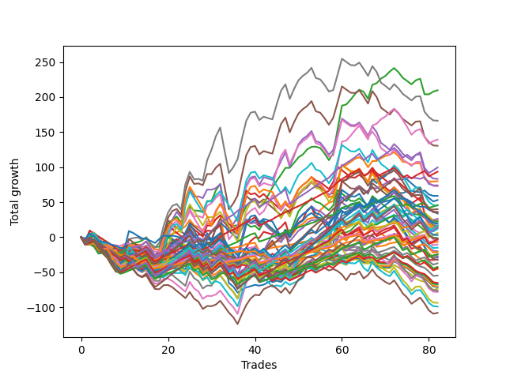

# Short Shepard 007 
- Symbol: ES
- Date Range: 03/18/2022 - 07/15/2022
- Trading Period: 7:20-12:30
- Number of Trades: 82



| Name | Win Percent | Profit | Avg Profit / Trade | Avg Time / Trade |      | Name | Win Percent | Profit | Avg Profit / Trade | Avg Time / Trade |
| ---- | ----------- | ------ | ------------------ | ---------------- | ---- | ---- | ----------- | ------ | ------------------ | ---------------- |
| Sorted By <br> Profit | | | | | | Sorted By <br> Win Percentage ||||
| Two | 65.85 | 104875.00 | 1278.96 | 16:45 |     | Eighty-One | 85.37 | 7875.00 | 96.04 | 06:04 |
| Seven | 51.22 | 83125.00 | 1013.72 | 27:21 |     | One Hundred Twenty-One | 85.37 | -2375.00 | -28.96 | 04:00 |
| Fifty-Eight | 60.98 | 69625.00 | 849.09 | 13:00 |     | One Hundred Twenty-Six | 85.37 | -3375.00 | -41.16 | 04:05 |
| Five | 50.00 | 65250.00 | 795.73 | 26:37 |     | Eighty-Two | 79.27 | 22875.00 | 278.96 | 09:02 |
| Eighty-Four | 75.61 | 49750.00 | 606.71 | 11:54 |     | Eighty-Three | 78.05 | 46750.00 | 570.12 | 10:12 |
| Eighty-Three | 78.05 | 46750.00 | 570.12 | 10:12 |     | Eighty-Four | 75.61 | 49750.00 | 606.71 | 11:54 |
| Four | 50.00 | 41625.00 | 507.62 | 24:42 |     | One Hundred Eleven | 75.61 | -5250.00 | -64.02 | 01:58 |
| One | 59.76 | 40000.00 | 487.80 | 12:38 |     | One Hundred Twenty-Seven | 75.61 | -12125.00 | -147.87 | 06:17 |
| Fifty-Six | 64.63 | 37000.00 | 451.22 | 04:57 |     | One Hundred Twenty-Two | 75.61 | -12125.00 | -147.87 | 06:24 |
| Six | 51.22 | 36375.00 | 443.60 | 25:37 |     | One Hundred Twenty-Three | 73.17 | 3000.00 | 36.59 | 07:24 |
| Zero | 64.63 | 29500.00 | 359.76 | 06:34 |     | One Hundred Twenty-Eight | 71.95 | -1500.00 | -18.29 | 07:10 |
| Forty-Two | 40.24 | 26500.00 | 323.17 | 08:40 |     | One Hundred Twenty-Four | 69.51 | 8500.00 | 103.66 | 08:34 |
| Eighty-Two | 79.27 | 22875.00 | 278.96 | 09:02 |     | One Hundred Sixteen | 69.51 | -10500.00 | -128.05 | 01:54 |
| Sixty-One | 42.68 | 22625.00 | 275.91 | 21:20 |     | Eighty-Five | 68.29 | 17625.00 | 214.94 | 14:28 |
| Fifty-Seven | 57.32 | 20000.00 | 243.90 | 09:28 |     | One Hundred Twenty-Nine | 68.29 | 7000.00 | 85.37 | 08:11 |
| Forty-Five | 31.71 | 18000.00 | 219.51 | 13:44 |     | Two | 65.85 | 104875.00 | 1278.96 | 16:45 |
| Eighty-Five | 68.29 | 17625.00 | 214.94 | 14:28 |     | Fifty-Six | 64.63 | 37000.00 | 451.22 | 04:57 |
| Seventy-Three | 37.80 | 16875.00 | 205.79 | 06:53 |     | Zero | 64.63 | 29500.00 | 359.76 | 06:34 |
| Sixty-Six | 54.88 | 13125.00 | 160.06 | 11:22 |     | One Hundred Twenty-Five | 63.41 | 1500.00 | 18.29 | 10:08 |
| Forty | 57.32 | 12250.00 | 149.39 | 03:15 |     | Sixty-Four | 62.20 | 11125.00 | 135.67 | 04:46 |
| Three | 54.88 | 11750.00 | 143.29 | 20:45 |     | One Hundred Twelve | 62.20 | -18625.00 | -227.13 | 03:29 |
| Sixty-Four | 62.20 | 11125.00 | 135.67 | 04:46 |     | Fifty-Eight | 60.98 | 69625.00 | 849.09 | 13:00 |
| One Hundred Fifteen | 52.44 | 9750.00 | 118.90 | 05:40 |     | One Hundred Thirty | 60.98 | -1000.00 | -12.20 | 09:37 |
| One Hundred Twenty-Four | 69.51 | 8500.00 | 103.66 | 08:34 |     | One | 59.76 | 40000.00 | 487.80 | 12:38 |
| Forty-Seven | 30.49 | 8250.00 | 100.61 | 14:04 |     | Fifty-Seven | 57.32 | 20000.00 | 243.90 | 09:28 |
| Eighty-One | 85.37 | 7875.00 | 96.04 | 06:04 |     | Forty | 57.32 | 12250.00 | 149.39 | 03:15 |
| Sixty | 42.68 | 7375.00 | 89.94 | 19:34 |     | One Hundred Thirteen | 57.32 | -12250.00 | -149.39 | 04:02 |
| One Hundred Twenty-Nine | 68.29 | 7000.00 | 85.37 | 08:11 |     | One Hundred Fourteen | 56.10 | 6000.00 | 73.17 | 04:45 |
| Sixty-Three | 41.46 | 6625.00 | 80.79 | 21:40 |     | Sixty-Six | 54.88 | 13125.00 | 160.06 | 11:22 |
| One Hundred Fourteen | 56.10 | 6000.00 | 73.17 | 04:45 |     | Three | 54.88 | 11750.00 | 143.29 | 20:45 |
| One Hundred Twenty-Three | 73.17 | 3000.00 | 36.59 | 07:24 |     | One Hundred Seventeen | 54.88 | -21250.00 | -259.15 | 03:15 |
| One Hundred Twenty-Five | 63.41 | 1500.00 | 18.29 | 10:08 |     | One Hundred Fifteen | 52.44 | 9750.00 | 118.90 | 05:40 |
| Forty-Four | 31.71 | -625.00 | -7.62 | 12:08 |     | Seven | 51.22 | 83125.00 | 1013.72 | 27:21 |
| One Hundred Thirty | 60.98 | -1000.00 | -12.20 | 09:37 |     | Six | 51.22 | 36375.00 | 443.60 | 25:37 |
| One Hundred Twenty-Eight | 71.95 | -1500.00 | -18.29 | 07:10 |     | Five | 50.00 | 65250.00 | 795.73 | 26:37 |
| Forty-Eight | 47.56 | -1500.00 | -18.29 | 02:43 |     | Four | 50.00 | 41625.00 | 507.62 | 24:42 |
| One Hundred Twenty-One | 85.37 | -2375.00 | -28.96 | 04:00 |     | Sixty-Five | 50.00 | -16000.00 | -195.12 | 08:35 |
| One Hundred Twenty-Six | 85.37 | -3375.00 | -41.16 | 04:05 |     | Forty-Eight | 47.56 | -1500.00 | -18.29 | 02:43 |
| One Hundred Eleven | 75.61 | -5250.00 | -64.02 | 01:58 |     | One Hundred Eighteen | 47.56 | -22125.00 | -269.82 | 03:34 |
| Forty-One | 43.90 | -7500.00 | -91.46 | 06:15 |     | Fifty-Nine | 46.34 | -13750.00 | -167.68 | 16:20 |
| Forty-Six | 31.71 | -10000.00 | -121.95 | 13:01 |     | Forty-One | 43.90 | -7500.00 | -91.46 | 06:15 |
| One Hundred Sixteen | 69.51 | -10500.00 | -128.05 | 01:54 |     | Sixty-One | 42.68 | 22625.00 | 275.91 | 21:20 |
| One Hundred Twenty-Seven | 75.61 | -12125.00 | -147.87 | 06:17 |     | Sixty | 42.68 | 7375.00 | 89.94 | 19:34 |
| One Hundred Twenty-Two | 75.61 | -12125.00 | -147.87 | 06:24 |     | One Hundred Ninteen | 42.68 | -13500.00 | -164.63 | 04:06 |
| One Hundred Thirteen | 57.32 | -12250.00 | -149.39 | 04:02 |     | Sixty-Two | 42.68 | -14500.00 | -176.83 | 20:13 |
| One Hundred Ninteen | 42.68 | -13500.00 | -164.63 | 04:06 |     | Sixty-Three | 41.46 | 6625.00 | 80.79 | 21:40 |
| Fifty-Nine | 46.34 | -13750.00 | -167.68 | 16:20 |     | Sixty-Seven | 41.46 | -54000.00 | -658.54 | 14:00 |
| Sixty-Two | 42.68 | -14500.00 | -176.83 | 20:13 |     | Forty-Two | 40.24 | 26500.00 | 323.17 | 08:40 |
| Sixty-Five | 50.00 | -16000.00 | -195.12 | 08:35 |     | Sixty-Nine | 39.02 | -38125.00 | -464.94 | 17:20 |
| One Hundred Twenty | 36.59 | -16125.00 | -196.65 | 04:28 |     | Sixty-Eight | 39.02 | -39125.00 | -477.13 | 16:02 |
| One Hundred Twelve | 62.20 | -18625.00 | -227.13 | 03:29 |     | Seventy | 39.02 | -46875.00 | -571.65 | 17:17 |
| One Hundred Seventeen | 54.88 | -21250.00 | -259.15 | 03:15 |     | Seventy-Three | 37.80 | 16875.00 | 205.79 | 06:53 |
| One Hundred Eighteen | 47.56 | -22125.00 | -269.82 | 03:34 |     | Seventy-One | 37.80 | -49500.00 | -603.66 | 17:40 |
| Forty-Three | 34.15 | -22750.00 | -277.44 | 10:13 |     | One Hundred Twenty | 36.59 | -16125.00 | -196.65 | 04:28 |
| Forty-Nine | 32.93 | -27375.00 | -333.84 | 04:44 |     | Forty-Three | 34.15 | -22750.00 | -277.44 | 10:13 |
| Fifty-Five | 29.27 | -32625.00 | -397.87 | 06:45 |     | Forty-Nine | 32.93 | -27375.00 | -333.84 | 04:44 |
| Fifty-Four | 30.49 | -33500.00 | -408.54 | 06:37 |     | Forty-Five | 31.71 | 18000.00 | 219.51 | 13:44 |
| Fifty-One | 30.49 | -33750.00 | -411.59 | 05:34 |     | Forty-Four | 31.71 | -625.00 | -7.62 | 12:08 |
| Fifty-Three | 29.27 | -35125.00 | -428.35 | 06:23 |     | Forty-Six | 31.71 | -10000.00 | -121.95 | 13:01 |
| Fifty-Two | 30.49 | -35625.00 | -434.45 | 06:09 |     | Forty-Seven | 30.49 | 8250.00 | 100.61 | 14:04 |
| Fifty | 30.49 | -36750.00 | -448.17 | 05:21 |     | Fifty-Four | 30.49 | -33500.00 | -408.54 | 06:37 |
| Sixty-Nine | 39.02 | -38125.00 | -464.94 | 17:20 |     | Fifty-One | 30.49 | -33750.00 | -411.59 | 05:34 |
| Sixty-Eight | 39.02 | -39125.00 | -477.13 | 16:02 |     | Fifty-Two | 30.49 | -35625.00 | -434.45 | 06:09 |
| Seventy | 39.02 | -46875.00 | -571.65 | 17:17 |     | Fifty | 30.49 | -36750.00 | -448.17 | 05:21 |
| Seventy-One | 37.80 | -49500.00 | -603.66 | 17:40 |     | Fifty-Five | 29.27 | -32625.00 | -397.87 | 06:45 |
| Sixty-Seven | 41.46 | -54000.00 | -658.54 | 14:00 |     | Fifty-Three | 29.27 | -35125.00 | -428.35 | 06:23 |

## NO STOPLOSS

### Test Zero
* Sell when price hits the middle line of the 20p bollinger
* No Stoploss
* Results:
```
Total Trades: 82
Percent Up: 35.37
Percent Down: 64.63
Total Points Moved Down: 59.00
Potential Profit: 29500.00
Total Points Ups: 152.25 Count Ups: 29
Total Points Downs: 211.25 Count Downs: 53
```

<details><summary>Trades</summary>

<code>In: 2022-03-18 12:13:00		Out: 2022-03-18 12:37:20		Total Position Time: 24:20		Total Move Down: -9.00		Total to Date: -9.00</code> <br />
<code>In: 2022-03-23 09:05:00		Out: 2022-03-23 09:05:25		Total Position Time: 00:25		Total Move Down: 0.75		Total to Date: -8.25</code> <br />
<code>In: 2022-03-24 08:35:00		Out: 2022-03-24 08:50:05		Total Position Time: 15:05		Total Move Down: -3.75		Total to Date: -12.00</code> <br />
<code>In: 2022-03-25 07:29:00		Out: 2022-03-25 07:51:05		Total Position Time: 22:05		Total Move Down: -6.75		Total to Date: -18.75</code> <br />
<code>In: 2022-03-28 12:01:00		Out: 2022-03-28 12:06:45		Total Position Time: 05:45		Total Move Down: 1.25		Total to Date: -17.50</code> <br />
<code>In: 2022-03-28 12:02:00		Out: 2022-03-28 12:06:45		Total Position Time: 04:45		Total Move Down: 0.75		Total to Date: -16.75</code> <br />
<code>In: 2022-03-29 11:51:00		Out: 2022-03-29 11:51:10		Total Position Time: 00:10		Total Move Down: 0.50		Total to Date: -16.25</code> <br />
<code>In: 2022-03-29 12:15:00		Out: 2022-03-29 12:18:55		Total Position Time: 03:55		Total Move Down: -0.25		Total to Date: -16.50</code> <br />
<code>In: 2022-03-29 12:16:00		Out: 2022-03-29 12:18:55		Total Position Time: 02:55		Total Move Down: -1.00		Total to Date: -17.50</code> <br />
<code>In: 2022-03-31 08:00:00		Out: 2022-03-31 08:03:05		Total Position Time: 03:05		Total Move Down: 3.00		Total to Date: -14.50</code> <br />
<code>In: 2022-04-06 11:06:00		Out: 2022-04-06 11:06:10		Total Position Time: 00:10		Total Move Down: 0.50		Total to Date: -14.00</code> <br />
<code>In: 2022-04-07 11:06:00		Out: 2022-04-07 11:15:20		Total Position Time: 09:20		Total Move Down: 0.25		Total to Date: -13.75</code> <br />
<code>In: 2022-04-07 11:07:00		Out: 2022-04-07 11:15:20		Total Position Time: 08:20		Total Move Down: -1.00		Total to Date: -14.75</code> <br />
<code>In: 2022-04-07 12:08:00		Out: 2022-04-07 12:19:10		Total Position Time: 11:10		Total Move Down: -2.50		Total to Date: -17.25</code> <br />
<code>In: 2022-04-08 08:05:00		Out: 2022-04-08 08:15:35		Total Position Time: 10:35		Total Move Down: 3.00		Total to Date: -14.25</code> <br />
<code>In: 2022-04-13 08:13:00		Out: 2022-04-13 08:37:20		Total Position Time: 24:20		Total Move Down: -7.75		Total to Date: -22.00</code> <br />
<code>In: 2022-04-13 09:28:00		Out: 2022-04-13 09:53:15		Total Position Time: 25:15		Total Move Down: -6.25		Total to Date: -28.25</code> <br />
<code>In: 2022-04-13 10:26:00		Out: 2022-04-13 10:26:10		Total Position Time: 00:10		Total Move Down: -0.25		Total to Date: -28.50</code> <br />
<code>In: 2022-04-25 07:39:00		Out: 2022-04-25 07:40:25		Total Position Time: 01:25		Total Move Down: 8.75		Total to Date: -19.75</code> <br />
<code>In: 2022-04-25 07:40:00		Out: 2022-04-25 07:40:25		Total Position Time: 00:25		Total Move Down: 3.25		Total to Date: -16.50</code> <br />
<code>In: 2022-04-27 09:33:00		Out: 2022-04-27 09:37:00		Total Position Time: 04:00		Total Move Down: 6.75		Total to Date: -9.75</code> <br />
<code>In: 2022-04-27 09:34:00		Out: 2022-04-27 09:37:00		Total Position Time: 03:00		Total Move Down: 4.75		Total to Date: -5.00</code> <br />
<code>In: 2022-04-28 11:54:00		Out: 2022-04-28 11:55:05		Total Position Time: 01:05		Total Move Down: 5.00		Total to Date: 0.00</code> <br />
<code>In: 2022-05-02 07:36:00		Out: 2022-05-02 07:44:10		Total Position Time: 08:10		Total Move Down: -0.75		Total to Date: -0.75</code> <br />
<code>In: 2022-05-03 07:37:00		Out: 2022-05-03 07:38:00		Total Position Time: 01:00		Total Move Down: 4.25		Total to Date: 3.50</code> <br />
<code>In: 2022-05-03 08:14:00		Out: 2022-05-03 08:28:35		Total Position Time: 14:35		Total Move Down: -8.25		Total to Date: -4.75</code> <br />
<code>In: 2022-05-03 08:17:00		Out: 2022-05-03 08:28:35		Total Position Time: 11:35		Total Move Down: -2.75		Total to Date: -7.50</code> <br />
<code>In: 2022-05-03 08:18:00		Out: 2022-05-03 08:28:35		Total Position Time: 10:35		Total Move Down: -4.50		Total to Date: -12.00</code> <br />
<code>In: 2022-05-04 11:07:00		Out: 2022-05-04 11:07:10		Total Position Time: 00:10		Total Move Down: 4.25		Total to Date: -7.75</code> <br />
<code>In: 2022-05-04 11:08:00		Out: 2022-05-04 11:08:10		Total Position Time: 00:10		Total Move Down: -0.25		Total to Date: -8.00</code> <br />
<code>In: 2022-05-04 11:31:00		Out: 2022-05-04 11:31:10		Total Position Time: 00:10		Total Move Down: 2.25		Total to Date: -5.75</code> <br />
<code>In: 2022-05-04 11:32:00		Out: 2022-05-04 11:32:10		Total Position Time: 00:10		Total Move Down: 5.50		Total to Date: -0.25</code> <br />
<code>In: 2022-05-04 11:58:00		Out: 2022-05-04 12:27:55		Total Position Time: 29:55		Total Move Down: -32.75		Total to Date: -33.00</code> <br />
<code>In: 2022-05-04 11:59:00		Out: 2022-05-04 12:28:55		Total Position Time: 29:55		Total Move Down: -32.25		Total to Date: -65.25</code> <br />
<code>In: 2022-05-12 08:01:00		Out: 2022-05-12 08:15:00		Total Position Time: 14:00		Total Move Down: -5.25		Total to Date: -70.50</code> <br />
<code>In: 2022-05-12 08:02:00		Out: 2022-05-12 08:15:00		Total Position Time: 13:00		Total Move Down: -8.50		Total to Date: -79.00</code> <br />
<code>In: 2022-05-12 08:13:00		Out: 2022-05-12 08:15:00		Total Position Time: 02:00		Total Move Down: 4.25		Total to Date: -74.75</code> <br />
<code>In: 2022-05-12 08:14:00		Out: 2022-05-12 08:15:00		Total Position Time: 01:00		Total Move Down: 3.00		Total to Date: -71.75</code> <br />
<code>In: 2022-05-16 08:57:00		Out: 2022-05-16 09:05:45		Total Position Time: 08:45		Total Move Down: 1.75		Total to Date: -70.00</code> <br />
<code>In: 2022-05-16 10:34:00		Out: 2022-05-16 10:42:15		Total Position Time: 08:15		Total Move Down: 2.00		Total to Date: -68.00</code> <br />
<code>In: 2022-05-16 11:12:00		Out: 2022-05-16 11:15:25		Total Position Time: 03:25		Total Move Down: -1.25		Total to Date: -69.25</code> <br />
<code>In: 2022-05-16 11:36:00		Out: 2022-05-16 11:41:45		Total Position Time: 05:45		Total Move Down: 1.50		Total to Date: -67.75</code> <br />
<code>In: 2022-05-19 08:46:00		Out: 2022-05-19 08:53:40		Total Position Time: 07:40		Total Move Down: 3.25		Total to Date: -64.50</code> <br />
<code>In: 2022-05-19 08:47:00		Out: 2022-05-19 08:53:40		Total Position Time: 06:40		Total Move Down: 2.75		Total to Date: -61.75</code> <br />
<code>In: 2022-05-19 11:56:00		Out: 2022-05-19 11:57:50		Total Position Time: 01:50		Total Move Down: 7.00		Total to Date: -54.75</code> <br />
<code>In: 2022-05-19 11:57:00		Out: 2022-05-19 11:57:50		Total Position Time: 00:50		Total Move Down: 6.00		Total to Date: -48.75</code> <br />
<code>In: 2022-05-25 07:41:00		Out: 2022-05-25 07:42:00		Total Position Time: 01:00		Total Move Down: 4.50		Total to Date: -44.25</code> <br />
<code>In: 2022-05-25 11:33:00		Out: 2022-05-25 11:39:10		Total Position Time: 06:10		Total Move Down: 2.75		Total to Date: -41.50</code> <br />
<code>In: 2022-05-25 12:13:00		Out: 2022-05-25 12:17:30		Total Position Time: 04:30		Total Move Down: 5.25		Total to Date: -36.25</code> <br />
<code>In: 2022-05-25 12:15:00		Out: 2022-05-25 12:17:30		Total Position Time: 02:30		Total Move Down: 5.75		Total to Date: -30.50</code> <br />
<code>In: 2022-05-26 10:12:00		Out: 2022-05-26 10:12:20		Total Position Time: 00:20		Total Move Down: 1.00		Total to Date: -29.50</code> <br />
<code>In: 2022-05-31 09:07:00		Out: 2022-05-31 09:13:05		Total Position Time: 06:05		Total Move Down: 1.25		Total to Date: -28.25</code> <br />
<code>In: 2022-05-31 11:04:00		Out: 2022-05-31 11:05:10		Total Position Time: 01:10		Total Move Down: 1.75		Total to Date: -26.50</code> <br />
<code>In: 2022-06-02 08:18:00		Out: 2022-06-02 08:22:05		Total Position Time: 04:05		Total Move Down: 1.25		Total to Date: -25.25</code> <br />
<code>In: 2022-06-02 08:54:00		Out: 2022-06-02 08:57:05		Total Position Time: 03:05		Total Move Down: 7.50		Total to Date: -17.75</code> <br />
<code>In: 2022-06-02 08:55:00		Out: 2022-06-02 08:57:05		Total Position Time: 02:05		Total Move Down: 4.00		Total to Date: -13.75</code> <br />
<code>In: 2022-06-02 08:56:00		Out: 2022-06-02 08:57:05		Total Position Time: 01:05		Total Move Down: 2.50		Total to Date: -11.25</code> <br />
<code>In: 2022-06-15 11:02:00		Out: 2022-06-15 11:02:10		Total Position Time: 00:10		Total Move Down: 2.00		Total to Date: -9.25</code> <br />
<code>In: 2022-06-15 11:48:00		Out: 2022-06-15 11:52:30		Total Position Time: 04:30		Total Move Down: 22.25		Total to Date: 13.00</code> <br />
<code>In: 2022-06-15 11:49:00		Out: 2022-06-15 11:52:30		Total Position Time: 03:30		Total Move Down: 21.50		Total to Date: 34.50</code> <br />
<code>In: 2022-06-23 07:51:00		Out: 2022-06-23 07:51:10		Total Position Time: 00:10		Total Move Down: 2.00		Total to Date: 36.50</code> <br />
<code>In: 2022-06-27 08:00:00		Out: 2022-06-27 08:02:15		Total Position Time: 02:15		Total Move Down: 2.50		Total to Date: 39.00</code> <br />
<code>In: 2022-06-30 09:35:00		Out: 2022-06-30 09:38:05		Total Position Time: 03:05		Total Move Down: 6.50		Total to Date: 45.50</code> <br />
<code>In: 2022-06-30 09:36:00		Out: 2022-06-30 09:38:05		Total Position Time: 02:05		Total Move Down: 4.75		Total to Date: 50.25</code> <br />
<code>In: 2022-07-01 11:30:00		Out: 2022-07-01 11:53:25		Total Position Time: 23:25		Total Move Down: -7.25		Total to Date: 43.00</code> <br />
<code>In: 2022-07-01 12:18:00		Out: 2022-07-01 12:20:55		Total Position Time: 02:55		Total Move Down: 3.50		Total to Date: 46.50</code> <br />
<code>In: 2022-07-05 07:44:00		Out: 2022-07-05 07:44:30		Total Position Time: 00:30		Total Move Down: 4.25		Total to Date: 50.75</code> <br />
<code>In: 2022-07-05 08:53:00		Out: 2022-07-05 09:00:10		Total Position Time: 07:10		Total Move Down: -0.25		Total to Date: 50.50</code> <br />
<code>In: 2022-07-05 08:58:00		Out: 2022-07-05 09:00:10		Total Position Time: 02:10		Total Move Down: 3.75		Total to Date: 54.25</code> <br />
<code>In: 2022-07-05 11:43:00		Out: 2022-07-05 11:48:10		Total Position Time: 05:10		Total Move Down: 3.00		Total to Date: 57.25</code> <br />
<code>In: 2022-07-06 11:48:00		Out: 2022-07-06 11:50:00		Total Position Time: 02:00		Total Move Down: 3.75		Total to Date: 61.00</code> <br />
<code>In: 2022-07-07 12:23:00		Out: 2022-07-07 12:24:15		Total Position Time: 01:15		Total Move Down: 1.75		Total to Date: 62.75</code> <br />
<code>In: 2022-07-11 10:15:00		Out: 2022-07-11 10:23:05		Total Position Time: 08:05		Total Move Down: 0.50		Total to Date: 63.25</code> <br />
<code>In: 2022-07-11 10:16:00		Out: 2022-07-11 10:23:05		Total Position Time: 07:05		Total Move Down: -0.25		Total to Date: 63.00</code> <br />
<code>In: 2022-07-13 07:53:00		Out: 2022-07-13 08:00:30		Total Position Time: 07:30		Total Move Down: 2.75		Total to Date: 65.75</code> <br />
<code>In: 2022-07-13 07:54:00		Out: 2022-07-13 08:00:30		Total Position Time: 06:30		Total Move Down: -0.00		Total to Date: 65.75</code> <br />
<code>In: 2022-07-13 10:08:00		Out: 2022-07-13 10:16:20		Total Position Time: 08:20		Total Move Down: -0.50		Total to Date: 65.25</code> <br />
<code>In: 2022-07-14 08:50:00		Out: 2022-07-14 09:01:10		Total Position Time: 11:10		Total Move Down: -1.25		Total to Date: 64.00</code> <br />
<code>In: 2022-07-14 11:09:00		Out: 2022-07-14 11:12:00		Total Position Time: 03:00		Total Move Down: 2.75		Total to Date: 66.75</code> <br />
<code>In: 2022-07-14 11:28:00		Out: 2022-07-14 11:42:40		Total Position Time: 14:40		Total Move Down: -5.75		Total to Date: 61.00</code> <br />
<code>In: 2022-07-14 11:32:00		Out: 2022-07-14 11:42:40		Total Position Time: 10:40		Total Move Down: -2.00		Total to Date: 59.00</code> <br />
<code>In: 2022-07-15 08:18:00		Out: 2022-07-15 08:26:05		Total Position Time: 08:05		Total Move Down: -0.00		Total to Date: 59.00</code> <br />


</details>

### Test One
* Sell when the price hits the upper line of the 20p 1std bollinger
* No Stoploss
* Results:
```
Total Trades: 82
Percent Up: 40.24
Percent Down: 59.76
Total Points Moved Down: 80.00
Potential Profit: 40000.00
Total Points Ups: 194.00 Count Ups: 33
Total Points Downs: 274.00 Count Downs: 49
```

<details><summary>Trades</summary>

<code>In: 2022-03-18 12:13:00		Out: 2022-03-18 12:39:40		Total Position Time: 26:40		Total Move Down: -6.75		Total to Date: -6.75</code> <br />
<code>In: 2022-03-23 09:05:00		Out: 2022-03-23 09:06:10		Total Position Time: 01:10		Total Move Down: 3.50		Total to Date: -3.25</code> <br />
<code>In: 2022-03-24 08:35:00		Out: 2022-03-24 08:53:45		Total Position Time: 18:45		Total Move Down: -1.50		Total to Date: -4.75</code> <br />
<code>In: 2022-03-25 07:29:00		Out: 2022-03-25 07:53:50		Total Position Time: 24:50		Total Move Down: -5.25		Total to Date: -10.00</code> <br />
<code>In: 2022-03-28 12:01:00		Out: 2022-03-28 12:30:55		Total Position Time: 29:55		Total Move Down: -4.00		Total to Date: -14.00</code> <br />
<code>In: 2022-03-28 12:02:00		Out: 2022-03-28 12:31:55		Total Position Time: 29:55		Total Move Down: -6.25		Total to Date: -20.25</code> <br />
<code>In: 2022-03-29 11:51:00		Out: 2022-03-29 12:00:25		Total Position Time: 09:25		Total Move Down: -0.00		Total to Date: -20.25</code> <br />
<code>In: 2022-03-29 12:15:00		Out: 2022-03-29 12:27:35		Total Position Time: 12:35		Total Move Down: 0.25		Total to Date: -20.00</code> <br />
<code>In: 2022-03-29 12:16:00		Out: 2022-03-29 12:27:35		Total Position Time: 11:35		Total Move Down: -0.50		Total to Date: -20.50</code> <br />
<code>In: 2022-03-31 08:00:00		Out: 2022-03-31 08:03:30		Total Position Time: 03:30		Total Move Down: 5.25		Total to Date: -15.25</code> <br />
<code>In: 2022-04-06 11:06:00		Out: 2022-04-06 11:07:20		Total Position Time: 01:20		Total Move Down: 5.25		Total to Date: -10.00</code> <br />
<code>In: 2022-04-07 11:06:00		Out: 2022-04-07 11:16:10		Total Position Time: 10:10		Total Move Down: 0.25		Total to Date: -9.75</code> <br />
<code>In: 2022-04-07 11:07:00		Out: 2022-04-07 11:16:10		Total Position Time: 09:10		Total Move Down: -1.00		Total to Date: -10.75</code> <br />
<code>In: 2022-04-07 12:08:00		Out: 2022-04-07 12:20:50		Total Position Time: 12:50		Total Move Down: -0.00		Total to Date: -10.75</code> <br />
<code>In: 2022-04-08 08:05:00		Out: 2022-04-08 08:17:05		Total Position Time: 12:05		Total Move Down: 4.75		Total to Date: -6.00</code> <br />
<code>In: 2022-04-13 08:13:00		Out: 2022-04-13 08:41:35		Total Position Time: 28:35		Total Move Down: -6.75		Total to Date: -12.75</code> <br />
<code>In: 2022-04-13 09:28:00		Out: 2022-04-13 09:57:10		Total Position Time: 29:10		Total Move Down: -4.50		Total to Date: -17.25</code> <br />
<code>In: 2022-04-13 10:26:00		Out: 2022-04-13 10:26:10		Total Position Time: 00:10		Total Move Down: -0.25		Total to Date: -17.50</code> <br />
<code>In: 2022-04-25 07:39:00		Out: 2022-04-25 07:43:05		Total Position Time: 04:05		Total Move Down: 12.25		Total to Date: -5.25</code> <br />
<code>In: 2022-04-25 07:40:00		Out: 2022-04-25 07:43:05		Total Position Time: 03:05		Total Move Down: 6.75		Total to Date: 1.50</code> <br />
<code>In: 2022-04-27 09:33:00		Out: 2022-04-27 09:50:25		Total Position Time: 17:25		Total Move Down: 3.50		Total to Date: 5.00</code> <br />
<code>In: 2022-04-27 09:34:00		Out: 2022-04-27 09:50:25		Total Position Time: 16:25		Total Move Down: 1.50		Total to Date: 6.50</code> <br />
<code>In: 2022-04-28 11:54:00		Out: 2022-04-28 12:02:10		Total Position Time: 08:10		Total Move Down: 4.25		Total to Date: 10.75</code> <br />
<code>In: 2022-05-02 07:36:00		Out: 2022-05-02 07:44:50		Total Position Time: 08:50		Total Move Down: 5.00		Total to Date: 15.75</code> <br />
<code>In: 2022-05-03 07:37:00		Out: 2022-05-03 07:40:55		Total Position Time: 03:55		Total Move Down: 9.00		Total to Date: 24.75</code> <br />
<code>In: 2022-05-03 08:14:00		Out: 2022-05-03 08:38:05		Total Position Time: 24:05		Total Move Down: -8.00		Total to Date: 16.75</code> <br />
<code>In: 2022-05-03 08:17:00		Out: 2022-05-03 08:38:05		Total Position Time: 21:05		Total Move Down: -2.50		Total to Date: 14.25</code> <br />
<code>In: 2022-05-03 08:18:00		Out: 2022-05-03 08:38:05		Total Position Time: 20:05		Total Move Down: -4.25		Total to Date: 10.00</code> <br />
<code>In: 2022-05-04 11:07:00		Out: 2022-05-04 11:07:20		Total Position Time: 00:20		Total Move Down: 9.50		Total to Date: 19.50</code> <br />
<code>In: 2022-05-04 11:08:00		Out: 2022-05-04 11:08:10		Total Position Time: 00:10		Total Move Down: -0.25		Total to Date: 19.25</code> <br />
<code>In: 2022-05-04 11:31:00		Out: 2022-05-04 11:31:20		Total Position Time: 00:20		Total Move Down: 6.25		Total to Date: 25.50</code> <br />
<code>In: 2022-05-04 11:32:00		Out: 2022-05-04 11:32:10		Total Position Time: 00:10		Total Move Down: 5.50		Total to Date: 31.00</code> <br />
<code>In: 2022-05-04 11:58:00		Out: 2022-05-04 12:27:55		Total Position Time: 29:55		Total Move Down: -32.75		Total to Date: -1.75</code> <br />
<code>In: 2022-05-04 11:59:00		Out: 2022-05-04 12:28:55		Total Position Time: 29:55		Total Move Down: -32.25		Total to Date: -34.00</code> <br />
<code>In: 2022-05-12 08:01:00		Out: 2022-05-12 08:17:30		Total Position Time: 16:30		Total Move Down: -1.25		Total to Date: -35.25</code> <br />
<code>In: 2022-05-12 08:02:00		Out: 2022-05-12 08:17:30		Total Position Time: 15:30		Total Move Down: -4.50		Total to Date: -39.75</code> <br />
<code>In: 2022-05-12 08:13:00		Out: 2022-05-12 08:17:30		Total Position Time: 04:30		Total Move Down: 8.25		Total to Date: -31.50</code> <br />
<code>In: 2022-05-12 08:14:00		Out: 2022-05-12 08:17:30		Total Position Time: 03:30		Total Move Down: 7.00		Total to Date: -24.50</code> <br />
<code>In: 2022-05-16 08:57:00		Out: 2022-05-16 09:06:10		Total Position Time: 09:10		Total Move Down: 5.25		Total to Date: -19.25</code> <br />
<code>In: 2022-05-16 10:34:00		Out: 2022-05-16 10:42:35		Total Position Time: 08:35		Total Move Down: 5.00		Total to Date: -14.25</code> <br />
<code>In: 2022-05-16 11:12:00		Out: 2022-05-16 11:41:55		Total Position Time: 29:55		Total Move Down: -12.00		Total to Date: -26.25</code> <br />
<code>In: 2022-05-16 11:36:00		Out: 2022-05-16 11:44:50		Total Position Time: 08:50		Total Move Down: 3.25		Total to Date: -23.00</code> <br />
<code>In: 2022-05-19 08:46:00		Out: 2022-05-19 08:54:40		Total Position Time: 08:40		Total Move Down: 7.75		Total to Date: -15.25</code> <br />
<code>In: 2022-05-19 08:47:00		Out: 2022-05-19 08:54:40		Total Position Time: 07:40		Total Move Down: 7.25		Total to Date: -8.00</code> <br />
<code>In: 2022-05-19 11:56:00		Out: 2022-05-19 12:10:10		Total Position Time: 14:10		Total Move Down: 1.75		Total to Date: -6.25</code> <br />
<code>In: 2022-05-19 11:57:00		Out: 2022-05-19 12:10:10		Total Position Time: 13:10		Total Move Down: 0.75		Total to Date: -5.50</code> <br />
<code>In: 2022-05-25 07:41:00		Out: 2022-05-25 07:46:40		Total Position Time: 05:40		Total Move Down: 6.00		Total to Date: 0.50</code> <br />
<code>In: 2022-05-25 11:33:00		Out: 2022-05-25 11:45:15		Total Position Time: 12:15		Total Move Down: -0.75		Total to Date: -0.25</code> <br />
<code>In: 2022-05-25 12:13:00		Out: 2022-05-25 12:20:25		Total Position Time: 07:25		Total Move Down: 7.75		Total to Date: 7.50</code> <br />
<code>In: 2022-05-25 12:15:00		Out: 2022-05-25 12:20:25		Total Position Time: 05:25		Total Move Down: 8.25		Total to Date: 15.75</code> <br />
<code>In: 2022-05-26 10:12:00		Out: 2022-05-26 10:12:45		Total Position Time: 00:45		Total Move Down: 3.00		Total to Date: 18.75</code> <br />
<code>In: 2022-05-31 09:07:00		Out: 2022-05-31 09:14:40		Total Position Time: 07:40		Total Move Down: 6.50		Total to Date: 25.25</code> <br />
<code>In: 2022-05-31 11:04:00		Out: 2022-05-31 11:13:25		Total Position Time: 09:25		Total Move Down: 2.25		Total to Date: 27.50</code> <br />
<code>In: 2022-06-02 08:18:00		Out: 2022-06-02 08:27:30		Total Position Time: 09:30		Total Move Down: 1.00		Total to Date: 28.50</code> <br />
<code>In: 2022-06-02 08:54:00		Out: 2022-06-02 09:01:05		Total Position Time: 07:05		Total Move Down: 9.75		Total to Date: 38.25</code> <br />
<code>In: 2022-06-02 08:55:00		Out: 2022-06-02 09:01:05		Total Position Time: 06:05		Total Move Down: 6.25		Total to Date: 44.50</code> <br />
<code>In: 2022-06-02 08:56:00		Out: 2022-06-02 09:01:05		Total Position Time: 05:05		Total Move Down: 4.75		Total to Date: 49.25</code> <br />
<code>In: 2022-06-15 11:02:00		Out: 2022-06-15 11:02:10		Total Position Time: 00:10		Total Move Down: 2.00		Total to Date: 51.25</code> <br />
<code>In: 2022-06-15 11:48:00		Out: 2022-06-15 11:57:35		Total Position Time: 09:35		Total Move Down: 25.75		Total to Date: 77.00</code> <br />
<code>In: 2022-06-15 11:49:00		Out: 2022-06-15 11:57:35		Total Position Time: 08:35		Total Move Down: 25.00		Total to Date: 102.00</code> <br />
<code>In: 2022-06-23 07:51:00		Out: 2022-06-23 08:01:10		Total Position Time: 10:10		Total Move Down: 1.00		Total to Date: 103.00</code> <br />
<code>In: 2022-06-27 08:00:00		Out: 2022-06-27 08:07:15		Total Position Time: 07:15		Total Move Down: 4.50		Total to Date: 107.50</code> <br />
<code>In: 2022-06-30 09:35:00		Out: 2022-06-30 09:49:10		Total Position Time: 14:10		Total Move Down: 4.25		Total to Date: 111.75</code> <br />
<code>In: 2022-06-30 09:36:00		Out: 2022-06-30 09:49:10		Total Position Time: 13:10		Total Move Down: 2.50		Total to Date: 114.25</code> <br />
<code>In: 2022-07-01 11:30:00		Out: 2022-07-01 11:54:20		Total Position Time: 24:20		Total Move Down: -4.50		Total to Date: 109.75</code> <br />
<code>In: 2022-07-01 12:18:00		Out: 2022-07-01 12:46:00		Total Position Time: 28:00		Total Move Down: -10.00		Total to Date: 99.75</code> <br />
<code>In: 2022-07-05 07:44:00		Out: 2022-07-05 07:45:55		Total Position Time: 01:55		Total Move Down: 9.00		Total to Date: 108.75</code> <br />
<code>In: 2022-07-05 08:53:00		Out: 2022-07-05 09:03:25		Total Position Time: 10:25		Total Move Down: -0.00		Total to Date: 108.75</code> <br />
<code>In: 2022-07-05 08:58:00		Out: 2022-07-05 09:03:25		Total Position Time: 05:25		Total Move Down: 4.00		Total to Date: 112.75</code> <br />
<code>In: 2022-07-05 11:43:00		Out: 2022-07-05 11:52:50		Total Position Time: 09:50		Total Move Down: 3.25		Total to Date: 116.00</code> <br />
<code>In: 2022-07-06 11:48:00		Out: 2022-07-06 12:00:30		Total Position Time: 12:30		Total Move Down: 1.75		Total to Date: 117.75</code> <br />
<code>In: 2022-07-07 12:23:00		Out: 2022-07-07 12:25:10		Total Position Time: 02:10		Total Move Down: 3.75		Total to Date: 121.50</code> <br />
<code>In: 2022-07-11 10:15:00		Out: 2022-07-11 10:44:55		Total Position Time: 29:55		Total Move Down: -6.00		Total to Date: 115.50</code> <br />
<code>In: 2022-07-11 10:16:00		Out: 2022-07-11 10:45:55		Total Position Time: 29:55		Total Move Down: -8.00		Total to Date: 107.50</code> <br />
<code>In: 2022-07-13 07:53:00		Out: 2022-07-13 08:19:25		Total Position Time: 26:25		Total Move Down: -0.75		Total to Date: 106.75</code> <br />
<code>In: 2022-07-13 07:54:00		Out: 2022-07-13 08:19:25		Total Position Time: 25:25		Total Move Down: -3.50		Total to Date: 103.25</code> <br />
<code>In: 2022-07-13 10:08:00		Out: 2022-07-13 10:16:30		Total Position Time: 08:30		Total Move Down: 2.25		Total to Date: 105.50</code> <br />
<code>In: 2022-07-14 08:50:00		Out: 2022-07-14 09:03:10		Total Position Time: 13:10		Total Move Down: -0.00		Total to Date: 105.50</code> <br />
<code>In: 2022-07-14 11:09:00		Out: 2022-07-14 11:38:55		Total Position Time: 29:55		Total Move Down: -22.25		Total to Date: 83.25</code> <br />
<code>In: 2022-07-14 11:28:00		Out: 2022-07-14 11:43:35		Total Position Time: 15:35		Total Move Down: -3.75		Total to Date: 79.50</code> <br />
<code>In: 2022-07-14 11:32:00		Out: 2022-07-14 11:43:35		Total Position Time: 11:35		Total Move Down: -0.00		Total to Date: 79.50</code> <br />
<code>In: 2022-07-15 08:18:00		Out: 2022-07-15 08:29:45		Total Position Time: 11:45		Total Move Down: 0.50		Total to Date: 80.00</code> <br />


</details>

### Test Two
* Sell when the price hits the upper line of the 20p 2std bollinger
* No Stoploss
* Results:
```
Total Trades: 82
Percent Up: 34.15
Percent Down: 65.85
Total Points Moved Down: 209.75
Potential Profit: 104875.00
Total Points Ups: 220.50 Count Ups: 28
Total Points Downs: 430.25 Count Downs: 54
```

<details><summary>Trades</summary>

<code>In: 2022-03-18 12:13:00		Out: 2022-03-18 12:42:55		Total Position Time: 29:55		Total Move Down: -10.75		Total to Date: -10.75</code> <br />
<code>In: 2022-03-23 09:05:00		Out: 2022-03-23 09:06:25		Total Position Time: 01:25		Total Move Down: 5.50		Total to Date: -5.25</code> <br />
<code>In: 2022-03-24 08:35:00		Out: 2022-03-24 09:03:10		Total Position Time: 28:10		Total Move Down: 0.50		Total to Date: -4.75</code> <br />
<code>In: 2022-03-25 07:29:00		Out: 2022-03-25 07:54:10		Total Position Time: 25:10		Total Move Down: -4.25		Total to Date: -9.00</code> <br />
<code>In: 2022-03-28 12:01:00		Out: 2022-03-28 12:30:55		Total Position Time: 29:55		Total Move Down: -4.00		Total to Date: -13.00</code> <br />
<code>In: 2022-03-28 12:02:00		Out: 2022-03-28 12:31:55		Total Position Time: 29:55		Total Move Down: -6.25		Total to Date: -19.25</code> <br />
<code>In: 2022-03-29 11:51:00		Out: 2022-03-29 12:20:55		Total Position Time: 29:55		Total Move Down: -9.75		Total to Date: -29.00</code> <br />
<code>In: 2022-03-29 12:15:00		Out: 2022-03-29 12:27:50		Total Position Time: 12:50		Total Move Down: 0.75		Total to Date: -28.25</code> <br />
<code>In: 2022-03-29 12:16:00		Out: 2022-03-29 12:27:50		Total Position Time: 11:50		Total Move Down: -0.00		Total to Date: -28.25</code> <br />
<code>In: 2022-03-31 08:00:00		Out: 2022-03-31 08:08:30		Total Position Time: 08:30		Total Move Down: 6.50		Total to Date: -21.75</code> <br />
<code>In: 2022-04-06 11:06:00		Out: 2022-04-06 11:08:10		Total Position Time: 02:10		Total Move Down: 11.25		Total to Date: -10.50</code> <br />
<code>In: 2022-04-07 11:06:00		Out: 2022-04-07 11:18:20		Total Position Time: 12:20		Total Move Down: 2.25		Total to Date: -8.25</code> <br />
<code>In: 2022-04-07 11:07:00		Out: 2022-04-07 11:18:20		Total Position Time: 11:20		Total Move Down: 1.00		Total to Date: -7.25</code> <br />
<code>In: 2022-04-07 12:08:00		Out: 2022-04-07 12:21:20		Total Position Time: 13:20		Total Move Down: 2.25		Total to Date: -5.00</code> <br />
<code>In: 2022-04-08 08:05:00		Out: 2022-04-08 08:20:10		Total Position Time: 15:10		Total Move Down: 5.00		Total to Date: 0.00</code> <br />
<code>In: 2022-04-13 08:13:00		Out: 2022-04-13 08:42:55		Total Position Time: 29:55		Total Move Down: -9.25		Total to Date: -9.25</code> <br />
<code>In: 2022-04-13 09:28:00		Out: 2022-04-13 09:57:55		Total Position Time: 29:55		Total Move Down: -5.00		Total to Date: -14.25</code> <br />
<code>In: 2022-04-13 10:26:00		Out: 2022-04-13 10:26:55		Total Position Time: 00:55		Total Move Down: 0.75		Total to Date: -13.50</code> <br />
<code>In: 2022-04-25 07:39:00		Out: 2022-04-25 07:52:35		Total Position Time: 13:35		Total Move Down: 18.75		Total to Date: 5.25</code> <br />
<code>In: 2022-04-25 07:40:00		Out: 2022-04-25 07:52:35		Total Position Time: 12:35		Total Move Down: 13.25		Total to Date: 18.50</code> <br />
<code>In: 2022-04-27 09:33:00		Out: 2022-04-27 10:00:10		Total Position Time: 27:10		Total Move Down: 6.50		Total to Date: 25.00</code> <br />
<code>In: 2022-04-27 09:34:00		Out: 2022-04-27 10:00:10		Total Position Time: 26:10		Total Move Down: 4.50		Total to Date: 29.50</code> <br />
<code>In: 2022-04-28 11:54:00		Out: 2022-04-28 12:23:55		Total Position Time: 29:55		Total Move Down: -8.25		Total to Date: 21.25</code> <br />
<code>In: 2022-05-02 07:36:00		Out: 2022-05-02 07:47:15		Total Position Time: 11:15		Total Move Down: 8.25		Total to Date: 29.50</code> <br />
<code>In: 2022-05-03 07:37:00		Out: 2022-05-03 07:43:50		Total Position Time: 06:50		Total Move Down: 14.25		Total to Date: 43.75</code> <br />
<code>In: 2022-05-03 08:14:00		Out: 2022-05-03 08:39:10		Total Position Time: 25:10		Total Move Down: -5.75		Total to Date: 38.00</code> <br />
<code>In: 2022-05-03 08:17:00		Out: 2022-05-03 08:39:10		Total Position Time: 22:10		Total Move Down: -0.25		Total to Date: 37.75</code> <br />
<code>In: 2022-05-03 08:18:00		Out: 2022-05-03 08:39:10		Total Position Time: 21:10		Total Move Down: -2.00		Total to Date: 35.75</code> <br />
<code>In: 2022-05-04 11:07:00		Out: 2022-05-04 11:07:40		Total Position Time: 00:40		Total Move Down: 16.00		Total to Date: 51.75</code> <br />
<code>In: 2022-05-04 11:08:00		Out: 2022-05-04 11:08:10		Total Position Time: 00:10		Total Move Down: -0.25		Total to Date: 51.50</code> <br />
<code>In: 2022-05-04 11:31:00		Out: 2022-05-04 11:32:25		Total Position Time: 01:25		Total Move Down: 15.50		Total to Date: 67.00</code> <br />
<code>In: 2022-05-04 11:32:00		Out: 2022-05-04 11:32:25		Total Position Time: 00:25		Total Move Down: 9.00		Total to Date: 76.00</code> <br />
<code>In: 2022-05-04 11:58:00		Out: 2022-05-04 12:27:55		Total Position Time: 29:55		Total Move Down: -32.75		Total to Date: 43.25</code> <br />
<code>In: 2022-05-04 11:59:00		Out: 2022-05-04 12:28:55		Total Position Time: 29:55		Total Move Down: -32.25		Total to Date: 11.00</code> <br />
<code>In: 2022-05-12 08:01:00		Out: 2022-05-12 08:22:05		Total Position Time: 21:05		Total Move Down: 4.75		Total to Date: 15.75</code> <br />
<code>In: 2022-05-12 08:02:00		Out: 2022-05-12 08:22:05		Total Position Time: 20:05		Total Move Down: 1.50		Total to Date: 17.25</code> <br />
<code>In: 2022-05-12 08:13:00		Out: 2022-05-12 08:22:05		Total Position Time: 09:05		Total Move Down: 14.25		Total to Date: 31.50</code> <br />
<code>In: 2022-05-12 08:14:00		Out: 2022-05-12 08:22:05		Total Position Time: 08:05		Total Move Down: 13.00		Total to Date: 44.50</code> <br />
<code>In: 2022-05-16 08:57:00		Out: 2022-05-16 09:11:35		Total Position Time: 14:35		Total Move Down: 6.25		Total to Date: 50.75</code> <br />
<code>In: 2022-05-16 10:34:00		Out: 2022-05-16 10:46:35		Total Position Time: 12:35		Total Move Down: 4.00		Total to Date: 54.75</code> <br />
<code>In: 2022-05-16 11:12:00		Out: 2022-05-16 11:41:55		Total Position Time: 29:55		Total Move Down: -12.00		Total to Date: 42.75</code> <br />
<code>In: 2022-05-16 11:36:00		Out: 2022-05-16 11:45:35		Total Position Time: 09:35		Total Move Down: 5.00		Total to Date: 47.75</code> <br />
<code>In: 2022-05-19 08:46:00		Out: 2022-05-19 08:56:05		Total Position Time: 10:05		Total Move Down: 11.75		Total to Date: 59.50</code> <br />
<code>In: 2022-05-19 08:47:00		Out: 2022-05-19 08:56:05		Total Position Time: 09:05		Total Move Down: 11.25		Total to Date: 70.75</code> <br />
<code>In: 2022-05-19 11:56:00		Out: 2022-05-19 12:14:05		Total Position Time: 18:05		Total Move Down: 9.75		Total to Date: 80.50</code> <br />
<code>In: 2022-05-19 11:57:00		Out: 2022-05-19 12:14:05		Total Position Time: 17:05		Total Move Down: 8.75		Total to Date: 89.25</code> <br />
<code>In: 2022-05-25 07:41:00		Out: 2022-05-25 07:48:10		Total Position Time: 07:10		Total Move Down: 9.75		Total to Date: 99.00</code> <br />
<code>In: 2022-05-25 11:33:00		Out: 2022-05-25 11:50:00		Total Position Time: 17:00		Total Move Down: -0.00		Total to Date: 99.00</code> <br />
<code>In: 2022-05-25 12:13:00		Out: 2022-05-25 12:22:50		Total Position Time: 09:50		Total Move Down: 7.25		Total to Date: 106.25</code> <br />
<code>In: 2022-05-25 12:15:00		Out: 2022-05-25 12:22:50		Total Position Time: 07:50		Total Move Down: 7.75		Total to Date: 114.00</code> <br />
<code>In: 2022-05-26 10:12:00		Out: 2022-05-26 10:22:35		Total Position Time: 10:35		Total Move Down: 4.00		Total to Date: 118.00</code> <br />
<code>In: 2022-05-31 09:07:00		Out: 2022-05-31 09:15:05		Total Position Time: 08:05		Total Move Down: 7.25		Total to Date: 125.25</code> <br />
<code>In: 2022-05-31 11:04:00		Out: 2022-05-31 11:22:35		Total Position Time: 18:35		Total Move Down: 3.75		Total to Date: 129.00</code> <br />
<code>In: 2022-06-02 08:18:00		Out: 2022-06-02 08:30:55		Total Position Time: 12:55		Total Move Down: 0.25		Total to Date: 129.25</code> <br />
<code>In: 2022-06-02 08:54:00		Out: 2022-06-02 09:23:55		Total Position Time: 29:55		Total Move Down: -2.00		Total to Date: 127.25</code> <br />
<code>In: 2022-06-02 08:55:00		Out: 2022-06-02 09:24:55		Total Position Time: 29:55		Total Move Down: -7.75		Total to Date: 119.50</code> <br />
<code>In: 2022-06-02 08:56:00		Out: 2022-06-02 09:25:55		Total Position Time: 29:55		Total Move Down: -9.50		Total to Date: 110.00</code> <br />
<code>In: 2022-06-15 11:02:00		Out: 2022-06-15 11:03:05		Total Position Time: 01:05		Total Move Down: 10.00		Total to Date: 120.00</code> <br />
<code>In: 2022-06-15 11:48:00		Out: 2022-06-15 11:58:05		Total Position Time: 10:05		Total Move Down: 34.25		Total to Date: 154.25</code> <br />
<code>In: 2022-06-15 11:49:00		Out: 2022-06-15 11:58:05		Total Position Time: 09:05		Total Move Down: 33.50		Total to Date: 187.75</code> <br />
<code>In: 2022-06-23 07:51:00		Out: 2022-06-23 08:04:15		Total Position Time: 13:15		Total Move Down: 1.75		Total to Date: 189.50</code> <br />
<code>In: 2022-06-27 08:00:00		Out: 2022-06-27 08:09:45		Total Position Time: 09:45		Total Move Down: 6.75		Total to Date: 196.25</code> <br />
<code>In: 2022-06-30 09:35:00		Out: 2022-06-30 09:50:45		Total Position Time: 15:45		Total Move Down: 8.00		Total to Date: 204.25</code> <br />
<code>In: 2022-06-30 09:36:00		Out: 2022-06-30 09:50:45		Total Position Time: 14:45		Total Move Down: 6.25		Total to Date: 210.50</code> <br />
<code>In: 2022-07-01 11:30:00		Out: 2022-07-01 11:54:35		Total Position Time: 24:35		Total Move Down: -3.00		Total to Date: 207.50</code> <br />
<code>In: 2022-07-01 12:18:00		Out: 2022-07-01 12:46:00		Total Position Time: 28:00		Total Move Down: -10.00		Total to Date: 197.50</code> <br />
<code>In: 2022-07-05 07:44:00		Out: 2022-07-05 08:01:10		Total Position Time: 17:10		Total Move Down: 20.00		Total to Date: 217.50</code> <br />
<code>In: 2022-07-05 08:53:00		Out: 2022-07-05 09:03:50		Total Position Time: 10:50		Total Move Down: 2.50		Total to Date: 220.00</code> <br />
<code>In: 2022-07-05 08:58:00		Out: 2022-07-05 09:03:50		Total Position Time: 05:50		Total Move Down: 6.50		Total to Date: 226.50</code> <br />
<code>In: 2022-07-05 11:43:00		Out: 2022-07-05 12:01:15		Total Position Time: 18:15		Total Move Down: 3.75		Total to Date: 230.25</code> <br />
<code>In: 2022-07-06 11:48:00		Out: 2022-07-06 12:01:25		Total Position Time: 13:25		Total Move Down: 6.25		Total to Date: 236.50</code> <br />
<code>In: 2022-07-07 12:23:00		Out: 2022-07-07 12:28:30		Total Position Time: 05:30		Total Move Down: 5.00		Total to Date: 241.50</code> <br />
<code>In: 2022-07-11 10:15:00		Out: 2022-07-11 10:44:55		Total Position Time: 29:55		Total Move Down: -6.00		Total to Date: 235.50</code> <br />
<code>In: 2022-07-11 10:16:00		Out: 2022-07-11 10:45:55		Total Position Time: 29:55		Total Move Down: -8.00		Total to Date: 227.50</code> <br />
<code>In: 2022-07-13 07:53:00		Out: 2022-07-13 08:22:55		Total Position Time: 29:55		Total Move Down: -4.50		Total to Date: 223.00</code> <br />
<code>In: 2022-07-13 07:54:00		Out: 2022-07-13 08:23:55		Total Position Time: 29:55		Total Move Down: -4.75		Total to Date: 218.25</code> <br />
<code>In: 2022-07-13 10:08:00		Out: 2022-07-13 10:18:35		Total Position Time: 10:35		Total Move Down: 5.75		Total to Date: 224.00</code> <br />
<code>In: 2022-07-14 08:50:00		Out: 2022-07-14 09:07:30		Total Position Time: 17:30		Total Move Down: 2.25		Total to Date: 226.25</code> <br />
<code>In: 2022-07-14 11:09:00		Out: 2022-07-14 11:38:55		Total Position Time: 29:55		Total Move Down: -22.25		Total to Date: 204.00</code> <br />
<code>In: 2022-07-14 11:28:00		Out: 2022-07-14 11:52:00		Total Position Time: 24:00		Total Move Down: -0.00		Total to Date: 204.00</code> <br />
<code>In: 2022-07-14 11:32:00		Out: 2022-07-14 11:52:00		Total Position Time: 20:00		Total Move Down: 3.75		Total to Date: 207.75</code> <br />
<code>In: 2022-07-15 08:18:00		Out: 2022-07-15 08:30:35		Total Position Time: 12:35		Total Move Down: 2.00		Total to Date: 209.75</code> <br />


</details>

### Test Three
* Sell when price hits the middle line of the 50p bollinger
* No Stoploss
* Results:
```
Total Trades: 82
Percent Up: 45.12
Percent Down: 54.88
Total Points Moved Down: 23.50
Potential Profit: 11750.00
Total Points Ups: 299.25 Count Ups: 37
Total Points Downs: 322.75 Count Downs: 45
```

<details><summary>Trades</summary>

<code>In: 2022-03-18 12:13:00		Out: 2022-03-18 12:42:55		Total Position Time: 29:55		Total Move Down: -10.75		Total to Date: -10.75</code> <br />
<code>In: 2022-03-23 09:05:00		Out: 2022-03-23 09:05:25		Total Position Time: 00:25		Total Move Down: 0.75		Total to Date: -10.00</code> <br />
<code>In: 2022-03-24 08:35:00		Out: 2022-03-24 09:03:10		Total Position Time: 28:10		Total Move Down: 0.50		Total to Date: -9.50</code> <br />
<code>In: 2022-03-25 07:29:00		Out: 2022-03-25 07:58:55		Total Position Time: 29:55		Total Move Down: -4.50		Total to Date: -14.00</code> <br />
<code>In: 2022-03-28 12:01:00		Out: 2022-03-28 12:30:55		Total Position Time: 29:55		Total Move Down: -4.00		Total to Date: -18.00</code> <br />
<code>In: 2022-03-28 12:02:00		Out: 2022-03-28 12:31:55		Total Position Time: 29:55		Total Move Down: -6.25		Total to Date: -24.25</code> <br />
<code>In: 2022-03-29 11:51:00		Out: 2022-03-29 12:20:55		Total Position Time: 29:55		Total Move Down: -9.75		Total to Date: -34.00</code> <br />
<code>In: 2022-03-29 12:15:00		Out: 2022-03-29 12:43:05		Total Position Time: 28:05		Total Move Down: -0.75		Total to Date: -34.75</code> <br />
<code>In: 2022-03-29 12:16:00		Out: 2022-03-29 12:43:05		Total Position Time: 27:05		Total Move Down: -1.50		Total to Date: -36.25</code> <br />
<code>In: 2022-03-31 08:00:00		Out: 2022-03-31 08:15:35		Total Position Time: 15:35		Total Move Down: 5.75		Total to Date: -30.50</code> <br />
<code>In: 2022-04-06 11:06:00		Out: 2022-04-06 11:07:20		Total Position Time: 01:20		Total Move Down: 5.25		Total to Date: -25.25</code> <br />
<code>In: 2022-04-07 11:06:00		Out: 2022-04-07 11:33:40		Total Position Time: 27:40		Total Move Down: 2.50		Total to Date: -22.75</code> <br />
<code>In: 2022-04-07 11:07:00		Out: 2022-04-07 11:33:40		Total Position Time: 26:40		Total Move Down: 1.25		Total to Date: -21.50</code> <br />
<code>In: 2022-04-07 12:08:00		Out: 2022-04-07 12:37:55		Total Position Time: 29:55		Total Move Down: -3.25		Total to Date: -24.75</code> <br />
<code>In: 2022-04-08 08:05:00		Out: 2022-04-08 08:34:55		Total Position Time: 29:55		Total Move Down: 2.75		Total to Date: -22.00</code> <br />
<code>In: 2022-04-13 08:13:00		Out: 2022-04-13 08:42:55		Total Position Time: 29:55		Total Move Down: -9.25		Total to Date: -31.25</code> <br />
<code>In: 2022-04-13 09:28:00		Out: 2022-04-13 09:57:55		Total Position Time: 29:55		Total Move Down: -5.00		Total to Date: -36.25</code> <br />
<code>In: 2022-04-13 10:26:00		Out: 2022-04-13 10:26:10		Total Position Time: 00:10		Total Move Down: -0.25		Total to Date: -36.50</code> <br />
<code>In: 2022-04-25 07:39:00		Out: 2022-04-25 07:52:00		Total Position Time: 13:00		Total Move Down: 14.25		Total to Date: -22.25</code> <br />
<code>In: 2022-04-25 07:40:00		Out: 2022-04-25 07:52:00		Total Position Time: 12:00		Total Move Down: 8.75		Total to Date: -13.50</code> <br />
<code>In: 2022-04-27 09:33:00		Out: 2022-04-27 10:00:10		Total Position Time: 27:10		Total Move Down: 6.50		Total to Date: -7.00</code> <br />
<code>In: 2022-04-27 09:34:00		Out: 2022-04-27 10:00:10		Total Position Time: 26:10		Total Move Down: 4.50		Total to Date: -2.50</code> <br />
<code>In: 2022-04-28 11:54:00		Out: 2022-04-28 12:23:55		Total Position Time: 29:55		Total Move Down: -8.25		Total to Date: -10.75</code> <br />
<code>In: 2022-05-02 07:36:00		Out: 2022-05-02 07:53:35		Total Position Time: 17:35		Total Move Down: 14.25		Total to Date: 3.50</code> <br />
<code>In: 2022-05-03 07:37:00		Out: 2022-05-03 07:40:40		Total Position Time: 03:40		Total Move Down: 8.75		Total to Date: 12.25</code> <br />
<code>In: 2022-05-03 08:14:00		Out: 2022-05-03 08:43:55		Total Position Time: 29:55		Total Move Down: -10.75		Total to Date: 1.50</code> <br />
<code>In: 2022-05-03 08:17:00		Out: 2022-05-03 08:46:10		Total Position Time: 29:10		Total Move Down: 2.00		Total to Date: 3.50</code> <br />
<code>In: 2022-05-03 08:18:00		Out: 2022-05-03 08:46:10		Total Position Time: 28:10		Total Move Down: 0.25		Total to Date: 3.75</code> <br />
<code>In: 2022-05-04 11:07:00		Out: 2022-05-04 11:07:15		Total Position Time: 00:15		Total Move Down: 5.50		Total to Date: 9.25</code> <br />
<code>In: 2022-05-04 11:08:00		Out: 2022-05-04 11:08:10		Total Position Time: 00:10		Total Move Down: -0.25		Total to Date: 9.00</code> <br />
<code>In: 2022-05-04 11:31:00		Out: 2022-05-04 11:31:10		Total Position Time: 00:10		Total Move Down: 2.25		Total to Date: 11.25</code> <br />
<code>In: 2022-05-04 11:32:00		Out: 2022-05-04 11:32:10		Total Position Time: 00:10		Total Move Down: 5.50		Total to Date: 16.75</code> <br />
<code>In: 2022-05-04 11:58:00		Out: 2022-05-04 12:27:55		Total Position Time: 29:55		Total Move Down: -32.75		Total to Date: -16.00</code> <br />
<code>In: 2022-05-04 11:59:00		Out: 2022-05-04 12:28:55		Total Position Time: 29:55		Total Move Down: -32.25		Total to Date: -48.25</code> <br />
<code>In: 2022-05-12 08:01:00		Out: 2022-05-12 08:22:05		Total Position Time: 21:05		Total Move Down: 4.75		Total to Date: -43.50</code> <br />
<code>In: 2022-05-12 08:02:00		Out: 2022-05-12 08:22:05		Total Position Time: 20:05		Total Move Down: 1.50		Total to Date: -42.00</code> <br />
<code>In: 2022-05-12 08:13:00		Out: 2022-05-12 08:22:05		Total Position Time: 09:05		Total Move Down: 14.25		Total to Date: -27.75</code> <br />
<code>In: 2022-05-12 08:14:00		Out: 2022-05-12 08:22:05		Total Position Time: 08:05		Total Move Down: 13.00		Total to Date: -14.75</code> <br />
<code>In: 2022-05-16 08:57:00		Out: 2022-05-16 09:15:30		Total Position Time: 18:30		Total Move Down: 9.25		Total to Date: -5.50</code> <br />
<code>In: 2022-05-16 10:34:00		Out: 2022-05-16 10:59:10		Total Position Time: 25:10		Total Move Down: 5.25		Total to Date: -0.25</code> <br />
<code>In: 2022-05-16 11:12:00		Out: 2022-05-16 11:15:50		Total Position Time: 03:50		Total Move Down: -0.75		Total to Date: -1.00</code> <br />
<code>In: 2022-05-16 11:36:00		Out: 2022-05-16 11:49:00		Total Position Time: 13:00		Total Move Down: 8.75		Total to Date: 7.75</code> <br />
<code>In: 2022-05-19 08:46:00		Out: 2022-05-19 09:15:55		Total Position Time: 29:55		Total Move Down: -2.00		Total to Date: 5.75</code> <br />
<code>In: 2022-05-19 08:47:00		Out: 2022-05-19 09:16:55		Total Position Time: 29:55		Total Move Down: -1.75		Total to Date: 4.00</code> <br />
<code>In: 2022-05-19 11:56:00		Out: 2022-05-19 12:13:30		Total Position Time: 17:30		Total Move Down: 5.75		Total to Date: 9.75</code> <br />
<code>In: 2022-05-19 11:57:00		Out: 2022-05-19 12:13:30		Total Position Time: 16:30		Total Move Down: 4.75		Total to Date: 14.50</code> <br />
<code>In: 2022-05-25 07:41:00		Out: 2022-05-25 08:00:40		Total Position Time: 19:40		Total Move Down: 7.00		Total to Date: 21.50</code> <br />
<code>In: 2022-05-25 11:33:00		Out: 2022-05-25 12:02:55		Total Position Time: 29:55		Total Move Down: -20.75		Total to Date: 0.75</code> <br />
<code>In: 2022-05-25 12:13:00		Out: 2022-05-25 12:34:20		Total Position Time: 21:20		Total Move Down: 9.75		Total to Date: 10.50</code> <br />
<code>In: 2022-05-25 12:15:00		Out: 2022-05-25 12:34:20		Total Position Time: 19:20		Total Move Down: 10.25		Total to Date: 20.75</code> <br />
<code>In: 2022-05-26 10:12:00		Out: 2022-05-26 10:22:35		Total Position Time: 10:35		Total Move Down: 4.00		Total to Date: 24.75</code> <br />
<code>In: 2022-05-31 09:07:00		Out: 2022-05-31 09:19:05		Total Position Time: 12:05		Total Move Down: 13.75		Total to Date: 38.50</code> <br />
<code>In: 2022-05-31 11:04:00		Out: 2022-05-31 11:22:40		Total Position Time: 18:40		Total Move Down: 4.25		Total to Date: 42.75</code> <br />
<code>In: 2022-06-02 08:18:00		Out: 2022-06-02 08:47:55		Total Position Time: 29:55		Total Move Down: -14.50		Total to Date: 28.25</code> <br />
<code>In: 2022-06-02 08:54:00		Out: 2022-06-02 09:23:55		Total Position Time: 29:55		Total Move Down: -2.00		Total to Date: 26.25</code> <br />
<code>In: 2022-06-02 08:55:00		Out: 2022-06-02 09:24:55		Total Position Time: 29:55		Total Move Down: -7.75		Total to Date: 18.50</code> <br />
<code>In: 2022-06-02 08:56:00		Out: 2022-06-02 09:25:55		Total Position Time: 29:55		Total Move Down: -9.50		Total to Date: 9.00</code> <br />
<code>In: 2022-06-15 11:02:00		Out: 2022-06-15 11:02:10		Total Position Time: 00:10		Total Move Down: 2.00		Total to Date: 11.00</code> <br />
<code>In: 2022-06-15 11:48:00		Out: 2022-06-15 11:58:05		Total Position Time: 10:05		Total Move Down: 34.25		Total to Date: 45.25</code> <br />
<code>In: 2022-06-15 11:49:00		Out: 2022-06-15 11:58:05		Total Position Time: 09:05		Total Move Down: 33.50		Total to Date: 78.75</code> <br />
<code>In: 2022-06-23 07:51:00		Out: 2022-06-23 08:04:35		Total Position Time: 13:35		Total Move Down: 3.75		Total to Date: 82.50</code> <br />
<code>In: 2022-06-27 08:00:00		Out: 2022-06-27 08:10:10		Total Position Time: 10:10		Total Move Down: 9.25		Total to Date: 91.75</code> <br />
<code>In: 2022-06-30 09:35:00		Out: 2022-06-30 10:04:55		Total Position Time: 29:55		Total Move Down: -0.50		Total to Date: 91.25</code> <br />
<code>In: 2022-06-30 09:36:00		Out: 2022-06-30 10:05:55		Total Position Time: 29:55		Total Move Down: 4.00		Total to Date: 95.25</code> <br />
<code>In: 2022-07-01 11:30:00		Out: 2022-07-01 11:59:55		Total Position Time: 29:55		Total Move Down: -9.00		Total to Date: 86.25</code> <br />
<code>In: 2022-07-01 12:18:00		Out: 2022-07-01 12:21:00		Total Position Time: 03:00		Total Move Down: 5.00		Total to Date: 91.25</code> <br />
<code>In: 2022-07-05 07:44:00		Out: 2022-07-05 07:45:30		Total Position Time: 01:30		Total Move Down: 8.00		Total to Date: 99.25</code> <br />
<code>In: 2022-07-05 08:53:00		Out: 2022-07-05 09:22:55		Total Position Time: 29:55		Total Move Down: -8.50		Total to Date: 90.75</code> <br />
<code>In: 2022-07-05 08:58:00		Out: 2022-07-05 09:27:55		Total Position Time: 29:55		Total Move Down: -15.25		Total to Date: 75.50</code> <br />
<code>In: 2022-07-05 11:43:00		Out: 2022-07-05 12:12:55		Total Position Time: 29:55		Total Move Down: -4.50		Total to Date: 71.00</code> <br />
<code>In: 2022-07-06 11:48:00		Out: 2022-07-06 12:17:55		Total Position Time: 29:55		Total Move Down: -5.25		Total to Date: 65.75</code> <br />
<code>In: 2022-07-07 12:23:00		Out: 2022-07-07 12:30:00		Total Position Time: 07:00		Total Move Down: 5.50		Total to Date: 71.25</code> <br />
<code>In: 2022-07-11 10:15:00		Out: 2022-07-11 10:44:55		Total Position Time: 29:55		Total Move Down: -6.00		Total to Date: 65.25</code> <br />
<code>In: 2022-07-11 10:16:00		Out: 2022-07-11 10:45:55		Total Position Time: 29:55		Total Move Down: -8.00		Total to Date: 57.25</code> <br />
<code>In: 2022-07-13 07:53:00		Out: 2022-07-13 08:22:55		Total Position Time: 29:55		Total Move Down: -4.50		Total to Date: 52.75</code> <br />
<code>In: 2022-07-13 07:54:00		Out: 2022-07-13 08:23:55		Total Position Time: 29:55		Total Move Down: -4.75		Total to Date: 48.00</code> <br />
<code>In: 2022-07-13 10:08:00		Out: 2022-07-13 10:17:05		Total Position Time: 09:05		Total Move Down: 4.25		Total to Date: 52.25</code> <br />
<code>In: 2022-07-14 08:50:00		Out: 2022-07-14 09:16:55		Total Position Time: 26:55		Total Move Down: 4.50		Total to Date: 56.75</code> <br />
<code>In: 2022-07-14 11:09:00		Out: 2022-07-14 11:38:55		Total Position Time: 29:55		Total Move Down: -22.25		Total to Date: 34.50</code> <br />
<code>In: 2022-07-14 11:28:00		Out: 2022-07-14 11:57:55		Total Position Time: 29:55		Total Move Down: -7.50		Total to Date: 27.00</code> <br />
<code>In: 2022-07-14 11:32:00		Out: 2022-07-14 12:01:55		Total Position Time: 29:55		Total Move Down: -4.75		Total to Date: 22.25</code> <br />
<code>In: 2022-07-15 08:18:00		Out: 2022-07-15 08:45:20		Total Position Time: 27:20		Total Move Down: 1.25		Total to Date: 23.50</code> <br />


</details>

### Test Four
* Sell when the price hits the upper line of the 50p 1std bollinger
* No Stoploss
* Results:
```
Total Trades: 82
Percent Up: 50.00
Percent Down: 50.00
Total Points Moved Down: 83.25
Potential Profit: 41625.00
Total Points Ups: 340.00 Count Ups: 41
Total Points Downs: 423.25 Count Downs: 41
```

<details><summary>Trades</summary>

<code>In: 2022-03-18 12:13:00		Out: 2022-03-18 12:42:55		Total Position Time: 29:55		Total Move Down: -10.75		Total to Date: -10.75</code> <br />
<code>In: 2022-03-23 09:05:00		Out: 2022-03-23 09:06:05		Total Position Time: 01:05		Total Move Down: 3.00		Total to Date: -7.75</code> <br />
<code>In: 2022-03-24 08:35:00		Out: 2022-03-24 09:04:55		Total Position Time: 29:55		Total Move Down: 1.75		Total to Date: -6.00</code> <br />
<code>In: 2022-03-25 07:29:00		Out: 2022-03-25 07:58:55		Total Position Time: 29:55		Total Move Down: -4.50		Total to Date: -10.50</code> <br />
<code>In: 2022-03-28 12:01:00		Out: 2022-03-28 12:30:55		Total Position Time: 29:55		Total Move Down: -4.00		Total to Date: -14.50</code> <br />
<code>In: 2022-03-28 12:02:00		Out: 2022-03-28 12:31:55		Total Position Time: 29:55		Total Move Down: -6.25		Total to Date: -20.75</code> <br />
<code>In: 2022-03-29 11:51:00		Out: 2022-03-29 12:20:55		Total Position Time: 29:55		Total Move Down: -9.75		Total to Date: -30.50</code> <br />
<code>In: 2022-03-29 12:15:00		Out: 2022-03-29 12:44:55		Total Position Time: 29:55		Total Move Down: -4.00		Total to Date: -34.50</code> <br />
<code>In: 2022-03-29 12:16:00		Out: 2022-03-29 12:45:55		Total Position Time: 29:55		Total Move Down: -6.00		Total to Date: -40.50</code> <br />
<code>In: 2022-03-31 08:00:00		Out: 2022-03-31 08:25:20		Total Position Time: 25:20		Total Move Down: 8.25		Total to Date: -32.25</code> <br />
<code>In: 2022-04-06 11:06:00		Out: 2022-04-06 11:08:10		Total Position Time: 02:10		Total Move Down: 11.25		Total to Date: -21.00</code> <br />
<code>In: 2022-04-07 11:06:00		Out: 2022-04-07 11:35:55		Total Position Time: 29:55		Total Move Down: 1.75		Total to Date: -19.25</code> <br />
<code>In: 2022-04-07 11:07:00		Out: 2022-04-07 11:36:55		Total Position Time: 29:55		Total Move Down: 1.00		Total to Date: -18.25</code> <br />
<code>In: 2022-04-07 12:08:00		Out: 2022-04-07 12:37:55		Total Position Time: 29:55		Total Move Down: -3.25		Total to Date: -21.50</code> <br />
<code>In: 2022-04-08 08:05:00		Out: 2022-04-08 08:34:55		Total Position Time: 29:55		Total Move Down: 2.75		Total to Date: -18.75</code> <br />
<code>In: 2022-04-13 08:13:00		Out: 2022-04-13 08:42:55		Total Position Time: 29:55		Total Move Down: -9.25		Total to Date: -28.00</code> <br />
<code>In: 2022-04-13 09:28:00		Out: 2022-04-13 09:57:55		Total Position Time: 29:55		Total Move Down: -5.00		Total to Date: -33.00</code> <br />
<code>In: 2022-04-13 10:26:00		Out: 2022-04-13 10:31:20		Total Position Time: 05:20		Total Move Down: 1.25		Total to Date: -31.75</code> <br />
<code>In: 2022-04-25 07:39:00		Out: 2022-04-25 07:58:05		Total Position Time: 19:05		Total Move Down: 24.25		Total to Date: -7.50</code> <br />
<code>In: 2022-04-25 07:40:00		Out: 2022-04-25 07:58:05		Total Position Time: 18:05		Total Move Down: 18.75		Total to Date: 11.25</code> <br />
<code>In: 2022-04-27 09:33:00		Out: 2022-04-27 10:01:20		Total Position Time: 28:20		Total Move Down: 13.50		Total to Date: 24.75</code> <br />
<code>In: 2022-04-27 09:34:00		Out: 2022-04-27 10:01:20		Total Position Time: 27:20		Total Move Down: 11.50		Total to Date: 36.25</code> <br />
<code>In: 2022-04-28 11:54:00		Out: 2022-04-28 12:23:55		Total Position Time: 29:55		Total Move Down: -8.25		Total to Date: 28.00</code> <br />
<code>In: 2022-05-02 07:36:00		Out: 2022-05-02 08:02:05		Total Position Time: 26:05		Total Move Down: 26.00		Total to Date: 54.00</code> <br />
<code>In: 2022-05-03 07:37:00		Out: 2022-05-03 07:43:50		Total Position Time: 06:50		Total Move Down: 14.25		Total to Date: 68.25</code> <br />
<code>In: 2022-05-03 08:14:00		Out: 2022-05-03 08:43:55		Total Position Time: 29:55		Total Move Down: -10.75		Total to Date: 57.50</code> <br />
<code>In: 2022-05-03 08:17:00		Out: 2022-05-03 08:46:55		Total Position Time: 29:55		Total Move Down: 0.75		Total to Date: 58.25</code> <br />
<code>In: 2022-05-03 08:18:00		Out: 2022-05-03 08:47:55		Total Position Time: 29:55		Total Move Down: -2.50		Total to Date: 55.75</code> <br />
<code>In: 2022-05-04 11:07:00		Out: 2022-05-04 11:07:25		Total Position Time: 00:25		Total Move Down: 12.25		Total to Date: 68.00</code> <br />
<code>In: 2022-05-04 11:08:00		Out: 2022-05-04 11:08:10		Total Position Time: 00:10		Total Move Down: -0.25		Total to Date: 67.75</code> <br />
<code>In: 2022-05-04 11:31:00		Out: 2022-05-04 11:31:10		Total Position Time: 00:10		Total Move Down: 2.25		Total to Date: 70.00</code> <br />
<code>In: 2022-05-04 11:32:00		Out: 2022-05-04 11:32:10		Total Position Time: 00:10		Total Move Down: 5.50		Total to Date: 75.50</code> <br />
<code>In: 2022-05-04 11:58:00		Out: 2022-05-04 12:27:55		Total Position Time: 29:55		Total Move Down: -32.75		Total to Date: 42.75</code> <br />
<code>In: 2022-05-04 11:59:00		Out: 2022-05-04 12:28:55		Total Position Time: 29:55		Total Move Down: -32.25		Total to Date: 10.50</code> <br />
<code>In: 2022-05-12 08:01:00		Out: 2022-05-12 08:30:55		Total Position Time: 29:55		Total Move Down: 8.25		Total to Date: 18.75</code> <br />
<code>In: 2022-05-12 08:02:00		Out: 2022-05-12 08:31:20		Total Position Time: 29:20		Total Move Down: 10.25		Total to Date: 29.00</code> <br />
<code>In: 2022-05-12 08:13:00		Out: 2022-05-12 08:31:20		Total Position Time: 18:20		Total Move Down: 23.00		Total to Date: 52.00</code> <br />
<code>In: 2022-05-12 08:14:00		Out: 2022-05-12 08:31:20		Total Position Time: 17:20		Total Move Down: 21.75		Total to Date: 73.75</code> <br />
<code>In: 2022-05-16 08:57:00		Out: 2022-05-16 09:26:55		Total Position Time: 29:55		Total Move Down: 11.50		Total to Date: 85.25</code> <br />
<code>In: 2022-05-16 10:34:00		Out: 2022-05-16 11:03:55		Total Position Time: 29:55		Total Move Down: 1.50		Total to Date: 86.75</code> <br />
<code>In: 2022-05-16 11:12:00		Out: 2022-05-16 11:41:55		Total Position Time: 29:55		Total Move Down: -12.00		Total to Date: 74.75</code> <br />
<code>In: 2022-05-16 11:36:00		Out: 2022-05-16 11:52:15		Total Position Time: 16:15		Total Move Down: 11.00		Total to Date: 85.75</code> <br />
<code>In: 2022-05-19 08:46:00		Out: 2022-05-19 09:15:55		Total Position Time: 29:55		Total Move Down: -2.00		Total to Date: 83.75</code> <br />
<code>In: 2022-05-19 08:47:00		Out: 2022-05-19 09:16:55		Total Position Time: 29:55		Total Move Down: -1.75		Total to Date: 82.00</code> <br />
<code>In: 2022-05-19 11:56:00		Out: 2022-05-19 12:18:25		Total Position Time: 22:25		Total Move Down: 14.00		Total to Date: 96.00</code> <br />
<code>In: 2022-05-19 11:57:00		Out: 2022-05-19 12:18:25		Total Position Time: 21:25		Total Move Down: 13.00		Total to Date: 109.00</code> <br />
<code>In: 2022-05-25 07:41:00		Out: 2022-05-25 08:04:45		Total Position Time: 23:45		Total Move Down: 12.25		Total to Date: 121.25</code> <br />
<code>In: 2022-05-25 11:33:00		Out: 2022-05-25 12:02:55		Total Position Time: 29:55		Total Move Down: -20.75		Total to Date: 100.50</code> <br />
<code>In: 2022-05-25 12:13:00		Out: 2022-05-25 12:36:35		Total Position Time: 23:35		Total Move Down: 15.75		Total to Date: 116.25</code> <br />
<code>In: 2022-05-25 12:15:00		Out: 2022-05-25 12:36:35		Total Position Time: 21:35		Total Move Down: 16.25		Total to Date: 132.50</code> <br />
<code>In: 2022-05-26 10:12:00		Out: 2022-05-26 10:23:50		Total Position Time: 11:50		Total Move Down: 7.75		Total to Date: 140.25</code> <br />
<code>In: 2022-05-31 09:07:00		Out: 2022-05-31 09:36:55		Total Position Time: 29:55		Total Move Down: 4.50		Total to Date: 144.75</code> <br />
<code>In: 2022-05-31 11:04:00		Out: 2022-05-31 11:26:15		Total Position Time: 22:15		Total Move Down: 6.75		Total to Date: 151.50</code> <br />
<code>In: 2022-06-02 08:18:00		Out: 2022-06-02 08:47:55		Total Position Time: 29:55		Total Move Down: -14.50		Total to Date: 137.00</code> <br />
<code>In: 2022-06-02 08:54:00		Out: 2022-06-02 09:23:55		Total Position Time: 29:55		Total Move Down: -2.00		Total to Date: 135.00</code> <br />
<code>In: 2022-06-02 08:55:00		Out: 2022-06-02 09:24:55		Total Position Time: 29:55		Total Move Down: -7.75		Total to Date: 127.25</code> <br />
<code>In: 2022-06-02 08:56:00		Out: 2022-06-02 09:25:55		Total Position Time: 29:55		Total Move Down: -9.50		Total to Date: 117.75</code> <br />
<code>In: 2022-06-15 11:02:00		Out: 2022-06-15 11:03:00		Total Position Time: 01:00		Total Move Down: 6.75		Total to Date: 124.50</code> <br />
<code>In: 2022-06-15 11:48:00		Out: 2022-06-15 12:17:55		Total Position Time: 29:55		Total Move Down: 22.00		Total to Date: 146.50</code> <br />
<code>In: 2022-06-15 11:49:00		Out: 2022-06-15 12:18:55		Total Position Time: 29:55		Total Move Down: 22.75		Total to Date: 169.25</code> <br />
<code>In: 2022-06-23 07:51:00		Out: 2022-06-23 08:20:55		Total Position Time: 29:55		Total Move Down: -4.50		Total to Date: 164.75</code> <br />
<code>In: 2022-06-27 08:00:00		Out: 2022-06-27 08:29:55		Total Position Time: 29:55		Total Move Down: -4.50		Total to Date: 160.25</code> <br />
<code>In: 2022-06-30 09:35:00		Out: 2022-06-30 10:04:55		Total Position Time: 29:55		Total Move Down: -0.50		Total to Date: 159.75</code> <br />
<code>In: 2022-06-30 09:36:00		Out: 2022-06-30 10:05:55		Total Position Time: 29:55		Total Move Down: 4.00		Total to Date: 163.75</code> <br />
<code>In: 2022-07-01 11:30:00		Out: 2022-07-01 11:59:55		Total Position Time: 29:55		Total Move Down: -9.00		Total to Date: 154.75</code> <br />
<code>In: 2022-07-01 12:18:00		Out: 2022-07-01 12:46:00		Total Position Time: 28:00		Total Move Down: -10.00		Total to Date: 144.75</code> <br />
<code>In: 2022-07-05 07:44:00		Out: 2022-07-05 07:55:15		Total Position Time: 11:15		Total Move Down: 13.50		Total to Date: 158.25</code> <br />
<code>In: 2022-07-05 08:53:00		Out: 2022-07-05 09:22:55		Total Position Time: 29:55		Total Move Down: -8.50		Total to Date: 149.75</code> <br />
<code>In: 2022-07-05 08:58:00		Out: 2022-07-05 09:27:55		Total Position Time: 29:55		Total Move Down: -15.25		Total to Date: 134.50</code> <br />
<code>In: 2022-07-05 11:43:00		Out: 2022-07-05 12:12:55		Total Position Time: 29:55		Total Move Down: -4.50		Total to Date: 130.00</code> <br />
<code>In: 2022-07-06 11:48:00		Out: 2022-07-06 12:17:55		Total Position Time: 29:55		Total Move Down: -5.25		Total to Date: 124.75</code> <br />
<code>In: 2022-07-07 12:23:00		Out: 2022-07-07 12:38:50		Total Position Time: 15:50		Total Move Down: 8.25		Total to Date: 133.00</code> <br />
<code>In: 2022-07-11 10:15:00		Out: 2022-07-11 10:44:55		Total Position Time: 29:55		Total Move Down: -6.00		Total to Date: 127.00</code> <br />
<code>In: 2022-07-11 10:16:00		Out: 2022-07-11 10:45:55		Total Position Time: 29:55		Total Move Down: -8.00		Total to Date: 119.00</code> <br />
<code>In: 2022-07-13 07:53:00		Out: 2022-07-13 08:22:55		Total Position Time: 29:55		Total Move Down: -4.50		Total to Date: 114.50</code> <br />
<code>In: 2022-07-13 07:54:00		Out: 2022-07-13 08:23:55		Total Position Time: 29:55		Total Move Down: -4.75		Total to Date: 109.75</code> <br />
<code>In: 2022-07-13 10:08:00		Out: 2022-07-13 10:33:20		Total Position Time: 25:20		Total Move Down: 8.00		Total to Date: 117.75</code> <br />
<code>In: 2022-07-14 08:50:00		Out: 2022-07-14 09:19:55		Total Position Time: 29:55		Total Move Down: 0.50		Total to Date: 118.25</code> <br />
<code>In: 2022-07-14 11:09:00		Out: 2022-07-14 11:38:55		Total Position Time: 29:55		Total Move Down: -22.25		Total to Date: 96.00</code> <br />
<code>In: 2022-07-14 11:28:00		Out: 2022-07-14 11:57:55		Total Position Time: 29:55		Total Move Down: -7.50		Total to Date: 88.50</code> <br />
<code>In: 2022-07-14 11:32:00		Out: 2022-07-14 12:01:55		Total Position Time: 29:55		Total Move Down: -4.75		Total to Date: 83.75</code> <br />
<code>In: 2022-07-15 08:18:00		Out: 2022-07-15 08:47:55		Total Position Time: 29:55		Total Move Down: -0.50		Total to Date: 83.25</code> <br />


</details>

### Test Five
* Sell when the price hits the upper line of the 50p 2std bollinger
* No Stoploss
* Results:
```
Total Trades: 82
Percent Up: 50.00
Percent Down: 50.00
Total Points Moved Down: 130.50
Potential Profit: 65250.00
Total Points Ups: 340.00 Count Ups: 41
Total Points Downs: 470.50 Count Downs: 41
```

<details><summary>Trades</summary>

<code>In: 2022-03-18 12:13:00		Out: 2022-03-18 12:42:55		Total Position Time: 29:55		Total Move Down: -10.75		Total to Date: -10.75</code> <br />
<code>In: 2022-03-23 09:05:00		Out: 2022-03-23 09:06:20		Total Position Time: 01:20		Total Move Down: 5.25		Total to Date: -5.50</code> <br />
<code>In: 2022-03-24 08:35:00		Out: 2022-03-24 09:04:55		Total Position Time: 29:55		Total Move Down: 1.75		Total to Date: -3.75</code> <br />
<code>In: 2022-03-25 07:29:00		Out: 2022-03-25 07:58:55		Total Position Time: 29:55		Total Move Down: -4.50		Total to Date: -8.25</code> <br />
<code>In: 2022-03-28 12:01:00		Out: 2022-03-28 12:30:55		Total Position Time: 29:55		Total Move Down: -4.00		Total to Date: -12.25</code> <br />
<code>In: 2022-03-28 12:02:00		Out: 2022-03-28 12:31:55		Total Position Time: 29:55		Total Move Down: -6.25		Total to Date: -18.50</code> <br />
<code>In: 2022-03-29 11:51:00		Out: 2022-03-29 12:20:55		Total Position Time: 29:55		Total Move Down: -9.75		Total to Date: -28.25</code> <br />
<code>In: 2022-03-29 12:15:00		Out: 2022-03-29 12:44:55		Total Position Time: 29:55		Total Move Down: -4.00		Total to Date: -32.25</code> <br />
<code>In: 2022-03-29 12:16:00		Out: 2022-03-29 12:45:55		Total Position Time: 29:55		Total Move Down: -6.00		Total to Date: -38.25</code> <br />
<code>In: 2022-03-31 08:00:00		Out: 2022-03-31 08:29:55		Total Position Time: 29:55		Total Move Down: 8.50		Total to Date: -29.75</code> <br />
<code>In: 2022-04-06 11:06:00		Out: 2022-04-06 11:09:35		Total Position Time: 03:35		Total Move Down: 15.50		Total to Date: -14.25</code> <br />
<code>In: 2022-04-07 11:06:00		Out: 2022-04-07 11:35:55		Total Position Time: 29:55		Total Move Down: 1.75		Total to Date: -12.50</code> <br />
<code>In: 2022-04-07 11:07:00		Out: 2022-04-07 11:36:55		Total Position Time: 29:55		Total Move Down: 1.00		Total to Date: -11.50</code> <br />
<code>In: 2022-04-07 12:08:00		Out: 2022-04-07 12:37:55		Total Position Time: 29:55		Total Move Down: -3.25		Total to Date: -14.75</code> <br />
<code>In: 2022-04-08 08:05:00		Out: 2022-04-08 08:34:55		Total Position Time: 29:55		Total Move Down: 2.75		Total to Date: -12.00</code> <br />
<code>In: 2022-04-13 08:13:00		Out: 2022-04-13 08:42:55		Total Position Time: 29:55		Total Move Down: -9.25		Total to Date: -21.25</code> <br />
<code>In: 2022-04-13 09:28:00		Out: 2022-04-13 09:57:55		Total Position Time: 29:55		Total Move Down: -5.00		Total to Date: -26.25</code> <br />
<code>In: 2022-04-13 10:26:00		Out: 2022-04-13 10:33:25		Total Position Time: 07:25		Total Move Down: 3.00		Total to Date: -23.25</code> <br />
<code>In: 2022-04-25 07:39:00		Out: 2022-04-25 08:08:55		Total Position Time: 29:55		Total Move Down: 27.00		Total to Date: 3.75</code> <br />
<code>In: 2022-04-25 07:40:00		Out: 2022-04-25 08:09:55		Total Position Time: 29:55		Total Move Down: 24.00		Total to Date: 27.75</code> <br />
<code>In: 2022-04-27 09:33:00		Out: 2022-04-27 10:02:55		Total Position Time: 29:55		Total Move Down: 9.75		Total to Date: 37.50</code> <br />
<code>In: 2022-04-27 09:34:00		Out: 2022-04-27 10:03:55		Total Position Time: 29:55		Total Move Down: 2.75		Total to Date: 40.25</code> <br />
<code>In: 2022-04-28 11:54:00		Out: 2022-04-28 12:23:55		Total Position Time: 29:55		Total Move Down: -8.25		Total to Date: 32.00</code> <br />
<code>In: 2022-05-02 07:36:00		Out: 2022-05-02 08:05:55		Total Position Time: 29:55		Total Move Down: 34.25		Total to Date: 66.25</code> <br />
<code>In: 2022-05-03 07:37:00		Out: 2022-05-03 07:47:05		Total Position Time: 10:05		Total Move Down: 20.50		Total to Date: 86.75</code> <br />
<code>In: 2022-05-03 08:14:00		Out: 2022-05-03 08:43:55		Total Position Time: 29:55		Total Move Down: -10.75		Total to Date: 76.00</code> <br />
<code>In: 2022-05-03 08:17:00		Out: 2022-05-03 08:46:55		Total Position Time: 29:55		Total Move Down: 0.75		Total to Date: 76.75</code> <br />
<code>In: 2022-05-03 08:18:00		Out: 2022-05-03 08:47:55		Total Position Time: 29:55		Total Move Down: -2.50		Total to Date: 74.25</code> <br />
<code>In: 2022-05-04 11:07:00		Out: 2022-05-04 11:07:40		Total Position Time: 00:40		Total Move Down: 16.00		Total to Date: 90.25</code> <br />
<code>In: 2022-05-04 11:08:00		Out: 2022-05-04 11:08:10		Total Position Time: 00:10		Total Move Down: -0.25		Total to Date: 90.00</code> <br />
<code>In: 2022-05-04 11:31:00		Out: 2022-05-04 11:31:40		Total Position Time: 00:40		Total Move Down: 9.25		Total to Date: 99.25</code> <br />
<code>In: 2022-05-04 11:32:00		Out: 2022-05-04 11:32:10		Total Position Time: 00:10		Total Move Down: 5.50		Total to Date: 104.75</code> <br />
<code>In: 2022-05-04 11:58:00		Out: 2022-05-04 12:27:55		Total Position Time: 29:55		Total Move Down: -32.75		Total to Date: 72.00</code> <br />
<code>In: 2022-05-04 11:59:00		Out: 2022-05-04 12:28:55		Total Position Time: 29:55		Total Move Down: -32.25		Total to Date: 39.75</code> <br />
<code>In: 2022-05-12 08:01:00		Out: 2022-05-12 08:30:55		Total Position Time: 29:55		Total Move Down: 8.25		Total to Date: 48.00</code> <br />
<code>In: 2022-05-12 08:02:00		Out: 2022-05-12 08:31:55		Total Position Time: 29:55		Total Move Down: 11.50		Total to Date: 59.50</code> <br />
<code>In: 2022-05-12 08:13:00		Out: 2022-05-12 08:42:55		Total Position Time: 29:55		Total Move Down: 29.50		Total to Date: 89.00</code> <br />
<code>In: 2022-05-12 08:14:00		Out: 2022-05-12 08:42:55		Total Position Time: 28:55		Total Move Down: 28.25		Total to Date: 117.25</code> <br />
<code>In: 2022-05-16 08:57:00		Out: 2022-05-16 09:26:55		Total Position Time: 29:55		Total Move Down: 11.50		Total to Date: 128.75</code> <br />
<code>In: 2022-05-16 10:34:00		Out: 2022-05-16 11:03:55		Total Position Time: 29:55		Total Move Down: 1.50		Total to Date: 130.25</code> <br />
<code>In: 2022-05-16 11:12:00		Out: 2022-05-16 11:41:55		Total Position Time: 29:55		Total Move Down: -12.00		Total to Date: 118.25</code> <br />
<code>In: 2022-05-16 11:36:00		Out: 2022-05-16 12:05:55		Total Position Time: 29:55		Total Move Down: 4.75		Total to Date: 123.00</code> <br />
<code>In: 2022-05-19 08:46:00		Out: 2022-05-19 09:15:55		Total Position Time: 29:55		Total Move Down: -2.00		Total to Date: 121.00</code> <br />
<code>In: 2022-05-19 08:47:00		Out: 2022-05-19 09:16:55		Total Position Time: 29:55		Total Move Down: -1.75		Total to Date: 119.25</code> <br />
<code>In: 2022-05-19 11:56:00		Out: 2022-05-19 12:24:40		Total Position Time: 28:40		Total Move Down: 21.75		Total to Date: 141.00</code> <br />
<code>In: 2022-05-19 11:57:00		Out: 2022-05-19 12:24:40		Total Position Time: 27:40		Total Move Down: 20.75		Total to Date: 161.75</code> <br />
<code>In: 2022-05-25 07:41:00		Out: 2022-05-25 08:10:55		Total Position Time: 29:55		Total Move Down: 9.00		Total to Date: 170.75</code> <br />
<code>In: 2022-05-25 11:33:00		Out: 2022-05-25 12:02:55		Total Position Time: 29:55		Total Move Down: -20.75		Total to Date: 150.00</code> <br />
<code>In: 2022-05-25 12:13:00		Out: 2022-05-25 12:42:55		Total Position Time: 29:55		Total Move Down: 14.25		Total to Date: 164.25</code> <br />
<code>In: 2022-05-25 12:15:00		Out: 2022-05-25 12:44:55		Total Position Time: 29:55		Total Move Down: 12.25		Total to Date: 176.50</code> <br />
<code>In: 2022-05-26 10:12:00		Out: 2022-05-26 10:41:55		Total Position Time: 29:55		Total Move Down: 6.25		Total to Date: 182.75</code> <br />
<code>In: 2022-05-31 09:07:00		Out: 2022-05-31 09:36:55		Total Position Time: 29:55		Total Move Down: 4.50		Total to Date: 187.25</code> <br />
<code>In: 2022-05-31 11:04:00		Out: 2022-05-31 11:33:55		Total Position Time: 29:55		Total Move Down: 7.00		Total to Date: 194.25</code> <br />
<code>In: 2022-06-02 08:18:00		Out: 2022-06-02 08:47:55		Total Position Time: 29:55		Total Move Down: -14.50		Total to Date: 179.75</code> <br />
<code>In: 2022-06-02 08:54:00		Out: 2022-06-02 09:23:55		Total Position Time: 29:55		Total Move Down: -2.00		Total to Date: 177.75</code> <br />
<code>In: 2022-06-02 08:55:00		Out: 2022-06-02 09:24:55		Total Position Time: 29:55		Total Move Down: -7.75		Total to Date: 170.00</code> <br />
<code>In: 2022-06-02 08:56:00		Out: 2022-06-02 09:25:55		Total Position Time: 29:55		Total Move Down: -9.50		Total to Date: 160.50</code> <br />
<code>In: 2022-06-15 11:02:00		Out: 2022-06-15 11:03:05		Total Position Time: 01:05		Total Move Down: 10.00		Total to Date: 170.50</code> <br />
<code>In: 2022-06-15 11:48:00		Out: 2022-06-15 12:17:55		Total Position Time: 29:55		Total Move Down: 22.00		Total to Date: 192.50</code> <br />
<code>In: 2022-06-15 11:49:00		Out: 2022-06-15 12:18:55		Total Position Time: 29:55		Total Move Down: 22.75		Total to Date: 215.25</code> <br />
<code>In: 2022-06-23 07:51:00		Out: 2022-06-23 08:20:55		Total Position Time: 29:55		Total Move Down: -4.50		Total to Date: 210.75</code> <br />
<code>In: 2022-06-27 08:00:00		Out: 2022-06-27 08:29:55		Total Position Time: 29:55		Total Move Down: -4.50		Total to Date: 206.25</code> <br />
<code>In: 2022-06-30 09:35:00		Out: 2022-06-30 10:04:55		Total Position Time: 29:55		Total Move Down: -0.50		Total to Date: 205.75</code> <br />
<code>In: 2022-06-30 09:36:00		Out: 2022-06-30 10:05:55		Total Position Time: 29:55		Total Move Down: 4.00		Total to Date: 209.75</code> <br />
<code>In: 2022-07-01 11:30:00		Out: 2022-07-01 11:59:55		Total Position Time: 29:55		Total Move Down: -9.00		Total to Date: 200.75</code> <br />
<code>In: 2022-07-01 12:18:00		Out: 2022-07-01 12:46:00		Total Position Time: 28:00		Total Move Down: -10.00		Total to Date: 190.75</code> <br />
<code>In: 2022-07-05 07:44:00		Out: 2022-07-05 08:00:50		Total Position Time: 16:50		Total Move Down: 17.75		Total to Date: 208.50</code> <br />
<code>In: 2022-07-05 08:53:00		Out: 2022-07-05 09:22:55		Total Position Time: 29:55		Total Move Down: -8.50		Total to Date: 200.00</code> <br />
<code>In: 2022-07-05 08:58:00		Out: 2022-07-05 09:27:55		Total Position Time: 29:55		Total Move Down: -15.25		Total to Date: 184.75</code> <br />
<code>In: 2022-07-05 11:43:00		Out: 2022-07-05 12:12:55		Total Position Time: 29:55		Total Move Down: -4.50		Total to Date: 180.25</code> <br />
<code>In: 2022-07-06 11:48:00		Out: 2022-07-06 12:17:55		Total Position Time: 29:55		Total Move Down: -5.25		Total to Date: 175.00</code> <br />
<code>In: 2022-07-07 12:23:00		Out: 2022-07-07 12:46:00		Total Position Time: 23:00		Total Move Down: 7.75		Total to Date: 182.75</code> <br />
<code>In: 2022-07-11 10:15:00		Out: 2022-07-11 10:44:55		Total Position Time: 29:55		Total Move Down: -6.00		Total to Date: 176.75</code> <br />
<code>In: 2022-07-11 10:16:00		Out: 2022-07-11 10:45:55		Total Position Time: 29:55		Total Move Down: -8.00		Total to Date: 168.75</code> <br />
<code>In: 2022-07-13 07:53:00		Out: 2022-07-13 08:22:55		Total Position Time: 29:55		Total Move Down: -4.50		Total to Date: 164.25</code> <br />
<code>In: 2022-07-13 07:54:00		Out: 2022-07-13 08:23:55		Total Position Time: 29:55		Total Move Down: -4.75		Total to Date: 159.50</code> <br />
<code>In: 2022-07-13 10:08:00		Out: 2022-07-13 10:37:55		Total Position Time: 29:55		Total Move Down: 5.50		Total to Date: 165.00</code> <br />
<code>In: 2022-07-14 08:50:00		Out: 2022-07-14 09:19:55		Total Position Time: 29:55		Total Move Down: 0.50		Total to Date: 165.50</code> <br />
<code>In: 2022-07-14 11:09:00		Out: 2022-07-14 11:38:55		Total Position Time: 29:55		Total Move Down: -22.25		Total to Date: 143.25</code> <br />
<code>In: 2022-07-14 11:28:00		Out: 2022-07-14 11:57:55		Total Position Time: 29:55		Total Move Down: -7.50		Total to Date: 135.75</code> <br />
<code>In: 2022-07-14 11:32:00		Out: 2022-07-14 12:01:55		Total Position Time: 29:55		Total Move Down: -4.75		Total to Date: 131.00</code> <br />
<code>In: 2022-07-15 08:18:00		Out: 2022-07-15 08:47:55		Total Position Time: 29:55		Total Move Down: -0.50		Total to Date: 130.50</code> <br />


</details>

### Test Six
* Sell when the price hits the middle line of the 1std VWAP
* No Stoploss
* Results:
```
Total Trades: 82
Percent Up: 48.78
Percent Down: 51.22
Total Points Moved Down: 72.75
Potential Profit: 36375.00
Total Points Ups: 339.75 Count Ups: 40
Total Points Downs: 412.50 Count Downs: 42
```

<details><summary>Trades</summary>

<code>In: 2022-03-18 12:13:00		Out: 2022-03-18 12:42:55		Total Position Time: 29:55		Total Move Down: -10.75		Total to Date: -10.75</code> <br />
<code>In: 2022-03-23 09:05:00		Out: 2022-03-23 09:10:55		Total Position Time: 05:55		Total Move Down: 8.50		Total to Date: -2.25</code> <br />
<code>In: 2022-03-24 08:35:00		Out: 2022-03-24 09:04:55		Total Position Time: 29:55		Total Move Down: 1.75		Total to Date: -0.50</code> <br />
<code>In: 2022-03-25 07:29:00		Out: 2022-03-25 07:58:55		Total Position Time: 29:55		Total Move Down: -4.50		Total to Date: -5.00</code> <br />
<code>In: 2022-03-28 12:01:00		Out: 2022-03-28 12:30:55		Total Position Time: 29:55		Total Move Down: -4.00		Total to Date: -9.00</code> <br />
<code>In: 2022-03-28 12:02:00		Out: 2022-03-28 12:31:55		Total Position Time: 29:55		Total Move Down: -6.25		Total to Date: -15.25</code> <br />
<code>In: 2022-03-29 11:51:00		Out: 2022-03-29 12:20:55		Total Position Time: 29:55		Total Move Down: -9.75		Total to Date: -25.00</code> <br />
<code>In: 2022-03-29 12:15:00		Out: 2022-03-29 12:44:55		Total Position Time: 29:55		Total Move Down: -4.00		Total to Date: -29.00</code> <br />
<code>In: 2022-03-29 12:16:00		Out: 2022-03-29 12:45:55		Total Position Time: 29:55		Total Move Down: -6.00		Total to Date: -35.00</code> <br />
<code>In: 2022-03-31 08:00:00		Out: 2022-03-31 08:28:25		Total Position Time: 28:25		Total Move Down: 8.50		Total to Date: -26.50</code> <br />
<code>In: 2022-04-06 11:06:00		Out: 2022-04-06 11:08:10		Total Position Time: 02:10		Total Move Down: 11.25		Total to Date: -15.25</code> <br />
<code>In: 2022-04-07 11:06:00		Out: 2022-04-07 11:35:55		Total Position Time: 29:55		Total Move Down: 1.75		Total to Date: -13.50</code> <br />
<code>In: 2022-04-07 11:07:00		Out: 2022-04-07 11:36:55		Total Position Time: 29:55		Total Move Down: 1.00		Total to Date: -12.50</code> <br />
<code>In: 2022-04-07 12:08:00		Out: 2022-04-07 12:37:55		Total Position Time: 29:55		Total Move Down: -3.25		Total to Date: -15.75</code> <br />
<code>In: 2022-04-08 08:05:00		Out: 2022-04-08 08:34:55		Total Position Time: 29:55		Total Move Down: 2.75		Total to Date: -13.00</code> <br />
<code>In: 2022-04-13 08:13:00		Out: 2022-04-13 08:42:55		Total Position Time: 29:55		Total Move Down: -9.25		Total to Date: -22.25</code> <br />
<code>In: 2022-04-13 09:28:00		Out: 2022-04-13 09:57:55		Total Position Time: 29:55		Total Move Down: -5.00		Total to Date: -27.25</code> <br />
<code>In: 2022-04-13 10:26:00		Out: 2022-04-13 10:55:55		Total Position Time: 29:55		Total Move Down: 7.00		Total to Date: -20.25</code> <br />
<code>In: 2022-04-25 07:39:00		Out: 2022-04-25 07:43:25		Total Position Time: 04:25		Total Move Down: 14.25		Total to Date: -6.00</code> <br />
<code>In: 2022-04-25 07:40:00		Out: 2022-04-25 07:43:25		Total Position Time: 03:25		Total Move Down: 8.75		Total to Date: 2.75</code> <br />
<code>In: 2022-04-27 09:33:00		Out: 2022-04-27 10:02:55		Total Position Time: 29:55		Total Move Down: 9.75		Total to Date: 12.50</code> <br />
<code>In: 2022-04-27 09:34:00		Out: 2022-04-27 10:03:55		Total Position Time: 29:55		Total Move Down: 2.75		Total to Date: 15.25</code> <br />
<code>In: 2022-04-28 11:54:00		Out: 2022-04-28 12:23:55		Total Position Time: 29:55		Total Move Down: -8.25		Total to Date: 7.00</code> <br />
<code>In: 2022-05-02 07:36:00		Out: 2022-05-02 07:57:15		Total Position Time: 21:15		Total Move Down: 21.25		Total to Date: 28.25</code> <br />
<code>In: 2022-05-03 07:37:00		Out: 2022-05-03 07:42:15		Total Position Time: 05:15		Total Move Down: 12.00		Total to Date: 40.25</code> <br />
<code>In: 2022-05-03 08:14:00		Out: 2022-05-03 08:43:55		Total Position Time: 29:55		Total Move Down: -10.75		Total to Date: 29.50</code> <br />
<code>In: 2022-05-03 08:17:00		Out: 2022-05-03 08:46:55		Total Position Time: 29:55		Total Move Down: 0.75		Total to Date: 30.25</code> <br />
<code>In: 2022-05-03 08:18:00		Out: 2022-05-03 08:47:55		Total Position Time: 29:55		Total Move Down: -2.50		Total to Date: 27.75</code> <br />
<code>In: 2022-05-04 11:07:00		Out: 2022-05-04 11:19:05		Total Position Time: 12:05		Total Move Down: 17.25		Total to Date: 45.00</code> <br />
<code>In: 2022-05-04 11:08:00		Out: 2022-05-04 11:19:05		Total Position Time: 11:05		Total Move Down: 3.50		Total to Date: 48.50</code> <br />
<code>In: 2022-05-04 11:31:00		Out: 2022-05-04 11:31:25		Total Position Time: 00:25		Total Move Down: 7.75		Total to Date: 56.25</code> <br />
<code>In: 2022-05-04 11:32:00		Out: 2022-05-04 11:32:10		Total Position Time: 00:10		Total Move Down: 5.50		Total to Date: 61.75</code> <br />
<code>In: 2022-05-04 11:58:00		Out: 2022-05-04 12:27:55		Total Position Time: 29:55		Total Move Down: -32.75		Total to Date: 29.00</code> <br />
<code>In: 2022-05-04 11:59:00		Out: 2022-05-04 12:28:55		Total Position Time: 29:55		Total Move Down: -32.25		Total to Date: -3.25</code> <br />
<code>In: 2022-05-12 08:01:00		Out: 2022-05-12 08:30:55		Total Position Time: 29:55		Total Move Down: 8.25		Total to Date: 5.00</code> <br />
<code>In: 2022-05-12 08:02:00		Out: 2022-05-12 08:31:55		Total Position Time: 29:55		Total Move Down: 11.50		Total to Date: 16.50</code> <br />
<code>In: 2022-05-12 08:13:00		Out: 2022-05-12 08:42:55		Total Position Time: 29:55		Total Move Down: 29.50		Total to Date: 46.00</code> <br />
<code>In: 2022-05-12 08:14:00		Out: 2022-05-12 08:43:55		Total Position Time: 29:55		Total Move Down: 25.50		Total to Date: 71.50</code> <br />
<code>In: 2022-05-16 08:57:00		Out: 2022-05-16 09:26:55		Total Position Time: 29:55		Total Move Down: 11.50		Total to Date: 83.00</code> <br />
<code>In: 2022-05-16 10:34:00		Out: 2022-05-16 11:03:55		Total Position Time: 29:55		Total Move Down: 1.50		Total to Date: 84.50</code> <br />
<code>In: 2022-05-16 11:12:00		Out: 2022-05-16 11:41:55		Total Position Time: 29:55		Total Move Down: -12.00		Total to Date: 72.50</code> <br />
<code>In: 2022-05-16 11:36:00		Out: 2022-05-16 12:05:55		Total Position Time: 29:55		Total Move Down: 4.75		Total to Date: 77.25</code> <br />
<code>In: 2022-05-19 08:46:00		Out: 2022-05-19 09:15:55		Total Position Time: 29:55		Total Move Down: -2.00		Total to Date: 75.25</code> <br />
<code>In: 2022-05-19 08:47:00		Out: 2022-05-19 09:16:55		Total Position Time: 29:55		Total Move Down: -1.75		Total to Date: 73.50</code> <br />
<code>In: 2022-05-19 11:56:00		Out: 2022-05-19 12:24:40		Total Position Time: 28:40		Total Move Down: 21.75		Total to Date: 95.25</code> <br />
<code>In: 2022-05-19 11:57:00		Out: 2022-05-19 12:24:40		Total Position Time: 27:40		Total Move Down: 20.75		Total to Date: 116.00</code> <br />
<code>In: 2022-05-25 07:41:00		Out: 2022-05-25 08:10:55		Total Position Time: 29:55		Total Move Down: 9.00		Total to Date: 125.00</code> <br />
<code>In: 2022-05-25 11:33:00		Out: 2022-05-25 12:02:55		Total Position Time: 29:55		Total Move Down: -20.75		Total to Date: 104.25</code> <br />
<code>In: 2022-05-25 12:13:00		Out: 2022-05-25 12:42:55		Total Position Time: 29:55		Total Move Down: 14.25		Total to Date: 118.50</code> <br />
<code>In: 2022-05-25 12:15:00		Out: 2022-05-25 12:44:55		Total Position Time: 29:55		Total Move Down: 12.25		Total to Date: 130.75</code> <br />
<code>In: 2022-05-26 10:12:00		Out: 2022-05-26 10:41:55		Total Position Time: 29:55		Total Move Down: 6.25		Total to Date: 137.00</code> <br />
<code>In: 2022-05-31 09:07:00		Out: 2022-05-31 09:36:55		Total Position Time: 29:55		Total Move Down: 4.50		Total to Date: 141.50</code> <br />
<code>In: 2022-05-31 11:04:00		Out: 2022-05-31 11:33:55		Total Position Time: 29:55		Total Move Down: 7.00		Total to Date: 148.50</code> <br />
<code>In: 2022-06-02 08:18:00		Out: 2022-06-02 08:47:55		Total Position Time: 29:55		Total Move Down: -14.50		Total to Date: 134.00</code> <br />
<code>In: 2022-06-02 08:54:00		Out: 2022-06-02 09:23:55		Total Position Time: 29:55		Total Move Down: -2.00		Total to Date: 132.00</code> <br />
<code>In: 2022-06-02 08:55:00		Out: 2022-06-02 09:24:55		Total Position Time: 29:55		Total Move Down: -7.75		Total to Date: 124.25</code> <br />
<code>In: 2022-06-02 08:56:00		Out: 2022-06-02 09:25:55		Total Position Time: 29:55		Total Move Down: -9.50		Total to Date: 114.75</code> <br />
<code>In: 2022-06-15 11:02:00		Out: 2022-06-15 11:02:10		Total Position Time: 00:10		Total Move Down: 2.00		Total to Date: 116.75</code> <br />
<code>In: 2022-06-15 11:48:00		Out: 2022-06-15 11:54:50		Total Position Time: 06:50		Total Move Down: 25.75		Total to Date: 142.50</code> <br />
<code>In: 2022-06-15 11:49:00		Out: 2022-06-15 11:54:50		Total Position Time: 05:50		Total Move Down: 25.00		Total to Date: 167.50</code> <br />
<code>In: 2022-06-23 07:51:00		Out: 2022-06-23 08:20:55		Total Position Time: 29:55		Total Move Down: -4.50		Total to Date: 163.00</code> <br />
<code>In: 2022-06-27 08:00:00		Out: 2022-06-27 08:29:55		Total Position Time: 29:55		Total Move Down: -4.50		Total to Date: 158.50</code> <br />
<code>In: 2022-06-30 09:35:00		Out: 2022-06-30 10:04:55		Total Position Time: 29:55		Total Move Down: -0.50		Total to Date: 158.00</code> <br />
<code>In: 2022-06-30 09:36:00		Out: 2022-06-30 10:05:55		Total Position Time: 29:55		Total Move Down: 4.00		Total to Date: 162.00</code> <br />
<code>In: 2022-07-01 11:30:00		Out: 2022-07-01 11:59:55		Total Position Time: 29:55		Total Move Down: -9.00		Total to Date: 153.00</code> <br />
<code>In: 2022-07-01 12:18:00		Out: 2022-07-01 12:46:00		Total Position Time: 28:00		Total Move Down: -10.00		Total to Date: 143.00</code> <br />
<code>In: 2022-07-05 07:44:00		Out: 2022-07-05 07:45:25		Total Position Time: 01:25		Total Move Down: 7.75		Total to Date: 150.75</code> <br />
<code>In: 2022-07-05 08:53:00		Out: 2022-07-05 09:22:55		Total Position Time: 29:55		Total Move Down: -8.50		Total to Date: 142.25</code> <br />
<code>In: 2022-07-05 08:58:00		Out: 2022-07-05 09:27:55		Total Position Time: 29:55		Total Move Down: -15.25		Total to Date: 127.00</code> <br />
<code>In: 2022-07-05 11:43:00		Out: 2022-07-05 12:12:55		Total Position Time: 29:55		Total Move Down: -4.50		Total to Date: 122.50</code> <br />
<code>In: 2022-07-06 11:48:00		Out: 2022-07-06 12:17:55		Total Position Time: 29:55		Total Move Down: -5.25		Total to Date: 117.25</code> <br />
<code>In: 2022-07-07 12:23:00		Out: 2022-07-07 12:46:00		Total Position Time: 23:00		Total Move Down: 7.75		Total to Date: 125.00</code> <br />
<code>In: 2022-07-11 10:15:00		Out: 2022-07-11 10:44:55		Total Position Time: 29:55		Total Move Down: -6.00		Total to Date: 119.00</code> <br />
<code>In: 2022-07-11 10:16:00		Out: 2022-07-11 10:45:55		Total Position Time: 29:55		Total Move Down: -8.00		Total to Date: 111.00</code> <br />
<code>In: 2022-07-13 07:53:00		Out: 2022-07-13 08:22:55		Total Position Time: 29:55		Total Move Down: -4.50		Total to Date: 106.50</code> <br />
<code>In: 2022-07-13 07:54:00		Out: 2022-07-13 08:23:55		Total Position Time: 29:55		Total Move Down: -4.75		Total to Date: 101.75</code> <br />
<code>In: 2022-07-13 10:08:00		Out: 2022-07-13 10:37:55		Total Position Time: 29:55		Total Move Down: 5.50		Total to Date: 107.25</code> <br />
<code>In: 2022-07-14 08:50:00		Out: 2022-07-14 09:19:55		Total Position Time: 29:55		Total Move Down: 0.50		Total to Date: 107.75</code> <br />
<code>In: 2022-07-14 11:09:00		Out: 2022-07-14 11:38:55		Total Position Time: 29:55		Total Move Down: -22.25		Total to Date: 85.50</code> <br />
<code>In: 2022-07-14 11:28:00		Out: 2022-07-14 11:57:55		Total Position Time: 29:55		Total Move Down: -7.50		Total to Date: 78.00</code> <br />
<code>In: 2022-07-14 11:32:00		Out: 2022-07-14 12:01:55		Total Position Time: 29:55		Total Move Down: -4.75		Total to Date: 73.25</code> <br />
<code>In: 2022-07-15 08:18:00		Out: 2022-07-15 08:47:55		Total Position Time: 29:55		Total Move Down: -0.50		Total to Date: 72.75</code> <br />


</details>

### Test Seven
* Sell when the price hits the upper line of the 1std VWAP
* No Stoploss
* Results:
```
Total Trades: 82
Percent Up: 48.78
Percent Down: 51.22
Total Points Moved Down: 166.25
Potential Profit: 83125.00
Total Points Ups: 339.75 Count Ups: 40
Total Points Downs: 506.00 Count Downs: 42
```

<details><summary>Trades</summary>

<code>In: 2022-03-18 12:13:00		Out: 2022-03-18 12:42:55		Total Position Time: 29:55		Total Move Down: -10.75		Total to Date: -10.75</code> <br />
<code>In: 2022-03-23 09:05:00		Out: 2022-03-23 09:13:35		Total Position Time: 08:35		Total Move Down: 14.75		Total to Date: 4.00</code> <br />
<code>In: 2022-03-24 08:35:00		Out: 2022-03-24 09:04:55		Total Position Time: 29:55		Total Move Down: 1.75		Total to Date: 5.75</code> <br />
<code>In: 2022-03-25 07:29:00		Out: 2022-03-25 07:58:55		Total Position Time: 29:55		Total Move Down: -4.50		Total to Date: 1.25</code> <br />
<code>In: 2022-03-28 12:01:00		Out: 2022-03-28 12:30:55		Total Position Time: 29:55		Total Move Down: -4.00		Total to Date: -2.75</code> <br />
<code>In: 2022-03-28 12:02:00		Out: 2022-03-28 12:31:55		Total Position Time: 29:55		Total Move Down: -6.25		Total to Date: -9.00</code> <br />
<code>In: 2022-03-29 11:51:00		Out: 2022-03-29 12:20:55		Total Position Time: 29:55		Total Move Down: -9.75		Total to Date: -18.75</code> <br />
<code>In: 2022-03-29 12:15:00		Out: 2022-03-29 12:44:55		Total Position Time: 29:55		Total Move Down: -4.00		Total to Date: -22.75</code> <br />
<code>In: 2022-03-29 12:16:00		Out: 2022-03-29 12:45:55		Total Position Time: 29:55		Total Move Down: -6.00		Total to Date: -28.75</code> <br />
<code>In: 2022-03-31 08:00:00		Out: 2022-03-31 08:29:55		Total Position Time: 29:55		Total Move Down: 8.50		Total to Date: -20.25</code> <br />
<code>In: 2022-04-06 11:06:00		Out: 2022-04-06 11:09:40		Total Position Time: 03:40		Total Move Down: 17.25		Total to Date: -3.00</code> <br />
<code>In: 2022-04-07 11:06:00		Out: 2022-04-07 11:35:55		Total Position Time: 29:55		Total Move Down: 1.75		Total to Date: -1.25</code> <br />
<code>In: 2022-04-07 11:07:00		Out: 2022-04-07 11:36:55		Total Position Time: 29:55		Total Move Down: 1.00		Total to Date: -0.25</code> <br />
<code>In: 2022-04-07 12:08:00		Out: 2022-04-07 12:37:55		Total Position Time: 29:55		Total Move Down: -3.25		Total to Date: -3.50</code> <br />
<code>In: 2022-04-08 08:05:00		Out: 2022-04-08 08:34:55		Total Position Time: 29:55		Total Move Down: 2.75		Total to Date: -0.75</code> <br />
<code>In: 2022-04-13 08:13:00		Out: 2022-04-13 08:42:55		Total Position Time: 29:55		Total Move Down: -9.25		Total to Date: -10.00</code> <br />
<code>In: 2022-04-13 09:28:00		Out: 2022-04-13 09:57:55		Total Position Time: 29:55		Total Move Down: -5.00		Total to Date: -15.00</code> <br />
<code>In: 2022-04-13 10:26:00		Out: 2022-04-13 10:55:55		Total Position Time: 29:55		Total Move Down: 7.00		Total to Date: -8.00</code> <br />
<code>In: 2022-04-25 07:39:00		Out: 2022-04-25 07:58:05		Total Position Time: 19:05		Total Move Down: 24.25		Total to Date: 16.25</code> <br />
<code>In: 2022-04-25 07:40:00		Out: 2022-04-25 07:58:05		Total Position Time: 18:05		Total Move Down: 18.75		Total to Date: 35.00</code> <br />
<code>In: 2022-04-27 09:33:00		Out: 2022-04-27 10:02:55		Total Position Time: 29:55		Total Move Down: 9.75		Total to Date: 44.75</code> <br />
<code>In: 2022-04-27 09:34:00		Out: 2022-04-27 10:03:55		Total Position Time: 29:55		Total Move Down: 2.75		Total to Date: 47.50</code> <br />
<code>In: 2022-04-28 11:54:00		Out: 2022-04-28 12:23:55		Total Position Time: 29:55		Total Move Down: -8.25		Total to Date: 39.25</code> <br />
<code>In: 2022-05-02 07:36:00		Out: 2022-05-02 08:04:30		Total Position Time: 28:30		Total Move Down: 36.50		Total to Date: 75.75</code> <br />
<code>In: 2022-05-03 07:37:00		Out: 2022-05-03 07:46:45		Total Position Time: 09:45		Total Move Down: 17.50		Total to Date: 93.25</code> <br />
<code>In: 2022-05-03 08:14:00		Out: 2022-05-03 08:43:55		Total Position Time: 29:55		Total Move Down: -10.75		Total to Date: 82.50</code> <br />
<code>In: 2022-05-03 08:17:00		Out: 2022-05-03 08:46:55		Total Position Time: 29:55		Total Move Down: 0.75		Total to Date: 83.25</code> <br />
<code>In: 2022-05-03 08:18:00		Out: 2022-05-03 08:47:55		Total Position Time: 29:55		Total Move Down: -2.50		Total to Date: 80.75</code> <br />
<code>In: 2022-05-04 11:07:00		Out: 2022-05-04 11:34:00		Total Position Time: 27:00		Total Move Down: 29.00		Total to Date: 109.75</code> <br />
<code>In: 2022-05-04 11:08:00		Out: 2022-05-04 11:34:00		Total Position Time: 26:00		Total Move Down: 15.25		Total to Date: 125.00</code> <br />
<code>In: 2022-05-04 11:31:00		Out: 2022-05-04 11:34:00		Total Position Time: 03:00		Total Move Down: 19.00		Total to Date: 144.00</code> <br />
<code>In: 2022-05-04 11:32:00		Out: 2022-05-04 11:34:00		Total Position Time: 02:00		Total Move Down: 12.50		Total to Date: 156.50</code> <br />
<code>In: 2022-05-04 11:58:00		Out: 2022-05-04 12:27:55		Total Position Time: 29:55		Total Move Down: -32.75		Total to Date: 123.75</code> <br />
<code>In: 2022-05-04 11:59:00		Out: 2022-05-04 12:28:55		Total Position Time: 29:55		Total Move Down: -32.25		Total to Date: 91.50</code> <br />
<code>In: 2022-05-12 08:01:00		Out: 2022-05-12 08:30:55		Total Position Time: 29:55		Total Move Down: 8.25		Total to Date: 99.75</code> <br />
<code>In: 2022-05-12 08:02:00		Out: 2022-05-12 08:31:55		Total Position Time: 29:55		Total Move Down: 11.50		Total to Date: 111.25</code> <br />
<code>In: 2022-05-12 08:13:00		Out: 2022-05-12 08:42:55		Total Position Time: 29:55		Total Move Down: 29.50		Total to Date: 140.75</code> <br />
<code>In: 2022-05-12 08:14:00		Out: 2022-05-12 08:43:55		Total Position Time: 29:55		Total Move Down: 25.50		Total to Date: 166.25</code> <br />
<code>In: 2022-05-16 08:57:00		Out: 2022-05-16 09:26:55		Total Position Time: 29:55		Total Move Down: 11.50		Total to Date: 177.75</code> <br />
<code>In: 2022-05-16 10:34:00		Out: 2022-05-16 11:03:55		Total Position Time: 29:55		Total Move Down: 1.50		Total to Date: 179.25</code> <br />
<code>In: 2022-05-16 11:12:00		Out: 2022-05-16 11:41:55		Total Position Time: 29:55		Total Move Down: -12.00		Total to Date: 167.25</code> <br />
<code>In: 2022-05-16 11:36:00		Out: 2022-05-16 12:05:55		Total Position Time: 29:55		Total Move Down: 4.75		Total to Date: 172.00</code> <br />
<code>In: 2022-05-19 08:46:00		Out: 2022-05-19 09:15:55		Total Position Time: 29:55		Total Move Down: -2.00		Total to Date: 170.00</code> <br />
<code>In: 2022-05-19 08:47:00		Out: 2022-05-19 09:16:55		Total Position Time: 29:55		Total Move Down: -1.75		Total to Date: 168.25</code> <br />
<code>In: 2022-05-19 11:56:00		Out: 2022-05-19 12:25:55		Total Position Time: 29:55		Total Move Down: 21.50		Total to Date: 189.75</code> <br />
<code>In: 2022-05-19 11:57:00		Out: 2022-05-19 12:26:55		Total Position Time: 29:55		Total Move Down: 19.50		Total to Date: 209.25</code> <br />
<code>In: 2022-05-25 07:41:00		Out: 2022-05-25 08:10:55		Total Position Time: 29:55		Total Move Down: 9.00		Total to Date: 218.25</code> <br />
<code>In: 2022-05-25 11:33:00		Out: 2022-05-25 12:02:55		Total Position Time: 29:55		Total Move Down: -20.75		Total to Date: 197.50</code> <br />
<code>In: 2022-05-25 12:13:00		Out: 2022-05-25 12:42:55		Total Position Time: 29:55		Total Move Down: 14.25		Total to Date: 211.75</code> <br />
<code>In: 2022-05-25 12:15:00		Out: 2022-05-25 12:44:55		Total Position Time: 29:55		Total Move Down: 12.25		Total to Date: 224.00</code> <br />
<code>In: 2022-05-26 10:12:00		Out: 2022-05-26 10:41:55		Total Position Time: 29:55		Total Move Down: 6.25		Total to Date: 230.25</code> <br />
<code>In: 2022-05-31 09:07:00		Out: 2022-05-31 09:36:55		Total Position Time: 29:55		Total Move Down: 4.50		Total to Date: 234.75</code> <br />
<code>In: 2022-05-31 11:04:00		Out: 2022-05-31 11:33:55		Total Position Time: 29:55		Total Move Down: 7.00		Total to Date: 241.75</code> <br />
<code>In: 2022-06-02 08:18:00		Out: 2022-06-02 08:47:55		Total Position Time: 29:55		Total Move Down: -14.50		Total to Date: 227.25</code> <br />
<code>In: 2022-06-02 08:54:00		Out: 2022-06-02 09:23:55		Total Position Time: 29:55		Total Move Down: -2.00		Total to Date: 225.25</code> <br />
<code>In: 2022-06-02 08:55:00		Out: 2022-06-02 09:24:55		Total Position Time: 29:55		Total Move Down: -7.75		Total to Date: 217.50</code> <br />
<code>In: 2022-06-02 08:56:00		Out: 2022-06-02 09:25:55		Total Position Time: 29:55		Total Move Down: -9.50		Total to Date: 208.00</code> <br />
<code>In: 2022-06-15 11:02:00		Out: 2022-06-15 11:02:10		Total Position Time: 00:10		Total Move Down: 2.00		Total to Date: 210.00</code> <br />
<code>In: 2022-06-15 11:48:00		Out: 2022-06-15 12:17:55		Total Position Time: 29:55		Total Move Down: 22.00		Total to Date: 232.00</code> <br />
<code>In: 2022-06-15 11:49:00		Out: 2022-06-15 12:18:55		Total Position Time: 29:55		Total Move Down: 22.75		Total to Date: 254.75</code> <br />
<code>In: 2022-06-23 07:51:00		Out: 2022-06-23 08:20:55		Total Position Time: 29:55		Total Move Down: -4.50		Total to Date: 250.25</code> <br />
<code>In: 2022-06-27 08:00:00		Out: 2022-06-27 08:29:55		Total Position Time: 29:55		Total Move Down: -4.50		Total to Date: 245.75</code> <br />
<code>In: 2022-06-30 09:35:00		Out: 2022-06-30 10:04:55		Total Position Time: 29:55		Total Move Down: -0.50		Total to Date: 245.25</code> <br />
<code>In: 2022-06-30 09:36:00		Out: 2022-06-30 10:05:55		Total Position Time: 29:55		Total Move Down: 4.00		Total to Date: 249.25</code> <br />
<code>In: 2022-07-01 11:30:00		Out: 2022-07-01 11:59:55		Total Position Time: 29:55		Total Move Down: -9.00		Total to Date: 240.25</code> <br />
<code>In: 2022-07-01 12:18:00		Out: 2022-07-01 12:46:00		Total Position Time: 28:00		Total Move Down: -10.00		Total to Date: 230.25</code> <br />
<code>In: 2022-07-05 07:44:00		Out: 2022-07-05 07:56:45		Total Position Time: 12:45		Total Move Down: 14.00		Total to Date: 244.25</code> <br />
<code>In: 2022-07-05 08:53:00		Out: 2022-07-05 09:22:55		Total Position Time: 29:55		Total Move Down: -8.50		Total to Date: 235.75</code> <br />
<code>In: 2022-07-05 08:58:00		Out: 2022-07-05 09:27:55		Total Position Time: 29:55		Total Move Down: -15.25		Total to Date: 220.50</code> <br />
<code>In: 2022-07-05 11:43:00		Out: 2022-07-05 12:12:55		Total Position Time: 29:55		Total Move Down: -4.50		Total to Date: 216.00</code> <br />
<code>In: 2022-07-06 11:48:00		Out: 2022-07-06 12:17:55		Total Position Time: 29:55		Total Move Down: -5.25		Total to Date: 210.75</code> <br />
<code>In: 2022-07-07 12:23:00		Out: 2022-07-07 12:46:00		Total Position Time: 23:00		Total Move Down: 7.75		Total to Date: 218.50</code> <br />
<code>In: 2022-07-11 10:15:00		Out: 2022-07-11 10:44:55		Total Position Time: 29:55		Total Move Down: -6.00		Total to Date: 212.50</code> <br />
<code>In: 2022-07-11 10:16:00		Out: 2022-07-11 10:45:55		Total Position Time: 29:55		Total Move Down: -8.00		Total to Date: 204.50</code> <br />
<code>In: 2022-07-13 07:53:00		Out: 2022-07-13 08:22:55		Total Position Time: 29:55		Total Move Down: -4.50		Total to Date: 200.00</code> <br />
<code>In: 2022-07-13 07:54:00		Out: 2022-07-13 08:23:55		Total Position Time: 29:55		Total Move Down: -4.75		Total to Date: 195.25</code> <br />
<code>In: 2022-07-13 10:08:00		Out: 2022-07-13 10:37:55		Total Position Time: 29:55		Total Move Down: 5.50		Total to Date: 200.75</code> <br />
<code>In: 2022-07-14 08:50:00		Out: 2022-07-14 09:19:55		Total Position Time: 29:55		Total Move Down: 0.50		Total to Date: 201.25</code> <br />
<code>In: 2022-07-14 11:09:00		Out: 2022-07-14 11:38:55		Total Position Time: 29:55		Total Move Down: -22.25		Total to Date: 179.00</code> <br />
<code>In: 2022-07-14 11:28:00		Out: 2022-07-14 11:57:55		Total Position Time: 29:55		Total Move Down: -7.50		Total to Date: 171.50</code> <br />
<code>In: 2022-07-14 11:32:00		Out: 2022-07-14 12:01:55		Total Position Time: 29:55		Total Move Down: -4.75		Total to Date: 166.75</code> <br />
<code>In: 2022-07-15 08:18:00		Out: 2022-07-15 08:47:55		Total Position Time: 29:55		Total Move Down: -0.50		Total to Date: 166.25</code> <br />


</details>

## STOPLOSS OF 5

### Test Forty
* Sell when price hits the middle line of the 20p bollinger
* Stoploss is -5 points
* Results:
```
Total Trades: 82
Percent Up: 42.68
Percent Down: 57.32
Total Points Moved Down: 24.50
Potential Profit: 12250.00
Total Points Ups: 154.50 Count Ups: 35
Total Points Downs: 179.00 Count Downs: 47
```

<details><summary>Trades</summary>

<code>In: 2022-03-18 12:13:00		Out: 2022-03-18 12:19:35		Total Position Time: 06:35		Total Move Down: -5.25		Total to Date: -5.25</code> <br />
<code>In: 2022-03-23 09:05:00		Out: 2022-03-23 09:05:25		Total Position Time: 00:25		Total Move Down: 0.75		Total to Date: -4.50</code> <br />
<code>In: 2022-03-24 08:35:00		Out: 2022-03-24 08:41:15		Total Position Time: 06:15		Total Move Down: -5.25		Total to Date: -9.75</code> <br />
<code>In: 2022-03-25 07:29:00		Out: 2022-03-25 07:35:05		Total Position Time: 06:05		Total Move Down: -6.75		Total to Date: -16.50</code> <br />
<code>In: 2022-03-28 12:01:00		Out: 2022-03-28 12:06:45		Total Position Time: 05:45		Total Move Down: 1.25		Total to Date: -15.25</code> <br />
<code>In: 2022-03-28 12:02:00		Out: 2022-03-28 12:06:45		Total Position Time: 04:45		Total Move Down: 0.75		Total to Date: -14.50</code> <br />
<code>In: 2022-03-29 11:51:00		Out: 2022-03-29 11:51:10		Total Position Time: 00:10		Total Move Down: 0.50		Total to Date: -14.00</code> <br />
<code>In: 2022-03-29 12:15:00		Out: 2022-03-29 12:18:55		Total Position Time: 03:55		Total Move Down: -0.25		Total to Date: -14.25</code> <br />
<code>In: 2022-03-29 12:16:00		Out: 2022-03-29 12:18:55		Total Position Time: 02:55		Total Move Down: -1.00		Total to Date: -15.25</code> <br />
<code>In: 2022-03-31 08:00:00		Out: 2022-03-31 08:03:05		Total Position Time: 03:05		Total Move Down: 3.00		Total to Date: -12.25</code> <br />
<code>In: 2022-04-06 11:06:00		Out: 2022-04-06 11:06:10		Total Position Time: 00:10		Total Move Down: 0.50		Total to Date: -11.75</code> <br />
<code>In: 2022-04-07 11:06:00		Out: 2022-04-07 11:14:15		Total Position Time: 08:15		Total Move Down: -5.00		Total to Date: -16.75</code> <br />
<code>In: 2022-04-07 11:07:00		Out: 2022-04-07 11:09:55		Total Position Time: 02:55		Total Move Down: -5.00		Total to Date: -21.75</code> <br />
<code>In: 2022-04-07 12:08:00		Out: 2022-04-07 12:11:10		Total Position Time: 03:10		Total Move Down: -5.25		Total to Date: -27.00</code> <br />
<code>In: 2022-04-08 08:05:00		Out: 2022-04-08 08:15:35		Total Position Time: 10:35		Total Move Down: 3.00		Total to Date: -24.00</code> <br />
<code>In: 2022-04-13 08:13:00		Out: 2022-04-13 08:17:35		Total Position Time: 04:35		Total Move Down: -5.00		Total to Date: -29.00</code> <br />
<code>In: 2022-04-13 09:28:00		Out: 2022-04-13 09:40:45		Total Position Time: 12:45		Total Move Down: -6.00		Total to Date: -35.00</code> <br />
<code>In: 2022-04-13 10:26:00		Out: 2022-04-13 10:26:10		Total Position Time: 00:10		Total Move Down: -0.25		Total to Date: -35.25</code> <br />
<code>In: 2022-04-25 07:39:00		Out: 2022-04-25 07:40:25		Total Position Time: 01:25		Total Move Down: 8.75		Total to Date: -26.50</code> <br />
<code>In: 2022-04-25 07:40:00		Out: 2022-04-25 07:40:25		Total Position Time: 00:25		Total Move Down: 3.25		Total to Date: -23.25</code> <br />
<code>In: 2022-04-27 09:33:00		Out: 2022-04-27 09:37:00		Total Position Time: 04:00		Total Move Down: 6.75		Total to Date: -16.50</code> <br />
<code>In: 2022-04-27 09:34:00		Out: 2022-04-27 09:37:00		Total Position Time: 03:00		Total Move Down: 4.75		Total to Date: -11.75</code> <br />
<code>In: 2022-04-28 11:54:00		Out: 2022-04-28 11:55:05		Total Position Time: 01:05		Total Move Down: 5.00		Total to Date: -6.75</code> <br />
<code>In: 2022-05-02 07:36:00		Out: 2022-05-02 07:42:35		Total Position Time: 06:35		Total Move Down: -5.25		Total to Date: -12.00</code> <br />
<code>In: 2022-05-03 07:37:00		Out: 2022-05-03 07:38:00		Total Position Time: 01:00		Total Move Down: 4.25		Total to Date: -7.75</code> <br />
<code>In: 2022-05-03 08:14:00		Out: 2022-05-03 08:14:55		Total Position Time: 00:55		Total Move Down: -5.50		Total to Date: -13.25</code> <br />
<code>In: 2022-05-03 08:17:00		Out: 2022-05-03 08:20:30		Total Position Time: 03:30		Total Move Down: -4.75		Total to Date: -18.00</code> <br />
<code>In: 2022-05-03 08:18:00		Out: 2022-05-03 08:20:15		Total Position Time: 02:15		Total Move Down: -5.50		Total to Date: -23.50</code> <br />
<code>In: 2022-05-04 11:07:00		Out: 2022-05-04 11:07:10		Total Position Time: 00:10		Total Move Down: 4.25		Total to Date: -19.25</code> <br />
<code>In: 2022-05-04 11:08:00		Out: 2022-05-04 11:08:10		Total Position Time: 00:10		Total Move Down: -0.25		Total to Date: -19.50</code> <br />
<code>In: 2022-05-04 11:31:00		Out: 2022-05-04 11:31:10		Total Position Time: 00:10		Total Move Down: 2.25		Total to Date: -17.25</code> <br />
<code>In: 2022-05-04 11:32:00		Out: 2022-05-04 11:32:10		Total Position Time: 00:10		Total Move Down: 5.50		Total to Date: -11.75</code> <br />
<code>In: 2022-05-04 11:58:00		Out: 2022-05-04 12:00:20		Total Position Time: 02:20		Total Move Down: -5.75		Total to Date: -17.50</code> <br />
<code>In: 2022-05-04 11:59:00		Out: 2022-05-04 12:00:20		Total Position Time: 01:20		Total Move Down: -6.25		Total to Date: -23.75</code> <br />
<code>In: 2022-05-12 08:01:00		Out: 2022-05-12 08:04:10		Total Position Time: 03:10		Total Move Down: -5.25		Total to Date: -29.00</code> <br />
<code>In: 2022-05-12 08:02:00		Out: 2022-05-12 08:03:55		Total Position Time: 01:55		Total Move Down: -5.25		Total to Date: -34.25</code> <br />
<code>In: 2022-05-12 08:13:00		Out: 2022-05-12 08:15:00		Total Position Time: 02:00		Total Move Down: 4.25		Total to Date: -30.00</code> <br />
<code>In: 2022-05-12 08:14:00		Out: 2022-05-12 08:15:00		Total Position Time: 01:00		Total Move Down: 3.00		Total to Date: -27.00</code> <br />
<code>In: 2022-05-16 08:57:00		Out: 2022-05-16 09:03:55		Total Position Time: 06:55		Total Move Down: -5.25		Total to Date: -32.25</code> <br />
<code>In: 2022-05-16 10:34:00		Out: 2022-05-16 10:42:15		Total Position Time: 08:15		Total Move Down: 2.00		Total to Date: -30.25</code> <br />
<code>In: 2022-05-16 11:12:00		Out: 2022-05-16 11:15:25		Total Position Time: 03:25		Total Move Down: -1.25		Total to Date: -31.50</code> <br />
<code>In: 2022-05-16 11:36:00		Out: 2022-05-16 11:41:45		Total Position Time: 05:45		Total Move Down: 1.50		Total to Date: -30.00</code> <br />
<code>In: 2022-05-19 08:46:00		Out: 2022-05-19 08:49:00		Total Position Time: 03:00		Total Move Down: -6.50		Total to Date: -36.50</code> <br />
<code>In: 2022-05-19 08:47:00		Out: 2022-05-19 08:48:55		Total Position Time: 01:55		Total Move Down: -5.25		Total to Date: -41.75</code> <br />
<code>In: 2022-05-19 11:56:00		Out: 2022-05-19 11:57:50		Total Position Time: 01:50		Total Move Down: 7.00		Total to Date: -34.75</code> <br />
<code>In: 2022-05-19 11:57:00		Out: 2022-05-19 11:57:50		Total Position Time: 00:50		Total Move Down: 6.00		Total to Date: -28.75</code> <br />
<code>In: 2022-05-25 07:41:00		Out: 2022-05-25 07:42:00		Total Position Time: 01:00		Total Move Down: 4.50		Total to Date: -24.25</code> <br />
<code>In: 2022-05-25 11:33:00		Out: 2022-05-25 11:35:15		Total Position Time: 02:15		Total Move Down: -6.00		Total to Date: -30.25</code> <br />
<code>In: 2022-05-25 12:13:00		Out: 2022-05-25 12:17:30		Total Position Time: 04:30		Total Move Down: 5.25		Total to Date: -25.00</code> <br />
<code>In: 2022-05-25 12:15:00		Out: 2022-05-25 12:17:30		Total Position Time: 02:30		Total Move Down: 5.75		Total to Date: -19.25</code> <br />
<code>In: 2022-05-26 10:12:00		Out: 2022-05-26 10:12:20		Total Position Time: 00:20		Total Move Down: 1.00		Total to Date: -18.25</code> <br />
<code>In: 2022-05-31 09:07:00		Out: 2022-05-31 09:13:05		Total Position Time: 06:05		Total Move Down: 1.25		Total to Date: -17.00</code> <br />
<code>In: 2022-05-31 11:04:00		Out: 2022-05-31 11:05:10		Total Position Time: 01:10		Total Move Down: 1.75		Total to Date: -15.25</code> <br />
<code>In: 2022-06-02 08:18:00		Out: 2022-06-02 08:22:05		Total Position Time: 04:05		Total Move Down: 1.25		Total to Date: -14.00</code> <br />
<code>In: 2022-06-02 08:54:00		Out: 2022-06-02 08:57:05		Total Position Time: 03:05		Total Move Down: 7.50		Total to Date: -6.50</code> <br />
<code>In: 2022-06-02 08:55:00		Out: 2022-06-02 08:57:05		Total Position Time: 02:05		Total Move Down: 4.00		Total to Date: -2.50</code> <br />
<code>In: 2022-06-02 08:56:00		Out: 2022-06-02 08:57:05		Total Position Time: 01:05		Total Move Down: 2.50		Total to Date: 0.00</code> <br />
<code>In: 2022-06-15 11:02:00		Out: 2022-06-15 11:02:10		Total Position Time: 00:10		Total Move Down: 2.00		Total to Date: 2.00</code> <br />
<code>In: 2022-06-15 11:48:00		Out: 2022-06-15 11:52:30		Total Position Time: 04:30		Total Move Down: 22.25		Total to Date: 24.25</code> <br />
<code>In: 2022-06-15 11:49:00		Out: 2022-06-15 11:51:10		Total Position Time: 02:10		Total Move Down: -5.00		Total to Date: 19.25</code> <br />
<code>In: 2022-06-23 07:51:00		Out: 2022-06-23 07:51:10		Total Position Time: 00:10		Total Move Down: 2.00		Total to Date: 21.25</code> <br />
<code>In: 2022-06-27 08:00:00		Out: 2022-06-27 08:02:15		Total Position Time: 02:15		Total Move Down: 2.50		Total to Date: 23.75</code> <br />
<code>In: 2022-06-30 09:35:00		Out: 2022-06-30 09:38:05		Total Position Time: 03:05		Total Move Down: 6.50		Total to Date: 30.25</code> <br />
<code>In: 2022-06-30 09:36:00		Out: 2022-06-30 09:38:05		Total Position Time: 02:05		Total Move Down: 4.75		Total to Date: 35.00</code> <br />
<code>In: 2022-07-01 11:30:00		Out: 2022-07-01 11:32:20		Total Position Time: 02:20		Total Move Down: -5.25		Total to Date: 29.75</code> <br />
<code>In: 2022-07-01 12:18:00		Out: 2022-07-01 12:20:55		Total Position Time: 02:55		Total Move Down: 3.50		Total to Date: 33.25</code> <br />
<code>In: 2022-07-05 07:44:00		Out: 2022-07-05 07:44:30		Total Position Time: 00:30		Total Move Down: 4.25		Total to Date: 37.50</code> <br />
<code>In: 2022-07-05 08:53:00		Out: 2022-07-05 08:54:40		Total Position Time: 01:40		Total Move Down: -5.00		Total to Date: 32.50</code> <br />
<code>In: 2022-07-05 08:58:00		Out: 2022-07-05 09:00:10		Total Position Time: 02:10		Total Move Down: 3.75		Total to Date: 36.25</code> <br />
<code>In: 2022-07-05 11:43:00		Out: 2022-07-05 11:48:10		Total Position Time: 05:10		Total Move Down: 3.00		Total to Date: 39.25</code> <br />
<code>In: 2022-07-06 11:48:00		Out: 2022-07-06 11:50:00		Total Position Time: 02:00		Total Move Down: 3.75		Total to Date: 43.00</code> <br />
<code>In: 2022-07-07 12:23:00		Out: 2022-07-07 12:24:15		Total Position Time: 01:15		Total Move Down: 1.75		Total to Date: 44.75</code> <br />
<code>In: 2022-07-11 10:15:00		Out: 2022-07-11 10:23:05		Total Position Time: 08:05		Total Move Down: 0.50		Total to Date: 45.25</code> <br />
<code>In: 2022-07-11 10:16:00		Out: 2022-07-11 10:23:05		Total Position Time: 07:05		Total Move Down: -0.25		Total to Date: 45.00</code> <br />
<code>In: 2022-07-13 07:53:00		Out: 2022-07-13 08:00:30		Total Position Time: 07:30		Total Move Down: 2.75		Total to Date: 47.75</code> <br />
<code>In: 2022-07-13 07:54:00		Out: 2022-07-13 07:55:40		Total Position Time: 01:40		Total Move Down: -5.50		Total to Date: 42.25</code> <br />
<code>In: 2022-07-13 10:08:00		Out: 2022-07-13 10:12:35		Total Position Time: 04:35		Total Move Down: -5.25		Total to Date: 37.00</code> <br />
<code>In: 2022-07-14 08:50:00		Out: 2022-07-14 09:00:25		Total Position Time: 10:25		Total Move Down: -4.75		Total to Date: 32.25</code> <br />
<code>In: 2022-07-14 11:09:00		Out: 2022-07-14 11:12:00		Total Position Time: 03:00		Total Move Down: 2.75		Total to Date: 35.00</code> <br />
<code>In: 2022-07-14 11:28:00		Out: 2022-07-14 11:29:15		Total Position Time: 01:15		Total Move Down: -5.50		Total to Date: 29.50</code> <br />
<code>In: 2022-07-14 11:32:00		Out: 2022-07-14 11:36:00		Total Position Time: 04:00		Total Move Down: -5.00		Total to Date: 24.50</code> <br />
<code>In: 2022-07-15 08:18:00		Out: 2022-07-15 08:26:05		Total Position Time: 08:05		Total Move Down: -0.00		Total to Date: 24.50</code> <br />


</details>

### Test Forty-One
* Sell when the price hits the upper line of the 20p 1std bollinger
* Stoploss is -5 points
* Results:
```
Total Trades: 82
Percent Up: 56.10
Percent Down: 43.90
Total Points Moved Down: -15.00
Potential Profit: -7500.00
Total Points Ups: 226.75 Count Ups: 46
Total Points Downs: 211.75 Count Downs: 36
```

<details><summary>Trades</summary>

<code>In: 2022-03-18 12:13:00		Out: 2022-03-18 12:19:35		Total Position Time: 06:35		Total Move Down: -5.25		Total to Date: -5.25</code> <br />
<code>In: 2022-03-23 09:05:00		Out: 2022-03-23 09:06:10		Total Position Time: 01:10		Total Move Down: 3.50		Total to Date: -1.75</code> <br />
<code>In: 2022-03-24 08:35:00		Out: 2022-03-24 08:41:15		Total Position Time: 06:15		Total Move Down: -5.25		Total to Date: -7.00</code> <br />
<code>In: 2022-03-25 07:29:00		Out: 2022-03-25 07:35:05		Total Position Time: 06:05		Total Move Down: -6.75		Total to Date: -13.75</code> <br />
<code>In: 2022-03-28 12:01:00		Out: 2022-03-28 12:24:00		Total Position Time: 23:00		Total Move Down: -4.75		Total to Date: -18.50</code> <br />
<code>In: 2022-03-28 12:02:00		Out: 2022-03-28 12:23:50		Total Position Time: 21:50		Total Move Down: -5.25		Total to Date: -23.75</code> <br />
<code>In: 2022-03-29 11:51:00		Out: 2022-03-29 12:00:25		Total Position Time: 09:25		Total Move Down: -0.00		Total to Date: -23.75</code> <br />
<code>In: 2022-03-29 12:15:00		Out: 2022-03-29 12:27:35		Total Position Time: 12:35		Total Move Down: 0.25		Total to Date: -23.50</code> <br />
<code>In: 2022-03-29 12:16:00		Out: 2022-03-29 12:27:35		Total Position Time: 11:35		Total Move Down: -0.50		Total to Date: -24.00</code> <br />
<code>In: 2022-03-31 08:00:00		Out: 2022-03-31 08:03:30		Total Position Time: 03:30		Total Move Down: 5.25		Total to Date: -18.75</code> <br />
<code>In: 2022-04-06 11:06:00		Out: 2022-04-06 11:07:20		Total Position Time: 01:20		Total Move Down: 5.25		Total to Date: -13.50</code> <br />
<code>In: 2022-04-07 11:06:00		Out: 2022-04-07 11:14:15		Total Position Time: 08:15		Total Move Down: -5.00		Total to Date: -18.50</code> <br />
<code>In: 2022-04-07 11:07:00		Out: 2022-04-07 11:09:55		Total Position Time: 02:55		Total Move Down: -5.00		Total to Date: -23.50</code> <br />
<code>In: 2022-04-07 12:08:00		Out: 2022-04-07 12:11:10		Total Position Time: 03:10		Total Move Down: -5.25		Total to Date: -28.75</code> <br />
<code>In: 2022-04-08 08:05:00		Out: 2022-04-08 08:17:05		Total Position Time: 12:05		Total Move Down: 4.75		Total to Date: -24.00</code> <br />
<code>In: 2022-04-13 08:13:00		Out: 2022-04-13 08:17:35		Total Position Time: 04:35		Total Move Down: -5.00		Total to Date: -29.00</code> <br />
<code>In: 2022-04-13 09:28:00		Out: 2022-04-13 09:40:45		Total Position Time: 12:45		Total Move Down: -6.00		Total to Date: -35.00</code> <br />
<code>In: 2022-04-13 10:26:00		Out: 2022-04-13 10:26:10		Total Position Time: 00:10		Total Move Down: -0.25		Total to Date: -35.25</code> <br />
<code>In: 2022-04-25 07:39:00		Out: 2022-04-25 07:43:05		Total Position Time: 04:05		Total Move Down: 12.25		Total to Date: -23.00</code> <br />
<code>In: 2022-04-25 07:40:00		Out: 2022-04-25 07:43:05		Total Position Time: 03:05		Total Move Down: 6.75		Total to Date: -16.25</code> <br />
<code>In: 2022-04-27 09:33:00		Out: 2022-04-27 09:43:40		Total Position Time: 10:40		Total Move Down: -5.25		Total to Date: -21.50</code> <br />
<code>In: 2022-04-27 09:34:00		Out: 2022-04-27 09:43:20		Total Position Time: 09:20		Total Move Down: -5.25		Total to Date: -26.75</code> <br />
<code>In: 2022-04-28 11:54:00		Out: 2022-04-28 12:02:10		Total Position Time: 08:10		Total Move Down: 4.25		Total to Date: -22.50</code> <br />
<code>In: 2022-05-02 07:36:00		Out: 2022-05-02 07:42:35		Total Position Time: 06:35		Total Move Down: -5.25		Total to Date: -27.75</code> <br />
<code>In: 2022-05-03 07:37:00		Out: 2022-05-03 07:40:55		Total Position Time: 03:55		Total Move Down: 9.00		Total to Date: -18.75</code> <br />
<code>In: 2022-05-03 08:14:00		Out: 2022-05-03 08:14:55		Total Position Time: 00:55		Total Move Down: -5.50		Total to Date: -24.25</code> <br />
<code>In: 2022-05-03 08:17:00		Out: 2022-05-03 08:20:30		Total Position Time: 03:30		Total Move Down: -4.75		Total to Date: -29.00</code> <br />
<code>In: 2022-05-03 08:18:00		Out: 2022-05-03 08:20:15		Total Position Time: 02:15		Total Move Down: -5.50		Total to Date: -34.50</code> <br />
<code>In: 2022-05-04 11:07:00		Out: 2022-05-04 11:07:20		Total Position Time: 00:20		Total Move Down: 9.50		Total to Date: -25.00</code> <br />
<code>In: 2022-05-04 11:08:00		Out: 2022-05-04 11:08:10		Total Position Time: 00:10		Total Move Down: -0.25		Total to Date: -25.25</code> <br />
<code>In: 2022-05-04 11:31:00		Out: 2022-05-04 11:31:20		Total Position Time: 00:20		Total Move Down: 6.25		Total to Date: -19.00</code> <br />
<code>In: 2022-05-04 11:32:00		Out: 2022-05-04 11:32:10		Total Position Time: 00:10		Total Move Down: 5.50		Total to Date: -13.50</code> <br />
<code>In: 2022-05-04 11:58:00		Out: 2022-05-04 12:00:20		Total Position Time: 02:20		Total Move Down: -5.75		Total to Date: -19.25</code> <br />
<code>In: 2022-05-04 11:59:00		Out: 2022-05-04 12:00:20		Total Position Time: 01:20		Total Move Down: -6.25		Total to Date: -25.50</code> <br />
<code>In: 2022-05-12 08:01:00		Out: 2022-05-12 08:04:10		Total Position Time: 03:10		Total Move Down: -5.25		Total to Date: -30.75</code> <br />
<code>In: 2022-05-12 08:02:00		Out: 2022-05-12 08:03:55		Total Position Time: 01:55		Total Move Down: -5.25		Total to Date: -36.00</code> <br />
<code>In: 2022-05-12 08:13:00		Out: 2022-05-12 08:17:30		Total Position Time: 04:30		Total Move Down: 8.25		Total to Date: -27.75</code> <br />
<code>In: 2022-05-12 08:14:00		Out: 2022-05-12 08:17:30		Total Position Time: 03:30		Total Move Down: 7.00		Total to Date: -20.75</code> <br />
<code>In: 2022-05-16 08:57:00		Out: 2022-05-16 09:03:55		Total Position Time: 06:55		Total Move Down: -5.25		Total to Date: -26.00</code> <br />
<code>In: 2022-05-16 10:34:00		Out: 2022-05-16 10:42:35		Total Position Time: 08:35		Total Move Down: 5.00		Total to Date: -21.00</code> <br />
<code>In: 2022-05-16 11:12:00		Out: 2022-05-16 11:16:45		Total Position Time: 04:45		Total Move Down: -5.75		Total to Date: -26.75</code> <br />
<code>In: 2022-05-16 11:36:00		Out: 2022-05-16 11:44:50		Total Position Time: 08:50		Total Move Down: 3.25		Total to Date: -23.50</code> <br />
<code>In: 2022-05-19 08:46:00		Out: 2022-05-19 08:49:00		Total Position Time: 03:00		Total Move Down: -6.50		Total to Date: -30.00</code> <br />
<code>In: 2022-05-19 08:47:00		Out: 2022-05-19 08:48:55		Total Position Time: 01:55		Total Move Down: -5.25		Total to Date: -35.25</code> <br />
<code>In: 2022-05-19 11:56:00		Out: 2022-05-19 12:00:50		Total Position Time: 04:50		Total Move Down: -5.50		Total to Date: -40.75</code> <br />
<code>In: 2022-05-19 11:57:00		Out: 2022-05-19 12:00:15		Total Position Time: 03:15		Total Move Down: -5.75		Total to Date: -46.50</code> <br />
<code>In: 2022-05-25 07:41:00		Out: 2022-05-25 07:46:40		Total Position Time: 05:40		Total Move Down: 6.00		Total to Date: -40.50</code> <br />
<code>In: 2022-05-25 11:33:00		Out: 2022-05-25 11:35:15		Total Position Time: 02:15		Total Move Down: -6.00		Total to Date: -46.50</code> <br />
<code>In: 2022-05-25 12:13:00		Out: 2022-05-25 12:20:25		Total Position Time: 07:25		Total Move Down: 7.75		Total to Date: -38.75</code> <br />
<code>In: 2022-05-25 12:15:00		Out: 2022-05-25 12:20:25		Total Position Time: 05:25		Total Move Down: 8.25		Total to Date: -30.50</code> <br />
<code>In: 2022-05-26 10:12:00		Out: 2022-05-26 10:12:45		Total Position Time: 00:45		Total Move Down: 3.00		Total to Date: -27.50</code> <br />
<code>In: 2022-05-31 09:07:00		Out: 2022-05-31 09:14:40		Total Position Time: 07:40		Total Move Down: 6.50		Total to Date: -21.00</code> <br />
<code>In: 2022-05-31 11:04:00		Out: 2022-05-31 11:13:25		Total Position Time: 09:25		Total Move Down: 2.25		Total to Date: -18.75</code> <br />
<code>In: 2022-06-02 08:18:00		Out: 2022-06-02 08:26:45		Total Position Time: 08:45		Total Move Down: -5.25		Total to Date: -24.00</code> <br />
<code>In: 2022-06-02 08:54:00		Out: 2022-06-02 09:01:05		Total Position Time: 07:05		Total Move Down: 9.75		Total to Date: -14.25</code> <br />
<code>In: 2022-06-02 08:55:00		Out: 2022-06-02 09:01:05		Total Position Time: 06:05		Total Move Down: 6.25		Total to Date: -8.00</code> <br />
<code>In: 2022-06-02 08:56:00		Out: 2022-06-02 09:01:05		Total Position Time: 05:05		Total Move Down: 4.75		Total to Date: -3.25</code> <br />
<code>In: 2022-06-15 11:02:00		Out: 2022-06-15 11:02:10		Total Position Time: 00:10		Total Move Down: 2.00		Total to Date: -1.25</code> <br />
<code>In: 2022-06-15 11:48:00		Out: 2022-06-15 11:57:35		Total Position Time: 09:35		Total Move Down: 25.75		Total to Date: 24.50</code> <br />
<code>In: 2022-06-15 11:49:00		Out: 2022-06-15 11:51:10		Total Position Time: 02:10		Total Move Down: -5.00		Total to Date: 19.50</code> <br />
<code>In: 2022-06-23 07:51:00		Out: 2022-06-23 07:55:55		Total Position Time: 04:55		Total Move Down: -5.00		Total to Date: 14.50</code> <br />
<code>In: 2022-06-27 08:00:00		Out: 2022-06-27 08:07:15		Total Position Time: 07:15		Total Move Down: 4.50		Total to Date: 19.00</code> <br />
<code>In: 2022-06-30 09:35:00		Out: 2022-06-30 09:49:10		Total Position Time: 14:10		Total Move Down: 4.25		Total to Date: 23.25</code> <br />
<code>In: 2022-06-30 09:36:00		Out: 2022-06-30 09:49:10		Total Position Time: 13:10		Total Move Down: 2.50		Total to Date: 25.75</code> <br />
<code>In: 2022-07-01 11:30:00		Out: 2022-07-01 11:32:20		Total Position Time: 02:20		Total Move Down: -5.25		Total to Date: 20.50</code> <br />
<code>In: 2022-07-01 12:18:00		Out: 2022-07-01 12:31:35		Total Position Time: 13:35		Total Move Down: -5.00		Total to Date: 15.50</code> <br />
<code>In: 2022-07-05 07:44:00		Out: 2022-07-05 07:45:55		Total Position Time: 01:55		Total Move Down: 9.00		Total to Date: 24.50</code> <br />
<code>In: 2022-07-05 08:53:00		Out: 2022-07-05 08:54:40		Total Position Time: 01:40		Total Move Down: -5.00		Total to Date: 19.50</code> <br />
<code>In: 2022-07-05 08:58:00		Out: 2022-07-05 09:03:25		Total Position Time: 05:25		Total Move Down: 4.00		Total to Date: 23.50</code> <br />
<code>In: 2022-07-05 11:43:00		Out: 2022-07-05 11:52:50		Total Position Time: 09:50		Total Move Down: 3.25		Total to Date: 26.75</code> <br />
<code>In: 2022-07-06 11:48:00		Out: 2022-07-06 12:00:30		Total Position Time: 12:30		Total Move Down: 1.75		Total to Date: 28.50</code> <br />
<code>In: 2022-07-07 12:23:00		Out: 2022-07-07 12:25:10		Total Position Time: 02:10		Total Move Down: 3.75		Total to Date: 32.25</code> <br />
<code>In: 2022-07-11 10:15:00		Out: 2022-07-11 10:31:15		Total Position Time: 16:15		Total Move Down: -5.75		Total to Date: 26.50</code> <br />
<code>In: 2022-07-11 10:16:00		Out: 2022-07-11 10:31:10		Total Position Time: 15:10		Total Move Down: -5.50		Total to Date: 21.00</code> <br />
<code>In: 2022-07-13 07:53:00		Out: 2022-07-13 08:06:10		Total Position Time: 13:10		Total Move Down: -5.25		Total to Date: 15.75</code> <br />
<code>In: 2022-07-13 07:54:00		Out: 2022-07-13 07:55:40		Total Position Time: 01:40		Total Move Down: -5.50		Total to Date: 10.25</code> <br />
<code>In: 2022-07-13 10:08:00		Out: 2022-07-13 10:12:35		Total Position Time: 04:35		Total Move Down: -5.25		Total to Date: 5.00</code> <br />
<code>In: 2022-07-14 08:50:00		Out: 2022-07-14 09:00:25		Total Position Time: 10:25		Total Move Down: -4.75		Total to Date: 0.25</code> <br />
<code>In: 2022-07-14 11:09:00		Out: 2022-07-14 11:18:00		Total Position Time: 09:00		Total Move Down: -5.25		Total to Date: -5.00</code> <br />
<code>In: 2022-07-14 11:28:00		Out: 2022-07-14 11:29:15		Total Position Time: 01:15		Total Move Down: -5.50		Total to Date: -10.50</code> <br />
<code>In: 2022-07-14 11:32:00		Out: 2022-07-14 11:36:00		Total Position Time: 04:00		Total Move Down: -5.00		Total to Date: -15.50</code> <br />
<code>In: 2022-07-15 08:18:00		Out: 2022-07-15 08:29:45		Total Position Time: 11:45		Total Move Down: 0.50		Total to Date: -15.00</code> <br />


</details>

### Test Forty-Two
* Sell when the price hits the upper line of the 20p 2std bollinger
* Stoploss is -5 points
* Results:
```
Total Trades: 82
Percent Up: 59.76
Percent Down: 40.24
Total Points Moved Down: 53.00
Potential Profit: 26500.00
Total Points Ups: 248.25 Count Ups: 49
Total Points Downs: 301.25 Count Downs: 33
```

<details><summary>Trades</summary>

<code>In: 2022-03-18 12:13:00		Out: 2022-03-18 12:19:35		Total Position Time: 06:35		Total Move Down: -5.25		Total to Date: -5.25</code> <br />
<code>In: 2022-03-23 09:05:00		Out: 2022-03-23 09:06:25		Total Position Time: 01:25		Total Move Down: 5.50		Total to Date: 0.25</code> <br />
<code>In: 2022-03-24 08:35:00		Out: 2022-03-24 08:41:15		Total Position Time: 06:15		Total Move Down: -5.25		Total to Date: -5.00</code> <br />
<code>In: 2022-03-25 07:29:00		Out: 2022-03-25 07:35:05		Total Position Time: 06:05		Total Move Down: -6.75		Total to Date: -11.75</code> <br />
<code>In: 2022-03-28 12:01:00		Out: 2022-03-28 12:24:00		Total Position Time: 23:00		Total Move Down: -4.75		Total to Date: -16.50</code> <br />
<code>In: 2022-03-28 12:02:00		Out: 2022-03-28 12:23:50		Total Position Time: 21:50		Total Move Down: -5.25		Total to Date: -21.75</code> <br />
<code>In: 2022-03-29 11:51:00		Out: 2022-03-29 12:04:35		Total Position Time: 13:35		Total Move Down: -5.25		Total to Date: -27.00</code> <br />
<code>In: 2022-03-29 12:15:00		Out: 2022-03-29 12:27:50		Total Position Time: 12:50		Total Move Down: 0.75		Total to Date: -26.25</code> <br />
<code>In: 2022-03-29 12:16:00		Out: 2022-03-29 12:27:50		Total Position Time: 11:50		Total Move Down: -0.00		Total to Date: -26.25</code> <br />
<code>In: 2022-03-31 08:00:00		Out: 2022-03-31 08:08:30		Total Position Time: 08:30		Total Move Down: 6.50		Total to Date: -19.75</code> <br />
<code>In: 2022-04-06 11:06:00		Out: 2022-04-06 11:08:10		Total Position Time: 02:10		Total Move Down: 11.25		Total to Date: -8.50</code> <br />
<code>In: 2022-04-07 11:06:00		Out: 2022-04-07 11:14:15		Total Position Time: 08:15		Total Move Down: -5.00		Total to Date: -13.50</code> <br />
<code>In: 2022-04-07 11:07:00		Out: 2022-04-07 11:09:55		Total Position Time: 02:55		Total Move Down: -5.00		Total to Date: -18.50</code> <br />
<code>In: 2022-04-07 12:08:00		Out: 2022-04-07 12:11:10		Total Position Time: 03:10		Total Move Down: -5.25		Total to Date: -23.75</code> <br />
<code>In: 2022-04-08 08:05:00		Out: 2022-04-08 08:20:10		Total Position Time: 15:10		Total Move Down: 5.00		Total to Date: -18.75</code> <br />
<code>In: 2022-04-13 08:13:00		Out: 2022-04-13 08:17:35		Total Position Time: 04:35		Total Move Down: -5.00		Total to Date: -23.75</code> <br />
<code>In: 2022-04-13 09:28:00		Out: 2022-04-13 09:40:45		Total Position Time: 12:45		Total Move Down: -6.00		Total to Date: -29.75</code> <br />
<code>In: 2022-04-13 10:26:00		Out: 2022-04-13 10:26:55		Total Position Time: 00:55		Total Move Down: 0.75		Total to Date: -29.00</code> <br />
<code>In: 2022-04-25 07:39:00		Out: 2022-04-25 07:52:35		Total Position Time: 13:35		Total Move Down: 18.75		Total to Date: -10.25</code> <br />
<code>In: 2022-04-25 07:40:00		Out: 2022-04-25 07:52:35		Total Position Time: 12:35		Total Move Down: 13.25		Total to Date: 3.00</code> <br />
<code>In: 2022-04-27 09:33:00		Out: 2022-04-27 09:43:40		Total Position Time: 10:40		Total Move Down: -5.25		Total to Date: -2.25</code> <br />
<code>In: 2022-04-27 09:34:00		Out: 2022-04-27 09:43:20		Total Position Time: 09:20		Total Move Down: -5.25		Total to Date: -7.50</code> <br />
<code>In: 2022-04-28 11:54:00		Out: 2022-04-28 12:21:35		Total Position Time: 27:35		Total Move Down: -5.00		Total to Date: -12.50</code> <br />
<code>In: 2022-05-02 07:36:00		Out: 2022-05-02 07:42:35		Total Position Time: 06:35		Total Move Down: -5.25		Total to Date: -17.75</code> <br />
<code>In: 2022-05-03 07:37:00		Out: 2022-05-03 07:43:50		Total Position Time: 06:50		Total Move Down: 14.25		Total to Date: -3.50</code> <br />
<code>In: 2022-05-03 08:14:00		Out: 2022-05-03 08:14:55		Total Position Time: 00:55		Total Move Down: -5.50		Total to Date: -9.00</code> <br />
<code>In: 2022-05-03 08:17:00		Out: 2022-05-03 08:20:30		Total Position Time: 03:30		Total Move Down: -4.75		Total to Date: -13.75</code> <br />
<code>In: 2022-05-03 08:18:00		Out: 2022-05-03 08:20:15		Total Position Time: 02:15		Total Move Down: -5.50		Total to Date: -19.25</code> <br />
<code>In: 2022-05-04 11:07:00		Out: 2022-05-04 11:07:40		Total Position Time: 00:40		Total Move Down: 16.00		Total to Date: -3.25</code> <br />
<code>In: 2022-05-04 11:08:00		Out: 2022-05-04 11:08:10		Total Position Time: 00:10		Total Move Down: -0.25		Total to Date: -3.50</code> <br />
<code>In: 2022-05-04 11:31:00		Out: 2022-05-04 11:32:25		Total Position Time: 01:25		Total Move Down: 15.50		Total to Date: 12.00</code> <br />
<code>In: 2022-05-04 11:32:00		Out: 2022-05-04 11:32:25		Total Position Time: 00:25		Total Move Down: 9.00		Total to Date: 21.00</code> <br />
<code>In: 2022-05-04 11:58:00		Out: 2022-05-04 12:00:20		Total Position Time: 02:20		Total Move Down: -5.75		Total to Date: 15.25</code> <br />
<code>In: 2022-05-04 11:59:00		Out: 2022-05-04 12:00:20		Total Position Time: 01:20		Total Move Down: -6.25		Total to Date: 9.00</code> <br />
<code>In: 2022-05-12 08:01:00		Out: 2022-05-12 08:04:10		Total Position Time: 03:10		Total Move Down: -5.25		Total to Date: 3.75</code> <br />
<code>In: 2022-05-12 08:02:00		Out: 2022-05-12 08:03:55		Total Position Time: 01:55		Total Move Down: -5.25		Total to Date: -1.50</code> <br />
<code>In: 2022-05-12 08:13:00		Out: 2022-05-12 08:22:05		Total Position Time: 09:05		Total Move Down: 14.25		Total to Date: 12.75</code> <br />
<code>In: 2022-05-12 08:14:00		Out: 2022-05-12 08:22:05		Total Position Time: 08:05		Total Move Down: 13.00		Total to Date: 25.75</code> <br />
<code>In: 2022-05-16 08:57:00		Out: 2022-05-16 09:03:55		Total Position Time: 06:55		Total Move Down: -5.25		Total to Date: 20.50</code> <br />
<code>In: 2022-05-16 10:34:00		Out: 2022-05-16 10:46:35		Total Position Time: 12:35		Total Move Down: 4.00		Total to Date: 24.50</code> <br />
<code>In: 2022-05-16 11:12:00		Out: 2022-05-16 11:16:45		Total Position Time: 04:45		Total Move Down: -5.75		Total to Date: 18.75</code> <br />
<code>In: 2022-05-16 11:36:00		Out: 2022-05-16 11:45:35		Total Position Time: 09:35		Total Move Down: 5.00		Total to Date: 23.75</code> <br />
<code>In: 2022-05-19 08:46:00		Out: 2022-05-19 08:49:00		Total Position Time: 03:00		Total Move Down: -6.50		Total to Date: 17.25</code> <br />
<code>In: 2022-05-19 08:47:00		Out: 2022-05-19 08:48:55		Total Position Time: 01:55		Total Move Down: -5.25		Total to Date: 12.00</code> <br />
<code>In: 2022-05-19 11:56:00		Out: 2022-05-19 12:00:50		Total Position Time: 04:50		Total Move Down: -5.50		Total to Date: 6.50</code> <br />
<code>In: 2022-05-19 11:57:00		Out: 2022-05-19 12:00:15		Total Position Time: 03:15		Total Move Down: -5.75		Total to Date: 0.75</code> <br />
<code>In: 2022-05-25 07:41:00		Out: 2022-05-25 07:48:10		Total Position Time: 07:10		Total Move Down: 9.75		Total to Date: 10.50</code> <br />
<code>In: 2022-05-25 11:33:00		Out: 2022-05-25 11:35:15		Total Position Time: 02:15		Total Move Down: -6.00		Total to Date: 4.50</code> <br />
<code>In: 2022-05-25 12:13:00		Out: 2022-05-25 12:22:50		Total Position Time: 09:50		Total Move Down: 7.25		Total to Date: 11.75</code> <br />
<code>In: 2022-05-25 12:15:00		Out: 2022-05-25 12:22:50		Total Position Time: 07:50		Total Move Down: 7.75		Total to Date: 19.50</code> <br />
<code>In: 2022-05-26 10:12:00		Out: 2022-05-26 10:22:35		Total Position Time: 10:35		Total Move Down: 4.00		Total to Date: 23.50</code> <br />
<code>In: 2022-05-31 09:07:00		Out: 2022-05-31 09:15:05		Total Position Time: 08:05		Total Move Down: 7.25		Total to Date: 30.75</code> <br />
<code>In: 2022-05-31 11:04:00		Out: 2022-05-31 11:22:35		Total Position Time: 18:35		Total Move Down: 3.75		Total to Date: 34.50</code> <br />
<code>In: 2022-06-02 08:18:00		Out: 2022-06-02 08:26:45		Total Position Time: 08:45		Total Move Down: -5.25		Total to Date: 29.25</code> <br />
<code>In: 2022-06-02 08:54:00		Out: 2022-06-02 09:23:55		Total Position Time: 29:55		Total Move Down: -2.00		Total to Date: 27.25</code> <br />
<code>In: 2022-06-02 08:55:00		Out: 2022-06-02 09:23:50		Total Position Time: 28:50		Total Move Down: -5.00		Total to Date: 22.25</code> <br />
<code>In: 2022-06-02 08:56:00		Out: 2022-06-02 09:20:45		Total Position Time: 24:45		Total Move Down: -5.00		Total to Date: 17.25</code> <br />
<code>In: 2022-06-15 11:02:00		Out: 2022-06-15 11:03:05		Total Position Time: 01:05		Total Move Down: 10.00		Total to Date: 27.25</code> <br />
<code>In: 2022-06-15 11:48:00		Out: 2022-06-15 11:58:05		Total Position Time: 10:05		Total Move Down: 34.25		Total to Date: 61.50</code> <br />
<code>In: 2022-06-15 11:49:00		Out: 2022-06-15 11:51:10		Total Position Time: 02:10		Total Move Down: -5.00		Total to Date: 56.50</code> <br />
<code>In: 2022-06-23 07:51:00		Out: 2022-06-23 07:55:55		Total Position Time: 04:55		Total Move Down: -5.00		Total to Date: 51.50</code> <br />
<code>In: 2022-06-27 08:00:00		Out: 2022-06-27 08:09:45		Total Position Time: 09:45		Total Move Down: 6.75		Total to Date: 58.25</code> <br />
<code>In: 2022-06-30 09:35:00		Out: 2022-06-30 09:50:45		Total Position Time: 15:45		Total Move Down: 8.00		Total to Date: 66.25</code> <br />
<code>In: 2022-06-30 09:36:00		Out: 2022-06-30 09:50:45		Total Position Time: 14:45		Total Move Down: 6.25		Total to Date: 72.50</code> <br />
<code>In: 2022-07-01 11:30:00		Out: 2022-07-01 11:32:20		Total Position Time: 02:20		Total Move Down: -5.25		Total to Date: 67.25</code> <br />
<code>In: 2022-07-01 12:18:00		Out: 2022-07-01 12:31:35		Total Position Time: 13:35		Total Move Down: -5.00		Total to Date: 62.25</code> <br />
<code>In: 2022-07-05 07:44:00		Out: 2022-07-05 08:01:10		Total Position Time: 17:10		Total Move Down: 20.00		Total to Date: 82.25</code> <br />
<code>In: 2022-07-05 08:53:00		Out: 2022-07-05 08:54:40		Total Position Time: 01:40		Total Move Down: -5.00		Total to Date: 77.25</code> <br />
<code>In: 2022-07-05 08:58:00		Out: 2022-07-05 09:03:50		Total Position Time: 05:50		Total Move Down: 6.50		Total to Date: 83.75</code> <br />
<code>In: 2022-07-05 11:43:00		Out: 2022-07-05 12:01:15		Total Position Time: 18:15		Total Move Down: 3.75		Total to Date: 87.50</code> <br />
<code>In: 2022-07-06 11:48:00		Out: 2022-07-06 12:01:25		Total Position Time: 13:25		Total Move Down: 6.25		Total to Date: 93.75</code> <br />
<code>In: 2022-07-07 12:23:00		Out: 2022-07-07 12:28:30		Total Position Time: 05:30		Total Move Down: 5.00		Total to Date: 98.75</code> <br />
<code>In: 2022-07-11 10:15:00		Out: 2022-07-11 10:31:15		Total Position Time: 16:15		Total Move Down: -5.75		Total to Date: 93.00</code> <br />
<code>In: 2022-07-11 10:16:00		Out: 2022-07-11 10:31:10		Total Position Time: 15:10		Total Move Down: -5.50		Total to Date: 87.50</code> <br />
<code>In: 2022-07-13 07:53:00		Out: 2022-07-13 08:06:10		Total Position Time: 13:10		Total Move Down: -5.25		Total to Date: 82.25</code> <br />
<code>In: 2022-07-13 07:54:00		Out: 2022-07-13 07:55:40		Total Position Time: 01:40		Total Move Down: -5.50		Total to Date: 76.75</code> <br />
<code>In: 2022-07-13 10:08:00		Out: 2022-07-13 10:12:35		Total Position Time: 04:35		Total Move Down: -5.25		Total to Date: 71.50</code> <br />
<code>In: 2022-07-14 08:50:00		Out: 2022-07-14 09:00:25		Total Position Time: 10:25		Total Move Down: -4.75		Total to Date: 66.75</code> <br />
<code>In: 2022-07-14 11:09:00		Out: 2022-07-14 11:18:00		Total Position Time: 09:00		Total Move Down: -5.25		Total to Date: 61.50</code> <br />
<code>In: 2022-07-14 11:28:00		Out: 2022-07-14 11:29:15		Total Position Time: 01:15		Total Move Down: -5.50		Total to Date: 56.00</code> <br />
<code>In: 2022-07-14 11:32:00		Out: 2022-07-14 11:36:00		Total Position Time: 04:00		Total Move Down: -5.00		Total to Date: 51.00</code> <br />
<code>In: 2022-07-15 08:18:00		Out: 2022-07-15 08:30:35		Total Position Time: 12:35		Total Move Down: 2.00		Total to Date: 53.00</code> <br />


</details>

### Test Forty-Three
* Sell when price hits the middle line of the 50p bollinger
* Stoploss is -5 points
* Results:
```
Total Trades: 82
Percent Up: 65.85
Percent Down: 34.15
Total Points Moved Down: -45.50
Potential Profit: -22750.00
Total Points Ups: 264.50 Count Ups: 54
Total Points Downs: 219.00 Count Downs: 28
```

<details><summary>Trades</summary>

<code>In: 2022-03-18 12:13:00		Out: 2022-03-18 12:19:35		Total Position Time: 06:35		Total Move Down: -5.25		Total to Date: -5.25</code> <br />
<code>In: 2022-03-23 09:05:00		Out: 2022-03-23 09:05:25		Total Position Time: 00:25		Total Move Down: 0.75		Total to Date: -4.50</code> <br />
<code>In: 2022-03-24 08:35:00		Out: 2022-03-24 08:41:15		Total Position Time: 06:15		Total Move Down: -5.25		Total to Date: -9.75</code> <br />
<code>In: 2022-03-25 07:29:00		Out: 2022-03-25 07:35:05		Total Position Time: 06:05		Total Move Down: -6.75		Total to Date: -16.50</code> <br />
<code>In: 2022-03-28 12:01:00		Out: 2022-03-28 12:24:00		Total Position Time: 23:00		Total Move Down: -4.75		Total to Date: -21.25</code> <br />
<code>In: 2022-03-28 12:02:00		Out: 2022-03-28 12:23:50		Total Position Time: 21:50		Total Move Down: -5.25		Total to Date: -26.50</code> <br />
<code>In: 2022-03-29 11:51:00		Out: 2022-03-29 12:04:35		Total Position Time: 13:35		Total Move Down: -5.25		Total to Date: -31.75</code> <br />
<code>In: 2022-03-29 12:15:00		Out: 2022-03-29 12:33:35		Total Position Time: 18:35		Total Move Down: -5.25		Total to Date: -37.00</code> <br />
<code>In: 2022-03-29 12:16:00		Out: 2022-03-29 12:32:55		Total Position Time: 16:55		Total Move Down: -5.25		Total to Date: -42.25</code> <br />
<code>In: 2022-03-31 08:00:00		Out: 2022-03-31 08:15:35		Total Position Time: 15:35		Total Move Down: 5.75		Total to Date: -36.50</code> <br />
<code>In: 2022-04-06 11:06:00		Out: 2022-04-06 11:07:20		Total Position Time: 01:20		Total Move Down: 5.25		Total to Date: -31.25</code> <br />
<code>In: 2022-04-07 11:06:00		Out: 2022-04-07 11:14:15		Total Position Time: 08:15		Total Move Down: -5.00		Total to Date: -36.25</code> <br />
<code>In: 2022-04-07 11:07:00		Out: 2022-04-07 11:09:55		Total Position Time: 02:55		Total Move Down: -5.00		Total to Date: -41.25</code> <br />
<code>In: 2022-04-07 12:08:00		Out: 2022-04-07 12:11:10		Total Position Time: 03:10		Total Move Down: -5.25		Total to Date: -46.50</code> <br />
<code>In: 2022-04-08 08:05:00		Out: 2022-04-08 08:34:55		Total Position Time: 29:55		Total Move Down: 2.75		Total to Date: -43.75</code> <br />
<code>In: 2022-04-13 08:13:00		Out: 2022-04-13 08:17:35		Total Position Time: 04:35		Total Move Down: -5.00		Total to Date: -48.75</code> <br />
<code>In: 2022-04-13 09:28:00		Out: 2022-04-13 09:40:45		Total Position Time: 12:45		Total Move Down: -6.00		Total to Date: -54.75</code> <br />
<code>In: 2022-04-13 10:26:00		Out: 2022-04-13 10:26:10		Total Position Time: 00:10		Total Move Down: -0.25		Total to Date: -55.00</code> <br />
<code>In: 2022-04-25 07:39:00		Out: 2022-04-25 07:52:00		Total Position Time: 13:00		Total Move Down: 14.25		Total to Date: -40.75</code> <br />
<code>In: 2022-04-25 07:40:00		Out: 2022-04-25 07:52:00		Total Position Time: 12:00		Total Move Down: 8.75		Total to Date: -32.00</code> <br />
<code>In: 2022-04-27 09:33:00		Out: 2022-04-27 09:43:40		Total Position Time: 10:40		Total Move Down: -5.25		Total to Date: -37.25</code> <br />
<code>In: 2022-04-27 09:34:00		Out: 2022-04-27 09:43:20		Total Position Time: 09:20		Total Move Down: -5.25		Total to Date: -42.50</code> <br />
<code>In: 2022-04-28 11:54:00		Out: 2022-04-28 12:21:35		Total Position Time: 27:35		Total Move Down: -5.00		Total to Date: -47.50</code> <br />
<code>In: 2022-05-02 07:36:00		Out: 2022-05-02 07:42:35		Total Position Time: 06:35		Total Move Down: -5.25		Total to Date: -52.75</code> <br />
<code>In: 2022-05-03 07:37:00		Out: 2022-05-03 07:40:40		Total Position Time: 03:40		Total Move Down: 8.75		Total to Date: -44.00</code> <br />
<code>In: 2022-05-03 08:14:00		Out: 2022-05-03 08:14:55		Total Position Time: 00:55		Total Move Down: -5.50		Total to Date: -49.50</code> <br />
<code>In: 2022-05-03 08:17:00		Out: 2022-05-03 08:20:30		Total Position Time: 03:30		Total Move Down: -4.75		Total to Date: -54.25</code> <br />
<code>In: 2022-05-03 08:18:00		Out: 2022-05-03 08:20:15		Total Position Time: 02:15		Total Move Down: -5.50		Total to Date: -59.75</code> <br />
<code>In: 2022-05-04 11:07:00		Out: 2022-05-04 11:07:15		Total Position Time: 00:15		Total Move Down: 5.50		Total to Date: -54.25</code> <br />
<code>In: 2022-05-04 11:08:00		Out: 2022-05-04 11:08:10		Total Position Time: 00:10		Total Move Down: -0.25		Total to Date: -54.50</code> <br />
<code>In: 2022-05-04 11:31:00		Out: 2022-05-04 11:31:10		Total Position Time: 00:10		Total Move Down: 2.25		Total to Date: -52.25</code> <br />
<code>In: 2022-05-04 11:32:00		Out: 2022-05-04 11:32:10		Total Position Time: 00:10		Total Move Down: 5.50		Total to Date: -46.75</code> <br />
<code>In: 2022-05-04 11:58:00		Out: 2022-05-04 12:00:20		Total Position Time: 02:20		Total Move Down: -5.75		Total to Date: -52.50</code> <br />
<code>In: 2022-05-04 11:59:00		Out: 2022-05-04 12:00:20		Total Position Time: 01:20		Total Move Down: -6.25		Total to Date: -58.75</code> <br />
<code>In: 2022-05-12 08:01:00		Out: 2022-05-12 08:04:10		Total Position Time: 03:10		Total Move Down: -5.25		Total to Date: -64.00</code> <br />
<code>In: 2022-05-12 08:02:00		Out: 2022-05-12 08:03:55		Total Position Time: 01:55		Total Move Down: -5.25		Total to Date: -69.25</code> <br />
<code>In: 2022-05-12 08:13:00		Out: 2022-05-12 08:22:05		Total Position Time: 09:05		Total Move Down: 14.25		Total to Date: -55.00</code> <br />
<code>In: 2022-05-12 08:14:00		Out: 2022-05-12 08:22:05		Total Position Time: 08:05		Total Move Down: 13.00		Total to Date: -42.00</code> <br />
<code>In: 2022-05-16 08:57:00		Out: 2022-05-16 09:03:55		Total Position Time: 06:55		Total Move Down: -5.25		Total to Date: -47.25</code> <br />
<code>In: 2022-05-16 10:34:00		Out: 2022-05-16 10:59:10		Total Position Time: 25:10		Total Move Down: 5.25		Total to Date: -42.00</code> <br />
<code>In: 2022-05-16 11:12:00		Out: 2022-05-16 11:15:50		Total Position Time: 03:50		Total Move Down: -0.75		Total to Date: -42.75</code> <br />
<code>In: 2022-05-16 11:36:00		Out: 2022-05-16 11:49:00		Total Position Time: 13:00		Total Move Down: 8.75		Total to Date: -34.00</code> <br />
<code>In: 2022-05-19 08:46:00		Out: 2022-05-19 08:49:00		Total Position Time: 03:00		Total Move Down: -6.50		Total to Date: -40.50</code> <br />
<code>In: 2022-05-19 08:47:00		Out: 2022-05-19 08:48:55		Total Position Time: 01:55		Total Move Down: -5.25		Total to Date: -45.75</code> <br />
<code>In: 2022-05-19 11:56:00		Out: 2022-05-19 12:00:50		Total Position Time: 04:50		Total Move Down: -5.50		Total to Date: -51.25</code> <br />
<code>In: 2022-05-19 11:57:00		Out: 2022-05-19 12:00:15		Total Position Time: 03:15		Total Move Down: -5.75		Total to Date: -57.00</code> <br />
<code>In: 2022-05-25 07:41:00		Out: 2022-05-25 08:00:40		Total Position Time: 19:40		Total Move Down: 7.00		Total to Date: -50.00</code> <br />
<code>In: 2022-05-25 11:33:00		Out: 2022-05-25 11:35:15		Total Position Time: 02:15		Total Move Down: -6.00		Total to Date: -56.00</code> <br />
<code>In: 2022-05-25 12:13:00		Out: 2022-05-25 12:34:20		Total Position Time: 21:20		Total Move Down: 9.75		Total to Date: -46.25</code> <br />
<code>In: 2022-05-25 12:15:00		Out: 2022-05-25 12:34:20		Total Position Time: 19:20		Total Move Down: 10.25		Total to Date: -36.00</code> <br />
<code>In: 2022-05-26 10:12:00		Out: 2022-05-26 10:22:35		Total Position Time: 10:35		Total Move Down: 4.00		Total to Date: -32.00</code> <br />
<code>In: 2022-05-31 09:07:00		Out: 2022-05-31 09:19:05		Total Position Time: 12:05		Total Move Down: 13.75		Total to Date: -18.25</code> <br />
<code>In: 2022-05-31 11:04:00		Out: 2022-05-31 11:22:40		Total Position Time: 18:40		Total Move Down: 4.25		Total to Date: -14.00</code> <br />
<code>In: 2022-06-02 08:18:00		Out: 2022-06-02 08:26:45		Total Position Time: 08:45		Total Move Down: -5.25		Total to Date: -19.25</code> <br />
<code>In: 2022-06-02 08:54:00		Out: 2022-06-02 09:23:55		Total Position Time: 29:55		Total Move Down: -2.00		Total to Date: -21.25</code> <br />
<code>In: 2022-06-02 08:55:00		Out: 2022-06-02 09:23:50		Total Position Time: 28:50		Total Move Down: -5.00		Total to Date: -26.25</code> <br />
<code>In: 2022-06-02 08:56:00		Out: 2022-06-02 09:20:45		Total Position Time: 24:45		Total Move Down: -5.00		Total to Date: -31.25</code> <br />
<code>In: 2022-06-15 11:02:00		Out: 2022-06-15 11:02:10		Total Position Time: 00:10		Total Move Down: 2.00		Total to Date: -29.25</code> <br />
<code>In: 2022-06-15 11:48:00		Out: 2022-06-15 11:58:05		Total Position Time: 10:05		Total Move Down: 34.25		Total to Date: 5.00</code> <br />
<code>In: 2022-06-15 11:49:00		Out: 2022-06-15 11:51:10		Total Position Time: 02:10		Total Move Down: -5.00		Total to Date: 0.00</code> <br />
<code>In: 2022-06-23 07:51:00		Out: 2022-06-23 07:55:55		Total Position Time: 04:55		Total Move Down: -5.00		Total to Date: -5.00</code> <br />
<code>In: 2022-06-27 08:00:00		Out: 2022-06-27 08:10:10		Total Position Time: 10:10		Total Move Down: 9.25		Total to Date: 4.25</code> <br />
<code>In: 2022-06-30 09:35:00		Out: 2022-06-30 10:04:55		Total Position Time: 29:55		Total Move Down: -0.50		Total to Date: 3.75</code> <br />
<code>In: 2022-06-30 09:36:00		Out: 2022-06-30 10:05:55		Total Position Time: 29:55		Total Move Down: 4.00		Total to Date: 7.75</code> <br />
<code>In: 2022-07-01 11:30:00		Out: 2022-07-01 11:32:20		Total Position Time: 02:20		Total Move Down: -5.25		Total to Date: 2.50</code> <br />
<code>In: 2022-07-01 12:18:00		Out: 2022-07-01 12:21:00		Total Position Time: 03:00		Total Move Down: 5.00		Total to Date: 7.50</code> <br />
<code>In: 2022-07-05 07:44:00		Out: 2022-07-05 07:45:30		Total Position Time: 01:30		Total Move Down: 8.00		Total to Date: 15.50</code> <br />
<code>In: 2022-07-05 08:53:00		Out: 2022-07-05 08:54:40		Total Position Time: 01:40		Total Move Down: -5.00		Total to Date: 10.50</code> <br />
<code>In: 2022-07-05 08:58:00		Out: 2022-07-05 09:11:00		Total Position Time: 13:00		Total Move Down: -5.00		Total to Date: 5.50</code> <br />
<code>In: 2022-07-05 11:43:00		Out: 2022-07-05 12:07:30		Total Position Time: 24:30		Total Move Down: -5.00		Total to Date: 0.50</code> <br />
<code>In: 2022-07-06 11:48:00		Out: 2022-07-06 12:17:35		Total Position Time: 29:35		Total Move Down: -5.00		Total to Date: -4.50</code> <br />
<code>In: 2022-07-07 12:23:00		Out: 2022-07-07 12:30:00		Total Position Time: 07:00		Total Move Down: 5.50		Total to Date: 1.00</code> <br />
<code>In: 2022-07-11 10:15:00		Out: 2022-07-11 10:31:15		Total Position Time: 16:15		Total Move Down: -5.75		Total to Date: -4.75</code> <br />
<code>In: 2022-07-11 10:16:00		Out: 2022-07-11 10:31:10		Total Position Time: 15:10		Total Move Down: -5.50		Total to Date: -10.25</code> <br />
<code>In: 2022-07-13 07:53:00		Out: 2022-07-13 08:06:10		Total Position Time: 13:10		Total Move Down: -5.25		Total to Date: -15.50</code> <br />
<code>In: 2022-07-13 07:54:00		Out: 2022-07-13 07:55:40		Total Position Time: 01:40		Total Move Down: -5.50		Total to Date: -21.00</code> <br />
<code>In: 2022-07-13 10:08:00		Out: 2022-07-13 10:12:35		Total Position Time: 04:35		Total Move Down: -5.25		Total to Date: -26.25</code> <br />
<code>In: 2022-07-14 08:50:00		Out: 2022-07-14 09:00:25		Total Position Time: 10:25		Total Move Down: -4.75		Total to Date: -31.00</code> <br />
<code>In: 2022-07-14 11:09:00		Out: 2022-07-14 11:18:00		Total Position Time: 09:00		Total Move Down: -5.25		Total to Date: -36.25</code> <br />
<code>In: 2022-07-14 11:28:00		Out: 2022-07-14 11:29:15		Total Position Time: 01:15		Total Move Down: -5.50		Total to Date: -41.75</code> <br />
<code>In: 2022-07-14 11:32:00		Out: 2022-07-14 11:36:00		Total Position Time: 04:00		Total Move Down: -5.00		Total to Date: -46.75</code> <br />
<code>In: 2022-07-15 08:18:00		Out: 2022-07-15 08:45:20		Total Position Time: 27:20		Total Move Down: 1.25		Total to Date: -45.50</code> <br />


</details>

### Test Forty-Four
* Sell when the price hits the upper line of the 50p 1std bollinger
* Stoploss is -5 points
* Results:
```
Total Trades: 82
Percent Up: 68.29
Percent Down: 31.71
Total Points Moved Down: -1.25
Potential Profit: -625.00
Total Points Ups: 280.00 Count Ups: 56
Total Points Downs: 278.75 Count Downs: 26
```

<details><summary>Trades</summary>

<code>In: 2022-03-18 12:13:00		Out: 2022-03-18 12:19:35		Total Position Time: 06:35		Total Move Down: -5.25		Total to Date: -5.25</code> <br />
<code>In: 2022-03-23 09:05:00		Out: 2022-03-23 09:06:05		Total Position Time: 01:05		Total Move Down: 3.00		Total to Date: -2.25</code> <br />
<code>In: 2022-03-24 08:35:00		Out: 2022-03-24 08:41:15		Total Position Time: 06:15		Total Move Down: -5.25		Total to Date: -7.50</code> <br />
<code>In: 2022-03-25 07:29:00		Out: 2022-03-25 07:35:05		Total Position Time: 06:05		Total Move Down: -6.75		Total to Date: -14.25</code> <br />
<code>In: 2022-03-28 12:01:00		Out: 2022-03-28 12:24:00		Total Position Time: 23:00		Total Move Down: -4.75		Total to Date: -19.00</code> <br />
<code>In: 2022-03-28 12:02:00		Out: 2022-03-28 12:23:50		Total Position Time: 21:50		Total Move Down: -5.25		Total to Date: -24.25</code> <br />
<code>In: 2022-03-29 11:51:00		Out: 2022-03-29 12:04:35		Total Position Time: 13:35		Total Move Down: -5.25		Total to Date: -29.50</code> <br />
<code>In: 2022-03-29 12:15:00		Out: 2022-03-29 12:33:35		Total Position Time: 18:35		Total Move Down: -5.25		Total to Date: -34.75</code> <br />
<code>In: 2022-03-29 12:16:00		Out: 2022-03-29 12:32:55		Total Position Time: 16:55		Total Move Down: -5.25		Total to Date: -40.00</code> <br />
<code>In: 2022-03-31 08:00:00		Out: 2022-03-31 08:25:20		Total Position Time: 25:20		Total Move Down: 8.25		Total to Date: -31.75</code> <br />
<code>In: 2022-04-06 11:06:00		Out: 2022-04-06 11:08:10		Total Position Time: 02:10		Total Move Down: 11.25		Total to Date: -20.50</code> <br />
<code>In: 2022-04-07 11:06:00		Out: 2022-04-07 11:14:15		Total Position Time: 08:15		Total Move Down: -5.00		Total to Date: -25.50</code> <br />
<code>In: 2022-04-07 11:07:00		Out: 2022-04-07 11:09:55		Total Position Time: 02:55		Total Move Down: -5.00		Total to Date: -30.50</code> <br />
<code>In: 2022-04-07 12:08:00		Out: 2022-04-07 12:11:10		Total Position Time: 03:10		Total Move Down: -5.25		Total to Date: -35.75</code> <br />
<code>In: 2022-04-08 08:05:00		Out: 2022-04-08 08:34:55		Total Position Time: 29:55		Total Move Down: 2.75		Total to Date: -33.00</code> <br />
<code>In: 2022-04-13 08:13:00		Out: 2022-04-13 08:17:35		Total Position Time: 04:35		Total Move Down: -5.00		Total to Date: -38.00</code> <br />
<code>In: 2022-04-13 09:28:00		Out: 2022-04-13 09:40:45		Total Position Time: 12:45		Total Move Down: -6.00		Total to Date: -44.00</code> <br />
<code>In: 2022-04-13 10:26:00		Out: 2022-04-13 10:31:20		Total Position Time: 05:20		Total Move Down: 1.25		Total to Date: -42.75</code> <br />
<code>In: 2022-04-25 07:39:00		Out: 2022-04-25 07:58:05		Total Position Time: 19:05		Total Move Down: 24.25		Total to Date: -18.50</code> <br />
<code>In: 2022-04-25 07:40:00		Out: 2022-04-25 07:58:05		Total Position Time: 18:05		Total Move Down: 18.75		Total to Date: 0.25</code> <br />
<code>In: 2022-04-27 09:33:00		Out: 2022-04-27 09:43:40		Total Position Time: 10:40		Total Move Down: -5.25		Total to Date: -5.00</code> <br />
<code>In: 2022-04-27 09:34:00		Out: 2022-04-27 09:43:20		Total Position Time: 09:20		Total Move Down: -5.25		Total to Date: -10.25</code> <br />
<code>In: 2022-04-28 11:54:00		Out: 2022-04-28 12:21:35		Total Position Time: 27:35		Total Move Down: -5.00		Total to Date: -15.25</code> <br />
<code>In: 2022-05-02 07:36:00		Out: 2022-05-02 07:42:35		Total Position Time: 06:35		Total Move Down: -5.25		Total to Date: -20.50</code> <br />
<code>In: 2022-05-03 07:37:00		Out: 2022-05-03 07:43:50		Total Position Time: 06:50		Total Move Down: 14.25		Total to Date: -6.25</code> <br />
<code>In: 2022-05-03 08:14:00		Out: 2022-05-03 08:14:55		Total Position Time: 00:55		Total Move Down: -5.50		Total to Date: -11.75</code> <br />
<code>In: 2022-05-03 08:17:00		Out: 2022-05-03 08:20:30		Total Position Time: 03:30		Total Move Down: -4.75		Total to Date: -16.50</code> <br />
<code>In: 2022-05-03 08:18:00		Out: 2022-05-03 08:20:15		Total Position Time: 02:15		Total Move Down: -5.50		Total to Date: -22.00</code> <br />
<code>In: 2022-05-04 11:07:00		Out: 2022-05-04 11:07:25		Total Position Time: 00:25		Total Move Down: 12.25		Total to Date: -9.75</code> <br />
<code>In: 2022-05-04 11:08:00		Out: 2022-05-04 11:08:10		Total Position Time: 00:10		Total Move Down: -0.25		Total to Date: -10.00</code> <br />
<code>In: 2022-05-04 11:31:00		Out: 2022-05-04 11:31:10		Total Position Time: 00:10		Total Move Down: 2.25		Total to Date: -7.75</code> <br />
<code>In: 2022-05-04 11:32:00		Out: 2022-05-04 11:32:10		Total Position Time: 00:10		Total Move Down: 5.50		Total to Date: -2.25</code> <br />
<code>In: 2022-05-04 11:58:00		Out: 2022-05-04 12:00:20		Total Position Time: 02:20		Total Move Down: -5.75		Total to Date: -8.00</code> <br />
<code>In: 2022-05-04 11:59:00		Out: 2022-05-04 12:00:20		Total Position Time: 01:20		Total Move Down: -6.25		Total to Date: -14.25</code> <br />
<code>In: 2022-05-12 08:01:00		Out: 2022-05-12 08:04:10		Total Position Time: 03:10		Total Move Down: -5.25		Total to Date: -19.50</code> <br />
<code>In: 2022-05-12 08:02:00		Out: 2022-05-12 08:03:55		Total Position Time: 01:55		Total Move Down: -5.25		Total to Date: -24.75</code> <br />
<code>In: 2022-05-12 08:13:00		Out: 2022-05-12 08:31:20		Total Position Time: 18:20		Total Move Down: 23.00		Total to Date: -1.75</code> <br />
<code>In: 2022-05-12 08:14:00		Out: 2022-05-12 08:31:20		Total Position Time: 17:20		Total Move Down: 21.75		Total to Date: 20.00</code> <br />
<code>In: 2022-05-16 08:57:00		Out: 2022-05-16 09:03:55		Total Position Time: 06:55		Total Move Down: -5.25		Total to Date: 14.75</code> <br />
<code>In: 2022-05-16 10:34:00		Out: 2022-05-16 11:03:55		Total Position Time: 29:55		Total Move Down: 1.50		Total to Date: 16.25</code> <br />
<code>In: 2022-05-16 11:12:00		Out: 2022-05-16 11:16:45		Total Position Time: 04:45		Total Move Down: -5.75		Total to Date: 10.50</code> <br />
<code>In: 2022-05-16 11:36:00		Out: 2022-05-16 11:52:15		Total Position Time: 16:15		Total Move Down: 11.00		Total to Date: 21.50</code> <br />
<code>In: 2022-05-19 08:46:00		Out: 2022-05-19 08:49:00		Total Position Time: 03:00		Total Move Down: -6.50		Total to Date: 15.00</code> <br />
<code>In: 2022-05-19 08:47:00		Out: 2022-05-19 08:48:55		Total Position Time: 01:55		Total Move Down: -5.25		Total to Date: 9.75</code> <br />
<code>In: 2022-05-19 11:56:00		Out: 2022-05-19 12:00:50		Total Position Time: 04:50		Total Move Down: -5.50		Total to Date: 4.25</code> <br />
<code>In: 2022-05-19 11:57:00		Out: 2022-05-19 12:00:15		Total Position Time: 03:15		Total Move Down: -5.75		Total to Date: -1.50</code> <br />
<code>In: 2022-05-25 07:41:00		Out: 2022-05-25 08:04:45		Total Position Time: 23:45		Total Move Down: 12.25		Total to Date: 10.75</code> <br />
<code>In: 2022-05-25 11:33:00		Out: 2022-05-25 11:35:15		Total Position Time: 02:15		Total Move Down: -6.00		Total to Date: 4.75</code> <br />
<code>In: 2022-05-25 12:13:00		Out: 2022-05-25 12:36:35		Total Position Time: 23:35		Total Move Down: 15.75		Total to Date: 20.50</code> <br />
<code>In: 2022-05-25 12:15:00		Out: 2022-05-25 12:36:35		Total Position Time: 21:35		Total Move Down: 16.25		Total to Date: 36.75</code> <br />
<code>In: 2022-05-26 10:12:00		Out: 2022-05-26 10:23:50		Total Position Time: 11:50		Total Move Down: 7.75		Total to Date: 44.50</code> <br />
<code>In: 2022-05-31 09:07:00		Out: 2022-05-31 09:36:55		Total Position Time: 29:55		Total Move Down: 4.50		Total to Date: 49.00</code> <br />
<code>In: 2022-05-31 11:04:00		Out: 2022-05-31 11:26:15		Total Position Time: 22:15		Total Move Down: 6.75		Total to Date: 55.75</code> <br />
<code>In: 2022-06-02 08:18:00		Out: 2022-06-02 08:26:45		Total Position Time: 08:45		Total Move Down: -5.25		Total to Date: 50.50</code> <br />
<code>In: 2022-06-02 08:54:00		Out: 2022-06-02 09:23:55		Total Position Time: 29:55		Total Move Down: -2.00		Total to Date: 48.50</code> <br />
<code>In: 2022-06-02 08:55:00		Out: 2022-06-02 09:23:50		Total Position Time: 28:50		Total Move Down: -5.00		Total to Date: 43.50</code> <br />
<code>In: 2022-06-02 08:56:00		Out: 2022-06-02 09:20:45		Total Position Time: 24:45		Total Move Down: -5.00		Total to Date: 38.50</code> <br />
<code>In: 2022-06-15 11:02:00		Out: 2022-06-15 11:03:00		Total Position Time: 01:00		Total Move Down: 6.75		Total to Date: 45.25</code> <br />
<code>In: 2022-06-15 11:48:00		Out: 2022-06-15 12:17:55		Total Position Time: 29:55		Total Move Down: 22.00		Total to Date: 67.25</code> <br />
<code>In: 2022-06-15 11:49:00		Out: 2022-06-15 11:51:10		Total Position Time: 02:10		Total Move Down: -5.00		Total to Date: 62.25</code> <br />
<code>In: 2022-06-23 07:51:00		Out: 2022-06-23 07:55:55		Total Position Time: 04:55		Total Move Down: -5.00		Total to Date: 57.25</code> <br />
<code>In: 2022-06-27 08:00:00		Out: 2022-06-27 08:24:15		Total Position Time: 24:15		Total Move Down: -5.25		Total to Date: 52.00</code> <br />
<code>In: 2022-06-30 09:35:00		Out: 2022-06-30 10:04:55		Total Position Time: 29:55		Total Move Down: -0.50		Total to Date: 51.50</code> <br />
<code>In: 2022-06-30 09:36:00		Out: 2022-06-30 10:05:55		Total Position Time: 29:55		Total Move Down: 4.00		Total to Date: 55.50</code> <br />
<code>In: 2022-07-01 11:30:00		Out: 2022-07-01 11:32:20		Total Position Time: 02:20		Total Move Down: -5.25		Total to Date: 50.25</code> <br />
<code>In: 2022-07-01 12:18:00		Out: 2022-07-01 12:31:35		Total Position Time: 13:35		Total Move Down: -5.00		Total to Date: 45.25</code> <br />
<code>In: 2022-07-05 07:44:00		Out: 2022-07-05 07:55:15		Total Position Time: 11:15		Total Move Down: 13.50		Total to Date: 58.75</code> <br />
<code>In: 2022-07-05 08:53:00		Out: 2022-07-05 08:54:40		Total Position Time: 01:40		Total Move Down: -5.00		Total to Date: 53.75</code> <br />
<code>In: 2022-07-05 08:58:00		Out: 2022-07-05 09:11:00		Total Position Time: 13:00		Total Move Down: -5.00		Total to Date: 48.75</code> <br />
<code>In: 2022-07-05 11:43:00		Out: 2022-07-05 12:07:30		Total Position Time: 24:30		Total Move Down: -5.00		Total to Date: 43.75</code> <br />
<code>In: 2022-07-06 11:48:00		Out: 2022-07-06 12:17:35		Total Position Time: 29:35		Total Move Down: -5.00		Total to Date: 38.75</code> <br />
<code>In: 2022-07-07 12:23:00		Out: 2022-07-07 12:38:50		Total Position Time: 15:50		Total Move Down: 8.25		Total to Date: 47.00</code> <br />
<code>In: 2022-07-11 10:15:00		Out: 2022-07-11 10:31:15		Total Position Time: 16:15		Total Move Down: -5.75		Total to Date: 41.25</code> <br />
<code>In: 2022-07-11 10:16:00		Out: 2022-07-11 10:31:10		Total Position Time: 15:10		Total Move Down: -5.50		Total to Date: 35.75</code> <br />
<code>In: 2022-07-13 07:53:00		Out: 2022-07-13 08:06:10		Total Position Time: 13:10		Total Move Down: -5.25		Total to Date: 30.50</code> <br />
<code>In: 2022-07-13 07:54:00		Out: 2022-07-13 07:55:40		Total Position Time: 01:40		Total Move Down: -5.50		Total to Date: 25.00</code> <br />
<code>In: 2022-07-13 10:08:00		Out: 2022-07-13 10:12:35		Total Position Time: 04:35		Total Move Down: -5.25		Total to Date: 19.75</code> <br />
<code>In: 2022-07-14 08:50:00		Out: 2022-07-14 09:00:25		Total Position Time: 10:25		Total Move Down: -4.75		Total to Date: 15.00</code> <br />
<code>In: 2022-07-14 11:09:00		Out: 2022-07-14 11:18:00		Total Position Time: 09:00		Total Move Down: -5.25		Total to Date: 9.75</code> <br />
<code>In: 2022-07-14 11:28:00		Out: 2022-07-14 11:29:15		Total Position Time: 01:15		Total Move Down: -5.50		Total to Date: 4.25</code> <br />
<code>In: 2022-07-14 11:32:00		Out: 2022-07-14 11:36:00		Total Position Time: 04:00		Total Move Down: -5.00		Total to Date: -0.75</code> <br />
<code>In: 2022-07-15 08:18:00		Out: 2022-07-15 08:47:55		Total Position Time: 29:55		Total Move Down: -0.50		Total to Date: -1.25</code> <br />


</details>

### Test Forty-Five
* Sell when the price hits the upper line of the 50p 2std bollinger
* Stoploss is -5 points
* Results:
```
Total Trades: 82
Percent Up: 68.29
Percent Down: 31.71
Total Points Moved Down: 36.00
Potential Profit: 18000.00
Total Points Ups: 280.00 Count Ups: 56
Total Points Downs: 316.00 Count Downs: 26
```

<details><summary>Trades</summary>

<code>In: 2022-03-18 12:13:00		Out: 2022-03-18 12:19:35		Total Position Time: 06:35		Total Move Down: -5.25		Total to Date: -5.25</code> <br />
<code>In: 2022-03-23 09:05:00		Out: 2022-03-23 09:06:20		Total Position Time: 01:20		Total Move Down: 5.25		Total to Date: 0.00</code> <br />
<code>In: 2022-03-24 08:35:00		Out: 2022-03-24 08:41:15		Total Position Time: 06:15		Total Move Down: -5.25		Total to Date: -5.25</code> <br />
<code>In: 2022-03-25 07:29:00		Out: 2022-03-25 07:35:05		Total Position Time: 06:05		Total Move Down: -6.75		Total to Date: -12.00</code> <br />
<code>In: 2022-03-28 12:01:00		Out: 2022-03-28 12:24:00		Total Position Time: 23:00		Total Move Down: -4.75		Total to Date: -16.75</code> <br />
<code>In: 2022-03-28 12:02:00		Out: 2022-03-28 12:23:50		Total Position Time: 21:50		Total Move Down: -5.25		Total to Date: -22.00</code> <br />
<code>In: 2022-03-29 11:51:00		Out: 2022-03-29 12:04:35		Total Position Time: 13:35		Total Move Down: -5.25		Total to Date: -27.25</code> <br />
<code>In: 2022-03-29 12:15:00		Out: 2022-03-29 12:33:35		Total Position Time: 18:35		Total Move Down: -5.25		Total to Date: -32.50</code> <br />
<code>In: 2022-03-29 12:16:00		Out: 2022-03-29 12:32:55		Total Position Time: 16:55		Total Move Down: -5.25		Total to Date: -37.75</code> <br />
<code>In: 2022-03-31 08:00:00		Out: 2022-03-31 08:29:55		Total Position Time: 29:55		Total Move Down: 8.50		Total to Date: -29.25</code> <br />
<code>In: 2022-04-06 11:06:00		Out: 2022-04-06 11:09:35		Total Position Time: 03:35		Total Move Down: 15.50		Total to Date: -13.75</code> <br />
<code>In: 2022-04-07 11:06:00		Out: 2022-04-07 11:14:15		Total Position Time: 08:15		Total Move Down: -5.00		Total to Date: -18.75</code> <br />
<code>In: 2022-04-07 11:07:00		Out: 2022-04-07 11:09:55		Total Position Time: 02:55		Total Move Down: -5.00		Total to Date: -23.75</code> <br />
<code>In: 2022-04-07 12:08:00		Out: 2022-04-07 12:11:10		Total Position Time: 03:10		Total Move Down: -5.25		Total to Date: -29.00</code> <br />
<code>In: 2022-04-08 08:05:00		Out: 2022-04-08 08:34:55		Total Position Time: 29:55		Total Move Down: 2.75		Total to Date: -26.25</code> <br />
<code>In: 2022-04-13 08:13:00		Out: 2022-04-13 08:17:35		Total Position Time: 04:35		Total Move Down: -5.00		Total to Date: -31.25</code> <br />
<code>In: 2022-04-13 09:28:00		Out: 2022-04-13 09:40:45		Total Position Time: 12:45		Total Move Down: -6.00		Total to Date: -37.25</code> <br />
<code>In: 2022-04-13 10:26:00		Out: 2022-04-13 10:33:25		Total Position Time: 07:25		Total Move Down: 3.00		Total to Date: -34.25</code> <br />
<code>In: 2022-04-25 07:39:00		Out: 2022-04-25 08:08:55		Total Position Time: 29:55		Total Move Down: 27.00		Total to Date: -7.25</code> <br />
<code>In: 2022-04-25 07:40:00		Out: 2022-04-25 08:09:55		Total Position Time: 29:55		Total Move Down: 24.00		Total to Date: 16.75</code> <br />
<code>In: 2022-04-27 09:33:00		Out: 2022-04-27 09:43:40		Total Position Time: 10:40		Total Move Down: -5.25		Total to Date: 11.50</code> <br />
<code>In: 2022-04-27 09:34:00		Out: 2022-04-27 09:43:20		Total Position Time: 09:20		Total Move Down: -5.25		Total to Date: 6.25</code> <br />
<code>In: 2022-04-28 11:54:00		Out: 2022-04-28 12:21:35		Total Position Time: 27:35		Total Move Down: -5.00		Total to Date: 1.25</code> <br />
<code>In: 2022-05-02 07:36:00		Out: 2022-05-02 07:42:35		Total Position Time: 06:35		Total Move Down: -5.25		Total to Date: -4.00</code> <br />
<code>In: 2022-05-03 07:37:00		Out: 2022-05-03 07:47:05		Total Position Time: 10:05		Total Move Down: 20.50		Total to Date: 16.50</code> <br />
<code>In: 2022-05-03 08:14:00		Out: 2022-05-03 08:14:55		Total Position Time: 00:55		Total Move Down: -5.50		Total to Date: 11.00</code> <br />
<code>In: 2022-05-03 08:17:00		Out: 2022-05-03 08:20:30		Total Position Time: 03:30		Total Move Down: -4.75		Total to Date: 6.25</code> <br />
<code>In: 2022-05-03 08:18:00		Out: 2022-05-03 08:20:15		Total Position Time: 02:15		Total Move Down: -5.50		Total to Date: 0.75</code> <br />
<code>In: 2022-05-04 11:07:00		Out: 2022-05-04 11:07:40		Total Position Time: 00:40		Total Move Down: 16.00		Total to Date: 16.75</code> <br />
<code>In: 2022-05-04 11:08:00		Out: 2022-05-04 11:08:10		Total Position Time: 00:10		Total Move Down: -0.25		Total to Date: 16.50</code> <br />
<code>In: 2022-05-04 11:31:00		Out: 2022-05-04 11:31:40		Total Position Time: 00:40		Total Move Down: 9.25		Total to Date: 25.75</code> <br />
<code>In: 2022-05-04 11:32:00		Out: 2022-05-04 11:32:10		Total Position Time: 00:10		Total Move Down: 5.50		Total to Date: 31.25</code> <br />
<code>In: 2022-05-04 11:58:00		Out: 2022-05-04 12:00:20		Total Position Time: 02:20		Total Move Down: -5.75		Total to Date: 25.50</code> <br />
<code>In: 2022-05-04 11:59:00		Out: 2022-05-04 12:00:20		Total Position Time: 01:20		Total Move Down: -6.25		Total to Date: 19.25</code> <br />
<code>In: 2022-05-12 08:01:00		Out: 2022-05-12 08:04:10		Total Position Time: 03:10		Total Move Down: -5.25		Total to Date: 14.00</code> <br />
<code>In: 2022-05-12 08:02:00		Out: 2022-05-12 08:03:55		Total Position Time: 01:55		Total Move Down: -5.25		Total to Date: 8.75</code> <br />
<code>In: 2022-05-12 08:13:00		Out: 2022-05-12 08:42:55		Total Position Time: 29:55		Total Move Down: 29.50		Total to Date: 38.25</code> <br />
<code>In: 2022-05-12 08:14:00		Out: 2022-05-12 08:42:55		Total Position Time: 28:55		Total Move Down: 28.25		Total to Date: 66.50</code> <br />
<code>In: 2022-05-16 08:57:00		Out: 2022-05-16 09:03:55		Total Position Time: 06:55		Total Move Down: -5.25		Total to Date: 61.25</code> <br />
<code>In: 2022-05-16 10:34:00		Out: 2022-05-16 11:03:55		Total Position Time: 29:55		Total Move Down: 1.50		Total to Date: 62.75</code> <br />
<code>In: 2022-05-16 11:12:00		Out: 2022-05-16 11:16:45		Total Position Time: 04:45		Total Move Down: -5.75		Total to Date: 57.00</code> <br />
<code>In: 2022-05-16 11:36:00		Out: 2022-05-16 12:05:55		Total Position Time: 29:55		Total Move Down: 4.75		Total to Date: 61.75</code> <br />
<code>In: 2022-05-19 08:46:00		Out: 2022-05-19 08:49:00		Total Position Time: 03:00		Total Move Down: -6.50		Total to Date: 55.25</code> <br />
<code>In: 2022-05-19 08:47:00		Out: 2022-05-19 08:48:55		Total Position Time: 01:55		Total Move Down: -5.25		Total to Date: 50.00</code> <br />
<code>In: 2022-05-19 11:56:00		Out: 2022-05-19 12:00:50		Total Position Time: 04:50		Total Move Down: -5.50		Total to Date: 44.50</code> <br />
<code>In: 2022-05-19 11:57:00		Out: 2022-05-19 12:00:15		Total Position Time: 03:15		Total Move Down: -5.75		Total to Date: 38.75</code> <br />
<code>In: 2022-05-25 07:41:00		Out: 2022-05-25 08:10:55		Total Position Time: 29:55		Total Move Down: 9.00		Total to Date: 47.75</code> <br />
<code>In: 2022-05-25 11:33:00		Out: 2022-05-25 11:35:15		Total Position Time: 02:15		Total Move Down: -6.00		Total to Date: 41.75</code> <br />
<code>In: 2022-05-25 12:13:00		Out: 2022-05-25 12:42:55		Total Position Time: 29:55		Total Move Down: 14.25		Total to Date: 56.00</code> <br />
<code>In: 2022-05-25 12:15:00		Out: 2022-05-25 12:44:55		Total Position Time: 29:55		Total Move Down: 12.25		Total to Date: 68.25</code> <br />
<code>In: 2022-05-26 10:12:00		Out: 2022-05-26 10:41:55		Total Position Time: 29:55		Total Move Down: 6.25		Total to Date: 74.50</code> <br />
<code>In: 2022-05-31 09:07:00		Out: 2022-05-31 09:36:55		Total Position Time: 29:55		Total Move Down: 4.50		Total to Date: 79.00</code> <br />
<code>In: 2022-05-31 11:04:00		Out: 2022-05-31 11:33:55		Total Position Time: 29:55		Total Move Down: 7.00		Total to Date: 86.00</code> <br />
<code>In: 2022-06-02 08:18:00		Out: 2022-06-02 08:26:45		Total Position Time: 08:45		Total Move Down: -5.25		Total to Date: 80.75</code> <br />
<code>In: 2022-06-02 08:54:00		Out: 2022-06-02 09:23:55		Total Position Time: 29:55		Total Move Down: -2.00		Total to Date: 78.75</code> <br />
<code>In: 2022-06-02 08:55:00		Out: 2022-06-02 09:23:50		Total Position Time: 28:50		Total Move Down: -5.00		Total to Date: 73.75</code> <br />
<code>In: 2022-06-02 08:56:00		Out: 2022-06-02 09:20:45		Total Position Time: 24:45		Total Move Down: -5.00		Total to Date: 68.75</code> <br />
<code>In: 2022-06-15 11:02:00		Out: 2022-06-15 11:03:05		Total Position Time: 01:05		Total Move Down: 10.00		Total to Date: 78.75</code> <br />
<code>In: 2022-06-15 11:48:00		Out: 2022-06-15 12:17:55		Total Position Time: 29:55		Total Move Down: 22.00		Total to Date: 100.75</code> <br />
<code>In: 2022-06-15 11:49:00		Out: 2022-06-15 11:51:10		Total Position Time: 02:10		Total Move Down: -5.00		Total to Date: 95.75</code> <br />
<code>In: 2022-06-23 07:51:00		Out: 2022-06-23 07:55:55		Total Position Time: 04:55		Total Move Down: -5.00		Total to Date: 90.75</code> <br />
<code>In: 2022-06-27 08:00:00		Out: 2022-06-27 08:24:15		Total Position Time: 24:15		Total Move Down: -5.25		Total to Date: 85.50</code> <br />
<code>In: 2022-06-30 09:35:00		Out: 2022-06-30 10:04:55		Total Position Time: 29:55		Total Move Down: -0.50		Total to Date: 85.00</code> <br />
<code>In: 2022-06-30 09:36:00		Out: 2022-06-30 10:05:55		Total Position Time: 29:55		Total Move Down: 4.00		Total to Date: 89.00</code> <br />
<code>In: 2022-07-01 11:30:00		Out: 2022-07-01 11:32:20		Total Position Time: 02:20		Total Move Down: -5.25		Total to Date: 83.75</code> <br />
<code>In: 2022-07-01 12:18:00		Out: 2022-07-01 12:31:35		Total Position Time: 13:35		Total Move Down: -5.00		Total to Date: 78.75</code> <br />
<code>In: 2022-07-05 07:44:00		Out: 2022-07-05 08:00:50		Total Position Time: 16:50		Total Move Down: 17.75		Total to Date: 96.50</code> <br />
<code>In: 2022-07-05 08:53:00		Out: 2022-07-05 08:54:40		Total Position Time: 01:40		Total Move Down: -5.00		Total to Date: 91.50</code> <br />
<code>In: 2022-07-05 08:58:00		Out: 2022-07-05 09:11:00		Total Position Time: 13:00		Total Move Down: -5.00		Total to Date: 86.50</code> <br />
<code>In: 2022-07-05 11:43:00		Out: 2022-07-05 12:07:30		Total Position Time: 24:30		Total Move Down: -5.00		Total to Date: 81.50</code> <br />
<code>In: 2022-07-06 11:48:00		Out: 2022-07-06 12:17:35		Total Position Time: 29:35		Total Move Down: -5.00		Total to Date: 76.50</code> <br />
<code>In: 2022-07-07 12:23:00		Out: 2022-07-07 12:46:00		Total Position Time: 23:00		Total Move Down: 7.75		Total to Date: 84.25</code> <br />
<code>In: 2022-07-11 10:15:00		Out: 2022-07-11 10:31:15		Total Position Time: 16:15		Total Move Down: -5.75		Total to Date: 78.50</code> <br />
<code>In: 2022-07-11 10:16:00		Out: 2022-07-11 10:31:10		Total Position Time: 15:10		Total Move Down: -5.50		Total to Date: 73.00</code> <br />
<code>In: 2022-07-13 07:53:00		Out: 2022-07-13 08:06:10		Total Position Time: 13:10		Total Move Down: -5.25		Total to Date: 67.75</code> <br />
<code>In: 2022-07-13 07:54:00		Out: 2022-07-13 07:55:40		Total Position Time: 01:40		Total Move Down: -5.50		Total to Date: 62.25</code> <br />
<code>In: 2022-07-13 10:08:00		Out: 2022-07-13 10:12:35		Total Position Time: 04:35		Total Move Down: -5.25		Total to Date: 57.00</code> <br />
<code>In: 2022-07-14 08:50:00		Out: 2022-07-14 09:00:25		Total Position Time: 10:25		Total Move Down: -4.75		Total to Date: 52.25</code> <br />
<code>In: 2022-07-14 11:09:00		Out: 2022-07-14 11:18:00		Total Position Time: 09:00		Total Move Down: -5.25		Total to Date: 47.00</code> <br />
<code>In: 2022-07-14 11:28:00		Out: 2022-07-14 11:29:15		Total Position Time: 01:15		Total Move Down: -5.50		Total to Date: 41.50</code> <br />
<code>In: 2022-07-14 11:32:00		Out: 2022-07-14 11:36:00		Total Position Time: 04:00		Total Move Down: -5.00		Total to Date: 36.50</code> <br />
<code>In: 2022-07-15 08:18:00		Out: 2022-07-15 08:47:55		Total Position Time: 29:55		Total Move Down: -0.50		Total to Date: 36.00</code> <br />


</details>

### Test Forty-Six
* Sell when the price hits the middle line of the 1std VWAP
* Stoploss is -5 points
* Results:
```
Total Trades: 82
Percent Up: 68.29
Percent Down: 31.71
Total Points Moved Down: -20.00
Potential Profit: -10000.00
Total Points Ups: 285.25 Count Ups: 56
Total Points Downs: 265.25 Count Downs: 26
```

<details><summary>Trades</summary>

<code>In: 2022-03-18 12:13:00		Out: 2022-03-18 12:19:35		Total Position Time: 06:35		Total Move Down: -5.25		Total to Date: -5.25</code> <br />
<code>In: 2022-03-23 09:05:00		Out: 2022-03-23 09:10:55		Total Position Time: 05:55		Total Move Down: 8.50		Total to Date: 3.25</code> <br />
<code>In: 2022-03-24 08:35:00		Out: 2022-03-24 08:41:15		Total Position Time: 06:15		Total Move Down: -5.25		Total to Date: -2.00</code> <br />
<code>In: 2022-03-25 07:29:00		Out: 2022-03-25 07:35:05		Total Position Time: 06:05		Total Move Down: -6.75		Total to Date: -8.75</code> <br />
<code>In: 2022-03-28 12:01:00		Out: 2022-03-28 12:24:00		Total Position Time: 23:00		Total Move Down: -4.75		Total to Date: -13.50</code> <br />
<code>In: 2022-03-28 12:02:00		Out: 2022-03-28 12:23:50		Total Position Time: 21:50		Total Move Down: -5.25		Total to Date: -18.75</code> <br />
<code>In: 2022-03-29 11:51:00		Out: 2022-03-29 12:04:35		Total Position Time: 13:35		Total Move Down: -5.25		Total to Date: -24.00</code> <br />
<code>In: 2022-03-29 12:15:00		Out: 2022-03-29 12:33:35		Total Position Time: 18:35		Total Move Down: -5.25		Total to Date: -29.25</code> <br />
<code>In: 2022-03-29 12:16:00		Out: 2022-03-29 12:32:55		Total Position Time: 16:55		Total Move Down: -5.25		Total to Date: -34.50</code> <br />
<code>In: 2022-03-31 08:00:00		Out: 2022-03-31 08:28:25		Total Position Time: 28:25		Total Move Down: 8.50		Total to Date: -26.00</code> <br />
<code>In: 2022-04-06 11:06:00		Out: 2022-04-06 11:08:10		Total Position Time: 02:10		Total Move Down: 11.25		Total to Date: -14.75</code> <br />
<code>In: 2022-04-07 11:06:00		Out: 2022-04-07 11:14:15		Total Position Time: 08:15		Total Move Down: -5.00		Total to Date: -19.75</code> <br />
<code>In: 2022-04-07 11:07:00		Out: 2022-04-07 11:09:55		Total Position Time: 02:55		Total Move Down: -5.00		Total to Date: -24.75</code> <br />
<code>In: 2022-04-07 12:08:00		Out: 2022-04-07 12:11:10		Total Position Time: 03:10		Total Move Down: -5.25		Total to Date: -30.00</code> <br />
<code>In: 2022-04-08 08:05:00		Out: 2022-04-08 08:34:55		Total Position Time: 29:55		Total Move Down: 2.75		Total to Date: -27.25</code> <br />
<code>In: 2022-04-13 08:13:00		Out: 2022-04-13 08:17:35		Total Position Time: 04:35		Total Move Down: -5.00		Total to Date: -32.25</code> <br />
<code>In: 2022-04-13 09:28:00		Out: 2022-04-13 09:40:45		Total Position Time: 12:45		Total Move Down: -6.00		Total to Date: -38.25</code> <br />
<code>In: 2022-04-13 10:26:00		Out: 2022-04-13 10:55:55		Total Position Time: 29:55		Total Move Down: 7.00		Total to Date: -31.25</code> <br />
<code>In: 2022-04-25 07:39:00		Out: 2022-04-25 07:43:25		Total Position Time: 04:25		Total Move Down: 14.25		Total to Date: -17.00</code> <br />
<code>In: 2022-04-25 07:40:00		Out: 2022-04-25 07:43:25		Total Position Time: 03:25		Total Move Down: 8.75		Total to Date: -8.25</code> <br />
<code>In: 2022-04-27 09:33:00		Out: 2022-04-27 09:43:40		Total Position Time: 10:40		Total Move Down: -5.25		Total to Date: -13.50</code> <br />
<code>In: 2022-04-27 09:34:00		Out: 2022-04-27 09:43:20		Total Position Time: 09:20		Total Move Down: -5.25		Total to Date: -18.75</code> <br />
<code>In: 2022-04-28 11:54:00		Out: 2022-04-28 12:21:35		Total Position Time: 27:35		Total Move Down: -5.00		Total to Date: -23.75</code> <br />
<code>In: 2022-05-02 07:36:00		Out: 2022-05-02 07:42:35		Total Position Time: 06:35		Total Move Down: -5.25		Total to Date: -29.00</code> <br />
<code>In: 2022-05-03 07:37:00		Out: 2022-05-03 07:42:15		Total Position Time: 05:15		Total Move Down: 12.00		Total to Date: -17.00</code> <br />
<code>In: 2022-05-03 08:14:00		Out: 2022-05-03 08:14:55		Total Position Time: 00:55		Total Move Down: -5.50		Total to Date: -22.50</code> <br />
<code>In: 2022-05-03 08:17:00		Out: 2022-05-03 08:20:30		Total Position Time: 03:30		Total Move Down: -4.75		Total to Date: -27.25</code> <br />
<code>In: 2022-05-03 08:18:00		Out: 2022-05-03 08:20:15		Total Position Time: 02:15		Total Move Down: -5.50		Total to Date: -32.75</code> <br />
<code>In: 2022-05-04 11:07:00		Out: 2022-05-04 11:19:05		Total Position Time: 12:05		Total Move Down: 17.25		Total to Date: -15.50</code> <br />
<code>In: 2022-05-04 11:08:00		Out: 2022-05-04 11:08:35		Total Position Time: 00:35		Total Move Down: -5.50		Total to Date: -21.00</code> <br />
<code>In: 2022-05-04 11:31:00		Out: 2022-05-04 11:31:25		Total Position Time: 00:25		Total Move Down: 7.75		Total to Date: -13.25</code> <br />
<code>In: 2022-05-04 11:32:00		Out: 2022-05-04 11:32:10		Total Position Time: 00:10		Total Move Down: 5.50		Total to Date: -7.75</code> <br />
<code>In: 2022-05-04 11:58:00		Out: 2022-05-04 12:00:20		Total Position Time: 02:20		Total Move Down: -5.75		Total to Date: -13.50</code> <br />
<code>In: 2022-05-04 11:59:00		Out: 2022-05-04 12:00:20		Total Position Time: 01:20		Total Move Down: -6.25		Total to Date: -19.75</code> <br />
<code>In: 2022-05-12 08:01:00		Out: 2022-05-12 08:04:10		Total Position Time: 03:10		Total Move Down: -5.25		Total to Date: -25.00</code> <br />
<code>In: 2022-05-12 08:02:00		Out: 2022-05-12 08:03:55		Total Position Time: 01:55		Total Move Down: -5.25		Total to Date: -30.25</code> <br />
<code>In: 2022-05-12 08:13:00		Out: 2022-05-12 08:42:55		Total Position Time: 29:55		Total Move Down: 29.50		Total to Date: -0.75</code> <br />
<code>In: 2022-05-12 08:14:00		Out: 2022-05-12 08:43:55		Total Position Time: 29:55		Total Move Down: 25.50		Total to Date: 24.75</code> <br />
<code>In: 2022-05-16 08:57:00		Out: 2022-05-16 09:03:55		Total Position Time: 06:55		Total Move Down: -5.25		Total to Date: 19.50</code> <br />
<code>In: 2022-05-16 10:34:00		Out: 2022-05-16 11:03:55		Total Position Time: 29:55		Total Move Down: 1.50		Total to Date: 21.00</code> <br />
<code>In: 2022-05-16 11:12:00		Out: 2022-05-16 11:16:45		Total Position Time: 04:45		Total Move Down: -5.75		Total to Date: 15.25</code> <br />
<code>In: 2022-05-16 11:36:00		Out: 2022-05-16 12:05:55		Total Position Time: 29:55		Total Move Down: 4.75		Total to Date: 20.00</code> <br />
<code>In: 2022-05-19 08:46:00		Out: 2022-05-19 08:49:00		Total Position Time: 03:00		Total Move Down: -6.50		Total to Date: 13.50</code> <br />
<code>In: 2022-05-19 08:47:00		Out: 2022-05-19 08:48:55		Total Position Time: 01:55		Total Move Down: -5.25		Total to Date: 8.25</code> <br />
<code>In: 2022-05-19 11:56:00		Out: 2022-05-19 12:00:50		Total Position Time: 04:50		Total Move Down: -5.50		Total to Date: 2.75</code> <br />
<code>In: 2022-05-19 11:57:00		Out: 2022-05-19 12:00:15		Total Position Time: 03:15		Total Move Down: -5.75		Total to Date: -3.00</code> <br />
<code>In: 2022-05-25 07:41:00		Out: 2022-05-25 08:10:55		Total Position Time: 29:55		Total Move Down: 9.00		Total to Date: 6.00</code> <br />
<code>In: 2022-05-25 11:33:00		Out: 2022-05-25 11:35:15		Total Position Time: 02:15		Total Move Down: -6.00		Total to Date: 0.00</code> <br />
<code>In: 2022-05-25 12:13:00		Out: 2022-05-25 12:42:55		Total Position Time: 29:55		Total Move Down: 14.25		Total to Date: 14.25</code> <br />
<code>In: 2022-05-25 12:15:00		Out: 2022-05-25 12:44:55		Total Position Time: 29:55		Total Move Down: 12.25		Total to Date: 26.50</code> <br />
<code>In: 2022-05-26 10:12:00		Out: 2022-05-26 10:41:55		Total Position Time: 29:55		Total Move Down: 6.25		Total to Date: 32.75</code> <br />
<code>In: 2022-05-31 09:07:00		Out: 2022-05-31 09:36:55		Total Position Time: 29:55		Total Move Down: 4.50		Total to Date: 37.25</code> <br />
<code>In: 2022-05-31 11:04:00		Out: 2022-05-31 11:33:55		Total Position Time: 29:55		Total Move Down: 7.00		Total to Date: 44.25</code> <br />
<code>In: 2022-06-02 08:18:00		Out: 2022-06-02 08:26:45		Total Position Time: 08:45		Total Move Down: -5.25		Total to Date: 39.00</code> <br />
<code>In: 2022-06-02 08:54:00		Out: 2022-06-02 09:23:55		Total Position Time: 29:55		Total Move Down: -2.00		Total to Date: 37.00</code> <br />
<code>In: 2022-06-02 08:55:00		Out: 2022-06-02 09:23:50		Total Position Time: 28:50		Total Move Down: -5.00		Total to Date: 32.00</code> <br />
<code>In: 2022-06-02 08:56:00		Out: 2022-06-02 09:20:45		Total Position Time: 24:45		Total Move Down: -5.00		Total to Date: 27.00</code> <br />
<code>In: 2022-06-15 11:02:00		Out: 2022-06-15 11:02:10		Total Position Time: 00:10		Total Move Down: 2.00		Total to Date: 29.00</code> <br />
<code>In: 2022-06-15 11:48:00		Out: 2022-06-15 11:54:50		Total Position Time: 06:50		Total Move Down: 25.75		Total to Date: 54.75</code> <br />
<code>In: 2022-06-15 11:49:00		Out: 2022-06-15 11:51:10		Total Position Time: 02:10		Total Move Down: -5.00		Total to Date: 49.75</code> <br />
<code>In: 2022-06-23 07:51:00		Out: 2022-06-23 07:55:55		Total Position Time: 04:55		Total Move Down: -5.00		Total to Date: 44.75</code> <br />
<code>In: 2022-06-27 08:00:00		Out: 2022-06-27 08:24:15		Total Position Time: 24:15		Total Move Down: -5.25		Total to Date: 39.50</code> <br />
<code>In: 2022-06-30 09:35:00		Out: 2022-06-30 10:04:55		Total Position Time: 29:55		Total Move Down: -0.50		Total to Date: 39.00</code> <br />
<code>In: 2022-06-30 09:36:00		Out: 2022-06-30 10:05:55		Total Position Time: 29:55		Total Move Down: 4.00		Total to Date: 43.00</code> <br />
<code>In: 2022-07-01 11:30:00		Out: 2022-07-01 11:32:20		Total Position Time: 02:20		Total Move Down: -5.25		Total to Date: 37.75</code> <br />
<code>In: 2022-07-01 12:18:00		Out: 2022-07-01 12:31:35		Total Position Time: 13:35		Total Move Down: -5.00		Total to Date: 32.75</code> <br />
<code>In: 2022-07-05 07:44:00		Out: 2022-07-05 07:45:25		Total Position Time: 01:25		Total Move Down: 7.75		Total to Date: 40.50</code> <br />
<code>In: 2022-07-05 08:53:00		Out: 2022-07-05 08:54:40		Total Position Time: 01:40		Total Move Down: -5.00		Total to Date: 35.50</code> <br />
<code>In: 2022-07-05 08:58:00		Out: 2022-07-05 09:11:00		Total Position Time: 13:00		Total Move Down: -5.00		Total to Date: 30.50</code> <br />
<code>In: 2022-07-05 11:43:00		Out: 2022-07-05 12:07:30		Total Position Time: 24:30		Total Move Down: -5.00		Total to Date: 25.50</code> <br />
<code>In: 2022-07-06 11:48:00		Out: 2022-07-06 12:17:35		Total Position Time: 29:35		Total Move Down: -5.00		Total to Date: 20.50</code> <br />
<code>In: 2022-07-07 12:23:00		Out: 2022-07-07 12:46:00		Total Position Time: 23:00		Total Move Down: 7.75		Total to Date: 28.25</code> <br />
<code>In: 2022-07-11 10:15:00		Out: 2022-07-11 10:31:15		Total Position Time: 16:15		Total Move Down: -5.75		Total to Date: 22.50</code> <br />
<code>In: 2022-07-11 10:16:00		Out: 2022-07-11 10:31:10		Total Position Time: 15:10		Total Move Down: -5.50		Total to Date: 17.00</code> <br />
<code>In: 2022-07-13 07:53:00		Out: 2022-07-13 08:06:10		Total Position Time: 13:10		Total Move Down: -5.25		Total to Date: 11.75</code> <br />
<code>In: 2022-07-13 07:54:00		Out: 2022-07-13 07:55:40		Total Position Time: 01:40		Total Move Down: -5.50		Total to Date: 6.25</code> <br />
<code>In: 2022-07-13 10:08:00		Out: 2022-07-13 10:12:35		Total Position Time: 04:35		Total Move Down: -5.25		Total to Date: 1.00</code> <br />
<code>In: 2022-07-14 08:50:00		Out: 2022-07-14 09:00:25		Total Position Time: 10:25		Total Move Down: -4.75		Total to Date: -3.75</code> <br />
<code>In: 2022-07-14 11:09:00		Out: 2022-07-14 11:18:00		Total Position Time: 09:00		Total Move Down: -5.25		Total to Date: -9.00</code> <br />
<code>In: 2022-07-14 11:28:00		Out: 2022-07-14 11:29:15		Total Position Time: 01:15		Total Move Down: -5.50		Total to Date: -14.50</code> <br />
<code>In: 2022-07-14 11:32:00		Out: 2022-07-14 11:36:00		Total Position Time: 04:00		Total Move Down: -5.00		Total to Date: -19.50</code> <br />
<code>In: 2022-07-15 08:18:00		Out: 2022-07-15 08:47:55		Total Position Time: 29:55		Total Move Down: -0.50		Total to Date: -20.00</code> <br />


</details>

### Test Forty-Seven
* Sell when the price hits the upper line of the 1std VWAP
* Stoploss is -5 points
* Results:
```
Total Trades: 82
Percent Up: 69.51
Percent Down: 30.49
Total Points Moved Down: 16.50
Potential Profit: 8250.00
Total Points Ups: 290.00 Count Ups: 57
Total Points Downs: 306.50 Count Downs: 25
```

<details><summary>Trades</summary>

<code>In: 2022-03-18 12:13:00		Out: 2022-03-18 12:19:35		Total Position Time: 06:35		Total Move Down: -5.25		Total to Date: -5.25</code> <br />
<code>In: 2022-03-23 09:05:00		Out: 2022-03-23 09:13:35		Total Position Time: 08:35		Total Move Down: 14.75		Total to Date: 9.50</code> <br />
<code>In: 2022-03-24 08:35:00		Out: 2022-03-24 08:41:15		Total Position Time: 06:15		Total Move Down: -5.25		Total to Date: 4.25</code> <br />
<code>In: 2022-03-25 07:29:00		Out: 2022-03-25 07:35:05		Total Position Time: 06:05		Total Move Down: -6.75		Total to Date: -2.50</code> <br />
<code>In: 2022-03-28 12:01:00		Out: 2022-03-28 12:24:00		Total Position Time: 23:00		Total Move Down: -4.75		Total to Date: -7.25</code> <br />
<code>In: 2022-03-28 12:02:00		Out: 2022-03-28 12:23:50		Total Position Time: 21:50		Total Move Down: -5.25		Total to Date: -12.50</code> <br />
<code>In: 2022-03-29 11:51:00		Out: 2022-03-29 12:04:35		Total Position Time: 13:35		Total Move Down: -5.25		Total to Date: -17.75</code> <br />
<code>In: 2022-03-29 12:15:00		Out: 2022-03-29 12:33:35		Total Position Time: 18:35		Total Move Down: -5.25		Total to Date: -23.00</code> <br />
<code>In: 2022-03-29 12:16:00		Out: 2022-03-29 12:32:55		Total Position Time: 16:55		Total Move Down: -5.25		Total to Date: -28.25</code> <br />
<code>In: 2022-03-31 08:00:00		Out: 2022-03-31 08:29:55		Total Position Time: 29:55		Total Move Down: 8.50		Total to Date: -19.75</code> <br />
<code>In: 2022-04-06 11:06:00		Out: 2022-04-06 11:09:40		Total Position Time: 03:40		Total Move Down: 17.25		Total to Date: -2.50</code> <br />
<code>In: 2022-04-07 11:06:00		Out: 2022-04-07 11:14:15		Total Position Time: 08:15		Total Move Down: -5.00		Total to Date: -7.50</code> <br />
<code>In: 2022-04-07 11:07:00		Out: 2022-04-07 11:09:55		Total Position Time: 02:55		Total Move Down: -5.00		Total to Date: -12.50</code> <br />
<code>In: 2022-04-07 12:08:00		Out: 2022-04-07 12:11:10		Total Position Time: 03:10		Total Move Down: -5.25		Total to Date: -17.75</code> <br />
<code>In: 2022-04-08 08:05:00		Out: 2022-04-08 08:34:55		Total Position Time: 29:55		Total Move Down: 2.75		Total to Date: -15.00</code> <br />
<code>In: 2022-04-13 08:13:00		Out: 2022-04-13 08:17:35		Total Position Time: 04:35		Total Move Down: -5.00		Total to Date: -20.00</code> <br />
<code>In: 2022-04-13 09:28:00		Out: 2022-04-13 09:40:45		Total Position Time: 12:45		Total Move Down: -6.00		Total to Date: -26.00</code> <br />
<code>In: 2022-04-13 10:26:00		Out: 2022-04-13 10:55:55		Total Position Time: 29:55		Total Move Down: 7.00		Total to Date: -19.00</code> <br />
<code>In: 2022-04-25 07:39:00		Out: 2022-04-25 07:58:05		Total Position Time: 19:05		Total Move Down: 24.25		Total to Date: 5.25</code> <br />
<code>In: 2022-04-25 07:40:00		Out: 2022-04-25 07:58:05		Total Position Time: 18:05		Total Move Down: 18.75		Total to Date: 24.00</code> <br />
<code>In: 2022-04-27 09:33:00		Out: 2022-04-27 09:43:40		Total Position Time: 10:40		Total Move Down: -5.25		Total to Date: 18.75</code> <br />
<code>In: 2022-04-27 09:34:00		Out: 2022-04-27 09:43:20		Total Position Time: 09:20		Total Move Down: -5.25		Total to Date: 13.50</code> <br />
<code>In: 2022-04-28 11:54:00		Out: 2022-04-28 12:21:35		Total Position Time: 27:35		Total Move Down: -5.00		Total to Date: 8.50</code> <br />
<code>In: 2022-05-02 07:36:00		Out: 2022-05-02 07:42:35		Total Position Time: 06:35		Total Move Down: -5.25		Total to Date: 3.25</code> <br />
<code>In: 2022-05-03 07:37:00		Out: 2022-05-03 07:46:45		Total Position Time: 09:45		Total Move Down: 17.50		Total to Date: 20.75</code> <br />
<code>In: 2022-05-03 08:14:00		Out: 2022-05-03 08:14:55		Total Position Time: 00:55		Total Move Down: -5.50		Total to Date: 15.25</code> <br />
<code>In: 2022-05-03 08:17:00		Out: 2022-05-03 08:20:30		Total Position Time: 03:30		Total Move Down: -4.75		Total to Date: 10.50</code> <br />
<code>In: 2022-05-03 08:18:00		Out: 2022-05-03 08:20:15		Total Position Time: 02:15		Total Move Down: -5.50		Total to Date: 5.00</code> <br />
<code>In: 2022-05-04 11:07:00		Out: 2022-05-04 11:27:40		Total Position Time: 20:40		Total Move Down: -4.75		Total to Date: 0.25</code> <br />
<code>In: 2022-05-04 11:08:00		Out: 2022-05-04 11:08:35		Total Position Time: 00:35		Total Move Down: -5.50		Total to Date: -5.25</code> <br />
<code>In: 2022-05-04 11:31:00		Out: 2022-05-04 11:34:00		Total Position Time: 03:00		Total Move Down: 19.00		Total to Date: 13.75</code> <br />
<code>In: 2022-05-04 11:32:00		Out: 2022-05-04 11:34:00		Total Position Time: 02:00		Total Move Down: 12.50		Total to Date: 26.25</code> <br />
<code>In: 2022-05-04 11:58:00		Out: 2022-05-04 12:00:20		Total Position Time: 02:20		Total Move Down: -5.75		Total to Date: 20.50</code> <br />
<code>In: 2022-05-04 11:59:00		Out: 2022-05-04 12:00:20		Total Position Time: 01:20		Total Move Down: -6.25		Total to Date: 14.25</code> <br />
<code>In: 2022-05-12 08:01:00		Out: 2022-05-12 08:04:10		Total Position Time: 03:10		Total Move Down: -5.25		Total to Date: 9.00</code> <br />
<code>In: 2022-05-12 08:02:00		Out: 2022-05-12 08:03:55		Total Position Time: 01:55		Total Move Down: -5.25		Total to Date: 3.75</code> <br />
<code>In: 2022-05-12 08:13:00		Out: 2022-05-12 08:42:55		Total Position Time: 29:55		Total Move Down: 29.50		Total to Date: 33.25</code> <br />
<code>In: 2022-05-12 08:14:00		Out: 2022-05-12 08:43:55		Total Position Time: 29:55		Total Move Down: 25.50		Total to Date: 58.75</code> <br />
<code>In: 2022-05-16 08:57:00		Out: 2022-05-16 09:03:55		Total Position Time: 06:55		Total Move Down: -5.25		Total to Date: 53.50</code> <br />
<code>In: 2022-05-16 10:34:00		Out: 2022-05-16 11:03:55		Total Position Time: 29:55		Total Move Down: 1.50		Total to Date: 55.00</code> <br />
<code>In: 2022-05-16 11:12:00		Out: 2022-05-16 11:16:45		Total Position Time: 04:45		Total Move Down: -5.75		Total to Date: 49.25</code> <br />
<code>In: 2022-05-16 11:36:00		Out: 2022-05-16 12:05:55		Total Position Time: 29:55		Total Move Down: 4.75		Total to Date: 54.00</code> <br />
<code>In: 2022-05-19 08:46:00		Out: 2022-05-19 08:49:00		Total Position Time: 03:00		Total Move Down: -6.50		Total to Date: 47.50</code> <br />
<code>In: 2022-05-19 08:47:00		Out: 2022-05-19 08:48:55		Total Position Time: 01:55		Total Move Down: -5.25		Total to Date: 42.25</code> <br />
<code>In: 2022-05-19 11:56:00		Out: 2022-05-19 12:00:50		Total Position Time: 04:50		Total Move Down: -5.50		Total to Date: 36.75</code> <br />
<code>In: 2022-05-19 11:57:00		Out: 2022-05-19 12:00:15		Total Position Time: 03:15		Total Move Down: -5.75		Total to Date: 31.00</code> <br />
<code>In: 2022-05-25 07:41:00		Out: 2022-05-25 08:10:55		Total Position Time: 29:55		Total Move Down: 9.00		Total to Date: 40.00</code> <br />
<code>In: 2022-05-25 11:33:00		Out: 2022-05-25 11:35:15		Total Position Time: 02:15		Total Move Down: -6.00		Total to Date: 34.00</code> <br />
<code>In: 2022-05-25 12:13:00		Out: 2022-05-25 12:42:55		Total Position Time: 29:55		Total Move Down: 14.25		Total to Date: 48.25</code> <br />
<code>In: 2022-05-25 12:15:00		Out: 2022-05-25 12:44:55		Total Position Time: 29:55		Total Move Down: 12.25		Total to Date: 60.50</code> <br />
<code>In: 2022-05-26 10:12:00		Out: 2022-05-26 10:41:55		Total Position Time: 29:55		Total Move Down: 6.25		Total to Date: 66.75</code> <br />
<code>In: 2022-05-31 09:07:00		Out: 2022-05-31 09:36:55		Total Position Time: 29:55		Total Move Down: 4.50		Total to Date: 71.25</code> <br />
<code>In: 2022-05-31 11:04:00		Out: 2022-05-31 11:33:55		Total Position Time: 29:55		Total Move Down: 7.00		Total to Date: 78.25</code> <br />
<code>In: 2022-06-02 08:18:00		Out: 2022-06-02 08:26:45		Total Position Time: 08:45		Total Move Down: -5.25		Total to Date: 73.00</code> <br />
<code>In: 2022-06-02 08:54:00		Out: 2022-06-02 09:23:55		Total Position Time: 29:55		Total Move Down: -2.00		Total to Date: 71.00</code> <br />
<code>In: 2022-06-02 08:55:00		Out: 2022-06-02 09:23:50		Total Position Time: 28:50		Total Move Down: -5.00		Total to Date: 66.00</code> <br />
<code>In: 2022-06-02 08:56:00		Out: 2022-06-02 09:20:45		Total Position Time: 24:45		Total Move Down: -5.00		Total to Date: 61.00</code> <br />
<code>In: 2022-06-15 11:02:00		Out: 2022-06-15 11:02:10		Total Position Time: 00:10		Total Move Down: 2.00		Total to Date: 63.00</code> <br />
<code>In: 2022-06-15 11:48:00		Out: 2022-06-15 12:17:55		Total Position Time: 29:55		Total Move Down: 22.00		Total to Date: 85.00</code> <br />
<code>In: 2022-06-15 11:49:00		Out: 2022-06-15 11:51:10		Total Position Time: 02:10		Total Move Down: -5.00		Total to Date: 80.00</code> <br />
<code>In: 2022-06-23 07:51:00		Out: 2022-06-23 07:55:55		Total Position Time: 04:55		Total Move Down: -5.00		Total to Date: 75.00</code> <br />
<code>In: 2022-06-27 08:00:00		Out: 2022-06-27 08:24:15		Total Position Time: 24:15		Total Move Down: -5.25		Total to Date: 69.75</code> <br />
<code>In: 2022-06-30 09:35:00		Out: 2022-06-30 10:04:55		Total Position Time: 29:55		Total Move Down: -0.50		Total to Date: 69.25</code> <br />
<code>In: 2022-06-30 09:36:00		Out: 2022-06-30 10:05:55		Total Position Time: 29:55		Total Move Down: 4.00		Total to Date: 73.25</code> <br />
<code>In: 2022-07-01 11:30:00		Out: 2022-07-01 11:32:20		Total Position Time: 02:20		Total Move Down: -5.25		Total to Date: 68.00</code> <br />
<code>In: 2022-07-01 12:18:00		Out: 2022-07-01 12:31:35		Total Position Time: 13:35		Total Move Down: -5.00		Total to Date: 63.00</code> <br />
<code>In: 2022-07-05 07:44:00		Out: 2022-07-05 07:56:45		Total Position Time: 12:45		Total Move Down: 14.00		Total to Date: 77.00</code> <br />
<code>In: 2022-07-05 08:53:00		Out: 2022-07-05 08:54:40		Total Position Time: 01:40		Total Move Down: -5.00		Total to Date: 72.00</code> <br />
<code>In: 2022-07-05 08:58:00		Out: 2022-07-05 09:11:00		Total Position Time: 13:00		Total Move Down: -5.00		Total to Date: 67.00</code> <br />
<code>In: 2022-07-05 11:43:00		Out: 2022-07-05 12:07:30		Total Position Time: 24:30		Total Move Down: -5.00		Total to Date: 62.00</code> <br />
<code>In: 2022-07-06 11:48:00		Out: 2022-07-06 12:17:35		Total Position Time: 29:35		Total Move Down: -5.00		Total to Date: 57.00</code> <br />
<code>In: 2022-07-07 12:23:00		Out: 2022-07-07 12:46:00		Total Position Time: 23:00		Total Move Down: 7.75		Total to Date: 64.75</code> <br />
<code>In: 2022-07-11 10:15:00		Out: 2022-07-11 10:31:15		Total Position Time: 16:15		Total Move Down: -5.75		Total to Date: 59.00</code> <br />
<code>In: 2022-07-11 10:16:00		Out: 2022-07-11 10:31:10		Total Position Time: 15:10		Total Move Down: -5.50		Total to Date: 53.50</code> <br />
<code>In: 2022-07-13 07:53:00		Out: 2022-07-13 08:06:10		Total Position Time: 13:10		Total Move Down: -5.25		Total to Date: 48.25</code> <br />
<code>In: 2022-07-13 07:54:00		Out: 2022-07-13 07:55:40		Total Position Time: 01:40		Total Move Down: -5.50		Total to Date: 42.75</code> <br />
<code>In: 2022-07-13 10:08:00		Out: 2022-07-13 10:12:35		Total Position Time: 04:35		Total Move Down: -5.25		Total to Date: 37.50</code> <br />
<code>In: 2022-07-14 08:50:00		Out: 2022-07-14 09:00:25		Total Position Time: 10:25		Total Move Down: -4.75		Total to Date: 32.75</code> <br />
<code>In: 2022-07-14 11:09:00		Out: 2022-07-14 11:18:00		Total Position Time: 09:00		Total Move Down: -5.25		Total to Date: 27.50</code> <br />
<code>In: 2022-07-14 11:28:00		Out: 2022-07-14 11:29:15		Total Position Time: 01:15		Total Move Down: -5.50		Total to Date: 22.00</code> <br />
<code>In: 2022-07-14 11:32:00		Out: 2022-07-14 11:36:00		Total Position Time: 04:00		Total Move Down: -5.00		Total to Date: 17.00</code> <br />
<code>In: 2022-07-15 08:18:00		Out: 2022-07-15 08:47:55		Total Position Time: 29:55		Total Move Down: -0.50		Total to Date: 16.50</code> <br />


</details>

## TRAIL STOP OF 5

### Test Forty-Eight
* Sell when price hits the middle line of the 20p bollinger
* Trailing Stop is -5 points
* Results:
```
Total Trades: 82
Percent Up: 52.44
Percent Down: 47.56
Total Points Moved Down: -3.00
Potential Profit: -1500.00
Total Points Ups: 130.75 Count Ups: 43
Total Points Downs: 127.75 Count Downs: 39
```

<details><summary>Trades</summary>

<code>In: 2022-03-18 12:13:00		Out: 2022-03-18 12:19:45		Total Position Time: 06:45		Total Move Down: -5.50		Total to Date: -5.50</code> <br />
<code>In: 2022-03-23 09:05:00		Out: 2022-03-23 09:05:25		Total Position Time: 00:25		Total Move Down: 0.75		Total to Date: -4.75</code> <br />
<code>In: 2022-03-24 08:35:00		Out: 2022-03-24 08:40:45		Total Position Time: 05:45		Total Move Down: -4.25		Total to Date: -9.00</code> <br />
<code>In: 2022-03-25 07:29:00		Out: 2022-03-25 07:35:00		Total Position Time: 06:00		Total Move Down: -4.75		Total to Date: -13.75</code> <br />
<code>In: 2022-03-28 12:01:00		Out: 2022-03-28 12:06:45		Total Position Time: 05:45		Total Move Down: 1.25		Total to Date: -12.50</code> <br />
<code>In: 2022-03-28 12:02:00		Out: 2022-03-28 12:06:45		Total Position Time: 04:45		Total Move Down: 0.75		Total to Date: -11.75</code> <br />
<code>In: 2022-03-29 11:51:00		Out: 2022-03-29 11:51:10		Total Position Time: 00:10		Total Move Down: 0.50		Total to Date: -11.25</code> <br />
<code>In: 2022-03-29 12:15:00		Out: 2022-03-29 12:18:55		Total Position Time: 03:55		Total Move Down: -0.25		Total to Date: -11.50</code> <br />
<code>In: 2022-03-29 12:16:00		Out: 2022-03-29 12:18:55		Total Position Time: 02:55		Total Move Down: -1.00		Total to Date: -12.50</code> <br />
<code>In: 2022-03-31 08:00:00		Out: 2022-03-31 08:03:05		Total Position Time: 03:05		Total Move Down: 3.00		Total to Date: -9.50</code> <br />
<code>In: 2022-04-06 11:06:00		Out: 2022-04-06 11:06:10		Total Position Time: 00:10		Total Move Down: 0.50		Total to Date: -9.00</code> <br />
<code>In: 2022-04-07 11:06:00		Out: 2022-04-07 11:09:45		Total Position Time: 03:45		Total Move Down: -3.00		Total to Date: -12.00</code> <br />
<code>In: 2022-04-07 11:07:00		Out: 2022-04-07 11:09:55		Total Position Time: 02:55		Total Move Down: -5.00		Total to Date: -17.00</code> <br />
<code>In: 2022-04-07 12:08:00		Out: 2022-04-07 12:11:05		Total Position Time: 03:05		Total Move Down: -4.50		Total to Date: -21.50</code> <br />
<code>In: 2022-04-08 08:05:00		Out: 2022-04-08 08:13:30		Total Position Time: 08:30		Total Move Down: -1.75		Total to Date: -23.25</code> <br />
<code>In: 2022-04-13 08:13:00		Out: 2022-04-13 08:17:45		Total Position Time: 04:45		Total Move Down: -5.25		Total to Date: -28.50</code> <br />
<code>In: 2022-04-13 09:28:00		Out: 2022-04-13 09:35:50		Total Position Time: 07:50		Total Move Down: -4.00		Total to Date: -32.50</code> <br />
<code>In: 2022-04-13 10:26:00		Out: 2022-04-13 10:26:10		Total Position Time: 00:10		Total Move Down: -0.25		Total to Date: -32.75</code> <br />
<code>In: 2022-04-25 07:39:00		Out: 2022-04-25 07:39:10		Total Position Time: 00:10		Total Move Down: -0.25		Total to Date: -33.00</code> <br />
<code>In: 2022-04-25 07:40:00		Out: 2022-04-25 07:40:25		Total Position Time: 00:25		Total Move Down: 3.25		Total to Date: -29.75</code> <br />
<code>In: 2022-04-27 09:33:00		Out: 2022-04-27 09:37:00		Total Position Time: 04:00		Total Move Down: 6.75		Total to Date: -23.00</code> <br />
<code>In: 2022-04-27 09:34:00		Out: 2022-04-27 09:37:00		Total Position Time: 03:00		Total Move Down: 4.75		Total to Date: -18.25</code> <br />
<code>In: 2022-04-28 11:54:00		Out: 2022-04-28 11:55:05		Total Position Time: 01:05		Total Move Down: 5.00		Total to Date: -13.25</code> <br />
<code>In: 2022-05-02 07:36:00		Out: 2022-05-02 07:37:20		Total Position Time: 01:20		Total Move Down: -0.75		Total to Date: -14.00</code> <br />
<code>In: 2022-05-03 07:37:00		Out: 2022-05-03 07:38:00		Total Position Time: 01:00		Total Move Down: 4.25		Total to Date: -9.75</code> <br />
<code>In: 2022-05-03 08:14:00		Out: 2022-05-03 08:14:55		Total Position Time: 00:55		Total Move Down: -5.50		Total to Date: -15.25</code> <br />
<code>In: 2022-05-03 08:17:00		Out: 2022-05-03 08:18:25		Total Position Time: 01:25		Total Move Down: -0.25		Total to Date: -15.50</code> <br />
<code>In: 2022-05-03 08:18:00		Out: 2022-05-03 08:20:10		Total Position Time: 02:10		Total Move Down: -4.25		Total to Date: -19.75</code> <br />
<code>In: 2022-05-04 11:07:00		Out: 2022-05-04 11:07:10		Total Position Time: 00:10		Total Move Down: 4.25		Total to Date: -15.50</code> <br />
<code>In: 2022-05-04 11:08:00		Out: 2022-05-04 11:08:10		Total Position Time: 00:10		Total Move Down: -0.25		Total to Date: -15.75</code> <br />
<code>In: 2022-05-04 11:31:00		Out: 2022-05-04 11:31:10		Total Position Time: 00:10		Total Move Down: 2.25		Total to Date: -13.50</code> <br />
<code>In: 2022-05-04 11:32:00		Out: 2022-05-04 11:32:10		Total Position Time: 00:10		Total Move Down: 5.50		Total to Date: -8.00</code> <br />
<code>In: 2022-05-04 11:58:00		Out: 2022-05-04 11:59:35		Total Position Time: 01:35		Total Move Down: -3.25		Total to Date: -11.25</code> <br />
<code>In: 2022-05-04 11:59:00		Out: 2022-05-04 11:59:35		Total Position Time: 00:35		Total Move Down: -3.75		Total to Date: -15.00</code> <br />
<code>In: 2022-05-12 08:01:00		Out: 2022-05-12 08:03:50		Total Position Time: 02:50		Total Move Down: -1.00		Total to Date: -16.00</code> <br />
<code>In: 2022-05-12 08:02:00		Out: 2022-05-12 08:03:50		Total Position Time: 01:50		Total Move Down: -4.25		Total to Date: -20.25</code> <br />
<code>In: 2022-05-12 08:13:00		Out: 2022-05-12 08:15:00		Total Position Time: 02:00		Total Move Down: 4.25		Total to Date: -16.00</code> <br />
<code>In: 2022-05-12 08:14:00		Out: 2022-05-12 08:14:35		Total Position Time: 00:35		Total Move Down: -1.75		Total to Date: -17.75</code> <br />
<code>In: 2022-05-16 08:57:00		Out: 2022-05-16 09:02:25		Total Position Time: 05:25		Total Move Down: -4.25		Total to Date: -22.00</code> <br />
<code>In: 2022-05-16 10:34:00		Out: 2022-05-16 10:41:20		Total Position Time: 07:20		Total Move Down: -2.75		Total to Date: -24.75</code> <br />
<code>In: 2022-05-16 11:12:00		Out: 2022-05-16 11:15:25		Total Position Time: 03:25		Total Move Down: -1.25		Total to Date: -26.00</code> <br />
<code>In: 2022-05-16 11:36:00		Out: 2022-05-16 11:40:15		Total Position Time: 04:15		Total Move Down: -1.75		Total to Date: -27.75</code> <br />
<code>In: 2022-05-19 08:46:00		Out: 2022-05-19 08:48:55		Total Position Time: 02:55		Total Move Down: -4.75		Total to Date: -32.50</code> <br />
<code>In: 2022-05-19 08:47:00		Out: 2022-05-19 08:49:00		Total Position Time: 02:00		Total Move Down: -7.00		Total to Date: -39.50</code> <br />
<code>In: 2022-05-19 11:56:00		Out: 2022-05-19 11:57:50		Total Position Time: 01:50		Total Move Down: 7.00		Total to Date: -32.50</code> <br />
<code>In: 2022-05-19 11:57:00		Out: 2022-05-19 11:57:10		Total Position Time: 00:10		Total Move Down: -1.75		Total to Date: -34.25</code> <br />
<code>In: 2022-05-25 07:41:00		Out: 2022-05-25 07:42:00		Total Position Time: 01:00		Total Move Down: 4.50		Total to Date: -29.75</code> <br />
<code>In: 2022-05-25 11:33:00		Out: 2022-05-25 11:34:20		Total Position Time: 01:20		Total Move Down: -4.25		Total to Date: -34.00</code> <br />
<code>In: 2022-05-25 12:13:00		Out: 2022-05-25 12:17:30		Total Position Time: 04:30		Total Move Down: 5.25		Total to Date: -28.75</code> <br />
<code>In: 2022-05-25 12:15:00		Out: 2022-05-25 12:17:30		Total Position Time: 02:30		Total Move Down: 5.75		Total to Date: -23.00</code> <br />
<code>In: 2022-05-26 10:12:00		Out: 2022-05-26 10:12:20		Total Position Time: 00:20		Total Move Down: 1.00		Total to Date: -22.00</code> <br />
<code>In: 2022-05-31 09:07:00		Out: 2022-05-31 09:13:05		Total Position Time: 06:05		Total Move Down: 1.25		Total to Date: -20.75</code> <br />
<code>In: 2022-05-31 11:04:00		Out: 2022-05-31 11:05:10		Total Position Time: 01:10		Total Move Down: 1.75		Total to Date: -19.00</code> <br />
<code>In: 2022-06-02 08:18:00		Out: 2022-06-02 08:22:05		Total Position Time: 04:05		Total Move Down: 1.25		Total to Date: -17.75</code> <br />
<code>In: 2022-06-02 08:54:00		Out: 2022-06-02 08:57:05		Total Position Time: 03:05		Total Move Down: 7.50		Total to Date: -10.25</code> <br />
<code>In: 2022-06-02 08:55:00		Out: 2022-06-02 08:57:05		Total Position Time: 02:05		Total Move Down: 4.00		Total to Date: -6.25</code> <br />
<code>In: 2022-06-02 08:56:00		Out: 2022-06-02 08:57:05		Total Position Time: 01:05		Total Move Down: 2.50		Total to Date: -3.75</code> <br />
<code>In: 2022-06-15 11:02:00		Out: 2022-06-15 11:02:10		Total Position Time: 00:10		Total Move Down: 2.00		Total to Date: -1.75</code> <br />
<code>In: 2022-06-15 11:48:00		Out: 2022-06-15 11:48:20		Total Position Time: 00:20		Total Move Down: 2.25		Total to Date: 0.50</code> <br />
<code>In: 2022-06-15 11:49:00		Out: 2022-06-15 11:49:20		Total Position Time: 00:20		Total Move Down: -1.00		Total to Date: -0.50</code> <br />
<code>In: 2022-06-23 07:51:00		Out: 2022-06-23 07:51:10		Total Position Time: 00:10		Total Move Down: 2.00		Total to Date: 1.50</code> <br />
<code>In: 2022-06-27 08:00:00		Out: 2022-06-27 08:02:15		Total Position Time: 02:15		Total Move Down: 2.50		Total to Date: 4.00</code> <br />
<code>In: 2022-06-30 09:35:00		Out: 2022-06-30 09:38:05		Total Position Time: 03:05		Total Move Down: 6.50		Total to Date: 10.50</code> <br />
<code>In: 2022-06-30 09:36:00		Out: 2022-06-30 09:38:05		Total Position Time: 02:05		Total Move Down: 4.75		Total to Date: 15.25</code> <br />
<code>In: 2022-07-01 11:30:00		Out: 2022-07-01 11:33:20		Total Position Time: 03:20		Total Move Down: -5.25		Total to Date: 10.00</code> <br />
<code>In: 2022-07-01 12:18:00		Out: 2022-07-01 12:20:55		Total Position Time: 02:55		Total Move Down: 3.50		Total to Date: 13.50</code> <br />
<code>In: 2022-07-05 07:44:00		Out: 2022-07-05 07:44:10		Total Position Time: 00:10		Total Move Down: -0.25		Total to Date: 13.25</code> <br />
<code>In: 2022-07-05 08:53:00		Out: 2022-07-05 08:56:20		Total Position Time: 03:20		Total Move Down: -5.50		Total to Date: 7.75</code> <br />
<code>In: 2022-07-05 08:58:00		Out: 2022-07-05 09:00:10		Total Position Time: 02:10		Total Move Down: 3.75		Total to Date: 11.50</code> <br />
<code>In: 2022-07-05 11:43:00		Out: 2022-07-05 11:48:10		Total Position Time: 05:10		Total Move Down: 3.00		Total to Date: 14.50</code> <br />
<code>In: 2022-07-06 11:48:00		Out: 2022-07-06 11:50:00		Total Position Time: 02:00		Total Move Down: 3.75		Total to Date: 18.25</code> <br />
<code>In: 2022-07-07 12:23:00		Out: 2022-07-07 12:24:15		Total Position Time: 01:15		Total Move Down: 1.75		Total to Date: 20.00</code> <br />
<code>In: 2022-07-11 10:15:00		Out: 2022-07-11 10:23:05		Total Position Time: 08:05		Total Move Down: 0.50		Total to Date: 20.50</code> <br />
<code>In: 2022-07-11 10:16:00		Out: 2022-07-11 10:23:05		Total Position Time: 07:05		Total Move Down: -0.25		Total to Date: 20.25</code> <br />
<code>In: 2022-07-13 07:53:00		Out: 2022-07-13 07:55:15		Total Position Time: 02:15		Total Move Down: -1.75		Total to Date: 18.50</code> <br />
<code>In: 2022-07-13 07:54:00		Out: 2022-07-13 07:55:15		Total Position Time: 01:15		Total Move Down: -4.50		Total to Date: 14.00</code> <br />
<code>In: 2022-07-13 10:08:00		Out: 2022-07-13 10:12:35		Total Position Time: 04:35		Total Move Down: -5.25		Total to Date: 8.75</code> <br />
<code>In: 2022-07-14 08:50:00		Out: 2022-07-14 08:51:10		Total Position Time: 01:10		Total Move Down: -2.75		Total to Date: 6.00</code> <br />
<code>In: 2022-07-14 11:09:00		Out: 2022-07-14 11:12:00		Total Position Time: 03:00		Total Move Down: 2.75		Total to Date: 8.75</code> <br />
<code>In: 2022-07-14 11:28:00		Out: 2022-07-14 11:29:15		Total Position Time: 01:15		Total Move Down: -5.50		Total to Date: 3.25</code> <br />
<code>In: 2022-07-14 11:32:00		Out: 2022-07-14 11:38:50		Total Position Time: 06:50		Total Move Down: -6.25		Total to Date: -3.00</code> <br />
<code>In: 2022-07-15 08:18:00		Out: 2022-07-15 08:26:05		Total Position Time: 08:05		Total Move Down: -0.00		Total to Date: -3.00</code> <br />


</details>

### Test Forty-Nine
* Sell when the price hits the upper line of the 20p 1std bollinger
* Trailing Stop is -5 points
* Results:
```
Total Trades: 82
Percent Up: 67.07
Percent Down: 32.93
Total Points Moved Down: -54.75
Potential Profit: -27375.00
Total Points Ups: 171.50 Count Ups: 55
Total Points Downs: 116.75 Count Downs: 27
```

<details><summary>Trades</summary>

<code>In: 2022-03-18 12:13:00		Out: 2022-03-18 12:19:45		Total Position Time: 06:45		Total Move Down: -5.50		Total to Date: -5.50</code> <br />
<code>In: 2022-03-23 09:05:00		Out: 2022-03-23 09:06:10		Total Position Time: 01:10		Total Move Down: 3.50		Total to Date: -2.00</code> <br />
<code>In: 2022-03-24 08:35:00		Out: 2022-03-24 08:40:45		Total Position Time: 05:45		Total Move Down: -4.25		Total to Date: -6.25</code> <br />
<code>In: 2022-03-25 07:29:00		Out: 2022-03-25 07:35:00		Total Position Time: 06:00		Total Move Down: -4.75		Total to Date: -11.00</code> <br />
<code>In: 2022-03-28 12:01:00		Out: 2022-03-28 12:21:45		Total Position Time: 20:45		Total Move Down: -3.25		Total to Date: -14.25</code> <br />
<code>In: 2022-03-28 12:02:00		Out: 2022-03-28 12:21:45		Total Position Time: 19:45		Total Move Down: -3.75		Total to Date: -18.00</code> <br />
<code>In: 2022-03-29 11:51:00		Out: 2022-03-29 11:56:55		Total Position Time: 05:55		Total Move Down: -4.50		Total to Date: -22.50</code> <br />
<code>In: 2022-03-29 12:15:00		Out: 2022-03-29 12:27:35		Total Position Time: 12:35		Total Move Down: 0.25		Total to Date: -22.25</code> <br />
<code>In: 2022-03-29 12:16:00		Out: 2022-03-29 12:27:35		Total Position Time: 11:35		Total Move Down: -0.50		Total to Date: -22.75</code> <br />
<code>In: 2022-03-31 08:00:00		Out: 2022-03-31 08:03:30		Total Position Time: 03:30		Total Move Down: 5.25		Total to Date: -17.50</code> <br />
<code>In: 2022-04-06 11:06:00		Out: 2022-04-06 11:06:30		Total Position Time: 00:30		Total Move Down: -4.00		Total to Date: -21.50</code> <br />
<code>In: 2022-04-07 11:06:00		Out: 2022-04-07 11:09:45		Total Position Time: 03:45		Total Move Down: -3.00		Total to Date: -24.50</code> <br />
<code>In: 2022-04-07 11:07:00		Out: 2022-04-07 11:09:55		Total Position Time: 02:55		Total Move Down: -5.00		Total to Date: -29.50</code> <br />
<code>In: 2022-04-07 12:08:00		Out: 2022-04-07 12:11:05		Total Position Time: 03:05		Total Move Down: -4.50		Total to Date: -34.00</code> <br />
<code>In: 2022-04-08 08:05:00		Out: 2022-04-08 08:13:30		Total Position Time: 08:30		Total Move Down: -1.75		Total to Date: -35.75</code> <br />
<code>In: 2022-04-13 08:13:00		Out: 2022-04-13 08:17:45		Total Position Time: 04:45		Total Move Down: -5.25		Total to Date: -41.00</code> <br />
<code>In: 2022-04-13 09:28:00		Out: 2022-04-13 09:35:50		Total Position Time: 07:50		Total Move Down: -4.00		Total to Date: -45.00</code> <br />
<code>In: 2022-04-13 10:26:00		Out: 2022-04-13 10:26:10		Total Position Time: 00:10		Total Move Down: -0.25		Total to Date: -45.25</code> <br />
<code>In: 2022-04-25 07:39:00		Out: 2022-04-25 07:39:10		Total Position Time: 00:10		Total Move Down: -0.25		Total to Date: -45.50</code> <br />
<code>In: 2022-04-25 07:40:00		Out: 2022-04-25 07:43:05		Total Position Time: 03:05		Total Move Down: 6.75		Total to Date: -38.75</code> <br />
<code>In: 2022-04-27 09:33:00		Out: 2022-04-27 09:39:50		Total Position Time: 06:50		Total Move Down: 1.75		Total to Date: -37.00</code> <br />
<code>In: 2022-04-27 09:34:00		Out: 2022-04-27 09:39:50		Total Position Time: 05:50		Total Move Down: -0.25		Total to Date: -37.25</code> <br />
<code>In: 2022-04-28 11:54:00		Out: 2022-04-28 11:57:55		Total Position Time: 03:55		Total Move Down: 0.25		Total to Date: -37.00</code> <br />
<code>In: 2022-05-02 07:36:00		Out: 2022-05-02 07:37:20		Total Position Time: 01:20		Total Move Down: -0.75		Total to Date: -37.75</code> <br />
<code>In: 2022-05-03 07:37:00		Out: 2022-05-03 07:40:55		Total Position Time: 03:55		Total Move Down: 9.00		Total to Date: -28.75</code> <br />
<code>In: 2022-05-03 08:14:00		Out: 2022-05-03 08:14:55		Total Position Time: 00:55		Total Move Down: -5.50		Total to Date: -34.25</code> <br />
<code>In: 2022-05-03 08:17:00		Out: 2022-05-03 08:18:25		Total Position Time: 01:25		Total Move Down: -0.25		Total to Date: -34.50</code> <br />
<code>In: 2022-05-03 08:18:00		Out: 2022-05-03 08:20:10		Total Position Time: 02:10		Total Move Down: -4.25		Total to Date: -38.75</code> <br />
<code>In: 2022-05-04 11:07:00		Out: 2022-05-04 11:07:10		Total Position Time: 00:10		Total Move Down: 4.25		Total to Date: -34.50</code> <br />
<code>In: 2022-05-04 11:08:00		Out: 2022-05-04 11:08:10		Total Position Time: 00:10		Total Move Down: -0.25		Total to Date: -34.75</code> <br />
<code>In: 2022-05-04 11:31:00		Out: 2022-05-04 11:31:15		Total Position Time: 00:15		Total Move Down: -2.75		Total to Date: -37.50</code> <br />
<code>In: 2022-05-04 11:32:00		Out: 2022-05-04 11:32:10		Total Position Time: 00:10		Total Move Down: 5.50		Total to Date: -32.00</code> <br />
<code>In: 2022-05-04 11:58:00		Out: 2022-05-04 11:59:35		Total Position Time: 01:35		Total Move Down: -3.25		Total to Date: -35.25</code> <br />
<code>In: 2022-05-04 11:59:00		Out: 2022-05-04 11:59:35		Total Position Time: 00:35		Total Move Down: -3.75		Total to Date: -39.00</code> <br />
<code>In: 2022-05-12 08:01:00		Out: 2022-05-12 08:03:50		Total Position Time: 02:50		Total Move Down: -1.00		Total to Date: -40.00</code> <br />
<code>In: 2022-05-12 08:02:00		Out: 2022-05-12 08:03:50		Total Position Time: 01:50		Total Move Down: -4.25		Total to Date: -44.25</code> <br />
<code>In: 2022-05-12 08:13:00		Out: 2022-05-12 08:17:30		Total Position Time: 04:30		Total Move Down: 8.25		Total to Date: -36.00</code> <br />
<code>In: 2022-05-12 08:14:00		Out: 2022-05-12 08:14:35		Total Position Time: 00:35		Total Move Down: -1.75		Total to Date: -37.75</code> <br />
<code>In: 2022-05-16 08:57:00		Out: 2022-05-16 09:02:25		Total Position Time: 05:25		Total Move Down: -4.25		Total to Date: -42.00</code> <br />
<code>In: 2022-05-16 10:34:00		Out: 2022-05-16 10:41:20		Total Position Time: 07:20		Total Move Down: -2.75		Total to Date: -44.75</code> <br />
<code>In: 2022-05-16 11:12:00		Out: 2022-05-16 11:16:45		Total Position Time: 04:45		Total Move Down: -5.75		Total to Date: -50.50</code> <br />
<code>In: 2022-05-16 11:36:00		Out: 2022-05-16 11:40:15		Total Position Time: 04:15		Total Move Down: -1.75		Total to Date: -52.25</code> <br />
<code>In: 2022-05-19 08:46:00		Out: 2022-05-19 08:48:55		Total Position Time: 02:55		Total Move Down: -4.75		Total to Date: -57.00</code> <br />
<code>In: 2022-05-19 08:47:00		Out: 2022-05-19 08:49:00		Total Position Time: 02:00		Total Move Down: -7.00		Total to Date: -64.00</code> <br />
<code>In: 2022-05-19 11:56:00		Out: 2022-05-19 11:59:20		Total Position Time: 03:20		Total Move Down: 2.00		Total to Date: -62.00</code> <br />
<code>In: 2022-05-19 11:57:00		Out: 2022-05-19 11:57:10		Total Position Time: 00:10		Total Move Down: -1.75		Total to Date: -63.75</code> <br />
<code>In: 2022-05-25 07:41:00		Out: 2022-05-25 07:46:40		Total Position Time: 05:40		Total Move Down: 6.00		Total to Date: -57.75</code> <br />
<code>In: 2022-05-25 11:33:00		Out: 2022-05-25 11:34:20		Total Position Time: 01:20		Total Move Down: -4.25		Total to Date: -62.00</code> <br />
<code>In: 2022-05-25 12:13:00		Out: 2022-05-25 12:20:25		Total Position Time: 07:25		Total Move Down: 7.75		Total to Date: -54.25</code> <br />
<code>In: 2022-05-25 12:15:00		Out: 2022-05-25 12:20:25		Total Position Time: 05:25		Total Move Down: 8.25		Total to Date: -46.00</code> <br />
<code>In: 2022-05-26 10:12:00		Out: 2022-05-26 10:12:45		Total Position Time: 00:45		Total Move Down: 3.00		Total to Date: -43.00</code> <br />
<code>In: 2022-05-31 09:07:00		Out: 2022-05-31 09:14:40		Total Position Time: 07:40		Total Move Down: 6.50		Total to Date: -36.50</code> <br />
<code>In: 2022-05-31 11:04:00		Out: 2022-05-31 11:09:25		Total Position Time: 05:25		Total Move Down: -0.50		Total to Date: -37.00</code> <br />
<code>In: 2022-06-02 08:18:00		Out: 2022-06-02 08:26:25		Total Position Time: 08:25		Total Move Down: -4.00		Total to Date: -41.00</code> <br />
<code>In: 2022-06-02 08:54:00		Out: 2022-06-02 09:01:05		Total Position Time: 07:05		Total Move Down: 9.75		Total to Date: -31.25</code> <br />
<code>In: 2022-06-02 08:55:00		Out: 2022-06-02 09:01:05		Total Position Time: 06:05		Total Move Down: 6.25		Total to Date: -25.00</code> <br />
<code>In: 2022-06-02 08:56:00		Out: 2022-06-02 09:01:05		Total Position Time: 05:05		Total Move Down: 4.75		Total to Date: -20.25</code> <br />
<code>In: 2022-06-15 11:02:00		Out: 2022-06-15 11:02:10		Total Position Time: 00:10		Total Move Down: 2.00		Total to Date: -18.25</code> <br />
<code>In: 2022-06-15 11:48:00		Out: 2022-06-15 11:48:20		Total Position Time: 00:20		Total Move Down: 2.25		Total to Date: -16.00</code> <br />
<code>In: 2022-06-15 11:49:00		Out: 2022-06-15 11:49:20		Total Position Time: 00:20		Total Move Down: -1.00		Total to Date: -17.00</code> <br />
<code>In: 2022-06-23 07:51:00		Out: 2022-06-23 07:52:25		Total Position Time: 01:25		Total Move Down: -2.50		Total to Date: -19.50</code> <br />
<code>In: 2022-06-27 08:00:00		Out: 2022-06-27 08:07:15		Total Position Time: 07:15		Total Move Down: 4.50		Total to Date: -15.00</code> <br />
<code>In: 2022-06-30 09:35:00		Out: 2022-06-30 09:43:45		Total Position Time: 08:45		Total Move Down: 1.25		Total to Date: -13.75</code> <br />
<code>In: 2022-06-30 09:36:00		Out: 2022-06-30 09:43:45		Total Position Time: 07:45		Total Move Down: -0.50		Total to Date: -14.25</code> <br />
<code>In: 2022-07-01 11:30:00		Out: 2022-07-01 11:33:20		Total Position Time: 03:20		Total Move Down: -5.25		Total to Date: -19.50</code> <br />
<code>In: 2022-07-01 12:18:00		Out: 2022-07-01 12:24:50		Total Position Time: 06:50		Total Move Down: 0.25		Total to Date: -19.25</code> <br />
<code>In: 2022-07-05 07:44:00		Out: 2022-07-05 07:44:10		Total Position Time: 00:10		Total Move Down: -0.25		Total to Date: -19.50</code> <br />
<code>In: 2022-07-05 08:53:00		Out: 2022-07-05 08:56:20		Total Position Time: 03:20		Total Move Down: -5.50		Total to Date: -25.00</code> <br />
<code>In: 2022-07-05 08:58:00		Out: 2022-07-05 09:01:50		Total Position Time: 03:50		Total Move Down: -1.25		Total to Date: -26.25</code> <br />
<code>In: 2022-07-05 11:43:00		Out: 2022-07-05 11:52:50		Total Position Time: 09:50		Total Move Down: 3.25		Total to Date: -23.00</code> <br />
<code>In: 2022-07-06 11:48:00		Out: 2022-07-06 11:54:50		Total Position Time: 06:50		Total Move Down: -0.00		Total to Date: -23.00</code> <br />
<code>In: 2022-07-07 12:23:00		Out: 2022-07-07 12:25:10		Total Position Time: 02:10		Total Move Down: 3.75		Total to Date: -19.25</code> <br />
<code>In: 2022-07-11 10:15:00		Out: 2022-07-11 10:31:05		Total Position Time: 16:05		Total Move Down: -3.75		Total to Date: -23.00</code> <br />
<code>In: 2022-07-11 10:16:00		Out: 2022-07-11 10:31:05		Total Position Time: 15:05		Total Move Down: -4.50		Total to Date: -27.50</code> <br />
<code>In: 2022-07-13 07:53:00		Out: 2022-07-13 07:55:15		Total Position Time: 02:15		Total Move Down: -1.75		Total to Date: -29.25</code> <br />
<code>In: 2022-07-13 07:54:00		Out: 2022-07-13 07:55:15		Total Position Time: 01:15		Total Move Down: -4.50		Total to Date: -33.75</code> <br />
<code>In: 2022-07-13 10:08:00		Out: 2022-07-13 10:12:35		Total Position Time: 04:35		Total Move Down: -5.25		Total to Date: -39.00</code> <br />
<code>In: 2022-07-14 08:50:00		Out: 2022-07-14 08:51:10		Total Position Time: 01:10		Total Move Down: -2.75		Total to Date: -41.75</code> <br />
<code>In: 2022-07-14 11:09:00		Out: 2022-07-14 11:16:55		Total Position Time: 07:55		Total Move Down: -1.75		Total to Date: -43.50</code> <br />
<code>In: 2022-07-14 11:28:00		Out: 2022-07-14 11:29:15		Total Position Time: 01:15		Total Move Down: -5.50		Total to Date: -49.00</code> <br />
<code>In: 2022-07-14 11:32:00		Out: 2022-07-14 11:38:50		Total Position Time: 06:50		Total Move Down: -6.25		Total to Date: -55.25</code> <br />
<code>In: 2022-07-15 08:18:00		Out: 2022-07-15 08:29:45		Total Position Time: 11:45		Total Move Down: 0.50		Total to Date: -54.75</code> <br />


</details>

### Test Fifty
* Sell when the price hits the upper line of the 20p 2std bollinger
* Trailing Stop is -5 points
* Results:
```
Total Trades: 82
Percent Up: 69.51
Percent Down: 30.49
Total Points Moved Down: -73.50
Potential Profit: -36750.00
Total Points Ups: 173.75 Count Ups: 57
Total Points Downs: 100.25 Count Downs: 25
```

<details><summary>Trades</summary>

<code>In: 2022-03-18 12:13:00		Out: 2022-03-18 12:19:45		Total Position Time: 06:45		Total Move Down: -5.50		Total to Date: -5.50</code> <br />
<code>In: 2022-03-23 09:05:00		Out: 2022-03-23 09:06:25		Total Position Time: 01:25		Total Move Down: 5.50		Total to Date: 0.00</code> <br />
<code>In: 2022-03-24 08:35:00		Out: 2022-03-24 08:40:45		Total Position Time: 05:45		Total Move Down: -4.25		Total to Date: -4.25</code> <br />
<code>In: 2022-03-25 07:29:00		Out: 2022-03-25 07:35:00		Total Position Time: 06:00		Total Move Down: -4.75		Total to Date: -9.00</code> <br />
<code>In: 2022-03-28 12:01:00		Out: 2022-03-28 12:21:45		Total Position Time: 20:45		Total Move Down: -3.25		Total to Date: -12.25</code> <br />
<code>In: 2022-03-28 12:02:00		Out: 2022-03-28 12:21:45		Total Position Time: 19:45		Total Move Down: -3.75		Total to Date: -16.00</code> <br />
<code>In: 2022-03-29 11:51:00		Out: 2022-03-29 11:56:55		Total Position Time: 05:55		Total Move Down: -4.50		Total to Date: -20.50</code> <br />
<code>In: 2022-03-29 12:15:00		Out: 2022-03-29 12:27:50		Total Position Time: 12:50		Total Move Down: 0.75		Total to Date: -19.75</code> <br />
<code>In: 2022-03-29 12:16:00		Out: 2022-03-29 12:27:50		Total Position Time: 11:50		Total Move Down: -0.00		Total to Date: -19.75</code> <br />
<code>In: 2022-03-31 08:00:00		Out: 2022-03-31 08:08:30		Total Position Time: 08:30		Total Move Down: 6.50		Total to Date: -13.25</code> <br />
<code>In: 2022-04-06 11:06:00		Out: 2022-04-06 11:06:30		Total Position Time: 00:30		Total Move Down: -4.00		Total to Date: -17.25</code> <br />
<code>In: 2022-04-07 11:06:00		Out: 2022-04-07 11:09:45		Total Position Time: 03:45		Total Move Down: -3.00		Total to Date: -20.25</code> <br />
<code>In: 2022-04-07 11:07:00		Out: 2022-04-07 11:09:55		Total Position Time: 02:55		Total Move Down: -5.00		Total to Date: -25.25</code> <br />
<code>In: 2022-04-07 12:08:00		Out: 2022-04-07 12:11:05		Total Position Time: 03:05		Total Move Down: -4.50		Total to Date: -29.75</code> <br />
<code>In: 2022-04-08 08:05:00		Out: 2022-04-08 08:13:30		Total Position Time: 08:30		Total Move Down: -1.75		Total to Date: -31.50</code> <br />
<code>In: 2022-04-13 08:13:00		Out: 2022-04-13 08:17:45		Total Position Time: 04:45		Total Move Down: -5.25		Total to Date: -36.75</code> <br />
<code>In: 2022-04-13 09:28:00		Out: 2022-04-13 09:35:50		Total Position Time: 07:50		Total Move Down: -4.00		Total to Date: -40.75</code> <br />
<code>In: 2022-04-13 10:26:00		Out: 2022-04-13 10:26:55		Total Position Time: 00:55		Total Move Down: 0.75		Total to Date: -40.00</code> <br />
<code>In: 2022-04-25 07:39:00		Out: 2022-04-25 07:39:10		Total Position Time: 00:10		Total Move Down: -0.25		Total to Date: -40.25</code> <br />
<code>In: 2022-04-25 07:40:00		Out: 2022-04-25 07:45:45		Total Position Time: 05:45		Total Move Down: 4.50		Total to Date: -35.75</code> <br />
<code>In: 2022-04-27 09:33:00		Out: 2022-04-27 09:39:50		Total Position Time: 06:50		Total Move Down: 1.75		Total to Date: -34.00</code> <br />
<code>In: 2022-04-27 09:34:00		Out: 2022-04-27 09:39:50		Total Position Time: 05:50		Total Move Down: -0.25		Total to Date: -34.25</code> <br />
<code>In: 2022-04-28 11:54:00		Out: 2022-04-28 11:57:55		Total Position Time: 03:55		Total Move Down: 0.25		Total to Date: -34.00</code> <br />
<code>In: 2022-05-02 07:36:00		Out: 2022-05-02 07:37:20		Total Position Time: 01:20		Total Move Down: -0.75		Total to Date: -34.75</code> <br />
<code>In: 2022-05-03 07:37:00		Out: 2022-05-03 07:43:50		Total Position Time: 06:50		Total Move Down: 14.25		Total to Date: -20.50</code> <br />
<code>In: 2022-05-03 08:14:00		Out: 2022-05-03 08:14:55		Total Position Time: 00:55		Total Move Down: -5.50		Total to Date: -26.00</code> <br />
<code>In: 2022-05-03 08:17:00		Out: 2022-05-03 08:18:25		Total Position Time: 01:25		Total Move Down: -0.25		Total to Date: -26.25</code> <br />
<code>In: 2022-05-03 08:18:00		Out: 2022-05-03 08:20:10		Total Position Time: 02:10		Total Move Down: -4.25		Total to Date: -30.50</code> <br />
<code>In: 2022-05-04 11:07:00		Out: 2022-05-04 11:07:10		Total Position Time: 00:10		Total Move Down: 4.25		Total to Date: -26.25</code> <br />
<code>In: 2022-05-04 11:08:00		Out: 2022-05-04 11:08:10		Total Position Time: 00:10		Total Move Down: -0.25		Total to Date: -26.50</code> <br />
<code>In: 2022-05-04 11:31:00		Out: 2022-05-04 11:31:15		Total Position Time: 00:15		Total Move Down: -2.75		Total to Date: -29.25</code> <br />
<code>In: 2022-05-04 11:32:00		Out: 2022-05-04 11:32:15		Total Position Time: 00:15		Total Move Down: -0.25		Total to Date: -29.50</code> <br />
<code>In: 2022-05-04 11:58:00		Out: 2022-05-04 11:59:35		Total Position Time: 01:35		Total Move Down: -3.25		Total to Date: -32.75</code> <br />
<code>In: 2022-05-04 11:59:00		Out: 2022-05-04 11:59:35		Total Position Time: 00:35		Total Move Down: -3.75		Total to Date: -36.50</code> <br />
<code>In: 2022-05-12 08:01:00		Out: 2022-05-12 08:03:50		Total Position Time: 02:50		Total Move Down: -1.00		Total to Date: -37.50</code> <br />
<code>In: 2022-05-12 08:02:00		Out: 2022-05-12 08:03:50		Total Position Time: 01:50		Total Move Down: -4.25		Total to Date: -41.75</code> <br />
<code>In: 2022-05-12 08:13:00		Out: 2022-05-12 08:18:35		Total Position Time: 05:35		Total Move Down: 5.75		Total to Date: -36.00</code> <br />
<code>In: 2022-05-12 08:14:00		Out: 2022-05-12 08:14:35		Total Position Time: 00:35		Total Move Down: -1.75		Total to Date: -37.75</code> <br />
<code>In: 2022-05-16 08:57:00		Out: 2022-05-16 09:02:25		Total Position Time: 05:25		Total Move Down: -4.25		Total to Date: -42.00</code> <br />
<code>In: 2022-05-16 10:34:00		Out: 2022-05-16 10:41:20		Total Position Time: 07:20		Total Move Down: -2.75		Total to Date: -44.75</code> <br />
<code>In: 2022-05-16 11:12:00		Out: 2022-05-16 11:16:45		Total Position Time: 04:45		Total Move Down: -5.75		Total to Date: -50.50</code> <br />
<code>In: 2022-05-16 11:36:00		Out: 2022-05-16 11:40:15		Total Position Time: 04:15		Total Move Down: -1.75		Total to Date: -52.25</code> <br />
<code>In: 2022-05-19 08:46:00		Out: 2022-05-19 08:48:55		Total Position Time: 02:55		Total Move Down: -4.75		Total to Date: -57.00</code> <br />
<code>In: 2022-05-19 08:47:00		Out: 2022-05-19 08:49:00		Total Position Time: 02:00		Total Move Down: -7.00		Total to Date: -64.00</code> <br />
<code>In: 2022-05-19 11:56:00		Out: 2022-05-19 11:59:20		Total Position Time: 03:20		Total Move Down: 2.00		Total to Date: -62.00</code> <br />
<code>In: 2022-05-19 11:57:00		Out: 2022-05-19 11:57:10		Total Position Time: 00:10		Total Move Down: -1.75		Total to Date: -63.75</code> <br />
<code>In: 2022-05-25 07:41:00		Out: 2022-05-25 07:48:10		Total Position Time: 07:10		Total Move Down: 9.75		Total to Date: -54.00</code> <br />
<code>In: 2022-05-25 11:33:00		Out: 2022-05-25 11:34:20		Total Position Time: 01:20		Total Move Down: -4.25		Total to Date: -58.25</code> <br />
<code>In: 2022-05-25 12:13:00		Out: 2022-05-25 12:21:40		Total Position Time: 08:40		Total Move Down: 2.75		Total to Date: -55.50</code> <br />
<code>In: 2022-05-25 12:15:00		Out: 2022-05-25 12:21:40		Total Position Time: 06:40		Total Move Down: 3.25		Total to Date: -52.25</code> <br />
<code>In: 2022-05-26 10:12:00		Out: 2022-05-26 10:22:35		Total Position Time: 10:35		Total Move Down: 4.00		Total to Date: -48.25</code> <br />
<code>In: 2022-05-31 09:07:00		Out: 2022-05-31 09:15:05		Total Position Time: 08:05		Total Move Down: 7.25		Total to Date: -41.00</code> <br />
<code>In: 2022-05-31 11:04:00		Out: 2022-05-31 11:09:25		Total Position Time: 05:25		Total Move Down: -0.50		Total to Date: -41.50</code> <br />
<code>In: 2022-06-02 08:18:00		Out: 2022-06-02 08:26:25		Total Position Time: 08:25		Total Move Down: -4.00		Total to Date: -45.50</code> <br />
<code>In: 2022-06-02 08:54:00		Out: 2022-06-02 09:05:10		Total Position Time: 11:10		Total Move Down: 6.00		Total to Date: -39.50</code> <br />
<code>In: 2022-06-02 08:55:00		Out: 2022-06-02 09:05:10		Total Position Time: 10:10		Total Move Down: 2.50		Total to Date: -37.00</code> <br />
<code>In: 2022-06-02 08:56:00		Out: 2022-06-02 09:05:10		Total Position Time: 09:10		Total Move Down: 1.00		Total to Date: -36.00</code> <br />
<code>In: 2022-06-15 11:02:00		Out: 2022-06-15 11:02:15		Total Position Time: 00:15		Total Move Down: -2.50		Total to Date: -38.50</code> <br />
<code>In: 2022-06-15 11:48:00		Out: 2022-06-15 11:48:20		Total Position Time: 00:20		Total Move Down: 2.25		Total to Date: -36.25</code> <br />
<code>In: 2022-06-15 11:49:00		Out: 2022-06-15 11:49:20		Total Position Time: 00:20		Total Move Down: -1.00		Total to Date: -37.25</code> <br />
<code>In: 2022-06-23 07:51:00		Out: 2022-06-23 07:52:25		Total Position Time: 01:25		Total Move Down: -2.50		Total to Date: -39.75</code> <br />
<code>In: 2022-06-27 08:00:00		Out: 2022-06-27 08:09:45		Total Position Time: 09:45		Total Move Down: 6.75		Total to Date: -33.00</code> <br />
<code>In: 2022-06-30 09:35:00		Out: 2022-06-30 09:43:45		Total Position Time: 08:45		Total Move Down: 1.25		Total to Date: -31.75</code> <br />
<code>In: 2022-06-30 09:36:00		Out: 2022-06-30 09:43:45		Total Position Time: 07:45		Total Move Down: -0.50		Total to Date: -32.25</code> <br />
<code>In: 2022-07-01 11:30:00		Out: 2022-07-01 11:33:20		Total Position Time: 03:20		Total Move Down: -5.25		Total to Date: -37.50</code> <br />
<code>In: 2022-07-01 12:18:00		Out: 2022-07-01 12:24:50		Total Position Time: 06:50		Total Move Down: 0.25		Total to Date: -37.25</code> <br />
<code>In: 2022-07-05 07:44:00		Out: 2022-07-05 07:44:10		Total Position Time: 00:10		Total Move Down: -0.25		Total to Date: -37.50</code> <br />
<code>In: 2022-07-05 08:53:00		Out: 2022-07-05 08:56:20		Total Position Time: 03:20		Total Move Down: -5.50		Total to Date: -43.00</code> <br />
<code>In: 2022-07-05 08:58:00		Out: 2022-07-05 09:01:50		Total Position Time: 03:50		Total Move Down: -1.25		Total to Date: -44.25</code> <br />
<code>In: 2022-07-05 11:43:00		Out: 2022-07-05 11:56:40		Total Position Time: 13:40		Total Move Down: -0.25		Total to Date: -44.50</code> <br />
<code>In: 2022-07-06 11:48:00		Out: 2022-07-06 11:54:50		Total Position Time: 06:50		Total Move Down: -0.00		Total to Date: -44.50</code> <br />
<code>In: 2022-07-07 12:23:00		Out: 2022-07-07 12:28:30		Total Position Time: 05:30		Total Move Down: 5.00		Total to Date: -39.50</code> <br />
<code>In: 2022-07-11 10:15:00		Out: 2022-07-11 10:31:05		Total Position Time: 16:05		Total Move Down: -3.75		Total to Date: -43.25</code> <br />
<code>In: 2022-07-11 10:16:00		Out: 2022-07-11 10:31:05		Total Position Time: 15:05		Total Move Down: -4.50		Total to Date: -47.75</code> <br />
<code>In: 2022-07-13 07:53:00		Out: 2022-07-13 07:55:15		Total Position Time: 02:15		Total Move Down: -1.75		Total to Date: -49.50</code> <br />
<code>In: 2022-07-13 07:54:00		Out: 2022-07-13 07:55:15		Total Position Time: 01:15		Total Move Down: -4.50		Total to Date: -54.00</code> <br />
<code>In: 2022-07-13 10:08:00		Out: 2022-07-13 10:12:35		Total Position Time: 04:35		Total Move Down: -5.25		Total to Date: -59.25</code> <br />
<code>In: 2022-07-14 08:50:00		Out: 2022-07-14 08:51:10		Total Position Time: 01:10		Total Move Down: -2.75		Total to Date: -62.00</code> <br />
<code>In: 2022-07-14 11:09:00		Out: 2022-07-14 11:16:55		Total Position Time: 07:55		Total Move Down: -1.75		Total to Date: -63.75</code> <br />
<code>In: 2022-07-14 11:28:00		Out: 2022-07-14 11:29:15		Total Position Time: 01:15		Total Move Down: -5.50		Total to Date: -69.25</code> <br />
<code>In: 2022-07-14 11:32:00		Out: 2022-07-14 11:38:50		Total Position Time: 06:50		Total Move Down: -6.25		Total to Date: -75.50</code> <br />
<code>In: 2022-07-15 08:18:00		Out: 2022-07-15 08:30:35		Total Position Time: 12:35		Total Move Down: 2.00		Total to Date: -73.50</code> <br />


</details>

### Test Fifty-One
* Sell when price hits the middle line of the 50p bollinger
* Trailing Stop is -5 points
* Results:
```
Total Trades: 82
Percent Up: 69.51
Percent Down: 30.49
Total Points Moved Down: -67.50
Potential Profit: -33750.00
Total Points Ups: 174.25 Count Ups: 57
Total Points Downs: 106.75 Count Downs: 25
```

<details><summary>Trades</summary>

<code>In: 2022-03-18 12:13:00		Out: 2022-03-18 12:19:45		Total Position Time: 06:45		Total Move Down: -5.50		Total to Date: -5.50</code> <br />
<code>In: 2022-03-23 09:05:00		Out: 2022-03-23 09:05:25		Total Position Time: 00:25		Total Move Down: 0.75		Total to Date: -4.75</code> <br />
<code>In: 2022-03-24 08:35:00		Out: 2022-03-24 08:40:45		Total Position Time: 05:45		Total Move Down: -4.25		Total to Date: -9.00</code> <br />
<code>In: 2022-03-25 07:29:00		Out: 2022-03-25 07:35:00		Total Position Time: 06:00		Total Move Down: -4.75		Total to Date: -13.75</code> <br />
<code>In: 2022-03-28 12:01:00		Out: 2022-03-28 12:21:45		Total Position Time: 20:45		Total Move Down: -3.25		Total to Date: -17.00</code> <br />
<code>In: 2022-03-28 12:02:00		Out: 2022-03-28 12:21:45		Total Position Time: 19:45		Total Move Down: -3.75		Total to Date: -20.75</code> <br />
<code>In: 2022-03-29 11:51:00		Out: 2022-03-29 11:56:55		Total Position Time: 05:55		Total Move Down: -4.50		Total to Date: -25.25</code> <br />
<code>In: 2022-03-29 12:15:00		Out: 2022-03-29 12:32:55		Total Position Time: 17:55		Total Move Down: -4.50		Total to Date: -29.75</code> <br />
<code>In: 2022-03-29 12:16:00		Out: 2022-03-29 12:32:55		Total Position Time: 16:55		Total Move Down: -5.25		Total to Date: -35.00</code> <br />
<code>In: 2022-03-31 08:00:00		Out: 2022-03-31 08:15:35		Total Position Time: 15:35		Total Move Down: 5.75		Total to Date: -29.25</code> <br />
<code>In: 2022-04-06 11:06:00		Out: 2022-04-06 11:06:30		Total Position Time: 00:30		Total Move Down: -4.00		Total to Date: -33.25</code> <br />
<code>In: 2022-04-07 11:06:00		Out: 2022-04-07 11:09:45		Total Position Time: 03:45		Total Move Down: -3.00		Total to Date: -36.25</code> <br />
<code>In: 2022-04-07 11:07:00		Out: 2022-04-07 11:09:55		Total Position Time: 02:55		Total Move Down: -5.00		Total to Date: -41.25</code> <br />
<code>In: 2022-04-07 12:08:00		Out: 2022-04-07 12:11:05		Total Position Time: 03:05		Total Move Down: -4.50		Total to Date: -45.75</code> <br />
<code>In: 2022-04-08 08:05:00		Out: 2022-04-08 08:13:30		Total Position Time: 08:30		Total Move Down: -1.75		Total to Date: -47.50</code> <br />
<code>In: 2022-04-13 08:13:00		Out: 2022-04-13 08:17:45		Total Position Time: 04:45		Total Move Down: -5.25		Total to Date: -52.75</code> <br />
<code>In: 2022-04-13 09:28:00		Out: 2022-04-13 09:35:50		Total Position Time: 07:50		Total Move Down: -4.00		Total to Date: -56.75</code> <br />
<code>In: 2022-04-13 10:26:00		Out: 2022-04-13 10:26:10		Total Position Time: 00:10		Total Move Down: -0.25		Total to Date: -57.00</code> <br />
<code>In: 2022-04-25 07:39:00		Out: 2022-04-25 07:39:10		Total Position Time: 00:10		Total Move Down: -0.25		Total to Date: -57.25</code> <br />
<code>In: 2022-04-25 07:40:00		Out: 2022-04-25 07:45:45		Total Position Time: 05:45		Total Move Down: 4.50		Total to Date: -52.75</code> <br />
<code>In: 2022-04-27 09:33:00		Out: 2022-04-27 09:39:50		Total Position Time: 06:50		Total Move Down: 1.75		Total to Date: -51.00</code> <br />
<code>In: 2022-04-27 09:34:00		Out: 2022-04-27 09:39:50		Total Position Time: 05:50		Total Move Down: -0.25		Total to Date: -51.25</code> <br />
<code>In: 2022-04-28 11:54:00		Out: 2022-04-28 11:57:55		Total Position Time: 03:55		Total Move Down: 0.25		Total to Date: -51.00</code> <br />
<code>In: 2022-05-02 07:36:00		Out: 2022-05-02 07:37:20		Total Position Time: 01:20		Total Move Down: -0.75		Total to Date: -51.75</code> <br />
<code>In: 2022-05-03 07:37:00		Out: 2022-05-03 07:40:40		Total Position Time: 03:40		Total Move Down: 8.75		Total to Date: -43.00</code> <br />
<code>In: 2022-05-03 08:14:00		Out: 2022-05-03 08:14:55		Total Position Time: 00:55		Total Move Down: -5.50		Total to Date: -48.50</code> <br />
<code>In: 2022-05-03 08:17:00		Out: 2022-05-03 08:18:25		Total Position Time: 01:25		Total Move Down: -0.25		Total to Date: -48.75</code> <br />
<code>In: 2022-05-03 08:18:00		Out: 2022-05-03 08:20:10		Total Position Time: 02:10		Total Move Down: -4.25		Total to Date: -53.00</code> <br />
<code>In: 2022-05-04 11:07:00		Out: 2022-05-04 11:07:10		Total Position Time: 00:10		Total Move Down: 4.25		Total to Date: -48.75</code> <br />
<code>In: 2022-05-04 11:08:00		Out: 2022-05-04 11:08:10		Total Position Time: 00:10		Total Move Down: -0.25		Total to Date: -49.00</code> <br />
<code>In: 2022-05-04 11:31:00		Out: 2022-05-04 11:31:10		Total Position Time: 00:10		Total Move Down: 2.25		Total to Date: -46.75</code> <br />
<code>In: 2022-05-04 11:32:00		Out: 2022-05-04 11:32:10		Total Position Time: 00:10		Total Move Down: 5.50		Total to Date: -41.25</code> <br />
<code>In: 2022-05-04 11:58:00		Out: 2022-05-04 11:59:35		Total Position Time: 01:35		Total Move Down: -3.25		Total to Date: -44.50</code> <br />
<code>In: 2022-05-04 11:59:00		Out: 2022-05-04 11:59:35		Total Position Time: 00:35		Total Move Down: -3.75		Total to Date: -48.25</code> <br />
<code>In: 2022-05-12 08:01:00		Out: 2022-05-12 08:03:50		Total Position Time: 02:50		Total Move Down: -1.00		Total to Date: -49.25</code> <br />
<code>In: 2022-05-12 08:02:00		Out: 2022-05-12 08:03:50		Total Position Time: 01:50		Total Move Down: -4.25		Total to Date: -53.50</code> <br />
<code>In: 2022-05-12 08:13:00		Out: 2022-05-12 08:18:35		Total Position Time: 05:35		Total Move Down: 5.75		Total to Date: -47.75</code> <br />
<code>In: 2022-05-12 08:14:00		Out: 2022-05-12 08:14:35		Total Position Time: 00:35		Total Move Down: -1.75		Total to Date: -49.50</code> <br />
<code>In: 2022-05-16 08:57:00		Out: 2022-05-16 09:02:25		Total Position Time: 05:25		Total Move Down: -4.25		Total to Date: -53.75</code> <br />
<code>In: 2022-05-16 10:34:00		Out: 2022-05-16 10:41:20		Total Position Time: 07:20		Total Move Down: -2.75		Total to Date: -56.50</code> <br />
<code>In: 2022-05-16 11:12:00		Out: 2022-05-16 11:15:50		Total Position Time: 03:50		Total Move Down: -0.75		Total to Date: -57.25</code> <br />
<code>In: 2022-05-16 11:36:00		Out: 2022-05-16 11:40:15		Total Position Time: 04:15		Total Move Down: -1.75		Total to Date: -59.00</code> <br />
<code>In: 2022-05-19 08:46:00		Out: 2022-05-19 08:48:55		Total Position Time: 02:55		Total Move Down: -4.75		Total to Date: -63.75</code> <br />
<code>In: 2022-05-19 08:47:00		Out: 2022-05-19 08:49:00		Total Position Time: 02:00		Total Move Down: -7.00		Total to Date: -70.75</code> <br />
<code>In: 2022-05-19 11:56:00		Out: 2022-05-19 11:59:20		Total Position Time: 03:20		Total Move Down: 2.00		Total to Date: -68.75</code> <br />
<code>In: 2022-05-19 11:57:00		Out: 2022-05-19 11:57:10		Total Position Time: 00:10		Total Move Down: -1.75		Total to Date: -70.50</code> <br />
<code>In: 2022-05-25 07:41:00		Out: 2022-05-25 07:50:25		Total Position Time: 09:25		Total Move Down: 6.75		Total to Date: -63.75</code> <br />
<code>In: 2022-05-25 11:33:00		Out: 2022-05-25 11:34:20		Total Position Time: 01:20		Total Move Down: -4.25		Total to Date: -68.00</code> <br />
<code>In: 2022-05-25 12:13:00		Out: 2022-05-25 12:21:40		Total Position Time: 08:40		Total Move Down: 2.75		Total to Date: -65.25</code> <br />
<code>In: 2022-05-25 12:15:00		Out: 2022-05-25 12:21:40		Total Position Time: 06:40		Total Move Down: 3.25		Total to Date: -62.00</code> <br />
<code>In: 2022-05-26 10:12:00		Out: 2022-05-26 10:22:35		Total Position Time: 10:35		Total Move Down: 4.00		Total to Date: -58.00</code> <br />
<code>In: 2022-05-31 09:07:00		Out: 2022-05-31 09:19:05		Total Position Time: 12:05		Total Move Down: 13.75		Total to Date: -44.25</code> <br />
<code>In: 2022-05-31 11:04:00		Out: 2022-05-31 11:09:25		Total Position Time: 05:25		Total Move Down: -0.50		Total to Date: -44.75</code> <br />
<code>In: 2022-06-02 08:18:00		Out: 2022-06-02 08:26:25		Total Position Time: 08:25		Total Move Down: -4.00		Total to Date: -48.75</code> <br />
<code>In: 2022-06-02 08:54:00		Out: 2022-06-02 09:05:10		Total Position Time: 11:10		Total Move Down: 6.00		Total to Date: -42.75</code> <br />
<code>In: 2022-06-02 08:55:00		Out: 2022-06-02 09:05:10		Total Position Time: 10:10		Total Move Down: 2.50		Total to Date: -40.25</code> <br />
<code>In: 2022-06-02 08:56:00		Out: 2022-06-02 09:05:10		Total Position Time: 09:10		Total Move Down: 1.00		Total to Date: -39.25</code> <br />
<code>In: 2022-06-15 11:02:00		Out: 2022-06-15 11:02:10		Total Position Time: 00:10		Total Move Down: 2.00		Total to Date: -37.25</code> <br />
<code>In: 2022-06-15 11:48:00		Out: 2022-06-15 11:48:20		Total Position Time: 00:20		Total Move Down: 2.25		Total to Date: -35.00</code> <br />
<code>In: 2022-06-15 11:49:00		Out: 2022-06-15 11:49:20		Total Position Time: 00:20		Total Move Down: -1.00		Total to Date: -36.00</code> <br />
<code>In: 2022-06-23 07:51:00		Out: 2022-06-23 07:52:25		Total Position Time: 01:25		Total Move Down: -2.50		Total to Date: -38.50</code> <br />
<code>In: 2022-06-27 08:00:00		Out: 2022-06-27 08:10:10		Total Position Time: 10:10		Total Move Down: 9.25		Total to Date: -29.25</code> <br />
<code>In: 2022-06-30 09:35:00		Out: 2022-06-30 09:43:45		Total Position Time: 08:45		Total Move Down: 1.25		Total to Date: -28.00</code> <br />
<code>In: 2022-06-30 09:36:00		Out: 2022-06-30 09:43:45		Total Position Time: 07:45		Total Move Down: -0.50		Total to Date: -28.50</code> <br />
<code>In: 2022-07-01 11:30:00		Out: 2022-07-01 11:33:20		Total Position Time: 03:20		Total Move Down: -5.25		Total to Date: -33.75</code> <br />
<code>In: 2022-07-01 12:18:00		Out: 2022-07-01 12:21:00		Total Position Time: 03:00		Total Move Down: 5.00		Total to Date: -28.75</code> <br />
<code>In: 2022-07-05 07:44:00		Out: 2022-07-05 07:44:10		Total Position Time: 00:10		Total Move Down: -0.25		Total to Date: -29.00</code> <br />
<code>In: 2022-07-05 08:53:00		Out: 2022-07-05 08:56:20		Total Position Time: 03:20		Total Move Down: -5.50		Total to Date: -34.50</code> <br />
<code>In: 2022-07-05 08:58:00		Out: 2022-07-05 09:01:50		Total Position Time: 03:50		Total Move Down: -1.25		Total to Date: -35.75</code> <br />
<code>In: 2022-07-05 11:43:00		Out: 2022-07-05 11:56:40		Total Position Time: 13:40		Total Move Down: -0.25		Total to Date: -36.00</code> <br />
<code>In: 2022-07-06 11:48:00		Out: 2022-07-06 11:54:50		Total Position Time: 06:50		Total Move Down: -0.00		Total to Date: -36.00</code> <br />
<code>In: 2022-07-07 12:23:00		Out: 2022-07-07 12:30:00		Total Position Time: 07:00		Total Move Down: 5.50		Total to Date: -30.50</code> <br />
<code>In: 2022-07-11 10:15:00		Out: 2022-07-11 10:31:05		Total Position Time: 16:05		Total Move Down: -3.75		Total to Date: -34.25</code> <br />
<code>In: 2022-07-11 10:16:00		Out: 2022-07-11 10:31:05		Total Position Time: 15:05		Total Move Down: -4.50		Total to Date: -38.75</code> <br />
<code>In: 2022-07-13 07:53:00		Out: 2022-07-13 07:55:15		Total Position Time: 02:15		Total Move Down: -1.75		Total to Date: -40.50</code> <br />
<code>In: 2022-07-13 07:54:00		Out: 2022-07-13 07:55:15		Total Position Time: 01:15		Total Move Down: -4.50		Total to Date: -45.00</code> <br />
<code>In: 2022-07-13 10:08:00		Out: 2022-07-13 10:12:35		Total Position Time: 04:35		Total Move Down: -5.25		Total to Date: -50.25</code> <br />
<code>In: 2022-07-14 08:50:00		Out: 2022-07-14 08:51:10		Total Position Time: 01:10		Total Move Down: -2.75		Total to Date: -53.00</code> <br />
<code>In: 2022-07-14 11:09:00		Out: 2022-07-14 11:16:55		Total Position Time: 07:55		Total Move Down: -1.75		Total to Date: -54.75</code> <br />
<code>In: 2022-07-14 11:28:00		Out: 2022-07-14 11:29:15		Total Position Time: 01:15		Total Move Down: -5.50		Total to Date: -60.25</code> <br />
<code>In: 2022-07-14 11:32:00		Out: 2022-07-14 11:38:50		Total Position Time: 06:50		Total Move Down: -6.25		Total to Date: -66.50</code> <br />
<code>In: 2022-07-15 08:18:00		Out: 2022-07-15 08:33:25		Total Position Time: 15:25		Total Move Down: -1.00		Total to Date: -67.50</code> <br />


</details>

### Test Fifty-Two
* Sell when the price hits the upper line of the 50p 1std bollinger
* Trailing Stop is -5 points
* Results:
```
Total Trades: 82
Percent Up: 69.51
Percent Down: 30.49
Total Points Moved Down: -71.25
Potential Profit: -35625.00
Total Points Ups: 181.50 Count Ups: 57
Total Points Downs: 110.25 Count Downs: 25
```

<details><summary>Trades</summary>

<code>In: 2022-03-18 12:13:00		Out: 2022-03-18 12:19:45		Total Position Time: 06:45		Total Move Down: -5.50		Total to Date: -5.50</code> <br />
<code>In: 2022-03-23 09:05:00		Out: 2022-03-23 09:06:05		Total Position Time: 01:05		Total Move Down: 3.00		Total to Date: -2.50</code> <br />
<code>In: 2022-03-24 08:35:00		Out: 2022-03-24 08:40:45		Total Position Time: 05:45		Total Move Down: -4.25		Total to Date: -6.75</code> <br />
<code>In: 2022-03-25 07:29:00		Out: 2022-03-25 07:35:00		Total Position Time: 06:00		Total Move Down: -4.75		Total to Date: -11.50</code> <br />
<code>In: 2022-03-28 12:01:00		Out: 2022-03-28 12:21:45		Total Position Time: 20:45		Total Move Down: -3.25		Total to Date: -14.75</code> <br />
<code>In: 2022-03-28 12:02:00		Out: 2022-03-28 12:21:45		Total Position Time: 19:45		Total Move Down: -3.75		Total to Date: -18.50</code> <br />
<code>In: 2022-03-29 11:51:00		Out: 2022-03-29 11:56:55		Total Position Time: 05:55		Total Move Down: -4.50		Total to Date: -23.00</code> <br />
<code>In: 2022-03-29 12:15:00		Out: 2022-03-29 12:32:55		Total Position Time: 17:55		Total Move Down: -4.50		Total to Date: -27.50</code> <br />
<code>In: 2022-03-29 12:16:00		Out: 2022-03-29 12:32:55		Total Position Time: 16:55		Total Move Down: -5.25		Total to Date: -32.75</code> <br />
<code>In: 2022-03-31 08:00:00		Out: 2022-03-31 08:25:20		Total Position Time: 25:20		Total Move Down: 8.25		Total to Date: -24.50</code> <br />
<code>In: 2022-04-06 11:06:00		Out: 2022-04-06 11:06:30		Total Position Time: 00:30		Total Move Down: -4.00		Total to Date: -28.50</code> <br />
<code>In: 2022-04-07 11:06:00		Out: 2022-04-07 11:09:45		Total Position Time: 03:45		Total Move Down: -3.00		Total to Date: -31.50</code> <br />
<code>In: 2022-04-07 11:07:00		Out: 2022-04-07 11:09:55		Total Position Time: 02:55		Total Move Down: -5.00		Total to Date: -36.50</code> <br />
<code>In: 2022-04-07 12:08:00		Out: 2022-04-07 12:11:05		Total Position Time: 03:05		Total Move Down: -4.50		Total to Date: -41.00</code> <br />
<code>In: 2022-04-08 08:05:00		Out: 2022-04-08 08:13:30		Total Position Time: 08:30		Total Move Down: -1.75		Total to Date: -42.75</code> <br />
<code>In: 2022-04-13 08:13:00		Out: 2022-04-13 08:17:45		Total Position Time: 04:45		Total Move Down: -5.25		Total to Date: -48.00</code> <br />
<code>In: 2022-04-13 09:28:00		Out: 2022-04-13 09:35:50		Total Position Time: 07:50		Total Move Down: -4.00		Total to Date: -52.00</code> <br />
<code>In: 2022-04-13 10:26:00		Out: 2022-04-13 10:31:20		Total Position Time: 05:20		Total Move Down: 1.25		Total to Date: -50.75</code> <br />
<code>In: 2022-04-25 07:39:00		Out: 2022-04-25 07:39:10		Total Position Time: 00:10		Total Move Down: -0.25		Total to Date: -51.00</code> <br />
<code>In: 2022-04-25 07:40:00		Out: 2022-04-25 07:45:45		Total Position Time: 05:45		Total Move Down: 4.50		Total to Date: -46.50</code> <br />
<code>In: 2022-04-27 09:33:00		Out: 2022-04-27 09:39:50		Total Position Time: 06:50		Total Move Down: 1.75		Total to Date: -44.75</code> <br />
<code>In: 2022-04-27 09:34:00		Out: 2022-04-27 09:39:50		Total Position Time: 05:50		Total Move Down: -0.25		Total to Date: -45.00</code> <br />
<code>In: 2022-04-28 11:54:00		Out: 2022-04-28 11:57:55		Total Position Time: 03:55		Total Move Down: 0.25		Total to Date: -44.75</code> <br />
<code>In: 2022-05-02 07:36:00		Out: 2022-05-02 07:37:20		Total Position Time: 01:20		Total Move Down: -0.75		Total to Date: -45.50</code> <br />
<code>In: 2022-05-03 07:37:00		Out: 2022-05-03 07:43:50		Total Position Time: 06:50		Total Move Down: 14.25		Total to Date: -31.25</code> <br />
<code>In: 2022-05-03 08:14:00		Out: 2022-05-03 08:14:55		Total Position Time: 00:55		Total Move Down: -5.50		Total to Date: -36.75</code> <br />
<code>In: 2022-05-03 08:17:00		Out: 2022-05-03 08:18:25		Total Position Time: 01:25		Total Move Down: -0.25		Total to Date: -37.00</code> <br />
<code>In: 2022-05-03 08:18:00		Out: 2022-05-03 08:20:10		Total Position Time: 02:10		Total Move Down: -4.25		Total to Date: -41.25</code> <br />
<code>In: 2022-05-04 11:07:00		Out: 2022-05-04 11:07:10		Total Position Time: 00:10		Total Move Down: 4.25		Total to Date: -37.00</code> <br />
<code>In: 2022-05-04 11:08:00		Out: 2022-05-04 11:08:10		Total Position Time: 00:10		Total Move Down: -0.25		Total to Date: -37.25</code> <br />
<code>In: 2022-05-04 11:31:00		Out: 2022-05-04 11:31:10		Total Position Time: 00:10		Total Move Down: 2.25		Total to Date: -35.00</code> <br />
<code>In: 2022-05-04 11:32:00		Out: 2022-05-04 11:32:10		Total Position Time: 00:10		Total Move Down: 5.50		Total to Date: -29.50</code> <br />
<code>In: 2022-05-04 11:58:00		Out: 2022-05-04 11:59:35		Total Position Time: 01:35		Total Move Down: -3.25		Total to Date: -32.75</code> <br />
<code>In: 2022-05-04 11:59:00		Out: 2022-05-04 11:59:35		Total Position Time: 00:35		Total Move Down: -3.75		Total to Date: -36.50</code> <br />
<code>In: 2022-05-12 08:01:00		Out: 2022-05-12 08:03:50		Total Position Time: 02:50		Total Move Down: -1.00		Total to Date: -37.50</code> <br />
<code>In: 2022-05-12 08:02:00		Out: 2022-05-12 08:03:50		Total Position Time: 01:50		Total Move Down: -4.25		Total to Date: -41.75</code> <br />
<code>In: 2022-05-12 08:13:00		Out: 2022-05-12 08:18:35		Total Position Time: 05:35		Total Move Down: 5.75		Total to Date: -36.00</code> <br />
<code>In: 2022-05-12 08:14:00		Out: 2022-05-12 08:14:35		Total Position Time: 00:35		Total Move Down: -1.75		Total to Date: -37.75</code> <br />
<code>In: 2022-05-16 08:57:00		Out: 2022-05-16 09:02:25		Total Position Time: 05:25		Total Move Down: -4.25		Total to Date: -42.00</code> <br />
<code>In: 2022-05-16 10:34:00		Out: 2022-05-16 10:41:20		Total Position Time: 07:20		Total Move Down: -2.75		Total to Date: -44.75</code> <br />
<code>In: 2022-05-16 11:12:00		Out: 2022-05-16 11:16:45		Total Position Time: 04:45		Total Move Down: -5.75		Total to Date: -50.50</code> <br />
<code>In: 2022-05-16 11:36:00		Out: 2022-05-16 11:40:15		Total Position Time: 04:15		Total Move Down: -1.75		Total to Date: -52.25</code> <br />
<code>In: 2022-05-19 08:46:00		Out: 2022-05-19 08:48:55		Total Position Time: 02:55		Total Move Down: -4.75		Total to Date: -57.00</code> <br />
<code>In: 2022-05-19 08:47:00		Out: 2022-05-19 08:49:00		Total Position Time: 02:00		Total Move Down: -7.00		Total to Date: -64.00</code> <br />
<code>In: 2022-05-19 11:56:00		Out: 2022-05-19 11:59:20		Total Position Time: 03:20		Total Move Down: 2.00		Total to Date: -62.00</code> <br />
<code>In: 2022-05-19 11:57:00		Out: 2022-05-19 11:57:10		Total Position Time: 00:10		Total Move Down: -1.75		Total to Date: -63.75</code> <br />
<code>In: 2022-05-25 07:41:00		Out: 2022-05-25 07:50:25		Total Position Time: 09:25		Total Move Down: 6.75		Total to Date: -57.00</code> <br />
<code>In: 2022-05-25 11:33:00		Out: 2022-05-25 11:34:20		Total Position Time: 01:20		Total Move Down: -4.25		Total to Date: -61.25</code> <br />
<code>In: 2022-05-25 12:13:00		Out: 2022-05-25 12:21:40		Total Position Time: 08:40		Total Move Down: 2.75		Total to Date: -58.50</code> <br />
<code>In: 2022-05-25 12:15:00		Out: 2022-05-25 12:21:40		Total Position Time: 06:40		Total Move Down: 3.25		Total to Date: -55.25</code> <br />
<code>In: 2022-05-26 10:12:00		Out: 2022-05-26 10:23:50		Total Position Time: 11:50		Total Move Down: 7.75		Total to Date: -47.50</code> <br />
<code>In: 2022-05-31 09:07:00		Out: 2022-05-31 09:27:20		Total Position Time: 20:20		Total Move Down: 10.75		Total to Date: -36.75</code> <br />
<code>In: 2022-05-31 11:04:00		Out: 2022-05-31 11:09:25		Total Position Time: 05:25		Total Move Down: -0.50		Total to Date: -37.25</code> <br />
<code>In: 2022-06-02 08:18:00		Out: 2022-06-02 08:26:25		Total Position Time: 08:25		Total Move Down: -4.00		Total to Date: -41.25</code> <br />
<code>In: 2022-06-02 08:54:00		Out: 2022-06-02 09:05:10		Total Position Time: 11:10		Total Move Down: 6.00		Total to Date: -35.25</code> <br />
<code>In: 2022-06-02 08:55:00		Out: 2022-06-02 09:05:10		Total Position Time: 10:10		Total Move Down: 2.50		Total to Date: -32.75</code> <br />
<code>In: 2022-06-02 08:56:00		Out: 2022-06-02 09:05:10		Total Position Time: 09:10		Total Move Down: 1.00		Total to Date: -31.75</code> <br />
<code>In: 2022-06-15 11:02:00		Out: 2022-06-15 11:02:15		Total Position Time: 00:15		Total Move Down: -2.50		Total to Date: -34.25</code> <br />
<code>In: 2022-06-15 11:48:00		Out: 2022-06-15 11:48:20		Total Position Time: 00:20		Total Move Down: 2.25		Total to Date: -32.00</code> <br />
<code>In: 2022-06-15 11:49:00		Out: 2022-06-15 11:49:20		Total Position Time: 00:20		Total Move Down: -1.00		Total to Date: -33.00</code> <br />
<code>In: 2022-06-23 07:51:00		Out: 2022-06-23 07:52:25		Total Position Time: 01:25		Total Move Down: -2.50		Total to Date: -35.50</code> <br />
<code>In: 2022-06-27 08:00:00		Out: 2022-06-27 08:15:50		Total Position Time: 15:50		Total Move Down: 4.50		Total to Date: -31.00</code> <br />
<code>In: 2022-06-30 09:35:00		Out: 2022-06-30 09:43:45		Total Position Time: 08:45		Total Move Down: 1.25		Total to Date: -29.75</code> <br />
<code>In: 2022-06-30 09:36:00		Out: 2022-06-30 09:43:45		Total Position Time: 07:45		Total Move Down: -0.50		Total to Date: -30.25</code> <br />
<code>In: 2022-07-01 11:30:00		Out: 2022-07-01 11:33:20		Total Position Time: 03:20		Total Move Down: -5.25		Total to Date: -35.50</code> <br />
<code>In: 2022-07-01 12:18:00		Out: 2022-07-01 12:24:50		Total Position Time: 06:50		Total Move Down: 0.25		Total to Date: -35.25</code> <br />
<code>In: 2022-07-05 07:44:00		Out: 2022-07-05 07:44:10		Total Position Time: 00:10		Total Move Down: -0.25		Total to Date: -35.50</code> <br />
<code>In: 2022-07-05 08:53:00		Out: 2022-07-05 08:56:20		Total Position Time: 03:20		Total Move Down: -5.50		Total to Date: -41.00</code> <br />
<code>In: 2022-07-05 08:58:00		Out: 2022-07-05 09:01:50		Total Position Time: 03:50		Total Move Down: -1.25		Total to Date: -42.25</code> <br />
<code>In: 2022-07-05 11:43:00		Out: 2022-07-05 11:56:40		Total Position Time: 13:40		Total Move Down: -0.25		Total to Date: -42.50</code> <br />
<code>In: 2022-07-06 11:48:00		Out: 2022-07-06 11:54:50		Total Position Time: 06:50		Total Move Down: -0.00		Total to Date: -42.50</code> <br />
<code>In: 2022-07-07 12:23:00		Out: 2022-07-07 12:38:50		Total Position Time: 15:50		Total Move Down: 8.25		Total to Date: -34.25</code> <br />
<code>In: 2022-07-11 10:15:00		Out: 2022-07-11 10:31:05		Total Position Time: 16:05		Total Move Down: -3.75		Total to Date: -38.00</code> <br />
<code>In: 2022-07-11 10:16:00		Out: 2022-07-11 10:31:05		Total Position Time: 15:05		Total Move Down: -4.50		Total to Date: -42.50</code> <br />
<code>In: 2022-07-13 07:53:00		Out: 2022-07-13 07:55:15		Total Position Time: 02:15		Total Move Down: -1.75		Total to Date: -44.25</code> <br />
<code>In: 2022-07-13 07:54:00		Out: 2022-07-13 07:55:15		Total Position Time: 01:15		Total Move Down: -4.50		Total to Date: -48.75</code> <br />
<code>In: 2022-07-13 10:08:00		Out: 2022-07-13 10:12:35		Total Position Time: 04:35		Total Move Down: -5.25		Total to Date: -54.00</code> <br />
<code>In: 2022-07-14 08:50:00		Out: 2022-07-14 08:51:10		Total Position Time: 01:10		Total Move Down: -2.75		Total to Date: -56.75</code> <br />
<code>In: 2022-07-14 11:09:00		Out: 2022-07-14 11:16:55		Total Position Time: 07:55		Total Move Down: -1.75		Total to Date: -58.50</code> <br />
<code>In: 2022-07-14 11:28:00		Out: 2022-07-14 11:29:15		Total Position Time: 01:15		Total Move Down: -5.50		Total to Date: -64.00</code> <br />
<code>In: 2022-07-14 11:32:00		Out: 2022-07-14 11:38:50		Total Position Time: 06:50		Total Move Down: -6.25		Total to Date: -70.25</code> <br />
<code>In: 2022-07-15 08:18:00		Out: 2022-07-15 08:33:25		Total Position Time: 15:25		Total Move Down: -1.00		Total to Date: -71.25</code> <br />


</details>

### Test Fifty-Three
* Sell when the price hits the upper line of the 50p 2std bollinger
* Trailing Stop is -5 points
* Results:
```
Total Trades: 82
Percent Up: 70.73
Percent Down: 29.27
Total Points Moved Down: -70.25
Potential Profit: -35125.00
Total Points Ups: 184.25 Count Ups: 58
Total Points Downs: 114.00 Count Downs: 24
```

<details><summary>Trades</summary>

<code>In: 2022-03-18 12:13:00		Out: 2022-03-18 12:19:45		Total Position Time: 06:45		Total Move Down: -5.50		Total to Date: -5.50</code> <br />
<code>In: 2022-03-23 09:05:00		Out: 2022-03-23 09:06:20		Total Position Time: 01:20		Total Move Down: 5.25		Total to Date: -0.25</code> <br />
<code>In: 2022-03-24 08:35:00		Out: 2022-03-24 08:40:45		Total Position Time: 05:45		Total Move Down: -4.25		Total to Date: -4.50</code> <br />
<code>In: 2022-03-25 07:29:00		Out: 2022-03-25 07:35:00		Total Position Time: 06:00		Total Move Down: -4.75		Total to Date: -9.25</code> <br />
<code>In: 2022-03-28 12:01:00		Out: 2022-03-28 12:21:45		Total Position Time: 20:45		Total Move Down: -3.25		Total to Date: -12.50</code> <br />
<code>In: 2022-03-28 12:02:00		Out: 2022-03-28 12:21:45		Total Position Time: 19:45		Total Move Down: -3.75		Total to Date: -16.25</code> <br />
<code>In: 2022-03-29 11:51:00		Out: 2022-03-29 11:56:55		Total Position Time: 05:55		Total Move Down: -4.50		Total to Date: -20.75</code> <br />
<code>In: 2022-03-29 12:15:00		Out: 2022-03-29 12:32:55		Total Position Time: 17:55		Total Move Down: -4.50		Total to Date: -25.25</code> <br />
<code>In: 2022-03-29 12:16:00		Out: 2022-03-29 12:32:55		Total Position Time: 16:55		Total Move Down: -5.25		Total to Date: -30.50</code> <br />
<code>In: 2022-03-31 08:00:00		Out: 2022-03-31 08:29:55		Total Position Time: 29:55		Total Move Down: 8.50		Total to Date: -22.00</code> <br />
<code>In: 2022-04-06 11:06:00		Out: 2022-04-06 11:06:30		Total Position Time: 00:30		Total Move Down: -4.00		Total to Date: -26.00</code> <br />
<code>In: 2022-04-07 11:06:00		Out: 2022-04-07 11:09:45		Total Position Time: 03:45		Total Move Down: -3.00		Total to Date: -29.00</code> <br />
<code>In: 2022-04-07 11:07:00		Out: 2022-04-07 11:09:55		Total Position Time: 02:55		Total Move Down: -5.00		Total to Date: -34.00</code> <br />
<code>In: 2022-04-07 12:08:00		Out: 2022-04-07 12:11:05		Total Position Time: 03:05		Total Move Down: -4.50		Total to Date: -38.50</code> <br />
<code>In: 2022-04-08 08:05:00		Out: 2022-04-08 08:13:30		Total Position Time: 08:30		Total Move Down: -1.75		Total to Date: -40.25</code> <br />
<code>In: 2022-04-13 08:13:00		Out: 2022-04-13 08:17:45		Total Position Time: 04:45		Total Move Down: -5.25		Total to Date: -45.50</code> <br />
<code>In: 2022-04-13 09:28:00		Out: 2022-04-13 09:35:50		Total Position Time: 07:50		Total Move Down: -4.00		Total to Date: -49.50</code> <br />
<code>In: 2022-04-13 10:26:00		Out: 2022-04-13 10:33:25		Total Position Time: 07:25		Total Move Down: 3.00		Total to Date: -46.50</code> <br />
<code>In: 2022-04-25 07:39:00		Out: 2022-04-25 07:39:10		Total Position Time: 00:10		Total Move Down: -0.25		Total to Date: -46.75</code> <br />
<code>In: 2022-04-25 07:40:00		Out: 2022-04-25 07:45:45		Total Position Time: 05:45		Total Move Down: 4.50		Total to Date: -42.25</code> <br />
<code>In: 2022-04-27 09:33:00		Out: 2022-04-27 09:39:50		Total Position Time: 06:50		Total Move Down: 1.75		Total to Date: -40.50</code> <br />
<code>In: 2022-04-27 09:34:00		Out: 2022-04-27 09:39:50		Total Position Time: 05:50		Total Move Down: -0.25		Total to Date: -40.75</code> <br />
<code>In: 2022-04-28 11:54:00		Out: 2022-04-28 11:57:55		Total Position Time: 03:55		Total Move Down: 0.25		Total to Date: -40.50</code> <br />
<code>In: 2022-05-02 07:36:00		Out: 2022-05-02 07:37:20		Total Position Time: 01:20		Total Move Down: -0.75		Total to Date: -41.25</code> <br />
<code>In: 2022-05-03 07:37:00		Out: 2022-05-03 07:47:05		Total Position Time: 10:05		Total Move Down: 20.50		Total to Date: -20.75</code> <br />
<code>In: 2022-05-03 08:14:00		Out: 2022-05-03 08:14:55		Total Position Time: 00:55		Total Move Down: -5.50		Total to Date: -26.25</code> <br />
<code>In: 2022-05-03 08:17:00		Out: 2022-05-03 08:18:25		Total Position Time: 01:25		Total Move Down: -0.25		Total to Date: -26.50</code> <br />
<code>In: 2022-05-03 08:18:00		Out: 2022-05-03 08:20:10		Total Position Time: 02:10		Total Move Down: -4.25		Total to Date: -30.75</code> <br />
<code>In: 2022-05-04 11:07:00		Out: 2022-05-04 11:07:10		Total Position Time: 00:10		Total Move Down: 4.25		Total to Date: -26.50</code> <br />
<code>In: 2022-05-04 11:08:00		Out: 2022-05-04 11:08:10		Total Position Time: 00:10		Total Move Down: -0.25		Total to Date: -26.75</code> <br />
<code>In: 2022-05-04 11:31:00		Out: 2022-05-04 11:31:15		Total Position Time: 00:15		Total Move Down: -2.75		Total to Date: -29.50</code> <br />
<code>In: 2022-05-04 11:32:00		Out: 2022-05-04 11:32:10		Total Position Time: 00:10		Total Move Down: 5.50		Total to Date: -24.00</code> <br />
<code>In: 2022-05-04 11:58:00		Out: 2022-05-04 11:59:35		Total Position Time: 01:35		Total Move Down: -3.25		Total to Date: -27.25</code> <br />
<code>In: 2022-05-04 11:59:00		Out: 2022-05-04 11:59:35		Total Position Time: 00:35		Total Move Down: -3.75		Total to Date: -31.00</code> <br />
<code>In: 2022-05-12 08:01:00		Out: 2022-05-12 08:03:50		Total Position Time: 02:50		Total Move Down: -1.00		Total to Date: -32.00</code> <br />
<code>In: 2022-05-12 08:02:00		Out: 2022-05-12 08:03:50		Total Position Time: 01:50		Total Move Down: -4.25		Total to Date: -36.25</code> <br />
<code>In: 2022-05-12 08:13:00		Out: 2022-05-12 08:18:35		Total Position Time: 05:35		Total Move Down: 5.75		Total to Date: -30.50</code> <br />
<code>In: 2022-05-12 08:14:00		Out: 2022-05-12 08:14:35		Total Position Time: 00:35		Total Move Down: -1.75		Total to Date: -32.25</code> <br />
<code>In: 2022-05-16 08:57:00		Out: 2022-05-16 09:02:25		Total Position Time: 05:25		Total Move Down: -4.25		Total to Date: -36.50</code> <br />
<code>In: 2022-05-16 10:34:00		Out: 2022-05-16 10:41:20		Total Position Time: 07:20		Total Move Down: -2.75		Total to Date: -39.25</code> <br />
<code>In: 2022-05-16 11:12:00		Out: 2022-05-16 11:16:45		Total Position Time: 04:45		Total Move Down: -5.75		Total to Date: -45.00</code> <br />
<code>In: 2022-05-16 11:36:00		Out: 2022-05-16 11:40:15		Total Position Time: 04:15		Total Move Down: -1.75		Total to Date: -46.75</code> <br />
<code>In: 2022-05-19 08:46:00		Out: 2022-05-19 08:48:55		Total Position Time: 02:55		Total Move Down: -4.75		Total to Date: -51.50</code> <br />
<code>In: 2022-05-19 08:47:00		Out: 2022-05-19 08:49:00		Total Position Time: 02:00		Total Move Down: -7.00		Total to Date: -58.50</code> <br />
<code>In: 2022-05-19 11:56:00		Out: 2022-05-19 11:59:20		Total Position Time: 03:20		Total Move Down: 2.00		Total to Date: -56.50</code> <br />
<code>In: 2022-05-19 11:57:00		Out: 2022-05-19 11:57:10		Total Position Time: 00:10		Total Move Down: -1.75		Total to Date: -58.25</code> <br />
<code>In: 2022-05-25 07:41:00		Out: 2022-05-25 07:50:25		Total Position Time: 09:25		Total Move Down: 6.75		Total to Date: -51.50</code> <br />
<code>In: 2022-05-25 11:33:00		Out: 2022-05-25 11:34:20		Total Position Time: 01:20		Total Move Down: -4.25		Total to Date: -55.75</code> <br />
<code>In: 2022-05-25 12:13:00		Out: 2022-05-25 12:21:40		Total Position Time: 08:40		Total Move Down: 2.75		Total to Date: -53.00</code> <br />
<code>In: 2022-05-25 12:15:00		Out: 2022-05-25 12:21:40		Total Position Time: 06:40		Total Move Down: 3.25		Total to Date: -49.75</code> <br />
<code>In: 2022-05-26 10:12:00		Out: 2022-05-26 10:26:20		Total Position Time: 14:20		Total Move Down: 3.75		Total to Date: -46.00</code> <br />
<code>In: 2022-05-31 09:07:00		Out: 2022-05-31 09:27:20		Total Position Time: 20:20		Total Move Down: 10.75		Total to Date: -35.25</code> <br />
<code>In: 2022-05-31 11:04:00		Out: 2022-05-31 11:09:25		Total Position Time: 05:25		Total Move Down: -0.50		Total to Date: -35.75</code> <br />
<code>In: 2022-06-02 08:18:00		Out: 2022-06-02 08:26:25		Total Position Time: 08:25		Total Move Down: -4.00		Total to Date: -39.75</code> <br />
<code>In: 2022-06-02 08:54:00		Out: 2022-06-02 09:05:10		Total Position Time: 11:10		Total Move Down: 6.00		Total to Date: -33.75</code> <br />
<code>In: 2022-06-02 08:55:00		Out: 2022-06-02 09:05:10		Total Position Time: 10:10		Total Move Down: 2.50		Total to Date: -31.25</code> <br />
<code>In: 2022-06-02 08:56:00		Out: 2022-06-02 09:05:10		Total Position Time: 09:10		Total Move Down: 1.00		Total to Date: -30.25</code> <br />
<code>In: 2022-06-15 11:02:00		Out: 2022-06-15 11:02:15		Total Position Time: 00:15		Total Move Down: -2.50		Total to Date: -32.75</code> <br />
<code>In: 2022-06-15 11:48:00		Out: 2022-06-15 11:48:20		Total Position Time: 00:20		Total Move Down: 2.25		Total to Date: -30.50</code> <br />
<code>In: 2022-06-15 11:49:00		Out: 2022-06-15 11:49:20		Total Position Time: 00:20		Total Move Down: -1.00		Total to Date: -31.50</code> <br />
<code>In: 2022-06-23 07:51:00		Out: 2022-06-23 07:52:25		Total Position Time: 01:25		Total Move Down: -2.50		Total to Date: -34.00</code> <br />
<code>In: 2022-06-27 08:00:00		Out: 2022-06-27 08:15:50		Total Position Time: 15:50		Total Move Down: 4.50		Total to Date: -29.50</code> <br />
<code>In: 2022-06-30 09:35:00		Out: 2022-06-30 09:43:45		Total Position Time: 08:45		Total Move Down: 1.25		Total to Date: -28.25</code> <br />
<code>In: 2022-06-30 09:36:00		Out: 2022-06-30 09:43:45		Total Position Time: 07:45		Total Move Down: -0.50		Total to Date: -28.75</code> <br />
<code>In: 2022-07-01 11:30:00		Out: 2022-07-01 11:33:20		Total Position Time: 03:20		Total Move Down: -5.25		Total to Date: -34.00</code> <br />
<code>In: 2022-07-01 12:18:00		Out: 2022-07-01 12:24:50		Total Position Time: 06:50		Total Move Down: 0.25		Total to Date: -33.75</code> <br />
<code>In: 2022-07-05 07:44:00		Out: 2022-07-05 07:44:10		Total Position Time: 00:10		Total Move Down: -0.25		Total to Date: -34.00</code> <br />
<code>In: 2022-07-05 08:53:00		Out: 2022-07-05 08:56:20		Total Position Time: 03:20		Total Move Down: -5.50		Total to Date: -39.50</code> <br />
<code>In: 2022-07-05 08:58:00		Out: 2022-07-05 09:01:50		Total Position Time: 03:50		Total Move Down: -1.25		Total to Date: -40.75</code> <br />
<code>In: 2022-07-05 11:43:00		Out: 2022-07-05 11:56:40		Total Position Time: 13:40		Total Move Down: -0.25		Total to Date: -41.00</code> <br />
<code>In: 2022-07-06 11:48:00		Out: 2022-07-06 11:54:50		Total Position Time: 06:50		Total Move Down: -0.00		Total to Date: -41.00</code> <br />
<code>In: 2022-07-07 12:23:00		Out: 2022-07-07 12:46:00		Total Position Time: 23:00		Total Move Down: 7.75		Total to Date: -33.25</code> <br />
<code>In: 2022-07-11 10:15:00		Out: 2022-07-11 10:31:05		Total Position Time: 16:05		Total Move Down: -3.75		Total to Date: -37.00</code> <br />
<code>In: 2022-07-11 10:16:00		Out: 2022-07-11 10:31:05		Total Position Time: 15:05		Total Move Down: -4.50		Total to Date: -41.50</code> <br />
<code>In: 2022-07-13 07:53:00		Out: 2022-07-13 07:55:15		Total Position Time: 02:15		Total Move Down: -1.75		Total to Date: -43.25</code> <br />
<code>In: 2022-07-13 07:54:00		Out: 2022-07-13 07:55:15		Total Position Time: 01:15		Total Move Down: -4.50		Total to Date: -47.75</code> <br />
<code>In: 2022-07-13 10:08:00		Out: 2022-07-13 10:12:35		Total Position Time: 04:35		Total Move Down: -5.25		Total to Date: -53.00</code> <br />
<code>In: 2022-07-14 08:50:00		Out: 2022-07-14 08:51:10		Total Position Time: 01:10		Total Move Down: -2.75		Total to Date: -55.75</code> <br />
<code>In: 2022-07-14 11:09:00		Out: 2022-07-14 11:16:55		Total Position Time: 07:55		Total Move Down: -1.75		Total to Date: -57.50</code> <br />
<code>In: 2022-07-14 11:28:00		Out: 2022-07-14 11:29:15		Total Position Time: 01:15		Total Move Down: -5.50		Total to Date: -63.00</code> <br />
<code>In: 2022-07-14 11:32:00		Out: 2022-07-14 11:38:50		Total Position Time: 06:50		Total Move Down: -6.25		Total to Date: -69.25</code> <br />
<code>In: 2022-07-15 08:18:00		Out: 2022-07-15 08:33:25		Total Position Time: 15:25		Total Move Down: -1.00		Total to Date: -70.25</code> <br />


</details>

### Test Fifty-Four
* Sell when the price hits the middle line of the 1std VWAP
* Trailing Stop is -5 points
* Results:
```
Total Trades: 82
Percent Up: 69.51
Percent Down: 30.49
Total Points Moved Down: -67.00
Potential Profit: -33500.00
Total Points Ups: 186.00 Count Ups: 57
Total Points Downs: 119.00 Count Downs: 25
```

<details><summary>Trades</summary>

<code>In: 2022-03-18 12:13:00		Out: 2022-03-18 12:19:45		Total Position Time: 06:45		Total Move Down: -5.50		Total to Date: -5.50</code> <br />
<code>In: 2022-03-23 09:05:00		Out: 2022-03-23 09:10:55		Total Position Time: 05:55		Total Move Down: 8.50		Total to Date: 3.00</code> <br />
<code>In: 2022-03-24 08:35:00		Out: 2022-03-24 08:40:45		Total Position Time: 05:45		Total Move Down: -4.25		Total to Date: -1.25</code> <br />
<code>In: 2022-03-25 07:29:00		Out: 2022-03-25 07:35:00		Total Position Time: 06:00		Total Move Down: -4.75		Total to Date: -6.00</code> <br />
<code>In: 2022-03-28 12:01:00		Out: 2022-03-28 12:21:45		Total Position Time: 20:45		Total Move Down: -3.25		Total to Date: -9.25</code> <br />
<code>In: 2022-03-28 12:02:00		Out: 2022-03-28 12:21:45		Total Position Time: 19:45		Total Move Down: -3.75		Total to Date: -13.00</code> <br />
<code>In: 2022-03-29 11:51:00		Out: 2022-03-29 11:56:55		Total Position Time: 05:55		Total Move Down: -4.50		Total to Date: -17.50</code> <br />
<code>In: 2022-03-29 12:15:00		Out: 2022-03-29 12:32:55		Total Position Time: 17:55		Total Move Down: -4.50		Total to Date: -22.00</code> <br />
<code>In: 2022-03-29 12:16:00		Out: 2022-03-29 12:32:55		Total Position Time: 16:55		Total Move Down: -5.25		Total to Date: -27.25</code> <br />
<code>In: 2022-03-31 08:00:00		Out: 2022-03-31 08:28:25		Total Position Time: 28:25		Total Move Down: 8.50		Total to Date: -18.75</code> <br />
<code>In: 2022-04-06 11:06:00		Out: 2022-04-06 11:06:30		Total Position Time: 00:30		Total Move Down: -4.00		Total to Date: -22.75</code> <br />
<code>In: 2022-04-07 11:06:00		Out: 2022-04-07 11:09:45		Total Position Time: 03:45		Total Move Down: -3.00		Total to Date: -25.75</code> <br />
<code>In: 2022-04-07 11:07:00		Out: 2022-04-07 11:09:55		Total Position Time: 02:55		Total Move Down: -5.00		Total to Date: -30.75</code> <br />
<code>In: 2022-04-07 12:08:00		Out: 2022-04-07 12:11:05		Total Position Time: 03:05		Total Move Down: -4.50		Total to Date: -35.25</code> <br />
<code>In: 2022-04-08 08:05:00		Out: 2022-04-08 08:13:30		Total Position Time: 08:30		Total Move Down: -1.75		Total to Date: -37.00</code> <br />
<code>In: 2022-04-13 08:13:00		Out: 2022-04-13 08:17:45		Total Position Time: 04:45		Total Move Down: -5.25		Total to Date: -42.25</code> <br />
<code>In: 2022-04-13 09:28:00		Out: 2022-04-13 09:35:50		Total Position Time: 07:50		Total Move Down: -4.00		Total to Date: -46.25</code> <br />
<code>In: 2022-04-13 10:26:00		Out: 2022-04-13 10:55:55		Total Position Time: 29:55		Total Move Down: 7.00		Total to Date: -39.25</code> <br />
<code>In: 2022-04-25 07:39:00		Out: 2022-04-25 07:39:10		Total Position Time: 00:10		Total Move Down: -0.25		Total to Date: -39.50</code> <br />
<code>In: 2022-04-25 07:40:00		Out: 2022-04-25 07:43:25		Total Position Time: 03:25		Total Move Down: 8.75		Total to Date: -30.75</code> <br />
<code>In: 2022-04-27 09:33:00		Out: 2022-04-27 09:39:50		Total Position Time: 06:50		Total Move Down: 1.75		Total to Date: -29.00</code> <br />
<code>In: 2022-04-27 09:34:00		Out: 2022-04-27 09:39:50		Total Position Time: 05:50		Total Move Down: -0.25		Total to Date: -29.25</code> <br />
<code>In: 2022-04-28 11:54:00		Out: 2022-04-28 11:57:55		Total Position Time: 03:55		Total Move Down: 0.25		Total to Date: -29.00</code> <br />
<code>In: 2022-05-02 07:36:00		Out: 2022-05-02 07:37:20		Total Position Time: 01:20		Total Move Down: -0.75		Total to Date: -29.75</code> <br />
<code>In: 2022-05-03 07:37:00		Out: 2022-05-03 07:42:15		Total Position Time: 05:15		Total Move Down: 12.00		Total to Date: -17.75</code> <br />
<code>In: 2022-05-03 08:14:00		Out: 2022-05-03 08:14:55		Total Position Time: 00:55		Total Move Down: -5.50		Total to Date: -23.25</code> <br />
<code>In: 2022-05-03 08:17:00		Out: 2022-05-03 08:18:25		Total Position Time: 01:25		Total Move Down: -0.25		Total to Date: -23.50</code> <br />
<code>In: 2022-05-03 08:18:00		Out: 2022-05-03 08:20:10		Total Position Time: 02:10		Total Move Down: -4.25		Total to Date: -27.75</code> <br />
<code>In: 2022-05-04 11:07:00		Out: 2022-05-04 11:07:10		Total Position Time: 00:10		Total Move Down: 4.25		Total to Date: -23.50</code> <br />
<code>In: 2022-05-04 11:08:00		Out: 2022-05-04 11:08:30		Total Position Time: 00:30		Total Move Down: -4.50		Total to Date: -28.00</code> <br />
<code>In: 2022-05-04 11:31:00		Out: 2022-05-04 11:31:15		Total Position Time: 00:15		Total Move Down: -2.75		Total to Date: -30.75</code> <br />
<code>In: 2022-05-04 11:32:00		Out: 2022-05-04 11:32:10		Total Position Time: 00:10		Total Move Down: 5.50		Total to Date: -25.25</code> <br />
<code>In: 2022-05-04 11:58:00		Out: 2022-05-04 11:59:35		Total Position Time: 01:35		Total Move Down: -3.25		Total to Date: -28.50</code> <br />
<code>In: 2022-05-04 11:59:00		Out: 2022-05-04 11:59:35		Total Position Time: 00:35		Total Move Down: -3.75		Total to Date: -32.25</code> <br />
<code>In: 2022-05-12 08:01:00		Out: 2022-05-12 08:03:50		Total Position Time: 02:50		Total Move Down: -1.00		Total to Date: -33.25</code> <br />
<code>In: 2022-05-12 08:02:00		Out: 2022-05-12 08:03:50		Total Position Time: 01:50		Total Move Down: -4.25		Total to Date: -37.50</code> <br />
<code>In: 2022-05-12 08:13:00		Out: 2022-05-12 08:18:35		Total Position Time: 05:35		Total Move Down: 5.75		Total to Date: -31.75</code> <br />
<code>In: 2022-05-12 08:14:00		Out: 2022-05-12 08:14:35		Total Position Time: 00:35		Total Move Down: -1.75		Total to Date: -33.50</code> <br />
<code>In: 2022-05-16 08:57:00		Out: 2022-05-16 09:02:25		Total Position Time: 05:25		Total Move Down: -4.25		Total to Date: -37.75</code> <br />
<code>In: 2022-05-16 10:34:00		Out: 2022-05-16 10:41:20		Total Position Time: 07:20		Total Move Down: -2.75		Total to Date: -40.50</code> <br />
<code>In: 2022-05-16 11:12:00		Out: 2022-05-16 11:16:45		Total Position Time: 04:45		Total Move Down: -5.75		Total to Date: -46.25</code> <br />
<code>In: 2022-05-16 11:36:00		Out: 2022-05-16 11:40:15		Total Position Time: 04:15		Total Move Down: -1.75		Total to Date: -48.00</code> <br />
<code>In: 2022-05-19 08:46:00		Out: 2022-05-19 08:48:55		Total Position Time: 02:55		Total Move Down: -4.75		Total to Date: -52.75</code> <br />
<code>In: 2022-05-19 08:47:00		Out: 2022-05-19 08:49:00		Total Position Time: 02:00		Total Move Down: -7.00		Total to Date: -59.75</code> <br />
<code>In: 2022-05-19 11:56:00		Out: 2022-05-19 11:59:20		Total Position Time: 03:20		Total Move Down: 2.00		Total to Date: -57.75</code> <br />
<code>In: 2022-05-19 11:57:00		Out: 2022-05-19 11:57:10		Total Position Time: 00:10		Total Move Down: -1.75		Total to Date: -59.50</code> <br />
<code>In: 2022-05-25 07:41:00		Out: 2022-05-25 07:50:25		Total Position Time: 09:25		Total Move Down: 6.75		Total to Date: -52.75</code> <br />
<code>In: 2022-05-25 11:33:00		Out: 2022-05-25 11:34:20		Total Position Time: 01:20		Total Move Down: -4.25		Total to Date: -57.00</code> <br />
<code>In: 2022-05-25 12:13:00		Out: 2022-05-25 12:21:40		Total Position Time: 08:40		Total Move Down: 2.75		Total to Date: -54.25</code> <br />
<code>In: 2022-05-25 12:15:00		Out: 2022-05-25 12:21:40		Total Position Time: 06:40		Total Move Down: 3.25		Total to Date: -51.00</code> <br />
<code>In: 2022-05-26 10:12:00		Out: 2022-05-26 10:26:20		Total Position Time: 14:20		Total Move Down: 3.75		Total to Date: -47.25</code> <br />
<code>In: 2022-05-31 09:07:00		Out: 2022-05-31 09:27:20		Total Position Time: 20:20		Total Move Down: 10.75		Total to Date: -36.50</code> <br />
<code>In: 2022-05-31 11:04:00		Out: 2022-05-31 11:09:25		Total Position Time: 05:25		Total Move Down: -0.50		Total to Date: -37.00</code> <br />
<code>In: 2022-06-02 08:18:00		Out: 2022-06-02 08:26:25		Total Position Time: 08:25		Total Move Down: -4.00		Total to Date: -41.00</code> <br />
<code>In: 2022-06-02 08:54:00		Out: 2022-06-02 09:05:10		Total Position Time: 11:10		Total Move Down: 6.00		Total to Date: -35.00</code> <br />
<code>In: 2022-06-02 08:55:00		Out: 2022-06-02 09:05:10		Total Position Time: 10:10		Total Move Down: 2.50		Total to Date: -32.50</code> <br />
<code>In: 2022-06-02 08:56:00		Out: 2022-06-02 09:05:10		Total Position Time: 09:10		Total Move Down: 1.00		Total to Date: -31.50</code> <br />
<code>In: 2022-06-15 11:02:00		Out: 2022-06-15 11:02:10		Total Position Time: 00:10		Total Move Down: 2.00		Total to Date: -29.50</code> <br />
<code>In: 2022-06-15 11:48:00		Out: 2022-06-15 11:48:20		Total Position Time: 00:20		Total Move Down: 2.25		Total to Date: -27.25</code> <br />
<code>In: 2022-06-15 11:49:00		Out: 2022-06-15 11:49:20		Total Position Time: 00:20		Total Move Down: -1.00		Total to Date: -28.25</code> <br />
<code>In: 2022-06-23 07:51:00		Out: 2022-06-23 07:52:25		Total Position Time: 01:25		Total Move Down: -2.50		Total to Date: -30.75</code> <br />
<code>In: 2022-06-27 08:00:00		Out: 2022-06-27 08:15:50		Total Position Time: 15:50		Total Move Down: 4.50		Total to Date: -26.25</code> <br />
<code>In: 2022-06-30 09:35:00		Out: 2022-06-30 09:43:45		Total Position Time: 08:45		Total Move Down: 1.25		Total to Date: -25.00</code> <br />
<code>In: 2022-06-30 09:36:00		Out: 2022-06-30 09:43:45		Total Position Time: 07:45		Total Move Down: -0.50		Total to Date: -25.50</code> <br />
<code>In: 2022-07-01 11:30:00		Out: 2022-07-01 11:33:20		Total Position Time: 03:20		Total Move Down: -5.25		Total to Date: -30.75</code> <br />
<code>In: 2022-07-01 12:18:00		Out: 2022-07-01 12:24:50		Total Position Time: 06:50		Total Move Down: 0.25		Total to Date: -30.50</code> <br />
<code>In: 2022-07-05 07:44:00		Out: 2022-07-05 07:44:10		Total Position Time: 00:10		Total Move Down: -0.25		Total to Date: -30.75</code> <br />
<code>In: 2022-07-05 08:53:00		Out: 2022-07-05 08:56:20		Total Position Time: 03:20		Total Move Down: -5.50		Total to Date: -36.25</code> <br />
<code>In: 2022-07-05 08:58:00		Out: 2022-07-05 09:01:50		Total Position Time: 03:50		Total Move Down: -1.25		Total to Date: -37.50</code> <br />
<code>In: 2022-07-05 11:43:00		Out: 2022-07-05 11:56:40		Total Position Time: 13:40		Total Move Down: -0.25		Total to Date: -37.75</code> <br />
<code>In: 2022-07-06 11:48:00		Out: 2022-07-06 11:54:50		Total Position Time: 06:50		Total Move Down: -0.00		Total to Date: -37.75</code> <br />
<code>In: 2022-07-07 12:23:00		Out: 2022-07-07 12:46:00		Total Position Time: 23:00		Total Move Down: 7.75		Total to Date: -30.00</code> <br />
<code>In: 2022-07-11 10:15:00		Out: 2022-07-11 10:31:05		Total Position Time: 16:05		Total Move Down: -3.75		Total to Date: -33.75</code> <br />
<code>In: 2022-07-11 10:16:00		Out: 2022-07-11 10:31:05		Total Position Time: 15:05		Total Move Down: -4.50		Total to Date: -38.25</code> <br />
<code>In: 2022-07-13 07:53:00		Out: 2022-07-13 07:55:15		Total Position Time: 02:15		Total Move Down: -1.75		Total to Date: -40.00</code> <br />
<code>In: 2022-07-13 07:54:00		Out: 2022-07-13 07:55:15		Total Position Time: 01:15		Total Move Down: -4.50		Total to Date: -44.50</code> <br />
<code>In: 2022-07-13 10:08:00		Out: 2022-07-13 10:12:35		Total Position Time: 04:35		Total Move Down: -5.25		Total to Date: -49.75</code> <br />
<code>In: 2022-07-14 08:50:00		Out: 2022-07-14 08:51:10		Total Position Time: 01:10		Total Move Down: -2.75		Total to Date: -52.50</code> <br />
<code>In: 2022-07-14 11:09:00		Out: 2022-07-14 11:16:55		Total Position Time: 07:55		Total Move Down: -1.75		Total to Date: -54.25</code> <br />
<code>In: 2022-07-14 11:28:00		Out: 2022-07-14 11:29:15		Total Position Time: 01:15		Total Move Down: -5.50		Total to Date: -59.75</code> <br />
<code>In: 2022-07-14 11:32:00		Out: 2022-07-14 11:38:50		Total Position Time: 06:50		Total Move Down: -6.25		Total to Date: -66.00</code> <br />
<code>In: 2022-07-15 08:18:00		Out: 2022-07-15 08:33:25		Total Position Time: 15:25		Total Move Down: -1.00		Total to Date: -67.00</code> <br />


</details>

### Test Fifty-Five
* Sell when the price hits the upper line of the 1std VWAP
* Trailing Stop is -5 points
* Results:
```
Total Trades: 82
Percent Up: 70.73
Percent Down: 29.27
Total Points Moved Down: -65.25
Potential Profit: -32625.00
Total Points Ups: 186.25 Count Ups: 58
Total Points Downs: 121.00 Count Downs: 24
```

<details><summary>Trades</summary>

<code>In: 2022-03-18 12:13:00		Out: 2022-03-18 12:19:45		Total Position Time: 06:45		Total Move Down: -5.50		Total to Date: -5.50</code> <br />
<code>In: 2022-03-23 09:05:00		Out: 2022-03-23 09:13:35		Total Position Time: 08:35		Total Move Down: 14.75		Total to Date: 9.25</code> <br />
<code>In: 2022-03-24 08:35:00		Out: 2022-03-24 08:40:45		Total Position Time: 05:45		Total Move Down: -4.25		Total to Date: 5.00</code> <br />
<code>In: 2022-03-25 07:29:00		Out: 2022-03-25 07:35:00		Total Position Time: 06:00		Total Move Down: -4.75		Total to Date: 0.25</code> <br />
<code>In: 2022-03-28 12:01:00		Out: 2022-03-28 12:21:45		Total Position Time: 20:45		Total Move Down: -3.25		Total to Date: -3.00</code> <br />
<code>In: 2022-03-28 12:02:00		Out: 2022-03-28 12:21:45		Total Position Time: 19:45		Total Move Down: -3.75		Total to Date: -6.75</code> <br />
<code>In: 2022-03-29 11:51:00		Out: 2022-03-29 11:56:55		Total Position Time: 05:55		Total Move Down: -4.50		Total to Date: -11.25</code> <br />
<code>In: 2022-03-29 12:15:00		Out: 2022-03-29 12:32:55		Total Position Time: 17:55		Total Move Down: -4.50		Total to Date: -15.75</code> <br />
<code>In: 2022-03-29 12:16:00		Out: 2022-03-29 12:32:55		Total Position Time: 16:55		Total Move Down: -5.25		Total to Date: -21.00</code> <br />
<code>In: 2022-03-31 08:00:00		Out: 2022-03-31 08:29:55		Total Position Time: 29:55		Total Move Down: 8.50		Total to Date: -12.50</code> <br />
<code>In: 2022-04-06 11:06:00		Out: 2022-04-06 11:06:30		Total Position Time: 00:30		Total Move Down: -4.00		Total to Date: -16.50</code> <br />
<code>In: 2022-04-07 11:06:00		Out: 2022-04-07 11:09:45		Total Position Time: 03:45		Total Move Down: -3.00		Total to Date: -19.50</code> <br />
<code>In: 2022-04-07 11:07:00		Out: 2022-04-07 11:09:55		Total Position Time: 02:55		Total Move Down: -5.00		Total to Date: -24.50</code> <br />
<code>In: 2022-04-07 12:08:00		Out: 2022-04-07 12:11:05		Total Position Time: 03:05		Total Move Down: -4.50		Total to Date: -29.00</code> <br />
<code>In: 2022-04-08 08:05:00		Out: 2022-04-08 08:13:30		Total Position Time: 08:30		Total Move Down: -1.75		Total to Date: -30.75</code> <br />
<code>In: 2022-04-13 08:13:00		Out: 2022-04-13 08:17:45		Total Position Time: 04:45		Total Move Down: -5.25		Total to Date: -36.00</code> <br />
<code>In: 2022-04-13 09:28:00		Out: 2022-04-13 09:35:50		Total Position Time: 07:50		Total Move Down: -4.00		Total to Date: -40.00</code> <br />
<code>In: 2022-04-13 10:26:00		Out: 2022-04-13 10:55:55		Total Position Time: 29:55		Total Move Down: 7.00		Total to Date: -33.00</code> <br />
<code>In: 2022-04-25 07:39:00		Out: 2022-04-25 07:39:10		Total Position Time: 00:10		Total Move Down: -0.25		Total to Date: -33.25</code> <br />
<code>In: 2022-04-25 07:40:00		Out: 2022-04-25 07:45:45		Total Position Time: 05:45		Total Move Down: 4.50		Total to Date: -28.75</code> <br />
<code>In: 2022-04-27 09:33:00		Out: 2022-04-27 09:39:50		Total Position Time: 06:50		Total Move Down: 1.75		Total to Date: -27.00</code> <br />
<code>In: 2022-04-27 09:34:00		Out: 2022-04-27 09:39:50		Total Position Time: 05:50		Total Move Down: -0.25		Total to Date: -27.25</code> <br />
<code>In: 2022-04-28 11:54:00		Out: 2022-04-28 11:57:55		Total Position Time: 03:55		Total Move Down: 0.25		Total to Date: -27.00</code> <br />
<code>In: 2022-05-02 07:36:00		Out: 2022-05-02 07:37:20		Total Position Time: 01:20		Total Move Down: -0.75		Total to Date: -27.75</code> <br />
<code>In: 2022-05-03 07:37:00		Out: 2022-05-03 07:46:45		Total Position Time: 09:45		Total Move Down: 17.50		Total to Date: -10.25</code> <br />
<code>In: 2022-05-03 08:14:00		Out: 2022-05-03 08:14:55		Total Position Time: 00:55		Total Move Down: -5.50		Total to Date: -15.75</code> <br />
<code>In: 2022-05-03 08:17:00		Out: 2022-05-03 08:18:25		Total Position Time: 01:25		Total Move Down: -0.25		Total to Date: -16.00</code> <br />
<code>In: 2022-05-03 08:18:00		Out: 2022-05-03 08:20:10		Total Position Time: 02:10		Total Move Down: -4.25		Total to Date: -20.25</code> <br />
<code>In: 2022-05-04 11:07:00		Out: 2022-05-04 11:07:10		Total Position Time: 00:10		Total Move Down: 4.25		Total to Date: -16.00</code> <br />
<code>In: 2022-05-04 11:08:00		Out: 2022-05-04 11:08:30		Total Position Time: 00:30		Total Move Down: -4.50		Total to Date: -20.50</code> <br />
<code>In: 2022-05-04 11:31:00		Out: 2022-05-04 11:31:15		Total Position Time: 00:15		Total Move Down: -2.75		Total to Date: -23.25</code> <br />
<code>In: 2022-05-04 11:32:00		Out: 2022-05-04 11:32:15		Total Position Time: 00:15		Total Move Down: -0.25		Total to Date: -23.50</code> <br />
<code>In: 2022-05-04 11:58:00		Out: 2022-05-04 11:59:35		Total Position Time: 01:35		Total Move Down: -3.25		Total to Date: -26.75</code> <br />
<code>In: 2022-05-04 11:59:00		Out: 2022-05-04 11:59:35		Total Position Time: 00:35		Total Move Down: -3.75		Total to Date: -30.50</code> <br />
<code>In: 2022-05-12 08:01:00		Out: 2022-05-12 08:03:50		Total Position Time: 02:50		Total Move Down: -1.00		Total to Date: -31.50</code> <br />
<code>In: 2022-05-12 08:02:00		Out: 2022-05-12 08:03:50		Total Position Time: 01:50		Total Move Down: -4.25		Total to Date: -35.75</code> <br />
<code>In: 2022-05-12 08:13:00		Out: 2022-05-12 08:18:35		Total Position Time: 05:35		Total Move Down: 5.75		Total to Date: -30.00</code> <br />
<code>In: 2022-05-12 08:14:00		Out: 2022-05-12 08:14:35		Total Position Time: 00:35		Total Move Down: -1.75		Total to Date: -31.75</code> <br />
<code>In: 2022-05-16 08:57:00		Out: 2022-05-16 09:02:25		Total Position Time: 05:25		Total Move Down: -4.25		Total to Date: -36.00</code> <br />
<code>In: 2022-05-16 10:34:00		Out: 2022-05-16 10:41:20		Total Position Time: 07:20		Total Move Down: -2.75		Total to Date: -38.75</code> <br />
<code>In: 2022-05-16 11:12:00		Out: 2022-05-16 11:16:45		Total Position Time: 04:45		Total Move Down: -5.75		Total to Date: -44.50</code> <br />
<code>In: 2022-05-16 11:36:00		Out: 2022-05-16 11:40:15		Total Position Time: 04:15		Total Move Down: -1.75		Total to Date: -46.25</code> <br />
<code>In: 2022-05-19 08:46:00		Out: 2022-05-19 08:48:55		Total Position Time: 02:55		Total Move Down: -4.75		Total to Date: -51.00</code> <br />
<code>In: 2022-05-19 08:47:00		Out: 2022-05-19 08:49:00		Total Position Time: 02:00		Total Move Down: -7.00		Total to Date: -58.00</code> <br />
<code>In: 2022-05-19 11:56:00		Out: 2022-05-19 11:59:20		Total Position Time: 03:20		Total Move Down: 2.00		Total to Date: -56.00</code> <br />
<code>In: 2022-05-19 11:57:00		Out: 2022-05-19 11:57:10		Total Position Time: 00:10		Total Move Down: -1.75		Total to Date: -57.75</code> <br />
<code>In: 2022-05-25 07:41:00		Out: 2022-05-25 07:50:25		Total Position Time: 09:25		Total Move Down: 6.75		Total to Date: -51.00</code> <br />
<code>In: 2022-05-25 11:33:00		Out: 2022-05-25 11:34:20		Total Position Time: 01:20		Total Move Down: -4.25		Total to Date: -55.25</code> <br />
<code>In: 2022-05-25 12:13:00		Out: 2022-05-25 12:21:40		Total Position Time: 08:40		Total Move Down: 2.75		Total to Date: -52.50</code> <br />
<code>In: 2022-05-25 12:15:00		Out: 2022-05-25 12:21:40		Total Position Time: 06:40		Total Move Down: 3.25		Total to Date: -49.25</code> <br />
<code>In: 2022-05-26 10:12:00		Out: 2022-05-26 10:26:20		Total Position Time: 14:20		Total Move Down: 3.75		Total to Date: -45.50</code> <br />
<code>In: 2022-05-31 09:07:00		Out: 2022-05-31 09:27:20		Total Position Time: 20:20		Total Move Down: 10.75		Total to Date: -34.75</code> <br />
<code>In: 2022-05-31 11:04:00		Out: 2022-05-31 11:09:25		Total Position Time: 05:25		Total Move Down: -0.50		Total to Date: -35.25</code> <br />
<code>In: 2022-06-02 08:18:00		Out: 2022-06-02 08:26:25		Total Position Time: 08:25		Total Move Down: -4.00		Total to Date: -39.25</code> <br />
<code>In: 2022-06-02 08:54:00		Out: 2022-06-02 09:05:10		Total Position Time: 11:10		Total Move Down: 6.00		Total to Date: -33.25</code> <br />
<code>In: 2022-06-02 08:55:00		Out: 2022-06-02 09:05:10		Total Position Time: 10:10		Total Move Down: 2.50		Total to Date: -30.75</code> <br />
<code>In: 2022-06-02 08:56:00		Out: 2022-06-02 09:05:10		Total Position Time: 09:10		Total Move Down: 1.00		Total to Date: -29.75</code> <br />
<code>In: 2022-06-15 11:02:00		Out: 2022-06-15 11:02:10		Total Position Time: 00:10		Total Move Down: 2.00		Total to Date: -27.75</code> <br />
<code>In: 2022-06-15 11:48:00		Out: 2022-06-15 11:48:20		Total Position Time: 00:20		Total Move Down: 2.25		Total to Date: -25.50</code> <br />
<code>In: 2022-06-15 11:49:00		Out: 2022-06-15 11:49:20		Total Position Time: 00:20		Total Move Down: -1.00		Total to Date: -26.50</code> <br />
<code>In: 2022-06-23 07:51:00		Out: 2022-06-23 07:52:25		Total Position Time: 01:25		Total Move Down: -2.50		Total to Date: -29.00</code> <br />
<code>In: 2022-06-27 08:00:00		Out: 2022-06-27 08:15:50		Total Position Time: 15:50		Total Move Down: 4.50		Total to Date: -24.50</code> <br />
<code>In: 2022-06-30 09:35:00		Out: 2022-06-30 09:43:45		Total Position Time: 08:45		Total Move Down: 1.25		Total to Date: -23.25</code> <br />
<code>In: 2022-06-30 09:36:00		Out: 2022-06-30 09:43:45		Total Position Time: 07:45		Total Move Down: -0.50		Total to Date: -23.75</code> <br />
<code>In: 2022-07-01 11:30:00		Out: 2022-07-01 11:33:20		Total Position Time: 03:20		Total Move Down: -5.25		Total to Date: -29.00</code> <br />
<code>In: 2022-07-01 12:18:00		Out: 2022-07-01 12:24:50		Total Position Time: 06:50		Total Move Down: 0.25		Total to Date: -28.75</code> <br />
<code>In: 2022-07-05 07:44:00		Out: 2022-07-05 07:44:10		Total Position Time: 00:10		Total Move Down: -0.25		Total to Date: -29.00</code> <br />
<code>In: 2022-07-05 08:53:00		Out: 2022-07-05 08:56:20		Total Position Time: 03:20		Total Move Down: -5.50		Total to Date: -34.50</code> <br />
<code>In: 2022-07-05 08:58:00		Out: 2022-07-05 09:01:50		Total Position Time: 03:50		Total Move Down: -1.25		Total to Date: -35.75</code> <br />
<code>In: 2022-07-05 11:43:00		Out: 2022-07-05 11:56:40		Total Position Time: 13:40		Total Move Down: -0.25		Total to Date: -36.00</code> <br />
<code>In: 2022-07-06 11:48:00		Out: 2022-07-06 11:54:50		Total Position Time: 06:50		Total Move Down: -0.00		Total to Date: -36.00</code> <br />
<code>In: 2022-07-07 12:23:00		Out: 2022-07-07 12:46:00		Total Position Time: 23:00		Total Move Down: 7.75		Total to Date: -28.25</code> <br />
<code>In: 2022-07-11 10:15:00		Out: 2022-07-11 10:31:05		Total Position Time: 16:05		Total Move Down: -3.75		Total to Date: -32.00</code> <br />
<code>In: 2022-07-11 10:16:00		Out: 2022-07-11 10:31:05		Total Position Time: 15:05		Total Move Down: -4.50		Total to Date: -36.50</code> <br />
<code>In: 2022-07-13 07:53:00		Out: 2022-07-13 07:55:15		Total Position Time: 02:15		Total Move Down: -1.75		Total to Date: -38.25</code> <br />
<code>In: 2022-07-13 07:54:00		Out: 2022-07-13 07:55:15		Total Position Time: 01:15		Total Move Down: -4.50		Total to Date: -42.75</code> <br />
<code>In: 2022-07-13 10:08:00		Out: 2022-07-13 10:12:35		Total Position Time: 04:35		Total Move Down: -5.25		Total to Date: -48.00</code> <br />
<code>In: 2022-07-14 08:50:00		Out: 2022-07-14 08:51:10		Total Position Time: 01:10		Total Move Down: -2.75		Total to Date: -50.75</code> <br />
<code>In: 2022-07-14 11:09:00		Out: 2022-07-14 11:16:55		Total Position Time: 07:55		Total Move Down: -1.75		Total to Date: -52.50</code> <br />
<code>In: 2022-07-14 11:28:00		Out: 2022-07-14 11:29:15		Total Position Time: 01:15		Total Move Down: -5.50		Total to Date: -58.00</code> <br />
<code>In: 2022-07-14 11:32:00		Out: 2022-07-14 11:38:50		Total Position Time: 06:50		Total Move Down: -6.25		Total to Date: -64.25</code> <br />
<code>In: 2022-07-15 08:18:00		Out: 2022-07-15 08:33:25		Total Position Time: 15:25		Total Move Down: -1.00		Total to Date: -65.25</code> <br />


</details>

## STOPLOSS OF 10

### Test Fifty-Six
* Sell when price hits the middle line of the 20p bollinger
* Stoploss is -10 points
* Results:
```
Total Trades: 82
Percent Up: 35.37
Percent Down: 64.63
Total Points Moved Down: 74.00
Potential Profit: 37000.00
Total Points Ups: 137.25 Count Ups: 29
Total Points Downs: 211.25 Count Downs: 53
```

<details><summary>Trades</summary>

<code>In: 2022-03-18 12:13:00		Out: 2022-03-18 12:25:50		Total Position Time: 12:50		Total Move Down: -10.00		Total to Date: -10.00</code> <br />
<code>In: 2022-03-23 09:05:00		Out: 2022-03-23 09:05:25		Total Position Time: 00:25		Total Move Down: 0.75		Total to Date: -9.25</code> <br />
<code>In: 2022-03-24 08:35:00		Out: 2022-03-24 08:50:05		Total Position Time: 15:05		Total Move Down: -3.75		Total to Date: -13.00</code> <br />
<code>In: 2022-03-25 07:29:00		Out: 2022-03-25 07:42:20		Total Position Time: 13:20		Total Move Down: -10.00		Total to Date: -23.00</code> <br />
<code>In: 2022-03-28 12:01:00		Out: 2022-03-28 12:06:45		Total Position Time: 05:45		Total Move Down: 1.25		Total to Date: -21.75</code> <br />
<code>In: 2022-03-28 12:02:00		Out: 2022-03-28 12:06:45		Total Position Time: 04:45		Total Move Down: 0.75		Total to Date: -21.00</code> <br />
<code>In: 2022-03-29 11:51:00		Out: 2022-03-29 11:51:10		Total Position Time: 00:10		Total Move Down: 0.50		Total to Date: -20.50</code> <br />
<code>In: 2022-03-29 12:15:00		Out: 2022-03-29 12:18:55		Total Position Time: 03:55		Total Move Down: -0.25		Total to Date: -20.75</code> <br />
<code>In: 2022-03-29 12:16:00		Out: 2022-03-29 12:18:55		Total Position Time: 02:55		Total Move Down: -1.00		Total to Date: -21.75</code> <br />
<code>In: 2022-03-31 08:00:00		Out: 2022-03-31 08:03:05		Total Position Time: 03:05		Total Move Down: 3.00		Total to Date: -18.75</code> <br />
<code>In: 2022-04-06 11:06:00		Out: 2022-04-06 11:06:10		Total Position Time: 00:10		Total Move Down: 0.50		Total to Date: -18.25</code> <br />
<code>In: 2022-04-07 11:06:00		Out: 2022-04-07 11:15:20		Total Position Time: 09:20		Total Move Down: 0.25		Total to Date: -18.00</code> <br />
<code>In: 2022-04-07 11:07:00		Out: 2022-04-07 11:15:20		Total Position Time: 08:20		Total Move Down: -1.00		Total to Date: -19.00</code> <br />
<code>In: 2022-04-07 12:08:00		Out: 2022-04-07 12:19:10		Total Position Time: 11:10		Total Move Down: -2.50		Total to Date: -21.50</code> <br />
<code>In: 2022-04-08 08:05:00		Out: 2022-04-08 08:15:35		Total Position Time: 10:35		Total Move Down: 3.00		Total to Date: -18.50</code> <br />
<code>In: 2022-04-13 08:13:00		Out: 2022-04-13 08:26:55		Total Position Time: 13:55		Total Move Down: -10.00		Total to Date: -28.50</code> <br />
<code>In: 2022-04-13 09:28:00		Out: 2022-04-13 09:53:15		Total Position Time: 25:15		Total Move Down: -6.25		Total to Date: -34.75</code> <br />
<code>In: 2022-04-13 10:26:00		Out: 2022-04-13 10:26:10		Total Position Time: 00:10		Total Move Down: -0.25		Total to Date: -35.00</code> <br />
<code>In: 2022-04-25 07:39:00		Out: 2022-04-25 07:40:25		Total Position Time: 01:25		Total Move Down: 8.75		Total to Date: -26.25</code> <br />
<code>In: 2022-04-25 07:40:00		Out: 2022-04-25 07:40:25		Total Position Time: 00:25		Total Move Down: 3.25		Total to Date: -23.00</code> <br />
<code>In: 2022-04-27 09:33:00		Out: 2022-04-27 09:37:00		Total Position Time: 04:00		Total Move Down: 6.75		Total to Date: -16.25</code> <br />
<code>In: 2022-04-27 09:34:00		Out: 2022-04-27 09:37:00		Total Position Time: 03:00		Total Move Down: 4.75		Total to Date: -11.50</code> <br />
<code>In: 2022-04-28 11:54:00		Out: 2022-04-28 11:55:05		Total Position Time: 01:05		Total Move Down: 5.00		Total to Date: -6.50</code> <br />
<code>In: 2022-05-02 07:36:00		Out: 2022-05-02 07:44:10		Total Position Time: 08:10		Total Move Down: -0.75		Total to Date: -7.25</code> <br />
<code>In: 2022-05-03 07:37:00		Out: 2022-05-03 07:38:00		Total Position Time: 01:00		Total Move Down: 4.25		Total to Date: -3.00</code> <br />
<code>In: 2022-05-03 08:14:00		Out: 2022-05-03 08:15:10		Total Position Time: 01:10		Total Move Down: -10.00		Total to Date: -13.00</code> <br />
<code>In: 2022-05-03 08:17:00		Out: 2022-05-03 08:28:35		Total Position Time: 11:35		Total Move Down: -2.75		Total to Date: -15.75</code> <br />
<code>In: 2022-05-03 08:18:00		Out: 2022-05-03 08:24:45		Total Position Time: 06:45		Total Move Down: -10.50		Total to Date: -26.25</code> <br />
<code>In: 2022-05-04 11:07:00		Out: 2022-05-04 11:07:10		Total Position Time: 00:10		Total Move Down: 4.25		Total to Date: -22.00</code> <br />
<code>In: 2022-05-04 11:08:00		Out: 2022-05-04 11:08:10		Total Position Time: 00:10		Total Move Down: -0.25		Total to Date: -22.25</code> <br />
<code>In: 2022-05-04 11:31:00		Out: 2022-05-04 11:31:10		Total Position Time: 00:10		Total Move Down: 2.25		Total to Date: -20.00</code> <br />
<code>In: 2022-05-04 11:32:00		Out: 2022-05-04 11:32:10		Total Position Time: 00:10		Total Move Down: 5.50		Total to Date: -14.50</code> <br />
<code>In: 2022-05-04 11:58:00		Out: 2022-05-04 12:01:55		Total Position Time: 03:55		Total Move Down: -10.00		Total to Date: -24.50</code> <br />
<code>In: 2022-05-04 11:59:00		Out: 2022-05-04 12:01:55		Total Position Time: 02:55		Total Move Down: -10.50		Total to Date: -35.00</code> <br />
<code>In: 2022-05-12 08:01:00		Out: 2022-05-12 08:05:00		Total Position Time: 04:00		Total Move Down: -11.00		Total to Date: -46.00</code> <br />
<code>In: 2022-05-12 08:02:00		Out: 2022-05-12 08:04:25		Total Position Time: 02:25		Total Move Down: -11.25		Total to Date: -57.25</code> <br />
<code>In: 2022-05-12 08:13:00		Out: 2022-05-12 08:15:00		Total Position Time: 02:00		Total Move Down: 4.25		Total to Date: -53.00</code> <br />
<code>In: 2022-05-12 08:14:00		Out: 2022-05-12 08:15:00		Total Position Time: 01:00		Total Move Down: 3.00		Total to Date: -50.00</code> <br />
<code>In: 2022-05-16 08:57:00		Out: 2022-05-16 09:05:45		Total Position Time: 08:45		Total Move Down: 1.75		Total to Date: -48.25</code> <br />
<code>In: 2022-05-16 10:34:00		Out: 2022-05-16 10:42:15		Total Position Time: 08:15		Total Move Down: 2.00		Total to Date: -46.25</code> <br />
<code>In: 2022-05-16 11:12:00		Out: 2022-05-16 11:15:25		Total Position Time: 03:25		Total Move Down: -1.25		Total to Date: -47.50</code> <br />
<code>In: 2022-05-16 11:36:00		Out: 2022-05-16 11:41:45		Total Position Time: 05:45		Total Move Down: 1.50		Total to Date: -46.00</code> <br />
<code>In: 2022-05-19 08:46:00		Out: 2022-05-19 08:53:40		Total Position Time: 07:40		Total Move Down: 3.25		Total to Date: -42.75</code> <br />
<code>In: 2022-05-19 08:47:00		Out: 2022-05-19 08:53:40		Total Position Time: 06:40		Total Move Down: 2.75		Total to Date: -40.00</code> <br />
<code>In: 2022-05-19 11:56:00		Out: 2022-05-19 11:57:50		Total Position Time: 01:50		Total Move Down: 7.00		Total to Date: -33.00</code> <br />
<code>In: 2022-05-19 11:57:00		Out: 2022-05-19 11:57:50		Total Position Time: 00:50		Total Move Down: 6.00		Total to Date: -27.00</code> <br />
<code>In: 2022-05-25 07:41:00		Out: 2022-05-25 07:42:00		Total Position Time: 01:00		Total Move Down: 4.50		Total to Date: -22.50</code> <br />
<code>In: 2022-05-25 11:33:00		Out: 2022-05-25 11:39:10		Total Position Time: 06:10		Total Move Down: 2.75		Total to Date: -19.75</code> <br />
<code>In: 2022-05-25 12:13:00		Out: 2022-05-25 12:17:30		Total Position Time: 04:30		Total Move Down: 5.25		Total to Date: -14.50</code> <br />
<code>In: 2022-05-25 12:15:00		Out: 2022-05-25 12:17:30		Total Position Time: 02:30		Total Move Down: 5.75		Total to Date: -8.75</code> <br />
<code>In: 2022-05-26 10:12:00		Out: 2022-05-26 10:12:20		Total Position Time: 00:20		Total Move Down: 1.00		Total to Date: -7.75</code> <br />
<code>In: 2022-05-31 09:07:00		Out: 2022-05-31 09:13:05		Total Position Time: 06:05		Total Move Down: 1.25		Total to Date: -6.50</code> <br />
<code>In: 2022-05-31 11:04:00		Out: 2022-05-31 11:05:10		Total Position Time: 01:10		Total Move Down: 1.75		Total to Date: -4.75</code> <br />
<code>In: 2022-06-02 08:18:00		Out: 2022-06-02 08:22:05		Total Position Time: 04:05		Total Move Down: 1.25		Total to Date: -3.50</code> <br />
<code>In: 2022-06-02 08:54:00		Out: 2022-06-02 08:57:05		Total Position Time: 03:05		Total Move Down: 7.50		Total to Date: 4.00</code> <br />
<code>In: 2022-06-02 08:55:00		Out: 2022-06-02 08:57:05		Total Position Time: 02:05		Total Move Down: 4.00		Total to Date: 8.00</code> <br />
<code>In: 2022-06-02 08:56:00		Out: 2022-06-02 08:57:05		Total Position Time: 01:05		Total Move Down: 2.50		Total to Date: 10.50</code> <br />
<code>In: 2022-06-15 11:02:00		Out: 2022-06-15 11:02:10		Total Position Time: 00:10		Total Move Down: 2.00		Total to Date: 12.50</code> <br />
<code>In: 2022-06-15 11:48:00		Out: 2022-06-15 11:52:30		Total Position Time: 04:30		Total Move Down: 22.25		Total to Date: 34.75</code> <br />
<code>In: 2022-06-15 11:49:00		Out: 2022-06-15 11:52:30		Total Position Time: 03:30		Total Move Down: 21.50		Total to Date: 56.25</code> <br />
<code>In: 2022-06-23 07:51:00		Out: 2022-06-23 07:51:10		Total Position Time: 00:10		Total Move Down: 2.00		Total to Date: 58.25</code> <br />
<code>In: 2022-06-27 08:00:00		Out: 2022-06-27 08:02:15		Total Position Time: 02:15		Total Move Down: 2.50		Total to Date: 60.75</code> <br />
<code>In: 2022-06-30 09:35:00		Out: 2022-06-30 09:38:05		Total Position Time: 03:05		Total Move Down: 6.50		Total to Date: 67.25</code> <br />
<code>In: 2022-06-30 09:36:00		Out: 2022-06-30 09:38:05		Total Position Time: 02:05		Total Move Down: 4.75		Total to Date: 72.00</code> <br />
<code>In: 2022-07-01 11:30:00		Out: 2022-07-01 11:46:40		Total Position Time: 16:40		Total Move Down: -9.75		Total to Date: 62.25</code> <br />
<code>In: 2022-07-01 12:18:00		Out: 2022-07-01 12:20:55		Total Position Time: 02:55		Total Move Down: 3.50		Total to Date: 65.75</code> <br />
<code>In: 2022-07-05 07:44:00		Out: 2022-07-05 07:44:30		Total Position Time: 00:30		Total Move Down: 4.25		Total to Date: 70.00</code> <br />
<code>In: 2022-07-05 08:53:00		Out: 2022-07-05 09:00:10		Total Position Time: 07:10		Total Move Down: -0.25		Total to Date: 69.75</code> <br />
<code>In: 2022-07-05 08:58:00		Out: 2022-07-05 09:00:10		Total Position Time: 02:10		Total Move Down: 3.75		Total to Date: 73.50</code> <br />
<code>In: 2022-07-05 11:43:00		Out: 2022-07-05 11:48:10		Total Position Time: 05:10		Total Move Down: 3.00		Total to Date: 76.50</code> <br />
<code>In: 2022-07-06 11:48:00		Out: 2022-07-06 11:50:00		Total Position Time: 02:00		Total Move Down: 3.75		Total to Date: 80.25</code> <br />
<code>In: 2022-07-07 12:23:00		Out: 2022-07-07 12:24:15		Total Position Time: 01:15		Total Move Down: 1.75		Total to Date: 82.00</code> <br />
<code>In: 2022-07-11 10:15:00		Out: 2022-07-11 10:23:05		Total Position Time: 08:05		Total Move Down: 0.50		Total to Date: 82.50</code> <br />
<code>In: 2022-07-11 10:16:00		Out: 2022-07-11 10:23:05		Total Position Time: 07:05		Total Move Down: -0.25		Total to Date: 82.25</code> <br />
<code>In: 2022-07-13 07:53:00		Out: 2022-07-13 08:00:30		Total Position Time: 07:30		Total Move Down: 2.75		Total to Date: 85.00</code> <br />
<code>In: 2022-07-13 07:54:00		Out: 2022-07-13 08:00:30		Total Position Time: 06:30		Total Move Down: -0.00		Total to Date: 85.00</code> <br />
<code>In: 2022-07-13 10:08:00		Out: 2022-07-13 10:16:20		Total Position Time: 08:20		Total Move Down: -0.50		Total to Date: 84.50</code> <br />
<code>In: 2022-07-14 08:50:00		Out: 2022-07-14 09:01:10		Total Position Time: 11:10		Total Move Down: -1.25		Total to Date: 83.25</code> <br />
<code>In: 2022-07-14 11:09:00		Out: 2022-07-14 11:12:00		Total Position Time: 03:00		Total Move Down: 2.75		Total to Date: 86.00</code> <br />
<code>In: 2022-07-14 11:28:00		Out: 2022-07-14 11:38:50		Total Position Time: 10:50		Total Move Down: -10.00		Total to Date: 76.00</code> <br />
<code>In: 2022-07-14 11:32:00		Out: 2022-07-14 11:42:40		Total Position Time: 10:40		Total Move Down: -2.00		Total to Date: 74.00</code> <br />
<code>In: 2022-07-15 08:18:00		Out: 2022-07-15 08:26:05		Total Position Time: 08:05		Total Move Down: -0.00		Total to Date: 74.00</code> <br />


</details>

### Test Fifty-Seven
* Sell when the price hits the upper line of the 20p 1std bollinger
* Stoploss is -10 points
* Results:
```
Total Trades: 82
Percent Up: 42.68
Percent Down: 57.32
Total Points Moved Down: 40.00
Potential Profit: 20000.00
Total Points Ups: 231.50 Count Ups: 35
Total Points Downs: 271.50 Count Downs: 47
```

<details><summary>Trades</summary>

<code>In: 2022-03-18 12:13:00		Out: 2022-03-18 12:25:50		Total Position Time: 12:50		Total Move Down: -10.00		Total to Date: -10.00</code> <br />
<code>In: 2022-03-23 09:05:00		Out: 2022-03-23 09:06:10		Total Position Time: 01:10		Total Move Down: 3.50		Total to Date: -6.50</code> <br />
<code>In: 2022-03-24 08:35:00		Out: 2022-03-24 08:53:45		Total Position Time: 18:45		Total Move Down: -1.50		Total to Date: -8.00</code> <br />
<code>In: 2022-03-25 07:29:00		Out: 2022-03-25 07:42:20		Total Position Time: 13:20		Total Move Down: -10.00		Total to Date: -18.00</code> <br />
<code>In: 2022-03-28 12:01:00		Out: 2022-03-28 12:30:55		Total Position Time: 29:55		Total Move Down: -4.00		Total to Date: -22.00</code> <br />
<code>In: 2022-03-28 12:02:00		Out: 2022-03-28 12:31:55		Total Position Time: 29:55		Total Move Down: -6.25		Total to Date: -28.25</code> <br />
<code>In: 2022-03-29 11:51:00		Out: 2022-03-29 12:00:25		Total Position Time: 09:25		Total Move Down: -0.00		Total to Date: -28.25</code> <br />
<code>In: 2022-03-29 12:15:00		Out: 2022-03-29 12:27:35		Total Position Time: 12:35		Total Move Down: 0.25		Total to Date: -28.00</code> <br />
<code>In: 2022-03-29 12:16:00		Out: 2022-03-29 12:27:35		Total Position Time: 11:35		Total Move Down: -0.50		Total to Date: -28.50</code> <br />
<code>In: 2022-03-31 08:00:00		Out: 2022-03-31 08:03:30		Total Position Time: 03:30		Total Move Down: 5.25		Total to Date: -23.25</code> <br />
<code>In: 2022-04-06 11:06:00		Out: 2022-04-06 11:07:20		Total Position Time: 01:20		Total Move Down: 5.25		Total to Date: -18.00</code> <br />
<code>In: 2022-04-07 11:06:00		Out: 2022-04-07 11:16:10		Total Position Time: 10:10		Total Move Down: 0.25		Total to Date: -17.75</code> <br />
<code>In: 2022-04-07 11:07:00		Out: 2022-04-07 11:16:10		Total Position Time: 09:10		Total Move Down: -1.00		Total to Date: -18.75</code> <br />
<code>In: 2022-04-07 12:08:00		Out: 2022-04-07 12:20:50		Total Position Time: 12:50		Total Move Down: -0.00		Total to Date: -18.75</code> <br />
<code>In: 2022-04-08 08:05:00		Out: 2022-04-08 08:17:05		Total Position Time: 12:05		Total Move Down: 4.75		Total to Date: -14.00</code> <br />
<code>In: 2022-04-13 08:13:00		Out: 2022-04-13 08:26:55		Total Position Time: 13:55		Total Move Down: -10.00		Total to Date: -24.00</code> <br />
<code>In: 2022-04-13 09:28:00		Out: 2022-04-13 09:57:10		Total Position Time: 29:10		Total Move Down: -4.50		Total to Date: -28.50</code> <br />
<code>In: 2022-04-13 10:26:00		Out: 2022-04-13 10:26:10		Total Position Time: 00:10		Total Move Down: -0.25		Total to Date: -28.75</code> <br />
<code>In: 2022-04-25 07:39:00		Out: 2022-04-25 07:43:05		Total Position Time: 04:05		Total Move Down: 12.25		Total to Date: -16.50</code> <br />
<code>In: 2022-04-25 07:40:00		Out: 2022-04-25 07:43:05		Total Position Time: 03:05		Total Move Down: 6.75		Total to Date: -9.75</code> <br />
<code>In: 2022-04-27 09:33:00		Out: 2022-04-27 09:50:25		Total Position Time: 17:25		Total Move Down: 3.50		Total to Date: -6.25</code> <br />
<code>In: 2022-04-27 09:34:00		Out: 2022-04-27 09:50:25		Total Position Time: 16:25		Total Move Down: 1.50		Total to Date: -4.75</code> <br />
<code>In: 2022-04-28 11:54:00		Out: 2022-04-28 12:02:10		Total Position Time: 08:10		Total Move Down: 4.25		Total to Date: -0.50</code> <br />
<code>In: 2022-05-02 07:36:00		Out: 2022-05-02 07:44:50		Total Position Time: 08:50		Total Move Down: 5.00		Total to Date: 4.50</code> <br />
<code>In: 2022-05-03 07:37:00		Out: 2022-05-03 07:40:55		Total Position Time: 03:55		Total Move Down: 9.00		Total to Date: 13.50</code> <br />
<code>In: 2022-05-03 08:14:00		Out: 2022-05-03 08:15:10		Total Position Time: 01:10		Total Move Down: -10.00		Total to Date: 3.50</code> <br />
<code>In: 2022-05-03 08:17:00		Out: 2022-05-03 08:33:05		Total Position Time: 16:05		Total Move Down: -10.00		Total to Date: -6.50</code> <br />
<code>In: 2022-05-03 08:18:00		Out: 2022-05-03 08:24:45		Total Position Time: 06:45		Total Move Down: -10.50		Total to Date: -17.00</code> <br />
<code>In: 2022-05-04 11:07:00		Out: 2022-05-04 11:07:20		Total Position Time: 00:20		Total Move Down: 9.50		Total to Date: -7.50</code> <br />
<code>In: 2022-05-04 11:08:00		Out: 2022-05-04 11:08:10		Total Position Time: 00:10		Total Move Down: -0.25		Total to Date: -7.75</code> <br />
<code>In: 2022-05-04 11:31:00		Out: 2022-05-04 11:31:20		Total Position Time: 00:20		Total Move Down: 6.25		Total to Date: -1.50</code> <br />
<code>In: 2022-05-04 11:32:00		Out: 2022-05-04 11:32:10		Total Position Time: 00:10		Total Move Down: 5.50		Total to Date: 4.00</code> <br />
<code>In: 2022-05-04 11:58:00		Out: 2022-05-04 12:01:55		Total Position Time: 03:55		Total Move Down: -10.00		Total to Date: -6.00</code> <br />
<code>In: 2022-05-04 11:59:00		Out: 2022-05-04 12:01:55		Total Position Time: 02:55		Total Move Down: -10.50		Total to Date: -16.50</code> <br />
<code>In: 2022-05-12 08:01:00		Out: 2022-05-12 08:05:00		Total Position Time: 04:00		Total Move Down: -11.00		Total to Date: -27.50</code> <br />
<code>In: 2022-05-12 08:02:00		Out: 2022-05-12 08:04:25		Total Position Time: 02:25		Total Move Down: -11.25		Total to Date: -38.75</code> <br />
<code>In: 2022-05-12 08:13:00		Out: 2022-05-12 08:17:30		Total Position Time: 04:30		Total Move Down: 8.25		Total to Date: -30.50</code> <br />
<code>In: 2022-05-12 08:14:00		Out: 2022-05-12 08:17:30		Total Position Time: 03:30		Total Move Down: 7.00		Total to Date: -23.50</code> <br />
<code>In: 2022-05-16 08:57:00		Out: 2022-05-16 09:06:10		Total Position Time: 09:10		Total Move Down: 5.25		Total to Date: -18.25</code> <br />
<code>In: 2022-05-16 10:34:00		Out: 2022-05-16 10:42:35		Total Position Time: 08:35		Total Move Down: 5.00		Total to Date: -13.25</code> <br />
<code>In: 2022-05-16 11:12:00		Out: 2022-05-16 11:27:35		Total Position Time: 15:35		Total Move Down: -9.75		Total to Date: -23.00</code> <br />
<code>In: 2022-05-16 11:36:00		Out: 2022-05-16 11:44:50		Total Position Time: 08:50		Total Move Down: 3.25		Total to Date: -19.75</code> <br />
<code>In: 2022-05-19 08:46:00		Out: 2022-05-19 08:54:40		Total Position Time: 08:40		Total Move Down: 7.75		Total to Date: -12.00</code> <br />
<code>In: 2022-05-19 08:47:00		Out: 2022-05-19 08:54:40		Total Position Time: 07:40		Total Move Down: 7.25		Total to Date: -4.75</code> <br />
<code>In: 2022-05-19 11:56:00		Out: 2022-05-19 12:02:45		Total Position Time: 06:45		Total Move Down: -11.25		Total to Date: -16.00</code> <br />
<code>In: 2022-05-19 11:57:00		Out: 2022-05-19 12:02:40		Total Position Time: 05:40		Total Move Down: -10.75		Total to Date: -26.75</code> <br />
<code>In: 2022-05-25 07:41:00		Out: 2022-05-25 07:46:40		Total Position Time: 05:40		Total Move Down: 6.00		Total to Date: -20.75</code> <br />
<code>In: 2022-05-25 11:33:00		Out: 2022-05-25 11:45:15		Total Position Time: 12:15		Total Move Down: -0.75		Total to Date: -21.50</code> <br />
<code>In: 2022-05-25 12:13:00		Out: 2022-05-25 12:20:25		Total Position Time: 07:25		Total Move Down: 7.75		Total to Date: -13.75</code> <br />
<code>In: 2022-05-25 12:15:00		Out: 2022-05-25 12:20:25		Total Position Time: 05:25		Total Move Down: 8.25		Total to Date: -5.50</code> <br />
<code>In: 2022-05-26 10:12:00		Out: 2022-05-26 10:12:45		Total Position Time: 00:45		Total Move Down: 3.00		Total to Date: -2.50</code> <br />
<code>In: 2022-05-31 09:07:00		Out: 2022-05-31 09:14:40		Total Position Time: 07:40		Total Move Down: 6.50		Total to Date: 4.00</code> <br />
<code>In: 2022-05-31 11:04:00		Out: 2022-05-31 11:13:25		Total Position Time: 09:25		Total Move Down: 2.25		Total to Date: 6.25</code> <br />
<code>In: 2022-06-02 08:18:00		Out: 2022-06-02 08:27:30		Total Position Time: 09:30		Total Move Down: 1.00		Total to Date: 7.25</code> <br />
<code>In: 2022-06-02 08:54:00		Out: 2022-06-02 09:01:05		Total Position Time: 07:05		Total Move Down: 9.75		Total to Date: 17.00</code> <br />
<code>In: 2022-06-02 08:55:00		Out: 2022-06-02 09:01:05		Total Position Time: 06:05		Total Move Down: 6.25		Total to Date: 23.25</code> <br />
<code>In: 2022-06-02 08:56:00		Out: 2022-06-02 09:01:05		Total Position Time: 05:05		Total Move Down: 4.75		Total to Date: 28.00</code> <br />
<code>In: 2022-06-15 11:02:00		Out: 2022-06-15 11:02:10		Total Position Time: 00:10		Total Move Down: 2.00		Total to Date: 30.00</code> <br />
<code>In: 2022-06-15 11:48:00		Out: 2022-06-15 11:57:35		Total Position Time: 09:35		Total Move Down: 25.75		Total to Date: 55.75</code> <br />
<code>In: 2022-06-15 11:49:00		Out: 2022-06-15 11:57:35		Total Position Time: 08:35		Total Move Down: 25.00		Total to Date: 80.75</code> <br />
<code>In: 2022-06-23 07:51:00		Out: 2022-06-23 08:01:10		Total Position Time: 10:10		Total Move Down: 1.00		Total to Date: 81.75</code> <br />
<code>In: 2022-06-27 08:00:00		Out: 2022-06-27 08:07:15		Total Position Time: 07:15		Total Move Down: 4.50		Total to Date: 86.25</code> <br />
<code>In: 2022-06-30 09:35:00		Out: 2022-06-30 09:49:10		Total Position Time: 14:10		Total Move Down: 4.25		Total to Date: 90.50</code> <br />
<code>In: 2022-06-30 09:36:00		Out: 2022-06-30 09:49:10		Total Position Time: 13:10		Total Move Down: 2.50		Total to Date: 93.00</code> <br />
<code>In: 2022-07-01 11:30:00		Out: 2022-07-01 11:46:40		Total Position Time: 16:40		Total Move Down: -9.75		Total to Date: 83.25</code> <br />
<code>In: 2022-07-01 12:18:00		Out: 2022-07-01 12:39:30		Total Position Time: 21:30		Total Move Down: -9.75		Total to Date: 73.50</code> <br />
<code>In: 2022-07-05 07:44:00		Out: 2022-07-05 07:45:55		Total Position Time: 01:55		Total Move Down: 9.00		Total to Date: 82.50</code> <br />
<code>In: 2022-07-05 08:53:00		Out: 2022-07-05 09:03:25		Total Position Time: 10:25		Total Move Down: -0.00		Total to Date: 82.50</code> <br />
<code>In: 2022-07-05 08:58:00		Out: 2022-07-05 09:03:25		Total Position Time: 05:25		Total Move Down: 4.00		Total to Date: 86.50</code> <br />
<code>In: 2022-07-05 11:43:00		Out: 2022-07-05 11:52:50		Total Position Time: 09:50		Total Move Down: 3.25		Total to Date: 89.75</code> <br />
<code>In: 2022-07-06 11:48:00		Out: 2022-07-06 12:00:30		Total Position Time: 12:30		Total Move Down: 1.75		Total to Date: 91.50</code> <br />
<code>In: 2022-07-07 12:23:00		Out: 2022-07-07 12:25:10		Total Position Time: 02:10		Total Move Down: 3.75		Total to Date: 95.25</code> <br />
<code>In: 2022-07-11 10:15:00		Out: 2022-07-11 10:44:55		Total Position Time: 29:55		Total Move Down: -6.00		Total to Date: 89.25</code> <br />
<code>In: 2022-07-11 10:16:00		Out: 2022-07-11 10:41:20		Total Position Time: 25:20		Total Move Down: -10.00		Total to Date: 79.25</code> <br />
<code>In: 2022-07-13 07:53:00		Out: 2022-07-13 08:06:30		Total Position Time: 13:30		Total Move Down: -10.00		Total to Date: 69.25</code> <br />
<code>In: 2022-07-13 07:54:00		Out: 2022-07-13 08:06:20		Total Position Time: 12:20		Total Move Down: -11.25		Total to Date: 58.00</code> <br />
<code>In: 2022-07-13 10:08:00		Out: 2022-07-13 10:16:30		Total Position Time: 08:30		Total Move Down: 2.25		Total to Date: 60.25</code> <br />
<code>In: 2022-07-14 08:50:00		Out: 2022-07-14 09:03:10		Total Position Time: 13:10		Total Move Down: -0.00		Total to Date: 60.25</code> <br />
<code>In: 2022-07-14 11:09:00		Out: 2022-07-14 11:18:50		Total Position Time: 09:50		Total Move Down: -10.75		Total to Date: 49.50</code> <br />
<code>In: 2022-07-14 11:28:00		Out: 2022-07-14 11:38:50		Total Position Time: 10:50		Total Move Down: -10.00		Total to Date: 39.50</code> <br />
<code>In: 2022-07-14 11:32:00		Out: 2022-07-14 11:43:35		Total Position Time: 11:35		Total Move Down: -0.00		Total to Date: 39.50</code> <br />
<code>In: 2022-07-15 08:18:00		Out: 2022-07-15 08:29:45		Total Position Time: 11:45		Total Move Down: 0.50		Total to Date: 40.00</code> <br />


</details>

### Test Fifty-Eight
* Sell when the price hits the upper line of the 20p 2std bollinger
* Stoploss is -10 points
* Results:
```
Total Trades: 82
Percent Up: 39.02
Percent Down: 60.98
Total Points Moved Down: 139.25
Potential Profit: 69625.00
Total Points Ups: 266.25 Count Ups: 32
Total Points Downs: 405.50 Count Downs: 50
```

<details><summary>Trades</summary>

<code>In: 2022-03-18 12:13:00		Out: 2022-03-18 12:25:50		Total Position Time: 12:50		Total Move Down: -10.00		Total to Date: -10.00</code> <br />
<code>In: 2022-03-23 09:05:00		Out: 2022-03-23 09:06:25		Total Position Time: 01:25		Total Move Down: 5.50		Total to Date: -4.50</code> <br />
<code>In: 2022-03-24 08:35:00		Out: 2022-03-24 09:03:10		Total Position Time: 28:10		Total Move Down: 0.50		Total to Date: -4.00</code> <br />
<code>In: 2022-03-25 07:29:00		Out: 2022-03-25 07:42:20		Total Position Time: 13:20		Total Move Down: -10.00		Total to Date: -14.00</code> <br />
<code>In: 2022-03-28 12:01:00		Out: 2022-03-28 12:30:55		Total Position Time: 29:55		Total Move Down: -4.00		Total to Date: -18.00</code> <br />
<code>In: 2022-03-28 12:02:00		Out: 2022-03-28 12:31:55		Total Position Time: 29:55		Total Move Down: -6.25		Total to Date: -24.25</code> <br />
<code>In: 2022-03-29 11:51:00		Out: 2022-03-29 12:13:45		Total Position Time: 22:45		Total Move Down: -10.50		Total to Date: -34.75</code> <br />
<code>In: 2022-03-29 12:15:00		Out: 2022-03-29 12:27:50		Total Position Time: 12:50		Total Move Down: 0.75		Total to Date: -34.00</code> <br />
<code>In: 2022-03-29 12:16:00		Out: 2022-03-29 12:27:50		Total Position Time: 11:50		Total Move Down: -0.00		Total to Date: -34.00</code> <br />
<code>In: 2022-03-31 08:00:00		Out: 2022-03-31 08:08:30		Total Position Time: 08:30		Total Move Down: 6.50		Total to Date: -27.50</code> <br />
<code>In: 2022-04-06 11:06:00		Out: 2022-04-06 11:08:10		Total Position Time: 02:10		Total Move Down: 11.25		Total to Date: -16.25</code> <br />
<code>In: 2022-04-07 11:06:00		Out: 2022-04-07 11:18:20		Total Position Time: 12:20		Total Move Down: 2.25		Total to Date: -14.00</code> <br />
<code>In: 2022-04-07 11:07:00		Out: 2022-04-07 11:18:20		Total Position Time: 11:20		Total Move Down: 1.00		Total to Date: -13.00</code> <br />
<code>In: 2022-04-07 12:08:00		Out: 2022-04-07 12:21:20		Total Position Time: 13:20		Total Move Down: 2.25		Total to Date: -10.75</code> <br />
<code>In: 2022-04-08 08:05:00		Out: 2022-04-08 08:20:10		Total Position Time: 15:10		Total Move Down: 5.00		Total to Date: -5.75</code> <br />
<code>In: 2022-04-13 08:13:00		Out: 2022-04-13 08:26:55		Total Position Time: 13:55		Total Move Down: -10.00		Total to Date: -15.75</code> <br />
<code>In: 2022-04-13 09:28:00		Out: 2022-04-13 09:57:55		Total Position Time: 29:55		Total Move Down: -5.00		Total to Date: -20.75</code> <br />
<code>In: 2022-04-13 10:26:00		Out: 2022-04-13 10:26:55		Total Position Time: 00:55		Total Move Down: 0.75		Total to Date: -20.00</code> <br />
<code>In: 2022-04-25 07:39:00		Out: 2022-04-25 07:52:35		Total Position Time: 13:35		Total Move Down: 18.75		Total to Date: -1.25</code> <br />
<code>In: 2022-04-25 07:40:00		Out: 2022-04-25 07:52:35		Total Position Time: 12:35		Total Move Down: 13.25		Total to Date: 12.00</code> <br />
<code>In: 2022-04-27 09:33:00		Out: 2022-04-27 10:00:10		Total Position Time: 27:10		Total Move Down: 6.50		Total to Date: 18.50</code> <br />
<code>In: 2022-04-27 09:34:00		Out: 2022-04-27 10:00:10		Total Position Time: 26:10		Total Move Down: 4.50		Total to Date: 23.00</code> <br />
<code>In: 2022-04-28 11:54:00		Out: 2022-04-28 12:23:55		Total Position Time: 29:55		Total Move Down: -8.25		Total to Date: 14.75</code> <br />
<code>In: 2022-05-02 07:36:00		Out: 2022-05-02 07:47:15		Total Position Time: 11:15		Total Move Down: 8.25		Total to Date: 23.00</code> <br />
<code>In: 2022-05-03 07:37:00		Out: 2022-05-03 07:43:50		Total Position Time: 06:50		Total Move Down: 14.25		Total to Date: 37.25</code> <br />
<code>In: 2022-05-03 08:14:00		Out: 2022-05-03 08:15:10		Total Position Time: 01:10		Total Move Down: -10.00		Total to Date: 27.25</code> <br />
<code>In: 2022-05-03 08:17:00		Out: 2022-05-03 08:33:05		Total Position Time: 16:05		Total Move Down: -10.00		Total to Date: 17.25</code> <br />
<code>In: 2022-05-03 08:18:00		Out: 2022-05-03 08:24:45		Total Position Time: 06:45		Total Move Down: -10.50		Total to Date: 6.75</code> <br />
<code>In: 2022-05-04 11:07:00		Out: 2022-05-04 11:07:40		Total Position Time: 00:40		Total Move Down: 16.00		Total to Date: 22.75</code> <br />
<code>In: 2022-05-04 11:08:00		Out: 2022-05-04 11:08:10		Total Position Time: 00:10		Total Move Down: -0.25		Total to Date: 22.50</code> <br />
<code>In: 2022-05-04 11:31:00		Out: 2022-05-04 11:32:25		Total Position Time: 01:25		Total Move Down: 15.50		Total to Date: 38.00</code> <br />
<code>In: 2022-05-04 11:32:00		Out: 2022-05-04 11:32:25		Total Position Time: 00:25		Total Move Down: 9.00		Total to Date: 47.00</code> <br />
<code>In: 2022-05-04 11:58:00		Out: 2022-05-04 12:01:55		Total Position Time: 03:55		Total Move Down: -10.00		Total to Date: 37.00</code> <br />
<code>In: 2022-05-04 11:59:00		Out: 2022-05-04 12:01:55		Total Position Time: 02:55		Total Move Down: -10.50		Total to Date: 26.50</code> <br />
<code>In: 2022-05-12 08:01:00		Out: 2022-05-12 08:05:00		Total Position Time: 04:00		Total Move Down: -11.00		Total to Date: 15.50</code> <br />
<code>In: 2022-05-12 08:02:00		Out: 2022-05-12 08:04:25		Total Position Time: 02:25		Total Move Down: -11.25		Total to Date: 4.25</code> <br />
<code>In: 2022-05-12 08:13:00		Out: 2022-05-12 08:22:05		Total Position Time: 09:05		Total Move Down: 14.25		Total to Date: 18.50</code> <br />
<code>In: 2022-05-12 08:14:00		Out: 2022-05-12 08:22:05		Total Position Time: 08:05		Total Move Down: 13.00		Total to Date: 31.50</code> <br />
<code>In: 2022-05-16 08:57:00		Out: 2022-05-16 09:11:35		Total Position Time: 14:35		Total Move Down: 6.25		Total to Date: 37.75</code> <br />
<code>In: 2022-05-16 10:34:00		Out: 2022-05-16 10:46:35		Total Position Time: 12:35		Total Move Down: 4.00		Total to Date: 41.75</code> <br />
<code>In: 2022-05-16 11:12:00		Out: 2022-05-16 11:27:35		Total Position Time: 15:35		Total Move Down: -9.75		Total to Date: 32.00</code> <br />
<code>In: 2022-05-16 11:36:00		Out: 2022-05-16 11:45:35		Total Position Time: 09:35		Total Move Down: 5.00		Total to Date: 37.00</code> <br />
<code>In: 2022-05-19 08:46:00		Out: 2022-05-19 08:56:05		Total Position Time: 10:05		Total Move Down: 11.75		Total to Date: 48.75</code> <br />
<code>In: 2022-05-19 08:47:00		Out: 2022-05-19 08:56:05		Total Position Time: 09:05		Total Move Down: 11.25		Total to Date: 60.00</code> <br />
<code>In: 2022-05-19 11:56:00		Out: 2022-05-19 12:02:45		Total Position Time: 06:45		Total Move Down: -11.25		Total to Date: 48.75</code> <br />
<code>In: 2022-05-19 11:57:00		Out: 2022-05-19 12:02:40		Total Position Time: 05:40		Total Move Down: -10.75		Total to Date: 38.00</code> <br />
<code>In: 2022-05-25 07:41:00		Out: 2022-05-25 07:48:10		Total Position Time: 07:10		Total Move Down: 9.75		Total to Date: 47.75</code> <br />
<code>In: 2022-05-25 11:33:00		Out: 2022-05-25 11:50:00		Total Position Time: 17:00		Total Move Down: -0.00		Total to Date: 47.75</code> <br />
<code>In: 2022-05-25 12:13:00		Out: 2022-05-25 12:22:50		Total Position Time: 09:50		Total Move Down: 7.25		Total to Date: 55.00</code> <br />
<code>In: 2022-05-25 12:15:00		Out: 2022-05-25 12:22:50		Total Position Time: 07:50		Total Move Down: 7.75		Total to Date: 62.75</code> <br />
<code>In: 2022-05-26 10:12:00		Out: 2022-05-26 10:22:35		Total Position Time: 10:35		Total Move Down: 4.00		Total to Date: 66.75</code> <br />
<code>In: 2022-05-31 09:07:00		Out: 2022-05-31 09:15:05		Total Position Time: 08:05		Total Move Down: 7.25		Total to Date: 74.00</code> <br />
<code>In: 2022-05-31 11:04:00		Out: 2022-05-31 11:22:35		Total Position Time: 18:35		Total Move Down: 3.75		Total to Date: 77.75</code> <br />
<code>In: 2022-06-02 08:18:00		Out: 2022-06-02 08:30:55		Total Position Time: 12:55		Total Move Down: 0.25		Total to Date: 78.00</code> <br />
<code>In: 2022-06-02 08:54:00		Out: 2022-06-02 09:23:55		Total Position Time: 29:55		Total Move Down: -2.00		Total to Date: 76.00</code> <br />
<code>In: 2022-06-02 08:55:00		Out: 2022-06-02 09:24:55		Total Position Time: 29:55		Total Move Down: -7.75		Total to Date: 68.25</code> <br />
<code>In: 2022-06-02 08:56:00		Out: 2022-06-02 09:25:45		Total Position Time: 29:45		Total Move Down: -9.75		Total to Date: 58.50</code> <br />
<code>In: 2022-06-15 11:02:00		Out: 2022-06-15 11:03:05		Total Position Time: 01:05		Total Move Down: 10.00		Total to Date: 68.50</code> <br />
<code>In: 2022-06-15 11:48:00		Out: 2022-06-15 11:58:05		Total Position Time: 10:05		Total Move Down: 34.25		Total to Date: 102.75</code> <br />
<code>In: 2022-06-15 11:49:00		Out: 2022-06-15 11:58:05		Total Position Time: 09:05		Total Move Down: 33.50		Total to Date: 136.25</code> <br />
<code>In: 2022-06-23 07:51:00		Out: 2022-06-23 08:04:15		Total Position Time: 13:15		Total Move Down: 1.75		Total to Date: 138.00</code> <br />
<code>In: 2022-06-27 08:00:00		Out: 2022-06-27 08:09:45		Total Position Time: 09:45		Total Move Down: 6.75		Total to Date: 144.75</code> <br />
<code>In: 2022-06-30 09:35:00		Out: 2022-06-30 09:50:45		Total Position Time: 15:45		Total Move Down: 8.00		Total to Date: 152.75</code> <br />
<code>In: 2022-06-30 09:36:00		Out: 2022-06-30 09:50:45		Total Position Time: 14:45		Total Move Down: 6.25		Total to Date: 159.00</code> <br />
<code>In: 2022-07-01 11:30:00		Out: 2022-07-01 11:46:40		Total Position Time: 16:40		Total Move Down: -9.75		Total to Date: 149.25</code> <br />
<code>In: 2022-07-01 12:18:00		Out: 2022-07-01 12:39:30		Total Position Time: 21:30		Total Move Down: -9.75		Total to Date: 139.50</code> <br />
<code>In: 2022-07-05 07:44:00		Out: 2022-07-05 08:01:10		Total Position Time: 17:10		Total Move Down: 20.00		Total to Date: 159.50</code> <br />
<code>In: 2022-07-05 08:53:00		Out: 2022-07-05 09:03:50		Total Position Time: 10:50		Total Move Down: 2.50		Total to Date: 162.00</code> <br />
<code>In: 2022-07-05 08:58:00		Out: 2022-07-05 09:03:50		Total Position Time: 05:50		Total Move Down: 6.50		Total to Date: 168.50</code> <br />
<code>In: 2022-07-05 11:43:00		Out: 2022-07-05 12:01:15		Total Position Time: 18:15		Total Move Down: 3.75		Total to Date: 172.25</code> <br />
<code>In: 2022-07-06 11:48:00		Out: 2022-07-06 12:01:25		Total Position Time: 13:25		Total Move Down: 6.25		Total to Date: 178.50</code> <br />
<code>In: 2022-07-07 12:23:00		Out: 2022-07-07 12:28:30		Total Position Time: 05:30		Total Move Down: 5.00		Total to Date: 183.50</code> <br />
<code>In: 2022-07-11 10:15:00		Out: 2022-07-11 10:44:55		Total Position Time: 29:55		Total Move Down: -6.00		Total to Date: 177.50</code> <br />
<code>In: 2022-07-11 10:16:00		Out: 2022-07-11 10:41:20		Total Position Time: 25:20		Total Move Down: -10.00		Total to Date: 167.50</code> <br />
<code>In: 2022-07-13 07:53:00		Out: 2022-07-13 08:06:30		Total Position Time: 13:30		Total Move Down: -10.00		Total to Date: 157.50</code> <br />
<code>In: 2022-07-13 07:54:00		Out: 2022-07-13 08:06:20		Total Position Time: 12:20		Total Move Down: -11.25		Total to Date: 146.25</code> <br />
<code>In: 2022-07-13 10:08:00		Out: 2022-07-13 10:18:35		Total Position Time: 10:35		Total Move Down: 5.75		Total to Date: 152.00</code> <br />
<code>In: 2022-07-14 08:50:00		Out: 2022-07-14 09:07:30		Total Position Time: 17:30		Total Move Down: 2.25		Total to Date: 154.25</code> <br />
<code>In: 2022-07-14 11:09:00		Out: 2022-07-14 11:18:50		Total Position Time: 09:50		Total Move Down: -10.75		Total to Date: 143.50</code> <br />
<code>In: 2022-07-14 11:28:00		Out: 2022-07-14 11:38:50		Total Position Time: 10:50		Total Move Down: -10.00		Total to Date: 133.50</code> <br />
<code>In: 2022-07-14 11:32:00		Out: 2022-07-14 11:52:00		Total Position Time: 20:00		Total Move Down: 3.75		Total to Date: 137.25</code> <br />
<code>In: 2022-07-15 08:18:00		Out: 2022-07-15 08:30:35		Total Position Time: 12:35		Total Move Down: 2.00		Total to Date: 139.25</code> <br />


</details>

### Test Fifty-Nine
* Sell when price hits the middle line of the 50p bollinger
* Stoploss is -10 points
* Results:
```
Total Trades: 82
Percent Up: 53.66
Percent Down: 46.34
Total Points Moved Down: -27.50
Potential Profit: -13750.00
Total Points Ups: 330.00 Count Ups: 44
Total Points Downs: 302.50 Count Downs: 38
```

<details><summary>Trades</summary>

<code>In: 2022-03-18 12:13:00		Out: 2022-03-18 12:25:50		Total Position Time: 12:50		Total Move Down: -10.00		Total to Date: -10.00</code> <br />
<code>In: 2022-03-23 09:05:00		Out: 2022-03-23 09:05:25		Total Position Time: 00:25		Total Move Down: 0.75		Total to Date: -9.25</code> <br />
<code>In: 2022-03-24 08:35:00		Out: 2022-03-24 09:03:10		Total Position Time: 28:10		Total Move Down: 0.50		Total to Date: -8.75</code> <br />
<code>In: 2022-03-25 07:29:00		Out: 2022-03-25 07:42:20		Total Position Time: 13:20		Total Move Down: -10.00		Total to Date: -18.75</code> <br />
<code>In: 2022-03-28 12:01:00		Out: 2022-03-28 12:30:55		Total Position Time: 29:55		Total Move Down: -4.00		Total to Date: -22.75</code> <br />
<code>In: 2022-03-28 12:02:00		Out: 2022-03-28 12:31:55		Total Position Time: 29:55		Total Move Down: -6.25		Total to Date: -29.00</code> <br />
<code>In: 2022-03-29 11:51:00		Out: 2022-03-29 12:13:45		Total Position Time: 22:45		Total Move Down: -10.50		Total to Date: -39.50</code> <br />
<code>In: 2022-03-29 12:15:00		Out: 2022-03-29 12:43:05		Total Position Time: 28:05		Total Move Down: -0.75		Total to Date: -40.25</code> <br />
<code>In: 2022-03-29 12:16:00		Out: 2022-03-29 12:36:00		Total Position Time: 20:00		Total Move Down: -10.00		Total to Date: -50.25</code> <br />
<code>In: 2022-03-31 08:00:00		Out: 2022-03-31 08:15:35		Total Position Time: 15:35		Total Move Down: 5.75		Total to Date: -44.50</code> <br />
<code>In: 2022-04-06 11:06:00		Out: 2022-04-06 11:07:20		Total Position Time: 01:20		Total Move Down: 5.25		Total to Date: -39.25</code> <br />
<code>In: 2022-04-07 11:06:00		Out: 2022-04-07 11:33:40		Total Position Time: 27:40		Total Move Down: 2.50		Total to Date: -36.75</code> <br />
<code>In: 2022-04-07 11:07:00		Out: 2022-04-07 11:27:05		Total Position Time: 20:05		Total Move Down: -10.00		Total to Date: -46.75</code> <br />
<code>In: 2022-04-07 12:08:00		Out: 2022-04-07 12:37:55		Total Position Time: 29:55		Total Move Down: -3.25		Total to Date: -50.00</code> <br />
<code>In: 2022-04-08 08:05:00		Out: 2022-04-08 08:34:55		Total Position Time: 29:55		Total Move Down: 2.75		Total to Date: -47.25</code> <br />
<code>In: 2022-04-13 08:13:00		Out: 2022-04-13 08:26:55		Total Position Time: 13:55		Total Move Down: -10.00		Total to Date: -57.25</code> <br />
<code>In: 2022-04-13 09:28:00		Out: 2022-04-13 09:57:55		Total Position Time: 29:55		Total Move Down: -5.00		Total to Date: -62.25</code> <br />
<code>In: 2022-04-13 10:26:00		Out: 2022-04-13 10:26:10		Total Position Time: 00:10		Total Move Down: -0.25		Total to Date: -62.50</code> <br />
<code>In: 2022-04-25 07:39:00		Out: 2022-04-25 07:52:00		Total Position Time: 13:00		Total Move Down: 14.25		Total to Date: -48.25</code> <br />
<code>In: 2022-04-25 07:40:00		Out: 2022-04-25 07:52:00		Total Position Time: 12:00		Total Move Down: 8.75		Total to Date: -39.50</code> <br />
<code>In: 2022-04-27 09:33:00		Out: 2022-04-27 10:00:10		Total Position Time: 27:10		Total Move Down: 6.50		Total to Date: -33.00</code> <br />
<code>In: 2022-04-27 09:34:00		Out: 2022-04-27 10:00:10		Total Position Time: 26:10		Total Move Down: 4.50		Total to Date: -28.50</code> <br />
<code>In: 2022-04-28 11:54:00		Out: 2022-04-28 12:23:55		Total Position Time: 29:55		Total Move Down: -8.25		Total to Date: -36.75</code> <br />
<code>In: 2022-05-02 07:36:00		Out: 2022-05-02 07:53:35		Total Position Time: 17:35		Total Move Down: 14.25		Total to Date: -22.50</code> <br />
<code>In: 2022-05-03 07:37:00		Out: 2022-05-03 07:40:40		Total Position Time: 03:40		Total Move Down: 8.75		Total to Date: -13.75</code> <br />
<code>In: 2022-05-03 08:14:00		Out: 2022-05-03 08:15:10		Total Position Time: 01:10		Total Move Down: -10.00		Total to Date: -23.75</code> <br />
<code>In: 2022-05-03 08:17:00		Out: 2022-05-03 08:33:05		Total Position Time: 16:05		Total Move Down: -10.00		Total to Date: -33.75</code> <br />
<code>In: 2022-05-03 08:18:00		Out: 2022-05-03 08:24:45		Total Position Time: 06:45		Total Move Down: -10.50		Total to Date: -44.25</code> <br />
<code>In: 2022-05-04 11:07:00		Out: 2022-05-04 11:07:15		Total Position Time: 00:15		Total Move Down: 5.50		Total to Date: -38.75</code> <br />
<code>In: 2022-05-04 11:08:00		Out: 2022-05-04 11:08:10		Total Position Time: 00:10		Total Move Down: -0.25		Total to Date: -39.00</code> <br />
<code>In: 2022-05-04 11:31:00		Out: 2022-05-04 11:31:10		Total Position Time: 00:10		Total Move Down: 2.25		Total to Date: -36.75</code> <br />
<code>In: 2022-05-04 11:32:00		Out: 2022-05-04 11:32:10		Total Position Time: 00:10		Total Move Down: 5.50		Total to Date: -31.25</code> <br />
<code>In: 2022-05-04 11:58:00		Out: 2022-05-04 12:01:55		Total Position Time: 03:55		Total Move Down: -10.00		Total to Date: -41.25</code> <br />
<code>In: 2022-05-04 11:59:00		Out: 2022-05-04 12:01:55		Total Position Time: 02:55		Total Move Down: -10.50		Total to Date: -51.75</code> <br />
<code>In: 2022-05-12 08:01:00		Out: 2022-05-12 08:05:00		Total Position Time: 04:00		Total Move Down: -11.00		Total to Date: -62.75</code> <br />
<code>In: 2022-05-12 08:02:00		Out: 2022-05-12 08:04:25		Total Position Time: 02:25		Total Move Down: -11.25		Total to Date: -74.00</code> <br />
<code>In: 2022-05-12 08:13:00		Out: 2022-05-12 08:22:05		Total Position Time: 09:05		Total Move Down: 14.25		Total to Date: -59.75</code> <br />
<code>In: 2022-05-12 08:14:00		Out: 2022-05-12 08:22:05		Total Position Time: 08:05		Total Move Down: 13.00		Total to Date: -46.75</code> <br />
<code>In: 2022-05-16 08:57:00		Out: 2022-05-16 09:15:30		Total Position Time: 18:30		Total Move Down: 9.25		Total to Date: -37.50</code> <br />
<code>In: 2022-05-16 10:34:00		Out: 2022-05-16 10:59:10		Total Position Time: 25:10		Total Move Down: 5.25		Total to Date: -32.25</code> <br />
<code>In: 2022-05-16 11:12:00		Out: 2022-05-16 11:15:50		Total Position Time: 03:50		Total Move Down: -0.75		Total to Date: -33.00</code> <br />
<code>In: 2022-05-16 11:36:00		Out: 2022-05-16 11:49:00		Total Position Time: 13:00		Total Move Down: 8.75		Total to Date: -24.25</code> <br />
<code>In: 2022-05-19 08:46:00		Out: 2022-05-19 09:15:55		Total Position Time: 29:55		Total Move Down: -2.00		Total to Date: -26.25</code> <br />
<code>In: 2022-05-19 08:47:00		Out: 2022-05-19 09:16:55		Total Position Time: 29:55		Total Move Down: -1.75		Total to Date: -28.00</code> <br />
<code>In: 2022-05-19 11:56:00		Out: 2022-05-19 12:02:45		Total Position Time: 06:45		Total Move Down: -11.25		Total to Date: -39.25</code> <br />
<code>In: 2022-05-19 11:57:00		Out: 2022-05-19 12:02:40		Total Position Time: 05:40		Total Move Down: -10.75		Total to Date: -50.00</code> <br />
<code>In: 2022-05-25 07:41:00		Out: 2022-05-25 08:00:40		Total Position Time: 19:40		Total Move Down: 7.00		Total to Date: -43.00</code> <br />
<code>In: 2022-05-25 11:33:00		Out: 2022-05-25 11:54:10		Total Position Time: 21:10		Total Move Down: -9.75		Total to Date: -52.75</code> <br />
<code>In: 2022-05-25 12:13:00		Out: 2022-05-25 12:34:20		Total Position Time: 21:20		Total Move Down: 9.75		Total to Date: -43.00</code> <br />
<code>In: 2022-05-25 12:15:00		Out: 2022-05-25 12:34:20		Total Position Time: 19:20		Total Move Down: 10.25		Total to Date: -32.75</code> <br />
<code>In: 2022-05-26 10:12:00		Out: 2022-05-26 10:22:35		Total Position Time: 10:35		Total Move Down: 4.00		Total to Date: -28.75</code> <br />
<code>In: 2022-05-31 09:07:00		Out: 2022-05-31 09:19:05		Total Position Time: 12:05		Total Move Down: 13.75		Total to Date: -15.00</code> <br />
<code>In: 2022-05-31 11:04:00		Out: 2022-05-31 11:22:40		Total Position Time: 18:40		Total Move Down: 4.25		Total to Date: -10.75</code> <br />
<code>In: 2022-06-02 08:18:00		Out: 2022-06-02 08:43:30		Total Position Time: 25:30		Total Move Down: -9.75		Total to Date: -20.50</code> <br />
<code>In: 2022-06-02 08:54:00		Out: 2022-06-02 09:23:55		Total Position Time: 29:55		Total Move Down: -2.00		Total to Date: -22.50</code> <br />
<code>In: 2022-06-02 08:55:00		Out: 2022-06-02 09:24:55		Total Position Time: 29:55		Total Move Down: -7.75		Total to Date: -30.25</code> <br />
<code>In: 2022-06-02 08:56:00		Out: 2022-06-02 09:25:45		Total Position Time: 29:45		Total Move Down: -9.75		Total to Date: -40.00</code> <br />
<code>In: 2022-06-15 11:02:00		Out: 2022-06-15 11:02:10		Total Position Time: 00:10		Total Move Down: 2.00		Total to Date: -38.00</code> <br />
<code>In: 2022-06-15 11:48:00		Out: 2022-06-15 11:58:05		Total Position Time: 10:05		Total Move Down: 34.25		Total to Date: -3.75</code> <br />
<code>In: 2022-06-15 11:49:00		Out: 2022-06-15 11:58:05		Total Position Time: 09:05		Total Move Down: 33.50		Total to Date: 29.75</code> <br />
<code>In: 2022-06-23 07:51:00		Out: 2022-06-23 08:04:35		Total Position Time: 13:35		Total Move Down: 3.75		Total to Date: 33.50</code> <br />
<code>In: 2022-06-27 08:00:00		Out: 2022-06-27 08:10:10		Total Position Time: 10:10		Total Move Down: 9.25		Total to Date: 42.75</code> <br />
<code>In: 2022-06-30 09:35:00		Out: 2022-06-30 10:04:55		Total Position Time: 29:55		Total Move Down: -0.50		Total to Date: 42.25</code> <br />
<code>In: 2022-06-30 09:36:00		Out: 2022-06-30 10:05:55		Total Position Time: 29:55		Total Move Down: 4.00		Total to Date: 46.25</code> <br />
<code>In: 2022-07-01 11:30:00		Out: 2022-07-01 11:46:40		Total Position Time: 16:40		Total Move Down: -9.75		Total to Date: 36.50</code> <br />
<code>In: 2022-07-01 12:18:00		Out: 2022-07-01 12:21:00		Total Position Time: 03:00		Total Move Down: 5.00		Total to Date: 41.50</code> <br />
<code>In: 2022-07-05 07:44:00		Out: 2022-07-05 07:45:30		Total Position Time: 01:30		Total Move Down: 8.00		Total to Date: 49.50</code> <br />
<code>In: 2022-07-05 08:53:00		Out: 2022-07-05 09:11:55		Total Position Time: 18:55		Total Move Down: -10.00		Total to Date: 39.50</code> <br />
<code>In: 2022-07-05 08:58:00		Out: 2022-07-05 09:23:30		Total Position Time: 25:30		Total Move Down: -10.00		Total to Date: 29.50</code> <br />
<code>In: 2022-07-05 11:43:00		Out: 2022-07-05 12:12:55		Total Position Time: 29:55		Total Move Down: -4.50		Total to Date: 25.00</code> <br />
<code>In: 2022-07-06 11:48:00		Out: 2022-07-06 12:17:55		Total Position Time: 29:55		Total Move Down: -5.25		Total to Date: 19.75</code> <br />
<code>In: 2022-07-07 12:23:00		Out: 2022-07-07 12:30:00		Total Position Time: 07:00		Total Move Down: 5.50		Total to Date: 25.25</code> <br />
<code>In: 2022-07-11 10:15:00		Out: 2022-07-11 10:44:55		Total Position Time: 29:55		Total Move Down: -6.00		Total to Date: 19.25</code> <br />
<code>In: 2022-07-11 10:16:00		Out: 2022-07-11 10:41:20		Total Position Time: 25:20		Total Move Down: -10.00		Total to Date: 9.25</code> <br />
<code>In: 2022-07-13 07:53:00		Out: 2022-07-13 08:06:30		Total Position Time: 13:30		Total Move Down: -10.00		Total to Date: -0.75</code> <br />
<code>In: 2022-07-13 07:54:00		Out: 2022-07-13 08:06:20		Total Position Time: 12:20		Total Move Down: -11.25		Total to Date: -12.00</code> <br />
<code>In: 2022-07-13 10:08:00		Out: 2022-07-13 10:17:05		Total Position Time: 09:05		Total Move Down: 4.25		Total to Date: -7.75</code> <br />
<code>In: 2022-07-14 08:50:00		Out: 2022-07-14 09:16:55		Total Position Time: 26:55		Total Move Down: 4.50		Total to Date: -3.25</code> <br />
<code>In: 2022-07-14 11:09:00		Out: 2022-07-14 11:18:50		Total Position Time: 09:50		Total Move Down: -10.75		Total to Date: -14.00</code> <br />
<code>In: 2022-07-14 11:28:00		Out: 2022-07-14 11:38:50		Total Position Time: 10:50		Total Move Down: -10.00		Total to Date: -24.00</code> <br />
<code>In: 2022-07-14 11:32:00		Out: 2022-07-14 12:01:55		Total Position Time: 29:55		Total Move Down: -4.75		Total to Date: -28.75</code> <br />
<code>In: 2022-07-15 08:18:00		Out: 2022-07-15 08:45:20		Total Position Time: 27:20		Total Move Down: 1.25		Total to Date: -27.50</code> <br />


</details>

### Test Sixty
* Sell when the price hits the upper line of the 50p 1std bollinger
* Stoploss is -10 points
* Results:
```
Total Trades: 82
Percent Up: 57.32
Percent Down: 42.68
Total Points Moved Down: 14.75
Potential Profit: 7375.00
Total Points Ups: 361.25 Count Ups: 47
Total Points Downs: 376.00 Count Downs: 35
```

<details><summary>Trades</summary>

<code>In: 2022-03-18 12:13:00		Out: 2022-03-18 12:25:50		Total Position Time: 12:50		Total Move Down: -10.00		Total to Date: -10.00</code> <br />
<code>In: 2022-03-23 09:05:00		Out: 2022-03-23 09:06:05		Total Position Time: 01:05		Total Move Down: 3.00		Total to Date: -7.00</code> <br />
<code>In: 2022-03-24 08:35:00		Out: 2022-03-24 09:04:55		Total Position Time: 29:55		Total Move Down: 1.75		Total to Date: -5.25</code> <br />
<code>In: 2022-03-25 07:29:00		Out: 2022-03-25 07:42:20		Total Position Time: 13:20		Total Move Down: -10.00		Total to Date: -15.25</code> <br />
<code>In: 2022-03-28 12:01:00		Out: 2022-03-28 12:30:55		Total Position Time: 29:55		Total Move Down: -4.00		Total to Date: -19.25</code> <br />
<code>In: 2022-03-28 12:02:00		Out: 2022-03-28 12:31:55		Total Position Time: 29:55		Total Move Down: -6.25		Total to Date: -25.50</code> <br />
<code>In: 2022-03-29 11:51:00		Out: 2022-03-29 12:13:45		Total Position Time: 22:45		Total Move Down: -10.50		Total to Date: -36.00</code> <br />
<code>In: 2022-03-29 12:15:00		Out: 2022-03-29 12:44:55		Total Position Time: 29:55		Total Move Down: -4.00		Total to Date: -40.00</code> <br />
<code>In: 2022-03-29 12:16:00		Out: 2022-03-29 12:36:00		Total Position Time: 20:00		Total Move Down: -10.00		Total to Date: -50.00</code> <br />
<code>In: 2022-03-31 08:00:00		Out: 2022-03-31 08:25:20		Total Position Time: 25:20		Total Move Down: 8.25		Total to Date: -41.75</code> <br />
<code>In: 2022-04-06 11:06:00		Out: 2022-04-06 11:08:10		Total Position Time: 02:10		Total Move Down: 11.25		Total to Date: -30.50</code> <br />
<code>In: 2022-04-07 11:06:00		Out: 2022-04-07 11:35:55		Total Position Time: 29:55		Total Move Down: 1.75		Total to Date: -28.75</code> <br />
<code>In: 2022-04-07 11:07:00		Out: 2022-04-07 11:27:05		Total Position Time: 20:05		Total Move Down: -10.00		Total to Date: -38.75</code> <br />
<code>In: 2022-04-07 12:08:00		Out: 2022-04-07 12:37:55		Total Position Time: 29:55		Total Move Down: -3.25		Total to Date: -42.00</code> <br />
<code>In: 2022-04-08 08:05:00		Out: 2022-04-08 08:34:55		Total Position Time: 29:55		Total Move Down: 2.75		Total to Date: -39.25</code> <br />
<code>In: 2022-04-13 08:13:00		Out: 2022-04-13 08:26:55		Total Position Time: 13:55		Total Move Down: -10.00		Total to Date: -49.25</code> <br />
<code>In: 2022-04-13 09:28:00		Out: 2022-04-13 09:57:55		Total Position Time: 29:55		Total Move Down: -5.00		Total to Date: -54.25</code> <br />
<code>In: 2022-04-13 10:26:00		Out: 2022-04-13 10:31:20		Total Position Time: 05:20		Total Move Down: 1.25		Total to Date: -53.00</code> <br />
<code>In: 2022-04-25 07:39:00		Out: 2022-04-25 07:58:05		Total Position Time: 19:05		Total Move Down: 24.25		Total to Date: -28.75</code> <br />
<code>In: 2022-04-25 07:40:00		Out: 2022-04-25 07:58:05		Total Position Time: 18:05		Total Move Down: 18.75		Total to Date: -10.00</code> <br />
<code>In: 2022-04-27 09:33:00		Out: 2022-04-27 10:01:20		Total Position Time: 28:20		Total Move Down: 13.50		Total to Date: 3.50</code> <br />
<code>In: 2022-04-27 09:34:00		Out: 2022-04-27 10:01:20		Total Position Time: 27:20		Total Move Down: 11.50		Total to Date: 15.00</code> <br />
<code>In: 2022-04-28 11:54:00		Out: 2022-04-28 12:23:55		Total Position Time: 29:55		Total Move Down: -8.25		Total to Date: 6.75</code> <br />
<code>In: 2022-05-02 07:36:00		Out: 2022-05-02 08:02:05		Total Position Time: 26:05		Total Move Down: 26.00		Total to Date: 32.75</code> <br />
<code>In: 2022-05-03 07:37:00		Out: 2022-05-03 07:43:50		Total Position Time: 06:50		Total Move Down: 14.25		Total to Date: 47.00</code> <br />
<code>In: 2022-05-03 08:14:00		Out: 2022-05-03 08:15:10		Total Position Time: 01:10		Total Move Down: -10.00		Total to Date: 37.00</code> <br />
<code>In: 2022-05-03 08:17:00		Out: 2022-05-03 08:33:05		Total Position Time: 16:05		Total Move Down: -10.00		Total to Date: 27.00</code> <br />
<code>In: 2022-05-03 08:18:00		Out: 2022-05-03 08:24:45		Total Position Time: 06:45		Total Move Down: -10.50		Total to Date: 16.50</code> <br />
<code>In: 2022-05-04 11:07:00		Out: 2022-05-04 11:07:25		Total Position Time: 00:25		Total Move Down: 12.25		Total to Date: 28.75</code> <br />
<code>In: 2022-05-04 11:08:00		Out: 2022-05-04 11:08:10		Total Position Time: 00:10		Total Move Down: -0.25		Total to Date: 28.50</code> <br />
<code>In: 2022-05-04 11:31:00		Out: 2022-05-04 11:31:10		Total Position Time: 00:10		Total Move Down: 2.25		Total to Date: 30.75</code> <br />
<code>In: 2022-05-04 11:32:00		Out: 2022-05-04 11:32:10		Total Position Time: 00:10		Total Move Down: 5.50		Total to Date: 36.25</code> <br />
<code>In: 2022-05-04 11:58:00		Out: 2022-05-04 12:01:55		Total Position Time: 03:55		Total Move Down: -10.00		Total to Date: 26.25</code> <br />
<code>In: 2022-05-04 11:59:00		Out: 2022-05-04 12:01:55		Total Position Time: 02:55		Total Move Down: -10.50		Total to Date: 15.75</code> <br />
<code>In: 2022-05-12 08:01:00		Out: 2022-05-12 08:05:00		Total Position Time: 04:00		Total Move Down: -11.00		Total to Date: 4.75</code> <br />
<code>In: 2022-05-12 08:02:00		Out: 2022-05-12 08:04:25		Total Position Time: 02:25		Total Move Down: -11.25		Total to Date: -6.50</code> <br />
<code>In: 2022-05-12 08:13:00		Out: 2022-05-12 08:31:20		Total Position Time: 18:20		Total Move Down: 23.00		Total to Date: 16.50</code> <br />
<code>In: 2022-05-12 08:14:00		Out: 2022-05-12 08:31:20		Total Position Time: 17:20		Total Move Down: 21.75		Total to Date: 38.25</code> <br />
<code>In: 2022-05-16 08:57:00		Out: 2022-05-16 09:26:55		Total Position Time: 29:55		Total Move Down: 11.50		Total to Date: 49.75</code> <br />
<code>In: 2022-05-16 10:34:00		Out: 2022-05-16 11:03:55		Total Position Time: 29:55		Total Move Down: 1.50		Total to Date: 51.25</code> <br />
<code>In: 2022-05-16 11:12:00		Out: 2022-05-16 11:27:35		Total Position Time: 15:35		Total Move Down: -9.75		Total to Date: 41.50</code> <br />
<code>In: 2022-05-16 11:36:00		Out: 2022-05-16 11:52:15		Total Position Time: 16:15		Total Move Down: 11.00		Total to Date: 52.50</code> <br />
<code>In: 2022-05-19 08:46:00		Out: 2022-05-19 09:15:55		Total Position Time: 29:55		Total Move Down: -2.00		Total to Date: 50.50</code> <br />
<code>In: 2022-05-19 08:47:00		Out: 2022-05-19 09:16:55		Total Position Time: 29:55		Total Move Down: -1.75		Total to Date: 48.75</code> <br />
<code>In: 2022-05-19 11:56:00		Out: 2022-05-19 12:02:45		Total Position Time: 06:45		Total Move Down: -11.25		Total to Date: 37.50</code> <br />
<code>In: 2022-05-19 11:57:00		Out: 2022-05-19 12:02:40		Total Position Time: 05:40		Total Move Down: -10.75		Total to Date: 26.75</code> <br />
<code>In: 2022-05-25 07:41:00		Out: 2022-05-25 08:04:45		Total Position Time: 23:45		Total Move Down: 12.25		Total to Date: 39.00</code> <br />
<code>In: 2022-05-25 11:33:00		Out: 2022-05-25 11:54:10		Total Position Time: 21:10		Total Move Down: -9.75		Total to Date: 29.25</code> <br />
<code>In: 2022-05-25 12:13:00		Out: 2022-05-25 12:36:35		Total Position Time: 23:35		Total Move Down: 15.75		Total to Date: 45.00</code> <br />
<code>In: 2022-05-25 12:15:00		Out: 2022-05-25 12:36:35		Total Position Time: 21:35		Total Move Down: 16.25		Total to Date: 61.25</code> <br />
<code>In: 2022-05-26 10:12:00		Out: 2022-05-26 10:23:50		Total Position Time: 11:50		Total Move Down: 7.75		Total to Date: 69.00</code> <br />
<code>In: 2022-05-31 09:07:00		Out: 2022-05-31 09:36:55		Total Position Time: 29:55		Total Move Down: 4.50		Total to Date: 73.50</code> <br />
<code>In: 2022-05-31 11:04:00		Out: 2022-05-31 11:26:15		Total Position Time: 22:15		Total Move Down: 6.75		Total to Date: 80.25</code> <br />
<code>In: 2022-06-02 08:18:00		Out: 2022-06-02 08:43:30		Total Position Time: 25:30		Total Move Down: -9.75		Total to Date: 70.50</code> <br />
<code>In: 2022-06-02 08:54:00		Out: 2022-06-02 09:23:55		Total Position Time: 29:55		Total Move Down: -2.00		Total to Date: 68.50</code> <br />
<code>In: 2022-06-02 08:55:00		Out: 2022-06-02 09:24:55		Total Position Time: 29:55		Total Move Down: -7.75		Total to Date: 60.75</code> <br />
<code>In: 2022-06-02 08:56:00		Out: 2022-06-02 09:25:45		Total Position Time: 29:45		Total Move Down: -9.75		Total to Date: 51.00</code> <br />
<code>In: 2022-06-15 11:02:00		Out: 2022-06-15 11:03:00		Total Position Time: 01:00		Total Move Down: 6.75		Total to Date: 57.75</code> <br />
<code>In: 2022-06-15 11:48:00		Out: 2022-06-15 12:17:55		Total Position Time: 29:55		Total Move Down: 22.00		Total to Date: 79.75</code> <br />
<code>In: 2022-06-15 11:49:00		Out: 2022-06-15 12:18:55		Total Position Time: 29:55		Total Move Down: 22.75		Total to Date: 102.50</code> <br />
<code>In: 2022-06-23 07:51:00		Out: 2022-06-23 08:20:55		Total Position Time: 29:55		Total Move Down: -4.50		Total to Date: 98.00</code> <br />
<code>In: 2022-06-27 08:00:00		Out: 2022-06-27 08:29:55		Total Position Time: 29:55		Total Move Down: -4.50		Total to Date: 93.50</code> <br />
<code>In: 2022-06-30 09:35:00		Out: 2022-06-30 10:04:55		Total Position Time: 29:55		Total Move Down: -0.50		Total to Date: 93.00</code> <br />
<code>In: 2022-06-30 09:36:00		Out: 2022-06-30 10:05:55		Total Position Time: 29:55		Total Move Down: 4.00		Total to Date: 97.00</code> <br />
<code>In: 2022-07-01 11:30:00		Out: 2022-07-01 11:46:40		Total Position Time: 16:40		Total Move Down: -9.75		Total to Date: 87.25</code> <br />
<code>In: 2022-07-01 12:18:00		Out: 2022-07-01 12:39:30		Total Position Time: 21:30		Total Move Down: -9.75		Total to Date: 77.50</code> <br />
<code>In: 2022-07-05 07:44:00		Out: 2022-07-05 07:55:15		Total Position Time: 11:15		Total Move Down: 13.50		Total to Date: 91.00</code> <br />
<code>In: 2022-07-05 08:53:00		Out: 2022-07-05 09:11:55		Total Position Time: 18:55		Total Move Down: -10.00		Total to Date: 81.00</code> <br />
<code>In: 2022-07-05 08:58:00		Out: 2022-07-05 09:23:30		Total Position Time: 25:30		Total Move Down: -10.00		Total to Date: 71.00</code> <br />
<code>In: 2022-07-05 11:43:00		Out: 2022-07-05 12:12:55		Total Position Time: 29:55		Total Move Down: -4.50		Total to Date: 66.50</code> <br />
<code>In: 2022-07-06 11:48:00		Out: 2022-07-06 12:17:55		Total Position Time: 29:55		Total Move Down: -5.25		Total to Date: 61.25</code> <br />
<code>In: 2022-07-07 12:23:00		Out: 2022-07-07 12:38:50		Total Position Time: 15:50		Total Move Down: 8.25		Total to Date: 69.50</code> <br />
<code>In: 2022-07-11 10:15:00		Out: 2022-07-11 10:44:55		Total Position Time: 29:55		Total Move Down: -6.00		Total to Date: 63.50</code> <br />
<code>In: 2022-07-11 10:16:00		Out: 2022-07-11 10:41:20		Total Position Time: 25:20		Total Move Down: -10.00		Total to Date: 53.50</code> <br />
<code>In: 2022-07-13 07:53:00		Out: 2022-07-13 08:06:30		Total Position Time: 13:30		Total Move Down: -10.00		Total to Date: 43.50</code> <br />
<code>In: 2022-07-13 07:54:00		Out: 2022-07-13 08:06:20		Total Position Time: 12:20		Total Move Down: -11.25		Total to Date: 32.25</code> <br />
<code>In: 2022-07-13 10:08:00		Out: 2022-07-13 10:33:20		Total Position Time: 25:20		Total Move Down: 8.00		Total to Date: 40.25</code> <br />
<code>In: 2022-07-14 08:50:00		Out: 2022-07-14 09:19:55		Total Position Time: 29:55		Total Move Down: 0.50		Total to Date: 40.75</code> <br />
<code>In: 2022-07-14 11:09:00		Out: 2022-07-14 11:18:50		Total Position Time: 09:50		Total Move Down: -10.75		Total to Date: 30.00</code> <br />
<code>In: 2022-07-14 11:28:00		Out: 2022-07-14 11:38:50		Total Position Time: 10:50		Total Move Down: -10.00		Total to Date: 20.00</code> <br />
<code>In: 2022-07-14 11:32:00		Out: 2022-07-14 12:01:55		Total Position Time: 29:55		Total Move Down: -4.75		Total to Date: 15.25</code> <br />
<code>In: 2022-07-15 08:18:00		Out: 2022-07-15 08:47:55		Total Position Time: 29:55		Total Move Down: -0.50		Total to Date: 14.75</code> <br />


</details>

### Test Sixty-One
* Sell when the price hits the upper line of the 50p 2std bollinger
* Stoploss is -10 points
* Results:
```
Total Trades: 82
Percent Up: 57.32
Percent Down: 42.68
Total Points Moved Down: 45.25
Potential Profit: 22625.00
Total Points Ups: 361.25 Count Ups: 47
Total Points Downs: 406.50 Count Downs: 35
```

<details><summary>Trades</summary>

<code>In: 2022-03-18 12:13:00		Out: 2022-03-18 12:25:50		Total Position Time: 12:50		Total Move Down: -10.00		Total to Date: -10.00</code> <br />
<code>In: 2022-03-23 09:05:00		Out: 2022-03-23 09:06:20		Total Position Time: 01:20		Total Move Down: 5.25		Total to Date: -4.75</code> <br />
<code>In: 2022-03-24 08:35:00		Out: 2022-03-24 09:04:55		Total Position Time: 29:55		Total Move Down: 1.75		Total to Date: -3.00</code> <br />
<code>In: 2022-03-25 07:29:00		Out: 2022-03-25 07:42:20		Total Position Time: 13:20		Total Move Down: -10.00		Total to Date: -13.00</code> <br />
<code>In: 2022-03-28 12:01:00		Out: 2022-03-28 12:30:55		Total Position Time: 29:55		Total Move Down: -4.00		Total to Date: -17.00</code> <br />
<code>In: 2022-03-28 12:02:00		Out: 2022-03-28 12:31:55		Total Position Time: 29:55		Total Move Down: -6.25		Total to Date: -23.25</code> <br />
<code>In: 2022-03-29 11:51:00		Out: 2022-03-29 12:13:45		Total Position Time: 22:45		Total Move Down: -10.50		Total to Date: -33.75</code> <br />
<code>In: 2022-03-29 12:15:00		Out: 2022-03-29 12:44:55		Total Position Time: 29:55		Total Move Down: -4.00		Total to Date: -37.75</code> <br />
<code>In: 2022-03-29 12:16:00		Out: 2022-03-29 12:36:00		Total Position Time: 20:00		Total Move Down: -10.00		Total to Date: -47.75</code> <br />
<code>In: 2022-03-31 08:00:00		Out: 2022-03-31 08:29:55		Total Position Time: 29:55		Total Move Down: 8.50		Total to Date: -39.25</code> <br />
<code>In: 2022-04-06 11:06:00		Out: 2022-04-06 11:09:35		Total Position Time: 03:35		Total Move Down: 15.50		Total to Date: -23.75</code> <br />
<code>In: 2022-04-07 11:06:00		Out: 2022-04-07 11:35:55		Total Position Time: 29:55		Total Move Down: 1.75		Total to Date: -22.00</code> <br />
<code>In: 2022-04-07 11:07:00		Out: 2022-04-07 11:27:05		Total Position Time: 20:05		Total Move Down: -10.00		Total to Date: -32.00</code> <br />
<code>In: 2022-04-07 12:08:00		Out: 2022-04-07 12:37:55		Total Position Time: 29:55		Total Move Down: -3.25		Total to Date: -35.25</code> <br />
<code>In: 2022-04-08 08:05:00		Out: 2022-04-08 08:34:55		Total Position Time: 29:55		Total Move Down: 2.75		Total to Date: -32.50</code> <br />
<code>In: 2022-04-13 08:13:00		Out: 2022-04-13 08:26:55		Total Position Time: 13:55		Total Move Down: -10.00		Total to Date: -42.50</code> <br />
<code>In: 2022-04-13 09:28:00		Out: 2022-04-13 09:57:55		Total Position Time: 29:55		Total Move Down: -5.00		Total to Date: -47.50</code> <br />
<code>In: 2022-04-13 10:26:00		Out: 2022-04-13 10:33:25		Total Position Time: 07:25		Total Move Down: 3.00		Total to Date: -44.50</code> <br />
<code>In: 2022-04-25 07:39:00		Out: 2022-04-25 08:08:55		Total Position Time: 29:55		Total Move Down: 27.00		Total to Date: -17.50</code> <br />
<code>In: 2022-04-25 07:40:00		Out: 2022-04-25 08:09:55		Total Position Time: 29:55		Total Move Down: 24.00		Total to Date: 6.50</code> <br />
<code>In: 2022-04-27 09:33:00		Out: 2022-04-27 10:02:55		Total Position Time: 29:55		Total Move Down: 9.75		Total to Date: 16.25</code> <br />
<code>In: 2022-04-27 09:34:00		Out: 2022-04-27 10:03:55		Total Position Time: 29:55		Total Move Down: 2.75		Total to Date: 19.00</code> <br />
<code>In: 2022-04-28 11:54:00		Out: 2022-04-28 12:23:55		Total Position Time: 29:55		Total Move Down: -8.25		Total to Date: 10.75</code> <br />
<code>In: 2022-05-02 07:36:00		Out: 2022-05-02 08:05:55		Total Position Time: 29:55		Total Move Down: 34.25		Total to Date: 45.00</code> <br />
<code>In: 2022-05-03 07:37:00		Out: 2022-05-03 07:47:05		Total Position Time: 10:05		Total Move Down: 20.50		Total to Date: 65.50</code> <br />
<code>In: 2022-05-03 08:14:00		Out: 2022-05-03 08:15:10		Total Position Time: 01:10		Total Move Down: -10.00		Total to Date: 55.50</code> <br />
<code>In: 2022-05-03 08:17:00		Out: 2022-05-03 08:33:05		Total Position Time: 16:05		Total Move Down: -10.00		Total to Date: 45.50</code> <br />
<code>In: 2022-05-03 08:18:00		Out: 2022-05-03 08:24:45		Total Position Time: 06:45		Total Move Down: -10.50		Total to Date: 35.00</code> <br />
<code>In: 2022-05-04 11:07:00		Out: 2022-05-04 11:07:40		Total Position Time: 00:40		Total Move Down: 16.00		Total to Date: 51.00</code> <br />
<code>In: 2022-05-04 11:08:00		Out: 2022-05-04 11:08:10		Total Position Time: 00:10		Total Move Down: -0.25		Total to Date: 50.75</code> <br />
<code>In: 2022-05-04 11:31:00		Out: 2022-05-04 11:31:40		Total Position Time: 00:40		Total Move Down: 9.25		Total to Date: 60.00</code> <br />
<code>In: 2022-05-04 11:32:00		Out: 2022-05-04 11:32:10		Total Position Time: 00:10		Total Move Down: 5.50		Total to Date: 65.50</code> <br />
<code>In: 2022-05-04 11:58:00		Out: 2022-05-04 12:01:55		Total Position Time: 03:55		Total Move Down: -10.00		Total to Date: 55.50</code> <br />
<code>In: 2022-05-04 11:59:00		Out: 2022-05-04 12:01:55		Total Position Time: 02:55		Total Move Down: -10.50		Total to Date: 45.00</code> <br />
<code>In: 2022-05-12 08:01:00		Out: 2022-05-12 08:05:00		Total Position Time: 04:00		Total Move Down: -11.00		Total to Date: 34.00</code> <br />
<code>In: 2022-05-12 08:02:00		Out: 2022-05-12 08:04:25		Total Position Time: 02:25		Total Move Down: -11.25		Total to Date: 22.75</code> <br />
<code>In: 2022-05-12 08:13:00		Out: 2022-05-12 08:42:55		Total Position Time: 29:55		Total Move Down: 29.50		Total to Date: 52.25</code> <br />
<code>In: 2022-05-12 08:14:00		Out: 2022-05-12 08:42:55		Total Position Time: 28:55		Total Move Down: 28.25		Total to Date: 80.50</code> <br />
<code>In: 2022-05-16 08:57:00		Out: 2022-05-16 09:26:55		Total Position Time: 29:55		Total Move Down: 11.50		Total to Date: 92.00</code> <br />
<code>In: 2022-05-16 10:34:00		Out: 2022-05-16 11:03:55		Total Position Time: 29:55		Total Move Down: 1.50		Total to Date: 93.50</code> <br />
<code>In: 2022-05-16 11:12:00		Out: 2022-05-16 11:27:35		Total Position Time: 15:35		Total Move Down: -9.75		Total to Date: 83.75</code> <br />
<code>In: 2022-05-16 11:36:00		Out: 2022-05-16 12:05:55		Total Position Time: 29:55		Total Move Down: 4.75		Total to Date: 88.50</code> <br />
<code>In: 2022-05-19 08:46:00		Out: 2022-05-19 09:15:55		Total Position Time: 29:55		Total Move Down: -2.00		Total to Date: 86.50</code> <br />
<code>In: 2022-05-19 08:47:00		Out: 2022-05-19 09:16:55		Total Position Time: 29:55		Total Move Down: -1.75		Total to Date: 84.75</code> <br />
<code>In: 2022-05-19 11:56:00		Out: 2022-05-19 12:02:45		Total Position Time: 06:45		Total Move Down: -11.25		Total to Date: 73.50</code> <br />
<code>In: 2022-05-19 11:57:00		Out: 2022-05-19 12:02:40		Total Position Time: 05:40		Total Move Down: -10.75		Total to Date: 62.75</code> <br />
<code>In: 2022-05-25 07:41:00		Out: 2022-05-25 08:10:55		Total Position Time: 29:55		Total Move Down: 9.00		Total to Date: 71.75</code> <br />
<code>In: 2022-05-25 11:33:00		Out: 2022-05-25 11:54:10		Total Position Time: 21:10		Total Move Down: -9.75		Total to Date: 62.00</code> <br />
<code>In: 2022-05-25 12:13:00		Out: 2022-05-25 12:42:55		Total Position Time: 29:55		Total Move Down: 14.25		Total to Date: 76.25</code> <br />
<code>In: 2022-05-25 12:15:00		Out: 2022-05-25 12:44:55		Total Position Time: 29:55		Total Move Down: 12.25		Total to Date: 88.50</code> <br />
<code>In: 2022-05-26 10:12:00		Out: 2022-05-26 10:41:55		Total Position Time: 29:55		Total Move Down: 6.25		Total to Date: 94.75</code> <br />
<code>In: 2022-05-31 09:07:00		Out: 2022-05-31 09:36:55		Total Position Time: 29:55		Total Move Down: 4.50		Total to Date: 99.25</code> <br />
<code>In: 2022-05-31 11:04:00		Out: 2022-05-31 11:33:55		Total Position Time: 29:55		Total Move Down: 7.00		Total to Date: 106.25</code> <br />
<code>In: 2022-06-02 08:18:00		Out: 2022-06-02 08:43:30		Total Position Time: 25:30		Total Move Down: -9.75		Total to Date: 96.50</code> <br />
<code>In: 2022-06-02 08:54:00		Out: 2022-06-02 09:23:55		Total Position Time: 29:55		Total Move Down: -2.00		Total to Date: 94.50</code> <br />
<code>In: 2022-06-02 08:55:00		Out: 2022-06-02 09:24:55		Total Position Time: 29:55		Total Move Down: -7.75		Total to Date: 86.75</code> <br />
<code>In: 2022-06-02 08:56:00		Out: 2022-06-02 09:25:45		Total Position Time: 29:45		Total Move Down: -9.75		Total to Date: 77.00</code> <br />
<code>In: 2022-06-15 11:02:00		Out: 2022-06-15 11:03:05		Total Position Time: 01:05		Total Move Down: 10.00		Total to Date: 87.00</code> <br />
<code>In: 2022-06-15 11:48:00		Out: 2022-06-15 12:17:55		Total Position Time: 29:55		Total Move Down: 22.00		Total to Date: 109.00</code> <br />
<code>In: 2022-06-15 11:49:00		Out: 2022-06-15 12:18:55		Total Position Time: 29:55		Total Move Down: 22.75		Total to Date: 131.75</code> <br />
<code>In: 2022-06-23 07:51:00		Out: 2022-06-23 08:20:55		Total Position Time: 29:55		Total Move Down: -4.50		Total to Date: 127.25</code> <br />
<code>In: 2022-06-27 08:00:00		Out: 2022-06-27 08:29:55		Total Position Time: 29:55		Total Move Down: -4.50		Total to Date: 122.75</code> <br />
<code>In: 2022-06-30 09:35:00		Out: 2022-06-30 10:04:55		Total Position Time: 29:55		Total Move Down: -0.50		Total to Date: 122.25</code> <br />
<code>In: 2022-06-30 09:36:00		Out: 2022-06-30 10:05:55		Total Position Time: 29:55		Total Move Down: 4.00		Total to Date: 126.25</code> <br />
<code>In: 2022-07-01 11:30:00		Out: 2022-07-01 11:46:40		Total Position Time: 16:40		Total Move Down: -9.75		Total to Date: 116.50</code> <br />
<code>In: 2022-07-01 12:18:00		Out: 2022-07-01 12:39:30		Total Position Time: 21:30		Total Move Down: -9.75		Total to Date: 106.75</code> <br />
<code>In: 2022-07-05 07:44:00		Out: 2022-07-05 08:00:50		Total Position Time: 16:50		Total Move Down: 17.75		Total to Date: 124.50</code> <br />
<code>In: 2022-07-05 08:53:00		Out: 2022-07-05 09:11:55		Total Position Time: 18:55		Total Move Down: -10.00		Total to Date: 114.50</code> <br />
<code>In: 2022-07-05 08:58:00		Out: 2022-07-05 09:23:30		Total Position Time: 25:30		Total Move Down: -10.00		Total to Date: 104.50</code> <br />
<code>In: 2022-07-05 11:43:00		Out: 2022-07-05 12:12:55		Total Position Time: 29:55		Total Move Down: -4.50		Total to Date: 100.00</code> <br />
<code>In: 2022-07-06 11:48:00		Out: 2022-07-06 12:17:55		Total Position Time: 29:55		Total Move Down: -5.25		Total to Date: 94.75</code> <br />
<code>In: 2022-07-07 12:23:00		Out: 2022-07-07 12:46:00		Total Position Time: 23:00		Total Move Down: 7.75		Total to Date: 102.50</code> <br />
<code>In: 2022-07-11 10:15:00		Out: 2022-07-11 10:44:55		Total Position Time: 29:55		Total Move Down: -6.00		Total to Date: 96.50</code> <br />
<code>In: 2022-07-11 10:16:00		Out: 2022-07-11 10:41:20		Total Position Time: 25:20		Total Move Down: -10.00		Total to Date: 86.50</code> <br />
<code>In: 2022-07-13 07:53:00		Out: 2022-07-13 08:06:30		Total Position Time: 13:30		Total Move Down: -10.00		Total to Date: 76.50</code> <br />
<code>In: 2022-07-13 07:54:00		Out: 2022-07-13 08:06:20		Total Position Time: 12:20		Total Move Down: -11.25		Total to Date: 65.25</code> <br />
<code>In: 2022-07-13 10:08:00		Out: 2022-07-13 10:37:55		Total Position Time: 29:55		Total Move Down: 5.50		Total to Date: 70.75</code> <br />
<code>In: 2022-07-14 08:50:00		Out: 2022-07-14 09:19:55		Total Position Time: 29:55		Total Move Down: 0.50		Total to Date: 71.25</code> <br />
<code>In: 2022-07-14 11:09:00		Out: 2022-07-14 11:18:50		Total Position Time: 09:50		Total Move Down: -10.75		Total to Date: 60.50</code> <br />
<code>In: 2022-07-14 11:28:00		Out: 2022-07-14 11:38:50		Total Position Time: 10:50		Total Move Down: -10.00		Total to Date: 50.50</code> <br />
<code>In: 2022-07-14 11:32:00		Out: 2022-07-14 12:01:55		Total Position Time: 29:55		Total Move Down: -4.75		Total to Date: 45.75</code> <br />
<code>In: 2022-07-15 08:18:00		Out: 2022-07-15 08:47:55		Total Position Time: 29:55		Total Move Down: -0.50		Total to Date: 45.25</code> <br />


</details>

### Test Sixty-Two
* Sell when the price hits the middle line of the 1std VWAP
* Stoploss is -10 points
* Results:
```
Total Trades: 82
Percent Up: 57.32
Percent Down: 42.68
Total Points Moved Down: -29.00
Potential Profit: -14500.00
Total Points Ups: 374.00 Count Ups: 47
Total Points Downs: 345.00 Count Downs: 35
```

<details><summary>Trades</summary>

<code>In: 2022-03-18 12:13:00		Out: 2022-03-18 12:25:50		Total Position Time: 12:50		Total Move Down: -10.00		Total to Date: -10.00</code> <br />
<code>In: 2022-03-23 09:05:00		Out: 2022-03-23 09:10:55		Total Position Time: 05:55		Total Move Down: 8.50		Total to Date: -1.50</code> <br />
<code>In: 2022-03-24 08:35:00		Out: 2022-03-24 09:04:55		Total Position Time: 29:55		Total Move Down: 1.75		Total to Date: 0.25</code> <br />
<code>In: 2022-03-25 07:29:00		Out: 2022-03-25 07:42:20		Total Position Time: 13:20		Total Move Down: -10.00		Total to Date: -9.75</code> <br />
<code>In: 2022-03-28 12:01:00		Out: 2022-03-28 12:30:55		Total Position Time: 29:55		Total Move Down: -4.00		Total to Date: -13.75</code> <br />
<code>In: 2022-03-28 12:02:00		Out: 2022-03-28 12:31:55		Total Position Time: 29:55		Total Move Down: -6.25		Total to Date: -20.00</code> <br />
<code>In: 2022-03-29 11:51:00		Out: 2022-03-29 12:13:45		Total Position Time: 22:45		Total Move Down: -10.50		Total to Date: -30.50</code> <br />
<code>In: 2022-03-29 12:15:00		Out: 2022-03-29 12:44:55		Total Position Time: 29:55		Total Move Down: -4.00		Total to Date: -34.50</code> <br />
<code>In: 2022-03-29 12:16:00		Out: 2022-03-29 12:36:00		Total Position Time: 20:00		Total Move Down: -10.00		Total to Date: -44.50</code> <br />
<code>In: 2022-03-31 08:00:00		Out: 2022-03-31 08:28:25		Total Position Time: 28:25		Total Move Down: 8.50		Total to Date: -36.00</code> <br />
<code>In: 2022-04-06 11:06:00		Out: 2022-04-06 11:08:10		Total Position Time: 02:10		Total Move Down: 11.25		Total to Date: -24.75</code> <br />
<code>In: 2022-04-07 11:06:00		Out: 2022-04-07 11:35:55		Total Position Time: 29:55		Total Move Down: 1.75		Total to Date: -23.00</code> <br />
<code>In: 2022-04-07 11:07:00		Out: 2022-04-07 11:27:05		Total Position Time: 20:05		Total Move Down: -10.00		Total to Date: -33.00</code> <br />
<code>In: 2022-04-07 12:08:00		Out: 2022-04-07 12:37:55		Total Position Time: 29:55		Total Move Down: -3.25		Total to Date: -36.25</code> <br />
<code>In: 2022-04-08 08:05:00		Out: 2022-04-08 08:34:55		Total Position Time: 29:55		Total Move Down: 2.75		Total to Date: -33.50</code> <br />
<code>In: 2022-04-13 08:13:00		Out: 2022-04-13 08:26:55		Total Position Time: 13:55		Total Move Down: -10.00		Total to Date: -43.50</code> <br />
<code>In: 2022-04-13 09:28:00		Out: 2022-04-13 09:57:55		Total Position Time: 29:55		Total Move Down: -5.00		Total to Date: -48.50</code> <br />
<code>In: 2022-04-13 10:26:00		Out: 2022-04-13 10:55:55		Total Position Time: 29:55		Total Move Down: 7.00		Total to Date: -41.50</code> <br />
<code>In: 2022-04-25 07:39:00		Out: 2022-04-25 07:43:25		Total Position Time: 04:25		Total Move Down: 14.25		Total to Date: -27.25</code> <br />
<code>In: 2022-04-25 07:40:00		Out: 2022-04-25 07:43:25		Total Position Time: 03:25		Total Move Down: 8.75		Total to Date: -18.50</code> <br />
<code>In: 2022-04-27 09:33:00		Out: 2022-04-27 10:02:55		Total Position Time: 29:55		Total Move Down: 9.75		Total to Date: -8.75</code> <br />
<code>In: 2022-04-27 09:34:00		Out: 2022-04-27 10:03:55		Total Position Time: 29:55		Total Move Down: 2.75		Total to Date: -6.00</code> <br />
<code>In: 2022-04-28 11:54:00		Out: 2022-04-28 12:23:55		Total Position Time: 29:55		Total Move Down: -8.25		Total to Date: -14.25</code> <br />
<code>In: 2022-05-02 07:36:00		Out: 2022-05-02 07:57:15		Total Position Time: 21:15		Total Move Down: 21.25		Total to Date: 7.00</code> <br />
<code>In: 2022-05-03 07:37:00		Out: 2022-05-03 07:42:15		Total Position Time: 05:15		Total Move Down: 12.00		Total to Date: 19.00</code> <br />
<code>In: 2022-05-03 08:14:00		Out: 2022-05-03 08:15:10		Total Position Time: 01:10		Total Move Down: -10.00		Total to Date: 9.00</code> <br />
<code>In: 2022-05-03 08:17:00		Out: 2022-05-03 08:33:05		Total Position Time: 16:05		Total Move Down: -10.00		Total to Date: -1.00</code> <br />
<code>In: 2022-05-03 08:18:00		Out: 2022-05-03 08:24:45		Total Position Time: 06:45		Total Move Down: -10.50		Total to Date: -11.50</code> <br />
<code>In: 2022-05-04 11:07:00		Out: 2022-05-04 11:19:05		Total Position Time: 12:05		Total Move Down: 17.25		Total to Date: 5.75</code> <br />
<code>In: 2022-05-04 11:08:00		Out: 2022-05-04 11:09:40		Total Position Time: 01:40		Total Move Down: -13.00		Total to Date: -7.25</code> <br />
<code>In: 2022-05-04 11:31:00		Out: 2022-05-04 11:31:25		Total Position Time: 00:25		Total Move Down: 7.75		Total to Date: 0.50</code> <br />
<code>In: 2022-05-04 11:32:00		Out: 2022-05-04 11:32:10		Total Position Time: 00:10		Total Move Down: 5.50		Total to Date: 6.00</code> <br />
<code>In: 2022-05-04 11:58:00		Out: 2022-05-04 12:01:55		Total Position Time: 03:55		Total Move Down: -10.00		Total to Date: -4.00</code> <br />
<code>In: 2022-05-04 11:59:00		Out: 2022-05-04 12:01:55		Total Position Time: 02:55		Total Move Down: -10.50		Total to Date: -14.50</code> <br />
<code>In: 2022-05-12 08:01:00		Out: 2022-05-12 08:05:00		Total Position Time: 04:00		Total Move Down: -11.00		Total to Date: -25.50</code> <br />
<code>In: 2022-05-12 08:02:00		Out: 2022-05-12 08:04:25		Total Position Time: 02:25		Total Move Down: -11.25		Total to Date: -36.75</code> <br />
<code>In: 2022-05-12 08:13:00		Out: 2022-05-12 08:42:55		Total Position Time: 29:55		Total Move Down: 29.50		Total to Date: -7.25</code> <br />
<code>In: 2022-05-12 08:14:00		Out: 2022-05-12 08:43:55		Total Position Time: 29:55		Total Move Down: 25.50		Total to Date: 18.25</code> <br />
<code>In: 2022-05-16 08:57:00		Out: 2022-05-16 09:26:55		Total Position Time: 29:55		Total Move Down: 11.50		Total to Date: 29.75</code> <br />
<code>In: 2022-05-16 10:34:00		Out: 2022-05-16 11:03:55		Total Position Time: 29:55		Total Move Down: 1.50		Total to Date: 31.25</code> <br />
<code>In: 2022-05-16 11:12:00		Out: 2022-05-16 11:27:35		Total Position Time: 15:35		Total Move Down: -9.75		Total to Date: 21.50</code> <br />
<code>In: 2022-05-16 11:36:00		Out: 2022-05-16 12:05:55		Total Position Time: 29:55		Total Move Down: 4.75		Total to Date: 26.25</code> <br />
<code>In: 2022-05-19 08:46:00		Out: 2022-05-19 09:15:55		Total Position Time: 29:55		Total Move Down: -2.00		Total to Date: 24.25</code> <br />
<code>In: 2022-05-19 08:47:00		Out: 2022-05-19 09:16:55		Total Position Time: 29:55		Total Move Down: -1.75		Total to Date: 22.50</code> <br />
<code>In: 2022-05-19 11:56:00		Out: 2022-05-19 12:02:45		Total Position Time: 06:45		Total Move Down: -11.25		Total to Date: 11.25</code> <br />
<code>In: 2022-05-19 11:57:00		Out: 2022-05-19 12:02:40		Total Position Time: 05:40		Total Move Down: -10.75		Total to Date: 0.50</code> <br />
<code>In: 2022-05-25 07:41:00		Out: 2022-05-25 08:10:55		Total Position Time: 29:55		Total Move Down: 9.00		Total to Date: 9.50</code> <br />
<code>In: 2022-05-25 11:33:00		Out: 2022-05-25 11:54:10		Total Position Time: 21:10		Total Move Down: -9.75		Total to Date: -0.25</code> <br />
<code>In: 2022-05-25 12:13:00		Out: 2022-05-25 12:42:55		Total Position Time: 29:55		Total Move Down: 14.25		Total to Date: 14.00</code> <br />
<code>In: 2022-05-25 12:15:00		Out: 2022-05-25 12:44:55		Total Position Time: 29:55		Total Move Down: 12.25		Total to Date: 26.25</code> <br />
<code>In: 2022-05-26 10:12:00		Out: 2022-05-26 10:41:55		Total Position Time: 29:55		Total Move Down: 6.25		Total to Date: 32.50</code> <br />
<code>In: 2022-05-31 09:07:00		Out: 2022-05-31 09:36:55		Total Position Time: 29:55		Total Move Down: 4.50		Total to Date: 37.00</code> <br />
<code>In: 2022-05-31 11:04:00		Out: 2022-05-31 11:33:55		Total Position Time: 29:55		Total Move Down: 7.00		Total to Date: 44.00</code> <br />
<code>In: 2022-06-02 08:18:00		Out: 2022-06-02 08:43:30		Total Position Time: 25:30		Total Move Down: -9.75		Total to Date: 34.25</code> <br />
<code>In: 2022-06-02 08:54:00		Out: 2022-06-02 09:23:55		Total Position Time: 29:55		Total Move Down: -2.00		Total to Date: 32.25</code> <br />
<code>In: 2022-06-02 08:55:00		Out: 2022-06-02 09:24:55		Total Position Time: 29:55		Total Move Down: -7.75		Total to Date: 24.50</code> <br />
<code>In: 2022-06-02 08:56:00		Out: 2022-06-02 09:25:45		Total Position Time: 29:45		Total Move Down: -9.75		Total to Date: 14.75</code> <br />
<code>In: 2022-06-15 11:02:00		Out: 2022-06-15 11:02:10		Total Position Time: 00:10		Total Move Down: 2.00		Total to Date: 16.75</code> <br />
<code>In: 2022-06-15 11:48:00		Out: 2022-06-15 11:54:50		Total Position Time: 06:50		Total Move Down: 25.75		Total to Date: 42.50</code> <br />
<code>In: 2022-06-15 11:49:00		Out: 2022-06-15 11:54:50		Total Position Time: 05:50		Total Move Down: 25.00		Total to Date: 67.50</code> <br />
<code>In: 2022-06-23 07:51:00		Out: 2022-06-23 08:20:55		Total Position Time: 29:55		Total Move Down: -4.50		Total to Date: 63.00</code> <br />
<code>In: 2022-06-27 08:00:00		Out: 2022-06-27 08:29:55		Total Position Time: 29:55		Total Move Down: -4.50		Total to Date: 58.50</code> <br />
<code>In: 2022-06-30 09:35:00		Out: 2022-06-30 10:04:55		Total Position Time: 29:55		Total Move Down: -0.50		Total to Date: 58.00</code> <br />
<code>In: 2022-06-30 09:36:00		Out: 2022-06-30 10:05:55		Total Position Time: 29:55		Total Move Down: 4.00		Total to Date: 62.00</code> <br />
<code>In: 2022-07-01 11:30:00		Out: 2022-07-01 11:46:40		Total Position Time: 16:40		Total Move Down: -9.75		Total to Date: 52.25</code> <br />
<code>In: 2022-07-01 12:18:00		Out: 2022-07-01 12:39:30		Total Position Time: 21:30		Total Move Down: -9.75		Total to Date: 42.50</code> <br />
<code>In: 2022-07-05 07:44:00		Out: 2022-07-05 07:45:25		Total Position Time: 01:25		Total Move Down: 7.75		Total to Date: 50.25</code> <br />
<code>In: 2022-07-05 08:53:00		Out: 2022-07-05 09:11:55		Total Position Time: 18:55		Total Move Down: -10.00		Total to Date: 40.25</code> <br />
<code>In: 2022-07-05 08:58:00		Out: 2022-07-05 09:23:30		Total Position Time: 25:30		Total Move Down: -10.00		Total to Date: 30.25</code> <br />
<code>In: 2022-07-05 11:43:00		Out: 2022-07-05 12:12:55		Total Position Time: 29:55		Total Move Down: -4.50		Total to Date: 25.75</code> <br />
<code>In: 2022-07-06 11:48:00		Out: 2022-07-06 12:17:55		Total Position Time: 29:55		Total Move Down: -5.25		Total to Date: 20.50</code> <br />
<code>In: 2022-07-07 12:23:00		Out: 2022-07-07 12:46:00		Total Position Time: 23:00		Total Move Down: 7.75		Total to Date: 28.25</code> <br />
<code>In: 2022-07-11 10:15:00		Out: 2022-07-11 10:44:55		Total Position Time: 29:55		Total Move Down: -6.00		Total to Date: 22.25</code> <br />
<code>In: 2022-07-11 10:16:00		Out: 2022-07-11 10:41:20		Total Position Time: 25:20		Total Move Down: -10.00		Total to Date: 12.25</code> <br />
<code>In: 2022-07-13 07:53:00		Out: 2022-07-13 08:06:30		Total Position Time: 13:30		Total Move Down: -10.00		Total to Date: 2.25</code> <br />
<code>In: 2022-07-13 07:54:00		Out: 2022-07-13 08:06:20		Total Position Time: 12:20		Total Move Down: -11.25		Total to Date: -9.00</code> <br />
<code>In: 2022-07-13 10:08:00		Out: 2022-07-13 10:37:55		Total Position Time: 29:55		Total Move Down: 5.50		Total to Date: -3.50</code> <br />
<code>In: 2022-07-14 08:50:00		Out: 2022-07-14 09:19:55		Total Position Time: 29:55		Total Move Down: 0.50		Total to Date: -3.00</code> <br />
<code>In: 2022-07-14 11:09:00		Out: 2022-07-14 11:18:50		Total Position Time: 09:50		Total Move Down: -10.75		Total to Date: -13.75</code> <br />
<code>In: 2022-07-14 11:28:00		Out: 2022-07-14 11:38:50		Total Position Time: 10:50		Total Move Down: -10.00		Total to Date: -23.75</code> <br />
<code>In: 2022-07-14 11:32:00		Out: 2022-07-14 12:01:55		Total Position Time: 29:55		Total Move Down: -4.75		Total to Date: -28.50</code> <br />
<code>In: 2022-07-15 08:18:00		Out: 2022-07-15 08:47:55		Total Position Time: 29:55		Total Move Down: -0.50		Total to Date: -29.00</code> <br />


</details>

### Test Sixty-Three
* Sell when the price hits the upper line of the 1std VWAP
* Stoploss is -10 points
* Results:
```
Total Trades: 82
Percent Up: 58.54
Percent Down: 41.46
Total Points Moved Down: 13.25
Potential Profit: 6625.00
Total Points Ups: 386.00 Count Ups: 48
Total Points Downs: 399.25 Count Downs: 34
```

<details><summary>Trades</summary>

<code>In: 2022-03-18 12:13:00		Out: 2022-03-18 12:25:50		Total Position Time: 12:50		Total Move Down: -10.00		Total to Date: -10.00</code> <br />
<code>In: 2022-03-23 09:05:00		Out: 2022-03-23 09:13:35		Total Position Time: 08:35		Total Move Down: 14.75		Total to Date: 4.75</code> <br />
<code>In: 2022-03-24 08:35:00		Out: 2022-03-24 09:04:55		Total Position Time: 29:55		Total Move Down: 1.75		Total to Date: 6.50</code> <br />
<code>In: 2022-03-25 07:29:00		Out: 2022-03-25 07:42:20		Total Position Time: 13:20		Total Move Down: -10.00		Total to Date: -3.50</code> <br />
<code>In: 2022-03-28 12:01:00		Out: 2022-03-28 12:30:55		Total Position Time: 29:55		Total Move Down: -4.00		Total to Date: -7.50</code> <br />
<code>In: 2022-03-28 12:02:00		Out: 2022-03-28 12:31:55		Total Position Time: 29:55		Total Move Down: -6.25		Total to Date: -13.75</code> <br />
<code>In: 2022-03-29 11:51:00		Out: 2022-03-29 12:13:45		Total Position Time: 22:45		Total Move Down: -10.50		Total to Date: -24.25</code> <br />
<code>In: 2022-03-29 12:15:00		Out: 2022-03-29 12:44:55		Total Position Time: 29:55		Total Move Down: -4.00		Total to Date: -28.25</code> <br />
<code>In: 2022-03-29 12:16:00		Out: 2022-03-29 12:36:00		Total Position Time: 20:00		Total Move Down: -10.00		Total to Date: -38.25</code> <br />
<code>In: 2022-03-31 08:00:00		Out: 2022-03-31 08:29:55		Total Position Time: 29:55		Total Move Down: 8.50		Total to Date: -29.75</code> <br />
<code>In: 2022-04-06 11:06:00		Out: 2022-04-06 11:09:40		Total Position Time: 03:40		Total Move Down: 17.25		Total to Date: -12.50</code> <br />
<code>In: 2022-04-07 11:06:00		Out: 2022-04-07 11:35:55		Total Position Time: 29:55		Total Move Down: 1.75		Total to Date: -10.75</code> <br />
<code>In: 2022-04-07 11:07:00		Out: 2022-04-07 11:27:05		Total Position Time: 20:05		Total Move Down: -10.00		Total to Date: -20.75</code> <br />
<code>In: 2022-04-07 12:08:00		Out: 2022-04-07 12:37:55		Total Position Time: 29:55		Total Move Down: -3.25		Total to Date: -24.00</code> <br />
<code>In: 2022-04-08 08:05:00		Out: 2022-04-08 08:34:55		Total Position Time: 29:55		Total Move Down: 2.75		Total to Date: -21.25</code> <br />
<code>In: 2022-04-13 08:13:00		Out: 2022-04-13 08:26:55		Total Position Time: 13:55		Total Move Down: -10.00		Total to Date: -31.25</code> <br />
<code>In: 2022-04-13 09:28:00		Out: 2022-04-13 09:57:55		Total Position Time: 29:55		Total Move Down: -5.00		Total to Date: -36.25</code> <br />
<code>In: 2022-04-13 10:26:00		Out: 2022-04-13 10:55:55		Total Position Time: 29:55		Total Move Down: 7.00		Total to Date: -29.25</code> <br />
<code>In: 2022-04-25 07:39:00		Out: 2022-04-25 07:58:05		Total Position Time: 19:05		Total Move Down: 24.25		Total to Date: -5.00</code> <br />
<code>In: 2022-04-25 07:40:00		Out: 2022-04-25 07:58:05		Total Position Time: 18:05		Total Move Down: 18.75		Total to Date: 13.75</code> <br />
<code>In: 2022-04-27 09:33:00		Out: 2022-04-27 10:02:55		Total Position Time: 29:55		Total Move Down: 9.75		Total to Date: 23.50</code> <br />
<code>In: 2022-04-27 09:34:00		Out: 2022-04-27 10:03:55		Total Position Time: 29:55		Total Move Down: 2.75		Total to Date: 26.25</code> <br />
<code>In: 2022-04-28 11:54:00		Out: 2022-04-28 12:23:55		Total Position Time: 29:55		Total Move Down: -8.25		Total to Date: 18.00</code> <br />
<code>In: 2022-05-02 07:36:00		Out: 2022-05-02 08:04:30		Total Position Time: 28:30		Total Move Down: 36.50		Total to Date: 54.50</code> <br />
<code>In: 2022-05-03 07:37:00		Out: 2022-05-03 07:46:45		Total Position Time: 09:45		Total Move Down: 17.50		Total to Date: 72.00</code> <br />
<code>In: 2022-05-03 08:14:00		Out: 2022-05-03 08:15:10		Total Position Time: 01:10		Total Move Down: -10.00		Total to Date: 62.00</code> <br />
<code>In: 2022-05-03 08:17:00		Out: 2022-05-03 08:33:05		Total Position Time: 16:05		Total Move Down: -10.00		Total to Date: 52.00</code> <br />
<code>In: 2022-05-03 08:18:00		Out: 2022-05-03 08:24:45		Total Position Time: 06:45		Total Move Down: -10.50		Total to Date: 41.50</code> <br />
<code>In: 2022-05-04 11:07:00		Out: 2022-05-04 11:28:05		Total Position Time: 21:05		Total Move Down: -12.00		Total to Date: 29.50</code> <br />
<code>In: 2022-05-04 11:08:00		Out: 2022-05-04 11:09:40		Total Position Time: 01:40		Total Move Down: -13.00		Total to Date: 16.50</code> <br />
<code>In: 2022-05-04 11:31:00		Out: 2022-05-04 11:34:00		Total Position Time: 03:00		Total Move Down: 19.00		Total to Date: 35.50</code> <br />
<code>In: 2022-05-04 11:32:00		Out: 2022-05-04 11:34:00		Total Position Time: 02:00		Total Move Down: 12.50		Total to Date: 48.00</code> <br />
<code>In: 2022-05-04 11:58:00		Out: 2022-05-04 12:01:55		Total Position Time: 03:55		Total Move Down: -10.00		Total to Date: 38.00</code> <br />
<code>In: 2022-05-04 11:59:00		Out: 2022-05-04 12:01:55		Total Position Time: 02:55		Total Move Down: -10.50		Total to Date: 27.50</code> <br />
<code>In: 2022-05-12 08:01:00		Out: 2022-05-12 08:05:00		Total Position Time: 04:00		Total Move Down: -11.00		Total to Date: 16.50</code> <br />
<code>In: 2022-05-12 08:02:00		Out: 2022-05-12 08:04:25		Total Position Time: 02:25		Total Move Down: -11.25		Total to Date: 5.25</code> <br />
<code>In: 2022-05-12 08:13:00		Out: 2022-05-12 08:42:55		Total Position Time: 29:55		Total Move Down: 29.50		Total to Date: 34.75</code> <br />
<code>In: 2022-05-12 08:14:00		Out: 2022-05-12 08:43:55		Total Position Time: 29:55		Total Move Down: 25.50		Total to Date: 60.25</code> <br />
<code>In: 2022-05-16 08:57:00		Out: 2022-05-16 09:26:55		Total Position Time: 29:55		Total Move Down: 11.50		Total to Date: 71.75</code> <br />
<code>In: 2022-05-16 10:34:00		Out: 2022-05-16 11:03:55		Total Position Time: 29:55		Total Move Down: 1.50		Total to Date: 73.25</code> <br />
<code>In: 2022-05-16 11:12:00		Out: 2022-05-16 11:27:35		Total Position Time: 15:35		Total Move Down: -9.75		Total to Date: 63.50</code> <br />
<code>In: 2022-05-16 11:36:00		Out: 2022-05-16 12:05:55		Total Position Time: 29:55		Total Move Down: 4.75		Total to Date: 68.25</code> <br />
<code>In: 2022-05-19 08:46:00		Out: 2022-05-19 09:15:55		Total Position Time: 29:55		Total Move Down: -2.00		Total to Date: 66.25</code> <br />
<code>In: 2022-05-19 08:47:00		Out: 2022-05-19 09:16:55		Total Position Time: 29:55		Total Move Down: -1.75		Total to Date: 64.50</code> <br />
<code>In: 2022-05-19 11:56:00		Out: 2022-05-19 12:02:45		Total Position Time: 06:45		Total Move Down: -11.25		Total to Date: 53.25</code> <br />
<code>In: 2022-05-19 11:57:00		Out: 2022-05-19 12:02:40		Total Position Time: 05:40		Total Move Down: -10.75		Total to Date: 42.50</code> <br />
<code>In: 2022-05-25 07:41:00		Out: 2022-05-25 08:10:55		Total Position Time: 29:55		Total Move Down: 9.00		Total to Date: 51.50</code> <br />
<code>In: 2022-05-25 11:33:00		Out: 2022-05-25 11:54:10		Total Position Time: 21:10		Total Move Down: -9.75		Total to Date: 41.75</code> <br />
<code>In: 2022-05-25 12:13:00		Out: 2022-05-25 12:42:55		Total Position Time: 29:55		Total Move Down: 14.25		Total to Date: 56.00</code> <br />
<code>In: 2022-05-25 12:15:00		Out: 2022-05-25 12:44:55		Total Position Time: 29:55		Total Move Down: 12.25		Total to Date: 68.25</code> <br />
<code>In: 2022-05-26 10:12:00		Out: 2022-05-26 10:41:55		Total Position Time: 29:55		Total Move Down: 6.25		Total to Date: 74.50</code> <br />
<code>In: 2022-05-31 09:07:00		Out: 2022-05-31 09:36:55		Total Position Time: 29:55		Total Move Down: 4.50		Total to Date: 79.00</code> <br />
<code>In: 2022-05-31 11:04:00		Out: 2022-05-31 11:33:55		Total Position Time: 29:55		Total Move Down: 7.00		Total to Date: 86.00</code> <br />
<code>In: 2022-06-02 08:18:00		Out: 2022-06-02 08:43:30		Total Position Time: 25:30		Total Move Down: -9.75		Total to Date: 76.25</code> <br />
<code>In: 2022-06-02 08:54:00		Out: 2022-06-02 09:23:55		Total Position Time: 29:55		Total Move Down: -2.00		Total to Date: 74.25</code> <br />
<code>In: 2022-06-02 08:55:00		Out: 2022-06-02 09:24:55		Total Position Time: 29:55		Total Move Down: -7.75		Total to Date: 66.50</code> <br />
<code>In: 2022-06-02 08:56:00		Out: 2022-06-02 09:25:45		Total Position Time: 29:45		Total Move Down: -9.75		Total to Date: 56.75</code> <br />
<code>In: 2022-06-15 11:02:00		Out: 2022-06-15 11:02:10		Total Position Time: 00:10		Total Move Down: 2.00		Total to Date: 58.75</code> <br />
<code>In: 2022-06-15 11:48:00		Out: 2022-06-15 12:17:55		Total Position Time: 29:55		Total Move Down: 22.00		Total to Date: 80.75</code> <br />
<code>In: 2022-06-15 11:49:00		Out: 2022-06-15 12:18:55		Total Position Time: 29:55		Total Move Down: 22.75		Total to Date: 103.50</code> <br />
<code>In: 2022-06-23 07:51:00		Out: 2022-06-23 08:20:55		Total Position Time: 29:55		Total Move Down: -4.50		Total to Date: 99.00</code> <br />
<code>In: 2022-06-27 08:00:00		Out: 2022-06-27 08:29:55		Total Position Time: 29:55		Total Move Down: -4.50		Total to Date: 94.50</code> <br />
<code>In: 2022-06-30 09:35:00		Out: 2022-06-30 10:04:55		Total Position Time: 29:55		Total Move Down: -0.50		Total to Date: 94.00</code> <br />
<code>In: 2022-06-30 09:36:00		Out: 2022-06-30 10:05:55		Total Position Time: 29:55		Total Move Down: 4.00		Total to Date: 98.00</code> <br />
<code>In: 2022-07-01 11:30:00		Out: 2022-07-01 11:46:40		Total Position Time: 16:40		Total Move Down: -9.75		Total to Date: 88.25</code> <br />
<code>In: 2022-07-01 12:18:00		Out: 2022-07-01 12:39:30		Total Position Time: 21:30		Total Move Down: -9.75		Total to Date: 78.50</code> <br />
<code>In: 2022-07-05 07:44:00		Out: 2022-07-05 07:56:45		Total Position Time: 12:45		Total Move Down: 14.00		Total to Date: 92.50</code> <br />
<code>In: 2022-07-05 08:53:00		Out: 2022-07-05 09:11:55		Total Position Time: 18:55		Total Move Down: -10.00		Total to Date: 82.50</code> <br />
<code>In: 2022-07-05 08:58:00		Out: 2022-07-05 09:23:30		Total Position Time: 25:30		Total Move Down: -10.00		Total to Date: 72.50</code> <br />
<code>In: 2022-07-05 11:43:00		Out: 2022-07-05 12:12:55		Total Position Time: 29:55		Total Move Down: -4.50		Total to Date: 68.00</code> <br />
<code>In: 2022-07-06 11:48:00		Out: 2022-07-06 12:17:55		Total Position Time: 29:55		Total Move Down: -5.25		Total to Date: 62.75</code> <br />
<code>In: 2022-07-07 12:23:00		Out: 2022-07-07 12:46:00		Total Position Time: 23:00		Total Move Down: 7.75		Total to Date: 70.50</code> <br />
<code>In: 2022-07-11 10:15:00		Out: 2022-07-11 10:44:55		Total Position Time: 29:55		Total Move Down: -6.00		Total to Date: 64.50</code> <br />
<code>In: 2022-07-11 10:16:00		Out: 2022-07-11 10:41:20		Total Position Time: 25:20		Total Move Down: -10.00		Total to Date: 54.50</code> <br />
<code>In: 2022-07-13 07:53:00		Out: 2022-07-13 08:06:30		Total Position Time: 13:30		Total Move Down: -10.00		Total to Date: 44.50</code> <br />
<code>In: 2022-07-13 07:54:00		Out: 2022-07-13 08:06:20		Total Position Time: 12:20		Total Move Down: -11.25		Total to Date: 33.25</code> <br />
<code>In: 2022-07-13 10:08:00		Out: 2022-07-13 10:37:55		Total Position Time: 29:55		Total Move Down: 5.50		Total to Date: 38.75</code> <br />
<code>In: 2022-07-14 08:50:00		Out: 2022-07-14 09:19:55		Total Position Time: 29:55		Total Move Down: 0.50		Total to Date: 39.25</code> <br />
<code>In: 2022-07-14 11:09:00		Out: 2022-07-14 11:18:50		Total Position Time: 09:50		Total Move Down: -10.75		Total to Date: 28.50</code> <br />
<code>In: 2022-07-14 11:28:00		Out: 2022-07-14 11:38:50		Total Position Time: 10:50		Total Move Down: -10.00		Total to Date: 18.50</code> <br />
<code>In: 2022-07-14 11:32:00		Out: 2022-07-14 12:01:55		Total Position Time: 29:55		Total Move Down: -4.75		Total to Date: 13.75</code> <br />
<code>In: 2022-07-15 08:18:00		Out: 2022-07-15 08:47:55		Total Position Time: 29:55		Total Move Down: -0.50		Total to Date: 13.25</code> <br />


</details>

## TRAIL STOP OF 10

### Test Sixty-Four
* Sell when price hits the middle line of the 20p bollinger
* Trailing Stop is -10 points
* Results:
```
Total Trades: 82
Percent Up: 37.80
Percent Down: 62.20
Total Points Moved Down: 22.25
Potential Profit: 11125.00
Total Points Ups: 145.25 Count Ups: 31
Total Points Downs: 167.50 Count Downs: 51
```

<details><summary>Trades</summary>

<code>In: 2022-03-18 12:13:00		Out: 2022-03-18 12:26:00		Total Position Time: 13:00		Total Move Down: -10.75		Total to Date: -10.75</code> <br />
<code>In: 2022-03-23 09:05:00		Out: 2022-03-23 09:05:25		Total Position Time: 00:25		Total Move Down: 0.75		Total to Date: -10.00</code> <br />
<code>In: 2022-03-24 08:35:00		Out: 2022-03-24 08:50:05		Total Position Time: 15:05		Total Move Down: -3.75		Total to Date: -13.75</code> <br />
<code>In: 2022-03-25 07:29:00		Out: 2022-03-25 07:42:15		Total Position Time: 13:15		Total Move Down: -9.75		Total to Date: -23.50</code> <br />
<code>In: 2022-03-28 12:01:00		Out: 2022-03-28 12:06:45		Total Position Time: 05:45		Total Move Down: 1.25		Total to Date: -22.25</code> <br />
<code>In: 2022-03-28 12:02:00		Out: 2022-03-28 12:06:45		Total Position Time: 04:45		Total Move Down: 0.75		Total to Date: -21.50</code> <br />
<code>In: 2022-03-29 11:51:00		Out: 2022-03-29 11:51:10		Total Position Time: 00:10		Total Move Down: 0.50		Total to Date: -21.00</code> <br />
<code>In: 2022-03-29 12:15:00		Out: 2022-03-29 12:18:55		Total Position Time: 03:55		Total Move Down: -0.25		Total to Date: -21.25</code> <br />
<code>In: 2022-03-29 12:16:00		Out: 2022-03-29 12:18:55		Total Position Time: 02:55		Total Move Down: -1.00		Total to Date: -22.25</code> <br />
<code>In: 2022-03-31 08:00:00		Out: 2022-03-31 08:03:05		Total Position Time: 03:05		Total Move Down: 3.00		Total to Date: -19.25</code> <br />
<code>In: 2022-04-06 11:06:00		Out: 2022-04-06 11:06:10		Total Position Time: 00:10		Total Move Down: 0.50		Total to Date: -18.75</code> <br />
<code>In: 2022-04-07 11:06:00		Out: 2022-04-07 11:15:20		Total Position Time: 09:20		Total Move Down: 0.25		Total to Date: -18.50</code> <br />
<code>In: 2022-04-07 11:07:00		Out: 2022-04-07 11:15:20		Total Position Time: 08:20		Total Move Down: -1.00		Total to Date: -19.50</code> <br />
<code>In: 2022-04-07 12:08:00		Out: 2022-04-07 12:19:10		Total Position Time: 11:10		Total Move Down: -2.50		Total to Date: -22.00</code> <br />
<code>In: 2022-04-08 08:05:00		Out: 2022-04-08 08:15:35		Total Position Time: 10:35		Total Move Down: 3.00		Total to Date: -19.00</code> <br />
<code>In: 2022-04-13 08:13:00		Out: 2022-04-13 08:32:05		Total Position Time: 19:05		Total Move Down: -10.50		Total to Date: -29.50</code> <br />
<code>In: 2022-04-13 09:28:00		Out: 2022-04-13 09:45:35		Total Position Time: 17:35		Total Move Down: -9.00		Total to Date: -38.50</code> <br />
<code>In: 2022-04-13 10:26:00		Out: 2022-04-13 10:26:10		Total Position Time: 00:10		Total Move Down: -0.25		Total to Date: -38.75</code> <br />
<code>In: 2022-04-25 07:39:00		Out: 2022-04-25 07:40:25		Total Position Time: 01:25		Total Move Down: 8.75		Total to Date: -30.00</code> <br />
<code>In: 2022-04-25 07:40:00		Out: 2022-04-25 07:40:25		Total Position Time: 00:25		Total Move Down: 3.25		Total to Date: -26.75</code> <br />
<code>In: 2022-04-27 09:33:00		Out: 2022-04-27 09:37:00		Total Position Time: 04:00		Total Move Down: 6.75		Total to Date: -20.00</code> <br />
<code>In: 2022-04-27 09:34:00		Out: 2022-04-27 09:37:00		Total Position Time: 03:00		Total Move Down: 4.75		Total to Date: -15.25</code> <br />
<code>In: 2022-04-28 11:54:00		Out: 2022-04-28 11:55:05		Total Position Time: 01:05		Total Move Down: 5.00		Total to Date: -10.25</code> <br />
<code>In: 2022-05-02 07:36:00		Out: 2022-05-02 07:42:35		Total Position Time: 06:35		Total Move Down: -5.25		Total to Date: -15.50</code> <br />
<code>In: 2022-05-03 07:37:00		Out: 2022-05-03 07:38:00		Total Position Time: 01:00		Total Move Down: 4.25		Total to Date: -11.25</code> <br />
<code>In: 2022-05-03 08:14:00		Out: 2022-05-03 08:15:05		Total Position Time: 01:05		Total Move Down: -9.50		Total to Date: -20.75</code> <br />
<code>In: 2022-05-03 08:17:00		Out: 2022-05-03 08:20:20		Total Position Time: 03:20		Total Move Down: -4.25		Total to Date: -25.00</code> <br />
<code>In: 2022-05-03 08:18:00		Out: 2022-05-03 08:24:45		Total Position Time: 06:45		Total Move Down: -10.50		Total to Date: -35.50</code> <br />
<code>In: 2022-05-04 11:07:00		Out: 2022-05-04 11:07:10		Total Position Time: 00:10		Total Move Down: 4.25		Total to Date: -31.25</code> <br />
<code>In: 2022-05-04 11:08:00		Out: 2022-05-04 11:08:10		Total Position Time: 00:10		Total Move Down: -0.25		Total to Date: -31.50</code> <br />
<code>In: 2022-05-04 11:31:00		Out: 2022-05-04 11:31:10		Total Position Time: 00:10		Total Move Down: 2.25		Total to Date: -29.25</code> <br />
<code>In: 2022-05-04 11:32:00		Out: 2022-05-04 11:32:10		Total Position Time: 00:10		Total Move Down: 5.50		Total to Date: -23.75</code> <br />
<code>In: 2022-05-04 11:58:00		Out: 2022-05-04 12:01:45		Total Position Time: 03:45		Total Move Down: -8.25		Total to Date: -32.00</code> <br />
<code>In: 2022-05-04 11:59:00		Out: 2022-05-04 12:01:45		Total Position Time: 02:45		Total Move Down: -8.75		Total to Date: -40.75</code> <br />
<code>In: 2022-05-12 08:01:00		Out: 2022-05-12 08:04:20		Total Position Time: 03:20		Total Move Down: -6.50		Total to Date: -47.25</code> <br />
<code>In: 2022-05-12 08:02:00		Out: 2022-05-12 08:04:20		Total Position Time: 02:20		Total Move Down: -9.75		Total to Date: -57.00</code> <br />
<code>In: 2022-05-12 08:13:00		Out: 2022-05-12 08:15:00		Total Position Time: 02:00		Total Move Down: 4.25		Total to Date: -52.75</code> <br />
<code>In: 2022-05-12 08:14:00		Out: 2022-05-12 08:15:00		Total Position Time: 01:00		Total Move Down: 3.00		Total to Date: -49.75</code> <br />
<code>In: 2022-05-16 08:57:00		Out: 2022-05-16 09:05:45		Total Position Time: 08:45		Total Move Down: 1.75		Total to Date: -48.00</code> <br />
<code>In: 2022-05-16 10:34:00		Out: 2022-05-16 10:42:15		Total Position Time: 08:15		Total Move Down: 2.00		Total to Date: -46.00</code> <br />
<code>In: 2022-05-16 11:12:00		Out: 2022-05-16 11:15:25		Total Position Time: 03:25		Total Move Down: -1.25		Total to Date: -47.25</code> <br />
<code>In: 2022-05-16 11:36:00		Out: 2022-05-16 11:41:45		Total Position Time: 05:45		Total Move Down: 1.50		Total to Date: -45.75</code> <br />
<code>In: 2022-05-19 08:46:00		Out: 2022-05-19 08:53:40		Total Position Time: 07:40		Total Move Down: 3.25		Total to Date: -42.50</code> <br />
<code>In: 2022-05-19 08:47:00		Out: 2022-05-19 08:53:40		Total Position Time: 06:40		Total Move Down: 2.75		Total to Date: -39.75</code> <br />
<code>In: 2022-05-19 11:56:00		Out: 2022-05-19 11:57:50		Total Position Time: 01:50		Total Move Down: 7.00		Total to Date: -32.75</code> <br />
<code>In: 2022-05-19 11:57:00		Out: 2022-05-19 11:57:50		Total Position Time: 00:50		Total Move Down: 6.00		Total to Date: -26.75</code> <br />
<code>In: 2022-05-25 07:41:00		Out: 2022-05-25 07:42:00		Total Position Time: 01:00		Total Move Down: 4.50		Total to Date: -22.25</code> <br />
<code>In: 2022-05-25 11:33:00		Out: 2022-05-25 11:39:10		Total Position Time: 06:10		Total Move Down: 2.75		Total to Date: -19.50</code> <br />
<code>In: 2022-05-25 12:13:00		Out: 2022-05-25 12:17:30		Total Position Time: 04:30		Total Move Down: 5.25		Total to Date: -14.25</code> <br />
<code>In: 2022-05-25 12:15:00		Out: 2022-05-25 12:17:30		Total Position Time: 02:30		Total Move Down: 5.75		Total to Date: -8.50</code> <br />
<code>In: 2022-05-26 10:12:00		Out: 2022-05-26 10:12:20		Total Position Time: 00:20		Total Move Down: 1.00		Total to Date: -7.50</code> <br />
<code>In: 2022-05-31 09:07:00		Out: 2022-05-31 09:13:05		Total Position Time: 06:05		Total Move Down: 1.25		Total to Date: -6.25</code> <br />
<code>In: 2022-05-31 11:04:00		Out: 2022-05-31 11:05:10		Total Position Time: 01:10		Total Move Down: 1.75		Total to Date: -4.50</code> <br />
<code>In: 2022-06-02 08:18:00		Out: 2022-06-02 08:22:05		Total Position Time: 04:05		Total Move Down: 1.25		Total to Date: -3.25</code> <br />
<code>In: 2022-06-02 08:54:00		Out: 2022-06-02 08:57:05		Total Position Time: 03:05		Total Move Down: 7.50		Total to Date: 4.25</code> <br />
<code>In: 2022-06-02 08:55:00		Out: 2022-06-02 08:57:05		Total Position Time: 02:05		Total Move Down: 4.00		Total to Date: 8.25</code> <br />
<code>In: 2022-06-02 08:56:00		Out: 2022-06-02 08:57:05		Total Position Time: 01:05		Total Move Down: 2.50		Total to Date: 10.75</code> <br />
<code>In: 2022-06-15 11:02:00		Out: 2022-06-15 11:02:10		Total Position Time: 00:10		Total Move Down: 2.00		Total to Date: 12.75</code> <br />
<code>In: 2022-06-15 11:48:00		Out: 2022-06-15 11:51:05		Total Position Time: 03:05		Total Move Down: -2.75		Total to Date: 10.00</code> <br />
<code>In: 2022-06-15 11:49:00		Out: 2022-06-15 11:51:10		Total Position Time: 02:10		Total Move Down: -5.00		Total to Date: 5.00</code> <br />
<code>In: 2022-06-23 07:51:00		Out: 2022-06-23 07:51:10		Total Position Time: 00:10		Total Move Down: 2.00		Total to Date: 7.00</code> <br />
<code>In: 2022-06-27 08:00:00		Out: 2022-06-27 08:02:15		Total Position Time: 02:15		Total Move Down: 2.50		Total to Date: 9.50</code> <br />
<code>In: 2022-06-30 09:35:00		Out: 2022-06-30 09:38:05		Total Position Time: 03:05		Total Move Down: 6.50		Total to Date: 16.00</code> <br />
<code>In: 2022-06-30 09:36:00		Out: 2022-06-30 09:38:05		Total Position Time: 02:05		Total Move Down: 4.75		Total to Date: 20.75</code> <br />
<code>In: 2022-07-01 11:30:00		Out: 2022-07-01 11:47:10		Total Position Time: 17:10		Total Move Down: -10.25		Total to Date: 10.50</code> <br />
<code>In: 2022-07-01 12:18:00		Out: 2022-07-01 12:20:55		Total Position Time: 02:55		Total Move Down: 3.50		Total to Date: 14.00</code> <br />
<code>In: 2022-07-05 07:44:00		Out: 2022-07-05 07:44:30		Total Position Time: 00:30		Total Move Down: 4.25		Total to Date: 18.25</code> <br />
<code>In: 2022-07-05 08:53:00		Out: 2022-07-05 09:00:10		Total Position Time: 07:10		Total Move Down: -0.25		Total to Date: 18.00</code> <br />
<code>In: 2022-07-05 08:58:00		Out: 2022-07-05 09:00:10		Total Position Time: 02:10		Total Move Down: 3.75		Total to Date: 21.75</code> <br />
<code>In: 2022-07-05 11:43:00		Out: 2022-07-05 11:48:10		Total Position Time: 05:10		Total Move Down: 3.00		Total to Date: 24.75</code> <br />
<code>In: 2022-07-06 11:48:00		Out: 2022-07-06 11:50:00		Total Position Time: 02:00		Total Move Down: 3.75		Total to Date: 28.50</code> <br />
<code>In: 2022-07-07 12:23:00		Out: 2022-07-07 12:24:15		Total Position Time: 01:15		Total Move Down: 1.75		Total to Date: 30.25</code> <br />
<code>In: 2022-07-11 10:15:00		Out: 2022-07-11 10:23:05		Total Position Time: 08:05		Total Move Down: 0.50		Total to Date: 30.75</code> <br />
<code>In: 2022-07-11 10:16:00		Out: 2022-07-11 10:23:05		Total Position Time: 07:05		Total Move Down: -0.25		Total to Date: 30.50</code> <br />
<code>In: 2022-07-13 07:53:00		Out: 2022-07-13 08:00:30		Total Position Time: 07:30		Total Move Down: 2.75		Total to Date: 33.25</code> <br />
<code>In: 2022-07-13 07:54:00		Out: 2022-07-13 08:00:30		Total Position Time: 06:30		Total Move Down: -0.00		Total to Date: 33.25</code> <br />
<code>In: 2022-07-13 10:08:00		Out: 2022-07-13 10:16:20		Total Position Time: 08:20		Total Move Down: -0.50		Total to Date: 32.75</code> <br />
<code>In: 2022-07-14 08:50:00		Out: 2022-07-14 09:01:10		Total Position Time: 11:10		Total Move Down: -1.25		Total to Date: 31.50</code> <br />
<code>In: 2022-07-14 11:09:00		Out: 2022-07-14 11:12:00		Total Position Time: 03:00		Total Move Down: 2.75		Total to Date: 34.25</code> <br />
<code>In: 2022-07-14 11:28:00		Out: 2022-07-14 11:38:50		Total Position Time: 10:50		Total Move Down: -10.00		Total to Date: 24.25</code> <br />
<code>In: 2022-07-14 11:32:00		Out: 2022-07-14 11:42:40		Total Position Time: 10:40		Total Move Down: -2.00		Total to Date: 22.25</code> <br />
<code>In: 2022-07-15 08:18:00		Out: 2022-07-15 08:26:05		Total Position Time: 08:05		Total Move Down: -0.00		Total to Date: 22.25</code> <br />


</details>

### Test Sixty-Five
* Sell when the price hits the upper line of the 20p 1std bollinger
* Trailing Stop is -10 points
* Results:
```
Total Trades: 82
Percent Up: 50.00
Percent Down: 50.00
Total Points Moved Down: -32.00
Potential Profit: -16000.00
Total Points Ups: 236.50 Count Ups: 41
Total Points Downs: 204.50 Count Downs: 41
```

<details><summary>Trades</summary>

<code>In: 2022-03-18 12:13:00		Out: 2022-03-18 12:26:00		Total Position Time: 13:00		Total Move Down: -10.75		Total to Date: -10.75</code> <br />
<code>In: 2022-03-23 09:05:00		Out: 2022-03-23 09:06:10		Total Position Time: 01:10		Total Move Down: 3.50		Total to Date: -7.25</code> <br />
<code>In: 2022-03-24 08:35:00		Out: 2022-03-24 08:53:45		Total Position Time: 18:45		Total Move Down: -1.50		Total to Date: -8.75</code> <br />
<code>In: 2022-03-25 07:29:00		Out: 2022-03-25 07:42:15		Total Position Time: 13:15		Total Move Down: -9.75		Total to Date: -18.50</code> <br />
<code>In: 2022-03-28 12:01:00		Out: 2022-03-28 12:30:55		Total Position Time: 29:55		Total Move Down: -4.00		Total to Date: -22.50</code> <br />
<code>In: 2022-03-28 12:02:00		Out: 2022-03-28 12:31:55		Total Position Time: 29:55		Total Move Down: -6.25		Total to Date: -28.75</code> <br />
<code>In: 2022-03-29 11:51:00		Out: 2022-03-29 12:00:25		Total Position Time: 09:25		Total Move Down: -0.00		Total to Date: -28.75</code> <br />
<code>In: 2022-03-29 12:15:00		Out: 2022-03-29 12:27:35		Total Position Time: 12:35		Total Move Down: 0.25		Total to Date: -28.50</code> <br />
<code>In: 2022-03-29 12:16:00		Out: 2022-03-29 12:27:35		Total Position Time: 11:35		Total Move Down: -0.50		Total to Date: -29.00</code> <br />
<code>In: 2022-03-31 08:00:00		Out: 2022-03-31 08:03:30		Total Position Time: 03:30		Total Move Down: 5.25		Total to Date: -23.75</code> <br />
<code>In: 2022-04-06 11:06:00		Out: 2022-04-06 11:07:20		Total Position Time: 01:20		Total Move Down: 5.25		Total to Date: -18.50</code> <br />
<code>In: 2022-04-07 11:06:00		Out: 2022-04-07 11:16:10		Total Position Time: 10:10		Total Move Down: 0.25		Total to Date: -18.25</code> <br />
<code>In: 2022-04-07 11:07:00		Out: 2022-04-07 11:16:10		Total Position Time: 09:10		Total Move Down: -1.00		Total to Date: -19.25</code> <br />
<code>In: 2022-04-07 12:08:00		Out: 2022-04-07 12:20:50		Total Position Time: 12:50		Total Move Down: -0.00		Total to Date: -19.25</code> <br />
<code>In: 2022-04-08 08:05:00		Out: 2022-04-08 08:17:05		Total Position Time: 12:05		Total Move Down: 4.75		Total to Date: -14.50</code> <br />
<code>In: 2022-04-13 08:13:00		Out: 2022-04-13 08:32:05		Total Position Time: 19:05		Total Move Down: -10.50		Total to Date: -25.00</code> <br />
<code>In: 2022-04-13 09:28:00		Out: 2022-04-13 09:45:35		Total Position Time: 17:35		Total Move Down: -9.00		Total to Date: -34.00</code> <br />
<code>In: 2022-04-13 10:26:00		Out: 2022-04-13 10:26:10		Total Position Time: 00:10		Total Move Down: -0.25		Total to Date: -34.25</code> <br />
<code>In: 2022-04-25 07:39:00		Out: 2022-04-25 07:43:05		Total Position Time: 04:05		Total Move Down: 12.25		Total to Date: -22.00</code> <br />
<code>In: 2022-04-25 07:40:00		Out: 2022-04-25 07:43:05		Total Position Time: 03:05		Total Move Down: 6.75		Total to Date: -15.25</code> <br />
<code>In: 2022-04-27 09:33:00		Out: 2022-04-27 09:43:20		Total Position Time: 10:20		Total Move Down: -3.25		Total to Date: -18.50</code> <br />
<code>In: 2022-04-27 09:34:00		Out: 2022-04-27 09:43:20		Total Position Time: 09:20		Total Move Down: -5.25		Total to Date: -23.75</code> <br />
<code>In: 2022-04-28 11:54:00		Out: 2022-04-28 12:02:10		Total Position Time: 08:10		Total Move Down: 4.25		Total to Date: -19.50</code> <br />
<code>In: 2022-05-02 07:36:00		Out: 2022-05-02 07:42:35		Total Position Time: 06:35		Total Move Down: -5.25		Total to Date: -24.75</code> <br />
<code>In: 2022-05-03 07:37:00		Out: 2022-05-03 07:40:55		Total Position Time: 03:55		Total Move Down: 9.00		Total to Date: -15.75</code> <br />
<code>In: 2022-05-03 08:14:00		Out: 2022-05-03 08:15:05		Total Position Time: 01:05		Total Move Down: -9.50		Total to Date: -25.25</code> <br />
<code>In: 2022-05-03 08:17:00		Out: 2022-05-03 08:20:20		Total Position Time: 03:20		Total Move Down: -4.25		Total to Date: -29.50</code> <br />
<code>In: 2022-05-03 08:18:00		Out: 2022-05-03 08:24:45		Total Position Time: 06:45		Total Move Down: -10.50		Total to Date: -40.00</code> <br />
<code>In: 2022-05-04 11:07:00		Out: 2022-05-04 11:07:10		Total Position Time: 00:10		Total Move Down: 4.25		Total to Date: -35.75</code> <br />
<code>In: 2022-05-04 11:08:00		Out: 2022-05-04 11:08:10		Total Position Time: 00:10		Total Move Down: -0.25		Total to Date: -36.00</code> <br />
<code>In: 2022-05-04 11:31:00		Out: 2022-05-04 11:31:20		Total Position Time: 00:20		Total Move Down: 6.25		Total to Date: -29.75</code> <br />
<code>In: 2022-05-04 11:32:00		Out: 2022-05-04 11:32:10		Total Position Time: 00:10		Total Move Down: 5.50		Total to Date: -24.25</code> <br />
<code>In: 2022-05-04 11:58:00		Out: 2022-05-04 12:01:45		Total Position Time: 03:45		Total Move Down: -8.25		Total to Date: -32.50</code> <br />
<code>In: 2022-05-04 11:59:00		Out: 2022-05-04 12:01:45		Total Position Time: 02:45		Total Move Down: -8.75		Total to Date: -41.25</code> <br />
<code>In: 2022-05-12 08:01:00		Out: 2022-05-12 08:04:20		Total Position Time: 03:20		Total Move Down: -6.50		Total to Date: -47.75</code> <br />
<code>In: 2022-05-12 08:02:00		Out: 2022-05-12 08:04:20		Total Position Time: 02:20		Total Move Down: -9.75		Total to Date: -57.50</code> <br />
<code>In: 2022-05-12 08:13:00		Out: 2022-05-12 08:17:30		Total Position Time: 04:30		Total Move Down: 8.25		Total to Date: -49.25</code> <br />
<code>In: 2022-05-12 08:14:00		Out: 2022-05-12 08:17:30		Total Position Time: 03:30		Total Move Down: 7.00		Total to Date: -42.25</code> <br />
<code>In: 2022-05-16 08:57:00		Out: 2022-05-16 09:06:10		Total Position Time: 09:10		Total Move Down: 5.25		Total to Date: -37.00</code> <br />
<code>In: 2022-05-16 10:34:00		Out: 2022-05-16 10:42:35		Total Position Time: 08:35		Total Move Down: 5.00		Total to Date: -32.00</code> <br />
<code>In: 2022-05-16 11:12:00		Out: 2022-05-16 11:27:35		Total Position Time: 15:35		Total Move Down: -9.75		Total to Date: -41.75</code> <br />
<code>In: 2022-05-16 11:36:00		Out: 2022-05-16 11:44:50		Total Position Time: 08:50		Total Move Down: 3.25		Total to Date: -38.50</code> <br />
<code>In: 2022-05-19 08:46:00		Out: 2022-05-19 08:54:40		Total Position Time: 08:40		Total Move Down: 7.75		Total to Date: -30.75</code> <br />
<code>In: 2022-05-19 08:47:00		Out: 2022-05-19 08:54:40		Total Position Time: 07:40		Total Move Down: 7.25		Total to Date: -23.50</code> <br />
<code>In: 2022-05-19 11:56:00		Out: 2022-05-19 12:00:15		Total Position Time: 04:15		Total Move Down: -4.75		Total to Date: -28.25</code> <br />
<code>In: 2022-05-19 11:57:00		Out: 2022-05-19 12:00:15		Total Position Time: 03:15		Total Move Down: -5.75		Total to Date: -34.00</code> <br />
<code>In: 2022-05-25 07:41:00		Out: 2022-05-25 07:46:40		Total Position Time: 05:40		Total Move Down: 6.00		Total to Date: -28.00</code> <br />
<code>In: 2022-05-25 11:33:00		Out: 2022-05-25 11:43:10		Total Position Time: 10:10		Total Move Down: -8.25		Total to Date: -36.25</code> <br />
<code>In: 2022-05-25 12:13:00		Out: 2022-05-25 12:20:25		Total Position Time: 07:25		Total Move Down: 7.75		Total to Date: -28.50</code> <br />
<code>In: 2022-05-25 12:15:00		Out: 2022-05-25 12:20:25		Total Position Time: 05:25		Total Move Down: 8.25		Total to Date: -20.25</code> <br />
<code>In: 2022-05-26 10:12:00		Out: 2022-05-26 10:12:45		Total Position Time: 00:45		Total Move Down: 3.00		Total to Date: -17.25</code> <br />
<code>In: 2022-05-31 09:07:00		Out: 2022-05-31 09:14:40		Total Position Time: 07:40		Total Move Down: 6.50		Total to Date: -10.75</code> <br />
<code>In: 2022-05-31 11:04:00		Out: 2022-05-31 11:13:25		Total Position Time: 09:25		Total Move Down: 2.25		Total to Date: -8.50</code> <br />
<code>In: 2022-06-02 08:18:00		Out: 2022-06-02 08:27:30		Total Position Time: 09:30		Total Move Down: 1.00		Total to Date: -7.50</code> <br />
<code>In: 2022-06-02 08:54:00		Out: 2022-06-02 09:01:05		Total Position Time: 07:05		Total Move Down: 9.75		Total to Date: 2.25</code> <br />
<code>In: 2022-06-02 08:55:00		Out: 2022-06-02 09:01:05		Total Position Time: 06:05		Total Move Down: 6.25		Total to Date: 8.50</code> <br />
<code>In: 2022-06-02 08:56:00		Out: 2022-06-02 09:01:05		Total Position Time: 05:05		Total Move Down: 4.75		Total to Date: 13.25</code> <br />
<code>In: 2022-06-15 11:02:00		Out: 2022-06-15 11:02:10		Total Position Time: 00:10		Total Move Down: 2.00		Total to Date: 15.25</code> <br />
<code>In: 2022-06-15 11:48:00		Out: 2022-06-15 11:51:05		Total Position Time: 03:05		Total Move Down: -2.75		Total to Date: 12.50</code> <br />
<code>In: 2022-06-15 11:49:00		Out: 2022-06-15 11:51:10		Total Position Time: 02:10		Total Move Down: -5.00		Total to Date: 7.50</code> <br />
<code>In: 2022-06-23 07:51:00		Out: 2022-06-23 07:57:20		Total Position Time: 06:20		Total Move Down: -8.25		Total to Date: -0.75</code> <br />
<code>In: 2022-06-27 08:00:00		Out: 2022-06-27 08:07:15		Total Position Time: 07:15		Total Move Down: 4.50		Total to Date: 3.75</code> <br />
<code>In: 2022-06-30 09:35:00		Out: 2022-06-30 09:49:10		Total Position Time: 14:10		Total Move Down: 4.25		Total to Date: 8.00</code> <br />
<code>In: 2022-06-30 09:36:00		Out: 2022-06-30 09:49:10		Total Position Time: 13:10		Total Move Down: 2.50		Total to Date: 10.50</code> <br />
<code>In: 2022-07-01 11:30:00		Out: 2022-07-01 11:47:10		Total Position Time: 17:10		Total Move Down: -10.25		Total to Date: 0.25</code> <br />
<code>In: 2022-07-01 12:18:00		Out: 2022-07-01 12:31:35		Total Position Time: 13:35		Total Move Down: -5.00		Total to Date: -4.75</code> <br />
<code>In: 2022-07-05 07:44:00		Out: 2022-07-05 07:45:55		Total Position Time: 01:55		Total Move Down: 9.00		Total to Date: 4.25</code> <br />
<code>In: 2022-07-05 08:53:00		Out: 2022-07-05 09:03:25		Total Position Time: 10:25		Total Move Down: -0.00		Total to Date: 4.25</code> <br />
<code>In: 2022-07-05 08:58:00		Out: 2022-07-05 09:03:25		Total Position Time: 05:25		Total Move Down: 4.00		Total to Date: 8.25</code> <br />
<code>In: 2022-07-05 11:43:00		Out: 2022-07-05 11:52:50		Total Position Time: 09:50		Total Move Down: 3.25		Total to Date: 11.50</code> <br />
<code>In: 2022-07-06 11:48:00		Out: 2022-07-06 12:00:30		Total Position Time: 12:30		Total Move Down: 1.75		Total to Date: 13.25</code> <br />
<code>In: 2022-07-07 12:23:00		Out: 2022-07-07 12:25:10		Total Position Time: 02:10		Total Move Down: 3.75		Total to Date: 17.00</code> <br />
<code>In: 2022-07-11 10:15:00		Out: 2022-07-11 10:41:15		Total Position Time: 26:15		Total Move Down: -9.00		Total to Date: 8.00</code> <br />
<code>In: 2022-07-11 10:16:00		Out: 2022-07-11 10:41:15		Total Position Time: 25:15		Total Move Down: -9.75		Total to Date: -1.75</code> <br />
<code>In: 2022-07-13 07:53:00		Out: 2022-07-13 08:06:15		Total Position Time: 13:15		Total Move Down: -6.00		Total to Date: -7.75</code> <br />
<code>In: 2022-07-13 07:54:00		Out: 2022-07-13 08:06:15		Total Position Time: 12:15		Total Move Down: -8.75		Total to Date: -16.50</code> <br />
<code>In: 2022-07-13 10:08:00		Out: 2022-07-13 10:16:30		Total Position Time: 08:30		Total Move Down: 2.25		Total to Date: -14.25</code> <br />
<code>In: 2022-07-14 08:50:00		Out: 2022-07-14 09:03:10		Total Position Time: 13:10		Total Move Down: -0.00		Total to Date: -14.25</code> <br />
<code>In: 2022-07-14 11:09:00		Out: 2022-07-14 11:18:05		Total Position Time: 09:05		Total Move Down: -8.25		Total to Date: -22.50</code> <br />
<code>In: 2022-07-14 11:28:00		Out: 2022-07-14 11:38:50		Total Position Time: 10:50		Total Move Down: -10.00		Total to Date: -32.50</code> <br />
<code>In: 2022-07-14 11:32:00		Out: 2022-07-14 11:43:35		Total Position Time: 11:35		Total Move Down: -0.00		Total to Date: -32.50</code> <br />
<code>In: 2022-07-15 08:18:00		Out: 2022-07-15 08:29:45		Total Position Time: 11:45		Total Move Down: 0.50		Total to Date: -32.00</code> <br />


</details>

### Test Sixty-Six
* Sell when the price hits the upper line of the 20p 2std bollinger
* Trailing Stop is -10 points
* Results:
```
Total Trades: 82
Percent Up: 45.12
Percent Down: 54.88
Total Points Moved Down: 26.25
Potential Profit: 13125.00
Total Points Ups: 254.25 Count Ups: 37
Total Points Downs: 280.50 Count Downs: 45
```

<details><summary>Trades</summary>

<code>In: 2022-03-18 12:13:00		Out: 2022-03-18 12:26:00		Total Position Time: 13:00		Total Move Down: -10.75		Total to Date: -10.75</code> <br />
<code>In: 2022-03-23 09:05:00		Out: 2022-03-23 09:06:25		Total Position Time: 01:25		Total Move Down: 5.50		Total to Date: -5.25</code> <br />
<code>In: 2022-03-24 08:35:00		Out: 2022-03-24 09:03:10		Total Position Time: 28:10		Total Move Down: 0.50		Total to Date: -4.75</code> <br />
<code>In: 2022-03-25 07:29:00		Out: 2022-03-25 07:42:15		Total Position Time: 13:15		Total Move Down: -9.75		Total to Date: -14.50</code> <br />
<code>In: 2022-03-28 12:01:00		Out: 2022-03-28 12:30:55		Total Position Time: 29:55		Total Move Down: -4.00		Total to Date: -18.50</code> <br />
<code>In: 2022-03-28 12:02:00		Out: 2022-03-28 12:31:55		Total Position Time: 29:55		Total Move Down: -6.25		Total to Date: -24.75</code> <br />
<code>In: 2022-03-29 11:51:00		Out: 2022-03-29 12:13:45		Total Position Time: 22:45		Total Move Down: -10.50		Total to Date: -35.25</code> <br />
<code>In: 2022-03-29 12:15:00		Out: 2022-03-29 12:27:50		Total Position Time: 12:50		Total Move Down: 0.75		Total to Date: -34.50</code> <br />
<code>In: 2022-03-29 12:16:00		Out: 2022-03-29 12:27:50		Total Position Time: 11:50		Total Move Down: -0.00		Total to Date: -34.50</code> <br />
<code>In: 2022-03-31 08:00:00		Out: 2022-03-31 08:08:30		Total Position Time: 08:30		Total Move Down: 6.50		Total to Date: -28.00</code> <br />
<code>In: 2022-04-06 11:06:00		Out: 2022-04-06 11:08:10		Total Position Time: 02:10		Total Move Down: 11.25		Total to Date: -16.75</code> <br />
<code>In: 2022-04-07 11:06:00		Out: 2022-04-07 11:18:20		Total Position Time: 12:20		Total Move Down: 2.25		Total to Date: -14.50</code> <br />
<code>In: 2022-04-07 11:07:00		Out: 2022-04-07 11:18:20		Total Position Time: 11:20		Total Move Down: 1.00		Total to Date: -13.50</code> <br />
<code>In: 2022-04-07 12:08:00		Out: 2022-04-07 12:21:20		Total Position Time: 13:20		Total Move Down: 2.25		Total to Date: -11.25</code> <br />
<code>In: 2022-04-08 08:05:00		Out: 2022-04-08 08:20:10		Total Position Time: 15:10		Total Move Down: 5.00		Total to Date: -6.25</code> <br />
<code>In: 2022-04-13 08:13:00		Out: 2022-04-13 08:32:05		Total Position Time: 19:05		Total Move Down: -10.50		Total to Date: -16.75</code> <br />
<code>In: 2022-04-13 09:28:00		Out: 2022-04-13 09:45:35		Total Position Time: 17:35		Total Move Down: -9.00		Total to Date: -25.75</code> <br />
<code>In: 2022-04-13 10:26:00		Out: 2022-04-13 10:26:55		Total Position Time: 00:55		Total Move Down: 0.75		Total to Date: -25.00</code> <br />
<code>In: 2022-04-25 07:39:00		Out: 2022-04-25 07:47:40		Total Position Time: 08:40		Total Move Down: 5.75		Total to Date: -19.25</code> <br />
<code>In: 2022-04-25 07:40:00		Out: 2022-04-25 07:47:40		Total Position Time: 07:40		Total Move Down: 0.25		Total to Date: -19.00</code> <br />
<code>In: 2022-04-27 09:33:00		Out: 2022-04-27 09:43:20		Total Position Time: 10:20		Total Move Down: -3.25		Total to Date: -22.25</code> <br />
<code>In: 2022-04-27 09:34:00		Out: 2022-04-27 09:43:20		Total Position Time: 09:20		Total Move Down: -5.25		Total to Date: -27.50</code> <br />
<code>In: 2022-04-28 11:54:00		Out: 2022-04-28 12:21:35		Total Position Time: 27:35		Total Move Down: -5.00		Total to Date: -32.50</code> <br />
<code>In: 2022-05-02 07:36:00		Out: 2022-05-02 07:42:35		Total Position Time: 06:35		Total Move Down: -5.25		Total to Date: -37.75</code> <br />
<code>In: 2022-05-03 07:37:00		Out: 2022-05-03 07:43:50		Total Position Time: 06:50		Total Move Down: 14.25		Total to Date: -23.50</code> <br />
<code>In: 2022-05-03 08:14:00		Out: 2022-05-03 08:15:05		Total Position Time: 01:05		Total Move Down: -9.50		Total to Date: -33.00</code> <br />
<code>In: 2022-05-03 08:17:00		Out: 2022-05-03 08:20:20		Total Position Time: 03:20		Total Move Down: -4.25		Total to Date: -37.25</code> <br />
<code>In: 2022-05-03 08:18:00		Out: 2022-05-03 08:24:45		Total Position Time: 06:45		Total Move Down: -10.50		Total to Date: -47.75</code> <br />
<code>In: 2022-05-04 11:07:00		Out: 2022-05-04 11:07:10		Total Position Time: 00:10		Total Move Down: 4.25		Total to Date: -43.50</code> <br />
<code>In: 2022-05-04 11:08:00		Out: 2022-05-04 11:08:10		Total Position Time: 00:10		Total Move Down: -0.25		Total to Date: -43.75</code> <br />
<code>In: 2022-05-04 11:31:00		Out: 2022-05-04 11:32:25		Total Position Time: 01:25		Total Move Down: 15.50		Total to Date: -28.25</code> <br />
<code>In: 2022-05-04 11:32:00		Out: 2022-05-04 11:32:25		Total Position Time: 00:25		Total Move Down: 9.00		Total to Date: -19.25</code> <br />
<code>In: 2022-05-04 11:58:00		Out: 2022-05-04 12:01:45		Total Position Time: 03:45		Total Move Down: -8.25		Total to Date: -27.50</code> <br />
<code>In: 2022-05-04 11:59:00		Out: 2022-05-04 12:01:45		Total Position Time: 02:45		Total Move Down: -8.75		Total to Date: -36.25</code> <br />
<code>In: 2022-05-12 08:01:00		Out: 2022-05-12 08:04:20		Total Position Time: 03:20		Total Move Down: -6.50		Total to Date: -42.75</code> <br />
<code>In: 2022-05-12 08:02:00		Out: 2022-05-12 08:04:20		Total Position Time: 02:20		Total Move Down: -9.75		Total to Date: -52.50</code> <br />
<code>In: 2022-05-12 08:13:00		Out: 2022-05-12 08:22:05		Total Position Time: 09:05		Total Move Down: 14.25		Total to Date: -38.25</code> <br />
<code>In: 2022-05-12 08:14:00		Out: 2022-05-12 08:22:05		Total Position Time: 08:05		Total Move Down: 13.00		Total to Date: -25.25</code> <br />
<code>In: 2022-05-16 08:57:00		Out: 2022-05-16 09:11:35		Total Position Time: 14:35		Total Move Down: 6.25		Total to Date: -19.00</code> <br />
<code>In: 2022-05-16 10:34:00		Out: 2022-05-16 10:46:35		Total Position Time: 12:35		Total Move Down: 4.00		Total to Date: -15.00</code> <br />
<code>In: 2022-05-16 11:12:00		Out: 2022-05-16 11:27:35		Total Position Time: 15:35		Total Move Down: -9.75		Total to Date: -24.75</code> <br />
<code>In: 2022-05-16 11:36:00		Out: 2022-05-16 11:45:35		Total Position Time: 09:35		Total Move Down: 5.00		Total to Date: -19.75</code> <br />
<code>In: 2022-05-19 08:46:00		Out: 2022-05-19 08:56:05		Total Position Time: 10:05		Total Move Down: 11.75		Total to Date: -8.00</code> <br />
<code>In: 2022-05-19 08:47:00		Out: 2022-05-19 08:56:05		Total Position Time: 09:05		Total Move Down: 11.25		Total to Date: 3.25</code> <br />
<code>In: 2022-05-19 11:56:00		Out: 2022-05-19 12:00:15		Total Position Time: 04:15		Total Move Down: -4.75		Total to Date: -1.50</code> <br />
<code>In: 2022-05-19 11:57:00		Out: 2022-05-19 12:00:15		Total Position Time: 03:15		Total Move Down: -5.75		Total to Date: -7.25</code> <br />
<code>In: 2022-05-25 07:41:00		Out: 2022-05-25 07:48:10		Total Position Time: 07:10		Total Move Down: 9.75		Total to Date: 2.50</code> <br />
<code>In: 2022-05-25 11:33:00		Out: 2022-05-25 11:43:10		Total Position Time: 10:10		Total Move Down: -8.25		Total to Date: -5.75</code> <br />
<code>In: 2022-05-25 12:13:00		Out: 2022-05-25 12:22:50		Total Position Time: 09:50		Total Move Down: 7.25		Total to Date: 1.50</code> <br />
<code>In: 2022-05-25 12:15:00		Out: 2022-05-25 12:22:50		Total Position Time: 07:50		Total Move Down: 7.75		Total to Date: 9.25</code> <br />
<code>In: 2022-05-26 10:12:00		Out: 2022-05-26 10:22:35		Total Position Time: 10:35		Total Move Down: 4.00		Total to Date: 13.25</code> <br />
<code>In: 2022-05-31 09:07:00		Out: 2022-05-31 09:15:05		Total Position Time: 08:05		Total Move Down: 7.25		Total to Date: 20.50</code> <br />
<code>In: 2022-05-31 11:04:00		Out: 2022-05-31 11:22:35		Total Position Time: 18:35		Total Move Down: 3.75		Total to Date: 24.25</code> <br />
<code>In: 2022-06-02 08:18:00		Out: 2022-06-02 08:30:55		Total Position Time: 12:55		Total Move Down: 0.25		Total to Date: 24.50</code> <br />
<code>In: 2022-06-02 08:54:00		Out: 2022-06-02 09:19:20		Total Position Time: 25:20		Total Move Down: 1.50		Total to Date: 26.00</code> <br />
<code>In: 2022-06-02 08:55:00		Out: 2022-06-02 09:19:20		Total Position Time: 24:20		Total Move Down: -2.00		Total to Date: 24.00</code> <br />
<code>In: 2022-06-02 08:56:00		Out: 2022-06-02 09:19:20		Total Position Time: 23:20		Total Move Down: -3.50		Total to Date: 20.50</code> <br />
<code>In: 2022-06-15 11:02:00		Out: 2022-06-15 11:03:05		Total Position Time: 01:05		Total Move Down: 10.00		Total to Date: 30.50</code> <br />
<code>In: 2022-06-15 11:48:00		Out: 2022-06-15 11:51:05		Total Position Time: 03:05		Total Move Down: -2.75		Total to Date: 27.75</code> <br />
<code>In: 2022-06-15 11:49:00		Out: 2022-06-15 11:51:10		Total Position Time: 02:10		Total Move Down: -5.00		Total to Date: 22.75</code> <br />
<code>In: 2022-06-23 07:51:00		Out: 2022-06-23 07:57:20		Total Position Time: 06:20		Total Move Down: -8.25		Total to Date: 14.50</code> <br />
<code>In: 2022-06-27 08:00:00		Out: 2022-06-27 08:09:45		Total Position Time: 09:45		Total Move Down: 6.75		Total to Date: 21.25</code> <br />
<code>In: 2022-06-30 09:35:00		Out: 2022-06-30 09:50:45		Total Position Time: 15:45		Total Move Down: 8.00		Total to Date: 29.25</code> <br />
<code>In: 2022-06-30 09:36:00		Out: 2022-06-30 09:50:45		Total Position Time: 14:45		Total Move Down: 6.25		Total to Date: 35.50</code> <br />
<code>In: 2022-07-01 11:30:00		Out: 2022-07-01 11:47:10		Total Position Time: 17:10		Total Move Down: -10.25		Total to Date: 25.25</code> <br />
<code>In: 2022-07-01 12:18:00		Out: 2022-07-01 12:31:35		Total Position Time: 13:35		Total Move Down: -5.00		Total to Date: 20.25</code> <br />
<code>In: 2022-07-05 07:44:00		Out: 2022-07-05 08:01:10		Total Position Time: 17:10		Total Move Down: 20.00		Total to Date: 40.25</code> <br />
<code>In: 2022-07-05 08:53:00		Out: 2022-07-05 09:03:50		Total Position Time: 10:50		Total Move Down: 2.50		Total to Date: 42.75</code> <br />
<code>In: 2022-07-05 08:58:00		Out: 2022-07-05 09:03:50		Total Position Time: 05:50		Total Move Down: 6.50		Total to Date: 49.25</code> <br />
<code>In: 2022-07-05 11:43:00		Out: 2022-07-05 12:01:15		Total Position Time: 18:15		Total Move Down: 3.75		Total to Date: 53.00</code> <br />
<code>In: 2022-07-06 11:48:00		Out: 2022-07-06 12:01:25		Total Position Time: 13:25		Total Move Down: 6.25		Total to Date: 59.25</code> <br />
<code>In: 2022-07-07 12:23:00		Out: 2022-07-07 12:28:30		Total Position Time: 05:30		Total Move Down: 5.00		Total to Date: 64.25</code> <br />
<code>In: 2022-07-11 10:15:00		Out: 2022-07-11 10:41:15		Total Position Time: 26:15		Total Move Down: -9.00		Total to Date: 55.25</code> <br />
<code>In: 2022-07-11 10:16:00		Out: 2022-07-11 10:41:15		Total Position Time: 25:15		Total Move Down: -9.75		Total to Date: 45.50</code> <br />
<code>In: 2022-07-13 07:53:00		Out: 2022-07-13 08:06:15		Total Position Time: 13:15		Total Move Down: -6.00		Total to Date: 39.50</code> <br />
<code>In: 2022-07-13 07:54:00		Out: 2022-07-13 08:06:15		Total Position Time: 12:15		Total Move Down: -8.75		Total to Date: 30.75</code> <br />
<code>In: 2022-07-13 10:08:00		Out: 2022-07-13 10:18:35		Total Position Time: 10:35		Total Move Down: 5.75		Total to Date: 36.50</code> <br />
<code>In: 2022-07-14 08:50:00		Out: 2022-07-14 09:07:30		Total Position Time: 17:30		Total Move Down: 2.25		Total to Date: 38.75</code> <br />
<code>In: 2022-07-14 11:09:00		Out: 2022-07-14 11:18:05		Total Position Time: 09:05		Total Move Down: -8.25		Total to Date: 30.50</code> <br />
<code>In: 2022-07-14 11:28:00		Out: 2022-07-14 11:38:50		Total Position Time: 10:50		Total Move Down: -10.00		Total to Date: 20.50</code> <br />
<code>In: 2022-07-14 11:32:00		Out: 2022-07-14 11:52:00		Total Position Time: 20:00		Total Move Down: 3.75		Total to Date: 24.25</code> <br />
<code>In: 2022-07-15 08:18:00		Out: 2022-07-15 08:30:35		Total Position Time: 12:35		Total Move Down: 2.00		Total to Date: 26.25</code> <br />


</details>

### Test Sixty-Seven
* Sell when price hits the middle line of the 50p bollinger
* Trailing Stop is -10 points
* Results:
```
Total Trades: 82
Percent Up: 58.54
Percent Down: 41.46
Total Points Moved Down: -108.00
Potential Profit: -54000.00
Total Points Ups: 300.00 Count Ups: 48
Total Points Downs: 192.00 Count Downs: 34
```

<details><summary>Trades</summary>

<code>In: 2022-03-18 12:13:00		Out: 2022-03-18 12:26:00		Total Position Time: 13:00		Total Move Down: -10.75		Total to Date: -10.75</code> <br />
<code>In: 2022-03-23 09:05:00		Out: 2022-03-23 09:05:25		Total Position Time: 00:25		Total Move Down: 0.75		Total to Date: -10.00</code> <br />
<code>In: 2022-03-24 08:35:00		Out: 2022-03-24 09:03:10		Total Position Time: 28:10		Total Move Down: 0.50		Total to Date: -9.50</code> <br />
<code>In: 2022-03-25 07:29:00		Out: 2022-03-25 07:42:15		Total Position Time: 13:15		Total Move Down: -9.75		Total to Date: -19.25</code> <br />
<code>In: 2022-03-28 12:01:00		Out: 2022-03-28 12:30:55		Total Position Time: 29:55		Total Move Down: -4.00		Total to Date: -23.25</code> <br />
<code>In: 2022-03-28 12:02:00		Out: 2022-03-28 12:31:55		Total Position Time: 29:55		Total Move Down: -6.25		Total to Date: -29.50</code> <br />
<code>In: 2022-03-29 11:51:00		Out: 2022-03-29 12:13:45		Total Position Time: 22:45		Total Move Down: -10.50		Total to Date: -40.00</code> <br />
<code>In: 2022-03-29 12:15:00		Out: 2022-03-29 12:36:00		Total Position Time: 21:00		Total Move Down: -9.25		Total to Date: -49.25</code> <br />
<code>In: 2022-03-29 12:16:00		Out: 2022-03-29 12:43:05		Total Position Time: 27:05		Total Move Down: -1.50		Total to Date: -50.75</code> <br />
<code>In: 2022-03-31 08:00:00		Out: 2022-03-31 08:15:35		Total Position Time: 15:35		Total Move Down: 5.75		Total to Date: -45.00</code> <br />
<code>In: 2022-04-06 11:06:00		Out: 2022-04-06 11:07:20		Total Position Time: 01:20		Total Move Down: 5.25		Total to Date: -39.75</code> <br />
<code>In: 2022-04-07 11:06:00		Out: 2022-04-07 11:26:10		Total Position Time: 20:10		Total Move Down: -6.50		Total to Date: -46.25</code> <br />
<code>In: 2022-04-07 11:07:00		Out: 2022-04-07 11:26:10		Total Position Time: 19:10		Total Move Down: -7.75		Total to Date: -54.00</code> <br />
<code>In: 2022-04-07 12:08:00		Out: 2022-04-07 12:37:55		Total Position Time: 29:55		Total Move Down: -3.25		Total to Date: -57.25</code> <br />
<code>In: 2022-04-08 08:05:00		Out: 2022-04-08 08:34:55		Total Position Time: 29:55		Total Move Down: 2.75		Total to Date: -54.50</code> <br />
<code>In: 2022-04-13 08:13:00		Out: 2022-04-13 08:32:05		Total Position Time: 19:05		Total Move Down: -10.50		Total to Date: -65.00</code> <br />
<code>In: 2022-04-13 09:28:00		Out: 2022-04-13 09:45:35		Total Position Time: 17:35		Total Move Down: -9.00		Total to Date: -74.00</code> <br />
<code>In: 2022-04-13 10:26:00		Out: 2022-04-13 10:26:10		Total Position Time: 00:10		Total Move Down: -0.25		Total to Date: -74.25</code> <br />
<code>In: 2022-04-25 07:39:00		Out: 2022-04-25 07:47:40		Total Position Time: 08:40		Total Move Down: 5.75		Total to Date: -68.50</code> <br />
<code>In: 2022-04-25 07:40:00		Out: 2022-04-25 07:47:40		Total Position Time: 07:40		Total Move Down: 0.25		Total to Date: -68.25</code> <br />
<code>In: 2022-04-27 09:33:00		Out: 2022-04-27 09:43:20		Total Position Time: 10:20		Total Move Down: -3.25		Total to Date: -71.50</code> <br />
<code>In: 2022-04-27 09:34:00		Out: 2022-04-27 09:43:20		Total Position Time: 09:20		Total Move Down: -5.25		Total to Date: -76.75</code> <br />
<code>In: 2022-04-28 11:54:00		Out: 2022-04-28 12:21:35		Total Position Time: 27:35		Total Move Down: -5.00		Total to Date: -81.75</code> <br />
<code>In: 2022-05-02 07:36:00		Out: 2022-05-02 07:42:35		Total Position Time: 06:35		Total Move Down: -5.25		Total to Date: -87.00</code> <br />
<code>In: 2022-05-03 07:37:00		Out: 2022-05-03 07:40:40		Total Position Time: 03:40		Total Move Down: 8.75		Total to Date: -78.25</code> <br />
<code>In: 2022-05-03 08:14:00		Out: 2022-05-03 08:15:05		Total Position Time: 01:05		Total Move Down: -9.50		Total to Date: -87.75</code> <br />
<code>In: 2022-05-03 08:17:00		Out: 2022-05-03 08:20:20		Total Position Time: 03:20		Total Move Down: -4.25		Total to Date: -92.00</code> <br />
<code>In: 2022-05-03 08:18:00		Out: 2022-05-03 08:24:45		Total Position Time: 06:45		Total Move Down: -10.50		Total to Date: -102.50</code> <br />
<code>In: 2022-05-04 11:07:00		Out: 2022-05-04 11:07:10		Total Position Time: 00:10		Total Move Down: 4.25		Total to Date: -98.25</code> <br />
<code>In: 2022-05-04 11:08:00		Out: 2022-05-04 11:08:10		Total Position Time: 00:10		Total Move Down: -0.25		Total to Date: -98.50</code> <br />
<code>In: 2022-05-04 11:31:00		Out: 2022-05-04 11:31:10		Total Position Time: 00:10		Total Move Down: 2.25		Total to Date: -96.25</code> <br />
<code>In: 2022-05-04 11:32:00		Out: 2022-05-04 11:32:10		Total Position Time: 00:10		Total Move Down: 5.50		Total to Date: -90.75</code> <br />
<code>In: 2022-05-04 11:58:00		Out: 2022-05-04 12:01:45		Total Position Time: 03:45		Total Move Down: -8.25		Total to Date: -99.00</code> <br />
<code>In: 2022-05-04 11:59:00		Out: 2022-05-04 12:01:45		Total Position Time: 02:45		Total Move Down: -8.75		Total to Date: -107.75</code> <br />
<code>In: 2022-05-12 08:01:00		Out: 2022-05-12 08:04:20		Total Position Time: 03:20		Total Move Down: -6.50		Total to Date: -114.25</code> <br />
<code>In: 2022-05-12 08:02:00		Out: 2022-05-12 08:04:20		Total Position Time: 02:20		Total Move Down: -9.75		Total to Date: -124.00</code> <br />
<code>In: 2022-05-12 08:13:00		Out: 2022-05-12 08:22:05		Total Position Time: 09:05		Total Move Down: 14.25		Total to Date: -109.75</code> <br />
<code>In: 2022-05-12 08:14:00		Out: 2022-05-12 08:22:05		Total Position Time: 08:05		Total Move Down: 13.00		Total to Date: -96.75</code> <br />
<code>In: 2022-05-16 08:57:00		Out: 2022-05-16 09:15:30		Total Position Time: 18:30		Total Move Down: 9.25		Total to Date: -87.50</code> <br />
<code>In: 2022-05-16 10:34:00		Out: 2022-05-16 10:59:10		Total Position Time: 25:10		Total Move Down: 5.25		Total to Date: -82.25</code> <br />
<code>In: 2022-05-16 11:12:00		Out: 2022-05-16 11:15:50		Total Position Time: 03:50		Total Move Down: -0.75		Total to Date: -83.00</code> <br />
<code>In: 2022-05-16 11:36:00		Out: 2022-05-16 11:49:00		Total Position Time: 13:00		Total Move Down: 8.75		Total to Date: -74.25</code> <br />
<code>In: 2022-05-19 08:46:00		Out: 2022-05-19 09:06:55		Total Position Time: 20:55		Total Move Down: 3.00		Total to Date: -71.25</code> <br />
<code>In: 2022-05-19 08:47:00		Out: 2022-05-19 09:06:55		Total Position Time: 19:55		Total Move Down: 2.50		Total to Date: -68.75</code> <br />
<code>In: 2022-05-19 11:56:00		Out: 2022-05-19 12:00:15		Total Position Time: 04:15		Total Move Down: -4.75		Total to Date: -73.50</code> <br />
<code>In: 2022-05-19 11:57:00		Out: 2022-05-19 12:00:15		Total Position Time: 03:15		Total Move Down: -5.75		Total to Date: -79.25</code> <br />
<code>In: 2022-05-25 07:41:00		Out: 2022-05-25 08:00:40		Total Position Time: 19:40		Total Move Down: 7.00		Total to Date: -72.25</code> <br />
<code>In: 2022-05-25 11:33:00		Out: 2022-05-25 11:43:10		Total Position Time: 10:10		Total Move Down: -8.25		Total to Date: -80.50</code> <br />
<code>In: 2022-05-25 12:13:00		Out: 2022-05-25 12:34:20		Total Position Time: 21:20		Total Move Down: 9.75		Total to Date: -70.75</code> <br />
<code>In: 2022-05-25 12:15:00		Out: 2022-05-25 12:34:20		Total Position Time: 19:20		Total Move Down: 10.25		Total to Date: -60.50</code> <br />
<code>In: 2022-05-26 10:12:00		Out: 2022-05-26 10:22:35		Total Position Time: 10:35		Total Move Down: 4.00		Total to Date: -56.50</code> <br />
<code>In: 2022-05-31 09:07:00		Out: 2022-05-31 09:19:05		Total Position Time: 12:05		Total Move Down: 13.75		Total to Date: -42.75</code> <br />
<code>In: 2022-05-31 11:04:00		Out: 2022-05-31 11:22:40		Total Position Time: 18:40		Total Move Down: 4.25		Total to Date: -38.50</code> <br />
<code>In: 2022-06-02 08:18:00		Out: 2022-06-02 08:41:45		Total Position Time: 23:45		Total Move Down: -5.00		Total to Date: -43.50</code> <br />
<code>In: 2022-06-02 08:54:00		Out: 2022-06-02 09:19:20		Total Position Time: 25:20		Total Move Down: 1.50		Total to Date: -42.00</code> <br />
<code>In: 2022-06-02 08:55:00		Out: 2022-06-02 09:19:20		Total Position Time: 24:20		Total Move Down: -2.00		Total to Date: -44.00</code> <br />
<code>In: 2022-06-02 08:56:00		Out: 2022-06-02 09:19:20		Total Position Time: 23:20		Total Move Down: -3.50		Total to Date: -47.50</code> <br />
<code>In: 2022-06-15 11:02:00		Out: 2022-06-15 11:02:10		Total Position Time: 00:10		Total Move Down: 2.00		Total to Date: -45.50</code> <br />
<code>In: 2022-06-15 11:48:00		Out: 2022-06-15 11:51:05		Total Position Time: 03:05		Total Move Down: -2.75		Total to Date: -48.25</code> <br />
<code>In: 2022-06-15 11:49:00		Out: 2022-06-15 11:51:10		Total Position Time: 02:10		Total Move Down: -5.00		Total to Date: -53.25</code> <br />
<code>In: 2022-06-23 07:51:00		Out: 2022-06-23 07:57:20		Total Position Time: 06:20		Total Move Down: -8.25		Total to Date: -61.50</code> <br />
<code>In: 2022-06-27 08:00:00		Out: 2022-06-27 08:10:10		Total Position Time: 10:10		Total Move Down: 9.25		Total to Date: -52.25</code> <br />
<code>In: 2022-06-30 09:35:00		Out: 2022-06-30 10:04:55		Total Position Time: 29:55		Total Move Down: -0.50		Total to Date: -52.75</code> <br />
<code>In: 2022-06-30 09:36:00		Out: 2022-06-30 10:05:55		Total Position Time: 29:55		Total Move Down: 4.00		Total to Date: -48.75</code> <br />
<code>In: 2022-07-01 11:30:00		Out: 2022-07-01 11:47:10		Total Position Time: 17:10		Total Move Down: -10.25		Total to Date: -59.00</code> <br />
<code>In: 2022-07-01 12:18:00		Out: 2022-07-01 12:21:00		Total Position Time: 03:00		Total Move Down: 5.00		Total to Date: -54.00</code> <br />
<code>In: 2022-07-05 07:44:00		Out: 2022-07-05 07:45:30		Total Position Time: 01:30		Total Move Down: 8.00		Total to Date: -46.00</code> <br />
<code>In: 2022-07-05 08:53:00		Out: 2022-07-05 09:10:50		Total Position Time: 17:50		Total Move Down: -8.75		Total to Date: -54.75</code> <br />
<code>In: 2022-07-05 08:58:00		Out: 2022-07-05 09:10:50		Total Position Time: 12:50		Total Move Down: -4.75		Total to Date: -59.50</code> <br />
<code>In: 2022-07-05 11:43:00		Out: 2022-07-05 12:07:00		Total Position Time: 24:00		Total Move Down: -4.50		Total to Date: -64.00</code> <br />
<code>In: 2022-07-06 11:48:00		Out: 2022-07-06 12:11:05		Total Position Time: 23:05		Total Move Down: -3.00		Total to Date: -67.00</code> <br />
<code>In: 2022-07-07 12:23:00		Out: 2022-07-07 12:30:00		Total Position Time: 07:00		Total Move Down: 5.50		Total to Date: -61.50</code> <br />
<code>In: 2022-07-11 10:15:00		Out: 2022-07-11 10:41:15		Total Position Time: 26:15		Total Move Down: -9.00		Total to Date: -70.50</code> <br />
<code>In: 2022-07-11 10:16:00		Out: 2022-07-11 10:41:15		Total Position Time: 25:15		Total Move Down: -9.75		Total to Date: -80.25</code> <br />
<code>In: 2022-07-13 07:53:00		Out: 2022-07-13 08:06:15		Total Position Time: 13:15		Total Move Down: -6.00		Total to Date: -86.25</code> <br />
<code>In: 2022-07-13 07:54:00		Out: 2022-07-13 08:06:15		Total Position Time: 12:15		Total Move Down: -8.75		Total to Date: -95.00</code> <br />
<code>In: 2022-07-13 10:08:00		Out: 2022-07-13 10:17:05		Total Position Time: 09:05		Total Move Down: 4.25		Total to Date: -90.75</code> <br />
<code>In: 2022-07-14 08:50:00		Out: 2022-07-14 09:16:55		Total Position Time: 26:55		Total Move Down: 4.50		Total to Date: -86.25</code> <br />
<code>In: 2022-07-14 11:09:00		Out: 2022-07-14 11:18:05		Total Position Time: 09:05		Total Move Down: -8.25		Total to Date: -94.50</code> <br />
<code>In: 2022-07-14 11:28:00		Out: 2022-07-14 11:38:50		Total Position Time: 10:50		Total Move Down: -10.00		Total to Date: -104.50</code> <br />
<code>In: 2022-07-14 11:32:00		Out: 2022-07-14 12:01:55		Total Position Time: 29:55		Total Move Down: -4.75		Total to Date: -109.25</code> <br />
<code>In: 2022-07-15 08:18:00		Out: 2022-07-15 08:45:20		Total Position Time: 27:20		Total Move Down: 1.25		Total to Date: -108.00</code> <br />


</details>

### Test Sixty-Eight
* Sell when the price hits the upper line of the 50p 1std bollinger
* Trailing Stop is -10 points
* Results:
```
Total Trades: 82
Percent Up: 60.98
Percent Down: 39.02
Total Points Moved Down: -78.25
Potential Profit: -39125.00
Total Points Ups: 319.00 Count Ups: 50
Total Points Downs: 240.75 Count Downs: 32
```

<details><summary>Trades</summary>

<code>In: 2022-03-18 12:13:00		Out: 2022-03-18 12:26:00		Total Position Time: 13:00		Total Move Down: -10.75		Total to Date: -10.75</code> <br />
<code>In: 2022-03-23 09:05:00		Out: 2022-03-23 09:06:05		Total Position Time: 01:05		Total Move Down: 3.00		Total to Date: -7.75</code> <br />
<code>In: 2022-03-24 08:35:00		Out: 2022-03-24 09:04:55		Total Position Time: 29:55		Total Move Down: 1.75		Total to Date: -6.00</code> <br />
<code>In: 2022-03-25 07:29:00		Out: 2022-03-25 07:42:15		Total Position Time: 13:15		Total Move Down: -9.75		Total to Date: -15.75</code> <br />
<code>In: 2022-03-28 12:01:00		Out: 2022-03-28 12:30:55		Total Position Time: 29:55		Total Move Down: -4.00		Total to Date: -19.75</code> <br />
<code>In: 2022-03-28 12:02:00		Out: 2022-03-28 12:31:55		Total Position Time: 29:55		Total Move Down: -6.25		Total to Date: -26.00</code> <br />
<code>In: 2022-03-29 11:51:00		Out: 2022-03-29 12:13:45		Total Position Time: 22:45		Total Move Down: -10.50		Total to Date: -36.50</code> <br />
<code>In: 2022-03-29 12:15:00		Out: 2022-03-29 12:36:00		Total Position Time: 21:00		Total Move Down: -9.25		Total to Date: -45.75</code> <br />
<code>In: 2022-03-29 12:16:00		Out: 2022-03-29 12:45:55		Total Position Time: 29:55		Total Move Down: -6.00		Total to Date: -51.75</code> <br />
<code>In: 2022-03-31 08:00:00		Out: 2022-03-31 08:25:20		Total Position Time: 25:20		Total Move Down: 8.25		Total to Date: -43.50</code> <br />
<code>In: 2022-04-06 11:06:00		Out: 2022-04-06 11:08:10		Total Position Time: 02:10		Total Move Down: 11.25		Total to Date: -32.25</code> <br />
<code>In: 2022-04-07 11:06:00		Out: 2022-04-07 11:26:10		Total Position Time: 20:10		Total Move Down: -6.50		Total to Date: -38.75</code> <br />
<code>In: 2022-04-07 11:07:00		Out: 2022-04-07 11:26:10		Total Position Time: 19:10		Total Move Down: -7.75		Total to Date: -46.50</code> <br />
<code>In: 2022-04-07 12:08:00		Out: 2022-04-07 12:37:55		Total Position Time: 29:55		Total Move Down: -3.25		Total to Date: -49.75</code> <br />
<code>In: 2022-04-08 08:05:00		Out: 2022-04-08 08:34:55		Total Position Time: 29:55		Total Move Down: 2.75		Total to Date: -47.00</code> <br />
<code>In: 2022-04-13 08:13:00		Out: 2022-04-13 08:32:05		Total Position Time: 19:05		Total Move Down: -10.50		Total to Date: -57.50</code> <br />
<code>In: 2022-04-13 09:28:00		Out: 2022-04-13 09:45:35		Total Position Time: 17:35		Total Move Down: -9.00		Total to Date: -66.50</code> <br />
<code>In: 2022-04-13 10:26:00		Out: 2022-04-13 10:31:20		Total Position Time: 05:20		Total Move Down: 1.25		Total to Date: -65.25</code> <br />
<code>In: 2022-04-25 07:39:00		Out: 2022-04-25 07:47:40		Total Position Time: 08:40		Total Move Down: 5.75		Total to Date: -59.50</code> <br />
<code>In: 2022-04-25 07:40:00		Out: 2022-04-25 07:47:40		Total Position Time: 07:40		Total Move Down: 0.25		Total to Date: -59.25</code> <br />
<code>In: 2022-04-27 09:33:00		Out: 2022-04-27 09:43:20		Total Position Time: 10:20		Total Move Down: -3.25		Total to Date: -62.50</code> <br />
<code>In: 2022-04-27 09:34:00		Out: 2022-04-27 09:43:20		Total Position Time: 09:20		Total Move Down: -5.25		Total to Date: -67.75</code> <br />
<code>In: 2022-04-28 11:54:00		Out: 2022-04-28 12:21:35		Total Position Time: 27:35		Total Move Down: -5.00		Total to Date: -72.75</code> <br />
<code>In: 2022-05-02 07:36:00		Out: 2022-05-02 07:42:35		Total Position Time: 06:35		Total Move Down: -5.25		Total to Date: -78.00</code> <br />
<code>In: 2022-05-03 07:37:00		Out: 2022-05-03 07:43:50		Total Position Time: 06:50		Total Move Down: 14.25		Total to Date: -63.75</code> <br />
<code>In: 2022-05-03 08:14:00		Out: 2022-05-03 08:15:05		Total Position Time: 01:05		Total Move Down: -9.50		Total to Date: -73.25</code> <br />
<code>In: 2022-05-03 08:17:00		Out: 2022-05-03 08:20:20		Total Position Time: 03:20		Total Move Down: -4.25		Total to Date: -77.50</code> <br />
<code>In: 2022-05-03 08:18:00		Out: 2022-05-03 08:24:45		Total Position Time: 06:45		Total Move Down: -10.50		Total to Date: -88.00</code> <br />
<code>In: 2022-05-04 11:07:00		Out: 2022-05-04 11:07:10		Total Position Time: 00:10		Total Move Down: 4.25		Total to Date: -83.75</code> <br />
<code>In: 2022-05-04 11:08:00		Out: 2022-05-04 11:08:10		Total Position Time: 00:10		Total Move Down: -0.25		Total to Date: -84.00</code> <br />
<code>In: 2022-05-04 11:31:00		Out: 2022-05-04 11:31:10		Total Position Time: 00:10		Total Move Down: 2.25		Total to Date: -81.75</code> <br />
<code>In: 2022-05-04 11:32:00		Out: 2022-05-04 11:32:10		Total Position Time: 00:10		Total Move Down: 5.50		Total to Date: -76.25</code> <br />
<code>In: 2022-05-04 11:58:00		Out: 2022-05-04 12:01:45		Total Position Time: 03:45		Total Move Down: -8.25		Total to Date: -84.50</code> <br />
<code>In: 2022-05-04 11:59:00		Out: 2022-05-04 12:01:45		Total Position Time: 02:45		Total Move Down: -8.75		Total to Date: -93.25</code> <br />
<code>In: 2022-05-12 08:01:00		Out: 2022-05-12 08:04:20		Total Position Time: 03:20		Total Move Down: -6.50		Total to Date: -99.75</code> <br />
<code>In: 2022-05-12 08:02:00		Out: 2022-05-12 08:04:20		Total Position Time: 02:20		Total Move Down: -9.75		Total to Date: -109.50</code> <br />
<code>In: 2022-05-12 08:13:00		Out: 2022-05-12 08:31:20		Total Position Time: 18:20		Total Move Down: 23.00		Total to Date: -86.50</code> <br />
<code>In: 2022-05-12 08:14:00		Out: 2022-05-12 08:31:20		Total Position Time: 17:20		Total Move Down: 21.75		Total to Date: -64.75</code> <br />
<code>In: 2022-05-16 08:57:00		Out: 2022-05-16 09:26:55		Total Position Time: 29:55		Total Move Down: 11.50		Total to Date: -53.25</code> <br />
<code>In: 2022-05-16 10:34:00		Out: 2022-05-16 11:03:55		Total Position Time: 29:55		Total Move Down: 1.50		Total to Date: -51.75</code> <br />
<code>In: 2022-05-16 11:12:00		Out: 2022-05-16 11:27:35		Total Position Time: 15:35		Total Move Down: -9.75		Total to Date: -61.50</code> <br />
<code>In: 2022-05-16 11:36:00		Out: 2022-05-16 11:52:15		Total Position Time: 16:15		Total Move Down: 11.00		Total to Date: -50.50</code> <br />
<code>In: 2022-05-19 08:46:00		Out: 2022-05-19 09:06:55		Total Position Time: 20:55		Total Move Down: 3.00		Total to Date: -47.50</code> <br />
<code>In: 2022-05-19 08:47:00		Out: 2022-05-19 09:06:55		Total Position Time: 19:55		Total Move Down: 2.50		Total to Date: -45.00</code> <br />
<code>In: 2022-05-19 11:56:00		Out: 2022-05-19 12:00:15		Total Position Time: 04:15		Total Move Down: -4.75		Total to Date: -49.75</code> <br />
<code>In: 2022-05-19 11:57:00		Out: 2022-05-19 12:00:15		Total Position Time: 03:15		Total Move Down: -5.75		Total to Date: -55.50</code> <br />
<code>In: 2022-05-25 07:41:00		Out: 2022-05-25 08:04:45		Total Position Time: 23:45		Total Move Down: 12.25		Total to Date: -43.25</code> <br />
<code>In: 2022-05-25 11:33:00		Out: 2022-05-25 11:43:10		Total Position Time: 10:10		Total Move Down: -8.25		Total to Date: -51.50</code> <br />
<code>In: 2022-05-25 12:13:00		Out: 2022-05-25 12:36:35		Total Position Time: 23:35		Total Move Down: 15.75		Total to Date: -35.75</code> <br />
<code>In: 2022-05-25 12:15:00		Out: 2022-05-25 12:36:35		Total Position Time: 21:35		Total Move Down: 16.25		Total to Date: -19.50</code> <br />
<code>In: 2022-05-26 10:12:00		Out: 2022-05-26 10:23:50		Total Position Time: 11:50		Total Move Down: 7.75		Total to Date: -11.75</code> <br />
<code>In: 2022-05-31 09:07:00		Out: 2022-05-31 09:35:05		Total Position Time: 28:05		Total Move Down: 4.75		Total to Date: -7.00</code> <br />
<code>In: 2022-05-31 11:04:00		Out: 2022-05-31 11:26:15		Total Position Time: 22:15		Total Move Down: 6.75		Total to Date: -0.25</code> <br />
<code>In: 2022-06-02 08:18:00		Out: 2022-06-02 08:41:45		Total Position Time: 23:45		Total Move Down: -5.00		Total to Date: -5.25</code> <br />
<code>In: 2022-06-02 08:54:00		Out: 2022-06-02 09:19:20		Total Position Time: 25:20		Total Move Down: 1.50		Total to Date: -3.75</code> <br />
<code>In: 2022-06-02 08:55:00		Out: 2022-06-02 09:19:20		Total Position Time: 24:20		Total Move Down: -2.00		Total to Date: -5.75</code> <br />
<code>In: 2022-06-02 08:56:00		Out: 2022-06-02 09:19:20		Total Position Time: 23:20		Total Move Down: -3.50		Total to Date: -9.25</code> <br />
<code>In: 2022-06-15 11:02:00		Out: 2022-06-15 11:03:00		Total Position Time: 01:00		Total Move Down: 6.75		Total to Date: -2.50</code> <br />
<code>In: 2022-06-15 11:48:00		Out: 2022-06-15 11:51:05		Total Position Time: 03:05		Total Move Down: -2.75		Total to Date: -5.25</code> <br />
<code>In: 2022-06-15 11:49:00		Out: 2022-06-15 11:51:10		Total Position Time: 02:10		Total Move Down: -5.00		Total to Date: -10.25</code> <br />
<code>In: 2022-06-23 07:51:00		Out: 2022-06-23 07:57:20		Total Position Time: 06:20		Total Move Down: -8.25		Total to Date: -18.50</code> <br />
<code>In: 2022-06-27 08:00:00		Out: 2022-06-27 08:21:25		Total Position Time: 21:25		Total Move Down: -0.25		Total to Date: -18.75</code> <br />
<code>In: 2022-06-30 09:35:00		Out: 2022-06-30 10:04:55		Total Position Time: 29:55		Total Move Down: -0.50		Total to Date: -19.25</code> <br />
<code>In: 2022-06-30 09:36:00		Out: 2022-06-30 10:05:55		Total Position Time: 29:55		Total Move Down: 4.00		Total to Date: -15.25</code> <br />
<code>In: 2022-07-01 11:30:00		Out: 2022-07-01 11:47:10		Total Position Time: 17:10		Total Move Down: -10.25		Total to Date: -25.50</code> <br />
<code>In: 2022-07-01 12:18:00		Out: 2022-07-01 12:31:35		Total Position Time: 13:35		Total Move Down: -5.00		Total to Date: -30.50</code> <br />
<code>In: 2022-07-05 07:44:00		Out: 2022-07-05 07:55:15		Total Position Time: 11:15		Total Move Down: 13.50		Total to Date: -17.00</code> <br />
<code>In: 2022-07-05 08:53:00		Out: 2022-07-05 09:10:50		Total Position Time: 17:50		Total Move Down: -8.75		Total to Date: -25.75</code> <br />
<code>In: 2022-07-05 08:58:00		Out: 2022-07-05 09:10:50		Total Position Time: 12:50		Total Move Down: -4.75		Total to Date: -30.50</code> <br />
<code>In: 2022-07-05 11:43:00		Out: 2022-07-05 12:07:00		Total Position Time: 24:00		Total Move Down: -4.50		Total to Date: -35.00</code> <br />
<code>In: 2022-07-06 11:48:00		Out: 2022-07-06 12:11:05		Total Position Time: 23:05		Total Move Down: -3.00		Total to Date: -38.00</code> <br />
<code>In: 2022-07-07 12:23:00		Out: 2022-07-07 12:38:50		Total Position Time: 15:50		Total Move Down: 8.25		Total to Date: -29.75</code> <br />
<code>In: 2022-07-11 10:15:00		Out: 2022-07-11 10:41:15		Total Position Time: 26:15		Total Move Down: -9.00		Total to Date: -38.75</code> <br />
<code>In: 2022-07-11 10:16:00		Out: 2022-07-11 10:41:15		Total Position Time: 25:15		Total Move Down: -9.75		Total to Date: -48.50</code> <br />
<code>In: 2022-07-13 07:53:00		Out: 2022-07-13 08:06:15		Total Position Time: 13:15		Total Move Down: -6.00		Total to Date: -54.50</code> <br />
<code>In: 2022-07-13 07:54:00		Out: 2022-07-13 08:06:15		Total Position Time: 12:15		Total Move Down: -8.75		Total to Date: -63.25</code> <br />
<code>In: 2022-07-13 10:08:00		Out: 2022-07-13 10:33:20		Total Position Time: 25:20		Total Move Down: 8.00		Total to Date: -55.25</code> <br />
<code>In: 2022-07-14 08:50:00		Out: 2022-07-14 09:19:55		Total Position Time: 29:55		Total Move Down: 0.50		Total to Date: -54.75</code> <br />
<code>In: 2022-07-14 11:09:00		Out: 2022-07-14 11:18:05		Total Position Time: 09:05		Total Move Down: -8.25		Total to Date: -63.00</code> <br />
<code>In: 2022-07-14 11:28:00		Out: 2022-07-14 11:38:50		Total Position Time: 10:50		Total Move Down: -10.00		Total to Date: -73.00</code> <br />
<code>In: 2022-07-14 11:32:00		Out: 2022-07-14 12:01:55		Total Position Time: 29:55		Total Move Down: -4.75		Total to Date: -77.75</code> <br />
<code>In: 2022-07-15 08:18:00		Out: 2022-07-15 08:47:55		Total Position Time: 29:55		Total Move Down: -0.50		Total to Date: -78.25</code> <br />


</details>

### Test Sixty-Nine
* Sell when the price hits the upper line of the 50p 2std bollinger
* Trailing Stop is -10 points
* Results:
```
Total Trades: 82
Percent Up: 60.98
Percent Down: 39.02
Total Points Moved Down: -76.25
Potential Profit: -38125.00
Total Points Ups: 319.00 Count Ups: 50
Total Points Downs: 242.75 Count Downs: 32
```

<details><summary>Trades</summary>

<code>In: 2022-03-18 12:13:00		Out: 2022-03-18 12:26:00		Total Position Time: 13:00		Total Move Down: -10.75		Total to Date: -10.75</code> <br />
<code>In: 2022-03-23 09:05:00		Out: 2022-03-23 09:06:20		Total Position Time: 01:20		Total Move Down: 5.25		Total to Date: -5.50</code> <br />
<code>In: 2022-03-24 08:35:00		Out: 2022-03-24 09:04:55		Total Position Time: 29:55		Total Move Down: 1.75		Total to Date: -3.75</code> <br />
<code>In: 2022-03-25 07:29:00		Out: 2022-03-25 07:42:15		Total Position Time: 13:15		Total Move Down: -9.75		Total to Date: -13.50</code> <br />
<code>In: 2022-03-28 12:01:00		Out: 2022-03-28 12:30:55		Total Position Time: 29:55		Total Move Down: -4.00		Total to Date: -17.50</code> <br />
<code>In: 2022-03-28 12:02:00		Out: 2022-03-28 12:31:55		Total Position Time: 29:55		Total Move Down: -6.25		Total to Date: -23.75</code> <br />
<code>In: 2022-03-29 11:51:00		Out: 2022-03-29 12:13:45		Total Position Time: 22:45		Total Move Down: -10.50		Total to Date: -34.25</code> <br />
<code>In: 2022-03-29 12:15:00		Out: 2022-03-29 12:36:00		Total Position Time: 21:00		Total Move Down: -9.25		Total to Date: -43.50</code> <br />
<code>In: 2022-03-29 12:16:00		Out: 2022-03-29 12:45:55		Total Position Time: 29:55		Total Move Down: -6.00		Total to Date: -49.50</code> <br />
<code>In: 2022-03-31 08:00:00		Out: 2022-03-31 08:29:55		Total Position Time: 29:55		Total Move Down: 8.50		Total to Date: -41.00</code> <br />
<code>In: 2022-04-06 11:06:00		Out: 2022-04-06 11:09:35		Total Position Time: 03:35		Total Move Down: 15.50		Total to Date: -25.50</code> <br />
<code>In: 2022-04-07 11:06:00		Out: 2022-04-07 11:26:10		Total Position Time: 20:10		Total Move Down: -6.50		Total to Date: -32.00</code> <br />
<code>In: 2022-04-07 11:07:00		Out: 2022-04-07 11:26:10		Total Position Time: 19:10		Total Move Down: -7.75		Total to Date: -39.75</code> <br />
<code>In: 2022-04-07 12:08:00		Out: 2022-04-07 12:37:55		Total Position Time: 29:55		Total Move Down: -3.25		Total to Date: -43.00</code> <br />
<code>In: 2022-04-08 08:05:00		Out: 2022-04-08 08:34:55		Total Position Time: 29:55		Total Move Down: 2.75		Total to Date: -40.25</code> <br />
<code>In: 2022-04-13 08:13:00		Out: 2022-04-13 08:32:05		Total Position Time: 19:05		Total Move Down: -10.50		Total to Date: -50.75</code> <br />
<code>In: 2022-04-13 09:28:00		Out: 2022-04-13 09:45:35		Total Position Time: 17:35		Total Move Down: -9.00		Total to Date: -59.75</code> <br />
<code>In: 2022-04-13 10:26:00		Out: 2022-04-13 10:33:25		Total Position Time: 07:25		Total Move Down: 3.00		Total to Date: -56.75</code> <br />
<code>In: 2022-04-25 07:39:00		Out: 2022-04-25 07:47:40		Total Position Time: 08:40		Total Move Down: 5.75		Total to Date: -51.00</code> <br />
<code>In: 2022-04-25 07:40:00		Out: 2022-04-25 07:47:40		Total Position Time: 07:40		Total Move Down: 0.25		Total to Date: -50.75</code> <br />
<code>In: 2022-04-27 09:33:00		Out: 2022-04-27 09:43:20		Total Position Time: 10:20		Total Move Down: -3.25		Total to Date: -54.00</code> <br />
<code>In: 2022-04-27 09:34:00		Out: 2022-04-27 09:43:20		Total Position Time: 09:20		Total Move Down: -5.25		Total to Date: -59.25</code> <br />
<code>In: 2022-04-28 11:54:00		Out: 2022-04-28 12:21:35		Total Position Time: 27:35		Total Move Down: -5.00		Total to Date: -64.25</code> <br />
<code>In: 2022-05-02 07:36:00		Out: 2022-05-02 07:42:35		Total Position Time: 06:35		Total Move Down: -5.25		Total to Date: -69.50</code> <br />
<code>In: 2022-05-03 07:37:00		Out: 2022-05-03 07:47:05		Total Position Time: 10:05		Total Move Down: 20.50		Total to Date: -49.00</code> <br />
<code>In: 2022-05-03 08:14:00		Out: 2022-05-03 08:15:05		Total Position Time: 01:05		Total Move Down: -9.50		Total to Date: -58.50</code> <br />
<code>In: 2022-05-03 08:17:00		Out: 2022-05-03 08:20:20		Total Position Time: 03:20		Total Move Down: -4.25		Total to Date: -62.75</code> <br />
<code>In: 2022-05-03 08:18:00		Out: 2022-05-03 08:24:45		Total Position Time: 06:45		Total Move Down: -10.50		Total to Date: -73.25</code> <br />
<code>In: 2022-05-04 11:07:00		Out: 2022-05-04 11:07:10		Total Position Time: 00:10		Total Move Down: 4.25		Total to Date: -69.00</code> <br />
<code>In: 2022-05-04 11:08:00		Out: 2022-05-04 11:08:10		Total Position Time: 00:10		Total Move Down: -0.25		Total to Date: -69.25</code> <br />
<code>In: 2022-05-04 11:31:00		Out: 2022-05-04 11:31:40		Total Position Time: 00:40		Total Move Down: 9.25		Total to Date: -60.00</code> <br />
<code>In: 2022-05-04 11:32:00		Out: 2022-05-04 11:32:10		Total Position Time: 00:10		Total Move Down: 5.50		Total to Date: -54.50</code> <br />
<code>In: 2022-05-04 11:58:00		Out: 2022-05-04 12:01:45		Total Position Time: 03:45		Total Move Down: -8.25		Total to Date: -62.75</code> <br />
<code>In: 2022-05-04 11:59:00		Out: 2022-05-04 12:01:45		Total Position Time: 02:45		Total Move Down: -8.75		Total to Date: -71.50</code> <br />
<code>In: 2022-05-12 08:01:00		Out: 2022-05-12 08:04:20		Total Position Time: 03:20		Total Move Down: -6.50		Total to Date: -78.00</code> <br />
<code>In: 2022-05-12 08:02:00		Out: 2022-05-12 08:04:20		Total Position Time: 02:20		Total Move Down: -9.75		Total to Date: -87.75</code> <br />
<code>In: 2022-05-12 08:13:00		Out: 2022-05-12 08:39:40		Total Position Time: 26:40		Total Move Down: 19.00		Total to Date: -68.75</code> <br />
<code>In: 2022-05-12 08:14:00		Out: 2022-05-12 08:39:40		Total Position Time: 25:40		Total Move Down: 17.75		Total to Date: -51.00</code> <br />
<code>In: 2022-05-16 08:57:00		Out: 2022-05-16 09:26:55		Total Position Time: 29:55		Total Move Down: 11.50		Total to Date: -39.50</code> <br />
<code>In: 2022-05-16 10:34:00		Out: 2022-05-16 11:03:55		Total Position Time: 29:55		Total Move Down: 1.50		Total to Date: -38.00</code> <br />
<code>In: 2022-05-16 11:12:00		Out: 2022-05-16 11:27:35		Total Position Time: 15:35		Total Move Down: -9.75		Total to Date: -47.75</code> <br />
<code>In: 2022-05-16 11:36:00		Out: 2022-05-16 12:05:55		Total Position Time: 29:55		Total Move Down: 4.75		Total to Date: -43.00</code> <br />
<code>In: 2022-05-19 08:46:00		Out: 2022-05-19 09:06:55		Total Position Time: 20:55		Total Move Down: 3.00		Total to Date: -40.00</code> <br />
<code>In: 2022-05-19 08:47:00		Out: 2022-05-19 09:06:55		Total Position Time: 19:55		Total Move Down: 2.50		Total to Date: -37.50</code> <br />
<code>In: 2022-05-19 11:56:00		Out: 2022-05-19 12:00:15		Total Position Time: 04:15		Total Move Down: -4.75		Total to Date: -42.25</code> <br />
<code>In: 2022-05-19 11:57:00		Out: 2022-05-19 12:00:15		Total Position Time: 03:15		Total Move Down: -5.75		Total to Date: -48.00</code> <br />
<code>In: 2022-05-25 07:41:00		Out: 2022-05-25 08:10:55		Total Position Time: 29:55		Total Move Down: 9.00		Total to Date: -39.00</code> <br />
<code>In: 2022-05-25 11:33:00		Out: 2022-05-25 11:43:10		Total Position Time: 10:10		Total Move Down: -8.25		Total to Date: -47.25</code> <br />
<code>In: 2022-05-25 12:13:00		Out: 2022-05-25 12:42:55		Total Position Time: 29:55		Total Move Down: 14.25		Total to Date: -33.00</code> <br />
<code>In: 2022-05-25 12:15:00		Out: 2022-05-25 12:44:55		Total Position Time: 29:55		Total Move Down: 12.25		Total to Date: -20.75</code> <br />
<code>In: 2022-05-26 10:12:00		Out: 2022-05-26 10:41:55		Total Position Time: 29:55		Total Move Down: 6.25		Total to Date: -14.50</code> <br />
<code>In: 2022-05-31 09:07:00		Out: 2022-05-31 09:35:05		Total Position Time: 28:05		Total Move Down: 4.75		Total to Date: -9.75</code> <br />
<code>In: 2022-05-31 11:04:00		Out: 2022-05-31 11:33:55		Total Position Time: 29:55		Total Move Down: 7.00		Total to Date: -2.75</code> <br />
<code>In: 2022-06-02 08:18:00		Out: 2022-06-02 08:41:45		Total Position Time: 23:45		Total Move Down: -5.00		Total to Date: -7.75</code> <br />
<code>In: 2022-06-02 08:54:00		Out: 2022-06-02 09:19:20		Total Position Time: 25:20		Total Move Down: 1.50		Total to Date: -6.25</code> <br />
<code>In: 2022-06-02 08:55:00		Out: 2022-06-02 09:19:20		Total Position Time: 24:20		Total Move Down: -2.00		Total to Date: -8.25</code> <br />
<code>In: 2022-06-02 08:56:00		Out: 2022-06-02 09:19:20		Total Position Time: 23:20		Total Move Down: -3.50		Total to Date: -11.75</code> <br />
<code>In: 2022-06-15 11:02:00		Out: 2022-06-15 11:03:05		Total Position Time: 01:05		Total Move Down: 10.00		Total to Date: -1.75</code> <br />
<code>In: 2022-06-15 11:48:00		Out: 2022-06-15 11:51:05		Total Position Time: 03:05		Total Move Down: -2.75		Total to Date: -4.50</code> <br />
<code>In: 2022-06-15 11:49:00		Out: 2022-06-15 11:51:10		Total Position Time: 02:10		Total Move Down: -5.00		Total to Date: -9.50</code> <br />
<code>In: 2022-06-23 07:51:00		Out: 2022-06-23 07:57:20		Total Position Time: 06:20		Total Move Down: -8.25		Total to Date: -17.75</code> <br />
<code>In: 2022-06-27 08:00:00		Out: 2022-06-27 08:21:25		Total Position Time: 21:25		Total Move Down: -0.25		Total to Date: -18.00</code> <br />
<code>In: 2022-06-30 09:35:00		Out: 2022-06-30 10:04:55		Total Position Time: 29:55		Total Move Down: -0.50		Total to Date: -18.50</code> <br />
<code>In: 2022-06-30 09:36:00		Out: 2022-06-30 10:05:55		Total Position Time: 29:55		Total Move Down: 4.00		Total to Date: -14.50</code> <br />
<code>In: 2022-07-01 11:30:00		Out: 2022-07-01 11:47:10		Total Position Time: 17:10		Total Move Down: -10.25		Total to Date: -24.75</code> <br />
<code>In: 2022-07-01 12:18:00		Out: 2022-07-01 12:31:35		Total Position Time: 13:35		Total Move Down: -5.00		Total to Date: -29.75</code> <br />
<code>In: 2022-07-05 07:44:00		Out: 2022-07-05 08:00:50		Total Position Time: 16:50		Total Move Down: 17.75		Total to Date: -12.00</code> <br />
<code>In: 2022-07-05 08:53:00		Out: 2022-07-05 09:10:50		Total Position Time: 17:50		Total Move Down: -8.75		Total to Date: -20.75</code> <br />
<code>In: 2022-07-05 08:58:00		Out: 2022-07-05 09:10:50		Total Position Time: 12:50		Total Move Down: -4.75		Total to Date: -25.50</code> <br />
<code>In: 2022-07-05 11:43:00		Out: 2022-07-05 12:07:00		Total Position Time: 24:00		Total Move Down: -4.50		Total to Date: -30.00</code> <br />
<code>In: 2022-07-06 11:48:00		Out: 2022-07-06 12:11:05		Total Position Time: 23:05		Total Move Down: -3.00		Total to Date: -33.00</code> <br />
<code>In: 2022-07-07 12:23:00		Out: 2022-07-07 12:46:00		Total Position Time: 23:00		Total Move Down: 7.75		Total to Date: -25.25</code> <br />
<code>In: 2022-07-11 10:15:00		Out: 2022-07-11 10:41:15		Total Position Time: 26:15		Total Move Down: -9.00		Total to Date: -34.25</code> <br />
<code>In: 2022-07-11 10:16:00		Out: 2022-07-11 10:41:15		Total Position Time: 25:15		Total Move Down: -9.75		Total to Date: -44.00</code> <br />
<code>In: 2022-07-13 07:53:00		Out: 2022-07-13 08:06:15		Total Position Time: 13:15		Total Move Down: -6.00		Total to Date: -50.00</code> <br />
<code>In: 2022-07-13 07:54:00		Out: 2022-07-13 08:06:15		Total Position Time: 12:15		Total Move Down: -8.75		Total to Date: -58.75</code> <br />
<code>In: 2022-07-13 10:08:00		Out: 2022-07-13 10:37:55		Total Position Time: 29:55		Total Move Down: 5.50		Total to Date: -53.25</code> <br />
<code>In: 2022-07-14 08:50:00		Out: 2022-07-14 09:19:55		Total Position Time: 29:55		Total Move Down: 0.50		Total to Date: -52.75</code> <br />
<code>In: 2022-07-14 11:09:00		Out: 2022-07-14 11:18:05		Total Position Time: 09:05		Total Move Down: -8.25		Total to Date: -61.00</code> <br />
<code>In: 2022-07-14 11:28:00		Out: 2022-07-14 11:38:50		Total Position Time: 10:50		Total Move Down: -10.00		Total to Date: -71.00</code> <br />
<code>In: 2022-07-14 11:32:00		Out: 2022-07-14 12:01:55		Total Position Time: 29:55		Total Move Down: -4.75		Total to Date: -75.75</code> <br />
<code>In: 2022-07-15 08:18:00		Out: 2022-07-15 08:47:55		Total Position Time: 29:55		Total Move Down: -0.50		Total to Date: -76.25</code> <br />


</details>

### Test Seventy
* Sell when the price hits the middle line of the 1std VWAP
* Trailing Stop is -10 points
* Results:
```
Total Trades: 82
Percent Up: 60.98
Percent Down: 39.02
Total Points Moved Down: -93.75
Potential Profit: -46875.00
Total Points Ups: 328.50 Count Ups: 50
Total Points Downs: 234.75 Count Downs: 32
```

<details><summary>Trades</summary>

<code>In: 2022-03-18 12:13:00		Out: 2022-03-18 12:26:00		Total Position Time: 13:00		Total Move Down: -10.75		Total to Date: -10.75</code> <br />
<code>In: 2022-03-23 09:05:00		Out: 2022-03-23 09:10:55		Total Position Time: 05:55		Total Move Down: 8.50		Total to Date: -2.25</code> <br />
<code>In: 2022-03-24 08:35:00		Out: 2022-03-24 09:04:55		Total Position Time: 29:55		Total Move Down: 1.75		Total to Date: -0.50</code> <br />
<code>In: 2022-03-25 07:29:00		Out: 2022-03-25 07:42:15		Total Position Time: 13:15		Total Move Down: -9.75		Total to Date: -10.25</code> <br />
<code>In: 2022-03-28 12:01:00		Out: 2022-03-28 12:30:55		Total Position Time: 29:55		Total Move Down: -4.00		Total to Date: -14.25</code> <br />
<code>In: 2022-03-28 12:02:00		Out: 2022-03-28 12:31:55		Total Position Time: 29:55		Total Move Down: -6.25		Total to Date: -20.50</code> <br />
<code>In: 2022-03-29 11:51:00		Out: 2022-03-29 12:13:45		Total Position Time: 22:45		Total Move Down: -10.50		Total to Date: -31.00</code> <br />
<code>In: 2022-03-29 12:15:00		Out: 2022-03-29 12:36:00		Total Position Time: 21:00		Total Move Down: -9.25		Total to Date: -40.25</code> <br />
<code>In: 2022-03-29 12:16:00		Out: 2022-03-29 12:45:55		Total Position Time: 29:55		Total Move Down: -6.00		Total to Date: -46.25</code> <br />
<code>In: 2022-03-31 08:00:00		Out: 2022-03-31 08:28:25		Total Position Time: 28:25		Total Move Down: 8.50		Total to Date: -37.75</code> <br />
<code>In: 2022-04-06 11:06:00		Out: 2022-04-06 11:08:10		Total Position Time: 02:10		Total Move Down: 11.25		Total to Date: -26.50</code> <br />
<code>In: 2022-04-07 11:06:00		Out: 2022-04-07 11:26:10		Total Position Time: 20:10		Total Move Down: -6.50		Total to Date: -33.00</code> <br />
<code>In: 2022-04-07 11:07:00		Out: 2022-04-07 11:26:10		Total Position Time: 19:10		Total Move Down: -7.75		Total to Date: -40.75</code> <br />
<code>In: 2022-04-07 12:08:00		Out: 2022-04-07 12:37:55		Total Position Time: 29:55		Total Move Down: -3.25		Total to Date: -44.00</code> <br />
<code>In: 2022-04-08 08:05:00		Out: 2022-04-08 08:34:55		Total Position Time: 29:55		Total Move Down: 2.75		Total to Date: -41.25</code> <br />
<code>In: 2022-04-13 08:13:00		Out: 2022-04-13 08:32:05		Total Position Time: 19:05		Total Move Down: -10.50		Total to Date: -51.75</code> <br />
<code>In: 2022-04-13 09:28:00		Out: 2022-04-13 09:45:35		Total Position Time: 17:35		Total Move Down: -9.00		Total to Date: -60.75</code> <br />
<code>In: 2022-04-13 10:26:00		Out: 2022-04-13 10:55:55		Total Position Time: 29:55		Total Move Down: 7.00		Total to Date: -53.75</code> <br />
<code>In: 2022-04-25 07:39:00		Out: 2022-04-25 07:43:25		Total Position Time: 04:25		Total Move Down: 14.25		Total to Date: -39.50</code> <br />
<code>In: 2022-04-25 07:40:00		Out: 2022-04-25 07:43:25		Total Position Time: 03:25		Total Move Down: 8.75		Total to Date: -30.75</code> <br />
<code>In: 2022-04-27 09:33:00		Out: 2022-04-27 09:43:20		Total Position Time: 10:20		Total Move Down: -3.25		Total to Date: -34.00</code> <br />
<code>In: 2022-04-27 09:34:00		Out: 2022-04-27 09:43:20		Total Position Time: 09:20		Total Move Down: -5.25		Total to Date: -39.25</code> <br />
<code>In: 2022-04-28 11:54:00		Out: 2022-04-28 12:21:35		Total Position Time: 27:35		Total Move Down: -5.00		Total to Date: -44.25</code> <br />
<code>In: 2022-05-02 07:36:00		Out: 2022-05-02 07:42:35		Total Position Time: 06:35		Total Move Down: -5.25		Total to Date: -49.50</code> <br />
<code>In: 2022-05-03 07:37:00		Out: 2022-05-03 07:42:15		Total Position Time: 05:15		Total Move Down: 12.00		Total to Date: -37.50</code> <br />
<code>In: 2022-05-03 08:14:00		Out: 2022-05-03 08:15:05		Total Position Time: 01:05		Total Move Down: -9.50		Total to Date: -47.00</code> <br />
<code>In: 2022-05-03 08:17:00		Out: 2022-05-03 08:20:20		Total Position Time: 03:20		Total Move Down: -4.25		Total to Date: -51.25</code> <br />
<code>In: 2022-05-03 08:18:00		Out: 2022-05-03 08:24:45		Total Position Time: 06:45		Total Move Down: -10.50		Total to Date: -61.75</code> <br />
<code>In: 2022-05-04 11:07:00		Out: 2022-05-04 11:07:10		Total Position Time: 00:10		Total Move Down: 4.25		Total to Date: -57.50</code> <br />
<code>In: 2022-05-04 11:08:00		Out: 2022-05-04 11:09:35		Total Position Time: 01:35		Total Move Down: -9.75		Total to Date: -67.25</code> <br />
<code>In: 2022-05-04 11:31:00		Out: 2022-05-04 11:31:25		Total Position Time: 00:25		Total Move Down: 7.75		Total to Date: -59.50</code> <br />
<code>In: 2022-05-04 11:32:00		Out: 2022-05-04 11:32:10		Total Position Time: 00:10		Total Move Down: 5.50		Total to Date: -54.00</code> <br />
<code>In: 2022-05-04 11:58:00		Out: 2022-05-04 12:01:45		Total Position Time: 03:45		Total Move Down: -8.25		Total to Date: -62.25</code> <br />
<code>In: 2022-05-04 11:59:00		Out: 2022-05-04 12:01:45		Total Position Time: 02:45		Total Move Down: -8.75		Total to Date: -71.00</code> <br />
<code>In: 2022-05-12 08:01:00		Out: 2022-05-12 08:04:20		Total Position Time: 03:20		Total Move Down: -6.50		Total to Date: -77.50</code> <br />
<code>In: 2022-05-12 08:02:00		Out: 2022-05-12 08:04:20		Total Position Time: 02:20		Total Move Down: -9.75		Total to Date: -87.25</code> <br />
<code>In: 2022-05-12 08:13:00		Out: 2022-05-12 08:39:40		Total Position Time: 26:40		Total Move Down: 19.00		Total to Date: -68.25</code> <br />
<code>In: 2022-05-12 08:14:00		Out: 2022-05-12 08:39:40		Total Position Time: 25:40		Total Move Down: 17.75		Total to Date: -50.50</code> <br />
<code>In: 2022-05-16 08:57:00		Out: 2022-05-16 09:26:55		Total Position Time: 29:55		Total Move Down: 11.50		Total to Date: -39.00</code> <br />
<code>In: 2022-05-16 10:34:00		Out: 2022-05-16 11:03:55		Total Position Time: 29:55		Total Move Down: 1.50		Total to Date: -37.50</code> <br />
<code>In: 2022-05-16 11:12:00		Out: 2022-05-16 11:27:35		Total Position Time: 15:35		Total Move Down: -9.75		Total to Date: -47.25</code> <br />
<code>In: 2022-05-16 11:36:00		Out: 2022-05-16 12:05:55		Total Position Time: 29:55		Total Move Down: 4.75		Total to Date: -42.50</code> <br />
<code>In: 2022-05-19 08:46:00		Out: 2022-05-19 09:06:55		Total Position Time: 20:55		Total Move Down: 3.00		Total to Date: -39.50</code> <br />
<code>In: 2022-05-19 08:47:00		Out: 2022-05-19 09:06:55		Total Position Time: 19:55		Total Move Down: 2.50		Total to Date: -37.00</code> <br />
<code>In: 2022-05-19 11:56:00		Out: 2022-05-19 12:00:15		Total Position Time: 04:15		Total Move Down: -4.75		Total to Date: -41.75</code> <br />
<code>In: 2022-05-19 11:57:00		Out: 2022-05-19 12:00:15		Total Position Time: 03:15		Total Move Down: -5.75		Total to Date: -47.50</code> <br />
<code>In: 2022-05-25 07:41:00		Out: 2022-05-25 08:10:55		Total Position Time: 29:55		Total Move Down: 9.00		Total to Date: -38.50</code> <br />
<code>In: 2022-05-25 11:33:00		Out: 2022-05-25 11:43:10		Total Position Time: 10:10		Total Move Down: -8.25		Total to Date: -46.75</code> <br />
<code>In: 2022-05-25 12:13:00		Out: 2022-05-25 12:42:55		Total Position Time: 29:55		Total Move Down: 14.25		Total to Date: -32.50</code> <br />
<code>In: 2022-05-25 12:15:00		Out: 2022-05-25 12:44:55		Total Position Time: 29:55		Total Move Down: 12.25		Total to Date: -20.25</code> <br />
<code>In: 2022-05-26 10:12:00		Out: 2022-05-26 10:41:55		Total Position Time: 29:55		Total Move Down: 6.25		Total to Date: -14.00</code> <br />
<code>In: 2022-05-31 09:07:00		Out: 2022-05-31 09:35:05		Total Position Time: 28:05		Total Move Down: 4.75		Total to Date: -9.25</code> <br />
<code>In: 2022-05-31 11:04:00		Out: 2022-05-31 11:33:55		Total Position Time: 29:55		Total Move Down: 7.00		Total to Date: -2.25</code> <br />
<code>In: 2022-06-02 08:18:00		Out: 2022-06-02 08:41:45		Total Position Time: 23:45		Total Move Down: -5.00		Total to Date: -7.25</code> <br />
<code>In: 2022-06-02 08:54:00		Out: 2022-06-02 09:19:20		Total Position Time: 25:20		Total Move Down: 1.50		Total to Date: -5.75</code> <br />
<code>In: 2022-06-02 08:55:00		Out: 2022-06-02 09:19:20		Total Position Time: 24:20		Total Move Down: -2.00		Total to Date: -7.75</code> <br />
<code>In: 2022-06-02 08:56:00		Out: 2022-06-02 09:19:20		Total Position Time: 23:20		Total Move Down: -3.50		Total to Date: -11.25</code> <br />
<code>In: 2022-06-15 11:02:00		Out: 2022-06-15 11:02:10		Total Position Time: 00:10		Total Move Down: 2.00		Total to Date: -9.25</code> <br />
<code>In: 2022-06-15 11:48:00		Out: 2022-06-15 11:51:05		Total Position Time: 03:05		Total Move Down: -2.75		Total to Date: -12.00</code> <br />
<code>In: 2022-06-15 11:49:00		Out: 2022-06-15 11:51:10		Total Position Time: 02:10		Total Move Down: -5.00		Total to Date: -17.00</code> <br />
<code>In: 2022-06-23 07:51:00		Out: 2022-06-23 07:57:20		Total Position Time: 06:20		Total Move Down: -8.25		Total to Date: -25.25</code> <br />
<code>In: 2022-06-27 08:00:00		Out: 2022-06-27 08:21:25		Total Position Time: 21:25		Total Move Down: -0.25		Total to Date: -25.50</code> <br />
<code>In: 2022-06-30 09:35:00		Out: 2022-06-30 10:04:55		Total Position Time: 29:55		Total Move Down: -0.50		Total to Date: -26.00</code> <br />
<code>In: 2022-06-30 09:36:00		Out: 2022-06-30 10:05:55		Total Position Time: 29:55		Total Move Down: 4.00		Total to Date: -22.00</code> <br />
<code>In: 2022-07-01 11:30:00		Out: 2022-07-01 11:47:10		Total Position Time: 17:10		Total Move Down: -10.25		Total to Date: -32.25</code> <br />
<code>In: 2022-07-01 12:18:00		Out: 2022-07-01 12:31:35		Total Position Time: 13:35		Total Move Down: -5.00		Total to Date: -37.25</code> <br />
<code>In: 2022-07-05 07:44:00		Out: 2022-07-05 07:45:25		Total Position Time: 01:25		Total Move Down: 7.75		Total to Date: -29.50</code> <br />
<code>In: 2022-07-05 08:53:00		Out: 2022-07-05 09:10:50		Total Position Time: 17:50		Total Move Down: -8.75		Total to Date: -38.25</code> <br />
<code>In: 2022-07-05 08:58:00		Out: 2022-07-05 09:10:50		Total Position Time: 12:50		Total Move Down: -4.75		Total to Date: -43.00</code> <br />
<code>In: 2022-07-05 11:43:00		Out: 2022-07-05 12:07:00		Total Position Time: 24:00		Total Move Down: -4.50		Total to Date: -47.50</code> <br />
<code>In: 2022-07-06 11:48:00		Out: 2022-07-06 12:11:05		Total Position Time: 23:05		Total Move Down: -3.00		Total to Date: -50.50</code> <br />
<code>In: 2022-07-07 12:23:00		Out: 2022-07-07 12:46:00		Total Position Time: 23:00		Total Move Down: 7.75		Total to Date: -42.75</code> <br />
<code>In: 2022-07-11 10:15:00		Out: 2022-07-11 10:41:15		Total Position Time: 26:15		Total Move Down: -9.00		Total to Date: -51.75</code> <br />
<code>In: 2022-07-11 10:16:00		Out: 2022-07-11 10:41:15		Total Position Time: 25:15		Total Move Down: -9.75		Total to Date: -61.50</code> <br />
<code>In: 2022-07-13 07:53:00		Out: 2022-07-13 08:06:15		Total Position Time: 13:15		Total Move Down: -6.00		Total to Date: -67.50</code> <br />
<code>In: 2022-07-13 07:54:00		Out: 2022-07-13 08:06:15		Total Position Time: 12:15		Total Move Down: -8.75		Total to Date: -76.25</code> <br />
<code>In: 2022-07-13 10:08:00		Out: 2022-07-13 10:37:55		Total Position Time: 29:55		Total Move Down: 5.50		Total to Date: -70.75</code> <br />
<code>In: 2022-07-14 08:50:00		Out: 2022-07-14 09:19:55		Total Position Time: 29:55		Total Move Down: 0.50		Total to Date: -70.25</code> <br />
<code>In: 2022-07-14 11:09:00		Out: 2022-07-14 11:18:05		Total Position Time: 09:05		Total Move Down: -8.25		Total to Date: -78.50</code> <br />
<code>In: 2022-07-14 11:28:00		Out: 2022-07-14 11:38:50		Total Position Time: 10:50		Total Move Down: -10.00		Total to Date: -88.50</code> <br />
<code>In: 2022-07-14 11:32:00		Out: 2022-07-14 12:01:55		Total Position Time: 29:55		Total Move Down: -4.75		Total to Date: -93.25</code> <br />
<code>In: 2022-07-15 08:18:00		Out: 2022-07-15 08:47:55		Total Position Time: 29:55		Total Move Down: -0.50		Total to Date: -93.75</code> <br />


</details>

### Test Seventy-One
* Sell when the price hits the upper line of the 1std VWAP
* Trailing Stop is -10 points
* Results:
```
Total Trades: 82
Percent Up: 62.20
Percent Down: 37.80
Total Points Moved Down: -99.00
Potential Profit: -49500.00
Total Points Ups: 331.25 Count Ups: 51
Total Points Downs: 232.25 Count Downs: 31
```

<details><summary>Trades</summary>

<code>In: 2022-03-18 12:13:00		Out: 2022-03-18 12:26:00		Total Position Time: 13:00		Total Move Down: -10.75		Total to Date: -10.75</code> <br />
<code>In: 2022-03-23 09:05:00		Out: 2022-03-23 09:13:35		Total Position Time: 08:35		Total Move Down: 14.75		Total to Date: 4.00</code> <br />
<code>In: 2022-03-24 08:35:00		Out: 2022-03-24 09:04:55		Total Position Time: 29:55		Total Move Down: 1.75		Total to Date: 5.75</code> <br />
<code>In: 2022-03-25 07:29:00		Out: 2022-03-25 07:42:15		Total Position Time: 13:15		Total Move Down: -9.75		Total to Date: -4.00</code> <br />
<code>In: 2022-03-28 12:01:00		Out: 2022-03-28 12:30:55		Total Position Time: 29:55		Total Move Down: -4.00		Total to Date: -8.00</code> <br />
<code>In: 2022-03-28 12:02:00		Out: 2022-03-28 12:31:55		Total Position Time: 29:55		Total Move Down: -6.25		Total to Date: -14.25</code> <br />
<code>In: 2022-03-29 11:51:00		Out: 2022-03-29 12:13:45		Total Position Time: 22:45		Total Move Down: -10.50		Total to Date: -24.75</code> <br />
<code>In: 2022-03-29 12:15:00		Out: 2022-03-29 12:36:00		Total Position Time: 21:00		Total Move Down: -9.25		Total to Date: -34.00</code> <br />
<code>In: 2022-03-29 12:16:00		Out: 2022-03-29 12:45:55		Total Position Time: 29:55		Total Move Down: -6.00		Total to Date: -40.00</code> <br />
<code>In: 2022-03-31 08:00:00		Out: 2022-03-31 08:29:55		Total Position Time: 29:55		Total Move Down: 8.50		Total to Date: -31.50</code> <br />
<code>In: 2022-04-06 11:06:00		Out: 2022-04-06 11:09:40		Total Position Time: 03:40		Total Move Down: 17.25		Total to Date: -14.25</code> <br />
<code>In: 2022-04-07 11:06:00		Out: 2022-04-07 11:26:10		Total Position Time: 20:10		Total Move Down: -6.50		Total to Date: -20.75</code> <br />
<code>In: 2022-04-07 11:07:00		Out: 2022-04-07 11:26:10		Total Position Time: 19:10		Total Move Down: -7.75		Total to Date: -28.50</code> <br />
<code>In: 2022-04-07 12:08:00		Out: 2022-04-07 12:37:55		Total Position Time: 29:55		Total Move Down: -3.25		Total to Date: -31.75</code> <br />
<code>In: 2022-04-08 08:05:00		Out: 2022-04-08 08:34:55		Total Position Time: 29:55		Total Move Down: 2.75		Total to Date: -29.00</code> <br />
<code>In: 2022-04-13 08:13:00		Out: 2022-04-13 08:32:05		Total Position Time: 19:05		Total Move Down: -10.50		Total to Date: -39.50</code> <br />
<code>In: 2022-04-13 09:28:00		Out: 2022-04-13 09:45:35		Total Position Time: 17:35		Total Move Down: -9.00		Total to Date: -48.50</code> <br />
<code>In: 2022-04-13 10:26:00		Out: 2022-04-13 10:55:55		Total Position Time: 29:55		Total Move Down: 7.00		Total to Date: -41.50</code> <br />
<code>In: 2022-04-25 07:39:00		Out: 2022-04-25 07:47:40		Total Position Time: 08:40		Total Move Down: 5.75		Total to Date: -35.75</code> <br />
<code>In: 2022-04-25 07:40:00		Out: 2022-04-25 07:47:40		Total Position Time: 07:40		Total Move Down: 0.25		Total to Date: -35.50</code> <br />
<code>In: 2022-04-27 09:33:00		Out: 2022-04-27 09:43:20		Total Position Time: 10:20		Total Move Down: -3.25		Total to Date: -38.75</code> <br />
<code>In: 2022-04-27 09:34:00		Out: 2022-04-27 09:43:20		Total Position Time: 09:20		Total Move Down: -5.25		Total to Date: -44.00</code> <br />
<code>In: 2022-04-28 11:54:00		Out: 2022-04-28 12:21:35		Total Position Time: 27:35		Total Move Down: -5.00		Total to Date: -49.00</code> <br />
<code>In: 2022-05-02 07:36:00		Out: 2022-05-02 07:42:35		Total Position Time: 06:35		Total Move Down: -5.25		Total to Date: -54.25</code> <br />
<code>In: 2022-05-03 07:37:00		Out: 2022-05-03 07:46:45		Total Position Time: 09:45		Total Move Down: 17.50		Total to Date: -36.75</code> <br />
<code>In: 2022-05-03 08:14:00		Out: 2022-05-03 08:15:05		Total Position Time: 01:05		Total Move Down: -9.50		Total to Date: -46.25</code> <br />
<code>In: 2022-05-03 08:17:00		Out: 2022-05-03 08:20:20		Total Position Time: 03:20		Total Move Down: -4.25		Total to Date: -50.50</code> <br />
<code>In: 2022-05-03 08:18:00		Out: 2022-05-03 08:24:45		Total Position Time: 06:45		Total Move Down: -10.50		Total to Date: -61.00</code> <br />
<code>In: 2022-05-04 11:07:00		Out: 2022-05-04 11:07:10		Total Position Time: 00:10		Total Move Down: 4.25		Total to Date: -56.75</code> <br />
<code>In: 2022-05-04 11:08:00		Out: 2022-05-04 11:09:35		Total Position Time: 01:35		Total Move Down: -9.75		Total to Date: -66.50</code> <br />
<code>In: 2022-05-04 11:31:00		Out: 2022-05-04 11:32:55		Total Position Time: 01:55		Total Move Down: 3.75		Total to Date: -62.75</code> <br />
<code>In: 2022-05-04 11:32:00		Out: 2022-05-04 11:32:55		Total Position Time: 00:55		Total Move Down: -2.75		Total to Date: -65.50</code> <br />
<code>In: 2022-05-04 11:58:00		Out: 2022-05-04 12:01:45		Total Position Time: 03:45		Total Move Down: -8.25		Total to Date: -73.75</code> <br />
<code>In: 2022-05-04 11:59:00		Out: 2022-05-04 12:01:45		Total Position Time: 02:45		Total Move Down: -8.75		Total to Date: -82.50</code> <br />
<code>In: 2022-05-12 08:01:00		Out: 2022-05-12 08:04:20		Total Position Time: 03:20		Total Move Down: -6.50		Total to Date: -89.00</code> <br />
<code>In: 2022-05-12 08:02:00		Out: 2022-05-12 08:04:20		Total Position Time: 02:20		Total Move Down: -9.75		Total to Date: -98.75</code> <br />
<code>In: 2022-05-12 08:13:00		Out: 2022-05-12 08:39:40		Total Position Time: 26:40		Total Move Down: 19.00		Total to Date: -79.75</code> <br />
<code>In: 2022-05-12 08:14:00		Out: 2022-05-12 08:39:40		Total Position Time: 25:40		Total Move Down: 17.75		Total to Date: -62.00</code> <br />
<code>In: 2022-05-16 08:57:00		Out: 2022-05-16 09:26:55		Total Position Time: 29:55		Total Move Down: 11.50		Total to Date: -50.50</code> <br />
<code>In: 2022-05-16 10:34:00		Out: 2022-05-16 11:03:55		Total Position Time: 29:55		Total Move Down: 1.50		Total to Date: -49.00</code> <br />
<code>In: 2022-05-16 11:12:00		Out: 2022-05-16 11:27:35		Total Position Time: 15:35		Total Move Down: -9.75		Total to Date: -58.75</code> <br />
<code>In: 2022-05-16 11:36:00		Out: 2022-05-16 12:05:55		Total Position Time: 29:55		Total Move Down: 4.75		Total to Date: -54.00</code> <br />
<code>In: 2022-05-19 08:46:00		Out: 2022-05-19 09:06:55		Total Position Time: 20:55		Total Move Down: 3.00		Total to Date: -51.00</code> <br />
<code>In: 2022-05-19 08:47:00		Out: 2022-05-19 09:06:55		Total Position Time: 19:55		Total Move Down: 2.50		Total to Date: -48.50</code> <br />
<code>In: 2022-05-19 11:56:00		Out: 2022-05-19 12:00:15		Total Position Time: 04:15		Total Move Down: -4.75		Total to Date: -53.25</code> <br />
<code>In: 2022-05-19 11:57:00		Out: 2022-05-19 12:00:15		Total Position Time: 03:15		Total Move Down: -5.75		Total to Date: -59.00</code> <br />
<code>In: 2022-05-25 07:41:00		Out: 2022-05-25 08:10:55		Total Position Time: 29:55		Total Move Down: 9.00		Total to Date: -50.00</code> <br />
<code>In: 2022-05-25 11:33:00		Out: 2022-05-25 11:43:10		Total Position Time: 10:10		Total Move Down: -8.25		Total to Date: -58.25</code> <br />
<code>In: 2022-05-25 12:13:00		Out: 2022-05-25 12:42:55		Total Position Time: 29:55		Total Move Down: 14.25		Total to Date: -44.00</code> <br />
<code>In: 2022-05-25 12:15:00		Out: 2022-05-25 12:44:55		Total Position Time: 29:55		Total Move Down: 12.25		Total to Date: -31.75</code> <br />
<code>In: 2022-05-26 10:12:00		Out: 2022-05-26 10:41:55		Total Position Time: 29:55		Total Move Down: 6.25		Total to Date: -25.50</code> <br />
<code>In: 2022-05-31 09:07:00		Out: 2022-05-31 09:35:05		Total Position Time: 28:05		Total Move Down: 4.75		Total to Date: -20.75</code> <br />
<code>In: 2022-05-31 11:04:00		Out: 2022-05-31 11:33:55		Total Position Time: 29:55		Total Move Down: 7.00		Total to Date: -13.75</code> <br />
<code>In: 2022-06-02 08:18:00		Out: 2022-06-02 08:41:45		Total Position Time: 23:45		Total Move Down: -5.00		Total to Date: -18.75</code> <br />
<code>In: 2022-06-02 08:54:00		Out: 2022-06-02 09:19:20		Total Position Time: 25:20		Total Move Down: 1.50		Total to Date: -17.25</code> <br />
<code>In: 2022-06-02 08:55:00		Out: 2022-06-02 09:19:20		Total Position Time: 24:20		Total Move Down: -2.00		Total to Date: -19.25</code> <br />
<code>In: 2022-06-02 08:56:00		Out: 2022-06-02 09:19:20		Total Position Time: 23:20		Total Move Down: -3.50		Total to Date: -22.75</code> <br />
<code>In: 2022-06-15 11:02:00		Out: 2022-06-15 11:02:10		Total Position Time: 00:10		Total Move Down: 2.00		Total to Date: -20.75</code> <br />
<code>In: 2022-06-15 11:48:00		Out: 2022-06-15 11:51:05		Total Position Time: 03:05		Total Move Down: -2.75		Total to Date: -23.50</code> <br />
<code>In: 2022-06-15 11:49:00		Out: 2022-06-15 11:51:10		Total Position Time: 02:10		Total Move Down: -5.00		Total to Date: -28.50</code> <br />
<code>In: 2022-06-23 07:51:00		Out: 2022-06-23 07:57:20		Total Position Time: 06:20		Total Move Down: -8.25		Total to Date: -36.75</code> <br />
<code>In: 2022-06-27 08:00:00		Out: 2022-06-27 08:21:25		Total Position Time: 21:25		Total Move Down: -0.25		Total to Date: -37.00</code> <br />
<code>In: 2022-06-30 09:35:00		Out: 2022-06-30 10:04:55		Total Position Time: 29:55		Total Move Down: -0.50		Total to Date: -37.50</code> <br />
<code>In: 2022-06-30 09:36:00		Out: 2022-06-30 10:05:55		Total Position Time: 29:55		Total Move Down: 4.00		Total to Date: -33.50</code> <br />
<code>In: 2022-07-01 11:30:00		Out: 2022-07-01 11:47:10		Total Position Time: 17:10		Total Move Down: -10.25		Total to Date: -43.75</code> <br />
<code>In: 2022-07-01 12:18:00		Out: 2022-07-01 12:31:35		Total Position Time: 13:35		Total Move Down: -5.00		Total to Date: -48.75</code> <br />
<code>In: 2022-07-05 07:44:00		Out: 2022-07-05 07:56:45		Total Position Time: 12:45		Total Move Down: 14.00		Total to Date: -34.75</code> <br />
<code>In: 2022-07-05 08:53:00		Out: 2022-07-05 09:10:50		Total Position Time: 17:50		Total Move Down: -8.75		Total to Date: -43.50</code> <br />
<code>In: 2022-07-05 08:58:00		Out: 2022-07-05 09:10:50		Total Position Time: 12:50		Total Move Down: -4.75		Total to Date: -48.25</code> <br />
<code>In: 2022-07-05 11:43:00		Out: 2022-07-05 12:07:00		Total Position Time: 24:00		Total Move Down: -4.50		Total to Date: -52.75</code> <br />
<code>In: 2022-07-06 11:48:00		Out: 2022-07-06 12:11:05		Total Position Time: 23:05		Total Move Down: -3.00		Total to Date: -55.75</code> <br />
<code>In: 2022-07-07 12:23:00		Out: 2022-07-07 12:46:00		Total Position Time: 23:00		Total Move Down: 7.75		Total to Date: -48.00</code> <br />
<code>In: 2022-07-11 10:15:00		Out: 2022-07-11 10:41:15		Total Position Time: 26:15		Total Move Down: -9.00		Total to Date: -57.00</code> <br />
<code>In: 2022-07-11 10:16:00		Out: 2022-07-11 10:41:15		Total Position Time: 25:15		Total Move Down: -9.75		Total to Date: -66.75</code> <br />
<code>In: 2022-07-13 07:53:00		Out: 2022-07-13 08:06:15		Total Position Time: 13:15		Total Move Down: -6.00		Total to Date: -72.75</code> <br />
<code>In: 2022-07-13 07:54:00		Out: 2022-07-13 08:06:15		Total Position Time: 12:15		Total Move Down: -8.75		Total to Date: -81.50</code> <br />
<code>In: 2022-07-13 10:08:00		Out: 2022-07-13 10:37:55		Total Position Time: 29:55		Total Move Down: 5.50		Total to Date: -76.00</code> <br />
<code>In: 2022-07-14 08:50:00		Out: 2022-07-14 09:19:55		Total Position Time: 29:55		Total Move Down: 0.50		Total to Date: -75.50</code> <br />
<code>In: 2022-07-14 11:09:00		Out: 2022-07-14 11:18:05		Total Position Time: 09:05		Total Move Down: -8.25		Total to Date: -83.75</code> <br />
<code>In: 2022-07-14 11:28:00		Out: 2022-07-14 11:38:50		Total Position Time: 10:50		Total Move Down: -10.00		Total to Date: -93.75</code> <br />
<code>In: 2022-07-14 11:32:00		Out: 2022-07-14 12:01:55		Total Position Time: 29:55		Total Move Down: -4.75		Total to Date: -98.50</code> <br />
<code>In: 2022-07-15 08:18:00		Out: 2022-07-15 08:47:55		Total Position Time: 29:55		Total Move Down: -0.50		Total to Date: -99.00</code> <br />


</details>

## SPECIAL EXIT CONDITIONS 

### Test Seventy-Three
* Sell when the linear regression slope changes to negative
* No Stoploss
* Results:
```
Total Trades: 82
Percent Up: 62.20
Percent Down: 37.80
Total Points Moved Down: 33.75
Potential Profit: 16875.00
Total Points Ups: 171.50 Count Ups: 51
Total Points Downs: 205.25 Count Downs: 31
```

<details><summary>Trades</summary>

<code>In: 2022-03-18 12:13:00		Out: 2022-03-18 12:14:05		Total Position Time: 01:05		Total Move Down: -1.75		Total to Date: -1.75</code> <br />
<code>In: 2022-03-23 09:05:00		Out: 2022-03-23 09:16:05		Total Position Time: 11:05		Total Move Down: 7.25		Total to Date: 5.50</code> <br />
<code>In: 2022-03-24 08:35:00		Out: 2022-03-24 08:41:05		Total Position Time: 06:05		Total Move Down: -4.25		Total to Date: 1.25</code> <br />
<code>In: 2022-03-25 07:29:00		Out: 2022-03-25 07:35:05		Total Position Time: 06:05		Total Move Down: -6.75		Total to Date: -5.50</code> <br />
<code>In: 2022-03-28 12:01:00		Out: 2022-03-28 12:11:05		Total Position Time: 10:05		Total Move Down: -1.00		Total to Date: -6.50</code> <br />
<code>In: 2022-03-28 12:02:00		Out: 2022-03-28 12:11:05		Total Position Time: 09:05		Total Move Down: -1.50		Total to Date: -8.00</code> <br />
<code>In: 2022-03-29 11:51:00		Out: 2022-03-29 11:53:05		Total Position Time: 02:05		Total Move Down: -2.50		Total to Date: -10.50</code> <br />
<code>In: 2022-03-29 12:15:00		Out: 2022-03-29 12:21:05		Total Position Time: 06:05		Total Move Down: -2.00		Total to Date: -12.50</code> <br />
<code>In: 2022-03-29 12:16:00		Out: 2022-03-29 12:21:05		Total Position Time: 05:05		Total Move Down: -2.75		Total to Date: -15.25</code> <br />
<code>In: 2022-03-31 08:00:00		Out: 2022-03-31 08:01:05		Total Position Time: 01:05		Total Move Down: -1.00		Total to Date: -16.25</code> <br />
<code>In: 2022-04-06 11:06:00		Out: 2022-04-06 11:21:05		Total Position Time: 15:05		Total Move Down: 25.00		Total to Date: 8.75</code> <br />
<code>In: 2022-04-07 11:06:00		Out: 2022-04-07 11:10:05		Total Position Time: 04:05		Total Move Down: -2.75		Total to Date: 6.00</code> <br />
<code>In: 2022-04-07 11:07:00		Out: 2022-04-07 11:10:05		Total Position Time: 03:05		Total Move Down: -4.00		Total to Date: 2.00</code> <br />
<code>In: 2022-04-07 12:08:00		Out: 2022-04-07 12:10:05		Total Position Time: 02:05		Total Move Down: -3.50		Total to Date: -1.50</code> <br />
<code>In: 2022-04-08 08:05:00		Out: 2022-04-08 08:06:05		Total Position Time: 01:05		Total Move Down: -1.00		Total to Date: -2.50</code> <br />
<code>In: 2022-04-13 08:13:00		Out: 2022-04-13 08:14:05		Total Position Time: 01:05		Total Move Down: -2.75		Total to Date: -5.25</code> <br />
<code>In: 2022-04-13 09:28:00		Out: 2022-04-13 09:35:05		Total Position Time: 07:05		Total Move Down: -3.00		Total to Date: -8.25</code> <br />
<code>In: 2022-04-13 10:26:00		Out: 2022-04-13 10:45:05		Total Position Time: 19:05		Total Move Down: 5.75		Total to Date: -2.50</code> <br />
<code>In: 2022-04-25 07:39:00		Out: 2022-04-25 07:48:05		Total Position Time: 09:05		Total Move Down: 4.75		Total to Date: 2.25</code> <br />
<code>In: 2022-04-25 07:40:00		Out: 2022-04-25 07:48:05		Total Position Time: 08:05		Total Move Down: -0.75		Total to Date: 1.50</code> <br />
<code>In: 2022-04-27 09:33:00		Out: 2022-04-27 09:42:05		Total Position Time: 09:05		Total Move Down: 0.75		Total to Date: 2.25</code> <br />
<code>In: 2022-04-27 09:34:00		Out: 2022-04-27 09:42:05		Total Position Time: 08:05		Total Move Down: -1.25		Total to Date: 1.00</code> <br />
<code>In: 2022-04-28 11:54:00		Out: 2022-04-28 12:04:05		Total Position Time: 10:05		Total Move Down: -2.00		Total to Date: -1.00</code> <br />
<code>In: 2022-05-02 07:36:00		Out: 2022-05-02 07:43:05		Total Position Time: 07:05		Total Move Down: -5.00		Total to Date: -6.00</code> <br />
<code>In: 2022-05-03 07:37:00		Out: 2022-05-03 07:51:05		Total Position Time: 14:05		Total Move Down: 15.00		Total to Date: 9.00</code> <br />
<code>In: 2022-05-03 08:14:00		Out: 2022-05-03 08:15:05		Total Position Time: 01:05		Total Move Down: -9.50		Total to Date: -0.50</code> <br />
<code>In: 2022-05-03 08:17:00		Out: 2022-05-03 08:19:05		Total Position Time: 02:05		Total Move Down: -1.50		Total to Date: -2.00</code> <br />
<code>In: 2022-05-03 08:18:00		Out: 2022-05-03 08:19:05		Total Position Time: 01:05		Total Move Down: -3.25		Total to Date: -5.25</code> <br />
<code>In: 2022-05-04 11:07:00		Out: 2022-05-04 11:24:05		Total Position Time: 17:05		Total Move Down: 8.25		Total to Date: 3.00</code> <br />
<code>In: 2022-05-04 11:08:00		Out: 2022-05-04 11:24:05		Total Position Time: 16:05		Total Move Down: -5.50		Total to Date: -2.50</code> <br />
<code>In: 2022-05-04 11:31:00		Out: 2022-05-04 11:41:05		Total Position Time: 10:05		Total Move Down: 2.75		Total to Date: 0.25</code> <br />
<code>In: 2022-05-04 11:32:00		Out: 2022-05-04 11:41:05		Total Position Time: 09:05		Total Move Down: -3.75		Total to Date: -3.50</code> <br />
<code>In: 2022-05-04 11:58:00		Out: 2022-05-04 12:01:05		Total Position Time: 03:05		Total Move Down: -5.75		Total to Date: -9.25</code> <br />
<code>In: 2022-05-04 11:59:00		Out: 2022-05-04 12:01:05		Total Position Time: 02:05		Total Move Down: -6.25		Total to Date: -15.50</code> <br />
<code>In: 2022-05-12 08:01:00		Out: 2022-05-12 08:05:05		Total Position Time: 04:05		Total Move Down: -11.25		Total to Date: -26.75</code> <br />
<code>In: 2022-05-12 08:02:00		Out: 2022-05-12 08:05:05		Total Position Time: 03:05		Total Move Down: -14.50		Total to Date: -41.25</code> <br />
<code>In: 2022-05-12 08:13:00		Out: 2022-05-12 08:26:05		Total Position Time: 13:05		Total Move Down: 10.25		Total to Date: -31.00</code> <br />
<code>In: 2022-05-12 08:14:00		Out: 2022-05-12 08:26:05		Total Position Time: 12:05		Total Move Down: 9.00		Total to Date: -22.00</code> <br />
<code>In: 2022-05-16 08:57:00		Out: 2022-05-16 08:59:05		Total Position Time: 02:05		Total Move Down: 1.00		Total to Date: -21.00</code> <br />
<code>In: 2022-05-16 10:34:00		Out: 2022-05-16 10:36:05		Total Position Time: 02:05		Total Move Down: -2.00		Total to Date: -23.00</code> <br />
<code>In: 2022-05-16 11:12:00		Out: 2022-05-16 11:20:05		Total Position Time: 08:05		Total Move Down: -3.00		Total to Date: -26.00</code> <br />
<code>In: 2022-05-16 11:36:00		Out: 2022-05-16 11:44:05		Total Position Time: 08:05		Total Move Down: 0.50		Total to Date: -25.50</code> <br />
<code>In: 2022-05-19 08:46:00		Out: 2022-05-19 08:49:05		Total Position Time: 03:05		Total Move Down: -5.25		Total to Date: -30.75</code> <br />
<code>In: 2022-05-19 08:47:00		Out: 2022-05-19 08:49:05		Total Position Time: 02:05		Total Move Down: -5.75		Total to Date: -36.50</code> <br />
<code>In: 2022-05-19 11:56:00		Out: 2022-05-19 12:00:05		Total Position Time: 04:05		Total Move Down: -1.00		Total to Date: -37.50</code> <br />
<code>In: 2022-05-19 11:57:00		Out: 2022-05-19 12:00:05		Total Position Time: 03:05		Total Move Down: -2.00		Total to Date: -39.50</code> <br />
<code>In: 2022-05-25 07:41:00		Out: 2022-05-25 07:52:05		Total Position Time: 11:05		Total Move Down: 6.50		Total to Date: -33.00</code> <br />
<code>In: 2022-05-25 11:33:00		Out: 2022-05-25 11:35:05		Total Position Time: 02:05		Total Move Down: -4.50		Total to Date: -37.50</code> <br />
<code>In: 2022-05-25 12:13:00		Out: 2022-05-25 12:26:05		Total Position Time: 13:05		Total Move Down: 4.00		Total to Date: -33.50</code> <br />
<code>In: 2022-05-25 12:15:00		Out: 2022-05-25 12:26:05		Total Position Time: 11:05		Total Move Down: 4.50		Total to Date: -29.00</code> <br />
<code>In: 2022-05-26 10:12:00		Out: 2022-05-26 10:21:05		Total Position Time: 09:05		Total Move Down: 1.50		Total to Date: -27.50</code> <br />
<code>In: 2022-05-31 09:07:00		Out: 2022-05-31 09:26:05		Total Position Time: 19:05		Total Move Down: 12.50		Total to Date: -15.00</code> <br />
<code>In: 2022-05-31 11:04:00		Out: 2022-05-31 11:10:05		Total Position Time: 06:05		Total Move Down: -1.50		Total to Date: -16.50</code> <br />
<code>In: 2022-06-02 08:18:00		Out: 2022-06-02 08:19:05		Total Position Time: 01:05		Total Move Down: -2.25		Total to Date: -18.75</code> <br />
<code>In: 2022-06-02 08:54:00		Out: 2022-06-02 09:04:05		Total Position Time: 10:05		Total Move Down: 7.25		Total to Date: -11.50</code> <br />
<code>In: 2022-06-02 08:55:00		Out: 2022-06-02 09:04:05		Total Position Time: 09:05		Total Move Down: 3.75		Total to Date: -7.75</code> <br />
<code>In: 2022-06-02 08:56:00		Out: 2022-06-02 09:04:05		Total Position Time: 08:05		Total Move Down: 2.25		Total to Date: -5.50</code> <br />
<code>In: 2022-06-15 11:02:00		Out: 2022-06-15 11:12:05		Total Position Time: 10:05		Total Move Down: 24.00		Total to Date: 18.50</code> <br />
<code>In: 2022-06-15 11:48:00		Out: 2022-06-15 12:01:05		Total Position Time: 13:05		Total Move Down: 12.00		Total to Date: 30.50</code> <br />
<code>In: 2022-06-15 11:49:00		Out: 2022-06-15 12:01:05		Total Position Time: 12:05		Total Move Down: 11.25		Total to Date: 41.75</code> <br />
<code>In: 2022-06-23 07:51:00		Out: 2022-06-23 07:55:05		Total Position Time: 04:05		Total Move Down: -1.75		Total to Date: 40.00</code> <br />
<code>In: 2022-06-27 08:00:00		Out: 2022-06-27 08:15:05		Total Position Time: 15:05		Total Move Down: 7.00		Total to Date: 47.00</code> <br />
<code>In: 2022-06-30 09:35:00		Out: 2022-06-30 09:44:05		Total Position Time: 09:05		Total Move Down: 1.50		Total to Date: 48.50</code> <br />
<code>In: 2022-06-30 09:36:00		Out: 2022-06-30 09:44:05		Total Position Time: 08:05		Total Move Down: -0.25		Total to Date: 48.25</code> <br />
<code>In: 2022-07-01 11:30:00		Out: 2022-07-01 11:32:05		Total Position Time: 02:05		Total Move Down: -4.00		Total to Date: 44.25</code> <br />
<code>In: 2022-07-01 12:18:00		Out: 2022-07-01 12:25:05		Total Position Time: 07:05		Total Move Down: 1.75		Total to Date: 46.00</code> <br />
<code>In: 2022-07-05 07:44:00		Out: 2022-07-05 07:54:05		Total Position Time: 10:05		Total Move Down: 10.00		Total to Date: 56.00</code> <br />
<code>In: 2022-07-05 08:53:00		Out: 2022-07-05 08:55:05		Total Position Time: 02:05		Total Move Down: -4.50		Total to Date: 51.50</code> <br />
<code>In: 2022-07-05 08:58:00		Out: 2022-07-05 09:02:05		Total Position Time: 04:05		Total Move Down: -1.50		Total to Date: 50.00</code> <br />
<code>In: 2022-07-05 11:43:00		Out: 2022-07-05 11:55:05		Total Position Time: 12:05		Total Move Down: 1.00		Total to Date: 51.00</code> <br />
<code>In: 2022-07-06 11:48:00		Out: 2022-07-06 11:56:05		Total Position Time: 08:05		Total Move Down: 1.75		Total to Date: 52.75</code> <br />
<code>In: 2022-07-07 12:23:00		Out: 2022-07-07 12:32:05		Total Position Time: 09:05		Total Move Down: 2.25		Total to Date: 55.00</code> <br />
<code>In: 2022-07-11 10:15:00		Out: 2022-07-11 10:18:05		Total Position Time: 03:05		Total Move Down: 0.25		Total to Date: 55.25</code> <br />
<code>In: 2022-07-11 10:16:00		Out: 2022-07-11 10:18:05		Total Position Time: 02:05		Total Move Down: -0.50		Total to Date: 54.75</code> <br />
<code>In: 2022-07-13 07:53:00		Out: 2022-07-13 07:59:05		Total Position Time: 06:05		Total Move Down: -1.00		Total to Date: 53.75</code> <br />
<code>In: 2022-07-13 07:54:00		Out: 2022-07-13 07:59:05		Total Position Time: 05:05		Total Move Down: -3.75		Total to Date: 50.00</code> <br />
<code>In: 2022-07-13 10:08:00		Out: 2022-07-13 10:14:05		Total Position Time: 06:05		Total Move Down: -4.75		Total to Date: 45.25</code> <br />
<code>In: 2022-07-14 08:50:00		Out: 2022-07-14 08:57:05		Total Position Time: 07:05		Total Move Down: -1.75		Total to Date: 43.50</code> <br />
<code>In: 2022-07-14 11:09:00		Out: 2022-07-14 11:10:05		Total Position Time: 01:05		Total Move Down: -0.00		Total to Date: 43.50</code> <br />
<code>In: 2022-07-14 11:28:00		Out: 2022-07-14 11:29:05		Total Position Time: 01:05		Total Move Down: -4.25		Total to Date: 39.25</code> <br />
<code>In: 2022-07-14 11:32:00		Out: 2022-07-14 11:33:05		Total Position Time: 01:05		Total Move Down: -2.75		Total to Date: 36.50</code> <br />
<code>In: 2022-07-15 08:18:00		Out: 2022-07-15 08:21:05		Total Position Time: 03:05		Total Move Down: -2.75		Total to Date: 33.75</code> <br />


</details>

## TAKE PROFIT

### Test Eighty-One
* Take Profit of 1 Point
* No Stoploss
* Results:
```
Total Trades: 82
Percent Up: 14.63
Percent Down: 85.37
Total Points Moved Down: 15.75
Potential Profit: 7875.00
Total Points Ups: 94.00 Count Ups: 12
Total Points Downs: 109.75 Count Downs: 70
```

<details><summary>Trades</summary>

<code>In: 2022-03-18 12:13:00		Out: 2022-03-18 12:42:55		Total Position Time: 29:55		Total Move Down: -10.75		Total to Date: -10.75</code> <br />
<code>In: 2022-03-23 09:05:00		Out: 2022-03-23 09:05:30		Total Position Time: 00:30		Total Move Down: 1.00		Total to Date: -9.75</code> <br />
<code>In: 2022-03-24 08:35:00		Out: 2022-03-24 09:03:15		Total Position Time: 28:15		Total Move Down: 1.00		Total to Date: -8.75</code> <br />
<code>In: 2022-03-25 07:29:00		Out: 2022-03-25 07:58:55		Total Position Time: 29:55		Total Move Down: -4.50		Total to Date: -13.25</code> <br />
<code>In: 2022-03-28 12:01:00		Out: 2022-03-28 12:03:00		Total Position Time: 02:00		Total Move Down: 1.00		Total to Date: -12.25</code> <br />
<code>In: 2022-03-28 12:02:00		Out: 2022-03-28 12:03:05		Total Position Time: 01:05		Total Move Down: 1.00		Total to Date: -11.25</code> <br />
<code>In: 2022-03-29 11:51:00		Out: 2022-03-29 12:20:55		Total Position Time: 29:55		Total Move Down: -9.75		Total to Date: -21.00</code> <br />
<code>In: 2022-03-29 12:15:00		Out: 2022-03-29 12:44:55		Total Position Time: 29:55		Total Move Down: -4.00		Total to Date: -25.00</code> <br />
<code>In: 2022-03-29 12:16:00		Out: 2022-03-29 12:45:55		Total Position Time: 29:55		Total Move Down: -6.00		Total to Date: -31.00</code> <br />
<code>In: 2022-03-31 08:00:00		Out: 2022-03-31 08:01:25		Total Position Time: 01:25		Total Move Down: 1.00		Total to Date: -30.00</code> <br />
<code>In: 2022-04-06 11:06:00		Out: 2022-04-06 11:07:00		Total Position Time: 01:00		Total Move Down: 1.25		Total to Date: -28.75</code> <br />
<code>In: 2022-04-07 11:06:00		Out: 2022-04-07 11:06:15		Total Position Time: 00:15		Total Move Down: 1.00		Total to Date: -27.75</code> <br />
<code>In: 2022-04-07 11:07:00		Out: 2022-04-07 11:18:20		Total Position Time: 11:20		Total Move Down: 1.00		Total to Date: -26.75</code> <br />
<code>In: 2022-04-07 12:08:00		Out: 2022-04-07 12:21:20		Total Position Time: 13:20		Total Move Down: 2.25		Total to Date: -24.50</code> <br />
<code>In: 2022-04-08 08:05:00		Out: 2022-04-08 08:06:25		Total Position Time: 01:25		Total Move Down: 1.00		Total to Date: -23.50</code> <br />
<code>In: 2022-04-13 08:13:00		Out: 2022-04-13 08:42:55		Total Position Time: 29:55		Total Move Down: -9.25		Total to Date: -32.75</code> <br />
<code>In: 2022-04-13 09:28:00		Out: 2022-04-13 09:29:50		Total Position Time: 01:50		Total Move Down: 0.75		Total to Date: -32.00</code> <br />
<code>In: 2022-04-13 10:26:00		Out: 2022-04-13 10:28:10		Total Position Time: 02:10		Total Move Down: 1.00		Total to Date: -31.00</code> <br />
<code>In: 2022-04-25 07:39:00		Out: 2022-04-25 07:39:15		Total Position Time: 00:15		Total Move Down: 1.50		Total to Date: -29.50</code> <br />
<code>In: 2022-04-25 07:40:00		Out: 2022-04-25 07:40:20		Total Position Time: 00:20		Total Move Down: 1.50		Total to Date: -28.00</code> <br />
<code>In: 2022-04-27 09:33:00		Out: 2022-04-27 09:33:25		Total Position Time: 00:25		Total Move Down: 1.00		Total to Date: -27.00</code> <br />
<code>In: 2022-04-27 09:34:00		Out: 2022-04-27 09:34:10		Total Position Time: 00:10		Total Move Down: 1.00		Total to Date: -26.00</code> <br />
<code>In: 2022-04-28 11:54:00		Out: 2022-04-28 11:54:20		Total Position Time: 00:20		Total Move Down: 1.50		Total to Date: -24.50</code> <br />
<code>In: 2022-05-02 07:36:00		Out: 2022-05-02 07:36:10		Total Position Time: 00:10		Total Move Down: 1.00		Total to Date: -23.50</code> <br />
<code>In: 2022-05-03 07:37:00		Out: 2022-05-03 07:37:25		Total Position Time: 00:25		Total Move Down: 1.25		Total to Date: -22.25</code> <br />
<code>In: 2022-05-03 08:14:00		Out: 2022-05-03 08:43:55		Total Position Time: 29:55		Total Move Down: -10.75		Total to Date: -33.00</code> <br />
<code>In: 2022-05-03 08:17:00		Out: 2022-05-03 08:17:15		Total Position Time: 00:15		Total Move Down: 3.25		Total to Date: -29.75</code> <br />
<code>In: 2022-05-03 08:18:00		Out: 2022-05-03 08:47:55		Total Position Time: 29:55		Total Move Down: -2.50		Total to Date: -32.25</code> <br />
<code>In: 2022-05-04 11:07:00		Out: 2022-05-04 11:07:10		Total Position Time: 00:10		Total Move Down: 4.25		Total to Date: -28.00</code> <br />
<code>In: 2022-05-04 11:08:00		Out: 2022-05-04 11:08:15		Total Position Time: 00:15		Total Move Down: 1.75		Total to Date: -26.25</code> <br />
<code>In: 2022-05-04 11:31:00		Out: 2022-05-04 11:31:10		Total Position Time: 00:10		Total Move Down: 2.25		Total to Date: -24.00</code> <br />
<code>In: 2022-05-04 11:32:00		Out: 2022-05-04 11:32:10		Total Position Time: 00:10		Total Move Down: 5.50		Total to Date: -18.50</code> <br />
<code>In: 2022-05-04 11:58:00		Out: 2022-05-04 11:58:45		Total Position Time: 00:45		Total Move Down: 1.25		Total to Date: -17.25</code> <br />
<code>In: 2022-05-04 11:59:00		Out: 2022-05-04 11:59:10		Total Position Time: 00:10		Total Move Down: 1.25		Total to Date: -16.00</code> <br />
<code>In: 2022-05-12 08:01:00		Out: 2022-05-12 08:01:15		Total Position Time: 00:15		Total Move Down: 1.00		Total to Date: -15.00</code> <br />
<code>In: 2022-05-12 08:02:00		Out: 2022-05-12 08:02:15		Total Position Time: 00:15		Total Move Down: 1.00		Total to Date: -14.00</code> <br />
<code>In: 2022-05-12 08:13:00		Out: 2022-05-12 08:14:00		Total Position Time: 01:00		Total Move Down: 1.25		Total to Date: -12.75</code> <br />
<code>In: 2022-05-12 08:14:00		Out: 2022-05-12 08:15:00		Total Position Time: 01:00		Total Move Down: 3.00		Total to Date: -9.75</code> <br />
<code>In: 2022-05-16 08:57:00		Out: 2022-05-16 08:57:25		Total Position Time: 00:25		Total Move Down: 0.75		Total to Date: -9.00</code> <br />
<code>In: 2022-05-16 10:34:00		Out: 2022-05-16 10:34:25		Total Position Time: 00:25		Total Move Down: 1.00		Total to Date: -8.00</code> <br />
<code>In: 2022-05-16 11:12:00		Out: 2022-05-16 11:41:55		Total Position Time: 29:55		Total Move Down: -12.00		Total to Date: -20.00</code> <br />
<code>In: 2022-05-16 11:36:00		Out: 2022-05-16 11:36:10		Total Position Time: 00:10		Total Move Down: 1.00		Total to Date: -19.00</code> <br />
<code>In: 2022-05-19 08:46:00		Out: 2022-05-19 08:53:35		Total Position Time: 07:35		Total Move Down: 2.25		Total to Date: -16.75</code> <br />
<code>In: 2022-05-19 08:47:00		Out: 2022-05-19 08:53:35		Total Position Time: 06:35		Total Move Down: 1.75		Total to Date: -15.00</code> <br />
<code>In: 2022-05-19 11:56:00		Out: 2022-05-19 11:57:00		Total Position Time: 01:00		Total Move Down: 1.00		Total to Date: -14.00</code> <br />
<code>In: 2022-05-19 11:57:00		Out: 2022-05-19 11:57:25		Total Position Time: 00:25		Total Move Down: 0.75		Total to Date: -13.25</code> <br />
<code>In: 2022-05-25 07:41:00		Out: 2022-05-25 07:41:20		Total Position Time: 00:20		Total Move Down: 1.50		Total to Date: -11.75</code> <br />
<code>In: 2022-05-25 11:33:00		Out: 2022-05-25 11:33:15		Total Position Time: 00:15		Total Move Down: 1.00		Total to Date: -10.75</code> <br />
<code>In: 2022-05-25 12:13:00		Out: 2022-05-25 12:15:05		Total Position Time: 02:05		Total Move Down: 1.00		Total to Date: -9.75</code> <br />
<code>In: 2022-05-25 12:15:00		Out: 2022-05-25 12:15:10		Total Position Time: 00:10		Total Move Down: 2.00		Total to Date: -7.75</code> <br />
<code>In: 2022-05-26 10:12:00		Out: 2022-05-26 10:12:20		Total Position Time: 00:20		Total Move Down: 1.00		Total to Date: -6.75</code> <br />
<code>In: 2022-05-31 09:07:00		Out: 2022-05-31 09:08:40		Total Position Time: 01:40		Total Move Down: 1.00		Total to Date: -5.75</code> <br />
<code>In: 2022-05-31 11:04:00		Out: 2022-05-31 11:04:10		Total Position Time: 00:10		Total Move Down: 1.25		Total to Date: -4.50</code> <br />
<code>In: 2022-06-02 08:18:00		Out: 2022-06-02 08:20:30		Total Position Time: 02:30		Total Move Down: 1.00		Total to Date: -3.50</code> <br />
<code>In: 2022-06-02 08:54:00		Out: 2022-06-02 08:54:30		Total Position Time: 00:30		Total Move Down: 3.50		Total to Date: 0.00</code> <br />
<code>In: 2022-06-02 08:55:00		Out: 2022-06-02 08:55:30		Total Position Time: 00:30		Total Move Down: 0.75		Total to Date: 0.75</code> <br />
<code>In: 2022-06-02 08:56:00		Out: 2022-06-02 08:56:10		Total Position Time: 00:10		Total Move Down: 1.25		Total to Date: 2.00</code> <br />
<code>In: 2022-06-15 11:02:00		Out: 2022-06-15 11:02:10		Total Position Time: 00:10		Total Move Down: 2.00		Total to Date: 4.00</code> <br />
<code>In: 2022-06-15 11:48:00		Out: 2022-06-15 11:48:10		Total Position Time: 00:10		Total Move Down: 5.25		Total to Date: 9.25</code> <br />
<code>In: 2022-06-15 11:49:00		Out: 2022-06-15 11:49:10		Total Position Time: 00:10		Total Move Down: 4.75		Total to Date: 14.00</code> <br />
<code>In: 2022-06-23 07:51:00		Out: 2022-06-23 07:51:10		Total Position Time: 00:10		Total Move Down: 2.00		Total to Date: 16.00</code> <br />
<code>In: 2022-06-27 08:00:00		Out: 2022-06-27 08:01:15		Total Position Time: 01:15		Total Move Down: 1.75		Total to Date: 17.75</code> <br />
<code>In: 2022-06-30 09:35:00		Out: 2022-06-30 09:35:15		Total Position Time: 00:15		Total Move Down: 1.25		Total to Date: 19.00</code> <br />
<code>In: 2022-06-30 09:36:00		Out: 2022-06-30 09:36:15		Total Position Time: 00:15		Total Move Down: 1.00		Total to Date: 20.00</code> <br />
<code>In: 2022-07-01 11:30:00		Out: 2022-07-01 11:59:55		Total Position Time: 29:55		Total Move Down: -9.00		Total to Date: 11.00</code> <br />
<code>In: 2022-07-01 12:18:00		Out: 2022-07-01 12:19:50		Total Position Time: 01:50		Total Move Down: 1.00		Total to Date: 12.00</code> <br />
<code>In: 2022-07-05 07:44:00		Out: 2022-07-05 07:44:20		Total Position Time: 00:20		Total Move Down: 1.25		Total to Date: 13.25</code> <br />
<code>In: 2022-07-05 08:53:00		Out: 2022-07-05 09:03:45		Total Position Time: 10:45		Total Move Down: 0.75		Total to Date: 14.00</code> <br />
<code>In: 2022-07-05 08:58:00		Out: 2022-07-05 08:58:20		Total Position Time: 00:20		Total Move Down: 1.00		Total to Date: 15.00</code> <br />
<code>In: 2022-07-05 11:43:00		Out: 2022-07-05 11:44:10		Total Position Time: 01:10		Total Move Down: 1.25		Total to Date: 16.25</code> <br />
<code>In: 2022-07-06 11:48:00		Out: 2022-07-06 11:48:10		Total Position Time: 00:10		Total Move Down: 2.75		Total to Date: 19.00</code> <br />
<code>In: 2022-07-07 12:23:00		Out: 2022-07-07 12:24:05		Total Position Time: 01:05		Total Move Down: 1.00		Total to Date: 20.00</code> <br />
<code>In: 2022-07-11 10:15:00		Out: 2022-07-11 10:15:35		Total Position Time: 00:35		Total Move Down: 1.00		Total to Date: 21.00</code> <br />
<code>In: 2022-07-11 10:16:00		Out: 2022-07-11 10:45:55		Total Position Time: 29:55		Total Move Down: -8.00		Total to Date: 13.00</code> <br />
<code>In: 2022-07-13 07:53:00		Out: 2022-07-13 07:53:10		Total Position Time: 00:10		Total Move Down: 1.75		Total to Date: 14.75</code> <br />
<code>In: 2022-07-13 07:54:00		Out: 2022-07-13 07:54:45		Total Position Time: 00:45		Total Move Down: 0.75		Total to Date: 15.50</code> <br />
<code>In: 2022-07-13 10:08:00		Out: 2022-07-13 10:16:30		Total Position Time: 08:30		Total Move Down: 2.25		Total to Date: 17.75</code> <br />
<code>In: 2022-07-14 08:50:00		Out: 2022-07-14 08:50:15		Total Position Time: 00:15		Total Move Down: 2.50		Total to Date: 20.25</code> <br />
<code>In: 2022-07-14 11:09:00		Out: 2022-07-14 11:10:30		Total Position Time: 01:30		Total Move Down: 1.25		Total to Date: 21.50</code> <br />
<code>In: 2022-07-14 11:28:00		Out: 2022-07-14 11:57:55		Total Position Time: 29:55		Total Move Down: -7.50		Total to Date: 14.00</code> <br />
<code>In: 2022-07-14 11:32:00		Out: 2022-07-14 11:44:00		Total Position Time: 12:00		Total Move Down: 0.75		Total to Date: 14.75</code> <br />
<code>In: 2022-07-15 08:18:00		Out: 2022-07-15 08:19:30		Total Position Time: 01:30		Total Move Down: 1.00		Total to Date: 15.75</code> <br />


</details>

### Test Eighty-Two
* Take Profit of 2 Point
* No Stoploss
* Results:
```
Total Trades: 82
Percent Up: 20.73
Percent Down: 79.27
Total Points Moved Down: 45.75
Potential Profit: 22875.00
Total Points Ups: 120.00 Count Ups: 17
Total Points Downs: 165.75 Count Downs: 65
```

<details><summary>Trades</summary>

<code>In: 2022-03-18 12:13:00		Out: 2022-03-18 12:42:55		Total Position Time: 29:55		Total Move Down: -10.75		Total to Date: -10.75</code> <br />
<code>In: 2022-03-23 09:05:00		Out: 2022-03-23 09:05:55		Total Position Time: 00:55		Total Move Down: 2.25		Total to Date: -8.50</code> <br />
<code>In: 2022-03-24 08:35:00		Out: 2022-03-24 09:03:20		Total Position Time: 28:20		Total Move Down: 2.00		Total to Date: -6.50</code> <br />
<code>In: 2022-03-25 07:29:00		Out: 2022-03-25 07:58:55		Total Position Time: 29:55		Total Move Down: -4.50		Total to Date: -11.00</code> <br />
<code>In: 2022-03-28 12:01:00		Out: 2022-03-28 12:30:55		Total Position Time: 29:55		Total Move Down: -4.00		Total to Date: -15.00</code> <br />
<code>In: 2022-03-28 12:02:00		Out: 2022-03-28 12:31:55		Total Position Time: 29:55		Total Move Down: -6.25		Total to Date: -21.25</code> <br />
<code>In: 2022-03-29 11:51:00		Out: 2022-03-29 12:20:55		Total Position Time: 29:55		Total Move Down: -9.75		Total to Date: -31.00</code> <br />
<code>In: 2022-03-29 12:15:00		Out: 2022-03-29 12:44:55		Total Position Time: 29:55		Total Move Down: -4.00		Total to Date: -35.00</code> <br />
<code>In: 2022-03-29 12:16:00		Out: 2022-03-29 12:45:55		Total Position Time: 29:55		Total Move Down: -6.00		Total to Date: -41.00</code> <br />
<code>In: 2022-03-31 08:00:00		Out: 2022-03-31 08:01:50		Total Position Time: 01:50		Total Move Down: 1.75		Total to Date: -39.25</code> <br />
<code>In: 2022-04-06 11:06:00		Out: 2022-04-06 11:07:05		Total Position Time: 01:05		Total Move Down: 2.75		Total to Date: -36.50</code> <br />
<code>In: 2022-04-07 11:06:00		Out: 2022-04-07 11:06:40		Total Position Time: 00:40		Total Move Down: 2.25		Total to Date: -34.25</code> <br />
<code>In: 2022-04-07 11:07:00		Out: 2022-04-07 11:18:40		Total Position Time: 11:40		Total Move Down: 2.00		Total to Date: -32.25</code> <br />
<code>In: 2022-04-07 12:08:00		Out: 2022-04-07 12:21:20		Total Position Time: 13:20		Total Move Down: 2.25		Total to Date: -30.00</code> <br />
<code>In: 2022-04-08 08:05:00		Out: 2022-04-08 08:06:35		Total Position Time: 01:35		Total Move Down: 2.00		Total to Date: -28.00</code> <br />
<code>In: 2022-04-13 08:13:00		Out: 2022-04-13 08:42:55		Total Position Time: 29:55		Total Move Down: -9.25		Total to Date: -37.25</code> <br />
<code>In: 2022-04-13 09:28:00		Out: 2022-04-13 09:57:55		Total Position Time: 29:55		Total Move Down: -5.00		Total to Date: -42.25</code> <br />
<code>In: 2022-04-13 10:26:00		Out: 2022-04-13 10:33:10		Total Position Time: 07:10		Total Move Down: 2.00		Total to Date: -40.25</code> <br />
<code>In: 2022-04-25 07:39:00		Out: 2022-04-25 07:39:20		Total Position Time: 00:20		Total Move Down: 2.25		Total to Date: -38.00</code> <br />
<code>In: 2022-04-25 07:40:00		Out: 2022-04-25 07:40:25		Total Position Time: 00:25		Total Move Down: 3.25		Total to Date: -34.75</code> <br />
<code>In: 2022-04-27 09:33:00		Out: 2022-04-27 09:33:55		Total Position Time: 00:55		Total Move Down: 2.25		Total to Date: -32.50</code> <br />
<code>In: 2022-04-27 09:34:00		Out: 2022-04-27 09:36:40		Total Position Time: 02:40		Total Move Down: 2.50		Total to Date: -30.00</code> <br />
<code>In: 2022-04-28 11:54:00		Out: 2022-04-28 11:54:30		Total Position Time: 00:30		Total Move Down: 2.75		Total to Date: -27.25</code> <br />
<code>In: 2022-05-02 07:36:00		Out: 2022-05-02 07:36:15		Total Position Time: 00:15		Total Move Down: 3.00		Total to Date: -24.25</code> <br />
<code>In: 2022-05-03 07:37:00		Out: 2022-05-03 07:37:35		Total Position Time: 00:35		Total Move Down: 2.75		Total to Date: -21.50</code> <br />
<code>In: 2022-05-03 08:14:00		Out: 2022-05-03 08:43:55		Total Position Time: 29:55		Total Move Down: -10.75		Total to Date: -32.25</code> <br />
<code>In: 2022-05-03 08:17:00		Out: 2022-05-03 08:17:15		Total Position Time: 00:15		Total Move Down: 3.25		Total to Date: -29.00</code> <br />
<code>In: 2022-05-03 08:18:00		Out: 2022-05-03 08:47:55		Total Position Time: 29:55		Total Move Down: -2.50		Total to Date: -31.50</code> <br />
<code>In: 2022-05-04 11:07:00		Out: 2022-05-04 11:07:10		Total Position Time: 00:10		Total Move Down: 4.25		Total to Date: -27.25</code> <br />
<code>In: 2022-05-04 11:08:00		Out: 2022-05-04 11:18:50		Total Position Time: 10:50		Total Move Down: 2.25		Total to Date: -25.00</code> <br />
<code>In: 2022-05-04 11:31:00		Out: 2022-05-04 11:31:10		Total Position Time: 00:10		Total Move Down: 2.25		Total to Date: -22.75</code> <br />
<code>In: 2022-05-04 11:32:00		Out: 2022-05-04 11:32:10		Total Position Time: 00:10		Total Move Down: 5.50		Total to Date: -17.25</code> <br />
<code>In: 2022-05-04 11:58:00		Out: 2022-05-04 11:58:50		Total Position Time: 00:50		Total Move Down: 1.75		Total to Date: -15.50</code> <br />
<code>In: 2022-05-04 11:59:00		Out: 2022-05-04 12:03:45		Total Position Time: 04:45		Total Move Down: 3.50		Total to Date: -12.00</code> <br />
<code>In: 2022-05-12 08:01:00		Out: 2022-05-12 08:01:25		Total Position Time: 00:25		Total Move Down: 2.75		Total to Date: -9.25</code> <br />
<code>In: 2022-05-12 08:02:00		Out: 2022-05-12 08:22:10		Total Position Time: 20:10		Total Move Down: 2.50		Total to Date: -6.75</code> <br />
<code>In: 2022-05-12 08:13:00		Out: 2022-05-12 08:15:00		Total Position Time: 02:00		Total Move Down: 4.25		Total to Date: -2.50</code> <br />
<code>In: 2022-05-12 08:14:00		Out: 2022-05-12 08:15:00		Total Position Time: 01:00		Total Move Down: 3.00		Total to Date: 0.50</code> <br />
<code>In: 2022-05-16 08:57:00		Out: 2022-05-16 09:06:00		Total Position Time: 09:00		Total Move Down: 3.25		Total to Date: 3.75</code> <br />
<code>In: 2022-05-16 10:34:00		Out: 2022-05-16 10:37:15		Total Position Time: 03:15		Total Move Down: 2.00		Total to Date: 5.75</code> <br />
<code>In: 2022-05-16 11:12:00		Out: 2022-05-16 11:41:55		Total Position Time: 29:55		Total Move Down: -12.00		Total to Date: -6.25</code> <br />
<code>In: 2022-05-16 11:36:00		Out: 2022-05-16 11:36:25		Total Position Time: 00:25		Total Move Down: 2.00		Total to Date: -4.25</code> <br />
<code>In: 2022-05-19 08:46:00		Out: 2022-05-19 08:53:35		Total Position Time: 07:35		Total Move Down: 2.25		Total to Date: -2.00</code> <br />
<code>In: 2022-05-19 08:47:00		Out: 2022-05-19 08:53:40		Total Position Time: 06:40		Total Move Down: 2.75		Total to Date: 0.75</code> <br />
<code>In: 2022-05-19 11:56:00		Out: 2022-05-19 11:57:25		Total Position Time: 01:25		Total Move Down: 1.75		Total to Date: 2.50</code> <br />
<code>In: 2022-05-19 11:57:00		Out: 2022-05-19 11:57:30		Total Position Time: 00:30		Total Move Down: 2.75		Total to Date: 5.25</code> <br />
<code>In: 2022-05-25 07:41:00		Out: 2022-05-25 07:41:45		Total Position Time: 00:45		Total Move Down: 1.75		Total to Date: 7.00</code> <br />
<code>In: 2022-05-25 11:33:00		Out: 2022-05-25 11:39:10		Total Position Time: 06:10		Total Move Down: 2.75		Total to Date: 9.75</code> <br />
<code>In: 2022-05-25 12:13:00		Out: 2022-05-25 12:15:30		Total Position Time: 02:30		Total Move Down: 2.25		Total to Date: 12.00</code> <br />
<code>In: 2022-05-25 12:15:00		Out: 2022-05-25 12:15:10		Total Position Time: 00:10		Total Move Down: 2.00		Total to Date: 14.00</code> <br />
<code>In: 2022-05-26 10:12:00		Out: 2022-05-26 10:12:40		Total Position Time: 00:40		Total Move Down: 2.00		Total to Date: 16.00</code> <br />
<code>In: 2022-05-31 09:07:00		Out: 2022-05-31 09:10:00		Total Position Time: 03:00		Total Move Down: 2.00		Total to Date: 18.00</code> <br />
<code>In: 2022-05-31 11:04:00		Out: 2022-05-31 11:05:05		Total Position Time: 01:05		Total Move Down: 2.25		Total to Date: 20.25</code> <br />
<code>In: 2022-06-02 08:18:00		Out: 2022-06-02 08:31:35		Total Position Time: 13:35		Total Move Down: 2.00		Total to Date: 22.25</code> <br />
<code>In: 2022-06-02 08:54:00		Out: 2022-06-02 08:54:30		Total Position Time: 00:30		Total Move Down: 3.50		Total to Date: 25.75</code> <br />
<code>In: 2022-06-02 08:55:00		Out: 2022-06-02 08:56:10		Total Position Time: 01:10		Total Move Down: 2.75		Total to Date: 28.50</code> <br />
<code>In: 2022-06-02 08:56:00		Out: 2022-06-02 08:56:55		Total Position Time: 00:55		Total Move Down: 2.00		Total to Date: 30.50</code> <br />
<code>In: 2022-06-15 11:02:00		Out: 2022-06-15 11:02:45		Total Position Time: 00:45		Total Move Down: 1.50		Total to Date: 32.00</code> <br />
<code>In: 2022-06-15 11:48:00		Out: 2022-06-15 11:48:10		Total Position Time: 00:10		Total Move Down: 5.25		Total to Date: 37.25</code> <br />
<code>In: 2022-06-15 11:49:00		Out: 2022-06-15 11:49:10		Total Position Time: 00:10		Total Move Down: 4.75		Total to Date: 42.00</code> <br />
<code>In: 2022-06-23 07:51:00		Out: 2022-06-23 07:51:10		Total Position Time: 00:10		Total Move Down: 2.00		Total to Date: 44.00</code> <br />
<code>In: 2022-06-27 08:00:00		Out: 2022-06-27 08:01:15		Total Position Time: 01:15		Total Move Down: 1.75		Total to Date: 45.75</code> <br />
<code>In: 2022-06-30 09:35:00		Out: 2022-06-30 09:35:30		Total Position Time: 00:30		Total Move Down: 2.00		Total to Date: 47.75</code> <br />
<code>In: 2022-06-30 09:36:00		Out: 2022-06-30 09:36:30		Total Position Time: 00:30		Total Move Down: 2.50		Total to Date: 50.25</code> <br />
<code>In: 2022-07-01 11:30:00		Out: 2022-07-01 11:59:55		Total Position Time: 29:55		Total Move Down: -9.00		Total to Date: 41.25</code> <br />
<code>In: 2022-07-01 12:18:00		Out: 2022-07-01 12:20:30		Total Position Time: 02:30		Total Move Down: 2.25		Total to Date: 43.50</code> <br />
<code>In: 2022-07-05 07:44:00		Out: 2022-07-05 07:44:30		Total Position Time: 00:30		Total Move Down: 4.25		Total to Date: 47.75</code> <br />
<code>In: 2022-07-05 08:53:00		Out: 2022-07-05 09:03:50		Total Position Time: 10:50		Total Move Down: 2.50		Total to Date: 50.25</code> <br />
<code>In: 2022-07-05 08:58:00		Out: 2022-07-05 08:58:40		Total Position Time: 00:40		Total Move Down: 2.00		Total to Date: 52.25</code> <br />
<code>In: 2022-07-05 11:43:00		Out: 2022-07-05 11:47:40		Total Position Time: 04:40		Total Move Down: 2.00		Total to Date: 54.25</code> <br />
<code>In: 2022-07-06 11:48:00		Out: 2022-07-06 11:48:10		Total Position Time: 00:10		Total Move Down: 2.75		Total to Date: 57.00</code> <br />
<code>In: 2022-07-07 12:23:00		Out: 2022-07-07 12:24:25		Total Position Time: 01:25		Total Move Down: 1.75		Total to Date: 58.75</code> <br />
<code>In: 2022-07-11 10:15:00		Out: 2022-07-11 10:44:55		Total Position Time: 29:55		Total Move Down: -6.00		Total to Date: 52.75</code> <br />
<code>In: 2022-07-11 10:16:00		Out: 2022-07-11 10:45:55		Total Position Time: 29:55		Total Move Down: -8.00		Total to Date: 44.75</code> <br />
<code>In: 2022-07-13 07:53:00		Out: 2022-07-13 07:54:00		Total Position Time: 01:00		Total Move Down: 2.75		Total to Date: 47.50</code> <br />
<code>In: 2022-07-13 07:54:00		Out: 2022-07-13 08:23:55		Total Position Time: 29:55		Total Move Down: -4.75		Total to Date: 42.75</code> <br />
<code>In: 2022-07-13 10:08:00		Out: 2022-07-13 10:16:30		Total Position Time: 08:30		Total Move Down: 2.25		Total to Date: 45.00</code> <br />
<code>In: 2022-07-14 08:50:00		Out: 2022-07-14 08:50:15		Total Position Time: 00:15		Total Move Down: 2.50		Total to Date: 47.50</code> <br />
<code>In: 2022-07-14 11:09:00		Out: 2022-07-14 11:10:35		Total Position Time: 01:35		Total Move Down: 2.00		Total to Date: 49.50</code> <br />
<code>In: 2022-07-14 11:28:00		Out: 2022-07-14 11:57:55		Total Position Time: 29:55		Total Move Down: -7.50		Total to Date: 42.00</code> <br />
<code>In: 2022-07-14 11:32:00		Out: 2022-07-14 11:44:30		Total Position Time: 12:30		Total Move Down: 1.75		Total to Date: 43.75</code> <br />
<code>In: 2022-07-15 08:18:00		Out: 2022-07-15 08:30:35		Total Position Time: 12:35		Total Move Down: 2.00		Total to Date: 45.75</code> <br />


</details>

### Test Eighty-Three
* Take Profit of 3 Point
* No Stoploss
* Results:
```
Total Trades: 82
Percent Up: 21.95
Percent Down: 78.05
Total Points Moved Down: 93.50
Potential Profit: 46750.00
Total Points Ups: 128.50 Count Ups: 18
Total Points Downs: 222.00 Count Downs: 64
```

<details><summary>Trades</summary>

<code>In: 2022-03-18 12:13:00		Out: 2022-03-18 12:42:55		Total Position Time: 29:55		Total Move Down: -10.75		Total to Date: -10.75</code> <br />
<code>In: 2022-03-23 09:05:00		Out: 2022-03-23 09:06:05		Total Position Time: 01:05		Total Move Down: 3.00		Total to Date: -7.75</code> <br />
<code>In: 2022-03-24 08:35:00		Out: 2022-03-24 09:03:30		Total Position Time: 28:30		Total Move Down: 3.00		Total to Date: -4.75</code> <br />
<code>In: 2022-03-25 07:29:00		Out: 2022-03-25 07:58:55		Total Position Time: 29:55		Total Move Down: -4.50		Total to Date: -9.25</code> <br />
<code>In: 2022-03-28 12:01:00		Out: 2022-03-28 12:30:55		Total Position Time: 29:55		Total Move Down: -4.00		Total to Date: -13.25</code> <br />
<code>In: 2022-03-28 12:02:00		Out: 2022-03-28 12:31:55		Total Position Time: 29:55		Total Move Down: -6.25		Total to Date: -19.50</code> <br />
<code>In: 2022-03-29 11:51:00		Out: 2022-03-29 12:20:55		Total Position Time: 29:55		Total Move Down: -9.75		Total to Date: -29.25</code> <br />
<code>In: 2022-03-29 12:15:00		Out: 2022-03-29 12:44:55		Total Position Time: 29:55		Total Move Down: -4.00		Total to Date: -33.25</code> <br />
<code>In: 2022-03-29 12:16:00		Out: 2022-03-29 12:45:55		Total Position Time: 29:55		Total Move Down: -6.00		Total to Date: -39.25</code> <br />
<code>In: 2022-03-31 08:00:00		Out: 2022-03-31 08:03:05		Total Position Time: 03:05		Total Move Down: 3.00		Total to Date: -36.25</code> <br />
<code>In: 2022-04-06 11:06:00		Out: 2022-04-06 11:07:15		Total Position Time: 01:15		Total Move Down: 3.50		Total to Date: -32.75</code> <br />
<code>In: 2022-04-07 11:06:00		Out: 2022-04-07 11:18:40		Total Position Time: 12:40		Total Move Down: 3.25		Total to Date: -29.50</code> <br />
<code>In: 2022-04-07 11:07:00		Out: 2022-04-07 11:19:10		Total Position Time: 12:10		Total Move Down: 2.75		Total to Date: -26.75</code> <br />
<code>In: 2022-04-07 12:08:00		Out: 2022-04-07 12:24:10		Total Position Time: 16:10		Total Move Down: 3.75		Total to Date: -23.00</code> <br />
<code>In: 2022-04-08 08:05:00		Out: 2022-04-08 08:06:50		Total Position Time: 01:50		Total Move Down: 2.75		Total to Date: -20.25</code> <br />
<code>In: 2022-04-13 08:13:00		Out: 2022-04-13 08:42:55		Total Position Time: 29:55		Total Move Down: -9.25		Total to Date: -29.50</code> <br />
<code>In: 2022-04-13 09:28:00		Out: 2022-04-13 09:57:55		Total Position Time: 29:55		Total Move Down: -5.00		Total to Date: -34.50</code> <br />
<code>In: 2022-04-13 10:26:00		Out: 2022-04-13 10:33:25		Total Position Time: 07:25		Total Move Down: 3.00		Total to Date: -31.50</code> <br />
<code>In: 2022-04-25 07:39:00		Out: 2022-04-25 07:39:30		Total Position Time: 00:30		Total Move Down: 3.50		Total to Date: -28.00</code> <br />
<code>In: 2022-04-25 07:40:00		Out: 2022-04-25 07:40:25		Total Position Time: 00:25		Total Move Down: 3.25		Total to Date: -24.75</code> <br />
<code>In: 2022-04-27 09:33:00		Out: 2022-04-27 09:34:05		Total Position Time: 01:05		Total Move Down: 2.75		Total to Date: -22.00</code> <br />
<code>In: 2022-04-27 09:34:00		Out: 2022-04-27 09:36:55		Total Position Time: 02:55		Total Move Down: 3.00		Total to Date: -19.00</code> <br />
<code>In: 2022-04-28 11:54:00		Out: 2022-04-28 11:54:40		Total Position Time: 00:40		Total Move Down: 3.50		Total to Date: -15.50</code> <br />
<code>In: 2022-05-02 07:36:00		Out: 2022-05-02 07:36:15		Total Position Time: 00:15		Total Move Down: 3.00		Total to Date: -12.50</code> <br />
<code>In: 2022-05-03 07:37:00		Out: 2022-05-03 07:37:40		Total Position Time: 00:40		Total Move Down: 3.50		Total to Date: -9.00</code> <br />
<code>In: 2022-05-03 08:14:00		Out: 2022-05-03 08:43:55		Total Position Time: 29:55		Total Move Down: -10.75		Total to Date: -19.75</code> <br />
<code>In: 2022-05-03 08:17:00		Out: 2022-05-03 08:17:15		Total Position Time: 00:15		Total Move Down: 3.25		Total to Date: -16.50</code> <br />
<code>In: 2022-05-03 08:18:00		Out: 2022-05-03 08:47:55		Total Position Time: 29:55		Total Move Down: -2.50		Total to Date: -19.00</code> <br />
<code>In: 2022-05-04 11:07:00		Out: 2022-05-04 11:07:10		Total Position Time: 00:10		Total Move Down: 4.25		Total to Date: -14.75</code> <br />
<code>In: 2022-05-04 11:08:00		Out: 2022-05-04 11:19:05		Total Position Time: 11:05		Total Move Down: 3.50		Total to Date: -11.25</code> <br />
<code>In: 2022-05-04 11:31:00		Out: 2022-05-04 11:31:20		Total Position Time: 00:20		Total Move Down: 6.25		Total to Date: -5.00</code> <br />
<code>In: 2022-05-04 11:32:00		Out: 2022-05-04 11:32:10		Total Position Time: 00:10		Total Move Down: 5.50		Total to Date: 0.50</code> <br />
<code>In: 2022-05-04 11:58:00		Out: 2022-05-04 12:03:45		Total Position Time: 05:45		Total Move Down: 4.00		Total to Date: 4.50</code> <br />
<code>In: 2022-05-04 11:59:00		Out: 2022-05-04 12:03:45		Total Position Time: 04:45		Total Move Down: 3.50		Total to Date: 8.00</code> <br />
<code>In: 2022-05-12 08:01:00		Out: 2022-05-12 08:01:25		Total Position Time: 00:25		Total Move Down: 2.75		Total to Date: 10.75</code> <br />
<code>In: 2022-05-12 08:02:00		Out: 2022-05-12 08:23:45		Total Position Time: 21:45		Total Move Down: 3.25		Total to Date: 14.00</code> <br />
<code>In: 2022-05-12 08:13:00		Out: 2022-05-12 08:15:00		Total Position Time: 02:00		Total Move Down: 4.25		Total to Date: 18.25</code> <br />
<code>In: 2022-05-12 08:14:00		Out: 2022-05-12 08:15:00		Total Position Time: 01:00		Total Move Down: 3.00		Total to Date: 21.25</code> <br />
<code>In: 2022-05-16 08:57:00		Out: 2022-05-16 09:06:00		Total Position Time: 09:00		Total Move Down: 3.25		Total to Date: 24.50</code> <br />
<code>In: 2022-05-16 10:34:00		Out: 2022-05-16 10:42:25		Total Position Time: 08:25		Total Move Down: 4.00		Total to Date: 28.50</code> <br />
<code>In: 2022-05-16 11:12:00		Out: 2022-05-16 11:41:55		Total Position Time: 29:55		Total Move Down: -12.00		Total to Date: 16.50</code> <br />
<code>In: 2022-05-16 11:36:00		Out: 2022-05-16 11:36:45		Total Position Time: 00:45		Total Move Down: 3.00		Total to Date: 19.50</code> <br />
<code>In: 2022-05-19 08:46:00		Out: 2022-05-19 08:53:40		Total Position Time: 07:40		Total Move Down: 3.25		Total to Date: 22.75</code> <br />
<code>In: 2022-05-19 08:47:00		Out: 2022-05-19 08:53:40		Total Position Time: 06:40		Total Move Down: 2.75		Total to Date: 25.50</code> <br />
<code>In: 2022-05-19 11:56:00		Out: 2022-05-19 11:57:30		Total Position Time: 01:30		Total Move Down: 3.75		Total to Date: 29.25</code> <br />
<code>In: 2022-05-19 11:57:00		Out: 2022-05-19 11:57:35		Total Position Time: 00:35		Total Move Down: 3.25		Total to Date: 32.50</code> <br />
<code>In: 2022-05-25 07:41:00		Out: 2022-05-25 07:41:50		Total Position Time: 00:50		Total Move Down: 3.00		Total to Date: 35.50</code> <br />
<code>In: 2022-05-25 11:33:00		Out: 2022-05-25 11:39:55		Total Position Time: 06:55		Total Move Down: 3.00		Total to Date: 38.50</code> <br />
<code>In: 2022-05-25 12:13:00		Out: 2022-05-25 12:15:40		Total Position Time: 02:40		Total Move Down: 3.00		Total to Date: 41.50</code> <br />
<code>In: 2022-05-25 12:15:00		Out: 2022-05-25 12:15:35		Total Position Time: 00:35		Total Move Down: 2.75		Total to Date: 44.25</code> <br />
<code>In: 2022-05-26 10:12:00		Out: 2022-05-26 10:12:45		Total Position Time: 00:45		Total Move Down: 3.00		Total to Date: 47.25</code> <br />
<code>In: 2022-05-31 09:07:00		Out: 2022-05-31 09:14:20		Total Position Time: 07:20		Total Move Down: 3.50		Total to Date: 50.75</code> <br />
<code>In: 2022-05-31 11:04:00		Out: 2022-05-31 11:05:20		Total Position Time: 01:20		Total Move Down: 2.75		Total to Date: 53.50</code> <br />
<code>In: 2022-06-02 08:18:00		Out: 2022-06-02 08:31:45		Total Position Time: 13:45		Total Move Down: 3.25		Total to Date: 56.75</code> <br />
<code>In: 2022-06-02 08:54:00		Out: 2022-06-02 08:54:30		Total Position Time: 00:30		Total Move Down: 3.50		Total to Date: 60.25</code> <br />
<code>In: 2022-06-02 08:55:00		Out: 2022-06-02 08:56:25		Total Position Time: 01:25		Total Move Down: 3.00		Total to Date: 63.25</code> <br />
<code>In: 2022-06-02 08:56:00		Out: 2022-06-02 08:57:15		Total Position Time: 01:15		Total Move Down: 3.00		Total to Date: 66.25</code> <br />
<code>In: 2022-06-15 11:02:00		Out: 2022-06-15 11:03:00		Total Position Time: 01:00		Total Move Down: 6.75		Total to Date: 73.00</code> <br />
<code>In: 2022-06-15 11:48:00		Out: 2022-06-15 11:48:10		Total Position Time: 00:10		Total Move Down: 5.25		Total to Date: 78.25</code> <br />
<code>In: 2022-06-15 11:49:00		Out: 2022-06-15 11:49:10		Total Position Time: 00:10		Total Move Down: 4.75		Total to Date: 83.00</code> <br />
<code>In: 2022-06-23 07:51:00		Out: 2022-06-23 08:04:35		Total Position Time: 13:35		Total Move Down: 3.75		Total to Date: 86.75</code> <br />
<code>In: 2022-06-27 08:00:00		Out: 2022-06-27 08:01:20		Total Position Time: 01:20		Total Move Down: 3.25		Total to Date: 90.00</code> <br />
<code>In: 2022-06-30 09:35:00		Out: 2022-06-30 09:36:25		Total Position Time: 01:25		Total Move Down: 3.75		Total to Date: 93.75</code> <br />
<code>In: 2022-06-30 09:36:00		Out: 2022-06-30 09:36:35		Total Position Time: 00:35		Total Move Down: 3.25		Total to Date: 97.00</code> <br />
<code>In: 2022-07-01 11:30:00		Out: 2022-07-01 11:59:55		Total Position Time: 29:55		Total Move Down: -9.00		Total to Date: 88.00</code> <br />
<code>In: 2022-07-01 12:18:00		Out: 2022-07-01 12:20:50		Total Position Time: 02:50		Total Move Down: 3.00		Total to Date: 91.00</code> <br />
<code>In: 2022-07-05 07:44:00		Out: 2022-07-05 07:44:30		Total Position Time: 00:30		Total Move Down: 4.25		Total to Date: 95.25</code> <br />
<code>In: 2022-07-05 08:53:00		Out: 2022-07-05 09:22:55		Total Position Time: 29:55		Total Move Down: -8.50		Total to Date: 86.75</code> <br />
<code>In: 2022-07-05 08:58:00		Out: 2022-07-05 08:59:15		Total Position Time: 01:15		Total Move Down: 3.00		Total to Date: 89.75</code> <br />
<code>In: 2022-07-05 11:43:00		Out: 2022-07-05 11:48:10		Total Position Time: 05:10		Total Move Down: 3.00		Total to Date: 92.75</code> <br />
<code>In: 2022-07-06 11:48:00		Out: 2022-07-06 11:48:35		Total Position Time: 00:35		Total Move Down: 3.00		Total to Date: 95.75</code> <br />
<code>In: 2022-07-07 12:23:00		Out: 2022-07-07 12:25:05		Total Position Time: 02:05		Total Move Down: 3.50		Total to Date: 99.25</code> <br />
<code>In: 2022-07-11 10:15:00		Out: 2022-07-11 10:44:55		Total Position Time: 29:55		Total Move Down: -6.00		Total to Date: 93.25</code> <br />
<code>In: 2022-07-11 10:16:00		Out: 2022-07-11 10:45:55		Total Position Time: 29:55		Total Move Down: -8.00		Total to Date: 85.25</code> <br />
<code>In: 2022-07-13 07:53:00		Out: 2022-07-13 07:54:35		Total Position Time: 01:35		Total Move Down: 3.25		Total to Date: 88.50</code> <br />
<code>In: 2022-07-13 07:54:00		Out: 2022-07-13 08:23:55		Total Position Time: 29:55		Total Move Down: -4.75		Total to Date: 83.75</code> <br />
<code>In: 2022-07-13 10:08:00		Out: 2022-07-13 10:17:05		Total Position Time: 09:05		Total Move Down: 4.25		Total to Date: 88.00</code> <br />
<code>In: 2022-07-14 08:50:00		Out: 2022-07-14 09:07:35		Total Position Time: 17:35		Total Move Down: 3.25		Total to Date: 91.25</code> <br />
<code>In: 2022-07-14 11:09:00		Out: 2022-07-14 11:12:05		Total Position Time: 03:05		Total Move Down: 3.25		Total to Date: 94.50</code> <br />
<code>In: 2022-07-14 11:28:00		Out: 2022-07-14 11:57:55		Total Position Time: 29:55		Total Move Down: -7.50		Total to Date: 87.00</code> <br />
<code>In: 2022-07-14 11:32:00		Out: 2022-07-14 11:46:00		Total Position Time: 14:00		Total Move Down: 3.25		Total to Date: 90.25</code> <br />
<code>In: 2022-07-15 08:18:00		Out: 2022-07-15 08:31:00		Total Position Time: 13:00		Total Move Down: 3.25		Total to Date: 93.50</code> <br />


</details>

### Test Eighty-Four
* Take Profit of 4 Point
* No Stoploss
* Results:
```
Total Trades: 82
Percent Up: 24.39
Percent Down: 75.61
Total Points Moved Down: 99.50
Potential Profit: 49750.00
Total Points Ups: 171.50 Count Ups: 20
Total Points Downs: 271.00 Count Downs: 62
```

<details><summary>Trades</summary>

<code>In: 2022-03-18 12:13:00		Out: 2022-03-18 12:42:55		Total Position Time: 29:55		Total Move Down: -10.75		Total to Date: -10.75</code> <br />
<code>In: 2022-03-23 09:05:00		Out: 2022-03-23 09:06:20		Total Position Time: 01:20		Total Move Down: 5.25		Total to Date: -5.50</code> <br />
<code>In: 2022-03-24 08:35:00		Out: 2022-03-24 09:04:55		Total Position Time: 29:55		Total Move Down: 1.75		Total to Date: -3.75</code> <br />
<code>In: 2022-03-25 07:29:00		Out: 2022-03-25 07:58:55		Total Position Time: 29:55		Total Move Down: -4.50		Total to Date: -8.25</code> <br />
<code>In: 2022-03-28 12:01:00		Out: 2022-03-28 12:30:55		Total Position Time: 29:55		Total Move Down: -4.00		Total to Date: -12.25</code> <br />
<code>In: 2022-03-28 12:02:00		Out: 2022-03-28 12:31:55		Total Position Time: 29:55		Total Move Down: -6.25		Total to Date: -18.50</code> <br />
<code>In: 2022-03-29 11:51:00		Out: 2022-03-29 12:20:55		Total Position Time: 29:55		Total Move Down: -9.75		Total to Date: -28.25</code> <br />
<code>In: 2022-03-29 12:15:00		Out: 2022-03-29 12:44:55		Total Position Time: 29:55		Total Move Down: -4.00		Total to Date: -32.25</code> <br />
<code>In: 2022-03-29 12:16:00		Out: 2022-03-29 12:45:55		Total Position Time: 29:55		Total Move Down: -6.00		Total to Date: -38.25</code> <br />
<code>In: 2022-03-31 08:00:00		Out: 2022-03-31 08:03:15		Total Position Time: 03:15		Total Move Down: 4.25		Total to Date: -34.00</code> <br />
<code>In: 2022-04-06 11:06:00		Out: 2022-04-06 11:07:20		Total Position Time: 01:20		Total Move Down: 5.25		Total to Date: -28.75</code> <br />
<code>In: 2022-04-07 11:06:00		Out: 2022-04-07 11:19:10		Total Position Time: 13:10		Total Move Down: 4.00		Total to Date: -24.75</code> <br />
<code>In: 2022-04-07 11:07:00		Out: 2022-04-07 11:36:55		Total Position Time: 29:55		Total Move Down: 1.00		Total to Date: -23.75</code> <br />
<code>In: 2022-04-07 12:08:00		Out: 2022-04-07 12:24:35		Total Position Time: 16:35		Total Move Down: 4.00		Total to Date: -19.75</code> <br />
<code>In: 2022-04-08 08:05:00		Out: 2022-04-08 08:15:45		Total Position Time: 10:45		Total Move Down: 3.75		Total to Date: -16.00</code> <br />
<code>In: 2022-04-13 08:13:00		Out: 2022-04-13 08:42:55		Total Position Time: 29:55		Total Move Down: -9.25		Total to Date: -25.25</code> <br />
<code>In: 2022-04-13 09:28:00		Out: 2022-04-13 09:57:55		Total Position Time: 29:55		Total Move Down: -5.00		Total to Date: -30.25</code> <br />
<code>In: 2022-04-13 10:26:00		Out: 2022-04-13 10:34:30		Total Position Time: 08:30		Total Move Down: 3.75		Total to Date: -26.50</code> <br />
<code>In: 2022-04-25 07:39:00		Out: 2022-04-25 07:39:40		Total Position Time: 00:40		Total Move Down: 4.25		Total to Date: -22.25</code> <br />
<code>In: 2022-04-25 07:40:00		Out: 2022-04-25 07:40:35		Total Position Time: 00:35		Total Move Down: 5.00		Total to Date: -17.25</code> <br />
<code>In: 2022-04-27 09:33:00		Out: 2022-04-27 09:36:40		Total Position Time: 03:40		Total Move Down: 4.50		Total to Date: -12.75</code> <br />
<code>In: 2022-04-27 09:34:00		Out: 2022-04-27 09:37:00		Total Position Time: 03:00		Total Move Down: 4.75		Total to Date: -8.00</code> <br />
<code>In: 2022-04-28 11:54:00		Out: 2022-04-28 11:55:00		Total Position Time: 01:00		Total Move Down: 4.25		Total to Date: -3.75</code> <br />
<code>In: 2022-05-02 07:36:00		Out: 2022-05-02 07:37:00		Total Position Time: 01:00		Total Move Down: 5.00		Total to Date: 1.25</code> <br />
<code>In: 2022-05-03 07:37:00		Out: 2022-05-03 07:37:55		Total Position Time: 00:55		Total Move Down: 4.50		Total to Date: 5.75</code> <br />
<code>In: 2022-05-03 08:14:00		Out: 2022-05-03 08:43:55		Total Position Time: 29:55		Total Move Down: -10.75		Total to Date: -5.00</code> <br />
<code>In: 2022-05-03 08:17:00		Out: 2022-05-03 08:17:20		Total Position Time: 00:20		Total Move Down: 4.25		Total to Date: -0.75</code> <br />
<code>In: 2022-05-03 08:18:00		Out: 2022-05-03 08:47:55		Total Position Time: 29:55		Total Move Down: -2.50		Total to Date: -3.25</code> <br />
<code>In: 2022-05-04 11:07:00		Out: 2022-05-04 11:07:10		Total Position Time: 00:10		Total Move Down: 4.25		Total to Date: 1.00</code> <br />
<code>In: 2022-05-04 11:08:00		Out: 2022-05-04 11:20:50		Total Position Time: 12:50		Total Move Down: 8.00		Total to Date: 9.00</code> <br />
<code>In: 2022-05-04 11:31:00		Out: 2022-05-04 11:31:20		Total Position Time: 00:20		Total Move Down: 6.25		Total to Date: 15.25</code> <br />
<code>In: 2022-05-04 11:32:00		Out: 2022-05-04 11:32:10		Total Position Time: 00:10		Total Move Down: 5.50		Total to Date: 20.75</code> <br />
<code>In: 2022-05-04 11:58:00		Out: 2022-05-04 12:03:45		Total Position Time: 05:45		Total Move Down: 4.00		Total to Date: 24.75</code> <br />
<code>In: 2022-05-04 11:59:00		Out: 2022-05-04 12:03:45		Total Position Time: 04:45		Total Move Down: 3.50		Total to Date: 28.25</code> <br />
<code>In: 2022-05-12 08:01:00		Out: 2022-05-12 08:02:10		Total Position Time: 01:10		Total Move Down: 4.00		Total to Date: 32.25</code> <br />
<code>In: 2022-05-12 08:02:00		Out: 2022-05-12 08:24:50		Total Position Time: 22:50		Total Move Down: 5.25		Total to Date: 37.50</code> <br />
<code>In: 2022-05-12 08:13:00		Out: 2022-05-12 08:15:00		Total Position Time: 02:00		Total Move Down: 4.25		Total to Date: 41.75</code> <br />
<code>In: 2022-05-12 08:14:00		Out: 2022-05-12 08:15:10		Total Position Time: 01:10		Total Move Down: 4.00		Total to Date: 45.75</code> <br />
<code>In: 2022-05-16 08:57:00		Out: 2022-05-16 09:06:05		Total Position Time: 09:05		Total Move Down: 4.50		Total to Date: 50.25</code> <br />
<code>In: 2022-05-16 10:34:00		Out: 2022-05-16 10:42:30		Total Position Time: 08:30		Total Move Down: 4.75		Total to Date: 55.00</code> <br />
<code>In: 2022-05-16 11:12:00		Out: 2022-05-16 11:41:55		Total Position Time: 29:55		Total Move Down: -12.00		Total to Date: 43.00</code> <br />
<code>In: 2022-05-16 11:36:00		Out: 2022-05-16 11:45:10		Total Position Time: 09:10		Total Move Down: 4.00		Total to Date: 47.00</code> <br />
<code>In: 2022-05-19 08:46:00		Out: 2022-05-19 08:54:20		Total Position Time: 08:20		Total Move Down: 4.00		Total to Date: 51.00</code> <br />
<code>In: 2022-05-19 08:47:00		Out: 2022-05-19 08:54:25		Total Position Time: 07:25		Total Move Down: 4.00		Total to Date: 55.00</code> <br />
<code>In: 2022-05-19 11:56:00		Out: 2022-05-19 11:57:35		Total Position Time: 01:35		Total Move Down: 4.25		Total to Date: 59.25</code> <br />
<code>In: 2022-05-19 11:57:00		Out: 2022-05-19 11:57:40		Total Position Time: 00:40		Total Move Down: 4.50		Total to Date: 63.75</code> <br />
<code>In: 2022-05-25 07:41:00		Out: 2022-05-25 07:42:00		Total Position Time: 01:00		Total Move Down: 4.50		Total to Date: 68.25</code> <br />
<code>In: 2022-05-25 11:33:00		Out: 2022-05-25 12:02:55		Total Position Time: 29:55		Total Move Down: -20.75		Total to Date: 47.50</code> <br />
<code>In: 2022-05-25 12:13:00		Out: 2022-05-25 12:15:55		Total Position Time: 02:55		Total Move Down: 4.25		Total to Date: 51.75</code> <br />
<code>In: 2022-05-25 12:15:00		Out: 2022-05-25 12:15:55		Total Position Time: 00:55		Total Move Down: 4.75		Total to Date: 56.50</code> <br />
<code>In: 2022-05-26 10:12:00		Out: 2022-05-26 10:22:35		Total Position Time: 10:35		Total Move Down: 4.00		Total to Date: 60.50</code> <br />
<code>In: 2022-05-31 09:07:00		Out: 2022-05-31 09:14:25		Total Position Time: 07:25		Total Move Down: 4.00		Total to Date: 64.50</code> <br />
<code>In: 2022-05-31 11:04:00		Out: 2022-05-31 11:05:45		Total Position Time: 01:45		Total Move Down: 4.50		Total to Date: 69.00</code> <br />
<code>In: 2022-06-02 08:18:00		Out: 2022-06-02 08:36:00		Total Position Time: 18:00		Total Move Down: 4.00		Total to Date: 73.00</code> <br />
<code>In: 2022-06-02 08:54:00		Out: 2022-06-02 08:54:55		Total Position Time: 00:55		Total Move Down: 4.25		Total to Date: 77.25</code> <br />
<code>In: 2022-06-02 08:55:00		Out: 2022-06-02 08:57:05		Total Position Time: 02:05		Total Move Down: 4.00		Total to Date: 81.25</code> <br />
<code>In: 2022-06-02 08:56:00		Out: 2022-06-02 08:57:30		Total Position Time: 01:30		Total Move Down: 3.75		Total to Date: 85.00</code> <br />
<code>In: 2022-06-15 11:02:00		Out: 2022-06-15 11:03:00		Total Position Time: 01:00		Total Move Down: 6.75		Total to Date: 91.75</code> <br />
<code>In: 2022-06-15 11:48:00		Out: 2022-06-15 11:48:10		Total Position Time: 00:10		Total Move Down: 5.25		Total to Date: 97.00</code> <br />
<code>In: 2022-06-15 11:49:00		Out: 2022-06-15 11:49:10		Total Position Time: 00:10		Total Move Down: 4.75		Total to Date: 101.75</code> <br />
<code>In: 2022-06-23 07:51:00		Out: 2022-06-23 08:04:45		Total Position Time: 13:45		Total Move Down: 4.00		Total to Date: 105.75</code> <br />
<code>In: 2022-06-27 08:00:00		Out: 2022-06-27 08:04:10		Total Position Time: 04:10		Total Move Down: 4.00		Total to Date: 109.75</code> <br />
<code>In: 2022-06-30 09:35:00		Out: 2022-06-30 09:36:30		Total Position Time: 01:30		Total Move Down: 4.25		Total to Date: 114.00</code> <br />
<code>In: 2022-06-30 09:36:00		Out: 2022-06-30 09:37:05		Total Position Time: 01:05		Total Move Down: 5.00		Total to Date: 119.00</code> <br />
<code>In: 2022-07-01 11:30:00		Out: 2022-07-01 11:59:55		Total Position Time: 29:55		Total Move Down: -9.00		Total to Date: 110.00</code> <br />
<code>In: 2022-07-01 12:18:00		Out: 2022-07-01 12:21:00		Total Position Time: 03:00		Total Move Down: 5.00		Total to Date: 115.00</code> <br />
<code>In: 2022-07-05 07:44:00		Out: 2022-07-05 07:44:30		Total Position Time: 00:30		Total Move Down: 4.25		Total to Date: 119.25</code> <br />
<code>In: 2022-07-05 08:53:00		Out: 2022-07-05 09:22:55		Total Position Time: 29:55		Total Move Down: -8.50		Total to Date: 110.75</code> <br />
<code>In: 2022-07-05 08:58:00		Out: 2022-07-05 08:59:30		Total Position Time: 01:30		Total Move Down: 3.75		Total to Date: 114.50</code> <br />
<code>In: 2022-07-05 11:43:00		Out: 2022-07-05 11:48:55		Total Position Time: 05:55		Total Move Down: 4.25		Total to Date: 118.75</code> <br />
<code>In: 2022-07-06 11:48:00		Out: 2022-07-06 11:50:15		Total Position Time: 02:15		Total Move Down: 4.50		Total to Date: 123.25</code> <br />
<code>In: 2022-07-07 12:23:00		Out: 2022-07-07 12:27:40		Total Position Time: 04:40		Total Move Down: 4.25		Total to Date: 127.50</code> <br />
<code>In: 2022-07-11 10:15:00		Out: 2022-07-11 10:44:55		Total Position Time: 29:55		Total Move Down: -6.00		Total to Date: 121.50</code> <br />
<code>In: 2022-07-11 10:16:00		Out: 2022-07-11 10:45:55		Total Position Time: 29:55		Total Move Down: -8.00		Total to Date: 113.50</code> <br />
<code>In: 2022-07-13 07:53:00		Out: 2022-07-13 08:01:40		Total Position Time: 08:40		Total Move Down: 4.25		Total to Date: 117.75</code> <br />
<code>In: 2022-07-13 07:54:00		Out: 2022-07-13 08:23:55		Total Position Time: 29:55		Total Move Down: -4.75		Total to Date: 113.00</code> <br />
<code>In: 2022-07-13 10:08:00		Out: 2022-07-13 10:17:05		Total Position Time: 09:05		Total Move Down: 4.25		Total to Date: 117.25</code> <br />
<code>In: 2022-07-14 08:50:00		Out: 2022-07-14 09:08:00		Total Position Time: 18:00		Total Move Down: 4.00		Total to Date: 121.25</code> <br />
<code>In: 2022-07-14 11:09:00		Out: 2022-07-14 11:38:55		Total Position Time: 29:55		Total Move Down: -22.25		Total to Date: 99.00</code> <br />
<code>In: 2022-07-14 11:28:00		Out: 2022-07-14 11:57:55		Total Position Time: 29:55		Total Move Down: -7.50		Total to Date: 91.50</code> <br />
<code>In: 2022-07-14 11:32:00		Out: 2022-07-14 11:52:05		Total Position Time: 20:05		Total Move Down: 4.00		Total to Date: 95.50</code> <br />
<code>In: 2022-07-15 08:18:00		Out: 2022-07-15 08:31:05		Total Position Time: 13:05		Total Move Down: 4.00		Total to Date: 99.50</code> <br />


</details>

### Test Eighty-Five
* Take Profit of 5 Point
* No Stoploss
* Results:
```
Total Trades: 82
Percent Up: 31.71
Percent Down: 68.29
Total Points Moved Down: 35.25
Potential Profit: 17625.00
Total Points Ups: 249.50 Count Ups: 26
Total Points Downs: 284.75 Count Downs: 56
```

<details><summary>Trades</summary>

<code>In: 2022-03-18 12:13:00		Out: 2022-03-18 12:42:55		Total Position Time: 29:55		Total Move Down: -10.75		Total to Date: -10.75</code> <br />
<code>In: 2022-03-23 09:05:00		Out: 2022-03-23 09:06:20		Total Position Time: 01:20		Total Move Down: 5.25		Total to Date: -5.50</code> <br />
<code>In: 2022-03-24 08:35:00		Out: 2022-03-24 09:04:55		Total Position Time: 29:55		Total Move Down: 1.75		Total to Date: -3.75</code> <br />
<code>In: 2022-03-25 07:29:00		Out: 2022-03-25 07:58:55		Total Position Time: 29:55		Total Move Down: -4.50		Total to Date: -8.25</code> <br />
<code>In: 2022-03-28 12:01:00		Out: 2022-03-28 12:30:55		Total Position Time: 29:55		Total Move Down: -4.00		Total to Date: -12.25</code> <br />
<code>In: 2022-03-28 12:02:00		Out: 2022-03-28 12:31:55		Total Position Time: 29:55		Total Move Down: -6.25		Total to Date: -18.50</code> <br />
<code>In: 2022-03-29 11:51:00		Out: 2022-03-29 12:20:55		Total Position Time: 29:55		Total Move Down: -9.75		Total to Date: -28.25</code> <br />
<code>In: 2022-03-29 12:15:00		Out: 2022-03-29 12:44:55		Total Position Time: 29:55		Total Move Down: -4.00		Total to Date: -32.25</code> <br />
<code>In: 2022-03-29 12:16:00		Out: 2022-03-29 12:45:55		Total Position Time: 29:55		Total Move Down: -6.00		Total to Date: -38.25</code> <br />
<code>In: 2022-03-31 08:00:00		Out: 2022-03-31 08:03:25		Total Position Time: 03:25		Total Move Down: 5.25		Total to Date: -33.00</code> <br />
<code>In: 2022-04-06 11:06:00		Out: 2022-04-06 11:07:20		Total Position Time: 01:20		Total Move Down: 5.25		Total to Date: -27.75</code> <br />
<code>In: 2022-04-07 11:06:00		Out: 2022-04-07 11:35:55		Total Position Time: 29:55		Total Move Down: 1.75		Total to Date: -26.00</code> <br />
<code>In: 2022-04-07 11:07:00		Out: 2022-04-07 11:36:55		Total Position Time: 29:55		Total Move Down: 1.00		Total to Date: -25.00</code> <br />
<code>In: 2022-04-07 12:08:00		Out: 2022-04-07 12:37:55		Total Position Time: 29:55		Total Move Down: -3.25		Total to Date: -28.25</code> <br />
<code>In: 2022-04-08 08:05:00		Out: 2022-04-08 08:17:10		Total Position Time: 12:10		Total Move Down: 4.75		Total to Date: -23.50</code> <br />
<code>In: 2022-04-13 08:13:00		Out: 2022-04-13 08:42:55		Total Position Time: 29:55		Total Move Down: -9.25		Total to Date: -32.75</code> <br />
<code>In: 2022-04-13 09:28:00		Out: 2022-04-13 09:57:55		Total Position Time: 29:55		Total Move Down: -5.00		Total to Date: -37.75</code> <br />
<code>In: 2022-04-13 10:26:00		Out: 2022-04-13 10:36:00		Total Position Time: 10:00		Total Move Down: 4.50		Total to Date: -33.25</code> <br />
<code>In: 2022-04-25 07:39:00		Out: 2022-04-25 07:39:55		Total Position Time: 00:55		Total Move Down: 4.75		Total to Date: -28.50</code> <br />
<code>In: 2022-04-25 07:40:00		Out: 2022-04-25 07:40:35		Total Position Time: 00:35		Total Move Down: 5.00		Total to Date: -23.50</code> <br />
<code>In: 2022-04-27 09:33:00		Out: 2022-04-27 09:36:55		Total Position Time: 03:55		Total Move Down: 5.00		Total to Date: -18.50</code> <br />
<code>In: 2022-04-27 09:34:00		Out: 2022-04-27 09:37:00		Total Position Time: 03:00		Total Move Down: 4.75		Total to Date: -13.75</code> <br />
<code>In: 2022-04-28 11:54:00		Out: 2022-04-28 11:55:10		Total Position Time: 01:10		Total Move Down: 5.00		Total to Date: -8.75</code> <br />
<code>In: 2022-05-02 07:36:00		Out: 2022-05-02 07:37:00		Total Position Time: 01:00		Total Move Down: 5.00		Total to Date: -3.75</code> <br />
<code>In: 2022-05-03 07:37:00		Out: 2022-05-03 07:38:45		Total Position Time: 01:45		Total Move Down: 5.50		Total to Date: 1.75</code> <br />
<code>In: 2022-05-03 08:14:00		Out: 2022-05-03 08:43:55		Total Position Time: 29:55		Total Move Down: -10.75		Total to Date: -9.00</code> <br />
<code>In: 2022-05-03 08:17:00		Out: 2022-05-03 08:17:25		Total Position Time: 00:25		Total Move Down: 5.25		Total to Date: -3.75</code> <br />
<code>In: 2022-05-03 08:18:00		Out: 2022-05-03 08:47:55		Total Position Time: 29:55		Total Move Down: -2.50		Total to Date: -6.25</code> <br />
<code>In: 2022-05-04 11:07:00		Out: 2022-05-04 11:07:15		Total Position Time: 00:15		Total Move Down: 5.50		Total to Date: -0.75</code> <br />
<code>In: 2022-05-04 11:08:00		Out: 2022-05-04 11:20:50		Total Position Time: 12:50		Total Move Down: 8.00		Total to Date: 7.25</code> <br />
<code>In: 2022-05-04 11:31:00		Out: 2022-05-04 11:31:20		Total Position Time: 00:20		Total Move Down: 6.25		Total to Date: 13.50</code> <br />
<code>In: 2022-05-04 11:32:00		Out: 2022-05-04 11:32:10		Total Position Time: 00:10		Total Move Down: 5.50		Total to Date: 19.00</code> <br />
<code>In: 2022-05-04 11:58:00		Out: 2022-05-04 12:27:55		Total Position Time: 29:55		Total Move Down: -32.75		Total to Date: -13.75</code> <br />
<code>In: 2022-05-04 11:59:00		Out: 2022-05-04 12:28:55		Total Position Time: 29:55		Total Move Down: -32.25		Total to Date: -46.00</code> <br />
<code>In: 2022-05-12 08:01:00		Out: 2022-05-12 08:22:10		Total Position Time: 21:10		Total Move Down: 5.75		Total to Date: -40.25</code> <br />
<code>In: 2022-05-12 08:02:00		Out: 2022-05-12 08:24:50		Total Position Time: 22:50		Total Move Down: 5.25		Total to Date: -35.00</code> <br />
<code>In: 2022-05-12 08:13:00		Out: 2022-05-12 08:15:10		Total Position Time: 02:10		Total Move Down: 5.25		Total to Date: -29.75</code> <br />
<code>In: 2022-05-12 08:14:00		Out: 2022-05-12 08:17:20		Total Position Time: 03:20		Total Move Down: 5.00		Total to Date: -24.75</code> <br />
<code>In: 2022-05-16 08:57:00		Out: 2022-05-16 09:06:10		Total Position Time: 09:10		Total Move Down: 5.25		Total to Date: -19.50</code> <br />
<code>In: 2022-05-16 10:34:00		Out: 2022-05-16 10:42:35		Total Position Time: 08:35		Total Move Down: 5.00		Total to Date: -14.50</code> <br />
<code>In: 2022-05-16 11:12:00		Out: 2022-05-16 11:41:55		Total Position Time: 29:55		Total Move Down: -12.00		Total to Date: -26.50</code> <br />
<code>In: 2022-05-16 11:36:00		Out: 2022-05-16 11:45:40		Total Position Time: 09:40		Total Move Down: 5.25		Total to Date: -21.25</code> <br />
<code>In: 2022-05-19 08:46:00		Out: 2022-05-19 08:54:30		Total Position Time: 08:30		Total Move Down: 5.25		Total to Date: -16.00</code> <br />
<code>In: 2022-05-19 08:47:00		Out: 2022-05-19 08:54:30		Total Position Time: 07:30		Total Move Down: 4.75		Total to Date: -11.25</code> <br />
<code>In: 2022-05-19 11:56:00		Out: 2022-05-19 11:57:40		Total Position Time: 01:40		Total Move Down: 5.50		Total to Date: -5.75</code> <br />
<code>In: 2022-05-19 11:57:00		Out: 2022-05-19 11:57:50		Total Position Time: 00:50		Total Move Down: 6.00		Total to Date: 0.25</code> <br />
<code>In: 2022-05-25 07:41:00		Out: 2022-05-25 07:43:15		Total Position Time: 02:15		Total Move Down: 5.00		Total to Date: 5.25</code> <br />
<code>In: 2022-05-25 11:33:00		Out: 2022-05-25 12:02:55		Total Position Time: 29:55		Total Move Down: -20.75		Total to Date: -15.50</code> <br />
<code>In: 2022-05-25 12:13:00		Out: 2022-05-25 12:17:30		Total Position Time: 04:30		Total Move Down: 5.25		Total to Date: -10.25</code> <br />
<code>In: 2022-05-25 12:15:00		Out: 2022-05-25 12:16:05		Total Position Time: 01:05		Total Move Down: 5.25		Total to Date: -5.00</code> <br />
<code>In: 2022-05-26 10:12:00		Out: 2022-05-26 10:22:50		Total Position Time: 10:50		Total Move Down: 5.25		Total to Date: 0.25</code> <br />
<code>In: 2022-05-31 09:07:00		Out: 2022-05-31 09:14:40		Total Position Time: 07:40		Total Move Down: 6.50		Total to Date: 6.75</code> <br />
<code>In: 2022-05-31 11:04:00		Out: 2022-05-31 11:22:50		Total Position Time: 18:50		Total Move Down: 6.00		Total to Date: 12.75</code> <br />
<code>In: 2022-06-02 08:18:00		Out: 2022-06-02 08:36:10		Total Position Time: 18:10		Total Move Down: 5.25		Total to Date: 18.00</code> <br />
<code>In: 2022-06-02 08:54:00		Out: 2022-06-02 08:55:45		Total Position Time: 01:45		Total Move Down: 5.00		Total to Date: 23.00</code> <br />
<code>In: 2022-06-02 08:55:00		Out: 2022-06-02 08:57:25		Total Position Time: 02:25		Total Move Down: 5.25		Total to Date: 28.25</code> <br />
<code>In: 2022-06-02 08:56:00		Out: 2022-06-02 08:57:40		Total Position Time: 01:40		Total Move Down: 5.25		Total to Date: 33.50</code> <br />
<code>In: 2022-06-15 11:02:00		Out: 2022-06-15 11:03:00		Total Position Time: 01:00		Total Move Down: 6.75		Total to Date: 40.25</code> <br />
<code>In: 2022-06-15 11:48:00		Out: 2022-06-15 11:48:10		Total Position Time: 00:10		Total Move Down: 5.25		Total to Date: 45.50</code> <br />
<code>In: 2022-06-15 11:49:00		Out: 2022-06-15 11:49:10		Total Position Time: 00:10		Total Move Down: 4.75		Total to Date: 50.25</code> <br />
<code>In: 2022-06-23 07:51:00		Out: 2022-06-23 08:05:55		Total Position Time: 14:55		Total Move Down: 5.00		Total to Date: 55.25</code> <br />
<code>In: 2022-06-27 08:00:00		Out: 2022-06-27 08:07:30		Total Position Time: 07:30		Total Move Down: 4.75		Total to Date: 60.00</code> <br />
<code>In: 2022-06-30 09:35:00		Out: 2022-06-30 09:36:40		Total Position Time: 01:40		Total Move Down: 5.25		Total to Date: 65.25</code> <br />
<code>In: 2022-06-30 09:36:00		Out: 2022-06-30 09:37:05		Total Position Time: 01:05		Total Move Down: 5.00		Total to Date: 70.25</code> <br />
<code>In: 2022-07-01 11:30:00		Out: 2022-07-01 11:59:55		Total Position Time: 29:55		Total Move Down: -9.00		Total to Date: 61.25</code> <br />
<code>In: 2022-07-01 12:18:00		Out: 2022-07-01 12:21:00		Total Position Time: 03:00		Total Move Down: 5.00		Total to Date: 66.25</code> <br />
<code>In: 2022-07-05 07:44:00		Out: 2022-07-05 07:45:00		Total Position Time: 01:00		Total Move Down: 6.00		Total to Date: 72.25</code> <br />
<code>In: 2022-07-05 08:53:00		Out: 2022-07-05 09:22:55		Total Position Time: 29:55		Total Move Down: -8.50		Total to Date: 63.75</code> <br />
<code>In: 2022-07-05 08:58:00		Out: 2022-07-05 09:03:45		Total Position Time: 05:45		Total Move Down: 4.75		Total to Date: 68.50</code> <br />
<code>In: 2022-07-05 11:43:00		Out: 2022-07-05 12:01:50		Total Position Time: 18:50		Total Move Down: 4.75		Total to Date: 73.25</code> <br />
<code>In: 2022-07-06 11:48:00		Out: 2022-07-06 11:50:20		Total Position Time: 02:20		Total Move Down: 4.75		Total to Date: 78.00</code> <br />
<code>In: 2022-07-07 12:23:00		Out: 2022-07-07 12:28:30		Total Position Time: 05:30		Total Move Down: 5.00		Total to Date: 83.00</code> <br />
<code>In: 2022-07-11 10:15:00		Out: 2022-07-11 10:44:55		Total Position Time: 29:55		Total Move Down: -6.00		Total to Date: 77.00</code> <br />
<code>In: 2022-07-11 10:16:00		Out: 2022-07-11 10:45:55		Total Position Time: 29:55		Total Move Down: -8.00		Total to Date: 69.00</code> <br />
<code>In: 2022-07-13 07:53:00		Out: 2022-07-13 08:22:55		Total Position Time: 29:55		Total Move Down: -4.50		Total to Date: 64.50</code> <br />
<code>In: 2022-07-13 07:54:00		Out: 2022-07-13 08:23:55		Total Position Time: 29:55		Total Move Down: -4.75		Total to Date: 59.75</code> <br />
<code>In: 2022-07-13 10:08:00		Out: 2022-07-13 10:18:30		Total Position Time: 10:30		Total Move Down: 5.25		Total to Date: 65.00</code> <br />
<code>In: 2022-07-14 08:50:00		Out: 2022-07-14 09:17:00		Total Position Time: 27:00		Total Move Down: 5.25		Total to Date: 70.25</code> <br />
<code>In: 2022-07-14 11:09:00		Out: 2022-07-14 11:38:55		Total Position Time: 29:55		Total Move Down: -22.25		Total to Date: 48.00</code> <br />
<code>In: 2022-07-14 11:28:00		Out: 2022-07-14 11:57:55		Total Position Time: 29:55		Total Move Down: -7.50		Total to Date: 40.50</code> <br />
<code>In: 2022-07-14 11:32:00		Out: 2022-07-14 12:01:55		Total Position Time: 29:55		Total Move Down: -4.75		Total to Date: 35.75</code> <br />
<code>In: 2022-07-15 08:18:00		Out: 2022-07-15 08:47:55		Total Position Time: 29:55		Total Move Down: -0.50		Total to Date: 35.25</code> <br />


</details>

## TAKE PROFIT Stoploss of Five

### Test One Hundred Eleven
* Take Profit of 1 Point
* Stoploss is -5 points
* Results:
```
Total Trades: 82
Percent Up: 24.39
Percent Down: 75.61
Total Points Moved Down: -10.50
Potential Profit: -5250.00
Total Points Ups: 108.25 Count Ups: 20
Total Points Downs: 97.75 Count Downs: 62
```

<details><summary>Trades</summary>

<code>In: 2022-03-18 12:13:00		Out: 2022-03-18 12:19:35		Total Position Time: 06:35		Total Move Down: -5.25		Total to Date: -5.25</code> <br />
<code>In: 2022-03-23 09:05:00		Out: 2022-03-23 09:05:30		Total Position Time: 00:30		Total Move Down: 1.00		Total to Date: -4.25</code> <br />
<code>In: 2022-03-24 08:35:00		Out: 2022-03-24 08:41:15		Total Position Time: 06:15		Total Move Down: -5.25		Total to Date: -9.50</code> <br />
<code>In: 2022-03-25 07:29:00		Out: 2022-03-25 07:35:05		Total Position Time: 06:05		Total Move Down: -6.75		Total to Date: -16.25</code> <br />
<code>In: 2022-03-28 12:01:00		Out: 2022-03-28 12:03:00		Total Position Time: 02:00		Total Move Down: 1.00		Total to Date: -15.25</code> <br />
<code>In: 2022-03-28 12:02:00		Out: 2022-03-28 12:03:05		Total Position Time: 01:05		Total Move Down: 1.00		Total to Date: -14.25</code> <br />
<code>In: 2022-03-29 11:51:00		Out: 2022-03-29 12:04:35		Total Position Time: 13:35		Total Move Down: -5.25		Total to Date: -19.50</code> <br />
<code>In: 2022-03-29 12:15:00		Out: 2022-03-29 12:33:35		Total Position Time: 18:35		Total Move Down: -5.25		Total to Date: -24.75</code> <br />
<code>In: 2022-03-29 12:16:00		Out: 2022-03-29 12:32:55		Total Position Time: 16:55		Total Move Down: -5.25		Total to Date: -30.00</code> <br />
<code>In: 2022-03-31 08:00:00		Out: 2022-03-31 08:01:25		Total Position Time: 01:25		Total Move Down: 1.00		Total to Date: -29.00</code> <br />
<code>In: 2022-04-06 11:06:00		Out: 2022-04-06 11:07:00		Total Position Time: 01:00		Total Move Down: 1.25		Total to Date: -27.75</code> <br />
<code>In: 2022-04-07 11:06:00		Out: 2022-04-07 11:06:15		Total Position Time: 00:15		Total Move Down: 1.00		Total to Date: -26.75</code> <br />
<code>In: 2022-04-07 11:07:00		Out: 2022-04-07 11:09:55		Total Position Time: 02:55		Total Move Down: -5.00		Total to Date: -31.75</code> <br />
<code>In: 2022-04-07 12:08:00		Out: 2022-04-07 12:11:10		Total Position Time: 03:10		Total Move Down: -5.25		Total to Date: -37.00</code> <br />
<code>In: 2022-04-08 08:05:00		Out: 2022-04-08 08:06:25		Total Position Time: 01:25		Total Move Down: 1.00		Total to Date: -36.00</code> <br />
<code>In: 2022-04-13 08:13:00		Out: 2022-04-13 08:17:35		Total Position Time: 04:35		Total Move Down: -5.00		Total to Date: -41.00</code> <br />
<code>In: 2022-04-13 09:28:00		Out: 2022-04-13 09:29:50		Total Position Time: 01:50		Total Move Down: 0.75		Total to Date: -40.25</code> <br />
<code>In: 2022-04-13 10:26:00		Out: 2022-04-13 10:28:10		Total Position Time: 02:10		Total Move Down: 1.00		Total to Date: -39.25</code> <br />
<code>In: 2022-04-25 07:39:00		Out: 2022-04-25 07:39:15		Total Position Time: 00:15		Total Move Down: 1.50		Total to Date: -37.75</code> <br />
<code>In: 2022-04-25 07:40:00		Out: 2022-04-25 07:40:20		Total Position Time: 00:20		Total Move Down: 1.50		Total to Date: -36.25</code> <br />
<code>In: 2022-04-27 09:33:00		Out: 2022-04-27 09:33:25		Total Position Time: 00:25		Total Move Down: 1.00		Total to Date: -35.25</code> <br />
<code>In: 2022-04-27 09:34:00		Out: 2022-04-27 09:34:10		Total Position Time: 00:10		Total Move Down: 1.00		Total to Date: -34.25</code> <br />
<code>In: 2022-04-28 11:54:00		Out: 2022-04-28 11:54:20		Total Position Time: 00:20		Total Move Down: 1.50		Total to Date: -32.75</code> <br />
<code>In: 2022-05-02 07:36:00		Out: 2022-05-02 07:36:10		Total Position Time: 00:10		Total Move Down: 1.00		Total to Date: -31.75</code> <br />
<code>In: 2022-05-03 07:37:00		Out: 2022-05-03 07:37:25		Total Position Time: 00:25		Total Move Down: 1.25		Total to Date: -30.50</code> <br />
<code>In: 2022-05-03 08:14:00		Out: 2022-05-03 08:14:55		Total Position Time: 00:55		Total Move Down: -5.50		Total to Date: -36.00</code> <br />
<code>In: 2022-05-03 08:17:00		Out: 2022-05-03 08:17:15		Total Position Time: 00:15		Total Move Down: 3.25		Total to Date: -32.75</code> <br />
<code>In: 2022-05-03 08:18:00		Out: 2022-05-03 08:20:15		Total Position Time: 02:15		Total Move Down: -5.50		Total to Date: -38.25</code> <br />
<code>In: 2022-05-04 11:07:00		Out: 2022-05-04 11:07:10		Total Position Time: 00:10		Total Move Down: 4.25		Total to Date: -34.00</code> <br />
<code>In: 2022-05-04 11:08:00		Out: 2022-05-04 11:08:15		Total Position Time: 00:15		Total Move Down: 1.75		Total to Date: -32.25</code> <br />
<code>In: 2022-05-04 11:31:00		Out: 2022-05-04 11:31:10		Total Position Time: 00:10		Total Move Down: 2.25		Total to Date: -30.00</code> <br />
<code>In: 2022-05-04 11:32:00		Out: 2022-05-04 11:32:10		Total Position Time: 00:10		Total Move Down: 5.50		Total to Date: -24.50</code> <br />
<code>In: 2022-05-04 11:58:00		Out: 2022-05-04 11:58:45		Total Position Time: 00:45		Total Move Down: 1.25		Total to Date: -23.25</code> <br />
<code>In: 2022-05-04 11:59:00		Out: 2022-05-04 11:59:10		Total Position Time: 00:10		Total Move Down: 1.25		Total to Date: -22.00</code> <br />
<code>In: 2022-05-12 08:01:00		Out: 2022-05-12 08:01:15		Total Position Time: 00:15		Total Move Down: 1.00		Total to Date: -21.00</code> <br />
<code>In: 2022-05-12 08:02:00		Out: 2022-05-12 08:02:15		Total Position Time: 00:15		Total Move Down: 1.00		Total to Date: -20.00</code> <br />
<code>In: 2022-05-12 08:13:00		Out: 2022-05-12 08:14:00		Total Position Time: 01:00		Total Move Down: 1.25		Total to Date: -18.75</code> <br />
<code>In: 2022-05-12 08:14:00		Out: 2022-05-12 08:15:00		Total Position Time: 01:00		Total Move Down: 3.00		Total to Date: -15.75</code> <br />
<code>In: 2022-05-16 08:57:00		Out: 2022-05-16 08:57:25		Total Position Time: 00:25		Total Move Down: 0.75		Total to Date: -15.00</code> <br />
<code>In: 2022-05-16 10:34:00		Out: 2022-05-16 10:34:25		Total Position Time: 00:25		Total Move Down: 1.00		Total to Date: -14.00</code> <br />
<code>In: 2022-05-16 11:12:00		Out: 2022-05-16 11:16:45		Total Position Time: 04:45		Total Move Down: -5.75		Total to Date: -19.75</code> <br />
<code>In: 2022-05-16 11:36:00		Out: 2022-05-16 11:36:10		Total Position Time: 00:10		Total Move Down: 1.00		Total to Date: -18.75</code> <br />
<code>In: 2022-05-19 08:46:00		Out: 2022-05-19 08:49:00		Total Position Time: 03:00		Total Move Down: -6.50		Total to Date: -25.25</code> <br />
<code>In: 2022-05-19 08:47:00		Out: 2022-05-19 08:48:55		Total Position Time: 01:55		Total Move Down: -5.25		Total to Date: -30.50</code> <br />
<code>In: 2022-05-19 11:56:00		Out: 2022-05-19 11:57:00		Total Position Time: 01:00		Total Move Down: 1.00		Total to Date: -29.50</code> <br />
<code>In: 2022-05-19 11:57:00		Out: 2022-05-19 11:57:25		Total Position Time: 00:25		Total Move Down: 0.75		Total to Date: -28.75</code> <br />
<code>In: 2022-05-25 07:41:00		Out: 2022-05-25 07:41:20		Total Position Time: 00:20		Total Move Down: 1.50		Total to Date: -27.25</code> <br />
<code>In: 2022-05-25 11:33:00		Out: 2022-05-25 11:33:15		Total Position Time: 00:15		Total Move Down: 1.00		Total to Date: -26.25</code> <br />
<code>In: 2022-05-25 12:13:00		Out: 2022-05-25 12:15:05		Total Position Time: 02:05		Total Move Down: 1.00		Total to Date: -25.25</code> <br />
<code>In: 2022-05-25 12:15:00		Out: 2022-05-25 12:15:10		Total Position Time: 00:10		Total Move Down: 2.00		Total to Date: -23.25</code> <br />
<code>In: 2022-05-26 10:12:00		Out: 2022-05-26 10:12:20		Total Position Time: 00:20		Total Move Down: 1.00		Total to Date: -22.25</code> <br />
<code>In: 2022-05-31 09:07:00		Out: 2022-05-31 09:08:40		Total Position Time: 01:40		Total Move Down: 1.00		Total to Date: -21.25</code> <br />
<code>In: 2022-05-31 11:04:00		Out: 2022-05-31 11:04:10		Total Position Time: 00:10		Total Move Down: 1.25		Total to Date: -20.00</code> <br />
<code>In: 2022-06-02 08:18:00		Out: 2022-06-02 08:20:30		Total Position Time: 02:30		Total Move Down: 1.00		Total to Date: -19.00</code> <br />
<code>In: 2022-06-02 08:54:00		Out: 2022-06-02 08:54:30		Total Position Time: 00:30		Total Move Down: 3.50		Total to Date: -15.50</code> <br />
<code>In: 2022-06-02 08:55:00		Out: 2022-06-02 08:55:30		Total Position Time: 00:30		Total Move Down: 0.75		Total to Date: -14.75</code> <br />
<code>In: 2022-06-02 08:56:00		Out: 2022-06-02 08:56:10		Total Position Time: 00:10		Total Move Down: 1.25		Total to Date: -13.50</code> <br />
<code>In: 2022-06-15 11:02:00		Out: 2022-06-15 11:02:10		Total Position Time: 00:10		Total Move Down: 2.00		Total to Date: -11.50</code> <br />
<code>In: 2022-06-15 11:48:00		Out: 2022-06-15 11:48:10		Total Position Time: 00:10		Total Move Down: 5.25		Total to Date: -6.25</code> <br />
<code>In: 2022-06-15 11:49:00		Out: 2022-06-15 11:49:10		Total Position Time: 00:10		Total Move Down: 4.75		Total to Date: -1.50</code> <br />
<code>In: 2022-06-23 07:51:00		Out: 2022-06-23 07:51:10		Total Position Time: 00:10		Total Move Down: 2.00		Total to Date: 0.50</code> <br />
<code>In: 2022-06-27 08:00:00		Out: 2022-06-27 08:01:15		Total Position Time: 01:15		Total Move Down: 1.75		Total to Date: 2.25</code> <br />
<code>In: 2022-06-30 09:35:00		Out: 2022-06-30 09:35:15		Total Position Time: 00:15		Total Move Down: 1.25		Total to Date: 3.50</code> <br />
<code>In: 2022-06-30 09:36:00		Out: 2022-06-30 09:36:15		Total Position Time: 00:15		Total Move Down: 1.00		Total to Date: 4.50</code> <br />
<code>In: 2022-07-01 11:30:00		Out: 2022-07-01 11:32:20		Total Position Time: 02:20		Total Move Down: -5.25		Total to Date: -0.75</code> <br />
<code>In: 2022-07-01 12:18:00		Out: 2022-07-01 12:19:50		Total Position Time: 01:50		Total Move Down: 1.00		Total to Date: 0.25</code> <br />
<code>In: 2022-07-05 07:44:00		Out: 2022-07-05 07:44:20		Total Position Time: 00:20		Total Move Down: 1.25		Total to Date: 1.50</code> <br />
<code>In: 2022-07-05 08:53:00		Out: 2022-07-05 08:54:40		Total Position Time: 01:40		Total Move Down: -5.00		Total to Date: -3.50</code> <br />
<code>In: 2022-07-05 08:58:00		Out: 2022-07-05 08:58:20		Total Position Time: 00:20		Total Move Down: 1.00		Total to Date: -2.50</code> <br />
<code>In: 2022-07-05 11:43:00		Out: 2022-07-05 11:44:10		Total Position Time: 01:10		Total Move Down: 1.25		Total to Date: -1.25</code> <br />
<code>In: 2022-07-06 11:48:00		Out: 2022-07-06 11:48:10		Total Position Time: 00:10		Total Move Down: 2.75		Total to Date: 1.50</code> <br />
<code>In: 2022-07-07 12:23:00		Out: 2022-07-07 12:24:05		Total Position Time: 01:05		Total Move Down: 1.00		Total to Date: 2.50</code> <br />
<code>In: 2022-07-11 10:15:00		Out: 2022-07-11 10:15:35		Total Position Time: 00:35		Total Move Down: 1.00		Total to Date: 3.50</code> <br />
<code>In: 2022-07-11 10:16:00		Out: 2022-07-11 10:31:10		Total Position Time: 15:10		Total Move Down: -5.50		Total to Date: -2.00</code> <br />
<code>In: 2022-07-13 07:53:00		Out: 2022-07-13 07:53:10		Total Position Time: 00:10		Total Move Down: 1.75		Total to Date: -0.25</code> <br />
<code>In: 2022-07-13 07:54:00		Out: 2022-07-13 07:54:45		Total Position Time: 00:45		Total Move Down: 0.75		Total to Date: 0.50</code> <br />
<code>In: 2022-07-13 10:08:00		Out: 2022-07-13 10:12:35		Total Position Time: 04:35		Total Move Down: -5.25		Total to Date: -4.75</code> <br />
<code>In: 2022-07-14 08:50:00		Out: 2022-07-14 08:50:15		Total Position Time: 00:15		Total Move Down: 2.50		Total to Date: -2.25</code> <br />
<code>In: 2022-07-14 11:09:00		Out: 2022-07-14 11:10:30		Total Position Time: 01:30		Total Move Down: 1.25		Total to Date: -1.00</code> <br />
<code>In: 2022-07-14 11:28:00		Out: 2022-07-14 11:29:15		Total Position Time: 01:15		Total Move Down: -5.50		Total to Date: -6.50</code> <br />
<code>In: 2022-07-14 11:32:00		Out: 2022-07-14 11:36:00		Total Position Time: 04:00		Total Move Down: -5.00		Total to Date: -11.50</code> <br />
<code>In: 2022-07-15 08:18:00		Out: 2022-07-15 08:19:30		Total Position Time: 01:30		Total Move Down: 1.00		Total to Date: -10.50</code> <br />


</details>

### Test One Hundred Twelve
* Take Profit of 2 Point
* Stoploss is -5 points
* Results:
```
Total Trades: 82
Percent Up: 37.80
Percent Down: 62.20
Total Points Moved Down: -37.25
Potential Profit: -18625.00
Total Points Ups: 169.00 Count Ups: 31
Total Points Downs: 131.75 Count Downs: 51
```

<details><summary>Trades</summary>

<code>In: 2022-03-18 12:13:00		Out: 2022-03-18 12:19:35		Total Position Time: 06:35		Total Move Down: -5.25		Total to Date: -5.25</code> <br />
<code>In: 2022-03-23 09:05:00		Out: 2022-03-23 09:05:55		Total Position Time: 00:55		Total Move Down: 2.25		Total to Date: -3.00</code> <br />
<code>In: 2022-03-24 08:35:00		Out: 2022-03-24 08:41:15		Total Position Time: 06:15		Total Move Down: -5.25		Total to Date: -8.25</code> <br />
<code>In: 2022-03-25 07:29:00		Out: 2022-03-25 07:35:05		Total Position Time: 06:05		Total Move Down: -6.75		Total to Date: -15.00</code> <br />
<code>In: 2022-03-28 12:01:00		Out: 2022-03-28 12:24:00		Total Position Time: 23:00		Total Move Down: -4.75		Total to Date: -19.75</code> <br />
<code>In: 2022-03-28 12:02:00		Out: 2022-03-28 12:23:50		Total Position Time: 21:50		Total Move Down: -5.25		Total to Date: -25.00</code> <br />
<code>In: 2022-03-29 11:51:00		Out: 2022-03-29 12:04:35		Total Position Time: 13:35		Total Move Down: -5.25		Total to Date: -30.25</code> <br />
<code>In: 2022-03-29 12:15:00		Out: 2022-03-29 12:33:35		Total Position Time: 18:35		Total Move Down: -5.25		Total to Date: -35.50</code> <br />
<code>In: 2022-03-29 12:16:00		Out: 2022-03-29 12:32:55		Total Position Time: 16:55		Total Move Down: -5.25		Total to Date: -40.75</code> <br />
<code>In: 2022-03-31 08:00:00		Out: 2022-03-31 08:01:50		Total Position Time: 01:50		Total Move Down: 1.75		Total to Date: -39.00</code> <br />
<code>In: 2022-04-06 11:06:00		Out: 2022-04-06 11:07:05		Total Position Time: 01:05		Total Move Down: 2.75		Total to Date: -36.25</code> <br />
<code>In: 2022-04-07 11:06:00		Out: 2022-04-07 11:06:40		Total Position Time: 00:40		Total Move Down: 2.25		Total to Date: -34.00</code> <br />
<code>In: 2022-04-07 11:07:00		Out: 2022-04-07 11:09:55		Total Position Time: 02:55		Total Move Down: -5.00		Total to Date: -39.00</code> <br />
<code>In: 2022-04-07 12:08:00		Out: 2022-04-07 12:11:10		Total Position Time: 03:10		Total Move Down: -5.25		Total to Date: -44.25</code> <br />
<code>In: 2022-04-08 08:05:00		Out: 2022-04-08 08:06:35		Total Position Time: 01:35		Total Move Down: 2.00		Total to Date: -42.25</code> <br />
<code>In: 2022-04-13 08:13:00		Out: 2022-04-13 08:17:35		Total Position Time: 04:35		Total Move Down: -5.00		Total to Date: -47.25</code> <br />
<code>In: 2022-04-13 09:28:00		Out: 2022-04-13 09:40:45		Total Position Time: 12:45		Total Move Down: -6.00		Total to Date: -53.25</code> <br />
<code>In: 2022-04-13 10:26:00		Out: 2022-04-13 10:33:10		Total Position Time: 07:10		Total Move Down: 2.00		Total to Date: -51.25</code> <br />
<code>In: 2022-04-25 07:39:00		Out: 2022-04-25 07:39:20		Total Position Time: 00:20		Total Move Down: 2.25		Total to Date: -49.00</code> <br />
<code>In: 2022-04-25 07:40:00		Out: 2022-04-25 07:40:25		Total Position Time: 00:25		Total Move Down: 3.25		Total to Date: -45.75</code> <br />
<code>In: 2022-04-27 09:33:00		Out: 2022-04-27 09:33:55		Total Position Time: 00:55		Total Move Down: 2.25		Total to Date: -43.50</code> <br />
<code>In: 2022-04-27 09:34:00		Out: 2022-04-27 09:36:40		Total Position Time: 02:40		Total Move Down: 2.50		Total to Date: -41.00</code> <br />
<code>In: 2022-04-28 11:54:00		Out: 2022-04-28 11:54:30		Total Position Time: 00:30		Total Move Down: 2.75		Total to Date: -38.25</code> <br />
<code>In: 2022-05-02 07:36:00		Out: 2022-05-02 07:36:15		Total Position Time: 00:15		Total Move Down: 3.00		Total to Date: -35.25</code> <br />
<code>In: 2022-05-03 07:37:00		Out: 2022-05-03 07:37:35		Total Position Time: 00:35		Total Move Down: 2.75		Total to Date: -32.50</code> <br />
<code>In: 2022-05-03 08:14:00		Out: 2022-05-03 08:14:55		Total Position Time: 00:55		Total Move Down: -5.50		Total to Date: -38.00</code> <br />
<code>In: 2022-05-03 08:17:00		Out: 2022-05-03 08:17:15		Total Position Time: 00:15		Total Move Down: 3.25		Total to Date: -34.75</code> <br />
<code>In: 2022-05-03 08:18:00		Out: 2022-05-03 08:20:15		Total Position Time: 02:15		Total Move Down: -5.50		Total to Date: -40.25</code> <br />
<code>In: 2022-05-04 11:07:00		Out: 2022-05-04 11:07:10		Total Position Time: 00:10		Total Move Down: 4.25		Total to Date: -36.00</code> <br />
<code>In: 2022-05-04 11:08:00		Out: 2022-05-04 11:08:35		Total Position Time: 00:35		Total Move Down: -5.50		Total to Date: -41.50</code> <br />
<code>In: 2022-05-04 11:31:00		Out: 2022-05-04 11:31:10		Total Position Time: 00:10		Total Move Down: 2.25		Total to Date: -39.25</code> <br />
<code>In: 2022-05-04 11:32:00		Out: 2022-05-04 11:32:10		Total Position Time: 00:10		Total Move Down: 5.50		Total to Date: -33.75</code> <br />
<code>In: 2022-05-04 11:58:00		Out: 2022-05-04 11:58:50		Total Position Time: 00:50		Total Move Down: 1.75		Total to Date: -32.00</code> <br />
<code>In: 2022-05-04 11:59:00		Out: 2022-05-04 12:00:20		Total Position Time: 01:20		Total Move Down: -6.25		Total to Date: -38.25</code> <br />
<code>In: 2022-05-12 08:01:00		Out: 2022-05-12 08:01:25		Total Position Time: 00:25		Total Move Down: 2.75		Total to Date: -35.50</code> <br />
<code>In: 2022-05-12 08:02:00		Out: 2022-05-12 08:03:55		Total Position Time: 01:55		Total Move Down: -5.25		Total to Date: -40.75</code> <br />
<code>In: 2022-05-12 08:13:00		Out: 2022-05-12 08:15:00		Total Position Time: 02:00		Total Move Down: 4.25		Total to Date: -36.50</code> <br />
<code>In: 2022-05-12 08:14:00		Out: 2022-05-12 08:15:00		Total Position Time: 01:00		Total Move Down: 3.00		Total to Date: -33.50</code> <br />
<code>In: 2022-05-16 08:57:00		Out: 2022-05-16 09:03:55		Total Position Time: 06:55		Total Move Down: -5.25		Total to Date: -38.75</code> <br />
<code>In: 2022-05-16 10:34:00		Out: 2022-05-16 10:37:15		Total Position Time: 03:15		Total Move Down: 2.00		Total to Date: -36.75</code> <br />
<code>In: 2022-05-16 11:12:00		Out: 2022-05-16 11:16:45		Total Position Time: 04:45		Total Move Down: -5.75		Total to Date: -42.50</code> <br />
<code>In: 2022-05-16 11:36:00		Out: 2022-05-16 11:36:25		Total Position Time: 00:25		Total Move Down: 2.00		Total to Date: -40.50</code> <br />
<code>In: 2022-05-19 08:46:00		Out: 2022-05-19 08:49:00		Total Position Time: 03:00		Total Move Down: -6.50		Total to Date: -47.00</code> <br />
<code>In: 2022-05-19 08:47:00		Out: 2022-05-19 08:48:55		Total Position Time: 01:55		Total Move Down: -5.25		Total to Date: -52.25</code> <br />
<code>In: 2022-05-19 11:56:00		Out: 2022-05-19 11:57:25		Total Position Time: 01:25		Total Move Down: 1.75		Total to Date: -50.50</code> <br />
<code>In: 2022-05-19 11:57:00		Out: 2022-05-19 11:57:30		Total Position Time: 00:30		Total Move Down: 2.75		Total to Date: -47.75</code> <br />
<code>In: 2022-05-25 07:41:00		Out: 2022-05-25 07:41:45		Total Position Time: 00:45		Total Move Down: 1.75		Total to Date: -46.00</code> <br />
<code>In: 2022-05-25 11:33:00		Out: 2022-05-25 11:35:15		Total Position Time: 02:15		Total Move Down: -6.00		Total to Date: -52.00</code> <br />
<code>In: 2022-05-25 12:13:00		Out: 2022-05-25 12:15:30		Total Position Time: 02:30		Total Move Down: 2.25		Total to Date: -49.75</code> <br />
<code>In: 2022-05-25 12:15:00		Out: 2022-05-25 12:15:10		Total Position Time: 00:10		Total Move Down: 2.00		Total to Date: -47.75</code> <br />
<code>In: 2022-05-26 10:12:00		Out: 2022-05-26 10:12:40		Total Position Time: 00:40		Total Move Down: 2.00		Total to Date: -45.75</code> <br />
<code>In: 2022-05-31 09:07:00		Out: 2022-05-31 09:10:00		Total Position Time: 03:00		Total Move Down: 2.00		Total to Date: -43.75</code> <br />
<code>In: 2022-05-31 11:04:00		Out: 2022-05-31 11:05:05		Total Position Time: 01:05		Total Move Down: 2.25		Total to Date: -41.50</code> <br />
<code>In: 2022-06-02 08:18:00		Out: 2022-06-02 08:26:45		Total Position Time: 08:45		Total Move Down: -5.25		Total to Date: -46.75</code> <br />
<code>In: 2022-06-02 08:54:00		Out: 2022-06-02 08:54:30		Total Position Time: 00:30		Total Move Down: 3.50		Total to Date: -43.25</code> <br />
<code>In: 2022-06-02 08:55:00		Out: 2022-06-02 08:56:10		Total Position Time: 01:10		Total Move Down: 2.75		Total to Date: -40.50</code> <br />
<code>In: 2022-06-02 08:56:00		Out: 2022-06-02 08:56:55		Total Position Time: 00:55		Total Move Down: 2.00		Total to Date: -38.50</code> <br />
<code>In: 2022-06-15 11:02:00		Out: 2022-06-15 11:02:45		Total Position Time: 00:45		Total Move Down: 1.50		Total to Date: -37.00</code> <br />
<code>In: 2022-06-15 11:48:00		Out: 2022-06-15 11:48:10		Total Position Time: 00:10		Total Move Down: 5.25		Total to Date: -31.75</code> <br />
<code>In: 2022-06-15 11:49:00		Out: 2022-06-15 11:49:10		Total Position Time: 00:10		Total Move Down: 4.75		Total to Date: -27.00</code> <br />
<code>In: 2022-06-23 07:51:00		Out: 2022-06-23 07:51:10		Total Position Time: 00:10		Total Move Down: 2.00		Total to Date: -25.00</code> <br />
<code>In: 2022-06-27 08:00:00		Out: 2022-06-27 08:01:15		Total Position Time: 01:15		Total Move Down: 1.75		Total to Date: -23.25</code> <br />
<code>In: 2022-06-30 09:35:00		Out: 2022-06-30 09:35:30		Total Position Time: 00:30		Total Move Down: 2.00		Total to Date: -21.25</code> <br />
<code>In: 2022-06-30 09:36:00		Out: 2022-06-30 09:36:30		Total Position Time: 00:30		Total Move Down: 2.50		Total to Date: -18.75</code> <br />
<code>In: 2022-07-01 11:30:00		Out: 2022-07-01 11:32:20		Total Position Time: 02:20		Total Move Down: -5.25		Total to Date: -24.00</code> <br />
<code>In: 2022-07-01 12:18:00		Out: 2022-07-01 12:20:30		Total Position Time: 02:30		Total Move Down: 2.25		Total to Date: -21.75</code> <br />
<code>In: 2022-07-05 07:44:00		Out: 2022-07-05 07:44:30		Total Position Time: 00:30		Total Move Down: 4.25		Total to Date: -17.50</code> <br />
<code>In: 2022-07-05 08:53:00		Out: 2022-07-05 08:54:40		Total Position Time: 01:40		Total Move Down: -5.00		Total to Date: -22.50</code> <br />
<code>In: 2022-07-05 08:58:00		Out: 2022-07-05 08:58:40		Total Position Time: 00:40		Total Move Down: 2.00		Total to Date: -20.50</code> <br />
<code>In: 2022-07-05 11:43:00		Out: 2022-07-05 11:47:40		Total Position Time: 04:40		Total Move Down: 2.00		Total to Date: -18.50</code> <br />
<code>In: 2022-07-06 11:48:00		Out: 2022-07-06 11:48:10		Total Position Time: 00:10		Total Move Down: 2.75		Total to Date: -15.75</code> <br />
<code>In: 2022-07-07 12:23:00		Out: 2022-07-07 12:24:25		Total Position Time: 01:25		Total Move Down: 1.75		Total to Date: -14.00</code> <br />
<code>In: 2022-07-11 10:15:00		Out: 2022-07-11 10:31:15		Total Position Time: 16:15		Total Move Down: -5.75		Total to Date: -19.75</code> <br />
<code>In: 2022-07-11 10:16:00		Out: 2022-07-11 10:31:10		Total Position Time: 15:10		Total Move Down: -5.50		Total to Date: -25.25</code> <br />
<code>In: 2022-07-13 07:53:00		Out: 2022-07-13 07:54:00		Total Position Time: 01:00		Total Move Down: 2.75		Total to Date: -22.50</code> <br />
<code>In: 2022-07-13 07:54:00		Out: 2022-07-13 07:55:40		Total Position Time: 01:40		Total Move Down: -5.50		Total to Date: -28.00</code> <br />
<code>In: 2022-07-13 10:08:00		Out: 2022-07-13 10:12:35		Total Position Time: 04:35		Total Move Down: -5.25		Total to Date: -33.25</code> <br />
<code>In: 2022-07-14 08:50:00		Out: 2022-07-14 08:50:15		Total Position Time: 00:15		Total Move Down: 2.50		Total to Date: -30.75</code> <br />
<code>In: 2022-07-14 11:09:00		Out: 2022-07-14 11:10:35		Total Position Time: 01:35		Total Move Down: 2.00		Total to Date: -28.75</code> <br />
<code>In: 2022-07-14 11:28:00		Out: 2022-07-14 11:29:15		Total Position Time: 01:15		Total Move Down: -5.50		Total to Date: -34.25</code> <br />
<code>In: 2022-07-14 11:32:00		Out: 2022-07-14 11:36:00		Total Position Time: 04:00		Total Move Down: -5.00		Total to Date: -39.25</code> <br />
<code>In: 2022-07-15 08:18:00		Out: 2022-07-15 08:30:35		Total Position Time: 12:35		Total Move Down: 2.00		Total to Date: -37.25</code> <br />


</details>

### Test One Hundred Thirteen
* Take Profit of 3 Point
* Stoploss is -5 points
* Results:
```
Total Trades: 82
Percent Up: 42.68
Percent Down: 57.32
Total Points Moved Down: -24.50
Potential Profit: -12250.00
Total Points Ups: 189.50 Count Ups: 35
Total Points Downs: 165.00 Count Downs: 47
```

<details><summary>Trades</summary>

<code>In: 2022-03-18 12:13:00		Out: 2022-03-18 12:19:35		Total Position Time: 06:35		Total Move Down: -5.25		Total to Date: -5.25</code> <br />
<code>In: 2022-03-23 09:05:00		Out: 2022-03-23 09:06:05		Total Position Time: 01:05		Total Move Down: 3.00		Total to Date: -2.25</code> <br />
<code>In: 2022-03-24 08:35:00		Out: 2022-03-24 08:41:15		Total Position Time: 06:15		Total Move Down: -5.25		Total to Date: -7.50</code> <br />
<code>In: 2022-03-25 07:29:00		Out: 2022-03-25 07:35:05		Total Position Time: 06:05		Total Move Down: -6.75		Total to Date: -14.25</code> <br />
<code>In: 2022-03-28 12:01:00		Out: 2022-03-28 12:24:00		Total Position Time: 23:00		Total Move Down: -4.75		Total to Date: -19.00</code> <br />
<code>In: 2022-03-28 12:02:00		Out: 2022-03-28 12:23:50		Total Position Time: 21:50		Total Move Down: -5.25		Total to Date: -24.25</code> <br />
<code>In: 2022-03-29 11:51:00		Out: 2022-03-29 12:04:35		Total Position Time: 13:35		Total Move Down: -5.25		Total to Date: -29.50</code> <br />
<code>In: 2022-03-29 12:15:00		Out: 2022-03-29 12:33:35		Total Position Time: 18:35		Total Move Down: -5.25		Total to Date: -34.75</code> <br />
<code>In: 2022-03-29 12:16:00		Out: 2022-03-29 12:32:55		Total Position Time: 16:55		Total Move Down: -5.25		Total to Date: -40.00</code> <br />
<code>In: 2022-03-31 08:00:00		Out: 2022-03-31 08:03:05		Total Position Time: 03:05		Total Move Down: 3.00		Total to Date: -37.00</code> <br />
<code>In: 2022-04-06 11:06:00		Out: 2022-04-06 11:07:15		Total Position Time: 01:15		Total Move Down: 3.50		Total to Date: -33.50</code> <br />
<code>In: 2022-04-07 11:06:00		Out: 2022-04-07 11:14:15		Total Position Time: 08:15		Total Move Down: -5.00		Total to Date: -38.50</code> <br />
<code>In: 2022-04-07 11:07:00		Out: 2022-04-07 11:09:55		Total Position Time: 02:55		Total Move Down: -5.00		Total to Date: -43.50</code> <br />
<code>In: 2022-04-07 12:08:00		Out: 2022-04-07 12:11:10		Total Position Time: 03:10		Total Move Down: -5.25		Total to Date: -48.75</code> <br />
<code>In: 2022-04-08 08:05:00		Out: 2022-04-08 08:06:50		Total Position Time: 01:50		Total Move Down: 2.75		Total to Date: -46.00</code> <br />
<code>In: 2022-04-13 08:13:00		Out: 2022-04-13 08:17:35		Total Position Time: 04:35		Total Move Down: -5.00		Total to Date: -51.00</code> <br />
<code>In: 2022-04-13 09:28:00		Out: 2022-04-13 09:40:45		Total Position Time: 12:45		Total Move Down: -6.00		Total to Date: -57.00</code> <br />
<code>In: 2022-04-13 10:26:00		Out: 2022-04-13 10:33:25		Total Position Time: 07:25		Total Move Down: 3.00		Total to Date: -54.00</code> <br />
<code>In: 2022-04-25 07:39:00		Out: 2022-04-25 07:39:30		Total Position Time: 00:30		Total Move Down: 3.50		Total to Date: -50.50</code> <br />
<code>In: 2022-04-25 07:40:00		Out: 2022-04-25 07:40:25		Total Position Time: 00:25		Total Move Down: 3.25		Total to Date: -47.25</code> <br />
<code>In: 2022-04-27 09:33:00		Out: 2022-04-27 09:34:05		Total Position Time: 01:05		Total Move Down: 2.75		Total to Date: -44.50</code> <br />
<code>In: 2022-04-27 09:34:00		Out: 2022-04-27 09:36:55		Total Position Time: 02:55		Total Move Down: 3.00		Total to Date: -41.50</code> <br />
<code>In: 2022-04-28 11:54:00		Out: 2022-04-28 11:54:40		Total Position Time: 00:40		Total Move Down: 3.50		Total to Date: -38.00</code> <br />
<code>In: 2022-05-02 07:36:00		Out: 2022-05-02 07:36:15		Total Position Time: 00:15		Total Move Down: 3.00		Total to Date: -35.00</code> <br />
<code>In: 2022-05-03 07:37:00		Out: 2022-05-03 07:37:40		Total Position Time: 00:40		Total Move Down: 3.50		Total to Date: -31.50</code> <br />
<code>In: 2022-05-03 08:14:00		Out: 2022-05-03 08:14:55		Total Position Time: 00:55		Total Move Down: -5.50		Total to Date: -37.00</code> <br />
<code>In: 2022-05-03 08:17:00		Out: 2022-05-03 08:17:15		Total Position Time: 00:15		Total Move Down: 3.25		Total to Date: -33.75</code> <br />
<code>In: 2022-05-03 08:18:00		Out: 2022-05-03 08:20:15		Total Position Time: 02:15		Total Move Down: -5.50		Total to Date: -39.25</code> <br />
<code>In: 2022-05-04 11:07:00		Out: 2022-05-04 11:07:10		Total Position Time: 00:10		Total Move Down: 4.25		Total to Date: -35.00</code> <br />
<code>In: 2022-05-04 11:08:00		Out: 2022-05-04 11:08:35		Total Position Time: 00:35		Total Move Down: -5.50		Total to Date: -40.50</code> <br />
<code>In: 2022-05-04 11:31:00		Out: 2022-05-04 11:31:20		Total Position Time: 00:20		Total Move Down: 6.25		Total to Date: -34.25</code> <br />
<code>In: 2022-05-04 11:32:00		Out: 2022-05-04 11:32:10		Total Position Time: 00:10		Total Move Down: 5.50		Total to Date: -28.75</code> <br />
<code>In: 2022-05-04 11:58:00		Out: 2022-05-04 12:00:20		Total Position Time: 02:20		Total Move Down: -5.75		Total to Date: -34.50</code> <br />
<code>In: 2022-05-04 11:59:00		Out: 2022-05-04 12:00:20		Total Position Time: 01:20		Total Move Down: -6.25		Total to Date: -40.75</code> <br />
<code>In: 2022-05-12 08:01:00		Out: 2022-05-12 08:01:25		Total Position Time: 00:25		Total Move Down: 2.75		Total to Date: -38.00</code> <br />
<code>In: 2022-05-12 08:02:00		Out: 2022-05-12 08:03:55		Total Position Time: 01:55		Total Move Down: -5.25		Total to Date: -43.25</code> <br />
<code>In: 2022-05-12 08:13:00		Out: 2022-05-12 08:15:00		Total Position Time: 02:00		Total Move Down: 4.25		Total to Date: -39.00</code> <br />
<code>In: 2022-05-12 08:14:00		Out: 2022-05-12 08:15:00		Total Position Time: 01:00		Total Move Down: 3.00		Total to Date: -36.00</code> <br />
<code>In: 2022-05-16 08:57:00		Out: 2022-05-16 09:03:55		Total Position Time: 06:55		Total Move Down: -5.25		Total to Date: -41.25</code> <br />
<code>In: 2022-05-16 10:34:00		Out: 2022-05-16 10:42:25		Total Position Time: 08:25		Total Move Down: 4.00		Total to Date: -37.25</code> <br />
<code>In: 2022-05-16 11:12:00		Out: 2022-05-16 11:16:45		Total Position Time: 04:45		Total Move Down: -5.75		Total to Date: -43.00</code> <br />
<code>In: 2022-05-16 11:36:00		Out: 2022-05-16 11:36:45		Total Position Time: 00:45		Total Move Down: 3.00		Total to Date: -40.00</code> <br />
<code>In: 2022-05-19 08:46:00		Out: 2022-05-19 08:49:00		Total Position Time: 03:00		Total Move Down: -6.50		Total to Date: -46.50</code> <br />
<code>In: 2022-05-19 08:47:00		Out: 2022-05-19 08:48:55		Total Position Time: 01:55		Total Move Down: -5.25		Total to Date: -51.75</code> <br />
<code>In: 2022-05-19 11:56:00		Out: 2022-05-19 11:57:30		Total Position Time: 01:30		Total Move Down: 3.75		Total to Date: -48.00</code> <br />
<code>In: 2022-05-19 11:57:00		Out: 2022-05-19 11:57:35		Total Position Time: 00:35		Total Move Down: 3.25		Total to Date: -44.75</code> <br />
<code>In: 2022-05-25 07:41:00		Out: 2022-05-25 07:41:50		Total Position Time: 00:50		Total Move Down: 3.00		Total to Date: -41.75</code> <br />
<code>In: 2022-05-25 11:33:00		Out: 2022-05-25 11:35:15		Total Position Time: 02:15		Total Move Down: -6.00		Total to Date: -47.75</code> <br />
<code>In: 2022-05-25 12:13:00		Out: 2022-05-25 12:15:40		Total Position Time: 02:40		Total Move Down: 3.00		Total to Date: -44.75</code> <br />
<code>In: 2022-05-25 12:15:00		Out: 2022-05-25 12:15:35		Total Position Time: 00:35		Total Move Down: 2.75		Total to Date: -42.00</code> <br />
<code>In: 2022-05-26 10:12:00		Out: 2022-05-26 10:12:45		Total Position Time: 00:45		Total Move Down: 3.00		Total to Date: -39.00</code> <br />
<code>In: 2022-05-31 09:07:00		Out: 2022-05-31 09:14:20		Total Position Time: 07:20		Total Move Down: 3.50		Total to Date: -35.50</code> <br />
<code>In: 2022-05-31 11:04:00		Out: 2022-05-31 11:05:20		Total Position Time: 01:20		Total Move Down: 2.75		Total to Date: -32.75</code> <br />
<code>In: 2022-06-02 08:18:00		Out: 2022-06-02 08:26:45		Total Position Time: 08:45		Total Move Down: -5.25		Total to Date: -38.00</code> <br />
<code>In: 2022-06-02 08:54:00		Out: 2022-06-02 08:54:30		Total Position Time: 00:30		Total Move Down: 3.50		Total to Date: -34.50</code> <br />
<code>In: 2022-06-02 08:55:00		Out: 2022-06-02 08:56:25		Total Position Time: 01:25		Total Move Down: 3.00		Total to Date: -31.50</code> <br />
<code>In: 2022-06-02 08:56:00		Out: 2022-06-02 08:57:15		Total Position Time: 01:15		Total Move Down: 3.00		Total to Date: -28.50</code> <br />
<code>In: 2022-06-15 11:02:00		Out: 2022-06-15 11:03:00		Total Position Time: 01:00		Total Move Down: 6.75		Total to Date: -21.75</code> <br />
<code>In: 2022-06-15 11:48:00		Out: 2022-06-15 11:48:10		Total Position Time: 00:10		Total Move Down: 5.25		Total to Date: -16.50</code> <br />
<code>In: 2022-06-15 11:49:00		Out: 2022-06-15 11:49:10		Total Position Time: 00:10		Total Move Down: 4.75		Total to Date: -11.75</code> <br />
<code>In: 2022-06-23 07:51:00		Out: 2022-06-23 07:55:55		Total Position Time: 04:55		Total Move Down: -5.00		Total to Date: -16.75</code> <br />
<code>In: 2022-06-27 08:00:00		Out: 2022-06-27 08:01:20		Total Position Time: 01:20		Total Move Down: 3.25		Total to Date: -13.50</code> <br />
<code>In: 2022-06-30 09:35:00		Out: 2022-06-30 09:36:25		Total Position Time: 01:25		Total Move Down: 3.75		Total to Date: -9.75</code> <br />
<code>In: 2022-06-30 09:36:00		Out: 2022-06-30 09:36:35		Total Position Time: 00:35		Total Move Down: 3.25		Total to Date: -6.50</code> <br />
<code>In: 2022-07-01 11:30:00		Out: 2022-07-01 11:32:20		Total Position Time: 02:20		Total Move Down: -5.25		Total to Date: -11.75</code> <br />
<code>In: 2022-07-01 12:18:00		Out: 2022-07-01 12:20:50		Total Position Time: 02:50		Total Move Down: 3.00		Total to Date: -8.75</code> <br />
<code>In: 2022-07-05 07:44:00		Out: 2022-07-05 07:44:30		Total Position Time: 00:30		Total Move Down: 4.25		Total to Date: -4.50</code> <br />
<code>In: 2022-07-05 08:53:00		Out: 2022-07-05 08:54:40		Total Position Time: 01:40		Total Move Down: -5.00		Total to Date: -9.50</code> <br />
<code>In: 2022-07-05 08:58:00		Out: 2022-07-05 08:59:15		Total Position Time: 01:15		Total Move Down: 3.00		Total to Date: -6.50</code> <br />
<code>In: 2022-07-05 11:43:00		Out: 2022-07-05 11:48:10		Total Position Time: 05:10		Total Move Down: 3.00		Total to Date: -3.50</code> <br />
<code>In: 2022-07-06 11:48:00		Out: 2022-07-06 11:48:35		Total Position Time: 00:35		Total Move Down: 3.00		Total to Date: -0.50</code> <br />
<code>In: 2022-07-07 12:23:00		Out: 2022-07-07 12:25:05		Total Position Time: 02:05		Total Move Down: 3.50		Total to Date: 3.00</code> <br />
<code>In: 2022-07-11 10:15:00		Out: 2022-07-11 10:31:15		Total Position Time: 16:15		Total Move Down: -5.75		Total to Date: -2.75</code> <br />
<code>In: 2022-07-11 10:16:00		Out: 2022-07-11 10:31:10		Total Position Time: 15:10		Total Move Down: -5.50		Total to Date: -8.25</code> <br />
<code>In: 2022-07-13 07:53:00		Out: 2022-07-13 07:54:35		Total Position Time: 01:35		Total Move Down: 3.25		Total to Date: -5.00</code> <br />
<code>In: 2022-07-13 07:54:00		Out: 2022-07-13 07:55:40		Total Position Time: 01:40		Total Move Down: -5.50		Total to Date: -10.50</code> <br />
<code>In: 2022-07-13 10:08:00		Out: 2022-07-13 10:12:35		Total Position Time: 04:35		Total Move Down: -5.25		Total to Date: -15.75</code> <br />
<code>In: 2022-07-14 08:50:00		Out: 2022-07-14 09:00:25		Total Position Time: 10:25		Total Move Down: -4.75		Total to Date: -20.50</code> <br />
<code>In: 2022-07-14 11:09:00		Out: 2022-07-14 11:12:05		Total Position Time: 03:05		Total Move Down: 3.25		Total to Date: -17.25</code> <br />
<code>In: 2022-07-14 11:28:00		Out: 2022-07-14 11:29:15		Total Position Time: 01:15		Total Move Down: -5.50		Total to Date: -22.75</code> <br />
<code>In: 2022-07-14 11:32:00		Out: 2022-07-14 11:36:00		Total Position Time: 04:00		Total Move Down: -5.00		Total to Date: -27.75</code> <br />
<code>In: 2022-07-15 08:18:00		Out: 2022-07-15 08:31:00		Total Position Time: 13:00		Total Move Down: 3.25		Total to Date: -24.50</code> <br />


</details>

### Test One Hundred Fourteen
* Take Profit of 4 Point
* Stoploss is -5 points
* Results:
```
Total Trades: 82
Percent Up: 43.90
Percent Down: 56.10
Total Points Moved Down: 12.00
Potential Profit: 6000.00
Total Points Ups: 194.75 Count Ups: 36
Total Points Downs: 206.75 Count Downs: 46
```

<details><summary>Trades</summary>

<code>In: 2022-03-18 12:13:00		Out: 2022-03-18 12:19:35		Total Position Time: 06:35		Total Move Down: -5.25		Total to Date: -5.25</code> <br />
<code>In: 2022-03-23 09:05:00		Out: 2022-03-23 09:06:20		Total Position Time: 01:20		Total Move Down: 5.25		Total to Date: 0.00</code> <br />
<code>In: 2022-03-24 08:35:00		Out: 2022-03-24 08:41:15		Total Position Time: 06:15		Total Move Down: -5.25		Total to Date: -5.25</code> <br />
<code>In: 2022-03-25 07:29:00		Out: 2022-03-25 07:35:05		Total Position Time: 06:05		Total Move Down: -6.75		Total to Date: -12.00</code> <br />
<code>In: 2022-03-28 12:01:00		Out: 2022-03-28 12:24:00		Total Position Time: 23:00		Total Move Down: -4.75		Total to Date: -16.75</code> <br />
<code>In: 2022-03-28 12:02:00		Out: 2022-03-28 12:23:50		Total Position Time: 21:50		Total Move Down: -5.25		Total to Date: -22.00</code> <br />
<code>In: 2022-03-29 11:51:00		Out: 2022-03-29 12:04:35		Total Position Time: 13:35		Total Move Down: -5.25		Total to Date: -27.25</code> <br />
<code>In: 2022-03-29 12:15:00		Out: 2022-03-29 12:33:35		Total Position Time: 18:35		Total Move Down: -5.25		Total to Date: -32.50</code> <br />
<code>In: 2022-03-29 12:16:00		Out: 2022-03-29 12:32:55		Total Position Time: 16:55		Total Move Down: -5.25		Total to Date: -37.75</code> <br />
<code>In: 2022-03-31 08:00:00		Out: 2022-03-31 08:03:15		Total Position Time: 03:15		Total Move Down: 4.25		Total to Date: -33.50</code> <br />
<code>In: 2022-04-06 11:06:00		Out: 2022-04-06 11:07:20		Total Position Time: 01:20		Total Move Down: 5.25		Total to Date: -28.25</code> <br />
<code>In: 2022-04-07 11:06:00		Out: 2022-04-07 11:14:15		Total Position Time: 08:15		Total Move Down: -5.00		Total to Date: -33.25</code> <br />
<code>In: 2022-04-07 11:07:00		Out: 2022-04-07 11:09:55		Total Position Time: 02:55		Total Move Down: -5.00		Total to Date: -38.25</code> <br />
<code>In: 2022-04-07 12:08:00		Out: 2022-04-07 12:11:10		Total Position Time: 03:10		Total Move Down: -5.25		Total to Date: -43.50</code> <br />
<code>In: 2022-04-08 08:05:00		Out: 2022-04-08 08:15:45		Total Position Time: 10:45		Total Move Down: 3.75		Total to Date: -39.75</code> <br />
<code>In: 2022-04-13 08:13:00		Out: 2022-04-13 08:17:35		Total Position Time: 04:35		Total Move Down: -5.00		Total to Date: -44.75</code> <br />
<code>In: 2022-04-13 09:28:00		Out: 2022-04-13 09:40:45		Total Position Time: 12:45		Total Move Down: -6.00		Total to Date: -50.75</code> <br />
<code>In: 2022-04-13 10:26:00		Out: 2022-04-13 10:34:30		Total Position Time: 08:30		Total Move Down: 3.75		Total to Date: -47.00</code> <br />
<code>In: 2022-04-25 07:39:00		Out: 2022-04-25 07:39:40		Total Position Time: 00:40		Total Move Down: 4.25		Total to Date: -42.75</code> <br />
<code>In: 2022-04-25 07:40:00		Out: 2022-04-25 07:40:35		Total Position Time: 00:35		Total Move Down: 5.00		Total to Date: -37.75</code> <br />
<code>In: 2022-04-27 09:33:00		Out: 2022-04-27 09:36:40		Total Position Time: 03:40		Total Move Down: 4.50		Total to Date: -33.25</code> <br />
<code>In: 2022-04-27 09:34:00		Out: 2022-04-27 09:37:00		Total Position Time: 03:00		Total Move Down: 4.75		Total to Date: -28.50</code> <br />
<code>In: 2022-04-28 11:54:00		Out: 2022-04-28 11:55:00		Total Position Time: 01:00		Total Move Down: 4.25		Total to Date: -24.25</code> <br />
<code>In: 2022-05-02 07:36:00		Out: 2022-05-02 07:37:00		Total Position Time: 01:00		Total Move Down: 5.00		Total to Date: -19.25</code> <br />
<code>In: 2022-05-03 07:37:00		Out: 2022-05-03 07:37:55		Total Position Time: 00:55		Total Move Down: 4.50		Total to Date: -14.75</code> <br />
<code>In: 2022-05-03 08:14:00		Out: 2022-05-03 08:14:55		Total Position Time: 00:55		Total Move Down: -5.50		Total to Date: -20.25</code> <br />
<code>In: 2022-05-03 08:17:00		Out: 2022-05-03 08:17:20		Total Position Time: 00:20		Total Move Down: 4.25		Total to Date: -16.00</code> <br />
<code>In: 2022-05-03 08:18:00		Out: 2022-05-03 08:20:15		Total Position Time: 02:15		Total Move Down: -5.50		Total to Date: -21.50</code> <br />
<code>In: 2022-05-04 11:07:00		Out: 2022-05-04 11:07:10		Total Position Time: 00:10		Total Move Down: 4.25		Total to Date: -17.25</code> <br />
<code>In: 2022-05-04 11:08:00		Out: 2022-05-04 11:08:35		Total Position Time: 00:35		Total Move Down: -5.50		Total to Date: -22.75</code> <br />
<code>In: 2022-05-04 11:31:00		Out: 2022-05-04 11:31:20		Total Position Time: 00:20		Total Move Down: 6.25		Total to Date: -16.50</code> <br />
<code>In: 2022-05-04 11:32:00		Out: 2022-05-04 11:32:10		Total Position Time: 00:10		Total Move Down: 5.50		Total to Date: -11.00</code> <br />
<code>In: 2022-05-04 11:58:00		Out: 2022-05-04 12:00:20		Total Position Time: 02:20		Total Move Down: -5.75		Total to Date: -16.75</code> <br />
<code>In: 2022-05-04 11:59:00		Out: 2022-05-04 12:00:20		Total Position Time: 01:20		Total Move Down: -6.25		Total to Date: -23.00</code> <br />
<code>In: 2022-05-12 08:01:00		Out: 2022-05-12 08:02:10		Total Position Time: 01:10		Total Move Down: 4.00		Total to Date: -19.00</code> <br />
<code>In: 2022-05-12 08:02:00		Out: 2022-05-12 08:03:55		Total Position Time: 01:55		Total Move Down: -5.25		Total to Date: -24.25</code> <br />
<code>In: 2022-05-12 08:13:00		Out: 2022-05-12 08:15:00		Total Position Time: 02:00		Total Move Down: 4.25		Total to Date: -20.00</code> <br />
<code>In: 2022-05-12 08:14:00		Out: 2022-05-12 08:15:10		Total Position Time: 01:10		Total Move Down: 4.00		Total to Date: -16.00</code> <br />
<code>In: 2022-05-16 08:57:00		Out: 2022-05-16 09:03:55		Total Position Time: 06:55		Total Move Down: -5.25		Total to Date: -21.25</code> <br />
<code>In: 2022-05-16 10:34:00		Out: 2022-05-16 10:42:30		Total Position Time: 08:30		Total Move Down: 4.75		Total to Date: -16.50</code> <br />
<code>In: 2022-05-16 11:12:00		Out: 2022-05-16 11:16:45		Total Position Time: 04:45		Total Move Down: -5.75		Total to Date: -22.25</code> <br />
<code>In: 2022-05-16 11:36:00		Out: 2022-05-16 11:45:10		Total Position Time: 09:10		Total Move Down: 4.00		Total to Date: -18.25</code> <br />
<code>In: 2022-05-19 08:46:00		Out: 2022-05-19 08:49:00		Total Position Time: 03:00		Total Move Down: -6.50		Total to Date: -24.75</code> <br />
<code>In: 2022-05-19 08:47:00		Out: 2022-05-19 08:48:55		Total Position Time: 01:55		Total Move Down: -5.25		Total to Date: -30.00</code> <br />
<code>In: 2022-05-19 11:56:00		Out: 2022-05-19 11:57:35		Total Position Time: 01:35		Total Move Down: 4.25		Total to Date: -25.75</code> <br />
<code>In: 2022-05-19 11:57:00		Out: 2022-05-19 11:57:40		Total Position Time: 00:40		Total Move Down: 4.50		Total to Date: -21.25</code> <br />
<code>In: 2022-05-25 07:41:00		Out: 2022-05-25 07:42:00		Total Position Time: 01:00		Total Move Down: 4.50		Total to Date: -16.75</code> <br />
<code>In: 2022-05-25 11:33:00		Out: 2022-05-25 11:35:15		Total Position Time: 02:15		Total Move Down: -6.00		Total to Date: -22.75</code> <br />
<code>In: 2022-05-25 12:13:00		Out: 2022-05-25 12:15:55		Total Position Time: 02:55		Total Move Down: 4.25		Total to Date: -18.50</code> <br />
<code>In: 2022-05-25 12:15:00		Out: 2022-05-25 12:15:55		Total Position Time: 00:55		Total Move Down: 4.75		Total to Date: -13.75</code> <br />
<code>In: 2022-05-26 10:12:00		Out: 2022-05-26 10:22:35		Total Position Time: 10:35		Total Move Down: 4.00		Total to Date: -9.75</code> <br />
<code>In: 2022-05-31 09:07:00		Out: 2022-05-31 09:14:25		Total Position Time: 07:25		Total Move Down: 4.00		Total to Date: -5.75</code> <br />
<code>In: 2022-05-31 11:04:00		Out: 2022-05-31 11:05:45		Total Position Time: 01:45		Total Move Down: 4.50		Total to Date: -1.25</code> <br />
<code>In: 2022-06-02 08:18:00		Out: 2022-06-02 08:26:45		Total Position Time: 08:45		Total Move Down: -5.25		Total to Date: -6.50</code> <br />
<code>In: 2022-06-02 08:54:00		Out: 2022-06-02 08:54:55		Total Position Time: 00:55		Total Move Down: 4.25		Total to Date: -2.25</code> <br />
<code>In: 2022-06-02 08:55:00		Out: 2022-06-02 08:57:05		Total Position Time: 02:05		Total Move Down: 4.00		Total to Date: 1.75</code> <br />
<code>In: 2022-06-02 08:56:00		Out: 2022-06-02 08:57:30		Total Position Time: 01:30		Total Move Down: 3.75		Total to Date: 5.50</code> <br />
<code>In: 2022-06-15 11:02:00		Out: 2022-06-15 11:03:00		Total Position Time: 01:00		Total Move Down: 6.75		Total to Date: 12.25</code> <br />
<code>In: 2022-06-15 11:48:00		Out: 2022-06-15 11:48:10		Total Position Time: 00:10		Total Move Down: 5.25		Total to Date: 17.50</code> <br />
<code>In: 2022-06-15 11:49:00		Out: 2022-06-15 11:49:10		Total Position Time: 00:10		Total Move Down: 4.75		Total to Date: 22.25</code> <br />
<code>In: 2022-06-23 07:51:00		Out: 2022-06-23 07:55:55		Total Position Time: 04:55		Total Move Down: -5.00		Total to Date: 17.25</code> <br />
<code>In: 2022-06-27 08:00:00		Out: 2022-06-27 08:04:10		Total Position Time: 04:10		Total Move Down: 4.00		Total to Date: 21.25</code> <br />
<code>In: 2022-06-30 09:35:00		Out: 2022-06-30 09:36:30		Total Position Time: 01:30		Total Move Down: 4.25		Total to Date: 25.50</code> <br />
<code>In: 2022-06-30 09:36:00		Out: 2022-06-30 09:37:05		Total Position Time: 01:05		Total Move Down: 5.00		Total to Date: 30.50</code> <br />
<code>In: 2022-07-01 11:30:00		Out: 2022-07-01 11:32:20		Total Position Time: 02:20		Total Move Down: -5.25		Total to Date: 25.25</code> <br />
<code>In: 2022-07-01 12:18:00		Out: 2022-07-01 12:21:00		Total Position Time: 03:00		Total Move Down: 5.00		Total to Date: 30.25</code> <br />
<code>In: 2022-07-05 07:44:00		Out: 2022-07-05 07:44:30		Total Position Time: 00:30		Total Move Down: 4.25		Total to Date: 34.50</code> <br />
<code>In: 2022-07-05 08:53:00		Out: 2022-07-05 08:54:40		Total Position Time: 01:40		Total Move Down: -5.00		Total to Date: 29.50</code> <br />
<code>In: 2022-07-05 08:58:00		Out: 2022-07-05 08:59:30		Total Position Time: 01:30		Total Move Down: 3.75		Total to Date: 33.25</code> <br />
<code>In: 2022-07-05 11:43:00		Out: 2022-07-05 11:48:55		Total Position Time: 05:55		Total Move Down: 4.25		Total to Date: 37.50</code> <br />
<code>In: 2022-07-06 11:48:00		Out: 2022-07-06 11:50:15		Total Position Time: 02:15		Total Move Down: 4.50		Total to Date: 42.00</code> <br />
<code>In: 2022-07-07 12:23:00		Out: 2022-07-07 12:27:40		Total Position Time: 04:40		Total Move Down: 4.25		Total to Date: 46.25</code> <br />
<code>In: 2022-07-11 10:15:00		Out: 2022-07-11 10:31:15		Total Position Time: 16:15		Total Move Down: -5.75		Total to Date: 40.50</code> <br />
<code>In: 2022-07-11 10:16:00		Out: 2022-07-11 10:31:10		Total Position Time: 15:10		Total Move Down: -5.50		Total to Date: 35.00</code> <br />
<code>In: 2022-07-13 07:53:00		Out: 2022-07-13 08:01:40		Total Position Time: 08:40		Total Move Down: 4.25		Total to Date: 39.25</code> <br />
<code>In: 2022-07-13 07:54:00		Out: 2022-07-13 07:55:40		Total Position Time: 01:40		Total Move Down: -5.50		Total to Date: 33.75</code> <br />
<code>In: 2022-07-13 10:08:00		Out: 2022-07-13 10:12:35		Total Position Time: 04:35		Total Move Down: -5.25		Total to Date: 28.50</code> <br />
<code>In: 2022-07-14 08:50:00		Out: 2022-07-14 09:00:25		Total Position Time: 10:25		Total Move Down: -4.75		Total to Date: 23.75</code> <br />
<code>In: 2022-07-14 11:09:00		Out: 2022-07-14 11:18:00		Total Position Time: 09:00		Total Move Down: -5.25		Total to Date: 18.50</code> <br />
<code>In: 2022-07-14 11:28:00		Out: 2022-07-14 11:29:15		Total Position Time: 01:15		Total Move Down: -5.50		Total to Date: 13.00</code> <br />
<code>In: 2022-07-14 11:32:00		Out: 2022-07-14 11:36:00		Total Position Time: 04:00		Total Move Down: -5.00		Total to Date: 8.00</code> <br />
<code>In: 2022-07-15 08:18:00		Out: 2022-07-15 08:31:05		Total Position Time: 13:05		Total Move Down: 4.00		Total to Date: 12.00</code> <br />


</details>

### Test One Hundred Fifteen
* Take Profit of 5 Point
* Stoploss is -5 points
* Results:
```
Total Trades: 82
Percent Up: 47.56
Percent Down: 52.44
Total Points Moved Down: 19.50
Potential Profit: 9750.00
Total Points Ups: 205.75 Count Ups: 39
Total Points Downs: 225.25 Count Downs: 43
```

<details><summary>Trades</summary>

<code>In: 2022-03-18 12:13:00		Out: 2022-03-18 12:19:35		Total Position Time: 06:35		Total Move Down: -5.25		Total to Date: -5.25</code> <br />
<code>In: 2022-03-23 09:05:00		Out: 2022-03-23 09:06:20		Total Position Time: 01:20		Total Move Down: 5.25		Total to Date: 0.00</code> <br />
<code>In: 2022-03-24 08:35:00		Out: 2022-03-24 08:41:15		Total Position Time: 06:15		Total Move Down: -5.25		Total to Date: -5.25</code> <br />
<code>In: 2022-03-25 07:29:00		Out: 2022-03-25 07:35:05		Total Position Time: 06:05		Total Move Down: -6.75		Total to Date: -12.00</code> <br />
<code>In: 2022-03-28 12:01:00		Out: 2022-03-28 12:24:00		Total Position Time: 23:00		Total Move Down: -4.75		Total to Date: -16.75</code> <br />
<code>In: 2022-03-28 12:02:00		Out: 2022-03-28 12:23:50		Total Position Time: 21:50		Total Move Down: -5.25		Total to Date: -22.00</code> <br />
<code>In: 2022-03-29 11:51:00		Out: 2022-03-29 12:04:35		Total Position Time: 13:35		Total Move Down: -5.25		Total to Date: -27.25</code> <br />
<code>In: 2022-03-29 12:15:00		Out: 2022-03-29 12:33:35		Total Position Time: 18:35		Total Move Down: -5.25		Total to Date: -32.50</code> <br />
<code>In: 2022-03-29 12:16:00		Out: 2022-03-29 12:32:55		Total Position Time: 16:55		Total Move Down: -5.25		Total to Date: -37.75</code> <br />
<code>In: 2022-03-31 08:00:00		Out: 2022-03-31 08:03:25		Total Position Time: 03:25		Total Move Down: 5.25		Total to Date: -32.50</code> <br />
<code>In: 2022-04-06 11:06:00		Out: 2022-04-06 11:07:20		Total Position Time: 01:20		Total Move Down: 5.25		Total to Date: -27.25</code> <br />
<code>In: 2022-04-07 11:06:00		Out: 2022-04-07 11:14:15		Total Position Time: 08:15		Total Move Down: -5.00		Total to Date: -32.25</code> <br />
<code>In: 2022-04-07 11:07:00		Out: 2022-04-07 11:09:55		Total Position Time: 02:55		Total Move Down: -5.00		Total to Date: -37.25</code> <br />
<code>In: 2022-04-07 12:08:00		Out: 2022-04-07 12:11:10		Total Position Time: 03:10		Total Move Down: -5.25		Total to Date: -42.50</code> <br />
<code>In: 2022-04-08 08:05:00		Out: 2022-04-08 08:17:10		Total Position Time: 12:10		Total Move Down: 4.75		Total to Date: -37.75</code> <br />
<code>In: 2022-04-13 08:13:00		Out: 2022-04-13 08:17:35		Total Position Time: 04:35		Total Move Down: -5.00		Total to Date: -42.75</code> <br />
<code>In: 2022-04-13 09:28:00		Out: 2022-04-13 09:40:45		Total Position Time: 12:45		Total Move Down: -6.00		Total to Date: -48.75</code> <br />
<code>In: 2022-04-13 10:26:00		Out: 2022-04-13 10:36:00		Total Position Time: 10:00		Total Move Down: 4.50		Total to Date: -44.25</code> <br />
<code>In: 2022-04-25 07:39:00		Out: 2022-04-25 07:39:55		Total Position Time: 00:55		Total Move Down: 4.75		Total to Date: -39.50</code> <br />
<code>In: 2022-04-25 07:40:00		Out: 2022-04-25 07:40:35		Total Position Time: 00:35		Total Move Down: 5.00		Total to Date: -34.50</code> <br />
<code>In: 2022-04-27 09:33:00		Out: 2022-04-27 09:36:55		Total Position Time: 03:55		Total Move Down: 5.00		Total to Date: -29.50</code> <br />
<code>In: 2022-04-27 09:34:00		Out: 2022-04-27 09:37:00		Total Position Time: 03:00		Total Move Down: 4.75		Total to Date: -24.75</code> <br />
<code>In: 2022-04-28 11:54:00		Out: 2022-04-28 11:55:10		Total Position Time: 01:10		Total Move Down: 5.00		Total to Date: -19.75</code> <br />
<code>In: 2022-05-02 07:36:00		Out: 2022-05-02 07:37:00		Total Position Time: 01:00		Total Move Down: 5.00		Total to Date: -14.75</code> <br />
<code>In: 2022-05-03 07:37:00		Out: 2022-05-03 07:38:45		Total Position Time: 01:45		Total Move Down: 5.50		Total to Date: -9.25</code> <br />
<code>In: 2022-05-03 08:14:00		Out: 2022-05-03 08:14:55		Total Position Time: 00:55		Total Move Down: -5.50		Total to Date: -14.75</code> <br />
<code>In: 2022-05-03 08:17:00		Out: 2022-05-03 08:17:25		Total Position Time: 00:25		Total Move Down: 5.25		Total to Date: -9.50</code> <br />
<code>In: 2022-05-03 08:18:00		Out: 2022-05-03 08:20:15		Total Position Time: 02:15		Total Move Down: -5.50		Total to Date: -15.00</code> <br />
<code>In: 2022-05-04 11:07:00		Out: 2022-05-04 11:07:15		Total Position Time: 00:15		Total Move Down: 5.50		Total to Date: -9.50</code> <br />
<code>In: 2022-05-04 11:08:00		Out: 2022-05-04 11:08:35		Total Position Time: 00:35		Total Move Down: -5.50		Total to Date: -15.00</code> <br />
<code>In: 2022-05-04 11:31:00		Out: 2022-05-04 11:31:20		Total Position Time: 00:20		Total Move Down: 6.25		Total to Date: -8.75</code> <br />
<code>In: 2022-05-04 11:32:00		Out: 2022-05-04 11:32:10		Total Position Time: 00:10		Total Move Down: 5.50		Total to Date: -3.25</code> <br />
<code>In: 2022-05-04 11:58:00		Out: 2022-05-04 12:00:20		Total Position Time: 02:20		Total Move Down: -5.75		Total to Date: -9.00</code> <br />
<code>In: 2022-05-04 11:59:00		Out: 2022-05-04 12:00:20		Total Position Time: 01:20		Total Move Down: -6.25		Total to Date: -15.25</code> <br />
<code>In: 2022-05-12 08:01:00		Out: 2022-05-12 08:04:10		Total Position Time: 03:10		Total Move Down: -5.25		Total to Date: -20.50</code> <br />
<code>In: 2022-05-12 08:02:00		Out: 2022-05-12 08:03:55		Total Position Time: 01:55		Total Move Down: -5.25		Total to Date: -25.75</code> <br />
<code>In: 2022-05-12 08:13:00		Out: 2022-05-12 08:15:10		Total Position Time: 02:10		Total Move Down: 5.25		Total to Date: -20.50</code> <br />
<code>In: 2022-05-12 08:14:00		Out: 2022-05-12 08:17:20		Total Position Time: 03:20		Total Move Down: 5.00		Total to Date: -15.50</code> <br />
<code>In: 2022-05-16 08:57:00		Out: 2022-05-16 09:03:55		Total Position Time: 06:55		Total Move Down: -5.25		Total to Date: -20.75</code> <br />
<code>In: 2022-05-16 10:34:00		Out: 2022-05-16 10:42:35		Total Position Time: 08:35		Total Move Down: 5.00		Total to Date: -15.75</code> <br />
<code>In: 2022-05-16 11:12:00		Out: 2022-05-16 11:16:45		Total Position Time: 04:45		Total Move Down: -5.75		Total to Date: -21.50</code> <br />
<code>In: 2022-05-16 11:36:00		Out: 2022-05-16 11:45:40		Total Position Time: 09:40		Total Move Down: 5.25		Total to Date: -16.25</code> <br />
<code>In: 2022-05-19 08:46:00		Out: 2022-05-19 08:49:00		Total Position Time: 03:00		Total Move Down: -6.50		Total to Date: -22.75</code> <br />
<code>In: 2022-05-19 08:47:00		Out: 2022-05-19 08:48:55		Total Position Time: 01:55		Total Move Down: -5.25		Total to Date: -28.00</code> <br />
<code>In: 2022-05-19 11:56:00		Out: 2022-05-19 11:57:40		Total Position Time: 01:40		Total Move Down: 5.50		Total to Date: -22.50</code> <br />
<code>In: 2022-05-19 11:57:00		Out: 2022-05-19 11:57:50		Total Position Time: 00:50		Total Move Down: 6.00		Total to Date: -16.50</code> <br />
<code>In: 2022-05-25 07:41:00		Out: 2022-05-25 07:43:15		Total Position Time: 02:15		Total Move Down: 5.00		Total to Date: -11.50</code> <br />
<code>In: 2022-05-25 11:33:00		Out: 2022-05-25 11:35:15		Total Position Time: 02:15		Total Move Down: -6.00		Total to Date: -17.50</code> <br />
<code>In: 2022-05-25 12:13:00		Out: 2022-05-25 12:17:30		Total Position Time: 04:30		Total Move Down: 5.25		Total to Date: -12.25</code> <br />
<code>In: 2022-05-25 12:15:00		Out: 2022-05-25 12:16:05		Total Position Time: 01:05		Total Move Down: 5.25		Total to Date: -7.00</code> <br />
<code>In: 2022-05-26 10:12:00		Out: 2022-05-26 10:22:50		Total Position Time: 10:50		Total Move Down: 5.25		Total to Date: -1.75</code> <br />
<code>In: 2022-05-31 09:07:00		Out: 2022-05-31 09:14:40		Total Position Time: 07:40		Total Move Down: 6.50		Total to Date: 4.75</code> <br />
<code>In: 2022-05-31 11:04:00		Out: 2022-05-31 11:22:50		Total Position Time: 18:50		Total Move Down: 6.00		Total to Date: 10.75</code> <br />
<code>In: 2022-06-02 08:18:00		Out: 2022-06-02 08:26:45		Total Position Time: 08:45		Total Move Down: -5.25		Total to Date: 5.50</code> <br />
<code>In: 2022-06-02 08:54:00		Out: 2022-06-02 08:55:45		Total Position Time: 01:45		Total Move Down: 5.00		Total to Date: 10.50</code> <br />
<code>In: 2022-06-02 08:55:00		Out: 2022-06-02 08:57:25		Total Position Time: 02:25		Total Move Down: 5.25		Total to Date: 15.75</code> <br />
<code>In: 2022-06-02 08:56:00		Out: 2022-06-02 08:57:40		Total Position Time: 01:40		Total Move Down: 5.25		Total to Date: 21.00</code> <br />
<code>In: 2022-06-15 11:02:00		Out: 2022-06-15 11:03:00		Total Position Time: 01:00		Total Move Down: 6.75		Total to Date: 27.75</code> <br />
<code>In: 2022-06-15 11:48:00		Out: 2022-06-15 11:48:10		Total Position Time: 00:10		Total Move Down: 5.25		Total to Date: 33.00</code> <br />
<code>In: 2022-06-15 11:49:00		Out: 2022-06-15 11:49:10		Total Position Time: 00:10		Total Move Down: 4.75		Total to Date: 37.75</code> <br />
<code>In: 2022-06-23 07:51:00		Out: 2022-06-23 07:55:55		Total Position Time: 04:55		Total Move Down: -5.00		Total to Date: 32.75</code> <br />
<code>In: 2022-06-27 08:00:00		Out: 2022-06-27 08:07:30		Total Position Time: 07:30		Total Move Down: 4.75		Total to Date: 37.50</code> <br />
<code>In: 2022-06-30 09:35:00		Out: 2022-06-30 09:36:40		Total Position Time: 01:40		Total Move Down: 5.25		Total to Date: 42.75</code> <br />
<code>In: 2022-06-30 09:36:00		Out: 2022-06-30 09:37:05		Total Position Time: 01:05		Total Move Down: 5.00		Total to Date: 47.75</code> <br />
<code>In: 2022-07-01 11:30:00		Out: 2022-07-01 11:32:20		Total Position Time: 02:20		Total Move Down: -5.25		Total to Date: 42.50</code> <br />
<code>In: 2022-07-01 12:18:00		Out: 2022-07-01 12:21:00		Total Position Time: 03:00		Total Move Down: 5.00		Total to Date: 47.50</code> <br />
<code>In: 2022-07-05 07:44:00		Out: 2022-07-05 07:45:00		Total Position Time: 01:00		Total Move Down: 6.00		Total to Date: 53.50</code> <br />
<code>In: 2022-07-05 08:53:00		Out: 2022-07-05 08:54:40		Total Position Time: 01:40		Total Move Down: -5.00		Total to Date: 48.50</code> <br />
<code>In: 2022-07-05 08:58:00		Out: 2022-07-05 09:03:45		Total Position Time: 05:45		Total Move Down: 4.75		Total to Date: 53.25</code> <br />
<code>In: 2022-07-05 11:43:00		Out: 2022-07-05 12:01:50		Total Position Time: 18:50		Total Move Down: 4.75		Total to Date: 58.00</code> <br />
<code>In: 2022-07-06 11:48:00		Out: 2022-07-06 11:50:20		Total Position Time: 02:20		Total Move Down: 4.75		Total to Date: 62.75</code> <br />
<code>In: 2022-07-07 12:23:00		Out: 2022-07-07 12:28:30		Total Position Time: 05:30		Total Move Down: 5.00		Total to Date: 67.75</code> <br />
<code>In: 2022-07-11 10:15:00		Out: 2022-07-11 10:31:15		Total Position Time: 16:15		Total Move Down: -5.75		Total to Date: 62.00</code> <br />
<code>In: 2022-07-11 10:16:00		Out: 2022-07-11 10:31:10		Total Position Time: 15:10		Total Move Down: -5.50		Total to Date: 56.50</code> <br />
<code>In: 2022-07-13 07:53:00		Out: 2022-07-13 08:06:10		Total Position Time: 13:10		Total Move Down: -5.25		Total to Date: 51.25</code> <br />
<code>In: 2022-07-13 07:54:00		Out: 2022-07-13 07:55:40		Total Position Time: 01:40		Total Move Down: -5.50		Total to Date: 45.75</code> <br />
<code>In: 2022-07-13 10:08:00		Out: 2022-07-13 10:12:35		Total Position Time: 04:35		Total Move Down: -5.25		Total to Date: 40.50</code> <br />
<code>In: 2022-07-14 08:50:00		Out: 2022-07-14 09:00:25		Total Position Time: 10:25		Total Move Down: -4.75		Total to Date: 35.75</code> <br />
<code>In: 2022-07-14 11:09:00		Out: 2022-07-14 11:18:00		Total Position Time: 09:00		Total Move Down: -5.25		Total to Date: 30.50</code> <br />
<code>In: 2022-07-14 11:28:00		Out: 2022-07-14 11:29:15		Total Position Time: 01:15		Total Move Down: -5.50		Total to Date: 25.00</code> <br />
<code>In: 2022-07-14 11:32:00		Out: 2022-07-14 11:36:00		Total Position Time: 04:00		Total Move Down: -5.00		Total to Date: 20.00</code> <br />
<code>In: 2022-07-15 08:18:00		Out: 2022-07-15 08:47:55		Total Position Time: 29:55		Total Move Down: -0.50		Total to Date: 19.50</code> <br />


</details>

## TAKE PROFIT Trailstop of Five

### Test One Hundred Sixteen
* Take Profit of 1 Point
* Trailing stop is -5 points
* Results:
```
Total Trades: 82
Percent Up: 30.49
Percent Down: 69.51
Total Points Moved Down: -21.00
Potential Profit: -10500.00
Total Points Ups: 111.00 Count Ups: 25
Total Points Downs: 90.00 Count Downs: 57
```

<details><summary>Trades</summary>

<code>In: 2022-03-18 12:13:00		Out: 2022-03-18 12:19:45		Total Position Time: 06:45		Total Move Down: -5.50		Total to Date: -5.50</code> <br />
<code>In: 2022-03-23 09:05:00		Out: 2022-03-23 09:05:30		Total Position Time: 00:30		Total Move Down: 1.00		Total to Date: -4.50</code> <br />
<code>In: 2022-03-24 08:35:00		Out: 2022-03-24 08:40:45		Total Position Time: 05:45		Total Move Down: -4.25		Total to Date: -8.75</code> <br />
<code>In: 2022-03-25 07:29:00		Out: 2022-03-25 07:35:00		Total Position Time: 06:00		Total Move Down: -4.75		Total to Date: -13.50</code> <br />
<code>In: 2022-03-28 12:01:00		Out: 2022-03-28 12:03:00		Total Position Time: 02:00		Total Move Down: 1.00		Total to Date: -12.50</code> <br />
<code>In: 2022-03-28 12:02:00		Out: 2022-03-28 12:03:05		Total Position Time: 01:05		Total Move Down: 1.00		Total to Date: -11.50</code> <br />
<code>In: 2022-03-29 11:51:00		Out: 2022-03-29 11:56:55		Total Position Time: 05:55		Total Move Down: -4.50		Total to Date: -16.00</code> <br />
<code>In: 2022-03-29 12:15:00		Out: 2022-03-29 12:32:55		Total Position Time: 17:55		Total Move Down: -4.50		Total to Date: -20.50</code> <br />
<code>In: 2022-03-29 12:16:00		Out: 2022-03-29 12:32:55		Total Position Time: 16:55		Total Move Down: -5.25		Total to Date: -25.75</code> <br />
<code>In: 2022-03-31 08:00:00		Out: 2022-03-31 08:01:25		Total Position Time: 01:25		Total Move Down: 1.00		Total to Date: -24.75</code> <br />
<code>In: 2022-04-06 11:06:00		Out: 2022-04-06 11:06:30		Total Position Time: 00:30		Total Move Down: -4.00		Total to Date: -28.75</code> <br />
<code>In: 2022-04-07 11:06:00		Out: 2022-04-07 11:06:15		Total Position Time: 00:15		Total Move Down: 1.00		Total to Date: -27.75</code> <br />
<code>In: 2022-04-07 11:07:00		Out: 2022-04-07 11:09:55		Total Position Time: 02:55		Total Move Down: -5.00		Total to Date: -32.75</code> <br />
<code>In: 2022-04-07 12:08:00		Out: 2022-04-07 12:11:05		Total Position Time: 03:05		Total Move Down: -4.50		Total to Date: -37.25</code> <br />
<code>In: 2022-04-08 08:05:00		Out: 2022-04-08 08:06:25		Total Position Time: 01:25		Total Move Down: 1.00		Total to Date: -36.25</code> <br />
<code>In: 2022-04-13 08:13:00		Out: 2022-04-13 08:17:45		Total Position Time: 04:45		Total Move Down: -5.25		Total to Date: -41.50</code> <br />
<code>In: 2022-04-13 09:28:00		Out: 2022-04-13 09:29:50		Total Position Time: 01:50		Total Move Down: 0.75		Total to Date: -40.75</code> <br />
<code>In: 2022-04-13 10:26:00		Out: 2022-04-13 10:28:10		Total Position Time: 02:10		Total Move Down: 1.00		Total to Date: -39.75</code> <br />
<code>In: 2022-04-25 07:39:00		Out: 2022-04-25 07:39:10		Total Position Time: 00:10		Total Move Down: -0.25		Total to Date: -40.00</code> <br />
<code>In: 2022-04-25 07:40:00		Out: 2022-04-25 07:40:20		Total Position Time: 00:20		Total Move Down: 1.50		Total to Date: -38.50</code> <br />
<code>In: 2022-04-27 09:33:00		Out: 2022-04-27 09:33:25		Total Position Time: 00:25		Total Move Down: 1.00		Total to Date: -37.50</code> <br />
<code>In: 2022-04-27 09:34:00		Out: 2022-04-27 09:34:10		Total Position Time: 00:10		Total Move Down: 1.00		Total to Date: -36.50</code> <br />
<code>In: 2022-04-28 11:54:00		Out: 2022-04-28 11:54:20		Total Position Time: 00:20		Total Move Down: 1.50		Total to Date: -35.00</code> <br />
<code>In: 2022-05-02 07:36:00		Out: 2022-05-02 07:36:10		Total Position Time: 00:10		Total Move Down: 1.00		Total to Date: -34.00</code> <br />
<code>In: 2022-05-03 07:37:00		Out: 2022-05-03 07:37:25		Total Position Time: 00:25		Total Move Down: 1.25		Total to Date: -32.75</code> <br />
<code>In: 2022-05-03 08:14:00		Out: 2022-05-03 08:14:55		Total Position Time: 00:55		Total Move Down: -5.50		Total to Date: -38.25</code> <br />
<code>In: 2022-05-03 08:17:00		Out: 2022-05-03 08:17:15		Total Position Time: 00:15		Total Move Down: 3.25		Total to Date: -35.00</code> <br />
<code>In: 2022-05-03 08:18:00		Out: 2022-05-03 08:20:10		Total Position Time: 02:10		Total Move Down: -4.25		Total to Date: -39.25</code> <br />
<code>In: 2022-05-04 11:07:00		Out: 2022-05-04 11:07:10		Total Position Time: 00:10		Total Move Down: 4.25		Total to Date: -35.00</code> <br />
<code>In: 2022-05-04 11:08:00		Out: 2022-05-04 11:08:15		Total Position Time: 00:15		Total Move Down: 1.75		Total to Date: -33.25</code> <br />
<code>In: 2022-05-04 11:31:00		Out: 2022-05-04 11:31:10		Total Position Time: 00:10		Total Move Down: 2.25		Total to Date: -31.00</code> <br />
<code>In: 2022-05-04 11:32:00		Out: 2022-05-04 11:32:10		Total Position Time: 00:10		Total Move Down: 5.50		Total to Date: -25.50</code> <br />
<code>In: 2022-05-04 11:58:00		Out: 2022-05-04 11:58:45		Total Position Time: 00:45		Total Move Down: 1.25		Total to Date: -24.25</code> <br />
<code>In: 2022-05-04 11:59:00		Out: 2022-05-04 11:59:10		Total Position Time: 00:10		Total Move Down: 1.25		Total to Date: -23.00</code> <br />
<code>In: 2022-05-12 08:01:00		Out: 2022-05-12 08:01:15		Total Position Time: 00:15		Total Move Down: 1.00		Total to Date: -22.00</code> <br />
<code>In: 2022-05-12 08:02:00		Out: 2022-05-12 08:02:15		Total Position Time: 00:15		Total Move Down: 1.00		Total to Date: -21.00</code> <br />
<code>In: 2022-05-12 08:13:00		Out: 2022-05-12 08:14:00		Total Position Time: 01:00		Total Move Down: 1.25		Total to Date: -19.75</code> <br />
<code>In: 2022-05-12 08:14:00		Out: 2022-05-12 08:14:35		Total Position Time: 00:35		Total Move Down: -1.75		Total to Date: -21.50</code> <br />
<code>In: 2022-05-16 08:57:00		Out: 2022-05-16 08:57:25		Total Position Time: 00:25		Total Move Down: 0.75		Total to Date: -20.75</code> <br />
<code>In: 2022-05-16 10:34:00		Out: 2022-05-16 10:34:25		Total Position Time: 00:25		Total Move Down: 1.00		Total to Date: -19.75</code> <br />
<code>In: 2022-05-16 11:12:00		Out: 2022-05-16 11:16:45		Total Position Time: 04:45		Total Move Down: -5.75		Total to Date: -25.50</code> <br />
<code>In: 2022-05-16 11:36:00		Out: 2022-05-16 11:36:10		Total Position Time: 00:10		Total Move Down: 1.00		Total to Date: -24.50</code> <br />
<code>In: 2022-05-19 08:46:00		Out: 2022-05-19 08:48:55		Total Position Time: 02:55		Total Move Down: -4.75		Total to Date: -29.25</code> <br />
<code>In: 2022-05-19 08:47:00		Out: 2022-05-19 08:49:00		Total Position Time: 02:00		Total Move Down: -7.00		Total to Date: -36.25</code> <br />
<code>In: 2022-05-19 11:56:00		Out: 2022-05-19 11:57:00		Total Position Time: 01:00		Total Move Down: 1.00		Total to Date: -35.25</code> <br />
<code>In: 2022-05-19 11:57:00		Out: 2022-05-19 11:57:10		Total Position Time: 00:10		Total Move Down: -1.75		Total to Date: -37.00</code> <br />
<code>In: 2022-05-25 07:41:00		Out: 2022-05-25 07:41:20		Total Position Time: 00:20		Total Move Down: 1.50		Total to Date: -35.50</code> <br />
<code>In: 2022-05-25 11:33:00		Out: 2022-05-25 11:33:15		Total Position Time: 00:15		Total Move Down: 1.00		Total to Date: -34.50</code> <br />
<code>In: 2022-05-25 12:13:00		Out: 2022-05-25 12:15:05		Total Position Time: 02:05		Total Move Down: 1.00		Total to Date: -33.50</code> <br />
<code>In: 2022-05-25 12:15:00		Out: 2022-05-25 12:15:10		Total Position Time: 00:10		Total Move Down: 2.00		Total to Date: -31.50</code> <br />
<code>In: 2022-05-26 10:12:00		Out: 2022-05-26 10:12:20		Total Position Time: 00:20		Total Move Down: 1.00		Total to Date: -30.50</code> <br />
<code>In: 2022-05-31 09:07:00		Out: 2022-05-31 09:08:40		Total Position Time: 01:40		Total Move Down: 1.00		Total to Date: -29.50</code> <br />
<code>In: 2022-05-31 11:04:00		Out: 2022-05-31 11:04:10		Total Position Time: 00:10		Total Move Down: 1.25		Total to Date: -28.25</code> <br />
<code>In: 2022-06-02 08:18:00		Out: 2022-06-02 08:20:30		Total Position Time: 02:30		Total Move Down: 1.00		Total to Date: -27.25</code> <br />
<code>In: 2022-06-02 08:54:00		Out: 2022-06-02 08:54:30		Total Position Time: 00:30		Total Move Down: 3.50		Total to Date: -23.75</code> <br />
<code>In: 2022-06-02 08:55:00		Out: 2022-06-02 08:55:30		Total Position Time: 00:30		Total Move Down: 0.75		Total to Date: -23.00</code> <br />
<code>In: 2022-06-02 08:56:00		Out: 2022-06-02 08:56:10		Total Position Time: 00:10		Total Move Down: 1.25		Total to Date: -21.75</code> <br />
<code>In: 2022-06-15 11:02:00		Out: 2022-06-15 11:02:10		Total Position Time: 00:10		Total Move Down: 2.00		Total to Date: -19.75</code> <br />
<code>In: 2022-06-15 11:48:00		Out: 2022-06-15 11:48:10		Total Position Time: 00:10		Total Move Down: 5.25		Total to Date: -14.50</code> <br />
<code>In: 2022-06-15 11:49:00		Out: 2022-06-15 11:49:10		Total Position Time: 00:10		Total Move Down: 4.75		Total to Date: -9.75</code> <br />
<code>In: 2022-06-23 07:51:00		Out: 2022-06-23 07:51:10		Total Position Time: 00:10		Total Move Down: 2.00		Total to Date: -7.75</code> <br />
<code>In: 2022-06-27 08:00:00		Out: 2022-06-27 08:01:15		Total Position Time: 01:15		Total Move Down: 1.75		Total to Date: -6.00</code> <br />
<code>In: 2022-06-30 09:35:00		Out: 2022-06-30 09:35:15		Total Position Time: 00:15		Total Move Down: 1.25		Total to Date: -4.75</code> <br />
<code>In: 2022-06-30 09:36:00		Out: 2022-06-30 09:36:15		Total Position Time: 00:15		Total Move Down: 1.00		Total to Date: -3.75</code> <br />
<code>In: 2022-07-01 11:30:00		Out: 2022-07-01 11:33:20		Total Position Time: 03:20		Total Move Down: -5.25		Total to Date: -9.00</code> <br />
<code>In: 2022-07-01 12:18:00		Out: 2022-07-01 12:19:50		Total Position Time: 01:50		Total Move Down: 1.00		Total to Date: -8.00</code> <br />
<code>In: 2022-07-05 07:44:00		Out: 2022-07-05 07:44:10		Total Position Time: 00:10		Total Move Down: -0.25		Total to Date: -8.25</code> <br />
<code>In: 2022-07-05 08:53:00		Out: 2022-07-05 08:56:20		Total Position Time: 03:20		Total Move Down: -5.50		Total to Date: -13.75</code> <br />
<code>In: 2022-07-05 08:58:00		Out: 2022-07-05 08:58:20		Total Position Time: 00:20		Total Move Down: 1.00		Total to Date: -12.75</code> <br />
<code>In: 2022-07-05 11:43:00		Out: 2022-07-05 11:44:10		Total Position Time: 01:10		Total Move Down: 1.25		Total to Date: -11.50</code> <br />
<code>In: 2022-07-06 11:48:00		Out: 2022-07-06 11:48:10		Total Position Time: 00:10		Total Move Down: 2.75		Total to Date: -8.75</code> <br />
<code>In: 2022-07-07 12:23:00		Out: 2022-07-07 12:24:05		Total Position Time: 01:05		Total Move Down: 1.00		Total to Date: -7.75</code> <br />
<code>In: 2022-07-11 10:15:00		Out: 2022-07-11 10:15:35		Total Position Time: 00:35		Total Move Down: 1.00		Total to Date: -6.75</code> <br />
<code>In: 2022-07-11 10:16:00		Out: 2022-07-11 10:31:05		Total Position Time: 15:05		Total Move Down: -4.50		Total to Date: -11.25</code> <br />
<code>In: 2022-07-13 07:53:00		Out: 2022-07-13 07:53:10		Total Position Time: 00:10		Total Move Down: 1.75		Total to Date: -9.50</code> <br />
<code>In: 2022-07-13 07:54:00		Out: 2022-07-13 07:54:45		Total Position Time: 00:45		Total Move Down: 0.75		Total to Date: -8.75</code> <br />
<code>In: 2022-07-13 10:08:00		Out: 2022-07-13 10:12:35		Total Position Time: 04:35		Total Move Down: -5.25		Total to Date: -14.00</code> <br />
<code>In: 2022-07-14 08:50:00		Out: 2022-07-14 08:50:15		Total Position Time: 00:15		Total Move Down: 2.50		Total to Date: -11.50</code> <br />
<code>In: 2022-07-14 11:09:00		Out: 2022-07-14 11:10:30		Total Position Time: 01:30		Total Move Down: 1.25		Total to Date: -10.25</code> <br />
<code>In: 2022-07-14 11:28:00		Out: 2022-07-14 11:29:15		Total Position Time: 01:15		Total Move Down: -5.50		Total to Date: -15.75</code> <br />
<code>In: 2022-07-14 11:32:00		Out: 2022-07-14 11:38:50		Total Position Time: 06:50		Total Move Down: -6.25		Total to Date: -22.00</code> <br />
<code>In: 2022-07-15 08:18:00		Out: 2022-07-15 08:19:30		Total Position Time: 01:30		Total Move Down: 1.00		Total to Date: -21.00</code> <br />


</details>

### Test One Hundred Seventeen
* Take Profit of 2 Point
* Trailing stop is -5 points
* Results:
```
Total Trades: 82
Percent Up: 45.12
Percent Down: 54.88
Total Points Moved Down: -42.50
Potential Profit: -21250.00
Total Points Ups: 157.75 Count Ups: 37
Total Points Downs: 115.25 Count Downs: 45
```

<details><summary>Trades</summary>

<code>In: 2022-03-18 12:13:00		Out: 2022-03-18 12:19:45		Total Position Time: 06:45		Total Move Down: -5.50		Total to Date: -5.50</code> <br />
<code>In: 2022-03-23 09:05:00		Out: 2022-03-23 09:05:55		Total Position Time: 00:55		Total Move Down: 2.25		Total to Date: -3.25</code> <br />
<code>In: 2022-03-24 08:35:00		Out: 2022-03-24 08:40:45		Total Position Time: 05:45		Total Move Down: -4.25		Total to Date: -7.50</code> <br />
<code>In: 2022-03-25 07:29:00		Out: 2022-03-25 07:35:00		Total Position Time: 06:00		Total Move Down: -4.75		Total to Date: -12.25</code> <br />
<code>In: 2022-03-28 12:01:00		Out: 2022-03-28 12:21:45		Total Position Time: 20:45		Total Move Down: -3.25		Total to Date: -15.50</code> <br />
<code>In: 2022-03-28 12:02:00		Out: 2022-03-28 12:21:45		Total Position Time: 19:45		Total Move Down: -3.75		Total to Date: -19.25</code> <br />
<code>In: 2022-03-29 11:51:00		Out: 2022-03-29 11:56:55		Total Position Time: 05:55		Total Move Down: -4.50		Total to Date: -23.75</code> <br />
<code>In: 2022-03-29 12:15:00		Out: 2022-03-29 12:32:55		Total Position Time: 17:55		Total Move Down: -4.50		Total to Date: -28.25</code> <br />
<code>In: 2022-03-29 12:16:00		Out: 2022-03-29 12:32:55		Total Position Time: 16:55		Total Move Down: -5.25		Total to Date: -33.50</code> <br />
<code>In: 2022-03-31 08:00:00		Out: 2022-03-31 08:01:50		Total Position Time: 01:50		Total Move Down: 1.75		Total to Date: -31.75</code> <br />
<code>In: 2022-04-06 11:06:00		Out: 2022-04-06 11:06:30		Total Position Time: 00:30		Total Move Down: -4.00		Total to Date: -35.75</code> <br />
<code>In: 2022-04-07 11:06:00		Out: 2022-04-07 11:06:40		Total Position Time: 00:40		Total Move Down: 2.25		Total to Date: -33.50</code> <br />
<code>In: 2022-04-07 11:07:00		Out: 2022-04-07 11:09:55		Total Position Time: 02:55		Total Move Down: -5.00		Total to Date: -38.50</code> <br />
<code>In: 2022-04-07 12:08:00		Out: 2022-04-07 12:11:05		Total Position Time: 03:05		Total Move Down: -4.50		Total to Date: -43.00</code> <br />
<code>In: 2022-04-08 08:05:00		Out: 2022-04-08 08:06:35		Total Position Time: 01:35		Total Move Down: 2.00		Total to Date: -41.00</code> <br />
<code>In: 2022-04-13 08:13:00		Out: 2022-04-13 08:17:45		Total Position Time: 04:45		Total Move Down: -5.25		Total to Date: -46.25</code> <br />
<code>In: 2022-04-13 09:28:00		Out: 2022-04-13 09:35:50		Total Position Time: 07:50		Total Move Down: -4.00		Total to Date: -50.25</code> <br />
<code>In: 2022-04-13 10:26:00		Out: 2022-04-13 10:33:10		Total Position Time: 07:10		Total Move Down: 2.00		Total to Date: -48.25</code> <br />
<code>In: 2022-04-25 07:39:00		Out: 2022-04-25 07:39:10		Total Position Time: 00:10		Total Move Down: -0.25		Total to Date: -48.50</code> <br />
<code>In: 2022-04-25 07:40:00		Out: 2022-04-25 07:40:25		Total Position Time: 00:25		Total Move Down: 3.25		Total to Date: -45.25</code> <br />
<code>In: 2022-04-27 09:33:00		Out: 2022-04-27 09:33:55		Total Position Time: 00:55		Total Move Down: 2.25		Total to Date: -43.00</code> <br />
<code>In: 2022-04-27 09:34:00		Out: 2022-04-27 09:36:40		Total Position Time: 02:40		Total Move Down: 2.50		Total to Date: -40.50</code> <br />
<code>In: 2022-04-28 11:54:00		Out: 2022-04-28 11:54:30		Total Position Time: 00:30		Total Move Down: 2.75		Total to Date: -37.75</code> <br />
<code>In: 2022-05-02 07:36:00		Out: 2022-05-02 07:36:15		Total Position Time: 00:15		Total Move Down: 3.00		Total to Date: -34.75</code> <br />
<code>In: 2022-05-03 07:37:00		Out: 2022-05-03 07:37:35		Total Position Time: 00:35		Total Move Down: 2.75		Total to Date: -32.00</code> <br />
<code>In: 2022-05-03 08:14:00		Out: 2022-05-03 08:14:55		Total Position Time: 00:55		Total Move Down: -5.50		Total to Date: -37.50</code> <br />
<code>In: 2022-05-03 08:17:00		Out: 2022-05-03 08:17:15		Total Position Time: 00:15		Total Move Down: 3.25		Total to Date: -34.25</code> <br />
<code>In: 2022-05-03 08:18:00		Out: 2022-05-03 08:20:10		Total Position Time: 02:10		Total Move Down: -4.25		Total to Date: -38.50</code> <br />
<code>In: 2022-05-04 11:07:00		Out: 2022-05-04 11:07:10		Total Position Time: 00:10		Total Move Down: 4.25		Total to Date: -34.25</code> <br />
<code>In: 2022-05-04 11:08:00		Out: 2022-05-04 11:08:30		Total Position Time: 00:30		Total Move Down: -4.50		Total to Date: -38.75</code> <br />
<code>In: 2022-05-04 11:31:00		Out: 2022-05-04 11:31:10		Total Position Time: 00:10		Total Move Down: 2.25		Total to Date: -36.50</code> <br />
<code>In: 2022-05-04 11:32:00		Out: 2022-05-04 11:32:10		Total Position Time: 00:10		Total Move Down: 5.50		Total to Date: -31.00</code> <br />
<code>In: 2022-05-04 11:58:00		Out: 2022-05-04 11:58:50		Total Position Time: 00:50		Total Move Down: 1.75		Total to Date: -29.25</code> <br />
<code>In: 2022-05-04 11:59:00		Out: 2022-05-04 11:59:35		Total Position Time: 00:35		Total Move Down: -3.75		Total to Date: -33.00</code> <br />
<code>In: 2022-05-12 08:01:00		Out: 2022-05-12 08:01:25		Total Position Time: 00:25		Total Move Down: 2.75		Total to Date: -30.25</code> <br />
<code>In: 2022-05-12 08:02:00		Out: 2022-05-12 08:03:50		Total Position Time: 01:50		Total Move Down: -4.25		Total to Date: -34.50</code> <br />
<code>In: 2022-05-12 08:13:00		Out: 2022-05-12 08:15:00		Total Position Time: 02:00		Total Move Down: 4.25		Total to Date: -30.25</code> <br />
<code>In: 2022-05-12 08:14:00		Out: 2022-05-12 08:14:35		Total Position Time: 00:35		Total Move Down: -1.75		Total to Date: -32.00</code> <br />
<code>In: 2022-05-16 08:57:00		Out: 2022-05-16 09:02:25		Total Position Time: 05:25		Total Move Down: -4.25		Total to Date: -36.25</code> <br />
<code>In: 2022-05-16 10:34:00		Out: 2022-05-16 10:37:15		Total Position Time: 03:15		Total Move Down: 2.00		Total to Date: -34.25</code> <br />
<code>In: 2022-05-16 11:12:00		Out: 2022-05-16 11:16:45		Total Position Time: 04:45		Total Move Down: -5.75		Total to Date: -40.00</code> <br />
<code>In: 2022-05-16 11:36:00		Out: 2022-05-16 11:36:25		Total Position Time: 00:25		Total Move Down: 2.00		Total to Date: -38.00</code> <br />
<code>In: 2022-05-19 08:46:00		Out: 2022-05-19 08:48:55		Total Position Time: 02:55		Total Move Down: -4.75		Total to Date: -42.75</code> <br />
<code>In: 2022-05-19 08:47:00		Out: 2022-05-19 08:49:00		Total Position Time: 02:00		Total Move Down: -7.00		Total to Date: -49.75</code> <br />
<code>In: 2022-05-19 11:56:00		Out: 2022-05-19 11:57:25		Total Position Time: 01:25		Total Move Down: 1.75		Total to Date: -48.00</code> <br />
<code>In: 2022-05-19 11:57:00		Out: 2022-05-19 11:57:10		Total Position Time: 00:10		Total Move Down: -1.75		Total to Date: -49.75</code> <br />
<code>In: 2022-05-25 07:41:00		Out: 2022-05-25 07:41:45		Total Position Time: 00:45		Total Move Down: 1.75		Total to Date: -48.00</code> <br />
<code>In: 2022-05-25 11:33:00		Out: 2022-05-25 11:34:20		Total Position Time: 01:20		Total Move Down: -4.25		Total to Date: -52.25</code> <br />
<code>In: 2022-05-25 12:13:00		Out: 2022-05-25 12:15:30		Total Position Time: 02:30		Total Move Down: 2.25		Total to Date: -50.00</code> <br />
<code>In: 2022-05-25 12:15:00		Out: 2022-05-25 12:15:10		Total Position Time: 00:10		Total Move Down: 2.00		Total to Date: -48.00</code> <br />
<code>In: 2022-05-26 10:12:00		Out: 2022-05-26 10:12:40		Total Position Time: 00:40		Total Move Down: 2.00		Total to Date: -46.00</code> <br />
<code>In: 2022-05-31 09:07:00		Out: 2022-05-31 09:10:00		Total Position Time: 03:00		Total Move Down: 2.00		Total to Date: -44.00</code> <br />
<code>In: 2022-05-31 11:04:00		Out: 2022-05-31 11:05:05		Total Position Time: 01:05		Total Move Down: 2.25		Total to Date: -41.75</code> <br />
<code>In: 2022-06-02 08:18:00		Out: 2022-06-02 08:26:25		Total Position Time: 08:25		Total Move Down: -4.00		Total to Date: -45.75</code> <br />
<code>In: 2022-06-02 08:54:00		Out: 2022-06-02 08:54:30		Total Position Time: 00:30		Total Move Down: 3.50		Total to Date: -42.25</code> <br />
<code>In: 2022-06-02 08:55:00		Out: 2022-06-02 08:56:10		Total Position Time: 01:10		Total Move Down: 2.75		Total to Date: -39.50</code> <br />
<code>In: 2022-06-02 08:56:00		Out: 2022-06-02 08:56:55		Total Position Time: 00:55		Total Move Down: 2.00		Total to Date: -37.50</code> <br />
<code>In: 2022-06-15 11:02:00		Out: 2022-06-15 11:02:15		Total Position Time: 00:15		Total Move Down: -2.50		Total to Date: -40.00</code> <br />
<code>In: 2022-06-15 11:48:00		Out: 2022-06-15 11:48:10		Total Position Time: 00:10		Total Move Down: 5.25		Total to Date: -34.75</code> <br />
<code>In: 2022-06-15 11:49:00		Out: 2022-06-15 11:49:10		Total Position Time: 00:10		Total Move Down: 4.75		Total to Date: -30.00</code> <br />
<code>In: 2022-06-23 07:51:00		Out: 2022-06-23 07:51:10		Total Position Time: 00:10		Total Move Down: 2.00		Total to Date: -28.00</code> <br />
<code>In: 2022-06-27 08:00:00		Out: 2022-06-27 08:01:15		Total Position Time: 01:15		Total Move Down: 1.75		Total to Date: -26.25</code> <br />
<code>In: 2022-06-30 09:35:00		Out: 2022-06-30 09:35:30		Total Position Time: 00:30		Total Move Down: 2.00		Total to Date: -24.25</code> <br />
<code>In: 2022-06-30 09:36:00		Out: 2022-06-30 09:36:30		Total Position Time: 00:30		Total Move Down: 2.50		Total to Date: -21.75</code> <br />
<code>In: 2022-07-01 11:30:00		Out: 2022-07-01 11:33:20		Total Position Time: 03:20		Total Move Down: -5.25		Total to Date: -27.00</code> <br />
<code>In: 2022-07-01 12:18:00		Out: 2022-07-01 12:20:30		Total Position Time: 02:30		Total Move Down: 2.25		Total to Date: -24.75</code> <br />
<code>In: 2022-07-05 07:44:00		Out: 2022-07-05 07:44:10		Total Position Time: 00:10		Total Move Down: -0.25		Total to Date: -25.00</code> <br />
<code>In: 2022-07-05 08:53:00		Out: 2022-07-05 08:56:20		Total Position Time: 03:20		Total Move Down: -5.50		Total to Date: -30.50</code> <br />
<code>In: 2022-07-05 08:58:00		Out: 2022-07-05 08:58:40		Total Position Time: 00:40		Total Move Down: 2.00		Total to Date: -28.50</code> <br />
<code>In: 2022-07-05 11:43:00		Out: 2022-07-05 11:47:40		Total Position Time: 04:40		Total Move Down: 2.00		Total to Date: -26.50</code> <br />
<code>In: 2022-07-06 11:48:00		Out: 2022-07-06 11:48:10		Total Position Time: 00:10		Total Move Down: 2.75		Total to Date: -23.75</code> <br />
<code>In: 2022-07-07 12:23:00		Out: 2022-07-07 12:24:25		Total Position Time: 01:25		Total Move Down: 1.75		Total to Date: -22.00</code> <br />
<code>In: 2022-07-11 10:15:00		Out: 2022-07-11 10:31:05		Total Position Time: 16:05		Total Move Down: -3.75		Total to Date: -25.75</code> <br />
<code>In: 2022-07-11 10:16:00		Out: 2022-07-11 10:31:05		Total Position Time: 15:05		Total Move Down: -4.50		Total to Date: -30.25</code> <br />
<code>In: 2022-07-13 07:53:00		Out: 2022-07-13 07:54:00		Total Position Time: 01:00		Total Move Down: 2.75		Total to Date: -27.50</code> <br />
<code>In: 2022-07-13 07:54:00		Out: 2022-07-13 07:55:15		Total Position Time: 01:15		Total Move Down: -4.50		Total to Date: -32.00</code> <br />
<code>In: 2022-07-13 10:08:00		Out: 2022-07-13 10:12:35		Total Position Time: 04:35		Total Move Down: -5.25		Total to Date: -37.25</code> <br />
<code>In: 2022-07-14 08:50:00		Out: 2022-07-14 08:50:15		Total Position Time: 00:15		Total Move Down: 2.50		Total to Date: -34.75</code> <br />
<code>In: 2022-07-14 11:09:00		Out: 2022-07-14 11:10:35		Total Position Time: 01:35		Total Move Down: 2.00		Total to Date: -32.75</code> <br />
<code>In: 2022-07-14 11:28:00		Out: 2022-07-14 11:29:15		Total Position Time: 01:15		Total Move Down: -5.50		Total to Date: -38.25</code> <br />
<code>In: 2022-07-14 11:32:00		Out: 2022-07-14 11:38:50		Total Position Time: 06:50		Total Move Down: -6.25		Total to Date: -44.50</code> <br />
<code>In: 2022-07-15 08:18:00		Out: 2022-07-15 08:30:35		Total Position Time: 12:35		Total Move Down: 2.00		Total to Date: -42.50</code> <br />


</details>

### Test One Hundred Eighteen
* Take Profit of 3 Point
* Trailing stop is -5 points
* Results:
```
Total Trades: 82
Percent Up: 52.44
Percent Down: 47.56
Total Points Moved Down: -44.25
Potential Profit: -22125.00
Total Points Ups: 174.75 Count Ups: 43
Total Points Downs: 130.50 Count Downs: 39
```

<details><summary>Trades</summary>

<code>In: 2022-03-18 12:13:00		Out: 2022-03-18 12:19:45		Total Position Time: 06:45		Total Move Down: -5.50		Total to Date: -5.50</code> <br />
<code>In: 2022-03-23 09:05:00		Out: 2022-03-23 09:06:05		Total Position Time: 01:05		Total Move Down: 3.00		Total to Date: -2.50</code> <br />
<code>In: 2022-03-24 08:35:00		Out: 2022-03-24 08:40:45		Total Position Time: 05:45		Total Move Down: -4.25		Total to Date: -6.75</code> <br />
<code>In: 2022-03-25 07:29:00		Out: 2022-03-25 07:35:00		Total Position Time: 06:00		Total Move Down: -4.75		Total to Date: -11.50</code> <br />
<code>In: 2022-03-28 12:01:00		Out: 2022-03-28 12:21:45		Total Position Time: 20:45		Total Move Down: -3.25		Total to Date: -14.75</code> <br />
<code>In: 2022-03-28 12:02:00		Out: 2022-03-28 12:21:45		Total Position Time: 19:45		Total Move Down: -3.75		Total to Date: -18.50</code> <br />
<code>In: 2022-03-29 11:51:00		Out: 2022-03-29 11:56:55		Total Position Time: 05:55		Total Move Down: -4.50		Total to Date: -23.00</code> <br />
<code>In: 2022-03-29 12:15:00		Out: 2022-03-29 12:32:55		Total Position Time: 17:55		Total Move Down: -4.50		Total to Date: -27.50</code> <br />
<code>In: 2022-03-29 12:16:00		Out: 2022-03-29 12:32:55		Total Position Time: 16:55		Total Move Down: -5.25		Total to Date: -32.75</code> <br />
<code>In: 2022-03-31 08:00:00		Out: 2022-03-31 08:03:05		Total Position Time: 03:05		Total Move Down: 3.00		Total to Date: -29.75</code> <br />
<code>In: 2022-04-06 11:06:00		Out: 2022-04-06 11:06:30		Total Position Time: 00:30		Total Move Down: -4.00		Total to Date: -33.75</code> <br />
<code>In: 2022-04-07 11:06:00		Out: 2022-04-07 11:09:45		Total Position Time: 03:45		Total Move Down: -3.00		Total to Date: -36.75</code> <br />
<code>In: 2022-04-07 11:07:00		Out: 2022-04-07 11:09:55		Total Position Time: 02:55		Total Move Down: -5.00		Total to Date: -41.75</code> <br />
<code>In: 2022-04-07 12:08:00		Out: 2022-04-07 12:11:05		Total Position Time: 03:05		Total Move Down: -4.50		Total to Date: -46.25</code> <br />
<code>In: 2022-04-08 08:05:00		Out: 2022-04-08 08:06:50		Total Position Time: 01:50		Total Move Down: 2.75		Total to Date: -43.50</code> <br />
<code>In: 2022-04-13 08:13:00		Out: 2022-04-13 08:17:45		Total Position Time: 04:45		Total Move Down: -5.25		Total to Date: -48.75</code> <br />
<code>In: 2022-04-13 09:28:00		Out: 2022-04-13 09:35:50		Total Position Time: 07:50		Total Move Down: -4.00		Total to Date: -52.75</code> <br />
<code>In: 2022-04-13 10:26:00		Out: 2022-04-13 10:33:25		Total Position Time: 07:25		Total Move Down: 3.00		Total to Date: -49.75</code> <br />
<code>In: 2022-04-25 07:39:00		Out: 2022-04-25 07:39:10		Total Position Time: 00:10		Total Move Down: -0.25		Total to Date: -50.00</code> <br />
<code>In: 2022-04-25 07:40:00		Out: 2022-04-25 07:40:25		Total Position Time: 00:25		Total Move Down: 3.25		Total to Date: -46.75</code> <br />
<code>In: 2022-04-27 09:33:00		Out: 2022-04-27 09:34:05		Total Position Time: 01:05		Total Move Down: 2.75		Total to Date: -44.00</code> <br />
<code>In: 2022-04-27 09:34:00		Out: 2022-04-27 09:36:55		Total Position Time: 02:55		Total Move Down: 3.00		Total to Date: -41.00</code> <br />
<code>In: 2022-04-28 11:54:00		Out: 2022-04-28 11:54:40		Total Position Time: 00:40		Total Move Down: 3.50		Total to Date: -37.50</code> <br />
<code>In: 2022-05-02 07:36:00		Out: 2022-05-02 07:36:15		Total Position Time: 00:15		Total Move Down: 3.00		Total to Date: -34.50</code> <br />
<code>In: 2022-05-03 07:37:00		Out: 2022-05-03 07:37:40		Total Position Time: 00:40		Total Move Down: 3.50		Total to Date: -31.00</code> <br />
<code>In: 2022-05-03 08:14:00		Out: 2022-05-03 08:14:55		Total Position Time: 00:55		Total Move Down: -5.50		Total to Date: -36.50</code> <br />
<code>In: 2022-05-03 08:17:00		Out: 2022-05-03 08:17:15		Total Position Time: 00:15		Total Move Down: 3.25		Total to Date: -33.25</code> <br />
<code>In: 2022-05-03 08:18:00		Out: 2022-05-03 08:20:10		Total Position Time: 02:10		Total Move Down: -4.25		Total to Date: -37.50</code> <br />
<code>In: 2022-05-04 11:07:00		Out: 2022-05-04 11:07:10		Total Position Time: 00:10		Total Move Down: 4.25		Total to Date: -33.25</code> <br />
<code>In: 2022-05-04 11:08:00		Out: 2022-05-04 11:08:30		Total Position Time: 00:30		Total Move Down: -4.50		Total to Date: -37.75</code> <br />
<code>In: 2022-05-04 11:31:00		Out: 2022-05-04 11:31:15		Total Position Time: 00:15		Total Move Down: -2.75		Total to Date: -40.50</code> <br />
<code>In: 2022-05-04 11:32:00		Out: 2022-05-04 11:32:10		Total Position Time: 00:10		Total Move Down: 5.50		Total to Date: -35.00</code> <br />
<code>In: 2022-05-04 11:58:00		Out: 2022-05-04 11:59:35		Total Position Time: 01:35		Total Move Down: -3.25		Total to Date: -38.25</code> <br />
<code>In: 2022-05-04 11:59:00		Out: 2022-05-04 11:59:35		Total Position Time: 00:35		Total Move Down: -3.75		Total to Date: -42.00</code> <br />
<code>In: 2022-05-12 08:01:00		Out: 2022-05-12 08:01:25		Total Position Time: 00:25		Total Move Down: 2.75		Total to Date: -39.25</code> <br />
<code>In: 2022-05-12 08:02:00		Out: 2022-05-12 08:03:50		Total Position Time: 01:50		Total Move Down: -4.25		Total to Date: -43.50</code> <br />
<code>In: 2022-05-12 08:13:00		Out: 2022-05-12 08:15:00		Total Position Time: 02:00		Total Move Down: 4.25		Total to Date: -39.25</code> <br />
<code>In: 2022-05-12 08:14:00		Out: 2022-05-12 08:14:35		Total Position Time: 00:35		Total Move Down: -1.75		Total to Date: -41.00</code> <br />
<code>In: 2022-05-16 08:57:00		Out: 2022-05-16 09:02:25		Total Position Time: 05:25		Total Move Down: -4.25		Total to Date: -45.25</code> <br />
<code>In: 2022-05-16 10:34:00		Out: 2022-05-16 10:41:20		Total Position Time: 07:20		Total Move Down: -2.75		Total to Date: -48.00</code> <br />
<code>In: 2022-05-16 11:12:00		Out: 2022-05-16 11:16:45		Total Position Time: 04:45		Total Move Down: -5.75		Total to Date: -53.75</code> <br />
<code>In: 2022-05-16 11:36:00		Out: 2022-05-16 11:36:45		Total Position Time: 00:45		Total Move Down: 3.00		Total to Date: -50.75</code> <br />
<code>In: 2022-05-19 08:46:00		Out: 2022-05-19 08:48:55		Total Position Time: 02:55		Total Move Down: -4.75		Total to Date: -55.50</code> <br />
<code>In: 2022-05-19 08:47:00		Out: 2022-05-19 08:49:00		Total Position Time: 02:00		Total Move Down: -7.00		Total to Date: -62.50</code> <br />
<code>In: 2022-05-19 11:56:00		Out: 2022-05-19 11:57:30		Total Position Time: 01:30		Total Move Down: 3.75		Total to Date: -58.75</code> <br />
<code>In: 2022-05-19 11:57:00		Out: 2022-05-19 11:57:10		Total Position Time: 00:10		Total Move Down: -1.75		Total to Date: -60.50</code> <br />
<code>In: 2022-05-25 07:41:00		Out: 2022-05-25 07:41:50		Total Position Time: 00:50		Total Move Down: 3.00		Total to Date: -57.50</code> <br />
<code>In: 2022-05-25 11:33:00		Out: 2022-05-25 11:34:20		Total Position Time: 01:20		Total Move Down: -4.25		Total to Date: -61.75</code> <br />
<code>In: 2022-05-25 12:13:00		Out: 2022-05-25 12:15:40		Total Position Time: 02:40		Total Move Down: 3.00		Total to Date: -58.75</code> <br />
<code>In: 2022-05-25 12:15:00		Out: 2022-05-25 12:15:35		Total Position Time: 00:35		Total Move Down: 2.75		Total to Date: -56.00</code> <br />
<code>In: 2022-05-26 10:12:00		Out: 2022-05-26 10:12:45		Total Position Time: 00:45		Total Move Down: 3.00		Total to Date: -53.00</code> <br />
<code>In: 2022-05-31 09:07:00		Out: 2022-05-31 09:14:20		Total Position Time: 07:20		Total Move Down: 3.50		Total to Date: -49.50</code> <br />
<code>In: 2022-05-31 11:04:00		Out: 2022-05-31 11:05:20		Total Position Time: 01:20		Total Move Down: 2.75		Total to Date: -46.75</code> <br />
<code>In: 2022-06-02 08:18:00		Out: 2022-06-02 08:26:25		Total Position Time: 08:25		Total Move Down: -4.00		Total to Date: -50.75</code> <br />
<code>In: 2022-06-02 08:54:00		Out: 2022-06-02 08:54:30		Total Position Time: 00:30		Total Move Down: 3.50		Total to Date: -47.25</code> <br />
<code>In: 2022-06-02 08:55:00		Out: 2022-06-02 08:56:25		Total Position Time: 01:25		Total Move Down: 3.00		Total to Date: -44.25</code> <br />
<code>In: 2022-06-02 08:56:00		Out: 2022-06-02 08:57:15		Total Position Time: 01:15		Total Move Down: 3.00		Total to Date: -41.25</code> <br />
<code>In: 2022-06-15 11:02:00		Out: 2022-06-15 11:02:15		Total Position Time: 00:15		Total Move Down: -2.50		Total to Date: -43.75</code> <br />
<code>In: 2022-06-15 11:48:00		Out: 2022-06-15 11:48:10		Total Position Time: 00:10		Total Move Down: 5.25		Total to Date: -38.50</code> <br />
<code>In: 2022-06-15 11:49:00		Out: 2022-06-15 11:49:10		Total Position Time: 00:10		Total Move Down: 4.75		Total to Date: -33.75</code> <br />
<code>In: 2022-06-23 07:51:00		Out: 2022-06-23 07:52:25		Total Position Time: 01:25		Total Move Down: -2.50		Total to Date: -36.25</code> <br />
<code>In: 2022-06-27 08:00:00		Out: 2022-06-27 08:01:20		Total Position Time: 01:20		Total Move Down: 3.25		Total to Date: -33.00</code> <br />
<code>In: 2022-06-30 09:35:00		Out: 2022-06-30 09:36:25		Total Position Time: 01:25		Total Move Down: 3.75		Total to Date: -29.25</code> <br />
<code>In: 2022-06-30 09:36:00		Out: 2022-06-30 09:36:35		Total Position Time: 00:35		Total Move Down: 3.25		Total to Date: -26.00</code> <br />
<code>In: 2022-07-01 11:30:00		Out: 2022-07-01 11:33:20		Total Position Time: 03:20		Total Move Down: -5.25		Total to Date: -31.25</code> <br />
<code>In: 2022-07-01 12:18:00		Out: 2022-07-01 12:20:50		Total Position Time: 02:50		Total Move Down: 3.00		Total to Date: -28.25</code> <br />
<code>In: 2022-07-05 07:44:00		Out: 2022-07-05 07:44:10		Total Position Time: 00:10		Total Move Down: -0.25		Total to Date: -28.50</code> <br />
<code>In: 2022-07-05 08:53:00		Out: 2022-07-05 08:56:20		Total Position Time: 03:20		Total Move Down: -5.50		Total to Date: -34.00</code> <br />
<code>In: 2022-07-05 08:58:00		Out: 2022-07-05 08:59:15		Total Position Time: 01:15		Total Move Down: 3.00		Total to Date: -31.00</code> <br />
<code>In: 2022-07-05 11:43:00		Out: 2022-07-05 11:48:10		Total Position Time: 05:10		Total Move Down: 3.00		Total to Date: -28.00</code> <br />
<code>In: 2022-07-06 11:48:00		Out: 2022-07-06 11:48:35		Total Position Time: 00:35		Total Move Down: 3.00		Total to Date: -25.00</code> <br />
<code>In: 2022-07-07 12:23:00		Out: 2022-07-07 12:25:05		Total Position Time: 02:05		Total Move Down: 3.50		Total to Date: -21.50</code> <br />
<code>In: 2022-07-11 10:15:00		Out: 2022-07-11 10:31:05		Total Position Time: 16:05		Total Move Down: -3.75		Total to Date: -25.25</code> <br />
<code>In: 2022-07-11 10:16:00		Out: 2022-07-11 10:31:05		Total Position Time: 15:05		Total Move Down: -4.50		Total to Date: -29.75</code> <br />
<code>In: 2022-07-13 07:53:00		Out: 2022-07-13 07:54:35		Total Position Time: 01:35		Total Move Down: 3.25		Total to Date: -26.50</code> <br />
<code>In: 2022-07-13 07:54:00		Out: 2022-07-13 07:55:15		Total Position Time: 01:15		Total Move Down: -4.50		Total to Date: -31.00</code> <br />
<code>In: 2022-07-13 10:08:00		Out: 2022-07-13 10:12:35		Total Position Time: 04:35		Total Move Down: -5.25		Total to Date: -36.25</code> <br />
<code>In: 2022-07-14 08:50:00		Out: 2022-07-14 08:51:10		Total Position Time: 01:10		Total Move Down: -2.75		Total to Date: -39.00</code> <br />
<code>In: 2022-07-14 11:09:00		Out: 2022-07-14 11:12:05		Total Position Time: 03:05		Total Move Down: 3.25		Total to Date: -35.75</code> <br />
<code>In: 2022-07-14 11:28:00		Out: 2022-07-14 11:29:15		Total Position Time: 01:15		Total Move Down: -5.50		Total to Date: -41.25</code> <br />
<code>In: 2022-07-14 11:32:00		Out: 2022-07-14 11:38:50		Total Position Time: 06:50		Total Move Down: -6.25		Total to Date: -47.50</code> <br />
<code>In: 2022-07-15 08:18:00		Out: 2022-07-15 08:31:00		Total Position Time: 13:00		Total Move Down: 3.25		Total to Date: -44.25</code> <br />


</details>

### Test One Hundred Ninteen
* Take Profit of 4 Point
* Trailing stop is -5 points
* Results:
```
Total Trades: 82
Percent Up: 57.32
Percent Down: 42.68
Total Points Moved Down: -27.00
Potential Profit: -13500.00
Total Points Ups: 181.75 Count Ups: 47
Total Points Downs: 154.75 Count Downs: 35
```

<details><summary>Trades</summary>

<code>In: 2022-03-18 12:13:00		Out: 2022-03-18 12:19:45		Total Position Time: 06:45		Total Move Down: -5.50		Total to Date: -5.50</code> <br />
<code>In: 2022-03-23 09:05:00		Out: 2022-03-23 09:06:20		Total Position Time: 01:20		Total Move Down: 5.25		Total to Date: -0.25</code> <br />
<code>In: 2022-03-24 08:35:00		Out: 2022-03-24 08:40:45		Total Position Time: 05:45		Total Move Down: -4.25		Total to Date: -4.50</code> <br />
<code>In: 2022-03-25 07:29:00		Out: 2022-03-25 07:35:00		Total Position Time: 06:00		Total Move Down: -4.75		Total to Date: -9.25</code> <br />
<code>In: 2022-03-28 12:01:00		Out: 2022-03-28 12:21:45		Total Position Time: 20:45		Total Move Down: -3.25		Total to Date: -12.50</code> <br />
<code>In: 2022-03-28 12:02:00		Out: 2022-03-28 12:21:45		Total Position Time: 19:45		Total Move Down: -3.75		Total to Date: -16.25</code> <br />
<code>In: 2022-03-29 11:51:00		Out: 2022-03-29 11:56:55		Total Position Time: 05:55		Total Move Down: -4.50		Total to Date: -20.75</code> <br />
<code>In: 2022-03-29 12:15:00		Out: 2022-03-29 12:32:55		Total Position Time: 17:55		Total Move Down: -4.50		Total to Date: -25.25</code> <br />
<code>In: 2022-03-29 12:16:00		Out: 2022-03-29 12:32:55		Total Position Time: 16:55		Total Move Down: -5.25		Total to Date: -30.50</code> <br />
<code>In: 2022-03-31 08:00:00		Out: 2022-03-31 08:03:15		Total Position Time: 03:15		Total Move Down: 4.25		Total to Date: -26.25</code> <br />
<code>In: 2022-04-06 11:06:00		Out: 2022-04-06 11:06:30		Total Position Time: 00:30		Total Move Down: -4.00		Total to Date: -30.25</code> <br />
<code>In: 2022-04-07 11:06:00		Out: 2022-04-07 11:09:45		Total Position Time: 03:45		Total Move Down: -3.00		Total to Date: -33.25</code> <br />
<code>In: 2022-04-07 11:07:00		Out: 2022-04-07 11:09:55		Total Position Time: 02:55		Total Move Down: -5.00		Total to Date: -38.25</code> <br />
<code>In: 2022-04-07 12:08:00		Out: 2022-04-07 12:11:05		Total Position Time: 03:05		Total Move Down: -4.50		Total to Date: -42.75</code> <br />
<code>In: 2022-04-08 08:05:00		Out: 2022-04-08 08:13:30		Total Position Time: 08:30		Total Move Down: -1.75		Total to Date: -44.50</code> <br />
<code>In: 2022-04-13 08:13:00		Out: 2022-04-13 08:17:45		Total Position Time: 04:45		Total Move Down: -5.25		Total to Date: -49.75</code> <br />
<code>In: 2022-04-13 09:28:00		Out: 2022-04-13 09:35:50		Total Position Time: 07:50		Total Move Down: -4.00		Total to Date: -53.75</code> <br />
<code>In: 2022-04-13 10:26:00		Out: 2022-04-13 10:34:30		Total Position Time: 08:30		Total Move Down: 3.75		Total to Date: -50.00</code> <br />
<code>In: 2022-04-25 07:39:00		Out: 2022-04-25 07:39:10		Total Position Time: 00:10		Total Move Down: -0.25		Total to Date: -50.25</code> <br />
<code>In: 2022-04-25 07:40:00		Out: 2022-04-25 07:40:35		Total Position Time: 00:35		Total Move Down: 5.00		Total to Date: -45.25</code> <br />
<code>In: 2022-04-27 09:33:00		Out: 2022-04-27 09:36:40		Total Position Time: 03:40		Total Move Down: 4.50		Total to Date: -40.75</code> <br />
<code>In: 2022-04-27 09:34:00		Out: 2022-04-27 09:37:00		Total Position Time: 03:00		Total Move Down: 4.75		Total to Date: -36.00</code> <br />
<code>In: 2022-04-28 11:54:00		Out: 2022-04-28 11:55:00		Total Position Time: 01:00		Total Move Down: 4.25		Total to Date: -31.75</code> <br />
<code>In: 2022-05-02 07:36:00		Out: 2022-05-02 07:37:00		Total Position Time: 01:00		Total Move Down: 5.00		Total to Date: -26.75</code> <br />
<code>In: 2022-05-03 07:37:00		Out: 2022-05-03 07:37:55		Total Position Time: 00:55		Total Move Down: 4.50		Total to Date: -22.25</code> <br />
<code>In: 2022-05-03 08:14:00		Out: 2022-05-03 08:14:55		Total Position Time: 00:55		Total Move Down: -5.50		Total to Date: -27.75</code> <br />
<code>In: 2022-05-03 08:17:00		Out: 2022-05-03 08:17:20		Total Position Time: 00:20		Total Move Down: 4.25		Total to Date: -23.50</code> <br />
<code>In: 2022-05-03 08:18:00		Out: 2022-05-03 08:20:10		Total Position Time: 02:10		Total Move Down: -4.25		Total to Date: -27.75</code> <br />
<code>In: 2022-05-04 11:07:00		Out: 2022-05-04 11:07:10		Total Position Time: 00:10		Total Move Down: 4.25		Total to Date: -23.50</code> <br />
<code>In: 2022-05-04 11:08:00		Out: 2022-05-04 11:08:30		Total Position Time: 00:30		Total Move Down: -4.50		Total to Date: -28.00</code> <br />
<code>In: 2022-05-04 11:31:00		Out: 2022-05-04 11:31:15		Total Position Time: 00:15		Total Move Down: -2.75		Total to Date: -30.75</code> <br />
<code>In: 2022-05-04 11:32:00		Out: 2022-05-04 11:32:10		Total Position Time: 00:10		Total Move Down: 5.50		Total to Date: -25.25</code> <br />
<code>In: 2022-05-04 11:58:00		Out: 2022-05-04 11:59:35		Total Position Time: 01:35		Total Move Down: -3.25		Total to Date: -28.50</code> <br />
<code>In: 2022-05-04 11:59:00		Out: 2022-05-04 11:59:35		Total Position Time: 00:35		Total Move Down: -3.75		Total to Date: -32.25</code> <br />
<code>In: 2022-05-12 08:01:00		Out: 2022-05-12 08:02:10		Total Position Time: 01:10		Total Move Down: 4.00		Total to Date: -28.25</code> <br />
<code>In: 2022-05-12 08:02:00		Out: 2022-05-12 08:03:50		Total Position Time: 01:50		Total Move Down: -4.25		Total to Date: -32.50</code> <br />
<code>In: 2022-05-12 08:13:00		Out: 2022-05-12 08:15:00		Total Position Time: 02:00		Total Move Down: 4.25		Total to Date: -28.25</code> <br />
<code>In: 2022-05-12 08:14:00		Out: 2022-05-12 08:14:35		Total Position Time: 00:35		Total Move Down: -1.75		Total to Date: -30.00</code> <br />
<code>In: 2022-05-16 08:57:00		Out: 2022-05-16 09:02:25		Total Position Time: 05:25		Total Move Down: -4.25		Total to Date: -34.25</code> <br />
<code>In: 2022-05-16 10:34:00		Out: 2022-05-16 10:41:20		Total Position Time: 07:20		Total Move Down: -2.75		Total to Date: -37.00</code> <br />
<code>In: 2022-05-16 11:12:00		Out: 2022-05-16 11:16:45		Total Position Time: 04:45		Total Move Down: -5.75		Total to Date: -42.75</code> <br />
<code>In: 2022-05-16 11:36:00		Out: 2022-05-16 11:40:15		Total Position Time: 04:15		Total Move Down: -1.75		Total to Date: -44.50</code> <br />
<code>In: 2022-05-19 08:46:00		Out: 2022-05-19 08:48:55		Total Position Time: 02:55		Total Move Down: -4.75		Total to Date: -49.25</code> <br />
<code>In: 2022-05-19 08:47:00		Out: 2022-05-19 08:49:00		Total Position Time: 02:00		Total Move Down: -7.00		Total to Date: -56.25</code> <br />
<code>In: 2022-05-19 11:56:00		Out: 2022-05-19 11:57:35		Total Position Time: 01:35		Total Move Down: 4.25		Total to Date: -52.00</code> <br />
<code>In: 2022-05-19 11:57:00		Out: 2022-05-19 11:57:10		Total Position Time: 00:10		Total Move Down: -1.75		Total to Date: -53.75</code> <br />
<code>In: 2022-05-25 07:41:00		Out: 2022-05-25 07:42:00		Total Position Time: 01:00		Total Move Down: 4.50		Total to Date: -49.25</code> <br />
<code>In: 2022-05-25 11:33:00		Out: 2022-05-25 11:34:20		Total Position Time: 01:20		Total Move Down: -4.25		Total to Date: -53.50</code> <br />
<code>In: 2022-05-25 12:13:00		Out: 2022-05-25 12:15:55		Total Position Time: 02:55		Total Move Down: 4.25		Total to Date: -49.25</code> <br />
<code>In: 2022-05-25 12:15:00		Out: 2022-05-25 12:15:55		Total Position Time: 00:55		Total Move Down: 4.75		Total to Date: -44.50</code> <br />
<code>In: 2022-05-26 10:12:00		Out: 2022-05-26 10:22:35		Total Position Time: 10:35		Total Move Down: 4.00		Total to Date: -40.50</code> <br />
<code>In: 2022-05-31 09:07:00		Out: 2022-05-31 09:14:25		Total Position Time: 07:25		Total Move Down: 4.00		Total to Date: -36.50</code> <br />
<code>In: 2022-05-31 11:04:00		Out: 2022-05-31 11:05:45		Total Position Time: 01:45		Total Move Down: 4.50		Total to Date: -32.00</code> <br />
<code>In: 2022-06-02 08:18:00		Out: 2022-06-02 08:26:25		Total Position Time: 08:25		Total Move Down: -4.00		Total to Date: -36.00</code> <br />
<code>In: 2022-06-02 08:54:00		Out: 2022-06-02 08:54:55		Total Position Time: 00:55		Total Move Down: 4.25		Total to Date: -31.75</code> <br />
<code>In: 2022-06-02 08:55:00		Out: 2022-06-02 08:57:05		Total Position Time: 02:05		Total Move Down: 4.00		Total to Date: -27.75</code> <br />
<code>In: 2022-06-02 08:56:00		Out: 2022-06-02 08:57:30		Total Position Time: 01:30		Total Move Down: 3.75		Total to Date: -24.00</code> <br />
<code>In: 2022-06-15 11:02:00		Out: 2022-06-15 11:02:15		Total Position Time: 00:15		Total Move Down: -2.50		Total to Date: -26.50</code> <br />
<code>In: 2022-06-15 11:48:00		Out: 2022-06-15 11:48:10		Total Position Time: 00:10		Total Move Down: 5.25		Total to Date: -21.25</code> <br />
<code>In: 2022-06-15 11:49:00		Out: 2022-06-15 11:49:10		Total Position Time: 00:10		Total Move Down: 4.75		Total to Date: -16.50</code> <br />
<code>In: 2022-06-23 07:51:00		Out: 2022-06-23 07:52:25		Total Position Time: 01:25		Total Move Down: -2.50		Total to Date: -19.00</code> <br />
<code>In: 2022-06-27 08:00:00		Out: 2022-06-27 08:04:10		Total Position Time: 04:10		Total Move Down: 4.00		Total to Date: -15.00</code> <br />
<code>In: 2022-06-30 09:35:00		Out: 2022-06-30 09:36:30		Total Position Time: 01:30		Total Move Down: 4.25		Total to Date: -10.75</code> <br />
<code>In: 2022-06-30 09:36:00		Out: 2022-06-30 09:37:05		Total Position Time: 01:05		Total Move Down: 5.00		Total to Date: -5.75</code> <br />
<code>In: 2022-07-01 11:30:00		Out: 2022-07-01 11:33:20		Total Position Time: 03:20		Total Move Down: -5.25		Total to Date: -11.00</code> <br />
<code>In: 2022-07-01 12:18:00		Out: 2022-07-01 12:21:00		Total Position Time: 03:00		Total Move Down: 5.00		Total to Date: -6.00</code> <br />
<code>In: 2022-07-05 07:44:00		Out: 2022-07-05 07:44:10		Total Position Time: 00:10		Total Move Down: -0.25		Total to Date: -6.25</code> <br />
<code>In: 2022-07-05 08:53:00		Out: 2022-07-05 08:56:20		Total Position Time: 03:20		Total Move Down: -5.50		Total to Date: -11.75</code> <br />
<code>In: 2022-07-05 08:58:00		Out: 2022-07-05 08:59:30		Total Position Time: 01:30		Total Move Down: 3.75		Total to Date: -8.00</code> <br />
<code>In: 2022-07-05 11:43:00		Out: 2022-07-05 11:48:55		Total Position Time: 05:55		Total Move Down: 4.25		Total to Date: -3.75</code> <br />
<code>In: 2022-07-06 11:48:00		Out: 2022-07-06 11:50:15		Total Position Time: 02:15		Total Move Down: 4.50		Total to Date: 0.75</code> <br />
<code>In: 2022-07-07 12:23:00		Out: 2022-07-07 12:27:40		Total Position Time: 04:40		Total Move Down: 4.25		Total to Date: 5.00</code> <br />
<code>In: 2022-07-11 10:15:00		Out: 2022-07-11 10:31:05		Total Position Time: 16:05		Total Move Down: -3.75		Total to Date: 1.25</code> <br />
<code>In: 2022-07-11 10:16:00		Out: 2022-07-11 10:31:05		Total Position Time: 15:05		Total Move Down: -4.50		Total to Date: -3.25</code> <br />
<code>In: 2022-07-13 07:53:00		Out: 2022-07-13 07:55:15		Total Position Time: 02:15		Total Move Down: -1.75		Total to Date: -5.00</code> <br />
<code>In: 2022-07-13 07:54:00		Out: 2022-07-13 07:55:15		Total Position Time: 01:15		Total Move Down: -4.50		Total to Date: -9.50</code> <br />
<code>In: 2022-07-13 10:08:00		Out: 2022-07-13 10:12:35		Total Position Time: 04:35		Total Move Down: -5.25		Total to Date: -14.75</code> <br />
<code>In: 2022-07-14 08:50:00		Out: 2022-07-14 08:51:10		Total Position Time: 01:10		Total Move Down: -2.75		Total to Date: -17.50</code> <br />
<code>In: 2022-07-14 11:09:00		Out: 2022-07-14 11:16:55		Total Position Time: 07:55		Total Move Down: -1.75		Total to Date: -19.25</code> <br />
<code>In: 2022-07-14 11:28:00		Out: 2022-07-14 11:29:15		Total Position Time: 01:15		Total Move Down: -5.50		Total to Date: -24.75</code> <br />
<code>In: 2022-07-14 11:32:00		Out: 2022-07-14 11:38:50		Total Position Time: 06:50		Total Move Down: -6.25		Total to Date: -31.00</code> <br />
<code>In: 2022-07-15 08:18:00		Out: 2022-07-15 08:31:05		Total Position Time: 13:05		Total Move Down: 4.00		Total to Date: -27.00</code> <br />


</details>

### Test One Hundred Twenty
* Take Profit of 5 Point
* Trailing stop is -5 points
* Results:
```
Total Trades: 82
Percent Up: 63.41
Percent Down: 36.59
Total Points Moved Down: -32.25
Potential Profit: -16125.00
Total Points Ups: 185.75 Count Ups: 52
Total Points Downs: 153.50 Count Downs: 30
```

<details><summary>Trades</summary>

<code>In: 2022-03-18 12:13:00		Out: 2022-03-18 12:19:45		Total Position Time: 06:45		Total Move Down: -5.50		Total to Date: -5.50</code> <br />
<code>In: 2022-03-23 09:05:00		Out: 2022-03-23 09:06:20		Total Position Time: 01:20		Total Move Down: 5.25		Total to Date: -0.25</code> <br />
<code>In: 2022-03-24 08:35:00		Out: 2022-03-24 08:40:45		Total Position Time: 05:45		Total Move Down: -4.25		Total to Date: -4.50</code> <br />
<code>In: 2022-03-25 07:29:00		Out: 2022-03-25 07:35:00		Total Position Time: 06:00		Total Move Down: -4.75		Total to Date: -9.25</code> <br />
<code>In: 2022-03-28 12:01:00		Out: 2022-03-28 12:21:45		Total Position Time: 20:45		Total Move Down: -3.25		Total to Date: -12.50</code> <br />
<code>In: 2022-03-28 12:02:00		Out: 2022-03-28 12:21:45		Total Position Time: 19:45		Total Move Down: -3.75		Total to Date: -16.25</code> <br />
<code>In: 2022-03-29 11:51:00		Out: 2022-03-29 11:56:55		Total Position Time: 05:55		Total Move Down: -4.50		Total to Date: -20.75</code> <br />
<code>In: 2022-03-29 12:15:00		Out: 2022-03-29 12:32:55		Total Position Time: 17:55		Total Move Down: -4.50		Total to Date: -25.25</code> <br />
<code>In: 2022-03-29 12:16:00		Out: 2022-03-29 12:32:55		Total Position Time: 16:55		Total Move Down: -5.25		Total to Date: -30.50</code> <br />
<code>In: 2022-03-31 08:00:00		Out: 2022-03-31 08:03:25		Total Position Time: 03:25		Total Move Down: 5.25		Total to Date: -25.25</code> <br />
<code>In: 2022-04-06 11:06:00		Out: 2022-04-06 11:06:30		Total Position Time: 00:30		Total Move Down: -4.00		Total to Date: -29.25</code> <br />
<code>In: 2022-04-07 11:06:00		Out: 2022-04-07 11:09:45		Total Position Time: 03:45		Total Move Down: -3.00		Total to Date: -32.25</code> <br />
<code>In: 2022-04-07 11:07:00		Out: 2022-04-07 11:09:55		Total Position Time: 02:55		Total Move Down: -5.00		Total to Date: -37.25</code> <br />
<code>In: 2022-04-07 12:08:00		Out: 2022-04-07 12:11:05		Total Position Time: 03:05		Total Move Down: -4.50		Total to Date: -41.75</code> <br />
<code>In: 2022-04-08 08:05:00		Out: 2022-04-08 08:13:30		Total Position Time: 08:30		Total Move Down: -1.75		Total to Date: -43.50</code> <br />
<code>In: 2022-04-13 08:13:00		Out: 2022-04-13 08:17:45		Total Position Time: 04:45		Total Move Down: -5.25		Total to Date: -48.75</code> <br />
<code>In: 2022-04-13 09:28:00		Out: 2022-04-13 09:35:50		Total Position Time: 07:50		Total Move Down: -4.00		Total to Date: -52.75</code> <br />
<code>In: 2022-04-13 10:26:00		Out: 2022-04-13 10:36:00		Total Position Time: 10:00		Total Move Down: 4.50		Total to Date: -48.25</code> <br />
<code>In: 2022-04-25 07:39:00		Out: 2022-04-25 07:39:10		Total Position Time: 00:10		Total Move Down: -0.25		Total to Date: -48.50</code> <br />
<code>In: 2022-04-25 07:40:00		Out: 2022-04-25 07:40:35		Total Position Time: 00:35		Total Move Down: 5.00		Total to Date: -43.50</code> <br />
<code>In: 2022-04-27 09:33:00		Out: 2022-04-27 09:36:55		Total Position Time: 03:55		Total Move Down: 5.00		Total to Date: -38.50</code> <br />
<code>In: 2022-04-27 09:34:00		Out: 2022-04-27 09:37:00		Total Position Time: 03:00		Total Move Down: 4.75		Total to Date: -33.75</code> <br />
<code>In: 2022-04-28 11:54:00		Out: 2022-04-28 11:55:10		Total Position Time: 01:10		Total Move Down: 5.00		Total to Date: -28.75</code> <br />
<code>In: 2022-05-02 07:36:00		Out: 2022-05-02 07:37:00		Total Position Time: 01:00		Total Move Down: 5.00		Total to Date: -23.75</code> <br />
<code>In: 2022-05-03 07:37:00		Out: 2022-05-03 07:38:45		Total Position Time: 01:45		Total Move Down: 5.50		Total to Date: -18.25</code> <br />
<code>In: 2022-05-03 08:14:00		Out: 2022-05-03 08:14:55		Total Position Time: 00:55		Total Move Down: -5.50		Total to Date: -23.75</code> <br />
<code>In: 2022-05-03 08:17:00		Out: 2022-05-03 08:17:25		Total Position Time: 00:25		Total Move Down: 5.25		Total to Date: -18.50</code> <br />
<code>In: 2022-05-03 08:18:00		Out: 2022-05-03 08:20:10		Total Position Time: 02:10		Total Move Down: -4.25		Total to Date: -22.75</code> <br />
<code>In: 2022-05-04 11:07:00		Out: 2022-05-04 11:07:10		Total Position Time: 00:10		Total Move Down: 4.25		Total to Date: -18.50</code> <br />
<code>In: 2022-05-04 11:08:00		Out: 2022-05-04 11:08:30		Total Position Time: 00:30		Total Move Down: -4.50		Total to Date: -23.00</code> <br />
<code>In: 2022-05-04 11:31:00		Out: 2022-05-04 11:31:15		Total Position Time: 00:15		Total Move Down: -2.75		Total to Date: -25.75</code> <br />
<code>In: 2022-05-04 11:32:00		Out: 2022-05-04 11:32:10		Total Position Time: 00:10		Total Move Down: 5.50		Total to Date: -20.25</code> <br />
<code>In: 2022-05-04 11:58:00		Out: 2022-05-04 11:59:35		Total Position Time: 01:35		Total Move Down: -3.25		Total to Date: -23.50</code> <br />
<code>In: 2022-05-04 11:59:00		Out: 2022-05-04 11:59:35		Total Position Time: 00:35		Total Move Down: -3.75		Total to Date: -27.25</code> <br />
<code>In: 2022-05-12 08:01:00		Out: 2022-05-12 08:03:50		Total Position Time: 02:50		Total Move Down: -1.00		Total to Date: -28.25</code> <br />
<code>In: 2022-05-12 08:02:00		Out: 2022-05-12 08:03:50		Total Position Time: 01:50		Total Move Down: -4.25		Total to Date: -32.50</code> <br />
<code>In: 2022-05-12 08:13:00		Out: 2022-05-12 08:15:10		Total Position Time: 02:10		Total Move Down: 5.25		Total to Date: -27.25</code> <br />
<code>In: 2022-05-12 08:14:00		Out: 2022-05-12 08:14:35		Total Position Time: 00:35		Total Move Down: -1.75		Total to Date: -29.00</code> <br />
<code>In: 2022-05-16 08:57:00		Out: 2022-05-16 09:02:25		Total Position Time: 05:25		Total Move Down: -4.25		Total to Date: -33.25</code> <br />
<code>In: 2022-05-16 10:34:00		Out: 2022-05-16 10:41:20		Total Position Time: 07:20		Total Move Down: -2.75		Total to Date: -36.00</code> <br />
<code>In: 2022-05-16 11:12:00		Out: 2022-05-16 11:16:45		Total Position Time: 04:45		Total Move Down: -5.75		Total to Date: -41.75</code> <br />
<code>In: 2022-05-16 11:36:00		Out: 2022-05-16 11:40:15		Total Position Time: 04:15		Total Move Down: -1.75		Total to Date: -43.50</code> <br />
<code>In: 2022-05-19 08:46:00		Out: 2022-05-19 08:48:55		Total Position Time: 02:55		Total Move Down: -4.75		Total to Date: -48.25</code> <br />
<code>In: 2022-05-19 08:47:00		Out: 2022-05-19 08:49:00		Total Position Time: 02:00		Total Move Down: -7.00		Total to Date: -55.25</code> <br />
<code>In: 2022-05-19 11:56:00		Out: 2022-05-19 11:57:40		Total Position Time: 01:40		Total Move Down: 5.50		Total to Date: -49.75</code> <br />
<code>In: 2022-05-19 11:57:00		Out: 2022-05-19 11:57:10		Total Position Time: 00:10		Total Move Down: -1.75		Total to Date: -51.50</code> <br />
<code>In: 2022-05-25 07:41:00		Out: 2022-05-25 07:43:15		Total Position Time: 02:15		Total Move Down: 5.00		Total to Date: -46.50</code> <br />
<code>In: 2022-05-25 11:33:00		Out: 2022-05-25 11:34:20		Total Position Time: 01:20		Total Move Down: -4.25		Total to Date: -50.75</code> <br />
<code>In: 2022-05-25 12:13:00		Out: 2022-05-25 12:17:30		Total Position Time: 04:30		Total Move Down: 5.25		Total to Date: -45.50</code> <br />
<code>In: 2022-05-25 12:15:00		Out: 2022-05-25 12:16:05		Total Position Time: 01:05		Total Move Down: 5.25		Total to Date: -40.25</code> <br />
<code>In: 2022-05-26 10:12:00		Out: 2022-05-26 10:22:50		Total Position Time: 10:50		Total Move Down: 5.25		Total to Date: -35.00</code> <br />
<code>In: 2022-05-31 09:07:00		Out: 2022-05-31 09:14:40		Total Position Time: 07:40		Total Move Down: 6.50		Total to Date: -28.50</code> <br />
<code>In: 2022-05-31 11:04:00		Out: 2022-05-31 11:09:25		Total Position Time: 05:25		Total Move Down: -0.50		Total to Date: -29.00</code> <br />
<code>In: 2022-06-02 08:18:00		Out: 2022-06-02 08:26:25		Total Position Time: 08:25		Total Move Down: -4.00		Total to Date: -33.00</code> <br />
<code>In: 2022-06-02 08:54:00		Out: 2022-06-02 08:55:45		Total Position Time: 01:45		Total Move Down: 5.00		Total to Date: -28.00</code> <br />
<code>In: 2022-06-02 08:55:00		Out: 2022-06-02 08:57:25		Total Position Time: 02:25		Total Move Down: 5.25		Total to Date: -22.75</code> <br />
<code>In: 2022-06-02 08:56:00		Out: 2022-06-02 08:57:40		Total Position Time: 01:40		Total Move Down: 5.25		Total to Date: -17.50</code> <br />
<code>In: 2022-06-15 11:02:00		Out: 2022-06-15 11:02:15		Total Position Time: 00:15		Total Move Down: -2.50		Total to Date: -20.00</code> <br />
<code>In: 2022-06-15 11:48:00		Out: 2022-06-15 11:48:10		Total Position Time: 00:10		Total Move Down: 5.25		Total to Date: -14.75</code> <br />
<code>In: 2022-06-15 11:49:00		Out: 2022-06-15 11:49:10		Total Position Time: 00:10		Total Move Down: 4.75		Total to Date: -10.00</code> <br />
<code>In: 2022-06-23 07:51:00		Out: 2022-06-23 07:52:25		Total Position Time: 01:25		Total Move Down: -2.50		Total to Date: -12.50</code> <br />
<code>In: 2022-06-27 08:00:00		Out: 2022-06-27 08:07:30		Total Position Time: 07:30		Total Move Down: 4.75		Total to Date: -7.75</code> <br />
<code>In: 2022-06-30 09:35:00		Out: 2022-06-30 09:36:40		Total Position Time: 01:40		Total Move Down: 5.25		Total to Date: -2.50</code> <br />
<code>In: 2022-06-30 09:36:00		Out: 2022-06-30 09:37:05		Total Position Time: 01:05		Total Move Down: 5.00		Total to Date: 2.50</code> <br />
<code>In: 2022-07-01 11:30:00		Out: 2022-07-01 11:33:20		Total Position Time: 03:20		Total Move Down: -5.25		Total to Date: -2.75</code> <br />
<code>In: 2022-07-01 12:18:00		Out: 2022-07-01 12:21:00		Total Position Time: 03:00		Total Move Down: 5.00		Total to Date: 2.25</code> <br />
<code>In: 2022-07-05 07:44:00		Out: 2022-07-05 07:44:10		Total Position Time: 00:10		Total Move Down: -0.25		Total to Date: 2.00</code> <br />
<code>In: 2022-07-05 08:53:00		Out: 2022-07-05 08:56:20		Total Position Time: 03:20		Total Move Down: -5.50		Total to Date: -3.50</code> <br />
<code>In: 2022-07-05 08:58:00		Out: 2022-07-05 09:01:50		Total Position Time: 03:50		Total Move Down: -1.25		Total to Date: -4.75</code> <br />
<code>In: 2022-07-05 11:43:00		Out: 2022-07-05 11:56:40		Total Position Time: 13:40		Total Move Down: -0.25		Total to Date: -5.00</code> <br />
<code>In: 2022-07-06 11:48:00		Out: 2022-07-06 11:50:20		Total Position Time: 02:20		Total Move Down: 4.75		Total to Date: -0.25</code> <br />
<code>In: 2022-07-07 12:23:00		Out: 2022-07-07 12:28:30		Total Position Time: 05:30		Total Move Down: 5.00		Total to Date: 4.75</code> <br />
<code>In: 2022-07-11 10:15:00		Out: 2022-07-11 10:31:05		Total Position Time: 16:05		Total Move Down: -3.75		Total to Date: 1.00</code> <br />
<code>In: 2022-07-11 10:16:00		Out: 2022-07-11 10:31:05		Total Position Time: 15:05		Total Move Down: -4.50		Total to Date: -3.50</code> <br />
<code>In: 2022-07-13 07:53:00		Out: 2022-07-13 07:55:15		Total Position Time: 02:15		Total Move Down: -1.75		Total to Date: -5.25</code> <br />
<code>In: 2022-07-13 07:54:00		Out: 2022-07-13 07:55:15		Total Position Time: 01:15		Total Move Down: -4.50		Total to Date: -9.75</code> <br />
<code>In: 2022-07-13 10:08:00		Out: 2022-07-13 10:12:35		Total Position Time: 04:35		Total Move Down: -5.25		Total to Date: -15.00</code> <br />
<code>In: 2022-07-14 08:50:00		Out: 2022-07-14 08:51:10		Total Position Time: 01:10		Total Move Down: -2.75		Total to Date: -17.75</code> <br />
<code>In: 2022-07-14 11:09:00		Out: 2022-07-14 11:16:55		Total Position Time: 07:55		Total Move Down: -1.75		Total to Date: -19.50</code> <br />
<code>In: 2022-07-14 11:28:00		Out: 2022-07-14 11:29:15		Total Position Time: 01:15		Total Move Down: -5.50		Total to Date: -25.00</code> <br />
<code>In: 2022-07-14 11:32:00		Out: 2022-07-14 11:38:50		Total Position Time: 06:50		Total Move Down: -6.25		Total to Date: -31.25</code> <br />
<code>In: 2022-07-15 08:18:00		Out: 2022-07-15 08:33:25		Total Position Time: 15:25		Total Move Down: -1.00		Total to Date: -32.25</code> <br />


</details>

## TAKE PROFIT Stoploss of Ten

### Test One Hundred Twenty-One
* Take Profit of 1 Point
* Stoploss is -10 points
* Results:
```
Total Trades: 82
Percent Up: 14.63
Percent Down: 85.37
Total Points Moved Down: -4.75
Potential Profit: -2375.00
Total Points Ups: 114.50 Count Ups: 12
Total Points Downs: 109.75 Count Downs: 70
```

<details><summary>Trades</summary>

<code>In: 2022-03-18 12:13:00		Out: 2022-03-18 12:25:50		Total Position Time: 12:50		Total Move Down: -10.00		Total to Date: -10.00</code> <br />
<code>In: 2022-03-23 09:05:00		Out: 2022-03-23 09:05:30		Total Position Time: 00:30		Total Move Down: 1.00		Total to Date: -9.00</code> <br />
<code>In: 2022-03-24 08:35:00		Out: 2022-03-24 09:03:15		Total Position Time: 28:15		Total Move Down: 1.00		Total to Date: -8.00</code> <br />
<code>In: 2022-03-25 07:29:00		Out: 2022-03-25 07:42:20		Total Position Time: 13:20		Total Move Down: -10.00		Total to Date: -18.00</code> <br />
<code>In: 2022-03-28 12:01:00		Out: 2022-03-28 12:03:00		Total Position Time: 02:00		Total Move Down: 1.00		Total to Date: -17.00</code> <br />
<code>In: 2022-03-28 12:02:00		Out: 2022-03-28 12:03:05		Total Position Time: 01:05		Total Move Down: 1.00		Total to Date: -16.00</code> <br />
<code>In: 2022-03-29 11:51:00		Out: 2022-03-29 12:13:45		Total Position Time: 22:45		Total Move Down: -10.50		Total to Date: -26.50</code> <br />
<code>In: 2022-03-29 12:15:00		Out: 2022-03-29 12:44:55		Total Position Time: 29:55		Total Move Down: -4.00		Total to Date: -30.50</code> <br />
<code>In: 2022-03-29 12:16:00		Out: 2022-03-29 12:36:00		Total Position Time: 20:00		Total Move Down: -10.00		Total to Date: -40.50</code> <br />
<code>In: 2022-03-31 08:00:00		Out: 2022-03-31 08:01:25		Total Position Time: 01:25		Total Move Down: 1.00		Total to Date: -39.50</code> <br />
<code>In: 2022-04-06 11:06:00		Out: 2022-04-06 11:07:00		Total Position Time: 01:00		Total Move Down: 1.25		Total to Date: -38.25</code> <br />
<code>In: 2022-04-07 11:06:00		Out: 2022-04-07 11:06:15		Total Position Time: 00:15		Total Move Down: 1.00		Total to Date: -37.25</code> <br />
<code>In: 2022-04-07 11:07:00		Out: 2022-04-07 11:18:20		Total Position Time: 11:20		Total Move Down: 1.00		Total to Date: -36.25</code> <br />
<code>In: 2022-04-07 12:08:00		Out: 2022-04-07 12:21:20		Total Position Time: 13:20		Total Move Down: 2.25		Total to Date: -34.00</code> <br />
<code>In: 2022-04-08 08:05:00		Out: 2022-04-08 08:06:25		Total Position Time: 01:25		Total Move Down: 1.00		Total to Date: -33.00</code> <br />
<code>In: 2022-04-13 08:13:00		Out: 2022-04-13 08:26:55		Total Position Time: 13:55		Total Move Down: -10.00		Total to Date: -43.00</code> <br />
<code>In: 2022-04-13 09:28:00		Out: 2022-04-13 09:29:50		Total Position Time: 01:50		Total Move Down: 0.75		Total to Date: -42.25</code> <br />
<code>In: 2022-04-13 10:26:00		Out: 2022-04-13 10:28:10		Total Position Time: 02:10		Total Move Down: 1.00		Total to Date: -41.25</code> <br />
<code>In: 2022-04-25 07:39:00		Out: 2022-04-25 07:39:15		Total Position Time: 00:15		Total Move Down: 1.50		Total to Date: -39.75</code> <br />
<code>In: 2022-04-25 07:40:00		Out: 2022-04-25 07:40:20		Total Position Time: 00:20		Total Move Down: 1.50		Total to Date: -38.25</code> <br />
<code>In: 2022-04-27 09:33:00		Out: 2022-04-27 09:33:25		Total Position Time: 00:25		Total Move Down: 1.00		Total to Date: -37.25</code> <br />
<code>In: 2022-04-27 09:34:00		Out: 2022-04-27 09:34:10		Total Position Time: 00:10		Total Move Down: 1.00		Total to Date: -36.25</code> <br />
<code>In: 2022-04-28 11:54:00		Out: 2022-04-28 11:54:20		Total Position Time: 00:20		Total Move Down: 1.50		Total to Date: -34.75</code> <br />
<code>In: 2022-05-02 07:36:00		Out: 2022-05-02 07:36:10		Total Position Time: 00:10		Total Move Down: 1.00		Total to Date: -33.75</code> <br />
<code>In: 2022-05-03 07:37:00		Out: 2022-05-03 07:37:25		Total Position Time: 00:25		Total Move Down: 1.25		Total to Date: -32.50</code> <br />
<code>In: 2022-05-03 08:14:00		Out: 2022-05-03 08:15:10		Total Position Time: 01:10		Total Move Down: -10.00		Total to Date: -42.50</code> <br />
<code>In: 2022-05-03 08:17:00		Out: 2022-05-03 08:17:15		Total Position Time: 00:15		Total Move Down: 3.25		Total to Date: -39.25</code> <br />
<code>In: 2022-05-03 08:18:00		Out: 2022-05-03 08:24:45		Total Position Time: 06:45		Total Move Down: -10.50		Total to Date: -49.75</code> <br />
<code>In: 2022-05-04 11:07:00		Out: 2022-05-04 11:07:10		Total Position Time: 00:10		Total Move Down: 4.25		Total to Date: -45.50</code> <br />
<code>In: 2022-05-04 11:08:00		Out: 2022-05-04 11:08:15		Total Position Time: 00:15		Total Move Down: 1.75		Total to Date: -43.75</code> <br />
<code>In: 2022-05-04 11:31:00		Out: 2022-05-04 11:31:10		Total Position Time: 00:10		Total Move Down: 2.25		Total to Date: -41.50</code> <br />
<code>In: 2022-05-04 11:32:00		Out: 2022-05-04 11:32:10		Total Position Time: 00:10		Total Move Down: 5.50		Total to Date: -36.00</code> <br />
<code>In: 2022-05-04 11:58:00		Out: 2022-05-04 11:58:45		Total Position Time: 00:45		Total Move Down: 1.25		Total to Date: -34.75</code> <br />
<code>In: 2022-05-04 11:59:00		Out: 2022-05-04 11:59:10		Total Position Time: 00:10		Total Move Down: 1.25		Total to Date: -33.50</code> <br />
<code>In: 2022-05-12 08:01:00		Out: 2022-05-12 08:01:15		Total Position Time: 00:15		Total Move Down: 1.00		Total to Date: -32.50</code> <br />
<code>In: 2022-05-12 08:02:00		Out: 2022-05-12 08:02:15		Total Position Time: 00:15		Total Move Down: 1.00		Total to Date: -31.50</code> <br />
<code>In: 2022-05-12 08:13:00		Out: 2022-05-12 08:14:00		Total Position Time: 01:00		Total Move Down: 1.25		Total to Date: -30.25</code> <br />
<code>In: 2022-05-12 08:14:00		Out: 2022-05-12 08:15:00		Total Position Time: 01:00		Total Move Down: 3.00		Total to Date: -27.25</code> <br />
<code>In: 2022-05-16 08:57:00		Out: 2022-05-16 08:57:25		Total Position Time: 00:25		Total Move Down: 0.75		Total to Date: -26.50</code> <br />
<code>In: 2022-05-16 10:34:00		Out: 2022-05-16 10:34:25		Total Position Time: 00:25		Total Move Down: 1.00		Total to Date: -25.50</code> <br />
<code>In: 2022-05-16 11:12:00		Out: 2022-05-16 11:27:35		Total Position Time: 15:35		Total Move Down: -9.75		Total to Date: -35.25</code> <br />
<code>In: 2022-05-16 11:36:00		Out: 2022-05-16 11:36:10		Total Position Time: 00:10		Total Move Down: 1.00		Total to Date: -34.25</code> <br />
<code>In: 2022-05-19 08:46:00		Out: 2022-05-19 08:53:35		Total Position Time: 07:35		Total Move Down: 2.25		Total to Date: -32.00</code> <br />
<code>In: 2022-05-19 08:47:00		Out: 2022-05-19 08:53:35		Total Position Time: 06:35		Total Move Down: 1.75		Total to Date: -30.25</code> <br />
<code>In: 2022-05-19 11:56:00		Out: 2022-05-19 11:57:00		Total Position Time: 01:00		Total Move Down: 1.00		Total to Date: -29.25</code> <br />
<code>In: 2022-05-19 11:57:00		Out: 2022-05-19 11:57:25		Total Position Time: 00:25		Total Move Down: 0.75		Total to Date: -28.50</code> <br />
<code>In: 2022-05-25 07:41:00		Out: 2022-05-25 07:41:20		Total Position Time: 00:20		Total Move Down: 1.50		Total to Date: -27.00</code> <br />
<code>In: 2022-05-25 11:33:00		Out: 2022-05-25 11:33:15		Total Position Time: 00:15		Total Move Down: 1.00		Total to Date: -26.00</code> <br />
<code>In: 2022-05-25 12:13:00		Out: 2022-05-25 12:15:05		Total Position Time: 02:05		Total Move Down: 1.00		Total to Date: -25.00</code> <br />
<code>In: 2022-05-25 12:15:00		Out: 2022-05-25 12:15:10		Total Position Time: 00:10		Total Move Down: 2.00		Total to Date: -23.00</code> <br />
<code>In: 2022-05-26 10:12:00		Out: 2022-05-26 10:12:20		Total Position Time: 00:20		Total Move Down: 1.00		Total to Date: -22.00</code> <br />
<code>In: 2022-05-31 09:07:00		Out: 2022-05-31 09:08:40		Total Position Time: 01:40		Total Move Down: 1.00		Total to Date: -21.00</code> <br />
<code>In: 2022-05-31 11:04:00		Out: 2022-05-31 11:04:10		Total Position Time: 00:10		Total Move Down: 1.25		Total to Date: -19.75</code> <br />
<code>In: 2022-06-02 08:18:00		Out: 2022-06-02 08:20:30		Total Position Time: 02:30		Total Move Down: 1.00		Total to Date: -18.75</code> <br />
<code>In: 2022-06-02 08:54:00		Out: 2022-06-02 08:54:30		Total Position Time: 00:30		Total Move Down: 3.50		Total to Date: -15.25</code> <br />
<code>In: 2022-06-02 08:55:00		Out: 2022-06-02 08:55:30		Total Position Time: 00:30		Total Move Down: 0.75		Total to Date: -14.50</code> <br />
<code>In: 2022-06-02 08:56:00		Out: 2022-06-02 08:56:10		Total Position Time: 00:10		Total Move Down: 1.25		Total to Date: -13.25</code> <br />
<code>In: 2022-06-15 11:02:00		Out: 2022-06-15 11:02:10		Total Position Time: 00:10		Total Move Down: 2.00		Total to Date: -11.25</code> <br />
<code>In: 2022-06-15 11:48:00		Out: 2022-06-15 11:48:10		Total Position Time: 00:10		Total Move Down: 5.25		Total to Date: -6.00</code> <br />
<code>In: 2022-06-15 11:49:00		Out: 2022-06-15 11:49:10		Total Position Time: 00:10		Total Move Down: 4.75		Total to Date: -1.25</code> <br />
<code>In: 2022-06-23 07:51:00		Out: 2022-06-23 07:51:10		Total Position Time: 00:10		Total Move Down: 2.00		Total to Date: 0.75</code> <br />
<code>In: 2022-06-27 08:00:00		Out: 2022-06-27 08:01:15		Total Position Time: 01:15		Total Move Down: 1.75		Total to Date: 2.50</code> <br />
<code>In: 2022-06-30 09:35:00		Out: 2022-06-30 09:35:15		Total Position Time: 00:15		Total Move Down: 1.25		Total to Date: 3.75</code> <br />
<code>In: 2022-06-30 09:36:00		Out: 2022-06-30 09:36:15		Total Position Time: 00:15		Total Move Down: 1.00		Total to Date: 4.75</code> <br />
<code>In: 2022-07-01 11:30:00		Out: 2022-07-01 11:46:40		Total Position Time: 16:40		Total Move Down: -9.75		Total to Date: -5.00</code> <br />
<code>In: 2022-07-01 12:18:00		Out: 2022-07-01 12:19:50		Total Position Time: 01:50		Total Move Down: 1.00		Total to Date: -4.00</code> <br />
<code>In: 2022-07-05 07:44:00		Out: 2022-07-05 07:44:20		Total Position Time: 00:20		Total Move Down: 1.25		Total to Date: -2.75</code> <br />
<code>In: 2022-07-05 08:53:00		Out: 2022-07-05 09:03:45		Total Position Time: 10:45		Total Move Down: 0.75		Total to Date: -2.00</code> <br />
<code>In: 2022-07-05 08:58:00		Out: 2022-07-05 08:58:20		Total Position Time: 00:20		Total Move Down: 1.00		Total to Date: -1.00</code> <br />
<code>In: 2022-07-05 11:43:00		Out: 2022-07-05 11:44:10		Total Position Time: 01:10		Total Move Down: 1.25		Total to Date: 0.25</code> <br />
<code>In: 2022-07-06 11:48:00		Out: 2022-07-06 11:48:10		Total Position Time: 00:10		Total Move Down: 2.75		Total to Date: 3.00</code> <br />
<code>In: 2022-07-07 12:23:00		Out: 2022-07-07 12:24:05		Total Position Time: 01:05		Total Move Down: 1.00		Total to Date: 4.00</code> <br />
<code>In: 2022-07-11 10:15:00		Out: 2022-07-11 10:15:35		Total Position Time: 00:35		Total Move Down: 1.00		Total to Date: 5.00</code> <br />
<code>In: 2022-07-11 10:16:00		Out: 2022-07-11 10:41:20		Total Position Time: 25:20		Total Move Down: -10.00		Total to Date: -5.00</code> <br />
<code>In: 2022-07-13 07:53:00		Out: 2022-07-13 07:53:10		Total Position Time: 00:10		Total Move Down: 1.75		Total to Date: -3.25</code> <br />
<code>In: 2022-07-13 07:54:00		Out: 2022-07-13 07:54:45		Total Position Time: 00:45		Total Move Down: 0.75		Total to Date: -2.50</code> <br />
<code>In: 2022-07-13 10:08:00		Out: 2022-07-13 10:16:30		Total Position Time: 08:30		Total Move Down: 2.25		Total to Date: -0.25</code> <br />
<code>In: 2022-07-14 08:50:00		Out: 2022-07-14 08:50:15		Total Position Time: 00:15		Total Move Down: 2.50		Total to Date: 2.25</code> <br />
<code>In: 2022-07-14 11:09:00		Out: 2022-07-14 11:10:30		Total Position Time: 01:30		Total Move Down: 1.25		Total to Date: 3.50</code> <br />
<code>In: 2022-07-14 11:28:00		Out: 2022-07-14 11:38:50		Total Position Time: 10:50		Total Move Down: -10.00		Total to Date: -6.50</code> <br />
<code>In: 2022-07-14 11:32:00		Out: 2022-07-14 11:44:00		Total Position Time: 12:00		Total Move Down: 0.75		Total to Date: -5.75</code> <br />
<code>In: 2022-07-15 08:18:00		Out: 2022-07-15 08:19:30		Total Position Time: 01:30		Total Move Down: 1.00		Total to Date: -4.75</code> <br />


</details>

### Test One Hundred Twenty-Two
* Take Profit of 2 Point
* Stoploss is -10 points
* Results:
```
Total Trades: 82
Percent Up: 24.39
Percent Down: 75.61
Total Points Moved Down: -24.25
Potential Profit: -12125.00
Total Points Ups: 181.75 Count Ups: 20
Total Points Downs: 157.50 Count Downs: 62
```

<details><summary>Trades</summary>

<code>In: 2022-03-18 12:13:00		Out: 2022-03-18 12:25:50		Total Position Time: 12:50		Total Move Down: -10.00		Total to Date: -10.00</code> <br />
<code>In: 2022-03-23 09:05:00		Out: 2022-03-23 09:05:55		Total Position Time: 00:55		Total Move Down: 2.25		Total to Date: -7.75</code> <br />
<code>In: 2022-03-24 08:35:00		Out: 2022-03-24 09:03:20		Total Position Time: 28:20		Total Move Down: 2.00		Total to Date: -5.75</code> <br />
<code>In: 2022-03-25 07:29:00		Out: 2022-03-25 07:42:20		Total Position Time: 13:20		Total Move Down: -10.00		Total to Date: -15.75</code> <br />
<code>In: 2022-03-28 12:01:00		Out: 2022-03-28 12:30:55		Total Position Time: 29:55		Total Move Down: -4.00		Total to Date: -19.75</code> <br />
<code>In: 2022-03-28 12:02:00		Out: 2022-03-28 12:31:55		Total Position Time: 29:55		Total Move Down: -6.25		Total to Date: -26.00</code> <br />
<code>In: 2022-03-29 11:51:00		Out: 2022-03-29 12:13:45		Total Position Time: 22:45		Total Move Down: -10.50		Total to Date: -36.50</code> <br />
<code>In: 2022-03-29 12:15:00		Out: 2022-03-29 12:44:55		Total Position Time: 29:55		Total Move Down: -4.00		Total to Date: -40.50</code> <br />
<code>In: 2022-03-29 12:16:00		Out: 2022-03-29 12:36:00		Total Position Time: 20:00		Total Move Down: -10.00		Total to Date: -50.50</code> <br />
<code>In: 2022-03-31 08:00:00		Out: 2022-03-31 08:01:50		Total Position Time: 01:50		Total Move Down: 1.75		Total to Date: -48.75</code> <br />
<code>In: 2022-04-06 11:06:00		Out: 2022-04-06 11:07:05		Total Position Time: 01:05		Total Move Down: 2.75		Total to Date: -46.00</code> <br />
<code>In: 2022-04-07 11:06:00		Out: 2022-04-07 11:06:40		Total Position Time: 00:40		Total Move Down: 2.25		Total to Date: -43.75</code> <br />
<code>In: 2022-04-07 11:07:00		Out: 2022-04-07 11:18:40		Total Position Time: 11:40		Total Move Down: 2.00		Total to Date: -41.75</code> <br />
<code>In: 2022-04-07 12:08:00		Out: 2022-04-07 12:21:20		Total Position Time: 13:20		Total Move Down: 2.25		Total to Date: -39.50</code> <br />
<code>In: 2022-04-08 08:05:00		Out: 2022-04-08 08:06:35		Total Position Time: 01:35		Total Move Down: 2.00		Total to Date: -37.50</code> <br />
<code>In: 2022-04-13 08:13:00		Out: 2022-04-13 08:26:55		Total Position Time: 13:55		Total Move Down: -10.00		Total to Date: -47.50</code> <br />
<code>In: 2022-04-13 09:28:00		Out: 2022-04-13 09:57:55		Total Position Time: 29:55		Total Move Down: -5.00		Total to Date: -52.50</code> <br />
<code>In: 2022-04-13 10:26:00		Out: 2022-04-13 10:33:10		Total Position Time: 07:10		Total Move Down: 2.00		Total to Date: -50.50</code> <br />
<code>In: 2022-04-25 07:39:00		Out: 2022-04-25 07:39:20		Total Position Time: 00:20		Total Move Down: 2.25		Total to Date: -48.25</code> <br />
<code>In: 2022-04-25 07:40:00		Out: 2022-04-25 07:40:25		Total Position Time: 00:25		Total Move Down: 3.25		Total to Date: -45.00</code> <br />
<code>In: 2022-04-27 09:33:00		Out: 2022-04-27 09:33:55		Total Position Time: 00:55		Total Move Down: 2.25		Total to Date: -42.75</code> <br />
<code>In: 2022-04-27 09:34:00		Out: 2022-04-27 09:36:40		Total Position Time: 02:40		Total Move Down: 2.50		Total to Date: -40.25</code> <br />
<code>In: 2022-04-28 11:54:00		Out: 2022-04-28 11:54:30		Total Position Time: 00:30		Total Move Down: 2.75		Total to Date: -37.50</code> <br />
<code>In: 2022-05-02 07:36:00		Out: 2022-05-02 07:36:15		Total Position Time: 00:15		Total Move Down: 3.00		Total to Date: -34.50</code> <br />
<code>In: 2022-05-03 07:37:00		Out: 2022-05-03 07:37:35		Total Position Time: 00:35		Total Move Down: 2.75		Total to Date: -31.75</code> <br />
<code>In: 2022-05-03 08:14:00		Out: 2022-05-03 08:15:10		Total Position Time: 01:10		Total Move Down: -10.00		Total to Date: -41.75</code> <br />
<code>In: 2022-05-03 08:17:00		Out: 2022-05-03 08:17:15		Total Position Time: 00:15		Total Move Down: 3.25		Total to Date: -38.50</code> <br />
<code>In: 2022-05-03 08:18:00		Out: 2022-05-03 08:24:45		Total Position Time: 06:45		Total Move Down: -10.50		Total to Date: -49.00</code> <br />
<code>In: 2022-05-04 11:07:00		Out: 2022-05-04 11:07:10		Total Position Time: 00:10		Total Move Down: 4.25		Total to Date: -44.75</code> <br />
<code>In: 2022-05-04 11:08:00		Out: 2022-05-04 11:09:40		Total Position Time: 01:40		Total Move Down: -13.00		Total to Date: -57.75</code> <br />
<code>In: 2022-05-04 11:31:00		Out: 2022-05-04 11:31:10		Total Position Time: 00:10		Total Move Down: 2.25		Total to Date: -55.50</code> <br />
<code>In: 2022-05-04 11:32:00		Out: 2022-05-04 11:32:10		Total Position Time: 00:10		Total Move Down: 5.50		Total to Date: -50.00</code> <br />
<code>In: 2022-05-04 11:58:00		Out: 2022-05-04 11:58:50		Total Position Time: 00:50		Total Move Down: 1.75		Total to Date: -48.25</code> <br />
<code>In: 2022-05-04 11:59:00		Out: 2022-05-04 12:01:55		Total Position Time: 02:55		Total Move Down: -10.50		Total to Date: -58.75</code> <br />
<code>In: 2022-05-12 08:01:00		Out: 2022-05-12 08:01:25		Total Position Time: 00:25		Total Move Down: 2.75		Total to Date: -56.00</code> <br />
<code>In: 2022-05-12 08:02:00		Out: 2022-05-12 08:04:25		Total Position Time: 02:25		Total Move Down: -11.25		Total to Date: -67.25</code> <br />
<code>In: 2022-05-12 08:13:00		Out: 2022-05-12 08:15:00		Total Position Time: 02:00		Total Move Down: 4.25		Total to Date: -63.00</code> <br />
<code>In: 2022-05-12 08:14:00		Out: 2022-05-12 08:15:00		Total Position Time: 01:00		Total Move Down: 3.00		Total to Date: -60.00</code> <br />
<code>In: 2022-05-16 08:57:00		Out: 2022-05-16 09:06:00		Total Position Time: 09:00		Total Move Down: 3.25		Total to Date: -56.75</code> <br />
<code>In: 2022-05-16 10:34:00		Out: 2022-05-16 10:37:15		Total Position Time: 03:15		Total Move Down: 2.00		Total to Date: -54.75</code> <br />
<code>In: 2022-05-16 11:12:00		Out: 2022-05-16 11:27:35		Total Position Time: 15:35		Total Move Down: -9.75		Total to Date: -64.50</code> <br />
<code>In: 2022-05-16 11:36:00		Out: 2022-05-16 11:36:25		Total Position Time: 00:25		Total Move Down: 2.00		Total to Date: -62.50</code> <br />
<code>In: 2022-05-19 08:46:00		Out: 2022-05-19 08:53:35		Total Position Time: 07:35		Total Move Down: 2.25		Total to Date: -60.25</code> <br />
<code>In: 2022-05-19 08:47:00		Out: 2022-05-19 08:53:40		Total Position Time: 06:40		Total Move Down: 2.75		Total to Date: -57.50</code> <br />
<code>In: 2022-05-19 11:56:00		Out: 2022-05-19 11:57:25		Total Position Time: 01:25		Total Move Down: 1.75		Total to Date: -55.75</code> <br />
<code>In: 2022-05-19 11:57:00		Out: 2022-05-19 11:57:30		Total Position Time: 00:30		Total Move Down: 2.75		Total to Date: -53.00</code> <br />
<code>In: 2022-05-25 07:41:00		Out: 2022-05-25 07:41:45		Total Position Time: 00:45		Total Move Down: 1.75		Total to Date: -51.25</code> <br />
<code>In: 2022-05-25 11:33:00		Out: 2022-05-25 11:39:10		Total Position Time: 06:10		Total Move Down: 2.75		Total to Date: -48.50</code> <br />
<code>In: 2022-05-25 12:13:00		Out: 2022-05-25 12:15:30		Total Position Time: 02:30		Total Move Down: 2.25		Total to Date: -46.25</code> <br />
<code>In: 2022-05-25 12:15:00		Out: 2022-05-25 12:15:10		Total Position Time: 00:10		Total Move Down: 2.00		Total to Date: -44.25</code> <br />
<code>In: 2022-05-26 10:12:00		Out: 2022-05-26 10:12:40		Total Position Time: 00:40		Total Move Down: 2.00		Total to Date: -42.25</code> <br />
<code>In: 2022-05-31 09:07:00		Out: 2022-05-31 09:10:00		Total Position Time: 03:00		Total Move Down: 2.00		Total to Date: -40.25</code> <br />
<code>In: 2022-05-31 11:04:00		Out: 2022-05-31 11:05:05		Total Position Time: 01:05		Total Move Down: 2.25		Total to Date: -38.00</code> <br />
<code>In: 2022-06-02 08:18:00		Out: 2022-06-02 08:31:35		Total Position Time: 13:35		Total Move Down: 2.00		Total to Date: -36.00</code> <br />
<code>In: 2022-06-02 08:54:00		Out: 2022-06-02 08:54:30		Total Position Time: 00:30		Total Move Down: 3.50		Total to Date: -32.50</code> <br />
<code>In: 2022-06-02 08:55:00		Out: 2022-06-02 08:56:10		Total Position Time: 01:10		Total Move Down: 2.75		Total to Date: -29.75</code> <br />
<code>In: 2022-06-02 08:56:00		Out: 2022-06-02 08:56:55		Total Position Time: 00:55		Total Move Down: 2.00		Total to Date: -27.75</code> <br />
<code>In: 2022-06-15 11:02:00		Out: 2022-06-15 11:02:45		Total Position Time: 00:45		Total Move Down: 1.50		Total to Date: -26.25</code> <br />
<code>In: 2022-06-15 11:48:00		Out: 2022-06-15 11:48:10		Total Position Time: 00:10		Total Move Down: 5.25		Total to Date: -21.00</code> <br />
<code>In: 2022-06-15 11:49:00		Out: 2022-06-15 11:49:10		Total Position Time: 00:10		Total Move Down: 4.75		Total to Date: -16.25</code> <br />
<code>In: 2022-06-23 07:51:00		Out: 2022-06-23 07:51:10		Total Position Time: 00:10		Total Move Down: 2.00		Total to Date: -14.25</code> <br />
<code>In: 2022-06-27 08:00:00		Out: 2022-06-27 08:01:15		Total Position Time: 01:15		Total Move Down: 1.75		Total to Date: -12.50</code> <br />
<code>In: 2022-06-30 09:35:00		Out: 2022-06-30 09:35:30		Total Position Time: 00:30		Total Move Down: 2.00		Total to Date: -10.50</code> <br />
<code>In: 2022-06-30 09:36:00		Out: 2022-06-30 09:36:30		Total Position Time: 00:30		Total Move Down: 2.50		Total to Date: -8.00</code> <br />
<code>In: 2022-07-01 11:30:00		Out: 2022-07-01 11:46:40		Total Position Time: 16:40		Total Move Down: -9.75		Total to Date: -17.75</code> <br />
<code>In: 2022-07-01 12:18:00		Out: 2022-07-01 12:20:30		Total Position Time: 02:30		Total Move Down: 2.25		Total to Date: -15.50</code> <br />
<code>In: 2022-07-05 07:44:00		Out: 2022-07-05 07:44:30		Total Position Time: 00:30		Total Move Down: 4.25		Total to Date: -11.25</code> <br />
<code>In: 2022-07-05 08:53:00		Out: 2022-07-05 09:03:50		Total Position Time: 10:50		Total Move Down: 2.50		Total to Date: -8.75</code> <br />
<code>In: 2022-07-05 08:58:00		Out: 2022-07-05 08:58:40		Total Position Time: 00:40		Total Move Down: 2.00		Total to Date: -6.75</code> <br />
<code>In: 2022-07-05 11:43:00		Out: 2022-07-05 11:47:40		Total Position Time: 04:40		Total Move Down: 2.00		Total to Date: -4.75</code> <br />
<code>In: 2022-07-06 11:48:00		Out: 2022-07-06 11:48:10		Total Position Time: 00:10		Total Move Down: 2.75		Total to Date: -2.00</code> <br />
<code>In: 2022-07-07 12:23:00		Out: 2022-07-07 12:24:25		Total Position Time: 01:25		Total Move Down: 1.75		Total to Date: -0.25</code> <br />
<code>In: 2022-07-11 10:15:00		Out: 2022-07-11 10:44:55		Total Position Time: 29:55		Total Move Down: -6.00		Total to Date: -6.25</code> <br />
<code>In: 2022-07-11 10:16:00		Out: 2022-07-11 10:41:20		Total Position Time: 25:20		Total Move Down: -10.00		Total to Date: -16.25</code> <br />
<code>In: 2022-07-13 07:53:00		Out: 2022-07-13 07:54:00		Total Position Time: 01:00		Total Move Down: 2.75		Total to Date: -13.50</code> <br />
<code>In: 2022-07-13 07:54:00		Out: 2022-07-13 08:06:20		Total Position Time: 12:20		Total Move Down: -11.25		Total to Date: -24.75</code> <br />
<code>In: 2022-07-13 10:08:00		Out: 2022-07-13 10:16:30		Total Position Time: 08:30		Total Move Down: 2.25		Total to Date: -22.50</code> <br />
<code>In: 2022-07-14 08:50:00		Out: 2022-07-14 08:50:15		Total Position Time: 00:15		Total Move Down: 2.50		Total to Date: -20.00</code> <br />
<code>In: 2022-07-14 11:09:00		Out: 2022-07-14 11:10:35		Total Position Time: 01:35		Total Move Down: 2.00		Total to Date: -18.00</code> <br />
<code>In: 2022-07-14 11:28:00		Out: 2022-07-14 11:38:50		Total Position Time: 10:50		Total Move Down: -10.00		Total to Date: -28.00</code> <br />
<code>In: 2022-07-14 11:32:00		Out: 2022-07-14 11:44:30		Total Position Time: 12:30		Total Move Down: 1.75		Total to Date: -26.25</code> <br />
<code>In: 2022-07-15 08:18:00		Out: 2022-07-15 08:30:35		Total Position Time: 12:35		Total Move Down: 2.00		Total to Date: -24.25</code> <br />


</details>

### Test One Hundred Twenty-Three
* Take Profit of 3 Point
* Stoploss is -10 points
* Results:
```
Total Trades: 82
Percent Up: 26.83
Percent Down: 73.17
Total Points Moved Down: 6.00
Potential Profit: 3000.00
Total Points Ups: 201.75 Count Ups: 22
Total Points Downs: 207.75 Count Downs: 60
```

<details><summary>Trades</summary>

<code>In: 2022-03-18 12:13:00		Out: 2022-03-18 12:25:50		Total Position Time: 12:50		Total Move Down: -10.00		Total to Date: -10.00</code> <br />
<code>In: 2022-03-23 09:05:00		Out: 2022-03-23 09:06:05		Total Position Time: 01:05		Total Move Down: 3.00		Total to Date: -7.00</code> <br />
<code>In: 2022-03-24 08:35:00		Out: 2022-03-24 09:03:30		Total Position Time: 28:30		Total Move Down: 3.00		Total to Date: -4.00</code> <br />
<code>In: 2022-03-25 07:29:00		Out: 2022-03-25 07:42:20		Total Position Time: 13:20		Total Move Down: -10.00		Total to Date: -14.00</code> <br />
<code>In: 2022-03-28 12:01:00		Out: 2022-03-28 12:30:55		Total Position Time: 29:55		Total Move Down: -4.00		Total to Date: -18.00</code> <br />
<code>In: 2022-03-28 12:02:00		Out: 2022-03-28 12:31:55		Total Position Time: 29:55		Total Move Down: -6.25		Total to Date: -24.25</code> <br />
<code>In: 2022-03-29 11:51:00		Out: 2022-03-29 12:13:45		Total Position Time: 22:45		Total Move Down: -10.50		Total to Date: -34.75</code> <br />
<code>In: 2022-03-29 12:15:00		Out: 2022-03-29 12:44:55		Total Position Time: 29:55		Total Move Down: -4.00		Total to Date: -38.75</code> <br />
<code>In: 2022-03-29 12:16:00		Out: 2022-03-29 12:36:00		Total Position Time: 20:00		Total Move Down: -10.00		Total to Date: -48.75</code> <br />
<code>In: 2022-03-31 08:00:00		Out: 2022-03-31 08:03:05		Total Position Time: 03:05		Total Move Down: 3.00		Total to Date: -45.75</code> <br />
<code>In: 2022-04-06 11:06:00		Out: 2022-04-06 11:07:15		Total Position Time: 01:15		Total Move Down: 3.50		Total to Date: -42.25</code> <br />
<code>In: 2022-04-07 11:06:00		Out: 2022-04-07 11:18:40		Total Position Time: 12:40		Total Move Down: 3.25		Total to Date: -39.00</code> <br />
<code>In: 2022-04-07 11:07:00		Out: 2022-04-07 11:19:10		Total Position Time: 12:10		Total Move Down: 2.75		Total to Date: -36.25</code> <br />
<code>In: 2022-04-07 12:08:00		Out: 2022-04-07 12:24:10		Total Position Time: 16:10		Total Move Down: 3.75		Total to Date: -32.50</code> <br />
<code>In: 2022-04-08 08:05:00		Out: 2022-04-08 08:06:50		Total Position Time: 01:50		Total Move Down: 2.75		Total to Date: -29.75</code> <br />
<code>In: 2022-04-13 08:13:00		Out: 2022-04-13 08:26:55		Total Position Time: 13:55		Total Move Down: -10.00		Total to Date: -39.75</code> <br />
<code>In: 2022-04-13 09:28:00		Out: 2022-04-13 09:57:55		Total Position Time: 29:55		Total Move Down: -5.00		Total to Date: -44.75</code> <br />
<code>In: 2022-04-13 10:26:00		Out: 2022-04-13 10:33:25		Total Position Time: 07:25		Total Move Down: 3.00		Total to Date: -41.75</code> <br />
<code>In: 2022-04-25 07:39:00		Out: 2022-04-25 07:39:30		Total Position Time: 00:30		Total Move Down: 3.50		Total to Date: -38.25</code> <br />
<code>In: 2022-04-25 07:40:00		Out: 2022-04-25 07:40:25		Total Position Time: 00:25		Total Move Down: 3.25		Total to Date: -35.00</code> <br />
<code>In: 2022-04-27 09:33:00		Out: 2022-04-27 09:34:05		Total Position Time: 01:05		Total Move Down: 2.75		Total to Date: -32.25</code> <br />
<code>In: 2022-04-27 09:34:00		Out: 2022-04-27 09:36:55		Total Position Time: 02:55		Total Move Down: 3.00		Total to Date: -29.25</code> <br />
<code>In: 2022-04-28 11:54:00		Out: 2022-04-28 11:54:40		Total Position Time: 00:40		Total Move Down: 3.50		Total to Date: -25.75</code> <br />
<code>In: 2022-05-02 07:36:00		Out: 2022-05-02 07:36:15		Total Position Time: 00:15		Total Move Down: 3.00		Total to Date: -22.75</code> <br />
<code>In: 2022-05-03 07:37:00		Out: 2022-05-03 07:37:40		Total Position Time: 00:40		Total Move Down: 3.50		Total to Date: -19.25</code> <br />
<code>In: 2022-05-03 08:14:00		Out: 2022-05-03 08:15:10		Total Position Time: 01:10		Total Move Down: -10.00		Total to Date: -29.25</code> <br />
<code>In: 2022-05-03 08:17:00		Out: 2022-05-03 08:17:15		Total Position Time: 00:15		Total Move Down: 3.25		Total to Date: -26.00</code> <br />
<code>In: 2022-05-03 08:18:00		Out: 2022-05-03 08:24:45		Total Position Time: 06:45		Total Move Down: -10.50		Total to Date: -36.50</code> <br />
<code>In: 2022-05-04 11:07:00		Out: 2022-05-04 11:07:10		Total Position Time: 00:10		Total Move Down: 4.25		Total to Date: -32.25</code> <br />
<code>In: 2022-05-04 11:08:00		Out: 2022-05-04 11:09:40		Total Position Time: 01:40		Total Move Down: -13.00		Total to Date: -45.25</code> <br />
<code>In: 2022-05-04 11:31:00		Out: 2022-05-04 11:31:20		Total Position Time: 00:20		Total Move Down: 6.25		Total to Date: -39.00</code> <br />
<code>In: 2022-05-04 11:32:00		Out: 2022-05-04 11:32:10		Total Position Time: 00:10		Total Move Down: 5.50		Total to Date: -33.50</code> <br />
<code>In: 2022-05-04 11:58:00		Out: 2022-05-04 12:01:55		Total Position Time: 03:55		Total Move Down: -10.00		Total to Date: -43.50</code> <br />
<code>In: 2022-05-04 11:59:00		Out: 2022-05-04 12:01:55		Total Position Time: 02:55		Total Move Down: -10.50		Total to Date: -54.00</code> <br />
<code>In: 2022-05-12 08:01:00		Out: 2022-05-12 08:01:25		Total Position Time: 00:25		Total Move Down: 2.75		Total to Date: -51.25</code> <br />
<code>In: 2022-05-12 08:02:00		Out: 2022-05-12 08:04:25		Total Position Time: 02:25		Total Move Down: -11.25		Total to Date: -62.50</code> <br />
<code>In: 2022-05-12 08:13:00		Out: 2022-05-12 08:15:00		Total Position Time: 02:00		Total Move Down: 4.25		Total to Date: -58.25</code> <br />
<code>In: 2022-05-12 08:14:00		Out: 2022-05-12 08:15:00		Total Position Time: 01:00		Total Move Down: 3.00		Total to Date: -55.25</code> <br />
<code>In: 2022-05-16 08:57:00		Out: 2022-05-16 09:06:00		Total Position Time: 09:00		Total Move Down: 3.25		Total to Date: -52.00</code> <br />
<code>In: 2022-05-16 10:34:00		Out: 2022-05-16 10:42:25		Total Position Time: 08:25		Total Move Down: 4.00		Total to Date: -48.00</code> <br />
<code>In: 2022-05-16 11:12:00		Out: 2022-05-16 11:27:35		Total Position Time: 15:35		Total Move Down: -9.75		Total to Date: -57.75</code> <br />
<code>In: 2022-05-16 11:36:00		Out: 2022-05-16 11:36:45		Total Position Time: 00:45		Total Move Down: 3.00		Total to Date: -54.75</code> <br />
<code>In: 2022-05-19 08:46:00		Out: 2022-05-19 08:53:40		Total Position Time: 07:40		Total Move Down: 3.25		Total to Date: -51.50</code> <br />
<code>In: 2022-05-19 08:47:00		Out: 2022-05-19 08:53:40		Total Position Time: 06:40		Total Move Down: 2.75		Total to Date: -48.75</code> <br />
<code>In: 2022-05-19 11:56:00		Out: 2022-05-19 11:57:30		Total Position Time: 01:30		Total Move Down: 3.75		Total to Date: -45.00</code> <br />
<code>In: 2022-05-19 11:57:00		Out: 2022-05-19 11:57:35		Total Position Time: 00:35		Total Move Down: 3.25		Total to Date: -41.75</code> <br />
<code>In: 2022-05-25 07:41:00		Out: 2022-05-25 07:41:50		Total Position Time: 00:50		Total Move Down: 3.00		Total to Date: -38.75</code> <br />
<code>In: 2022-05-25 11:33:00		Out: 2022-05-25 11:39:55		Total Position Time: 06:55		Total Move Down: 3.00		Total to Date: -35.75</code> <br />
<code>In: 2022-05-25 12:13:00		Out: 2022-05-25 12:15:40		Total Position Time: 02:40		Total Move Down: 3.00		Total to Date: -32.75</code> <br />
<code>In: 2022-05-25 12:15:00		Out: 2022-05-25 12:15:35		Total Position Time: 00:35		Total Move Down: 2.75		Total to Date: -30.00</code> <br />
<code>In: 2022-05-26 10:12:00		Out: 2022-05-26 10:12:45		Total Position Time: 00:45		Total Move Down: 3.00		Total to Date: -27.00</code> <br />
<code>In: 2022-05-31 09:07:00		Out: 2022-05-31 09:14:20		Total Position Time: 07:20		Total Move Down: 3.50		Total to Date: -23.50</code> <br />
<code>In: 2022-05-31 11:04:00		Out: 2022-05-31 11:05:20		Total Position Time: 01:20		Total Move Down: 2.75		Total to Date: -20.75</code> <br />
<code>In: 2022-06-02 08:18:00		Out: 2022-06-02 08:31:45		Total Position Time: 13:45		Total Move Down: 3.25		Total to Date: -17.50</code> <br />
<code>In: 2022-06-02 08:54:00		Out: 2022-06-02 08:54:30		Total Position Time: 00:30		Total Move Down: 3.50		Total to Date: -14.00</code> <br />
<code>In: 2022-06-02 08:55:00		Out: 2022-06-02 08:56:25		Total Position Time: 01:25		Total Move Down: 3.00		Total to Date: -11.00</code> <br />
<code>In: 2022-06-02 08:56:00		Out: 2022-06-02 08:57:15		Total Position Time: 01:15		Total Move Down: 3.00		Total to Date: -8.00</code> <br />
<code>In: 2022-06-15 11:02:00		Out: 2022-06-15 11:03:00		Total Position Time: 01:00		Total Move Down: 6.75		Total to Date: -1.25</code> <br />
<code>In: 2022-06-15 11:48:00		Out: 2022-06-15 11:48:10		Total Position Time: 00:10		Total Move Down: 5.25		Total to Date: 4.00</code> <br />
<code>In: 2022-06-15 11:49:00		Out: 2022-06-15 11:49:10		Total Position Time: 00:10		Total Move Down: 4.75		Total to Date: 8.75</code> <br />
<code>In: 2022-06-23 07:51:00		Out: 2022-06-23 08:04:35		Total Position Time: 13:35		Total Move Down: 3.75		Total to Date: 12.50</code> <br />
<code>In: 2022-06-27 08:00:00		Out: 2022-06-27 08:01:20		Total Position Time: 01:20		Total Move Down: 3.25		Total to Date: 15.75</code> <br />
<code>In: 2022-06-30 09:35:00		Out: 2022-06-30 09:36:25		Total Position Time: 01:25		Total Move Down: 3.75		Total to Date: 19.50</code> <br />
<code>In: 2022-06-30 09:36:00		Out: 2022-06-30 09:36:35		Total Position Time: 00:35		Total Move Down: 3.25		Total to Date: 22.75</code> <br />
<code>In: 2022-07-01 11:30:00		Out: 2022-07-01 11:46:40		Total Position Time: 16:40		Total Move Down: -9.75		Total to Date: 13.00</code> <br />
<code>In: 2022-07-01 12:18:00		Out: 2022-07-01 12:20:50		Total Position Time: 02:50		Total Move Down: 3.00		Total to Date: 16.00</code> <br />
<code>In: 2022-07-05 07:44:00		Out: 2022-07-05 07:44:30		Total Position Time: 00:30		Total Move Down: 4.25		Total to Date: 20.25</code> <br />
<code>In: 2022-07-05 08:53:00		Out: 2022-07-05 09:11:55		Total Position Time: 18:55		Total Move Down: -10.00		Total to Date: 10.25</code> <br />
<code>In: 2022-07-05 08:58:00		Out: 2022-07-05 08:59:15		Total Position Time: 01:15		Total Move Down: 3.00		Total to Date: 13.25</code> <br />
<code>In: 2022-07-05 11:43:00		Out: 2022-07-05 11:48:10		Total Position Time: 05:10		Total Move Down: 3.00		Total to Date: 16.25</code> <br />
<code>In: 2022-07-06 11:48:00		Out: 2022-07-06 11:48:35		Total Position Time: 00:35		Total Move Down: 3.00		Total to Date: 19.25</code> <br />
<code>In: 2022-07-07 12:23:00		Out: 2022-07-07 12:25:05		Total Position Time: 02:05		Total Move Down: 3.50		Total to Date: 22.75</code> <br />
<code>In: 2022-07-11 10:15:00		Out: 2022-07-11 10:44:55		Total Position Time: 29:55		Total Move Down: -6.00		Total to Date: 16.75</code> <br />
<code>In: 2022-07-11 10:16:00		Out: 2022-07-11 10:41:20		Total Position Time: 25:20		Total Move Down: -10.00		Total to Date: 6.75</code> <br />
<code>In: 2022-07-13 07:53:00		Out: 2022-07-13 07:54:35		Total Position Time: 01:35		Total Move Down: 3.25		Total to Date: 10.00</code> <br />
<code>In: 2022-07-13 07:54:00		Out: 2022-07-13 08:06:20		Total Position Time: 12:20		Total Move Down: -11.25		Total to Date: -1.25</code> <br />
<code>In: 2022-07-13 10:08:00		Out: 2022-07-13 10:17:05		Total Position Time: 09:05		Total Move Down: 4.25		Total to Date: 3.00</code> <br />
<code>In: 2022-07-14 08:50:00		Out: 2022-07-14 09:07:35		Total Position Time: 17:35		Total Move Down: 3.25		Total to Date: 6.25</code> <br />
<code>In: 2022-07-14 11:09:00		Out: 2022-07-14 11:12:05		Total Position Time: 03:05		Total Move Down: 3.25		Total to Date: 9.50</code> <br />
<code>In: 2022-07-14 11:28:00		Out: 2022-07-14 11:38:50		Total Position Time: 10:50		Total Move Down: -10.00		Total to Date: -0.50</code> <br />
<code>In: 2022-07-14 11:32:00		Out: 2022-07-14 11:46:00		Total Position Time: 14:00		Total Move Down: 3.25		Total to Date: 2.75</code> <br />
<code>In: 2022-07-15 08:18:00		Out: 2022-07-15 08:31:00		Total Position Time: 13:00		Total Move Down: 3.25		Total to Date: 6.00</code> <br />


</details>

### Test One Hundred Twenty-Four
* Take Profit of 4 Point
* Stoploss is -10 points
* Results:
```
Total Trades: 82
Percent Up: 30.49
Percent Down: 69.51
Total Points Moved Down: 17.00
Potential Profit: 8500.00
Total Points Ups: 232.25 Count Ups: 25
Total Points Downs: 249.25 Count Downs: 57
```

<details><summary>Trades</summary>

<code>In: 2022-03-18 12:13:00		Out: 2022-03-18 12:25:50		Total Position Time: 12:50		Total Move Down: -10.00		Total to Date: -10.00</code> <br />
<code>In: 2022-03-23 09:05:00		Out: 2022-03-23 09:06:20		Total Position Time: 01:20		Total Move Down: 5.25		Total to Date: -4.75</code> <br />
<code>In: 2022-03-24 08:35:00		Out: 2022-03-24 09:04:55		Total Position Time: 29:55		Total Move Down: 1.75		Total to Date: -3.00</code> <br />
<code>In: 2022-03-25 07:29:00		Out: 2022-03-25 07:42:20		Total Position Time: 13:20		Total Move Down: -10.00		Total to Date: -13.00</code> <br />
<code>In: 2022-03-28 12:01:00		Out: 2022-03-28 12:30:55		Total Position Time: 29:55		Total Move Down: -4.00		Total to Date: -17.00</code> <br />
<code>In: 2022-03-28 12:02:00		Out: 2022-03-28 12:31:55		Total Position Time: 29:55		Total Move Down: -6.25		Total to Date: -23.25</code> <br />
<code>In: 2022-03-29 11:51:00		Out: 2022-03-29 12:13:45		Total Position Time: 22:45		Total Move Down: -10.50		Total to Date: -33.75</code> <br />
<code>In: 2022-03-29 12:15:00		Out: 2022-03-29 12:44:55		Total Position Time: 29:55		Total Move Down: -4.00		Total to Date: -37.75</code> <br />
<code>In: 2022-03-29 12:16:00		Out: 2022-03-29 12:36:00		Total Position Time: 20:00		Total Move Down: -10.00		Total to Date: -47.75</code> <br />
<code>In: 2022-03-31 08:00:00		Out: 2022-03-31 08:03:15		Total Position Time: 03:15		Total Move Down: 4.25		Total to Date: -43.50</code> <br />
<code>In: 2022-04-06 11:06:00		Out: 2022-04-06 11:07:20		Total Position Time: 01:20		Total Move Down: 5.25		Total to Date: -38.25</code> <br />
<code>In: 2022-04-07 11:06:00		Out: 2022-04-07 11:19:10		Total Position Time: 13:10		Total Move Down: 4.00		Total to Date: -34.25</code> <br />
<code>In: 2022-04-07 11:07:00		Out: 2022-04-07 11:27:05		Total Position Time: 20:05		Total Move Down: -10.00		Total to Date: -44.25</code> <br />
<code>In: 2022-04-07 12:08:00		Out: 2022-04-07 12:24:35		Total Position Time: 16:35		Total Move Down: 4.00		Total to Date: -40.25</code> <br />
<code>In: 2022-04-08 08:05:00		Out: 2022-04-08 08:15:45		Total Position Time: 10:45		Total Move Down: 3.75		Total to Date: -36.50</code> <br />
<code>In: 2022-04-13 08:13:00		Out: 2022-04-13 08:26:55		Total Position Time: 13:55		Total Move Down: -10.00		Total to Date: -46.50</code> <br />
<code>In: 2022-04-13 09:28:00		Out: 2022-04-13 09:57:55		Total Position Time: 29:55		Total Move Down: -5.00		Total to Date: -51.50</code> <br />
<code>In: 2022-04-13 10:26:00		Out: 2022-04-13 10:34:30		Total Position Time: 08:30		Total Move Down: 3.75		Total to Date: -47.75</code> <br />
<code>In: 2022-04-25 07:39:00		Out: 2022-04-25 07:39:40		Total Position Time: 00:40		Total Move Down: 4.25		Total to Date: -43.50</code> <br />
<code>In: 2022-04-25 07:40:00		Out: 2022-04-25 07:40:35		Total Position Time: 00:35		Total Move Down: 5.00		Total to Date: -38.50</code> <br />
<code>In: 2022-04-27 09:33:00		Out: 2022-04-27 09:36:40		Total Position Time: 03:40		Total Move Down: 4.50		Total to Date: -34.00</code> <br />
<code>In: 2022-04-27 09:34:00		Out: 2022-04-27 09:37:00		Total Position Time: 03:00		Total Move Down: 4.75		Total to Date: -29.25</code> <br />
<code>In: 2022-04-28 11:54:00		Out: 2022-04-28 11:55:00		Total Position Time: 01:00		Total Move Down: 4.25		Total to Date: -25.00</code> <br />
<code>In: 2022-05-02 07:36:00		Out: 2022-05-02 07:37:00		Total Position Time: 01:00		Total Move Down: 5.00		Total to Date: -20.00</code> <br />
<code>In: 2022-05-03 07:37:00		Out: 2022-05-03 07:37:55		Total Position Time: 00:55		Total Move Down: 4.50		Total to Date: -15.50</code> <br />
<code>In: 2022-05-03 08:14:00		Out: 2022-05-03 08:15:10		Total Position Time: 01:10		Total Move Down: -10.00		Total to Date: -25.50</code> <br />
<code>In: 2022-05-03 08:17:00		Out: 2022-05-03 08:17:20		Total Position Time: 00:20		Total Move Down: 4.25		Total to Date: -21.25</code> <br />
<code>In: 2022-05-03 08:18:00		Out: 2022-05-03 08:24:45		Total Position Time: 06:45		Total Move Down: -10.50		Total to Date: -31.75</code> <br />
<code>In: 2022-05-04 11:07:00		Out: 2022-05-04 11:07:10		Total Position Time: 00:10		Total Move Down: 4.25		Total to Date: -27.50</code> <br />
<code>In: 2022-05-04 11:08:00		Out: 2022-05-04 11:09:40		Total Position Time: 01:40		Total Move Down: -13.00		Total to Date: -40.50</code> <br />
<code>In: 2022-05-04 11:31:00		Out: 2022-05-04 11:31:20		Total Position Time: 00:20		Total Move Down: 6.25		Total to Date: -34.25</code> <br />
<code>In: 2022-05-04 11:32:00		Out: 2022-05-04 11:32:10		Total Position Time: 00:10		Total Move Down: 5.50		Total to Date: -28.75</code> <br />
<code>In: 2022-05-04 11:58:00		Out: 2022-05-04 12:01:55		Total Position Time: 03:55		Total Move Down: -10.00		Total to Date: -38.75</code> <br />
<code>In: 2022-05-04 11:59:00		Out: 2022-05-04 12:01:55		Total Position Time: 02:55		Total Move Down: -10.50		Total to Date: -49.25</code> <br />
<code>In: 2022-05-12 08:01:00		Out: 2022-05-12 08:02:10		Total Position Time: 01:10		Total Move Down: 4.00		Total to Date: -45.25</code> <br />
<code>In: 2022-05-12 08:02:00		Out: 2022-05-12 08:04:25		Total Position Time: 02:25		Total Move Down: -11.25		Total to Date: -56.50</code> <br />
<code>In: 2022-05-12 08:13:00		Out: 2022-05-12 08:15:00		Total Position Time: 02:00		Total Move Down: 4.25		Total to Date: -52.25</code> <br />
<code>In: 2022-05-12 08:14:00		Out: 2022-05-12 08:15:10		Total Position Time: 01:10		Total Move Down: 4.00		Total to Date: -48.25</code> <br />
<code>In: 2022-05-16 08:57:00		Out: 2022-05-16 09:06:05		Total Position Time: 09:05		Total Move Down: 4.50		Total to Date: -43.75</code> <br />
<code>In: 2022-05-16 10:34:00		Out: 2022-05-16 10:42:30		Total Position Time: 08:30		Total Move Down: 4.75		Total to Date: -39.00</code> <br />
<code>In: 2022-05-16 11:12:00		Out: 2022-05-16 11:27:35		Total Position Time: 15:35		Total Move Down: -9.75		Total to Date: -48.75</code> <br />
<code>In: 2022-05-16 11:36:00		Out: 2022-05-16 11:45:10		Total Position Time: 09:10		Total Move Down: 4.00		Total to Date: -44.75</code> <br />
<code>In: 2022-05-19 08:46:00		Out: 2022-05-19 08:54:20		Total Position Time: 08:20		Total Move Down: 4.00		Total to Date: -40.75</code> <br />
<code>In: 2022-05-19 08:47:00		Out: 2022-05-19 08:54:25		Total Position Time: 07:25		Total Move Down: 4.00		Total to Date: -36.75</code> <br />
<code>In: 2022-05-19 11:56:00		Out: 2022-05-19 11:57:35		Total Position Time: 01:35		Total Move Down: 4.25		Total to Date: -32.50</code> <br />
<code>In: 2022-05-19 11:57:00		Out: 2022-05-19 11:57:40		Total Position Time: 00:40		Total Move Down: 4.50		Total to Date: -28.00</code> <br />
<code>In: 2022-05-25 07:41:00		Out: 2022-05-25 07:42:00		Total Position Time: 01:00		Total Move Down: 4.50		Total to Date: -23.50</code> <br />
<code>In: 2022-05-25 11:33:00		Out: 2022-05-25 11:54:10		Total Position Time: 21:10		Total Move Down: -9.75		Total to Date: -33.25</code> <br />
<code>In: 2022-05-25 12:13:00		Out: 2022-05-25 12:15:55		Total Position Time: 02:55		Total Move Down: 4.25		Total to Date: -29.00</code> <br />
<code>In: 2022-05-25 12:15:00		Out: 2022-05-25 12:15:55		Total Position Time: 00:55		Total Move Down: 4.75		Total to Date: -24.25</code> <br />
<code>In: 2022-05-26 10:12:00		Out: 2022-05-26 10:22:35		Total Position Time: 10:35		Total Move Down: 4.00		Total to Date: -20.25</code> <br />
<code>In: 2022-05-31 09:07:00		Out: 2022-05-31 09:14:25		Total Position Time: 07:25		Total Move Down: 4.00		Total to Date: -16.25</code> <br />
<code>In: 2022-05-31 11:04:00		Out: 2022-05-31 11:05:45		Total Position Time: 01:45		Total Move Down: 4.50		Total to Date: -11.75</code> <br />
<code>In: 2022-06-02 08:18:00		Out: 2022-06-02 08:36:00		Total Position Time: 18:00		Total Move Down: 4.00		Total to Date: -7.75</code> <br />
<code>In: 2022-06-02 08:54:00		Out: 2022-06-02 08:54:55		Total Position Time: 00:55		Total Move Down: 4.25		Total to Date: -3.50</code> <br />
<code>In: 2022-06-02 08:55:00		Out: 2022-06-02 08:57:05		Total Position Time: 02:05		Total Move Down: 4.00		Total to Date: 0.50</code> <br />
<code>In: 2022-06-02 08:56:00		Out: 2022-06-02 08:57:30		Total Position Time: 01:30		Total Move Down: 3.75		Total to Date: 4.25</code> <br />
<code>In: 2022-06-15 11:02:00		Out: 2022-06-15 11:03:00		Total Position Time: 01:00		Total Move Down: 6.75		Total to Date: 11.00</code> <br />
<code>In: 2022-06-15 11:48:00		Out: 2022-06-15 11:48:10		Total Position Time: 00:10		Total Move Down: 5.25		Total to Date: 16.25</code> <br />
<code>In: 2022-06-15 11:49:00		Out: 2022-06-15 11:49:10		Total Position Time: 00:10		Total Move Down: 4.75		Total to Date: 21.00</code> <br />
<code>In: 2022-06-23 07:51:00		Out: 2022-06-23 08:04:45		Total Position Time: 13:45		Total Move Down: 4.00		Total to Date: 25.00</code> <br />
<code>In: 2022-06-27 08:00:00		Out: 2022-06-27 08:04:10		Total Position Time: 04:10		Total Move Down: 4.00		Total to Date: 29.00</code> <br />
<code>In: 2022-06-30 09:35:00		Out: 2022-06-30 09:36:30		Total Position Time: 01:30		Total Move Down: 4.25		Total to Date: 33.25</code> <br />
<code>In: 2022-06-30 09:36:00		Out: 2022-06-30 09:37:05		Total Position Time: 01:05		Total Move Down: 5.00		Total to Date: 38.25</code> <br />
<code>In: 2022-07-01 11:30:00		Out: 2022-07-01 11:46:40		Total Position Time: 16:40		Total Move Down: -9.75		Total to Date: 28.50</code> <br />
<code>In: 2022-07-01 12:18:00		Out: 2022-07-01 12:21:00		Total Position Time: 03:00		Total Move Down: 5.00		Total to Date: 33.50</code> <br />
<code>In: 2022-07-05 07:44:00		Out: 2022-07-05 07:44:30		Total Position Time: 00:30		Total Move Down: 4.25		Total to Date: 37.75</code> <br />
<code>In: 2022-07-05 08:53:00		Out: 2022-07-05 09:11:55		Total Position Time: 18:55		Total Move Down: -10.00		Total to Date: 27.75</code> <br />
<code>In: 2022-07-05 08:58:00		Out: 2022-07-05 08:59:30		Total Position Time: 01:30		Total Move Down: 3.75		Total to Date: 31.50</code> <br />
<code>In: 2022-07-05 11:43:00		Out: 2022-07-05 11:48:55		Total Position Time: 05:55		Total Move Down: 4.25		Total to Date: 35.75</code> <br />
<code>In: 2022-07-06 11:48:00		Out: 2022-07-06 11:50:15		Total Position Time: 02:15		Total Move Down: 4.50		Total to Date: 40.25</code> <br />
<code>In: 2022-07-07 12:23:00		Out: 2022-07-07 12:27:40		Total Position Time: 04:40		Total Move Down: 4.25		Total to Date: 44.50</code> <br />
<code>In: 2022-07-11 10:15:00		Out: 2022-07-11 10:44:55		Total Position Time: 29:55		Total Move Down: -6.00		Total to Date: 38.50</code> <br />
<code>In: 2022-07-11 10:16:00		Out: 2022-07-11 10:41:20		Total Position Time: 25:20		Total Move Down: -10.00		Total to Date: 28.50</code> <br />
<code>In: 2022-07-13 07:53:00		Out: 2022-07-13 08:01:40		Total Position Time: 08:40		Total Move Down: 4.25		Total to Date: 32.75</code> <br />
<code>In: 2022-07-13 07:54:00		Out: 2022-07-13 08:06:20		Total Position Time: 12:20		Total Move Down: -11.25		Total to Date: 21.50</code> <br />
<code>In: 2022-07-13 10:08:00		Out: 2022-07-13 10:17:05		Total Position Time: 09:05		Total Move Down: 4.25		Total to Date: 25.75</code> <br />
<code>In: 2022-07-14 08:50:00		Out: 2022-07-14 09:08:00		Total Position Time: 18:00		Total Move Down: 4.00		Total to Date: 29.75</code> <br />
<code>In: 2022-07-14 11:09:00		Out: 2022-07-14 11:18:50		Total Position Time: 09:50		Total Move Down: -10.75		Total to Date: 19.00</code> <br />
<code>In: 2022-07-14 11:28:00		Out: 2022-07-14 11:38:50		Total Position Time: 10:50		Total Move Down: -10.00		Total to Date: 9.00</code> <br />
<code>In: 2022-07-14 11:32:00		Out: 2022-07-14 11:52:05		Total Position Time: 20:05		Total Move Down: 4.00		Total to Date: 13.00</code> <br />
<code>In: 2022-07-15 08:18:00		Out: 2022-07-15 08:31:05		Total Position Time: 13:05		Total Move Down: 4.00		Total to Date: 17.00</code> <br />


</details>

### Test One Hundred Twenty-Five
* Take Profit of 5 Point
* Stoploss is -10 points
* Results:
```
Total Trades: 82
Percent Up: 36.59
Percent Down: 63.41
Total Points Moved Down: 3.00
Potential Profit: 1500.00
Total Points Ups: 261.75 Count Ups: 30
Total Points Downs: 264.75 Count Downs: 52
```

<details><summary>Trades</summary>

<code>In: 2022-03-18 12:13:00		Out: 2022-03-18 12:25:50		Total Position Time: 12:50		Total Move Down: -10.00		Total to Date: -10.00</code> <br />
<code>In: 2022-03-23 09:05:00		Out: 2022-03-23 09:06:20		Total Position Time: 01:20		Total Move Down: 5.25		Total to Date: -4.75</code> <br />
<code>In: 2022-03-24 08:35:00		Out: 2022-03-24 09:04:55		Total Position Time: 29:55		Total Move Down: 1.75		Total to Date: -3.00</code> <br />
<code>In: 2022-03-25 07:29:00		Out: 2022-03-25 07:42:20		Total Position Time: 13:20		Total Move Down: -10.00		Total to Date: -13.00</code> <br />
<code>In: 2022-03-28 12:01:00		Out: 2022-03-28 12:30:55		Total Position Time: 29:55		Total Move Down: -4.00		Total to Date: -17.00</code> <br />
<code>In: 2022-03-28 12:02:00		Out: 2022-03-28 12:31:55		Total Position Time: 29:55		Total Move Down: -6.25		Total to Date: -23.25</code> <br />
<code>In: 2022-03-29 11:51:00		Out: 2022-03-29 12:13:45		Total Position Time: 22:45		Total Move Down: -10.50		Total to Date: -33.75</code> <br />
<code>In: 2022-03-29 12:15:00		Out: 2022-03-29 12:44:55		Total Position Time: 29:55		Total Move Down: -4.00		Total to Date: -37.75</code> <br />
<code>In: 2022-03-29 12:16:00		Out: 2022-03-29 12:36:00		Total Position Time: 20:00		Total Move Down: -10.00		Total to Date: -47.75</code> <br />
<code>In: 2022-03-31 08:00:00		Out: 2022-03-31 08:03:25		Total Position Time: 03:25		Total Move Down: 5.25		Total to Date: -42.50</code> <br />
<code>In: 2022-04-06 11:06:00		Out: 2022-04-06 11:07:20		Total Position Time: 01:20		Total Move Down: 5.25		Total to Date: -37.25</code> <br />
<code>In: 2022-04-07 11:06:00		Out: 2022-04-07 11:35:55		Total Position Time: 29:55		Total Move Down: 1.75		Total to Date: -35.50</code> <br />
<code>In: 2022-04-07 11:07:00		Out: 2022-04-07 11:27:05		Total Position Time: 20:05		Total Move Down: -10.00		Total to Date: -45.50</code> <br />
<code>In: 2022-04-07 12:08:00		Out: 2022-04-07 12:37:55		Total Position Time: 29:55		Total Move Down: -3.25		Total to Date: -48.75</code> <br />
<code>In: 2022-04-08 08:05:00		Out: 2022-04-08 08:17:10		Total Position Time: 12:10		Total Move Down: 4.75		Total to Date: -44.00</code> <br />
<code>In: 2022-04-13 08:13:00		Out: 2022-04-13 08:26:55		Total Position Time: 13:55		Total Move Down: -10.00		Total to Date: -54.00</code> <br />
<code>In: 2022-04-13 09:28:00		Out: 2022-04-13 09:57:55		Total Position Time: 29:55		Total Move Down: -5.00		Total to Date: -59.00</code> <br />
<code>In: 2022-04-13 10:26:00		Out: 2022-04-13 10:36:00		Total Position Time: 10:00		Total Move Down: 4.50		Total to Date: -54.50</code> <br />
<code>In: 2022-04-25 07:39:00		Out: 2022-04-25 07:39:55		Total Position Time: 00:55		Total Move Down: 4.75		Total to Date: -49.75</code> <br />
<code>In: 2022-04-25 07:40:00		Out: 2022-04-25 07:40:35		Total Position Time: 00:35		Total Move Down: 5.00		Total to Date: -44.75</code> <br />
<code>In: 2022-04-27 09:33:00		Out: 2022-04-27 09:36:55		Total Position Time: 03:55		Total Move Down: 5.00		Total to Date: -39.75</code> <br />
<code>In: 2022-04-27 09:34:00		Out: 2022-04-27 09:37:00		Total Position Time: 03:00		Total Move Down: 4.75		Total to Date: -35.00</code> <br />
<code>In: 2022-04-28 11:54:00		Out: 2022-04-28 11:55:10		Total Position Time: 01:10		Total Move Down: 5.00		Total to Date: -30.00</code> <br />
<code>In: 2022-05-02 07:36:00		Out: 2022-05-02 07:37:00		Total Position Time: 01:00		Total Move Down: 5.00		Total to Date: -25.00</code> <br />
<code>In: 2022-05-03 07:37:00		Out: 2022-05-03 07:38:45		Total Position Time: 01:45		Total Move Down: 5.50		Total to Date: -19.50</code> <br />
<code>In: 2022-05-03 08:14:00		Out: 2022-05-03 08:15:10		Total Position Time: 01:10		Total Move Down: -10.00		Total to Date: -29.50</code> <br />
<code>In: 2022-05-03 08:17:00		Out: 2022-05-03 08:17:25		Total Position Time: 00:25		Total Move Down: 5.25		Total to Date: -24.25</code> <br />
<code>In: 2022-05-03 08:18:00		Out: 2022-05-03 08:24:45		Total Position Time: 06:45		Total Move Down: -10.50		Total to Date: -34.75</code> <br />
<code>In: 2022-05-04 11:07:00		Out: 2022-05-04 11:07:15		Total Position Time: 00:15		Total Move Down: 5.50		Total to Date: -29.25</code> <br />
<code>In: 2022-05-04 11:08:00		Out: 2022-05-04 11:09:40		Total Position Time: 01:40		Total Move Down: -13.00		Total to Date: -42.25</code> <br />
<code>In: 2022-05-04 11:31:00		Out: 2022-05-04 11:31:20		Total Position Time: 00:20		Total Move Down: 6.25		Total to Date: -36.00</code> <br />
<code>In: 2022-05-04 11:32:00		Out: 2022-05-04 11:32:10		Total Position Time: 00:10		Total Move Down: 5.50		Total to Date: -30.50</code> <br />
<code>In: 2022-05-04 11:58:00		Out: 2022-05-04 12:01:55		Total Position Time: 03:55		Total Move Down: -10.00		Total to Date: -40.50</code> <br />
<code>In: 2022-05-04 11:59:00		Out: 2022-05-04 12:01:55		Total Position Time: 02:55		Total Move Down: -10.50		Total to Date: -51.00</code> <br />
<code>In: 2022-05-12 08:01:00		Out: 2022-05-12 08:05:00		Total Position Time: 04:00		Total Move Down: -11.00		Total to Date: -62.00</code> <br />
<code>In: 2022-05-12 08:02:00		Out: 2022-05-12 08:04:25		Total Position Time: 02:25		Total Move Down: -11.25		Total to Date: -73.25</code> <br />
<code>In: 2022-05-12 08:13:00		Out: 2022-05-12 08:15:10		Total Position Time: 02:10		Total Move Down: 5.25		Total to Date: -68.00</code> <br />
<code>In: 2022-05-12 08:14:00		Out: 2022-05-12 08:17:20		Total Position Time: 03:20		Total Move Down: 5.00		Total to Date: -63.00</code> <br />
<code>In: 2022-05-16 08:57:00		Out: 2022-05-16 09:06:10		Total Position Time: 09:10		Total Move Down: 5.25		Total to Date: -57.75</code> <br />
<code>In: 2022-05-16 10:34:00		Out: 2022-05-16 10:42:35		Total Position Time: 08:35		Total Move Down: 5.00		Total to Date: -52.75</code> <br />
<code>In: 2022-05-16 11:12:00		Out: 2022-05-16 11:27:35		Total Position Time: 15:35		Total Move Down: -9.75		Total to Date: -62.50</code> <br />
<code>In: 2022-05-16 11:36:00		Out: 2022-05-16 11:45:40		Total Position Time: 09:40		Total Move Down: 5.25		Total to Date: -57.25</code> <br />
<code>In: 2022-05-19 08:46:00		Out: 2022-05-19 08:54:30		Total Position Time: 08:30		Total Move Down: 5.25		Total to Date: -52.00</code> <br />
<code>In: 2022-05-19 08:47:00		Out: 2022-05-19 08:54:30		Total Position Time: 07:30		Total Move Down: 4.75		Total to Date: -47.25</code> <br />
<code>In: 2022-05-19 11:56:00		Out: 2022-05-19 11:57:40		Total Position Time: 01:40		Total Move Down: 5.50		Total to Date: -41.75</code> <br />
<code>In: 2022-05-19 11:57:00		Out: 2022-05-19 11:57:50		Total Position Time: 00:50		Total Move Down: 6.00		Total to Date: -35.75</code> <br />
<code>In: 2022-05-25 07:41:00		Out: 2022-05-25 07:43:15		Total Position Time: 02:15		Total Move Down: 5.00		Total to Date: -30.75</code> <br />
<code>In: 2022-05-25 11:33:00		Out: 2022-05-25 11:54:10		Total Position Time: 21:10		Total Move Down: -9.75		Total to Date: -40.50</code> <br />
<code>In: 2022-05-25 12:13:00		Out: 2022-05-25 12:17:30		Total Position Time: 04:30		Total Move Down: 5.25		Total to Date: -35.25</code> <br />
<code>In: 2022-05-25 12:15:00		Out: 2022-05-25 12:16:05		Total Position Time: 01:05		Total Move Down: 5.25		Total to Date: -30.00</code> <br />
<code>In: 2022-05-26 10:12:00		Out: 2022-05-26 10:22:50		Total Position Time: 10:50		Total Move Down: 5.25		Total to Date: -24.75</code> <br />
<code>In: 2022-05-31 09:07:00		Out: 2022-05-31 09:14:40		Total Position Time: 07:40		Total Move Down: 6.50		Total to Date: -18.25</code> <br />
<code>In: 2022-05-31 11:04:00		Out: 2022-05-31 11:22:50		Total Position Time: 18:50		Total Move Down: 6.00		Total to Date: -12.25</code> <br />
<code>In: 2022-06-02 08:18:00		Out: 2022-06-02 08:36:10		Total Position Time: 18:10		Total Move Down: 5.25		Total to Date: -7.00</code> <br />
<code>In: 2022-06-02 08:54:00		Out: 2022-06-02 08:55:45		Total Position Time: 01:45		Total Move Down: 5.00		Total to Date: -2.00</code> <br />
<code>In: 2022-06-02 08:55:00		Out: 2022-06-02 08:57:25		Total Position Time: 02:25		Total Move Down: 5.25		Total to Date: 3.25</code> <br />
<code>In: 2022-06-02 08:56:00		Out: 2022-06-02 08:57:40		Total Position Time: 01:40		Total Move Down: 5.25		Total to Date: 8.50</code> <br />
<code>In: 2022-06-15 11:02:00		Out: 2022-06-15 11:03:00		Total Position Time: 01:00		Total Move Down: 6.75		Total to Date: 15.25</code> <br />
<code>In: 2022-06-15 11:48:00		Out: 2022-06-15 11:48:10		Total Position Time: 00:10		Total Move Down: 5.25		Total to Date: 20.50</code> <br />
<code>In: 2022-06-15 11:49:00		Out: 2022-06-15 11:49:10		Total Position Time: 00:10		Total Move Down: 4.75		Total to Date: 25.25</code> <br />
<code>In: 2022-06-23 07:51:00		Out: 2022-06-23 08:05:55		Total Position Time: 14:55		Total Move Down: 5.00		Total to Date: 30.25</code> <br />
<code>In: 2022-06-27 08:00:00		Out: 2022-06-27 08:07:30		Total Position Time: 07:30		Total Move Down: 4.75		Total to Date: 35.00</code> <br />
<code>In: 2022-06-30 09:35:00		Out: 2022-06-30 09:36:40		Total Position Time: 01:40		Total Move Down: 5.25		Total to Date: 40.25</code> <br />
<code>In: 2022-06-30 09:36:00		Out: 2022-06-30 09:37:05		Total Position Time: 01:05		Total Move Down: 5.00		Total to Date: 45.25</code> <br />
<code>In: 2022-07-01 11:30:00		Out: 2022-07-01 11:46:40		Total Position Time: 16:40		Total Move Down: -9.75		Total to Date: 35.50</code> <br />
<code>In: 2022-07-01 12:18:00		Out: 2022-07-01 12:21:00		Total Position Time: 03:00		Total Move Down: 5.00		Total to Date: 40.50</code> <br />
<code>In: 2022-07-05 07:44:00		Out: 2022-07-05 07:45:00		Total Position Time: 01:00		Total Move Down: 6.00		Total to Date: 46.50</code> <br />
<code>In: 2022-07-05 08:53:00		Out: 2022-07-05 09:11:55		Total Position Time: 18:55		Total Move Down: -10.00		Total to Date: 36.50</code> <br />
<code>In: 2022-07-05 08:58:00		Out: 2022-07-05 09:03:45		Total Position Time: 05:45		Total Move Down: 4.75		Total to Date: 41.25</code> <br />
<code>In: 2022-07-05 11:43:00		Out: 2022-07-05 12:01:50		Total Position Time: 18:50		Total Move Down: 4.75		Total to Date: 46.00</code> <br />
<code>In: 2022-07-06 11:48:00		Out: 2022-07-06 11:50:20		Total Position Time: 02:20		Total Move Down: 4.75		Total to Date: 50.75</code> <br />
<code>In: 2022-07-07 12:23:00		Out: 2022-07-07 12:28:30		Total Position Time: 05:30		Total Move Down: 5.00		Total to Date: 55.75</code> <br />
<code>In: 2022-07-11 10:15:00		Out: 2022-07-11 10:44:55		Total Position Time: 29:55		Total Move Down: -6.00		Total to Date: 49.75</code> <br />
<code>In: 2022-07-11 10:16:00		Out: 2022-07-11 10:41:20		Total Position Time: 25:20		Total Move Down: -10.00		Total to Date: 39.75</code> <br />
<code>In: 2022-07-13 07:53:00		Out: 2022-07-13 08:06:30		Total Position Time: 13:30		Total Move Down: -10.00		Total to Date: 29.75</code> <br />
<code>In: 2022-07-13 07:54:00		Out: 2022-07-13 08:06:20		Total Position Time: 12:20		Total Move Down: -11.25		Total to Date: 18.50</code> <br />
<code>In: 2022-07-13 10:08:00		Out: 2022-07-13 10:18:30		Total Position Time: 10:30		Total Move Down: 5.25		Total to Date: 23.75</code> <br />
<code>In: 2022-07-14 08:50:00		Out: 2022-07-14 09:17:00		Total Position Time: 27:00		Total Move Down: 5.25		Total to Date: 29.00</code> <br />
<code>In: 2022-07-14 11:09:00		Out: 2022-07-14 11:18:50		Total Position Time: 09:50		Total Move Down: -10.75		Total to Date: 18.25</code> <br />
<code>In: 2022-07-14 11:28:00		Out: 2022-07-14 11:38:50		Total Position Time: 10:50		Total Move Down: -10.00		Total to Date: 8.25</code> <br />
<code>In: 2022-07-14 11:32:00		Out: 2022-07-14 12:01:55		Total Position Time: 29:55		Total Move Down: -4.75		Total to Date: 3.50</code> <br />
<code>In: 2022-07-15 08:18:00		Out: 2022-07-15 08:47:55		Total Position Time: 29:55		Total Move Down: -0.50		Total to Date: 3.00</code> <br />


</details>

## TAKE PROFIT Trailstop of Ten

### Test One Hundred Twenty-Six
* Take Profit of 1 Point
* Trailing stop is -10 points
* Results:
```
Total Trades: 82
Percent Up: 14.63
Percent Down: 85.37
Total Points Moved Down: -6.75
Potential Profit: -3375.00
Total Points Ups: 116.50 Count Ups: 12
Total Points Downs: 109.75 Count Downs: 70
```

<details><summary>Trades</summary>

<code>In: 2022-03-18 12:13:00		Out: 2022-03-18 12:26:00		Total Position Time: 13:00		Total Move Down: -10.75		Total to Date: -10.75</code> <br />
<code>In: 2022-03-23 09:05:00		Out: 2022-03-23 09:05:30		Total Position Time: 00:30		Total Move Down: 1.00		Total to Date: -9.75</code> <br />
<code>In: 2022-03-24 08:35:00		Out: 2022-03-24 09:03:15		Total Position Time: 28:15		Total Move Down: 1.00		Total to Date: -8.75</code> <br />
<code>In: 2022-03-25 07:29:00		Out: 2022-03-25 07:42:15		Total Position Time: 13:15		Total Move Down: -9.75		Total to Date: -18.50</code> <br />
<code>In: 2022-03-28 12:01:00		Out: 2022-03-28 12:03:00		Total Position Time: 02:00		Total Move Down: 1.00		Total to Date: -17.50</code> <br />
<code>In: 2022-03-28 12:02:00		Out: 2022-03-28 12:03:05		Total Position Time: 01:05		Total Move Down: 1.00		Total to Date: -16.50</code> <br />
<code>In: 2022-03-29 11:51:00		Out: 2022-03-29 12:13:45		Total Position Time: 22:45		Total Move Down: -10.50		Total to Date: -27.00</code> <br />
<code>In: 2022-03-29 12:15:00		Out: 2022-03-29 12:36:00		Total Position Time: 21:00		Total Move Down: -9.25		Total to Date: -36.25</code> <br />
<code>In: 2022-03-29 12:16:00		Out: 2022-03-29 12:45:55		Total Position Time: 29:55		Total Move Down: -6.00		Total to Date: -42.25</code> <br />
<code>In: 2022-03-31 08:00:00		Out: 2022-03-31 08:01:25		Total Position Time: 01:25		Total Move Down: 1.00		Total to Date: -41.25</code> <br />
<code>In: 2022-04-06 11:06:00		Out: 2022-04-06 11:07:00		Total Position Time: 01:00		Total Move Down: 1.25		Total to Date: -40.00</code> <br />
<code>In: 2022-04-07 11:06:00		Out: 2022-04-07 11:06:15		Total Position Time: 00:15		Total Move Down: 1.00		Total to Date: -39.00</code> <br />
<code>In: 2022-04-07 11:07:00		Out: 2022-04-07 11:18:20		Total Position Time: 11:20		Total Move Down: 1.00		Total to Date: -38.00</code> <br />
<code>In: 2022-04-07 12:08:00		Out: 2022-04-07 12:21:20		Total Position Time: 13:20		Total Move Down: 2.25		Total to Date: -35.75</code> <br />
<code>In: 2022-04-08 08:05:00		Out: 2022-04-08 08:06:25		Total Position Time: 01:25		Total Move Down: 1.00		Total to Date: -34.75</code> <br />
<code>In: 2022-04-13 08:13:00		Out: 2022-04-13 08:32:05		Total Position Time: 19:05		Total Move Down: -10.50		Total to Date: -45.25</code> <br />
<code>In: 2022-04-13 09:28:00		Out: 2022-04-13 09:29:50		Total Position Time: 01:50		Total Move Down: 0.75		Total to Date: -44.50</code> <br />
<code>In: 2022-04-13 10:26:00		Out: 2022-04-13 10:28:10		Total Position Time: 02:10		Total Move Down: 1.00		Total to Date: -43.50</code> <br />
<code>In: 2022-04-25 07:39:00		Out: 2022-04-25 07:39:15		Total Position Time: 00:15		Total Move Down: 1.50		Total to Date: -42.00</code> <br />
<code>In: 2022-04-25 07:40:00		Out: 2022-04-25 07:40:20		Total Position Time: 00:20		Total Move Down: 1.50		Total to Date: -40.50</code> <br />
<code>In: 2022-04-27 09:33:00		Out: 2022-04-27 09:33:25		Total Position Time: 00:25		Total Move Down: 1.00		Total to Date: -39.50</code> <br />
<code>In: 2022-04-27 09:34:00		Out: 2022-04-27 09:34:10		Total Position Time: 00:10		Total Move Down: 1.00		Total to Date: -38.50</code> <br />
<code>In: 2022-04-28 11:54:00		Out: 2022-04-28 11:54:20		Total Position Time: 00:20		Total Move Down: 1.50		Total to Date: -37.00</code> <br />
<code>In: 2022-05-02 07:36:00		Out: 2022-05-02 07:36:10		Total Position Time: 00:10		Total Move Down: 1.00		Total to Date: -36.00</code> <br />
<code>In: 2022-05-03 07:37:00		Out: 2022-05-03 07:37:25		Total Position Time: 00:25		Total Move Down: 1.25		Total to Date: -34.75</code> <br />
<code>In: 2022-05-03 08:14:00		Out: 2022-05-03 08:15:05		Total Position Time: 01:05		Total Move Down: -9.50		Total to Date: -44.25</code> <br />
<code>In: 2022-05-03 08:17:00		Out: 2022-05-03 08:17:15		Total Position Time: 00:15		Total Move Down: 3.25		Total to Date: -41.00</code> <br />
<code>In: 2022-05-03 08:18:00		Out: 2022-05-03 08:24:45		Total Position Time: 06:45		Total Move Down: -10.50		Total to Date: -51.50</code> <br />
<code>In: 2022-05-04 11:07:00		Out: 2022-05-04 11:07:10		Total Position Time: 00:10		Total Move Down: 4.25		Total to Date: -47.25</code> <br />
<code>In: 2022-05-04 11:08:00		Out: 2022-05-04 11:08:15		Total Position Time: 00:15		Total Move Down: 1.75		Total to Date: -45.50</code> <br />
<code>In: 2022-05-04 11:31:00		Out: 2022-05-04 11:31:10		Total Position Time: 00:10		Total Move Down: 2.25		Total to Date: -43.25</code> <br />
<code>In: 2022-05-04 11:32:00		Out: 2022-05-04 11:32:10		Total Position Time: 00:10		Total Move Down: 5.50		Total to Date: -37.75</code> <br />
<code>In: 2022-05-04 11:58:00		Out: 2022-05-04 11:58:45		Total Position Time: 00:45		Total Move Down: 1.25		Total to Date: -36.50</code> <br />
<code>In: 2022-05-04 11:59:00		Out: 2022-05-04 11:59:10		Total Position Time: 00:10		Total Move Down: 1.25		Total to Date: -35.25</code> <br />
<code>In: 2022-05-12 08:01:00		Out: 2022-05-12 08:01:15		Total Position Time: 00:15		Total Move Down: 1.00		Total to Date: -34.25</code> <br />
<code>In: 2022-05-12 08:02:00		Out: 2022-05-12 08:02:15		Total Position Time: 00:15		Total Move Down: 1.00		Total to Date: -33.25</code> <br />
<code>In: 2022-05-12 08:13:00		Out: 2022-05-12 08:14:00		Total Position Time: 01:00		Total Move Down: 1.25		Total to Date: -32.00</code> <br />
<code>In: 2022-05-12 08:14:00		Out: 2022-05-12 08:15:00		Total Position Time: 01:00		Total Move Down: 3.00		Total to Date: -29.00</code> <br />
<code>In: 2022-05-16 08:57:00		Out: 2022-05-16 08:57:25		Total Position Time: 00:25		Total Move Down: 0.75		Total to Date: -28.25</code> <br />
<code>In: 2022-05-16 10:34:00		Out: 2022-05-16 10:34:25		Total Position Time: 00:25		Total Move Down: 1.00		Total to Date: -27.25</code> <br />
<code>In: 2022-05-16 11:12:00		Out: 2022-05-16 11:27:35		Total Position Time: 15:35		Total Move Down: -9.75		Total to Date: -37.00</code> <br />
<code>In: 2022-05-16 11:36:00		Out: 2022-05-16 11:36:10		Total Position Time: 00:10		Total Move Down: 1.00		Total to Date: -36.00</code> <br />
<code>In: 2022-05-19 08:46:00		Out: 2022-05-19 08:53:35		Total Position Time: 07:35		Total Move Down: 2.25		Total to Date: -33.75</code> <br />
<code>In: 2022-05-19 08:47:00		Out: 2022-05-19 08:53:35		Total Position Time: 06:35		Total Move Down: 1.75		Total to Date: -32.00</code> <br />
<code>In: 2022-05-19 11:56:00		Out: 2022-05-19 11:57:00		Total Position Time: 01:00		Total Move Down: 1.00		Total to Date: -31.00</code> <br />
<code>In: 2022-05-19 11:57:00		Out: 2022-05-19 11:57:25		Total Position Time: 00:25		Total Move Down: 0.75		Total to Date: -30.25</code> <br />
<code>In: 2022-05-25 07:41:00		Out: 2022-05-25 07:41:20		Total Position Time: 00:20		Total Move Down: 1.50		Total to Date: -28.75</code> <br />
<code>In: 2022-05-25 11:33:00		Out: 2022-05-25 11:33:15		Total Position Time: 00:15		Total Move Down: 1.00		Total to Date: -27.75</code> <br />
<code>In: 2022-05-25 12:13:00		Out: 2022-05-25 12:15:05		Total Position Time: 02:05		Total Move Down: 1.00		Total to Date: -26.75</code> <br />
<code>In: 2022-05-25 12:15:00		Out: 2022-05-25 12:15:10		Total Position Time: 00:10		Total Move Down: 2.00		Total to Date: -24.75</code> <br />
<code>In: 2022-05-26 10:12:00		Out: 2022-05-26 10:12:20		Total Position Time: 00:20		Total Move Down: 1.00		Total to Date: -23.75</code> <br />
<code>In: 2022-05-31 09:07:00		Out: 2022-05-31 09:08:40		Total Position Time: 01:40		Total Move Down: 1.00		Total to Date: -22.75</code> <br />
<code>In: 2022-05-31 11:04:00		Out: 2022-05-31 11:04:10		Total Position Time: 00:10		Total Move Down: 1.25		Total to Date: -21.50</code> <br />
<code>In: 2022-06-02 08:18:00		Out: 2022-06-02 08:20:30		Total Position Time: 02:30		Total Move Down: 1.00		Total to Date: -20.50</code> <br />
<code>In: 2022-06-02 08:54:00		Out: 2022-06-02 08:54:30		Total Position Time: 00:30		Total Move Down: 3.50		Total to Date: -17.00</code> <br />
<code>In: 2022-06-02 08:55:00		Out: 2022-06-02 08:55:30		Total Position Time: 00:30		Total Move Down: 0.75		Total to Date: -16.25</code> <br />
<code>In: 2022-06-02 08:56:00		Out: 2022-06-02 08:56:10		Total Position Time: 00:10		Total Move Down: 1.25		Total to Date: -15.00</code> <br />
<code>In: 2022-06-15 11:02:00		Out: 2022-06-15 11:02:10		Total Position Time: 00:10		Total Move Down: 2.00		Total to Date: -13.00</code> <br />
<code>In: 2022-06-15 11:48:00		Out: 2022-06-15 11:48:10		Total Position Time: 00:10		Total Move Down: 5.25		Total to Date: -7.75</code> <br />
<code>In: 2022-06-15 11:49:00		Out: 2022-06-15 11:49:10		Total Position Time: 00:10		Total Move Down: 4.75		Total to Date: -3.00</code> <br />
<code>In: 2022-06-23 07:51:00		Out: 2022-06-23 07:51:10		Total Position Time: 00:10		Total Move Down: 2.00		Total to Date: -1.00</code> <br />
<code>In: 2022-06-27 08:00:00		Out: 2022-06-27 08:01:15		Total Position Time: 01:15		Total Move Down: 1.75		Total to Date: 0.75</code> <br />
<code>In: 2022-06-30 09:35:00		Out: 2022-06-30 09:35:15		Total Position Time: 00:15		Total Move Down: 1.25		Total to Date: 2.00</code> <br />
<code>In: 2022-06-30 09:36:00		Out: 2022-06-30 09:36:15		Total Position Time: 00:15		Total Move Down: 1.00		Total to Date: 3.00</code> <br />
<code>In: 2022-07-01 11:30:00		Out: 2022-07-01 11:47:10		Total Position Time: 17:10		Total Move Down: -10.25		Total to Date: -7.25</code> <br />
<code>In: 2022-07-01 12:18:00		Out: 2022-07-01 12:19:50		Total Position Time: 01:50		Total Move Down: 1.00		Total to Date: -6.25</code> <br />
<code>In: 2022-07-05 07:44:00		Out: 2022-07-05 07:44:20		Total Position Time: 00:20		Total Move Down: 1.25		Total to Date: -5.00</code> <br />
<code>In: 2022-07-05 08:53:00		Out: 2022-07-05 09:03:45		Total Position Time: 10:45		Total Move Down: 0.75		Total to Date: -4.25</code> <br />
<code>In: 2022-07-05 08:58:00		Out: 2022-07-05 08:58:20		Total Position Time: 00:20		Total Move Down: 1.00		Total to Date: -3.25</code> <br />
<code>In: 2022-07-05 11:43:00		Out: 2022-07-05 11:44:10		Total Position Time: 01:10		Total Move Down: 1.25		Total to Date: -2.00</code> <br />
<code>In: 2022-07-06 11:48:00		Out: 2022-07-06 11:48:10		Total Position Time: 00:10		Total Move Down: 2.75		Total to Date: 0.75</code> <br />
<code>In: 2022-07-07 12:23:00		Out: 2022-07-07 12:24:05		Total Position Time: 01:05		Total Move Down: 1.00		Total to Date: 1.75</code> <br />
<code>In: 2022-07-11 10:15:00		Out: 2022-07-11 10:15:35		Total Position Time: 00:35		Total Move Down: 1.00		Total to Date: 2.75</code> <br />
<code>In: 2022-07-11 10:16:00		Out: 2022-07-11 10:41:15		Total Position Time: 25:15		Total Move Down: -9.75		Total to Date: -7.00</code> <br />
<code>In: 2022-07-13 07:53:00		Out: 2022-07-13 07:53:10		Total Position Time: 00:10		Total Move Down: 1.75		Total to Date: -5.25</code> <br />
<code>In: 2022-07-13 07:54:00		Out: 2022-07-13 07:54:45		Total Position Time: 00:45		Total Move Down: 0.75		Total to Date: -4.50</code> <br />
<code>In: 2022-07-13 10:08:00		Out: 2022-07-13 10:16:30		Total Position Time: 08:30		Total Move Down: 2.25		Total to Date: -2.25</code> <br />
<code>In: 2022-07-14 08:50:00		Out: 2022-07-14 08:50:15		Total Position Time: 00:15		Total Move Down: 2.50		Total to Date: 0.25</code> <br />
<code>In: 2022-07-14 11:09:00		Out: 2022-07-14 11:10:30		Total Position Time: 01:30		Total Move Down: 1.25		Total to Date: 1.50</code> <br />
<code>In: 2022-07-14 11:28:00		Out: 2022-07-14 11:38:50		Total Position Time: 10:50		Total Move Down: -10.00		Total to Date: -8.50</code> <br />
<code>In: 2022-07-14 11:32:00		Out: 2022-07-14 11:44:00		Total Position Time: 12:00		Total Move Down: 0.75		Total to Date: -7.75</code> <br />
<code>In: 2022-07-15 08:18:00		Out: 2022-07-15 08:19:30		Total Position Time: 01:30		Total Move Down: 1.00		Total to Date: -6.75</code> <br />


</details>

### Test One Hundred Twenty-Seven
* Take Profit of 2 Point
* Trailing stop is -10 points
* Results:
```
Total Trades: 82
Percent Up: 24.39
Percent Down: 75.61
Total Points Moved Down: -24.25
Potential Profit: -12125.00
Total Points Ups: 181.75 Count Ups: 20
Total Points Downs: 157.50 Count Downs: 62
```

<details><summary>Trades</summary>

<code>In: 2022-03-18 12:13:00		Out: 2022-03-18 12:26:00		Total Position Time: 13:00		Total Move Down: -10.75		Total to Date: -10.75</code> <br />
<code>In: 2022-03-23 09:05:00		Out: 2022-03-23 09:05:55		Total Position Time: 00:55		Total Move Down: 2.25		Total to Date: -8.50</code> <br />
<code>In: 2022-03-24 08:35:00		Out: 2022-03-24 09:03:20		Total Position Time: 28:20		Total Move Down: 2.00		Total to Date: -6.50</code> <br />
<code>In: 2022-03-25 07:29:00		Out: 2022-03-25 07:42:15		Total Position Time: 13:15		Total Move Down: -9.75		Total to Date: -16.25</code> <br />
<code>In: 2022-03-28 12:01:00		Out: 2022-03-28 12:30:55		Total Position Time: 29:55		Total Move Down: -4.00		Total to Date: -20.25</code> <br />
<code>In: 2022-03-28 12:02:00		Out: 2022-03-28 12:31:55		Total Position Time: 29:55		Total Move Down: -6.25		Total to Date: -26.50</code> <br />
<code>In: 2022-03-29 11:51:00		Out: 2022-03-29 12:13:45		Total Position Time: 22:45		Total Move Down: -10.50		Total to Date: -37.00</code> <br />
<code>In: 2022-03-29 12:15:00		Out: 2022-03-29 12:36:00		Total Position Time: 21:00		Total Move Down: -9.25		Total to Date: -46.25</code> <br />
<code>In: 2022-03-29 12:16:00		Out: 2022-03-29 12:45:55		Total Position Time: 29:55		Total Move Down: -6.00		Total to Date: -52.25</code> <br />
<code>In: 2022-03-31 08:00:00		Out: 2022-03-31 08:01:50		Total Position Time: 01:50		Total Move Down: 1.75		Total to Date: -50.50</code> <br />
<code>In: 2022-04-06 11:06:00		Out: 2022-04-06 11:07:05		Total Position Time: 01:05		Total Move Down: 2.75		Total to Date: -47.75</code> <br />
<code>In: 2022-04-07 11:06:00		Out: 2022-04-07 11:06:40		Total Position Time: 00:40		Total Move Down: 2.25		Total to Date: -45.50</code> <br />
<code>In: 2022-04-07 11:07:00		Out: 2022-04-07 11:18:40		Total Position Time: 11:40		Total Move Down: 2.00		Total to Date: -43.50</code> <br />
<code>In: 2022-04-07 12:08:00		Out: 2022-04-07 12:21:20		Total Position Time: 13:20		Total Move Down: 2.25		Total to Date: -41.25</code> <br />
<code>In: 2022-04-08 08:05:00		Out: 2022-04-08 08:06:35		Total Position Time: 01:35		Total Move Down: 2.00		Total to Date: -39.25</code> <br />
<code>In: 2022-04-13 08:13:00		Out: 2022-04-13 08:32:05		Total Position Time: 19:05		Total Move Down: -10.50		Total to Date: -49.75</code> <br />
<code>In: 2022-04-13 09:28:00		Out: 2022-04-13 09:45:35		Total Position Time: 17:35		Total Move Down: -9.00		Total to Date: -58.75</code> <br />
<code>In: 2022-04-13 10:26:00		Out: 2022-04-13 10:33:10		Total Position Time: 07:10		Total Move Down: 2.00		Total to Date: -56.75</code> <br />
<code>In: 2022-04-25 07:39:00		Out: 2022-04-25 07:39:20		Total Position Time: 00:20		Total Move Down: 2.25		Total to Date: -54.50</code> <br />
<code>In: 2022-04-25 07:40:00		Out: 2022-04-25 07:40:25		Total Position Time: 00:25		Total Move Down: 3.25		Total to Date: -51.25</code> <br />
<code>In: 2022-04-27 09:33:00		Out: 2022-04-27 09:33:55		Total Position Time: 00:55		Total Move Down: 2.25		Total to Date: -49.00</code> <br />
<code>In: 2022-04-27 09:34:00		Out: 2022-04-27 09:36:40		Total Position Time: 02:40		Total Move Down: 2.50		Total to Date: -46.50</code> <br />
<code>In: 2022-04-28 11:54:00		Out: 2022-04-28 11:54:30		Total Position Time: 00:30		Total Move Down: 2.75		Total to Date: -43.75</code> <br />
<code>In: 2022-05-02 07:36:00		Out: 2022-05-02 07:36:15		Total Position Time: 00:15		Total Move Down: 3.00		Total to Date: -40.75</code> <br />
<code>In: 2022-05-03 07:37:00		Out: 2022-05-03 07:37:35		Total Position Time: 00:35		Total Move Down: 2.75		Total to Date: -38.00</code> <br />
<code>In: 2022-05-03 08:14:00		Out: 2022-05-03 08:15:05		Total Position Time: 01:05		Total Move Down: -9.50		Total to Date: -47.50</code> <br />
<code>In: 2022-05-03 08:17:00		Out: 2022-05-03 08:17:15		Total Position Time: 00:15		Total Move Down: 3.25		Total to Date: -44.25</code> <br />
<code>In: 2022-05-03 08:18:00		Out: 2022-05-03 08:24:45		Total Position Time: 06:45		Total Move Down: -10.50		Total to Date: -54.75</code> <br />
<code>In: 2022-05-04 11:07:00		Out: 2022-05-04 11:07:10		Total Position Time: 00:10		Total Move Down: 4.25		Total to Date: -50.50</code> <br />
<code>In: 2022-05-04 11:08:00		Out: 2022-05-04 11:09:35		Total Position Time: 01:35		Total Move Down: -9.75		Total to Date: -60.25</code> <br />
<code>In: 2022-05-04 11:31:00		Out: 2022-05-04 11:31:10		Total Position Time: 00:10		Total Move Down: 2.25		Total to Date: -58.00</code> <br />
<code>In: 2022-05-04 11:32:00		Out: 2022-05-04 11:32:10		Total Position Time: 00:10		Total Move Down: 5.50		Total to Date: -52.50</code> <br />
<code>In: 2022-05-04 11:58:00		Out: 2022-05-04 11:58:50		Total Position Time: 00:50		Total Move Down: 1.75		Total to Date: -50.75</code> <br />
<code>In: 2022-05-04 11:59:00		Out: 2022-05-04 12:01:45		Total Position Time: 02:45		Total Move Down: -8.75		Total to Date: -59.50</code> <br />
<code>In: 2022-05-12 08:01:00		Out: 2022-05-12 08:01:25		Total Position Time: 00:25		Total Move Down: 2.75		Total to Date: -56.75</code> <br />
<code>In: 2022-05-12 08:02:00		Out: 2022-05-12 08:04:20		Total Position Time: 02:20		Total Move Down: -9.75		Total to Date: -66.50</code> <br />
<code>In: 2022-05-12 08:13:00		Out: 2022-05-12 08:15:00		Total Position Time: 02:00		Total Move Down: 4.25		Total to Date: -62.25</code> <br />
<code>In: 2022-05-12 08:14:00		Out: 2022-05-12 08:15:00		Total Position Time: 01:00		Total Move Down: 3.00		Total to Date: -59.25</code> <br />
<code>In: 2022-05-16 08:57:00		Out: 2022-05-16 09:06:00		Total Position Time: 09:00		Total Move Down: 3.25		Total to Date: -56.00</code> <br />
<code>In: 2022-05-16 10:34:00		Out: 2022-05-16 10:37:15		Total Position Time: 03:15		Total Move Down: 2.00		Total to Date: -54.00</code> <br />
<code>In: 2022-05-16 11:12:00		Out: 2022-05-16 11:27:35		Total Position Time: 15:35		Total Move Down: -9.75		Total to Date: -63.75</code> <br />
<code>In: 2022-05-16 11:36:00		Out: 2022-05-16 11:36:25		Total Position Time: 00:25		Total Move Down: 2.00		Total to Date: -61.75</code> <br />
<code>In: 2022-05-19 08:46:00		Out: 2022-05-19 08:53:35		Total Position Time: 07:35		Total Move Down: 2.25		Total to Date: -59.50</code> <br />
<code>In: 2022-05-19 08:47:00		Out: 2022-05-19 08:53:40		Total Position Time: 06:40		Total Move Down: 2.75		Total to Date: -56.75</code> <br />
<code>In: 2022-05-19 11:56:00		Out: 2022-05-19 11:57:25		Total Position Time: 01:25		Total Move Down: 1.75		Total to Date: -55.00</code> <br />
<code>In: 2022-05-19 11:57:00		Out: 2022-05-19 11:57:30		Total Position Time: 00:30		Total Move Down: 2.75		Total to Date: -52.25</code> <br />
<code>In: 2022-05-25 07:41:00		Out: 2022-05-25 07:41:45		Total Position Time: 00:45		Total Move Down: 1.75		Total to Date: -50.50</code> <br />
<code>In: 2022-05-25 11:33:00		Out: 2022-05-25 11:39:10		Total Position Time: 06:10		Total Move Down: 2.75		Total to Date: -47.75</code> <br />
<code>In: 2022-05-25 12:13:00		Out: 2022-05-25 12:15:30		Total Position Time: 02:30		Total Move Down: 2.25		Total to Date: -45.50</code> <br />
<code>In: 2022-05-25 12:15:00		Out: 2022-05-25 12:15:10		Total Position Time: 00:10		Total Move Down: 2.00		Total to Date: -43.50</code> <br />
<code>In: 2022-05-26 10:12:00		Out: 2022-05-26 10:12:40		Total Position Time: 00:40		Total Move Down: 2.00		Total to Date: -41.50</code> <br />
<code>In: 2022-05-31 09:07:00		Out: 2022-05-31 09:10:00		Total Position Time: 03:00		Total Move Down: 2.00		Total to Date: -39.50</code> <br />
<code>In: 2022-05-31 11:04:00		Out: 2022-05-31 11:05:05		Total Position Time: 01:05		Total Move Down: 2.25		Total to Date: -37.25</code> <br />
<code>In: 2022-06-02 08:18:00		Out: 2022-06-02 08:31:35		Total Position Time: 13:35		Total Move Down: 2.00		Total to Date: -35.25</code> <br />
<code>In: 2022-06-02 08:54:00		Out: 2022-06-02 08:54:30		Total Position Time: 00:30		Total Move Down: 3.50		Total to Date: -31.75</code> <br />
<code>In: 2022-06-02 08:55:00		Out: 2022-06-02 08:56:10		Total Position Time: 01:10		Total Move Down: 2.75		Total to Date: -29.00</code> <br />
<code>In: 2022-06-02 08:56:00		Out: 2022-06-02 08:56:55		Total Position Time: 00:55		Total Move Down: 2.00		Total to Date: -27.00</code> <br />
<code>In: 2022-06-15 11:02:00		Out: 2022-06-15 11:02:45		Total Position Time: 00:45		Total Move Down: 1.50		Total to Date: -25.50</code> <br />
<code>In: 2022-06-15 11:48:00		Out: 2022-06-15 11:48:10		Total Position Time: 00:10		Total Move Down: 5.25		Total to Date: -20.25</code> <br />
<code>In: 2022-06-15 11:49:00		Out: 2022-06-15 11:49:10		Total Position Time: 00:10		Total Move Down: 4.75		Total to Date: -15.50</code> <br />
<code>In: 2022-06-23 07:51:00		Out: 2022-06-23 07:51:10		Total Position Time: 00:10		Total Move Down: 2.00		Total to Date: -13.50</code> <br />
<code>In: 2022-06-27 08:00:00		Out: 2022-06-27 08:01:15		Total Position Time: 01:15		Total Move Down: 1.75		Total to Date: -11.75</code> <br />
<code>In: 2022-06-30 09:35:00		Out: 2022-06-30 09:35:30		Total Position Time: 00:30		Total Move Down: 2.00		Total to Date: -9.75</code> <br />
<code>In: 2022-06-30 09:36:00		Out: 2022-06-30 09:36:30		Total Position Time: 00:30		Total Move Down: 2.50		Total to Date: -7.25</code> <br />
<code>In: 2022-07-01 11:30:00		Out: 2022-07-01 11:47:10		Total Position Time: 17:10		Total Move Down: -10.25		Total to Date: -17.50</code> <br />
<code>In: 2022-07-01 12:18:00		Out: 2022-07-01 12:20:30		Total Position Time: 02:30		Total Move Down: 2.25		Total to Date: -15.25</code> <br />
<code>In: 2022-07-05 07:44:00		Out: 2022-07-05 07:44:30		Total Position Time: 00:30		Total Move Down: 4.25		Total to Date: -11.00</code> <br />
<code>In: 2022-07-05 08:53:00		Out: 2022-07-05 09:03:50		Total Position Time: 10:50		Total Move Down: 2.50		Total to Date: -8.50</code> <br />
<code>In: 2022-07-05 08:58:00		Out: 2022-07-05 08:58:40		Total Position Time: 00:40		Total Move Down: 2.00		Total to Date: -6.50</code> <br />
<code>In: 2022-07-05 11:43:00		Out: 2022-07-05 11:47:40		Total Position Time: 04:40		Total Move Down: 2.00		Total to Date: -4.50</code> <br />
<code>In: 2022-07-06 11:48:00		Out: 2022-07-06 11:48:10		Total Position Time: 00:10		Total Move Down: 2.75		Total to Date: -1.75</code> <br />
<code>In: 2022-07-07 12:23:00		Out: 2022-07-07 12:24:25		Total Position Time: 01:25		Total Move Down: 1.75		Total to Date: 0.00</code> <br />
<code>In: 2022-07-11 10:15:00		Out: 2022-07-11 10:41:15		Total Position Time: 26:15		Total Move Down: -9.00		Total to Date: -9.00</code> <br />
<code>In: 2022-07-11 10:16:00		Out: 2022-07-11 10:41:15		Total Position Time: 25:15		Total Move Down: -9.75		Total to Date: -18.75</code> <br />
<code>In: 2022-07-13 07:53:00		Out: 2022-07-13 07:54:00		Total Position Time: 01:00		Total Move Down: 2.75		Total to Date: -16.00</code> <br />
<code>In: 2022-07-13 07:54:00		Out: 2022-07-13 08:06:15		Total Position Time: 12:15		Total Move Down: -8.75		Total to Date: -24.75</code> <br />
<code>In: 2022-07-13 10:08:00		Out: 2022-07-13 10:16:30		Total Position Time: 08:30		Total Move Down: 2.25		Total to Date: -22.50</code> <br />
<code>In: 2022-07-14 08:50:00		Out: 2022-07-14 08:50:15		Total Position Time: 00:15		Total Move Down: 2.50		Total to Date: -20.00</code> <br />
<code>In: 2022-07-14 11:09:00		Out: 2022-07-14 11:10:35		Total Position Time: 01:35		Total Move Down: 2.00		Total to Date: -18.00</code> <br />
<code>In: 2022-07-14 11:28:00		Out: 2022-07-14 11:38:50		Total Position Time: 10:50		Total Move Down: -10.00		Total to Date: -28.00</code> <br />
<code>In: 2022-07-14 11:32:00		Out: 2022-07-14 11:44:30		Total Position Time: 12:30		Total Move Down: 1.75		Total to Date: -26.25</code> <br />
<code>In: 2022-07-15 08:18:00		Out: 2022-07-15 08:30:35		Total Position Time: 12:35		Total Move Down: 2.00		Total to Date: -24.25</code> <br />


</details>

### Test One Hundred Twenty-Eight
* Take Profit of 3 Point
* Trailing stop is -10 points
* Results:
```
Total Trades: 82
Percent Up: 28.05
Percent Down: 71.95
Total Points Moved Down: -3.00
Potential Profit: -1500.00
Total Points Ups: 207.00 Count Ups: 23
Total Points Downs: 204.00 Count Downs: 59
```

<details><summary>Trades</summary>

<code>In: 2022-03-18 12:13:00		Out: 2022-03-18 12:26:00		Total Position Time: 13:00		Total Move Down: -10.75		Total to Date: -10.75</code> <br />
<code>In: 2022-03-23 09:05:00		Out: 2022-03-23 09:06:05		Total Position Time: 01:05		Total Move Down: 3.00		Total to Date: -7.75</code> <br />
<code>In: 2022-03-24 08:35:00		Out: 2022-03-24 09:03:30		Total Position Time: 28:30		Total Move Down: 3.00		Total to Date: -4.75</code> <br />
<code>In: 2022-03-25 07:29:00		Out: 2022-03-25 07:42:15		Total Position Time: 13:15		Total Move Down: -9.75		Total to Date: -14.50</code> <br />
<code>In: 2022-03-28 12:01:00		Out: 2022-03-28 12:30:55		Total Position Time: 29:55		Total Move Down: -4.00		Total to Date: -18.50</code> <br />
<code>In: 2022-03-28 12:02:00		Out: 2022-03-28 12:31:55		Total Position Time: 29:55		Total Move Down: -6.25		Total to Date: -24.75</code> <br />
<code>In: 2022-03-29 11:51:00		Out: 2022-03-29 12:13:45		Total Position Time: 22:45		Total Move Down: -10.50		Total to Date: -35.25</code> <br />
<code>In: 2022-03-29 12:15:00		Out: 2022-03-29 12:36:00		Total Position Time: 21:00		Total Move Down: -9.25		Total to Date: -44.50</code> <br />
<code>In: 2022-03-29 12:16:00		Out: 2022-03-29 12:45:55		Total Position Time: 29:55		Total Move Down: -6.00		Total to Date: -50.50</code> <br />
<code>In: 2022-03-31 08:00:00		Out: 2022-03-31 08:03:05		Total Position Time: 03:05		Total Move Down: 3.00		Total to Date: -47.50</code> <br />
<code>In: 2022-04-06 11:06:00		Out: 2022-04-06 11:07:15		Total Position Time: 01:15		Total Move Down: 3.50		Total to Date: -44.00</code> <br />
<code>In: 2022-04-07 11:06:00		Out: 2022-04-07 11:18:40		Total Position Time: 12:40		Total Move Down: 3.25		Total to Date: -40.75</code> <br />
<code>In: 2022-04-07 11:07:00		Out: 2022-04-07 11:19:10		Total Position Time: 12:10		Total Move Down: 2.75		Total to Date: -38.00</code> <br />
<code>In: 2022-04-07 12:08:00		Out: 2022-04-07 12:24:10		Total Position Time: 16:10		Total Move Down: 3.75		Total to Date: -34.25</code> <br />
<code>In: 2022-04-08 08:05:00		Out: 2022-04-08 08:06:50		Total Position Time: 01:50		Total Move Down: 2.75		Total to Date: -31.50</code> <br />
<code>In: 2022-04-13 08:13:00		Out: 2022-04-13 08:32:05		Total Position Time: 19:05		Total Move Down: -10.50		Total to Date: -42.00</code> <br />
<code>In: 2022-04-13 09:28:00		Out: 2022-04-13 09:45:35		Total Position Time: 17:35		Total Move Down: -9.00		Total to Date: -51.00</code> <br />
<code>In: 2022-04-13 10:26:00		Out: 2022-04-13 10:33:25		Total Position Time: 07:25		Total Move Down: 3.00		Total to Date: -48.00</code> <br />
<code>In: 2022-04-25 07:39:00		Out: 2022-04-25 07:39:30		Total Position Time: 00:30		Total Move Down: 3.50		Total to Date: -44.50</code> <br />
<code>In: 2022-04-25 07:40:00		Out: 2022-04-25 07:40:25		Total Position Time: 00:25		Total Move Down: 3.25		Total to Date: -41.25</code> <br />
<code>In: 2022-04-27 09:33:00		Out: 2022-04-27 09:34:05		Total Position Time: 01:05		Total Move Down: 2.75		Total to Date: -38.50</code> <br />
<code>In: 2022-04-27 09:34:00		Out: 2022-04-27 09:36:55		Total Position Time: 02:55		Total Move Down: 3.00		Total to Date: -35.50</code> <br />
<code>In: 2022-04-28 11:54:00		Out: 2022-04-28 11:54:40		Total Position Time: 00:40		Total Move Down: 3.50		Total to Date: -32.00</code> <br />
<code>In: 2022-05-02 07:36:00		Out: 2022-05-02 07:36:15		Total Position Time: 00:15		Total Move Down: 3.00		Total to Date: -29.00</code> <br />
<code>In: 2022-05-03 07:37:00		Out: 2022-05-03 07:37:40		Total Position Time: 00:40		Total Move Down: 3.50		Total to Date: -25.50</code> <br />
<code>In: 2022-05-03 08:14:00		Out: 2022-05-03 08:15:05		Total Position Time: 01:05		Total Move Down: -9.50		Total to Date: -35.00</code> <br />
<code>In: 2022-05-03 08:17:00		Out: 2022-05-03 08:17:15		Total Position Time: 00:15		Total Move Down: 3.25		Total to Date: -31.75</code> <br />
<code>In: 2022-05-03 08:18:00		Out: 2022-05-03 08:24:45		Total Position Time: 06:45		Total Move Down: -10.50		Total to Date: -42.25</code> <br />
<code>In: 2022-05-04 11:07:00		Out: 2022-05-04 11:07:10		Total Position Time: 00:10		Total Move Down: 4.25		Total to Date: -38.00</code> <br />
<code>In: 2022-05-04 11:08:00		Out: 2022-05-04 11:09:35		Total Position Time: 01:35		Total Move Down: -9.75		Total to Date: -47.75</code> <br />
<code>In: 2022-05-04 11:31:00		Out: 2022-05-04 11:31:20		Total Position Time: 00:20		Total Move Down: 6.25		Total to Date: -41.50</code> <br />
<code>In: 2022-05-04 11:32:00		Out: 2022-05-04 11:32:10		Total Position Time: 00:10		Total Move Down: 5.50		Total to Date: -36.00</code> <br />
<code>In: 2022-05-04 11:58:00		Out: 2022-05-04 12:01:45		Total Position Time: 03:45		Total Move Down: -8.25		Total to Date: -44.25</code> <br />
<code>In: 2022-05-04 11:59:00		Out: 2022-05-04 12:01:45		Total Position Time: 02:45		Total Move Down: -8.75		Total to Date: -53.00</code> <br />
<code>In: 2022-05-12 08:01:00		Out: 2022-05-12 08:01:25		Total Position Time: 00:25		Total Move Down: 2.75		Total to Date: -50.25</code> <br />
<code>In: 2022-05-12 08:02:00		Out: 2022-05-12 08:04:20		Total Position Time: 02:20		Total Move Down: -9.75		Total to Date: -60.00</code> <br />
<code>In: 2022-05-12 08:13:00		Out: 2022-05-12 08:15:00		Total Position Time: 02:00		Total Move Down: 4.25		Total to Date: -55.75</code> <br />
<code>In: 2022-05-12 08:14:00		Out: 2022-05-12 08:15:00		Total Position Time: 01:00		Total Move Down: 3.00		Total to Date: -52.75</code> <br />
<code>In: 2022-05-16 08:57:00		Out: 2022-05-16 09:06:00		Total Position Time: 09:00		Total Move Down: 3.25		Total to Date: -49.50</code> <br />
<code>In: 2022-05-16 10:34:00		Out: 2022-05-16 10:42:25		Total Position Time: 08:25		Total Move Down: 4.00		Total to Date: -45.50</code> <br />
<code>In: 2022-05-16 11:12:00		Out: 2022-05-16 11:27:35		Total Position Time: 15:35		Total Move Down: -9.75		Total to Date: -55.25</code> <br />
<code>In: 2022-05-16 11:36:00		Out: 2022-05-16 11:36:45		Total Position Time: 00:45		Total Move Down: 3.00		Total to Date: -52.25</code> <br />
<code>In: 2022-05-19 08:46:00		Out: 2022-05-19 08:53:40		Total Position Time: 07:40		Total Move Down: 3.25		Total to Date: -49.00</code> <br />
<code>In: 2022-05-19 08:47:00		Out: 2022-05-19 08:53:40		Total Position Time: 06:40		Total Move Down: 2.75		Total to Date: -46.25</code> <br />
<code>In: 2022-05-19 11:56:00		Out: 2022-05-19 11:57:30		Total Position Time: 01:30		Total Move Down: 3.75		Total to Date: -42.50</code> <br />
<code>In: 2022-05-19 11:57:00		Out: 2022-05-19 11:57:35		Total Position Time: 00:35		Total Move Down: 3.25		Total to Date: -39.25</code> <br />
<code>In: 2022-05-25 07:41:00		Out: 2022-05-25 07:41:50		Total Position Time: 00:50		Total Move Down: 3.00		Total to Date: -36.25</code> <br />
<code>In: 2022-05-25 11:33:00		Out: 2022-05-25 11:39:55		Total Position Time: 06:55		Total Move Down: 3.00		Total to Date: -33.25</code> <br />
<code>In: 2022-05-25 12:13:00		Out: 2022-05-25 12:15:40		Total Position Time: 02:40		Total Move Down: 3.00		Total to Date: -30.25</code> <br />
<code>In: 2022-05-25 12:15:00		Out: 2022-05-25 12:15:35		Total Position Time: 00:35		Total Move Down: 2.75		Total to Date: -27.50</code> <br />
<code>In: 2022-05-26 10:12:00		Out: 2022-05-26 10:12:45		Total Position Time: 00:45		Total Move Down: 3.00		Total to Date: -24.50</code> <br />
<code>In: 2022-05-31 09:07:00		Out: 2022-05-31 09:14:20		Total Position Time: 07:20		Total Move Down: 3.50		Total to Date: -21.00</code> <br />
<code>In: 2022-05-31 11:04:00		Out: 2022-05-31 11:05:20		Total Position Time: 01:20		Total Move Down: 2.75		Total to Date: -18.25</code> <br />
<code>In: 2022-06-02 08:18:00		Out: 2022-06-02 08:31:45		Total Position Time: 13:45		Total Move Down: 3.25		Total to Date: -15.00</code> <br />
<code>In: 2022-06-02 08:54:00		Out: 2022-06-02 08:54:30		Total Position Time: 00:30		Total Move Down: 3.50		Total to Date: -11.50</code> <br />
<code>In: 2022-06-02 08:55:00		Out: 2022-06-02 08:56:25		Total Position Time: 01:25		Total Move Down: 3.00		Total to Date: -8.50</code> <br />
<code>In: 2022-06-02 08:56:00		Out: 2022-06-02 08:57:15		Total Position Time: 01:15		Total Move Down: 3.00		Total to Date: -5.50</code> <br />
<code>In: 2022-06-15 11:02:00		Out: 2022-06-15 11:03:00		Total Position Time: 01:00		Total Move Down: 6.75		Total to Date: 1.25</code> <br />
<code>In: 2022-06-15 11:48:00		Out: 2022-06-15 11:48:10		Total Position Time: 00:10		Total Move Down: 5.25		Total to Date: 6.50</code> <br />
<code>In: 2022-06-15 11:49:00		Out: 2022-06-15 11:49:10		Total Position Time: 00:10		Total Move Down: 4.75		Total to Date: 11.25</code> <br />
<code>In: 2022-06-23 07:51:00		Out: 2022-06-23 07:57:20		Total Position Time: 06:20		Total Move Down: -8.25		Total to Date: 3.00</code> <br />
<code>In: 2022-06-27 08:00:00		Out: 2022-06-27 08:01:20		Total Position Time: 01:20		Total Move Down: 3.25		Total to Date: 6.25</code> <br />
<code>In: 2022-06-30 09:35:00		Out: 2022-06-30 09:36:25		Total Position Time: 01:25		Total Move Down: 3.75		Total to Date: 10.00</code> <br />
<code>In: 2022-06-30 09:36:00		Out: 2022-06-30 09:36:35		Total Position Time: 00:35		Total Move Down: 3.25		Total to Date: 13.25</code> <br />
<code>In: 2022-07-01 11:30:00		Out: 2022-07-01 11:47:10		Total Position Time: 17:10		Total Move Down: -10.25		Total to Date: 3.00</code> <br />
<code>In: 2022-07-01 12:18:00		Out: 2022-07-01 12:20:50		Total Position Time: 02:50		Total Move Down: 3.00		Total to Date: 6.00</code> <br />
<code>In: 2022-07-05 07:44:00		Out: 2022-07-05 07:44:30		Total Position Time: 00:30		Total Move Down: 4.25		Total to Date: 10.25</code> <br />
<code>In: 2022-07-05 08:53:00		Out: 2022-07-05 09:10:50		Total Position Time: 17:50		Total Move Down: -8.75		Total to Date: 1.50</code> <br />
<code>In: 2022-07-05 08:58:00		Out: 2022-07-05 08:59:15		Total Position Time: 01:15		Total Move Down: 3.00		Total to Date: 4.50</code> <br />
<code>In: 2022-07-05 11:43:00		Out: 2022-07-05 11:48:10		Total Position Time: 05:10		Total Move Down: 3.00		Total to Date: 7.50</code> <br />
<code>In: 2022-07-06 11:48:00		Out: 2022-07-06 11:48:35		Total Position Time: 00:35		Total Move Down: 3.00		Total to Date: 10.50</code> <br />
<code>In: 2022-07-07 12:23:00		Out: 2022-07-07 12:25:05		Total Position Time: 02:05		Total Move Down: 3.50		Total to Date: 14.00</code> <br />
<code>In: 2022-07-11 10:15:00		Out: 2022-07-11 10:41:15		Total Position Time: 26:15		Total Move Down: -9.00		Total to Date: 5.00</code> <br />
<code>In: 2022-07-11 10:16:00		Out: 2022-07-11 10:41:15		Total Position Time: 25:15		Total Move Down: -9.75		Total to Date: -4.75</code> <br />
<code>In: 2022-07-13 07:53:00		Out: 2022-07-13 07:54:35		Total Position Time: 01:35		Total Move Down: 3.25		Total to Date: -1.50</code> <br />
<code>In: 2022-07-13 07:54:00		Out: 2022-07-13 08:06:15		Total Position Time: 12:15		Total Move Down: -8.75		Total to Date: -10.25</code> <br />
<code>In: 2022-07-13 10:08:00		Out: 2022-07-13 10:17:05		Total Position Time: 09:05		Total Move Down: 4.25		Total to Date: -6.00</code> <br />
<code>In: 2022-07-14 08:50:00		Out: 2022-07-14 09:07:35		Total Position Time: 17:35		Total Move Down: 3.25		Total to Date: -2.75</code> <br />
<code>In: 2022-07-14 11:09:00		Out: 2022-07-14 11:12:05		Total Position Time: 03:05		Total Move Down: 3.25		Total to Date: 0.50</code> <br />
<code>In: 2022-07-14 11:28:00		Out: 2022-07-14 11:38:50		Total Position Time: 10:50		Total Move Down: -10.00		Total to Date: -9.50</code> <br />
<code>In: 2022-07-14 11:32:00		Out: 2022-07-14 11:46:00		Total Position Time: 14:00		Total Move Down: 3.25		Total to Date: -6.25</code> <br />
<code>In: 2022-07-15 08:18:00		Out: 2022-07-15 08:31:00		Total Position Time: 13:00		Total Move Down: 3.25		Total to Date: -3.00</code> <br />


</details>

### Test One Hundred Twenty-Nine
* Take Profit of 4 Point
* Trailing stop is -10 points
* Results:
```
Total Trades: 82
Percent Up: 31.71
Percent Down: 68.29
Total Points Moved Down: 14.00
Potential Profit: 7000.00
Total Points Ups: 231.25 Count Ups: 26
Total Points Downs: 245.25 Count Downs: 56
```

<details><summary>Trades</summary>

<code>In: 2022-03-18 12:13:00		Out: 2022-03-18 12:26:00		Total Position Time: 13:00		Total Move Down: -10.75		Total to Date: -10.75</code> <br />
<code>In: 2022-03-23 09:05:00		Out: 2022-03-23 09:06:20		Total Position Time: 01:20		Total Move Down: 5.25		Total to Date: -5.50</code> <br />
<code>In: 2022-03-24 08:35:00		Out: 2022-03-24 09:04:55		Total Position Time: 29:55		Total Move Down: 1.75		Total to Date: -3.75</code> <br />
<code>In: 2022-03-25 07:29:00		Out: 2022-03-25 07:42:15		Total Position Time: 13:15		Total Move Down: -9.75		Total to Date: -13.50</code> <br />
<code>In: 2022-03-28 12:01:00		Out: 2022-03-28 12:30:55		Total Position Time: 29:55		Total Move Down: -4.00		Total to Date: -17.50</code> <br />
<code>In: 2022-03-28 12:02:00		Out: 2022-03-28 12:31:55		Total Position Time: 29:55		Total Move Down: -6.25		Total to Date: -23.75</code> <br />
<code>In: 2022-03-29 11:51:00		Out: 2022-03-29 12:13:45		Total Position Time: 22:45		Total Move Down: -10.50		Total to Date: -34.25</code> <br />
<code>In: 2022-03-29 12:15:00		Out: 2022-03-29 12:36:00		Total Position Time: 21:00		Total Move Down: -9.25		Total to Date: -43.50</code> <br />
<code>In: 2022-03-29 12:16:00		Out: 2022-03-29 12:45:55		Total Position Time: 29:55		Total Move Down: -6.00		Total to Date: -49.50</code> <br />
<code>In: 2022-03-31 08:00:00		Out: 2022-03-31 08:03:15		Total Position Time: 03:15		Total Move Down: 4.25		Total to Date: -45.25</code> <br />
<code>In: 2022-04-06 11:06:00		Out: 2022-04-06 11:07:20		Total Position Time: 01:20		Total Move Down: 5.25		Total to Date: -40.00</code> <br />
<code>In: 2022-04-07 11:06:00		Out: 2022-04-07 11:19:10		Total Position Time: 13:10		Total Move Down: 4.00		Total to Date: -36.00</code> <br />
<code>In: 2022-04-07 11:07:00		Out: 2022-04-07 11:26:10		Total Position Time: 19:10		Total Move Down: -7.75		Total to Date: -43.75</code> <br />
<code>In: 2022-04-07 12:08:00		Out: 2022-04-07 12:24:35		Total Position Time: 16:35		Total Move Down: 4.00		Total to Date: -39.75</code> <br />
<code>In: 2022-04-08 08:05:00		Out: 2022-04-08 08:15:45		Total Position Time: 10:45		Total Move Down: 3.75		Total to Date: -36.00</code> <br />
<code>In: 2022-04-13 08:13:00		Out: 2022-04-13 08:32:05		Total Position Time: 19:05		Total Move Down: -10.50		Total to Date: -46.50</code> <br />
<code>In: 2022-04-13 09:28:00		Out: 2022-04-13 09:45:35		Total Position Time: 17:35		Total Move Down: -9.00		Total to Date: -55.50</code> <br />
<code>In: 2022-04-13 10:26:00		Out: 2022-04-13 10:34:30		Total Position Time: 08:30		Total Move Down: 3.75		Total to Date: -51.75</code> <br />
<code>In: 2022-04-25 07:39:00		Out: 2022-04-25 07:39:40		Total Position Time: 00:40		Total Move Down: 4.25		Total to Date: -47.50</code> <br />
<code>In: 2022-04-25 07:40:00		Out: 2022-04-25 07:40:35		Total Position Time: 00:35		Total Move Down: 5.00		Total to Date: -42.50</code> <br />
<code>In: 2022-04-27 09:33:00		Out: 2022-04-27 09:36:40		Total Position Time: 03:40		Total Move Down: 4.50		Total to Date: -38.00</code> <br />
<code>In: 2022-04-27 09:34:00		Out: 2022-04-27 09:37:00		Total Position Time: 03:00		Total Move Down: 4.75		Total to Date: -33.25</code> <br />
<code>In: 2022-04-28 11:54:00		Out: 2022-04-28 11:55:00		Total Position Time: 01:00		Total Move Down: 4.25		Total to Date: -29.00</code> <br />
<code>In: 2022-05-02 07:36:00		Out: 2022-05-02 07:37:00		Total Position Time: 01:00		Total Move Down: 5.00		Total to Date: -24.00</code> <br />
<code>In: 2022-05-03 07:37:00		Out: 2022-05-03 07:37:55		Total Position Time: 00:55		Total Move Down: 4.50		Total to Date: -19.50</code> <br />
<code>In: 2022-05-03 08:14:00		Out: 2022-05-03 08:15:05		Total Position Time: 01:05		Total Move Down: -9.50		Total to Date: -29.00</code> <br />
<code>In: 2022-05-03 08:17:00		Out: 2022-05-03 08:17:20		Total Position Time: 00:20		Total Move Down: 4.25		Total to Date: -24.75</code> <br />
<code>In: 2022-05-03 08:18:00		Out: 2022-05-03 08:24:45		Total Position Time: 06:45		Total Move Down: -10.50		Total to Date: -35.25</code> <br />
<code>In: 2022-05-04 11:07:00		Out: 2022-05-04 11:07:10		Total Position Time: 00:10		Total Move Down: 4.25		Total to Date: -31.00</code> <br />
<code>In: 2022-05-04 11:08:00		Out: 2022-05-04 11:09:35		Total Position Time: 01:35		Total Move Down: -9.75		Total to Date: -40.75</code> <br />
<code>In: 2022-05-04 11:31:00		Out: 2022-05-04 11:31:20		Total Position Time: 00:20		Total Move Down: 6.25		Total to Date: -34.50</code> <br />
<code>In: 2022-05-04 11:32:00		Out: 2022-05-04 11:32:10		Total Position Time: 00:10		Total Move Down: 5.50		Total to Date: -29.00</code> <br />
<code>In: 2022-05-04 11:58:00		Out: 2022-05-04 12:01:45		Total Position Time: 03:45		Total Move Down: -8.25		Total to Date: -37.25</code> <br />
<code>In: 2022-05-04 11:59:00		Out: 2022-05-04 12:01:45		Total Position Time: 02:45		Total Move Down: -8.75		Total to Date: -46.00</code> <br />
<code>In: 2022-05-12 08:01:00		Out: 2022-05-12 08:02:10		Total Position Time: 01:10		Total Move Down: 4.00		Total to Date: -42.00</code> <br />
<code>In: 2022-05-12 08:02:00		Out: 2022-05-12 08:04:20		Total Position Time: 02:20		Total Move Down: -9.75		Total to Date: -51.75</code> <br />
<code>In: 2022-05-12 08:13:00		Out: 2022-05-12 08:15:00		Total Position Time: 02:00		Total Move Down: 4.25		Total to Date: -47.50</code> <br />
<code>In: 2022-05-12 08:14:00		Out: 2022-05-12 08:15:10		Total Position Time: 01:10		Total Move Down: 4.00		Total to Date: -43.50</code> <br />
<code>In: 2022-05-16 08:57:00		Out: 2022-05-16 09:06:05		Total Position Time: 09:05		Total Move Down: 4.50		Total to Date: -39.00</code> <br />
<code>In: 2022-05-16 10:34:00		Out: 2022-05-16 10:42:30		Total Position Time: 08:30		Total Move Down: 4.75		Total to Date: -34.25</code> <br />
<code>In: 2022-05-16 11:12:00		Out: 2022-05-16 11:27:35		Total Position Time: 15:35		Total Move Down: -9.75		Total to Date: -44.00</code> <br />
<code>In: 2022-05-16 11:36:00		Out: 2022-05-16 11:45:10		Total Position Time: 09:10		Total Move Down: 4.00		Total to Date: -40.00</code> <br />
<code>In: 2022-05-19 08:46:00		Out: 2022-05-19 08:54:20		Total Position Time: 08:20		Total Move Down: 4.00		Total to Date: -36.00</code> <br />
<code>In: 2022-05-19 08:47:00		Out: 2022-05-19 08:54:25		Total Position Time: 07:25		Total Move Down: 4.00		Total to Date: -32.00</code> <br />
<code>In: 2022-05-19 11:56:00		Out: 2022-05-19 11:57:35		Total Position Time: 01:35		Total Move Down: 4.25		Total to Date: -27.75</code> <br />
<code>In: 2022-05-19 11:57:00		Out: 2022-05-19 11:57:40		Total Position Time: 00:40		Total Move Down: 4.50		Total to Date: -23.25</code> <br />
<code>In: 2022-05-25 07:41:00		Out: 2022-05-25 07:42:00		Total Position Time: 01:00		Total Move Down: 4.50		Total to Date: -18.75</code> <br />
<code>In: 2022-05-25 11:33:00		Out: 2022-05-25 11:43:10		Total Position Time: 10:10		Total Move Down: -8.25		Total to Date: -27.00</code> <br />
<code>In: 2022-05-25 12:13:00		Out: 2022-05-25 12:15:55		Total Position Time: 02:55		Total Move Down: 4.25		Total to Date: -22.75</code> <br />
<code>In: 2022-05-25 12:15:00		Out: 2022-05-25 12:15:55		Total Position Time: 00:55		Total Move Down: 4.75		Total to Date: -18.00</code> <br />
<code>In: 2022-05-26 10:12:00		Out: 2022-05-26 10:22:35		Total Position Time: 10:35		Total Move Down: 4.00		Total to Date: -14.00</code> <br />
<code>In: 2022-05-31 09:07:00		Out: 2022-05-31 09:14:25		Total Position Time: 07:25		Total Move Down: 4.00		Total to Date: -10.00</code> <br />
<code>In: 2022-05-31 11:04:00		Out: 2022-05-31 11:05:45		Total Position Time: 01:45		Total Move Down: 4.50		Total to Date: -5.50</code> <br />
<code>In: 2022-06-02 08:18:00		Out: 2022-06-02 08:36:00		Total Position Time: 18:00		Total Move Down: 4.00		Total to Date: -1.50</code> <br />
<code>In: 2022-06-02 08:54:00		Out: 2022-06-02 08:54:55		Total Position Time: 00:55		Total Move Down: 4.25		Total to Date: 2.75</code> <br />
<code>In: 2022-06-02 08:55:00		Out: 2022-06-02 08:57:05		Total Position Time: 02:05		Total Move Down: 4.00		Total to Date: 6.75</code> <br />
<code>In: 2022-06-02 08:56:00		Out: 2022-06-02 08:57:30		Total Position Time: 01:30		Total Move Down: 3.75		Total to Date: 10.50</code> <br />
<code>In: 2022-06-15 11:02:00		Out: 2022-06-15 11:03:00		Total Position Time: 01:00		Total Move Down: 6.75		Total to Date: 17.25</code> <br />
<code>In: 2022-06-15 11:48:00		Out: 2022-06-15 11:48:10		Total Position Time: 00:10		Total Move Down: 5.25		Total to Date: 22.50</code> <br />
<code>In: 2022-06-15 11:49:00		Out: 2022-06-15 11:49:10		Total Position Time: 00:10		Total Move Down: 4.75		Total to Date: 27.25</code> <br />
<code>In: 2022-06-23 07:51:00		Out: 2022-06-23 07:57:20		Total Position Time: 06:20		Total Move Down: -8.25		Total to Date: 19.00</code> <br />
<code>In: 2022-06-27 08:00:00		Out: 2022-06-27 08:04:10		Total Position Time: 04:10		Total Move Down: 4.00		Total to Date: 23.00</code> <br />
<code>In: 2022-06-30 09:35:00		Out: 2022-06-30 09:36:30		Total Position Time: 01:30		Total Move Down: 4.25		Total to Date: 27.25</code> <br />
<code>In: 2022-06-30 09:36:00		Out: 2022-06-30 09:37:05		Total Position Time: 01:05		Total Move Down: 5.00		Total to Date: 32.25</code> <br />
<code>In: 2022-07-01 11:30:00		Out: 2022-07-01 11:47:10		Total Position Time: 17:10		Total Move Down: -10.25		Total to Date: 22.00</code> <br />
<code>In: 2022-07-01 12:18:00		Out: 2022-07-01 12:21:00		Total Position Time: 03:00		Total Move Down: 5.00		Total to Date: 27.00</code> <br />
<code>In: 2022-07-05 07:44:00		Out: 2022-07-05 07:44:30		Total Position Time: 00:30		Total Move Down: 4.25		Total to Date: 31.25</code> <br />
<code>In: 2022-07-05 08:53:00		Out: 2022-07-05 09:10:50		Total Position Time: 17:50		Total Move Down: -8.75		Total to Date: 22.50</code> <br />
<code>In: 2022-07-05 08:58:00		Out: 2022-07-05 08:59:30		Total Position Time: 01:30		Total Move Down: 3.75		Total to Date: 26.25</code> <br />
<code>In: 2022-07-05 11:43:00		Out: 2022-07-05 11:48:55		Total Position Time: 05:55		Total Move Down: 4.25		Total to Date: 30.50</code> <br />
<code>In: 2022-07-06 11:48:00		Out: 2022-07-06 11:50:15		Total Position Time: 02:15		Total Move Down: 4.50		Total to Date: 35.00</code> <br />
<code>In: 2022-07-07 12:23:00		Out: 2022-07-07 12:27:40		Total Position Time: 04:40		Total Move Down: 4.25		Total to Date: 39.25</code> <br />
<code>In: 2022-07-11 10:15:00		Out: 2022-07-11 10:41:15		Total Position Time: 26:15		Total Move Down: -9.00		Total to Date: 30.25</code> <br />
<code>In: 2022-07-11 10:16:00		Out: 2022-07-11 10:41:15		Total Position Time: 25:15		Total Move Down: -9.75		Total to Date: 20.50</code> <br />
<code>In: 2022-07-13 07:53:00		Out: 2022-07-13 08:01:40		Total Position Time: 08:40		Total Move Down: 4.25		Total to Date: 24.75</code> <br />
<code>In: 2022-07-13 07:54:00		Out: 2022-07-13 08:06:15		Total Position Time: 12:15		Total Move Down: -8.75		Total to Date: 16.00</code> <br />
<code>In: 2022-07-13 10:08:00		Out: 2022-07-13 10:17:05		Total Position Time: 09:05		Total Move Down: 4.25		Total to Date: 20.25</code> <br />
<code>In: 2022-07-14 08:50:00		Out: 2022-07-14 09:08:00		Total Position Time: 18:00		Total Move Down: 4.00		Total to Date: 24.25</code> <br />
<code>In: 2022-07-14 11:09:00		Out: 2022-07-14 11:18:05		Total Position Time: 09:05		Total Move Down: -8.25		Total to Date: 16.00</code> <br />
<code>In: 2022-07-14 11:28:00		Out: 2022-07-14 11:38:50		Total Position Time: 10:50		Total Move Down: -10.00		Total to Date: 6.00</code> <br />
<code>In: 2022-07-14 11:32:00		Out: 2022-07-14 11:52:05		Total Position Time: 20:05		Total Move Down: 4.00		Total to Date: 10.00</code> <br />
<code>In: 2022-07-15 08:18:00		Out: 2022-07-15 08:31:05		Total Position Time: 13:05		Total Move Down: 4.00		Total to Date: 14.00</code> <br />


</details>

### Test One Hundred Thirty
* Take Profit of 5 Point
* Trailing stop is -10 points
* Results:
```
Total Trades: 82
Percent Up: 39.02
Percent Down: 60.98
Total Points Moved Down: -2.00
Potential Profit: -1000.00
Total Points Ups: 258.75 Count Ups: 32
Total Points Downs: 256.75 Count Downs: 50
```

<details><summary>Trades</summary>

<code>In: 2022-03-18 12:13:00		Out: 2022-03-18 12:26:00		Total Position Time: 13:00		Total Move Down: -10.75		Total to Date: -10.75</code> <br />
<code>In: 2022-03-23 09:05:00		Out: 2022-03-23 09:06:20		Total Position Time: 01:20		Total Move Down: 5.25		Total to Date: -5.50</code> <br />
<code>In: 2022-03-24 08:35:00		Out: 2022-03-24 09:04:55		Total Position Time: 29:55		Total Move Down: 1.75		Total to Date: -3.75</code> <br />
<code>In: 2022-03-25 07:29:00		Out: 2022-03-25 07:42:15		Total Position Time: 13:15		Total Move Down: -9.75		Total to Date: -13.50</code> <br />
<code>In: 2022-03-28 12:01:00		Out: 2022-03-28 12:30:55		Total Position Time: 29:55		Total Move Down: -4.00		Total to Date: -17.50</code> <br />
<code>In: 2022-03-28 12:02:00		Out: 2022-03-28 12:31:55		Total Position Time: 29:55		Total Move Down: -6.25		Total to Date: -23.75</code> <br />
<code>In: 2022-03-29 11:51:00		Out: 2022-03-29 12:13:45		Total Position Time: 22:45		Total Move Down: -10.50		Total to Date: -34.25</code> <br />
<code>In: 2022-03-29 12:15:00		Out: 2022-03-29 12:36:00		Total Position Time: 21:00		Total Move Down: -9.25		Total to Date: -43.50</code> <br />
<code>In: 2022-03-29 12:16:00		Out: 2022-03-29 12:45:55		Total Position Time: 29:55		Total Move Down: -6.00		Total to Date: -49.50</code> <br />
<code>In: 2022-03-31 08:00:00		Out: 2022-03-31 08:03:25		Total Position Time: 03:25		Total Move Down: 5.25		Total to Date: -44.25</code> <br />
<code>In: 2022-04-06 11:06:00		Out: 2022-04-06 11:07:20		Total Position Time: 01:20		Total Move Down: 5.25		Total to Date: -39.00</code> <br />
<code>In: 2022-04-07 11:06:00		Out: 2022-04-07 11:26:10		Total Position Time: 20:10		Total Move Down: -6.50		Total to Date: -45.50</code> <br />
<code>In: 2022-04-07 11:07:00		Out: 2022-04-07 11:26:10		Total Position Time: 19:10		Total Move Down: -7.75		Total to Date: -53.25</code> <br />
<code>In: 2022-04-07 12:08:00		Out: 2022-04-07 12:37:55		Total Position Time: 29:55		Total Move Down: -3.25		Total to Date: -56.50</code> <br />
<code>In: 2022-04-08 08:05:00		Out: 2022-04-08 08:17:10		Total Position Time: 12:10		Total Move Down: 4.75		Total to Date: -51.75</code> <br />
<code>In: 2022-04-13 08:13:00		Out: 2022-04-13 08:32:05		Total Position Time: 19:05		Total Move Down: -10.50		Total to Date: -62.25</code> <br />
<code>In: 2022-04-13 09:28:00		Out: 2022-04-13 09:45:35		Total Position Time: 17:35		Total Move Down: -9.00		Total to Date: -71.25</code> <br />
<code>In: 2022-04-13 10:26:00		Out: 2022-04-13 10:36:00		Total Position Time: 10:00		Total Move Down: 4.50		Total to Date: -66.75</code> <br />
<code>In: 2022-04-25 07:39:00		Out: 2022-04-25 07:39:55		Total Position Time: 00:55		Total Move Down: 4.75		Total to Date: -62.00</code> <br />
<code>In: 2022-04-25 07:40:00		Out: 2022-04-25 07:40:35		Total Position Time: 00:35		Total Move Down: 5.00		Total to Date: -57.00</code> <br />
<code>In: 2022-04-27 09:33:00		Out: 2022-04-27 09:36:55		Total Position Time: 03:55		Total Move Down: 5.00		Total to Date: -52.00</code> <br />
<code>In: 2022-04-27 09:34:00		Out: 2022-04-27 09:37:00		Total Position Time: 03:00		Total Move Down: 4.75		Total to Date: -47.25</code> <br />
<code>In: 2022-04-28 11:54:00		Out: 2022-04-28 11:55:10		Total Position Time: 01:10		Total Move Down: 5.00		Total to Date: -42.25</code> <br />
<code>In: 2022-05-02 07:36:00		Out: 2022-05-02 07:37:00		Total Position Time: 01:00		Total Move Down: 5.00		Total to Date: -37.25</code> <br />
<code>In: 2022-05-03 07:37:00		Out: 2022-05-03 07:38:45		Total Position Time: 01:45		Total Move Down: 5.50		Total to Date: -31.75</code> <br />
<code>In: 2022-05-03 08:14:00		Out: 2022-05-03 08:15:05		Total Position Time: 01:05		Total Move Down: -9.50		Total to Date: -41.25</code> <br />
<code>In: 2022-05-03 08:17:00		Out: 2022-05-03 08:17:25		Total Position Time: 00:25		Total Move Down: 5.25		Total to Date: -36.00</code> <br />
<code>In: 2022-05-03 08:18:00		Out: 2022-05-03 08:24:45		Total Position Time: 06:45		Total Move Down: -10.50		Total to Date: -46.50</code> <br />
<code>In: 2022-05-04 11:07:00		Out: 2022-05-04 11:07:10		Total Position Time: 00:10		Total Move Down: 4.25		Total to Date: -42.25</code> <br />
<code>In: 2022-05-04 11:08:00		Out: 2022-05-04 11:09:35		Total Position Time: 01:35		Total Move Down: -9.75		Total to Date: -52.00</code> <br />
<code>In: 2022-05-04 11:31:00		Out: 2022-05-04 11:31:20		Total Position Time: 00:20		Total Move Down: 6.25		Total to Date: -45.75</code> <br />
<code>In: 2022-05-04 11:32:00		Out: 2022-05-04 11:32:10		Total Position Time: 00:10		Total Move Down: 5.50		Total to Date: -40.25</code> <br />
<code>In: 2022-05-04 11:58:00		Out: 2022-05-04 12:01:45		Total Position Time: 03:45		Total Move Down: -8.25		Total to Date: -48.50</code> <br />
<code>In: 2022-05-04 11:59:00		Out: 2022-05-04 12:01:45		Total Position Time: 02:45		Total Move Down: -8.75		Total to Date: -57.25</code> <br />
<code>In: 2022-05-12 08:01:00		Out: 2022-05-12 08:04:20		Total Position Time: 03:20		Total Move Down: -6.50		Total to Date: -63.75</code> <br />
<code>In: 2022-05-12 08:02:00		Out: 2022-05-12 08:04:20		Total Position Time: 02:20		Total Move Down: -9.75		Total to Date: -73.50</code> <br />
<code>In: 2022-05-12 08:13:00		Out: 2022-05-12 08:15:10		Total Position Time: 02:10		Total Move Down: 5.25		Total to Date: -68.25</code> <br />
<code>In: 2022-05-12 08:14:00		Out: 2022-05-12 08:17:20		Total Position Time: 03:20		Total Move Down: 5.00		Total to Date: -63.25</code> <br />
<code>In: 2022-05-16 08:57:00		Out: 2022-05-16 09:06:10		Total Position Time: 09:10		Total Move Down: 5.25		Total to Date: -58.00</code> <br />
<code>In: 2022-05-16 10:34:00		Out: 2022-05-16 10:42:35		Total Position Time: 08:35		Total Move Down: 5.00		Total to Date: -53.00</code> <br />
<code>In: 2022-05-16 11:12:00		Out: 2022-05-16 11:27:35		Total Position Time: 15:35		Total Move Down: -9.75		Total to Date: -62.75</code> <br />
<code>In: 2022-05-16 11:36:00		Out: 2022-05-16 11:45:40		Total Position Time: 09:40		Total Move Down: 5.25		Total to Date: -57.50</code> <br />
<code>In: 2022-05-19 08:46:00		Out: 2022-05-19 08:54:30		Total Position Time: 08:30		Total Move Down: 5.25		Total to Date: -52.25</code> <br />
<code>In: 2022-05-19 08:47:00		Out: 2022-05-19 08:54:30		Total Position Time: 07:30		Total Move Down: 4.75		Total to Date: -47.50</code> <br />
<code>In: 2022-05-19 11:56:00		Out: 2022-05-19 11:57:40		Total Position Time: 01:40		Total Move Down: 5.50		Total to Date: -42.00</code> <br />
<code>In: 2022-05-19 11:57:00		Out: 2022-05-19 11:57:50		Total Position Time: 00:50		Total Move Down: 6.00		Total to Date: -36.00</code> <br />
<code>In: 2022-05-25 07:41:00		Out: 2022-05-25 07:43:15		Total Position Time: 02:15		Total Move Down: 5.00		Total to Date: -31.00</code> <br />
<code>In: 2022-05-25 11:33:00		Out: 2022-05-25 11:43:10		Total Position Time: 10:10		Total Move Down: -8.25		Total to Date: -39.25</code> <br />
<code>In: 2022-05-25 12:13:00		Out: 2022-05-25 12:17:30		Total Position Time: 04:30		Total Move Down: 5.25		Total to Date: -34.00</code> <br />
<code>In: 2022-05-25 12:15:00		Out: 2022-05-25 12:16:05		Total Position Time: 01:05		Total Move Down: 5.25		Total to Date: -28.75</code> <br />
<code>In: 2022-05-26 10:12:00		Out: 2022-05-26 10:22:50		Total Position Time: 10:50		Total Move Down: 5.25		Total to Date: -23.50</code> <br />
<code>In: 2022-05-31 09:07:00		Out: 2022-05-31 09:14:40		Total Position Time: 07:40		Total Move Down: 6.50		Total to Date: -17.00</code> <br />
<code>In: 2022-05-31 11:04:00		Out: 2022-05-31 11:22:50		Total Position Time: 18:50		Total Move Down: 6.00		Total to Date: -11.00</code> <br />
<code>In: 2022-06-02 08:18:00		Out: 2022-06-02 08:36:10		Total Position Time: 18:10		Total Move Down: 5.25		Total to Date: -5.75</code> <br />
<code>In: 2022-06-02 08:54:00		Out: 2022-06-02 08:55:45		Total Position Time: 01:45		Total Move Down: 5.00		Total to Date: -0.75</code> <br />
<code>In: 2022-06-02 08:55:00		Out: 2022-06-02 08:57:25		Total Position Time: 02:25		Total Move Down: 5.25		Total to Date: 4.50</code> <br />
<code>In: 2022-06-02 08:56:00		Out: 2022-06-02 08:57:40		Total Position Time: 01:40		Total Move Down: 5.25		Total to Date: 9.75</code> <br />
<code>In: 2022-06-15 11:02:00		Out: 2022-06-15 11:03:00		Total Position Time: 01:00		Total Move Down: 6.75		Total to Date: 16.50</code> <br />
<code>In: 2022-06-15 11:48:00		Out: 2022-06-15 11:48:10		Total Position Time: 00:10		Total Move Down: 5.25		Total to Date: 21.75</code> <br />
<code>In: 2022-06-15 11:49:00		Out: 2022-06-15 11:49:10		Total Position Time: 00:10		Total Move Down: 4.75		Total to Date: 26.50</code> <br />
<code>In: 2022-06-23 07:51:00		Out: 2022-06-23 07:57:20		Total Position Time: 06:20		Total Move Down: -8.25		Total to Date: 18.25</code> <br />
<code>In: 2022-06-27 08:00:00		Out: 2022-06-27 08:07:30		Total Position Time: 07:30		Total Move Down: 4.75		Total to Date: 23.00</code> <br />
<code>In: 2022-06-30 09:35:00		Out: 2022-06-30 09:36:40		Total Position Time: 01:40		Total Move Down: 5.25		Total to Date: 28.25</code> <br />
<code>In: 2022-06-30 09:36:00		Out: 2022-06-30 09:37:05		Total Position Time: 01:05		Total Move Down: 5.00		Total to Date: 33.25</code> <br />
<code>In: 2022-07-01 11:30:00		Out: 2022-07-01 11:47:10		Total Position Time: 17:10		Total Move Down: -10.25		Total to Date: 23.00</code> <br />
<code>In: 2022-07-01 12:18:00		Out: 2022-07-01 12:21:00		Total Position Time: 03:00		Total Move Down: 5.00		Total to Date: 28.00</code> <br />
<code>In: 2022-07-05 07:44:00		Out: 2022-07-05 07:45:00		Total Position Time: 01:00		Total Move Down: 6.00		Total to Date: 34.00</code> <br />
<code>In: 2022-07-05 08:53:00		Out: 2022-07-05 09:10:50		Total Position Time: 17:50		Total Move Down: -8.75		Total to Date: 25.25</code> <br />
<code>In: 2022-07-05 08:58:00		Out: 2022-07-05 09:03:45		Total Position Time: 05:45		Total Move Down: 4.75		Total to Date: 30.00</code> <br />
<code>In: 2022-07-05 11:43:00		Out: 2022-07-05 12:01:50		Total Position Time: 18:50		Total Move Down: 4.75		Total to Date: 34.75</code> <br />
<code>In: 2022-07-06 11:48:00		Out: 2022-07-06 11:50:20		Total Position Time: 02:20		Total Move Down: 4.75		Total to Date: 39.50</code> <br />
<code>In: 2022-07-07 12:23:00		Out: 2022-07-07 12:28:30		Total Position Time: 05:30		Total Move Down: 5.00		Total to Date: 44.50</code> <br />
<code>In: 2022-07-11 10:15:00		Out: 2022-07-11 10:41:15		Total Position Time: 26:15		Total Move Down: -9.00		Total to Date: 35.50</code> <br />
<code>In: 2022-07-11 10:16:00		Out: 2022-07-11 10:41:15		Total Position Time: 25:15		Total Move Down: -9.75		Total to Date: 25.75</code> <br />
<code>In: 2022-07-13 07:53:00		Out: 2022-07-13 08:06:15		Total Position Time: 13:15		Total Move Down: -6.00		Total to Date: 19.75</code> <br />
<code>In: 2022-07-13 07:54:00		Out: 2022-07-13 08:06:15		Total Position Time: 12:15		Total Move Down: -8.75		Total to Date: 11.00</code> <br />
<code>In: 2022-07-13 10:08:00		Out: 2022-07-13 10:18:30		Total Position Time: 10:30		Total Move Down: 5.25		Total to Date: 16.25</code> <br />
<code>In: 2022-07-14 08:50:00		Out: 2022-07-14 09:17:00		Total Position Time: 27:00		Total Move Down: 5.25		Total to Date: 21.50</code> <br />
<code>In: 2022-07-14 11:09:00		Out: 2022-07-14 11:18:05		Total Position Time: 09:05		Total Move Down: -8.25		Total to Date: 13.25</code> <br />
<code>In: 2022-07-14 11:28:00		Out: 2022-07-14 11:38:50		Total Position Time: 10:50		Total Move Down: -10.00		Total to Date: 3.25</code> <br />
<code>In: 2022-07-14 11:32:00		Out: 2022-07-14 12:01:55		Total Position Time: 29:55		Total Move Down: -4.75		Total to Date: -1.50</code> <br />
<code>In: 2022-07-15 08:18:00		Out: 2022-07-15 08:47:55		Total Position Time: 29:55		Total Move Down: -0.50		Total to Date: -2.00</code> <br />


</details>