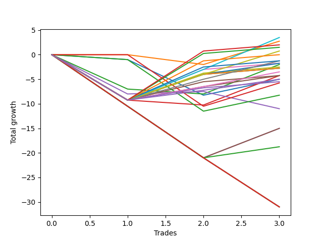

# Short Shepard 103 SD 
- Symbol: ES
- Date Range: 03/18/2022 - 12/30/2022
- Trading Period: 8:30-12:30
- Number of Trades: 3



| Name | Win Percent | Profit | Avg Profit / Trade | Avg Time / Trade |      | Name | Win Percent | Profit | Avg Profit / Trade | Avg Time / Trade |
| ---- | ----------- | ------ | ------------------ | ---------------- | ---- | ---- | ----------- | ------ | ------------------ | ---------------- |
| Sorted By <br> Profit | | | | | | Sorted By <br> Win Percentage ||||
| TP-6 | 66.67 | 1750.00 | 583.33 | 38:26 |     | TP-6 | 66.67 | 1750.00 | 583.33 | 38:26 |
| BB-20 U/L 1SD | 33.33 | 1375.00 | 458.33 | 12:46 |     | TP-10 | 66.67 | 1000.00 | 333.33 | 58:40 |
| TP-10 | 66.67 | 1000.00 | 333.33 | 58:40 |     | TP-9 | 66.67 | 750.00 | 250.00 | 58:21 |
| TP-9 | 66.67 | 750.00 | 250.00 | 58:21 |     | TP-5 | 66.67 | 375.00 | 125.00 | 33:21 |
| TP-5 | 66.67 | 375.00 | 125.00 | 33:21 |     | TP-8 | 66.67 | -0.00 | -0.00 | 57:01 |
| TP-8 | 66.67 | -0.00 | -0.00 | 57:01 |     | V Mid | 66.67 | -250.00 | -83.33 | 56:58 |
| V Mid | 66.67 | -250.00 | -83.33 | 56:58 |     | TP-7 | 66.67 | -625.00 | -208.33 | 56:51 |
| TP-7 | 66.67 | -625.00 | -208.33 | 56:51 |     | TP-4 | 66.67 | -625.00 | -208.33 | 29:50 |
| TP-4 | 66.67 | -625.00 | -208.33 | 29:50 |     | BB-200 Mid | 66.67 | -875.00 | -291.67 | 31:50 |
| BB-200 Mid | 66.67 | -875.00 | -291.67 | 31:50 |     | BB-50 U/L 2SD | 66.67 | -875.00 | -291.67 | 56:48 |
| BB-50 U/L 2SD | 66.67 | -875.00 | -291.67 | 56:48 |     | BB-100 Mid | 66.67 | -1250.00 | -416.67 | 56:38 |
| BB-20 U/L 2SD | 33.33 | -1000.00 | -333.33 | 24:28 |     | BB-200 U/L 2SD | 66.67 | -1375.00 | -458.33 | 60:55 |
| BB-100 Mid | 66.67 | -1250.00 | -416.67 | 56:38 |     | BB-100 U/L 2SD | 66.67 | -1375.00 | -458.33 | 60:55 |
| BB-200 U/L 2SD | 66.67 | -1375.00 | -458.33 | 60:55 |     | V U/L 1SD | 66.67 | -1375.00 | -458.33 | 60:55 |
| BB-100 U/L 2SD | 66.67 | -1375.00 | -458.33 | 60:55 |     | TP-3 | 66.67 | -1750.00 | -583.33 | 29:05 |
| V U/L 1SD | 66.67 | -1375.00 | -458.33 | 60:55 |     | TP-2 | 66.67 | -2125.00 | -708.33 | 29:03 |
| TP-3 | 66.67 | -1750.00 | -583.33 | 29:05 |     | BB-50 U/L 1SD | 66.67 | -2125.00 | -708.33 | 50:00 |
| TP-2 | 66.67 | -2125.00 | -708.33 | 29:03 |     | TP-1 | 66.67 | -2500.00 | -833.33 | 29:00 |
| BB-50 U/L 1SD | 66.67 | -2125.00 | -708.33 | 50:00 |     | NEWFI 000 | 66.67 | -2750.00 | -916.67 | 59:58 |
| BB-20 U/L 2SD C | 33.33 | -2125.00 | -708.33 | 29:50 |     | BB-20 U/L 1SD | 33.33 | 1375.00 | 458.33 | 12:46 |
| TP-1 | 66.67 | -2500.00 | -833.33 | 29:00 |     | BB-20 U/L 2SD | 33.33 | -1000.00 | -333.33 | 24:28 |
| BB-20 Mid | 33.33 | -2500.00 | -833.33 | 11:36 |     | BB-20 U/L 2SD C | 33.33 | -2125.00 | -708.33 | 29:50 |
| NEWFI 000 | 66.67 | -2750.00 | -916.67 | 59:58 |     | BB-20 Mid | 33.33 | -2500.00 | -833.33 | 11:36 |
| NEWFI 0000 | 33.33 | -2750.00 | -916.67 | 01:05 |     | NEWFI 0000 | 33.33 | -2750.00 | -916.67 | 01:05 |
| BB-50 Mid | 33.33 | -5500.00 | -1833.33 | 43:26 |     | BB-50 Mid | 33.33 | -5500.00 | -1833.33 | 43:26 |

## NO STOPLOSS

### Test BB-20 Mid
* Sell when price hits the middle line of the 20p bollinger
* No Stoploss
* Results:
```
Total Trades: 3
Percent Up: 66.67
Percent Down: 33.33
Total Points Moved Down: -5.00
Potential Profit: -2500.00
Total Points Ups: 8.25 Count Ups: 2
Total Points Downs: 3.25 Count Downs: 1
```

<details><summary>Trades</summary>

<code>In: 2022-03-29 11:43:00		Out: 2022-03-29 11:58:00		Total Position Time: 15:00		Total Move Down: -1.00		Total to Date: -1.00</code> <br />
<code>In: 2022-05-16 08:51:00		Out: 2022-05-16 09:05:50		Total Position Time: 14:50		Total Move Down: -7.25		Total to Date: -8.25</code> <br />
<code>In: 2022-07-05 08:58:00		Out: 2022-07-05 09:03:00		Total Position Time: 05:00		Total Move Down: 3.25		Total to Date: -5.00</code> <br />


</details>

### Test BB-20 U/L 1SD
* Sell when the price hits the lower line of the 20p 1std bollinger
* No Stoploss
* Results:
```
Total Trades: 3
Percent Up: 66.67
Percent Down: 33.33
Total Points Moved Down: 2.75
Potential Profit: 1375.00
Total Points Ups: 2.00 Count Ups: 2
Total Points Downs: 4.75 Count Downs: 1
```

<details><summary>Trades</summary>

<code>In: 2022-03-29 11:43:00		Out: 2022-03-29 12:00:25		Total Position Time: 17:25		Total Move Down: -0.00		Total to Date: 0.00</code> <br />
<code>In: 2022-05-16 08:51:00		Out: 2022-05-16 09:06:25		Total Position Time: 15:25		Total Move Down: -2.00		Total to Date: -2.00</code> <br />
<code>In: 2022-07-05 08:58:00		Out: 2022-07-05 09:03:30		Total Position Time: 05:30		Total Move Down: 4.75		Total to Date: 2.75</code> <br />


</details>

### Test BB-20 U/L 2SD
* Sell when the price hits the lower line of the 20p 2std bollinger
* No Stoploss
* Results:
```
Total Trades: 3
Percent Up: 66.67
Percent Down: 33.33
Total Points Moved Down: -2.00
Potential Profit: -1000.00
Total Points Ups: 8.00 Count Ups: 2
Total Points Downs: 6.00 Count Downs: 1
```

<details><summary>Trades</summary>

<code>In: 2022-03-29 11:43:00		Out: 2022-03-29 12:27:50		Total Position Time: 44:50		Total Move Down: -7.00		Total to Date: -7.00</code> <br />
<code>In: 2022-05-16 08:51:00		Out: 2022-05-16 09:11:45		Total Position Time: 20:45		Total Move Down: -1.00		Total to Date: -8.00</code> <br />
<code>In: 2022-07-05 08:58:00		Out: 2022-07-05 09:05:50		Total Position Time: 07:50		Total Move Down: 6.00		Total to Date: -2.00</code> <br />


</details>

### Test BB-20 U/L 2SD C
* Sell when the price hits the lower line of the 20p 2std bollinger
* No Stoploss
* Results:
```
Total Trades: 3
Percent Up: 66.67
Percent Down: 33.33
Total Points Moved Down: -4.25
Potential Profit: -2125.00
Total Points Ups: 10.25 Count Ups: 2
Total Points Downs: 6.00 Count Downs: 1
```

<details><summary>Trades</summary>

<code>In: 2022-03-29 11:43:00		Out: 2022-03-29 12:43:55		Total Position Time: 60:55		Total Move Down: -9.25		Total to Date: -9.25</code> <br />
<code>In: 2022-05-16 08:51:00		Out: 2022-05-16 09:11:45		Total Position Time: 20:45		Total Move Down: -1.00		Total to Date: -10.25</code> <br />
<code>In: 2022-07-05 08:58:00		Out: 2022-07-05 09:05:50		Total Position Time: 07:50		Total Move Down: 6.00		Total to Date: -4.25</code> <br />


</details>

### Test BB-50 Mid
* Sell when price hits the middle line of the 50p bollinger
* No Stoploss
* Results:
```
Total Trades: 3
Percent Up: 66.67
Percent Down: 33.33
Total Points Moved Down: -11.00
Potential Profit: -5500.00
Total Points Ups: 11.50 Count Ups: 2
Total Points Downs: 0.50 Count Downs: 1
```

<details><summary>Trades</summary>

<code>In: 2022-03-29 11:43:00		Out: 2022-03-29 12:43:10		Total Position Time: 60:10		Total Move Down: -8.00		Total to Date: -8.00</code> <br />
<code>In: 2022-05-16 08:51:00		Out: 2022-05-16 09:15:30		Total Position Time: 24:30		Total Move Down: 0.50		Total to Date: -7.50</code> <br />
<code>In: 2022-07-05 08:58:00		Out: 2022-07-05 09:43:40		Total Position Time: 45:40		Total Move Down: -3.50		Total to Date: -11.00</code> <br />


</details>

### Test BB-50 U/L 1SD
* Sell when the price hits the lower line of the 50p 1std bollinger
* No Stoploss
* Results:
```
Total Trades: 3
Percent Up: 33.33
Percent Down: 66.67
Total Points Moved Down: -4.25
Potential Profit: -2125.00
Total Points Ups: 9.25 Count Ups: 1
Total Points Downs: 5.00 Count Downs: 2
```

<details><summary>Trades</summary>

<code>In: 2022-03-29 11:43:00		Out: 2022-03-29 12:43:55		Total Position Time: 60:55		Total Move Down: -9.25		Total to Date: -9.25</code> <br />
<code>In: 2022-05-16 08:51:00		Out: 2022-05-16 09:30:55		Total Position Time: 39:55		Total Move Down: 3.75		Total to Date: -5.50</code> <br />
<code>In: 2022-07-05 08:58:00		Out: 2022-07-05 09:47:10		Total Position Time: 49:10		Total Move Down: 1.25		Total to Date: -4.25</code> <br />


</details>

### Test BB-50 U/L 2SD
* Sell when the price hits the lower line of the 50p 2std bollinger
* No Stoploss
* Results:
```
Total Trades: 3
Percent Up: 33.33
Percent Down: 66.67
Total Points Moved Down: -1.75
Potential Profit: -875.00
Total Points Ups: 9.25 Count Ups: 1
Total Points Downs: 7.50 Count Downs: 2
```

<details><summary>Trades</summary>

<code>In: 2022-03-29 11:43:00		Out: 2022-03-29 12:43:55		Total Position Time: 60:55		Total Move Down: -9.25		Total to Date: -9.25</code> <br />
<code>In: 2022-05-16 08:51:00		Out: 2022-05-16 09:39:35		Total Position Time: 48:35		Total Move Down: 6.25		Total to Date: -3.00</code> <br />
<code>In: 2022-07-05 08:58:00		Out: 2022-07-05 09:58:55		Total Position Time: 60:55		Total Move Down: 1.25		Total to Date: -1.75</code> <br />


</details>

### Test V Mid
* Sell when the price hits the middle line of the 1std VWAP
* No Stoploss
* Results:
```
Total Trades: 3
Percent Up: 33.33
Percent Down: 66.67
Total Points Moved Down: -0.50
Potential Profit: -250.00
Total Points Ups: 9.25 Count Ups: 1
Total Points Downs: 8.75 Count Downs: 2
```

<details><summary>Trades</summary>

<code>In: 2022-03-29 11:43:00		Out: 2022-03-29 12:43:55		Total Position Time: 60:55		Total Move Down: -9.25		Total to Date: -9.25</code> <br />
<code>In: 2022-05-16 08:51:00		Out: 2022-05-16 09:40:05		Total Position Time: 49:05		Total Move Down: 7.50		Total to Date: -1.75</code> <br />
<code>In: 2022-07-05 08:58:00		Out: 2022-07-05 09:58:55		Total Position Time: 60:55		Total Move Down: 1.25		Total to Date: -0.50</code> <br />


</details>

### Test V U/L 1SD
* Sell when the price hits the lower line of the 1std VWAP
* No Stoploss
* Results:
```
Total Trades: 3
Percent Up: 33.33
Percent Down: 66.67
Total Points Moved Down: -2.75
Potential Profit: -1375.00
Total Points Ups: 9.25 Count Ups: 1
Total Points Downs: 6.50 Count Downs: 2
```

<details><summary>Trades</summary>

<code>In: 2022-03-29 11:43:00		Out: 2022-03-29 12:43:55		Total Position Time: 60:55		Total Move Down: -9.25		Total to Date: -9.25</code> <br />
<code>In: 2022-05-16 08:51:00		Out: 2022-05-16 09:51:55		Total Position Time: 60:55		Total Move Down: 5.25		Total to Date: -4.00</code> <br />
<code>In: 2022-07-05 08:58:00		Out: 2022-07-05 09:58:55		Total Position Time: 60:55		Total Move Down: 1.25		Total to Date: -2.75</code> <br />


</details>

### Test BB-100 Mid
* Move to BB100 Mid
* No Stoploss
* Results:
```
Total Trades: 3
Percent Up: 33.33
Percent Down: 66.67
Total Points Moved Down: -2.50
Potential Profit: -1250.00
Total Points Ups: 9.25 Count Ups: 1
Total Points Downs: 6.75 Count Downs: 2
```

<details><summary>Trades</summary>

<code>In: 2022-03-29 11:43:00		Out: 2022-03-29 12:43:55		Total Position Time: 60:55		Total Move Down: -9.25		Total to Date: -9.25</code> <br />
<code>In: 2022-05-16 08:51:00		Out: 2022-05-16 09:39:05		Total Position Time: 48:05		Total Move Down: 5.50		Total to Date: -3.75</code> <br />
<code>In: 2022-07-05 08:58:00		Out: 2022-07-05 09:58:55		Total Position Time: 60:55		Total Move Down: 1.25		Total to Date: -2.50</code> <br />


</details>

### Test BB-100 U/L 2SD
* Move to BB100 Upper Band
* No Stoploss
* Results:
```
Total Trades: 3
Percent Up: 33.33
Percent Down: 66.67
Total Points Moved Down: -2.75
Potential Profit: -1375.00
Total Points Ups: 9.25 Count Ups: 1
Total Points Downs: 6.50 Count Downs: 2
```

<details><summary>Trades</summary>

<code>In: 2022-03-29 11:43:00		Out: 2022-03-29 12:43:55		Total Position Time: 60:55		Total Move Down: -9.25		Total to Date: -9.25</code> <br />
<code>In: 2022-05-16 08:51:00		Out: 2022-05-16 09:51:55		Total Position Time: 60:55		Total Move Down: 5.25		Total to Date: -4.00</code> <br />
<code>In: 2022-07-05 08:58:00		Out: 2022-07-05 09:58:55		Total Position Time: 60:55		Total Move Down: 1.25		Total to Date: -2.75</code> <br />


</details>

### Test BB-200 Mid
* Move to BB200 Mid
* No Stoploss
* Results:
```
Total Trades: 3
Percent Up: 33.33
Percent Down: 66.67
Total Points Moved Down: -1.75
Potential Profit: -875.00
Total Points Ups: 9.25 Count Ups: 1
Total Points Downs: 7.50 Count Downs: 2
```

<details><summary>Trades</summary>

<code>In: 2022-03-29 11:43:00		Out: 2022-03-29 12:43:55		Total Position Time: 60:55		Total Move Down: -9.25		Total to Date: -9.25</code> <br />
<code>In: 2022-05-16 08:51:00		Out: 2022-05-16 09:24:25		Total Position Time: 33:25		Total Move Down: 5.25		Total to Date: -4.00</code> <br />
<code>In: 2022-07-05 08:58:00		Out: 2022-07-05 08:59:10		Total Position Time: 01:10		Total Move Down: 2.25		Total to Date: -1.75</code> <br />


</details>

### Test BB-200 U/L 2SD
* Move to BB200 Upper Band
* No Stoploss
* Results:
```
Total Trades: 3
Percent Up: 33.33
Percent Down: 66.67
Total Points Moved Down: -2.75
Potential Profit: -1375.00
Total Points Ups: 9.25 Count Ups: 1
Total Points Downs: 6.50 Count Downs: 2
```

<details><summary>Trades</summary>

<code>In: 2022-03-29 11:43:00		Out: 2022-03-29 12:43:55		Total Position Time: 60:55		Total Move Down: -9.25		Total to Date: -9.25</code> <br />
<code>In: 2022-05-16 08:51:00		Out: 2022-05-16 09:51:55		Total Position Time: 60:55		Total Move Down: 5.25		Total to Date: -4.00</code> <br />
<code>In: 2022-07-05 08:58:00		Out: 2022-07-05 09:58:55		Total Position Time: 60:55		Total Move Down: 1.25		Total to Date: -2.75</code> <br />


</details>

## TAKE PROFIT

### Test TP-1
* Take Profit of 1 Point
* No Stoploss
* Results:
```
Total Trades: 3
Percent Up: 33.33
Percent Down: 66.67
Total Points Moved Down: -5.00
Potential Profit: -2500.00
Total Points Ups: 9.25 Count Ups: 1
Total Points Downs: 4.25 Count Downs: 2
```

<details><summary>Trades</summary>

<code>In: 2022-03-29 11:43:00		Out: 2022-03-29 12:43:55		Total Position Time: 60:55		Total Move Down: -9.25		Total to Date: -9.25</code> <br />
<code>In: 2022-05-16 08:51:00		Out: 2022-05-16 09:15:55		Total Position Time: 24:55		Total Move Down: 2.00		Total to Date: -7.25</code> <br />
<code>In: 2022-07-05 08:58:00		Out: 2022-07-05 08:59:10		Total Position Time: 01:10		Total Move Down: 2.25		Total to Date: -5.00</code> <br />


</details>

### Test TP-2
* Take Profit of 2 Point
* No Stoploss
* Results:
```
Total Trades: 3
Percent Up: 33.33
Percent Down: 66.67
Total Points Moved Down: -4.25
Potential Profit: -2125.00
Total Points Ups: 9.25 Count Ups: 1
Total Points Downs: 5.00 Count Downs: 2
```

<details><summary>Trades</summary>

<code>In: 2022-03-29 11:43:00		Out: 2022-03-29 12:43:55		Total Position Time: 60:55		Total Move Down: -9.25		Total to Date: -9.25</code> <br />
<code>In: 2022-05-16 08:51:00		Out: 2022-05-16 09:16:05		Total Position Time: 25:05		Total Move Down: 2.75		Total to Date: -6.50</code> <br />
<code>In: 2022-07-05 08:58:00		Out: 2022-07-05 08:59:10		Total Position Time: 01:10		Total Move Down: 2.25		Total to Date: -4.25</code> <br />


</details>

### Test TP-3
* Take Profit of 3 Point
* No Stoploss
* Results:
```
Total Trades: 3
Percent Up: 33.33
Percent Down: 66.67
Total Points Moved Down: -3.50
Potential Profit: -1750.00
Total Points Ups: 9.25 Count Ups: 1
Total Points Downs: 5.75 Count Downs: 2
```

<details><summary>Trades</summary>

<code>In: 2022-03-29 11:43:00		Out: 2022-03-29 12:43:55		Total Position Time: 60:55		Total Move Down: -9.25		Total to Date: -9.25</code> <br />
<code>In: 2022-05-16 08:51:00		Out: 2022-05-16 09:16:05		Total Position Time: 25:05		Total Move Down: 2.75		Total to Date: -6.50</code> <br />
<code>In: 2022-07-05 08:58:00		Out: 2022-07-05 08:59:15		Total Position Time: 01:15		Total Move Down: 3.00		Total to Date: -3.50</code> <br />


</details>

### Test TP-4
* Take Profit of 4 Point
* No Stoploss
* Results:
```
Total Trades: 3
Percent Up: 33.33
Percent Down: 66.67
Total Points Moved Down: -1.25
Potential Profit: -625.00
Total Points Ups: 9.25 Count Ups: 1
Total Points Downs: 8.00 Count Downs: 2
```

<details><summary>Trades</summary>

<code>In: 2022-03-29 11:43:00		Out: 2022-03-29 12:43:55		Total Position Time: 60:55		Total Move Down: -9.25		Total to Date: -9.25</code> <br />
<code>In: 2022-05-16 08:51:00		Out: 2022-05-16 09:18:05		Total Position Time: 27:05		Total Move Down: 4.25		Total to Date: -5.00</code> <br />
<code>In: 2022-07-05 08:58:00		Out: 2022-07-05 08:59:30		Total Position Time: 01:30		Total Move Down: 3.75		Total to Date: -1.25</code> <br />


</details>

### Test TP-5
* Take Profit of 5 Point
* No Stoploss
* Results:
```
Total Trades: 3
Percent Up: 33.33
Percent Down: 66.67
Total Points Moved Down: 0.75
Potential Profit: 375.00
Total Points Ups: 9.25 Count Ups: 1
Total Points Downs: 10.00 Count Downs: 2
```

<details><summary>Trades</summary>

<code>In: 2022-03-29 11:43:00		Out: 2022-03-29 12:43:55		Total Position Time: 60:55		Total Move Down: -9.25		Total to Date: -9.25</code> <br />
<code>In: 2022-05-16 08:51:00		Out: 2022-05-16 09:24:25		Total Position Time: 33:25		Total Move Down: 5.25		Total to Date: -4.00</code> <br />
<code>In: 2022-07-05 08:58:00		Out: 2022-07-05 09:03:45		Total Position Time: 05:45		Total Move Down: 4.75		Total to Date: 0.75</code> <br />


</details>

### Test TP-6
* Take Profit of 6 Point
* No Stoploss
* Results:
```
Total Trades: 3
Percent Up: 33.33
Percent Down: 66.67
Total Points Moved Down: 3.50
Potential Profit: 1750.00
Total Points Ups: 9.25 Count Ups: 1
Total Points Downs: 12.75 Count Downs: 2
```

<details><summary>Trades</summary>

<code>In: 2022-03-29 11:43:00		Out: 2022-03-29 12:43:55		Total Position Time: 60:55		Total Move Down: -9.25		Total to Date: -9.25</code> <br />
<code>In: 2022-05-16 08:51:00		Out: 2022-05-16 09:39:35		Total Position Time: 48:35		Total Move Down: 6.25		Total to Date: -3.00</code> <br />
<code>In: 2022-07-05 08:58:00		Out: 2022-07-05 09:03:50		Total Position Time: 05:50		Total Move Down: 6.50		Total to Date: 3.50</code> <br />


</details>

### Test TP-7
* Take Profit of 7 Point
* No Stoploss
* Results:
```
Total Trades: 3
Percent Up: 33.33
Percent Down: 66.67
Total Points Moved Down: -1.25
Potential Profit: -625.00
Total Points Ups: 9.25 Count Ups: 1
Total Points Downs: 8.00 Count Downs: 2
```

<details><summary>Trades</summary>

<code>In: 2022-03-29 11:43:00		Out: 2022-03-29 12:43:55		Total Position Time: 60:55		Total Move Down: -9.25		Total to Date: -9.25</code> <br />
<code>In: 2022-05-16 08:51:00		Out: 2022-05-16 09:39:45		Total Position Time: 48:45		Total Move Down: 6.75		Total to Date: -2.50</code> <br />
<code>In: 2022-07-05 08:58:00		Out: 2022-07-05 09:58:55		Total Position Time: 60:55		Total Move Down: 1.25		Total to Date: -1.25</code> <br />


</details>

### Test TP-8
* Take Profit of 8 Point
* No Stoploss
* Results:
```
Total Trades: 3
Percent Up: 33.33
Percent Down: 66.67
Total Points Moved Down: -0.00
Potential Profit: -0.00
Total Points Ups: 9.25 Count Ups: 1
Total Points Downs: 9.25 Count Downs: 2
```

<details><summary>Trades</summary>

<code>In: 2022-03-29 11:43:00		Out: 2022-03-29 12:43:55		Total Position Time: 60:55		Total Move Down: -9.25		Total to Date: -9.25</code> <br />
<code>In: 2022-05-16 08:51:00		Out: 2022-05-16 09:40:15		Total Position Time: 49:15		Total Move Down: 8.00		Total to Date: -1.25</code> <br />
<code>In: 2022-07-05 08:58:00		Out: 2022-07-05 09:58:55		Total Position Time: 60:55		Total Move Down: 1.25		Total to Date: 0.00</code> <br />


</details>

### Test TP-9
* Take Profit of 9 Point
* No Stoploss
* Results:
```
Total Trades: 3
Percent Up: 33.33
Percent Down: 66.67
Total Points Moved Down: 1.50
Potential Profit: 750.00
Total Points Ups: 9.25 Count Ups: 1
Total Points Downs: 10.75 Count Downs: 2
```

<details><summary>Trades</summary>

<code>In: 2022-03-29 11:43:00		Out: 2022-03-29 12:43:55		Total Position Time: 60:55		Total Move Down: -9.25		Total to Date: -9.25</code> <br />
<code>In: 2022-05-16 08:51:00		Out: 2022-05-16 09:44:15		Total Position Time: 53:15		Total Move Down: 9.50		Total to Date: 0.25</code> <br />
<code>In: 2022-07-05 08:58:00		Out: 2022-07-05 09:58:55		Total Position Time: 60:55		Total Move Down: 1.25		Total to Date: 1.50</code> <br />


</details>

### Test TP-10
* Take Profit of 10 Point
* No Stoploss
* Results:
```
Total Trades: 3
Percent Up: 33.33
Percent Down: 66.67
Total Points Moved Down: 2.00
Potential Profit: 1000.00
Total Points Ups: 9.25 Count Ups: 1
Total Points Downs: 11.25 Count Downs: 2
```

<details><summary>Trades</summary>

<code>In: 2022-03-29 11:43:00		Out: 2022-03-29 12:43:55		Total Position Time: 60:55		Total Move Down: -9.25		Total to Date: -9.25</code> <br />
<code>In: 2022-05-16 08:51:00		Out: 2022-05-16 09:45:10		Total Position Time: 54:10		Total Move Down: 10.00		Total to Date: 0.75</code> <br />
<code>In: 2022-07-05 08:58:00		Out: 2022-07-05 09:58:55		Total Position Time: 60:55		Total Move Down: 1.25		Total to Date: 2.00</code> <br />


</details>

## Indicator Exits

### Test NEWFI 000
* Newfi 0000
* No Stoploss
* Results:
```
Total Trades: 3
Percent Up: 33.33
Percent Down: 66.67
Total Points Moved Down: -5.50
Potential Profit: -2750.00
Total Points Ups: 9.25 Count Ups: 1
Total Points Downs: 3.75 Count Downs: 2
```

<details><summary>Trades</summary>

<code>In: 2022-03-29 11:43:00		Out: 2022-03-29 12:43:55		Total Position Time: 60:55		Total Move Down: -9.25		Total to Date: -9.25</code> <br />
<code>In: 2022-05-16 08:51:00		Out: 2022-05-16 09:49:05		Total Position Time: 58:05		Total Move Down: 2.50		Total to Date: -6.75</code> <br />
<code>In: 2022-07-05 08:58:00		Out: 2022-07-05 09:58:55		Total Position Time: 60:55		Total Move Down: 1.25		Total to Date: -5.50</code> <br />


</details>

### Test NEWFI 0000
* Newfi 0000
* No Stoploss
* Results:
```
Total Trades: 3
Percent Up: 66.67
Percent Down: 33.33
Total Points Moved Down: -5.50
Potential Profit: -2750.00
Total Points Ups: 6.75 Count Ups: 2
Total Points Downs: 1.25 Count Downs: 1
```

<details><summary>Trades</summary>

<code>In: 2022-03-29 11:43:00		Out: 2022-03-29 11:44:05		Total Position Time: 01:05		Total Move Down: -2.00		Total to Date: -2.00</code> <br />
<code>In: 2022-05-16 08:51:00		Out: 2022-05-16 08:52:05		Total Position Time: 01:05		Total Move Down: -4.75		Total to Date: -6.75</code> <br />
<code>In: 2022-07-05 08:58:00		Out: 2022-07-05 08:59:05		Total Position Time: 01:05		Total Move Down: 1.25		Total to Date: -5.50</code> <br />


</details>