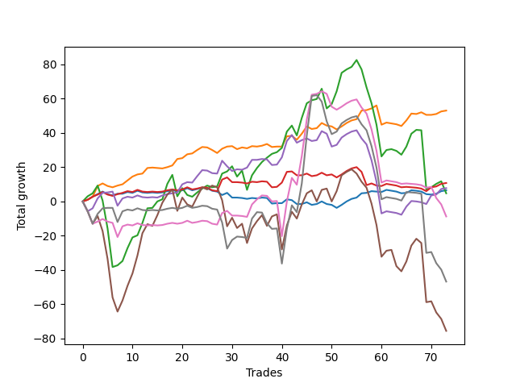

# Short Terrier 001 
- Symbol: ES
- Date Range: 06/24/2022 - 07/07/2022
- Trading Period: 7:20-12:30
- Number of Trades: 73



| Name | Win Percent | Profit | Avg Profit / Trade |     | Name | Win Percent | Profit | Avg Profit / Trade |
| ---- | ----------- | ------ | ------------------ | --- | ---- | ----------- | ------ | ------------------ |
| Sorted By <br> Profit | | | | | Sorted By <br> Win Percentage ||||
| One | 67.12 | 26500.00 | 363.01 |     | Two | 71.23 | 2375.00 | 32.53 |
| Three | 53.42 | 5375.00 | 73.63 |     | One | 67.12 | 26500.00 | 363.01 |
| Four | 57.53 | 3875.00 | 53.08 |     | Four | 57.53 | 3875.00 | 53.08 |
| Zero | 49.32 | 3250.00 | 44.52 |     | Three | 53.42 | 5375.00 | 73.63 |
| Two | 71.23 | 2375.00 | 32.53 |     | Five | 53.42 | -37750.00 | -517.12 |
| Six | 45.21 | -4375.00 | -59.93 |     | Zero | 49.32 | 3250.00 | 44.52 |
| Seven | 45.21 | -23375.00 | -320.21 |     | Six | 45.21 | -4375.00 | -59.93 |
| Five | 53.42 | -37750.00 | -517.12 |     | Seven | 45.21 | -23375.00 | -320.21 |

### Test Zero
* Sell when price hits the middle line of the 20p bollinger
* No Stoploss
* Results:
```
Total Trades: 73
Percent Up: 50.68
Percent Down: 49.32
Total Points Moved Down: 6.50
Potential Profit: 3250.00
Total Points Ups: 30.50 Count Ups: 37
Total Points Downs: 37.00 Count Downs: 36
```

<details><summary>Trades</summary>

<code>In: 2022-06-24 07:45:00		Out: 2022-06-24 07:45:10		Total Position Time: 00:10		Total Move Down: 1.00		Total to Date: 1.00</code> <br />
<code>In: 2022-06-24 08:17:00		Out: 2022-06-24 08:17:10		Total Position Time: 00:10		Total Move Down: 1.75		Total to Date: 2.75</code> <br />
<code>In: 2022-06-27 06:57:00		Out: 2022-06-27 06:57:15		Total Position Time: 00:15		Total Move Down: 1.50		Total to Date: 4.25</code> <br />
<code>In: 2022-06-27 07:14:00		Out: 2022-06-27 07:14:10		Total Position Time: 00:10		Total Move Down: 1.50		Total to Date: 5.75</code> <br />
<code>In: 2022-06-27 07:19:00		Out: 2022-06-27 07:19:10		Total Position Time: 00:10		Total Move Down: -1.50		Total to Date: 4.25</code> <br />
<code>In: 2022-06-27 07:26:00		Out: 2022-06-27 07:26:10		Total Position Time: 00:10		Total Move Down: -0.75		Total to Date: 3.50</code> <br />
<code>In: 2022-06-27 08:10:00		Out: 2022-06-27 08:10:10		Total Position Time: 00:10		Total Move Down: 1.00		Total to Date: 4.50</code> <br />
<code>In: 2022-06-27 08:54:00		Out: 2022-06-27 08:54:10		Total Position Time: 00:10		Total Move Down: -0.00		Total to Date: 4.50</code> <br />
<code>In: 2022-06-28 07:17:00		Out: 2022-06-28 07:17:10		Total Position Time: 00:10		Total Move Down: 1.00		Total to Date: 5.50</code> <br />
<code>In: 2022-06-28 07:19:00		Out: 2022-06-28 07:19:10		Total Position Time: 00:10		Total Move Down: -0.50		Total to Date: 5.00</code> <br />
<code>In: 2022-06-28 07:23:00		Out: 2022-06-28 07:23:10		Total Position Time: 00:10		Total Move Down: 1.25		Total to Date: 6.25</code> <br />
<code>In: 2022-06-28 07:27:00		Out: 2022-06-28 07:27:10		Total Position Time: 00:10		Total Move Down: -1.00		Total to Date: 5.25</code> <br />
<code>In: 2022-06-28 07:41:00		Out: 2022-06-28 07:41:10		Total Position Time: 00:10		Total Move Down: -0.25		Total to Date: 5.00</code> <br />
<code>In: 2022-06-28 07:47:00		Out: 2022-06-28 07:47:10		Total Position Time: 00:10		Total Move Down: 0.25		Total to Date: 5.25</code> <br />
<code>In: 2022-06-28 07:50:00		Out: 2022-06-28 07:50:10		Total Position Time: 00:10		Total Move Down: -0.25		Total to Date: 5.00</code> <br />
<code>In: 2022-06-28 08:11:00		Out: 2022-06-28 08:11:10		Total Position Time: 00:10		Total Move Down: 0.25		Total to Date: 5.25</code> <br />
<code>In: 2022-06-28 08:38:00		Out: 2022-06-28 08:38:10		Total Position Time: 00:10		Total Move Down: 0.75		Total to Date: 6.00</code> <br />
<code>In: 2022-06-28 08:54:00		Out: 2022-06-28 08:54:10		Total Position Time: 00:10		Total Move Down: 0.50		Total to Date: 6.50</code> <br />
<code>In: 2022-06-28 09:17:00		Out: 2022-06-28 09:17:10		Total Position Time: 00:10		Total Move Down: -0.50		Total to Date: 6.00</code> <br />
<code>In: 2022-06-28 09:57:00		Out: 2022-06-28 09:57:10		Total Position Time: 00:10		Total Move Down: 0.50		Total to Date: 6.50</code> <br />
<code>In: 2022-06-28 10:21:00		Out: 2022-06-28 10:21:10		Total Position Time: 00:10		Total Move Down: 1.25		Total to Date: 7.75</code> <br />
<code>In: 2022-06-28 10:37:00		Out: 2022-06-28 10:37:10		Total Position Time: 00:10		Total Move Down: -1.25		Total to Date: 6.50</code> <br />
<code>In: 2022-06-28 10:47:00		Out: 2022-06-28 10:47:15		Total Position Time: 00:15		Total Move Down: 0.75		Total to Date: 7.25</code> <br />
<code>In: 2022-06-28 10:49:00		Out: 2022-06-28 10:49:10		Total Position Time: 00:10		Total Move Down: 0.75		Total to Date: 8.00</code> <br />
<code>In: 2022-06-28 11:31:00		Out: 2022-06-28 11:31:10		Total Position Time: 00:10		Total Move Down: -0.25		Total to Date: 7.75</code> <br />
<code>In: 2022-06-28 12:04:00		Out: 2022-06-28 12:04:10		Total Position Time: 00:10		Total Move Down: -1.50		Total to Date: 6.25</code> <br />
<code>In: 2022-06-28 12:16:00		Out: 2022-06-28 12:16:10		Total Position Time: 00:10		Total Move Down: -0.50		Total to Date: 5.75</code> <br />
<code>In: 2022-06-29 07:15:00		Out: 2022-06-29 07:15:10		Total Position Time: 00:10		Total Move Down: -2.00		Total to Date: 3.75</code> <br />
<code>In: 2022-06-29 07:17:00		Out: 2022-06-29 07:17:10		Total Position Time: 00:10		Total Move Down: 1.25		Total to Date: 5.00</code> <br />
<code>In: 2022-06-29 08:15:00		Out: 2022-06-29 08:15:10		Total Position Time: 00:10		Total Move Down: -2.75		Total to Date: 2.25</code> <br />
<code>In: 2022-06-29 08:30:00		Out: 2022-06-29 08:30:10		Total Position Time: 00:10		Total Move Down: -0.00		Total to Date: 2.25</code> <br />
<code>In: 2022-06-29 09:23:00		Out: 2022-06-29 09:23:10		Total Position Time: 00:10		Total Move Down: -0.25		Total to Date: 2.00</code> <br />
<code>In: 2022-06-29 10:15:00		Out: 2022-06-29 10:15:10		Total Position Time: 00:10		Total Move Down: -0.50		Total to Date: 1.50</code> <br />
<code>In: 2022-06-29 11:32:00		Out: 2022-06-29 11:32:10		Total Position Time: 00:10		Total Move Down: 0.50		Total to Date: 2.00</code> <br />
<code>In: 2022-06-29 11:38:00		Out: 2022-06-29 11:38:10		Total Position Time: 00:10		Total Move Down: -0.25		Total to Date: 1.75</code> <br />
<code>In: 2022-06-29 11:40:00		Out: 2022-06-29 11:40:10		Total Position Time: 00:10		Total Move Down: 0.50		Total to Date: 2.25</code> <br />
<code>In: 2022-06-29 11:53:00		Out: 2022-06-29 11:53:10		Total Position Time: 00:10		Total Move Down: -0.25		Total to Date: 2.00</code> <br />
<code>In: 2022-06-30 06:53:00		Out: 2022-06-30 06:53:10		Total Position Time: 00:10		Total Move Down: -3.25		Total to Date: -1.25</code> <br />
<code>In: 2022-06-30 06:55:00		Out: 2022-06-30 06:55:10		Total Position Time: 00:10		Total Move Down: 0.25		Total to Date: -1.00</code> <br />
<code>In: 2022-06-30 09:07:00		Out: 2022-06-30 09:07:10		Total Position Time: 00:10		Total Move Down: -0.00		Total to Date: -1.00</code> <br />
<code>In: 2022-06-30 09:46:00		Out: 2022-06-30 09:48:45		Total Position Time: 02:45		Total Move Down: 2.25		Total to Date: 1.25</code> <br />
<code>In: 2022-06-30 09:50:00		Out: 2022-06-30 09:50:10		Total Position Time: 00:10		Total Move Down: -0.50		Total to Date: 0.75</code> <br />
<code>In: 2022-06-30 10:45:00		Out: 2022-06-30 10:45:10		Total Position Time: 00:10		Total Move Down: -2.25		Total to Date: -1.50</code> <br />
<code>In: 2022-06-30 11:33:00		Out: 2022-06-30 11:33:10		Total Position Time: 00:10		Total Move Down: -0.00		Total to Date: -1.50</code> <br />
<code>In: 2022-06-30 11:39:00		Out: 2022-06-30 11:39:10		Total Position Time: 00:10		Total Move Down: 1.00		Total to Date: -0.50</code> <br />
<code>In: 2022-06-30 11:42:00		Out: 2022-06-30 11:42:10		Total Position Time: 00:10		Total Move Down: -1.50		Total to Date: -2.00</code> <br />
<code>In: 2022-07-01 07:32:00		Out: 2022-07-01 07:32:10		Total Position Time: 00:10		Total Move Down: 0.50		Total to Date: -1.50</code> <br />
<code>In: 2022-07-01 09:58:00		Out: 2022-07-01 09:58:10		Total Position Time: 00:10		Total Move Down: 1.50		Total to Date: 0.00</code> <br />
<code>In: 2022-07-01 10:00:00		Out: 2022-07-01 10:00:10		Total Position Time: 00:10		Total Move Down: -1.50		Total to Date: -1.50</code> <br />
<code>In: 2022-07-01 11:56:00		Out: 2022-07-01 11:56:10		Total Position Time: 00:10		Total Move Down: -0.50		Total to Date: -2.00</code> <br />
<code>In: 2022-07-05 07:48:00		Out: 2022-07-05 07:48:10		Total Position Time: 00:10		Total Move Down: -1.75		Total to Date: -3.75</code> <br />
<code>In: 2022-07-05 07:51:00		Out: 2022-07-05 07:51:10		Total Position Time: 00:10		Total Move Down: 1.75		Total to Date: -2.00</code> <br />
<code>In: 2022-07-05 08:01:00		Out: 2022-07-05 08:01:10		Total Position Time: 00:10		Total Move Down: 2.00		Total to Date: 0.00</code> <br />
<code>In: 2022-07-05 08:03:00		Out: 2022-07-05 08:03:10		Total Position Time: 00:10		Total Move Down: 1.50		Total to Date: 1.50</code> <br />
<code>In: 2022-07-05 08:05:00		Out: 2022-07-05 08:05:10		Total Position Time: 00:10		Total Move Down: 0.75		Total to Date: 2.25</code> <br />
<code>In: 2022-07-05 09:15:00		Out: 2022-07-05 09:15:10		Total Position Time: 00:10		Total Move Down: 2.50		Total to Date: 4.75</code> <br />
<code>In: 2022-07-05 09:17:00		Out: 2022-07-05 09:17:10		Total Position Time: 00:10		Total Move Down: 0.25		Total to Date: 5.00</code> <br />
<code>In: 2022-07-05 10:48:00		Out: 2022-07-05 10:48:10		Total Position Time: 00:10		Total Move Down: 1.00		Total to Date: 6.00</code> <br />
<code>In: 2022-07-05 10:56:00		Out: 2022-07-05 10:56:10		Total Position Time: 00:10		Total Move Down: -0.25		Total to Date: 5.75</code> <br />
<code>In: 2022-07-05 12:20:00		Out: 2022-07-05 12:20:10		Total Position Time: 00:10		Total Move Down: -0.25		Total to Date: 5.50</code> <br />
<code>In: 2022-07-06 06:46:00		Out: 2022-07-06 06:46:10		Total Position Time: 00:10		Total Move Down: 1.25		Total to Date: 6.75</code> <br />
<code>In: 2022-07-06 06:50:00		Out: 2022-07-06 06:50:10		Total Position Time: 00:10		Total Move Down: -0.50		Total to Date: 6.25</code> <br />
<code>In: 2022-07-06 07:15:00		Out: 2022-07-06 07:15:10		Total Position Time: 00:10		Total Move Down: -0.50		Total to Date: 5.75</code> <br />
<code>In: 2022-07-06 07:22:00		Out: 2022-07-06 07:22:10		Total Position Time: 00:10		Total Move Down: -1.00		Total to Date: 4.75</code> <br />
<code>In: 2022-07-06 07:26:00		Out: 2022-07-06 07:26:10		Total Position Time: 00:10		Total Move Down: 0.25		Total to Date: 5.00</code> <br />
<code>In: 2022-07-06 08:16:00		Out: 2022-07-06 08:16:15		Total Position Time: 00:15		Total Move Down: 1.50		Total to Date: 6.50</code> <br />
<code>In: 2022-07-06 08:28:00		Out: 2022-07-06 08:28:10		Total Position Time: 00:10		Total Move Down: -0.25		Total to Date: 6.25</code> <br />
<code>In: 2022-07-06 08:41:00		Out: 2022-07-06 08:41:10		Total Position Time: 00:10		Total Move Down: -0.50		Total to Date: 5.75</code> <br />
<code>In: 2022-07-06 11:13:00		Out: 2022-07-06 11:13:10		Total Position Time: 00:10		Total Move Down: -1.50		Total to Date: 4.25</code> <br />
<code>In: 2022-07-07 08:15:00		Out: 2022-07-07 08:15:15		Total Position Time: 00:15		Total Move Down: -0.25		Total to Date: 4.00</code> <br />
<code>In: 2022-07-07 10:25:00		Out: 2022-07-07 10:25:10		Total Position Time: 00:10		Total Move Down: 0.50		Total to Date: 4.50</code> <br />
<code>In: 2022-07-07 11:35:00		Out: 2022-07-07 11:35:10		Total Position Time: 00:10		Total Move Down: 1.50		Total to Date: 6.00</code> <br />
<code>In: 2022-07-07 11:41:00		Out: 2022-07-07 11:41:10		Total Position Time: 00:10		Total Move Down: 0.50		Total to Date: 6.50</code> <br />


</details>

### Test One
* Sell when the price hits the upper line of the 20p 1std bollinger
* No Stoploss
* Results:
```
Total Trades: 73
Percent Up: 32.88
Percent Down: 67.12
Total Points Moved Down: 53.00
Potential Profit: 26500.00
Total Points Ups: 33.00 Count Ups: 24
Total Points Downs: 86.00 Count Downs: 49
```

<details><summary>Trades</summary>

<code>In: 2022-06-24 07:45:00		Out: 2022-06-24 07:45:10		Total Position Time: 00:10		Total Move Down: 1.00		Total to Date: 1.00</code> <br />
<code>In: 2022-06-24 08:17:00		Out: 2022-06-24 08:17:10		Total Position Time: 00:10		Total Move Down: 1.75		Total to Date: 2.75</code> <br />
<code>In: 2022-06-27 06:57:00		Out: 2022-06-27 06:59:20		Total Position Time: 02:20		Total Move Down: 6.25		Total to Date: 9.00</code> <br />
<code>In: 2022-06-27 07:14:00		Out: 2022-06-27 07:14:10		Total Position Time: 00:10		Total Move Down: 1.50		Total to Date: 10.50</code> <br />
<code>In: 2022-06-27 07:19:00		Out: 2022-06-27 07:19:10		Total Position Time: 00:10		Total Move Down: -1.50		Total to Date: 9.00</code> <br />
<code>In: 2022-06-27 07:26:00		Out: 2022-06-27 07:26:10		Total Position Time: 00:10		Total Move Down: -0.75		Total to Date: 8.25</code> <br />
<code>In: 2022-06-27 08:10:00		Out: 2022-06-27 08:10:10		Total Position Time: 00:10		Total Move Down: 1.00		Total to Date: 9.25</code> <br />
<code>In: 2022-06-27 08:54:00		Out: 2022-06-27 08:55:05		Total Position Time: 01:05		Total Move Down: 0.75		Total to Date: 10.00</code> <br />
<code>In: 2022-06-28 07:17:00		Out: 2022-06-28 07:17:15		Total Position Time: 00:15		Total Move Down: 2.25		Total to Date: 12.25</code> <br />
<code>In: 2022-06-28 07:19:00		Out: 2022-06-28 07:20:10		Total Position Time: 01:10		Total Move Down: 2.25		Total to Date: 14.50</code> <br />
<code>In: 2022-06-28 07:23:00		Out: 2022-06-28 07:23:10		Total Position Time: 00:10		Total Move Down: 1.25		Total to Date: 15.75</code> <br />
<code>In: 2022-06-28 07:27:00		Out: 2022-06-28 07:28:15		Total Position Time: 01:15		Total Move Down: 0.50		Total to Date: 16.25</code> <br />
<code>In: 2022-06-28 07:41:00		Out: 2022-06-28 07:42:20		Total Position Time: 01:20		Total Move Down: 3.25		Total to Date: 19.50</code> <br />
<code>In: 2022-06-28 07:47:00		Out: 2022-06-28 07:47:10		Total Position Time: 00:10		Total Move Down: 0.25		Total to Date: 19.75</code> <br />
<code>In: 2022-06-28 07:50:00		Out: 2022-06-28 07:50:10		Total Position Time: 00:10		Total Move Down: -0.25		Total to Date: 19.50</code> <br />
<code>In: 2022-06-28 08:11:00		Out: 2022-06-28 08:13:05		Total Position Time: 02:05		Total Move Down: -0.25		Total to Date: 19.25</code> <br />
<code>In: 2022-06-28 08:38:00		Out: 2022-06-28 08:38:10		Total Position Time: 00:10		Total Move Down: 0.75		Total to Date: 20.00</code> <br />
<code>In: 2022-06-28 08:54:00		Out: 2022-06-28 08:54:15		Total Position Time: 00:15		Total Move Down: 1.00		Total to Date: 21.00</code> <br />
<code>In: 2022-06-28 09:17:00		Out: 2022-06-28 09:17:55		Total Position Time: 00:55		Total Move Down: 3.75		Total to Date: 24.75</code> <br />
<code>In: 2022-06-28 09:57:00		Out: 2022-06-28 09:57:10		Total Position Time: 00:10		Total Move Down: 0.50		Total to Date: 25.25</code> <br />
<code>In: 2022-06-28 10:21:00		Out: 2022-06-28 10:21:15		Total Position Time: 00:15		Total Move Down: 2.25		Total to Date: 27.50</code> <br />
<code>In: 2022-06-28 10:37:00		Out: 2022-06-28 10:38:30		Total Position Time: 01:30		Total Move Down: 0.50		Total to Date: 28.00</code> <br />
<code>In: 2022-06-28 10:47:00		Out: 2022-06-28 11:00:05		Total Position Time: 13:05		Total Move Down: 2.00		Total to Date: 30.00</code> <br />
<code>In: 2022-06-28 10:49:00		Out: 2022-06-28 11:00:05		Total Position Time: 11:05		Total Move Down: 1.75		Total to Date: 31.75</code> <br />
<code>In: 2022-06-28 11:31:00		Out: 2022-06-28 11:31:10		Total Position Time: 00:10		Total Move Down: -0.25		Total to Date: 31.50</code> <br />
<code>In: 2022-06-28 12:04:00		Out: 2022-06-28 12:04:10		Total Position Time: 00:10		Total Move Down: -1.50		Total to Date: 30.00</code> <br />
<code>In: 2022-06-28 12:16:00		Out: 2022-06-28 12:33:55		Total Position Time: 17:55		Total Move Down: -1.75		Total to Date: 28.25</code> <br />
<code>In: 2022-06-29 07:15:00		Out: 2022-06-29 07:16:20		Total Position Time: 01:20		Total Move Down: 2.50		Total to Date: 30.75</code> <br />
<code>In: 2022-06-29 07:17:00		Out: 2022-06-29 07:17:10		Total Position Time: 00:10		Total Move Down: 1.25		Total to Date: 32.00</code> <br />
<code>In: 2022-06-29 08:15:00		Out: 2022-06-29 08:15:30		Total Position Time: 00:30		Total Move Down: 0.25		Total to Date: 32.25</code> <br />
<code>In: 2022-06-29 08:30:00		Out: 2022-06-29 08:49:20		Total Position Time: 19:20		Total Move Down: -1.75		Total to Date: 30.50</code> <br />
<code>In: 2022-06-29 09:23:00		Out: 2022-06-29 09:23:30		Total Position Time: 00:30		Total Move Down: 1.00		Total to Date: 31.50</code> <br />
<code>In: 2022-06-29 10:15:00		Out: 2022-06-29 10:15:10		Total Position Time: 00:10		Total Move Down: -0.50		Total to Date: 31.00</code> <br />
<code>In: 2022-06-29 11:32:00		Out: 2022-06-29 11:32:20		Total Position Time: 00:20		Total Move Down: 1.25		Total to Date: 32.25</code> <br />
<code>In: 2022-06-29 11:38:00		Out: 2022-06-29 11:38:10		Total Position Time: 00:10		Total Move Down: -0.25		Total to Date: 32.00</code> <br />
<code>In: 2022-06-29 11:40:00		Out: 2022-06-29 11:40:10		Total Position Time: 00:10		Total Move Down: 0.50		Total to Date: 32.50</code> <br />
<code>In: 2022-06-29 11:53:00		Out: 2022-06-29 12:01:25		Total Position Time: 08:25		Total Move Down: 1.00		Total to Date: 33.50</code> <br />
<code>In: 2022-06-30 06:53:00		Out: 2022-06-30 06:53:20		Total Position Time: 00:20		Total Move Down: -1.75		Total to Date: 31.75</code> <br />
<code>In: 2022-06-30 06:55:00		Out: 2022-06-30 06:55:10		Total Position Time: 00:10		Total Move Down: 0.25		Total to Date: 32.00</code> <br />
<code>In: 2022-06-30 09:07:00		Out: 2022-06-30 09:07:10		Total Position Time: 00:10		Total Move Down: -0.00		Total to Date: 32.00</code> <br />
<code>In: 2022-06-30 09:46:00		Out: 2022-06-30 09:49:55		Total Position Time: 03:55		Total Move Down: 6.00		Total to Date: 38.00</code> <br />
<code>In: 2022-06-30 09:50:00		Out: 2022-06-30 09:50:15		Total Position Time: 00:15		Total Move Down: 0.25		Total to Date: 38.25</code> <br />
<code>In: 2022-06-30 10:45:00		Out: 2022-06-30 10:45:10		Total Position Time: 00:10		Total Move Down: -2.25		Total to Date: 36.00</code> <br />
<code>In: 2022-06-30 11:33:00		Out: 2022-06-30 11:33:35		Total Position Time: 00:35		Total Move Down: 3.50		Total to Date: 39.50</code> <br />
<code>In: 2022-06-30 11:39:00		Out: 2022-06-30 11:41:10		Total Position Time: 02:10		Total Move Down: 4.25		Total to Date: 43.75</code> <br />
<code>In: 2022-06-30 11:42:00		Out: 2022-06-30 11:42:10		Total Position Time: 00:10		Total Move Down: -1.50		Total to Date: 42.25</code> <br />
<code>In: 2022-07-01 07:32:00		Out: 2022-07-01 07:32:10		Total Position Time: 00:10		Total Move Down: 0.50		Total to Date: 42.75</code> <br />
<code>In: 2022-07-01 09:58:00		Out: 2022-07-01 09:58:15		Total Position Time: 00:15		Total Move Down: 3.00		Total to Date: 45.75</code> <br />
<code>In: 2022-07-01 10:00:00		Out: 2022-07-01 10:00:10		Total Position Time: 00:10		Total Move Down: -1.50		Total to Date: 44.25</code> <br />
<code>In: 2022-07-01 11:56:00		Out: 2022-07-01 11:56:10		Total Position Time: 00:10		Total Move Down: -0.50		Total to Date: 43.75</code> <br />
<code>In: 2022-07-05 07:48:00		Out: 2022-07-05 07:48:10		Total Position Time: 00:10		Total Move Down: -1.75		Total to Date: 42.00</code> <br />
<code>In: 2022-07-05 07:51:00		Out: 2022-07-05 07:51:10		Total Position Time: 00:10		Total Move Down: 1.75		Total to Date: 43.75</code> <br />
<code>In: 2022-07-05 08:01:00		Out: 2022-07-05 08:01:10		Total Position Time: 00:10		Total Move Down: 2.00		Total to Date: 45.75</code> <br />
<code>In: 2022-07-05 08:03:00		Out: 2022-07-05 08:03:10		Total Position Time: 00:10		Total Move Down: 1.50		Total to Date: 47.25</code> <br />
<code>In: 2022-07-05 08:05:00		Out: 2022-07-05 08:05:10		Total Position Time: 00:10		Total Move Down: 0.75		Total to Date: 48.00</code> <br />
<code>In: 2022-07-05 09:15:00		Out: 2022-07-05 09:17:00		Total Position Time: 02:00		Total Move Down: 5.00		Total to Date: 53.00</code> <br />
<code>In: 2022-07-05 09:17:00		Out: 2022-07-05 09:17:10		Total Position Time: 00:10		Total Move Down: 0.25		Total to Date: 53.25</code> <br />
<code>In: 2022-07-05 10:48:00		Out: 2022-07-05 10:48:10		Total Position Time: 00:10		Total Move Down: 1.00		Total to Date: 54.25</code> <br />
<code>In: 2022-07-05 10:56:00		Out: 2022-07-05 10:56:55		Total Position Time: 00:55		Total Move Down: 1.75		Total to Date: 56.00</code> <br />
<code>In: 2022-07-05 12:20:00		Out: 2022-07-05 12:44:25		Total Position Time: 24:25		Total Move Down: -11.25		Total to Date: 44.75</code> <br />
<code>In: 2022-07-06 06:46:00		Out: 2022-07-06 06:46:10		Total Position Time: 00:10		Total Move Down: 1.25		Total to Date: 46.00</code> <br />
<code>In: 2022-07-06 06:50:00		Out: 2022-07-06 06:50:10		Total Position Time: 00:10		Total Move Down: -0.50		Total to Date: 45.50</code> <br />
<code>In: 2022-07-06 07:15:00		Out: 2022-07-06 07:15:10		Total Position Time: 00:10		Total Move Down: -0.50		Total to Date: 45.00</code> <br />
<code>In: 2022-07-06 07:22:00		Out: 2022-07-06 07:22:10		Total Position Time: 00:10		Total Move Down: -1.00		Total to Date: 44.00</code> <br />
<code>In: 2022-07-06 07:26:00		Out: 2022-07-06 07:37:40		Total Position Time: 11:40		Total Move Down: 3.25		Total to Date: 47.25</code> <br />
<code>In: 2022-07-06 08:16:00		Out: 2022-07-06 08:27:15		Total Position Time: 11:15		Total Move Down: 4.00		Total to Date: 51.25</code> <br />
<code>In: 2022-07-06 08:28:00		Out: 2022-07-06 08:28:10		Total Position Time: 00:10		Total Move Down: -0.25		Total to Date: 51.00</code> <br />
<code>In: 2022-07-06 08:41:00		Out: 2022-07-06 08:41:35		Total Position Time: 00:35		Total Move Down: 1.00		Total to Date: 52.00</code> <br />
<code>In: 2022-07-06 11:13:00		Out: 2022-07-06 11:13:10		Total Position Time: 00:10		Total Move Down: -1.50		Total to Date: 50.50</code> <br />
<code>In: 2022-07-07 08:15:00		Out: 2022-07-07 08:20:00		Total Position Time: 05:00		Total Move Down: -0.00		Total to Date: 50.50</code> <br />
<code>In: 2022-07-07 10:25:00		Out: 2022-07-07 10:25:15		Total Position Time: 00:15		Total Move Down: 0.50		Total to Date: 51.00</code> <br />
<code>In: 2022-07-07 11:35:00		Out: 2022-07-07 11:35:10		Total Position Time: 00:10		Total Move Down: 1.50		Total to Date: 52.50</code> <br />
<code>In: 2022-07-07 11:41:00		Out: 2022-07-07 11:41:10		Total Position Time: 00:10		Total Move Down: 0.50		Total to Date: 53.00</code> <br />


</details>

### Test Two
* Sell when the price hits the upper line of the 20p 2std bollinger
* No Stoploss
* Results:
```
Total Trades: 73
Percent Up: 28.77
Percent Down: 71.23
Total Points Moved Down: 4.75
Potential Profit: 2375.00
Total Points Ups: 201.75 Count Ups: 21
Total Points Downs: 206.50 Count Downs: 52
```

<details><summary>Trades</summary>

<code>In: 2022-06-24 07:45:00		Out: 2022-06-24 07:45:35		Total Position Time: 00:35		Total Move Down: 3.00		Total to Date: 3.00</code> <br />
<code>In: 2022-06-24 08:17:00		Out: 2022-06-24 08:17:10		Total Position Time: 00:10		Total Move Down: 1.75		Total to Date: 4.75</code> <br />
<code>In: 2022-06-27 06:57:00		Out: 2022-06-27 07:26:55		Total Position Time: 29:55		Total Move Down: 4.50		Total to Date: 9.25</code> <br />
<code>In: 2022-06-27 07:14:00		Out: 2022-06-27 07:43:55		Total Position Time: 29:55		Total Move Down: -8.75		Total to Date: 0.50</code> <br />
<code>In: 2022-06-27 07:19:00		Out: 2022-06-27 07:48:55		Total Position Time: 29:55		Total Move Down: -16.25		Total to Date: -15.75</code> <br />
<code>In: 2022-06-27 07:26:00		Out: 2022-06-27 07:55:55		Total Position Time: 29:55		Total Move Down: -22.50		Total to Date: -38.25</code> <br />
<code>In: 2022-06-27 08:10:00		Out: 2022-06-27 08:10:10		Total Position Time: 00:10		Total Move Down: 1.00		Total to Date: -37.25</code> <br />
<code>In: 2022-06-27 08:54:00		Out: 2022-06-27 08:56:40		Total Position Time: 02:40		Total Move Down: 2.50		Total to Date: -34.75</code> <br />
<code>In: 2022-06-28 07:17:00		Out: 2022-06-28 07:21:15		Total Position Time: 04:15		Total Move Down: 7.50		Total to Date: -27.25</code> <br />
<code>In: 2022-06-28 07:19:00		Out: 2022-06-28 07:21:15		Total Position Time: 02:15		Total Move Down: 6.25		Total to Date: -21.00</code> <br />
<code>In: 2022-06-28 07:23:00		Out: 2022-06-28 07:23:10		Total Position Time: 00:10		Total Move Down: 1.25		Total to Date: -19.75</code> <br />
<code>In: 2022-06-28 07:27:00		Out: 2022-06-28 07:30:50		Total Position Time: 03:50		Total Move Down: 7.25		Total to Date: -12.50</code> <br />
<code>In: 2022-06-28 07:41:00		Out: 2022-06-28 07:46:55		Total Position Time: 05:55		Total Move Down: 8.50		Total to Date: -4.00</code> <br />
<code>In: 2022-06-28 07:47:00		Out: 2022-06-28 07:47:10		Total Position Time: 00:10		Total Move Down: 0.25		Total to Date: -3.75</code> <br />
<code>In: 2022-06-28 07:50:00		Out: 2022-06-28 07:52:25		Total Position Time: 02:25		Total Move Down: 3.75		Total to Date: 0.00</code> <br />
<code>In: 2022-06-28 08:11:00		Out: 2022-06-28 08:15:20		Total Position Time: 04:20		Total Move Down: 1.25		Total to Date: 1.25</code> <br />
<code>In: 2022-06-28 08:38:00		Out: 2022-06-28 08:40:45		Total Position Time: 02:45		Total Move Down: 9.00		Total to Date: 10.25</code> <br />
<code>In: 2022-06-28 08:54:00		Out: 2022-06-28 08:57:10		Total Position Time: 03:10		Total Move Down: 5.25		Total to Date: 15.50</code> <br />
<code>In: 2022-06-28 09:17:00		Out: 2022-06-28 09:46:55		Total Position Time: 29:55		Total Move Down: -12.50		Total to Date: 3.00</code> <br />
<code>In: 2022-06-28 09:57:00		Out: 2022-06-28 10:00:35		Total Position Time: 03:35		Total Move Down: 4.75		Total to Date: 7.75</code> <br />
<code>In: 2022-06-28 10:21:00		Out: 2022-06-28 10:50:55		Total Position Time: 29:55		Total Move Down: -4.00		Total to Date: 3.75</code> <br />
<code>In: 2022-06-28 10:37:00		Out: 2022-06-28 11:00:10		Total Position Time: 23:10		Total Move Down: -1.00		Total to Date: 2.75</code> <br />
<code>In: 2022-06-28 10:47:00		Out: 2022-06-28 11:00:10		Total Position Time: 13:10		Total Move Down: 2.50		Total to Date: 5.25</code> <br />
<code>In: 2022-06-28 10:49:00		Out: 2022-06-28 11:00:10		Total Position Time: 11:10		Total Move Down: 2.25		Total to Date: 7.50</code> <br />
<code>In: 2022-06-28 11:31:00		Out: 2022-06-28 11:32:15		Total Position Time: 01:15		Total Move Down: 1.75		Total to Date: 9.25</code> <br />
<code>In: 2022-06-28 12:04:00		Out: 2022-06-28 12:04:15		Total Position Time: 00:15		Total Move Down: -1.00		Total to Date: 8.25</code> <br />
<code>In: 2022-06-28 12:16:00		Out: 2022-06-28 12:44:25		Total Position Time: 28:25		Total Move Down: 0.50		Total to Date: 8.75</code> <br />
<code>In: 2022-06-29 07:15:00		Out: 2022-06-29 07:16:45		Total Position Time: 01:45		Total Move Down: 7.50		Total to Date: 16.25</code> <br />
<code>In: 2022-06-29 07:17:00		Out: 2022-06-29 07:17:10		Total Position Time: 00:10		Total Move Down: 1.25		Total to Date: 17.50</code> <br />
<code>In: 2022-06-29 08:15:00		Out: 2022-06-29 08:18:55		Total Position Time: 03:55		Total Move Down: 3.00		Total to Date: 20.50</code> <br />
<code>In: 2022-06-29 08:30:00		Out: 2022-06-29 08:59:55		Total Position Time: 29:55		Total Move Down: -6.00		Total to Date: 14.50</code> <br />
<code>In: 2022-06-29 09:23:00		Out: 2022-06-29 09:24:00		Total Position Time: 01:00		Total Move Down: 3.50		Total to Date: 18.00</code> <br />
<code>In: 2022-06-29 10:15:00		Out: 2022-06-29 10:44:55		Total Position Time: 29:55		Total Move Down: -11.25		Total to Date: 6.75</code> <br />
<code>In: 2022-06-29 11:32:00		Out: 2022-06-29 11:41:15		Total Position Time: 09:15		Total Move Down: 8.50		Total to Date: 15.25</code> <br />
<code>In: 2022-06-29 11:38:00		Out: 2022-06-29 11:41:15		Total Position Time: 03:15		Total Move Down: 4.25		Total to Date: 19.50</code> <br />
<code>In: 2022-06-29 11:40:00		Out: 2022-06-29 11:41:15		Total Position Time: 01:15		Total Move Down: 3.50		Total to Date: 23.00</code> <br />
<code>In: 2022-06-29 11:53:00		Out: 2022-06-29 12:03:00		Total Position Time: 10:00		Total Move Down: 2.50		Total to Date: 25.50</code> <br />
<code>In: 2022-06-30 06:53:00		Out: 2022-06-30 06:55:30		Total Position Time: 02:30		Total Move Down: 2.25		Total to Date: 27.75</code> <br />
<code>In: 2022-06-30 06:55:00		Out: 2022-06-30 06:55:30		Total Position Time: 00:30		Total Move Down: 1.00		Total to Date: 28.75</code> <br />
<code>In: 2022-06-30 09:07:00		Out: 2022-06-30 09:07:15		Total Position Time: 00:15		Total Move Down: 2.50		Total to Date: 31.25</code> <br />
<code>In: 2022-06-30 09:46:00		Out: 2022-06-30 10:07:10		Total Position Time: 21:10		Total Move Down: 9.50		Total to Date: 40.75</code> <br />
<code>In: 2022-06-30 09:50:00		Out: 2022-06-30 10:07:10		Total Position Time: 17:10		Total Move Down: 3.50		Total to Date: 44.25</code> <br />
<code>In: 2022-06-30 10:45:00		Out: 2022-06-30 11:09:15		Total Position Time: 24:15		Total Move Down: -5.75		Total to Date: 38.50</code> <br />
<code>In: 2022-06-30 11:33:00		Out: 2022-06-30 11:43:00		Total Position Time: 10:00		Total Move Down: 10.25		Total to Date: 48.75</code> <br />
<code>In: 2022-06-30 11:39:00		Out: 2022-06-30 11:43:00		Total Position Time: 04:00		Total Move Down: 8.50		Total to Date: 57.25</code> <br />
<code>In: 2022-06-30 11:42:00		Out: 2022-06-30 11:43:00		Total Position Time: 01:00		Total Move Down: 1.75		Total to Date: 59.00</code> <br />
<code>In: 2022-07-01 07:32:00		Out: 2022-07-01 07:32:15		Total Position Time: 00:15		Total Move Down: 0.75		Total to Date: 59.75</code> <br />
<code>In: 2022-07-01 09:58:00		Out: 2022-07-01 10:00:00		Total Position Time: 02:00		Total Move Down: 6.00		Total to Date: 65.75</code> <br />
<code>In: 2022-07-01 10:00:00		Out: 2022-07-01 10:29:55		Total Position Time: 29:55		Total Move Down: -11.50		Total to Date: 54.25</code> <br />
<code>In: 2022-07-01 11:56:00		Out: 2022-07-01 12:03:30		Total Position Time: 07:30		Total Move Down: 2.50		Total to Date: 56.75</code> <br />
<code>In: 2022-07-05 07:48:00		Out: 2022-07-05 08:01:10		Total Position Time: 13:10		Total Move Down: 7.50		Total to Date: 64.25</code> <br />
<code>In: 2022-07-05 07:51:00		Out: 2022-07-05 08:01:10		Total Position Time: 10:10		Total Move Down: 10.75		Total to Date: 75.00</code> <br />
<code>In: 2022-07-05 08:01:00		Out: 2022-07-05 08:01:10		Total Position Time: 00:10		Total Move Down: 2.00		Total to Date: 77.00</code> <br />
<code>In: 2022-07-05 08:03:00		Out: 2022-07-05 08:03:10		Total Position Time: 00:10		Total Move Down: 1.50		Total to Date: 78.50</code> <br />
<code>In: 2022-07-05 08:05:00		Out: 2022-07-05 08:05:55		Total Position Time: 00:55		Total Move Down: 4.00		Total to Date: 82.50</code> <br />
<code>In: 2022-07-05 09:15:00		Out: 2022-07-05 09:42:35		Total Position Time: 27:35		Total Move Down: -5.50		Total to Date: 77.00</code> <br />
<code>In: 2022-07-05 09:17:00		Out: 2022-07-05 09:42:35		Total Position Time: 25:35		Total Move Down: -10.50		Total to Date: 66.50</code> <br />
<code>In: 2022-07-05 10:48:00		Out: 2022-07-05 11:17:55		Total Position Time: 29:55		Total Move Down: -9.25		Total to Date: 57.25</code> <br />
<code>In: 2022-07-05 10:56:00		Out: 2022-07-05 11:25:55		Total Position Time: 29:55		Total Move Down: -12.50		Total to Date: 44.75</code> <br />
<code>In: 2022-07-05 12:20:00		Out: 2022-07-05 12:49:55		Total Position Time: 29:55		Total Move Down: -18.50		Total to Date: 26.25</code> <br />
<code>In: 2022-07-06 06:46:00		Out: 2022-07-06 06:46:55		Total Position Time: 00:55		Total Move Down: 3.75		Total to Date: 30.00</code> <br />
<code>In: 2022-07-06 06:50:00		Out: 2022-07-06 07:19:55		Total Position Time: 29:55		Total Move Down: 0.50		Total to Date: 30.50</code> <br />
<code>In: 2022-07-06 07:15:00		Out: 2022-07-06 07:41:20		Total Position Time: 26:20		Total Move Down: -1.00		Total to Date: 29.50</code> <br />
<code>In: 2022-07-06 07:22:00		Out: 2022-07-06 07:41:20		Total Position Time: 19:20		Total Move Down: -2.25		Total to Date: 27.25</code> <br />
<code>In: 2022-07-06 07:26:00		Out: 2022-07-06 07:41:20		Total Position Time: 15:20		Total Move Down: 4.75		Total to Date: 32.00</code> <br />
<code>In: 2022-07-06 08:16:00		Out: 2022-07-06 08:30:55		Total Position Time: 14:55		Total Move Down: 7.50		Total to Date: 39.50</code> <br />
<code>In: 2022-07-06 08:28:00		Out: 2022-07-06 08:30:55		Total Position Time: 02:55		Total Move Down: 2.25		Total to Date: 41.75</code> <br />
<code>In: 2022-07-06 08:41:00		Out: 2022-07-06 09:04:50		Total Position Time: 23:50		Total Move Down: -0.25		Total to Date: 41.50</code> <br />
<code>In: 2022-07-06 11:13:00		Out: 2022-07-06 11:42:55		Total Position Time: 29:55		Total Move Down: -34.50		Total to Date: 7.00</code> <br />
<code>In: 2022-07-07 08:15:00		Out: 2022-07-07 08:21:00		Total Position Time: 06:00		Total Move Down: 1.25		Total to Date: 8.25</code> <br />
<code>In: 2022-07-07 10:25:00		Out: 2022-07-07 10:30:10		Total Position Time: 05:10		Total Move Down: 2.00		Total to Date: 10.25</code> <br />
<code>In: 2022-07-07 11:35:00		Out: 2022-07-07 11:35:10		Total Position Time: 00:10		Total Move Down: 1.50		Total to Date: 11.75</code> <br />
<code>In: 2022-07-07 11:41:00		Out: 2022-07-07 12:10:55		Total Position Time: 29:55		Total Move Down: -7.00		Total to Date: 4.75</code> <br />


</details>

### Test Three
* Sell when price hits the middle line of the 50p bollinger
* No Stoploss
* Results:
```
Total Trades: 73
Percent Up: 46.58
Percent Down: 53.42
Total Points Moved Down: 10.75
Potential Profit: 5375.00
Total Points Ups: 39.00 Count Ups: 34
Total Points Downs: 49.75 Count Downs: 39
```

<details><summary>Trades</summary>

<code>In: 2022-06-24 07:45:00		Out: 2022-06-24 07:45:10		Total Position Time: 00:10		Total Move Down: 1.00		Total to Date: 1.00</code> <br />
<code>In: 2022-06-24 08:17:00		Out: 2022-06-24 08:17:10		Total Position Time: 00:10		Total Move Down: 1.75		Total to Date: 2.75</code> <br />
<code>In: 2022-06-27 06:57:00		Out: 2022-06-27 06:57:10		Total Position Time: 00:10		Total Move Down: 1.25		Total to Date: 4.00</code> <br />
<code>In: 2022-06-27 07:14:00		Out: 2022-06-27 07:14:10		Total Position Time: 00:10		Total Move Down: 1.50		Total to Date: 5.50</code> <br />
<code>In: 2022-06-27 07:19:00		Out: 2022-06-27 07:19:10		Total Position Time: 00:10		Total Move Down: -1.50		Total to Date: 4.00</code> <br />
<code>In: 2022-06-27 07:26:00		Out: 2022-06-27 07:26:10		Total Position Time: 00:10		Total Move Down: -0.75		Total to Date: 3.25</code> <br />
<code>In: 2022-06-27 08:10:00		Out: 2022-06-27 08:10:10		Total Position Time: 00:10		Total Move Down: 1.00		Total to Date: 4.25</code> <br />
<code>In: 2022-06-27 08:54:00		Out: 2022-06-27 08:55:00		Total Position Time: 01:00		Total Move Down: 0.75		Total to Date: 5.00</code> <br />
<code>In: 2022-06-28 07:17:00		Out: 2022-06-28 07:17:10		Total Position Time: 00:10		Total Move Down: 1.00		Total to Date: 6.00</code> <br />
<code>In: 2022-06-28 07:19:00		Out: 2022-06-28 07:19:10		Total Position Time: 00:10		Total Move Down: -0.50		Total to Date: 5.50</code> <br />
<code>In: 2022-06-28 07:23:00		Out: 2022-06-28 07:23:10		Total Position Time: 00:10		Total Move Down: 1.25		Total to Date: 6.75</code> <br />
<code>In: 2022-06-28 07:27:00		Out: 2022-06-28 07:27:10		Total Position Time: 00:10		Total Move Down: -1.00		Total to Date: 5.75</code> <br />
<code>In: 2022-06-28 07:41:00		Out: 2022-06-28 07:41:10		Total Position Time: 00:10		Total Move Down: -0.25		Total to Date: 5.50</code> <br />
<code>In: 2022-06-28 07:47:00		Out: 2022-06-28 07:47:10		Total Position Time: 00:10		Total Move Down: 0.25		Total to Date: 5.75</code> <br />
<code>In: 2022-06-28 07:50:00		Out: 2022-06-28 07:50:10		Total Position Time: 00:10		Total Move Down: -0.25		Total to Date: 5.50</code> <br />
<code>In: 2022-06-28 08:11:00		Out: 2022-06-28 08:11:10		Total Position Time: 00:10		Total Move Down: 0.25		Total to Date: 5.75</code> <br />
<code>In: 2022-06-28 08:38:00		Out: 2022-06-28 08:38:10		Total Position Time: 00:10		Total Move Down: 0.75		Total to Date: 6.50</code> <br />
<code>In: 2022-06-28 08:54:00		Out: 2022-06-28 08:54:10		Total Position Time: 00:10		Total Move Down: 0.50		Total to Date: 7.00</code> <br />
<code>In: 2022-06-28 09:17:00		Out: 2022-06-28 09:17:10		Total Position Time: 00:10		Total Move Down: -0.50		Total to Date: 6.50</code> <br />
<code>In: 2022-06-28 09:57:00		Out: 2022-06-28 09:57:10		Total Position Time: 00:10		Total Move Down: 0.50		Total to Date: 7.00</code> <br />
<code>In: 2022-06-28 10:21:00		Out: 2022-06-28 10:21:10		Total Position Time: 00:10		Total Move Down: 1.25		Total to Date: 8.25</code> <br />
<code>In: 2022-06-28 10:37:00		Out: 2022-06-28 10:37:10		Total Position Time: 00:10		Total Move Down: -1.25		Total to Date: 7.00</code> <br />
<code>In: 2022-06-28 10:47:00		Out: 2022-06-28 10:47:10		Total Position Time: 00:10		Total Move Down: 0.50		Total to Date: 7.50</code> <br />
<code>In: 2022-06-28 10:49:00		Out: 2022-06-28 10:49:10		Total Position Time: 00:10		Total Move Down: 0.75		Total to Date: 8.25</code> <br />
<code>In: 2022-06-28 11:31:00		Out: 2022-06-28 11:31:10		Total Position Time: 00:10		Total Move Down: -0.25		Total to Date: 8.00</code> <br />
<code>In: 2022-06-28 12:04:00		Out: 2022-06-28 12:04:10		Total Position Time: 00:10		Total Move Down: -1.50		Total to Date: 6.50</code> <br />
<code>In: 2022-06-28 12:16:00		Out: 2022-06-28 12:16:10		Total Position Time: 00:10		Total Move Down: -0.50		Total to Date: 6.00</code> <br />
<code>In: 2022-06-29 07:15:00		Out: 2022-06-29 07:16:40		Total Position Time: 01:40		Total Move Down: 6.75		Total to Date: 12.75</code> <br />
<code>In: 2022-06-29 07:17:00		Out: 2022-06-29 07:17:10		Total Position Time: 00:10		Total Move Down: 1.25		Total to Date: 14.00</code> <br />
<code>In: 2022-06-29 08:15:00		Out: 2022-06-29 08:15:10		Total Position Time: 00:10		Total Move Down: -2.75		Total to Date: 11.25</code> <br />
<code>In: 2022-06-29 08:30:00		Out: 2022-06-29 08:30:10		Total Position Time: 00:10		Total Move Down: -0.00		Total to Date: 11.25</code> <br />
<code>In: 2022-06-29 09:23:00		Out: 2022-06-29 09:23:10		Total Position Time: 00:10		Total Move Down: -0.25		Total to Date: 11.00</code> <br />
<code>In: 2022-06-29 10:15:00		Out: 2022-06-29 10:15:10		Total Position Time: 00:10		Total Move Down: -0.50		Total to Date: 10.50</code> <br />
<code>In: 2022-06-29 11:32:00		Out: 2022-06-29 11:32:15		Total Position Time: 00:15		Total Move Down: 1.00		Total to Date: 11.50</code> <br />
<code>In: 2022-06-29 11:38:00		Out: 2022-06-29 11:38:10		Total Position Time: 00:10		Total Move Down: -0.25		Total to Date: 11.25</code> <br />
<code>In: 2022-06-29 11:40:00		Out: 2022-06-29 11:40:10		Total Position Time: 00:10		Total Move Down: 0.50		Total to Date: 11.75</code> <br />
<code>In: 2022-06-29 11:53:00		Out: 2022-06-29 11:53:10		Total Position Time: 00:10		Total Move Down: -0.25		Total to Date: 11.50</code> <br />
<code>In: 2022-06-30 06:53:00		Out: 2022-06-30 06:53:10		Total Position Time: 00:10		Total Move Down: -3.25		Total to Date: 8.25</code> <br />
<code>In: 2022-06-30 06:55:00		Out: 2022-06-30 06:55:10		Total Position Time: 00:10		Total Move Down: 0.25		Total to Date: 8.50</code> <br />
<code>In: 2022-06-30 09:07:00		Out: 2022-06-30 09:07:15		Total Position Time: 00:15		Total Move Down: 2.50		Total to Date: 11.00</code> <br />
<code>In: 2022-06-30 09:46:00		Out: 2022-06-30 10:05:55		Total Position Time: 19:55		Total Move Down: 6.25		Total to Date: 17.25</code> <br />
<code>In: 2022-06-30 09:50:00		Out: 2022-06-30 10:05:55		Total Position Time: 15:55		Total Move Down: 0.25		Total to Date: 17.50</code> <br />
<code>In: 2022-06-30 10:45:00		Out: 2022-06-30 10:45:10		Total Position Time: 00:10		Total Move Down: -2.25		Total to Date: 15.25</code> <br />
<code>In: 2022-06-30 11:33:00		Out: 2022-06-30 11:33:10		Total Position Time: 00:10		Total Move Down: -0.00		Total to Date: 15.25</code> <br />
<code>In: 2022-06-30 11:39:00		Out: 2022-06-30 11:39:10		Total Position Time: 00:10		Total Move Down: 1.00		Total to Date: 16.25</code> <br />
<code>In: 2022-06-30 11:42:00		Out: 2022-06-30 11:42:10		Total Position Time: 00:10		Total Move Down: -1.50		Total to Date: 14.75</code> <br />
<code>In: 2022-07-01 07:32:00		Out: 2022-07-01 07:32:10		Total Position Time: 00:10		Total Move Down: 0.50		Total to Date: 15.25</code> <br />
<code>In: 2022-07-01 09:58:00		Out: 2022-07-01 09:58:10		Total Position Time: 00:10		Total Move Down: 1.50		Total to Date: 16.75</code> <br />
<code>In: 2022-07-01 10:00:00		Out: 2022-07-01 10:00:10		Total Position Time: 00:10		Total Move Down: -1.50		Total to Date: 15.25</code> <br />
<code>In: 2022-07-01 11:56:00		Out: 2022-07-01 12:03:15		Total Position Time: 07:15		Total Move Down: 0.50		Total to Date: 15.75</code> <br />
<code>In: 2022-07-05 07:48:00		Out: 2022-07-05 07:48:10		Total Position Time: 00:10		Total Move Down: -1.75		Total to Date: 14.00</code> <br />
<code>In: 2022-07-05 07:51:00		Out: 2022-07-05 07:51:10		Total Position Time: 00:10		Total Move Down: 1.75		Total to Date: 15.75</code> <br />
<code>In: 2022-07-05 08:01:00		Out: 2022-07-05 08:01:10		Total Position Time: 00:10		Total Move Down: 2.00		Total to Date: 17.75</code> <br />
<code>In: 2022-07-05 08:03:00		Out: 2022-07-05 08:03:10		Total Position Time: 00:10		Total Move Down: 1.50		Total to Date: 19.25</code> <br />
<code>In: 2022-07-05 08:05:00		Out: 2022-07-05 08:05:10		Total Position Time: 00:10		Total Move Down: 0.75		Total to Date: 20.00</code> <br />
<code>In: 2022-07-05 09:15:00		Out: 2022-07-05 09:43:40		Total Position Time: 28:40		Total Move Down: -2.75		Total to Date: 17.25</code> <br />
<code>In: 2022-07-05 09:17:00		Out: 2022-07-05 09:43:40		Total Position Time: 26:40		Total Move Down: -7.75		Total to Date: 9.50</code> <br />
<code>In: 2022-07-05 10:48:00		Out: 2022-07-05 10:48:15		Total Position Time: 00:15		Total Move Down: 1.00		Total to Date: 10.50</code> <br />
<code>In: 2022-07-05 10:56:00		Out: 2022-07-05 11:16:35		Total Position Time: 20:35		Total Move Down: -1.25		Total to Date: 9.25</code> <br />
<code>In: 2022-07-05 12:20:00		Out: 2022-07-05 12:20:10		Total Position Time: 00:10		Total Move Down: -0.25		Total to Date: 9.00</code> <br />
<code>In: 2022-07-06 06:46:00		Out: 2022-07-06 06:46:10		Total Position Time: 00:10		Total Move Down: 1.25		Total to Date: 10.25</code> <br />
<code>In: 2022-07-06 06:50:00		Out: 2022-07-06 06:50:10		Total Position Time: 00:10		Total Move Down: -0.50		Total to Date: 9.75</code> <br />
<code>In: 2022-07-06 07:15:00		Out: 2022-07-06 07:15:10		Total Position Time: 00:10		Total Move Down: -0.50		Total to Date: 9.25</code> <br />
<code>In: 2022-07-06 07:22:00		Out: 2022-07-06 07:22:10		Total Position Time: 00:10		Total Move Down: -1.00		Total to Date: 8.25</code> <br />
<code>In: 2022-07-06 07:26:00		Out: 2022-07-06 07:26:10		Total Position Time: 00:10		Total Move Down: 0.25		Total to Date: 8.50</code> <br />
<code>In: 2022-07-06 08:16:00		Out: 2022-07-06 08:16:10		Total Position Time: 00:10		Total Move Down: -0.25		Total to Date: 8.25</code> <br />
<code>In: 2022-07-06 08:28:00		Out: 2022-07-06 08:28:10		Total Position Time: 00:10		Total Move Down: -0.25		Total to Date: 8.00</code> <br />
<code>In: 2022-07-06 08:41:00		Out: 2022-07-06 08:41:10		Total Position Time: 00:10		Total Move Down: -0.50		Total to Date: 7.50</code> <br />
<code>In: 2022-07-06 11:13:00		Out: 2022-07-06 11:13:10		Total Position Time: 00:10		Total Move Down: -1.50		Total to Date: 6.00</code> <br />
<code>In: 2022-07-07 08:15:00		Out: 2022-07-07 08:22:45		Total Position Time: 07:45		Total Move Down: 2.25		Total to Date: 8.25</code> <br />
<code>In: 2022-07-07 10:25:00		Out: 2022-07-07 10:25:10		Total Position Time: 00:10		Total Move Down: 0.50		Total to Date: 8.75</code> <br />
<code>In: 2022-07-07 11:35:00		Out: 2022-07-07 11:35:10		Total Position Time: 00:10		Total Move Down: 1.50		Total to Date: 10.25</code> <br />
<code>In: 2022-07-07 11:41:00		Out: 2022-07-07 11:41:10		Total Position Time: 00:10		Total Move Down: 0.50		Total to Date: 10.75</code> <br />


</details>

### Test Four
* Sell when the price hits the upper line of the 50p 1std bollinger
* No Stoploss
* Results:
```
Total Trades: 73
Percent Up: 42.47
Percent Down: 57.53
Total Points Moved Down: 7.75
Potential Profit: 3875.00
Total Points Ups: 95.25 Count Ups: 31
Total Points Downs: 103.00 Count Downs: 42
```

<details><summary>Trades</summary>

<code>In: 2022-06-24 07:45:00		Out: 2022-06-24 08:14:55		Total Position Time: 29:55		Total Move Down: -5.75		Total to Date: -5.75</code> <br />
<code>In: 2022-06-24 08:17:00		Out: 2022-06-24 08:17:10		Total Position Time: 00:10		Total Move Down: 1.75		Total to Date: -4.00</code> <br />
<code>In: 2022-06-27 06:57:00		Out: 2022-06-27 06:59:10		Total Position Time: 02:10		Total Move Down: 5.75		Total to Date: 1.75</code> <br />
<code>In: 2022-06-27 07:14:00		Out: 2022-06-27 07:18:10		Total Position Time: 04:10		Total Move Down: 3.25		Total to Date: 5.00</code> <br />
<code>In: 2022-06-27 07:19:00		Out: 2022-06-27 07:25:25		Total Position Time: 06:25		Total Move Down: 0.25		Total to Date: 5.25</code> <br />
<code>In: 2022-06-27 07:26:00		Out: 2022-06-27 07:27:45		Total Position Time: 01:45		Total Move Down: 0.50		Total to Date: 5.75</code> <br />
<code>In: 2022-06-27 08:10:00		Out: 2022-06-27 08:39:55		Total Position Time: 29:55		Total Move Down: -8.25		Total to Date: -2.50</code> <br />
<code>In: 2022-06-27 08:54:00		Out: 2022-06-27 09:02:00		Total Position Time: 08:00		Total Move Down: 4.25		Total to Date: 1.75</code> <br />
<code>In: 2022-06-28 07:17:00		Out: 2022-06-28 07:17:10		Total Position Time: 00:10		Total Move Down: 1.00		Total to Date: 2.75</code> <br />
<code>In: 2022-06-28 07:19:00		Out: 2022-06-28 07:19:10		Total Position Time: 00:10		Total Move Down: -0.50		Total to Date: 2.25</code> <br />
<code>In: 2022-06-28 07:23:00		Out: 2022-06-28 07:23:10		Total Position Time: 00:10		Total Move Down: 1.25		Total to Date: 3.50</code> <br />
<code>In: 2022-06-28 07:27:00		Out: 2022-06-28 07:27:10		Total Position Time: 00:10		Total Move Down: -1.00		Total to Date: 2.50</code> <br />
<code>In: 2022-06-28 07:41:00		Out: 2022-06-28 07:41:10		Total Position Time: 00:10		Total Move Down: -0.25		Total to Date: 2.25</code> <br />
<code>In: 2022-06-28 07:47:00		Out: 2022-06-28 07:47:10		Total Position Time: 00:10		Total Move Down: 0.25		Total to Date: 2.50</code> <br />
<code>In: 2022-06-28 07:50:00		Out: 2022-06-28 07:50:10		Total Position Time: 00:10		Total Move Down: -0.25		Total to Date: 2.25</code> <br />
<code>In: 2022-06-28 08:11:00		Out: 2022-06-28 08:15:20		Total Position Time: 04:20		Total Move Down: 1.25		Total to Date: 3.50</code> <br />
<code>In: 2022-06-28 08:38:00		Out: 2022-06-28 08:38:10		Total Position Time: 00:10		Total Move Down: 0.75		Total to Date: 4.25</code> <br />
<code>In: 2022-06-28 08:54:00		Out: 2022-06-28 08:54:10		Total Position Time: 00:10		Total Move Down: 0.50		Total to Date: 4.75</code> <br />
<code>In: 2022-06-28 09:17:00		Out: 2022-06-28 09:17:30		Total Position Time: 00:30		Total Move Down: 0.50		Total to Date: 5.25</code> <br />
<code>In: 2022-06-28 09:57:00		Out: 2022-06-28 10:00:35		Total Position Time: 03:35		Total Move Down: 4.75		Total to Date: 10.00</code> <br />
<code>In: 2022-06-28 10:21:00		Out: 2022-06-28 10:21:10		Total Position Time: 00:10		Total Move Down: 1.25		Total to Date: 11.25</code> <br />
<code>In: 2022-06-28 10:37:00		Out: 2022-06-28 10:38:25		Total Position Time: 01:25		Total Move Down: -0.25		Total to Date: 11.00</code> <br />
<code>In: 2022-06-28 10:47:00		Out: 2022-06-28 11:06:00		Total Position Time: 19:00		Total Move Down: 3.75		Total to Date: 14.75</code> <br />
<code>In: 2022-06-28 10:49:00		Out: 2022-06-28 11:06:00		Total Position Time: 17:00		Total Move Down: 3.50		Total to Date: 18.25</code> <br />
<code>In: 2022-06-28 11:31:00		Out: 2022-06-28 11:31:10		Total Position Time: 00:10		Total Move Down: -0.25		Total to Date: 18.00</code> <br />
<code>In: 2022-06-28 12:04:00		Out: 2022-06-28 12:04:10		Total Position Time: 00:10		Total Move Down: -1.50		Total to Date: 16.50</code> <br />
<code>In: 2022-06-28 12:16:00		Out: 2022-06-28 12:44:15		Total Position Time: 28:15		Total Move Down: -0.25		Total to Date: 16.25</code> <br />
<code>In: 2022-06-29 07:15:00		Out: 2022-06-29 07:38:05		Total Position Time: 23:05		Total Move Down: 7.50		Total to Date: 23.75</code> <br />
<code>In: 2022-06-29 07:17:00		Out: 2022-06-29 07:38:05		Total Position Time: 21:05		Total Move Down: -3.25		Total to Date: 20.50</code> <br />
<code>In: 2022-06-29 08:15:00		Out: 2022-06-29 08:15:10		Total Position Time: 00:10		Total Move Down: -2.75		Total to Date: 17.75</code> <br />
<code>In: 2022-06-29 08:30:00		Out: 2022-06-29 08:30:15		Total Position Time: 00:15		Total Move Down: 1.00		Total to Date: 18.75</code> <br />
<code>In: 2022-06-29 09:23:00		Out: 2022-06-29 09:23:10		Total Position Time: 00:10		Total Move Down: -0.25		Total to Date: 18.50</code> <br />
<code>In: 2022-06-29 10:15:00		Out: 2022-06-29 10:16:05		Total Position Time: 01:05		Total Move Down: 1.25		Total to Date: 19.75</code> <br />
<code>In: 2022-06-29 11:32:00		Out: 2022-06-29 11:38:05		Total Position Time: 06:05		Total Move Down: 4.50		Total to Date: 24.25</code> <br />
<code>In: 2022-06-29 11:38:00		Out: 2022-06-29 11:39:15		Total Position Time: 01:15		Total Move Down: -0.00		Total to Date: 24.25</code> <br />
<code>In: 2022-06-29 11:40:00		Out: 2022-06-29 11:40:10		Total Position Time: 00:10		Total Move Down: 0.50		Total to Date: 24.75</code> <br />
<code>In: 2022-06-29 11:53:00		Out: 2022-06-29 11:53:10		Total Position Time: 00:10		Total Move Down: -0.25		Total to Date: 24.50</code> <br />
<code>In: 2022-06-30 06:53:00		Out: 2022-06-30 06:53:10		Total Position Time: 00:10		Total Move Down: -3.25		Total to Date: 21.25</code> <br />
<code>In: 2022-06-30 06:55:00		Out: 2022-06-30 06:55:10		Total Position Time: 00:10		Total Move Down: 0.25		Total to Date: 21.50</code> <br />
<code>In: 2022-06-30 09:07:00		Out: 2022-06-30 09:13:40		Total Position Time: 06:40		Total Move Down: 4.25		Total to Date: 25.75</code> <br />
<code>In: 2022-06-30 09:46:00		Out: 2022-06-30 10:09:35		Total Position Time: 23:35		Total Move Down: 9.50		Total to Date: 35.25</code> <br />
<code>In: 2022-06-30 09:50:00		Out: 2022-06-30 10:09:35		Total Position Time: 19:35		Total Move Down: 3.50		Total to Date: 38.75</code> <br />
<code>In: 2022-06-30 10:45:00		Out: 2022-06-30 11:14:25		Total Position Time: 29:25		Total Move Down: -4.50		Total to Date: 34.25</code> <br />
<code>In: 2022-06-30 11:33:00		Out: 2022-06-30 11:33:20		Total Position Time: 00:20		Total Move Down: 1.50		Total to Date: 35.75</code> <br />
<code>In: 2022-06-30 11:39:00		Out: 2022-06-30 11:39:10		Total Position Time: 00:10		Total Move Down: 1.00		Total to Date: 36.75</code> <br />
<code>In: 2022-06-30 11:42:00		Out: 2022-06-30 11:42:10		Total Position Time: 00:10		Total Move Down: -1.50		Total to Date: 35.25</code> <br />
<code>In: 2022-07-01 07:32:00		Out: 2022-07-01 07:32:10		Total Position Time: 00:10		Total Move Down: 0.50		Total to Date: 35.75</code> <br />
<code>In: 2022-07-01 09:58:00		Out: 2022-07-01 09:59:50		Total Position Time: 01:50		Total Move Down: 5.25		Total to Date: 41.00</code> <br />
<code>In: 2022-07-01 10:00:00		Out: 2022-07-01 10:00:10		Total Position Time: 00:10		Total Move Down: -1.50		Total to Date: 39.50</code> <br />
<code>In: 2022-07-01 11:56:00		Out: 2022-07-01 12:25:55		Total Position Time: 29:55		Total Move Down: -7.50		Total to Date: 32.00</code> <br />
<code>In: 2022-07-05 07:48:00		Out: 2022-07-05 07:55:15		Total Position Time: 07:15		Total Move Down: 1.00		Total to Date: 33.00</code> <br />
<code>In: 2022-07-05 07:51:00		Out: 2022-07-05 07:55:15		Total Position Time: 04:15		Total Move Down: 4.25		Total to Date: 37.25</code> <br />
<code>In: 2022-07-05 08:01:00		Out: 2022-07-05 08:01:10		Total Position Time: 00:10		Total Move Down: 2.00		Total to Date: 39.25</code> <br />
<code>In: 2022-07-05 08:03:00		Out: 2022-07-05 08:03:10		Total Position Time: 00:10		Total Move Down: 1.50		Total to Date: 40.75</code> <br />
<code>In: 2022-07-05 08:05:00		Out: 2022-07-05 08:05:10		Total Position Time: 00:10		Total Move Down: 0.75		Total to Date: 41.50</code> <br />
<code>In: 2022-07-05 09:15:00		Out: 2022-07-05 09:44:55		Total Position Time: 29:55		Total Move Down: -4.75		Total to Date: 36.75</code> <br />
<code>In: 2022-07-05 09:17:00		Out: 2022-07-05 09:46:55		Total Position Time: 29:55		Total Move Down: -3.50		Total to Date: 33.25</code> <br />
<code>In: 2022-07-05 10:48:00		Out: 2022-07-05 11:17:55		Total Position Time: 29:55		Total Move Down: -9.25		Total to Date: 24.00</code> <br />
<code>In: 2022-07-05 10:56:00		Out: 2022-07-05 11:25:55		Total Position Time: 29:55		Total Move Down: -12.50		Total to Date: 11.50</code> <br />
<code>In: 2022-07-05 12:20:00		Out: 2022-07-05 12:49:55		Total Position Time: 29:55		Total Move Down: -18.50		Total to Date: -7.00</code> <br />
<code>In: 2022-07-06 06:46:00		Out: 2022-07-06 06:46:10		Total Position Time: 00:10		Total Move Down: 1.25		Total to Date: -5.75</code> <br />
<code>In: 2022-07-06 06:50:00		Out: 2022-07-06 06:50:10		Total Position Time: 00:10		Total Move Down: -0.50		Total to Date: -6.25</code> <br />
<code>In: 2022-07-06 07:15:00		Out: 2022-07-06 07:15:10		Total Position Time: 00:10		Total Move Down: -0.50		Total to Date: -6.75</code> <br />
<code>In: 2022-07-06 07:22:00		Out: 2022-07-06 07:22:10		Total Position Time: 00:10		Total Move Down: -1.00		Total to Date: -7.75</code> <br />
<code>In: 2022-07-06 07:26:00		Out: 2022-07-06 07:41:20		Total Position Time: 15:20		Total Move Down: 4.75		Total to Date: -3.00</code> <br />
<code>In: 2022-07-06 08:16:00		Out: 2022-07-06 08:26:50		Total Position Time: 10:50		Total Move Down: 3.25		Total to Date: 0.25</code> <br />
<code>In: 2022-07-06 08:28:00		Out: 2022-07-06 08:28:10		Total Position Time: 00:10		Total Move Down: -0.25		Total to Date: 0.00</code> <br />
<code>In: 2022-07-06 08:41:00		Out: 2022-07-06 08:41:10		Total Position Time: 00:10		Total Move Down: -0.50		Total to Date: -0.50</code> <br />
<code>In: 2022-07-06 11:13:00		Out: 2022-07-06 11:16:00		Total Position Time: 03:00		Total Move Down: -1.00		Total to Date: -1.50</code> <br />
<code>In: 2022-07-07 08:15:00		Out: 2022-07-07 08:23:20		Total Position Time: 08:20		Total Move Down: 5.00		Total to Date: 3.50</code> <br />
<code>In: 2022-07-07 10:25:00		Out: 2022-07-07 10:25:10		Total Position Time: 00:10		Total Move Down: 0.50		Total to Date: 4.00</code> <br />
<code>In: 2022-07-07 11:35:00		Out: 2022-07-07 11:37:00		Total Position Time: 02:00		Total Move Down: 3.25		Total to Date: 7.25</code> <br />
<code>In: 2022-07-07 11:41:00		Out: 2022-07-07 11:42:50		Total Position Time: 01:50		Total Move Down: 0.50		Total to Date: 7.75</code> <br />


</details>

### Test Five
* Sell when the price hits the upper line of the 50p 2std bollinger
* No Stoploss
* Results:
```
Total Trades: 73
Percent Up: 46.58
Percent Down: 53.42
Total Points Moved Down: -75.50
Potential Profit: -37750.00
Total Points Ups: 292.25 Count Ups: 34
Total Points Downs: 216.75 Count Downs: 39
```

<details><summary>Trades</summary>

<code>In: 2022-06-24 07:45:00		Out: 2022-06-24 08:14:55		Total Position Time: 29:55		Total Move Down: -5.75		Total to Date: -5.75</code> <br />
<code>In: 2022-06-24 08:17:00		Out: 2022-06-24 08:46:55		Total Position Time: 29:55		Total Move Down: -7.25		Total to Date: -13.00</code> <br />
<code>In: 2022-06-27 06:57:00		Out: 2022-06-27 07:26:55		Total Position Time: 29:55		Total Move Down: 4.50		Total to Date: -8.50</code> <br />
<code>In: 2022-06-27 07:14:00		Out: 2022-06-27 07:43:55		Total Position Time: 29:55		Total Move Down: -8.75		Total to Date: -17.25</code> <br />
<code>In: 2022-06-27 07:19:00		Out: 2022-06-27 07:48:55		Total Position Time: 29:55		Total Move Down: -16.25		Total to Date: -33.50</code> <br />
<code>In: 2022-06-27 07:26:00		Out: 2022-06-27 07:55:55		Total Position Time: 29:55		Total Move Down: -22.50		Total to Date: -56.00</code> <br />
<code>In: 2022-06-27 08:10:00		Out: 2022-06-27 08:39:55		Total Position Time: 29:55		Total Move Down: -8.25		Total to Date: -64.25</code> <br />
<code>In: 2022-06-27 08:54:00		Out: 2022-06-27 09:02:40		Total Position Time: 08:40		Total Move Down: 6.50		Total to Date: -57.75</code> <br />
<code>In: 2022-06-28 07:17:00		Out: 2022-06-28 07:21:55		Total Position Time: 04:55		Total Move Down: 8.50		Total to Date: -49.25</code> <br />
<code>In: 2022-06-28 07:19:00		Out: 2022-06-28 07:21:55		Total Position Time: 02:55		Total Move Down: 7.25		Total to Date: -42.00</code> <br />
<code>In: 2022-06-28 07:23:00		Out: 2022-06-28 07:32:05		Total Position Time: 09:05		Total Move Down: 10.50		Total to Date: -31.50</code> <br />
<code>In: 2022-06-28 07:27:00		Out: 2022-06-28 07:32:05		Total Position Time: 05:05		Total Move Down: 13.00		Total to Date: -18.50</code> <br />
<code>In: 2022-06-28 07:41:00		Out: 2022-06-28 08:10:55		Total Position Time: 29:55		Total Move Down: 5.25		Total to Date: -13.25</code> <br />
<code>In: 2022-06-28 07:47:00		Out: 2022-06-28 08:16:55		Total Position Time: 29:55		Total Move Down: -1.00		Total to Date: -14.25</code> <br />
<code>In: 2022-06-28 07:50:00		Out: 2022-06-28 08:18:00		Total Position Time: 28:00		Total Move Down: 6.25		Total to Date: -8.00</code> <br />
<code>In: 2022-06-28 08:11:00		Out: 2022-06-28 08:18:00		Total Position Time: 07:00		Total Move Down: 7.25		Total to Date: -0.75</code> <br />
<code>In: 2022-06-28 08:38:00		Out: 2022-06-28 08:38:40		Total Position Time: 00:40		Total Move Down: 4.75		Total to Date: 4.00</code> <br />
<code>In: 2022-06-28 08:54:00		Out: 2022-06-28 09:23:55		Total Position Time: 29:55		Total Move Down: 3.00		Total to Date: 7.00</code> <br />
<code>In: 2022-06-28 09:17:00		Out: 2022-06-28 09:46:55		Total Position Time: 29:55		Total Move Down: -12.50		Total to Date: -5.50</code> <br />
<code>In: 2022-06-28 09:57:00		Out: 2022-06-28 10:02:15		Total Position Time: 05:15		Total Move Down: 7.75		Total to Date: 2.25</code> <br />
<code>In: 2022-06-28 10:21:00		Out: 2022-06-28 10:50:55		Total Position Time: 29:55		Total Move Down: -4.00		Total to Date: -1.75</code> <br />
<code>In: 2022-06-28 10:37:00		Out: 2022-06-28 11:06:55		Total Position Time: 29:55		Total Move Down: -1.25		Total to Date: -3.00</code> <br />
<code>In: 2022-06-28 10:47:00		Out: 2022-06-28 11:09:35		Total Position Time: 22:35		Total Move Down: 5.75		Total to Date: 2.75</code> <br />
<code>In: 2022-06-28 10:49:00		Out: 2022-06-28 11:09:35		Total Position Time: 20:35		Total Move Down: 5.50		Total to Date: 8.25</code> <br />
<code>In: 2022-06-28 11:31:00		Out: 2022-06-28 12:00:55		Total Position Time: 29:55		Total Move Down: -1.25		Total to Date: 7.00</code> <br />
<code>In: 2022-06-28 12:04:00		Out: 2022-06-28 12:06:15		Total Position Time: 02:15		Total Move Down: 2.25		Total to Date: 9.25</code> <br />
<code>In: 2022-06-28 12:16:00		Out: 2022-06-28 12:45:55		Total Position Time: 29:55		Total Move Down: -1.00		Total to Date: 8.25</code> <br />
<code>In: 2022-06-29 07:15:00		Out: 2022-06-29 07:44:55		Total Position Time: 29:55		Total Move Down: -7.50		Total to Date: 0.75</code> <br />
<code>In: 2022-06-29 07:17:00		Out: 2022-06-29 07:46:55		Total Position Time: 29:55		Total Move Down: -15.25		Total to Date: -14.50</code> <br />
<code>In: 2022-06-29 08:15:00		Out: 2022-06-29 08:20:50		Total Position Time: 05:50		Total Move Down: 5.00		Total to Date: -9.50</code> <br />
<code>In: 2022-06-29 08:30:00		Out: 2022-06-29 08:59:55		Total Position Time: 29:55		Total Move Down: -6.00		Total to Date: -15.50</code> <br />
<code>In: 2022-06-29 09:23:00		Out: 2022-06-29 09:23:45		Total Position Time: 00:45		Total Move Down: 2.50		Total to Date: -13.00</code> <br />
<code>In: 2022-06-29 10:15:00		Out: 2022-06-29 10:44:55		Total Position Time: 29:55		Total Move Down: -11.25		Total to Date: -24.25</code> <br />
<code>In: 2022-06-29 11:32:00		Out: 2022-06-29 11:41:15		Total Position Time: 09:15		Total Move Down: 8.50		Total to Date: -15.75</code> <br />
<code>In: 2022-06-29 11:38:00		Out: 2022-06-29 11:41:15		Total Position Time: 03:15		Total Move Down: 4.25		Total to Date: -11.50</code> <br />
<code>In: 2022-06-29 11:40:00		Out: 2022-06-29 11:41:15		Total Position Time: 01:15		Total Move Down: 3.50		Total to Date: -8.00</code> <br />
<code>In: 2022-06-29 11:53:00		Out: 2022-06-29 12:22:55		Total Position Time: 29:55		Total Move Down: -6.25		Total to Date: -14.25</code> <br />
<code>In: 2022-06-30 06:53:00		Out: 2022-06-30 07:22:55		Total Position Time: 29:55		Total Move Down: 5.50		Total to Date: -8.75</code> <br />
<code>In: 2022-06-30 06:55:00		Out: 2022-06-30 07:24:55		Total Position Time: 29:55		Total Move Down: 1.25		Total to Date: -7.50</code> <br />
<code>In: 2022-06-30 09:07:00		Out: 2022-06-30 09:36:55		Total Position Time: 29:55		Total Move Down: -20.50		Total to Date: -28.00</code> <br />
<code>In: 2022-06-30 09:46:00		Out: 2022-06-30 10:11:50		Total Position Time: 25:50		Total Move Down: 14.00		Total to Date: -14.00</code> <br />
<code>In: 2022-06-30 09:50:00		Out: 2022-06-30 10:11:50		Total Position Time: 21:50		Total Move Down: 8.00		Total to Date: -6.00</code> <br />
<code>In: 2022-06-30 10:45:00		Out: 2022-06-30 11:14:55		Total Position Time: 29:55		Total Move Down: -4.00		Total to Date: -10.00</code> <br />
<code>In: 2022-06-30 11:33:00		Out: 2022-06-30 11:41:40		Total Position Time: 08:40		Total Move Down: 8.25		Total to Date: -1.75</code> <br />
<code>In: 2022-06-30 11:39:00		Out: 2022-06-30 11:41:40		Total Position Time: 02:40		Total Move Down: 6.50		Total to Date: 4.75</code> <br />
<code>In: 2022-06-30 11:42:00		Out: 2022-06-30 11:43:00		Total Position Time: 01:00		Total Move Down: 1.75		Total to Date: 6.50</code> <br />
<code>In: 2022-07-01 07:32:00		Out: 2022-07-01 08:01:55		Total Position Time: 29:55		Total Move Down: -6.50		Total to Date: 0.00</code> <br />
<code>In: 2022-07-01 09:58:00		Out: 2022-07-01 10:03:35		Total Position Time: 05:35		Total Move Down: 6.75		Total to Date: 6.75</code> <br />
<code>In: 2022-07-01 10:00:00		Out: 2022-07-01 10:03:35		Total Position Time: 03:35		Total Move Down: 0.75		Total to Date: 7.50</code> <br />
<code>In: 2022-07-01 11:56:00		Out: 2022-07-01 12:25:55		Total Position Time: 29:55		Total Move Down: -7.50		Total to Date: 0.00</code> <br />
<code>In: 2022-07-05 07:48:00		Out: 2022-07-05 08:01:05		Total Position Time: 13:05		Total Move Down: 6.00		Total to Date: 6.00</code> <br />
<code>In: 2022-07-05 07:51:00		Out: 2022-07-05 08:01:05		Total Position Time: 10:05		Total Move Down: 9.25		Total to Date: 15.25</code> <br />
<code>In: 2022-07-05 08:01:00		Out: 2022-07-05 08:01:10		Total Position Time: 00:10		Total Move Down: 2.00		Total to Date: 17.25</code> <br />
<code>In: 2022-07-05 08:03:00		Out: 2022-07-05 08:03:10		Total Position Time: 00:10		Total Move Down: 1.50		Total to Date: 18.75</code> <br />
<code>In: 2022-07-05 08:05:00		Out: 2022-07-05 08:34:55		Total Position Time: 29:55		Total Move Down: -2.50		Total to Date: 16.25</code> <br />
<code>In: 2022-07-05 09:15:00		Out: 2022-07-05 09:44:55		Total Position Time: 29:55		Total Move Down: -4.75		Total to Date: 11.50</code> <br />
<code>In: 2022-07-05 09:17:00		Out: 2022-07-05 09:46:55		Total Position Time: 29:55		Total Move Down: -3.50		Total to Date: 8.00</code> <br />
<code>In: 2022-07-05 10:48:00		Out: 2022-07-05 11:17:55		Total Position Time: 29:55		Total Move Down: -9.25		Total to Date: -1.25</code> <br />
<code>In: 2022-07-05 10:56:00		Out: 2022-07-05 11:25:55		Total Position Time: 29:55		Total Move Down: -12.50		Total to Date: -13.75</code> <br />
<code>In: 2022-07-05 12:20:00		Out: 2022-07-05 12:49:55		Total Position Time: 29:55		Total Move Down: -18.50		Total to Date: -32.25</code> <br />
<code>In: 2022-07-06 06:46:00		Out: 2022-07-06 06:46:15		Total Position Time: 00:15		Total Move Down: 3.50		Total to Date: -28.75</code> <br />
<code>In: 2022-07-06 06:50:00		Out: 2022-07-06 07:19:55		Total Position Time: 29:55		Total Move Down: 0.50		Total to Date: -28.25</code> <br />
<code>In: 2022-07-06 07:15:00		Out: 2022-07-06 07:44:55		Total Position Time: 29:55		Total Move Down: -9.50		Total to Date: -37.75</code> <br />
<code>In: 2022-07-06 07:22:00		Out: 2022-07-06 07:51:55		Total Position Time: 29:55		Total Move Down: -3.00		Total to Date: -40.75</code> <br />
<code>In: 2022-07-06 07:26:00		Out: 2022-07-06 07:55:55		Total Position Time: 29:55		Total Move Down: 5.75		Total to Date: -35.00</code> <br />
<code>In: 2022-07-06 08:16:00		Out: 2022-07-06 08:31:00		Total Position Time: 15:00		Total Move Down: 9.25		Total to Date: -25.75</code> <br />
<code>In: 2022-07-06 08:28:00		Out: 2022-07-06 08:31:00		Total Position Time: 03:00		Total Move Down: 4.00		Total to Date: -21.75</code> <br />
<code>In: 2022-07-06 08:41:00		Out: 2022-07-06 09:10:55		Total Position Time: 29:55		Total Move Down: -2.50		Total to Date: -24.25</code> <br />
<code>In: 2022-07-06 11:13:00		Out: 2022-07-06 11:42:55		Total Position Time: 29:55		Total Move Down: -34.50		Total to Date: -58.75</code> <br />
<code>In: 2022-07-07 08:15:00		Out: 2022-07-07 08:44:55		Total Position Time: 29:55		Total Move Down: 0.50		Total to Date: -58.25</code> <br />
<code>In: 2022-07-07 10:25:00		Out: 2022-07-07 10:54:55		Total Position Time: 29:55		Total Move Down: -6.50		Total to Date: -64.75</code> <br />
<code>In: 2022-07-07 11:35:00		Out: 2022-07-07 12:04:55		Total Position Time: 29:55		Total Move Down: -3.75		Total to Date: -68.50</code> <br />
<code>In: 2022-07-07 11:41:00		Out: 2022-07-07 12:10:55		Total Position Time: 29:55		Total Move Down: -7.00		Total to Date: -75.50</code> <br />


</details>

### Test Six
* Sell when the price hits the middle line of the 1std VWAP
* No Stoploss
* Results:
```
Total Trades: 73
Percent Up: 54.79
Percent Down: 45.21
Total Points Moved Down: -8.75
Potential Profit: -4375.00
Total Points Ups: 142.00 Count Ups: 40
Total Points Downs: 133.25 Count Downs: 33
```

<details><summary>Trades</summary>

<code>In: 2022-06-24 07:45:00		Out: 2022-06-24 08:14:55		Total Position Time: 29:55		Total Move Down: -5.75		Total to Date: -5.75</code> <br />
<code>In: 2022-06-24 08:17:00		Out: 2022-06-24 08:46:55		Total Position Time: 29:55		Total Move Down: -7.25		Total to Date: -13.00</code> <br />
<code>In: 2022-06-27 06:57:00		Out: 2022-06-27 06:57:10		Total Position Time: 00:10		Total Move Down: 1.25		Total to Date: -11.75</code> <br />
<code>In: 2022-06-27 07:14:00		Out: 2022-06-27 07:14:10		Total Position Time: 00:10		Total Move Down: 1.50		Total to Date: -10.25</code> <br />
<code>In: 2022-06-27 07:19:00		Out: 2022-06-27 07:19:10		Total Position Time: 00:10		Total Move Down: -1.50		Total to Date: -11.75</code> <br />
<code>In: 2022-06-27 07:26:00		Out: 2022-06-27 07:26:10		Total Position Time: 00:10		Total Move Down: -0.75		Total to Date: -12.50</code> <br />
<code>In: 2022-06-27 08:10:00		Out: 2022-06-27 08:39:55		Total Position Time: 29:55		Total Move Down: -8.25		Total to Date: -20.75</code> <br />
<code>In: 2022-06-27 08:54:00		Out: 2022-06-27 09:23:55		Total Position Time: 29:55		Total Move Down: 6.25		Total to Date: -14.50</code> <br />
<code>In: 2022-06-28 07:17:00		Out: 2022-06-28 07:17:10		Total Position Time: 00:10		Total Move Down: 1.00		Total to Date: -13.50</code> <br />
<code>In: 2022-06-28 07:19:00		Out: 2022-06-28 07:19:10		Total Position Time: 00:10		Total Move Down: -0.50		Total to Date: -14.00</code> <br />
<code>In: 2022-06-28 07:23:00		Out: 2022-06-28 07:23:10		Total Position Time: 00:10		Total Move Down: 1.25		Total to Date: -12.75</code> <br />
<code>In: 2022-06-28 07:27:00		Out: 2022-06-28 07:27:10		Total Position Time: 00:10		Total Move Down: -1.00		Total to Date: -13.75</code> <br />
<code>In: 2022-06-28 07:41:00		Out: 2022-06-28 07:41:10		Total Position Time: 00:10		Total Move Down: -0.25		Total to Date: -14.00</code> <br />
<code>In: 2022-06-28 07:47:00		Out: 2022-06-28 07:47:10		Total Position Time: 00:10		Total Move Down: 0.25		Total to Date: -13.75</code> <br />
<code>In: 2022-06-28 07:50:00		Out: 2022-06-28 07:50:10		Total Position Time: 00:10		Total Move Down: -0.25		Total to Date: -14.00</code> <br />
<code>In: 2022-06-28 08:11:00		Out: 2022-06-28 08:11:10		Total Position Time: 00:10		Total Move Down: 0.25		Total to Date: -13.75</code> <br />
<code>In: 2022-06-28 08:38:00		Out: 2022-06-28 08:38:10		Total Position Time: 00:10		Total Move Down: 0.75		Total to Date: -13.00</code> <br />
<code>In: 2022-06-28 08:54:00		Out: 2022-06-28 08:54:10		Total Position Time: 00:10		Total Move Down: 0.50		Total to Date: -12.50</code> <br />
<code>In: 2022-06-28 09:17:00		Out: 2022-06-28 09:17:10		Total Position Time: 00:10		Total Move Down: -0.50		Total to Date: -13.00</code> <br />
<code>In: 2022-06-28 09:57:00		Out: 2022-06-28 09:57:10		Total Position Time: 00:10		Total Move Down: 0.50		Total to Date: -12.50</code> <br />
<code>In: 2022-06-28 10:21:00		Out: 2022-06-28 10:21:10		Total Position Time: 00:10		Total Move Down: 1.25		Total to Date: -11.25</code> <br />
<code>In: 2022-06-28 10:37:00		Out: 2022-06-28 10:37:10		Total Position Time: 00:10		Total Move Down: -1.25		Total to Date: -12.50</code> <br />
<code>In: 2022-06-28 10:47:00		Out: 2022-06-28 10:47:10		Total Position Time: 00:10		Total Move Down: 0.50		Total to Date: -12.00</code> <br />
<code>In: 2022-06-28 10:49:00		Out: 2022-06-28 10:49:10		Total Position Time: 00:10		Total Move Down: 0.75		Total to Date: -11.25</code> <br />
<code>In: 2022-06-28 11:31:00		Out: 2022-06-28 11:31:10		Total Position Time: 00:10		Total Move Down: -0.25		Total to Date: -11.50</code> <br />
<code>In: 2022-06-28 12:04:00		Out: 2022-06-28 12:04:10		Total Position Time: 00:10		Total Move Down: -1.50		Total to Date: -13.00</code> <br />
<code>In: 2022-06-28 12:16:00		Out: 2022-06-28 12:16:10		Total Position Time: 00:10		Total Move Down: -0.50		Total to Date: -13.50</code> <br />
<code>In: 2022-06-29 07:15:00		Out: 2022-06-29 07:16:40		Total Position Time: 01:40		Total Move Down: 6.75		Total to Date: -6.75</code> <br />
<code>In: 2022-06-29 07:17:00		Out: 2022-06-29 07:17:10		Total Position Time: 00:10		Total Move Down: 1.25		Total to Date: -5.50</code> <br />
<code>In: 2022-06-29 08:15:00		Out: 2022-06-29 08:15:10		Total Position Time: 00:10		Total Move Down: -2.75		Total to Date: -8.25</code> <br />
<code>In: 2022-06-29 08:30:00		Out: 2022-06-29 08:30:10		Total Position Time: 00:10		Total Move Down: -0.00		Total to Date: -8.25</code> <br />
<code>In: 2022-06-29 09:23:00		Out: 2022-06-29 09:23:10		Total Position Time: 00:10		Total Move Down: -0.25		Total to Date: -8.50</code> <br />
<code>In: 2022-06-29 10:15:00		Out: 2022-06-29 10:15:10		Total Position Time: 00:10		Total Move Down: -0.50		Total to Date: -9.00</code> <br />
<code>In: 2022-06-29 11:32:00		Out: 2022-06-29 11:41:10		Total Position Time: 09:10		Total Move Down: 7.25		Total to Date: -1.75</code> <br />
<code>In: 2022-06-29 11:38:00		Out: 2022-06-29 11:41:10		Total Position Time: 03:10		Total Move Down: 3.00		Total to Date: 1.25</code> <br />
<code>In: 2022-06-29 11:40:00		Out: 2022-06-29 11:41:10		Total Position Time: 01:10		Total Move Down: 2.25		Total to Date: 3.50</code> <br />
<code>In: 2022-06-29 11:53:00		Out: 2022-06-29 11:53:10		Total Position Time: 00:10		Total Move Down: -0.25		Total to Date: 3.25</code> <br />
<code>In: 2022-06-30 06:53:00		Out: 2022-06-30 06:53:10		Total Position Time: 00:10		Total Move Down: -3.25		Total to Date: 0.00</code> <br />
<code>In: 2022-06-30 06:55:00		Out: 2022-06-30 06:55:10		Total Position Time: 00:10		Total Move Down: 0.25		Total to Date: 0.25</code> <br />
<code>In: 2022-06-30 09:07:00		Out: 2022-06-30 09:36:55		Total Position Time: 29:55		Total Move Down: -20.50		Total to Date: -20.25</code> <br />
<code>In: 2022-06-30 09:46:00		Out: 2022-06-30 10:15:55		Total Position Time: 29:55		Total Move Down: 20.25		Total to Date: 0.00</code> <br />
<code>In: 2022-06-30 09:50:00		Out: 2022-06-30 10:19:55		Total Position Time: 29:55		Total Move Down: 13.75		Total to Date: 13.75</code> <br />
<code>In: 2022-06-30 10:45:00		Out: 2022-06-30 11:14:55		Total Position Time: 29:55		Total Move Down: -4.00		Total to Date: 9.75</code> <br />
<code>In: 2022-06-30 11:33:00		Out: 2022-06-30 12:02:55		Total Position Time: 29:55		Total Move Down: 16.75		Total to Date: 26.50</code> <br />
<code>In: 2022-06-30 11:39:00		Out: 2022-06-30 12:05:35		Total Position Time: 26:35		Total Move Down: 21.25		Total to Date: 47.75</code> <br />
<code>In: 2022-06-30 11:42:00		Out: 2022-06-30 12:05:35		Total Position Time: 23:35		Total Move Down: 14.50		Total to Date: 62.25</code> <br />
<code>In: 2022-07-01 07:32:00		Out: 2022-07-01 07:32:10		Total Position Time: 00:10		Total Move Down: 0.50		Total to Date: 62.75</code> <br />
<code>In: 2022-07-01 09:58:00		Out: 2022-07-01 09:58:10		Total Position Time: 00:10		Total Move Down: 1.50		Total to Date: 64.25</code> <br />
<code>In: 2022-07-01 10:00:00		Out: 2022-07-01 10:00:10		Total Position Time: 00:10		Total Move Down: -1.50		Total to Date: 62.75</code> <br />
<code>In: 2022-07-01 11:56:00		Out: 2022-07-01 12:25:55		Total Position Time: 29:55		Total Move Down: -7.50		Total to Date: 55.25</code> <br />
<code>In: 2022-07-05 07:48:00		Out: 2022-07-05 07:48:10		Total Position Time: 00:10		Total Move Down: -1.75		Total to Date: 53.50</code> <br />
<code>In: 2022-07-05 07:51:00		Out: 2022-07-05 07:51:10		Total Position Time: 00:10		Total Move Down: 1.75		Total to Date: 55.25</code> <br />
<code>In: 2022-07-05 08:01:00		Out: 2022-07-05 08:01:10		Total Position Time: 00:10		Total Move Down: 2.00		Total to Date: 57.25</code> <br />
<code>In: 2022-07-05 08:03:00		Out: 2022-07-05 08:03:10		Total Position Time: 00:10		Total Move Down: 1.50		Total to Date: 58.75</code> <br />
<code>In: 2022-07-05 08:05:00		Out: 2022-07-05 08:05:10		Total Position Time: 00:10		Total Move Down: 0.75		Total to Date: 59.50</code> <br />
<code>In: 2022-07-05 09:15:00		Out: 2022-07-05 09:44:55		Total Position Time: 29:55		Total Move Down: -4.75		Total to Date: 54.75</code> <br />
<code>In: 2022-07-05 09:17:00		Out: 2022-07-05 09:46:55		Total Position Time: 29:55		Total Move Down: -3.50		Total to Date: 51.25</code> <br />
<code>In: 2022-07-05 10:48:00		Out: 2022-07-05 11:17:55		Total Position Time: 29:55		Total Move Down: -9.25		Total to Date: 42.00</code> <br />
<code>In: 2022-07-05 10:56:00		Out: 2022-07-05 11:25:55		Total Position Time: 29:55		Total Move Down: -12.50		Total to Date: 29.50</code> <br />
<code>In: 2022-07-05 12:20:00		Out: 2022-07-05 12:49:55		Total Position Time: 29:55		Total Move Down: -18.50		Total to Date: 11.00</code> <br />
<code>In: 2022-07-06 06:46:00		Out: 2022-07-06 06:46:10		Total Position Time: 00:10		Total Move Down: 1.25		Total to Date: 12.25</code> <br />
<code>In: 2022-07-06 06:50:00		Out: 2022-07-06 06:50:10		Total Position Time: 00:10		Total Move Down: -0.50		Total to Date: 11.75</code> <br />
<code>In: 2022-07-06 07:15:00		Out: 2022-07-06 07:15:10		Total Position Time: 00:10		Total Move Down: -0.50		Total to Date: 11.25</code> <br />
<code>In: 2022-07-06 07:22:00		Out: 2022-07-06 07:22:10		Total Position Time: 00:10		Total Move Down: -1.00		Total to Date: 10.25</code> <br />
<code>In: 2022-07-06 07:26:00		Out: 2022-07-06 07:26:10		Total Position Time: 00:10		Total Move Down: 0.25		Total to Date: 10.50</code> <br />
<code>In: 2022-07-06 08:16:00		Out: 2022-07-06 08:16:10		Total Position Time: 00:10		Total Move Down: -0.25		Total to Date: 10.25</code> <br />
<code>In: 2022-07-06 08:28:00		Out: 2022-07-06 08:28:10		Total Position Time: 00:10		Total Move Down: -0.25		Total to Date: 10.00</code> <br />
<code>In: 2022-07-06 08:41:00		Out: 2022-07-06 08:41:10		Total Position Time: 00:10		Total Move Down: -0.50		Total to Date: 9.50</code> <br />
<code>In: 2022-07-06 11:13:00		Out: 2022-07-06 11:13:10		Total Position Time: 00:10		Total Move Down: -1.50		Total to Date: 8.00</code> <br />
<code>In: 2022-07-07 08:15:00		Out: 2022-07-07 08:44:55		Total Position Time: 29:55		Total Move Down: 0.50		Total to Date: 8.50</code> <br />
<code>In: 2022-07-07 10:25:00		Out: 2022-07-07 10:54:55		Total Position Time: 29:55		Total Move Down: -6.50		Total to Date: 2.00</code> <br />
<code>In: 2022-07-07 11:35:00		Out: 2022-07-07 12:04:55		Total Position Time: 29:55		Total Move Down: -3.75		Total to Date: -1.75</code> <br />
<code>In: 2022-07-07 11:41:00		Out: 2022-07-07 12:10:55		Total Position Time: 29:55		Total Move Down: -7.00		Total to Date: -8.75</code> <br />


</details>

### Test Seven
* Sell when the price hits the upper line of the 1std VWAP
* No Stoploss
* Results:
```
Total Trades: 73
Percent Up: 54.79
Percent Down: 45.21
Total Points Moved Down: -46.75
Potential Profit: -23375.00
Total Points Ups: 211.00 Count Ups: 40
Total Points Downs: 164.25 Count Downs: 33
```

<details><summary>Trades</summary>

<code>In: 2022-06-24 07:45:00		Out: 2022-06-24 08:14:55		Total Position Time: 29:55		Total Move Down: -5.75		Total to Date: -5.75</code> <br />
<code>In: 2022-06-24 08:17:00		Out: 2022-06-24 08:46:55		Total Position Time: 29:55		Total Move Down: -7.25		Total to Date: -13.00</code> <br />
<code>In: 2022-06-27 06:57:00		Out: 2022-06-27 06:59:10		Total Position Time: 02:10		Total Move Down: 5.75		Total to Date: -7.25</code> <br />
<code>In: 2022-06-27 07:14:00		Out: 2022-06-27 07:18:10		Total Position Time: 04:10		Total Move Down: 3.25		Total to Date: -4.00</code> <br />
<code>In: 2022-06-27 07:19:00		Out: 2022-06-27 07:25:25		Total Position Time: 06:25		Total Move Down: 0.25		Total to Date: -3.75</code> <br />
<code>In: 2022-06-27 07:26:00		Out: 2022-06-27 07:26:50		Total Position Time: 00:50		Total Move Down: -0.00		Total to Date: -3.75</code> <br />
<code>In: 2022-06-27 08:10:00		Out: 2022-06-27 08:39:55		Total Position Time: 29:55		Total Move Down: -8.25		Total to Date: -12.00</code> <br />
<code>In: 2022-06-27 08:54:00		Out: 2022-06-27 09:23:55		Total Position Time: 29:55		Total Move Down: 6.25		Total to Date: -5.75</code> <br />
<code>In: 2022-06-28 07:17:00		Out: 2022-06-28 07:17:10		Total Position Time: 00:10		Total Move Down: 1.00		Total to Date: -4.75</code> <br />
<code>In: 2022-06-28 07:19:00		Out: 2022-06-28 07:19:10		Total Position Time: 00:10		Total Move Down: -0.50		Total to Date: -5.25</code> <br />
<code>In: 2022-06-28 07:23:00		Out: 2022-06-28 07:23:10		Total Position Time: 00:10		Total Move Down: 1.25		Total to Date: -4.00</code> <br />
<code>In: 2022-06-28 07:27:00		Out: 2022-06-28 07:27:10		Total Position Time: 00:10		Total Move Down: -1.00		Total to Date: -5.00</code> <br />
<code>In: 2022-06-28 07:41:00		Out: 2022-06-28 07:41:10		Total Position Time: 00:10		Total Move Down: -0.25		Total to Date: -5.25</code> <br />
<code>In: 2022-06-28 07:47:00		Out: 2022-06-28 07:47:10		Total Position Time: 00:10		Total Move Down: 0.25		Total to Date: -5.00</code> <br />
<code>In: 2022-06-28 07:50:00		Out: 2022-06-28 07:50:10		Total Position Time: 00:10		Total Move Down: -0.25		Total to Date: -5.25</code> <br />
<code>In: 2022-06-28 08:11:00		Out: 2022-06-28 08:11:10		Total Position Time: 00:10		Total Move Down: 0.25		Total to Date: -5.00</code> <br />
<code>In: 2022-06-28 08:38:00		Out: 2022-06-28 08:38:10		Total Position Time: 00:10		Total Move Down: 0.75		Total to Date: -4.25</code> <br />
<code>In: 2022-06-28 08:54:00		Out: 2022-06-28 08:54:10		Total Position Time: 00:10		Total Move Down: 0.50		Total to Date: -3.75</code> <br />
<code>In: 2022-06-28 09:17:00		Out: 2022-06-28 09:17:10		Total Position Time: 00:10		Total Move Down: -0.50		Total to Date: -4.25</code> <br />
<code>In: 2022-06-28 09:57:00		Out: 2022-06-28 09:57:10		Total Position Time: 00:10		Total Move Down: 0.50		Total to Date: -3.75</code> <br />
<code>In: 2022-06-28 10:21:00		Out: 2022-06-28 10:21:10		Total Position Time: 00:10		Total Move Down: 1.25		Total to Date: -2.50</code> <br />
<code>In: 2022-06-28 10:37:00		Out: 2022-06-28 10:37:10		Total Position Time: 00:10		Total Move Down: -1.25		Total to Date: -3.75</code> <br />
<code>In: 2022-06-28 10:47:00		Out: 2022-06-28 10:47:10		Total Position Time: 00:10		Total Move Down: 0.50		Total to Date: -3.25</code> <br />
<code>In: 2022-06-28 10:49:00		Out: 2022-06-28 10:49:10		Total Position Time: 00:10		Total Move Down: 0.75		Total to Date: -2.50</code> <br />
<code>In: 2022-06-28 11:31:00		Out: 2022-06-28 11:31:10		Total Position Time: 00:10		Total Move Down: -0.25		Total to Date: -2.75</code> <br />
<code>In: 2022-06-28 12:04:00		Out: 2022-06-28 12:04:10		Total Position Time: 00:10		Total Move Down: -1.50		Total to Date: -4.25</code> <br />
<code>In: 2022-06-28 12:16:00		Out: 2022-06-28 12:16:10		Total Position Time: 00:10		Total Move Down: -0.50		Total to Date: -4.75</code> <br />
<code>In: 2022-06-29 07:15:00		Out: 2022-06-29 07:44:55		Total Position Time: 29:55		Total Move Down: -7.50		Total to Date: -12.25</code> <br />
<code>In: 2022-06-29 07:17:00		Out: 2022-06-29 07:46:55		Total Position Time: 29:55		Total Move Down: -15.25		Total to Date: -27.50</code> <br />
<code>In: 2022-06-29 08:15:00		Out: 2022-06-29 08:20:50		Total Position Time: 05:50		Total Move Down: 5.00		Total to Date: -22.50</code> <br />
<code>In: 2022-06-29 08:30:00		Out: 2022-06-29 08:30:45		Total Position Time: 00:45		Total Move Down: 2.00		Total to Date: -20.50</code> <br />
<code>In: 2022-06-29 09:23:00		Out: 2022-06-29 09:23:10		Total Position Time: 00:10		Total Move Down: -0.25		Total to Date: -20.75</code> <br />
<code>In: 2022-06-29 10:15:00		Out: 2022-06-29 10:15:10		Total Position Time: 00:10		Total Move Down: -0.50		Total to Date: -21.25</code> <br />
<code>In: 2022-06-29 11:32:00		Out: 2022-06-29 12:01:55		Total Position Time: 29:55		Total Move Down: 11.25		Total to Date: -10.00</code> <br />
<code>In: 2022-06-29 11:38:00		Out: 2022-06-29 12:07:55		Total Position Time: 29:55		Total Move Down: 3.75		Total to Date: -6.25</code> <br />
<code>In: 2022-06-29 11:40:00		Out: 2022-06-29 12:09:55		Total Position Time: 29:55		Total Move Down: -0.25		Total to Date: -6.50</code> <br />
<code>In: 2022-06-29 11:53:00		Out: 2022-06-29 12:22:55		Total Position Time: 29:55		Total Move Down: -6.25		Total to Date: -12.75</code> <br />
<code>In: 2022-06-30 06:53:00		Out: 2022-06-30 06:53:10		Total Position Time: 00:10		Total Move Down: -3.25		Total to Date: -16.00</code> <br />
<code>In: 2022-06-30 06:55:00		Out: 2022-06-30 06:55:10		Total Position Time: 00:10		Total Move Down: 0.25		Total to Date: -15.75</code> <br />
<code>In: 2022-06-30 09:07:00		Out: 2022-06-30 09:36:55		Total Position Time: 29:55		Total Move Down: -20.50		Total to Date: -36.25</code> <br />
<code>In: 2022-06-30 09:46:00		Out: 2022-06-30 10:15:55		Total Position Time: 29:55		Total Move Down: 20.25		Total to Date: -16.00</code> <br />
<code>In: 2022-06-30 09:50:00		Out: 2022-06-30 10:19:55		Total Position Time: 29:55		Total Move Down: 13.75		Total to Date: -2.25</code> <br />
<code>In: 2022-06-30 10:45:00		Out: 2022-06-30 11:14:55		Total Position Time: 29:55		Total Move Down: -4.00		Total to Date: -6.25</code> <br />
<code>In: 2022-06-30 11:33:00		Out: 2022-06-30 12:02:55		Total Position Time: 29:55		Total Move Down: 16.75		Total to Date: 10.50</code> <br />
<code>In: 2022-06-30 11:39:00		Out: 2022-06-30 12:08:55		Total Position Time: 29:55		Total Move Down: 28.00		Total to Date: 38.50</code> <br />
<code>In: 2022-06-30 11:42:00		Out: 2022-06-30 12:11:55		Total Position Time: 29:55		Total Move Down: 23.00		Total to Date: 61.50</code> <br />
<code>In: 2022-07-01 07:32:00		Out: 2022-07-01 07:32:10		Total Position Time: 00:10		Total Move Down: 0.50		Total to Date: 62.00</code> <br />
<code>In: 2022-07-01 09:58:00		Out: 2022-07-01 10:27:55		Total Position Time: 29:55		Total Move Down: -3.75		Total to Date: 58.25</code> <br />
<code>In: 2022-07-01 10:00:00		Out: 2022-07-01 10:29:55		Total Position Time: 29:55		Total Move Down: -11.50		Total to Date: 46.75</code> <br />
<code>In: 2022-07-01 11:56:00		Out: 2022-07-01 12:25:55		Total Position Time: 29:55		Total Move Down: -7.50		Total to Date: 39.25</code> <br />
<code>In: 2022-07-05 07:48:00		Out: 2022-07-05 07:57:05		Total Position Time: 09:05		Total Move Down: 1.50		Total to Date: 40.75</code> <br />
<code>In: 2022-07-05 07:51:00		Out: 2022-07-05 07:57:05		Total Position Time: 06:05		Total Move Down: 4.75		Total to Date: 45.50</code> <br />
<code>In: 2022-07-05 08:01:00		Out: 2022-07-05 08:01:10		Total Position Time: 00:10		Total Move Down: 2.00		Total to Date: 47.50</code> <br />
<code>In: 2022-07-05 08:03:00		Out: 2022-07-05 08:03:10		Total Position Time: 00:10		Total Move Down: 1.50		Total to Date: 49.00</code> <br />
<code>In: 2022-07-05 08:05:00		Out: 2022-07-05 08:05:10		Total Position Time: 00:10		Total Move Down: 0.75		Total to Date: 49.75</code> <br />
<code>In: 2022-07-05 09:15:00		Out: 2022-07-05 09:44:55		Total Position Time: 29:55		Total Move Down: -4.75		Total to Date: 45.00</code> <br />
<code>In: 2022-07-05 09:17:00		Out: 2022-07-05 09:46:55		Total Position Time: 29:55		Total Move Down: -3.50		Total to Date: 41.50</code> <br />
<code>In: 2022-07-05 10:48:00		Out: 2022-07-05 11:17:55		Total Position Time: 29:55		Total Move Down: -9.25		Total to Date: 32.25</code> <br />
<code>In: 2022-07-05 10:56:00		Out: 2022-07-05 11:25:55		Total Position Time: 29:55		Total Move Down: -12.50		Total to Date: 19.75</code> <br />
<code>In: 2022-07-05 12:20:00		Out: 2022-07-05 12:49:55		Total Position Time: 29:55		Total Move Down: -18.50		Total to Date: 1.25</code> <br />
<code>In: 2022-07-06 06:46:00		Out: 2022-07-06 06:46:10		Total Position Time: 00:10		Total Move Down: 1.25		Total to Date: 2.50</code> <br />
<code>In: 2022-07-06 06:50:00		Out: 2022-07-06 06:50:10		Total Position Time: 00:10		Total Move Down: -0.50		Total to Date: 2.00</code> <br />
<code>In: 2022-07-06 07:15:00		Out: 2022-07-06 07:15:10		Total Position Time: 00:10		Total Move Down: -0.50		Total to Date: 1.50</code> <br />
<code>In: 2022-07-06 07:22:00		Out: 2022-07-06 07:22:10		Total Position Time: 00:10		Total Move Down: -1.00		Total to Date: 0.50</code> <br />
<code>In: 2022-07-06 07:26:00		Out: 2022-07-06 07:40:45		Total Position Time: 14:45		Total Move Down: 5.00		Total to Date: 5.50</code> <br />
<code>In: 2022-07-06 08:16:00		Out: 2022-07-06 08:16:10		Total Position Time: 00:10		Total Move Down: -0.25		Total to Date: 5.25</code> <br />
<code>In: 2022-07-06 08:28:00		Out: 2022-07-06 08:28:10		Total Position Time: 00:10		Total Move Down: -0.25		Total to Date: 5.00</code> <br />
<code>In: 2022-07-06 08:41:00		Out: 2022-07-06 08:41:10		Total Position Time: 00:10		Total Move Down: -0.50		Total to Date: 4.50</code> <br />
<code>In: 2022-07-06 11:13:00		Out: 2022-07-06 11:42:55		Total Position Time: 29:55		Total Move Down: -34.50		Total to Date: -30.00</code> <br />
<code>In: 2022-07-07 08:15:00		Out: 2022-07-07 08:44:55		Total Position Time: 29:55		Total Move Down: 0.50		Total to Date: -29.50</code> <br />
<code>In: 2022-07-07 10:25:00		Out: 2022-07-07 10:54:55		Total Position Time: 29:55		Total Move Down: -6.50		Total to Date: -36.00</code> <br />
<code>In: 2022-07-07 11:35:00		Out: 2022-07-07 12:04:55		Total Position Time: 29:55		Total Move Down: -3.75		Total to Date: -39.75</code> <br />
<code>In: 2022-07-07 11:41:00		Out: 2022-07-07 12:10:55		Total Position Time: 29:55		Total Move Down: -7.00		Total to Date: -46.75</code> <br />


</details>