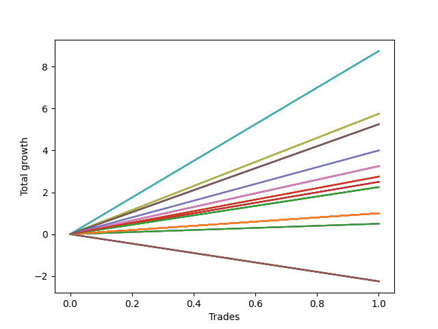

# Short Wallace 001 
- Symbol: ES
- Date Range: 03/18/2022 - 07/15/2022
- Trading Period: 7:20-12:30
- Number of Trades: 2



| Name | Win Percent | Profit | Avg Profit / Trade | Avg Time / Trade |      | Name | Win Percent | Profit | Avg Profit / Trade | Avg Time / Trade |
| ---- | ----------- | ------ | ------------------ | ---------------- | ---- | ---- | ----------- | ------ | ------------------ | ---------------- |
| Sorted By <br> Profit | | | | | | Sorted By <br> Win Percentage ||||
| One Hundred Twenty-Nine | 100.00 | 4250.00 | 2125.00 | 13:37 |     | One Hundred Twenty-Nine | 100.00 | 4250.00 | 2125.00 | 13:37 |
| One Hundred Twenty-Four | 100.00 | 4250.00 | 2125.00 | 13:37 |     | One Hundred Twenty-Four | 100.00 | 4250.00 | 2125.00 | 13:37 |
| One Hundred Fourteen | 100.00 | 4250.00 | 2125.00 | 13:37 |     | One Hundred Fourteen | 100.00 | 4250.00 | 2125.00 | 13:37 |
| Eighty-Four | 100.00 | 4250.00 | 2125.00 | 13:37 |     | Eighty-Four | 100.00 | 4250.00 | 2125.00 | 13:37 |
| One Hundred Twenty-Eight | 100.00 | 2875.00 | 1437.50 | 03:45 |     | One Hundred Twenty-Eight | 100.00 | 2875.00 | 1437.50 | 03:45 |
| One Hundred Twenty-Three | 100.00 | 2875.00 | 1437.50 | 03:45 |     | One Hundred Twenty-Three | 100.00 | 2875.00 | 1437.50 | 03:45 |
| One Hundred Eighteen | 100.00 | 2875.00 | 1437.50 | 03:45 |     | One Hundred Eighteen | 100.00 | 2875.00 | 1437.50 | 03:45 |
| One Hundred Thirteen | 100.00 | 2875.00 | 1437.50 | 03:45 |     | One Hundred Thirteen | 100.00 | 2875.00 | 1437.50 | 03:45 |
| One Hundred Eight | 100.00 | 2875.00 | 1437.50 | 03:45 |     | One Hundred Eight | 100.00 | 2875.00 | 1437.50 | 03:45 |
| One Hundred Three | 100.00 | 2875.00 | 1437.50 | 03:45 |     | One Hundred Three | 100.00 | 2875.00 | 1437.50 | 03:45 |
| Ninety-Eight | 100.00 | 2875.00 | 1437.50 | 03:45 |     | Ninety-Eight | 100.00 | 2875.00 | 1437.50 | 03:45 |
| Ninety-Three | 100.00 | 2875.00 | 1437.50 | 03:45 |     | Ninety-Three | 100.00 | 2875.00 | 1437.50 | 03:45 |
| Eighty-Three | 100.00 | 2875.00 | 1437.50 | 03:45 |     | Eighty-Three | 100.00 | 2875.00 | 1437.50 | 03:45 |
| Ninety-Nine | 100.00 | 2750.00 | 1375.00 | 04:52 |     | Ninety-Nine | 100.00 | 2750.00 | 1375.00 | 04:52 |
| One Hundred Nine | 100.00 | 2500.00 | 1250.00 | 05:07 |     | One Hundred Nine | 100.00 | 2500.00 | 1250.00 | 05:07 |
| Sixty-Four | 100.00 | 2500.00 | 1250.00 | 01:27 |     | Sixty-Four | 100.00 | 2500.00 | 1250.00 | 01:27 |
| Fifty-Six | 100.00 | 2500.00 | 1250.00 | 01:27 |     | Fifty-Six | 100.00 | 2500.00 | 1250.00 | 01:27 |
| Forty-Eight | 100.00 | 2500.00 | 1250.00 | 01:27 |     | Forty-Eight | 100.00 | 2500.00 | 1250.00 | 01:27 |
| Forty | 100.00 | 2500.00 | 1250.00 | 01:27 |     | Forty | 100.00 | 2500.00 | 1250.00 | 01:27 |
| Thirty-Two | 100.00 | 2500.00 | 1250.00 | 01:27 |     | Thirty-Two | 100.00 | 2500.00 | 1250.00 | 01:27 |
| Twenty-Four | 100.00 | 2500.00 | 1250.00 | 01:27 |     | Twenty-Four | 100.00 | 2500.00 | 1250.00 | 01:27 |
| Seventeen | 100.00 | 2500.00 | 1250.00 | 03:50 |     | Seventeen | 100.00 | 2500.00 | 1250.00 | 03:50 |
| Sixten | 100.00 | 2500.00 | 1250.00 | 01:27 |     | Sixten | 100.00 | 2500.00 | 1250.00 | 01:27 |
| Eight | 100.00 | 2500.00 | 1250.00 | 01:27 |     | Eight | 100.00 | 2500.00 | 1250.00 | 01:27 |
| Zero | 100.00 | 2500.00 | 1250.00 | 01:27 |     | Zero | 100.00 | 2500.00 | 1250.00 | 01:27 |
| One Hundred Twenty-Seven | 100.00 | 2250.00 | 1125.00 | 01:52 |     | One Hundred Twenty-Seven | 100.00 | 2250.00 | 1125.00 | 01:52 |
| One Hundred Twenty-Two | 100.00 | 2250.00 | 1125.00 | 01:52 |     | One Hundred Twenty-Two | 100.00 | 2250.00 | 1125.00 | 01:52 |
| One Hundred Seventeen | 100.00 | 2250.00 | 1125.00 | 01:52 |     | One Hundred Seventeen | 100.00 | 2250.00 | 1125.00 | 01:52 |
| One Hundred Twelve | 100.00 | 2250.00 | 1125.00 | 01:52 |     | One Hundred Twelve | 100.00 | 2250.00 | 1125.00 | 01:52 |
| One Hundred Seven | 100.00 | 2250.00 | 1125.00 | 01:52 |     | One Hundred Seven | 100.00 | 2250.00 | 1125.00 | 01:52 |
| One Hundred Two | 100.00 | 2250.00 | 1125.00 | 01:52 |     | One Hundred Two | 100.00 | 2250.00 | 1125.00 | 01:52 |
| Ninety-Seven | 100.00 | 2250.00 | 1125.00 | 01:52 |     | Ninety-Seven | 100.00 | 2250.00 | 1125.00 | 01:52 |
| Ninety-Two | 100.00 | 2250.00 | 1125.00 | 01:52 |     | Ninety-Two | 100.00 | 2250.00 | 1125.00 | 01:52 |
| Eighty-Two | 100.00 | 2250.00 | 1125.00 | 01:52 |     | Eighty-Two | 100.00 | 2250.00 | 1125.00 | 01:52 |
| One Hundred | 100.00 | 1750.00 | 875.00 | 05:12 |     | One Hundred | 100.00 | 1750.00 | 875.00 | 05:12 |
| Twenty-Three | 100.00 | 1750.00 | 875.00 | 05:12 |     | Twenty-Three | 100.00 | 1750.00 | 875.00 | 05:12 |
| Twenty-Two | 100.00 | 1750.00 | 875.00 | 05:12 |     | Twenty-Two | 100.00 | 1750.00 | 875.00 | 05:12 |
| Twenty-One | 100.00 | 1750.00 | 875.00 | 05:12 |     | Twenty-One | 100.00 | 1750.00 | 875.00 | 05:12 |
| Twenty | 100.00 | 1750.00 | 875.00 | 05:12 |     | Twenty | 100.00 | 1750.00 | 875.00 | 05:12 |
| Nineteen | 100.00 | 1750.00 | 875.00 | 01:52 |     | Nineteen | 100.00 | 1750.00 | 875.00 | 01:52 |
| Eighteen | 100.00 | 1750.00 | 875.00 | 05:12 |     | Eighteen | 100.00 | 1750.00 | 875.00 | 05:12 |
| Forty-Seven | 50.00 | 1750.00 | 875.00 | 17:30 |     | Thirty-Three | 100.00 | 1625.00 | 812.50 | 03:55 |
| Thirty-Three | 100.00 | 1625.00 | 812.50 | 03:55 |     | One Hundred Twenty-Six | 100.00 | 1125.00 | 562.50 | 00:55 |
| Seventy-One | 50.00 | 1375.00 | 687.50 | 17:32 |     | One Hundred Twenty-One | 100.00 | 1125.00 | 562.50 | 00:55 |
| One Hundred Twenty-Six | 100.00 | 1125.00 | 562.50 | 00:55 |     | One Hundred Sixteen | 100.00 | 1125.00 | 562.50 | 00:55 |
| One Hundred Twenty-One | 100.00 | 1125.00 | 562.50 | 00:55 |     | One Hundred Eleven | 100.00 | 1125.00 | 562.50 | 00:55 |
| One Hundred Sixteen | 100.00 | 1125.00 | 562.50 | 00:55 |     | One Hundred Six | 100.00 | 1125.00 | 562.50 | 00:55 |
| One Hundred Eleven | 100.00 | 1125.00 | 562.50 | 00:55 |     | One Hundred One | 100.00 | 1125.00 | 562.50 | 00:55 |
| One Hundred Six | 100.00 | 1125.00 | 562.50 | 00:55 |     | Ninety-Six | 100.00 | 1125.00 | 562.50 | 00:55 |
| One Hundred One | 100.00 | 1125.00 | 562.50 | 00:55 |     | Ninety-One | 100.00 | 1125.00 | 562.50 | 00:55 |
| Ninety-Six | 100.00 | 1125.00 | 562.50 | 00:55 |     | Eighty-One | 100.00 | 1125.00 | 562.50 | 00:55 |
| Ninety-One | 100.00 | 1125.00 | 562.50 | 00:55 |     | Seventy-Three | 100.00 | 875.00 | 437.50 | 05:05 |
| Eighty-One | 100.00 | 1125.00 | 562.50 | 00:55 |     | Thirty-Five | 100.00 | 875.00 | 437.50 | 01:57 |
| One Hundred Ninteen | 50.00 | 1125.00 | 562.50 | 07:12 |     | One Hundred Ten | 100.00 | 625.00 | 312.50 | 05:32 |
| Ninety-Four | 50.00 | 1125.00 | 562.50 | 07:12 |     | Thirty-Nine | 100.00 | 625.00 | 312.50 | 05:32 |
| Seventy-Three | 100.00 | 875.00 | 437.50 | 05:05 |     | Thirty-Eight | 100.00 | 625.00 | 312.50 | 05:32 |
| Thirty-Five | 100.00 | 875.00 | 437.50 | 01:57 |     | Thirty-Seven | 100.00 | 625.00 | 312.50 | 05:32 |
| Forty-Nine | 50.00 | 875.00 | 437.50 | 04:15 |     | Thirty-Six | 100.00 | 625.00 | 312.50 | 05:32 |
| One Hundred Ten | 100.00 | 625.00 | 312.50 | 05:32 |     | Thirty-Four | 100.00 | 625.00 | 312.50 | 05:32 |
| Thirty-Nine | 100.00 | 625.00 | 312.50 | 05:32 |     | Forty-Seven | 50.00 | 1750.00 | 875.00 | 17:30 |
| Thirty-Eight | 100.00 | 625.00 | 312.50 | 05:32 |     | Seventy-One | 50.00 | 1375.00 | 687.50 | 17:32 |
| Thirty-Seven | 100.00 | 625.00 | 312.50 | 05:32 |     | One Hundred Ninteen | 50.00 | 1125.00 | 562.50 | 07:12 |
| Thirty-Six | 100.00 | 625.00 | 312.50 | 05:32 |     | Ninety-Four | 50.00 | 1125.00 | 562.50 | 07:12 |
| Thirty-Four | 100.00 | 625.00 | 312.50 | 05:32 |     | Forty-Nine | 50.00 | 875.00 | 437.50 | 04:15 |
| One Hundred Four | 50.00 | 500.00 | 250.00 | 07:15 |     | One Hundred Four | 50.00 | 500.00 | 250.00 | 07:15 |
| Forty-Six | 50.00 | 500.00 | 250.00 | 16:42 |     | Forty-Six | 50.00 | 500.00 | 250.00 | 16:42 |
| Nine | 50.00 | 250.00 | 125.00 | 04:25 |     | Nine | 50.00 | 250.00 | 125.00 | 04:25 |
| Seventy | 50.00 | 125.00 | 62.50 | 16:45 |     | Seventy | 50.00 | 125.00 | 62.50 | 16:45 |
| Fifty-One | 50.00 | 125.00 | 62.50 | 02:17 |     | Fifty-One | 50.00 | 125.00 | 62.50 | 02:17 |
| Forty-Five | 50.00 | 125.00 | 62.50 | 16:35 |     | Forty-Five | 50.00 | 125.00 | 62.50 | 16:35 |
| One Hundred Fifteen | 50.00 | -0.00 | -0.00 | 16:10 |     | One Hundred Fifteen | 50.00 | -0.00 | -0.00 | 16:10 |
| One | 50.00 | -0.00 | -0.00 | 13:35 |     | One | 50.00 | -0.00 | -0.00 | 13:35 |
| Sixty-Nine | 50.00 | -250.00 | -125.00 | 16:37 |     | Sixty-Nine | 50.00 | -250.00 | -125.00 | 16:37 |
| One Hundred Thirty | 50.00 | -375.00 | -187.50 | 16:12 |     | One Hundred Thirty | 50.00 | -375.00 | -187.50 | 16:12 |
| Twenty-Five | 50.00 | -375.00 | -187.50 | 04:32 |     | Twenty-Five | 50.00 | -375.00 | -187.50 | 04:32 |
| Eleven | 50.00 | -500.00 | -250.00 | 02:27 |     | Eleven | 50.00 | -500.00 | -250.00 | 02:27 |
| Forty-Four | 50.00 | -1000.00 | -500.00 | 14:35 |     | Forty-Four | 50.00 | -1000.00 | -500.00 | 14:35 |
| Forty-Two | 50.00 | -1000.00 | -500.00 | 14:30 |     | Forty-Two | 50.00 | -1000.00 | -500.00 | 14:30 |
| twenty-Seven | 50.00 | -1125.00 | -562.50 | 02:35 |     | twenty-Seven | 50.00 | -1125.00 | -562.50 | 02:35 |
| Sixty-Eight | 50.00 | -1375.00 | -687.50 | 14:37 |     | Sixty-Eight | 50.00 | -1375.00 | -687.50 | 14:37 |
| Sixty-Six | 50.00 | -1375.00 | -687.50 | 14:32 |     | Sixty-Six | 50.00 | -1375.00 | -687.50 | 14:32 |
| Forty-One | 50.00 | -1375.00 | -687.50 | 04:40 |     | Forty-One | 50.00 | -1375.00 | -687.50 | 04:40 |
| Sixty-Three | 50.00 | -1500.00 | -750.00 | 19:45 |     | Sixty-Three | 50.00 | -1500.00 | -750.00 | 19:45 |
| One Hundred Twenty | 0.00 | -1500.00 | -750.00 | 07:57 |     | Sixty-Five | 50.00 | -1750.00 | -875.00 | 04:42 |
| Fifty-Five | 0.00 | -1500.00 | -750.00 | 07:57 |     | Forty-Three | 50.00 | -2125.00 | -1062.50 | 02:42 |
| Fifty-Four | 0.00 | -1500.00 | -750.00 | 07:57 |     | Sixty-Seven | 50.00 | -2500.00 | -1250.00 | 02:45 |
| Fifty-Three | 0.00 | -1500.00 | -750.00 | 07:57 |     | Sixty-Two | 50.00 | -2750.00 | -1375.00 | 18:57 |
| Fifty-Two | 0.00 | -1500.00 | -750.00 | 07:57 |     | Sixty-One | 50.00 | -3125.00 | -1562.50 | 18:50 |
| Fifty | 0.00 | -1500.00 | -750.00 | 07:57 |     | One Hundred Twenty-Five | 50.00 | -3250.00 | -1625.00 | 18:25 |
| Sixty-Five | 50.00 | -1750.00 | -875.00 | 04:42 |     | Sixty | 50.00 | -4250.00 | -2125.00 | 16:50 |
| Forty-Three | 50.00 | -2125.00 | -1062.50 | 02:42 |     | Fifty-Eight | 50.00 | -4250.00 | -2125.00 | 16:45 |
| Ninety-Five | 0.00 | -2125.00 | -1062.50 | 08:07 |     | Fifty-Seven | 50.00 | -4625.00 | -2312.50 | 06:55 |
| Fifteen | 0.00 | -2125.00 | -1062.50 | 08:07 |     | Fifty-Nine | 50.00 | -5375.00 | -2687.50 | 04:57 |
| Fourteen | 0.00 | -2125.00 | -1062.50 | 08:07 |     | Seven | 50.00 | -7875.00 | -3937.50 | 29:55 |
| Thirteen | 0.00 | -2125.00 | -1062.50 | 08:07 |     | Six | 50.00 | -9125.00 | -4562.50 | 29:07 |
| Twelve | 0.00 | -2125.00 | -1062.50 | 08:07 |     | Five | 50.00 | -9500.00 | -4750.00 | 29:00 |
| Ten | 0.00 | -2125.00 | -1062.50 | 08:07 |     | Eighty-Five | 50.00 | -9625.00 | -4812.50 | 28:35 |
| Sixty-Seven | 50.00 | -2500.00 | -1250.00 | 02:45 |     | Four | 50.00 | -10625.00 | -5312.50 | 27:00 |
| Sixty-Two | 50.00 | -2750.00 | -1375.00 | 18:57 |     | Two | 50.00 | -10625.00 | -5312.50 | 26:55 |
| Sixty-One | 50.00 | -3125.00 | -1562.50 | 18:50 |     | Three | 50.00 | -11750.00 | -5875.00 | 15:07 |
| One Hundred Twenty-Five | 50.00 | -3250.00 | -1625.00 | 18:25 |     | One Hundred Twenty | 0.00 | -1500.00 | -750.00 | 07:57 |
| One Hundred Five | 0.00 | -3375.00 | -1687.50 | 08:17 |     | Fifty-Five | 0.00 | -1500.00 | -750.00 | 07:57 |
| Thirty-One | 0.00 | -3375.00 | -1687.50 | 08:17 |     | Fifty-Four | 0.00 | -1500.00 | -750.00 | 07:57 |
| Thirty | 0.00 | -3375.00 | -1687.50 | 08:17 |     | Fifty-Three | 0.00 | -1500.00 | -750.00 | 07:57 |
| Twenty-Nine | 0.00 | -3375.00 | -1687.50 | 08:17 |     | Fifty-Two | 0.00 | -1500.00 | -750.00 | 07:57 |
| Twenty-Eight | 0.00 | -3375.00 | -1687.50 | 08:17 |     | Fifty | 0.00 | -1500.00 | -750.00 | 07:57 |
| Twenty-Six | 0.00 | -3375.00 | -1687.50 | 08:17 |     | Ninety-Five | 0.00 | -2125.00 | -1062.50 | 08:07 |
| Sixty | 50.00 | -4250.00 | -2125.00 | 16:50 |     | Fifteen | 0.00 | -2125.00 | -1062.50 | 08:07 |
| Fifty-Eight | 50.00 | -4250.00 | -2125.00 | 16:45 |     | Fourteen | 0.00 | -2125.00 | -1062.50 | 08:07 |
| Fifty-Seven | 50.00 | -4625.00 | -2312.50 | 06:55 |     | Thirteen | 0.00 | -2125.00 | -1062.50 | 08:07 |
| Fifty-Nine | 50.00 | -5375.00 | -2687.50 | 04:57 |     | Twelve | 0.00 | -2125.00 | -1062.50 | 08:07 |
| Seven | 50.00 | -7875.00 | -3937.50 | 29:55 |     | Ten | 0.00 | -2125.00 | -1062.50 | 08:07 |
| Six | 50.00 | -9125.00 | -4562.50 | 29:07 |     | One Hundred Five | 0.00 | -3375.00 | -1687.50 | 08:17 |
| Five | 50.00 | -9500.00 | -4750.00 | 29:00 |     | Thirty-One | 0.00 | -3375.00 | -1687.50 | 08:17 |
| Eighty-Five | 50.00 | -9625.00 | -4812.50 | 28:35 |     | Thirty | 0.00 | -3375.00 | -1687.50 | 08:17 |
| Four | 50.00 | -10625.00 | -5312.50 | 27:00 |     | Twenty-Nine | 0.00 | -3375.00 | -1687.50 | 08:17 |
| Two | 50.00 | -10625.00 | -5312.50 | 26:55 |     | Twenty-Eight | 0.00 | -3375.00 | -1687.50 | 08:17 |
| Three | 50.00 | -11750.00 | -5875.00 | 15:07 |     | Twenty-Six | 0.00 | -3375.00 | -1687.50 | 08:17 |

## NO STOPLOSS

### Test Zero
* Sell when price hits the middle line of the 20p bollinger
* No Stoploss
* Results:
```
Total Trades: 2
Percent Up: 0.00
Percent Down: 100.00
Total Points Moved Down: 5.00
Potential Profit: 2500.00
Total Points Ups: 0.00 Count Ups: 0
Total Points Downs: 5.00 Count Downs: 2
```

<details><summary>Trades</summary>

<code>In: 2022-04-20 10:50:00		Out: 2022-04-20 10:50:10		Total Position Time: 00:10		Total Move Down: 0.50		Total to Date: 0.50</code> <br />
<code>In: 2022-07-14 08:13:00		Out: 2022-07-14 08:15:45		Total Position Time: 02:45		Total Move Down: 4.50		Total to Date: 5.00</code> <br />


</details>

### Test One
* Sell when the price hits the upper line of the 20p 1std bollinger
* No Stoploss
* Results:
```
Total Trades: 2
Percent Up: 50.00
Percent Down: 50.00
Total Points Moved Down: -0.00
Potential Profit: -0.00
Total Points Ups: 2.50 Count Ups: 1
Total Points Downs: 2.50 Count Downs: 1
```

<details><summary>Trades</summary>

<code>In: 2022-04-20 10:50:00		Out: 2022-04-20 10:54:15		Total Position Time: 04:15		Total Move Down: 2.50		Total to Date: 2.50</code> <br />
<code>In: 2022-07-14 08:13:00		Out: 2022-07-14 08:35:55		Total Position Time: 22:55		Total Move Down: -2.50		Total to Date: 0.00</code> <br />


</details>

### Test Two
* Sell when the price hits the upper line of the 20p 2std bollinger
* No Stoploss
* Results:
```
Total Trades: 2
Percent Up: 50.00
Percent Down: 50.00
Total Points Moved Down: -21.25
Potential Profit: -10625.00
Total Points Ups: 24.50 Count Ups: 1
Total Points Downs: 3.25 Count Downs: 1
```

<details><summary>Trades</summary>

<code>In: 2022-04-20 10:50:00		Out: 2022-04-20 11:13:55		Total Position Time: 23:55		Total Move Down: 3.25		Total to Date: 3.25</code> <br />
<code>In: 2022-07-14 08:13:00		Out: 2022-07-14 08:42:55		Total Position Time: 29:55		Total Move Down: -24.50		Total to Date: -21.25</code> <br />


</details>

### Test Three
* Sell when price hits the middle line of the 50p bollinger
* No Stoploss
* Results:
```
Total Trades: 2
Percent Up: 50.00
Percent Down: 50.00
Total Points Moved Down: -23.50
Potential Profit: -11750.00
Total Points Ups: 24.50 Count Ups: 1
Total Points Downs: 1.00 Count Downs: 1
```

<details><summary>Trades</summary>

<code>In: 2022-04-20 10:50:00		Out: 2022-04-20 10:50:20		Total Position Time: 00:20		Total Move Down: 1.00		Total to Date: 1.00</code> <br />
<code>In: 2022-07-14 08:13:00		Out: 2022-07-14 08:42:55		Total Position Time: 29:55		Total Move Down: -24.50		Total to Date: -23.50</code> <br />


</details>

### Test Four
* Sell when the price hits the upper line of the 50p 1std bollinger
* No Stoploss
* Results:
```
Total Trades: 2
Percent Up: 50.00
Percent Down: 50.00
Total Points Moved Down: -21.25
Potential Profit: -10625.00
Total Points Ups: 24.50 Count Ups: 1
Total Points Downs: 3.25 Count Downs: 1
```

<details><summary>Trades</summary>

<code>In: 2022-04-20 10:50:00		Out: 2022-04-20 11:14:05		Total Position Time: 24:05		Total Move Down: 3.25		Total to Date: 3.25</code> <br />
<code>In: 2022-07-14 08:13:00		Out: 2022-07-14 08:42:55		Total Position Time: 29:55		Total Move Down: -24.50		Total to Date: -21.25</code> <br />


</details>

### Test Five
* Sell when the price hits the upper line of the 50p 2std bollinger
* No Stoploss
* Results:
```
Total Trades: 2
Percent Up: 50.00
Percent Down: 50.00
Total Points Moved Down: -19.00
Potential Profit: -9500.00
Total Points Ups: 24.50 Count Ups: 1
Total Points Downs: 5.50 Count Downs: 1
```

<details><summary>Trades</summary>

<code>In: 2022-04-20 10:50:00		Out: 2022-04-20 11:18:05		Total Position Time: 28:05		Total Move Down: 5.50		Total to Date: 5.50</code> <br />
<code>In: 2022-07-14 08:13:00		Out: 2022-07-14 08:42:55		Total Position Time: 29:55		Total Move Down: -24.50		Total to Date: -19.00</code> <br />


</details>

### Test Six
* Sell when the price hits the middle line of the 1std VWAP
* No Stoploss
* Results:
```
Total Trades: 2
Percent Up: 50.00
Percent Down: 50.00
Total Points Moved Down: -18.25
Potential Profit: -9125.00
Total Points Ups: 24.50 Count Ups: 1
Total Points Downs: 6.25 Count Downs: 1
```

<details><summary>Trades</summary>

<code>In: 2022-04-20 10:50:00		Out: 2022-04-20 11:18:20		Total Position Time: 28:20		Total Move Down: 6.25		Total to Date: 6.25</code> <br />
<code>In: 2022-07-14 08:13:00		Out: 2022-07-14 08:42:55		Total Position Time: 29:55		Total Move Down: -24.50		Total to Date: -18.25</code> <br />


</details>

### Test Seven
* Sell when the price hits the upper line of the 1std VWAP
* No Stoploss
* Results:
```
Total Trades: 2
Percent Up: 50.00
Percent Down: 50.00
Total Points Moved Down: -15.75
Potential Profit: -7875.00
Total Points Ups: 24.50 Count Ups: 1
Total Points Downs: 8.75 Count Downs: 1
```

<details><summary>Trades</summary>

<code>In: 2022-04-20 10:50:00		Out: 2022-04-20 11:19:55		Total Position Time: 29:55		Total Move Down: 8.75		Total to Date: 8.75</code> <br />
<code>In: 2022-07-14 08:13:00		Out: 2022-07-14 08:42:55		Total Position Time: 29:55		Total Move Down: -24.50		Total to Date: -15.75</code> <br />


</details>

## STOPLOSS OF 2

### Test Eight
* Sell when price hits the middle line of the 20p bollinger
* Stoploss is -2 points
* Results:
```
Total Trades: 2
Percent Up: 0.00
Percent Down: 100.00
Total Points Moved Down: 5.00
Potential Profit: 2500.00
Total Points Ups: 0.00 Count Ups: 0
Total Points Downs: 5.00 Count Downs: 2
```

<details><summary>Trades</summary>

<code>In: 2022-04-20 10:50:00		Out: 2022-04-20 10:50:10		Total Position Time: 00:10		Total Move Down: 0.50		Total to Date: 0.50</code> <br />
<code>In: 2022-07-14 08:13:00		Out: 2022-07-14 08:15:45		Total Position Time: 02:45		Total Move Down: 4.50		Total to Date: 5.00</code> <br />


</details>

### Test Nine
* Sell when the price hits the upper line of the 20p 1std bollinger
* Stoploss is -2 points
* Results:
```
Total Trades: 2
Percent Up: 50.00
Percent Down: 50.00
Total Points Moved Down: 0.50
Potential Profit: 250.00
Total Points Ups: 2.00 Count Ups: 1
Total Points Downs: 2.50 Count Downs: 1
```

<details><summary>Trades</summary>

<code>In: 2022-04-20 10:50:00		Out: 2022-04-20 10:54:15		Total Position Time: 04:15		Total Move Down: 2.50		Total to Date: 2.50</code> <br />
<code>In: 2022-07-14 08:13:00		Out: 2022-07-14 08:17:35		Total Position Time: 04:35		Total Move Down: -2.00		Total to Date: 0.50</code> <br />


</details>

### Test Ten
* Sell when the price hits the upper line of the 20p 2std bollinger
* Stoploss is -2 points
* Results:
```
Total Trades: 2
Percent Up: 100.00
Percent Down: 0.00
Total Points Moved Down: -4.25
Potential Profit: -2125.00
Total Points Ups: 4.25 Count Ups: 2
Total Points Downs: 0.00 Count Downs: 0
```

<details><summary>Trades</summary>

<code>In: 2022-04-20 10:50:00		Out: 2022-04-20 11:01:40		Total Position Time: 11:40		Total Move Down: -2.25		Total to Date: -2.25</code> <br />
<code>In: 2022-07-14 08:13:00		Out: 2022-07-14 08:17:35		Total Position Time: 04:35		Total Move Down: -2.00		Total to Date: -4.25</code> <br />


</details>

### Test Eleven
* Sell when price hits the middle line of the 50p bollinger
* Stoploss is -2 points
* Results:
```
Total Trades: 2
Percent Up: 50.00
Percent Down: 50.00
Total Points Moved Down: -1.00
Potential Profit: -500.00
Total Points Ups: 2.00 Count Ups: 1
Total Points Downs: 1.00 Count Downs: 1
```

<details><summary>Trades</summary>

<code>In: 2022-04-20 10:50:00		Out: 2022-04-20 10:50:20		Total Position Time: 00:20		Total Move Down: 1.00		Total to Date: 1.00</code> <br />
<code>In: 2022-07-14 08:13:00		Out: 2022-07-14 08:17:35		Total Position Time: 04:35		Total Move Down: -2.00		Total to Date: -1.00</code> <br />


</details>

### Test Twelve
* Sell when the price hits the upper line of the 50p 1std bollinger
* Stoploss is -2 points
* Results:
```
Total Trades: 2
Percent Up: 100.00
Percent Down: 0.00
Total Points Moved Down: -4.25
Potential Profit: -2125.00
Total Points Ups: 4.25 Count Ups: 2
Total Points Downs: 0.00 Count Downs: 0
```

<details><summary>Trades</summary>

<code>In: 2022-04-20 10:50:00		Out: 2022-04-20 11:01:40		Total Position Time: 11:40		Total Move Down: -2.25		Total to Date: -2.25</code> <br />
<code>In: 2022-07-14 08:13:00		Out: 2022-07-14 08:17:35		Total Position Time: 04:35		Total Move Down: -2.00		Total to Date: -4.25</code> <br />


</details>

### Test Thirteen
* Sell when the price hits the upper line of the 50p 2std bollinger
* Stoploss is -2 points
* Results:
```
Total Trades: 2
Percent Up: 100.00
Percent Down: 0.00
Total Points Moved Down: -4.25
Potential Profit: -2125.00
Total Points Ups: 4.25 Count Ups: 2
Total Points Downs: 0.00 Count Downs: 0
```

<details><summary>Trades</summary>

<code>In: 2022-04-20 10:50:00		Out: 2022-04-20 11:01:40		Total Position Time: 11:40		Total Move Down: -2.25		Total to Date: -2.25</code> <br />
<code>In: 2022-07-14 08:13:00		Out: 2022-07-14 08:17:35		Total Position Time: 04:35		Total Move Down: -2.00		Total to Date: -4.25</code> <br />


</details>

### Test Fourteen
* Sell when the price hits the middle line of the 1std VWAP
* Stoploss is -2 points
* Results:
```
Total Trades: 2
Percent Up: 100.00
Percent Down: 0.00
Total Points Moved Down: -4.25
Potential Profit: -2125.00
Total Points Ups: 4.25 Count Ups: 2
Total Points Downs: 0.00 Count Downs: 0
```

<details><summary>Trades</summary>

<code>In: 2022-04-20 10:50:00		Out: 2022-04-20 11:01:40		Total Position Time: 11:40		Total Move Down: -2.25		Total to Date: -2.25</code> <br />
<code>In: 2022-07-14 08:13:00		Out: 2022-07-14 08:17:35		Total Position Time: 04:35		Total Move Down: -2.00		Total to Date: -4.25</code> <br />


</details>

### Test Fifteen
* Sell when the price hits the upper line of the 1std VWAP
* Stoploss is -2 points
* Results:
```
Total Trades: 2
Percent Up: 100.00
Percent Down: 0.00
Total Points Moved Down: -4.25
Potential Profit: -2125.00
Total Points Ups: 4.25 Count Ups: 2
Total Points Downs: 0.00 Count Downs: 0
```

<details><summary>Trades</summary>

<code>In: 2022-04-20 10:50:00		Out: 2022-04-20 11:01:40		Total Position Time: 11:40		Total Move Down: -2.25		Total to Date: -2.25</code> <br />
<code>In: 2022-07-14 08:13:00		Out: 2022-07-14 08:17:35		Total Position Time: 04:35		Total Move Down: -2.00		Total to Date: -4.25</code> <br />


</details>

## TRAIL STOP OF 2

### Test Sixten
* Sell when price hits the middle line of the 20p bollinger
* Trailing Stop is -2 points
* Results:
```
Total Trades: 2
Percent Up: 0.00
Percent Down: 100.00
Total Points Moved Down: 5.00
Potential Profit: 2500.00
Total Points Ups: 0.00 Count Ups: 0
Total Points Downs: 5.00 Count Downs: 2
```

<details><summary>Trades</summary>

<code>In: 2022-04-20 10:50:00		Out: 2022-04-20 10:50:10		Total Position Time: 00:10		Total Move Down: 0.50		Total to Date: 0.50</code> <br />
<code>In: 2022-07-14 08:13:00		Out: 2022-07-14 08:15:45		Total Position Time: 02:45		Total Move Down: 4.50		Total to Date: 5.00</code> <br />


</details>

### Test Seventeen
* Sell when the price hits the upper line of the 20p 1std bollinger
* Trailing Stop is -2 points
* Results:
```
Total Trades: 2
Percent Up: 0.00
Percent Down: 100.00
Total Points Moved Down: 5.00
Potential Profit: 2500.00
Total Points Ups: 0.00 Count Ups: 0
Total Points Downs: 5.00 Count Downs: 2
```

<details><summary>Trades</summary>

<code>In: 2022-04-20 10:50:00		Out: 2022-04-20 10:54:15		Total Position Time: 04:15		Total Move Down: 2.50		Total to Date: 2.50</code> <br />
<code>In: 2022-07-14 08:13:00		Out: 2022-07-14 08:16:25		Total Position Time: 03:25		Total Move Down: 2.50		Total to Date: 5.00</code> <br />


</details>

### Test Eighteen
* Sell when the price hits the upper line of the 20p 2std bollinger
* Trailing Stop is -2 points
* Results:
```
Total Trades: 2
Percent Up: 0.00
Percent Down: 100.00
Total Points Moved Down: 3.50
Potential Profit: 1750.00
Total Points Ups: 0.00 Count Ups: 0
Total Points Downs: 3.50 Count Downs: 2
```

<details><summary>Trades</summary>

<code>In: 2022-04-20 10:50:00		Out: 2022-04-20 10:57:00		Total Position Time: 07:00		Total Move Down: 1.00		Total to Date: 1.00</code> <br />
<code>In: 2022-07-14 08:13:00		Out: 2022-07-14 08:16:25		Total Position Time: 03:25		Total Move Down: 2.50		Total to Date: 3.50</code> <br />


</details>

### Test Nineteen
* Sell when price hits the middle line of the 50p bollinger
* Trailing Stop is -2 points
* Results:
```
Total Trades: 2
Percent Up: 0.00
Percent Down: 100.00
Total Points Moved Down: 3.50
Potential Profit: 1750.00
Total Points Ups: 0.00 Count Ups: 0
Total Points Downs: 3.50 Count Downs: 2
```

<details><summary>Trades</summary>

<code>In: 2022-04-20 10:50:00		Out: 2022-04-20 10:50:20		Total Position Time: 00:20		Total Move Down: 1.00		Total to Date: 1.00</code> <br />
<code>In: 2022-07-14 08:13:00		Out: 2022-07-14 08:16:25		Total Position Time: 03:25		Total Move Down: 2.50		Total to Date: 3.50</code> <br />


</details>

### Test Twenty
* Sell when the price hits the upper line of the 50p 1std bollinger
* Trailing Stop is -2 points
* Results:
```
Total Trades: 2
Percent Up: 0.00
Percent Down: 100.00
Total Points Moved Down: 3.50
Potential Profit: 1750.00
Total Points Ups: 0.00 Count Ups: 0
Total Points Downs: 3.50 Count Downs: 2
```

<details><summary>Trades</summary>

<code>In: 2022-04-20 10:50:00		Out: 2022-04-20 10:57:00		Total Position Time: 07:00		Total Move Down: 1.00		Total to Date: 1.00</code> <br />
<code>In: 2022-07-14 08:13:00		Out: 2022-07-14 08:16:25		Total Position Time: 03:25		Total Move Down: 2.50		Total to Date: 3.50</code> <br />


</details>

### Test Twenty-One
* Sell when the price hits the upper line of the 50p 2std bollinger
* Trailing Stop is -2 points
* Results:
```
Total Trades: 2
Percent Up: 0.00
Percent Down: 100.00
Total Points Moved Down: 3.50
Potential Profit: 1750.00
Total Points Ups: 0.00 Count Ups: 0
Total Points Downs: 3.50 Count Downs: 2
```

<details><summary>Trades</summary>

<code>In: 2022-04-20 10:50:00		Out: 2022-04-20 10:57:00		Total Position Time: 07:00		Total Move Down: 1.00		Total to Date: 1.00</code> <br />
<code>In: 2022-07-14 08:13:00		Out: 2022-07-14 08:16:25		Total Position Time: 03:25		Total Move Down: 2.50		Total to Date: 3.50</code> <br />


</details>

### Test Twenty-Two
* Sell when the price hits the middle line of the 1std VWAP
* Trailing Stop is -2 points
* Results:
```
Total Trades: 2
Percent Up: 0.00
Percent Down: 100.00
Total Points Moved Down: 3.50
Potential Profit: 1750.00
Total Points Ups: 0.00 Count Ups: 0
Total Points Downs: 3.50 Count Downs: 2
```

<details><summary>Trades</summary>

<code>In: 2022-04-20 10:50:00		Out: 2022-04-20 10:57:00		Total Position Time: 07:00		Total Move Down: 1.00		Total to Date: 1.00</code> <br />
<code>In: 2022-07-14 08:13:00		Out: 2022-07-14 08:16:25		Total Position Time: 03:25		Total Move Down: 2.50		Total to Date: 3.50</code> <br />


</details>

### Test Twenty-Three
* Sell when the price hits the upper line of the 1std VWAP
* Trailing Stop is -2 points
* Results:
```
Total Trades: 2
Percent Up: 0.00
Percent Down: 100.00
Total Points Moved Down: 3.50
Potential Profit: 1750.00
Total Points Ups: 0.00 Count Ups: 0
Total Points Downs: 3.50 Count Downs: 2
```

<details><summary>Trades</summary>

<code>In: 2022-04-20 10:50:00		Out: 2022-04-20 10:57:00		Total Position Time: 07:00		Total Move Down: 1.00		Total to Date: 1.00</code> <br />
<code>In: 2022-07-14 08:13:00		Out: 2022-07-14 08:16:25		Total Position Time: 03:25		Total Move Down: 2.50		Total to Date: 3.50</code> <br />


</details>

## STOPLOSS OF 3

### Test Twenty-Four
* Sell when price hits the middle line of the 20p bollinger
* Stoploss is -3 points
* Results:
```
Total Trades: 2
Percent Up: 0.00
Percent Down: 100.00
Total Points Moved Down: 5.00
Potential Profit: 2500.00
Total Points Ups: 0.00 Count Ups: 0
Total Points Downs: 5.00 Count Downs: 2
```

<details><summary>Trades</summary>

<code>In: 2022-04-20 10:50:00		Out: 2022-04-20 10:50:10		Total Position Time: 00:10		Total Move Down: 0.50		Total to Date: 0.50</code> <br />
<code>In: 2022-07-14 08:13:00		Out: 2022-07-14 08:15:45		Total Position Time: 02:45		Total Move Down: 4.50		Total to Date: 5.00</code> <br />


</details>

### Test Twenty-Five
* Sell when the price hits the upper line of the 20p 1std bollinger
* Stoploss is -3 points
* Results:
```
Total Trades: 2
Percent Up: 50.00
Percent Down: 50.00
Total Points Moved Down: -0.75
Potential Profit: -375.00
Total Points Ups: 3.25 Count Ups: 1
Total Points Downs: 2.50 Count Downs: 1
```

<details><summary>Trades</summary>

<code>In: 2022-04-20 10:50:00		Out: 2022-04-20 10:54:15		Total Position Time: 04:15		Total Move Down: 2.50		Total to Date: 2.50</code> <br />
<code>In: 2022-07-14 08:13:00		Out: 2022-07-14 08:17:50		Total Position Time: 04:50		Total Move Down: -3.25		Total to Date: -0.75</code> <br />


</details>

### Test Twenty-Six
* Sell when the price hits the upper line of the 20p 2std bollinger
* Stoploss is -3 points
* Results:
```
Total Trades: 2
Percent Up: 100.00
Percent Down: 0.00
Total Points Moved Down: -6.75
Potential Profit: -3375.00
Total Points Ups: 6.75 Count Ups: 2
Total Points Downs: 0.00 Count Downs: 0
```

<details><summary>Trades</summary>

<code>In: 2022-04-20 10:50:00		Out: 2022-04-20 11:01:45		Total Position Time: 11:45		Total Move Down: -3.50		Total to Date: -3.50</code> <br />
<code>In: 2022-07-14 08:13:00		Out: 2022-07-14 08:17:50		Total Position Time: 04:50		Total Move Down: -3.25		Total to Date: -6.75</code> <br />


</details>

### Test twenty-Seven
* Sell when price hits the middle line of the 50p bollinger
* Stoploss is -3 points
* Results:
```
Total Trades: 2
Percent Up: 50.00
Percent Down: 50.00
Total Points Moved Down: -2.25
Potential Profit: -1125.00
Total Points Ups: 3.25 Count Ups: 1
Total Points Downs: 1.00 Count Downs: 1
```

<details><summary>Trades</summary>

<code>In: 2022-04-20 10:50:00		Out: 2022-04-20 10:50:20		Total Position Time: 00:20		Total Move Down: 1.00		Total to Date: 1.00</code> <br />
<code>In: 2022-07-14 08:13:00		Out: 2022-07-14 08:17:50		Total Position Time: 04:50		Total Move Down: -3.25		Total to Date: -2.25</code> <br />


</details>

### Test Twenty-Eight
* Sell when the price hits the upper line of the 50p 1std bollinger
* Stoploss is -3 points
* Results:
```
Total Trades: 2
Percent Up: 100.00
Percent Down: 0.00
Total Points Moved Down: -6.75
Potential Profit: -3375.00
Total Points Ups: 6.75 Count Ups: 2
Total Points Downs: 0.00 Count Downs: 0
```

<details><summary>Trades</summary>

<code>In: 2022-04-20 10:50:00		Out: 2022-04-20 11:01:45		Total Position Time: 11:45		Total Move Down: -3.50		Total to Date: -3.50</code> <br />
<code>In: 2022-07-14 08:13:00		Out: 2022-07-14 08:17:50		Total Position Time: 04:50		Total Move Down: -3.25		Total to Date: -6.75</code> <br />


</details>

### Test Twenty-Nine
* Sell when the price hits the upper line of the 50p 2std bollinger
* Stoploss is -3 points
* Results:
```
Total Trades: 2
Percent Up: 100.00
Percent Down: 0.00
Total Points Moved Down: -6.75
Potential Profit: -3375.00
Total Points Ups: 6.75 Count Ups: 2
Total Points Downs: 0.00 Count Downs: 0
```

<details><summary>Trades</summary>

<code>In: 2022-04-20 10:50:00		Out: 2022-04-20 11:01:45		Total Position Time: 11:45		Total Move Down: -3.50		Total to Date: -3.50</code> <br />
<code>In: 2022-07-14 08:13:00		Out: 2022-07-14 08:17:50		Total Position Time: 04:50		Total Move Down: -3.25		Total to Date: -6.75</code> <br />


</details>

### Test Thirty
* Sell when the price hits the middle line of the 1std VWAP
* Stoploss is -3 points
* Results:
```
Total Trades: 2
Percent Up: 100.00
Percent Down: 0.00
Total Points Moved Down: -6.75
Potential Profit: -3375.00
Total Points Ups: 6.75 Count Ups: 2
Total Points Downs: 0.00 Count Downs: 0
```

<details><summary>Trades</summary>

<code>In: 2022-04-20 10:50:00		Out: 2022-04-20 11:01:45		Total Position Time: 11:45		Total Move Down: -3.50		Total to Date: -3.50</code> <br />
<code>In: 2022-07-14 08:13:00		Out: 2022-07-14 08:17:50		Total Position Time: 04:50		Total Move Down: -3.25		Total to Date: -6.75</code> <br />


</details>

### Test Thirty-One
* Sell when the price hits the upper line of the 1std VWAP
* Stoploss is -3 points
* Results:
```
Total Trades: 2
Percent Up: 100.00
Percent Down: 0.00
Total Points Moved Down: -6.75
Potential Profit: -3375.00
Total Points Ups: 6.75 Count Ups: 2
Total Points Downs: 0.00 Count Downs: 0
```

<details><summary>Trades</summary>

<code>In: 2022-04-20 10:50:00		Out: 2022-04-20 11:01:45		Total Position Time: 11:45		Total Move Down: -3.50		Total to Date: -3.50</code> <br />
<code>In: 2022-07-14 08:13:00		Out: 2022-07-14 08:17:50		Total Position Time: 04:50		Total Move Down: -3.25		Total to Date: -6.75</code> <br />


</details>

## TRAIL STOP OF 3

### Test Thirty-Two
* Sell when price hits the middle line of the 20p bollinger
* Trailing Stop is -3 points
* Results:
```
Total Trades: 2
Percent Up: 0.00
Percent Down: 100.00
Total Points Moved Down: 5.00
Potential Profit: 2500.00
Total Points Ups: 0.00 Count Ups: 0
Total Points Downs: 5.00 Count Downs: 2
```

<details><summary>Trades</summary>

<code>In: 2022-04-20 10:50:00		Out: 2022-04-20 10:50:10		Total Position Time: 00:10		Total Move Down: 0.50		Total to Date: 0.50</code> <br />
<code>In: 2022-07-14 08:13:00		Out: 2022-07-14 08:15:45		Total Position Time: 02:45		Total Move Down: 4.50		Total to Date: 5.00</code> <br />


</details>

### Test Thirty-Three
* Sell when the price hits the upper line of the 20p 1std bollinger
* Trailing Stop is -3 points
* Results:
```
Total Trades: 2
Percent Up: 0.00
Percent Down: 100.00
Total Points Moved Down: 3.25
Potential Profit: 1625.00
Total Points Ups: 0.00 Count Ups: 0
Total Points Downs: 3.25 Count Downs: 2
```

<details><summary>Trades</summary>

<code>In: 2022-04-20 10:50:00		Out: 2022-04-20 10:54:15		Total Position Time: 04:15		Total Move Down: 2.50		Total to Date: 2.50</code> <br />
<code>In: 2022-07-14 08:13:00		Out: 2022-07-14 08:16:35		Total Position Time: 03:35		Total Move Down: 0.75		Total to Date: 3.25</code> <br />


</details>

### Test Thirty-Four
* Sell when the price hits the upper line of the 20p 2std bollinger
* Trailing Stop is -3 points
* Results:
```
Total Trades: 2
Percent Up: 0.00
Percent Down: 100.00
Total Points Moved Down: 1.25
Potential Profit: 625.00
Total Points Ups: 0.00 Count Ups: 0
Total Points Downs: 1.25 Count Downs: 2
```

<details><summary>Trades</summary>

<code>In: 2022-04-20 10:50:00		Out: 2022-04-20 10:57:30		Total Position Time: 07:30		Total Move Down: 0.50		Total to Date: 0.50</code> <br />
<code>In: 2022-07-14 08:13:00		Out: 2022-07-14 08:16:35		Total Position Time: 03:35		Total Move Down: 0.75		Total to Date: 1.25</code> <br />


</details>

### Test Thirty-Five
* Sell when price hits the middle line of the 50p bollinger
* Trailing Stop is -3 points
* Results:
```
Total Trades: 2
Percent Up: 0.00
Percent Down: 100.00
Total Points Moved Down: 1.75
Potential Profit: 875.00
Total Points Ups: 0.00 Count Ups: 0
Total Points Downs: 1.75 Count Downs: 2
```

<details><summary>Trades</summary>

<code>In: 2022-04-20 10:50:00		Out: 2022-04-20 10:50:20		Total Position Time: 00:20		Total Move Down: 1.00		Total to Date: 1.00</code> <br />
<code>In: 2022-07-14 08:13:00		Out: 2022-07-14 08:16:35		Total Position Time: 03:35		Total Move Down: 0.75		Total to Date: 1.75</code> <br />


</details>

### Test Thirty-Six
* Sell when the price hits the upper line of the 50p 1std bollinger
* Trailing Stop is -3 points
* Results:
```
Total Trades: 2
Percent Up: 0.00
Percent Down: 100.00
Total Points Moved Down: 1.25
Potential Profit: 625.00
Total Points Ups: 0.00 Count Ups: 0
Total Points Downs: 1.25 Count Downs: 2
```

<details><summary>Trades</summary>

<code>In: 2022-04-20 10:50:00		Out: 2022-04-20 10:57:30		Total Position Time: 07:30		Total Move Down: 0.50		Total to Date: 0.50</code> <br />
<code>In: 2022-07-14 08:13:00		Out: 2022-07-14 08:16:35		Total Position Time: 03:35		Total Move Down: 0.75		Total to Date: 1.25</code> <br />


</details>

### Test Thirty-Seven
* Sell when the price hits the upper line of the 50p 2std bollinger
* Trailing Stop is -3 points
* Results:
```
Total Trades: 2
Percent Up: 0.00
Percent Down: 100.00
Total Points Moved Down: 1.25
Potential Profit: 625.00
Total Points Ups: 0.00 Count Ups: 0
Total Points Downs: 1.25 Count Downs: 2
```

<details><summary>Trades</summary>

<code>In: 2022-04-20 10:50:00		Out: 2022-04-20 10:57:30		Total Position Time: 07:30		Total Move Down: 0.50		Total to Date: 0.50</code> <br />
<code>In: 2022-07-14 08:13:00		Out: 2022-07-14 08:16:35		Total Position Time: 03:35		Total Move Down: 0.75		Total to Date: 1.25</code> <br />


</details>

### Test Thirty-Eight
* Sell when the price hits the middle line of the 1std VWAP
* Trailing Stop is -3 points
* Results:
```
Total Trades: 2
Percent Up: 0.00
Percent Down: 100.00
Total Points Moved Down: 1.25
Potential Profit: 625.00
Total Points Ups: 0.00 Count Ups: 0
Total Points Downs: 1.25 Count Downs: 2
```

<details><summary>Trades</summary>

<code>In: 2022-04-20 10:50:00		Out: 2022-04-20 10:57:30		Total Position Time: 07:30		Total Move Down: 0.50		Total to Date: 0.50</code> <br />
<code>In: 2022-07-14 08:13:00		Out: 2022-07-14 08:16:35		Total Position Time: 03:35		Total Move Down: 0.75		Total to Date: 1.25</code> <br />


</details>

### Test Thirty-Nine
* Sell when the price hits the upper line of the 1std VWAP
* Trailing Stop is -3 points
* Results:
```
Total Trades: 2
Percent Up: 0.00
Percent Down: 100.00
Total Points Moved Down: 1.25
Potential Profit: 625.00
Total Points Ups: 0.00 Count Ups: 0
Total Points Downs: 1.25 Count Downs: 2
```

<details><summary>Trades</summary>

<code>In: 2022-04-20 10:50:00		Out: 2022-04-20 10:57:30		Total Position Time: 07:30		Total Move Down: 0.50		Total to Date: 0.50</code> <br />
<code>In: 2022-07-14 08:13:00		Out: 2022-07-14 08:16:35		Total Position Time: 03:35		Total Move Down: 0.75		Total to Date: 1.25</code> <br />


</details>

## STOPLOSS OF 5

### Test Forty
* Sell when price hits the middle line of the 20p bollinger
* Stoploss is -5 points
* Results:
```
Total Trades: 2
Percent Up: 0.00
Percent Down: 100.00
Total Points Moved Down: 5.00
Potential Profit: 2500.00
Total Points Ups: 0.00 Count Ups: 0
Total Points Downs: 5.00 Count Downs: 2
```

<details><summary>Trades</summary>

<code>In: 2022-04-20 10:50:00		Out: 2022-04-20 10:50:10		Total Position Time: 00:10		Total Move Down: 0.50		Total to Date: 0.50</code> <br />
<code>In: 2022-07-14 08:13:00		Out: 2022-07-14 08:15:45		Total Position Time: 02:45		Total Move Down: 4.50		Total to Date: 5.00</code> <br />


</details>

### Test Forty-One
* Sell when the price hits the upper line of the 20p 1std bollinger
* Stoploss is -5 points
* Results:
```
Total Trades: 2
Percent Up: 50.00
Percent Down: 50.00
Total Points Moved Down: -2.75
Potential Profit: -1375.00
Total Points Ups: 5.25 Count Ups: 1
Total Points Downs: 2.50 Count Downs: 1
```

<details><summary>Trades</summary>

<code>In: 2022-04-20 10:50:00		Out: 2022-04-20 10:54:15		Total Position Time: 04:15		Total Move Down: 2.50		Total to Date: 2.50</code> <br />
<code>In: 2022-07-14 08:13:00		Out: 2022-07-14 08:18:05		Total Position Time: 05:05		Total Move Down: -5.25		Total to Date: -2.75</code> <br />


</details>

### Test Forty-Two
* Sell when the price hits the upper line of the 20p 2std bollinger
* Stoploss is -5 points
* Results:
```
Total Trades: 2
Percent Up: 50.00
Percent Down: 50.00
Total Points Moved Down: -2.00
Potential Profit: -1000.00
Total Points Ups: 5.25 Count Ups: 1
Total Points Downs: 3.25 Count Downs: 1
```

<details><summary>Trades</summary>

<code>In: 2022-04-20 10:50:00		Out: 2022-04-20 11:13:55		Total Position Time: 23:55		Total Move Down: 3.25		Total to Date: 3.25</code> <br />
<code>In: 2022-07-14 08:13:00		Out: 2022-07-14 08:18:05		Total Position Time: 05:05		Total Move Down: -5.25		Total to Date: -2.00</code> <br />


</details>

### Test Forty-Three
* Sell when price hits the middle line of the 50p bollinger
* Stoploss is -5 points
* Results:
```
Total Trades: 2
Percent Up: 50.00
Percent Down: 50.00
Total Points Moved Down: -4.25
Potential Profit: -2125.00
Total Points Ups: 5.25 Count Ups: 1
Total Points Downs: 1.00 Count Downs: 1
```

<details><summary>Trades</summary>

<code>In: 2022-04-20 10:50:00		Out: 2022-04-20 10:50:20		Total Position Time: 00:20		Total Move Down: 1.00		Total to Date: 1.00</code> <br />
<code>In: 2022-07-14 08:13:00		Out: 2022-07-14 08:18:05		Total Position Time: 05:05		Total Move Down: -5.25		Total to Date: -4.25</code> <br />


</details>

### Test Forty-Four
* Sell when the price hits the upper line of the 50p 1std bollinger
* Stoploss is -5 points
* Results:
```
Total Trades: 2
Percent Up: 50.00
Percent Down: 50.00
Total Points Moved Down: -2.00
Potential Profit: -1000.00
Total Points Ups: 5.25 Count Ups: 1
Total Points Downs: 3.25 Count Downs: 1
```

<details><summary>Trades</summary>

<code>In: 2022-04-20 10:50:00		Out: 2022-04-20 11:14:05		Total Position Time: 24:05		Total Move Down: 3.25		Total to Date: 3.25</code> <br />
<code>In: 2022-07-14 08:13:00		Out: 2022-07-14 08:18:05		Total Position Time: 05:05		Total Move Down: -5.25		Total to Date: -2.00</code> <br />


</details>

### Test Forty-Five
* Sell when the price hits the upper line of the 50p 2std bollinger
* Stoploss is -5 points
* Results:
```
Total Trades: 2
Percent Up: 50.00
Percent Down: 50.00
Total Points Moved Down: 0.25
Potential Profit: 125.00
Total Points Ups: 5.25 Count Ups: 1
Total Points Downs: 5.50 Count Downs: 1
```

<details><summary>Trades</summary>

<code>In: 2022-04-20 10:50:00		Out: 2022-04-20 11:18:05		Total Position Time: 28:05		Total Move Down: 5.50		Total to Date: 5.50</code> <br />
<code>In: 2022-07-14 08:13:00		Out: 2022-07-14 08:18:05		Total Position Time: 05:05		Total Move Down: -5.25		Total to Date: 0.25</code> <br />


</details>

### Test Forty-Six
* Sell when the price hits the middle line of the 1std VWAP
* Stoploss is -5 points
* Results:
```
Total Trades: 2
Percent Up: 50.00
Percent Down: 50.00
Total Points Moved Down: 1.00
Potential Profit: 500.00
Total Points Ups: 5.25 Count Ups: 1
Total Points Downs: 6.25 Count Downs: 1
```

<details><summary>Trades</summary>

<code>In: 2022-04-20 10:50:00		Out: 2022-04-20 11:18:20		Total Position Time: 28:20		Total Move Down: 6.25		Total to Date: 6.25</code> <br />
<code>In: 2022-07-14 08:13:00		Out: 2022-07-14 08:18:05		Total Position Time: 05:05		Total Move Down: -5.25		Total to Date: 1.00</code> <br />


</details>

### Test Forty-Seven
* Sell when the price hits the upper line of the 1std VWAP
* Stoploss is -5 points
* Results:
```
Total Trades: 2
Percent Up: 50.00
Percent Down: 50.00
Total Points Moved Down: 3.50
Potential Profit: 1750.00
Total Points Ups: 5.25 Count Ups: 1
Total Points Downs: 8.75 Count Downs: 1
```

<details><summary>Trades</summary>

<code>In: 2022-04-20 10:50:00		Out: 2022-04-20 11:19:55		Total Position Time: 29:55		Total Move Down: 8.75		Total to Date: 8.75</code> <br />
<code>In: 2022-07-14 08:13:00		Out: 2022-07-14 08:18:05		Total Position Time: 05:05		Total Move Down: -5.25		Total to Date: 3.50</code> <br />


</details>

## TRAIL STOP OF 5

### Test Forty-Eight
* Sell when price hits the middle line of the 20p bollinger
* Trailing Stop is -5 points
* Results:
```
Total Trades: 2
Percent Up: 0.00
Percent Down: 100.00
Total Points Moved Down: 5.00
Potential Profit: 2500.00
Total Points Ups: 0.00 Count Ups: 0
Total Points Downs: 5.00 Count Downs: 2
```

<details><summary>Trades</summary>

<code>In: 2022-04-20 10:50:00		Out: 2022-04-20 10:50:10		Total Position Time: 00:10		Total Move Down: 0.50		Total to Date: 0.50</code> <br />
<code>In: 2022-07-14 08:13:00		Out: 2022-07-14 08:15:45		Total Position Time: 02:45		Total Move Down: 4.50		Total to Date: 5.00</code> <br />


</details>

### Test Forty-Nine
* Sell when the price hits the upper line of the 20p 1std bollinger
* Trailing Stop is -5 points
* Results:
```
Total Trades: 2
Percent Up: 50.00
Percent Down: 50.00
Total Points Moved Down: 1.75
Potential Profit: 875.00
Total Points Ups: 0.75 Count Ups: 1
Total Points Downs: 2.50 Count Downs: 1
```

<details><summary>Trades</summary>

<code>In: 2022-04-20 10:50:00		Out: 2022-04-20 10:54:15		Total Position Time: 04:15		Total Move Down: 2.50		Total to Date: 2.50</code> <br />
<code>In: 2022-07-14 08:13:00		Out: 2022-07-14 08:17:15		Total Position Time: 04:15		Total Move Down: -0.75		Total to Date: 1.75</code> <br />


</details>

### Test Fifty
* Sell when the price hits the upper line of the 20p 2std bollinger
* Trailing Stop is -5 points
* Results:
```
Total Trades: 2
Percent Up: 100.00
Percent Down: 0.00
Total Points Moved Down: -3.00
Potential Profit: -1500.00
Total Points Ups: 3.00 Count Ups: 2
Total Points Downs: 0.00 Count Downs: 0
```

<details><summary>Trades</summary>

<code>In: 2022-04-20 10:50:00		Out: 2022-04-20 11:01:40		Total Position Time: 11:40		Total Move Down: -2.25		Total to Date: -2.25</code> <br />
<code>In: 2022-07-14 08:13:00		Out: 2022-07-14 08:17:15		Total Position Time: 04:15		Total Move Down: -0.75		Total to Date: -3.00</code> <br />


</details>

### Test Fifty-One
* Sell when price hits the middle line of the 50p bollinger
* Trailing Stop is -5 points
* Results:
```
Total Trades: 2
Percent Up: 50.00
Percent Down: 50.00
Total Points Moved Down: 0.25
Potential Profit: 125.00
Total Points Ups: 0.75 Count Ups: 1
Total Points Downs: 1.00 Count Downs: 1
```

<details><summary>Trades</summary>

<code>In: 2022-04-20 10:50:00		Out: 2022-04-20 10:50:20		Total Position Time: 00:20		Total Move Down: 1.00		Total to Date: 1.00</code> <br />
<code>In: 2022-07-14 08:13:00		Out: 2022-07-14 08:17:15		Total Position Time: 04:15		Total Move Down: -0.75		Total to Date: 0.25</code> <br />


</details>

### Test Fifty-Two
* Sell when the price hits the upper line of the 50p 1std bollinger
* Trailing Stop is -5 points
* Results:
```
Total Trades: 2
Percent Up: 100.00
Percent Down: 0.00
Total Points Moved Down: -3.00
Potential Profit: -1500.00
Total Points Ups: 3.00 Count Ups: 2
Total Points Downs: 0.00 Count Downs: 0
```

<details><summary>Trades</summary>

<code>In: 2022-04-20 10:50:00		Out: 2022-04-20 11:01:40		Total Position Time: 11:40		Total Move Down: -2.25		Total to Date: -2.25</code> <br />
<code>In: 2022-07-14 08:13:00		Out: 2022-07-14 08:17:15		Total Position Time: 04:15		Total Move Down: -0.75		Total to Date: -3.00</code> <br />


</details>

### Test Fifty-Three
* Sell when the price hits the upper line of the 50p 2std bollinger
* Trailing Stop is -5 points
* Results:
```
Total Trades: 2
Percent Up: 100.00
Percent Down: 0.00
Total Points Moved Down: -3.00
Potential Profit: -1500.00
Total Points Ups: 3.00 Count Ups: 2
Total Points Downs: 0.00 Count Downs: 0
```

<details><summary>Trades</summary>

<code>In: 2022-04-20 10:50:00		Out: 2022-04-20 11:01:40		Total Position Time: 11:40		Total Move Down: -2.25		Total to Date: -2.25</code> <br />
<code>In: 2022-07-14 08:13:00		Out: 2022-07-14 08:17:15		Total Position Time: 04:15		Total Move Down: -0.75		Total to Date: -3.00</code> <br />


</details>

### Test Fifty-Four
* Sell when the price hits the middle line of the 1std VWAP
* Trailing Stop is -5 points
* Results:
```
Total Trades: 2
Percent Up: 100.00
Percent Down: 0.00
Total Points Moved Down: -3.00
Potential Profit: -1500.00
Total Points Ups: 3.00 Count Ups: 2
Total Points Downs: 0.00 Count Downs: 0
```

<details><summary>Trades</summary>

<code>In: 2022-04-20 10:50:00		Out: 2022-04-20 11:01:40		Total Position Time: 11:40		Total Move Down: -2.25		Total to Date: -2.25</code> <br />
<code>In: 2022-07-14 08:13:00		Out: 2022-07-14 08:17:15		Total Position Time: 04:15		Total Move Down: -0.75		Total to Date: -3.00</code> <br />


</details>

### Test Fifty-Five
* Sell when the price hits the upper line of the 1std VWAP
* Trailing Stop is -5 points
* Results:
```
Total Trades: 2
Percent Up: 100.00
Percent Down: 0.00
Total Points Moved Down: -3.00
Potential Profit: -1500.00
Total Points Ups: 3.00 Count Ups: 2
Total Points Downs: 0.00 Count Downs: 0
```

<details><summary>Trades</summary>

<code>In: 2022-04-20 10:50:00		Out: 2022-04-20 11:01:40		Total Position Time: 11:40		Total Move Down: -2.25		Total to Date: -2.25</code> <br />
<code>In: 2022-07-14 08:13:00		Out: 2022-07-14 08:17:15		Total Position Time: 04:15		Total Move Down: -0.75		Total to Date: -3.00</code> <br />


</details>

## STOPLOSS OF 10

### Test Fifty-Six
* Sell when price hits the middle line of the 20p bollinger
* Stoploss is -10 points
* Results:
```
Total Trades: 2
Percent Up: 0.00
Percent Down: 100.00
Total Points Moved Down: 5.00
Potential Profit: 2500.00
Total Points Ups: 0.00 Count Ups: 0
Total Points Downs: 5.00 Count Downs: 2
```

<details><summary>Trades</summary>

<code>In: 2022-04-20 10:50:00		Out: 2022-04-20 10:50:10		Total Position Time: 00:10		Total Move Down: 0.50		Total to Date: 0.50</code> <br />
<code>In: 2022-07-14 08:13:00		Out: 2022-07-14 08:15:45		Total Position Time: 02:45		Total Move Down: 4.50		Total to Date: 5.00</code> <br />


</details>

### Test Fifty-Seven
* Sell when the price hits the upper line of the 20p 1std bollinger
* Stoploss is -10 points
* Results:
```
Total Trades: 2
Percent Up: 50.00
Percent Down: 50.00
Total Points Moved Down: -9.25
Potential Profit: -4625.00
Total Points Ups: 11.75 Count Ups: 1
Total Points Downs: 2.50 Count Downs: 1
```

<details><summary>Trades</summary>

<code>In: 2022-04-20 10:50:00		Out: 2022-04-20 10:54:15		Total Position Time: 04:15		Total Move Down: 2.50		Total to Date: 2.50</code> <br />
<code>In: 2022-07-14 08:13:00		Out: 2022-07-14 08:22:35		Total Position Time: 09:35		Total Move Down: -11.75		Total to Date: -9.25</code> <br />


</details>

### Test Fifty-Eight
* Sell when the price hits the upper line of the 20p 2std bollinger
* Stoploss is -10 points
* Results:
```
Total Trades: 2
Percent Up: 50.00
Percent Down: 50.00
Total Points Moved Down: -8.50
Potential Profit: -4250.00
Total Points Ups: 11.75 Count Ups: 1
Total Points Downs: 3.25 Count Downs: 1
```

<details><summary>Trades</summary>

<code>In: 2022-04-20 10:50:00		Out: 2022-04-20 11:13:55		Total Position Time: 23:55		Total Move Down: 3.25		Total to Date: 3.25</code> <br />
<code>In: 2022-07-14 08:13:00		Out: 2022-07-14 08:22:35		Total Position Time: 09:35		Total Move Down: -11.75		Total to Date: -8.50</code> <br />


</details>

### Test Fifty-Nine
* Sell when price hits the middle line of the 50p bollinger
* Stoploss is -10 points
* Results:
```
Total Trades: 2
Percent Up: 50.00
Percent Down: 50.00
Total Points Moved Down: -10.75
Potential Profit: -5375.00
Total Points Ups: 11.75 Count Ups: 1
Total Points Downs: 1.00 Count Downs: 1
```

<details><summary>Trades</summary>

<code>In: 2022-04-20 10:50:00		Out: 2022-04-20 10:50:20		Total Position Time: 00:20		Total Move Down: 1.00		Total to Date: 1.00</code> <br />
<code>In: 2022-07-14 08:13:00		Out: 2022-07-14 08:22:35		Total Position Time: 09:35		Total Move Down: -11.75		Total to Date: -10.75</code> <br />


</details>

### Test Sixty
* Sell when the price hits the upper line of the 50p 1std bollinger
* Stoploss is -10 points
* Results:
```
Total Trades: 2
Percent Up: 50.00
Percent Down: 50.00
Total Points Moved Down: -8.50
Potential Profit: -4250.00
Total Points Ups: 11.75 Count Ups: 1
Total Points Downs: 3.25 Count Downs: 1
```

<details><summary>Trades</summary>

<code>In: 2022-04-20 10:50:00		Out: 2022-04-20 11:14:05		Total Position Time: 24:05		Total Move Down: 3.25		Total to Date: 3.25</code> <br />
<code>In: 2022-07-14 08:13:00		Out: 2022-07-14 08:22:35		Total Position Time: 09:35		Total Move Down: -11.75		Total to Date: -8.50</code> <br />


</details>

### Test Sixty-One
* Sell when the price hits the upper line of the 50p 2std bollinger
* Stoploss is -10 points
* Results:
```
Total Trades: 2
Percent Up: 50.00
Percent Down: 50.00
Total Points Moved Down: -6.25
Potential Profit: -3125.00
Total Points Ups: 11.75 Count Ups: 1
Total Points Downs: 5.50 Count Downs: 1
```

<details><summary>Trades</summary>

<code>In: 2022-04-20 10:50:00		Out: 2022-04-20 11:18:05		Total Position Time: 28:05		Total Move Down: 5.50		Total to Date: 5.50</code> <br />
<code>In: 2022-07-14 08:13:00		Out: 2022-07-14 08:22:35		Total Position Time: 09:35		Total Move Down: -11.75		Total to Date: -6.25</code> <br />


</details>

### Test Sixty-Two
* Sell when the price hits the middle line of the 1std VWAP
* Stoploss is -10 points
* Results:
```
Total Trades: 2
Percent Up: 50.00
Percent Down: 50.00
Total Points Moved Down: -5.50
Potential Profit: -2750.00
Total Points Ups: 11.75 Count Ups: 1
Total Points Downs: 6.25 Count Downs: 1
```

<details><summary>Trades</summary>

<code>In: 2022-04-20 10:50:00		Out: 2022-04-20 11:18:20		Total Position Time: 28:20		Total Move Down: 6.25		Total to Date: 6.25</code> <br />
<code>In: 2022-07-14 08:13:00		Out: 2022-07-14 08:22:35		Total Position Time: 09:35		Total Move Down: -11.75		Total to Date: -5.50</code> <br />


</details>

### Test Sixty-Three
* Sell when the price hits the upper line of the 1std VWAP
* Stoploss is -10 points
* Results:
```
Total Trades: 2
Percent Up: 50.00
Percent Down: 50.00
Total Points Moved Down: -3.00
Potential Profit: -1500.00
Total Points Ups: 11.75 Count Ups: 1
Total Points Downs: 8.75 Count Downs: 1
```

<details><summary>Trades</summary>

<code>In: 2022-04-20 10:50:00		Out: 2022-04-20 11:19:55		Total Position Time: 29:55		Total Move Down: 8.75		Total to Date: 8.75</code> <br />
<code>In: 2022-07-14 08:13:00		Out: 2022-07-14 08:22:35		Total Position Time: 09:35		Total Move Down: -11.75		Total to Date: -3.00</code> <br />


</details>

## TRAIL STOP OF 10

### Test Sixty-Four
* Sell when price hits the middle line of the 20p bollinger
* Trailing Stop is -10 points
* Results:
```
Total Trades: 2
Percent Up: 0.00
Percent Down: 100.00
Total Points Moved Down: 5.00
Potential Profit: 2500.00
Total Points Ups: 0.00 Count Ups: 0
Total Points Downs: 5.00 Count Downs: 2
```

<details><summary>Trades</summary>

<code>In: 2022-04-20 10:50:00		Out: 2022-04-20 10:50:10		Total Position Time: 00:10		Total Move Down: 0.50		Total to Date: 0.50</code> <br />
<code>In: 2022-07-14 08:13:00		Out: 2022-07-14 08:15:45		Total Position Time: 02:45		Total Move Down: 4.50		Total to Date: 5.00</code> <br />


</details>

### Test Sixty-Five
* Sell when the price hits the upper line of the 20p 1std bollinger
* Trailing Stop is -10 points
* Results:
```
Total Trades: 2
Percent Up: 50.00
Percent Down: 50.00
Total Points Moved Down: -3.50
Potential Profit: -1750.00
Total Points Ups: 6.00 Count Ups: 1
Total Points Downs: 2.50 Count Downs: 1
```

<details><summary>Trades</summary>

<code>In: 2022-04-20 10:50:00		Out: 2022-04-20 10:54:15		Total Position Time: 04:15		Total Move Down: 2.50		Total to Date: 2.50</code> <br />
<code>In: 2022-07-14 08:13:00		Out: 2022-07-14 08:18:10		Total Position Time: 05:10		Total Move Down: -6.00		Total to Date: -3.50</code> <br />


</details>

### Test Sixty-Six
* Sell when the price hits the upper line of the 20p 2std bollinger
* Trailing Stop is -10 points
* Results:
```
Total Trades: 2
Percent Up: 50.00
Percent Down: 50.00
Total Points Moved Down: -2.75
Potential Profit: -1375.00
Total Points Ups: 6.00 Count Ups: 1
Total Points Downs: 3.25 Count Downs: 1
```

<details><summary>Trades</summary>

<code>In: 2022-04-20 10:50:00		Out: 2022-04-20 11:13:55		Total Position Time: 23:55		Total Move Down: 3.25		Total to Date: 3.25</code> <br />
<code>In: 2022-07-14 08:13:00		Out: 2022-07-14 08:18:10		Total Position Time: 05:10		Total Move Down: -6.00		Total to Date: -2.75</code> <br />


</details>

### Test Sixty-Seven
* Sell when price hits the middle line of the 50p bollinger
* Trailing Stop is -10 points
* Results:
```
Total Trades: 2
Percent Up: 50.00
Percent Down: 50.00
Total Points Moved Down: -5.00
Potential Profit: -2500.00
Total Points Ups: 6.00 Count Ups: 1
Total Points Downs: 1.00 Count Downs: 1
```

<details><summary>Trades</summary>

<code>In: 2022-04-20 10:50:00		Out: 2022-04-20 10:50:20		Total Position Time: 00:20		Total Move Down: 1.00		Total to Date: 1.00</code> <br />
<code>In: 2022-07-14 08:13:00		Out: 2022-07-14 08:18:10		Total Position Time: 05:10		Total Move Down: -6.00		Total to Date: -5.00</code> <br />


</details>

### Test Sixty-Eight
* Sell when the price hits the upper line of the 50p 1std bollinger
* Trailing Stop is -10 points
* Results:
```
Total Trades: 2
Percent Up: 50.00
Percent Down: 50.00
Total Points Moved Down: -2.75
Potential Profit: -1375.00
Total Points Ups: 6.00 Count Ups: 1
Total Points Downs: 3.25 Count Downs: 1
```

<details><summary>Trades</summary>

<code>In: 2022-04-20 10:50:00		Out: 2022-04-20 11:14:05		Total Position Time: 24:05		Total Move Down: 3.25		Total to Date: 3.25</code> <br />
<code>In: 2022-07-14 08:13:00		Out: 2022-07-14 08:18:10		Total Position Time: 05:10		Total Move Down: -6.00		Total to Date: -2.75</code> <br />


</details>

### Test Sixty-Nine
* Sell when the price hits the upper line of the 50p 2std bollinger
* Trailing Stop is -10 points
* Results:
```
Total Trades: 2
Percent Up: 50.00
Percent Down: 50.00
Total Points Moved Down: -0.50
Potential Profit: -250.00
Total Points Ups: 6.00 Count Ups: 1
Total Points Downs: 5.50 Count Downs: 1
```

<details><summary>Trades</summary>

<code>In: 2022-04-20 10:50:00		Out: 2022-04-20 11:18:05		Total Position Time: 28:05		Total Move Down: 5.50		Total to Date: 5.50</code> <br />
<code>In: 2022-07-14 08:13:00		Out: 2022-07-14 08:18:10		Total Position Time: 05:10		Total Move Down: -6.00		Total to Date: -0.50</code> <br />


</details>

### Test Seventy
* Sell when the price hits the middle line of the 1std VWAP
* Trailing Stop is -10 points
* Results:
```
Total Trades: 2
Percent Up: 50.00
Percent Down: 50.00
Total Points Moved Down: 0.25
Potential Profit: 125.00
Total Points Ups: 6.00 Count Ups: 1
Total Points Downs: 6.25 Count Downs: 1
```

<details><summary>Trades</summary>

<code>In: 2022-04-20 10:50:00		Out: 2022-04-20 11:18:20		Total Position Time: 28:20		Total Move Down: 6.25		Total to Date: 6.25</code> <br />
<code>In: 2022-07-14 08:13:00		Out: 2022-07-14 08:18:10		Total Position Time: 05:10		Total Move Down: -6.00		Total to Date: 0.25</code> <br />


</details>

### Test Seventy-One
* Sell when the price hits the upper line of the 1std VWAP
* Trailing Stop is -10 points
* Results:
```
Total Trades: 2
Percent Up: 50.00
Percent Down: 50.00
Total Points Moved Down: 2.75
Potential Profit: 1375.00
Total Points Ups: 6.00 Count Ups: 1
Total Points Downs: 8.75 Count Downs: 1
```

<details><summary>Trades</summary>

<code>In: 2022-04-20 10:50:00		Out: 2022-04-20 11:19:55		Total Position Time: 29:55		Total Move Down: 8.75		Total to Date: 8.75</code> <br />
<code>In: 2022-07-14 08:13:00		Out: 2022-07-14 08:18:10		Total Position Time: 05:10		Total Move Down: -6.00		Total to Date: 2.75</code> <br />


</details>

## SPECIAL EXIT CONDITIONS 

### Test Seventy-Three
* Sell when the linear regression slope changes to negative
* No Stoploss
* Results:
```
Total Trades: 2
Percent Up: 0.00
Percent Down: 100.00
Total Points Moved Down: 1.75
Potential Profit: 875.00
Total Points Ups: 0.00 Count Ups: 0
Total Points Downs: 1.75 Count Downs: 2
```

<details><summary>Trades</summary>

<code>In: 2022-04-20 10:50:00		Out: 2022-04-20 10:58:05		Total Position Time: 08:05		Total Move Down: 1.00		Total to Date: 1.00</code> <br />
<code>In: 2022-07-14 08:13:00		Out: 2022-07-14 08:15:05		Total Position Time: 02:05		Total Move Down: 0.75		Total to Date: 1.75</code> <br />


</details>

## TAKE PROFIT

### Test Eighty-One
* Take Profit of 1 Point
* No Stoploss
* Results:
```
Total Trades: 2
Percent Up: 0.00
Percent Down: 100.00
Total Points Moved Down: 2.25
Potential Profit: 1125.00
Total Points Ups: 0.00 Count Ups: 0
Total Points Downs: 2.25 Count Downs: 2
```

<details><summary>Trades</summary>

<code>In: 2022-04-20 10:50:00		Out: 2022-04-20 10:50:20		Total Position Time: 00:20		Total Move Down: 1.00		Total to Date: 1.00</code> <br />
<code>In: 2022-07-14 08:13:00		Out: 2022-07-14 08:14:30		Total Position Time: 01:30		Total Move Down: 1.25		Total to Date: 2.25</code> <br />


</details>

### Test Eighty-Two
* Take Profit of 2 Point
* No Stoploss
* Results:
```
Total Trades: 2
Percent Up: 0.00
Percent Down: 100.00
Total Points Moved Down: 4.50
Potential Profit: 2250.00
Total Points Ups: 0.00 Count Ups: 0
Total Points Downs: 4.50 Count Downs: 2
```

<details><summary>Trades</summary>

<code>In: 2022-04-20 10:50:00		Out: 2022-04-20 10:51:30		Total Position Time: 01:30		Total Move Down: 2.25		Total to Date: 2.25</code> <br />
<code>In: 2022-07-14 08:13:00		Out: 2022-07-14 08:15:15		Total Position Time: 02:15		Total Move Down: 2.25		Total to Date: 4.50</code> <br />


</details>

### Test Eighty-Three
* Take Profit of 3 Point
* No Stoploss
* Results:
```
Total Trades: 2
Percent Up: 0.00
Percent Down: 100.00
Total Points Moved Down: 5.75
Potential Profit: 2875.00
Total Points Ups: 0.00 Count Ups: 0
Total Points Downs: 5.75 Count Downs: 2
```

<details><summary>Trades</summary>

<code>In: 2022-04-20 10:50:00		Out: 2022-04-20 10:55:05		Total Position Time: 05:05		Total Move Down: 2.75		Total to Date: 2.75</code> <br />
<code>In: 2022-07-14 08:13:00		Out: 2022-07-14 08:15:25		Total Position Time: 02:25		Total Move Down: 3.00		Total to Date: 5.75</code> <br />


</details>

### Test Eighty-Four
* Take Profit of 4 Point
* No Stoploss
* Results:
```
Total Trades: 2
Percent Up: 0.00
Percent Down: 100.00
Total Points Moved Down: 8.50
Potential Profit: 4250.00
Total Points Ups: 0.00 Count Ups: 0
Total Points Downs: 8.50 Count Downs: 2
```

<details><summary>Trades</summary>

<code>In: 2022-04-20 10:50:00		Out: 2022-04-20 11:14:30		Total Position Time: 24:30		Total Move Down: 4.00		Total to Date: 4.00</code> <br />
<code>In: 2022-07-14 08:13:00		Out: 2022-07-14 08:15:45		Total Position Time: 02:45		Total Move Down: 4.50		Total to Date: 8.50</code> <br />


</details>

### Test Eighty-Five
* Take Profit of 5 Point
* No Stoploss
* Results:
```
Total Trades: 2
Percent Up: 50.00
Percent Down: 50.00
Total Points Moved Down: -19.25
Potential Profit: -9625.00
Total Points Ups: 24.50 Count Ups: 1
Total Points Downs: 5.25 Count Downs: 1
```

<details><summary>Trades</summary>

<code>In: 2022-04-20 10:50:00		Out: 2022-04-20 11:17:15		Total Position Time: 27:15		Total Move Down: 5.25		Total to Date: 5.25</code> <br />
<code>In: 2022-07-14 08:13:00		Out: 2022-07-14 08:42:55		Total Position Time: 29:55		Total Move Down: -24.50		Total to Date: -19.25</code> <br />


</details>

## TAKE PROFIT Stoploss of Two

### Test Ninety-One
* Take Profit of 1 Point
* Stoploss is -2 points
* Results:
```
Total Trades: 2
Percent Up: 0.00
Percent Down: 100.00
Total Points Moved Down: 2.25
Potential Profit: 1125.00
Total Points Ups: 0.00 Count Ups: 0
Total Points Downs: 2.25 Count Downs: 2
```

<details><summary>Trades</summary>

<code>In: 2022-04-20 10:50:00		Out: 2022-04-20 10:50:20		Total Position Time: 00:20		Total Move Down: 1.00		Total to Date: 1.00</code> <br />
<code>In: 2022-07-14 08:13:00		Out: 2022-07-14 08:14:30		Total Position Time: 01:30		Total Move Down: 1.25		Total to Date: 2.25</code> <br />


</details>

### Test Ninety-Two
* Take Profit of 2 Point
* Stoploss is -2 points
* Results:
```
Total Trades: 2
Percent Up: 0.00
Percent Down: 100.00
Total Points Moved Down: 4.50
Potential Profit: 2250.00
Total Points Ups: 0.00 Count Ups: 0
Total Points Downs: 4.50 Count Downs: 2
```

<details><summary>Trades</summary>

<code>In: 2022-04-20 10:50:00		Out: 2022-04-20 10:51:30		Total Position Time: 01:30		Total Move Down: 2.25		Total to Date: 2.25</code> <br />
<code>In: 2022-07-14 08:13:00		Out: 2022-07-14 08:15:15		Total Position Time: 02:15		Total Move Down: 2.25		Total to Date: 4.50</code> <br />


</details>

### Test Ninety-Three
* Take Profit of 3 Point
* Stoploss is -2 points
* Results:
```
Total Trades: 2
Percent Up: 0.00
Percent Down: 100.00
Total Points Moved Down: 5.75
Potential Profit: 2875.00
Total Points Ups: 0.00 Count Ups: 0
Total Points Downs: 5.75 Count Downs: 2
```

<details><summary>Trades</summary>

<code>In: 2022-04-20 10:50:00		Out: 2022-04-20 10:55:05		Total Position Time: 05:05		Total Move Down: 2.75		Total to Date: 2.75</code> <br />
<code>In: 2022-07-14 08:13:00		Out: 2022-07-14 08:15:25		Total Position Time: 02:25		Total Move Down: 3.00		Total to Date: 5.75</code> <br />


</details>

### Test Ninety-Four
* Take Profit of 4 Point
* Stoploss is -2 points
* Results:
```
Total Trades: 2
Percent Up: 50.00
Percent Down: 50.00
Total Points Moved Down: 2.25
Potential Profit: 1125.00
Total Points Ups: 2.25 Count Ups: 1
Total Points Downs: 4.50 Count Downs: 1
```

<details><summary>Trades</summary>

<code>In: 2022-04-20 10:50:00		Out: 2022-04-20 11:01:40		Total Position Time: 11:40		Total Move Down: -2.25		Total to Date: -2.25</code> <br />
<code>In: 2022-07-14 08:13:00		Out: 2022-07-14 08:15:45		Total Position Time: 02:45		Total Move Down: 4.50		Total to Date: 2.25</code> <br />


</details>

### Test Ninety-Five
* Take Profit of 5 Point
* Stoploss is -2 points
* Results:
```
Total Trades: 2
Percent Up: 100.00
Percent Down: 0.00
Total Points Moved Down: -4.25
Potential Profit: -2125.00
Total Points Ups: 4.25 Count Ups: 2
Total Points Downs: 0.00 Count Downs: 0
```

<details><summary>Trades</summary>

<code>In: 2022-04-20 10:50:00		Out: 2022-04-20 11:01:40		Total Position Time: 11:40		Total Move Down: -2.25		Total to Date: -2.25</code> <br />
<code>In: 2022-07-14 08:13:00		Out: 2022-07-14 08:17:35		Total Position Time: 04:35		Total Move Down: -2.00		Total to Date: -4.25</code> <br />


</details>

## TAKE PROFIT Trailstop of Two

### Test Ninety-Six
* Take Profit of 1 Point
* Trailing stop is -2 points
* Results:
```
Total Trades: 2
Percent Up: 0.00
Percent Down: 100.00
Total Points Moved Down: 2.25
Potential Profit: 1125.00
Total Points Ups: 0.00 Count Ups: 0
Total Points Downs: 2.25 Count Downs: 2
```

<details><summary>Trades</summary>

<code>In: 2022-04-20 10:50:00		Out: 2022-04-20 10:50:20		Total Position Time: 00:20		Total Move Down: 1.00		Total to Date: 1.00</code> <br />
<code>In: 2022-07-14 08:13:00		Out: 2022-07-14 08:14:30		Total Position Time: 01:30		Total Move Down: 1.25		Total to Date: 2.25</code> <br />


</details>

### Test Ninety-Seven
* Take Profit of 2 Point
* Trailing stop is -2 points
* Results:
```
Total Trades: 2
Percent Up: 0.00
Percent Down: 100.00
Total Points Moved Down: 4.50
Potential Profit: 2250.00
Total Points Ups: 0.00 Count Ups: 0
Total Points Downs: 4.50 Count Downs: 2
```

<details><summary>Trades</summary>

<code>In: 2022-04-20 10:50:00		Out: 2022-04-20 10:51:30		Total Position Time: 01:30		Total Move Down: 2.25		Total to Date: 2.25</code> <br />
<code>In: 2022-07-14 08:13:00		Out: 2022-07-14 08:15:15		Total Position Time: 02:15		Total Move Down: 2.25		Total to Date: 4.50</code> <br />


</details>

### Test Ninety-Eight
* Take Profit of 3 Point
* Trailing stop is -2 points
* Results:
```
Total Trades: 2
Percent Up: 0.00
Percent Down: 100.00
Total Points Moved Down: 5.75
Potential Profit: 2875.00
Total Points Ups: 0.00 Count Ups: 0
Total Points Downs: 5.75 Count Downs: 2
```

<details><summary>Trades</summary>

<code>In: 2022-04-20 10:50:00		Out: 2022-04-20 10:55:05		Total Position Time: 05:05		Total Move Down: 2.75		Total to Date: 2.75</code> <br />
<code>In: 2022-07-14 08:13:00		Out: 2022-07-14 08:15:25		Total Position Time: 02:25		Total Move Down: 3.00		Total to Date: 5.75</code> <br />


</details>

### Test Ninety-Nine
* Take Profit of 4 Point
* Trailing stop is -2 points
* Results:
```
Total Trades: 2
Percent Up: 0.00
Percent Down: 100.00
Total Points Moved Down: 5.50
Potential Profit: 2750.00
Total Points Ups: 0.00 Count Ups: 0
Total Points Downs: 5.50 Count Downs: 2
```

<details><summary>Trades</summary>

<code>In: 2022-04-20 10:50:00		Out: 2022-04-20 10:57:00		Total Position Time: 07:00		Total Move Down: 1.00		Total to Date: 1.00</code> <br />
<code>In: 2022-07-14 08:13:00		Out: 2022-07-14 08:15:45		Total Position Time: 02:45		Total Move Down: 4.50		Total to Date: 5.50</code> <br />


</details>

### Test One Hundred
* Take Profit of 5 Point
* Trailing stop is -2 points
* Results:
```
Total Trades: 2
Percent Up: 0.00
Percent Down: 100.00
Total Points Moved Down: 3.50
Potential Profit: 1750.00
Total Points Ups: 0.00 Count Ups: 0
Total Points Downs: 3.50 Count Downs: 2
```

<details><summary>Trades</summary>

<code>In: 2022-04-20 10:50:00		Out: 2022-04-20 10:57:00		Total Position Time: 07:00		Total Move Down: 1.00		Total to Date: 1.00</code> <br />
<code>In: 2022-07-14 08:13:00		Out: 2022-07-14 08:16:25		Total Position Time: 03:25		Total Move Down: 2.50		Total to Date: 3.50</code> <br />


</details>

## TAKE PROFIT Stoploss of Three

### Test One Hundred One
* Take Profit of 1 Point
* Stoploss is -3 points
* Results:
```
Total Trades: 2
Percent Up: 0.00
Percent Down: 100.00
Total Points Moved Down: 2.25
Potential Profit: 1125.00
Total Points Ups: 0.00 Count Ups: 0
Total Points Downs: 2.25 Count Downs: 2
```

<details><summary>Trades</summary>

<code>In: 2022-04-20 10:50:00		Out: 2022-04-20 10:50:20		Total Position Time: 00:20		Total Move Down: 1.00		Total to Date: 1.00</code> <br />
<code>In: 2022-07-14 08:13:00		Out: 2022-07-14 08:14:30		Total Position Time: 01:30		Total Move Down: 1.25		Total to Date: 2.25</code> <br />


</details>

### Test One Hundred Two
* Take Profit of 2 Point
* Stoploss is -3 points
* Results:
```
Total Trades: 2
Percent Up: 0.00
Percent Down: 100.00
Total Points Moved Down: 4.50
Potential Profit: 2250.00
Total Points Ups: 0.00 Count Ups: 0
Total Points Downs: 4.50 Count Downs: 2
```

<details><summary>Trades</summary>

<code>In: 2022-04-20 10:50:00		Out: 2022-04-20 10:51:30		Total Position Time: 01:30		Total Move Down: 2.25		Total to Date: 2.25</code> <br />
<code>In: 2022-07-14 08:13:00		Out: 2022-07-14 08:15:15		Total Position Time: 02:15		Total Move Down: 2.25		Total to Date: 4.50</code> <br />


</details>

### Test One Hundred Three
* Take Profit of 3 Point
* Stoploss is -3 points
* Results:
```
Total Trades: 2
Percent Up: 0.00
Percent Down: 100.00
Total Points Moved Down: 5.75
Potential Profit: 2875.00
Total Points Ups: 0.00 Count Ups: 0
Total Points Downs: 5.75 Count Downs: 2
```

<details><summary>Trades</summary>

<code>In: 2022-04-20 10:50:00		Out: 2022-04-20 10:55:05		Total Position Time: 05:05		Total Move Down: 2.75		Total to Date: 2.75</code> <br />
<code>In: 2022-07-14 08:13:00		Out: 2022-07-14 08:15:25		Total Position Time: 02:25		Total Move Down: 3.00		Total to Date: 5.75</code> <br />


</details>

### Test One Hundred Four
* Take Profit of 4 Point
* Stoploss is -3 points
* Results:
```
Total Trades: 2
Percent Up: 50.00
Percent Down: 50.00
Total Points Moved Down: 1.00
Potential Profit: 500.00
Total Points Ups: 3.50 Count Ups: 1
Total Points Downs: 4.50 Count Downs: 1
```

<details><summary>Trades</summary>

<code>In: 2022-04-20 10:50:00		Out: 2022-04-20 11:01:45		Total Position Time: 11:45		Total Move Down: -3.50		Total to Date: -3.50</code> <br />
<code>In: 2022-07-14 08:13:00		Out: 2022-07-14 08:15:45		Total Position Time: 02:45		Total Move Down: 4.50		Total to Date: 1.00</code> <br />


</details>

### Test One Hundred Five
* Take Profit of 5 Point
* Stoploss is -3 points
* Results:
```
Total Trades: 2
Percent Up: 100.00
Percent Down: 0.00
Total Points Moved Down: -6.75
Potential Profit: -3375.00
Total Points Ups: 6.75 Count Ups: 2
Total Points Downs: 0.00 Count Downs: 0
```

<details><summary>Trades</summary>

<code>In: 2022-04-20 10:50:00		Out: 2022-04-20 11:01:45		Total Position Time: 11:45		Total Move Down: -3.50		Total to Date: -3.50</code> <br />
<code>In: 2022-07-14 08:13:00		Out: 2022-07-14 08:17:50		Total Position Time: 04:50		Total Move Down: -3.25		Total to Date: -6.75</code> <br />


</details>

## TAKE PROFIT Trailstop of Three

### Test One Hundred Six
* Take Profit of 1 Point
* Trailing stop is -3 points
* Results:
```
Total Trades: 2
Percent Up: 0.00
Percent Down: 100.00
Total Points Moved Down: 2.25
Potential Profit: 1125.00
Total Points Ups: 0.00 Count Ups: 0
Total Points Downs: 2.25 Count Downs: 2
```

<details><summary>Trades</summary>

<code>In: 2022-04-20 10:50:00		Out: 2022-04-20 10:50:20		Total Position Time: 00:20		Total Move Down: 1.00		Total to Date: 1.00</code> <br />
<code>In: 2022-07-14 08:13:00		Out: 2022-07-14 08:14:30		Total Position Time: 01:30		Total Move Down: 1.25		Total to Date: 2.25</code> <br />


</details>

### Test One Hundred Seven
* Take Profit of 2 Point
* Trailing stop is -3 points
* Results:
```
Total Trades: 2
Percent Up: 0.00
Percent Down: 100.00
Total Points Moved Down: 4.50
Potential Profit: 2250.00
Total Points Ups: 0.00 Count Ups: 0
Total Points Downs: 4.50 Count Downs: 2
```

<details><summary>Trades</summary>

<code>In: 2022-04-20 10:50:00		Out: 2022-04-20 10:51:30		Total Position Time: 01:30		Total Move Down: 2.25		Total to Date: 2.25</code> <br />
<code>In: 2022-07-14 08:13:00		Out: 2022-07-14 08:15:15		Total Position Time: 02:15		Total Move Down: 2.25		Total to Date: 4.50</code> <br />


</details>

### Test One Hundred Eight
* Take Profit of 3 Point
* Trailing stop is -3 points
* Results:
```
Total Trades: 2
Percent Up: 0.00
Percent Down: 100.00
Total Points Moved Down: 5.75
Potential Profit: 2875.00
Total Points Ups: 0.00 Count Ups: 0
Total Points Downs: 5.75 Count Downs: 2
```

<details><summary>Trades</summary>

<code>In: 2022-04-20 10:50:00		Out: 2022-04-20 10:55:05		Total Position Time: 05:05		Total Move Down: 2.75		Total to Date: 2.75</code> <br />
<code>In: 2022-07-14 08:13:00		Out: 2022-07-14 08:15:25		Total Position Time: 02:25		Total Move Down: 3.00		Total to Date: 5.75</code> <br />


</details>

### Test One Hundred Nine
* Take Profit of 4 Point
* Trailing stop is -3 points
* Results:
```
Total Trades: 2
Percent Up: 0.00
Percent Down: 100.00
Total Points Moved Down: 5.00
Potential Profit: 2500.00
Total Points Ups: 0.00 Count Ups: 0
Total Points Downs: 5.00 Count Downs: 2
```

<details><summary>Trades</summary>

<code>In: 2022-04-20 10:50:00		Out: 2022-04-20 10:57:30		Total Position Time: 07:30		Total Move Down: 0.50		Total to Date: 0.50</code> <br />
<code>In: 2022-07-14 08:13:00		Out: 2022-07-14 08:15:45		Total Position Time: 02:45		Total Move Down: 4.50		Total to Date: 5.00</code> <br />


</details>

### Test One Hundred Ten
* Take Profit of 5 Point
* Trailing stop is -3 points
* Results:
```
Total Trades: 2
Percent Up: 0.00
Percent Down: 100.00
Total Points Moved Down: 1.25
Potential Profit: 625.00
Total Points Ups: 0.00 Count Ups: 0
Total Points Downs: 1.25 Count Downs: 2
```

<details><summary>Trades</summary>

<code>In: 2022-04-20 10:50:00		Out: 2022-04-20 10:57:30		Total Position Time: 07:30		Total Move Down: 0.50		Total to Date: 0.50</code> <br />
<code>In: 2022-07-14 08:13:00		Out: 2022-07-14 08:16:35		Total Position Time: 03:35		Total Move Down: 0.75		Total to Date: 1.25</code> <br />


</details>

## TAKE PROFIT Stoploss of Five

### Test One Hundred Eleven
* Take Profit of 1 Point
* Stoploss is -5 points
* Results:
```
Total Trades: 2
Percent Up: 0.00
Percent Down: 100.00
Total Points Moved Down: 2.25
Potential Profit: 1125.00
Total Points Ups: 0.00 Count Ups: 0
Total Points Downs: 2.25 Count Downs: 2
```

<details><summary>Trades</summary>

<code>In: 2022-04-20 10:50:00		Out: 2022-04-20 10:50:20		Total Position Time: 00:20		Total Move Down: 1.00		Total to Date: 1.00</code> <br />
<code>In: 2022-07-14 08:13:00		Out: 2022-07-14 08:14:30		Total Position Time: 01:30		Total Move Down: 1.25		Total to Date: 2.25</code> <br />


</details>

### Test One Hundred Twelve
* Take Profit of 2 Point
* Stoploss is -5 points
* Results:
```
Total Trades: 2
Percent Up: 0.00
Percent Down: 100.00
Total Points Moved Down: 4.50
Potential Profit: 2250.00
Total Points Ups: 0.00 Count Ups: 0
Total Points Downs: 4.50 Count Downs: 2
```

<details><summary>Trades</summary>

<code>In: 2022-04-20 10:50:00		Out: 2022-04-20 10:51:30		Total Position Time: 01:30		Total Move Down: 2.25		Total to Date: 2.25</code> <br />
<code>In: 2022-07-14 08:13:00		Out: 2022-07-14 08:15:15		Total Position Time: 02:15		Total Move Down: 2.25		Total to Date: 4.50</code> <br />


</details>

### Test One Hundred Thirteen
* Take Profit of 3 Point
* Stoploss is -5 points
* Results:
```
Total Trades: 2
Percent Up: 0.00
Percent Down: 100.00
Total Points Moved Down: 5.75
Potential Profit: 2875.00
Total Points Ups: 0.00 Count Ups: 0
Total Points Downs: 5.75 Count Downs: 2
```

<details><summary>Trades</summary>

<code>In: 2022-04-20 10:50:00		Out: 2022-04-20 10:55:05		Total Position Time: 05:05		Total Move Down: 2.75		Total to Date: 2.75</code> <br />
<code>In: 2022-07-14 08:13:00		Out: 2022-07-14 08:15:25		Total Position Time: 02:25		Total Move Down: 3.00		Total to Date: 5.75</code> <br />


</details>

### Test One Hundred Fourteen
* Take Profit of 4 Point
* Stoploss is -5 points
* Results:
```
Total Trades: 2
Percent Up: 0.00
Percent Down: 100.00
Total Points Moved Down: 8.50
Potential Profit: 4250.00
Total Points Ups: 0.00 Count Ups: 0
Total Points Downs: 8.50 Count Downs: 2
```

<details><summary>Trades</summary>

<code>In: 2022-04-20 10:50:00		Out: 2022-04-20 11:14:30		Total Position Time: 24:30		Total Move Down: 4.00		Total to Date: 4.00</code> <br />
<code>In: 2022-07-14 08:13:00		Out: 2022-07-14 08:15:45		Total Position Time: 02:45		Total Move Down: 4.50		Total to Date: 8.50</code> <br />


</details>

### Test One Hundred Fifteen
* Take Profit of 5 Point
* Stoploss is -5 points
* Results:
```
Total Trades: 2
Percent Up: 50.00
Percent Down: 50.00
Total Points Moved Down: -0.00
Potential Profit: -0.00
Total Points Ups: 5.25 Count Ups: 1
Total Points Downs: 5.25 Count Downs: 1
```

<details><summary>Trades</summary>

<code>In: 2022-04-20 10:50:00		Out: 2022-04-20 11:17:15		Total Position Time: 27:15		Total Move Down: 5.25		Total to Date: 5.25</code> <br />
<code>In: 2022-07-14 08:13:00		Out: 2022-07-14 08:18:05		Total Position Time: 05:05		Total Move Down: -5.25		Total to Date: 0.00</code> <br />


</details>

## TAKE PROFIT Trailstop of Five

### Test One Hundred Sixteen
* Take Profit of 1 Point
* Trailing stop is -5 points
* Results:
```
Total Trades: 2
Percent Up: 0.00
Percent Down: 100.00
Total Points Moved Down: 2.25
Potential Profit: 1125.00
Total Points Ups: 0.00 Count Ups: 0
Total Points Downs: 2.25 Count Downs: 2
```

<details><summary>Trades</summary>

<code>In: 2022-04-20 10:50:00		Out: 2022-04-20 10:50:20		Total Position Time: 00:20		Total Move Down: 1.00		Total to Date: 1.00</code> <br />
<code>In: 2022-07-14 08:13:00		Out: 2022-07-14 08:14:30		Total Position Time: 01:30		Total Move Down: 1.25		Total to Date: 2.25</code> <br />


</details>

### Test One Hundred Seventeen
* Take Profit of 2 Point
* Trailing stop is -5 points
* Results:
```
Total Trades: 2
Percent Up: 0.00
Percent Down: 100.00
Total Points Moved Down: 4.50
Potential Profit: 2250.00
Total Points Ups: 0.00 Count Ups: 0
Total Points Downs: 4.50 Count Downs: 2
```

<details><summary>Trades</summary>

<code>In: 2022-04-20 10:50:00		Out: 2022-04-20 10:51:30		Total Position Time: 01:30		Total Move Down: 2.25		Total to Date: 2.25</code> <br />
<code>In: 2022-07-14 08:13:00		Out: 2022-07-14 08:15:15		Total Position Time: 02:15		Total Move Down: 2.25		Total to Date: 4.50</code> <br />


</details>

### Test One Hundred Eighteen
* Take Profit of 3 Point
* Trailing stop is -5 points
* Results:
```
Total Trades: 2
Percent Up: 0.00
Percent Down: 100.00
Total Points Moved Down: 5.75
Potential Profit: 2875.00
Total Points Ups: 0.00 Count Ups: 0
Total Points Downs: 5.75 Count Downs: 2
```

<details><summary>Trades</summary>

<code>In: 2022-04-20 10:50:00		Out: 2022-04-20 10:55:05		Total Position Time: 05:05		Total Move Down: 2.75		Total to Date: 2.75</code> <br />
<code>In: 2022-07-14 08:13:00		Out: 2022-07-14 08:15:25		Total Position Time: 02:25		Total Move Down: 3.00		Total to Date: 5.75</code> <br />


</details>

### Test One Hundred Ninteen
* Take Profit of 4 Point
* Trailing stop is -5 points
* Results:
```
Total Trades: 2
Percent Up: 50.00
Percent Down: 50.00
Total Points Moved Down: 2.25
Potential Profit: 1125.00
Total Points Ups: 2.25 Count Ups: 1
Total Points Downs: 4.50 Count Downs: 1
```

<details><summary>Trades</summary>

<code>In: 2022-04-20 10:50:00		Out: 2022-04-20 11:01:40		Total Position Time: 11:40		Total Move Down: -2.25		Total to Date: -2.25</code> <br />
<code>In: 2022-07-14 08:13:00		Out: 2022-07-14 08:15:45		Total Position Time: 02:45		Total Move Down: 4.50		Total to Date: 2.25</code> <br />


</details>

### Test One Hundred Twenty
* Take Profit of 5 Point
* Trailing stop is -5 points
* Results:
```
Total Trades: 2
Percent Up: 100.00
Percent Down: 0.00
Total Points Moved Down: -3.00
Potential Profit: -1500.00
Total Points Ups: 3.00 Count Ups: 2
Total Points Downs: 0.00 Count Downs: 0
```

<details><summary>Trades</summary>

<code>In: 2022-04-20 10:50:00		Out: 2022-04-20 11:01:40		Total Position Time: 11:40		Total Move Down: -2.25		Total to Date: -2.25</code> <br />
<code>In: 2022-07-14 08:13:00		Out: 2022-07-14 08:17:15		Total Position Time: 04:15		Total Move Down: -0.75		Total to Date: -3.00</code> <br />


</details>

## TAKE PROFIT Stoploss of Ten

### Test One Hundred Twenty-One
* Take Profit of 1 Point
* Stoploss is -10 points
* Results:
```
Total Trades: 2
Percent Up: 0.00
Percent Down: 100.00
Total Points Moved Down: 2.25
Potential Profit: 1125.00
Total Points Ups: 0.00 Count Ups: 0
Total Points Downs: 2.25 Count Downs: 2
```

<details><summary>Trades</summary>

<code>In: 2022-04-20 10:50:00		Out: 2022-04-20 10:50:20		Total Position Time: 00:20		Total Move Down: 1.00		Total to Date: 1.00</code> <br />
<code>In: 2022-07-14 08:13:00		Out: 2022-07-14 08:14:30		Total Position Time: 01:30		Total Move Down: 1.25		Total to Date: 2.25</code> <br />


</details>

### Test One Hundred Twenty-Two
* Take Profit of 2 Point
* Stoploss is -10 points
* Results:
```
Total Trades: 2
Percent Up: 0.00
Percent Down: 100.00
Total Points Moved Down: 4.50
Potential Profit: 2250.00
Total Points Ups: 0.00 Count Ups: 0
Total Points Downs: 4.50 Count Downs: 2
```

<details><summary>Trades</summary>

<code>In: 2022-04-20 10:50:00		Out: 2022-04-20 10:51:30		Total Position Time: 01:30		Total Move Down: 2.25		Total to Date: 2.25</code> <br />
<code>In: 2022-07-14 08:13:00		Out: 2022-07-14 08:15:15		Total Position Time: 02:15		Total Move Down: 2.25		Total to Date: 4.50</code> <br />


</details>

### Test One Hundred Twenty-Three
* Take Profit of 3 Point
* Stoploss is -10 points
* Results:
```
Total Trades: 2
Percent Up: 0.00
Percent Down: 100.00
Total Points Moved Down: 5.75
Potential Profit: 2875.00
Total Points Ups: 0.00 Count Ups: 0
Total Points Downs: 5.75 Count Downs: 2
```

<details><summary>Trades</summary>

<code>In: 2022-04-20 10:50:00		Out: 2022-04-20 10:55:05		Total Position Time: 05:05		Total Move Down: 2.75		Total to Date: 2.75</code> <br />
<code>In: 2022-07-14 08:13:00		Out: 2022-07-14 08:15:25		Total Position Time: 02:25		Total Move Down: 3.00		Total to Date: 5.75</code> <br />


</details>

### Test One Hundred Twenty-Four
* Take Profit of 4 Point
* Stoploss is -10 points
* Results:
```
Total Trades: 2
Percent Up: 0.00
Percent Down: 100.00
Total Points Moved Down: 8.50
Potential Profit: 4250.00
Total Points Ups: 0.00 Count Ups: 0
Total Points Downs: 8.50 Count Downs: 2
```

<details><summary>Trades</summary>

<code>In: 2022-04-20 10:50:00		Out: 2022-04-20 11:14:30		Total Position Time: 24:30		Total Move Down: 4.00		Total to Date: 4.00</code> <br />
<code>In: 2022-07-14 08:13:00		Out: 2022-07-14 08:15:45		Total Position Time: 02:45		Total Move Down: 4.50		Total to Date: 8.50</code> <br />


</details>

### Test One Hundred Twenty-Five
* Take Profit of 5 Point
* Stoploss is -10 points
* Results:
```
Total Trades: 2
Percent Up: 50.00
Percent Down: 50.00
Total Points Moved Down: -6.50
Potential Profit: -3250.00
Total Points Ups: 11.75 Count Ups: 1
Total Points Downs: 5.25 Count Downs: 1
```

<details><summary>Trades</summary>

<code>In: 2022-04-20 10:50:00		Out: 2022-04-20 11:17:15		Total Position Time: 27:15		Total Move Down: 5.25		Total to Date: 5.25</code> <br />
<code>In: 2022-07-14 08:13:00		Out: 2022-07-14 08:22:35		Total Position Time: 09:35		Total Move Down: -11.75		Total to Date: -6.50</code> <br />


</details>

## TAKE PROFIT Trailstop of Ten

### Test One Hundred Twenty-Six
* Take Profit of 1 Point
* Trailing stop is -10 points
* Results:
```
Total Trades: 2
Percent Up: 0.00
Percent Down: 100.00
Total Points Moved Down: 2.25
Potential Profit: 1125.00
Total Points Ups: 0.00 Count Ups: 0
Total Points Downs: 2.25 Count Downs: 2
```

<details><summary>Trades</summary>

<code>In: 2022-04-20 10:50:00		Out: 2022-04-20 10:50:20		Total Position Time: 00:20		Total Move Down: 1.00		Total to Date: 1.00</code> <br />
<code>In: 2022-07-14 08:13:00		Out: 2022-07-14 08:14:30		Total Position Time: 01:30		Total Move Down: 1.25		Total to Date: 2.25</code> <br />


</details>

### Test One Hundred Twenty-Seven
* Take Profit of 2 Point
* Trailing stop is -10 points
* Results:
```
Total Trades: 2
Percent Up: 0.00
Percent Down: 100.00
Total Points Moved Down: 4.50
Potential Profit: 2250.00
Total Points Ups: 0.00 Count Ups: 0
Total Points Downs: 4.50 Count Downs: 2
```

<details><summary>Trades</summary>

<code>In: 2022-04-20 10:50:00		Out: 2022-04-20 10:51:30		Total Position Time: 01:30		Total Move Down: 2.25		Total to Date: 2.25</code> <br />
<code>In: 2022-07-14 08:13:00		Out: 2022-07-14 08:15:15		Total Position Time: 02:15		Total Move Down: 2.25		Total to Date: 4.50</code> <br />


</details>

### Test One Hundred Twenty-Eight
* Take Profit of 3 Point
* Trailing stop is -10 points
* Results:
```
Total Trades: 2
Percent Up: 0.00
Percent Down: 100.00
Total Points Moved Down: 5.75
Potential Profit: 2875.00
Total Points Ups: 0.00 Count Ups: 0
Total Points Downs: 5.75 Count Downs: 2
```

<details><summary>Trades</summary>

<code>In: 2022-04-20 10:50:00		Out: 2022-04-20 10:55:05		Total Position Time: 05:05		Total Move Down: 2.75		Total to Date: 2.75</code> <br />
<code>In: 2022-07-14 08:13:00		Out: 2022-07-14 08:15:25		Total Position Time: 02:25		Total Move Down: 3.00		Total to Date: 5.75</code> <br />


</details>

### Test One Hundred Twenty-Nine
* Take Profit of 4 Point
* Trailing stop is -10 points
* Results:
```
Total Trades: 2
Percent Up: 0.00
Percent Down: 100.00
Total Points Moved Down: 8.50
Potential Profit: 4250.00
Total Points Ups: 0.00 Count Ups: 0
Total Points Downs: 8.50 Count Downs: 2
```

<details><summary>Trades</summary>

<code>In: 2022-04-20 10:50:00		Out: 2022-04-20 11:14:30		Total Position Time: 24:30		Total Move Down: 4.00		Total to Date: 4.00</code> <br />
<code>In: 2022-07-14 08:13:00		Out: 2022-07-14 08:15:45		Total Position Time: 02:45		Total Move Down: 4.50		Total to Date: 8.50</code> <br />


</details>

### Test One Hundred Thirty
* Take Profit of 5 Point
* Trailing stop is -10 points
* Results:
```
Total Trades: 2
Percent Up: 50.00
Percent Down: 50.00
Total Points Moved Down: -0.75
Potential Profit: -375.00
Total Points Ups: 6.00 Count Ups: 1
Total Points Downs: 5.25 Count Downs: 1
```

<details><summary>Trades</summary>

<code>In: 2022-04-20 10:50:00		Out: 2022-04-20 11:17:15		Total Position Time: 27:15		Total Move Down: 5.25		Total to Date: 5.25</code> <br />
<code>In: 2022-07-14 08:13:00		Out: 2022-07-14 08:18:10		Total Position Time: 05:10		Total Move Down: -6.00		Total to Date: -0.75</code> <br />


</details>