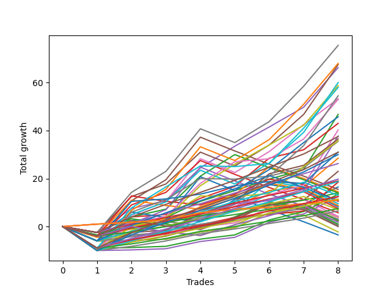

# Short Wallace 003 AB 
- Symbol: ES
- Date Range: 03/18/2022 - 07/15/2022
- Trading Period: 7:20-12:30
- Number of Trades: 8



| Name | Win Percent | Profit | Avg Profit / Trade | Avg Time / Trade |      | Name | Win Percent | Profit | Avg Profit / Trade | Avg Time / Trade |
| ---- | ----------- | ------ | ------------------ | ---------------- | ---- | ---- | ----------- | ------ | ------------------ | ---------------- |
| Sorted By <br> Profit | | | | | | Sorted By <br> Win Percentage ||||
| Seven | 75.00 | 37750.00 | 4718.75 | 27:10 |     | One Hundred Twenty-Six | 100.00 | 5500.00 | 687.50 | 00:58 |
| Sixty-Three | 75.00 | 34000.00 | 4250.00 | 25:35 |     | One Hundred Twenty-One | 100.00 | 5500.00 | 687.50 | 00:58 |
| Five | 75.00 | 33750.00 | 4218.75 | 25:30 |     | Eighty-One | 100.00 | 5500.00 | 687.50 | 00:58 |
| Four | 87.50 | 33125.00 | 4140.62 | 19:46 |     | Four | 87.50 | 33125.00 | 4140.62 | 19:46 |
| Sixty-One | 75.00 | 30000.00 | 3750.00 | 23:55 |     | Sixty | 87.50 | 29375.00 | 3671.88 | 18:11 |
| Sixty | 87.50 | 29375.00 | 3671.88 | 18:11 |     | Sixty-Eight | 87.50 | 26500.00 | 3312.50 | 15:28 |
| Seventy-One | 75.00 | 29000.00 | 3625.00 | 19:32 |     | Two | 87.50 | 23375.00 | 2921.88 | 18:35 |
| Sixty-Nine | 75.00 | 27250.00 | 3406.25 | 18:41 |     | Three | 87.50 | 21500.00 | 2687.50 | 11:02 |
| Six | 75.00 | 26625.00 | 3328.12 | 23:02 |     | Fifty-Eight | 87.50 | 20125.00 | 2515.62 | 17:12 |
| Sixty-Eight | 87.50 | 26500.00 | 3312.50 | 15:28 |     | Sixty-Six | 87.50 | 18875.00 | 2359.38 | 14:32 |
| Two | 87.50 | 23375.00 | 2921.88 | 18:35 |     | Eighty-Five | 87.50 | 18750.00 | 2343.75 | 13:01 |
| Sixty-Two | 75.00 | 22875.00 | 2859.38 | 21:26 |     | Sixty-Seven | 87.50 | 18250.00 | 2281.25 | 09:20 |
| Three | 87.50 | 21500.00 | 2687.50 | 11:02 |     | Fifty-Nine | 87.50 | 17750.00 | 2218.75 | 09:26 |
| Fifty-Eight | 87.50 | 20125.00 | 2515.62 | 17:12 |     | One Hundred Thirty | 87.50 | 15500.00 | 1937.50 | 11:19 |
| Sixty-Six | 87.50 | 18875.00 | 2359.38 | 14:32 |     | One Hundred Twenty-Five | 87.50 | 15000.00 | 1875.00 | 11:26 |
| Eighty-Five | 87.50 | 18750.00 | 2343.75 | 13:01 |     | One | 87.50 | 14250.00 | 1781.25 | 10:23 |
| Sixty-Seven | 87.50 | 18250.00 | 2281.25 | 09:20 |     | Eighty-Four | 87.50 | 13125.00 | 1640.62 | 10:13 |
| Seventy | 75.00 | 17875.00 | 2234.38 | 15:24 |     | Fifty-Seven | 87.50 | 11500.00 | 1437.50 | 09:03 |
| Fifty-Nine | 87.50 | 17750.00 | 2218.75 | 09:26 |     | One Hundred Twenty-Nine | 87.50 | 9875.00 | 1234.38 | 08:31 |
| One Hundred Thirty | 87.50 | 15500.00 | 1937.50 | 11:19 |     | Eighty-Three | 87.50 | 9500.00 | 1187.50 | 05:58 |
| Seventy-Three | 75.00 | 15500.00 | 1937.50 | 12:20 |     | One Hundred Twenty-Four | 87.50 | 9375.00 | 1171.88 | 08:38 |
| One Hundred Twenty-Five | 87.50 | 15000.00 | 1875.00 | 11:26 |     | Sixty-Five | 87.50 | 9250.00 | 1156.25 | 07:56 |
| One | 87.50 | 14250.00 | 1781.25 | 10:23 |     | Zero | 87.50 | 8250.00 | 1031.25 | 04:42 |
| Eighty-Four | 87.50 | 13125.00 | 1640.62 | 10:13 |     | Eighty-Two | 87.50 | 7000.00 | 875.00 | 05:05 |
| Fifty-Seven | 87.50 | 11500.00 | 1437.50 | 09:03 |     | Sixty-Four | 87.50 | 6750.00 | 843.75 | 03:36 |
| One Hundred Twenty-Nine | 87.50 | 9875.00 | 1234.38 | 08:31 |     | One Hundred Twenty-Eight | 87.50 | 6250.00 | 781.25 | 04:15 |
| Eighty-Three | 87.50 | 9500.00 | 1187.50 | 05:58 |     | Fifty-Six | 87.50 | 6250.00 | 781.25 | 03:43 |
| One Hundred Twenty-Four | 87.50 | 9375.00 | 1171.88 | 08:38 |     | One Hundred Twenty-Three | 87.50 | 5750.00 | 718.75 | 04:22 |
| Sixty-Five | 87.50 | 9250.00 | 1156.25 | 07:56 |     | One Hundred Twenty-Seven | 87.50 | 3750.00 | 468.75 | 03:22 |
| Zero | 87.50 | 8250.00 | 1031.25 | 04:42 |     | One Hundred Twenty-Two | 87.50 | 3250.00 | 406.25 | 03:29 |
| Forty-Seven | 37.50 | 7750.00 | 968.75 | 18:56 |     | One Hundred Eleven | 87.50 | 2000.00 | 250.00 | 00:49 |
| Forty-Three | 62.50 | 7250.00 | 906.25 | 07:13 |     | One Hundred Sixteen | 87.50 | 1250.00 | 156.25 | 00:51 |
| Eighty-Two | 87.50 | 7000.00 | 875.00 | 05:05 |     | Seven | 75.00 | 37750.00 | 4718.75 | 27:10 |
| Forty-Four | 50.00 | 7000.00 | 875.00 | 13:30 |     | Sixty-Three | 75.00 | 34000.00 | 4250.00 | 25:35 |
| Sixty-Four | 87.50 | 6750.00 | 843.75 | 03:36 |     | Five | 75.00 | 33750.00 | 4218.75 | 25:30 |
| One Hundred Fourteen | 75.00 | 6500.00 | 812.50 | 07:18 |     | Sixty-One | 75.00 | 30000.00 | 3750.00 | 23:55 |
| One Hundred Twenty-Eight | 87.50 | 6250.00 | 781.25 | 04:15 |     | Seventy-One | 75.00 | 29000.00 | 3625.00 | 19:32 |
| Fifty-Six | 87.50 | 6250.00 | 781.25 | 03:43 |     | Sixty-Nine | 75.00 | 27250.00 | 3406.25 | 18:41 |
| One Hundred Twenty-Three | 87.50 | 5750.00 | 718.75 | 04:22 |     | Six | 75.00 | 26625.00 | 3328.12 | 23:02 |
| One Hundred Twenty-Six | 100.00 | 5500.00 | 687.50 | 00:58 |     | Sixty-Two | 75.00 | 22875.00 | 2859.38 | 21:26 |
| One Hundred Twenty-One | 100.00 | 5500.00 | 687.50 | 00:58 |     | Seventy | 75.00 | 17875.00 | 2234.38 | 15:24 |
| Eighty-One | 100.00 | 5500.00 | 687.50 | 00:58 |     | Seventy-Three | 75.00 | 15500.00 | 1937.50 | 12:20 |
| One Hundred Fifteen | 62.50 | 5375.00 | 671.88 | 09:14 |     | One Hundred Fourteen | 75.00 | 6500.00 | 812.50 | 07:18 |
| Fifty-Five | 37.50 | 5250.00 | 656.25 | 08:35 |     | One Hundred Eighteen | 75.00 | 3750.00 | 468.75 | 03:06 |
| Fifty-One | 50.00 | 4750.00 | 593.75 | 04:20 |     | One Hundred Thirteen | 75.00 | 3500.00 | 437.50 | 03:05 |
| Fifty-Three | 37.50 | 4375.00 | 546.88 | 08:06 |     | Forty-Eight | 75.00 | 2125.00 | 265.62 | 02:23 |
| Fifty-Two | 37.50 | 4125.00 | 515.62 | 07:10 |     | Forty | 75.00 | 1875.00 | 234.38 | 02:22 |
| One Hundred Twenty-Seven | 87.50 | 3750.00 | 468.75 | 03:22 |     | One Hundred Seventeen | 75.00 | 1250.00 | 156.25 | 02:13 |
| One Hundred Eighteen | 75.00 | 3750.00 | 468.75 | 03:06 |     | One Hundred Twelve | 75.00 | 1000.00 | 125.00 | 02:12 |
| One Hundred Thirteen | 75.00 | 3500.00 | 437.50 | 03:05 |     | Forty-Three | 62.50 | 7250.00 | 906.25 | 07:13 |
| One Hundred Twenty-Two | 87.50 | 3250.00 | 406.25 | 03:29 |     | One Hundred Fifteen | 62.50 | 5375.00 | 671.88 | 09:14 |
| Forty-Five | 37.50 | 2875.00 | 359.38 | 17:19 |     | Forty-One | 62.50 | 1500.00 | 187.50 | 06:51 |
| Forty-Eight | 75.00 | 2125.00 | 265.62 | 02:23 |     | Forty-Four | 50.00 | 7000.00 | 875.00 | 13:30 |
| One Hundred Eleven | 87.50 | 2000.00 | 250.00 | 00:49 |     | Fifty-One | 50.00 | 4750.00 | 593.75 | 04:20 |
| Forty | 75.00 | 1875.00 | 234.38 | 02:22 |     | One Hundred Ninteen | 50.00 | 875.00 | 109.38 | 05:09 |
| Forty-One | 62.50 | 1500.00 | 187.50 | 06:51 |     | Forty-Nine | 50.00 | 250.00 | 31.25 | 03:55 |
| Forty-Six | 37.50 | 1500.00 | 187.50 | 16:48 |     | Forty-Two | 50.00 | -1750.00 | -218.75 | 11:58 |
| One Hundred Sixteen | 87.50 | 1250.00 | 156.25 | 00:51 |     | Forty-Seven | 37.50 | 7750.00 | 968.75 | 18:56 |
| One Hundred Seventeen | 75.00 | 1250.00 | 156.25 | 02:13 |     | Fifty-Five | 37.50 | 5250.00 | 656.25 | 08:35 |
| One Hundred Twelve | 75.00 | 1000.00 | 125.00 | 02:12 |     | Fifty-Three | 37.50 | 4375.00 | 546.88 | 08:06 |
| One Hundred Ninteen | 50.00 | 875.00 | 109.38 | 05:09 |     | Fifty-Two | 37.50 | 4125.00 | 515.62 | 07:10 |
| Fifty-Four | 37.50 | 500.00 | 62.50 | 06:42 |     | Forty-Five | 37.50 | 2875.00 | 359.38 | 17:19 |
| Forty-Nine | 50.00 | 250.00 | 31.25 | 03:55 |     | Forty-Six | 37.50 | 1500.00 | 187.50 | 16:48 |
| One Hundred Twenty | 37.50 | -0.00 | -0.00 | 05:29 |     | Fifty-Four | 37.50 | 500.00 | 62.50 | 06:42 |
| Fifty | 37.50 | -1125.00 | -140.62 | 05:47 |     | One Hundred Twenty | 37.50 | -0.00 | -0.00 | 05:29 |
| Forty-Two | 50.00 | -1750.00 | -218.75 | 11:58 |     | Fifty | 37.50 | -1125.00 | -140.62 | 05:47 |

## NO STOPLOSS

### Test Zero
* Sell when price hits the middle line of the 20p bollinger
* No Stoploss
* Results:
```
Total Trades: 8
Percent Up: 12.50
Percent Down: 87.50
Total Points Moved Down: 16.50
Potential Profit: 8250.00
Total Points Ups: 6.00 Count Ups: 1
Total Points Downs: 22.50 Count Downs: 7
```

<details><summary>Trades</summary>

<code>In: 2022-03-25 07:26:00		Out: 2022-03-25 07:51:05		Total Position Time: 25:05		Total Move Down: -6.00		Total to Date: -6.00</code> <br />
<code>In: 2022-04-20 07:58:00		Out: 2022-04-20 08:00:10		Total Position Time: 02:10		Total Move Down: 0.25		Total to Date: -5.75</code> <br />
<code>In: 2022-04-20 10:50:00		Out: 2022-04-20 10:50:10		Total Position Time: 00:10		Total Move Down: 0.50		Total to Date: -5.25</code> <br />
<code>In: 2022-04-27 09:46:00		Out: 2022-04-27 09:46:10		Total Position Time: 00:10		Total Move Down: 3.00		Total to Date: -2.25</code> <br />
<code>In: 2022-05-17 09:49:00		Out: 2022-05-17 09:51:15		Total Position Time: 02:15		Total Move Down: 1.75		Total to Date: -0.50</code> <br />
<code>In: 2022-05-24 11:15:00		Out: 2022-05-24 11:18:25		Total Position Time: 03:25		Total Move Down: 6.25		Total to Date: 5.75</code> <br />
<code>In: 2022-05-31 07:49:00		Out: 2022-05-31 07:49:55		Total Position Time: 00:55		Total Move Down: 3.50		Total to Date: 9.25</code> <br />
<code>In: 2022-07-05 07:41:00		Out: 2022-07-05 07:44:30		Total Position Time: 03:30		Total Move Down: 7.25		Total to Date: 16.50</code> <br />


</details>

### Test One
* Sell when the price hits the upper line of the 20p 1std bollinger
* No Stoploss
* Results:
```
Total Trades: 8
Percent Up: 12.50
Percent Down: 87.50
Total Points Moved Down: 28.50
Potential Profit: 14250.00
Total Points Ups: 4.50 Count Ups: 1
Total Points Downs: 33.00 Count Downs: 7
```

<details><summary>Trades</summary>

<code>In: 2022-03-25 07:26:00		Out: 2022-03-25 07:53:50		Total Position Time: 27:50		Total Move Down: -4.50		Total to Date: -4.50</code> <br />
<code>In: 2022-04-20 07:58:00		Out: 2022-04-20 08:00:40		Total Position Time: 02:40		Total Move Down: 3.50		Total to Date: -1.00</code> <br />
<code>In: 2022-04-20 10:50:00		Out: 2022-04-20 10:53:20		Total Position Time: 03:20		Total Move Down: 2.50		Total to Date: 1.50</code> <br />
<code>In: 2022-04-27 09:46:00		Out: 2022-04-27 09:50:25		Total Position Time: 04:25		Total Move Down: 3.75		Total to Date: 5.25</code> <br />
<code>In: 2022-05-17 09:49:00		Out: 2022-05-17 09:54:40		Total Position Time: 05:40		Total Move Down: 3.00		Total to Date: 8.25</code> <br />
<code>In: 2022-05-24 11:15:00		Out: 2022-05-24 11:31:25		Total Position Time: 16:25		Total Move Down: 6.75		Total to Date: 15.00</code> <br />
<code>In: 2022-05-31 07:49:00		Out: 2022-05-31 08:06:55		Total Position Time: 17:55		Total Move Down: 1.50		Total to Date: 16.50</code> <br />
<code>In: 2022-07-05 07:41:00		Out: 2022-07-05 07:45:55		Total Position Time: 04:55		Total Move Down: 12.00		Total to Date: 28.50</code> <br />


</details>

### Test Two
* Sell when the price hits the upper line of the 20p 2std bollinger
* No Stoploss
* Results:
```
Total Trades: 8
Percent Up: 12.50
Percent Down: 87.50
Total Points Moved Down: 46.75
Potential Profit: 23375.00
Total Points Ups: 3.50 Count Ups: 1
Total Points Downs: 50.25 Count Downs: 7
```

<details><summary>Trades</summary>

<code>In: 2022-03-25 07:26:00		Out: 2022-03-25 07:54:10		Total Position Time: 28:10		Total Move Down: -3.50		Total to Date: -3.50</code> <br />
<code>In: 2022-04-20 07:58:00		Out: 2022-04-20 08:00:45		Total Position Time: 02:45		Total Move Down: 4.00		Total to Date: 0.50</code> <br />
<code>In: 2022-04-20 10:50:00		Out: 2022-04-20 11:13:55		Total Position Time: 23:55		Total Move Down: 3.25		Total to Date: 3.75</code> <br />
<code>In: 2022-04-27 09:46:00		Out: 2022-04-27 10:00:10		Total Position Time: 14:10		Total Move Down: 6.75		Total to Date: 10.50</code> <br />
<code>In: 2022-05-17 09:49:00		Out: 2022-05-17 10:01:10		Total Position Time: 12:10		Total Move Down: 4.50		Total to Date: 15.00</code> <br />
<code>In: 2022-05-24 11:15:00		Out: 2022-05-24 11:43:50		Total Position Time: 28:50		Total Move Down: 4.75		Total to Date: 19.75</code> <br />
<code>In: 2022-05-31 07:49:00		Out: 2022-05-31 08:07:30		Total Position Time: 18:30		Total Move Down: 4.00		Total to Date: 23.75</code> <br />
<code>In: 2022-07-05 07:41:00		Out: 2022-07-05 08:01:10		Total Position Time: 20:10		Total Move Down: 23.00		Total to Date: 46.75</code> <br />


</details>

### Test Three
* Sell when price hits the middle line of the 50p bollinger
* No Stoploss
* Results:
```
Total Trades: 8
Percent Up: 12.50
Percent Down: 87.50
Total Points Moved Down: 43.00
Potential Profit: 21500.00
Total Points Ups: 2.50 Count Ups: 1
Total Points Downs: 45.50 Count Downs: 7
```

<details><summary>Trades</summary>

<code>In: 2022-03-25 07:26:00		Out: 2022-03-25 07:55:55		Total Position Time: 29:55		Total Move Down: -2.50		Total to Date: -2.50</code> <br />
<code>In: 2022-04-20 07:58:00		Out: 2022-04-20 08:01:10		Total Position Time: 03:10		Total Move Down: 6.50		Total to Date: 4.00</code> <br />
<code>In: 2022-04-20 10:50:00		Out: 2022-04-20 10:50:20		Total Position Time: 00:20		Total Move Down: 1.00		Total to Date: 5.00</code> <br />
<code>In: 2022-04-27 09:46:00		Out: 2022-04-27 10:00:10		Total Position Time: 14:10		Total Move Down: 6.75		Total to Date: 11.75</code> <br />
<code>In: 2022-05-17 09:49:00		Out: 2022-05-17 10:01:25		Total Position Time: 12:25		Total Move Down: 5.00		Total to Date: 16.75</code> <br />
<code>In: 2022-05-24 11:15:00		Out: 2022-05-24 11:20:25		Total Position Time: 05:25		Total Move Down: 11.75		Total to Date: 28.50</code> <br />
<code>In: 2022-05-31 07:49:00		Out: 2022-05-31 08:07:25		Total Position Time: 18:25		Total Move Down: 3.50		Total to Date: 32.00</code> <br />
<code>In: 2022-07-05 07:41:00		Out: 2022-07-05 07:45:30		Total Position Time: 04:30		Total Move Down: 11.00		Total to Date: 43.00</code> <br />


</details>

### Test Four
* Sell when the price hits the upper line of the 50p 1std bollinger
* No Stoploss
* Results:
```
Total Trades: 8
Percent Up: 12.50
Percent Down: 87.50
Total Points Moved Down: 66.25
Potential Profit: 33125.00
Total Points Ups: 2.50 Count Ups: 1
Total Points Downs: 68.75 Count Downs: 7
```

<details><summary>Trades</summary>

<code>In: 2022-03-25 07:26:00		Out: 2022-03-25 07:55:55		Total Position Time: 29:55		Total Move Down: -2.50		Total to Date: -2.50</code> <br />
<code>In: 2022-04-20 07:58:00		Out: 2022-04-20 08:10:40		Total Position Time: 12:40		Total Move Down: 10.00		Total to Date: 7.50</code> <br />
<code>In: 2022-04-20 10:50:00		Out: 2022-04-20 11:13:55		Total Position Time: 23:55		Total Move Down: 3.25		Total to Date: 10.75</code> <br />
<code>In: 2022-04-27 09:46:00		Out: 2022-04-27 10:01:20		Total Position Time: 15:20		Total Move Down: 13.75		Total to Date: 24.50</code> <br />
<code>In: 2022-05-17 09:49:00		Out: 2022-05-17 10:02:15		Total Position Time: 13:15		Total Move Down: 9.00		Total to Date: 33.50</code> <br />
<code>In: 2022-05-24 11:15:00		Out: 2022-05-24 11:44:15		Total Position Time: 29:15		Total Move Down: 8.00		Total to Date: 41.50</code> <br />
<code>In: 2022-05-31 07:49:00		Out: 2022-05-31 08:08:40		Total Position Time: 19:40		Total Move Down: 8.25		Total to Date: 49.75</code> <br />
<code>In: 2022-07-05 07:41:00		Out: 2022-07-05 07:55:15		Total Position Time: 14:15		Total Move Down: 16.50		Total to Date: 66.25</code> <br />


</details>

### Test Five
* Sell when the price hits the upper line of the 50p 2std bollinger
* No Stoploss
* Results:
```
Total Trades: 8
Percent Up: 25.00
Percent Down: 75.00
Total Points Moved Down: 67.50
Potential Profit: 33750.00
Total Points Ups: 8.25 Count Ups: 2
Total Points Downs: 75.75 Count Downs: 6
```

<details><summary>Trades</summary>

<code>In: 2022-03-25 07:26:00		Out: 2022-03-25 07:55:55		Total Position Time: 29:55		Total Move Down: -2.50		Total to Date: -2.50</code> <br />
<code>In: 2022-04-20 07:58:00		Out: 2022-04-20 08:16:20		Total Position Time: 18:20		Total Move Down: 15.00		Total to Date: 12.50</code> <br />
<code>In: 2022-04-20 10:50:00		Out: 2022-04-20 11:17:15		Total Position Time: 27:15		Total Move Down: 5.25		Total to Date: 17.75</code> <br />
<code>In: 2022-04-27 09:46:00		Out: 2022-04-27 10:09:25		Total Position Time: 23:25		Total Move Down: 13.25		Total to Date: 31.00</code> <br />
<code>In: 2022-05-17 09:49:00		Out: 2022-05-17 10:18:55		Total Position Time: 29:55		Total Move Down: -5.75		Total to Date: 25.25</code> <br />
<code>In: 2022-05-24 11:15:00		Out: 2022-05-24 11:44:55		Total Position Time: 29:55		Total Move Down: 8.75		Total to Date: 34.00</code> <br />
<code>In: 2022-05-31 07:49:00		Out: 2022-05-31 08:14:30		Total Position Time: 25:30		Total Move Down: 12.75		Total to Date: 46.75</code> <br />
<code>In: 2022-07-05 07:41:00		Out: 2022-07-05 08:00:50		Total Position Time: 19:50		Total Move Down: 20.75		Total to Date: 67.50</code> <br />


</details>

### Test Six
* Sell when the price hits the middle line of the 1std VWAP
* No Stoploss
* Results:
```
Total Trades: 8
Percent Up: 25.00
Percent Down: 75.00
Total Points Moved Down: 53.25
Potential Profit: 26625.00
Total Points Ups: 8.25 Count Ups: 2
Total Points Downs: 61.50 Count Downs: 6
```

<details><summary>Trades</summary>

<code>In: 2022-03-25 07:26:00		Out: 2022-03-25 07:55:55		Total Position Time: 29:55		Total Move Down: -2.50		Total to Date: -2.50</code> <br />
<code>In: 2022-04-20 07:58:00		Out: 2022-04-20 08:05:05		Total Position Time: 07:05		Total Move Down: 7.25		Total to Date: 4.75</code> <br />
<code>In: 2022-04-20 10:50:00		Out: 2022-04-20 11:17:50		Total Position Time: 27:50		Total Move Down: 5.75		Total to Date: 10.50</code> <br />
<code>In: 2022-04-27 09:46:00		Out: 2022-04-27 10:15:55		Total Position Time: 29:55		Total Move Down: 17.75		Total to Date: 28.25</code> <br />
<code>In: 2022-05-17 09:49:00		Out: 2022-05-17 10:18:55		Total Position Time: 29:55		Total Move Down: -5.75		Total to Date: 22.50</code> <br />
<code>In: 2022-05-24 11:15:00		Out: 2022-05-24 11:44:55		Total Position Time: 29:55		Total Move Down: 8.75		Total to Date: 31.25</code> <br />
<code>In: 2022-05-31 07:49:00		Out: 2022-05-31 08:14:20		Total Position Time: 25:20		Total Move Down: 11.25		Total to Date: 42.50</code> <br />
<code>In: 2022-07-05 07:41:00		Out: 2022-07-05 07:45:25		Total Position Time: 04:25		Total Move Down: 10.75		Total to Date: 53.25</code> <br />


</details>

### Test Seven
* Sell when the price hits the upper line of the 1std VWAP
* No Stoploss
* Results:
```
Total Trades: 8
Percent Up: 25.00
Percent Down: 75.00
Total Points Moved Down: 75.50
Potential Profit: 37750.00
Total Points Ups: 8.25 Count Ups: 2
Total Points Downs: 83.75 Count Downs: 6
```

<details><summary>Trades</summary>

<code>In: 2022-03-25 07:26:00		Out: 2022-03-25 07:55:55		Total Position Time: 29:55		Total Move Down: -2.50		Total to Date: -2.50</code> <br />
<code>In: 2022-04-20 07:58:00		Out: 2022-04-20 08:20:10		Total Position Time: 22:10		Total Move Down: 16.75		Total to Date: 14.25</code> <br />
<code>In: 2022-04-20 10:50:00		Out: 2022-04-20 11:19:55		Total Position Time: 29:55		Total Move Down: 8.75		Total to Date: 23.00</code> <br />
<code>In: 2022-04-27 09:46:00		Out: 2022-04-27 10:15:55		Total Position Time: 29:55		Total Move Down: 17.75		Total to Date: 40.75</code> <br />
<code>In: 2022-05-17 09:49:00		Out: 2022-05-17 10:18:55		Total Position Time: 29:55		Total Move Down: -5.75		Total to Date: 35.00</code> <br />
<code>In: 2022-05-24 11:15:00		Out: 2022-05-24 11:44:55		Total Position Time: 29:55		Total Move Down: 8.75		Total to Date: 43.75</code> <br />
<code>In: 2022-05-31 07:49:00		Out: 2022-05-31 08:18:55		Total Position Time: 29:55		Total Move Down: 14.75		Total to Date: 58.50</code> <br />
<code>In: 2022-07-05 07:41:00		Out: 2022-07-05 07:56:45		Total Position Time: 15:45		Total Move Down: 17.00		Total to Date: 75.50</code> <br />


</details>

## STOPLOSS OF 5

### Test Forty
* Sell when price hits the middle line of the 20p bollinger
* Stoploss is -5 points
* Results:
```
Total Trades: 8
Percent Up: 25.00
Percent Down: 75.00
Total Points Moved Down: 3.75
Potential Profit: 1875.00
Total Points Ups: 11.50 Count Ups: 2
Total Points Downs: 15.25 Count Downs: 6
```

<details><summary>Trades</summary>

<code>In: 2022-03-25 07:26:00		Out: 2022-03-25 07:35:05		Total Position Time: 09:05		Total Move Down: -6.00		Total to Date: -6.00</code> <br />
<code>In: 2022-04-20 07:58:00		Out: 2022-04-20 08:00:10		Total Position Time: 02:10		Total Move Down: 0.25		Total to Date: -5.75</code> <br />
<code>In: 2022-04-20 10:50:00		Out: 2022-04-20 10:50:10		Total Position Time: 00:10		Total Move Down: 0.50		Total to Date: -5.25</code> <br />
<code>In: 2022-04-27 09:46:00		Out: 2022-04-27 09:46:10		Total Position Time: 00:10		Total Move Down: 3.00		Total to Date: -2.25</code> <br />
<code>In: 2022-05-17 09:49:00		Out: 2022-05-17 09:51:15		Total Position Time: 02:15		Total Move Down: 1.75		Total to Date: -0.50</code> <br />
<code>In: 2022-05-24 11:15:00		Out: 2022-05-24 11:18:25		Total Position Time: 03:25		Total Move Down: 6.25		Total to Date: 5.75</code> <br />
<code>In: 2022-05-31 07:49:00		Out: 2022-05-31 07:49:55		Total Position Time: 00:55		Total Move Down: 3.50		Total to Date: 9.25</code> <br />
<code>In: 2022-07-05 07:41:00		Out: 2022-07-05 07:41:50		Total Position Time: 00:50		Total Move Down: -5.50		Total to Date: 3.75</code> <br />


</details>

### Test Forty-One
* Sell when the price hits the upper line of the 20p 1std bollinger
* Stoploss is -5 points
* Results:
```
Total Trades: 8
Percent Up: 37.50
Percent Down: 62.50
Total Points Moved Down: 3.00
Potential Profit: 1500.00
Total Points Ups: 16.50 Count Ups: 3
Total Points Downs: 19.50 Count Downs: 5
```

<details><summary>Trades</summary>

<code>In: 2022-03-25 07:26:00		Out: 2022-03-25 07:35:05		Total Position Time: 09:05		Total Move Down: -6.00		Total to Date: -6.00</code> <br />
<code>In: 2022-04-20 07:58:00		Out: 2022-04-20 08:00:40		Total Position Time: 02:40		Total Move Down: 3.50		Total to Date: -2.50</code> <br />
<code>In: 2022-04-20 10:50:00		Out: 2022-04-20 10:53:20		Total Position Time: 03:20		Total Move Down: 2.50		Total to Date: 0.00</code> <br />
<code>In: 2022-04-27 09:46:00		Out: 2022-04-27 09:50:25		Total Position Time: 04:25		Total Move Down: 3.75		Total to Date: 3.75</code> <br />
<code>In: 2022-05-17 09:49:00		Out: 2022-05-17 09:54:40		Total Position Time: 05:40		Total Move Down: 3.00		Total to Date: 6.75</code> <br />
<code>In: 2022-05-24 11:15:00		Out: 2022-05-24 11:31:25		Total Position Time: 16:25		Total Move Down: 6.75		Total to Date: 13.50</code> <br />
<code>In: 2022-05-31 07:49:00		Out: 2022-05-31 08:01:25		Total Position Time: 12:25		Total Move Down: -5.00		Total to Date: 8.50</code> <br />
<code>In: 2022-07-05 07:41:00		Out: 2022-07-05 07:41:50		Total Position Time: 00:50		Total Move Down: -5.50		Total to Date: 3.00</code> <br />


</details>

### Test Forty-Two
* Sell when the price hits the upper line of the 20p 2std bollinger
* Stoploss is -5 points
* Results:
```
Total Trades: 8
Percent Up: 50.00
Percent Down: 50.00
Total Points Moved Down: -3.50
Potential Profit: -1750.00
Total Points Ups: 22.00 Count Ups: 4
Total Points Downs: 18.50 Count Downs: 4
```

<details><summary>Trades</summary>

<code>In: 2022-03-25 07:26:00		Out: 2022-03-25 07:35:05		Total Position Time: 09:05		Total Move Down: -6.00		Total to Date: -6.00</code> <br />
<code>In: 2022-04-20 07:58:00		Out: 2022-04-20 08:00:45		Total Position Time: 02:45		Total Move Down: 4.00		Total to Date: -2.00</code> <br />
<code>In: 2022-04-20 10:50:00		Out: 2022-04-20 11:13:55		Total Position Time: 23:55		Total Move Down: 3.25		Total to Date: 1.25</code> <br />
<code>In: 2022-04-27 09:46:00		Out: 2022-04-27 10:00:10		Total Position Time: 14:10		Total Move Down: 6.75		Total to Date: 8.00</code> <br />
<code>In: 2022-05-17 09:49:00		Out: 2022-05-17 10:01:10		Total Position Time: 12:10		Total Move Down: 4.50		Total to Date: 12.50</code> <br />
<code>In: 2022-05-24 11:15:00		Out: 2022-05-24 11:35:30		Total Position Time: 20:30		Total Move Down: -5.50		Total to Date: 7.00</code> <br />
<code>In: 2022-05-31 07:49:00		Out: 2022-05-31 08:01:25		Total Position Time: 12:25		Total Move Down: -5.00		Total to Date: 2.00</code> <br />
<code>In: 2022-07-05 07:41:00		Out: 2022-07-05 07:41:50		Total Position Time: 00:50		Total Move Down: -5.50		Total to Date: -3.50</code> <br />


</details>

### Test Forty-Three
* Sell when price hits the middle line of the 50p bollinger
* Stoploss is -5 points
* Results:
```
Total Trades: 8
Percent Up: 37.50
Percent Down: 62.50
Total Points Moved Down: 14.50
Potential Profit: 7250.00
Total Points Ups: 16.50 Count Ups: 3
Total Points Downs: 31.00 Count Downs: 5
```

<details><summary>Trades</summary>

<code>In: 2022-03-25 07:26:00		Out: 2022-03-25 07:35:05		Total Position Time: 09:05		Total Move Down: -6.00		Total to Date: -6.00</code> <br />
<code>In: 2022-04-20 07:58:00		Out: 2022-04-20 08:01:10		Total Position Time: 03:10		Total Move Down: 6.50		Total to Date: 0.50</code> <br />
<code>In: 2022-04-20 10:50:00		Out: 2022-04-20 10:50:20		Total Position Time: 00:20		Total Move Down: 1.00		Total to Date: 1.50</code> <br />
<code>In: 2022-04-27 09:46:00		Out: 2022-04-27 10:00:10		Total Position Time: 14:10		Total Move Down: 6.75		Total to Date: 8.25</code> <br />
<code>In: 2022-05-17 09:49:00		Out: 2022-05-17 10:01:25		Total Position Time: 12:25		Total Move Down: 5.00		Total to Date: 13.25</code> <br />
<code>In: 2022-05-24 11:15:00		Out: 2022-05-24 11:20:25		Total Position Time: 05:25		Total Move Down: 11.75		Total to Date: 25.00</code> <br />
<code>In: 2022-05-31 07:49:00		Out: 2022-05-31 08:01:25		Total Position Time: 12:25		Total Move Down: -5.00		Total to Date: 20.00</code> <br />
<code>In: 2022-07-05 07:41:00		Out: 2022-07-05 07:41:50		Total Position Time: 00:50		Total Move Down: -5.50		Total to Date: 14.50</code> <br />


</details>

### Test Forty-Four
* Sell when the price hits the upper line of the 50p 1std bollinger
* Stoploss is -5 points
* Results:
```
Total Trades: 8
Percent Up: 50.00
Percent Down: 50.00
Total Points Moved Down: 14.00
Potential Profit: 7000.00
Total Points Ups: 22.00 Count Ups: 4
Total Points Downs: 36.00 Count Downs: 4
```

<details><summary>Trades</summary>

<code>In: 2022-03-25 07:26:00		Out: 2022-03-25 07:35:05		Total Position Time: 09:05		Total Move Down: -6.00		Total to Date: -6.00</code> <br />
<code>In: 2022-04-20 07:58:00		Out: 2022-04-20 08:10:40		Total Position Time: 12:40		Total Move Down: 10.00		Total to Date: 4.00</code> <br />
<code>In: 2022-04-20 10:50:00		Out: 2022-04-20 11:13:55		Total Position Time: 23:55		Total Move Down: 3.25		Total to Date: 7.25</code> <br />
<code>In: 2022-04-27 09:46:00		Out: 2022-04-27 10:01:20		Total Position Time: 15:20		Total Move Down: 13.75		Total to Date: 21.00</code> <br />
<code>In: 2022-05-17 09:49:00		Out: 2022-05-17 10:02:15		Total Position Time: 13:15		Total Move Down: 9.00		Total to Date: 30.00</code> <br />
<code>In: 2022-05-24 11:15:00		Out: 2022-05-24 11:35:30		Total Position Time: 20:30		Total Move Down: -5.50		Total to Date: 24.50</code> <br />
<code>In: 2022-05-31 07:49:00		Out: 2022-05-31 08:01:25		Total Position Time: 12:25		Total Move Down: -5.00		Total to Date: 19.50</code> <br />
<code>In: 2022-07-05 07:41:00		Out: 2022-07-05 07:41:50		Total Position Time: 00:50		Total Move Down: -5.50		Total to Date: 14.00</code> <br />


</details>

### Test Forty-Five
* Sell when the price hits the upper line of the 50p 2std bollinger
* Stoploss is -5 points
* Results:
```
Total Trades: 8
Percent Up: 62.50
Percent Down: 37.50
Total Points Moved Down: 5.75
Potential Profit: 2875.00
Total Points Ups: 27.75 Count Ups: 5
Total Points Downs: 33.50 Count Downs: 3
```

<details><summary>Trades</summary>

<code>In: 2022-03-25 07:26:00		Out: 2022-03-25 07:35:05		Total Position Time: 09:05		Total Move Down: -6.00		Total to Date: -6.00</code> <br />
<code>In: 2022-04-20 07:58:00		Out: 2022-04-20 08:16:20		Total Position Time: 18:20		Total Move Down: 15.00		Total to Date: 9.00</code> <br />
<code>In: 2022-04-20 10:50:00		Out: 2022-04-20 11:17:15		Total Position Time: 27:15		Total Move Down: 5.25		Total to Date: 14.25</code> <br />
<code>In: 2022-04-27 09:46:00		Out: 2022-04-27 10:09:25		Total Position Time: 23:25		Total Move Down: 13.25		Total to Date: 27.50</code> <br />
<code>In: 2022-05-17 09:49:00		Out: 2022-05-17 10:15:45		Total Position Time: 26:45		Total Move Down: -5.75		Total to Date: 21.75</code> <br />
<code>In: 2022-05-24 11:15:00		Out: 2022-05-24 11:35:30		Total Position Time: 20:30		Total Move Down: -5.50		Total to Date: 16.25</code> <br />
<code>In: 2022-05-31 07:49:00		Out: 2022-05-31 08:01:25		Total Position Time: 12:25		Total Move Down: -5.00		Total to Date: 11.25</code> <br />
<code>In: 2022-07-05 07:41:00		Out: 2022-07-05 07:41:50		Total Position Time: 00:50		Total Move Down: -5.50		Total to Date: 5.75</code> <br />


</details>

### Test Forty-Six
* Sell when the price hits the middle line of the 1std VWAP
* Stoploss is -5 points
* Results:
```
Total Trades: 8
Percent Up: 62.50
Percent Down: 37.50
Total Points Moved Down: 3.00
Potential Profit: 1500.00
Total Points Ups: 27.75 Count Ups: 5
Total Points Downs: 30.75 Count Downs: 3
```

<details><summary>Trades</summary>

<code>In: 2022-03-25 07:26:00		Out: 2022-03-25 07:35:05		Total Position Time: 09:05		Total Move Down: -6.00		Total to Date: -6.00</code> <br />
<code>In: 2022-04-20 07:58:00		Out: 2022-04-20 08:05:05		Total Position Time: 07:05		Total Move Down: 7.25		Total to Date: 1.25</code> <br />
<code>In: 2022-04-20 10:50:00		Out: 2022-04-20 11:17:50		Total Position Time: 27:50		Total Move Down: 5.75		Total to Date: 7.00</code> <br />
<code>In: 2022-04-27 09:46:00		Out: 2022-04-27 10:15:55		Total Position Time: 29:55		Total Move Down: 17.75		Total to Date: 24.75</code> <br />
<code>In: 2022-05-17 09:49:00		Out: 2022-05-17 10:15:45		Total Position Time: 26:45		Total Move Down: -5.75		Total to Date: 19.00</code> <br />
<code>In: 2022-05-24 11:15:00		Out: 2022-05-24 11:35:30		Total Position Time: 20:30		Total Move Down: -5.50		Total to Date: 13.50</code> <br />
<code>In: 2022-05-31 07:49:00		Out: 2022-05-31 08:01:25		Total Position Time: 12:25		Total Move Down: -5.00		Total to Date: 8.50</code> <br />
<code>In: 2022-07-05 07:41:00		Out: 2022-07-05 07:41:50		Total Position Time: 00:50		Total Move Down: -5.50		Total to Date: 3.00</code> <br />


</details>

### Test Forty-Seven
* Sell when the price hits the upper line of the 1std VWAP
* Stoploss is -5 points
* Results:
```
Total Trades: 8
Percent Up: 62.50
Percent Down: 37.50
Total Points Moved Down: 15.50
Potential Profit: 7750.00
Total Points Ups: 27.75 Count Ups: 5
Total Points Downs: 43.25 Count Downs: 3
```

<details><summary>Trades</summary>

<code>In: 2022-03-25 07:26:00		Out: 2022-03-25 07:35:05		Total Position Time: 09:05		Total Move Down: -6.00		Total to Date: -6.00</code> <br />
<code>In: 2022-04-20 07:58:00		Out: 2022-04-20 08:20:10		Total Position Time: 22:10		Total Move Down: 16.75		Total to Date: 10.75</code> <br />
<code>In: 2022-04-20 10:50:00		Out: 2022-04-20 11:19:55		Total Position Time: 29:55		Total Move Down: 8.75		Total to Date: 19.50</code> <br />
<code>In: 2022-04-27 09:46:00		Out: 2022-04-27 10:15:55		Total Position Time: 29:55		Total Move Down: 17.75		Total to Date: 37.25</code> <br />
<code>In: 2022-05-17 09:49:00		Out: 2022-05-17 10:15:45		Total Position Time: 26:45		Total Move Down: -5.75		Total to Date: 31.50</code> <br />
<code>In: 2022-05-24 11:15:00		Out: 2022-05-24 11:35:30		Total Position Time: 20:30		Total Move Down: -5.50		Total to Date: 26.00</code> <br />
<code>In: 2022-05-31 07:49:00		Out: 2022-05-31 08:01:25		Total Position Time: 12:25		Total Move Down: -5.00		Total to Date: 21.00</code> <br />
<code>In: 2022-07-05 07:41:00		Out: 2022-07-05 07:41:50		Total Position Time: 00:50		Total Move Down: -5.50		Total to Date: 15.50</code> <br />


</details>

## TRAIL STOP OF 5

### Test Forty-Eight
* Sell when price hits the middle line of the 20p bollinger
* Trailing Stop is -5 points
* Results:
```
Total Trades: 8
Percent Up: 25.00
Percent Down: 75.00
Total Points Moved Down: 4.25
Potential Profit: 2125.00
Total Points Ups: 11.00 Count Ups: 2
Total Points Downs: 15.25 Count Downs: 6
```

<details><summary>Trades</summary>

<code>In: 2022-03-25 07:26:00		Out: 2022-03-25 07:35:00		Total Position Time: 09:00		Total Move Down: -4.00		Total to Date: -4.00</code> <br />
<code>In: 2022-04-20 07:58:00		Out: 2022-04-20 08:00:10		Total Position Time: 02:10		Total Move Down: 0.25		Total to Date: -3.75</code> <br />
<code>In: 2022-04-20 10:50:00		Out: 2022-04-20 10:50:10		Total Position Time: 00:10		Total Move Down: 0.50		Total to Date: -3.25</code> <br />
<code>In: 2022-04-27 09:46:00		Out: 2022-04-27 09:46:10		Total Position Time: 00:10		Total Move Down: 3.00		Total to Date: -0.25</code> <br />
<code>In: 2022-05-17 09:49:00		Out: 2022-05-17 09:51:15		Total Position Time: 02:15		Total Move Down: 1.75		Total to Date: 1.50</code> <br />
<code>In: 2022-05-24 11:15:00		Out: 2022-05-24 11:18:25		Total Position Time: 03:25		Total Move Down: 6.25		Total to Date: 7.75</code> <br />
<code>In: 2022-05-31 07:49:00		Out: 2022-05-31 07:49:55		Total Position Time: 00:55		Total Move Down: 3.50		Total to Date: 11.25</code> <br />
<code>In: 2022-07-05 07:41:00		Out: 2022-07-05 07:42:05		Total Position Time: 01:05		Total Move Down: -7.00		Total to Date: 4.25</code> <br />


</details>

### Test Forty-Nine
* Sell when the price hits the upper line of the 20p 1std bollinger
* Trailing Stop is -5 points
* Results:
```
Total Trades: 8
Percent Up: 50.00
Percent Down: 50.00
Total Points Moved Down: 0.50
Potential Profit: 250.00
Total Points Ups: 14.75 Count Ups: 4
Total Points Downs: 15.25 Count Downs: 4
```

<details><summary>Trades</summary>

<code>In: 2022-03-25 07:26:00		Out: 2022-03-25 07:35:00		Total Position Time: 09:00		Total Move Down: -4.00		Total to Date: -4.00</code> <br />
<code>In: 2022-04-20 07:58:00		Out: 2022-04-20 08:00:40		Total Position Time: 02:40		Total Move Down: 3.50		Total to Date: -0.50</code> <br />
<code>In: 2022-04-20 10:50:00		Out: 2022-04-20 10:53:20		Total Position Time: 03:20		Total Move Down: 2.50		Total to Date: 2.00</code> <br />
<code>In: 2022-04-27 09:46:00		Out: 2022-04-27 09:46:45		Total Position Time: 00:45		Total Move Down: -1.50		Total to Date: 0.50</code> <br />
<code>In: 2022-05-17 09:49:00		Out: 2022-05-17 09:54:40		Total Position Time: 05:40		Total Move Down: 3.00		Total to Date: 3.50</code> <br />
<code>In: 2022-05-24 11:15:00		Out: 2022-05-24 11:21:25		Total Position Time: 06:25		Total Move Down: 6.25		Total to Date: 9.75</code> <br />
<code>In: 2022-05-31 07:49:00		Out: 2022-05-31 07:51:30		Total Position Time: 02:30		Total Move Down: -2.25		Total to Date: 7.50</code> <br />
<code>In: 2022-07-05 07:41:00		Out: 2022-07-05 07:42:05		Total Position Time: 01:05		Total Move Down: -7.00		Total to Date: 0.50</code> <br />


</details>

### Test Fifty
* Sell when the price hits the upper line of the 20p 2std bollinger
* Trailing Stop is -5 points
* Results:
```
Total Trades: 8
Percent Up: 62.50
Percent Down: 37.50
Total Points Moved Down: -2.25
Potential Profit: -1125.00
Total Points Ups: 17.00 Count Ups: 5
Total Points Downs: 14.75 Count Downs: 3
```

<details><summary>Trades</summary>

<code>In: 2022-03-25 07:26:00		Out: 2022-03-25 07:35:00		Total Position Time: 09:00		Total Move Down: -4.00		Total to Date: -4.00</code> <br />
<code>In: 2022-04-20 07:58:00		Out: 2022-04-20 08:00:45		Total Position Time: 02:45		Total Move Down: 4.00		Total to Date: 0.00</code> <br />
<code>In: 2022-04-20 10:50:00		Out: 2022-04-20 11:01:40		Total Position Time: 11:40		Total Move Down: -2.25		Total to Date: -2.25</code> <br />
<code>In: 2022-04-27 09:46:00		Out: 2022-04-27 09:46:45		Total Position Time: 00:45		Total Move Down: -1.50		Total to Date: -3.75</code> <br />
<code>In: 2022-05-17 09:49:00		Out: 2022-05-17 10:01:10		Total Position Time: 12:10		Total Move Down: 4.50		Total to Date: 0.75</code> <br />
<code>In: 2022-05-24 11:15:00		Out: 2022-05-24 11:21:25		Total Position Time: 06:25		Total Move Down: 6.25		Total to Date: 7.00</code> <br />
<code>In: 2022-05-31 07:49:00		Out: 2022-05-31 07:51:30		Total Position Time: 02:30		Total Move Down: -2.25		Total to Date: 4.75</code> <br />
<code>In: 2022-07-05 07:41:00		Out: 2022-07-05 07:42:05		Total Position Time: 01:05		Total Move Down: -7.00		Total to Date: -2.25</code> <br />


</details>

### Test Fifty-One
* Sell when price hits the middle line of the 50p bollinger
* Trailing Stop is -5 points
* Results:
```
Total Trades: 8
Percent Up: 50.00
Percent Down: 50.00
Total Points Moved Down: 9.50
Potential Profit: 4750.00
Total Points Ups: 14.75 Count Ups: 4
Total Points Downs: 24.25 Count Downs: 4
```

<details><summary>Trades</summary>

<code>In: 2022-03-25 07:26:00		Out: 2022-03-25 07:35:00		Total Position Time: 09:00		Total Move Down: -4.00		Total to Date: -4.00</code> <br />
<code>In: 2022-04-20 07:58:00		Out: 2022-04-20 08:01:10		Total Position Time: 03:10		Total Move Down: 6.50		Total to Date: 2.50</code> <br />
<code>In: 2022-04-20 10:50:00		Out: 2022-04-20 10:50:20		Total Position Time: 00:20		Total Move Down: 1.00		Total to Date: 3.50</code> <br />
<code>In: 2022-04-27 09:46:00		Out: 2022-04-27 09:46:45		Total Position Time: 00:45		Total Move Down: -1.50		Total to Date: 2.00</code> <br />
<code>In: 2022-05-17 09:49:00		Out: 2022-05-17 10:01:25		Total Position Time: 12:25		Total Move Down: 5.00		Total to Date: 7.00</code> <br />
<code>In: 2022-05-24 11:15:00		Out: 2022-05-24 11:20:25		Total Position Time: 05:25		Total Move Down: 11.75		Total to Date: 18.75</code> <br />
<code>In: 2022-05-31 07:49:00		Out: 2022-05-31 07:51:30		Total Position Time: 02:30		Total Move Down: -2.25		Total to Date: 16.50</code> <br />
<code>In: 2022-07-05 07:41:00		Out: 2022-07-05 07:42:05		Total Position Time: 01:05		Total Move Down: -7.00		Total to Date: 9.50</code> <br />


</details>

### Test Fifty-Two
* Sell when the price hits the upper line of the 50p 1std bollinger
* Trailing Stop is -5 points
* Results:
```
Total Trades: 8
Percent Up: 62.50
Percent Down: 37.50
Total Points Moved Down: 8.25
Potential Profit: 4125.00
Total Points Ups: 17.00 Count Ups: 5
Total Points Downs: 25.25 Count Downs: 3
```

<details><summary>Trades</summary>

<code>In: 2022-03-25 07:26:00		Out: 2022-03-25 07:35:00		Total Position Time: 09:00		Total Move Down: -4.00		Total to Date: -4.00</code> <br />
<code>In: 2022-04-20 07:58:00		Out: 2022-04-20 08:10:40		Total Position Time: 12:40		Total Move Down: 10.00		Total to Date: 6.00</code> <br />
<code>In: 2022-04-20 10:50:00		Out: 2022-04-20 11:01:40		Total Position Time: 11:40		Total Move Down: -2.25		Total to Date: 3.75</code> <br />
<code>In: 2022-04-27 09:46:00		Out: 2022-04-27 09:46:45		Total Position Time: 00:45		Total Move Down: -1.50		Total to Date: 2.25</code> <br />
<code>In: 2022-05-17 09:49:00		Out: 2022-05-17 10:02:15		Total Position Time: 13:15		Total Move Down: 9.00		Total to Date: 11.25</code> <br />
<code>In: 2022-05-24 11:15:00		Out: 2022-05-24 11:21:25		Total Position Time: 06:25		Total Move Down: 6.25		Total to Date: 17.50</code> <br />
<code>In: 2022-05-31 07:49:00		Out: 2022-05-31 07:51:30		Total Position Time: 02:30		Total Move Down: -2.25		Total to Date: 15.25</code> <br />
<code>In: 2022-07-05 07:41:00		Out: 2022-07-05 07:42:05		Total Position Time: 01:05		Total Move Down: -7.00		Total to Date: 8.25</code> <br />


</details>

### Test Fifty-Three
* Sell when the price hits the upper line of the 50p 2std bollinger
* Trailing Stop is -5 points
* Results:
```
Total Trades: 8
Percent Up: 62.50
Percent Down: 37.50
Total Points Moved Down: 8.75
Potential Profit: 4375.00
Total Points Ups: 17.00 Count Ups: 5
Total Points Downs: 25.75 Count Downs: 3
```

<details><summary>Trades</summary>

<code>In: 2022-03-25 07:26:00		Out: 2022-03-25 07:35:00		Total Position Time: 09:00		Total Move Down: -4.00		Total to Date: -4.00</code> <br />
<code>In: 2022-04-20 07:58:00		Out: 2022-04-20 08:16:20		Total Position Time: 18:20		Total Move Down: 15.00		Total to Date: 11.00</code> <br />
<code>In: 2022-04-20 10:50:00		Out: 2022-04-20 11:01:40		Total Position Time: 11:40		Total Move Down: -2.25		Total to Date: 8.75</code> <br />
<code>In: 2022-04-27 09:46:00		Out: 2022-04-27 09:46:45		Total Position Time: 00:45		Total Move Down: -1.50		Total to Date: 7.25</code> <br />
<code>In: 2022-05-17 09:49:00		Out: 2022-05-17 10:04:10		Total Position Time: 15:10		Total Move Down: 4.50		Total to Date: 11.75</code> <br />
<code>In: 2022-05-24 11:15:00		Out: 2022-05-24 11:21:25		Total Position Time: 06:25		Total Move Down: 6.25		Total to Date: 18.00</code> <br />
<code>In: 2022-05-31 07:49:00		Out: 2022-05-31 07:51:30		Total Position Time: 02:30		Total Move Down: -2.25		Total to Date: 15.75</code> <br />
<code>In: 2022-07-05 07:41:00		Out: 2022-07-05 07:42:05		Total Position Time: 01:05		Total Move Down: -7.00		Total to Date: 8.75</code> <br />


</details>

### Test Fifty-Four
* Sell when the price hits the middle line of the 1std VWAP
* Trailing Stop is -5 points
* Results:
```
Total Trades: 8
Percent Up: 62.50
Percent Down: 37.50
Total Points Moved Down: 1.00
Potential Profit: 500.00
Total Points Ups: 17.00 Count Ups: 5
Total Points Downs: 18.00 Count Downs: 3
```

<details><summary>Trades</summary>

<code>In: 2022-03-25 07:26:00		Out: 2022-03-25 07:35:00		Total Position Time: 09:00		Total Move Down: -4.00		Total to Date: -4.00</code> <br />
<code>In: 2022-04-20 07:58:00		Out: 2022-04-20 08:05:05		Total Position Time: 07:05		Total Move Down: 7.25		Total to Date: 3.25</code> <br />
<code>In: 2022-04-20 10:50:00		Out: 2022-04-20 11:01:40		Total Position Time: 11:40		Total Move Down: -2.25		Total to Date: 1.00</code> <br />
<code>In: 2022-04-27 09:46:00		Out: 2022-04-27 09:46:45		Total Position Time: 00:45		Total Move Down: -1.50		Total to Date: -0.50</code> <br />
<code>In: 2022-05-17 09:49:00		Out: 2022-05-17 10:04:10		Total Position Time: 15:10		Total Move Down: 4.50		Total to Date: 4.00</code> <br />
<code>In: 2022-05-24 11:15:00		Out: 2022-05-24 11:21:25		Total Position Time: 06:25		Total Move Down: 6.25		Total to Date: 10.25</code> <br />
<code>In: 2022-05-31 07:49:00		Out: 2022-05-31 07:51:30		Total Position Time: 02:30		Total Move Down: -2.25		Total to Date: 8.00</code> <br />
<code>In: 2022-07-05 07:41:00		Out: 2022-07-05 07:42:05		Total Position Time: 01:05		Total Move Down: -7.00		Total to Date: 1.00</code> <br />


</details>

### Test Fifty-Five
* Sell when the price hits the upper line of the 1std VWAP
* Trailing Stop is -5 points
* Results:
```
Total Trades: 8
Percent Up: 62.50
Percent Down: 37.50
Total Points Moved Down: 10.50
Potential Profit: 5250.00
Total Points Ups: 17.00 Count Ups: 5
Total Points Downs: 27.50 Count Downs: 3
```

<details><summary>Trades</summary>

<code>In: 2022-03-25 07:26:00		Out: 2022-03-25 07:35:00		Total Position Time: 09:00		Total Move Down: -4.00		Total to Date: -4.00</code> <br />
<code>In: 2022-04-20 07:58:00		Out: 2022-04-20 08:20:10		Total Position Time: 22:10		Total Move Down: 16.75		Total to Date: 12.75</code> <br />
<code>In: 2022-04-20 10:50:00		Out: 2022-04-20 11:01:40		Total Position Time: 11:40		Total Move Down: -2.25		Total to Date: 10.50</code> <br />
<code>In: 2022-04-27 09:46:00		Out: 2022-04-27 09:46:45		Total Position Time: 00:45		Total Move Down: -1.50		Total to Date: 9.00</code> <br />
<code>In: 2022-05-17 09:49:00		Out: 2022-05-17 10:04:10		Total Position Time: 15:10		Total Move Down: 4.50		Total to Date: 13.50</code> <br />
<code>In: 2022-05-24 11:15:00		Out: 2022-05-24 11:21:25		Total Position Time: 06:25		Total Move Down: 6.25		Total to Date: 19.75</code> <br />
<code>In: 2022-05-31 07:49:00		Out: 2022-05-31 07:51:30		Total Position Time: 02:30		Total Move Down: -2.25		Total to Date: 17.50</code> <br />
<code>In: 2022-07-05 07:41:00		Out: 2022-07-05 07:42:05		Total Position Time: 01:05		Total Move Down: -7.00		Total to Date: 10.50</code> <br />


</details>

## STOPLOSS OF 10

### Test Fifty-Six
* Sell when price hits the middle line of the 20p bollinger
* Stoploss is -10 points
* Results:
```
Total Trades: 8
Percent Up: 12.50
Percent Down: 87.50
Total Points Moved Down: 12.50
Potential Profit: 6250.00
Total Points Ups: 10.00 Count Ups: 1
Total Points Downs: 22.50 Count Downs: 7
```

<details><summary>Trades</summary>

<code>In: 2022-03-25 07:26:00		Out: 2022-03-25 07:43:10		Total Position Time: 17:10		Total Move Down: -10.00		Total to Date: -10.00</code> <br />
<code>In: 2022-04-20 07:58:00		Out: 2022-04-20 08:00:10		Total Position Time: 02:10		Total Move Down: 0.25		Total to Date: -9.75</code> <br />
<code>In: 2022-04-20 10:50:00		Out: 2022-04-20 10:50:10		Total Position Time: 00:10		Total Move Down: 0.50		Total to Date: -9.25</code> <br />
<code>In: 2022-04-27 09:46:00		Out: 2022-04-27 09:46:10		Total Position Time: 00:10		Total Move Down: 3.00		Total to Date: -6.25</code> <br />
<code>In: 2022-05-17 09:49:00		Out: 2022-05-17 09:51:15		Total Position Time: 02:15		Total Move Down: 1.75		Total to Date: -4.50</code> <br />
<code>In: 2022-05-24 11:15:00		Out: 2022-05-24 11:18:25		Total Position Time: 03:25		Total Move Down: 6.25		Total to Date: 1.75</code> <br />
<code>In: 2022-05-31 07:49:00		Out: 2022-05-31 07:49:55		Total Position Time: 00:55		Total Move Down: 3.50		Total to Date: 5.25</code> <br />
<code>In: 2022-07-05 07:41:00		Out: 2022-07-05 07:44:30		Total Position Time: 03:30		Total Move Down: 7.25		Total to Date: 12.50</code> <br />


</details>

### Test Fifty-Seven
* Sell when the price hits the upper line of the 20p 1std bollinger
* Stoploss is -10 points
* Results:
```
Total Trades: 8
Percent Up: 12.50
Percent Down: 87.50
Total Points Moved Down: 23.00
Potential Profit: 11500.00
Total Points Ups: 10.00 Count Ups: 1
Total Points Downs: 33.00 Count Downs: 7
```

<details><summary>Trades</summary>

<code>In: 2022-03-25 07:26:00		Out: 2022-03-25 07:43:10		Total Position Time: 17:10		Total Move Down: -10.00		Total to Date: -10.00</code> <br />
<code>In: 2022-04-20 07:58:00		Out: 2022-04-20 08:00:40		Total Position Time: 02:40		Total Move Down: 3.50		Total to Date: -6.50</code> <br />
<code>In: 2022-04-20 10:50:00		Out: 2022-04-20 10:53:20		Total Position Time: 03:20		Total Move Down: 2.50		Total to Date: -4.00</code> <br />
<code>In: 2022-04-27 09:46:00		Out: 2022-04-27 09:50:25		Total Position Time: 04:25		Total Move Down: 3.75		Total to Date: -0.25</code> <br />
<code>In: 2022-05-17 09:49:00		Out: 2022-05-17 09:54:40		Total Position Time: 05:40		Total Move Down: 3.00		Total to Date: 2.75</code> <br />
<code>In: 2022-05-24 11:15:00		Out: 2022-05-24 11:31:25		Total Position Time: 16:25		Total Move Down: 6.75		Total to Date: 9.50</code> <br />
<code>In: 2022-05-31 07:49:00		Out: 2022-05-31 08:06:55		Total Position Time: 17:55		Total Move Down: 1.50		Total to Date: 11.00</code> <br />
<code>In: 2022-07-05 07:41:00		Out: 2022-07-05 07:45:55		Total Position Time: 04:55		Total Move Down: 12.00		Total to Date: 23.00</code> <br />


</details>

### Test Fifty-Eight
* Sell when the price hits the upper line of the 20p 2std bollinger
* Stoploss is -10 points
* Results:
```
Total Trades: 8
Percent Up: 12.50
Percent Down: 87.50
Total Points Moved Down: 40.25
Potential Profit: 20125.00
Total Points Ups: 10.00 Count Ups: 1
Total Points Downs: 50.25 Count Downs: 7
```

<details><summary>Trades</summary>

<code>In: 2022-03-25 07:26:00		Out: 2022-03-25 07:43:10		Total Position Time: 17:10		Total Move Down: -10.00		Total to Date: -10.00</code> <br />
<code>In: 2022-04-20 07:58:00		Out: 2022-04-20 08:00:45		Total Position Time: 02:45		Total Move Down: 4.00		Total to Date: -6.00</code> <br />
<code>In: 2022-04-20 10:50:00		Out: 2022-04-20 11:13:55		Total Position Time: 23:55		Total Move Down: 3.25		Total to Date: -2.75</code> <br />
<code>In: 2022-04-27 09:46:00		Out: 2022-04-27 10:00:10		Total Position Time: 14:10		Total Move Down: 6.75		Total to Date: 4.00</code> <br />
<code>In: 2022-05-17 09:49:00		Out: 2022-05-17 10:01:10		Total Position Time: 12:10		Total Move Down: 4.50		Total to Date: 8.50</code> <br />
<code>In: 2022-05-24 11:15:00		Out: 2022-05-24 11:43:50		Total Position Time: 28:50		Total Move Down: 4.75		Total to Date: 13.25</code> <br />
<code>In: 2022-05-31 07:49:00		Out: 2022-05-31 08:07:30		Total Position Time: 18:30		Total Move Down: 4.00		Total to Date: 17.25</code> <br />
<code>In: 2022-07-05 07:41:00		Out: 2022-07-05 08:01:10		Total Position Time: 20:10		Total Move Down: 23.00		Total to Date: 40.25</code> <br />


</details>

### Test Fifty-Nine
* Sell when price hits the middle line of the 50p bollinger
* Stoploss is -10 points
* Results:
```
Total Trades: 8
Percent Up: 12.50
Percent Down: 87.50
Total Points Moved Down: 35.50
Potential Profit: 17750.00
Total Points Ups: 10.00 Count Ups: 1
Total Points Downs: 45.50 Count Downs: 7
```

<details><summary>Trades</summary>

<code>In: 2022-03-25 07:26:00		Out: 2022-03-25 07:43:10		Total Position Time: 17:10		Total Move Down: -10.00		Total to Date: -10.00</code> <br />
<code>In: 2022-04-20 07:58:00		Out: 2022-04-20 08:01:10		Total Position Time: 03:10		Total Move Down: 6.50		Total to Date: -3.50</code> <br />
<code>In: 2022-04-20 10:50:00		Out: 2022-04-20 10:50:20		Total Position Time: 00:20		Total Move Down: 1.00		Total to Date: -2.50</code> <br />
<code>In: 2022-04-27 09:46:00		Out: 2022-04-27 10:00:10		Total Position Time: 14:10		Total Move Down: 6.75		Total to Date: 4.25</code> <br />
<code>In: 2022-05-17 09:49:00		Out: 2022-05-17 10:01:25		Total Position Time: 12:25		Total Move Down: 5.00		Total to Date: 9.25</code> <br />
<code>In: 2022-05-24 11:15:00		Out: 2022-05-24 11:20:25		Total Position Time: 05:25		Total Move Down: 11.75		Total to Date: 21.00</code> <br />
<code>In: 2022-05-31 07:49:00		Out: 2022-05-31 08:07:25		Total Position Time: 18:25		Total Move Down: 3.50		Total to Date: 24.50</code> <br />
<code>In: 2022-07-05 07:41:00		Out: 2022-07-05 07:45:30		Total Position Time: 04:30		Total Move Down: 11.00		Total to Date: 35.50</code> <br />


</details>

### Test Sixty
* Sell when the price hits the upper line of the 50p 1std bollinger
* Stoploss is -10 points
* Results:
```
Total Trades: 8
Percent Up: 12.50
Percent Down: 87.50
Total Points Moved Down: 58.75
Potential Profit: 29375.00
Total Points Ups: 10.00 Count Ups: 1
Total Points Downs: 68.75 Count Downs: 7
```

<details><summary>Trades</summary>

<code>In: 2022-03-25 07:26:00		Out: 2022-03-25 07:43:10		Total Position Time: 17:10		Total Move Down: -10.00		Total to Date: -10.00</code> <br />
<code>In: 2022-04-20 07:58:00		Out: 2022-04-20 08:10:40		Total Position Time: 12:40		Total Move Down: 10.00		Total to Date: 0.00</code> <br />
<code>In: 2022-04-20 10:50:00		Out: 2022-04-20 11:13:55		Total Position Time: 23:55		Total Move Down: 3.25		Total to Date: 3.25</code> <br />
<code>In: 2022-04-27 09:46:00		Out: 2022-04-27 10:01:20		Total Position Time: 15:20		Total Move Down: 13.75		Total to Date: 17.00</code> <br />
<code>In: 2022-05-17 09:49:00		Out: 2022-05-17 10:02:15		Total Position Time: 13:15		Total Move Down: 9.00		Total to Date: 26.00</code> <br />
<code>In: 2022-05-24 11:15:00		Out: 2022-05-24 11:44:15		Total Position Time: 29:15		Total Move Down: 8.00		Total to Date: 34.00</code> <br />
<code>In: 2022-05-31 07:49:00		Out: 2022-05-31 08:08:40		Total Position Time: 19:40		Total Move Down: 8.25		Total to Date: 42.25</code> <br />
<code>In: 2022-07-05 07:41:00		Out: 2022-07-05 07:55:15		Total Position Time: 14:15		Total Move Down: 16.50		Total to Date: 58.75</code> <br />


</details>

### Test Sixty-One
* Sell when the price hits the upper line of the 50p 2std bollinger
* Stoploss is -10 points
* Results:
```
Total Trades: 8
Percent Up: 25.00
Percent Down: 75.00
Total Points Moved Down: 60.00
Potential Profit: 30000.00
Total Points Ups: 15.75 Count Ups: 2
Total Points Downs: 75.75 Count Downs: 6
```

<details><summary>Trades</summary>

<code>In: 2022-03-25 07:26:00		Out: 2022-03-25 07:43:10		Total Position Time: 17:10		Total Move Down: -10.00		Total to Date: -10.00</code> <br />
<code>In: 2022-04-20 07:58:00		Out: 2022-04-20 08:16:20		Total Position Time: 18:20		Total Move Down: 15.00		Total to Date: 5.00</code> <br />
<code>In: 2022-04-20 10:50:00		Out: 2022-04-20 11:17:15		Total Position Time: 27:15		Total Move Down: 5.25		Total to Date: 10.25</code> <br />
<code>In: 2022-04-27 09:46:00		Out: 2022-04-27 10:09:25		Total Position Time: 23:25		Total Move Down: 13.25		Total to Date: 23.50</code> <br />
<code>In: 2022-05-17 09:49:00		Out: 2022-05-17 10:18:55		Total Position Time: 29:55		Total Move Down: -5.75		Total to Date: 17.75</code> <br />
<code>In: 2022-05-24 11:15:00		Out: 2022-05-24 11:44:55		Total Position Time: 29:55		Total Move Down: 8.75		Total to Date: 26.50</code> <br />
<code>In: 2022-05-31 07:49:00		Out: 2022-05-31 08:14:30		Total Position Time: 25:30		Total Move Down: 12.75		Total to Date: 39.25</code> <br />
<code>In: 2022-07-05 07:41:00		Out: 2022-07-05 08:00:50		Total Position Time: 19:50		Total Move Down: 20.75		Total to Date: 60.00</code> <br />


</details>

### Test Sixty-Two
* Sell when the price hits the middle line of the 1std VWAP
* Stoploss is -10 points
* Results:
```
Total Trades: 8
Percent Up: 25.00
Percent Down: 75.00
Total Points Moved Down: 45.75
Potential Profit: 22875.00
Total Points Ups: 15.75 Count Ups: 2
Total Points Downs: 61.50 Count Downs: 6
```

<details><summary>Trades</summary>

<code>In: 2022-03-25 07:26:00		Out: 2022-03-25 07:43:10		Total Position Time: 17:10		Total Move Down: -10.00		Total to Date: -10.00</code> <br />
<code>In: 2022-04-20 07:58:00		Out: 2022-04-20 08:05:05		Total Position Time: 07:05		Total Move Down: 7.25		Total to Date: -2.75</code> <br />
<code>In: 2022-04-20 10:50:00		Out: 2022-04-20 11:17:50		Total Position Time: 27:50		Total Move Down: 5.75		Total to Date: 3.00</code> <br />
<code>In: 2022-04-27 09:46:00		Out: 2022-04-27 10:15:55		Total Position Time: 29:55		Total Move Down: 17.75		Total to Date: 20.75</code> <br />
<code>In: 2022-05-17 09:49:00		Out: 2022-05-17 10:18:55		Total Position Time: 29:55		Total Move Down: -5.75		Total to Date: 15.00</code> <br />
<code>In: 2022-05-24 11:15:00		Out: 2022-05-24 11:44:55		Total Position Time: 29:55		Total Move Down: 8.75		Total to Date: 23.75</code> <br />
<code>In: 2022-05-31 07:49:00		Out: 2022-05-31 08:14:20		Total Position Time: 25:20		Total Move Down: 11.25		Total to Date: 35.00</code> <br />
<code>In: 2022-07-05 07:41:00		Out: 2022-07-05 07:45:25		Total Position Time: 04:25		Total Move Down: 10.75		Total to Date: 45.75</code> <br />


</details>

### Test Sixty-Three
* Sell when the price hits the upper line of the 1std VWAP
* Stoploss is -10 points
* Results:
```
Total Trades: 8
Percent Up: 25.00
Percent Down: 75.00
Total Points Moved Down: 68.00
Potential Profit: 34000.00
Total Points Ups: 15.75 Count Ups: 2
Total Points Downs: 83.75 Count Downs: 6
```

<details><summary>Trades</summary>

<code>In: 2022-03-25 07:26:00		Out: 2022-03-25 07:43:10		Total Position Time: 17:10		Total Move Down: -10.00		Total to Date: -10.00</code> <br />
<code>In: 2022-04-20 07:58:00		Out: 2022-04-20 08:20:10		Total Position Time: 22:10		Total Move Down: 16.75		Total to Date: 6.75</code> <br />
<code>In: 2022-04-20 10:50:00		Out: 2022-04-20 11:19:55		Total Position Time: 29:55		Total Move Down: 8.75		Total to Date: 15.50</code> <br />
<code>In: 2022-04-27 09:46:00		Out: 2022-04-27 10:15:55		Total Position Time: 29:55		Total Move Down: 17.75		Total to Date: 33.25</code> <br />
<code>In: 2022-05-17 09:49:00		Out: 2022-05-17 10:18:55		Total Position Time: 29:55		Total Move Down: -5.75		Total to Date: 27.50</code> <br />
<code>In: 2022-05-24 11:15:00		Out: 2022-05-24 11:44:55		Total Position Time: 29:55		Total Move Down: 8.75		Total to Date: 36.25</code> <br />
<code>In: 2022-05-31 07:49:00		Out: 2022-05-31 08:18:55		Total Position Time: 29:55		Total Move Down: 14.75		Total to Date: 51.00</code> <br />
<code>In: 2022-07-05 07:41:00		Out: 2022-07-05 07:56:45		Total Position Time: 15:45		Total Move Down: 17.00		Total to Date: 68.00</code> <br />


</details>

## TRAIL STOP OF 10

### Test Sixty-Four
* Sell when price hits the middle line of the 20p bollinger
* Trailing Stop is -10 points
* Results:
```
Total Trades: 8
Percent Up: 12.50
Percent Down: 87.50
Total Points Moved Down: 13.50
Potential Profit: 6750.00
Total Points Ups: 9.00 Count Ups: 1
Total Points Downs: 22.50 Count Downs: 7
```

<details><summary>Trades</summary>

<code>In: 2022-03-25 07:26:00		Out: 2022-03-25 07:42:15		Total Position Time: 16:15		Total Move Down: -9.00		Total to Date: -9.00</code> <br />
<code>In: 2022-04-20 07:58:00		Out: 2022-04-20 08:00:10		Total Position Time: 02:10		Total Move Down: 0.25		Total to Date: -8.75</code> <br />
<code>In: 2022-04-20 10:50:00		Out: 2022-04-20 10:50:10		Total Position Time: 00:10		Total Move Down: 0.50		Total to Date: -8.25</code> <br />
<code>In: 2022-04-27 09:46:00		Out: 2022-04-27 09:46:10		Total Position Time: 00:10		Total Move Down: 3.00		Total to Date: -5.25</code> <br />
<code>In: 2022-05-17 09:49:00		Out: 2022-05-17 09:51:15		Total Position Time: 02:15		Total Move Down: 1.75		Total to Date: -3.50</code> <br />
<code>In: 2022-05-24 11:15:00		Out: 2022-05-24 11:18:25		Total Position Time: 03:25		Total Move Down: 6.25		Total to Date: 2.75</code> <br />
<code>In: 2022-05-31 07:49:00		Out: 2022-05-31 07:49:55		Total Position Time: 00:55		Total Move Down: 3.50		Total to Date: 6.25</code> <br />
<code>In: 2022-07-05 07:41:00		Out: 2022-07-05 07:44:30		Total Position Time: 03:30		Total Move Down: 7.25		Total to Date: 13.50</code> <br />


</details>

### Test Sixty-Five
* Sell when the price hits the upper line of the 20p 1std bollinger
* Trailing Stop is -10 points
* Results:
```
Total Trades: 8
Percent Up: 12.50
Percent Down: 87.50
Total Points Moved Down: 18.50
Potential Profit: 9250.00
Total Points Ups: 9.00 Count Ups: 1
Total Points Downs: 27.50 Count Downs: 7
```

<details><summary>Trades</summary>

<code>In: 2022-03-25 07:26:00		Out: 2022-03-25 07:42:15		Total Position Time: 16:15		Total Move Down: -9.00		Total to Date: -9.00</code> <br />
<code>In: 2022-04-20 07:58:00		Out: 2022-04-20 08:00:40		Total Position Time: 02:40		Total Move Down: 3.50		Total to Date: -5.50</code> <br />
<code>In: 2022-04-20 10:50:00		Out: 2022-04-20 10:53:20		Total Position Time: 03:20		Total Move Down: 2.50		Total to Date: -3.00</code> <br />
<code>In: 2022-04-27 09:46:00		Out: 2022-04-27 09:50:25		Total Position Time: 04:25		Total Move Down: 3.75		Total to Date: 0.75</code> <br />
<code>In: 2022-05-17 09:49:00		Out: 2022-05-17 09:54:40		Total Position Time: 05:40		Total Move Down: 3.00		Total to Date: 3.75</code> <br />
<code>In: 2022-05-24 11:15:00		Out: 2022-05-24 11:23:25		Total Position Time: 08:25		Total Move Down: 1.25		Total to Date: 5.00</code> <br />
<code>In: 2022-05-31 07:49:00		Out: 2022-05-31 08:06:55		Total Position Time: 17:55		Total Move Down: 1.50		Total to Date: 6.50</code> <br />
<code>In: 2022-07-05 07:41:00		Out: 2022-07-05 07:45:55		Total Position Time: 04:55		Total Move Down: 12.00		Total to Date: 18.50</code> <br />


</details>

### Test Sixty-Six
* Sell when the price hits the upper line of the 20p 2std bollinger
* Trailing Stop is -10 points
* Results:
```
Total Trades: 8
Percent Up: 12.50
Percent Down: 87.50
Total Points Moved Down: 37.75
Potential Profit: 18875.00
Total Points Ups: 9.00 Count Ups: 1
Total Points Downs: 46.75 Count Downs: 7
```

<details><summary>Trades</summary>

<code>In: 2022-03-25 07:26:00		Out: 2022-03-25 07:42:15		Total Position Time: 16:15		Total Move Down: -9.00		Total to Date: -9.00</code> <br />
<code>In: 2022-04-20 07:58:00		Out: 2022-04-20 08:00:45		Total Position Time: 02:45		Total Move Down: 4.00		Total to Date: -5.00</code> <br />
<code>In: 2022-04-20 10:50:00		Out: 2022-04-20 11:13:55		Total Position Time: 23:55		Total Move Down: 3.25		Total to Date: -1.75</code> <br />
<code>In: 2022-04-27 09:46:00		Out: 2022-04-27 10:00:10		Total Position Time: 14:10		Total Move Down: 6.75		Total to Date: 5.00</code> <br />
<code>In: 2022-05-17 09:49:00		Out: 2022-05-17 10:01:10		Total Position Time: 12:10		Total Move Down: 4.50		Total to Date: 9.50</code> <br />
<code>In: 2022-05-24 11:15:00		Out: 2022-05-24 11:23:25		Total Position Time: 08:25		Total Move Down: 1.25		Total to Date: 10.75</code> <br />
<code>In: 2022-05-31 07:49:00		Out: 2022-05-31 08:07:30		Total Position Time: 18:30		Total Move Down: 4.00		Total to Date: 14.75</code> <br />
<code>In: 2022-07-05 07:41:00		Out: 2022-07-05 08:01:10		Total Position Time: 20:10		Total Move Down: 23.00		Total to Date: 37.75</code> <br />


</details>

### Test Sixty-Seven
* Sell when price hits the middle line of the 50p bollinger
* Trailing Stop is -10 points
* Results:
```
Total Trades: 8
Percent Up: 12.50
Percent Down: 87.50
Total Points Moved Down: 36.50
Potential Profit: 18250.00
Total Points Ups: 9.00 Count Ups: 1
Total Points Downs: 45.50 Count Downs: 7
```

<details><summary>Trades</summary>

<code>In: 2022-03-25 07:26:00		Out: 2022-03-25 07:42:15		Total Position Time: 16:15		Total Move Down: -9.00		Total to Date: -9.00</code> <br />
<code>In: 2022-04-20 07:58:00		Out: 2022-04-20 08:01:10		Total Position Time: 03:10		Total Move Down: 6.50		Total to Date: -2.50</code> <br />
<code>In: 2022-04-20 10:50:00		Out: 2022-04-20 10:50:20		Total Position Time: 00:20		Total Move Down: 1.00		Total to Date: -1.50</code> <br />
<code>In: 2022-04-27 09:46:00		Out: 2022-04-27 10:00:10		Total Position Time: 14:10		Total Move Down: 6.75		Total to Date: 5.25</code> <br />
<code>In: 2022-05-17 09:49:00		Out: 2022-05-17 10:01:25		Total Position Time: 12:25		Total Move Down: 5.00		Total to Date: 10.25</code> <br />
<code>In: 2022-05-24 11:15:00		Out: 2022-05-24 11:20:25		Total Position Time: 05:25		Total Move Down: 11.75		Total to Date: 22.00</code> <br />
<code>In: 2022-05-31 07:49:00		Out: 2022-05-31 08:07:25		Total Position Time: 18:25		Total Move Down: 3.50		Total to Date: 25.50</code> <br />
<code>In: 2022-07-05 07:41:00		Out: 2022-07-05 07:45:30		Total Position Time: 04:30		Total Move Down: 11.00		Total to Date: 36.50</code> <br />


</details>

### Test Sixty-Eight
* Sell when the price hits the upper line of the 50p 1std bollinger
* Trailing Stop is -10 points
* Results:
```
Total Trades: 8
Percent Up: 12.50
Percent Down: 87.50
Total Points Moved Down: 53.00
Potential Profit: 26500.00
Total Points Ups: 9.00 Count Ups: 1
Total Points Downs: 62.00 Count Downs: 7
```

<details><summary>Trades</summary>

<code>In: 2022-03-25 07:26:00		Out: 2022-03-25 07:42:15		Total Position Time: 16:15		Total Move Down: -9.00		Total to Date: -9.00</code> <br />
<code>In: 2022-04-20 07:58:00		Out: 2022-04-20 08:10:40		Total Position Time: 12:40		Total Move Down: 10.00		Total to Date: 1.00</code> <br />
<code>In: 2022-04-20 10:50:00		Out: 2022-04-20 11:13:55		Total Position Time: 23:55		Total Move Down: 3.25		Total to Date: 4.25</code> <br />
<code>In: 2022-04-27 09:46:00		Out: 2022-04-27 10:01:20		Total Position Time: 15:20		Total Move Down: 13.75		Total to Date: 18.00</code> <br />
<code>In: 2022-05-17 09:49:00		Out: 2022-05-17 10:02:15		Total Position Time: 13:15		Total Move Down: 9.00		Total to Date: 27.00</code> <br />
<code>In: 2022-05-24 11:15:00		Out: 2022-05-24 11:23:25		Total Position Time: 08:25		Total Move Down: 1.25		Total to Date: 28.25</code> <br />
<code>In: 2022-05-31 07:49:00		Out: 2022-05-31 08:08:40		Total Position Time: 19:40		Total Move Down: 8.25		Total to Date: 36.50</code> <br />
<code>In: 2022-07-05 07:41:00		Out: 2022-07-05 07:55:15		Total Position Time: 14:15		Total Move Down: 16.50		Total to Date: 53.00</code> <br />


</details>

### Test Sixty-Nine
* Sell when the price hits the upper line of the 50p 2std bollinger
* Trailing Stop is -10 points
* Results:
```
Total Trades: 8
Percent Up: 25.00
Percent Down: 75.00
Total Points Moved Down: 54.50
Potential Profit: 27250.00
Total Points Ups: 9.25 Count Ups: 2
Total Points Downs: 63.75 Count Downs: 6
```

<details><summary>Trades</summary>

<code>In: 2022-03-25 07:26:00		Out: 2022-03-25 07:42:15		Total Position Time: 16:15		Total Move Down: -9.00		Total to Date: -9.00</code> <br />
<code>In: 2022-04-20 07:58:00		Out: 2022-04-20 08:16:20		Total Position Time: 18:20		Total Move Down: 15.00		Total to Date: 6.00</code> <br />
<code>In: 2022-04-20 10:50:00		Out: 2022-04-20 11:17:15		Total Position Time: 27:15		Total Move Down: 5.25		Total to Date: 11.25</code> <br />
<code>In: 2022-04-27 09:46:00		Out: 2022-04-27 10:02:10		Total Position Time: 16:10		Total Move Down: 8.75		Total to Date: 20.00</code> <br />
<code>In: 2022-05-17 09:49:00		Out: 2022-05-17 10:06:45		Total Position Time: 17:45		Total Move Down: -0.25		Total to Date: 19.75</code> <br />
<code>In: 2022-05-24 11:15:00		Out: 2022-05-24 11:23:25		Total Position Time: 08:25		Total Move Down: 1.25		Total to Date: 21.00</code> <br />
<code>In: 2022-05-31 07:49:00		Out: 2022-05-31 08:14:30		Total Position Time: 25:30		Total Move Down: 12.75		Total to Date: 33.75</code> <br />
<code>In: 2022-07-05 07:41:00		Out: 2022-07-05 08:00:50		Total Position Time: 19:50		Total Move Down: 20.75		Total to Date: 54.50</code> <br />


</details>

### Test Seventy
* Sell when the price hits the middle line of the 1std VWAP
* Trailing Stop is -10 points
* Results:
```
Total Trades: 8
Percent Up: 25.00
Percent Down: 75.00
Total Points Moved Down: 35.75
Potential Profit: 17875.00
Total Points Ups: 9.25 Count Ups: 2
Total Points Downs: 45.00 Count Downs: 6
```

<details><summary>Trades</summary>

<code>In: 2022-03-25 07:26:00		Out: 2022-03-25 07:42:15		Total Position Time: 16:15		Total Move Down: -9.00		Total to Date: -9.00</code> <br />
<code>In: 2022-04-20 07:58:00		Out: 2022-04-20 08:05:05		Total Position Time: 07:05		Total Move Down: 7.25		Total to Date: -1.75</code> <br />
<code>In: 2022-04-20 10:50:00		Out: 2022-04-20 11:17:50		Total Position Time: 27:50		Total Move Down: 5.75		Total to Date: 4.00</code> <br />
<code>In: 2022-04-27 09:46:00		Out: 2022-04-27 10:02:10		Total Position Time: 16:10		Total Move Down: 8.75		Total to Date: 12.75</code> <br />
<code>In: 2022-05-17 09:49:00		Out: 2022-05-17 10:06:45		Total Position Time: 17:45		Total Move Down: -0.25		Total to Date: 12.50</code> <br />
<code>In: 2022-05-24 11:15:00		Out: 2022-05-24 11:23:25		Total Position Time: 08:25		Total Move Down: 1.25		Total to Date: 13.75</code> <br />
<code>In: 2022-05-31 07:49:00		Out: 2022-05-31 08:14:20		Total Position Time: 25:20		Total Move Down: 11.25		Total to Date: 25.00</code> <br />
<code>In: 2022-07-05 07:41:00		Out: 2022-07-05 07:45:25		Total Position Time: 04:25		Total Move Down: 10.75		Total to Date: 35.75</code> <br />


</details>

### Test Seventy-One
* Sell when the price hits the upper line of the 1std VWAP
* Trailing Stop is -10 points
* Results:
```
Total Trades: 8
Percent Up: 25.00
Percent Down: 75.00
Total Points Moved Down: 58.00
Potential Profit: 29000.00
Total Points Ups: 9.25 Count Ups: 2
Total Points Downs: 67.25 Count Downs: 6
```

<details><summary>Trades</summary>

<code>In: 2022-03-25 07:26:00		Out: 2022-03-25 07:42:15		Total Position Time: 16:15		Total Move Down: -9.00		Total to Date: -9.00</code> <br />
<code>In: 2022-04-20 07:58:00		Out: 2022-04-20 08:20:10		Total Position Time: 22:10		Total Move Down: 16.75		Total to Date: 7.75</code> <br />
<code>In: 2022-04-20 10:50:00		Out: 2022-04-20 11:19:55		Total Position Time: 29:55		Total Move Down: 8.75		Total to Date: 16.50</code> <br />
<code>In: 2022-04-27 09:46:00		Out: 2022-04-27 10:02:10		Total Position Time: 16:10		Total Move Down: 8.75		Total to Date: 25.25</code> <br />
<code>In: 2022-05-17 09:49:00		Out: 2022-05-17 10:06:45		Total Position Time: 17:45		Total Move Down: -0.25		Total to Date: 25.00</code> <br />
<code>In: 2022-05-24 11:15:00		Out: 2022-05-24 11:23:25		Total Position Time: 08:25		Total Move Down: 1.25		Total to Date: 26.25</code> <br />
<code>In: 2022-05-31 07:49:00		Out: 2022-05-31 08:18:55		Total Position Time: 29:55		Total Move Down: 14.75		Total to Date: 41.00</code> <br />
<code>In: 2022-07-05 07:41:00		Out: 2022-07-05 07:56:45		Total Position Time: 15:45		Total Move Down: 17.00		Total to Date: 58.00</code> <br />


</details>

## SPECIAL EXIT CONDITIONS 

### Test Seventy-Three
* Sell when the linear regression slope changes to negative
* No Stoploss
* Results:
```
Total Trades: 8
Percent Up: 25.00
Percent Down: 75.00
Total Points Moved Down: 31.00
Potential Profit: 15500.00
Total Points Ups: 6.75 Count Ups: 2
Total Points Downs: 37.75 Count Downs: 6
```

<details><summary>Trades</summary>

<code>In: 2022-03-25 07:26:00		Out: 2022-03-25 07:35:05		Total Position Time: 09:05		Total Move Down: -6.00		Total to Date: -6.00</code> <br />
<code>In: 2022-04-20 07:58:00		Out: 2022-04-20 08:26:05		Total Position Time: 28:05		Total Move Down: 16.50		Total to Date: 10.50</code> <br />
<code>In: 2022-04-20 10:50:00		Out: 2022-04-20 10:58:05		Total Position Time: 08:05		Total Move Down: 1.00		Total to Date: 11.50</code> <br />
<code>In: 2022-04-27 09:46:00		Out: 2022-04-27 09:58:05		Total Position Time: 12:05		Total Move Down: 2.00		Total to Date: 13.50</code> <br />
<code>In: 2022-05-17 09:49:00		Out: 2022-05-17 10:01:05		Total Position Time: 12:05		Total Move Down: 3.50		Total to Date: 17.00</code> <br />
<code>In: 2022-05-24 11:15:00		Out: 2022-05-24 11:25:05		Total Position Time: 10:05		Total Move Down: 1.75		Total to Date: 18.75</code> <br />
<code>In: 2022-05-31 07:49:00		Out: 2022-05-31 07:55:05		Total Position Time: 06:05		Total Move Down: -0.75		Total to Date: 18.00</code> <br />
<code>In: 2022-07-05 07:41:00		Out: 2022-07-05 07:54:05		Total Position Time: 13:05		Total Move Down: 13.00		Total to Date: 31.00</code> <br />


</details>

## TAKE PROFIT

### Test Eighty-One
* Take Profit of 1 Point
* No Stoploss
* Results:
```
Total Trades: 8
Percent Up: 0.00
Percent Down: 100.00
Total Points Moved Down: 11.00
Potential Profit: 5500.00
Total Points Ups: 0.00 Count Ups: 0
Total Points Downs: 11.00 Count Downs: 8
```

<details><summary>Trades</summary>

<code>In: 2022-03-25 07:26:00		Out: 2022-03-25 07:26:10		Total Position Time: 00:10		Total Move Down: 1.00		Total to Date: 1.00</code> <br />
<code>In: 2022-04-20 07:58:00		Out: 2022-04-20 08:00:25		Total Position Time: 02:25		Total Move Down: 0.75		Total to Date: 1.75</code> <br />
<code>In: 2022-04-20 10:50:00		Out: 2022-04-20 10:50:20		Total Position Time: 00:20		Total Move Down: 1.00		Total to Date: 2.75</code> <br />
<code>In: 2022-04-27 09:46:00		Out: 2022-04-27 09:46:10		Total Position Time: 00:10		Total Move Down: 3.00		Total to Date: 5.75</code> <br />
<code>In: 2022-05-17 09:49:00		Out: 2022-05-17 09:51:10		Total Position Time: 02:10		Total Move Down: 1.50		Total to Date: 7.25</code> <br />
<code>In: 2022-05-24 11:15:00		Out: 2022-05-24 11:15:10		Total Position Time: 00:10		Total Move Down: 0.75		Total to Date: 8.00</code> <br />
<code>In: 2022-05-31 07:49:00		Out: 2022-05-31 07:49:20		Total Position Time: 00:20		Total Move Down: 1.50		Total to Date: 9.50</code> <br />
<code>In: 2022-07-05 07:41:00		Out: 2022-07-05 07:43:00		Total Position Time: 02:00		Total Move Down: 1.50		Total to Date: 11.00</code> <br />


</details>

### Test Eighty-Two
* Take Profit of 2 Point
* No Stoploss
* Results:
```
Total Trades: 8
Percent Up: 12.50
Percent Down: 87.50
Total Points Moved Down: 14.00
Potential Profit: 7000.00
Total Points Ups: 2.50 Count Ups: 1
Total Points Downs: 16.50 Count Downs: 7
```

<details><summary>Trades</summary>

<code>In: 2022-03-25 07:26:00		Out: 2022-03-25 07:55:55		Total Position Time: 29:55		Total Move Down: -2.50		Total to Date: -2.50</code> <br />
<code>In: 2022-04-20 07:58:00		Out: 2022-04-20 08:00:30		Total Position Time: 02:30		Total Move Down: 1.75		Total to Date: -0.75</code> <br />
<code>In: 2022-04-20 10:50:00		Out: 2022-04-20 10:51:30		Total Position Time: 01:30		Total Move Down: 2.25		Total to Date: 1.50</code> <br />
<code>In: 2022-04-27 09:46:00		Out: 2022-04-27 09:46:10		Total Position Time: 00:10		Total Move Down: 3.00		Total to Date: 4.50</code> <br />
<code>In: 2022-05-17 09:49:00		Out: 2022-05-17 09:51:20		Total Position Time: 02:20		Total Move Down: 2.00		Total to Date: 6.50</code> <br />
<code>In: 2022-05-24 11:15:00		Out: 2022-05-24 11:15:30		Total Position Time: 00:30		Total Move Down: 2.25		Total to Date: 8.75</code> <br />
<code>In: 2022-05-31 07:49:00		Out: 2022-05-31 07:49:45		Total Position Time: 00:45		Total Move Down: 2.25		Total to Date: 11.00</code> <br />
<code>In: 2022-07-05 07:41:00		Out: 2022-07-05 07:44:00		Total Position Time: 03:00		Total Move Down: 3.00		Total to Date: 14.00</code> <br />


</details>

### Test Eighty-Three
* Take Profit of 3 Point
* No Stoploss
* Results:
```
Total Trades: 8
Percent Up: 12.50
Percent Down: 87.50
Total Points Moved Down: 19.00
Potential Profit: 9500.00
Total Points Ups: 2.50 Count Ups: 1
Total Points Downs: 21.50 Count Downs: 7
```

<details><summary>Trades</summary>

<code>In: 2022-03-25 07:26:00		Out: 2022-03-25 07:55:55		Total Position Time: 29:55		Total Move Down: -2.50		Total to Date: -2.50</code> <br />
<code>In: 2022-04-20 07:58:00		Out: 2022-04-20 08:00:40		Total Position Time: 02:40		Total Move Down: 3.50		Total to Date: 1.00</code> <br />
<code>In: 2022-04-20 10:50:00		Out: 2022-04-20 10:55:05		Total Position Time: 05:05		Total Move Down: 2.75		Total to Date: 3.75</code> <br />
<code>In: 2022-04-27 09:46:00		Out: 2022-04-27 09:46:10		Total Position Time: 00:10		Total Move Down: 3.00		Total to Date: 6.75</code> <br />
<code>In: 2022-05-17 09:49:00		Out: 2022-05-17 09:54:25		Total Position Time: 05:25		Total Move Down: 3.00		Total to Date: 9.75</code> <br />
<code>In: 2022-05-24 11:15:00		Out: 2022-05-24 11:15:40		Total Position Time: 00:40		Total Move Down: 3.25		Total to Date: 13.00</code> <br />
<code>In: 2022-05-31 07:49:00		Out: 2022-05-31 07:49:50		Total Position Time: 00:50		Total Move Down: 3.00		Total to Date: 16.00</code> <br />
<code>In: 2022-07-05 07:41:00		Out: 2022-07-05 07:44:00		Total Position Time: 03:00		Total Move Down: 3.00		Total to Date: 19.00</code> <br />


</details>

### Test Eighty-Four
* Take Profit of 4 Point
* No Stoploss
* Results:
```
Total Trades: 8
Percent Up: 12.50
Percent Down: 87.50
Total Points Moved Down: 26.25
Potential Profit: 13125.00
Total Points Ups: 2.50 Count Ups: 1
Total Points Downs: 28.75 Count Downs: 7
```

<details><summary>Trades</summary>

<code>In: 2022-03-25 07:26:00		Out: 2022-03-25 07:55:55		Total Position Time: 29:55		Total Move Down: -2.50		Total to Date: -2.50</code> <br />
<code>In: 2022-04-20 07:58:00		Out: 2022-04-20 08:00:45		Total Position Time: 02:45		Total Move Down: 4.00		Total to Date: 1.50</code> <br />
<code>In: 2022-04-20 10:50:00		Out: 2022-04-20 11:14:30		Total Position Time: 24:30		Total Move Down: 4.00		Total to Date: 5.50</code> <br />
<code>In: 2022-04-27 09:46:00		Out: 2022-04-27 09:51:20		Total Position Time: 05:20		Total Move Down: 4.00		Total to Date: 9.50</code> <br />
<code>In: 2022-05-17 09:49:00		Out: 2022-05-17 10:01:10		Total Position Time: 12:10		Total Move Down: 4.50		Total to Date: 14.00</code> <br />
<code>In: 2022-05-24 11:15:00		Out: 2022-05-24 11:17:45		Total Position Time: 02:45		Total Move Down: 3.75		Total to Date: 17.75</code> <br />
<code>In: 2022-05-31 07:49:00		Out: 2022-05-31 07:50:05		Total Position Time: 01:05		Total Move Down: 4.25		Total to Date: 22.00</code> <br />
<code>In: 2022-07-05 07:41:00		Out: 2022-07-05 07:44:20		Total Position Time: 03:20		Total Move Down: 4.25		Total to Date: 26.25</code> <br />


</details>

### Test Eighty-Five
* Take Profit of 5 Point
* No Stoploss
* Results:
```
Total Trades: 8
Percent Up: 12.50
Percent Down: 87.50
Total Points Moved Down: 37.50
Potential Profit: 18750.00
Total Points Ups: 2.50 Count Ups: 1
Total Points Downs: 40.00 Count Downs: 7
```

<details><summary>Trades</summary>

<code>In: 2022-03-25 07:26:00		Out: 2022-03-25 07:55:55		Total Position Time: 29:55		Total Move Down: -2.50		Total to Date: -2.50</code> <br />
<code>In: 2022-04-20 07:58:00		Out: 2022-04-20 08:01:10		Total Position Time: 03:10		Total Move Down: 6.50		Total to Date: 4.00</code> <br />
<code>In: 2022-04-20 10:50:00		Out: 2022-04-20 11:17:15		Total Position Time: 27:15		Total Move Down: 5.25		Total to Date: 9.25</code> <br />
<code>In: 2022-04-27 09:46:00		Out: 2022-04-27 09:51:25		Total Position Time: 05:25		Total Move Down: 5.00		Total to Date: 14.25</code> <br />
<code>In: 2022-05-17 09:49:00		Out: 2022-05-17 10:01:25		Total Position Time: 12:25		Total Move Down: 5.00		Total to Date: 19.25</code> <br />
<code>In: 2022-05-24 11:15:00		Out: 2022-05-24 11:18:20		Total Position Time: 03:20		Total Move Down: 5.50		Total to Date: 24.75</code> <br />
<code>In: 2022-05-31 07:49:00		Out: 2022-05-31 08:08:15		Total Position Time: 19:15		Total Move Down: 5.50		Total to Date: 30.25</code> <br />
<code>In: 2022-07-05 07:41:00		Out: 2022-07-05 07:44:30		Total Position Time: 03:30		Total Move Down: 7.25		Total to Date: 37.50</code> <br />


</details>

## TAKE PROFIT Stoploss of Five

### Test One Hundred Eleven
* Take Profit of 1 Point
* Stoploss is -5 points
* Results:
```
Total Trades: 8
Percent Up: 12.50
Percent Down: 87.50
Total Points Moved Down: 4.00
Potential Profit: 2000.00
Total Points Ups: 5.50 Count Ups: 1
Total Points Downs: 9.50 Count Downs: 7
```

<details><summary>Trades</summary>

<code>In: 2022-03-25 07:26:00		Out: 2022-03-25 07:26:10		Total Position Time: 00:10		Total Move Down: 1.00		Total to Date: 1.00</code> <br />
<code>In: 2022-04-20 07:58:00		Out: 2022-04-20 08:00:25		Total Position Time: 02:25		Total Move Down: 0.75		Total to Date: 1.75</code> <br />
<code>In: 2022-04-20 10:50:00		Out: 2022-04-20 10:50:20		Total Position Time: 00:20		Total Move Down: 1.00		Total to Date: 2.75</code> <br />
<code>In: 2022-04-27 09:46:00		Out: 2022-04-27 09:46:10		Total Position Time: 00:10		Total Move Down: 3.00		Total to Date: 5.75</code> <br />
<code>In: 2022-05-17 09:49:00		Out: 2022-05-17 09:51:10		Total Position Time: 02:10		Total Move Down: 1.50		Total to Date: 7.25</code> <br />
<code>In: 2022-05-24 11:15:00		Out: 2022-05-24 11:15:10		Total Position Time: 00:10		Total Move Down: 0.75		Total to Date: 8.00</code> <br />
<code>In: 2022-05-31 07:49:00		Out: 2022-05-31 07:49:20		Total Position Time: 00:20		Total Move Down: 1.50		Total to Date: 9.50</code> <br />
<code>In: 2022-07-05 07:41:00		Out: 2022-07-05 07:41:50		Total Position Time: 00:50		Total Move Down: -5.50		Total to Date: 4.00</code> <br />


</details>

### Test One Hundred Twelve
* Take Profit of 2 Point
* Stoploss is -5 points
* Results:
```
Total Trades: 8
Percent Up: 25.00
Percent Down: 75.00
Total Points Moved Down: 2.00
Potential Profit: 1000.00
Total Points Ups: 11.50 Count Ups: 2
Total Points Downs: 13.50 Count Downs: 6
```

<details><summary>Trades</summary>

<code>In: 2022-03-25 07:26:00		Out: 2022-03-25 07:35:05		Total Position Time: 09:05		Total Move Down: -6.00		Total to Date: -6.00</code> <br />
<code>In: 2022-04-20 07:58:00		Out: 2022-04-20 08:00:30		Total Position Time: 02:30		Total Move Down: 1.75		Total to Date: -4.25</code> <br />
<code>In: 2022-04-20 10:50:00		Out: 2022-04-20 10:51:30		Total Position Time: 01:30		Total Move Down: 2.25		Total to Date: -2.00</code> <br />
<code>In: 2022-04-27 09:46:00		Out: 2022-04-27 09:46:10		Total Position Time: 00:10		Total Move Down: 3.00		Total to Date: 1.00</code> <br />
<code>In: 2022-05-17 09:49:00		Out: 2022-05-17 09:51:20		Total Position Time: 02:20		Total Move Down: 2.00		Total to Date: 3.00</code> <br />
<code>In: 2022-05-24 11:15:00		Out: 2022-05-24 11:15:30		Total Position Time: 00:30		Total Move Down: 2.25		Total to Date: 5.25</code> <br />
<code>In: 2022-05-31 07:49:00		Out: 2022-05-31 07:49:45		Total Position Time: 00:45		Total Move Down: 2.25		Total to Date: 7.50</code> <br />
<code>In: 2022-07-05 07:41:00		Out: 2022-07-05 07:41:50		Total Position Time: 00:50		Total Move Down: -5.50		Total to Date: 2.00</code> <br />


</details>

### Test One Hundred Thirteen
* Take Profit of 3 Point
* Stoploss is -5 points
* Results:
```
Total Trades: 8
Percent Up: 25.00
Percent Down: 75.00
Total Points Moved Down: 7.00
Potential Profit: 3500.00
Total Points Ups: 11.50 Count Ups: 2
Total Points Downs: 18.50 Count Downs: 6
```

<details><summary>Trades</summary>

<code>In: 2022-03-25 07:26:00		Out: 2022-03-25 07:35:05		Total Position Time: 09:05		Total Move Down: -6.00		Total to Date: -6.00</code> <br />
<code>In: 2022-04-20 07:58:00		Out: 2022-04-20 08:00:40		Total Position Time: 02:40		Total Move Down: 3.50		Total to Date: -2.50</code> <br />
<code>In: 2022-04-20 10:50:00		Out: 2022-04-20 10:55:05		Total Position Time: 05:05		Total Move Down: 2.75		Total to Date: 0.25</code> <br />
<code>In: 2022-04-27 09:46:00		Out: 2022-04-27 09:46:10		Total Position Time: 00:10		Total Move Down: 3.00		Total to Date: 3.25</code> <br />
<code>In: 2022-05-17 09:49:00		Out: 2022-05-17 09:54:25		Total Position Time: 05:25		Total Move Down: 3.00		Total to Date: 6.25</code> <br />
<code>In: 2022-05-24 11:15:00		Out: 2022-05-24 11:15:40		Total Position Time: 00:40		Total Move Down: 3.25		Total to Date: 9.50</code> <br />
<code>In: 2022-05-31 07:49:00		Out: 2022-05-31 07:49:50		Total Position Time: 00:50		Total Move Down: 3.00		Total to Date: 12.50</code> <br />
<code>In: 2022-07-05 07:41:00		Out: 2022-07-05 07:41:50		Total Position Time: 00:50		Total Move Down: -5.50		Total to Date: 7.00</code> <br />


</details>

### Test One Hundred Fourteen
* Take Profit of 4 Point
* Stoploss is -5 points
* Results:
```
Total Trades: 8
Percent Up: 25.00
Percent Down: 75.00
Total Points Moved Down: 13.00
Potential Profit: 6500.00
Total Points Ups: 11.50 Count Ups: 2
Total Points Downs: 24.50 Count Downs: 6
```

<details><summary>Trades</summary>

<code>In: 2022-03-25 07:26:00		Out: 2022-03-25 07:35:05		Total Position Time: 09:05		Total Move Down: -6.00		Total to Date: -6.00</code> <br />
<code>In: 2022-04-20 07:58:00		Out: 2022-04-20 08:00:45		Total Position Time: 02:45		Total Move Down: 4.00		Total to Date: -2.00</code> <br />
<code>In: 2022-04-20 10:50:00		Out: 2022-04-20 11:14:30		Total Position Time: 24:30		Total Move Down: 4.00		Total to Date: 2.00</code> <br />
<code>In: 2022-04-27 09:46:00		Out: 2022-04-27 09:51:20		Total Position Time: 05:20		Total Move Down: 4.00		Total to Date: 6.00</code> <br />
<code>In: 2022-05-17 09:49:00		Out: 2022-05-17 10:01:10		Total Position Time: 12:10		Total Move Down: 4.50		Total to Date: 10.50</code> <br />
<code>In: 2022-05-24 11:15:00		Out: 2022-05-24 11:17:45		Total Position Time: 02:45		Total Move Down: 3.75		Total to Date: 14.25</code> <br />
<code>In: 2022-05-31 07:49:00		Out: 2022-05-31 07:50:05		Total Position Time: 01:05		Total Move Down: 4.25		Total to Date: 18.50</code> <br />
<code>In: 2022-07-05 07:41:00		Out: 2022-07-05 07:41:50		Total Position Time: 00:50		Total Move Down: -5.50		Total to Date: 13.00</code> <br />


</details>

### Test One Hundred Fifteen
* Take Profit of 5 Point
* Stoploss is -5 points
* Results:
```
Total Trades: 8
Percent Up: 37.50
Percent Down: 62.50
Total Points Moved Down: 10.75
Potential Profit: 5375.00
Total Points Ups: 16.50 Count Ups: 3
Total Points Downs: 27.25 Count Downs: 5
```

<details><summary>Trades</summary>

<code>In: 2022-03-25 07:26:00		Out: 2022-03-25 07:35:05		Total Position Time: 09:05		Total Move Down: -6.00		Total to Date: -6.00</code> <br />
<code>In: 2022-04-20 07:58:00		Out: 2022-04-20 08:01:10		Total Position Time: 03:10		Total Move Down: 6.50		Total to Date: 0.50</code> <br />
<code>In: 2022-04-20 10:50:00		Out: 2022-04-20 11:17:15		Total Position Time: 27:15		Total Move Down: 5.25		Total to Date: 5.75</code> <br />
<code>In: 2022-04-27 09:46:00		Out: 2022-04-27 09:51:25		Total Position Time: 05:25		Total Move Down: 5.00		Total to Date: 10.75</code> <br />
<code>In: 2022-05-17 09:49:00		Out: 2022-05-17 10:01:25		Total Position Time: 12:25		Total Move Down: 5.00		Total to Date: 15.75</code> <br />
<code>In: 2022-05-24 11:15:00		Out: 2022-05-24 11:18:20		Total Position Time: 03:20		Total Move Down: 5.50		Total to Date: 21.25</code> <br />
<code>In: 2022-05-31 07:49:00		Out: 2022-05-31 08:01:25		Total Position Time: 12:25		Total Move Down: -5.00		Total to Date: 16.25</code> <br />
<code>In: 2022-07-05 07:41:00		Out: 2022-07-05 07:41:50		Total Position Time: 00:50		Total Move Down: -5.50		Total to Date: 10.75</code> <br />


</details>

## TAKE PROFIT Trailstop of Five

### Test One Hundred Sixteen
* Take Profit of 1 Point
* Trailing stop is -5 points
* Results:
```
Total Trades: 8
Percent Up: 12.50
Percent Down: 87.50
Total Points Moved Down: 2.50
Potential Profit: 1250.00
Total Points Ups: 7.00 Count Ups: 1
Total Points Downs: 9.50 Count Downs: 7
```

<details><summary>Trades</summary>

<code>In: 2022-03-25 07:26:00		Out: 2022-03-25 07:26:10		Total Position Time: 00:10		Total Move Down: 1.00		Total to Date: 1.00</code> <br />
<code>In: 2022-04-20 07:58:00		Out: 2022-04-20 08:00:25		Total Position Time: 02:25		Total Move Down: 0.75		Total to Date: 1.75</code> <br />
<code>In: 2022-04-20 10:50:00		Out: 2022-04-20 10:50:20		Total Position Time: 00:20		Total Move Down: 1.00		Total to Date: 2.75</code> <br />
<code>In: 2022-04-27 09:46:00		Out: 2022-04-27 09:46:10		Total Position Time: 00:10		Total Move Down: 3.00		Total to Date: 5.75</code> <br />
<code>In: 2022-05-17 09:49:00		Out: 2022-05-17 09:51:10		Total Position Time: 02:10		Total Move Down: 1.50		Total to Date: 7.25</code> <br />
<code>In: 2022-05-24 11:15:00		Out: 2022-05-24 11:15:10		Total Position Time: 00:10		Total Move Down: 0.75		Total to Date: 8.00</code> <br />
<code>In: 2022-05-31 07:49:00		Out: 2022-05-31 07:49:20		Total Position Time: 00:20		Total Move Down: 1.50		Total to Date: 9.50</code> <br />
<code>In: 2022-07-05 07:41:00		Out: 2022-07-05 07:42:05		Total Position Time: 01:05		Total Move Down: -7.00		Total to Date: 2.50</code> <br />


</details>

### Test One Hundred Seventeen
* Take Profit of 2 Point
* Trailing stop is -5 points
* Results:
```
Total Trades: 8
Percent Up: 25.00
Percent Down: 75.00
Total Points Moved Down: 2.50
Potential Profit: 1250.00
Total Points Ups: 11.00 Count Ups: 2
Total Points Downs: 13.50 Count Downs: 6
```

<details><summary>Trades</summary>

<code>In: 2022-03-25 07:26:00		Out: 2022-03-25 07:35:00		Total Position Time: 09:00		Total Move Down: -4.00		Total to Date: -4.00</code> <br />
<code>In: 2022-04-20 07:58:00		Out: 2022-04-20 08:00:30		Total Position Time: 02:30		Total Move Down: 1.75		Total to Date: -2.25</code> <br />
<code>In: 2022-04-20 10:50:00		Out: 2022-04-20 10:51:30		Total Position Time: 01:30		Total Move Down: 2.25		Total to Date: 0.00</code> <br />
<code>In: 2022-04-27 09:46:00		Out: 2022-04-27 09:46:10		Total Position Time: 00:10		Total Move Down: 3.00		Total to Date: 3.00</code> <br />
<code>In: 2022-05-17 09:49:00		Out: 2022-05-17 09:51:20		Total Position Time: 02:20		Total Move Down: 2.00		Total to Date: 5.00</code> <br />
<code>In: 2022-05-24 11:15:00		Out: 2022-05-24 11:15:30		Total Position Time: 00:30		Total Move Down: 2.25		Total to Date: 7.25</code> <br />
<code>In: 2022-05-31 07:49:00		Out: 2022-05-31 07:49:45		Total Position Time: 00:45		Total Move Down: 2.25		Total to Date: 9.50</code> <br />
<code>In: 2022-07-05 07:41:00		Out: 2022-07-05 07:42:05		Total Position Time: 01:05		Total Move Down: -7.00		Total to Date: 2.50</code> <br />


</details>

### Test One Hundred Eighteen
* Take Profit of 3 Point
* Trailing stop is -5 points
* Results:
```
Total Trades: 8
Percent Up: 25.00
Percent Down: 75.00
Total Points Moved Down: 7.50
Potential Profit: 3750.00
Total Points Ups: 11.00 Count Ups: 2
Total Points Downs: 18.50 Count Downs: 6
```

<details><summary>Trades</summary>

<code>In: 2022-03-25 07:26:00		Out: 2022-03-25 07:35:00		Total Position Time: 09:00		Total Move Down: -4.00		Total to Date: -4.00</code> <br />
<code>In: 2022-04-20 07:58:00		Out: 2022-04-20 08:00:40		Total Position Time: 02:40		Total Move Down: 3.50		Total to Date: -0.50</code> <br />
<code>In: 2022-04-20 10:50:00		Out: 2022-04-20 10:55:05		Total Position Time: 05:05		Total Move Down: 2.75		Total to Date: 2.25</code> <br />
<code>In: 2022-04-27 09:46:00		Out: 2022-04-27 09:46:10		Total Position Time: 00:10		Total Move Down: 3.00		Total to Date: 5.25</code> <br />
<code>In: 2022-05-17 09:49:00		Out: 2022-05-17 09:54:25		Total Position Time: 05:25		Total Move Down: 3.00		Total to Date: 8.25</code> <br />
<code>In: 2022-05-24 11:15:00		Out: 2022-05-24 11:15:40		Total Position Time: 00:40		Total Move Down: 3.25		Total to Date: 11.50</code> <br />
<code>In: 2022-05-31 07:49:00		Out: 2022-05-31 07:49:50		Total Position Time: 00:50		Total Move Down: 3.00		Total to Date: 14.50</code> <br />
<code>In: 2022-07-05 07:41:00		Out: 2022-07-05 07:42:05		Total Position Time: 01:05		Total Move Down: -7.00		Total to Date: 7.50</code> <br />


</details>

### Test One Hundred Ninteen
* Take Profit of 4 Point
* Trailing stop is -5 points
* Results:
```
Total Trades: 8
Percent Up: 50.00
Percent Down: 50.00
Total Points Moved Down: 1.75
Potential Profit: 875.00
Total Points Ups: 14.75 Count Ups: 4
Total Points Downs: 16.50 Count Downs: 4
```

<details><summary>Trades</summary>

<code>In: 2022-03-25 07:26:00		Out: 2022-03-25 07:35:00		Total Position Time: 09:00		Total Move Down: -4.00		Total to Date: -4.00</code> <br />
<code>In: 2022-04-20 07:58:00		Out: 2022-04-20 08:00:45		Total Position Time: 02:45		Total Move Down: 4.00		Total to Date: 0.00</code> <br />
<code>In: 2022-04-20 10:50:00		Out: 2022-04-20 11:01:40		Total Position Time: 11:40		Total Move Down: -2.25		Total to Date: -2.25</code> <br />
<code>In: 2022-04-27 09:46:00		Out: 2022-04-27 09:46:45		Total Position Time: 00:45		Total Move Down: -1.50		Total to Date: -3.75</code> <br />
<code>In: 2022-05-17 09:49:00		Out: 2022-05-17 10:01:10		Total Position Time: 12:10		Total Move Down: 4.50		Total to Date: 0.75</code> <br />
<code>In: 2022-05-24 11:15:00		Out: 2022-05-24 11:17:45		Total Position Time: 02:45		Total Move Down: 3.75		Total to Date: 4.50</code> <br />
<code>In: 2022-05-31 07:49:00		Out: 2022-05-31 07:50:05		Total Position Time: 01:05		Total Move Down: 4.25		Total to Date: 8.75</code> <br />
<code>In: 2022-07-05 07:41:00		Out: 2022-07-05 07:42:05		Total Position Time: 01:05		Total Move Down: -7.00		Total to Date: 1.75</code> <br />


</details>

### Test One Hundred Twenty
* Take Profit of 5 Point
* Trailing stop is -5 points
* Results:
```
Total Trades: 8
Percent Up: 62.50
Percent Down: 37.50
Total Points Moved Down: -0.00
Potential Profit: -0.00
Total Points Ups: 17.00 Count Ups: 5
Total Points Downs: 17.00 Count Downs: 3
```

<details><summary>Trades</summary>

<code>In: 2022-03-25 07:26:00		Out: 2022-03-25 07:35:00		Total Position Time: 09:00		Total Move Down: -4.00		Total to Date: -4.00</code> <br />
<code>In: 2022-04-20 07:58:00		Out: 2022-04-20 08:01:10		Total Position Time: 03:10		Total Move Down: 6.50		Total to Date: 2.50</code> <br />
<code>In: 2022-04-20 10:50:00		Out: 2022-04-20 11:01:40		Total Position Time: 11:40		Total Move Down: -2.25		Total to Date: 0.25</code> <br />
<code>In: 2022-04-27 09:46:00		Out: 2022-04-27 09:46:45		Total Position Time: 00:45		Total Move Down: -1.50		Total to Date: -1.25</code> <br />
<code>In: 2022-05-17 09:49:00		Out: 2022-05-17 10:01:25		Total Position Time: 12:25		Total Move Down: 5.00		Total to Date: 3.75</code> <br />
<code>In: 2022-05-24 11:15:00		Out: 2022-05-24 11:18:20		Total Position Time: 03:20		Total Move Down: 5.50		Total to Date: 9.25</code> <br />
<code>In: 2022-05-31 07:49:00		Out: 2022-05-31 07:51:30		Total Position Time: 02:30		Total Move Down: -2.25		Total to Date: 7.00</code> <br />
<code>In: 2022-07-05 07:41:00		Out: 2022-07-05 07:42:05		Total Position Time: 01:05		Total Move Down: -7.00		Total to Date: 0.00</code> <br />


</details>

## TAKE PROFIT Stoploss of Ten

### Test One Hundred Twenty-One
* Take Profit of 1 Point
* Stoploss is -10 points
* Results:
```
Total Trades: 8
Percent Up: 0.00
Percent Down: 100.00
Total Points Moved Down: 11.00
Potential Profit: 5500.00
Total Points Ups: 0.00 Count Ups: 0
Total Points Downs: 11.00 Count Downs: 8
```

<details><summary>Trades</summary>

<code>In: 2022-03-25 07:26:00		Out: 2022-03-25 07:26:10		Total Position Time: 00:10		Total Move Down: 1.00		Total to Date: 1.00</code> <br />
<code>In: 2022-04-20 07:58:00		Out: 2022-04-20 08:00:25		Total Position Time: 02:25		Total Move Down: 0.75		Total to Date: 1.75</code> <br />
<code>In: 2022-04-20 10:50:00		Out: 2022-04-20 10:50:20		Total Position Time: 00:20		Total Move Down: 1.00		Total to Date: 2.75</code> <br />
<code>In: 2022-04-27 09:46:00		Out: 2022-04-27 09:46:10		Total Position Time: 00:10		Total Move Down: 3.00		Total to Date: 5.75</code> <br />
<code>In: 2022-05-17 09:49:00		Out: 2022-05-17 09:51:10		Total Position Time: 02:10		Total Move Down: 1.50		Total to Date: 7.25</code> <br />
<code>In: 2022-05-24 11:15:00		Out: 2022-05-24 11:15:10		Total Position Time: 00:10		Total Move Down: 0.75		Total to Date: 8.00</code> <br />
<code>In: 2022-05-31 07:49:00		Out: 2022-05-31 07:49:20		Total Position Time: 00:20		Total Move Down: 1.50		Total to Date: 9.50</code> <br />
<code>In: 2022-07-05 07:41:00		Out: 2022-07-05 07:43:00		Total Position Time: 02:00		Total Move Down: 1.50		Total to Date: 11.00</code> <br />


</details>

### Test One Hundred Twenty-Two
* Take Profit of 2 Point
* Stoploss is -10 points
* Results:
```
Total Trades: 8
Percent Up: 12.50
Percent Down: 87.50
Total Points Moved Down: 6.50
Potential Profit: 3250.00
Total Points Ups: 10.00 Count Ups: 1
Total Points Downs: 16.50 Count Downs: 7
```

<details><summary>Trades</summary>

<code>In: 2022-03-25 07:26:00		Out: 2022-03-25 07:43:10		Total Position Time: 17:10		Total Move Down: -10.00		Total to Date: -10.00</code> <br />
<code>In: 2022-04-20 07:58:00		Out: 2022-04-20 08:00:30		Total Position Time: 02:30		Total Move Down: 1.75		Total to Date: -8.25</code> <br />
<code>In: 2022-04-20 10:50:00		Out: 2022-04-20 10:51:30		Total Position Time: 01:30		Total Move Down: 2.25		Total to Date: -6.00</code> <br />
<code>In: 2022-04-27 09:46:00		Out: 2022-04-27 09:46:10		Total Position Time: 00:10		Total Move Down: 3.00		Total to Date: -3.00</code> <br />
<code>In: 2022-05-17 09:49:00		Out: 2022-05-17 09:51:20		Total Position Time: 02:20		Total Move Down: 2.00		Total to Date: -1.00</code> <br />
<code>In: 2022-05-24 11:15:00		Out: 2022-05-24 11:15:30		Total Position Time: 00:30		Total Move Down: 2.25		Total to Date: 1.25</code> <br />
<code>In: 2022-05-31 07:49:00		Out: 2022-05-31 07:49:45		Total Position Time: 00:45		Total Move Down: 2.25		Total to Date: 3.50</code> <br />
<code>In: 2022-07-05 07:41:00		Out: 2022-07-05 07:44:00		Total Position Time: 03:00		Total Move Down: 3.00		Total to Date: 6.50</code> <br />


</details>

### Test One Hundred Twenty-Three
* Take Profit of 3 Point
* Stoploss is -10 points
* Results:
```
Total Trades: 8
Percent Up: 12.50
Percent Down: 87.50
Total Points Moved Down: 11.50
Potential Profit: 5750.00
Total Points Ups: 10.00 Count Ups: 1
Total Points Downs: 21.50 Count Downs: 7
```

<details><summary>Trades</summary>

<code>In: 2022-03-25 07:26:00		Out: 2022-03-25 07:43:10		Total Position Time: 17:10		Total Move Down: -10.00		Total to Date: -10.00</code> <br />
<code>In: 2022-04-20 07:58:00		Out: 2022-04-20 08:00:40		Total Position Time: 02:40		Total Move Down: 3.50		Total to Date: -6.50</code> <br />
<code>In: 2022-04-20 10:50:00		Out: 2022-04-20 10:55:05		Total Position Time: 05:05		Total Move Down: 2.75		Total to Date: -3.75</code> <br />
<code>In: 2022-04-27 09:46:00		Out: 2022-04-27 09:46:10		Total Position Time: 00:10		Total Move Down: 3.00		Total to Date: -0.75</code> <br />
<code>In: 2022-05-17 09:49:00		Out: 2022-05-17 09:54:25		Total Position Time: 05:25		Total Move Down: 3.00		Total to Date: 2.25</code> <br />
<code>In: 2022-05-24 11:15:00		Out: 2022-05-24 11:15:40		Total Position Time: 00:40		Total Move Down: 3.25		Total to Date: 5.50</code> <br />
<code>In: 2022-05-31 07:49:00		Out: 2022-05-31 07:49:50		Total Position Time: 00:50		Total Move Down: 3.00		Total to Date: 8.50</code> <br />
<code>In: 2022-07-05 07:41:00		Out: 2022-07-05 07:44:00		Total Position Time: 03:00		Total Move Down: 3.00		Total to Date: 11.50</code> <br />


</details>

### Test One Hundred Twenty-Four
* Take Profit of 4 Point
* Stoploss is -10 points
* Results:
```
Total Trades: 8
Percent Up: 12.50
Percent Down: 87.50
Total Points Moved Down: 18.75
Potential Profit: 9375.00
Total Points Ups: 10.00 Count Ups: 1
Total Points Downs: 28.75 Count Downs: 7
```

<details><summary>Trades</summary>

<code>In: 2022-03-25 07:26:00		Out: 2022-03-25 07:43:10		Total Position Time: 17:10		Total Move Down: -10.00		Total to Date: -10.00</code> <br />
<code>In: 2022-04-20 07:58:00		Out: 2022-04-20 08:00:45		Total Position Time: 02:45		Total Move Down: 4.00		Total to Date: -6.00</code> <br />
<code>In: 2022-04-20 10:50:00		Out: 2022-04-20 11:14:30		Total Position Time: 24:30		Total Move Down: 4.00		Total to Date: -2.00</code> <br />
<code>In: 2022-04-27 09:46:00		Out: 2022-04-27 09:51:20		Total Position Time: 05:20		Total Move Down: 4.00		Total to Date: 2.00</code> <br />
<code>In: 2022-05-17 09:49:00		Out: 2022-05-17 10:01:10		Total Position Time: 12:10		Total Move Down: 4.50		Total to Date: 6.50</code> <br />
<code>In: 2022-05-24 11:15:00		Out: 2022-05-24 11:17:45		Total Position Time: 02:45		Total Move Down: 3.75		Total to Date: 10.25</code> <br />
<code>In: 2022-05-31 07:49:00		Out: 2022-05-31 07:50:05		Total Position Time: 01:05		Total Move Down: 4.25		Total to Date: 14.50</code> <br />
<code>In: 2022-07-05 07:41:00		Out: 2022-07-05 07:44:20		Total Position Time: 03:20		Total Move Down: 4.25		Total to Date: 18.75</code> <br />


</details>

### Test One Hundred Twenty-Five
* Take Profit of 5 Point
* Stoploss is -10 points
* Results:
```
Total Trades: 8
Percent Up: 12.50
Percent Down: 87.50
Total Points Moved Down: 30.00
Potential Profit: 15000.00
Total Points Ups: 10.00 Count Ups: 1
Total Points Downs: 40.00 Count Downs: 7
```

<details><summary>Trades</summary>

<code>In: 2022-03-25 07:26:00		Out: 2022-03-25 07:43:10		Total Position Time: 17:10		Total Move Down: -10.00		Total to Date: -10.00</code> <br />
<code>In: 2022-04-20 07:58:00		Out: 2022-04-20 08:01:10		Total Position Time: 03:10		Total Move Down: 6.50		Total to Date: -3.50</code> <br />
<code>In: 2022-04-20 10:50:00		Out: 2022-04-20 11:17:15		Total Position Time: 27:15		Total Move Down: 5.25		Total to Date: 1.75</code> <br />
<code>In: 2022-04-27 09:46:00		Out: 2022-04-27 09:51:25		Total Position Time: 05:25		Total Move Down: 5.00		Total to Date: 6.75</code> <br />
<code>In: 2022-05-17 09:49:00		Out: 2022-05-17 10:01:25		Total Position Time: 12:25		Total Move Down: 5.00		Total to Date: 11.75</code> <br />
<code>In: 2022-05-24 11:15:00		Out: 2022-05-24 11:18:20		Total Position Time: 03:20		Total Move Down: 5.50		Total to Date: 17.25</code> <br />
<code>In: 2022-05-31 07:49:00		Out: 2022-05-31 08:08:15		Total Position Time: 19:15		Total Move Down: 5.50		Total to Date: 22.75</code> <br />
<code>In: 2022-07-05 07:41:00		Out: 2022-07-05 07:44:30		Total Position Time: 03:30		Total Move Down: 7.25		Total to Date: 30.00</code> <br />


</details>

## TAKE PROFIT Trailstop of Ten

### Test One Hundred Twenty-Six
* Take Profit of 1 Point
* Trailing stop is -10 points
* Results:
```
Total Trades: 8
Percent Up: 0.00
Percent Down: 100.00
Total Points Moved Down: 11.00
Potential Profit: 5500.00
Total Points Ups: 0.00 Count Ups: 0
Total Points Downs: 11.00 Count Downs: 8
```

<details><summary>Trades</summary>

<code>In: 2022-03-25 07:26:00		Out: 2022-03-25 07:26:10		Total Position Time: 00:10		Total Move Down: 1.00		Total to Date: 1.00</code> <br />
<code>In: 2022-04-20 07:58:00		Out: 2022-04-20 08:00:25		Total Position Time: 02:25		Total Move Down: 0.75		Total to Date: 1.75</code> <br />
<code>In: 2022-04-20 10:50:00		Out: 2022-04-20 10:50:20		Total Position Time: 00:20		Total Move Down: 1.00		Total to Date: 2.75</code> <br />
<code>In: 2022-04-27 09:46:00		Out: 2022-04-27 09:46:10		Total Position Time: 00:10		Total Move Down: 3.00		Total to Date: 5.75</code> <br />
<code>In: 2022-05-17 09:49:00		Out: 2022-05-17 09:51:10		Total Position Time: 02:10		Total Move Down: 1.50		Total to Date: 7.25</code> <br />
<code>In: 2022-05-24 11:15:00		Out: 2022-05-24 11:15:10		Total Position Time: 00:10		Total Move Down: 0.75		Total to Date: 8.00</code> <br />
<code>In: 2022-05-31 07:49:00		Out: 2022-05-31 07:49:20		Total Position Time: 00:20		Total Move Down: 1.50		Total to Date: 9.50</code> <br />
<code>In: 2022-07-05 07:41:00		Out: 2022-07-05 07:43:00		Total Position Time: 02:00		Total Move Down: 1.50		Total to Date: 11.00</code> <br />


</details>

### Test One Hundred Twenty-Seven
* Take Profit of 2 Point
* Trailing stop is -10 points
* Results:
```
Total Trades: 8
Percent Up: 12.50
Percent Down: 87.50
Total Points Moved Down: 7.50
Potential Profit: 3750.00
Total Points Ups: 9.00 Count Ups: 1
Total Points Downs: 16.50 Count Downs: 7
```

<details><summary>Trades</summary>

<code>In: 2022-03-25 07:26:00		Out: 2022-03-25 07:42:15		Total Position Time: 16:15		Total Move Down: -9.00		Total to Date: -9.00</code> <br />
<code>In: 2022-04-20 07:58:00		Out: 2022-04-20 08:00:30		Total Position Time: 02:30		Total Move Down: 1.75		Total to Date: -7.25</code> <br />
<code>In: 2022-04-20 10:50:00		Out: 2022-04-20 10:51:30		Total Position Time: 01:30		Total Move Down: 2.25		Total to Date: -5.00</code> <br />
<code>In: 2022-04-27 09:46:00		Out: 2022-04-27 09:46:10		Total Position Time: 00:10		Total Move Down: 3.00		Total to Date: -2.00</code> <br />
<code>In: 2022-05-17 09:49:00		Out: 2022-05-17 09:51:20		Total Position Time: 02:20		Total Move Down: 2.00		Total to Date: 0.00</code> <br />
<code>In: 2022-05-24 11:15:00		Out: 2022-05-24 11:15:30		Total Position Time: 00:30		Total Move Down: 2.25		Total to Date: 2.25</code> <br />
<code>In: 2022-05-31 07:49:00		Out: 2022-05-31 07:49:45		Total Position Time: 00:45		Total Move Down: 2.25		Total to Date: 4.50</code> <br />
<code>In: 2022-07-05 07:41:00		Out: 2022-07-05 07:44:00		Total Position Time: 03:00		Total Move Down: 3.00		Total to Date: 7.50</code> <br />


</details>

### Test One Hundred Twenty-Eight
* Take Profit of 3 Point
* Trailing stop is -10 points
* Results:
```
Total Trades: 8
Percent Up: 12.50
Percent Down: 87.50
Total Points Moved Down: 12.50
Potential Profit: 6250.00
Total Points Ups: 9.00 Count Ups: 1
Total Points Downs: 21.50 Count Downs: 7
```

<details><summary>Trades</summary>

<code>In: 2022-03-25 07:26:00		Out: 2022-03-25 07:42:15		Total Position Time: 16:15		Total Move Down: -9.00		Total to Date: -9.00</code> <br />
<code>In: 2022-04-20 07:58:00		Out: 2022-04-20 08:00:40		Total Position Time: 02:40		Total Move Down: 3.50		Total to Date: -5.50</code> <br />
<code>In: 2022-04-20 10:50:00		Out: 2022-04-20 10:55:05		Total Position Time: 05:05		Total Move Down: 2.75		Total to Date: -2.75</code> <br />
<code>In: 2022-04-27 09:46:00		Out: 2022-04-27 09:46:10		Total Position Time: 00:10		Total Move Down: 3.00		Total to Date: 0.25</code> <br />
<code>In: 2022-05-17 09:49:00		Out: 2022-05-17 09:54:25		Total Position Time: 05:25		Total Move Down: 3.00		Total to Date: 3.25</code> <br />
<code>In: 2022-05-24 11:15:00		Out: 2022-05-24 11:15:40		Total Position Time: 00:40		Total Move Down: 3.25		Total to Date: 6.50</code> <br />
<code>In: 2022-05-31 07:49:00		Out: 2022-05-31 07:49:50		Total Position Time: 00:50		Total Move Down: 3.00		Total to Date: 9.50</code> <br />
<code>In: 2022-07-05 07:41:00		Out: 2022-07-05 07:44:00		Total Position Time: 03:00		Total Move Down: 3.00		Total to Date: 12.50</code> <br />


</details>

### Test One Hundred Twenty-Nine
* Take Profit of 4 Point
* Trailing stop is -10 points
* Results:
```
Total Trades: 8
Percent Up: 12.50
Percent Down: 87.50
Total Points Moved Down: 19.75
Potential Profit: 9875.00
Total Points Ups: 9.00 Count Ups: 1
Total Points Downs: 28.75 Count Downs: 7
```

<details><summary>Trades</summary>

<code>In: 2022-03-25 07:26:00		Out: 2022-03-25 07:42:15		Total Position Time: 16:15		Total Move Down: -9.00		Total to Date: -9.00</code> <br />
<code>In: 2022-04-20 07:58:00		Out: 2022-04-20 08:00:45		Total Position Time: 02:45		Total Move Down: 4.00		Total to Date: -5.00</code> <br />
<code>In: 2022-04-20 10:50:00		Out: 2022-04-20 11:14:30		Total Position Time: 24:30		Total Move Down: 4.00		Total to Date: -1.00</code> <br />
<code>In: 2022-04-27 09:46:00		Out: 2022-04-27 09:51:20		Total Position Time: 05:20		Total Move Down: 4.00		Total to Date: 3.00</code> <br />
<code>In: 2022-05-17 09:49:00		Out: 2022-05-17 10:01:10		Total Position Time: 12:10		Total Move Down: 4.50		Total to Date: 7.50</code> <br />
<code>In: 2022-05-24 11:15:00		Out: 2022-05-24 11:17:45		Total Position Time: 02:45		Total Move Down: 3.75		Total to Date: 11.25</code> <br />
<code>In: 2022-05-31 07:49:00		Out: 2022-05-31 07:50:05		Total Position Time: 01:05		Total Move Down: 4.25		Total to Date: 15.50</code> <br />
<code>In: 2022-07-05 07:41:00		Out: 2022-07-05 07:44:20		Total Position Time: 03:20		Total Move Down: 4.25		Total to Date: 19.75</code> <br />


</details>

### Test One Hundred Thirty
* Take Profit of 5 Point
* Trailing stop is -10 points
* Results:
```
Total Trades: 8
Percent Up: 12.50
Percent Down: 87.50
Total Points Moved Down: 31.00
Potential Profit: 15500.00
Total Points Ups: 9.00 Count Ups: 1
Total Points Downs: 40.00 Count Downs: 7
```

<details><summary>Trades</summary>

<code>In: 2022-03-25 07:26:00		Out: 2022-03-25 07:42:15		Total Position Time: 16:15		Total Move Down: -9.00		Total to Date: -9.00</code> <br />
<code>In: 2022-04-20 07:58:00		Out: 2022-04-20 08:01:10		Total Position Time: 03:10		Total Move Down: 6.50		Total to Date: -2.50</code> <br />
<code>In: 2022-04-20 10:50:00		Out: 2022-04-20 11:17:15		Total Position Time: 27:15		Total Move Down: 5.25		Total to Date: 2.75</code> <br />
<code>In: 2022-04-27 09:46:00		Out: 2022-04-27 09:51:25		Total Position Time: 05:25		Total Move Down: 5.00		Total to Date: 7.75</code> <br />
<code>In: 2022-05-17 09:49:00		Out: 2022-05-17 10:01:25		Total Position Time: 12:25		Total Move Down: 5.00		Total to Date: 12.75</code> <br />
<code>In: 2022-05-24 11:15:00		Out: 2022-05-24 11:18:20		Total Position Time: 03:20		Total Move Down: 5.50		Total to Date: 18.25</code> <br />
<code>In: 2022-05-31 07:49:00		Out: 2022-05-31 08:08:15		Total Position Time: 19:15		Total Move Down: 5.50		Total to Date: 23.75</code> <br />
<code>In: 2022-07-05 07:41:00		Out: 2022-07-05 07:44:30		Total Position Time: 03:30		Total Move Down: 7.25		Total to Date: 31.00</code> <br />


</details>