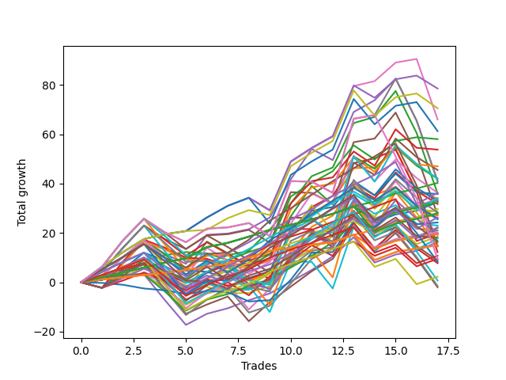

# Short Wallace 003 DB 
- Symbol: ES
- Date Range: 03/18/2022 - 07/15/2022
- Trading Period: 7:20-12:30
- Number of Trades: 17



| Name | Win Percent | Profit | Avg Profit / Trade | Avg Time / Trade |      | Name | Win Percent | Profit | Avg Profit / Trade | Avg Time / Trade |
| ---- | ----------- | ------ | ------------------ | ---------------- | ---- | ---- | ----------- | ------ | ------------------ | ---------------- |
| Sorted By <br> Profit | | | | | | Sorted By <br> Win Percentage ||||
| Forty-Six | 82.35 | 39250.00 | 2308.82 | 08:58 |     | Eighty-Two | 100.00 | 20125.00 | 1183.82 | 02:56 |
| Seventy | 82.35 | 35250.00 | 2073.53 | 08:57 |     | Eighty-One | 100.00 | 13625.00 | 801.47 | 01:46 |
| Six | 88.24 | 33000.00 | 1941.18 | 12:31 |     | One Hundred Twelve | 94.12 | 16625.00 | 977.94 | 02:25 |
| Sixty-Two | 82.35 | 30625.00 | 1801.47 | 10:24 |     | One Hundred Seventeen | 94.12 | 16250.00 | 955.88 | 02:28 |
| Fifty-Four | 70.59 | 29000.00 | 1705.88 | 06:15 |     | One Hundred Twenty-Seven | 94.12 | 14000.00 | 823.53 | 02:40 |
| Fifty-Five | 52.94 | 26875.00 | 1580.88 | 10:56 |     | One Hundred Twenty-Two | 94.12 | 14000.00 | 823.53 | 02:40 |
| Fifty-Three | 52.94 | 23500.00 | 1382.35 | 08:54 |     | One Hundred Eleven | 94.12 | 10125.00 | 595.59 | 01:15 |
| Forty-Seven | 41.18 | 22750.00 | 1338.24 | 16:57 |     | One Hundred Sixteen | 94.12 | 9750.00 | 573.53 | 01:18 |
| Forty-Four | 52.94 | 21000.00 | 1235.29 | 11:20 |     | One Hundred Twenty-Six | 94.12 | 7500.00 | 441.18 | 01:30 |
| Seventy-One | 47.06 | 21000.00 | 1235.29 | 16:07 |     | One Hundred Twenty-One | 94.12 | 7500.00 | 441.18 | 01:30 |
| Four | 70.59 | 20500.00 | 1205.88 | 20:31 |     | Six | 88.24 | 33000.00 | 1941.18 | 12:31 |
| Seven | 58.82 | 20500.00 | 1205.88 | 28:00 |     | Forty-Six | 82.35 | 39250.00 | 2308.82 | 08:58 |
| Eighty-Two | 100.00 | 20125.00 | 1183.82 | 02:56 |     | Seventy | 82.35 | 35250.00 | 2073.53 | 08:57 |
| Eighty-Four | 82.35 | 18125.00 | 1066.18 | 10:36 |     | Sixty-Two | 82.35 | 30625.00 | 1801.47 | 10:24 |
| Sixty-Eight | 52.94 | 18125.00 | 1066.18 | 10:59 |     | Eighty-Four | 82.35 | 18125.00 | 1066.18 | 10:36 |
| Two | 76.47 | 18000.00 | 1058.82 | 17:21 |     | Forty-Eight | 82.35 | 17000.00 | 1000.00 | 03:14 |
| Fifty-Two | 52.94 | 17875.00 | 1051.47 | 07:40 |     | Zero | 82.35 | 16250.00 | 955.88 | 05:39 |
| Forty-Eight | 82.35 | 17000.00 | 1000.00 | 03:14 |     | Forty | 82.35 | 14875.00 | 875.00 | 03:16 |
| One Hundred Fourteen | 76.47 | 17000.00 | 1000.00 | 05:47 |     | Sixty-Four | 82.35 | 11000.00 | 647.06 | 03:31 |
| One | 76.47 | 17000.00 | 1000.00 | 11:52 |     | Eighty-Three | 82.35 | 9875.00 | 580.88 | 10:09 |
| One Hundred Twelve | 94.12 | 16625.00 | 977.94 | 02:25 |     | Fifty-Six | 82.35 | 8125.00 | 477.94 | 04:45 |
| Forty-Two | 58.82 | 16500.00 | 970.59 | 09:20 |     | Two | 76.47 | 18000.00 | 1058.82 | 17:21 |
| One Hundred Seventeen | 94.12 | 16250.00 | 955.88 | 02:28 |     | One Hundred Fourteen | 76.47 | 17000.00 | 1000.00 | 05:47 |
| Zero | 82.35 | 16250.00 | 955.88 | 05:39 |     | One | 76.47 | 17000.00 | 1000.00 | 11:52 |
| Forty-Five | 41.18 | 15875.00 | 933.82 | 14:02 |     | One Hundred Twenty-Nine | 76.47 | 13125.00 | 772.06 | 06:03 |
| Forty | 82.35 | 14875.00 | 875.00 | 03:16 |     | One Hundred Thirteen | 76.47 | 9250.00 | 544.12 | 05:26 |
| Fifty | 52.94 | 14375.00 | 845.59 | 07:09 |     | One Hundred Twenty-Four | 76.47 | 8875.00 | 522.06 | 07:47 |
| Sixty-Nine | 47.06 | 14125.00 | 830.88 | 13:12 |     | Eighty-Five | 76.47 | 7375.00 | 433.82 | 13:57 |
| One Hundred Twenty-Seven | 94.12 | 14000.00 | 823.53 | 02:40 |     | One Hundred Twenty-Eight | 76.47 | 5375.00 | 316.18 | 05:42 |
| One Hundred Twenty-Two | 94.12 | 14000.00 | 823.53 | 02:40 |     | One Hundred Twenty-Three | 76.47 | 1125.00 | 66.18 | 07:26 |
| Eighty-One | 100.00 | 13625.00 | 801.47 | 01:46 |     | Fifty-Four | 70.59 | 29000.00 | 1705.88 | 06:15 |
| Five | 58.82 | 13625.00 | 801.47 | 25:05 |     | Four | 70.59 | 20500.00 | 1205.88 | 20:31 |
| One Hundred Twenty-Nine | 76.47 | 13125.00 | 772.06 | 06:03 |     | Three | 70.59 | 6125.00 | 360.29 | 15:14 |
| Forty-Three | 64.71 | 13000.00 | 764.71 | 07:48 |     | One Hundred Twenty-Five | 70.59 | 4125.00 | 242.65 | 09:42 |
| One Hundred Fifteen | 64.71 | 12875.00 | 757.35 | 06:55 |     | Forty-Three | 64.71 | 13000.00 | 764.71 | 07:48 |
| Forty-One | 64.71 | 12750.00 | 750.00 | 06:10 |     | One Hundred Fifteen | 64.71 | 12875.00 | 757.35 | 06:55 |
| Seventy-Three | 47.06 | 12125.00 | 713.24 | 05:40 |     | Forty-One | 64.71 | 12750.00 | 750.00 | 06:10 |
| Fifty-One | 58.82 | 11500.00 | 676.47 | 06:20 |     | One Hundred Ninteen | 64.71 | 11125.00 | 654.41 | 05:01 |
| One Hundred Ninteen | 64.71 | 11125.00 | 654.41 | 05:01 |     | Fifty-Eight | 64.71 | 9500.00 | 558.82 | 12:20 |
| Sixty-Four | 82.35 | 11000.00 | 647.06 | 03:31 |     | One Hundred Thirty | 64.71 | 8375.00 | 492.65 | 07:13 |
| Forty-Nine | 58.82 | 10500.00 | 617.65 | 05:17 |     | One Hundred Eighteen | 64.71 | 4750.00 | 279.41 | 04:41 |
| One Hundred Eleven | 94.12 | 10125.00 | 595.59 | 01:15 |     | Fifty-Nine | 64.71 | -750.00 | -44.12 | 10:25 |
| Eighty-Three | 82.35 | 9875.00 | 580.88 | 10:09 |     | Fifty-Seven | 64.71 | -1000.00 | -58.82 | 08:47 |
| Sixty-Six | 52.94 | 9875.00 | 580.88 | 09:08 |     | Seven | 58.82 | 20500.00 | 1205.88 | 28:00 |
| One Hundred Sixteen | 94.12 | 9750.00 | 573.53 | 01:18 |     | Forty-Two | 58.82 | 16500.00 | 970.59 | 09:20 |
| Fifty-Eight | 64.71 | 9500.00 | 558.82 | 12:20 |     | Five | 58.82 | 13625.00 | 801.47 | 25:05 |
| One Hundred Thirteen | 76.47 | 9250.00 | 544.12 | 05:26 |     | Fifty-One | 58.82 | 11500.00 | 676.47 | 06:20 |
| One Hundred Twenty | 52.94 | 9000.00 | 529.41 | 05:22 |     | Forty-Nine | 58.82 | 10500.00 | 617.65 | 05:17 |
| One Hundred Twenty-Four | 76.47 | 8875.00 | 522.06 | 07:47 |     | Sixty | 58.82 | 8250.00 | 485.29 | 14:30 |
| One Hundred Thirty | 64.71 | 8375.00 | 492.65 | 07:13 |     | Sixty-Seven | 58.82 | 4375.00 | 257.35 | 08:00 |
| Sixty | 58.82 | 8250.00 | 485.29 | 14:30 |     | Sixty-Five | 58.82 | 3875.00 | 227.94 | 06:20 |
| Fifty-Six | 82.35 | 8125.00 | 477.94 | 04:45 |     | Fifty-Five | 52.94 | 26875.00 | 1580.88 | 10:56 |
| One Hundred Twenty-Six | 94.12 | 7500.00 | 441.18 | 01:30 |     | Fifty-Three | 52.94 | 23500.00 | 1382.35 | 08:54 |
| One Hundred Twenty-One | 94.12 | 7500.00 | 441.18 | 01:30 |     | Forty-Four | 52.94 | 21000.00 | 1235.29 | 11:20 |
| Eighty-Five | 76.47 | 7375.00 | 433.82 | 13:57 |     | Sixty-Eight | 52.94 | 18125.00 | 1066.18 | 10:59 |
| Sixty-Three | 47.06 | 7250.00 | 426.47 | 21:02 |     | Fifty-Two | 52.94 | 17875.00 | 1051.47 | 07:40 |
| Three | 70.59 | 6125.00 | 360.29 | 15:14 |     | Fifty | 52.94 | 14375.00 | 845.59 | 07:09 |
| One Hundred Twenty-Eight | 76.47 | 5375.00 | 316.18 | 05:42 |     | Sixty-Six | 52.94 | 9875.00 | 580.88 | 09:08 |
| One Hundred Eighteen | 64.71 | 4750.00 | 279.41 | 04:41 |     | One Hundred Twenty | 52.94 | 9000.00 | 529.41 | 05:22 |
| TEST | 52.94 | 4750.00 | 279.41 | 29:37 |     | TEST | 52.94 | 4750.00 | 279.41 | 29:37 |
| Sixty-Seven | 58.82 | 4375.00 | 257.35 | 08:00 |     | Seventy-One | 47.06 | 21000.00 | 1235.29 | 16:07 |
| One Hundred Twenty-Five | 70.59 | 4125.00 | 242.65 | 09:42 |     | Sixty-Nine | 47.06 | 14125.00 | 830.88 | 13:12 |
| Sixty-Five | 58.82 | 3875.00 | 227.94 | 06:20 |     | Seventy-Three | 47.06 | 12125.00 | 713.24 | 05:40 |
| One Hundred Twenty-Three | 76.47 | 1125.00 | 66.18 | 07:26 |     | Sixty-Three | 47.06 | 7250.00 | 426.47 | 21:02 |
| Sixty-One | 47.06 | 375.00 | 22.06 | 18:07 |     | Sixty-One | 47.06 | 375.00 | 22.06 | 18:07 |
| Fifty-Nine | 64.71 | -750.00 | -44.12 | 10:25 |     | Forty-Seven | 41.18 | 22750.00 | 1338.24 | 16:57 |
| Fifty-Seven | 64.71 | -1000.00 | -58.82 | 08:47 |     | Forty-Five | 41.18 | 15875.00 | 933.82 | 14:02 |

## NO STOPLOSS

### Test Zero
* Sell when price hits the middle line of the 20p bollinger
* No Stoploss
* Results:
```
Total Trades: 17
Percent Up: 17.65
Percent Down: 82.35
Total Points Moved Down: 32.50
Potential Profit: 16250.00
Total Points Ups: 14.50 Count Ups: 3
Total Points Downs: 47.00 Count Downs: 14
```

<details><summary>Trades</summary>

<code>In: 2022-03-25 11:34:00		Out: 2022-03-25 11:40:25		Total Position Time: 06:25		Total Move Down: 2.00		Total to Date: 2.00</code> <br />
<code>In: 2022-03-29 08:52:00		Out: 2022-03-29 08:56:15		Total Position Time: 04:15		Total Move Down: 1.00		Total to Date: 3.00</code> <br />
<code>In: 2022-03-29 08:53:00		Out: 2022-03-29 08:56:15		Total Position Time: 03:15		Total Move Down: 0.25		Total to Date: 3.25</code> <br />
<code>In: 2022-03-31 07:38:00		Out: 2022-03-31 08:03:05		Total Position Time: 25:05		Total Move Down: -5.75		Total to Date: -2.50</code> <br />
<code>In: 2022-03-31 07:39:00		Out: 2022-03-31 08:03:05		Total Position Time: 24:05		Total Move Down: -6.50		Total to Date: -9.00</code> <br />
<code>In: 2022-04-18 10:59:00		Out: 2022-04-18 10:59:30		Total Position Time: 00:30		Total Move Down: 4.50		Total to Date: -4.50</code> <br />
<code>In: 2022-04-20 09:55:00		Out: 2022-04-20 09:59:15		Total Position Time: 04:15		Total Move Down: 2.25		Total to Date: -2.25</code> <br />
<code>In: 2022-04-25 09:28:00		Out: 2022-04-25 09:31:05		Total Position Time: 03:05		Total Move Down: 3.25		Total to Date: 1.00</code> <br />
<code>In: 2022-05-10 11:47:00		Out: 2022-05-10 11:47:10		Total Position Time: 00:10		Total Move Down: 2.75		Total to Date: 3.75</code> <br />
<code>In: 2022-05-24 09:18:00		Out: 2022-05-24 09:21:35		Total Position Time: 03:35		Total Move Down: 4.75		Total to Date: 8.50</code> <br />
<code>In: 2022-06-10 10:53:00		Out: 2022-06-10 10:54:55		Total Position Time: 01:55		Total Move Down: 4.75		Total to Date: 13.25</code> <br />
<code>In: 2022-06-13 09:15:00		Out: 2022-06-13 09:17:05		Total Position Time: 02:05		Total Move Down: 5.50		Total to Date: 18.75</code> <br />
<code>In: 2022-06-13 09:41:00		Out: 2022-06-13 09:43:15		Total Position Time: 02:15		Total Move Down: 7.75		Total to Date: 26.50</code> <br />
<code>In: 2022-06-29 12:21:00		Out: 2022-06-29 12:33:20		Total Position Time: 12:20		Total Move Down: -2.25		Total to Date: 24.25</code> <br />
<code>In: 2022-07-06 11:10:00		Out: 2022-07-06 11:10:10		Total Position Time: 00:10		Total Move Down: 3.25		Total to Date: 27.50</code> <br />
<code>In: 2022-07-14 07:57:00		Out: 2022-07-14 07:57:15		Total Position Time: 00:15		Total Move Down: 1.50		Total to Date: 29.00</code> <br />
<code>In: 2022-07-14 08:13:00		Out: 2022-07-14 08:15:30		Total Position Time: 02:30		Total Move Down: 3.50		Total to Date: 32.50</code> <br />


</details>

### Test One
* Sell when the price hits the upper line of the 20p 1std bollinger
* No Stoploss
* Results:
```
Total Trades: 17
Percent Up: 23.53
Percent Down: 76.47
Total Points Moved Down: 34.00
Potential Profit: 17000.00
Total Points Ups: 27.75 Count Ups: 4
Total Points Downs: 61.75 Count Downs: 13
```

<details><summary>Trades</summary>

<code>In: 2022-03-25 11:34:00		Out: 2022-03-25 11:40:55		Total Position Time: 06:55		Total Move Down: 2.50		Total to Date: 2.50</code> <br />
<code>In: 2022-03-29 08:52:00		Out: 2022-03-29 08:58:40		Total Position Time: 06:40		Total Move Down: 3.00		Total to Date: 5.50</code> <br />
<code>In: 2022-03-29 08:53:00		Out: 2022-03-29 08:58:40		Total Position Time: 05:40		Total Move Down: 2.25		Total to Date: 7.75</code> <br />
<code>In: 2022-03-31 07:38:00		Out: 2022-03-31 08:03:30		Total Position Time: 25:30		Total Move Down: -3.50		Total to Date: 4.25</code> <br />
<code>In: 2022-03-31 07:39:00		Out: 2022-03-31 08:03:30		Total Position Time: 24:30		Total Move Down: -4.25		Total to Date: 0.00</code> <br />
<code>In: 2022-04-18 10:59:00		Out: 2022-04-18 11:06:20		Total Position Time: 07:20		Total Move Down: 3.75		Total to Date: 3.75</code> <br />
<code>In: 2022-04-20 09:55:00		Out: 2022-04-20 10:08:15		Total Position Time: 13:15		Total Move Down: 3.25		Total to Date: 7.00</code> <br />
<code>In: 2022-04-25 09:28:00		Out: 2022-04-25 09:42:35		Total Position Time: 14:35		Total Move Down: 0.75		Total to Date: 7.75</code> <br />
<code>In: 2022-05-10 11:47:00		Out: 2022-05-10 11:47:20		Total Position Time: 00:20		Total Move Down: 7.75		Total to Date: 15.50</code> <br />
<code>In: 2022-05-24 09:18:00		Out: 2022-05-24 09:28:55		Total Position Time: 10:55		Total Move Down: 6.25		Total to Date: 21.75</code> <br />
<code>In: 2022-06-10 10:53:00		Out: 2022-06-10 10:56:05		Total Position Time: 03:05		Total Move Down: 6.25		Total to Date: 28.00</code> <br />
<code>In: 2022-06-13 09:15:00		Out: 2022-06-13 09:24:05		Total Position Time: 09:05		Total Move Down: 5.00		Total to Date: 33.00</code> <br />
<code>In: 2022-06-13 09:41:00		Out: 2022-06-13 09:47:50		Total Position Time: 06:50		Total Move Down: 13.25		Total to Date: 46.25</code> <br />
<code>In: 2022-06-29 12:21:00		Out: 2022-06-29 12:34:10		Total Position Time: 13:10		Total Move Down: 0.25		Total to Date: 46.50</code> <br />
<code>In: 2022-07-06 11:10:00		Out: 2022-07-06 11:11:10		Total Position Time: 01:10		Total Move Down: 7.50		Total to Date: 54.00</code> <br />
<code>In: 2022-07-14 07:57:00		Out: 2022-07-14 08:26:55		Total Position Time: 29:55		Total Move Down: -17.00		Total to Date: 37.00</code> <br />
<code>In: 2022-07-14 08:13:00		Out: 2022-07-14 08:35:50		Total Position Time: 22:50		Total Move Down: -3.00		Total to Date: 34.00</code> <br />


</details>

### Test Two
* Sell when the price hits the upper line of the 20p 2std bollinger
* No Stoploss
* Results:
```
Total Trades: 17
Percent Up: 23.53
Percent Down: 76.47
Total Points Moved Down: 36.00
Potential Profit: 18000.00
Total Points Ups: 50.00 Count Ups: 4
Total Points Downs: 86.00 Count Downs: 13
```

<details><summary>Trades</summary>

<code>In: 2022-03-25 11:34:00		Out: 2022-03-25 12:00:55		Total Position Time: 26:55		Total Move Down: 1.75		Total to Date: 1.75</code> <br />
<code>In: 2022-03-29 08:52:00		Out: 2022-03-29 09:01:40		Total Position Time: 09:40		Total Move Down: 4.50		Total to Date: 6.25</code> <br />
<code>In: 2022-03-29 08:53:00		Out: 2022-03-29 09:01:40		Total Position Time: 08:40		Total Move Down: 3.75		Total to Date: 10.00</code> <br />
<code>In: 2022-03-31 07:38:00		Out: 2022-03-31 08:07:55		Total Position Time: 29:55		Total Move Down: -5.50		Total to Date: 4.50</code> <br />
<code>In: 2022-03-31 07:39:00		Out: 2022-03-31 08:08:30		Total Position Time: 29:30		Total Move Down: -3.00		Total to Date: 1.50</code> <br />
<code>In: 2022-04-18 10:59:00		Out: 2022-04-18 11:10:40		Total Position Time: 11:40		Total Move Down: 6.25		Total to Date: 7.75</code> <br />
<code>In: 2022-04-20 09:55:00		Out: 2022-04-20 10:08:15		Total Position Time: 13:15		Total Move Down: 3.25		Total to Date: 11.00</code> <br />
<code>In: 2022-04-25 09:28:00		Out: 2022-04-25 09:57:55		Total Position Time: 29:55		Total Move Down: 1.75		Total to Date: 12.75</code> <br />
<code>In: 2022-05-10 11:47:00		Out: 2022-05-10 11:56:50		Total Position Time: 09:50		Total Move Down: 8.50		Total to Date: 21.25</code> <br />
<code>In: 2022-05-24 09:18:00		Out: 2022-05-24 09:31:20		Total Position Time: 13:20		Total Move Down: 10.75		Total to Date: 32.00</code> <br />
<code>In: 2022-06-10 10:53:00		Out: 2022-06-10 11:01:00		Total Position Time: 08:00		Total Move Down: 11.00		Total to Date: 43.00</code> <br />
<code>In: 2022-06-13 09:15:00		Out: 2022-06-13 09:30:15		Total Position Time: 15:15		Total Move Down: 3.50		Total to Date: 46.50</code> <br />
<code>In: 2022-06-13 09:41:00		Out: 2022-06-13 09:54:20		Total Position Time: 13:20		Total Move Down: 18.00		Total to Date: 64.50</code> <br />
<code>In: 2022-06-29 12:21:00		Out: 2022-06-29 12:35:20		Total Position Time: 14:20		Total Move Down: 2.50		Total to Date: 67.00</code> <br />
<code>In: 2022-07-06 11:10:00		Out: 2022-07-06 11:11:45		Total Position Time: 01:45		Total Move Down: 10.50		Total to Date: 77.50</code> <br />
<code>In: 2022-07-14 07:57:00		Out: 2022-07-14 08:26:55		Total Position Time: 29:55		Total Move Down: -17.00		Total to Date: 60.50</code> <br />
<code>In: 2022-07-14 08:13:00		Out: 2022-07-14 08:42:55		Total Position Time: 29:55		Total Move Down: -24.50		Total to Date: 36.00</code> <br />


</details>

### Test Three
* Sell when price hits the middle line of the 50p bollinger
* No Stoploss
* Results:
```
Total Trades: 17
Percent Up: 29.41
Percent Down: 70.59
Total Points Moved Down: 12.25
Potential Profit: 6125.00
Total Points Ups: 51.00 Count Ups: 5
Total Points Downs: 63.25 Count Downs: 12
```

<details><summary>Trades</summary>

<code>In: 2022-03-25 11:34:00		Out: 2022-03-25 11:49:30		Total Position Time: 15:30		Total Move Down: 1.00		Total to Date: 1.00</code> <br />
<code>In: 2022-03-29 08:52:00		Out: 2022-03-29 09:01:25		Total Position Time: 09:25		Total Move Down: 3.50		Total to Date: 4.50</code> <br />
<code>In: 2022-03-29 08:53:00		Out: 2022-03-29 09:01:25		Total Position Time: 08:25		Total Move Down: 2.75		Total to Date: 7.25</code> <br />
<code>In: 2022-03-31 07:38:00		Out: 2022-03-31 08:07:55		Total Position Time: 29:55		Total Move Down: -5.50		Total to Date: 1.75</code> <br />
<code>In: 2022-03-31 07:39:00		Out: 2022-03-31 08:08:55		Total Position Time: 29:55		Total Move Down: -4.00		Total to Date: -2.25</code> <br />
<code>In: 2022-04-18 10:59:00		Out: 2022-04-18 11:16:30		Total Position Time: 17:30		Total Move Down: 6.25		Total to Date: 4.00</code> <br />
<code>In: 2022-04-20 09:55:00		Out: 2022-04-20 10:08:35		Total Position Time: 13:35		Total Move Down: 4.75		Total to Date: 8.75</code> <br />
<code>In: 2022-04-25 09:28:00		Out: 2022-04-25 09:55:05		Total Position Time: 27:05		Total Move Down: -0.00		Total to Date: 8.75</code> <br />
<code>In: 2022-05-10 11:47:00		Out: 2022-05-10 11:47:10		Total Position Time: 00:10		Total Move Down: 2.75		Total to Date: 11.50</code> <br />
<code>In: 2022-05-24 09:18:00		Out: 2022-05-24 09:31:15		Total Position Time: 13:15		Total Move Down: 9.00		Total to Date: 20.50</code> <br />
<code>In: 2022-06-10 10:53:00		Out: 2022-06-10 10:58:20		Total Position Time: 05:20		Total Move Down: 10.00		Total to Date: 30.50</code> <br />
<code>In: 2022-06-13 09:15:00		Out: 2022-06-13 09:23:45		Total Position Time: 08:45		Total Move Down: 4.50		Total to Date: 35.00</code> <br />
<code>In: 2022-06-13 09:41:00		Out: 2022-06-13 09:47:50		Total Position Time: 06:50		Total Move Down: 13.25		Total to Date: 48.25</code> <br />
<code>In: 2022-06-29 12:21:00		Out: 2022-06-29 12:34:15		Total Position Time: 13:15		Total Move Down: 2.00		Total to Date: 50.25</code> <br />
<code>In: 2022-07-06 11:10:00		Out: 2022-07-06 11:10:20		Total Position Time: 00:20		Total Move Down: 3.50		Total to Date: 53.75</code> <br />
<code>In: 2022-07-14 07:57:00		Out: 2022-07-14 08:26:55		Total Position Time: 29:55		Total Move Down: -17.00		Total to Date: 36.75</code> <br />
<code>In: 2022-07-14 08:13:00		Out: 2022-07-14 08:42:55		Total Position Time: 29:55		Total Move Down: -24.50		Total to Date: 12.25</code> <br />


</details>

### Test Four
* Sell when the price hits the upper line of the 50p 1std bollinger
* No Stoploss
* Results:
```
Total Trades: 17
Percent Up: 29.41
Percent Down: 70.59
Total Points Moved Down: 41.00
Potential Profit: 20500.00
Total Points Ups: 55.50 Count Ups: 5
Total Points Downs: 96.50 Count Downs: 12
```

<details><summary>Trades</summary>

<code>In: 2022-03-25 11:34:00		Out: 2022-03-25 12:01:35		Total Position Time: 27:35		Total Move Down: 2.75		Total to Date: 2.75</code> <br />
<code>In: 2022-03-29 08:52:00		Out: 2022-03-29 09:02:15		Total Position Time: 10:15		Total Move Down: 7.50		Total to Date: 10.25</code> <br />
<code>In: 2022-03-29 08:53:00		Out: 2022-03-29 09:02:15		Total Position Time: 09:15		Total Move Down: 6.75		Total to Date: 17.00</code> <br />
<code>In: 2022-03-31 07:38:00		Out: 2022-03-31 08:07:55		Total Position Time: 29:55		Total Move Down: -5.50		Total to Date: 11.50</code> <br />
<code>In: 2022-03-31 07:39:00		Out: 2022-03-31 08:08:55		Total Position Time: 29:55		Total Move Down: -4.00		Total to Date: 7.50</code> <br />
<code>In: 2022-04-18 10:59:00		Out: 2022-04-18 11:18:10		Total Position Time: 19:10		Total Move Down: 11.75		Total to Date: 19.25</code> <br />
<code>In: 2022-04-20 09:55:00		Out: 2022-04-20 10:24:55		Total Position Time: 29:55		Total Move Down: 0.50		Total to Date: 19.75</code> <br />
<code>In: 2022-04-25 09:28:00		Out: 2022-04-25 09:57:55		Total Position Time: 29:55		Total Move Down: 1.75		Total to Date: 21.50</code> <br />
<code>In: 2022-05-10 11:47:00		Out: 2022-05-10 11:47:15		Total Position Time: 00:15		Total Move Down: 4.75		Total to Date: 26.25</code> <br />
<code>In: 2022-05-24 09:18:00		Out: 2022-05-24 09:33:20		Total Position Time: 15:20		Total Move Down: 15.50		Total to Date: 41.75</code> <br />
<code>In: 2022-06-10 10:53:00		Out: 2022-06-10 11:15:20		Total Position Time: 22:20		Total Move Down: 12.25		Total to Date: 54.00</code> <br />
<code>In: 2022-06-13 09:15:00		Out: 2022-06-13 09:44:55		Total Position Time: 29:55		Total Move Down: -4.50		Total to Date: 49.50</code> <br />
<code>In: 2022-06-13 09:41:00		Out: 2022-06-13 09:54:40		Total Position Time: 13:40		Total Move Down: 19.50		Total to Date: 69.00</code> <br />
<code>In: 2022-06-29 12:21:00		Out: 2022-06-29 12:41:00		Total Position Time: 20:00		Total Move Down: 4.75		Total to Date: 73.75</code> <br />
<code>In: 2022-07-06 11:10:00		Out: 2022-07-06 11:11:35		Total Position Time: 01:35		Total Move Down: 8.75		Total to Date: 82.50</code> <br />
<code>In: 2022-07-14 07:57:00		Out: 2022-07-14 08:26:55		Total Position Time: 29:55		Total Move Down: -17.00		Total to Date: 65.50</code> <br />
<code>In: 2022-07-14 08:13:00		Out: 2022-07-14 08:42:55		Total Position Time: 29:55		Total Move Down: -24.50		Total to Date: 41.00</code> <br />


</details>

### Test Five
* Sell when the price hits the upper line of the 50p 2std bollinger
* No Stoploss
* Results:
```
Total Trades: 17
Percent Up: 41.18
Percent Down: 58.82
Total Points Moved Down: 27.25
Potential Profit: 13625.00
Total Points Ups: 61.00 Count Ups: 7
Total Points Downs: 88.25 Count Downs: 10
```

<details><summary>Trades</summary>

<code>In: 2022-03-25 11:34:00		Out: 2022-03-25 12:01:55		Total Position Time: 27:55		Total Move Down: 4.25		Total to Date: 4.25</code> <br />
<code>In: 2022-03-29 08:52:00		Out: 2022-03-29 09:10:50		Total Position Time: 18:50		Total Move Down: 9.75		Total to Date: 14.00</code> <br />
<code>In: 2022-03-29 08:53:00		Out: 2022-03-29 09:10:50		Total Position Time: 17:50		Total Move Down: 9.00		Total to Date: 23.00</code> <br />
<code>In: 2022-03-31 07:38:00		Out: 2022-03-31 08:07:55		Total Position Time: 29:55		Total Move Down: -5.50		Total to Date: 17.50</code> <br />
<code>In: 2022-03-31 07:39:00		Out: 2022-03-31 08:08:55		Total Position Time: 29:55		Total Move Down: -4.00		Total to Date: 13.50</code> <br />
<code>In: 2022-04-18 10:59:00		Out: 2022-04-18 11:28:55		Total Position Time: 29:55		Total Move Down: 5.50		Total to Date: 19.00</code> <br />
<code>In: 2022-04-20 09:55:00		Out: 2022-04-20 10:24:55		Total Position Time: 29:55		Total Move Down: 0.50		Total to Date: 19.50</code> <br />
<code>In: 2022-04-25 09:28:00		Out: 2022-04-25 09:57:55		Total Position Time: 29:55		Total Move Down: 1.75		Total to Date: 21.25</code> <br />
<code>In: 2022-05-10 11:47:00		Out: 2022-05-10 12:16:55		Total Position Time: 29:55		Total Move Down: -5.25		Total to Date: 16.00</code> <br />
<code>In: 2022-05-24 09:18:00		Out: 2022-05-24 09:36:50		Total Position Time: 18:50		Total Move Down: 20.50		Total to Date: 36.50</code> <br />
<code>In: 2022-06-10 10:53:00		Out: 2022-06-10 11:22:55		Total Position Time: 29:55		Total Move Down: -0.25		Total to Date: 36.25</code> <br />
<code>In: 2022-06-13 09:15:00		Out: 2022-06-13 09:44:55		Total Position Time: 29:55		Total Move Down: -4.50		Total to Date: 31.75</code> <br />
<code>In: 2022-06-13 09:41:00		Out: 2022-06-13 09:58:05		Total Position Time: 17:05		Total Move Down: 25.00		Total to Date: 56.75</code> <br />
<code>In: 2022-06-29 12:21:00		Out: 2022-06-29 12:46:00		Total Position Time: 25:00		Total Move Down: 1.50		Total to Date: 58.25</code> <br />
<code>In: 2022-07-06 11:10:00		Out: 2022-07-06 11:11:50		Total Position Time: 01:50		Total Move Down: 10.50		Total to Date: 68.75</code> <br />
<code>In: 2022-07-14 07:57:00		Out: 2022-07-14 08:26:55		Total Position Time: 29:55		Total Move Down: -17.00		Total to Date: 51.75</code> <br />
<code>In: 2022-07-14 08:13:00		Out: 2022-07-14 08:42:55		Total Position Time: 29:55		Total Move Down: -24.50		Total to Date: 27.25</code> <br />


</details>

### Test Six
* Sell when the price hits the middle line of the 1std VWAP
* No Stoploss
* Results:
```
Total Trades: 17
Percent Up: 11.76
Percent Down: 88.24
Total Points Moved Down: 66.00
Potential Profit: 33000.00
Total Points Ups: 29.75 Count Ups: 2
Total Points Downs: 95.75 Count Downs: 15
```

<details><summary>Trades</summary>

<code>In: 2022-03-25 11:34:00		Out: 2022-03-25 12:03:55		Total Position Time: 29:55		Total Move Down: 6.25		Total to Date: 6.25</code> <br />
<code>In: 2022-03-29 08:52:00		Out: 2022-03-29 09:02:10		Total Position Time: 10:10		Total Move Down: 6.00		Total to Date: 12.25</code> <br />
<code>In: 2022-03-29 08:53:00		Out: 2022-03-29 09:02:10		Total Position Time: 09:10		Total Move Down: 5.25		Total to Date: 17.50</code> <br />
<code>In: 2022-03-31 07:38:00		Out: 2022-03-31 07:41:25		Total Position Time: 03:25		Total Move Down: 2.00		Total to Date: 19.50</code> <br />
<code>In: 2022-03-31 07:39:00		Out: 2022-03-31 07:41:25		Total Position Time: 02:25		Total Move Down: 1.25		Total to Date: 20.75</code> <br />
<code>In: 2022-04-18 10:59:00		Out: 2022-04-18 11:28:55		Total Position Time: 29:55		Total Move Down: 5.50		Total to Date: 26.25</code> <br />
<code>In: 2022-04-20 09:55:00		Out: 2022-04-20 10:08:35		Total Position Time: 13:35		Total Move Down: 4.75		Total to Date: 31.00</code> <br />
<code>In: 2022-04-25 09:28:00		Out: 2022-04-25 09:31:05		Total Position Time: 03:05		Total Move Down: 3.25		Total to Date: 34.25</code> <br />
<code>In: 2022-05-10 11:47:00		Out: 2022-05-10 12:16:55		Total Position Time: 29:55		Total Move Down: -5.25		Total to Date: 29.00</code> <br />
<code>In: 2022-05-24 09:18:00		Out: 2022-05-24 09:36:45		Total Position Time: 18:45		Total Move Down: 19.75		Total to Date: 48.75</code> <br />
<code>In: 2022-06-10 10:53:00		Out: 2022-06-10 10:55:05		Total Position Time: 02:05		Total Move Down: 5.50		Total to Date: 54.25</code> <br />
<code>In: 2022-06-13 09:15:00		Out: 2022-06-13 09:17:15		Total Position Time: 02:15		Total Move Down: 4.75		Total to Date: 59.00</code> <br />
<code>In: 2022-06-13 09:41:00		Out: 2022-06-13 09:54:45		Total Position Time: 13:45		Total Move Down: 20.50		Total to Date: 79.50</code> <br />
<code>In: 2022-06-29 12:21:00		Out: 2022-06-29 12:34:15		Total Position Time: 13:15		Total Move Down: 2.00		Total to Date: 81.50</code> <br />
<code>In: 2022-07-06 11:10:00		Out: 2022-07-06 11:11:10		Total Position Time: 01:10		Total Move Down: 7.50		Total to Date: 89.00</code> <br />
<code>In: 2022-07-14 07:57:00		Out: 2022-07-14 07:57:15		Total Position Time: 00:15		Total Move Down: 1.50		Total to Date: 90.50</code> <br />
<code>In: 2022-07-14 08:13:00		Out: 2022-07-14 08:42:55		Total Position Time: 29:55		Total Move Down: -24.50		Total to Date: 66.00</code> <br />


</details>

### Test Seven
* Sell when the price hits the upper line of the 1std VWAP
* No Stoploss
* Results:
```
Total Trades: 17
Percent Up: 41.18
Percent Down: 58.82
Total Points Moved Down: 41.00
Potential Profit: 20500.00
Total Points Ups: 61.00 Count Ups: 7
Total Points Downs: 102.00 Count Downs: 10
```

<details><summary>Trades</summary>

<code>In: 2022-03-25 11:34:00		Out: 2022-03-25 12:03:55		Total Position Time: 29:55		Total Move Down: 6.25		Total to Date: 6.25</code> <br />
<code>In: 2022-03-29 08:52:00		Out: 2022-03-29 09:21:55		Total Position Time: 29:55		Total Move Down: 10.75		Total to Date: 17.00</code> <br />
<code>In: 2022-03-29 08:53:00		Out: 2022-03-29 09:22:55		Total Position Time: 29:55		Total Move Down: 8.75		Total to Date: 25.75</code> <br />
<code>In: 2022-03-31 07:38:00		Out: 2022-03-31 08:07:55		Total Position Time: 29:55		Total Move Down: -5.50		Total to Date: 20.25</code> <br />
<code>In: 2022-03-31 07:39:00		Out: 2022-03-31 08:08:55		Total Position Time: 29:55		Total Move Down: -4.00		Total to Date: 16.25</code> <br />
<code>In: 2022-04-18 10:59:00		Out: 2022-04-18 11:28:55		Total Position Time: 29:55		Total Move Down: 5.50		Total to Date: 21.75</code> <br />
<code>In: 2022-04-20 09:55:00		Out: 2022-04-20 10:24:55		Total Position Time: 29:55		Total Move Down: 0.50		Total to Date: 22.25</code> <br />
<code>In: 2022-04-25 09:28:00		Out: 2022-04-25 09:57:55		Total Position Time: 29:55		Total Move Down: 1.75		Total to Date: 24.00</code> <br />
<code>In: 2022-05-10 11:47:00		Out: 2022-05-10 12:16:55		Total Position Time: 29:55		Total Move Down: -5.25		Total to Date: 18.75</code> <br />
<code>In: 2022-05-24 09:18:00		Out: 2022-05-24 09:47:55		Total Position Time: 29:55		Total Move Down: 22.25		Total to Date: 41.00</code> <br />
<code>In: 2022-06-10 10:53:00		Out: 2022-06-10 11:22:55		Total Position Time: 29:55		Total Move Down: -0.25		Total to Date: 40.75</code> <br />
<code>In: 2022-06-13 09:15:00		Out: 2022-06-13 09:44:55		Total Position Time: 29:55		Total Move Down: -4.50		Total to Date: 36.25</code> <br />
<code>In: 2022-06-13 09:41:00		Out: 2022-06-13 10:10:55		Total Position Time: 29:55		Total Move Down: 30.00		Total to Date: 66.25</code> <br />
<code>In: 2022-06-29 12:21:00		Out: 2022-06-29 12:46:00		Total Position Time: 25:00		Total Move Down: 1.50		Total to Date: 67.75</code> <br />
<code>In: 2022-07-06 11:10:00		Out: 2022-07-06 11:12:20		Total Position Time: 02:20		Total Move Down: 14.75		Total to Date: 82.50</code> <br />
<code>In: 2022-07-14 07:57:00		Out: 2022-07-14 08:26:55		Total Position Time: 29:55		Total Move Down: -17.00		Total to Date: 65.50</code> <br />
<code>In: 2022-07-14 08:13:00		Out: 2022-07-14 08:42:55		Total Position Time: 29:55		Total Move Down: -24.50		Total to Date: 41.00</code> <br />


</details>

## STOPLOSS OF 5

### Test Forty
* Sell when price hits the middle line of the 20p bollinger
* Stoploss is -5 points
* Results:
```
Total Trades: 17
Percent Up: 17.65
Percent Down: 82.35
Total Points Moved Down: 29.75
Potential Profit: 14875.00
Total Points Ups: 17.25 Count Ups: 3
Total Points Downs: 47.00 Count Downs: 14
```

<details><summary>Trades</summary>

<code>In: 2022-03-25 11:34:00		Out: 2022-03-25 11:40:25		Total Position Time: 06:25		Total Move Down: 2.00		Total to Date: 2.00</code> <br />
<code>In: 2022-03-29 08:52:00		Out: 2022-03-29 08:56:15		Total Position Time: 04:15		Total Move Down: 1.00		Total to Date: 3.00</code> <br />
<code>In: 2022-03-29 08:53:00		Out: 2022-03-29 08:56:15		Total Position Time: 03:15		Total Move Down: 0.25		Total to Date: 3.25</code> <br />
<code>In: 2022-03-31 07:38:00		Out: 2022-03-31 07:46:45		Total Position Time: 08:45		Total Move Down: -5.75		Total to Date: -2.50</code> <br />
<code>In: 2022-03-31 07:39:00		Out: 2022-03-31 07:46:45		Total Position Time: 07:45		Total Move Down: -6.50		Total to Date: -9.00</code> <br />
<code>In: 2022-04-18 10:59:00		Out: 2022-04-18 10:59:30		Total Position Time: 00:30		Total Move Down: 4.50		Total to Date: -4.50</code> <br />
<code>In: 2022-04-20 09:55:00		Out: 2022-04-20 09:59:15		Total Position Time: 04:15		Total Move Down: 2.25		Total to Date: -2.25</code> <br />
<code>In: 2022-04-25 09:28:00		Out: 2022-04-25 09:31:05		Total Position Time: 03:05		Total Move Down: 3.25		Total to Date: 1.00</code> <br />
<code>In: 2022-05-10 11:47:00		Out: 2022-05-10 11:47:10		Total Position Time: 00:10		Total Move Down: 2.75		Total to Date: 3.75</code> <br />
<code>In: 2022-05-24 09:18:00		Out: 2022-05-24 09:21:35		Total Position Time: 03:35		Total Move Down: 4.75		Total to Date: 8.50</code> <br />
<code>In: 2022-06-10 10:53:00		Out: 2022-06-10 10:54:55		Total Position Time: 01:55		Total Move Down: 4.75		Total to Date: 13.25</code> <br />
<code>In: 2022-06-13 09:15:00		Out: 2022-06-13 09:17:05		Total Position Time: 02:05		Total Move Down: 5.50		Total to Date: 18.75</code> <br />
<code>In: 2022-06-13 09:41:00		Out: 2022-06-13 09:43:15		Total Position Time: 02:15		Total Move Down: 7.75		Total to Date: 26.50</code> <br />
<code>In: 2022-06-29 12:21:00		Out: 2022-06-29 12:25:25		Total Position Time: 04:25		Total Move Down: -5.00		Total to Date: 21.50</code> <br />
<code>In: 2022-07-06 11:10:00		Out: 2022-07-06 11:10:10		Total Position Time: 00:10		Total Move Down: 3.25		Total to Date: 24.75</code> <br />
<code>In: 2022-07-14 07:57:00		Out: 2022-07-14 07:57:15		Total Position Time: 00:15		Total Move Down: 1.50		Total to Date: 26.25</code> <br />
<code>In: 2022-07-14 08:13:00		Out: 2022-07-14 08:15:30		Total Position Time: 02:30		Total Move Down: 3.50		Total to Date: 29.75</code> <br />


</details>

### Test Forty-One
* Sell when the price hits the upper line of the 20p 1std bollinger
* Stoploss is -5 points
* Results:
```
Total Trades: 17
Percent Up: 35.29
Percent Down: 64.71
Total Points Moved Down: 25.50
Potential Profit: 12750.00
Total Points Ups: 35.25 Count Ups: 6
Total Points Downs: 60.75 Count Downs: 11
```

<details><summary>Trades</summary>

<code>In: 2022-03-25 11:34:00		Out: 2022-03-25 11:40:55		Total Position Time: 06:55		Total Move Down: 2.50		Total to Date: 2.50</code> <br />
<code>In: 2022-03-29 08:52:00		Out: 2022-03-29 08:58:40		Total Position Time: 06:40		Total Move Down: 3.00		Total to Date: 5.50</code> <br />
<code>In: 2022-03-29 08:53:00		Out: 2022-03-29 08:58:40		Total Position Time: 05:40		Total Move Down: 2.25		Total to Date: 7.75</code> <br />
<code>In: 2022-03-31 07:38:00		Out: 2022-03-31 07:46:45		Total Position Time: 08:45		Total Move Down: -5.75		Total to Date: 2.00</code> <br />
<code>In: 2022-03-31 07:39:00		Out: 2022-03-31 07:46:45		Total Position Time: 07:45		Total Move Down: -6.50		Total to Date: -4.50</code> <br />
<code>In: 2022-04-18 10:59:00		Out: 2022-04-18 11:06:20		Total Position Time: 07:20		Total Move Down: 3.75		Total to Date: -0.75</code> <br />
<code>In: 2022-04-20 09:55:00		Out: 2022-04-20 10:08:15		Total Position Time: 13:15		Total Move Down: 3.25		Total to Date: 2.50</code> <br />
<code>In: 2022-04-25 09:28:00		Out: 2022-04-25 09:32:30		Total Position Time: 04:30		Total Move Down: -5.25		Total to Date: -2.75</code> <br />
<code>In: 2022-05-10 11:47:00		Out: 2022-05-10 11:47:20		Total Position Time: 00:20		Total Move Down: 7.75		Total to Date: 5.00</code> <br />
<code>In: 2022-05-24 09:18:00		Out: 2022-05-24 09:28:55		Total Position Time: 10:55		Total Move Down: 6.25		Total to Date: 11.25</code> <br />
<code>In: 2022-06-10 10:53:00		Out: 2022-06-10 10:56:05		Total Position Time: 03:05		Total Move Down: 6.25		Total to Date: 17.50</code> <br />
<code>In: 2022-06-13 09:15:00		Out: 2022-06-13 09:24:05		Total Position Time: 09:05		Total Move Down: 5.00		Total to Date: 22.50</code> <br />
<code>In: 2022-06-13 09:41:00		Out: 2022-06-13 09:47:50		Total Position Time: 06:50		Total Move Down: 13.25		Total to Date: 35.75</code> <br />
<code>In: 2022-06-29 12:21:00		Out: 2022-06-29 12:25:25		Total Position Time: 04:25		Total Move Down: -5.00		Total to Date: 30.75</code> <br />
<code>In: 2022-07-06 11:10:00		Out: 2022-07-06 11:11:10		Total Position Time: 01:10		Total Move Down: 7.50		Total to Date: 38.25</code> <br />
<code>In: 2022-07-14 07:57:00		Out: 2022-07-14 08:00:05		Total Position Time: 03:05		Total Move Down: -7.50		Total to Date: 30.75</code> <br />
<code>In: 2022-07-14 08:13:00		Out: 2022-07-14 08:18:05		Total Position Time: 05:05		Total Move Down: -5.25		Total to Date: 25.50</code> <br />


</details>

### Test Forty-Two
* Sell when the price hits the upper line of the 20p 2std bollinger
* Stoploss is -5 points
* Results:
```
Total Trades: 17
Percent Up: 41.18
Percent Down: 58.82
Total Points Moved Down: 33.00
Potential Profit: 16500.00
Total Points Ups: 40.25 Count Ups: 7
Total Points Downs: 73.25 Count Downs: 10
```

<details><summary>Trades</summary>

<code>In: 2022-03-25 11:34:00		Out: 2022-03-25 12:00:55		Total Position Time: 26:55		Total Move Down: 1.75		Total to Date: 1.75</code> <br />
<code>In: 2022-03-29 08:52:00		Out: 2022-03-29 09:01:40		Total Position Time: 09:40		Total Move Down: 4.50		Total to Date: 6.25</code> <br />
<code>In: 2022-03-29 08:53:00		Out: 2022-03-29 09:01:40		Total Position Time: 08:40		Total Move Down: 3.75		Total to Date: 10.00</code> <br />
<code>In: 2022-03-31 07:38:00		Out: 2022-03-31 07:46:45		Total Position Time: 08:45		Total Move Down: -5.75		Total to Date: 4.25</code> <br />
<code>In: 2022-03-31 07:39:00		Out: 2022-03-31 07:46:45		Total Position Time: 07:45		Total Move Down: -6.50		Total to Date: -2.25</code> <br />
<code>In: 2022-04-18 10:59:00		Out: 2022-04-18 11:10:40		Total Position Time: 11:40		Total Move Down: 6.25		Total to Date: 4.00</code> <br />
<code>In: 2022-04-20 09:55:00		Out: 2022-04-20 10:08:15		Total Position Time: 13:15		Total Move Down: 3.25		Total to Date: 7.25</code> <br />
<code>In: 2022-04-25 09:28:00		Out: 2022-04-25 09:32:30		Total Position Time: 04:30		Total Move Down: -5.25		Total to Date: 2.00</code> <br />
<code>In: 2022-05-10 11:47:00		Out: 2022-05-10 11:50:15		Total Position Time: 03:15		Total Move Down: -5.00		Total to Date: -3.00</code> <br />
<code>In: 2022-05-24 09:18:00		Out: 2022-05-24 09:31:20		Total Position Time: 13:20		Total Move Down: 10.75		Total to Date: 7.75</code> <br />
<code>In: 2022-06-10 10:53:00		Out: 2022-06-10 11:01:00		Total Position Time: 08:00		Total Move Down: 11.00		Total to Date: 18.75</code> <br />
<code>In: 2022-06-13 09:15:00		Out: 2022-06-13 09:30:15		Total Position Time: 15:15		Total Move Down: 3.50		Total to Date: 22.25</code> <br />
<code>In: 2022-06-13 09:41:00		Out: 2022-06-13 09:54:20		Total Position Time: 13:20		Total Move Down: 18.00		Total to Date: 40.25</code> <br />
<code>In: 2022-06-29 12:21:00		Out: 2022-06-29 12:25:25		Total Position Time: 04:25		Total Move Down: -5.00		Total to Date: 35.25</code> <br />
<code>In: 2022-07-06 11:10:00		Out: 2022-07-06 11:11:45		Total Position Time: 01:45		Total Move Down: 10.50		Total to Date: 45.75</code> <br />
<code>In: 2022-07-14 07:57:00		Out: 2022-07-14 08:00:05		Total Position Time: 03:05		Total Move Down: -7.50		Total to Date: 38.25</code> <br />
<code>In: 2022-07-14 08:13:00		Out: 2022-07-14 08:18:05		Total Position Time: 05:05		Total Move Down: -5.25		Total to Date: 33.00</code> <br />


</details>

### Test Forty-Three
* Sell when price hits the middle line of the 50p bollinger
* Stoploss is -5 points
* Results:
```
Total Trades: 17
Percent Up: 35.29
Percent Down: 64.71
Total Points Moved Down: 26.00
Potential Profit: 13000.00
Total Points Ups: 35.25 Count Ups: 6
Total Points Downs: 61.25 Count Downs: 11
```

<details><summary>Trades</summary>

<code>In: 2022-03-25 11:34:00		Out: 2022-03-25 11:49:30		Total Position Time: 15:30		Total Move Down: 1.00		Total to Date: 1.00</code> <br />
<code>In: 2022-03-29 08:52:00		Out: 2022-03-29 09:01:25		Total Position Time: 09:25		Total Move Down: 3.50		Total to Date: 4.50</code> <br />
<code>In: 2022-03-29 08:53:00		Out: 2022-03-29 09:01:25		Total Position Time: 08:25		Total Move Down: 2.75		Total to Date: 7.25</code> <br />
<code>In: 2022-03-31 07:38:00		Out: 2022-03-31 07:46:45		Total Position Time: 08:45		Total Move Down: -5.75		Total to Date: 1.50</code> <br />
<code>In: 2022-03-31 07:39:00		Out: 2022-03-31 07:46:45		Total Position Time: 07:45		Total Move Down: -6.50		Total to Date: -5.00</code> <br />
<code>In: 2022-04-18 10:59:00		Out: 2022-04-18 11:16:30		Total Position Time: 17:30		Total Move Down: 6.25		Total to Date: 1.25</code> <br />
<code>In: 2022-04-20 09:55:00		Out: 2022-04-20 10:08:35		Total Position Time: 13:35		Total Move Down: 4.75		Total to Date: 6.00</code> <br />
<code>In: 2022-04-25 09:28:00		Out: 2022-04-25 09:32:30		Total Position Time: 04:30		Total Move Down: -5.25		Total to Date: 0.75</code> <br />
<code>In: 2022-05-10 11:47:00		Out: 2022-05-10 11:47:10		Total Position Time: 00:10		Total Move Down: 2.75		Total to Date: 3.50</code> <br />
<code>In: 2022-05-24 09:18:00		Out: 2022-05-24 09:31:15		Total Position Time: 13:15		Total Move Down: 9.00		Total to Date: 12.50</code> <br />
<code>In: 2022-06-10 10:53:00		Out: 2022-06-10 10:58:20		Total Position Time: 05:20		Total Move Down: 10.00		Total to Date: 22.50</code> <br />
<code>In: 2022-06-13 09:15:00		Out: 2022-06-13 09:23:45		Total Position Time: 08:45		Total Move Down: 4.50		Total to Date: 27.00</code> <br />
<code>In: 2022-06-13 09:41:00		Out: 2022-06-13 09:47:50		Total Position Time: 06:50		Total Move Down: 13.25		Total to Date: 40.25</code> <br />
<code>In: 2022-06-29 12:21:00		Out: 2022-06-29 12:25:25		Total Position Time: 04:25		Total Move Down: -5.00		Total to Date: 35.25</code> <br />
<code>In: 2022-07-06 11:10:00		Out: 2022-07-06 11:10:20		Total Position Time: 00:20		Total Move Down: 3.50		Total to Date: 38.75</code> <br />
<code>In: 2022-07-14 07:57:00		Out: 2022-07-14 08:00:05		Total Position Time: 03:05		Total Move Down: -7.50		Total to Date: 31.25</code> <br />
<code>In: 2022-07-14 08:13:00		Out: 2022-07-14 08:18:05		Total Position Time: 05:05		Total Move Down: -5.25		Total to Date: 26.00</code> <br />


</details>

### Test Forty-Four
* Sell when the price hits the upper line of the 50p 1std bollinger
* Stoploss is -5 points
* Results:
```
Total Trades: 17
Percent Up: 47.06
Percent Down: 52.94
Total Points Moved Down: 42.00
Potential Profit: 21000.00
Total Points Ups: 47.50 Count Ups: 8
Total Points Downs: 89.50 Count Downs: 9
```

<details><summary>Trades</summary>

<code>In: 2022-03-25 11:34:00		Out: 2022-03-25 12:01:35		Total Position Time: 27:35		Total Move Down: 2.75		Total to Date: 2.75</code> <br />
<code>In: 2022-03-29 08:52:00		Out: 2022-03-29 09:02:15		Total Position Time: 10:15		Total Move Down: 7.50		Total to Date: 10.25</code> <br />
<code>In: 2022-03-29 08:53:00		Out: 2022-03-29 09:02:15		Total Position Time: 09:15		Total Move Down: 6.75		Total to Date: 17.00</code> <br />
<code>In: 2022-03-31 07:38:00		Out: 2022-03-31 07:46:45		Total Position Time: 08:45		Total Move Down: -5.75		Total to Date: 11.25</code> <br />
<code>In: 2022-03-31 07:39:00		Out: 2022-03-31 07:46:45		Total Position Time: 07:45		Total Move Down: -6.50		Total to Date: 4.75</code> <br />
<code>In: 2022-04-18 10:59:00		Out: 2022-04-18 11:18:10		Total Position Time: 19:10		Total Move Down: 11.75		Total to Date: 16.50</code> <br />
<code>In: 2022-04-20 09:55:00		Out: 2022-04-20 10:16:00		Total Position Time: 21:00		Total Move Down: -4.75		Total to Date: 11.75</code> <br />
<code>In: 2022-04-25 09:28:00		Out: 2022-04-25 09:32:30		Total Position Time: 04:30		Total Move Down: -5.25		Total to Date: 6.50</code> <br />
<code>In: 2022-05-10 11:47:00		Out: 2022-05-10 11:47:15		Total Position Time: 00:15		Total Move Down: 4.75		Total to Date: 11.25</code> <br />
<code>In: 2022-05-24 09:18:00		Out: 2022-05-24 09:33:20		Total Position Time: 15:20		Total Move Down: 15.50		Total to Date: 26.75</code> <br />
<code>In: 2022-06-10 10:53:00		Out: 2022-06-10 11:15:20		Total Position Time: 22:20		Total Move Down: 12.25		Total to Date: 39.00</code> <br />
<code>In: 2022-06-13 09:15:00		Out: 2022-06-13 09:33:50		Total Position Time: 18:50		Total Move Down: -7.50		Total to Date: 31.50</code> <br />
<code>In: 2022-06-13 09:41:00		Out: 2022-06-13 09:54:40		Total Position Time: 13:40		Total Move Down: 19.50		Total to Date: 51.00</code> <br />
<code>In: 2022-06-29 12:21:00		Out: 2022-06-29 12:25:25		Total Position Time: 04:25		Total Move Down: -5.00		Total to Date: 46.00</code> <br />
<code>In: 2022-07-06 11:10:00		Out: 2022-07-06 11:11:35		Total Position Time: 01:35		Total Move Down: 8.75		Total to Date: 54.75</code> <br />
<code>In: 2022-07-14 07:57:00		Out: 2022-07-14 08:00:05		Total Position Time: 03:05		Total Move Down: -7.50		Total to Date: 47.25</code> <br />
<code>In: 2022-07-14 08:13:00		Out: 2022-07-14 08:18:05		Total Position Time: 05:05		Total Move Down: -5.25		Total to Date: 42.00</code> <br />


</details>

### Test Forty-Five
* Sell when the price hits the upper line of the 50p 2std bollinger
* Stoploss is -5 points
* Results:
```
Total Trades: 17
Percent Up: 58.82
Percent Down: 41.18
Total Points Moved Down: 31.75
Potential Profit: 15875.00
Total Points Ups: 52.75 Count Ups: 10
Total Points Downs: 84.50 Count Downs: 7
```

<details><summary>Trades</summary>

<code>In: 2022-03-25 11:34:00		Out: 2022-03-25 12:01:55		Total Position Time: 27:55		Total Move Down: 4.25		Total to Date: 4.25</code> <br />
<code>In: 2022-03-29 08:52:00		Out: 2022-03-29 09:10:50		Total Position Time: 18:50		Total Move Down: 9.75		Total to Date: 14.00</code> <br />
<code>In: 2022-03-29 08:53:00		Out: 2022-03-29 09:10:50		Total Position Time: 17:50		Total Move Down: 9.00		Total to Date: 23.00</code> <br />
<code>In: 2022-03-31 07:38:00		Out: 2022-03-31 07:46:45		Total Position Time: 08:45		Total Move Down: -5.75		Total to Date: 17.25</code> <br />
<code>In: 2022-03-31 07:39:00		Out: 2022-03-31 07:46:45		Total Position Time: 07:45		Total Move Down: -6.50		Total to Date: 10.75</code> <br />
<code>In: 2022-04-18 10:59:00		Out: 2022-04-18 11:28:55		Total Position Time: 29:55		Total Move Down: 5.50		Total to Date: 16.25</code> <br />
<code>In: 2022-04-20 09:55:00		Out: 2022-04-20 10:16:00		Total Position Time: 21:00		Total Move Down: -4.75		Total to Date: 11.50</code> <br />
<code>In: 2022-04-25 09:28:00		Out: 2022-04-25 09:32:30		Total Position Time: 04:30		Total Move Down: -5.25		Total to Date: 6.25</code> <br />
<code>In: 2022-05-10 11:47:00		Out: 2022-05-10 11:50:15		Total Position Time: 03:15		Total Move Down: -5.00		Total to Date: 1.25</code> <br />
<code>In: 2022-05-24 09:18:00		Out: 2022-05-24 09:36:50		Total Position Time: 18:50		Total Move Down: 20.50		Total to Date: 21.75</code> <br />
<code>In: 2022-06-10 10:53:00		Out: 2022-06-10 11:22:55		Total Position Time: 29:55		Total Move Down: -0.25		Total to Date: 21.50</code> <br />
<code>In: 2022-06-13 09:15:00		Out: 2022-06-13 09:33:50		Total Position Time: 18:50		Total Move Down: -7.50		Total to Date: 14.00</code> <br />
<code>In: 2022-06-13 09:41:00		Out: 2022-06-13 09:58:05		Total Position Time: 17:05		Total Move Down: 25.00		Total to Date: 39.00</code> <br />
<code>In: 2022-06-29 12:21:00		Out: 2022-06-29 12:25:25		Total Position Time: 04:25		Total Move Down: -5.00		Total to Date: 34.00</code> <br />
<code>In: 2022-07-06 11:10:00		Out: 2022-07-06 11:11:50		Total Position Time: 01:50		Total Move Down: 10.50		Total to Date: 44.50</code> <br />
<code>In: 2022-07-14 07:57:00		Out: 2022-07-14 08:00:05		Total Position Time: 03:05		Total Move Down: -7.50		Total to Date: 37.00</code> <br />
<code>In: 2022-07-14 08:13:00		Out: 2022-07-14 08:18:05		Total Position Time: 05:05		Total Move Down: -5.25		Total to Date: 31.75</code> <br />


</details>

### Test Forty-Six
* Sell when the price hits the middle line of the 1std VWAP
* Stoploss is -5 points
* Results:
```
Total Trades: 17
Percent Up: 17.65
Percent Down: 82.35
Total Points Moved Down: 78.50
Potential Profit: 39250.00
Total Points Ups: 15.25 Count Ups: 3
Total Points Downs: 93.75 Count Downs: 14
```

<details><summary>Trades</summary>

<code>In: 2022-03-25 11:34:00		Out: 2022-03-25 12:03:55		Total Position Time: 29:55		Total Move Down: 6.25		Total to Date: 6.25</code> <br />
<code>In: 2022-03-29 08:52:00		Out: 2022-03-29 09:02:10		Total Position Time: 10:10		Total Move Down: 6.00		Total to Date: 12.25</code> <br />
<code>In: 2022-03-29 08:53:00		Out: 2022-03-29 09:02:10		Total Position Time: 09:10		Total Move Down: 5.25		Total to Date: 17.50</code> <br />
<code>In: 2022-03-31 07:38:00		Out: 2022-03-31 07:41:25		Total Position Time: 03:25		Total Move Down: 2.00		Total to Date: 19.50</code> <br />
<code>In: 2022-03-31 07:39:00		Out: 2022-03-31 07:41:25		Total Position Time: 02:25		Total Move Down: 1.25		Total to Date: 20.75</code> <br />
<code>In: 2022-04-18 10:59:00		Out: 2022-04-18 11:28:55		Total Position Time: 29:55		Total Move Down: 5.50		Total to Date: 26.25</code> <br />
<code>In: 2022-04-20 09:55:00		Out: 2022-04-20 10:08:35		Total Position Time: 13:35		Total Move Down: 4.75		Total to Date: 31.00</code> <br />
<code>In: 2022-04-25 09:28:00		Out: 2022-04-25 09:31:05		Total Position Time: 03:05		Total Move Down: 3.25		Total to Date: 34.25</code> <br />
<code>In: 2022-05-10 11:47:00		Out: 2022-05-10 11:50:15		Total Position Time: 03:15		Total Move Down: -5.00		Total to Date: 29.25</code> <br />
<code>In: 2022-05-24 09:18:00		Out: 2022-05-24 09:36:45		Total Position Time: 18:45		Total Move Down: 19.75		Total to Date: 49.00</code> <br />
<code>In: 2022-06-10 10:53:00		Out: 2022-06-10 10:55:05		Total Position Time: 02:05		Total Move Down: 5.50		Total to Date: 54.50</code> <br />
<code>In: 2022-06-13 09:15:00		Out: 2022-06-13 09:17:15		Total Position Time: 02:15		Total Move Down: 4.75		Total to Date: 59.25</code> <br />
<code>In: 2022-06-13 09:41:00		Out: 2022-06-13 09:54:45		Total Position Time: 13:45		Total Move Down: 20.50		Total to Date: 79.75</code> <br />
<code>In: 2022-06-29 12:21:00		Out: 2022-06-29 12:25:25		Total Position Time: 04:25		Total Move Down: -5.00		Total to Date: 74.75</code> <br />
<code>In: 2022-07-06 11:10:00		Out: 2022-07-06 11:11:10		Total Position Time: 01:10		Total Move Down: 7.50		Total to Date: 82.25</code> <br />
<code>In: 2022-07-14 07:57:00		Out: 2022-07-14 07:57:15		Total Position Time: 00:15		Total Move Down: 1.50		Total to Date: 83.75</code> <br />
<code>In: 2022-07-14 08:13:00		Out: 2022-07-14 08:18:05		Total Position Time: 05:05		Total Move Down: -5.25		Total to Date: 78.50</code> <br />


</details>

### Test Forty-Seven
* Sell when the price hits the upper line of the 1std VWAP
* Stoploss is -5 points
* Results:
```
Total Trades: 17
Percent Up: 58.82
Percent Down: 41.18
Total Points Moved Down: 45.50
Potential Profit: 22750.00
Total Points Ups: 52.75 Count Ups: 10
Total Points Downs: 98.25 Count Downs: 7
```

<details><summary>Trades</summary>

<code>In: 2022-03-25 11:34:00		Out: 2022-03-25 12:03:55		Total Position Time: 29:55		Total Move Down: 6.25		Total to Date: 6.25</code> <br />
<code>In: 2022-03-29 08:52:00		Out: 2022-03-29 09:21:55		Total Position Time: 29:55		Total Move Down: 10.75		Total to Date: 17.00</code> <br />
<code>In: 2022-03-29 08:53:00		Out: 2022-03-29 09:22:55		Total Position Time: 29:55		Total Move Down: 8.75		Total to Date: 25.75</code> <br />
<code>In: 2022-03-31 07:38:00		Out: 2022-03-31 07:46:45		Total Position Time: 08:45		Total Move Down: -5.75		Total to Date: 20.00</code> <br />
<code>In: 2022-03-31 07:39:00		Out: 2022-03-31 07:46:45		Total Position Time: 07:45		Total Move Down: -6.50		Total to Date: 13.50</code> <br />
<code>In: 2022-04-18 10:59:00		Out: 2022-04-18 11:28:55		Total Position Time: 29:55		Total Move Down: 5.50		Total to Date: 19.00</code> <br />
<code>In: 2022-04-20 09:55:00		Out: 2022-04-20 10:16:00		Total Position Time: 21:00		Total Move Down: -4.75		Total to Date: 14.25</code> <br />
<code>In: 2022-04-25 09:28:00		Out: 2022-04-25 09:32:30		Total Position Time: 04:30		Total Move Down: -5.25		Total to Date: 9.00</code> <br />
<code>In: 2022-05-10 11:47:00		Out: 2022-05-10 11:50:15		Total Position Time: 03:15		Total Move Down: -5.00		Total to Date: 4.00</code> <br />
<code>In: 2022-05-24 09:18:00		Out: 2022-05-24 09:47:55		Total Position Time: 29:55		Total Move Down: 22.25		Total to Date: 26.25</code> <br />
<code>In: 2022-06-10 10:53:00		Out: 2022-06-10 11:22:55		Total Position Time: 29:55		Total Move Down: -0.25		Total to Date: 26.00</code> <br />
<code>In: 2022-06-13 09:15:00		Out: 2022-06-13 09:33:50		Total Position Time: 18:50		Total Move Down: -7.50		Total to Date: 18.50</code> <br />
<code>In: 2022-06-13 09:41:00		Out: 2022-06-13 10:10:55		Total Position Time: 29:55		Total Move Down: 30.00		Total to Date: 48.50</code> <br />
<code>In: 2022-06-29 12:21:00		Out: 2022-06-29 12:25:25		Total Position Time: 04:25		Total Move Down: -5.00		Total to Date: 43.50</code> <br />
<code>In: 2022-07-06 11:10:00		Out: 2022-07-06 11:12:20		Total Position Time: 02:20		Total Move Down: 14.75		Total to Date: 58.25</code> <br />
<code>In: 2022-07-14 07:57:00		Out: 2022-07-14 08:00:05		Total Position Time: 03:05		Total Move Down: -7.50		Total to Date: 50.75</code> <br />
<code>In: 2022-07-14 08:13:00		Out: 2022-07-14 08:18:05		Total Position Time: 05:05		Total Move Down: -5.25		Total to Date: 45.50</code> <br />


</details>

## TRAIL STOP OF 5

### Test Forty-Eight
* Sell when price hits the middle line of the 20p bollinger
* Trailing Stop is -5 points
* Results:
```
Total Trades: 17
Percent Up: 17.65
Percent Down: 82.35
Total Points Moved Down: 34.00
Potential Profit: 17000.00
Total Points Ups: 13.00 Count Ups: 3
Total Points Downs: 47.00 Count Downs: 14
```

<details><summary>Trades</summary>

<code>In: 2022-03-25 11:34:00		Out: 2022-03-25 11:40:25		Total Position Time: 06:25		Total Move Down: 2.00		Total to Date: 2.00</code> <br />
<code>In: 2022-03-29 08:52:00		Out: 2022-03-29 08:56:15		Total Position Time: 04:15		Total Move Down: 1.00		Total to Date: 3.00</code> <br />
<code>In: 2022-03-29 08:53:00		Out: 2022-03-29 08:56:15		Total Position Time: 03:15		Total Move Down: 0.25		Total to Date: 3.25</code> <br />
<code>In: 2022-03-31 07:38:00		Out: 2022-03-31 07:46:05		Total Position Time: 08:05		Total Move Down: -3.25		Total to Date: 0.00</code> <br />
<code>In: 2022-03-31 07:39:00		Out: 2022-03-31 07:46:05		Total Position Time: 07:05		Total Move Down: -4.00		Total to Date: -4.00</code> <br />
<code>In: 2022-04-18 10:59:00		Out: 2022-04-18 10:59:30		Total Position Time: 00:30		Total Move Down: 4.50		Total to Date: 0.50</code> <br />
<code>In: 2022-04-20 09:55:00		Out: 2022-04-20 09:59:15		Total Position Time: 04:15		Total Move Down: 2.25		Total to Date: 2.75</code> <br />
<code>In: 2022-04-25 09:28:00		Out: 2022-04-25 09:31:05		Total Position Time: 03:05		Total Move Down: 3.25		Total to Date: 6.00</code> <br />
<code>In: 2022-05-10 11:47:00		Out: 2022-05-10 11:47:10		Total Position Time: 00:10		Total Move Down: 2.75		Total to Date: 8.75</code> <br />
<code>In: 2022-05-24 09:18:00		Out: 2022-05-24 09:21:35		Total Position Time: 03:35		Total Move Down: 4.75		Total to Date: 13.50</code> <br />
<code>In: 2022-06-10 10:53:00		Out: 2022-06-10 10:54:55		Total Position Time: 01:55		Total Move Down: 4.75		Total to Date: 18.25</code> <br />
<code>In: 2022-06-13 09:15:00		Out: 2022-06-13 09:17:05		Total Position Time: 02:05		Total Move Down: 5.50		Total to Date: 23.75</code> <br />
<code>In: 2022-06-13 09:41:00		Out: 2022-06-13 09:43:15		Total Position Time: 02:15		Total Move Down: 7.75		Total to Date: 31.50</code> <br />
<code>In: 2022-06-29 12:21:00		Out: 2022-06-29 12:26:20		Total Position Time: 05:20		Total Move Down: -5.75		Total to Date: 25.75</code> <br />
<code>In: 2022-07-06 11:10:00		Out: 2022-07-06 11:10:10		Total Position Time: 00:10		Total Move Down: 3.25		Total to Date: 29.00</code> <br />
<code>In: 2022-07-14 07:57:00		Out: 2022-07-14 07:57:15		Total Position Time: 00:15		Total Move Down: 1.50		Total to Date: 30.50</code> <br />
<code>In: 2022-07-14 08:13:00		Out: 2022-07-14 08:15:30		Total Position Time: 02:30		Total Move Down: 3.50		Total to Date: 34.00</code> <br />


</details>

### Test Forty-Nine
* Sell when the price hits the upper line of the 20p 1std bollinger
* Trailing Stop is -5 points
* Results:
```
Total Trades: 17
Percent Up: 41.18
Percent Down: 58.82
Total Points Moved Down: 21.00
Potential Profit: 10500.00
Total Points Ups: 24.50 Count Ups: 7
Total Points Downs: 45.50 Count Downs: 10
```

<details><summary>Trades</summary>

<code>In: 2022-03-25 11:34:00		Out: 2022-03-25 11:40:55		Total Position Time: 06:55		Total Move Down: 2.50		Total to Date: 2.50</code> <br />
<code>In: 2022-03-29 08:52:00		Out: 2022-03-29 08:58:40		Total Position Time: 06:40		Total Move Down: 3.00		Total to Date: 5.50</code> <br />
<code>In: 2022-03-29 08:53:00		Out: 2022-03-29 08:58:40		Total Position Time: 05:40		Total Move Down: 2.25		Total to Date: 7.75</code> <br />
<code>In: 2022-03-31 07:38:00		Out: 2022-03-31 07:46:05		Total Position Time: 08:05		Total Move Down: -3.25		Total to Date: 4.50</code> <br />
<code>In: 2022-03-31 07:39:00		Out: 2022-03-31 07:46:05		Total Position Time: 07:05		Total Move Down: -4.00		Total to Date: 0.50</code> <br />
<code>In: 2022-04-18 10:59:00		Out: 2022-04-18 11:02:00		Total Position Time: 03:00		Total Move Down: -0.50		Total to Date: 0.00</code> <br />
<code>In: 2022-04-20 09:55:00		Out: 2022-04-20 10:04:10		Total Position Time: 09:10		Total Move Down: -2.75		Total to Date: -2.75</code> <br />
<code>In: 2022-04-25 09:28:00		Out: 2022-04-25 09:31:45		Total Position Time: 03:45		Total Move Down: 0.25		Total to Date: -2.50</code> <br />
<code>In: 2022-05-10 11:47:00		Out: 2022-05-10 11:47:10		Total Position Time: 00:10		Total Move Down: 2.75		Total to Date: 0.25</code> <br />
<code>In: 2022-05-24 09:18:00		Out: 2022-05-24 09:28:55		Total Position Time: 10:55		Total Move Down: 6.25		Total to Date: 6.50</code> <br />
<code>In: 2022-06-10 10:53:00		Out: 2022-06-10 10:56:05		Total Position Time: 03:05		Total Move Down: 6.25		Total to Date: 12.75</code> <br />
<code>In: 2022-06-13 09:15:00		Out: 2022-06-13 09:19:50		Total Position Time: 04:50		Total Move Down: 1.50		Total to Date: 14.25</code> <br />
<code>In: 2022-06-13 09:41:00		Out: 2022-06-13 09:47:50		Total Position Time: 06:50		Total Move Down: 13.25		Total to Date: 27.50</code> <br />
<code>In: 2022-06-29 12:21:00		Out: 2022-06-29 12:26:20		Total Position Time: 05:20		Total Move Down: -5.75		Total to Date: 21.75</code> <br />
<code>In: 2022-07-06 11:10:00		Out: 2022-07-06 11:11:10		Total Position Time: 01:10		Total Move Down: 7.50		Total to Date: 29.25</code> <br />
<code>In: 2022-07-14 07:57:00		Out: 2022-07-14 08:00:05		Total Position Time: 03:05		Total Move Down: -7.50		Total to Date: 21.75</code> <br />
<code>In: 2022-07-14 08:13:00		Out: 2022-07-14 08:17:15		Total Position Time: 04:15		Total Move Down: -0.75		Total to Date: 21.00</code> <br />


</details>

### Test Fifty
* Sell when the price hits the upper line of the 20p 2std bollinger
* Trailing Stop is -5 points
* Results:
```
Total Trades: 17
Percent Up: 47.06
Percent Down: 52.94
Total Points Moved Down: 28.75
Potential Profit: 14375.00
Total Points Ups: 26.75 Count Ups: 8
Total Points Downs: 55.50 Count Downs: 9
```

<details><summary>Trades</summary>

<code>In: 2022-03-25 11:34:00		Out: 2022-03-25 11:53:35		Total Position Time: 19:35		Total Move Down: -2.25		Total to Date: -2.25</code> <br />
<code>In: 2022-03-29 08:52:00		Out: 2022-03-29 09:01:40		Total Position Time: 09:40		Total Move Down: 4.50		Total to Date: 2.25</code> <br />
<code>In: 2022-03-29 08:53:00		Out: 2022-03-29 09:01:40		Total Position Time: 08:40		Total Move Down: 3.75		Total to Date: 6.00</code> <br />
<code>In: 2022-03-31 07:38:00		Out: 2022-03-31 07:46:05		Total Position Time: 08:05		Total Move Down: -3.25		Total to Date: 2.75</code> <br />
<code>In: 2022-03-31 07:39:00		Out: 2022-03-31 07:46:05		Total Position Time: 07:05		Total Move Down: -4.00		Total to Date: -1.25</code> <br />
<code>In: 2022-04-18 10:59:00		Out: 2022-04-18 11:02:00		Total Position Time: 03:00		Total Move Down: -0.50		Total to Date: -1.75</code> <br />
<code>In: 2022-04-20 09:55:00		Out: 2022-04-20 10:04:10		Total Position Time: 09:10		Total Move Down: -2.75		Total to Date: -4.50</code> <br />
<code>In: 2022-04-25 09:28:00		Out: 2022-04-25 09:31:45		Total Position Time: 03:45		Total Move Down: 0.25		Total to Date: -4.25</code> <br />
<code>In: 2022-05-10 11:47:00		Out: 2022-05-10 11:47:10		Total Position Time: 00:10		Total Move Down: 2.75		Total to Date: -1.50</code> <br />
<code>In: 2022-05-24 09:18:00		Out: 2022-05-24 09:31:20		Total Position Time: 13:20		Total Move Down: 10.75		Total to Date: 9.25</code> <br />
<code>In: 2022-06-10 10:53:00		Out: 2022-06-10 11:01:00		Total Position Time: 08:00		Total Move Down: 11.00		Total to Date: 20.25</code> <br />
<code>In: 2022-06-13 09:15:00		Out: 2022-06-13 09:19:50		Total Position Time: 04:50		Total Move Down: 1.50		Total to Date: 21.75</code> <br />
<code>In: 2022-06-13 09:41:00		Out: 2022-06-13 09:53:00		Total Position Time: 12:00		Total Move Down: 10.50		Total to Date: 32.25</code> <br />
<code>In: 2022-06-29 12:21:00		Out: 2022-06-29 12:26:20		Total Position Time: 05:20		Total Move Down: -5.75		Total to Date: 26.50</code> <br />
<code>In: 2022-07-06 11:10:00		Out: 2022-07-06 11:11:45		Total Position Time: 01:45		Total Move Down: 10.50		Total to Date: 37.00</code> <br />
<code>In: 2022-07-14 07:57:00		Out: 2022-07-14 08:00:05		Total Position Time: 03:05		Total Move Down: -7.50		Total to Date: 29.50</code> <br />
<code>In: 2022-07-14 08:13:00		Out: 2022-07-14 08:17:15		Total Position Time: 04:15		Total Move Down: -0.75		Total to Date: 28.75</code> <br />


</details>

### Test Fifty-One
* Sell when price hits the middle line of the 50p bollinger
* Trailing Stop is -5 points
* Results:
```
Total Trades: 17
Percent Up: 41.18
Percent Down: 58.82
Total Points Moved Down: 23.00
Potential Profit: 11500.00
Total Points Ups: 24.50 Count Ups: 7
Total Points Downs: 47.50 Count Downs: 10
```

<details><summary>Trades</summary>

<code>In: 2022-03-25 11:34:00		Out: 2022-03-25 11:49:30		Total Position Time: 15:30		Total Move Down: 1.00		Total to Date: 1.00</code> <br />
<code>In: 2022-03-29 08:52:00		Out: 2022-03-29 09:01:25		Total Position Time: 09:25		Total Move Down: 3.50		Total to Date: 4.50</code> <br />
<code>In: 2022-03-29 08:53:00		Out: 2022-03-29 09:01:25		Total Position Time: 08:25		Total Move Down: 2.75		Total to Date: 7.25</code> <br />
<code>In: 2022-03-31 07:38:00		Out: 2022-03-31 07:46:05		Total Position Time: 08:05		Total Move Down: -3.25		Total to Date: 4.00</code> <br />
<code>In: 2022-03-31 07:39:00		Out: 2022-03-31 07:46:05		Total Position Time: 07:05		Total Move Down: -4.00		Total to Date: 0.00</code> <br />
<code>In: 2022-04-18 10:59:00		Out: 2022-04-18 11:02:00		Total Position Time: 03:00		Total Move Down: -0.50		Total to Date: -0.50</code> <br />
<code>In: 2022-04-20 09:55:00		Out: 2022-04-20 10:04:10		Total Position Time: 09:10		Total Move Down: -2.75		Total to Date: -3.25</code> <br />
<code>In: 2022-04-25 09:28:00		Out: 2022-04-25 09:31:45		Total Position Time: 03:45		Total Move Down: 0.25		Total to Date: -3.00</code> <br />
<code>In: 2022-05-10 11:47:00		Out: 2022-05-10 11:47:10		Total Position Time: 00:10		Total Move Down: 2.75		Total to Date: -0.25</code> <br />
<code>In: 2022-05-24 09:18:00		Out: 2022-05-24 09:31:15		Total Position Time: 13:15		Total Move Down: 9.00		Total to Date: 8.75</code> <br />
<code>In: 2022-06-10 10:53:00		Out: 2022-06-10 10:58:20		Total Position Time: 05:20		Total Move Down: 10.00		Total to Date: 18.75</code> <br />
<code>In: 2022-06-13 09:15:00		Out: 2022-06-13 09:19:50		Total Position Time: 04:50		Total Move Down: 1.50		Total to Date: 20.25</code> <br />
<code>In: 2022-06-13 09:41:00		Out: 2022-06-13 09:47:50		Total Position Time: 06:50		Total Move Down: 13.25		Total to Date: 33.50</code> <br />
<code>In: 2022-06-29 12:21:00		Out: 2022-06-29 12:26:20		Total Position Time: 05:20		Total Move Down: -5.75		Total to Date: 27.75</code> <br />
<code>In: 2022-07-06 11:10:00		Out: 2022-07-06 11:10:20		Total Position Time: 00:20		Total Move Down: 3.50		Total to Date: 31.25</code> <br />
<code>In: 2022-07-14 07:57:00		Out: 2022-07-14 08:00:05		Total Position Time: 03:05		Total Move Down: -7.50		Total to Date: 23.75</code> <br />
<code>In: 2022-07-14 08:13:00		Out: 2022-07-14 08:17:15		Total Position Time: 04:15		Total Move Down: -0.75		Total to Date: 23.00</code> <br />


</details>

### Test Fifty-Two
* Sell when the price hits the upper line of the 50p 1std bollinger
* Trailing Stop is -5 points
* Results:
```
Total Trades: 17
Percent Up: 47.06
Percent Down: 52.94
Total Points Moved Down: 35.75
Potential Profit: 17875.00
Total Points Ups: 26.75 Count Ups: 8
Total Points Downs: 62.50 Count Downs: 9
```

<details><summary>Trades</summary>

<code>In: 2022-03-25 11:34:00		Out: 2022-03-25 11:53:35		Total Position Time: 19:35		Total Move Down: -2.25		Total to Date: -2.25</code> <br />
<code>In: 2022-03-29 08:52:00		Out: 2022-03-29 09:02:15		Total Position Time: 10:15		Total Move Down: 7.50		Total to Date: 5.25</code> <br />
<code>In: 2022-03-29 08:53:00		Out: 2022-03-29 09:02:15		Total Position Time: 09:15		Total Move Down: 6.75		Total to Date: 12.00</code> <br />
<code>In: 2022-03-31 07:38:00		Out: 2022-03-31 07:46:05		Total Position Time: 08:05		Total Move Down: -3.25		Total to Date: 8.75</code> <br />
<code>In: 2022-03-31 07:39:00		Out: 2022-03-31 07:46:05		Total Position Time: 07:05		Total Move Down: -4.00		Total to Date: 4.75</code> <br />
<code>In: 2022-04-18 10:59:00		Out: 2022-04-18 11:02:00		Total Position Time: 03:00		Total Move Down: -0.50		Total to Date: 4.25</code> <br />
<code>In: 2022-04-20 09:55:00		Out: 2022-04-20 10:04:10		Total Position Time: 09:10		Total Move Down: -2.75		Total to Date: 1.50</code> <br />
<code>In: 2022-04-25 09:28:00		Out: 2022-04-25 09:31:45		Total Position Time: 03:45		Total Move Down: 0.25		Total to Date: 1.75</code> <br />
<code>In: 2022-05-10 11:47:00		Out: 2022-05-10 11:47:10		Total Position Time: 00:10		Total Move Down: 2.75		Total to Date: 4.50</code> <br />
<code>In: 2022-05-24 09:18:00		Out: 2022-05-24 09:33:20		Total Position Time: 15:20		Total Move Down: 15.50		Total to Date: 20.00</code> <br />
<code>In: 2022-06-10 10:53:00		Out: 2022-06-10 11:06:40		Total Position Time: 13:40		Total Move Down: 9.00		Total to Date: 29.00</code> <br />
<code>In: 2022-06-13 09:15:00		Out: 2022-06-13 09:19:50		Total Position Time: 04:50		Total Move Down: 1.50		Total to Date: 30.50</code> <br />
<code>In: 2022-06-13 09:41:00		Out: 2022-06-13 09:53:00		Total Position Time: 12:00		Total Move Down: 10.50		Total to Date: 41.00</code> <br />
<code>In: 2022-06-29 12:21:00		Out: 2022-06-29 12:26:20		Total Position Time: 05:20		Total Move Down: -5.75		Total to Date: 35.25</code> <br />
<code>In: 2022-07-06 11:10:00		Out: 2022-07-06 11:11:35		Total Position Time: 01:35		Total Move Down: 8.75		Total to Date: 44.00</code> <br />
<code>In: 2022-07-14 07:57:00		Out: 2022-07-14 08:00:05		Total Position Time: 03:05		Total Move Down: -7.50		Total to Date: 36.50</code> <br />
<code>In: 2022-07-14 08:13:00		Out: 2022-07-14 08:17:15		Total Position Time: 04:15		Total Move Down: -0.75		Total to Date: 35.75</code> <br />


</details>

### Test Fifty-Three
* Sell when the price hits the upper line of the 50p 2std bollinger
* Trailing Stop is -5 points
* Results:
```
Total Trades: 17
Percent Up: 47.06
Percent Down: 52.94
Total Points Moved Down: 47.00
Potential Profit: 23500.00
Total Points Ups: 26.75 Count Ups: 8
Total Points Downs: 73.75 Count Downs: 9
```

<details><summary>Trades</summary>

<code>In: 2022-03-25 11:34:00		Out: 2022-03-25 11:53:35		Total Position Time: 19:35		Total Move Down: -2.25		Total to Date: -2.25</code> <br />
<code>In: 2022-03-29 08:52:00		Out: 2022-03-29 09:10:50		Total Position Time: 18:50		Total Move Down: 9.75		Total to Date: 7.50</code> <br />
<code>In: 2022-03-29 08:53:00		Out: 2022-03-29 09:10:50		Total Position Time: 17:50		Total Move Down: 9.00		Total to Date: 16.50</code> <br />
<code>In: 2022-03-31 07:38:00		Out: 2022-03-31 07:46:05		Total Position Time: 08:05		Total Move Down: -3.25		Total to Date: 13.25</code> <br />
<code>In: 2022-03-31 07:39:00		Out: 2022-03-31 07:46:05		Total Position Time: 07:05		Total Move Down: -4.00		Total to Date: 9.25</code> <br />
<code>In: 2022-04-18 10:59:00		Out: 2022-04-18 11:02:00		Total Position Time: 03:00		Total Move Down: -0.50		Total to Date: 8.75</code> <br />
<code>In: 2022-04-20 09:55:00		Out: 2022-04-20 10:04:10		Total Position Time: 09:10		Total Move Down: -2.75		Total to Date: 6.00</code> <br />
<code>In: 2022-04-25 09:28:00		Out: 2022-04-25 09:31:45		Total Position Time: 03:45		Total Move Down: 0.25		Total to Date: 6.25</code> <br />
<code>In: 2022-05-10 11:47:00		Out: 2022-05-10 11:47:10		Total Position Time: 00:10		Total Move Down: 2.75		Total to Date: 9.00</code> <br />
<code>In: 2022-05-24 09:18:00		Out: 2022-05-24 09:36:50		Total Position Time: 18:50		Total Move Down: 20.50		Total to Date: 29.50</code> <br />
<code>In: 2022-06-10 10:53:00		Out: 2022-06-10 11:06:40		Total Position Time: 13:40		Total Move Down: 9.00		Total to Date: 38.50</code> <br />
<code>In: 2022-06-13 09:15:00		Out: 2022-06-13 09:19:50		Total Position Time: 04:50		Total Move Down: 1.50		Total to Date: 40.00</code> <br />
<code>In: 2022-06-13 09:41:00		Out: 2022-06-13 09:53:00		Total Position Time: 12:00		Total Move Down: 10.50		Total to Date: 50.50</code> <br />
<code>In: 2022-06-29 12:21:00		Out: 2022-06-29 12:26:20		Total Position Time: 05:20		Total Move Down: -5.75		Total to Date: 44.75</code> <br />
<code>In: 2022-07-06 11:10:00		Out: 2022-07-06 11:11:50		Total Position Time: 01:50		Total Move Down: 10.50		Total to Date: 55.25</code> <br />
<code>In: 2022-07-14 07:57:00		Out: 2022-07-14 08:00:05		Total Position Time: 03:05		Total Move Down: -7.50		Total to Date: 47.75</code> <br />
<code>In: 2022-07-14 08:13:00		Out: 2022-07-14 08:17:15		Total Position Time: 04:15		Total Move Down: -0.75		Total to Date: 47.00</code> <br />


</details>

### Test Fifty-Four
* Sell when the price hits the middle line of the 1std VWAP
* Trailing Stop is -5 points
* Results:
```
Total Trades: 17
Percent Up: 29.41
Percent Down: 70.59
Total Points Moved Down: 58.00
Potential Profit: 29000.00
Total Points Ups: 12.00 Count Ups: 5
Total Points Downs: 70.00 Count Downs: 12
```

<details><summary>Trades</summary>

<code>In: 2022-03-25 11:34:00		Out: 2022-03-25 11:53:35		Total Position Time: 19:35		Total Move Down: -2.25		Total to Date: -2.25</code> <br />
<code>In: 2022-03-29 08:52:00		Out: 2022-03-29 09:02:10		Total Position Time: 10:10		Total Move Down: 6.00		Total to Date: 3.75</code> <br />
<code>In: 2022-03-29 08:53:00		Out: 2022-03-29 09:02:10		Total Position Time: 09:10		Total Move Down: 5.25		Total to Date: 9.00</code> <br />
<code>In: 2022-03-31 07:38:00		Out: 2022-03-31 07:41:25		Total Position Time: 03:25		Total Move Down: 2.00		Total to Date: 11.00</code> <br />
<code>In: 2022-03-31 07:39:00		Out: 2022-03-31 07:41:25		Total Position Time: 02:25		Total Move Down: 1.25		Total to Date: 12.25</code> <br />
<code>In: 2022-04-18 10:59:00		Out: 2022-04-18 11:02:00		Total Position Time: 03:00		Total Move Down: -0.50		Total to Date: 11.75</code> <br />
<code>In: 2022-04-20 09:55:00		Out: 2022-04-20 10:04:10		Total Position Time: 09:10		Total Move Down: -2.75		Total to Date: 9.00</code> <br />
<code>In: 2022-04-25 09:28:00		Out: 2022-04-25 09:31:05		Total Position Time: 03:05		Total Move Down: 3.25		Total to Date: 12.25</code> <br />
<code>In: 2022-05-10 11:47:00		Out: 2022-05-10 11:47:10		Total Position Time: 00:10		Total Move Down: 2.75		Total to Date: 15.00</code> <br />
<code>In: 2022-05-24 09:18:00		Out: 2022-05-24 09:36:45		Total Position Time: 18:45		Total Move Down: 19.75		Total to Date: 34.75</code> <br />
<code>In: 2022-06-10 10:53:00		Out: 2022-06-10 10:55:05		Total Position Time: 02:05		Total Move Down: 5.50		Total to Date: 40.25</code> <br />
<code>In: 2022-06-13 09:15:00		Out: 2022-06-13 09:17:15		Total Position Time: 02:15		Total Move Down: 4.75		Total to Date: 45.00</code> <br />
<code>In: 2022-06-13 09:41:00		Out: 2022-06-13 09:53:00		Total Position Time: 12:00		Total Move Down: 10.50		Total to Date: 55.50</code> <br />
<code>In: 2022-06-29 12:21:00		Out: 2022-06-29 12:26:20		Total Position Time: 05:20		Total Move Down: -5.75		Total to Date: 49.75</code> <br />
<code>In: 2022-07-06 11:10:00		Out: 2022-07-06 11:11:10		Total Position Time: 01:10		Total Move Down: 7.50		Total to Date: 57.25</code> <br />
<code>In: 2022-07-14 07:57:00		Out: 2022-07-14 07:57:15		Total Position Time: 00:15		Total Move Down: 1.50		Total to Date: 58.75</code> <br />
<code>In: 2022-07-14 08:13:00		Out: 2022-07-14 08:17:15		Total Position Time: 04:15		Total Move Down: -0.75		Total to Date: 58.00</code> <br />


</details>

### Test Fifty-Five
* Sell when the price hits the upper line of the 1std VWAP
* Trailing Stop is -5 points
* Results:
```
Total Trades: 17
Percent Up: 47.06
Percent Down: 52.94
Total Points Moved Down: 53.75
Potential Profit: 26875.00
Total Points Ups: 26.75 Count Ups: 8
Total Points Downs: 80.50 Count Downs: 9
```

<details><summary>Trades</summary>

<code>In: 2022-03-25 11:34:00		Out: 2022-03-25 11:53:35		Total Position Time: 19:35		Total Move Down: -2.25		Total to Date: -2.25</code> <br />
<code>In: 2022-03-29 08:52:00		Out: 2022-03-29 09:21:55		Total Position Time: 29:55		Total Move Down: 10.75		Total to Date: 8.50</code> <br />
<code>In: 2022-03-29 08:53:00		Out: 2022-03-29 09:22:55		Total Position Time: 29:55		Total Move Down: 8.75		Total to Date: 17.25</code> <br />
<code>In: 2022-03-31 07:38:00		Out: 2022-03-31 07:46:05		Total Position Time: 08:05		Total Move Down: -3.25		Total to Date: 14.00</code> <br />
<code>In: 2022-03-31 07:39:00		Out: 2022-03-31 07:46:05		Total Position Time: 07:05		Total Move Down: -4.00		Total to Date: 10.00</code> <br />
<code>In: 2022-04-18 10:59:00		Out: 2022-04-18 11:02:00		Total Position Time: 03:00		Total Move Down: -0.50		Total to Date: 9.50</code> <br />
<code>In: 2022-04-20 09:55:00		Out: 2022-04-20 10:04:10		Total Position Time: 09:10		Total Move Down: -2.75		Total to Date: 6.75</code> <br />
<code>In: 2022-04-25 09:28:00		Out: 2022-04-25 09:31:45		Total Position Time: 03:45		Total Move Down: 0.25		Total to Date: 7.00</code> <br />
<code>In: 2022-05-10 11:47:00		Out: 2022-05-10 11:47:10		Total Position Time: 00:10		Total Move Down: 2.75		Total to Date: 9.75</code> <br />
<code>In: 2022-05-24 09:18:00		Out: 2022-05-24 09:47:55		Total Position Time: 29:55		Total Move Down: 22.25		Total to Date: 32.00</code> <br />
<code>In: 2022-06-10 10:53:00		Out: 2022-06-10 11:06:40		Total Position Time: 13:40		Total Move Down: 9.00		Total to Date: 41.00</code> <br />
<code>In: 2022-06-13 09:15:00		Out: 2022-06-13 09:19:50		Total Position Time: 04:50		Total Move Down: 1.50		Total to Date: 42.50</code> <br />
<code>In: 2022-06-13 09:41:00		Out: 2022-06-13 09:53:00		Total Position Time: 12:00		Total Move Down: 10.50		Total to Date: 53.00</code> <br />
<code>In: 2022-06-29 12:21:00		Out: 2022-06-29 12:26:20		Total Position Time: 05:20		Total Move Down: -5.75		Total to Date: 47.25</code> <br />
<code>In: 2022-07-06 11:10:00		Out: 2022-07-06 11:12:20		Total Position Time: 02:20		Total Move Down: 14.75		Total to Date: 62.00</code> <br />
<code>In: 2022-07-14 07:57:00		Out: 2022-07-14 08:00:05		Total Position Time: 03:05		Total Move Down: -7.50		Total to Date: 54.50</code> <br />
<code>In: 2022-07-14 08:13:00		Out: 2022-07-14 08:17:15		Total Position Time: 04:15		Total Move Down: -0.75		Total to Date: 53.75</code> <br />


</details>

## STOPLOSS OF 10

### Test Fifty-Six
* Sell when price hits the middle line of the 20p bollinger
* Stoploss is -10 points
* Results:
```
Total Trades: 17
Percent Up: 17.65
Percent Down: 82.35
Total Points Moved Down: 16.25
Potential Profit: 8125.00
Total Points Ups: 30.75 Count Ups: 3
Total Points Downs: 47.00 Count Downs: 14
```

<details><summary>Trades</summary>

<code>In: 2022-03-25 11:34:00		Out: 2022-03-25 11:40:25		Total Position Time: 06:25		Total Move Down: 2.00		Total to Date: 2.00</code> <br />
<code>In: 2022-03-29 08:52:00		Out: 2022-03-29 08:56:15		Total Position Time: 04:15		Total Move Down: 1.00		Total to Date: 3.00</code> <br />
<code>In: 2022-03-29 08:53:00		Out: 2022-03-29 08:56:15		Total Position Time: 03:15		Total Move Down: 0.25		Total to Date: 3.25</code> <br />
<code>In: 2022-03-31 07:38:00		Out: 2022-03-31 07:57:20		Total Position Time: 19:20		Total Move Down: -10.50		Total to Date: -7.25</code> <br />
<code>In: 2022-03-31 07:39:00		Out: 2022-03-31 07:57:10		Total Position Time: 18:10		Total Move Down: -10.00		Total to Date: -17.25</code> <br />
<code>In: 2022-04-18 10:59:00		Out: 2022-04-18 10:59:30		Total Position Time: 00:30		Total Move Down: 4.50		Total to Date: -12.75</code> <br />
<code>In: 2022-04-20 09:55:00		Out: 2022-04-20 09:59:15		Total Position Time: 04:15		Total Move Down: 2.25		Total to Date: -10.50</code> <br />
<code>In: 2022-04-25 09:28:00		Out: 2022-04-25 09:31:05		Total Position Time: 03:05		Total Move Down: 3.25		Total to Date: -7.25</code> <br />
<code>In: 2022-05-10 11:47:00		Out: 2022-05-10 11:47:10		Total Position Time: 00:10		Total Move Down: 2.75		Total to Date: -4.50</code> <br />
<code>In: 2022-05-24 09:18:00		Out: 2022-05-24 09:21:35		Total Position Time: 03:35		Total Move Down: 4.75		Total to Date: 0.25</code> <br />
<code>In: 2022-06-10 10:53:00		Out: 2022-06-10 10:54:55		Total Position Time: 01:55		Total Move Down: 4.75		Total to Date: 5.00</code> <br />
<code>In: 2022-06-13 09:15:00		Out: 2022-06-13 09:17:05		Total Position Time: 02:05		Total Move Down: 5.50		Total to Date: 10.50</code> <br />
<code>In: 2022-06-13 09:41:00		Out: 2022-06-13 09:43:15		Total Position Time: 02:15		Total Move Down: 7.75		Total to Date: 18.25</code> <br />
<code>In: 2022-06-29 12:21:00		Out: 2022-06-29 12:29:35		Total Position Time: 08:35		Total Move Down: -10.25		Total to Date: 8.00</code> <br />
<code>In: 2022-07-06 11:10:00		Out: 2022-07-06 11:10:10		Total Position Time: 00:10		Total Move Down: 3.25		Total to Date: 11.25</code> <br />
<code>In: 2022-07-14 07:57:00		Out: 2022-07-14 07:57:15		Total Position Time: 00:15		Total Move Down: 1.50		Total to Date: 12.75</code> <br />
<code>In: 2022-07-14 08:13:00		Out: 2022-07-14 08:15:30		Total Position Time: 02:30		Total Move Down: 3.50		Total to Date: 16.25</code> <br />


</details>

### Test Fifty-Seven
* Sell when the price hits the upper line of the 20p 1std bollinger
* Stoploss is -10 points
* Results:
```
Total Trades: 17
Percent Up: 35.29
Percent Down: 64.71
Total Points Moved Down: -2.00
Potential Profit: -1000.00
Total Points Ups: 62.75 Count Ups: 6
Total Points Downs: 60.75 Count Downs: 11
```

<details><summary>Trades</summary>

<code>In: 2022-03-25 11:34:00		Out: 2022-03-25 11:40:55		Total Position Time: 06:55		Total Move Down: 2.50		Total to Date: 2.50</code> <br />
<code>In: 2022-03-29 08:52:00		Out: 2022-03-29 08:58:40		Total Position Time: 06:40		Total Move Down: 3.00		Total to Date: 5.50</code> <br />
<code>In: 2022-03-29 08:53:00		Out: 2022-03-29 08:58:40		Total Position Time: 05:40		Total Move Down: 2.25		Total to Date: 7.75</code> <br />
<code>In: 2022-03-31 07:38:00		Out: 2022-03-31 07:57:20		Total Position Time: 19:20		Total Move Down: -10.50		Total to Date: -2.75</code> <br />
<code>In: 2022-03-31 07:39:00		Out: 2022-03-31 07:57:10		Total Position Time: 18:10		Total Move Down: -10.00		Total to Date: -12.75</code> <br />
<code>In: 2022-04-18 10:59:00		Out: 2022-04-18 11:06:20		Total Position Time: 07:20		Total Move Down: 3.75		Total to Date: -9.00</code> <br />
<code>In: 2022-04-20 09:55:00		Out: 2022-04-20 10:08:15		Total Position Time: 13:15		Total Move Down: 3.25		Total to Date: -5.75</code> <br />
<code>In: 2022-04-25 09:28:00		Out: 2022-04-25 09:38:50		Total Position Time: 10:50		Total Move Down: -10.00		Total to Date: -15.75</code> <br />
<code>In: 2022-05-10 11:47:00		Out: 2022-05-10 11:47:20		Total Position Time: 00:20		Total Move Down: 7.75		Total to Date: -8.00</code> <br />
<code>In: 2022-05-24 09:18:00		Out: 2022-05-24 09:28:55		Total Position Time: 10:55		Total Move Down: 6.25		Total to Date: -1.75</code> <br />
<code>In: 2022-06-10 10:53:00		Out: 2022-06-10 10:56:05		Total Position Time: 03:05		Total Move Down: 6.25		Total to Date: 4.50</code> <br />
<code>In: 2022-06-13 09:15:00		Out: 2022-06-13 09:24:05		Total Position Time: 09:05		Total Move Down: 5.00		Total to Date: 9.50</code> <br />
<code>In: 2022-06-13 09:41:00		Out: 2022-06-13 09:47:50		Total Position Time: 06:50		Total Move Down: 13.25		Total to Date: 22.75</code> <br />
<code>In: 2022-06-29 12:21:00		Out: 2022-06-29 12:29:35		Total Position Time: 08:35		Total Move Down: -10.25		Total to Date: 12.50</code> <br />
<code>In: 2022-07-06 11:10:00		Out: 2022-07-06 11:11:10		Total Position Time: 01:10		Total Move Down: 7.50		Total to Date: 20.00</code> <br />
<code>In: 2022-07-14 07:57:00		Out: 2022-07-14 08:08:45		Total Position Time: 11:45		Total Move Down: -10.25		Total to Date: 9.75</code> <br />
<code>In: 2022-07-14 08:13:00		Out: 2022-07-14 08:22:35		Total Position Time: 09:35		Total Move Down: -11.75		Total to Date: -2.00</code> <br />


</details>

### Test Fifty-Eight
* Sell when the price hits the upper line of the 20p 2std bollinger
* Stoploss is -10 points
* Results:
```
Total Trades: 17
Percent Up: 35.29
Percent Down: 64.71
Total Points Moved Down: 19.00
Potential Profit: 9500.00
Total Points Ups: 62.75 Count Ups: 6
Total Points Downs: 81.75 Count Downs: 11
```

<details><summary>Trades</summary>

<code>In: 2022-03-25 11:34:00		Out: 2022-03-25 12:00:55		Total Position Time: 26:55		Total Move Down: 1.75		Total to Date: 1.75</code> <br />
<code>In: 2022-03-29 08:52:00		Out: 2022-03-29 09:01:40		Total Position Time: 09:40		Total Move Down: 4.50		Total to Date: 6.25</code> <br />
<code>In: 2022-03-29 08:53:00		Out: 2022-03-29 09:01:40		Total Position Time: 08:40		Total Move Down: 3.75		Total to Date: 10.00</code> <br />
<code>In: 2022-03-31 07:38:00		Out: 2022-03-31 07:57:20		Total Position Time: 19:20		Total Move Down: -10.50		Total to Date: -0.50</code> <br />
<code>In: 2022-03-31 07:39:00		Out: 2022-03-31 07:57:10		Total Position Time: 18:10		Total Move Down: -10.00		Total to Date: -10.50</code> <br />
<code>In: 2022-04-18 10:59:00		Out: 2022-04-18 11:10:40		Total Position Time: 11:40		Total Move Down: 6.25		Total to Date: -4.25</code> <br />
<code>In: 2022-04-20 09:55:00		Out: 2022-04-20 10:08:15		Total Position Time: 13:15		Total Move Down: 3.25		Total to Date: -1.00</code> <br />
<code>In: 2022-04-25 09:28:00		Out: 2022-04-25 09:38:50		Total Position Time: 10:50		Total Move Down: -10.00		Total to Date: -11.00</code> <br />
<code>In: 2022-05-10 11:47:00		Out: 2022-05-10 11:56:50		Total Position Time: 09:50		Total Move Down: 8.50		Total to Date: -2.50</code> <br />
<code>In: 2022-05-24 09:18:00		Out: 2022-05-24 09:31:20		Total Position Time: 13:20		Total Move Down: 10.75		Total to Date: 8.25</code> <br />
<code>In: 2022-06-10 10:53:00		Out: 2022-06-10 11:01:00		Total Position Time: 08:00		Total Move Down: 11.00		Total to Date: 19.25</code> <br />
<code>In: 2022-06-13 09:15:00		Out: 2022-06-13 09:30:15		Total Position Time: 15:15		Total Move Down: 3.50		Total to Date: 22.75</code> <br />
<code>In: 2022-06-13 09:41:00		Out: 2022-06-13 09:54:20		Total Position Time: 13:20		Total Move Down: 18.00		Total to Date: 40.75</code> <br />
<code>In: 2022-06-29 12:21:00		Out: 2022-06-29 12:29:35		Total Position Time: 08:35		Total Move Down: -10.25		Total to Date: 30.50</code> <br />
<code>In: 2022-07-06 11:10:00		Out: 2022-07-06 11:11:45		Total Position Time: 01:45		Total Move Down: 10.50		Total to Date: 41.00</code> <br />
<code>In: 2022-07-14 07:57:00		Out: 2022-07-14 08:08:45		Total Position Time: 11:45		Total Move Down: -10.25		Total to Date: 30.75</code> <br />
<code>In: 2022-07-14 08:13:00		Out: 2022-07-14 08:22:35		Total Position Time: 09:35		Total Move Down: -11.75		Total to Date: 19.00</code> <br />


</details>

### Test Fifty-Nine
* Sell when price hits the middle line of the 50p bollinger
* Stoploss is -10 points
* Results:
```
Total Trades: 17
Percent Up: 35.29
Percent Down: 64.71
Total Points Moved Down: -1.50
Potential Profit: -750.00
Total Points Ups: 62.75 Count Ups: 6
Total Points Downs: 61.25 Count Downs: 11
```

<details><summary>Trades</summary>

<code>In: 2022-03-25 11:34:00		Out: 2022-03-25 11:49:30		Total Position Time: 15:30		Total Move Down: 1.00		Total to Date: 1.00</code> <br />
<code>In: 2022-03-29 08:52:00		Out: 2022-03-29 09:01:25		Total Position Time: 09:25		Total Move Down: 3.50		Total to Date: 4.50</code> <br />
<code>In: 2022-03-29 08:53:00		Out: 2022-03-29 09:01:25		Total Position Time: 08:25		Total Move Down: 2.75		Total to Date: 7.25</code> <br />
<code>In: 2022-03-31 07:38:00		Out: 2022-03-31 07:57:20		Total Position Time: 19:20		Total Move Down: -10.50		Total to Date: -3.25</code> <br />
<code>In: 2022-03-31 07:39:00		Out: 2022-03-31 07:57:10		Total Position Time: 18:10		Total Move Down: -10.00		Total to Date: -13.25</code> <br />
<code>In: 2022-04-18 10:59:00		Out: 2022-04-18 11:16:30		Total Position Time: 17:30		Total Move Down: 6.25		Total to Date: -7.00</code> <br />
<code>In: 2022-04-20 09:55:00		Out: 2022-04-20 10:08:35		Total Position Time: 13:35		Total Move Down: 4.75		Total to Date: -2.25</code> <br />
<code>In: 2022-04-25 09:28:00		Out: 2022-04-25 09:38:50		Total Position Time: 10:50		Total Move Down: -10.00		Total to Date: -12.25</code> <br />
<code>In: 2022-05-10 11:47:00		Out: 2022-05-10 11:47:10		Total Position Time: 00:10		Total Move Down: 2.75		Total to Date: -9.50</code> <br />
<code>In: 2022-05-24 09:18:00		Out: 2022-05-24 09:31:15		Total Position Time: 13:15		Total Move Down: 9.00		Total to Date: -0.50</code> <br />
<code>In: 2022-06-10 10:53:00		Out: 2022-06-10 10:58:20		Total Position Time: 05:20		Total Move Down: 10.00		Total to Date: 9.50</code> <br />
<code>In: 2022-06-13 09:15:00		Out: 2022-06-13 09:23:45		Total Position Time: 08:45		Total Move Down: 4.50		Total to Date: 14.00</code> <br />
<code>In: 2022-06-13 09:41:00		Out: 2022-06-13 09:47:50		Total Position Time: 06:50		Total Move Down: 13.25		Total to Date: 27.25</code> <br />
<code>In: 2022-06-29 12:21:00		Out: 2022-06-29 12:29:35		Total Position Time: 08:35		Total Move Down: -10.25		Total to Date: 17.00</code> <br />
<code>In: 2022-07-06 11:10:00		Out: 2022-07-06 11:10:20		Total Position Time: 00:20		Total Move Down: 3.50		Total to Date: 20.50</code> <br />
<code>In: 2022-07-14 07:57:00		Out: 2022-07-14 08:08:45		Total Position Time: 11:45		Total Move Down: -10.25		Total to Date: 10.25</code> <br />
<code>In: 2022-07-14 08:13:00		Out: 2022-07-14 08:22:35		Total Position Time: 09:35		Total Move Down: -11.75		Total to Date: -1.50</code> <br />


</details>

### Test Sixty
* Sell when the price hits the upper line of the 50p 1std bollinger
* Stoploss is -10 points
* Results:
```
Total Trades: 17
Percent Up: 41.18
Percent Down: 58.82
Total Points Moved Down: 16.50
Potential Profit: 8250.00
Total Points Ups: 73.50 Count Ups: 7
Total Points Downs: 90.00 Count Downs: 10
```

<details><summary>Trades</summary>

<code>In: 2022-03-25 11:34:00		Out: 2022-03-25 12:01:35		Total Position Time: 27:35		Total Move Down: 2.75		Total to Date: 2.75</code> <br />
<code>In: 2022-03-29 08:52:00		Out: 2022-03-29 09:02:15		Total Position Time: 10:15		Total Move Down: 7.50		Total to Date: 10.25</code> <br />
<code>In: 2022-03-29 08:53:00		Out: 2022-03-29 09:02:15		Total Position Time: 09:15		Total Move Down: 6.75		Total to Date: 17.00</code> <br />
<code>In: 2022-03-31 07:38:00		Out: 2022-03-31 07:57:20		Total Position Time: 19:20		Total Move Down: -10.50		Total to Date: 6.50</code> <br />
<code>In: 2022-03-31 07:39:00		Out: 2022-03-31 07:57:10		Total Position Time: 18:10		Total Move Down: -10.00		Total to Date: -3.50</code> <br />
<code>In: 2022-04-18 10:59:00		Out: 2022-04-18 11:18:10		Total Position Time: 19:10		Total Move Down: 11.75		Total to Date: 8.25</code> <br />
<code>In: 2022-04-20 09:55:00		Out: 2022-04-20 10:24:55		Total Position Time: 29:55		Total Move Down: 0.50		Total to Date: 8.75</code> <br />
<code>In: 2022-04-25 09:28:00		Out: 2022-04-25 09:38:50		Total Position Time: 10:50		Total Move Down: -10.00		Total to Date: -1.25</code> <br />
<code>In: 2022-05-10 11:47:00		Out: 2022-05-10 11:47:15		Total Position Time: 00:15		Total Move Down: 4.75		Total to Date: 3.50</code> <br />
<code>In: 2022-05-24 09:18:00		Out: 2022-05-24 09:33:20		Total Position Time: 15:20		Total Move Down: 15.50		Total to Date: 19.00</code> <br />
<code>In: 2022-06-10 10:53:00		Out: 2022-06-10 11:15:20		Total Position Time: 22:20		Total Move Down: 12.25		Total to Date: 31.25</code> <br />
<code>In: 2022-06-13 09:15:00		Out: 2022-06-13 09:33:55		Total Position Time: 18:55		Total Move Down: -10.75		Total to Date: 20.50</code> <br />
<code>In: 2022-06-13 09:41:00		Out: 2022-06-13 09:54:40		Total Position Time: 13:40		Total Move Down: 19.50		Total to Date: 40.00</code> <br />
<code>In: 2022-06-29 12:21:00		Out: 2022-06-29 12:29:35		Total Position Time: 08:35		Total Move Down: -10.25		Total to Date: 29.75</code> <br />
<code>In: 2022-07-06 11:10:00		Out: 2022-07-06 11:11:35		Total Position Time: 01:35		Total Move Down: 8.75		Total to Date: 38.50</code> <br />
<code>In: 2022-07-14 07:57:00		Out: 2022-07-14 08:08:45		Total Position Time: 11:45		Total Move Down: -10.25		Total to Date: 28.25</code> <br />
<code>In: 2022-07-14 08:13:00		Out: 2022-07-14 08:22:35		Total Position Time: 09:35		Total Move Down: -11.75		Total to Date: 16.50</code> <br />


</details>

### Test Sixty-One
* Sell when the price hits the upper line of the 50p 2std bollinger
* Stoploss is -10 points
* Results:
```
Total Trades: 17
Percent Up: 52.94
Percent Down: 47.06
Total Points Moved Down: 0.75
Potential Profit: 375.00
Total Points Ups: 84.25 Count Ups: 9
Total Points Downs: 85.00 Count Downs: 8
```

<details><summary>Trades</summary>

<code>In: 2022-03-25 11:34:00		Out: 2022-03-25 12:01:55		Total Position Time: 27:55		Total Move Down: 4.25		Total to Date: 4.25</code> <br />
<code>In: 2022-03-29 08:52:00		Out: 2022-03-29 09:10:50		Total Position Time: 18:50		Total Move Down: 9.75		Total to Date: 14.00</code> <br />
<code>In: 2022-03-29 08:53:00		Out: 2022-03-29 09:10:50		Total Position Time: 17:50		Total Move Down: 9.00		Total to Date: 23.00</code> <br />
<code>In: 2022-03-31 07:38:00		Out: 2022-03-31 07:57:20		Total Position Time: 19:20		Total Move Down: -10.50		Total to Date: 12.50</code> <br />
<code>In: 2022-03-31 07:39:00		Out: 2022-03-31 07:57:10		Total Position Time: 18:10		Total Move Down: -10.00		Total to Date: 2.50</code> <br />
<code>In: 2022-04-18 10:59:00		Out: 2022-04-18 11:28:55		Total Position Time: 29:55		Total Move Down: 5.50		Total to Date: 8.00</code> <br />
<code>In: 2022-04-20 09:55:00		Out: 2022-04-20 10:24:55		Total Position Time: 29:55		Total Move Down: 0.50		Total to Date: 8.50</code> <br />
<code>In: 2022-04-25 09:28:00		Out: 2022-04-25 09:38:50		Total Position Time: 10:50		Total Move Down: -10.00		Total to Date: -1.50</code> <br />
<code>In: 2022-05-10 11:47:00		Out: 2022-05-10 12:05:55		Total Position Time: 18:55		Total Move Down: -10.50		Total to Date: -12.00</code> <br />
<code>In: 2022-05-24 09:18:00		Out: 2022-05-24 09:36:50		Total Position Time: 18:50		Total Move Down: 20.50		Total to Date: 8.50</code> <br />
<code>In: 2022-06-10 10:53:00		Out: 2022-06-10 11:22:55		Total Position Time: 29:55		Total Move Down: -0.25		Total to Date: 8.25</code> <br />
<code>In: 2022-06-13 09:15:00		Out: 2022-06-13 09:33:55		Total Position Time: 18:55		Total Move Down: -10.75		Total to Date: -2.50</code> <br />
<code>In: 2022-06-13 09:41:00		Out: 2022-06-13 09:58:05		Total Position Time: 17:05		Total Move Down: 25.00		Total to Date: 22.50</code> <br />
<code>In: 2022-06-29 12:21:00		Out: 2022-06-29 12:29:35		Total Position Time: 08:35		Total Move Down: -10.25		Total to Date: 12.25</code> <br />
<code>In: 2022-07-06 11:10:00		Out: 2022-07-06 11:11:50		Total Position Time: 01:50		Total Move Down: 10.50		Total to Date: 22.75</code> <br />
<code>In: 2022-07-14 07:57:00		Out: 2022-07-14 08:08:45		Total Position Time: 11:45		Total Move Down: -10.25		Total to Date: 12.50</code> <br />
<code>In: 2022-07-14 08:13:00		Out: 2022-07-14 08:22:35		Total Position Time: 09:35		Total Move Down: -11.75		Total to Date: 0.75</code> <br />


</details>

### Test Sixty-Two
* Sell when the price hits the middle line of the 1std VWAP
* Stoploss is -10 points
* Results:
```
Total Trades: 17
Percent Up: 17.65
Percent Down: 82.35
Total Points Moved Down: 61.25
Potential Profit: 30625.00
Total Points Ups: 32.50 Count Ups: 3
Total Points Downs: 93.75 Count Downs: 14
```

<details><summary>Trades</summary>

<code>In: 2022-03-25 11:34:00		Out: 2022-03-25 12:03:55		Total Position Time: 29:55		Total Move Down: 6.25		Total to Date: 6.25</code> <br />
<code>In: 2022-03-29 08:52:00		Out: 2022-03-29 09:02:10		Total Position Time: 10:10		Total Move Down: 6.00		Total to Date: 12.25</code> <br />
<code>In: 2022-03-29 08:53:00		Out: 2022-03-29 09:02:10		Total Position Time: 09:10		Total Move Down: 5.25		Total to Date: 17.50</code> <br />
<code>In: 2022-03-31 07:38:00		Out: 2022-03-31 07:41:25		Total Position Time: 03:25		Total Move Down: 2.00		Total to Date: 19.50</code> <br />
<code>In: 2022-03-31 07:39:00		Out: 2022-03-31 07:41:25		Total Position Time: 02:25		Total Move Down: 1.25		Total to Date: 20.75</code> <br />
<code>In: 2022-04-18 10:59:00		Out: 2022-04-18 11:28:55		Total Position Time: 29:55		Total Move Down: 5.50		Total to Date: 26.25</code> <br />
<code>In: 2022-04-20 09:55:00		Out: 2022-04-20 10:08:35		Total Position Time: 13:35		Total Move Down: 4.75		Total to Date: 31.00</code> <br />
<code>In: 2022-04-25 09:28:00		Out: 2022-04-25 09:31:05		Total Position Time: 03:05		Total Move Down: 3.25		Total to Date: 34.25</code> <br />
<code>In: 2022-05-10 11:47:00		Out: 2022-05-10 12:05:55		Total Position Time: 18:55		Total Move Down: -10.50		Total to Date: 23.75</code> <br />
<code>In: 2022-05-24 09:18:00		Out: 2022-05-24 09:36:45		Total Position Time: 18:45		Total Move Down: 19.75		Total to Date: 43.50</code> <br />
<code>In: 2022-06-10 10:53:00		Out: 2022-06-10 10:55:05		Total Position Time: 02:05		Total Move Down: 5.50		Total to Date: 49.00</code> <br />
<code>In: 2022-06-13 09:15:00		Out: 2022-06-13 09:17:15		Total Position Time: 02:15		Total Move Down: 4.75		Total to Date: 53.75</code> <br />
<code>In: 2022-06-13 09:41:00		Out: 2022-06-13 09:54:45		Total Position Time: 13:45		Total Move Down: 20.50		Total to Date: 74.25</code> <br />
<code>In: 2022-06-29 12:21:00		Out: 2022-06-29 12:29:35		Total Position Time: 08:35		Total Move Down: -10.25		Total to Date: 64.00</code> <br />
<code>In: 2022-07-06 11:10:00		Out: 2022-07-06 11:11:10		Total Position Time: 01:10		Total Move Down: 7.50		Total to Date: 71.50</code> <br />
<code>In: 2022-07-14 07:57:00		Out: 2022-07-14 07:57:15		Total Position Time: 00:15		Total Move Down: 1.50		Total to Date: 73.00</code> <br />
<code>In: 2022-07-14 08:13:00		Out: 2022-07-14 08:22:35		Total Position Time: 09:35		Total Move Down: -11.75		Total to Date: 61.25</code> <br />


</details>

### Test Sixty-Three
* Sell when the price hits the upper line of the 1std VWAP
* Stoploss is -10 points
* Results:
```
Total Trades: 17
Percent Up: 52.94
Percent Down: 47.06
Total Points Moved Down: 14.50
Potential Profit: 7250.00
Total Points Ups: 84.25 Count Ups: 9
Total Points Downs: 98.75 Count Downs: 8
```

<details><summary>Trades</summary>

<code>In: 2022-03-25 11:34:00		Out: 2022-03-25 12:03:55		Total Position Time: 29:55		Total Move Down: 6.25		Total to Date: 6.25</code> <br />
<code>In: 2022-03-29 08:52:00		Out: 2022-03-29 09:21:55		Total Position Time: 29:55		Total Move Down: 10.75		Total to Date: 17.00</code> <br />
<code>In: 2022-03-29 08:53:00		Out: 2022-03-29 09:22:55		Total Position Time: 29:55		Total Move Down: 8.75		Total to Date: 25.75</code> <br />
<code>In: 2022-03-31 07:38:00		Out: 2022-03-31 07:57:20		Total Position Time: 19:20		Total Move Down: -10.50		Total to Date: 15.25</code> <br />
<code>In: 2022-03-31 07:39:00		Out: 2022-03-31 07:57:10		Total Position Time: 18:10		Total Move Down: -10.00		Total to Date: 5.25</code> <br />
<code>In: 2022-04-18 10:59:00		Out: 2022-04-18 11:28:55		Total Position Time: 29:55		Total Move Down: 5.50		Total to Date: 10.75</code> <br />
<code>In: 2022-04-20 09:55:00		Out: 2022-04-20 10:24:55		Total Position Time: 29:55		Total Move Down: 0.50		Total to Date: 11.25</code> <br />
<code>In: 2022-04-25 09:28:00		Out: 2022-04-25 09:38:50		Total Position Time: 10:50		Total Move Down: -10.00		Total to Date: 1.25</code> <br />
<code>In: 2022-05-10 11:47:00		Out: 2022-05-10 12:05:55		Total Position Time: 18:55		Total Move Down: -10.50		Total to Date: -9.25</code> <br />
<code>In: 2022-05-24 09:18:00		Out: 2022-05-24 09:47:55		Total Position Time: 29:55		Total Move Down: 22.25		Total to Date: 13.00</code> <br />
<code>In: 2022-06-10 10:53:00		Out: 2022-06-10 11:22:55		Total Position Time: 29:55		Total Move Down: -0.25		Total to Date: 12.75</code> <br />
<code>In: 2022-06-13 09:15:00		Out: 2022-06-13 09:33:55		Total Position Time: 18:55		Total Move Down: -10.75		Total to Date: 2.00</code> <br />
<code>In: 2022-06-13 09:41:00		Out: 2022-06-13 10:10:55		Total Position Time: 29:55		Total Move Down: 30.00		Total to Date: 32.00</code> <br />
<code>In: 2022-06-29 12:21:00		Out: 2022-06-29 12:29:35		Total Position Time: 08:35		Total Move Down: -10.25		Total to Date: 21.75</code> <br />
<code>In: 2022-07-06 11:10:00		Out: 2022-07-06 11:12:20		Total Position Time: 02:20		Total Move Down: 14.75		Total to Date: 36.50</code> <br />
<code>In: 2022-07-14 07:57:00		Out: 2022-07-14 08:08:45		Total Position Time: 11:45		Total Move Down: -10.25		Total to Date: 26.25</code> <br />
<code>In: 2022-07-14 08:13:00		Out: 2022-07-14 08:22:35		Total Position Time: 09:35		Total Move Down: -11.75		Total to Date: 14.50</code> <br />


</details>

## TRAIL STOP OF 10

### Test Sixty-Four
* Sell when price hits the middle line of the 20p bollinger
* Trailing Stop is -10 points
* Results:
```
Total Trades: 17
Percent Up: 17.65
Percent Down: 82.35
Total Points Moved Down: 22.00
Potential Profit: 11000.00
Total Points Ups: 25.00 Count Ups: 3
Total Points Downs: 47.00 Count Downs: 14
```

<details><summary>Trades</summary>

<code>In: 2022-03-25 11:34:00		Out: 2022-03-25 11:40:25		Total Position Time: 06:25		Total Move Down: 2.00		Total to Date: 2.00</code> <br />
<code>In: 2022-03-29 08:52:00		Out: 2022-03-29 08:56:15		Total Position Time: 04:15		Total Move Down: 1.00		Total to Date: 3.00</code> <br />
<code>In: 2022-03-29 08:53:00		Out: 2022-03-29 08:56:15		Total Position Time: 03:15		Total Move Down: 0.25		Total to Date: 3.25</code> <br />
<code>In: 2022-03-31 07:38:00		Out: 2022-03-31 07:46:50		Total Position Time: 08:50		Total Move Down: -7.00		Total to Date: -3.75</code> <br />
<code>In: 2022-03-31 07:39:00		Out: 2022-03-31 07:46:50		Total Position Time: 07:50		Total Move Down: -7.75		Total to Date: -11.50</code> <br />
<code>In: 2022-04-18 10:59:00		Out: 2022-04-18 10:59:30		Total Position Time: 00:30		Total Move Down: 4.50		Total to Date: -7.00</code> <br />
<code>In: 2022-04-20 09:55:00		Out: 2022-04-20 09:59:15		Total Position Time: 04:15		Total Move Down: 2.25		Total to Date: -4.75</code> <br />
<code>In: 2022-04-25 09:28:00		Out: 2022-04-25 09:31:05		Total Position Time: 03:05		Total Move Down: 3.25		Total to Date: -1.50</code> <br />
<code>In: 2022-05-10 11:47:00		Out: 2022-05-10 11:47:10		Total Position Time: 00:10		Total Move Down: 2.75		Total to Date: 1.25</code> <br />
<code>In: 2022-05-24 09:18:00		Out: 2022-05-24 09:21:35		Total Position Time: 03:35		Total Move Down: 4.75		Total to Date: 6.00</code> <br />
<code>In: 2022-06-10 10:53:00		Out: 2022-06-10 10:54:55		Total Position Time: 01:55		Total Move Down: 4.75		Total to Date: 10.75</code> <br />
<code>In: 2022-06-13 09:15:00		Out: 2022-06-13 09:17:05		Total Position Time: 02:05		Total Move Down: 5.50		Total to Date: 16.25</code> <br />
<code>In: 2022-06-13 09:41:00		Out: 2022-06-13 09:43:15		Total Position Time: 02:15		Total Move Down: 7.75		Total to Date: 24.00</code> <br />
<code>In: 2022-06-29 12:21:00		Out: 2022-06-29 12:29:35		Total Position Time: 08:35		Total Move Down: -10.25		Total to Date: 13.75</code> <br />
<code>In: 2022-07-06 11:10:00		Out: 2022-07-06 11:10:10		Total Position Time: 00:10		Total Move Down: 3.25		Total to Date: 17.00</code> <br />
<code>In: 2022-07-14 07:57:00		Out: 2022-07-14 07:57:15		Total Position Time: 00:15		Total Move Down: 1.50		Total to Date: 18.50</code> <br />
<code>In: 2022-07-14 08:13:00		Out: 2022-07-14 08:15:30		Total Position Time: 02:30		Total Move Down: 3.50		Total to Date: 22.00</code> <br />


</details>

### Test Sixty-Five
* Sell when the price hits the upper line of the 20p 1std bollinger
* Trailing Stop is -10 points
* Results:
```
Total Trades: 17
Percent Up: 41.18
Percent Down: 58.82
Total Points Moved Down: 7.75
Potential Profit: 3875.00
Total Points Ups: 48.00 Count Ups: 7
Total Points Downs: 55.75 Count Downs: 10
```

<details><summary>Trades</summary>

<code>In: 2022-03-25 11:34:00		Out: 2022-03-25 11:40:55		Total Position Time: 06:55		Total Move Down: 2.50		Total to Date: 2.50</code> <br />
<code>In: 2022-03-29 08:52:00		Out: 2022-03-29 08:58:40		Total Position Time: 06:40		Total Move Down: 3.00		Total to Date: 5.50</code> <br />
<code>In: 2022-03-29 08:53:00		Out: 2022-03-29 08:58:40		Total Position Time: 05:40		Total Move Down: 2.25		Total to Date: 7.75</code> <br />
<code>In: 2022-03-31 07:38:00		Out: 2022-03-31 07:46:50		Total Position Time: 08:50		Total Move Down: -7.00		Total to Date: 0.75</code> <br />
<code>In: 2022-03-31 07:39:00		Out: 2022-03-31 07:46:50		Total Position Time: 07:50		Total Move Down: -7.75		Total to Date: -7.00</code> <br />
<code>In: 2022-04-18 10:59:00		Out: 2022-04-18 11:06:20		Total Position Time: 07:20		Total Move Down: 3.75		Total to Date: -3.25</code> <br />
<code>In: 2022-04-20 09:55:00		Out: 2022-04-20 10:08:15		Total Position Time: 13:15		Total Move Down: 3.25		Total to Date: 0.00</code> <br />
<code>In: 2022-04-25 09:28:00		Out: 2022-04-25 09:32:30		Total Position Time: 04:30		Total Move Down: -5.25		Total to Date: -5.25</code> <br />
<code>In: 2022-05-10 11:47:00		Out: 2022-05-10 11:47:20		Total Position Time: 00:20		Total Move Down: 7.75		Total to Date: 2.50</code> <br />
<code>In: 2022-05-24 09:18:00		Out: 2022-05-24 09:28:55		Total Position Time: 10:55		Total Move Down: 6.25		Total to Date: 8.75</code> <br />
<code>In: 2022-06-10 10:53:00		Out: 2022-06-10 10:56:05		Total Position Time: 03:05		Total Move Down: 6.25		Total to Date: 15.00</code> <br />
<code>In: 2022-06-13 09:15:00		Out: 2022-06-13 09:22:40		Total Position Time: 07:40		Total Move Down: -4.25		Total to Date: 10.75</code> <br />
<code>In: 2022-06-13 09:41:00		Out: 2022-06-13 09:47:50		Total Position Time: 06:50		Total Move Down: 13.25		Total to Date: 24.00</code> <br />
<code>In: 2022-06-29 12:21:00		Out: 2022-06-29 12:29:35		Total Position Time: 08:35		Total Move Down: -10.25		Total to Date: 13.75</code> <br />
<code>In: 2022-07-06 11:10:00		Out: 2022-07-06 11:11:10		Total Position Time: 01:10		Total Move Down: 7.50		Total to Date: 21.25</code> <br />
<code>In: 2022-07-14 07:57:00		Out: 2022-07-14 08:00:05		Total Position Time: 03:05		Total Move Down: -7.50		Total to Date: 13.75</code> <br />
<code>In: 2022-07-14 08:13:00		Out: 2022-07-14 08:18:10		Total Position Time: 05:10		Total Move Down: -6.00		Total to Date: 7.75</code> <br />


</details>

### Test Sixty-Six
* Sell when the price hits the upper line of the 20p 2std bollinger
* Trailing Stop is -10 points
* Results:
```
Total Trades: 17
Percent Up: 47.06
Percent Down: 52.94
Total Points Moved Down: 19.75
Potential Profit: 9875.00
Total Points Ups: 50.00 Count Ups: 8
Total Points Downs: 69.75 Count Downs: 9
```

<details><summary>Trades</summary>

<code>In: 2022-03-25 11:34:00		Out: 2022-03-25 12:00:55		Total Position Time: 26:55		Total Move Down: 1.75		Total to Date: 1.75</code> <br />
<code>In: 2022-03-29 08:52:00		Out: 2022-03-29 09:01:40		Total Position Time: 09:40		Total Move Down: 4.50		Total to Date: 6.25</code> <br />
<code>In: 2022-03-29 08:53:00		Out: 2022-03-29 09:01:40		Total Position Time: 08:40		Total Move Down: 3.75		Total to Date: 10.00</code> <br />
<code>In: 2022-03-31 07:38:00		Out: 2022-03-31 07:46:50		Total Position Time: 08:50		Total Move Down: -7.00		Total to Date: 3.00</code> <br />
<code>In: 2022-03-31 07:39:00		Out: 2022-03-31 07:46:50		Total Position Time: 07:50		Total Move Down: -7.75		Total to Date: -4.75</code> <br />
<code>In: 2022-04-18 10:59:00		Out: 2022-04-18 11:10:40		Total Position Time: 11:40		Total Move Down: 6.25		Total to Date: 1.50</code> <br />
<code>In: 2022-04-20 09:55:00		Out: 2022-04-20 10:08:15		Total Position Time: 13:15		Total Move Down: 3.25		Total to Date: 4.75</code> <br />
<code>In: 2022-04-25 09:28:00		Out: 2022-04-25 09:32:30		Total Position Time: 04:30		Total Move Down: -5.25		Total to Date: -0.50</code> <br />
<code>In: 2022-05-10 11:47:00		Out: 2022-05-10 11:50:10		Total Position Time: 03:10		Total Move Down: -2.00		Total to Date: -2.50</code> <br />
<code>In: 2022-05-24 09:18:00		Out: 2022-05-24 09:31:20		Total Position Time: 13:20		Total Move Down: 10.75		Total to Date: 8.25</code> <br />
<code>In: 2022-06-10 10:53:00		Out: 2022-06-10 11:01:00		Total Position Time: 08:00		Total Move Down: 11.00		Total to Date: 19.25</code> <br />
<code>In: 2022-06-13 09:15:00		Out: 2022-06-13 09:22:40		Total Position Time: 07:40		Total Move Down: -4.25		Total to Date: 15.00</code> <br />
<code>In: 2022-06-13 09:41:00		Out: 2022-06-13 09:54:20		Total Position Time: 13:20		Total Move Down: 18.00		Total to Date: 33.00</code> <br />
<code>In: 2022-06-29 12:21:00		Out: 2022-06-29 12:29:35		Total Position Time: 08:35		Total Move Down: -10.25		Total to Date: 22.75</code> <br />
<code>In: 2022-07-06 11:10:00		Out: 2022-07-06 11:11:45		Total Position Time: 01:45		Total Move Down: 10.50		Total to Date: 33.25</code> <br />
<code>In: 2022-07-14 07:57:00		Out: 2022-07-14 08:00:05		Total Position Time: 03:05		Total Move Down: -7.50		Total to Date: 25.75</code> <br />
<code>In: 2022-07-14 08:13:00		Out: 2022-07-14 08:18:10		Total Position Time: 05:10		Total Move Down: -6.00		Total to Date: 19.75</code> <br />


</details>

### Test Sixty-Seven
* Sell when price hits the middle line of the 50p bollinger
* Trailing Stop is -10 points
* Results:
```
Total Trades: 17
Percent Up: 41.18
Percent Down: 58.82
Total Points Moved Down: 8.75
Potential Profit: 4375.00
Total Points Ups: 48.00 Count Ups: 7
Total Points Downs: 56.75 Count Downs: 10
```

<details><summary>Trades</summary>

<code>In: 2022-03-25 11:34:00		Out: 2022-03-25 11:49:30		Total Position Time: 15:30		Total Move Down: 1.00		Total to Date: 1.00</code> <br />
<code>In: 2022-03-29 08:52:00		Out: 2022-03-29 09:01:25		Total Position Time: 09:25		Total Move Down: 3.50		Total to Date: 4.50</code> <br />
<code>In: 2022-03-29 08:53:00		Out: 2022-03-29 09:01:25		Total Position Time: 08:25		Total Move Down: 2.75		Total to Date: 7.25</code> <br />
<code>In: 2022-03-31 07:38:00		Out: 2022-03-31 07:46:50		Total Position Time: 08:50		Total Move Down: -7.00		Total to Date: 0.25</code> <br />
<code>In: 2022-03-31 07:39:00		Out: 2022-03-31 07:46:50		Total Position Time: 07:50		Total Move Down: -7.75		Total to Date: -7.50</code> <br />
<code>In: 2022-04-18 10:59:00		Out: 2022-04-18 11:16:30		Total Position Time: 17:30		Total Move Down: 6.25		Total to Date: -1.25</code> <br />
<code>In: 2022-04-20 09:55:00		Out: 2022-04-20 10:08:35		Total Position Time: 13:35		Total Move Down: 4.75		Total to Date: 3.50</code> <br />
<code>In: 2022-04-25 09:28:00		Out: 2022-04-25 09:32:30		Total Position Time: 04:30		Total Move Down: -5.25		Total to Date: -1.75</code> <br />
<code>In: 2022-05-10 11:47:00		Out: 2022-05-10 11:47:10		Total Position Time: 00:10		Total Move Down: 2.75		Total to Date: 1.00</code> <br />
<code>In: 2022-05-24 09:18:00		Out: 2022-05-24 09:31:15		Total Position Time: 13:15		Total Move Down: 9.00		Total to Date: 10.00</code> <br />
<code>In: 2022-06-10 10:53:00		Out: 2022-06-10 10:58:20		Total Position Time: 05:20		Total Move Down: 10.00		Total to Date: 20.00</code> <br />
<code>In: 2022-06-13 09:15:00		Out: 2022-06-13 09:22:40		Total Position Time: 07:40		Total Move Down: -4.25		Total to Date: 15.75</code> <br />
<code>In: 2022-06-13 09:41:00		Out: 2022-06-13 09:47:50		Total Position Time: 06:50		Total Move Down: 13.25		Total to Date: 29.00</code> <br />
<code>In: 2022-06-29 12:21:00		Out: 2022-06-29 12:29:35		Total Position Time: 08:35		Total Move Down: -10.25		Total to Date: 18.75</code> <br />
<code>In: 2022-07-06 11:10:00		Out: 2022-07-06 11:10:20		Total Position Time: 00:20		Total Move Down: 3.50		Total to Date: 22.25</code> <br />
<code>In: 2022-07-14 07:57:00		Out: 2022-07-14 08:00:05		Total Position Time: 03:05		Total Move Down: -7.50		Total to Date: 14.75</code> <br />
<code>In: 2022-07-14 08:13:00		Out: 2022-07-14 08:18:10		Total Position Time: 05:10		Total Move Down: -6.00		Total to Date: 8.75</code> <br />


</details>

### Test Sixty-Eight
* Sell when the price hits the upper line of the 50p 1std bollinger
* Trailing Stop is -10 points
* Results:
```
Total Trades: 17
Percent Up: 47.06
Percent Down: 52.94
Total Points Moved Down: 36.25
Potential Profit: 18125.00
Total Points Ups: 53.25 Count Ups: 8
Total Points Downs: 89.50 Count Downs: 9
```

<details><summary>Trades</summary>

<code>In: 2022-03-25 11:34:00		Out: 2022-03-25 12:01:35		Total Position Time: 27:35		Total Move Down: 2.75		Total to Date: 2.75</code> <br />
<code>In: 2022-03-29 08:52:00		Out: 2022-03-29 09:02:15		Total Position Time: 10:15		Total Move Down: 7.50		Total to Date: 10.25</code> <br />
<code>In: 2022-03-29 08:53:00		Out: 2022-03-29 09:02:15		Total Position Time: 09:15		Total Move Down: 6.75		Total to Date: 17.00</code> <br />
<code>In: 2022-03-31 07:38:00		Out: 2022-03-31 07:46:50		Total Position Time: 08:50		Total Move Down: -7.00		Total to Date: 10.00</code> <br />
<code>In: 2022-03-31 07:39:00		Out: 2022-03-31 07:46:50		Total Position Time: 07:50		Total Move Down: -7.75		Total to Date: 2.25</code> <br />
<code>In: 2022-04-18 10:59:00		Out: 2022-04-18 11:18:10		Total Position Time: 19:10		Total Move Down: 11.75		Total to Date: 14.00</code> <br />
<code>In: 2022-04-20 09:55:00		Out: 2022-04-20 10:16:40		Total Position Time: 21:40		Total Move Down: -5.25		Total to Date: 8.75</code> <br />
<code>In: 2022-04-25 09:28:00		Out: 2022-04-25 09:32:30		Total Position Time: 04:30		Total Move Down: -5.25		Total to Date: 3.50</code> <br />
<code>In: 2022-05-10 11:47:00		Out: 2022-05-10 11:47:15		Total Position Time: 00:15		Total Move Down: 4.75		Total to Date: 8.25</code> <br />
<code>In: 2022-05-24 09:18:00		Out: 2022-05-24 09:33:20		Total Position Time: 15:20		Total Move Down: 15.50		Total to Date: 23.75</code> <br />
<code>In: 2022-06-10 10:53:00		Out: 2022-06-10 11:15:20		Total Position Time: 22:20		Total Move Down: 12.25		Total to Date: 36.00</code> <br />
<code>In: 2022-06-13 09:15:00		Out: 2022-06-13 09:22:40		Total Position Time: 07:40		Total Move Down: -4.25		Total to Date: 31.75</code> <br />
<code>In: 2022-06-13 09:41:00		Out: 2022-06-13 09:54:40		Total Position Time: 13:40		Total Move Down: 19.50		Total to Date: 51.25</code> <br />
<code>In: 2022-06-29 12:21:00		Out: 2022-06-29 12:29:35		Total Position Time: 08:35		Total Move Down: -10.25		Total to Date: 41.00</code> <br />
<code>In: 2022-07-06 11:10:00		Out: 2022-07-06 11:11:35		Total Position Time: 01:35		Total Move Down: 8.75		Total to Date: 49.75</code> <br />
<code>In: 2022-07-14 07:57:00		Out: 2022-07-14 08:00:05		Total Position Time: 03:05		Total Move Down: -7.50		Total to Date: 42.25</code> <br />
<code>In: 2022-07-14 08:13:00		Out: 2022-07-14 08:18:10		Total Position Time: 05:10		Total Move Down: -6.00		Total to Date: 36.25</code> <br />


</details>

### Test Sixty-Nine
* Sell when the price hits the upper line of the 50p 2std bollinger
* Trailing Stop is -10 points
* Results:
```
Total Trades: 17
Percent Up: 52.94
Percent Down: 47.06
Total Points Moved Down: 28.25
Potential Profit: 14125.00
Total Points Ups: 55.25 Count Ups: 9
Total Points Downs: 83.50 Count Downs: 8
```

<details><summary>Trades</summary>

<code>In: 2022-03-25 11:34:00		Out: 2022-03-25 12:01:55		Total Position Time: 27:55		Total Move Down: 4.25		Total to Date: 4.25</code> <br />
<code>In: 2022-03-29 08:52:00		Out: 2022-03-29 09:10:50		Total Position Time: 18:50		Total Move Down: 9.75		Total to Date: 14.00</code> <br />
<code>In: 2022-03-29 08:53:00		Out: 2022-03-29 09:10:50		Total Position Time: 17:50		Total Move Down: 9.00		Total to Date: 23.00</code> <br />
<code>In: 2022-03-31 07:38:00		Out: 2022-03-31 07:46:50		Total Position Time: 08:50		Total Move Down: -7.00		Total to Date: 16.00</code> <br />
<code>In: 2022-03-31 07:39:00		Out: 2022-03-31 07:46:50		Total Position Time: 07:50		Total Move Down: -7.75		Total to Date: 8.25</code> <br />
<code>In: 2022-04-18 10:59:00		Out: 2022-04-18 11:24:30		Total Position Time: 25:30		Total Move Down: 0.50		Total to Date: 8.75</code> <br />
<code>In: 2022-04-20 09:55:00		Out: 2022-04-20 10:16:40		Total Position Time: 21:40		Total Move Down: -5.25		Total to Date: 3.50</code> <br />
<code>In: 2022-04-25 09:28:00		Out: 2022-04-25 09:32:30		Total Position Time: 04:30		Total Move Down: -5.25		Total to Date: -1.75</code> <br />
<code>In: 2022-05-10 11:47:00		Out: 2022-05-10 11:50:10		Total Position Time: 03:10		Total Move Down: -2.00		Total to Date: -3.75</code> <br />
<code>In: 2022-05-24 09:18:00		Out: 2022-05-24 09:36:50		Total Position Time: 18:50		Total Move Down: 20.50		Total to Date: 16.75</code> <br />
<code>In: 2022-06-10 10:53:00		Out: 2022-06-10 11:19:05		Total Position Time: 26:05		Total Move Down: 4.00		Total to Date: 20.75</code> <br />
<code>In: 2022-06-13 09:15:00		Out: 2022-06-13 09:22:40		Total Position Time: 07:40		Total Move Down: -4.25		Total to Date: 16.50</code> <br />
<code>In: 2022-06-13 09:41:00		Out: 2022-06-13 09:58:05		Total Position Time: 17:05		Total Move Down: 25.00		Total to Date: 41.50</code> <br />
<code>In: 2022-06-29 12:21:00		Out: 2022-06-29 12:29:35		Total Position Time: 08:35		Total Move Down: -10.25		Total to Date: 31.25</code> <br />
<code>In: 2022-07-06 11:10:00		Out: 2022-07-06 11:11:50		Total Position Time: 01:50		Total Move Down: 10.50		Total to Date: 41.75</code> <br />
<code>In: 2022-07-14 07:57:00		Out: 2022-07-14 08:00:05		Total Position Time: 03:05		Total Move Down: -7.50		Total to Date: 34.25</code> <br />
<code>In: 2022-07-14 08:13:00		Out: 2022-07-14 08:18:10		Total Position Time: 05:10		Total Move Down: -6.00		Total to Date: 28.25</code> <br />


</details>

### Test Seventy
* Sell when the price hits the middle line of the 1std VWAP
* Trailing Stop is -10 points
* Results:
```
Total Trades: 17
Percent Up: 17.65
Percent Down: 82.35
Total Points Moved Down: 70.50
Potential Profit: 35250.00
Total Points Ups: 18.25 Count Ups: 3
Total Points Downs: 88.75 Count Downs: 14
```

<details><summary>Trades</summary>

<code>In: 2022-03-25 11:34:00		Out: 2022-03-25 12:03:55		Total Position Time: 29:55		Total Move Down: 6.25		Total to Date: 6.25</code> <br />
<code>In: 2022-03-29 08:52:00		Out: 2022-03-29 09:02:10		Total Position Time: 10:10		Total Move Down: 6.00		Total to Date: 12.25</code> <br />
<code>In: 2022-03-29 08:53:00		Out: 2022-03-29 09:02:10		Total Position Time: 09:10		Total Move Down: 5.25		Total to Date: 17.50</code> <br />
<code>In: 2022-03-31 07:38:00		Out: 2022-03-31 07:41:25		Total Position Time: 03:25		Total Move Down: 2.00		Total to Date: 19.50</code> <br />
<code>In: 2022-03-31 07:39:00		Out: 2022-03-31 07:41:25		Total Position Time: 02:25		Total Move Down: 1.25		Total to Date: 20.75</code> <br />
<code>In: 2022-04-18 10:59:00		Out: 2022-04-18 11:24:30		Total Position Time: 25:30		Total Move Down: 0.50		Total to Date: 21.25</code> <br />
<code>In: 2022-04-20 09:55:00		Out: 2022-04-20 10:08:35		Total Position Time: 13:35		Total Move Down: 4.75		Total to Date: 26.00</code> <br />
<code>In: 2022-04-25 09:28:00		Out: 2022-04-25 09:31:05		Total Position Time: 03:05		Total Move Down: 3.25		Total to Date: 29.25</code> <br />
<code>In: 2022-05-10 11:47:00		Out: 2022-05-10 11:50:10		Total Position Time: 03:10		Total Move Down: -2.00		Total to Date: 27.25</code> <br />
<code>In: 2022-05-24 09:18:00		Out: 2022-05-24 09:36:45		Total Position Time: 18:45		Total Move Down: 19.75		Total to Date: 47.00</code> <br />
<code>In: 2022-06-10 10:53:00		Out: 2022-06-10 10:55:05		Total Position Time: 02:05		Total Move Down: 5.50		Total to Date: 52.50</code> <br />
<code>In: 2022-06-13 09:15:00		Out: 2022-06-13 09:17:15		Total Position Time: 02:15		Total Move Down: 4.75		Total to Date: 57.25</code> <br />
<code>In: 2022-06-13 09:41:00		Out: 2022-06-13 09:54:45		Total Position Time: 13:45		Total Move Down: 20.50		Total to Date: 77.75</code> <br />
<code>In: 2022-06-29 12:21:00		Out: 2022-06-29 12:29:35		Total Position Time: 08:35		Total Move Down: -10.25		Total to Date: 67.50</code> <br />
<code>In: 2022-07-06 11:10:00		Out: 2022-07-06 11:11:10		Total Position Time: 01:10		Total Move Down: 7.50		Total to Date: 75.00</code> <br />
<code>In: 2022-07-14 07:57:00		Out: 2022-07-14 07:57:15		Total Position Time: 00:15		Total Move Down: 1.50		Total to Date: 76.50</code> <br />
<code>In: 2022-07-14 08:13:00		Out: 2022-07-14 08:18:10		Total Position Time: 05:10		Total Move Down: -6.00		Total to Date: 70.50</code> <br />


</details>

### Test Seventy-One
* Sell when the price hits the upper line of the 1std VWAP
* Trailing Stop is -10 points
* Results:
```
Total Trades: 17
Percent Up: 52.94
Percent Down: 47.06
Total Points Moved Down: 42.00
Potential Profit: 21000.00
Total Points Ups: 55.25 Count Ups: 9
Total Points Downs: 97.25 Count Downs: 8
```

<details><summary>Trades</summary>

<code>In: 2022-03-25 11:34:00		Out: 2022-03-25 12:03:55		Total Position Time: 29:55		Total Move Down: 6.25		Total to Date: 6.25</code> <br />
<code>In: 2022-03-29 08:52:00		Out: 2022-03-29 09:21:55		Total Position Time: 29:55		Total Move Down: 10.75		Total to Date: 17.00</code> <br />
<code>In: 2022-03-29 08:53:00		Out: 2022-03-29 09:22:55		Total Position Time: 29:55		Total Move Down: 8.75		Total to Date: 25.75</code> <br />
<code>In: 2022-03-31 07:38:00		Out: 2022-03-31 07:46:50		Total Position Time: 08:50		Total Move Down: -7.00		Total to Date: 18.75</code> <br />
<code>In: 2022-03-31 07:39:00		Out: 2022-03-31 07:46:50		Total Position Time: 07:50		Total Move Down: -7.75		Total to Date: 11.00</code> <br />
<code>In: 2022-04-18 10:59:00		Out: 2022-04-18 11:24:30		Total Position Time: 25:30		Total Move Down: 0.50		Total to Date: 11.50</code> <br />
<code>In: 2022-04-20 09:55:00		Out: 2022-04-20 10:16:40		Total Position Time: 21:40		Total Move Down: -5.25		Total to Date: 6.25</code> <br />
<code>In: 2022-04-25 09:28:00		Out: 2022-04-25 09:32:30		Total Position Time: 04:30		Total Move Down: -5.25		Total to Date: 1.00</code> <br />
<code>In: 2022-05-10 11:47:00		Out: 2022-05-10 11:50:10		Total Position Time: 03:10		Total Move Down: -2.00		Total to Date: -1.00</code> <br />
<code>In: 2022-05-24 09:18:00		Out: 2022-05-24 09:47:55		Total Position Time: 29:55		Total Move Down: 22.25		Total to Date: 21.25</code> <br />
<code>In: 2022-06-10 10:53:00		Out: 2022-06-10 11:19:05		Total Position Time: 26:05		Total Move Down: 4.00		Total to Date: 25.25</code> <br />
<code>In: 2022-06-13 09:15:00		Out: 2022-06-13 09:22:40		Total Position Time: 07:40		Total Move Down: -4.25		Total to Date: 21.00</code> <br />
<code>In: 2022-06-13 09:41:00		Out: 2022-06-13 10:10:55		Total Position Time: 29:55		Total Move Down: 30.00		Total to Date: 51.00</code> <br />
<code>In: 2022-06-29 12:21:00		Out: 2022-06-29 12:29:35		Total Position Time: 08:35		Total Move Down: -10.25		Total to Date: 40.75</code> <br />
<code>In: 2022-07-06 11:10:00		Out: 2022-07-06 11:12:20		Total Position Time: 02:20		Total Move Down: 14.75		Total to Date: 55.50</code> <br />
<code>In: 2022-07-14 07:57:00		Out: 2022-07-14 08:00:05		Total Position Time: 03:05		Total Move Down: -7.50		Total to Date: 48.00</code> <br />
<code>In: 2022-07-14 08:13:00		Out: 2022-07-14 08:18:10		Total Position Time: 05:10		Total Move Down: -6.00		Total to Date: 42.00</code> <br />


</details>

## SPECIAL EXIT CONDITIONS 

### Test Seventy-Three
* Sell when the linear regression slope changes to negative
* No Stoploss
* Results:
```
Total Trades: 17
Percent Up: 52.94
Percent Down: 47.06
Total Points Moved Down: 24.25
Potential Profit: 12125.00
Total Points Ups: 18.00 Count Ups: 9
Total Points Downs: 42.25 Count Downs: 8
```

<details><summary>Trades</summary>

<code>In: 2022-03-25 11:34:00		Out: 2022-03-25 11:35:05		Total Position Time: 01:05		Total Move Down: -0.25		Total to Date: -0.25</code> <br />
<code>In: 2022-03-29 08:52:00		Out: 2022-03-29 08:54:05		Total Position Time: 02:05		Total Move Down: -0.75		Total to Date: -1.00</code> <br />
<code>In: 2022-03-29 08:53:00		Out: 2022-03-29 08:54:05		Total Position Time: 01:05		Total Move Down: -1.50		Total to Date: -2.50</code> <br />
<code>In: 2022-03-31 07:38:00		Out: 2022-03-31 07:45:05		Total Position Time: 07:05		Total Move Down: -0.75		Total to Date: -3.25</code> <br />
<code>In: 2022-03-31 07:39:00		Out: 2022-03-31 07:45:05		Total Position Time: 06:05		Total Move Down: -1.50		Total to Date: -4.75</code> <br />
<code>In: 2022-04-18 10:59:00		Out: 2022-04-18 11:02:05		Total Position Time: 03:05		Total Move Down: 1.25		Total to Date: -3.50</code> <br />
<code>In: 2022-04-20 09:55:00		Out: 2022-04-20 10:01:05		Total Position Time: 06:05		Total Move Down: -0.50		Total to Date: -4.00</code> <br />
<code>In: 2022-04-25 09:28:00		Out: 2022-04-25 09:33:05		Total Position Time: 05:05		Total Move Down: -3.75		Total to Date: -7.75</code> <br />
<code>In: 2022-05-10 11:47:00		Out: 2022-05-10 11:50:05		Total Position Time: 03:05		Total Move Down: 0.50		Total to Date: -7.25</code> <br />
<code>In: 2022-05-24 09:18:00		Out: 2022-05-24 09:30:05		Total Position Time: 12:05		Total Move Down: 8.25		Total to Date: 1.00</code> <br />
<code>In: 2022-06-10 10:53:00		Out: 2022-06-10 11:06:05		Total Position Time: 13:05		Total Move Down: 11.00		Total to Date: 12.00</code> <br />
<code>In: 2022-06-13 09:15:00		Out: 2022-06-13 09:21:05		Total Position Time: 06:05		Total Move Down: 0.25		Total to Date: 12.25</code> <br />
<code>In: 2022-06-13 09:41:00		Out: 2022-06-13 09:53:05		Total Position Time: 12:05		Total Move Down: 12.50		Total to Date: 24.75</code> <br />
<code>In: 2022-06-29 12:21:00		Out: 2022-06-29 12:22:05		Total Position Time: 01:05		Total Move Down: -2.50		Total to Date: 22.25</code> <br />
<code>In: 2022-07-06 11:10:00		Out: 2022-07-06 11:21:05		Total Position Time: 11:05		Total Move Down: 7.75		Total to Date: 30.00</code> <br />
<code>In: 2022-07-14 07:57:00		Out: 2022-07-14 08:01:05		Total Position Time: 04:05		Total Move Down: -6.50		Total to Date: 23.50</code> <br />
<code>In: 2022-07-14 08:13:00		Out: 2022-07-14 08:15:05		Total Position Time: 02:05		Total Move Down: 0.75		Total to Date: 24.25</code> <br />


</details>

## TAKE PROFIT

### Test Eighty-One
* Take Profit of 1 Point
* No Stoploss
* Results:
```
Total Trades: 17
Percent Up: 0.00
Percent Down: 100.00
Total Points Moved Down: 27.25
Potential Profit: 13625.00
Total Points Ups: 0.00 Count Ups: 0
Total Points Downs: 27.25 Count Downs: 17
```

<details><summary>Trades</summary>

<code>In: 2022-03-25 11:34:00		Out: 2022-03-25 11:35:15		Total Position Time: 01:15		Total Move Down: 1.25		Total to Date: 1.25</code> <br />
<code>In: 2022-03-29 08:52:00		Out: 2022-03-29 08:52:55		Total Position Time: 00:55		Total Move Down: 0.75		Total to Date: 2.00</code> <br />
<code>In: 2022-03-29 08:53:00		Out: 2022-03-29 08:57:35		Total Position Time: 04:35		Total Move Down: 1.00		Total to Date: 3.00</code> <br />
<code>In: 2022-03-31 07:38:00		Out: 2022-03-31 07:39:15		Total Position Time: 01:15		Total Move Down: 0.75		Total to Date: 3.75</code> <br />
<code>In: 2022-03-31 07:39:00		Out: 2022-03-31 07:41:25		Total Position Time: 02:25		Total Move Down: 1.25		Total to Date: 5.00</code> <br />
<code>In: 2022-04-18 10:59:00		Out: 2022-04-18 10:59:15		Total Position Time: 00:15		Total Move Down: 1.25		Total to Date: 6.25</code> <br />
<code>In: 2022-04-20 09:55:00		Out: 2022-04-20 09:57:25		Total Position Time: 02:25		Total Move Down: 1.25		Total to Date: 7.50</code> <br />
<code>In: 2022-04-25 09:28:00		Out: 2022-04-25 09:28:30		Total Position Time: 00:30		Total Move Down: 2.50		Total to Date: 10.00</code> <br />
<code>In: 2022-05-10 11:47:00		Out: 2022-05-10 11:47:10		Total Position Time: 00:10		Total Move Down: 2.75		Total to Date: 12.75</code> <br />
<code>In: 2022-05-24 09:18:00		Out: 2022-05-24 09:18:50		Total Position Time: 00:50		Total Move Down: 1.25		Total to Date: 14.00</code> <br />
<code>In: 2022-06-10 10:53:00		Out: 2022-06-10 10:53:10		Total Position Time: 00:10		Total Move Down: 1.25		Total to Date: 15.25</code> <br />
<code>In: 2022-06-13 09:15:00		Out: 2022-06-13 09:15:10		Total Position Time: 00:10		Total Move Down: 1.00		Total to Date: 16.25</code> <br />
<code>In: 2022-06-13 09:41:00		Out: 2022-06-13 09:41:10		Total Position Time: 00:10		Total Move Down: 3.00		Total to Date: 19.25</code> <br />
<code>In: 2022-06-29 12:21:00		Out: 2022-06-29 12:34:15		Total Position Time: 13:15		Total Move Down: 2.00		Total to Date: 21.25</code> <br />
<code>In: 2022-07-06 11:10:00		Out: 2022-07-06 11:10:10		Total Position Time: 00:10		Total Move Down: 3.25		Total to Date: 24.50</code> <br />
<code>In: 2022-07-14 07:57:00		Out: 2022-07-14 07:57:15		Total Position Time: 00:15		Total Move Down: 1.50		Total to Date: 26.00</code> <br />
<code>In: 2022-07-14 08:13:00		Out: 2022-07-14 08:14:30		Total Position Time: 01:30		Total Move Down: 1.25		Total to Date: 27.25</code> <br />


</details>

### Test Eighty-Two
* Take Profit of 2 Point
* No Stoploss
* Results:
```
Total Trades: 17
Percent Up: 0.00
Percent Down: 100.00
Total Points Moved Down: 40.25
Potential Profit: 20125.00
Total Points Ups: 0.00 Count Ups: 0
Total Points Downs: 40.25 Count Downs: 17
```

<details><summary>Trades</summary>

<code>In: 2022-03-25 11:34:00		Out: 2022-03-25 11:40:25		Total Position Time: 06:25		Total Move Down: 2.00		Total to Date: 2.00</code> <br />
<code>In: 2022-03-29 08:52:00		Out: 2022-03-29 08:57:40		Total Position Time: 05:40		Total Move Down: 2.00		Total to Date: 4.00</code> <br />
<code>In: 2022-03-29 08:53:00		Out: 2022-03-29 08:58:35		Total Position Time: 05:35		Total Move Down: 2.00		Total to Date: 6.00</code> <br />
<code>In: 2022-03-31 07:38:00		Out: 2022-03-31 07:41:25		Total Position Time: 03:25		Total Move Down: 2.00		Total to Date: 8.00</code> <br />
<code>In: 2022-03-31 07:39:00		Out: 2022-03-31 07:41:50		Total Position Time: 02:50		Total Move Down: 1.75		Total to Date: 9.75</code> <br />
<code>In: 2022-04-18 10:59:00		Out: 2022-04-18 10:59:30		Total Position Time: 00:30		Total Move Down: 4.50		Total to Date: 14.25</code> <br />
<code>In: 2022-04-20 09:55:00		Out: 2022-04-20 09:59:05		Total Position Time: 04:05		Total Move Down: 1.75		Total to Date: 16.00</code> <br />
<code>In: 2022-04-25 09:28:00		Out: 2022-04-25 09:28:30		Total Position Time: 00:30		Total Move Down: 2.50		Total to Date: 18.50</code> <br />
<code>In: 2022-05-10 11:47:00		Out: 2022-05-10 11:47:10		Total Position Time: 00:10		Total Move Down: 2.75		Total to Date: 21.25</code> <br />
<code>In: 2022-05-24 09:18:00		Out: 2022-05-24 09:20:10		Total Position Time: 02:10		Total Move Down: 2.00		Total to Date: 23.25</code> <br />
<code>In: 2022-06-10 10:53:00		Out: 2022-06-10 10:53:15		Total Position Time: 00:15		Total Move Down: 2.25		Total to Date: 25.50</code> <br />
<code>In: 2022-06-13 09:15:00		Out: 2022-06-13 09:16:45		Total Position Time: 01:45		Total Move Down: 2.25		Total to Date: 27.75</code> <br />
<code>In: 2022-06-13 09:41:00		Out: 2022-06-13 09:41:10		Total Position Time: 00:10		Total Move Down: 3.00		Total to Date: 30.75</code> <br />
<code>In: 2022-06-29 12:21:00		Out: 2022-06-29 12:34:15		Total Position Time: 13:15		Total Move Down: 2.00		Total to Date: 32.75</code> <br />
<code>In: 2022-07-06 11:10:00		Out: 2022-07-06 11:10:10		Total Position Time: 00:10		Total Move Down: 3.25		Total to Date: 36.00</code> <br />
<code>In: 2022-07-14 07:57:00		Out: 2022-07-14 07:57:50		Total Position Time: 00:50		Total Move Down: 2.00		Total to Date: 38.00</code> <br />
<code>In: 2022-07-14 08:13:00		Out: 2022-07-14 08:15:15		Total Position Time: 02:15		Total Move Down: 2.25		Total to Date: 40.25</code> <br />


</details>

### Test Eighty-Three
* Take Profit of 3 Point
* No Stoploss
* Results:
```
Total Trades: 17
Percent Up: 17.65
Percent Down: 82.35
Total Points Moved Down: 19.75
Potential Profit: 9875.00
Total Points Ups: 26.50 Count Ups: 3
Total Points Downs: 46.25 Count Downs: 14
```

<details><summary>Trades</summary>

<code>In: 2022-03-25 11:34:00		Out: 2022-03-25 12:01:45		Total Position Time: 27:45		Total Move Down: 3.00		Total to Date: 3.00</code> <br />
<code>In: 2022-03-29 08:52:00		Out: 2022-03-29 08:58:40		Total Position Time: 06:40		Total Move Down: 3.00		Total to Date: 6.00</code> <br />
<code>In: 2022-03-29 08:53:00		Out: 2022-03-29 09:01:35		Total Position Time: 08:35		Total Move Down: 3.25		Total to Date: 9.25</code> <br />
<code>In: 2022-03-31 07:38:00		Out: 2022-03-31 08:07:55		Total Position Time: 29:55		Total Move Down: -5.50		Total to Date: 3.75</code> <br />
<code>In: 2022-03-31 07:39:00		Out: 2022-03-31 08:08:55		Total Position Time: 29:55		Total Move Down: -4.00		Total to Date: -0.25</code> <br />
<code>In: 2022-04-18 10:59:00		Out: 2022-04-18 10:59:30		Total Position Time: 00:30		Total Move Down: 4.50		Total to Date: 4.25</code> <br />
<code>In: 2022-04-20 09:55:00		Out: 2022-04-20 10:08:15		Total Position Time: 13:15		Total Move Down: 3.25		Total to Date: 7.50</code> <br />
<code>In: 2022-04-25 09:28:00		Out: 2022-04-25 09:31:00		Total Position Time: 03:00		Total Move Down: 3.00		Total to Date: 10.50</code> <br />
<code>In: 2022-05-10 11:47:00		Out: 2022-05-10 11:47:15		Total Position Time: 00:15		Total Move Down: 4.75		Total to Date: 15.25</code> <br />
<code>In: 2022-05-24 09:18:00		Out: 2022-05-24 09:21:05		Total Position Time: 03:05		Total Move Down: 3.25		Total to Date: 18.50</code> <br />
<code>In: 2022-06-10 10:53:00		Out: 2022-06-10 10:53:55		Total Position Time: 00:55		Total Move Down: 2.75		Total to Date: 21.25</code> <br />
<code>In: 2022-06-13 09:15:00		Out: 2022-06-13 09:16:50		Total Position Time: 01:50		Total Move Down: 3.25		Total to Date: 24.50</code> <br />
<code>In: 2022-06-13 09:41:00		Out: 2022-06-13 09:41:10		Total Position Time: 00:10		Total Move Down: 3.00		Total to Date: 27.50</code> <br />
<code>In: 2022-06-29 12:21:00		Out: 2022-06-29 12:35:15		Total Position Time: 14:15		Total Move Down: 3.00		Total to Date: 30.50</code> <br />
<code>In: 2022-07-06 11:10:00		Out: 2022-07-06 11:10:10		Total Position Time: 00:10		Total Move Down: 3.25		Total to Date: 33.75</code> <br />
<code>In: 2022-07-14 07:57:00		Out: 2022-07-14 08:26:55		Total Position Time: 29:55		Total Move Down: -17.00		Total to Date: 16.75</code> <br />
<code>In: 2022-07-14 08:13:00		Out: 2022-07-14 08:15:25		Total Position Time: 02:25		Total Move Down: 3.00		Total to Date: 19.75</code> <br />


</details>

### Test Eighty-Four
* Take Profit of 4 Point
* No Stoploss
* Results:
```
Total Trades: 17
Percent Up: 17.65
Percent Down: 82.35
Total Points Moved Down: 36.25
Potential Profit: 18125.00
Total Points Ups: 26.50 Count Ups: 3
Total Points Downs: 62.75 Count Downs: 14
```

<details><summary>Trades</summary>

<code>In: 2022-03-25 11:34:00		Out: 2022-03-25 12:01:55		Total Position Time: 27:55		Total Move Down: 4.25		Total to Date: 4.25</code> <br />
<code>In: 2022-03-29 08:52:00		Out: 2022-03-29 09:01:35		Total Position Time: 09:35		Total Move Down: 4.00		Total to Date: 8.25</code> <br />
<code>In: 2022-03-29 08:53:00		Out: 2022-03-29 09:01:40		Total Position Time: 08:40		Total Move Down: 3.75		Total to Date: 12.00</code> <br />
<code>In: 2022-03-31 07:38:00		Out: 2022-03-31 08:07:55		Total Position Time: 29:55		Total Move Down: -5.50		Total to Date: 6.50</code> <br />
<code>In: 2022-03-31 07:39:00		Out: 2022-03-31 08:08:55		Total Position Time: 29:55		Total Move Down: -4.00		Total to Date: 2.50</code> <br />
<code>In: 2022-04-18 10:59:00		Out: 2022-04-18 10:59:30		Total Position Time: 00:30		Total Move Down: 4.50		Total to Date: 7.00</code> <br />
<code>In: 2022-04-20 09:55:00		Out: 2022-04-20 10:08:35		Total Position Time: 13:35		Total Move Down: 4.75		Total to Date: 11.75</code> <br />
<code>In: 2022-04-25 09:28:00		Out: 2022-04-25 09:31:10		Total Position Time: 03:10		Total Move Down: 4.50		Total to Date: 16.25</code> <br />
<code>In: 2022-05-10 11:47:00		Out: 2022-05-10 11:47:15		Total Position Time: 00:15		Total Move Down: 4.75		Total to Date: 21.00</code> <br />
<code>In: 2022-05-24 09:18:00		Out: 2022-05-24 09:21:15		Total Position Time: 03:15		Total Move Down: 4.50		Total to Date: 25.50</code> <br />
<code>In: 2022-06-10 10:53:00		Out: 2022-06-10 10:54:30		Total Position Time: 01:30		Total Move Down: 4.00		Total to Date: 29.50</code> <br />
<code>In: 2022-06-13 09:15:00		Out: 2022-06-13 09:17:05		Total Position Time: 02:05		Total Move Down: 5.50		Total to Date: 35.00</code> <br />
<code>In: 2022-06-13 09:41:00		Out: 2022-06-13 09:41:15		Total Position Time: 00:15		Total Move Down: 4.50		Total to Date: 39.50</code> <br />
<code>In: 2022-06-29 12:21:00		Out: 2022-06-29 12:37:05		Total Position Time: 16:05		Total Move Down: 4.00		Total to Date: 43.50</code> <br />
<code>In: 2022-07-06 11:10:00		Out: 2022-07-06 11:11:05		Total Position Time: 01:05		Total Move Down: 5.25		Total to Date: 48.75</code> <br />
<code>In: 2022-07-14 07:57:00		Out: 2022-07-14 08:26:55		Total Position Time: 29:55		Total Move Down: -17.00		Total to Date: 31.75</code> <br />
<code>In: 2022-07-14 08:13:00		Out: 2022-07-14 08:15:45		Total Position Time: 02:45		Total Move Down: 4.50		Total to Date: 36.25</code> <br />


</details>

### Test Eighty-Five
* Take Profit of 5 Point
* No Stoploss
* Results:
```
Total Trades: 17
Percent Up: 23.53
Percent Down: 76.47
Total Points Moved Down: 14.75
Potential Profit: 7375.00
Total Points Ups: 51.00 Count Ups: 4
Total Points Downs: 65.75 Count Downs: 13
```

<details><summary>Trades</summary>

<code>In: 2022-03-25 11:34:00		Out: 2022-03-25 12:02:00		Total Position Time: 28:00		Total Move Down: 5.25		Total to Date: 5.25</code> <br />
<code>In: 2022-03-29 08:52:00		Out: 2022-03-29 09:01:45		Total Position Time: 09:45		Total Move Down: 5.00		Total to Date: 10.25</code> <br />
<code>In: 2022-03-29 08:53:00		Out: 2022-03-29 09:02:10		Total Position Time: 09:10		Total Move Down: 5.25		Total to Date: 15.50</code> <br />
<code>In: 2022-03-31 07:38:00		Out: 2022-03-31 08:07:55		Total Position Time: 29:55		Total Move Down: -5.50		Total to Date: 10.00</code> <br />
<code>In: 2022-03-31 07:39:00		Out: 2022-03-31 08:08:55		Total Position Time: 29:55		Total Move Down: -4.00		Total to Date: 6.00</code> <br />
<code>In: 2022-04-18 10:59:00		Out: 2022-04-18 11:06:40		Total Position Time: 07:40		Total Move Down: 5.50		Total to Date: 11.50</code> <br />
<code>In: 2022-04-20 09:55:00		Out: 2022-04-20 10:24:55		Total Position Time: 29:55		Total Move Down: 0.50		Total to Date: 12.00</code> <br />
<code>In: 2022-04-25 09:28:00		Out: 2022-04-25 09:31:15		Total Position Time: 03:15		Total Move Down: 5.25		Total to Date: 17.25</code> <br />
<code>In: 2022-05-10 11:47:00		Out: 2022-05-10 11:47:20		Total Position Time: 00:20		Total Move Down: 7.75		Total to Date: 25.00</code> <br />
<code>In: 2022-05-24 09:18:00		Out: 2022-05-24 09:21:30		Total Position Time: 03:30		Total Move Down: 5.00		Total to Date: 30.00</code> <br />
<code>In: 2022-06-10 10:53:00		Out: 2022-06-10 10:55:05		Total Position Time: 02:05		Total Move Down: 5.50		Total to Date: 35.50</code> <br />
<code>In: 2022-06-13 09:15:00		Out: 2022-06-13 09:17:05		Total Position Time: 02:05		Total Move Down: 5.50		Total to Date: 41.00</code> <br />
<code>In: 2022-06-13 09:41:00		Out: 2022-06-13 09:41:45		Total Position Time: 00:45		Total Move Down: 5.25		Total to Date: 46.25</code> <br />
<code>In: 2022-06-29 12:21:00		Out: 2022-06-29 12:41:05		Total Position Time: 20:05		Total Move Down: 4.75		Total to Date: 51.00</code> <br />
<code>In: 2022-07-06 11:10:00		Out: 2022-07-06 11:11:05		Total Position Time: 01:05		Total Move Down: 5.25		Total to Date: 56.25</code> <br />
<code>In: 2022-07-14 07:57:00		Out: 2022-07-14 08:26:55		Total Position Time: 29:55		Total Move Down: -17.00		Total to Date: 39.25</code> <br />
<code>In: 2022-07-14 08:13:00		Out: 2022-07-14 08:42:55		Total Position Time: 29:55		Total Move Down: -24.50		Total to Date: 14.75</code> <br />


</details>

## TAKE PROFIT Stoploss of Five

### Test One Hundred Eleven
* Take Profit of 1 Point
* Stoploss is -5 points
* Results:
```
Total Trades: 17
Percent Up: 5.88
Percent Down: 94.12
Total Points Moved Down: 20.25
Potential Profit: 10125.00
Total Points Ups: 5.00 Count Ups: 1
Total Points Downs: 25.25 Count Downs: 16
```

<details><summary>Trades</summary>

<code>In: 2022-03-25 11:34:00		Out: 2022-03-25 11:35:15		Total Position Time: 01:15		Total Move Down: 1.25		Total to Date: 1.25</code> <br />
<code>In: 2022-03-29 08:52:00		Out: 2022-03-29 08:52:55		Total Position Time: 00:55		Total Move Down: 0.75		Total to Date: 2.00</code> <br />
<code>In: 2022-03-29 08:53:00		Out: 2022-03-29 08:57:35		Total Position Time: 04:35		Total Move Down: 1.00		Total to Date: 3.00</code> <br />
<code>In: 2022-03-31 07:38:00		Out: 2022-03-31 07:39:15		Total Position Time: 01:15		Total Move Down: 0.75		Total to Date: 3.75</code> <br />
<code>In: 2022-03-31 07:39:00		Out: 2022-03-31 07:41:25		Total Position Time: 02:25		Total Move Down: 1.25		Total to Date: 5.00</code> <br />
<code>In: 2022-04-18 10:59:00		Out: 2022-04-18 10:59:15		Total Position Time: 00:15		Total Move Down: 1.25		Total to Date: 6.25</code> <br />
<code>In: 2022-04-20 09:55:00		Out: 2022-04-20 09:57:25		Total Position Time: 02:25		Total Move Down: 1.25		Total to Date: 7.50</code> <br />
<code>In: 2022-04-25 09:28:00		Out: 2022-04-25 09:28:30		Total Position Time: 00:30		Total Move Down: 2.50		Total to Date: 10.00</code> <br />
<code>In: 2022-05-10 11:47:00		Out: 2022-05-10 11:47:10		Total Position Time: 00:10		Total Move Down: 2.75		Total to Date: 12.75</code> <br />
<code>In: 2022-05-24 09:18:00		Out: 2022-05-24 09:18:50		Total Position Time: 00:50		Total Move Down: 1.25		Total to Date: 14.00</code> <br />
<code>In: 2022-06-10 10:53:00		Out: 2022-06-10 10:53:10		Total Position Time: 00:10		Total Move Down: 1.25		Total to Date: 15.25</code> <br />
<code>In: 2022-06-13 09:15:00		Out: 2022-06-13 09:15:10		Total Position Time: 00:10		Total Move Down: 1.00		Total to Date: 16.25</code> <br />
<code>In: 2022-06-13 09:41:00		Out: 2022-06-13 09:41:10		Total Position Time: 00:10		Total Move Down: 3.00		Total to Date: 19.25</code> <br />
<code>In: 2022-06-29 12:21:00		Out: 2022-06-29 12:25:25		Total Position Time: 04:25		Total Move Down: -5.00		Total to Date: 14.25</code> <br />
<code>In: 2022-07-06 11:10:00		Out: 2022-07-06 11:10:10		Total Position Time: 00:10		Total Move Down: 3.25		Total to Date: 17.50</code> <br />
<code>In: 2022-07-14 07:57:00		Out: 2022-07-14 07:57:15		Total Position Time: 00:15		Total Move Down: 1.50		Total to Date: 19.00</code> <br />
<code>In: 2022-07-14 08:13:00		Out: 2022-07-14 08:14:30		Total Position Time: 01:30		Total Move Down: 1.25		Total to Date: 20.25</code> <br />


</details>

### Test One Hundred Twelve
* Take Profit of 2 Point
* Stoploss is -5 points
* Results:
```
Total Trades: 17
Percent Up: 5.88
Percent Down: 94.12
Total Points Moved Down: 33.25
Potential Profit: 16625.00
Total Points Ups: 5.00 Count Ups: 1
Total Points Downs: 38.25 Count Downs: 16
```

<details><summary>Trades</summary>

<code>In: 2022-03-25 11:34:00		Out: 2022-03-25 11:40:25		Total Position Time: 06:25		Total Move Down: 2.00		Total to Date: 2.00</code> <br />
<code>In: 2022-03-29 08:52:00		Out: 2022-03-29 08:57:40		Total Position Time: 05:40		Total Move Down: 2.00		Total to Date: 4.00</code> <br />
<code>In: 2022-03-29 08:53:00		Out: 2022-03-29 08:58:35		Total Position Time: 05:35		Total Move Down: 2.00		Total to Date: 6.00</code> <br />
<code>In: 2022-03-31 07:38:00		Out: 2022-03-31 07:41:25		Total Position Time: 03:25		Total Move Down: 2.00		Total to Date: 8.00</code> <br />
<code>In: 2022-03-31 07:39:00		Out: 2022-03-31 07:41:50		Total Position Time: 02:50		Total Move Down: 1.75		Total to Date: 9.75</code> <br />
<code>In: 2022-04-18 10:59:00		Out: 2022-04-18 10:59:30		Total Position Time: 00:30		Total Move Down: 4.50		Total to Date: 14.25</code> <br />
<code>In: 2022-04-20 09:55:00		Out: 2022-04-20 09:59:05		Total Position Time: 04:05		Total Move Down: 1.75		Total to Date: 16.00</code> <br />
<code>In: 2022-04-25 09:28:00		Out: 2022-04-25 09:28:30		Total Position Time: 00:30		Total Move Down: 2.50		Total to Date: 18.50</code> <br />
<code>In: 2022-05-10 11:47:00		Out: 2022-05-10 11:47:10		Total Position Time: 00:10		Total Move Down: 2.75		Total to Date: 21.25</code> <br />
<code>In: 2022-05-24 09:18:00		Out: 2022-05-24 09:20:10		Total Position Time: 02:10		Total Move Down: 2.00		Total to Date: 23.25</code> <br />
<code>In: 2022-06-10 10:53:00		Out: 2022-06-10 10:53:15		Total Position Time: 00:15		Total Move Down: 2.25		Total to Date: 25.50</code> <br />
<code>In: 2022-06-13 09:15:00		Out: 2022-06-13 09:16:45		Total Position Time: 01:45		Total Move Down: 2.25		Total to Date: 27.75</code> <br />
<code>In: 2022-06-13 09:41:00		Out: 2022-06-13 09:41:10		Total Position Time: 00:10		Total Move Down: 3.00		Total to Date: 30.75</code> <br />
<code>In: 2022-06-29 12:21:00		Out: 2022-06-29 12:25:25		Total Position Time: 04:25		Total Move Down: -5.00		Total to Date: 25.75</code> <br />
<code>In: 2022-07-06 11:10:00		Out: 2022-07-06 11:10:10		Total Position Time: 00:10		Total Move Down: 3.25		Total to Date: 29.00</code> <br />
<code>In: 2022-07-14 07:57:00		Out: 2022-07-14 07:57:50		Total Position Time: 00:50		Total Move Down: 2.00		Total to Date: 31.00</code> <br />
<code>In: 2022-07-14 08:13:00		Out: 2022-07-14 08:15:15		Total Position Time: 02:15		Total Move Down: 2.25		Total to Date: 33.25</code> <br />


</details>

### Test One Hundred Thirteen
* Take Profit of 3 Point
* Stoploss is -5 points
* Results:
```
Total Trades: 17
Percent Up: 23.53
Percent Down: 76.47
Total Points Moved Down: 18.50
Potential Profit: 9250.00
Total Points Ups: 24.75 Count Ups: 4
Total Points Downs: 43.25 Count Downs: 13
```

<details><summary>Trades</summary>

<code>In: 2022-03-25 11:34:00		Out: 2022-03-25 12:01:45		Total Position Time: 27:45		Total Move Down: 3.00		Total to Date: 3.00</code> <br />
<code>In: 2022-03-29 08:52:00		Out: 2022-03-29 08:58:40		Total Position Time: 06:40		Total Move Down: 3.00		Total to Date: 6.00</code> <br />
<code>In: 2022-03-29 08:53:00		Out: 2022-03-29 09:01:35		Total Position Time: 08:35		Total Move Down: 3.25		Total to Date: 9.25</code> <br />
<code>In: 2022-03-31 07:38:00		Out: 2022-03-31 07:46:45		Total Position Time: 08:45		Total Move Down: -5.75		Total to Date: 3.50</code> <br />
<code>In: 2022-03-31 07:39:00		Out: 2022-03-31 07:46:45		Total Position Time: 07:45		Total Move Down: -6.50		Total to Date: -3.00</code> <br />
<code>In: 2022-04-18 10:59:00		Out: 2022-04-18 10:59:30		Total Position Time: 00:30		Total Move Down: 4.50		Total to Date: 1.50</code> <br />
<code>In: 2022-04-20 09:55:00		Out: 2022-04-20 10:08:15		Total Position Time: 13:15		Total Move Down: 3.25		Total to Date: 4.75</code> <br />
<code>In: 2022-04-25 09:28:00		Out: 2022-04-25 09:31:00		Total Position Time: 03:00		Total Move Down: 3.00		Total to Date: 7.75</code> <br />
<code>In: 2022-05-10 11:47:00		Out: 2022-05-10 11:47:15		Total Position Time: 00:15		Total Move Down: 4.75		Total to Date: 12.50</code> <br />
<code>In: 2022-05-24 09:18:00		Out: 2022-05-24 09:21:05		Total Position Time: 03:05		Total Move Down: 3.25		Total to Date: 15.75</code> <br />
<code>In: 2022-06-10 10:53:00		Out: 2022-06-10 10:53:55		Total Position Time: 00:55		Total Move Down: 2.75		Total to Date: 18.50</code> <br />
<code>In: 2022-06-13 09:15:00		Out: 2022-06-13 09:16:50		Total Position Time: 01:50		Total Move Down: 3.25		Total to Date: 21.75</code> <br />
<code>In: 2022-06-13 09:41:00		Out: 2022-06-13 09:41:10		Total Position Time: 00:10		Total Move Down: 3.00		Total to Date: 24.75</code> <br />
<code>In: 2022-06-29 12:21:00		Out: 2022-06-29 12:25:25		Total Position Time: 04:25		Total Move Down: -5.00		Total to Date: 19.75</code> <br />
<code>In: 2022-07-06 11:10:00		Out: 2022-07-06 11:10:10		Total Position Time: 00:10		Total Move Down: 3.25		Total to Date: 23.00</code> <br />
<code>In: 2022-07-14 07:57:00		Out: 2022-07-14 08:00:05		Total Position Time: 03:05		Total Move Down: -7.50		Total to Date: 15.50</code> <br />
<code>In: 2022-07-14 08:13:00		Out: 2022-07-14 08:15:25		Total Position Time: 02:25		Total Move Down: 3.00		Total to Date: 18.50</code> <br />


</details>

### Test One Hundred Fourteen
* Take Profit of 4 Point
* Stoploss is -5 points
* Results:
```
Total Trades: 17
Percent Up: 23.53
Percent Down: 76.47
Total Points Moved Down: 34.00
Potential Profit: 17000.00
Total Points Ups: 24.75 Count Ups: 4
Total Points Downs: 58.75 Count Downs: 13
```

<details><summary>Trades</summary>

<code>In: 2022-03-25 11:34:00		Out: 2022-03-25 12:01:55		Total Position Time: 27:55		Total Move Down: 4.25		Total to Date: 4.25</code> <br />
<code>In: 2022-03-29 08:52:00		Out: 2022-03-29 09:01:35		Total Position Time: 09:35		Total Move Down: 4.00		Total to Date: 8.25</code> <br />
<code>In: 2022-03-29 08:53:00		Out: 2022-03-29 09:01:40		Total Position Time: 08:40		Total Move Down: 3.75		Total to Date: 12.00</code> <br />
<code>In: 2022-03-31 07:38:00		Out: 2022-03-31 07:46:45		Total Position Time: 08:45		Total Move Down: -5.75		Total to Date: 6.25</code> <br />
<code>In: 2022-03-31 07:39:00		Out: 2022-03-31 07:46:45		Total Position Time: 07:45		Total Move Down: -6.50		Total to Date: -0.25</code> <br />
<code>In: 2022-04-18 10:59:00		Out: 2022-04-18 10:59:30		Total Position Time: 00:30		Total Move Down: 4.50		Total to Date: 4.25</code> <br />
<code>In: 2022-04-20 09:55:00		Out: 2022-04-20 10:08:35		Total Position Time: 13:35		Total Move Down: 4.75		Total to Date: 9.00</code> <br />
<code>In: 2022-04-25 09:28:00		Out: 2022-04-25 09:31:10		Total Position Time: 03:10		Total Move Down: 4.50		Total to Date: 13.50</code> <br />
<code>In: 2022-05-10 11:47:00		Out: 2022-05-10 11:47:15		Total Position Time: 00:15		Total Move Down: 4.75		Total to Date: 18.25</code> <br />
<code>In: 2022-05-24 09:18:00		Out: 2022-05-24 09:21:15		Total Position Time: 03:15		Total Move Down: 4.50		Total to Date: 22.75</code> <br />
<code>In: 2022-06-10 10:53:00		Out: 2022-06-10 10:54:30		Total Position Time: 01:30		Total Move Down: 4.00		Total to Date: 26.75</code> <br />
<code>In: 2022-06-13 09:15:00		Out: 2022-06-13 09:17:05		Total Position Time: 02:05		Total Move Down: 5.50		Total to Date: 32.25</code> <br />
<code>In: 2022-06-13 09:41:00		Out: 2022-06-13 09:41:15		Total Position Time: 00:15		Total Move Down: 4.50		Total to Date: 36.75</code> <br />
<code>In: 2022-06-29 12:21:00		Out: 2022-06-29 12:25:25		Total Position Time: 04:25		Total Move Down: -5.00		Total to Date: 31.75</code> <br />
<code>In: 2022-07-06 11:10:00		Out: 2022-07-06 11:11:05		Total Position Time: 01:05		Total Move Down: 5.25		Total to Date: 37.00</code> <br />
<code>In: 2022-07-14 07:57:00		Out: 2022-07-14 08:00:05		Total Position Time: 03:05		Total Move Down: -7.50		Total to Date: 29.50</code> <br />
<code>In: 2022-07-14 08:13:00		Out: 2022-07-14 08:15:45		Total Position Time: 02:45		Total Move Down: 4.50		Total to Date: 34.00</code> <br />


</details>

### Test One Hundred Fifteen
* Take Profit of 5 Point
* Stoploss is -5 points
* Results:
```
Total Trades: 17
Percent Up: 35.29
Percent Down: 64.71
Total Points Moved Down: 25.75
Potential Profit: 12875.00
Total Points Ups: 34.75 Count Ups: 6
Total Points Downs: 60.50 Count Downs: 11
```

<details><summary>Trades</summary>

<code>In: 2022-03-25 11:34:00		Out: 2022-03-25 12:02:00		Total Position Time: 28:00		Total Move Down: 5.25		Total to Date: 5.25</code> <br />
<code>In: 2022-03-29 08:52:00		Out: 2022-03-29 09:01:45		Total Position Time: 09:45		Total Move Down: 5.00		Total to Date: 10.25</code> <br />
<code>In: 2022-03-29 08:53:00		Out: 2022-03-29 09:02:10		Total Position Time: 09:10		Total Move Down: 5.25		Total to Date: 15.50</code> <br />
<code>In: 2022-03-31 07:38:00		Out: 2022-03-31 07:46:45		Total Position Time: 08:45		Total Move Down: -5.75		Total to Date: 9.75</code> <br />
<code>In: 2022-03-31 07:39:00		Out: 2022-03-31 07:46:45		Total Position Time: 07:45		Total Move Down: -6.50		Total to Date: 3.25</code> <br />
<code>In: 2022-04-18 10:59:00		Out: 2022-04-18 11:06:40		Total Position Time: 07:40		Total Move Down: 5.50		Total to Date: 8.75</code> <br />
<code>In: 2022-04-20 09:55:00		Out: 2022-04-20 10:16:00		Total Position Time: 21:00		Total Move Down: -4.75		Total to Date: 4.00</code> <br />
<code>In: 2022-04-25 09:28:00		Out: 2022-04-25 09:31:15		Total Position Time: 03:15		Total Move Down: 5.25		Total to Date: 9.25</code> <br />
<code>In: 2022-05-10 11:47:00		Out: 2022-05-10 11:47:20		Total Position Time: 00:20		Total Move Down: 7.75		Total to Date: 17.00</code> <br />
<code>In: 2022-05-24 09:18:00		Out: 2022-05-24 09:21:30		Total Position Time: 03:30		Total Move Down: 5.00		Total to Date: 22.00</code> <br />
<code>In: 2022-06-10 10:53:00		Out: 2022-06-10 10:55:05		Total Position Time: 02:05		Total Move Down: 5.50		Total to Date: 27.50</code> <br />
<code>In: 2022-06-13 09:15:00		Out: 2022-06-13 09:17:05		Total Position Time: 02:05		Total Move Down: 5.50		Total to Date: 33.00</code> <br />
<code>In: 2022-06-13 09:41:00		Out: 2022-06-13 09:41:45		Total Position Time: 00:45		Total Move Down: 5.25		Total to Date: 38.25</code> <br />
<code>In: 2022-06-29 12:21:00		Out: 2022-06-29 12:25:25		Total Position Time: 04:25		Total Move Down: -5.00		Total to Date: 33.25</code> <br />
<code>In: 2022-07-06 11:10:00		Out: 2022-07-06 11:11:05		Total Position Time: 01:05		Total Move Down: 5.25		Total to Date: 38.50</code> <br />
<code>In: 2022-07-14 07:57:00		Out: 2022-07-14 08:00:05		Total Position Time: 03:05		Total Move Down: -7.50		Total to Date: 31.00</code> <br />
<code>In: 2022-07-14 08:13:00		Out: 2022-07-14 08:18:05		Total Position Time: 05:05		Total Move Down: -5.25		Total to Date: 25.75</code> <br />


</details>

## TAKE PROFIT Trailstop of Five

### Test One Hundred Sixteen
* Take Profit of 1 Point
* Trailing stop is -5 points
* Results:
```
Total Trades: 17
Percent Up: 5.88
Percent Down: 94.12
Total Points Moved Down: 19.50
Potential Profit: 9750.00
Total Points Ups: 5.75 Count Ups: 1
Total Points Downs: 25.25 Count Downs: 16
```

<details><summary>Trades</summary>

<code>In: 2022-03-25 11:34:00		Out: 2022-03-25 11:35:15		Total Position Time: 01:15		Total Move Down: 1.25		Total to Date: 1.25</code> <br />
<code>In: 2022-03-29 08:52:00		Out: 2022-03-29 08:52:55		Total Position Time: 00:55		Total Move Down: 0.75		Total to Date: 2.00</code> <br />
<code>In: 2022-03-29 08:53:00		Out: 2022-03-29 08:57:35		Total Position Time: 04:35		Total Move Down: 1.00		Total to Date: 3.00</code> <br />
<code>In: 2022-03-31 07:38:00		Out: 2022-03-31 07:39:15		Total Position Time: 01:15		Total Move Down: 0.75		Total to Date: 3.75</code> <br />
<code>In: 2022-03-31 07:39:00		Out: 2022-03-31 07:41:25		Total Position Time: 02:25		Total Move Down: 1.25		Total to Date: 5.00</code> <br />
<code>In: 2022-04-18 10:59:00		Out: 2022-04-18 10:59:15		Total Position Time: 00:15		Total Move Down: 1.25		Total to Date: 6.25</code> <br />
<code>In: 2022-04-20 09:55:00		Out: 2022-04-20 09:57:25		Total Position Time: 02:25		Total Move Down: 1.25		Total to Date: 7.50</code> <br />
<code>In: 2022-04-25 09:28:00		Out: 2022-04-25 09:28:30		Total Position Time: 00:30		Total Move Down: 2.50		Total to Date: 10.00</code> <br />
<code>In: 2022-05-10 11:47:00		Out: 2022-05-10 11:47:10		Total Position Time: 00:10		Total Move Down: 2.75		Total to Date: 12.75</code> <br />
<code>In: 2022-05-24 09:18:00		Out: 2022-05-24 09:18:50		Total Position Time: 00:50		Total Move Down: 1.25		Total to Date: 14.00</code> <br />
<code>In: 2022-06-10 10:53:00		Out: 2022-06-10 10:53:10		Total Position Time: 00:10		Total Move Down: 1.25		Total to Date: 15.25</code> <br />
<code>In: 2022-06-13 09:15:00		Out: 2022-06-13 09:15:10		Total Position Time: 00:10		Total Move Down: 1.00		Total to Date: 16.25</code> <br />
<code>In: 2022-06-13 09:41:00		Out: 2022-06-13 09:41:10		Total Position Time: 00:10		Total Move Down: 3.00		Total to Date: 19.25</code> <br />
<code>In: 2022-06-29 12:21:00		Out: 2022-06-29 12:26:20		Total Position Time: 05:20		Total Move Down: -5.75		Total to Date: 13.50</code> <br />
<code>In: 2022-07-06 11:10:00		Out: 2022-07-06 11:10:10		Total Position Time: 00:10		Total Move Down: 3.25		Total to Date: 16.75</code> <br />
<code>In: 2022-07-14 07:57:00		Out: 2022-07-14 07:57:15		Total Position Time: 00:15		Total Move Down: 1.50		Total to Date: 18.25</code> <br />
<code>In: 2022-07-14 08:13:00		Out: 2022-07-14 08:14:30		Total Position Time: 01:30		Total Move Down: 1.25		Total to Date: 19.50</code> <br />


</details>

### Test One Hundred Seventeen
* Take Profit of 2 Point
* Trailing stop is -5 points
* Results:
```
Total Trades: 17
Percent Up: 5.88
Percent Down: 94.12
Total Points Moved Down: 32.50
Potential Profit: 16250.00
Total Points Ups: 5.75 Count Ups: 1
Total Points Downs: 38.25 Count Downs: 16
```

<details><summary>Trades</summary>

<code>In: 2022-03-25 11:34:00		Out: 2022-03-25 11:40:25		Total Position Time: 06:25		Total Move Down: 2.00		Total to Date: 2.00</code> <br />
<code>In: 2022-03-29 08:52:00		Out: 2022-03-29 08:57:40		Total Position Time: 05:40		Total Move Down: 2.00		Total to Date: 4.00</code> <br />
<code>In: 2022-03-29 08:53:00		Out: 2022-03-29 08:58:35		Total Position Time: 05:35		Total Move Down: 2.00		Total to Date: 6.00</code> <br />
<code>In: 2022-03-31 07:38:00		Out: 2022-03-31 07:41:25		Total Position Time: 03:25		Total Move Down: 2.00		Total to Date: 8.00</code> <br />
<code>In: 2022-03-31 07:39:00		Out: 2022-03-31 07:41:50		Total Position Time: 02:50		Total Move Down: 1.75		Total to Date: 9.75</code> <br />
<code>In: 2022-04-18 10:59:00		Out: 2022-04-18 10:59:30		Total Position Time: 00:30		Total Move Down: 4.50		Total to Date: 14.25</code> <br />
<code>In: 2022-04-20 09:55:00		Out: 2022-04-20 09:59:05		Total Position Time: 04:05		Total Move Down: 1.75		Total to Date: 16.00</code> <br />
<code>In: 2022-04-25 09:28:00		Out: 2022-04-25 09:28:30		Total Position Time: 00:30		Total Move Down: 2.50		Total to Date: 18.50</code> <br />
<code>In: 2022-05-10 11:47:00		Out: 2022-05-10 11:47:10		Total Position Time: 00:10		Total Move Down: 2.75		Total to Date: 21.25</code> <br />
<code>In: 2022-05-24 09:18:00		Out: 2022-05-24 09:20:10		Total Position Time: 02:10		Total Move Down: 2.00		Total to Date: 23.25</code> <br />
<code>In: 2022-06-10 10:53:00		Out: 2022-06-10 10:53:15		Total Position Time: 00:15		Total Move Down: 2.25		Total to Date: 25.50</code> <br />
<code>In: 2022-06-13 09:15:00		Out: 2022-06-13 09:16:45		Total Position Time: 01:45		Total Move Down: 2.25		Total to Date: 27.75</code> <br />
<code>In: 2022-06-13 09:41:00		Out: 2022-06-13 09:41:10		Total Position Time: 00:10		Total Move Down: 3.00		Total to Date: 30.75</code> <br />
<code>In: 2022-06-29 12:21:00		Out: 2022-06-29 12:26:20		Total Position Time: 05:20		Total Move Down: -5.75		Total to Date: 25.00</code> <br />
<code>In: 2022-07-06 11:10:00		Out: 2022-07-06 11:10:10		Total Position Time: 00:10		Total Move Down: 3.25		Total to Date: 28.25</code> <br />
<code>In: 2022-07-14 07:57:00		Out: 2022-07-14 07:57:50		Total Position Time: 00:50		Total Move Down: 2.00		Total to Date: 30.25</code> <br />
<code>In: 2022-07-14 08:13:00		Out: 2022-07-14 08:15:15		Total Position Time: 02:15		Total Move Down: 2.25		Total to Date: 32.50</code> <br />


</details>

### Test One Hundred Eighteen
* Take Profit of 3 Point
* Trailing stop is -5 points
* Results:
```
Total Trades: 17
Percent Up: 35.29
Percent Down: 64.71
Total Points Moved Down: 9.50
Potential Profit: 4750.00
Total Points Ups: 25.50 Count Ups: 6
Total Points Downs: 35.00 Count Downs: 11
```

<details><summary>Trades</summary>

<code>In: 2022-03-25 11:34:00		Out: 2022-03-25 11:53:35		Total Position Time: 19:35		Total Move Down: -2.25		Total to Date: -2.25</code> <br />
<code>In: 2022-03-29 08:52:00		Out: 2022-03-29 08:58:40		Total Position Time: 06:40		Total Move Down: 3.00		Total to Date: 0.75</code> <br />
<code>In: 2022-03-29 08:53:00		Out: 2022-03-29 09:01:35		Total Position Time: 08:35		Total Move Down: 3.25		Total to Date: 4.00</code> <br />
<code>In: 2022-03-31 07:38:00		Out: 2022-03-31 07:46:05		Total Position Time: 08:05		Total Move Down: -3.25		Total to Date: 0.75</code> <br />
<code>In: 2022-03-31 07:39:00		Out: 2022-03-31 07:46:05		Total Position Time: 07:05		Total Move Down: -4.00		Total to Date: -3.25</code> <br />
<code>In: 2022-04-18 10:59:00		Out: 2022-04-18 10:59:30		Total Position Time: 00:30		Total Move Down: 4.50		Total to Date: 1.25</code> <br />
<code>In: 2022-04-20 09:55:00		Out: 2022-04-20 10:04:10		Total Position Time: 09:10		Total Move Down: -2.75		Total to Date: -1.50</code> <br />
<code>In: 2022-04-25 09:28:00		Out: 2022-04-25 09:31:00		Total Position Time: 03:00		Total Move Down: 3.00		Total to Date: 1.50</code> <br />
<code>In: 2022-05-10 11:47:00		Out: 2022-05-10 11:47:10		Total Position Time: 00:10		Total Move Down: 2.75		Total to Date: 4.25</code> <br />
<code>In: 2022-05-24 09:18:00		Out: 2022-05-24 09:21:05		Total Position Time: 03:05		Total Move Down: 3.25		Total to Date: 7.50</code> <br />
<code>In: 2022-06-10 10:53:00		Out: 2022-06-10 10:53:55		Total Position Time: 00:55		Total Move Down: 2.75		Total to Date: 10.25</code> <br />
<code>In: 2022-06-13 09:15:00		Out: 2022-06-13 09:16:50		Total Position Time: 01:50		Total Move Down: 3.25		Total to Date: 13.50</code> <br />
<code>In: 2022-06-13 09:41:00		Out: 2022-06-13 09:41:10		Total Position Time: 00:10		Total Move Down: 3.00		Total to Date: 16.50</code> <br />
<code>In: 2022-06-29 12:21:00		Out: 2022-06-29 12:26:20		Total Position Time: 05:20		Total Move Down: -5.75		Total to Date: 10.75</code> <br />
<code>In: 2022-07-06 11:10:00		Out: 2022-07-06 11:10:10		Total Position Time: 00:10		Total Move Down: 3.25		Total to Date: 14.00</code> <br />
<code>In: 2022-07-14 07:57:00		Out: 2022-07-14 08:00:05		Total Position Time: 03:05		Total Move Down: -7.50		Total to Date: 6.50</code> <br />
<code>In: 2022-07-14 08:13:00		Out: 2022-07-14 08:15:25		Total Position Time: 02:25		Total Move Down: 3.00		Total to Date: 9.50</code> <br />


</details>

### Test One Hundred Ninteen
* Take Profit of 4 Point
* Trailing stop is -5 points
* Results:
```
Total Trades: 17
Percent Up: 35.29
Percent Down: 64.71
Total Points Moved Down: 22.25
Potential Profit: 11125.00
Total Points Ups: 25.50 Count Ups: 6
Total Points Downs: 47.75 Count Downs: 11
```

<details><summary>Trades</summary>

<code>In: 2022-03-25 11:34:00		Out: 2022-03-25 11:53:35		Total Position Time: 19:35		Total Move Down: -2.25		Total to Date: -2.25</code> <br />
<code>In: 2022-03-29 08:52:00		Out: 2022-03-29 09:01:35		Total Position Time: 09:35		Total Move Down: 4.00		Total to Date: 1.75</code> <br />
<code>In: 2022-03-29 08:53:00		Out: 2022-03-29 09:01:40		Total Position Time: 08:40		Total Move Down: 3.75		Total to Date: 5.50</code> <br />
<code>In: 2022-03-31 07:38:00		Out: 2022-03-31 07:46:05		Total Position Time: 08:05		Total Move Down: -3.25		Total to Date: 2.25</code> <br />
<code>In: 2022-03-31 07:39:00		Out: 2022-03-31 07:46:05		Total Position Time: 07:05		Total Move Down: -4.00		Total to Date: -1.75</code> <br />
<code>In: 2022-04-18 10:59:00		Out: 2022-04-18 10:59:30		Total Position Time: 00:30		Total Move Down: 4.50		Total to Date: 2.75</code> <br />
<code>In: 2022-04-20 09:55:00		Out: 2022-04-20 10:04:10		Total Position Time: 09:10		Total Move Down: -2.75		Total to Date: 0.00</code> <br />
<code>In: 2022-04-25 09:28:00		Out: 2022-04-25 09:31:10		Total Position Time: 03:10		Total Move Down: 4.50		Total to Date: 4.50</code> <br />
<code>In: 2022-05-10 11:47:00		Out: 2022-05-10 11:47:10		Total Position Time: 00:10		Total Move Down: 2.75		Total to Date: 7.25</code> <br />
<code>In: 2022-05-24 09:18:00		Out: 2022-05-24 09:21:15		Total Position Time: 03:15		Total Move Down: 4.50		Total to Date: 11.75</code> <br />
<code>In: 2022-06-10 10:53:00		Out: 2022-06-10 10:54:30		Total Position Time: 01:30		Total Move Down: 4.00		Total to Date: 15.75</code> <br />
<code>In: 2022-06-13 09:15:00		Out: 2022-06-13 09:17:05		Total Position Time: 02:05		Total Move Down: 5.50		Total to Date: 21.25</code> <br />
<code>In: 2022-06-13 09:41:00		Out: 2022-06-13 09:41:15		Total Position Time: 00:15		Total Move Down: 4.50		Total to Date: 25.75</code> <br />
<code>In: 2022-06-29 12:21:00		Out: 2022-06-29 12:26:20		Total Position Time: 05:20		Total Move Down: -5.75		Total to Date: 20.00</code> <br />
<code>In: 2022-07-06 11:10:00		Out: 2022-07-06 11:11:05		Total Position Time: 01:05		Total Move Down: 5.25		Total to Date: 25.25</code> <br />
<code>In: 2022-07-14 07:57:00		Out: 2022-07-14 08:00:05		Total Position Time: 03:05		Total Move Down: -7.50		Total to Date: 17.75</code> <br />
<code>In: 2022-07-14 08:13:00		Out: 2022-07-14 08:15:45		Total Position Time: 02:45		Total Move Down: 4.50		Total to Date: 22.25</code> <br />


</details>

### Test One Hundred Twenty
* Take Profit of 5 Point
* Trailing stop is -5 points
* Results:
```
Total Trades: 17
Percent Up: 47.06
Percent Down: 52.94
Total Points Moved Down: 18.00
Potential Profit: 9000.00
Total Points Ups: 26.75 Count Ups: 8
Total Points Downs: 44.75 Count Downs: 9
```

<details><summary>Trades</summary>

<code>In: 2022-03-25 11:34:00		Out: 2022-03-25 11:53:35		Total Position Time: 19:35		Total Move Down: -2.25		Total to Date: -2.25</code> <br />
<code>In: 2022-03-29 08:52:00		Out: 2022-03-29 09:01:45		Total Position Time: 09:45		Total Move Down: 5.00		Total to Date: 2.75</code> <br />
<code>In: 2022-03-29 08:53:00		Out: 2022-03-29 09:02:10		Total Position Time: 09:10		Total Move Down: 5.25		Total to Date: 8.00</code> <br />
<code>In: 2022-03-31 07:38:00		Out: 2022-03-31 07:46:05		Total Position Time: 08:05		Total Move Down: -3.25		Total to Date: 4.75</code> <br />
<code>In: 2022-03-31 07:39:00		Out: 2022-03-31 07:46:05		Total Position Time: 07:05		Total Move Down: -4.00		Total to Date: 0.75</code> <br />
<code>In: 2022-04-18 10:59:00		Out: 2022-04-18 11:02:00		Total Position Time: 03:00		Total Move Down: -0.50		Total to Date: 0.25</code> <br />
<code>In: 2022-04-20 09:55:00		Out: 2022-04-20 10:04:10		Total Position Time: 09:10		Total Move Down: -2.75		Total to Date: -2.50</code> <br />
<code>In: 2022-04-25 09:28:00		Out: 2022-04-25 09:31:15		Total Position Time: 03:15		Total Move Down: 5.25		Total to Date: 2.75</code> <br />
<code>In: 2022-05-10 11:47:00		Out: 2022-05-10 11:47:10		Total Position Time: 00:10		Total Move Down: 2.75		Total to Date: 5.50</code> <br />
<code>In: 2022-05-24 09:18:00		Out: 2022-05-24 09:21:30		Total Position Time: 03:30		Total Move Down: 5.00		Total to Date: 10.50</code> <br />
<code>In: 2022-06-10 10:53:00		Out: 2022-06-10 10:55:05		Total Position Time: 02:05		Total Move Down: 5.50		Total to Date: 16.00</code> <br />
<code>In: 2022-06-13 09:15:00		Out: 2022-06-13 09:17:05		Total Position Time: 02:05		Total Move Down: 5.50		Total to Date: 21.50</code> <br />
<code>In: 2022-06-13 09:41:00		Out: 2022-06-13 09:41:45		Total Position Time: 00:45		Total Move Down: 5.25		Total to Date: 26.75</code> <br />
<code>In: 2022-06-29 12:21:00		Out: 2022-06-29 12:26:20		Total Position Time: 05:20		Total Move Down: -5.75		Total to Date: 21.00</code> <br />
<code>In: 2022-07-06 11:10:00		Out: 2022-07-06 11:11:05		Total Position Time: 01:05		Total Move Down: 5.25		Total to Date: 26.25</code> <br />
<code>In: 2022-07-14 07:57:00		Out: 2022-07-14 08:00:05		Total Position Time: 03:05		Total Move Down: -7.50		Total to Date: 18.75</code> <br />
<code>In: 2022-07-14 08:13:00		Out: 2022-07-14 08:17:15		Total Position Time: 04:15		Total Move Down: -0.75		Total to Date: 18.00</code> <br />


</details>

## TAKE PROFIT Stoploss of Ten

### Test One Hundred Twenty-One
* Take Profit of 1 Point
* Stoploss is -10 points
* Results:
```
Total Trades: 17
Percent Up: 5.88
Percent Down: 94.12
Total Points Moved Down: 15.00
Potential Profit: 7500.00
Total Points Ups: 10.25 Count Ups: 1
Total Points Downs: 25.25 Count Downs: 16
```

<details><summary>Trades</summary>

<code>In: 2022-03-25 11:34:00		Out: 2022-03-25 11:35:15		Total Position Time: 01:15		Total Move Down: 1.25		Total to Date: 1.25</code> <br />
<code>In: 2022-03-29 08:52:00		Out: 2022-03-29 08:52:55		Total Position Time: 00:55		Total Move Down: 0.75		Total to Date: 2.00</code> <br />
<code>In: 2022-03-29 08:53:00		Out: 2022-03-29 08:57:35		Total Position Time: 04:35		Total Move Down: 1.00		Total to Date: 3.00</code> <br />
<code>In: 2022-03-31 07:38:00		Out: 2022-03-31 07:39:15		Total Position Time: 01:15		Total Move Down: 0.75		Total to Date: 3.75</code> <br />
<code>In: 2022-03-31 07:39:00		Out: 2022-03-31 07:41:25		Total Position Time: 02:25		Total Move Down: 1.25		Total to Date: 5.00</code> <br />
<code>In: 2022-04-18 10:59:00		Out: 2022-04-18 10:59:15		Total Position Time: 00:15		Total Move Down: 1.25		Total to Date: 6.25</code> <br />
<code>In: 2022-04-20 09:55:00		Out: 2022-04-20 09:57:25		Total Position Time: 02:25		Total Move Down: 1.25		Total to Date: 7.50</code> <br />
<code>In: 2022-04-25 09:28:00		Out: 2022-04-25 09:28:30		Total Position Time: 00:30		Total Move Down: 2.50		Total to Date: 10.00</code> <br />
<code>In: 2022-05-10 11:47:00		Out: 2022-05-10 11:47:10		Total Position Time: 00:10		Total Move Down: 2.75		Total to Date: 12.75</code> <br />
<code>In: 2022-05-24 09:18:00		Out: 2022-05-24 09:18:50		Total Position Time: 00:50		Total Move Down: 1.25		Total to Date: 14.00</code> <br />
<code>In: 2022-06-10 10:53:00		Out: 2022-06-10 10:53:10		Total Position Time: 00:10		Total Move Down: 1.25		Total to Date: 15.25</code> <br />
<code>In: 2022-06-13 09:15:00		Out: 2022-06-13 09:15:10		Total Position Time: 00:10		Total Move Down: 1.00		Total to Date: 16.25</code> <br />
<code>In: 2022-06-13 09:41:00		Out: 2022-06-13 09:41:10		Total Position Time: 00:10		Total Move Down: 3.00		Total to Date: 19.25</code> <br />
<code>In: 2022-06-29 12:21:00		Out: 2022-06-29 12:29:35		Total Position Time: 08:35		Total Move Down: -10.25		Total to Date: 9.00</code> <br />
<code>In: 2022-07-06 11:10:00		Out: 2022-07-06 11:10:10		Total Position Time: 00:10		Total Move Down: 3.25		Total to Date: 12.25</code> <br />
<code>In: 2022-07-14 07:57:00		Out: 2022-07-14 07:57:15		Total Position Time: 00:15		Total Move Down: 1.50		Total to Date: 13.75</code> <br />
<code>In: 2022-07-14 08:13:00		Out: 2022-07-14 08:14:30		Total Position Time: 01:30		Total Move Down: 1.25		Total to Date: 15.00</code> <br />


</details>

### Test One Hundred Twenty-Two
* Take Profit of 2 Point
* Stoploss is -10 points
* Results:
```
Total Trades: 17
Percent Up: 5.88
Percent Down: 94.12
Total Points Moved Down: 28.00
Potential Profit: 14000.00
Total Points Ups: 10.25 Count Ups: 1
Total Points Downs: 38.25 Count Downs: 16
```

<details><summary>Trades</summary>

<code>In: 2022-03-25 11:34:00		Out: 2022-03-25 11:40:25		Total Position Time: 06:25		Total Move Down: 2.00		Total to Date: 2.00</code> <br />
<code>In: 2022-03-29 08:52:00		Out: 2022-03-29 08:57:40		Total Position Time: 05:40		Total Move Down: 2.00		Total to Date: 4.00</code> <br />
<code>In: 2022-03-29 08:53:00		Out: 2022-03-29 08:58:35		Total Position Time: 05:35		Total Move Down: 2.00		Total to Date: 6.00</code> <br />
<code>In: 2022-03-31 07:38:00		Out: 2022-03-31 07:41:25		Total Position Time: 03:25		Total Move Down: 2.00		Total to Date: 8.00</code> <br />
<code>In: 2022-03-31 07:39:00		Out: 2022-03-31 07:41:50		Total Position Time: 02:50		Total Move Down: 1.75		Total to Date: 9.75</code> <br />
<code>In: 2022-04-18 10:59:00		Out: 2022-04-18 10:59:30		Total Position Time: 00:30		Total Move Down: 4.50		Total to Date: 14.25</code> <br />
<code>In: 2022-04-20 09:55:00		Out: 2022-04-20 09:59:05		Total Position Time: 04:05		Total Move Down: 1.75		Total to Date: 16.00</code> <br />
<code>In: 2022-04-25 09:28:00		Out: 2022-04-25 09:28:30		Total Position Time: 00:30		Total Move Down: 2.50		Total to Date: 18.50</code> <br />
<code>In: 2022-05-10 11:47:00		Out: 2022-05-10 11:47:10		Total Position Time: 00:10		Total Move Down: 2.75		Total to Date: 21.25</code> <br />
<code>In: 2022-05-24 09:18:00		Out: 2022-05-24 09:20:10		Total Position Time: 02:10		Total Move Down: 2.00		Total to Date: 23.25</code> <br />
<code>In: 2022-06-10 10:53:00		Out: 2022-06-10 10:53:15		Total Position Time: 00:15		Total Move Down: 2.25		Total to Date: 25.50</code> <br />
<code>In: 2022-06-13 09:15:00		Out: 2022-06-13 09:16:45		Total Position Time: 01:45		Total Move Down: 2.25		Total to Date: 27.75</code> <br />
<code>In: 2022-06-13 09:41:00		Out: 2022-06-13 09:41:10		Total Position Time: 00:10		Total Move Down: 3.00		Total to Date: 30.75</code> <br />
<code>In: 2022-06-29 12:21:00		Out: 2022-06-29 12:29:35		Total Position Time: 08:35		Total Move Down: -10.25		Total to Date: 20.50</code> <br />
<code>In: 2022-07-06 11:10:00		Out: 2022-07-06 11:10:10		Total Position Time: 00:10		Total Move Down: 3.25		Total to Date: 23.75</code> <br />
<code>In: 2022-07-14 07:57:00		Out: 2022-07-14 07:57:50		Total Position Time: 00:50		Total Move Down: 2.00		Total to Date: 25.75</code> <br />
<code>In: 2022-07-14 08:13:00		Out: 2022-07-14 08:15:15		Total Position Time: 02:15		Total Move Down: 2.25		Total to Date: 28.00</code> <br />


</details>

### Test One Hundred Twenty-Three
* Take Profit of 3 Point
* Stoploss is -10 points
* Results:
```
Total Trades: 17
Percent Up: 23.53
Percent Down: 76.47
Total Points Moved Down: 2.25
Potential Profit: 1125.00
Total Points Ups: 41.00 Count Ups: 4
Total Points Downs: 43.25 Count Downs: 13
```

<details><summary>Trades</summary>

<code>In: 2022-03-25 11:34:00		Out: 2022-03-25 12:01:45		Total Position Time: 27:45		Total Move Down: 3.00		Total to Date: 3.00</code> <br />
<code>In: 2022-03-29 08:52:00		Out: 2022-03-29 08:58:40		Total Position Time: 06:40		Total Move Down: 3.00		Total to Date: 6.00</code> <br />
<code>In: 2022-03-29 08:53:00		Out: 2022-03-29 09:01:35		Total Position Time: 08:35		Total Move Down: 3.25		Total to Date: 9.25</code> <br />
<code>In: 2022-03-31 07:38:00		Out: 2022-03-31 07:57:20		Total Position Time: 19:20		Total Move Down: -10.50		Total to Date: -1.25</code> <br />
<code>In: 2022-03-31 07:39:00		Out: 2022-03-31 07:57:10		Total Position Time: 18:10		Total Move Down: -10.00		Total to Date: -11.25</code> <br />
<code>In: 2022-04-18 10:59:00		Out: 2022-04-18 10:59:30		Total Position Time: 00:30		Total Move Down: 4.50		Total to Date: -6.75</code> <br />
<code>In: 2022-04-20 09:55:00		Out: 2022-04-20 10:08:15		Total Position Time: 13:15		Total Move Down: 3.25		Total to Date: -3.50</code> <br />
<code>In: 2022-04-25 09:28:00		Out: 2022-04-25 09:31:00		Total Position Time: 03:00		Total Move Down: 3.00		Total to Date: -0.50</code> <br />
<code>In: 2022-05-10 11:47:00		Out: 2022-05-10 11:47:15		Total Position Time: 00:15		Total Move Down: 4.75		Total to Date: 4.25</code> <br />
<code>In: 2022-05-24 09:18:00		Out: 2022-05-24 09:21:05		Total Position Time: 03:05		Total Move Down: 3.25		Total to Date: 7.50</code> <br />
<code>In: 2022-06-10 10:53:00		Out: 2022-06-10 10:53:55		Total Position Time: 00:55		Total Move Down: 2.75		Total to Date: 10.25</code> <br />
<code>In: 2022-06-13 09:15:00		Out: 2022-06-13 09:16:50		Total Position Time: 01:50		Total Move Down: 3.25		Total to Date: 13.50</code> <br />
<code>In: 2022-06-13 09:41:00		Out: 2022-06-13 09:41:10		Total Position Time: 00:10		Total Move Down: 3.00		Total to Date: 16.50</code> <br />
<code>In: 2022-06-29 12:21:00		Out: 2022-06-29 12:29:35		Total Position Time: 08:35		Total Move Down: -10.25		Total to Date: 6.25</code> <br />
<code>In: 2022-07-06 11:10:00		Out: 2022-07-06 11:10:10		Total Position Time: 00:10		Total Move Down: 3.25		Total to Date: 9.50</code> <br />
<code>In: 2022-07-14 07:57:00		Out: 2022-07-14 08:08:45		Total Position Time: 11:45		Total Move Down: -10.25		Total to Date: -0.75</code> <br />
<code>In: 2022-07-14 08:13:00		Out: 2022-07-14 08:15:25		Total Position Time: 02:25		Total Move Down: 3.00		Total to Date: 2.25</code> <br />


</details>

### Test One Hundred Twenty-Four
* Take Profit of 4 Point
* Stoploss is -10 points
* Results:
```
Total Trades: 17
Percent Up: 23.53
Percent Down: 76.47
Total Points Moved Down: 17.75
Potential Profit: 8875.00
Total Points Ups: 41.00 Count Ups: 4
Total Points Downs: 58.75 Count Downs: 13
```

<details><summary>Trades</summary>

<code>In: 2022-03-25 11:34:00		Out: 2022-03-25 12:01:55		Total Position Time: 27:55		Total Move Down: 4.25		Total to Date: 4.25</code> <br />
<code>In: 2022-03-29 08:52:00		Out: 2022-03-29 09:01:35		Total Position Time: 09:35		Total Move Down: 4.00		Total to Date: 8.25</code> <br />
<code>In: 2022-03-29 08:53:00		Out: 2022-03-29 09:01:40		Total Position Time: 08:40		Total Move Down: 3.75		Total to Date: 12.00</code> <br />
<code>In: 2022-03-31 07:38:00		Out: 2022-03-31 07:57:20		Total Position Time: 19:20		Total Move Down: -10.50		Total to Date: 1.50</code> <br />
<code>In: 2022-03-31 07:39:00		Out: 2022-03-31 07:57:10		Total Position Time: 18:10		Total Move Down: -10.00		Total to Date: -8.50</code> <br />
<code>In: 2022-04-18 10:59:00		Out: 2022-04-18 10:59:30		Total Position Time: 00:30		Total Move Down: 4.50		Total to Date: -4.00</code> <br />
<code>In: 2022-04-20 09:55:00		Out: 2022-04-20 10:08:35		Total Position Time: 13:35		Total Move Down: 4.75		Total to Date: 0.75</code> <br />
<code>In: 2022-04-25 09:28:00		Out: 2022-04-25 09:31:10		Total Position Time: 03:10		Total Move Down: 4.50		Total to Date: 5.25</code> <br />
<code>In: 2022-05-10 11:47:00		Out: 2022-05-10 11:47:15		Total Position Time: 00:15		Total Move Down: 4.75		Total to Date: 10.00</code> <br />
<code>In: 2022-05-24 09:18:00		Out: 2022-05-24 09:21:15		Total Position Time: 03:15		Total Move Down: 4.50		Total to Date: 14.50</code> <br />
<code>In: 2022-06-10 10:53:00		Out: 2022-06-10 10:54:30		Total Position Time: 01:30		Total Move Down: 4.00		Total to Date: 18.50</code> <br />
<code>In: 2022-06-13 09:15:00		Out: 2022-06-13 09:17:05		Total Position Time: 02:05		Total Move Down: 5.50		Total to Date: 24.00</code> <br />
<code>In: 2022-06-13 09:41:00		Out: 2022-06-13 09:41:15		Total Position Time: 00:15		Total Move Down: 4.50		Total to Date: 28.50</code> <br />
<code>In: 2022-06-29 12:21:00		Out: 2022-06-29 12:29:35		Total Position Time: 08:35		Total Move Down: -10.25		Total to Date: 18.25</code> <br />
<code>In: 2022-07-06 11:10:00		Out: 2022-07-06 11:11:05		Total Position Time: 01:05		Total Move Down: 5.25		Total to Date: 23.50</code> <br />
<code>In: 2022-07-14 07:57:00		Out: 2022-07-14 08:08:45		Total Position Time: 11:45		Total Move Down: -10.25		Total to Date: 13.25</code> <br />
<code>In: 2022-07-14 08:13:00		Out: 2022-07-14 08:15:45		Total Position Time: 02:45		Total Move Down: 4.50		Total to Date: 17.75</code> <br />


</details>

### Test One Hundred Twenty-Five
* Take Profit of 5 Point
* Stoploss is -10 points
* Results:
```
Total Trades: 17
Percent Up: 29.41
Percent Down: 70.59
Total Points Moved Down: 8.25
Potential Profit: 4125.00
Total Points Ups: 52.75 Count Ups: 5
Total Points Downs: 61.00 Count Downs: 12
```

<details><summary>Trades</summary>

<code>In: 2022-03-25 11:34:00		Out: 2022-03-25 12:02:00		Total Position Time: 28:00		Total Move Down: 5.25		Total to Date: 5.25</code> <br />
<code>In: 2022-03-29 08:52:00		Out: 2022-03-29 09:01:45		Total Position Time: 09:45		Total Move Down: 5.00		Total to Date: 10.25</code> <br />
<code>In: 2022-03-29 08:53:00		Out: 2022-03-29 09:02:10		Total Position Time: 09:10		Total Move Down: 5.25		Total to Date: 15.50</code> <br />
<code>In: 2022-03-31 07:38:00		Out: 2022-03-31 07:57:20		Total Position Time: 19:20		Total Move Down: -10.50		Total to Date: 5.00</code> <br />
<code>In: 2022-03-31 07:39:00		Out: 2022-03-31 07:57:10		Total Position Time: 18:10		Total Move Down: -10.00		Total to Date: -5.00</code> <br />
<code>In: 2022-04-18 10:59:00		Out: 2022-04-18 11:06:40		Total Position Time: 07:40		Total Move Down: 5.50		Total to Date: 0.50</code> <br />
<code>In: 2022-04-20 09:55:00		Out: 2022-04-20 10:24:55		Total Position Time: 29:55		Total Move Down: 0.50		Total to Date: 1.00</code> <br />
<code>In: 2022-04-25 09:28:00		Out: 2022-04-25 09:31:15		Total Position Time: 03:15		Total Move Down: 5.25		Total to Date: 6.25</code> <br />
<code>In: 2022-05-10 11:47:00		Out: 2022-05-10 11:47:20		Total Position Time: 00:20		Total Move Down: 7.75		Total to Date: 14.00</code> <br />
<code>In: 2022-05-24 09:18:00		Out: 2022-05-24 09:21:30		Total Position Time: 03:30		Total Move Down: 5.00		Total to Date: 19.00</code> <br />
<code>In: 2022-06-10 10:53:00		Out: 2022-06-10 10:55:05		Total Position Time: 02:05		Total Move Down: 5.50		Total to Date: 24.50</code> <br />
<code>In: 2022-06-13 09:15:00		Out: 2022-06-13 09:17:05		Total Position Time: 02:05		Total Move Down: 5.50		Total to Date: 30.00</code> <br />
<code>In: 2022-06-13 09:41:00		Out: 2022-06-13 09:41:45		Total Position Time: 00:45		Total Move Down: 5.25		Total to Date: 35.25</code> <br />
<code>In: 2022-06-29 12:21:00		Out: 2022-06-29 12:29:35		Total Position Time: 08:35		Total Move Down: -10.25		Total to Date: 25.00</code> <br />
<code>In: 2022-07-06 11:10:00		Out: 2022-07-06 11:11:05		Total Position Time: 01:05		Total Move Down: 5.25		Total to Date: 30.25</code> <br />
<code>In: 2022-07-14 07:57:00		Out: 2022-07-14 08:08:45		Total Position Time: 11:45		Total Move Down: -10.25		Total to Date: 20.00</code> <br />
<code>In: 2022-07-14 08:13:00		Out: 2022-07-14 08:22:35		Total Position Time: 09:35		Total Move Down: -11.75		Total to Date: 8.25</code> <br />


</details>

## TAKE PROFIT Trailstop of Ten

### Test One Hundred Twenty-Six
* Take Profit of 1 Point
* Trailing stop is -10 points
* Results:
```
Total Trades: 17
Percent Up: 5.88
Percent Down: 94.12
Total Points Moved Down: 15.00
Potential Profit: 7500.00
Total Points Ups: 10.25 Count Ups: 1
Total Points Downs: 25.25 Count Downs: 16
```

<details><summary>Trades</summary>

<code>In: 2022-03-25 11:34:00		Out: 2022-03-25 11:35:15		Total Position Time: 01:15		Total Move Down: 1.25		Total to Date: 1.25</code> <br />
<code>In: 2022-03-29 08:52:00		Out: 2022-03-29 08:52:55		Total Position Time: 00:55		Total Move Down: 0.75		Total to Date: 2.00</code> <br />
<code>In: 2022-03-29 08:53:00		Out: 2022-03-29 08:57:35		Total Position Time: 04:35		Total Move Down: 1.00		Total to Date: 3.00</code> <br />
<code>In: 2022-03-31 07:38:00		Out: 2022-03-31 07:39:15		Total Position Time: 01:15		Total Move Down: 0.75		Total to Date: 3.75</code> <br />
<code>In: 2022-03-31 07:39:00		Out: 2022-03-31 07:41:25		Total Position Time: 02:25		Total Move Down: 1.25		Total to Date: 5.00</code> <br />
<code>In: 2022-04-18 10:59:00		Out: 2022-04-18 10:59:15		Total Position Time: 00:15		Total Move Down: 1.25		Total to Date: 6.25</code> <br />
<code>In: 2022-04-20 09:55:00		Out: 2022-04-20 09:57:25		Total Position Time: 02:25		Total Move Down: 1.25		Total to Date: 7.50</code> <br />
<code>In: 2022-04-25 09:28:00		Out: 2022-04-25 09:28:30		Total Position Time: 00:30		Total Move Down: 2.50		Total to Date: 10.00</code> <br />
<code>In: 2022-05-10 11:47:00		Out: 2022-05-10 11:47:10		Total Position Time: 00:10		Total Move Down: 2.75		Total to Date: 12.75</code> <br />
<code>In: 2022-05-24 09:18:00		Out: 2022-05-24 09:18:50		Total Position Time: 00:50		Total Move Down: 1.25		Total to Date: 14.00</code> <br />
<code>In: 2022-06-10 10:53:00		Out: 2022-06-10 10:53:10		Total Position Time: 00:10		Total Move Down: 1.25		Total to Date: 15.25</code> <br />
<code>In: 2022-06-13 09:15:00		Out: 2022-06-13 09:15:10		Total Position Time: 00:10		Total Move Down: 1.00		Total to Date: 16.25</code> <br />
<code>In: 2022-06-13 09:41:00		Out: 2022-06-13 09:41:10		Total Position Time: 00:10		Total Move Down: 3.00		Total to Date: 19.25</code> <br />
<code>In: 2022-06-29 12:21:00		Out: 2022-06-29 12:29:35		Total Position Time: 08:35		Total Move Down: -10.25		Total to Date: 9.00</code> <br />
<code>In: 2022-07-06 11:10:00		Out: 2022-07-06 11:10:10		Total Position Time: 00:10		Total Move Down: 3.25		Total to Date: 12.25</code> <br />
<code>In: 2022-07-14 07:57:00		Out: 2022-07-14 07:57:15		Total Position Time: 00:15		Total Move Down: 1.50		Total to Date: 13.75</code> <br />
<code>In: 2022-07-14 08:13:00		Out: 2022-07-14 08:14:30		Total Position Time: 01:30		Total Move Down: 1.25		Total to Date: 15.00</code> <br />


</details>

### Test One Hundred Twenty-Seven
* Take Profit of 2 Point
* Trailing stop is -10 points
* Results:
```
Total Trades: 17
Percent Up: 5.88
Percent Down: 94.12
Total Points Moved Down: 28.00
Potential Profit: 14000.00
Total Points Ups: 10.25 Count Ups: 1
Total Points Downs: 38.25 Count Downs: 16
```

<details><summary>Trades</summary>

<code>In: 2022-03-25 11:34:00		Out: 2022-03-25 11:40:25		Total Position Time: 06:25		Total Move Down: 2.00		Total to Date: 2.00</code> <br />
<code>In: 2022-03-29 08:52:00		Out: 2022-03-29 08:57:40		Total Position Time: 05:40		Total Move Down: 2.00		Total to Date: 4.00</code> <br />
<code>In: 2022-03-29 08:53:00		Out: 2022-03-29 08:58:35		Total Position Time: 05:35		Total Move Down: 2.00		Total to Date: 6.00</code> <br />
<code>In: 2022-03-31 07:38:00		Out: 2022-03-31 07:41:25		Total Position Time: 03:25		Total Move Down: 2.00		Total to Date: 8.00</code> <br />
<code>In: 2022-03-31 07:39:00		Out: 2022-03-31 07:41:50		Total Position Time: 02:50		Total Move Down: 1.75		Total to Date: 9.75</code> <br />
<code>In: 2022-04-18 10:59:00		Out: 2022-04-18 10:59:30		Total Position Time: 00:30		Total Move Down: 4.50		Total to Date: 14.25</code> <br />
<code>In: 2022-04-20 09:55:00		Out: 2022-04-20 09:59:05		Total Position Time: 04:05		Total Move Down: 1.75		Total to Date: 16.00</code> <br />
<code>In: 2022-04-25 09:28:00		Out: 2022-04-25 09:28:30		Total Position Time: 00:30		Total Move Down: 2.50		Total to Date: 18.50</code> <br />
<code>In: 2022-05-10 11:47:00		Out: 2022-05-10 11:47:10		Total Position Time: 00:10		Total Move Down: 2.75		Total to Date: 21.25</code> <br />
<code>In: 2022-05-24 09:18:00		Out: 2022-05-24 09:20:10		Total Position Time: 02:10		Total Move Down: 2.00		Total to Date: 23.25</code> <br />
<code>In: 2022-06-10 10:53:00		Out: 2022-06-10 10:53:15		Total Position Time: 00:15		Total Move Down: 2.25		Total to Date: 25.50</code> <br />
<code>In: 2022-06-13 09:15:00		Out: 2022-06-13 09:16:45		Total Position Time: 01:45		Total Move Down: 2.25		Total to Date: 27.75</code> <br />
<code>In: 2022-06-13 09:41:00		Out: 2022-06-13 09:41:10		Total Position Time: 00:10		Total Move Down: 3.00		Total to Date: 30.75</code> <br />
<code>In: 2022-06-29 12:21:00		Out: 2022-06-29 12:29:35		Total Position Time: 08:35		Total Move Down: -10.25		Total to Date: 20.50</code> <br />
<code>In: 2022-07-06 11:10:00		Out: 2022-07-06 11:10:10		Total Position Time: 00:10		Total Move Down: 3.25		Total to Date: 23.75</code> <br />
<code>In: 2022-07-14 07:57:00		Out: 2022-07-14 07:57:50		Total Position Time: 00:50		Total Move Down: 2.00		Total to Date: 25.75</code> <br />
<code>In: 2022-07-14 08:13:00		Out: 2022-07-14 08:15:15		Total Position Time: 02:15		Total Move Down: 2.25		Total to Date: 28.00</code> <br />


</details>

### Test One Hundred Twenty-Eight
* Take Profit of 3 Point
* Trailing stop is -10 points
* Results:
```
Total Trades: 17
Percent Up: 23.53
Percent Down: 76.47
Total Points Moved Down: 10.75
Potential Profit: 5375.00
Total Points Ups: 32.50 Count Ups: 4
Total Points Downs: 43.25 Count Downs: 13
```

<details><summary>Trades</summary>

<code>In: 2022-03-25 11:34:00		Out: 2022-03-25 12:01:45		Total Position Time: 27:45		Total Move Down: 3.00		Total to Date: 3.00</code> <br />
<code>In: 2022-03-29 08:52:00		Out: 2022-03-29 08:58:40		Total Position Time: 06:40		Total Move Down: 3.00		Total to Date: 6.00</code> <br />
<code>In: 2022-03-29 08:53:00		Out: 2022-03-29 09:01:35		Total Position Time: 08:35		Total Move Down: 3.25		Total to Date: 9.25</code> <br />
<code>In: 2022-03-31 07:38:00		Out: 2022-03-31 07:46:50		Total Position Time: 08:50		Total Move Down: -7.00		Total to Date: 2.25</code> <br />
<code>In: 2022-03-31 07:39:00		Out: 2022-03-31 07:46:50		Total Position Time: 07:50		Total Move Down: -7.75		Total to Date: -5.50</code> <br />
<code>In: 2022-04-18 10:59:00		Out: 2022-04-18 10:59:30		Total Position Time: 00:30		Total Move Down: 4.50		Total to Date: -1.00</code> <br />
<code>In: 2022-04-20 09:55:00		Out: 2022-04-20 10:08:15		Total Position Time: 13:15		Total Move Down: 3.25		Total to Date: 2.25</code> <br />
<code>In: 2022-04-25 09:28:00		Out: 2022-04-25 09:31:00		Total Position Time: 03:00		Total Move Down: 3.00		Total to Date: 5.25</code> <br />
<code>In: 2022-05-10 11:47:00		Out: 2022-05-10 11:47:15		Total Position Time: 00:15		Total Move Down: 4.75		Total to Date: 10.00</code> <br />
<code>In: 2022-05-24 09:18:00		Out: 2022-05-24 09:21:05		Total Position Time: 03:05		Total Move Down: 3.25		Total to Date: 13.25</code> <br />
<code>In: 2022-06-10 10:53:00		Out: 2022-06-10 10:53:55		Total Position Time: 00:55		Total Move Down: 2.75		Total to Date: 16.00</code> <br />
<code>In: 2022-06-13 09:15:00		Out: 2022-06-13 09:16:50		Total Position Time: 01:50		Total Move Down: 3.25		Total to Date: 19.25</code> <br />
<code>In: 2022-06-13 09:41:00		Out: 2022-06-13 09:41:10		Total Position Time: 00:10		Total Move Down: 3.00		Total to Date: 22.25</code> <br />
<code>In: 2022-06-29 12:21:00		Out: 2022-06-29 12:29:35		Total Position Time: 08:35		Total Move Down: -10.25		Total to Date: 12.00</code> <br />
<code>In: 2022-07-06 11:10:00		Out: 2022-07-06 11:10:10		Total Position Time: 00:10		Total Move Down: 3.25		Total to Date: 15.25</code> <br />
<code>In: 2022-07-14 07:57:00		Out: 2022-07-14 08:00:05		Total Position Time: 03:05		Total Move Down: -7.50		Total to Date: 7.75</code> <br />
<code>In: 2022-07-14 08:13:00		Out: 2022-07-14 08:15:25		Total Position Time: 02:25		Total Move Down: 3.00		Total to Date: 10.75</code> <br />


</details>

### Test One Hundred Twenty-Nine
* Take Profit of 4 Point
* Trailing stop is -10 points
* Results:
```
Total Trades: 17
Percent Up: 23.53
Percent Down: 76.47
Total Points Moved Down: 26.25
Potential Profit: 13125.00
Total Points Ups: 32.50 Count Ups: 4
Total Points Downs: 58.75 Count Downs: 13
```

<details><summary>Trades</summary>

<code>In: 2022-03-25 11:34:00		Out: 2022-03-25 12:01:55		Total Position Time: 27:55		Total Move Down: 4.25		Total to Date: 4.25</code> <br />
<code>In: 2022-03-29 08:52:00		Out: 2022-03-29 09:01:35		Total Position Time: 09:35		Total Move Down: 4.00		Total to Date: 8.25</code> <br />
<code>In: 2022-03-29 08:53:00		Out: 2022-03-29 09:01:40		Total Position Time: 08:40		Total Move Down: 3.75		Total to Date: 12.00</code> <br />
<code>In: 2022-03-31 07:38:00		Out: 2022-03-31 07:46:50		Total Position Time: 08:50		Total Move Down: -7.00		Total to Date: 5.00</code> <br />
<code>In: 2022-03-31 07:39:00		Out: 2022-03-31 07:46:50		Total Position Time: 07:50		Total Move Down: -7.75		Total to Date: -2.75</code> <br />
<code>In: 2022-04-18 10:59:00		Out: 2022-04-18 10:59:30		Total Position Time: 00:30		Total Move Down: 4.50		Total to Date: 1.75</code> <br />
<code>In: 2022-04-20 09:55:00		Out: 2022-04-20 10:08:35		Total Position Time: 13:35		Total Move Down: 4.75		Total to Date: 6.50</code> <br />
<code>In: 2022-04-25 09:28:00		Out: 2022-04-25 09:31:10		Total Position Time: 03:10		Total Move Down: 4.50		Total to Date: 11.00</code> <br />
<code>In: 2022-05-10 11:47:00		Out: 2022-05-10 11:47:15		Total Position Time: 00:15		Total Move Down: 4.75		Total to Date: 15.75</code> <br />
<code>In: 2022-05-24 09:18:00		Out: 2022-05-24 09:21:15		Total Position Time: 03:15		Total Move Down: 4.50		Total to Date: 20.25</code> <br />
<code>In: 2022-06-10 10:53:00		Out: 2022-06-10 10:54:30		Total Position Time: 01:30		Total Move Down: 4.00		Total to Date: 24.25</code> <br />
<code>In: 2022-06-13 09:15:00		Out: 2022-06-13 09:17:05		Total Position Time: 02:05		Total Move Down: 5.50		Total to Date: 29.75</code> <br />
<code>In: 2022-06-13 09:41:00		Out: 2022-06-13 09:41:15		Total Position Time: 00:15		Total Move Down: 4.50		Total to Date: 34.25</code> <br />
<code>In: 2022-06-29 12:21:00		Out: 2022-06-29 12:29:35		Total Position Time: 08:35		Total Move Down: -10.25		Total to Date: 24.00</code> <br />
<code>In: 2022-07-06 11:10:00		Out: 2022-07-06 11:11:05		Total Position Time: 01:05		Total Move Down: 5.25		Total to Date: 29.25</code> <br />
<code>In: 2022-07-14 07:57:00		Out: 2022-07-14 08:00:05		Total Position Time: 03:05		Total Move Down: -7.50		Total to Date: 21.75</code> <br />
<code>In: 2022-07-14 08:13:00		Out: 2022-07-14 08:15:45		Total Position Time: 02:45		Total Move Down: 4.50		Total to Date: 26.25</code> <br />


</details>

### Test One Hundred Thirty
* Take Profit of 5 Point
* Trailing stop is -10 points
* Results:
```
Total Trades: 17
Percent Up: 35.29
Percent Down: 64.71
Total Points Moved Down: 16.75
Potential Profit: 8375.00
Total Points Ups: 43.75 Count Ups: 6
Total Points Downs: 60.50 Count Downs: 11
```

<details><summary>Trades</summary>

<code>In: 2022-03-25 11:34:00		Out: 2022-03-25 12:02:00		Total Position Time: 28:00		Total Move Down: 5.25		Total to Date: 5.25</code> <br />
<code>In: 2022-03-29 08:52:00		Out: 2022-03-29 09:01:45		Total Position Time: 09:45		Total Move Down: 5.00		Total to Date: 10.25</code> <br />
<code>In: 2022-03-29 08:53:00		Out: 2022-03-29 09:02:10		Total Position Time: 09:10		Total Move Down: 5.25		Total to Date: 15.50</code> <br />
<code>In: 2022-03-31 07:38:00		Out: 2022-03-31 07:46:50		Total Position Time: 08:50		Total Move Down: -7.00		Total to Date: 8.50</code> <br />
<code>In: 2022-03-31 07:39:00		Out: 2022-03-31 07:46:50		Total Position Time: 07:50		Total Move Down: -7.75		Total to Date: 0.75</code> <br />
<code>In: 2022-04-18 10:59:00		Out: 2022-04-18 11:06:40		Total Position Time: 07:40		Total Move Down: 5.50		Total to Date: 6.25</code> <br />
<code>In: 2022-04-20 09:55:00		Out: 2022-04-20 10:16:40		Total Position Time: 21:40		Total Move Down: -5.25		Total to Date: 1.00</code> <br />
<code>In: 2022-04-25 09:28:00		Out: 2022-04-25 09:31:15		Total Position Time: 03:15		Total Move Down: 5.25		Total to Date: 6.25</code> <br />
<code>In: 2022-05-10 11:47:00		Out: 2022-05-10 11:47:20		Total Position Time: 00:20		Total Move Down: 7.75		Total to Date: 14.00</code> <br />
<code>In: 2022-05-24 09:18:00		Out: 2022-05-24 09:21:30		Total Position Time: 03:30		Total Move Down: 5.00		Total to Date: 19.00</code> <br />
<code>In: 2022-06-10 10:53:00		Out: 2022-06-10 10:55:05		Total Position Time: 02:05		Total Move Down: 5.50		Total to Date: 24.50</code> <br />
<code>In: 2022-06-13 09:15:00		Out: 2022-06-13 09:17:05		Total Position Time: 02:05		Total Move Down: 5.50		Total to Date: 30.00</code> <br />
<code>In: 2022-06-13 09:41:00		Out: 2022-06-13 09:41:45		Total Position Time: 00:45		Total Move Down: 5.25		Total to Date: 35.25</code> <br />
<code>In: 2022-06-29 12:21:00		Out: 2022-06-29 12:29:35		Total Position Time: 08:35		Total Move Down: -10.25		Total to Date: 25.00</code> <br />
<code>In: 2022-07-06 11:10:00		Out: 2022-07-06 11:11:05		Total Position Time: 01:05		Total Move Down: 5.25		Total to Date: 30.25</code> <br />
<code>In: 2022-07-14 07:57:00		Out: 2022-07-14 08:00:05		Total Position Time: 03:05		Total Move Down: -7.50		Total to Date: 22.75</code> <br />
<code>In: 2022-07-14 08:13:00		Out: 2022-07-14 08:18:10		Total Position Time: 05:10		Total Move Down: -6.00		Total to Date: 16.75</code> <br />


</details>

### Test TEST
* Move to Upper/Lower with bias, move to midline against bias
* No stop
* Results:
```
Total Trades: 17
Percent Up: 47.06
Percent Down: 52.94
Total Points Moved Down: 9.50
Potential Profit: 4750.00
Total Points Ups: 77.75 Count Ups: 8
Total Points Downs: 87.25 Count Downs: 9
```

<details><summary>Trades</summary>

<code>In: 2022-03-25 11:34:00		Out: 2022-03-25 12:03:55		Total Position Time: 29:55		Total Move Down: 6.25		Total to Date: 6.25</code> <br />
<code>In: 2022-03-29 08:52:00		Out: 2022-03-29 09:21:55		Total Position Time: 29:55		Total Move Down: 10.75		Total to Date: 17.00</code> <br />
<code>In: 2022-03-29 08:53:00		Out: 2022-03-29 09:22:55		Total Position Time: 29:55		Total Move Down: 8.75		Total to Date: 25.75</code> <br />
<code>In: 2022-03-31 07:38:00		Out: 2022-03-31 08:07:55		Total Position Time: 29:55		Total Move Down: -5.50		Total to Date: 20.25</code> <br />
<code>In: 2022-03-31 07:39:00		Out: 2022-03-31 08:08:55		Total Position Time: 29:55		Total Move Down: -4.00		Total to Date: 16.25</code> <br />
<code>In: 2022-04-18 10:59:00		Out: 2022-04-18 11:28:55		Total Position Time: 29:55		Total Move Down: 5.50		Total to Date: 21.75</code> <br />
<code>In: 2022-04-20 09:55:00		Out: 2022-04-20 10:24:55		Total Position Time: 29:55		Total Move Down: 0.50		Total to Date: 22.25</code> <br />
<code>In: 2022-04-25 09:28:00		Out: 2022-04-25 09:57:55		Total Position Time: 29:55		Total Move Down: 1.75		Total to Date: 24.00</code> <br />
<code>In: 2022-05-10 11:47:00		Out: 2022-05-10 12:16:55		Total Position Time: 29:55		Total Move Down: -5.25		Total to Date: 18.75</code> <br />
<code>In: 2022-05-24 09:18:00		Out: 2022-05-24 09:47:55		Total Position Time: 29:55		Total Move Down: 22.25		Total to Date: 41.00</code> <br />
<code>In: 2022-06-10 10:53:00		Out: 2022-06-10 11:22:55		Total Position Time: 29:55		Total Move Down: -0.25		Total to Date: 40.75</code> <br />
<code>In: 2022-06-13 09:15:00		Out: 2022-06-13 09:44:55		Total Position Time: 29:55		Total Move Down: -4.50		Total to Date: 36.25</code> <br />
<code>In: 2022-06-13 09:41:00		Out: 2022-06-13 10:10:55		Total Position Time: 29:55		Total Move Down: 30.00		Total to Date: 66.25</code> <br />
<code>In: 2022-06-29 12:21:00		Out: 2022-06-29 12:46:00		Total Position Time: 25:00		Total Move Down: 1.50		Total to Date: 67.75</code> <br />
<code>In: 2022-07-06 11:10:00		Out: 2022-07-06 11:39:55		Total Position Time: 29:55		Total Move Down: -16.75		Total to Date: 51.00</code> <br />
<code>In: 2022-07-14 07:57:00		Out: 2022-07-14 08:26:55		Total Position Time: 29:55		Total Move Down: -17.00		Total to Date: 34.00</code> <br />
<code>In: 2022-07-14 08:13:00		Out: 2022-07-14 08:42:55		Total Position Time: 29:55		Total Move Down: -24.50		Total to Date: 9.50</code> <br />


</details>