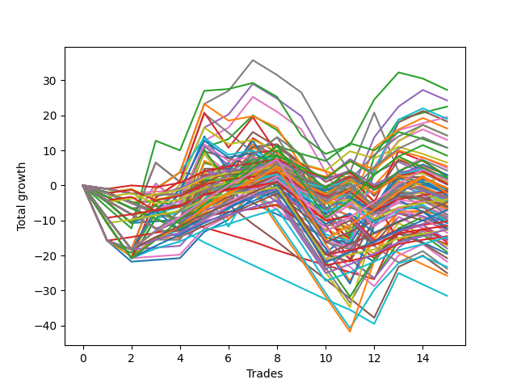

# Short Wallace 004 
- Symbol: ES
- Date Range: 03/15/2022 - 07/08/2022
- Trading Period: 7:20-12:30
- Number of Trades: 14



| Name | Win Percent | Profit | Avg Profit / Trade |     | Name | Win Percent | Profit | Avg Profit / Trade |
| ---- | ----------- | ------ | ------------------ | --- | ---- | ----------- | ------ | ------------------ |
| Sorted By <br> Profit | | | | | Sorted By <br> Win Percentage ||||
| Ten | 28.57 | 16375.00 | 1169.64 |     | Zero | 71.43 | -625.00 | -44.64 |
| Seventy-Two | 42.86 | 15750.00 | 1125.00 |     | Fifty-Six | 71.43 | -2750.00 | -196.43 |
| Seventy-Three | 50.00 | 15250.00 | 1089.29 |     | Forty | 64.29 | 1750.00 | 125.00 |
| Four | 57.14 | 14125.00 | 1008.93 |     | Sixty-Four | 64.29 | -3375.00 | -241.07 |
| Two | 57.14 | 12375.00 | 883.93 |     | Four | 57.14 | 14125.00 | 1008.93 |
| Sixty-Nine | 50.00 | 11625.00 | 830.36 |     | Two | 57.14 | 12375.00 | 883.93 |
| Five | 50.00 | 11250.00 | 803.57 |     | Seventy | 57.14 | 8000.00 | 571.43 |
| Twenty-Six | 28.57 | 10875.00 | 776.79 |     | Fifty-Four | 57.14 | 8000.00 | 571.43 |
| Sixty-Six | 50.00 | 10375.00 | 741.07 |     | Thirty-Eight | 57.14 | 8000.00 | 571.43 |
| Twelve | 28.57 | 10250.00 | 732.14 |     | Twenty-Two | 57.14 | 8000.00 | 571.43 |
| Sixty-Eight | 50.00 | 8500.00 | 607.14 |     | Six | 57.14 | 8000.00 | 571.43 |
| Seventy | 57.14 | 8000.00 | 571.43 |     | Eight | 57.14 | 6000.00 | 428.57 |
| Fifty-Four | 57.14 | 8000.00 | 571.43 |     | Twenty-Four | 57.14 | 5750.00 | 410.71 |
| Thirty-Eight | 57.14 | 8000.00 | 571.43 |     | One | 57.14 | 1000.00 | 71.43 |
| Twenty-Two | 57.14 | 8000.00 | 571.43 |     | Fifty-Seven | 57.14 | 875.00 | 62.50 |
| Six | 57.14 | 8000.00 | 571.43 |     | Three | 57.14 | 875.00 | 62.50 |
| Nine | 35.71 | 7500.00 | 535.71 |     | Forty-Eight | 57.14 | -250.00 | -17.86 |
| Thirteen | 21.43 | 6375.00 | 455.36 |     | Sixten | 57.14 | -625.00 | -44.64 |
| Eight | 57.14 | 6000.00 | 428.57 |     | Seventy-Three | 50.00 | 15250.00 | 1089.29 |
| Twenty-Four | 57.14 | 5750.00 | 410.71 |     | Sixty-Nine | 50.00 | 11625.00 | 830.36 |
| Twenty-Eight | 28.57 | 4750.00 | 339.29 |     | Five | 50.00 | 11250.00 | 803.57 |
| twenty-Seven | 28.57 | 4125.00 | 294.64 |     | Sixty-Six | 50.00 | 10375.00 | 741.07 |
| Eleven | 28.57 | 4125.00 | 294.64 |     | Sixty-Eight | 50.00 | 8500.00 | 607.14 |
| Seventy-One | 50.00 | 3625.00 | 258.93 |     | Seventy-One | 50.00 | 3625.00 | 258.93 |
| Fifty-Five | 50.00 | 3625.00 | 258.93 |     | Fifty-Five | 50.00 | 3625.00 | 258.93 |
| Thirty-Nine | 50.00 | 3625.00 | 258.93 |     | Thirty-Nine | 50.00 | 3625.00 | 258.93 |
| Twenty-Three | 50.00 | 3625.00 | 258.93 |     | Twenty-Three | 50.00 | 3625.00 | 258.93 |
| Seven | 50.00 | 3625.00 | 258.93 |     | Seven | 50.00 | 3625.00 | 258.93 |
| Fifty-Three | 35.71 | 3500.00 | 250.00 |     | Seventy-Five | 50.00 | 2625.00 | 187.50 |
| Fifty | 35.71 | 2750.00 | 196.43 |     | Sixty-Seven | 50.00 | 1125.00 | 80.36 |
| Seventy-Five | 50.00 | 2625.00 | 187.50 |     | Thirty-Two | 50.00 | -750.00 | -53.57 |
| Twenty-Five | 35.71 | 2125.00 | 151.79 |     | Sixty-Five | 50.00 | -1125.00 | -80.36 |
| Forty | 64.29 | 1750.00 | 125.00 |     | Twenty-One | 50.00 | -3125.00 | -223.21 |
| Thirty-Seven | 35.71 | 1750.00 | 125.00 |     | Twenty | 50.00 | -3125.00 | -223.21 |
| Thirty-Four | 35.71 | 1750.00 | 125.00 |     | Nineteen | 50.00 | -3125.00 | -223.21 |
| Sixty-Seven | 50.00 | 1125.00 | 80.36 |     | Eighteen | 50.00 | -3125.00 | -223.21 |
| One | 57.14 | 1000.00 | 71.43 |     | Seventeen | 50.00 | -3125.00 | -223.21 |
| Fifty-Seven | 57.14 | 875.00 | 62.50 |     | Sixty-Two | 50.00 | -4500.00 | -321.43 |
| Three | 57.14 | 875.00 | 62.50 |     | Fifty-Nine | 50.00 | -8250.00 | -589.29 |
| Twenty-Nine | 21.43 | 875.00 | 62.50 |     | Seventy-Four | 50.00 | -9875.00 | -705.36 |
| Fifty-Two | 35.71 | -125.00 | -8.93 |     | Seventy-Two | 42.86 | 15750.00 | 1125.00 |
| Forty-Eight | 57.14 | -250.00 | -17.86 |     | Forty-Nine | 42.86 | -1000.00 | -71.43 |
| Thirty-Three | 35.71 | -375.00 | -26.79 |     | Fifty-Eight | 42.86 | -3500.00 | -250.00 |
| Zero | 71.43 | -625.00 | -44.64 |     | Sixty | 42.86 | -4875.00 | -348.21 |
| Sixten | 57.14 | -625.00 | -44.64 |     | Sixty-Three | 42.86 | -6250.00 | -446.43 |
| Thirty-Two | 50.00 | -750.00 | -53.57 |     | Nine | 35.71 | 7500.00 | 535.71 |
| Fifty-One | 35.71 | -750.00 | -53.57 |     | Fifty-Three | 35.71 | 3500.00 | 250.00 |
| Forty-Nine | 42.86 | -1000.00 | -71.43 |     | Fifty | 35.71 | 2750.00 | 196.43 |
| Sixty-Five | 50.00 | -1125.00 | -80.36 |     | Twenty-Five | 35.71 | 2125.00 | 151.79 |
| Thirty-Six | 35.71 | -1125.00 | -80.36 |     | Thirty-Seven | 35.71 | 1750.00 | 125.00 |
| Forty-Two | 21.43 | -1125.00 | -80.36 |     | Thirty-Four | 35.71 | 1750.00 | 125.00 |
| Thirty-Five | 35.71 | -1750.00 | -125.00 |     | Fifty-Two | 35.71 | -125.00 | -8.93 |
| Fourteen | 14.29 | -1875.00 | -133.93 |     | Thirty-Three | 35.71 | -375.00 | -26.79 |
| Fifty-Six | 71.43 | -2750.00 | -196.43 |     | Fifty-One | 35.71 | -750.00 | -53.57 |
| Twenty-One | 50.00 | -3125.00 | -223.21 |     | Thirty-Six | 35.71 | -1125.00 | -80.36 |
| Twenty | 50.00 | -3125.00 | -223.21 |     | Thirty-Five | 35.71 | -1750.00 | -125.00 |
| Nineteen | 50.00 | -3125.00 | -223.21 |     | Sixty-One | 35.71 | -7125.00 | -508.93 |
| Eighteen | 50.00 | -3125.00 | -223.21 |     | Ten | 28.57 | 16375.00 | 1169.64 |
| Seventeen | 50.00 | -3125.00 | -223.21 |     | Twenty-Six | 28.57 | 10875.00 | 776.79 |
| Sixty-Four | 64.29 | -3375.00 | -241.07 |     | Twelve | 28.57 | 10250.00 | 732.14 |
| Fifty-Eight | 42.86 | -3500.00 | -250.00 |     | Twenty-Eight | 28.57 | 4750.00 | 339.29 |
| Sixty-Two | 50.00 | -4500.00 | -321.43 |     | twenty-Seven | 28.57 | 4125.00 | 294.64 |
| Sixty | 42.86 | -4875.00 | -348.21 |     | Eleven | 28.57 | 4125.00 | 294.64 |
| Fifteen | 7.14 | -5000.00 | -357.14 |     | Forty-Three | 28.57 | -6500.00 | -464.29 |
| Sixty-Three | 42.86 | -6250.00 | -446.43 |     | Forty-Six | 28.57 | -8375.00 | -598.21 |
| Forty-Three | 28.57 | -6500.00 | -464.29 |     | Forty-One | 28.57 | -8750.00 | -625.00 |
| Sixty-One | 35.71 | -7125.00 | -508.93 |     | Thirteen | 21.43 | 6375.00 | 455.36 |
| Forty-Four | 21.43 | -7250.00 | -517.86 |     | Twenty-Nine | 21.43 | 875.00 | 62.50 |
| Thirty | 14.29 | -8125.00 | -580.36 |     | Forty-Two | 21.43 | -1125.00 | -80.36 |
| Fifty-Nine | 50.00 | -8250.00 | -589.29 |     | Forty-Four | 21.43 | -7250.00 | -517.86 |
| Forty-Six | 28.57 | -8375.00 | -598.21 |     | Forty-Seven | 21.43 | -9375.00 | -669.64 |
| Forty-One | 28.57 | -8750.00 | -625.00 |     | Fourteen | 14.29 | -1875.00 | -133.93 |
| Forty-Seven | 21.43 | -9375.00 | -669.64 |     | Thirty | 14.29 | -8125.00 | -580.36 |
| Seventy-Four | 50.00 | -9875.00 | -705.36 |     | Forty-Five | 14.29 | -11875.00 | -848.21 |
| Thirty-One | 7.14 | -11250.00 | -803.57 |     | Fifteen | 7.14 | -5000.00 | -357.14 |
| Forty-Five | 14.29 | -11875.00 | -848.21 |     | Thirty-One | 7.14 | -11250.00 | -803.57 |

## NO STOPLOSS

### Test Zero
* Sell when price hits the middle line of the 20p bollinger
* No Stoploss
* Results:
```
Total Trades: 14
Percent Up: 28.57
Percent Down: 71.43
Total Points Moved Down: -1.25
Potential Profit: -625.00
Total Points Ups: 38.25 Count Ups: 4
Total Points Downs: 37.00 Count Downs: 10
```

<details><summary>Trades</summary>

<code>In: 2022-03-24 08:09:00		Out: 2022-03-24 08:38:55		Total Position Time: 29:55		Total Move Down: -15.75		Total to Date: -15.75</code> <br />
<code>In: 2022-03-25 07:26:00		Out: 2022-03-25 07:51:05		Total Position Time: 25:05		Total Move Down: -6.00		Total to Date: -21.75</code> <br />
<code>In: 2022-04-06 11:06:00		Out: 2022-04-06 11:06:10		Total Position Time: 00:10		Total Move Down: 0.50		Total to Date: -21.25</code> <br />
<code>In: 2022-04-18 07:28:00		Out: 2022-04-18 07:36:40		Total Position Time: 08:40		Total Move Down: 1.00		Total to Date: -20.25</code> <br />
<code>In: 2022-05-03 07:36:00		Out: 2022-05-03 07:37:55		Total Position Time: 01:55		Total Move Down: 6.50		Total to Date: -13.75</code> <br />
<code>In: 2022-05-04 09:42:00		Out: 2022-05-04 09:45:25		Total Position Time: 03:25		Total Move Down: 2.75		Total to Date: -11.00</code> <br />
<code>In: 2022-05-24 11:15:00		Out: 2022-05-24 11:18:25		Total Position Time: 03:25		Total Move Down: 6.25		Total to Date: -4.75</code> <br />
<code>In: 2022-05-31 07:24:00		Out: 2022-05-31 07:36:40		Total Position Time: 12:40		Total Move Down: 1.50		Total to Date: -3.25</code> <br />
<code>In: 2022-06-02 08:06:00		Out: 2022-06-02 08:22:05		Total Position Time: 16:05		Total Move Down: -7.50		Total to Date: -10.75</code> <br />
<code>In: 2022-06-30 08:12:00		Out: 2022-06-30 08:35:10		Total Position Time: 23:10		Total Move Down: -9.00		Total to Date: -19.75</code> <br />
<code>In: 2022-06-30 08:30:00		Out: 2022-06-30 08:35:10		Total Position Time: 05:10		Total Move Down: 5.50		Total to Date: -14.25</code> <br />
<code>In: 2022-07-05 07:41:00		Out: 2022-07-05 07:44:30		Total Position Time: 03:30		Total Move Down: 7.25		Total to Date: -7.00</code> <br />
<code>In: 2022-07-06 11:10:00		Out: 2022-07-06 11:10:10		Total Position Time: 00:10		Total Move Down: 3.25		Total to Date: -3.75</code> <br />
<code>In: 2022-07-07 07:57:00		Out: 2022-07-07 08:01:05		Total Position Time: 04:05		Total Move Down: 2.50		Total to Date: -1.25</code> <br />


</details>

### Test One
* Sell when the price hits the upper line of the 20p 1std bollinger
* No Stoploss
* Results:
```
Total Trades: 14
Percent Up: 42.86
Percent Down: 57.14
Total Points Moved Down: 2.00
Potential Profit: 1000.00
Total Points Ups: 51.00 Count Ups: 6
Total Points Downs: 53.00 Count Downs: 8
```

<details><summary>Trades</summary>

<code>In: 2022-03-24 08:09:00		Out: 2022-03-24 08:38:55		Total Position Time: 29:55		Total Move Down: -15.75		Total to Date: -15.75</code> <br />
<code>In: 2022-03-25 07:26:00		Out: 2022-03-25 07:53:50		Total Position Time: 27:50		Total Move Down: -4.50		Total to Date: -20.25</code> <br />
<code>In: 2022-04-06 11:06:00		Out: 2022-04-06 11:07:20		Total Position Time: 01:20		Total Move Down: 5.25		Total to Date: -15.00</code> <br />
<code>In: 2022-04-18 07:28:00		Out: 2022-04-18 07:51:30		Total Position Time: 23:30		Total Move Down: 0.50		Total to Date: -14.50</code> <br />
<code>In: 2022-05-03 07:36:00		Out: 2022-05-03 07:41:20		Total Position Time: 05:20		Total Move Down: 10.75		Total to Date: -3.75</code> <br />
<code>In: 2022-05-04 09:42:00		Out: 2022-05-04 09:46:30		Total Position Time: 04:30		Total Move Down: 5.00		Total to Date: 1.25</code> <br />
<code>In: 2022-05-24 11:15:00		Out: 2022-05-24 11:31:25		Total Position Time: 16:25		Total Move Down: 6.75		Total to Date: 8.00</code> <br />
<code>In: 2022-05-31 07:24:00		Out: 2022-05-31 07:38:00		Total Position Time: 14:00		Total Move Down: 5.25		Total to Date: 13.25</code> <br />
<code>In: 2022-06-02 08:06:00		Out: 2022-06-02 08:27:30		Total Position Time: 21:30		Total Move Down: -7.75		Total to Date: 5.50</code> <br />
<code>In: 2022-06-30 08:12:00		Out: 2022-06-30 08:41:55		Total Position Time: 29:55		Total Move Down: -12.25		Total to Date: -6.75</code> <br />
<code>In: 2022-06-30 08:30:00		Out: 2022-06-30 08:59:55		Total Position Time: 29:55		Total Move Down: -10.50		Total to Date: -17.25</code> <br />
<code>In: 2022-07-05 07:41:00		Out: 2022-07-05 07:45:55		Total Position Time: 04:55		Total Move Down: 12.00		Total to Date: -5.25</code> <br />
<code>In: 2022-07-06 11:10:00		Out: 2022-07-06 11:11:10		Total Position Time: 01:10		Total Move Down: 7.50		Total to Date: 2.25</code> <br />
<code>In: 2022-07-07 07:57:00		Out: 2022-07-07 08:20:00		Total Position Time: 23:00		Total Move Down: -0.25		Total to Date: 2.00</code> <br />


</details>

### Test Two
* Sell when the price hits the upper line of the 20p 2std bollinger
* No Stoploss
* Results:
```
Total Trades: 14
Percent Up: 42.86
Percent Down: 57.14
Total Points Moved Down: 24.75
Potential Profit: 12375.00
Total Points Ups: 54.00 Count Ups: 6
Total Points Downs: 78.75 Count Downs: 8
```

<details><summary>Trades</summary>

<code>In: 2022-03-24 08:09:00		Out: 2022-03-24 08:38:55		Total Position Time: 29:55		Total Move Down: -15.75		Total to Date: -15.75</code> <br />
<code>In: 2022-03-25 07:26:00		Out: 2022-03-25 07:54:10		Total Position Time: 28:10		Total Move Down: -3.50		Total to Date: -19.25</code> <br />
<code>In: 2022-04-06 11:06:00		Out: 2022-04-06 11:08:20		Total Position Time: 02:20		Total Move Down: 11.25		Total to Date: -8.00</code> <br />
<code>In: 2022-04-18 07:28:00		Out: 2022-04-18 07:51:45		Total Position Time: 23:45		Total Move Down: 2.50		Total to Date: -5.50</code> <br />
<code>In: 2022-05-03 07:36:00		Out: 2022-05-03 07:43:50		Total Position Time: 07:50		Total Move Down: 16.25		Total to Date: 10.75</code> <br />
<code>In: 2022-05-04 09:42:00		Out: 2022-05-04 10:11:25		Total Position Time: 29:25		Total Move Down: 3.50		Total to Date: 14.25</code> <br />
<code>In: 2022-05-24 11:15:00		Out: 2022-05-24 11:44:00		Total Position Time: 29:00		Total Move Down: 6.75		Total to Date: 21.00</code> <br />
<code>In: 2022-05-31 07:24:00		Out: 2022-05-31 07:53:55		Total Position Time: 29:55		Total Move Down: -4.25		Total to Date: 16.75</code> <br />
<code>In: 2022-06-02 08:06:00		Out: 2022-06-02 08:29:05		Total Position Time: 23:05		Total Move Down: -7.75		Total to Date: 9.00</code> <br />
<code>In: 2022-06-30 08:12:00		Out: 2022-06-30 08:41:55		Total Position Time: 29:55		Total Move Down: -12.25		Total to Date: -3.25</code> <br />
<code>In: 2022-06-30 08:30:00		Out: 2022-06-30 08:59:55		Total Position Time: 29:55		Total Move Down: -10.50		Total to Date: -13.75</code> <br />
<code>In: 2022-07-05 07:41:00		Out: 2022-07-05 08:01:10		Total Position Time: 20:10		Total Move Down: 23.00		Total to Date: 9.25</code> <br />
<code>In: 2022-07-06 11:10:00		Out: 2022-07-06 11:12:15		Total Position Time: 02:15		Total Move Down: 14.50		Total to Date: 23.75</code> <br />
<code>In: 2022-07-07 07:57:00		Out: 2022-07-07 08:21:00		Total Position Time: 24:00		Total Move Down: 1.00		Total to Date: 24.75</code> <br />


</details>

### Test Three
* Sell when price hits the middle line of the 50p bollinger
* No Stoploss
* Results:
```
Total Trades: 14
Percent Up: 42.86
Percent Down: 57.14
Total Points Moved Down: 1.75
Potential Profit: 875.00
Total Points Ups: 50.25 Count Ups: 6
Total Points Downs: 52.00 Count Downs: 8
```

<details><summary>Trades</summary>

<code>In: 2022-03-24 08:09:00		Out: 2022-03-24 08:38:55		Total Position Time: 29:55		Total Move Down: -15.75		Total to Date: -15.75</code> <br />
<code>In: 2022-03-25 07:26:00		Out: 2022-03-25 07:55:55		Total Position Time: 29:55		Total Move Down: -2.50		Total to Date: -18.25</code> <br />
<code>In: 2022-04-06 11:06:00		Out: 2022-04-06 11:07:20		Total Position Time: 01:20		Total Move Down: 5.25		Total to Date: -13.00</code> <br />
<code>In: 2022-04-18 07:28:00		Out: 2022-04-18 07:51:50		Total Position Time: 23:50		Total Move Down: 3.00		Total to Date: -10.00</code> <br />
<code>In: 2022-05-03 07:36:00		Out: 2022-05-03 07:40:40		Total Position Time: 04:40		Total Move Down: 10.75		Total to Date: 0.75</code> <br />
<code>In: 2022-05-04 09:42:00		Out: 2022-05-04 10:10:40		Total Position Time: 28:40		Total Move Down: 0.75		Total to Date: 1.50</code> <br />
<code>In: 2022-05-24 11:15:00		Out: 2022-05-24 11:20:25		Total Position Time: 05:25		Total Move Down: 11.75		Total to Date: 13.25</code> <br />
<code>In: 2022-05-31 07:24:00		Out: 2022-05-31 07:53:55		Total Position Time: 29:55		Total Move Down: -4.25		Total to Date: 9.00</code> <br />
<code>In: 2022-06-02 08:06:00		Out: 2022-06-02 08:35:55		Total Position Time: 29:55		Total Move Down: -5.00		Total to Date: 4.00</code> <br />
<code>In: 2022-06-30 08:12:00		Out: 2022-06-30 08:41:55		Total Position Time: 29:55		Total Move Down: -12.25		Total to Date: -8.25</code> <br />
<code>In: 2022-06-30 08:30:00		Out: 2022-06-30 08:59:55		Total Position Time: 29:55		Total Move Down: -10.50		Total to Date: -18.75</code> <br />
<code>In: 2022-07-05 07:41:00		Out: 2022-07-05 07:45:30		Total Position Time: 04:30		Total Move Down: 11.00		Total to Date: -7.75</code> <br />
<code>In: 2022-07-06 11:10:00		Out: 2022-07-06 11:11:10		Total Position Time: 01:10		Total Move Down: 7.50		Total to Date: -0.25</code> <br />
<code>In: 2022-07-07 07:57:00		Out: 2022-07-07 08:22:45		Total Position Time: 25:45		Total Move Down: 2.00		Total to Date: 1.75</code> <br />


</details>

### Test Four
* Sell when the price hits the upper line of the 50p 1std bollinger
* No Stoploss
* Results:
```
Total Trades: 14
Percent Up: 42.86
Percent Down: 57.14
Total Points Moved Down: 28.25
Potential Profit: 14125.00
Total Points Ups: 50.25 Count Ups: 6
Total Points Downs: 78.50 Count Downs: 8
```

<details><summary>Trades</summary>

<code>In: 2022-03-24 08:09:00		Out: 2022-03-24 08:38:55		Total Position Time: 29:55		Total Move Down: -15.75		Total to Date: -15.75</code> <br />
<code>In: 2022-03-25 07:26:00		Out: 2022-03-25 07:55:55		Total Position Time: 29:55		Total Move Down: -2.50		Total to Date: -18.25</code> <br />
<code>In: 2022-04-06 11:06:00		Out: 2022-04-06 11:08:10		Total Position Time: 02:10		Total Move Down: 11.25		Total to Date: -7.00</code> <br />
<code>In: 2022-04-18 07:28:00		Out: 2022-04-18 07:57:05		Total Position Time: 29:05		Total Move Down: 7.25		Total to Date: 0.25</code> <br />
<code>In: 2022-05-03 07:36:00		Out: 2022-05-03 07:43:50		Total Position Time: 07:50		Total Move Down: 16.25		Total to Date: 16.50</code> <br />
<code>In: 2022-05-04 09:42:00		Out: 2022-05-04 10:11:45		Total Position Time: 29:45		Total Move Down: 5.00		Total to Date: 21.50</code> <br />
<code>In: 2022-05-24 11:15:00		Out: 2022-05-24 11:44:55		Total Position Time: 29:55		Total Move Down: 8.75		Total to Date: 30.25</code> <br />
<code>In: 2022-05-31 07:24:00		Out: 2022-05-31 07:53:55		Total Position Time: 29:55		Total Move Down: -4.25		Total to Date: 26.00</code> <br />
<code>In: 2022-06-02 08:06:00		Out: 2022-06-02 08:35:55		Total Position Time: 29:55		Total Move Down: -5.00		Total to Date: 21.00</code> <br />
<code>In: 2022-06-30 08:12:00		Out: 2022-06-30 08:41:55		Total Position Time: 29:55		Total Move Down: -12.25		Total to Date: 8.75</code> <br />
<code>In: 2022-06-30 08:30:00		Out: 2022-06-30 08:59:55		Total Position Time: 29:55		Total Move Down: -10.50		Total to Date: -1.75</code> <br />
<code>In: 2022-07-05 07:41:00		Out: 2022-07-05 07:55:15		Total Position Time: 14:15		Total Move Down: 16.50		Total to Date: 14.75</code> <br />
<code>In: 2022-07-06 11:10:00		Out: 2022-07-06 11:11:35		Total Position Time: 01:35		Total Move Down: 8.75		Total to Date: 23.50</code> <br />
<code>In: 2022-07-07 07:57:00		Out: 2022-07-07 08:23:20		Total Position Time: 26:20		Total Move Down: 4.75		Total to Date: 28.25</code> <br />


</details>

### Test Five
* Sell when the price hits the upper line of the 50p 2std bollinger
* No Stoploss
* Results:
```
Total Trades: 14
Percent Up: 50.00
Percent Down: 50.00
Total Points Moved Down: 22.50
Potential Profit: 11250.00
Total Points Ups: 51.25 Count Ups: 7
Total Points Downs: 73.75 Count Downs: 7
```

<details><summary>Trades</summary>

<code>In: 2022-03-24 08:09:00		Out: 2022-03-24 08:38:55		Total Position Time: 29:55		Total Move Down: -15.75		Total to Date: -15.75</code> <br />
<code>In: 2022-03-25 07:26:00		Out: 2022-03-25 07:55:55		Total Position Time: 29:55		Total Move Down: -2.50		Total to Date: -18.25</code> <br />
<code>In: 2022-04-06 11:06:00		Out: 2022-04-06 11:09:40		Total Position Time: 03:40		Total Move Down: 17.25		Total to Date: -1.00</code> <br />
<code>In: 2022-04-18 07:28:00		Out: 2022-04-18 07:57:55		Total Position Time: 29:55		Total Move Down: 4.75		Total to Date: 3.75</code> <br />
<code>In: 2022-05-03 07:36:00		Out: 2022-05-03 08:05:55		Total Position Time: 29:55		Total Move Down: -1.00		Total to Date: 2.75</code> <br />
<code>In: 2022-05-04 09:42:00		Out: 2022-05-04 10:11:55		Total Position Time: 29:55		Total Move Down: 3.75		Total to Date: 6.50</code> <br />
<code>In: 2022-05-24 11:15:00		Out: 2022-05-24 11:44:55		Total Position Time: 29:55		Total Move Down: 8.75		Total to Date: 15.25</code> <br />
<code>In: 2022-05-31 07:24:00		Out: 2022-05-31 07:53:55		Total Position Time: 29:55		Total Move Down: -4.25		Total to Date: 11.00</code> <br />
<code>In: 2022-06-02 08:06:00		Out: 2022-06-02 08:35:55		Total Position Time: 29:55		Total Move Down: -5.00		Total to Date: 6.00</code> <br />
<code>In: 2022-06-30 08:12:00		Out: 2022-06-30 08:41:55		Total Position Time: 29:55		Total Move Down: -12.25		Total to Date: -6.25</code> <br />
<code>In: 2022-06-30 08:30:00		Out: 2022-06-30 08:59:55		Total Position Time: 29:55		Total Move Down: -10.50		Total to Date: -16.75</code> <br />
<code>In: 2022-07-05 07:41:00		Out: 2022-07-05 08:01:05		Total Position Time: 20:05		Total Move Down: 21.50		Total to Date: 4.75</code> <br />
<code>In: 2022-07-06 11:10:00		Out: 2022-07-06 11:12:15		Total Position Time: 02:15		Total Move Down: 14.50		Total to Date: 19.25</code> <br />
<code>In: 2022-07-07 07:57:00		Out: 2022-07-07 08:26:55		Total Position Time: 29:55		Total Move Down: 3.25		Total to Date: 22.50</code> <br />


</details>

### Test Six
* Sell when the price hits the middle line of the 1std VWAP
* No Stoploss
* Results:
```
Total Trades: 14
Percent Up: 42.86
Percent Down: 57.14
Total Points Moved Down: 16.00
Potential Profit: 8000.00
Total Points Ups: 50.25 Count Ups: 6
Total Points Downs: 66.25 Count Downs: 8
```

<details><summary>Trades</summary>

<code>In: 2022-03-24 08:09:00		Out: 2022-03-24 08:38:55		Total Position Time: 29:55		Total Move Down: -15.75		Total to Date: -15.75</code> <br />
<code>In: 2022-03-25 07:26:00		Out: 2022-03-25 07:55:55		Total Position Time: 29:55		Total Move Down: -2.50		Total to Date: -18.25</code> <br />
<code>In: 2022-04-06 11:06:00		Out: 2022-04-06 11:08:10		Total Position Time: 02:10		Total Move Down: 11.25		Total to Date: -7.00</code> <br />
<code>In: 2022-04-18 07:28:00		Out: 2022-04-18 07:55:15		Total Position Time: 27:15		Total Move Down: 5.75		Total to Date: -1.25</code> <br />
<code>In: 2022-05-03 07:36:00		Out: 2022-05-03 07:42:15		Total Position Time: 06:15		Total Move Down: 14.00		Total to Date: 12.75</code> <br />
<code>In: 2022-05-04 09:42:00		Out: 2022-05-04 10:11:55		Total Position Time: 29:55		Total Move Down: 3.75		Total to Date: 16.50</code> <br />
<code>In: 2022-05-24 11:15:00		Out: 2022-05-24 11:44:55		Total Position Time: 29:55		Total Move Down: 8.75		Total to Date: 25.25</code> <br />
<code>In: 2022-05-31 07:24:00		Out: 2022-05-31 07:53:55		Total Position Time: 29:55		Total Move Down: -4.25		Total to Date: 21.00</code> <br />
<code>In: 2022-06-02 08:06:00		Out: 2022-06-02 08:35:55		Total Position Time: 29:55		Total Move Down: -5.00		Total to Date: 16.00</code> <br />
<code>In: 2022-06-30 08:12:00		Out: 2022-06-30 08:41:55		Total Position Time: 29:55		Total Move Down: -12.25		Total to Date: 3.75</code> <br />
<code>In: 2022-06-30 08:30:00		Out: 2022-06-30 08:59:55		Total Position Time: 29:55		Total Move Down: -10.50		Total to Date: -6.75</code> <br />
<code>In: 2022-07-05 07:41:00		Out: 2022-07-05 07:45:25		Total Position Time: 04:25		Total Move Down: 10.75		Total to Date: 4.00</code> <br />
<code>In: 2022-07-06 11:10:00		Out: 2022-07-06 11:11:35		Total Position Time: 01:35		Total Move Down: 8.75		Total to Date: 12.75</code> <br />
<code>In: 2022-07-07 07:57:00		Out: 2022-07-07 08:26:55		Total Position Time: 29:55		Total Move Down: 3.25		Total to Date: 16.00</code> <br />


</details>

### Test Seven
* Sell when the price hits the upper line of the 1std VWAP
* No Stoploss
* Results:
```
Total Trades: 14
Percent Up: 50.00
Percent Down: 50.00
Total Points Moved Down: 7.25
Potential Profit: 3625.00
Total Points Ups: 67.00 Count Ups: 7
Total Points Downs: 74.25 Count Downs: 7
```

<details><summary>Trades</summary>

<code>In: 2022-03-24 08:09:00		Out: 2022-03-24 08:38:55		Total Position Time: 29:55		Total Move Down: -15.75		Total to Date: -15.75</code> <br />
<code>In: 2022-03-25 07:26:00		Out: 2022-03-25 07:55:55		Total Position Time: 29:55		Total Move Down: -2.50		Total to Date: -18.25</code> <br />
<code>In: 2022-04-06 11:06:00		Out: 2022-04-06 11:09:40		Total Position Time: 03:40		Total Move Down: 17.25		Total to Date: -1.00</code> <br />
<code>In: 2022-04-18 07:28:00		Out: 2022-04-18 07:57:55		Total Position Time: 29:55		Total Move Down: 4.75		Total to Date: 3.75</code> <br />
<code>In: 2022-05-03 07:36:00		Out: 2022-05-03 07:46:45		Total Position Time: 10:45		Total Move Down: 19.50		Total to Date: 23.25</code> <br />
<code>In: 2022-05-04 09:42:00		Out: 2022-05-04 10:11:55		Total Position Time: 29:55		Total Move Down: 3.75		Total to Date: 27.00</code> <br />
<code>In: 2022-05-24 11:15:00		Out: 2022-05-24 11:44:55		Total Position Time: 29:55		Total Move Down: 8.75		Total to Date: 35.75</code> <br />
<code>In: 2022-05-31 07:24:00		Out: 2022-05-31 07:53:55		Total Position Time: 29:55		Total Move Down: -4.25		Total to Date: 31.50</code> <br />
<code>In: 2022-06-02 08:06:00		Out: 2022-06-02 08:35:55		Total Position Time: 29:55		Total Move Down: -5.00		Total to Date: 26.50</code> <br />
<code>In: 2022-06-30 08:12:00		Out: 2022-06-30 08:41:55		Total Position Time: 29:55		Total Move Down: -12.25		Total to Date: 14.25</code> <br />
<code>In: 2022-06-30 08:30:00		Out: 2022-06-30 08:59:55		Total Position Time: 29:55		Total Move Down: -10.50		Total to Date: 3.75</code> <br />
<code>In: 2022-07-05 07:41:00		Out: 2022-07-05 07:57:05		Total Position Time: 16:05		Total Move Down: 17.00		Total to Date: 20.75</code> <br />
<code>In: 2022-07-06 11:10:00		Out: 2022-07-06 11:39:55		Total Position Time: 29:55		Total Move Down: -16.75		Total to Date: 4.00</code> <br />
<code>In: 2022-07-07 07:57:00		Out: 2022-07-07 08:26:55		Total Position Time: 29:55		Total Move Down: 3.25		Total to Date: 7.25</code> <br />


</details>

## STOPLOSS OF 2

### Test Eight
* Sell when price hits the middle line of the 20p bollinger
* Stoploss is -2 points
* Results:
```
Total Trades: 14
Percent Up: 42.86
Percent Down: 57.14
Total Points Moved Down: 12.00
Potential Profit: 6000.00
Total Points Ups: 17.00 Count Ups: 6
Total Points Downs: 29.00 Count Downs: 8
```

<details><summary>Trades</summary>

<code>In: 2022-03-24 08:09:00		Out: 2022-03-24 08:11:50		Total Position Time: 02:50		Total Move Down: -2.25		Total to Date: -2.25</code> <br />
<code>In: 2022-03-25 07:26:00		Out: 2022-03-25 07:33:35		Total Position Time: 07:35		Total Move Down: -2.75		Total to Date: -5.00</code> <br />
<code>In: 2022-04-06 11:06:00		Out: 2022-04-06 11:06:10		Total Position Time: 00:10		Total Move Down: 0.50		Total to Date: -4.50</code> <br />
<code>In: 2022-04-18 07:28:00		Out: 2022-04-18 07:34:30		Total Position Time: 06:30		Total Move Down: -1.50		Total to Date: -6.00</code> <br />
<code>In: 2022-05-03 07:36:00		Out: 2022-05-03 07:37:55		Total Position Time: 01:55		Total Move Down: 6.50		Total to Date: 0.50</code> <br />
<code>In: 2022-05-04 09:42:00		Out: 2022-05-04 09:45:25		Total Position Time: 03:25		Total Move Down: 2.75		Total to Date: 3.25</code> <br />
<code>In: 2022-05-24 11:15:00		Out: 2022-05-24 11:15:10		Total Position Time: 00:10		Total Move Down: 0.75		Total to Date: 4.00</code> <br />
<code>In: 2022-05-31 07:24:00		Out: 2022-05-31 07:28:15		Total Position Time: 04:15		Total Move Down: -1.00		Total to Date: 3.00</code> <br />
<code>In: 2022-06-02 08:06:00		Out: 2022-06-02 08:09:35		Total Position Time: 03:35		Total Move Down: -5.50		Total to Date: -2.50</code> <br />
<code>In: 2022-06-30 08:12:00		Out: 2022-06-30 08:16:10		Total Position Time: 04:10		Total Move Down: -4.00		Total to Date: -6.50</code> <br />
<code>In: 2022-06-30 08:30:00		Out: 2022-06-30 08:35:10		Total Position Time: 05:10		Total Move Down: 5.50		Total to Date: -1.00</code> <br />
<code>In: 2022-07-05 07:41:00		Out: 2022-07-05 07:44:30		Total Position Time: 03:30		Total Move Down: 7.25		Total to Date: 6.25</code> <br />
<code>In: 2022-07-06 11:10:00		Out: 2022-07-06 11:10:10		Total Position Time: 00:10		Total Move Down: 3.25		Total to Date: 9.50</code> <br />
<code>In: 2022-07-07 07:57:00		Out: 2022-07-07 08:01:05		Total Position Time: 04:05		Total Move Down: 2.50		Total to Date: 12.00</code> <br />


</details>

### Test Nine
* Sell when the price hits the upper line of the 20p 1std bollinger
* Stoploss is -2 points
* Results:
```
Total Trades: 14
Percent Up: 64.29
Percent Down: 35.71
Total Points Moved Down: 15.00
Potential Profit: 7500.00
Total Points Ups: 21.00 Count Ups: 9
Total Points Downs: 36.00 Count Downs: 5
```

<details><summary>Trades</summary>

<code>In: 2022-03-24 08:09:00		Out: 2022-03-24 08:11:50		Total Position Time: 02:50		Total Move Down: -2.25		Total to Date: -2.25</code> <br />
<code>In: 2022-03-25 07:26:00		Out: 2022-03-25 07:33:35		Total Position Time: 07:35		Total Move Down: -2.75		Total to Date: -5.00</code> <br />
<code>In: 2022-04-06 11:06:00		Out: 2022-04-06 11:06:15		Total Position Time: 00:15		Total Move Down: -0.50		Total to Date: -5.50</code> <br />
<code>In: 2022-04-18 07:28:00		Out: 2022-04-18 07:34:30		Total Position Time: 06:30		Total Move Down: -1.50		Total to Date: -7.00</code> <br />
<code>In: 2022-05-03 07:36:00		Out: 2022-05-03 07:41:20		Total Position Time: 05:20		Total Move Down: 10.75		Total to Date: 3.75</code> <br />
<code>In: 2022-05-04 09:42:00		Out: 2022-05-04 09:46:30		Total Position Time: 04:30		Total Move Down: 5.00		Total to Date: 8.75</code> <br />
<code>In: 2022-05-24 11:15:00		Out: 2022-05-24 11:15:10		Total Position Time: 00:10		Total Move Down: 0.75		Total to Date: 9.50</code> <br />
<code>In: 2022-05-31 07:24:00		Out: 2022-05-31 07:28:15		Total Position Time: 04:15		Total Move Down: -1.00		Total to Date: 8.50</code> <br />
<code>In: 2022-06-02 08:06:00		Out: 2022-06-02 08:09:35		Total Position Time: 03:35		Total Move Down: -5.50		Total to Date: 3.00</code> <br />
<code>In: 2022-06-30 08:12:00		Out: 2022-06-30 08:16:10		Total Position Time: 04:10		Total Move Down: -4.00		Total to Date: -1.00</code> <br />
<code>In: 2022-06-30 08:30:00		Out: 2022-06-30 08:44:50		Total Position Time: 14:50		Total Move Down: -2.00		Total to Date: -3.00</code> <br />
<code>In: 2022-07-05 07:41:00		Out: 2022-07-05 07:45:55		Total Position Time: 04:55		Total Move Down: 12.00		Total to Date: 9.00</code> <br />
<code>In: 2022-07-06 11:10:00		Out: 2022-07-06 11:11:10		Total Position Time: 01:10		Total Move Down: 7.50		Total to Date: 16.50</code> <br />
<code>In: 2022-07-07 07:57:00		Out: 2022-07-07 08:03:30		Total Position Time: 06:30		Total Move Down: -1.50		Total to Date: 15.00</code> <br />


</details>

### Test Ten
* Sell when the price hits the upper line of the 20p 2std bollinger
* Stoploss is -2 points
* Results:
```
Total Trades: 14
Percent Up: 71.43
Percent Down: 28.57
Total Points Moved Down: 32.75
Potential Profit: 16375.00
Total Points Ups: 21.75 Count Ups: 10
Total Points Downs: 54.50 Count Downs: 4
```

<details><summary>Trades</summary>

<code>In: 2022-03-24 08:09:00		Out: 2022-03-24 08:11:50		Total Position Time: 02:50		Total Move Down: -2.25		Total to Date: -2.25</code> <br />
<code>In: 2022-03-25 07:26:00		Out: 2022-03-25 07:33:35		Total Position Time: 07:35		Total Move Down: -2.75		Total to Date: -5.00</code> <br />
<code>In: 2022-04-06 11:06:00		Out: 2022-04-06 11:06:15		Total Position Time: 00:15		Total Move Down: -0.50		Total to Date: -5.50</code> <br />
<code>In: 2022-04-18 07:28:00		Out: 2022-04-18 07:34:30		Total Position Time: 06:30		Total Move Down: -1.50		Total to Date: -7.00</code> <br />
<code>In: 2022-05-03 07:36:00		Out: 2022-05-03 07:43:50		Total Position Time: 07:50		Total Move Down: 16.25		Total to Date: 9.25</code> <br />
<code>In: 2022-05-04 09:42:00		Out: 2022-05-04 09:52:50		Total Position Time: 10:50		Total Move Down: -0.75		Total to Date: 8.50</code> <br />
<code>In: 2022-05-24 11:15:00		Out: 2022-05-24 11:15:10		Total Position Time: 00:10		Total Move Down: 0.75		Total to Date: 9.25</code> <br />
<code>In: 2022-05-31 07:24:00		Out: 2022-05-31 07:28:15		Total Position Time: 04:15		Total Move Down: -1.00		Total to Date: 8.25</code> <br />
<code>In: 2022-06-02 08:06:00		Out: 2022-06-02 08:09:35		Total Position Time: 03:35		Total Move Down: -5.50		Total to Date: 2.75</code> <br />
<code>In: 2022-06-30 08:12:00		Out: 2022-06-30 08:16:10		Total Position Time: 04:10		Total Move Down: -4.00		Total to Date: -1.25</code> <br />
<code>In: 2022-06-30 08:30:00		Out: 2022-06-30 08:44:50		Total Position Time: 14:50		Total Move Down: -2.00		Total to Date: -3.25</code> <br />
<code>In: 2022-07-05 07:41:00		Out: 2022-07-05 08:01:10		Total Position Time: 20:10		Total Move Down: 23.00		Total to Date: 19.75</code> <br />
<code>In: 2022-07-06 11:10:00		Out: 2022-07-06 11:12:15		Total Position Time: 02:15		Total Move Down: 14.50		Total to Date: 34.25</code> <br />
<code>In: 2022-07-07 07:57:00		Out: 2022-07-07 08:03:30		Total Position Time: 06:30		Total Move Down: -1.50		Total to Date: 32.75</code> <br />


</details>

### Test Eleven
* Sell when price hits the middle line of the 50p bollinger
* Stoploss is -2 points
* Results:
```
Total Trades: 14
Percent Up: 71.43
Percent Down: 28.57
Total Points Moved Down: 8.25
Potential Profit: 4125.00
Total Points Ups: 21.75 Count Ups: 10
Total Points Downs: 30.00 Count Downs: 4
```

<details><summary>Trades</summary>

<code>In: 2022-03-24 08:09:00		Out: 2022-03-24 08:11:50		Total Position Time: 02:50		Total Move Down: -2.25		Total to Date: -2.25</code> <br />
<code>In: 2022-03-25 07:26:00		Out: 2022-03-25 07:33:35		Total Position Time: 07:35		Total Move Down: -2.75		Total to Date: -5.00</code> <br />
<code>In: 2022-04-06 11:06:00		Out: 2022-04-06 11:06:15		Total Position Time: 00:15		Total Move Down: -0.50		Total to Date: -5.50</code> <br />
<code>In: 2022-04-18 07:28:00		Out: 2022-04-18 07:34:30		Total Position Time: 06:30		Total Move Down: -1.50		Total to Date: -7.00</code> <br />
<code>In: 2022-05-03 07:36:00		Out: 2022-05-03 07:40:40		Total Position Time: 04:40		Total Move Down: 10.75		Total to Date: 3.75</code> <br />
<code>In: 2022-05-04 09:42:00		Out: 2022-05-04 09:52:50		Total Position Time: 10:50		Total Move Down: -0.75		Total to Date: 3.00</code> <br />
<code>In: 2022-05-24 11:15:00		Out: 2022-05-24 11:15:10		Total Position Time: 00:10		Total Move Down: 0.75		Total to Date: 3.75</code> <br />
<code>In: 2022-05-31 07:24:00		Out: 2022-05-31 07:28:15		Total Position Time: 04:15		Total Move Down: -1.00		Total to Date: 2.75</code> <br />
<code>In: 2022-06-02 08:06:00		Out: 2022-06-02 08:09:35		Total Position Time: 03:35		Total Move Down: -5.50		Total to Date: -2.75</code> <br />
<code>In: 2022-06-30 08:12:00		Out: 2022-06-30 08:16:10		Total Position Time: 04:10		Total Move Down: -4.00		Total to Date: -6.75</code> <br />
<code>In: 2022-06-30 08:30:00		Out: 2022-06-30 08:44:50		Total Position Time: 14:50		Total Move Down: -2.00		Total to Date: -8.75</code> <br />
<code>In: 2022-07-05 07:41:00		Out: 2022-07-05 07:45:30		Total Position Time: 04:30		Total Move Down: 11.00		Total to Date: 2.25</code> <br />
<code>In: 2022-07-06 11:10:00		Out: 2022-07-06 11:11:10		Total Position Time: 01:10		Total Move Down: 7.50		Total to Date: 9.75</code> <br />
<code>In: 2022-07-07 07:57:00		Out: 2022-07-07 08:03:30		Total Position Time: 06:30		Total Move Down: -1.50		Total to Date: 8.25</code> <br />


</details>

### Test Twelve
* Sell when the price hits the upper line of the 50p 1std bollinger
* Stoploss is -2 points
* Results:
```
Total Trades: 14
Percent Up: 71.43
Percent Down: 28.57
Total Points Moved Down: 20.50
Potential Profit: 10250.00
Total Points Ups: 21.75 Count Ups: 10
Total Points Downs: 42.25 Count Downs: 4
```

<details><summary>Trades</summary>

<code>In: 2022-03-24 08:09:00		Out: 2022-03-24 08:11:50		Total Position Time: 02:50		Total Move Down: -2.25		Total to Date: -2.25</code> <br />
<code>In: 2022-03-25 07:26:00		Out: 2022-03-25 07:33:35		Total Position Time: 07:35		Total Move Down: -2.75		Total to Date: -5.00</code> <br />
<code>In: 2022-04-06 11:06:00		Out: 2022-04-06 11:06:15		Total Position Time: 00:15		Total Move Down: -0.50		Total to Date: -5.50</code> <br />
<code>In: 2022-04-18 07:28:00		Out: 2022-04-18 07:34:30		Total Position Time: 06:30		Total Move Down: -1.50		Total to Date: -7.00</code> <br />
<code>In: 2022-05-03 07:36:00		Out: 2022-05-03 07:43:50		Total Position Time: 07:50		Total Move Down: 16.25		Total to Date: 9.25</code> <br />
<code>In: 2022-05-04 09:42:00		Out: 2022-05-04 09:52:50		Total Position Time: 10:50		Total Move Down: -0.75		Total to Date: 8.50</code> <br />
<code>In: 2022-05-24 11:15:00		Out: 2022-05-24 11:15:10		Total Position Time: 00:10		Total Move Down: 0.75		Total to Date: 9.25</code> <br />
<code>In: 2022-05-31 07:24:00		Out: 2022-05-31 07:28:15		Total Position Time: 04:15		Total Move Down: -1.00		Total to Date: 8.25</code> <br />
<code>In: 2022-06-02 08:06:00		Out: 2022-06-02 08:09:35		Total Position Time: 03:35		Total Move Down: -5.50		Total to Date: 2.75</code> <br />
<code>In: 2022-06-30 08:12:00		Out: 2022-06-30 08:16:10		Total Position Time: 04:10		Total Move Down: -4.00		Total to Date: -1.25</code> <br />
<code>In: 2022-06-30 08:30:00		Out: 2022-06-30 08:44:50		Total Position Time: 14:50		Total Move Down: -2.00		Total to Date: -3.25</code> <br />
<code>In: 2022-07-05 07:41:00		Out: 2022-07-05 07:55:15		Total Position Time: 14:15		Total Move Down: 16.50		Total to Date: 13.25</code> <br />
<code>In: 2022-07-06 11:10:00		Out: 2022-07-06 11:11:35		Total Position Time: 01:35		Total Move Down: 8.75		Total to Date: 22.00</code> <br />
<code>In: 2022-07-07 07:57:00		Out: 2022-07-07 08:03:30		Total Position Time: 06:30		Total Move Down: -1.50		Total to Date: 20.50</code> <br />


</details>

### Test Thirteen
* Sell when the price hits the upper line of the 50p 2std bollinger
* Stoploss is -2 points
* Results:
```
Total Trades: 14
Percent Up: 78.57
Percent Down: 21.43
Total Points Moved Down: 12.75
Potential Profit: 6375.00
Total Points Ups: 24.00 Count Ups: 11
Total Points Downs: 36.75 Count Downs: 3
```

<details><summary>Trades</summary>

<code>In: 2022-03-24 08:09:00		Out: 2022-03-24 08:11:50		Total Position Time: 02:50		Total Move Down: -2.25		Total to Date: -2.25</code> <br />
<code>In: 2022-03-25 07:26:00		Out: 2022-03-25 07:33:35		Total Position Time: 07:35		Total Move Down: -2.75		Total to Date: -5.00</code> <br />
<code>In: 2022-04-06 11:06:00		Out: 2022-04-06 11:06:15		Total Position Time: 00:15		Total Move Down: -0.50		Total to Date: -5.50</code> <br />
<code>In: 2022-04-18 07:28:00		Out: 2022-04-18 07:34:30		Total Position Time: 06:30		Total Move Down: -1.50		Total to Date: -7.00</code> <br />
<code>In: 2022-05-03 07:36:00		Out: 2022-05-03 08:05:00		Total Position Time: 29:00		Total Move Down: -2.25		Total to Date: -9.25</code> <br />
<code>In: 2022-05-04 09:42:00		Out: 2022-05-04 09:52:50		Total Position Time: 10:50		Total Move Down: -0.75		Total to Date: -10.00</code> <br />
<code>In: 2022-05-24 11:15:00		Out: 2022-05-24 11:15:10		Total Position Time: 00:10		Total Move Down: 0.75		Total to Date: -9.25</code> <br />
<code>In: 2022-05-31 07:24:00		Out: 2022-05-31 07:28:15		Total Position Time: 04:15		Total Move Down: -1.00		Total to Date: -10.25</code> <br />
<code>In: 2022-06-02 08:06:00		Out: 2022-06-02 08:09:35		Total Position Time: 03:35		Total Move Down: -5.50		Total to Date: -15.75</code> <br />
<code>In: 2022-06-30 08:12:00		Out: 2022-06-30 08:16:10		Total Position Time: 04:10		Total Move Down: -4.00		Total to Date: -19.75</code> <br />
<code>In: 2022-06-30 08:30:00		Out: 2022-06-30 08:44:50		Total Position Time: 14:50		Total Move Down: -2.00		Total to Date: -21.75</code> <br />
<code>In: 2022-07-05 07:41:00		Out: 2022-07-05 08:01:05		Total Position Time: 20:05		Total Move Down: 21.50		Total to Date: -0.25</code> <br />
<code>In: 2022-07-06 11:10:00		Out: 2022-07-06 11:12:15		Total Position Time: 02:15		Total Move Down: 14.50		Total to Date: 14.25</code> <br />
<code>In: 2022-07-07 07:57:00		Out: 2022-07-07 08:03:30		Total Position Time: 06:30		Total Move Down: -1.50		Total to Date: 12.75</code> <br />


</details>

### Test Fourteen
* Sell when the price hits the middle line of the 1std VWAP
* Stoploss is -2 points
* Results:
```
Total Trades: 14
Percent Up: 85.71
Percent Down: 14.29
Total Points Moved Down: -3.75
Potential Profit: -1875.00
Total Points Ups: 26.50 Count Ups: 12
Total Points Downs: 22.75 Count Downs: 2
```

<details><summary>Trades</summary>

<code>In: 2022-03-24 08:09:00		Out: 2022-03-24 08:11:35		Total Position Time: 02:35		Total Move Down: -2.00		Total to Date: -2.00</code> <br />
<code>In: 2022-03-25 07:26:00		Out: 2022-03-25 07:33:35		Total Position Time: 07:35		Total Move Down: -2.75		Total to Date: -4.75</code> <br />
<code>In: 2022-04-06 11:06:00		Out: 2022-04-06 11:06:20		Total Position Time: 00:20		Total Move Down: -3.00		Total to Date: -7.75</code> <br />
<code>In: 2022-04-18 07:28:00		Out: 2022-04-18 07:34:45		Total Position Time: 06:45		Total Move Down: -2.00		Total to Date: -9.75</code> <br />
<code>In: 2022-05-03 07:36:00		Out: 2022-05-03 07:42:15		Total Position Time: 06:15		Total Move Down: 14.00		Total to Date: 4.25</code> <br />
<code>In: 2022-05-04 09:42:00		Out: 2022-05-04 09:54:20		Total Position Time: 12:20		Total Move Down: -2.00		Total to Date: 2.25</code> <br />
<code>In: 2022-05-24 11:15:00		Out: 2022-05-24 11:25:30		Total Position Time: 10:30		Total Move Down: -2.00		Total to Date: 0.25</code> <br />
<code>In: 2022-05-31 07:24:00		Out: 2022-05-31 07:31:15		Total Position Time: 07:15		Total Move Down: -2.50		Total to Date: -2.25</code> <br />
<code>In: 2022-06-02 08:06:00		Out: 2022-06-02 08:06:40		Total Position Time: 00:40		Total Move Down: -2.25		Total to Date: -4.50</code> <br />
<code>In: 2022-06-30 08:12:00		Out: 2022-06-30 08:12:25		Total Position Time: 00:25		Total Move Down: -2.00		Total to Date: -6.50</code> <br />
<code>In: 2022-06-30 08:30:00		Out: 2022-06-30 08:44:50		Total Position Time: 14:50		Total Move Down: -2.00		Total to Date: -8.50</code> <br />
<code>In: 2022-07-05 07:41:00		Out: 2022-07-05 07:41:10		Total Position Time: 00:10		Total Move Down: -2.00		Total to Date: -10.50</code> <br />
<code>In: 2022-07-06 11:10:00		Out: 2022-07-06 11:11:35		Total Position Time: 01:35		Total Move Down: 8.75		Total to Date: -1.75</code> <br />
<code>In: 2022-07-07 07:57:00		Out: 2022-07-07 08:04:00		Total Position Time: 07:00		Total Move Down: -2.00		Total to Date: -3.75</code> <br />


</details>

### Test Fifteen
* Sell when the price hits the upper line of the 1std VWAP
* Stoploss is -2 points
* Results:
```
Total Trades: 14
Percent Up: 92.86
Percent Down: 7.14
Total Points Moved Down: -10.00
Potential Profit: -5000.00
Total Points Ups: 29.50 Count Ups: 13
Total Points Downs: 19.50 Count Downs: 1
```

<details><summary>Trades</summary>

<code>In: 2022-03-24 08:09:00		Out: 2022-03-24 08:11:35		Total Position Time: 02:35		Total Move Down: -2.00		Total to Date: -2.00</code> <br />
<code>In: 2022-03-25 07:26:00		Out: 2022-03-25 07:33:35		Total Position Time: 07:35		Total Move Down: -2.75		Total to Date: -4.75</code> <br />
<code>In: 2022-04-06 11:06:00		Out: 2022-04-06 11:06:20		Total Position Time: 00:20		Total Move Down: -3.00		Total to Date: -7.75</code> <br />
<code>In: 2022-04-18 07:28:00		Out: 2022-04-18 07:34:45		Total Position Time: 06:45		Total Move Down: -2.00		Total to Date: -9.75</code> <br />
<code>In: 2022-05-03 07:36:00		Out: 2022-05-03 07:46:45		Total Position Time: 10:45		Total Move Down: 19.50		Total to Date: 9.75</code> <br />
<code>In: 2022-05-04 09:42:00		Out: 2022-05-04 09:54:20		Total Position Time: 12:20		Total Move Down: -2.00		Total to Date: 7.75</code> <br />
<code>In: 2022-05-24 11:15:00		Out: 2022-05-24 11:25:30		Total Position Time: 10:30		Total Move Down: -2.00		Total to Date: 5.75</code> <br />
<code>In: 2022-05-31 07:24:00		Out: 2022-05-31 07:31:15		Total Position Time: 07:15		Total Move Down: -2.50		Total to Date: 3.25</code> <br />
<code>In: 2022-06-02 08:06:00		Out: 2022-06-02 08:06:40		Total Position Time: 00:40		Total Move Down: -2.25		Total to Date: 1.00</code> <br />
<code>In: 2022-06-30 08:12:00		Out: 2022-06-30 08:12:25		Total Position Time: 00:25		Total Move Down: -2.00		Total to Date: -1.00</code> <br />
<code>In: 2022-06-30 08:30:00		Out: 2022-06-30 08:44:50		Total Position Time: 14:50		Total Move Down: -2.00		Total to Date: -3.00</code> <br />
<code>In: 2022-07-05 07:41:00		Out: 2022-07-05 07:41:10		Total Position Time: 00:10		Total Move Down: -2.00		Total to Date: -5.00</code> <br />
<code>In: 2022-07-06 11:10:00		Out: 2022-07-06 11:28:20		Total Position Time: 18:20		Total Move Down: -3.00		Total to Date: -8.00</code> <br />
<code>In: 2022-07-07 07:57:00		Out: 2022-07-07 08:04:00		Total Position Time: 07:00		Total Move Down: -2.00		Total to Date: -10.00</code> <br />


</details>

## TRAIL STOP OF 2

### Test Sixten
* Sell when price hits the middle line of the 20p bollinger
* Trailing Stop is -2 points
* Results:
```
Total Trades: 14
Percent Up: 42.86
Percent Down: 57.14
Total Points Moved Down: -1.25
Potential Profit: -625.00
Total Points Ups: 11.50 Count Ups: 6
Total Points Downs: 10.25 Count Downs: 8
```

<details><summary>Trades</summary>

<code>In: 2022-03-24 08:09:00		Out: 2022-03-24 08:09:40		Total Position Time: 00:40		Total Move Down: -1.00		Total to Date: -1.00</code> <br />
<code>In: 2022-03-25 07:26:00		Out: 2022-03-25 07:26:45		Total Position Time: 00:45		Total Move Down: -1.25		Total to Date: -2.25</code> <br />
<code>In: 2022-04-06 11:06:00		Out: 2022-04-06 11:06:10		Total Position Time: 00:10		Total Move Down: 0.50		Total to Date: -1.75</code> <br />
<code>In: 2022-04-18 07:28:00		Out: 2022-04-18 07:30:05		Total Position Time: 02:05		Total Move Down: 0.25		Total to Date: -1.50</code> <br />
<code>In: 2022-05-03 07:36:00		Out: 2022-05-03 07:36:15		Total Position Time: 00:15		Total Move Down: 1.25		Total to Date: -0.25</code> <br />
<code>In: 2022-05-04 09:42:00		Out: 2022-05-04 09:42:50		Total Position Time: 00:50		Total Move Down: 1.25		Total to Date: 1.00</code> <br />
<code>In: 2022-05-24 11:15:00		Out: 2022-05-24 11:15:10		Total Position Time: 00:10		Total Move Down: 0.75		Total to Date: 1.75</code> <br />
<code>In: 2022-05-31 07:24:00		Out: 2022-05-31 07:24:35		Total Position Time: 00:35		Total Move Down: 0.50		Total to Date: 2.25</code> <br />
<code>In: 2022-06-02 08:06:00		Out: 2022-06-02 08:08:35		Total Position Time: 02:35		Total Move Down: -3.25		Total to Date: -1.00</code> <br />
<code>In: 2022-06-30 08:12:00		Out: 2022-06-30 08:12:25		Total Position Time: 00:25		Total Move Down: -2.00		Total to Date: -3.00</code> <br />
<code>In: 2022-06-30 08:30:00		Out: 2022-06-30 08:32:35		Total Position Time: 02:35		Total Move Down: -0.00		Total to Date: -3.00</code> <br />
<code>In: 2022-07-05 07:41:00		Out: 2022-07-05 07:41:40		Total Position Time: 00:40		Total Move Down: -4.00		Total to Date: -7.00</code> <br />
<code>In: 2022-07-06 11:10:00		Out: 2022-07-06 11:10:10		Total Position Time: 00:10		Total Move Down: 3.25		Total to Date: -3.75</code> <br />
<code>In: 2022-07-07 07:57:00		Out: 2022-07-07 08:01:05		Total Position Time: 04:05		Total Move Down: 2.50		Total to Date: -1.25</code> <br />


</details>

### Test Seventeen
* Sell when the price hits the upper line of the 20p 1std bollinger
* Trailing Stop is -2 points
* Results:
```
Total Trades: 14
Percent Up: 50.00
Percent Down: 50.00
Total Points Moved Down: -6.25
Potential Profit: -3125.00
Total Points Ups: 12.00 Count Ups: 7
Total Points Downs: 5.75 Count Downs: 7
```

<details><summary>Trades</summary>

<code>In: 2022-03-24 08:09:00		Out: 2022-03-24 08:09:40		Total Position Time: 00:40		Total Move Down: -1.00		Total to Date: -1.00</code> <br />
<code>In: 2022-03-25 07:26:00		Out: 2022-03-25 07:26:45		Total Position Time: 00:45		Total Move Down: -1.25		Total to Date: -2.25</code> <br />
<code>In: 2022-04-06 11:06:00		Out: 2022-04-06 11:06:15		Total Position Time: 00:15		Total Move Down: -0.50		Total to Date: -2.75</code> <br />
<code>In: 2022-04-18 07:28:00		Out: 2022-04-18 07:30:05		Total Position Time: 02:05		Total Move Down: 0.25		Total to Date: -2.50</code> <br />
<code>In: 2022-05-03 07:36:00		Out: 2022-05-03 07:36:15		Total Position Time: 00:15		Total Move Down: 1.25		Total to Date: -1.25</code> <br />
<code>In: 2022-05-04 09:42:00		Out: 2022-05-04 09:42:50		Total Position Time: 00:50		Total Move Down: 1.25		Total to Date: 0.00</code> <br />
<code>In: 2022-05-24 11:15:00		Out: 2022-05-24 11:15:10		Total Position Time: 00:10		Total Move Down: 0.75		Total to Date: 0.75</code> <br />
<code>In: 2022-05-31 07:24:00		Out: 2022-05-31 07:24:35		Total Position Time: 00:35		Total Move Down: 0.50		Total to Date: 1.25</code> <br />
<code>In: 2022-06-02 08:06:00		Out: 2022-06-02 08:08:35		Total Position Time: 02:35		Total Move Down: -3.25		Total to Date: -2.00</code> <br />
<code>In: 2022-06-30 08:12:00		Out: 2022-06-30 08:12:25		Total Position Time: 00:25		Total Move Down: -2.00		Total to Date: -4.00</code> <br />
<code>In: 2022-06-30 08:30:00		Out: 2022-06-30 08:32:35		Total Position Time: 02:35		Total Move Down: -0.00		Total to Date: -4.00</code> <br />
<code>In: 2022-07-05 07:41:00		Out: 2022-07-05 07:41:40		Total Position Time: 00:40		Total Move Down: -4.00		Total to Date: -8.00</code> <br />
<code>In: 2022-07-06 11:10:00		Out: 2022-07-06 11:10:45		Total Position Time: 00:45		Total Move Down: 1.25		Total to Date: -6.75</code> <br />
<code>In: 2022-07-07 07:57:00		Out: 2022-07-07 08:01:20		Total Position Time: 04:20		Total Move Down: 0.50		Total to Date: -6.25</code> <br />


</details>

### Test Eighteen
* Sell when the price hits the upper line of the 20p 2std bollinger
* Trailing Stop is -2 points
* Results:
```
Total Trades: 14
Percent Up: 50.00
Percent Down: 50.00
Total Points Moved Down: -6.25
Potential Profit: -3125.00
Total Points Ups: 12.00 Count Ups: 7
Total Points Downs: 5.75 Count Downs: 7
```

<details><summary>Trades</summary>

<code>In: 2022-03-24 08:09:00		Out: 2022-03-24 08:09:40		Total Position Time: 00:40		Total Move Down: -1.00		Total to Date: -1.00</code> <br />
<code>In: 2022-03-25 07:26:00		Out: 2022-03-25 07:26:45		Total Position Time: 00:45		Total Move Down: -1.25		Total to Date: -2.25</code> <br />
<code>In: 2022-04-06 11:06:00		Out: 2022-04-06 11:06:15		Total Position Time: 00:15		Total Move Down: -0.50		Total to Date: -2.75</code> <br />
<code>In: 2022-04-18 07:28:00		Out: 2022-04-18 07:30:05		Total Position Time: 02:05		Total Move Down: 0.25		Total to Date: -2.50</code> <br />
<code>In: 2022-05-03 07:36:00		Out: 2022-05-03 07:36:15		Total Position Time: 00:15		Total Move Down: 1.25		Total to Date: -1.25</code> <br />
<code>In: 2022-05-04 09:42:00		Out: 2022-05-04 09:42:50		Total Position Time: 00:50		Total Move Down: 1.25		Total to Date: 0.00</code> <br />
<code>In: 2022-05-24 11:15:00		Out: 2022-05-24 11:15:10		Total Position Time: 00:10		Total Move Down: 0.75		Total to Date: 0.75</code> <br />
<code>In: 2022-05-31 07:24:00		Out: 2022-05-31 07:24:35		Total Position Time: 00:35		Total Move Down: 0.50		Total to Date: 1.25</code> <br />
<code>In: 2022-06-02 08:06:00		Out: 2022-06-02 08:08:35		Total Position Time: 02:35		Total Move Down: -3.25		Total to Date: -2.00</code> <br />
<code>In: 2022-06-30 08:12:00		Out: 2022-06-30 08:12:25		Total Position Time: 00:25		Total Move Down: -2.00		Total to Date: -4.00</code> <br />
<code>In: 2022-06-30 08:30:00		Out: 2022-06-30 08:32:35		Total Position Time: 02:35		Total Move Down: -0.00		Total to Date: -4.00</code> <br />
<code>In: 2022-07-05 07:41:00		Out: 2022-07-05 07:41:40		Total Position Time: 00:40		Total Move Down: -4.00		Total to Date: -8.00</code> <br />
<code>In: 2022-07-06 11:10:00		Out: 2022-07-06 11:10:45		Total Position Time: 00:45		Total Move Down: 1.25		Total to Date: -6.75</code> <br />
<code>In: 2022-07-07 07:57:00		Out: 2022-07-07 08:01:20		Total Position Time: 04:20		Total Move Down: 0.50		Total to Date: -6.25</code> <br />


</details>

### Test Nineteen
* Sell when price hits the middle line of the 50p bollinger
* Trailing Stop is -2 points
* Results:
```
Total Trades: 14
Percent Up: 50.00
Percent Down: 50.00
Total Points Moved Down: -6.25
Potential Profit: -3125.00
Total Points Ups: 12.00 Count Ups: 7
Total Points Downs: 5.75 Count Downs: 7
```

<details><summary>Trades</summary>

<code>In: 2022-03-24 08:09:00		Out: 2022-03-24 08:09:40		Total Position Time: 00:40		Total Move Down: -1.00		Total to Date: -1.00</code> <br />
<code>In: 2022-03-25 07:26:00		Out: 2022-03-25 07:26:45		Total Position Time: 00:45		Total Move Down: -1.25		Total to Date: -2.25</code> <br />
<code>In: 2022-04-06 11:06:00		Out: 2022-04-06 11:06:15		Total Position Time: 00:15		Total Move Down: -0.50		Total to Date: -2.75</code> <br />
<code>In: 2022-04-18 07:28:00		Out: 2022-04-18 07:30:05		Total Position Time: 02:05		Total Move Down: 0.25		Total to Date: -2.50</code> <br />
<code>In: 2022-05-03 07:36:00		Out: 2022-05-03 07:36:15		Total Position Time: 00:15		Total Move Down: 1.25		Total to Date: -1.25</code> <br />
<code>In: 2022-05-04 09:42:00		Out: 2022-05-04 09:42:50		Total Position Time: 00:50		Total Move Down: 1.25		Total to Date: 0.00</code> <br />
<code>In: 2022-05-24 11:15:00		Out: 2022-05-24 11:15:10		Total Position Time: 00:10		Total Move Down: 0.75		Total to Date: 0.75</code> <br />
<code>In: 2022-05-31 07:24:00		Out: 2022-05-31 07:24:35		Total Position Time: 00:35		Total Move Down: 0.50		Total to Date: 1.25</code> <br />
<code>In: 2022-06-02 08:06:00		Out: 2022-06-02 08:08:35		Total Position Time: 02:35		Total Move Down: -3.25		Total to Date: -2.00</code> <br />
<code>In: 2022-06-30 08:12:00		Out: 2022-06-30 08:12:25		Total Position Time: 00:25		Total Move Down: -2.00		Total to Date: -4.00</code> <br />
<code>In: 2022-06-30 08:30:00		Out: 2022-06-30 08:32:35		Total Position Time: 02:35		Total Move Down: -0.00		Total to Date: -4.00</code> <br />
<code>In: 2022-07-05 07:41:00		Out: 2022-07-05 07:41:40		Total Position Time: 00:40		Total Move Down: -4.00		Total to Date: -8.00</code> <br />
<code>In: 2022-07-06 11:10:00		Out: 2022-07-06 11:10:45		Total Position Time: 00:45		Total Move Down: 1.25		Total to Date: -6.75</code> <br />
<code>In: 2022-07-07 07:57:00		Out: 2022-07-07 08:01:20		Total Position Time: 04:20		Total Move Down: 0.50		Total to Date: -6.25</code> <br />


</details>

### Test Twenty
* Sell when the price hits the upper line of the 50p 1std bollinger
* Trailing Stop is -2 points
* Results:
```
Total Trades: 14
Percent Up: 50.00
Percent Down: 50.00
Total Points Moved Down: -6.25
Potential Profit: -3125.00
Total Points Ups: 12.00 Count Ups: 7
Total Points Downs: 5.75 Count Downs: 7
```

<details><summary>Trades</summary>

<code>In: 2022-03-24 08:09:00		Out: 2022-03-24 08:09:40		Total Position Time: 00:40		Total Move Down: -1.00		Total to Date: -1.00</code> <br />
<code>In: 2022-03-25 07:26:00		Out: 2022-03-25 07:26:45		Total Position Time: 00:45		Total Move Down: -1.25		Total to Date: -2.25</code> <br />
<code>In: 2022-04-06 11:06:00		Out: 2022-04-06 11:06:15		Total Position Time: 00:15		Total Move Down: -0.50		Total to Date: -2.75</code> <br />
<code>In: 2022-04-18 07:28:00		Out: 2022-04-18 07:30:05		Total Position Time: 02:05		Total Move Down: 0.25		Total to Date: -2.50</code> <br />
<code>In: 2022-05-03 07:36:00		Out: 2022-05-03 07:36:15		Total Position Time: 00:15		Total Move Down: 1.25		Total to Date: -1.25</code> <br />
<code>In: 2022-05-04 09:42:00		Out: 2022-05-04 09:42:50		Total Position Time: 00:50		Total Move Down: 1.25		Total to Date: 0.00</code> <br />
<code>In: 2022-05-24 11:15:00		Out: 2022-05-24 11:15:10		Total Position Time: 00:10		Total Move Down: 0.75		Total to Date: 0.75</code> <br />
<code>In: 2022-05-31 07:24:00		Out: 2022-05-31 07:24:35		Total Position Time: 00:35		Total Move Down: 0.50		Total to Date: 1.25</code> <br />
<code>In: 2022-06-02 08:06:00		Out: 2022-06-02 08:08:35		Total Position Time: 02:35		Total Move Down: -3.25		Total to Date: -2.00</code> <br />
<code>In: 2022-06-30 08:12:00		Out: 2022-06-30 08:12:25		Total Position Time: 00:25		Total Move Down: -2.00		Total to Date: -4.00</code> <br />
<code>In: 2022-06-30 08:30:00		Out: 2022-06-30 08:32:35		Total Position Time: 02:35		Total Move Down: -0.00		Total to Date: -4.00</code> <br />
<code>In: 2022-07-05 07:41:00		Out: 2022-07-05 07:41:40		Total Position Time: 00:40		Total Move Down: -4.00		Total to Date: -8.00</code> <br />
<code>In: 2022-07-06 11:10:00		Out: 2022-07-06 11:10:45		Total Position Time: 00:45		Total Move Down: 1.25		Total to Date: -6.75</code> <br />
<code>In: 2022-07-07 07:57:00		Out: 2022-07-07 08:01:20		Total Position Time: 04:20		Total Move Down: 0.50		Total to Date: -6.25</code> <br />


</details>

### Test Twenty-One
* Sell when the price hits the upper line of the 50p 2std bollinger
* Trailing Stop is -2 points
* Results:
```
Total Trades: 14
Percent Up: 50.00
Percent Down: 50.00
Total Points Moved Down: -6.25
Potential Profit: -3125.00
Total Points Ups: 12.00 Count Ups: 7
Total Points Downs: 5.75 Count Downs: 7
```

<details><summary>Trades</summary>

<code>In: 2022-03-24 08:09:00		Out: 2022-03-24 08:09:40		Total Position Time: 00:40		Total Move Down: -1.00		Total to Date: -1.00</code> <br />
<code>In: 2022-03-25 07:26:00		Out: 2022-03-25 07:26:45		Total Position Time: 00:45		Total Move Down: -1.25		Total to Date: -2.25</code> <br />
<code>In: 2022-04-06 11:06:00		Out: 2022-04-06 11:06:15		Total Position Time: 00:15		Total Move Down: -0.50		Total to Date: -2.75</code> <br />
<code>In: 2022-04-18 07:28:00		Out: 2022-04-18 07:30:05		Total Position Time: 02:05		Total Move Down: 0.25		Total to Date: -2.50</code> <br />
<code>In: 2022-05-03 07:36:00		Out: 2022-05-03 07:36:15		Total Position Time: 00:15		Total Move Down: 1.25		Total to Date: -1.25</code> <br />
<code>In: 2022-05-04 09:42:00		Out: 2022-05-04 09:42:50		Total Position Time: 00:50		Total Move Down: 1.25		Total to Date: 0.00</code> <br />
<code>In: 2022-05-24 11:15:00		Out: 2022-05-24 11:15:10		Total Position Time: 00:10		Total Move Down: 0.75		Total to Date: 0.75</code> <br />
<code>In: 2022-05-31 07:24:00		Out: 2022-05-31 07:24:35		Total Position Time: 00:35		Total Move Down: 0.50		Total to Date: 1.25</code> <br />
<code>In: 2022-06-02 08:06:00		Out: 2022-06-02 08:08:35		Total Position Time: 02:35		Total Move Down: -3.25		Total to Date: -2.00</code> <br />
<code>In: 2022-06-30 08:12:00		Out: 2022-06-30 08:12:25		Total Position Time: 00:25		Total Move Down: -2.00		Total to Date: -4.00</code> <br />
<code>In: 2022-06-30 08:30:00		Out: 2022-06-30 08:32:35		Total Position Time: 02:35		Total Move Down: -0.00		Total to Date: -4.00</code> <br />
<code>In: 2022-07-05 07:41:00		Out: 2022-07-05 07:41:40		Total Position Time: 00:40		Total Move Down: -4.00		Total to Date: -8.00</code> <br />
<code>In: 2022-07-06 11:10:00		Out: 2022-07-06 11:10:45		Total Position Time: 00:45		Total Move Down: 1.25		Total to Date: -6.75</code> <br />
<code>In: 2022-07-07 07:57:00		Out: 2022-07-07 08:01:20		Total Position Time: 04:20		Total Move Down: 0.50		Total to Date: -6.25</code> <br />


</details>

### Test Twenty-Two
* Sell when the price hits the middle line of the 1std VWAP
* Trailing Stop is -2 points
* Results:
```
Total Trades: 14
Percent Up: 42.86
Percent Down: 57.14
Total Points Moved Down: 16.00
Potential Profit: 8000.00
Total Points Ups: 50.25 Count Ups: 6
Total Points Downs: 66.25 Count Downs: 8
```

<details><summary>Trades</summary>

<code>In: 2022-03-24 08:09:00		Out: 2022-03-24 08:38:55		Total Position Time: 29:55		Total Move Down: -15.75		Total to Date: -15.75</code> <br />
<code>In: 2022-03-25 07:26:00		Out: 2022-03-25 07:55:55		Total Position Time: 29:55		Total Move Down: -2.50		Total to Date: -18.25</code> <br />
<code>In: 2022-04-06 11:06:00		Out: 2022-04-06 11:08:10		Total Position Time: 02:10		Total Move Down: 11.25		Total to Date: -7.00</code> <br />
<code>In: 2022-04-18 07:28:00		Out: 2022-04-18 07:55:15		Total Position Time: 27:15		Total Move Down: 5.75		Total to Date: -1.25</code> <br />
<code>In: 2022-05-03 07:36:00		Out: 2022-05-03 07:42:15		Total Position Time: 06:15		Total Move Down: 14.00		Total to Date: 12.75</code> <br />
<code>In: 2022-05-04 09:42:00		Out: 2022-05-04 10:11:55		Total Position Time: 29:55		Total Move Down: 3.75		Total to Date: 16.50</code> <br />
<code>In: 2022-05-24 11:15:00		Out: 2022-05-24 11:44:55		Total Position Time: 29:55		Total Move Down: 8.75		Total to Date: 25.25</code> <br />
<code>In: 2022-05-31 07:24:00		Out: 2022-05-31 07:53:55		Total Position Time: 29:55		Total Move Down: -4.25		Total to Date: 21.00</code> <br />
<code>In: 2022-06-02 08:06:00		Out: 2022-06-02 08:35:55		Total Position Time: 29:55		Total Move Down: -5.00		Total to Date: 16.00</code> <br />
<code>In: 2022-06-30 08:12:00		Out: 2022-06-30 08:41:55		Total Position Time: 29:55		Total Move Down: -12.25		Total to Date: 3.75</code> <br />
<code>In: 2022-06-30 08:30:00		Out: 2022-06-30 08:59:55		Total Position Time: 29:55		Total Move Down: -10.50		Total to Date: -6.75</code> <br />
<code>In: 2022-07-05 07:41:00		Out: 2022-07-05 07:45:25		Total Position Time: 04:25		Total Move Down: 10.75		Total to Date: 4.00</code> <br />
<code>In: 2022-07-06 11:10:00		Out: 2022-07-06 11:11:35		Total Position Time: 01:35		Total Move Down: 8.75		Total to Date: 12.75</code> <br />
<code>In: 2022-07-07 07:57:00		Out: 2022-07-07 08:26:55		Total Position Time: 29:55		Total Move Down: 3.25		Total to Date: 16.00</code> <br />


</details>

### Test Twenty-Three
* Sell when the price hits the upper line of the 1std VWAP
* Trailing Stop is -2 points
* Results:
```
Total Trades: 14
Percent Up: 50.00
Percent Down: 50.00
Total Points Moved Down: 7.25
Potential Profit: 3625.00
Total Points Ups: 67.00 Count Ups: 7
Total Points Downs: 74.25 Count Downs: 7
```

<details><summary>Trades</summary>

<code>In: 2022-03-24 08:09:00		Out: 2022-03-24 08:38:55		Total Position Time: 29:55		Total Move Down: -15.75		Total to Date: -15.75</code> <br />
<code>In: 2022-03-25 07:26:00		Out: 2022-03-25 07:55:55		Total Position Time: 29:55		Total Move Down: -2.50		Total to Date: -18.25</code> <br />
<code>In: 2022-04-06 11:06:00		Out: 2022-04-06 11:09:40		Total Position Time: 03:40		Total Move Down: 17.25		Total to Date: -1.00</code> <br />
<code>In: 2022-04-18 07:28:00		Out: 2022-04-18 07:57:55		Total Position Time: 29:55		Total Move Down: 4.75		Total to Date: 3.75</code> <br />
<code>In: 2022-05-03 07:36:00		Out: 2022-05-03 07:46:45		Total Position Time: 10:45		Total Move Down: 19.50		Total to Date: 23.25</code> <br />
<code>In: 2022-05-04 09:42:00		Out: 2022-05-04 10:11:55		Total Position Time: 29:55		Total Move Down: 3.75		Total to Date: 27.00</code> <br />
<code>In: 2022-05-24 11:15:00		Out: 2022-05-24 11:44:55		Total Position Time: 29:55		Total Move Down: 8.75		Total to Date: 35.75</code> <br />
<code>In: 2022-05-31 07:24:00		Out: 2022-05-31 07:53:55		Total Position Time: 29:55		Total Move Down: -4.25		Total to Date: 31.50</code> <br />
<code>In: 2022-06-02 08:06:00		Out: 2022-06-02 08:35:55		Total Position Time: 29:55		Total Move Down: -5.00		Total to Date: 26.50</code> <br />
<code>In: 2022-06-30 08:12:00		Out: 2022-06-30 08:41:55		Total Position Time: 29:55		Total Move Down: -12.25		Total to Date: 14.25</code> <br />
<code>In: 2022-06-30 08:30:00		Out: 2022-06-30 08:59:55		Total Position Time: 29:55		Total Move Down: -10.50		Total to Date: 3.75</code> <br />
<code>In: 2022-07-05 07:41:00		Out: 2022-07-05 07:57:05		Total Position Time: 16:05		Total Move Down: 17.00		Total to Date: 20.75</code> <br />
<code>In: 2022-07-06 11:10:00		Out: 2022-07-06 11:39:55		Total Position Time: 29:55		Total Move Down: -16.75		Total to Date: 4.00</code> <br />
<code>In: 2022-07-07 07:57:00		Out: 2022-07-07 08:26:55		Total Position Time: 29:55		Total Move Down: 3.25		Total to Date: 7.25</code> <br />


</details>

## STOPLOSS OF 3

### Test Twenty-Four
* Sell when price hits the middle line of the 20p bollinger
* Stoploss is -3 points
* Results:
```
Total Trades: 14
Percent Up: 42.86
Percent Down: 57.14
Total Points Moved Down: 11.50
Potential Profit: 5750.00
Total Points Ups: 23.00 Count Ups: 6
Total Points Downs: 34.50 Count Downs: 8
```

<details><summary>Trades</summary>

<code>In: 2022-03-24 08:09:00		Out: 2022-03-24 08:12:25		Total Position Time: 03:25		Total Move Down: -4.25		Total to Date: -4.25</code> <br />
<code>In: 2022-03-25 07:26:00		Out: 2022-03-25 07:34:45		Total Position Time: 08:45		Total Move Down: -3.50		Total to Date: -7.75</code> <br />
<code>In: 2022-04-06 11:06:00		Out: 2022-04-06 11:06:10		Total Position Time: 00:10		Total Move Down: 0.50		Total to Date: -7.25</code> <br />
<code>In: 2022-04-18 07:28:00		Out: 2022-04-18 07:34:45		Total Position Time: 06:45		Total Move Down: -2.00		Total to Date: -9.25</code> <br />
<code>In: 2022-05-03 07:36:00		Out: 2022-05-03 07:37:55		Total Position Time: 01:55		Total Move Down: 6.50		Total to Date: -2.75</code> <br />
<code>In: 2022-05-04 09:42:00		Out: 2022-05-04 09:45:25		Total Position Time: 03:25		Total Move Down: 2.75		Total to Date: 0.00</code> <br />
<code>In: 2022-05-24 11:15:00		Out: 2022-05-24 11:18:25		Total Position Time: 03:25		Total Move Down: 6.25		Total to Date: 6.25</code> <br />
<code>In: 2022-05-31 07:24:00		Out: 2022-05-31 07:31:15		Total Position Time: 07:15		Total Move Down: -2.50		Total to Date: 3.75</code> <br />
<code>In: 2022-06-02 08:06:00		Out: 2022-06-02 08:09:35		Total Position Time: 03:35		Total Move Down: -5.50		Total to Date: -1.75</code> <br />
<code>In: 2022-06-30 08:12:00		Out: 2022-06-30 08:17:35		Total Position Time: 05:35		Total Move Down: -5.25		Total to Date: -7.00</code> <br />
<code>In: 2022-06-30 08:30:00		Out: 2022-06-30 08:35:10		Total Position Time: 05:10		Total Move Down: 5.50		Total to Date: -1.50</code> <br />
<code>In: 2022-07-05 07:41:00		Out: 2022-07-05 07:44:30		Total Position Time: 03:30		Total Move Down: 7.25		Total to Date: 5.75</code> <br />
<code>In: 2022-07-06 11:10:00		Out: 2022-07-06 11:10:10		Total Position Time: 00:10		Total Move Down: 3.25		Total to Date: 9.00</code> <br />
<code>In: 2022-07-07 07:57:00		Out: 2022-07-07 08:01:05		Total Position Time: 04:05		Total Move Down: 2.50		Total to Date: 11.50</code> <br />


</details>

### Test Twenty-Five
* Sell when the price hits the upper line of the 20p 1std bollinger
* Stoploss is -3 points
* Results:
```
Total Trades: 14
Percent Up: 64.29
Percent Down: 35.71
Total Points Moved Down: 4.25
Potential Profit: 2125.00
Total Points Ups: 31.75 Count Ups: 9
Total Points Downs: 36.00 Count Downs: 5
```

<details><summary>Trades</summary>

<code>In: 2022-03-24 08:09:00		Out: 2022-03-24 08:12:25		Total Position Time: 03:25		Total Move Down: -4.25		Total to Date: -4.25</code> <br />
<code>In: 2022-03-25 07:26:00		Out: 2022-03-25 07:34:45		Total Position Time: 08:45		Total Move Down: -3.50		Total to Date: -7.75</code> <br />
<code>In: 2022-04-06 11:06:00		Out: 2022-04-06 11:06:20		Total Position Time: 00:20		Total Move Down: -3.00		Total to Date: -10.75</code> <br />
<code>In: 2022-04-18 07:28:00		Out: 2022-04-18 07:34:45		Total Position Time: 06:45		Total Move Down: -2.00		Total to Date: -12.75</code> <br />
<code>In: 2022-05-03 07:36:00		Out: 2022-05-03 07:41:20		Total Position Time: 05:20		Total Move Down: 10.75		Total to Date: -2.00</code> <br />
<code>In: 2022-05-04 09:42:00		Out: 2022-05-04 09:46:30		Total Position Time: 04:30		Total Move Down: 5.00		Total to Date: 3.00</code> <br />
<code>In: 2022-05-24 11:15:00		Out: 2022-05-24 11:25:00		Total Position Time: 10:00		Total Move Down: 0.75		Total to Date: 3.75</code> <br />
<code>In: 2022-05-31 07:24:00		Out: 2022-05-31 07:31:15		Total Position Time: 07:15		Total Move Down: -2.50		Total to Date: 1.25</code> <br />
<code>In: 2022-06-02 08:06:00		Out: 2022-06-02 08:09:35		Total Position Time: 03:35		Total Move Down: -5.50		Total to Date: -4.25</code> <br />
<code>In: 2022-06-30 08:12:00		Out: 2022-06-30 08:17:35		Total Position Time: 05:35		Total Move Down: -5.25		Total to Date: -9.50</code> <br />
<code>In: 2022-06-30 08:30:00		Out: 2022-06-30 08:46:50		Total Position Time: 16:50		Total Move Down: -3.00		Total to Date: -12.50</code> <br />
<code>In: 2022-07-05 07:41:00		Out: 2022-07-05 07:45:55		Total Position Time: 04:55		Total Move Down: 12.00		Total to Date: -0.50</code> <br />
<code>In: 2022-07-06 11:10:00		Out: 2022-07-06 11:11:10		Total Position Time: 01:10		Total Move Down: 7.50		Total to Date: 7.00</code> <br />
<code>In: 2022-07-07 07:57:00		Out: 2022-07-07 08:04:45		Total Position Time: 07:45		Total Move Down: -2.75		Total to Date: 4.25</code> <br />


</details>

### Test Twenty-Six
* Sell when the price hits the upper line of the 20p 2std bollinger
* Stoploss is -3 points
* Results:
```
Total Trades: 14
Percent Up: 71.43
Percent Down: 28.57
Total Points Moved Down: 21.75
Potential Profit: 10875.00
Total Points Ups: 32.75 Count Ups: 10
Total Points Downs: 54.50 Count Downs: 4
```

<details><summary>Trades</summary>

<code>In: 2022-03-24 08:09:00		Out: 2022-03-24 08:12:25		Total Position Time: 03:25		Total Move Down: -4.25		Total to Date: -4.25</code> <br />
<code>In: 2022-03-25 07:26:00		Out: 2022-03-25 07:34:45		Total Position Time: 08:45		Total Move Down: -3.50		Total to Date: -7.75</code> <br />
<code>In: 2022-04-06 11:06:00		Out: 2022-04-06 11:06:20		Total Position Time: 00:20		Total Move Down: -3.00		Total to Date: -10.75</code> <br />
<code>In: 2022-04-18 07:28:00		Out: 2022-04-18 07:34:45		Total Position Time: 06:45		Total Move Down: -2.00		Total to Date: -12.75</code> <br />
<code>In: 2022-05-03 07:36:00		Out: 2022-05-03 07:43:50		Total Position Time: 07:50		Total Move Down: 16.25		Total to Date: 3.50</code> <br />
<code>In: 2022-05-04 09:42:00		Out: 2022-05-04 09:52:55		Total Position Time: 10:55		Total Move Down: -1.00		Total to Date: 2.50</code> <br />
<code>In: 2022-05-24 11:15:00		Out: 2022-05-24 11:25:00		Total Position Time: 10:00		Total Move Down: 0.75		Total to Date: 3.25</code> <br />
<code>In: 2022-05-31 07:24:00		Out: 2022-05-31 07:31:15		Total Position Time: 07:15		Total Move Down: -2.50		Total to Date: 0.75</code> <br />
<code>In: 2022-06-02 08:06:00		Out: 2022-06-02 08:09:35		Total Position Time: 03:35		Total Move Down: -5.50		Total to Date: -4.75</code> <br />
<code>In: 2022-06-30 08:12:00		Out: 2022-06-30 08:17:35		Total Position Time: 05:35		Total Move Down: -5.25		Total to Date: -10.00</code> <br />
<code>In: 2022-06-30 08:30:00		Out: 2022-06-30 08:46:50		Total Position Time: 16:50		Total Move Down: -3.00		Total to Date: -13.00</code> <br />
<code>In: 2022-07-05 07:41:00		Out: 2022-07-05 08:01:10		Total Position Time: 20:10		Total Move Down: 23.00		Total to Date: 10.00</code> <br />
<code>In: 2022-07-06 11:10:00		Out: 2022-07-06 11:12:15		Total Position Time: 02:15		Total Move Down: 14.50		Total to Date: 24.50</code> <br />
<code>In: 2022-07-07 07:57:00		Out: 2022-07-07 08:04:45		Total Position Time: 07:45		Total Move Down: -2.75		Total to Date: 21.75</code> <br />


</details>

### Test twenty-Seven
* Sell when price hits the middle line of the 50p bollinger
* Stoploss is -3 points
* Results:
```
Total Trades: 14
Percent Up: 71.43
Percent Down: 28.57
Total Points Moved Down: 8.25
Potential Profit: 4125.00
Total Points Ups: 32.75 Count Ups: 10
Total Points Downs: 41.00 Count Downs: 4
```

<details><summary>Trades</summary>

<code>In: 2022-03-24 08:09:00		Out: 2022-03-24 08:12:25		Total Position Time: 03:25		Total Move Down: -4.25		Total to Date: -4.25</code> <br />
<code>In: 2022-03-25 07:26:00		Out: 2022-03-25 07:34:45		Total Position Time: 08:45		Total Move Down: -3.50		Total to Date: -7.75</code> <br />
<code>In: 2022-04-06 11:06:00		Out: 2022-04-06 11:06:20		Total Position Time: 00:20		Total Move Down: -3.00		Total to Date: -10.75</code> <br />
<code>In: 2022-04-18 07:28:00		Out: 2022-04-18 07:34:45		Total Position Time: 06:45		Total Move Down: -2.00		Total to Date: -12.75</code> <br />
<code>In: 2022-05-03 07:36:00		Out: 2022-05-03 07:40:40		Total Position Time: 04:40		Total Move Down: 10.75		Total to Date: -2.00</code> <br />
<code>In: 2022-05-04 09:42:00		Out: 2022-05-04 09:52:55		Total Position Time: 10:55		Total Move Down: -1.00		Total to Date: -3.00</code> <br />
<code>In: 2022-05-24 11:15:00		Out: 2022-05-24 11:20:25		Total Position Time: 05:25		Total Move Down: 11.75		Total to Date: 8.75</code> <br />
<code>In: 2022-05-31 07:24:00		Out: 2022-05-31 07:31:15		Total Position Time: 07:15		Total Move Down: -2.50		Total to Date: 6.25</code> <br />
<code>In: 2022-06-02 08:06:00		Out: 2022-06-02 08:09:35		Total Position Time: 03:35		Total Move Down: -5.50		Total to Date: 0.75</code> <br />
<code>In: 2022-06-30 08:12:00		Out: 2022-06-30 08:17:35		Total Position Time: 05:35		Total Move Down: -5.25		Total to Date: -4.50</code> <br />
<code>In: 2022-06-30 08:30:00		Out: 2022-06-30 08:46:50		Total Position Time: 16:50		Total Move Down: -3.00		Total to Date: -7.50</code> <br />
<code>In: 2022-07-05 07:41:00		Out: 2022-07-05 07:45:30		Total Position Time: 04:30		Total Move Down: 11.00		Total to Date: 3.50</code> <br />
<code>In: 2022-07-06 11:10:00		Out: 2022-07-06 11:11:10		Total Position Time: 01:10		Total Move Down: 7.50		Total to Date: 11.00</code> <br />
<code>In: 2022-07-07 07:57:00		Out: 2022-07-07 08:04:45		Total Position Time: 07:45		Total Move Down: -2.75		Total to Date: 8.25</code> <br />


</details>

### Test Twenty-Eight
* Sell when the price hits the upper line of the 50p 1std bollinger
* Stoploss is -3 points
* Results:
```
Total Trades: 14
Percent Up: 71.43
Percent Down: 28.57
Total Points Moved Down: 9.50
Potential Profit: 4750.00
Total Points Ups: 32.75 Count Ups: 10
Total Points Downs: 42.25 Count Downs: 4
```

<details><summary>Trades</summary>

<code>In: 2022-03-24 08:09:00		Out: 2022-03-24 08:12:25		Total Position Time: 03:25		Total Move Down: -4.25		Total to Date: -4.25</code> <br />
<code>In: 2022-03-25 07:26:00		Out: 2022-03-25 07:34:45		Total Position Time: 08:45		Total Move Down: -3.50		Total to Date: -7.75</code> <br />
<code>In: 2022-04-06 11:06:00		Out: 2022-04-06 11:06:20		Total Position Time: 00:20		Total Move Down: -3.00		Total to Date: -10.75</code> <br />
<code>In: 2022-04-18 07:28:00		Out: 2022-04-18 07:34:45		Total Position Time: 06:45		Total Move Down: -2.00		Total to Date: -12.75</code> <br />
<code>In: 2022-05-03 07:36:00		Out: 2022-05-03 07:43:50		Total Position Time: 07:50		Total Move Down: 16.25		Total to Date: 3.50</code> <br />
<code>In: 2022-05-04 09:42:00		Out: 2022-05-04 09:52:55		Total Position Time: 10:55		Total Move Down: -1.00		Total to Date: 2.50</code> <br />
<code>In: 2022-05-24 11:15:00		Out: 2022-05-24 11:25:00		Total Position Time: 10:00		Total Move Down: 0.75		Total to Date: 3.25</code> <br />
<code>In: 2022-05-31 07:24:00		Out: 2022-05-31 07:31:15		Total Position Time: 07:15		Total Move Down: -2.50		Total to Date: 0.75</code> <br />
<code>In: 2022-06-02 08:06:00		Out: 2022-06-02 08:09:35		Total Position Time: 03:35		Total Move Down: -5.50		Total to Date: -4.75</code> <br />
<code>In: 2022-06-30 08:12:00		Out: 2022-06-30 08:17:35		Total Position Time: 05:35		Total Move Down: -5.25		Total to Date: -10.00</code> <br />
<code>In: 2022-06-30 08:30:00		Out: 2022-06-30 08:46:50		Total Position Time: 16:50		Total Move Down: -3.00		Total to Date: -13.00</code> <br />
<code>In: 2022-07-05 07:41:00		Out: 2022-07-05 07:55:15		Total Position Time: 14:15		Total Move Down: 16.50		Total to Date: 3.50</code> <br />
<code>In: 2022-07-06 11:10:00		Out: 2022-07-06 11:11:35		Total Position Time: 01:35		Total Move Down: 8.75		Total to Date: 12.25</code> <br />
<code>In: 2022-07-07 07:57:00		Out: 2022-07-07 08:04:45		Total Position Time: 07:45		Total Move Down: -2.75		Total to Date: 9.50</code> <br />


</details>

### Test Twenty-Nine
* Sell when the price hits the upper line of the 50p 2std bollinger
* Stoploss is -3 points
* Results:
```
Total Trades: 14
Percent Up: 78.57
Percent Down: 21.43
Total Points Moved Down: 1.75
Potential Profit: 875.00
Total Points Ups: 35.00 Count Ups: 11
Total Points Downs: 36.75 Count Downs: 3
```

<details><summary>Trades</summary>

<code>In: 2022-03-24 08:09:00		Out: 2022-03-24 08:12:25		Total Position Time: 03:25		Total Move Down: -4.25		Total to Date: -4.25</code> <br />
<code>In: 2022-03-25 07:26:00		Out: 2022-03-25 07:34:45		Total Position Time: 08:45		Total Move Down: -3.50		Total to Date: -7.75</code> <br />
<code>In: 2022-04-06 11:06:00		Out: 2022-04-06 11:06:20		Total Position Time: 00:20		Total Move Down: -3.00		Total to Date: -10.75</code> <br />
<code>In: 2022-04-18 07:28:00		Out: 2022-04-18 07:34:45		Total Position Time: 06:45		Total Move Down: -2.00		Total to Date: -12.75</code> <br />
<code>In: 2022-05-03 07:36:00		Out: 2022-05-03 08:05:00		Total Position Time: 29:00		Total Move Down: -2.25		Total to Date: -15.00</code> <br />
<code>In: 2022-05-04 09:42:00		Out: 2022-05-04 09:52:55		Total Position Time: 10:55		Total Move Down: -1.00		Total to Date: -16.00</code> <br />
<code>In: 2022-05-24 11:15:00		Out: 2022-05-24 11:25:00		Total Position Time: 10:00		Total Move Down: 0.75		Total to Date: -15.25</code> <br />
<code>In: 2022-05-31 07:24:00		Out: 2022-05-31 07:31:15		Total Position Time: 07:15		Total Move Down: -2.50		Total to Date: -17.75</code> <br />
<code>In: 2022-06-02 08:06:00		Out: 2022-06-02 08:09:35		Total Position Time: 03:35		Total Move Down: -5.50		Total to Date: -23.25</code> <br />
<code>In: 2022-06-30 08:12:00		Out: 2022-06-30 08:17:35		Total Position Time: 05:35		Total Move Down: -5.25		Total to Date: -28.50</code> <br />
<code>In: 2022-06-30 08:30:00		Out: 2022-06-30 08:46:50		Total Position Time: 16:50		Total Move Down: -3.00		Total to Date: -31.50</code> <br />
<code>In: 2022-07-05 07:41:00		Out: 2022-07-05 08:01:05		Total Position Time: 20:05		Total Move Down: 21.50		Total to Date: -10.00</code> <br />
<code>In: 2022-07-06 11:10:00		Out: 2022-07-06 11:12:15		Total Position Time: 02:15		Total Move Down: 14.50		Total to Date: 4.50</code> <br />
<code>In: 2022-07-07 07:57:00		Out: 2022-07-07 08:04:45		Total Position Time: 07:45		Total Move Down: -2.75		Total to Date: 1.75</code> <br />


</details>

### Test Thirty
* Sell when the price hits the middle line of the 1std VWAP
* Stoploss is -3 points
* Results:
```
Total Trades: 14
Percent Up: 85.71
Percent Down: 14.29
Total Points Moved Down: -16.25
Potential Profit: -8125.00
Total Points Ups: 39.00 Count Ups: 12
Total Points Downs: 22.75 Count Downs: 2
```

<details><summary>Trades</summary>

<code>In: 2022-03-24 08:09:00		Out: 2022-03-24 08:12:15		Total Position Time: 03:15		Total Move Down: -3.25		Total to Date: -3.25</code> <br />
<code>In: 2022-03-25 07:26:00		Out: 2022-03-25 07:34:35		Total Position Time: 08:35		Total Move Down: -3.25		Total to Date: -6.50</code> <br />
<code>In: 2022-04-06 11:06:00		Out: 2022-04-06 11:06:20		Total Position Time: 00:20		Total Move Down: -3.00		Total to Date: -9.50</code> <br />
<code>In: 2022-04-18 07:28:00		Out: 2022-04-18 07:40:00		Total Position Time: 12:00		Total Move Down: -3.00		Total to Date: -12.50</code> <br />
<code>In: 2022-05-03 07:36:00		Out: 2022-05-03 07:42:15		Total Position Time: 06:15		Total Move Down: 14.00		Total to Date: 1.50</code> <br />
<code>In: 2022-05-04 09:42:00		Out: 2022-05-04 09:55:00		Total Position Time: 13:00		Total Move Down: -3.25		Total to Date: -1.75</code> <br />
<code>In: 2022-05-24 11:15:00		Out: 2022-05-24 11:25:35		Total Position Time: 10:35		Total Move Down: -3.25		Total to Date: -5.00</code> <br />
<code>In: 2022-05-31 07:24:00		Out: 2022-05-31 07:31:20		Total Position Time: 07:20		Total Move Down: -3.25		Total to Date: -8.25</code> <br />
<code>In: 2022-06-02 08:06:00		Out: 2022-06-02 08:08:35		Total Position Time: 02:35		Total Move Down: -3.25		Total to Date: -11.50</code> <br />
<code>In: 2022-06-30 08:12:00		Out: 2022-06-30 08:13:55		Total Position Time: 01:55		Total Move Down: -3.25		Total to Date: -14.75</code> <br />
<code>In: 2022-06-30 08:30:00		Out: 2022-06-30 08:46:50		Total Position Time: 16:50		Total Move Down: -3.00		Total to Date: -17.75</code> <br />
<code>In: 2022-07-05 07:41:00		Out: 2022-07-05 07:41:40		Total Position Time: 00:40		Total Move Down: -4.00		Total to Date: -21.75</code> <br />
<code>In: 2022-07-06 11:10:00		Out: 2022-07-06 11:11:35		Total Position Time: 01:35		Total Move Down: 8.75		Total to Date: -13.00</code> <br />
<code>In: 2022-07-07 07:57:00		Out: 2022-07-07 08:04:50		Total Position Time: 07:50		Total Move Down: -3.25		Total to Date: -16.25</code> <br />


</details>

### Test Thirty-One
* Sell when the price hits the upper line of the 1std VWAP
* Stoploss is -3 points
* Results:
```
Total Trades: 14
Percent Up: 92.86
Percent Down: 7.14
Total Points Moved Down: -22.50
Potential Profit: -11250.00
Total Points Ups: 42.00 Count Ups: 13
Total Points Downs: 19.50 Count Downs: 1
```

<details><summary>Trades</summary>

<code>In: 2022-03-24 08:09:00		Out: 2022-03-24 08:12:15		Total Position Time: 03:15		Total Move Down: -3.25		Total to Date: -3.25</code> <br />
<code>In: 2022-03-25 07:26:00		Out: 2022-03-25 07:34:35		Total Position Time: 08:35		Total Move Down: -3.25		Total to Date: -6.50</code> <br />
<code>In: 2022-04-06 11:06:00		Out: 2022-04-06 11:06:20		Total Position Time: 00:20		Total Move Down: -3.00		Total to Date: -9.50</code> <br />
<code>In: 2022-04-18 07:28:00		Out: 2022-04-18 07:40:00		Total Position Time: 12:00		Total Move Down: -3.00		Total to Date: -12.50</code> <br />
<code>In: 2022-05-03 07:36:00		Out: 2022-05-03 07:46:45		Total Position Time: 10:45		Total Move Down: 19.50		Total to Date: 7.00</code> <br />
<code>In: 2022-05-04 09:42:00		Out: 2022-05-04 09:55:00		Total Position Time: 13:00		Total Move Down: -3.25		Total to Date: 3.75</code> <br />
<code>In: 2022-05-24 11:15:00		Out: 2022-05-24 11:25:35		Total Position Time: 10:35		Total Move Down: -3.25		Total to Date: 0.50</code> <br />
<code>In: 2022-05-31 07:24:00		Out: 2022-05-31 07:31:20		Total Position Time: 07:20		Total Move Down: -3.25		Total to Date: -2.75</code> <br />
<code>In: 2022-06-02 08:06:00		Out: 2022-06-02 08:08:35		Total Position Time: 02:35		Total Move Down: -3.25		Total to Date: -6.00</code> <br />
<code>In: 2022-06-30 08:12:00		Out: 2022-06-30 08:13:55		Total Position Time: 01:55		Total Move Down: -3.25		Total to Date: -9.25</code> <br />
<code>In: 2022-06-30 08:30:00		Out: 2022-06-30 08:46:50		Total Position Time: 16:50		Total Move Down: -3.00		Total to Date: -12.25</code> <br />
<code>In: 2022-07-05 07:41:00		Out: 2022-07-05 07:41:40		Total Position Time: 00:40		Total Move Down: -4.00		Total to Date: -16.25</code> <br />
<code>In: 2022-07-06 11:10:00		Out: 2022-07-06 11:28:20		Total Position Time: 18:20		Total Move Down: -3.00		Total to Date: -19.25</code> <br />
<code>In: 2022-07-07 07:57:00		Out: 2022-07-07 08:04:50		Total Position Time: 07:50		Total Move Down: -3.25		Total to Date: -22.50</code> <br />


</details>

## TRAIL STOP OF 3

### Test Thirty-Two
* Sell when price hits the middle line of the 20p bollinger
* Trailing Stop is -3 points
* Results:
```
Total Trades: 14
Percent Up: 50.00
Percent Down: 50.00
Total Points Moved Down: -1.50
Potential Profit: -750.00
Total Points Ups: 18.75 Count Ups: 7
Total Points Downs: 17.25 Count Downs: 7
```

<details><summary>Trades</summary>

<code>In: 2022-03-24 08:09:00		Out: 2022-03-24 08:11:40		Total Position Time: 02:40		Total Move Down: -2.25		Total to Date: -2.25</code> <br />
<code>In: 2022-03-25 07:26:00		Out: 2022-03-25 07:33:35		Total Position Time: 07:35		Total Move Down: -2.75		Total to Date: -5.00</code> <br />
<code>In: 2022-04-06 11:06:00		Out: 2022-04-06 11:06:10		Total Position Time: 00:10		Total Move Down: 0.50		Total to Date: -4.50</code> <br />
<code>In: 2022-04-18 07:28:00		Out: 2022-04-18 07:34:30		Total Position Time: 06:30		Total Move Down: -1.50		Total to Date: -6.00</code> <br />
<code>In: 2022-05-03 07:36:00		Out: 2022-05-03 07:36:45		Total Position Time: 00:45		Total Move Down: 0.50		Total to Date: -5.50</code> <br />
<code>In: 2022-05-04 09:42:00		Out: 2022-05-04 09:45:25		Total Position Time: 03:25		Total Move Down: 2.75		Total to Date: -2.75</code> <br />
<code>In: 2022-05-24 11:15:00		Out: 2022-05-24 11:18:25		Total Position Time: 03:25		Total Move Down: 6.25		Total to Date: 3.50</code> <br />
<code>In: 2022-05-31 07:24:00		Out: 2022-05-31 07:27:05		Total Position Time: 03:05		Total Move Down: 1.50		Total to Date: 5.00</code> <br />
<code>In: 2022-06-02 08:06:00		Out: 2022-06-02 08:08:45		Total Position Time: 02:45		Total Move Down: -4.25		Total to Date: 0.75</code> <br />
<code>In: 2022-06-30 08:12:00		Out: 2022-06-30 08:12:35		Total Position Time: 00:35		Total Move Down: -2.50		Total to Date: -1.75</code> <br />
<code>In: 2022-06-30 08:30:00		Out: 2022-06-30 08:32:35		Total Position Time: 02:35		Total Move Down: -0.00		Total to Date: -1.75</code> <br />
<code>In: 2022-07-05 07:41:00		Out: 2022-07-05 07:41:50		Total Position Time: 00:50		Total Move Down: -5.50		Total to Date: -7.25</code> <br />
<code>In: 2022-07-06 11:10:00		Out: 2022-07-06 11:10:10		Total Position Time: 00:10		Total Move Down: 3.25		Total to Date: -4.00</code> <br />
<code>In: 2022-07-07 07:57:00		Out: 2022-07-07 08:01:05		Total Position Time: 04:05		Total Move Down: 2.50		Total to Date: -1.50</code> <br />


</details>

### Test Thirty-Three
* Sell when the price hits the upper line of the 20p 1std bollinger
* Trailing Stop is -3 points
* Results:
```
Total Trades: 14
Percent Up: 64.29
Percent Down: 35.71
Total Points Moved Down: -0.75
Potential Profit: -375.00
Total Points Ups: 22.25 Count Ups: 9
Total Points Downs: 21.50 Count Downs: 5
```

<details><summary>Trades</summary>

<code>In: 2022-03-24 08:09:00		Out: 2022-03-24 08:11:40		Total Position Time: 02:40		Total Move Down: -2.25		Total to Date: -2.25</code> <br />
<code>In: 2022-03-25 07:26:00		Out: 2022-03-25 07:33:35		Total Position Time: 07:35		Total Move Down: -2.75		Total to Date: -5.00</code> <br />
<code>In: 2022-04-06 11:06:00		Out: 2022-04-06 11:06:20		Total Position Time: 00:20		Total Move Down: -3.00		Total to Date: -8.00</code> <br />
<code>In: 2022-04-18 07:28:00		Out: 2022-04-18 07:34:30		Total Position Time: 06:30		Total Move Down: -1.50		Total to Date: -9.50</code> <br />
<code>In: 2022-05-03 07:36:00		Out: 2022-05-03 07:36:45		Total Position Time: 00:45		Total Move Down: 0.50		Total to Date: -9.00</code> <br />
<code>In: 2022-05-04 09:42:00		Out: 2022-05-04 09:46:30		Total Position Time: 04:30		Total Move Down: 5.00		Total to Date: -4.00</code> <br />
<code>In: 2022-05-24 11:15:00		Out: 2022-05-24 11:19:50		Total Position Time: 04:50		Total Move Down: 7.00		Total to Date: 3.00</code> <br />
<code>In: 2022-05-31 07:24:00		Out: 2022-05-31 07:27:05		Total Position Time: 03:05		Total Move Down: 1.50		Total to Date: 4.50</code> <br />
<code>In: 2022-06-02 08:06:00		Out: 2022-06-02 08:08:45		Total Position Time: 02:45		Total Move Down: -4.25		Total to Date: 0.25</code> <br />
<code>In: 2022-06-30 08:12:00		Out: 2022-06-30 08:12:35		Total Position Time: 00:35		Total Move Down: -2.50		Total to Date: -2.25</code> <br />
<code>In: 2022-06-30 08:30:00		Out: 2022-06-30 08:32:35		Total Position Time: 02:35		Total Move Down: -0.00		Total to Date: -2.25</code> <br />
<code>In: 2022-07-05 07:41:00		Out: 2022-07-05 07:41:50		Total Position Time: 00:50		Total Move Down: -5.50		Total to Date: -7.75</code> <br />
<code>In: 2022-07-06 11:10:00		Out: 2022-07-06 11:11:10		Total Position Time: 01:10		Total Move Down: 7.50		Total to Date: -0.25</code> <br />
<code>In: 2022-07-07 07:57:00		Out: 2022-07-07 08:02:40		Total Position Time: 05:40		Total Move Down: -0.50		Total to Date: -0.75</code> <br />


</details>

### Test Thirty-Four
* Sell when the price hits the upper line of the 20p 2std bollinger
* Trailing Stop is -3 points
* Results:
```
Total Trades: 14
Percent Up: 64.29
Percent Down: 35.71
Total Points Moved Down: 3.50
Potential Profit: 1750.00
Total Points Ups: 22.25 Count Ups: 9
Total Points Downs: 25.75 Count Downs: 5
```

<details><summary>Trades</summary>

<code>In: 2022-03-24 08:09:00		Out: 2022-03-24 08:11:40		Total Position Time: 02:40		Total Move Down: -2.25		Total to Date: -2.25</code> <br />
<code>In: 2022-03-25 07:26:00		Out: 2022-03-25 07:33:35		Total Position Time: 07:35		Total Move Down: -2.75		Total to Date: -5.00</code> <br />
<code>In: 2022-04-06 11:06:00		Out: 2022-04-06 11:06:20		Total Position Time: 00:20		Total Move Down: -3.00		Total to Date: -8.00</code> <br />
<code>In: 2022-04-18 07:28:00		Out: 2022-04-18 07:34:30		Total Position Time: 06:30		Total Move Down: -1.50		Total to Date: -9.50</code> <br />
<code>In: 2022-05-03 07:36:00		Out: 2022-05-03 07:36:45		Total Position Time: 00:45		Total Move Down: 0.50		Total to Date: -9.00</code> <br />
<code>In: 2022-05-04 09:42:00		Out: 2022-05-04 09:48:50		Total Position Time: 06:50		Total Move Down: 2.25		Total to Date: -6.75</code> <br />
<code>In: 2022-05-24 11:15:00		Out: 2022-05-24 11:19:50		Total Position Time: 04:50		Total Move Down: 7.00		Total to Date: 0.25</code> <br />
<code>In: 2022-05-31 07:24:00		Out: 2022-05-31 07:27:05		Total Position Time: 03:05		Total Move Down: 1.50		Total to Date: 1.75</code> <br />
<code>In: 2022-06-02 08:06:00		Out: 2022-06-02 08:08:45		Total Position Time: 02:45		Total Move Down: -4.25		Total to Date: -2.50</code> <br />
<code>In: 2022-06-30 08:12:00		Out: 2022-06-30 08:12:35		Total Position Time: 00:35		Total Move Down: -2.50		Total to Date: -5.00</code> <br />
<code>In: 2022-06-30 08:30:00		Out: 2022-06-30 08:32:35		Total Position Time: 02:35		Total Move Down: -0.00		Total to Date: -5.00</code> <br />
<code>In: 2022-07-05 07:41:00		Out: 2022-07-05 07:41:50		Total Position Time: 00:50		Total Move Down: -5.50		Total to Date: -10.50</code> <br />
<code>In: 2022-07-06 11:10:00		Out: 2022-07-06 11:12:15		Total Position Time: 02:15		Total Move Down: 14.50		Total to Date: 4.00</code> <br />
<code>In: 2022-07-07 07:57:00		Out: 2022-07-07 08:02:40		Total Position Time: 05:40		Total Move Down: -0.50		Total to Date: 3.50</code> <br />


</details>

### Test Thirty-Five
* Sell when price hits the middle line of the 50p bollinger
* Trailing Stop is -3 points
* Results:
```
Total Trades: 14
Percent Up: 64.29
Percent Down: 35.71
Total Points Moved Down: -3.50
Potential Profit: -1750.00
Total Points Ups: 22.25 Count Ups: 9
Total Points Downs: 18.75 Count Downs: 5
```

<details><summary>Trades</summary>

<code>In: 2022-03-24 08:09:00		Out: 2022-03-24 08:11:40		Total Position Time: 02:40		Total Move Down: -2.25		Total to Date: -2.25</code> <br />
<code>In: 2022-03-25 07:26:00		Out: 2022-03-25 07:33:35		Total Position Time: 07:35		Total Move Down: -2.75		Total to Date: -5.00</code> <br />
<code>In: 2022-04-06 11:06:00		Out: 2022-04-06 11:06:20		Total Position Time: 00:20		Total Move Down: -3.00		Total to Date: -8.00</code> <br />
<code>In: 2022-04-18 07:28:00		Out: 2022-04-18 07:34:30		Total Position Time: 06:30		Total Move Down: -1.50		Total to Date: -9.50</code> <br />
<code>In: 2022-05-03 07:36:00		Out: 2022-05-03 07:36:45		Total Position Time: 00:45		Total Move Down: 0.50		Total to Date: -9.00</code> <br />
<code>In: 2022-05-04 09:42:00		Out: 2022-05-04 09:48:50		Total Position Time: 06:50		Total Move Down: 2.25		Total to Date: -6.75</code> <br />
<code>In: 2022-05-24 11:15:00		Out: 2022-05-24 11:19:50		Total Position Time: 04:50		Total Move Down: 7.00		Total to Date: 0.25</code> <br />
<code>In: 2022-05-31 07:24:00		Out: 2022-05-31 07:27:05		Total Position Time: 03:05		Total Move Down: 1.50		Total to Date: 1.75</code> <br />
<code>In: 2022-06-02 08:06:00		Out: 2022-06-02 08:08:45		Total Position Time: 02:45		Total Move Down: -4.25		Total to Date: -2.50</code> <br />
<code>In: 2022-06-30 08:12:00		Out: 2022-06-30 08:12:35		Total Position Time: 00:35		Total Move Down: -2.50		Total to Date: -5.00</code> <br />
<code>In: 2022-06-30 08:30:00		Out: 2022-06-30 08:32:35		Total Position Time: 02:35		Total Move Down: -0.00		Total to Date: -5.00</code> <br />
<code>In: 2022-07-05 07:41:00		Out: 2022-07-05 07:41:50		Total Position Time: 00:50		Total Move Down: -5.50		Total to Date: -10.50</code> <br />
<code>In: 2022-07-06 11:10:00		Out: 2022-07-06 11:11:10		Total Position Time: 01:10		Total Move Down: 7.50		Total to Date: -3.00</code> <br />
<code>In: 2022-07-07 07:57:00		Out: 2022-07-07 08:02:40		Total Position Time: 05:40		Total Move Down: -0.50		Total to Date: -3.50</code> <br />


</details>

### Test Thirty-Six
* Sell when the price hits the upper line of the 50p 1std bollinger
* Trailing Stop is -3 points
* Results:
```
Total Trades: 14
Percent Up: 64.29
Percent Down: 35.71
Total Points Moved Down: -2.25
Potential Profit: -1125.00
Total Points Ups: 22.25 Count Ups: 9
Total Points Downs: 20.00 Count Downs: 5
```

<details><summary>Trades</summary>

<code>In: 2022-03-24 08:09:00		Out: 2022-03-24 08:11:40		Total Position Time: 02:40		Total Move Down: -2.25		Total to Date: -2.25</code> <br />
<code>In: 2022-03-25 07:26:00		Out: 2022-03-25 07:33:35		Total Position Time: 07:35		Total Move Down: -2.75		Total to Date: -5.00</code> <br />
<code>In: 2022-04-06 11:06:00		Out: 2022-04-06 11:06:20		Total Position Time: 00:20		Total Move Down: -3.00		Total to Date: -8.00</code> <br />
<code>In: 2022-04-18 07:28:00		Out: 2022-04-18 07:34:30		Total Position Time: 06:30		Total Move Down: -1.50		Total to Date: -9.50</code> <br />
<code>In: 2022-05-03 07:36:00		Out: 2022-05-03 07:36:45		Total Position Time: 00:45		Total Move Down: 0.50		Total to Date: -9.00</code> <br />
<code>In: 2022-05-04 09:42:00		Out: 2022-05-04 09:48:50		Total Position Time: 06:50		Total Move Down: 2.25		Total to Date: -6.75</code> <br />
<code>In: 2022-05-24 11:15:00		Out: 2022-05-24 11:19:50		Total Position Time: 04:50		Total Move Down: 7.00		Total to Date: 0.25</code> <br />
<code>In: 2022-05-31 07:24:00		Out: 2022-05-31 07:27:05		Total Position Time: 03:05		Total Move Down: 1.50		Total to Date: 1.75</code> <br />
<code>In: 2022-06-02 08:06:00		Out: 2022-06-02 08:08:45		Total Position Time: 02:45		Total Move Down: -4.25		Total to Date: -2.50</code> <br />
<code>In: 2022-06-30 08:12:00		Out: 2022-06-30 08:12:35		Total Position Time: 00:35		Total Move Down: -2.50		Total to Date: -5.00</code> <br />
<code>In: 2022-06-30 08:30:00		Out: 2022-06-30 08:32:35		Total Position Time: 02:35		Total Move Down: -0.00		Total to Date: -5.00</code> <br />
<code>In: 2022-07-05 07:41:00		Out: 2022-07-05 07:41:50		Total Position Time: 00:50		Total Move Down: -5.50		Total to Date: -10.50</code> <br />
<code>In: 2022-07-06 11:10:00		Out: 2022-07-06 11:11:35		Total Position Time: 01:35		Total Move Down: 8.75		Total to Date: -1.75</code> <br />
<code>In: 2022-07-07 07:57:00		Out: 2022-07-07 08:02:40		Total Position Time: 05:40		Total Move Down: -0.50		Total to Date: -2.25</code> <br />


</details>

### Test Thirty-Seven
* Sell when the price hits the upper line of the 50p 2std bollinger
* Trailing Stop is -3 points
* Results:
```
Total Trades: 14
Percent Up: 64.29
Percent Down: 35.71
Total Points Moved Down: 3.50
Potential Profit: 1750.00
Total Points Ups: 22.25 Count Ups: 9
Total Points Downs: 25.75 Count Downs: 5
```

<details><summary>Trades</summary>

<code>In: 2022-03-24 08:09:00		Out: 2022-03-24 08:11:40		Total Position Time: 02:40		Total Move Down: -2.25		Total to Date: -2.25</code> <br />
<code>In: 2022-03-25 07:26:00		Out: 2022-03-25 07:33:35		Total Position Time: 07:35		Total Move Down: -2.75		Total to Date: -5.00</code> <br />
<code>In: 2022-04-06 11:06:00		Out: 2022-04-06 11:06:20		Total Position Time: 00:20		Total Move Down: -3.00		Total to Date: -8.00</code> <br />
<code>In: 2022-04-18 07:28:00		Out: 2022-04-18 07:34:30		Total Position Time: 06:30		Total Move Down: -1.50		Total to Date: -9.50</code> <br />
<code>In: 2022-05-03 07:36:00		Out: 2022-05-03 07:36:45		Total Position Time: 00:45		Total Move Down: 0.50		Total to Date: -9.00</code> <br />
<code>In: 2022-05-04 09:42:00		Out: 2022-05-04 09:48:50		Total Position Time: 06:50		Total Move Down: 2.25		Total to Date: -6.75</code> <br />
<code>In: 2022-05-24 11:15:00		Out: 2022-05-24 11:19:50		Total Position Time: 04:50		Total Move Down: 7.00		Total to Date: 0.25</code> <br />
<code>In: 2022-05-31 07:24:00		Out: 2022-05-31 07:27:05		Total Position Time: 03:05		Total Move Down: 1.50		Total to Date: 1.75</code> <br />
<code>In: 2022-06-02 08:06:00		Out: 2022-06-02 08:08:45		Total Position Time: 02:45		Total Move Down: -4.25		Total to Date: -2.50</code> <br />
<code>In: 2022-06-30 08:12:00		Out: 2022-06-30 08:12:35		Total Position Time: 00:35		Total Move Down: -2.50		Total to Date: -5.00</code> <br />
<code>In: 2022-06-30 08:30:00		Out: 2022-06-30 08:32:35		Total Position Time: 02:35		Total Move Down: -0.00		Total to Date: -5.00</code> <br />
<code>In: 2022-07-05 07:41:00		Out: 2022-07-05 07:41:50		Total Position Time: 00:50		Total Move Down: -5.50		Total to Date: -10.50</code> <br />
<code>In: 2022-07-06 11:10:00		Out: 2022-07-06 11:12:15		Total Position Time: 02:15		Total Move Down: 14.50		Total to Date: 4.00</code> <br />
<code>In: 2022-07-07 07:57:00		Out: 2022-07-07 08:02:40		Total Position Time: 05:40		Total Move Down: -0.50		Total to Date: 3.50</code> <br />


</details>

### Test Thirty-Eight
* Sell when the price hits the middle line of the 1std VWAP
* Trailing Stop is -3 points
* Results:
```
Total Trades: 14
Percent Up: 42.86
Percent Down: 57.14
Total Points Moved Down: 16.00
Potential Profit: 8000.00
Total Points Ups: 50.25 Count Ups: 6
Total Points Downs: 66.25 Count Downs: 8
```

<details><summary>Trades</summary>

<code>In: 2022-03-24 08:09:00		Out: 2022-03-24 08:38:55		Total Position Time: 29:55		Total Move Down: -15.75		Total to Date: -15.75</code> <br />
<code>In: 2022-03-25 07:26:00		Out: 2022-03-25 07:55:55		Total Position Time: 29:55		Total Move Down: -2.50		Total to Date: -18.25</code> <br />
<code>In: 2022-04-06 11:06:00		Out: 2022-04-06 11:08:10		Total Position Time: 02:10		Total Move Down: 11.25		Total to Date: -7.00</code> <br />
<code>In: 2022-04-18 07:28:00		Out: 2022-04-18 07:55:15		Total Position Time: 27:15		Total Move Down: 5.75		Total to Date: -1.25</code> <br />
<code>In: 2022-05-03 07:36:00		Out: 2022-05-03 07:42:15		Total Position Time: 06:15		Total Move Down: 14.00		Total to Date: 12.75</code> <br />
<code>In: 2022-05-04 09:42:00		Out: 2022-05-04 10:11:55		Total Position Time: 29:55		Total Move Down: 3.75		Total to Date: 16.50</code> <br />
<code>In: 2022-05-24 11:15:00		Out: 2022-05-24 11:44:55		Total Position Time: 29:55		Total Move Down: 8.75		Total to Date: 25.25</code> <br />
<code>In: 2022-05-31 07:24:00		Out: 2022-05-31 07:53:55		Total Position Time: 29:55		Total Move Down: -4.25		Total to Date: 21.00</code> <br />
<code>In: 2022-06-02 08:06:00		Out: 2022-06-02 08:35:55		Total Position Time: 29:55		Total Move Down: -5.00		Total to Date: 16.00</code> <br />
<code>In: 2022-06-30 08:12:00		Out: 2022-06-30 08:41:55		Total Position Time: 29:55		Total Move Down: -12.25		Total to Date: 3.75</code> <br />
<code>In: 2022-06-30 08:30:00		Out: 2022-06-30 08:59:55		Total Position Time: 29:55		Total Move Down: -10.50		Total to Date: -6.75</code> <br />
<code>In: 2022-07-05 07:41:00		Out: 2022-07-05 07:45:25		Total Position Time: 04:25		Total Move Down: 10.75		Total to Date: 4.00</code> <br />
<code>In: 2022-07-06 11:10:00		Out: 2022-07-06 11:11:35		Total Position Time: 01:35		Total Move Down: 8.75		Total to Date: 12.75</code> <br />
<code>In: 2022-07-07 07:57:00		Out: 2022-07-07 08:26:55		Total Position Time: 29:55		Total Move Down: 3.25		Total to Date: 16.00</code> <br />


</details>

### Test Thirty-Nine
* Sell when the price hits the upper line of the 1std VWAP
* Trailing Stop is -3 points
* Results:
```
Total Trades: 14
Percent Up: 50.00
Percent Down: 50.00
Total Points Moved Down: 7.25
Potential Profit: 3625.00
Total Points Ups: 67.00 Count Ups: 7
Total Points Downs: 74.25 Count Downs: 7
```

<details><summary>Trades</summary>

<code>In: 2022-03-24 08:09:00		Out: 2022-03-24 08:38:55		Total Position Time: 29:55		Total Move Down: -15.75		Total to Date: -15.75</code> <br />
<code>In: 2022-03-25 07:26:00		Out: 2022-03-25 07:55:55		Total Position Time: 29:55		Total Move Down: -2.50		Total to Date: -18.25</code> <br />
<code>In: 2022-04-06 11:06:00		Out: 2022-04-06 11:09:40		Total Position Time: 03:40		Total Move Down: 17.25		Total to Date: -1.00</code> <br />
<code>In: 2022-04-18 07:28:00		Out: 2022-04-18 07:57:55		Total Position Time: 29:55		Total Move Down: 4.75		Total to Date: 3.75</code> <br />
<code>In: 2022-05-03 07:36:00		Out: 2022-05-03 07:46:45		Total Position Time: 10:45		Total Move Down: 19.50		Total to Date: 23.25</code> <br />
<code>In: 2022-05-04 09:42:00		Out: 2022-05-04 10:11:55		Total Position Time: 29:55		Total Move Down: 3.75		Total to Date: 27.00</code> <br />
<code>In: 2022-05-24 11:15:00		Out: 2022-05-24 11:44:55		Total Position Time: 29:55		Total Move Down: 8.75		Total to Date: 35.75</code> <br />
<code>In: 2022-05-31 07:24:00		Out: 2022-05-31 07:53:55		Total Position Time: 29:55		Total Move Down: -4.25		Total to Date: 31.50</code> <br />
<code>In: 2022-06-02 08:06:00		Out: 2022-06-02 08:35:55		Total Position Time: 29:55		Total Move Down: -5.00		Total to Date: 26.50</code> <br />
<code>In: 2022-06-30 08:12:00		Out: 2022-06-30 08:41:55		Total Position Time: 29:55		Total Move Down: -12.25		Total to Date: 14.25</code> <br />
<code>In: 2022-06-30 08:30:00		Out: 2022-06-30 08:59:55		Total Position Time: 29:55		Total Move Down: -10.50		Total to Date: 3.75</code> <br />
<code>In: 2022-07-05 07:41:00		Out: 2022-07-05 07:57:05		Total Position Time: 16:05		Total Move Down: 17.00		Total to Date: 20.75</code> <br />
<code>In: 2022-07-06 11:10:00		Out: 2022-07-06 11:39:55		Total Position Time: 29:55		Total Move Down: -16.75		Total to Date: 4.00</code> <br />
<code>In: 2022-07-07 07:57:00		Out: 2022-07-07 08:26:55		Total Position Time: 29:55		Total Move Down: 3.25		Total to Date: 7.25</code> <br />


</details>

## STOPLOSS OF 5

### Test Forty
* Sell when price hits the middle line of the 20p bollinger
* Stoploss is -5 points
* Results:
```
Total Trades: 14
Percent Up: 35.71
Percent Down: 64.29
Total Points Moved Down: 3.50
Potential Profit: 1750.00
Total Points Ups: 32.00 Count Ups: 5
Total Points Downs: 35.50 Count Downs: 9
```

<details><summary>Trades</summary>

<code>In: 2022-03-24 08:09:00		Out: 2022-03-24 08:12:40		Total Position Time: 03:40		Total Move Down: -5.50		Total to Date: -5.50</code> <br />
<code>In: 2022-03-25 07:26:00		Out: 2022-03-25 07:35:05		Total Position Time: 09:05		Total Move Down: -6.00		Total to Date: -11.50</code> <br />
<code>In: 2022-04-06 11:06:00		Out: 2022-04-06 11:06:10		Total Position Time: 00:10		Total Move Down: 0.50		Total to Date: -11.00</code> <br />
<code>In: 2022-04-18 07:28:00		Out: 2022-04-18 07:36:40		Total Position Time: 08:40		Total Move Down: 1.00		Total to Date: -10.00</code> <br />
<code>In: 2022-05-03 07:36:00		Out: 2022-05-03 07:37:55		Total Position Time: 01:55		Total Move Down: 6.50		Total to Date: -3.50</code> <br />
<code>In: 2022-05-04 09:42:00		Out: 2022-05-04 09:45:25		Total Position Time: 03:25		Total Move Down: 2.75		Total to Date: -0.75</code> <br />
<code>In: 2022-05-24 11:15:00		Out: 2022-05-24 11:18:25		Total Position Time: 03:25		Total Move Down: 6.25		Total to Date: 5.50</code> <br />
<code>In: 2022-05-31 07:24:00		Out: 2022-05-31 07:31:25		Total Position Time: 07:25		Total Move Down: -5.00		Total to Date: 0.50</code> <br />
<code>In: 2022-06-02 08:06:00		Out: 2022-06-02 08:10:20		Total Position Time: 04:20		Total Move Down: -7.75		Total to Date: -7.25</code> <br />
<code>In: 2022-06-30 08:12:00		Out: 2022-06-30 08:23:10		Total Position Time: 11:10		Total Move Down: -7.75		Total to Date: -15.00</code> <br />
<code>In: 2022-06-30 08:30:00		Out: 2022-06-30 08:35:10		Total Position Time: 05:10		Total Move Down: 5.50		Total to Date: -9.50</code> <br />
<code>In: 2022-07-05 07:41:00		Out: 2022-07-05 07:44:30		Total Position Time: 03:30		Total Move Down: 7.25		Total to Date: -2.25</code> <br />
<code>In: 2022-07-06 11:10:00		Out: 2022-07-06 11:10:10		Total Position Time: 00:10		Total Move Down: 3.25		Total to Date: 1.00</code> <br />
<code>In: 2022-07-07 07:57:00		Out: 2022-07-07 08:01:05		Total Position Time: 04:05		Total Move Down: 2.50		Total to Date: 3.50</code> <br />


</details>

### Test Forty-One
* Sell when the price hits the upper line of the 20p 1std bollinger
* Stoploss is -5 points
* Results:
```
Total Trades: 14
Percent Up: 71.43
Percent Down: 28.57
Total Points Moved Down: -17.50
Potential Profit: -8750.00
Total Points Ups: 52.75 Count Ups: 10
Total Points Downs: 35.25 Count Downs: 4
```

<details><summary>Trades</summary>

<code>In: 2022-03-24 08:09:00		Out: 2022-03-24 08:12:40		Total Position Time: 03:40		Total Move Down: -5.50		Total to Date: -5.50</code> <br />
<code>In: 2022-03-25 07:26:00		Out: 2022-03-25 07:35:05		Total Position Time: 09:05		Total Move Down: -6.00		Total to Date: -11.50</code> <br />
<code>In: 2022-04-06 11:06:00		Out: 2022-04-06 11:06:30		Total Position Time: 00:30		Total Move Down: -4.00		Total to Date: -15.50</code> <br />
<code>In: 2022-04-18 07:28:00		Out: 2022-04-18 07:40:05		Total Position Time: 12:05		Total Move Down: -4.75		Total to Date: -20.25</code> <br />
<code>In: 2022-05-03 07:36:00		Out: 2022-05-03 07:41:20		Total Position Time: 05:20		Total Move Down: 10.75		Total to Date: -9.50</code> <br />
<code>In: 2022-05-04 09:42:00		Out: 2022-05-04 09:46:30		Total Position Time: 04:30		Total Move Down: 5.00		Total to Date: -4.50</code> <br />
<code>In: 2022-05-24 11:15:00		Out: 2022-05-24 11:25:30		Total Position Time: 10:30		Total Move Down: -2.00		Total to Date: -6.50</code> <br />
<code>In: 2022-05-31 07:24:00		Out: 2022-05-31 07:31:25		Total Position Time: 07:25		Total Move Down: -5.00		Total to Date: -11.50</code> <br />
<code>In: 2022-06-02 08:06:00		Out: 2022-06-02 08:10:20		Total Position Time: 04:20		Total Move Down: -7.75		Total to Date: -19.25</code> <br />
<code>In: 2022-06-30 08:12:00		Out: 2022-06-30 08:23:10		Total Position Time: 11:10		Total Move Down: -7.75		Total to Date: -27.00</code> <br />
<code>In: 2022-06-30 08:30:00		Out: 2022-06-30 08:47:25		Total Position Time: 17:25		Total Move Down: -5.50		Total to Date: -32.50</code> <br />
<code>In: 2022-07-05 07:41:00		Out: 2022-07-05 07:45:55		Total Position Time: 04:55		Total Move Down: 12.00		Total to Date: -20.50</code> <br />
<code>In: 2022-07-06 11:10:00		Out: 2022-07-06 11:11:10		Total Position Time: 01:10		Total Move Down: 7.50		Total to Date: -13.00</code> <br />
<code>In: 2022-07-07 07:57:00		Out: 2022-07-07 08:06:30		Total Position Time: 09:30		Total Move Down: -4.50		Total to Date: -17.50</code> <br />


</details>

### Test Forty-Two
* Sell when the price hits the upper line of the 20p 2std bollinger
* Stoploss is -5 points
* Results:
```
Total Trades: 14
Percent Up: 78.57
Percent Down: 21.43
Total Points Moved Down: -2.25
Potential Profit: -1125.00
Total Points Ups: 56.00 Count Ups: 11
Total Points Downs: 53.75 Count Downs: 3
```

<details><summary>Trades</summary>

<code>In: 2022-03-24 08:09:00		Out: 2022-03-24 08:12:40		Total Position Time: 03:40		Total Move Down: -5.50		Total to Date: -5.50</code> <br />
<code>In: 2022-03-25 07:26:00		Out: 2022-03-25 07:35:05		Total Position Time: 09:05		Total Move Down: -6.00		Total to Date: -11.50</code> <br />
<code>In: 2022-04-06 11:06:00		Out: 2022-04-06 11:06:30		Total Position Time: 00:30		Total Move Down: -4.00		Total to Date: -15.50</code> <br />
<code>In: 2022-04-18 07:28:00		Out: 2022-04-18 07:40:05		Total Position Time: 12:05		Total Move Down: -4.75		Total to Date: -20.25</code> <br />
<code>In: 2022-05-03 07:36:00		Out: 2022-05-03 07:43:50		Total Position Time: 07:50		Total Move Down: 16.25		Total to Date: -4.00</code> <br />
<code>In: 2022-05-04 09:42:00		Out: 2022-05-04 09:55:00		Total Position Time: 13:00		Total Move Down: -3.25		Total to Date: -7.25</code> <br />
<code>In: 2022-05-24 11:15:00		Out: 2022-05-24 11:25:30		Total Position Time: 10:30		Total Move Down: -2.00		Total to Date: -9.25</code> <br />
<code>In: 2022-05-31 07:24:00		Out: 2022-05-31 07:31:25		Total Position Time: 07:25		Total Move Down: -5.00		Total to Date: -14.25</code> <br />
<code>In: 2022-06-02 08:06:00		Out: 2022-06-02 08:10:20		Total Position Time: 04:20		Total Move Down: -7.75		Total to Date: -22.00</code> <br />
<code>In: 2022-06-30 08:12:00		Out: 2022-06-30 08:23:10		Total Position Time: 11:10		Total Move Down: -7.75		Total to Date: -29.75</code> <br />
<code>In: 2022-06-30 08:30:00		Out: 2022-06-30 08:47:25		Total Position Time: 17:25		Total Move Down: -5.50		Total to Date: -35.25</code> <br />
<code>In: 2022-07-05 07:41:00		Out: 2022-07-05 08:01:10		Total Position Time: 20:10		Total Move Down: 23.00		Total to Date: -12.25</code> <br />
<code>In: 2022-07-06 11:10:00		Out: 2022-07-06 11:12:15		Total Position Time: 02:15		Total Move Down: 14.50		Total to Date: 2.25</code> <br />
<code>In: 2022-07-07 07:57:00		Out: 2022-07-07 08:06:30		Total Position Time: 09:30		Total Move Down: -4.50		Total to Date: -2.25</code> <br />


</details>

### Test Forty-Three
* Sell when price hits the middle line of the 50p bollinger
* Stoploss is -5 points
* Results:
```
Total Trades: 14
Percent Up: 71.43
Percent Down: 28.57
Total Points Moved Down: -13.00
Potential Profit: -6500.00
Total Points Ups: 54.00 Count Ups: 10
Total Points Downs: 41.00 Count Downs: 4
```

<details><summary>Trades</summary>

<code>In: 2022-03-24 08:09:00		Out: 2022-03-24 08:12:40		Total Position Time: 03:40		Total Move Down: -5.50		Total to Date: -5.50</code> <br />
<code>In: 2022-03-25 07:26:00		Out: 2022-03-25 07:35:05		Total Position Time: 09:05		Total Move Down: -6.00		Total to Date: -11.50</code> <br />
<code>In: 2022-04-06 11:06:00		Out: 2022-04-06 11:06:30		Total Position Time: 00:30		Total Move Down: -4.00		Total to Date: -15.50</code> <br />
<code>In: 2022-04-18 07:28:00		Out: 2022-04-18 07:40:05		Total Position Time: 12:05		Total Move Down: -4.75		Total to Date: -20.25</code> <br />
<code>In: 2022-05-03 07:36:00		Out: 2022-05-03 07:40:40		Total Position Time: 04:40		Total Move Down: 10.75		Total to Date: -9.50</code> <br />
<code>In: 2022-05-04 09:42:00		Out: 2022-05-04 09:55:00		Total Position Time: 13:00		Total Move Down: -3.25		Total to Date: -12.75</code> <br />
<code>In: 2022-05-24 11:15:00		Out: 2022-05-24 11:20:25		Total Position Time: 05:25		Total Move Down: 11.75		Total to Date: -1.00</code> <br />
<code>In: 2022-05-31 07:24:00		Out: 2022-05-31 07:31:25		Total Position Time: 07:25		Total Move Down: -5.00		Total to Date: -6.00</code> <br />
<code>In: 2022-06-02 08:06:00		Out: 2022-06-02 08:10:20		Total Position Time: 04:20		Total Move Down: -7.75		Total to Date: -13.75</code> <br />
<code>In: 2022-06-30 08:12:00		Out: 2022-06-30 08:23:10		Total Position Time: 11:10		Total Move Down: -7.75		Total to Date: -21.50</code> <br />
<code>In: 2022-06-30 08:30:00		Out: 2022-06-30 08:47:25		Total Position Time: 17:25		Total Move Down: -5.50		Total to Date: -27.00</code> <br />
<code>In: 2022-07-05 07:41:00		Out: 2022-07-05 07:45:30		Total Position Time: 04:30		Total Move Down: 11.00		Total to Date: -16.00</code> <br />
<code>In: 2022-07-06 11:10:00		Out: 2022-07-06 11:11:10		Total Position Time: 01:10		Total Move Down: 7.50		Total to Date: -8.50</code> <br />
<code>In: 2022-07-07 07:57:00		Out: 2022-07-07 08:06:30		Total Position Time: 09:30		Total Move Down: -4.50		Total to Date: -13.00</code> <br />


</details>

### Test Forty-Four
* Sell when the price hits the upper line of the 50p 1std bollinger
* Stoploss is -5 points
* Results:
```
Total Trades: 14
Percent Up: 78.57
Percent Down: 21.43
Total Points Moved Down: -14.50
Potential Profit: -7250.00
Total Points Ups: 56.00 Count Ups: 11
Total Points Downs: 41.50 Count Downs: 3
```

<details><summary>Trades</summary>

<code>In: 2022-03-24 08:09:00		Out: 2022-03-24 08:12:40		Total Position Time: 03:40		Total Move Down: -5.50		Total to Date: -5.50</code> <br />
<code>In: 2022-03-25 07:26:00		Out: 2022-03-25 07:35:05		Total Position Time: 09:05		Total Move Down: -6.00		Total to Date: -11.50</code> <br />
<code>In: 2022-04-06 11:06:00		Out: 2022-04-06 11:06:30		Total Position Time: 00:30		Total Move Down: -4.00		Total to Date: -15.50</code> <br />
<code>In: 2022-04-18 07:28:00		Out: 2022-04-18 07:40:05		Total Position Time: 12:05		Total Move Down: -4.75		Total to Date: -20.25</code> <br />
<code>In: 2022-05-03 07:36:00		Out: 2022-05-03 07:43:50		Total Position Time: 07:50		Total Move Down: 16.25		Total to Date: -4.00</code> <br />
<code>In: 2022-05-04 09:42:00		Out: 2022-05-04 09:55:00		Total Position Time: 13:00		Total Move Down: -3.25		Total to Date: -7.25</code> <br />
<code>In: 2022-05-24 11:15:00		Out: 2022-05-24 11:25:30		Total Position Time: 10:30		Total Move Down: -2.00		Total to Date: -9.25</code> <br />
<code>In: 2022-05-31 07:24:00		Out: 2022-05-31 07:31:25		Total Position Time: 07:25		Total Move Down: -5.00		Total to Date: -14.25</code> <br />
<code>In: 2022-06-02 08:06:00		Out: 2022-06-02 08:10:20		Total Position Time: 04:20		Total Move Down: -7.75		Total to Date: -22.00</code> <br />
<code>In: 2022-06-30 08:12:00		Out: 2022-06-30 08:23:10		Total Position Time: 11:10		Total Move Down: -7.75		Total to Date: -29.75</code> <br />
<code>In: 2022-06-30 08:30:00		Out: 2022-06-30 08:47:25		Total Position Time: 17:25		Total Move Down: -5.50		Total to Date: -35.25</code> <br />
<code>In: 2022-07-05 07:41:00		Out: 2022-07-05 07:55:15		Total Position Time: 14:15		Total Move Down: 16.50		Total to Date: -18.75</code> <br />
<code>In: 2022-07-06 11:10:00		Out: 2022-07-06 11:11:35		Total Position Time: 01:35		Total Move Down: 8.75		Total to Date: -10.00</code> <br />
<code>In: 2022-07-07 07:57:00		Out: 2022-07-07 08:06:30		Total Position Time: 09:30		Total Move Down: -4.50		Total to Date: -14.50</code> <br />


</details>

### Test Forty-Five
* Sell when the price hits the upper line of the 50p 2std bollinger
* Stoploss is -5 points
* Results:
```
Total Trades: 14
Percent Up: 85.71
Percent Down: 14.29
Total Points Moved Down: -23.75
Potential Profit: -11875.00
Total Points Ups: 59.75 Count Ups: 12
Total Points Downs: 36.00 Count Downs: 2
```

<details><summary>Trades</summary>

<code>In: 2022-03-24 08:09:00		Out: 2022-03-24 08:12:40		Total Position Time: 03:40		Total Move Down: -5.50		Total to Date: -5.50</code> <br />
<code>In: 2022-03-25 07:26:00		Out: 2022-03-25 07:35:05		Total Position Time: 09:05		Total Move Down: -6.00		Total to Date: -11.50</code> <br />
<code>In: 2022-04-06 11:06:00		Out: 2022-04-06 11:06:30		Total Position Time: 00:30		Total Move Down: -4.00		Total to Date: -15.50</code> <br />
<code>In: 2022-04-18 07:28:00		Out: 2022-04-18 07:40:05		Total Position Time: 12:05		Total Move Down: -4.75		Total to Date: -20.25</code> <br />
<code>In: 2022-05-03 07:36:00		Out: 2022-05-03 08:05:05		Total Position Time: 29:05		Total Move Down: -3.75		Total to Date: -24.00</code> <br />
<code>In: 2022-05-04 09:42:00		Out: 2022-05-04 09:55:00		Total Position Time: 13:00		Total Move Down: -3.25		Total to Date: -27.25</code> <br />
<code>In: 2022-05-24 11:15:00		Out: 2022-05-24 11:25:30		Total Position Time: 10:30		Total Move Down: -2.00		Total to Date: -29.25</code> <br />
<code>In: 2022-05-31 07:24:00		Out: 2022-05-31 07:31:25		Total Position Time: 07:25		Total Move Down: -5.00		Total to Date: -34.25</code> <br />
<code>In: 2022-06-02 08:06:00		Out: 2022-06-02 08:10:20		Total Position Time: 04:20		Total Move Down: -7.75		Total to Date: -42.00</code> <br />
<code>In: 2022-06-30 08:12:00		Out: 2022-06-30 08:23:10		Total Position Time: 11:10		Total Move Down: -7.75		Total to Date: -49.75</code> <br />
<code>In: 2022-06-30 08:30:00		Out: 2022-06-30 08:47:25		Total Position Time: 17:25		Total Move Down: -5.50		Total to Date: -55.25</code> <br />
<code>In: 2022-07-05 07:41:00		Out: 2022-07-05 08:01:05		Total Position Time: 20:05		Total Move Down: 21.50		Total to Date: -33.75</code> <br />
<code>In: 2022-07-06 11:10:00		Out: 2022-07-06 11:12:15		Total Position Time: 02:15		Total Move Down: 14.50		Total to Date: -19.25</code> <br />
<code>In: 2022-07-07 07:57:00		Out: 2022-07-07 08:06:30		Total Position Time: 09:30		Total Move Down: -4.50		Total to Date: -23.75</code> <br />


</details>

### Test Forty-Six
* Sell when the price hits the middle line of the 1std VWAP
* Stoploss is -5 points
* Results:
```
Total Trades: 14
Percent Up: 71.43
Percent Down: 28.57
Total Points Moved Down: -16.75
Potential Profit: -8375.00
Total Points Ups: 54.00 Count Ups: 10
Total Points Downs: 37.25 Count Downs: 4
```

<details><summary>Trades</summary>

<code>In: 2022-03-24 08:09:00		Out: 2022-03-24 08:12:30		Total Position Time: 03:30		Total Move Down: -4.75		Total to Date: -4.75</code> <br />
<code>In: 2022-03-25 07:26:00		Out: 2022-03-25 07:35:05		Total Position Time: 09:05		Total Move Down: -6.00		Total to Date: -10.75</code> <br />
<code>In: 2022-04-06 11:06:00		Out: 2022-04-06 11:08:10		Total Position Time: 02:10		Total Move Down: 11.25		Total to Date: 0.50</code> <br />
<code>In: 2022-04-18 07:28:00		Out: 2022-04-18 07:40:15		Total Position Time: 12:15		Total Move Down: -5.50		Total to Date: -5.00</code> <br />
<code>In: 2022-05-03 07:36:00		Out: 2022-05-03 07:42:15		Total Position Time: 06:15		Total Move Down: 14.00		Total to Date: 9.00</code> <br />
<code>In: 2022-05-04 09:42:00		Out: 2022-05-04 09:57:05		Total Position Time: 15:05		Total Move Down: -5.50		Total to Date: 3.50</code> <br />
<code>In: 2022-05-24 11:15:00		Out: 2022-05-24 11:35:30		Total Position Time: 20:30		Total Move Down: -5.50		Total to Date: -2.00</code> <br />
<code>In: 2022-05-31 07:24:00		Out: 2022-05-31 07:31:25		Total Position Time: 07:25		Total Move Down: -5.00		Total to Date: -7.00</code> <br />
<code>In: 2022-06-02 08:06:00		Out: 2022-06-02 08:09:35		Total Position Time: 03:35		Total Move Down: -5.50		Total to Date: -12.50</code> <br />
<code>In: 2022-06-30 08:12:00		Out: 2022-06-30 08:17:35		Total Position Time: 05:35		Total Move Down: -5.25		Total to Date: -17.75</code> <br />
<code>In: 2022-06-30 08:30:00		Out: 2022-06-30 08:47:25		Total Position Time: 17:25		Total Move Down: -5.50		Total to Date: -23.25</code> <br />
<code>In: 2022-07-05 07:41:00		Out: 2022-07-05 07:41:50		Total Position Time: 00:50		Total Move Down: -5.50		Total to Date: -28.75</code> <br />
<code>In: 2022-07-06 11:10:00		Out: 2022-07-06 11:11:35		Total Position Time: 01:35		Total Move Down: 8.75		Total to Date: -20.00</code> <br />
<code>In: 2022-07-07 07:57:00		Out: 2022-07-07 08:26:55		Total Position Time: 29:55		Total Move Down: 3.25		Total to Date: -16.75</code> <br />


</details>

### Test Forty-Seven
* Sell when the price hits the upper line of the 1std VWAP
* Stoploss is -5 points
* Results:
```
Total Trades: 14
Percent Up: 78.57
Percent Down: 21.43
Total Points Moved Down: -18.75
Potential Profit: -9375.00
Total Points Ups: 58.75 Count Ups: 11
Total Points Downs: 40.00 Count Downs: 3
```

<details><summary>Trades</summary>

<code>In: 2022-03-24 08:09:00		Out: 2022-03-24 08:12:30		Total Position Time: 03:30		Total Move Down: -4.75		Total to Date: -4.75</code> <br />
<code>In: 2022-03-25 07:26:00		Out: 2022-03-25 07:35:05		Total Position Time: 09:05		Total Move Down: -6.00		Total to Date: -10.75</code> <br />
<code>In: 2022-04-06 11:06:00		Out: 2022-04-06 11:09:40		Total Position Time: 03:40		Total Move Down: 17.25		Total to Date: 6.50</code> <br />
<code>In: 2022-04-18 07:28:00		Out: 2022-04-18 07:40:15		Total Position Time: 12:15		Total Move Down: -5.50		Total to Date: 1.00</code> <br />
<code>In: 2022-05-03 07:36:00		Out: 2022-05-03 07:46:45		Total Position Time: 10:45		Total Move Down: 19.50		Total to Date: 20.50</code> <br />
<code>In: 2022-05-04 09:42:00		Out: 2022-05-04 09:57:05		Total Position Time: 15:05		Total Move Down: -5.50		Total to Date: 15.00</code> <br />
<code>In: 2022-05-24 11:15:00		Out: 2022-05-24 11:35:30		Total Position Time: 20:30		Total Move Down: -5.50		Total to Date: 9.50</code> <br />
<code>In: 2022-05-31 07:24:00		Out: 2022-05-31 07:31:25		Total Position Time: 07:25		Total Move Down: -5.00		Total to Date: 4.50</code> <br />
<code>In: 2022-06-02 08:06:00		Out: 2022-06-02 08:09:35		Total Position Time: 03:35		Total Move Down: -5.50		Total to Date: -1.00</code> <br />
<code>In: 2022-06-30 08:12:00		Out: 2022-06-30 08:17:35		Total Position Time: 05:35		Total Move Down: -5.25		Total to Date: -6.25</code> <br />
<code>In: 2022-06-30 08:30:00		Out: 2022-06-30 08:47:25		Total Position Time: 17:25		Total Move Down: -5.50		Total to Date: -11.75</code> <br />
<code>In: 2022-07-05 07:41:00		Out: 2022-07-05 07:41:50		Total Position Time: 00:50		Total Move Down: -5.50		Total to Date: -17.25</code> <br />
<code>In: 2022-07-06 11:10:00		Out: 2022-07-06 11:28:30		Total Position Time: 18:30		Total Move Down: -4.75		Total to Date: -22.00</code> <br />
<code>In: 2022-07-07 07:57:00		Out: 2022-07-07 08:26:55		Total Position Time: 29:55		Total Move Down: 3.25		Total to Date: -18.75</code> <br />


</details>

## TRAIL STOP OF 5

### Test Forty-Eight
* Sell when price hits the middle line of the 20p bollinger
* Trailing Stop is -5 points
* Results:
```
Total Trades: 14
Percent Up: 42.86
Percent Down: 57.14
Total Points Moved Down: -0.50
Potential Profit: -250.00
Total Points Ups: 28.50 Count Ups: 6
Total Points Downs: 28.00 Count Downs: 8
```

<details><summary>Trades</summary>

<code>In: 2022-03-24 08:09:00		Out: 2022-03-24 08:12:25		Total Position Time: 03:25		Total Move Down: -4.25		Total to Date: -4.25</code> <br />
<code>In: 2022-03-25 07:26:00		Out: 2022-03-25 07:35:00		Total Position Time: 09:00		Total Move Down: -4.00		Total to Date: -8.25</code> <br />
<code>In: 2022-04-06 11:06:00		Out: 2022-04-06 11:06:10		Total Position Time: 00:10		Total Move Down: 0.50		Total to Date: -7.75</code> <br />
<code>In: 2022-04-18 07:28:00		Out: 2022-04-18 07:35:00		Total Position Time: 07:00		Total Move Down: -2.50		Total to Date: -10.25</code> <br />
<code>In: 2022-05-03 07:36:00		Out: 2022-05-03 07:37:55		Total Position Time: 01:55		Total Move Down: 6.50		Total to Date: -3.75</code> <br />
<code>In: 2022-05-04 09:42:00		Out: 2022-05-04 09:45:25		Total Position Time: 03:25		Total Move Down: 2.75		Total to Date: -1.00</code> <br />
<code>In: 2022-05-24 11:15:00		Out: 2022-05-24 11:18:25		Total Position Time: 03:25		Total Move Down: 6.25		Total to Date: 5.25</code> <br />
<code>In: 2022-05-31 07:24:00		Out: 2022-05-31 07:28:05		Total Position Time: 04:05		Total Move Down: 0.75		Total to Date: 6.00</code> <br />
<code>In: 2022-06-02 08:06:00		Out: 2022-06-02 08:09:35		Total Position Time: 03:35		Total Move Down: -5.50		Total to Date: 0.50</code> <br />
<code>In: 2022-06-30 08:12:00		Out: 2022-06-30 08:17:35		Total Position Time: 05:35		Total Move Down: -5.25		Total to Date: -4.75</code> <br />
<code>In: 2022-06-30 08:30:00		Out: 2022-06-30 08:35:10		Total Position Time: 05:10		Total Move Down: 5.50		Total to Date: 0.75</code> <br />
<code>In: 2022-07-05 07:41:00		Out: 2022-07-05 07:42:05		Total Position Time: 01:05		Total Move Down: -7.00		Total to Date: -6.25</code> <br />
<code>In: 2022-07-06 11:10:00		Out: 2022-07-06 11:10:10		Total Position Time: 00:10		Total Move Down: 3.25		Total to Date: -3.00</code> <br />
<code>In: 2022-07-07 07:57:00		Out: 2022-07-07 08:01:05		Total Position Time: 04:05		Total Move Down: 2.50		Total to Date: -0.50</code> <br />


</details>

### Test Forty-Nine
* Sell when the price hits the upper line of the 20p 1std bollinger
* Trailing Stop is -5 points
* Results:
```
Total Trades: 14
Percent Up: 57.14
Percent Down: 42.86
Total Points Moved Down: -2.00
Potential Profit: -1000.00
Total Points Ups: 35.25 Count Ups: 8
Total Points Downs: 33.25 Count Downs: 6
```

<details><summary>Trades</summary>

<code>In: 2022-03-24 08:09:00		Out: 2022-03-24 08:12:25		Total Position Time: 03:25		Total Move Down: -4.25		Total to Date: -4.25</code> <br />
<code>In: 2022-03-25 07:26:00		Out: 2022-03-25 07:35:00		Total Position Time: 09:00		Total Move Down: -4.00		Total to Date: -8.25</code> <br />
<code>In: 2022-04-06 11:06:00		Out: 2022-04-06 11:06:30		Total Position Time: 00:30		Total Move Down: -4.00		Total to Date: -12.25</code> <br />
<code>In: 2022-04-18 07:28:00		Out: 2022-04-18 07:35:00		Total Position Time: 07:00		Total Move Down: -2.50		Total to Date: -14.75</code> <br />
<code>In: 2022-05-03 07:36:00		Out: 2022-05-03 07:41:20		Total Position Time: 05:20		Total Move Down: 10.75		Total to Date: -4.00</code> <br />
<code>In: 2022-05-04 09:42:00		Out: 2022-05-04 09:46:30		Total Position Time: 04:30		Total Move Down: 5.00		Total to Date: 1.00</code> <br />
<code>In: 2022-05-24 11:15:00		Out: 2022-05-24 11:21:25		Total Position Time: 06:25		Total Move Down: 6.25		Total to Date: 7.25</code> <br />
<code>In: 2022-05-31 07:24:00		Out: 2022-05-31 07:28:05		Total Position Time: 04:05		Total Move Down: 0.75		Total to Date: 8.00</code> <br />
<code>In: 2022-06-02 08:06:00		Out: 2022-06-02 08:09:35		Total Position Time: 03:35		Total Move Down: -5.50		Total to Date: 2.50</code> <br />
<code>In: 2022-06-30 08:12:00		Out: 2022-06-30 08:17:35		Total Position Time: 05:35		Total Move Down: -5.25		Total to Date: -2.75</code> <br />
<code>In: 2022-06-30 08:30:00		Out: 2022-06-30 08:39:30		Total Position Time: 09:30		Total Move Down: 3.00		Total to Date: 0.25</code> <br />
<code>In: 2022-07-05 07:41:00		Out: 2022-07-05 07:42:05		Total Position Time: 01:05		Total Move Down: -7.00		Total to Date: -6.75</code> <br />
<code>In: 2022-07-06 11:10:00		Out: 2022-07-06 11:11:10		Total Position Time: 01:10		Total Move Down: 7.50		Total to Date: 0.75</code> <br />
<code>In: 2022-07-07 07:57:00		Out: 2022-07-07 08:04:45		Total Position Time: 07:45		Total Move Down: -2.75		Total to Date: -2.00</code> <br />


</details>

### Test Fifty
* Sell when the price hits the upper line of the 20p 2std bollinger
* Trailing Stop is -5 points
* Results:
```
Total Trades: 14
Percent Up: 64.29
Percent Down: 35.71
Total Points Moved Down: 5.50
Potential Profit: 2750.00
Total Points Ups: 35.25 Count Ups: 9
Total Points Downs: 40.75 Count Downs: 5
```

<details><summary>Trades</summary>

<code>In: 2022-03-24 08:09:00		Out: 2022-03-24 08:12:25		Total Position Time: 03:25		Total Move Down: -4.25		Total to Date: -4.25</code> <br />
<code>In: 2022-03-25 07:26:00		Out: 2022-03-25 07:35:00		Total Position Time: 09:00		Total Move Down: -4.00		Total to Date: -8.25</code> <br />
<code>In: 2022-04-06 11:06:00		Out: 2022-04-06 11:06:30		Total Position Time: 00:30		Total Move Down: -4.00		Total to Date: -12.25</code> <br />
<code>In: 2022-04-18 07:28:00		Out: 2022-04-18 07:35:00		Total Position Time: 07:00		Total Move Down: -2.50		Total to Date: -14.75</code> <br />
<code>In: 2022-05-03 07:36:00		Out: 2022-05-03 07:43:50		Total Position Time: 07:50		Total Move Down: 16.25		Total to Date: 1.50</code> <br />
<code>In: 2022-05-04 09:42:00		Out: 2022-05-04 09:52:35		Total Position Time: 10:35		Total Move Down: -0.00		Total to Date: 1.50</code> <br />
<code>In: 2022-05-24 11:15:00		Out: 2022-05-24 11:21:25		Total Position Time: 06:25		Total Move Down: 6.25		Total to Date: 7.75</code> <br />
<code>In: 2022-05-31 07:24:00		Out: 2022-05-31 07:28:05		Total Position Time: 04:05		Total Move Down: 0.75		Total to Date: 8.50</code> <br />
<code>In: 2022-06-02 08:06:00		Out: 2022-06-02 08:09:35		Total Position Time: 03:35		Total Move Down: -5.50		Total to Date: 3.00</code> <br />
<code>In: 2022-06-30 08:12:00		Out: 2022-06-30 08:17:35		Total Position Time: 05:35		Total Move Down: -5.25		Total to Date: -2.25</code> <br />
<code>In: 2022-06-30 08:30:00		Out: 2022-06-30 08:39:30		Total Position Time: 09:30		Total Move Down: 3.00		Total to Date: 0.75</code> <br />
<code>In: 2022-07-05 07:41:00		Out: 2022-07-05 07:42:05		Total Position Time: 01:05		Total Move Down: -7.00		Total to Date: -6.25</code> <br />
<code>In: 2022-07-06 11:10:00		Out: 2022-07-06 11:12:15		Total Position Time: 02:15		Total Move Down: 14.50		Total to Date: 8.25</code> <br />
<code>In: 2022-07-07 07:57:00		Out: 2022-07-07 08:04:45		Total Position Time: 07:45		Total Move Down: -2.75		Total to Date: 5.50</code> <br />


</details>

### Test Fifty-One
* Sell when price hits the middle line of the 50p bollinger
* Trailing Stop is -5 points
* Results:
```
Total Trades: 14
Percent Up: 64.29
Percent Down: 35.71
Total Points Moved Down: -1.50
Potential Profit: -750.00
Total Points Ups: 35.25 Count Ups: 9
Total Points Downs: 33.75 Count Downs: 5
```

<details><summary>Trades</summary>

<code>In: 2022-03-24 08:09:00		Out: 2022-03-24 08:12:25		Total Position Time: 03:25		Total Move Down: -4.25		Total to Date: -4.25</code> <br />
<code>In: 2022-03-25 07:26:00		Out: 2022-03-25 07:35:00		Total Position Time: 09:00		Total Move Down: -4.00		Total to Date: -8.25</code> <br />
<code>In: 2022-04-06 11:06:00		Out: 2022-04-06 11:06:30		Total Position Time: 00:30		Total Move Down: -4.00		Total to Date: -12.25</code> <br />
<code>In: 2022-04-18 07:28:00		Out: 2022-04-18 07:35:00		Total Position Time: 07:00		Total Move Down: -2.50		Total to Date: -14.75</code> <br />
<code>In: 2022-05-03 07:36:00		Out: 2022-05-03 07:40:40		Total Position Time: 04:40		Total Move Down: 10.75		Total to Date: -4.00</code> <br />
<code>In: 2022-05-04 09:42:00		Out: 2022-05-04 09:52:35		Total Position Time: 10:35		Total Move Down: -0.00		Total to Date: -4.00</code> <br />
<code>In: 2022-05-24 11:15:00		Out: 2022-05-24 11:20:25		Total Position Time: 05:25		Total Move Down: 11.75		Total to Date: 7.75</code> <br />
<code>In: 2022-05-31 07:24:00		Out: 2022-05-31 07:28:05		Total Position Time: 04:05		Total Move Down: 0.75		Total to Date: 8.50</code> <br />
<code>In: 2022-06-02 08:06:00		Out: 2022-06-02 08:09:35		Total Position Time: 03:35		Total Move Down: -5.50		Total to Date: 3.00</code> <br />
<code>In: 2022-06-30 08:12:00		Out: 2022-06-30 08:17:35		Total Position Time: 05:35		Total Move Down: -5.25		Total to Date: -2.25</code> <br />
<code>In: 2022-06-30 08:30:00		Out: 2022-06-30 08:39:30		Total Position Time: 09:30		Total Move Down: 3.00		Total to Date: 0.75</code> <br />
<code>In: 2022-07-05 07:41:00		Out: 2022-07-05 07:42:05		Total Position Time: 01:05		Total Move Down: -7.00		Total to Date: -6.25</code> <br />
<code>In: 2022-07-06 11:10:00		Out: 2022-07-06 11:11:10		Total Position Time: 01:10		Total Move Down: 7.50		Total to Date: 1.25</code> <br />
<code>In: 2022-07-07 07:57:00		Out: 2022-07-07 08:04:45		Total Position Time: 07:45		Total Move Down: -2.75		Total to Date: -1.50</code> <br />


</details>

### Test Fifty-Two
* Sell when the price hits the upper line of the 50p 1std bollinger
* Trailing Stop is -5 points
* Results:
```
Total Trades: 14
Percent Up: 64.29
Percent Down: 35.71
Total Points Moved Down: -0.25
Potential Profit: -125.00
Total Points Ups: 35.25 Count Ups: 9
Total Points Downs: 35.00 Count Downs: 5
```

<details><summary>Trades</summary>

<code>In: 2022-03-24 08:09:00		Out: 2022-03-24 08:12:25		Total Position Time: 03:25		Total Move Down: -4.25		Total to Date: -4.25</code> <br />
<code>In: 2022-03-25 07:26:00		Out: 2022-03-25 07:35:00		Total Position Time: 09:00		Total Move Down: -4.00		Total to Date: -8.25</code> <br />
<code>In: 2022-04-06 11:06:00		Out: 2022-04-06 11:06:30		Total Position Time: 00:30		Total Move Down: -4.00		Total to Date: -12.25</code> <br />
<code>In: 2022-04-18 07:28:00		Out: 2022-04-18 07:35:00		Total Position Time: 07:00		Total Move Down: -2.50		Total to Date: -14.75</code> <br />
<code>In: 2022-05-03 07:36:00		Out: 2022-05-03 07:43:50		Total Position Time: 07:50		Total Move Down: 16.25		Total to Date: 1.50</code> <br />
<code>In: 2022-05-04 09:42:00		Out: 2022-05-04 09:52:35		Total Position Time: 10:35		Total Move Down: -0.00		Total to Date: 1.50</code> <br />
<code>In: 2022-05-24 11:15:00		Out: 2022-05-24 11:21:25		Total Position Time: 06:25		Total Move Down: 6.25		Total to Date: 7.75</code> <br />
<code>In: 2022-05-31 07:24:00		Out: 2022-05-31 07:28:05		Total Position Time: 04:05		Total Move Down: 0.75		Total to Date: 8.50</code> <br />
<code>In: 2022-06-02 08:06:00		Out: 2022-06-02 08:09:35		Total Position Time: 03:35		Total Move Down: -5.50		Total to Date: 3.00</code> <br />
<code>In: 2022-06-30 08:12:00		Out: 2022-06-30 08:17:35		Total Position Time: 05:35		Total Move Down: -5.25		Total to Date: -2.25</code> <br />
<code>In: 2022-06-30 08:30:00		Out: 2022-06-30 08:39:30		Total Position Time: 09:30		Total Move Down: 3.00		Total to Date: 0.75</code> <br />
<code>In: 2022-07-05 07:41:00		Out: 2022-07-05 07:42:05		Total Position Time: 01:05		Total Move Down: -7.00		Total to Date: -6.25</code> <br />
<code>In: 2022-07-06 11:10:00		Out: 2022-07-06 11:11:35		Total Position Time: 01:35		Total Move Down: 8.75		Total to Date: 2.50</code> <br />
<code>In: 2022-07-07 07:57:00		Out: 2022-07-07 08:04:45		Total Position Time: 07:45		Total Move Down: -2.75		Total to Date: -0.25</code> <br />


</details>

### Test Fifty-Three
* Sell when the price hits the upper line of the 50p 2std bollinger
* Trailing Stop is -5 points
* Results:
```
Total Trades: 14
Percent Up: 64.29
Percent Down: 35.71
Total Points Moved Down: 7.00
Potential Profit: 3500.00
Total Points Ups: 35.25 Count Ups: 9
Total Points Downs: 42.25 Count Downs: 5
```

<details><summary>Trades</summary>

<code>In: 2022-03-24 08:09:00		Out: 2022-03-24 08:12:25		Total Position Time: 03:25		Total Move Down: -4.25		Total to Date: -4.25</code> <br />
<code>In: 2022-03-25 07:26:00		Out: 2022-03-25 07:35:00		Total Position Time: 09:00		Total Move Down: -4.00		Total to Date: -8.25</code> <br />
<code>In: 2022-04-06 11:06:00		Out: 2022-04-06 11:06:30		Total Position Time: 00:30		Total Move Down: -4.00		Total to Date: -12.25</code> <br />
<code>In: 2022-04-18 07:28:00		Out: 2022-04-18 07:35:00		Total Position Time: 07:00		Total Move Down: -2.50		Total to Date: -14.75</code> <br />
<code>In: 2022-05-03 07:36:00		Out: 2022-05-03 07:48:45		Total Position Time: 12:45		Total Move Down: 17.75		Total to Date: 3.00</code> <br />
<code>In: 2022-05-04 09:42:00		Out: 2022-05-04 09:52:35		Total Position Time: 10:35		Total Move Down: -0.00		Total to Date: 3.00</code> <br />
<code>In: 2022-05-24 11:15:00		Out: 2022-05-24 11:21:25		Total Position Time: 06:25		Total Move Down: 6.25		Total to Date: 9.25</code> <br />
<code>In: 2022-05-31 07:24:00		Out: 2022-05-31 07:28:05		Total Position Time: 04:05		Total Move Down: 0.75		Total to Date: 10.00</code> <br />
<code>In: 2022-06-02 08:06:00		Out: 2022-06-02 08:09:35		Total Position Time: 03:35		Total Move Down: -5.50		Total to Date: 4.50</code> <br />
<code>In: 2022-06-30 08:12:00		Out: 2022-06-30 08:17:35		Total Position Time: 05:35		Total Move Down: -5.25		Total to Date: -0.75</code> <br />
<code>In: 2022-06-30 08:30:00		Out: 2022-06-30 08:39:30		Total Position Time: 09:30		Total Move Down: 3.00		Total to Date: 2.25</code> <br />
<code>In: 2022-07-05 07:41:00		Out: 2022-07-05 07:42:05		Total Position Time: 01:05		Total Move Down: -7.00		Total to Date: -4.75</code> <br />
<code>In: 2022-07-06 11:10:00		Out: 2022-07-06 11:12:15		Total Position Time: 02:15		Total Move Down: 14.50		Total to Date: 9.75</code> <br />
<code>In: 2022-07-07 07:57:00		Out: 2022-07-07 08:04:45		Total Position Time: 07:45		Total Move Down: -2.75		Total to Date: 7.00</code> <br />


</details>

### Test Fifty-Four
* Sell when the price hits the middle line of the 1std VWAP
* Trailing Stop is -5 points
* Results:
```
Total Trades: 14
Percent Up: 42.86
Percent Down: 57.14
Total Points Moved Down: 16.00
Potential Profit: 8000.00
Total Points Ups: 50.25 Count Ups: 6
Total Points Downs: 66.25 Count Downs: 8
```

<details><summary>Trades</summary>

<code>In: 2022-03-24 08:09:00		Out: 2022-03-24 08:38:55		Total Position Time: 29:55		Total Move Down: -15.75		Total to Date: -15.75</code> <br />
<code>In: 2022-03-25 07:26:00		Out: 2022-03-25 07:55:55		Total Position Time: 29:55		Total Move Down: -2.50		Total to Date: -18.25</code> <br />
<code>In: 2022-04-06 11:06:00		Out: 2022-04-06 11:08:10		Total Position Time: 02:10		Total Move Down: 11.25		Total to Date: -7.00</code> <br />
<code>In: 2022-04-18 07:28:00		Out: 2022-04-18 07:55:15		Total Position Time: 27:15		Total Move Down: 5.75		Total to Date: -1.25</code> <br />
<code>In: 2022-05-03 07:36:00		Out: 2022-05-03 07:42:15		Total Position Time: 06:15		Total Move Down: 14.00		Total to Date: 12.75</code> <br />
<code>In: 2022-05-04 09:42:00		Out: 2022-05-04 10:11:55		Total Position Time: 29:55		Total Move Down: 3.75		Total to Date: 16.50</code> <br />
<code>In: 2022-05-24 11:15:00		Out: 2022-05-24 11:44:55		Total Position Time: 29:55		Total Move Down: 8.75		Total to Date: 25.25</code> <br />
<code>In: 2022-05-31 07:24:00		Out: 2022-05-31 07:53:55		Total Position Time: 29:55		Total Move Down: -4.25		Total to Date: 21.00</code> <br />
<code>In: 2022-06-02 08:06:00		Out: 2022-06-02 08:35:55		Total Position Time: 29:55		Total Move Down: -5.00		Total to Date: 16.00</code> <br />
<code>In: 2022-06-30 08:12:00		Out: 2022-06-30 08:41:55		Total Position Time: 29:55		Total Move Down: -12.25		Total to Date: 3.75</code> <br />
<code>In: 2022-06-30 08:30:00		Out: 2022-06-30 08:59:55		Total Position Time: 29:55		Total Move Down: -10.50		Total to Date: -6.75</code> <br />
<code>In: 2022-07-05 07:41:00		Out: 2022-07-05 07:45:25		Total Position Time: 04:25		Total Move Down: 10.75		Total to Date: 4.00</code> <br />
<code>In: 2022-07-06 11:10:00		Out: 2022-07-06 11:11:35		Total Position Time: 01:35		Total Move Down: 8.75		Total to Date: 12.75</code> <br />
<code>In: 2022-07-07 07:57:00		Out: 2022-07-07 08:26:55		Total Position Time: 29:55		Total Move Down: 3.25		Total to Date: 16.00</code> <br />


</details>

### Test Fifty-Five
* Sell when the price hits the upper line of the 1std VWAP
* Trailing Stop is -5 points
* Results:
```
Total Trades: 14
Percent Up: 50.00
Percent Down: 50.00
Total Points Moved Down: 7.25
Potential Profit: 3625.00
Total Points Ups: 67.00 Count Ups: 7
Total Points Downs: 74.25 Count Downs: 7
```

<details><summary>Trades</summary>

<code>In: 2022-03-24 08:09:00		Out: 2022-03-24 08:38:55		Total Position Time: 29:55		Total Move Down: -15.75		Total to Date: -15.75</code> <br />
<code>In: 2022-03-25 07:26:00		Out: 2022-03-25 07:55:55		Total Position Time: 29:55		Total Move Down: -2.50		Total to Date: -18.25</code> <br />
<code>In: 2022-04-06 11:06:00		Out: 2022-04-06 11:09:40		Total Position Time: 03:40		Total Move Down: 17.25		Total to Date: -1.00</code> <br />
<code>In: 2022-04-18 07:28:00		Out: 2022-04-18 07:57:55		Total Position Time: 29:55		Total Move Down: 4.75		Total to Date: 3.75</code> <br />
<code>In: 2022-05-03 07:36:00		Out: 2022-05-03 07:46:45		Total Position Time: 10:45		Total Move Down: 19.50		Total to Date: 23.25</code> <br />
<code>In: 2022-05-04 09:42:00		Out: 2022-05-04 10:11:55		Total Position Time: 29:55		Total Move Down: 3.75		Total to Date: 27.00</code> <br />
<code>In: 2022-05-24 11:15:00		Out: 2022-05-24 11:44:55		Total Position Time: 29:55		Total Move Down: 8.75		Total to Date: 35.75</code> <br />
<code>In: 2022-05-31 07:24:00		Out: 2022-05-31 07:53:55		Total Position Time: 29:55		Total Move Down: -4.25		Total to Date: 31.50</code> <br />
<code>In: 2022-06-02 08:06:00		Out: 2022-06-02 08:35:55		Total Position Time: 29:55		Total Move Down: -5.00		Total to Date: 26.50</code> <br />
<code>In: 2022-06-30 08:12:00		Out: 2022-06-30 08:41:55		Total Position Time: 29:55		Total Move Down: -12.25		Total to Date: 14.25</code> <br />
<code>In: 2022-06-30 08:30:00		Out: 2022-06-30 08:59:55		Total Position Time: 29:55		Total Move Down: -10.50		Total to Date: 3.75</code> <br />
<code>In: 2022-07-05 07:41:00		Out: 2022-07-05 07:57:05		Total Position Time: 16:05		Total Move Down: 17.00		Total to Date: 20.75</code> <br />
<code>In: 2022-07-06 11:10:00		Out: 2022-07-06 11:39:55		Total Position Time: 29:55		Total Move Down: -16.75		Total to Date: 4.00</code> <br />
<code>In: 2022-07-07 07:57:00		Out: 2022-07-07 08:26:55		Total Position Time: 29:55		Total Move Down: 3.25		Total to Date: 7.25</code> <br />


</details>

## STOPLOSS OF 10

### Test Fifty-Six
* Sell when price hits the middle line of the 20p bollinger
* Stoploss is -10 points
* Results:
```
Total Trades: 14
Percent Up: 28.57
Percent Down: 71.43
Total Points Moved Down: -5.50
Potential Profit: -2750.00
Total Points Ups: 42.50 Count Ups: 4
Total Points Downs: 37.00 Count Downs: 10
```

<details><summary>Trades</summary>

<code>In: 2022-03-24 08:09:00		Out: 2022-03-24 08:25:50		Total Position Time: 16:50		Total Move Down: -10.75		Total to Date: -10.75</code> <br />
<code>In: 2022-03-25 07:26:00		Out: 2022-03-25 07:51:05		Total Position Time: 25:05		Total Move Down: -6.00		Total to Date: -16.75</code> <br />
<code>In: 2022-04-06 11:06:00		Out: 2022-04-06 11:06:10		Total Position Time: 00:10		Total Move Down: 0.50		Total to Date: -16.25</code> <br />
<code>In: 2022-04-18 07:28:00		Out: 2022-04-18 07:36:40		Total Position Time: 08:40		Total Move Down: 1.00		Total to Date: -15.25</code> <br />
<code>In: 2022-05-03 07:36:00		Out: 2022-05-03 07:37:55		Total Position Time: 01:55		Total Move Down: 6.50		Total to Date: -8.75</code> <br />
<code>In: 2022-05-04 09:42:00		Out: 2022-05-04 09:45:25		Total Position Time: 03:25		Total Move Down: 2.75		Total to Date: -6.00</code> <br />
<code>In: 2022-05-24 11:15:00		Out: 2022-05-24 11:18:25		Total Position Time: 03:25		Total Move Down: 6.25		Total to Date: 0.25</code> <br />
<code>In: 2022-05-31 07:24:00		Out: 2022-05-31 07:36:40		Total Position Time: 12:40		Total Move Down: 1.50		Total to Date: 1.75</code> <br />
<code>In: 2022-06-02 08:06:00		Out: 2022-06-02 08:12:35		Total Position Time: 06:35		Total Move Down: -12.50		Total to Date: -10.75</code> <br />
<code>In: 2022-06-30 08:12:00		Out: 2022-06-30 08:26:05		Total Position Time: 14:05		Total Move Down: -13.25		Total to Date: -24.00</code> <br />
<code>In: 2022-06-30 08:30:00		Out: 2022-06-30 08:35:10		Total Position Time: 05:10		Total Move Down: 5.50		Total to Date: -18.50</code> <br />
<code>In: 2022-07-05 07:41:00		Out: 2022-07-05 07:44:30		Total Position Time: 03:30		Total Move Down: 7.25		Total to Date: -11.25</code> <br />
<code>In: 2022-07-06 11:10:00		Out: 2022-07-06 11:10:10		Total Position Time: 00:10		Total Move Down: 3.25		Total to Date: -8.00</code> <br />
<code>In: 2022-07-07 07:57:00		Out: 2022-07-07 08:01:05		Total Position Time: 04:05		Total Move Down: 2.50		Total to Date: -5.50</code> <br />


</details>

### Test Fifty-Seven
* Sell when the price hits the upper line of the 20p 1std bollinger
* Stoploss is -10 points
* Results:
```
Total Trades: 14
Percent Up: 42.86
Percent Down: 57.14
Total Points Moved Down: 1.75
Potential Profit: 875.00
Total Points Ups: 51.25 Count Ups: 6
Total Points Downs: 53.00 Count Downs: 8
```

<details><summary>Trades</summary>

<code>In: 2022-03-24 08:09:00		Out: 2022-03-24 08:25:50		Total Position Time: 16:50		Total Move Down: -10.75		Total to Date: -10.75</code> <br />
<code>In: 2022-03-25 07:26:00		Out: 2022-03-25 07:53:50		Total Position Time: 27:50		Total Move Down: -4.50		Total to Date: -15.25</code> <br />
<code>In: 2022-04-06 11:06:00		Out: 2022-04-06 11:07:20		Total Position Time: 01:20		Total Move Down: 5.25		Total to Date: -10.00</code> <br />
<code>In: 2022-04-18 07:28:00		Out: 2022-04-18 07:51:30		Total Position Time: 23:30		Total Move Down: 0.50		Total to Date: -9.50</code> <br />
<code>In: 2022-05-03 07:36:00		Out: 2022-05-03 07:41:20		Total Position Time: 05:20		Total Move Down: 10.75		Total to Date: 1.25</code> <br />
<code>In: 2022-05-04 09:42:00		Out: 2022-05-04 09:46:30		Total Position Time: 04:30		Total Move Down: 5.00		Total to Date: 6.25</code> <br />
<code>In: 2022-05-24 11:15:00		Out: 2022-05-24 11:31:25		Total Position Time: 16:25		Total Move Down: 6.75		Total to Date: 13.00</code> <br />
<code>In: 2022-05-31 07:24:00		Out: 2022-05-31 07:38:00		Total Position Time: 14:00		Total Move Down: 5.25		Total to Date: 18.25</code> <br />
<code>In: 2022-06-02 08:06:00		Out: 2022-06-02 08:12:35		Total Position Time: 06:35		Total Move Down: -12.50		Total to Date: 5.75</code> <br />
<code>In: 2022-06-30 08:12:00		Out: 2022-06-30 08:26:05		Total Position Time: 14:05		Total Move Down: -13.25		Total to Date: -7.50</code> <br />
<code>In: 2022-06-30 08:30:00		Out: 2022-06-30 08:58:40		Total Position Time: 28:40		Total Move Down: -10.00		Total to Date: -17.50</code> <br />
<code>In: 2022-07-05 07:41:00		Out: 2022-07-05 07:45:55		Total Position Time: 04:55		Total Move Down: 12.00		Total to Date: -5.50</code> <br />
<code>In: 2022-07-06 11:10:00		Out: 2022-07-06 11:11:10		Total Position Time: 01:10		Total Move Down: 7.50		Total to Date: 2.00</code> <br />
<code>In: 2022-07-07 07:57:00		Out: 2022-07-07 08:20:00		Total Position Time: 23:00		Total Move Down: -0.25		Total to Date: 1.75</code> <br />


</details>

### Test Fifty-Eight
* Sell when the price hits the upper line of the 20p 2std bollinger
* Stoploss is -10 points
* Results:
```
Total Trades: 14
Percent Up: 57.14
Percent Down: 42.86
Total Points Moved Down: -7.00
Potential Profit: -3500.00
Total Points Ups: 75.50 Count Ups: 8
Total Points Downs: 68.50 Count Downs: 6
```

<details><summary>Trades</summary>

<code>In: 2022-03-24 08:09:00		Out: 2022-03-24 08:25:50		Total Position Time: 16:50		Total Move Down: -10.75		Total to Date: -10.75</code> <br />
<code>In: 2022-03-25 07:26:00		Out: 2022-03-25 07:54:10		Total Position Time: 28:10		Total Move Down: -3.50		Total to Date: -14.25</code> <br />
<code>In: 2022-04-06 11:06:00		Out: 2022-04-06 11:08:20		Total Position Time: 02:20		Total Move Down: 11.25		Total to Date: -3.00</code> <br />
<code>In: 2022-04-18 07:28:00		Out: 2022-04-18 07:51:45		Total Position Time: 23:45		Total Move Down: 2.50		Total to Date: -0.50</code> <br />
<code>In: 2022-05-03 07:36:00		Out: 2022-05-03 07:43:50		Total Position Time: 07:50		Total Move Down: 16.25		Total to Date: 15.75</code> <br />
<code>In: 2022-05-04 09:42:00		Out: 2022-05-04 10:01:05		Total Position Time: 19:05		Total Move Down: -8.50		Total to Date: 7.25</code> <br />
<code>In: 2022-05-24 11:15:00		Out: 2022-05-24 11:38:55		Total Position Time: 23:55		Total Move Down: -6.75		Total to Date: 0.50</code> <br />
<code>In: 2022-05-31 07:24:00		Out: 2022-05-31 07:46:55		Total Position Time: 22:55		Total Move Down: -10.25		Total to Date: -9.75</code> <br />
<code>In: 2022-06-02 08:06:00		Out: 2022-06-02 08:12:35		Total Position Time: 06:35		Total Move Down: -12.50		Total to Date: -22.25</code> <br />
<code>In: 2022-06-30 08:12:00		Out: 2022-06-30 08:26:05		Total Position Time: 14:05		Total Move Down: -13.25		Total to Date: -35.50</code> <br />
<code>In: 2022-06-30 08:30:00		Out: 2022-06-30 08:58:40		Total Position Time: 28:40		Total Move Down: -10.00		Total to Date: -45.50</code> <br />
<code>In: 2022-07-05 07:41:00		Out: 2022-07-05 08:01:10		Total Position Time: 20:10		Total Move Down: 23.00		Total to Date: -22.50</code> <br />
<code>In: 2022-07-06 11:10:00		Out: 2022-07-06 11:12:15		Total Position Time: 02:15		Total Move Down: 14.50		Total to Date: -8.00</code> <br />
<code>In: 2022-07-07 07:57:00		Out: 2022-07-07 08:21:00		Total Position Time: 24:00		Total Move Down: 1.00		Total to Date: -7.00</code> <br />


</details>

### Test Fifty-Nine
* Sell when price hits the middle line of the 50p bollinger
* Stoploss is -10 points
* Results:
```
Total Trades: 14
Percent Up: 50.00
Percent Down: 50.00
Total Points Moved Down: -16.50
Potential Profit: -8250.00
Total Points Ups: 67.75 Count Ups: 7
Total Points Downs: 51.25 Count Downs: 7
```

<details><summary>Trades</summary>

<code>In: 2022-03-24 08:09:00		Out: 2022-03-24 08:25:50		Total Position Time: 16:50		Total Move Down: -10.75		Total to Date: -10.75</code> <br />
<code>In: 2022-03-25 07:26:00		Out: 2022-03-25 07:55:55		Total Position Time: 29:55		Total Move Down: -2.50		Total to Date: -13.25</code> <br />
<code>In: 2022-04-06 11:06:00		Out: 2022-04-06 11:07:20		Total Position Time: 01:20		Total Move Down: 5.25		Total to Date: -8.00</code> <br />
<code>In: 2022-04-18 07:28:00		Out: 2022-04-18 07:51:50		Total Position Time: 23:50		Total Move Down: 3.00		Total to Date: -5.00</code> <br />
<code>In: 2022-05-03 07:36:00		Out: 2022-05-03 07:40:40		Total Position Time: 04:40		Total Move Down: 10.75		Total to Date: 5.75</code> <br />
<code>In: 2022-05-04 09:42:00		Out: 2022-05-04 10:01:05		Total Position Time: 19:05		Total Move Down: -8.50		Total to Date: -2.75</code> <br />
<code>In: 2022-05-24 11:15:00		Out: 2022-05-24 11:20:25		Total Position Time: 05:25		Total Move Down: 11.75		Total to Date: 9.00</code> <br />
<code>In: 2022-05-31 07:24:00		Out: 2022-05-31 07:46:55		Total Position Time: 22:55		Total Move Down: -10.25		Total to Date: -1.25</code> <br />
<code>In: 2022-06-02 08:06:00		Out: 2022-06-02 08:12:35		Total Position Time: 06:35		Total Move Down: -12.50		Total to Date: -13.75</code> <br />
<code>In: 2022-06-30 08:12:00		Out: 2022-06-30 08:26:05		Total Position Time: 14:05		Total Move Down: -13.25		Total to Date: -27.00</code> <br />
<code>In: 2022-06-30 08:30:00		Out: 2022-06-30 08:58:40		Total Position Time: 28:40		Total Move Down: -10.00		Total to Date: -37.00</code> <br />
<code>In: 2022-07-05 07:41:00		Out: 2022-07-05 07:45:30		Total Position Time: 04:30		Total Move Down: 11.00		Total to Date: -26.00</code> <br />
<code>In: 2022-07-06 11:10:00		Out: 2022-07-06 11:11:10		Total Position Time: 01:10		Total Move Down: 7.50		Total to Date: -18.50</code> <br />
<code>In: 2022-07-07 07:57:00		Out: 2022-07-07 08:22:45		Total Position Time: 25:45		Total Move Down: 2.00		Total to Date: -16.50</code> <br />


</details>

### Test Sixty
* Sell when the price hits the upper line of the 50p 1std bollinger
* Stoploss is -10 points
* Results:
```
Total Trades: 14
Percent Up: 57.14
Percent Down: 42.86
Total Points Moved Down: -9.75
Potential Profit: -4875.00
Total Points Ups: 74.50 Count Ups: 8
Total Points Downs: 64.75 Count Downs: 6
```

<details><summary>Trades</summary>

<code>In: 2022-03-24 08:09:00		Out: 2022-03-24 08:25:50		Total Position Time: 16:50		Total Move Down: -10.75		Total to Date: -10.75</code> <br />
<code>In: 2022-03-25 07:26:00		Out: 2022-03-25 07:55:55		Total Position Time: 29:55		Total Move Down: -2.50		Total to Date: -13.25</code> <br />
<code>In: 2022-04-06 11:06:00		Out: 2022-04-06 11:08:10		Total Position Time: 02:10		Total Move Down: 11.25		Total to Date: -2.00</code> <br />
<code>In: 2022-04-18 07:28:00		Out: 2022-04-18 07:57:05		Total Position Time: 29:05		Total Move Down: 7.25		Total to Date: 5.25</code> <br />
<code>In: 2022-05-03 07:36:00		Out: 2022-05-03 07:43:50		Total Position Time: 07:50		Total Move Down: 16.25		Total to Date: 21.50</code> <br />
<code>In: 2022-05-04 09:42:00		Out: 2022-05-04 10:01:05		Total Position Time: 19:05		Total Move Down: -8.50		Total to Date: 13.00</code> <br />
<code>In: 2022-05-24 11:15:00		Out: 2022-05-24 11:38:55		Total Position Time: 23:55		Total Move Down: -6.75		Total to Date: 6.25</code> <br />
<code>In: 2022-05-31 07:24:00		Out: 2022-05-31 07:46:55		Total Position Time: 22:55		Total Move Down: -10.25		Total to Date: -4.00</code> <br />
<code>In: 2022-06-02 08:06:00		Out: 2022-06-02 08:12:35		Total Position Time: 06:35		Total Move Down: -12.50		Total to Date: -16.50</code> <br />
<code>In: 2022-06-30 08:12:00		Out: 2022-06-30 08:26:05		Total Position Time: 14:05		Total Move Down: -13.25		Total to Date: -29.75</code> <br />
<code>In: 2022-06-30 08:30:00		Out: 2022-06-30 08:58:40		Total Position Time: 28:40		Total Move Down: -10.00		Total to Date: -39.75</code> <br />
<code>In: 2022-07-05 07:41:00		Out: 2022-07-05 07:55:15		Total Position Time: 14:15		Total Move Down: 16.50		Total to Date: -23.25</code> <br />
<code>In: 2022-07-06 11:10:00		Out: 2022-07-06 11:11:35		Total Position Time: 01:35		Total Move Down: 8.75		Total to Date: -14.50</code> <br />
<code>In: 2022-07-07 07:57:00		Out: 2022-07-07 08:23:20		Total Position Time: 26:20		Total Move Down: 4.75		Total to Date: -9.75</code> <br />


</details>

### Test Sixty-One
* Sell when the price hits the upper line of the 50p 2std bollinger
* Stoploss is -10 points
* Results:
```
Total Trades: 14
Percent Up: 64.29
Percent Down: 35.71
Total Points Moved Down: -14.25
Potential Profit: -7125.00
Total Points Ups: 75.50 Count Ups: 9
Total Points Downs: 61.25 Count Downs: 5
```

<details><summary>Trades</summary>

<code>In: 2022-03-24 08:09:00		Out: 2022-03-24 08:25:50		Total Position Time: 16:50		Total Move Down: -10.75		Total to Date: -10.75</code> <br />
<code>In: 2022-03-25 07:26:00		Out: 2022-03-25 07:55:55		Total Position Time: 29:55		Total Move Down: -2.50		Total to Date: -13.25</code> <br />
<code>In: 2022-04-06 11:06:00		Out: 2022-04-06 11:09:40		Total Position Time: 03:40		Total Move Down: 17.25		Total to Date: 4.00</code> <br />
<code>In: 2022-04-18 07:28:00		Out: 2022-04-18 07:57:55		Total Position Time: 29:55		Total Move Down: 4.75		Total to Date: 8.75</code> <br />
<code>In: 2022-05-03 07:36:00		Out: 2022-05-03 08:05:55		Total Position Time: 29:55		Total Move Down: -1.00		Total to Date: 7.75</code> <br />
<code>In: 2022-05-04 09:42:00		Out: 2022-05-04 10:01:05		Total Position Time: 19:05		Total Move Down: -8.50		Total to Date: -0.75</code> <br />
<code>In: 2022-05-24 11:15:00		Out: 2022-05-24 11:38:55		Total Position Time: 23:55		Total Move Down: -6.75		Total to Date: -7.50</code> <br />
<code>In: 2022-05-31 07:24:00		Out: 2022-05-31 07:46:55		Total Position Time: 22:55		Total Move Down: -10.25		Total to Date: -17.75</code> <br />
<code>In: 2022-06-02 08:06:00		Out: 2022-06-02 08:12:35		Total Position Time: 06:35		Total Move Down: -12.50		Total to Date: -30.25</code> <br />
<code>In: 2022-06-30 08:12:00		Out: 2022-06-30 08:26:05		Total Position Time: 14:05		Total Move Down: -13.25		Total to Date: -43.50</code> <br />
<code>In: 2022-06-30 08:30:00		Out: 2022-06-30 08:58:40		Total Position Time: 28:40		Total Move Down: -10.00		Total to Date: -53.50</code> <br />
<code>In: 2022-07-05 07:41:00		Out: 2022-07-05 08:01:05		Total Position Time: 20:05		Total Move Down: 21.50		Total to Date: -32.00</code> <br />
<code>In: 2022-07-06 11:10:00		Out: 2022-07-06 11:12:15		Total Position Time: 02:15		Total Move Down: 14.50		Total to Date: -17.50</code> <br />
<code>In: 2022-07-07 07:57:00		Out: 2022-07-07 08:26:55		Total Position Time: 29:55		Total Move Down: 3.25		Total to Date: -14.25</code> <br />


</details>

### Test Sixty-Two
* Sell when the price hits the middle line of the 1std VWAP
* Stoploss is -10 points
* Results:
```
Total Trades: 14
Percent Up: 50.00
Percent Down: 50.00
Total Points Moved Down: -9.00
Potential Profit: -4500.00
Total Points Ups: 71.50 Count Ups: 7
Total Points Downs: 62.50 Count Downs: 7
```

<details><summary>Trades</summary>

<code>In: 2022-03-24 08:09:00		Out: 2022-03-24 08:25:50		Total Position Time: 16:50		Total Move Down: -10.75		Total to Date: -10.75</code> <br />
<code>In: 2022-03-25 07:26:00		Out: 2022-03-25 07:43:10		Total Position Time: 17:10		Total Move Down: -10.00		Total to Date: -20.75</code> <br />
<code>In: 2022-04-06 11:06:00		Out: 2022-04-06 11:08:10		Total Position Time: 02:10		Total Move Down: 11.25		Total to Date: -9.50</code> <br />
<code>In: 2022-04-18 07:28:00		Out: 2022-04-18 07:55:15		Total Position Time: 27:15		Total Move Down: 5.75		Total to Date: -3.75</code> <br />
<code>In: 2022-05-03 07:36:00		Out: 2022-05-03 07:42:15		Total Position Time: 06:15		Total Move Down: 14.00		Total to Date: 10.25</code> <br />
<code>In: 2022-05-04 09:42:00		Out: 2022-05-04 10:02:35		Total Position Time: 20:35		Total Move Down: -10.00		Total to Date: 0.25</code> <br />
<code>In: 2022-05-24 11:15:00		Out: 2022-05-24 11:44:55		Total Position Time: 29:55		Total Move Down: 8.75		Total to Date: 9.00</code> <br />
<code>In: 2022-05-31 07:24:00		Out: 2022-05-31 07:46:55		Total Position Time: 22:55		Total Move Down: -10.25		Total to Date: -1.25</code> <br />
<code>In: 2022-06-02 08:06:00		Out: 2022-06-02 08:10:45		Total Position Time: 04:45		Total Move Down: -10.00		Total to Date: -11.25</code> <br />
<code>In: 2022-06-30 08:12:00		Out: 2022-06-30 08:24:05		Total Position Time: 12:05		Total Move Down: -10.50		Total to Date: -21.75</code> <br />
<code>In: 2022-06-30 08:30:00		Out: 2022-06-30 08:58:40		Total Position Time: 28:40		Total Move Down: -10.00		Total to Date: -31.75</code> <br />
<code>In: 2022-07-05 07:41:00		Out: 2022-07-05 07:45:25		Total Position Time: 04:25		Total Move Down: 10.75		Total to Date: -21.00</code> <br />
<code>In: 2022-07-06 11:10:00		Out: 2022-07-06 11:11:35		Total Position Time: 01:35		Total Move Down: 8.75		Total to Date: -12.25</code> <br />
<code>In: 2022-07-07 07:57:00		Out: 2022-07-07 08:26:55		Total Position Time: 29:55		Total Move Down: 3.25		Total to Date: -9.00</code> <br />


</details>

### Test Sixty-Three
* Sell when the price hits the upper line of the 1std VWAP
* Stoploss is -10 points
* Results:
```
Total Trades: 14
Percent Up: 57.14
Percent Down: 42.86
Total Points Moved Down: -12.50
Potential Profit: -6250.00
Total Points Ups: 83.00 Count Ups: 8
Total Points Downs: 70.50 Count Downs: 6
```

<details><summary>Trades</summary>

<code>In: 2022-03-24 08:09:00		Out: 2022-03-24 08:25:50		Total Position Time: 16:50		Total Move Down: -10.75		Total to Date: -10.75</code> <br />
<code>In: 2022-03-25 07:26:00		Out: 2022-03-25 07:43:10		Total Position Time: 17:10		Total Move Down: -10.00		Total to Date: -20.75</code> <br />
<code>In: 2022-04-06 11:06:00		Out: 2022-04-06 11:09:40		Total Position Time: 03:40		Total Move Down: 17.25		Total to Date: -3.50</code> <br />
<code>In: 2022-04-18 07:28:00		Out: 2022-04-18 07:57:55		Total Position Time: 29:55		Total Move Down: 4.75		Total to Date: 1.25</code> <br />
<code>In: 2022-05-03 07:36:00		Out: 2022-05-03 07:46:45		Total Position Time: 10:45		Total Move Down: 19.50		Total to Date: 20.75</code> <br />
<code>In: 2022-05-04 09:42:00		Out: 2022-05-04 10:02:35		Total Position Time: 20:35		Total Move Down: -10.00		Total to Date: 10.75</code> <br />
<code>In: 2022-05-24 11:15:00		Out: 2022-05-24 11:44:55		Total Position Time: 29:55		Total Move Down: 8.75		Total to Date: 19.50</code> <br />
<code>In: 2022-05-31 07:24:00		Out: 2022-05-31 07:46:55		Total Position Time: 22:55		Total Move Down: -10.25		Total to Date: 9.25</code> <br />
<code>In: 2022-06-02 08:06:00		Out: 2022-06-02 08:10:45		Total Position Time: 04:45		Total Move Down: -10.00		Total to Date: -0.75</code> <br />
<code>In: 2022-06-30 08:12:00		Out: 2022-06-30 08:24:05		Total Position Time: 12:05		Total Move Down: -10.50		Total to Date: -11.25</code> <br />
<code>In: 2022-06-30 08:30:00		Out: 2022-06-30 08:58:40		Total Position Time: 28:40		Total Move Down: -10.00		Total to Date: -21.25</code> <br />
<code>In: 2022-07-05 07:41:00		Out: 2022-07-05 07:57:05		Total Position Time: 16:05		Total Move Down: 17.00		Total to Date: -4.25</code> <br />
<code>In: 2022-07-06 11:10:00		Out: 2022-07-06 11:30:05		Total Position Time: 20:05		Total Move Down: -11.50		Total to Date: -15.75</code> <br />
<code>In: 2022-07-07 07:57:00		Out: 2022-07-07 08:26:55		Total Position Time: 29:55		Total Move Down: 3.25		Total to Date: -12.50</code> <br />


</details>

## TRAIL STOP OF 10

### Test Sixty-Four
* Sell when price hits the middle line of the 20p bollinger
* Trailing Stop is -10 points
* Results:
```
Total Trades: 14
Percent Up: 35.71
Percent Down: 64.29
Total Points Moved Down: -6.75
Potential Profit: -3375.00
Total Points Ups: 42.25 Count Ups: 5
Total Points Downs: 35.50 Count Downs: 9
```

<details><summary>Trades</summary>

<code>In: 2022-03-24 08:09:00		Out: 2022-03-24 08:25:45		Total Position Time: 16:45		Total Move Down: -9.25		Total to Date: -9.25</code> <br />
<code>In: 2022-03-25 07:26:00		Out: 2022-03-25 07:42:15		Total Position Time: 16:15		Total Move Down: -9.00		Total to Date: -18.25</code> <br />
<code>In: 2022-04-06 11:06:00		Out: 2022-04-06 11:06:10		Total Position Time: 00:10		Total Move Down: 0.50		Total to Date: -17.75</code> <br />
<code>In: 2022-04-18 07:28:00		Out: 2022-04-18 07:36:40		Total Position Time: 08:40		Total Move Down: 1.00		Total to Date: -16.75</code> <br />
<code>In: 2022-05-03 07:36:00		Out: 2022-05-03 07:37:55		Total Position Time: 01:55		Total Move Down: 6.50		Total to Date: -10.25</code> <br />
<code>In: 2022-05-04 09:42:00		Out: 2022-05-04 09:45:25		Total Position Time: 03:25		Total Move Down: 2.75		Total to Date: -7.50</code> <br />
<code>In: 2022-05-24 11:15:00		Out: 2022-05-24 11:18:25		Total Position Time: 03:25		Total Move Down: 6.25		Total to Date: -1.25</code> <br />
<code>In: 2022-05-31 07:24:00		Out: 2022-05-31 07:31:20		Total Position Time: 07:20		Total Move Down: -3.25		Total to Date: -4.50</code> <br />
<code>In: 2022-06-02 08:06:00		Out: 2022-06-02 08:11:05		Total Position Time: 05:05		Total Move Down: -10.75		Total to Date: -15.25</code> <br />
<code>In: 2022-06-30 08:12:00		Out: 2022-06-30 08:24:00		Total Position Time: 12:00		Total Move Down: -10.00		Total to Date: -25.25</code> <br />
<code>In: 2022-06-30 08:30:00		Out: 2022-06-30 08:35:10		Total Position Time: 05:10		Total Move Down: 5.50		Total to Date: -19.75</code> <br />
<code>In: 2022-07-05 07:41:00		Out: 2022-07-05 07:44:30		Total Position Time: 03:30		Total Move Down: 7.25		Total to Date: -12.50</code> <br />
<code>In: 2022-07-06 11:10:00		Out: 2022-07-06 11:10:10		Total Position Time: 00:10		Total Move Down: 3.25		Total to Date: -9.25</code> <br />
<code>In: 2022-07-07 07:57:00		Out: 2022-07-07 08:01:05		Total Position Time: 04:05		Total Move Down: 2.50		Total to Date: -6.75</code> <br />


</details>

### Test Sixty-Five
* Sell when the price hits the upper line of the 20p 1std bollinger
* Trailing Stop is -10 points
* Results:
```
Total Trades: 14
Percent Up: 50.00
Percent Down: 50.00
Total Points Moved Down: -2.25
Potential Profit: -1125.00
Total Points Ups: 44.50 Count Ups: 7
Total Points Downs: 42.25 Count Downs: 7
```

<details><summary>Trades</summary>

<code>In: 2022-03-24 08:09:00		Out: 2022-03-24 08:25:45		Total Position Time: 16:45		Total Move Down: -9.25		Total to Date: -9.25</code> <br />
<code>In: 2022-03-25 07:26:00		Out: 2022-03-25 07:42:15		Total Position Time: 16:15		Total Move Down: -9.00		Total to Date: -18.25</code> <br />
<code>In: 2022-04-06 11:06:00		Out: 2022-04-06 11:07:20		Total Position Time: 01:20		Total Move Down: 5.25		Total to Date: -13.00</code> <br />
<code>In: 2022-04-18 07:28:00		Out: 2022-04-18 07:51:30		Total Position Time: 23:30		Total Move Down: 0.50		Total to Date: -12.50</code> <br />
<code>In: 2022-05-03 07:36:00		Out: 2022-05-03 07:41:20		Total Position Time: 05:20		Total Move Down: 10.75		Total to Date: -1.75</code> <br />
<code>In: 2022-05-04 09:42:00		Out: 2022-05-04 09:46:30		Total Position Time: 04:30		Total Move Down: 5.00		Total to Date: 3.25</code> <br />
<code>In: 2022-05-24 11:15:00		Out: 2022-05-24 11:23:25		Total Position Time: 08:25		Total Move Down: 1.25		Total to Date: 4.50</code> <br />
<code>In: 2022-05-31 07:24:00		Out: 2022-05-31 07:31:20		Total Position Time: 07:20		Total Move Down: -3.25		Total to Date: 1.25</code> <br />
<code>In: 2022-06-02 08:06:00		Out: 2022-06-02 08:11:05		Total Position Time: 05:05		Total Move Down: -10.75		Total to Date: -9.50</code> <br />
<code>In: 2022-06-30 08:12:00		Out: 2022-06-30 08:24:00		Total Position Time: 12:00		Total Move Down: -10.00		Total to Date: -19.50</code> <br />
<code>In: 2022-06-30 08:30:00		Out: 2022-06-30 08:44:50		Total Position Time: 14:50		Total Move Down: -2.00		Total to Date: -21.50</code> <br />
<code>In: 2022-07-05 07:41:00		Out: 2022-07-05 07:45:55		Total Position Time: 04:55		Total Move Down: 12.00		Total to Date: -9.50</code> <br />
<code>In: 2022-07-06 11:10:00		Out: 2022-07-06 11:11:10		Total Position Time: 01:10		Total Move Down: 7.50		Total to Date: -2.00</code> <br />
<code>In: 2022-07-07 07:57:00		Out: 2022-07-07 08:20:00		Total Position Time: 23:00		Total Move Down: -0.25		Total to Date: -2.25</code> <br />


</details>

### Test Sixty-Six
* Sell when the price hits the upper line of the 20p 2std bollinger
* Trailing Stop is -10 points
* Results:
```
Total Trades: 14
Percent Up: 50.00
Percent Down: 50.00
Total Points Moved Down: 20.75
Potential Profit: 10375.00
Total Points Ups: 49.00 Count Ups: 7
Total Points Downs: 69.75 Count Downs: 7
```

<details><summary>Trades</summary>

<code>In: 2022-03-24 08:09:00		Out: 2022-03-24 08:25:45		Total Position Time: 16:45		Total Move Down: -9.25		Total to Date: -9.25</code> <br />
<code>In: 2022-03-25 07:26:00		Out: 2022-03-25 07:42:15		Total Position Time: 16:15		Total Move Down: -9.00		Total to Date: -18.25</code> <br />
<code>In: 2022-04-06 11:06:00		Out: 2022-04-06 11:08:20		Total Position Time: 02:20		Total Move Down: 11.25		Total to Date: -7.00</code> <br />
<code>In: 2022-04-18 07:28:00		Out: 2022-04-18 07:51:45		Total Position Time: 23:45		Total Move Down: 2.50		Total to Date: -4.50</code> <br />
<code>In: 2022-05-03 07:36:00		Out: 2022-05-03 07:43:50		Total Position Time: 07:50		Total Move Down: 16.25		Total to Date: 11.75</code> <br />
<code>In: 2022-05-04 09:42:00		Out: 2022-05-04 09:55:30		Total Position Time: 13:30		Total Move Down: -4.75		Total to Date: 7.00</code> <br />
<code>In: 2022-05-24 11:15:00		Out: 2022-05-24 11:23:25		Total Position Time: 08:25		Total Move Down: 1.25		Total to Date: 8.25</code> <br />
<code>In: 2022-05-31 07:24:00		Out: 2022-05-31 07:31:20		Total Position Time: 07:20		Total Move Down: -3.25		Total to Date: 5.00</code> <br />
<code>In: 2022-06-02 08:06:00		Out: 2022-06-02 08:11:05		Total Position Time: 05:05		Total Move Down: -10.75		Total to Date: -5.75</code> <br />
<code>In: 2022-06-30 08:12:00		Out: 2022-06-30 08:24:00		Total Position Time: 12:00		Total Move Down: -10.00		Total to Date: -15.75</code> <br />
<code>In: 2022-06-30 08:30:00		Out: 2022-06-30 08:44:50		Total Position Time: 14:50		Total Move Down: -2.00		Total to Date: -17.75</code> <br />
<code>In: 2022-07-05 07:41:00		Out: 2022-07-05 08:01:10		Total Position Time: 20:10		Total Move Down: 23.00		Total to Date: 5.25</code> <br />
<code>In: 2022-07-06 11:10:00		Out: 2022-07-06 11:12:15		Total Position Time: 02:15		Total Move Down: 14.50		Total to Date: 19.75</code> <br />
<code>In: 2022-07-07 07:57:00		Out: 2022-07-07 08:21:00		Total Position Time: 24:00		Total Move Down: 1.00		Total to Date: 20.75</code> <br />


</details>

### Test Sixty-Seven
* Sell when price hits the middle line of the 50p bollinger
* Trailing Stop is -10 points
* Results:
```
Total Trades: 14
Percent Up: 50.00
Percent Down: 50.00
Total Points Moved Down: 2.25
Potential Profit: 1125.00
Total Points Ups: 49.00 Count Ups: 7
Total Points Downs: 51.25 Count Downs: 7
```

<details><summary>Trades</summary>

<code>In: 2022-03-24 08:09:00		Out: 2022-03-24 08:25:45		Total Position Time: 16:45		Total Move Down: -9.25		Total to Date: -9.25</code> <br />
<code>In: 2022-03-25 07:26:00		Out: 2022-03-25 07:42:15		Total Position Time: 16:15		Total Move Down: -9.00		Total to Date: -18.25</code> <br />
<code>In: 2022-04-06 11:06:00		Out: 2022-04-06 11:07:20		Total Position Time: 01:20		Total Move Down: 5.25		Total to Date: -13.00</code> <br />
<code>In: 2022-04-18 07:28:00		Out: 2022-04-18 07:51:50		Total Position Time: 23:50		Total Move Down: 3.00		Total to Date: -10.00</code> <br />
<code>In: 2022-05-03 07:36:00		Out: 2022-05-03 07:40:40		Total Position Time: 04:40		Total Move Down: 10.75		Total to Date: 0.75</code> <br />
<code>In: 2022-05-04 09:42:00		Out: 2022-05-04 09:55:30		Total Position Time: 13:30		Total Move Down: -4.75		Total to Date: -4.00</code> <br />
<code>In: 2022-05-24 11:15:00		Out: 2022-05-24 11:20:25		Total Position Time: 05:25		Total Move Down: 11.75		Total to Date: 7.75</code> <br />
<code>In: 2022-05-31 07:24:00		Out: 2022-05-31 07:31:20		Total Position Time: 07:20		Total Move Down: -3.25		Total to Date: 4.50</code> <br />
<code>In: 2022-06-02 08:06:00		Out: 2022-06-02 08:11:05		Total Position Time: 05:05		Total Move Down: -10.75		Total to Date: -6.25</code> <br />
<code>In: 2022-06-30 08:12:00		Out: 2022-06-30 08:24:00		Total Position Time: 12:00		Total Move Down: -10.00		Total to Date: -16.25</code> <br />
<code>In: 2022-06-30 08:30:00		Out: 2022-06-30 08:44:50		Total Position Time: 14:50		Total Move Down: -2.00		Total to Date: -18.25</code> <br />
<code>In: 2022-07-05 07:41:00		Out: 2022-07-05 07:45:30		Total Position Time: 04:30		Total Move Down: 11.00		Total to Date: -7.25</code> <br />
<code>In: 2022-07-06 11:10:00		Out: 2022-07-06 11:11:10		Total Position Time: 01:10		Total Move Down: 7.50		Total to Date: 0.25</code> <br />
<code>In: 2022-07-07 07:57:00		Out: 2022-07-07 08:22:45		Total Position Time: 25:45		Total Move Down: 2.00		Total to Date: 2.25</code> <br />


</details>

### Test Sixty-Eight
* Sell when the price hits the upper line of the 50p 1std bollinger
* Trailing Stop is -10 points
* Results:
```
Total Trades: 14
Percent Up: 50.00
Percent Down: 50.00
Total Points Moved Down: 17.00
Potential Profit: 8500.00
Total Points Ups: 49.00 Count Ups: 7
Total Points Downs: 66.00 Count Downs: 7
```

<details><summary>Trades</summary>

<code>In: 2022-03-24 08:09:00		Out: 2022-03-24 08:25:45		Total Position Time: 16:45		Total Move Down: -9.25		Total to Date: -9.25</code> <br />
<code>In: 2022-03-25 07:26:00		Out: 2022-03-25 07:42:15		Total Position Time: 16:15		Total Move Down: -9.00		Total to Date: -18.25</code> <br />
<code>In: 2022-04-06 11:06:00		Out: 2022-04-06 11:08:10		Total Position Time: 02:10		Total Move Down: 11.25		Total to Date: -7.00</code> <br />
<code>In: 2022-04-18 07:28:00		Out: 2022-04-18 07:57:05		Total Position Time: 29:05		Total Move Down: 7.25		Total to Date: 0.25</code> <br />
<code>In: 2022-05-03 07:36:00		Out: 2022-05-03 07:43:50		Total Position Time: 07:50		Total Move Down: 16.25		Total to Date: 16.50</code> <br />
<code>In: 2022-05-04 09:42:00		Out: 2022-05-04 09:55:30		Total Position Time: 13:30		Total Move Down: -4.75		Total to Date: 11.75</code> <br />
<code>In: 2022-05-24 11:15:00		Out: 2022-05-24 11:23:25		Total Position Time: 08:25		Total Move Down: 1.25		Total to Date: 13.00</code> <br />
<code>In: 2022-05-31 07:24:00		Out: 2022-05-31 07:31:20		Total Position Time: 07:20		Total Move Down: -3.25		Total to Date: 9.75</code> <br />
<code>In: 2022-06-02 08:06:00		Out: 2022-06-02 08:11:05		Total Position Time: 05:05		Total Move Down: -10.75		Total to Date: -1.00</code> <br />
<code>In: 2022-06-30 08:12:00		Out: 2022-06-30 08:24:00		Total Position Time: 12:00		Total Move Down: -10.00		Total to Date: -11.00</code> <br />
<code>In: 2022-06-30 08:30:00		Out: 2022-06-30 08:44:50		Total Position Time: 14:50		Total Move Down: -2.00		Total to Date: -13.00</code> <br />
<code>In: 2022-07-05 07:41:00		Out: 2022-07-05 07:55:15		Total Position Time: 14:15		Total Move Down: 16.50		Total to Date: 3.50</code> <br />
<code>In: 2022-07-06 11:10:00		Out: 2022-07-06 11:11:35		Total Position Time: 01:35		Total Move Down: 8.75		Total to Date: 12.25</code> <br />
<code>In: 2022-07-07 07:57:00		Out: 2022-07-07 08:23:20		Total Position Time: 26:20		Total Move Down: 4.75		Total to Date: 17.00</code> <br />


</details>

### Test Sixty-Nine
* Sell when the price hits the upper line of the 50p 2std bollinger
* Trailing Stop is -10 points
* Results:
```
Total Trades: 14
Percent Up: 50.00
Percent Down: 50.00
Total Points Moved Down: 23.25
Potential Profit: 11625.00
Total Points Ups: 49.00 Count Ups: 7
Total Points Downs: 72.25 Count Downs: 7
```

<details><summary>Trades</summary>

<code>In: 2022-03-24 08:09:00		Out: 2022-03-24 08:25:45		Total Position Time: 16:45		Total Move Down: -9.25		Total to Date: -9.25</code> <br />
<code>In: 2022-03-25 07:26:00		Out: 2022-03-25 07:42:15		Total Position Time: 16:15		Total Move Down: -9.00		Total to Date: -18.25</code> <br />
<code>In: 2022-04-06 11:06:00		Out: 2022-04-06 11:09:40		Total Position Time: 03:40		Total Move Down: 17.25		Total to Date: -1.00</code> <br />
<code>In: 2022-04-18 07:28:00		Out: 2022-04-18 07:57:55		Total Position Time: 29:55		Total Move Down: 4.75		Total to Date: 3.75</code> <br />
<code>In: 2022-05-03 07:36:00		Out: 2022-05-03 07:54:05		Total Position Time: 18:05		Total Move Down: 9.75		Total to Date: 13.50</code> <br />
<code>In: 2022-05-04 09:42:00		Out: 2022-05-04 09:55:30		Total Position Time: 13:30		Total Move Down: -4.75		Total to Date: 8.75</code> <br />
<code>In: 2022-05-24 11:15:00		Out: 2022-05-24 11:23:25		Total Position Time: 08:25		Total Move Down: 1.25		Total to Date: 10.00</code> <br />
<code>In: 2022-05-31 07:24:00		Out: 2022-05-31 07:31:20		Total Position Time: 07:20		Total Move Down: -3.25		Total to Date: 6.75</code> <br />
<code>In: 2022-06-02 08:06:00		Out: 2022-06-02 08:11:05		Total Position Time: 05:05		Total Move Down: -10.75		Total to Date: -4.00</code> <br />
<code>In: 2022-06-30 08:12:00		Out: 2022-06-30 08:24:00		Total Position Time: 12:00		Total Move Down: -10.00		Total to Date: -14.00</code> <br />
<code>In: 2022-06-30 08:30:00		Out: 2022-06-30 08:44:50		Total Position Time: 14:50		Total Move Down: -2.00		Total to Date: -16.00</code> <br />
<code>In: 2022-07-05 07:41:00		Out: 2022-07-05 08:01:05		Total Position Time: 20:05		Total Move Down: 21.50		Total to Date: 5.50</code> <br />
<code>In: 2022-07-06 11:10:00		Out: 2022-07-06 11:12:15		Total Position Time: 02:15		Total Move Down: 14.50		Total to Date: 20.00</code> <br />
<code>In: 2022-07-07 07:57:00		Out: 2022-07-07 08:26:55		Total Position Time: 29:55		Total Move Down: 3.25		Total to Date: 23.25</code> <br />


</details>

### Test Seventy
* Sell when the price hits the middle line of the 1std VWAP
* Trailing Stop is -10 points
* Results:
```
Total Trades: 14
Percent Up: 42.86
Percent Down: 57.14
Total Points Moved Down: 16.00
Potential Profit: 8000.00
Total Points Ups: 50.25 Count Ups: 6
Total Points Downs: 66.25 Count Downs: 8
```

<details><summary>Trades</summary>

<code>In: 2022-03-24 08:09:00		Out: 2022-03-24 08:38:55		Total Position Time: 29:55		Total Move Down: -15.75		Total to Date: -15.75</code> <br />
<code>In: 2022-03-25 07:26:00		Out: 2022-03-25 07:55:55		Total Position Time: 29:55		Total Move Down: -2.50		Total to Date: -18.25</code> <br />
<code>In: 2022-04-06 11:06:00		Out: 2022-04-06 11:08:10		Total Position Time: 02:10		Total Move Down: 11.25		Total to Date: -7.00</code> <br />
<code>In: 2022-04-18 07:28:00		Out: 2022-04-18 07:55:15		Total Position Time: 27:15		Total Move Down: 5.75		Total to Date: -1.25</code> <br />
<code>In: 2022-05-03 07:36:00		Out: 2022-05-03 07:42:15		Total Position Time: 06:15		Total Move Down: 14.00		Total to Date: 12.75</code> <br />
<code>In: 2022-05-04 09:42:00		Out: 2022-05-04 10:11:55		Total Position Time: 29:55		Total Move Down: 3.75		Total to Date: 16.50</code> <br />
<code>In: 2022-05-24 11:15:00		Out: 2022-05-24 11:44:55		Total Position Time: 29:55		Total Move Down: 8.75		Total to Date: 25.25</code> <br />
<code>In: 2022-05-31 07:24:00		Out: 2022-05-31 07:53:55		Total Position Time: 29:55		Total Move Down: -4.25		Total to Date: 21.00</code> <br />
<code>In: 2022-06-02 08:06:00		Out: 2022-06-02 08:35:55		Total Position Time: 29:55		Total Move Down: -5.00		Total to Date: 16.00</code> <br />
<code>In: 2022-06-30 08:12:00		Out: 2022-06-30 08:41:55		Total Position Time: 29:55		Total Move Down: -12.25		Total to Date: 3.75</code> <br />
<code>In: 2022-06-30 08:30:00		Out: 2022-06-30 08:59:55		Total Position Time: 29:55		Total Move Down: -10.50		Total to Date: -6.75</code> <br />
<code>In: 2022-07-05 07:41:00		Out: 2022-07-05 07:45:25		Total Position Time: 04:25		Total Move Down: 10.75		Total to Date: 4.00</code> <br />
<code>In: 2022-07-06 11:10:00		Out: 2022-07-06 11:11:35		Total Position Time: 01:35		Total Move Down: 8.75		Total to Date: 12.75</code> <br />
<code>In: 2022-07-07 07:57:00		Out: 2022-07-07 08:26:55		Total Position Time: 29:55		Total Move Down: 3.25		Total to Date: 16.00</code> <br />


</details>

### Test Seventy-One
* Sell when the price hits the upper line of the 1std VWAP
* Trailing Stop is -10 points
* Results:
```
Total Trades: 14
Percent Up: 50.00
Percent Down: 50.00
Total Points Moved Down: 7.25
Potential Profit: 3625.00
Total Points Ups: 67.00 Count Ups: 7
Total Points Downs: 74.25 Count Downs: 7
```

<details><summary>Trades</summary>

<code>In: 2022-03-24 08:09:00		Out: 2022-03-24 08:38:55		Total Position Time: 29:55		Total Move Down: -15.75		Total to Date: -15.75</code> <br />
<code>In: 2022-03-25 07:26:00		Out: 2022-03-25 07:55:55		Total Position Time: 29:55		Total Move Down: -2.50		Total to Date: -18.25</code> <br />
<code>In: 2022-04-06 11:06:00		Out: 2022-04-06 11:09:40		Total Position Time: 03:40		Total Move Down: 17.25		Total to Date: -1.00</code> <br />
<code>In: 2022-04-18 07:28:00		Out: 2022-04-18 07:57:55		Total Position Time: 29:55		Total Move Down: 4.75		Total to Date: 3.75</code> <br />
<code>In: 2022-05-03 07:36:00		Out: 2022-05-03 07:46:45		Total Position Time: 10:45		Total Move Down: 19.50		Total to Date: 23.25</code> <br />
<code>In: 2022-05-04 09:42:00		Out: 2022-05-04 10:11:55		Total Position Time: 29:55		Total Move Down: 3.75		Total to Date: 27.00</code> <br />
<code>In: 2022-05-24 11:15:00		Out: 2022-05-24 11:44:55		Total Position Time: 29:55		Total Move Down: 8.75		Total to Date: 35.75</code> <br />
<code>In: 2022-05-31 07:24:00		Out: 2022-05-31 07:53:55		Total Position Time: 29:55		Total Move Down: -4.25		Total to Date: 31.50</code> <br />
<code>In: 2022-06-02 08:06:00		Out: 2022-06-02 08:35:55		Total Position Time: 29:55		Total Move Down: -5.00		Total to Date: 26.50</code> <br />
<code>In: 2022-06-30 08:12:00		Out: 2022-06-30 08:41:55		Total Position Time: 29:55		Total Move Down: -12.25		Total to Date: 14.25</code> <br />
<code>In: 2022-06-30 08:30:00		Out: 2022-06-30 08:59:55		Total Position Time: 29:55		Total Move Down: -10.50		Total to Date: 3.75</code> <br />
<code>In: 2022-07-05 07:41:00		Out: 2022-07-05 07:57:05		Total Position Time: 16:05		Total Move Down: 17.00		Total to Date: 20.75</code> <br />
<code>In: 2022-07-06 11:10:00		Out: 2022-07-06 11:39:55		Total Position Time: 29:55		Total Move Down: -16.75		Total to Date: 4.00</code> <br />
<code>In: 2022-07-07 07:57:00		Out: 2022-07-07 08:26:55		Total Position Time: 29:55		Total Move Down: 3.25		Total to Date: 7.25</code> <br />


</details>

## SPECIAL EXIT CONDITIONS 

### Test Seventy-Two
* Sell when the linear regression slope is negative
* No Stoploss
* Results:
```
Total Trades: 14
Percent Up: 57.14
Percent Down: 42.86
Total Points Moved Down: 31.50
Potential Profit: 15750.00
Total Points Ups: 23.00 Count Ups: 8
Total Points Downs: 54.50 Count Downs: 6
```

<details><summary>Trades</summary>

<code>In: 2022-03-24 08:09:00		Out: 2022-03-24 08:13:05		Total Position Time: 04:05		Total Move Down: -6.25		Total to Date: -6.25</code> <br />
<code>In: 2022-03-25 07:26:00		Out: 2022-03-25 07:27:05		Total Position Time: 01:05		Total Move Down: -1.50		Total to Date: -7.75</code> <br />
<code>In: 2022-04-06 11:06:00		Out: 2022-04-06 11:21:05		Total Position Time: 15:05		Total Move Down: 25.00		Total to Date: 17.25</code> <br />
<code>In: 2022-04-18 07:28:00		Out: 2022-04-18 07:35:05		Total Position Time: 07:05		Total Move Down: -2.75		Total to Date: 14.50</code> <br />
<code>In: 2022-05-03 07:36:00		Out: 2022-05-03 07:51:05		Total Position Time: 15:05		Total Move Down: 17.00		Total to Date: 31.50</code> <br />
<code>In: 2022-05-04 09:42:00		Out: 2022-05-04 09:43:05		Total Position Time: 01:05		Total Move Down: 1.50		Total to Date: 33.00</code> <br />
<code>In: 2022-05-24 11:15:00		Out: 2022-05-24 11:25:05		Total Position Time: 10:05		Total Move Down: 1.75		Total to Date: 34.75</code> <br />
<code>In: 2022-05-31 07:24:00		Out: 2022-05-31 07:25:05		Total Position Time: 01:05		Total Move Down: 1.50		Total to Date: 36.25</code> <br />
<code>In: 2022-06-02 08:06:00		Out: 2022-06-02 08:07:05		Total Position Time: 01:05		Total Move Down: -1.75		Total to Date: 34.50</code> <br />
<code>In: 2022-06-30 08:12:00		Out: 2022-06-30 08:13:05		Total Position Time: 01:05		Total Move Down: -1.50		Total to Date: 33.00</code> <br />
<code>In: 2022-06-30 08:30:00		Out: 2022-06-30 08:31:05		Total Position Time: 01:05		Total Move Down: -0.50		Total to Date: 32.50</code> <br />
<code>In: 2022-07-05 07:41:00		Out: 2022-07-05 07:42:05		Total Position Time: 01:05		Total Move Down: -7.00		Total to Date: 25.50</code> <br />
<code>In: 2022-07-06 11:10:00		Out: 2022-07-06 11:21:05		Total Position Time: 11:05		Total Move Down: 7.75		Total to Date: 33.25</code> <br />
<code>In: 2022-07-07 07:57:00		Out: 2022-07-07 08:04:05		Total Position Time: 07:05		Total Move Down: -1.75		Total to Date: 31.50</code> <br />


</details>

### Test Seventy-Three
* Sell when the linear regression slope changes to negative
* No Stoploss
* Results:
```
Total Trades: 14
Percent Up: 50.00
Percent Down: 50.00
Total Points Moved Down: 30.50
Potential Profit: 15250.00
Total Points Ups: 37.00 Count Ups: 7
Total Points Downs: 67.50 Count Downs: 7
```

<details><summary>Trades</summary>

<code>In: 2022-03-24 08:09:00		Out: 2022-03-24 08:13:05		Total Position Time: 04:05		Total Move Down: -6.25		Total to Date: -6.25</code> <br />
<code>In: 2022-03-25 07:26:00		Out: 2022-03-25 07:35:05		Total Position Time: 09:05		Total Move Down: -6.00		Total to Date: -12.25</code> <br />
<code>In: 2022-04-06 11:06:00		Out: 2022-04-06 11:21:05		Total Position Time: 15:05		Total Move Down: 25.00		Total to Date: 12.75</code> <br />
<code>In: 2022-04-18 07:28:00		Out: 2022-04-18 07:35:05		Total Position Time: 07:05		Total Move Down: -2.75		Total to Date: 10.00</code> <br />
<code>In: 2022-05-03 07:36:00		Out: 2022-05-03 07:51:05		Total Position Time: 15:05		Total Move Down: 17.00		Total to Date: 27.00</code> <br />
<code>In: 2022-05-04 09:42:00		Out: 2022-05-04 09:45:05		Total Position Time: 03:05		Total Move Down: 0.50		Total to Date: 27.50</code> <br />
<code>In: 2022-05-24 11:15:00		Out: 2022-05-24 11:25:05		Total Position Time: 10:05		Total Move Down: 1.75		Total to Date: 29.25</code> <br />
<code>In: 2022-05-31 07:24:00		Out: 2022-05-31 07:32:05		Total Position Time: 08:05		Total Move Down: -4.00		Total to Date: 25.25</code> <br />
<code>In: 2022-06-02 08:06:00		Out: 2022-06-02 08:19:05		Total Position Time: 13:05		Total Move Down: -11.00		Total to Date: 14.25</code> <br />
<code>In: 2022-06-30 08:12:00		Out: 2022-06-30 08:21:05		Total Position Time: 09:05		Total Move Down: -5.25		Total to Date: 9.00</code> <br />
<code>In: 2022-06-30 08:30:00		Out: 2022-06-30 08:40:05		Total Position Time: 10:05		Total Move Down: 2.50		Total to Date: 11.50</code> <br />
<code>In: 2022-07-05 07:41:00		Out: 2022-07-05 07:54:05		Total Position Time: 13:05		Total Move Down: 13.00		Total to Date: 24.50</code> <br />
<code>In: 2022-07-06 11:10:00		Out: 2022-07-06 11:21:05		Total Position Time: 11:05		Total Move Down: 7.75		Total to Date: 32.25</code> <br />
<code>In: 2022-07-07 07:57:00		Out: 2022-07-07 08:04:05		Total Position Time: 07:05		Total Move Down: -1.75		Total to Date: 30.50</code> <br />


</details>

### Test Seventy-Four
* Sell when the bias changes to negative
* No Stoploss
* Results:
```
Total Trades: 14
Percent Up: 50.00
Percent Down: 50.00
Total Points Moved Down: -19.75
Potential Profit: -9875.00
Total Points Ups: 63.75 Count Ups: 7
Total Points Downs: 44.00 Count Downs: 7
```

<details><summary>Trades</summary>

<code>In: 2022-03-24 08:09:00		Out: 2022-03-24 08:38:55		Total Position Time: 29:55		Total Move Down: -15.75		Total to Date: -15.75</code> <br />
<code>In: 2022-03-25 07:26:00		Out: 2022-03-25 07:55:55		Total Position Time: 29:55		Total Move Down: -2.50		Total to Date: -18.25</code> <br />
<code>In: 2022-04-06 11:06:00		Out: 2022-04-06 11:08:05		Total Position Time: 02:05		Total Move Down: 7.75		Total to Date: -10.50</code> <br />
<code>In: 2022-04-18 07:28:00		Out: 2022-04-18 07:33:05		Total Position Time: 05:05		Total Move Down: 0.75		Total to Date: -9.75</code> <br />
<code>In: 2022-05-03 07:36:00		Out: 2022-05-03 08:05:55		Total Position Time: 29:55		Total Move Down: -1.00		Total to Date: -10.75</code> <br />
<code>In: 2022-05-04 09:42:00		Out: 2022-05-04 09:53:05		Total Position Time: 11:05		Total Move Down: 0.25		Total to Date: -10.50</code> <br />
<code>In: 2022-05-24 11:15:00		Out: 2022-05-24 11:44:55		Total Position Time: 29:55		Total Move Down: 8.75		Total to Date: -1.75</code> <br />
<code>In: 2022-05-31 07:24:00		Out: 2022-05-31 07:30:05		Total Position Time: 06:05		Total Move Down: 5.75		Total to Date: 4.00</code> <br />
<code>In: 2022-06-02 08:06:00		Out: 2022-06-02 08:35:55		Total Position Time: 29:55		Total Move Down: -5.00		Total to Date: -1.00</code> <br />
<code>In: 2022-06-30 08:12:00		Out: 2022-06-30 08:41:55		Total Position Time: 29:55		Total Move Down: -12.25		Total to Date: -13.25</code> <br />
<code>In: 2022-06-30 08:30:00		Out: 2022-06-30 08:59:55		Total Position Time: 29:55		Total Move Down: -10.50		Total to Date: -23.75</code> <br />
<code>In: 2022-07-05 07:41:00		Out: 2022-07-05 08:10:55		Total Position Time: 29:55		Total Move Down: 17.50		Total to Date: -6.25</code> <br />
<code>In: 2022-07-06 11:10:00		Out: 2022-07-06 11:39:55		Total Position Time: 29:55		Total Move Down: -16.75		Total to Date: -23.00</code> <br />
<code>In: 2022-07-07 07:57:00		Out: 2022-07-07 08:26:55		Total Position Time: 29:55		Total Move Down: 3.25		Total to Date: -19.75</code> <br />


</details>

### Test Seventy-Five
* Sell when the STDEV slope changes to negative
* No Stoploss
* Results:
```
Total Trades: 14
Percent Up: 50.00
Percent Down: 50.00
Total Points Moved Down: 5.25
Potential Profit: 2625.00
Total Points Ups: 50.75 Count Ups: 7
Total Points Downs: 56.00 Count Downs: 7
```

<details><summary>Trades</summary>

<code>In: 2022-03-24 08:09:00		Out: 2022-03-24 08:38:55		Total Position Time: 29:55		Total Move Down: -15.75		Total to Date: -15.75</code> <br />
<code>In: 2022-03-25 07:26:00		Out: 2022-03-25 07:55:55		Total Position Time: 29:55		Total Move Down: -2.50		Total to Date: -18.25</code> <br />
<code>In: 2022-04-06 11:06:00		Out: 2022-04-06 11:33:05		Total Position Time: 27:05		Total Move Down: 4.50		Total to Date: -13.75</code> <br />
<code>In: 2022-04-18 07:28:00		Out: 2022-04-18 07:57:55		Total Position Time: 29:55		Total Move Down: 4.75		Total to Date: -9.00</code> <br />
<code>In: 2022-05-03 07:36:00		Out: 2022-05-03 07:57:05		Total Position Time: 21:05		Total Move Down: 9.00		Total to Date: 0.00</code> <br />
<code>In: 2022-05-04 09:42:00		Out: 2022-05-04 10:11:55		Total Position Time: 29:55		Total Move Down: 3.75		Total to Date: 3.75</code> <br />
<code>In: 2022-05-24 11:15:00		Out: 2022-05-24 11:44:55		Total Position Time: 29:55		Total Move Down: 8.75		Total to Date: 12.50</code> <br />
<code>In: 2022-05-31 07:24:00		Out: 2022-05-31 07:53:55		Total Position Time: 29:55		Total Move Down: -4.25		Total to Date: 8.25</code> <br />
<code>In: 2022-06-02 08:06:00		Out: 2022-06-02 08:35:55		Total Position Time: 29:55		Total Move Down: -5.00		Total to Date: 3.25</code> <br />
<code>In: 2022-06-30 08:12:00		Out: 2022-06-30 08:41:55		Total Position Time: 29:55		Total Move Down: -12.25		Total to Date: -9.00</code> <br />
<code>In: 2022-06-30 08:30:00		Out: 2022-06-30 08:59:55		Total Position Time: 29:55		Total Move Down: -10.50		Total to Date: -19.50</code> <br />
<code>In: 2022-07-05 07:41:00		Out: 2022-07-05 08:10:55		Total Position Time: 29:55		Total Move Down: 17.50		Total to Date: -2.00</code> <br />
<code>In: 2022-07-06 11:10:00		Out: 2022-07-06 11:21:05		Total Position Time: 11:05		Total Move Down: 7.75		Total to Date: 5.75</code> <br />
<code>In: 2022-07-07 07:57:00		Out: 2022-07-07 08:26:05		Total Position Time: 29:05		Total Move Down: -0.50		Total to Date: 5.25</code> <br />


</details>