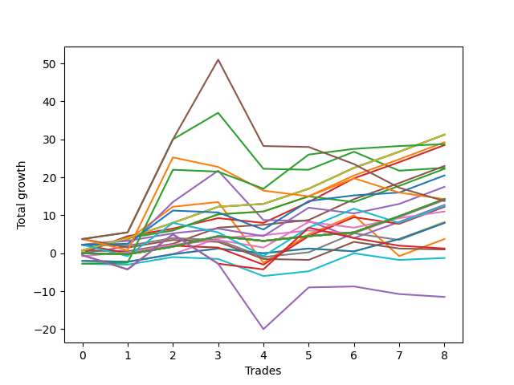

# Short Wallace 008 
- Symbol: ES
- Date Range: 3/19/22 - 5/22/22
- Trading Period: 7:20-12:30
- Number of Trades: 9


| Name | Win Percent | Profit | Avg Profit / Trade |     | Name | Win Percent | Profit | Avg Profit / Trade |
| ---- | ----------- | ------ | ------------------ | --- | ---- | ----------- | ------ | ------------------ |
| Sorted By <br> Profit | | | | | Sorted By <br> Win Percentage ||||
| Nineteen | 100.00 | 15625.00 | 1736.11 |     | Nineteen | 100.00 | 15625.00 | 1736.11 |
| Eighteen | 100.00 | 15625.00 | 1736.11 |     | Eighteen | 100.00 | 15625.00 | 1736.11 |
| One | 100.00 | 15625.00 | 1736.11 |     | One | 100.00 | 15625.00 | 1736.11 |
| Twelve | 100.00 | 14625.00 | 1625.00 |     | Twelve | 100.00 | 14625.00 | 1625.00 |
| Twenty-Three | 66.67 | 14375.00 | 1597.22 |     | Six | 88.89 | 11500.00 | 1277.78 |
| Four | 77.78 | 14250.00 | 1583.33 |     | Thirteen | 88.89 | 11125.00 | 1236.11 |
| Six | 88.89 | 11500.00 | 1277.78 |     | Four | 77.78 | 14250.00 | 1583.33 |
| Three | 66.67 | 11250.00 | 1250.00 |     | Twenty-One | 77.78 | 10250.00 | 1138.89 |
| Thirteen | 88.89 | 11125.00 | 1236.11 |     | Fifteen | 77.78 | 8750.00 | 972.22 |
| Twenty-One | 77.78 | 10250.00 | 1138.89 |     | Two | 77.78 | 1875.00 | 208.33 |
| Fifteen | 77.78 | 8750.00 | 972.22 |     | Twenty-Three | 66.67 | 14375.00 | 1597.22 |
| Thirty-Three | 66.67 | 7125.00 | 791.67 |     | Three | 66.67 | 11250.00 | 1250.00 |
| Thirty-Two | 66.67 | 7125.00 | 791.67 |     | Thirty-Three | 66.67 | 7125.00 | 791.67 |
| Thirty-One | 66.67 | 7125.00 | 791.67 |     | Thirty-Two | 66.67 | 7125.00 | 791.67 |
| Thirty | 66.67 | 7125.00 | 791.67 |     | Thirty-One | 66.67 | 7125.00 | 791.67 |
| Twenty-Nine | 66.67 | 7125.00 | 791.67 |     | Thirty | 66.67 | 7125.00 | 791.67 |
| Twenty-Eight | 66.67 | 7125.00 | 791.67 |     | Twenty-Nine | 66.67 | 7125.00 | 791.67 |
| Twenty-Seven | 66.67 | 7125.00 | 791.67 |     | Twenty-Eight | 66.67 | 7125.00 | 791.67 |
| Twenty-Six | 66.67 | 7125.00 | 791.67 |     | Twenty-Seven | 66.67 | 7125.00 | 791.67 |
| Twenty-Five | 66.67 | 7125.00 | 791.67 |     | Twenty-Six | 66.67 | 7125.00 | 791.67 |
| Twenty-Four | 66.67 | 7125.00 | 791.67 |     | Twenty-Five | 66.67 | 7125.00 | 791.67 |
| Twenty-Two | 33.33 | 7125.00 | 791.67 |     | Twenty-Four | 66.67 | 7125.00 | 791.67 |
| Seven | 66.67 | 7000.00 | 777.78 |     | Seven | 66.67 | 7000.00 | 777.78 |
| Thirty-Six | 44.44 | 6875.00 | 763.89 |     | Seventeen | 66.67 | 5500.00 | 611.11 |
| Five | 55.56 | 6375.00 | 708.33 |     | Five | 55.56 | 6375.00 | 708.33 |
| Twenty | 55.56 | 6250.00 | 694.44 |     | Twenty | 55.56 | 6250.00 | 694.44 |
| Fourteen | 55.56 | 6125.00 | 680.56 |     | Fourteen | 55.56 | 6125.00 | 680.56 |
| Seventeen | 66.67 | 5500.00 | 611.11 |     | Nine | 55.56 | 4125.00 | 458.33 |
| Nine | 55.56 | 4125.00 | 458.33 |     | Eleven | 55.56 | 4000.00 | 444.44 |
| Eleven | 55.56 | 4000.00 | 444.44 |     | Eight | 55.56 | 4000.00 | 444.44 |
| Eight | 55.56 | 4000.00 | 444.44 |     | Thirty-Six | 44.44 | 6875.00 | 763.89 |
| Two | 77.78 | 1875.00 | 208.33 |     | Ten | 44.44 | -625.00 | -69.44 |
| Thirty-Four | 22.22 | 625.00 | 69.44 |     | Twenty-Two | 33.33 | 7125.00 | 791.67 |
| Sixteen | 33.33 | 500.00 | 55.56 |     | Sixteen | 33.33 | 500.00 | 55.56 |
| Ten | 44.44 | -625.00 | -69.44 |     | Thirty-Five | 33.33 | -5750.00 | -638.89 |
| Thirty-Five | 33.33 | -5750.00 | -638.89 |     | Thirty-Four | 22.22 | 625.00 | 69.44 |

### Test One
* Sell when price hits the middle line of the 20p bollinger
* No Stoploss
* Results:
```
Total Trades: 9
Percent Up: 0.00
Percent Down: 100.00
Total Points Moved Down: 31.25
Potential Profit: 15625.00
Total Points Ups: 0.00 Count Ups: 0
Total Points Downs: 31.25 Count Downs: 9
```

<details><summary>Trades</summary>

<code>In: 2022-04-07 09:13:00		Out: 2022-04-07 09:17:05		Total Position Time: 04:05		Total Move Down: 0.75		Total to Date: -0.75</code> <br />
<code>In: 2022-04-25 09:28:00		Out: 2022-04-25 09:31:05		Total Position Time: 03:05		Total Move Down: 3.25		Total to Date: -4.00</code> <br />
<code>In: 2022-04-26 10:02:00		Out: 2022-04-26 10:02:25		Total Position Time: 00:25		Total Move Down: 4.00		Total to Date: -8.00</code> <br />
<code>In: 2022-05-09 12:04:00		Out: 2022-05-09 12:04:30		Total Position Time: 00:30		Total Move Down: 4.25		Total to Date: -12.25</code> <br />
<code>In: 2022-05-16 08:42:00		Out: 2022-05-16 08:42:30		Total Position Time: 00:30		Total Move Down: 0.75		Total to Date: -13.00</code> <br />
<code>In: 2022-06-10 10:53:00		Out: 2022-06-10 10:54:30		Total Position Time: 01:30		Total Move Down: 4.00		Total to Date: -17.00</code> <br />
<code>In: 2022-06-13 09:15:00		Out: 2022-06-13 09:17:05		Total Position Time: 02:05		Total Move Down: 5.50		Total to Date: -22.50</code> <br />
<code>In: 2022-06-14 10:03:00		Out: 2022-06-14 10:03:10		Total Position Time: 00:10		Total Move Down: 4.25		Total to Date: -26.75</code> <br />
<code>In: 2022-06-16 09:36:00		Out: 2022-06-16 09:36:10		Total Position Time: 00:10		Total Move Down: 4.50		Total to Date: -31.25</code> <br />


</details>

### Test Two
* Sell when the price hits the lower line of the 20p 1std bollinger
* No Stoploss
* Results:
```
Total Trades: 9
Percent Up: 22.22
Percent Down: 77.78
Total Points Moved Down: 3.75
Potential Profit: 1875.00
Total Points Ups: 26.75 Count Ups: 2
Total Points Downs: 30.50 Count Downs: 7
```

<details><summary>Trades</summary>

<code>In: 2022-04-07 09:13:00		Out: 2022-04-07 09:20:20		Total Position Time: 07:20		Total Move Down: 2.25		Total to Date: -2.25</code> <br />
<code>In: 2022-04-25 09:28:00		Out: 2022-04-25 09:42:40		Total Position Time: 14:40		Total Move Down: 1.25		Total to Date: -3.50</code> <br />
<code>In: 2022-04-26 10:02:00		Out: 2022-04-26 10:03:55		Total Position Time: 01:55		Total Move Down: 8.75		Total to Date: -12.25</code> <br />
<code>In: 2022-05-09 12:04:00		Out: 2022-05-09 12:18:05		Total Position Time: 14:05		Total Move Down: 1.25		Total to Date: -13.50</code> <br />
<code>In: 2022-05-16 08:42:00		Out: 2022-05-16 09:06:10		Total Position Time: 24:10		Total Move Down: -16.00		Total to Date: 2.50</code> <br />
<code>In: 2022-06-10 10:53:00		Out: 2022-06-10 10:56:15		Total Position Time: 03:15		Total Move Down: 7.50		Total to Date: -5.00</code> <br />
<code>In: 2022-06-13 09:15:00		Out: 2022-06-13 09:24:05		Total Position Time: 09:05		Total Move Down: 5.00		Total to Date: -10.00</code> <br />
<code>In: 2022-06-14 10:03:00		Out: 2022-06-14 10:28:55		Total Position Time: 25:55		Total Move Down: -10.75		Total to Date: 0.75</code> <br />
<code>In: 2022-06-16 09:36:00		Out: 2022-06-16 09:36:10		Total Position Time: 00:10		Total Move Down: 4.50		Total to Date: -3.75</code> <br />


</details>

### Test Three
* Sell when the price hits the lower line of the 20p 2std bollinger
* No Stoploss
* Results:
```
Total Trades: 9
Percent Up: 33.33
Percent Down: 66.67
Total Points Moved Down: 22.50
Potential Profit: 11250.00
Total Points Ups: 20.00 Count Ups: 3
Total Points Downs: 42.50 Count Downs: 6
```

<details><summary>Trades</summary>

<code>In: 2022-04-07 09:13:00		Out: 2022-04-07 09:28:20		Total Position Time: 15:20		Total Move Down: 3.75		Total to Date: -3.75</code> <br />
<code>In: 2022-04-25 09:28:00		Out: 2022-04-25 09:57:55		Total Position Time: 29:55		Total Move Down: 1.75		Total to Date: -5.50</code> <br />
<code>In: 2022-04-26 10:02:00		Out: 2022-04-26 10:31:55		Total Position Time: 29:55		Total Move Down: 24.50		Total to Date: -30.00</code> <br />
<code>In: 2022-05-09 12:04:00		Out: 2022-05-09 12:21:00		Total Position Time: 17:00		Total Move Down: 7.00		Total to Date: -37.00</code> <br />
<code>In: 2022-05-16 08:42:00		Out: 2022-05-16 09:11:40		Total Position Time: 29:40		Total Move Down: -14.75		Total to Date: -22.25</code> <br />
<code>In: 2022-06-10 10:53:00		Out: 2022-06-10 11:22:55		Total Position Time: 29:55		Total Move Down: -0.25		Total to Date: -22.00</code> <br />
<code>In: 2022-06-13 09:15:00		Out: 2022-06-13 09:30:35		Total Position Time: 15:35		Total Move Down: 4.75		Total to Date: -26.75</code> <br />
<code>In: 2022-06-14 10:03:00		Out: 2022-06-14 10:31:10		Total Position Time: 28:10		Total Move Down: -5.00		Total to Date: -21.75</code> <br />
<code>In: 2022-06-16 09:36:00		Out: 2022-06-16 09:59:35		Total Position Time: 23:35		Total Move Down: 0.75		Total to Date: -22.50</code> <br />


</details>

### Test Four
* Sell when the price hits the middle line of the 1std VWAP
* No Stoploss
* Results:
```
Total Trades: 9
Percent Up: 22.22
Percent Down: 77.78
Total Points Moved Down: 28.50
Potential Profit: 14250.00
Total Points Ups: 1.25 Count Ups: 2
Total Points Downs: 29.75 Count Downs: 7
```

<details><summary>Trades</summary>

<code>In: 2022-04-07 09:13:00		Out: 2022-04-07 09:13:10		Total Position Time: 00:10		Total Move Down: -0.00		Total to Date: -0.00</code> <br />
<code>In: 2022-04-25 09:28:00		Out: 2022-04-25 09:31:10		Total Position Time: 03:10		Total Move Down: 4.50		Total to Date: -4.50</code> <br />
<code>In: 2022-04-26 10:02:00		Out: 2022-04-26 10:02:10		Total Position Time: 00:10		Total Move Down: 2.00		Total to Date: -6.50</code> <br />
<code>In: 2022-05-09 12:04:00		Out: 2022-05-09 12:04:10		Total Position Time: 00:10		Total Move Down: 2.75		Total to Date: -9.25</code> <br />
<code>In: 2022-05-16 08:42:00		Out: 2022-05-16 08:42:10		Total Position Time: 00:10		Total Move Down: -1.25		Total to Date: -8.00</code> <br />
<code>In: 2022-06-10 10:53:00		Out: 2022-06-10 10:55:10		Total Position Time: 02:10		Total Move Down: 5.50		Total to Date: -13.50</code> <br />
<code>In: 2022-06-13 09:15:00		Out: 2022-06-13 09:17:20		Total Position Time: 02:20		Total Move Down: 6.25		Total to Date: -19.75</code> <br />
<code>In: 2022-06-14 10:03:00		Out: 2022-06-14 10:03:10		Total Position Time: 00:10		Total Move Down: 4.25		Total to Date: -24.00</code> <br />
<code>In: 2022-06-16 09:36:00		Out: 2022-06-16 09:36:10		Total Position Time: 00:10		Total Move Down: 4.50		Total to Date: -28.50</code> <br />


</details>

### Test Five
* Sell when the price hits the lower line of the 1std VWAP
* No Stoploss
* Results:
```
Total Trades: 9
Percent Up: 44.44
Percent Down: 55.56
Total Points Moved Down: 12.75
Potential Profit: 6375.00
Total Points Ups: 17.75 Count Ups: 4
Total Points Downs: 30.50 Count Downs: 5
```

<details><summary>Trades</summary>

<code>In: 2022-04-07 09:13:00		Out: 2022-04-07 09:13:10		Total Position Time: 00:10		Total Move Down: -0.00		Total to Date: -0.00</code> <br />
<code>In: 2022-04-25 09:28:00		Out: 2022-04-25 09:57:55		Total Position Time: 29:55		Total Move Down: 1.75		Total to Date: -1.75</code> <br />
<code>In: 2022-04-26 10:02:00		Out: 2022-04-26 10:14:15		Total Position Time: 12:15		Total Move Down: 11.75		Total to Date: -13.50</code> <br />
<code>In: 2022-05-09 12:04:00		Out: 2022-05-09 12:21:30		Total Position Time: 17:30		Total Move Down: 8.25		Total to Date: -21.75</code> <br />
<code>In: 2022-05-16 08:42:00		Out: 2022-05-16 09:11:55		Total Position Time: 29:55		Total Move Down: -13.00		Total to Date: -8.75</code> <br />
<code>In: 2022-06-10 10:53:00		Out: 2022-06-10 11:22:55		Total Position Time: 29:55		Total Move Down: -0.25		Total to Date: -8.50</code> <br />
<code>In: 2022-06-13 09:15:00		Out: 2022-06-13 09:44:55		Total Position Time: 29:55		Total Move Down: -4.50		Total to Date: -4.00</code> <br />
<code>In: 2022-06-14 10:03:00		Out: 2022-06-14 10:03:10		Total Position Time: 00:10		Total Move Down: 4.25		Total to Date: -8.25</code> <br />
<code>In: 2022-06-16 09:36:00		Out: 2022-06-16 09:36:10		Total Position Time: 00:10		Total Move Down: 4.50		Total to Date: -12.75</code> <br />


</details>

### Test Six
* Sell when the price hits the middle line of the 20p bollinger
* Stoploss is -2 points
* Results:
```
Total Trades: 9
Percent Up: 11.11
Percent Down: 88.89
Total Points Moved Down: 23.00
Potential Profit: 11500.00
Total Points Ups: 0.25 Count Ups: 1
Total Points Downs: 23.25 Count Downs: 8
```

<details><summary>Trades</summary>

<code>In: 2022-04-07 09:13:00		Out: 2022-04-07 09:17:05		Total Position Time: 04:05		Total Move Down: 0.75		Total to Date: -0.75</code> <br />
<code>In: 2022-04-25 09:28:00		Out: 2022-04-25 09:28:10		Total Position Time: 00:10		Total Move Down: -0.25		Total to Date: -0.50</code> <br />
<code>In: 2022-04-26 10:02:00		Out: 2022-04-26 10:02:10		Total Position Time: 00:10		Total Move Down: 2.00		Total to Date: -2.50</code> <br />
<code>In: 2022-05-09 12:04:00		Out: 2022-05-09 12:04:30		Total Position Time: 00:30		Total Move Down: 4.25		Total to Date: -6.75</code> <br />
<code>In: 2022-05-16 08:42:00		Out: 2022-05-16 08:42:30		Total Position Time: 00:30		Total Move Down: 0.75		Total to Date: -7.50</code> <br />
<code>In: 2022-06-10 10:53:00		Out: 2022-06-10 10:53:10		Total Position Time: 00:10		Total Move Down: 1.25		Total to Date: -8.75</code> <br />
<code>In: 2022-06-13 09:15:00		Out: 2022-06-13 09:17:05		Total Position Time: 02:05		Total Move Down: 5.50		Total to Date: -14.25</code> <br />
<code>In: 2022-06-14 10:03:00		Out: 2022-06-14 10:03:10		Total Position Time: 00:10		Total Move Down: 4.25		Total to Date: -18.50</code> <br />
<code>In: 2022-06-16 09:36:00		Out: 2022-06-16 09:36:10		Total Position Time: 00:10		Total Move Down: 4.50		Total to Date: -23.00</code> <br />


</details>

### Test Seven
* Sell when the price hits the middle line of the 20p bollinger
* Trailing Stop is -2 points
* Results:
```
Total Trades: 9
Percent Up: 33.33
Percent Down: 66.67
Total Points Moved Down: 14.00
Potential Profit: 7000.00
Total Points Ups: 3.00 Count Ups: 3
Total Points Downs: 17.00 Count Downs: 6
```

<details><summary>Trades</summary>

<code>In: 2022-04-07 09:13:00		Out: 2022-04-07 09:15:05		Total Position Time: 02:05		Total Move Down: -2.00		Total to Date: 2.00</code> <br />
<code>In: 2022-04-25 09:28:00		Out: 2022-04-25 09:28:10		Total Position Time: 00:10		Total Move Down: -0.25		Total to Date: 2.25</code> <br />
<code>In: 2022-04-26 10:02:00		Out: 2022-04-26 10:02:10		Total Position Time: 00:10		Total Move Down: 2.00		Total to Date: 0.25</code> <br />
<code>In: 2022-05-09 12:04:00		Out: 2022-05-09 12:04:30		Total Position Time: 00:30		Total Move Down: 4.25		Total to Date: -4.00</code> <br />
<code>In: 2022-05-16 08:42:00		Out: 2022-05-16 08:42:30		Total Position Time: 00:30		Total Move Down: 0.75		Total to Date: -4.75</code> <br />
<code>In: 2022-06-10 10:53:00		Out: 2022-06-10 10:53:10		Total Position Time: 00:10		Total Move Down: 1.25		Total to Date: -6.00</code> <br />
<code>In: 2022-06-13 09:15:00		Out: 2022-06-13 09:15:20		Total Position Time: 00:20		Total Move Down: -0.75		Total to Date: -5.25</code> <br />
<code>In: 2022-06-14 10:03:00		Out: 2022-06-14 10:03:10		Total Position Time: 00:10		Total Move Down: 4.25		Total to Date: -9.50</code> <br />
<code>In: 2022-06-16 09:36:00		Out: 2022-06-16 09:36:10		Total Position Time: 00:10		Total Move Down: 4.50		Total to Date: -14.00</code> <br />


</details>

### Test Eight
* Sell when the price hits the lower line of the 20p 1std bollinger
* Stoploss is -2 points
* Results:
```
Total Trades: 9
Percent Up: 44.44
Percent Down: 55.56
Total Points Moved Down: 8.00
Potential Profit: 4000.00
Total Points Ups: 7.00 Count Ups: 4
Total Points Downs: 15.00 Count Downs: 5
```

<details><summary>Trades</summary>

<code>In: 2022-04-07 09:13:00		Out: 2022-04-07 09:20:20		Total Position Time: 07:20		Total Move Down: 2.25		Total to Date: -2.25</code> <br />
<code>In: 2022-04-25 09:28:00		Out: 2022-04-25 09:28:10		Total Position Time: 00:10		Total Move Down: -0.25		Total to Date: -2.00</code> <br />
<code>In: 2022-04-26 10:02:00		Out: 2022-04-26 10:02:10		Total Position Time: 00:10		Total Move Down: 2.00		Total to Date: -4.00</code> <br />
<code>In: 2022-05-09 12:04:00		Out: 2022-05-09 12:05:15		Total Position Time: 01:15		Total Move Down: -0.50		Total to Date: -3.50</code> <br />
<code>In: 2022-05-16 08:42:00		Out: 2022-05-16 08:43:30		Total Position Time: 01:30		Total Move Down: -4.50		Total to Date: 1.00</code> <br />
<code>In: 2022-06-10 10:53:00		Out: 2022-06-10 10:53:10		Total Position Time: 00:10		Total Move Down: 1.25		Total to Date: -0.25</code> <br />
<code>In: 2022-06-13 09:15:00		Out: 2022-06-13 09:24:05		Total Position Time: 09:05		Total Move Down: 5.00		Total to Date: -5.25</code> <br />
<code>In: 2022-06-14 10:03:00		Out: 2022-06-14 10:07:00		Total Position Time: 04:00		Total Move Down: -1.75		Total to Date: -3.50</code> <br />
<code>In: 2022-06-16 09:36:00		Out: 2022-06-16 09:36:10		Total Position Time: 00:10		Total Move Down: 4.50		Total to Date: -8.00</code> <br />


</details>

### Test Nine
* Sell when the price hits the lower line of the 20p 1std bollinger
* Trailing Stop is -2 points
* Results:
```
Total Trades: 9
Percent Up: 44.44
Percent Down: 55.56
Total Points Moved Down: 8.25
Potential Profit: 4125.00
Total Points Ups: 4.25 Count Ups: 4
Total Points Downs: 12.50 Count Downs: 5
```

<details><summary>Trades</summary>

<code>In: 2022-04-07 09:13:00		Out: 2022-04-07 09:15:05		Total Position Time: 02:05		Total Move Down: -2.00		Total to Date: 2.00</code> <br />
<code>In: 2022-04-25 09:28:00		Out: 2022-04-25 09:28:10		Total Position Time: 00:10		Total Move Down: -0.25		Total to Date: 2.25</code> <br />
<code>In: 2022-04-26 10:02:00		Out: 2022-04-26 10:02:10		Total Position Time: 00:10		Total Move Down: 2.00		Total to Date: 0.25</code> <br />
<code>In: 2022-05-09 12:04:00		Out: 2022-05-09 12:04:50		Total Position Time: 00:50		Total Move Down: 1.50		Total to Date: -1.25</code> <br />
<code>In: 2022-05-16 08:42:00		Out: 2022-05-16 08:42:45		Total Position Time: 00:45		Total Move Down: -1.25		Total to Date: -0.00</code> <br />
<code>In: 2022-06-10 10:53:00		Out: 2022-06-10 10:53:10		Total Position Time: 00:10		Total Move Down: 1.25		Total to Date: -1.25</code> <br />
<code>In: 2022-06-13 09:15:00		Out: 2022-06-13 09:15:20		Total Position Time: 00:20		Total Move Down: -0.75		Total to Date: -0.50</code> <br />
<code>In: 2022-06-14 10:03:00		Out: 2022-06-14 10:04:10		Total Position Time: 01:10		Total Move Down: 3.25		Total to Date: -3.75</code> <br />
<code>In: 2022-06-16 09:36:00		Out: 2022-06-16 09:36:10		Total Position Time: 00:10		Total Move Down: 4.50		Total to Date: -8.25</code> <br />


</details>

### Test Ten
* Sell when the price hits the lower line of the 20p 2std bollinger
* Stoploss is -2 points
* Results:
```
Total Trades: 9
Percent Up: 55.56
Percent Down: 44.44
Total Points Moved Down: -1.25
Potential Profit: -625.00
Total Points Ups: 9.75 Count Ups: 5
Total Points Downs: 8.50 Count Downs: 4
```

<details><summary>Trades</summary>

<code>In: 2022-04-07 09:13:00		Out: 2022-04-07 09:22:05		Total Position Time: 09:05		Total Move Down: -2.75		Total to Date: 2.75</code> <br />
<code>In: 2022-04-25 09:28:00		Out: 2022-04-25 09:28:10		Total Position Time: 00:10		Total Move Down: -0.25		Total to Date: 3.00</code> <br />
<code>In: 2022-04-26 10:02:00		Out: 2022-04-26 10:02:10		Total Position Time: 00:10		Total Move Down: 2.00		Total to Date: 1.00</code> <br />
<code>In: 2022-05-09 12:04:00		Out: 2022-05-09 12:05:15		Total Position Time: 01:15		Total Move Down: -0.50		Total to Date: 1.50</code> <br />
<code>In: 2022-05-16 08:42:00		Out: 2022-05-16 08:43:30		Total Position Time: 01:30		Total Move Down: -4.50		Total to Date: 6.00</code> <br />
<code>In: 2022-06-10 10:53:00		Out: 2022-06-10 10:53:10		Total Position Time: 00:10		Total Move Down: 1.25		Total to Date: 4.75</code> <br />
<code>In: 2022-06-13 09:15:00		Out: 2022-06-13 09:30:35		Total Position Time: 15:35		Total Move Down: 4.75		Total to Date: -0.00</code> <br />
<code>In: 2022-06-14 10:03:00		Out: 2022-06-14 10:07:00		Total Position Time: 04:00		Total Move Down: -1.75		Total to Date: 1.75</code> <br />
<code>In: 2022-06-16 09:36:00		Out: 2022-06-16 09:38:50		Total Position Time: 02:50		Total Move Down: 0.50		Total to Date: 1.25</code> <br />


</details>

### Test Eleven
* Sell when the price hits the lower line of the 20p 2std bollinger
* Trailing Stop is -2 points
* Results:
```
Total Trades: 9
Percent Up: 44.44
Percent Down: 55.56
Total Points Moved Down: 8.00
Potential Profit: 4000.00
Total Points Ups: 4.25 Count Ups: 4
Total Points Downs: 12.25 Count Downs: 5
```

<details><summary>Trades</summary>

<code>In: 2022-04-07 09:13:00		Out: 2022-04-07 09:15:05		Total Position Time: 02:05		Total Move Down: -2.00		Total to Date: 2.00</code> <br />
<code>In: 2022-04-25 09:28:00		Out: 2022-04-25 09:28:10		Total Position Time: 00:10		Total Move Down: -0.25		Total to Date: 2.25</code> <br />
<code>In: 2022-04-26 10:02:00		Out: 2022-04-26 10:02:10		Total Position Time: 00:10		Total Move Down: 2.00		Total to Date: 0.25</code> <br />
<code>In: 2022-05-09 12:04:00		Out: 2022-05-09 12:04:50		Total Position Time: 00:50		Total Move Down: 1.50		Total to Date: -1.25</code> <br />
<code>In: 2022-05-16 08:42:00		Out: 2022-05-16 08:42:45		Total Position Time: 00:45		Total Move Down: -1.25		Total to Date: -0.00</code> <br />
<code>In: 2022-06-10 10:53:00		Out: 2022-06-10 10:53:10		Total Position Time: 00:10		Total Move Down: 1.25		Total to Date: -1.25</code> <br />
<code>In: 2022-06-13 09:15:00		Out: 2022-06-13 09:15:20		Total Position Time: 00:20		Total Move Down: -0.75		Total to Date: -0.50</code> <br />
<code>In: 2022-06-14 10:03:00		Out: 2022-06-14 10:04:10		Total Position Time: 01:10		Total Move Down: 3.25		Total to Date: -3.75</code> <br />
<code>In: 2022-06-16 09:36:00		Out: 2022-06-16 09:37:30		Total Position Time: 01:30		Total Move Down: 4.25		Total to Date: -8.00</code> <br />


</details>

### Test Twelve
* Sell when the price hits the middle line of the 20p bollinger
* Stoploss is -3 points
* Results:
```
Total Trades: 9
Percent Up: 0.00
Percent Down: 100.00
Total Points Moved Down: 29.25
Potential Profit: 14625.00
Total Points Ups: 0.00 Count Ups: 0
Total Points Downs: 29.25 Count Downs: 9
```

<details><summary>Trades</summary>

<code>In: 2022-04-07 09:13:00		Out: 2022-04-07 09:17:05		Total Position Time: 04:05		Total Move Down: 0.75		Total to Date: -0.75</code> <br />
<code>In: 2022-04-25 09:28:00		Out: 2022-04-25 09:31:05		Total Position Time: 03:05		Total Move Down: 3.25		Total to Date: -4.00</code> <br />
<code>In: 2022-04-26 10:02:00		Out: 2022-04-26 10:02:10		Total Position Time: 00:10		Total Move Down: 2.00		Total to Date: -6.00</code> <br />
<code>In: 2022-05-09 12:04:00		Out: 2022-05-09 12:04:30		Total Position Time: 00:30		Total Move Down: 4.25		Total to Date: -10.25</code> <br />
<code>In: 2022-05-16 08:42:00		Out: 2022-05-16 08:42:30		Total Position Time: 00:30		Total Move Down: 0.75		Total to Date: -11.00</code> <br />
<code>In: 2022-06-10 10:53:00		Out: 2022-06-10 10:54:30		Total Position Time: 01:30		Total Move Down: 4.00		Total to Date: -15.00</code> <br />
<code>In: 2022-06-13 09:15:00		Out: 2022-06-13 09:17:05		Total Position Time: 02:05		Total Move Down: 5.50		Total to Date: -20.50</code> <br />
<code>In: 2022-06-14 10:03:00		Out: 2022-06-14 10:03:10		Total Position Time: 00:10		Total Move Down: 4.25		Total to Date: -24.75</code> <br />
<code>In: 2022-06-16 09:36:00		Out: 2022-06-16 09:36:10		Total Position Time: 00:10		Total Move Down: 4.50		Total to Date: -29.25</code> <br />


</details>

### Test Thirteen
* Sell when the price hits the middle line of the 20p bollinger
* Trailing Stop is -3 points
* Results:
```
Total Trades: 9
Percent Up: 11.11
Percent Down: 88.89
Total Points Moved Down: 22.25
Potential Profit: 11125.00
Total Points Ups: 1.50 Count Ups: 1
Total Points Downs: 23.75 Count Downs: 8
```

<details><summary>Trades</summary>

<code>In: 2022-04-07 09:13:00		Out: 2022-04-07 09:17:05		Total Position Time: 04:05		Total Move Down: 0.75		Total to Date: -0.75</code> <br />
<code>In: 2022-04-25 09:28:00		Out: 2022-04-25 09:31:05		Total Position Time: 03:05		Total Move Down: 3.25		Total to Date: -4.00</code> <br />
<code>In: 2022-04-26 10:02:00		Out: 2022-04-26 10:02:10		Total Position Time: 00:10		Total Move Down: 2.00		Total to Date: -6.00</code> <br />
<code>In: 2022-05-09 12:04:00		Out: 2022-05-09 12:04:30		Total Position Time: 00:30		Total Move Down: 4.25		Total to Date: -10.25</code> <br />
<code>In: 2022-05-16 08:42:00		Out: 2022-05-16 08:42:30		Total Position Time: 00:30		Total Move Down: 0.75		Total to Date: -11.00</code> <br />
<code>In: 2022-06-10 10:53:00		Out: 2022-06-10 10:54:30		Total Position Time: 01:30		Total Move Down: 4.00		Total to Date: -15.00</code> <br />
<code>In: 2022-06-13 09:15:00		Out: 2022-06-13 09:15:30		Total Position Time: 00:30		Total Move Down: -1.50		Total to Date: -13.50</code> <br />
<code>In: 2022-06-14 10:03:00		Out: 2022-06-14 10:03:10		Total Position Time: 00:10		Total Move Down: 4.25		Total to Date: -17.75</code> <br />
<code>In: 2022-06-16 09:36:00		Out: 2022-06-16 09:36:10		Total Position Time: 00:10		Total Move Down: 4.50		Total to Date: -22.25</code> <br />


</details>

### Test Fourteen
* Sell when the price hits the lower line of the 20p 1std bollinger
* Stoploss is -3 points
* Results:
```
Total Trades: 9
Percent Up: 44.44
Percent Down: 55.56
Total Points Moved Down: 12.25
Potential Profit: 6125.00
Total Points Ups: 9.00 Count Ups: 4
Total Points Downs: 21.25 Count Downs: 5
```

<details><summary>Trades</summary>

<code>In: 2022-04-07 09:13:00		Out: 2022-04-07 09:20:20		Total Position Time: 07:20		Total Move Down: 2.25		Total to Date: -2.25</code> <br />
<code>In: 2022-04-25 09:28:00		Out: 2022-04-25 09:32:10		Total Position Time: 04:10		Total Move Down: -2.25		Total to Date: -0.00</code> <br />
<code>In: 2022-04-26 10:02:00		Out: 2022-04-26 10:02:10		Total Position Time: 00:10		Total Move Down: 2.00		Total to Date: -2.00</code> <br />
<code>In: 2022-05-09 12:04:00		Out: 2022-05-09 12:05:15		Total Position Time: 01:15		Total Move Down: -0.50		Total to Date: -1.50</code> <br />
<code>In: 2022-05-16 08:42:00		Out: 2022-05-16 08:43:30		Total Position Time: 01:30		Total Move Down: -4.50		Total to Date: 3.00</code> <br />
<code>In: 2022-06-10 10:53:00		Out: 2022-06-10 10:56:15		Total Position Time: 03:15		Total Move Down: 7.50		Total to Date: -4.50</code> <br />
<code>In: 2022-06-13 09:15:00		Out: 2022-06-13 09:24:05		Total Position Time: 09:05		Total Move Down: 5.00		Total to Date: -9.50</code> <br />
<code>In: 2022-06-14 10:03:00		Out: 2022-06-14 10:07:00		Total Position Time: 04:00		Total Move Down: -1.75		Total to Date: -7.75</code> <br />
<code>In: 2022-06-16 09:36:00		Out: 2022-06-16 09:36:10		Total Position Time: 00:10		Total Move Down: 4.50		Total to Date: -12.25</code> <br />


</details>

### Test Fifteen
* Sell when the price hits the lower line of the 20p 1std bollinger
* Trailing Stop is -3 points
* Results:
```
Total Trades: 9
Percent Up: 22.22
Percent Down: 77.78
Total Points Moved Down: 17.50
Potential Profit: 8750.00
Total Points Ups: 3.50 Count Ups: 2
Total Points Downs: 21.00 Count Downs: 7
```

<details><summary>Trades</summary>

<code>In: 2022-04-07 09:13:00		Out: 2022-04-07 09:20:20		Total Position Time: 07:20		Total Move Down: 2.25		Total to Date: -2.25</code> <br />
<code>In: 2022-04-25 09:28:00		Out: 2022-04-25 09:31:40		Total Position Time: 03:40		Total Move Down: 1.00		Total to Date: -3.25</code> <br />
<code>In: 2022-04-26 10:02:00		Out: 2022-04-26 10:02:10		Total Position Time: 00:10		Total Move Down: 2.00		Total to Date: -5.25</code> <br />
<code>In: 2022-05-09 12:04:00		Out: 2022-05-09 12:05:10		Total Position Time: 01:10		Total Move Down: 1.25		Total to Date: -6.50</code> <br />
<code>In: 2022-05-16 08:42:00		Out: 2022-05-16 08:43:10		Total Position Time: 01:10		Total Move Down: -2.00		Total to Date: -4.50</code> <br />
<code>In: 2022-06-10 10:53:00		Out: 2022-06-10 10:56:15		Total Position Time: 03:15		Total Move Down: 7.50		Total to Date: -12.00</code> <br />
<code>In: 2022-06-13 09:15:00		Out: 2022-06-13 09:15:30		Total Position Time: 00:30		Total Move Down: -1.50		Total to Date: -10.50</code> <br />
<code>In: 2022-06-14 10:03:00		Out: 2022-06-14 10:04:55		Total Position Time: 01:55		Total Move Down: 2.50		Total to Date: -13.00</code> <br />
<code>In: 2022-06-16 09:36:00		Out: 2022-06-16 09:36:10		Total Position Time: 00:10		Total Move Down: 4.50		Total to Date: -17.50</code> <br />


</details>

### Test Sixteen
* Sell when the price hits the lower line of the 20p 2std bollinger
* Stoploss is -3 points
* Results:
```
Total Trades: 9
Percent Up: 66.67
Percent Down: 33.33
Total Points Moved Down: 1.00
Potential Profit: 500.00
Total Points Ups: 9.50 Count Ups: 6
Total Points Downs: 10.50 Count Downs: 3
```

<details><summary>Trades</summary>

<code>In: 2022-04-07 09:13:00		Out: 2022-04-07 09:28:20		Total Position Time: 15:20		Total Move Down: 3.75		Total to Date: -3.75</code> <br />
<code>In: 2022-04-25 09:28:00		Out: 2022-04-25 09:32:10		Total Position Time: 04:10		Total Move Down: -2.25		Total to Date: -1.50</code> <br />
<code>In: 2022-04-26 10:02:00		Out: 2022-04-26 10:02:10		Total Position Time: 00:10		Total Move Down: 2.00		Total to Date: -3.50</code> <br />
<code>In: 2022-05-09 12:04:00		Out: 2022-05-09 12:05:15		Total Position Time: 01:15		Total Move Down: -0.50		Total to Date: -3.00</code> <br />
<code>In: 2022-05-16 08:42:00		Out: 2022-05-16 08:43:30		Total Position Time: 01:30		Total Move Down: -4.50		Total to Date: 1.50</code> <br />
<code>In: 2022-06-10 10:53:00		Out: 2022-06-10 11:20:30		Total Position Time: 27:30		Total Move Down: -0.25		Total to Date: 1.75</code> <br />
<code>In: 2022-06-13 09:15:00		Out: 2022-06-13 09:30:35		Total Position Time: 15:35		Total Move Down: 4.75		Total to Date: -3.00</code> <br />
<code>In: 2022-06-14 10:03:00		Out: 2022-06-14 10:07:00		Total Position Time: 04:00		Total Move Down: -1.75		Total to Date: -1.25</code> <br />
<code>In: 2022-06-16 09:36:00		Out: 2022-06-16 09:39:30		Total Position Time: 03:30		Total Move Down: -0.25		Total to Date: -1.00</code> <br />


</details>

### Test Seventeen
* Sell when the price hits the lower line of the 20p 2std bollinger
* Trailing Stop is -3 points
* Results:
```
Total Trades: 9
Percent Up: 33.33
Percent Down: 66.67
Total Points Moved Down: 11.00
Potential Profit: 5500.00
Total Points Ups: 4.25 Count Ups: 3
Total Points Downs: 15.25 Count Downs: 6
```

<details><summary>Trades</summary>

<code>In: 2022-04-07 09:13:00		Out: 2022-04-07 09:21:35		Total Position Time: 08:35		Total Move Down: -0.75		Total to Date: 0.75</code> <br />
<code>In: 2022-04-25 09:28:00		Out: 2022-04-25 09:31:40		Total Position Time: 03:40		Total Move Down: 1.00		Total to Date: -0.25</code> <br />
<code>In: 2022-04-26 10:02:00		Out: 2022-04-26 10:02:10		Total Position Time: 00:10		Total Move Down: 2.00		Total to Date: -2.25</code> <br />
<code>In: 2022-05-09 12:04:00		Out: 2022-05-09 12:05:10		Total Position Time: 01:10		Total Move Down: 1.25		Total to Date: -3.50</code> <br />
<code>In: 2022-05-16 08:42:00		Out: 2022-05-16 08:43:10		Total Position Time: 01:10		Total Move Down: -2.00		Total to Date: -1.50</code> <br />
<code>In: 2022-06-10 10:53:00		Out: 2022-06-10 10:58:45		Total Position Time: 05:45		Total Move Down: 6.75		Total to Date: -8.25</code> <br />
<code>In: 2022-06-13 09:15:00		Out: 2022-06-13 09:15:30		Total Position Time: 00:30		Total Move Down: -1.50		Total to Date: -6.75</code> <br />
<code>In: 2022-06-14 10:03:00		Out: 2022-06-14 10:04:55		Total Position Time: 01:55		Total Move Down: 2.50		Total to Date: -9.25</code> <br />
<code>In: 2022-06-16 09:36:00		Out: 2022-06-16 09:38:30		Total Position Time: 02:30		Total Move Down: 1.75		Total to Date: -11.00</code> <br />


</details>

### Test Eighteen
* Sell when the price hits the middle line of the 20p bollinger
* Stoploss is -5 points
* Results:
```
Total Trades: 9
Percent Up: 0.00
Percent Down: 100.00
Total Points Moved Down: 31.25
Potential Profit: 15625.00
Total Points Ups: 0.00 Count Ups: 0
Total Points Downs: 31.25 Count Downs: 9
```

<details><summary>Trades</summary>

<code>In: 2022-04-07 09:13:00		Out: 2022-04-07 09:17:05		Total Position Time: 04:05		Total Move Down: 0.75		Total to Date: -0.75</code> <br />
<code>In: 2022-04-25 09:28:00		Out: 2022-04-25 09:31:05		Total Position Time: 03:05		Total Move Down: 3.25		Total to Date: -4.00</code> <br />
<code>In: 2022-04-26 10:02:00		Out: 2022-04-26 10:02:25		Total Position Time: 00:25		Total Move Down: 4.00		Total to Date: -8.00</code> <br />
<code>In: 2022-05-09 12:04:00		Out: 2022-05-09 12:04:30		Total Position Time: 00:30		Total Move Down: 4.25		Total to Date: -12.25</code> <br />
<code>In: 2022-05-16 08:42:00		Out: 2022-05-16 08:42:30		Total Position Time: 00:30		Total Move Down: 0.75		Total to Date: -13.00</code> <br />
<code>In: 2022-06-10 10:53:00		Out: 2022-06-10 10:54:30		Total Position Time: 01:30		Total Move Down: 4.00		Total to Date: -17.00</code> <br />
<code>In: 2022-06-13 09:15:00		Out: 2022-06-13 09:17:05		Total Position Time: 02:05		Total Move Down: 5.50		Total to Date: -22.50</code> <br />
<code>In: 2022-06-14 10:03:00		Out: 2022-06-14 10:03:10		Total Position Time: 00:10		Total Move Down: 4.25		Total to Date: -26.75</code> <br />
<code>In: 2022-06-16 09:36:00		Out: 2022-06-16 09:36:10		Total Position Time: 00:10		Total Move Down: 4.50		Total to Date: -31.25</code> <br />


</details>

### Test Nineteen
* Sell when the price hits the middle line of the 20p bollinger
* Trailing Stop is -5 points
* Results:
```
Total Trades: 9
Percent Up: 0.00
Percent Down: 100.00
Total Points Moved Down: 31.25
Potential Profit: 15625.00
Total Points Ups: 0.00 Count Ups: 0
Total Points Downs: 31.25 Count Downs: 9
```

<details><summary>Trades</summary>

<code>In: 2022-04-07 09:13:00		Out: 2022-04-07 09:17:05		Total Position Time: 04:05		Total Move Down: 0.75		Total to Date: -0.75</code> <br />
<code>In: 2022-04-25 09:28:00		Out: 2022-04-25 09:31:05		Total Position Time: 03:05		Total Move Down: 3.25		Total to Date: -4.00</code> <br />
<code>In: 2022-04-26 10:02:00		Out: 2022-04-26 10:02:25		Total Position Time: 00:25		Total Move Down: 4.00		Total to Date: -8.00</code> <br />
<code>In: 2022-05-09 12:04:00		Out: 2022-05-09 12:04:30		Total Position Time: 00:30		Total Move Down: 4.25		Total to Date: -12.25</code> <br />
<code>In: 2022-05-16 08:42:00		Out: 2022-05-16 08:42:30		Total Position Time: 00:30		Total Move Down: 0.75		Total to Date: -13.00</code> <br />
<code>In: 2022-06-10 10:53:00		Out: 2022-06-10 10:54:30		Total Position Time: 01:30		Total Move Down: 4.00		Total to Date: -17.00</code> <br />
<code>In: 2022-06-13 09:15:00		Out: 2022-06-13 09:17:05		Total Position Time: 02:05		Total Move Down: 5.50		Total to Date: -22.50</code> <br />
<code>In: 2022-06-14 10:03:00		Out: 2022-06-14 10:03:10		Total Position Time: 00:10		Total Move Down: 4.25		Total to Date: -26.75</code> <br />
<code>In: 2022-06-16 09:36:00		Out: 2022-06-16 09:36:10		Total Position Time: 00:10		Total Move Down: 4.50		Total to Date: -31.25</code> <br />


</details>

### Test Twenty
* Sell when the price hits the lower line of the 20p 1std bollinger
* Stoploss is -5 points
* Results:
```
Total Trades: 9
Percent Up: 44.44
Percent Down: 55.56
Total Points Moved Down: 12.50
Potential Profit: 6250.00
Total Points Ups: 15.50 Count Ups: 4
Total Points Downs: 28.00 Count Downs: 5
```

<details><summary>Trades</summary>

<code>In: 2022-04-07 09:13:00		Out: 2022-04-07 09:20:20		Total Position Time: 07:20		Total Move Down: 2.25		Total to Date: -2.25</code> <br />
<code>In: 2022-04-25 09:28:00		Out: 2022-04-25 09:32:20		Total Position Time: 04:20		Total Move Down: -3.00		Total to Date: 0.75</code> <br />
<code>In: 2022-04-26 10:02:00		Out: 2022-04-26 10:03:55		Total Position Time: 01:55		Total Move Down: 8.75		Total to Date: -8.00</code> <br />
<code>In: 2022-05-09 12:04:00		Out: 2022-05-09 12:06:45		Total Position Time: 02:45		Total Move Down: -2.50		Total to Date: -5.50</code> <br />
<code>In: 2022-05-16 08:42:00		Out: 2022-05-16 08:44:35		Total Position Time: 02:35		Total Move Down: -6.25		Total to Date: 0.75</code> <br />
<code>In: 2022-06-10 10:53:00		Out: 2022-06-10 10:56:15		Total Position Time: 03:15		Total Move Down: 7.50		Total to Date: -6.75</code> <br />
<code>In: 2022-06-13 09:15:00		Out: 2022-06-13 09:24:05		Total Position Time: 09:05		Total Move Down: 5.00		Total to Date: -11.75</code> <br />
<code>In: 2022-06-14 10:03:00		Out: 2022-06-14 10:07:55		Total Position Time: 04:55		Total Move Down: -3.75		Total to Date: -8.00</code> <br />
<code>In: 2022-06-16 09:36:00		Out: 2022-06-16 09:36:10		Total Position Time: 00:10		Total Move Down: 4.50		Total to Date: -12.50</code> <br />


</details>

### Test Twenty-One
* Sell when the price hits the lower line of the 20p 1std bollinger
* Trailing Stop is -5 points
* Results:
```
Total Trades: 9
Percent Up: 22.22
Percent Down: 77.78
Total Points Moved Down: 20.50
Potential Profit: 10250.00
Total Points Ups: 5.00 Count Ups: 2
Total Points Downs: 25.50 Count Downs: 7
```

<details><summary>Trades</summary>

<code>In: 2022-04-07 09:13:00		Out: 2022-04-07 09:20:20		Total Position Time: 07:20		Total Move Down: 2.25		Total to Date: -2.25</code> <br />
<code>In: 2022-04-25 09:28:00		Out: 2022-04-25 09:31:45		Total Position Time: 03:45		Total Move Down: 0.25		Total to Date: -2.50</code> <br />
<code>In: 2022-04-26 10:02:00		Out: 2022-04-26 10:03:55		Total Position Time: 01:55		Total Move Down: 8.75		Total to Date: -11.25</code> <br />
<code>In: 2022-05-09 12:04:00		Out: 2022-05-09 12:05:15		Total Position Time: 01:15		Total Move Down: -0.50		Total to Date: -10.75</code> <br />
<code>In: 2022-05-16 08:42:00		Out: 2022-05-16 08:43:30		Total Position Time: 01:30		Total Move Down: -4.50		Total to Date: -6.25</code> <br />
<code>In: 2022-06-10 10:53:00		Out: 2022-06-10 10:56:15		Total Position Time: 03:15		Total Move Down: 7.50		Total to Date: -13.75</code> <br />
<code>In: 2022-06-13 09:15:00		Out: 2022-06-13 09:19:50		Total Position Time: 04:50		Total Move Down: 1.50		Total to Date: -15.25</code> <br />
<code>In: 2022-06-14 10:03:00		Out: 2022-06-14 10:06:55		Total Position Time: 03:55		Total Move Down: 0.75		Total to Date: -16.00</code> <br />
<code>In: 2022-06-16 09:36:00		Out: 2022-06-16 09:36:10		Total Position Time: 00:10		Total Move Down: 4.50		Total to Date: -20.50</code> <br />


</details>

### Test Twenty-Two
* Sell when the price hits the lower line of the 20p 2std bollinger
* Stoploss is -5 points
* Results:
```
Total Trades: 9
Percent Up: 66.67
Percent Down: 33.33
Total Points Moved Down: 14.25
Potential Profit: 7125.00
Total Points Ups: 18.75 Count Ups: 6
Total Points Downs: 33.00 Count Downs: 3
```

<details><summary>Trades</summary>

<code>In: 2022-04-07 09:13:00		Out: 2022-04-07 09:28:20		Total Position Time: 15:20		Total Move Down: 3.75		Total to Date: -3.75</code> <br />
<code>In: 2022-04-25 09:28:00		Out: 2022-04-25 09:32:20		Total Position Time: 04:20		Total Move Down: -3.00		Total to Date: -0.75</code> <br />
<code>In: 2022-04-26 10:02:00		Out: 2022-04-26 10:31:55		Total Position Time: 29:55		Total Move Down: 24.50		Total to Date: -25.25</code> <br />
<code>In: 2022-05-09 12:04:00		Out: 2022-05-09 12:06:45		Total Position Time: 02:45		Total Move Down: -2.50		Total to Date: -22.75</code> <br />
<code>In: 2022-05-16 08:42:00		Out: 2022-05-16 08:44:35		Total Position Time: 02:35		Total Move Down: -6.25		Total to Date: -16.50</code> <br />
<code>In: 2022-06-10 10:53:00		Out: 2022-06-10 11:20:50		Total Position Time: 27:50		Total Move Down: -1.50		Total to Date: -15.00</code> <br />
<code>In: 2022-06-13 09:15:00		Out: 2022-06-13 09:30:35		Total Position Time: 15:35		Total Move Down: 4.75		Total to Date: -19.75</code> <br />
<code>In: 2022-06-14 10:03:00		Out: 2022-06-14 10:07:55		Total Position Time: 04:55		Total Move Down: -3.75		Total to Date: -16.00</code> <br />
<code>In: 2022-06-16 09:36:00		Out: 2022-06-16 09:44:20		Total Position Time: 08:20		Total Move Down: -1.75		Total to Date: -14.25</code> <br />


</details>

### Test Twenty-Three
* Sell when the price hits the lower line of the 20p 2std bollinger
* Trailing Stop is -5 points
* Results:
```
Total Trades: 9
Percent Up: 33.33
Percent Down: 66.67
Total Points Moved Down: 28.75
Potential Profit: 14375.00
Total Points Ups: 7.75 Count Ups: 3
Total Points Downs: 36.50 Count Downs: 6
```

<details><summary>Trades</summary>

<code>In: 2022-04-07 09:13:00		Out: 2022-04-07 09:22:05		Total Position Time: 09:05		Total Move Down: -2.75		Total to Date: 2.75</code> <br />
<code>In: 2022-04-25 09:28:00		Out: 2022-04-25 09:31:45		Total Position Time: 03:45		Total Move Down: 0.25		Total to Date: 2.50</code> <br />
<code>In: 2022-04-26 10:02:00		Out: 2022-04-26 10:31:55		Total Position Time: 29:55		Total Move Down: 24.50		Total to Date: -22.00</code> <br />
<code>In: 2022-05-09 12:04:00		Out: 2022-05-09 12:05:15		Total Position Time: 01:15		Total Move Down: -0.50		Total to Date: -21.50</code> <br />
<code>In: 2022-05-16 08:42:00		Out: 2022-05-16 08:43:30		Total Position Time: 01:30		Total Move Down: -4.50		Total to Date: -17.00</code> <br />
<code>In: 2022-06-10 10:53:00		Out: 2022-06-10 11:06:40		Total Position Time: 13:40		Total Move Down: 9.00		Total to Date: -26.00</code> <br />
<code>In: 2022-06-13 09:15:00		Out: 2022-06-13 09:19:50		Total Position Time: 04:50		Total Move Down: 1.50		Total to Date: -27.50</code> <br />
<code>In: 2022-06-14 10:03:00		Out: 2022-06-14 10:06:55		Total Position Time: 03:55		Total Move Down: 0.75		Total to Date: -28.25</code> <br />
<code>In: 2022-06-16 09:36:00		Out: 2022-06-16 09:38:50		Total Position Time: 02:50		Total Move Down: 0.50		Total to Date: -28.75</code> <br />


</details>

### Test Twenty-Four
* Sell when the price hits the middle line of the 20p bollinger
* Stoploss is 10 points
* Results:
```
Total Trades: 9
Percent Up: 33.33
Percent Down: 66.67
Total Points Moved Down: 14.25
Potential Profit: 7125.00
Total Points Ups: 1.50 Count Ups: 3
Total Points Downs: 15.75 Count Downs: 6
```

<details><summary>Trades</summary>

<code>In: 2022-04-07 09:13:00		Out: 2022-04-07 09:13:10		Total Position Time: 00:10		Total Move Down: -0.00		Total to Date: -0.00</code> <br />
<code>In: 2022-04-25 09:28:00		Out: 2022-04-25 09:28:10		Total Position Time: 00:10		Total Move Down: -0.25		Total to Date: 0.25</code> <br />
<code>In: 2022-04-26 10:02:00		Out: 2022-04-26 10:02:10		Total Position Time: 00:10		Total Move Down: 2.00		Total to Date: -1.75</code> <br />
<code>In: 2022-05-09 12:04:00		Out: 2022-05-09 12:04:10		Total Position Time: 00:10		Total Move Down: 2.75		Total to Date: -4.50</code> <br />
<code>In: 2022-05-16 08:42:00		Out: 2022-05-16 08:42:10		Total Position Time: 00:10		Total Move Down: -1.25		Total to Date: -3.25</code> <br />
<code>In: 2022-06-10 10:53:00		Out: 2022-06-10 10:53:10		Total Position Time: 00:10		Total Move Down: 1.25		Total to Date: -4.50</code> <br />
<code>In: 2022-06-13 09:15:00		Out: 2022-06-13 09:15:10		Total Position Time: 00:10		Total Move Down: 1.00		Total to Date: -5.50</code> <br />
<code>In: 2022-06-14 10:03:00		Out: 2022-06-14 10:03:10		Total Position Time: 00:10		Total Move Down: 4.25		Total to Date: -9.75</code> <br />
<code>In: 2022-06-16 09:36:00		Out: 2022-06-16 09:36:10		Total Position Time: 00:10		Total Move Down: 4.50		Total to Date: -14.25</code> <br />


</details>

### Test Twenty-Five
* Sell when the price hits the middle line of the 20p bollinger
* Trailing Stop is 10 points
* Results:
```
Total Trades: 9
Percent Up: 33.33
Percent Down: 66.67
Total Points Moved Down: 14.25
Potential Profit: 7125.00
Total Points Ups: 1.50 Count Ups: 3
Total Points Downs: 15.75 Count Downs: 6
```

<details><summary>Trades</summary>

<code>In: 2022-04-07 09:13:00		Out: 2022-04-07 09:13:10		Total Position Time: 00:10		Total Move Down: -0.00		Total to Date: -0.00</code> <br />
<code>In: 2022-04-25 09:28:00		Out: 2022-04-25 09:28:10		Total Position Time: 00:10		Total Move Down: -0.25		Total to Date: 0.25</code> <br />
<code>In: 2022-04-26 10:02:00		Out: 2022-04-26 10:02:10		Total Position Time: 00:10		Total Move Down: 2.00		Total to Date: -1.75</code> <br />
<code>In: 2022-05-09 12:04:00		Out: 2022-05-09 12:04:10		Total Position Time: 00:10		Total Move Down: 2.75		Total to Date: -4.50</code> <br />
<code>In: 2022-05-16 08:42:00		Out: 2022-05-16 08:42:10		Total Position Time: 00:10		Total Move Down: -1.25		Total to Date: -3.25</code> <br />
<code>In: 2022-06-10 10:53:00		Out: 2022-06-10 10:53:10		Total Position Time: 00:10		Total Move Down: 1.25		Total to Date: -4.50</code> <br />
<code>In: 2022-06-13 09:15:00		Out: 2022-06-13 09:15:10		Total Position Time: 00:10		Total Move Down: 1.00		Total to Date: -5.50</code> <br />
<code>In: 2022-06-14 10:03:00		Out: 2022-06-14 10:03:10		Total Position Time: 00:10		Total Move Down: 4.25		Total to Date: -9.75</code> <br />
<code>In: 2022-06-16 09:36:00		Out: 2022-06-16 09:36:10		Total Position Time: 00:10		Total Move Down: 4.50		Total to Date: -14.25</code> <br />


</details>

### Test Twenty-Six
* Sell when the price hits the lower line of the 20p 1std bollinger
* Stoploss is 10 points
* Results:
```
Total Trades: 9
Percent Up: 33.33
Percent Down: 66.67
Total Points Moved Down: 14.25
Potential Profit: 7125.00
Total Points Ups: 1.50 Count Ups: 3
Total Points Downs: 15.75 Count Downs: 6
```

<details><summary>Trades</summary>

<code>In: 2022-04-07 09:13:00		Out: 2022-04-07 09:13:10		Total Position Time: 00:10		Total Move Down: -0.00		Total to Date: -0.00</code> <br />
<code>In: 2022-04-25 09:28:00		Out: 2022-04-25 09:28:10		Total Position Time: 00:10		Total Move Down: -0.25		Total to Date: 0.25</code> <br />
<code>In: 2022-04-26 10:02:00		Out: 2022-04-26 10:02:10		Total Position Time: 00:10		Total Move Down: 2.00		Total to Date: -1.75</code> <br />
<code>In: 2022-05-09 12:04:00		Out: 2022-05-09 12:04:10		Total Position Time: 00:10		Total Move Down: 2.75		Total to Date: -4.50</code> <br />
<code>In: 2022-05-16 08:42:00		Out: 2022-05-16 08:42:10		Total Position Time: 00:10		Total Move Down: -1.25		Total to Date: -3.25</code> <br />
<code>In: 2022-06-10 10:53:00		Out: 2022-06-10 10:53:10		Total Position Time: 00:10		Total Move Down: 1.25		Total to Date: -4.50</code> <br />
<code>In: 2022-06-13 09:15:00		Out: 2022-06-13 09:15:10		Total Position Time: 00:10		Total Move Down: 1.00		Total to Date: -5.50</code> <br />
<code>In: 2022-06-14 10:03:00		Out: 2022-06-14 10:03:10		Total Position Time: 00:10		Total Move Down: 4.25		Total to Date: -9.75</code> <br />
<code>In: 2022-06-16 09:36:00		Out: 2022-06-16 09:36:10		Total Position Time: 00:10		Total Move Down: 4.50		Total to Date: -14.25</code> <br />


</details>

### Test Twenty-Seven
* Sell when the price hits the lower line of the 20p 1std bollinger
* Trailing Stop is 10 points
* Results:
```
Total Trades: 9
Percent Up: 33.33
Percent Down: 66.67
Total Points Moved Down: 14.25
Potential Profit: 7125.00
Total Points Ups: 1.50 Count Ups: 3
Total Points Downs: 15.75 Count Downs: 6
```

<details><summary>Trades</summary>

<code>In: 2022-04-07 09:13:00		Out: 2022-04-07 09:13:10		Total Position Time: 00:10		Total Move Down: -0.00		Total to Date: -0.00</code> <br />
<code>In: 2022-04-25 09:28:00		Out: 2022-04-25 09:28:10		Total Position Time: 00:10		Total Move Down: -0.25		Total to Date: 0.25</code> <br />
<code>In: 2022-04-26 10:02:00		Out: 2022-04-26 10:02:10		Total Position Time: 00:10		Total Move Down: 2.00		Total to Date: -1.75</code> <br />
<code>In: 2022-05-09 12:04:00		Out: 2022-05-09 12:04:10		Total Position Time: 00:10		Total Move Down: 2.75		Total to Date: -4.50</code> <br />
<code>In: 2022-05-16 08:42:00		Out: 2022-05-16 08:42:10		Total Position Time: 00:10		Total Move Down: -1.25		Total to Date: -3.25</code> <br />
<code>In: 2022-06-10 10:53:00		Out: 2022-06-10 10:53:10		Total Position Time: 00:10		Total Move Down: 1.25		Total to Date: -4.50</code> <br />
<code>In: 2022-06-13 09:15:00		Out: 2022-06-13 09:15:10		Total Position Time: 00:10		Total Move Down: 1.00		Total to Date: -5.50</code> <br />
<code>In: 2022-06-14 10:03:00		Out: 2022-06-14 10:03:10		Total Position Time: 00:10		Total Move Down: 4.25		Total to Date: -9.75</code> <br />
<code>In: 2022-06-16 09:36:00		Out: 2022-06-16 09:36:10		Total Position Time: 00:10		Total Move Down: 4.50		Total to Date: -14.25</code> <br />


</details>

### Test Twenty-Eight
* Sell when the price hits the lower line of the 20p 2std bollinger
* Stoploss is 10 points
* Results:
```
Total Trades: 9
Percent Up: 33.33
Percent Down: 66.67
Total Points Moved Down: 14.25
Potential Profit: 7125.00
Total Points Ups: 1.50 Count Ups: 3
Total Points Downs: 15.75 Count Downs: 6
```

<details><summary>Trades</summary>

<code>In: 2022-04-07 09:13:00		Out: 2022-04-07 09:13:10		Total Position Time: 00:10		Total Move Down: -0.00		Total to Date: -0.00</code> <br />
<code>In: 2022-04-25 09:28:00		Out: 2022-04-25 09:28:10		Total Position Time: 00:10		Total Move Down: -0.25		Total to Date: 0.25</code> <br />
<code>In: 2022-04-26 10:02:00		Out: 2022-04-26 10:02:10		Total Position Time: 00:10		Total Move Down: 2.00		Total to Date: -1.75</code> <br />
<code>In: 2022-05-09 12:04:00		Out: 2022-05-09 12:04:10		Total Position Time: 00:10		Total Move Down: 2.75		Total to Date: -4.50</code> <br />
<code>In: 2022-05-16 08:42:00		Out: 2022-05-16 08:42:10		Total Position Time: 00:10		Total Move Down: -1.25		Total to Date: -3.25</code> <br />
<code>In: 2022-06-10 10:53:00		Out: 2022-06-10 10:53:10		Total Position Time: 00:10		Total Move Down: 1.25		Total to Date: -4.50</code> <br />
<code>In: 2022-06-13 09:15:00		Out: 2022-06-13 09:15:10		Total Position Time: 00:10		Total Move Down: 1.00		Total to Date: -5.50</code> <br />
<code>In: 2022-06-14 10:03:00		Out: 2022-06-14 10:03:10		Total Position Time: 00:10		Total Move Down: 4.25		Total to Date: -9.75</code> <br />
<code>In: 2022-06-16 09:36:00		Out: 2022-06-16 09:36:10		Total Position Time: 00:10		Total Move Down: 4.50		Total to Date: -14.25</code> <br />


</details>

### Test Twenty-Nine
* Sell when the price hits the lower line of the 20p 2std bollinger
* Trailing Stop is 10 points
* Results:
```
Total Trades: 9
Percent Up: 33.33
Percent Down: 66.67
Total Points Moved Down: 14.25
Potential Profit: 7125.00
Total Points Ups: 1.50 Count Ups: 3
Total Points Downs: 15.75 Count Downs: 6
```

<details><summary>Trades</summary>

<code>In: 2022-04-07 09:13:00		Out: 2022-04-07 09:13:10		Total Position Time: 00:10		Total Move Down: -0.00		Total to Date: -0.00</code> <br />
<code>In: 2022-04-25 09:28:00		Out: 2022-04-25 09:28:10		Total Position Time: 00:10		Total Move Down: -0.25		Total to Date: 0.25</code> <br />
<code>In: 2022-04-26 10:02:00		Out: 2022-04-26 10:02:10		Total Position Time: 00:10		Total Move Down: 2.00		Total to Date: -1.75</code> <br />
<code>In: 2022-05-09 12:04:00		Out: 2022-05-09 12:04:10		Total Position Time: 00:10		Total Move Down: 2.75		Total to Date: -4.50</code> <br />
<code>In: 2022-05-16 08:42:00		Out: 2022-05-16 08:42:10		Total Position Time: 00:10		Total Move Down: -1.25		Total to Date: -3.25</code> <br />
<code>In: 2022-06-10 10:53:00		Out: 2022-06-10 10:53:10		Total Position Time: 00:10		Total Move Down: 1.25		Total to Date: -4.50</code> <br />
<code>In: 2022-06-13 09:15:00		Out: 2022-06-13 09:15:10		Total Position Time: 00:10		Total Move Down: 1.00		Total to Date: -5.50</code> <br />
<code>In: 2022-06-14 10:03:00		Out: 2022-06-14 10:03:10		Total Position Time: 00:10		Total Move Down: 4.25		Total to Date: -9.75</code> <br />
<code>In: 2022-06-16 09:36:00		Out: 2022-06-16 09:36:10		Total Position Time: 00:10		Total Move Down: 4.50		Total to Date: -14.25</code> <br />


</details>

### Test Thirty
* Sell when the price hits the middle line of the 1std VWAP
* Stoploss is 10 points
* Results:
```
Total Trades: 9
Percent Up: 33.33
Percent Down: 66.67
Total Points Moved Down: 14.25
Potential Profit: 7125.00
Total Points Ups: 1.50 Count Ups: 3
Total Points Downs: 15.75 Count Downs: 6
```

<details><summary>Trades</summary>

<code>In: 2022-04-07 09:13:00		Out: 2022-04-07 09:13:10		Total Position Time: 00:10		Total Move Down: -0.00		Total to Date: -0.00</code> <br />
<code>In: 2022-04-25 09:28:00		Out: 2022-04-25 09:28:10		Total Position Time: 00:10		Total Move Down: -0.25		Total to Date: 0.25</code> <br />
<code>In: 2022-04-26 10:02:00		Out: 2022-04-26 10:02:10		Total Position Time: 00:10		Total Move Down: 2.00		Total to Date: -1.75</code> <br />
<code>In: 2022-05-09 12:04:00		Out: 2022-05-09 12:04:10		Total Position Time: 00:10		Total Move Down: 2.75		Total to Date: -4.50</code> <br />
<code>In: 2022-05-16 08:42:00		Out: 2022-05-16 08:42:10		Total Position Time: 00:10		Total Move Down: -1.25		Total to Date: -3.25</code> <br />
<code>In: 2022-06-10 10:53:00		Out: 2022-06-10 10:53:10		Total Position Time: 00:10		Total Move Down: 1.25		Total to Date: -4.50</code> <br />
<code>In: 2022-06-13 09:15:00		Out: 2022-06-13 09:15:10		Total Position Time: 00:10		Total Move Down: 1.00		Total to Date: -5.50</code> <br />
<code>In: 2022-06-14 10:03:00		Out: 2022-06-14 10:03:10		Total Position Time: 00:10		Total Move Down: 4.25		Total to Date: -9.75</code> <br />
<code>In: 2022-06-16 09:36:00		Out: 2022-06-16 09:36:10		Total Position Time: 00:10		Total Move Down: 4.50		Total to Date: -14.25</code> <br />


</details>

### Test Thirty-One
* Sell when the price hits the middle line of the 1std VWAP
* Trailing Stop is 10 points
* Results:
```
Total Trades: 9
Percent Up: 33.33
Percent Down: 66.67
Total Points Moved Down: 14.25
Potential Profit: 7125.00
Total Points Ups: 1.50 Count Ups: 3
Total Points Downs: 15.75 Count Downs: 6
```

<details><summary>Trades</summary>

<code>In: 2022-04-07 09:13:00		Out: 2022-04-07 09:13:10		Total Position Time: 00:10		Total Move Down: -0.00		Total to Date: -0.00</code> <br />
<code>In: 2022-04-25 09:28:00		Out: 2022-04-25 09:28:10		Total Position Time: 00:10		Total Move Down: -0.25		Total to Date: 0.25</code> <br />
<code>In: 2022-04-26 10:02:00		Out: 2022-04-26 10:02:10		Total Position Time: 00:10		Total Move Down: 2.00		Total to Date: -1.75</code> <br />
<code>In: 2022-05-09 12:04:00		Out: 2022-05-09 12:04:10		Total Position Time: 00:10		Total Move Down: 2.75		Total to Date: -4.50</code> <br />
<code>In: 2022-05-16 08:42:00		Out: 2022-05-16 08:42:10		Total Position Time: 00:10		Total Move Down: -1.25		Total to Date: -3.25</code> <br />
<code>In: 2022-06-10 10:53:00		Out: 2022-06-10 10:53:10		Total Position Time: 00:10		Total Move Down: 1.25		Total to Date: -4.50</code> <br />
<code>In: 2022-06-13 09:15:00		Out: 2022-06-13 09:15:10		Total Position Time: 00:10		Total Move Down: 1.00		Total to Date: -5.50</code> <br />
<code>In: 2022-06-14 10:03:00		Out: 2022-06-14 10:03:10		Total Position Time: 00:10		Total Move Down: 4.25		Total to Date: -9.75</code> <br />
<code>In: 2022-06-16 09:36:00		Out: 2022-06-16 09:36:10		Total Position Time: 00:10		Total Move Down: 4.50		Total to Date: -14.25</code> <br />


</details>

### Test Thirty-Two
* Sell when the price hits the lower line of the 1std VWAP
* Stoploss is 10 points
* Results:
```
Total Trades: 9
Percent Up: 33.33
Percent Down: 66.67
Total Points Moved Down: 14.25
Potential Profit: 7125.00
Total Points Ups: 1.50 Count Ups: 3
Total Points Downs: 15.75 Count Downs: 6
```

<details><summary>Trades</summary>

<code>In: 2022-04-07 09:13:00		Out: 2022-04-07 09:13:10		Total Position Time: 00:10		Total Move Down: -0.00		Total to Date: -0.00</code> <br />
<code>In: 2022-04-25 09:28:00		Out: 2022-04-25 09:28:10		Total Position Time: 00:10		Total Move Down: -0.25		Total to Date: 0.25</code> <br />
<code>In: 2022-04-26 10:02:00		Out: 2022-04-26 10:02:10		Total Position Time: 00:10		Total Move Down: 2.00		Total to Date: -1.75</code> <br />
<code>In: 2022-05-09 12:04:00		Out: 2022-05-09 12:04:10		Total Position Time: 00:10		Total Move Down: 2.75		Total to Date: -4.50</code> <br />
<code>In: 2022-05-16 08:42:00		Out: 2022-05-16 08:42:10		Total Position Time: 00:10		Total Move Down: -1.25		Total to Date: -3.25</code> <br />
<code>In: 2022-06-10 10:53:00		Out: 2022-06-10 10:53:10		Total Position Time: 00:10		Total Move Down: 1.25		Total to Date: -4.50</code> <br />
<code>In: 2022-06-13 09:15:00		Out: 2022-06-13 09:15:10		Total Position Time: 00:10		Total Move Down: 1.00		Total to Date: -5.50</code> <br />
<code>In: 2022-06-14 10:03:00		Out: 2022-06-14 10:03:10		Total Position Time: 00:10		Total Move Down: 4.25		Total to Date: -9.75</code> <br />
<code>In: 2022-06-16 09:36:00		Out: 2022-06-16 09:36:10		Total Position Time: 00:10		Total Move Down: 4.50		Total to Date: -14.25</code> <br />


</details>

### Test Thirty-Three
* Sell when the price hits the lower line of the 1std VWAP
* Trailing Stop is 10 points
* Results:
```
Total Trades: 9
Percent Up: 33.33
Percent Down: 66.67
Total Points Moved Down: 14.25
Potential Profit: 7125.00
Total Points Ups: 1.50 Count Ups: 3
Total Points Downs: 15.75 Count Downs: 6
```

<details><summary>Trades</summary>

<code>In: 2022-04-07 09:13:00		Out: 2022-04-07 09:13:10		Total Position Time: 00:10		Total Move Down: -0.00		Total to Date: -0.00</code> <br />
<code>In: 2022-04-25 09:28:00		Out: 2022-04-25 09:28:10		Total Position Time: 00:10		Total Move Down: -0.25		Total to Date: 0.25</code> <br />
<code>In: 2022-04-26 10:02:00		Out: 2022-04-26 10:02:10		Total Position Time: 00:10		Total Move Down: 2.00		Total to Date: -1.75</code> <br />
<code>In: 2022-05-09 12:04:00		Out: 2022-05-09 12:04:10		Total Position Time: 00:10		Total Move Down: 2.75		Total to Date: -4.50</code> <br />
<code>In: 2022-05-16 08:42:00		Out: 2022-05-16 08:42:10		Total Position Time: 00:10		Total Move Down: -1.25		Total to Date: -3.25</code> <br />
<code>In: 2022-06-10 10:53:00		Out: 2022-06-10 10:53:10		Total Position Time: 00:10		Total Move Down: 1.25		Total to Date: -4.50</code> <br />
<code>In: 2022-06-13 09:15:00		Out: 2022-06-13 09:15:10		Total Position Time: 00:10		Total Move Down: 1.00		Total to Date: -5.50</code> <br />
<code>In: 2022-06-14 10:03:00		Out: 2022-06-14 10:03:10		Total Position Time: 00:10		Total Move Down: 4.25		Total to Date: -9.75</code> <br />
<code>In: 2022-06-16 09:36:00		Out: 2022-06-16 09:36:10		Total Position Time: 00:10		Total Move Down: 4.50		Total to Date: -14.25</code> <br />


</details>

### Test Thirty-Four
* Sell when the linear regression slope is positive
* No Stoploss
* Results:
```
Total Trades: 9
Percent Up: 77.78
Percent Down: 22.22
Total Points Moved Down: 1.25
Potential Profit: 625.00
Total Points Ups: 19.00 Count Ups: 7
Total Points Downs: 20.25 Count Downs: 2
```

<details><summary>Trades</summary>

<code>In: 2022-04-07 09:13:00		Out: 2022-04-07 09:14:05		Total Position Time: 01:05		Total Move Down: -0.50		Total to Date: 0.50</code> <br />
<code>In: 2022-04-25 09:28:00		Out: 2022-04-25 09:33:05		Total Position Time: 05:05		Total Move Down: -3.75		Total to Date: 4.25</code> <br />
<code>In: 2022-04-26 10:02:00		Out: 2022-04-26 10:12:05		Total Position Time: 10:05		Total Move Down: 9.25		Total to Date: -5.00</code> <br />
<code>In: 2022-05-09 12:04:00		Out: 2022-05-09 12:07:05		Total Position Time: 03:05		Total Move Down: -7.75		Total to Date: 2.75</code> <br />
<code>In: 2022-05-16 08:42:00		Out: 2022-05-16 08:43:05		Total Position Time: 01:05		Total Move Down: -1.50		Total to Date: 4.25</code> <br />
<code>In: 2022-06-10 10:53:00		Out: 2022-06-10 11:06:05		Total Position Time: 13:05		Total Move Down: 11.00		Total to Date: -6.75</code> <br />
<code>In: 2022-06-13 09:15:00		Out: 2022-06-13 09:16:05		Total Position Time: 01:05		Total Move Down: -2.75		Total to Date: -4.00</code> <br />
<code>In: 2022-06-14 10:03:00		Out: 2022-06-14 10:07:05		Total Position Time: 04:05		Total Move Down: -2.00		Total to Date: -2.00</code> <br />
<code>In: 2022-06-16 09:36:00		Out: 2022-06-16 09:41:05		Total Position Time: 05:05		Total Move Down: -0.75		Total to Date: -1.25</code> <br />


</details>

### Test Thirty-Five
* Sell when the linear regression slope changes to positive
* No Stoploss
* Results:
```
Total Trades: 9
Percent Up: 66.67
Percent Down: 33.33
Total Points Moved Down: -11.50
Potential Profit: -5750.00
Total Points Ups: 32.00 Count Ups: 6
Total Points Downs: 20.50 Count Downs: 3
```

<details><summary>Trades</summary>

<code>In: 2022-04-07 09:13:00		Out: 2022-04-07 09:14:05		Total Position Time: 01:05		Total Move Down: -0.50		Total to Date: 0.50</code> <br />
<code>In: 2022-04-25 09:28:00		Out: 2022-04-25 09:33:05		Total Position Time: 05:05		Total Move Down: -3.75		Total to Date: 4.25</code> <br />
<code>In: 2022-04-26 10:02:00		Out: 2022-04-26 10:12:05		Total Position Time: 10:05		Total Move Down: 9.25		Total to Date: -5.00</code> <br />
<code>In: 2022-05-09 12:04:00		Out: 2022-05-09 12:07:05		Total Position Time: 03:05		Total Move Down: -7.75		Total to Date: 2.75</code> <br />
<code>In: 2022-05-16 08:42:00		Out: 2022-05-16 08:52:05		Total Position Time: 10:05		Total Move Down: -17.25		Total to Date: 20.00</code> <br />
<code>In: 2022-06-10 10:53:00		Out: 2022-06-10 11:06:05		Total Position Time: 13:05		Total Move Down: 11.00		Total to Date: 9.00</code> <br />
<code>In: 2022-06-13 09:15:00		Out: 2022-06-13 09:21:05		Total Position Time: 06:05		Total Move Down: 0.25		Total to Date: 8.75</code> <br />
<code>In: 2022-06-14 10:03:00		Out: 2022-06-14 10:07:05		Total Position Time: 04:05		Total Move Down: -2.00		Total to Date: 10.75</code> <br />
<code>In: 2022-06-16 09:36:00		Out: 2022-06-16 09:41:05		Total Position Time: 05:05		Total Move Down: -0.75		Total to Date: 11.50</code> <br />


</details>

### Test Thirty-Six
* Sell when the linear regression slope changes to positive
* No Stoploss
* Results:
```
Total Trades: 9
Percent Up: 55.56
Percent Down: 44.44
Total Points Moved Down: 13.75
Potential Profit: 6875.00
Total Points Ups: 37.25 Count Ups: 5
Total Points Downs: 51.00 Count Downs: 4
```

<details><summary>Trades</summary>

<code>In: 2022-04-07 09:13:00		Out: 2022-04-07 09:42:55		Total Position Time: 29:55		Total Move Down: 3.75		Total to Date: -3.75</code> <br />
<code>In: 2022-04-25 09:28:00		Out: 2022-04-25 09:57:55		Total Position Time: 29:55		Total Move Down: 1.75		Total to Date: -5.50</code> <br />
<code>In: 2022-04-26 10:02:00		Out: 2022-04-26 10:31:55		Total Position Time: 29:55		Total Move Down: 24.50		Total to Date: -30.00</code> <br />
<code>In: 2022-05-09 12:04:00		Out: 2022-05-09 12:33:55		Total Position Time: 29:55		Total Move Down: 21.00		Total to Date: -51.00</code> <br />
<code>In: 2022-05-16 08:42:00		Out: 2022-05-16 08:57:05		Total Position Time: 15:05		Total Move Down: -22.75		Total to Date: -28.25</code> <br />
<code>In: 2022-06-10 10:53:00		Out: 2022-06-10 11:22:55		Total Position Time: 29:55		Total Move Down: -0.25		Total to Date: -28.00</code> <br />
<code>In: 2022-06-13 09:15:00		Out: 2022-06-13 09:44:55		Total Position Time: 29:55		Total Move Down: -4.50		Total to Date: -23.50</code> <br />
<code>In: 2022-06-14 10:03:00		Out: 2022-06-14 10:32:55		Total Position Time: 29:55		Total Move Down: -6.25		Total to Date: -17.25</code> <br />
<code>In: 2022-06-16 09:36:00		Out: 2022-06-16 10:05:55		Total Position Time: 29:55		Total Move Down: -3.50		Total to Date: -13.75</code> <br />


</details>