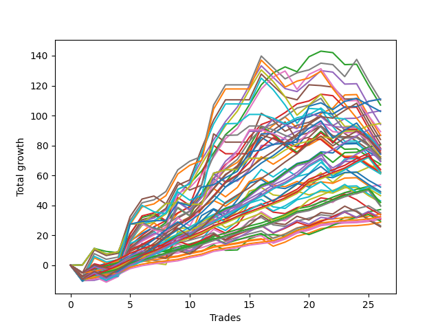

# Short Wallace 009 
- Symbol: ES
- Date Range: 03/18/2022 - 07/15/2022
- Trading Period: 7:20-12:30
- Number of Trades: 26



| Name | Win Percent | Profit | Avg Profit / Trade | Avg Time / Trade |      | Name | Win Percent | Profit | Avg Profit / Trade | Avg Time / Trade |
| ---- | ----------- | ------ | ------------------ | ---------------- | ---- | ---- | ----------- | ------ | ------------------ | ---------------- |
| Sorted By <br> Profit | | | | | | Sorted By <br> Win Percentage ||||
| Sixty-Two | 84.62 | 55500.00 | 2134.62 | 05:26 |     | Eighty-One | 96.15 | 17125.00 | 658.65 | 02:07 |
| Six | 84.62 | 55500.00 | 2134.62 | 05:26 |     | One Hundred Twenty-Six | 96.15 | 16250.00 | 625.00 | 01:26 |
| Seven | 61.54 | 55125.00 | 2120.19 | 21:08 |     | One Hundred Twenty-One | 96.15 | 15750.00 | 605.77 | 01:30 |
| Two | 73.08 | 53500.00 | 2057.69 | 16:38 |     | Zero | 92.31 | 43375.00 | 1668.27 | 04:07 |
| Forty-Six | 80.77 | 51625.00 | 1985.58 | 05:23 |     | Sixty-Four | 92.31 | 40250.00 | 1548.08 | 03:25 |
| Seventy-Three | 76.92 | 51375.00 | 1975.96 | 09:11 |     | Fifty-Six | 92.31 | 37250.00 | 1432.69 | 03:30 |
| Seventy | 80.77 | 47375.00 | 1822.12 | 05:11 |     | One Hundred Twenty-Eight | 92.31 | 32000.00 | 1230.77 | 03:01 |
| Four | 69.23 | 47000.00 | 1807.69 | 17:35 |     | Eighty-Three | 92.31 | 30875.00 | 1187.50 | 04:36 |
| Fifty-Eight | 73.08 | 44625.00 | 1716.35 | 13:00 |     | One Hundred Twenty-Three | 92.31 | 30750.00 | 1182.69 | 03:08 |
| Zero | 92.31 | 43375.00 | 1668.27 | 04:07 |     | One Hundred Twenty-Seven | 92.31 | 21000.00 | 807.69 | 02:12 |
| One | 84.62 | 43375.00 | 1668.27 | 10:51 |     | Eighty-Two | 92.31 | 19875.00 | 764.42 | 03:46 |
| Five | 53.85 | 42000.00 | 1615.38 | 22:39 |     | One Hundred Twenty-Two | 92.31 | 19750.00 | 759.62 | 02:19 |
| Eighty-Five | 80.77 | 40500.00 | 1557.69 | 09:55 |     | One Hundred Eleven | 92.31 | 15375.00 | 591.35 | 01:00 |
| Sixty-Four | 92.31 | 40250.00 | 1548.08 | 03:25 |     | Eighty-Four | 88.46 | 38750.00 | 1490.38 | 06:56 |
| Three | 80.77 | 39125.00 | 1504.81 | 11:56 |     | One Hundred Sixteen | 88.46 | 14375.00 | 552.88 | 00:59 |
| Sixty-Six | 53.85 | 38875.00 | 1495.19 | 09:43 |     | Sixty-Two | 84.62 | 55500.00 | 2134.62 | 05:26 |
| Eighty-Four | 88.46 | 38750.00 | 1490.38 | 06:56 |     | Six | 84.62 | 55500.00 | 2134.62 | 05:26 |
| Sixty-Three | 57.69 | 38750.00 | 1490.38 | 17:26 |     | One | 84.62 | 43375.00 | 1668.27 | 10:51 |
| Seventy-One | 50.00 | 38750.00 | 1490.38 | 13:48 |     | One Hundred Twenty-Nine | 84.62 | 34625.00 | 1331.73 | 05:06 |
| Sixty-Five | 73.08 | 38250.00 | 1471.15 | 06:53 |     | Forty | 84.62 | 33500.00 | 1288.46 | 02:54 |
| One Hundred Thirty | 76.92 | 37625.00 | 1447.12 | 06:24 |     | One Hundred Twenty-Four | 84.62 | 30875.00 | 1187.50 | 05:14 |
| Fifty-Six | 92.31 | 37250.00 | 1432.69 | 03:30 |     | One Hundred Twelve | 84.62 | 17500.00 | 673.08 | 01:32 |
| One Hundred Twenty-Five | 80.77 | 37125.00 | 1427.88 | 07:06 |     | Forty-Six | 80.77 | 51625.00 | 1985.58 | 05:23 |
| Sixty-Eight | 53.85 | 37125.00 | 1427.88 | 09:53 |     | Seventy | 80.77 | 47375.00 | 1822.12 | 05:11 |
| Forty-Seven | 46.15 | 36250.00 | 1394.23 | 13:55 |     | Eighty-Five | 80.77 | 40500.00 | 1557.69 | 09:55 |
| Sixty | 69.23 | 36125.00 | 1389.42 | 13:31 |     | Three | 80.77 | 39125.00 | 1504.81 | 11:56 |
| Sixty-Seven | 69.23 | 35750.00 | 1375.00 | 06:58 |     | One Hundred Twenty-Five | 80.77 | 37125.00 | 1427.88 | 07:06 |
| Forty-Two | 57.69 | 35500.00 | 1365.38 | 10:10 |     | Fifty-Seven | 80.77 | 34875.00 | 1341.35 | 08:12 |
| Sixty-Nine | 46.15 | 35375.00 | 1360.58 | 13:39 |     | Fifty-Nine | 80.77 | 34750.00 | 1336.54 | 08:50 |
| Fifty-Seven | 80.77 | 34875.00 | 1341.35 | 08:12 |     | One Hundred Thirteen | 80.77 | 23250.00 | 894.23 | 02:19 |
| Fifty-Nine | 80.77 | 34750.00 | 1336.54 | 08:50 |     | Seventy-Three | 76.92 | 51375.00 | 1975.96 | 09:11 |
| One Hundred Twenty-Nine | 84.62 | 34625.00 | 1331.73 | 05:06 |     | One Hundred Thirty | 76.92 | 37625.00 | 1447.12 | 06:24 |
| Forty-Four | 57.69 | 33750.00 | 1298.08 | 09:52 |     | One Hundred Seventeen | 76.92 | 14750.00 | 567.31 | 01:28 |
| Forty | 84.62 | 33500.00 | 1288.46 | 02:54 |     | Two | 73.08 | 53500.00 | 2057.69 | 16:38 |
| One Hundred Twenty-Eight | 92.31 | 32000.00 | 1230.77 | 03:01 |     | Fifty-Eight | 73.08 | 44625.00 | 1716.35 | 13:00 |
| Forty-Three | 69.23 | 31375.00 | 1206.73 | 06:01 |     | Sixty-Five | 73.08 | 38250.00 | 1471.15 | 06:53 |
| Sixty-One | 53.85 | 31125.00 | 1197.12 | 18:35 |     | One Hundred Fourteen | 73.08 | 24000.00 | 923.08 | 04:15 |
| Forty-Five | 42.31 | 31000.00 | 1192.31 | 14:38 |     | Four | 69.23 | 47000.00 | 1807.69 | 17:35 |
| Eighty-Three | 92.31 | 30875.00 | 1187.50 | 04:36 |     | Sixty | 69.23 | 36125.00 | 1389.42 | 13:31 |
| One Hundred Twenty-Four | 84.62 | 30875.00 | 1187.50 | 05:14 |     | Sixty-Seven | 69.23 | 35750.00 | 1375.00 | 06:58 |
| One Hundred Twenty-Three | 92.31 | 30750.00 | 1182.69 | 03:08 |     | Forty-Three | 69.23 | 31375.00 | 1206.73 | 06:01 |
| Forty-One | 69.23 | 30500.00 | 1173.08 | 06:22 |     | Forty-One | 69.23 | 30500.00 | 1173.08 | 06:22 |
| Forty-Eight | 69.23 | 26875.00 | 1033.65 | 02:24 |     | Forty-Eight | 69.23 | 26875.00 | 1033.65 | 02:24 |
| Fifty-Two | 53.85 | 26125.00 | 1004.81 | 05:07 |     | One Hundred Eighteen | 69.23 | 15375.00 | 591.35 | 02:07 |
| One Hundred Fifteen | 65.38 | 24625.00 | 947.12 | 05:30 |     | One Hundred Fifteen | 65.38 | 24625.00 | 947.12 | 05:30 |
| Fifty-Three | 50.00 | 24250.00 | 932.69 | 06:55 |     | Fifty-Four | 65.38 | 18625.00 | 716.35 | 02:33 |
| One Hundred Fourteen | 73.08 | 24000.00 | 923.08 | 04:15 |     | Seven | 61.54 | 55125.00 | 2120.19 | 21:08 |
| One Hundred Thirteen | 80.77 | 23250.00 | 894.23 | 02:19 |     | Sixty-Three | 57.69 | 38750.00 | 1490.38 | 17:26 |
| Fifty-One | 57.69 | 21500.00 | 826.92 | 03:50 |     | Forty-Two | 57.69 | 35500.00 | 1365.38 | 10:10 |
| One Hundred Twenty-Seven | 92.31 | 21000.00 | 807.69 | 02:12 |     | Forty-Four | 57.69 | 33750.00 | 1298.08 | 09:52 |
| Fifty | 50.00 | 21000.00 | 807.69 | 05:36 |     | Fifty-One | 57.69 | 21500.00 | 826.92 | 03:50 |
| Eighty-Two | 92.31 | 19875.00 | 764.42 | 03:46 |     | One Hundred Ninteen | 57.69 | 15750.00 | 605.77 | 03:12 |
| One Hundred Twenty-Two | 92.31 | 19750.00 | 759.62 | 02:19 |     | Forty-Nine | 57.69 | 13250.00 | 509.62 | 04:07 |
| Fifty-Four | 65.38 | 18625.00 | 716.35 | 02:33 |     | Five | 53.85 | 42000.00 | 1615.38 | 22:39 |
| One Hundred Twelve | 84.62 | 17500.00 | 673.08 | 01:32 |     | Sixty-Six | 53.85 | 38875.00 | 1495.19 | 09:43 |
| Eighty-One | 96.15 | 17125.00 | 658.65 | 02:07 |     | Sixty-Eight | 53.85 | 37125.00 | 1427.88 | 09:53 |
| Fifty-Five | 50.00 | 16875.00 | 649.04 | 06:15 |     | Sixty-One | 53.85 | 31125.00 | 1197.12 | 18:35 |
| One Hundred Twenty-Six | 96.15 | 16250.00 | 625.00 | 01:26 |     | Fifty-Two | 53.85 | 26125.00 | 1004.81 | 05:07 |
| One Hundred Twenty-One | 96.15 | 15750.00 | 605.77 | 01:30 |     | Seventy-One | 50.00 | 38750.00 | 1490.38 | 13:48 |
| One Hundred Ninteen | 57.69 | 15750.00 | 605.77 | 03:12 |     | Fifty-Three | 50.00 | 24250.00 | 932.69 | 06:55 |
| One Hundred Eleven | 92.31 | 15375.00 | 591.35 | 01:00 |     | Fifty | 50.00 | 21000.00 | 807.69 | 05:36 |
| One Hundred Eighteen | 69.23 | 15375.00 | 591.35 | 02:07 |     | Fifty-Five | 50.00 | 16875.00 | 649.04 | 06:15 |
| One Hundred Seventeen | 76.92 | 14750.00 | 567.31 | 01:28 |     | Forty-Seven | 46.15 | 36250.00 | 1394.23 | 13:55 |
| One Hundred Sixteen | 88.46 | 14375.00 | 552.88 | 00:59 |     | Sixty-Nine | 46.15 | 35375.00 | 1360.58 | 13:39 |
| Forty-Nine | 57.69 | 13250.00 | 509.62 | 04:07 |     | One Hundred Twenty | 46.15 | 12875.00 | 495.19 | 03:44 |
| One Hundred Twenty | 46.15 | 12875.00 | 495.19 | 03:44 |     | Forty-Five | 42.31 | 31000.00 | 1192.31 | 14:38 |

## NO STOPLOSS

### Test Zero
* Sell when price hits the middle line of the 20p bollinger
* No Stoploss
* Results:
```
Total Trades: 26
Percent Up: 7.69
Percent Down: 92.31
Total Points Moved Down: 86.75
Potential Profit: 43375.00
Total Points Ups: 9.50 Count Ups: 2
Total Points Downs: 96.25 Count Downs: 24
```

<details><summary>Trades</summary>

<code>In: 2022-03-25 10:52:00		Out: 2022-03-25 11:18:10		Total Position Time: 26:10		Total Move Down: -8.75		Total to Date: -8.75</code> <br />
<code>In: 2022-03-25 11:57:00		Out: 2022-03-25 11:57:15		Total Position Time: 00:15		Total Move Down: 0.25		Total to Date: -8.50</code> <br />
<code>In: 2022-03-28 11:12:00		Out: 2022-03-28 11:12:10		Total Position Time: 00:10		Total Move Down: 2.00		Total to Date: -6.50</code> <br />
<code>In: 2022-04-01 11:34:00		Out: 2022-04-01 11:43:00		Total Position Time: 09:00		Total Move Down: 1.25		Total to Date: -5.25</code> <br />
<code>In: 2022-04-06 11:05:00		Out: 2022-04-06 11:05:35		Total Position Time: 00:35		Total Move Down: 7.00		Total to Date: 1.75</code> <br />
<code>In: 2022-04-14 11:06:00		Out: 2022-04-14 11:14:00		Total Position Time: 08:00		Total Move Down: 3.25		Total to Date: 5.00</code> <br />
<code>In: 2022-04-20 09:54:00		Out: 2022-04-20 09:59:15		Total Position Time: 05:15		Total Move Down: 3.25		Total to Date: 8.25</code> <br />
<code>In: 2022-04-25 09:27:00		Out: 2022-04-25 09:31:05		Total Position Time: 04:05		Total Move Down: 7.25		Total to Date: 15.50</code> <br />
<code>In: 2022-04-26 10:01:00		Out: 2022-04-26 10:02:15		Total Position Time: 01:15		Total Move Down: 5.25		Total to Date: 20.75</code> <br />
<code>In: 2022-04-26 11:23:00		Out: 2022-04-26 11:31:40		Total Position Time: 08:40		Total Move Down: 0.75		Total to Date: 21.50</code> <br />
<code>In: 2022-04-29 10:39:00		Out: 2022-04-29 10:40:30		Total Position Time: 01:30		Total Move Down: 4.50		Total to Date: 26.00</code> <br />
<code>In: 2022-05-10 12:08:00		Out: 2022-05-10 12:09:45		Total Position Time: 01:45		Total Move Down: 7.75		Total to Date: 33.75</code> <br />
<code>In: 2022-05-25 11:04:00		Out: 2022-05-25 11:06:25		Total Position Time: 02:25		Total Move Down: 4.50		Total to Date: 38.25</code> <br />
<code>In: 2022-06-03 11:31:00		Out: 2022-06-03 11:33:20		Total Position Time: 02:20		Total Move Down: 2.50		Total to Date: 40.75</code> <br />
<code>In: 2022-06-10 10:52:00		Out: 2022-06-10 10:54:55		Total Position Time: 02:55		Total Move Down: 6.75		Total to Date: 47.50</code> <br />
<code>In: 2022-06-10 12:29:00		Out: 2022-06-10 12:30:30		Total Position Time: 01:30		Total Move Down: 6.25		Total to Date: 53.75</code> <br />
<code>In: 2022-06-13 08:42:00		Out: 2022-06-13 08:47:40		Total Position Time: 05:40		Total Move Down: 2.75		Total to Date: 56.50</code> <br />
<code>In: 2022-06-13 09:14:00		Out: 2022-06-13 09:17:05		Total Position Time: 03:05		Total Move Down: 6.00		Total to Date: 62.50</code> <br />
<code>In: 2022-06-14 10:02:00		Out: 2022-06-14 10:02:20		Total Position Time: 00:20		Total Move Down: 5.50		Total to Date: 68.00</code> <br />
<code>In: 2022-06-15 11:02:00		Out: 2022-06-15 11:02:10		Total Position Time: 00:10		Total Move Down: 2.00		Total to Date: 70.00</code> <br />
<code>In: 2022-06-16 09:31:00		Out: 2022-06-16 09:31:30		Total Position Time: 00:30		Total Move Down: 5.75		Total to Date: 75.75</code> <br />
<code>In: 2022-06-17 08:09:00		Out: 2022-06-17 08:23:05		Total Position Time: 14:05		Total Move Down: -0.75		Total to Date: 75.00</code> <br />
<code>In: 2022-06-30 07:36:00		Out: 2022-06-30 07:42:05		Total Position Time: 06:05		Total Move Down: 6.50		Total to Date: 81.50</code> <br />
<code>In: 2022-07-06 11:00:00		Out: 2022-07-06 11:00:10		Total Position Time: 00:10		Total Move Down: 0.25		Total to Date: 81.75</code> <br />
<code>In: 2022-07-14 07:56:00		Out: 2022-07-14 07:57:15		Total Position Time: 01:15		Total Move Down: 3.50		Total to Date: 85.25</code> <br />
<code>In: 2022-07-14 08:02:00		Out: 2022-07-14 08:02:10		Total Position Time: 00:10		Total Move Down: 1.50		Total to Date: 86.75</code> <br />


</details>

### Test One
* Sell when the price hits the upper line of the 20p 1std bollinger
* No Stoploss
* Results:
```
Total Trades: 26
Percent Up: 15.38
Percent Down: 84.62
Total Points Moved Down: 86.75
Potential Profit: 43375.00
Total Points Ups: 41.50 Count Ups: 4
Total Points Downs: 128.25 Count Downs: 22
```

<details><summary>Trades</summary>

<code>In: 2022-03-25 10:52:00		Out: 2022-03-25 11:19:30		Total Position Time: 27:30		Total Move Down: -7.00		Total to Date: -7.00</code> <br />
<code>In: 2022-03-25 11:57:00		Out: 2022-03-25 12:00:45		Total Position Time: 03:45		Total Move Down: 1.75		Total to Date: -5.25</code> <br />
<code>In: 2022-03-28 11:12:00		Out: 2022-03-28 11:19:30		Total Position Time: 07:30		Total Move Down: 2.00		Total to Date: -3.25</code> <br />
<code>In: 2022-04-01 11:34:00		Out: 2022-04-01 11:50:15		Total Position Time: 16:15		Total Move Down: 3.25		Total to Date: 0.00</code> <br />
<code>In: 2022-04-06 11:05:00		Out: 2022-04-06 11:07:20		Total Position Time: 02:20		Total Move Down: 12.50		Total to Date: 12.50</code> <br />
<code>In: 2022-04-14 11:06:00		Out: 2022-04-14 11:17:15		Total Position Time: 11:15		Total Move Down: 3.75		Total to Date: 16.25</code> <br />
<code>In: 2022-04-20 09:54:00		Out: 2022-04-20 10:08:15		Total Position Time: 14:15		Total Move Down: 4.25		Total to Date: 20.50</code> <br />
<code>In: 2022-04-25 09:27:00		Out: 2022-04-25 09:42:35		Total Position Time: 15:35		Total Move Down: 4.75		Total to Date: 25.25</code> <br />
<code>In: 2022-04-26 10:01:00		Out: 2022-04-26 10:02:50		Total Position Time: 01:50		Total Move Down: 9.50		Total to Date: 34.75</code> <br />
<code>In: 2022-04-26 11:23:00		Out: 2022-04-26 11:33:45		Total Position Time: 10:45		Total Move Down: 4.50		Total to Date: 39.25</code> <br />
<code>In: 2022-04-29 10:39:00		Out: 2022-04-29 10:41:00		Total Position Time: 02:00		Total Move Down: 6.50		Total to Date: 45.75</code> <br />
<code>In: 2022-05-10 12:08:00		Out: 2022-05-10 12:17:05		Total Position Time: 09:05		Total Move Down: 9.00		Total to Date: 54.75</code> <br />
<code>In: 2022-05-25 11:04:00		Out: 2022-05-25 11:06:35		Total Position Time: 02:35		Total Move Down: 9.25		Total to Date: 64.00</code> <br />
<code>In: 2022-06-03 11:31:00		Out: 2022-06-03 11:36:05		Total Position Time: 05:05		Total Move Down: 4.75		Total to Date: 68.75</code> <br />
<code>In: 2022-06-10 10:52:00		Out: 2022-06-10 10:56:05		Total Position Time: 04:05		Total Move Down: 8.25		Total to Date: 77.00</code> <br />
<code>In: 2022-06-10 12:29:00		Out: 2022-06-10 12:35:45		Total Position Time: 06:45		Total Move Down: 9.75		Total to Date: 86.75</code> <br />
<code>In: 2022-06-13 08:42:00		Out: 2022-06-13 08:52:05		Total Position Time: 10:05		Total Move Down: 6.75		Total to Date: 93.50</code> <br />
<code>In: 2022-06-13 09:14:00		Out: 2022-06-13 09:24:05		Total Position Time: 10:05		Total Move Down: 5.50		Total to Date: 99.00</code> <br />
<code>In: 2022-06-14 10:02:00		Out: 2022-06-14 10:29:05		Total Position Time: 27:05		Total Move Down: -7.25		Total to Date: 91.75</code> <br />
<code>In: 2022-06-15 11:02:00		Out: 2022-06-15 11:02:10		Total Position Time: 00:10		Total Move Down: 2.00		Total to Date: 93.75</code> <br />
<code>In: 2022-06-16 09:31:00		Out: 2022-06-16 09:36:05		Total Position Time: 05:05		Total Move Down: 7.50		Total to Date: 101.25</code> <br />
<code>In: 2022-06-17 08:09:00		Out: 2022-06-17 08:25:20		Total Position Time: 16:20		Total Move Down: 3.75		Total to Date: 105.00</code> <br />
<code>In: 2022-06-30 07:36:00		Out: 2022-06-30 07:49:05		Total Position Time: 13:05		Total Move Down: 8.75		Total to Date: 113.75</code> <br />
<code>In: 2022-07-06 11:00:00		Out: 2022-07-06 11:00:10		Total Position Time: 00:10		Total Move Down: 0.25		Total to Date: 114.00</code> <br />
<code>In: 2022-07-14 07:56:00		Out: 2022-07-14 08:25:55		Total Position Time: 29:55		Total Move Down: -14.25		Total to Date: 99.75</code> <br />
<code>In: 2022-07-14 08:02:00		Out: 2022-07-14 08:31:55		Total Position Time: 29:55		Total Move Down: -13.00		Total to Date: 86.75</code> <br />


</details>

### Test Two
* Sell when the price hits the upper line of the 20p 2std bollinger
* No Stoploss
* Results:
```
Total Trades: 26
Percent Up: 26.92
Percent Down: 73.08
Total Points Moved Down: 107.00
Potential Profit: 53500.00
Total Points Ups: 50.75 Count Ups: 7
Total Points Downs: 157.75 Count Downs: 19
```

<details><summary>Trades</summary>

<code>In: 2022-03-25 10:52:00		Out: 2022-03-25 11:21:55		Total Position Time: 29:55		Total Move Down: -7.50		Total to Date: -7.50</code> <br />
<code>In: 2022-03-25 11:57:00		Out: 2022-03-25 12:00:55		Total Position Time: 03:55		Total Move Down: 2.75		Total to Date: -4.75</code> <br />
<code>In: 2022-03-28 11:12:00		Out: 2022-03-28 11:41:55		Total Position Time: 29:55		Total Move Down: -3.75		Total to Date: -8.50</code> <br />
<code>In: 2022-04-01 11:34:00		Out: 2022-04-01 11:50:20		Total Position Time: 16:20		Total Move Down: 3.75		Total to Date: -4.75</code> <br />
<code>In: 2022-04-06 11:05:00		Out: 2022-04-06 11:08:10		Total Position Time: 03:10		Total Move Down: 18.50		Total to Date: 13.75</code> <br />
<code>In: 2022-04-14 11:06:00		Out: 2022-04-14 11:19:10		Total Position Time: 13:10		Total Move Down: 5.00		Total to Date: 18.75</code> <br />
<code>In: 2022-04-20 09:54:00		Out: 2022-04-20 10:08:15		Total Position Time: 14:15		Total Move Down: 4.25		Total to Date: 23.00</code> <br />
<code>In: 2022-04-25 09:27:00		Out: 2022-04-25 09:56:55		Total Position Time: 29:55		Total Move Down: 5.50		Total to Date: 28.50</code> <br />
<code>In: 2022-04-26 10:01:00		Out: 2022-04-26 10:22:20		Total Position Time: 21:20		Total Move Down: 22.25		Total to Date: 50.75</code> <br />
<code>In: 2022-04-26 11:23:00		Out: 2022-04-26 11:41:25		Total Position Time: 18:25		Total Move Down: 3.75		Total to Date: 54.50</code> <br />
<code>In: 2022-04-29 10:39:00		Out: 2022-04-29 10:43:20		Total Position Time: 04:20		Total Move Down: 8.50		Total to Date: 63.00</code> <br />
<code>In: 2022-05-10 12:08:00		Out: 2022-05-10 12:17:20		Total Position Time: 09:20		Total Move Down: 12.00		Total to Date: 75.00</code> <br />
<code>In: 2022-05-25 11:04:00		Out: 2022-05-25 11:06:40		Total Position Time: 02:40		Total Move Down: 12.25		Total to Date: 87.25</code> <br />
<code>In: 2022-06-03 11:31:00		Out: 2022-06-03 11:37:15		Total Position Time: 06:15		Total Move Down: 7.00		Total to Date: 94.25</code> <br />
<code>In: 2022-06-10 10:52:00		Out: 2022-06-10 11:01:00		Total Position Time: 09:00		Total Move Down: 13.00		Total to Date: 107.25</code> <br />
<code>In: 2022-06-10 12:29:00		Out: 2022-06-10 12:42:45		Total Position Time: 13:45		Total Move Down: 13.25		Total to Date: 120.50</code> <br />
<code>In: 2022-06-13 08:42:00		Out: 2022-06-13 08:54:20		Total Position Time: 12:20		Total Move Down: 8.00		Total to Date: 128.50</code> <br />
<code>In: 2022-06-13 09:14:00		Out: 2022-06-13 09:30:15		Total Position Time: 16:15		Total Move Down: 4.00		Total to Date: 132.50</code> <br />
<code>In: 2022-06-14 10:02:00		Out: 2022-06-14 10:31:00		Total Position Time: 29:00		Total Move Down: -3.25		Total to Date: 129.25</code> <br />
<code>In: 2022-06-15 11:02:00		Out: 2022-06-15 11:03:05		Total Position Time: 01:05		Total Move Down: 10.00		Total to Date: 139.25</code> <br />
<code>In: 2022-06-16 09:31:00		Out: 2022-06-16 09:59:40		Total Position Time: 28:40		Total Move Down: 3.75		Total to Date: 143.00</code> <br />
<code>In: 2022-06-17 08:09:00		Out: 2022-06-17 08:38:55		Total Position Time: 29:55		Total Move Down: -1.00		Total to Date: 142.00</code> <br />
<code>In: 2022-06-30 07:36:00		Out: 2022-06-30 08:05:55		Total Position Time: 29:55		Total Move Down: -8.00		Total to Date: 134.00</code> <br />
<code>In: 2022-07-06 11:00:00		Out: 2022-07-06 11:00:10		Total Position Time: 00:10		Total Move Down: 0.25		Total to Date: 134.25</code> <br />
<code>In: 2022-07-14 07:56:00		Out: 2022-07-14 08:25:55		Total Position Time: 29:55		Total Move Down: -14.25		Total to Date: 120.00</code> <br />
<code>In: 2022-07-14 08:02:00		Out: 2022-07-14 08:31:55		Total Position Time: 29:55		Total Move Down: -13.00		Total to Date: 107.00</code> <br />


</details>

### Test Three
* Sell when price hits the middle line of the 50p bollinger
* No Stoploss
* Results:
```
Total Trades: 26
Percent Up: 19.23
Percent Down: 80.77
Total Points Moved Down: 78.25
Potential Profit: 39125.00
Total Points Ups: 43.75 Count Ups: 5
Total Points Downs: 122.00 Count Downs: 21
```

<details><summary>Trades</summary>

<code>In: 2022-03-25 10:52:00		Out: 2022-03-25 11:21:55		Total Position Time: 29:55		Total Move Down: -7.50		Total to Date: -7.50</code> <br />
<code>In: 2022-03-25 11:57:00		Out: 2022-03-25 12:00:45		Total Position Time: 03:45		Total Move Down: 1.75		Total to Date: -5.75</code> <br />
<code>In: 2022-03-28 11:12:00		Out: 2022-03-28 11:12:10		Total Position Time: 00:10		Total Move Down: 2.00		Total to Date: -3.75</code> <br />
<code>In: 2022-04-01 11:34:00		Out: 2022-04-01 11:57:50		Total Position Time: 23:50		Total Move Down: 4.50		Total to Date: 0.75</code> <br />
<code>In: 2022-04-06 11:05:00		Out: 2022-04-06 11:07:20		Total Position Time: 02:20		Total Move Down: 12.50		Total to Date: 13.25</code> <br />
<code>In: 2022-04-14 11:06:00		Out: 2022-04-14 11:19:35		Total Position Time: 13:35		Total Move Down: 6.75		Total to Date: 20.00</code> <br />
<code>In: 2022-04-20 09:54:00		Out: 2022-04-20 10:08:35		Total Position Time: 14:35		Total Move Down: 5.75		Total to Date: 25.75</code> <br />
<code>In: 2022-04-25 09:27:00		Out: 2022-04-25 09:55:05		Total Position Time: 28:05		Total Move Down: 4.00		Total to Date: 29.75</code> <br />
<code>In: 2022-04-26 10:01:00		Out: 2022-04-26 10:02:15		Total Position Time: 01:15		Total Move Down: 5.25		Total to Date: 35.00</code> <br />
<code>In: 2022-04-26 11:23:00		Out: 2022-04-26 11:34:25		Total Position Time: 11:25		Total Move Down: 4.00		Total to Date: 39.00</code> <br />
<code>In: 2022-04-29 10:39:00		Out: 2022-04-29 10:43:40		Total Position Time: 04:40		Total Move Down: 9.25		Total to Date: 48.25</code> <br />
<code>In: 2022-05-10 12:08:00		Out: 2022-05-10 12:10:05		Total Position Time: 02:05		Total Move Down: 9.75		Total to Date: 58.00</code> <br />
<code>In: 2022-05-25 11:04:00		Out: 2022-05-25 11:06:35		Total Position Time: 02:35		Total Move Down: 9.25		Total to Date: 67.25</code> <br />
<code>In: 2022-06-03 11:31:00		Out: 2022-06-03 11:37:10		Total Position Time: 06:10		Total Move Down: 6.25		Total to Date: 73.50</code> <br />
<code>In: 2022-06-10 10:52:00		Out: 2022-06-10 10:58:20		Total Position Time: 06:20		Total Move Down: 12.00		Total to Date: 85.50</code> <br />
<code>In: 2022-06-10 12:29:00		Out: 2022-06-10 12:33:15		Total Position Time: 04:15		Total Move Down: 8.50		Total to Date: 94.00</code> <br />
<code>In: 2022-06-13 08:42:00		Out: 2022-06-13 09:07:15		Total Position Time: 25:15		Total Move Down: 3.00		Total to Date: 97.00</code> <br />
<code>In: 2022-06-13 09:14:00		Out: 2022-06-13 09:23:45		Total Position Time: 09:45		Total Move Down: 5.00		Total to Date: 102.00</code> <br />
<code>In: 2022-06-14 10:02:00		Out: 2022-06-14 10:02:25		Total Position Time: 00:25		Total Move Down: 5.75		Total to Date: 107.75</code> <br />
<code>In: 2022-06-15 11:02:00		Out: 2022-06-15 11:02:10		Total Position Time: 00:10		Total Move Down: 2.00		Total to Date: 109.75</code> <br />
<code>In: 2022-06-16 09:31:00		Out: 2022-06-16 09:31:15		Total Position Time: 00:15		Total Move Down: 4.50		Total to Date: 114.25</code> <br />
<code>In: 2022-06-17 08:09:00		Out: 2022-06-17 08:38:55		Total Position Time: 29:55		Total Move Down: -1.00		Total to Date: 113.25</code> <br />
<code>In: 2022-06-30 07:36:00		Out: 2022-06-30 08:05:55		Total Position Time: 29:55		Total Move Down: -8.00		Total to Date: 105.25</code> <br />
<code>In: 2022-07-06 11:00:00		Out: 2022-07-06 11:00:10		Total Position Time: 00:10		Total Move Down: 0.25		Total to Date: 105.50</code> <br />
<code>In: 2022-07-14 07:56:00		Out: 2022-07-14 08:25:55		Total Position Time: 29:55		Total Move Down: -14.25		Total to Date: 91.25</code> <br />
<code>In: 2022-07-14 08:02:00		Out: 2022-07-14 08:31:55		Total Position Time: 29:55		Total Move Down: -13.00		Total to Date: 78.25</code> <br />


</details>

### Test Four
* Sell when the price hits the upper line of the 50p 1std bollinger
* No Stoploss
* Results:
```
Total Trades: 26
Percent Up: 30.77
Percent Down: 69.23
Total Points Moved Down: 94.00
Potential Profit: 47000.00
Total Points Ups: 61.00 Count Ups: 8
Total Points Downs: 155.00 Count Downs: 18
```

<details><summary>Trades</summary>

<code>In: 2022-03-25 10:52:00		Out: 2022-03-25 11:21:55		Total Position Time: 29:55		Total Move Down: -7.50		Total to Date: -7.50</code> <br />
<code>In: 2022-03-25 11:57:00		Out: 2022-03-25 12:01:35		Total Position Time: 04:35		Total Move Down: 3.75		Total to Date: -3.75</code> <br />
<code>In: 2022-03-28 11:12:00		Out: 2022-03-28 11:19:35		Total Position Time: 07:35		Total Move Down: 2.50		Total to Date: -1.25</code> <br />
<code>In: 2022-04-01 11:34:00		Out: 2022-04-01 12:03:55		Total Position Time: 29:55		Total Move Down: 1.50		Total to Date: 0.25</code> <br />
<code>In: 2022-04-06 11:05:00		Out: 2022-04-06 11:08:10		Total Position Time: 03:10		Total Move Down: 18.50		Total to Date: 18.75</code> <br />
<code>In: 2022-04-14 11:06:00		Out: 2022-04-14 11:23:55		Total Position Time: 17:55		Total Move Down: 10.75		Total to Date: 29.50</code> <br />
<code>In: 2022-04-20 09:54:00		Out: 2022-04-20 10:23:55		Total Position Time: 29:55		Total Move Down: 2.00		Total to Date: 31.50</code> <br />
<code>In: 2022-04-25 09:27:00		Out: 2022-04-25 09:56:55		Total Position Time: 29:55		Total Move Down: 5.50		Total to Date: 37.00</code> <br />
<code>In: 2022-04-26 10:01:00		Out: 2022-04-26 10:02:50		Total Position Time: 01:50		Total Move Down: 9.50		Total to Date: 46.50</code> <br />
<code>In: 2022-04-26 11:23:00		Out: 2022-04-26 11:45:00		Total Position Time: 22:00		Total Move Down: 9.25		Total to Date: 55.75</code> <br />
<code>In: 2022-04-29 10:39:00		Out: 2022-04-29 10:47:20		Total Position Time: 08:20		Total Move Down: 14.50		Total to Date: 70.25</code> <br />
<code>In: 2022-05-10 12:08:00		Out: 2022-05-10 12:21:05		Total Position Time: 13:05		Total Move Down: 13.50		Total to Date: 83.75</code> <br />
<code>In: 2022-05-25 11:04:00		Out: 2022-05-25 11:06:40		Total Position Time: 02:40		Total Move Down: 12.25		Total to Date: 96.00</code> <br />
<code>In: 2022-06-03 11:31:00		Out: 2022-06-03 11:38:55		Total Position Time: 07:55		Total Move Down: 9.75		Total to Date: 105.75</code> <br />
<code>In: 2022-06-10 10:52:00		Out: 2022-06-10 11:15:20		Total Position Time: 23:20		Total Move Down: 14.25		Total to Date: 120.00</code> <br />
<code>In: 2022-06-10 12:29:00		Out: 2022-06-10 12:42:40		Total Position Time: 13:40		Total Move Down: 13.25		Total to Date: 133.25</code> <br />
<code>In: 2022-06-13 08:42:00		Out: 2022-06-13 09:11:55		Total Position Time: 29:55		Total Move Down: -7.75		Total to Date: 125.50</code> <br />
<code>In: 2022-06-13 09:14:00		Out: 2022-06-13 09:43:55		Total Position Time: 29:55		Total Move Down: -7.50		Total to Date: 118.00</code> <br />
<code>In: 2022-06-14 10:02:00		Out: 2022-06-14 10:31:55		Total Position Time: 29:55		Total Move Down: -2.00		Total to Date: 116.00</code> <br />
<code>In: 2022-06-15 11:02:00		Out: 2022-06-15 11:03:00		Total Position Time: 01:00		Total Move Down: 6.75		Total to Date: 122.75</code> <br />
<code>In: 2022-06-16 09:31:00		Out: 2022-06-16 09:31:50		Total Position Time: 00:50		Total Move Down: 7.25		Total to Date: 130.00</code> <br />
<code>In: 2022-06-17 08:09:00		Out: 2022-06-17 08:38:55		Total Position Time: 29:55		Total Move Down: -1.00		Total to Date: 129.00</code> <br />
<code>In: 2022-06-30 07:36:00		Out: 2022-06-30 08:05:55		Total Position Time: 29:55		Total Move Down: -8.00		Total to Date: 121.00</code> <br />
<code>In: 2022-07-06 11:00:00		Out: 2022-07-06 11:00:10		Total Position Time: 00:10		Total Move Down: 0.25		Total to Date: 121.25</code> <br />
<code>In: 2022-07-14 07:56:00		Out: 2022-07-14 08:25:55		Total Position Time: 29:55		Total Move Down: -14.25		Total to Date: 107.00</code> <br />
<code>In: 2022-07-14 08:02:00		Out: 2022-07-14 08:31:55		Total Position Time: 29:55		Total Move Down: -13.00		Total to Date: 94.00</code> <br />


</details>

### Test Five
* Sell when the price hits the upper line of the 50p 2std bollinger
* No Stoploss
* Results:
```
Total Trades: 26
Percent Up: 46.15
Percent Down: 53.85
Total Points Moved Down: 84.00
Potential Profit: 42000.00
Total Points Ups: 65.25 Count Ups: 12
Total Points Downs: 149.25 Count Downs: 14
```

<details><summary>Trades</summary>

<code>In: 2022-03-25 10:52:00		Out: 2022-03-25 11:21:55		Total Position Time: 29:55		Total Move Down: -7.50		Total to Date: -7.50</code> <br />
<code>In: 2022-03-25 11:57:00		Out: 2022-03-25 12:01:55		Total Position Time: 04:55		Total Move Down: 5.25		Total to Date: -2.25</code> <br />
<code>In: 2022-03-28 11:12:00		Out: 2022-03-28 11:41:55		Total Position Time: 29:55		Total Move Down: -3.75		Total to Date: -6.00</code> <br />
<code>In: 2022-04-01 11:34:00		Out: 2022-04-01 12:03:55		Total Position Time: 29:55		Total Move Down: 1.50		Total to Date: -4.50</code> <br />
<code>In: 2022-04-06 11:05:00		Out: 2022-04-06 11:09:35		Total Position Time: 04:35		Total Move Down: 22.75		Total to Date: 18.25</code> <br />
<code>In: 2022-04-14 11:06:00		Out: 2022-04-14 11:34:00		Total Position Time: 28:00		Total Move Down: 12.25		Total to Date: 30.50</code> <br />
<code>In: 2022-04-20 09:54:00		Out: 2022-04-20 10:23:55		Total Position Time: 29:55		Total Move Down: 2.00		Total to Date: 32.50</code> <br />
<code>In: 2022-04-25 09:27:00		Out: 2022-04-25 09:56:55		Total Position Time: 29:55		Total Move Down: 5.50		Total to Date: 38.00</code> <br />
<code>In: 2022-04-26 10:01:00		Out: 2022-04-26 10:14:40		Total Position Time: 13:40		Total Move Down: 15.50		Total to Date: 53.50</code> <br />
<code>In: 2022-04-26 11:23:00		Out: 2022-04-26 11:52:55		Total Position Time: 29:55		Total Move Down: 3.50		Total to Date: 57.00</code> <br />
<code>In: 2022-04-29 10:39:00		Out: 2022-04-29 11:01:10		Total Position Time: 22:10		Total Move Down: 21.00		Total to Date: 78.00</code> <br />
<code>In: 2022-05-10 12:08:00		Out: 2022-05-10 12:24:30		Total Position Time: 16:30		Total Move Down: 19.00		Total to Date: 97.00</code> <br />
<code>In: 2022-05-25 11:04:00		Out: 2022-05-25 11:06:45		Total Position Time: 02:45		Total Move Down: 13.50		Total to Date: 110.50</code> <br />
<code>In: 2022-06-03 11:31:00		Out: 2022-06-03 12:00:55		Total Position Time: 29:55		Total Move Down: -0.00		Total to Date: 110.50</code> <br />
<code>In: 2022-06-10 10:52:00		Out: 2022-06-10 11:21:55		Total Position Time: 29:55		Total Move Down: -0.00		Total to Date: 110.50</code> <br />
<code>In: 2022-06-10 12:29:00		Out: 2022-06-10 12:45:35		Total Position Time: 16:35		Total Move Down: 17.25		Total to Date: 127.75</code> <br />
<code>In: 2022-06-13 08:42:00		Out: 2022-06-13 09:11:55		Total Position Time: 29:55		Total Move Down: -7.75		Total to Date: 120.00</code> <br />
<code>In: 2022-06-13 09:14:00		Out: 2022-06-13 09:43:55		Total Position Time: 29:55		Total Move Down: -7.50		Total to Date: 112.50</code> <br />
<code>In: 2022-06-14 10:02:00		Out: 2022-06-14 10:31:55		Total Position Time: 29:55		Total Move Down: -2.00		Total to Date: 110.50</code> <br />
<code>In: 2022-06-15 11:02:00		Out: 2022-06-15 11:03:05		Total Position Time: 01:05		Total Move Down: 10.00		Total to Date: 120.50</code> <br />
<code>In: 2022-06-16 09:31:00		Out: 2022-06-16 10:00:55		Total Position Time: 29:55		Total Move Down: -0.50		Total to Date: 120.00</code> <br />
<code>In: 2022-06-17 08:09:00		Out: 2022-06-17 08:38:55		Total Position Time: 29:55		Total Move Down: -1.00		Total to Date: 119.00</code> <br />
<code>In: 2022-06-30 07:36:00		Out: 2022-06-30 08:05:55		Total Position Time: 29:55		Total Move Down: -8.00		Total to Date: 111.00</code> <br />
<code>In: 2022-07-06 11:00:00		Out: 2022-07-06 11:00:10		Total Position Time: 00:10		Total Move Down: 0.25		Total to Date: 111.25</code> <br />
<code>In: 2022-07-14 07:56:00		Out: 2022-07-14 08:25:55		Total Position Time: 29:55		Total Move Down: -14.25		Total to Date: 97.00</code> <br />
<code>In: 2022-07-14 08:02:00		Out: 2022-07-14 08:31:55		Total Position Time: 29:55		Total Move Down: -13.00		Total to Date: 84.00</code> <br />


</details>

### Test Six
* Sell when the price hits the middle line of the 1std VWAP
* No Stoploss
* Results:
```
Total Trades: 26
Percent Up: 15.38
Percent Down: 84.62
Total Points Moved Down: 111.00
Potential Profit: 55500.00
Total Points Ups: 6.00 Count Ups: 4
Total Points Downs: 117.00 Count Downs: 22
```

<details><summary>Trades</summary>

<code>In: 2022-03-25 10:52:00		Out: 2022-03-25 10:52:55		Total Position Time: 00:55		Total Move Down: 0.25		Total to Date: 0.25</code> <br />
<code>In: 2022-03-25 11:57:00		Out: 2022-03-25 12:07:35		Total Position Time: 10:35		Total Move Down: 11.00		Total to Date: 11.25</code> <br />
<code>In: 2022-03-28 11:12:00		Out: 2022-03-28 11:41:55		Total Position Time: 29:55		Total Move Down: -3.75		Total to Date: 7.50</code> <br />
<code>In: 2022-04-01 11:34:00		Out: 2022-04-01 12:03:55		Total Position Time: 29:55		Total Move Down: 1.50		Total to Date: 9.00</code> <br />
<code>In: 2022-04-06 11:05:00		Out: 2022-04-06 11:08:10		Total Position Time: 03:10		Total Move Down: 18.50		Total to Date: 27.50</code> <br />
<code>In: 2022-04-14 11:06:00		Out: 2022-04-14 11:06:25		Total Position Time: 00:25		Total Move Down: 0.75		Total to Date: 28.25</code> <br />
<code>In: 2022-04-20 09:54:00		Out: 2022-04-20 10:08:35		Total Position Time: 14:35		Total Move Down: 5.75		Total to Date: 34.00</code> <br />
<code>In: 2022-04-25 09:27:00		Out: 2022-04-25 09:31:05		Total Position Time: 04:05		Total Move Down: 7.25		Total to Date: 41.25</code> <br />
<code>In: 2022-04-26 10:01:00		Out: 2022-04-26 10:01:10		Total Position Time: 00:10		Total Move Down: 0.50		Total to Date: 41.75</code> <br />
<code>In: 2022-04-26 11:23:00		Out: 2022-04-26 11:23:10		Total Position Time: 00:10		Total Move Down: -1.00		Total to Date: 40.75</code> <br />
<code>In: 2022-04-29 10:39:00		Out: 2022-04-29 10:39:10		Total Position Time: 00:10		Total Move Down: -0.00		Total to Date: 40.75</code> <br />
<code>In: 2022-05-10 12:08:00		Out: 2022-05-10 12:24:35		Total Position Time: 16:35		Total Move Down: 20.75		Total to Date: 61.50</code> <br />
<code>In: 2022-05-25 11:04:00		Out: 2022-05-25 11:05:45		Total Position Time: 01:45		Total Move Down: 2.25		Total to Date: 63.75</code> <br />
<code>In: 2022-06-03 11:31:00		Out: 2022-06-03 11:32:25		Total Position Time: 01:25		Total Move Down: 0.25		Total to Date: 64.00</code> <br />
<code>In: 2022-06-10 10:52:00		Out: 2022-06-10 10:55:05		Total Position Time: 03:05		Total Move Down: 7.50		Total to Date: 71.50</code> <br />
<code>In: 2022-06-10 12:29:00		Out: 2022-06-10 12:43:55		Total Position Time: 14:55		Total Move Down: 16.25		Total to Date: 87.75</code> <br />
<code>In: 2022-06-13 08:42:00		Out: 2022-06-13 08:42:10		Total Position Time: 00:10		Total Move Down: 0.25		Total to Date: 88.00</code> <br />
<code>In: 2022-06-13 09:14:00		Out: 2022-06-13 09:17:15		Total Position Time: 03:15		Total Move Down: 5.25		Total to Date: 93.25</code> <br />
<code>In: 2022-06-14 10:02:00		Out: 2022-06-14 10:02:10		Total Position Time: 00:10		Total Move Down: 4.00		Total to Date: 97.25</code> <br />
<code>In: 2022-06-15 11:02:00		Out: 2022-06-15 11:02:10		Total Position Time: 00:10		Total Move Down: 2.00		Total to Date: 99.25</code> <br />
<code>In: 2022-06-16 09:31:00		Out: 2022-06-16 09:31:10		Total Position Time: 00:10		Total Move Down: 3.00		Total to Date: 102.25</code> <br />
<code>In: 2022-06-17 08:09:00		Out: 2022-06-17 08:09:10		Total Position Time: 00:10		Total Move Down: -1.25		Total to Date: 101.00</code> <br />
<code>In: 2022-06-30 07:36:00		Out: 2022-06-30 07:39:55		Total Position Time: 03:55		Total Move Down: 4.75		Total to Date: 105.75</code> <br />
<code>In: 2022-07-06 11:00:00		Out: 2022-07-06 11:00:10		Total Position Time: 00:10		Total Move Down: 0.25		Total to Date: 106.00</code> <br />
<code>In: 2022-07-14 07:56:00		Out: 2022-07-14 07:57:15		Total Position Time: 01:15		Total Move Down: 3.50		Total to Date: 109.50</code> <br />
<code>In: 2022-07-14 08:02:00		Out: 2022-07-14 08:02:10		Total Position Time: 00:10		Total Move Down: 1.50		Total to Date: 111.00</code> <br />


</details>

### Test Seven
* Sell when the price hits the upper line of the 1std VWAP
* No Stoploss
* Results:
```
Total Trades: 26
Percent Up: 38.46
Percent Down: 61.54
Total Points Moved Down: 110.25
Potential Profit: 55125.00
Total Points Ups: 62.75 Count Ups: 10
Total Points Downs: 173.00 Count Downs: 16
```

<details><summary>Trades</summary>

<code>In: 2022-03-25 10:52:00		Out: 2022-03-25 11:21:55		Total Position Time: 29:55		Total Move Down: -7.50		Total to Date: -7.50</code> <br />
<code>In: 2022-03-25 11:57:00		Out: 2022-03-25 12:26:55		Total Position Time: 29:55		Total Move Down: 15.25		Total to Date: 7.75</code> <br />
<code>In: 2022-03-28 11:12:00		Out: 2022-03-28 11:41:55		Total Position Time: 29:55		Total Move Down: -3.75		Total to Date: 4.00</code> <br />
<code>In: 2022-04-01 11:34:00		Out: 2022-04-01 12:03:55		Total Position Time: 29:55		Total Move Down: 1.50		Total to Date: 5.50</code> <br />
<code>In: 2022-04-06 11:05:00		Out: 2022-04-06 11:09:40		Total Position Time: 04:40		Total Move Down: 24.50		Total to Date: 30.00</code> <br />
<code>In: 2022-04-14 11:06:00		Out: 2022-04-14 11:35:55		Total Position Time: 29:55		Total Move Down: 11.75		Total to Date: 41.75</code> <br />
<code>In: 2022-04-20 09:54:00		Out: 2022-04-20 10:23:55		Total Position Time: 29:55		Total Move Down: 2.00		Total to Date: 43.75</code> <br />
<code>In: 2022-04-25 09:27:00		Out: 2022-04-25 09:56:55		Total Position Time: 29:55		Total Move Down: 5.50		Total to Date: 49.25</code> <br />
<code>In: 2022-04-26 10:01:00		Out: 2022-04-26 10:14:15		Total Position Time: 13:15		Total Move Down: 14.50		Total to Date: 63.75</code> <br />
<code>In: 2022-04-26 11:23:00		Out: 2022-04-26 11:42:05		Total Position Time: 19:05		Total Move Down: 5.75		Total to Date: 69.50</code> <br />
<code>In: 2022-04-29 10:39:00		Out: 2022-04-29 10:40:25		Total Position Time: 01:25		Total Move Down: 3.25		Total to Date: 72.75</code> <br />
<code>In: 2022-05-10 12:08:00		Out: 2022-05-10 12:37:55		Total Position Time: 29:55		Total Move Down: 34.25		Total to Date: 107.00</code> <br />
<code>In: 2022-05-25 11:04:00		Out: 2022-05-25 11:06:45		Total Position Time: 02:45		Total Move Down: 13.50		Total to Date: 120.50</code> <br />
<code>In: 2022-06-03 11:31:00		Out: 2022-06-03 12:00:55		Total Position Time: 29:55		Total Move Down: -0.00		Total to Date: 120.50</code> <br />
<code>In: 2022-06-10 10:52:00		Out: 2022-06-10 11:21:55		Total Position Time: 29:55		Total Move Down: -0.00		Total to Date: 120.50</code> <br />
<code>In: 2022-06-10 12:29:00		Out: 2022-06-10 12:46:00		Total Position Time: 17:00		Total Move Down: 19.25		Total to Date: 139.75</code> <br />
<code>In: 2022-06-13 08:42:00		Out: 2022-06-13 09:11:55		Total Position Time: 29:55		Total Move Down: -7.75		Total to Date: 132.00</code> <br />
<code>In: 2022-06-13 09:14:00		Out: 2022-06-13 09:43:55		Total Position Time: 29:55		Total Move Down: -7.50		Total to Date: 124.50</code> <br />
<code>In: 2022-06-14 10:02:00		Out: 2022-06-14 10:02:10		Total Position Time: 00:10		Total Move Down: 4.00		Total to Date: 128.50</code> <br />
<code>In: 2022-06-15 11:02:00		Out: 2022-06-15 11:02:10		Total Position Time: 00:10		Total Move Down: 2.00		Total to Date: 130.50</code> <br />
<code>In: 2022-06-16 09:31:00		Out: 2022-06-16 09:31:15		Total Position Time: 00:15		Total Move Down: 4.50		Total to Date: 135.00</code> <br />
<code>In: 2022-06-17 08:09:00		Out: 2022-06-17 08:38:55		Total Position Time: 29:55		Total Move Down: -1.00		Total to Date: 134.00</code> <br />
<code>In: 2022-06-30 07:36:00		Out: 2022-06-30 08:05:55		Total Position Time: 29:55		Total Move Down: -8.00		Total to Date: 126.00</code> <br />
<code>In: 2022-07-06 11:00:00		Out: 2022-07-06 11:12:20		Total Position Time: 12:20		Total Move Down: 11.50		Total to Date: 137.50</code> <br />
<code>In: 2022-07-14 07:56:00		Out: 2022-07-14 08:25:55		Total Position Time: 29:55		Total Move Down: -14.25		Total to Date: 123.25</code> <br />
<code>In: 2022-07-14 08:02:00		Out: 2022-07-14 08:31:55		Total Position Time: 29:55		Total Move Down: -13.00		Total to Date: 110.25</code> <br />


</details>

## STOPLOSS OF 5

### Test Forty
* Sell when price hits the middle line of the 20p bollinger
* Stoploss is -5 points
* Results:
```
Total Trades: 26
Percent Up: 15.38
Percent Down: 84.62
Total Points Moved Down: 67.00
Potential Profit: 33500.00
Total Points Ups: 22.00 Count Ups: 4
Total Points Downs: 89.00 Count Downs: 22
```

<details><summary>Trades</summary>

<code>In: 2022-03-25 10:52:00		Out: 2022-03-25 10:57:10		Total Position Time: 05:10		Total Move Down: -5.00		Total to Date: -5.00</code> <br />
<code>In: 2022-03-25 11:57:00		Out: 2022-03-25 11:57:15		Total Position Time: 00:15		Total Move Down: 0.25		Total to Date: -4.75</code> <br />
<code>In: 2022-03-28 11:12:00		Out: 2022-03-28 11:12:10		Total Position Time: 00:10		Total Move Down: 2.00		Total to Date: -2.75</code> <br />
<code>In: 2022-04-01 11:34:00		Out: 2022-04-01 11:43:00		Total Position Time: 09:00		Total Move Down: 1.25		Total to Date: -1.50</code> <br />
<code>In: 2022-04-06 11:05:00		Out: 2022-04-06 11:05:35		Total Position Time: 00:35		Total Move Down: 7.00		Total to Date: 5.50</code> <br />
<code>In: 2022-04-14 11:06:00		Out: 2022-04-14 11:14:00		Total Position Time: 08:00		Total Move Down: 3.25		Total to Date: 8.75</code> <br />
<code>In: 2022-04-20 09:54:00		Out: 2022-04-20 09:59:15		Total Position Time: 05:15		Total Move Down: 3.25		Total to Date: 12.00</code> <br />
<code>In: 2022-04-25 09:27:00		Out: 2022-04-25 09:31:05		Total Position Time: 04:05		Total Move Down: 7.25		Total to Date: 19.25</code> <br />
<code>In: 2022-04-26 10:01:00		Out: 2022-04-26 10:02:15		Total Position Time: 01:15		Total Move Down: 5.25		Total to Date: 24.50</code> <br />
<code>In: 2022-04-26 11:23:00		Out: 2022-04-26 11:31:40		Total Position Time: 08:40		Total Move Down: 0.75		Total to Date: 25.25</code> <br />
<code>In: 2022-04-29 10:39:00		Out: 2022-04-29 10:40:30		Total Position Time: 01:30		Total Move Down: 4.50		Total to Date: 29.75</code> <br />
<code>In: 2022-05-10 12:08:00		Out: 2022-05-10 12:09:45		Total Position Time: 01:45		Total Move Down: 7.75		Total to Date: 37.50</code> <br />
<code>In: 2022-05-25 11:04:00		Out: 2022-05-25 11:04:40		Total Position Time: 00:40		Total Move Down: -5.50		Total to Date: 32.00</code> <br />
<code>In: 2022-06-03 11:31:00		Out: 2022-06-03 11:33:20		Total Position Time: 02:20		Total Move Down: 2.50		Total to Date: 34.50</code> <br />
<code>In: 2022-06-10 10:52:00		Out: 2022-06-10 10:54:55		Total Position Time: 02:55		Total Move Down: 6.75		Total to Date: 41.25</code> <br />
<code>In: 2022-06-10 12:29:00		Out: 2022-06-10 12:30:30		Total Position Time: 01:30		Total Move Down: 6.25		Total to Date: 47.50</code> <br />
<code>In: 2022-06-13 08:42:00		Out: 2022-06-13 08:42:55		Total Position Time: 00:55		Total Move Down: -5.00		Total to Date: 42.50</code> <br />
<code>In: 2022-06-13 09:14:00		Out: 2022-06-13 09:17:05		Total Position Time: 03:05		Total Move Down: 6.00		Total to Date: 48.50</code> <br />
<code>In: 2022-06-14 10:02:00		Out: 2022-06-14 10:02:20		Total Position Time: 00:20		Total Move Down: 5.50		Total to Date: 54.00</code> <br />
<code>In: 2022-06-15 11:02:00		Out: 2022-06-15 11:02:10		Total Position Time: 00:10		Total Move Down: 2.00		Total to Date: 56.00</code> <br />
<code>In: 2022-06-16 09:31:00		Out: 2022-06-16 09:31:30		Total Position Time: 00:30		Total Move Down: 5.75		Total to Date: 61.75</code> <br />
<code>In: 2022-06-17 08:09:00		Out: 2022-06-17 08:18:50		Total Position Time: 09:50		Total Move Down: -6.50		Total to Date: 55.25</code> <br />
<code>In: 2022-06-30 07:36:00		Out: 2022-06-30 07:42:05		Total Position Time: 06:05		Total Move Down: 6.50		Total to Date: 61.75</code> <br />
<code>In: 2022-07-06 11:00:00		Out: 2022-07-06 11:00:10		Total Position Time: 00:10		Total Move Down: 0.25		Total to Date: 62.00</code> <br />
<code>In: 2022-07-14 07:56:00		Out: 2022-07-14 07:57:15		Total Position Time: 01:15		Total Move Down: 3.50		Total to Date: 65.50</code> <br />
<code>In: 2022-07-14 08:02:00		Out: 2022-07-14 08:02:10		Total Position Time: 00:10		Total Move Down: 1.50		Total to Date: 67.00</code> <br />


</details>

### Test Forty-One
* Sell when the price hits the upper line of the 20p 1std bollinger
* Stoploss is -5 points
* Results:
```
Total Trades: 26
Percent Up: 30.77
Percent Down: 69.23
Total Points Moved Down: 61.00
Potential Profit: 30500.00
Total Points Ups: 42.75 Count Ups: 8
Total Points Downs: 103.75 Count Downs: 18
```

<details><summary>Trades</summary>

<code>In: 2022-03-25 10:52:00		Out: 2022-03-25 10:57:10		Total Position Time: 05:10		Total Move Down: -5.00		Total to Date: -5.00</code> <br />
<code>In: 2022-03-25 11:57:00		Out: 2022-03-25 12:00:45		Total Position Time: 03:45		Total Move Down: 1.75		Total to Date: -3.25</code> <br />
<code>In: 2022-03-28 11:12:00		Out: 2022-03-28 11:19:30		Total Position Time: 07:30		Total Move Down: 2.00		Total to Date: -1.25</code> <br />
<code>In: 2022-04-01 11:34:00		Out: 2022-04-01 11:50:15		Total Position Time: 16:15		Total Move Down: 3.25		Total to Date: 2.00</code> <br />
<code>In: 2022-04-06 11:05:00		Out: 2022-04-06 11:07:20		Total Position Time: 02:20		Total Move Down: 12.50		Total to Date: 14.50</code> <br />
<code>In: 2022-04-14 11:06:00		Out: 2022-04-14 11:17:15		Total Position Time: 11:15		Total Move Down: 3.75		Total to Date: 18.25</code> <br />
<code>In: 2022-04-20 09:54:00		Out: 2022-04-20 10:08:15		Total Position Time: 14:15		Total Move Down: 4.25		Total to Date: 22.50</code> <br />
<code>In: 2022-04-25 09:27:00		Out: 2022-04-25 09:38:20		Total Position Time: 11:20		Total Move Down: -5.25		Total to Date: 17.25</code> <br />
<code>In: 2022-04-26 10:01:00		Out: 2022-04-26 10:02:50		Total Position Time: 01:50		Total Move Down: 9.50		Total to Date: 26.75</code> <br />
<code>In: 2022-04-26 11:23:00		Out: 2022-04-26 11:33:45		Total Position Time: 10:45		Total Move Down: 4.50		Total to Date: 31.25</code> <br />
<code>In: 2022-04-29 10:39:00		Out: 2022-04-29 10:41:00		Total Position Time: 02:00		Total Move Down: 6.50		Total to Date: 37.75</code> <br />
<code>In: 2022-05-10 12:08:00		Out: 2022-05-10 12:17:05		Total Position Time: 09:05		Total Move Down: 9.00		Total to Date: 46.75</code> <br />
<code>In: 2022-05-25 11:04:00		Out: 2022-05-25 11:04:40		Total Position Time: 00:40		Total Move Down: -5.50		Total to Date: 41.25</code> <br />
<code>In: 2022-06-03 11:31:00		Out: 2022-06-03 11:36:05		Total Position Time: 05:05		Total Move Down: 4.75		Total to Date: 46.00</code> <br />
<code>In: 2022-06-10 10:52:00		Out: 2022-06-10 10:56:05		Total Position Time: 04:05		Total Move Down: 8.25		Total to Date: 54.25</code> <br />
<code>In: 2022-06-10 12:29:00		Out: 2022-06-10 12:35:45		Total Position Time: 06:45		Total Move Down: 9.75		Total to Date: 64.00</code> <br />
<code>In: 2022-06-13 08:42:00		Out: 2022-06-13 08:42:55		Total Position Time: 00:55		Total Move Down: -5.00		Total to Date: 59.00</code> <br />
<code>In: 2022-06-13 09:14:00		Out: 2022-06-13 09:24:05		Total Position Time: 10:05		Total Move Down: 5.50		Total to Date: 64.50</code> <br />
<code>In: 2022-06-14 10:02:00		Out: 2022-06-14 10:09:55		Total Position Time: 07:55		Total Move Down: -5.25		Total to Date: 59.25</code> <br />
<code>In: 2022-06-15 11:02:00		Out: 2022-06-15 11:02:10		Total Position Time: 00:10		Total Move Down: 2.00		Total to Date: 61.25</code> <br />
<code>In: 2022-06-16 09:31:00		Out: 2022-06-16 09:36:05		Total Position Time: 05:05		Total Move Down: 7.50		Total to Date: 68.75</code> <br />
<code>In: 2022-06-17 08:09:00		Out: 2022-06-17 08:18:50		Total Position Time: 09:50		Total Move Down: -6.50		Total to Date: 62.25</code> <br />
<code>In: 2022-06-30 07:36:00		Out: 2022-06-30 07:49:05		Total Position Time: 13:05		Total Move Down: 8.75		Total to Date: 71.00</code> <br />
<code>In: 2022-07-06 11:00:00		Out: 2022-07-06 11:00:10		Total Position Time: 00:10		Total Move Down: 0.25		Total to Date: 71.25</code> <br />
<code>In: 2022-07-14 07:56:00		Out: 2022-07-14 08:00:05		Total Position Time: 04:05		Total Move Down: -5.50		Total to Date: 65.75</code> <br />
<code>In: 2022-07-14 08:02:00		Out: 2022-07-14 08:04:10		Total Position Time: 02:10		Total Move Down: -4.75		Total to Date: 61.00</code> <br />


</details>

### Test Forty-Two
* Sell when the price hits the upper line of the 20p 2std bollinger
* Stoploss is -5 points
* Results:
```
Total Trades: 26
Percent Up: 42.31
Percent Down: 57.69
Total Points Moved Down: 71.00
Potential Profit: 35500.00
Total Points Ups: 57.25 Count Ups: 11
Total Points Downs: 128.25 Count Downs: 15
```

<details><summary>Trades</summary>

<code>In: 2022-03-25 10:52:00		Out: 2022-03-25 10:57:10		Total Position Time: 05:10		Total Move Down: -5.00		Total to Date: -5.00</code> <br />
<code>In: 2022-03-25 11:57:00		Out: 2022-03-25 12:00:55		Total Position Time: 03:55		Total Move Down: 2.75		Total to Date: -2.25</code> <br />
<code>In: 2022-03-28 11:12:00		Out: 2022-03-28 11:41:55		Total Position Time: 29:55		Total Move Down: -3.75		Total to Date: -6.00</code> <br />
<code>In: 2022-04-01 11:34:00		Out: 2022-04-01 11:50:20		Total Position Time: 16:20		Total Move Down: 3.75		Total to Date: -2.25</code> <br />
<code>In: 2022-04-06 11:05:00		Out: 2022-04-06 11:08:10		Total Position Time: 03:10		Total Move Down: 18.50		Total to Date: 16.25</code> <br />
<code>In: 2022-04-14 11:06:00		Out: 2022-04-14 11:19:10		Total Position Time: 13:10		Total Move Down: 5.00		Total to Date: 21.25</code> <br />
<code>In: 2022-04-20 09:54:00		Out: 2022-04-20 10:08:15		Total Position Time: 14:15		Total Move Down: 4.25		Total to Date: 25.50</code> <br />
<code>In: 2022-04-25 09:27:00		Out: 2022-04-25 09:38:20		Total Position Time: 11:20		Total Move Down: -5.25		Total to Date: 20.25</code> <br />
<code>In: 2022-04-26 10:01:00		Out: 2022-04-26 10:22:20		Total Position Time: 21:20		Total Move Down: 22.25		Total to Date: 42.50</code> <br />
<code>In: 2022-04-26 11:23:00		Out: 2022-04-26 11:37:00		Total Position Time: 14:00		Total Move Down: -5.25		Total to Date: 37.25</code> <br />
<code>In: 2022-04-29 10:39:00		Out: 2022-04-29 10:43:20		Total Position Time: 04:20		Total Move Down: 8.50		Total to Date: 45.75</code> <br />
<code>In: 2022-05-10 12:08:00		Out: 2022-05-10 12:17:20		Total Position Time: 09:20		Total Move Down: 12.00		Total to Date: 57.75</code> <br />
<code>In: 2022-05-25 11:04:00		Out: 2022-05-25 11:04:40		Total Position Time: 00:40		Total Move Down: -5.50		Total to Date: 52.25</code> <br />
<code>In: 2022-06-03 11:31:00		Out: 2022-06-03 11:37:15		Total Position Time: 06:15		Total Move Down: 7.00		Total to Date: 59.25</code> <br />
<code>In: 2022-06-10 10:52:00		Out: 2022-06-10 11:01:00		Total Position Time: 09:00		Total Move Down: 13.00		Total to Date: 72.25</code> <br />
<code>In: 2022-06-10 12:29:00		Out: 2022-06-10 12:42:45		Total Position Time: 13:45		Total Move Down: 13.25		Total to Date: 85.50</code> <br />
<code>In: 2022-06-13 08:42:00		Out: 2022-06-13 08:42:55		Total Position Time: 00:55		Total Move Down: -5.00		Total to Date: 80.50</code> <br />
<code>In: 2022-06-13 09:14:00		Out: 2022-06-13 09:30:15		Total Position Time: 16:15		Total Move Down: 4.00		Total to Date: 84.50</code> <br />
<code>In: 2022-06-14 10:02:00		Out: 2022-06-14 10:09:55		Total Position Time: 07:55		Total Move Down: -5.25		Total to Date: 79.25</code> <br />
<code>In: 2022-06-15 11:02:00		Out: 2022-06-15 11:03:05		Total Position Time: 01:05		Total Move Down: 10.00		Total to Date: 89.25</code> <br />
<code>In: 2022-06-16 09:31:00		Out: 2022-06-16 09:59:40		Total Position Time: 28:40		Total Move Down: 3.75		Total to Date: 93.00</code> <br />
<code>In: 2022-06-17 08:09:00		Out: 2022-06-17 08:18:50		Total Position Time: 09:50		Total Move Down: -6.50		Total to Date: 86.50</code> <br />
<code>In: 2022-06-30 07:36:00		Out: 2022-06-30 07:53:25		Total Position Time: 17:25		Total Move Down: -5.50		Total to Date: 81.00</code> <br />
<code>In: 2022-07-06 11:00:00		Out: 2022-07-06 11:00:10		Total Position Time: 00:10		Total Move Down: 0.25		Total to Date: 81.25</code> <br />
<code>In: 2022-07-14 07:56:00		Out: 2022-07-14 08:00:05		Total Position Time: 04:05		Total Move Down: -5.50		Total to Date: 75.75</code> <br />
<code>In: 2022-07-14 08:02:00		Out: 2022-07-14 08:04:10		Total Position Time: 02:10		Total Move Down: -4.75		Total to Date: 71.00</code> <br />


</details>

### Test Forty-Three
* Sell when price hits the middle line of the 50p bollinger
* Stoploss is -5 points
* Results:
```
Total Trades: 26
Percent Up: 30.77
Percent Down: 69.23
Total Points Moved Down: 62.75
Potential Profit: 31375.00
Total Points Ups: 43.00 Count Ups: 8
Total Points Downs: 105.75 Count Downs: 18
```

<details><summary>Trades</summary>

<code>In: 2022-03-25 10:52:00		Out: 2022-03-25 10:57:10		Total Position Time: 05:10		Total Move Down: -5.00		Total to Date: -5.00</code> <br />
<code>In: 2022-03-25 11:57:00		Out: 2022-03-25 12:00:45		Total Position Time: 03:45		Total Move Down: 1.75		Total to Date: -3.25</code> <br />
<code>In: 2022-03-28 11:12:00		Out: 2022-03-28 11:12:10		Total Position Time: 00:10		Total Move Down: 2.00		Total to Date: -1.25</code> <br />
<code>In: 2022-04-01 11:34:00		Out: 2022-04-01 11:57:50		Total Position Time: 23:50		Total Move Down: 4.50		Total to Date: 3.25</code> <br />
<code>In: 2022-04-06 11:05:00		Out: 2022-04-06 11:07:20		Total Position Time: 02:20		Total Move Down: 12.50		Total to Date: 15.75</code> <br />
<code>In: 2022-04-14 11:06:00		Out: 2022-04-14 11:19:35		Total Position Time: 13:35		Total Move Down: 6.75		Total to Date: 22.50</code> <br />
<code>In: 2022-04-20 09:54:00		Out: 2022-04-20 10:08:35		Total Position Time: 14:35		Total Move Down: 5.75		Total to Date: 28.25</code> <br />
<code>In: 2022-04-25 09:27:00		Out: 2022-04-25 09:38:20		Total Position Time: 11:20		Total Move Down: -5.25		Total to Date: 23.00</code> <br />
<code>In: 2022-04-26 10:01:00		Out: 2022-04-26 10:02:15		Total Position Time: 01:15		Total Move Down: 5.25		Total to Date: 28.25</code> <br />
<code>In: 2022-04-26 11:23:00		Out: 2022-04-26 11:34:25		Total Position Time: 11:25		Total Move Down: 4.00		Total to Date: 32.25</code> <br />
<code>In: 2022-04-29 10:39:00		Out: 2022-04-29 10:43:40		Total Position Time: 04:40		Total Move Down: 9.25		Total to Date: 41.50</code> <br />
<code>In: 2022-05-10 12:08:00		Out: 2022-05-10 12:10:05		Total Position Time: 02:05		Total Move Down: 9.75		Total to Date: 51.25</code> <br />
<code>In: 2022-05-25 11:04:00		Out: 2022-05-25 11:04:40		Total Position Time: 00:40		Total Move Down: -5.50		Total to Date: 45.75</code> <br />
<code>In: 2022-06-03 11:31:00		Out: 2022-06-03 11:37:10		Total Position Time: 06:10		Total Move Down: 6.25		Total to Date: 52.00</code> <br />
<code>In: 2022-06-10 10:52:00		Out: 2022-06-10 10:58:20		Total Position Time: 06:20		Total Move Down: 12.00		Total to Date: 64.00</code> <br />
<code>In: 2022-06-10 12:29:00		Out: 2022-06-10 12:33:15		Total Position Time: 04:15		Total Move Down: 8.50		Total to Date: 72.50</code> <br />
<code>In: 2022-06-13 08:42:00		Out: 2022-06-13 08:42:55		Total Position Time: 00:55		Total Move Down: -5.00		Total to Date: 67.50</code> <br />
<code>In: 2022-06-13 09:14:00		Out: 2022-06-13 09:23:45		Total Position Time: 09:45		Total Move Down: 5.00		Total to Date: 72.50</code> <br />
<code>In: 2022-06-14 10:02:00		Out: 2022-06-14 10:02:25		Total Position Time: 00:25		Total Move Down: 5.75		Total to Date: 78.25</code> <br />
<code>In: 2022-06-15 11:02:00		Out: 2022-06-15 11:02:10		Total Position Time: 00:10		Total Move Down: 2.00		Total to Date: 80.25</code> <br />
<code>In: 2022-06-16 09:31:00		Out: 2022-06-16 09:31:15		Total Position Time: 00:15		Total Move Down: 4.50		Total to Date: 84.75</code> <br />
<code>In: 2022-06-17 08:09:00		Out: 2022-06-17 08:18:50		Total Position Time: 09:50		Total Move Down: -6.50		Total to Date: 78.25</code> <br />
<code>In: 2022-06-30 07:36:00		Out: 2022-06-30 07:53:25		Total Position Time: 17:25		Total Move Down: -5.50		Total to Date: 72.75</code> <br />
<code>In: 2022-07-06 11:00:00		Out: 2022-07-06 11:00:10		Total Position Time: 00:10		Total Move Down: 0.25		Total to Date: 73.00</code> <br />
<code>In: 2022-07-14 07:56:00		Out: 2022-07-14 08:00:05		Total Position Time: 04:05		Total Move Down: -5.50		Total to Date: 67.50</code> <br />
<code>In: 2022-07-14 08:02:00		Out: 2022-07-14 08:04:10		Total Position Time: 02:10		Total Move Down: -4.75		Total to Date: 62.75</code> <br />


</details>

### Test Forty-Four
* Sell when the price hits the upper line of the 50p 1std bollinger
* Stoploss is -5 points
* Results:
```
Total Trades: 26
Percent Up: 42.31
Percent Down: 57.69
Total Points Moved Down: 67.50
Potential Profit: 33750.00
Total Points Ups: 60.50 Count Ups: 11
Total Points Downs: 128.00 Count Downs: 15
```

<details><summary>Trades</summary>

<code>In: 2022-03-25 10:52:00		Out: 2022-03-25 10:57:10		Total Position Time: 05:10		Total Move Down: -5.00		Total to Date: -5.00</code> <br />
<code>In: 2022-03-25 11:57:00		Out: 2022-03-25 12:01:35		Total Position Time: 04:35		Total Move Down: 3.75		Total to Date: -1.25</code> <br />
<code>In: 2022-03-28 11:12:00		Out: 2022-03-28 11:19:35		Total Position Time: 07:35		Total Move Down: 2.50		Total to Date: 1.25</code> <br />
<code>In: 2022-04-01 11:34:00		Out: 2022-04-01 12:03:55		Total Position Time: 29:55		Total Move Down: 1.50		Total to Date: 2.75</code> <br />
<code>In: 2022-04-06 11:05:00		Out: 2022-04-06 11:08:10		Total Position Time: 03:10		Total Move Down: 18.50		Total to Date: 21.25</code> <br />
<code>In: 2022-04-14 11:06:00		Out: 2022-04-14 11:23:55		Total Position Time: 17:55		Total Move Down: 10.75		Total to Date: 32.00</code> <br />
<code>In: 2022-04-20 09:54:00		Out: 2022-04-20 10:23:55		Total Position Time: 29:55		Total Move Down: 2.00		Total to Date: 34.00</code> <br />
<code>In: 2022-04-25 09:27:00		Out: 2022-04-25 09:38:20		Total Position Time: 11:20		Total Move Down: -5.25		Total to Date: 28.75</code> <br />
<code>In: 2022-04-26 10:01:00		Out: 2022-04-26 10:02:50		Total Position Time: 01:50		Total Move Down: 9.50		Total to Date: 38.25</code> <br />
<code>In: 2022-04-26 11:23:00		Out: 2022-04-26 11:37:00		Total Position Time: 14:00		Total Move Down: -5.25		Total to Date: 33.00</code> <br />
<code>In: 2022-04-29 10:39:00		Out: 2022-04-29 10:47:20		Total Position Time: 08:20		Total Move Down: 14.50		Total to Date: 47.50</code> <br />
<code>In: 2022-05-10 12:08:00		Out: 2022-05-10 12:21:05		Total Position Time: 13:05		Total Move Down: 13.50		Total to Date: 61.00</code> <br />
<code>In: 2022-05-25 11:04:00		Out: 2022-05-25 11:04:40		Total Position Time: 00:40		Total Move Down: -5.50		Total to Date: 55.50</code> <br />
<code>In: 2022-06-03 11:31:00		Out: 2022-06-03 11:38:55		Total Position Time: 07:55		Total Move Down: 9.75		Total to Date: 65.25</code> <br />
<code>In: 2022-06-10 10:52:00		Out: 2022-06-10 11:15:20		Total Position Time: 23:20		Total Move Down: 14.25		Total to Date: 79.50</code> <br />
<code>In: 2022-06-10 12:29:00		Out: 2022-06-10 12:42:40		Total Position Time: 13:40		Total Move Down: 13.25		Total to Date: 92.75</code> <br />
<code>In: 2022-06-13 08:42:00		Out: 2022-06-13 08:42:55		Total Position Time: 00:55		Total Move Down: -5.00		Total to Date: 87.75</code> <br />
<code>In: 2022-06-13 09:14:00		Out: 2022-06-13 09:33:50		Total Position Time: 19:50		Total Move Down: -7.00		Total to Date: 80.75</code> <br />
<code>In: 2022-06-14 10:02:00		Out: 2022-06-14 10:09:55		Total Position Time: 07:55		Total Move Down: -5.25		Total to Date: 75.50</code> <br />
<code>In: 2022-06-15 11:02:00		Out: 2022-06-15 11:03:00		Total Position Time: 01:00		Total Move Down: 6.75		Total to Date: 82.25</code> <br />
<code>In: 2022-06-16 09:31:00		Out: 2022-06-16 09:31:50		Total Position Time: 00:50		Total Move Down: 7.25		Total to Date: 89.50</code> <br />
<code>In: 2022-06-17 08:09:00		Out: 2022-06-17 08:18:50		Total Position Time: 09:50		Total Move Down: -6.50		Total to Date: 83.00</code> <br />
<code>In: 2022-06-30 07:36:00		Out: 2022-06-30 07:53:25		Total Position Time: 17:25		Total Move Down: -5.50		Total to Date: 77.50</code> <br />
<code>In: 2022-07-06 11:00:00		Out: 2022-07-06 11:00:10		Total Position Time: 00:10		Total Move Down: 0.25		Total to Date: 77.75</code> <br />
<code>In: 2022-07-14 07:56:00		Out: 2022-07-14 08:00:05		Total Position Time: 04:05		Total Move Down: -5.50		Total to Date: 72.25</code> <br />
<code>In: 2022-07-14 08:02:00		Out: 2022-07-14 08:04:10		Total Position Time: 02:10		Total Move Down: -4.75		Total to Date: 67.50</code> <br />


</details>

### Test Forty-Five
* Sell when the price hits the upper line of the 50p 2std bollinger
* Stoploss is -5 points
* Results:
```
Total Trades: 26
Percent Up: 57.69
Percent Down: 42.31
Total Points Moved Down: 62.00
Potential Profit: 31000.00
Total Points Ups: 64.75 Count Ups: 15
Total Points Downs: 126.75 Count Downs: 11
```

<details><summary>Trades</summary>

<code>In: 2022-03-25 10:52:00		Out: 2022-03-25 10:57:10		Total Position Time: 05:10		Total Move Down: -5.00		Total to Date: -5.00</code> <br />
<code>In: 2022-03-25 11:57:00		Out: 2022-03-25 12:01:55		Total Position Time: 04:55		Total Move Down: 5.25		Total to Date: 0.25</code> <br />
<code>In: 2022-03-28 11:12:00		Out: 2022-03-28 11:41:55		Total Position Time: 29:55		Total Move Down: -3.75		Total to Date: -3.50</code> <br />
<code>In: 2022-04-01 11:34:00		Out: 2022-04-01 12:03:55		Total Position Time: 29:55		Total Move Down: 1.50		Total to Date: -2.00</code> <br />
<code>In: 2022-04-06 11:05:00		Out: 2022-04-06 11:09:35		Total Position Time: 04:35		Total Move Down: 22.75		Total to Date: 20.75</code> <br />
<code>In: 2022-04-14 11:06:00		Out: 2022-04-14 11:34:00		Total Position Time: 28:00		Total Move Down: 12.25		Total to Date: 33.00</code> <br />
<code>In: 2022-04-20 09:54:00		Out: 2022-04-20 10:23:55		Total Position Time: 29:55		Total Move Down: 2.00		Total to Date: 35.00</code> <br />
<code>In: 2022-04-25 09:27:00		Out: 2022-04-25 09:38:20		Total Position Time: 11:20		Total Move Down: -5.25		Total to Date: 29.75</code> <br />
<code>In: 2022-04-26 10:01:00		Out: 2022-04-26 10:14:40		Total Position Time: 13:40		Total Move Down: 15.50		Total to Date: 45.25</code> <br />
<code>In: 2022-04-26 11:23:00		Out: 2022-04-26 11:37:00		Total Position Time: 14:00		Total Move Down: -5.25		Total to Date: 40.00</code> <br />
<code>In: 2022-04-29 10:39:00		Out: 2022-04-29 11:01:10		Total Position Time: 22:10		Total Move Down: 21.00		Total to Date: 61.00</code> <br />
<code>In: 2022-05-10 12:08:00		Out: 2022-05-10 12:24:30		Total Position Time: 16:30		Total Move Down: 19.00		Total to Date: 80.00</code> <br />
<code>In: 2022-05-25 11:04:00		Out: 2022-05-25 11:04:40		Total Position Time: 00:40		Total Move Down: -5.50		Total to Date: 74.50</code> <br />
<code>In: 2022-06-03 11:31:00		Out: 2022-06-03 12:00:55		Total Position Time: 29:55		Total Move Down: -0.00		Total to Date: 74.50</code> <br />
<code>In: 2022-06-10 10:52:00		Out: 2022-06-10 11:21:55		Total Position Time: 29:55		Total Move Down: -0.00		Total to Date: 74.50</code> <br />
<code>In: 2022-06-10 12:29:00		Out: 2022-06-10 12:45:35		Total Position Time: 16:35		Total Move Down: 17.25		Total to Date: 91.75</code> <br />
<code>In: 2022-06-13 08:42:00		Out: 2022-06-13 08:42:55		Total Position Time: 00:55		Total Move Down: -5.00		Total to Date: 86.75</code> <br />
<code>In: 2022-06-13 09:14:00		Out: 2022-06-13 09:33:50		Total Position Time: 19:50		Total Move Down: -7.00		Total to Date: 79.75</code> <br />
<code>In: 2022-06-14 10:02:00		Out: 2022-06-14 10:09:55		Total Position Time: 07:55		Total Move Down: -5.25		Total to Date: 74.50</code> <br />
<code>In: 2022-06-15 11:02:00		Out: 2022-06-15 11:03:05		Total Position Time: 01:05		Total Move Down: 10.00		Total to Date: 84.50</code> <br />
<code>In: 2022-06-16 09:31:00		Out: 2022-06-16 10:00:55		Total Position Time: 29:55		Total Move Down: -0.50		Total to Date: 84.00</code> <br />
<code>In: 2022-06-17 08:09:00		Out: 2022-06-17 08:18:50		Total Position Time: 09:50		Total Move Down: -6.50		Total to Date: 77.50</code> <br />
<code>In: 2022-06-30 07:36:00		Out: 2022-06-30 07:53:25		Total Position Time: 17:25		Total Move Down: -5.50		Total to Date: 72.00</code> <br />
<code>In: 2022-07-06 11:00:00		Out: 2022-07-06 11:00:10		Total Position Time: 00:10		Total Move Down: 0.25		Total to Date: 72.25</code> <br />
<code>In: 2022-07-14 07:56:00		Out: 2022-07-14 08:00:05		Total Position Time: 04:05		Total Move Down: -5.50		Total to Date: 66.75</code> <br />
<code>In: 2022-07-14 08:02:00		Out: 2022-07-14 08:04:10		Total Position Time: 02:10		Total Move Down: -4.75		Total to Date: 62.00</code> <br />


</details>

### Test Forty-Six
* Sell when the price hits the middle line of the 1std VWAP
* Stoploss is -5 points
* Results:
```
Total Trades: 26
Percent Up: 19.23
Percent Down: 80.77
Total Points Moved Down: 103.25
Potential Profit: 51625.00
Total Points Ups: 11.50 Count Ups: 5
Total Points Downs: 114.75 Count Downs: 21
```

<details><summary>Trades</summary>

<code>In: 2022-03-25 10:52:00		Out: 2022-03-25 10:52:55		Total Position Time: 00:55		Total Move Down: 0.25		Total to Date: 0.25</code> <br />
<code>In: 2022-03-25 11:57:00		Out: 2022-03-25 12:07:35		Total Position Time: 10:35		Total Move Down: 11.00		Total to Date: 11.25</code> <br />
<code>In: 2022-03-28 11:12:00		Out: 2022-03-28 11:41:55		Total Position Time: 29:55		Total Move Down: -3.75		Total to Date: 7.50</code> <br />
<code>In: 2022-04-01 11:34:00		Out: 2022-04-01 12:03:55		Total Position Time: 29:55		Total Move Down: 1.50		Total to Date: 9.00</code> <br />
<code>In: 2022-04-06 11:05:00		Out: 2022-04-06 11:08:10		Total Position Time: 03:10		Total Move Down: 18.50		Total to Date: 27.50</code> <br />
<code>In: 2022-04-14 11:06:00		Out: 2022-04-14 11:06:25		Total Position Time: 00:25		Total Move Down: 0.75		Total to Date: 28.25</code> <br />
<code>In: 2022-04-20 09:54:00		Out: 2022-04-20 10:08:35		Total Position Time: 14:35		Total Move Down: 5.75		Total to Date: 34.00</code> <br />
<code>In: 2022-04-25 09:27:00		Out: 2022-04-25 09:31:05		Total Position Time: 04:05		Total Move Down: 7.25		Total to Date: 41.25</code> <br />
<code>In: 2022-04-26 10:01:00		Out: 2022-04-26 10:01:10		Total Position Time: 00:10		Total Move Down: 0.50		Total to Date: 41.75</code> <br />
<code>In: 2022-04-26 11:23:00		Out: 2022-04-26 11:23:10		Total Position Time: 00:10		Total Move Down: -1.00		Total to Date: 40.75</code> <br />
<code>In: 2022-04-29 10:39:00		Out: 2022-04-29 10:39:10		Total Position Time: 00:10		Total Move Down: -0.00		Total to Date: 40.75</code> <br />
<code>In: 2022-05-10 12:08:00		Out: 2022-05-10 12:24:35		Total Position Time: 16:35		Total Move Down: 20.75		Total to Date: 61.50</code> <br />
<code>In: 2022-05-25 11:04:00		Out: 2022-05-25 11:04:40		Total Position Time: 00:40		Total Move Down: -5.50		Total to Date: 56.00</code> <br />
<code>In: 2022-06-03 11:31:00		Out: 2022-06-03 11:32:25		Total Position Time: 01:25		Total Move Down: 0.25		Total to Date: 56.25</code> <br />
<code>In: 2022-06-10 10:52:00		Out: 2022-06-10 10:55:05		Total Position Time: 03:05		Total Move Down: 7.50		Total to Date: 63.75</code> <br />
<code>In: 2022-06-10 12:29:00		Out: 2022-06-10 12:43:55		Total Position Time: 14:55		Total Move Down: 16.25		Total to Date: 80.00</code> <br />
<code>In: 2022-06-13 08:42:00		Out: 2022-06-13 08:42:10		Total Position Time: 00:10		Total Move Down: 0.25		Total to Date: 80.25</code> <br />
<code>In: 2022-06-13 09:14:00		Out: 2022-06-13 09:17:15		Total Position Time: 03:15		Total Move Down: 5.25		Total to Date: 85.50</code> <br />
<code>In: 2022-06-14 10:02:00		Out: 2022-06-14 10:02:10		Total Position Time: 00:10		Total Move Down: 4.00		Total to Date: 89.50</code> <br />
<code>In: 2022-06-15 11:02:00		Out: 2022-06-15 11:02:10		Total Position Time: 00:10		Total Move Down: 2.00		Total to Date: 91.50</code> <br />
<code>In: 2022-06-16 09:31:00		Out: 2022-06-16 09:31:10		Total Position Time: 00:10		Total Move Down: 3.00		Total to Date: 94.50</code> <br />
<code>In: 2022-06-17 08:09:00		Out: 2022-06-17 08:09:10		Total Position Time: 00:10		Total Move Down: -1.25		Total to Date: 93.25</code> <br />
<code>In: 2022-06-30 07:36:00		Out: 2022-06-30 07:39:55		Total Position Time: 03:55		Total Move Down: 4.75		Total to Date: 98.00</code> <br />
<code>In: 2022-07-06 11:00:00		Out: 2022-07-06 11:00:10		Total Position Time: 00:10		Total Move Down: 0.25		Total to Date: 98.25</code> <br />
<code>In: 2022-07-14 07:56:00		Out: 2022-07-14 07:57:15		Total Position Time: 01:15		Total Move Down: 3.50		Total to Date: 101.75</code> <br />
<code>In: 2022-07-14 08:02:00		Out: 2022-07-14 08:02:10		Total Position Time: 00:10		Total Move Down: 1.50		Total to Date: 103.25</code> <br />


</details>

### Test Forty-Seven
* Sell when the price hits the upper line of the 1std VWAP
* Stoploss is -5 points
* Results:
```
Total Trades: 26
Percent Up: 53.85
Percent Down: 46.15
Total Points Moved Down: 72.50
Potential Profit: 36250.00
Total Points Ups: 64.25 Count Ups: 14
Total Points Downs: 136.75 Count Downs: 12
```

<details><summary>Trades</summary>

<code>In: 2022-03-25 10:52:00		Out: 2022-03-25 10:57:10		Total Position Time: 05:10		Total Move Down: -5.00		Total to Date: -5.00</code> <br />
<code>In: 2022-03-25 11:57:00		Out: 2022-03-25 12:26:55		Total Position Time: 29:55		Total Move Down: 15.25		Total to Date: 10.25</code> <br />
<code>In: 2022-03-28 11:12:00		Out: 2022-03-28 11:41:55		Total Position Time: 29:55		Total Move Down: -3.75		Total to Date: 6.50</code> <br />
<code>In: 2022-04-01 11:34:00		Out: 2022-04-01 12:03:55		Total Position Time: 29:55		Total Move Down: 1.50		Total to Date: 8.00</code> <br />
<code>In: 2022-04-06 11:05:00		Out: 2022-04-06 11:09:40		Total Position Time: 04:40		Total Move Down: 24.50		Total to Date: 32.50</code> <br />
<code>In: 2022-04-14 11:06:00		Out: 2022-04-14 11:35:55		Total Position Time: 29:55		Total Move Down: 11.75		Total to Date: 44.25</code> <br />
<code>In: 2022-04-20 09:54:00		Out: 2022-04-20 10:23:55		Total Position Time: 29:55		Total Move Down: 2.00		Total to Date: 46.25</code> <br />
<code>In: 2022-04-25 09:27:00		Out: 2022-04-25 09:38:20		Total Position Time: 11:20		Total Move Down: -5.25		Total to Date: 41.00</code> <br />
<code>In: 2022-04-26 10:01:00		Out: 2022-04-26 10:14:15		Total Position Time: 13:15		Total Move Down: 14.50		Total to Date: 55.50</code> <br />
<code>In: 2022-04-26 11:23:00		Out: 2022-04-26 11:37:00		Total Position Time: 14:00		Total Move Down: -5.25		Total to Date: 50.25</code> <br />
<code>In: 2022-04-29 10:39:00		Out: 2022-04-29 10:40:25		Total Position Time: 01:25		Total Move Down: 3.25		Total to Date: 53.50</code> <br />
<code>In: 2022-05-10 12:08:00		Out: 2022-05-10 12:37:55		Total Position Time: 29:55		Total Move Down: 34.25		Total to Date: 87.75</code> <br />
<code>In: 2022-05-25 11:04:00		Out: 2022-05-25 11:04:40		Total Position Time: 00:40		Total Move Down: -5.50		Total to Date: 82.25</code> <br />
<code>In: 2022-06-03 11:31:00		Out: 2022-06-03 12:00:55		Total Position Time: 29:55		Total Move Down: -0.00		Total to Date: 82.25</code> <br />
<code>In: 2022-06-10 10:52:00		Out: 2022-06-10 11:21:55		Total Position Time: 29:55		Total Move Down: -0.00		Total to Date: 82.25</code> <br />
<code>In: 2022-06-10 12:29:00		Out: 2022-06-10 12:46:00		Total Position Time: 17:00		Total Move Down: 19.25		Total to Date: 101.50</code> <br />
<code>In: 2022-06-13 08:42:00		Out: 2022-06-13 08:42:55		Total Position Time: 00:55		Total Move Down: -5.00		Total to Date: 96.50</code> <br />
<code>In: 2022-06-13 09:14:00		Out: 2022-06-13 09:33:50		Total Position Time: 19:50		Total Move Down: -7.00		Total to Date: 89.50</code> <br />
<code>In: 2022-06-14 10:02:00		Out: 2022-06-14 10:02:10		Total Position Time: 00:10		Total Move Down: 4.00		Total to Date: 93.50</code> <br />
<code>In: 2022-06-15 11:02:00		Out: 2022-06-15 11:02:10		Total Position Time: 00:10		Total Move Down: 2.00		Total to Date: 95.50</code> <br />
<code>In: 2022-06-16 09:31:00		Out: 2022-06-16 09:31:15		Total Position Time: 00:15		Total Move Down: 4.50		Total to Date: 100.00</code> <br />
<code>In: 2022-06-17 08:09:00		Out: 2022-06-17 08:18:50		Total Position Time: 09:50		Total Move Down: -6.50		Total to Date: 93.50</code> <br />
<code>In: 2022-06-30 07:36:00		Out: 2022-06-30 07:53:25		Total Position Time: 17:25		Total Move Down: -5.50		Total to Date: 88.00</code> <br />
<code>In: 2022-07-06 11:00:00		Out: 2022-07-06 11:00:30		Total Position Time: 00:30		Total Move Down: -5.25		Total to Date: 82.75</code> <br />
<code>In: 2022-07-14 07:56:00		Out: 2022-07-14 08:00:05		Total Position Time: 04:05		Total Move Down: -5.50		Total to Date: 77.25</code> <br />
<code>In: 2022-07-14 08:02:00		Out: 2022-07-14 08:04:10		Total Position Time: 02:10		Total Move Down: -4.75		Total to Date: 72.50</code> <br />


</details>

## TRAIL STOP OF 5

### Test Forty-Eight
* Sell when price hits the middle line of the 20p bollinger
* Trailing Stop is -5 points
* Results:
```
Total Trades: 26
Percent Up: 30.77
Percent Down: 69.23
Total Points Moved Down: 53.75
Potential Profit: 26875.00
Total Points Ups: 20.00 Count Ups: 8
Total Points Downs: 73.75 Count Downs: 18
```

<details><summary>Trades</summary>

<code>In: 2022-03-25 10:52:00		Out: 2022-03-25 10:57:10		Total Position Time: 05:10		Total Move Down: -5.00		Total to Date: -5.00</code> <br />
<code>In: 2022-03-25 11:57:00		Out: 2022-03-25 11:57:15		Total Position Time: 00:15		Total Move Down: 0.25		Total to Date: -4.75</code> <br />
<code>In: 2022-03-28 11:12:00		Out: 2022-03-28 11:12:10		Total Position Time: 00:10		Total Move Down: 2.00		Total to Date: -2.75</code> <br />
<code>In: 2022-04-01 11:34:00		Out: 2022-04-01 11:41:10		Total Position Time: 07:10		Total Move Down: -0.75		Total to Date: -3.50</code> <br />
<code>In: 2022-04-06 11:05:00		Out: 2022-04-06 11:05:35		Total Position Time: 00:35		Total Move Down: 7.00		Total to Date: 3.50</code> <br />
<code>In: 2022-04-14 11:06:00		Out: 2022-04-14 11:14:00		Total Position Time: 08:00		Total Move Down: 3.25		Total to Date: 6.75</code> <br />
<code>In: 2022-04-20 09:54:00		Out: 2022-04-20 09:59:15		Total Position Time: 05:15		Total Move Down: 3.25		Total to Date: 10.00</code> <br />
<code>In: 2022-04-25 09:27:00		Out: 2022-04-25 09:27:10		Total Position Time: 00:10		Total Move Down: -1.00		Total to Date: 9.00</code> <br />
<code>In: 2022-04-26 10:01:00		Out: 2022-04-26 10:02:15		Total Position Time: 01:15		Total Move Down: 5.25		Total to Date: 14.25</code> <br />
<code>In: 2022-04-26 11:23:00		Out: 2022-04-26 11:29:15		Total Position Time: 06:15		Total Move Down: -2.50		Total to Date: 11.75</code> <br />
<code>In: 2022-04-29 10:39:00		Out: 2022-04-29 10:40:30		Total Position Time: 01:30		Total Move Down: 4.50		Total to Date: 16.25</code> <br />
<code>In: 2022-05-10 12:08:00		Out: 2022-05-10 12:09:45		Total Position Time: 01:45		Total Move Down: 7.75		Total to Date: 24.00</code> <br />
<code>In: 2022-05-25 11:04:00		Out: 2022-05-25 11:04:35		Total Position Time: 00:35		Total Move Down: -3.75		Total to Date: 20.25</code> <br />
<code>In: 2022-06-03 11:31:00		Out: 2022-06-03 11:33:20		Total Position Time: 02:20		Total Move Down: 2.50		Total to Date: 22.75</code> <br />
<code>In: 2022-06-10 10:52:00		Out: 2022-06-10 10:54:55		Total Position Time: 02:55		Total Move Down: 6.75		Total to Date: 29.50</code> <br />
<code>In: 2022-06-10 12:29:00		Out: 2022-06-10 12:30:30		Total Position Time: 01:30		Total Move Down: 6.25		Total to Date: 35.75</code> <br />
<code>In: 2022-06-13 08:42:00		Out: 2022-06-13 08:42:55		Total Position Time: 00:55		Total Move Down: -5.00		Total to Date: 30.75</code> <br />
<code>In: 2022-06-13 09:14:00		Out: 2022-06-13 09:15:25		Total Position Time: 01:25		Total Move Down: -1.00		Total to Date: 29.75</code> <br />
<code>In: 2022-06-14 10:02:00		Out: 2022-06-14 10:02:20		Total Position Time: 00:20		Total Move Down: 5.50		Total to Date: 35.25</code> <br />
<code>In: 2022-06-15 11:02:00		Out: 2022-06-15 11:02:10		Total Position Time: 00:10		Total Move Down: 2.00		Total to Date: 37.25</code> <br />
<code>In: 2022-06-16 09:31:00		Out: 2022-06-16 09:31:30		Total Position Time: 00:30		Total Move Down: 5.75		Total to Date: 43.00</code> <br />
<code>In: 2022-06-17 08:09:00		Out: 2022-06-17 08:15:50		Total Position Time: 06:50		Total Move Down: -1.00		Total to Date: 42.00</code> <br />
<code>In: 2022-06-30 07:36:00		Out: 2022-06-30 07:42:05		Total Position Time: 06:05		Total Move Down: 6.50		Total to Date: 48.50</code> <br />
<code>In: 2022-07-06 11:00:00		Out: 2022-07-06 11:00:10		Total Position Time: 00:10		Total Move Down: 0.25		Total to Date: 48.75</code> <br />
<code>In: 2022-07-14 07:56:00		Out: 2022-07-14 07:57:15		Total Position Time: 01:15		Total Move Down: 3.50		Total to Date: 52.25</code> <br />
<code>In: 2022-07-14 08:02:00		Out: 2022-07-14 08:02:10		Total Position Time: 00:10		Total Move Down: 1.50		Total to Date: 53.75</code> <br />


</details>

### Test Forty-Nine
* Sell when the price hits the upper line of the 20p 1std bollinger
* Trailing Stop is -5 points
* Results:
```
Total Trades: 26
Percent Up: 42.31
Percent Down: 57.69
Total Points Moved Down: 26.50
Potential Profit: 13250.00
Total Points Ups: 31.75 Count Ups: 11
Total Points Downs: 58.25 Count Downs: 15
```

<details><summary>Trades</summary>

<code>In: 2022-03-25 10:52:00		Out: 2022-03-25 10:57:10		Total Position Time: 05:10		Total Move Down: -5.00		Total to Date: -5.00</code> <br />
<code>In: 2022-03-25 11:57:00		Out: 2022-03-25 12:00:45		Total Position Time: 03:45		Total Move Down: 1.75		Total to Date: -3.25</code> <br />
<code>In: 2022-03-28 11:12:00		Out: 2022-03-28 11:19:30		Total Position Time: 07:30		Total Move Down: 2.00		Total to Date: -1.25</code> <br />
<code>In: 2022-04-01 11:34:00		Out: 2022-04-01 11:41:10		Total Position Time: 07:10		Total Move Down: -0.75		Total to Date: -2.00</code> <br />
<code>In: 2022-04-06 11:05:00		Out: 2022-04-06 11:06:30		Total Position Time: 01:30		Total Move Down: 3.25		Total to Date: 1.25</code> <br />
<code>In: 2022-04-14 11:06:00		Out: 2022-04-14 11:17:15		Total Position Time: 11:15		Total Move Down: 3.75		Total to Date: 5.00</code> <br />
<code>In: 2022-04-20 09:54:00		Out: 2022-04-20 10:04:10		Total Position Time: 10:10		Total Move Down: -1.75		Total to Date: 3.25</code> <br />
<code>In: 2022-04-25 09:27:00		Out: 2022-04-25 09:27:10		Total Position Time: 00:10		Total Move Down: -1.00		Total to Date: 2.25</code> <br />
<code>In: 2022-04-26 10:01:00		Out: 2022-04-26 10:02:50		Total Position Time: 01:50		Total Move Down: 9.50		Total to Date: 11.75</code> <br />
<code>In: 2022-04-26 11:23:00		Out: 2022-04-26 11:29:15		Total Position Time: 06:15		Total Move Down: -2.50		Total to Date: 9.25</code> <br />
<code>In: 2022-04-29 10:39:00		Out: 2022-04-29 10:41:00		Total Position Time: 02:00		Total Move Down: 6.50		Total to Date: 15.75</code> <br />
<code>In: 2022-05-10 12:08:00		Out: 2022-05-10 12:11:30		Total Position Time: 03:30		Total Move Down: 4.50		Total to Date: 20.25</code> <br />
<code>In: 2022-05-25 11:04:00		Out: 2022-05-25 11:04:35		Total Position Time: 00:35		Total Move Down: -3.75		Total to Date: 16.50</code> <br />
<code>In: 2022-06-03 11:31:00		Out: 2022-06-03 11:36:05		Total Position Time: 05:05		Total Move Down: 4.75		Total to Date: 21.25</code> <br />
<code>In: 2022-06-10 10:52:00		Out: 2022-06-10 10:56:05		Total Position Time: 04:05		Total Move Down: 8.25		Total to Date: 29.50</code> <br />
<code>In: 2022-06-10 12:29:00		Out: 2022-06-10 12:31:30		Total Position Time: 02:30		Total Move Down: 2.50		Total to Date: 32.00</code> <br />
<code>In: 2022-06-13 08:42:00		Out: 2022-06-13 08:42:55		Total Position Time: 00:55		Total Move Down: -5.00		Total to Date: 27.00</code> <br />
<code>In: 2022-06-13 09:14:00		Out: 2022-06-13 09:15:25		Total Position Time: 01:25		Total Move Down: -1.00		Total to Date: 26.00</code> <br />
<code>In: 2022-06-14 10:02:00		Out: 2022-06-14 10:06:55		Total Position Time: 04:55		Total Move Down: 3.50		Total to Date: 29.50</code> <br />
<code>In: 2022-06-15 11:02:00		Out: 2022-06-15 11:02:10		Total Position Time: 00:10		Total Move Down: 2.00		Total to Date: 31.50</code> <br />
<code>In: 2022-06-16 09:31:00		Out: 2022-06-16 09:33:05		Total Position Time: 02:05		Total Move Down: 2.25		Total to Date: 33.75</code> <br />
<code>In: 2022-06-17 08:09:00		Out: 2022-06-17 08:15:50		Total Position Time: 06:50		Total Move Down: -1.00		Total to Date: 32.75</code> <br />
<code>In: 2022-06-30 07:36:00		Out: 2022-06-30 07:48:15		Total Position Time: 12:15		Total Move Down: 3.50		Total to Date: 36.25</code> <br />
<code>In: 2022-07-06 11:00:00		Out: 2022-07-06 11:00:10		Total Position Time: 00:10		Total Move Down: 0.25		Total to Date: 36.50</code> <br />
<code>In: 2022-07-14 07:56:00		Out: 2022-07-14 08:00:05		Total Position Time: 04:05		Total Move Down: -5.50		Total to Date: 31.00</code> <br />
<code>In: 2022-07-14 08:02:00		Out: 2022-07-14 08:03:50		Total Position Time: 01:50		Total Move Down: -4.50		Total to Date: 26.50</code> <br />


</details>

### Test Fifty
* Sell when the price hits the upper line of the 20p 2std bollinger
* Trailing Stop is -5 points
* Results:
```
Total Trades: 26
Percent Up: 50.00
Percent Down: 50.00
Total Points Moved Down: 42.00
Potential Profit: 21000.00
Total Points Ups: 36.25 Count Ups: 13
Total Points Downs: 78.25 Count Downs: 13
```

<details><summary>Trades</summary>

<code>In: 2022-03-25 10:52:00		Out: 2022-03-25 10:57:10		Total Position Time: 05:10		Total Move Down: -5.00		Total to Date: -5.00</code> <br />
<code>In: 2022-03-25 11:57:00		Out: 2022-03-25 12:00:55		Total Position Time: 03:55		Total Move Down: 2.75		Total to Date: -2.25</code> <br />
<code>In: 2022-03-28 11:12:00		Out: 2022-03-28 11:28:15		Total Position Time: 16:15		Total Move Down: -2.00		Total to Date: -4.25</code> <br />
<code>In: 2022-04-01 11:34:00		Out: 2022-04-01 11:41:10		Total Position Time: 07:10		Total Move Down: -0.75		Total to Date: -5.00</code> <br />
<code>In: 2022-04-06 11:05:00		Out: 2022-04-06 11:06:30		Total Position Time: 01:30		Total Move Down: 3.25		Total to Date: -1.75</code> <br />
<code>In: 2022-04-14 11:06:00		Out: 2022-04-14 11:19:10		Total Position Time: 13:10		Total Move Down: 5.00		Total to Date: 3.25</code> <br />
<code>In: 2022-04-20 09:54:00		Out: 2022-04-20 10:04:10		Total Position Time: 10:10		Total Move Down: -1.75		Total to Date: 1.50</code> <br />
<code>In: 2022-04-25 09:27:00		Out: 2022-04-25 09:27:10		Total Position Time: 00:10		Total Move Down: -1.00		Total to Date: 0.50</code> <br />
<code>In: 2022-04-26 10:01:00		Out: 2022-04-26 10:22:20		Total Position Time: 21:20		Total Move Down: 22.25		Total to Date: 22.75</code> <br />
<code>In: 2022-04-26 11:23:00		Out: 2022-04-26 11:29:15		Total Position Time: 06:15		Total Move Down: -2.50		Total to Date: 20.25</code> <br />
<code>In: 2022-04-29 10:39:00		Out: 2022-04-29 10:43:20		Total Position Time: 04:20		Total Move Down: 8.50		Total to Date: 28.75</code> <br />
<code>In: 2022-05-10 12:08:00		Out: 2022-05-10 12:11:30		Total Position Time: 03:30		Total Move Down: 4.50		Total to Date: 33.25</code> <br />
<code>In: 2022-05-25 11:04:00		Out: 2022-05-25 11:04:35		Total Position Time: 00:35		Total Move Down: -3.75		Total to Date: 29.50</code> <br />
<code>In: 2022-06-03 11:31:00		Out: 2022-06-03 11:37:15		Total Position Time: 06:15		Total Move Down: 7.00		Total to Date: 36.50</code> <br />
<code>In: 2022-06-10 10:52:00		Out: 2022-06-10 11:01:00		Total Position Time: 09:00		Total Move Down: 13.00		Total to Date: 49.50</code> <br />
<code>In: 2022-06-10 12:29:00		Out: 2022-06-10 12:31:30		Total Position Time: 02:30		Total Move Down: 2.50		Total to Date: 52.00</code> <br />
<code>In: 2022-06-13 08:42:00		Out: 2022-06-13 08:42:55		Total Position Time: 00:55		Total Move Down: -5.00		Total to Date: 47.00</code> <br />
<code>In: 2022-06-13 09:14:00		Out: 2022-06-13 09:15:25		Total Position Time: 01:25		Total Move Down: -1.00		Total to Date: 46.00</code> <br />
<code>In: 2022-06-14 10:02:00		Out: 2022-06-14 10:06:55		Total Position Time: 04:55		Total Move Down: 3.50		Total to Date: 49.50</code> <br />
<code>In: 2022-06-15 11:02:00		Out: 2022-06-15 11:02:15		Total Position Time: 00:15		Total Move Down: -2.50		Total to Date: 47.00</code> <br />
<code>In: 2022-06-16 09:31:00		Out: 2022-06-16 09:33:05		Total Position Time: 02:05		Total Move Down: 2.25		Total to Date: 49.25</code> <br />
<code>In: 2022-06-17 08:09:00		Out: 2022-06-17 08:15:50		Total Position Time: 06:50		Total Move Down: -1.00		Total to Date: 48.25</code> <br />
<code>In: 2022-06-30 07:36:00		Out: 2022-06-30 07:48:15		Total Position Time: 12:15		Total Move Down: 3.50		Total to Date: 51.75</code> <br />
<code>In: 2022-07-06 11:00:00		Out: 2022-07-06 11:00:10		Total Position Time: 00:10		Total Move Down: 0.25		Total to Date: 52.00</code> <br />
<code>In: 2022-07-14 07:56:00		Out: 2022-07-14 08:00:05		Total Position Time: 04:05		Total Move Down: -5.50		Total to Date: 46.50</code> <br />
<code>In: 2022-07-14 08:02:00		Out: 2022-07-14 08:03:50		Total Position Time: 01:50		Total Move Down: -4.50		Total to Date: 42.00</code> <br />


</details>

### Test Fifty-One
* Sell when price hits the middle line of the 50p bollinger
* Trailing Stop is -5 points
* Results:
```
Total Trades: 26
Percent Up: 42.31
Percent Down: 57.69
Total Points Moved Down: 43.00
Potential Profit: 21500.00
Total Points Ups: 31.75 Count Ups: 11
Total Points Downs: 74.75 Count Downs: 15
```

<details><summary>Trades</summary>

<code>In: 2022-03-25 10:52:00		Out: 2022-03-25 10:57:10		Total Position Time: 05:10		Total Move Down: -5.00		Total to Date: -5.00</code> <br />
<code>In: 2022-03-25 11:57:00		Out: 2022-03-25 12:00:45		Total Position Time: 03:45		Total Move Down: 1.75		Total to Date: -3.25</code> <br />
<code>In: 2022-03-28 11:12:00		Out: 2022-03-28 11:12:10		Total Position Time: 00:10		Total Move Down: 2.00		Total to Date: -1.25</code> <br />
<code>In: 2022-04-01 11:34:00		Out: 2022-04-01 11:41:10		Total Position Time: 07:10		Total Move Down: -0.75		Total to Date: -2.00</code> <br />
<code>In: 2022-04-06 11:05:00		Out: 2022-04-06 11:06:30		Total Position Time: 01:30		Total Move Down: 3.25		Total to Date: 1.25</code> <br />
<code>In: 2022-04-14 11:06:00		Out: 2022-04-14 11:19:35		Total Position Time: 13:35		Total Move Down: 6.75		Total to Date: 8.00</code> <br />
<code>In: 2022-04-20 09:54:00		Out: 2022-04-20 10:04:10		Total Position Time: 10:10		Total Move Down: -1.75		Total to Date: 6.25</code> <br />
<code>In: 2022-04-25 09:27:00		Out: 2022-04-25 09:27:10		Total Position Time: 00:10		Total Move Down: -1.00		Total to Date: 5.25</code> <br />
<code>In: 2022-04-26 10:01:00		Out: 2022-04-26 10:02:15		Total Position Time: 01:15		Total Move Down: 5.25		Total to Date: 10.50</code> <br />
<code>In: 2022-04-26 11:23:00		Out: 2022-04-26 11:29:15		Total Position Time: 06:15		Total Move Down: -2.50		Total to Date: 8.00</code> <br />
<code>In: 2022-04-29 10:39:00		Out: 2022-04-29 10:43:40		Total Position Time: 04:40		Total Move Down: 9.25		Total to Date: 17.25</code> <br />
<code>In: 2022-05-10 12:08:00		Out: 2022-05-10 12:10:05		Total Position Time: 02:05		Total Move Down: 9.75		Total to Date: 27.00</code> <br />
<code>In: 2022-05-25 11:04:00		Out: 2022-05-25 11:04:35		Total Position Time: 00:35		Total Move Down: -3.75		Total to Date: 23.25</code> <br />
<code>In: 2022-06-03 11:31:00		Out: 2022-06-03 11:37:10		Total Position Time: 06:10		Total Move Down: 6.25		Total to Date: 29.50</code> <br />
<code>In: 2022-06-10 10:52:00		Out: 2022-06-10 10:58:20		Total Position Time: 06:20		Total Move Down: 12.00		Total to Date: 41.50</code> <br />
<code>In: 2022-06-10 12:29:00		Out: 2022-06-10 12:31:30		Total Position Time: 02:30		Total Move Down: 2.50		Total to Date: 44.00</code> <br />
<code>In: 2022-06-13 08:42:00		Out: 2022-06-13 08:42:55		Total Position Time: 00:55		Total Move Down: -5.00		Total to Date: 39.00</code> <br />
<code>In: 2022-06-13 09:14:00		Out: 2022-06-13 09:15:25		Total Position Time: 01:25		Total Move Down: -1.00		Total to Date: 38.00</code> <br />
<code>In: 2022-06-14 10:02:00		Out: 2022-06-14 10:02:25		Total Position Time: 00:25		Total Move Down: 5.75		Total to Date: 43.75</code> <br />
<code>In: 2022-06-15 11:02:00		Out: 2022-06-15 11:02:10		Total Position Time: 00:10		Total Move Down: 2.00		Total to Date: 45.75</code> <br />
<code>In: 2022-06-16 09:31:00		Out: 2022-06-16 09:31:15		Total Position Time: 00:15		Total Move Down: 4.50		Total to Date: 50.25</code> <br />
<code>In: 2022-06-17 08:09:00		Out: 2022-06-17 08:15:50		Total Position Time: 06:50		Total Move Down: -1.00		Total to Date: 49.25</code> <br />
<code>In: 2022-06-30 07:36:00		Out: 2022-06-30 07:48:15		Total Position Time: 12:15		Total Move Down: 3.50		Total to Date: 52.75</code> <br />
<code>In: 2022-07-06 11:00:00		Out: 2022-07-06 11:00:10		Total Position Time: 00:10		Total Move Down: 0.25		Total to Date: 53.00</code> <br />
<code>In: 2022-07-14 07:56:00		Out: 2022-07-14 08:00:05		Total Position Time: 04:05		Total Move Down: -5.50		Total to Date: 47.50</code> <br />
<code>In: 2022-07-14 08:02:00		Out: 2022-07-14 08:03:50		Total Position Time: 01:50		Total Move Down: -4.50		Total to Date: 43.00</code> <br />


</details>

### Test Fifty-Two
* Sell when the price hits the upper line of the 50p 1std bollinger
* Trailing Stop is -5 points
* Results:
```
Total Trades: 26
Percent Up: 46.15
Percent Down: 53.85
Total Points Moved Down: 52.25
Potential Profit: 26125.00
Total Points Ups: 34.25 Count Ups: 12
Total Points Downs: 86.50 Count Downs: 14
```

<details><summary>Trades</summary>

<code>In: 2022-03-25 10:52:00		Out: 2022-03-25 10:57:10		Total Position Time: 05:10		Total Move Down: -5.00		Total to Date: -5.00</code> <br />
<code>In: 2022-03-25 11:57:00		Out: 2022-03-25 12:01:35		Total Position Time: 04:35		Total Move Down: 3.75		Total to Date: -1.25</code> <br />
<code>In: 2022-03-28 11:12:00		Out: 2022-03-28 11:19:35		Total Position Time: 07:35		Total Move Down: 2.50		Total to Date: 1.25</code> <br />
<code>In: 2022-04-01 11:34:00		Out: 2022-04-01 11:41:10		Total Position Time: 07:10		Total Move Down: -0.75		Total to Date: 0.50</code> <br />
<code>In: 2022-04-06 11:05:00		Out: 2022-04-06 11:06:30		Total Position Time: 01:30		Total Move Down: 3.25		Total to Date: 3.75</code> <br />
<code>In: 2022-04-14 11:06:00		Out: 2022-04-14 11:23:55		Total Position Time: 17:55		Total Move Down: 10.75		Total to Date: 14.50</code> <br />
<code>In: 2022-04-20 09:54:00		Out: 2022-04-20 10:04:10		Total Position Time: 10:10		Total Move Down: -1.75		Total to Date: 12.75</code> <br />
<code>In: 2022-04-25 09:27:00		Out: 2022-04-25 09:27:10		Total Position Time: 00:10		Total Move Down: -1.00		Total to Date: 11.75</code> <br />
<code>In: 2022-04-26 10:01:00		Out: 2022-04-26 10:02:50		Total Position Time: 01:50		Total Move Down: 9.50		Total to Date: 21.25</code> <br />
<code>In: 2022-04-26 11:23:00		Out: 2022-04-26 11:29:15		Total Position Time: 06:15		Total Move Down: -2.50		Total to Date: 18.75</code> <br />
<code>In: 2022-04-29 10:39:00		Out: 2022-04-29 10:47:20		Total Position Time: 08:20		Total Move Down: 14.50		Total to Date: 33.25</code> <br />
<code>In: 2022-05-10 12:08:00		Out: 2022-05-10 12:11:30		Total Position Time: 03:30		Total Move Down: 4.50		Total to Date: 37.75</code> <br />
<code>In: 2022-05-25 11:04:00		Out: 2022-05-25 11:04:35		Total Position Time: 00:35		Total Move Down: -3.75		Total to Date: 34.00</code> <br />
<code>In: 2022-06-03 11:31:00		Out: 2022-06-03 11:38:55		Total Position Time: 07:55		Total Move Down: 9.75		Total to Date: 43.75</code> <br />
<code>In: 2022-06-10 10:52:00		Out: 2022-06-10 11:06:40		Total Position Time: 14:40		Total Move Down: 11.00		Total to Date: 54.75</code> <br />
<code>In: 2022-06-10 12:29:00		Out: 2022-06-10 12:31:30		Total Position Time: 02:30		Total Move Down: 2.50		Total to Date: 57.25</code> <br />
<code>In: 2022-06-13 08:42:00		Out: 2022-06-13 08:42:55		Total Position Time: 00:55		Total Move Down: -5.00		Total to Date: 52.25</code> <br />
<code>In: 2022-06-13 09:14:00		Out: 2022-06-13 09:15:25		Total Position Time: 01:25		Total Move Down: -1.00		Total to Date: 51.25</code> <br />
<code>In: 2022-06-14 10:02:00		Out: 2022-06-14 10:06:55		Total Position Time: 04:55		Total Move Down: 3.50		Total to Date: 54.75</code> <br />
<code>In: 2022-06-15 11:02:00		Out: 2022-06-15 11:02:15		Total Position Time: 00:15		Total Move Down: -2.50		Total to Date: 52.25</code> <br />
<code>In: 2022-06-16 09:31:00		Out: 2022-06-16 09:31:50		Total Position Time: 00:50		Total Move Down: 7.25		Total to Date: 59.50</code> <br />
<code>In: 2022-06-17 08:09:00		Out: 2022-06-17 08:15:50		Total Position Time: 06:50		Total Move Down: -1.00		Total to Date: 58.50</code> <br />
<code>In: 2022-06-30 07:36:00		Out: 2022-06-30 07:48:15		Total Position Time: 12:15		Total Move Down: 3.50		Total to Date: 62.00</code> <br />
<code>In: 2022-07-06 11:00:00		Out: 2022-07-06 11:00:10		Total Position Time: 00:10		Total Move Down: 0.25		Total to Date: 62.25</code> <br />
<code>In: 2022-07-14 07:56:00		Out: 2022-07-14 08:00:05		Total Position Time: 04:05		Total Move Down: -5.50		Total to Date: 56.75</code> <br />
<code>In: 2022-07-14 08:02:00		Out: 2022-07-14 08:03:50		Total Position Time: 01:50		Total Move Down: -4.50		Total to Date: 52.25</code> <br />


</details>

### Test Fifty-Three
* Sell when the price hits the upper line of the 50p 2std bollinger
* Trailing Stop is -5 points
* Results:
```
Total Trades: 26
Percent Up: 50.00
Percent Down: 50.00
Total Points Moved Down: 48.50
Potential Profit: 24250.00
Total Points Ups: 36.25 Count Ups: 13
Total Points Downs: 84.75 Count Downs: 13
```

<details><summary>Trades</summary>

<code>In: 2022-03-25 10:52:00		Out: 2022-03-25 10:57:10		Total Position Time: 05:10		Total Move Down: -5.00		Total to Date: -5.00</code> <br />
<code>In: 2022-03-25 11:57:00		Out: 2022-03-25 12:01:55		Total Position Time: 04:55		Total Move Down: 5.25		Total to Date: 0.25</code> <br />
<code>In: 2022-03-28 11:12:00		Out: 2022-03-28 11:28:15		Total Position Time: 16:15		Total Move Down: -2.00		Total to Date: -1.75</code> <br />
<code>In: 2022-04-01 11:34:00		Out: 2022-04-01 11:41:10		Total Position Time: 07:10		Total Move Down: -0.75		Total to Date: -2.50</code> <br />
<code>In: 2022-04-06 11:05:00		Out: 2022-04-06 11:06:30		Total Position Time: 01:30		Total Move Down: 3.25		Total to Date: 0.75</code> <br />
<code>In: 2022-04-14 11:06:00		Out: 2022-04-14 11:28:50		Total Position Time: 22:50		Total Move Down: 6.75		Total to Date: 7.50</code> <br />
<code>In: 2022-04-20 09:54:00		Out: 2022-04-20 10:04:10		Total Position Time: 10:10		Total Move Down: -1.75		Total to Date: 5.75</code> <br />
<code>In: 2022-04-25 09:27:00		Out: 2022-04-25 09:27:10		Total Position Time: 00:10		Total Move Down: -1.00		Total to Date: 4.75</code> <br />
<code>In: 2022-04-26 10:01:00		Out: 2022-04-26 10:14:40		Total Position Time: 13:40		Total Move Down: 15.50		Total to Date: 20.25</code> <br />
<code>In: 2022-04-26 11:23:00		Out: 2022-04-26 11:29:15		Total Position Time: 06:15		Total Move Down: -2.50		Total to Date: 17.75</code> <br />
<code>In: 2022-04-29 10:39:00		Out: 2022-04-29 11:01:10		Total Position Time: 22:10		Total Move Down: 21.00		Total to Date: 38.75</code> <br />
<code>In: 2022-05-10 12:08:00		Out: 2022-05-10 12:11:30		Total Position Time: 03:30		Total Move Down: 4.50		Total to Date: 43.25</code> <br />
<code>In: 2022-05-25 11:04:00		Out: 2022-05-25 11:04:35		Total Position Time: 00:35		Total Move Down: -3.75		Total to Date: 39.50</code> <br />
<code>In: 2022-06-03 11:31:00		Out: 2022-06-03 11:44:55		Total Position Time: 13:55		Total Move Down: 5.50		Total to Date: 45.00</code> <br />
<code>In: 2022-06-10 10:52:00		Out: 2022-06-10 11:06:40		Total Position Time: 14:40		Total Move Down: 11.00		Total to Date: 56.00</code> <br />
<code>In: 2022-06-10 12:29:00		Out: 2022-06-10 12:31:30		Total Position Time: 02:30		Total Move Down: 2.50		Total to Date: 58.50</code> <br />
<code>In: 2022-06-13 08:42:00		Out: 2022-06-13 08:42:55		Total Position Time: 00:55		Total Move Down: -5.00		Total to Date: 53.50</code> <br />
<code>In: 2022-06-13 09:14:00		Out: 2022-06-13 09:15:25		Total Position Time: 01:25		Total Move Down: -1.00		Total to Date: 52.50</code> <br />
<code>In: 2022-06-14 10:02:00		Out: 2022-06-14 10:06:55		Total Position Time: 04:55		Total Move Down: 3.50		Total to Date: 56.00</code> <br />
<code>In: 2022-06-15 11:02:00		Out: 2022-06-15 11:02:15		Total Position Time: 00:15		Total Move Down: -2.50		Total to Date: 53.50</code> <br />
<code>In: 2022-06-16 09:31:00		Out: 2022-06-16 09:33:05		Total Position Time: 02:05		Total Move Down: 2.25		Total to Date: 55.75</code> <br />
<code>In: 2022-06-17 08:09:00		Out: 2022-06-17 08:15:50		Total Position Time: 06:50		Total Move Down: -1.00		Total to Date: 54.75</code> <br />
<code>In: 2022-06-30 07:36:00		Out: 2022-06-30 07:48:15		Total Position Time: 12:15		Total Move Down: 3.50		Total to Date: 58.25</code> <br />
<code>In: 2022-07-06 11:00:00		Out: 2022-07-06 11:00:10		Total Position Time: 00:10		Total Move Down: 0.25		Total to Date: 58.50</code> <br />
<code>In: 2022-07-14 07:56:00		Out: 2022-07-14 08:00:05		Total Position Time: 04:05		Total Move Down: -5.50		Total to Date: 53.00</code> <br />
<code>In: 2022-07-14 08:02:00		Out: 2022-07-14 08:03:50		Total Position Time: 01:50		Total Move Down: -4.50		Total to Date: 48.50</code> <br />


</details>

### Test Fifty-Four
* Sell when the price hits the middle line of the 1std VWAP
* Trailing Stop is -5 points
* Results:
```
Total Trades: 26
Percent Up: 34.62
Percent Down: 65.38
Total Points Moved Down: 37.25
Potential Profit: 18625.00
Total Points Ups: 12.50 Count Ups: 9
Total Points Downs: 49.75 Count Downs: 17
```

<details><summary>Trades</summary>

<code>In: 2022-03-25 10:52:00		Out: 2022-03-25 10:52:55		Total Position Time: 00:55		Total Move Down: 0.25		Total to Date: 0.25</code> <br />
<code>In: 2022-03-25 11:57:00		Out: 2022-03-25 12:07:35		Total Position Time: 10:35		Total Move Down: 11.00		Total to Date: 11.25</code> <br />
<code>In: 2022-03-28 11:12:00		Out: 2022-03-28 11:28:15		Total Position Time: 16:15		Total Move Down: -2.00		Total to Date: 9.25</code> <br />
<code>In: 2022-04-01 11:34:00		Out: 2022-04-01 11:41:10		Total Position Time: 07:10		Total Move Down: -0.75		Total to Date: 8.50</code> <br />
<code>In: 2022-04-06 11:05:00		Out: 2022-04-06 11:06:30		Total Position Time: 01:30		Total Move Down: 3.25		Total to Date: 11.75</code> <br />
<code>In: 2022-04-14 11:06:00		Out: 2022-04-14 11:06:25		Total Position Time: 00:25		Total Move Down: 0.75		Total to Date: 12.50</code> <br />
<code>In: 2022-04-20 09:54:00		Out: 2022-04-20 10:04:10		Total Position Time: 10:10		Total Move Down: -1.75		Total to Date: 10.75</code> <br />
<code>In: 2022-04-25 09:27:00		Out: 2022-04-25 09:27:10		Total Position Time: 00:10		Total Move Down: -1.00		Total to Date: 9.75</code> <br />
<code>In: 2022-04-26 10:01:00		Out: 2022-04-26 10:01:10		Total Position Time: 00:10		Total Move Down: 0.50		Total to Date: 10.25</code> <br />
<code>In: 2022-04-26 11:23:00		Out: 2022-04-26 11:23:10		Total Position Time: 00:10		Total Move Down: -1.00		Total to Date: 9.25</code> <br />
<code>In: 2022-04-29 10:39:00		Out: 2022-04-29 10:39:10		Total Position Time: 00:10		Total Move Down: -0.00		Total to Date: 9.25</code> <br />
<code>In: 2022-05-10 12:08:00		Out: 2022-05-10 12:11:30		Total Position Time: 03:30		Total Move Down: 4.50		Total to Date: 13.75</code> <br />
<code>In: 2022-05-25 11:04:00		Out: 2022-05-25 11:04:35		Total Position Time: 00:35		Total Move Down: -3.75		Total to Date: 10.00</code> <br />
<code>In: 2022-06-03 11:31:00		Out: 2022-06-03 11:32:25		Total Position Time: 01:25		Total Move Down: 0.25		Total to Date: 10.25</code> <br />
<code>In: 2022-06-10 10:52:00		Out: 2022-06-10 10:55:05		Total Position Time: 03:05		Total Move Down: 7.50		Total to Date: 17.75</code> <br />
<code>In: 2022-06-10 12:29:00		Out: 2022-06-10 12:31:30		Total Position Time: 02:30		Total Move Down: 2.50		Total to Date: 20.25</code> <br />
<code>In: 2022-06-13 08:42:00		Out: 2022-06-13 08:42:10		Total Position Time: 00:10		Total Move Down: 0.25		Total to Date: 20.50</code> <br />
<code>In: 2022-06-13 09:14:00		Out: 2022-06-13 09:15:25		Total Position Time: 01:25		Total Move Down: -1.00		Total to Date: 19.50</code> <br />
<code>In: 2022-06-14 10:02:00		Out: 2022-06-14 10:02:10		Total Position Time: 00:10		Total Move Down: 4.00		Total to Date: 23.50</code> <br />
<code>In: 2022-06-15 11:02:00		Out: 2022-06-15 11:02:10		Total Position Time: 00:10		Total Move Down: 2.00		Total to Date: 25.50</code> <br />
<code>In: 2022-06-16 09:31:00		Out: 2022-06-16 09:31:10		Total Position Time: 00:10		Total Move Down: 3.00		Total to Date: 28.50</code> <br />
<code>In: 2022-06-17 08:09:00		Out: 2022-06-17 08:09:10		Total Position Time: 00:10		Total Move Down: -1.25		Total to Date: 27.25</code> <br />
<code>In: 2022-06-30 07:36:00		Out: 2022-06-30 07:39:55		Total Position Time: 03:55		Total Move Down: 4.75		Total to Date: 32.00</code> <br />
<code>In: 2022-07-06 11:00:00		Out: 2022-07-06 11:00:10		Total Position Time: 00:10		Total Move Down: 0.25		Total to Date: 32.25</code> <br />
<code>In: 2022-07-14 07:56:00		Out: 2022-07-14 07:57:15		Total Position Time: 01:15		Total Move Down: 3.50		Total to Date: 35.75</code> <br />
<code>In: 2022-07-14 08:02:00		Out: 2022-07-14 08:02:10		Total Position Time: 00:10		Total Move Down: 1.50		Total to Date: 37.25</code> <br />


</details>

### Test Fifty-Five
* Sell when the price hits the upper line of the 1std VWAP
* Trailing Stop is -5 points
* Results:
```
Total Trades: 26
Percent Up: 50.00
Percent Down: 50.00
Total Points Moved Down: 33.75
Potential Profit: 16875.00
Total Points Ups: 37.50 Count Ups: 13
Total Points Downs: 71.25 Count Downs: 13
```

<details><summary>Trades</summary>

<code>In: 2022-03-25 10:52:00		Out: 2022-03-25 10:57:10		Total Position Time: 05:10		Total Move Down: -5.00		Total to Date: -5.00</code> <br />
<code>In: 2022-03-25 11:57:00		Out: 2022-03-25 12:12:00		Total Position Time: 15:00		Total Move Down: 6.00		Total to Date: 1.00</code> <br />
<code>In: 2022-03-28 11:12:00		Out: 2022-03-28 11:28:15		Total Position Time: 16:15		Total Move Down: -2.00		Total to Date: -1.00</code> <br />
<code>In: 2022-04-01 11:34:00		Out: 2022-04-01 11:41:10		Total Position Time: 07:10		Total Move Down: -0.75		Total to Date: -1.75</code> <br />
<code>In: 2022-04-06 11:05:00		Out: 2022-04-06 11:06:30		Total Position Time: 01:30		Total Move Down: 3.25		Total to Date: 1.50</code> <br />
<code>In: 2022-04-14 11:06:00		Out: 2022-04-14 11:28:50		Total Position Time: 22:50		Total Move Down: 6.75		Total to Date: 8.25</code> <br />
<code>In: 2022-04-20 09:54:00		Out: 2022-04-20 10:04:10		Total Position Time: 10:10		Total Move Down: -1.75		Total to Date: 6.50</code> <br />
<code>In: 2022-04-25 09:27:00		Out: 2022-04-25 09:27:10		Total Position Time: 00:10		Total Move Down: -1.00		Total to Date: 5.50</code> <br />
<code>In: 2022-04-26 10:01:00		Out: 2022-04-26 10:14:15		Total Position Time: 13:15		Total Move Down: 14.50		Total to Date: 20.00</code> <br />
<code>In: 2022-04-26 11:23:00		Out: 2022-04-26 11:29:15		Total Position Time: 06:15		Total Move Down: -2.50		Total to Date: 17.50</code> <br />
<code>In: 2022-04-29 10:39:00		Out: 2022-04-29 10:40:25		Total Position Time: 01:25		Total Move Down: 3.25		Total to Date: 20.75</code> <br />
<code>In: 2022-05-10 12:08:00		Out: 2022-05-10 12:11:30		Total Position Time: 03:30		Total Move Down: 4.50		Total to Date: 25.25</code> <br />
<code>In: 2022-05-25 11:04:00		Out: 2022-05-25 11:04:35		Total Position Time: 00:35		Total Move Down: -3.75		Total to Date: 21.50</code> <br />
<code>In: 2022-06-03 11:31:00		Out: 2022-06-03 11:44:55		Total Position Time: 13:55		Total Move Down: 5.50		Total to Date: 27.00</code> <br />
<code>In: 2022-06-10 10:52:00		Out: 2022-06-10 11:06:40		Total Position Time: 14:40		Total Move Down: 11.00		Total to Date: 38.00</code> <br />
<code>In: 2022-06-10 12:29:00		Out: 2022-06-10 12:31:30		Total Position Time: 02:30		Total Move Down: 2.50		Total to Date: 40.50</code> <br />
<code>In: 2022-06-13 08:42:00		Out: 2022-06-13 08:42:55		Total Position Time: 00:55		Total Move Down: -5.00		Total to Date: 35.50</code> <br />
<code>In: 2022-06-13 09:14:00		Out: 2022-06-13 09:15:25		Total Position Time: 01:25		Total Move Down: -1.00		Total to Date: 34.50</code> <br />
<code>In: 2022-06-14 10:02:00		Out: 2022-06-14 10:02:10		Total Position Time: 00:10		Total Move Down: 4.00		Total to Date: 38.50</code> <br />
<code>In: 2022-06-15 11:02:00		Out: 2022-06-15 11:02:10		Total Position Time: 00:10		Total Move Down: 2.00		Total to Date: 40.50</code> <br />
<code>In: 2022-06-16 09:31:00		Out: 2022-06-16 09:31:15		Total Position Time: 00:15		Total Move Down: 4.50		Total to Date: 45.00</code> <br />
<code>In: 2022-06-17 08:09:00		Out: 2022-06-17 08:15:50		Total Position Time: 06:50		Total Move Down: -1.00		Total to Date: 44.00</code> <br />
<code>In: 2022-06-30 07:36:00		Out: 2022-06-30 07:48:15		Total Position Time: 12:15		Total Move Down: 3.50		Total to Date: 47.50</code> <br />
<code>In: 2022-07-06 11:00:00		Out: 2022-07-06 11:00:25		Total Position Time: 00:25		Total Move Down: -3.75		Total to Date: 43.75</code> <br />
<code>In: 2022-07-14 07:56:00		Out: 2022-07-14 08:00:05		Total Position Time: 04:05		Total Move Down: -5.50		Total to Date: 38.25</code> <br />
<code>In: 2022-07-14 08:02:00		Out: 2022-07-14 08:03:50		Total Position Time: 01:50		Total Move Down: -4.50		Total to Date: 33.75</code> <br />


</details>

## STOPLOSS OF 10

### Test Fifty-Six
* Sell when price hits the middle line of the 20p bollinger
* Stoploss is -10 points
* Results:
```
Total Trades: 26
Percent Up: 7.69
Percent Down: 92.31
Total Points Moved Down: 74.50
Potential Profit: 37250.00
Total Points Ups: 21.75 Count Ups: 2
Total Points Downs: 96.25 Count Downs: 24
```

<details><summary>Trades</summary>

<code>In: 2022-03-25 10:52:00		Out: 2022-03-25 11:06:05		Total Position Time: 14:05		Total Move Down: -10.25		Total to Date: -10.25</code> <br />
<code>In: 2022-03-25 11:57:00		Out: 2022-03-25 11:57:15		Total Position Time: 00:15		Total Move Down: 0.25		Total to Date: -10.00</code> <br />
<code>In: 2022-03-28 11:12:00		Out: 2022-03-28 11:12:10		Total Position Time: 00:10		Total Move Down: 2.00		Total to Date: -8.00</code> <br />
<code>In: 2022-04-01 11:34:00		Out: 2022-04-01 11:43:00		Total Position Time: 09:00		Total Move Down: 1.25		Total to Date: -6.75</code> <br />
<code>In: 2022-04-06 11:05:00		Out: 2022-04-06 11:05:35		Total Position Time: 00:35		Total Move Down: 7.00		Total to Date: 0.25</code> <br />
<code>In: 2022-04-14 11:06:00		Out: 2022-04-14 11:14:00		Total Position Time: 08:00		Total Move Down: 3.25		Total to Date: 3.50</code> <br />
<code>In: 2022-04-20 09:54:00		Out: 2022-04-20 09:59:15		Total Position Time: 05:15		Total Move Down: 3.25		Total to Date: 6.75</code> <br />
<code>In: 2022-04-25 09:27:00		Out: 2022-04-25 09:31:05		Total Position Time: 04:05		Total Move Down: 7.25		Total to Date: 14.00</code> <br />
<code>In: 2022-04-26 10:01:00		Out: 2022-04-26 10:02:15		Total Position Time: 01:15		Total Move Down: 5.25		Total to Date: 19.25</code> <br />
<code>In: 2022-04-26 11:23:00		Out: 2022-04-26 11:31:40		Total Position Time: 08:40		Total Move Down: 0.75		Total to Date: 20.00</code> <br />
<code>In: 2022-04-29 10:39:00		Out: 2022-04-29 10:40:30		Total Position Time: 01:30		Total Move Down: 4.50		Total to Date: 24.50</code> <br />
<code>In: 2022-05-10 12:08:00		Out: 2022-05-10 12:09:45		Total Position Time: 01:45		Total Move Down: 7.75		Total to Date: 32.25</code> <br />
<code>In: 2022-05-25 11:04:00		Out: 2022-05-25 11:06:25		Total Position Time: 02:25		Total Move Down: 4.50		Total to Date: 36.75</code> <br />
<code>In: 2022-06-03 11:31:00		Out: 2022-06-03 11:33:20		Total Position Time: 02:20		Total Move Down: 2.50		Total to Date: 39.25</code> <br />
<code>In: 2022-06-10 10:52:00		Out: 2022-06-10 10:54:55		Total Position Time: 02:55		Total Move Down: 6.75		Total to Date: 46.00</code> <br />
<code>In: 2022-06-10 12:29:00		Out: 2022-06-10 12:30:30		Total Position Time: 01:30		Total Move Down: 6.25		Total to Date: 52.25</code> <br />
<code>In: 2022-06-13 08:42:00		Out: 2022-06-13 08:47:40		Total Position Time: 05:40		Total Move Down: 2.75		Total to Date: 55.00</code> <br />
<code>In: 2022-06-13 09:14:00		Out: 2022-06-13 09:17:05		Total Position Time: 03:05		Total Move Down: 6.00		Total to Date: 61.00</code> <br />
<code>In: 2022-06-14 10:02:00		Out: 2022-06-14 10:02:20		Total Position Time: 00:20		Total Move Down: 5.50		Total to Date: 66.50</code> <br />
<code>In: 2022-06-15 11:02:00		Out: 2022-06-15 11:02:10		Total Position Time: 00:10		Total Move Down: 2.00		Total to Date: 68.50</code> <br />
<code>In: 2022-06-16 09:31:00		Out: 2022-06-16 09:31:30		Total Position Time: 00:30		Total Move Down: 5.75		Total to Date: 74.25</code> <br />
<code>In: 2022-06-17 08:09:00		Out: 2022-06-17 08:19:15		Total Position Time: 10:15		Total Move Down: -11.50		Total to Date: 62.75</code> <br />
<code>In: 2022-06-30 07:36:00		Out: 2022-06-30 07:42:05		Total Position Time: 06:05		Total Move Down: 6.50		Total to Date: 69.25</code> <br />
<code>In: 2022-07-06 11:00:00		Out: 2022-07-06 11:00:10		Total Position Time: 00:10		Total Move Down: 0.25		Total to Date: 69.50</code> <br />
<code>In: 2022-07-14 07:56:00		Out: 2022-07-14 07:57:15		Total Position Time: 01:15		Total Move Down: 3.50		Total to Date: 73.00</code> <br />
<code>In: 2022-07-14 08:02:00		Out: 2022-07-14 08:02:10		Total Position Time: 00:10		Total Move Down: 1.50		Total to Date: 74.50</code> <br />


</details>

### Test Fifty-Seven
* Sell when the price hits the upper line of the 20p 1std bollinger
* Stoploss is -10 points
* Results:
```
Total Trades: 26
Percent Up: 19.23
Percent Down: 80.77
Total Points Moved Down: 69.75
Potential Profit: 34875.00
Total Points Ups: 54.75 Count Ups: 5
Total Points Downs: 124.50 Count Downs: 21
```

<details><summary>Trades</summary>

<code>In: 2022-03-25 10:52:00		Out: 2022-03-25 11:06:05		Total Position Time: 14:05		Total Move Down: -10.25		Total to Date: -10.25</code> <br />
<code>In: 2022-03-25 11:57:00		Out: 2022-03-25 12:00:45		Total Position Time: 03:45		Total Move Down: 1.75		Total to Date: -8.50</code> <br />
<code>In: 2022-03-28 11:12:00		Out: 2022-03-28 11:19:30		Total Position Time: 07:30		Total Move Down: 2.00		Total to Date: -6.50</code> <br />
<code>In: 2022-04-01 11:34:00		Out: 2022-04-01 11:50:15		Total Position Time: 16:15		Total Move Down: 3.25		Total to Date: -3.25</code> <br />
<code>In: 2022-04-06 11:05:00		Out: 2022-04-06 11:07:20		Total Position Time: 02:20		Total Move Down: 12.50		Total to Date: 9.25</code> <br />
<code>In: 2022-04-14 11:06:00		Out: 2022-04-14 11:17:15		Total Position Time: 11:15		Total Move Down: 3.75		Total to Date: 13.00</code> <br />
<code>In: 2022-04-20 09:54:00		Out: 2022-04-20 10:08:15		Total Position Time: 14:15		Total Move Down: 4.25		Total to Date: 17.25</code> <br />
<code>In: 2022-04-25 09:27:00		Out: 2022-04-25 09:42:35		Total Position Time: 15:35		Total Move Down: 4.75		Total to Date: 22.00</code> <br />
<code>In: 2022-04-26 10:01:00		Out: 2022-04-26 10:02:50		Total Position Time: 01:50		Total Move Down: 9.50		Total to Date: 31.50</code> <br />
<code>In: 2022-04-26 11:23:00		Out: 2022-04-26 11:33:45		Total Position Time: 10:45		Total Move Down: 4.50		Total to Date: 36.00</code> <br />
<code>In: 2022-04-29 10:39:00		Out: 2022-04-29 10:41:00		Total Position Time: 02:00		Total Move Down: 6.50		Total to Date: 42.50</code> <br />
<code>In: 2022-05-10 12:08:00		Out: 2022-05-10 12:17:05		Total Position Time: 09:05		Total Move Down: 9.00		Total to Date: 51.50</code> <br />
<code>In: 2022-05-25 11:04:00		Out: 2022-05-25 11:06:35		Total Position Time: 02:35		Total Move Down: 9.25		Total to Date: 60.75</code> <br />
<code>In: 2022-06-03 11:31:00		Out: 2022-06-03 11:36:05		Total Position Time: 05:05		Total Move Down: 4.75		Total to Date: 65.50</code> <br />
<code>In: 2022-06-10 10:52:00		Out: 2022-06-10 10:56:05		Total Position Time: 04:05		Total Move Down: 8.25		Total to Date: 73.75</code> <br />
<code>In: 2022-06-10 12:29:00		Out: 2022-06-10 12:35:45		Total Position Time: 06:45		Total Move Down: 9.75		Total to Date: 83.50</code> <br />
<code>In: 2022-06-13 08:42:00		Out: 2022-06-13 08:52:05		Total Position Time: 10:05		Total Move Down: 6.75		Total to Date: 90.25</code> <br />
<code>In: 2022-06-13 09:14:00		Out: 2022-06-13 09:24:05		Total Position Time: 10:05		Total Move Down: 5.50		Total to Date: 95.75</code> <br />
<code>In: 2022-06-14 10:02:00		Out: 2022-06-14 10:17:15		Total Position Time: 15:15		Total Move Down: -12.25		Total to Date: 83.50</code> <br />
<code>In: 2022-06-15 11:02:00		Out: 2022-06-15 11:02:10		Total Position Time: 00:10		Total Move Down: 2.00		Total to Date: 85.50</code> <br />
<code>In: 2022-06-16 09:31:00		Out: 2022-06-16 09:36:05		Total Position Time: 05:05		Total Move Down: 7.50		Total to Date: 93.00</code> <br />
<code>In: 2022-06-17 08:09:00		Out: 2022-06-17 08:19:15		Total Position Time: 10:15		Total Move Down: -11.50		Total to Date: 81.50</code> <br />
<code>In: 2022-06-30 07:36:00		Out: 2022-06-30 07:49:05		Total Position Time: 13:05		Total Move Down: 8.75		Total to Date: 90.25</code> <br />
<code>In: 2022-07-06 11:00:00		Out: 2022-07-06 11:00:10		Total Position Time: 00:10		Total Move Down: 0.25		Total to Date: 90.50</code> <br />
<code>In: 2022-07-14 07:56:00		Out: 2022-07-14 08:10:10		Total Position Time: 14:10		Total Move Down: -10.25		Total to Date: 80.25</code> <br />
<code>In: 2022-07-14 08:02:00		Out: 2022-07-14 08:09:50		Total Position Time: 07:50		Total Move Down: -10.50		Total to Date: 69.75</code> <br />


</details>

### Test Fifty-Eight
* Sell when the price hits the upper line of the 20p 2std bollinger
* Stoploss is -10 points
* Results:
```
Total Trades: 26
Percent Up: 26.92
Percent Down: 73.08
Total Points Moved Down: 89.25
Potential Profit: 44625.00
Total Points Ups: 68.50 Count Ups: 7
Total Points Downs: 157.75 Count Downs: 19
```

<details><summary>Trades</summary>

<code>In: 2022-03-25 10:52:00		Out: 2022-03-25 11:06:05		Total Position Time: 14:05		Total Move Down: -10.25		Total to Date: -10.25</code> <br />
<code>In: 2022-03-25 11:57:00		Out: 2022-03-25 12:00:55		Total Position Time: 03:55		Total Move Down: 2.75		Total to Date: -7.50</code> <br />
<code>In: 2022-03-28 11:12:00		Out: 2022-03-28 11:41:55		Total Position Time: 29:55		Total Move Down: -3.75		Total to Date: -11.25</code> <br />
<code>In: 2022-04-01 11:34:00		Out: 2022-04-01 11:50:20		Total Position Time: 16:20		Total Move Down: 3.75		Total to Date: -7.50</code> <br />
<code>In: 2022-04-06 11:05:00		Out: 2022-04-06 11:08:10		Total Position Time: 03:10		Total Move Down: 18.50		Total to Date: 11.00</code> <br />
<code>In: 2022-04-14 11:06:00		Out: 2022-04-14 11:19:10		Total Position Time: 13:10		Total Move Down: 5.00		Total to Date: 16.00</code> <br />
<code>In: 2022-04-20 09:54:00		Out: 2022-04-20 10:08:15		Total Position Time: 14:15		Total Move Down: 4.25		Total to Date: 20.25</code> <br />
<code>In: 2022-04-25 09:27:00		Out: 2022-04-25 09:56:55		Total Position Time: 29:55		Total Move Down: 5.50		Total to Date: 25.75</code> <br />
<code>In: 2022-04-26 10:01:00		Out: 2022-04-26 10:22:20		Total Position Time: 21:20		Total Move Down: 22.25		Total to Date: 48.00</code> <br />
<code>In: 2022-04-26 11:23:00		Out: 2022-04-26 11:41:25		Total Position Time: 18:25		Total Move Down: 3.75		Total to Date: 51.75</code> <br />
<code>In: 2022-04-29 10:39:00		Out: 2022-04-29 10:43:20		Total Position Time: 04:20		Total Move Down: 8.50		Total to Date: 60.25</code> <br />
<code>In: 2022-05-10 12:08:00		Out: 2022-05-10 12:17:20		Total Position Time: 09:20		Total Move Down: 12.00		Total to Date: 72.25</code> <br />
<code>In: 2022-05-25 11:04:00		Out: 2022-05-25 11:06:40		Total Position Time: 02:40		Total Move Down: 12.25		Total to Date: 84.50</code> <br />
<code>In: 2022-06-03 11:31:00		Out: 2022-06-03 11:37:15		Total Position Time: 06:15		Total Move Down: 7.00		Total to Date: 91.50</code> <br />
<code>In: 2022-06-10 10:52:00		Out: 2022-06-10 11:01:00		Total Position Time: 09:00		Total Move Down: 13.00		Total to Date: 104.50</code> <br />
<code>In: 2022-06-10 12:29:00		Out: 2022-06-10 12:42:45		Total Position Time: 13:45		Total Move Down: 13.25		Total to Date: 117.75</code> <br />
<code>In: 2022-06-13 08:42:00		Out: 2022-06-13 08:54:20		Total Position Time: 12:20		Total Move Down: 8.00		Total to Date: 125.75</code> <br />
<code>In: 2022-06-13 09:14:00		Out: 2022-06-13 09:30:15		Total Position Time: 16:15		Total Move Down: 4.00		Total to Date: 129.75</code> <br />
<code>In: 2022-06-14 10:02:00		Out: 2022-06-14 10:17:15		Total Position Time: 15:15		Total Move Down: -12.25		Total to Date: 117.50</code> <br />
<code>In: 2022-06-15 11:02:00		Out: 2022-06-15 11:03:05		Total Position Time: 01:05		Total Move Down: 10.00		Total to Date: 127.50</code> <br />
<code>In: 2022-06-16 09:31:00		Out: 2022-06-16 09:59:40		Total Position Time: 28:40		Total Move Down: 3.75		Total to Date: 131.25</code> <br />
<code>In: 2022-06-17 08:09:00		Out: 2022-06-17 08:19:15		Total Position Time: 10:15		Total Move Down: -11.50		Total to Date: 119.75</code> <br />
<code>In: 2022-06-30 07:36:00		Out: 2022-06-30 07:58:25		Total Position Time: 22:25		Total Move Down: -10.00		Total to Date: 109.75</code> <br />
<code>In: 2022-07-06 11:00:00		Out: 2022-07-06 11:00:10		Total Position Time: 00:10		Total Move Down: 0.25		Total to Date: 110.00</code> <br />
<code>In: 2022-07-14 07:56:00		Out: 2022-07-14 08:10:10		Total Position Time: 14:10		Total Move Down: -10.25		Total to Date: 99.75</code> <br />
<code>In: 2022-07-14 08:02:00		Out: 2022-07-14 08:09:50		Total Position Time: 07:50		Total Move Down: -10.50		Total to Date: 89.25</code> <br />


</details>

### Test Fifty-Nine
* Sell when price hits the middle line of the 50p bollinger
* Stoploss is -10 points
* Results:
```
Total Trades: 26
Percent Up: 19.23
Percent Down: 80.77
Total Points Moved Down: 69.50
Potential Profit: 34750.00
Total Points Ups: 52.50 Count Ups: 5
Total Points Downs: 122.00 Count Downs: 21
```

<details><summary>Trades</summary>

<code>In: 2022-03-25 10:52:00		Out: 2022-03-25 11:06:05		Total Position Time: 14:05		Total Move Down: -10.25		Total to Date: -10.25</code> <br />
<code>In: 2022-03-25 11:57:00		Out: 2022-03-25 12:00:45		Total Position Time: 03:45		Total Move Down: 1.75		Total to Date: -8.50</code> <br />
<code>In: 2022-03-28 11:12:00		Out: 2022-03-28 11:12:10		Total Position Time: 00:10		Total Move Down: 2.00		Total to Date: -6.50</code> <br />
<code>In: 2022-04-01 11:34:00		Out: 2022-04-01 11:57:50		Total Position Time: 23:50		Total Move Down: 4.50		Total to Date: -2.00</code> <br />
<code>In: 2022-04-06 11:05:00		Out: 2022-04-06 11:07:20		Total Position Time: 02:20		Total Move Down: 12.50		Total to Date: 10.50</code> <br />
<code>In: 2022-04-14 11:06:00		Out: 2022-04-14 11:19:35		Total Position Time: 13:35		Total Move Down: 6.75		Total to Date: 17.25</code> <br />
<code>In: 2022-04-20 09:54:00		Out: 2022-04-20 10:08:35		Total Position Time: 14:35		Total Move Down: 5.75		Total to Date: 23.00</code> <br />
<code>In: 2022-04-25 09:27:00		Out: 2022-04-25 09:55:05		Total Position Time: 28:05		Total Move Down: 4.00		Total to Date: 27.00</code> <br />
<code>In: 2022-04-26 10:01:00		Out: 2022-04-26 10:02:15		Total Position Time: 01:15		Total Move Down: 5.25		Total to Date: 32.25</code> <br />
<code>In: 2022-04-26 11:23:00		Out: 2022-04-26 11:34:25		Total Position Time: 11:25		Total Move Down: 4.00		Total to Date: 36.25</code> <br />
<code>In: 2022-04-29 10:39:00		Out: 2022-04-29 10:43:40		Total Position Time: 04:40		Total Move Down: 9.25		Total to Date: 45.50</code> <br />
<code>In: 2022-05-10 12:08:00		Out: 2022-05-10 12:10:05		Total Position Time: 02:05		Total Move Down: 9.75		Total to Date: 55.25</code> <br />
<code>In: 2022-05-25 11:04:00		Out: 2022-05-25 11:06:35		Total Position Time: 02:35		Total Move Down: 9.25		Total to Date: 64.50</code> <br />
<code>In: 2022-06-03 11:31:00		Out: 2022-06-03 11:37:10		Total Position Time: 06:10		Total Move Down: 6.25		Total to Date: 70.75</code> <br />
<code>In: 2022-06-10 10:52:00		Out: 2022-06-10 10:58:20		Total Position Time: 06:20		Total Move Down: 12.00		Total to Date: 82.75</code> <br />
<code>In: 2022-06-10 12:29:00		Out: 2022-06-10 12:33:15		Total Position Time: 04:15		Total Move Down: 8.50		Total to Date: 91.25</code> <br />
<code>In: 2022-06-13 08:42:00		Out: 2022-06-13 09:07:15		Total Position Time: 25:15		Total Move Down: 3.00		Total to Date: 94.25</code> <br />
<code>In: 2022-06-13 09:14:00		Out: 2022-06-13 09:23:45		Total Position Time: 09:45		Total Move Down: 5.00		Total to Date: 99.25</code> <br />
<code>In: 2022-06-14 10:02:00		Out: 2022-06-14 10:02:25		Total Position Time: 00:25		Total Move Down: 5.75		Total to Date: 105.00</code> <br />
<code>In: 2022-06-15 11:02:00		Out: 2022-06-15 11:02:10		Total Position Time: 00:10		Total Move Down: 2.00		Total to Date: 107.00</code> <br />
<code>In: 2022-06-16 09:31:00		Out: 2022-06-16 09:31:15		Total Position Time: 00:15		Total Move Down: 4.50		Total to Date: 111.50</code> <br />
<code>In: 2022-06-17 08:09:00		Out: 2022-06-17 08:19:15		Total Position Time: 10:15		Total Move Down: -11.50		Total to Date: 100.00</code> <br />
<code>In: 2022-06-30 07:36:00		Out: 2022-06-30 07:58:25		Total Position Time: 22:25		Total Move Down: -10.00		Total to Date: 90.00</code> <br />
<code>In: 2022-07-06 11:00:00		Out: 2022-07-06 11:00:10		Total Position Time: 00:10		Total Move Down: 0.25		Total to Date: 90.25</code> <br />
<code>In: 2022-07-14 07:56:00		Out: 2022-07-14 08:10:10		Total Position Time: 14:10		Total Move Down: -10.25		Total to Date: 80.00</code> <br />
<code>In: 2022-07-14 08:02:00		Out: 2022-07-14 08:09:50		Total Position Time: 07:50		Total Move Down: -10.50		Total to Date: 69.50</code> <br />


</details>

### Test Sixty
* Sell when the price hits the upper line of the 50p 1std bollinger
* Stoploss is -10 points
* Results:
```
Total Trades: 26
Percent Up: 30.77
Percent Down: 69.23
Total Points Moved Down: 72.25
Potential Profit: 36125.00
Total Points Ups: 82.75 Count Ups: 8
Total Points Downs: 155.00 Count Downs: 18
```

<details><summary>Trades</summary>

<code>In: 2022-03-25 10:52:00		Out: 2022-03-25 11:06:05		Total Position Time: 14:05		Total Move Down: -10.25		Total to Date: -10.25</code> <br />
<code>In: 2022-03-25 11:57:00		Out: 2022-03-25 12:01:35		Total Position Time: 04:35		Total Move Down: 3.75		Total to Date: -6.50</code> <br />
<code>In: 2022-03-28 11:12:00		Out: 2022-03-28 11:19:35		Total Position Time: 07:35		Total Move Down: 2.50		Total to Date: -4.00</code> <br />
<code>In: 2022-04-01 11:34:00		Out: 2022-04-01 12:03:55		Total Position Time: 29:55		Total Move Down: 1.50		Total to Date: -2.50</code> <br />
<code>In: 2022-04-06 11:05:00		Out: 2022-04-06 11:08:10		Total Position Time: 03:10		Total Move Down: 18.50		Total to Date: 16.00</code> <br />
<code>In: 2022-04-14 11:06:00		Out: 2022-04-14 11:23:55		Total Position Time: 17:55		Total Move Down: 10.75		Total to Date: 26.75</code> <br />
<code>In: 2022-04-20 09:54:00		Out: 2022-04-20 10:23:55		Total Position Time: 29:55		Total Move Down: 2.00		Total to Date: 28.75</code> <br />
<code>In: 2022-04-25 09:27:00		Out: 2022-04-25 09:56:55		Total Position Time: 29:55		Total Move Down: 5.50		Total to Date: 34.25</code> <br />
<code>In: 2022-04-26 10:01:00		Out: 2022-04-26 10:02:50		Total Position Time: 01:50		Total Move Down: 9.50		Total to Date: 43.75</code> <br />
<code>In: 2022-04-26 11:23:00		Out: 2022-04-26 11:45:00		Total Position Time: 22:00		Total Move Down: 9.25		Total to Date: 53.00</code> <br />
<code>In: 2022-04-29 10:39:00		Out: 2022-04-29 10:47:20		Total Position Time: 08:20		Total Move Down: 14.50		Total to Date: 67.50</code> <br />
<code>In: 2022-05-10 12:08:00		Out: 2022-05-10 12:21:05		Total Position Time: 13:05		Total Move Down: 13.50		Total to Date: 81.00</code> <br />
<code>In: 2022-05-25 11:04:00		Out: 2022-05-25 11:06:40		Total Position Time: 02:40		Total Move Down: 12.25		Total to Date: 93.25</code> <br />
<code>In: 2022-06-03 11:31:00		Out: 2022-06-03 11:38:55		Total Position Time: 07:55		Total Move Down: 9.75		Total to Date: 103.00</code> <br />
<code>In: 2022-06-10 10:52:00		Out: 2022-06-10 11:15:20		Total Position Time: 23:20		Total Move Down: 14.25		Total to Date: 117.25</code> <br />
<code>In: 2022-06-10 12:29:00		Out: 2022-06-10 12:42:40		Total Position Time: 13:40		Total Move Down: 13.25		Total to Date: 130.50</code> <br />
<code>In: 2022-06-13 08:42:00		Out: 2022-06-13 09:11:55		Total Position Time: 29:55		Total Move Down: -7.75		Total to Date: 122.75</code> <br />
<code>In: 2022-06-13 09:14:00		Out: 2022-06-13 09:33:55		Total Position Time: 19:55		Total Move Down: -10.25		Total to Date: 112.50</code> <br />
<code>In: 2022-06-14 10:02:00		Out: 2022-06-14 10:17:15		Total Position Time: 15:15		Total Move Down: -12.25		Total to Date: 100.25</code> <br />
<code>In: 2022-06-15 11:02:00		Out: 2022-06-15 11:03:00		Total Position Time: 01:00		Total Move Down: 6.75		Total to Date: 107.00</code> <br />
<code>In: 2022-06-16 09:31:00		Out: 2022-06-16 09:31:50		Total Position Time: 00:50		Total Move Down: 7.25		Total to Date: 114.25</code> <br />
<code>In: 2022-06-17 08:09:00		Out: 2022-06-17 08:19:15		Total Position Time: 10:15		Total Move Down: -11.50		Total to Date: 102.75</code> <br />
<code>In: 2022-06-30 07:36:00		Out: 2022-06-30 07:58:25		Total Position Time: 22:25		Total Move Down: -10.00		Total to Date: 92.75</code> <br />
<code>In: 2022-07-06 11:00:00		Out: 2022-07-06 11:00:10		Total Position Time: 00:10		Total Move Down: 0.25		Total to Date: 93.00</code> <br />
<code>In: 2022-07-14 07:56:00		Out: 2022-07-14 08:10:10		Total Position Time: 14:10		Total Move Down: -10.25		Total to Date: 82.75</code> <br />
<code>In: 2022-07-14 08:02:00		Out: 2022-07-14 08:09:50		Total Position Time: 07:50		Total Move Down: -10.50		Total to Date: 72.25</code> <br />


</details>

### Test Sixty-One
* Sell when the price hits the upper line of the 50p 2std bollinger
* Stoploss is -10 points
* Results:
```
Total Trades: 26
Percent Up: 46.15
Percent Down: 53.85
Total Points Moved Down: 62.25
Potential Profit: 31125.00
Total Points Ups: 87.00 Count Ups: 12
Total Points Downs: 149.25 Count Downs: 14
```

<details><summary>Trades</summary>

<code>In: 2022-03-25 10:52:00		Out: 2022-03-25 11:06:05		Total Position Time: 14:05		Total Move Down: -10.25		Total to Date: -10.25</code> <br />
<code>In: 2022-03-25 11:57:00		Out: 2022-03-25 12:01:55		Total Position Time: 04:55		Total Move Down: 5.25		Total to Date: -5.00</code> <br />
<code>In: 2022-03-28 11:12:00		Out: 2022-03-28 11:41:55		Total Position Time: 29:55		Total Move Down: -3.75		Total to Date: -8.75</code> <br />
<code>In: 2022-04-01 11:34:00		Out: 2022-04-01 12:03:55		Total Position Time: 29:55		Total Move Down: 1.50		Total to Date: -7.25</code> <br />
<code>In: 2022-04-06 11:05:00		Out: 2022-04-06 11:09:35		Total Position Time: 04:35		Total Move Down: 22.75		Total to Date: 15.50</code> <br />
<code>In: 2022-04-14 11:06:00		Out: 2022-04-14 11:34:00		Total Position Time: 28:00		Total Move Down: 12.25		Total to Date: 27.75</code> <br />
<code>In: 2022-04-20 09:54:00		Out: 2022-04-20 10:23:55		Total Position Time: 29:55		Total Move Down: 2.00		Total to Date: 29.75</code> <br />
<code>In: 2022-04-25 09:27:00		Out: 2022-04-25 09:56:55		Total Position Time: 29:55		Total Move Down: 5.50		Total to Date: 35.25</code> <br />
<code>In: 2022-04-26 10:01:00		Out: 2022-04-26 10:14:40		Total Position Time: 13:40		Total Move Down: 15.50		Total to Date: 50.75</code> <br />
<code>In: 2022-04-26 11:23:00		Out: 2022-04-26 11:52:55		Total Position Time: 29:55		Total Move Down: 3.50		Total to Date: 54.25</code> <br />
<code>In: 2022-04-29 10:39:00		Out: 2022-04-29 11:01:10		Total Position Time: 22:10		Total Move Down: 21.00		Total to Date: 75.25</code> <br />
<code>In: 2022-05-10 12:08:00		Out: 2022-05-10 12:24:30		Total Position Time: 16:30		Total Move Down: 19.00		Total to Date: 94.25</code> <br />
<code>In: 2022-05-25 11:04:00		Out: 2022-05-25 11:06:45		Total Position Time: 02:45		Total Move Down: 13.50		Total to Date: 107.75</code> <br />
<code>In: 2022-06-03 11:31:00		Out: 2022-06-03 12:00:55		Total Position Time: 29:55		Total Move Down: -0.00		Total to Date: 107.75</code> <br />
<code>In: 2022-06-10 10:52:00		Out: 2022-06-10 11:21:55		Total Position Time: 29:55		Total Move Down: -0.00		Total to Date: 107.75</code> <br />
<code>In: 2022-06-10 12:29:00		Out: 2022-06-10 12:45:35		Total Position Time: 16:35		Total Move Down: 17.25		Total to Date: 125.00</code> <br />
<code>In: 2022-06-13 08:42:00		Out: 2022-06-13 09:11:55		Total Position Time: 29:55		Total Move Down: -7.75		Total to Date: 117.25</code> <br />
<code>In: 2022-06-13 09:14:00		Out: 2022-06-13 09:33:55		Total Position Time: 19:55		Total Move Down: -10.25		Total to Date: 107.00</code> <br />
<code>In: 2022-06-14 10:02:00		Out: 2022-06-14 10:17:15		Total Position Time: 15:15		Total Move Down: -12.25		Total to Date: 94.75</code> <br />
<code>In: 2022-06-15 11:02:00		Out: 2022-06-15 11:03:05		Total Position Time: 01:05		Total Move Down: 10.00		Total to Date: 104.75</code> <br />
<code>In: 2022-06-16 09:31:00		Out: 2022-06-16 10:00:55		Total Position Time: 29:55		Total Move Down: -0.50		Total to Date: 104.25</code> <br />
<code>In: 2022-06-17 08:09:00		Out: 2022-06-17 08:19:15		Total Position Time: 10:15		Total Move Down: -11.50		Total to Date: 92.75</code> <br />
<code>In: 2022-06-30 07:36:00		Out: 2022-06-30 07:58:25		Total Position Time: 22:25		Total Move Down: -10.00		Total to Date: 82.75</code> <br />
<code>In: 2022-07-06 11:00:00		Out: 2022-07-06 11:00:10		Total Position Time: 00:10		Total Move Down: 0.25		Total to Date: 83.00</code> <br />
<code>In: 2022-07-14 07:56:00		Out: 2022-07-14 08:10:10		Total Position Time: 14:10		Total Move Down: -10.25		Total to Date: 72.75</code> <br />
<code>In: 2022-07-14 08:02:00		Out: 2022-07-14 08:09:50		Total Position Time: 07:50		Total Move Down: -10.50		Total to Date: 62.25</code> <br />


</details>

### Test Sixty-Two
* Sell when the price hits the middle line of the 1std VWAP
* Stoploss is -10 points
* Results:
```
Total Trades: 26
Percent Up: 15.38
Percent Down: 84.62
Total Points Moved Down: 111.00
Potential Profit: 55500.00
Total Points Ups: 6.00 Count Ups: 4
Total Points Downs: 117.00 Count Downs: 22
```

<details><summary>Trades</summary>

<code>In: 2022-03-25 10:52:00		Out: 2022-03-25 10:52:55		Total Position Time: 00:55		Total Move Down: 0.25		Total to Date: 0.25</code> <br />
<code>In: 2022-03-25 11:57:00		Out: 2022-03-25 12:07:35		Total Position Time: 10:35		Total Move Down: 11.00		Total to Date: 11.25</code> <br />
<code>In: 2022-03-28 11:12:00		Out: 2022-03-28 11:41:55		Total Position Time: 29:55		Total Move Down: -3.75		Total to Date: 7.50</code> <br />
<code>In: 2022-04-01 11:34:00		Out: 2022-04-01 12:03:55		Total Position Time: 29:55		Total Move Down: 1.50		Total to Date: 9.00</code> <br />
<code>In: 2022-04-06 11:05:00		Out: 2022-04-06 11:08:10		Total Position Time: 03:10		Total Move Down: 18.50		Total to Date: 27.50</code> <br />
<code>In: 2022-04-14 11:06:00		Out: 2022-04-14 11:06:25		Total Position Time: 00:25		Total Move Down: 0.75		Total to Date: 28.25</code> <br />
<code>In: 2022-04-20 09:54:00		Out: 2022-04-20 10:08:35		Total Position Time: 14:35		Total Move Down: 5.75		Total to Date: 34.00</code> <br />
<code>In: 2022-04-25 09:27:00		Out: 2022-04-25 09:31:05		Total Position Time: 04:05		Total Move Down: 7.25		Total to Date: 41.25</code> <br />
<code>In: 2022-04-26 10:01:00		Out: 2022-04-26 10:01:10		Total Position Time: 00:10		Total Move Down: 0.50		Total to Date: 41.75</code> <br />
<code>In: 2022-04-26 11:23:00		Out: 2022-04-26 11:23:10		Total Position Time: 00:10		Total Move Down: -1.00		Total to Date: 40.75</code> <br />
<code>In: 2022-04-29 10:39:00		Out: 2022-04-29 10:39:10		Total Position Time: 00:10		Total Move Down: -0.00		Total to Date: 40.75</code> <br />
<code>In: 2022-05-10 12:08:00		Out: 2022-05-10 12:24:35		Total Position Time: 16:35		Total Move Down: 20.75		Total to Date: 61.50</code> <br />
<code>In: 2022-05-25 11:04:00		Out: 2022-05-25 11:05:45		Total Position Time: 01:45		Total Move Down: 2.25		Total to Date: 63.75</code> <br />
<code>In: 2022-06-03 11:31:00		Out: 2022-06-03 11:32:25		Total Position Time: 01:25		Total Move Down: 0.25		Total to Date: 64.00</code> <br />
<code>In: 2022-06-10 10:52:00		Out: 2022-06-10 10:55:05		Total Position Time: 03:05		Total Move Down: 7.50		Total to Date: 71.50</code> <br />
<code>In: 2022-06-10 12:29:00		Out: 2022-06-10 12:43:55		Total Position Time: 14:55		Total Move Down: 16.25		Total to Date: 87.75</code> <br />
<code>In: 2022-06-13 08:42:00		Out: 2022-06-13 08:42:10		Total Position Time: 00:10		Total Move Down: 0.25		Total to Date: 88.00</code> <br />
<code>In: 2022-06-13 09:14:00		Out: 2022-06-13 09:17:15		Total Position Time: 03:15		Total Move Down: 5.25		Total to Date: 93.25</code> <br />
<code>In: 2022-06-14 10:02:00		Out: 2022-06-14 10:02:10		Total Position Time: 00:10		Total Move Down: 4.00		Total to Date: 97.25</code> <br />
<code>In: 2022-06-15 11:02:00		Out: 2022-06-15 11:02:10		Total Position Time: 00:10		Total Move Down: 2.00		Total to Date: 99.25</code> <br />
<code>In: 2022-06-16 09:31:00		Out: 2022-06-16 09:31:10		Total Position Time: 00:10		Total Move Down: 3.00		Total to Date: 102.25</code> <br />
<code>In: 2022-06-17 08:09:00		Out: 2022-06-17 08:09:10		Total Position Time: 00:10		Total Move Down: -1.25		Total to Date: 101.00</code> <br />
<code>In: 2022-06-30 07:36:00		Out: 2022-06-30 07:39:55		Total Position Time: 03:55		Total Move Down: 4.75		Total to Date: 105.75</code> <br />
<code>In: 2022-07-06 11:00:00		Out: 2022-07-06 11:00:10		Total Position Time: 00:10		Total Move Down: 0.25		Total to Date: 106.00</code> <br />
<code>In: 2022-07-14 07:56:00		Out: 2022-07-14 07:57:15		Total Position Time: 01:15		Total Move Down: 3.50		Total to Date: 109.50</code> <br />
<code>In: 2022-07-14 08:02:00		Out: 2022-07-14 08:02:10		Total Position Time: 00:10		Total Move Down: 1.50		Total to Date: 111.00</code> <br />


</details>

### Test Sixty-Three
* Sell when the price hits the upper line of the 1std VWAP
* Stoploss is -10 points
* Results:
```
Total Trades: 26
Percent Up: 42.31
Percent Down: 57.69
Total Points Moved Down: 77.50
Potential Profit: 38750.00
Total Points Ups: 84.00 Count Ups: 11
Total Points Downs: 161.50 Count Downs: 15
```

<details><summary>Trades</summary>

<code>In: 2022-03-25 10:52:00		Out: 2022-03-25 11:06:05		Total Position Time: 14:05		Total Move Down: -10.25		Total to Date: -10.25</code> <br />
<code>In: 2022-03-25 11:57:00		Out: 2022-03-25 12:26:55		Total Position Time: 29:55		Total Move Down: 15.25		Total to Date: 5.00</code> <br />
<code>In: 2022-03-28 11:12:00		Out: 2022-03-28 11:41:55		Total Position Time: 29:55		Total Move Down: -3.75		Total to Date: 1.25</code> <br />
<code>In: 2022-04-01 11:34:00		Out: 2022-04-01 12:03:55		Total Position Time: 29:55		Total Move Down: 1.50		Total to Date: 2.75</code> <br />
<code>In: 2022-04-06 11:05:00		Out: 2022-04-06 11:09:40		Total Position Time: 04:40		Total Move Down: 24.50		Total to Date: 27.25</code> <br />
<code>In: 2022-04-14 11:06:00		Out: 2022-04-14 11:35:55		Total Position Time: 29:55		Total Move Down: 11.75		Total to Date: 39.00</code> <br />
<code>In: 2022-04-20 09:54:00		Out: 2022-04-20 10:23:55		Total Position Time: 29:55		Total Move Down: 2.00		Total to Date: 41.00</code> <br />
<code>In: 2022-04-25 09:27:00		Out: 2022-04-25 09:56:55		Total Position Time: 29:55		Total Move Down: 5.50		Total to Date: 46.50</code> <br />
<code>In: 2022-04-26 10:01:00		Out: 2022-04-26 10:14:15		Total Position Time: 13:15		Total Move Down: 14.50		Total to Date: 61.00</code> <br />
<code>In: 2022-04-26 11:23:00		Out: 2022-04-26 11:42:05		Total Position Time: 19:05		Total Move Down: 5.75		Total to Date: 66.75</code> <br />
<code>In: 2022-04-29 10:39:00		Out: 2022-04-29 10:40:25		Total Position Time: 01:25		Total Move Down: 3.25		Total to Date: 70.00</code> <br />
<code>In: 2022-05-10 12:08:00		Out: 2022-05-10 12:37:55		Total Position Time: 29:55		Total Move Down: 34.25		Total to Date: 104.25</code> <br />
<code>In: 2022-05-25 11:04:00		Out: 2022-05-25 11:06:45		Total Position Time: 02:45		Total Move Down: 13.50		Total to Date: 117.75</code> <br />
<code>In: 2022-06-03 11:31:00		Out: 2022-06-03 12:00:55		Total Position Time: 29:55		Total Move Down: -0.00		Total to Date: 117.75</code> <br />
<code>In: 2022-06-10 10:52:00		Out: 2022-06-10 11:21:55		Total Position Time: 29:55		Total Move Down: -0.00		Total to Date: 117.75</code> <br />
<code>In: 2022-06-10 12:29:00		Out: 2022-06-10 12:46:00		Total Position Time: 17:00		Total Move Down: 19.25		Total to Date: 137.00</code> <br />
<code>In: 2022-06-13 08:42:00		Out: 2022-06-13 09:11:55		Total Position Time: 29:55		Total Move Down: -7.75		Total to Date: 129.25</code> <br />
<code>In: 2022-06-13 09:14:00		Out: 2022-06-13 09:33:55		Total Position Time: 19:55		Total Move Down: -10.25		Total to Date: 119.00</code> <br />
<code>In: 2022-06-14 10:02:00		Out: 2022-06-14 10:02:10		Total Position Time: 00:10		Total Move Down: 4.00		Total to Date: 123.00</code> <br />
<code>In: 2022-06-15 11:02:00		Out: 2022-06-15 11:02:10		Total Position Time: 00:10		Total Move Down: 2.00		Total to Date: 125.00</code> <br />
<code>In: 2022-06-16 09:31:00		Out: 2022-06-16 09:31:15		Total Position Time: 00:15		Total Move Down: 4.50		Total to Date: 129.50</code> <br />
<code>In: 2022-06-17 08:09:00		Out: 2022-06-17 08:19:15		Total Position Time: 10:15		Total Move Down: -11.50		Total to Date: 118.00</code> <br />
<code>In: 2022-06-30 07:36:00		Out: 2022-06-30 07:58:25		Total Position Time: 22:25		Total Move Down: -10.00		Total to Date: 108.00</code> <br />
<code>In: 2022-07-06 11:00:00		Out: 2022-07-06 11:06:50		Total Position Time: 06:50		Total Move Down: -9.75		Total to Date: 98.25</code> <br />
<code>In: 2022-07-14 07:56:00		Out: 2022-07-14 08:10:10		Total Position Time: 14:10		Total Move Down: -10.25		Total to Date: 88.00</code> <br />
<code>In: 2022-07-14 08:02:00		Out: 2022-07-14 08:09:50		Total Position Time: 07:50		Total Move Down: -10.50		Total to Date: 77.50</code> <br />


</details>

## TRAIL STOP OF 10

### Test Sixty-Four
* Sell when price hits the middle line of the 20p bollinger
* Trailing Stop is -10 points
* Results:
```
Total Trades: 26
Percent Up: 7.69
Percent Down: 92.31
Total Points Moved Down: 80.50
Potential Profit: 40250.00
Total Points Ups: 15.75 Count Ups: 2
Total Points Downs: 96.25 Count Downs: 24
```

<details><summary>Trades</summary>

<code>In: 2022-03-25 10:52:00		Out: 2022-03-25 11:04:10		Total Position Time: 12:10		Total Move Down: -9.25		Total to Date: -9.25</code> <br />
<code>In: 2022-03-25 11:57:00		Out: 2022-03-25 11:57:15		Total Position Time: 00:15		Total Move Down: 0.25		Total to Date: -9.00</code> <br />
<code>In: 2022-03-28 11:12:00		Out: 2022-03-28 11:12:10		Total Position Time: 00:10		Total Move Down: 2.00		Total to Date: -7.00</code> <br />
<code>In: 2022-04-01 11:34:00		Out: 2022-04-01 11:43:00		Total Position Time: 09:00		Total Move Down: 1.25		Total to Date: -5.75</code> <br />
<code>In: 2022-04-06 11:05:00		Out: 2022-04-06 11:05:35		Total Position Time: 00:35		Total Move Down: 7.00		Total to Date: 1.25</code> <br />
<code>In: 2022-04-14 11:06:00		Out: 2022-04-14 11:14:00		Total Position Time: 08:00		Total Move Down: 3.25		Total to Date: 4.50</code> <br />
<code>In: 2022-04-20 09:54:00		Out: 2022-04-20 09:59:15		Total Position Time: 05:15		Total Move Down: 3.25		Total to Date: 7.75</code> <br />
<code>In: 2022-04-25 09:27:00		Out: 2022-04-25 09:31:05		Total Position Time: 04:05		Total Move Down: 7.25		Total to Date: 15.00</code> <br />
<code>In: 2022-04-26 10:01:00		Out: 2022-04-26 10:02:15		Total Position Time: 01:15		Total Move Down: 5.25		Total to Date: 20.25</code> <br />
<code>In: 2022-04-26 11:23:00		Out: 2022-04-26 11:31:40		Total Position Time: 08:40		Total Move Down: 0.75		Total to Date: 21.00</code> <br />
<code>In: 2022-04-29 10:39:00		Out: 2022-04-29 10:40:30		Total Position Time: 01:30		Total Move Down: 4.50		Total to Date: 25.50</code> <br />
<code>In: 2022-05-10 12:08:00		Out: 2022-05-10 12:09:45		Total Position Time: 01:45		Total Move Down: 7.75		Total to Date: 33.25</code> <br />
<code>In: 2022-05-25 11:04:00		Out: 2022-05-25 11:06:25		Total Position Time: 02:25		Total Move Down: 4.50		Total to Date: 37.75</code> <br />
<code>In: 2022-06-03 11:31:00		Out: 2022-06-03 11:33:20		Total Position Time: 02:20		Total Move Down: 2.50		Total to Date: 40.25</code> <br />
<code>In: 2022-06-10 10:52:00		Out: 2022-06-10 10:54:55		Total Position Time: 02:55		Total Move Down: 6.75		Total to Date: 47.00</code> <br />
<code>In: 2022-06-10 12:29:00		Out: 2022-06-10 12:30:30		Total Position Time: 01:30		Total Move Down: 6.25		Total to Date: 53.25</code> <br />
<code>In: 2022-06-13 08:42:00		Out: 2022-06-13 08:47:40		Total Position Time: 05:40		Total Move Down: 2.75		Total to Date: 56.00</code> <br />
<code>In: 2022-06-13 09:14:00		Out: 2022-06-13 09:17:05		Total Position Time: 03:05		Total Move Down: 6.00		Total to Date: 62.00</code> <br />
<code>In: 2022-06-14 10:02:00		Out: 2022-06-14 10:02:20		Total Position Time: 00:20		Total Move Down: 5.50		Total to Date: 67.50</code> <br />
<code>In: 2022-06-15 11:02:00		Out: 2022-06-15 11:02:10		Total Position Time: 00:10		Total Move Down: 2.00		Total to Date: 69.50</code> <br />
<code>In: 2022-06-16 09:31:00		Out: 2022-06-16 09:31:30		Total Position Time: 00:30		Total Move Down: 5.75		Total to Date: 75.25</code> <br />
<code>In: 2022-06-17 08:09:00		Out: 2022-06-17 08:18:50		Total Position Time: 09:50		Total Move Down: -6.50		Total to Date: 68.75</code> <br />
<code>In: 2022-06-30 07:36:00		Out: 2022-06-30 07:42:05		Total Position Time: 06:05		Total Move Down: 6.50		Total to Date: 75.25</code> <br />
<code>In: 2022-07-06 11:00:00		Out: 2022-07-06 11:00:10		Total Position Time: 00:10		Total Move Down: 0.25		Total to Date: 75.50</code> <br />
<code>In: 2022-07-14 07:56:00		Out: 2022-07-14 07:57:15		Total Position Time: 01:15		Total Move Down: 3.50		Total to Date: 79.00</code> <br />
<code>In: 2022-07-14 08:02:00		Out: 2022-07-14 08:02:10		Total Position Time: 00:10		Total Move Down: 1.50		Total to Date: 80.50</code> <br />


</details>

### Test Sixty-Five
* Sell when the price hits the upper line of the 20p 1std bollinger
* Trailing Stop is -10 points
* Results:
```
Total Trades: 26
Percent Up: 26.92
Percent Down: 73.08
Total Points Moved Down: 76.50
Potential Profit: 38250.00
Total Points Ups: 37.75 Count Ups: 7
Total Points Downs: 114.25 Count Downs: 19
```

<details><summary>Trades</summary>

<code>In: 2022-03-25 10:52:00		Out: 2022-03-25 11:04:10		Total Position Time: 12:10		Total Move Down: -9.25		Total to Date: -9.25</code> <br />
<code>In: 2022-03-25 11:57:00		Out: 2022-03-25 12:00:45		Total Position Time: 03:45		Total Move Down: 1.75		Total to Date: -7.50</code> <br />
<code>In: 2022-03-28 11:12:00		Out: 2022-03-28 11:19:30		Total Position Time: 07:30		Total Move Down: 2.00		Total to Date: -5.50</code> <br />
<code>In: 2022-04-01 11:34:00		Out: 2022-04-01 11:50:15		Total Position Time: 16:15		Total Move Down: 3.25		Total to Date: -2.25</code> <br />
<code>In: 2022-04-06 11:05:00		Out: 2022-04-06 11:07:20		Total Position Time: 02:20		Total Move Down: 12.50		Total to Date: 10.25</code> <br />
<code>In: 2022-04-14 11:06:00		Out: 2022-04-14 11:17:15		Total Position Time: 11:15		Total Move Down: 3.75		Total to Date: 14.00</code> <br />
<code>In: 2022-04-20 09:54:00		Out: 2022-04-20 10:08:15		Total Position Time: 14:15		Total Move Down: 4.25		Total to Date: 18.25</code> <br />
<code>In: 2022-04-25 09:27:00		Out: 2022-04-25 09:32:30		Total Position Time: 05:30		Total Move Down: -1.25		Total to Date: 17.00</code> <br />
<code>In: 2022-04-26 10:01:00		Out: 2022-04-26 10:02:50		Total Position Time: 01:50		Total Move Down: 9.50		Total to Date: 26.50</code> <br />
<code>In: 2022-04-26 11:23:00		Out: 2022-04-26 11:33:45		Total Position Time: 10:45		Total Move Down: 4.50		Total to Date: 31.00</code> <br />
<code>In: 2022-04-29 10:39:00		Out: 2022-04-29 10:41:00		Total Position Time: 02:00		Total Move Down: 6.50		Total to Date: 37.50</code> <br />
<code>In: 2022-05-10 12:08:00		Out: 2022-05-10 12:17:05		Total Position Time: 09:05		Total Move Down: 9.00		Total to Date: 46.50</code> <br />
<code>In: 2022-05-25 11:04:00		Out: 2022-05-25 11:06:35		Total Position Time: 02:35		Total Move Down: 9.25		Total to Date: 55.75</code> <br />
<code>In: 2022-06-03 11:31:00		Out: 2022-06-03 11:36:05		Total Position Time: 05:05		Total Move Down: 4.75		Total to Date: 60.50</code> <br />
<code>In: 2022-06-10 10:52:00		Out: 2022-06-10 10:56:05		Total Position Time: 04:05		Total Move Down: 8.25		Total to Date: 68.75</code> <br />
<code>In: 2022-06-10 12:29:00		Out: 2022-06-10 12:35:45		Total Position Time: 06:45		Total Move Down: 9.75		Total to Date: 78.50</code> <br />
<code>In: 2022-06-13 08:42:00		Out: 2022-06-13 08:52:05		Total Position Time: 10:05		Total Move Down: 6.75		Total to Date: 85.25</code> <br />
<code>In: 2022-06-13 09:14:00		Out: 2022-06-13 09:22:40		Total Position Time: 08:40		Total Move Down: -3.75		Total to Date: 81.50</code> <br />
<code>In: 2022-06-14 10:02:00		Out: 2022-06-14 10:08:10		Total Position Time: 06:10		Total Move Down: -2.50		Total to Date: 79.00</code> <br />
<code>In: 2022-06-15 11:02:00		Out: 2022-06-15 11:02:10		Total Position Time: 00:10		Total Move Down: 2.00		Total to Date: 81.00</code> <br />
<code>In: 2022-06-16 09:31:00		Out: 2022-06-16 09:36:05		Total Position Time: 05:05		Total Move Down: 7.50		Total to Date: 88.50</code> <br />
<code>In: 2022-06-17 08:09:00		Out: 2022-06-17 08:18:50		Total Position Time: 09:50		Total Move Down: -6.50		Total to Date: 82.00</code> <br />
<code>In: 2022-06-30 07:36:00		Out: 2022-06-30 07:49:05		Total Position Time: 13:05		Total Move Down: 8.75		Total to Date: 90.75</code> <br />
<code>In: 2022-07-06 11:00:00		Out: 2022-07-06 11:00:10		Total Position Time: 00:10		Total Move Down: 0.25		Total to Date: 91.00</code> <br />
<code>In: 2022-07-14 07:56:00		Out: 2022-07-14 08:00:05		Total Position Time: 04:05		Total Move Down: -5.50		Total to Date: 85.50</code> <br />
<code>In: 2022-07-14 08:02:00		Out: 2022-07-14 08:08:45		Total Position Time: 06:45		Total Move Down: -9.00		Total to Date: 76.50</code> <br />


</details>

### Test Sixty-Six
* Sell when the price hits the upper line of the 20p 2std bollinger
* Trailing Stop is -10 points
* Results:
```
Total Trades: 26
Percent Up: 46.15
Percent Down: 53.85
Total Points Moved Down: 77.75
Potential Profit: 38875.00
Total Points Ups: 49.75 Count Ups: 12
Total Points Downs: 127.50 Count Downs: 14
```

<details><summary>Trades</summary>

<code>In: 2022-03-25 10:52:00		Out: 2022-03-25 11:04:10		Total Position Time: 12:10		Total Move Down: -9.25		Total to Date: -9.25</code> <br />
<code>In: 2022-03-25 11:57:00		Out: 2022-03-25 12:00:55		Total Position Time: 03:55		Total Move Down: 2.75		Total to Date: -6.50</code> <br />
<code>In: 2022-03-28 11:12:00		Out: 2022-03-28 11:41:55		Total Position Time: 29:55		Total Move Down: -3.75		Total to Date: -10.25</code> <br />
<code>In: 2022-04-01 11:34:00		Out: 2022-04-01 11:50:20		Total Position Time: 16:20		Total Move Down: 3.75		Total to Date: -6.50</code> <br />
<code>In: 2022-04-06 11:05:00		Out: 2022-04-06 11:08:10		Total Position Time: 03:10		Total Move Down: 18.50		Total to Date: 12.00</code> <br />
<code>In: 2022-04-14 11:06:00		Out: 2022-04-14 11:19:10		Total Position Time: 13:10		Total Move Down: 5.00		Total to Date: 17.00</code> <br />
<code>In: 2022-04-20 09:54:00		Out: 2022-04-20 10:08:15		Total Position Time: 14:15		Total Move Down: 4.25		Total to Date: 21.25</code> <br />
<code>In: 2022-04-25 09:27:00		Out: 2022-04-25 09:32:30		Total Position Time: 05:30		Total Move Down: -1.25		Total to Date: 20.00</code> <br />
<code>In: 2022-04-26 10:01:00		Out: 2022-04-26 10:22:20		Total Position Time: 21:20		Total Move Down: 22.25		Total to Date: 42.25</code> <br />
<code>In: 2022-04-26 11:23:00		Out: 2022-04-26 11:37:15		Total Position Time: 14:15		Total Move Down: -5.50		Total to Date: 36.75</code> <br />
<code>In: 2022-04-29 10:39:00		Out: 2022-04-29 10:43:20		Total Position Time: 04:20		Total Move Down: 8.50		Total to Date: 45.25</code> <br />
<code>In: 2022-05-10 12:08:00		Out: 2022-05-10 12:17:20		Total Position Time: 09:20		Total Move Down: 12.00		Total to Date: 57.25</code> <br />
<code>In: 2022-05-25 11:04:00		Out: 2022-05-25 11:06:40		Total Position Time: 02:40		Total Move Down: 12.25		Total to Date: 69.50</code> <br />
<code>In: 2022-06-03 11:31:00		Out: 2022-06-03 11:37:15		Total Position Time: 06:15		Total Move Down: 7.00		Total to Date: 76.50</code> <br />
<code>In: 2022-06-10 10:52:00		Out: 2022-06-10 11:01:00		Total Position Time: 09:00		Total Move Down: 13.00		Total to Date: 89.50</code> <br />
<code>In: 2022-06-10 12:29:00		Out: 2022-06-10 12:37:20		Total Position Time: 08:20		Total Move Down: -0.00		Total to Date: 89.50</code> <br />
<code>In: 2022-06-13 08:42:00		Out: 2022-06-13 08:54:20		Total Position Time: 12:20		Total Move Down: 8.00		Total to Date: 97.50</code> <br />
<code>In: 2022-06-13 09:14:00		Out: 2022-06-13 09:22:40		Total Position Time: 08:40		Total Move Down: -3.75		Total to Date: 93.75</code> <br />
<code>In: 2022-06-14 10:02:00		Out: 2022-06-14 10:08:10		Total Position Time: 06:10		Total Move Down: -2.50		Total to Date: 91.25</code> <br />
<code>In: 2022-06-15 11:02:00		Out: 2022-06-15 11:03:05		Total Position Time: 01:05		Total Move Down: 10.00		Total to Date: 101.25</code> <br />
<code>In: 2022-06-16 09:31:00		Out: 2022-06-16 09:44:30		Total Position Time: 13:30		Total Move Down: -2.00		Total to Date: 99.25</code> <br />
<code>In: 2022-06-17 08:09:00		Out: 2022-06-17 08:18:50		Total Position Time: 09:50		Total Move Down: -6.50		Total to Date: 92.75</code> <br />
<code>In: 2022-06-30 07:36:00		Out: 2022-06-30 07:52:10		Total Position Time: 16:10		Total Move Down: -0.75		Total to Date: 92.00</code> <br />
<code>In: 2022-07-06 11:00:00		Out: 2022-07-06 11:00:10		Total Position Time: 00:10		Total Move Down: 0.25		Total to Date: 92.25</code> <br />
<code>In: 2022-07-14 07:56:00		Out: 2022-07-14 08:00:05		Total Position Time: 04:05		Total Move Down: -5.50		Total to Date: 86.75</code> <br />
<code>In: 2022-07-14 08:02:00		Out: 2022-07-14 08:08:45		Total Position Time: 06:45		Total Move Down: -9.00		Total to Date: 77.75</code> <br />


</details>

### Test Sixty-Seven
* Sell when price hits the middle line of the 50p bollinger
* Trailing Stop is -10 points
* Results:
```
Total Trades: 26
Percent Up: 30.77
Percent Down: 69.23
Total Points Moved Down: 71.50
Potential Profit: 35750.00
Total Points Ups: 38.50 Count Ups: 8
Total Points Downs: 110.00 Count Downs: 18
```

<details><summary>Trades</summary>

<code>In: 2022-03-25 10:52:00		Out: 2022-03-25 11:04:10		Total Position Time: 12:10		Total Move Down: -9.25		Total to Date: -9.25</code> <br />
<code>In: 2022-03-25 11:57:00		Out: 2022-03-25 12:00:45		Total Position Time: 03:45		Total Move Down: 1.75		Total to Date: -7.50</code> <br />
<code>In: 2022-03-28 11:12:00		Out: 2022-03-28 11:12:10		Total Position Time: 00:10		Total Move Down: 2.00		Total to Date: -5.50</code> <br />
<code>In: 2022-04-01 11:34:00		Out: 2022-04-01 11:57:50		Total Position Time: 23:50		Total Move Down: 4.50		Total to Date: -1.00</code> <br />
<code>In: 2022-04-06 11:05:00		Out: 2022-04-06 11:07:20		Total Position Time: 02:20		Total Move Down: 12.50		Total to Date: 11.50</code> <br />
<code>In: 2022-04-14 11:06:00		Out: 2022-04-14 11:19:35		Total Position Time: 13:35		Total Move Down: 6.75		Total to Date: 18.25</code> <br />
<code>In: 2022-04-20 09:54:00		Out: 2022-04-20 10:08:35		Total Position Time: 14:35		Total Move Down: 5.75		Total to Date: 24.00</code> <br />
<code>In: 2022-04-25 09:27:00		Out: 2022-04-25 09:32:30		Total Position Time: 05:30		Total Move Down: -1.25		Total to Date: 22.75</code> <br />
<code>In: 2022-04-26 10:01:00		Out: 2022-04-26 10:02:15		Total Position Time: 01:15		Total Move Down: 5.25		Total to Date: 28.00</code> <br />
<code>In: 2022-04-26 11:23:00		Out: 2022-04-26 11:34:25		Total Position Time: 11:25		Total Move Down: 4.00		Total to Date: 32.00</code> <br />
<code>In: 2022-04-29 10:39:00		Out: 2022-04-29 10:43:40		Total Position Time: 04:40		Total Move Down: 9.25		Total to Date: 41.25</code> <br />
<code>In: 2022-05-10 12:08:00		Out: 2022-05-10 12:10:05		Total Position Time: 02:05		Total Move Down: 9.75		Total to Date: 51.00</code> <br />
<code>In: 2022-05-25 11:04:00		Out: 2022-05-25 11:06:35		Total Position Time: 02:35		Total Move Down: 9.25		Total to Date: 60.25</code> <br />
<code>In: 2022-06-03 11:31:00		Out: 2022-06-03 11:37:10		Total Position Time: 06:10		Total Move Down: 6.25		Total to Date: 66.50</code> <br />
<code>In: 2022-06-10 10:52:00		Out: 2022-06-10 10:58:20		Total Position Time: 06:20		Total Move Down: 12.00		Total to Date: 78.50</code> <br />
<code>In: 2022-06-10 12:29:00		Out: 2022-06-10 12:33:15		Total Position Time: 04:15		Total Move Down: 8.50		Total to Date: 87.00</code> <br />
<code>In: 2022-06-13 08:42:00		Out: 2022-06-13 09:02:20		Total Position Time: 20:20		Total Move Down: -2.50		Total to Date: 84.50</code> <br />
<code>In: 2022-06-13 09:14:00		Out: 2022-06-13 09:22:40		Total Position Time: 08:40		Total Move Down: -3.75		Total to Date: 80.75</code> <br />
<code>In: 2022-06-14 10:02:00		Out: 2022-06-14 10:02:25		Total Position Time: 00:25		Total Move Down: 5.75		Total to Date: 86.50</code> <br />
<code>In: 2022-06-15 11:02:00		Out: 2022-06-15 11:02:10		Total Position Time: 00:10		Total Move Down: 2.00		Total to Date: 88.50</code> <br />
<code>In: 2022-06-16 09:31:00		Out: 2022-06-16 09:31:15		Total Position Time: 00:15		Total Move Down: 4.50		Total to Date: 93.00</code> <br />
<code>In: 2022-06-17 08:09:00		Out: 2022-06-17 08:18:50		Total Position Time: 09:50		Total Move Down: -6.50		Total to Date: 86.50</code> <br />
<code>In: 2022-06-30 07:36:00		Out: 2022-06-30 07:52:10		Total Position Time: 16:10		Total Move Down: -0.75		Total to Date: 85.75</code> <br />
<code>In: 2022-07-06 11:00:00		Out: 2022-07-06 11:00:10		Total Position Time: 00:10		Total Move Down: 0.25		Total to Date: 86.00</code> <br />
<code>In: 2022-07-14 07:56:00		Out: 2022-07-14 08:00:05		Total Position Time: 04:05		Total Move Down: -5.50		Total to Date: 80.50</code> <br />
<code>In: 2022-07-14 08:02:00		Out: 2022-07-14 08:08:45		Total Position Time: 06:45		Total Move Down: -9.00		Total to Date: 71.50</code> <br />


</details>

### Test Sixty-Eight
* Sell when the price hits the upper line of the 50p 1std bollinger
* Trailing Stop is -10 points
* Results:
```
Total Trades: 26
Percent Up: 46.15
Percent Down: 53.85
Total Points Moved Down: 74.25
Potential Profit: 37125.00
Total Points Ups: 50.75 Count Ups: 12
Total Points Downs: 125.00 Count Downs: 14
```

<details><summary>Trades</summary>

<code>In: 2022-03-25 10:52:00		Out: 2022-03-25 11:04:10		Total Position Time: 12:10		Total Move Down: -9.25		Total to Date: -9.25</code> <br />
<code>In: 2022-03-25 11:57:00		Out: 2022-03-25 12:01:35		Total Position Time: 04:35		Total Move Down: 3.75		Total to Date: -5.50</code> <br />
<code>In: 2022-03-28 11:12:00		Out: 2022-03-28 11:19:35		Total Position Time: 07:35		Total Move Down: 2.50		Total to Date: -3.00</code> <br />
<code>In: 2022-04-01 11:34:00		Out: 2022-04-01 12:03:55		Total Position Time: 29:55		Total Move Down: 1.50		Total to Date: -1.50</code> <br />
<code>In: 2022-04-06 11:05:00		Out: 2022-04-06 11:08:10		Total Position Time: 03:10		Total Move Down: 18.50		Total to Date: 17.00</code> <br />
<code>In: 2022-04-14 11:06:00		Out: 2022-04-14 11:23:55		Total Position Time: 17:55		Total Move Down: 10.75		Total to Date: 27.75</code> <br />
<code>In: 2022-04-20 09:54:00		Out: 2022-04-20 10:16:40		Total Position Time: 22:40		Total Move Down: -4.25		Total to Date: 23.50</code> <br />
<code>In: 2022-04-25 09:27:00		Out: 2022-04-25 09:32:30		Total Position Time: 05:30		Total Move Down: -1.25		Total to Date: 22.25</code> <br />
<code>In: 2022-04-26 10:01:00		Out: 2022-04-26 10:02:50		Total Position Time: 01:50		Total Move Down: 9.50		Total to Date: 31.75</code> <br />
<code>In: 2022-04-26 11:23:00		Out: 2022-04-26 11:37:15		Total Position Time: 14:15		Total Move Down: -5.50		Total to Date: 26.25</code> <br />
<code>In: 2022-04-29 10:39:00		Out: 2022-04-29 10:47:20		Total Position Time: 08:20		Total Move Down: 14.50		Total to Date: 40.75</code> <br />
<code>In: 2022-05-10 12:08:00		Out: 2022-05-10 12:21:05		Total Position Time: 13:05		Total Move Down: 13.50		Total to Date: 54.25</code> <br />
<code>In: 2022-05-25 11:04:00		Out: 2022-05-25 11:06:40		Total Position Time: 02:40		Total Move Down: 12.25		Total to Date: 66.50</code> <br />
<code>In: 2022-06-03 11:31:00		Out: 2022-06-03 11:38:55		Total Position Time: 07:55		Total Move Down: 9.75		Total to Date: 76.25</code> <br />
<code>In: 2022-06-10 10:52:00		Out: 2022-06-10 11:15:20		Total Position Time: 23:20		Total Move Down: 14.25		Total to Date: 90.50</code> <br />
<code>In: 2022-06-10 12:29:00		Out: 2022-06-10 12:37:20		Total Position Time: 08:20		Total Move Down: -0.00		Total to Date: 90.50</code> <br />
<code>In: 2022-06-13 08:42:00		Out: 2022-06-13 09:02:20		Total Position Time: 20:20		Total Move Down: -2.50		Total to Date: 88.00</code> <br />
<code>In: 2022-06-13 09:14:00		Out: 2022-06-13 09:22:40		Total Position Time: 08:40		Total Move Down: -3.75		Total to Date: 84.25</code> <br />
<code>In: 2022-06-14 10:02:00		Out: 2022-06-14 10:08:10		Total Position Time: 06:10		Total Move Down: -2.50		Total to Date: 81.75</code> <br />
<code>In: 2022-06-15 11:02:00		Out: 2022-06-15 11:03:00		Total Position Time: 01:00		Total Move Down: 6.75		Total to Date: 88.50</code> <br />
<code>In: 2022-06-16 09:31:00		Out: 2022-06-16 09:31:50		Total Position Time: 00:50		Total Move Down: 7.25		Total to Date: 95.75</code> <br />
<code>In: 2022-06-17 08:09:00		Out: 2022-06-17 08:18:50		Total Position Time: 09:50		Total Move Down: -6.50		Total to Date: 89.25</code> <br />
<code>In: 2022-06-30 07:36:00		Out: 2022-06-30 07:52:10		Total Position Time: 16:10		Total Move Down: -0.75		Total to Date: 88.50</code> <br />
<code>In: 2022-07-06 11:00:00		Out: 2022-07-06 11:00:10		Total Position Time: 00:10		Total Move Down: 0.25		Total to Date: 88.75</code> <br />
<code>In: 2022-07-14 07:56:00		Out: 2022-07-14 08:00:05		Total Position Time: 04:05		Total Move Down: -5.50		Total to Date: 83.25</code> <br />
<code>In: 2022-07-14 08:02:00		Out: 2022-07-14 08:08:45		Total Position Time: 06:45		Total Move Down: -9.00		Total to Date: 74.25</code> <br />


</details>

### Test Sixty-Nine
* Sell when the price hits the upper line of the 50p 2std bollinger
* Trailing Stop is -10 points
* Results:
```
Total Trades: 26
Percent Up: 53.85
Percent Down: 46.15
Total Points Moved Down: 70.75
Potential Profit: 35375.00
Total Points Ups: 56.50 Count Ups: 14
Total Points Downs: 127.25 Count Downs: 12
```

<details><summary>Trades</summary>

<code>In: 2022-03-25 10:52:00		Out: 2022-03-25 11:04:10		Total Position Time: 12:10		Total Move Down: -9.25		Total to Date: -9.25</code> <br />
<code>In: 2022-03-25 11:57:00		Out: 2022-03-25 12:01:55		Total Position Time: 04:55		Total Move Down: 5.25		Total to Date: -4.00</code> <br />
<code>In: 2022-03-28 11:12:00		Out: 2022-03-28 11:41:55		Total Position Time: 29:55		Total Move Down: -3.75		Total to Date: -7.75</code> <br />
<code>In: 2022-04-01 11:34:00		Out: 2022-04-01 12:03:55		Total Position Time: 29:55		Total Move Down: 1.50		Total to Date: -6.25</code> <br />
<code>In: 2022-04-06 11:05:00		Out: 2022-04-06 11:09:35		Total Position Time: 04:35		Total Move Down: 22.75		Total to Date: 16.50</code> <br />
<code>In: 2022-04-14 11:06:00		Out: 2022-04-14 11:34:00		Total Position Time: 28:00		Total Move Down: 12.25		Total to Date: 28.75</code> <br />
<code>In: 2022-04-20 09:54:00		Out: 2022-04-20 10:16:40		Total Position Time: 22:40		Total Move Down: -4.25		Total to Date: 24.50</code> <br />
<code>In: 2022-04-25 09:27:00		Out: 2022-04-25 09:32:30		Total Position Time: 05:30		Total Move Down: -1.25		Total to Date: 23.25</code> <br />
<code>In: 2022-04-26 10:01:00		Out: 2022-04-26 10:14:40		Total Position Time: 13:40		Total Move Down: 15.50		Total to Date: 38.75</code> <br />
<code>In: 2022-04-26 11:23:00		Out: 2022-04-26 11:37:15		Total Position Time: 14:15		Total Move Down: -5.50		Total to Date: 33.25</code> <br />
<code>In: 2022-04-29 10:39:00		Out: 2022-04-29 11:01:10		Total Position Time: 22:10		Total Move Down: 21.00		Total to Date: 54.25</code> <br />
<code>In: 2022-05-10 12:08:00		Out: 2022-05-10 12:24:30		Total Position Time: 16:30		Total Move Down: 19.00		Total to Date: 73.25</code> <br />
<code>In: 2022-05-25 11:04:00		Out: 2022-05-25 11:06:45		Total Position Time: 02:45		Total Move Down: 13.50		Total to Date: 86.75</code> <br />
<code>In: 2022-06-03 11:31:00		Out: 2022-06-03 11:56:45		Total Position Time: 25:45		Total Move Down: 0.25		Total to Date: 87.00</code> <br />
<code>In: 2022-06-10 10:52:00		Out: 2022-06-10 11:19:05		Total Position Time: 27:05		Total Move Down: 6.00		Total to Date: 93.00</code> <br />
<code>In: 2022-06-10 12:29:00		Out: 2022-06-10 12:37:20		Total Position Time: 08:20		Total Move Down: -0.00		Total to Date: 93.00</code> <br />
<code>In: 2022-06-13 08:42:00		Out: 2022-06-13 09:02:20		Total Position Time: 20:20		Total Move Down: -2.50		Total to Date: 90.50</code> <br />
<code>In: 2022-06-13 09:14:00		Out: 2022-06-13 09:22:40		Total Position Time: 08:40		Total Move Down: -3.75		Total to Date: 86.75</code> <br />
<code>In: 2022-06-14 10:02:00		Out: 2022-06-14 10:08:10		Total Position Time: 06:10		Total Move Down: -2.50		Total to Date: 84.25</code> <br />
<code>In: 2022-06-15 11:02:00		Out: 2022-06-15 11:03:05		Total Position Time: 01:05		Total Move Down: 10.00		Total to Date: 94.25</code> <br />
<code>In: 2022-06-16 09:31:00		Out: 2022-06-16 09:44:30		Total Position Time: 13:30		Total Move Down: -2.00		Total to Date: 92.25</code> <br />
<code>In: 2022-06-17 08:09:00		Out: 2022-06-17 08:18:50		Total Position Time: 09:50		Total Move Down: -6.50		Total to Date: 85.75</code> <br />
<code>In: 2022-06-30 07:36:00		Out: 2022-06-30 07:52:10		Total Position Time: 16:10		Total Move Down: -0.75		Total to Date: 85.00</code> <br />
<code>In: 2022-07-06 11:00:00		Out: 2022-07-06 11:00:10		Total Position Time: 00:10		Total Move Down: 0.25		Total to Date: 85.25</code> <br />
<code>In: 2022-07-14 07:56:00		Out: 2022-07-14 08:00:05		Total Position Time: 04:05		Total Move Down: -5.50		Total to Date: 79.75</code> <br />
<code>In: 2022-07-14 08:02:00		Out: 2022-07-14 08:08:45		Total Position Time: 06:45		Total Move Down: -9.00		Total to Date: 70.75</code> <br />


</details>

### Test Seventy
* Sell when the price hits the middle line of the 1std VWAP
* Trailing Stop is -10 points
* Results:
```
Total Trades: 26
Percent Up: 19.23
Percent Down: 80.77
Total Points Moved Down: 94.75
Potential Profit: 47375.00
Total Points Ups: 6.00 Count Ups: 5
Total Points Downs: 100.75 Count Downs: 21
```

<details><summary>Trades</summary>

<code>In: 2022-03-25 10:52:00		Out: 2022-03-25 10:52:55		Total Position Time: 00:55		Total Move Down: 0.25		Total to Date: 0.25</code> <br />
<code>In: 2022-03-25 11:57:00		Out: 2022-03-25 12:07:35		Total Position Time: 10:35		Total Move Down: 11.00		Total to Date: 11.25</code> <br />
<code>In: 2022-03-28 11:12:00		Out: 2022-03-28 11:41:55		Total Position Time: 29:55		Total Move Down: -3.75		Total to Date: 7.50</code> <br />
<code>In: 2022-04-01 11:34:00		Out: 2022-04-01 12:03:55		Total Position Time: 29:55		Total Move Down: 1.50		Total to Date: 9.00</code> <br />
<code>In: 2022-04-06 11:05:00		Out: 2022-04-06 11:08:10		Total Position Time: 03:10		Total Move Down: 18.50		Total to Date: 27.50</code> <br />
<code>In: 2022-04-14 11:06:00		Out: 2022-04-14 11:06:25		Total Position Time: 00:25		Total Move Down: 0.75		Total to Date: 28.25</code> <br />
<code>In: 2022-04-20 09:54:00		Out: 2022-04-20 10:08:35		Total Position Time: 14:35		Total Move Down: 5.75		Total to Date: 34.00</code> <br />
<code>In: 2022-04-25 09:27:00		Out: 2022-04-25 09:31:05		Total Position Time: 04:05		Total Move Down: 7.25		Total to Date: 41.25</code> <br />
<code>In: 2022-04-26 10:01:00		Out: 2022-04-26 10:01:10		Total Position Time: 00:10		Total Move Down: 0.50		Total to Date: 41.75</code> <br />
<code>In: 2022-04-26 11:23:00		Out: 2022-04-26 11:23:10		Total Position Time: 00:10		Total Move Down: -1.00		Total to Date: 40.75</code> <br />
<code>In: 2022-04-29 10:39:00		Out: 2022-04-29 10:39:10		Total Position Time: 00:10		Total Move Down: -0.00		Total to Date: 40.75</code> <br />
<code>In: 2022-05-10 12:08:00		Out: 2022-05-10 12:24:35		Total Position Time: 16:35		Total Move Down: 20.75		Total to Date: 61.50</code> <br />
<code>In: 2022-05-25 11:04:00		Out: 2022-05-25 11:05:45		Total Position Time: 01:45		Total Move Down: 2.25		Total to Date: 63.75</code> <br />
<code>In: 2022-06-03 11:31:00		Out: 2022-06-03 11:32:25		Total Position Time: 01:25		Total Move Down: 0.25		Total to Date: 64.00</code> <br />
<code>In: 2022-06-10 10:52:00		Out: 2022-06-10 10:55:05		Total Position Time: 03:05		Total Move Down: 7.50		Total to Date: 71.50</code> <br />
<code>In: 2022-06-10 12:29:00		Out: 2022-06-10 12:37:20		Total Position Time: 08:20		Total Move Down: -0.00		Total to Date: 71.50</code> <br />
<code>In: 2022-06-13 08:42:00		Out: 2022-06-13 08:42:10		Total Position Time: 00:10		Total Move Down: 0.25		Total to Date: 71.75</code> <br />
<code>In: 2022-06-13 09:14:00		Out: 2022-06-13 09:17:15		Total Position Time: 03:15		Total Move Down: 5.25		Total to Date: 77.00</code> <br />
<code>In: 2022-06-14 10:02:00		Out: 2022-06-14 10:02:10		Total Position Time: 00:10		Total Move Down: 4.00		Total to Date: 81.00</code> <br />
<code>In: 2022-06-15 11:02:00		Out: 2022-06-15 11:02:10		Total Position Time: 00:10		Total Move Down: 2.00		Total to Date: 83.00</code> <br />
<code>In: 2022-06-16 09:31:00		Out: 2022-06-16 09:31:10		Total Position Time: 00:10		Total Move Down: 3.00		Total to Date: 86.00</code> <br />
<code>In: 2022-06-17 08:09:00		Out: 2022-06-17 08:09:10		Total Position Time: 00:10		Total Move Down: -1.25		Total to Date: 84.75</code> <br />
<code>In: 2022-06-30 07:36:00		Out: 2022-06-30 07:39:55		Total Position Time: 03:55		Total Move Down: 4.75		Total to Date: 89.50</code> <br />
<code>In: 2022-07-06 11:00:00		Out: 2022-07-06 11:00:10		Total Position Time: 00:10		Total Move Down: 0.25		Total to Date: 89.75</code> <br />
<code>In: 2022-07-14 07:56:00		Out: 2022-07-14 07:57:15		Total Position Time: 01:15		Total Move Down: 3.50		Total to Date: 93.25</code> <br />
<code>In: 2022-07-14 08:02:00		Out: 2022-07-14 08:02:10		Total Position Time: 00:10		Total Move Down: 1.50		Total to Date: 94.75</code> <br />


</details>

### Test Seventy-One
* Sell when the price hits the upper line of the 1std VWAP
* Trailing Stop is -10 points
* Results:
```
Total Trades: 26
Percent Up: 50.00
Percent Down: 50.00
Total Points Moved Down: 77.50
Potential Profit: 38750.00
Total Points Ups: 57.75 Count Ups: 13
Total Points Downs: 135.25 Count Downs: 13
```

<details><summary>Trades</summary>

<code>In: 2022-03-25 10:52:00		Out: 2022-03-25 11:04:10		Total Position Time: 12:10		Total Move Down: -9.25		Total to Date: -9.25</code> <br />
<code>In: 2022-03-25 11:57:00		Out: 2022-03-25 12:26:55		Total Position Time: 29:55		Total Move Down: 15.25		Total to Date: 6.00</code> <br />
<code>In: 2022-03-28 11:12:00		Out: 2022-03-28 11:41:55		Total Position Time: 29:55		Total Move Down: -3.75		Total to Date: 2.25</code> <br />
<code>In: 2022-04-01 11:34:00		Out: 2022-04-01 12:03:55		Total Position Time: 29:55		Total Move Down: 1.50		Total to Date: 3.75</code> <br />
<code>In: 2022-04-06 11:05:00		Out: 2022-04-06 11:09:40		Total Position Time: 04:40		Total Move Down: 24.50		Total to Date: 28.25</code> <br />
<code>In: 2022-04-14 11:06:00		Out: 2022-04-14 11:35:55		Total Position Time: 29:55		Total Move Down: 11.75		Total to Date: 40.00</code> <br />
<code>In: 2022-04-20 09:54:00		Out: 2022-04-20 10:16:40		Total Position Time: 22:40		Total Move Down: -4.25		Total to Date: 35.75</code> <br />
<code>In: 2022-04-25 09:27:00		Out: 2022-04-25 09:32:30		Total Position Time: 05:30		Total Move Down: -1.25		Total to Date: 34.50</code> <br />
<code>In: 2022-04-26 10:01:00		Out: 2022-04-26 10:14:15		Total Position Time: 13:15		Total Move Down: 14.50		Total to Date: 49.00</code> <br />
<code>In: 2022-04-26 11:23:00		Out: 2022-04-26 11:37:15		Total Position Time: 14:15		Total Move Down: -5.50		Total to Date: 43.50</code> <br />
<code>In: 2022-04-29 10:39:00		Out: 2022-04-29 10:40:25		Total Position Time: 01:25		Total Move Down: 3.25		Total to Date: 46.75</code> <br />
<code>In: 2022-05-10 12:08:00		Out: 2022-05-10 12:37:55		Total Position Time: 29:55		Total Move Down: 34.25		Total to Date: 81.00</code> <br />
<code>In: 2022-05-25 11:04:00		Out: 2022-05-25 11:06:45		Total Position Time: 02:45		Total Move Down: 13.50		Total to Date: 94.50</code> <br />
<code>In: 2022-06-03 11:31:00		Out: 2022-06-03 11:56:45		Total Position Time: 25:45		Total Move Down: 0.25		Total to Date: 94.75</code> <br />
<code>In: 2022-06-10 10:52:00		Out: 2022-06-10 11:19:05		Total Position Time: 27:05		Total Move Down: 6.00		Total to Date: 100.75</code> <br />
<code>In: 2022-06-10 12:29:00		Out: 2022-06-10 12:37:20		Total Position Time: 08:20		Total Move Down: -0.00		Total to Date: 100.75</code> <br />
<code>In: 2022-06-13 08:42:00		Out: 2022-06-13 09:02:20		Total Position Time: 20:20		Total Move Down: -2.50		Total to Date: 98.25</code> <br />
<code>In: 2022-06-13 09:14:00		Out: 2022-06-13 09:22:40		Total Position Time: 08:40		Total Move Down: -3.75		Total to Date: 94.50</code> <br />
<code>In: 2022-06-14 10:02:00		Out: 2022-06-14 10:02:10		Total Position Time: 00:10		Total Move Down: 4.00		Total to Date: 98.50</code> <br />
<code>In: 2022-06-15 11:02:00		Out: 2022-06-15 11:02:10		Total Position Time: 00:10		Total Move Down: 2.00		Total to Date: 100.50</code> <br />
<code>In: 2022-06-16 09:31:00		Out: 2022-06-16 09:31:15		Total Position Time: 00:15		Total Move Down: 4.50		Total to Date: 105.00</code> <br />
<code>In: 2022-06-17 08:09:00		Out: 2022-06-17 08:18:50		Total Position Time: 09:50		Total Move Down: -6.50		Total to Date: 98.50</code> <br />
<code>In: 2022-06-30 07:36:00		Out: 2022-06-30 07:52:10		Total Position Time: 16:10		Total Move Down: -0.75		Total to Date: 97.75</code> <br />
<code>In: 2022-07-06 11:00:00		Out: 2022-07-06 11:05:15		Total Position Time: 05:15		Total Move Down: -5.75		Total to Date: 92.00</code> <br />
<code>In: 2022-07-14 07:56:00		Out: 2022-07-14 08:00:05		Total Position Time: 04:05		Total Move Down: -5.50		Total to Date: 86.50</code> <br />
<code>In: 2022-07-14 08:02:00		Out: 2022-07-14 08:08:45		Total Position Time: 06:45		Total Move Down: -9.00		Total to Date: 77.50</code> <br />


</details>

## SPECIAL EXIT CONDITIONS 

### Test Seventy-Three
* Sell when the linear regression slope changes to negative
* No Stoploss
* Results:
```
Total Trades: 26
Percent Up: 23.08
Percent Down: 76.92
Total Points Moved Down: 102.75
Potential Profit: 51375.00
Total Points Ups: 26.75 Count Ups: 6
Total Points Downs: 129.50 Count Downs: 20
```

<details><summary>Trades</summary>

<code>In: 2022-03-25 10:52:00		Out: 2022-03-25 11:10:05		Total Position Time: 18:05		Total Move Down: -10.75		Total to Date: -10.75</code> <br />
<code>In: 2022-03-25 11:57:00		Out: 2022-03-25 12:12:05		Total Position Time: 15:05		Total Move Down: 5.50		Total to Date: -5.25</code> <br />
<code>In: 2022-03-28 11:12:00		Out: 2022-03-28 11:14:05		Total Position Time: 02:05		Total Move Down: 1.00		Total to Date: -4.25</code> <br />
<code>In: 2022-04-01 11:34:00		Out: 2022-04-01 11:45:05		Total Position Time: 11:05		Total Move Down: -0.50		Total to Date: -4.75</code> <br />
<code>In: 2022-04-06 11:05:00		Out: 2022-04-06 11:21:05		Total Position Time: 16:05		Total Move Down: 32.25		Total to Date: 27.50</code> <br />
<code>In: 2022-04-14 11:06:00		Out: 2022-04-14 11:16:05		Total Position Time: 10:05		Total Move Down: 1.75		Total to Date: 29.25</code> <br />
<code>In: 2022-04-20 09:54:00		Out: 2022-04-20 10:01:05		Total Position Time: 07:05		Total Move Down: 0.50		Total to Date: 29.75</code> <br />
<code>In: 2022-04-25 09:27:00		Out: 2022-04-25 09:33:05		Total Position Time: 06:05		Total Move Down: 0.25		Total to Date: 30.00</code> <br />
<code>In: 2022-04-26 10:01:00		Out: 2022-04-26 10:12:05		Total Position Time: 11:05		Total Move Down: 12.00		Total to Date: 42.00</code> <br />
<code>In: 2022-04-26 11:23:00		Out: 2022-04-26 11:29:05		Total Position Time: 06:05		Total Move Down: -2.25		Total to Date: 39.75</code> <br />
<code>In: 2022-04-29 10:39:00		Out: 2022-04-29 10:52:05		Total Position Time: 13:05		Total Move Down: 12.50		Total to Date: 52.25</code> <br />
<code>In: 2022-05-10 12:08:00		Out: 2022-05-10 12:16:05		Total Position Time: 08:05		Total Move Down: 1.50		Total to Date: 53.75</code> <br />
<code>In: 2022-05-25 11:04:00		Out: 2022-05-25 11:11:05		Total Position Time: 07:05		Total Move Down: 4.75		Total to Date: 58.50</code> <br />
<code>In: 2022-06-03 11:31:00		Out: 2022-06-03 11:45:05		Total Position Time: 14:05		Total Move Down: 4.25		Total to Date: 62.75</code> <br />
<code>In: 2022-06-10 10:52:00		Out: 2022-06-10 11:06:05		Total Position Time: 14:05		Total Move Down: 13.00		Total to Date: 75.75</code> <br />
<code>In: 2022-06-10 12:29:00		Out: 2022-06-10 12:39:05		Total Position Time: 10:05		Total Move Down: 1.25		Total to Date: 77.00</code> <br />
<code>In: 2022-06-13 08:42:00		Out: 2022-06-13 08:57:05		Total Position Time: 15:05		Total Move Down: 3.75		Total to Date: 80.75</code> <br />
<code>In: 2022-06-13 09:14:00		Out: 2022-06-13 09:21:05		Total Position Time: 07:05		Total Move Down: 0.75		Total to Date: 81.50</code> <br />
<code>In: 2022-06-14 10:02:00		Out: 2022-06-14 10:07:05		Total Position Time: 05:05		Total Move Down: 0.75		Total to Date: 82.25</code> <br />
<code>In: 2022-06-15 11:02:00		Out: 2022-06-15 11:12:05		Total Position Time: 10:05		Total Move Down: 24.00		Total to Date: 106.25</code> <br />
<code>In: 2022-06-16 09:31:00		Out: 2022-06-16 09:33:05		Total Position Time: 02:05		Total Move Down: 2.25		Total to Date: 108.50</code> <br />
<code>In: 2022-06-17 08:09:00		Out: 2022-06-17 08:17:05		Total Position Time: 08:05		Total Move Down: -4.50		Total to Date: 104.00</code> <br />
<code>In: 2022-06-30 07:36:00		Out: 2022-06-30 07:48:05		Total Position Time: 12:05		Total Move Down: 5.50		Total to Date: 109.50</code> <br />
<code>In: 2022-07-06 11:00:00		Out: 2022-07-06 11:03:05		Total Position Time: 03:05		Total Move Down: 2.00		Total to Date: 111.50</code> <br />
<code>In: 2022-07-14 07:56:00		Out: 2022-07-14 08:01:05		Total Position Time: 05:05		Total Move Down: -4.50		Total to Date: 107.00</code> <br />
<code>In: 2022-07-14 08:02:00		Out: 2022-07-14 08:04:05		Total Position Time: 02:05		Total Move Down: -4.25		Total to Date: 102.75</code> <br />


</details>

## TAKE PROFIT

### Test Eighty-One
* Take Profit of 1 Point
* No Stoploss
* Results:
```
Total Trades: 26
Percent Up: 3.85
Percent Down: 96.15
Total Points Moved Down: 34.25
Potential Profit: 17125.00
Total Points Ups: 7.50 Count Ups: 1
Total Points Downs: 41.75 Count Downs: 25
```

<details><summary>Trades</summary>

<code>In: 2022-03-25 10:52:00		Out: 2022-03-25 11:21:55		Total Position Time: 29:55		Total Move Down: -7.50		Total to Date: -7.50</code> <br />
<code>In: 2022-03-25 11:57:00		Out: 2022-03-25 11:58:45		Total Position Time: 01:45		Total Move Down: 1.00		Total to Date: -6.50</code> <br />
<code>In: 2022-03-28 11:12:00		Out: 2022-03-28 11:12:10		Total Position Time: 00:10		Total Move Down: 2.00		Total to Date: -4.50</code> <br />
<code>In: 2022-04-01 11:34:00		Out: 2022-04-01 11:36:40		Total Position Time: 02:40		Total Move Down: 1.00		Total to Date: -3.50</code> <br />
<code>In: 2022-04-06 11:05:00		Out: 2022-04-06 11:05:10		Total Position Time: 00:10		Total Move Down: 4.00		Total to Date: 0.50</code> <br />
<code>In: 2022-04-14 11:06:00		Out: 2022-04-14 11:07:40		Total Position Time: 01:40		Total Move Down: 2.00		Total to Date: 2.50</code> <br />
<code>In: 2022-04-20 09:54:00		Out: 2022-04-20 09:54:30		Total Position Time: 00:30		Total Move Down: 1.25		Total to Date: 3.75</code> <br />
<code>In: 2022-04-25 09:27:00		Out: 2022-04-25 09:27:30		Total Position Time: 00:30		Total Move Down: 1.00		Total to Date: 4.75</code> <br />
<code>In: 2022-04-26 10:01:00		Out: 2022-04-26 10:01:15		Total Position Time: 00:15		Total Move Down: 1.00		Total to Date: 5.75</code> <br />
<code>In: 2022-04-26 11:23:00		Out: 2022-04-26 11:27:25		Total Position Time: 04:25		Total Move Down: 2.00		Total to Date: 7.75</code> <br />
<code>In: 2022-04-29 10:39:00		Out: 2022-04-29 10:39:45		Total Position Time: 00:45		Total Move Down: 1.50		Total to Date: 9.25</code> <br />
<code>In: 2022-05-10 12:08:00		Out: 2022-05-10 12:08:10		Total Position Time: 00:10		Total Move Down: 2.75		Total to Date: 12.00</code> <br />
<code>In: 2022-05-25 11:04:00		Out: 2022-05-25 11:04:10		Total Position Time: 00:10		Total Move Down: 1.25		Total to Date: 13.25</code> <br />
<code>In: 2022-06-03 11:31:00		Out: 2022-06-03 11:32:35		Total Position Time: 01:35		Total Move Down: 1.25		Total to Date: 14.50</code> <br />
<code>In: 2022-06-10 10:52:00		Out: 2022-06-10 10:52:10		Total Position Time: 00:10		Total Move Down: 1.75		Total to Date: 16.25</code> <br />
<code>In: 2022-06-10 12:29:00		Out: 2022-06-10 12:29:10		Total Position Time: 00:10		Total Move Down: 1.00		Total to Date: 17.25</code> <br />
<code>In: 2022-06-13 08:42:00		Out: 2022-06-13 08:47:05		Total Position Time: 05:05		Total Move Down: 1.00		Total to Date: 18.25</code> <br />
<code>In: 2022-06-13 09:14:00		Out: 2022-06-13 09:14:10		Total Position Time: 00:10		Total Move Down: 2.75		Total to Date: 21.00</code> <br />
<code>In: 2022-06-14 10:02:00		Out: 2022-06-14 10:02:10		Total Position Time: 00:10		Total Move Down: 4.00		Total to Date: 25.00</code> <br />
<code>In: 2022-06-15 11:02:00		Out: 2022-06-15 11:02:10		Total Position Time: 00:10		Total Move Down: 2.00		Total to Date: 27.00</code> <br />
<code>In: 2022-06-16 09:31:00		Out: 2022-06-16 09:31:10		Total Position Time: 00:10		Total Move Down: 3.00		Total to Date: 30.00</code> <br />
<code>In: 2022-06-17 08:09:00		Out: 2022-06-17 08:12:20		Total Position Time: 03:20		Total Move Down: 1.00		Total to Date: 31.00</code> <br />
<code>In: 2022-06-30 07:36:00		Out: 2022-06-30 07:36:30		Total Position Time: 00:30		Total Move Down: 0.75		Total to Date: 31.75</code> <br />
<code>In: 2022-07-06 11:00:00		Out: 2022-07-06 11:00:10		Total Position Time: 00:10		Total Move Down: 0.25		Total to Date: 32.00</code> <br />
<code>In: 2022-07-14 07:56:00		Out: 2022-07-14 07:56:10		Total Position Time: 00:10		Total Move Down: 0.75		Total to Date: 32.75</code> <br />
<code>In: 2022-07-14 08:02:00		Out: 2022-07-14 08:02:10		Total Position Time: 00:10		Total Move Down: 1.50		Total to Date: 34.25</code> <br />


</details>

### Test Eighty-Two
* Take Profit of 2 Point
* No Stoploss
* Results:
```
Total Trades: 26
Percent Up: 7.69
Percent Down: 92.31
Total Points Moved Down: 39.75
Potential Profit: 19875.00
Total Points Ups: 20.50 Count Ups: 2
Total Points Downs: 60.25 Count Downs: 24
```

<details><summary>Trades</summary>

<code>In: 2022-03-25 10:52:00		Out: 2022-03-25 11:21:55		Total Position Time: 29:55		Total Move Down: -7.50		Total to Date: -7.50</code> <br />
<code>In: 2022-03-25 11:57:00		Out: 2022-03-25 12:00:50		Total Position Time: 03:50		Total Move Down: 2.75		Total to Date: -4.75</code> <br />
<code>In: 2022-03-28 11:12:00		Out: 2022-03-28 11:12:10		Total Position Time: 00:10		Total Move Down: 2.00		Total to Date: -2.75</code> <br />
<code>In: 2022-04-01 11:34:00		Out: 2022-04-01 11:36:55		Total Position Time: 02:55		Total Move Down: 2.00		Total to Date: -0.75</code> <br />
<code>In: 2022-04-06 11:05:00		Out: 2022-04-06 11:05:10		Total Position Time: 00:10		Total Move Down: 4.00		Total to Date: 3.25</code> <br />
<code>In: 2022-04-14 11:06:00		Out: 2022-04-14 11:07:50		Total Position Time: 01:50		Total Move Down: 2.00		Total to Date: 5.25</code> <br />
<code>In: 2022-04-20 09:54:00		Out: 2022-04-20 09:57:25		Total Position Time: 03:25		Total Move Down: 2.25		Total to Date: 7.50</code> <br />
<code>In: 2022-04-25 09:27:00		Out: 2022-04-25 09:27:40		Total Position Time: 00:40		Total Move Down: 2.50		Total to Date: 10.00</code> <br />
<code>In: 2022-04-26 10:01:00		Out: 2022-04-26 10:01:45		Total Position Time: 00:45		Total Move Down: 2.25		Total to Date: 12.25</code> <br />
<code>In: 2022-04-26 11:23:00		Out: 2022-04-26 11:27:30		Total Position Time: 04:30		Total Move Down: 2.00		Total to Date: 14.25</code> <br />
<code>In: 2022-04-29 10:39:00		Out: 2022-04-29 10:40:00		Total Position Time: 01:00		Total Move Down: 2.25		Total to Date: 16.50</code> <br />
<code>In: 2022-05-10 12:08:00		Out: 2022-05-10 12:08:10		Total Position Time: 00:10		Total Move Down: 2.75		Total to Date: 19.25</code> <br />
<code>In: 2022-05-25 11:04:00		Out: 2022-05-25 11:05:45		Total Position Time: 01:45		Total Move Down: 2.25		Total to Date: 21.50</code> <br />
<code>In: 2022-06-03 11:31:00		Out: 2022-06-03 11:33:10		Total Position Time: 02:10		Total Move Down: 2.50		Total to Date: 24.00</code> <br />
<code>In: 2022-06-10 10:52:00		Out: 2022-06-10 10:52:15		Total Position Time: 00:15		Total Move Down: 2.25		Total to Date: 26.25</code> <br />
<code>In: 2022-06-10 12:29:00		Out: 2022-06-10 12:29:20		Total Position Time: 00:20		Total Move Down: 2.00		Total to Date: 28.25</code> <br />
<code>In: 2022-06-13 08:42:00		Out: 2022-06-13 08:47:40		Total Position Time: 05:40		Total Move Down: 2.75		Total to Date: 31.00</code> <br />
<code>In: 2022-06-13 09:14:00		Out: 2022-06-13 09:14:10		Total Position Time: 00:10		Total Move Down: 2.75		Total to Date: 33.75</code> <br />
<code>In: 2022-06-14 10:02:00		Out: 2022-06-14 10:02:10		Total Position Time: 00:10		Total Move Down: 4.00		Total to Date: 37.75</code> <br />
<code>In: 2022-06-15 11:02:00		Out: 2022-06-15 11:02:45		Total Position Time: 00:45		Total Move Down: 1.50		Total to Date: 39.25</code> <br />
<code>In: 2022-06-16 09:31:00		Out: 2022-06-16 09:31:10		Total Position Time: 00:10		Total Move Down: 3.00		Total to Date: 42.25</code> <br />
<code>In: 2022-06-17 08:09:00		Out: 2022-06-17 08:12:30		Total Position Time: 03:30		Total Move Down: 3.25		Total to Date: 45.50</code> <br />
<code>In: 2022-06-30 07:36:00		Out: 2022-06-30 07:39:00		Total Position Time: 03:00		Total Move Down: 3.00		Total to Date: 48.50</code> <br />
<code>In: 2022-07-06 11:00:00		Out: 2022-07-06 11:00:15		Total Position Time: 00:15		Total Move Down: 2.25		Total to Date: 50.75</code> <br />
<code>In: 2022-07-14 07:56:00		Out: 2022-07-14 07:56:50		Total Position Time: 00:50		Total Move Down: 2.00		Total to Date: 52.75</code> <br />
<code>In: 2022-07-14 08:02:00		Out: 2022-07-14 08:31:55		Total Position Time: 29:55		Total Move Down: -13.00		Total to Date: 39.75</code> <br />


</details>

### Test Eighty-Three
* Take Profit of 3 Point
* No Stoploss
* Results:
```
Total Trades: 26
Percent Up: 7.69
Percent Down: 92.31
Total Points Moved Down: 61.75
Potential Profit: 30875.00
Total Points Ups: 20.50 Count Ups: 2
Total Points Downs: 82.25 Count Downs: 24
```

<details><summary>Trades</summary>

<code>In: 2022-03-25 10:52:00		Out: 2022-03-25 11:21:55		Total Position Time: 29:55		Total Move Down: -7.50		Total to Date: -7.50</code> <br />
<code>In: 2022-03-25 11:57:00		Out: 2022-03-25 12:01:00		Total Position Time: 04:00		Total Move Down: 3.00		Total to Date: -4.50</code> <br />
<code>In: 2022-03-28 11:12:00		Out: 2022-03-28 11:20:40		Total Position Time: 08:40		Total Move Down: 2.75		Total to Date: -1.75</code> <br />
<code>In: 2022-04-01 11:34:00		Out: 2022-04-01 11:37:40		Total Position Time: 03:40		Total Move Down: 3.25		Total to Date: 1.50</code> <br />
<code>In: 2022-04-06 11:05:00		Out: 2022-04-06 11:05:10		Total Position Time: 00:10		Total Move Down: 4.00		Total to Date: 5.50</code> <br />
<code>In: 2022-04-14 11:06:00		Out: 2022-04-14 11:09:00		Total Position Time: 03:00		Total Move Down: 3.00		Total to Date: 8.50</code> <br />
<code>In: 2022-04-20 09:54:00		Out: 2022-04-20 09:59:05		Total Position Time: 05:05		Total Move Down: 2.75		Total to Date: 11.25</code> <br />
<code>In: 2022-04-25 09:27:00		Out: 2022-04-25 09:27:50		Total Position Time: 00:50		Total Move Down: 3.75		Total to Date: 15.00</code> <br />
<code>In: 2022-04-26 10:01:00		Out: 2022-04-26 10:01:55		Total Position Time: 00:55		Total Move Down: 3.25		Total to Date: 18.25</code> <br />
<code>In: 2022-04-26 11:23:00		Out: 2022-04-26 11:32:20		Total Position Time: 09:20		Total Move Down: 2.75		Total to Date: 21.00</code> <br />
<code>In: 2022-04-29 10:39:00		Out: 2022-04-29 10:40:25		Total Position Time: 01:25		Total Move Down: 3.25		Total to Date: 24.25</code> <br />
<code>In: 2022-05-10 12:08:00		Out: 2022-05-10 12:08:15		Total Position Time: 00:15		Total Move Down: 4.00		Total to Date: 28.25</code> <br />
<code>In: 2022-05-25 11:04:00		Out: 2022-05-25 11:06:20		Total Position Time: 02:20		Total Move Down: 2.75		Total to Date: 31.00</code> <br />
<code>In: 2022-06-03 11:31:00		Out: 2022-06-03 11:33:25		Total Position Time: 02:25		Total Move Down: 3.50		Total to Date: 34.50</code> <br />
<code>In: 2022-06-10 10:52:00		Out: 2022-06-10 10:52:45		Total Position Time: 00:45		Total Move Down: 3.00		Total to Date: 37.50</code> <br />
<code>In: 2022-06-10 12:29:00		Out: 2022-06-10 12:30:10		Total Position Time: 01:10		Total Move Down: 3.00		Total to Date: 40.50</code> <br />
<code>In: 2022-06-13 08:42:00		Out: 2022-06-13 08:47:50		Total Position Time: 05:50		Total Move Down: 3.00		Total to Date: 43.50</code> <br />
<code>In: 2022-06-13 09:14:00		Out: 2022-06-13 09:14:15		Total Position Time: 00:15		Total Move Down: 3.25		Total to Date: 46.75</code> <br />
<code>In: 2022-06-14 10:02:00		Out: 2022-06-14 10:02:10		Total Position Time: 00:10		Total Move Down: 4.00		Total to Date: 50.75</code> <br />
<code>In: 2022-06-15 11:02:00		Out: 2022-06-15 11:03:00		Total Position Time: 01:00		Total Move Down: 6.75		Total to Date: 57.50</code> <br />
<code>In: 2022-06-16 09:31:00		Out: 2022-06-16 09:31:10		Total Position Time: 00:10		Total Move Down: 3.00		Total to Date: 60.50</code> <br />
<code>In: 2022-06-17 08:09:00		Out: 2022-06-17 08:12:30		Total Position Time: 03:30		Total Move Down: 3.25		Total to Date: 63.75</code> <br />
<code>In: 2022-06-30 07:36:00		Out: 2022-06-30 07:39:00		Total Position Time: 03:00		Total Move Down: 3.00		Total to Date: 66.75</code> <br />
<code>In: 2022-07-06 11:00:00		Out: 2022-07-06 11:00:40		Total Position Time: 00:40		Total Move Down: 4.50		Total to Date: 71.25</code> <br />
<code>In: 2022-07-14 07:56:00		Out: 2022-07-14 07:57:15		Total Position Time: 01:15		Total Move Down: 3.50		Total to Date: 74.75</code> <br />
<code>In: 2022-07-14 08:02:00		Out: 2022-07-14 08:31:55		Total Position Time: 29:55		Total Move Down: -13.00		Total to Date: 61.75</code> <br />


</details>

### Test Eighty-Four
* Take Profit of 4 Point
* No Stoploss
* Results:
```
Total Trades: 26
Percent Up: 11.54
Percent Down: 88.46
Total Points Moved Down: 77.50
Potential Profit: 38750.00
Total Points Ups: 24.25 Count Ups: 3
Total Points Downs: 101.75 Count Downs: 23
```

<details><summary>Trades</summary>

<code>In: 2022-03-25 10:52:00		Out: 2022-03-25 11:21:55		Total Position Time: 29:55		Total Move Down: -7.50		Total to Date: -7.50</code> <br />
<code>In: 2022-03-25 11:57:00		Out: 2022-03-25 12:01:45		Total Position Time: 04:45		Total Move Down: 4.00		Total to Date: -3.50</code> <br />
<code>In: 2022-03-28 11:12:00		Out: 2022-03-28 11:41:55		Total Position Time: 29:55		Total Move Down: -3.75		Total to Date: -7.25</code> <br />
<code>In: 2022-04-01 11:34:00		Out: 2022-04-01 11:37:50		Total Position Time: 03:50		Total Move Down: 4.00		Total to Date: -3.25</code> <br />
<code>In: 2022-04-06 11:05:00		Out: 2022-04-06 11:05:25		Total Position Time: 00:25		Total Move Down: 5.00		Total to Date: 1.75</code> <br />
<code>In: 2022-04-14 11:06:00		Out: 2022-04-14 11:14:15		Total Position Time: 08:15		Total Move Down: 3.75		Total to Date: 5.50</code> <br />
<code>In: 2022-04-20 09:54:00		Out: 2022-04-20 10:08:15		Total Position Time: 14:15		Total Move Down: 4.25		Total to Date: 9.75</code> <br />
<code>In: 2022-04-25 09:27:00		Out: 2022-04-25 09:28:00		Total Position Time: 01:00		Total Move Down: 4.00		Total to Date: 13.75</code> <br />
<code>In: 2022-04-26 10:01:00		Out: 2022-04-26 10:02:10		Total Position Time: 01:10		Total Move Down: 4.75		Total to Date: 18.50</code> <br />
<code>In: 2022-04-26 11:23:00		Out: 2022-04-26 11:33:45		Total Position Time: 10:45		Total Move Down: 4.50		Total to Date: 23.00</code> <br />
<code>In: 2022-04-29 10:39:00		Out: 2022-04-29 10:40:30		Total Position Time: 01:30		Total Move Down: 4.50		Total to Date: 27.50</code> <br />
<code>In: 2022-05-10 12:08:00		Out: 2022-05-10 12:08:15		Total Position Time: 00:15		Total Move Down: 4.00		Total to Date: 31.50</code> <br />
<code>In: 2022-05-25 11:04:00		Out: 2022-05-25 11:06:25		Total Position Time: 02:25		Total Move Down: 4.50		Total to Date: 36.00</code> <br />
<code>In: 2022-06-03 11:31:00		Out: 2022-06-03 11:35:45		Total Position Time: 04:45		Total Move Down: 4.25		Total to Date: 40.25</code> <br />
<code>In: 2022-06-10 10:52:00		Out: 2022-06-10 10:53:15		Total Position Time: 01:15		Total Move Down: 4.25		Total to Date: 44.50</code> <br />
<code>In: 2022-06-10 12:29:00		Out: 2022-06-10 12:30:20		Total Position Time: 01:20		Total Move Down: 4.25		Total to Date: 48.75</code> <br />
<code>In: 2022-06-13 08:42:00		Out: 2022-06-13 08:51:35		Total Position Time: 09:35		Total Move Down: 5.00		Total to Date: 53.75</code> <br />
<code>In: 2022-06-13 09:14:00		Out: 2022-06-13 09:14:40		Total Position Time: 00:40		Total Move Down: 3.50		Total to Date: 57.25</code> <br />
<code>In: 2022-06-14 10:02:00		Out: 2022-06-14 10:02:15		Total Position Time: 00:15		Total Move Down: 4.75		Total to Date: 62.00</code> <br />
<code>In: 2022-06-15 11:02:00		Out: 2022-06-15 11:03:00		Total Position Time: 01:00		Total Move Down: 6.75		Total to Date: 68.75</code> <br />
<code>In: 2022-06-16 09:31:00		Out: 2022-06-16 09:31:15		Total Position Time: 00:15		Total Move Down: 4.50		Total to Date: 73.25</code> <br />
<code>In: 2022-06-17 08:09:00		Out: 2022-06-17 08:25:35		Total Position Time: 16:35		Total Move Down: 4.00		Total to Date: 77.25</code> <br />
<code>In: 2022-06-30 07:36:00		Out: 2022-06-30 07:39:55		Total Position Time: 03:55		Total Move Down: 4.75		Total to Date: 82.00</code> <br />
<code>In: 2022-07-06 11:00:00		Out: 2022-07-06 11:00:40		Total Position Time: 00:40		Total Move Down: 4.50		Total to Date: 86.50</code> <br />
<code>In: 2022-07-14 07:56:00		Out: 2022-07-14 07:57:50		Total Position Time: 01:50		Total Move Down: 4.00		Total to Date: 90.50</code> <br />
<code>In: 2022-07-14 08:02:00		Out: 2022-07-14 08:31:55		Total Position Time: 29:55		Total Move Down: -13.00		Total to Date: 77.50</code> <br />


</details>

### Test Eighty-Five
* Take Profit of 5 Point
* No Stoploss
* Results:
```
Total Trades: 26
Percent Up: 19.23
Percent Down: 80.77
Total Points Moved Down: 81.00
Potential Profit: 40500.00
Total Points Ups: 39.50 Count Ups: 5
Total Points Downs: 120.50 Count Downs: 21
```

<details><summary>Trades</summary>

<code>In: 2022-03-25 10:52:00		Out: 2022-03-25 11:21:55		Total Position Time: 29:55		Total Move Down: -7.50		Total to Date: -7.50</code> <br />
<code>In: 2022-03-25 11:57:00		Out: 2022-03-25 12:01:55		Total Position Time: 04:55		Total Move Down: 5.25		Total to Date: -2.25</code> <br />
<code>In: 2022-03-28 11:12:00		Out: 2022-03-28 11:41:55		Total Position Time: 29:55		Total Move Down: -3.75		Total to Date: -6.00</code> <br />
<code>In: 2022-04-01 11:34:00		Out: 2022-04-01 11:54:00		Total Position Time: 20:00		Total Move Down: 5.00		Total to Date: -1.00</code> <br />
<code>In: 2022-04-06 11:05:00		Out: 2022-04-06 11:05:25		Total Position Time: 00:25		Total Move Down: 5.00		Total to Date: 4.00</code> <br />
<code>In: 2022-04-14 11:06:00		Out: 2022-04-14 11:18:25		Total Position Time: 12:25		Total Move Down: 5.00		Total to Date: 9.00</code> <br />
<code>In: 2022-04-20 09:54:00		Out: 2022-04-20 10:08:35		Total Position Time: 14:35		Total Move Down: 5.75		Total to Date: 14.75</code> <br />
<code>In: 2022-04-25 09:27:00		Out: 2022-04-25 09:28:30		Total Position Time: 01:30		Total Move Down: 6.50		Total to Date: 21.25</code> <br />
<code>In: 2022-04-26 10:01:00		Out: 2022-04-26 10:02:15		Total Position Time: 01:15		Total Move Down: 5.25		Total to Date: 26.50</code> <br />
<code>In: 2022-04-26 11:23:00		Out: 2022-04-26 11:42:05		Total Position Time: 19:05		Total Move Down: 5.75		Total to Date: 32.25</code> <br />
<code>In: 2022-04-29 10:39:00		Out: 2022-04-29 10:40:40		Total Position Time: 01:40		Total Move Down: 5.75		Total to Date: 38.00</code> <br />
<code>In: 2022-05-10 12:08:00		Out: 2022-05-10 12:09:45		Total Position Time: 01:45		Total Move Down: 7.75		Total to Date: 45.75</code> <br />
<code>In: 2022-05-25 11:04:00		Out: 2022-05-25 11:06:35		Total Position Time: 02:35		Total Move Down: 9.25		Total to Date: 55.00</code> <br />
<code>In: 2022-06-03 11:31:00		Out: 2022-06-03 11:36:20		Total Position Time: 05:20		Total Move Down: 5.00		Total to Date: 60.00</code> <br />
<code>In: 2022-06-10 10:52:00		Out: 2022-06-10 10:53:55		Total Position Time: 01:55		Total Move Down: 4.75		Total to Date: 64.75</code> <br />
<code>In: 2022-06-10 12:29:00		Out: 2022-06-10 12:30:30		Total Position Time: 01:30		Total Move Down: 6.25		Total to Date: 71.00</code> <br />
<code>In: 2022-06-13 08:42:00		Out: 2022-06-13 08:51:35		Total Position Time: 09:35		Total Move Down: 5.00		Total to Date: 76.00</code> <br />
<code>In: 2022-06-13 09:14:00		Out: 2022-06-13 09:17:05		Total Position Time: 03:05		Total Move Down: 6.00		Total to Date: 82.00</code> <br />
<code>In: 2022-06-14 10:02:00		Out: 2022-06-14 10:02:20		Total Position Time: 00:20		Total Move Down: 5.50		Total to Date: 87.50</code> <br />
<code>In: 2022-06-15 11:02:00		Out: 2022-06-15 11:03:00		Total Position Time: 01:00		Total Move Down: 6.75		Total to Date: 94.25</code> <br />
<code>In: 2022-06-16 09:31:00		Out: 2022-06-16 09:31:20		Total Position Time: 00:20		Total Move Down: 5.00		Total to Date: 99.25</code> <br />
<code>In: 2022-06-17 08:09:00		Out: 2022-06-17 08:38:55		Total Position Time: 29:55		Total Move Down: -1.00		Total to Date: 98.25</code> <br />
<code>In: 2022-06-30 07:36:00		Out: 2022-06-30 07:40:00		Total Position Time: 04:00		Total Move Down: 5.25		Total to Date: 103.50</code> <br />
<code>In: 2022-07-06 11:00:00		Out: 2022-07-06 11:01:15		Total Position Time: 01:15		Total Move Down: 4.75		Total to Date: 108.25</code> <br />
<code>In: 2022-07-14 07:56:00		Out: 2022-07-14 08:25:55		Total Position Time: 29:55		Total Move Down: -14.25		Total to Date: 94.00</code> <br />
<code>In: 2022-07-14 08:02:00		Out: 2022-07-14 08:31:55		Total Position Time: 29:55		Total Move Down: -13.00		Total to Date: 81.00</code> <br />


</details>

## TAKE PROFIT Stoploss of Five

### Test One Hundred Eleven
* Take Profit of 1 Point
* Stoploss is -5 points
* Results:
```
Total Trades: 26
Percent Up: 7.69
Percent Down: 92.31
Total Points Moved Down: 30.75
Potential Profit: 15375.00
Total Points Ups: 10.00 Count Ups: 2
Total Points Downs: 40.75 Count Downs: 24
```

<details><summary>Trades</summary>

<code>In: 2022-03-25 10:52:00		Out: 2022-03-25 10:57:10		Total Position Time: 05:10		Total Move Down: -5.00		Total to Date: -5.00</code> <br />
<code>In: 2022-03-25 11:57:00		Out: 2022-03-25 11:58:45		Total Position Time: 01:45		Total Move Down: 1.00		Total to Date: -4.00</code> <br />
<code>In: 2022-03-28 11:12:00		Out: 2022-03-28 11:12:10		Total Position Time: 00:10		Total Move Down: 2.00		Total to Date: -2.00</code> <br />
<code>In: 2022-04-01 11:34:00		Out: 2022-04-01 11:36:40		Total Position Time: 02:40		Total Move Down: 1.00		Total to Date: -1.00</code> <br />
<code>In: 2022-04-06 11:05:00		Out: 2022-04-06 11:05:10		Total Position Time: 00:10		Total Move Down: 4.00		Total to Date: 3.00</code> <br />
<code>In: 2022-04-14 11:06:00		Out: 2022-04-14 11:07:40		Total Position Time: 01:40		Total Move Down: 2.00		Total to Date: 5.00</code> <br />
<code>In: 2022-04-20 09:54:00		Out: 2022-04-20 09:54:30		Total Position Time: 00:30		Total Move Down: 1.25		Total to Date: 6.25</code> <br />
<code>In: 2022-04-25 09:27:00		Out: 2022-04-25 09:27:30		Total Position Time: 00:30		Total Move Down: 1.00		Total to Date: 7.25</code> <br />
<code>In: 2022-04-26 10:01:00		Out: 2022-04-26 10:01:15		Total Position Time: 00:15		Total Move Down: 1.00		Total to Date: 8.25</code> <br />
<code>In: 2022-04-26 11:23:00		Out: 2022-04-26 11:27:25		Total Position Time: 04:25		Total Move Down: 2.00		Total to Date: 10.25</code> <br />
<code>In: 2022-04-29 10:39:00		Out: 2022-04-29 10:39:45		Total Position Time: 00:45		Total Move Down: 1.50		Total to Date: 11.75</code> <br />
<code>In: 2022-05-10 12:08:00		Out: 2022-05-10 12:08:10		Total Position Time: 00:10		Total Move Down: 2.75		Total to Date: 14.50</code> <br />
<code>In: 2022-05-25 11:04:00		Out: 2022-05-25 11:04:10		Total Position Time: 00:10		Total Move Down: 1.25		Total to Date: 15.75</code> <br />
<code>In: 2022-06-03 11:31:00		Out: 2022-06-03 11:32:35		Total Position Time: 01:35		Total Move Down: 1.25		Total to Date: 17.00</code> <br />
<code>In: 2022-06-10 10:52:00		Out: 2022-06-10 10:52:10		Total Position Time: 00:10		Total Move Down: 1.75		Total to Date: 18.75</code> <br />
<code>In: 2022-06-10 12:29:00		Out: 2022-06-10 12:29:10		Total Position Time: 00:10		Total Move Down: 1.00		Total to Date: 19.75</code> <br />
<code>In: 2022-06-13 08:42:00		Out: 2022-06-13 08:42:55		Total Position Time: 00:55		Total Move Down: -5.00		Total to Date: 14.75</code> <br />
<code>In: 2022-06-13 09:14:00		Out: 2022-06-13 09:14:10		Total Position Time: 00:10		Total Move Down: 2.75		Total to Date: 17.50</code> <br />
<code>In: 2022-06-14 10:02:00		Out: 2022-06-14 10:02:10		Total Position Time: 00:10		Total Move Down: 4.00		Total to Date: 21.50</code> <br />
<code>In: 2022-06-15 11:02:00		Out: 2022-06-15 11:02:10		Total Position Time: 00:10		Total Move Down: 2.00		Total to Date: 23.50</code> <br />
<code>In: 2022-06-16 09:31:00		Out: 2022-06-16 09:31:10		Total Position Time: 00:10		Total Move Down: 3.00		Total to Date: 26.50</code> <br />
<code>In: 2022-06-17 08:09:00		Out: 2022-06-17 08:12:20		Total Position Time: 03:20		Total Move Down: 1.00		Total to Date: 27.50</code> <br />
<code>In: 2022-06-30 07:36:00		Out: 2022-06-30 07:36:30		Total Position Time: 00:30		Total Move Down: 0.75		Total to Date: 28.25</code> <br />
<code>In: 2022-07-06 11:00:00		Out: 2022-07-06 11:00:10		Total Position Time: 00:10		Total Move Down: 0.25		Total to Date: 28.50</code> <br />
<code>In: 2022-07-14 07:56:00		Out: 2022-07-14 07:56:10		Total Position Time: 00:10		Total Move Down: 0.75		Total to Date: 29.25</code> <br />
<code>In: 2022-07-14 08:02:00		Out: 2022-07-14 08:02:10		Total Position Time: 00:10		Total Move Down: 1.50		Total to Date: 30.75</code> <br />


</details>

### Test One Hundred Twelve
* Take Profit of 2 Point
* Stoploss is -5 points
* Results:
```
Total Trades: 26
Percent Up: 15.38
Percent Down: 84.62
Total Points Moved Down: 35.00
Potential Profit: 17500.00
Total Points Ups: 20.25 Count Ups: 4
Total Points Downs: 55.25 Count Downs: 22
```

<details><summary>Trades</summary>

<code>In: 2022-03-25 10:52:00		Out: 2022-03-25 10:57:10		Total Position Time: 05:10		Total Move Down: -5.00		Total to Date: -5.00</code> <br />
<code>In: 2022-03-25 11:57:00		Out: 2022-03-25 12:00:50		Total Position Time: 03:50		Total Move Down: 2.75		Total to Date: -2.25</code> <br />
<code>In: 2022-03-28 11:12:00		Out: 2022-03-28 11:12:10		Total Position Time: 00:10		Total Move Down: 2.00		Total to Date: -0.25</code> <br />
<code>In: 2022-04-01 11:34:00		Out: 2022-04-01 11:36:55		Total Position Time: 02:55		Total Move Down: 2.00		Total to Date: 1.75</code> <br />
<code>In: 2022-04-06 11:05:00		Out: 2022-04-06 11:05:10		Total Position Time: 00:10		Total Move Down: 4.00		Total to Date: 5.75</code> <br />
<code>In: 2022-04-14 11:06:00		Out: 2022-04-14 11:07:50		Total Position Time: 01:50		Total Move Down: 2.00		Total to Date: 7.75</code> <br />
<code>In: 2022-04-20 09:54:00		Out: 2022-04-20 09:57:25		Total Position Time: 03:25		Total Move Down: 2.25		Total to Date: 10.00</code> <br />
<code>In: 2022-04-25 09:27:00		Out: 2022-04-25 09:27:40		Total Position Time: 00:40		Total Move Down: 2.50		Total to Date: 12.50</code> <br />
<code>In: 2022-04-26 10:01:00		Out: 2022-04-26 10:01:45		Total Position Time: 00:45		Total Move Down: 2.25		Total to Date: 14.75</code> <br />
<code>In: 2022-04-26 11:23:00		Out: 2022-04-26 11:27:30		Total Position Time: 04:30		Total Move Down: 2.00		Total to Date: 16.75</code> <br />
<code>In: 2022-04-29 10:39:00		Out: 2022-04-29 10:40:00		Total Position Time: 01:00		Total Move Down: 2.25		Total to Date: 19.00</code> <br />
<code>In: 2022-05-10 12:08:00		Out: 2022-05-10 12:08:10		Total Position Time: 00:10		Total Move Down: 2.75		Total to Date: 21.75</code> <br />
<code>In: 2022-05-25 11:04:00		Out: 2022-05-25 11:04:40		Total Position Time: 00:40		Total Move Down: -5.50		Total to Date: 16.25</code> <br />
<code>In: 2022-06-03 11:31:00		Out: 2022-06-03 11:33:10		Total Position Time: 02:10		Total Move Down: 2.50		Total to Date: 18.75</code> <br />
<code>In: 2022-06-10 10:52:00		Out: 2022-06-10 10:52:15		Total Position Time: 00:15		Total Move Down: 2.25		Total to Date: 21.00</code> <br />
<code>In: 2022-06-10 12:29:00		Out: 2022-06-10 12:29:20		Total Position Time: 00:20		Total Move Down: 2.00		Total to Date: 23.00</code> <br />
<code>In: 2022-06-13 08:42:00		Out: 2022-06-13 08:42:55		Total Position Time: 00:55		Total Move Down: -5.00		Total to Date: 18.00</code> <br />
<code>In: 2022-06-13 09:14:00		Out: 2022-06-13 09:14:10		Total Position Time: 00:10		Total Move Down: 2.75		Total to Date: 20.75</code> <br />
<code>In: 2022-06-14 10:02:00		Out: 2022-06-14 10:02:10		Total Position Time: 00:10		Total Move Down: 4.00		Total to Date: 24.75</code> <br />
<code>In: 2022-06-15 11:02:00		Out: 2022-06-15 11:02:45		Total Position Time: 00:45		Total Move Down: 1.50		Total to Date: 26.25</code> <br />
<code>In: 2022-06-16 09:31:00		Out: 2022-06-16 09:31:10		Total Position Time: 00:10		Total Move Down: 3.00		Total to Date: 29.25</code> <br />
<code>In: 2022-06-17 08:09:00		Out: 2022-06-17 08:12:30		Total Position Time: 03:30		Total Move Down: 3.25		Total to Date: 32.50</code> <br />
<code>In: 2022-06-30 07:36:00		Out: 2022-06-30 07:39:00		Total Position Time: 03:00		Total Move Down: 3.00		Total to Date: 35.50</code> <br />
<code>In: 2022-07-06 11:00:00		Out: 2022-07-06 11:00:15		Total Position Time: 00:15		Total Move Down: 2.25		Total to Date: 37.75</code> <br />
<code>In: 2022-07-14 07:56:00		Out: 2022-07-14 07:56:50		Total Position Time: 00:50		Total Move Down: 2.00		Total to Date: 39.75</code> <br />
<code>In: 2022-07-14 08:02:00		Out: 2022-07-14 08:04:10		Total Position Time: 02:10		Total Move Down: -4.75		Total to Date: 35.00</code> <br />


</details>

### Test One Hundred Thirteen
* Take Profit of 3 Point
* Stoploss is -5 points
* Results:
```
Total Trades: 26
Percent Up: 19.23
Percent Down: 80.77
Total Points Moved Down: 46.50
Potential Profit: 23250.00
Total Points Ups: 25.50 Count Ups: 5
Total Points Downs: 72.00 Count Downs: 21
```

<details><summary>Trades</summary>

<code>In: 2022-03-25 10:52:00		Out: 2022-03-25 10:57:10		Total Position Time: 05:10		Total Move Down: -5.00		Total to Date: -5.00</code> <br />
<code>In: 2022-03-25 11:57:00		Out: 2022-03-25 12:01:00		Total Position Time: 04:00		Total Move Down: 3.00		Total to Date: -2.00</code> <br />
<code>In: 2022-03-28 11:12:00		Out: 2022-03-28 11:20:40		Total Position Time: 08:40		Total Move Down: 2.75		Total to Date: 0.75</code> <br />
<code>In: 2022-04-01 11:34:00		Out: 2022-04-01 11:37:40		Total Position Time: 03:40		Total Move Down: 3.25		Total to Date: 4.00</code> <br />
<code>In: 2022-04-06 11:05:00		Out: 2022-04-06 11:05:10		Total Position Time: 00:10		Total Move Down: 4.00		Total to Date: 8.00</code> <br />
<code>In: 2022-04-14 11:06:00		Out: 2022-04-14 11:09:00		Total Position Time: 03:00		Total Move Down: 3.00		Total to Date: 11.00</code> <br />
<code>In: 2022-04-20 09:54:00		Out: 2022-04-20 09:59:05		Total Position Time: 05:05		Total Move Down: 2.75		Total to Date: 13.75</code> <br />
<code>In: 2022-04-25 09:27:00		Out: 2022-04-25 09:27:50		Total Position Time: 00:50		Total Move Down: 3.75		Total to Date: 17.50</code> <br />
<code>In: 2022-04-26 10:01:00		Out: 2022-04-26 10:01:55		Total Position Time: 00:55		Total Move Down: 3.25		Total to Date: 20.75</code> <br />
<code>In: 2022-04-26 11:23:00		Out: 2022-04-26 11:32:20		Total Position Time: 09:20		Total Move Down: 2.75		Total to Date: 23.50</code> <br />
<code>In: 2022-04-29 10:39:00		Out: 2022-04-29 10:40:25		Total Position Time: 01:25		Total Move Down: 3.25		Total to Date: 26.75</code> <br />
<code>In: 2022-05-10 12:08:00		Out: 2022-05-10 12:08:15		Total Position Time: 00:15		Total Move Down: 4.00		Total to Date: 30.75</code> <br />
<code>In: 2022-05-25 11:04:00		Out: 2022-05-25 11:04:40		Total Position Time: 00:40		Total Move Down: -5.50		Total to Date: 25.25</code> <br />
<code>In: 2022-06-03 11:31:00		Out: 2022-06-03 11:33:25		Total Position Time: 02:25		Total Move Down: 3.50		Total to Date: 28.75</code> <br />
<code>In: 2022-06-10 10:52:00		Out: 2022-06-10 10:52:45		Total Position Time: 00:45		Total Move Down: 3.00		Total to Date: 31.75</code> <br />
<code>In: 2022-06-10 12:29:00		Out: 2022-06-10 12:30:10		Total Position Time: 01:10		Total Move Down: 3.00		Total to Date: 34.75</code> <br />
<code>In: 2022-06-13 08:42:00		Out: 2022-06-13 08:42:55		Total Position Time: 00:55		Total Move Down: -5.00		Total to Date: 29.75</code> <br />
<code>In: 2022-06-13 09:14:00		Out: 2022-06-13 09:14:15		Total Position Time: 00:15		Total Move Down: 3.25		Total to Date: 33.00</code> <br />
<code>In: 2022-06-14 10:02:00		Out: 2022-06-14 10:02:10		Total Position Time: 00:10		Total Move Down: 4.00		Total to Date: 37.00</code> <br />
<code>In: 2022-06-15 11:02:00		Out: 2022-06-15 11:03:00		Total Position Time: 01:00		Total Move Down: 6.75		Total to Date: 43.75</code> <br />
<code>In: 2022-06-16 09:31:00		Out: 2022-06-16 09:31:10		Total Position Time: 00:10		Total Move Down: 3.00		Total to Date: 46.75</code> <br />
<code>In: 2022-06-17 08:09:00		Out: 2022-06-17 08:12:30		Total Position Time: 03:30		Total Move Down: 3.25		Total to Date: 50.00</code> <br />
<code>In: 2022-06-30 07:36:00		Out: 2022-06-30 07:39:00		Total Position Time: 03:00		Total Move Down: 3.00		Total to Date: 53.00</code> <br />
<code>In: 2022-07-06 11:00:00		Out: 2022-07-06 11:00:30		Total Position Time: 00:30		Total Move Down: -5.25		Total to Date: 47.75</code> <br />
<code>In: 2022-07-14 07:56:00		Out: 2022-07-14 07:57:15		Total Position Time: 01:15		Total Move Down: 3.50		Total to Date: 51.25</code> <br />
<code>In: 2022-07-14 08:02:00		Out: 2022-07-14 08:04:10		Total Position Time: 02:10		Total Move Down: -4.75		Total to Date: 46.50</code> <br />


</details>

### Test One Hundred Fourteen
* Take Profit of 4 Point
* Stoploss is -5 points
* Results:
```
Total Trades: 26
Percent Up: 26.92
Percent Down: 73.08
Total Points Moved Down: 48.00
Potential Profit: 24000.00
Total Points Ups: 35.75 Count Ups: 7
Total Points Downs: 83.75 Count Downs: 19
```

<details><summary>Trades</summary>

<code>In: 2022-03-25 10:52:00		Out: 2022-03-25 10:57:10		Total Position Time: 05:10		Total Move Down: -5.00		Total to Date: -5.00</code> <br />
<code>In: 2022-03-25 11:57:00		Out: 2022-03-25 12:01:45		Total Position Time: 04:45		Total Move Down: 4.00		Total to Date: -1.00</code> <br />
<code>In: 2022-03-28 11:12:00		Out: 2022-03-28 11:41:55		Total Position Time: 29:55		Total Move Down: -3.75		Total to Date: -4.75</code> <br />
<code>In: 2022-04-01 11:34:00		Out: 2022-04-01 11:37:50		Total Position Time: 03:50		Total Move Down: 4.00		Total to Date: -0.75</code> <br />
<code>In: 2022-04-06 11:05:00		Out: 2022-04-06 11:05:25		Total Position Time: 00:25		Total Move Down: 5.00		Total to Date: 4.25</code> <br />
<code>In: 2022-04-14 11:06:00		Out: 2022-04-14 11:14:15		Total Position Time: 08:15		Total Move Down: 3.75		Total to Date: 8.00</code> <br />
<code>In: 2022-04-20 09:54:00		Out: 2022-04-20 10:08:15		Total Position Time: 14:15		Total Move Down: 4.25		Total to Date: 12.25</code> <br />
<code>In: 2022-04-25 09:27:00		Out: 2022-04-25 09:28:00		Total Position Time: 01:00		Total Move Down: 4.00		Total to Date: 16.25</code> <br />
<code>In: 2022-04-26 10:01:00		Out: 2022-04-26 10:02:10		Total Position Time: 01:10		Total Move Down: 4.75		Total to Date: 21.00</code> <br />
<code>In: 2022-04-26 11:23:00		Out: 2022-04-26 11:33:45		Total Position Time: 10:45		Total Move Down: 4.50		Total to Date: 25.50</code> <br />
<code>In: 2022-04-29 10:39:00		Out: 2022-04-29 10:40:30		Total Position Time: 01:30		Total Move Down: 4.50		Total to Date: 30.00</code> <br />
<code>In: 2022-05-10 12:08:00		Out: 2022-05-10 12:08:15		Total Position Time: 00:15		Total Move Down: 4.00		Total to Date: 34.00</code> <br />
<code>In: 2022-05-25 11:04:00		Out: 2022-05-25 11:04:40		Total Position Time: 00:40		Total Move Down: -5.50		Total to Date: 28.50</code> <br />
<code>In: 2022-06-03 11:31:00		Out: 2022-06-03 11:35:45		Total Position Time: 04:45		Total Move Down: 4.25		Total to Date: 32.75</code> <br />
<code>In: 2022-06-10 10:52:00		Out: 2022-06-10 10:53:15		Total Position Time: 01:15		Total Move Down: 4.25		Total to Date: 37.00</code> <br />
<code>In: 2022-06-10 12:29:00		Out: 2022-06-10 12:30:20		Total Position Time: 01:20		Total Move Down: 4.25		Total to Date: 41.25</code> <br />
<code>In: 2022-06-13 08:42:00		Out: 2022-06-13 08:42:55		Total Position Time: 00:55		Total Move Down: -5.00		Total to Date: 36.25</code> <br />
<code>In: 2022-06-13 09:14:00		Out: 2022-06-13 09:14:40		Total Position Time: 00:40		Total Move Down: 3.50		Total to Date: 39.75</code> <br />
<code>In: 2022-06-14 10:02:00		Out: 2022-06-14 10:02:15		Total Position Time: 00:15		Total Move Down: 4.75		Total to Date: 44.50</code> <br />
<code>In: 2022-06-15 11:02:00		Out: 2022-06-15 11:03:00		Total Position Time: 01:00		Total Move Down: 6.75		Total to Date: 51.25</code> <br />
<code>In: 2022-06-16 09:31:00		Out: 2022-06-16 09:31:15		Total Position Time: 00:15		Total Move Down: 4.50		Total to Date: 55.75</code> <br />
<code>In: 2022-06-17 08:09:00		Out: 2022-06-17 08:18:50		Total Position Time: 09:50		Total Move Down: -6.50		Total to Date: 49.25</code> <br />
<code>In: 2022-06-30 07:36:00		Out: 2022-06-30 07:39:55		Total Position Time: 03:55		Total Move Down: 4.75		Total to Date: 54.00</code> <br />
<code>In: 2022-07-06 11:00:00		Out: 2022-07-06 11:00:30		Total Position Time: 00:30		Total Move Down: -5.25		Total to Date: 48.75</code> <br />
<code>In: 2022-07-14 07:56:00		Out: 2022-07-14 07:57:50		Total Position Time: 01:50		Total Move Down: 4.00		Total to Date: 52.75</code> <br />
<code>In: 2022-07-14 08:02:00		Out: 2022-07-14 08:04:10		Total Position Time: 02:10		Total Move Down: -4.75		Total to Date: 48.00</code> <br />


</details>

### Test One Hundred Fifteen
* Take Profit of 5 Point
* Stoploss is -5 points
* Results:
```
Total Trades: 26
Percent Up: 34.62
Percent Down: 65.38
Total Points Moved Down: 49.25
Potential Profit: 24625.00
Total Points Ups: 46.50 Count Ups: 9
Total Points Downs: 95.75 Count Downs: 17
```

<details><summary>Trades</summary>

<code>In: 2022-03-25 10:52:00		Out: 2022-03-25 10:57:10		Total Position Time: 05:10		Total Move Down: -5.00		Total to Date: -5.00</code> <br />
<code>In: 2022-03-25 11:57:00		Out: 2022-03-25 12:01:55		Total Position Time: 04:55		Total Move Down: 5.25		Total to Date: 0.25</code> <br />
<code>In: 2022-03-28 11:12:00		Out: 2022-03-28 11:41:55		Total Position Time: 29:55		Total Move Down: -3.75		Total to Date: -3.50</code> <br />
<code>In: 2022-04-01 11:34:00		Out: 2022-04-01 11:54:00		Total Position Time: 20:00		Total Move Down: 5.00		Total to Date: 1.50</code> <br />
<code>In: 2022-04-06 11:05:00		Out: 2022-04-06 11:05:25		Total Position Time: 00:25		Total Move Down: 5.00		Total to Date: 6.50</code> <br />
<code>In: 2022-04-14 11:06:00		Out: 2022-04-14 11:18:25		Total Position Time: 12:25		Total Move Down: 5.00		Total to Date: 11.50</code> <br />
<code>In: 2022-04-20 09:54:00		Out: 2022-04-20 10:08:35		Total Position Time: 14:35		Total Move Down: 5.75		Total to Date: 17.25</code> <br />
<code>In: 2022-04-25 09:27:00		Out: 2022-04-25 09:28:30		Total Position Time: 01:30		Total Move Down: 6.50		Total to Date: 23.75</code> <br />
<code>In: 2022-04-26 10:01:00		Out: 2022-04-26 10:02:15		Total Position Time: 01:15		Total Move Down: 5.25		Total to Date: 29.00</code> <br />
<code>In: 2022-04-26 11:23:00		Out: 2022-04-26 11:37:00		Total Position Time: 14:00		Total Move Down: -5.25		Total to Date: 23.75</code> <br />
<code>In: 2022-04-29 10:39:00		Out: 2022-04-29 10:40:40		Total Position Time: 01:40		Total Move Down: 5.75		Total to Date: 29.50</code> <br />
<code>In: 2022-05-10 12:08:00		Out: 2022-05-10 12:09:45		Total Position Time: 01:45		Total Move Down: 7.75		Total to Date: 37.25</code> <br />
<code>In: 2022-05-25 11:04:00		Out: 2022-05-25 11:04:40		Total Position Time: 00:40		Total Move Down: -5.50		Total to Date: 31.75</code> <br />
<code>In: 2022-06-03 11:31:00		Out: 2022-06-03 11:36:20		Total Position Time: 05:20		Total Move Down: 5.00		Total to Date: 36.75</code> <br />
<code>In: 2022-06-10 10:52:00		Out: 2022-06-10 10:53:55		Total Position Time: 01:55		Total Move Down: 4.75		Total to Date: 41.50</code> <br />
<code>In: 2022-06-10 12:29:00		Out: 2022-06-10 12:30:30		Total Position Time: 01:30		Total Move Down: 6.25		Total to Date: 47.75</code> <br />
<code>In: 2022-06-13 08:42:00		Out: 2022-06-13 08:42:55		Total Position Time: 00:55		Total Move Down: -5.00		Total to Date: 42.75</code> <br />
<code>In: 2022-06-13 09:14:00		Out: 2022-06-13 09:17:05		Total Position Time: 03:05		Total Move Down: 6.00		Total to Date: 48.75</code> <br />
<code>In: 2022-06-14 10:02:00		Out: 2022-06-14 10:02:20		Total Position Time: 00:20		Total Move Down: 5.50		Total to Date: 54.25</code> <br />
<code>In: 2022-06-15 11:02:00		Out: 2022-06-15 11:03:00		Total Position Time: 01:00		Total Move Down: 6.75		Total to Date: 61.00</code> <br />
<code>In: 2022-06-16 09:31:00		Out: 2022-06-16 09:31:20		Total Position Time: 00:20		Total Move Down: 5.00		Total to Date: 66.00</code> <br />
<code>In: 2022-06-17 08:09:00		Out: 2022-06-17 08:18:50		Total Position Time: 09:50		Total Move Down: -6.50		Total to Date: 59.50</code> <br />
<code>In: 2022-06-30 07:36:00		Out: 2022-06-30 07:40:00		Total Position Time: 04:00		Total Move Down: 5.25		Total to Date: 64.75</code> <br />
<code>In: 2022-07-06 11:00:00		Out: 2022-07-06 11:00:30		Total Position Time: 00:30		Total Move Down: -5.25		Total to Date: 59.50</code> <br />
<code>In: 2022-07-14 07:56:00		Out: 2022-07-14 08:00:05		Total Position Time: 04:05		Total Move Down: -5.50		Total to Date: 54.00</code> <br />
<code>In: 2022-07-14 08:02:00		Out: 2022-07-14 08:04:10		Total Position Time: 02:10		Total Move Down: -4.75		Total to Date: 49.25</code> <br />


</details>

## TAKE PROFIT Trailstop of Five

### Test One Hundred Sixteen
* Take Profit of 1 Point
* Trailing stop is -5 points
* Results:
```
Total Trades: 26
Percent Up: 11.54
Percent Down: 88.46
Total Points Moved Down: 28.75
Potential Profit: 14375.00
Total Points Ups: 11.00 Count Ups: 3
Total Points Downs: 39.75 Count Downs: 23
```

<details><summary>Trades</summary>

<code>In: 2022-03-25 10:52:00		Out: 2022-03-25 10:57:10		Total Position Time: 05:10		Total Move Down: -5.00		Total to Date: -5.00</code> <br />
<code>In: 2022-03-25 11:57:00		Out: 2022-03-25 11:58:45		Total Position Time: 01:45		Total Move Down: 1.00		Total to Date: -4.00</code> <br />
<code>In: 2022-03-28 11:12:00		Out: 2022-03-28 11:12:10		Total Position Time: 00:10		Total Move Down: 2.00		Total to Date: -2.00</code> <br />
<code>In: 2022-04-01 11:34:00		Out: 2022-04-01 11:36:40		Total Position Time: 02:40		Total Move Down: 1.00		Total to Date: -1.00</code> <br />
<code>In: 2022-04-06 11:05:00		Out: 2022-04-06 11:05:10		Total Position Time: 00:10		Total Move Down: 4.00		Total to Date: 3.00</code> <br />
<code>In: 2022-04-14 11:06:00		Out: 2022-04-14 11:07:40		Total Position Time: 01:40		Total Move Down: 2.00		Total to Date: 5.00</code> <br />
<code>In: 2022-04-20 09:54:00		Out: 2022-04-20 09:54:30		Total Position Time: 00:30		Total Move Down: 1.25		Total to Date: 6.25</code> <br />
<code>In: 2022-04-25 09:27:00		Out: 2022-04-25 09:27:10		Total Position Time: 00:10		Total Move Down: -1.00		Total to Date: 5.25</code> <br />
<code>In: 2022-04-26 10:01:00		Out: 2022-04-26 10:01:15		Total Position Time: 00:15		Total Move Down: 1.00		Total to Date: 6.25</code> <br />
<code>In: 2022-04-26 11:23:00		Out: 2022-04-26 11:27:25		Total Position Time: 04:25		Total Move Down: 2.00		Total to Date: 8.25</code> <br />
<code>In: 2022-04-29 10:39:00		Out: 2022-04-29 10:39:45		Total Position Time: 00:45		Total Move Down: 1.50		Total to Date: 9.75</code> <br />
<code>In: 2022-05-10 12:08:00		Out: 2022-05-10 12:08:10		Total Position Time: 00:10		Total Move Down: 2.75		Total to Date: 12.50</code> <br />
<code>In: 2022-05-25 11:04:00		Out: 2022-05-25 11:04:10		Total Position Time: 00:10		Total Move Down: 1.25		Total to Date: 13.75</code> <br />
<code>In: 2022-06-03 11:31:00		Out: 2022-06-03 11:32:35		Total Position Time: 01:35		Total Move Down: 1.25		Total to Date: 15.00</code> <br />
<code>In: 2022-06-10 10:52:00		Out: 2022-06-10 10:52:10		Total Position Time: 00:10		Total Move Down: 1.75		Total to Date: 16.75</code> <br />
<code>In: 2022-06-10 12:29:00		Out: 2022-06-10 12:29:10		Total Position Time: 00:10		Total Move Down: 1.00		Total to Date: 17.75</code> <br />
<code>In: 2022-06-13 08:42:00		Out: 2022-06-13 08:42:55		Total Position Time: 00:55		Total Move Down: -5.00		Total to Date: 12.75</code> <br />
<code>In: 2022-06-13 09:14:00		Out: 2022-06-13 09:14:10		Total Position Time: 00:10		Total Move Down: 2.75		Total to Date: 15.50</code> <br />
<code>In: 2022-06-14 10:02:00		Out: 2022-06-14 10:02:10		Total Position Time: 00:10		Total Move Down: 4.00		Total to Date: 19.50</code> <br />
<code>In: 2022-06-15 11:02:00		Out: 2022-06-15 11:02:10		Total Position Time: 00:10		Total Move Down: 2.00		Total to Date: 21.50</code> <br />
<code>In: 2022-06-16 09:31:00		Out: 2022-06-16 09:31:10		Total Position Time: 00:10		Total Move Down: 3.00		Total to Date: 24.50</code> <br />
<code>In: 2022-06-17 08:09:00		Out: 2022-06-17 08:12:20		Total Position Time: 03:20		Total Move Down: 1.00		Total to Date: 25.50</code> <br />
<code>In: 2022-06-30 07:36:00		Out: 2022-06-30 07:36:30		Total Position Time: 00:30		Total Move Down: 0.75		Total to Date: 26.25</code> <br />
<code>In: 2022-07-06 11:00:00		Out: 2022-07-06 11:00:10		Total Position Time: 00:10		Total Move Down: 0.25		Total to Date: 26.50</code> <br />
<code>In: 2022-07-14 07:56:00		Out: 2022-07-14 07:56:10		Total Position Time: 00:10		Total Move Down: 0.75		Total to Date: 27.25</code> <br />
<code>In: 2022-07-14 08:02:00		Out: 2022-07-14 08:02:10		Total Position Time: 00:10		Total Move Down: 1.50		Total to Date: 28.75</code> <br />


</details>

### Test One Hundred Seventeen
* Take Profit of 2 Point
* Trailing stop is -5 points
* Results:
```
Total Trades: 26
Percent Up: 23.08
Percent Down: 76.92
Total Points Moved Down: 29.50
Potential Profit: 14750.00
Total Points Ups: 21.75 Count Ups: 6
Total Points Downs: 51.25 Count Downs: 20
```

<details><summary>Trades</summary>

<code>In: 2022-03-25 10:52:00		Out: 2022-03-25 10:57:10		Total Position Time: 05:10		Total Move Down: -5.00		Total to Date: -5.00</code> <br />
<code>In: 2022-03-25 11:57:00		Out: 2022-03-25 12:00:50		Total Position Time: 03:50		Total Move Down: 2.75		Total to Date: -2.25</code> <br />
<code>In: 2022-03-28 11:12:00		Out: 2022-03-28 11:12:10		Total Position Time: 00:10		Total Move Down: 2.00		Total to Date: -0.25</code> <br />
<code>In: 2022-04-01 11:34:00		Out: 2022-04-01 11:36:55		Total Position Time: 02:55		Total Move Down: 2.00		Total to Date: 1.75</code> <br />
<code>In: 2022-04-06 11:05:00		Out: 2022-04-06 11:05:10		Total Position Time: 00:10		Total Move Down: 4.00		Total to Date: 5.75</code> <br />
<code>In: 2022-04-14 11:06:00		Out: 2022-04-14 11:07:50		Total Position Time: 01:50		Total Move Down: 2.00		Total to Date: 7.75</code> <br />
<code>In: 2022-04-20 09:54:00		Out: 2022-04-20 09:57:25		Total Position Time: 03:25		Total Move Down: 2.25		Total to Date: 10.00</code> <br />
<code>In: 2022-04-25 09:27:00		Out: 2022-04-25 09:27:10		Total Position Time: 00:10		Total Move Down: -1.00		Total to Date: 9.00</code> <br />
<code>In: 2022-04-26 10:01:00		Out: 2022-04-26 10:01:45		Total Position Time: 00:45		Total Move Down: 2.25		Total to Date: 11.25</code> <br />
<code>In: 2022-04-26 11:23:00		Out: 2022-04-26 11:27:30		Total Position Time: 04:30		Total Move Down: 2.00		Total to Date: 13.25</code> <br />
<code>In: 2022-04-29 10:39:00		Out: 2022-04-29 10:40:00		Total Position Time: 01:00		Total Move Down: 2.25		Total to Date: 15.50</code> <br />
<code>In: 2022-05-10 12:08:00		Out: 2022-05-10 12:08:10		Total Position Time: 00:10		Total Move Down: 2.75		Total to Date: 18.25</code> <br />
<code>In: 2022-05-25 11:04:00		Out: 2022-05-25 11:04:35		Total Position Time: 00:35		Total Move Down: -3.75		Total to Date: 14.50</code> <br />
<code>In: 2022-06-03 11:31:00		Out: 2022-06-03 11:33:10		Total Position Time: 02:10		Total Move Down: 2.50		Total to Date: 17.00</code> <br />
<code>In: 2022-06-10 10:52:00		Out: 2022-06-10 10:52:15		Total Position Time: 00:15		Total Move Down: 2.25		Total to Date: 19.25</code> <br />
<code>In: 2022-06-10 12:29:00		Out: 2022-06-10 12:29:20		Total Position Time: 00:20		Total Move Down: 2.00		Total to Date: 21.25</code> <br />
<code>In: 2022-06-13 08:42:00		Out: 2022-06-13 08:42:55		Total Position Time: 00:55		Total Move Down: -5.00		Total to Date: 16.25</code> <br />
<code>In: 2022-06-13 09:14:00		Out: 2022-06-13 09:14:10		Total Position Time: 00:10		Total Move Down: 2.75		Total to Date: 19.00</code> <br />
<code>In: 2022-06-14 10:02:00		Out: 2022-06-14 10:02:10		Total Position Time: 00:10		Total Move Down: 4.00		Total to Date: 23.00</code> <br />
<code>In: 2022-06-15 11:02:00		Out: 2022-06-15 11:02:15		Total Position Time: 00:15		Total Move Down: -2.50		Total to Date: 20.50</code> <br />
<code>In: 2022-06-16 09:31:00		Out: 2022-06-16 09:31:10		Total Position Time: 00:10		Total Move Down: 3.00		Total to Date: 23.50</code> <br />
<code>In: 2022-06-17 08:09:00		Out: 2022-06-17 08:12:30		Total Position Time: 03:30		Total Move Down: 3.25		Total to Date: 26.75</code> <br />
<code>In: 2022-06-30 07:36:00		Out: 2022-06-30 07:39:00		Total Position Time: 03:00		Total Move Down: 3.00		Total to Date: 29.75</code> <br />
<code>In: 2022-07-06 11:00:00		Out: 2022-07-06 11:00:15		Total Position Time: 00:15		Total Move Down: 2.25		Total to Date: 32.00</code> <br />
<code>In: 2022-07-14 07:56:00		Out: 2022-07-14 07:56:50		Total Position Time: 00:50		Total Move Down: 2.00		Total to Date: 34.00</code> <br />
<code>In: 2022-07-14 08:02:00		Out: 2022-07-14 08:03:50		Total Position Time: 01:50		Total Move Down: -4.50		Total to Date: 29.50</code> <br />


</details>

### Test One Hundred Eighteen
* Take Profit of 3 Point
* Trailing stop is -5 points
* Results:
```
Total Trades: 26
Percent Up: 30.77
Percent Down: 69.23
Total Points Moved Down: 30.75
Potential Profit: 15375.00
Total Points Ups: 28.00 Count Ups: 8
Total Points Downs: 58.75 Count Downs: 18
```

<details><summary>Trades</summary>

<code>In: 2022-03-25 10:52:00		Out: 2022-03-25 10:57:10		Total Position Time: 05:10		Total Move Down: -5.00		Total to Date: -5.00</code> <br />
<code>In: 2022-03-25 11:57:00		Out: 2022-03-25 12:01:00		Total Position Time: 04:00		Total Move Down: 3.00		Total to Date: -2.00</code> <br />
<code>In: 2022-03-28 11:12:00		Out: 2022-03-28 11:20:40		Total Position Time: 08:40		Total Move Down: 2.75		Total to Date: 0.75</code> <br />
<code>In: 2022-04-01 11:34:00		Out: 2022-04-01 11:37:40		Total Position Time: 03:40		Total Move Down: 3.25		Total to Date: 4.00</code> <br />
<code>In: 2022-04-06 11:05:00		Out: 2022-04-06 11:05:10		Total Position Time: 00:10		Total Move Down: 4.00		Total to Date: 8.00</code> <br />
<code>In: 2022-04-14 11:06:00		Out: 2022-04-14 11:09:00		Total Position Time: 03:00		Total Move Down: 3.00		Total to Date: 11.00</code> <br />
<code>In: 2022-04-20 09:54:00		Out: 2022-04-20 09:59:05		Total Position Time: 05:05		Total Move Down: 2.75		Total to Date: 13.75</code> <br />
<code>In: 2022-04-25 09:27:00		Out: 2022-04-25 09:27:10		Total Position Time: 00:10		Total Move Down: -1.00		Total to Date: 12.75</code> <br />
<code>In: 2022-04-26 10:01:00		Out: 2022-04-26 10:01:55		Total Position Time: 00:55		Total Move Down: 3.25		Total to Date: 16.00</code> <br />
<code>In: 2022-04-26 11:23:00		Out: 2022-04-26 11:29:15		Total Position Time: 06:15		Total Move Down: -2.50		Total to Date: 13.50</code> <br />
<code>In: 2022-04-29 10:39:00		Out: 2022-04-29 10:40:25		Total Position Time: 01:25		Total Move Down: 3.25		Total to Date: 16.75</code> <br />
<code>In: 2022-05-10 12:08:00		Out: 2022-05-10 12:08:15		Total Position Time: 00:15		Total Move Down: 4.00		Total to Date: 20.75</code> <br />
<code>In: 2022-05-25 11:04:00		Out: 2022-05-25 11:04:35		Total Position Time: 00:35		Total Move Down: -3.75		Total to Date: 17.00</code> <br />
<code>In: 2022-06-03 11:31:00		Out: 2022-06-03 11:33:25		Total Position Time: 02:25		Total Move Down: 3.50		Total to Date: 20.50</code> <br />
<code>In: 2022-06-10 10:52:00		Out: 2022-06-10 10:52:45		Total Position Time: 00:45		Total Move Down: 3.00		Total to Date: 23.50</code> <br />
<code>In: 2022-06-10 12:29:00		Out: 2022-06-10 12:30:10		Total Position Time: 01:10		Total Move Down: 3.00		Total to Date: 26.50</code> <br />
<code>In: 2022-06-13 08:42:00		Out: 2022-06-13 08:42:55		Total Position Time: 00:55		Total Move Down: -5.00		Total to Date: 21.50</code> <br />
<code>In: 2022-06-13 09:14:00		Out: 2022-06-13 09:14:15		Total Position Time: 00:15		Total Move Down: 3.25		Total to Date: 24.75</code> <br />
<code>In: 2022-06-14 10:02:00		Out: 2022-06-14 10:02:10		Total Position Time: 00:10		Total Move Down: 4.00		Total to Date: 28.75</code> <br />
<code>In: 2022-06-15 11:02:00		Out: 2022-06-15 11:02:15		Total Position Time: 00:15		Total Move Down: -2.50		Total to Date: 26.25</code> <br />
<code>In: 2022-06-16 09:31:00		Out: 2022-06-16 09:31:10		Total Position Time: 00:10		Total Move Down: 3.00		Total to Date: 29.25</code> <br />
<code>In: 2022-06-17 08:09:00		Out: 2022-06-17 08:12:30		Total Position Time: 03:30		Total Move Down: 3.25		Total to Date: 32.50</code> <br />
<code>In: 2022-06-30 07:36:00		Out: 2022-06-30 07:39:00		Total Position Time: 03:00		Total Move Down: 3.00		Total to Date: 35.50</code> <br />
<code>In: 2022-07-06 11:00:00		Out: 2022-07-06 11:00:25		Total Position Time: 00:25		Total Move Down: -3.75		Total to Date: 31.75</code> <br />
<code>In: 2022-07-14 07:56:00		Out: 2022-07-14 07:57:15		Total Position Time: 01:15		Total Move Down: 3.50		Total to Date: 35.25</code> <br />
<code>In: 2022-07-14 08:02:00		Out: 2022-07-14 08:03:50		Total Position Time: 01:50		Total Move Down: -4.50		Total to Date: 30.75</code> <br />


</details>

### Test One Hundred Ninteen
* Take Profit of 4 Point
* Trailing stop is -5 points
* Results:
```
Total Trades: 26
Percent Up: 42.31
Percent Down: 57.69
Total Points Moved Down: 31.50
Potential Profit: 15750.00
Total Points Ups: 32.75 Count Ups: 11
Total Points Downs: 64.25 Count Downs: 15
```

<details><summary>Trades</summary>

<code>In: 2022-03-25 10:52:00		Out: 2022-03-25 10:57:10		Total Position Time: 05:10		Total Move Down: -5.00		Total to Date: -5.00</code> <br />
<code>In: 2022-03-25 11:57:00		Out: 2022-03-25 12:01:45		Total Position Time: 04:45		Total Move Down: 4.00		Total to Date: -1.00</code> <br />
<code>In: 2022-03-28 11:12:00		Out: 2022-03-28 11:28:15		Total Position Time: 16:15		Total Move Down: -2.00		Total to Date: -3.00</code> <br />
<code>In: 2022-04-01 11:34:00		Out: 2022-04-01 11:37:50		Total Position Time: 03:50		Total Move Down: 4.00		Total to Date: 1.00</code> <br />
<code>In: 2022-04-06 11:05:00		Out: 2022-04-06 11:05:25		Total Position Time: 00:25		Total Move Down: 5.00		Total to Date: 6.00</code> <br />
<code>In: 2022-04-14 11:06:00		Out: 2022-04-14 11:14:15		Total Position Time: 08:15		Total Move Down: 3.75		Total to Date: 9.75</code> <br />
<code>In: 2022-04-20 09:54:00		Out: 2022-04-20 10:04:10		Total Position Time: 10:10		Total Move Down: -1.75		Total to Date: 8.00</code> <br />
<code>In: 2022-04-25 09:27:00		Out: 2022-04-25 09:27:10		Total Position Time: 00:10		Total Move Down: -1.00		Total to Date: 7.00</code> <br />
<code>In: 2022-04-26 10:01:00		Out: 2022-04-26 10:02:10		Total Position Time: 01:10		Total Move Down: 4.75		Total to Date: 11.75</code> <br />
<code>In: 2022-04-26 11:23:00		Out: 2022-04-26 11:29:15		Total Position Time: 06:15		Total Move Down: -2.50		Total to Date: 9.25</code> <br />
<code>In: 2022-04-29 10:39:00		Out: 2022-04-29 10:40:30		Total Position Time: 01:30		Total Move Down: 4.50		Total to Date: 13.75</code> <br />
<code>In: 2022-05-10 12:08:00		Out: 2022-05-10 12:08:15		Total Position Time: 00:15		Total Move Down: 4.00		Total to Date: 17.75</code> <br />
<code>In: 2022-05-25 11:04:00		Out: 2022-05-25 11:04:35		Total Position Time: 00:35		Total Move Down: -3.75		Total to Date: 14.00</code> <br />
<code>In: 2022-06-03 11:31:00		Out: 2022-06-03 11:35:45		Total Position Time: 04:45		Total Move Down: 4.25		Total to Date: 18.25</code> <br />
<code>In: 2022-06-10 10:52:00		Out: 2022-06-10 10:53:15		Total Position Time: 01:15		Total Move Down: 4.25		Total to Date: 22.50</code> <br />
<code>In: 2022-06-10 12:29:00		Out: 2022-06-10 12:30:20		Total Position Time: 01:20		Total Move Down: 4.25		Total to Date: 26.75</code> <br />
<code>In: 2022-06-13 08:42:00		Out: 2022-06-13 08:42:55		Total Position Time: 00:55		Total Move Down: -5.00		Total to Date: 21.75</code> <br />
<code>In: 2022-06-13 09:14:00		Out: 2022-06-13 09:14:40		Total Position Time: 00:40		Total Move Down: 3.50		Total to Date: 25.25</code> <br />
<code>In: 2022-06-14 10:02:00		Out: 2022-06-14 10:02:15		Total Position Time: 00:15		Total Move Down: 4.75		Total to Date: 30.00</code> <br />
<code>In: 2022-06-15 11:02:00		Out: 2022-06-15 11:02:15		Total Position Time: 00:15		Total Move Down: -2.50		Total to Date: 27.50</code> <br />
<code>In: 2022-06-16 09:31:00		Out: 2022-06-16 09:31:15		Total Position Time: 00:15		Total Move Down: 4.50		Total to Date: 32.00</code> <br />
<code>In: 2022-06-17 08:09:00		Out: 2022-06-17 08:15:50		Total Position Time: 06:50		Total Move Down: -1.00		Total to Date: 31.00</code> <br />
<code>In: 2022-06-30 07:36:00		Out: 2022-06-30 07:39:55		Total Position Time: 03:55		Total Move Down: 4.75		Total to Date: 35.75</code> <br />
<code>In: 2022-07-06 11:00:00		Out: 2022-07-06 11:00:25		Total Position Time: 00:25		Total Move Down: -3.75		Total to Date: 32.00</code> <br />
<code>In: 2022-07-14 07:56:00		Out: 2022-07-14 07:57:50		Total Position Time: 01:50		Total Move Down: 4.00		Total to Date: 36.00</code> <br />
<code>In: 2022-07-14 08:02:00		Out: 2022-07-14 08:03:50		Total Position Time: 01:50		Total Move Down: -4.50		Total to Date: 31.50</code> <br />


</details>

### Test One Hundred Twenty
* Take Profit of 5 Point
* Trailing stop is -5 points
* Results:
```
Total Trades: 26
Percent Up: 53.85
Percent Down: 46.15
Total Points Moved Down: 25.75
Potential Profit: 12875.00
Total Points Ups: 40.00 Count Ups: 14
Total Points Downs: 65.75 Count Downs: 12
```

<details><summary>Trades</summary>

<code>In: 2022-03-25 10:52:00		Out: 2022-03-25 10:57:10		Total Position Time: 05:10		Total Move Down: -5.00		Total to Date: -5.00</code> <br />
<code>In: 2022-03-25 11:57:00		Out: 2022-03-25 12:01:55		Total Position Time: 04:55		Total Move Down: 5.25		Total to Date: 0.25</code> <br />
<code>In: 2022-03-28 11:12:00		Out: 2022-03-28 11:28:15		Total Position Time: 16:15		Total Move Down: -2.00		Total to Date: -1.75</code> <br />
<code>In: 2022-04-01 11:34:00		Out: 2022-04-01 11:41:10		Total Position Time: 07:10		Total Move Down: -0.75		Total to Date: -2.50</code> <br />
<code>In: 2022-04-06 11:05:00		Out: 2022-04-06 11:05:25		Total Position Time: 00:25		Total Move Down: 5.00		Total to Date: 2.50</code> <br />
<code>In: 2022-04-14 11:06:00		Out: 2022-04-14 11:18:25		Total Position Time: 12:25		Total Move Down: 5.00		Total to Date: 7.50</code> <br />
<code>In: 2022-04-20 09:54:00		Out: 2022-04-20 10:04:10		Total Position Time: 10:10		Total Move Down: -1.75		Total to Date: 5.75</code> <br />
<code>In: 2022-04-25 09:27:00		Out: 2022-04-25 09:27:10		Total Position Time: 00:10		Total Move Down: -1.00		Total to Date: 4.75</code> <br />
<code>In: 2022-04-26 10:01:00		Out: 2022-04-26 10:02:15		Total Position Time: 01:15		Total Move Down: 5.25		Total to Date: 10.00</code> <br />
<code>In: 2022-04-26 11:23:00		Out: 2022-04-26 11:29:15		Total Position Time: 06:15		Total Move Down: -2.50		Total to Date: 7.50</code> <br />
<code>In: 2022-04-29 10:39:00		Out: 2022-04-29 10:40:40		Total Position Time: 01:40		Total Move Down: 5.75		Total to Date: 13.25</code> <br />
<code>In: 2022-05-10 12:08:00		Out: 2022-05-10 12:09:45		Total Position Time: 01:45		Total Move Down: 7.75		Total to Date: 21.00</code> <br />
<code>In: 2022-05-25 11:04:00		Out: 2022-05-25 11:04:35		Total Position Time: 00:35		Total Move Down: -3.75		Total to Date: 17.25</code> <br />
<code>In: 2022-06-03 11:31:00		Out: 2022-06-03 11:36:20		Total Position Time: 05:20		Total Move Down: 5.00		Total to Date: 22.25</code> <br />
<code>In: 2022-06-10 10:52:00		Out: 2022-06-10 10:53:55		Total Position Time: 01:55		Total Move Down: 4.75		Total to Date: 27.00</code> <br />
<code>In: 2022-06-10 12:29:00		Out: 2022-06-10 12:30:30		Total Position Time: 01:30		Total Move Down: 6.25		Total to Date: 33.25</code> <br />
<code>In: 2022-06-13 08:42:00		Out: 2022-06-13 08:42:55		Total Position Time: 00:55		Total Move Down: -5.00		Total to Date: 28.25</code> <br />
<code>In: 2022-06-13 09:14:00		Out: 2022-06-13 09:15:25		Total Position Time: 01:25		Total Move Down: -1.00		Total to Date: 27.25</code> <br />
<code>In: 2022-06-14 10:02:00		Out: 2022-06-14 10:02:20		Total Position Time: 00:20		Total Move Down: 5.50		Total to Date: 32.75</code> <br />
<code>In: 2022-06-15 11:02:00		Out: 2022-06-15 11:02:15		Total Position Time: 00:15		Total Move Down: -2.50		Total to Date: 30.25</code> <br />
<code>In: 2022-06-16 09:31:00		Out: 2022-06-16 09:31:20		Total Position Time: 00:20		Total Move Down: 5.00		Total to Date: 35.25</code> <br />
<code>In: 2022-06-17 08:09:00		Out: 2022-06-17 08:15:50		Total Position Time: 06:50		Total Move Down: -1.00		Total to Date: 34.25</code> <br />
<code>In: 2022-06-30 07:36:00		Out: 2022-06-30 07:40:00		Total Position Time: 04:00		Total Move Down: 5.25		Total to Date: 39.50</code> <br />
<code>In: 2022-07-06 11:00:00		Out: 2022-07-06 11:00:25		Total Position Time: 00:25		Total Move Down: -3.75		Total to Date: 35.75</code> <br />
<code>In: 2022-07-14 07:56:00		Out: 2022-07-14 08:00:05		Total Position Time: 04:05		Total Move Down: -5.50		Total to Date: 30.25</code> <br />
<code>In: 2022-07-14 08:02:00		Out: 2022-07-14 08:03:50		Total Position Time: 01:50		Total Move Down: -4.50		Total to Date: 25.75</code> <br />


</details>

## TAKE PROFIT Stoploss of Ten

### Test One Hundred Twenty-One
* Take Profit of 1 Point
* Stoploss is -10 points
* Results:
```
Total Trades: 26
Percent Up: 3.85
Percent Down: 96.15
Total Points Moved Down: 31.50
Potential Profit: 15750.00
Total Points Ups: 10.25 Count Ups: 1
Total Points Downs: 41.75 Count Downs: 25
```

<details><summary>Trades</summary>

<code>In: 2022-03-25 10:52:00		Out: 2022-03-25 11:06:05		Total Position Time: 14:05		Total Move Down: -10.25		Total to Date: -10.25</code> <br />
<code>In: 2022-03-25 11:57:00		Out: 2022-03-25 11:58:45		Total Position Time: 01:45		Total Move Down: 1.00		Total to Date: -9.25</code> <br />
<code>In: 2022-03-28 11:12:00		Out: 2022-03-28 11:12:10		Total Position Time: 00:10		Total Move Down: 2.00		Total to Date: -7.25</code> <br />
<code>In: 2022-04-01 11:34:00		Out: 2022-04-01 11:36:40		Total Position Time: 02:40		Total Move Down: 1.00		Total to Date: -6.25</code> <br />
<code>In: 2022-04-06 11:05:00		Out: 2022-04-06 11:05:10		Total Position Time: 00:10		Total Move Down: 4.00		Total to Date: -2.25</code> <br />
<code>In: 2022-04-14 11:06:00		Out: 2022-04-14 11:07:40		Total Position Time: 01:40		Total Move Down: 2.00		Total to Date: -0.25</code> <br />
<code>In: 2022-04-20 09:54:00		Out: 2022-04-20 09:54:30		Total Position Time: 00:30		Total Move Down: 1.25		Total to Date: 1.00</code> <br />
<code>In: 2022-04-25 09:27:00		Out: 2022-04-25 09:27:30		Total Position Time: 00:30		Total Move Down: 1.00		Total to Date: 2.00</code> <br />
<code>In: 2022-04-26 10:01:00		Out: 2022-04-26 10:01:15		Total Position Time: 00:15		Total Move Down: 1.00		Total to Date: 3.00</code> <br />
<code>In: 2022-04-26 11:23:00		Out: 2022-04-26 11:27:25		Total Position Time: 04:25		Total Move Down: 2.00		Total to Date: 5.00</code> <br />
<code>In: 2022-04-29 10:39:00		Out: 2022-04-29 10:39:45		Total Position Time: 00:45		Total Move Down: 1.50		Total to Date: 6.50</code> <br />
<code>In: 2022-05-10 12:08:00		Out: 2022-05-10 12:08:10		Total Position Time: 00:10		Total Move Down: 2.75		Total to Date: 9.25</code> <br />
<code>In: 2022-05-25 11:04:00		Out: 2022-05-25 11:04:10		Total Position Time: 00:10		Total Move Down: 1.25		Total to Date: 10.50</code> <br />
<code>In: 2022-06-03 11:31:00		Out: 2022-06-03 11:32:35		Total Position Time: 01:35		Total Move Down: 1.25		Total to Date: 11.75</code> <br />
<code>In: 2022-06-10 10:52:00		Out: 2022-06-10 10:52:10		Total Position Time: 00:10		Total Move Down: 1.75		Total to Date: 13.50</code> <br />
<code>In: 2022-06-10 12:29:00		Out: 2022-06-10 12:29:10		Total Position Time: 00:10		Total Move Down: 1.00		Total to Date: 14.50</code> <br />
<code>In: 2022-06-13 08:42:00		Out: 2022-06-13 08:47:05		Total Position Time: 05:05		Total Move Down: 1.00		Total to Date: 15.50</code> <br />
<code>In: 2022-06-13 09:14:00		Out: 2022-06-13 09:14:10		Total Position Time: 00:10		Total Move Down: 2.75		Total to Date: 18.25</code> <br />
<code>In: 2022-06-14 10:02:00		Out: 2022-06-14 10:02:10		Total Position Time: 00:10		Total Move Down: 4.00		Total to Date: 22.25</code> <br />
<code>In: 2022-06-15 11:02:00		Out: 2022-06-15 11:02:10		Total Position Time: 00:10		Total Move Down: 2.00		Total to Date: 24.25</code> <br />
<code>In: 2022-06-16 09:31:00		Out: 2022-06-16 09:31:10		Total Position Time: 00:10		Total Move Down: 3.00		Total to Date: 27.25</code> <br />
<code>In: 2022-06-17 08:09:00		Out: 2022-06-17 08:12:20		Total Position Time: 03:20		Total Move Down: 1.00		Total to Date: 28.25</code> <br />
<code>In: 2022-06-30 07:36:00		Out: 2022-06-30 07:36:30		Total Position Time: 00:30		Total Move Down: 0.75		Total to Date: 29.00</code> <br />
<code>In: 2022-07-06 11:00:00		Out: 2022-07-06 11:00:10		Total Position Time: 00:10		Total Move Down: 0.25		Total to Date: 29.25</code> <br />
<code>In: 2022-07-14 07:56:00		Out: 2022-07-14 07:56:10		Total Position Time: 00:10		Total Move Down: 0.75		Total to Date: 30.00</code> <br />
<code>In: 2022-07-14 08:02:00		Out: 2022-07-14 08:02:10		Total Position Time: 00:10		Total Move Down: 1.50		Total to Date: 31.50</code> <br />


</details>

### Test One Hundred Twenty-Two
* Take Profit of 2 Point
* Stoploss is -10 points
* Results:
```
Total Trades: 26
Percent Up: 7.69
Percent Down: 92.31
Total Points Moved Down: 39.50
Potential Profit: 19750.00
Total Points Ups: 20.75 Count Ups: 2
Total Points Downs: 60.25 Count Downs: 24
```

<details><summary>Trades</summary>

<code>In: 2022-03-25 10:52:00		Out: 2022-03-25 11:06:05		Total Position Time: 14:05		Total Move Down: -10.25		Total to Date: -10.25</code> <br />
<code>In: 2022-03-25 11:57:00		Out: 2022-03-25 12:00:50		Total Position Time: 03:50		Total Move Down: 2.75		Total to Date: -7.50</code> <br />
<code>In: 2022-03-28 11:12:00		Out: 2022-03-28 11:12:10		Total Position Time: 00:10		Total Move Down: 2.00		Total to Date: -5.50</code> <br />
<code>In: 2022-04-01 11:34:00		Out: 2022-04-01 11:36:55		Total Position Time: 02:55		Total Move Down: 2.00		Total to Date: -3.50</code> <br />
<code>In: 2022-04-06 11:05:00		Out: 2022-04-06 11:05:10		Total Position Time: 00:10		Total Move Down: 4.00		Total to Date: 0.50</code> <br />
<code>In: 2022-04-14 11:06:00		Out: 2022-04-14 11:07:50		Total Position Time: 01:50		Total Move Down: 2.00		Total to Date: 2.50</code> <br />
<code>In: 2022-04-20 09:54:00		Out: 2022-04-20 09:57:25		Total Position Time: 03:25		Total Move Down: 2.25		Total to Date: 4.75</code> <br />
<code>In: 2022-04-25 09:27:00		Out: 2022-04-25 09:27:40		Total Position Time: 00:40		Total Move Down: 2.50		Total to Date: 7.25</code> <br />
<code>In: 2022-04-26 10:01:00		Out: 2022-04-26 10:01:45		Total Position Time: 00:45		Total Move Down: 2.25		Total to Date: 9.50</code> <br />
<code>In: 2022-04-26 11:23:00		Out: 2022-04-26 11:27:30		Total Position Time: 04:30		Total Move Down: 2.00		Total to Date: 11.50</code> <br />
<code>In: 2022-04-29 10:39:00		Out: 2022-04-29 10:40:00		Total Position Time: 01:00		Total Move Down: 2.25		Total to Date: 13.75</code> <br />
<code>In: 2022-05-10 12:08:00		Out: 2022-05-10 12:08:10		Total Position Time: 00:10		Total Move Down: 2.75		Total to Date: 16.50</code> <br />
<code>In: 2022-05-25 11:04:00		Out: 2022-05-25 11:05:45		Total Position Time: 01:45		Total Move Down: 2.25		Total to Date: 18.75</code> <br />
<code>In: 2022-06-03 11:31:00		Out: 2022-06-03 11:33:10		Total Position Time: 02:10		Total Move Down: 2.50		Total to Date: 21.25</code> <br />
<code>In: 2022-06-10 10:52:00		Out: 2022-06-10 10:52:15		Total Position Time: 00:15		Total Move Down: 2.25		Total to Date: 23.50</code> <br />
<code>In: 2022-06-10 12:29:00		Out: 2022-06-10 12:29:20		Total Position Time: 00:20		Total Move Down: 2.00		Total to Date: 25.50</code> <br />
<code>In: 2022-06-13 08:42:00		Out: 2022-06-13 08:47:40		Total Position Time: 05:40		Total Move Down: 2.75		Total to Date: 28.25</code> <br />
<code>In: 2022-06-13 09:14:00		Out: 2022-06-13 09:14:10		Total Position Time: 00:10		Total Move Down: 2.75		Total to Date: 31.00</code> <br />
<code>In: 2022-06-14 10:02:00		Out: 2022-06-14 10:02:10		Total Position Time: 00:10		Total Move Down: 4.00		Total to Date: 35.00</code> <br />
<code>In: 2022-06-15 11:02:00		Out: 2022-06-15 11:02:45		Total Position Time: 00:45		Total Move Down: 1.50		Total to Date: 36.50</code> <br />
<code>In: 2022-06-16 09:31:00		Out: 2022-06-16 09:31:10		Total Position Time: 00:10		Total Move Down: 3.00		Total to Date: 39.50</code> <br />
<code>In: 2022-06-17 08:09:00		Out: 2022-06-17 08:12:30		Total Position Time: 03:30		Total Move Down: 3.25		Total to Date: 42.75</code> <br />
<code>In: 2022-06-30 07:36:00		Out: 2022-06-30 07:39:00		Total Position Time: 03:00		Total Move Down: 3.00		Total to Date: 45.75</code> <br />
<code>In: 2022-07-06 11:00:00		Out: 2022-07-06 11:00:15		Total Position Time: 00:15		Total Move Down: 2.25		Total to Date: 48.00</code> <br />
<code>In: 2022-07-14 07:56:00		Out: 2022-07-14 07:56:50		Total Position Time: 00:50		Total Move Down: 2.00		Total to Date: 50.00</code> <br />
<code>In: 2022-07-14 08:02:00		Out: 2022-07-14 08:09:50		Total Position Time: 07:50		Total Move Down: -10.50		Total to Date: 39.50</code> <br />


</details>

### Test One Hundred Twenty-Three
* Take Profit of 3 Point
* Stoploss is -10 points
* Results:
```
Total Trades: 26
Percent Up: 7.69
Percent Down: 92.31
Total Points Moved Down: 61.50
Potential Profit: 30750.00
Total Points Ups: 20.75 Count Ups: 2
Total Points Downs: 82.25 Count Downs: 24
```

<details><summary>Trades</summary>

<code>In: 2022-03-25 10:52:00		Out: 2022-03-25 11:06:05		Total Position Time: 14:05		Total Move Down: -10.25		Total to Date: -10.25</code> <br />
<code>In: 2022-03-25 11:57:00		Out: 2022-03-25 12:01:00		Total Position Time: 04:00		Total Move Down: 3.00		Total to Date: -7.25</code> <br />
<code>In: 2022-03-28 11:12:00		Out: 2022-03-28 11:20:40		Total Position Time: 08:40		Total Move Down: 2.75		Total to Date: -4.50</code> <br />
<code>In: 2022-04-01 11:34:00		Out: 2022-04-01 11:37:40		Total Position Time: 03:40		Total Move Down: 3.25		Total to Date: -1.25</code> <br />
<code>In: 2022-04-06 11:05:00		Out: 2022-04-06 11:05:10		Total Position Time: 00:10		Total Move Down: 4.00		Total to Date: 2.75</code> <br />
<code>In: 2022-04-14 11:06:00		Out: 2022-04-14 11:09:00		Total Position Time: 03:00		Total Move Down: 3.00		Total to Date: 5.75</code> <br />
<code>In: 2022-04-20 09:54:00		Out: 2022-04-20 09:59:05		Total Position Time: 05:05		Total Move Down: 2.75		Total to Date: 8.50</code> <br />
<code>In: 2022-04-25 09:27:00		Out: 2022-04-25 09:27:50		Total Position Time: 00:50		Total Move Down: 3.75		Total to Date: 12.25</code> <br />
<code>In: 2022-04-26 10:01:00		Out: 2022-04-26 10:01:55		Total Position Time: 00:55		Total Move Down: 3.25		Total to Date: 15.50</code> <br />
<code>In: 2022-04-26 11:23:00		Out: 2022-04-26 11:32:20		Total Position Time: 09:20		Total Move Down: 2.75		Total to Date: 18.25</code> <br />
<code>In: 2022-04-29 10:39:00		Out: 2022-04-29 10:40:25		Total Position Time: 01:25		Total Move Down: 3.25		Total to Date: 21.50</code> <br />
<code>In: 2022-05-10 12:08:00		Out: 2022-05-10 12:08:15		Total Position Time: 00:15		Total Move Down: 4.00		Total to Date: 25.50</code> <br />
<code>In: 2022-05-25 11:04:00		Out: 2022-05-25 11:06:20		Total Position Time: 02:20		Total Move Down: 2.75		Total to Date: 28.25</code> <br />
<code>In: 2022-06-03 11:31:00		Out: 2022-06-03 11:33:25		Total Position Time: 02:25		Total Move Down: 3.50		Total to Date: 31.75</code> <br />
<code>In: 2022-06-10 10:52:00		Out: 2022-06-10 10:52:45		Total Position Time: 00:45		Total Move Down: 3.00		Total to Date: 34.75</code> <br />
<code>In: 2022-06-10 12:29:00		Out: 2022-06-10 12:30:10		Total Position Time: 01:10		Total Move Down: 3.00		Total to Date: 37.75</code> <br />
<code>In: 2022-06-13 08:42:00		Out: 2022-06-13 08:47:50		Total Position Time: 05:50		Total Move Down: 3.00		Total to Date: 40.75</code> <br />
<code>In: 2022-06-13 09:14:00		Out: 2022-06-13 09:14:15		Total Position Time: 00:15		Total Move Down: 3.25		Total to Date: 44.00</code> <br />
<code>In: 2022-06-14 10:02:00		Out: 2022-06-14 10:02:10		Total Position Time: 00:10		Total Move Down: 4.00		Total to Date: 48.00</code> <br />
<code>In: 2022-06-15 11:02:00		Out: 2022-06-15 11:03:00		Total Position Time: 01:00		Total Move Down: 6.75		Total to Date: 54.75</code> <br />
<code>In: 2022-06-16 09:31:00		Out: 2022-06-16 09:31:10		Total Position Time: 00:10		Total Move Down: 3.00		Total to Date: 57.75</code> <br />
<code>In: 2022-06-17 08:09:00		Out: 2022-06-17 08:12:30		Total Position Time: 03:30		Total Move Down: 3.25		Total to Date: 61.00</code> <br />
<code>In: 2022-06-30 07:36:00		Out: 2022-06-30 07:39:00		Total Position Time: 03:00		Total Move Down: 3.00		Total to Date: 64.00</code> <br />
<code>In: 2022-07-06 11:00:00		Out: 2022-07-06 11:00:40		Total Position Time: 00:40		Total Move Down: 4.50		Total to Date: 68.50</code> <br />
<code>In: 2022-07-14 07:56:00		Out: 2022-07-14 07:57:15		Total Position Time: 01:15		Total Move Down: 3.50		Total to Date: 72.00</code> <br />
<code>In: 2022-07-14 08:02:00		Out: 2022-07-14 08:09:50		Total Position Time: 07:50		Total Move Down: -10.50		Total to Date: 61.50</code> <br />


</details>

### Test One Hundred Twenty-Four
* Take Profit of 4 Point
* Stoploss is -10 points
* Results:
```
Total Trades: 26
Percent Up: 15.38
Percent Down: 84.62
Total Points Moved Down: 61.75
Potential Profit: 30875.00
Total Points Ups: 36.00 Count Ups: 4
Total Points Downs: 97.75 Count Downs: 22
```

<details><summary>Trades</summary>

<code>In: 2022-03-25 10:52:00		Out: 2022-03-25 11:06:05		Total Position Time: 14:05		Total Move Down: -10.25		Total to Date: -10.25</code> <br />
<code>In: 2022-03-25 11:57:00		Out: 2022-03-25 12:01:45		Total Position Time: 04:45		Total Move Down: 4.00		Total to Date: -6.25</code> <br />
<code>In: 2022-03-28 11:12:00		Out: 2022-03-28 11:41:55		Total Position Time: 29:55		Total Move Down: -3.75		Total to Date: -10.00</code> <br />
<code>In: 2022-04-01 11:34:00		Out: 2022-04-01 11:37:50		Total Position Time: 03:50		Total Move Down: 4.00		Total to Date: -6.00</code> <br />
<code>In: 2022-04-06 11:05:00		Out: 2022-04-06 11:05:25		Total Position Time: 00:25		Total Move Down: 5.00		Total to Date: -1.00</code> <br />
<code>In: 2022-04-14 11:06:00		Out: 2022-04-14 11:14:15		Total Position Time: 08:15		Total Move Down: 3.75		Total to Date: 2.75</code> <br />
<code>In: 2022-04-20 09:54:00		Out: 2022-04-20 10:08:15		Total Position Time: 14:15		Total Move Down: 4.25		Total to Date: 7.00</code> <br />
<code>In: 2022-04-25 09:27:00		Out: 2022-04-25 09:28:00		Total Position Time: 01:00		Total Move Down: 4.00		Total to Date: 11.00</code> <br />
<code>In: 2022-04-26 10:01:00		Out: 2022-04-26 10:02:10		Total Position Time: 01:10		Total Move Down: 4.75		Total to Date: 15.75</code> <br />
<code>In: 2022-04-26 11:23:00		Out: 2022-04-26 11:33:45		Total Position Time: 10:45		Total Move Down: 4.50		Total to Date: 20.25</code> <br />
<code>In: 2022-04-29 10:39:00		Out: 2022-04-29 10:40:30		Total Position Time: 01:30		Total Move Down: 4.50		Total to Date: 24.75</code> <br />
<code>In: 2022-05-10 12:08:00		Out: 2022-05-10 12:08:15		Total Position Time: 00:15		Total Move Down: 4.00		Total to Date: 28.75</code> <br />
<code>In: 2022-05-25 11:04:00		Out: 2022-05-25 11:06:25		Total Position Time: 02:25		Total Move Down: 4.50		Total to Date: 33.25</code> <br />
<code>In: 2022-06-03 11:31:00		Out: 2022-06-03 11:35:45		Total Position Time: 04:45		Total Move Down: 4.25		Total to Date: 37.50</code> <br />
<code>In: 2022-06-10 10:52:00		Out: 2022-06-10 10:53:15		Total Position Time: 01:15		Total Move Down: 4.25		Total to Date: 41.75</code> <br />
<code>In: 2022-06-10 12:29:00		Out: 2022-06-10 12:30:20		Total Position Time: 01:20		Total Move Down: 4.25		Total to Date: 46.00</code> <br />
<code>In: 2022-06-13 08:42:00		Out: 2022-06-13 08:51:35		Total Position Time: 09:35		Total Move Down: 5.00		Total to Date: 51.00</code> <br />
<code>In: 2022-06-13 09:14:00		Out: 2022-06-13 09:14:40		Total Position Time: 00:40		Total Move Down: 3.50		Total to Date: 54.50</code> <br />
<code>In: 2022-06-14 10:02:00		Out: 2022-06-14 10:02:15		Total Position Time: 00:15		Total Move Down: 4.75		Total to Date: 59.25</code> <br />
<code>In: 2022-06-15 11:02:00		Out: 2022-06-15 11:03:00		Total Position Time: 01:00		Total Move Down: 6.75		Total to Date: 66.00</code> <br />
<code>In: 2022-06-16 09:31:00		Out: 2022-06-16 09:31:15		Total Position Time: 00:15		Total Move Down: 4.50		Total to Date: 70.50</code> <br />
<code>In: 2022-06-17 08:09:00		Out: 2022-06-17 08:19:15		Total Position Time: 10:15		Total Move Down: -11.50		Total to Date: 59.00</code> <br />
<code>In: 2022-06-30 07:36:00		Out: 2022-06-30 07:39:55		Total Position Time: 03:55		Total Move Down: 4.75		Total to Date: 63.75</code> <br />
<code>In: 2022-07-06 11:00:00		Out: 2022-07-06 11:00:40		Total Position Time: 00:40		Total Move Down: 4.50		Total to Date: 68.25</code> <br />
<code>In: 2022-07-14 07:56:00		Out: 2022-07-14 07:57:50		Total Position Time: 01:50		Total Move Down: 4.00		Total to Date: 72.25</code> <br />
<code>In: 2022-07-14 08:02:00		Out: 2022-07-14 08:09:50		Total Position Time: 07:50		Total Move Down: -10.50		Total to Date: 61.75</code> <br />


</details>

### Test One Hundred Twenty-Five
* Take Profit of 5 Point
* Stoploss is -10 points
* Results:
```
Total Trades: 26
Percent Up: 19.23
Percent Down: 80.77
Total Points Moved Down: 74.25
Potential Profit: 37125.00
Total Points Ups: 46.25 Count Ups: 5
Total Points Downs: 120.50 Count Downs: 21
```

<details><summary>Trades</summary>

<code>In: 2022-03-25 10:52:00		Out: 2022-03-25 11:06:05		Total Position Time: 14:05		Total Move Down: -10.25		Total to Date: -10.25</code> <br />
<code>In: 2022-03-25 11:57:00		Out: 2022-03-25 12:01:55		Total Position Time: 04:55		Total Move Down: 5.25		Total to Date: -5.00</code> <br />
<code>In: 2022-03-28 11:12:00		Out: 2022-03-28 11:41:55		Total Position Time: 29:55		Total Move Down: -3.75		Total to Date: -8.75</code> <br />
<code>In: 2022-04-01 11:34:00		Out: 2022-04-01 11:54:00		Total Position Time: 20:00		Total Move Down: 5.00		Total to Date: -3.75</code> <br />
<code>In: 2022-04-06 11:05:00		Out: 2022-04-06 11:05:25		Total Position Time: 00:25		Total Move Down: 5.00		Total to Date: 1.25</code> <br />
<code>In: 2022-04-14 11:06:00		Out: 2022-04-14 11:18:25		Total Position Time: 12:25		Total Move Down: 5.00		Total to Date: 6.25</code> <br />
<code>In: 2022-04-20 09:54:00		Out: 2022-04-20 10:08:35		Total Position Time: 14:35		Total Move Down: 5.75		Total to Date: 12.00</code> <br />
<code>In: 2022-04-25 09:27:00		Out: 2022-04-25 09:28:30		Total Position Time: 01:30		Total Move Down: 6.50		Total to Date: 18.50</code> <br />
<code>In: 2022-04-26 10:01:00		Out: 2022-04-26 10:02:15		Total Position Time: 01:15		Total Move Down: 5.25		Total to Date: 23.75</code> <br />
<code>In: 2022-04-26 11:23:00		Out: 2022-04-26 11:42:05		Total Position Time: 19:05		Total Move Down: 5.75		Total to Date: 29.50</code> <br />
<code>In: 2022-04-29 10:39:00		Out: 2022-04-29 10:40:40		Total Position Time: 01:40		Total Move Down: 5.75		Total to Date: 35.25</code> <br />
<code>In: 2022-05-10 12:08:00		Out: 2022-05-10 12:09:45		Total Position Time: 01:45		Total Move Down: 7.75		Total to Date: 43.00</code> <br />
<code>In: 2022-05-25 11:04:00		Out: 2022-05-25 11:06:35		Total Position Time: 02:35		Total Move Down: 9.25		Total to Date: 52.25</code> <br />
<code>In: 2022-06-03 11:31:00		Out: 2022-06-03 11:36:20		Total Position Time: 05:20		Total Move Down: 5.00		Total to Date: 57.25</code> <br />
<code>In: 2022-06-10 10:52:00		Out: 2022-06-10 10:53:55		Total Position Time: 01:55		Total Move Down: 4.75		Total to Date: 62.00</code> <br />
<code>In: 2022-06-10 12:29:00		Out: 2022-06-10 12:30:30		Total Position Time: 01:30		Total Move Down: 6.25		Total to Date: 68.25</code> <br />
<code>In: 2022-06-13 08:42:00		Out: 2022-06-13 08:51:35		Total Position Time: 09:35		Total Move Down: 5.00		Total to Date: 73.25</code> <br />
<code>In: 2022-06-13 09:14:00		Out: 2022-06-13 09:17:05		Total Position Time: 03:05		Total Move Down: 6.00		Total to Date: 79.25</code> <br />
<code>In: 2022-06-14 10:02:00		Out: 2022-06-14 10:02:20		Total Position Time: 00:20		Total Move Down: 5.50		Total to Date: 84.75</code> <br />
<code>In: 2022-06-15 11:02:00		Out: 2022-06-15 11:03:00		Total Position Time: 01:00		Total Move Down: 6.75		Total to Date: 91.50</code> <br />
<code>In: 2022-06-16 09:31:00		Out: 2022-06-16 09:31:20		Total Position Time: 00:20		Total Move Down: 5.00		Total to Date: 96.50</code> <br />
<code>In: 2022-06-17 08:09:00		Out: 2022-06-17 08:19:15		Total Position Time: 10:15		Total Move Down: -11.50		Total to Date: 85.00</code> <br />
<code>In: 2022-06-30 07:36:00		Out: 2022-06-30 07:40:00		Total Position Time: 04:00		Total Move Down: 5.25		Total to Date: 90.25</code> <br />
<code>In: 2022-07-06 11:00:00		Out: 2022-07-06 11:01:15		Total Position Time: 01:15		Total Move Down: 4.75		Total to Date: 95.00</code> <br />
<code>In: 2022-07-14 07:56:00		Out: 2022-07-14 08:10:10		Total Position Time: 14:10		Total Move Down: -10.25		Total to Date: 84.75</code> <br />
<code>In: 2022-07-14 08:02:00		Out: 2022-07-14 08:09:50		Total Position Time: 07:50		Total Move Down: -10.50		Total to Date: 74.25</code> <br />


</details>

## TAKE PROFIT Trailstop of Ten

### Test One Hundred Twenty-Six
* Take Profit of 1 Point
* Trailing stop is -10 points
* Results:
```
Total Trades: 26
Percent Up: 3.85
Percent Down: 96.15
Total Points Moved Down: 32.50
Potential Profit: 16250.00
Total Points Ups: 9.25 Count Ups: 1
Total Points Downs: 41.75 Count Downs: 25
```

<details><summary>Trades</summary>

<code>In: 2022-03-25 10:52:00		Out: 2022-03-25 11:04:10		Total Position Time: 12:10		Total Move Down: -9.25		Total to Date: -9.25</code> <br />
<code>In: 2022-03-25 11:57:00		Out: 2022-03-25 11:58:45		Total Position Time: 01:45		Total Move Down: 1.00		Total to Date: -8.25</code> <br />
<code>In: 2022-03-28 11:12:00		Out: 2022-03-28 11:12:10		Total Position Time: 00:10		Total Move Down: 2.00		Total to Date: -6.25</code> <br />
<code>In: 2022-04-01 11:34:00		Out: 2022-04-01 11:36:40		Total Position Time: 02:40		Total Move Down: 1.00		Total to Date: -5.25</code> <br />
<code>In: 2022-04-06 11:05:00		Out: 2022-04-06 11:05:10		Total Position Time: 00:10		Total Move Down: 4.00		Total to Date: -1.25</code> <br />
<code>In: 2022-04-14 11:06:00		Out: 2022-04-14 11:07:40		Total Position Time: 01:40		Total Move Down: 2.00		Total to Date: 0.75</code> <br />
<code>In: 2022-04-20 09:54:00		Out: 2022-04-20 09:54:30		Total Position Time: 00:30		Total Move Down: 1.25		Total to Date: 2.00</code> <br />
<code>In: 2022-04-25 09:27:00		Out: 2022-04-25 09:27:30		Total Position Time: 00:30		Total Move Down: 1.00		Total to Date: 3.00</code> <br />
<code>In: 2022-04-26 10:01:00		Out: 2022-04-26 10:01:15		Total Position Time: 00:15		Total Move Down: 1.00		Total to Date: 4.00</code> <br />
<code>In: 2022-04-26 11:23:00		Out: 2022-04-26 11:27:25		Total Position Time: 04:25		Total Move Down: 2.00		Total to Date: 6.00</code> <br />
<code>In: 2022-04-29 10:39:00		Out: 2022-04-29 10:39:45		Total Position Time: 00:45		Total Move Down: 1.50		Total to Date: 7.50</code> <br />
<code>In: 2022-05-10 12:08:00		Out: 2022-05-10 12:08:10		Total Position Time: 00:10		Total Move Down: 2.75		Total to Date: 10.25</code> <br />
<code>In: 2022-05-25 11:04:00		Out: 2022-05-25 11:04:10		Total Position Time: 00:10		Total Move Down: 1.25		Total to Date: 11.50</code> <br />
<code>In: 2022-06-03 11:31:00		Out: 2022-06-03 11:32:35		Total Position Time: 01:35		Total Move Down: 1.25		Total to Date: 12.75</code> <br />
<code>In: 2022-06-10 10:52:00		Out: 2022-06-10 10:52:10		Total Position Time: 00:10		Total Move Down: 1.75		Total to Date: 14.50</code> <br />
<code>In: 2022-06-10 12:29:00		Out: 2022-06-10 12:29:10		Total Position Time: 00:10		Total Move Down: 1.00		Total to Date: 15.50</code> <br />
<code>In: 2022-06-13 08:42:00		Out: 2022-06-13 08:47:05		Total Position Time: 05:05		Total Move Down: 1.00		Total to Date: 16.50</code> <br />
<code>In: 2022-06-13 09:14:00		Out: 2022-06-13 09:14:10		Total Position Time: 00:10		Total Move Down: 2.75		Total to Date: 19.25</code> <br />
<code>In: 2022-06-14 10:02:00		Out: 2022-06-14 10:02:10		Total Position Time: 00:10		Total Move Down: 4.00		Total to Date: 23.25</code> <br />
<code>In: 2022-06-15 11:02:00		Out: 2022-06-15 11:02:10		Total Position Time: 00:10		Total Move Down: 2.00		Total to Date: 25.25</code> <br />
<code>In: 2022-06-16 09:31:00		Out: 2022-06-16 09:31:10		Total Position Time: 00:10		Total Move Down: 3.00		Total to Date: 28.25</code> <br />
<code>In: 2022-06-17 08:09:00		Out: 2022-06-17 08:12:20		Total Position Time: 03:20		Total Move Down: 1.00		Total to Date: 29.25</code> <br />
<code>In: 2022-06-30 07:36:00		Out: 2022-06-30 07:36:30		Total Position Time: 00:30		Total Move Down: 0.75		Total to Date: 30.00</code> <br />
<code>In: 2022-07-06 11:00:00		Out: 2022-07-06 11:00:10		Total Position Time: 00:10		Total Move Down: 0.25		Total to Date: 30.25</code> <br />
<code>In: 2022-07-14 07:56:00		Out: 2022-07-14 07:56:10		Total Position Time: 00:10		Total Move Down: 0.75		Total to Date: 31.00</code> <br />
<code>In: 2022-07-14 08:02:00		Out: 2022-07-14 08:02:10		Total Position Time: 00:10		Total Move Down: 1.50		Total to Date: 32.50</code> <br />


</details>

### Test One Hundred Twenty-Seven
* Take Profit of 2 Point
* Trailing stop is -10 points
* Results:
```
Total Trades: 26
Percent Up: 7.69
Percent Down: 92.31
Total Points Moved Down: 42.00
Potential Profit: 21000.00
Total Points Ups: 18.25 Count Ups: 2
Total Points Downs: 60.25 Count Downs: 24
```

<details><summary>Trades</summary>

<code>In: 2022-03-25 10:52:00		Out: 2022-03-25 11:04:10		Total Position Time: 12:10		Total Move Down: -9.25		Total to Date: -9.25</code> <br />
<code>In: 2022-03-25 11:57:00		Out: 2022-03-25 12:00:50		Total Position Time: 03:50		Total Move Down: 2.75		Total to Date: -6.50</code> <br />
<code>In: 2022-03-28 11:12:00		Out: 2022-03-28 11:12:10		Total Position Time: 00:10		Total Move Down: 2.00		Total to Date: -4.50</code> <br />
<code>In: 2022-04-01 11:34:00		Out: 2022-04-01 11:36:55		Total Position Time: 02:55		Total Move Down: 2.00		Total to Date: -2.50</code> <br />
<code>In: 2022-04-06 11:05:00		Out: 2022-04-06 11:05:10		Total Position Time: 00:10		Total Move Down: 4.00		Total to Date: 1.50</code> <br />
<code>In: 2022-04-14 11:06:00		Out: 2022-04-14 11:07:50		Total Position Time: 01:50		Total Move Down: 2.00		Total to Date: 3.50</code> <br />
<code>In: 2022-04-20 09:54:00		Out: 2022-04-20 09:57:25		Total Position Time: 03:25		Total Move Down: 2.25		Total to Date: 5.75</code> <br />
<code>In: 2022-04-25 09:27:00		Out: 2022-04-25 09:27:40		Total Position Time: 00:40		Total Move Down: 2.50		Total to Date: 8.25</code> <br />
<code>In: 2022-04-26 10:01:00		Out: 2022-04-26 10:01:45		Total Position Time: 00:45		Total Move Down: 2.25		Total to Date: 10.50</code> <br />
<code>In: 2022-04-26 11:23:00		Out: 2022-04-26 11:27:30		Total Position Time: 04:30		Total Move Down: 2.00		Total to Date: 12.50</code> <br />
<code>In: 2022-04-29 10:39:00		Out: 2022-04-29 10:40:00		Total Position Time: 01:00		Total Move Down: 2.25		Total to Date: 14.75</code> <br />
<code>In: 2022-05-10 12:08:00		Out: 2022-05-10 12:08:10		Total Position Time: 00:10		Total Move Down: 2.75		Total to Date: 17.50</code> <br />
<code>In: 2022-05-25 11:04:00		Out: 2022-05-25 11:05:45		Total Position Time: 01:45		Total Move Down: 2.25		Total to Date: 19.75</code> <br />
<code>In: 2022-06-03 11:31:00		Out: 2022-06-03 11:33:10		Total Position Time: 02:10		Total Move Down: 2.50		Total to Date: 22.25</code> <br />
<code>In: 2022-06-10 10:52:00		Out: 2022-06-10 10:52:15		Total Position Time: 00:15		Total Move Down: 2.25		Total to Date: 24.50</code> <br />
<code>In: 2022-06-10 12:29:00		Out: 2022-06-10 12:29:20		Total Position Time: 00:20		Total Move Down: 2.00		Total to Date: 26.50</code> <br />
<code>In: 2022-06-13 08:42:00		Out: 2022-06-13 08:47:40		Total Position Time: 05:40		Total Move Down: 2.75		Total to Date: 29.25</code> <br />
<code>In: 2022-06-13 09:14:00		Out: 2022-06-13 09:14:10		Total Position Time: 00:10		Total Move Down: 2.75		Total to Date: 32.00</code> <br />
<code>In: 2022-06-14 10:02:00		Out: 2022-06-14 10:02:10		Total Position Time: 00:10		Total Move Down: 4.00		Total to Date: 36.00</code> <br />
<code>In: 2022-06-15 11:02:00		Out: 2022-06-15 11:02:45		Total Position Time: 00:45		Total Move Down: 1.50		Total to Date: 37.50</code> <br />
<code>In: 2022-06-16 09:31:00		Out: 2022-06-16 09:31:10		Total Position Time: 00:10		Total Move Down: 3.00		Total to Date: 40.50</code> <br />
<code>In: 2022-06-17 08:09:00		Out: 2022-06-17 08:12:30		Total Position Time: 03:30		Total Move Down: 3.25		Total to Date: 43.75</code> <br />
<code>In: 2022-06-30 07:36:00		Out: 2022-06-30 07:39:00		Total Position Time: 03:00		Total Move Down: 3.00		Total to Date: 46.75</code> <br />
<code>In: 2022-07-06 11:00:00		Out: 2022-07-06 11:00:15		Total Position Time: 00:15		Total Move Down: 2.25		Total to Date: 49.00</code> <br />
<code>In: 2022-07-14 07:56:00		Out: 2022-07-14 07:56:50		Total Position Time: 00:50		Total Move Down: 2.00		Total to Date: 51.00</code> <br />
<code>In: 2022-07-14 08:02:00		Out: 2022-07-14 08:08:45		Total Position Time: 06:45		Total Move Down: -9.00		Total to Date: 42.00</code> <br />


</details>

### Test One Hundred Twenty-Eight
* Take Profit of 3 Point
* Trailing stop is -10 points
* Results:
```
Total Trades: 26
Percent Up: 7.69
Percent Down: 92.31
Total Points Moved Down: 64.00
Potential Profit: 32000.00
Total Points Ups: 18.25 Count Ups: 2
Total Points Downs: 82.25 Count Downs: 24
```

<details><summary>Trades</summary>

<code>In: 2022-03-25 10:52:00		Out: 2022-03-25 11:04:10		Total Position Time: 12:10		Total Move Down: -9.25		Total to Date: -9.25</code> <br />
<code>In: 2022-03-25 11:57:00		Out: 2022-03-25 12:01:00		Total Position Time: 04:00		Total Move Down: 3.00		Total to Date: -6.25</code> <br />
<code>In: 2022-03-28 11:12:00		Out: 2022-03-28 11:20:40		Total Position Time: 08:40		Total Move Down: 2.75		Total to Date: -3.50</code> <br />
<code>In: 2022-04-01 11:34:00		Out: 2022-04-01 11:37:40		Total Position Time: 03:40		Total Move Down: 3.25		Total to Date: -0.25</code> <br />
<code>In: 2022-04-06 11:05:00		Out: 2022-04-06 11:05:10		Total Position Time: 00:10		Total Move Down: 4.00		Total to Date: 3.75</code> <br />
<code>In: 2022-04-14 11:06:00		Out: 2022-04-14 11:09:00		Total Position Time: 03:00		Total Move Down: 3.00		Total to Date: 6.75</code> <br />
<code>In: 2022-04-20 09:54:00		Out: 2022-04-20 09:59:05		Total Position Time: 05:05		Total Move Down: 2.75		Total to Date: 9.50</code> <br />
<code>In: 2022-04-25 09:27:00		Out: 2022-04-25 09:27:50		Total Position Time: 00:50		Total Move Down: 3.75		Total to Date: 13.25</code> <br />
<code>In: 2022-04-26 10:01:00		Out: 2022-04-26 10:01:55		Total Position Time: 00:55		Total Move Down: 3.25		Total to Date: 16.50</code> <br />
<code>In: 2022-04-26 11:23:00		Out: 2022-04-26 11:32:20		Total Position Time: 09:20		Total Move Down: 2.75		Total to Date: 19.25</code> <br />
<code>In: 2022-04-29 10:39:00		Out: 2022-04-29 10:40:25		Total Position Time: 01:25		Total Move Down: 3.25		Total to Date: 22.50</code> <br />
<code>In: 2022-05-10 12:08:00		Out: 2022-05-10 12:08:15		Total Position Time: 00:15		Total Move Down: 4.00		Total to Date: 26.50</code> <br />
<code>In: 2022-05-25 11:04:00		Out: 2022-05-25 11:06:20		Total Position Time: 02:20		Total Move Down: 2.75		Total to Date: 29.25</code> <br />
<code>In: 2022-06-03 11:31:00		Out: 2022-06-03 11:33:25		Total Position Time: 02:25		Total Move Down: 3.50		Total to Date: 32.75</code> <br />
<code>In: 2022-06-10 10:52:00		Out: 2022-06-10 10:52:45		Total Position Time: 00:45		Total Move Down: 3.00		Total to Date: 35.75</code> <br />
<code>In: 2022-06-10 12:29:00		Out: 2022-06-10 12:30:10		Total Position Time: 01:10		Total Move Down: 3.00		Total to Date: 38.75</code> <br />
<code>In: 2022-06-13 08:42:00		Out: 2022-06-13 08:47:50		Total Position Time: 05:50		Total Move Down: 3.00		Total to Date: 41.75</code> <br />
<code>In: 2022-06-13 09:14:00		Out: 2022-06-13 09:14:15		Total Position Time: 00:15		Total Move Down: 3.25		Total to Date: 45.00</code> <br />
<code>In: 2022-06-14 10:02:00		Out: 2022-06-14 10:02:10		Total Position Time: 00:10		Total Move Down: 4.00		Total to Date: 49.00</code> <br />
<code>In: 2022-06-15 11:02:00		Out: 2022-06-15 11:03:00		Total Position Time: 01:00		Total Move Down: 6.75		Total to Date: 55.75</code> <br />
<code>In: 2022-06-16 09:31:00		Out: 2022-06-16 09:31:10		Total Position Time: 00:10		Total Move Down: 3.00		Total to Date: 58.75</code> <br />
<code>In: 2022-06-17 08:09:00		Out: 2022-06-17 08:12:30		Total Position Time: 03:30		Total Move Down: 3.25		Total to Date: 62.00</code> <br />
<code>In: 2022-06-30 07:36:00		Out: 2022-06-30 07:39:00		Total Position Time: 03:00		Total Move Down: 3.00		Total to Date: 65.00</code> <br />
<code>In: 2022-07-06 11:00:00		Out: 2022-07-06 11:00:40		Total Position Time: 00:40		Total Move Down: 4.50		Total to Date: 69.50</code> <br />
<code>In: 2022-07-14 07:56:00		Out: 2022-07-14 07:57:15		Total Position Time: 01:15		Total Move Down: 3.50		Total to Date: 73.00</code> <br />
<code>In: 2022-07-14 08:02:00		Out: 2022-07-14 08:08:45		Total Position Time: 06:45		Total Move Down: -9.00		Total to Date: 64.00</code> <br />


</details>

### Test One Hundred Twenty-Nine
* Take Profit of 4 Point
* Trailing stop is -10 points
* Results:
```
Total Trades: 26
Percent Up: 15.38
Percent Down: 84.62
Total Points Moved Down: 69.25
Potential Profit: 34625.00
Total Points Ups: 28.50 Count Ups: 4
Total Points Downs: 97.75 Count Downs: 22
```

<details><summary>Trades</summary>

<code>In: 2022-03-25 10:52:00		Out: 2022-03-25 11:04:10		Total Position Time: 12:10		Total Move Down: -9.25		Total to Date: -9.25</code> <br />
<code>In: 2022-03-25 11:57:00		Out: 2022-03-25 12:01:45		Total Position Time: 04:45		Total Move Down: 4.00		Total to Date: -5.25</code> <br />
<code>In: 2022-03-28 11:12:00		Out: 2022-03-28 11:41:55		Total Position Time: 29:55		Total Move Down: -3.75		Total to Date: -9.00</code> <br />
<code>In: 2022-04-01 11:34:00		Out: 2022-04-01 11:37:50		Total Position Time: 03:50		Total Move Down: 4.00		Total to Date: -5.00</code> <br />
<code>In: 2022-04-06 11:05:00		Out: 2022-04-06 11:05:25		Total Position Time: 00:25		Total Move Down: 5.00		Total to Date: 0.00</code> <br />
<code>In: 2022-04-14 11:06:00		Out: 2022-04-14 11:14:15		Total Position Time: 08:15		Total Move Down: 3.75		Total to Date: 3.75</code> <br />
<code>In: 2022-04-20 09:54:00		Out: 2022-04-20 10:08:15		Total Position Time: 14:15		Total Move Down: 4.25		Total to Date: 8.00</code> <br />
<code>In: 2022-04-25 09:27:00		Out: 2022-04-25 09:28:00		Total Position Time: 01:00		Total Move Down: 4.00		Total to Date: 12.00</code> <br />
<code>In: 2022-04-26 10:01:00		Out: 2022-04-26 10:02:10		Total Position Time: 01:10		Total Move Down: 4.75		Total to Date: 16.75</code> <br />
<code>In: 2022-04-26 11:23:00		Out: 2022-04-26 11:33:45		Total Position Time: 10:45		Total Move Down: 4.50		Total to Date: 21.25</code> <br />
<code>In: 2022-04-29 10:39:00		Out: 2022-04-29 10:40:30		Total Position Time: 01:30		Total Move Down: 4.50		Total to Date: 25.75</code> <br />
<code>In: 2022-05-10 12:08:00		Out: 2022-05-10 12:08:15		Total Position Time: 00:15		Total Move Down: 4.00		Total to Date: 29.75</code> <br />
<code>In: 2022-05-25 11:04:00		Out: 2022-05-25 11:06:25		Total Position Time: 02:25		Total Move Down: 4.50		Total to Date: 34.25</code> <br />
<code>In: 2022-06-03 11:31:00		Out: 2022-06-03 11:35:45		Total Position Time: 04:45		Total Move Down: 4.25		Total to Date: 38.50</code> <br />
<code>In: 2022-06-10 10:52:00		Out: 2022-06-10 10:53:15		Total Position Time: 01:15		Total Move Down: 4.25		Total to Date: 42.75</code> <br />
<code>In: 2022-06-10 12:29:00		Out: 2022-06-10 12:30:20		Total Position Time: 01:20		Total Move Down: 4.25		Total to Date: 47.00</code> <br />
<code>In: 2022-06-13 08:42:00		Out: 2022-06-13 08:51:35		Total Position Time: 09:35		Total Move Down: 5.00		Total to Date: 52.00</code> <br />
<code>In: 2022-06-13 09:14:00		Out: 2022-06-13 09:14:40		Total Position Time: 00:40		Total Move Down: 3.50		Total to Date: 55.50</code> <br />
<code>In: 2022-06-14 10:02:00		Out: 2022-06-14 10:02:15		Total Position Time: 00:15		Total Move Down: 4.75		Total to Date: 60.25</code> <br />
<code>In: 2022-06-15 11:02:00		Out: 2022-06-15 11:03:00		Total Position Time: 01:00		Total Move Down: 6.75		Total to Date: 67.00</code> <br />
<code>In: 2022-06-16 09:31:00		Out: 2022-06-16 09:31:15		Total Position Time: 00:15		Total Move Down: 4.50		Total to Date: 71.50</code> <br />
<code>In: 2022-06-17 08:09:00		Out: 2022-06-17 08:18:50		Total Position Time: 09:50		Total Move Down: -6.50		Total to Date: 65.00</code> <br />
<code>In: 2022-06-30 07:36:00		Out: 2022-06-30 07:39:55		Total Position Time: 03:55		Total Move Down: 4.75		Total to Date: 69.75</code> <br />
<code>In: 2022-07-06 11:00:00		Out: 2022-07-06 11:00:40		Total Position Time: 00:40		Total Move Down: 4.50		Total to Date: 74.25</code> <br />
<code>In: 2022-07-14 07:56:00		Out: 2022-07-14 07:57:50		Total Position Time: 01:50		Total Move Down: 4.00		Total to Date: 78.25</code> <br />
<code>In: 2022-07-14 08:02:00		Out: 2022-07-14 08:08:45		Total Position Time: 06:45		Total Move Down: -9.00		Total to Date: 69.25</code> <br />


</details>

### Test One Hundred Thirty
* Take Profit of 5 Point
* Trailing stop is -10 points
* Results:
```
Total Trades: 26
Percent Up: 23.08
Percent Down: 76.92
Total Points Moved Down: 75.25
Potential Profit: 37625.00
Total Points Ups: 39.50 Count Ups: 6
Total Points Downs: 114.75 Count Downs: 20
```

<details><summary>Trades</summary>

<code>In: 2022-03-25 10:52:00		Out: 2022-03-25 11:04:10		Total Position Time: 12:10		Total Move Down: -9.25		Total to Date: -9.25</code> <br />
<code>In: 2022-03-25 11:57:00		Out: 2022-03-25 12:01:55		Total Position Time: 04:55		Total Move Down: 5.25		Total to Date: -4.00</code> <br />
<code>In: 2022-03-28 11:12:00		Out: 2022-03-28 11:41:55		Total Position Time: 29:55		Total Move Down: -3.75		Total to Date: -7.75</code> <br />
<code>In: 2022-04-01 11:34:00		Out: 2022-04-01 11:54:00		Total Position Time: 20:00		Total Move Down: 5.00		Total to Date: -2.75</code> <br />
<code>In: 2022-04-06 11:05:00		Out: 2022-04-06 11:05:25		Total Position Time: 00:25		Total Move Down: 5.00		Total to Date: 2.25</code> <br />
<code>In: 2022-04-14 11:06:00		Out: 2022-04-14 11:18:25		Total Position Time: 12:25		Total Move Down: 5.00		Total to Date: 7.25</code> <br />
<code>In: 2022-04-20 09:54:00		Out: 2022-04-20 10:08:35		Total Position Time: 14:35		Total Move Down: 5.75		Total to Date: 13.00</code> <br />
<code>In: 2022-04-25 09:27:00		Out: 2022-04-25 09:28:30		Total Position Time: 01:30		Total Move Down: 6.50		Total to Date: 19.50</code> <br />
<code>In: 2022-04-26 10:01:00		Out: 2022-04-26 10:02:15		Total Position Time: 01:15		Total Move Down: 5.25		Total to Date: 24.75</code> <br />
<code>In: 2022-04-26 11:23:00		Out: 2022-04-26 11:37:15		Total Position Time: 14:15		Total Move Down: -5.50		Total to Date: 19.25</code> <br />
<code>In: 2022-04-29 10:39:00		Out: 2022-04-29 10:40:40		Total Position Time: 01:40		Total Move Down: 5.75		Total to Date: 25.00</code> <br />
<code>In: 2022-05-10 12:08:00		Out: 2022-05-10 12:09:45		Total Position Time: 01:45		Total Move Down: 7.75		Total to Date: 32.75</code> <br />
<code>In: 2022-05-25 11:04:00		Out: 2022-05-25 11:06:35		Total Position Time: 02:35		Total Move Down: 9.25		Total to Date: 42.00</code> <br />
<code>In: 2022-06-03 11:31:00		Out: 2022-06-03 11:36:20		Total Position Time: 05:20		Total Move Down: 5.00		Total to Date: 47.00</code> <br />
<code>In: 2022-06-10 10:52:00		Out: 2022-06-10 10:53:55		Total Position Time: 01:55		Total Move Down: 4.75		Total to Date: 51.75</code> <br />
<code>In: 2022-06-10 12:29:00		Out: 2022-06-10 12:30:30		Total Position Time: 01:30		Total Move Down: 6.25		Total to Date: 58.00</code> <br />
<code>In: 2022-06-13 08:42:00		Out: 2022-06-13 08:51:35		Total Position Time: 09:35		Total Move Down: 5.00		Total to Date: 63.00</code> <br />
<code>In: 2022-06-13 09:14:00		Out: 2022-06-13 09:17:05		Total Position Time: 03:05		Total Move Down: 6.00		Total to Date: 69.00</code> <br />
<code>In: 2022-06-14 10:02:00		Out: 2022-06-14 10:02:20		Total Position Time: 00:20		Total Move Down: 5.50		Total to Date: 74.50</code> <br />
<code>In: 2022-06-15 11:02:00		Out: 2022-06-15 11:03:00		Total Position Time: 01:00		Total Move Down: 6.75		Total to Date: 81.25</code> <br />
<code>In: 2022-06-16 09:31:00		Out: 2022-06-16 09:31:20		Total Position Time: 00:20		Total Move Down: 5.00		Total to Date: 86.25</code> <br />
<code>In: 2022-06-17 08:09:00		Out: 2022-06-17 08:18:50		Total Position Time: 09:50		Total Move Down: -6.50		Total to Date: 79.75</code> <br />
<code>In: 2022-06-30 07:36:00		Out: 2022-06-30 07:40:00		Total Position Time: 04:00		Total Move Down: 5.25		Total to Date: 85.00</code> <br />
<code>In: 2022-07-06 11:00:00		Out: 2022-07-06 11:01:15		Total Position Time: 01:15		Total Move Down: 4.75		Total to Date: 89.75</code> <br />
<code>In: 2022-07-14 07:56:00		Out: 2022-07-14 08:00:05		Total Position Time: 04:05		Total Move Down: -5.50		Total to Date: 84.25</code> <br />
<code>In: 2022-07-14 08:02:00		Out: 2022-07-14 08:08:45		Total Position Time: 06:45		Total Move Down: -9.00		Total to Date: 75.25</code> <br />


</details>