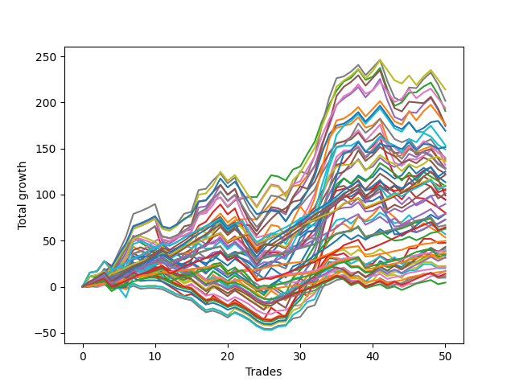

# Short Wallace 011 
- Symbol: ES
- Date Range: 03/18/2022 - 07/15/2022
- Trading Period: 7:20-12:30
- Number of Trades: 50



| Name | Win Percent | Profit | Avg Profit / Trade | Avg Time / Trade |      | Name | Win Percent | Profit | Avg Profit / Trade | Avg Time / Trade |
| ---- | ----------- | ------ | ------------------ | ---------------- | ---- | ---- | ----------- | ------ | ------------------ | ---------------- |
| Sorted By <br> Profit | | | | | | Sorted By <br> Win Percentage ||||
| Sixty | 70.00 | 107000.00 | 2140.00 | 19:01 |     | Eighty-One | 96.00 | 24875.00 | 497.50 | 02:51 |
| Seven | 66.00 | 100875.00 | 2017.50 | 25:09 |     | One Hundred Twenty-One | 94.00 | 19625.00 | 392.50 | 02:08 |
| Fifty-Eight | 76.00 | 96875.00 | 1937.50 | 13:51 |     | One Hundred Twenty-Six | 92.00 | 18125.00 | 362.50 | 02:08 |
| Two | 78.00 | 95375.00 | 1907.50 | 16:18 |     | One Hundred Twenty-Three | 90.00 | 54875.00 | 1097.50 | 07:07 |
| Sixty-Three | 62.00 | 88125.00 | 1762.50 | 21:30 |     | Eighty-Three | 90.00 | 52875.00 | 1057.50 | 08:33 |
| Five | 64.00 | 87750.00 | 1755.00 | 24:42 |     | One Hundred Twenty-Two | 90.00 | 33375.00 | 667.50 | 05:01 |
| Four | 70.00 | 87125.00 | 1742.50 | 22:13 |     | Eighty-Two | 90.00 | 31375.00 | 627.50 | 06:27 |
| Sixty-Two | 72.00 | 84625.00 | 1692.50 | 17:09 |     | One Hundred Twenty-Four | 84.00 | 54625.00 | 1092.50 | 08:55 |
| Sixty-One | 60.00 | 76750.00 | 1535.00 | 21:03 |     | Eighty-Four | 84.00 | 44875.00 | 897.50 | 10:47 |
| Seventy-Three | 60.00 | 75750.00 | 1515.00 | 11:38 |     | One Hundred Twenty-Seven | 84.00 | 17125.00 | 342.50 | 04:15 |
| Seventy-One | 52.00 | 74500.00 | 1490.00 | 16:36 |     | One Hundred Eleven | 84.00 | 10750.00 | 215.00 | 01:16 |
| Sixty-Eight | 52.00 | 70125.00 | 1402.50 | 14:33 |     | One Hundred Twenty-Eight | 82.00 | 32250.00 | 645.00 | 06:10 |
| Fifty-Nine | 70.00 | 69375.00 | 1387.50 | 15:29 |     | One Hundred Sixteen | 82.00 | 8375.00 | 167.50 | 01:16 |
| One | 80.00 | 68625.00 | 1372.50 | 13:40 |     | One | 80.00 | 68625.00 | 1372.50 | 13:40 |
| Seventy | 58.00 | 68000.00 | 1360.00 | 13:20 |     | Fifty-Seven | 80.00 | 64125.00 | 1282.50 | 11:40 |
| Six | 72.00 | 66000.00 | 1320.00 | 19:54 |     | One Hundred Twenty-Five | 80.00 | 62500.00 | 1250.00 | 10:03 |
| Sixty-Six | 64.00 | 64500.00 | 1290.00 | 11:13 |     | Eighty-Five | 80.00 | 50625.00 | 1012.50 | 12:05 |
| Fifty-Seven | 80.00 | 64125.00 | 1282.50 | 11:40 |     | Two | 78.00 | 95375.00 | 1907.50 | 16:18 |
| Sixty-Nine | 50.00 | 63875.00 | 1277.50 | 16:01 |     | One Hundred Thirty | 78.00 | 60750.00 | 1215.00 | 08:43 |
| One Hundred Twenty-Five | 80.00 | 62500.00 | 1250.00 | 10:03 |     | One Hundred Twenty-Nine | 78.00 | 39625.00 | 792.50 | 07:40 |
| Sixty-Seven | 60.00 | 61250.00 | 1225.00 | 12:20 |     | Fifty-Eight | 76.00 | 96875.00 | 1937.50 | 13:51 |
| One Hundred Thirty | 78.00 | 60750.00 | 1215.00 | 08:43 |     | Sixty-Two | 72.00 | 84625.00 | 1692.50 | 17:09 |
| Forty-Two | 54.00 | 56750.00 | 1135.00 | 08:56 |     | Six | 72.00 | 66000.00 | 1320.00 | 19:54 |
| One Hundred Twenty-Three | 90.00 | 54875.00 | 1097.50 | 07:07 |     | Fifty-Six | 72.00 | 36500.00 | 730.00 | 08:07 |
| One Hundred Twenty-Four | 84.00 | 54625.00 | 1092.50 | 08:55 |     | Zero | 72.00 | 36375.00 | 727.50 | 09:10 |
| Forty-Four | 46.00 | 54500.00 | 1090.00 | 11:55 |     | One Hundred Twelve | 72.00 | 5875.00 | 117.50 | 02:33 |
| Eighty-Three | 90.00 | 52875.00 | 1057.50 | 08:33 |     | Sixty | 70.00 | 107000.00 | 2140.00 | 19:01 |
| Forty-Seven | 40.00 | 52125.00 | 1042.50 | 14:15 |     | Four | 70.00 | 87125.00 | 1742.50 | 22:13 |
| Eighty-Five | 80.00 | 50625.00 | 1012.50 | 12:05 |     | Fifty-Nine | 70.00 | 69375.00 | 1387.50 | 15:29 |
| Three | 70.00 | 49500.00 | 990.00 | 18:42 |     | Three | 70.00 | 49500.00 | 990.00 | 18:42 |
| Sixty-Five | 68.00 | 47375.00 | 947.50 | 09:57 |     | Sixty-Four | 70.00 | 32125.00 | 642.50 | 07:18 |
| Forty-Six | 50.00 | 47125.00 | 942.50 | 10:57 |     | Sixty-Five | 68.00 | 47375.00 | 947.50 | 09:57 |
| Eighty-Four | 84.00 | 44875.00 | 897.50 | 10:47 |     | One Hundred Thirteen | 68.00 | 15875.00 | 317.50 | 03:46 |
| Forty-Five | 38.00 | 40125.00 | 802.50 | 13:41 |     | Seven | 66.00 | 100875.00 | 2017.50 | 25:09 |
| One Hundred Twenty-Nine | 78.00 | 39625.00 | 792.50 | 07:40 |     | One Hundred Seventeen | 66.00 | 2250.00 | 45.00 | 02:18 |
| One Hundred Fifteen | 64.00 | 39500.00 | 790.00 | 05:53 |     | Five | 64.00 | 87750.00 | 1755.00 | 24:42 |
| Fifty-Six | 72.00 | 36500.00 | 730.00 | 08:07 |     | Sixty-Six | 64.00 | 64500.00 | 1290.00 | 11:13 |
| Zero | 72.00 | 36375.00 | 727.50 | 09:10 |     | One Hundred Fifteen | 64.00 | 39500.00 | 790.00 | 05:53 |
| One Hundred Twenty-Two | 90.00 | 33375.00 | 667.50 | 05:01 |     | One Hundred Fourteen | 64.00 | 20625.00 | 412.50 | 04:56 |
| One Hundred Twenty-Eight | 82.00 | 32250.00 | 645.00 | 06:10 |     | Forty | 64.00 | 19250.00 | 385.00 | 05:13 |
| Sixty-Four | 70.00 | 32125.00 | 642.50 | 07:18 |     | Sixty-Three | 62.00 | 88125.00 | 1762.50 | 21:30 |
| Eighty-Two | 90.00 | 31375.00 | 627.50 | 06:27 |     | Sixty-One | 60.00 | 76750.00 | 1535.00 | 21:03 |
| Forty-One | 56.00 | 28500.00 | 570.00 | 07:40 |     | Seventy-Three | 60.00 | 75750.00 | 1515.00 | 11:38 |
| Forty-Three | 46.00 | 26750.00 | 535.00 | 09:40 |     | Sixty-Seven | 60.00 | 61250.00 | 1225.00 | 12:20 |
| Eighty-One | 96.00 | 24875.00 | 497.50 | 02:51 |     | One Hundred Eighteen | 60.00 | 7000.00 | 140.00 | 03:19 |
| Fifty-Five | 46.00 | 23875.00 | 477.50 | 07:03 |     | Seventy | 58.00 | 68000.00 | 1360.00 | 13:20 |
| One Hundred Twenty | 50.00 | 21625.00 | 432.50 | 04:31 |     | Forty-One | 56.00 | 28500.00 | 570.00 | 07:40 |
| One Hundred Fourteen | 64.00 | 20625.00 | 412.50 | 04:56 |     | One Hundred Ninteen | 56.00 | 16000.00 | 320.00 | 04:08 |
| One Hundred Twenty-One | 94.00 | 19625.00 | 392.50 | 02:08 |     | Forty-Eight | 56.00 | 8750.00 | 175.00 | 04:08 |
| Fifty-Four | 50.00 | 19500.00 | 390.00 | 06:04 |     | Forty-Two | 54.00 | 56750.00 | 1135.00 | 08:56 |
| Forty | 64.00 | 19250.00 | 385.00 | 05:13 |     | Seventy-One | 52.00 | 74500.00 | 1490.00 | 16:36 |
| One Hundred Twenty-Six | 92.00 | 18125.00 | 362.50 | 02:08 |     | Sixty-Eight | 52.00 | 70125.00 | 1402.50 | 14:33 |
| Fifty-Two | 44.00 | 17750.00 | 355.00 | 06:24 |     | Sixty-Nine | 50.00 | 63875.00 | 1277.50 | 16:01 |
| One Hundred Twenty-Seven | 84.00 | 17125.00 | 342.50 | 04:15 |     | Forty-Six | 50.00 | 47125.00 | 942.50 | 10:57 |
| One Hundred Ninteen | 56.00 | 16000.00 | 320.00 | 04:08 |     | One Hundred Twenty | 50.00 | 21625.00 | 432.50 | 04:31 |
| One Hundred Thirteen | 68.00 | 15875.00 | 317.50 | 03:46 |     | Fifty-Four | 50.00 | 19500.00 | 390.00 | 06:04 |
| Fifty-Three | 44.00 | 15500.00 | 310.00 | 07:00 |     | Forty-Four | 46.00 | 54500.00 | 1090.00 | 11:55 |
| Fifty | 44.00 | 11250.00 | 225.00 | 05:47 |     | Forty-Three | 46.00 | 26750.00 | 535.00 | 09:40 |
| One Hundred Eleven | 84.00 | 10750.00 | 215.00 | 01:16 |     | Fifty-Five | 46.00 | 23875.00 | 477.50 | 07:03 |
| Fifty-One | 46.00 | 10125.00 | 202.50 | 05:47 |     | Fifty-One | 46.00 | 10125.00 | 202.50 | 05:47 |
| Forty-Eight | 56.00 | 8750.00 | 175.00 | 04:08 |     | Forty-Nine | 46.00 | 4875.00 | 97.50 | 05:16 |
| One Hundred Sixteen | 82.00 | 8375.00 | 167.50 | 01:16 |     | Fifty-Two | 44.00 | 17750.00 | 355.00 | 06:24 |
| One Hundred Eighteen | 60.00 | 7000.00 | 140.00 | 03:19 |     | Fifty-Three | 44.00 | 15500.00 | 310.00 | 07:00 |
| One Hundred Twelve | 72.00 | 5875.00 | 117.50 | 02:33 |     | Fifty | 44.00 | 11250.00 | 225.00 | 05:47 |
| Forty-Nine | 46.00 | 4875.00 | 97.50 | 05:16 |     | Forty-Seven | 40.00 | 52125.00 | 1042.50 | 14:15 |
| One Hundred Seventeen | 66.00 | 2250.00 | 45.00 | 02:18 |     | Forty-Five | 38.00 | 40125.00 | 802.50 | 13:41 |

## NO STOPLOSS

### Test Zero
* Sell when price hits the middle line of the 20p bollinger
* No Stoploss
* Results:
```
Total Trades: 50
Percent Up: 28.00
Percent Down: 72.00
Total Points Moved Down: 72.75
Potential Profit: 36375.00
Total Points Ups: 79.50 Count Ups: 14
Total Points Downs: 152.25 Count Downs: 36
```

<details><summary>Trades</summary>

<code>In: 2022-03-25 11:57:00		Out: 2022-03-25 11:57:15		Total Position Time: 00:15		Total Move Down: 0.25		Total to Date: 0.25</code> <br />
<code>In: 2022-04-01 11:34:00		Out: 2022-04-01 11:43:00		Total Position Time: 09:00		Total Move Down: 1.25		Total to Date: 1.50</code> <br />
<code>In: 2022-04-06 08:53:00		Out: 2022-04-06 09:00:40		Total Position Time: 07:40		Total Move Down: 2.50		Total to Date: 4.00</code> <br />
<code>In: 2022-04-06 10:36:00		Out: 2022-04-06 10:47:10		Total Position Time: 11:10		Total Move Down: -3.00		Total to Date: 1.00</code> <br />
<code>In: 2022-04-06 10:43:00		Out: 2022-04-06 10:47:10		Total Position Time: 04:10		Total Move Down: 4.50		Total to Date: 5.50</code> <br />
<code>In: 2022-04-06 10:45:00		Out: 2022-04-06 10:47:10		Total Position Time: 02:10		Total Move Down: 4.25		Total to Date: 9.75</code> <br />
<code>In: 2022-04-06 11:05:00		Out: 2022-04-06 11:05:35		Total Position Time: 00:35		Total Move Down: 7.00		Total to Date: 16.75</code> <br />
<code>In: 2022-04-07 10:22:00		Out: 2022-04-07 10:36:05		Total Position Time: 14:05		Total Move Down: -0.75		Total to Date: 16.00</code> <br />
<code>In: 2022-04-07 11:03:00		Out: 2022-04-07 11:15:20		Total Position Time: 12:20		Total Move Down: 4.00		Total to Date: 20.00</code> <br />
<code>In: 2022-04-07 11:04:00		Out: 2022-04-07 11:15:20		Total Position Time: 11:20		Total Move Down: 3.25		Total to Date: 23.25</code> <br />
<code>In: 2022-04-08 07:33:00		Out: 2022-04-08 07:44:35		Total Position Time: 11:35		Total Move Down: 3.25		Total to Date: 26.50</code> <br />
<code>In: 2022-04-18 10:38:00		Out: 2022-04-18 10:59:30		Total Position Time: 21:30		Total Move Down: -2.00		Total to Date: 24.50</code> <br />
<code>In: 2022-04-20 07:40:00		Out: 2022-04-20 08:00:10		Total Position Time: 20:10		Total Move Down: -3.00		Total to Date: 21.50</code> <br />
<code>In: 2022-04-20 07:43:00		Out: 2022-04-20 08:00:10		Total Position Time: 17:10		Total Move Down: -1.50		Total to Date: 20.00</code> <br />
<code>In: 2022-04-20 09:54:00		Out: 2022-04-20 09:59:15		Total Position Time: 05:15		Total Move Down: 3.25		Total to Date: 23.25</code> <br />
<code>In: 2022-04-25 07:34:00		Out: 2022-04-25 07:40:25		Total Position Time: 06:25		Total Move Down: 8.25		Total to Date: 31.50</code> <br />
<code>In: 2022-04-25 10:14:00		Out: 2022-04-25 10:26:25		Total Position Time: 12:25		Total Move Down: -0.50		Total to Date: 31.00</code> <br />
<code>In: 2022-04-25 10:17:00		Out: 2022-04-25 10:26:25		Total Position Time: 09:25		Total Move Down: 6.00		Total to Date: 37.00</code> <br />
<code>In: 2022-04-27 08:34:00		Out: 2022-04-27 08:45:05		Total Position Time: 11:05		Total Move Down: 1.25		Total to Date: 38.25</code> <br />
<code>In: 2022-05-04 09:25:00		Out: 2022-05-04 09:45:30		Total Position Time: 20:30		Total Move Down: -4.50		Total to Date: 33.75</code> <br />
<code>In: 2022-05-17 08:36:00		Out: 2022-05-17 08:43:35		Total Position Time: 07:35		Total Move Down: 4.25		Total to Date: 38.00</code> <br />
<code>In: 2022-05-24 10:43:00		Out: 2022-05-24 11:01:15		Total Position Time: 18:15		Total Move Down: -2.25		Total to Date: 35.75</code> <br />
<code>In: 2022-05-24 10:44:00		Out: 2022-05-24 11:01:15		Total Position Time: 17:15		Total Move Down: -3.00		Total to Date: 32.75</code> <br />
<code>In: 2022-05-24 10:48:00		Out: 2022-05-24 11:01:15		Total Position Time: 13:15		Total Move Down: -4.50		Total to Date: 28.25</code> <br />
<code>In: 2022-05-25 11:04:00		Out: 2022-05-25 11:06:25		Total Position Time: 02:25		Total Move Down: 4.50		Total to Date: 32.75</code> <br />
<code>In: 2022-05-25 11:06:00		Out: 2022-05-25 11:06:25		Total Position Time: 00:25		Total Move Down: 3.75		Total to Date: 36.50</code> <br />
<code>In: 2022-05-31 07:23:00		Out: 2022-05-31 07:30:05		Total Position Time: 07:05		Total Move Down: 8.75		Total to Date: 45.25</code> <br />
<code>In: 2022-05-31 07:24:00		Out: 2022-05-31 07:30:05		Total Position Time: 06:05		Total Move Down: 5.75		Total to Date: 51.00</code> <br />
<code>In: 2022-06-03 10:06:00		Out: 2022-06-03 10:13:20		Total Position Time: 07:20		Total Move Down: 4.50		Total to Date: 55.50</code> <br />
<code>In: 2022-06-09 10:08:00		Out: 2022-06-09 10:16:15		Total Position Time: 08:15		Total Move Down: 0.75		Total to Date: 56.25</code> <br />
<code>In: 2022-06-10 12:00:00		Out: 2022-06-10 12:03:25		Total Position Time: 03:25		Total Move Down: 6.25		Total to Date: 62.50</code> <br />
<code>In: 2022-06-10 12:29:00		Out: 2022-06-10 12:30:30		Total Position Time: 01:30		Total Move Down: 6.25		Total to Date: 68.75</code> <br />
<code>In: 2022-06-13 09:40:00		Out: 2022-06-13 09:43:15		Total Position Time: 03:15		Total Move Down: 12.00		Total to Date: 80.75</code> <br />
<code>In: 2022-06-13 09:41:00		Out: 2022-06-13 09:43:15		Total Position Time: 02:15		Total Move Down: 7.75		Total to Date: 88.50</code> <br />
<code>In: 2022-06-14 10:21:00		Out: 2022-06-14 10:25:25		Total Position Time: 04:25		Total Move Down: 7.00		Total to Date: 95.50</code> <br />
<code>In: 2022-06-15 11:02:00		Out: 2022-06-15 11:02:10		Total Position Time: 00:10		Total Move Down: 2.00		Total to Date: 97.50</code> <br />
<code>In: 2022-06-17 10:11:00		Out: 2022-06-17 10:22:05		Total Position Time: 11:05		Total Move Down: 0.50		Total to Date: 98.00</code> <br />
<code>In: 2022-06-17 10:14:00		Out: 2022-06-17 10:22:05		Total Position Time: 08:05		Total Move Down: 5.50		Total to Date: 103.50</code> <br />
<code>In: 2022-06-23 12:30:00		Out: 2022-06-23 12:46:00		Total Position Time: 16:00		Total Move Down: -11.25		Total to Date: 92.25</code> <br />
<code>In: 2022-06-29 11:06:00		Out: 2022-06-29 11:20:00		Total Position Time: 14:00		Total Move Down: 1.00		Total to Date: 93.25</code> <br />
<code>In: 2022-06-29 12:31:00		Out: 2022-06-29 12:33:20		Total Position Time: 02:20		Total Move Down: 4.75		Total to Date: 98.00</code> <br />
<code>In: 2022-06-30 07:57:00		Out: 2022-06-30 08:26:55		Total Position Time: 29:55		Total Move Down: -23.00		Total to Date: 75.00</code> <br />
<code>In: 2022-06-30 08:01:00		Out: 2022-06-30 08:30:55		Total Position Time: 29:55		Total Move Down: -18.25		Total to Date: 56.75</code> <br />
<code>In: 2022-07-05 08:49:00		Out: 2022-07-05 09:00:10		Total Position Time: 11:10		Total Move Down: 1.00		Total to Date: 57.75</code> <br />
<code>In: 2022-07-06 11:10:00		Out: 2022-07-06 11:10:10		Total Position Time: 00:10		Total Move Down: 3.25		Total to Date: 61.00</code> <br />
<code>In: 2022-07-06 11:35:00		Out: 2022-07-06 11:50:00		Total Position Time: 15:00		Total Move Down: -2.00		Total to Date: 59.00</code> <br />
<code>In: 2022-07-11 07:43:00		Out: 2022-07-11 07:46:50		Total Position Time: 03:50		Total Move Down: 3.25		Total to Date: 62.25</code> <br />
<code>In: 2022-07-12 08:14:00		Out: 2022-07-12 08:16:20		Total Position Time: 02:20		Total Move Down: 4.50		Total to Date: 66.75</code> <br />
<code>In: 2022-07-14 08:02:00		Out: 2022-07-14 08:02:10		Total Position Time: 00:10		Total Move Down: 1.50		Total to Date: 68.25</code> <br />
<code>In: 2022-07-14 08:12:00		Out: 2022-07-14 08:15:30		Total Position Time: 03:30		Total Move Down: 4.50		Total to Date: 72.75</code> <br />


</details>

### Test One
* Sell when the price hits the upper line of the 20p 1std bollinger
* No Stoploss
* Results:
```
Total Trades: 50
Percent Up: 20.00
Percent Down: 80.00
Total Points Moved Down: 137.25
Potential Profit: 68625.00
Total Points Ups: 81.75 Count Ups: 10
Total Points Downs: 219.00 Count Downs: 40
```

<details><summary>Trades</summary>

<code>In: 2022-03-25 11:57:00		Out: 2022-03-25 12:00:45		Total Position Time: 03:45		Total Move Down: 1.75		Total to Date: 1.75</code> <br />
<code>In: 2022-04-01 11:34:00		Out: 2022-04-01 11:50:15		Total Position Time: 16:15		Total Move Down: 3.25		Total to Date: 5.00</code> <br />
<code>In: 2022-04-06 08:53:00		Out: 2022-04-06 09:04:35		Total Position Time: 11:35		Total Move Down: 2.25		Total to Date: 7.25</code> <br />
<code>In: 2022-04-06 10:36:00		Out: 2022-04-06 10:56:55		Total Position Time: 20:55		Total Move Down: -3.50		Total to Date: 3.75</code> <br />
<code>In: 2022-04-06 10:43:00		Out: 2022-04-06 10:56:55		Total Position Time: 13:55		Total Move Down: 4.00		Total to Date: 7.75</code> <br />
<code>In: 2022-04-06 10:45:00		Out: 2022-04-06 10:56:55		Total Position Time: 11:55		Total Move Down: 3.75		Total to Date: 11.50</code> <br />
<code>In: 2022-04-06 11:05:00		Out: 2022-04-06 11:07:20		Total Position Time: 02:20		Total Move Down: 12.50		Total to Date: 24.00</code> <br />
<code>In: 2022-04-07 10:22:00		Out: 2022-04-07 10:39:55		Total Position Time: 17:55		Total Move Down: 1.25		Total to Date: 25.25</code> <br />
<code>In: 2022-04-07 11:03:00		Out: 2022-04-07 11:16:10		Total Position Time: 13:10		Total Move Down: 4.00		Total to Date: 29.25</code> <br />
<code>In: 2022-04-07 11:04:00		Out: 2022-04-07 11:16:10		Total Position Time: 12:10		Total Move Down: 3.25		Total to Date: 32.50</code> <br />
<code>In: 2022-04-08 07:33:00		Out: 2022-04-08 07:45:55		Total Position Time: 12:55		Total Move Down: 4.50		Total to Date: 37.00</code> <br />
<code>In: 2022-04-18 10:38:00		Out: 2022-04-18 11:06:20		Total Position Time: 28:20		Total Move Down: -2.75		Total to Date: 34.25</code> <br />
<code>In: 2022-04-20 07:40:00		Out: 2022-04-20 08:00:40		Total Position Time: 20:40		Total Move Down: 0.25		Total to Date: 34.50</code> <br />
<code>In: 2022-04-20 07:43:00		Out: 2022-04-20 08:00:40		Total Position Time: 17:40		Total Move Down: 1.75		Total to Date: 36.25</code> <br />
<code>In: 2022-04-20 09:54:00		Out: 2022-04-20 10:08:15		Total Position Time: 14:15		Total Move Down: 4.25		Total to Date: 40.50</code> <br />
<code>In: 2022-04-25 07:34:00		Out: 2022-04-25 07:43:05		Total Position Time: 09:05		Total Move Down: 11.75		Total to Date: 52.25</code> <br />
<code>In: 2022-04-25 10:14:00		Out: 2022-04-25 10:27:10		Total Position Time: 13:10		Total Move Down: 3.25		Total to Date: 55.50</code> <br />
<code>In: 2022-04-25 10:17:00		Out: 2022-04-25 10:27:10		Total Position Time: 10:10		Total Move Down: 9.75		Total to Date: 65.25</code> <br />
<code>In: 2022-04-27 08:34:00		Out: 2022-04-27 08:48:05		Total Position Time: 14:05		Total Move Down: 3.75		Total to Date: 69.00</code> <br />
<code>In: 2022-05-04 09:25:00		Out: 2022-05-04 09:46:30		Total Position Time: 21:30		Total Move Down: -3.00		Total to Date: 66.00</code> <br />
<code>In: 2022-05-17 08:36:00		Out: 2022-05-17 08:47:15		Total Position Time: 11:15		Total Move Down: 6.00		Total to Date: 72.00</code> <br />
<code>In: 2022-05-24 10:43:00		Out: 2022-05-24 11:01:40		Total Position Time: 18:40		Total Move Down: 1.25		Total to Date: 73.25</code> <br />
<code>In: 2022-05-24 10:44:00		Out: 2022-05-24 11:01:40		Total Position Time: 17:40		Total Move Down: 0.50		Total to Date: 73.75</code> <br />
<code>In: 2022-05-24 10:48:00		Out: 2022-05-24 11:01:40		Total Position Time: 13:40		Total Move Down: -1.00		Total to Date: 72.75</code> <br />
<code>In: 2022-05-25 11:04:00		Out: 2022-05-25 11:06:35		Total Position Time: 02:35		Total Move Down: 9.25		Total to Date: 82.00</code> <br />
<code>In: 2022-05-25 11:06:00		Out: 2022-05-25 11:06:35		Total Position Time: 00:35		Total Move Down: 8.50		Total to Date: 90.50</code> <br />
<code>In: 2022-05-31 07:23:00		Out: 2022-05-31 07:38:05		Total Position Time: 15:05		Total Move Down: 7.25		Total to Date: 97.75</code> <br />
<code>In: 2022-05-31 07:24:00		Out: 2022-05-31 07:38:05		Total Position Time: 14:05		Total Move Down: 4.25		Total to Date: 102.00</code> <br />
<code>In: 2022-06-03 10:06:00		Out: 2022-06-03 10:15:05		Total Position Time: 09:05		Total Move Down: 7.00		Total to Date: 109.00</code> <br />
<code>In: 2022-06-09 10:08:00		Out: 2022-06-09 10:18:10		Total Position Time: 10:10		Total Move Down: 1.75		Total to Date: 110.75</code> <br />
<code>In: 2022-06-10 12:00:00		Out: 2022-06-10 12:04:35		Total Position Time: 04:35		Total Move Down: 10.25		Total to Date: 121.00</code> <br />
<code>In: 2022-06-10 12:29:00		Out: 2022-06-10 12:35:45		Total Position Time: 06:45		Total Move Down: 9.75		Total to Date: 130.75</code> <br />
<code>In: 2022-06-13 09:40:00		Out: 2022-06-13 09:47:50		Total Position Time: 07:50		Total Move Down: 17.50		Total to Date: 148.25</code> <br />
<code>In: 2022-06-13 09:41:00		Out: 2022-06-13 09:47:50		Total Position Time: 06:50		Total Move Down: 13.25		Total to Date: 161.50</code> <br />
<code>In: 2022-06-14 10:21:00		Out: 2022-06-14 10:29:05		Total Position Time: 08:05		Total Move Down: 11.00		Total to Date: 172.50</code> <br />
<code>In: 2022-06-15 11:02:00		Out: 2022-06-15 11:02:10		Total Position Time: 00:10		Total Move Down: 2.00		Total to Date: 174.50</code> <br />
<code>In: 2022-06-17 10:11:00		Out: 2022-06-17 10:26:05		Total Position Time: 15:05		Total Move Down: 2.25		Total to Date: 176.75</code> <br />
<code>In: 2022-06-17 10:14:00		Out: 2022-06-17 10:26:05		Total Position Time: 12:05		Total Move Down: 7.25		Total to Date: 184.00</code> <br />
<code>In: 2022-06-23 12:30:00		Out: 2022-06-23 12:46:00		Total Position Time: 16:00		Total Move Down: -11.25		Total to Date: 172.75</code> <br />
<code>In: 2022-06-29 11:06:00		Out: 2022-06-29 11:20:25		Total Position Time: 14:25		Total Move Down: 2.50		Total to Date: 175.25</code> <br />
<code>In: 2022-06-29 12:31:00		Out: 2022-06-29 12:34:10		Total Position Time: 03:10		Total Move Down: 7.25		Total to Date: 182.50</code> <br />
<code>In: 2022-06-30 07:57:00		Out: 2022-06-30 08:26:55		Total Position Time: 29:55		Total Move Down: -23.00		Total to Date: 159.50</code> <br />
<code>In: 2022-06-30 08:01:00		Out: 2022-06-30 08:30:55		Total Position Time: 29:55		Total Move Down: -18.25		Total to Date: 141.25</code> <br />
<code>In: 2022-07-05 08:49:00		Out: 2022-07-05 09:03:25		Total Position Time: 14:25		Total Move Down: 1.25		Total to Date: 142.50</code> <br />
<code>In: 2022-07-06 11:10:00		Out: 2022-07-06 11:11:10		Total Position Time: 01:10		Total Move Down: 7.50		Total to Date: 150.00</code> <br />
<code>In: 2022-07-06 11:35:00		Out: 2022-07-06 12:00:30		Total Position Time: 25:30		Total Move Down: -4.00		Total to Date: 146.00</code> <br />
<code>In: 2022-07-11 07:43:00		Out: 2022-07-11 07:54:15		Total Position Time: 11:15		Total Move Down: 3.50		Total to Date: 149.50</code> <br />
<code>In: 2022-07-12 08:14:00		Out: 2022-07-12 08:38:05		Total Position Time: 24:05		Total Move Down: 2.75		Total to Date: 152.25</code> <br />
<code>In: 2022-07-14 08:02:00		Out: 2022-07-14 08:31:55		Total Position Time: 29:55		Total Move Down: -13.00		Total to Date: 139.25</code> <br />
<code>In: 2022-07-14 08:12:00		Out: 2022-07-14 08:35:50		Total Position Time: 23:50		Total Move Down: -2.00		Total to Date: 137.25</code> <br />


</details>

### Test Two
* Sell when the price hits the upper line of the 20p 2std bollinger
* No Stoploss
* Results:
```
Total Trades: 50
Percent Up: 22.00
Percent Down: 78.00
Total Points Moved Down: 190.75
Potential Profit: 95375.00
Total Points Ups: 104.25 Count Ups: 11
Total Points Downs: 295.00 Count Downs: 39
```

<details><summary>Trades</summary>

<code>In: 2022-03-25 11:57:00		Out: 2022-03-25 12:00:55		Total Position Time: 03:55		Total Move Down: 2.75		Total to Date: 2.75</code> <br />
<code>In: 2022-04-01 11:34:00		Out: 2022-04-01 11:50:20		Total Position Time: 16:20		Total Move Down: 3.75		Total to Date: 6.50</code> <br />
<code>In: 2022-04-06 08:53:00		Out: 2022-04-06 09:09:40		Total Position Time: 16:40		Total Move Down: 3.75		Total to Date: 10.25</code> <br />
<code>In: 2022-04-06 10:36:00		Out: 2022-04-06 10:57:20		Total Position Time: 21:20		Total Move Down: -2.50		Total to Date: 7.75</code> <br />
<code>In: 2022-04-06 10:43:00		Out: 2022-04-06 10:57:20		Total Position Time: 14:20		Total Move Down: 5.00		Total to Date: 12.75</code> <br />
<code>In: 2022-04-06 10:45:00		Out: 2022-04-06 10:57:20		Total Position Time: 12:20		Total Move Down: 4.75		Total to Date: 17.50</code> <br />
<code>In: 2022-04-06 11:05:00		Out: 2022-04-06 11:08:10		Total Position Time: 03:10		Total Move Down: 18.50		Total to Date: 36.00</code> <br />
<code>In: 2022-04-07 10:22:00		Out: 2022-04-07 10:45:15		Total Position Time: 23:15		Total Move Down: 2.00		Total to Date: 38.00</code> <br />
<code>In: 2022-04-07 11:03:00		Out: 2022-04-07 11:18:20		Total Position Time: 15:20		Total Move Down: 6.00		Total to Date: 44.00</code> <br />
<code>In: 2022-04-07 11:04:00		Out: 2022-04-07 11:18:20		Total Position Time: 14:20		Total Move Down: 5.25		Total to Date: 49.25</code> <br />
<code>In: 2022-04-08 07:33:00		Out: 2022-04-08 07:49:20		Total Position Time: 16:20		Total Move Down: 5.25		Total to Date: 54.50</code> <br />
<code>In: 2022-04-18 10:38:00		Out: 2022-04-18 11:07:55		Total Position Time: 29:55		Total Move Down: -2.00		Total to Date: 52.50</code> <br />
<code>In: 2022-04-20 07:40:00		Out: 2022-04-20 08:00:45		Total Position Time: 20:45		Total Move Down: 0.75		Total to Date: 53.25</code> <br />
<code>In: 2022-04-20 07:43:00		Out: 2022-04-20 08:00:45		Total Position Time: 17:45		Total Move Down: 2.25		Total to Date: 55.50</code> <br />
<code>In: 2022-04-20 09:54:00		Out: 2022-04-20 10:08:15		Total Position Time: 14:15		Total Move Down: 4.25		Total to Date: 59.75</code> <br />
<code>In: 2022-04-25 07:34:00		Out: 2022-04-25 07:52:35		Total Position Time: 18:35		Total Move Down: 18.25		Total to Date: 78.00</code> <br />
<code>In: 2022-04-25 10:14:00		Out: 2022-04-25 10:33:35		Total Position Time: 19:35		Total Move Down: 4.25		Total to Date: 82.25</code> <br />
<code>In: 2022-04-25 10:17:00		Out: 2022-04-25 10:33:35		Total Position Time: 16:35		Total Move Down: 10.75		Total to Date: 93.00</code> <br />
<code>In: 2022-04-27 08:34:00		Out: 2022-04-27 08:50:10		Total Position Time: 16:10		Total Move Down: 4.00		Total to Date: 97.00</code> <br />
<code>In: 2022-05-04 09:25:00		Out: 2022-05-04 09:54:55		Total Position Time: 29:55		Total Move Down: -10.75		Total to Date: 86.25</code> <br />
<code>In: 2022-05-17 08:36:00		Out: 2022-05-17 08:48:20		Total Position Time: 12:20		Total Move Down: 7.25		Total to Date: 93.50</code> <br />
<code>In: 2022-05-24 10:43:00		Out: 2022-05-24 11:01:50		Total Position Time: 18:50		Total Move Down: 2.25		Total to Date: 95.75</code> <br />
<code>In: 2022-05-24 10:44:00		Out: 2022-05-24 11:01:50		Total Position Time: 17:50		Total Move Down: 1.50		Total to Date: 97.25</code> <br />
<code>In: 2022-05-24 10:48:00		Out: 2022-05-24 11:01:50		Total Position Time: 13:50		Total Move Down: -0.00		Total to Date: 97.25</code> <br />
<code>In: 2022-05-25 11:04:00		Out: 2022-05-25 11:06:40		Total Position Time: 02:40		Total Move Down: 12.25		Total to Date: 109.50</code> <br />
<code>In: 2022-05-25 11:06:00		Out: 2022-05-25 11:06:40		Total Position Time: 00:40		Total Move Down: 11.50		Total to Date: 121.00</code> <br />
<code>In: 2022-05-31 07:23:00		Out: 2022-05-31 07:52:55		Total Position Time: 29:55		Total Move Down: -1.50		Total to Date: 119.50</code> <br />
<code>In: 2022-05-31 07:24:00		Out: 2022-05-31 07:53:55		Total Position Time: 29:55		Total Move Down: -4.25		Total to Date: 115.25</code> <br />
<code>In: 2022-06-03 10:06:00		Out: 2022-06-03 10:17:55		Total Position Time: 11:55		Total Move Down: 12.00		Total to Date: 127.25</code> <br />
<code>In: 2022-06-09 10:08:00		Out: 2022-06-09 10:18:55		Total Position Time: 10:55		Total Move Down: 3.25		Total to Date: 130.50</code> <br />
<code>In: 2022-06-10 12:00:00		Out: 2022-06-10 12:05:55		Total Position Time: 05:55		Total Move Down: 13.75		Total to Date: 144.25</code> <br />
<code>In: 2022-06-10 12:29:00		Out: 2022-06-10 12:42:45		Total Position Time: 13:45		Total Move Down: 13.25		Total to Date: 157.50</code> <br />
<code>In: 2022-06-13 09:40:00		Out: 2022-06-13 09:54:20		Total Position Time: 14:20		Total Move Down: 22.25		Total to Date: 179.75</code> <br />
<code>In: 2022-06-13 09:41:00		Out: 2022-06-13 09:54:20		Total Position Time: 13:20		Total Move Down: 18.00		Total to Date: 197.75</code> <br />
<code>In: 2022-06-14 10:21:00		Out: 2022-06-14 10:31:00		Total Position Time: 10:00		Total Move Down: 15.00		Total to Date: 212.75</code> <br />
<code>In: 2022-06-15 11:02:00		Out: 2022-06-15 11:03:05		Total Position Time: 01:05		Total Move Down: 10.00		Total to Date: 222.75</code> <br />
<code>In: 2022-06-17 10:11:00		Out: 2022-06-17 10:27:05		Total Position Time: 16:05		Total Move Down: 4.00		Total to Date: 226.75</code> <br />
<code>In: 2022-06-17 10:14:00		Out: 2022-06-17 10:27:05		Total Position Time: 13:05		Total Move Down: 9.00		Total to Date: 235.75</code> <br />
<code>In: 2022-06-23 12:30:00		Out: 2022-06-23 12:46:00		Total Position Time: 16:00		Total Move Down: -11.25		Total to Date: 224.50</code> <br />
<code>In: 2022-06-29 11:06:00		Out: 2022-06-29 11:20:45		Total Position Time: 14:45		Total Move Down: 3.50		Total to Date: 228.00</code> <br />
<code>In: 2022-06-29 12:31:00		Out: 2022-06-29 12:35:20		Total Position Time: 04:20		Total Move Down: 9.50		Total to Date: 237.50</code> <br />
<code>In: 2022-06-30 07:57:00		Out: 2022-06-30 08:26:55		Total Position Time: 29:55		Total Move Down: -23.00		Total to Date: 214.50</code> <br />
<code>In: 2022-06-30 08:01:00		Out: 2022-06-30 08:30:55		Total Position Time: 29:55		Total Move Down: -18.25		Total to Date: 196.25</code> <br />
<code>In: 2022-07-05 08:49:00		Out: 2022-07-05 09:03:50		Total Position Time: 14:50		Total Move Down: 3.75		Total to Date: 200.00</code> <br />
<code>In: 2022-07-06 11:10:00		Out: 2022-07-06 11:11:45		Total Position Time: 01:45		Total Move Down: 10.50		Total to Date: 210.50</code> <br />
<code>In: 2022-07-06 11:35:00		Out: 2022-07-06 12:01:25		Total Position Time: 26:25		Total Move Down: 0.50		Total to Date: 211.00</code> <br />
<code>In: 2022-07-11 07:43:00		Out: 2022-07-11 07:55:50		Total Position Time: 12:50		Total Move Down: 6.25		Total to Date: 217.25</code> <br />
<code>In: 2022-07-12 08:14:00		Out: 2022-07-12 08:41:10		Total Position Time: 27:10		Total Move Down: 4.25		Total to Date: 221.50</code> <br />
<code>In: 2022-07-14 08:02:00		Out: 2022-07-14 08:31:55		Total Position Time: 29:55		Total Move Down: -13.00		Total to Date: 208.50</code> <br />
<code>In: 2022-07-14 08:12:00		Out: 2022-07-14 08:41:55		Total Position Time: 29:55		Total Move Down: -17.75		Total to Date: 190.75</code> <br />


</details>

### Test Three
* Sell when price hits the middle line of the 50p bollinger
* No Stoploss
* Results:
```
Total Trades: 50
Percent Up: 30.00
Percent Down: 70.00
Total Points Moved Down: 99.00
Potential Profit: 49500.00
Total Points Ups: 176.75 Count Ups: 15
Total Points Downs: 275.75 Count Downs: 35
```

<details><summary>Trades</summary>

<code>In: 2022-03-25 11:57:00		Out: 2022-03-25 12:00:45		Total Position Time: 03:45		Total Move Down: 1.75		Total to Date: 1.75</code> <br />
<code>In: 2022-04-01 11:34:00		Out: 2022-04-01 11:57:50		Total Position Time: 23:50		Total Move Down: 4.50		Total to Date: 6.25</code> <br />
<code>In: 2022-04-06 08:53:00		Out: 2022-04-06 09:12:05		Total Position Time: 19:05		Total Move Down: 4.50		Total to Date: 10.75</code> <br />
<code>In: 2022-04-06 10:36:00		Out: 2022-04-06 11:00:10		Total Position Time: 24:10		Total Move Down: 5.25		Total to Date: 16.00</code> <br />
<code>In: 2022-04-06 10:43:00		Out: 2022-04-06 11:00:10		Total Position Time: 17:10		Total Move Down: 12.75		Total to Date: 28.75</code> <br />
<code>In: 2022-04-06 10:45:00		Out: 2022-04-06 11:00:10		Total Position Time: 15:10		Total Move Down: 12.50		Total to Date: 41.25</code> <br />
<code>In: 2022-04-06 11:05:00		Out: 2022-04-06 11:07:20		Total Position Time: 02:20		Total Move Down: 12.50		Total to Date: 53.75</code> <br />
<code>In: 2022-04-07 10:22:00		Out: 2022-04-07 10:51:55		Total Position Time: 29:55		Total Move Down: 3.00		Total to Date: 56.75</code> <br />
<code>In: 2022-04-07 11:03:00		Out: 2022-04-07 11:32:55		Total Position Time: 29:55		Total Move Down: 3.50		Total to Date: 60.25</code> <br />
<code>In: 2022-04-07 11:04:00		Out: 2022-04-07 11:33:40		Total Position Time: 29:40		Total Move Down: 5.50		Total to Date: 65.75</code> <br />
<code>In: 2022-04-08 07:33:00		Out: 2022-04-08 08:02:55		Total Position Time: 29:55		Total Move Down: -25.00		Total to Date: 40.75</code> <br />
<code>In: 2022-04-18 10:38:00		Out: 2022-04-18 11:07:55		Total Position Time: 29:55		Total Move Down: -2.00		Total to Date: 38.75</code> <br />
<code>In: 2022-04-20 07:40:00		Out: 2022-04-20 08:01:10		Total Position Time: 21:10		Total Move Down: 3.25		Total to Date: 42.00</code> <br />
<code>In: 2022-04-20 07:43:00		Out: 2022-04-20 08:01:10		Total Position Time: 18:10		Total Move Down: 4.75		Total to Date: 46.75</code> <br />
<code>In: 2022-04-20 09:54:00		Out: 2022-04-20 10:08:35		Total Position Time: 14:35		Total Move Down: 5.75		Total to Date: 52.50</code> <br />
<code>In: 2022-04-25 07:34:00		Out: 2022-04-25 07:52:00		Total Position Time: 18:00		Total Move Down: 13.75		Total to Date: 66.25</code> <br />
<code>In: 2022-04-25 10:14:00		Out: 2022-04-25 10:28:15		Total Position Time: 14:15		Total Move Down: 4.25		Total to Date: 70.50</code> <br />
<code>In: 2022-04-25 10:17:00		Out: 2022-04-25 10:28:15		Total Position Time: 11:15		Total Move Down: 10.75		Total to Date: 81.25</code> <br />
<code>In: 2022-04-27 08:34:00		Out: 2022-04-27 08:52:30		Total Position Time: 18:30		Total Move Down: 8.00		Total to Date: 89.25</code> <br />
<code>In: 2022-05-04 09:25:00		Out: 2022-05-04 09:54:55		Total Position Time: 29:55		Total Move Down: -10.75		Total to Date: 78.50</code> <br />
<code>In: 2022-05-17 08:36:00		Out: 2022-05-17 09:02:20		Total Position Time: 26:20		Total Move Down: 6.50		Total to Date: 85.00</code> <br />
<code>In: 2022-05-24 10:43:00		Out: 2022-05-24 11:12:55		Total Position Time: 29:55		Total Move Down: -19.50		Total to Date: 65.50</code> <br />
<code>In: 2022-05-24 10:44:00		Out: 2022-05-24 11:13:55		Total Position Time: 29:55		Total Move Down: -15.75		Total to Date: 49.75</code> <br />
<code>In: 2022-05-24 10:48:00		Out: 2022-05-24 11:17:55		Total Position Time: 29:55		Total Move Down: -10.50		Total to Date: 39.25</code> <br />
<code>In: 2022-05-25 11:04:00		Out: 2022-05-25 11:06:35		Total Position Time: 02:35		Total Move Down: 9.25		Total to Date: 48.50</code> <br />
<code>In: 2022-05-25 11:06:00		Out: 2022-05-25 11:06:35		Total Position Time: 00:35		Total Move Down: 8.50		Total to Date: 57.00</code> <br />
<code>In: 2022-05-31 07:23:00		Out: 2022-05-31 07:52:55		Total Position Time: 29:55		Total Move Down: -1.50		Total to Date: 55.50</code> <br />
<code>In: 2022-05-31 07:24:00		Out: 2022-05-31 07:53:55		Total Position Time: 29:55		Total Move Down: -4.25		Total to Date: 51.25</code> <br />
<code>In: 2022-06-03 10:06:00		Out: 2022-06-03 10:17:55		Total Position Time: 11:55		Total Move Down: 12.00		Total to Date: 63.25</code> <br />
<code>In: 2022-06-09 10:08:00		Out: 2022-06-09 10:22:05		Total Position Time: 14:05		Total Move Down: 4.75		Total to Date: 68.00</code> <br />
<code>In: 2022-06-10 12:00:00		Out: 2022-06-10 12:03:40		Total Position Time: 03:40		Total Move Down: 9.50		Total to Date: 77.50</code> <br />
<code>In: 2022-06-10 12:29:00		Out: 2022-06-10 12:33:15		Total Position Time: 04:15		Total Move Down: 8.50		Total to Date: 86.00</code> <br />
<code>In: 2022-06-13 09:40:00		Out: 2022-06-13 09:47:50		Total Position Time: 07:50		Total Move Down: 17.50		Total to Date: 103.50</code> <br />
<code>In: 2022-06-13 09:41:00		Out: 2022-06-13 09:47:50		Total Position Time: 06:50		Total Move Down: 13.25		Total to Date: 116.75</code> <br />
<code>In: 2022-06-14 10:21:00		Out: 2022-06-14 10:30:05		Total Position Time: 09:05		Total Move Down: 15.50		Total to Date: 132.25</code> <br />
<code>In: 2022-06-15 11:02:00		Out: 2022-06-15 11:02:10		Total Position Time: 00:10		Total Move Down: 2.00		Total to Date: 134.25</code> <br />
<code>In: 2022-06-17 10:11:00		Out: 2022-06-17 10:32:20		Total Position Time: 21:20		Total Move Down: 9.25		Total to Date: 143.50</code> <br />
<code>In: 2022-06-17 10:14:00		Out: 2022-06-17 10:32:20		Total Position Time: 18:20		Total Move Down: 14.25		Total to Date: 157.75</code> <br />
<code>In: 2022-06-23 12:30:00		Out: 2022-06-23 12:46:00		Total Position Time: 16:00		Total Move Down: -11.25		Total to Date: 146.50</code> <br />
<code>In: 2022-06-29 11:06:00		Out: 2022-06-29 11:27:35		Total Position Time: 21:35		Total Move Down: 6.25		Total to Date: 152.75</code> <br />
<code>In: 2022-06-29 12:31:00		Out: 2022-06-29 12:34:15		Total Position Time: 03:15		Total Move Down: 9.00		Total to Date: 161.75</code> <br />
<code>In: 2022-06-30 07:57:00		Out: 2022-06-30 08:26:55		Total Position Time: 29:55		Total Move Down: -23.00		Total to Date: 138.75</code> <br />
<code>In: 2022-06-30 08:01:00		Out: 2022-06-30 08:30:55		Total Position Time: 29:55		Total Move Down: -18.25		Total to Date: 120.50</code> <br />
<code>In: 2022-07-05 08:49:00		Out: 2022-07-05 09:18:55		Total Position Time: 29:55		Total Move Down: -3.50		Total to Date: 117.00</code> <br />
<code>In: 2022-07-06 11:10:00		Out: 2022-07-06 11:10:20		Total Position Time: 00:20		Total Move Down: 3.50		Total to Date: 120.50</code> <br />
<code>In: 2022-07-06 11:35:00		Out: 2022-07-06 12:04:55		Total Position Time: 29:55		Total Move Down: -0.75		Total to Date: 119.75</code> <br />
<code>In: 2022-07-11 07:43:00		Out: 2022-07-11 07:55:50		Total Position Time: 12:50		Total Move Down: 6.25		Total to Date: 126.00</code> <br />
<code>In: 2022-07-12 08:14:00		Out: 2022-07-12 08:38:15		Total Position Time: 24:15		Total Move Down: 3.75		Total to Date: 129.75</code> <br />
<code>In: 2022-07-14 08:02:00		Out: 2022-07-14 08:31:55		Total Position Time: 29:55		Total Move Down: -13.00		Total to Date: 116.75</code> <br />
<code>In: 2022-07-14 08:12:00		Out: 2022-07-14 08:41:55		Total Position Time: 29:55		Total Move Down: -17.75		Total to Date: 99.00</code> <br />


</details>

### Test Four
* Sell when the price hits the upper line of the 50p 1std bollinger
* No Stoploss
* Results:
```
Total Trades: 50
Percent Up: 30.00
Percent Down: 70.00
Total Points Moved Down: 174.25
Potential Profit: 87125.00
Total Points Ups: 176.75 Count Ups: 15
Total Points Downs: 351.00 Count Downs: 35
```

<details><summary>Trades</summary>

<code>In: 2022-03-25 11:57:00		Out: 2022-03-25 12:01:35		Total Position Time: 04:35		Total Move Down: 3.75		Total to Date: 3.75</code> <br />
<code>In: 2022-04-01 11:34:00		Out: 2022-04-01 12:03:55		Total Position Time: 29:55		Total Move Down: 1.50		Total to Date: 5.25</code> <br />
<code>In: 2022-04-06 08:53:00		Out: 2022-04-06 09:15:00		Total Position Time: 22:00		Total Move Down: 8.75		Total to Date: 14.00</code> <br />
<code>In: 2022-04-06 10:36:00		Out: 2022-04-06 11:00:10		Total Position Time: 24:10		Total Move Down: 5.25		Total to Date: 19.25</code> <br />
<code>In: 2022-04-06 10:43:00		Out: 2022-04-06 11:00:10		Total Position Time: 17:10		Total Move Down: 12.75		Total to Date: 32.00</code> <br />
<code>In: 2022-04-06 10:45:00		Out: 2022-04-06 11:00:10		Total Position Time: 15:10		Total Move Down: 12.50		Total to Date: 44.50</code> <br />
<code>In: 2022-04-06 11:05:00		Out: 2022-04-06 11:08:10		Total Position Time: 03:10		Total Move Down: 18.50		Total to Date: 63.00</code> <br />
<code>In: 2022-04-07 10:22:00		Out: 2022-04-07 10:51:55		Total Position Time: 29:55		Total Move Down: 3.00		Total to Date: 66.00</code> <br />
<code>In: 2022-04-07 11:03:00		Out: 2022-04-07 11:32:55		Total Position Time: 29:55		Total Move Down: 3.50		Total to Date: 69.50</code> <br />
<code>In: 2022-04-07 11:04:00		Out: 2022-04-07 11:33:55		Total Position Time: 29:55		Total Move Down: 4.25		Total to Date: 73.75</code> <br />
<code>In: 2022-04-08 07:33:00		Out: 2022-04-08 08:02:55		Total Position Time: 29:55		Total Move Down: -25.00		Total to Date: 48.75</code> <br />
<code>In: 2022-04-18 10:38:00		Out: 2022-04-18 11:07:55		Total Position Time: 29:55		Total Move Down: -2.00		Total to Date: 46.75</code> <br />
<code>In: 2022-04-20 07:40:00		Out: 2022-04-20 08:09:55		Total Position Time: 29:55		Total Move Down: 5.25		Total to Date: 52.00</code> <br />
<code>In: 2022-04-20 07:43:00		Out: 2022-04-20 08:10:40		Total Position Time: 27:40		Total Move Down: 8.25		Total to Date: 60.25</code> <br />
<code>In: 2022-04-20 09:54:00		Out: 2022-04-20 10:23:55		Total Position Time: 29:55		Total Move Down: 2.00		Total to Date: 62.25</code> <br />
<code>In: 2022-04-25 07:34:00		Out: 2022-04-25 07:58:05		Total Position Time: 24:05		Total Move Down: 23.75		Total to Date: 86.00</code> <br />
<code>In: 2022-04-25 10:14:00		Out: 2022-04-25 10:43:55		Total Position Time: 29:55		Total Move Down: 1.25		Total to Date: 87.25</code> <br />
<code>In: 2022-04-25 10:17:00		Out: 2022-04-25 10:46:55		Total Position Time: 29:55		Total Move Down: 9.25		Total to Date: 96.50</code> <br />
<code>In: 2022-04-27 08:34:00		Out: 2022-04-27 09:01:45		Total Position Time: 27:45		Total Move Down: 14.25		Total to Date: 110.75</code> <br />
<code>In: 2022-05-04 09:25:00		Out: 2022-05-04 09:54:55		Total Position Time: 29:55		Total Move Down: -10.75		Total to Date: 100.00</code> <br />
<code>In: 2022-05-17 08:36:00		Out: 2022-05-17 09:05:55		Total Position Time: 29:55		Total Move Down: 6.25		Total to Date: 106.25</code> <br />
<code>In: 2022-05-24 10:43:00		Out: 2022-05-24 11:12:55		Total Position Time: 29:55		Total Move Down: -19.50		Total to Date: 86.75</code> <br />
<code>In: 2022-05-24 10:44:00		Out: 2022-05-24 11:13:55		Total Position Time: 29:55		Total Move Down: -15.75		Total to Date: 71.00</code> <br />
<code>In: 2022-05-24 10:48:00		Out: 2022-05-24 11:17:55		Total Position Time: 29:55		Total Move Down: -10.50		Total to Date: 60.50</code> <br />
<code>In: 2022-05-25 11:04:00		Out: 2022-05-25 11:06:40		Total Position Time: 02:40		Total Move Down: 12.25		Total to Date: 72.75</code> <br />
<code>In: 2022-05-25 11:06:00		Out: 2022-05-25 11:06:40		Total Position Time: 00:40		Total Move Down: 11.50		Total to Date: 84.25</code> <br />
<code>In: 2022-05-31 07:23:00		Out: 2022-05-31 07:52:55		Total Position Time: 29:55		Total Move Down: -1.50		Total to Date: 82.75</code> <br />
<code>In: 2022-05-31 07:24:00		Out: 2022-05-31 07:53:55		Total Position Time: 29:55		Total Move Down: -4.25		Total to Date: 78.50</code> <br />
<code>In: 2022-06-03 10:06:00		Out: 2022-06-03 10:19:00		Total Position Time: 13:00		Total Move Down: 17.75		Total to Date: 96.25</code> <br />
<code>In: 2022-06-09 10:08:00		Out: 2022-06-09 10:23:50		Total Position Time: 15:50		Total Move Down: 8.00		Total to Date: 104.25</code> <br />
<code>In: 2022-06-10 12:00:00		Out: 2022-06-10 12:05:55		Total Position Time: 05:55		Total Move Down: 13.75		Total to Date: 118.00</code> <br />
<code>In: 2022-06-10 12:29:00		Out: 2022-06-10 12:42:40		Total Position Time: 13:40		Total Move Down: 13.25		Total to Date: 131.25</code> <br />
<code>In: 2022-06-13 09:40:00		Out: 2022-06-13 09:54:40		Total Position Time: 14:40		Total Move Down: 23.75		Total to Date: 155.00</code> <br />
<code>In: 2022-06-13 09:41:00		Out: 2022-06-13 09:54:40		Total Position Time: 13:40		Total Move Down: 19.50		Total to Date: 174.50</code> <br />
<code>In: 2022-06-14 10:21:00		Out: 2022-06-14 10:36:10		Total Position Time: 15:10		Total Move Down: 23.00		Total to Date: 197.50</code> <br />
<code>In: 2022-06-15 11:02:00		Out: 2022-06-15 11:03:00		Total Position Time: 01:00		Total Move Down: 6.75		Total to Date: 204.25</code> <br />
<code>In: 2022-06-17 10:11:00		Out: 2022-06-17 10:40:55		Total Position Time: 29:55		Total Move Down: 5.25		Total to Date: 209.50</code> <br />
<code>In: 2022-06-17 10:14:00		Out: 2022-06-17 10:43:55		Total Position Time: 29:55		Total Move Down: 7.25		Total to Date: 216.75</code> <br />
<code>In: 2022-06-23 12:30:00		Out: 2022-06-23 12:46:00		Total Position Time: 16:00		Total Move Down: -11.25		Total to Date: 205.50</code> <br />
<code>In: 2022-06-29 11:06:00		Out: 2022-06-29 11:35:55		Total Position Time: 29:55		Total Move Down: 8.25		Total to Date: 213.75</code> <br />
<code>In: 2022-06-29 12:31:00		Out: 2022-06-29 12:41:00		Total Position Time: 10:00		Total Move Down: 11.75		Total to Date: 225.50</code> <br />
<code>In: 2022-06-30 07:57:00		Out: 2022-06-30 08:26:55		Total Position Time: 29:55		Total Move Down: -23.00		Total to Date: 202.50</code> <br />
<code>In: 2022-06-30 08:01:00		Out: 2022-06-30 08:30:55		Total Position Time: 29:55		Total Move Down: -18.25		Total to Date: 184.25</code> <br />
<code>In: 2022-07-05 08:49:00		Out: 2022-07-05 09:18:55		Total Position Time: 29:55		Total Move Down: -3.50		Total to Date: 180.75</code> <br />
<code>In: 2022-07-06 11:10:00		Out: 2022-07-06 11:11:35		Total Position Time: 01:35		Total Move Down: 8.75		Total to Date: 189.50</code> <br />
<code>In: 2022-07-06 11:35:00		Out: 2022-07-06 12:04:55		Total Position Time: 29:55		Total Move Down: -0.75		Total to Date: 188.75</code> <br />
<code>In: 2022-07-11 07:43:00		Out: 2022-07-11 07:57:05		Total Position Time: 14:05		Total Move Down: 9.25		Total to Date: 198.00</code> <br />
<code>In: 2022-07-12 08:14:00		Out: 2022-07-12 08:43:40		Total Position Time: 29:40		Total Move Down: 7.00		Total to Date: 205.00</code> <br />
<code>In: 2022-07-14 08:02:00		Out: 2022-07-14 08:31:55		Total Position Time: 29:55		Total Move Down: -13.00		Total to Date: 192.00</code> <br />
<code>In: 2022-07-14 08:12:00		Out: 2022-07-14 08:41:55		Total Position Time: 29:55		Total Move Down: -17.75		Total to Date: 174.25</code> <br />


</details>

### Test Five
* Sell when the price hits the upper line of the 50p 2std bollinger
* No Stoploss
* Results:
```
Total Trades: 50
Percent Up: 36.00
Percent Down: 64.00
Total Points Moved Down: 175.50
Potential Profit: 87750.00
Total Points Ups: 187.25 Count Ups: 18
Total Points Downs: 362.75 Count Downs: 32
```

<details><summary>Trades</summary>

<code>In: 2022-03-25 11:57:00		Out: 2022-03-25 12:01:55		Total Position Time: 04:55		Total Move Down: 5.25		Total to Date: 5.25</code> <br />
<code>In: 2022-04-01 11:34:00		Out: 2022-04-01 12:03:55		Total Position Time: 29:55		Total Move Down: 1.50		Total to Date: 6.75</code> <br />
<code>In: 2022-04-06 08:53:00		Out: 2022-04-06 09:20:15		Total Position Time: 27:15		Total Move Down: 12.50		Total to Date: 19.25</code> <br />
<code>In: 2022-04-06 10:36:00		Out: 2022-04-06 11:05:55		Total Position Time: 29:55		Total Move Down: -7.00		Total to Date: 12.25</code> <br />
<code>In: 2022-04-06 10:43:00		Out: 2022-04-06 11:09:35		Total Position Time: 26:35		Total Move Down: 15.25		Total to Date: 27.50</code> <br />
<code>In: 2022-04-06 10:45:00		Out: 2022-04-06 11:09:35		Total Position Time: 24:35		Total Move Down: 15.00		Total to Date: 42.50</code> <br />
<code>In: 2022-04-06 11:05:00		Out: 2022-04-06 11:09:35		Total Position Time: 04:35		Total Move Down: 22.75		Total to Date: 65.25</code> <br />
<code>In: 2022-04-07 10:22:00		Out: 2022-04-07 10:51:55		Total Position Time: 29:55		Total Move Down: 3.00		Total to Date: 68.25</code> <br />
<code>In: 2022-04-07 11:03:00		Out: 2022-04-07 11:32:55		Total Position Time: 29:55		Total Move Down: 3.50		Total to Date: 71.75</code> <br />
<code>In: 2022-04-07 11:04:00		Out: 2022-04-07 11:33:55		Total Position Time: 29:55		Total Move Down: 4.25		Total to Date: 76.00</code> <br />
<code>In: 2022-04-08 07:33:00		Out: 2022-04-08 08:02:55		Total Position Time: 29:55		Total Move Down: -25.00		Total to Date: 51.00</code> <br />
<code>In: 2022-04-18 10:38:00		Out: 2022-04-18 11:07:55		Total Position Time: 29:55		Total Move Down: -2.00		Total to Date: 49.00</code> <br />
<code>In: 2022-04-20 07:40:00		Out: 2022-04-20 08:09:55		Total Position Time: 29:55		Total Move Down: 5.25		Total to Date: 54.25</code> <br />
<code>In: 2022-04-20 07:43:00		Out: 2022-04-20 08:12:55		Total Position Time: 29:55		Total Move Down: 11.25		Total to Date: 65.50</code> <br />
<code>In: 2022-04-20 09:54:00		Out: 2022-04-20 10:23:55		Total Position Time: 29:55		Total Move Down: 2.00		Total to Date: 67.50</code> <br />
<code>In: 2022-04-25 07:34:00		Out: 2022-04-25 08:03:55		Total Position Time: 29:55		Total Move Down: 25.00		Total to Date: 92.50</code> <br />
<code>In: 2022-04-25 10:14:00		Out: 2022-04-25 10:43:55		Total Position Time: 29:55		Total Move Down: 1.25		Total to Date: 93.75</code> <br />
<code>In: 2022-04-25 10:17:00		Out: 2022-04-25 10:46:55		Total Position Time: 29:55		Total Move Down: 9.25		Total to Date: 103.00</code> <br />
<code>In: 2022-04-27 08:34:00		Out: 2022-04-27 09:03:55		Total Position Time: 29:55		Total Move Down: 7.50		Total to Date: 110.50</code> <br />
<code>In: 2022-05-04 09:25:00		Out: 2022-05-04 09:54:55		Total Position Time: 29:55		Total Move Down: -10.75		Total to Date: 99.75</code> <br />
<code>In: 2022-05-17 08:36:00		Out: 2022-05-17 09:05:55		Total Position Time: 29:55		Total Move Down: 6.25		Total to Date: 106.00</code> <br />
<code>In: 2022-05-24 10:43:00		Out: 2022-05-24 11:12:55		Total Position Time: 29:55		Total Move Down: -19.50		Total to Date: 86.50</code> <br />
<code>In: 2022-05-24 10:44:00		Out: 2022-05-24 11:13:55		Total Position Time: 29:55		Total Move Down: -15.75		Total to Date: 70.75</code> <br />
<code>In: 2022-05-24 10:48:00		Out: 2022-05-24 11:17:55		Total Position Time: 29:55		Total Move Down: -10.50		Total to Date: 60.25</code> <br />
<code>In: 2022-05-25 11:04:00		Out: 2022-05-25 11:06:45		Total Position Time: 02:45		Total Move Down: 13.50		Total to Date: 73.75</code> <br />
<code>In: 2022-05-25 11:06:00		Out: 2022-05-25 11:06:45		Total Position Time: 00:45		Total Move Down: 12.75		Total to Date: 86.50</code> <br />
<code>In: 2022-05-31 07:23:00		Out: 2022-05-31 07:52:55		Total Position Time: 29:55		Total Move Down: -1.50		Total to Date: 85.00</code> <br />
<code>In: 2022-05-31 07:24:00		Out: 2022-05-31 07:53:55		Total Position Time: 29:55		Total Move Down: -4.25		Total to Date: 80.75</code> <br />
<code>In: 2022-06-03 10:06:00		Out: 2022-06-03 10:35:55		Total Position Time: 29:55		Total Move Down: 16.75		Total to Date: 97.50</code> <br />
<code>In: 2022-06-09 10:08:00		Out: 2022-06-09 10:27:20		Total Position Time: 19:20		Total Move Down: 11.50		Total to Date: 109.00</code> <br />
<code>In: 2022-06-10 12:00:00		Out: 2022-06-10 12:29:55		Total Position Time: 29:55		Total Move Down: -2.75		Total to Date: 106.25</code> <br />
<code>In: 2022-06-10 12:29:00		Out: 2022-06-10 12:45:35		Total Position Time: 16:35		Total Move Down: 17.25		Total to Date: 123.50</code> <br />
<code>In: 2022-06-13 09:40:00		Out: 2022-06-13 09:58:05		Total Position Time: 18:05		Total Move Down: 29.25		Total to Date: 152.75</code> <br />
<code>In: 2022-06-13 09:41:00		Out: 2022-06-13 09:58:05		Total Position Time: 17:05		Total Move Down: 25.00		Total to Date: 177.75</code> <br />
<code>In: 2022-06-14 10:21:00		Out: 2022-06-14 10:42:40		Total Position Time: 21:40		Total Move Down: 29.25		Total to Date: 207.00</code> <br />
<code>In: 2022-06-15 11:02:00		Out: 2022-06-15 11:03:05		Total Position Time: 01:05		Total Move Down: 10.00		Total to Date: 217.00</code> <br />
<code>In: 2022-06-17 10:11:00		Out: 2022-06-17 10:40:55		Total Position Time: 29:55		Total Move Down: 5.25		Total to Date: 222.25</code> <br />
<code>In: 2022-06-17 10:14:00		Out: 2022-06-17 10:43:55		Total Position Time: 29:55		Total Move Down: 7.25		Total to Date: 229.50</code> <br />
<code>In: 2022-06-23 12:30:00		Out: 2022-06-23 12:46:00		Total Position Time: 16:00		Total Move Down: -11.25		Total to Date: 218.25</code> <br />
<code>In: 2022-06-29 11:06:00		Out: 2022-06-29 11:35:55		Total Position Time: 29:55		Total Move Down: 8.25		Total to Date: 226.50</code> <br />
<code>In: 2022-06-29 12:31:00		Out: 2022-06-29 12:46:00		Total Position Time: 15:00		Total Move Down: 8.50		Total to Date: 235.00</code> <br />
<code>In: 2022-06-30 07:57:00		Out: 2022-06-30 08:26:55		Total Position Time: 29:55		Total Move Down: -23.00		Total to Date: 212.00</code> <br />
<code>In: 2022-06-30 08:01:00		Out: 2022-06-30 08:30:55		Total Position Time: 29:55		Total Move Down: -18.25		Total to Date: 193.75</code> <br />
<code>In: 2022-07-05 08:49:00		Out: 2022-07-05 09:18:55		Total Position Time: 29:55		Total Move Down: -3.50		Total to Date: 190.25</code> <br />
<code>In: 2022-07-06 11:10:00		Out: 2022-07-06 11:11:50		Total Position Time: 01:50		Total Move Down: 10.50		Total to Date: 200.75</code> <br />
<code>In: 2022-07-06 11:35:00		Out: 2022-07-06 12:04:55		Total Position Time: 29:55		Total Move Down: -0.75		Total to Date: 200.00</code> <br />
<code>In: 2022-07-11 07:43:00		Out: 2022-07-11 08:12:55		Total Position Time: 29:55		Total Move Down: -0.75		Total to Date: 199.25</code> <br />
<code>In: 2022-07-12 08:14:00		Out: 2022-07-12 08:43:55		Total Position Time: 29:55		Total Move Down: 7.00		Total to Date: 206.25</code> <br />
<code>In: 2022-07-14 08:02:00		Out: 2022-07-14 08:31:55		Total Position Time: 29:55		Total Move Down: -13.00		Total to Date: 193.25</code> <br />
<code>In: 2022-07-14 08:12:00		Out: 2022-07-14 08:41:55		Total Position Time: 29:55		Total Move Down: -17.75		Total to Date: 175.50</code> <br />


</details>

### Test Six
* Sell when the price hits the middle line of the 1std VWAP
* No Stoploss
* Results:
```
Total Trades: 50
Percent Up: 28.00
Percent Down: 72.00
Total Points Moved Down: 132.00
Potential Profit: 66000.00
Total Points Ups: 163.75 Count Ups: 14
Total Points Downs: 295.75 Count Downs: 36
```

<details><summary>Trades</summary>

<code>In: 2022-03-25 11:57:00		Out: 2022-03-25 12:07:35		Total Position Time: 10:35		Total Move Down: 11.00		Total to Date: 11.00</code> <br />
<code>In: 2022-04-01 11:34:00		Out: 2022-04-01 12:03:55		Total Position Time: 29:55		Total Move Down: 1.50		Total to Date: 12.50</code> <br />
<code>In: 2022-04-06 08:53:00		Out: 2022-04-06 09:10:55		Total Position Time: 17:55		Total Move Down: 4.25		Total to Date: 16.75</code> <br />
<code>In: 2022-04-06 10:36:00		Out: 2022-04-06 11:00:10		Total Position Time: 24:10		Total Move Down: 5.25		Total to Date: 22.00</code> <br />
<code>In: 2022-04-06 10:43:00		Out: 2022-04-06 11:00:10		Total Position Time: 17:10		Total Move Down: 12.75		Total to Date: 34.75</code> <br />
<code>In: 2022-04-06 10:45:00		Out: 2022-04-06 11:00:10		Total Position Time: 15:10		Total Move Down: 12.50		Total to Date: 47.25</code> <br />
<code>In: 2022-04-06 11:05:00		Out: 2022-04-06 11:08:10		Total Position Time: 03:10		Total Move Down: 18.50		Total to Date: 65.75</code> <br />
<code>In: 2022-04-07 10:22:00		Out: 2022-04-07 10:51:55		Total Position Time: 29:55		Total Move Down: 3.00		Total to Date: 68.75</code> <br />
<code>In: 2022-04-07 11:03:00		Out: 2022-04-07 11:32:55		Total Position Time: 29:55		Total Move Down: 3.50		Total to Date: 72.25</code> <br />
<code>In: 2022-04-07 11:04:00		Out: 2022-04-07 11:33:55		Total Position Time: 29:55		Total Move Down: 4.25		Total to Date: 76.50</code> <br />
<code>In: 2022-04-08 07:33:00		Out: 2022-04-08 08:02:55		Total Position Time: 29:55		Total Move Down: -25.00		Total to Date: 51.50</code> <br />
<code>In: 2022-04-18 10:38:00		Out: 2022-04-18 11:07:55		Total Position Time: 29:55		Total Move Down: -2.00		Total to Date: 49.50</code> <br />
<code>In: 2022-04-20 07:40:00		Out: 2022-04-20 08:05:05		Total Position Time: 25:05		Total Move Down: 4.00		Total to Date: 53.50</code> <br />
<code>In: 2022-04-20 07:43:00		Out: 2022-04-20 08:05:05		Total Position Time: 22:05		Total Move Down: 5.50		Total to Date: 59.00</code> <br />
<code>In: 2022-04-20 09:54:00		Out: 2022-04-20 10:08:35		Total Position Time: 14:35		Total Move Down: 5.75		Total to Date: 64.75</code> <br />
<code>In: 2022-04-25 07:34:00		Out: 2022-04-25 07:43:25		Total Position Time: 09:25		Total Move Down: 13.75		Total to Date: 78.50</code> <br />
<code>In: 2022-04-25 10:14:00		Out: 2022-04-25 10:43:55		Total Position Time: 29:55		Total Move Down: 1.25		Total to Date: 79.75</code> <br />
<code>In: 2022-04-25 10:17:00		Out: 2022-04-25 10:46:55		Total Position Time: 29:55		Total Move Down: 9.25		Total to Date: 89.00</code> <br />
<code>In: 2022-04-27 08:34:00		Out: 2022-04-27 09:01:55		Total Position Time: 27:55		Total Move Down: 14.50		Total to Date: 103.50</code> <br />
<code>In: 2022-05-04 09:25:00		Out: 2022-05-04 09:54:55		Total Position Time: 29:55		Total Move Down: -10.75		Total to Date: 92.75</code> <br />
<code>In: 2022-05-17 08:36:00		Out: 2022-05-17 09:05:55		Total Position Time: 29:55		Total Move Down: 6.25		Total to Date: 99.00</code> <br />
<code>In: 2022-05-24 10:43:00		Out: 2022-05-24 11:12:55		Total Position Time: 29:55		Total Move Down: -19.50		Total to Date: 79.50</code> <br />
<code>In: 2022-05-24 10:44:00		Out: 2022-05-24 11:13:55		Total Position Time: 29:55		Total Move Down: -15.75		Total to Date: 63.75</code> <br />
<code>In: 2022-05-24 10:48:00		Out: 2022-05-24 11:17:55		Total Position Time: 29:55		Total Move Down: -10.50		Total to Date: 53.25</code> <br />
<code>In: 2022-05-25 11:04:00		Out: 2022-05-25 11:05:45		Total Position Time: 01:45		Total Move Down: 2.25		Total to Date: 55.50</code> <br />
<code>In: 2022-05-25 11:06:00		Out: 2022-05-25 11:06:20		Total Position Time: 00:20		Total Move Down: 2.00		Total to Date: 57.50</code> <br />
<code>In: 2022-05-31 07:23:00		Out: 2022-05-31 07:52:55		Total Position Time: 29:55		Total Move Down: -1.50		Total to Date: 56.00</code> <br />
<code>In: 2022-05-31 07:24:00		Out: 2022-05-31 07:53:55		Total Position Time: 29:55		Total Move Down: -4.25		Total to Date: 51.75</code> <br />
<code>In: 2022-06-03 10:06:00		Out: 2022-06-03 10:17:55		Total Position Time: 11:55		Total Move Down: 12.00		Total to Date: 63.75</code> <br />
<code>In: 2022-06-09 10:08:00		Out: 2022-06-09 10:23:45		Total Position Time: 15:45		Total Move Down: 7.25		Total to Date: 71.00</code> <br />
<code>In: 2022-06-10 12:00:00		Out: 2022-06-10 12:05:30		Total Position Time: 05:30		Total Move Down: 13.50		Total to Date: 84.50</code> <br />
<code>In: 2022-06-10 12:29:00		Out: 2022-06-10 12:43:55		Total Position Time: 14:55		Total Move Down: 16.25		Total to Date: 100.75</code> <br />
<code>In: 2022-06-13 09:40:00		Out: 2022-06-13 09:54:45		Total Position Time: 14:45		Total Move Down: 24.75		Total to Date: 125.50</code> <br />
<code>In: 2022-06-13 09:41:00		Out: 2022-06-13 09:54:45		Total Position Time: 13:45		Total Move Down: 20.50		Total to Date: 146.00</code> <br />
<code>In: 2022-06-14 10:21:00		Out: 2022-06-14 10:26:45		Total Position Time: 05:45		Total Move Down: 9.50		Total to Date: 155.50</code> <br />
<code>In: 2022-06-15 11:02:00		Out: 2022-06-15 11:02:10		Total Position Time: 00:10		Total Move Down: 2.00		Total to Date: 157.50</code> <br />
<code>In: 2022-06-17 10:11:00		Out: 2022-06-17 10:40:55		Total Position Time: 29:55		Total Move Down: 5.25		Total to Date: 162.75</code> <br />
<code>In: 2022-06-17 10:14:00		Out: 2022-06-17 10:43:55		Total Position Time: 29:55		Total Move Down: 7.25		Total to Date: 170.00</code> <br />
<code>In: 2022-06-23 12:30:00		Out: 2022-06-23 12:46:00		Total Position Time: 16:00		Total Move Down: -11.25		Total to Date: 158.75</code> <br />
<code>In: 2022-06-29 11:06:00		Out: 2022-06-29 11:35:55		Total Position Time: 29:55		Total Move Down: 8.25		Total to Date: 167.00</code> <br />
<code>In: 2022-06-29 12:31:00		Out: 2022-06-29 12:34:15		Total Position Time: 03:15		Total Move Down: 9.00		Total to Date: 176.00</code> <br />
<code>In: 2022-06-30 07:57:00		Out: 2022-06-30 08:26:55		Total Position Time: 29:55		Total Move Down: -23.00		Total to Date: 153.00</code> <br />
<code>In: 2022-06-30 08:01:00		Out: 2022-06-30 08:30:55		Total Position Time: 29:55		Total Move Down: -18.25		Total to Date: 134.75</code> <br />
<code>In: 2022-07-05 08:49:00		Out: 2022-07-05 09:18:55		Total Position Time: 29:55		Total Move Down: -3.50		Total to Date: 131.25</code> <br />
<code>In: 2022-07-06 11:10:00		Out: 2022-07-06 11:11:10		Total Position Time: 01:10		Total Move Down: 7.50		Total to Date: 138.75</code> <br />
<code>In: 2022-07-06 11:35:00		Out: 2022-07-06 12:04:55		Total Position Time: 29:55		Total Move Down: -0.75		Total to Date: 138.00</code> <br />
<code>In: 2022-07-11 07:43:00		Out: 2022-07-11 07:54:20		Total Position Time: 11:20		Total Move Down: 4.00		Total to Date: 142.00</code> <br />
<code>In: 2022-07-12 08:14:00		Out: 2022-07-12 08:17:45		Total Position Time: 03:45		Total Move Down: 6.25		Total to Date: 148.25</code> <br />
<code>In: 2022-07-14 08:02:00		Out: 2022-07-14 08:02:10		Total Position Time: 00:10		Total Move Down: 1.50		Total to Date: 149.75</code> <br />
<code>In: 2022-07-14 08:12:00		Out: 2022-07-14 08:41:55		Total Position Time: 29:55		Total Move Down: -17.75		Total to Date: 132.00</code> <br />


</details>

### Test Seven
* Sell when the price hits the upper line of the 1std VWAP
* No Stoploss
* Results:
```
Total Trades: 50
Percent Up: 34.00
Percent Down: 66.00
Total Points Moved Down: 201.75
Potential Profit: 100875.00
Total Points Ups: 186.50 Count Ups: 17
Total Points Downs: 388.25 Count Downs: 33
```

<details><summary>Trades</summary>

<code>In: 2022-03-25 11:57:00		Out: 2022-03-25 12:26:55		Total Position Time: 29:55		Total Move Down: 15.25		Total to Date: 15.25</code> <br />
<code>In: 2022-04-01 11:34:00		Out: 2022-04-01 12:03:55		Total Position Time: 29:55		Total Move Down: 1.50		Total to Date: 16.75</code> <br />
<code>In: 2022-04-06 08:53:00		Out: 2022-04-06 09:16:05		Total Position Time: 23:05		Total Move Down: 11.00		Total to Date: 27.75</code> <br />
<code>In: 2022-04-06 10:36:00		Out: 2022-04-06 11:05:55		Total Position Time: 29:55		Total Move Down: -7.00		Total to Date: 20.75</code> <br />
<code>In: 2022-04-06 10:43:00		Out: 2022-04-06 11:09:40		Total Position Time: 26:40		Total Move Down: 17.00		Total to Date: 37.75</code> <br />
<code>In: 2022-04-06 10:45:00		Out: 2022-04-06 11:09:40		Total Position Time: 24:40		Total Move Down: 16.75		Total to Date: 54.50</code> <br />
<code>In: 2022-04-06 11:05:00		Out: 2022-04-06 11:09:40		Total Position Time: 04:40		Total Move Down: 24.50		Total to Date: 79.00</code> <br />
<code>In: 2022-04-07 10:22:00		Out: 2022-04-07 10:51:55		Total Position Time: 29:55		Total Move Down: 3.00		Total to Date: 82.00</code> <br />
<code>In: 2022-04-07 11:03:00		Out: 2022-04-07 11:32:55		Total Position Time: 29:55		Total Move Down: 3.50		Total to Date: 85.50</code> <br />
<code>In: 2022-04-07 11:04:00		Out: 2022-04-07 11:33:55		Total Position Time: 29:55		Total Move Down: 4.25		Total to Date: 89.75</code> <br />
<code>In: 2022-04-08 07:33:00		Out: 2022-04-08 08:02:55		Total Position Time: 29:55		Total Move Down: -25.00		Total to Date: 64.75</code> <br />
<code>In: 2022-04-18 10:38:00		Out: 2022-04-18 11:07:55		Total Position Time: 29:55		Total Move Down: -2.00		Total to Date: 62.75</code> <br />
<code>In: 2022-04-20 07:40:00		Out: 2022-04-20 08:09:55		Total Position Time: 29:55		Total Move Down: 5.25		Total to Date: 68.00</code> <br />
<code>In: 2022-04-20 07:43:00		Out: 2022-04-20 08:12:55		Total Position Time: 29:55		Total Move Down: 11.25		Total to Date: 79.25</code> <br />
<code>In: 2022-04-20 09:54:00		Out: 2022-04-20 10:23:55		Total Position Time: 29:55		Total Move Down: 2.00		Total to Date: 81.25</code> <br />
<code>In: 2022-04-25 07:34:00		Out: 2022-04-25 07:58:05		Total Position Time: 24:05		Total Move Down: 23.75		Total to Date: 105.00</code> <br />
<code>In: 2022-04-25 10:14:00		Out: 2022-04-25 10:43:55		Total Position Time: 29:55		Total Move Down: 1.25		Total to Date: 106.25</code> <br />
<code>In: 2022-04-25 10:17:00		Out: 2022-04-25 10:46:55		Total Position Time: 29:55		Total Move Down: 9.25		Total to Date: 115.50</code> <br />
<code>In: 2022-04-27 08:34:00		Out: 2022-04-27 09:03:55		Total Position Time: 29:55		Total Move Down: 7.50		Total to Date: 123.00</code> <br />
<code>In: 2022-05-04 09:25:00		Out: 2022-05-04 09:54:55		Total Position Time: 29:55		Total Move Down: -10.75		Total to Date: 112.25</code> <br />
<code>In: 2022-05-17 08:36:00		Out: 2022-05-17 09:05:55		Total Position Time: 29:55		Total Move Down: 6.25		Total to Date: 118.50</code> <br />
<code>In: 2022-05-24 10:43:00		Out: 2022-05-24 11:12:55		Total Position Time: 29:55		Total Move Down: -19.50		Total to Date: 99.00</code> <br />
<code>In: 2022-05-24 10:44:00		Out: 2022-05-24 11:13:55		Total Position Time: 29:55		Total Move Down: -15.75		Total to Date: 83.25</code> <br />
<code>In: 2022-05-24 10:48:00		Out: 2022-05-24 11:17:55		Total Position Time: 29:55		Total Move Down: -10.50		Total to Date: 72.75</code> <br />
<code>In: 2022-05-25 11:04:00		Out: 2022-05-25 11:06:45		Total Position Time: 02:45		Total Move Down: 13.50		Total to Date: 86.25</code> <br />
<code>In: 2022-05-25 11:06:00		Out: 2022-05-25 11:06:45		Total Position Time: 00:45		Total Move Down: 12.75		Total to Date: 99.00</code> <br />
<code>In: 2022-05-31 07:23:00		Out: 2022-05-31 07:52:55		Total Position Time: 29:55		Total Move Down: -1.50		Total to Date: 97.50</code> <br />
<code>In: 2022-05-31 07:24:00		Out: 2022-05-31 07:53:55		Total Position Time: 29:55		Total Move Down: -4.25		Total to Date: 93.25</code> <br />
<code>In: 2022-06-03 10:06:00		Out: 2022-06-03 10:35:55		Total Position Time: 29:55		Total Move Down: 16.75		Total to Date: 110.00</code> <br />
<code>In: 2022-06-09 10:08:00		Out: 2022-06-09 10:30:30		Total Position Time: 22:30		Total Move Down: 15.25		Total to Date: 125.25</code> <br />
<code>In: 2022-06-10 12:00:00		Out: 2022-06-10 12:29:55		Total Position Time: 29:55		Total Move Down: -2.75		Total to Date: 122.50</code> <br />
<code>In: 2022-06-10 12:29:00		Out: 2022-06-10 12:46:00		Total Position Time: 17:00		Total Move Down: 19.25		Total to Date: 141.75</code> <br />
<code>In: 2022-06-13 09:40:00		Out: 2022-06-13 10:09:55		Total Position Time: 29:55		Total Move Down: 33.50		Total to Date: 175.25</code> <br />
<code>In: 2022-06-13 09:41:00		Out: 2022-06-13 10:10:55		Total Position Time: 29:55		Total Move Down: 30.00		Total to Date: 205.25</code> <br />
<code>In: 2022-06-14 10:21:00		Out: 2022-06-14 10:35:05		Total Position Time: 14:05		Total Move Down: 21.00		Total to Date: 226.25</code> <br />
<code>In: 2022-06-15 11:02:00		Out: 2022-06-15 11:02:10		Total Position Time: 00:10		Total Move Down: 2.00		Total to Date: 228.25</code> <br />
<code>In: 2022-06-17 10:11:00		Out: 2022-06-17 10:40:55		Total Position Time: 29:55		Total Move Down: 5.25		Total to Date: 233.50</code> <br />
<code>In: 2022-06-17 10:14:00		Out: 2022-06-17 10:43:55		Total Position Time: 29:55		Total Move Down: 7.25		Total to Date: 240.75</code> <br />
<code>In: 2022-06-23 12:30:00		Out: 2022-06-23 12:46:00		Total Position Time: 16:00		Total Move Down: -11.25		Total to Date: 229.50</code> <br />
<code>In: 2022-06-29 11:06:00		Out: 2022-06-29 11:35:55		Total Position Time: 29:55		Total Move Down: 8.25		Total to Date: 237.75</code> <br />
<code>In: 2022-06-29 12:31:00		Out: 2022-06-29 12:46:00		Total Position Time: 15:00		Total Move Down: 8.50		Total to Date: 246.25</code> <br />
<code>In: 2022-06-30 07:57:00		Out: 2022-06-30 08:26:55		Total Position Time: 29:55		Total Move Down: -23.00		Total to Date: 223.25</code> <br />
<code>In: 2022-06-30 08:01:00		Out: 2022-06-30 08:30:55		Total Position Time: 29:55		Total Move Down: -18.25		Total to Date: 205.00</code> <br />
<code>In: 2022-07-05 08:49:00		Out: 2022-07-05 09:18:55		Total Position Time: 29:55		Total Move Down: -3.50		Total to Date: 201.50</code> <br />
<code>In: 2022-07-06 11:10:00		Out: 2022-07-06 11:12:20		Total Position Time: 02:20		Total Move Down: 14.75		Total to Date: 216.25</code> <br />
<code>In: 2022-07-06 11:35:00		Out: 2022-07-06 12:04:55		Total Position Time: 29:55		Total Move Down: -0.75		Total to Date: 215.50</code> <br />
<code>In: 2022-07-11 07:43:00		Out: 2022-07-11 08:00:05		Total Position Time: 17:05		Total Move Down: 10.00		Total to Date: 225.50</code> <br />
<code>In: 2022-07-12 08:14:00		Out: 2022-07-12 08:43:55		Total Position Time: 29:55		Total Move Down: 7.00		Total to Date: 232.50</code> <br />
<code>In: 2022-07-14 08:02:00		Out: 2022-07-14 08:31:55		Total Position Time: 29:55		Total Move Down: -13.00		Total to Date: 219.50</code> <br />
<code>In: 2022-07-14 08:12:00		Out: 2022-07-14 08:41:55		Total Position Time: 29:55		Total Move Down: -17.75		Total to Date: 201.75</code> <br />


</details>

## STOPLOSS OF 5

### Test Forty
* Sell when price hits the middle line of the 20p bollinger
* Stoploss is -5 points
* Results:
```
Total Trades: 50
Percent Up: 36.00
Percent Down: 64.00
Total Points Moved Down: 38.50
Potential Profit: 19250.00
Total Points Ups: 99.25 Count Ups: 18
Total Points Downs: 137.75 Count Downs: 32
```

<details><summary>Trades</summary>

<code>In: 2022-03-25 11:57:00		Out: 2022-03-25 11:57:15		Total Position Time: 00:15		Total Move Down: 0.25		Total to Date: 0.25</code> <br />
<code>In: 2022-04-01 11:34:00		Out: 2022-04-01 11:43:00		Total Position Time: 09:00		Total Move Down: 1.25		Total to Date: 1.50</code> <br />
<code>In: 2022-04-06 08:53:00		Out: 2022-04-06 09:00:40		Total Position Time: 07:40		Total Move Down: 2.50		Total to Date: 4.00</code> <br />
<code>In: 2022-04-06 10:36:00		Out: 2022-04-06 10:40:35		Total Position Time: 04:35		Total Move Down: -5.00		Total to Date: -1.00</code> <br />
<code>In: 2022-04-06 10:43:00		Out: 2022-04-06 10:47:10		Total Position Time: 04:10		Total Move Down: 4.50		Total to Date: 3.50</code> <br />
<code>In: 2022-04-06 10:45:00		Out: 2022-04-06 10:47:10		Total Position Time: 02:10		Total Move Down: 4.25		Total to Date: 7.75</code> <br />
<code>In: 2022-04-06 11:05:00		Out: 2022-04-06 11:05:35		Total Position Time: 00:35		Total Move Down: 7.00		Total to Date: 14.75</code> <br />
<code>In: 2022-04-07 10:22:00		Out: 2022-04-07 10:28:45		Total Position Time: 06:45		Total Move Down: -4.75		Total to Date: 10.00</code> <br />
<code>In: 2022-04-07 11:03:00		Out: 2022-04-07 11:15:20		Total Position Time: 12:20		Total Move Down: 4.00		Total to Date: 14.00</code> <br />
<code>In: 2022-04-07 11:04:00		Out: 2022-04-07 11:15:20		Total Position Time: 11:20		Total Move Down: 3.25		Total to Date: 17.25</code> <br />
<code>In: 2022-04-08 07:33:00		Out: 2022-04-08 07:44:35		Total Position Time: 11:35		Total Move Down: 3.25		Total to Date: 20.50</code> <br />
<code>In: 2022-04-18 10:38:00		Out: 2022-04-18 10:49:15		Total Position Time: 11:15		Total Move Down: -5.00		Total to Date: 15.50</code> <br />
<code>In: 2022-04-20 07:40:00		Out: 2022-04-20 07:52:10		Total Position Time: 12:10		Total Move Down: -5.00		Total to Date: 10.50</code> <br />
<code>In: 2022-04-20 07:43:00		Out: 2022-04-20 07:55:25		Total Position Time: 12:25		Total Move Down: -5.50		Total to Date: 5.00</code> <br />
<code>In: 2022-04-20 09:54:00		Out: 2022-04-20 09:59:15		Total Position Time: 05:15		Total Move Down: 3.25		Total to Date: 8.25</code> <br />
<code>In: 2022-04-25 07:34:00		Out: 2022-04-25 07:34:25		Total Position Time: 00:25		Total Move Down: -5.00		Total to Date: 3.25</code> <br />
<code>In: 2022-04-25 10:14:00		Out: 2022-04-25 10:15:15		Total Position Time: 01:15		Total Move Down: -6.00		Total to Date: -2.75</code> <br />
<code>In: 2022-04-25 10:17:00		Out: 2022-04-25 10:26:25		Total Position Time: 09:25		Total Move Down: 6.00		Total to Date: 3.25</code> <br />
<code>In: 2022-04-27 08:34:00		Out: 2022-04-27 08:43:05		Total Position Time: 09:05		Total Move Down: -5.25		Total to Date: -2.00</code> <br />
<code>In: 2022-05-04 09:25:00		Out: 2022-05-04 09:30:05		Total Position Time: 05:05		Total Move Down: -5.50		Total to Date: -7.50</code> <br />
<code>In: 2022-05-17 08:36:00		Out: 2022-05-17 08:43:35		Total Position Time: 07:35		Total Move Down: 4.25		Total to Date: -3.25</code> <br />
<code>In: 2022-05-24 10:43:00		Out: 2022-05-24 10:46:15		Total Position Time: 03:15		Total Move Down: -5.25		Total to Date: -8.50</code> <br />
<code>In: 2022-05-24 10:44:00		Out: 2022-05-24 10:46:10		Total Position Time: 02:10		Total Move Down: -5.50		Total to Date: -14.00</code> <br />
<code>In: 2022-05-24 10:48:00		Out: 2022-05-24 10:51:20		Total Position Time: 03:20		Total Move Down: -5.00		Total to Date: -19.00</code> <br />
<code>In: 2022-05-25 11:04:00		Out: 2022-05-25 11:04:40		Total Position Time: 00:40		Total Move Down: -5.50		Total to Date: -24.50</code> <br />
<code>In: 2022-05-25 11:06:00		Out: 2022-05-25 11:06:25		Total Position Time: 00:25		Total Move Down: 3.75		Total to Date: -20.75</code> <br />
<code>In: 2022-05-31 07:23:00		Out: 2022-05-31 07:30:05		Total Position Time: 07:05		Total Move Down: 8.75		Total to Date: -12.00</code> <br />
<code>In: 2022-05-31 07:24:00		Out: 2022-05-31 07:30:05		Total Position Time: 06:05		Total Move Down: 5.75		Total to Date: -6.25</code> <br />
<code>In: 2022-06-03 10:06:00		Out: 2022-06-03 10:13:20		Total Position Time: 07:20		Total Move Down: 4.50		Total to Date: -1.75</code> <br />
<code>In: 2022-06-09 10:08:00		Out: 2022-06-09 10:16:15		Total Position Time: 08:15		Total Move Down: 0.75		Total to Date: -1.00</code> <br />
<code>In: 2022-06-10 12:00:00		Out: 2022-06-10 12:03:25		Total Position Time: 03:25		Total Move Down: 6.25		Total to Date: 5.25</code> <br />
<code>In: 2022-06-10 12:29:00		Out: 2022-06-10 12:30:30		Total Position Time: 01:30		Total Move Down: 6.25		Total to Date: 11.50</code> <br />
<code>In: 2022-06-13 09:40:00		Out: 2022-06-13 09:43:15		Total Position Time: 03:15		Total Move Down: 12.00		Total to Date: 23.50</code> <br />
<code>In: 2022-06-13 09:41:00		Out: 2022-06-13 09:43:15		Total Position Time: 02:15		Total Move Down: 7.75		Total to Date: 31.25</code> <br />
<code>In: 2022-06-14 10:21:00		Out: 2022-06-14 10:25:25		Total Position Time: 04:25		Total Move Down: 7.00		Total to Date: 38.25</code> <br />
<code>In: 2022-06-15 11:02:00		Out: 2022-06-15 11:02:10		Total Position Time: 00:10		Total Move Down: 2.00		Total to Date: 40.25</code> <br />
<code>In: 2022-06-17 10:11:00		Out: 2022-06-17 10:12:10		Total Position Time: 01:10		Total Move Down: -5.75		Total to Date: 34.50</code> <br />
<code>In: 2022-06-17 10:14:00		Out: 2022-06-17 10:22:05		Total Position Time: 08:05		Total Move Down: 5.50		Total to Date: 40.00</code> <br />
<code>In: 2022-06-23 12:30:00		Out: 2022-06-23 12:31:35		Total Position Time: 01:35		Total Move Down: -5.00		Total to Date: 35.00</code> <br />
<code>In: 2022-06-29 11:06:00		Out: 2022-06-29 11:20:00		Total Position Time: 14:00		Total Move Down: 1.00		Total to Date: 36.00</code> <br />
<code>In: 2022-06-29 12:31:00		Out: 2022-06-29 12:33:20		Total Position Time: 02:20		Total Move Down: 4.75		Total to Date: 40.75</code> <br />
<code>In: 2022-06-30 07:57:00		Out: 2022-06-30 07:58:45		Total Position Time: 01:45		Total Move Down: -5.25		Total to Date: 35.50</code> <br />
<code>In: 2022-06-30 08:01:00		Out: 2022-06-30 08:09:05		Total Position Time: 08:05		Total Move Down: -6.25		Total to Date: 29.25</code> <br />
<code>In: 2022-07-05 08:49:00		Out: 2022-07-05 09:00:10		Total Position Time: 11:10		Total Move Down: 1.00		Total to Date: 30.25</code> <br />
<code>In: 2022-07-06 11:10:00		Out: 2022-07-06 11:10:10		Total Position Time: 00:10		Total Move Down: 3.25		Total to Date: 33.50</code> <br />
<code>In: 2022-07-06 11:35:00		Out: 2022-07-06 11:40:10		Total Position Time: 05:10		Total Move Down: -8.75		Total to Date: 24.75</code> <br />
<code>In: 2022-07-11 07:43:00		Out: 2022-07-11 07:46:50		Total Position Time: 03:50		Total Move Down: 3.25		Total to Date: 28.00</code> <br />
<code>In: 2022-07-12 08:14:00		Out: 2022-07-12 08:16:20		Total Position Time: 02:20		Total Move Down: 4.50		Total to Date: 32.50</code> <br />
<code>In: 2022-07-14 08:02:00		Out: 2022-07-14 08:02:10		Total Position Time: 00:10		Total Move Down: 1.50		Total to Date: 34.00</code> <br />
<code>In: 2022-07-14 08:12:00		Out: 2022-07-14 08:15:30		Total Position Time: 03:30		Total Move Down: 4.50		Total to Date: 38.50</code> <br />


</details>

### Test Forty-One
* Sell when the price hits the upper line of the 20p 1std bollinger
* Stoploss is -5 points
* Results:
```
Total Trades: 50
Percent Up: 44.00
Percent Down: 56.00
Total Points Moved Down: 57.00
Potential Profit: 28500.00
Total Points Ups: 119.75 Count Ups: 22
Total Points Downs: 176.75 Count Downs: 28
```

<details><summary>Trades</summary>

<code>In: 2022-03-25 11:57:00		Out: 2022-03-25 12:00:45		Total Position Time: 03:45		Total Move Down: 1.75		Total to Date: 1.75</code> <br />
<code>In: 2022-04-01 11:34:00		Out: 2022-04-01 11:50:15		Total Position Time: 16:15		Total Move Down: 3.25		Total to Date: 5.00</code> <br />
<code>In: 2022-04-06 08:53:00		Out: 2022-04-06 09:04:35		Total Position Time: 11:35		Total Move Down: 2.25		Total to Date: 7.25</code> <br />
<code>In: 2022-04-06 10:36:00		Out: 2022-04-06 10:40:35		Total Position Time: 04:35		Total Move Down: -5.00		Total to Date: 2.25</code> <br />
<code>In: 2022-04-06 10:43:00		Out: 2022-04-06 10:56:55		Total Position Time: 13:55		Total Move Down: 4.00		Total to Date: 6.25</code> <br />
<code>In: 2022-04-06 10:45:00		Out: 2022-04-06 10:56:55		Total Position Time: 11:55		Total Move Down: 3.75		Total to Date: 10.00</code> <br />
<code>In: 2022-04-06 11:05:00		Out: 2022-04-06 11:07:20		Total Position Time: 02:20		Total Move Down: 12.50		Total to Date: 22.50</code> <br />
<code>In: 2022-04-07 10:22:00		Out: 2022-04-07 10:28:45		Total Position Time: 06:45		Total Move Down: -4.75		Total to Date: 17.75</code> <br />
<code>In: 2022-04-07 11:03:00		Out: 2022-04-07 11:16:10		Total Position Time: 13:10		Total Move Down: 4.00		Total to Date: 21.75</code> <br />
<code>In: 2022-04-07 11:04:00		Out: 2022-04-07 11:16:10		Total Position Time: 12:10		Total Move Down: 3.25		Total to Date: 25.00</code> <br />
<code>In: 2022-04-08 07:33:00		Out: 2022-04-08 07:45:55		Total Position Time: 12:55		Total Move Down: 4.50		Total to Date: 29.50</code> <br />
<code>In: 2022-04-18 10:38:00		Out: 2022-04-18 10:49:15		Total Position Time: 11:15		Total Move Down: -5.00		Total to Date: 24.50</code> <br />
<code>In: 2022-04-20 07:40:00		Out: 2022-04-20 07:52:10		Total Position Time: 12:10		Total Move Down: -5.00		Total to Date: 19.50</code> <br />
<code>In: 2022-04-20 07:43:00		Out: 2022-04-20 07:55:25		Total Position Time: 12:25		Total Move Down: -5.50		Total to Date: 14.00</code> <br />
<code>In: 2022-04-20 09:54:00		Out: 2022-04-20 10:08:15		Total Position Time: 14:15		Total Move Down: 4.25		Total to Date: 18.25</code> <br />
<code>In: 2022-04-25 07:34:00		Out: 2022-04-25 07:34:25		Total Position Time: 00:25		Total Move Down: -5.00		Total to Date: 13.25</code> <br />
<code>In: 2022-04-25 10:14:00		Out: 2022-04-25 10:15:15		Total Position Time: 01:15		Total Move Down: -6.00		Total to Date: 7.25</code> <br />
<code>In: 2022-04-25 10:17:00		Out: 2022-04-25 10:27:10		Total Position Time: 10:10		Total Move Down: 9.75		Total to Date: 17.00</code> <br />
<code>In: 2022-04-27 08:34:00		Out: 2022-04-27 08:43:05		Total Position Time: 09:05		Total Move Down: -5.25		Total to Date: 11.75</code> <br />
<code>In: 2022-05-04 09:25:00		Out: 2022-05-04 09:30:05		Total Position Time: 05:05		Total Move Down: -5.50		Total to Date: 6.25</code> <br />
<code>In: 2022-05-17 08:36:00		Out: 2022-05-17 08:47:15		Total Position Time: 11:15		Total Move Down: 6.00		Total to Date: 12.25</code> <br />
<code>In: 2022-05-24 10:43:00		Out: 2022-05-24 10:46:15		Total Position Time: 03:15		Total Move Down: -5.25		Total to Date: 7.00</code> <br />
<code>In: 2022-05-24 10:44:00		Out: 2022-05-24 10:46:10		Total Position Time: 02:10		Total Move Down: -5.50		Total to Date: 1.50</code> <br />
<code>In: 2022-05-24 10:48:00		Out: 2022-05-24 10:51:20		Total Position Time: 03:20		Total Move Down: -5.00		Total to Date: -3.50</code> <br />
<code>In: 2022-05-25 11:04:00		Out: 2022-05-25 11:04:40		Total Position Time: 00:40		Total Move Down: -5.50		Total to Date: -9.00</code> <br />
<code>In: 2022-05-25 11:06:00		Out: 2022-05-25 11:06:35		Total Position Time: 00:35		Total Move Down: 8.50		Total to Date: -0.50</code> <br />
<code>In: 2022-05-31 07:23:00		Out: 2022-05-31 07:38:05		Total Position Time: 15:05		Total Move Down: 7.25		Total to Date: 6.75</code> <br />
<code>In: 2022-05-31 07:24:00		Out: 2022-05-31 07:31:25		Total Position Time: 07:25		Total Move Down: -5.00		Total to Date: 1.75</code> <br />
<code>In: 2022-06-03 10:06:00		Out: 2022-06-03 10:15:05		Total Position Time: 09:05		Total Move Down: 7.00		Total to Date: 8.75</code> <br />
<code>In: 2022-06-09 10:08:00		Out: 2022-06-09 10:18:10		Total Position Time: 10:10		Total Move Down: 1.75		Total to Date: 10.50</code> <br />
<code>In: 2022-06-10 12:00:00		Out: 2022-06-10 12:04:35		Total Position Time: 04:35		Total Move Down: 10.25		Total to Date: 20.75</code> <br />
<code>In: 2022-06-10 12:29:00		Out: 2022-06-10 12:35:45		Total Position Time: 06:45		Total Move Down: 9.75		Total to Date: 30.50</code> <br />
<code>In: 2022-06-13 09:40:00		Out: 2022-06-13 09:47:50		Total Position Time: 07:50		Total Move Down: 17.50		Total to Date: 48.00</code> <br />
<code>In: 2022-06-13 09:41:00		Out: 2022-06-13 09:47:50		Total Position Time: 06:50		Total Move Down: 13.25		Total to Date: 61.25</code> <br />
<code>In: 2022-06-14 10:21:00		Out: 2022-06-14 10:29:05		Total Position Time: 08:05		Total Move Down: 11.00		Total to Date: 72.25</code> <br />
<code>In: 2022-06-15 11:02:00		Out: 2022-06-15 11:02:10		Total Position Time: 00:10		Total Move Down: 2.00		Total to Date: 74.25</code> <br />
<code>In: 2022-06-17 10:11:00		Out: 2022-06-17 10:12:10		Total Position Time: 01:10		Total Move Down: -5.75		Total to Date: 68.50</code> <br />
<code>In: 2022-06-17 10:14:00		Out: 2022-06-17 10:26:05		Total Position Time: 12:05		Total Move Down: 7.25		Total to Date: 75.75</code> <br />
<code>In: 2022-06-23 12:30:00		Out: 2022-06-23 12:31:35		Total Position Time: 01:35		Total Move Down: -5.00		Total to Date: 70.75</code> <br />
<code>In: 2022-06-29 11:06:00		Out: 2022-06-29 11:20:25		Total Position Time: 14:25		Total Move Down: 2.50		Total to Date: 73.25</code> <br />
<code>In: 2022-06-29 12:31:00		Out: 2022-06-29 12:34:10		Total Position Time: 03:10		Total Move Down: 7.25		Total to Date: 80.50</code> <br />
<code>In: 2022-06-30 07:57:00		Out: 2022-06-30 07:58:45		Total Position Time: 01:45		Total Move Down: -5.25		Total to Date: 75.25</code> <br />
<code>In: 2022-06-30 08:01:00		Out: 2022-06-30 08:09:05		Total Position Time: 08:05		Total Move Down: -6.25		Total to Date: 69.00</code> <br />
<code>In: 2022-07-05 08:49:00		Out: 2022-07-05 09:03:25		Total Position Time: 14:25		Total Move Down: 1.25		Total to Date: 70.25</code> <br />
<code>In: 2022-07-06 11:10:00		Out: 2022-07-06 11:11:10		Total Position Time: 01:10		Total Move Down: 7.50		Total to Date: 77.75</code> <br />
<code>In: 2022-07-06 11:35:00		Out: 2022-07-06 11:40:10		Total Position Time: 05:10		Total Move Down: -8.75		Total to Date: 69.00</code> <br />
<code>In: 2022-07-11 07:43:00		Out: 2022-07-11 07:54:15		Total Position Time: 11:15		Total Move Down: 3.50		Total to Date: 72.50</code> <br />
<code>In: 2022-07-12 08:14:00		Out: 2022-07-12 08:30:05		Total Position Time: 16:05		Total Move Down: -5.00		Total to Date: 67.50</code> <br />
<code>In: 2022-07-14 08:02:00		Out: 2022-07-14 08:04:10		Total Position Time: 02:10		Total Move Down: -4.75		Total to Date: 62.75</code> <br />
<code>In: 2022-07-14 08:12:00		Out: 2022-07-14 08:20:10		Total Position Time: 08:10		Total Move Down: -5.75		Total to Date: 57.00</code> <br />


</details>

### Test Forty-Two
* Sell when the price hits the upper line of the 20p 2std bollinger
* Stoploss is -5 points
* Results:
```
Total Trades: 50
Percent Up: 46.00
Percent Down: 54.00
Total Points Moved Down: 113.50
Potential Profit: 56750.00
Total Points Ups: 125.25 Count Ups: 23
Total Points Downs: 238.75 Count Downs: 27
```

<details><summary>Trades</summary>

<code>In: 2022-03-25 11:57:00		Out: 2022-03-25 12:00:55		Total Position Time: 03:55		Total Move Down: 2.75		Total to Date: 2.75</code> <br />
<code>In: 2022-04-01 11:34:00		Out: 2022-04-01 11:50:20		Total Position Time: 16:20		Total Move Down: 3.75		Total to Date: 6.50</code> <br />
<code>In: 2022-04-06 08:53:00		Out: 2022-04-06 09:09:40		Total Position Time: 16:40		Total Move Down: 3.75		Total to Date: 10.25</code> <br />
<code>In: 2022-04-06 10:36:00		Out: 2022-04-06 10:40:35		Total Position Time: 04:35		Total Move Down: -5.00		Total to Date: 5.25</code> <br />
<code>In: 2022-04-06 10:43:00		Out: 2022-04-06 10:57:20		Total Position Time: 14:20		Total Move Down: 5.00		Total to Date: 10.25</code> <br />
<code>In: 2022-04-06 10:45:00		Out: 2022-04-06 10:57:20		Total Position Time: 12:20		Total Move Down: 4.75		Total to Date: 15.00</code> <br />
<code>In: 2022-04-06 11:05:00		Out: 2022-04-06 11:08:10		Total Position Time: 03:10		Total Move Down: 18.50		Total to Date: 33.50</code> <br />
<code>In: 2022-04-07 10:22:00		Out: 2022-04-07 10:28:45		Total Position Time: 06:45		Total Move Down: -4.75		Total to Date: 28.75</code> <br />
<code>In: 2022-04-07 11:03:00		Out: 2022-04-07 11:18:20		Total Position Time: 15:20		Total Move Down: 6.00		Total to Date: 34.75</code> <br />
<code>In: 2022-04-07 11:04:00		Out: 2022-04-07 11:18:20		Total Position Time: 14:20		Total Move Down: 5.25		Total to Date: 40.00</code> <br />
<code>In: 2022-04-08 07:33:00		Out: 2022-04-08 07:49:20		Total Position Time: 16:20		Total Move Down: 5.25		Total to Date: 45.25</code> <br />
<code>In: 2022-04-18 10:38:00		Out: 2022-04-18 10:49:15		Total Position Time: 11:15		Total Move Down: -5.00		Total to Date: 40.25</code> <br />
<code>In: 2022-04-20 07:40:00		Out: 2022-04-20 07:52:10		Total Position Time: 12:10		Total Move Down: -5.00		Total to Date: 35.25</code> <br />
<code>In: 2022-04-20 07:43:00		Out: 2022-04-20 07:55:25		Total Position Time: 12:25		Total Move Down: -5.50		Total to Date: 29.75</code> <br />
<code>In: 2022-04-20 09:54:00		Out: 2022-04-20 10:08:15		Total Position Time: 14:15		Total Move Down: 4.25		Total to Date: 34.00</code> <br />
<code>In: 2022-04-25 07:34:00		Out: 2022-04-25 07:34:25		Total Position Time: 00:25		Total Move Down: -5.00		Total to Date: 29.00</code> <br />
<code>In: 2022-04-25 10:14:00		Out: 2022-04-25 10:15:15		Total Position Time: 01:15		Total Move Down: -6.00		Total to Date: 23.00</code> <br />
<code>In: 2022-04-25 10:17:00		Out: 2022-04-25 10:33:35		Total Position Time: 16:35		Total Move Down: 10.75		Total to Date: 33.75</code> <br />
<code>In: 2022-04-27 08:34:00		Out: 2022-04-27 08:43:05		Total Position Time: 09:05		Total Move Down: -5.25		Total to Date: 28.50</code> <br />
<code>In: 2022-05-04 09:25:00		Out: 2022-05-04 09:30:05		Total Position Time: 05:05		Total Move Down: -5.50		Total to Date: 23.00</code> <br />
<code>In: 2022-05-17 08:36:00		Out: 2022-05-17 08:48:20		Total Position Time: 12:20		Total Move Down: 7.25		Total to Date: 30.25</code> <br />
<code>In: 2022-05-24 10:43:00		Out: 2022-05-24 10:46:15		Total Position Time: 03:15		Total Move Down: -5.25		Total to Date: 25.00</code> <br />
<code>In: 2022-05-24 10:44:00		Out: 2022-05-24 10:46:10		Total Position Time: 02:10		Total Move Down: -5.50		Total to Date: 19.50</code> <br />
<code>In: 2022-05-24 10:48:00		Out: 2022-05-24 10:51:20		Total Position Time: 03:20		Total Move Down: -5.00		Total to Date: 14.50</code> <br />
<code>In: 2022-05-25 11:04:00		Out: 2022-05-25 11:04:40		Total Position Time: 00:40		Total Move Down: -5.50		Total to Date: 9.00</code> <br />
<code>In: 2022-05-25 11:06:00		Out: 2022-05-25 11:06:40		Total Position Time: 00:40		Total Move Down: 11.50		Total to Date: 20.50</code> <br />
<code>In: 2022-05-31 07:23:00		Out: 2022-05-31 07:46:50		Total Position Time: 23:50		Total Move Down: -5.50		Total to Date: 15.00</code> <br />
<code>In: 2022-05-31 07:24:00		Out: 2022-05-31 07:31:25		Total Position Time: 07:25		Total Move Down: -5.00		Total to Date: 10.00</code> <br />
<code>In: 2022-06-03 10:06:00		Out: 2022-06-03 10:17:55		Total Position Time: 11:55		Total Move Down: 12.00		Total to Date: 22.00</code> <br />
<code>In: 2022-06-09 10:08:00		Out: 2022-06-09 10:18:55		Total Position Time: 10:55		Total Move Down: 3.25		Total to Date: 25.25</code> <br />
<code>In: 2022-06-10 12:00:00		Out: 2022-06-10 12:05:55		Total Position Time: 05:55		Total Move Down: 13.75		Total to Date: 39.00</code> <br />
<code>In: 2022-06-10 12:29:00		Out: 2022-06-10 12:42:45		Total Position Time: 13:45		Total Move Down: 13.25		Total to Date: 52.25</code> <br />
<code>In: 2022-06-13 09:40:00		Out: 2022-06-13 09:54:20		Total Position Time: 14:20		Total Move Down: 22.25		Total to Date: 74.50</code> <br />
<code>In: 2022-06-13 09:41:00		Out: 2022-06-13 09:54:20		Total Position Time: 13:20		Total Move Down: 18.00		Total to Date: 92.50</code> <br />
<code>In: 2022-06-14 10:21:00		Out: 2022-06-14 10:31:00		Total Position Time: 10:00		Total Move Down: 15.00		Total to Date: 107.50</code> <br />
<code>In: 2022-06-15 11:02:00		Out: 2022-06-15 11:03:05		Total Position Time: 01:05		Total Move Down: 10.00		Total to Date: 117.50</code> <br />
<code>In: 2022-06-17 10:11:00		Out: 2022-06-17 10:12:10		Total Position Time: 01:10		Total Move Down: -5.75		Total to Date: 111.75</code> <br />
<code>In: 2022-06-17 10:14:00		Out: 2022-06-17 10:27:05		Total Position Time: 13:05		Total Move Down: 9.00		Total to Date: 120.75</code> <br />
<code>In: 2022-06-23 12:30:00		Out: 2022-06-23 12:31:35		Total Position Time: 01:35		Total Move Down: -5.00		Total to Date: 115.75</code> <br />
<code>In: 2022-06-29 11:06:00		Out: 2022-06-29 11:20:45		Total Position Time: 14:45		Total Move Down: 3.50		Total to Date: 119.25</code> <br />
<code>In: 2022-06-29 12:31:00		Out: 2022-06-29 12:35:20		Total Position Time: 04:20		Total Move Down: 9.50		Total to Date: 128.75</code> <br />
<code>In: 2022-06-30 07:57:00		Out: 2022-06-30 07:58:45		Total Position Time: 01:45		Total Move Down: -5.25		Total to Date: 123.50</code> <br />
<code>In: 2022-06-30 08:01:00		Out: 2022-06-30 08:09:05		Total Position Time: 08:05		Total Move Down: -6.25		Total to Date: 117.25</code> <br />
<code>In: 2022-07-05 08:49:00		Out: 2022-07-05 09:03:50		Total Position Time: 14:50		Total Move Down: 3.75		Total to Date: 121.00</code> <br />
<code>In: 2022-07-06 11:10:00		Out: 2022-07-06 11:11:45		Total Position Time: 01:45		Total Move Down: 10.50		Total to Date: 131.50</code> <br />
<code>In: 2022-07-06 11:35:00		Out: 2022-07-06 11:40:10		Total Position Time: 05:10		Total Move Down: -8.75		Total to Date: 122.75</code> <br />
<code>In: 2022-07-11 07:43:00		Out: 2022-07-11 07:55:50		Total Position Time: 12:50		Total Move Down: 6.25		Total to Date: 129.00</code> <br />
<code>In: 2022-07-12 08:14:00		Out: 2022-07-12 08:30:05		Total Position Time: 16:05		Total Move Down: -5.00		Total to Date: 124.00</code> <br />
<code>In: 2022-07-14 08:02:00		Out: 2022-07-14 08:04:10		Total Position Time: 02:10		Total Move Down: -4.75		Total to Date: 119.25</code> <br />
<code>In: 2022-07-14 08:12:00		Out: 2022-07-14 08:20:10		Total Position Time: 08:10		Total Move Down: -5.75		Total to Date: 113.50</code> <br />


</details>

### Test Forty-Three
* Sell when price hits the middle line of the 50p bollinger
* Stoploss is -5 points
* Results:
```
Total Trades: 50
Percent Up: 54.00
Percent Down: 46.00
Total Points Moved Down: 53.50
Potential Profit: 26750.00
Total Points Ups: 148.75 Count Ups: 27
Total Points Downs: 202.25 Count Downs: 23
```

<details><summary>Trades</summary>

<code>In: 2022-03-25 11:57:00		Out: 2022-03-25 12:00:45		Total Position Time: 03:45		Total Move Down: 1.75		Total to Date: 1.75</code> <br />
<code>In: 2022-04-01 11:34:00		Out: 2022-04-01 11:57:50		Total Position Time: 23:50		Total Move Down: 4.50		Total to Date: 6.25</code> <br />
<code>In: 2022-04-06 08:53:00		Out: 2022-04-06 09:12:05		Total Position Time: 19:05		Total Move Down: 4.50		Total to Date: 10.75</code> <br />
<code>In: 2022-04-06 10:36:00		Out: 2022-04-06 10:40:35		Total Position Time: 04:35		Total Move Down: -5.00		Total to Date: 5.75</code> <br />
<code>In: 2022-04-06 10:43:00		Out: 2022-04-06 11:00:10		Total Position Time: 17:10		Total Move Down: 12.75		Total to Date: 18.50</code> <br />
<code>In: 2022-04-06 10:45:00		Out: 2022-04-06 11:00:10		Total Position Time: 15:10		Total Move Down: 12.50		Total to Date: 31.00</code> <br />
<code>In: 2022-04-06 11:05:00		Out: 2022-04-06 11:07:20		Total Position Time: 02:20		Total Move Down: 12.50		Total to Date: 43.50</code> <br />
<code>In: 2022-04-07 10:22:00		Out: 2022-04-07 10:28:45		Total Position Time: 06:45		Total Move Down: -4.75		Total to Date: 38.75</code> <br />
<code>In: 2022-04-07 11:03:00		Out: 2022-04-07 11:27:05		Total Position Time: 24:05		Total Move Down: -5.00		Total to Date: 33.75</code> <br />
<code>In: 2022-04-07 11:04:00		Out: 2022-04-07 11:27:05		Total Position Time: 23:05		Total Move Down: -5.75		Total to Date: 28.00</code> <br />
<code>In: 2022-04-08 07:33:00		Out: 2022-04-08 07:51:45		Total Position Time: 18:45		Total Move Down: -5.25		Total to Date: 22.75</code> <br />
<code>In: 2022-04-18 10:38:00		Out: 2022-04-18 10:49:15		Total Position Time: 11:15		Total Move Down: -5.00		Total to Date: 17.75</code> <br />
<code>In: 2022-04-20 07:40:00		Out: 2022-04-20 07:52:10		Total Position Time: 12:10		Total Move Down: -5.00		Total to Date: 12.75</code> <br />
<code>In: 2022-04-20 07:43:00		Out: 2022-04-20 07:55:25		Total Position Time: 12:25		Total Move Down: -5.50		Total to Date: 7.25</code> <br />
<code>In: 2022-04-20 09:54:00		Out: 2022-04-20 10:08:35		Total Position Time: 14:35		Total Move Down: 5.75		Total to Date: 13.00</code> <br />
<code>In: 2022-04-25 07:34:00		Out: 2022-04-25 07:34:25		Total Position Time: 00:25		Total Move Down: -5.00		Total to Date: 8.00</code> <br />
<code>In: 2022-04-25 10:14:00		Out: 2022-04-25 10:15:15		Total Position Time: 01:15		Total Move Down: -6.00		Total to Date: 2.00</code> <br />
<code>In: 2022-04-25 10:17:00		Out: 2022-04-25 10:28:15		Total Position Time: 11:15		Total Move Down: 10.75		Total to Date: 12.75</code> <br />
<code>In: 2022-04-27 08:34:00		Out: 2022-04-27 08:43:05		Total Position Time: 09:05		Total Move Down: -5.25		Total to Date: 7.50</code> <br />
<code>In: 2022-05-04 09:25:00		Out: 2022-05-04 09:30:05		Total Position Time: 05:05		Total Move Down: -5.50		Total to Date: 2.00</code> <br />
<code>In: 2022-05-17 08:36:00		Out: 2022-05-17 09:02:20		Total Position Time: 26:20		Total Move Down: 6.50		Total to Date: 8.50</code> <br />
<code>In: 2022-05-24 10:43:00		Out: 2022-05-24 10:46:15		Total Position Time: 03:15		Total Move Down: -5.25		Total to Date: 3.25</code> <br />
<code>In: 2022-05-24 10:44:00		Out: 2022-05-24 10:46:10		Total Position Time: 02:10		Total Move Down: -5.50		Total to Date: -2.25</code> <br />
<code>In: 2022-05-24 10:48:00		Out: 2022-05-24 10:51:20		Total Position Time: 03:20		Total Move Down: -5.00		Total to Date: -7.25</code> <br />
<code>In: 2022-05-25 11:04:00		Out: 2022-05-25 11:04:40		Total Position Time: 00:40		Total Move Down: -5.50		Total to Date: -12.75</code> <br />
<code>In: 2022-05-25 11:06:00		Out: 2022-05-25 11:06:35		Total Position Time: 00:35		Total Move Down: 8.50		Total to Date: -4.25</code> <br />
<code>In: 2022-05-31 07:23:00		Out: 2022-05-31 07:46:50		Total Position Time: 23:50		Total Move Down: -5.50		Total to Date: -9.75</code> <br />
<code>In: 2022-05-31 07:24:00		Out: 2022-05-31 07:31:25		Total Position Time: 07:25		Total Move Down: -5.00		Total to Date: -14.75</code> <br />
<code>In: 2022-06-03 10:06:00		Out: 2022-06-03 10:17:55		Total Position Time: 11:55		Total Move Down: 12.00		Total to Date: -2.75</code> <br />
<code>In: 2022-06-09 10:08:00		Out: 2022-06-09 10:22:05		Total Position Time: 14:05		Total Move Down: 4.75		Total to Date: 2.00</code> <br />
<code>In: 2022-06-10 12:00:00		Out: 2022-06-10 12:03:40		Total Position Time: 03:40		Total Move Down: 9.50		Total to Date: 11.50</code> <br />
<code>In: 2022-06-10 12:29:00		Out: 2022-06-10 12:33:15		Total Position Time: 04:15		Total Move Down: 8.50		Total to Date: 20.00</code> <br />
<code>In: 2022-06-13 09:40:00		Out: 2022-06-13 09:47:50		Total Position Time: 07:50		Total Move Down: 17.50		Total to Date: 37.50</code> <br />
<code>In: 2022-06-13 09:41:00		Out: 2022-06-13 09:47:50		Total Position Time: 06:50		Total Move Down: 13.25		Total to Date: 50.75</code> <br />
<code>In: 2022-06-14 10:21:00		Out: 2022-06-14 10:30:05		Total Position Time: 09:05		Total Move Down: 15.50		Total to Date: 66.25</code> <br />
<code>In: 2022-06-15 11:02:00		Out: 2022-06-15 11:02:10		Total Position Time: 00:10		Total Move Down: 2.00		Total to Date: 68.25</code> <br />
<code>In: 2022-06-17 10:11:00		Out: 2022-06-17 10:12:10		Total Position Time: 01:10		Total Move Down: -5.75		Total to Date: 62.50</code> <br />
<code>In: 2022-06-17 10:14:00		Out: 2022-06-17 10:32:20		Total Position Time: 18:20		Total Move Down: 14.25		Total to Date: 76.75</code> <br />
<code>In: 2022-06-23 12:30:00		Out: 2022-06-23 12:31:35		Total Position Time: 01:35		Total Move Down: -5.00		Total to Date: 71.75</code> <br />
<code>In: 2022-06-29 11:06:00		Out: 2022-06-29 11:27:35		Total Position Time: 21:35		Total Move Down: 6.25		Total to Date: 78.00</code> <br />
<code>In: 2022-06-29 12:31:00		Out: 2022-06-29 12:34:15		Total Position Time: 03:15		Total Move Down: 9.00		Total to Date: 87.00</code> <br />
<code>In: 2022-06-30 07:57:00		Out: 2022-06-30 07:58:45		Total Position Time: 01:45		Total Move Down: -5.25		Total to Date: 81.75</code> <br />
<code>In: 2022-06-30 08:01:00		Out: 2022-06-30 08:09:05		Total Position Time: 08:05		Total Move Down: -6.25		Total to Date: 75.50</code> <br />
<code>In: 2022-07-05 08:49:00		Out: 2022-07-05 09:10:50		Total Position Time: 21:50		Total Move Down: -7.50		Total to Date: 68.00</code> <br />
<code>In: 2022-07-06 11:10:00		Out: 2022-07-06 11:10:20		Total Position Time: 00:20		Total Move Down: 3.50		Total to Date: 71.50</code> <br />
<code>In: 2022-07-06 11:35:00		Out: 2022-07-06 11:40:10		Total Position Time: 05:10		Total Move Down: -8.75		Total to Date: 62.75</code> <br />
<code>In: 2022-07-11 07:43:00		Out: 2022-07-11 07:55:50		Total Position Time: 12:50		Total Move Down: 6.25		Total to Date: 69.00</code> <br />
<code>In: 2022-07-12 08:14:00		Out: 2022-07-12 08:30:05		Total Position Time: 16:05		Total Move Down: -5.00		Total to Date: 64.00</code> <br />
<code>In: 2022-07-14 08:02:00		Out: 2022-07-14 08:04:10		Total Position Time: 02:10		Total Move Down: -4.75		Total to Date: 59.25</code> <br />
<code>In: 2022-07-14 08:12:00		Out: 2022-07-14 08:20:10		Total Position Time: 08:10		Total Move Down: -5.75		Total to Date: 53.50</code> <br />


</details>

### Test Forty-Four
* Sell when the price hits the upper line of the 50p 1std bollinger
* Stoploss is -5 points
* Results:
```
Total Trades: 50
Percent Up: 54.00
Percent Down: 46.00
Total Points Moved Down: 109.00
Potential Profit: 54500.00
Total Points Ups: 148.75 Count Ups: 27
Total Points Downs: 257.75 Count Downs: 23
```

<details><summary>Trades</summary>

<code>In: 2022-03-25 11:57:00		Out: 2022-03-25 12:01:35		Total Position Time: 04:35		Total Move Down: 3.75		Total to Date: 3.75</code> <br />
<code>In: 2022-04-01 11:34:00		Out: 2022-04-01 12:03:55		Total Position Time: 29:55		Total Move Down: 1.50		Total to Date: 5.25</code> <br />
<code>In: 2022-04-06 08:53:00		Out: 2022-04-06 09:15:00		Total Position Time: 22:00		Total Move Down: 8.75		Total to Date: 14.00</code> <br />
<code>In: 2022-04-06 10:36:00		Out: 2022-04-06 10:40:35		Total Position Time: 04:35		Total Move Down: -5.00		Total to Date: 9.00</code> <br />
<code>In: 2022-04-06 10:43:00		Out: 2022-04-06 11:00:10		Total Position Time: 17:10		Total Move Down: 12.75		Total to Date: 21.75</code> <br />
<code>In: 2022-04-06 10:45:00		Out: 2022-04-06 11:00:10		Total Position Time: 15:10		Total Move Down: 12.50		Total to Date: 34.25</code> <br />
<code>In: 2022-04-06 11:05:00		Out: 2022-04-06 11:08:10		Total Position Time: 03:10		Total Move Down: 18.50		Total to Date: 52.75</code> <br />
<code>In: 2022-04-07 10:22:00		Out: 2022-04-07 10:28:45		Total Position Time: 06:45		Total Move Down: -4.75		Total to Date: 48.00</code> <br />
<code>In: 2022-04-07 11:03:00		Out: 2022-04-07 11:27:05		Total Position Time: 24:05		Total Move Down: -5.00		Total to Date: 43.00</code> <br />
<code>In: 2022-04-07 11:04:00		Out: 2022-04-07 11:27:05		Total Position Time: 23:05		Total Move Down: -5.75		Total to Date: 37.25</code> <br />
<code>In: 2022-04-08 07:33:00		Out: 2022-04-08 07:51:45		Total Position Time: 18:45		Total Move Down: -5.25		Total to Date: 32.00</code> <br />
<code>In: 2022-04-18 10:38:00		Out: 2022-04-18 10:49:15		Total Position Time: 11:15		Total Move Down: -5.00		Total to Date: 27.00</code> <br />
<code>In: 2022-04-20 07:40:00		Out: 2022-04-20 07:52:10		Total Position Time: 12:10		Total Move Down: -5.00		Total to Date: 22.00</code> <br />
<code>In: 2022-04-20 07:43:00		Out: 2022-04-20 07:55:25		Total Position Time: 12:25		Total Move Down: -5.50		Total to Date: 16.50</code> <br />
<code>In: 2022-04-20 09:54:00		Out: 2022-04-20 10:23:55		Total Position Time: 29:55		Total Move Down: 2.00		Total to Date: 18.50</code> <br />
<code>In: 2022-04-25 07:34:00		Out: 2022-04-25 07:34:25		Total Position Time: 00:25		Total Move Down: -5.00		Total to Date: 13.50</code> <br />
<code>In: 2022-04-25 10:14:00		Out: 2022-04-25 10:15:15		Total Position Time: 01:15		Total Move Down: -6.00		Total to Date: 7.50</code> <br />
<code>In: 2022-04-25 10:17:00		Out: 2022-04-25 10:46:55		Total Position Time: 29:55		Total Move Down: 9.25		Total to Date: 16.75</code> <br />
<code>In: 2022-04-27 08:34:00		Out: 2022-04-27 08:43:05		Total Position Time: 09:05		Total Move Down: -5.25		Total to Date: 11.50</code> <br />
<code>In: 2022-05-04 09:25:00		Out: 2022-05-04 09:30:05		Total Position Time: 05:05		Total Move Down: -5.50		Total to Date: 6.00</code> <br />
<code>In: 2022-05-17 08:36:00		Out: 2022-05-17 09:05:55		Total Position Time: 29:55		Total Move Down: 6.25		Total to Date: 12.25</code> <br />
<code>In: 2022-05-24 10:43:00		Out: 2022-05-24 10:46:15		Total Position Time: 03:15		Total Move Down: -5.25		Total to Date: 7.00</code> <br />
<code>In: 2022-05-24 10:44:00		Out: 2022-05-24 10:46:10		Total Position Time: 02:10		Total Move Down: -5.50		Total to Date: 1.50</code> <br />
<code>In: 2022-05-24 10:48:00		Out: 2022-05-24 10:51:20		Total Position Time: 03:20		Total Move Down: -5.00		Total to Date: -3.50</code> <br />
<code>In: 2022-05-25 11:04:00		Out: 2022-05-25 11:04:40		Total Position Time: 00:40		Total Move Down: -5.50		Total to Date: -9.00</code> <br />
<code>In: 2022-05-25 11:06:00		Out: 2022-05-25 11:06:40		Total Position Time: 00:40		Total Move Down: 11.50		Total to Date: 2.50</code> <br />
<code>In: 2022-05-31 07:23:00		Out: 2022-05-31 07:46:50		Total Position Time: 23:50		Total Move Down: -5.50		Total to Date: -3.00</code> <br />
<code>In: 2022-05-31 07:24:00		Out: 2022-05-31 07:31:25		Total Position Time: 07:25		Total Move Down: -5.00		Total to Date: -8.00</code> <br />
<code>In: 2022-06-03 10:06:00		Out: 2022-06-03 10:19:00		Total Position Time: 13:00		Total Move Down: 17.75		Total to Date: 9.75</code> <br />
<code>In: 2022-06-09 10:08:00		Out: 2022-06-09 10:23:50		Total Position Time: 15:50		Total Move Down: 8.00		Total to Date: 17.75</code> <br />
<code>In: 2022-06-10 12:00:00		Out: 2022-06-10 12:05:55		Total Position Time: 05:55		Total Move Down: 13.75		Total to Date: 31.50</code> <br />
<code>In: 2022-06-10 12:29:00		Out: 2022-06-10 12:42:40		Total Position Time: 13:40		Total Move Down: 13.25		Total to Date: 44.75</code> <br />
<code>In: 2022-06-13 09:40:00		Out: 2022-06-13 09:54:40		Total Position Time: 14:40		Total Move Down: 23.75		Total to Date: 68.50</code> <br />
<code>In: 2022-06-13 09:41:00		Out: 2022-06-13 09:54:40		Total Position Time: 13:40		Total Move Down: 19.50		Total to Date: 88.00</code> <br />
<code>In: 2022-06-14 10:21:00		Out: 2022-06-14 10:36:10		Total Position Time: 15:10		Total Move Down: 23.00		Total to Date: 111.00</code> <br />
<code>In: 2022-06-15 11:02:00		Out: 2022-06-15 11:03:00		Total Position Time: 01:00		Total Move Down: 6.75		Total to Date: 117.75</code> <br />
<code>In: 2022-06-17 10:11:00		Out: 2022-06-17 10:12:10		Total Position Time: 01:10		Total Move Down: -5.75		Total to Date: 112.00</code> <br />
<code>In: 2022-06-17 10:14:00		Out: 2022-06-17 10:43:55		Total Position Time: 29:55		Total Move Down: 7.25		Total to Date: 119.25</code> <br />
<code>In: 2022-06-23 12:30:00		Out: 2022-06-23 12:31:35		Total Position Time: 01:35		Total Move Down: -5.00		Total to Date: 114.25</code> <br />
<code>In: 2022-06-29 11:06:00		Out: 2022-06-29 11:35:55		Total Position Time: 29:55		Total Move Down: 8.25		Total to Date: 122.50</code> <br />
<code>In: 2022-06-29 12:31:00		Out: 2022-06-29 12:41:00		Total Position Time: 10:00		Total Move Down: 11.75		Total to Date: 134.25</code> <br />
<code>In: 2022-06-30 07:57:00		Out: 2022-06-30 07:58:45		Total Position Time: 01:45		Total Move Down: -5.25		Total to Date: 129.00</code> <br />
<code>In: 2022-06-30 08:01:00		Out: 2022-06-30 08:09:05		Total Position Time: 08:05		Total Move Down: -6.25		Total to Date: 122.75</code> <br />
<code>In: 2022-07-05 08:49:00		Out: 2022-07-05 09:10:50		Total Position Time: 21:50		Total Move Down: -7.50		Total to Date: 115.25</code> <br />
<code>In: 2022-07-06 11:10:00		Out: 2022-07-06 11:11:35		Total Position Time: 01:35		Total Move Down: 8.75		Total to Date: 124.00</code> <br />
<code>In: 2022-07-06 11:35:00		Out: 2022-07-06 11:40:10		Total Position Time: 05:10		Total Move Down: -8.75		Total to Date: 115.25</code> <br />
<code>In: 2022-07-11 07:43:00		Out: 2022-07-11 07:57:05		Total Position Time: 14:05		Total Move Down: 9.25		Total to Date: 124.50</code> <br />
<code>In: 2022-07-12 08:14:00		Out: 2022-07-12 08:30:05		Total Position Time: 16:05		Total Move Down: -5.00		Total to Date: 119.50</code> <br />
<code>In: 2022-07-14 08:02:00		Out: 2022-07-14 08:04:10		Total Position Time: 02:10		Total Move Down: -4.75		Total to Date: 114.75</code> <br />
<code>In: 2022-07-14 08:12:00		Out: 2022-07-14 08:20:10		Total Position Time: 08:10		Total Move Down: -5.75		Total to Date: 109.00</code> <br />


</details>

### Test Forty-Five
* Sell when the price hits the upper line of the 50p 2std bollinger
* Stoploss is -5 points
* Results:
```
Total Trades: 50
Percent Up: 62.00
Percent Down: 38.00
Total Points Moved Down: 80.25
Potential Profit: 40125.00
Total Points Ups: 165.50 Count Ups: 31
Total Points Downs: 245.75 Count Downs: 19
```

<details><summary>Trades</summary>

<code>In: 2022-03-25 11:57:00		Out: 2022-03-25 12:01:55		Total Position Time: 04:55		Total Move Down: 5.25		Total to Date: 5.25</code> <br />
<code>In: 2022-04-01 11:34:00		Out: 2022-04-01 12:03:55		Total Position Time: 29:55		Total Move Down: 1.50		Total to Date: 6.75</code> <br />
<code>In: 2022-04-06 08:53:00		Out: 2022-04-06 09:20:15		Total Position Time: 27:15		Total Move Down: 12.50		Total to Date: 19.25</code> <br />
<code>In: 2022-04-06 10:36:00		Out: 2022-04-06 10:40:35		Total Position Time: 04:35		Total Move Down: -5.00		Total to Date: 14.25</code> <br />
<code>In: 2022-04-06 10:43:00		Out: 2022-04-06 11:01:45		Total Position Time: 18:45		Total Move Down: -5.25		Total to Date: 9.00</code> <br />
<code>In: 2022-04-06 10:45:00		Out: 2022-04-06 11:01:45		Total Position Time: 16:45		Total Move Down: -5.50		Total to Date: 3.50</code> <br />
<code>In: 2022-04-06 11:05:00		Out: 2022-04-06 11:09:35		Total Position Time: 04:35		Total Move Down: 22.75		Total to Date: 26.25</code> <br />
<code>In: 2022-04-07 10:22:00		Out: 2022-04-07 10:28:45		Total Position Time: 06:45		Total Move Down: -4.75		Total to Date: 21.50</code> <br />
<code>In: 2022-04-07 11:03:00		Out: 2022-04-07 11:27:05		Total Position Time: 24:05		Total Move Down: -5.00		Total to Date: 16.50</code> <br />
<code>In: 2022-04-07 11:04:00		Out: 2022-04-07 11:27:05		Total Position Time: 23:05		Total Move Down: -5.75		Total to Date: 10.75</code> <br />
<code>In: 2022-04-08 07:33:00		Out: 2022-04-08 07:51:45		Total Position Time: 18:45		Total Move Down: -5.25		Total to Date: 5.50</code> <br />
<code>In: 2022-04-18 10:38:00		Out: 2022-04-18 10:49:15		Total Position Time: 11:15		Total Move Down: -5.00		Total to Date: 0.50</code> <br />
<code>In: 2022-04-20 07:40:00		Out: 2022-04-20 07:52:10		Total Position Time: 12:10		Total Move Down: -5.00		Total to Date: -4.50</code> <br />
<code>In: 2022-04-20 07:43:00		Out: 2022-04-20 07:55:25		Total Position Time: 12:25		Total Move Down: -5.50		Total to Date: -10.00</code> <br />
<code>In: 2022-04-20 09:54:00		Out: 2022-04-20 10:23:55		Total Position Time: 29:55		Total Move Down: 2.00		Total to Date: -8.00</code> <br />
<code>In: 2022-04-25 07:34:00		Out: 2022-04-25 07:34:25		Total Position Time: 00:25		Total Move Down: -5.00		Total to Date: -13.00</code> <br />
<code>In: 2022-04-25 10:14:00		Out: 2022-04-25 10:15:15		Total Position Time: 01:15		Total Move Down: -6.00		Total to Date: -19.00</code> <br />
<code>In: 2022-04-25 10:17:00		Out: 2022-04-25 10:46:55		Total Position Time: 29:55		Total Move Down: 9.25		Total to Date: -9.75</code> <br />
<code>In: 2022-04-27 08:34:00		Out: 2022-04-27 08:43:05		Total Position Time: 09:05		Total Move Down: -5.25		Total to Date: -15.00</code> <br />
<code>In: 2022-05-04 09:25:00		Out: 2022-05-04 09:30:05		Total Position Time: 05:05		Total Move Down: -5.50		Total to Date: -20.50</code> <br />
<code>In: 2022-05-17 08:36:00		Out: 2022-05-17 09:05:55		Total Position Time: 29:55		Total Move Down: 6.25		Total to Date: -14.25</code> <br />
<code>In: 2022-05-24 10:43:00		Out: 2022-05-24 10:46:15		Total Position Time: 03:15		Total Move Down: -5.25		Total to Date: -19.50</code> <br />
<code>In: 2022-05-24 10:44:00		Out: 2022-05-24 10:46:10		Total Position Time: 02:10		Total Move Down: -5.50		Total to Date: -25.00</code> <br />
<code>In: 2022-05-24 10:48:00		Out: 2022-05-24 10:51:20		Total Position Time: 03:20		Total Move Down: -5.00		Total to Date: -30.00</code> <br />
<code>In: 2022-05-25 11:04:00		Out: 2022-05-25 11:04:40		Total Position Time: 00:40		Total Move Down: -5.50		Total to Date: -35.50</code> <br />
<code>In: 2022-05-25 11:06:00		Out: 2022-05-25 11:06:45		Total Position Time: 00:45		Total Move Down: 12.75		Total to Date: -22.75</code> <br />
<code>In: 2022-05-31 07:23:00		Out: 2022-05-31 07:46:50		Total Position Time: 23:50		Total Move Down: -5.50		Total to Date: -28.25</code> <br />
<code>In: 2022-05-31 07:24:00		Out: 2022-05-31 07:31:25		Total Position Time: 07:25		Total Move Down: -5.00		Total to Date: -33.25</code> <br />
<code>In: 2022-06-03 10:06:00		Out: 2022-06-03 10:35:55		Total Position Time: 29:55		Total Move Down: 16.75		Total to Date: -16.50</code> <br />
<code>In: 2022-06-09 10:08:00		Out: 2022-06-09 10:27:20		Total Position Time: 19:20		Total Move Down: 11.50		Total to Date: -5.00</code> <br />
<code>In: 2022-06-10 12:00:00		Out: 2022-06-10 12:25:35		Total Position Time: 25:35		Total Move Down: -5.25		Total to Date: -10.25</code> <br />
<code>In: 2022-06-10 12:29:00		Out: 2022-06-10 12:45:35		Total Position Time: 16:35		Total Move Down: 17.25		Total to Date: 7.00</code> <br />
<code>In: 2022-06-13 09:40:00		Out: 2022-06-13 09:58:05		Total Position Time: 18:05		Total Move Down: 29.25		Total to Date: 36.25</code> <br />
<code>In: 2022-06-13 09:41:00		Out: 2022-06-13 09:58:05		Total Position Time: 17:05		Total Move Down: 25.00		Total to Date: 61.25</code> <br />
<code>In: 2022-06-14 10:21:00		Out: 2022-06-14 10:42:40		Total Position Time: 21:40		Total Move Down: 29.25		Total to Date: 90.50</code> <br />
<code>In: 2022-06-15 11:02:00		Out: 2022-06-15 11:03:05		Total Position Time: 01:05		Total Move Down: 10.00		Total to Date: 100.50</code> <br />
<code>In: 2022-06-17 10:11:00		Out: 2022-06-17 10:12:10		Total Position Time: 01:10		Total Move Down: -5.75		Total to Date: 94.75</code> <br />
<code>In: 2022-06-17 10:14:00		Out: 2022-06-17 10:43:55		Total Position Time: 29:55		Total Move Down: 7.25		Total to Date: 102.00</code> <br />
<code>In: 2022-06-23 12:30:00		Out: 2022-06-23 12:31:35		Total Position Time: 01:35		Total Move Down: -5.00		Total to Date: 97.00</code> <br />
<code>In: 2022-06-29 11:06:00		Out: 2022-06-29 11:35:55		Total Position Time: 29:55		Total Move Down: 8.25		Total to Date: 105.25</code> <br />
<code>In: 2022-06-29 12:31:00		Out: 2022-06-29 12:46:00		Total Position Time: 15:00		Total Move Down: 8.50		Total to Date: 113.75</code> <br />
<code>In: 2022-06-30 07:57:00		Out: 2022-06-30 07:58:45		Total Position Time: 01:45		Total Move Down: -5.25		Total to Date: 108.50</code> <br />
<code>In: 2022-06-30 08:01:00		Out: 2022-06-30 08:09:05		Total Position Time: 08:05		Total Move Down: -6.25		Total to Date: 102.25</code> <br />
<code>In: 2022-07-05 08:49:00		Out: 2022-07-05 09:10:50		Total Position Time: 21:50		Total Move Down: -7.50		Total to Date: 94.75</code> <br />
<code>In: 2022-07-06 11:10:00		Out: 2022-07-06 11:11:50		Total Position Time: 01:50		Total Move Down: 10.50		Total to Date: 105.25</code> <br />
<code>In: 2022-07-06 11:35:00		Out: 2022-07-06 11:40:10		Total Position Time: 05:10		Total Move Down: -8.75		Total to Date: 96.50</code> <br />
<code>In: 2022-07-11 07:43:00		Out: 2022-07-11 08:12:55		Total Position Time: 29:55		Total Move Down: -0.75		Total to Date: 95.75</code> <br />
<code>In: 2022-07-12 08:14:00		Out: 2022-07-12 08:30:05		Total Position Time: 16:05		Total Move Down: -5.00		Total to Date: 90.75</code> <br />
<code>In: 2022-07-14 08:02:00		Out: 2022-07-14 08:04:10		Total Position Time: 02:10		Total Move Down: -4.75		Total to Date: 86.00</code> <br />
<code>In: 2022-07-14 08:12:00		Out: 2022-07-14 08:20:10		Total Position Time: 08:10		Total Move Down: -5.75		Total to Date: 80.25</code> <br />


</details>

### Test Forty-Six
* Sell when the price hits the middle line of the 1std VWAP
* Stoploss is -5 points
* Results:
```
Total Trades: 50
Percent Up: 50.00
Percent Down: 50.00
Total Points Moved Down: 94.25
Potential Profit: 47125.00
Total Points Ups: 139.00 Count Ups: 25
Total Points Downs: 233.25 Count Downs: 25
```

<details><summary>Trades</summary>

<code>In: 2022-03-25 11:57:00		Out: 2022-03-25 12:07:35		Total Position Time: 10:35		Total Move Down: 11.00		Total to Date: 11.00</code> <br />
<code>In: 2022-04-01 11:34:00		Out: 2022-04-01 12:03:55		Total Position Time: 29:55		Total Move Down: 1.50		Total to Date: 12.50</code> <br />
<code>In: 2022-04-06 08:53:00		Out: 2022-04-06 09:10:55		Total Position Time: 17:55		Total Move Down: 4.25		Total to Date: 16.75</code> <br />
<code>In: 2022-04-06 10:36:00		Out: 2022-04-06 10:40:35		Total Position Time: 04:35		Total Move Down: -5.00		Total to Date: 11.75</code> <br />
<code>In: 2022-04-06 10:43:00		Out: 2022-04-06 11:00:10		Total Position Time: 17:10		Total Move Down: 12.75		Total to Date: 24.50</code> <br />
<code>In: 2022-04-06 10:45:00		Out: 2022-04-06 11:00:10		Total Position Time: 15:10		Total Move Down: 12.50		Total to Date: 37.00</code> <br />
<code>In: 2022-04-06 11:05:00		Out: 2022-04-06 11:08:10		Total Position Time: 03:10		Total Move Down: 18.50		Total to Date: 55.50</code> <br />
<code>In: 2022-04-07 10:22:00		Out: 2022-04-07 10:28:45		Total Position Time: 06:45		Total Move Down: -4.75		Total to Date: 50.75</code> <br />
<code>In: 2022-04-07 11:03:00		Out: 2022-04-07 11:27:05		Total Position Time: 24:05		Total Move Down: -5.00		Total to Date: 45.75</code> <br />
<code>In: 2022-04-07 11:04:00		Out: 2022-04-07 11:27:05		Total Position Time: 23:05		Total Move Down: -5.75		Total to Date: 40.00</code> <br />
<code>In: 2022-04-08 07:33:00		Out: 2022-04-08 07:51:45		Total Position Time: 18:45		Total Move Down: -5.25		Total to Date: 34.75</code> <br />
<code>In: 2022-04-18 10:38:00		Out: 2022-04-18 10:49:15		Total Position Time: 11:15		Total Move Down: -5.00		Total to Date: 29.75</code> <br />
<code>In: 2022-04-20 07:40:00		Out: 2022-04-20 07:52:10		Total Position Time: 12:10		Total Move Down: -5.00		Total to Date: 24.75</code> <br />
<code>In: 2022-04-20 07:43:00		Out: 2022-04-20 07:55:25		Total Position Time: 12:25		Total Move Down: -5.50		Total to Date: 19.25</code> <br />
<code>In: 2022-04-20 09:54:00		Out: 2022-04-20 10:08:35		Total Position Time: 14:35		Total Move Down: 5.75		Total to Date: 25.00</code> <br />
<code>In: 2022-04-25 07:34:00		Out: 2022-04-25 07:34:25		Total Position Time: 00:25		Total Move Down: -5.00		Total to Date: 20.00</code> <br />
<code>In: 2022-04-25 10:14:00		Out: 2022-04-25 10:15:15		Total Position Time: 01:15		Total Move Down: -6.00		Total to Date: 14.00</code> <br />
<code>In: 2022-04-25 10:17:00		Out: 2022-04-25 10:46:55		Total Position Time: 29:55		Total Move Down: 9.25		Total to Date: 23.25</code> <br />
<code>In: 2022-04-27 08:34:00		Out: 2022-04-27 08:43:05		Total Position Time: 09:05		Total Move Down: -5.25		Total to Date: 18.00</code> <br />
<code>In: 2022-05-04 09:25:00		Out: 2022-05-04 09:30:05		Total Position Time: 05:05		Total Move Down: -5.50		Total to Date: 12.50</code> <br />
<code>In: 2022-05-17 08:36:00		Out: 2022-05-17 09:05:55		Total Position Time: 29:55		Total Move Down: 6.25		Total to Date: 18.75</code> <br />
<code>In: 2022-05-24 10:43:00		Out: 2022-05-24 10:46:15		Total Position Time: 03:15		Total Move Down: -5.25		Total to Date: 13.50</code> <br />
<code>In: 2022-05-24 10:44:00		Out: 2022-05-24 10:46:10		Total Position Time: 02:10		Total Move Down: -5.50		Total to Date: 8.00</code> <br />
<code>In: 2022-05-24 10:48:00		Out: 2022-05-24 10:51:20		Total Position Time: 03:20		Total Move Down: -5.00		Total to Date: 3.00</code> <br />
<code>In: 2022-05-25 11:04:00		Out: 2022-05-25 11:04:40		Total Position Time: 00:40		Total Move Down: -5.50		Total to Date: -2.50</code> <br />
<code>In: 2022-05-25 11:06:00		Out: 2022-05-25 11:06:20		Total Position Time: 00:20		Total Move Down: 2.00		Total to Date: -0.50</code> <br />
<code>In: 2022-05-31 07:23:00		Out: 2022-05-31 07:46:50		Total Position Time: 23:50		Total Move Down: -5.50		Total to Date: -6.00</code> <br />
<code>In: 2022-05-31 07:24:00		Out: 2022-05-31 07:31:25		Total Position Time: 07:25		Total Move Down: -5.00		Total to Date: -11.00</code> <br />
<code>In: 2022-06-03 10:06:00		Out: 2022-06-03 10:17:55		Total Position Time: 11:55		Total Move Down: 12.00		Total to Date: 1.00</code> <br />
<code>In: 2022-06-09 10:08:00		Out: 2022-06-09 10:23:45		Total Position Time: 15:45		Total Move Down: 7.25		Total to Date: 8.25</code> <br />
<code>In: 2022-06-10 12:00:00		Out: 2022-06-10 12:05:30		Total Position Time: 05:30		Total Move Down: 13.50		Total to Date: 21.75</code> <br />
<code>In: 2022-06-10 12:29:00		Out: 2022-06-10 12:43:55		Total Position Time: 14:55		Total Move Down: 16.25		Total to Date: 38.00</code> <br />
<code>In: 2022-06-13 09:40:00		Out: 2022-06-13 09:54:45		Total Position Time: 14:45		Total Move Down: 24.75		Total to Date: 62.75</code> <br />
<code>In: 2022-06-13 09:41:00		Out: 2022-06-13 09:54:45		Total Position Time: 13:45		Total Move Down: 20.50		Total to Date: 83.25</code> <br />
<code>In: 2022-06-14 10:21:00		Out: 2022-06-14 10:26:45		Total Position Time: 05:45		Total Move Down: 9.50		Total to Date: 92.75</code> <br />
<code>In: 2022-06-15 11:02:00		Out: 2022-06-15 11:02:10		Total Position Time: 00:10		Total Move Down: 2.00		Total to Date: 94.75</code> <br />
<code>In: 2022-06-17 10:11:00		Out: 2022-06-17 10:12:10		Total Position Time: 01:10		Total Move Down: -5.75		Total to Date: 89.00</code> <br />
<code>In: 2022-06-17 10:14:00		Out: 2022-06-17 10:43:55		Total Position Time: 29:55		Total Move Down: 7.25		Total to Date: 96.25</code> <br />
<code>In: 2022-06-23 12:30:00		Out: 2022-06-23 12:31:35		Total Position Time: 01:35		Total Move Down: -5.00		Total to Date: 91.25</code> <br />
<code>In: 2022-06-29 11:06:00		Out: 2022-06-29 11:35:55		Total Position Time: 29:55		Total Move Down: 8.25		Total to Date: 99.50</code> <br />
<code>In: 2022-06-29 12:31:00		Out: 2022-06-29 12:34:15		Total Position Time: 03:15		Total Move Down: 9.00		Total to Date: 108.50</code> <br />
<code>In: 2022-06-30 07:57:00		Out: 2022-06-30 07:58:45		Total Position Time: 01:45		Total Move Down: -5.25		Total to Date: 103.25</code> <br />
<code>In: 2022-06-30 08:01:00		Out: 2022-06-30 08:09:05		Total Position Time: 08:05		Total Move Down: -6.25		Total to Date: 97.00</code> <br />
<code>In: 2022-07-05 08:49:00		Out: 2022-07-05 09:10:50		Total Position Time: 21:50		Total Move Down: -7.50		Total to Date: 89.50</code> <br />
<code>In: 2022-07-06 11:10:00		Out: 2022-07-06 11:11:10		Total Position Time: 01:10		Total Move Down: 7.50		Total to Date: 97.00</code> <br />
<code>In: 2022-07-06 11:35:00		Out: 2022-07-06 11:40:10		Total Position Time: 05:10		Total Move Down: -8.75		Total to Date: 88.25</code> <br />
<code>In: 2022-07-11 07:43:00		Out: 2022-07-11 07:54:20		Total Position Time: 11:20		Total Move Down: 4.00		Total to Date: 92.25</code> <br />
<code>In: 2022-07-12 08:14:00		Out: 2022-07-12 08:17:45		Total Position Time: 03:45		Total Move Down: 6.25		Total to Date: 98.50</code> <br />
<code>In: 2022-07-14 08:02:00		Out: 2022-07-14 08:02:10		Total Position Time: 00:10		Total Move Down: 1.50		Total to Date: 100.00</code> <br />
<code>In: 2022-07-14 08:12:00		Out: 2022-07-14 08:20:10		Total Position Time: 08:10		Total Move Down: -5.75		Total to Date: 94.25</code> <br />


</details>

### Test Forty-Seven
* Sell when the price hits the upper line of the 1std VWAP
* Stoploss is -5 points
* Results:
```
Total Trades: 50
Percent Up: 60.00
Percent Down: 40.00
Total Points Moved Down: 104.25
Potential Profit: 52125.00
Total Points Ups: 164.75 Count Ups: 30
Total Points Downs: 269.00 Count Downs: 20
```

<details><summary>Trades</summary>

<code>In: 2022-03-25 11:57:00		Out: 2022-03-25 12:26:55		Total Position Time: 29:55		Total Move Down: 15.25		Total to Date: 15.25</code> <br />
<code>In: 2022-04-01 11:34:00		Out: 2022-04-01 12:03:55		Total Position Time: 29:55		Total Move Down: 1.50		Total to Date: 16.75</code> <br />
<code>In: 2022-04-06 08:53:00		Out: 2022-04-06 09:16:05		Total Position Time: 23:05		Total Move Down: 11.00		Total to Date: 27.75</code> <br />
<code>In: 2022-04-06 10:36:00		Out: 2022-04-06 10:40:35		Total Position Time: 04:35		Total Move Down: -5.00		Total to Date: 22.75</code> <br />
<code>In: 2022-04-06 10:43:00		Out: 2022-04-06 11:01:45		Total Position Time: 18:45		Total Move Down: -5.25		Total to Date: 17.50</code> <br />
<code>In: 2022-04-06 10:45:00		Out: 2022-04-06 11:01:45		Total Position Time: 16:45		Total Move Down: -5.50		Total to Date: 12.00</code> <br />
<code>In: 2022-04-06 11:05:00		Out: 2022-04-06 11:09:40		Total Position Time: 04:40		Total Move Down: 24.50		Total to Date: 36.50</code> <br />
<code>In: 2022-04-07 10:22:00		Out: 2022-04-07 10:28:45		Total Position Time: 06:45		Total Move Down: -4.75		Total to Date: 31.75</code> <br />
<code>In: 2022-04-07 11:03:00		Out: 2022-04-07 11:27:05		Total Position Time: 24:05		Total Move Down: -5.00		Total to Date: 26.75</code> <br />
<code>In: 2022-04-07 11:04:00		Out: 2022-04-07 11:27:05		Total Position Time: 23:05		Total Move Down: -5.75		Total to Date: 21.00</code> <br />
<code>In: 2022-04-08 07:33:00		Out: 2022-04-08 07:51:45		Total Position Time: 18:45		Total Move Down: -5.25		Total to Date: 15.75</code> <br />
<code>In: 2022-04-18 10:38:00		Out: 2022-04-18 10:49:15		Total Position Time: 11:15		Total Move Down: -5.00		Total to Date: 10.75</code> <br />
<code>In: 2022-04-20 07:40:00		Out: 2022-04-20 07:52:10		Total Position Time: 12:10		Total Move Down: -5.00		Total to Date: 5.75</code> <br />
<code>In: 2022-04-20 07:43:00		Out: 2022-04-20 07:55:25		Total Position Time: 12:25		Total Move Down: -5.50		Total to Date: 0.25</code> <br />
<code>In: 2022-04-20 09:54:00		Out: 2022-04-20 10:23:55		Total Position Time: 29:55		Total Move Down: 2.00		Total to Date: 2.25</code> <br />
<code>In: 2022-04-25 07:34:00		Out: 2022-04-25 07:34:25		Total Position Time: 00:25		Total Move Down: -5.00		Total to Date: -2.75</code> <br />
<code>In: 2022-04-25 10:14:00		Out: 2022-04-25 10:15:15		Total Position Time: 01:15		Total Move Down: -6.00		Total to Date: -8.75</code> <br />
<code>In: 2022-04-25 10:17:00		Out: 2022-04-25 10:46:55		Total Position Time: 29:55		Total Move Down: 9.25		Total to Date: 0.50</code> <br />
<code>In: 2022-04-27 08:34:00		Out: 2022-04-27 08:43:05		Total Position Time: 09:05		Total Move Down: -5.25		Total to Date: -4.75</code> <br />
<code>In: 2022-05-04 09:25:00		Out: 2022-05-04 09:30:05		Total Position Time: 05:05		Total Move Down: -5.50		Total to Date: -10.25</code> <br />
<code>In: 2022-05-17 08:36:00		Out: 2022-05-17 09:05:55		Total Position Time: 29:55		Total Move Down: 6.25		Total to Date: -4.00</code> <br />
<code>In: 2022-05-24 10:43:00		Out: 2022-05-24 10:46:15		Total Position Time: 03:15		Total Move Down: -5.25		Total to Date: -9.25</code> <br />
<code>In: 2022-05-24 10:44:00		Out: 2022-05-24 10:46:10		Total Position Time: 02:10		Total Move Down: -5.50		Total to Date: -14.75</code> <br />
<code>In: 2022-05-24 10:48:00		Out: 2022-05-24 10:51:20		Total Position Time: 03:20		Total Move Down: -5.00		Total to Date: -19.75</code> <br />
<code>In: 2022-05-25 11:04:00		Out: 2022-05-25 11:04:40		Total Position Time: 00:40		Total Move Down: -5.50		Total to Date: -25.25</code> <br />
<code>In: 2022-05-25 11:06:00		Out: 2022-05-25 11:06:45		Total Position Time: 00:45		Total Move Down: 12.75		Total to Date: -12.50</code> <br />
<code>In: 2022-05-31 07:23:00		Out: 2022-05-31 07:46:50		Total Position Time: 23:50		Total Move Down: -5.50		Total to Date: -18.00</code> <br />
<code>In: 2022-05-31 07:24:00		Out: 2022-05-31 07:31:25		Total Position Time: 07:25		Total Move Down: -5.00		Total to Date: -23.00</code> <br />
<code>In: 2022-06-03 10:06:00		Out: 2022-06-03 10:35:55		Total Position Time: 29:55		Total Move Down: 16.75		Total to Date: -6.25</code> <br />
<code>In: 2022-06-09 10:08:00		Out: 2022-06-09 10:30:30		Total Position Time: 22:30		Total Move Down: 15.25		Total to Date: 9.00</code> <br />
<code>In: 2022-06-10 12:00:00		Out: 2022-06-10 12:25:35		Total Position Time: 25:35		Total Move Down: -5.25		Total to Date: 3.75</code> <br />
<code>In: 2022-06-10 12:29:00		Out: 2022-06-10 12:46:00		Total Position Time: 17:00		Total Move Down: 19.25		Total to Date: 23.00</code> <br />
<code>In: 2022-06-13 09:40:00		Out: 2022-06-13 10:09:55		Total Position Time: 29:55		Total Move Down: 33.50		Total to Date: 56.50</code> <br />
<code>In: 2022-06-13 09:41:00		Out: 2022-06-13 10:10:55		Total Position Time: 29:55		Total Move Down: 30.00		Total to Date: 86.50</code> <br />
<code>In: 2022-06-14 10:21:00		Out: 2022-06-14 10:35:05		Total Position Time: 14:05		Total Move Down: 21.00		Total to Date: 107.50</code> <br />
<code>In: 2022-06-15 11:02:00		Out: 2022-06-15 11:02:10		Total Position Time: 00:10		Total Move Down: 2.00		Total to Date: 109.50</code> <br />
<code>In: 2022-06-17 10:11:00		Out: 2022-06-17 10:12:10		Total Position Time: 01:10		Total Move Down: -5.75		Total to Date: 103.75</code> <br />
<code>In: 2022-06-17 10:14:00		Out: 2022-06-17 10:43:55		Total Position Time: 29:55		Total Move Down: 7.25		Total to Date: 111.00</code> <br />
<code>In: 2022-06-23 12:30:00		Out: 2022-06-23 12:31:35		Total Position Time: 01:35		Total Move Down: -5.00		Total to Date: 106.00</code> <br />
<code>In: 2022-06-29 11:06:00		Out: 2022-06-29 11:35:55		Total Position Time: 29:55		Total Move Down: 8.25		Total to Date: 114.25</code> <br />
<code>In: 2022-06-29 12:31:00		Out: 2022-06-29 12:46:00		Total Position Time: 15:00		Total Move Down: 8.50		Total to Date: 122.75</code> <br />
<code>In: 2022-06-30 07:57:00		Out: 2022-06-30 07:58:45		Total Position Time: 01:45		Total Move Down: -5.25		Total to Date: 117.50</code> <br />
<code>In: 2022-06-30 08:01:00		Out: 2022-06-30 08:09:05		Total Position Time: 08:05		Total Move Down: -6.25		Total to Date: 111.25</code> <br />
<code>In: 2022-07-05 08:49:00		Out: 2022-07-05 09:10:50		Total Position Time: 21:50		Total Move Down: -7.50		Total to Date: 103.75</code> <br />
<code>In: 2022-07-06 11:10:00		Out: 2022-07-06 11:12:20		Total Position Time: 02:20		Total Move Down: 14.75		Total to Date: 118.50</code> <br />
<code>In: 2022-07-06 11:35:00		Out: 2022-07-06 11:40:10		Total Position Time: 05:10		Total Move Down: -8.75		Total to Date: 109.75</code> <br />
<code>In: 2022-07-11 07:43:00		Out: 2022-07-11 08:00:05		Total Position Time: 17:05		Total Move Down: 10.00		Total to Date: 119.75</code> <br />
<code>In: 2022-07-12 08:14:00		Out: 2022-07-12 08:30:05		Total Position Time: 16:05		Total Move Down: -5.00		Total to Date: 114.75</code> <br />
<code>In: 2022-07-14 08:02:00		Out: 2022-07-14 08:04:10		Total Position Time: 02:10		Total Move Down: -4.75		Total to Date: 110.00</code> <br />
<code>In: 2022-07-14 08:12:00		Out: 2022-07-14 08:20:10		Total Position Time: 08:10		Total Move Down: -5.75		Total to Date: 104.25</code> <br />


</details>

## TRAIL STOP OF 5

### Test Forty-Eight
* Sell when price hits the middle line of the 20p bollinger
* Trailing Stop is -5 points
* Results:
```
Total Trades: 50
Percent Up: 44.00
Percent Down: 56.00
Total Points Moved Down: 17.50
Potential Profit: 8750.00
Total Points Ups: 80.00 Count Ups: 22
Total Points Downs: 97.50 Count Downs: 28
```

<details><summary>Trades</summary>

<code>In: 2022-03-25 11:57:00		Out: 2022-03-25 11:57:15		Total Position Time: 00:15		Total Move Down: 0.25		Total to Date: 0.25</code> <br />
<code>In: 2022-04-01 11:34:00		Out: 2022-04-01 11:41:10		Total Position Time: 07:10		Total Move Down: -0.75		Total to Date: -0.50</code> <br />
<code>In: 2022-04-06 08:53:00		Out: 2022-04-06 09:00:40		Total Position Time: 07:40		Total Move Down: 2.50		Total to Date: 2.00</code> <br />
<code>In: 2022-04-06 10:36:00		Out: 2022-04-06 10:39:20		Total Position Time: 03:20		Total Move Down: -3.75		Total to Date: -1.75</code> <br />
<code>In: 2022-04-06 10:43:00		Out: 2022-04-06 10:47:10		Total Position Time: 04:10		Total Move Down: 4.50		Total to Date: 2.75</code> <br />
<code>In: 2022-04-06 10:45:00		Out: 2022-04-06 10:47:10		Total Position Time: 02:10		Total Move Down: 4.25		Total to Date: 7.00</code> <br />
<code>In: 2022-04-06 11:05:00		Out: 2022-04-06 11:05:35		Total Position Time: 00:35		Total Move Down: 7.00		Total to Date: 14.00</code> <br />
<code>In: 2022-04-07 10:22:00		Out: 2022-04-07 10:28:20		Total Position Time: 06:20		Total Move Down: -3.25		Total to Date: 10.75</code> <br />
<code>In: 2022-04-07 11:03:00		Out: 2022-04-07 11:09:45		Total Position Time: 06:45		Total Move Down: 0.75		Total to Date: 11.50</code> <br />
<code>In: 2022-04-07 11:04:00		Out: 2022-04-07 11:09:45		Total Position Time: 05:45		Total Move Down: -0.00		Total to Date: 11.50</code> <br />
<code>In: 2022-04-08 07:33:00		Out: 2022-04-08 07:40:50		Total Position Time: 07:50		Total Move Down: -1.25		Total to Date: 10.25</code> <br />
<code>In: 2022-04-18 10:38:00		Out: 2022-04-18 10:49:10		Total Position Time: 11:10		Total Move Down: -3.75		Total to Date: 6.50</code> <br />
<code>In: 2022-04-20 07:40:00		Out: 2022-04-20 07:51:45		Total Position Time: 11:45		Total Move Down: -4.00		Total to Date: 2.50</code> <br />
<code>In: 2022-04-20 07:43:00		Out: 2022-04-20 07:51:45		Total Position Time: 08:45		Total Move Down: -2.50		Total to Date: 0.00</code> <br />
<code>In: 2022-04-20 09:54:00		Out: 2022-04-20 09:59:15		Total Position Time: 05:15		Total Move Down: 3.25		Total to Date: 3.25</code> <br />
<code>In: 2022-04-25 07:34:00		Out: 2022-04-25 07:34:55		Total Position Time: 00:55		Total Move Down: -7.00		Total to Date: -3.75</code> <br />
<code>In: 2022-04-25 10:14:00		Out: 2022-04-25 10:15:15		Total Position Time: 01:15		Total Move Down: -6.00		Total to Date: -9.75</code> <br />
<code>In: 2022-04-25 10:17:00		Out: 2022-04-25 10:25:05		Total Position Time: 08:05		Total Move Down: 1.75		Total to Date: -8.00</code> <br />
<code>In: 2022-04-27 08:34:00		Out: 2022-04-27 08:34:55		Total Position Time: 00:55		Total Move Down: -3.00		Total to Date: -11.00</code> <br />
<code>In: 2022-05-04 09:25:00		Out: 2022-05-04 09:28:20		Total Position Time: 03:20		Total Move Down: -4.50		Total to Date: -15.50</code> <br />
<code>In: 2022-05-17 08:36:00		Out: 2022-05-17 08:43:35		Total Position Time: 07:35		Total Move Down: 4.25		Total to Date: -11.25</code> <br />
<code>In: 2022-05-24 10:43:00		Out: 2022-05-24 10:46:00		Total Position Time: 03:00		Total Move Down: -3.50		Total to Date: -14.75</code> <br />
<code>In: 2022-05-24 10:44:00		Out: 2022-05-24 10:46:05		Total Position Time: 02:05		Total Move Down: -4.50		Total to Date: -19.25</code> <br />
<code>In: 2022-05-24 10:48:00		Out: 2022-05-24 10:51:25		Total Position Time: 03:25		Total Move Down: -6.25		Total to Date: -25.50</code> <br />
<code>In: 2022-05-25 11:04:00		Out: 2022-05-25 11:04:35		Total Position Time: 00:35		Total Move Down: -3.75		Total to Date: -29.25</code> <br />
<code>In: 2022-05-25 11:06:00		Out: 2022-05-25 11:06:10		Total Position Time: 00:10		Total Move Down: -0.50		Total to Date: -29.75</code> <br />
<code>In: 2022-05-31 07:23:00		Out: 2022-05-31 07:28:05		Total Position Time: 05:05		Total Move Down: 3.75		Total to Date: -26.00</code> <br />
<code>In: 2022-05-31 07:24:00		Out: 2022-05-31 07:28:05		Total Position Time: 04:05		Total Move Down: 0.75		Total to Date: -25.25</code> <br />
<code>In: 2022-06-03 10:06:00		Out: 2022-06-03 10:13:20		Total Position Time: 07:20		Total Move Down: 4.50		Total to Date: -20.75</code> <br />
<code>In: 2022-06-09 10:08:00		Out: 2022-06-09 10:16:15		Total Position Time: 08:15		Total Move Down: 0.75		Total to Date: -20.00</code> <br />
<code>In: 2022-06-10 12:00:00		Out: 2022-06-10 12:03:25		Total Position Time: 03:25		Total Move Down: 6.25		Total to Date: -13.75</code> <br />
<code>In: 2022-06-10 12:29:00		Out: 2022-06-10 12:30:30		Total Position Time: 01:30		Total Move Down: 6.25		Total to Date: -7.50</code> <br />
<code>In: 2022-06-13 09:40:00		Out: 2022-06-13 09:43:15		Total Position Time: 03:15		Total Move Down: 12.00		Total to Date: 4.50</code> <br />
<code>In: 2022-06-13 09:41:00		Out: 2022-06-13 09:43:15		Total Position Time: 02:15		Total Move Down: 7.75		Total to Date: 12.25</code> <br />
<code>In: 2022-06-14 10:21:00		Out: 2022-06-14 10:22:55		Total Position Time: 01:55		Total Move Down: -1.00		Total to Date: 11.25</code> <br />
<code>In: 2022-06-15 11:02:00		Out: 2022-06-15 11:02:10		Total Position Time: 00:10		Total Move Down: 2.00		Total to Date: 13.25</code> <br />
<code>In: 2022-06-17 10:11:00		Out: 2022-06-17 10:12:20		Total Position Time: 01:20		Total Move Down: -6.50		Total to Date: 6.75</code> <br />
<code>In: 2022-06-17 10:14:00		Out: 2022-06-17 10:17:55		Total Position Time: 03:55		Total Move Down: 0.25		Total to Date: 7.00</code> <br />
<code>In: 2022-06-23 12:30:00		Out: 2022-06-23 12:32:40		Total Position Time: 02:40		Total Move Down: -6.00		Total to Date: 1.00</code> <br />
<code>In: 2022-06-29 11:06:00		Out: 2022-06-29 11:20:00		Total Position Time: 14:00		Total Move Down: 1.00		Total to Date: 2.00</code> <br />
<code>In: 2022-06-29 12:31:00		Out: 2022-06-29 12:33:20		Total Position Time: 02:20		Total Move Down: 4.75		Total to Date: 6.75</code> <br />
<code>In: 2022-06-30 07:57:00		Out: 2022-06-30 07:58:40		Total Position Time: 01:40		Total Move Down: -4.50		Total to Date: 2.25</code> <br />
<code>In: 2022-06-30 08:01:00		Out: 2022-06-30 08:05:35		Total Position Time: 04:35		Total Move Down: 1.25		Total to Date: 3.50</code> <br />
<code>In: 2022-07-05 08:49:00		Out: 2022-07-05 08:54:35		Total Position Time: 05:35		Total Move Down: -3.75		Total to Date: -0.25</code> <br />
<code>In: 2022-07-06 11:10:00		Out: 2022-07-06 11:10:10		Total Position Time: 00:10		Total Move Down: 3.25		Total to Date: 3.00</code> <br />
<code>In: 2022-07-06 11:35:00		Out: 2022-07-06 11:38:15		Total Position Time: 03:15		Total Move Down: 0.75		Total to Date: 3.75</code> <br />
<code>In: 2022-07-11 07:43:00		Out: 2022-07-11 07:46:50		Total Position Time: 03:50		Total Move Down: 3.25		Total to Date: 7.00</code> <br />
<code>In: 2022-07-12 08:14:00		Out: 2022-07-12 08:16:20		Total Position Time: 02:20		Total Move Down: 4.50		Total to Date: 11.50</code> <br />
<code>In: 2022-07-14 08:02:00		Out: 2022-07-14 08:02:10		Total Position Time: 00:10		Total Move Down: 1.50		Total to Date: 13.00</code> <br />
<code>In: 2022-07-14 08:12:00		Out: 2022-07-14 08:15:30		Total Position Time: 03:30		Total Move Down: 4.50		Total to Date: 17.50</code> <br />


</details>

### Test Forty-Nine
* Sell when the price hits the upper line of the 20p 1std bollinger
* Trailing Stop is -5 points
* Results:
```
Total Trades: 50
Percent Up: 54.00
Percent Down: 46.00
Total Points Moved Down: 9.75
Potential Profit: 4875.00
Total Points Ups: 88.00 Count Ups: 27
Total Points Downs: 97.75 Count Downs: 23
```

<details><summary>Trades</summary>

<code>In: 2022-03-25 11:57:00		Out: 2022-03-25 12:00:45		Total Position Time: 03:45		Total Move Down: 1.75		Total to Date: 1.75</code> <br />
<code>In: 2022-04-01 11:34:00		Out: 2022-04-01 11:41:10		Total Position Time: 07:10		Total Move Down: -0.75		Total to Date: 1.00</code> <br />
<code>In: 2022-04-06 08:53:00		Out: 2022-04-06 09:04:35		Total Position Time: 11:35		Total Move Down: 2.25		Total to Date: 3.25</code> <br />
<code>In: 2022-04-06 10:36:00		Out: 2022-04-06 10:39:20		Total Position Time: 03:20		Total Move Down: -3.75		Total to Date: -0.50</code> <br />
<code>In: 2022-04-06 10:43:00		Out: 2022-04-06 10:49:50		Total Position Time: 06:50		Total Move Down: -0.75		Total to Date: -1.25</code> <br />
<code>In: 2022-04-06 10:45:00		Out: 2022-04-06 10:49:50		Total Position Time: 04:50		Total Move Down: -1.00		Total to Date: -2.25</code> <br />
<code>In: 2022-04-06 11:05:00		Out: 2022-04-06 11:06:30		Total Position Time: 01:30		Total Move Down: 3.25		Total to Date: 1.00</code> <br />
<code>In: 2022-04-07 10:22:00		Out: 2022-04-07 10:28:20		Total Position Time: 06:20		Total Move Down: -3.25		Total to Date: -2.25</code> <br />
<code>In: 2022-04-07 11:03:00		Out: 2022-04-07 11:09:45		Total Position Time: 06:45		Total Move Down: 0.75		Total to Date: -1.50</code> <br />
<code>In: 2022-04-07 11:04:00		Out: 2022-04-07 11:09:45		Total Position Time: 05:45		Total Move Down: -0.00		Total to Date: -1.50</code> <br />
<code>In: 2022-04-08 07:33:00		Out: 2022-04-08 07:40:50		Total Position Time: 07:50		Total Move Down: -1.25		Total to Date: -2.75</code> <br />
<code>In: 2022-04-18 10:38:00		Out: 2022-04-18 10:49:10		Total Position Time: 11:10		Total Move Down: -3.75		Total to Date: -6.50</code> <br />
<code>In: 2022-04-20 07:40:00		Out: 2022-04-20 07:51:45		Total Position Time: 11:45		Total Move Down: -4.00		Total to Date: -10.50</code> <br />
<code>In: 2022-04-20 07:43:00		Out: 2022-04-20 07:51:45		Total Position Time: 08:45		Total Move Down: -2.50		Total to Date: -13.00</code> <br />
<code>In: 2022-04-20 09:54:00		Out: 2022-04-20 10:04:10		Total Position Time: 10:10		Total Move Down: -1.75		Total to Date: -14.75</code> <br />
<code>In: 2022-04-25 07:34:00		Out: 2022-04-25 07:34:55		Total Position Time: 00:55		Total Move Down: -7.00		Total to Date: -21.75</code> <br />
<code>In: 2022-04-25 10:14:00		Out: 2022-04-25 10:15:15		Total Position Time: 01:15		Total Move Down: -6.00		Total to Date: -27.75</code> <br />
<code>In: 2022-04-25 10:17:00		Out: 2022-04-25 10:25:05		Total Position Time: 08:05		Total Move Down: 1.75		Total to Date: -26.00</code> <br />
<code>In: 2022-04-27 08:34:00		Out: 2022-04-27 08:34:55		Total Position Time: 00:55		Total Move Down: -3.00		Total to Date: -29.00</code> <br />
<code>In: 2022-05-04 09:25:00		Out: 2022-05-04 09:28:20		Total Position Time: 03:20		Total Move Down: -4.50		Total to Date: -33.50</code> <br />
<code>In: 2022-05-17 08:36:00		Out: 2022-05-17 08:47:15		Total Position Time: 11:15		Total Move Down: 6.00		Total to Date: -27.50</code> <br />
<code>In: 2022-05-24 10:43:00		Out: 2022-05-24 10:46:00		Total Position Time: 03:00		Total Move Down: -3.50		Total to Date: -31.00</code> <br />
<code>In: 2022-05-24 10:44:00		Out: 2022-05-24 10:46:05		Total Position Time: 02:05		Total Move Down: -4.50		Total to Date: -35.50</code> <br />
<code>In: 2022-05-24 10:48:00		Out: 2022-05-24 10:51:25		Total Position Time: 03:25		Total Move Down: -6.25		Total to Date: -41.75</code> <br />
<code>In: 2022-05-25 11:04:00		Out: 2022-05-25 11:04:35		Total Position Time: 00:35		Total Move Down: -3.75		Total to Date: -45.50</code> <br />
<code>In: 2022-05-25 11:06:00		Out: 2022-05-25 11:06:10		Total Position Time: 00:10		Total Move Down: -0.50		Total to Date: -46.00</code> <br />
<code>In: 2022-05-31 07:23:00		Out: 2022-05-31 07:28:05		Total Position Time: 05:05		Total Move Down: 3.75		Total to Date: -42.25</code> <br />
<code>In: 2022-05-31 07:24:00		Out: 2022-05-31 07:28:05		Total Position Time: 04:05		Total Move Down: 0.75		Total to Date: -41.50</code> <br />
<code>In: 2022-06-03 10:06:00		Out: 2022-06-03 10:15:05		Total Position Time: 09:05		Total Move Down: 7.00		Total to Date: -34.50</code> <br />
<code>In: 2022-06-09 10:08:00		Out: 2022-06-09 10:18:10		Total Position Time: 10:10		Total Move Down: 1.75		Total to Date: -32.75</code> <br />
<code>In: 2022-06-10 12:00:00		Out: 2022-06-10 12:04:35		Total Position Time: 04:35		Total Move Down: 10.25		Total to Date: -22.50</code> <br />
<code>In: 2022-06-10 12:29:00		Out: 2022-06-10 12:31:30		Total Position Time: 02:30		Total Move Down: 2.50		Total to Date: -20.00</code> <br />
<code>In: 2022-06-13 09:40:00		Out: 2022-06-13 09:47:50		Total Position Time: 07:50		Total Move Down: 17.50		Total to Date: -2.50</code> <br />
<code>In: 2022-06-13 09:41:00		Out: 2022-06-13 09:47:50		Total Position Time: 06:50		Total Move Down: 13.25		Total to Date: 10.75</code> <br />
<code>In: 2022-06-14 10:21:00		Out: 2022-06-14 10:22:55		Total Position Time: 01:55		Total Move Down: -1.00		Total to Date: 9.75</code> <br />
<code>In: 2022-06-15 11:02:00		Out: 2022-06-15 11:02:10		Total Position Time: 00:10		Total Move Down: 2.00		Total to Date: 11.75</code> <br />
<code>In: 2022-06-17 10:11:00		Out: 2022-06-17 10:12:20		Total Position Time: 01:20		Total Move Down: -6.50		Total to Date: 5.25</code> <br />
<code>In: 2022-06-17 10:14:00		Out: 2022-06-17 10:17:55		Total Position Time: 03:55		Total Move Down: 0.25		Total to Date: 5.50</code> <br />
<code>In: 2022-06-23 12:30:00		Out: 2022-06-23 12:32:40		Total Position Time: 02:40		Total Move Down: -6.00		Total to Date: -0.50</code> <br />
<code>In: 2022-06-29 11:06:00		Out: 2022-06-29 11:20:25		Total Position Time: 14:25		Total Move Down: 2.50		Total to Date: 2.00</code> <br />
<code>In: 2022-06-29 12:31:00		Out: 2022-06-29 12:34:10		Total Position Time: 03:10		Total Move Down: 7.25		Total to Date: 9.25</code> <br />
<code>In: 2022-06-30 07:57:00		Out: 2022-06-30 07:58:40		Total Position Time: 01:40		Total Move Down: -4.50		Total to Date: 4.75</code> <br />
<code>In: 2022-06-30 08:01:00		Out: 2022-06-30 08:05:35		Total Position Time: 04:35		Total Move Down: 1.25		Total to Date: 6.00</code> <br />
<code>In: 2022-07-05 08:49:00		Out: 2022-07-05 08:54:35		Total Position Time: 05:35		Total Move Down: -3.75		Total to Date: 2.25</code> <br />
<code>In: 2022-07-06 11:10:00		Out: 2022-07-06 11:11:10		Total Position Time: 01:10		Total Move Down: 7.50		Total to Date: 9.75</code> <br />
<code>In: 2022-07-06 11:35:00		Out: 2022-07-06 11:38:15		Total Position Time: 03:15		Total Move Down: 0.75		Total to Date: 10.50</code> <br />
<code>In: 2022-07-11 07:43:00		Out: 2022-07-11 07:54:15		Total Position Time: 11:15		Total Move Down: 3.50		Total to Date: 14.00</code> <br />
<code>In: 2022-07-12 08:14:00		Out: 2022-07-12 08:23:05		Total Position Time: 09:05		Total Move Down: -0.00		Total to Date: 14.00</code> <br />
<code>In: 2022-07-14 08:02:00		Out: 2022-07-14 08:03:50		Total Position Time: 01:50		Total Move Down: -4.50		Total to Date: 9.50</code> <br />
<code>In: 2022-07-14 08:12:00		Out: 2022-07-14 08:17:15		Total Position Time: 05:15		Total Move Down: 0.25		Total to Date: 9.75</code> <br />


</details>

### Test Fifty
* Sell when the price hits the upper line of the 20p 2std bollinger
* Trailing Stop is -5 points
* Results:
```
Total Trades: 50
Percent Up: 56.00
Percent Down: 44.00
Total Points Moved Down: 22.50
Potential Profit: 11250.00
Total Points Ups: 90.50 Count Ups: 28
Total Points Downs: 113.00 Count Downs: 22
```

<details><summary>Trades</summary>

<code>In: 2022-03-25 11:57:00		Out: 2022-03-25 12:00:55		Total Position Time: 03:55		Total Move Down: 2.75		Total to Date: 2.75</code> <br />
<code>In: 2022-04-01 11:34:00		Out: 2022-04-01 11:41:10		Total Position Time: 07:10		Total Move Down: -0.75		Total to Date: 2.00</code> <br />
<code>In: 2022-04-06 08:53:00		Out: 2022-04-06 09:09:40		Total Position Time: 16:40		Total Move Down: 3.75		Total to Date: 5.75</code> <br />
<code>In: 2022-04-06 10:36:00		Out: 2022-04-06 10:39:20		Total Position Time: 03:20		Total Move Down: -3.75		Total to Date: 2.00</code> <br />
<code>In: 2022-04-06 10:43:00		Out: 2022-04-06 10:49:50		Total Position Time: 06:50		Total Move Down: -0.75		Total to Date: 1.25</code> <br />
<code>In: 2022-04-06 10:45:00		Out: 2022-04-06 10:49:50		Total Position Time: 04:50		Total Move Down: -1.00		Total to Date: 0.25</code> <br />
<code>In: 2022-04-06 11:05:00		Out: 2022-04-06 11:06:30		Total Position Time: 01:30		Total Move Down: 3.25		Total to Date: 3.50</code> <br />
<code>In: 2022-04-07 10:22:00		Out: 2022-04-07 10:28:20		Total Position Time: 06:20		Total Move Down: -3.25		Total to Date: 0.25</code> <br />
<code>In: 2022-04-07 11:03:00		Out: 2022-04-07 11:09:45		Total Position Time: 06:45		Total Move Down: 0.75		Total to Date: 1.00</code> <br />
<code>In: 2022-04-07 11:04:00		Out: 2022-04-07 11:09:45		Total Position Time: 05:45		Total Move Down: -0.00		Total to Date: 1.00</code> <br />
<code>In: 2022-04-08 07:33:00		Out: 2022-04-08 07:40:50		Total Position Time: 07:50		Total Move Down: -1.25		Total to Date: -0.25</code> <br />
<code>In: 2022-04-18 10:38:00		Out: 2022-04-18 10:49:10		Total Position Time: 11:10		Total Move Down: -3.75		Total to Date: -4.00</code> <br />
<code>In: 2022-04-20 07:40:00		Out: 2022-04-20 07:51:45		Total Position Time: 11:45		Total Move Down: -4.00		Total to Date: -8.00</code> <br />
<code>In: 2022-04-20 07:43:00		Out: 2022-04-20 07:51:45		Total Position Time: 08:45		Total Move Down: -2.50		Total to Date: -10.50</code> <br />
<code>In: 2022-04-20 09:54:00		Out: 2022-04-20 10:04:10		Total Position Time: 10:10		Total Move Down: -1.75		Total to Date: -12.25</code> <br />
<code>In: 2022-04-25 07:34:00		Out: 2022-04-25 07:34:55		Total Position Time: 00:55		Total Move Down: -7.00		Total to Date: -19.25</code> <br />
<code>In: 2022-04-25 10:14:00		Out: 2022-04-25 10:15:15		Total Position Time: 01:15		Total Move Down: -6.00		Total to Date: -25.25</code> <br />
<code>In: 2022-04-25 10:17:00		Out: 2022-04-25 10:25:05		Total Position Time: 08:05		Total Move Down: 1.75		Total to Date: -23.50</code> <br />
<code>In: 2022-04-27 08:34:00		Out: 2022-04-27 08:34:55		Total Position Time: 00:55		Total Move Down: -3.00		Total to Date: -26.50</code> <br />
<code>In: 2022-05-04 09:25:00		Out: 2022-05-04 09:28:20		Total Position Time: 03:20		Total Move Down: -4.50		Total to Date: -31.00</code> <br />
<code>In: 2022-05-17 08:36:00		Out: 2022-05-17 08:48:20		Total Position Time: 12:20		Total Move Down: 7.25		Total to Date: -23.75</code> <br />
<code>In: 2022-05-24 10:43:00		Out: 2022-05-24 10:46:00		Total Position Time: 03:00		Total Move Down: -3.50		Total to Date: -27.25</code> <br />
<code>In: 2022-05-24 10:44:00		Out: 2022-05-24 10:46:05		Total Position Time: 02:05		Total Move Down: -4.50		Total to Date: -31.75</code> <br />
<code>In: 2022-05-24 10:48:00		Out: 2022-05-24 10:51:25		Total Position Time: 03:25		Total Move Down: -6.25		Total to Date: -38.00</code> <br />
<code>In: 2022-05-25 11:04:00		Out: 2022-05-25 11:04:35		Total Position Time: 00:35		Total Move Down: -3.75		Total to Date: -41.75</code> <br />
<code>In: 2022-05-25 11:06:00		Out: 2022-05-25 11:06:10		Total Position Time: 00:10		Total Move Down: -0.50		Total to Date: -42.25</code> <br />
<code>In: 2022-05-31 07:23:00		Out: 2022-05-31 07:28:05		Total Position Time: 05:05		Total Move Down: 3.75		Total to Date: -38.50</code> <br />
<code>In: 2022-05-31 07:24:00		Out: 2022-05-31 07:28:05		Total Position Time: 04:05		Total Move Down: 0.75		Total to Date: -37.75</code> <br />
<code>In: 2022-06-03 10:06:00		Out: 2022-06-03 10:17:55		Total Position Time: 11:55		Total Move Down: 12.00		Total to Date: -25.75</code> <br />
<code>In: 2022-06-09 10:08:00		Out: 2022-06-09 10:18:55		Total Position Time: 10:55		Total Move Down: 3.25		Total to Date: -22.50</code> <br />
<code>In: 2022-06-10 12:00:00		Out: 2022-06-10 12:05:55		Total Position Time: 05:55		Total Move Down: 13.75		Total to Date: -8.75</code> <br />
<code>In: 2022-06-10 12:29:00		Out: 2022-06-10 12:31:30		Total Position Time: 02:30		Total Move Down: 2.50		Total to Date: -6.25</code> <br />
<code>In: 2022-06-13 09:40:00		Out: 2022-06-13 09:53:00		Total Position Time: 13:00		Total Move Down: 14.75		Total to Date: 8.50</code> <br />
<code>In: 2022-06-13 09:41:00		Out: 2022-06-13 09:53:00		Total Position Time: 12:00		Total Move Down: 10.50		Total to Date: 19.00</code> <br />
<code>In: 2022-06-14 10:21:00		Out: 2022-06-14 10:22:55		Total Position Time: 01:55		Total Move Down: -1.00		Total to Date: 18.00</code> <br />
<code>In: 2022-06-15 11:02:00		Out: 2022-06-15 11:02:15		Total Position Time: 00:15		Total Move Down: -2.50		Total to Date: 15.50</code> <br />
<code>In: 2022-06-17 10:11:00		Out: 2022-06-17 10:12:20		Total Position Time: 01:20		Total Move Down: -6.50		Total to Date: 9.00</code> <br />
<code>In: 2022-06-17 10:14:00		Out: 2022-06-17 10:17:55		Total Position Time: 03:55		Total Move Down: 0.25		Total to Date: 9.25</code> <br />
<code>In: 2022-06-23 12:30:00		Out: 2022-06-23 12:32:40		Total Position Time: 02:40		Total Move Down: -6.00		Total to Date: 3.25</code> <br />
<code>In: 2022-06-29 11:06:00		Out: 2022-06-29 11:20:45		Total Position Time: 14:45		Total Move Down: 3.50		Total to Date: 6.75</code> <br />
<code>In: 2022-06-29 12:31:00		Out: 2022-06-29 12:35:20		Total Position Time: 04:20		Total Move Down: 9.50		Total to Date: 16.25</code> <br />
<code>In: 2022-06-30 07:57:00		Out: 2022-06-30 07:58:40		Total Position Time: 01:40		Total Move Down: -4.50		Total to Date: 11.75</code> <br />
<code>In: 2022-06-30 08:01:00		Out: 2022-06-30 08:05:35		Total Position Time: 04:35		Total Move Down: 1.25		Total to Date: 13.00</code> <br />
<code>In: 2022-07-05 08:49:00		Out: 2022-07-05 08:54:35		Total Position Time: 05:35		Total Move Down: -3.75		Total to Date: 9.25</code> <br />
<code>In: 2022-07-06 11:10:00		Out: 2022-07-06 11:11:45		Total Position Time: 01:45		Total Move Down: 10.50		Total to Date: 19.75</code> <br />
<code>In: 2022-07-06 11:35:00		Out: 2022-07-06 11:38:15		Total Position Time: 03:15		Total Move Down: 0.75		Total to Date: 20.50</code> <br />
<code>In: 2022-07-11 07:43:00		Out: 2022-07-11 07:55:50		Total Position Time: 12:50		Total Move Down: 6.25		Total to Date: 26.75</code> <br />
<code>In: 2022-07-12 08:14:00		Out: 2022-07-12 08:23:05		Total Position Time: 09:05		Total Move Down: -0.00		Total to Date: 26.75</code> <br />
<code>In: 2022-07-14 08:02:00		Out: 2022-07-14 08:03:50		Total Position Time: 01:50		Total Move Down: -4.50		Total to Date: 22.25</code> <br />
<code>In: 2022-07-14 08:12:00		Out: 2022-07-14 08:17:15		Total Position Time: 05:15		Total Move Down: 0.25		Total to Date: 22.50</code> <br />


</details>

### Test Fifty-One
* Sell when price hits the middle line of the 50p bollinger
* Trailing Stop is -5 points
* Results:
```
Total Trades: 50
Percent Up: 54.00
Percent Down: 46.00
Total Points Moved Down: 20.25
Potential Profit: 10125.00
Total Points Ups: 88.00 Count Ups: 27
Total Points Downs: 108.25 Count Downs: 23
```

<details><summary>Trades</summary>

<code>In: 2022-03-25 11:57:00		Out: 2022-03-25 12:00:45		Total Position Time: 03:45		Total Move Down: 1.75		Total to Date: 1.75</code> <br />
<code>In: 2022-04-01 11:34:00		Out: 2022-04-01 11:41:10		Total Position Time: 07:10		Total Move Down: -0.75		Total to Date: 1.00</code> <br />
<code>In: 2022-04-06 08:53:00		Out: 2022-04-06 09:12:05		Total Position Time: 19:05		Total Move Down: 4.50		Total to Date: 5.50</code> <br />
<code>In: 2022-04-06 10:36:00		Out: 2022-04-06 10:39:20		Total Position Time: 03:20		Total Move Down: -3.75		Total to Date: 1.75</code> <br />
<code>In: 2022-04-06 10:43:00		Out: 2022-04-06 10:49:50		Total Position Time: 06:50		Total Move Down: -0.75		Total to Date: 1.00</code> <br />
<code>In: 2022-04-06 10:45:00		Out: 2022-04-06 10:49:50		Total Position Time: 04:50		Total Move Down: -1.00		Total to Date: 0.00</code> <br />
<code>In: 2022-04-06 11:05:00		Out: 2022-04-06 11:06:30		Total Position Time: 01:30		Total Move Down: 3.25		Total to Date: 3.25</code> <br />
<code>In: 2022-04-07 10:22:00		Out: 2022-04-07 10:28:20		Total Position Time: 06:20		Total Move Down: -3.25		Total to Date: 0.00</code> <br />
<code>In: 2022-04-07 11:03:00		Out: 2022-04-07 11:09:45		Total Position Time: 06:45		Total Move Down: 0.75		Total to Date: 0.75</code> <br />
<code>In: 2022-04-07 11:04:00		Out: 2022-04-07 11:09:45		Total Position Time: 05:45		Total Move Down: -0.00		Total to Date: 0.75</code> <br />
<code>In: 2022-04-08 07:33:00		Out: 2022-04-08 07:40:50		Total Position Time: 07:50		Total Move Down: -1.25		Total to Date: -0.50</code> <br />
<code>In: 2022-04-18 10:38:00		Out: 2022-04-18 10:49:10		Total Position Time: 11:10		Total Move Down: -3.75		Total to Date: -4.25</code> <br />
<code>In: 2022-04-20 07:40:00		Out: 2022-04-20 07:51:45		Total Position Time: 11:45		Total Move Down: -4.00		Total to Date: -8.25</code> <br />
<code>In: 2022-04-20 07:43:00		Out: 2022-04-20 07:51:45		Total Position Time: 08:45		Total Move Down: -2.50		Total to Date: -10.75</code> <br />
<code>In: 2022-04-20 09:54:00		Out: 2022-04-20 10:04:10		Total Position Time: 10:10		Total Move Down: -1.75		Total to Date: -12.50</code> <br />
<code>In: 2022-04-25 07:34:00		Out: 2022-04-25 07:34:55		Total Position Time: 00:55		Total Move Down: -7.00		Total to Date: -19.50</code> <br />
<code>In: 2022-04-25 10:14:00		Out: 2022-04-25 10:15:15		Total Position Time: 01:15		Total Move Down: -6.00		Total to Date: -25.50</code> <br />
<code>In: 2022-04-25 10:17:00		Out: 2022-04-25 10:25:05		Total Position Time: 08:05		Total Move Down: 1.75		Total to Date: -23.75</code> <br />
<code>In: 2022-04-27 08:34:00		Out: 2022-04-27 08:34:55		Total Position Time: 00:55		Total Move Down: -3.00		Total to Date: -26.75</code> <br />
<code>In: 2022-05-04 09:25:00		Out: 2022-05-04 09:28:20		Total Position Time: 03:20		Total Move Down: -4.50		Total to Date: -31.25</code> <br />
<code>In: 2022-05-17 08:36:00		Out: 2022-05-17 08:51:50		Total Position Time: 15:50		Total Move Down: 2.75		Total to Date: -28.50</code> <br />
<code>In: 2022-05-24 10:43:00		Out: 2022-05-24 10:46:00		Total Position Time: 03:00		Total Move Down: -3.50		Total to Date: -32.00</code> <br />
<code>In: 2022-05-24 10:44:00		Out: 2022-05-24 10:46:05		Total Position Time: 02:05		Total Move Down: -4.50		Total to Date: -36.50</code> <br />
<code>In: 2022-05-24 10:48:00		Out: 2022-05-24 10:51:25		Total Position Time: 03:25		Total Move Down: -6.25		Total to Date: -42.75</code> <br />
<code>In: 2022-05-25 11:04:00		Out: 2022-05-25 11:04:35		Total Position Time: 00:35		Total Move Down: -3.75		Total to Date: -46.50</code> <br />
<code>In: 2022-05-25 11:06:00		Out: 2022-05-25 11:06:10		Total Position Time: 00:10		Total Move Down: -0.50		Total to Date: -47.00</code> <br />
<code>In: 2022-05-31 07:23:00		Out: 2022-05-31 07:28:05		Total Position Time: 05:05		Total Move Down: 3.75		Total to Date: -43.25</code> <br />
<code>In: 2022-05-31 07:24:00		Out: 2022-05-31 07:28:05		Total Position Time: 04:05		Total Move Down: 0.75		Total to Date: -42.50</code> <br />
<code>In: 2022-06-03 10:06:00		Out: 2022-06-03 10:17:55		Total Position Time: 11:55		Total Move Down: 12.00		Total to Date: -30.50</code> <br />
<code>In: 2022-06-09 10:08:00		Out: 2022-06-09 10:22:05		Total Position Time: 14:05		Total Move Down: 4.75		Total to Date: -25.75</code> <br />
<code>In: 2022-06-10 12:00:00		Out: 2022-06-10 12:03:40		Total Position Time: 03:40		Total Move Down: 9.50		Total to Date: -16.25</code> <br />
<code>In: 2022-06-10 12:29:00		Out: 2022-06-10 12:31:30		Total Position Time: 02:30		Total Move Down: 2.50		Total to Date: -13.75</code> <br />
<code>In: 2022-06-13 09:40:00		Out: 2022-06-13 09:47:50		Total Position Time: 07:50		Total Move Down: 17.50		Total to Date: 3.75</code> <br />
<code>In: 2022-06-13 09:41:00		Out: 2022-06-13 09:47:50		Total Position Time: 06:50		Total Move Down: 13.25		Total to Date: 17.00</code> <br />
<code>In: 2022-06-14 10:21:00		Out: 2022-06-14 10:22:55		Total Position Time: 01:55		Total Move Down: -1.00		Total to Date: 16.00</code> <br />
<code>In: 2022-06-15 11:02:00		Out: 2022-06-15 11:02:10		Total Position Time: 00:10		Total Move Down: 2.00		Total to Date: 18.00</code> <br />
<code>In: 2022-06-17 10:11:00		Out: 2022-06-17 10:12:20		Total Position Time: 01:20		Total Move Down: -6.50		Total to Date: 11.50</code> <br />
<code>In: 2022-06-17 10:14:00		Out: 2022-06-17 10:17:55		Total Position Time: 03:55		Total Move Down: 0.25		Total to Date: 11.75</code> <br />
<code>In: 2022-06-23 12:30:00		Out: 2022-06-23 12:32:40		Total Position Time: 02:40		Total Move Down: -6.00		Total to Date: 5.75</code> <br />
<code>In: 2022-06-29 11:06:00		Out: 2022-06-29 11:27:35		Total Position Time: 21:35		Total Move Down: 6.25		Total to Date: 12.00</code> <br />
<code>In: 2022-06-29 12:31:00		Out: 2022-06-29 12:34:15		Total Position Time: 03:15		Total Move Down: 9.00		Total to Date: 21.00</code> <br />
<code>In: 2022-06-30 07:57:00		Out: 2022-06-30 07:58:40		Total Position Time: 01:40		Total Move Down: -4.50		Total to Date: 16.50</code> <br />
<code>In: 2022-06-30 08:01:00		Out: 2022-06-30 08:05:35		Total Position Time: 04:35		Total Move Down: 1.25		Total to Date: 17.75</code> <br />
<code>In: 2022-07-05 08:49:00		Out: 2022-07-05 08:54:35		Total Position Time: 05:35		Total Move Down: -3.75		Total to Date: 14.00</code> <br />
<code>In: 2022-07-06 11:10:00		Out: 2022-07-06 11:10:20		Total Position Time: 00:20		Total Move Down: 3.50		Total to Date: 17.50</code> <br />
<code>In: 2022-07-06 11:35:00		Out: 2022-07-06 11:38:15		Total Position Time: 03:15		Total Move Down: 0.75		Total to Date: 18.25</code> <br />
<code>In: 2022-07-11 07:43:00		Out: 2022-07-11 07:55:50		Total Position Time: 12:50		Total Move Down: 6.25		Total to Date: 24.50</code> <br />
<code>In: 2022-07-12 08:14:00		Out: 2022-07-12 08:23:05		Total Position Time: 09:05		Total Move Down: -0.00		Total to Date: 24.50</code> <br />
<code>In: 2022-07-14 08:02:00		Out: 2022-07-14 08:03:50		Total Position Time: 01:50		Total Move Down: -4.50		Total to Date: 20.00</code> <br />
<code>In: 2022-07-14 08:12:00		Out: 2022-07-14 08:17:15		Total Position Time: 05:15		Total Move Down: 0.25		Total to Date: 20.25</code> <br />


</details>

### Test Fifty-Two
* Sell when the price hits the upper line of the 50p 1std bollinger
* Trailing Stop is -5 points
* Results:
```
Total Trades: 50
Percent Up: 56.00
Percent Down: 44.00
Total Points Moved Down: 35.50
Potential Profit: 17750.00
Total Points Ups: 90.50 Count Ups: 28
Total Points Downs: 126.00 Count Downs: 22
```

<details><summary>Trades</summary>

<code>In: 2022-03-25 11:57:00		Out: 2022-03-25 12:01:35		Total Position Time: 04:35		Total Move Down: 3.75		Total to Date: 3.75</code> <br />
<code>In: 2022-04-01 11:34:00		Out: 2022-04-01 11:41:10		Total Position Time: 07:10		Total Move Down: -0.75		Total to Date: 3.00</code> <br />
<code>In: 2022-04-06 08:53:00		Out: 2022-04-06 09:15:00		Total Position Time: 22:00		Total Move Down: 8.75		Total to Date: 11.75</code> <br />
<code>In: 2022-04-06 10:36:00		Out: 2022-04-06 10:39:20		Total Position Time: 03:20		Total Move Down: -3.75		Total to Date: 8.00</code> <br />
<code>In: 2022-04-06 10:43:00		Out: 2022-04-06 10:49:50		Total Position Time: 06:50		Total Move Down: -0.75		Total to Date: 7.25</code> <br />
<code>In: 2022-04-06 10:45:00		Out: 2022-04-06 10:49:50		Total Position Time: 04:50		Total Move Down: -1.00		Total to Date: 6.25</code> <br />
<code>In: 2022-04-06 11:05:00		Out: 2022-04-06 11:06:30		Total Position Time: 01:30		Total Move Down: 3.25		Total to Date: 9.50</code> <br />
<code>In: 2022-04-07 10:22:00		Out: 2022-04-07 10:28:20		Total Position Time: 06:20		Total Move Down: -3.25		Total to Date: 6.25</code> <br />
<code>In: 2022-04-07 11:03:00		Out: 2022-04-07 11:09:45		Total Position Time: 06:45		Total Move Down: 0.75		Total to Date: 7.00</code> <br />
<code>In: 2022-04-07 11:04:00		Out: 2022-04-07 11:09:45		Total Position Time: 05:45		Total Move Down: -0.00		Total to Date: 7.00</code> <br />
<code>In: 2022-04-08 07:33:00		Out: 2022-04-08 07:40:50		Total Position Time: 07:50		Total Move Down: -1.25		Total to Date: 5.75</code> <br />
<code>In: 2022-04-18 10:38:00		Out: 2022-04-18 10:49:10		Total Position Time: 11:10		Total Move Down: -3.75		Total to Date: 2.00</code> <br />
<code>In: 2022-04-20 07:40:00		Out: 2022-04-20 07:51:45		Total Position Time: 11:45		Total Move Down: -4.00		Total to Date: -2.00</code> <br />
<code>In: 2022-04-20 07:43:00		Out: 2022-04-20 07:51:45		Total Position Time: 08:45		Total Move Down: -2.50		Total to Date: -4.50</code> <br />
<code>In: 2022-04-20 09:54:00		Out: 2022-04-20 10:04:10		Total Position Time: 10:10		Total Move Down: -1.75		Total to Date: -6.25</code> <br />
<code>In: 2022-04-25 07:34:00		Out: 2022-04-25 07:34:55		Total Position Time: 00:55		Total Move Down: -7.00		Total to Date: -13.25</code> <br />
<code>In: 2022-04-25 10:14:00		Out: 2022-04-25 10:15:15		Total Position Time: 01:15		Total Move Down: -6.00		Total to Date: -19.25</code> <br />
<code>In: 2022-04-25 10:17:00		Out: 2022-04-25 10:25:05		Total Position Time: 08:05		Total Move Down: 1.75		Total to Date: -17.50</code> <br />
<code>In: 2022-04-27 08:34:00		Out: 2022-04-27 08:34:55		Total Position Time: 00:55		Total Move Down: -3.00		Total to Date: -20.50</code> <br />
<code>In: 2022-05-04 09:25:00		Out: 2022-05-04 09:28:20		Total Position Time: 03:20		Total Move Down: -4.50		Total to Date: -25.00</code> <br />
<code>In: 2022-05-17 08:36:00		Out: 2022-05-17 08:51:50		Total Position Time: 15:50		Total Move Down: 2.75		Total to Date: -22.25</code> <br />
<code>In: 2022-05-24 10:43:00		Out: 2022-05-24 10:46:00		Total Position Time: 03:00		Total Move Down: -3.50		Total to Date: -25.75</code> <br />
<code>In: 2022-05-24 10:44:00		Out: 2022-05-24 10:46:05		Total Position Time: 02:05		Total Move Down: -4.50		Total to Date: -30.25</code> <br />
<code>In: 2022-05-24 10:48:00		Out: 2022-05-24 10:51:25		Total Position Time: 03:25		Total Move Down: -6.25		Total to Date: -36.50</code> <br />
<code>In: 2022-05-25 11:04:00		Out: 2022-05-25 11:04:35		Total Position Time: 00:35		Total Move Down: -3.75		Total to Date: -40.25</code> <br />
<code>In: 2022-05-25 11:06:00		Out: 2022-05-25 11:06:10		Total Position Time: 00:10		Total Move Down: -0.50		Total to Date: -40.75</code> <br />
<code>In: 2022-05-31 07:23:00		Out: 2022-05-31 07:28:05		Total Position Time: 05:05		Total Move Down: 3.75		Total to Date: -37.00</code> <br />
<code>In: 2022-05-31 07:24:00		Out: 2022-05-31 07:28:05		Total Position Time: 04:05		Total Move Down: 0.75		Total to Date: -36.25</code> <br />
<code>In: 2022-06-03 10:06:00		Out: 2022-06-03 10:19:00		Total Position Time: 13:00		Total Move Down: 17.75		Total to Date: -18.50</code> <br />
<code>In: 2022-06-09 10:08:00		Out: 2022-06-09 10:23:50		Total Position Time: 15:50		Total Move Down: 8.00		Total to Date: -10.50</code> <br />
<code>In: 2022-06-10 12:00:00		Out: 2022-06-10 12:05:55		Total Position Time: 05:55		Total Move Down: 13.75		Total to Date: 3.25</code> <br />
<code>In: 2022-06-10 12:29:00		Out: 2022-06-10 12:31:30		Total Position Time: 02:30		Total Move Down: 2.50		Total to Date: 5.75</code> <br />
<code>In: 2022-06-13 09:40:00		Out: 2022-06-13 09:53:00		Total Position Time: 13:00		Total Move Down: 14.75		Total to Date: 20.50</code> <br />
<code>In: 2022-06-13 09:41:00		Out: 2022-06-13 09:53:00		Total Position Time: 12:00		Total Move Down: 10.50		Total to Date: 31.00</code> <br />
<code>In: 2022-06-14 10:21:00		Out: 2022-06-14 10:22:55		Total Position Time: 01:55		Total Move Down: -1.00		Total to Date: 30.00</code> <br />
<code>In: 2022-06-15 11:02:00		Out: 2022-06-15 11:02:15		Total Position Time: 00:15		Total Move Down: -2.50		Total to Date: 27.50</code> <br />
<code>In: 2022-06-17 10:11:00		Out: 2022-06-17 10:12:20		Total Position Time: 01:20		Total Move Down: -6.50		Total to Date: 21.00</code> <br />
<code>In: 2022-06-17 10:14:00		Out: 2022-06-17 10:17:55		Total Position Time: 03:55		Total Move Down: 0.25		Total to Date: 21.25</code> <br />
<code>In: 2022-06-23 12:30:00		Out: 2022-06-23 12:32:40		Total Position Time: 02:40		Total Move Down: -6.00		Total to Date: 15.25</code> <br />
<code>In: 2022-06-29 11:06:00		Out: 2022-06-29 11:29:15		Total Position Time: 23:15		Total Move Down: 1.00		Total to Date: 16.25</code> <br />
<code>In: 2022-06-29 12:31:00		Out: 2022-06-29 12:41:00		Total Position Time: 10:00		Total Move Down: 11.75		Total to Date: 28.00</code> <br />
<code>In: 2022-06-30 07:57:00		Out: 2022-06-30 07:58:40		Total Position Time: 01:40		Total Move Down: -4.50		Total to Date: 23.50</code> <br />
<code>In: 2022-06-30 08:01:00		Out: 2022-06-30 08:05:35		Total Position Time: 04:35		Total Move Down: 1.25		Total to Date: 24.75</code> <br />
<code>In: 2022-07-05 08:49:00		Out: 2022-07-05 08:54:35		Total Position Time: 05:35		Total Move Down: -3.75		Total to Date: 21.00</code> <br />
<code>In: 2022-07-06 11:10:00		Out: 2022-07-06 11:11:35		Total Position Time: 01:35		Total Move Down: 8.75		Total to Date: 29.75</code> <br />
<code>In: 2022-07-06 11:35:00		Out: 2022-07-06 11:38:15		Total Position Time: 03:15		Total Move Down: 0.75		Total to Date: 30.50</code> <br />
<code>In: 2022-07-11 07:43:00		Out: 2022-07-11 07:57:05		Total Position Time: 14:05		Total Move Down: 9.25		Total to Date: 39.75</code> <br />
<code>In: 2022-07-12 08:14:00		Out: 2022-07-12 08:23:05		Total Position Time: 09:05		Total Move Down: -0.00		Total to Date: 39.75</code> <br />
<code>In: 2022-07-14 08:02:00		Out: 2022-07-14 08:03:50		Total Position Time: 01:50		Total Move Down: -4.50		Total to Date: 35.25</code> <br />
<code>In: 2022-07-14 08:12:00		Out: 2022-07-14 08:17:15		Total Position Time: 05:15		Total Move Down: 0.25		Total to Date: 35.50</code> <br />


</details>

### Test Fifty-Three
* Sell when the price hits the upper line of the 50p 2std bollinger
* Trailing Stop is -5 points
* Results:
```
Total Trades: 50
Percent Up: 56.00
Percent Down: 44.00
Total Points Moved Down: 31.00
Potential Profit: 15500.00
Total Points Ups: 90.50 Count Ups: 28
Total Points Downs: 121.50 Count Downs: 22
```

<details><summary>Trades</summary>

<code>In: 2022-03-25 11:57:00		Out: 2022-03-25 12:01:55		Total Position Time: 04:55		Total Move Down: 5.25		Total to Date: 5.25</code> <br />
<code>In: 2022-04-01 11:34:00		Out: 2022-04-01 11:41:10		Total Position Time: 07:10		Total Move Down: -0.75		Total to Date: 4.50</code> <br />
<code>In: 2022-04-06 08:53:00		Out: 2022-04-06 09:20:15		Total Position Time: 27:15		Total Move Down: 12.50		Total to Date: 17.00</code> <br />
<code>In: 2022-04-06 10:36:00		Out: 2022-04-06 10:39:20		Total Position Time: 03:20		Total Move Down: -3.75		Total to Date: 13.25</code> <br />
<code>In: 2022-04-06 10:43:00		Out: 2022-04-06 10:49:50		Total Position Time: 06:50		Total Move Down: -0.75		Total to Date: 12.50</code> <br />
<code>In: 2022-04-06 10:45:00		Out: 2022-04-06 10:49:50		Total Position Time: 04:50		Total Move Down: -1.00		Total to Date: 11.50</code> <br />
<code>In: 2022-04-06 11:05:00		Out: 2022-04-06 11:06:30		Total Position Time: 01:30		Total Move Down: 3.25		Total to Date: 14.75</code> <br />
<code>In: 2022-04-07 10:22:00		Out: 2022-04-07 10:28:20		Total Position Time: 06:20		Total Move Down: -3.25		Total to Date: 11.50</code> <br />
<code>In: 2022-04-07 11:03:00		Out: 2022-04-07 11:09:45		Total Position Time: 06:45		Total Move Down: 0.75		Total to Date: 12.25</code> <br />
<code>In: 2022-04-07 11:04:00		Out: 2022-04-07 11:09:45		Total Position Time: 05:45		Total Move Down: -0.00		Total to Date: 12.25</code> <br />
<code>In: 2022-04-08 07:33:00		Out: 2022-04-08 07:40:50		Total Position Time: 07:50		Total Move Down: -1.25		Total to Date: 11.00</code> <br />
<code>In: 2022-04-18 10:38:00		Out: 2022-04-18 10:49:10		Total Position Time: 11:10		Total Move Down: -3.75		Total to Date: 7.25</code> <br />
<code>In: 2022-04-20 07:40:00		Out: 2022-04-20 07:51:45		Total Position Time: 11:45		Total Move Down: -4.00		Total to Date: 3.25</code> <br />
<code>In: 2022-04-20 07:43:00		Out: 2022-04-20 07:51:45		Total Position Time: 08:45		Total Move Down: -2.50		Total to Date: 0.75</code> <br />
<code>In: 2022-04-20 09:54:00		Out: 2022-04-20 10:04:10		Total Position Time: 10:10		Total Move Down: -1.75		Total to Date: -1.00</code> <br />
<code>In: 2022-04-25 07:34:00		Out: 2022-04-25 07:34:55		Total Position Time: 00:55		Total Move Down: -7.00		Total to Date: -8.00</code> <br />
<code>In: 2022-04-25 10:14:00		Out: 2022-04-25 10:15:15		Total Position Time: 01:15		Total Move Down: -6.00		Total to Date: -14.00</code> <br />
<code>In: 2022-04-25 10:17:00		Out: 2022-04-25 10:25:05		Total Position Time: 08:05		Total Move Down: 1.75		Total to Date: -12.25</code> <br />
<code>In: 2022-04-27 08:34:00		Out: 2022-04-27 08:34:55		Total Position Time: 00:55		Total Move Down: -3.00		Total to Date: -15.25</code> <br />
<code>In: 2022-05-04 09:25:00		Out: 2022-05-04 09:28:20		Total Position Time: 03:20		Total Move Down: -4.50		Total to Date: -19.75</code> <br />
<code>In: 2022-05-17 08:36:00		Out: 2022-05-17 08:51:50		Total Position Time: 15:50		Total Move Down: 2.75		Total to Date: -17.00</code> <br />
<code>In: 2022-05-24 10:43:00		Out: 2022-05-24 10:46:00		Total Position Time: 03:00		Total Move Down: -3.50		Total to Date: -20.50</code> <br />
<code>In: 2022-05-24 10:44:00		Out: 2022-05-24 10:46:05		Total Position Time: 02:05		Total Move Down: -4.50		Total to Date: -25.00</code> <br />
<code>In: 2022-05-24 10:48:00		Out: 2022-05-24 10:51:25		Total Position Time: 03:25		Total Move Down: -6.25		Total to Date: -31.25</code> <br />
<code>In: 2022-05-25 11:04:00		Out: 2022-05-25 11:04:35		Total Position Time: 00:35		Total Move Down: -3.75		Total to Date: -35.00</code> <br />
<code>In: 2022-05-25 11:06:00		Out: 2022-05-25 11:06:10		Total Position Time: 00:10		Total Move Down: -0.50		Total to Date: -35.50</code> <br />
<code>In: 2022-05-31 07:23:00		Out: 2022-05-31 07:28:05		Total Position Time: 05:05		Total Move Down: 3.75		Total to Date: -31.75</code> <br />
<code>In: 2022-05-31 07:24:00		Out: 2022-05-31 07:28:05		Total Position Time: 04:05		Total Move Down: 0.75		Total to Date: -31.00</code> <br />
<code>In: 2022-06-03 10:06:00		Out: 2022-06-03 10:22:55		Total Position Time: 16:55		Total Move Down: 14.75		Total to Date: -16.25</code> <br />
<code>In: 2022-06-09 10:08:00		Out: 2022-06-09 10:27:20		Total Position Time: 19:20		Total Move Down: 11.50		Total to Date: -4.75</code> <br />
<code>In: 2022-06-10 12:00:00		Out: 2022-06-10 12:07:45		Total Position Time: 07:45		Total Move Down: 9.25		Total to Date: 4.50</code> <br />
<code>In: 2022-06-10 12:29:00		Out: 2022-06-10 12:31:30		Total Position Time: 02:30		Total Move Down: 2.50		Total to Date: 7.00</code> <br />
<code>In: 2022-06-13 09:40:00		Out: 2022-06-13 09:53:00		Total Position Time: 13:00		Total Move Down: 14.75		Total to Date: 21.75</code> <br />
<code>In: 2022-06-13 09:41:00		Out: 2022-06-13 09:53:00		Total Position Time: 12:00		Total Move Down: 10.50		Total to Date: 32.25</code> <br />
<code>In: 2022-06-14 10:21:00		Out: 2022-06-14 10:22:55		Total Position Time: 01:55		Total Move Down: -1.00		Total to Date: 31.25</code> <br />
<code>In: 2022-06-15 11:02:00		Out: 2022-06-15 11:02:15		Total Position Time: 00:15		Total Move Down: -2.50		Total to Date: 28.75</code> <br />
<code>In: 2022-06-17 10:11:00		Out: 2022-06-17 10:12:20		Total Position Time: 01:20		Total Move Down: -6.50		Total to Date: 22.25</code> <br />
<code>In: 2022-06-17 10:14:00		Out: 2022-06-17 10:17:55		Total Position Time: 03:55		Total Move Down: 0.25		Total to Date: 22.50</code> <br />
<code>In: 2022-06-23 12:30:00		Out: 2022-06-23 12:32:40		Total Position Time: 02:40		Total Move Down: -6.00		Total to Date: 16.50</code> <br />
<code>In: 2022-06-29 11:06:00		Out: 2022-06-29 11:29:15		Total Position Time: 23:15		Total Move Down: 1.00		Total to Date: 17.50</code> <br />
<code>In: 2022-06-29 12:31:00		Out: 2022-06-29 12:46:00		Total Position Time: 15:00		Total Move Down: 8.50		Total to Date: 26.00</code> <br />
<code>In: 2022-06-30 07:57:00		Out: 2022-06-30 07:58:40		Total Position Time: 01:40		Total Move Down: -4.50		Total to Date: 21.50</code> <br />
<code>In: 2022-06-30 08:01:00		Out: 2022-06-30 08:05:35		Total Position Time: 04:35		Total Move Down: 1.25		Total to Date: 22.75</code> <br />
<code>In: 2022-07-05 08:49:00		Out: 2022-07-05 08:54:35		Total Position Time: 05:35		Total Move Down: -3.75		Total to Date: 19.00</code> <br />
<code>In: 2022-07-06 11:10:00		Out: 2022-07-06 11:11:50		Total Position Time: 01:50		Total Move Down: 10.50		Total to Date: 29.50</code> <br />
<code>In: 2022-07-06 11:35:00		Out: 2022-07-06 11:38:15		Total Position Time: 03:15		Total Move Down: 0.75		Total to Date: 30.25</code> <br />
<code>In: 2022-07-11 07:43:00		Out: 2022-07-11 08:07:05		Total Position Time: 24:05		Total Move Down: 5.00		Total to Date: 35.25</code> <br />
<code>In: 2022-07-12 08:14:00		Out: 2022-07-12 08:23:05		Total Position Time: 09:05		Total Move Down: -0.00		Total to Date: 35.25</code> <br />
<code>In: 2022-07-14 08:02:00		Out: 2022-07-14 08:03:50		Total Position Time: 01:50		Total Move Down: -4.50		Total to Date: 30.75</code> <br />
<code>In: 2022-07-14 08:12:00		Out: 2022-07-14 08:17:15		Total Position Time: 05:15		Total Move Down: 0.25		Total to Date: 31.00</code> <br />


</details>

### Test Fifty-Four
* Sell when the price hits the middle line of the 1std VWAP
* Trailing Stop is -5 points
* Results:
```
Total Trades: 50
Percent Up: 50.00
Percent Down: 50.00
Total Points Moved Down: 39.00
Potential Profit: 19500.00
Total Points Ups: 83.50 Count Ups: 25
Total Points Downs: 122.50 Count Downs: 25
```

<details><summary>Trades</summary>

<code>In: 2022-03-25 11:57:00		Out: 2022-03-25 12:07:35		Total Position Time: 10:35		Total Move Down: 11.00		Total to Date: 11.00</code> <br />
<code>In: 2022-04-01 11:34:00		Out: 2022-04-01 11:41:10		Total Position Time: 07:10		Total Move Down: -0.75		Total to Date: 10.25</code> <br />
<code>In: 2022-04-06 08:53:00		Out: 2022-04-06 09:10:55		Total Position Time: 17:55		Total Move Down: 4.25		Total to Date: 14.50</code> <br />
<code>In: 2022-04-06 10:36:00		Out: 2022-04-06 10:39:20		Total Position Time: 03:20		Total Move Down: -3.75		Total to Date: 10.75</code> <br />
<code>In: 2022-04-06 10:43:00		Out: 2022-04-06 10:49:50		Total Position Time: 06:50		Total Move Down: -0.75		Total to Date: 10.00</code> <br />
<code>In: 2022-04-06 10:45:00		Out: 2022-04-06 10:49:50		Total Position Time: 04:50		Total Move Down: -1.00		Total to Date: 9.00</code> <br />
<code>In: 2022-04-06 11:05:00		Out: 2022-04-06 11:06:30		Total Position Time: 01:30		Total Move Down: 3.25		Total to Date: 12.25</code> <br />
<code>In: 2022-04-07 10:22:00		Out: 2022-04-07 10:28:20		Total Position Time: 06:20		Total Move Down: -3.25		Total to Date: 9.00</code> <br />
<code>In: 2022-04-07 11:03:00		Out: 2022-04-07 11:09:45		Total Position Time: 06:45		Total Move Down: 0.75		Total to Date: 9.75</code> <br />
<code>In: 2022-04-07 11:04:00		Out: 2022-04-07 11:09:45		Total Position Time: 05:45		Total Move Down: -0.00		Total to Date: 9.75</code> <br />
<code>In: 2022-04-08 07:33:00		Out: 2022-04-08 07:40:50		Total Position Time: 07:50		Total Move Down: -1.25		Total to Date: 8.50</code> <br />
<code>In: 2022-04-18 10:38:00		Out: 2022-04-18 10:49:10		Total Position Time: 11:10		Total Move Down: -3.75		Total to Date: 4.75</code> <br />
<code>In: 2022-04-20 07:40:00		Out: 2022-04-20 07:51:45		Total Position Time: 11:45		Total Move Down: -4.00		Total to Date: 0.75</code> <br />
<code>In: 2022-04-20 07:43:00		Out: 2022-04-20 07:51:45		Total Position Time: 08:45		Total Move Down: -2.50		Total to Date: -1.75</code> <br />
<code>In: 2022-04-20 09:54:00		Out: 2022-04-20 10:04:10		Total Position Time: 10:10		Total Move Down: -1.75		Total to Date: -3.50</code> <br />
<code>In: 2022-04-25 07:34:00		Out: 2022-04-25 07:34:55		Total Position Time: 00:55		Total Move Down: -7.00		Total to Date: -10.50</code> <br />
<code>In: 2022-04-25 10:14:00		Out: 2022-04-25 10:15:15		Total Position Time: 01:15		Total Move Down: -6.00		Total to Date: -16.50</code> <br />
<code>In: 2022-04-25 10:17:00		Out: 2022-04-25 10:25:05		Total Position Time: 08:05		Total Move Down: 1.75		Total to Date: -14.75</code> <br />
<code>In: 2022-04-27 08:34:00		Out: 2022-04-27 08:34:55		Total Position Time: 00:55		Total Move Down: -3.00		Total to Date: -17.75</code> <br />
<code>In: 2022-05-04 09:25:00		Out: 2022-05-04 09:28:20		Total Position Time: 03:20		Total Move Down: -4.50		Total to Date: -22.25</code> <br />
<code>In: 2022-05-17 08:36:00		Out: 2022-05-17 08:51:50		Total Position Time: 15:50		Total Move Down: 2.75		Total to Date: -19.50</code> <br />
<code>In: 2022-05-24 10:43:00		Out: 2022-05-24 10:46:00		Total Position Time: 03:00		Total Move Down: -3.50		Total to Date: -23.00</code> <br />
<code>In: 2022-05-24 10:44:00		Out: 2022-05-24 10:46:05		Total Position Time: 02:05		Total Move Down: -4.50		Total to Date: -27.50</code> <br />
<code>In: 2022-05-24 10:48:00		Out: 2022-05-24 10:51:25		Total Position Time: 03:25		Total Move Down: -6.25		Total to Date: -33.75</code> <br />
<code>In: 2022-05-25 11:04:00		Out: 2022-05-25 11:04:35		Total Position Time: 00:35		Total Move Down: -3.75		Total to Date: -37.50</code> <br />
<code>In: 2022-05-25 11:06:00		Out: 2022-05-25 11:06:10		Total Position Time: 00:10		Total Move Down: -0.50		Total to Date: -38.00</code> <br />
<code>In: 2022-05-31 07:23:00		Out: 2022-05-31 07:28:05		Total Position Time: 05:05		Total Move Down: 3.75		Total to Date: -34.25</code> <br />
<code>In: 2022-05-31 07:24:00		Out: 2022-05-31 07:28:05		Total Position Time: 04:05		Total Move Down: 0.75		Total to Date: -33.50</code> <br />
<code>In: 2022-06-03 10:06:00		Out: 2022-06-03 10:17:55		Total Position Time: 11:55		Total Move Down: 12.00		Total to Date: -21.50</code> <br />
<code>In: 2022-06-09 10:08:00		Out: 2022-06-09 10:23:45		Total Position Time: 15:45		Total Move Down: 7.25		Total to Date: -14.25</code> <br />
<code>In: 2022-06-10 12:00:00		Out: 2022-06-10 12:05:30		Total Position Time: 05:30		Total Move Down: 13.50		Total to Date: -0.75</code> <br />
<code>In: 2022-06-10 12:29:00		Out: 2022-06-10 12:31:30		Total Position Time: 02:30		Total Move Down: 2.50		Total to Date: 1.75</code> <br />
<code>In: 2022-06-13 09:40:00		Out: 2022-06-13 09:53:00		Total Position Time: 13:00		Total Move Down: 14.75		Total to Date: 16.50</code> <br />
<code>In: 2022-06-13 09:41:00		Out: 2022-06-13 09:53:00		Total Position Time: 12:00		Total Move Down: 10.50		Total to Date: 27.00</code> <br />
<code>In: 2022-06-14 10:21:00		Out: 2022-06-14 10:22:55		Total Position Time: 01:55		Total Move Down: -1.00		Total to Date: 26.00</code> <br />
<code>In: 2022-06-15 11:02:00		Out: 2022-06-15 11:02:10		Total Position Time: 00:10		Total Move Down: 2.00		Total to Date: 28.00</code> <br />
<code>In: 2022-06-17 10:11:00		Out: 2022-06-17 10:12:20		Total Position Time: 01:20		Total Move Down: -6.50		Total to Date: 21.50</code> <br />
<code>In: 2022-06-17 10:14:00		Out: 2022-06-17 10:17:55		Total Position Time: 03:55		Total Move Down: 0.25		Total to Date: 21.75</code> <br />
<code>In: 2022-06-23 12:30:00		Out: 2022-06-23 12:32:40		Total Position Time: 02:40		Total Move Down: -6.00		Total to Date: 15.75</code> <br />
<code>In: 2022-06-29 11:06:00		Out: 2022-06-29 11:29:15		Total Position Time: 23:15		Total Move Down: 1.00		Total to Date: 16.75</code> <br />
<code>In: 2022-06-29 12:31:00		Out: 2022-06-29 12:34:15		Total Position Time: 03:15		Total Move Down: 9.00		Total to Date: 25.75</code> <br />
<code>In: 2022-06-30 07:57:00		Out: 2022-06-30 07:58:40		Total Position Time: 01:40		Total Move Down: -4.50		Total to Date: 21.25</code> <br />
<code>In: 2022-06-30 08:01:00		Out: 2022-06-30 08:05:35		Total Position Time: 04:35		Total Move Down: 1.25		Total to Date: 22.50</code> <br />
<code>In: 2022-07-05 08:49:00		Out: 2022-07-05 08:54:35		Total Position Time: 05:35		Total Move Down: -3.75		Total to Date: 18.75</code> <br />
<code>In: 2022-07-06 11:10:00		Out: 2022-07-06 11:11:10		Total Position Time: 01:10		Total Move Down: 7.50		Total to Date: 26.25</code> <br />
<code>In: 2022-07-06 11:35:00		Out: 2022-07-06 11:38:15		Total Position Time: 03:15		Total Move Down: 0.75		Total to Date: 27.00</code> <br />
<code>In: 2022-07-11 07:43:00		Out: 2022-07-11 07:54:20		Total Position Time: 11:20		Total Move Down: 4.00		Total to Date: 31.00</code> <br />
<code>In: 2022-07-12 08:14:00		Out: 2022-07-12 08:17:45		Total Position Time: 03:45		Total Move Down: 6.25		Total to Date: 37.25</code> <br />
<code>In: 2022-07-14 08:02:00		Out: 2022-07-14 08:02:10		Total Position Time: 00:10		Total Move Down: 1.50		Total to Date: 38.75</code> <br />
<code>In: 2022-07-14 08:12:00		Out: 2022-07-14 08:17:15		Total Position Time: 05:15		Total Move Down: 0.25		Total to Date: 39.00</code> <br />


</details>

### Test Fifty-Five
* Sell when the price hits the upper line of the 1std VWAP
* Trailing Stop is -5 points
* Results:
```
Total Trades: 50
Percent Up: 54.00
Percent Down: 46.00
Total Points Moved Down: 47.75
Potential Profit: 23875.00
Total Points Ups: 88.00 Count Ups: 27
Total Points Downs: 135.75 Count Downs: 23
```

<details><summary>Trades</summary>

<code>In: 2022-03-25 11:57:00		Out: 2022-03-25 12:12:00		Total Position Time: 15:00		Total Move Down: 6.00		Total to Date: 6.00</code> <br />
<code>In: 2022-04-01 11:34:00		Out: 2022-04-01 11:41:10		Total Position Time: 07:10		Total Move Down: -0.75		Total to Date: 5.25</code> <br />
<code>In: 2022-04-06 08:53:00		Out: 2022-04-06 09:16:05		Total Position Time: 23:05		Total Move Down: 11.00		Total to Date: 16.25</code> <br />
<code>In: 2022-04-06 10:36:00		Out: 2022-04-06 10:39:20		Total Position Time: 03:20		Total Move Down: -3.75		Total to Date: 12.50</code> <br />
<code>In: 2022-04-06 10:43:00		Out: 2022-04-06 10:49:50		Total Position Time: 06:50		Total Move Down: -0.75		Total to Date: 11.75</code> <br />
<code>In: 2022-04-06 10:45:00		Out: 2022-04-06 10:49:50		Total Position Time: 04:50		Total Move Down: -1.00		Total to Date: 10.75</code> <br />
<code>In: 2022-04-06 11:05:00		Out: 2022-04-06 11:06:30		Total Position Time: 01:30		Total Move Down: 3.25		Total to Date: 14.00</code> <br />
<code>In: 2022-04-07 10:22:00		Out: 2022-04-07 10:28:20		Total Position Time: 06:20		Total Move Down: -3.25		Total to Date: 10.75</code> <br />
<code>In: 2022-04-07 11:03:00		Out: 2022-04-07 11:09:45		Total Position Time: 06:45		Total Move Down: 0.75		Total to Date: 11.50</code> <br />
<code>In: 2022-04-07 11:04:00		Out: 2022-04-07 11:09:45		Total Position Time: 05:45		Total Move Down: -0.00		Total to Date: 11.50</code> <br />
<code>In: 2022-04-08 07:33:00		Out: 2022-04-08 07:40:50		Total Position Time: 07:50		Total Move Down: -1.25		Total to Date: 10.25</code> <br />
<code>In: 2022-04-18 10:38:00		Out: 2022-04-18 10:49:10		Total Position Time: 11:10		Total Move Down: -3.75		Total to Date: 6.50</code> <br />
<code>In: 2022-04-20 07:40:00		Out: 2022-04-20 07:51:45		Total Position Time: 11:45		Total Move Down: -4.00		Total to Date: 2.50</code> <br />
<code>In: 2022-04-20 07:43:00		Out: 2022-04-20 07:51:45		Total Position Time: 08:45		Total Move Down: -2.50		Total to Date: 0.00</code> <br />
<code>In: 2022-04-20 09:54:00		Out: 2022-04-20 10:04:10		Total Position Time: 10:10		Total Move Down: -1.75		Total to Date: -1.75</code> <br />
<code>In: 2022-04-25 07:34:00		Out: 2022-04-25 07:34:55		Total Position Time: 00:55		Total Move Down: -7.00		Total to Date: -8.75</code> <br />
<code>In: 2022-04-25 10:14:00		Out: 2022-04-25 10:15:15		Total Position Time: 01:15		Total Move Down: -6.00		Total to Date: -14.75</code> <br />
<code>In: 2022-04-25 10:17:00		Out: 2022-04-25 10:25:05		Total Position Time: 08:05		Total Move Down: 1.75		Total to Date: -13.00</code> <br />
<code>In: 2022-04-27 08:34:00		Out: 2022-04-27 08:34:55		Total Position Time: 00:55		Total Move Down: -3.00		Total to Date: -16.00</code> <br />
<code>In: 2022-05-04 09:25:00		Out: 2022-05-04 09:28:20		Total Position Time: 03:20		Total Move Down: -4.50		Total to Date: -20.50</code> <br />
<code>In: 2022-05-17 08:36:00		Out: 2022-05-17 08:51:50		Total Position Time: 15:50		Total Move Down: 2.75		Total to Date: -17.75</code> <br />
<code>In: 2022-05-24 10:43:00		Out: 2022-05-24 10:46:00		Total Position Time: 03:00		Total Move Down: -3.50		Total to Date: -21.25</code> <br />
<code>In: 2022-05-24 10:44:00		Out: 2022-05-24 10:46:05		Total Position Time: 02:05		Total Move Down: -4.50		Total to Date: -25.75</code> <br />
<code>In: 2022-05-24 10:48:00		Out: 2022-05-24 10:51:25		Total Position Time: 03:25		Total Move Down: -6.25		Total to Date: -32.00</code> <br />
<code>In: 2022-05-25 11:04:00		Out: 2022-05-25 11:04:35		Total Position Time: 00:35		Total Move Down: -3.75		Total to Date: -35.75</code> <br />
<code>In: 2022-05-25 11:06:00		Out: 2022-05-25 11:06:10		Total Position Time: 00:10		Total Move Down: -0.50		Total to Date: -36.25</code> <br />
<code>In: 2022-05-31 07:23:00		Out: 2022-05-31 07:28:05		Total Position Time: 05:05		Total Move Down: 3.75		Total to Date: -32.50</code> <br />
<code>In: 2022-05-31 07:24:00		Out: 2022-05-31 07:28:05		Total Position Time: 04:05		Total Move Down: 0.75		Total to Date: -31.75</code> <br />
<code>In: 2022-06-03 10:06:00		Out: 2022-06-03 10:22:55		Total Position Time: 16:55		Total Move Down: 14.75		Total to Date: -17.00</code> <br />
<code>In: 2022-06-09 10:08:00		Out: 2022-06-09 10:30:30		Total Position Time: 22:30		Total Move Down: 15.25		Total to Date: -1.75</code> <br />
<code>In: 2022-06-10 12:00:00		Out: 2022-06-10 12:07:45		Total Position Time: 07:45		Total Move Down: 9.25		Total to Date: 7.50</code> <br />
<code>In: 2022-06-10 12:29:00		Out: 2022-06-10 12:31:30		Total Position Time: 02:30		Total Move Down: 2.50		Total to Date: 10.00</code> <br />
<code>In: 2022-06-13 09:40:00		Out: 2022-06-13 09:53:00		Total Position Time: 13:00		Total Move Down: 14.75		Total to Date: 24.75</code> <br />
<code>In: 2022-06-13 09:41:00		Out: 2022-06-13 09:53:00		Total Position Time: 12:00		Total Move Down: 10.50		Total to Date: 35.25</code> <br />
<code>In: 2022-06-14 10:21:00		Out: 2022-06-14 10:22:55		Total Position Time: 01:55		Total Move Down: -1.00		Total to Date: 34.25</code> <br />
<code>In: 2022-06-15 11:02:00		Out: 2022-06-15 11:02:10		Total Position Time: 00:10		Total Move Down: 2.00		Total to Date: 36.25</code> <br />
<code>In: 2022-06-17 10:11:00		Out: 2022-06-17 10:12:20		Total Position Time: 01:20		Total Move Down: -6.50		Total to Date: 29.75</code> <br />
<code>In: 2022-06-17 10:14:00		Out: 2022-06-17 10:17:55		Total Position Time: 03:55		Total Move Down: 0.25		Total to Date: 30.00</code> <br />
<code>In: 2022-06-23 12:30:00		Out: 2022-06-23 12:32:40		Total Position Time: 02:40		Total Move Down: -6.00		Total to Date: 24.00</code> <br />
<code>In: 2022-06-29 11:06:00		Out: 2022-06-29 11:29:15		Total Position Time: 23:15		Total Move Down: 1.00		Total to Date: 25.00</code> <br />
<code>In: 2022-06-29 12:31:00		Out: 2022-06-29 12:46:00		Total Position Time: 15:00		Total Move Down: 8.50		Total to Date: 33.50</code> <br />
<code>In: 2022-06-30 07:57:00		Out: 2022-06-30 07:58:40		Total Position Time: 01:40		Total Move Down: -4.50		Total to Date: 29.00</code> <br />
<code>In: 2022-06-30 08:01:00		Out: 2022-06-30 08:05:35		Total Position Time: 04:35		Total Move Down: 1.25		Total to Date: 30.25</code> <br />
<code>In: 2022-07-05 08:49:00		Out: 2022-07-05 08:54:35		Total Position Time: 05:35		Total Move Down: -3.75		Total to Date: 26.50</code> <br />
<code>In: 2022-07-06 11:10:00		Out: 2022-07-06 11:12:20		Total Position Time: 02:20		Total Move Down: 14.75		Total to Date: 41.25</code> <br />
<code>In: 2022-07-06 11:35:00		Out: 2022-07-06 11:38:15		Total Position Time: 03:15		Total Move Down: 0.75		Total to Date: 42.00</code> <br />
<code>In: 2022-07-11 07:43:00		Out: 2022-07-11 08:00:05		Total Position Time: 17:05		Total Move Down: 10.00		Total to Date: 52.00</code> <br />
<code>In: 2022-07-12 08:14:00		Out: 2022-07-12 08:23:05		Total Position Time: 09:05		Total Move Down: -0.00		Total to Date: 52.00</code> <br />
<code>In: 2022-07-14 08:02:00		Out: 2022-07-14 08:03:50		Total Position Time: 01:50		Total Move Down: -4.50		Total to Date: 47.50</code> <br />
<code>In: 2022-07-14 08:12:00		Out: 2022-07-14 08:17:15		Total Position Time: 05:15		Total Move Down: 0.25		Total to Date: 47.75</code> <br />


</details>

## STOPLOSS OF 10

### Test Fifty-Six
* Sell when price hits the middle line of the 20p bollinger
* Stoploss is -10 points
* Results:
```
Total Trades: 50
Percent Up: 28.00
Percent Down: 72.00
Total Points Moved Down: 73.00
Potential Profit: 36500.00
Total Points Ups: 79.25 Count Ups: 14
Total Points Downs: 152.25 Count Downs: 36
```

<details><summary>Trades</summary>

<code>In: 2022-03-25 11:57:00		Out: 2022-03-25 11:57:15		Total Position Time: 00:15		Total Move Down: 0.25		Total to Date: 0.25</code> <br />
<code>In: 2022-04-01 11:34:00		Out: 2022-04-01 11:43:00		Total Position Time: 09:00		Total Move Down: 1.25		Total to Date: 1.50</code> <br />
<code>In: 2022-04-06 08:53:00		Out: 2022-04-06 09:00:40		Total Position Time: 07:40		Total Move Down: 2.50		Total to Date: 4.00</code> <br />
<code>In: 2022-04-06 10:36:00		Out: 2022-04-06 10:47:10		Total Position Time: 11:10		Total Move Down: -3.00		Total to Date: 1.00</code> <br />
<code>In: 2022-04-06 10:43:00		Out: 2022-04-06 10:47:10		Total Position Time: 04:10		Total Move Down: 4.50		Total to Date: 5.50</code> <br />
<code>In: 2022-04-06 10:45:00		Out: 2022-04-06 10:47:10		Total Position Time: 02:10		Total Move Down: 4.25		Total to Date: 9.75</code> <br />
<code>In: 2022-04-06 11:05:00		Out: 2022-04-06 11:05:35		Total Position Time: 00:35		Total Move Down: 7.00		Total to Date: 16.75</code> <br />
<code>In: 2022-04-07 10:22:00		Out: 2022-04-07 10:36:05		Total Position Time: 14:05		Total Move Down: -0.75		Total to Date: 16.00</code> <br />
<code>In: 2022-04-07 11:03:00		Out: 2022-04-07 11:15:20		Total Position Time: 12:20		Total Move Down: 4.00		Total to Date: 20.00</code> <br />
<code>In: 2022-04-07 11:04:00		Out: 2022-04-07 11:15:20		Total Position Time: 11:20		Total Move Down: 3.25		Total to Date: 23.25</code> <br />
<code>In: 2022-04-08 07:33:00		Out: 2022-04-08 07:44:35		Total Position Time: 11:35		Total Move Down: 3.25		Total to Date: 26.50</code> <br />
<code>In: 2022-04-18 10:38:00		Out: 2022-04-18 10:59:30		Total Position Time: 21:30		Total Move Down: -2.00		Total to Date: 24.50</code> <br />
<code>In: 2022-04-20 07:40:00		Out: 2022-04-20 08:00:10		Total Position Time: 20:10		Total Move Down: -3.00		Total to Date: 21.50</code> <br />
<code>In: 2022-04-20 07:43:00		Out: 2022-04-20 08:00:10		Total Position Time: 17:10		Total Move Down: -1.50		Total to Date: 20.00</code> <br />
<code>In: 2022-04-20 09:54:00		Out: 2022-04-20 09:59:15		Total Position Time: 05:15		Total Move Down: 3.25		Total to Date: 23.25</code> <br />
<code>In: 2022-04-25 07:34:00		Out: 2022-04-25 07:40:25		Total Position Time: 06:25		Total Move Down: 8.25		Total to Date: 31.50</code> <br />
<code>In: 2022-04-25 10:14:00		Out: 2022-04-25 10:26:25		Total Position Time: 12:25		Total Move Down: -0.50		Total to Date: 31.00</code> <br />
<code>In: 2022-04-25 10:17:00		Out: 2022-04-25 10:26:25		Total Position Time: 09:25		Total Move Down: 6.00		Total to Date: 37.00</code> <br />
<code>In: 2022-04-27 08:34:00		Out: 2022-04-27 08:45:05		Total Position Time: 11:05		Total Move Down: 1.25		Total to Date: 38.25</code> <br />
<code>In: 2022-05-04 09:25:00		Out: 2022-05-04 09:39:55		Total Position Time: 14:55		Total Move Down: -9.75		Total to Date: 28.50</code> <br />
<code>In: 2022-05-17 08:36:00		Out: 2022-05-17 08:43:35		Total Position Time: 07:35		Total Move Down: 4.25		Total to Date: 32.75</code> <br />
<code>In: 2022-05-24 10:43:00		Out: 2022-05-24 11:01:15		Total Position Time: 18:15		Total Move Down: -2.25		Total to Date: 30.50</code> <br />
<code>In: 2022-05-24 10:44:00		Out: 2022-05-24 11:01:15		Total Position Time: 17:15		Total Move Down: -3.00		Total to Date: 27.50</code> <br />
<code>In: 2022-05-24 10:48:00		Out: 2022-05-24 10:56:05		Total Position Time: 08:05		Total Move Down: -11.00		Total to Date: 16.50</code> <br />
<code>In: 2022-05-25 11:04:00		Out: 2022-05-25 11:06:25		Total Position Time: 02:25		Total Move Down: 4.50		Total to Date: 21.00</code> <br />
<code>In: 2022-05-25 11:06:00		Out: 2022-05-25 11:06:25		Total Position Time: 00:25		Total Move Down: 3.75		Total to Date: 24.75</code> <br />
<code>In: 2022-05-31 07:23:00		Out: 2022-05-31 07:30:05		Total Position Time: 07:05		Total Move Down: 8.75		Total to Date: 33.50</code> <br />
<code>In: 2022-05-31 07:24:00		Out: 2022-05-31 07:30:05		Total Position Time: 06:05		Total Move Down: 5.75		Total to Date: 39.25</code> <br />
<code>In: 2022-06-03 10:06:00		Out: 2022-06-03 10:13:20		Total Position Time: 07:20		Total Move Down: 4.50		Total to Date: 43.75</code> <br />
<code>In: 2022-06-09 10:08:00		Out: 2022-06-09 10:16:15		Total Position Time: 08:15		Total Move Down: 0.75		Total to Date: 44.50</code> <br />
<code>In: 2022-06-10 12:00:00		Out: 2022-06-10 12:03:25		Total Position Time: 03:25		Total Move Down: 6.25		Total to Date: 50.75</code> <br />
<code>In: 2022-06-10 12:29:00		Out: 2022-06-10 12:30:30		Total Position Time: 01:30		Total Move Down: 6.25		Total to Date: 57.00</code> <br />
<code>In: 2022-06-13 09:40:00		Out: 2022-06-13 09:43:15		Total Position Time: 03:15		Total Move Down: 12.00		Total to Date: 69.00</code> <br />
<code>In: 2022-06-13 09:41:00		Out: 2022-06-13 09:43:15		Total Position Time: 02:15		Total Move Down: 7.75		Total to Date: 76.75</code> <br />
<code>In: 2022-06-14 10:21:00		Out: 2022-06-14 10:25:25		Total Position Time: 04:25		Total Move Down: 7.00		Total to Date: 83.75</code> <br />
<code>In: 2022-06-15 11:02:00		Out: 2022-06-15 11:02:10		Total Position Time: 00:10		Total Move Down: 2.00		Total to Date: 85.75</code> <br />
<code>In: 2022-06-17 10:11:00		Out: 2022-06-17 10:22:05		Total Position Time: 11:05		Total Move Down: 0.50		Total to Date: 86.25</code> <br />
<code>In: 2022-06-17 10:14:00		Out: 2022-06-17 10:22:05		Total Position Time: 08:05		Total Move Down: 5.50		Total to Date: 91.75</code> <br />
<code>In: 2022-06-23 12:30:00		Out: 2022-06-23 12:33:40		Total Position Time: 03:40		Total Move Down: -10.25		Total to Date: 81.50</code> <br />
<code>In: 2022-06-29 11:06:00		Out: 2022-06-29 11:20:00		Total Position Time: 14:00		Total Move Down: 1.00		Total to Date: 82.50</code> <br />
<code>In: 2022-06-29 12:31:00		Out: 2022-06-29 12:33:20		Total Position Time: 02:20		Total Move Down: 4.75		Total to Date: 87.25</code> <br />
<code>In: 2022-06-30 07:57:00		Out: 2022-06-30 08:09:20		Total Position Time: 12:20		Total Move Down: -10.75		Total to Date: 76.50</code> <br />
<code>In: 2022-06-30 08:01:00		Out: 2022-06-30 08:23:10		Total Position Time: 22:10		Total Move Down: -11.25		Total to Date: 65.25</code> <br />
<code>In: 2022-07-05 08:49:00		Out: 2022-07-05 09:00:10		Total Position Time: 11:10		Total Move Down: 1.00		Total to Date: 66.25</code> <br />
<code>In: 2022-07-06 11:10:00		Out: 2022-07-06 11:10:10		Total Position Time: 00:10		Total Move Down: 3.25		Total to Date: 69.50</code> <br />
<code>In: 2022-07-06 11:35:00		Out: 2022-07-06 11:46:05		Total Position Time: 11:05		Total Move Down: -10.25		Total to Date: 59.25</code> <br />
<code>In: 2022-07-11 07:43:00		Out: 2022-07-11 07:46:50		Total Position Time: 03:50		Total Move Down: 3.25		Total to Date: 62.50</code> <br />
<code>In: 2022-07-12 08:14:00		Out: 2022-07-12 08:16:20		Total Position Time: 02:20		Total Move Down: 4.50		Total to Date: 67.00</code> <br />
<code>In: 2022-07-14 08:02:00		Out: 2022-07-14 08:02:10		Total Position Time: 00:10		Total Move Down: 1.50		Total to Date: 68.50</code> <br />
<code>In: 2022-07-14 08:12:00		Out: 2022-07-14 08:15:30		Total Position Time: 03:30		Total Move Down: 4.50		Total to Date: 73.00</code> <br />


</details>

### Test Fifty-Seven
* Sell when the price hits the upper line of the 20p 1std bollinger
* Stoploss is -10 points
* Results:
```
Total Trades: 50
Percent Up: 20.00
Percent Down: 80.00
Total Points Moved Down: 128.25
Potential Profit: 64125.00
Total Points Ups: 90.75 Count Ups: 10
Total Points Downs: 219.00 Count Downs: 40
```

<details><summary>Trades</summary>

<code>In: 2022-03-25 11:57:00		Out: 2022-03-25 12:00:45		Total Position Time: 03:45		Total Move Down: 1.75		Total to Date: 1.75</code> <br />
<code>In: 2022-04-01 11:34:00		Out: 2022-04-01 11:50:15		Total Position Time: 16:15		Total Move Down: 3.25		Total to Date: 5.00</code> <br />
<code>In: 2022-04-06 08:53:00		Out: 2022-04-06 09:04:35		Total Position Time: 11:35		Total Move Down: 2.25		Total to Date: 7.25</code> <br />
<code>In: 2022-04-06 10:36:00		Out: 2022-04-06 10:56:55		Total Position Time: 20:55		Total Move Down: -3.50		Total to Date: 3.75</code> <br />
<code>In: 2022-04-06 10:43:00		Out: 2022-04-06 10:56:55		Total Position Time: 13:55		Total Move Down: 4.00		Total to Date: 7.75</code> <br />
<code>In: 2022-04-06 10:45:00		Out: 2022-04-06 10:56:55		Total Position Time: 11:55		Total Move Down: 3.75		Total to Date: 11.50</code> <br />
<code>In: 2022-04-06 11:05:00		Out: 2022-04-06 11:07:20		Total Position Time: 02:20		Total Move Down: 12.50		Total to Date: 24.00</code> <br />
<code>In: 2022-04-07 10:22:00		Out: 2022-04-07 10:39:55		Total Position Time: 17:55		Total Move Down: 1.25		Total to Date: 25.25</code> <br />
<code>In: 2022-04-07 11:03:00		Out: 2022-04-07 11:16:10		Total Position Time: 13:10		Total Move Down: 4.00		Total to Date: 29.25</code> <br />
<code>In: 2022-04-07 11:04:00		Out: 2022-04-07 11:16:10		Total Position Time: 12:10		Total Move Down: 3.25		Total to Date: 32.50</code> <br />
<code>In: 2022-04-08 07:33:00		Out: 2022-04-08 07:45:55		Total Position Time: 12:55		Total Move Down: 4.50		Total to Date: 37.00</code> <br />
<code>In: 2022-04-18 10:38:00		Out: 2022-04-18 11:06:20		Total Position Time: 28:20		Total Move Down: -2.75		Total to Date: 34.25</code> <br />
<code>In: 2022-04-20 07:40:00		Out: 2022-04-20 08:00:40		Total Position Time: 20:40		Total Move Down: 0.25		Total to Date: 34.50</code> <br />
<code>In: 2022-04-20 07:43:00		Out: 2022-04-20 08:00:40		Total Position Time: 17:40		Total Move Down: 1.75		Total to Date: 36.25</code> <br />
<code>In: 2022-04-20 09:54:00		Out: 2022-04-20 10:08:15		Total Position Time: 14:15		Total Move Down: 4.25		Total to Date: 40.50</code> <br />
<code>In: 2022-04-25 07:34:00		Out: 2022-04-25 07:43:05		Total Position Time: 09:05		Total Move Down: 11.75		Total to Date: 52.25</code> <br />
<code>In: 2022-04-25 10:14:00		Out: 2022-04-25 10:27:10		Total Position Time: 13:10		Total Move Down: 3.25		Total to Date: 55.50</code> <br />
<code>In: 2022-04-25 10:17:00		Out: 2022-04-25 10:27:10		Total Position Time: 10:10		Total Move Down: 9.75		Total to Date: 65.25</code> <br />
<code>In: 2022-04-27 08:34:00		Out: 2022-04-27 08:48:05		Total Position Time: 14:05		Total Move Down: 3.75		Total to Date: 69.00</code> <br />
<code>In: 2022-05-04 09:25:00		Out: 2022-05-04 09:39:55		Total Position Time: 14:55		Total Move Down: -9.75		Total to Date: 59.25</code> <br />
<code>In: 2022-05-17 08:36:00		Out: 2022-05-17 08:47:15		Total Position Time: 11:15		Total Move Down: 6.00		Total to Date: 65.25</code> <br />
<code>In: 2022-05-24 10:43:00		Out: 2022-05-24 11:01:40		Total Position Time: 18:40		Total Move Down: 1.25		Total to Date: 66.50</code> <br />
<code>In: 2022-05-24 10:44:00		Out: 2022-05-24 11:01:40		Total Position Time: 17:40		Total Move Down: 0.50		Total to Date: 67.00</code> <br />
<code>In: 2022-05-24 10:48:00		Out: 2022-05-24 10:56:05		Total Position Time: 08:05		Total Move Down: -11.00		Total to Date: 56.00</code> <br />
<code>In: 2022-05-25 11:04:00		Out: 2022-05-25 11:06:35		Total Position Time: 02:35		Total Move Down: 9.25		Total to Date: 65.25</code> <br />
<code>In: 2022-05-25 11:06:00		Out: 2022-05-25 11:06:35		Total Position Time: 00:35		Total Move Down: 8.50		Total to Date: 73.75</code> <br />
<code>In: 2022-05-31 07:23:00		Out: 2022-05-31 07:38:05		Total Position Time: 15:05		Total Move Down: 7.25		Total to Date: 81.00</code> <br />
<code>In: 2022-05-31 07:24:00		Out: 2022-05-31 07:38:05		Total Position Time: 14:05		Total Move Down: 4.25		Total to Date: 85.25</code> <br />
<code>In: 2022-06-03 10:06:00		Out: 2022-06-03 10:15:05		Total Position Time: 09:05		Total Move Down: 7.00		Total to Date: 92.25</code> <br />
<code>In: 2022-06-09 10:08:00		Out: 2022-06-09 10:18:10		Total Position Time: 10:10		Total Move Down: 1.75		Total to Date: 94.00</code> <br />
<code>In: 2022-06-10 12:00:00		Out: 2022-06-10 12:04:35		Total Position Time: 04:35		Total Move Down: 10.25		Total to Date: 104.25</code> <br />
<code>In: 2022-06-10 12:29:00		Out: 2022-06-10 12:35:45		Total Position Time: 06:45		Total Move Down: 9.75		Total to Date: 114.00</code> <br />
<code>In: 2022-06-13 09:40:00		Out: 2022-06-13 09:47:50		Total Position Time: 07:50		Total Move Down: 17.50		Total to Date: 131.50</code> <br />
<code>In: 2022-06-13 09:41:00		Out: 2022-06-13 09:47:50		Total Position Time: 06:50		Total Move Down: 13.25		Total to Date: 144.75</code> <br />
<code>In: 2022-06-14 10:21:00		Out: 2022-06-14 10:29:05		Total Position Time: 08:05		Total Move Down: 11.00		Total to Date: 155.75</code> <br />
<code>In: 2022-06-15 11:02:00		Out: 2022-06-15 11:02:10		Total Position Time: 00:10		Total Move Down: 2.00		Total to Date: 157.75</code> <br />
<code>In: 2022-06-17 10:11:00		Out: 2022-06-17 10:26:05		Total Position Time: 15:05		Total Move Down: 2.25		Total to Date: 160.00</code> <br />
<code>In: 2022-06-17 10:14:00		Out: 2022-06-17 10:26:05		Total Position Time: 12:05		Total Move Down: 7.25		Total to Date: 167.25</code> <br />
<code>In: 2022-06-23 12:30:00		Out: 2022-06-23 12:33:40		Total Position Time: 03:40		Total Move Down: -10.25		Total to Date: 157.00</code> <br />
<code>In: 2022-06-29 11:06:00		Out: 2022-06-29 11:20:25		Total Position Time: 14:25		Total Move Down: 2.50		Total to Date: 159.50</code> <br />
<code>In: 2022-06-29 12:31:00		Out: 2022-06-29 12:34:10		Total Position Time: 03:10		Total Move Down: 7.25		Total to Date: 166.75</code> <br />
<code>In: 2022-06-30 07:57:00		Out: 2022-06-30 08:09:20		Total Position Time: 12:20		Total Move Down: -10.75		Total to Date: 156.00</code> <br />
<code>In: 2022-06-30 08:01:00		Out: 2022-06-30 08:23:10		Total Position Time: 22:10		Total Move Down: -11.25		Total to Date: 144.75</code> <br />
<code>In: 2022-07-05 08:49:00		Out: 2022-07-05 09:03:25		Total Position Time: 14:25		Total Move Down: 1.25		Total to Date: 146.00</code> <br />
<code>In: 2022-07-06 11:10:00		Out: 2022-07-06 11:11:10		Total Position Time: 01:10		Total Move Down: 7.50		Total to Date: 153.50</code> <br />
<code>In: 2022-07-06 11:35:00		Out: 2022-07-06 11:46:05		Total Position Time: 11:05		Total Move Down: -10.25		Total to Date: 143.25</code> <br />
<code>In: 2022-07-11 07:43:00		Out: 2022-07-11 07:54:15		Total Position Time: 11:15		Total Move Down: 3.50		Total to Date: 146.75</code> <br />
<code>In: 2022-07-12 08:14:00		Out: 2022-07-12 08:38:05		Total Position Time: 24:05		Total Move Down: 2.75		Total to Date: 149.50</code> <br />
<code>In: 2022-07-14 08:02:00		Out: 2022-07-14 08:09:50		Total Position Time: 07:50		Total Move Down: -10.50		Total to Date: 139.00</code> <br />
<code>In: 2022-07-14 08:12:00		Out: 2022-07-14 08:22:35		Total Position Time: 10:35		Total Move Down: -10.75		Total to Date: 128.25</code> <br />


</details>

### Test Fifty-Eight
* Sell when the price hits the upper line of the 20p 2std bollinger
* Stoploss is -10 points
* Results:
```
Total Trades: 50
Percent Up: 24.00
Percent Down: 76.00
Total Points Moved Down: 193.75
Potential Profit: 96875.00
Total Points Ups: 100.75 Count Ups: 12
Total Points Downs: 294.50 Count Downs: 38
```

<details><summary>Trades</summary>

<code>In: 2022-03-25 11:57:00		Out: 2022-03-25 12:00:55		Total Position Time: 03:55		Total Move Down: 2.75		Total to Date: 2.75</code> <br />
<code>In: 2022-04-01 11:34:00		Out: 2022-04-01 11:50:20		Total Position Time: 16:20		Total Move Down: 3.75		Total to Date: 6.50</code> <br />
<code>In: 2022-04-06 08:53:00		Out: 2022-04-06 09:09:40		Total Position Time: 16:40		Total Move Down: 3.75		Total to Date: 10.25</code> <br />
<code>In: 2022-04-06 10:36:00		Out: 2022-04-06 10:57:20		Total Position Time: 21:20		Total Move Down: -2.50		Total to Date: 7.75</code> <br />
<code>In: 2022-04-06 10:43:00		Out: 2022-04-06 10:57:20		Total Position Time: 14:20		Total Move Down: 5.00		Total to Date: 12.75</code> <br />
<code>In: 2022-04-06 10:45:00		Out: 2022-04-06 10:57:20		Total Position Time: 12:20		Total Move Down: 4.75		Total to Date: 17.50</code> <br />
<code>In: 2022-04-06 11:05:00		Out: 2022-04-06 11:08:10		Total Position Time: 03:10		Total Move Down: 18.50		Total to Date: 36.00</code> <br />
<code>In: 2022-04-07 10:22:00		Out: 2022-04-07 10:45:15		Total Position Time: 23:15		Total Move Down: 2.00		Total to Date: 38.00</code> <br />
<code>In: 2022-04-07 11:03:00		Out: 2022-04-07 11:18:20		Total Position Time: 15:20		Total Move Down: 6.00		Total to Date: 44.00</code> <br />
<code>In: 2022-04-07 11:04:00		Out: 2022-04-07 11:18:20		Total Position Time: 14:20		Total Move Down: 5.25		Total to Date: 49.25</code> <br />
<code>In: 2022-04-08 07:33:00		Out: 2022-04-08 07:49:20		Total Position Time: 16:20		Total Move Down: 5.25		Total to Date: 54.50</code> <br />
<code>In: 2022-04-18 10:38:00		Out: 2022-04-18 11:07:55		Total Position Time: 29:55		Total Move Down: -2.00		Total to Date: 52.50</code> <br />
<code>In: 2022-04-20 07:40:00		Out: 2022-04-20 08:00:45		Total Position Time: 20:45		Total Move Down: 0.75		Total to Date: 53.25</code> <br />
<code>In: 2022-04-20 07:43:00		Out: 2022-04-20 08:00:45		Total Position Time: 17:45		Total Move Down: 2.25		Total to Date: 55.50</code> <br />
<code>In: 2022-04-20 09:54:00		Out: 2022-04-20 10:08:15		Total Position Time: 14:15		Total Move Down: 4.25		Total to Date: 59.75</code> <br />
<code>In: 2022-04-25 07:34:00		Out: 2022-04-25 07:52:35		Total Position Time: 18:35		Total Move Down: 18.25		Total to Date: 78.00</code> <br />
<code>In: 2022-04-25 10:14:00		Out: 2022-04-25 10:33:35		Total Position Time: 19:35		Total Move Down: 4.25		Total to Date: 82.25</code> <br />
<code>In: 2022-04-25 10:17:00		Out: 2022-04-25 10:33:35		Total Position Time: 16:35		Total Move Down: 10.75		Total to Date: 93.00</code> <br />
<code>In: 2022-04-27 08:34:00		Out: 2022-04-27 08:50:10		Total Position Time: 16:10		Total Move Down: 4.00		Total to Date: 97.00</code> <br />
<code>In: 2022-05-04 09:25:00		Out: 2022-05-04 09:39:55		Total Position Time: 14:55		Total Move Down: -9.75		Total to Date: 87.25</code> <br />
<code>In: 2022-05-17 08:36:00		Out: 2022-05-17 08:48:20		Total Position Time: 12:20		Total Move Down: 7.25		Total to Date: 94.50</code> <br />
<code>In: 2022-05-24 10:43:00		Out: 2022-05-24 11:01:50		Total Position Time: 18:50		Total Move Down: 2.25		Total to Date: 96.75</code> <br />
<code>In: 2022-05-24 10:44:00		Out: 2022-05-24 11:01:50		Total Position Time: 17:50		Total Move Down: 1.50		Total to Date: 98.25</code> <br />
<code>In: 2022-05-24 10:48:00		Out: 2022-05-24 10:56:05		Total Position Time: 08:05		Total Move Down: -11.00		Total to Date: 87.25</code> <br />
<code>In: 2022-05-25 11:04:00		Out: 2022-05-25 11:06:40		Total Position Time: 02:40		Total Move Down: 12.25		Total to Date: 99.50</code> <br />
<code>In: 2022-05-25 11:06:00		Out: 2022-05-25 11:06:40		Total Position Time: 00:40		Total Move Down: 11.50		Total to Date: 111.00</code> <br />
<code>In: 2022-05-31 07:23:00		Out: 2022-05-31 07:52:55		Total Position Time: 29:55		Total Move Down: -1.50		Total to Date: 109.50</code> <br />
<code>In: 2022-05-31 07:24:00		Out: 2022-05-31 07:46:55		Total Position Time: 22:55		Total Move Down: -10.25		Total to Date: 99.25</code> <br />
<code>In: 2022-06-03 10:06:00		Out: 2022-06-03 10:17:55		Total Position Time: 11:55		Total Move Down: 12.00		Total to Date: 111.25</code> <br />
<code>In: 2022-06-09 10:08:00		Out: 2022-06-09 10:18:55		Total Position Time: 10:55		Total Move Down: 3.25		Total to Date: 114.50</code> <br />
<code>In: 2022-06-10 12:00:00		Out: 2022-06-10 12:05:55		Total Position Time: 05:55		Total Move Down: 13.75		Total to Date: 128.25</code> <br />
<code>In: 2022-06-10 12:29:00		Out: 2022-06-10 12:42:45		Total Position Time: 13:45		Total Move Down: 13.25		Total to Date: 141.50</code> <br />
<code>In: 2022-06-13 09:40:00		Out: 2022-06-13 09:54:20		Total Position Time: 14:20		Total Move Down: 22.25		Total to Date: 163.75</code> <br />
<code>In: 2022-06-13 09:41:00		Out: 2022-06-13 09:54:20		Total Position Time: 13:20		Total Move Down: 18.00		Total to Date: 181.75</code> <br />
<code>In: 2022-06-14 10:21:00		Out: 2022-06-14 10:31:00		Total Position Time: 10:00		Total Move Down: 15.00		Total to Date: 196.75</code> <br />
<code>In: 2022-06-15 11:02:00		Out: 2022-06-15 11:03:05		Total Position Time: 01:05		Total Move Down: 10.00		Total to Date: 206.75</code> <br />
<code>In: 2022-06-17 10:11:00		Out: 2022-06-17 10:27:05		Total Position Time: 16:05		Total Move Down: 4.00		Total to Date: 210.75</code> <br />
<code>In: 2022-06-17 10:14:00		Out: 2022-06-17 10:27:05		Total Position Time: 13:05		Total Move Down: 9.00		Total to Date: 219.75</code> <br />
<code>In: 2022-06-23 12:30:00		Out: 2022-06-23 12:33:40		Total Position Time: 03:40		Total Move Down: -10.25		Total to Date: 209.50</code> <br />
<code>In: 2022-06-29 11:06:00		Out: 2022-06-29 11:20:45		Total Position Time: 14:45		Total Move Down: 3.50		Total to Date: 213.00</code> <br />
<code>In: 2022-06-29 12:31:00		Out: 2022-06-29 12:35:20		Total Position Time: 04:20		Total Move Down: 9.50		Total to Date: 222.50</code> <br />
<code>In: 2022-06-30 07:57:00		Out: 2022-06-30 08:09:20		Total Position Time: 12:20		Total Move Down: -10.75		Total to Date: 211.75</code> <br />
<code>In: 2022-06-30 08:01:00		Out: 2022-06-30 08:23:10		Total Position Time: 22:10		Total Move Down: -11.25		Total to Date: 200.50</code> <br />
<code>In: 2022-07-05 08:49:00		Out: 2022-07-05 09:03:50		Total Position Time: 14:50		Total Move Down: 3.75		Total to Date: 204.25</code> <br />
<code>In: 2022-07-06 11:10:00		Out: 2022-07-06 11:11:45		Total Position Time: 01:45		Total Move Down: 10.50		Total to Date: 214.75</code> <br />
<code>In: 2022-07-06 11:35:00		Out: 2022-07-06 11:46:05		Total Position Time: 11:05		Total Move Down: -10.25		Total to Date: 204.50</code> <br />
<code>In: 2022-07-11 07:43:00		Out: 2022-07-11 07:55:50		Total Position Time: 12:50		Total Move Down: 6.25		Total to Date: 210.75</code> <br />
<code>In: 2022-07-12 08:14:00		Out: 2022-07-12 08:41:10		Total Position Time: 27:10		Total Move Down: 4.25		Total to Date: 215.00</code> <br />
<code>In: 2022-07-14 08:02:00		Out: 2022-07-14 08:09:50		Total Position Time: 07:50		Total Move Down: -10.50		Total to Date: 204.50</code> <br />
<code>In: 2022-07-14 08:12:00		Out: 2022-07-14 08:22:35		Total Position Time: 10:35		Total Move Down: -10.75		Total to Date: 193.75</code> <br />


</details>

### Test Fifty-Nine
* Sell when price hits the middle line of the 50p bollinger
* Stoploss is -10 points
* Results:
```
Total Trades: 50
Percent Up: 30.00
Percent Down: 70.00
Total Points Moved Down: 138.75
Potential Profit: 69375.00
Total Points Ups: 137.00 Count Ups: 15
Total Points Downs: 275.75 Count Downs: 35
```

<details><summary>Trades</summary>

<code>In: 2022-03-25 11:57:00		Out: 2022-03-25 12:00:45		Total Position Time: 03:45		Total Move Down: 1.75		Total to Date: 1.75</code> <br />
<code>In: 2022-04-01 11:34:00		Out: 2022-04-01 11:57:50		Total Position Time: 23:50		Total Move Down: 4.50		Total to Date: 6.25</code> <br />
<code>In: 2022-04-06 08:53:00		Out: 2022-04-06 09:12:05		Total Position Time: 19:05		Total Move Down: 4.50		Total to Date: 10.75</code> <br />
<code>In: 2022-04-06 10:36:00		Out: 2022-04-06 11:00:10		Total Position Time: 24:10		Total Move Down: 5.25		Total to Date: 16.00</code> <br />
<code>In: 2022-04-06 10:43:00		Out: 2022-04-06 11:00:10		Total Position Time: 17:10		Total Move Down: 12.75		Total to Date: 28.75</code> <br />
<code>In: 2022-04-06 10:45:00		Out: 2022-04-06 11:00:10		Total Position Time: 15:10		Total Move Down: 12.50		Total to Date: 41.25</code> <br />
<code>In: 2022-04-06 11:05:00		Out: 2022-04-06 11:07:20		Total Position Time: 02:20		Total Move Down: 12.50		Total to Date: 53.75</code> <br />
<code>In: 2022-04-07 10:22:00		Out: 2022-04-07 10:51:55		Total Position Time: 29:55		Total Move Down: 3.00		Total to Date: 56.75</code> <br />
<code>In: 2022-04-07 11:03:00		Out: 2022-04-07 11:32:55		Total Position Time: 29:55		Total Move Down: 3.50		Total to Date: 60.25</code> <br />
<code>In: 2022-04-07 11:04:00		Out: 2022-04-07 11:33:40		Total Position Time: 29:40		Total Move Down: 5.50		Total to Date: 65.75</code> <br />
<code>In: 2022-04-08 07:33:00		Out: 2022-04-08 07:52:20		Total Position Time: 19:20		Total Move Down: -11.00		Total to Date: 54.75</code> <br />
<code>In: 2022-04-18 10:38:00		Out: 2022-04-18 11:07:55		Total Position Time: 29:55		Total Move Down: -2.00		Total to Date: 52.75</code> <br />
<code>In: 2022-04-20 07:40:00		Out: 2022-04-20 08:01:10		Total Position Time: 21:10		Total Move Down: 3.25		Total to Date: 56.00</code> <br />
<code>In: 2022-04-20 07:43:00		Out: 2022-04-20 08:01:10		Total Position Time: 18:10		Total Move Down: 4.75		Total to Date: 60.75</code> <br />
<code>In: 2022-04-20 09:54:00		Out: 2022-04-20 10:08:35		Total Position Time: 14:35		Total Move Down: 5.75		Total to Date: 66.50</code> <br />
<code>In: 2022-04-25 07:34:00		Out: 2022-04-25 07:52:00		Total Position Time: 18:00		Total Move Down: 13.75		Total to Date: 80.25</code> <br />
<code>In: 2022-04-25 10:14:00		Out: 2022-04-25 10:28:15		Total Position Time: 14:15		Total Move Down: 4.25		Total to Date: 84.50</code> <br />
<code>In: 2022-04-25 10:17:00		Out: 2022-04-25 10:28:15		Total Position Time: 11:15		Total Move Down: 10.75		Total to Date: 95.25</code> <br />
<code>In: 2022-04-27 08:34:00		Out: 2022-04-27 08:52:30		Total Position Time: 18:30		Total Move Down: 8.00		Total to Date: 103.25</code> <br />
<code>In: 2022-05-04 09:25:00		Out: 2022-05-04 09:39:55		Total Position Time: 14:55		Total Move Down: -9.75		Total to Date: 93.50</code> <br />
<code>In: 2022-05-17 08:36:00		Out: 2022-05-17 09:02:20		Total Position Time: 26:20		Total Move Down: 6.50		Total to Date: 100.00</code> <br />
<code>In: 2022-05-24 10:43:00		Out: 2022-05-24 11:09:30		Total Position Time: 26:30		Total Move Down: -11.75		Total to Date: 88.25</code> <br />
<code>In: 2022-05-24 10:44:00		Out: 2022-05-24 11:09:30		Total Position Time: 25:30		Total Move Down: -12.50		Total to Date: 75.75</code> <br />
<code>In: 2022-05-24 10:48:00		Out: 2022-05-24 10:56:05		Total Position Time: 08:05		Total Move Down: -11.00		Total to Date: 64.75</code> <br />
<code>In: 2022-05-25 11:04:00		Out: 2022-05-25 11:06:35		Total Position Time: 02:35		Total Move Down: 9.25		Total to Date: 74.00</code> <br />
<code>In: 2022-05-25 11:06:00		Out: 2022-05-25 11:06:35		Total Position Time: 00:35		Total Move Down: 8.50		Total to Date: 82.50</code> <br />
<code>In: 2022-05-31 07:23:00		Out: 2022-05-31 07:52:55		Total Position Time: 29:55		Total Move Down: -1.50		Total to Date: 81.00</code> <br />
<code>In: 2022-05-31 07:24:00		Out: 2022-05-31 07:46:55		Total Position Time: 22:55		Total Move Down: -10.25		Total to Date: 70.75</code> <br />
<code>In: 2022-06-03 10:06:00		Out: 2022-06-03 10:17:55		Total Position Time: 11:55		Total Move Down: 12.00		Total to Date: 82.75</code> <br />
<code>In: 2022-06-09 10:08:00		Out: 2022-06-09 10:22:05		Total Position Time: 14:05		Total Move Down: 4.75		Total to Date: 87.50</code> <br />
<code>In: 2022-06-10 12:00:00		Out: 2022-06-10 12:03:40		Total Position Time: 03:40		Total Move Down: 9.50		Total to Date: 97.00</code> <br />
<code>In: 2022-06-10 12:29:00		Out: 2022-06-10 12:33:15		Total Position Time: 04:15		Total Move Down: 8.50		Total to Date: 105.50</code> <br />
<code>In: 2022-06-13 09:40:00		Out: 2022-06-13 09:47:50		Total Position Time: 07:50		Total Move Down: 17.50		Total to Date: 123.00</code> <br />
<code>In: 2022-06-13 09:41:00		Out: 2022-06-13 09:47:50		Total Position Time: 06:50		Total Move Down: 13.25		Total to Date: 136.25</code> <br />
<code>In: 2022-06-14 10:21:00		Out: 2022-06-14 10:30:05		Total Position Time: 09:05		Total Move Down: 15.50		Total to Date: 151.75</code> <br />
<code>In: 2022-06-15 11:02:00		Out: 2022-06-15 11:02:10		Total Position Time: 00:10		Total Move Down: 2.00		Total to Date: 153.75</code> <br />
<code>In: 2022-06-17 10:11:00		Out: 2022-06-17 10:32:20		Total Position Time: 21:20		Total Move Down: 9.25		Total to Date: 163.00</code> <br />
<code>In: 2022-06-17 10:14:00		Out: 2022-06-17 10:32:20		Total Position Time: 18:20		Total Move Down: 14.25		Total to Date: 177.25</code> <br />
<code>In: 2022-06-23 12:30:00		Out: 2022-06-23 12:33:40		Total Position Time: 03:40		Total Move Down: -10.25		Total to Date: 167.00</code> <br />
<code>In: 2022-06-29 11:06:00		Out: 2022-06-29 11:27:35		Total Position Time: 21:35		Total Move Down: 6.25		Total to Date: 173.25</code> <br />
<code>In: 2022-06-29 12:31:00		Out: 2022-06-29 12:34:15		Total Position Time: 03:15		Total Move Down: 9.00		Total to Date: 182.25</code> <br />
<code>In: 2022-06-30 07:57:00		Out: 2022-06-30 08:09:20		Total Position Time: 12:20		Total Move Down: -10.75		Total to Date: 171.50</code> <br />
<code>In: 2022-06-30 08:01:00		Out: 2022-06-30 08:23:10		Total Position Time: 22:10		Total Move Down: -11.25		Total to Date: 160.25</code> <br />
<code>In: 2022-07-05 08:49:00		Out: 2022-07-05 09:18:55		Total Position Time: 29:55		Total Move Down: -3.50		Total to Date: 156.75</code> <br />
<code>In: 2022-07-06 11:10:00		Out: 2022-07-06 11:10:20		Total Position Time: 00:20		Total Move Down: 3.50		Total to Date: 160.25</code> <br />
<code>In: 2022-07-06 11:35:00		Out: 2022-07-06 11:46:05		Total Position Time: 11:05		Total Move Down: -10.25		Total to Date: 150.00</code> <br />
<code>In: 2022-07-11 07:43:00		Out: 2022-07-11 07:55:50		Total Position Time: 12:50		Total Move Down: 6.25		Total to Date: 156.25</code> <br />
<code>In: 2022-07-12 08:14:00		Out: 2022-07-12 08:38:15		Total Position Time: 24:15		Total Move Down: 3.75		Total to Date: 160.00</code> <br />
<code>In: 2022-07-14 08:02:00		Out: 2022-07-14 08:09:50		Total Position Time: 07:50		Total Move Down: -10.50		Total to Date: 149.50</code> <br />
<code>In: 2022-07-14 08:12:00		Out: 2022-07-14 08:22:35		Total Position Time: 10:35		Total Move Down: -10.75		Total to Date: 138.75</code> <br />


</details>

### Test Sixty
* Sell when the price hits the upper line of the 50p 1std bollinger
* Stoploss is -10 points
* Results:
```
Total Trades: 50
Percent Up: 30.00
Percent Down: 70.00
Total Points Moved Down: 214.00
Potential Profit: 107000.00
Total Points Ups: 137.00 Count Ups: 15
Total Points Downs: 351.00 Count Downs: 35
```

<details><summary>Trades</summary>

<code>In: 2022-03-25 11:57:00		Out: 2022-03-25 12:01:35		Total Position Time: 04:35		Total Move Down: 3.75		Total to Date: 3.75</code> <br />
<code>In: 2022-04-01 11:34:00		Out: 2022-04-01 12:03:55		Total Position Time: 29:55		Total Move Down: 1.50		Total to Date: 5.25</code> <br />
<code>In: 2022-04-06 08:53:00		Out: 2022-04-06 09:15:00		Total Position Time: 22:00		Total Move Down: 8.75		Total to Date: 14.00</code> <br />
<code>In: 2022-04-06 10:36:00		Out: 2022-04-06 11:00:10		Total Position Time: 24:10		Total Move Down: 5.25		Total to Date: 19.25</code> <br />
<code>In: 2022-04-06 10:43:00		Out: 2022-04-06 11:00:10		Total Position Time: 17:10		Total Move Down: 12.75		Total to Date: 32.00</code> <br />
<code>In: 2022-04-06 10:45:00		Out: 2022-04-06 11:00:10		Total Position Time: 15:10		Total Move Down: 12.50		Total to Date: 44.50</code> <br />
<code>In: 2022-04-06 11:05:00		Out: 2022-04-06 11:08:10		Total Position Time: 03:10		Total Move Down: 18.50		Total to Date: 63.00</code> <br />
<code>In: 2022-04-07 10:22:00		Out: 2022-04-07 10:51:55		Total Position Time: 29:55		Total Move Down: 3.00		Total to Date: 66.00</code> <br />
<code>In: 2022-04-07 11:03:00		Out: 2022-04-07 11:32:55		Total Position Time: 29:55		Total Move Down: 3.50		Total to Date: 69.50</code> <br />
<code>In: 2022-04-07 11:04:00		Out: 2022-04-07 11:33:55		Total Position Time: 29:55		Total Move Down: 4.25		Total to Date: 73.75</code> <br />
<code>In: 2022-04-08 07:33:00		Out: 2022-04-08 07:52:20		Total Position Time: 19:20		Total Move Down: -11.00		Total to Date: 62.75</code> <br />
<code>In: 2022-04-18 10:38:00		Out: 2022-04-18 11:07:55		Total Position Time: 29:55		Total Move Down: -2.00		Total to Date: 60.75</code> <br />
<code>In: 2022-04-20 07:40:00		Out: 2022-04-20 08:09:55		Total Position Time: 29:55		Total Move Down: 5.25		Total to Date: 66.00</code> <br />
<code>In: 2022-04-20 07:43:00		Out: 2022-04-20 08:10:40		Total Position Time: 27:40		Total Move Down: 8.25		Total to Date: 74.25</code> <br />
<code>In: 2022-04-20 09:54:00		Out: 2022-04-20 10:23:55		Total Position Time: 29:55		Total Move Down: 2.00		Total to Date: 76.25</code> <br />
<code>In: 2022-04-25 07:34:00		Out: 2022-04-25 07:58:05		Total Position Time: 24:05		Total Move Down: 23.75		Total to Date: 100.00</code> <br />
<code>In: 2022-04-25 10:14:00		Out: 2022-04-25 10:43:55		Total Position Time: 29:55		Total Move Down: 1.25		Total to Date: 101.25</code> <br />
<code>In: 2022-04-25 10:17:00		Out: 2022-04-25 10:46:55		Total Position Time: 29:55		Total Move Down: 9.25		Total to Date: 110.50</code> <br />
<code>In: 2022-04-27 08:34:00		Out: 2022-04-27 09:01:45		Total Position Time: 27:45		Total Move Down: 14.25		Total to Date: 124.75</code> <br />
<code>In: 2022-05-04 09:25:00		Out: 2022-05-04 09:39:55		Total Position Time: 14:55		Total Move Down: -9.75		Total to Date: 115.00</code> <br />
<code>In: 2022-05-17 08:36:00		Out: 2022-05-17 09:05:55		Total Position Time: 29:55		Total Move Down: 6.25		Total to Date: 121.25</code> <br />
<code>In: 2022-05-24 10:43:00		Out: 2022-05-24 11:09:30		Total Position Time: 26:30		Total Move Down: -11.75		Total to Date: 109.50</code> <br />
<code>In: 2022-05-24 10:44:00		Out: 2022-05-24 11:09:30		Total Position Time: 25:30		Total Move Down: -12.50		Total to Date: 97.00</code> <br />
<code>In: 2022-05-24 10:48:00		Out: 2022-05-24 10:56:05		Total Position Time: 08:05		Total Move Down: -11.00		Total to Date: 86.00</code> <br />
<code>In: 2022-05-25 11:04:00		Out: 2022-05-25 11:06:40		Total Position Time: 02:40		Total Move Down: 12.25		Total to Date: 98.25</code> <br />
<code>In: 2022-05-25 11:06:00		Out: 2022-05-25 11:06:40		Total Position Time: 00:40		Total Move Down: 11.50		Total to Date: 109.75</code> <br />
<code>In: 2022-05-31 07:23:00		Out: 2022-05-31 07:52:55		Total Position Time: 29:55		Total Move Down: -1.50		Total to Date: 108.25</code> <br />
<code>In: 2022-05-31 07:24:00		Out: 2022-05-31 07:46:55		Total Position Time: 22:55		Total Move Down: -10.25		Total to Date: 98.00</code> <br />
<code>In: 2022-06-03 10:06:00		Out: 2022-06-03 10:19:00		Total Position Time: 13:00		Total Move Down: 17.75		Total to Date: 115.75</code> <br />
<code>In: 2022-06-09 10:08:00		Out: 2022-06-09 10:23:50		Total Position Time: 15:50		Total Move Down: 8.00		Total to Date: 123.75</code> <br />
<code>In: 2022-06-10 12:00:00		Out: 2022-06-10 12:05:55		Total Position Time: 05:55		Total Move Down: 13.75		Total to Date: 137.50</code> <br />
<code>In: 2022-06-10 12:29:00		Out: 2022-06-10 12:42:40		Total Position Time: 13:40		Total Move Down: 13.25		Total to Date: 150.75</code> <br />
<code>In: 2022-06-13 09:40:00		Out: 2022-06-13 09:54:40		Total Position Time: 14:40		Total Move Down: 23.75		Total to Date: 174.50</code> <br />
<code>In: 2022-06-13 09:41:00		Out: 2022-06-13 09:54:40		Total Position Time: 13:40		Total Move Down: 19.50		Total to Date: 194.00</code> <br />
<code>In: 2022-06-14 10:21:00		Out: 2022-06-14 10:36:10		Total Position Time: 15:10		Total Move Down: 23.00		Total to Date: 217.00</code> <br />
<code>In: 2022-06-15 11:02:00		Out: 2022-06-15 11:03:00		Total Position Time: 01:00		Total Move Down: 6.75		Total to Date: 223.75</code> <br />
<code>In: 2022-06-17 10:11:00		Out: 2022-06-17 10:40:55		Total Position Time: 29:55		Total Move Down: 5.25		Total to Date: 229.00</code> <br />
<code>In: 2022-06-17 10:14:00		Out: 2022-06-17 10:43:55		Total Position Time: 29:55		Total Move Down: 7.25		Total to Date: 236.25</code> <br />
<code>In: 2022-06-23 12:30:00		Out: 2022-06-23 12:33:40		Total Position Time: 03:40		Total Move Down: -10.25		Total to Date: 226.00</code> <br />
<code>In: 2022-06-29 11:06:00		Out: 2022-06-29 11:35:55		Total Position Time: 29:55		Total Move Down: 8.25		Total to Date: 234.25</code> <br />
<code>In: 2022-06-29 12:31:00		Out: 2022-06-29 12:41:00		Total Position Time: 10:00		Total Move Down: 11.75		Total to Date: 246.00</code> <br />
<code>In: 2022-06-30 07:57:00		Out: 2022-06-30 08:09:20		Total Position Time: 12:20		Total Move Down: -10.75		Total to Date: 235.25</code> <br />
<code>In: 2022-06-30 08:01:00		Out: 2022-06-30 08:23:10		Total Position Time: 22:10		Total Move Down: -11.25		Total to Date: 224.00</code> <br />
<code>In: 2022-07-05 08:49:00		Out: 2022-07-05 09:18:55		Total Position Time: 29:55		Total Move Down: -3.50		Total to Date: 220.50</code> <br />
<code>In: 2022-07-06 11:10:00		Out: 2022-07-06 11:11:35		Total Position Time: 01:35		Total Move Down: 8.75		Total to Date: 229.25</code> <br />
<code>In: 2022-07-06 11:35:00		Out: 2022-07-06 11:46:05		Total Position Time: 11:05		Total Move Down: -10.25		Total to Date: 219.00</code> <br />
<code>In: 2022-07-11 07:43:00		Out: 2022-07-11 07:57:05		Total Position Time: 14:05		Total Move Down: 9.25		Total to Date: 228.25</code> <br />
<code>In: 2022-07-12 08:14:00		Out: 2022-07-12 08:43:40		Total Position Time: 29:40		Total Move Down: 7.00		Total to Date: 235.25</code> <br />
<code>In: 2022-07-14 08:02:00		Out: 2022-07-14 08:09:50		Total Position Time: 07:50		Total Move Down: -10.50		Total to Date: 224.75</code> <br />
<code>In: 2022-07-14 08:12:00		Out: 2022-07-14 08:22:35		Total Position Time: 10:35		Total Move Down: -10.75		Total to Date: 214.00</code> <br />


</details>

### Test Sixty-One
* Sell when the price hits the upper line of the 50p 2std bollinger
* Stoploss is -10 points
* Results:
```
Total Trades: 50
Percent Up: 40.00
Percent Down: 60.00
Total Points Moved Down: 153.50
Potential Profit: 76750.00
Total Points Ups: 179.00 Count Ups: 20
Total Points Downs: 332.50 Count Downs: 30
```

<details><summary>Trades</summary>

<code>In: 2022-03-25 11:57:00		Out: 2022-03-25 12:01:55		Total Position Time: 04:55		Total Move Down: 5.25		Total to Date: 5.25</code> <br />
<code>In: 2022-04-01 11:34:00		Out: 2022-04-01 12:03:55		Total Position Time: 29:55		Total Move Down: 1.50		Total to Date: 6.75</code> <br />
<code>In: 2022-04-06 08:53:00		Out: 2022-04-06 09:20:15		Total Position Time: 27:15		Total Move Down: 12.50		Total to Date: 19.25</code> <br />
<code>In: 2022-04-06 10:36:00		Out: 2022-04-06 11:00:55		Total Position Time: 24:55		Total Move Down: -10.50		Total to Date: 8.75</code> <br />
<code>In: 2022-04-06 10:43:00		Out: 2022-04-06 11:02:05		Total Position Time: 19:05		Total Move Down: -10.00		Total to Date: -1.25</code> <br />
<code>In: 2022-04-06 10:45:00		Out: 2022-04-06 11:02:05		Total Position Time: 17:05		Total Move Down: -10.25		Total to Date: -11.50</code> <br />
<code>In: 2022-04-06 11:05:00		Out: 2022-04-06 11:09:35		Total Position Time: 04:35		Total Move Down: 22.75		Total to Date: 11.25</code> <br />
<code>In: 2022-04-07 10:22:00		Out: 2022-04-07 10:51:55		Total Position Time: 29:55		Total Move Down: 3.00		Total to Date: 14.25</code> <br />
<code>In: 2022-04-07 11:03:00		Out: 2022-04-07 11:32:55		Total Position Time: 29:55		Total Move Down: 3.50		Total to Date: 17.75</code> <br />
<code>In: 2022-04-07 11:04:00		Out: 2022-04-07 11:33:55		Total Position Time: 29:55		Total Move Down: 4.25		Total to Date: 22.00</code> <br />
<code>In: 2022-04-08 07:33:00		Out: 2022-04-08 07:52:20		Total Position Time: 19:20		Total Move Down: -11.00		Total to Date: 11.00</code> <br />
<code>In: 2022-04-18 10:38:00		Out: 2022-04-18 11:07:55		Total Position Time: 29:55		Total Move Down: -2.00		Total to Date: 9.00</code> <br />
<code>In: 2022-04-20 07:40:00		Out: 2022-04-20 08:09:55		Total Position Time: 29:55		Total Move Down: 5.25		Total to Date: 14.25</code> <br />
<code>In: 2022-04-20 07:43:00		Out: 2022-04-20 08:12:55		Total Position Time: 29:55		Total Move Down: 11.25		Total to Date: 25.50</code> <br />
<code>In: 2022-04-20 09:54:00		Out: 2022-04-20 10:23:55		Total Position Time: 29:55		Total Move Down: 2.00		Total to Date: 27.50</code> <br />
<code>In: 2022-04-25 07:34:00		Out: 2022-04-25 08:03:55		Total Position Time: 29:55		Total Move Down: 25.00		Total to Date: 52.50</code> <br />
<code>In: 2022-04-25 10:14:00		Out: 2022-04-25 10:43:55		Total Position Time: 29:55		Total Move Down: 1.25		Total to Date: 53.75</code> <br />
<code>In: 2022-04-25 10:17:00		Out: 2022-04-25 10:46:55		Total Position Time: 29:55		Total Move Down: 9.25		Total to Date: 63.00</code> <br />
<code>In: 2022-04-27 08:34:00		Out: 2022-04-27 09:03:55		Total Position Time: 29:55		Total Move Down: 7.50		Total to Date: 70.50</code> <br />
<code>In: 2022-05-04 09:25:00		Out: 2022-05-04 09:39:55		Total Position Time: 14:55		Total Move Down: -9.75		Total to Date: 60.75</code> <br />
<code>In: 2022-05-17 08:36:00		Out: 2022-05-17 09:05:55		Total Position Time: 29:55		Total Move Down: 6.25		Total to Date: 67.00</code> <br />
<code>In: 2022-05-24 10:43:00		Out: 2022-05-24 11:09:30		Total Position Time: 26:30		Total Move Down: -11.75		Total to Date: 55.25</code> <br />
<code>In: 2022-05-24 10:44:00		Out: 2022-05-24 11:09:30		Total Position Time: 25:30		Total Move Down: -12.50		Total to Date: 42.75</code> <br />
<code>In: 2022-05-24 10:48:00		Out: 2022-05-24 10:56:05		Total Position Time: 08:05		Total Move Down: -11.00		Total to Date: 31.75</code> <br />
<code>In: 2022-05-25 11:04:00		Out: 2022-05-25 11:06:45		Total Position Time: 02:45		Total Move Down: 13.50		Total to Date: 45.25</code> <br />
<code>In: 2022-05-25 11:06:00		Out: 2022-05-25 11:06:45		Total Position Time: 00:45		Total Move Down: 12.75		Total to Date: 58.00</code> <br />
<code>In: 2022-05-31 07:23:00		Out: 2022-05-31 07:52:55		Total Position Time: 29:55		Total Move Down: -1.50		Total to Date: 56.50</code> <br />
<code>In: 2022-05-31 07:24:00		Out: 2022-05-31 07:46:55		Total Position Time: 22:55		Total Move Down: -10.25		Total to Date: 46.25</code> <br />
<code>In: 2022-06-03 10:06:00		Out: 2022-06-03 10:35:55		Total Position Time: 29:55		Total Move Down: 16.75		Total to Date: 63.00</code> <br />
<code>In: 2022-06-09 10:08:00		Out: 2022-06-09 10:27:20		Total Position Time: 19:20		Total Move Down: 11.50		Total to Date: 74.50</code> <br />
<code>In: 2022-06-10 12:00:00		Out: 2022-06-10 12:28:00		Total Position Time: 28:00		Total Move Down: -10.50		Total to Date: 64.00</code> <br />
<code>In: 2022-06-10 12:29:00		Out: 2022-06-10 12:45:35		Total Position Time: 16:35		Total Move Down: 17.25		Total to Date: 81.25</code> <br />
<code>In: 2022-06-13 09:40:00		Out: 2022-06-13 09:58:05		Total Position Time: 18:05		Total Move Down: 29.25		Total to Date: 110.50</code> <br />
<code>In: 2022-06-13 09:41:00		Out: 2022-06-13 09:58:05		Total Position Time: 17:05		Total Move Down: 25.00		Total to Date: 135.50</code> <br />
<code>In: 2022-06-14 10:21:00		Out: 2022-06-14 10:42:40		Total Position Time: 21:40		Total Move Down: 29.25		Total to Date: 164.75</code> <br />
<code>In: 2022-06-15 11:02:00		Out: 2022-06-15 11:03:05		Total Position Time: 01:05		Total Move Down: 10.00		Total to Date: 174.75</code> <br />
<code>In: 2022-06-17 10:11:00		Out: 2022-06-17 10:40:55		Total Position Time: 29:55		Total Move Down: 5.25		Total to Date: 180.00</code> <br />
<code>In: 2022-06-17 10:14:00		Out: 2022-06-17 10:43:55		Total Position Time: 29:55		Total Move Down: 7.25		Total to Date: 187.25</code> <br />
<code>In: 2022-06-23 12:30:00		Out: 2022-06-23 12:33:40		Total Position Time: 03:40		Total Move Down: -10.25		Total to Date: 177.00</code> <br />
<code>In: 2022-06-29 11:06:00		Out: 2022-06-29 11:35:55		Total Position Time: 29:55		Total Move Down: 8.25		Total to Date: 185.25</code> <br />
<code>In: 2022-06-29 12:31:00		Out: 2022-06-29 12:46:00		Total Position Time: 15:00		Total Move Down: 8.50		Total to Date: 193.75</code> <br />
<code>In: 2022-06-30 07:57:00		Out: 2022-06-30 08:09:20		Total Position Time: 12:20		Total Move Down: -10.75		Total to Date: 183.00</code> <br />
<code>In: 2022-06-30 08:01:00		Out: 2022-06-30 08:23:10		Total Position Time: 22:10		Total Move Down: -11.25		Total to Date: 171.75</code> <br />
<code>In: 2022-07-05 08:49:00		Out: 2022-07-05 09:18:55		Total Position Time: 29:55		Total Move Down: -3.50		Total to Date: 168.25</code> <br />
<code>In: 2022-07-06 11:10:00		Out: 2022-07-06 11:11:50		Total Position Time: 01:50		Total Move Down: 10.50		Total to Date: 178.75</code> <br />
<code>In: 2022-07-06 11:35:00		Out: 2022-07-06 11:46:05		Total Position Time: 11:05		Total Move Down: -10.25		Total to Date: 168.50</code> <br />
<code>In: 2022-07-11 07:43:00		Out: 2022-07-11 08:12:55		Total Position Time: 29:55		Total Move Down: -0.75		Total to Date: 167.75</code> <br />
<code>In: 2022-07-12 08:14:00		Out: 2022-07-12 08:43:55		Total Position Time: 29:55		Total Move Down: 7.00		Total to Date: 174.75</code> <br />
<code>In: 2022-07-14 08:02:00		Out: 2022-07-14 08:09:50		Total Position Time: 07:50		Total Move Down: -10.50		Total to Date: 164.25</code> <br />
<code>In: 2022-07-14 08:12:00		Out: 2022-07-14 08:22:35		Total Position Time: 10:35		Total Move Down: -10.75		Total to Date: 153.50</code> <br />


</details>

### Test Sixty-Two
* Sell when the price hits the middle line of the 1std VWAP
* Stoploss is -10 points
* Results:
```
Total Trades: 50
Percent Up: 28.00
Percent Down: 72.00
Total Points Moved Down: 169.25
Potential Profit: 84625.00
Total Points Ups: 126.50 Count Ups: 14
Total Points Downs: 295.75 Count Downs: 36
```

<details><summary>Trades</summary>

<code>In: 2022-03-25 11:57:00		Out: 2022-03-25 12:07:35		Total Position Time: 10:35		Total Move Down: 11.00		Total to Date: 11.00</code> <br />
<code>In: 2022-04-01 11:34:00		Out: 2022-04-01 12:03:55		Total Position Time: 29:55		Total Move Down: 1.50		Total to Date: 12.50</code> <br />
<code>In: 2022-04-06 08:53:00		Out: 2022-04-06 09:10:55		Total Position Time: 17:55		Total Move Down: 4.25		Total to Date: 16.75</code> <br />
<code>In: 2022-04-06 10:36:00		Out: 2022-04-06 11:00:10		Total Position Time: 24:10		Total Move Down: 5.25		Total to Date: 22.00</code> <br />
<code>In: 2022-04-06 10:43:00		Out: 2022-04-06 11:00:10		Total Position Time: 17:10		Total Move Down: 12.75		Total to Date: 34.75</code> <br />
<code>In: 2022-04-06 10:45:00		Out: 2022-04-06 11:00:10		Total Position Time: 15:10		Total Move Down: 12.50		Total to Date: 47.25</code> <br />
<code>In: 2022-04-06 11:05:00		Out: 2022-04-06 11:08:10		Total Position Time: 03:10		Total Move Down: 18.50		Total to Date: 65.75</code> <br />
<code>In: 2022-04-07 10:22:00		Out: 2022-04-07 10:51:55		Total Position Time: 29:55		Total Move Down: 3.00		Total to Date: 68.75</code> <br />
<code>In: 2022-04-07 11:03:00		Out: 2022-04-07 11:32:55		Total Position Time: 29:55		Total Move Down: 3.50		Total to Date: 72.25</code> <br />
<code>In: 2022-04-07 11:04:00		Out: 2022-04-07 11:33:55		Total Position Time: 29:55		Total Move Down: 4.25		Total to Date: 76.50</code> <br />
<code>In: 2022-04-08 07:33:00		Out: 2022-04-08 07:52:20		Total Position Time: 19:20		Total Move Down: -11.00		Total to Date: 65.50</code> <br />
<code>In: 2022-04-18 10:38:00		Out: 2022-04-18 11:07:55		Total Position Time: 29:55		Total Move Down: -2.00		Total to Date: 63.50</code> <br />
<code>In: 2022-04-20 07:40:00		Out: 2022-04-20 08:05:05		Total Position Time: 25:05		Total Move Down: 4.00		Total to Date: 67.50</code> <br />
<code>In: 2022-04-20 07:43:00		Out: 2022-04-20 08:05:05		Total Position Time: 22:05		Total Move Down: 5.50		Total to Date: 73.00</code> <br />
<code>In: 2022-04-20 09:54:00		Out: 2022-04-20 10:08:35		Total Position Time: 14:35		Total Move Down: 5.75		Total to Date: 78.75</code> <br />
<code>In: 2022-04-25 07:34:00		Out: 2022-04-25 07:43:25		Total Position Time: 09:25		Total Move Down: 13.75		Total to Date: 92.50</code> <br />
<code>In: 2022-04-25 10:14:00		Out: 2022-04-25 10:43:55		Total Position Time: 29:55		Total Move Down: 1.25		Total to Date: 93.75</code> <br />
<code>In: 2022-04-25 10:17:00		Out: 2022-04-25 10:46:55		Total Position Time: 29:55		Total Move Down: 9.25		Total to Date: 103.00</code> <br />
<code>In: 2022-04-27 08:34:00		Out: 2022-04-27 09:01:55		Total Position Time: 27:55		Total Move Down: 14.50		Total to Date: 117.50</code> <br />
<code>In: 2022-05-04 09:25:00		Out: 2022-05-04 09:39:55		Total Position Time: 14:55		Total Move Down: -9.75		Total to Date: 107.75</code> <br />
<code>In: 2022-05-17 08:36:00		Out: 2022-05-17 09:05:55		Total Position Time: 29:55		Total Move Down: 6.25		Total to Date: 114.00</code> <br />
<code>In: 2022-05-24 10:43:00		Out: 2022-05-24 11:09:30		Total Position Time: 26:30		Total Move Down: -11.75		Total to Date: 102.25</code> <br />
<code>In: 2022-05-24 10:44:00		Out: 2022-05-24 11:09:30		Total Position Time: 25:30		Total Move Down: -12.50		Total to Date: 89.75</code> <br />
<code>In: 2022-05-24 10:48:00		Out: 2022-05-24 10:56:05		Total Position Time: 08:05		Total Move Down: -11.00		Total to Date: 78.75</code> <br />
<code>In: 2022-05-25 11:04:00		Out: 2022-05-25 11:05:45		Total Position Time: 01:45		Total Move Down: 2.25		Total to Date: 81.00</code> <br />
<code>In: 2022-05-25 11:06:00		Out: 2022-05-25 11:06:20		Total Position Time: 00:20		Total Move Down: 2.00		Total to Date: 83.00</code> <br />
<code>In: 2022-05-31 07:23:00		Out: 2022-05-31 07:52:55		Total Position Time: 29:55		Total Move Down: -1.50		Total to Date: 81.50</code> <br />
<code>In: 2022-05-31 07:24:00		Out: 2022-05-31 07:46:55		Total Position Time: 22:55		Total Move Down: -10.25		Total to Date: 71.25</code> <br />
<code>In: 2022-06-03 10:06:00		Out: 2022-06-03 10:17:55		Total Position Time: 11:55		Total Move Down: 12.00		Total to Date: 83.25</code> <br />
<code>In: 2022-06-09 10:08:00		Out: 2022-06-09 10:23:45		Total Position Time: 15:45		Total Move Down: 7.25		Total to Date: 90.50</code> <br />
<code>In: 2022-06-10 12:00:00		Out: 2022-06-10 12:05:30		Total Position Time: 05:30		Total Move Down: 13.50		Total to Date: 104.00</code> <br />
<code>In: 2022-06-10 12:29:00		Out: 2022-06-10 12:43:55		Total Position Time: 14:55		Total Move Down: 16.25		Total to Date: 120.25</code> <br />
<code>In: 2022-06-13 09:40:00		Out: 2022-06-13 09:54:45		Total Position Time: 14:45		Total Move Down: 24.75		Total to Date: 145.00</code> <br />
<code>In: 2022-06-13 09:41:00		Out: 2022-06-13 09:54:45		Total Position Time: 13:45		Total Move Down: 20.50		Total to Date: 165.50</code> <br />
<code>In: 2022-06-14 10:21:00		Out: 2022-06-14 10:26:45		Total Position Time: 05:45		Total Move Down: 9.50		Total to Date: 175.00</code> <br />
<code>In: 2022-06-15 11:02:00		Out: 2022-06-15 11:02:10		Total Position Time: 00:10		Total Move Down: 2.00		Total to Date: 177.00</code> <br />
<code>In: 2022-06-17 10:11:00		Out: 2022-06-17 10:40:55		Total Position Time: 29:55		Total Move Down: 5.25		Total to Date: 182.25</code> <br />
<code>In: 2022-06-17 10:14:00		Out: 2022-06-17 10:43:55		Total Position Time: 29:55		Total Move Down: 7.25		Total to Date: 189.50</code> <br />
<code>In: 2022-06-23 12:30:00		Out: 2022-06-23 12:33:40		Total Position Time: 03:40		Total Move Down: -10.25		Total to Date: 179.25</code> <br />
<code>In: 2022-06-29 11:06:00		Out: 2022-06-29 11:35:55		Total Position Time: 29:55		Total Move Down: 8.25		Total to Date: 187.50</code> <br />
<code>In: 2022-06-29 12:31:00		Out: 2022-06-29 12:34:15		Total Position Time: 03:15		Total Move Down: 9.00		Total to Date: 196.50</code> <br />
<code>In: 2022-06-30 07:57:00		Out: 2022-06-30 08:09:20		Total Position Time: 12:20		Total Move Down: -10.75		Total to Date: 185.75</code> <br />
<code>In: 2022-06-30 08:01:00		Out: 2022-06-30 08:23:10		Total Position Time: 22:10		Total Move Down: -11.25		Total to Date: 174.50</code> <br />
<code>In: 2022-07-05 08:49:00		Out: 2022-07-05 09:18:55		Total Position Time: 29:55		Total Move Down: -3.50		Total to Date: 171.00</code> <br />
<code>In: 2022-07-06 11:10:00		Out: 2022-07-06 11:11:10		Total Position Time: 01:10		Total Move Down: 7.50		Total to Date: 178.50</code> <br />
<code>In: 2022-07-06 11:35:00		Out: 2022-07-06 11:46:05		Total Position Time: 11:05		Total Move Down: -10.25		Total to Date: 168.25</code> <br />
<code>In: 2022-07-11 07:43:00		Out: 2022-07-11 07:54:20		Total Position Time: 11:20		Total Move Down: 4.00		Total to Date: 172.25</code> <br />
<code>In: 2022-07-12 08:14:00		Out: 2022-07-12 08:17:45		Total Position Time: 03:45		Total Move Down: 6.25		Total to Date: 178.50</code> <br />
<code>In: 2022-07-14 08:02:00		Out: 2022-07-14 08:02:10		Total Position Time: 00:10		Total Move Down: 1.50		Total to Date: 180.00</code> <br />
<code>In: 2022-07-14 08:12:00		Out: 2022-07-14 08:22:35		Total Position Time: 10:35		Total Move Down: -10.75		Total to Date: 169.25</code> <br />


</details>

### Test Sixty-Three
* Sell when the price hits the upper line of the 1std VWAP
* Stoploss is -10 points
* Results:
```
Total Trades: 50
Percent Up: 38.00
Percent Down: 62.00
Total Points Moved Down: 176.25
Potential Profit: 88125.00
Total Points Ups: 178.25 Count Ups: 19
Total Points Downs: 354.50 Count Downs: 31
```

<details><summary>Trades</summary>

<code>In: 2022-03-25 11:57:00		Out: 2022-03-25 12:26:55		Total Position Time: 29:55		Total Move Down: 15.25		Total to Date: 15.25</code> <br />
<code>In: 2022-04-01 11:34:00		Out: 2022-04-01 12:03:55		Total Position Time: 29:55		Total Move Down: 1.50		Total to Date: 16.75</code> <br />
<code>In: 2022-04-06 08:53:00		Out: 2022-04-06 09:16:05		Total Position Time: 23:05		Total Move Down: 11.00		Total to Date: 27.75</code> <br />
<code>In: 2022-04-06 10:36:00		Out: 2022-04-06 11:00:55		Total Position Time: 24:55		Total Move Down: -10.50		Total to Date: 17.25</code> <br />
<code>In: 2022-04-06 10:43:00		Out: 2022-04-06 11:02:05		Total Position Time: 19:05		Total Move Down: -10.00		Total to Date: 7.25</code> <br />
<code>In: 2022-04-06 10:45:00		Out: 2022-04-06 11:02:05		Total Position Time: 17:05		Total Move Down: -10.25		Total to Date: -3.00</code> <br />
<code>In: 2022-04-06 11:05:00		Out: 2022-04-06 11:09:40		Total Position Time: 04:40		Total Move Down: 24.50		Total to Date: 21.50</code> <br />
<code>In: 2022-04-07 10:22:00		Out: 2022-04-07 10:51:55		Total Position Time: 29:55		Total Move Down: 3.00		Total to Date: 24.50</code> <br />
<code>In: 2022-04-07 11:03:00		Out: 2022-04-07 11:32:55		Total Position Time: 29:55		Total Move Down: 3.50		Total to Date: 28.00</code> <br />
<code>In: 2022-04-07 11:04:00		Out: 2022-04-07 11:33:55		Total Position Time: 29:55		Total Move Down: 4.25		Total to Date: 32.25</code> <br />
<code>In: 2022-04-08 07:33:00		Out: 2022-04-08 07:52:20		Total Position Time: 19:20		Total Move Down: -11.00		Total to Date: 21.25</code> <br />
<code>In: 2022-04-18 10:38:00		Out: 2022-04-18 11:07:55		Total Position Time: 29:55		Total Move Down: -2.00		Total to Date: 19.25</code> <br />
<code>In: 2022-04-20 07:40:00		Out: 2022-04-20 08:09:55		Total Position Time: 29:55		Total Move Down: 5.25		Total to Date: 24.50</code> <br />
<code>In: 2022-04-20 07:43:00		Out: 2022-04-20 08:12:55		Total Position Time: 29:55		Total Move Down: 11.25		Total to Date: 35.75</code> <br />
<code>In: 2022-04-20 09:54:00		Out: 2022-04-20 10:23:55		Total Position Time: 29:55		Total Move Down: 2.00		Total to Date: 37.75</code> <br />
<code>In: 2022-04-25 07:34:00		Out: 2022-04-25 07:58:05		Total Position Time: 24:05		Total Move Down: 23.75		Total to Date: 61.50</code> <br />
<code>In: 2022-04-25 10:14:00		Out: 2022-04-25 10:43:55		Total Position Time: 29:55		Total Move Down: 1.25		Total to Date: 62.75</code> <br />
<code>In: 2022-04-25 10:17:00		Out: 2022-04-25 10:46:55		Total Position Time: 29:55		Total Move Down: 9.25		Total to Date: 72.00</code> <br />
<code>In: 2022-04-27 08:34:00		Out: 2022-04-27 09:03:55		Total Position Time: 29:55		Total Move Down: 7.50		Total to Date: 79.50</code> <br />
<code>In: 2022-05-04 09:25:00		Out: 2022-05-04 09:39:55		Total Position Time: 14:55		Total Move Down: -9.75		Total to Date: 69.75</code> <br />
<code>In: 2022-05-17 08:36:00		Out: 2022-05-17 09:05:55		Total Position Time: 29:55		Total Move Down: 6.25		Total to Date: 76.00</code> <br />
<code>In: 2022-05-24 10:43:00		Out: 2022-05-24 11:09:30		Total Position Time: 26:30		Total Move Down: -11.75		Total to Date: 64.25</code> <br />
<code>In: 2022-05-24 10:44:00		Out: 2022-05-24 11:09:30		Total Position Time: 25:30		Total Move Down: -12.50		Total to Date: 51.75</code> <br />
<code>In: 2022-05-24 10:48:00		Out: 2022-05-24 10:56:05		Total Position Time: 08:05		Total Move Down: -11.00		Total to Date: 40.75</code> <br />
<code>In: 2022-05-25 11:04:00		Out: 2022-05-25 11:06:45		Total Position Time: 02:45		Total Move Down: 13.50		Total to Date: 54.25</code> <br />
<code>In: 2022-05-25 11:06:00		Out: 2022-05-25 11:06:45		Total Position Time: 00:45		Total Move Down: 12.75		Total to Date: 67.00</code> <br />
<code>In: 2022-05-31 07:23:00		Out: 2022-05-31 07:52:55		Total Position Time: 29:55		Total Move Down: -1.50		Total to Date: 65.50</code> <br />
<code>In: 2022-05-31 07:24:00		Out: 2022-05-31 07:46:55		Total Position Time: 22:55		Total Move Down: -10.25		Total to Date: 55.25</code> <br />
<code>In: 2022-06-03 10:06:00		Out: 2022-06-03 10:35:55		Total Position Time: 29:55		Total Move Down: 16.75		Total to Date: 72.00</code> <br />
<code>In: 2022-06-09 10:08:00		Out: 2022-06-09 10:30:30		Total Position Time: 22:30		Total Move Down: 15.25		Total to Date: 87.25</code> <br />
<code>In: 2022-06-10 12:00:00		Out: 2022-06-10 12:28:00		Total Position Time: 28:00		Total Move Down: -10.50		Total to Date: 76.75</code> <br />
<code>In: 2022-06-10 12:29:00		Out: 2022-06-10 12:46:00		Total Position Time: 17:00		Total Move Down: 19.25		Total to Date: 96.00</code> <br />
<code>In: 2022-06-13 09:40:00		Out: 2022-06-13 10:09:55		Total Position Time: 29:55		Total Move Down: 33.50		Total to Date: 129.50</code> <br />
<code>In: 2022-06-13 09:41:00		Out: 2022-06-13 10:10:55		Total Position Time: 29:55		Total Move Down: 30.00		Total to Date: 159.50</code> <br />
<code>In: 2022-06-14 10:21:00		Out: 2022-06-14 10:35:05		Total Position Time: 14:05		Total Move Down: 21.00		Total to Date: 180.50</code> <br />
<code>In: 2022-06-15 11:02:00		Out: 2022-06-15 11:02:10		Total Position Time: 00:10		Total Move Down: 2.00		Total to Date: 182.50</code> <br />
<code>In: 2022-06-17 10:11:00		Out: 2022-06-17 10:40:55		Total Position Time: 29:55		Total Move Down: 5.25		Total to Date: 187.75</code> <br />
<code>In: 2022-06-17 10:14:00		Out: 2022-06-17 10:43:55		Total Position Time: 29:55		Total Move Down: 7.25		Total to Date: 195.00</code> <br />
<code>In: 2022-06-23 12:30:00		Out: 2022-06-23 12:33:40		Total Position Time: 03:40		Total Move Down: -10.25		Total to Date: 184.75</code> <br />
<code>In: 2022-06-29 11:06:00		Out: 2022-06-29 11:35:55		Total Position Time: 29:55		Total Move Down: 8.25		Total to Date: 193.00</code> <br />
<code>In: 2022-06-29 12:31:00		Out: 2022-06-29 12:46:00		Total Position Time: 15:00		Total Move Down: 8.50		Total to Date: 201.50</code> <br />
<code>In: 2022-06-30 07:57:00		Out: 2022-06-30 08:09:20		Total Position Time: 12:20		Total Move Down: -10.75		Total to Date: 190.75</code> <br />
<code>In: 2022-06-30 08:01:00		Out: 2022-06-30 08:23:10		Total Position Time: 22:10		Total Move Down: -11.25		Total to Date: 179.50</code> <br />
<code>In: 2022-07-05 08:49:00		Out: 2022-07-05 09:18:55		Total Position Time: 29:55		Total Move Down: -3.50		Total to Date: 176.00</code> <br />
<code>In: 2022-07-06 11:10:00		Out: 2022-07-06 11:12:20		Total Position Time: 02:20		Total Move Down: 14.75		Total to Date: 190.75</code> <br />
<code>In: 2022-07-06 11:35:00		Out: 2022-07-06 11:46:05		Total Position Time: 11:05		Total Move Down: -10.25		Total to Date: 180.50</code> <br />
<code>In: 2022-07-11 07:43:00		Out: 2022-07-11 08:00:05		Total Position Time: 17:05		Total Move Down: 10.00		Total to Date: 190.50</code> <br />
<code>In: 2022-07-12 08:14:00		Out: 2022-07-12 08:43:55		Total Position Time: 29:55		Total Move Down: 7.00		Total to Date: 197.50</code> <br />
<code>In: 2022-07-14 08:02:00		Out: 2022-07-14 08:09:50		Total Position Time: 07:50		Total Move Down: -10.50		Total to Date: 187.00</code> <br />
<code>In: 2022-07-14 08:12:00		Out: 2022-07-14 08:22:35		Total Position Time: 10:35		Total Move Down: -10.75		Total to Date: 176.25</code> <br />


</details>

## TRAIL STOP OF 10

### Test Sixty-Four
* Sell when price hits the middle line of the 20p bollinger
* Trailing Stop is -10 points
* Results:
```
Total Trades: 50
Percent Up: 30.00
Percent Down: 70.00
Total Points Moved Down: 64.25
Potential Profit: 32125.00
Total Points Ups: 84.25 Count Ups: 15
Total Points Downs: 148.50 Count Downs: 35
```

<details><summary>Trades</summary>

<code>In: 2022-03-25 11:57:00		Out: 2022-03-25 11:57:15		Total Position Time: 00:15		Total Move Down: 0.25		Total to Date: 0.25</code> <br />
<code>In: 2022-04-01 11:34:00		Out: 2022-04-01 11:43:00		Total Position Time: 09:00		Total Move Down: 1.25		Total to Date: 1.50</code> <br />
<code>In: 2022-04-06 08:53:00		Out: 2022-04-06 09:00:40		Total Position Time: 07:40		Total Move Down: 2.50		Total to Date: 4.00</code> <br />
<code>In: 2022-04-06 10:36:00		Out: 2022-04-06 10:43:30		Total Position Time: 07:30		Total Move Down: -8.75		Total to Date: -4.75</code> <br />
<code>In: 2022-04-06 10:43:00		Out: 2022-04-06 10:47:10		Total Position Time: 04:10		Total Move Down: 4.50		Total to Date: -0.25</code> <br />
<code>In: 2022-04-06 10:45:00		Out: 2022-04-06 10:47:10		Total Position Time: 02:10		Total Move Down: 4.25		Total to Date: 4.00</code> <br />
<code>In: 2022-04-06 11:05:00		Out: 2022-04-06 11:05:35		Total Position Time: 00:35		Total Move Down: 7.00		Total to Date: 11.00</code> <br />
<code>In: 2022-04-07 10:22:00		Out: 2022-04-07 10:36:05		Total Position Time: 14:05		Total Move Down: -0.75		Total to Date: 10.25</code> <br />
<code>In: 2022-04-07 11:03:00		Out: 2022-04-07 11:15:20		Total Position Time: 12:20		Total Move Down: 4.00		Total to Date: 14.25</code> <br />
<code>In: 2022-04-07 11:04:00		Out: 2022-04-07 11:15:20		Total Position Time: 11:20		Total Move Down: 3.25		Total to Date: 17.50</code> <br />
<code>In: 2022-04-08 07:33:00		Out: 2022-04-08 07:44:35		Total Position Time: 11:35		Total Move Down: 3.25		Total to Date: 20.75</code> <br />
<code>In: 2022-04-18 10:38:00		Out: 2022-04-18 10:55:55		Total Position Time: 17:55		Total Move Down: -8.75		Total to Date: 12.00</code> <br />
<code>In: 2022-04-20 07:40:00		Out: 2022-04-20 08:00:10		Total Position Time: 20:10		Total Move Down: -3.00		Total to Date: 9.00</code> <br />
<code>In: 2022-04-20 07:43:00		Out: 2022-04-20 08:00:10		Total Position Time: 17:10		Total Move Down: -1.50		Total to Date: 7.50</code> <br />
<code>In: 2022-04-20 09:54:00		Out: 2022-04-20 09:59:15		Total Position Time: 05:15		Total Move Down: 3.25		Total to Date: 10.75</code> <br />
<code>In: 2022-04-25 07:34:00		Out: 2022-04-25 07:40:25		Total Position Time: 06:25		Total Move Down: 8.25		Total to Date: 19.00</code> <br />
<code>In: 2022-04-25 10:14:00		Out: 2022-04-25 10:26:25		Total Position Time: 12:25		Total Move Down: -0.50		Total to Date: 18.50</code> <br />
<code>In: 2022-04-25 10:17:00		Out: 2022-04-25 10:26:25		Total Position Time: 09:25		Total Move Down: 6.00		Total to Date: 24.50</code> <br />
<code>In: 2022-04-27 08:34:00		Out: 2022-04-27 08:45:05		Total Position Time: 11:05		Total Move Down: 1.25		Total to Date: 25.75</code> <br />
<code>In: 2022-05-04 09:25:00		Out: 2022-05-04 09:39:20		Total Position Time: 14:20		Total Move Down: -9.00		Total to Date: 16.75</code> <br />
<code>In: 2022-05-17 08:36:00		Out: 2022-05-17 08:43:35		Total Position Time: 07:35		Total Move Down: 4.25		Total to Date: 21.00</code> <br />
<code>In: 2022-05-24 10:43:00		Out: 2022-05-24 10:56:00		Total Position Time: 13:00		Total Move Down: -7.25		Total to Date: 13.75</code> <br />
<code>In: 2022-05-24 10:44:00		Out: 2022-05-24 10:56:00		Total Position Time: 12:00		Total Move Down: -8.00		Total to Date: 5.75</code> <br />
<code>In: 2022-05-24 10:48:00		Out: 2022-05-24 10:56:05		Total Position Time: 08:05		Total Move Down: -11.00		Total to Date: -5.25</code> <br />
<code>In: 2022-05-25 11:04:00		Out: 2022-05-25 11:06:25		Total Position Time: 02:25		Total Move Down: 4.50		Total to Date: -0.75</code> <br />
<code>In: 2022-05-25 11:06:00		Out: 2022-05-25 11:06:10		Total Position Time: 00:10		Total Move Down: -0.50		Total to Date: -1.25</code> <br />
<code>In: 2022-05-31 07:23:00		Out: 2022-05-31 07:30:05		Total Position Time: 07:05		Total Move Down: 8.75		Total to Date: 7.50</code> <br />
<code>In: 2022-05-31 07:24:00		Out: 2022-05-31 07:30:05		Total Position Time: 06:05		Total Move Down: 5.75		Total to Date: 13.25</code> <br />
<code>In: 2022-06-03 10:06:00		Out: 2022-06-03 10:13:20		Total Position Time: 07:20		Total Move Down: 4.50		Total to Date: 17.75</code> <br />
<code>In: 2022-06-09 10:08:00		Out: 2022-06-09 10:16:15		Total Position Time: 08:15		Total Move Down: 0.75		Total to Date: 18.50</code> <br />
<code>In: 2022-06-10 12:00:00		Out: 2022-06-10 12:03:25		Total Position Time: 03:25		Total Move Down: 6.25		Total to Date: 24.75</code> <br />
<code>In: 2022-06-10 12:29:00		Out: 2022-06-10 12:30:30		Total Position Time: 01:30		Total Move Down: 6.25		Total to Date: 31.00</code> <br />
<code>In: 2022-06-13 09:40:00		Out: 2022-06-13 09:43:15		Total Position Time: 03:15		Total Move Down: 12.00		Total to Date: 43.00</code> <br />
<code>In: 2022-06-13 09:41:00		Out: 2022-06-13 09:43:15		Total Position Time: 02:15		Total Move Down: 7.75		Total to Date: 50.75</code> <br />
<code>In: 2022-06-14 10:21:00		Out: 2022-06-14 10:25:25		Total Position Time: 04:25		Total Move Down: 7.00		Total to Date: 57.75</code> <br />
<code>In: 2022-06-15 11:02:00		Out: 2022-06-15 11:02:10		Total Position Time: 00:10		Total Move Down: 2.00		Total to Date: 59.75</code> <br />
<code>In: 2022-06-17 10:11:00		Out: 2022-06-17 10:22:05		Total Position Time: 11:05		Total Move Down: 0.50		Total to Date: 60.25</code> <br />
<code>In: 2022-06-17 10:14:00		Out: 2022-06-17 10:22:05		Total Position Time: 08:05		Total Move Down: 5.50		Total to Date: 65.75</code> <br />
<code>In: 2022-06-23 12:30:00		Out: 2022-06-23 12:34:15		Total Position Time: 04:15		Total Move Down: -11.50		Total to Date: 54.25</code> <br />
<code>In: 2022-06-29 11:06:00		Out: 2022-06-29 11:20:00		Total Position Time: 14:00		Total Move Down: 1.00		Total to Date: 55.25</code> <br />
<code>In: 2022-06-29 12:31:00		Out: 2022-06-29 12:33:20		Total Position Time: 02:20		Total Move Down: 4.75		Total to Date: 60.00</code> <br />
<code>In: 2022-06-30 07:57:00		Out: 2022-06-30 08:08:25		Total Position Time: 11:25		Total Move Down: -6.25		Total to Date: 53.75</code> <br />
<code>In: 2022-06-30 08:01:00		Out: 2022-06-30 08:08:25		Total Position Time: 07:25		Total Move Down: -3.75		Total to Date: 50.00</code> <br />
<code>In: 2022-07-05 08:49:00		Out: 2022-07-05 09:00:10		Total Position Time: 11:10		Total Move Down: 1.00		Total to Date: 51.00</code> <br />
<code>In: 2022-07-06 11:10:00		Out: 2022-07-06 11:10:10		Total Position Time: 00:10		Total Move Down: 3.25		Total to Date: 54.25</code> <br />
<code>In: 2022-07-06 11:35:00		Out: 2022-07-06 11:39:05		Total Position Time: 04:05		Total Move Down: -3.75		Total to Date: 50.50</code> <br />
<code>In: 2022-07-11 07:43:00		Out: 2022-07-11 07:46:50		Total Position Time: 03:50		Total Move Down: 3.25		Total to Date: 53.75</code> <br />
<code>In: 2022-07-12 08:14:00		Out: 2022-07-12 08:16:20		Total Position Time: 02:20		Total Move Down: 4.50		Total to Date: 58.25</code> <br />
<code>In: 2022-07-14 08:02:00		Out: 2022-07-14 08:02:10		Total Position Time: 00:10		Total Move Down: 1.50		Total to Date: 59.75</code> <br />
<code>In: 2022-07-14 08:12:00		Out: 2022-07-14 08:15:30		Total Position Time: 03:30		Total Move Down: 4.50		Total to Date: 64.25</code> <br />


</details>

### Test Sixty-Five
* Sell when the price hits the upper line of the 20p 1std bollinger
* Trailing Stop is -10 points
* Results:
```
Total Trades: 50
Percent Up: 32.00
Percent Down: 68.00
Total Points Moved Down: 94.75
Potential Profit: 47375.00
Total Points Ups: 99.75 Count Ups: 16
Total Points Downs: 194.50 Count Downs: 34
```

<details><summary>Trades</summary>

<code>In: 2022-03-25 11:57:00		Out: 2022-03-25 12:00:45		Total Position Time: 03:45		Total Move Down: 1.75		Total to Date: 1.75</code> <br />
<code>In: 2022-04-01 11:34:00		Out: 2022-04-01 11:50:15		Total Position Time: 16:15		Total Move Down: 3.25		Total to Date: 5.00</code> <br />
<code>In: 2022-04-06 08:53:00		Out: 2022-04-06 09:04:35		Total Position Time: 11:35		Total Move Down: 2.25		Total to Date: 7.25</code> <br />
<code>In: 2022-04-06 10:36:00		Out: 2022-04-06 10:43:30		Total Position Time: 07:30		Total Move Down: -8.75		Total to Date: -1.50</code> <br />
<code>In: 2022-04-06 10:43:00		Out: 2022-04-06 10:56:55		Total Position Time: 13:55		Total Move Down: 4.00		Total to Date: 2.50</code> <br />
<code>In: 2022-04-06 10:45:00		Out: 2022-04-06 10:56:55		Total Position Time: 11:55		Total Move Down: 3.75		Total to Date: 6.25</code> <br />
<code>In: 2022-04-06 11:05:00		Out: 2022-04-06 11:07:20		Total Position Time: 02:20		Total Move Down: 12.50		Total to Date: 18.75</code> <br />
<code>In: 2022-04-07 10:22:00		Out: 2022-04-07 10:39:55		Total Position Time: 17:55		Total Move Down: 1.25		Total to Date: 20.00</code> <br />
<code>In: 2022-04-07 11:03:00		Out: 2022-04-07 11:16:10		Total Position Time: 13:10		Total Move Down: 4.00		Total to Date: 24.00</code> <br />
<code>In: 2022-04-07 11:04:00		Out: 2022-04-07 11:16:10		Total Position Time: 12:10		Total Move Down: 3.25		Total to Date: 27.25</code> <br />
<code>In: 2022-04-08 07:33:00		Out: 2022-04-08 07:45:55		Total Position Time: 12:55		Total Move Down: 4.50		Total to Date: 31.75</code> <br />
<code>In: 2022-04-18 10:38:00		Out: 2022-04-18 10:55:55		Total Position Time: 17:55		Total Move Down: -8.75		Total to Date: 23.00</code> <br />
<code>In: 2022-04-20 07:40:00		Out: 2022-04-20 08:00:40		Total Position Time: 20:40		Total Move Down: 0.25		Total to Date: 23.25</code> <br />
<code>In: 2022-04-20 07:43:00		Out: 2022-04-20 08:00:40		Total Position Time: 17:40		Total Move Down: 1.75		Total to Date: 25.00</code> <br />
<code>In: 2022-04-20 09:54:00		Out: 2022-04-20 10:08:15		Total Position Time: 14:15		Total Move Down: 4.25		Total to Date: 29.25</code> <br />
<code>In: 2022-04-25 07:34:00		Out: 2022-04-25 07:43:05		Total Position Time: 09:05		Total Move Down: 11.75		Total to Date: 41.00</code> <br />
<code>In: 2022-04-25 10:14:00		Out: 2022-04-25 10:27:10		Total Position Time: 13:10		Total Move Down: 3.25		Total to Date: 44.25</code> <br />
<code>In: 2022-04-25 10:17:00		Out: 2022-04-25 10:27:10		Total Position Time: 10:10		Total Move Down: 9.75		Total to Date: 54.00</code> <br />
<code>In: 2022-04-27 08:34:00		Out: 2022-04-27 08:48:05		Total Position Time: 14:05		Total Move Down: 3.75		Total to Date: 57.75</code> <br />
<code>In: 2022-05-04 09:25:00		Out: 2022-05-04 09:39:20		Total Position Time: 14:20		Total Move Down: -9.00		Total to Date: 48.75</code> <br />
<code>In: 2022-05-17 08:36:00		Out: 2022-05-17 08:47:15		Total Position Time: 11:15		Total Move Down: 6.00		Total to Date: 54.75</code> <br />
<code>In: 2022-05-24 10:43:00		Out: 2022-05-24 10:56:00		Total Position Time: 13:00		Total Move Down: -7.25		Total to Date: 47.50</code> <br />
<code>In: 2022-05-24 10:44:00		Out: 2022-05-24 10:56:00		Total Position Time: 12:00		Total Move Down: -8.00		Total to Date: 39.50</code> <br />
<code>In: 2022-05-24 10:48:00		Out: 2022-05-24 10:56:05		Total Position Time: 08:05		Total Move Down: -11.00		Total to Date: 28.50</code> <br />
<code>In: 2022-05-25 11:04:00		Out: 2022-05-25 11:06:35		Total Position Time: 02:35		Total Move Down: 9.25		Total to Date: 37.75</code> <br />
<code>In: 2022-05-25 11:06:00		Out: 2022-05-25 11:06:10		Total Position Time: 00:10		Total Move Down: -0.50		Total to Date: 37.25</code> <br />
<code>In: 2022-05-31 07:23:00		Out: 2022-05-31 07:31:20		Total Position Time: 08:20		Total Move Down: -0.25		Total to Date: 37.00</code> <br />
<code>In: 2022-05-31 07:24:00		Out: 2022-05-31 07:31:20		Total Position Time: 07:20		Total Move Down: -3.25		Total to Date: 33.75</code> <br />
<code>In: 2022-06-03 10:06:00		Out: 2022-06-03 10:15:05		Total Position Time: 09:05		Total Move Down: 7.00		Total to Date: 40.75</code> <br />
<code>In: 2022-06-09 10:08:00		Out: 2022-06-09 10:18:10		Total Position Time: 10:10		Total Move Down: 1.75		Total to Date: 42.50</code> <br />
<code>In: 2022-06-10 12:00:00		Out: 2022-06-10 12:04:35		Total Position Time: 04:35		Total Move Down: 10.25		Total to Date: 52.75</code> <br />
<code>In: 2022-06-10 12:29:00		Out: 2022-06-10 12:35:45		Total Position Time: 06:45		Total Move Down: 9.75		Total to Date: 62.50</code> <br />
<code>In: 2022-06-13 09:40:00		Out: 2022-06-13 09:47:50		Total Position Time: 07:50		Total Move Down: 17.50		Total to Date: 80.00</code> <br />
<code>In: 2022-06-13 09:41:00		Out: 2022-06-13 09:47:50		Total Position Time: 06:50		Total Move Down: 13.25		Total to Date: 93.25</code> <br />
<code>In: 2022-06-14 10:21:00		Out: 2022-06-14 10:29:05		Total Position Time: 08:05		Total Move Down: 11.00		Total to Date: 104.25</code> <br />
<code>In: 2022-06-15 11:02:00		Out: 2022-06-15 11:02:10		Total Position Time: 00:10		Total Move Down: 2.00		Total to Date: 106.25</code> <br />
<code>In: 2022-06-17 10:11:00		Out: 2022-06-17 10:26:05		Total Position Time: 15:05		Total Move Down: 2.25		Total to Date: 108.50</code> <br />
<code>In: 2022-06-17 10:14:00		Out: 2022-06-17 10:26:05		Total Position Time: 12:05		Total Move Down: 7.25		Total to Date: 115.75</code> <br />
<code>In: 2022-06-23 12:30:00		Out: 2022-06-23 12:34:15		Total Position Time: 04:15		Total Move Down: -11.50		Total to Date: 104.25</code> <br />
<code>In: 2022-06-29 11:06:00		Out: 2022-06-29 11:20:25		Total Position Time: 14:25		Total Move Down: 2.50		Total to Date: 106.75</code> <br />
<code>In: 2022-06-29 12:31:00		Out: 2022-06-29 12:34:10		Total Position Time: 03:10		Total Move Down: 7.25		Total to Date: 114.00</code> <br />
<code>In: 2022-06-30 07:57:00		Out: 2022-06-30 08:08:25		Total Position Time: 11:25		Total Move Down: -6.25		Total to Date: 107.75</code> <br />
<code>In: 2022-06-30 08:01:00		Out: 2022-06-30 08:08:25		Total Position Time: 07:25		Total Move Down: -3.75		Total to Date: 104.00</code> <br />
<code>In: 2022-07-05 08:49:00		Out: 2022-07-05 09:03:25		Total Position Time: 14:25		Total Move Down: 1.25		Total to Date: 105.25</code> <br />
<code>In: 2022-07-06 11:10:00		Out: 2022-07-06 11:11:10		Total Position Time: 01:10		Total Move Down: 7.50		Total to Date: 112.75</code> <br />
<code>In: 2022-07-06 11:35:00		Out: 2022-07-06 11:39:05		Total Position Time: 04:05		Total Move Down: -3.75		Total to Date: 109.00</code> <br />
<code>In: 2022-07-11 07:43:00		Out: 2022-07-11 07:54:15		Total Position Time: 11:15		Total Move Down: 3.50		Total to Date: 112.50</code> <br />
<code>In: 2022-07-12 08:14:00		Out: 2022-07-12 08:29:20		Total Position Time: 15:20		Total Move Down: -3.75		Total to Date: 108.75</code> <br />
<code>In: 2022-07-14 08:02:00		Out: 2022-07-14 08:08:45		Total Position Time: 06:45		Total Move Down: -9.00		Total to Date: 99.75</code> <br />
<code>In: 2022-07-14 08:12:00		Out: 2022-07-14 08:18:10		Total Position Time: 06:10		Total Move Down: -5.00		Total to Date: 94.75</code> <br />


</details>

### Test Sixty-Six
* Sell when the price hits the upper line of the 20p 2std bollinger
* Trailing Stop is -10 points
* Results:
```
Total Trades: 50
Percent Up: 36.00
Percent Down: 64.00
Total Points Moved Down: 129.00
Potential Profit: 64500.00
Total Points Ups: 105.50 Count Ups: 18
Total Points Downs: 234.50 Count Downs: 32
```

<details><summary>Trades</summary>

<code>In: 2022-03-25 11:57:00		Out: 2022-03-25 12:00:55		Total Position Time: 03:55		Total Move Down: 2.75		Total to Date: 2.75</code> <br />
<code>In: 2022-04-01 11:34:00		Out: 2022-04-01 11:50:20		Total Position Time: 16:20		Total Move Down: 3.75		Total to Date: 6.50</code> <br />
<code>In: 2022-04-06 08:53:00		Out: 2022-04-06 09:09:40		Total Position Time: 16:40		Total Move Down: 3.75		Total to Date: 10.25</code> <br />
<code>In: 2022-04-06 10:36:00		Out: 2022-04-06 10:43:30		Total Position Time: 07:30		Total Move Down: -8.75		Total to Date: 1.50</code> <br />
<code>In: 2022-04-06 10:43:00		Out: 2022-04-06 10:57:20		Total Position Time: 14:20		Total Move Down: 5.00		Total to Date: 6.50</code> <br />
<code>In: 2022-04-06 10:45:00		Out: 2022-04-06 10:57:20		Total Position Time: 12:20		Total Move Down: 4.75		Total to Date: 11.25</code> <br />
<code>In: 2022-04-06 11:05:00		Out: 2022-04-06 11:08:10		Total Position Time: 03:10		Total Move Down: 18.50		Total to Date: 29.75</code> <br />
<code>In: 2022-04-07 10:22:00		Out: 2022-04-07 10:45:15		Total Position Time: 23:15		Total Move Down: 2.00		Total to Date: 31.75</code> <br />
<code>In: 2022-04-07 11:03:00		Out: 2022-04-07 11:18:20		Total Position Time: 15:20		Total Move Down: 6.00		Total to Date: 37.75</code> <br />
<code>In: 2022-04-07 11:04:00		Out: 2022-04-07 11:18:20		Total Position Time: 14:20		Total Move Down: 5.25		Total to Date: 43.00</code> <br />
<code>In: 2022-04-08 07:33:00		Out: 2022-04-08 07:49:20		Total Position Time: 16:20		Total Move Down: 5.25		Total to Date: 48.25</code> <br />
<code>In: 2022-04-18 10:38:00		Out: 2022-04-18 10:55:55		Total Position Time: 17:55		Total Move Down: -8.75		Total to Date: 39.50</code> <br />
<code>In: 2022-04-20 07:40:00		Out: 2022-04-20 08:00:45		Total Position Time: 20:45		Total Move Down: 0.75		Total to Date: 40.25</code> <br />
<code>In: 2022-04-20 07:43:00		Out: 2022-04-20 08:00:45		Total Position Time: 17:45		Total Move Down: 2.25		Total to Date: 42.50</code> <br />
<code>In: 2022-04-20 09:54:00		Out: 2022-04-20 10:08:15		Total Position Time: 14:15		Total Move Down: 4.25		Total to Date: 46.75</code> <br />
<code>In: 2022-04-25 07:34:00		Out: 2022-04-25 07:47:40		Total Position Time: 13:40		Total Move Down: 5.25		Total to Date: 52.00</code> <br />
<code>In: 2022-04-25 10:14:00		Out: 2022-04-25 10:30:25		Total Position Time: 16:25		Total Move Down: -5.75		Total to Date: 46.25</code> <br />
<code>In: 2022-04-25 10:17:00		Out: 2022-04-25 10:30:25		Total Position Time: 13:25		Total Move Down: 0.75		Total to Date: 47.00</code> <br />
<code>In: 2022-04-27 08:34:00		Out: 2022-04-27 08:50:10		Total Position Time: 16:10		Total Move Down: 4.00		Total to Date: 51.00</code> <br />
<code>In: 2022-05-04 09:25:00		Out: 2022-05-04 09:39:20		Total Position Time: 14:20		Total Move Down: -9.00		Total to Date: 42.00</code> <br />
<code>In: 2022-05-17 08:36:00		Out: 2022-05-17 08:48:20		Total Position Time: 12:20		Total Move Down: 7.25		Total to Date: 49.25</code> <br />
<code>In: 2022-05-24 10:43:00		Out: 2022-05-24 10:56:00		Total Position Time: 13:00		Total Move Down: -7.25		Total to Date: 42.00</code> <br />
<code>In: 2022-05-24 10:44:00		Out: 2022-05-24 10:56:00		Total Position Time: 12:00		Total Move Down: -8.00		Total to Date: 34.00</code> <br />
<code>In: 2022-05-24 10:48:00		Out: 2022-05-24 10:56:05		Total Position Time: 08:05		Total Move Down: -11.00		Total to Date: 23.00</code> <br />
<code>In: 2022-05-25 11:04:00		Out: 2022-05-25 11:06:40		Total Position Time: 02:40		Total Move Down: 12.25		Total to Date: 35.25</code> <br />
<code>In: 2022-05-25 11:06:00		Out: 2022-05-25 11:06:10		Total Position Time: 00:10		Total Move Down: -0.50		Total to Date: 34.75</code> <br />
<code>In: 2022-05-31 07:23:00		Out: 2022-05-31 07:31:20		Total Position Time: 08:20		Total Move Down: -0.25		Total to Date: 34.50</code> <br />
<code>In: 2022-05-31 07:24:00		Out: 2022-05-31 07:31:20		Total Position Time: 07:20		Total Move Down: -3.25		Total to Date: 31.25</code> <br />
<code>In: 2022-06-03 10:06:00		Out: 2022-06-03 10:17:55		Total Position Time: 11:55		Total Move Down: 12.00		Total to Date: 43.25</code> <br />
<code>In: 2022-06-09 10:08:00		Out: 2022-06-09 10:18:55		Total Position Time: 10:55		Total Move Down: 3.25		Total to Date: 46.50</code> <br />
<code>In: 2022-06-10 12:00:00		Out: 2022-06-10 12:05:55		Total Position Time: 05:55		Total Move Down: 13.75		Total to Date: 60.25</code> <br />
<code>In: 2022-06-10 12:29:00		Out: 2022-06-10 12:37:20		Total Position Time: 08:20		Total Move Down: -0.00		Total to Date: 60.25</code> <br />
<code>In: 2022-06-13 09:40:00		Out: 2022-06-13 09:54:20		Total Position Time: 14:20		Total Move Down: 22.25		Total to Date: 82.50</code> <br />
<code>In: 2022-06-13 09:41:00		Out: 2022-06-13 09:54:20		Total Position Time: 13:20		Total Move Down: 18.00		Total to Date: 100.50</code> <br />
<code>In: 2022-06-14 10:21:00		Out: 2022-06-14 10:31:00		Total Position Time: 10:00		Total Move Down: 15.00		Total to Date: 115.50</code> <br />
<code>In: 2022-06-15 11:02:00		Out: 2022-06-15 11:03:05		Total Position Time: 01:05		Total Move Down: 10.00		Total to Date: 125.50</code> <br />
<code>In: 2022-06-17 10:11:00		Out: 2022-06-17 10:27:05		Total Position Time: 16:05		Total Move Down: 4.00		Total to Date: 129.50</code> <br />
<code>In: 2022-06-17 10:14:00		Out: 2022-06-17 10:27:05		Total Position Time: 13:05		Total Move Down: 9.00		Total to Date: 138.50</code> <br />
<code>In: 2022-06-23 12:30:00		Out: 2022-06-23 12:34:15		Total Position Time: 04:15		Total Move Down: -11.50		Total to Date: 127.00</code> <br />
<code>In: 2022-06-29 11:06:00		Out: 2022-06-29 11:20:45		Total Position Time: 14:45		Total Move Down: 3.50		Total to Date: 130.50</code> <br />
<code>In: 2022-06-29 12:31:00		Out: 2022-06-29 12:35:20		Total Position Time: 04:20		Total Move Down: 9.50		Total to Date: 140.00</code> <br />
<code>In: 2022-06-30 07:57:00		Out: 2022-06-30 08:08:25		Total Position Time: 11:25		Total Move Down: -6.25		Total to Date: 133.75</code> <br />
<code>In: 2022-06-30 08:01:00		Out: 2022-06-30 08:08:25		Total Position Time: 07:25		Total Move Down: -3.75		Total to Date: 130.00</code> <br />
<code>In: 2022-07-05 08:49:00		Out: 2022-07-05 09:03:50		Total Position Time: 14:50		Total Move Down: 3.75		Total to Date: 133.75</code> <br />
<code>In: 2022-07-06 11:10:00		Out: 2022-07-06 11:11:45		Total Position Time: 01:45		Total Move Down: 10.50		Total to Date: 144.25</code> <br />
<code>In: 2022-07-06 11:35:00		Out: 2022-07-06 11:39:05		Total Position Time: 04:05		Total Move Down: -3.75		Total to Date: 140.50</code> <br />
<code>In: 2022-07-11 07:43:00		Out: 2022-07-11 07:55:50		Total Position Time: 12:50		Total Move Down: 6.25		Total to Date: 146.75</code> <br />
<code>In: 2022-07-12 08:14:00		Out: 2022-07-12 08:29:20		Total Position Time: 15:20		Total Move Down: -3.75		Total to Date: 143.00</code> <br />
<code>In: 2022-07-14 08:02:00		Out: 2022-07-14 08:08:45		Total Position Time: 06:45		Total Move Down: -9.00		Total to Date: 134.00</code> <br />
<code>In: 2022-07-14 08:12:00		Out: 2022-07-14 08:18:10		Total Position Time: 06:10		Total Move Down: -5.00		Total to Date: 129.00</code> <br />


</details>

### Test Sixty-Seven
* Sell when price hits the middle line of the 50p bollinger
* Trailing Stop is -10 points
* Results:
```
Total Trades: 50
Percent Up: 40.00
Percent Down: 60.00
Total Points Moved Down: 122.50
Potential Profit: 61250.00
Total Points Ups: 118.25 Count Ups: 20
Total Points Downs: 240.75 Count Downs: 30
```

<details><summary>Trades</summary>

<code>In: 2022-03-25 11:57:00		Out: 2022-03-25 12:00:45		Total Position Time: 03:45		Total Move Down: 1.75		Total to Date: 1.75</code> <br />
<code>In: 2022-04-01 11:34:00		Out: 2022-04-01 11:57:50		Total Position Time: 23:50		Total Move Down: 4.50		Total to Date: 6.25</code> <br />
<code>In: 2022-04-06 08:53:00		Out: 2022-04-06 09:12:05		Total Position Time: 19:05		Total Move Down: 4.50		Total to Date: 10.75</code> <br />
<code>In: 2022-04-06 10:36:00		Out: 2022-04-06 10:43:30		Total Position Time: 07:30		Total Move Down: -8.75		Total to Date: 2.00</code> <br />
<code>In: 2022-04-06 10:43:00		Out: 2022-04-06 11:00:10		Total Position Time: 17:10		Total Move Down: 12.75		Total to Date: 14.75</code> <br />
<code>In: 2022-04-06 10:45:00		Out: 2022-04-06 11:00:10		Total Position Time: 15:10		Total Move Down: 12.50		Total to Date: 27.25</code> <br />
<code>In: 2022-04-06 11:05:00		Out: 2022-04-06 11:07:20		Total Position Time: 02:20		Total Move Down: 12.50		Total to Date: 39.75</code> <br />
<code>In: 2022-04-07 10:22:00		Out: 2022-04-07 10:51:55		Total Position Time: 29:55		Total Move Down: 3.00		Total to Date: 42.75</code> <br />
<code>In: 2022-04-07 11:03:00		Out: 2022-04-07 11:26:10		Total Position Time: 23:10		Total Move Down: -2.75		Total to Date: 40.00</code> <br />
<code>In: 2022-04-07 11:04:00		Out: 2022-04-07 11:26:10		Total Position Time: 22:10		Total Move Down: -3.50		Total to Date: 36.50</code> <br />
<code>In: 2022-04-08 07:33:00		Out: 2022-04-08 07:51:40		Total Position Time: 18:40		Total Move Down: -4.75		Total to Date: 31.75</code> <br />
<code>In: 2022-04-18 10:38:00		Out: 2022-04-18 10:55:55		Total Position Time: 17:55		Total Move Down: -8.75		Total to Date: 23.00</code> <br />
<code>In: 2022-04-20 07:40:00		Out: 2022-04-20 08:01:10		Total Position Time: 21:10		Total Move Down: 3.25		Total to Date: 26.25</code> <br />
<code>In: 2022-04-20 07:43:00		Out: 2022-04-20 08:01:10		Total Position Time: 18:10		Total Move Down: 4.75		Total to Date: 31.00</code> <br />
<code>In: 2022-04-20 09:54:00		Out: 2022-04-20 10:08:35		Total Position Time: 14:35		Total Move Down: 5.75		Total to Date: 36.75</code> <br />
<code>In: 2022-04-25 07:34:00		Out: 2022-04-25 07:47:40		Total Position Time: 13:40		Total Move Down: 5.25		Total to Date: 42.00</code> <br />
<code>In: 2022-04-25 10:14:00		Out: 2022-04-25 10:28:15		Total Position Time: 14:15		Total Move Down: 4.25		Total to Date: 46.25</code> <br />
<code>In: 2022-04-25 10:17:00		Out: 2022-04-25 10:28:15		Total Position Time: 11:15		Total Move Down: 10.75		Total to Date: 57.00</code> <br />
<code>In: 2022-04-27 08:34:00		Out: 2022-04-27 08:52:30		Total Position Time: 18:30		Total Move Down: 8.00		Total to Date: 65.00</code> <br />
<code>In: 2022-05-04 09:25:00		Out: 2022-05-04 09:39:20		Total Position Time: 14:20		Total Move Down: -9.00		Total to Date: 56.00</code> <br />
<code>In: 2022-05-17 08:36:00		Out: 2022-05-17 09:02:20		Total Position Time: 26:20		Total Move Down: 6.50		Total to Date: 62.50</code> <br />
<code>In: 2022-05-24 10:43:00		Out: 2022-05-24 10:56:00		Total Position Time: 13:00		Total Move Down: -7.25		Total to Date: 55.25</code> <br />
<code>In: 2022-05-24 10:44:00		Out: 2022-05-24 10:56:00		Total Position Time: 12:00		Total Move Down: -8.00		Total to Date: 47.25</code> <br />
<code>In: 2022-05-24 10:48:00		Out: 2022-05-24 10:56:05		Total Position Time: 08:05		Total Move Down: -11.00		Total to Date: 36.25</code> <br />
<code>In: 2022-05-25 11:04:00		Out: 2022-05-25 11:06:35		Total Position Time: 02:35		Total Move Down: 9.25		Total to Date: 45.50</code> <br />
<code>In: 2022-05-25 11:06:00		Out: 2022-05-25 11:06:10		Total Position Time: 00:10		Total Move Down: -0.50		Total to Date: 45.00</code> <br />
<code>In: 2022-05-31 07:23:00		Out: 2022-05-31 07:31:20		Total Position Time: 08:20		Total Move Down: -0.25		Total to Date: 44.75</code> <br />
<code>In: 2022-05-31 07:24:00		Out: 2022-05-31 07:31:20		Total Position Time: 07:20		Total Move Down: -3.25		Total to Date: 41.50</code> <br />
<code>In: 2022-06-03 10:06:00		Out: 2022-06-03 10:17:55		Total Position Time: 11:55		Total Move Down: 12.00		Total to Date: 53.50</code> <br />
<code>In: 2022-06-09 10:08:00		Out: 2022-06-09 10:22:05		Total Position Time: 14:05		Total Move Down: 4.75		Total to Date: 58.25</code> <br />
<code>In: 2022-06-10 12:00:00		Out: 2022-06-10 12:03:40		Total Position Time: 03:40		Total Move Down: 9.50		Total to Date: 67.75</code> <br />
<code>In: 2022-06-10 12:29:00		Out: 2022-06-10 12:33:15		Total Position Time: 04:15		Total Move Down: 8.50		Total to Date: 76.25</code> <br />
<code>In: 2022-06-13 09:40:00		Out: 2022-06-13 09:47:50		Total Position Time: 07:50		Total Move Down: 17.50		Total to Date: 93.75</code> <br />
<code>In: 2022-06-13 09:41:00		Out: 2022-06-13 09:47:50		Total Position Time: 06:50		Total Move Down: 13.25		Total to Date: 107.00</code> <br />
<code>In: 2022-06-14 10:21:00		Out: 2022-06-14 10:30:05		Total Position Time: 09:05		Total Move Down: 15.50		Total to Date: 122.50</code> <br />
<code>In: 2022-06-15 11:02:00		Out: 2022-06-15 11:02:10		Total Position Time: 00:10		Total Move Down: 2.00		Total to Date: 124.50</code> <br />
<code>In: 2022-06-17 10:11:00		Out: 2022-06-17 10:32:20		Total Position Time: 21:20		Total Move Down: 9.25		Total to Date: 133.75</code> <br />
<code>In: 2022-06-17 10:14:00		Out: 2022-06-17 10:32:20		Total Position Time: 18:20		Total Move Down: 14.25		Total to Date: 148.00</code> <br />
<code>In: 2022-06-23 12:30:00		Out: 2022-06-23 12:34:15		Total Position Time: 04:15		Total Move Down: -11.50		Total to Date: 136.50</code> <br />
<code>In: 2022-06-29 11:06:00		Out: 2022-06-29 11:27:35		Total Position Time: 21:35		Total Move Down: 6.25		Total to Date: 142.75</code> <br />
<code>In: 2022-06-29 12:31:00		Out: 2022-06-29 12:34:15		Total Position Time: 03:15		Total Move Down: 9.00		Total to Date: 151.75</code> <br />
<code>In: 2022-06-30 07:57:00		Out: 2022-06-30 08:08:25		Total Position Time: 11:25		Total Move Down: -6.25		Total to Date: 145.50</code> <br />
<code>In: 2022-06-30 08:01:00		Out: 2022-06-30 08:08:25		Total Position Time: 07:25		Total Move Down: -3.75		Total to Date: 141.75</code> <br />
<code>In: 2022-07-05 08:49:00		Out: 2022-07-05 09:10:50		Total Position Time: 21:50		Total Move Down: -7.50		Total to Date: 134.25</code> <br />
<code>In: 2022-07-06 11:10:00		Out: 2022-07-06 11:10:20		Total Position Time: 00:20		Total Move Down: 3.50		Total to Date: 137.75</code> <br />
<code>In: 2022-07-06 11:35:00		Out: 2022-07-06 11:39:05		Total Position Time: 04:05		Total Move Down: -3.75		Total to Date: 134.00</code> <br />
<code>In: 2022-07-11 07:43:00		Out: 2022-07-11 07:55:50		Total Position Time: 12:50		Total Move Down: 6.25		Total to Date: 140.25</code> <br />
<code>In: 2022-07-12 08:14:00		Out: 2022-07-12 08:29:20		Total Position Time: 15:20		Total Move Down: -3.75		Total to Date: 136.50</code> <br />
<code>In: 2022-07-14 08:02:00		Out: 2022-07-14 08:08:45		Total Position Time: 06:45		Total Move Down: -9.00		Total to Date: 127.50</code> <br />
<code>In: 2022-07-14 08:12:00		Out: 2022-07-14 08:18:10		Total Position Time: 06:10		Total Move Down: -5.00		Total to Date: 122.50</code> <br />


</details>

### Test Sixty-Eight
* Sell when the price hits the upper line of the 50p 1std bollinger
* Trailing Stop is -10 points
* Results:
```
Total Trades: 50
Percent Up: 48.00
Percent Down: 52.00
Total Points Moved Down: 140.25
Potential Profit: 70125.00
Total Points Ups: 128.25 Count Ups: 24
Total Points Downs: 268.50 Count Downs: 26
```

<details><summary>Trades</summary>

<code>In: 2022-03-25 11:57:00		Out: 2022-03-25 12:01:35		Total Position Time: 04:35		Total Move Down: 3.75		Total to Date: 3.75</code> <br />
<code>In: 2022-04-01 11:34:00		Out: 2022-04-01 12:03:55		Total Position Time: 29:55		Total Move Down: 1.50		Total to Date: 5.25</code> <br />
<code>In: 2022-04-06 08:53:00		Out: 2022-04-06 09:15:00		Total Position Time: 22:00		Total Move Down: 8.75		Total to Date: 14.00</code> <br />
<code>In: 2022-04-06 10:36:00		Out: 2022-04-06 10:43:30		Total Position Time: 07:30		Total Move Down: -8.75		Total to Date: 5.25</code> <br />
<code>In: 2022-04-06 10:43:00		Out: 2022-04-06 11:00:10		Total Position Time: 17:10		Total Move Down: 12.75		Total to Date: 18.00</code> <br />
<code>In: 2022-04-06 10:45:00		Out: 2022-04-06 11:00:10		Total Position Time: 15:10		Total Move Down: 12.50		Total to Date: 30.50</code> <br />
<code>In: 2022-04-06 11:05:00		Out: 2022-04-06 11:08:10		Total Position Time: 03:10		Total Move Down: 18.50		Total to Date: 49.00</code> <br />
<code>In: 2022-04-07 10:22:00		Out: 2022-04-07 10:51:55		Total Position Time: 29:55		Total Move Down: 3.00		Total to Date: 52.00</code> <br />
<code>In: 2022-04-07 11:03:00		Out: 2022-04-07 11:26:10		Total Position Time: 23:10		Total Move Down: -2.75		Total to Date: 49.25</code> <br />
<code>In: 2022-04-07 11:04:00		Out: 2022-04-07 11:26:10		Total Position Time: 22:10		Total Move Down: -3.50		Total to Date: 45.75</code> <br />
<code>In: 2022-04-08 07:33:00		Out: 2022-04-08 07:51:40		Total Position Time: 18:40		Total Move Down: -4.75		Total to Date: 41.00</code> <br />
<code>In: 2022-04-18 10:38:00		Out: 2022-04-18 10:55:55		Total Position Time: 17:55		Total Move Down: -8.75		Total to Date: 32.25</code> <br />
<code>In: 2022-04-20 07:40:00		Out: 2022-04-20 08:09:55		Total Position Time: 29:55		Total Move Down: 5.25		Total to Date: 37.50</code> <br />
<code>In: 2022-04-20 07:43:00		Out: 2022-04-20 08:10:40		Total Position Time: 27:40		Total Move Down: 8.25		Total to Date: 45.75</code> <br />
<code>In: 2022-04-20 09:54:00		Out: 2022-04-20 10:16:40		Total Position Time: 22:40		Total Move Down: -4.25		Total to Date: 41.50</code> <br />
<code>In: 2022-04-25 07:34:00		Out: 2022-04-25 07:47:40		Total Position Time: 13:40		Total Move Down: 5.25		Total to Date: 46.75</code> <br />
<code>In: 2022-04-25 10:14:00		Out: 2022-04-25 10:30:25		Total Position Time: 16:25		Total Move Down: -5.75		Total to Date: 41.00</code> <br />
<code>In: 2022-04-25 10:17:00		Out: 2022-04-25 10:30:25		Total Position Time: 13:25		Total Move Down: 0.75		Total to Date: 41.75</code> <br />
<code>In: 2022-04-27 08:34:00		Out: 2022-04-27 09:01:45		Total Position Time: 27:45		Total Move Down: 14.25		Total to Date: 56.00</code> <br />
<code>In: 2022-05-04 09:25:00		Out: 2022-05-04 09:39:20		Total Position Time: 14:20		Total Move Down: -9.00		Total to Date: 47.00</code> <br />
<code>In: 2022-05-17 08:36:00		Out: 2022-05-17 09:05:55		Total Position Time: 29:55		Total Move Down: 6.25		Total to Date: 53.25</code> <br />
<code>In: 2022-05-24 10:43:00		Out: 2022-05-24 10:56:00		Total Position Time: 13:00		Total Move Down: -7.25		Total to Date: 46.00</code> <br />
<code>In: 2022-05-24 10:44:00		Out: 2022-05-24 10:56:00		Total Position Time: 12:00		Total Move Down: -8.00		Total to Date: 38.00</code> <br />
<code>In: 2022-05-24 10:48:00		Out: 2022-05-24 10:56:05		Total Position Time: 08:05		Total Move Down: -11.00		Total to Date: 27.00</code> <br />
<code>In: 2022-05-25 11:04:00		Out: 2022-05-25 11:06:40		Total Position Time: 02:40		Total Move Down: 12.25		Total to Date: 39.25</code> <br />
<code>In: 2022-05-25 11:06:00		Out: 2022-05-25 11:06:10		Total Position Time: 00:10		Total Move Down: -0.50		Total to Date: 38.75</code> <br />
<code>In: 2022-05-31 07:23:00		Out: 2022-05-31 07:31:20		Total Position Time: 08:20		Total Move Down: -0.25		Total to Date: 38.50</code> <br />
<code>In: 2022-05-31 07:24:00		Out: 2022-05-31 07:31:20		Total Position Time: 07:20		Total Move Down: -3.25		Total to Date: 35.25</code> <br />
<code>In: 2022-06-03 10:06:00		Out: 2022-06-03 10:19:00		Total Position Time: 13:00		Total Move Down: 17.75		Total to Date: 53.00</code> <br />
<code>In: 2022-06-09 10:08:00		Out: 2022-06-09 10:23:50		Total Position Time: 15:50		Total Move Down: 8.00		Total to Date: 61.00</code> <br />
<code>In: 2022-06-10 12:00:00		Out: 2022-06-10 12:05:55		Total Position Time: 05:55		Total Move Down: 13.75		Total to Date: 74.75</code> <br />
<code>In: 2022-06-10 12:29:00		Out: 2022-06-10 12:37:20		Total Position Time: 08:20		Total Move Down: -0.00		Total to Date: 74.75</code> <br />
<code>In: 2022-06-13 09:40:00		Out: 2022-06-13 09:54:40		Total Position Time: 14:40		Total Move Down: 23.75		Total to Date: 98.50</code> <br />
<code>In: 2022-06-13 09:41:00		Out: 2022-06-13 09:54:40		Total Position Time: 13:40		Total Move Down: 19.50		Total to Date: 118.00</code> <br />
<code>In: 2022-06-14 10:21:00		Out: 2022-06-14 10:36:10		Total Position Time: 15:10		Total Move Down: 23.00		Total to Date: 141.00</code> <br />
<code>In: 2022-06-15 11:02:00		Out: 2022-06-15 11:03:00		Total Position Time: 01:00		Total Move Down: 6.75		Total to Date: 147.75</code> <br />
<code>In: 2022-06-17 10:11:00		Out: 2022-06-17 10:37:00		Total Position Time: 26:00		Total Move Down: -0.00		Total to Date: 147.75</code> <br />
<code>In: 2022-06-17 10:14:00		Out: 2022-06-17 10:37:00		Total Position Time: 23:00		Total Move Down: 5.00		Total to Date: 152.75</code> <br />
<code>In: 2022-06-23 12:30:00		Out: 2022-06-23 12:34:15		Total Position Time: 04:15		Total Move Down: -11.50		Total to Date: 141.25</code> <br />
<code>In: 2022-06-29 11:06:00		Out: 2022-06-29 11:35:55		Total Position Time: 29:55		Total Move Down: 8.25		Total to Date: 149.50</code> <br />
<code>In: 2022-06-29 12:31:00		Out: 2022-06-29 12:41:00		Total Position Time: 10:00		Total Move Down: 11.75		Total to Date: 161.25</code> <br />
<code>In: 2022-06-30 07:57:00		Out: 2022-06-30 08:08:25		Total Position Time: 11:25		Total Move Down: -6.25		Total to Date: 155.00</code> <br />
<code>In: 2022-06-30 08:01:00		Out: 2022-06-30 08:08:25		Total Position Time: 07:25		Total Move Down: -3.75		Total to Date: 151.25</code> <br />
<code>In: 2022-07-05 08:49:00		Out: 2022-07-05 09:10:50		Total Position Time: 21:50		Total Move Down: -7.50		Total to Date: 143.75</code> <br />
<code>In: 2022-07-06 11:10:00		Out: 2022-07-06 11:11:35		Total Position Time: 01:35		Total Move Down: 8.75		Total to Date: 152.50</code> <br />
<code>In: 2022-07-06 11:35:00		Out: 2022-07-06 11:39:05		Total Position Time: 04:05		Total Move Down: -3.75		Total to Date: 148.75</code> <br />
<code>In: 2022-07-11 07:43:00		Out: 2022-07-11 07:57:05		Total Position Time: 14:05		Total Move Down: 9.25		Total to Date: 158.00</code> <br />
<code>In: 2022-07-12 08:14:00		Out: 2022-07-12 08:29:20		Total Position Time: 15:20		Total Move Down: -3.75		Total to Date: 154.25</code> <br />
<code>In: 2022-07-14 08:02:00		Out: 2022-07-14 08:08:45		Total Position Time: 06:45		Total Move Down: -9.00		Total to Date: 145.25</code> <br />
<code>In: 2022-07-14 08:12:00		Out: 2022-07-14 08:18:10		Total Position Time: 06:10		Total Move Down: -5.00		Total to Date: 140.25</code> <br />


</details>

### Test Sixty-Nine
* Sell when the price hits the upper line of the 50p 2std bollinger
* Trailing Stop is -10 points
* Results:
```
Total Trades: 50
Percent Up: 50.00
Percent Down: 50.00
Total Points Moved Down: 127.75
Potential Profit: 63875.00
Total Points Ups: 128.25 Count Ups: 25
Total Points Downs: 256.00 Count Downs: 25
```

<details><summary>Trades</summary>

<code>In: 2022-03-25 11:57:00		Out: 2022-03-25 12:01:55		Total Position Time: 04:55		Total Move Down: 5.25		Total to Date: 5.25</code> <br />
<code>In: 2022-04-01 11:34:00		Out: 2022-04-01 12:03:55		Total Position Time: 29:55		Total Move Down: 1.50		Total to Date: 6.75</code> <br />
<code>In: 2022-04-06 08:53:00		Out: 2022-04-06 09:20:15		Total Position Time: 27:15		Total Move Down: 12.50		Total to Date: 19.25</code> <br />
<code>In: 2022-04-06 10:36:00		Out: 2022-04-06 10:43:30		Total Position Time: 07:30		Total Move Down: -8.75		Total to Date: 10.50</code> <br />
<code>In: 2022-04-06 10:43:00		Out: 2022-04-06 11:00:25		Total Position Time: 17:25		Total Move Down: 1.50		Total to Date: 12.00</code> <br />
<code>In: 2022-04-06 10:45:00		Out: 2022-04-06 11:00:25		Total Position Time: 15:25		Total Move Down: 1.25		Total to Date: 13.25</code> <br />
<code>In: 2022-04-06 11:05:00		Out: 2022-04-06 11:09:35		Total Position Time: 04:35		Total Move Down: 22.75		Total to Date: 36.00</code> <br />
<code>In: 2022-04-07 10:22:00		Out: 2022-04-07 10:51:55		Total Position Time: 29:55		Total Move Down: 3.00		Total to Date: 39.00</code> <br />
<code>In: 2022-04-07 11:03:00		Out: 2022-04-07 11:26:10		Total Position Time: 23:10		Total Move Down: -2.75		Total to Date: 36.25</code> <br />
<code>In: 2022-04-07 11:04:00		Out: 2022-04-07 11:26:10		Total Position Time: 22:10		Total Move Down: -3.50		Total to Date: 32.75</code> <br />
<code>In: 2022-04-08 07:33:00		Out: 2022-04-08 07:51:40		Total Position Time: 18:40		Total Move Down: -4.75		Total to Date: 28.00</code> <br />
<code>In: 2022-04-18 10:38:00		Out: 2022-04-18 10:55:55		Total Position Time: 17:55		Total Move Down: -8.75		Total to Date: 19.25</code> <br />
<code>In: 2022-04-20 07:40:00		Out: 2022-04-20 08:09:55		Total Position Time: 29:55		Total Move Down: 5.25		Total to Date: 24.50</code> <br />
<code>In: 2022-04-20 07:43:00		Out: 2022-04-20 08:12:55		Total Position Time: 29:55		Total Move Down: 11.25		Total to Date: 35.75</code> <br />
<code>In: 2022-04-20 09:54:00		Out: 2022-04-20 10:16:40		Total Position Time: 22:40		Total Move Down: -4.25		Total to Date: 31.50</code> <br />
<code>In: 2022-04-25 07:34:00		Out: 2022-04-25 07:47:40		Total Position Time: 13:40		Total Move Down: 5.25		Total to Date: 36.75</code> <br />
<code>In: 2022-04-25 10:14:00		Out: 2022-04-25 10:30:25		Total Position Time: 16:25		Total Move Down: -5.75		Total to Date: 31.00</code> <br />
<code>In: 2022-04-25 10:17:00		Out: 2022-04-25 10:30:25		Total Position Time: 13:25		Total Move Down: 0.75		Total to Date: 31.75</code> <br />
<code>In: 2022-04-27 08:34:00		Out: 2022-04-27 09:03:55		Total Position Time: 29:55		Total Move Down: 7.50		Total to Date: 39.25</code> <br />
<code>In: 2022-05-04 09:25:00		Out: 2022-05-04 09:39:20		Total Position Time: 14:20		Total Move Down: -9.00		Total to Date: 30.25</code> <br />
<code>In: 2022-05-17 08:36:00		Out: 2022-05-17 09:05:55		Total Position Time: 29:55		Total Move Down: 6.25		Total to Date: 36.50</code> <br />
<code>In: 2022-05-24 10:43:00		Out: 2022-05-24 10:56:00		Total Position Time: 13:00		Total Move Down: -7.25		Total to Date: 29.25</code> <br />
<code>In: 2022-05-24 10:44:00		Out: 2022-05-24 10:56:00		Total Position Time: 12:00		Total Move Down: -8.00		Total to Date: 21.25</code> <br />
<code>In: 2022-05-24 10:48:00		Out: 2022-05-24 10:56:05		Total Position Time: 08:05		Total Move Down: -11.00		Total to Date: 10.25</code> <br />
<code>In: 2022-05-25 11:04:00		Out: 2022-05-25 11:06:45		Total Position Time: 02:45		Total Move Down: 13.50		Total to Date: 23.75</code> <br />
<code>In: 2022-05-25 11:06:00		Out: 2022-05-25 11:06:10		Total Position Time: 00:10		Total Move Down: -0.50		Total to Date: 23.25</code> <br />
<code>In: 2022-05-31 07:23:00		Out: 2022-05-31 07:31:20		Total Position Time: 08:20		Total Move Down: -0.25		Total to Date: 23.00</code> <br />
<code>In: 2022-05-31 07:24:00		Out: 2022-05-31 07:31:20		Total Position Time: 07:20		Total Move Down: -3.25		Total to Date: 19.75</code> <br />
<code>In: 2022-06-03 10:06:00		Out: 2022-06-03 10:35:55		Total Position Time: 29:55		Total Move Down: 16.75		Total to Date: 36.50</code> <br />
<code>In: 2022-06-09 10:08:00		Out: 2022-06-09 10:27:20		Total Position Time: 19:20		Total Move Down: 11.50		Total to Date: 48.00</code> <br />
<code>In: 2022-06-10 12:00:00		Out: 2022-06-10 12:13:20		Total Position Time: 13:20		Total Move Down: 4.50		Total to Date: 52.50</code> <br />
<code>In: 2022-06-10 12:29:00		Out: 2022-06-10 12:37:20		Total Position Time: 08:20		Total Move Down: -0.00		Total to Date: 52.50</code> <br />
<code>In: 2022-06-13 09:40:00		Out: 2022-06-13 09:58:05		Total Position Time: 18:05		Total Move Down: 29.25		Total to Date: 81.75</code> <br />
<code>In: 2022-06-13 09:41:00		Out: 2022-06-13 09:58:05		Total Position Time: 17:05		Total Move Down: 25.00		Total to Date: 106.75</code> <br />
<code>In: 2022-06-14 10:21:00		Out: 2022-06-14 10:42:40		Total Position Time: 21:40		Total Move Down: 29.25		Total to Date: 136.00</code> <br />
<code>In: 2022-06-15 11:02:00		Out: 2022-06-15 11:03:05		Total Position Time: 01:05		Total Move Down: 10.00		Total to Date: 146.00</code> <br />
<code>In: 2022-06-17 10:11:00		Out: 2022-06-17 10:37:00		Total Position Time: 26:00		Total Move Down: -0.00		Total to Date: 146.00</code> <br />
<code>In: 2022-06-17 10:14:00		Out: 2022-06-17 10:37:00		Total Position Time: 23:00		Total Move Down: 5.00		Total to Date: 151.00</code> <br />
<code>In: 2022-06-23 12:30:00		Out: 2022-06-23 12:34:15		Total Position Time: 04:15		Total Move Down: -11.50		Total to Date: 139.50</code> <br />
<code>In: 2022-06-29 11:06:00		Out: 2022-06-29 11:35:55		Total Position Time: 29:55		Total Move Down: 8.25		Total to Date: 147.75</code> <br />
<code>In: 2022-06-29 12:31:00		Out: 2022-06-29 12:46:00		Total Position Time: 15:00		Total Move Down: 8.50		Total to Date: 156.25</code> <br />
<code>In: 2022-06-30 07:57:00		Out: 2022-06-30 08:08:25		Total Position Time: 11:25		Total Move Down: -6.25		Total to Date: 150.00</code> <br />
<code>In: 2022-06-30 08:01:00		Out: 2022-06-30 08:08:25		Total Position Time: 07:25		Total Move Down: -3.75		Total to Date: 146.25</code> <br />
<code>In: 2022-07-05 08:49:00		Out: 2022-07-05 09:10:50		Total Position Time: 21:50		Total Move Down: -7.50		Total to Date: 138.75</code> <br />
<code>In: 2022-07-06 11:10:00		Out: 2022-07-06 11:11:50		Total Position Time: 01:50		Total Move Down: 10.50		Total to Date: 149.25</code> <br />
<code>In: 2022-07-06 11:35:00		Out: 2022-07-06 11:39:05		Total Position Time: 04:05		Total Move Down: -3.75		Total to Date: 145.50</code> <br />
<code>In: 2022-07-11 07:43:00		Out: 2022-07-11 08:12:05		Total Position Time: 29:05		Total Move Down: -0.00		Total to Date: 145.50</code> <br />
<code>In: 2022-07-12 08:14:00		Out: 2022-07-12 08:29:20		Total Position Time: 15:20		Total Move Down: -3.75		Total to Date: 141.75</code> <br />
<code>In: 2022-07-14 08:02:00		Out: 2022-07-14 08:08:45		Total Position Time: 06:45		Total Move Down: -9.00		Total to Date: 132.75</code> <br />
<code>In: 2022-07-14 08:12:00		Out: 2022-07-14 08:18:10		Total Position Time: 06:10		Total Move Down: -5.00		Total to Date: 127.75</code> <br />


</details>

### Test Seventy
* Sell when the price hits the middle line of the 1std VWAP
* Trailing Stop is -10 points
* Results:
```
Total Trades: 50
Percent Up: 42.00
Percent Down: 58.00
Total Points Moved Down: 136.00
Potential Profit: 68000.00
Total Points Ups: 111.25 Count Ups: 21
Total Points Downs: 247.25 Count Downs: 29
```

<details><summary>Trades</summary>

<code>In: 2022-03-25 11:57:00		Out: 2022-03-25 12:07:35		Total Position Time: 10:35		Total Move Down: 11.00		Total to Date: 11.00</code> <br />
<code>In: 2022-04-01 11:34:00		Out: 2022-04-01 12:03:55		Total Position Time: 29:55		Total Move Down: 1.50		Total to Date: 12.50</code> <br />
<code>In: 2022-04-06 08:53:00		Out: 2022-04-06 09:10:55		Total Position Time: 17:55		Total Move Down: 4.25		Total to Date: 16.75</code> <br />
<code>In: 2022-04-06 10:36:00		Out: 2022-04-06 10:43:30		Total Position Time: 07:30		Total Move Down: -8.75		Total to Date: 8.00</code> <br />
<code>In: 2022-04-06 10:43:00		Out: 2022-04-06 11:00:10		Total Position Time: 17:10		Total Move Down: 12.75		Total to Date: 20.75</code> <br />
<code>In: 2022-04-06 10:45:00		Out: 2022-04-06 11:00:10		Total Position Time: 15:10		Total Move Down: 12.50		Total to Date: 33.25</code> <br />
<code>In: 2022-04-06 11:05:00		Out: 2022-04-06 11:08:10		Total Position Time: 03:10		Total Move Down: 18.50		Total to Date: 51.75</code> <br />
<code>In: 2022-04-07 10:22:00		Out: 2022-04-07 10:51:55		Total Position Time: 29:55		Total Move Down: 3.00		Total to Date: 54.75</code> <br />
<code>In: 2022-04-07 11:03:00		Out: 2022-04-07 11:26:10		Total Position Time: 23:10		Total Move Down: -2.75		Total to Date: 52.00</code> <br />
<code>In: 2022-04-07 11:04:00		Out: 2022-04-07 11:26:10		Total Position Time: 22:10		Total Move Down: -3.50		Total to Date: 48.50</code> <br />
<code>In: 2022-04-08 07:33:00		Out: 2022-04-08 07:51:40		Total Position Time: 18:40		Total Move Down: -4.75		Total to Date: 43.75</code> <br />
<code>In: 2022-04-18 10:38:00		Out: 2022-04-18 10:55:55		Total Position Time: 17:55		Total Move Down: -8.75		Total to Date: 35.00</code> <br />
<code>In: 2022-04-20 07:40:00		Out: 2022-04-20 08:05:05		Total Position Time: 25:05		Total Move Down: 4.00		Total to Date: 39.00</code> <br />
<code>In: 2022-04-20 07:43:00		Out: 2022-04-20 08:05:05		Total Position Time: 22:05		Total Move Down: 5.50		Total to Date: 44.50</code> <br />
<code>In: 2022-04-20 09:54:00		Out: 2022-04-20 10:08:35		Total Position Time: 14:35		Total Move Down: 5.75		Total to Date: 50.25</code> <br />
<code>In: 2022-04-25 07:34:00		Out: 2022-04-25 07:43:25		Total Position Time: 09:25		Total Move Down: 13.75		Total to Date: 64.00</code> <br />
<code>In: 2022-04-25 10:14:00		Out: 2022-04-25 10:30:25		Total Position Time: 16:25		Total Move Down: -5.75		Total to Date: 58.25</code> <br />
<code>In: 2022-04-25 10:17:00		Out: 2022-04-25 10:30:25		Total Position Time: 13:25		Total Move Down: 0.75		Total to Date: 59.00</code> <br />
<code>In: 2022-04-27 08:34:00		Out: 2022-04-27 09:01:55		Total Position Time: 27:55		Total Move Down: 14.50		Total to Date: 73.50</code> <br />
<code>In: 2022-05-04 09:25:00		Out: 2022-05-04 09:39:20		Total Position Time: 14:20		Total Move Down: -9.00		Total to Date: 64.50</code> <br />
<code>In: 2022-05-17 08:36:00		Out: 2022-05-17 09:05:55		Total Position Time: 29:55		Total Move Down: 6.25		Total to Date: 70.75</code> <br />
<code>In: 2022-05-24 10:43:00		Out: 2022-05-24 10:56:00		Total Position Time: 13:00		Total Move Down: -7.25		Total to Date: 63.50</code> <br />
<code>In: 2022-05-24 10:44:00		Out: 2022-05-24 10:56:00		Total Position Time: 12:00		Total Move Down: -8.00		Total to Date: 55.50</code> <br />
<code>In: 2022-05-24 10:48:00		Out: 2022-05-24 10:56:05		Total Position Time: 08:05		Total Move Down: -11.00		Total to Date: 44.50</code> <br />
<code>In: 2022-05-25 11:04:00		Out: 2022-05-25 11:05:45		Total Position Time: 01:45		Total Move Down: 2.25		Total to Date: 46.75</code> <br />
<code>In: 2022-05-25 11:06:00		Out: 2022-05-25 11:06:10		Total Position Time: 00:10		Total Move Down: -0.50		Total to Date: 46.25</code> <br />
<code>In: 2022-05-31 07:23:00		Out: 2022-05-31 07:31:20		Total Position Time: 08:20		Total Move Down: -0.25		Total to Date: 46.00</code> <br />
<code>In: 2022-05-31 07:24:00		Out: 2022-05-31 07:31:20		Total Position Time: 07:20		Total Move Down: -3.25		Total to Date: 42.75</code> <br />
<code>In: 2022-06-03 10:06:00		Out: 2022-06-03 10:17:55		Total Position Time: 11:55		Total Move Down: 12.00		Total to Date: 54.75</code> <br />
<code>In: 2022-06-09 10:08:00		Out: 2022-06-09 10:23:45		Total Position Time: 15:45		Total Move Down: 7.25		Total to Date: 62.00</code> <br />
<code>In: 2022-06-10 12:00:00		Out: 2022-06-10 12:05:30		Total Position Time: 05:30		Total Move Down: 13.50		Total to Date: 75.50</code> <br />
<code>In: 2022-06-10 12:29:00		Out: 2022-06-10 12:37:20		Total Position Time: 08:20		Total Move Down: -0.00		Total to Date: 75.50</code> <br />
<code>In: 2022-06-13 09:40:00		Out: 2022-06-13 09:54:45		Total Position Time: 14:45		Total Move Down: 24.75		Total to Date: 100.25</code> <br />
<code>In: 2022-06-13 09:41:00		Out: 2022-06-13 09:54:45		Total Position Time: 13:45		Total Move Down: 20.50		Total to Date: 120.75</code> <br />
<code>In: 2022-06-14 10:21:00		Out: 2022-06-14 10:26:45		Total Position Time: 05:45		Total Move Down: 9.50		Total to Date: 130.25</code> <br />
<code>In: 2022-06-15 11:02:00		Out: 2022-06-15 11:02:10		Total Position Time: 00:10		Total Move Down: 2.00		Total to Date: 132.25</code> <br />
<code>In: 2022-06-17 10:11:00		Out: 2022-06-17 10:37:00		Total Position Time: 26:00		Total Move Down: -0.00		Total to Date: 132.25</code> <br />
<code>In: 2022-06-17 10:14:00		Out: 2022-06-17 10:37:00		Total Position Time: 23:00		Total Move Down: 5.00		Total to Date: 137.25</code> <br />
<code>In: 2022-06-23 12:30:00		Out: 2022-06-23 12:34:15		Total Position Time: 04:15		Total Move Down: -11.50		Total to Date: 125.75</code> <br />
<code>In: 2022-06-29 11:06:00		Out: 2022-06-29 11:35:55		Total Position Time: 29:55		Total Move Down: 8.25		Total to Date: 134.00</code> <br />
<code>In: 2022-06-29 12:31:00		Out: 2022-06-29 12:34:15		Total Position Time: 03:15		Total Move Down: 9.00		Total to Date: 143.00</code> <br />
<code>In: 2022-06-30 07:57:00		Out: 2022-06-30 08:08:25		Total Position Time: 11:25		Total Move Down: -6.25		Total to Date: 136.75</code> <br />
<code>In: 2022-06-30 08:01:00		Out: 2022-06-30 08:08:25		Total Position Time: 07:25		Total Move Down: -3.75		Total to Date: 133.00</code> <br />
<code>In: 2022-07-05 08:49:00		Out: 2022-07-05 09:10:50		Total Position Time: 21:50		Total Move Down: -7.50		Total to Date: 125.50</code> <br />
<code>In: 2022-07-06 11:10:00		Out: 2022-07-06 11:11:10		Total Position Time: 01:10		Total Move Down: 7.50		Total to Date: 133.00</code> <br />
<code>In: 2022-07-06 11:35:00		Out: 2022-07-06 11:39:05		Total Position Time: 04:05		Total Move Down: -3.75		Total to Date: 129.25</code> <br />
<code>In: 2022-07-11 07:43:00		Out: 2022-07-11 07:54:20		Total Position Time: 11:20		Total Move Down: 4.00		Total to Date: 133.25</code> <br />
<code>In: 2022-07-12 08:14:00		Out: 2022-07-12 08:17:45		Total Position Time: 03:45		Total Move Down: 6.25		Total to Date: 139.50</code> <br />
<code>In: 2022-07-14 08:02:00		Out: 2022-07-14 08:02:10		Total Position Time: 00:10		Total Move Down: 1.50		Total to Date: 141.00</code> <br />
<code>In: 2022-07-14 08:12:00		Out: 2022-07-14 08:18:10		Total Position Time: 06:10		Total Move Down: -5.00		Total to Date: 136.00</code> <br />


</details>

### Test Seventy-One
* Sell when the price hits the upper line of the 1std VWAP
* Trailing Stop is -10 points
* Results:
```
Total Trades: 50
Percent Up: 48.00
Percent Down: 52.00
Total Points Moved Down: 149.00
Potential Profit: 74500.00
Total Points Ups: 128.25 Count Ups: 24
Total Points Downs: 277.25 Count Downs: 26
```

<details><summary>Trades</summary>

<code>In: 2022-03-25 11:57:00		Out: 2022-03-25 12:26:55		Total Position Time: 29:55		Total Move Down: 15.25		Total to Date: 15.25</code> <br />
<code>In: 2022-04-01 11:34:00		Out: 2022-04-01 12:03:55		Total Position Time: 29:55		Total Move Down: 1.50		Total to Date: 16.75</code> <br />
<code>In: 2022-04-06 08:53:00		Out: 2022-04-06 09:16:05		Total Position Time: 23:05		Total Move Down: 11.00		Total to Date: 27.75</code> <br />
<code>In: 2022-04-06 10:36:00		Out: 2022-04-06 10:43:30		Total Position Time: 07:30		Total Move Down: -8.75		Total to Date: 19.00</code> <br />
<code>In: 2022-04-06 10:43:00		Out: 2022-04-06 11:00:25		Total Position Time: 17:25		Total Move Down: 1.50		Total to Date: 20.50</code> <br />
<code>In: 2022-04-06 10:45:00		Out: 2022-04-06 11:00:25		Total Position Time: 15:25		Total Move Down: 1.25		Total to Date: 21.75</code> <br />
<code>In: 2022-04-06 11:05:00		Out: 2022-04-06 11:09:40		Total Position Time: 04:40		Total Move Down: 24.50		Total to Date: 46.25</code> <br />
<code>In: 2022-04-07 10:22:00		Out: 2022-04-07 10:51:55		Total Position Time: 29:55		Total Move Down: 3.00		Total to Date: 49.25</code> <br />
<code>In: 2022-04-07 11:03:00		Out: 2022-04-07 11:26:10		Total Position Time: 23:10		Total Move Down: -2.75		Total to Date: 46.50</code> <br />
<code>In: 2022-04-07 11:04:00		Out: 2022-04-07 11:26:10		Total Position Time: 22:10		Total Move Down: -3.50		Total to Date: 43.00</code> <br />
<code>In: 2022-04-08 07:33:00		Out: 2022-04-08 07:51:40		Total Position Time: 18:40		Total Move Down: -4.75		Total to Date: 38.25</code> <br />
<code>In: 2022-04-18 10:38:00		Out: 2022-04-18 10:55:55		Total Position Time: 17:55		Total Move Down: -8.75		Total to Date: 29.50</code> <br />
<code>In: 2022-04-20 07:40:00		Out: 2022-04-20 08:09:55		Total Position Time: 29:55		Total Move Down: 5.25		Total to Date: 34.75</code> <br />
<code>In: 2022-04-20 07:43:00		Out: 2022-04-20 08:12:55		Total Position Time: 29:55		Total Move Down: 11.25		Total to Date: 46.00</code> <br />
<code>In: 2022-04-20 09:54:00		Out: 2022-04-20 10:16:40		Total Position Time: 22:40		Total Move Down: -4.25		Total to Date: 41.75</code> <br />
<code>In: 2022-04-25 07:34:00		Out: 2022-04-25 07:47:40		Total Position Time: 13:40		Total Move Down: 5.25		Total to Date: 47.00</code> <br />
<code>In: 2022-04-25 10:14:00		Out: 2022-04-25 10:30:25		Total Position Time: 16:25		Total Move Down: -5.75		Total to Date: 41.25</code> <br />
<code>In: 2022-04-25 10:17:00		Out: 2022-04-25 10:30:25		Total Position Time: 13:25		Total Move Down: 0.75		Total to Date: 42.00</code> <br />
<code>In: 2022-04-27 08:34:00		Out: 2022-04-27 09:03:55		Total Position Time: 29:55		Total Move Down: 7.50		Total to Date: 49.50</code> <br />
<code>In: 2022-05-04 09:25:00		Out: 2022-05-04 09:39:20		Total Position Time: 14:20		Total Move Down: -9.00		Total to Date: 40.50</code> <br />
<code>In: 2022-05-17 08:36:00		Out: 2022-05-17 09:05:55		Total Position Time: 29:55		Total Move Down: 6.25		Total to Date: 46.75</code> <br />
<code>In: 2022-05-24 10:43:00		Out: 2022-05-24 10:56:00		Total Position Time: 13:00		Total Move Down: -7.25		Total to Date: 39.50</code> <br />
<code>In: 2022-05-24 10:44:00		Out: 2022-05-24 10:56:00		Total Position Time: 12:00		Total Move Down: -8.00		Total to Date: 31.50</code> <br />
<code>In: 2022-05-24 10:48:00		Out: 2022-05-24 10:56:05		Total Position Time: 08:05		Total Move Down: -11.00		Total to Date: 20.50</code> <br />
<code>In: 2022-05-25 11:04:00		Out: 2022-05-25 11:06:45		Total Position Time: 02:45		Total Move Down: 13.50		Total to Date: 34.00</code> <br />
<code>In: 2022-05-25 11:06:00		Out: 2022-05-25 11:06:10		Total Position Time: 00:10		Total Move Down: -0.50		Total to Date: 33.50</code> <br />
<code>In: 2022-05-31 07:23:00		Out: 2022-05-31 07:31:20		Total Position Time: 08:20		Total Move Down: -0.25		Total to Date: 33.25</code> <br />
<code>In: 2022-05-31 07:24:00		Out: 2022-05-31 07:31:20		Total Position Time: 07:20		Total Move Down: -3.25		Total to Date: 30.00</code> <br />
<code>In: 2022-06-03 10:06:00		Out: 2022-06-03 10:35:55		Total Position Time: 29:55		Total Move Down: 16.75		Total to Date: 46.75</code> <br />
<code>In: 2022-06-09 10:08:00		Out: 2022-06-09 10:30:30		Total Position Time: 22:30		Total Move Down: 15.25		Total to Date: 62.00</code> <br />
<code>In: 2022-06-10 12:00:00		Out: 2022-06-10 12:13:20		Total Position Time: 13:20		Total Move Down: 4.50		Total to Date: 66.50</code> <br />
<code>In: 2022-06-10 12:29:00		Out: 2022-06-10 12:37:20		Total Position Time: 08:20		Total Move Down: -0.00		Total to Date: 66.50</code> <br />
<code>In: 2022-06-13 09:40:00		Out: 2022-06-13 10:09:55		Total Position Time: 29:55		Total Move Down: 33.50		Total to Date: 100.00</code> <br />
<code>In: 2022-06-13 09:41:00		Out: 2022-06-13 10:10:55		Total Position Time: 29:55		Total Move Down: 30.00		Total to Date: 130.00</code> <br />
<code>In: 2022-06-14 10:21:00		Out: 2022-06-14 10:35:05		Total Position Time: 14:05		Total Move Down: 21.00		Total to Date: 151.00</code> <br />
<code>In: 2022-06-15 11:02:00		Out: 2022-06-15 11:02:10		Total Position Time: 00:10		Total Move Down: 2.00		Total to Date: 153.00</code> <br />
<code>In: 2022-06-17 10:11:00		Out: 2022-06-17 10:37:00		Total Position Time: 26:00		Total Move Down: -0.00		Total to Date: 153.00</code> <br />
<code>In: 2022-06-17 10:14:00		Out: 2022-06-17 10:37:00		Total Position Time: 23:00		Total Move Down: 5.00		Total to Date: 158.00</code> <br />
<code>In: 2022-06-23 12:30:00		Out: 2022-06-23 12:34:15		Total Position Time: 04:15		Total Move Down: -11.50		Total to Date: 146.50</code> <br />
<code>In: 2022-06-29 11:06:00		Out: 2022-06-29 11:35:55		Total Position Time: 29:55		Total Move Down: 8.25		Total to Date: 154.75</code> <br />
<code>In: 2022-06-29 12:31:00		Out: 2022-06-29 12:46:00		Total Position Time: 15:00		Total Move Down: 8.50		Total to Date: 163.25</code> <br />
<code>In: 2022-06-30 07:57:00		Out: 2022-06-30 08:08:25		Total Position Time: 11:25		Total Move Down: -6.25		Total to Date: 157.00</code> <br />
<code>In: 2022-06-30 08:01:00		Out: 2022-06-30 08:08:25		Total Position Time: 07:25		Total Move Down: -3.75		Total to Date: 153.25</code> <br />
<code>In: 2022-07-05 08:49:00		Out: 2022-07-05 09:10:50		Total Position Time: 21:50		Total Move Down: -7.50		Total to Date: 145.75</code> <br />
<code>In: 2022-07-06 11:10:00		Out: 2022-07-06 11:12:20		Total Position Time: 02:20		Total Move Down: 14.75		Total to Date: 160.50</code> <br />
<code>In: 2022-07-06 11:35:00		Out: 2022-07-06 11:39:05		Total Position Time: 04:05		Total Move Down: -3.75		Total to Date: 156.75</code> <br />
<code>In: 2022-07-11 07:43:00		Out: 2022-07-11 08:00:05		Total Position Time: 17:05		Total Move Down: 10.00		Total to Date: 166.75</code> <br />
<code>In: 2022-07-12 08:14:00		Out: 2022-07-12 08:29:20		Total Position Time: 15:20		Total Move Down: -3.75		Total to Date: 163.00</code> <br />
<code>In: 2022-07-14 08:02:00		Out: 2022-07-14 08:08:45		Total Position Time: 06:45		Total Move Down: -9.00		Total to Date: 154.00</code> <br />
<code>In: 2022-07-14 08:12:00		Out: 2022-07-14 08:18:10		Total Position Time: 06:10		Total Move Down: -5.00		Total to Date: 149.00</code> <br />


</details>

## SPECIAL EXIT CONDITIONS 

### Test Seventy-Three
* Sell when the linear regression slope changes to negative
* No Stoploss
* Results:
```
Total Trades: 50
Percent Up: 40.00
Percent Down: 60.00
Total Points Moved Down: 151.50
Potential Profit: 75750.00
Total Points Ups: 78.25 Count Ups: 20
Total Points Downs: 229.75 Count Downs: 30
```

<details><summary>Trades</summary>

<code>In: 2022-03-25 11:57:00		Out: 2022-03-25 12:12:05		Total Position Time: 15:05		Total Move Down: 5.50		Total to Date: 5.50</code> <br />
<code>In: 2022-04-01 11:34:00		Out: 2022-04-01 11:45:05		Total Position Time: 11:05		Total Move Down: -0.50		Total to Date: 5.00</code> <br />
<code>In: 2022-04-06 08:53:00		Out: 2022-04-06 09:06:05		Total Position Time: 13:05		Total Move Down: 0.25		Total to Date: 5.25</code> <br />
<code>In: 2022-04-06 10:36:00		Out: 2022-04-06 10:50:05		Total Position Time: 14:05		Total Move Down: -6.75		Total to Date: -1.50</code> <br />
<code>In: 2022-04-06 10:43:00		Out: 2022-04-06 10:50:05		Total Position Time: 07:05		Total Move Down: 0.75		Total to Date: -0.75</code> <br />
<code>In: 2022-04-06 10:45:00		Out: 2022-04-06 10:50:05		Total Position Time: 05:05		Total Move Down: 0.50		Total to Date: -0.25</code> <br />
<code>In: 2022-04-06 11:05:00		Out: 2022-04-06 11:21:05		Total Position Time: 16:05		Total Move Down: 32.25		Total to Date: 32.00</code> <br />
<code>In: 2022-04-07 10:22:00		Out: 2022-04-07 10:27:05		Total Position Time: 05:05		Total Move Down: 0.25		Total to Date: 32.25</code> <br />
<code>In: 2022-04-07 11:03:00		Out: 2022-04-07 11:10:05		Total Position Time: 07:05		Total Move Down: 1.00		Total to Date: 33.25</code> <br />
<code>In: 2022-04-07 11:04:00		Out: 2022-04-07 11:10:05		Total Position Time: 06:05		Total Move Down: 0.25		Total to Date: 33.50</code> <br />
<code>In: 2022-04-08 07:33:00		Out: 2022-04-08 07:47:05		Total Position Time: 14:05		Total Move Down: 0.50		Total to Date: 34.00</code> <br />
<code>In: 2022-04-18 10:38:00		Out: 2022-04-18 10:50:05		Total Position Time: 12:05		Total Move Down: -3.75		Total to Date: 30.25</code> <br />
<code>In: 2022-04-20 07:40:00		Out: 2022-04-20 07:52:05		Total Position Time: 12:05		Total Move Down: -4.00		Total to Date: 26.25</code> <br />
<code>In: 2022-04-20 07:43:00		Out: 2022-04-20 07:52:05		Total Position Time: 09:05		Total Move Down: -2.50		Total to Date: 23.75</code> <br />
<code>In: 2022-04-20 09:54:00		Out: 2022-04-20 10:01:05		Total Position Time: 07:05		Total Move Down: 0.50		Total to Date: 24.25</code> <br />
<code>In: 2022-04-25 07:34:00		Out: 2022-04-25 07:48:05		Total Position Time: 14:05		Total Move Down: 4.25		Total to Date: 28.50</code> <br />
<code>In: 2022-04-25 10:14:00		Out: 2022-04-25 10:26:05		Total Position Time: 12:05		Total Move Down: -3.00		Total to Date: 25.50</code> <br />
<code>In: 2022-04-25 10:17:00		Out: 2022-04-25 10:26:05		Total Position Time: 09:05		Total Move Down: 3.50		Total to Date: 29.00</code> <br />
<code>In: 2022-04-27 08:34:00		Out: 2022-04-27 09:00:05		Total Position Time: 26:05		Total Move Down: 8.00		Total to Date: 37.00</code> <br />
<code>In: 2022-05-04 09:25:00		Out: 2022-05-04 09:36:05		Total Position Time: 11:05		Total Move Down: -5.25		Total to Date: 31.75</code> <br />
<code>In: 2022-05-17 08:36:00		Out: 2022-05-17 08:52:05		Total Position Time: 16:05		Total Move Down: 2.75		Total to Date: 34.50</code> <br />
<code>In: 2022-05-24 10:43:00		Out: 2022-05-24 10:52:05		Total Position Time: 09:05		Total Move Down: -4.25		Total to Date: 30.25</code> <br />
<code>In: 2022-05-24 10:44:00		Out: 2022-05-24 10:52:05		Total Position Time: 08:05		Total Move Down: -5.00		Total to Date: 25.25</code> <br />
<code>In: 2022-05-24 10:48:00		Out: 2022-05-24 10:52:05		Total Position Time: 04:05		Total Move Down: -6.50		Total to Date: 18.75</code> <br />
<code>In: 2022-05-25 11:04:00		Out: 2022-05-25 11:11:05		Total Position Time: 07:05		Total Move Down: 4.75		Total to Date: 23.50</code> <br />
<code>In: 2022-05-25 11:06:00		Out: 2022-05-25 11:11:05		Total Position Time: 05:05		Total Move Down: 4.00		Total to Date: 27.50</code> <br />
<code>In: 2022-05-31 07:23:00		Out: 2022-05-31 07:32:05		Total Position Time: 09:05		Total Move Down: -1.00		Total to Date: 26.50</code> <br />
<code>In: 2022-05-31 07:24:00		Out: 2022-05-31 07:32:05		Total Position Time: 08:05		Total Move Down: -4.00		Total to Date: 22.50</code> <br />
<code>In: 2022-06-03 10:06:00		Out: 2022-06-03 10:25:05		Total Position Time: 19:05		Total Move Down: 13.00		Total to Date: 35.50</code> <br />
<code>In: 2022-06-09 10:08:00		Out: 2022-06-09 10:37:55		Total Position Time: 29:55		Total Move Down: 17.75		Total to Date: 53.25</code> <br />
<code>In: 2022-06-10 12:00:00		Out: 2022-06-10 12:12:05		Total Position Time: 12:05		Total Move Down: 6.25		Total to Date: 59.50</code> <br />
<code>In: 2022-06-10 12:29:00		Out: 2022-06-10 12:39:05		Total Position Time: 10:05		Total Move Down: 1.25		Total to Date: 60.75</code> <br />
<code>In: 2022-06-13 09:40:00		Out: 2022-06-13 09:53:05		Total Position Time: 13:05		Total Move Down: 16.75		Total to Date: 77.50</code> <br />
<code>In: 2022-06-13 09:41:00		Out: 2022-06-13 09:53:05		Total Position Time: 12:05		Total Move Down: 12.50		Total to Date: 90.00</code> <br />
<code>In: 2022-06-14 10:21:00		Out: 2022-06-14 10:47:05		Total Position Time: 26:05		Total Move Down: 30.00		Total to Date: 120.00</code> <br />
<code>In: 2022-06-15 11:02:00		Out: 2022-06-15 11:12:05		Total Position Time: 10:05		Total Move Down: 24.00		Total to Date: 144.00</code> <br />
<code>In: 2022-06-17 10:11:00		Out: 2022-06-17 10:34:05		Total Position Time: 23:05		Total Move Down: 4.00		Total to Date: 148.00</code> <br />
<code>In: 2022-06-17 10:14:00		Out: 2022-06-17 10:34:05		Total Position Time: 20:05		Total Move Down: 9.00		Total to Date: 157.00</code> <br />
<code>In: 2022-06-23 12:30:00		Out: 2022-06-23 12:41:05		Total Position Time: 11:05		Total Move Down: -10.50		Total to Date: 146.50</code> <br />
<code>In: 2022-06-29 11:06:00		Out: 2022-06-29 11:16:05		Total Position Time: 10:05		Total Move Down: -1.25		Total to Date: 145.25</code> <br />
<code>In: 2022-06-29 12:31:00		Out: 2022-06-29 12:44:05		Total Position Time: 13:05		Total Move Down: 9.75		Total to Date: 155.00</code> <br />
<code>In: 2022-06-30 07:57:00		Out: 2022-06-30 08:08:05		Total Position Time: 11:05		Total Move Down: -2.50		Total to Date: 152.50</code> <br />
<code>In: 2022-06-30 08:01:00		Out: 2022-06-30 08:08:05		Total Position Time: 07:05		Total Move Down: -0.00		Total to Date: 152.50</code> <br />
<code>In: 2022-07-05 08:49:00		Out: 2022-07-05 08:55:05		Total Position Time: 06:05		Total Move Down: -3.25		Total to Date: 149.25</code> <br />
<code>In: 2022-07-06 11:10:00		Out: 2022-07-06 11:21:05		Total Position Time: 11:05		Total Move Down: 7.75		Total to Date: 157.00</code> <br />
<code>In: 2022-07-06 11:35:00		Out: 2022-07-06 11:41:05		Total Position Time: 06:05		Total Move Down: -9.00		Total to Date: 148.00</code> <br />
<code>In: 2022-07-11 07:43:00		Out: 2022-07-11 08:05:05		Total Position Time: 22:05		Total Move Down: 7.00		Total to Date: 155.00</code> <br />
<code>In: 2022-07-12 08:14:00		Out: 2022-07-12 08:24:05		Total Position Time: 10:05		Total Move Down: -1.00		Total to Date: 154.00</code> <br />
<code>In: 2022-07-14 08:02:00		Out: 2022-07-14 08:04:05		Total Position Time: 02:05		Total Move Down: -4.25		Total to Date: 149.75</code> <br />
<code>In: 2022-07-14 08:12:00		Out: 2022-07-14 08:15:05		Total Position Time: 03:05		Total Move Down: 1.75		Total to Date: 151.50</code> <br />


</details>

## TAKE PROFIT

### Test Eighty-One
* Take Profit of 1 Point
* No Stoploss
* Results:
```
Total Trades: 50
Percent Up: 4.00
Percent Down: 96.00
Total Points Moved Down: 49.75
Potential Profit: 24875.00
Total Points Ups: 22.00 Count Ups: 2
Total Points Downs: 71.75 Count Downs: 48
```

<details><summary>Trades</summary>

<code>In: 2022-03-25 11:57:00		Out: 2022-03-25 11:58:45		Total Position Time: 01:45		Total Move Down: 1.00		Total to Date: 1.00</code> <br />
<code>In: 2022-04-01 11:34:00		Out: 2022-04-01 11:36:40		Total Position Time: 02:40		Total Move Down: 1.00		Total to Date: 2.00</code> <br />
<code>In: 2022-04-06 08:53:00		Out: 2022-04-06 08:55:40		Total Position Time: 02:40		Total Move Down: 1.50		Total to Date: 3.50</code> <br />
<code>In: 2022-04-06 10:36:00		Out: 2022-04-06 10:36:10		Total Position Time: 00:10		Total Move Down: 1.00		Total to Date: 4.50</code> <br />
<code>In: 2022-04-06 10:43:00		Out: 2022-04-06 10:46:05		Total Position Time: 03:05		Total Move Down: 1.25		Total to Date: 5.75</code> <br />
<code>In: 2022-04-06 10:45:00		Out: 2022-04-06 10:46:05		Total Position Time: 01:05		Total Move Down: 1.00		Total to Date: 6.75</code> <br />
<code>In: 2022-04-06 11:05:00		Out: 2022-04-06 11:05:10		Total Position Time: 00:10		Total Move Down: 4.00		Total to Date: 10.75</code> <br />
<code>In: 2022-04-07 10:22:00		Out: 2022-04-07 10:24:35		Total Position Time: 02:35		Total Move Down: 1.00		Total to Date: 11.75</code> <br />
<code>In: 2022-04-07 11:03:00		Out: 2022-04-07 11:04:00		Total Position Time: 01:00		Total Move Down: 0.75		Total to Date: 12.50</code> <br />
<code>In: 2022-04-07 11:04:00		Out: 2022-04-07 11:04:10		Total Position Time: 00:10		Total Move Down: 1.25		Total to Date: 13.75</code> <br />
<code>In: 2022-04-08 07:33:00		Out: 2022-04-08 07:33:25		Total Position Time: 00:25		Total Move Down: 1.25		Total to Date: 15.00</code> <br />
<code>In: 2022-04-18 10:38:00		Out: 2022-04-18 10:38:10		Total Position Time: 00:10		Total Move Down: 1.00		Total to Date: 16.00</code> <br />
<code>In: 2022-04-20 07:40:00		Out: 2022-04-20 07:48:05		Total Position Time: 08:05		Total Move Down: 1.00		Total to Date: 17.00</code> <br />
<code>In: 2022-04-20 07:43:00		Out: 2022-04-20 07:44:25		Total Position Time: 01:25		Total Move Down: 0.75		Total to Date: 17.75</code> <br />
<code>In: 2022-04-20 09:54:00		Out: 2022-04-20 09:54:30		Total Position Time: 00:30		Total Move Down: 1.25		Total to Date: 19.00</code> <br />
<code>In: 2022-04-25 07:34:00		Out: 2022-04-25 07:39:15		Total Position Time: 05:15		Total Move Down: 1.00		Total to Date: 20.00</code> <br />
<code>In: 2022-04-25 10:14:00		Out: 2022-04-25 10:23:05		Total Position Time: 09:05		Total Move Down: 1.00		Total to Date: 21.00</code> <br />
<code>In: 2022-04-25 10:17:00		Out: 2022-04-25 10:17:15		Total Position Time: 00:15		Total Move Down: 1.50		Total to Date: 22.50</code> <br />
<code>In: 2022-04-27 08:34:00		Out: 2022-04-27 08:34:10		Total Position Time: 00:10		Total Move Down: 1.25		Total to Date: 23.75</code> <br />
<code>In: 2022-05-04 09:25:00		Out: 2022-05-04 09:54:55		Total Position Time: 29:55		Total Move Down: -10.75		Total to Date: 13.00</code> <br />
<code>In: 2022-05-17 08:36:00		Out: 2022-05-17 08:37:25		Total Position Time: 01:25		Total Move Down: 1.50		Total to Date: 14.50</code> <br />
<code>In: 2022-05-24 10:43:00		Out: 2022-05-24 10:43:10		Total Position Time: 00:10		Total Move Down: 1.50		Total to Date: 16.00</code> <br />
<code>In: 2022-05-24 10:44:00		Out: 2022-05-24 10:47:50		Total Position Time: 03:50		Total Move Down: 1.50		Total to Date: 17.50</code> <br />
<code>In: 2022-05-24 10:48:00		Out: 2022-05-24 11:05:00		Total Position Time: 17:00		Total Move Down: 1.50		Total to Date: 19.00</code> <br />
<code>In: 2022-05-25 11:04:00		Out: 2022-05-25 11:04:10		Total Position Time: 00:10		Total Move Down: 1.25		Total to Date: 20.25</code> <br />
<code>In: 2022-05-25 11:06:00		Out: 2022-05-25 11:06:20		Total Position Time: 00:20		Total Move Down: 2.00		Total to Date: 22.25</code> <br />
<code>In: 2022-05-31 07:23:00		Out: 2022-05-31 07:23:15		Total Position Time: 00:15		Total Move Down: 1.50		Total to Date: 23.75</code> <br />
<code>In: 2022-05-31 07:24:00		Out: 2022-05-31 07:24:10		Total Position Time: 00:10		Total Move Down: 1.25		Total to Date: 25.00</code> <br />
<code>In: 2022-06-03 10:06:00		Out: 2022-06-03 10:08:20		Total Position Time: 02:20		Total Move Down: 1.00		Total to Date: 26.00</code> <br />
<code>In: 2022-06-09 10:08:00		Out: 2022-06-09 10:10:15		Total Position Time: 02:15		Total Move Down: 0.75		Total to Date: 26.75</code> <br />
<code>In: 2022-06-10 12:00:00		Out: 2022-06-10 12:02:05		Total Position Time: 02:05		Total Move Down: 1.00		Total to Date: 27.75</code> <br />
<code>In: 2022-06-10 12:29:00		Out: 2022-06-10 12:29:10		Total Position Time: 00:10		Total Move Down: 1.00		Total to Date: 28.75</code> <br />
<code>In: 2022-06-13 09:40:00		Out: 2022-06-13 09:40:10		Total Position Time: 00:10		Total Move Down: 4.00		Total to Date: 32.75</code> <br />
<code>In: 2022-06-13 09:41:00		Out: 2022-06-13 09:41:10		Total Position Time: 00:10		Total Move Down: 3.00		Total to Date: 35.75</code> <br />
<code>In: 2022-06-14 10:21:00		Out: 2022-06-14 10:21:10		Total Position Time: 00:10		Total Move Down: 4.25		Total to Date: 40.00</code> <br />
<code>In: 2022-06-15 11:02:00		Out: 2022-06-15 11:02:10		Total Position Time: 00:10		Total Move Down: 2.00		Total to Date: 42.00</code> <br />
<code>In: 2022-06-17 10:11:00		Out: 2022-06-17 10:21:10		Total Position Time: 10:10		Total Move Down: 1.00		Total to Date: 43.00</code> <br />
<code>In: 2022-06-17 10:14:00		Out: 2022-06-17 10:14:10		Total Position Time: 00:10		Total Move Down: 1.00		Total to Date: 44.00</code> <br />
<code>In: 2022-06-23 12:30:00		Out: 2022-06-23 12:46:00		Total Position Time: 16:00		Total Move Down: -11.25		Total to Date: 32.75</code> <br />
<code>In: 2022-06-29 11:06:00		Out: 2022-06-29 11:07:45		Total Position Time: 01:45		Total Move Down: 0.75		Total to Date: 33.50</code> <br />
<code>In: 2022-06-29 12:31:00		Out: 2022-06-29 12:31:10		Total Position Time: 00:10		Total Move Down: 2.00		Total to Date: 35.50</code> <br />
<code>In: 2022-06-30 07:57:00		Out: 2022-06-30 08:02:00		Total Position Time: 05:00		Total Move Down: 1.25		Total to Date: 36.75</code> <br />
<code>In: 2022-06-30 08:01:00		Out: 2022-06-30 08:01:10		Total Position Time: 00:10		Total Move Down: 2.00		Total to Date: 38.75</code> <br />
<code>In: 2022-07-05 08:49:00		Out: 2022-07-05 08:52:25		Total Position Time: 03:25		Total Move Down: 1.25		Total to Date: 40.00</code> <br />
<code>In: 2022-07-06 11:10:00		Out: 2022-07-06 11:10:10		Total Position Time: 00:10		Total Move Down: 3.25		Total to Date: 43.25</code> <br />
<code>In: 2022-07-06 11:35:00		Out: 2022-07-06 11:36:10		Total Position Time: 01:10		Total Move Down: 1.50		Total to Date: 44.75</code> <br />
<code>In: 2022-07-11 07:43:00		Out: 2022-07-11 07:44:20		Total Position Time: 01:20		Total Move Down: 1.50		Total to Date: 46.25</code> <br />
<code>In: 2022-07-12 08:14:00		Out: 2022-07-12 08:15:25		Total Position Time: 01:25		Total Move Down: 1.00		Total to Date: 47.25</code> <br />
<code>In: 2022-07-14 08:02:00		Out: 2022-07-14 08:02:10		Total Position Time: 00:10		Total Move Down: 1.50		Total to Date: 48.75</code> <br />
<code>In: 2022-07-14 08:12:00		Out: 2022-07-14 08:12:45		Total Position Time: 00:45		Total Move Down: 1.00		Total to Date: 49.75</code> <br />


</details>

### Test Eighty-Two
* Take Profit of 2 Point
* No Stoploss
* Results:
```
Total Trades: 50
Percent Up: 10.00
Percent Down: 90.00
Total Points Moved Down: 62.75
Potential Profit: 31375.00
Total Points Ups: 47.50 Count Ups: 5
Total Points Downs: 110.25 Count Downs: 45
```

<details><summary>Trades</summary>

<code>In: 2022-03-25 11:57:00		Out: 2022-03-25 12:00:50		Total Position Time: 03:50		Total Move Down: 2.75		Total to Date: 2.75</code> <br />
<code>In: 2022-04-01 11:34:00		Out: 2022-04-01 11:36:55		Total Position Time: 02:55		Total Move Down: 2.00		Total to Date: 4.75</code> <br />
<code>In: 2022-04-06 08:53:00		Out: 2022-04-06 08:57:30		Total Position Time: 04:30		Total Move Down: 2.00		Total to Date: 6.75</code> <br />
<code>In: 2022-04-06 10:36:00		Out: 2022-04-06 11:00:10		Total Position Time: 24:10		Total Move Down: 5.25		Total to Date: 12.00</code> <br />
<code>In: 2022-04-06 10:43:00		Out: 2022-04-06 10:46:40		Total Position Time: 03:40		Total Move Down: 2.00		Total to Date: 14.00</code> <br />
<code>In: 2022-04-06 10:45:00		Out: 2022-04-06 10:46:40		Total Position Time: 01:40		Total Move Down: 1.75		Total to Date: 15.75</code> <br />
<code>In: 2022-04-06 11:05:00		Out: 2022-04-06 11:05:10		Total Position Time: 00:10		Total Move Down: 4.00		Total to Date: 19.75</code> <br />
<code>In: 2022-04-07 10:22:00		Out: 2022-04-07 10:25:00		Total Position Time: 03:00		Total Move Down: 2.00		Total to Date: 21.75</code> <br />
<code>In: 2022-04-07 11:03:00		Out: 2022-04-07 11:04:05		Total Position Time: 01:05		Total Move Down: 2.00		Total to Date: 23.75</code> <br />
<code>In: 2022-04-07 11:04:00		Out: 2022-04-07 11:04:20		Total Position Time: 00:20		Total Move Down: 2.25		Total to Date: 26.00</code> <br />
<code>In: 2022-04-08 07:33:00		Out: 2022-04-08 07:33:35		Total Position Time: 00:35		Total Move Down: 2.50		Total to Date: 28.50</code> <br />
<code>In: 2022-04-18 10:38:00		Out: 2022-04-18 11:07:55		Total Position Time: 29:55		Total Move Down: -2.00		Total to Date: 26.50</code> <br />
<code>In: 2022-04-20 07:40:00		Out: 2022-04-20 08:01:10		Total Position Time: 21:10		Total Move Down: 3.25		Total to Date: 29.75</code> <br />
<code>In: 2022-04-20 07:43:00		Out: 2022-04-20 07:47:45		Total Position Time: 04:45		Total Move Down: 2.00		Total to Date: 31.75</code> <br />
<code>In: 2022-04-20 09:54:00		Out: 2022-04-20 09:57:25		Total Position Time: 03:25		Total Move Down: 2.25		Total to Date: 34.00</code> <br />
<code>In: 2022-04-25 07:34:00		Out: 2022-04-25 07:39:30		Total Position Time: 05:30		Total Move Down: 3.00		Total to Date: 37.00</code> <br />
<code>In: 2022-04-25 10:14:00		Out: 2022-04-25 10:27:05		Total Position Time: 13:05		Total Move Down: 2.25		Total to Date: 39.25</code> <br />
<code>In: 2022-04-25 10:17:00		Out: 2022-04-25 10:17:30		Total Position Time: 00:30		Total Move Down: 2.50		Total to Date: 41.75</code> <br />
<code>In: 2022-04-27 08:34:00		Out: 2022-04-27 08:34:25		Total Position Time: 00:25		Total Move Down: 2.00		Total to Date: 43.75</code> <br />
<code>In: 2022-05-04 09:25:00		Out: 2022-05-04 09:54:55		Total Position Time: 29:55		Total Move Down: -10.75		Total to Date: 33.00</code> <br />
<code>In: 2022-05-17 08:36:00		Out: 2022-05-17 08:38:40		Total Position Time: 02:40		Total Move Down: 1.75		Total to Date: 34.75</code> <br />
<code>In: 2022-05-24 10:43:00		Out: 2022-05-24 10:47:50		Total Position Time: 04:50		Total Move Down: 2.25		Total to Date: 37.00</code> <br />
<code>In: 2022-05-24 10:44:00		Out: 2022-05-24 11:04:55		Total Position Time: 20:55		Total Move Down: 2.25		Total to Date: 39.25</code> <br />
<code>In: 2022-05-24 10:48:00		Out: 2022-05-24 11:17:55		Total Position Time: 29:55		Total Move Down: -10.50		Total to Date: 28.75</code> <br />
<code>In: 2022-05-25 11:04:00		Out: 2022-05-25 11:05:45		Total Position Time: 01:45		Total Move Down: 2.25		Total to Date: 31.00</code> <br />
<code>In: 2022-05-25 11:06:00		Out: 2022-05-25 11:06:20		Total Position Time: 00:20		Total Move Down: 2.00		Total to Date: 33.00</code> <br />
<code>In: 2022-05-31 07:23:00		Out: 2022-05-31 07:23:35		Total Position Time: 00:35		Total Move Down: 2.00		Total to Date: 35.00</code> <br />
<code>In: 2022-05-31 07:24:00		Out: 2022-05-31 07:24:15		Total Position Time: 00:15		Total Move Down: 2.00		Total to Date: 37.00</code> <br />
<code>In: 2022-06-03 10:06:00		Out: 2022-06-03 10:08:45		Total Position Time: 02:45		Total Move Down: 2.75		Total to Date: 39.75</code> <br />
<code>In: 2022-06-09 10:08:00		Out: 2022-06-09 10:16:55		Total Position Time: 08:55		Total Move Down: 2.00		Total to Date: 41.75</code> <br />
<code>In: 2022-06-10 12:00:00		Out: 2022-06-10 12:02:15		Total Position Time: 02:15		Total Move Down: 2.25		Total to Date: 44.00</code> <br />
<code>In: 2022-06-10 12:29:00		Out: 2022-06-10 12:29:20		Total Position Time: 00:20		Total Move Down: 2.00		Total to Date: 46.00</code> <br />
<code>In: 2022-06-13 09:40:00		Out: 2022-06-13 09:40:10		Total Position Time: 00:10		Total Move Down: 4.00		Total to Date: 50.00</code> <br />
<code>In: 2022-06-13 09:41:00		Out: 2022-06-13 09:41:10		Total Position Time: 00:10		Total Move Down: 3.00		Total to Date: 53.00</code> <br />
<code>In: 2022-06-14 10:21:00		Out: 2022-06-14 10:21:10		Total Position Time: 00:10		Total Move Down: 4.25		Total to Date: 57.25</code> <br />
<code>In: 2022-06-15 11:02:00		Out: 2022-06-15 11:02:45		Total Position Time: 00:45		Total Move Down: 1.50		Total to Date: 58.75</code> <br />
<code>In: 2022-06-17 10:11:00		Out: 2022-06-17 10:23:05		Total Position Time: 12:05		Total Move Down: 2.50		Total to Date: 61.25</code> <br />
<code>In: 2022-06-17 10:14:00		Out: 2022-06-17 10:15:45		Total Position Time: 01:45		Total Move Down: 3.00		Total to Date: 64.25</code> <br />
<code>In: 2022-06-23 12:30:00		Out: 2022-06-23 12:46:00		Total Position Time: 16:00		Total Move Down: -11.25		Total to Date: 53.00</code> <br />
<code>In: 2022-06-29 11:06:00		Out: 2022-06-29 11:08:05		Total Position Time: 02:05		Total Move Down: 2.25		Total to Date: 55.25</code> <br />
<code>In: 2022-06-29 12:31:00		Out: 2022-06-29 12:31:10		Total Position Time: 00:10		Total Move Down: 2.00		Total to Date: 57.25</code> <br />
<code>In: 2022-06-30 07:57:00		Out: 2022-06-30 08:03:40		Total Position Time: 06:40		Total Move Down: 2.00		Total to Date: 59.25</code> <br />
<code>In: 2022-06-30 08:01:00		Out: 2022-06-30 08:01:10		Total Position Time: 00:10		Total Move Down: 2.00		Total to Date: 61.25</code> <br />
<code>In: 2022-07-05 08:49:00		Out: 2022-07-05 09:03:30		Total Position Time: 14:30		Total Move Down: 2.00		Total to Date: 63.25</code> <br />
<code>In: 2022-07-06 11:10:00		Out: 2022-07-06 11:10:10		Total Position Time: 00:10		Total Move Down: 3.25		Total to Date: 66.50</code> <br />
<code>In: 2022-07-06 11:35:00		Out: 2022-07-06 11:36:35		Total Position Time: 01:35		Total Move Down: 3.75		Total to Date: 70.25</code> <br />
<code>In: 2022-07-11 07:43:00		Out: 2022-07-11 07:46:20		Total Position Time: 03:20		Total Move Down: 1.75		Total to Date: 72.00</code> <br />
<code>In: 2022-07-12 08:14:00		Out: 2022-07-12 08:16:00		Total Position Time: 02:00		Total Move Down: 2.00		Total to Date: 74.00</code> <br />
<code>In: 2022-07-14 08:02:00		Out: 2022-07-14 08:31:55		Total Position Time: 29:55		Total Move Down: -13.00		Total to Date: 61.00</code> <br />
<code>In: 2022-07-14 08:12:00		Out: 2022-07-14 08:12:55		Total Position Time: 00:55		Total Move Down: 1.75		Total to Date: 62.75</code> <br />


</details>

### Test Eighty-Three
* Take Profit of 3 Point
* No Stoploss
* Results:
```
Total Trades: 50
Percent Up: 10.00
Percent Down: 90.00
Total Points Moved Down: 105.75
Potential Profit: 52875.00
Total Points Ups: 47.50 Count Ups: 5
Total Points Downs: 153.25 Count Downs: 45
```

<details><summary>Trades</summary>

<code>In: 2022-03-25 11:57:00		Out: 2022-03-25 12:01:00		Total Position Time: 04:00		Total Move Down: 3.00		Total to Date: 3.00</code> <br />
<code>In: 2022-04-01 11:34:00		Out: 2022-04-01 11:37:40		Total Position Time: 03:40		Total Move Down: 3.25		Total to Date: 6.25</code> <br />
<code>In: 2022-04-06 08:53:00		Out: 2022-04-06 09:03:50		Total Position Time: 10:50		Total Move Down: 2.75		Total to Date: 9.00</code> <br />
<code>In: 2022-04-06 10:36:00		Out: 2022-04-06 11:00:10		Total Position Time: 24:10		Total Move Down: 5.25		Total to Date: 14.25</code> <br />
<code>In: 2022-04-06 10:43:00		Out: 2022-04-06 10:47:00		Total Position Time: 04:00		Total Move Down: 2.75		Total to Date: 17.00</code> <br />
<code>In: 2022-04-06 10:45:00		Out: 2022-04-06 10:47:05		Total Position Time: 02:05		Total Move Down: 3.50		Total to Date: 20.50</code> <br />
<code>In: 2022-04-06 11:05:00		Out: 2022-04-06 11:05:10		Total Position Time: 00:10		Total Move Down: 4.00		Total to Date: 24.50</code> <br />
<code>In: 2022-04-07 10:22:00		Out: 2022-04-07 10:48:20		Total Position Time: 26:20		Total Move Down: 3.00		Total to Date: 27.50</code> <br />
<code>In: 2022-04-07 11:03:00		Out: 2022-04-07 11:04:20		Total Position Time: 01:20		Total Move Down: 3.00		Total to Date: 30.50</code> <br />
<code>In: 2022-04-07 11:04:00		Out: 2022-04-07 11:06:00		Total Position Time: 02:00		Total Move Down: 3.00		Total to Date: 33.50</code> <br />
<code>In: 2022-04-08 07:33:00		Out: 2022-04-08 07:38:35		Total Position Time: 05:35		Total Move Down: 3.50		Total to Date: 37.00</code> <br />
<code>In: 2022-04-18 10:38:00		Out: 2022-04-18 11:07:55		Total Position Time: 29:55		Total Move Down: -2.00		Total to Date: 35.00</code> <br />
<code>In: 2022-04-20 07:40:00		Out: 2022-04-20 08:01:10		Total Position Time: 21:10		Total Move Down: 3.25		Total to Date: 38.25</code> <br />
<code>In: 2022-04-20 07:43:00		Out: 2022-04-20 08:01:10		Total Position Time: 18:10		Total Move Down: 4.75		Total to Date: 43.00</code> <br />
<code>In: 2022-04-20 09:54:00		Out: 2022-04-20 09:59:05		Total Position Time: 05:05		Total Move Down: 2.75		Total to Date: 45.75</code> <br />
<code>In: 2022-04-25 07:34:00		Out: 2022-04-25 07:39:30		Total Position Time: 05:30		Total Move Down: 3.00		Total to Date: 48.75</code> <br />
<code>In: 2022-04-25 10:14:00		Out: 2022-04-25 10:27:10		Total Position Time: 13:10		Total Move Down: 3.25		Total to Date: 52.00</code> <br />
<code>In: 2022-04-25 10:17:00		Out: 2022-04-25 10:17:40		Total Position Time: 00:40		Total Move Down: 3.25		Total to Date: 55.25</code> <br />
<code>In: 2022-04-27 08:34:00		Out: 2022-04-27 08:40:30		Total Position Time: 06:30		Total Move Down: 3.25		Total to Date: 58.50</code> <br />
<code>In: 2022-05-04 09:25:00		Out: 2022-05-04 09:54:55		Total Position Time: 29:55		Total Move Down: -10.75		Total to Date: 47.75</code> <br />
<code>In: 2022-05-17 08:36:00		Out: 2022-05-17 08:42:50		Total Position Time: 06:50		Total Move Down: 3.75		Total to Date: 51.50</code> <br />
<code>In: 2022-05-24 10:43:00		Out: 2022-05-24 11:04:55		Total Position Time: 21:55		Total Move Down: 3.00		Total to Date: 54.50</code> <br />
<code>In: 2022-05-24 10:44:00		Out: 2022-05-24 11:05:00		Total Position Time: 21:00		Total Move Down: 3.00		Total to Date: 57.50</code> <br />
<code>In: 2022-05-24 10:48:00		Out: 2022-05-24 11:17:55		Total Position Time: 29:55		Total Move Down: -10.50		Total to Date: 47.00</code> <br />
<code>In: 2022-05-25 11:04:00		Out: 2022-05-25 11:06:20		Total Position Time: 02:20		Total Move Down: 2.75		Total to Date: 49.75</code> <br />
<code>In: 2022-05-25 11:06:00		Out: 2022-05-25 11:06:25		Total Position Time: 00:25		Total Move Down: 3.75		Total to Date: 53.50</code> <br />
<code>In: 2022-05-31 07:23:00		Out: 2022-05-31 07:23:40		Total Position Time: 00:40		Total Move Down: 3.00		Total to Date: 56.50</code> <br />
<code>In: 2022-05-31 07:24:00		Out: 2022-05-31 07:25:35		Total Position Time: 01:35		Total Move Down: 3.00		Total to Date: 59.50</code> <br />
<code>In: 2022-06-03 10:06:00		Out: 2022-06-03 10:08:55		Total Position Time: 02:55		Total Move Down: 3.25		Total to Date: 62.75</code> <br />
<code>In: 2022-06-09 10:08:00		Out: 2022-06-09 10:18:55		Total Position Time: 10:55		Total Move Down: 3.25		Total to Date: 66.00</code> <br />
<code>In: 2022-06-10 12:00:00		Out: 2022-06-10 12:02:30		Total Position Time: 02:30		Total Move Down: 3.00		Total to Date: 69.00</code> <br />
<code>In: 2022-06-10 12:29:00		Out: 2022-06-10 12:30:10		Total Position Time: 01:10		Total Move Down: 3.00		Total to Date: 72.00</code> <br />
<code>In: 2022-06-13 09:40:00		Out: 2022-06-13 09:40:10		Total Position Time: 00:10		Total Move Down: 4.00		Total to Date: 76.00</code> <br />
<code>In: 2022-06-13 09:41:00		Out: 2022-06-13 09:41:10		Total Position Time: 00:10		Total Move Down: 3.00		Total to Date: 79.00</code> <br />
<code>In: 2022-06-14 10:21:00		Out: 2022-06-14 10:21:10		Total Position Time: 00:10		Total Move Down: 4.25		Total to Date: 83.25</code> <br />
<code>In: 2022-06-15 11:02:00		Out: 2022-06-15 11:03:00		Total Position Time: 01:00		Total Move Down: 6.75		Total to Date: 90.00</code> <br />
<code>In: 2022-06-17 10:11:00		Out: 2022-06-17 10:23:10		Total Position Time: 12:10		Total Move Down: 3.00		Total to Date: 93.00</code> <br />
<code>In: 2022-06-17 10:14:00		Out: 2022-06-17 10:15:45		Total Position Time: 01:45		Total Move Down: 3.00		Total to Date: 96.00</code> <br />
<code>In: 2022-06-23 12:30:00		Out: 2022-06-23 12:46:00		Total Position Time: 16:00		Total Move Down: -11.25		Total to Date: 84.75</code> <br />
<code>In: 2022-06-29 11:06:00		Out: 2022-06-29 11:20:35		Total Position Time: 14:35		Total Move Down: 3.00		Total to Date: 87.75</code> <br />
<code>In: 2022-06-29 12:31:00		Out: 2022-06-29 12:32:15		Total Position Time: 01:15		Total Move Down: 3.25		Total to Date: 91.00</code> <br />
<code>In: 2022-06-30 07:57:00		Out: 2022-06-30 08:04:05		Total Position Time: 07:05		Total Move Down: 3.50		Total to Date: 94.50</code> <br />
<code>In: 2022-06-30 08:01:00		Out: 2022-06-30 08:02:00		Total Position Time: 01:00		Total Move Down: 3.75		Total to Date: 98.25</code> <br />
<code>In: 2022-07-05 08:49:00		Out: 2022-07-05 09:03:50		Total Position Time: 14:50		Total Move Down: 3.75		Total to Date: 102.00</code> <br />
<code>In: 2022-07-06 11:10:00		Out: 2022-07-06 11:10:10		Total Position Time: 00:10		Total Move Down: 3.25		Total to Date: 105.25</code> <br />
<code>In: 2022-07-06 11:35:00		Out: 2022-07-06 11:36:35		Total Position Time: 01:35		Total Move Down: 3.75		Total to Date: 109.00</code> <br />
<code>In: 2022-07-11 07:43:00		Out: 2022-07-11 07:46:50		Total Position Time: 03:50		Total Move Down: 3.25		Total to Date: 112.25</code> <br />
<code>In: 2022-07-12 08:14:00		Out: 2022-07-12 08:16:10		Total Position Time: 02:10		Total Move Down: 3.25		Total to Date: 115.50</code> <br />
<code>In: 2022-07-14 08:02:00		Out: 2022-07-14 08:31:55		Total Position Time: 29:55		Total Move Down: -13.00		Total to Date: 102.50</code> <br />
<code>In: 2022-07-14 08:12:00		Out: 2022-07-14 08:15:15		Total Position Time: 03:15		Total Move Down: 3.25		Total to Date: 105.75</code> <br />


</details>

### Test Eighty-Four
* Take Profit of 4 Point
* No Stoploss
* Results:
```
Total Trades: 50
Percent Up: 16.00
Percent Down: 84.00
Total Points Moved Down: 89.75
Potential Profit: 44875.00
Total Points Ups: 89.75 Count Ups: 8
Total Points Downs: 179.50 Count Downs: 42
```

<details><summary>Trades</summary>

<code>In: 2022-03-25 11:57:00		Out: 2022-03-25 12:01:45		Total Position Time: 04:45		Total Move Down: 4.00		Total to Date: 4.00</code> <br />
<code>In: 2022-04-01 11:34:00		Out: 2022-04-01 11:37:50		Total Position Time: 03:50		Total Move Down: 4.00		Total to Date: 8.00</code> <br />
<code>In: 2022-04-06 08:53:00		Out: 2022-04-06 09:10:30		Total Position Time: 17:30		Total Move Down: 4.00		Total to Date: 12.00</code> <br />
<code>In: 2022-04-06 10:36:00		Out: 2022-04-06 11:00:10		Total Position Time: 24:10		Total Move Down: 5.25		Total to Date: 17.25</code> <br />
<code>In: 2022-04-06 10:43:00		Out: 2022-04-06 10:47:10		Total Position Time: 04:10		Total Move Down: 4.50		Total to Date: 21.75</code> <br />
<code>In: 2022-04-06 10:45:00		Out: 2022-04-06 10:47:10		Total Position Time: 02:10		Total Move Down: 4.25		Total to Date: 26.00</code> <br />
<code>In: 2022-04-06 11:05:00		Out: 2022-04-06 11:05:25		Total Position Time: 00:25		Total Move Down: 5.00		Total to Date: 31.00</code> <br />
<code>In: 2022-04-07 10:22:00		Out: 2022-04-07 10:51:55		Total Position Time: 29:55		Total Move Down: 3.00		Total to Date: 34.00</code> <br />
<code>In: 2022-04-07 11:03:00		Out: 2022-04-07 11:06:10		Total Position Time: 03:10		Total Move Down: 4.50		Total to Date: 38.50</code> <br />
<code>In: 2022-04-07 11:04:00		Out: 2022-04-07 11:06:15		Total Position Time: 02:15		Total Move Down: 4.00		Total to Date: 42.50</code> <br />
<code>In: 2022-04-08 07:33:00		Out: 2022-04-08 07:45:10		Total Position Time: 12:10		Total Move Down: 4.00		Total to Date: 46.50</code> <br />
<code>In: 2022-04-18 10:38:00		Out: 2022-04-18 11:07:55		Total Position Time: 29:55		Total Move Down: -2.00		Total to Date: 44.50</code> <br />
<code>In: 2022-04-20 07:40:00		Out: 2022-04-20 08:03:50		Total Position Time: 23:50		Total Move Down: 4.00		Total to Date: 48.50</code> <br />
<code>In: 2022-04-20 07:43:00		Out: 2022-04-20 08:01:10		Total Position Time: 18:10		Total Move Down: 4.75		Total to Date: 53.25</code> <br />
<code>In: 2022-04-20 09:54:00		Out: 2022-04-20 10:08:15		Total Position Time: 14:15		Total Move Down: 4.25		Total to Date: 57.50</code> <br />
<code>In: 2022-04-25 07:34:00		Out: 2022-04-25 07:39:55		Total Position Time: 05:55		Total Move Down: 4.25		Total to Date: 61.75</code> <br />
<code>In: 2022-04-25 10:14:00		Out: 2022-04-25 10:27:50		Total Position Time: 13:50		Total Move Down: 4.00		Total to Date: 65.75</code> <br />
<code>In: 2022-04-25 10:17:00		Out: 2022-04-25 10:18:00		Total Position Time: 01:00		Total Move Down: 3.75		Total to Date: 69.50</code> <br />
<code>In: 2022-04-27 08:34:00		Out: 2022-04-27 08:45:25		Total Position Time: 11:25		Total Move Down: 4.25		Total to Date: 73.75</code> <br />
<code>In: 2022-05-04 09:25:00		Out: 2022-05-04 09:54:55		Total Position Time: 29:55		Total Move Down: -10.75		Total to Date: 63.00</code> <br />
<code>In: 2022-05-17 08:36:00		Out: 2022-05-17 08:43:35		Total Position Time: 07:35		Total Move Down: 4.25		Total to Date: 67.25</code> <br />
<code>In: 2022-05-24 10:43:00		Out: 2022-05-24 11:05:25		Total Position Time: 22:25		Total Move Down: 3.75		Total to Date: 71.00</code> <br />
<code>In: 2022-05-24 10:44:00		Out: 2022-05-24 11:13:55		Total Position Time: 29:55		Total Move Down: -15.75		Total to Date: 55.25</code> <br />
<code>In: 2022-05-24 10:48:00		Out: 2022-05-24 11:17:55		Total Position Time: 29:55		Total Move Down: -10.50		Total to Date: 44.75</code> <br />
<code>In: 2022-05-25 11:04:00		Out: 2022-05-25 11:06:25		Total Position Time: 02:25		Total Move Down: 4.50		Total to Date: 49.25</code> <br />
<code>In: 2022-05-25 11:06:00		Out: 2022-05-25 11:06:25		Total Position Time: 00:25		Total Move Down: 3.75		Total to Date: 53.00</code> <br />
<code>In: 2022-05-31 07:23:00		Out: 2022-05-31 07:24:05		Total Position Time: 01:05		Total Move Down: 4.00		Total to Date: 57.00</code> <br />
<code>In: 2022-05-31 07:24:00		Out: 2022-05-31 07:26:15		Total Position Time: 02:15		Total Move Down: 3.75		Total to Date: 60.75</code> <br />
<code>In: 2022-06-03 10:06:00		Out: 2022-06-03 10:13:20		Total Position Time: 07:20		Total Move Down: 4.50		Total to Date: 65.25</code> <br />
<code>In: 2022-06-09 10:08:00		Out: 2022-06-09 10:22:05		Total Position Time: 14:05		Total Move Down: 4.75		Total to Date: 70.00</code> <br />
<code>In: 2022-06-10 12:00:00		Out: 2022-06-10 12:03:00		Total Position Time: 03:00		Total Move Down: 4.00		Total to Date: 74.00</code> <br />
<code>In: 2022-06-10 12:29:00		Out: 2022-06-10 12:30:20		Total Position Time: 01:20		Total Move Down: 4.25		Total to Date: 78.25</code> <br />
<code>In: 2022-06-13 09:40:00		Out: 2022-06-13 09:40:10		Total Position Time: 00:10		Total Move Down: 4.00		Total to Date: 82.25</code> <br />
<code>In: 2022-06-13 09:41:00		Out: 2022-06-13 09:41:15		Total Position Time: 00:15		Total Move Down: 4.50		Total to Date: 86.75</code> <br />
<code>In: 2022-06-14 10:21:00		Out: 2022-06-14 10:21:10		Total Position Time: 00:10		Total Move Down: 4.25		Total to Date: 91.00</code> <br />
<code>In: 2022-06-15 11:02:00		Out: 2022-06-15 11:03:00		Total Position Time: 01:00		Total Move Down: 6.75		Total to Date: 97.75</code> <br />
<code>In: 2022-06-17 10:11:00		Out: 2022-06-17 10:26:30		Total Position Time: 15:30		Total Move Down: 4.00		Total to Date: 101.75</code> <br />
<code>In: 2022-06-17 10:14:00		Out: 2022-06-17 10:15:50		Total Position Time: 01:50		Total Move Down: 4.00		Total to Date: 105.75</code> <br />
<code>In: 2022-06-23 12:30:00		Out: 2022-06-23 12:46:00		Total Position Time: 16:00		Total Move Down: -11.25		Total to Date: 94.50</code> <br />
<code>In: 2022-06-29 11:06:00		Out: 2022-06-29 11:21:10		Total Position Time: 15:10		Total Move Down: 4.00		Total to Date: 98.50</code> <br />
<code>In: 2022-06-29 12:31:00		Out: 2022-06-29 12:33:20		Total Position Time: 02:20		Total Move Down: 4.75		Total to Date: 103.25</code> <br />
<code>In: 2022-06-30 07:57:00		Out: 2022-06-30 08:26:55		Total Position Time: 29:55		Total Move Down: -23.00		Total to Date: 80.25</code> <br />
<code>In: 2022-06-30 08:01:00		Out: 2022-06-30 08:03:40		Total Position Time: 02:40		Total Move Down: 4.50		Total to Date: 84.75</code> <br />
<code>In: 2022-07-05 08:49:00		Out: 2022-07-05 09:18:55		Total Position Time: 29:55		Total Move Down: -3.50		Total to Date: 81.25</code> <br />
<code>In: 2022-07-06 11:10:00		Out: 2022-07-06 11:11:05		Total Position Time: 01:05		Total Move Down: 5.25		Total to Date: 86.50</code> <br />
<code>In: 2022-07-06 11:35:00		Out: 2022-07-06 11:36:45		Total Position Time: 01:45		Total Move Down: 3.75		Total to Date: 90.25</code> <br />
<code>In: 2022-07-11 07:43:00		Out: 2022-07-11 07:54:20		Total Position Time: 11:20		Total Move Down: 4.00		Total to Date: 94.25</code> <br />
<code>In: 2022-07-12 08:14:00		Out: 2022-07-12 08:16:20		Total Position Time: 02:20		Total Move Down: 4.50		Total to Date: 98.75</code> <br />
<code>In: 2022-07-14 08:02:00		Out: 2022-07-14 08:31:55		Total Position Time: 29:55		Total Move Down: -13.00		Total to Date: 85.75</code> <br />
<code>In: 2022-07-14 08:12:00		Out: 2022-07-14 08:15:25		Total Position Time: 03:25		Total Move Down: 4.00		Total to Date: 89.75</code> <br />


</details>

### Test Eighty-Five
* Take Profit of 5 Point
* No Stoploss
* Results:
```
Total Trades: 50
Percent Up: 20.00
Percent Down: 80.00
Total Points Moved Down: 101.25
Potential Profit: 50625.00
Total Points Ups: 116.25 Count Ups: 10
Total Points Downs: 217.50 Count Downs: 40
```

<details><summary>Trades</summary>

<code>In: 2022-03-25 11:57:00		Out: 2022-03-25 12:01:55		Total Position Time: 04:55		Total Move Down: 5.25		Total to Date: 5.25</code> <br />
<code>In: 2022-04-01 11:34:00		Out: 2022-04-01 11:54:00		Total Position Time: 20:00		Total Move Down: 5.00		Total to Date: 10.25</code> <br />
<code>In: 2022-04-06 08:53:00		Out: 2022-04-06 09:12:55		Total Position Time: 19:55		Total Move Down: 5.00		Total to Date: 15.25</code> <br />
<code>In: 2022-04-06 10:36:00		Out: 2022-04-06 11:05:55		Total Position Time: 29:55		Total Move Down: -7.00		Total to Date: 8.25</code> <br />
<code>In: 2022-04-06 10:43:00		Out: 2022-04-06 10:47:20		Total Position Time: 04:20		Total Move Down: 5.00		Total to Date: 13.25</code> <br />
<code>In: 2022-04-06 10:45:00		Out: 2022-04-06 10:58:00		Total Position Time: 13:00		Total Move Down: 5.50		Total to Date: 18.75</code> <br />
<code>In: 2022-04-06 11:05:00		Out: 2022-04-06 11:05:25		Total Position Time: 00:25		Total Move Down: 5.00		Total to Date: 23.75</code> <br />
<code>In: 2022-04-07 10:22:00		Out: 2022-04-07 10:51:55		Total Position Time: 29:55		Total Move Down: 3.00		Total to Date: 26.75</code> <br />
<code>In: 2022-04-07 11:03:00		Out: 2022-04-07 11:06:15		Total Position Time: 03:15		Total Move Down: 4.75		Total to Date: 31.50</code> <br />
<code>In: 2022-04-07 11:04:00		Out: 2022-04-07 11:06:40		Total Position Time: 02:40		Total Move Down: 5.25		Total to Date: 36.75</code> <br />
<code>In: 2022-04-08 07:33:00		Out: 2022-04-08 07:49:20		Total Position Time: 16:20		Total Move Down: 5.25		Total to Date: 42.00</code> <br />
<code>In: 2022-04-18 10:38:00		Out: 2022-04-18 11:07:55		Total Position Time: 29:55		Total Move Down: -2.00		Total to Date: 40.00</code> <br />
<code>In: 2022-04-20 07:40:00		Out: 2022-04-20 08:04:55		Total Position Time: 24:55		Total Move Down: 5.00		Total to Date: 45.00</code> <br />
<code>In: 2022-04-20 07:43:00		Out: 2022-04-20 08:03:05		Total Position Time: 20:05		Total Move Down: 5.00		Total to Date: 50.00</code> <br />
<code>In: 2022-04-20 09:54:00		Out: 2022-04-20 10:08:35		Total Position Time: 14:35		Total Move Down: 5.75		Total to Date: 55.75</code> <br />
<code>In: 2022-04-25 07:34:00		Out: 2022-04-25 07:40:00		Total Position Time: 06:00		Total Move Down: 5.00		Total to Date: 60.75</code> <br />
<code>In: 2022-04-25 10:14:00		Out: 2022-04-25 10:28:20		Total Position Time: 14:20		Total Move Down: 4.75		Total to Date: 65.50</code> <br />
<code>In: 2022-04-25 10:17:00		Out: 2022-04-25 10:18:10		Total Position Time: 01:10		Total Move Down: 5.25		Total to Date: 70.75</code> <br />
<code>In: 2022-04-27 08:34:00		Out: 2022-04-27 08:45:35		Total Position Time: 11:35		Total Move Down: 5.00		Total to Date: 75.75</code> <br />
<code>In: 2022-05-04 09:25:00		Out: 2022-05-04 09:54:55		Total Position Time: 29:55		Total Move Down: -10.75		Total to Date: 65.00</code> <br />
<code>In: 2022-05-17 08:36:00		Out: 2022-05-17 08:44:50		Total Position Time: 08:50		Total Move Down: 5.00		Total to Date: 70.00</code> <br />
<code>In: 2022-05-24 10:43:00		Out: 2022-05-24 11:12:55		Total Position Time: 29:55		Total Move Down: -19.50		Total to Date: 50.50</code> <br />
<code>In: 2022-05-24 10:44:00		Out: 2022-05-24 11:13:55		Total Position Time: 29:55		Total Move Down: -15.75		Total to Date: 34.75</code> <br />
<code>In: 2022-05-24 10:48:00		Out: 2022-05-24 11:17:55		Total Position Time: 29:55		Total Move Down: -10.50		Total to Date: 24.25</code> <br />
<code>In: 2022-05-25 11:04:00		Out: 2022-05-25 11:06:35		Total Position Time: 02:35		Total Move Down: 9.25		Total to Date: 33.50</code> <br />
<code>In: 2022-05-25 11:06:00		Out: 2022-05-25 11:06:35		Total Position Time: 00:35		Total Move Down: 8.50		Total to Date: 42.00</code> <br />
<code>In: 2022-05-31 07:23:00		Out: 2022-05-31 07:24:15		Total Position Time: 01:15		Total Move Down: 5.00		Total to Date: 47.00</code> <br />
<code>In: 2022-05-31 07:24:00		Out: 2022-05-31 07:26:30		Total Position Time: 02:30		Total Move Down: 5.00		Total to Date: 52.00</code> <br />
<code>In: 2022-06-03 10:06:00		Out: 2022-06-03 10:13:50		Total Position Time: 07:50		Total Move Down: 5.00		Total to Date: 57.00</code> <br />
<code>In: 2022-06-09 10:08:00		Out: 2022-06-09 10:22:35		Total Position Time: 14:35		Total Move Down: 5.75		Total to Date: 62.75</code> <br />
<code>In: 2022-06-10 12:00:00		Out: 2022-06-10 12:03:15		Total Position Time: 03:15		Total Move Down: 5.25		Total to Date: 68.00</code> <br />
<code>In: 2022-06-10 12:29:00		Out: 2022-06-10 12:30:30		Total Position Time: 01:30		Total Move Down: 6.25		Total to Date: 74.25</code> <br />
<code>In: 2022-06-13 09:40:00		Out: 2022-06-13 09:40:30		Total Position Time: 00:30		Total Move Down: 4.75		Total to Date: 79.00</code> <br />
<code>In: 2022-06-13 09:41:00		Out: 2022-06-13 09:41:45		Total Position Time: 00:45		Total Move Down: 5.25		Total to Date: 84.25</code> <br />
<code>In: 2022-06-14 10:21:00		Out: 2022-06-14 10:25:10		Total Position Time: 04:10		Total Move Down: 5.75		Total to Date: 90.00</code> <br />
<code>In: 2022-06-15 11:02:00		Out: 2022-06-15 11:03:00		Total Position Time: 01:00		Total Move Down: 6.75		Total to Date: 96.75</code> <br />
<code>In: 2022-06-17 10:11:00		Out: 2022-06-17 10:27:10		Total Position Time: 16:10		Total Move Down: 5.00		Total to Date: 101.75</code> <br />
<code>In: 2022-06-17 10:14:00		Out: 2022-06-17 10:16:10		Total Position Time: 02:10		Total Move Down: 4.75		Total to Date: 106.50</code> <br />
<code>In: 2022-06-23 12:30:00		Out: 2022-06-23 12:46:00		Total Position Time: 16:00		Total Move Down: -11.25		Total to Date: 95.25</code> <br />
<code>In: 2022-06-29 11:06:00		Out: 2022-06-29 11:21:55		Total Position Time: 15:55		Total Move Down: 5.00		Total to Date: 100.25</code> <br />
<code>In: 2022-06-29 12:31:00		Out: 2022-06-29 12:33:25		Total Position Time: 02:25		Total Move Down: 6.50		Total to Date: 106.75</code> <br />
<code>In: 2022-06-30 07:57:00		Out: 2022-06-30 08:26:55		Total Position Time: 29:55		Total Move Down: -23.00		Total to Date: 83.75</code> <br />
<code>In: 2022-06-30 08:01:00		Out: 2022-06-30 08:03:50		Total Position Time: 02:50		Total Move Down: 5.25		Total to Date: 89.00</code> <br />
<code>In: 2022-07-05 08:49:00		Out: 2022-07-05 09:18:55		Total Position Time: 29:55		Total Move Down: -3.50		Total to Date: 85.50</code> <br />
<code>In: 2022-07-06 11:10:00		Out: 2022-07-06 11:11:05		Total Position Time: 01:05		Total Move Down: 5.25		Total to Date: 90.75</code> <br />
<code>In: 2022-07-06 11:35:00		Out: 2022-07-06 11:37:10		Total Position Time: 02:10		Total Move Down: 6.25		Total to Date: 97.00</code> <br />
<code>In: 2022-07-11 07:43:00		Out: 2022-07-11 07:55:50		Total Position Time: 12:50		Total Move Down: 6.25		Total to Date: 103.25</code> <br />
<code>In: 2022-07-12 08:14:00		Out: 2022-07-12 08:17:20		Total Position Time: 03:20		Total Move Down: 5.50		Total to Date: 108.75</code> <br />
<code>In: 2022-07-14 08:02:00		Out: 2022-07-14 08:31:55		Total Position Time: 29:55		Total Move Down: -13.00		Total to Date: 95.75</code> <br />
<code>In: 2022-07-14 08:12:00		Out: 2022-07-14 08:15:45		Total Position Time: 03:45		Total Move Down: 5.50		Total to Date: 101.25</code> <br />


</details>

## TAKE PROFIT Stoploss of Five

### Test One Hundred Eleven
* Take Profit of 1 Point
* Stoploss is -5 points
* Results:
```
Total Trades: 50
Percent Up: 16.00
Percent Down: 84.00
Total Points Moved Down: 21.50
Potential Profit: 10750.00
Total Points Ups: 43.00 Count Ups: 8
Total Points Downs: 64.50 Count Downs: 42
```

<details><summary>Trades</summary>

<code>In: 2022-03-25 11:57:00		Out: 2022-03-25 11:58:45		Total Position Time: 01:45		Total Move Down: 1.00		Total to Date: 1.00</code> <br />
<code>In: 2022-04-01 11:34:00		Out: 2022-04-01 11:36:40		Total Position Time: 02:40		Total Move Down: 1.00		Total to Date: 2.00</code> <br />
<code>In: 2022-04-06 08:53:00		Out: 2022-04-06 08:55:40		Total Position Time: 02:40		Total Move Down: 1.50		Total to Date: 3.50</code> <br />
<code>In: 2022-04-06 10:36:00		Out: 2022-04-06 10:36:10		Total Position Time: 00:10		Total Move Down: 1.00		Total to Date: 4.50</code> <br />
<code>In: 2022-04-06 10:43:00		Out: 2022-04-06 10:46:05		Total Position Time: 03:05		Total Move Down: 1.25		Total to Date: 5.75</code> <br />
<code>In: 2022-04-06 10:45:00		Out: 2022-04-06 10:46:05		Total Position Time: 01:05		Total Move Down: 1.00		Total to Date: 6.75</code> <br />
<code>In: 2022-04-06 11:05:00		Out: 2022-04-06 11:05:10		Total Position Time: 00:10		Total Move Down: 4.00		Total to Date: 10.75</code> <br />
<code>In: 2022-04-07 10:22:00		Out: 2022-04-07 10:24:35		Total Position Time: 02:35		Total Move Down: 1.00		Total to Date: 11.75</code> <br />
<code>In: 2022-04-07 11:03:00		Out: 2022-04-07 11:04:00		Total Position Time: 01:00		Total Move Down: 0.75		Total to Date: 12.50</code> <br />
<code>In: 2022-04-07 11:04:00		Out: 2022-04-07 11:04:10		Total Position Time: 00:10		Total Move Down: 1.25		Total to Date: 13.75</code> <br />
<code>In: 2022-04-08 07:33:00		Out: 2022-04-08 07:33:25		Total Position Time: 00:25		Total Move Down: 1.25		Total to Date: 15.00</code> <br />
<code>In: 2022-04-18 10:38:00		Out: 2022-04-18 10:38:10		Total Position Time: 00:10		Total Move Down: 1.00		Total to Date: 16.00</code> <br />
<code>In: 2022-04-20 07:40:00		Out: 2022-04-20 07:48:05		Total Position Time: 08:05		Total Move Down: 1.00		Total to Date: 17.00</code> <br />
<code>In: 2022-04-20 07:43:00		Out: 2022-04-20 07:44:25		Total Position Time: 01:25		Total Move Down: 0.75		Total to Date: 17.75</code> <br />
<code>In: 2022-04-20 09:54:00		Out: 2022-04-20 09:54:30		Total Position Time: 00:30		Total Move Down: 1.25		Total to Date: 19.00</code> <br />
<code>In: 2022-04-25 07:34:00		Out: 2022-04-25 07:34:25		Total Position Time: 00:25		Total Move Down: -5.00		Total to Date: 14.00</code> <br />
<code>In: 2022-04-25 10:14:00		Out: 2022-04-25 10:15:15		Total Position Time: 01:15		Total Move Down: -6.00		Total to Date: 8.00</code> <br />
<code>In: 2022-04-25 10:17:00		Out: 2022-04-25 10:17:15		Total Position Time: 00:15		Total Move Down: 1.50		Total to Date: 9.50</code> <br />
<code>In: 2022-04-27 08:34:00		Out: 2022-04-27 08:34:10		Total Position Time: 00:10		Total Move Down: 1.25		Total to Date: 10.75</code> <br />
<code>In: 2022-05-04 09:25:00		Out: 2022-05-04 09:30:05		Total Position Time: 05:05		Total Move Down: -5.50		Total to Date: 5.25</code> <br />
<code>In: 2022-05-17 08:36:00		Out: 2022-05-17 08:37:25		Total Position Time: 01:25		Total Move Down: 1.50		Total to Date: 6.75</code> <br />
<code>In: 2022-05-24 10:43:00		Out: 2022-05-24 10:43:10		Total Position Time: 00:10		Total Move Down: 1.50		Total to Date: 8.25</code> <br />
<code>In: 2022-05-24 10:44:00		Out: 2022-05-24 10:46:10		Total Position Time: 02:10		Total Move Down: -5.50		Total to Date: 2.75</code> <br />
<code>In: 2022-05-24 10:48:00		Out: 2022-05-24 10:51:20		Total Position Time: 03:20		Total Move Down: -5.00		Total to Date: -2.25</code> <br />
<code>In: 2022-05-25 11:04:00		Out: 2022-05-25 11:04:10		Total Position Time: 00:10		Total Move Down: 1.25		Total to Date: -1.00</code> <br />
<code>In: 2022-05-25 11:06:00		Out: 2022-05-25 11:06:20		Total Position Time: 00:20		Total Move Down: 2.00		Total to Date: 1.00</code> <br />
<code>In: 2022-05-31 07:23:00		Out: 2022-05-31 07:23:15		Total Position Time: 00:15		Total Move Down: 1.50		Total to Date: 2.50</code> <br />
<code>In: 2022-05-31 07:24:00		Out: 2022-05-31 07:24:10		Total Position Time: 00:10		Total Move Down: 1.25		Total to Date: 3.75</code> <br />
<code>In: 2022-06-03 10:06:00		Out: 2022-06-03 10:08:20		Total Position Time: 02:20		Total Move Down: 1.00		Total to Date: 4.75</code> <br />
<code>In: 2022-06-09 10:08:00		Out: 2022-06-09 10:10:15		Total Position Time: 02:15		Total Move Down: 0.75		Total to Date: 5.50</code> <br />
<code>In: 2022-06-10 12:00:00		Out: 2022-06-10 12:02:05		Total Position Time: 02:05		Total Move Down: 1.00		Total to Date: 6.50</code> <br />
<code>In: 2022-06-10 12:29:00		Out: 2022-06-10 12:29:10		Total Position Time: 00:10		Total Move Down: 1.00		Total to Date: 7.50</code> <br />
<code>In: 2022-06-13 09:40:00		Out: 2022-06-13 09:40:10		Total Position Time: 00:10		Total Move Down: 4.00		Total to Date: 11.50</code> <br />
<code>In: 2022-06-13 09:41:00		Out: 2022-06-13 09:41:10		Total Position Time: 00:10		Total Move Down: 3.00		Total to Date: 14.50</code> <br />
<code>In: 2022-06-14 10:21:00		Out: 2022-06-14 10:21:10		Total Position Time: 00:10		Total Move Down: 4.25		Total to Date: 18.75</code> <br />
<code>In: 2022-06-15 11:02:00		Out: 2022-06-15 11:02:10		Total Position Time: 00:10		Total Move Down: 2.00		Total to Date: 20.75</code> <br />
<code>In: 2022-06-17 10:11:00		Out: 2022-06-17 10:12:10		Total Position Time: 01:10		Total Move Down: -5.75		Total to Date: 15.00</code> <br />
<code>In: 2022-06-17 10:14:00		Out: 2022-06-17 10:14:10		Total Position Time: 00:10		Total Move Down: 1.00		Total to Date: 16.00</code> <br />
<code>In: 2022-06-23 12:30:00		Out: 2022-06-23 12:31:35		Total Position Time: 01:35		Total Move Down: -5.00		Total to Date: 11.00</code> <br />
<code>In: 2022-06-29 11:06:00		Out: 2022-06-29 11:07:45		Total Position Time: 01:45		Total Move Down: 0.75		Total to Date: 11.75</code> <br />
<code>In: 2022-06-29 12:31:00		Out: 2022-06-29 12:31:10		Total Position Time: 00:10		Total Move Down: 2.00		Total to Date: 13.75</code> <br />
<code>In: 2022-06-30 07:57:00		Out: 2022-06-30 07:58:45		Total Position Time: 01:45		Total Move Down: -5.25		Total to Date: 8.50</code> <br />
<code>In: 2022-06-30 08:01:00		Out: 2022-06-30 08:01:10		Total Position Time: 00:10		Total Move Down: 2.00		Total to Date: 10.50</code> <br />
<code>In: 2022-07-05 08:49:00		Out: 2022-07-05 08:52:25		Total Position Time: 03:25		Total Move Down: 1.25		Total to Date: 11.75</code> <br />
<code>In: 2022-07-06 11:10:00		Out: 2022-07-06 11:10:10		Total Position Time: 00:10		Total Move Down: 3.25		Total to Date: 15.00</code> <br />
<code>In: 2022-07-06 11:35:00		Out: 2022-07-06 11:36:10		Total Position Time: 01:10		Total Move Down: 1.50		Total to Date: 16.50</code> <br />
<code>In: 2022-07-11 07:43:00		Out: 2022-07-11 07:44:20		Total Position Time: 01:20		Total Move Down: 1.50		Total to Date: 18.00</code> <br />
<code>In: 2022-07-12 08:14:00		Out: 2022-07-12 08:15:25		Total Position Time: 01:25		Total Move Down: 1.00		Total to Date: 19.00</code> <br />
<code>In: 2022-07-14 08:02:00		Out: 2022-07-14 08:02:10		Total Position Time: 00:10		Total Move Down: 1.50		Total to Date: 20.50</code> <br />
<code>In: 2022-07-14 08:12:00		Out: 2022-07-14 08:12:45		Total Position Time: 00:45		Total Move Down: 1.00		Total to Date: 21.50</code> <br />


</details>

### Test One Hundred Twelve
* Take Profit of 2 Point
* Stoploss is -5 points
* Results:
```
Total Trades: 50
Percent Up: 28.00
Percent Down: 72.00
Total Points Moved Down: 11.75
Potential Profit: 5875.00
Total Points Ups: 73.50 Count Ups: 14
Total Points Downs: 85.25 Count Downs: 36
```

<details><summary>Trades</summary>

<code>In: 2022-03-25 11:57:00		Out: 2022-03-25 12:00:50		Total Position Time: 03:50		Total Move Down: 2.75		Total to Date: 2.75</code> <br />
<code>In: 2022-04-01 11:34:00		Out: 2022-04-01 11:36:55		Total Position Time: 02:55		Total Move Down: 2.00		Total to Date: 4.75</code> <br />
<code>In: 2022-04-06 08:53:00		Out: 2022-04-06 08:57:30		Total Position Time: 04:30		Total Move Down: 2.00		Total to Date: 6.75</code> <br />
<code>In: 2022-04-06 10:36:00		Out: 2022-04-06 10:40:35		Total Position Time: 04:35		Total Move Down: -5.00		Total to Date: 1.75</code> <br />
<code>In: 2022-04-06 10:43:00		Out: 2022-04-06 10:46:40		Total Position Time: 03:40		Total Move Down: 2.00		Total to Date: 3.75</code> <br />
<code>In: 2022-04-06 10:45:00		Out: 2022-04-06 10:46:40		Total Position Time: 01:40		Total Move Down: 1.75		Total to Date: 5.50</code> <br />
<code>In: 2022-04-06 11:05:00		Out: 2022-04-06 11:05:10		Total Position Time: 00:10		Total Move Down: 4.00		Total to Date: 9.50</code> <br />
<code>In: 2022-04-07 10:22:00		Out: 2022-04-07 10:25:00		Total Position Time: 03:00		Total Move Down: 2.00		Total to Date: 11.50</code> <br />
<code>In: 2022-04-07 11:03:00		Out: 2022-04-07 11:04:05		Total Position Time: 01:05		Total Move Down: 2.00		Total to Date: 13.50</code> <br />
<code>In: 2022-04-07 11:04:00		Out: 2022-04-07 11:04:20		Total Position Time: 00:20		Total Move Down: 2.25		Total to Date: 15.75</code> <br />
<code>In: 2022-04-08 07:33:00		Out: 2022-04-08 07:33:35		Total Position Time: 00:35		Total Move Down: 2.50		Total to Date: 18.25</code> <br />
<code>In: 2022-04-18 10:38:00		Out: 2022-04-18 10:49:15		Total Position Time: 11:15		Total Move Down: -5.00		Total to Date: 13.25</code> <br />
<code>In: 2022-04-20 07:40:00		Out: 2022-04-20 07:52:10		Total Position Time: 12:10		Total Move Down: -5.00		Total to Date: 8.25</code> <br />
<code>In: 2022-04-20 07:43:00		Out: 2022-04-20 07:47:45		Total Position Time: 04:45		Total Move Down: 2.00		Total to Date: 10.25</code> <br />
<code>In: 2022-04-20 09:54:00		Out: 2022-04-20 09:57:25		Total Position Time: 03:25		Total Move Down: 2.25		Total to Date: 12.50</code> <br />
<code>In: 2022-04-25 07:34:00		Out: 2022-04-25 07:34:25		Total Position Time: 00:25		Total Move Down: -5.00		Total to Date: 7.50</code> <br />
<code>In: 2022-04-25 10:14:00		Out: 2022-04-25 10:15:15		Total Position Time: 01:15		Total Move Down: -6.00		Total to Date: 1.50</code> <br />
<code>In: 2022-04-25 10:17:00		Out: 2022-04-25 10:17:30		Total Position Time: 00:30		Total Move Down: 2.50		Total to Date: 4.00</code> <br />
<code>In: 2022-04-27 08:34:00		Out: 2022-04-27 08:34:25		Total Position Time: 00:25		Total Move Down: 2.00		Total to Date: 6.00</code> <br />
<code>In: 2022-05-04 09:25:00		Out: 2022-05-04 09:30:05		Total Position Time: 05:05		Total Move Down: -5.50		Total to Date: 0.50</code> <br />
<code>In: 2022-05-17 08:36:00		Out: 2022-05-17 08:38:40		Total Position Time: 02:40		Total Move Down: 1.75		Total to Date: 2.25</code> <br />
<code>In: 2022-05-24 10:43:00		Out: 2022-05-24 10:46:15		Total Position Time: 03:15		Total Move Down: -5.25		Total to Date: -3.00</code> <br />
<code>In: 2022-05-24 10:44:00		Out: 2022-05-24 10:46:10		Total Position Time: 02:10		Total Move Down: -5.50		Total to Date: -8.50</code> <br />
<code>In: 2022-05-24 10:48:00		Out: 2022-05-24 10:51:20		Total Position Time: 03:20		Total Move Down: -5.00		Total to Date: -13.50</code> <br />
<code>In: 2022-05-25 11:04:00		Out: 2022-05-25 11:04:40		Total Position Time: 00:40		Total Move Down: -5.50		Total to Date: -19.00</code> <br />
<code>In: 2022-05-25 11:06:00		Out: 2022-05-25 11:06:20		Total Position Time: 00:20		Total Move Down: 2.00		Total to Date: -17.00</code> <br />
<code>In: 2022-05-31 07:23:00		Out: 2022-05-31 07:23:35		Total Position Time: 00:35		Total Move Down: 2.00		Total to Date: -15.00</code> <br />
<code>In: 2022-05-31 07:24:00		Out: 2022-05-31 07:24:15		Total Position Time: 00:15		Total Move Down: 2.00		Total to Date: -13.00</code> <br />
<code>In: 2022-06-03 10:06:00		Out: 2022-06-03 10:08:45		Total Position Time: 02:45		Total Move Down: 2.75		Total to Date: -10.25</code> <br />
<code>In: 2022-06-09 10:08:00		Out: 2022-06-09 10:16:55		Total Position Time: 08:55		Total Move Down: 2.00		Total to Date: -8.25</code> <br />
<code>In: 2022-06-10 12:00:00		Out: 2022-06-10 12:02:15		Total Position Time: 02:15		Total Move Down: 2.25		Total to Date: -6.00</code> <br />
<code>In: 2022-06-10 12:29:00		Out: 2022-06-10 12:29:20		Total Position Time: 00:20		Total Move Down: 2.00		Total to Date: -4.00</code> <br />
<code>In: 2022-06-13 09:40:00		Out: 2022-06-13 09:40:10		Total Position Time: 00:10		Total Move Down: 4.00		Total to Date: 0.00</code> <br />
<code>In: 2022-06-13 09:41:00		Out: 2022-06-13 09:41:10		Total Position Time: 00:10		Total Move Down: 3.00		Total to Date: 3.00</code> <br />
<code>In: 2022-06-14 10:21:00		Out: 2022-06-14 10:21:10		Total Position Time: 00:10		Total Move Down: 4.25		Total to Date: 7.25</code> <br />
<code>In: 2022-06-15 11:02:00		Out: 2022-06-15 11:02:45		Total Position Time: 00:45		Total Move Down: 1.50		Total to Date: 8.75</code> <br />
<code>In: 2022-06-17 10:11:00		Out: 2022-06-17 10:12:10		Total Position Time: 01:10		Total Move Down: -5.75		Total to Date: 3.00</code> <br />
<code>In: 2022-06-17 10:14:00		Out: 2022-06-17 10:15:45		Total Position Time: 01:45		Total Move Down: 3.00		Total to Date: 6.00</code> <br />
<code>In: 2022-06-23 12:30:00		Out: 2022-06-23 12:31:35		Total Position Time: 01:35		Total Move Down: -5.00		Total to Date: 1.00</code> <br />
<code>In: 2022-06-29 11:06:00		Out: 2022-06-29 11:08:05		Total Position Time: 02:05		Total Move Down: 2.25		Total to Date: 3.25</code> <br />
<code>In: 2022-06-29 12:31:00		Out: 2022-06-29 12:31:10		Total Position Time: 00:10		Total Move Down: 2.00		Total to Date: 5.25</code> <br />
<code>In: 2022-06-30 07:57:00		Out: 2022-06-30 07:58:45		Total Position Time: 01:45		Total Move Down: -5.25		Total to Date: 0.00</code> <br />
<code>In: 2022-06-30 08:01:00		Out: 2022-06-30 08:01:10		Total Position Time: 00:10		Total Move Down: 2.00		Total to Date: 2.00</code> <br />
<code>In: 2022-07-05 08:49:00		Out: 2022-07-05 09:03:30		Total Position Time: 14:30		Total Move Down: 2.00		Total to Date: 4.00</code> <br />
<code>In: 2022-07-06 11:10:00		Out: 2022-07-06 11:10:10		Total Position Time: 00:10		Total Move Down: 3.25		Total to Date: 7.25</code> <br />
<code>In: 2022-07-06 11:35:00		Out: 2022-07-06 11:36:35		Total Position Time: 01:35		Total Move Down: 3.75		Total to Date: 11.00</code> <br />
<code>In: 2022-07-11 07:43:00		Out: 2022-07-11 07:46:20		Total Position Time: 03:20		Total Move Down: 1.75		Total to Date: 12.75</code> <br />
<code>In: 2022-07-12 08:14:00		Out: 2022-07-12 08:16:00		Total Position Time: 02:00		Total Move Down: 2.00		Total to Date: 14.75</code> <br />
<code>In: 2022-07-14 08:02:00		Out: 2022-07-14 08:04:10		Total Position Time: 02:10		Total Move Down: -4.75		Total to Date: 10.00</code> <br />
<code>In: 2022-07-14 08:12:00		Out: 2022-07-14 08:12:55		Total Position Time: 00:55		Total Move Down: 1.75		Total to Date: 11.75</code> <br />


</details>

### Test One Hundred Thirteen
* Take Profit of 3 Point
* Stoploss is -5 points
* Results:
```
Total Trades: 50
Percent Up: 32.00
Percent Down: 68.00
Total Points Moved Down: 31.75
Potential Profit: 15875.00
Total Points Ups: 83.75 Count Ups: 16
Total Points Downs: 115.50 Count Downs: 34
```

<details><summary>Trades</summary>

<code>In: 2022-03-25 11:57:00		Out: 2022-03-25 12:01:00		Total Position Time: 04:00		Total Move Down: 3.00		Total to Date: 3.00</code> <br />
<code>In: 2022-04-01 11:34:00		Out: 2022-04-01 11:37:40		Total Position Time: 03:40		Total Move Down: 3.25		Total to Date: 6.25</code> <br />
<code>In: 2022-04-06 08:53:00		Out: 2022-04-06 09:03:50		Total Position Time: 10:50		Total Move Down: 2.75		Total to Date: 9.00</code> <br />
<code>In: 2022-04-06 10:36:00		Out: 2022-04-06 10:40:35		Total Position Time: 04:35		Total Move Down: -5.00		Total to Date: 4.00</code> <br />
<code>In: 2022-04-06 10:43:00		Out: 2022-04-06 10:47:00		Total Position Time: 04:00		Total Move Down: 2.75		Total to Date: 6.75</code> <br />
<code>In: 2022-04-06 10:45:00		Out: 2022-04-06 10:47:05		Total Position Time: 02:05		Total Move Down: 3.50		Total to Date: 10.25</code> <br />
<code>In: 2022-04-06 11:05:00		Out: 2022-04-06 11:05:10		Total Position Time: 00:10		Total Move Down: 4.00		Total to Date: 14.25</code> <br />
<code>In: 2022-04-07 10:22:00		Out: 2022-04-07 10:28:45		Total Position Time: 06:45		Total Move Down: -4.75		Total to Date: 9.50</code> <br />
<code>In: 2022-04-07 11:03:00		Out: 2022-04-07 11:04:20		Total Position Time: 01:20		Total Move Down: 3.00		Total to Date: 12.50</code> <br />
<code>In: 2022-04-07 11:04:00		Out: 2022-04-07 11:06:00		Total Position Time: 02:00		Total Move Down: 3.00		Total to Date: 15.50</code> <br />
<code>In: 2022-04-08 07:33:00		Out: 2022-04-08 07:38:35		Total Position Time: 05:35		Total Move Down: 3.50		Total to Date: 19.00</code> <br />
<code>In: 2022-04-18 10:38:00		Out: 2022-04-18 10:49:15		Total Position Time: 11:15		Total Move Down: -5.00		Total to Date: 14.00</code> <br />
<code>In: 2022-04-20 07:40:00		Out: 2022-04-20 07:52:10		Total Position Time: 12:10		Total Move Down: -5.00		Total to Date: 9.00</code> <br />
<code>In: 2022-04-20 07:43:00		Out: 2022-04-20 07:55:25		Total Position Time: 12:25		Total Move Down: -5.50		Total to Date: 3.50</code> <br />
<code>In: 2022-04-20 09:54:00		Out: 2022-04-20 09:59:05		Total Position Time: 05:05		Total Move Down: 2.75		Total to Date: 6.25</code> <br />
<code>In: 2022-04-25 07:34:00		Out: 2022-04-25 07:34:25		Total Position Time: 00:25		Total Move Down: -5.00		Total to Date: 1.25</code> <br />
<code>In: 2022-04-25 10:14:00		Out: 2022-04-25 10:15:15		Total Position Time: 01:15		Total Move Down: -6.00		Total to Date: -4.75</code> <br />
<code>In: 2022-04-25 10:17:00		Out: 2022-04-25 10:17:40		Total Position Time: 00:40		Total Move Down: 3.25		Total to Date: -1.50</code> <br />
<code>In: 2022-04-27 08:34:00		Out: 2022-04-27 08:40:30		Total Position Time: 06:30		Total Move Down: 3.25		Total to Date: 1.75</code> <br />
<code>In: 2022-05-04 09:25:00		Out: 2022-05-04 09:30:05		Total Position Time: 05:05		Total Move Down: -5.50		Total to Date: -3.75</code> <br />
<code>In: 2022-05-17 08:36:00		Out: 2022-05-17 08:42:50		Total Position Time: 06:50		Total Move Down: 3.75		Total to Date: 0.00</code> <br />
<code>In: 2022-05-24 10:43:00		Out: 2022-05-24 10:46:15		Total Position Time: 03:15		Total Move Down: -5.25		Total to Date: -5.25</code> <br />
<code>In: 2022-05-24 10:44:00		Out: 2022-05-24 10:46:10		Total Position Time: 02:10		Total Move Down: -5.50		Total to Date: -10.75</code> <br />
<code>In: 2022-05-24 10:48:00		Out: 2022-05-24 10:51:20		Total Position Time: 03:20		Total Move Down: -5.00		Total to Date: -15.75</code> <br />
<code>In: 2022-05-25 11:04:00		Out: 2022-05-25 11:04:40		Total Position Time: 00:40		Total Move Down: -5.50		Total to Date: -21.25</code> <br />
<code>In: 2022-05-25 11:06:00		Out: 2022-05-25 11:06:25		Total Position Time: 00:25		Total Move Down: 3.75		Total to Date: -17.50</code> <br />
<code>In: 2022-05-31 07:23:00		Out: 2022-05-31 07:23:40		Total Position Time: 00:40		Total Move Down: 3.00		Total to Date: -14.50</code> <br />
<code>In: 2022-05-31 07:24:00		Out: 2022-05-31 07:25:35		Total Position Time: 01:35		Total Move Down: 3.00		Total to Date: -11.50</code> <br />
<code>In: 2022-06-03 10:06:00		Out: 2022-06-03 10:08:55		Total Position Time: 02:55		Total Move Down: 3.25		Total to Date: -8.25</code> <br />
<code>In: 2022-06-09 10:08:00		Out: 2022-06-09 10:18:55		Total Position Time: 10:55		Total Move Down: 3.25		Total to Date: -5.00</code> <br />
<code>In: 2022-06-10 12:00:00		Out: 2022-06-10 12:02:30		Total Position Time: 02:30		Total Move Down: 3.00		Total to Date: -2.00</code> <br />
<code>In: 2022-06-10 12:29:00		Out: 2022-06-10 12:30:10		Total Position Time: 01:10		Total Move Down: 3.00		Total to Date: 1.00</code> <br />
<code>In: 2022-06-13 09:40:00		Out: 2022-06-13 09:40:10		Total Position Time: 00:10		Total Move Down: 4.00		Total to Date: 5.00</code> <br />
<code>In: 2022-06-13 09:41:00		Out: 2022-06-13 09:41:10		Total Position Time: 00:10		Total Move Down: 3.00		Total to Date: 8.00</code> <br />
<code>In: 2022-06-14 10:21:00		Out: 2022-06-14 10:21:10		Total Position Time: 00:10		Total Move Down: 4.25		Total to Date: 12.25</code> <br />
<code>In: 2022-06-15 11:02:00		Out: 2022-06-15 11:03:00		Total Position Time: 01:00		Total Move Down: 6.75		Total to Date: 19.00</code> <br />
<code>In: 2022-06-17 10:11:00		Out: 2022-06-17 10:12:10		Total Position Time: 01:10		Total Move Down: -5.75		Total to Date: 13.25</code> <br />
<code>In: 2022-06-17 10:14:00		Out: 2022-06-17 10:15:45		Total Position Time: 01:45		Total Move Down: 3.00		Total to Date: 16.25</code> <br />
<code>In: 2022-06-23 12:30:00		Out: 2022-06-23 12:31:35		Total Position Time: 01:35		Total Move Down: -5.00		Total to Date: 11.25</code> <br />
<code>In: 2022-06-29 11:06:00		Out: 2022-06-29 11:20:35		Total Position Time: 14:35		Total Move Down: 3.00		Total to Date: 14.25</code> <br />
<code>In: 2022-06-29 12:31:00		Out: 2022-06-29 12:32:15		Total Position Time: 01:15		Total Move Down: 3.25		Total to Date: 17.50</code> <br />
<code>In: 2022-06-30 07:57:00		Out: 2022-06-30 07:58:45		Total Position Time: 01:45		Total Move Down: -5.25		Total to Date: 12.25</code> <br />
<code>In: 2022-06-30 08:01:00		Out: 2022-06-30 08:02:00		Total Position Time: 01:00		Total Move Down: 3.75		Total to Date: 16.00</code> <br />
<code>In: 2022-07-05 08:49:00		Out: 2022-07-05 09:03:50		Total Position Time: 14:50		Total Move Down: 3.75		Total to Date: 19.75</code> <br />
<code>In: 2022-07-06 11:10:00		Out: 2022-07-06 11:10:10		Total Position Time: 00:10		Total Move Down: 3.25		Total to Date: 23.00</code> <br />
<code>In: 2022-07-06 11:35:00		Out: 2022-07-06 11:36:35		Total Position Time: 01:35		Total Move Down: 3.75		Total to Date: 26.75</code> <br />
<code>In: 2022-07-11 07:43:00		Out: 2022-07-11 07:46:50		Total Position Time: 03:50		Total Move Down: 3.25		Total to Date: 30.00</code> <br />
<code>In: 2022-07-12 08:14:00		Out: 2022-07-12 08:16:10		Total Position Time: 02:10		Total Move Down: 3.25		Total to Date: 33.25</code> <br />
<code>In: 2022-07-14 08:02:00		Out: 2022-07-14 08:04:10		Total Position Time: 02:10		Total Move Down: -4.75		Total to Date: 28.50</code> <br />
<code>In: 2022-07-14 08:12:00		Out: 2022-07-14 08:15:15		Total Position Time: 03:15		Total Move Down: 3.25		Total to Date: 31.75</code> <br />


</details>

### Test One Hundred Fourteen
* Take Profit of 4 Point
* Stoploss is -5 points
* Results:
```
Total Trades: 50
Percent Up: 36.00
Percent Down: 64.00
Total Points Moved Down: 41.25
Potential Profit: 20625.00
Total Points Ups: 96.50 Count Ups: 18
Total Points Downs: 137.75 Count Downs: 32
```

<details><summary>Trades</summary>

<code>In: 2022-03-25 11:57:00		Out: 2022-03-25 12:01:45		Total Position Time: 04:45		Total Move Down: 4.00		Total to Date: 4.00</code> <br />
<code>In: 2022-04-01 11:34:00		Out: 2022-04-01 11:37:50		Total Position Time: 03:50		Total Move Down: 4.00		Total to Date: 8.00</code> <br />
<code>In: 2022-04-06 08:53:00		Out: 2022-04-06 09:10:30		Total Position Time: 17:30		Total Move Down: 4.00		Total to Date: 12.00</code> <br />
<code>In: 2022-04-06 10:36:00		Out: 2022-04-06 10:40:35		Total Position Time: 04:35		Total Move Down: -5.00		Total to Date: 7.00</code> <br />
<code>In: 2022-04-06 10:43:00		Out: 2022-04-06 10:47:10		Total Position Time: 04:10		Total Move Down: 4.50		Total to Date: 11.50</code> <br />
<code>In: 2022-04-06 10:45:00		Out: 2022-04-06 10:47:10		Total Position Time: 02:10		Total Move Down: 4.25		Total to Date: 15.75</code> <br />
<code>In: 2022-04-06 11:05:00		Out: 2022-04-06 11:05:25		Total Position Time: 00:25		Total Move Down: 5.00		Total to Date: 20.75</code> <br />
<code>In: 2022-04-07 10:22:00		Out: 2022-04-07 10:28:45		Total Position Time: 06:45		Total Move Down: -4.75		Total to Date: 16.00</code> <br />
<code>In: 2022-04-07 11:03:00		Out: 2022-04-07 11:06:10		Total Position Time: 03:10		Total Move Down: 4.50		Total to Date: 20.50</code> <br />
<code>In: 2022-04-07 11:04:00		Out: 2022-04-07 11:06:15		Total Position Time: 02:15		Total Move Down: 4.00		Total to Date: 24.50</code> <br />
<code>In: 2022-04-08 07:33:00		Out: 2022-04-08 07:45:10		Total Position Time: 12:10		Total Move Down: 4.00		Total to Date: 28.50</code> <br />
<code>In: 2022-04-18 10:38:00		Out: 2022-04-18 10:49:15		Total Position Time: 11:15		Total Move Down: -5.00		Total to Date: 23.50</code> <br />
<code>In: 2022-04-20 07:40:00		Out: 2022-04-20 07:52:10		Total Position Time: 12:10		Total Move Down: -5.00		Total to Date: 18.50</code> <br />
<code>In: 2022-04-20 07:43:00		Out: 2022-04-20 07:55:25		Total Position Time: 12:25		Total Move Down: -5.50		Total to Date: 13.00</code> <br />
<code>In: 2022-04-20 09:54:00		Out: 2022-04-20 10:08:15		Total Position Time: 14:15		Total Move Down: 4.25		Total to Date: 17.25</code> <br />
<code>In: 2022-04-25 07:34:00		Out: 2022-04-25 07:34:25		Total Position Time: 00:25		Total Move Down: -5.00		Total to Date: 12.25</code> <br />
<code>In: 2022-04-25 10:14:00		Out: 2022-04-25 10:15:15		Total Position Time: 01:15		Total Move Down: -6.00		Total to Date: 6.25</code> <br />
<code>In: 2022-04-25 10:17:00		Out: 2022-04-25 10:18:00		Total Position Time: 01:00		Total Move Down: 3.75		Total to Date: 10.00</code> <br />
<code>In: 2022-04-27 08:34:00		Out: 2022-04-27 08:43:05		Total Position Time: 09:05		Total Move Down: -5.25		Total to Date: 4.75</code> <br />
<code>In: 2022-05-04 09:25:00		Out: 2022-05-04 09:30:05		Total Position Time: 05:05		Total Move Down: -5.50		Total to Date: -0.75</code> <br />
<code>In: 2022-05-17 08:36:00		Out: 2022-05-17 08:43:35		Total Position Time: 07:35		Total Move Down: 4.25		Total to Date: 3.50</code> <br />
<code>In: 2022-05-24 10:43:00		Out: 2022-05-24 10:46:15		Total Position Time: 03:15		Total Move Down: -5.25		Total to Date: -1.75</code> <br />
<code>In: 2022-05-24 10:44:00		Out: 2022-05-24 10:46:10		Total Position Time: 02:10		Total Move Down: -5.50		Total to Date: -7.25</code> <br />
<code>In: 2022-05-24 10:48:00		Out: 2022-05-24 10:51:20		Total Position Time: 03:20		Total Move Down: -5.00		Total to Date: -12.25</code> <br />
<code>In: 2022-05-25 11:04:00		Out: 2022-05-25 11:04:40		Total Position Time: 00:40		Total Move Down: -5.50		Total to Date: -17.75</code> <br />
<code>In: 2022-05-25 11:06:00		Out: 2022-05-25 11:06:25		Total Position Time: 00:25		Total Move Down: 3.75		Total to Date: -14.00</code> <br />
<code>In: 2022-05-31 07:23:00		Out: 2022-05-31 07:24:05		Total Position Time: 01:05		Total Move Down: 4.00		Total to Date: -10.00</code> <br />
<code>In: 2022-05-31 07:24:00		Out: 2022-05-31 07:26:15		Total Position Time: 02:15		Total Move Down: 3.75		Total to Date: -6.25</code> <br />
<code>In: 2022-06-03 10:06:00		Out: 2022-06-03 10:13:20		Total Position Time: 07:20		Total Move Down: 4.50		Total to Date: -1.75</code> <br />
<code>In: 2022-06-09 10:08:00		Out: 2022-06-09 10:22:05		Total Position Time: 14:05		Total Move Down: 4.75		Total to Date: 3.00</code> <br />
<code>In: 2022-06-10 12:00:00		Out: 2022-06-10 12:03:00		Total Position Time: 03:00		Total Move Down: 4.00		Total to Date: 7.00</code> <br />
<code>In: 2022-06-10 12:29:00		Out: 2022-06-10 12:30:20		Total Position Time: 01:20		Total Move Down: 4.25		Total to Date: 11.25</code> <br />
<code>In: 2022-06-13 09:40:00		Out: 2022-06-13 09:40:10		Total Position Time: 00:10		Total Move Down: 4.00		Total to Date: 15.25</code> <br />
<code>In: 2022-06-13 09:41:00		Out: 2022-06-13 09:41:15		Total Position Time: 00:15		Total Move Down: 4.50		Total to Date: 19.75</code> <br />
<code>In: 2022-06-14 10:21:00		Out: 2022-06-14 10:21:10		Total Position Time: 00:10		Total Move Down: 4.25		Total to Date: 24.00</code> <br />
<code>In: 2022-06-15 11:02:00		Out: 2022-06-15 11:03:00		Total Position Time: 01:00		Total Move Down: 6.75		Total to Date: 30.75</code> <br />
<code>In: 2022-06-17 10:11:00		Out: 2022-06-17 10:12:10		Total Position Time: 01:10		Total Move Down: -5.75		Total to Date: 25.00</code> <br />
<code>In: 2022-06-17 10:14:00		Out: 2022-06-17 10:15:50		Total Position Time: 01:50		Total Move Down: 4.00		Total to Date: 29.00</code> <br />
<code>In: 2022-06-23 12:30:00		Out: 2022-06-23 12:31:35		Total Position Time: 01:35		Total Move Down: -5.00		Total to Date: 24.00</code> <br />
<code>In: 2022-06-29 11:06:00		Out: 2022-06-29 11:21:10		Total Position Time: 15:10		Total Move Down: 4.00		Total to Date: 28.00</code> <br />
<code>In: 2022-06-29 12:31:00		Out: 2022-06-29 12:33:20		Total Position Time: 02:20		Total Move Down: 4.75		Total to Date: 32.75</code> <br />
<code>In: 2022-06-30 07:57:00		Out: 2022-06-30 07:58:45		Total Position Time: 01:45		Total Move Down: -5.25		Total to Date: 27.50</code> <br />
<code>In: 2022-06-30 08:01:00		Out: 2022-06-30 08:03:40		Total Position Time: 02:40		Total Move Down: 4.50		Total to Date: 32.00</code> <br />
<code>In: 2022-07-05 08:49:00		Out: 2022-07-05 09:10:50		Total Position Time: 21:50		Total Move Down: -7.50		Total to Date: 24.50</code> <br />
<code>In: 2022-07-06 11:10:00		Out: 2022-07-06 11:11:05		Total Position Time: 01:05		Total Move Down: 5.25		Total to Date: 29.75</code> <br />
<code>In: 2022-07-06 11:35:00		Out: 2022-07-06 11:36:45		Total Position Time: 01:45		Total Move Down: 3.75		Total to Date: 33.50</code> <br />
<code>In: 2022-07-11 07:43:00		Out: 2022-07-11 07:54:20		Total Position Time: 11:20		Total Move Down: 4.00		Total to Date: 37.50</code> <br />
<code>In: 2022-07-12 08:14:00		Out: 2022-07-12 08:16:20		Total Position Time: 02:20		Total Move Down: 4.50		Total to Date: 42.00</code> <br />
<code>In: 2022-07-14 08:02:00		Out: 2022-07-14 08:04:10		Total Position Time: 02:10		Total Move Down: -4.75		Total to Date: 37.25</code> <br />
<code>In: 2022-07-14 08:12:00		Out: 2022-07-14 08:15:25		Total Position Time: 03:25		Total Move Down: 4.00		Total to Date: 41.25</code> <br />


</details>

### Test One Hundred Fifteen
* Take Profit of 5 Point
* Stoploss is -5 points
* Results:
```
Total Trades: 50
Percent Up: 36.00
Percent Down: 64.00
Total Points Moved Down: 79.00
Potential Profit: 39500.00
Total Points Ups: 96.50 Count Ups: 18
Total Points Downs: 175.50 Count Downs: 32
```

<details><summary>Trades</summary>

<code>In: 2022-03-25 11:57:00		Out: 2022-03-25 12:01:55		Total Position Time: 04:55		Total Move Down: 5.25		Total to Date: 5.25</code> <br />
<code>In: 2022-04-01 11:34:00		Out: 2022-04-01 11:54:00		Total Position Time: 20:00		Total Move Down: 5.00		Total to Date: 10.25</code> <br />
<code>In: 2022-04-06 08:53:00		Out: 2022-04-06 09:12:55		Total Position Time: 19:55		Total Move Down: 5.00		Total to Date: 15.25</code> <br />
<code>In: 2022-04-06 10:36:00		Out: 2022-04-06 10:40:35		Total Position Time: 04:35		Total Move Down: -5.00		Total to Date: 10.25</code> <br />
<code>In: 2022-04-06 10:43:00		Out: 2022-04-06 10:47:20		Total Position Time: 04:20		Total Move Down: 5.00		Total to Date: 15.25</code> <br />
<code>In: 2022-04-06 10:45:00		Out: 2022-04-06 10:58:00		Total Position Time: 13:00		Total Move Down: 5.50		Total to Date: 20.75</code> <br />
<code>In: 2022-04-06 11:05:00		Out: 2022-04-06 11:05:25		Total Position Time: 00:25		Total Move Down: 5.00		Total to Date: 25.75</code> <br />
<code>In: 2022-04-07 10:22:00		Out: 2022-04-07 10:28:45		Total Position Time: 06:45		Total Move Down: -4.75		Total to Date: 21.00</code> <br />
<code>In: 2022-04-07 11:03:00		Out: 2022-04-07 11:06:15		Total Position Time: 03:15		Total Move Down: 4.75		Total to Date: 25.75</code> <br />
<code>In: 2022-04-07 11:04:00		Out: 2022-04-07 11:06:40		Total Position Time: 02:40		Total Move Down: 5.25		Total to Date: 31.00</code> <br />
<code>In: 2022-04-08 07:33:00		Out: 2022-04-08 07:49:20		Total Position Time: 16:20		Total Move Down: 5.25		Total to Date: 36.25</code> <br />
<code>In: 2022-04-18 10:38:00		Out: 2022-04-18 10:49:15		Total Position Time: 11:15		Total Move Down: -5.00		Total to Date: 31.25</code> <br />
<code>In: 2022-04-20 07:40:00		Out: 2022-04-20 07:52:10		Total Position Time: 12:10		Total Move Down: -5.00		Total to Date: 26.25</code> <br />
<code>In: 2022-04-20 07:43:00		Out: 2022-04-20 07:55:25		Total Position Time: 12:25		Total Move Down: -5.50		Total to Date: 20.75</code> <br />
<code>In: 2022-04-20 09:54:00		Out: 2022-04-20 10:08:35		Total Position Time: 14:35		Total Move Down: 5.75		Total to Date: 26.50</code> <br />
<code>In: 2022-04-25 07:34:00		Out: 2022-04-25 07:34:25		Total Position Time: 00:25		Total Move Down: -5.00		Total to Date: 21.50</code> <br />
<code>In: 2022-04-25 10:14:00		Out: 2022-04-25 10:15:15		Total Position Time: 01:15		Total Move Down: -6.00		Total to Date: 15.50</code> <br />
<code>In: 2022-04-25 10:17:00		Out: 2022-04-25 10:18:10		Total Position Time: 01:10		Total Move Down: 5.25		Total to Date: 20.75</code> <br />
<code>In: 2022-04-27 08:34:00		Out: 2022-04-27 08:43:05		Total Position Time: 09:05		Total Move Down: -5.25		Total to Date: 15.50</code> <br />
<code>In: 2022-05-04 09:25:00		Out: 2022-05-04 09:30:05		Total Position Time: 05:05		Total Move Down: -5.50		Total to Date: 10.00</code> <br />
<code>In: 2022-05-17 08:36:00		Out: 2022-05-17 08:44:50		Total Position Time: 08:50		Total Move Down: 5.00		Total to Date: 15.00</code> <br />
<code>In: 2022-05-24 10:43:00		Out: 2022-05-24 10:46:15		Total Position Time: 03:15		Total Move Down: -5.25		Total to Date: 9.75</code> <br />
<code>In: 2022-05-24 10:44:00		Out: 2022-05-24 10:46:10		Total Position Time: 02:10		Total Move Down: -5.50		Total to Date: 4.25</code> <br />
<code>In: 2022-05-24 10:48:00		Out: 2022-05-24 10:51:20		Total Position Time: 03:20		Total Move Down: -5.00		Total to Date: -0.75</code> <br />
<code>In: 2022-05-25 11:04:00		Out: 2022-05-25 11:04:40		Total Position Time: 00:40		Total Move Down: -5.50		Total to Date: -6.25</code> <br />
<code>In: 2022-05-25 11:06:00		Out: 2022-05-25 11:06:35		Total Position Time: 00:35		Total Move Down: 8.50		Total to Date: 2.25</code> <br />
<code>In: 2022-05-31 07:23:00		Out: 2022-05-31 07:24:15		Total Position Time: 01:15		Total Move Down: 5.00		Total to Date: 7.25</code> <br />
<code>In: 2022-05-31 07:24:00		Out: 2022-05-31 07:26:30		Total Position Time: 02:30		Total Move Down: 5.00		Total to Date: 12.25</code> <br />
<code>In: 2022-06-03 10:06:00		Out: 2022-06-03 10:13:50		Total Position Time: 07:50		Total Move Down: 5.00		Total to Date: 17.25</code> <br />
<code>In: 2022-06-09 10:08:00		Out: 2022-06-09 10:22:35		Total Position Time: 14:35		Total Move Down: 5.75		Total to Date: 23.00</code> <br />
<code>In: 2022-06-10 12:00:00		Out: 2022-06-10 12:03:15		Total Position Time: 03:15		Total Move Down: 5.25		Total to Date: 28.25</code> <br />
<code>In: 2022-06-10 12:29:00		Out: 2022-06-10 12:30:30		Total Position Time: 01:30		Total Move Down: 6.25		Total to Date: 34.50</code> <br />
<code>In: 2022-06-13 09:40:00		Out: 2022-06-13 09:40:30		Total Position Time: 00:30		Total Move Down: 4.75		Total to Date: 39.25</code> <br />
<code>In: 2022-06-13 09:41:00		Out: 2022-06-13 09:41:45		Total Position Time: 00:45		Total Move Down: 5.25		Total to Date: 44.50</code> <br />
<code>In: 2022-06-14 10:21:00		Out: 2022-06-14 10:25:10		Total Position Time: 04:10		Total Move Down: 5.75		Total to Date: 50.25</code> <br />
<code>In: 2022-06-15 11:02:00		Out: 2022-06-15 11:03:00		Total Position Time: 01:00		Total Move Down: 6.75		Total to Date: 57.00</code> <br />
<code>In: 2022-06-17 10:11:00		Out: 2022-06-17 10:12:10		Total Position Time: 01:10		Total Move Down: -5.75		Total to Date: 51.25</code> <br />
<code>In: 2022-06-17 10:14:00		Out: 2022-06-17 10:16:10		Total Position Time: 02:10		Total Move Down: 4.75		Total to Date: 56.00</code> <br />
<code>In: 2022-06-23 12:30:00		Out: 2022-06-23 12:31:35		Total Position Time: 01:35		Total Move Down: -5.00		Total to Date: 51.00</code> <br />
<code>In: 2022-06-29 11:06:00		Out: 2022-06-29 11:21:55		Total Position Time: 15:55		Total Move Down: 5.00		Total to Date: 56.00</code> <br />
<code>In: 2022-06-29 12:31:00		Out: 2022-06-29 12:33:25		Total Position Time: 02:25		Total Move Down: 6.50		Total to Date: 62.50</code> <br />
<code>In: 2022-06-30 07:57:00		Out: 2022-06-30 07:58:45		Total Position Time: 01:45		Total Move Down: -5.25		Total to Date: 57.25</code> <br />
<code>In: 2022-06-30 08:01:00		Out: 2022-06-30 08:03:50		Total Position Time: 02:50		Total Move Down: 5.25		Total to Date: 62.50</code> <br />
<code>In: 2022-07-05 08:49:00		Out: 2022-07-05 09:10:50		Total Position Time: 21:50		Total Move Down: -7.50		Total to Date: 55.00</code> <br />
<code>In: 2022-07-06 11:10:00		Out: 2022-07-06 11:11:05		Total Position Time: 01:05		Total Move Down: 5.25		Total to Date: 60.25</code> <br />
<code>In: 2022-07-06 11:35:00		Out: 2022-07-06 11:37:10		Total Position Time: 02:10		Total Move Down: 6.25		Total to Date: 66.50</code> <br />
<code>In: 2022-07-11 07:43:00		Out: 2022-07-11 07:55:50		Total Position Time: 12:50		Total Move Down: 6.25		Total to Date: 72.75</code> <br />
<code>In: 2022-07-12 08:14:00		Out: 2022-07-12 08:17:20		Total Position Time: 03:20		Total Move Down: 5.50		Total to Date: 78.25</code> <br />
<code>In: 2022-07-14 08:02:00		Out: 2022-07-14 08:04:10		Total Position Time: 02:10		Total Move Down: -4.75		Total to Date: 73.50</code> <br />
<code>In: 2022-07-14 08:12:00		Out: 2022-07-14 08:15:45		Total Position Time: 03:45		Total Move Down: 5.50		Total to Date: 79.00</code> <br />


</details>

## TAKE PROFIT Trailstop of Five

### Test One Hundred Sixteen
* Take Profit of 1 Point
* Trailing stop is -5 points
* Results:
```
Total Trades: 50
Percent Up: 18.00
Percent Down: 82.00
Total Points Moved Down: 16.75
Potential Profit: 8375.00
Total Points Ups: 45.75 Count Ups: 9
Total Points Downs: 62.50 Count Downs: 41
```

<details><summary>Trades</summary>

<code>In: 2022-03-25 11:57:00		Out: 2022-03-25 11:58:45		Total Position Time: 01:45		Total Move Down: 1.00		Total to Date: 1.00</code> <br />
<code>In: 2022-04-01 11:34:00		Out: 2022-04-01 11:36:40		Total Position Time: 02:40		Total Move Down: 1.00		Total to Date: 2.00</code> <br />
<code>In: 2022-04-06 08:53:00		Out: 2022-04-06 08:55:40		Total Position Time: 02:40		Total Move Down: 1.50		Total to Date: 3.50</code> <br />
<code>In: 2022-04-06 10:36:00		Out: 2022-04-06 10:36:10		Total Position Time: 00:10		Total Move Down: 1.00		Total to Date: 4.50</code> <br />
<code>In: 2022-04-06 10:43:00		Out: 2022-04-06 10:46:05		Total Position Time: 03:05		Total Move Down: 1.25		Total to Date: 5.75</code> <br />
<code>In: 2022-04-06 10:45:00		Out: 2022-04-06 10:46:05		Total Position Time: 01:05		Total Move Down: 1.00		Total to Date: 6.75</code> <br />
<code>In: 2022-04-06 11:05:00		Out: 2022-04-06 11:05:10		Total Position Time: 00:10		Total Move Down: 4.00		Total to Date: 10.75</code> <br />
<code>In: 2022-04-07 10:22:00		Out: 2022-04-07 10:24:35		Total Position Time: 02:35		Total Move Down: 1.00		Total to Date: 11.75</code> <br />
<code>In: 2022-04-07 11:03:00		Out: 2022-04-07 11:04:00		Total Position Time: 01:00		Total Move Down: 0.75		Total to Date: 12.50</code> <br />
<code>In: 2022-04-07 11:04:00		Out: 2022-04-07 11:04:10		Total Position Time: 00:10		Total Move Down: 1.25		Total to Date: 13.75</code> <br />
<code>In: 2022-04-08 07:33:00		Out: 2022-04-08 07:33:25		Total Position Time: 00:25		Total Move Down: 1.25		Total to Date: 15.00</code> <br />
<code>In: 2022-04-18 10:38:00		Out: 2022-04-18 10:38:10		Total Position Time: 00:10		Total Move Down: 1.00		Total to Date: 16.00</code> <br />
<code>In: 2022-04-20 07:40:00		Out: 2022-04-20 07:48:05		Total Position Time: 08:05		Total Move Down: 1.00		Total to Date: 17.00</code> <br />
<code>In: 2022-04-20 07:43:00		Out: 2022-04-20 07:44:25		Total Position Time: 01:25		Total Move Down: 0.75		Total to Date: 17.75</code> <br />
<code>In: 2022-04-20 09:54:00		Out: 2022-04-20 09:54:30		Total Position Time: 00:30		Total Move Down: 1.25		Total to Date: 19.00</code> <br />
<code>In: 2022-04-25 07:34:00		Out: 2022-04-25 07:34:55		Total Position Time: 00:55		Total Move Down: -7.00		Total to Date: 12.00</code> <br />
<code>In: 2022-04-25 10:14:00		Out: 2022-04-25 10:15:15		Total Position Time: 01:15		Total Move Down: -6.00		Total to Date: 6.00</code> <br />
<code>In: 2022-04-25 10:17:00		Out: 2022-04-25 10:17:15		Total Position Time: 00:15		Total Move Down: 1.50		Total to Date: 7.50</code> <br />
<code>In: 2022-04-27 08:34:00		Out: 2022-04-27 08:34:10		Total Position Time: 00:10		Total Move Down: 1.25		Total to Date: 8.75</code> <br />
<code>In: 2022-05-04 09:25:00		Out: 2022-05-04 09:28:20		Total Position Time: 03:20		Total Move Down: -4.50		Total to Date: 4.25</code> <br />
<code>In: 2022-05-17 08:36:00		Out: 2022-05-17 08:37:25		Total Position Time: 01:25		Total Move Down: 1.50		Total to Date: 5.75</code> <br />
<code>In: 2022-05-24 10:43:00		Out: 2022-05-24 10:43:10		Total Position Time: 00:10		Total Move Down: 1.50		Total to Date: 7.25</code> <br />
<code>In: 2022-05-24 10:44:00		Out: 2022-05-24 10:46:05		Total Position Time: 02:05		Total Move Down: -4.50		Total to Date: 2.75</code> <br />
<code>In: 2022-05-24 10:48:00		Out: 2022-05-24 10:51:25		Total Position Time: 03:25		Total Move Down: -6.25		Total to Date: -3.50</code> <br />
<code>In: 2022-05-25 11:04:00		Out: 2022-05-25 11:04:10		Total Position Time: 00:10		Total Move Down: 1.25		Total to Date: -2.25</code> <br />
<code>In: 2022-05-25 11:06:00		Out: 2022-05-25 11:06:10		Total Position Time: 00:10		Total Move Down: -0.50		Total to Date: -2.75</code> <br />
<code>In: 2022-05-31 07:23:00		Out: 2022-05-31 07:23:15		Total Position Time: 00:15		Total Move Down: 1.50		Total to Date: -1.25</code> <br />
<code>In: 2022-05-31 07:24:00		Out: 2022-05-31 07:24:10		Total Position Time: 00:10		Total Move Down: 1.25		Total to Date: 0.00</code> <br />
<code>In: 2022-06-03 10:06:00		Out: 2022-06-03 10:08:20		Total Position Time: 02:20		Total Move Down: 1.00		Total to Date: 1.00</code> <br />
<code>In: 2022-06-09 10:08:00		Out: 2022-06-09 10:10:15		Total Position Time: 02:15		Total Move Down: 0.75		Total to Date: 1.75</code> <br />
<code>In: 2022-06-10 12:00:00		Out: 2022-06-10 12:02:05		Total Position Time: 02:05		Total Move Down: 1.00		Total to Date: 2.75</code> <br />
<code>In: 2022-06-10 12:29:00		Out: 2022-06-10 12:29:10		Total Position Time: 00:10		Total Move Down: 1.00		Total to Date: 3.75</code> <br />
<code>In: 2022-06-13 09:40:00		Out: 2022-06-13 09:40:10		Total Position Time: 00:10		Total Move Down: 4.00		Total to Date: 7.75</code> <br />
<code>In: 2022-06-13 09:41:00		Out: 2022-06-13 09:41:10		Total Position Time: 00:10		Total Move Down: 3.00		Total to Date: 10.75</code> <br />
<code>In: 2022-06-14 10:21:00		Out: 2022-06-14 10:21:10		Total Position Time: 00:10		Total Move Down: 4.25		Total to Date: 15.00</code> <br />
<code>In: 2022-06-15 11:02:00		Out: 2022-06-15 11:02:10		Total Position Time: 00:10		Total Move Down: 2.00		Total to Date: 17.00</code> <br />
<code>In: 2022-06-17 10:11:00		Out: 2022-06-17 10:12:20		Total Position Time: 01:20		Total Move Down: -6.50		Total to Date: 10.50</code> <br />
<code>In: 2022-06-17 10:14:00		Out: 2022-06-17 10:14:10		Total Position Time: 00:10		Total Move Down: 1.00		Total to Date: 11.50</code> <br />
<code>In: 2022-06-23 12:30:00		Out: 2022-06-23 12:32:40		Total Position Time: 02:40		Total Move Down: -6.00		Total to Date: 5.50</code> <br />
<code>In: 2022-06-29 11:06:00		Out: 2022-06-29 11:07:45		Total Position Time: 01:45		Total Move Down: 0.75		Total to Date: 6.25</code> <br />
<code>In: 2022-06-29 12:31:00		Out: 2022-06-29 12:31:10		Total Position Time: 00:10		Total Move Down: 2.00		Total to Date: 8.25</code> <br />
<code>In: 2022-06-30 07:57:00		Out: 2022-06-30 07:58:40		Total Position Time: 01:40		Total Move Down: -4.50		Total to Date: 3.75</code> <br />
<code>In: 2022-06-30 08:01:00		Out: 2022-06-30 08:01:10		Total Position Time: 00:10		Total Move Down: 2.00		Total to Date: 5.75</code> <br />
<code>In: 2022-07-05 08:49:00		Out: 2022-07-05 08:52:25		Total Position Time: 03:25		Total Move Down: 1.25		Total to Date: 7.00</code> <br />
<code>In: 2022-07-06 11:10:00		Out: 2022-07-06 11:10:10		Total Position Time: 00:10		Total Move Down: 3.25		Total to Date: 10.25</code> <br />
<code>In: 2022-07-06 11:35:00		Out: 2022-07-06 11:36:10		Total Position Time: 01:10		Total Move Down: 1.50		Total to Date: 11.75</code> <br />
<code>In: 2022-07-11 07:43:00		Out: 2022-07-11 07:44:20		Total Position Time: 01:20		Total Move Down: 1.50		Total to Date: 13.25</code> <br />
<code>In: 2022-07-12 08:14:00		Out: 2022-07-12 08:15:25		Total Position Time: 01:25		Total Move Down: 1.00		Total to Date: 14.25</code> <br />
<code>In: 2022-07-14 08:02:00		Out: 2022-07-14 08:02:10		Total Position Time: 00:10		Total Move Down: 1.50		Total to Date: 15.75</code> <br />
<code>In: 2022-07-14 08:12:00		Out: 2022-07-14 08:12:45		Total Position Time: 00:45		Total Move Down: 1.00		Total to Date: 16.75</code> <br />


</details>

### Test One Hundred Seventeen
* Take Profit of 2 Point
* Trailing stop is -5 points
* Results:
```
Total Trades: 50
Percent Up: 34.00
Percent Down: 66.00
Total Points Moved Down: 4.50
Potential Profit: 2250.00
Total Points Ups: 75.25 Count Ups: 17
Total Points Downs: 79.75 Count Downs: 33
```

<details><summary>Trades</summary>

<code>In: 2022-03-25 11:57:00		Out: 2022-03-25 12:00:50		Total Position Time: 03:50		Total Move Down: 2.75		Total to Date: 2.75</code> <br />
<code>In: 2022-04-01 11:34:00		Out: 2022-04-01 11:36:55		Total Position Time: 02:55		Total Move Down: 2.00		Total to Date: 4.75</code> <br />
<code>In: 2022-04-06 08:53:00		Out: 2022-04-06 08:57:30		Total Position Time: 04:30		Total Move Down: 2.00		Total to Date: 6.75</code> <br />
<code>In: 2022-04-06 10:36:00		Out: 2022-04-06 10:39:20		Total Position Time: 03:20		Total Move Down: -3.75		Total to Date: 3.00</code> <br />
<code>In: 2022-04-06 10:43:00		Out: 2022-04-06 10:46:40		Total Position Time: 03:40		Total Move Down: 2.00		Total to Date: 5.00</code> <br />
<code>In: 2022-04-06 10:45:00		Out: 2022-04-06 10:46:40		Total Position Time: 01:40		Total Move Down: 1.75		Total to Date: 6.75</code> <br />
<code>In: 2022-04-06 11:05:00		Out: 2022-04-06 11:05:10		Total Position Time: 00:10		Total Move Down: 4.00		Total to Date: 10.75</code> <br />
<code>In: 2022-04-07 10:22:00		Out: 2022-04-07 10:25:00		Total Position Time: 03:00		Total Move Down: 2.00		Total to Date: 12.75</code> <br />
<code>In: 2022-04-07 11:03:00		Out: 2022-04-07 11:04:05		Total Position Time: 01:05		Total Move Down: 2.00		Total to Date: 14.75</code> <br />
<code>In: 2022-04-07 11:04:00		Out: 2022-04-07 11:04:20		Total Position Time: 00:20		Total Move Down: 2.25		Total to Date: 17.00</code> <br />
<code>In: 2022-04-08 07:33:00		Out: 2022-04-08 07:33:35		Total Position Time: 00:35		Total Move Down: 2.50		Total to Date: 19.50</code> <br />
<code>In: 2022-04-18 10:38:00		Out: 2022-04-18 10:49:10		Total Position Time: 11:10		Total Move Down: -3.75		Total to Date: 15.75</code> <br />
<code>In: 2022-04-20 07:40:00		Out: 2022-04-20 07:51:45		Total Position Time: 11:45		Total Move Down: -4.00		Total to Date: 11.75</code> <br />
<code>In: 2022-04-20 07:43:00		Out: 2022-04-20 07:47:45		Total Position Time: 04:45		Total Move Down: 2.00		Total to Date: 13.75</code> <br />
<code>In: 2022-04-20 09:54:00		Out: 2022-04-20 09:57:25		Total Position Time: 03:25		Total Move Down: 2.25		Total to Date: 16.00</code> <br />
<code>In: 2022-04-25 07:34:00		Out: 2022-04-25 07:34:55		Total Position Time: 00:55		Total Move Down: -7.00		Total to Date: 9.00</code> <br />
<code>In: 2022-04-25 10:14:00		Out: 2022-04-25 10:15:15		Total Position Time: 01:15		Total Move Down: -6.00		Total to Date: 3.00</code> <br />
<code>In: 2022-04-25 10:17:00		Out: 2022-04-25 10:17:30		Total Position Time: 00:30		Total Move Down: 2.50		Total to Date: 5.50</code> <br />
<code>In: 2022-04-27 08:34:00		Out: 2022-04-27 08:34:25		Total Position Time: 00:25		Total Move Down: 2.00		Total to Date: 7.50</code> <br />
<code>In: 2022-05-04 09:25:00		Out: 2022-05-04 09:28:20		Total Position Time: 03:20		Total Move Down: -4.50		Total to Date: 3.00</code> <br />
<code>In: 2022-05-17 08:36:00		Out: 2022-05-17 08:38:40		Total Position Time: 02:40		Total Move Down: 1.75		Total to Date: 4.75</code> <br />
<code>In: 2022-05-24 10:43:00		Out: 2022-05-24 10:46:00		Total Position Time: 03:00		Total Move Down: -3.50		Total to Date: 1.25</code> <br />
<code>In: 2022-05-24 10:44:00		Out: 2022-05-24 10:46:05		Total Position Time: 02:05		Total Move Down: -4.50		Total to Date: -3.25</code> <br />
<code>In: 2022-05-24 10:48:00		Out: 2022-05-24 10:51:25		Total Position Time: 03:25		Total Move Down: -6.25		Total to Date: -9.50</code> <br />
<code>In: 2022-05-25 11:04:00		Out: 2022-05-25 11:04:35		Total Position Time: 00:35		Total Move Down: -3.75		Total to Date: -13.25</code> <br />
<code>In: 2022-05-25 11:06:00		Out: 2022-05-25 11:06:10		Total Position Time: 00:10		Total Move Down: -0.50		Total to Date: -13.75</code> <br />
<code>In: 2022-05-31 07:23:00		Out: 2022-05-31 07:23:35		Total Position Time: 00:35		Total Move Down: 2.00		Total to Date: -11.75</code> <br />
<code>In: 2022-05-31 07:24:00		Out: 2022-05-31 07:24:15		Total Position Time: 00:15		Total Move Down: 2.00		Total to Date: -9.75</code> <br />
<code>In: 2022-06-03 10:06:00		Out: 2022-06-03 10:08:45		Total Position Time: 02:45		Total Move Down: 2.75		Total to Date: -7.00</code> <br />
<code>In: 2022-06-09 10:08:00		Out: 2022-06-09 10:16:55		Total Position Time: 08:55		Total Move Down: 2.00		Total to Date: -5.00</code> <br />
<code>In: 2022-06-10 12:00:00		Out: 2022-06-10 12:02:15		Total Position Time: 02:15		Total Move Down: 2.25		Total to Date: -2.75</code> <br />
<code>In: 2022-06-10 12:29:00		Out: 2022-06-10 12:29:20		Total Position Time: 00:20		Total Move Down: 2.00		Total to Date: -0.75</code> <br />
<code>In: 2022-06-13 09:40:00		Out: 2022-06-13 09:40:10		Total Position Time: 00:10		Total Move Down: 4.00		Total to Date: 3.25</code> <br />
<code>In: 2022-06-13 09:41:00		Out: 2022-06-13 09:41:10		Total Position Time: 00:10		Total Move Down: 3.00		Total to Date: 6.25</code> <br />
<code>In: 2022-06-14 10:21:00		Out: 2022-06-14 10:21:10		Total Position Time: 00:10		Total Move Down: 4.25		Total to Date: 10.50</code> <br />
<code>In: 2022-06-15 11:02:00		Out: 2022-06-15 11:02:15		Total Position Time: 00:15		Total Move Down: -2.50		Total to Date: 8.00</code> <br />
<code>In: 2022-06-17 10:11:00		Out: 2022-06-17 10:12:20		Total Position Time: 01:20		Total Move Down: -6.50		Total to Date: 1.50</code> <br />
<code>In: 2022-06-17 10:14:00		Out: 2022-06-17 10:15:45		Total Position Time: 01:45		Total Move Down: 3.00		Total to Date: 4.50</code> <br />
<code>In: 2022-06-23 12:30:00		Out: 2022-06-23 12:32:40		Total Position Time: 02:40		Total Move Down: -6.00		Total to Date: -1.50</code> <br />
<code>In: 2022-06-29 11:06:00		Out: 2022-06-29 11:08:05		Total Position Time: 02:05		Total Move Down: 2.25		Total to Date: 0.75</code> <br />
<code>In: 2022-06-29 12:31:00		Out: 2022-06-29 12:31:10		Total Position Time: 00:10		Total Move Down: 2.00		Total to Date: 2.75</code> <br />
<code>In: 2022-06-30 07:57:00		Out: 2022-06-30 07:58:40		Total Position Time: 01:40		Total Move Down: -4.50		Total to Date: -1.75</code> <br />
<code>In: 2022-06-30 08:01:00		Out: 2022-06-30 08:01:10		Total Position Time: 00:10		Total Move Down: 2.00		Total to Date: 0.25</code> <br />
<code>In: 2022-07-05 08:49:00		Out: 2022-07-05 08:54:35		Total Position Time: 05:35		Total Move Down: -3.75		Total to Date: -3.50</code> <br />
<code>In: 2022-07-06 11:10:00		Out: 2022-07-06 11:10:10		Total Position Time: 00:10		Total Move Down: 3.25		Total to Date: -0.25</code> <br />
<code>In: 2022-07-06 11:35:00		Out: 2022-07-06 11:36:35		Total Position Time: 01:35		Total Move Down: 3.75		Total to Date: 3.50</code> <br />
<code>In: 2022-07-11 07:43:00		Out: 2022-07-11 07:46:20		Total Position Time: 03:20		Total Move Down: 1.75		Total to Date: 5.25</code> <br />
<code>In: 2022-07-12 08:14:00		Out: 2022-07-12 08:16:00		Total Position Time: 02:00		Total Move Down: 2.00		Total to Date: 7.25</code> <br />
<code>In: 2022-07-14 08:02:00		Out: 2022-07-14 08:03:50		Total Position Time: 01:50		Total Move Down: -4.50		Total to Date: 2.75</code> <br />
<code>In: 2022-07-14 08:12:00		Out: 2022-07-14 08:12:55		Total Position Time: 00:55		Total Move Down: 1.75		Total to Date: 4.50</code> <br />


</details>

### Test One Hundred Eighteen
* Take Profit of 3 Point
* Trailing stop is -5 points
* Results:
```
Total Trades: 50
Percent Up: 40.00
Percent Down: 60.00
Total Points Moved Down: 14.00
Potential Profit: 7000.00
Total Points Ups: 84.00 Count Ups: 20
Total Points Downs: 98.00 Count Downs: 30
```

<details><summary>Trades</summary>

<code>In: 2022-03-25 11:57:00		Out: 2022-03-25 12:01:00		Total Position Time: 04:00		Total Move Down: 3.00		Total to Date: 3.00</code> <br />
<code>In: 2022-04-01 11:34:00		Out: 2022-04-01 11:37:40		Total Position Time: 03:40		Total Move Down: 3.25		Total to Date: 6.25</code> <br />
<code>In: 2022-04-06 08:53:00		Out: 2022-04-06 09:03:50		Total Position Time: 10:50		Total Move Down: 2.75		Total to Date: 9.00</code> <br />
<code>In: 2022-04-06 10:36:00		Out: 2022-04-06 10:39:20		Total Position Time: 03:20		Total Move Down: -3.75		Total to Date: 5.25</code> <br />
<code>In: 2022-04-06 10:43:00		Out: 2022-04-06 10:47:00		Total Position Time: 04:00		Total Move Down: 2.75		Total to Date: 8.00</code> <br />
<code>In: 2022-04-06 10:45:00		Out: 2022-04-06 10:47:05		Total Position Time: 02:05		Total Move Down: 3.50		Total to Date: 11.50</code> <br />
<code>In: 2022-04-06 11:05:00		Out: 2022-04-06 11:05:10		Total Position Time: 00:10		Total Move Down: 4.00		Total to Date: 15.50</code> <br />
<code>In: 2022-04-07 10:22:00		Out: 2022-04-07 10:28:20		Total Position Time: 06:20		Total Move Down: -3.25		Total to Date: 12.25</code> <br />
<code>In: 2022-04-07 11:03:00		Out: 2022-04-07 11:04:20		Total Position Time: 01:20		Total Move Down: 3.00		Total to Date: 15.25</code> <br />
<code>In: 2022-04-07 11:04:00		Out: 2022-04-07 11:06:00		Total Position Time: 02:00		Total Move Down: 3.00		Total to Date: 18.25</code> <br />
<code>In: 2022-04-08 07:33:00		Out: 2022-04-08 07:38:35		Total Position Time: 05:35		Total Move Down: 3.50		Total to Date: 21.75</code> <br />
<code>In: 2022-04-18 10:38:00		Out: 2022-04-18 10:49:10		Total Position Time: 11:10		Total Move Down: -3.75		Total to Date: 18.00</code> <br />
<code>In: 2022-04-20 07:40:00		Out: 2022-04-20 07:51:45		Total Position Time: 11:45		Total Move Down: -4.00		Total to Date: 14.00</code> <br />
<code>In: 2022-04-20 07:43:00		Out: 2022-04-20 07:51:45		Total Position Time: 08:45		Total Move Down: -2.50		Total to Date: 11.50</code> <br />
<code>In: 2022-04-20 09:54:00		Out: 2022-04-20 09:59:05		Total Position Time: 05:05		Total Move Down: 2.75		Total to Date: 14.25</code> <br />
<code>In: 2022-04-25 07:34:00		Out: 2022-04-25 07:34:55		Total Position Time: 00:55		Total Move Down: -7.00		Total to Date: 7.25</code> <br />
<code>In: 2022-04-25 10:14:00		Out: 2022-04-25 10:15:15		Total Position Time: 01:15		Total Move Down: -6.00		Total to Date: 1.25</code> <br />
<code>In: 2022-04-25 10:17:00		Out: 2022-04-25 10:17:40		Total Position Time: 00:40		Total Move Down: 3.25		Total to Date: 4.50</code> <br />
<code>In: 2022-04-27 08:34:00		Out: 2022-04-27 08:34:55		Total Position Time: 00:55		Total Move Down: -3.00		Total to Date: 1.50</code> <br />
<code>In: 2022-05-04 09:25:00		Out: 2022-05-04 09:28:20		Total Position Time: 03:20		Total Move Down: -4.50		Total to Date: -3.00</code> <br />
<code>In: 2022-05-17 08:36:00		Out: 2022-05-17 08:42:50		Total Position Time: 06:50		Total Move Down: 3.75		Total to Date: 0.75</code> <br />
<code>In: 2022-05-24 10:43:00		Out: 2022-05-24 10:46:00		Total Position Time: 03:00		Total Move Down: -3.50		Total to Date: -2.75</code> <br />
<code>In: 2022-05-24 10:44:00		Out: 2022-05-24 10:46:05		Total Position Time: 02:05		Total Move Down: -4.50		Total to Date: -7.25</code> <br />
<code>In: 2022-05-24 10:48:00		Out: 2022-05-24 10:51:25		Total Position Time: 03:25		Total Move Down: -6.25		Total to Date: -13.50</code> <br />
<code>In: 2022-05-25 11:04:00		Out: 2022-05-25 11:04:35		Total Position Time: 00:35		Total Move Down: -3.75		Total to Date: -17.25</code> <br />
<code>In: 2022-05-25 11:06:00		Out: 2022-05-25 11:06:10		Total Position Time: 00:10		Total Move Down: -0.50		Total to Date: -17.75</code> <br />
<code>In: 2022-05-31 07:23:00		Out: 2022-05-31 07:23:40		Total Position Time: 00:40		Total Move Down: 3.00		Total to Date: -14.75</code> <br />
<code>In: 2022-05-31 07:24:00		Out: 2022-05-31 07:25:35		Total Position Time: 01:35		Total Move Down: 3.00		Total to Date: -11.75</code> <br />
<code>In: 2022-06-03 10:06:00		Out: 2022-06-03 10:08:55		Total Position Time: 02:55		Total Move Down: 3.25		Total to Date: -8.50</code> <br />
<code>In: 2022-06-09 10:08:00		Out: 2022-06-09 10:18:55		Total Position Time: 10:55		Total Move Down: 3.25		Total to Date: -5.25</code> <br />
<code>In: 2022-06-10 12:00:00		Out: 2022-06-10 12:02:30		Total Position Time: 02:30		Total Move Down: 3.00		Total to Date: -2.25</code> <br />
<code>In: 2022-06-10 12:29:00		Out: 2022-06-10 12:30:10		Total Position Time: 01:10		Total Move Down: 3.00		Total to Date: 0.75</code> <br />
<code>In: 2022-06-13 09:40:00		Out: 2022-06-13 09:40:10		Total Position Time: 00:10		Total Move Down: 4.00		Total to Date: 4.75</code> <br />
<code>In: 2022-06-13 09:41:00		Out: 2022-06-13 09:41:10		Total Position Time: 00:10		Total Move Down: 3.00		Total to Date: 7.75</code> <br />
<code>In: 2022-06-14 10:21:00		Out: 2022-06-14 10:21:10		Total Position Time: 00:10		Total Move Down: 4.25		Total to Date: 12.00</code> <br />
<code>In: 2022-06-15 11:02:00		Out: 2022-06-15 11:02:15		Total Position Time: 00:15		Total Move Down: -2.50		Total to Date: 9.50</code> <br />
<code>In: 2022-06-17 10:11:00		Out: 2022-06-17 10:12:20		Total Position Time: 01:20		Total Move Down: -6.50		Total to Date: 3.00</code> <br />
<code>In: 2022-06-17 10:14:00		Out: 2022-06-17 10:15:45		Total Position Time: 01:45		Total Move Down: 3.00		Total to Date: 6.00</code> <br />
<code>In: 2022-06-23 12:30:00		Out: 2022-06-23 12:32:40		Total Position Time: 02:40		Total Move Down: -6.00		Total to Date: 0.00</code> <br />
<code>In: 2022-06-29 11:06:00		Out: 2022-06-29 11:20:35		Total Position Time: 14:35		Total Move Down: 3.00		Total to Date: 3.00</code> <br />
<code>In: 2022-06-29 12:31:00		Out: 2022-06-29 12:32:15		Total Position Time: 01:15		Total Move Down: 3.25		Total to Date: 6.25</code> <br />
<code>In: 2022-06-30 07:57:00		Out: 2022-06-30 07:58:40		Total Position Time: 01:40		Total Move Down: -4.50		Total to Date: 1.75</code> <br />
<code>In: 2022-06-30 08:01:00		Out: 2022-06-30 08:02:00		Total Position Time: 01:00		Total Move Down: 3.75		Total to Date: 5.50</code> <br />
<code>In: 2022-07-05 08:49:00		Out: 2022-07-05 08:54:35		Total Position Time: 05:35		Total Move Down: -3.75		Total to Date: 1.75</code> <br />
<code>In: 2022-07-06 11:10:00		Out: 2022-07-06 11:10:10		Total Position Time: 00:10		Total Move Down: 3.25		Total to Date: 5.00</code> <br />
<code>In: 2022-07-06 11:35:00		Out: 2022-07-06 11:36:35		Total Position Time: 01:35		Total Move Down: 3.75		Total to Date: 8.75</code> <br />
<code>In: 2022-07-11 07:43:00		Out: 2022-07-11 07:46:50		Total Position Time: 03:50		Total Move Down: 3.25		Total to Date: 12.00</code> <br />
<code>In: 2022-07-12 08:14:00		Out: 2022-07-12 08:16:10		Total Position Time: 02:10		Total Move Down: 3.25		Total to Date: 15.25</code> <br />
<code>In: 2022-07-14 08:02:00		Out: 2022-07-14 08:03:50		Total Position Time: 01:50		Total Move Down: -4.50		Total to Date: 10.75</code> <br />
<code>In: 2022-07-14 08:12:00		Out: 2022-07-14 08:15:15		Total Position Time: 03:15		Total Move Down: 3.25		Total to Date: 14.00</code> <br />


</details>

### Test One Hundred Ninteen
* Take Profit of 4 Point
* Trailing stop is -5 points
* Results:
```
Total Trades: 50
Percent Up: 44.00
Percent Down: 56.00
Total Points Moved Down: 32.00
Potential Profit: 16000.00
Total Points Ups: 87.00 Count Ups: 22
Total Points Downs: 119.00 Count Downs: 28
```

<details><summary>Trades</summary>

<code>In: 2022-03-25 11:57:00		Out: 2022-03-25 12:01:45		Total Position Time: 04:45		Total Move Down: 4.00		Total to Date: 4.00</code> <br />
<code>In: 2022-04-01 11:34:00		Out: 2022-04-01 11:37:50		Total Position Time: 03:50		Total Move Down: 4.00		Total to Date: 8.00</code> <br />
<code>In: 2022-04-06 08:53:00		Out: 2022-04-06 09:10:30		Total Position Time: 17:30		Total Move Down: 4.00		Total to Date: 12.00</code> <br />
<code>In: 2022-04-06 10:36:00		Out: 2022-04-06 10:39:20		Total Position Time: 03:20		Total Move Down: -3.75		Total to Date: 8.25</code> <br />
<code>In: 2022-04-06 10:43:00		Out: 2022-04-06 10:47:10		Total Position Time: 04:10		Total Move Down: 4.50		Total to Date: 12.75</code> <br />
<code>In: 2022-04-06 10:45:00		Out: 2022-04-06 10:47:10		Total Position Time: 02:10		Total Move Down: 4.25		Total to Date: 17.00</code> <br />
<code>In: 2022-04-06 11:05:00		Out: 2022-04-06 11:05:25		Total Position Time: 00:25		Total Move Down: 5.00		Total to Date: 22.00</code> <br />
<code>In: 2022-04-07 10:22:00		Out: 2022-04-07 10:28:20		Total Position Time: 06:20		Total Move Down: -3.25		Total to Date: 18.75</code> <br />
<code>In: 2022-04-07 11:03:00		Out: 2022-04-07 11:06:10		Total Position Time: 03:10		Total Move Down: 4.50		Total to Date: 23.25</code> <br />
<code>In: 2022-04-07 11:04:00		Out: 2022-04-07 11:06:15		Total Position Time: 02:15		Total Move Down: 4.00		Total to Date: 27.25</code> <br />
<code>In: 2022-04-08 07:33:00		Out: 2022-04-08 07:40:50		Total Position Time: 07:50		Total Move Down: -1.25		Total to Date: 26.00</code> <br />
<code>In: 2022-04-18 10:38:00		Out: 2022-04-18 10:49:10		Total Position Time: 11:10		Total Move Down: -3.75		Total to Date: 22.25</code> <br />
<code>In: 2022-04-20 07:40:00		Out: 2022-04-20 07:51:45		Total Position Time: 11:45		Total Move Down: -4.00		Total to Date: 18.25</code> <br />
<code>In: 2022-04-20 07:43:00		Out: 2022-04-20 07:51:45		Total Position Time: 08:45		Total Move Down: -2.50		Total to Date: 15.75</code> <br />
<code>In: 2022-04-20 09:54:00		Out: 2022-04-20 10:04:10		Total Position Time: 10:10		Total Move Down: -1.75		Total to Date: 14.00</code> <br />
<code>In: 2022-04-25 07:34:00		Out: 2022-04-25 07:34:55		Total Position Time: 00:55		Total Move Down: -7.00		Total to Date: 7.00</code> <br />
<code>In: 2022-04-25 10:14:00		Out: 2022-04-25 10:15:15		Total Position Time: 01:15		Total Move Down: -6.00		Total to Date: 1.00</code> <br />
<code>In: 2022-04-25 10:17:00		Out: 2022-04-25 10:18:00		Total Position Time: 01:00		Total Move Down: 3.75		Total to Date: 4.75</code> <br />
<code>In: 2022-04-27 08:34:00		Out: 2022-04-27 08:34:55		Total Position Time: 00:55		Total Move Down: -3.00		Total to Date: 1.75</code> <br />
<code>In: 2022-05-04 09:25:00		Out: 2022-05-04 09:28:20		Total Position Time: 03:20		Total Move Down: -4.50		Total to Date: -2.75</code> <br />
<code>In: 2022-05-17 08:36:00		Out: 2022-05-17 08:43:35		Total Position Time: 07:35		Total Move Down: 4.25		Total to Date: 1.50</code> <br />
<code>In: 2022-05-24 10:43:00		Out: 2022-05-24 10:46:00		Total Position Time: 03:00		Total Move Down: -3.50		Total to Date: -2.00</code> <br />
<code>In: 2022-05-24 10:44:00		Out: 2022-05-24 10:46:05		Total Position Time: 02:05		Total Move Down: -4.50		Total to Date: -6.50</code> <br />
<code>In: 2022-05-24 10:48:00		Out: 2022-05-24 10:51:25		Total Position Time: 03:25		Total Move Down: -6.25		Total to Date: -12.75</code> <br />
<code>In: 2022-05-25 11:04:00		Out: 2022-05-25 11:04:35		Total Position Time: 00:35		Total Move Down: -3.75		Total to Date: -16.50</code> <br />
<code>In: 2022-05-25 11:06:00		Out: 2022-05-25 11:06:10		Total Position Time: 00:10		Total Move Down: -0.50		Total to Date: -17.00</code> <br />
<code>In: 2022-05-31 07:23:00		Out: 2022-05-31 07:24:05		Total Position Time: 01:05		Total Move Down: 4.00		Total to Date: -13.00</code> <br />
<code>In: 2022-05-31 07:24:00		Out: 2022-05-31 07:26:15		Total Position Time: 02:15		Total Move Down: 3.75		Total to Date: -9.25</code> <br />
<code>In: 2022-06-03 10:06:00		Out: 2022-06-03 10:13:20		Total Position Time: 07:20		Total Move Down: 4.50		Total to Date: -4.75</code> <br />
<code>In: 2022-06-09 10:08:00		Out: 2022-06-09 10:22:05		Total Position Time: 14:05		Total Move Down: 4.75		Total to Date: 0.00</code> <br />
<code>In: 2022-06-10 12:00:00		Out: 2022-06-10 12:03:00		Total Position Time: 03:00		Total Move Down: 4.00		Total to Date: 4.00</code> <br />
<code>In: 2022-06-10 12:29:00		Out: 2022-06-10 12:30:20		Total Position Time: 01:20		Total Move Down: 4.25		Total to Date: 8.25</code> <br />
<code>In: 2022-06-13 09:40:00		Out: 2022-06-13 09:40:10		Total Position Time: 00:10		Total Move Down: 4.00		Total to Date: 12.25</code> <br />
<code>In: 2022-06-13 09:41:00		Out: 2022-06-13 09:41:15		Total Position Time: 00:15		Total Move Down: 4.50		Total to Date: 16.75</code> <br />
<code>In: 2022-06-14 10:21:00		Out: 2022-06-14 10:21:10		Total Position Time: 00:10		Total Move Down: 4.25		Total to Date: 21.00</code> <br />
<code>In: 2022-06-15 11:02:00		Out: 2022-06-15 11:02:15		Total Position Time: 00:15		Total Move Down: -2.50		Total to Date: 18.50</code> <br />
<code>In: 2022-06-17 10:11:00		Out: 2022-06-17 10:12:20		Total Position Time: 01:20		Total Move Down: -6.50		Total to Date: 12.00</code> <br />
<code>In: 2022-06-17 10:14:00		Out: 2022-06-17 10:15:50		Total Position Time: 01:50		Total Move Down: 4.00		Total to Date: 16.00</code> <br />
<code>In: 2022-06-23 12:30:00		Out: 2022-06-23 12:32:40		Total Position Time: 02:40		Total Move Down: -6.00		Total to Date: 10.00</code> <br />
<code>In: 2022-06-29 11:06:00		Out: 2022-06-29 11:21:10		Total Position Time: 15:10		Total Move Down: 4.00		Total to Date: 14.00</code> <br />
<code>In: 2022-06-29 12:31:00		Out: 2022-06-29 12:33:20		Total Position Time: 02:20		Total Move Down: 4.75		Total to Date: 18.75</code> <br />
<code>In: 2022-06-30 07:57:00		Out: 2022-06-30 07:58:40		Total Position Time: 01:40		Total Move Down: -4.50		Total to Date: 14.25</code> <br />
<code>In: 2022-06-30 08:01:00		Out: 2022-06-30 08:03:40		Total Position Time: 02:40		Total Move Down: 4.50		Total to Date: 18.75</code> <br />
<code>In: 2022-07-05 08:49:00		Out: 2022-07-05 08:54:35		Total Position Time: 05:35		Total Move Down: -3.75		Total to Date: 15.00</code> <br />
<code>In: 2022-07-06 11:10:00		Out: 2022-07-06 11:11:05		Total Position Time: 01:05		Total Move Down: 5.25		Total to Date: 20.25</code> <br />
<code>In: 2022-07-06 11:35:00		Out: 2022-07-06 11:36:45		Total Position Time: 01:45		Total Move Down: 3.75		Total to Date: 24.00</code> <br />
<code>In: 2022-07-11 07:43:00		Out: 2022-07-11 07:54:20		Total Position Time: 11:20		Total Move Down: 4.00		Total to Date: 28.00</code> <br />
<code>In: 2022-07-12 08:14:00		Out: 2022-07-12 08:16:20		Total Position Time: 02:20		Total Move Down: 4.50		Total to Date: 32.50</code> <br />
<code>In: 2022-07-14 08:02:00		Out: 2022-07-14 08:03:50		Total Position Time: 01:50		Total Move Down: -4.50		Total to Date: 28.00</code> <br />
<code>In: 2022-07-14 08:12:00		Out: 2022-07-14 08:15:25		Total Position Time: 03:25		Total Move Down: 4.00		Total to Date: 32.00</code> <br />


</details>

### Test One Hundred Twenty
* Take Profit of 5 Point
* Trailing stop is -5 points
* Results:
```
Total Trades: 50
Percent Up: 50.00
Percent Down: 50.00
Total Points Moved Down: 43.25
Potential Profit: 21625.00
Total Points Ups: 89.75 Count Ups: 25
Total Points Downs: 133.00 Count Downs: 25
```

<details><summary>Trades</summary>

<code>In: 2022-03-25 11:57:00		Out: 2022-03-25 12:01:55		Total Position Time: 04:55		Total Move Down: 5.25		Total to Date: 5.25</code> <br />
<code>In: 2022-04-01 11:34:00		Out: 2022-04-01 11:41:10		Total Position Time: 07:10		Total Move Down: -0.75		Total to Date: 4.50</code> <br />
<code>In: 2022-04-06 08:53:00		Out: 2022-04-06 09:12:55		Total Position Time: 19:55		Total Move Down: 5.00		Total to Date: 9.50</code> <br />
<code>In: 2022-04-06 10:36:00		Out: 2022-04-06 10:39:20		Total Position Time: 03:20		Total Move Down: -3.75		Total to Date: 5.75</code> <br />
<code>In: 2022-04-06 10:43:00		Out: 2022-04-06 10:47:20		Total Position Time: 04:20		Total Move Down: 5.00		Total to Date: 10.75</code> <br />
<code>In: 2022-04-06 10:45:00		Out: 2022-04-06 10:49:50		Total Position Time: 04:50		Total Move Down: -1.00		Total to Date: 9.75</code> <br />
<code>In: 2022-04-06 11:05:00		Out: 2022-04-06 11:05:25		Total Position Time: 00:25		Total Move Down: 5.00		Total to Date: 14.75</code> <br />
<code>In: 2022-04-07 10:22:00		Out: 2022-04-07 10:28:20		Total Position Time: 06:20		Total Move Down: -3.25		Total to Date: 11.50</code> <br />
<code>In: 2022-04-07 11:03:00		Out: 2022-04-07 11:06:15		Total Position Time: 03:15		Total Move Down: 4.75		Total to Date: 16.25</code> <br />
<code>In: 2022-04-07 11:04:00		Out: 2022-04-07 11:06:40		Total Position Time: 02:40		Total Move Down: 5.25		Total to Date: 21.50</code> <br />
<code>In: 2022-04-08 07:33:00		Out: 2022-04-08 07:40:50		Total Position Time: 07:50		Total Move Down: -1.25		Total to Date: 20.25</code> <br />
<code>In: 2022-04-18 10:38:00		Out: 2022-04-18 10:49:10		Total Position Time: 11:10		Total Move Down: -3.75		Total to Date: 16.50</code> <br />
<code>In: 2022-04-20 07:40:00		Out: 2022-04-20 07:51:45		Total Position Time: 11:45		Total Move Down: -4.00		Total to Date: 12.50</code> <br />
<code>In: 2022-04-20 07:43:00		Out: 2022-04-20 07:51:45		Total Position Time: 08:45		Total Move Down: -2.50		Total to Date: 10.00</code> <br />
<code>In: 2022-04-20 09:54:00		Out: 2022-04-20 10:04:10		Total Position Time: 10:10		Total Move Down: -1.75		Total to Date: 8.25</code> <br />
<code>In: 2022-04-25 07:34:00		Out: 2022-04-25 07:34:55		Total Position Time: 00:55		Total Move Down: -7.00		Total to Date: 1.25</code> <br />
<code>In: 2022-04-25 10:14:00		Out: 2022-04-25 10:15:15		Total Position Time: 01:15		Total Move Down: -6.00		Total to Date: -4.75</code> <br />
<code>In: 2022-04-25 10:17:00		Out: 2022-04-25 10:18:10		Total Position Time: 01:10		Total Move Down: 5.25		Total to Date: 0.50</code> <br />
<code>In: 2022-04-27 08:34:00		Out: 2022-04-27 08:34:55		Total Position Time: 00:55		Total Move Down: -3.00		Total to Date: -2.50</code> <br />
<code>In: 2022-05-04 09:25:00		Out: 2022-05-04 09:28:20		Total Position Time: 03:20		Total Move Down: -4.50		Total to Date: -7.00</code> <br />
<code>In: 2022-05-17 08:36:00		Out: 2022-05-17 08:44:50		Total Position Time: 08:50		Total Move Down: 5.00		Total to Date: -2.00</code> <br />
<code>In: 2022-05-24 10:43:00		Out: 2022-05-24 10:46:00		Total Position Time: 03:00		Total Move Down: -3.50		Total to Date: -5.50</code> <br />
<code>In: 2022-05-24 10:44:00		Out: 2022-05-24 10:46:05		Total Position Time: 02:05		Total Move Down: -4.50		Total to Date: -10.00</code> <br />
<code>In: 2022-05-24 10:48:00		Out: 2022-05-24 10:51:25		Total Position Time: 03:25		Total Move Down: -6.25		Total to Date: -16.25</code> <br />
<code>In: 2022-05-25 11:04:00		Out: 2022-05-25 11:04:35		Total Position Time: 00:35		Total Move Down: -3.75		Total to Date: -20.00</code> <br />
<code>In: 2022-05-25 11:06:00		Out: 2022-05-25 11:06:10		Total Position Time: 00:10		Total Move Down: -0.50		Total to Date: -20.50</code> <br />
<code>In: 2022-05-31 07:23:00		Out: 2022-05-31 07:24:15		Total Position Time: 01:15		Total Move Down: 5.00		Total to Date: -15.50</code> <br />
<code>In: 2022-05-31 07:24:00		Out: 2022-05-31 07:26:30		Total Position Time: 02:30		Total Move Down: 5.00		Total to Date: -10.50</code> <br />
<code>In: 2022-06-03 10:06:00		Out: 2022-06-03 10:13:50		Total Position Time: 07:50		Total Move Down: 5.00		Total to Date: -5.50</code> <br />
<code>In: 2022-06-09 10:08:00		Out: 2022-06-09 10:22:35		Total Position Time: 14:35		Total Move Down: 5.75		Total to Date: 0.25</code> <br />
<code>In: 2022-06-10 12:00:00		Out: 2022-06-10 12:03:15		Total Position Time: 03:15		Total Move Down: 5.25		Total to Date: 5.50</code> <br />
<code>In: 2022-06-10 12:29:00		Out: 2022-06-10 12:30:30		Total Position Time: 01:30		Total Move Down: 6.25		Total to Date: 11.75</code> <br />
<code>In: 2022-06-13 09:40:00		Out: 2022-06-13 09:40:30		Total Position Time: 00:30		Total Move Down: 4.75		Total to Date: 16.50</code> <br />
<code>In: 2022-06-13 09:41:00		Out: 2022-06-13 09:41:45		Total Position Time: 00:45		Total Move Down: 5.25		Total to Date: 21.75</code> <br />
<code>In: 2022-06-14 10:21:00		Out: 2022-06-14 10:22:55		Total Position Time: 01:55		Total Move Down: -1.00		Total to Date: 20.75</code> <br />
<code>In: 2022-06-15 11:02:00		Out: 2022-06-15 11:02:15		Total Position Time: 00:15		Total Move Down: -2.50		Total to Date: 18.25</code> <br />
<code>In: 2022-06-17 10:11:00		Out: 2022-06-17 10:12:20		Total Position Time: 01:20		Total Move Down: -6.50		Total to Date: 11.75</code> <br />
<code>In: 2022-06-17 10:14:00		Out: 2022-06-17 10:16:10		Total Position Time: 02:10		Total Move Down: 4.75		Total to Date: 16.50</code> <br />
<code>In: 2022-06-23 12:30:00		Out: 2022-06-23 12:32:40		Total Position Time: 02:40		Total Move Down: -6.00		Total to Date: 10.50</code> <br />
<code>In: 2022-06-29 11:06:00		Out: 2022-06-29 11:21:55		Total Position Time: 15:55		Total Move Down: 5.00		Total to Date: 15.50</code> <br />
<code>In: 2022-06-29 12:31:00		Out: 2022-06-29 12:33:25		Total Position Time: 02:25		Total Move Down: 6.50		Total to Date: 22.00</code> <br />
<code>In: 2022-06-30 07:57:00		Out: 2022-06-30 07:58:40		Total Position Time: 01:40		Total Move Down: -4.50		Total to Date: 17.50</code> <br />
<code>In: 2022-06-30 08:01:00		Out: 2022-06-30 08:03:50		Total Position Time: 02:50		Total Move Down: 5.25		Total to Date: 22.75</code> <br />
<code>In: 2022-07-05 08:49:00		Out: 2022-07-05 08:54:35		Total Position Time: 05:35		Total Move Down: -3.75		Total to Date: 19.00</code> <br />
<code>In: 2022-07-06 11:10:00		Out: 2022-07-06 11:11:05		Total Position Time: 01:05		Total Move Down: 5.25		Total to Date: 24.25</code> <br />
<code>In: 2022-07-06 11:35:00		Out: 2022-07-06 11:37:10		Total Position Time: 02:10		Total Move Down: 6.25		Total to Date: 30.50</code> <br />
<code>In: 2022-07-11 07:43:00		Out: 2022-07-11 07:55:50		Total Position Time: 12:50		Total Move Down: 6.25		Total to Date: 36.75</code> <br />
<code>In: 2022-07-12 08:14:00		Out: 2022-07-12 08:17:20		Total Position Time: 03:20		Total Move Down: 5.50		Total to Date: 42.25</code> <br />
<code>In: 2022-07-14 08:02:00		Out: 2022-07-14 08:03:50		Total Position Time: 01:50		Total Move Down: -4.50		Total to Date: 37.75</code> <br />
<code>In: 2022-07-14 08:12:00		Out: 2022-07-14 08:15:45		Total Position Time: 03:45		Total Move Down: 5.50		Total to Date: 43.25</code> <br />


</details>

## TAKE PROFIT Stoploss of Ten

### Test One Hundred Twenty-One
* Take Profit of 1 Point
* Stoploss is -10 points
* Results:
```
Total Trades: 50
Percent Up: 6.00
Percent Down: 94.00
Total Points Moved Down: 39.25
Potential Profit: 19625.00
Total Points Ups: 31.00 Count Ups: 3
Total Points Downs: 70.25 Count Downs: 47
```

<details><summary>Trades</summary>

<code>In: 2022-03-25 11:57:00		Out: 2022-03-25 11:58:45		Total Position Time: 01:45		Total Move Down: 1.00		Total to Date: 1.00</code> <br />
<code>In: 2022-04-01 11:34:00		Out: 2022-04-01 11:36:40		Total Position Time: 02:40		Total Move Down: 1.00		Total to Date: 2.00</code> <br />
<code>In: 2022-04-06 08:53:00		Out: 2022-04-06 08:55:40		Total Position Time: 02:40		Total Move Down: 1.50		Total to Date: 3.50</code> <br />
<code>In: 2022-04-06 10:36:00		Out: 2022-04-06 10:36:10		Total Position Time: 00:10		Total Move Down: 1.00		Total to Date: 4.50</code> <br />
<code>In: 2022-04-06 10:43:00		Out: 2022-04-06 10:46:05		Total Position Time: 03:05		Total Move Down: 1.25		Total to Date: 5.75</code> <br />
<code>In: 2022-04-06 10:45:00		Out: 2022-04-06 10:46:05		Total Position Time: 01:05		Total Move Down: 1.00		Total to Date: 6.75</code> <br />
<code>In: 2022-04-06 11:05:00		Out: 2022-04-06 11:05:10		Total Position Time: 00:10		Total Move Down: 4.00		Total to Date: 10.75</code> <br />
<code>In: 2022-04-07 10:22:00		Out: 2022-04-07 10:24:35		Total Position Time: 02:35		Total Move Down: 1.00		Total to Date: 11.75</code> <br />
<code>In: 2022-04-07 11:03:00		Out: 2022-04-07 11:04:00		Total Position Time: 01:00		Total Move Down: 0.75		Total to Date: 12.50</code> <br />
<code>In: 2022-04-07 11:04:00		Out: 2022-04-07 11:04:10		Total Position Time: 00:10		Total Move Down: 1.25		Total to Date: 13.75</code> <br />
<code>In: 2022-04-08 07:33:00		Out: 2022-04-08 07:33:25		Total Position Time: 00:25		Total Move Down: 1.25		Total to Date: 15.00</code> <br />
<code>In: 2022-04-18 10:38:00		Out: 2022-04-18 10:38:10		Total Position Time: 00:10		Total Move Down: 1.00		Total to Date: 16.00</code> <br />
<code>In: 2022-04-20 07:40:00		Out: 2022-04-20 07:48:05		Total Position Time: 08:05		Total Move Down: 1.00		Total to Date: 17.00</code> <br />
<code>In: 2022-04-20 07:43:00		Out: 2022-04-20 07:44:25		Total Position Time: 01:25		Total Move Down: 0.75		Total to Date: 17.75</code> <br />
<code>In: 2022-04-20 09:54:00		Out: 2022-04-20 09:54:30		Total Position Time: 00:30		Total Move Down: 1.25		Total to Date: 19.00</code> <br />
<code>In: 2022-04-25 07:34:00		Out: 2022-04-25 07:39:15		Total Position Time: 05:15		Total Move Down: 1.00		Total to Date: 20.00</code> <br />
<code>In: 2022-04-25 10:14:00		Out: 2022-04-25 10:23:05		Total Position Time: 09:05		Total Move Down: 1.00		Total to Date: 21.00</code> <br />
<code>In: 2022-04-25 10:17:00		Out: 2022-04-25 10:17:15		Total Position Time: 00:15		Total Move Down: 1.50		Total to Date: 22.50</code> <br />
<code>In: 2022-04-27 08:34:00		Out: 2022-04-27 08:34:10		Total Position Time: 00:10		Total Move Down: 1.25		Total to Date: 23.75</code> <br />
<code>In: 2022-05-04 09:25:00		Out: 2022-05-04 09:39:55		Total Position Time: 14:55		Total Move Down: -9.75		Total to Date: 14.00</code> <br />
<code>In: 2022-05-17 08:36:00		Out: 2022-05-17 08:37:25		Total Position Time: 01:25		Total Move Down: 1.50		Total to Date: 15.50</code> <br />
<code>In: 2022-05-24 10:43:00		Out: 2022-05-24 10:43:10		Total Position Time: 00:10		Total Move Down: 1.50		Total to Date: 17.00</code> <br />
<code>In: 2022-05-24 10:44:00		Out: 2022-05-24 10:47:50		Total Position Time: 03:50		Total Move Down: 1.50		Total to Date: 18.50</code> <br />
<code>In: 2022-05-24 10:48:00		Out: 2022-05-24 10:56:05		Total Position Time: 08:05		Total Move Down: -11.00		Total to Date: 7.50</code> <br />
<code>In: 2022-05-25 11:04:00		Out: 2022-05-25 11:04:10		Total Position Time: 00:10		Total Move Down: 1.25		Total to Date: 8.75</code> <br />
<code>In: 2022-05-25 11:06:00		Out: 2022-05-25 11:06:20		Total Position Time: 00:20		Total Move Down: 2.00		Total to Date: 10.75</code> <br />
<code>In: 2022-05-31 07:23:00		Out: 2022-05-31 07:23:15		Total Position Time: 00:15		Total Move Down: 1.50		Total to Date: 12.25</code> <br />
<code>In: 2022-05-31 07:24:00		Out: 2022-05-31 07:24:10		Total Position Time: 00:10		Total Move Down: 1.25		Total to Date: 13.50</code> <br />
<code>In: 2022-06-03 10:06:00		Out: 2022-06-03 10:08:20		Total Position Time: 02:20		Total Move Down: 1.00		Total to Date: 14.50</code> <br />
<code>In: 2022-06-09 10:08:00		Out: 2022-06-09 10:10:15		Total Position Time: 02:15		Total Move Down: 0.75		Total to Date: 15.25</code> <br />
<code>In: 2022-06-10 12:00:00		Out: 2022-06-10 12:02:05		Total Position Time: 02:05		Total Move Down: 1.00		Total to Date: 16.25</code> <br />
<code>In: 2022-06-10 12:29:00		Out: 2022-06-10 12:29:10		Total Position Time: 00:10		Total Move Down: 1.00		Total to Date: 17.25</code> <br />
<code>In: 2022-06-13 09:40:00		Out: 2022-06-13 09:40:10		Total Position Time: 00:10		Total Move Down: 4.00		Total to Date: 21.25</code> <br />
<code>In: 2022-06-13 09:41:00		Out: 2022-06-13 09:41:10		Total Position Time: 00:10		Total Move Down: 3.00		Total to Date: 24.25</code> <br />
<code>In: 2022-06-14 10:21:00		Out: 2022-06-14 10:21:10		Total Position Time: 00:10		Total Move Down: 4.25		Total to Date: 28.50</code> <br />
<code>In: 2022-06-15 11:02:00		Out: 2022-06-15 11:02:10		Total Position Time: 00:10		Total Move Down: 2.00		Total to Date: 30.50</code> <br />
<code>In: 2022-06-17 10:11:00		Out: 2022-06-17 10:21:10		Total Position Time: 10:10		Total Move Down: 1.00		Total to Date: 31.50</code> <br />
<code>In: 2022-06-17 10:14:00		Out: 2022-06-17 10:14:10		Total Position Time: 00:10		Total Move Down: 1.00		Total to Date: 32.50</code> <br />
<code>In: 2022-06-23 12:30:00		Out: 2022-06-23 12:33:40		Total Position Time: 03:40		Total Move Down: -10.25		Total to Date: 22.25</code> <br />
<code>In: 2022-06-29 11:06:00		Out: 2022-06-29 11:07:45		Total Position Time: 01:45		Total Move Down: 0.75		Total to Date: 23.00</code> <br />
<code>In: 2022-06-29 12:31:00		Out: 2022-06-29 12:31:10		Total Position Time: 00:10		Total Move Down: 2.00		Total to Date: 25.00</code> <br />
<code>In: 2022-06-30 07:57:00		Out: 2022-06-30 08:02:00		Total Position Time: 05:00		Total Move Down: 1.25		Total to Date: 26.25</code> <br />
<code>In: 2022-06-30 08:01:00		Out: 2022-06-30 08:01:10		Total Position Time: 00:10		Total Move Down: 2.00		Total to Date: 28.25</code> <br />
<code>In: 2022-07-05 08:49:00		Out: 2022-07-05 08:52:25		Total Position Time: 03:25		Total Move Down: 1.25		Total to Date: 29.50</code> <br />
<code>In: 2022-07-06 11:10:00		Out: 2022-07-06 11:10:10		Total Position Time: 00:10		Total Move Down: 3.25		Total to Date: 32.75</code> <br />
<code>In: 2022-07-06 11:35:00		Out: 2022-07-06 11:36:10		Total Position Time: 01:10		Total Move Down: 1.50		Total to Date: 34.25</code> <br />
<code>In: 2022-07-11 07:43:00		Out: 2022-07-11 07:44:20		Total Position Time: 01:20		Total Move Down: 1.50		Total to Date: 35.75</code> <br />
<code>In: 2022-07-12 08:14:00		Out: 2022-07-12 08:15:25		Total Position Time: 01:25		Total Move Down: 1.00		Total to Date: 36.75</code> <br />
<code>In: 2022-07-14 08:02:00		Out: 2022-07-14 08:02:10		Total Position Time: 00:10		Total Move Down: 1.50		Total to Date: 38.25</code> <br />
<code>In: 2022-07-14 08:12:00		Out: 2022-07-14 08:12:45		Total Position Time: 00:45		Total Move Down: 1.00		Total to Date: 39.25</code> <br />


</details>

### Test One Hundred Twenty-Two
* Take Profit of 2 Point
* Stoploss is -10 points
* Results:
```
Total Trades: 50
Percent Up: 10.00
Percent Down: 90.00
Total Points Moved Down: 66.75
Potential Profit: 33375.00
Total Points Ups: 43.50 Count Ups: 5
Total Points Downs: 110.25 Count Downs: 45
```

<details><summary>Trades</summary>

<code>In: 2022-03-25 11:57:00		Out: 2022-03-25 12:00:50		Total Position Time: 03:50		Total Move Down: 2.75		Total to Date: 2.75</code> <br />
<code>In: 2022-04-01 11:34:00		Out: 2022-04-01 11:36:55		Total Position Time: 02:55		Total Move Down: 2.00		Total to Date: 4.75</code> <br />
<code>In: 2022-04-06 08:53:00		Out: 2022-04-06 08:57:30		Total Position Time: 04:30		Total Move Down: 2.00		Total to Date: 6.75</code> <br />
<code>In: 2022-04-06 10:36:00		Out: 2022-04-06 11:00:10		Total Position Time: 24:10		Total Move Down: 5.25		Total to Date: 12.00</code> <br />
<code>In: 2022-04-06 10:43:00		Out: 2022-04-06 10:46:40		Total Position Time: 03:40		Total Move Down: 2.00		Total to Date: 14.00</code> <br />
<code>In: 2022-04-06 10:45:00		Out: 2022-04-06 10:46:40		Total Position Time: 01:40		Total Move Down: 1.75		Total to Date: 15.75</code> <br />
<code>In: 2022-04-06 11:05:00		Out: 2022-04-06 11:05:10		Total Position Time: 00:10		Total Move Down: 4.00		Total to Date: 19.75</code> <br />
<code>In: 2022-04-07 10:22:00		Out: 2022-04-07 10:25:00		Total Position Time: 03:00		Total Move Down: 2.00		Total to Date: 21.75</code> <br />
<code>In: 2022-04-07 11:03:00		Out: 2022-04-07 11:04:05		Total Position Time: 01:05		Total Move Down: 2.00		Total to Date: 23.75</code> <br />
<code>In: 2022-04-07 11:04:00		Out: 2022-04-07 11:04:20		Total Position Time: 00:20		Total Move Down: 2.25		Total to Date: 26.00</code> <br />
<code>In: 2022-04-08 07:33:00		Out: 2022-04-08 07:33:35		Total Position Time: 00:35		Total Move Down: 2.50		Total to Date: 28.50</code> <br />
<code>In: 2022-04-18 10:38:00		Out: 2022-04-18 11:07:55		Total Position Time: 29:55		Total Move Down: -2.00		Total to Date: 26.50</code> <br />
<code>In: 2022-04-20 07:40:00		Out: 2022-04-20 08:01:10		Total Position Time: 21:10		Total Move Down: 3.25		Total to Date: 29.75</code> <br />
<code>In: 2022-04-20 07:43:00		Out: 2022-04-20 07:47:45		Total Position Time: 04:45		Total Move Down: 2.00		Total to Date: 31.75</code> <br />
<code>In: 2022-04-20 09:54:00		Out: 2022-04-20 09:57:25		Total Position Time: 03:25		Total Move Down: 2.25		Total to Date: 34.00</code> <br />
<code>In: 2022-04-25 07:34:00		Out: 2022-04-25 07:39:30		Total Position Time: 05:30		Total Move Down: 3.00		Total to Date: 37.00</code> <br />
<code>In: 2022-04-25 10:14:00		Out: 2022-04-25 10:27:05		Total Position Time: 13:05		Total Move Down: 2.25		Total to Date: 39.25</code> <br />
<code>In: 2022-04-25 10:17:00		Out: 2022-04-25 10:17:30		Total Position Time: 00:30		Total Move Down: 2.50		Total to Date: 41.75</code> <br />
<code>In: 2022-04-27 08:34:00		Out: 2022-04-27 08:34:25		Total Position Time: 00:25		Total Move Down: 2.00		Total to Date: 43.75</code> <br />
<code>In: 2022-05-04 09:25:00		Out: 2022-05-04 09:39:55		Total Position Time: 14:55		Total Move Down: -9.75		Total to Date: 34.00</code> <br />
<code>In: 2022-05-17 08:36:00		Out: 2022-05-17 08:38:40		Total Position Time: 02:40		Total Move Down: 1.75		Total to Date: 35.75</code> <br />
<code>In: 2022-05-24 10:43:00		Out: 2022-05-24 10:47:50		Total Position Time: 04:50		Total Move Down: 2.25		Total to Date: 38.00</code> <br />
<code>In: 2022-05-24 10:44:00		Out: 2022-05-24 11:04:55		Total Position Time: 20:55		Total Move Down: 2.25		Total to Date: 40.25</code> <br />
<code>In: 2022-05-24 10:48:00		Out: 2022-05-24 10:56:05		Total Position Time: 08:05		Total Move Down: -11.00		Total to Date: 29.25</code> <br />
<code>In: 2022-05-25 11:04:00		Out: 2022-05-25 11:05:45		Total Position Time: 01:45		Total Move Down: 2.25		Total to Date: 31.50</code> <br />
<code>In: 2022-05-25 11:06:00		Out: 2022-05-25 11:06:20		Total Position Time: 00:20		Total Move Down: 2.00		Total to Date: 33.50</code> <br />
<code>In: 2022-05-31 07:23:00		Out: 2022-05-31 07:23:35		Total Position Time: 00:35		Total Move Down: 2.00		Total to Date: 35.50</code> <br />
<code>In: 2022-05-31 07:24:00		Out: 2022-05-31 07:24:15		Total Position Time: 00:15		Total Move Down: 2.00		Total to Date: 37.50</code> <br />
<code>In: 2022-06-03 10:06:00		Out: 2022-06-03 10:08:45		Total Position Time: 02:45		Total Move Down: 2.75		Total to Date: 40.25</code> <br />
<code>In: 2022-06-09 10:08:00		Out: 2022-06-09 10:16:55		Total Position Time: 08:55		Total Move Down: 2.00		Total to Date: 42.25</code> <br />
<code>In: 2022-06-10 12:00:00		Out: 2022-06-10 12:02:15		Total Position Time: 02:15		Total Move Down: 2.25		Total to Date: 44.50</code> <br />
<code>In: 2022-06-10 12:29:00		Out: 2022-06-10 12:29:20		Total Position Time: 00:20		Total Move Down: 2.00		Total to Date: 46.50</code> <br />
<code>In: 2022-06-13 09:40:00		Out: 2022-06-13 09:40:10		Total Position Time: 00:10		Total Move Down: 4.00		Total to Date: 50.50</code> <br />
<code>In: 2022-06-13 09:41:00		Out: 2022-06-13 09:41:10		Total Position Time: 00:10		Total Move Down: 3.00		Total to Date: 53.50</code> <br />
<code>In: 2022-06-14 10:21:00		Out: 2022-06-14 10:21:10		Total Position Time: 00:10		Total Move Down: 4.25		Total to Date: 57.75</code> <br />
<code>In: 2022-06-15 11:02:00		Out: 2022-06-15 11:02:45		Total Position Time: 00:45		Total Move Down: 1.50		Total to Date: 59.25</code> <br />
<code>In: 2022-06-17 10:11:00		Out: 2022-06-17 10:23:05		Total Position Time: 12:05		Total Move Down: 2.50		Total to Date: 61.75</code> <br />
<code>In: 2022-06-17 10:14:00		Out: 2022-06-17 10:15:45		Total Position Time: 01:45		Total Move Down: 3.00		Total to Date: 64.75</code> <br />
<code>In: 2022-06-23 12:30:00		Out: 2022-06-23 12:33:40		Total Position Time: 03:40		Total Move Down: -10.25		Total to Date: 54.50</code> <br />
<code>In: 2022-06-29 11:06:00		Out: 2022-06-29 11:08:05		Total Position Time: 02:05		Total Move Down: 2.25		Total to Date: 56.75</code> <br />
<code>In: 2022-06-29 12:31:00		Out: 2022-06-29 12:31:10		Total Position Time: 00:10		Total Move Down: 2.00		Total to Date: 58.75</code> <br />
<code>In: 2022-06-30 07:57:00		Out: 2022-06-30 08:03:40		Total Position Time: 06:40		Total Move Down: 2.00		Total to Date: 60.75</code> <br />
<code>In: 2022-06-30 08:01:00		Out: 2022-06-30 08:01:10		Total Position Time: 00:10		Total Move Down: 2.00		Total to Date: 62.75</code> <br />
<code>In: 2022-07-05 08:49:00		Out: 2022-07-05 09:03:30		Total Position Time: 14:30		Total Move Down: 2.00		Total to Date: 64.75</code> <br />
<code>In: 2022-07-06 11:10:00		Out: 2022-07-06 11:10:10		Total Position Time: 00:10		Total Move Down: 3.25		Total to Date: 68.00</code> <br />
<code>In: 2022-07-06 11:35:00		Out: 2022-07-06 11:36:35		Total Position Time: 01:35		Total Move Down: 3.75		Total to Date: 71.75</code> <br />
<code>In: 2022-07-11 07:43:00		Out: 2022-07-11 07:46:20		Total Position Time: 03:20		Total Move Down: 1.75		Total to Date: 73.50</code> <br />
<code>In: 2022-07-12 08:14:00		Out: 2022-07-12 08:16:00		Total Position Time: 02:00		Total Move Down: 2.00		Total to Date: 75.50</code> <br />
<code>In: 2022-07-14 08:02:00		Out: 2022-07-14 08:09:50		Total Position Time: 07:50		Total Move Down: -10.50		Total to Date: 65.00</code> <br />
<code>In: 2022-07-14 08:12:00		Out: 2022-07-14 08:12:55		Total Position Time: 00:55		Total Move Down: 1.75		Total to Date: 66.75</code> <br />


</details>

### Test One Hundred Twenty-Three
* Take Profit of 3 Point
* Stoploss is -10 points
* Results:
```
Total Trades: 50
Percent Up: 10.00
Percent Down: 90.00
Total Points Moved Down: 109.75
Potential Profit: 54875.00
Total Points Ups: 43.50 Count Ups: 5
Total Points Downs: 153.25 Count Downs: 45
```

<details><summary>Trades</summary>

<code>In: 2022-03-25 11:57:00		Out: 2022-03-25 12:01:00		Total Position Time: 04:00		Total Move Down: 3.00		Total to Date: 3.00</code> <br />
<code>In: 2022-04-01 11:34:00		Out: 2022-04-01 11:37:40		Total Position Time: 03:40		Total Move Down: 3.25		Total to Date: 6.25</code> <br />
<code>In: 2022-04-06 08:53:00		Out: 2022-04-06 09:03:50		Total Position Time: 10:50		Total Move Down: 2.75		Total to Date: 9.00</code> <br />
<code>In: 2022-04-06 10:36:00		Out: 2022-04-06 11:00:10		Total Position Time: 24:10		Total Move Down: 5.25		Total to Date: 14.25</code> <br />
<code>In: 2022-04-06 10:43:00		Out: 2022-04-06 10:47:00		Total Position Time: 04:00		Total Move Down: 2.75		Total to Date: 17.00</code> <br />
<code>In: 2022-04-06 10:45:00		Out: 2022-04-06 10:47:05		Total Position Time: 02:05		Total Move Down: 3.50		Total to Date: 20.50</code> <br />
<code>In: 2022-04-06 11:05:00		Out: 2022-04-06 11:05:10		Total Position Time: 00:10		Total Move Down: 4.00		Total to Date: 24.50</code> <br />
<code>In: 2022-04-07 10:22:00		Out: 2022-04-07 10:48:20		Total Position Time: 26:20		Total Move Down: 3.00		Total to Date: 27.50</code> <br />
<code>In: 2022-04-07 11:03:00		Out: 2022-04-07 11:04:20		Total Position Time: 01:20		Total Move Down: 3.00		Total to Date: 30.50</code> <br />
<code>In: 2022-04-07 11:04:00		Out: 2022-04-07 11:06:00		Total Position Time: 02:00		Total Move Down: 3.00		Total to Date: 33.50</code> <br />
<code>In: 2022-04-08 07:33:00		Out: 2022-04-08 07:38:35		Total Position Time: 05:35		Total Move Down: 3.50		Total to Date: 37.00</code> <br />
<code>In: 2022-04-18 10:38:00		Out: 2022-04-18 11:07:55		Total Position Time: 29:55		Total Move Down: -2.00		Total to Date: 35.00</code> <br />
<code>In: 2022-04-20 07:40:00		Out: 2022-04-20 08:01:10		Total Position Time: 21:10		Total Move Down: 3.25		Total to Date: 38.25</code> <br />
<code>In: 2022-04-20 07:43:00		Out: 2022-04-20 08:01:10		Total Position Time: 18:10		Total Move Down: 4.75		Total to Date: 43.00</code> <br />
<code>In: 2022-04-20 09:54:00		Out: 2022-04-20 09:59:05		Total Position Time: 05:05		Total Move Down: 2.75		Total to Date: 45.75</code> <br />
<code>In: 2022-04-25 07:34:00		Out: 2022-04-25 07:39:30		Total Position Time: 05:30		Total Move Down: 3.00		Total to Date: 48.75</code> <br />
<code>In: 2022-04-25 10:14:00		Out: 2022-04-25 10:27:10		Total Position Time: 13:10		Total Move Down: 3.25		Total to Date: 52.00</code> <br />
<code>In: 2022-04-25 10:17:00		Out: 2022-04-25 10:17:40		Total Position Time: 00:40		Total Move Down: 3.25		Total to Date: 55.25</code> <br />
<code>In: 2022-04-27 08:34:00		Out: 2022-04-27 08:40:30		Total Position Time: 06:30		Total Move Down: 3.25		Total to Date: 58.50</code> <br />
<code>In: 2022-05-04 09:25:00		Out: 2022-05-04 09:39:55		Total Position Time: 14:55		Total Move Down: -9.75		Total to Date: 48.75</code> <br />
<code>In: 2022-05-17 08:36:00		Out: 2022-05-17 08:42:50		Total Position Time: 06:50		Total Move Down: 3.75		Total to Date: 52.50</code> <br />
<code>In: 2022-05-24 10:43:00		Out: 2022-05-24 11:04:55		Total Position Time: 21:55		Total Move Down: 3.00		Total to Date: 55.50</code> <br />
<code>In: 2022-05-24 10:44:00		Out: 2022-05-24 11:05:00		Total Position Time: 21:00		Total Move Down: 3.00		Total to Date: 58.50</code> <br />
<code>In: 2022-05-24 10:48:00		Out: 2022-05-24 10:56:05		Total Position Time: 08:05		Total Move Down: -11.00		Total to Date: 47.50</code> <br />
<code>In: 2022-05-25 11:04:00		Out: 2022-05-25 11:06:20		Total Position Time: 02:20		Total Move Down: 2.75		Total to Date: 50.25</code> <br />
<code>In: 2022-05-25 11:06:00		Out: 2022-05-25 11:06:25		Total Position Time: 00:25		Total Move Down: 3.75		Total to Date: 54.00</code> <br />
<code>In: 2022-05-31 07:23:00		Out: 2022-05-31 07:23:40		Total Position Time: 00:40		Total Move Down: 3.00		Total to Date: 57.00</code> <br />
<code>In: 2022-05-31 07:24:00		Out: 2022-05-31 07:25:35		Total Position Time: 01:35		Total Move Down: 3.00		Total to Date: 60.00</code> <br />
<code>In: 2022-06-03 10:06:00		Out: 2022-06-03 10:08:55		Total Position Time: 02:55		Total Move Down: 3.25		Total to Date: 63.25</code> <br />
<code>In: 2022-06-09 10:08:00		Out: 2022-06-09 10:18:55		Total Position Time: 10:55		Total Move Down: 3.25		Total to Date: 66.50</code> <br />
<code>In: 2022-06-10 12:00:00		Out: 2022-06-10 12:02:30		Total Position Time: 02:30		Total Move Down: 3.00		Total to Date: 69.50</code> <br />
<code>In: 2022-06-10 12:29:00		Out: 2022-06-10 12:30:10		Total Position Time: 01:10		Total Move Down: 3.00		Total to Date: 72.50</code> <br />
<code>In: 2022-06-13 09:40:00		Out: 2022-06-13 09:40:10		Total Position Time: 00:10		Total Move Down: 4.00		Total to Date: 76.50</code> <br />
<code>In: 2022-06-13 09:41:00		Out: 2022-06-13 09:41:10		Total Position Time: 00:10		Total Move Down: 3.00		Total to Date: 79.50</code> <br />
<code>In: 2022-06-14 10:21:00		Out: 2022-06-14 10:21:10		Total Position Time: 00:10		Total Move Down: 4.25		Total to Date: 83.75</code> <br />
<code>In: 2022-06-15 11:02:00		Out: 2022-06-15 11:03:00		Total Position Time: 01:00		Total Move Down: 6.75		Total to Date: 90.50</code> <br />
<code>In: 2022-06-17 10:11:00		Out: 2022-06-17 10:23:10		Total Position Time: 12:10		Total Move Down: 3.00		Total to Date: 93.50</code> <br />
<code>In: 2022-06-17 10:14:00		Out: 2022-06-17 10:15:45		Total Position Time: 01:45		Total Move Down: 3.00		Total to Date: 96.50</code> <br />
<code>In: 2022-06-23 12:30:00		Out: 2022-06-23 12:33:40		Total Position Time: 03:40		Total Move Down: -10.25		Total to Date: 86.25</code> <br />
<code>In: 2022-06-29 11:06:00		Out: 2022-06-29 11:20:35		Total Position Time: 14:35		Total Move Down: 3.00		Total to Date: 89.25</code> <br />
<code>In: 2022-06-29 12:31:00		Out: 2022-06-29 12:32:15		Total Position Time: 01:15		Total Move Down: 3.25		Total to Date: 92.50</code> <br />
<code>In: 2022-06-30 07:57:00		Out: 2022-06-30 08:04:05		Total Position Time: 07:05		Total Move Down: 3.50		Total to Date: 96.00</code> <br />
<code>In: 2022-06-30 08:01:00		Out: 2022-06-30 08:02:00		Total Position Time: 01:00		Total Move Down: 3.75		Total to Date: 99.75</code> <br />
<code>In: 2022-07-05 08:49:00		Out: 2022-07-05 09:03:50		Total Position Time: 14:50		Total Move Down: 3.75		Total to Date: 103.50</code> <br />
<code>In: 2022-07-06 11:10:00		Out: 2022-07-06 11:10:10		Total Position Time: 00:10		Total Move Down: 3.25		Total to Date: 106.75</code> <br />
<code>In: 2022-07-06 11:35:00		Out: 2022-07-06 11:36:35		Total Position Time: 01:35		Total Move Down: 3.75		Total to Date: 110.50</code> <br />
<code>In: 2022-07-11 07:43:00		Out: 2022-07-11 07:46:50		Total Position Time: 03:50		Total Move Down: 3.25		Total to Date: 113.75</code> <br />
<code>In: 2022-07-12 08:14:00		Out: 2022-07-12 08:16:10		Total Position Time: 02:10		Total Move Down: 3.25		Total to Date: 117.00</code> <br />
<code>In: 2022-07-14 08:02:00		Out: 2022-07-14 08:09:50		Total Position Time: 07:50		Total Move Down: -10.50		Total to Date: 106.50</code> <br />
<code>In: 2022-07-14 08:12:00		Out: 2022-07-14 08:15:15		Total Position Time: 03:15		Total Move Down: 3.25		Total to Date: 109.75</code> <br />


</details>

### Test One Hundred Twenty-Four
* Take Profit of 4 Point
* Stoploss is -10 points
* Results:
```
Total Trades: 50
Percent Up: 16.00
Percent Down: 84.00
Total Points Moved Down: 109.25
Potential Profit: 54625.00
Total Points Ups: 70.25 Count Ups: 8
Total Points Downs: 179.50 Count Downs: 42
```

<details><summary>Trades</summary>

<code>In: 2022-03-25 11:57:00		Out: 2022-03-25 12:01:45		Total Position Time: 04:45		Total Move Down: 4.00		Total to Date: 4.00</code> <br />
<code>In: 2022-04-01 11:34:00		Out: 2022-04-01 11:37:50		Total Position Time: 03:50		Total Move Down: 4.00		Total to Date: 8.00</code> <br />
<code>In: 2022-04-06 08:53:00		Out: 2022-04-06 09:10:30		Total Position Time: 17:30		Total Move Down: 4.00		Total to Date: 12.00</code> <br />
<code>In: 2022-04-06 10:36:00		Out: 2022-04-06 11:00:10		Total Position Time: 24:10		Total Move Down: 5.25		Total to Date: 17.25</code> <br />
<code>In: 2022-04-06 10:43:00		Out: 2022-04-06 10:47:10		Total Position Time: 04:10		Total Move Down: 4.50		Total to Date: 21.75</code> <br />
<code>In: 2022-04-06 10:45:00		Out: 2022-04-06 10:47:10		Total Position Time: 02:10		Total Move Down: 4.25		Total to Date: 26.00</code> <br />
<code>In: 2022-04-06 11:05:00		Out: 2022-04-06 11:05:25		Total Position Time: 00:25		Total Move Down: 5.00		Total to Date: 31.00</code> <br />
<code>In: 2022-04-07 10:22:00		Out: 2022-04-07 10:51:55		Total Position Time: 29:55		Total Move Down: 3.00		Total to Date: 34.00</code> <br />
<code>In: 2022-04-07 11:03:00		Out: 2022-04-07 11:06:10		Total Position Time: 03:10		Total Move Down: 4.50		Total to Date: 38.50</code> <br />
<code>In: 2022-04-07 11:04:00		Out: 2022-04-07 11:06:15		Total Position Time: 02:15		Total Move Down: 4.00		Total to Date: 42.50</code> <br />
<code>In: 2022-04-08 07:33:00		Out: 2022-04-08 07:45:10		Total Position Time: 12:10		Total Move Down: 4.00		Total to Date: 46.50</code> <br />
<code>In: 2022-04-18 10:38:00		Out: 2022-04-18 11:07:55		Total Position Time: 29:55		Total Move Down: -2.00		Total to Date: 44.50</code> <br />
<code>In: 2022-04-20 07:40:00		Out: 2022-04-20 08:03:50		Total Position Time: 23:50		Total Move Down: 4.00		Total to Date: 48.50</code> <br />
<code>In: 2022-04-20 07:43:00		Out: 2022-04-20 08:01:10		Total Position Time: 18:10		Total Move Down: 4.75		Total to Date: 53.25</code> <br />
<code>In: 2022-04-20 09:54:00		Out: 2022-04-20 10:08:15		Total Position Time: 14:15		Total Move Down: 4.25		Total to Date: 57.50</code> <br />
<code>In: 2022-04-25 07:34:00		Out: 2022-04-25 07:39:55		Total Position Time: 05:55		Total Move Down: 4.25		Total to Date: 61.75</code> <br />
<code>In: 2022-04-25 10:14:00		Out: 2022-04-25 10:27:50		Total Position Time: 13:50		Total Move Down: 4.00		Total to Date: 65.75</code> <br />
<code>In: 2022-04-25 10:17:00		Out: 2022-04-25 10:18:00		Total Position Time: 01:00		Total Move Down: 3.75		Total to Date: 69.50</code> <br />
<code>In: 2022-04-27 08:34:00		Out: 2022-04-27 08:45:25		Total Position Time: 11:25		Total Move Down: 4.25		Total to Date: 73.75</code> <br />
<code>In: 2022-05-04 09:25:00		Out: 2022-05-04 09:39:55		Total Position Time: 14:55		Total Move Down: -9.75		Total to Date: 64.00</code> <br />
<code>In: 2022-05-17 08:36:00		Out: 2022-05-17 08:43:35		Total Position Time: 07:35		Total Move Down: 4.25		Total to Date: 68.25</code> <br />
<code>In: 2022-05-24 10:43:00		Out: 2022-05-24 11:05:25		Total Position Time: 22:25		Total Move Down: 3.75		Total to Date: 72.00</code> <br />
<code>In: 2022-05-24 10:44:00		Out: 2022-05-24 11:09:30		Total Position Time: 25:30		Total Move Down: -12.50		Total to Date: 59.50</code> <br />
<code>In: 2022-05-24 10:48:00		Out: 2022-05-24 10:56:05		Total Position Time: 08:05		Total Move Down: -11.00		Total to Date: 48.50</code> <br />
<code>In: 2022-05-25 11:04:00		Out: 2022-05-25 11:06:25		Total Position Time: 02:25		Total Move Down: 4.50		Total to Date: 53.00</code> <br />
<code>In: 2022-05-25 11:06:00		Out: 2022-05-25 11:06:25		Total Position Time: 00:25		Total Move Down: 3.75		Total to Date: 56.75</code> <br />
<code>In: 2022-05-31 07:23:00		Out: 2022-05-31 07:24:05		Total Position Time: 01:05		Total Move Down: 4.00		Total to Date: 60.75</code> <br />
<code>In: 2022-05-31 07:24:00		Out: 2022-05-31 07:26:15		Total Position Time: 02:15		Total Move Down: 3.75		Total to Date: 64.50</code> <br />
<code>In: 2022-06-03 10:06:00		Out: 2022-06-03 10:13:20		Total Position Time: 07:20		Total Move Down: 4.50		Total to Date: 69.00</code> <br />
<code>In: 2022-06-09 10:08:00		Out: 2022-06-09 10:22:05		Total Position Time: 14:05		Total Move Down: 4.75		Total to Date: 73.75</code> <br />
<code>In: 2022-06-10 12:00:00		Out: 2022-06-10 12:03:00		Total Position Time: 03:00		Total Move Down: 4.00		Total to Date: 77.75</code> <br />
<code>In: 2022-06-10 12:29:00		Out: 2022-06-10 12:30:20		Total Position Time: 01:20		Total Move Down: 4.25		Total to Date: 82.00</code> <br />
<code>In: 2022-06-13 09:40:00		Out: 2022-06-13 09:40:10		Total Position Time: 00:10		Total Move Down: 4.00		Total to Date: 86.00</code> <br />
<code>In: 2022-06-13 09:41:00		Out: 2022-06-13 09:41:15		Total Position Time: 00:15		Total Move Down: 4.50		Total to Date: 90.50</code> <br />
<code>In: 2022-06-14 10:21:00		Out: 2022-06-14 10:21:10		Total Position Time: 00:10		Total Move Down: 4.25		Total to Date: 94.75</code> <br />
<code>In: 2022-06-15 11:02:00		Out: 2022-06-15 11:03:00		Total Position Time: 01:00		Total Move Down: 6.75		Total to Date: 101.50</code> <br />
<code>In: 2022-06-17 10:11:00		Out: 2022-06-17 10:26:30		Total Position Time: 15:30		Total Move Down: 4.00		Total to Date: 105.50</code> <br />
<code>In: 2022-06-17 10:14:00		Out: 2022-06-17 10:15:50		Total Position Time: 01:50		Total Move Down: 4.00		Total to Date: 109.50</code> <br />
<code>In: 2022-06-23 12:30:00		Out: 2022-06-23 12:33:40		Total Position Time: 03:40		Total Move Down: -10.25		Total to Date: 99.25</code> <br />
<code>In: 2022-06-29 11:06:00		Out: 2022-06-29 11:21:10		Total Position Time: 15:10		Total Move Down: 4.00		Total to Date: 103.25</code> <br />
<code>In: 2022-06-29 12:31:00		Out: 2022-06-29 12:33:20		Total Position Time: 02:20		Total Move Down: 4.75		Total to Date: 108.00</code> <br />
<code>In: 2022-06-30 07:57:00		Out: 2022-06-30 08:09:20		Total Position Time: 12:20		Total Move Down: -10.75		Total to Date: 97.25</code> <br />
<code>In: 2022-06-30 08:01:00		Out: 2022-06-30 08:03:40		Total Position Time: 02:40		Total Move Down: 4.50		Total to Date: 101.75</code> <br />
<code>In: 2022-07-05 08:49:00		Out: 2022-07-05 09:18:55		Total Position Time: 29:55		Total Move Down: -3.50		Total to Date: 98.25</code> <br />
<code>In: 2022-07-06 11:10:00		Out: 2022-07-06 11:11:05		Total Position Time: 01:05		Total Move Down: 5.25		Total to Date: 103.50</code> <br />
<code>In: 2022-07-06 11:35:00		Out: 2022-07-06 11:36:45		Total Position Time: 01:45		Total Move Down: 3.75		Total to Date: 107.25</code> <br />
<code>In: 2022-07-11 07:43:00		Out: 2022-07-11 07:54:20		Total Position Time: 11:20		Total Move Down: 4.00		Total to Date: 111.25</code> <br />
<code>In: 2022-07-12 08:14:00		Out: 2022-07-12 08:16:20		Total Position Time: 02:20		Total Move Down: 4.50		Total to Date: 115.75</code> <br />
<code>In: 2022-07-14 08:02:00		Out: 2022-07-14 08:09:50		Total Position Time: 07:50		Total Move Down: -10.50		Total to Date: 105.25</code> <br />
<code>In: 2022-07-14 08:12:00		Out: 2022-07-14 08:15:25		Total Position Time: 03:25		Total Move Down: 4.00		Total to Date: 109.25</code> <br />


</details>

### Test One Hundred Twenty-Five
* Take Profit of 5 Point
* Stoploss is -10 points
* Results:
```
Total Trades: 50
Percent Up: 20.00
Percent Down: 80.00
Total Points Moved Down: 125.00
Potential Profit: 62500.00
Total Points Ups: 92.50 Count Ups: 10
Total Points Downs: 217.50 Count Downs: 40
```

<details><summary>Trades</summary>

<code>In: 2022-03-25 11:57:00		Out: 2022-03-25 12:01:55		Total Position Time: 04:55		Total Move Down: 5.25		Total to Date: 5.25</code> <br />
<code>In: 2022-04-01 11:34:00		Out: 2022-04-01 11:54:00		Total Position Time: 20:00		Total Move Down: 5.00		Total to Date: 10.25</code> <br />
<code>In: 2022-04-06 08:53:00		Out: 2022-04-06 09:12:55		Total Position Time: 19:55		Total Move Down: 5.00		Total to Date: 15.25</code> <br />
<code>In: 2022-04-06 10:36:00		Out: 2022-04-06 11:00:55		Total Position Time: 24:55		Total Move Down: -10.50		Total to Date: 4.75</code> <br />
<code>In: 2022-04-06 10:43:00		Out: 2022-04-06 10:47:20		Total Position Time: 04:20		Total Move Down: 5.00		Total to Date: 9.75</code> <br />
<code>In: 2022-04-06 10:45:00		Out: 2022-04-06 10:58:00		Total Position Time: 13:00		Total Move Down: 5.50		Total to Date: 15.25</code> <br />
<code>In: 2022-04-06 11:05:00		Out: 2022-04-06 11:05:25		Total Position Time: 00:25		Total Move Down: 5.00		Total to Date: 20.25</code> <br />
<code>In: 2022-04-07 10:22:00		Out: 2022-04-07 10:51:55		Total Position Time: 29:55		Total Move Down: 3.00		Total to Date: 23.25</code> <br />
<code>In: 2022-04-07 11:03:00		Out: 2022-04-07 11:06:15		Total Position Time: 03:15		Total Move Down: 4.75		Total to Date: 28.00</code> <br />
<code>In: 2022-04-07 11:04:00		Out: 2022-04-07 11:06:40		Total Position Time: 02:40		Total Move Down: 5.25		Total to Date: 33.25</code> <br />
<code>In: 2022-04-08 07:33:00		Out: 2022-04-08 07:49:20		Total Position Time: 16:20		Total Move Down: 5.25		Total to Date: 38.50</code> <br />
<code>In: 2022-04-18 10:38:00		Out: 2022-04-18 11:07:55		Total Position Time: 29:55		Total Move Down: -2.00		Total to Date: 36.50</code> <br />
<code>In: 2022-04-20 07:40:00		Out: 2022-04-20 08:04:55		Total Position Time: 24:55		Total Move Down: 5.00		Total to Date: 41.50</code> <br />
<code>In: 2022-04-20 07:43:00		Out: 2022-04-20 08:03:05		Total Position Time: 20:05		Total Move Down: 5.00		Total to Date: 46.50</code> <br />
<code>In: 2022-04-20 09:54:00		Out: 2022-04-20 10:08:35		Total Position Time: 14:35		Total Move Down: 5.75		Total to Date: 52.25</code> <br />
<code>In: 2022-04-25 07:34:00		Out: 2022-04-25 07:40:00		Total Position Time: 06:00		Total Move Down: 5.00		Total to Date: 57.25</code> <br />
<code>In: 2022-04-25 10:14:00		Out: 2022-04-25 10:28:20		Total Position Time: 14:20		Total Move Down: 4.75		Total to Date: 62.00</code> <br />
<code>In: 2022-04-25 10:17:00		Out: 2022-04-25 10:18:10		Total Position Time: 01:10		Total Move Down: 5.25		Total to Date: 67.25</code> <br />
<code>In: 2022-04-27 08:34:00		Out: 2022-04-27 08:45:35		Total Position Time: 11:35		Total Move Down: 5.00		Total to Date: 72.25</code> <br />
<code>In: 2022-05-04 09:25:00		Out: 2022-05-04 09:39:55		Total Position Time: 14:55		Total Move Down: -9.75		Total to Date: 62.50</code> <br />
<code>In: 2022-05-17 08:36:00		Out: 2022-05-17 08:44:50		Total Position Time: 08:50		Total Move Down: 5.00		Total to Date: 67.50</code> <br />
<code>In: 2022-05-24 10:43:00		Out: 2022-05-24 11:09:30		Total Position Time: 26:30		Total Move Down: -11.75		Total to Date: 55.75</code> <br />
<code>In: 2022-05-24 10:44:00		Out: 2022-05-24 11:09:30		Total Position Time: 25:30		Total Move Down: -12.50		Total to Date: 43.25</code> <br />
<code>In: 2022-05-24 10:48:00		Out: 2022-05-24 10:56:05		Total Position Time: 08:05		Total Move Down: -11.00		Total to Date: 32.25</code> <br />
<code>In: 2022-05-25 11:04:00		Out: 2022-05-25 11:06:35		Total Position Time: 02:35		Total Move Down: 9.25		Total to Date: 41.50</code> <br />
<code>In: 2022-05-25 11:06:00		Out: 2022-05-25 11:06:35		Total Position Time: 00:35		Total Move Down: 8.50		Total to Date: 50.00</code> <br />
<code>In: 2022-05-31 07:23:00		Out: 2022-05-31 07:24:15		Total Position Time: 01:15		Total Move Down: 5.00		Total to Date: 55.00</code> <br />
<code>In: 2022-05-31 07:24:00		Out: 2022-05-31 07:26:30		Total Position Time: 02:30		Total Move Down: 5.00		Total to Date: 60.00</code> <br />
<code>In: 2022-06-03 10:06:00		Out: 2022-06-03 10:13:50		Total Position Time: 07:50		Total Move Down: 5.00		Total to Date: 65.00</code> <br />
<code>In: 2022-06-09 10:08:00		Out: 2022-06-09 10:22:35		Total Position Time: 14:35		Total Move Down: 5.75		Total to Date: 70.75</code> <br />
<code>In: 2022-06-10 12:00:00		Out: 2022-06-10 12:03:15		Total Position Time: 03:15		Total Move Down: 5.25		Total to Date: 76.00</code> <br />
<code>In: 2022-06-10 12:29:00		Out: 2022-06-10 12:30:30		Total Position Time: 01:30		Total Move Down: 6.25		Total to Date: 82.25</code> <br />
<code>In: 2022-06-13 09:40:00		Out: 2022-06-13 09:40:30		Total Position Time: 00:30		Total Move Down: 4.75		Total to Date: 87.00</code> <br />
<code>In: 2022-06-13 09:41:00		Out: 2022-06-13 09:41:45		Total Position Time: 00:45		Total Move Down: 5.25		Total to Date: 92.25</code> <br />
<code>In: 2022-06-14 10:21:00		Out: 2022-06-14 10:25:10		Total Position Time: 04:10		Total Move Down: 5.75		Total to Date: 98.00</code> <br />
<code>In: 2022-06-15 11:02:00		Out: 2022-06-15 11:03:00		Total Position Time: 01:00		Total Move Down: 6.75		Total to Date: 104.75</code> <br />
<code>In: 2022-06-17 10:11:00		Out: 2022-06-17 10:27:10		Total Position Time: 16:10		Total Move Down: 5.00		Total to Date: 109.75</code> <br />
<code>In: 2022-06-17 10:14:00		Out: 2022-06-17 10:16:10		Total Position Time: 02:10		Total Move Down: 4.75		Total to Date: 114.50</code> <br />
<code>In: 2022-06-23 12:30:00		Out: 2022-06-23 12:33:40		Total Position Time: 03:40		Total Move Down: -10.25		Total to Date: 104.25</code> <br />
<code>In: 2022-06-29 11:06:00		Out: 2022-06-29 11:21:55		Total Position Time: 15:55		Total Move Down: 5.00		Total to Date: 109.25</code> <br />
<code>In: 2022-06-29 12:31:00		Out: 2022-06-29 12:33:25		Total Position Time: 02:25		Total Move Down: 6.50		Total to Date: 115.75</code> <br />
<code>In: 2022-06-30 07:57:00		Out: 2022-06-30 08:09:20		Total Position Time: 12:20		Total Move Down: -10.75		Total to Date: 105.00</code> <br />
<code>In: 2022-06-30 08:01:00		Out: 2022-06-30 08:03:50		Total Position Time: 02:50		Total Move Down: 5.25		Total to Date: 110.25</code> <br />
<code>In: 2022-07-05 08:49:00		Out: 2022-07-05 09:18:55		Total Position Time: 29:55		Total Move Down: -3.50		Total to Date: 106.75</code> <br />
<code>In: 2022-07-06 11:10:00		Out: 2022-07-06 11:11:05		Total Position Time: 01:05		Total Move Down: 5.25		Total to Date: 112.00</code> <br />
<code>In: 2022-07-06 11:35:00		Out: 2022-07-06 11:37:10		Total Position Time: 02:10		Total Move Down: 6.25		Total to Date: 118.25</code> <br />
<code>In: 2022-07-11 07:43:00		Out: 2022-07-11 07:55:50		Total Position Time: 12:50		Total Move Down: 6.25		Total to Date: 124.50</code> <br />
<code>In: 2022-07-12 08:14:00		Out: 2022-07-12 08:17:20		Total Position Time: 03:20		Total Move Down: 5.50		Total to Date: 130.00</code> <br />
<code>In: 2022-07-14 08:02:00		Out: 2022-07-14 08:09:50		Total Position Time: 07:50		Total Move Down: -10.50		Total to Date: 119.50</code> <br />
<code>In: 2022-07-14 08:12:00		Out: 2022-07-14 08:15:45		Total Position Time: 03:45		Total Move Down: 5.50		Total to Date: 125.00</code> <br />


</details>

## TAKE PROFIT Trailstop of Ten

### Test One Hundred Twenty-Six
* Take Profit of 1 Point
* Trailing stop is -10 points
* Results:
```
Total Trades: 50
Percent Up: 8.00
Percent Down: 92.00
Total Points Moved Down: 36.25
Potential Profit: 18125.00
Total Points Ups: 32.00 Count Ups: 4
Total Points Downs: 68.25 Count Downs: 46
```

<details><summary>Trades</summary>

<code>In: 2022-03-25 11:57:00		Out: 2022-03-25 11:58:45		Total Position Time: 01:45		Total Move Down: 1.00		Total to Date: 1.00</code> <br />
<code>In: 2022-04-01 11:34:00		Out: 2022-04-01 11:36:40		Total Position Time: 02:40		Total Move Down: 1.00		Total to Date: 2.00</code> <br />
<code>In: 2022-04-06 08:53:00		Out: 2022-04-06 08:55:40		Total Position Time: 02:40		Total Move Down: 1.50		Total to Date: 3.50</code> <br />
<code>In: 2022-04-06 10:36:00		Out: 2022-04-06 10:36:10		Total Position Time: 00:10		Total Move Down: 1.00		Total to Date: 4.50</code> <br />
<code>In: 2022-04-06 10:43:00		Out: 2022-04-06 10:46:05		Total Position Time: 03:05		Total Move Down: 1.25		Total to Date: 5.75</code> <br />
<code>In: 2022-04-06 10:45:00		Out: 2022-04-06 10:46:05		Total Position Time: 01:05		Total Move Down: 1.00		Total to Date: 6.75</code> <br />
<code>In: 2022-04-06 11:05:00		Out: 2022-04-06 11:05:10		Total Position Time: 00:10		Total Move Down: 4.00		Total to Date: 10.75</code> <br />
<code>In: 2022-04-07 10:22:00		Out: 2022-04-07 10:24:35		Total Position Time: 02:35		Total Move Down: 1.00		Total to Date: 11.75</code> <br />
<code>In: 2022-04-07 11:03:00		Out: 2022-04-07 11:04:00		Total Position Time: 01:00		Total Move Down: 0.75		Total to Date: 12.50</code> <br />
<code>In: 2022-04-07 11:04:00		Out: 2022-04-07 11:04:10		Total Position Time: 00:10		Total Move Down: 1.25		Total to Date: 13.75</code> <br />
<code>In: 2022-04-08 07:33:00		Out: 2022-04-08 07:33:25		Total Position Time: 00:25		Total Move Down: 1.25		Total to Date: 15.00</code> <br />
<code>In: 2022-04-18 10:38:00		Out: 2022-04-18 10:38:10		Total Position Time: 00:10		Total Move Down: 1.00		Total to Date: 16.00</code> <br />
<code>In: 2022-04-20 07:40:00		Out: 2022-04-20 07:48:05		Total Position Time: 08:05		Total Move Down: 1.00		Total to Date: 17.00</code> <br />
<code>In: 2022-04-20 07:43:00		Out: 2022-04-20 07:44:25		Total Position Time: 01:25		Total Move Down: 0.75		Total to Date: 17.75</code> <br />
<code>In: 2022-04-20 09:54:00		Out: 2022-04-20 09:54:30		Total Position Time: 00:30		Total Move Down: 1.25		Total to Date: 19.00</code> <br />
<code>In: 2022-04-25 07:34:00		Out: 2022-04-25 07:39:15		Total Position Time: 05:15		Total Move Down: 1.00		Total to Date: 20.00</code> <br />
<code>In: 2022-04-25 10:14:00		Out: 2022-04-25 10:23:05		Total Position Time: 09:05		Total Move Down: 1.00		Total to Date: 21.00</code> <br />
<code>In: 2022-04-25 10:17:00		Out: 2022-04-25 10:17:15		Total Position Time: 00:15		Total Move Down: 1.50		Total to Date: 22.50</code> <br />
<code>In: 2022-04-27 08:34:00		Out: 2022-04-27 08:34:10		Total Position Time: 00:10		Total Move Down: 1.25		Total to Date: 23.75</code> <br />
<code>In: 2022-05-04 09:25:00		Out: 2022-05-04 09:39:20		Total Position Time: 14:20		Total Move Down: -9.00		Total to Date: 14.75</code> <br />
<code>In: 2022-05-17 08:36:00		Out: 2022-05-17 08:37:25		Total Position Time: 01:25		Total Move Down: 1.50		Total to Date: 16.25</code> <br />
<code>In: 2022-05-24 10:43:00		Out: 2022-05-24 10:43:10		Total Position Time: 00:10		Total Move Down: 1.50		Total to Date: 17.75</code> <br />
<code>In: 2022-05-24 10:44:00		Out: 2022-05-24 10:47:50		Total Position Time: 03:50		Total Move Down: 1.50		Total to Date: 19.25</code> <br />
<code>In: 2022-05-24 10:48:00		Out: 2022-05-24 10:56:05		Total Position Time: 08:05		Total Move Down: -11.00		Total to Date: 8.25</code> <br />
<code>In: 2022-05-25 11:04:00		Out: 2022-05-25 11:04:10		Total Position Time: 00:10		Total Move Down: 1.25		Total to Date: 9.50</code> <br />
<code>In: 2022-05-25 11:06:00		Out: 2022-05-25 11:06:10		Total Position Time: 00:10		Total Move Down: -0.50		Total to Date: 9.00</code> <br />
<code>In: 2022-05-31 07:23:00		Out: 2022-05-31 07:23:15		Total Position Time: 00:15		Total Move Down: 1.50		Total to Date: 10.50</code> <br />
<code>In: 2022-05-31 07:24:00		Out: 2022-05-31 07:24:10		Total Position Time: 00:10		Total Move Down: 1.25		Total to Date: 11.75</code> <br />
<code>In: 2022-06-03 10:06:00		Out: 2022-06-03 10:08:20		Total Position Time: 02:20		Total Move Down: 1.00		Total to Date: 12.75</code> <br />
<code>In: 2022-06-09 10:08:00		Out: 2022-06-09 10:10:15		Total Position Time: 02:15		Total Move Down: 0.75		Total to Date: 13.50</code> <br />
<code>In: 2022-06-10 12:00:00		Out: 2022-06-10 12:02:05		Total Position Time: 02:05		Total Move Down: 1.00		Total to Date: 14.50</code> <br />
<code>In: 2022-06-10 12:29:00		Out: 2022-06-10 12:29:10		Total Position Time: 00:10		Total Move Down: 1.00		Total to Date: 15.50</code> <br />
<code>In: 2022-06-13 09:40:00		Out: 2022-06-13 09:40:10		Total Position Time: 00:10		Total Move Down: 4.00		Total to Date: 19.50</code> <br />
<code>In: 2022-06-13 09:41:00		Out: 2022-06-13 09:41:10		Total Position Time: 00:10		Total Move Down: 3.00		Total to Date: 22.50</code> <br />
<code>In: 2022-06-14 10:21:00		Out: 2022-06-14 10:21:10		Total Position Time: 00:10		Total Move Down: 4.25		Total to Date: 26.75</code> <br />
<code>In: 2022-06-15 11:02:00		Out: 2022-06-15 11:02:10		Total Position Time: 00:10		Total Move Down: 2.00		Total to Date: 28.75</code> <br />
<code>In: 2022-06-17 10:11:00		Out: 2022-06-17 10:21:10		Total Position Time: 10:10		Total Move Down: 1.00		Total to Date: 29.75</code> <br />
<code>In: 2022-06-17 10:14:00		Out: 2022-06-17 10:14:10		Total Position Time: 00:10		Total Move Down: 1.00		Total to Date: 30.75</code> <br />
<code>In: 2022-06-23 12:30:00		Out: 2022-06-23 12:34:15		Total Position Time: 04:15		Total Move Down: -11.50		Total to Date: 19.25</code> <br />
<code>In: 2022-06-29 11:06:00		Out: 2022-06-29 11:07:45		Total Position Time: 01:45		Total Move Down: 0.75		Total to Date: 20.00</code> <br />
<code>In: 2022-06-29 12:31:00		Out: 2022-06-29 12:31:10		Total Position Time: 00:10		Total Move Down: 2.00		Total to Date: 22.00</code> <br />
<code>In: 2022-06-30 07:57:00		Out: 2022-06-30 08:02:00		Total Position Time: 05:00		Total Move Down: 1.25		Total to Date: 23.25</code> <br />
<code>In: 2022-06-30 08:01:00		Out: 2022-06-30 08:01:10		Total Position Time: 00:10		Total Move Down: 2.00		Total to Date: 25.25</code> <br />
<code>In: 2022-07-05 08:49:00		Out: 2022-07-05 08:52:25		Total Position Time: 03:25		Total Move Down: 1.25		Total to Date: 26.50</code> <br />
<code>In: 2022-07-06 11:10:00		Out: 2022-07-06 11:10:10		Total Position Time: 00:10		Total Move Down: 3.25		Total to Date: 29.75</code> <br />
<code>In: 2022-07-06 11:35:00		Out: 2022-07-06 11:36:10		Total Position Time: 01:10		Total Move Down: 1.50		Total to Date: 31.25</code> <br />
<code>In: 2022-07-11 07:43:00		Out: 2022-07-11 07:44:20		Total Position Time: 01:20		Total Move Down: 1.50		Total to Date: 32.75</code> <br />
<code>In: 2022-07-12 08:14:00		Out: 2022-07-12 08:15:25		Total Position Time: 01:25		Total Move Down: 1.00		Total to Date: 33.75</code> <br />
<code>In: 2022-07-14 08:02:00		Out: 2022-07-14 08:02:10		Total Position Time: 00:10		Total Move Down: 1.50		Total to Date: 35.25</code> <br />
<code>In: 2022-07-14 08:12:00		Out: 2022-07-14 08:12:45		Total Position Time: 00:45		Total Move Down: 1.00		Total to Date: 36.25</code> <br />


</details>

### Test One Hundred Twenty-Seven
* Take Profit of 2 Point
* Trailing stop is -10 points
* Results:
```
Total Trades: 50
Percent Up: 16.00
Percent Down: 84.00
Total Points Moved Down: 34.25
Potential Profit: 17125.00
Total Points Ups: 66.50 Count Ups: 8
Total Points Downs: 100.75 Count Downs: 42
```

<details><summary>Trades</summary>

<code>In: 2022-03-25 11:57:00		Out: 2022-03-25 12:00:50		Total Position Time: 03:50		Total Move Down: 2.75		Total to Date: 2.75</code> <br />
<code>In: 2022-04-01 11:34:00		Out: 2022-04-01 11:36:55		Total Position Time: 02:55		Total Move Down: 2.00		Total to Date: 4.75</code> <br />
<code>In: 2022-04-06 08:53:00		Out: 2022-04-06 08:57:30		Total Position Time: 04:30		Total Move Down: 2.00		Total to Date: 6.75</code> <br />
<code>In: 2022-04-06 10:36:00		Out: 2022-04-06 10:43:30		Total Position Time: 07:30		Total Move Down: -8.75		Total to Date: -2.00</code> <br />
<code>In: 2022-04-06 10:43:00		Out: 2022-04-06 10:46:40		Total Position Time: 03:40		Total Move Down: 2.00		Total to Date: 0.00</code> <br />
<code>In: 2022-04-06 10:45:00		Out: 2022-04-06 10:46:40		Total Position Time: 01:40		Total Move Down: 1.75		Total to Date: 1.75</code> <br />
<code>In: 2022-04-06 11:05:00		Out: 2022-04-06 11:05:10		Total Position Time: 00:10		Total Move Down: 4.00		Total to Date: 5.75</code> <br />
<code>In: 2022-04-07 10:22:00		Out: 2022-04-07 10:25:00		Total Position Time: 03:00		Total Move Down: 2.00		Total to Date: 7.75</code> <br />
<code>In: 2022-04-07 11:03:00		Out: 2022-04-07 11:04:05		Total Position Time: 01:05		Total Move Down: 2.00		Total to Date: 9.75</code> <br />
<code>In: 2022-04-07 11:04:00		Out: 2022-04-07 11:04:20		Total Position Time: 00:20		Total Move Down: 2.25		Total to Date: 12.00</code> <br />
<code>In: 2022-04-08 07:33:00		Out: 2022-04-08 07:33:35		Total Position Time: 00:35		Total Move Down: 2.50		Total to Date: 14.50</code> <br />
<code>In: 2022-04-18 10:38:00		Out: 2022-04-18 10:55:55		Total Position Time: 17:55		Total Move Down: -8.75		Total to Date: 5.75</code> <br />
<code>In: 2022-04-20 07:40:00		Out: 2022-04-20 08:01:10		Total Position Time: 21:10		Total Move Down: 3.25		Total to Date: 9.00</code> <br />
<code>In: 2022-04-20 07:43:00		Out: 2022-04-20 07:47:45		Total Position Time: 04:45		Total Move Down: 2.00		Total to Date: 11.00</code> <br />
<code>In: 2022-04-20 09:54:00		Out: 2022-04-20 09:57:25		Total Position Time: 03:25		Total Move Down: 2.25		Total to Date: 13.25</code> <br />
<code>In: 2022-04-25 07:34:00		Out: 2022-04-25 07:39:30		Total Position Time: 05:30		Total Move Down: 3.00		Total to Date: 16.25</code> <br />
<code>In: 2022-04-25 10:14:00		Out: 2022-04-25 10:27:05		Total Position Time: 13:05		Total Move Down: 2.25		Total to Date: 18.50</code> <br />
<code>In: 2022-04-25 10:17:00		Out: 2022-04-25 10:17:30		Total Position Time: 00:30		Total Move Down: 2.50		Total to Date: 21.00</code> <br />
<code>In: 2022-04-27 08:34:00		Out: 2022-04-27 08:34:25		Total Position Time: 00:25		Total Move Down: 2.00		Total to Date: 23.00</code> <br />
<code>In: 2022-05-04 09:25:00		Out: 2022-05-04 09:39:20		Total Position Time: 14:20		Total Move Down: -9.00		Total to Date: 14.00</code> <br />
<code>In: 2022-05-17 08:36:00		Out: 2022-05-17 08:38:40		Total Position Time: 02:40		Total Move Down: 1.75		Total to Date: 15.75</code> <br />
<code>In: 2022-05-24 10:43:00		Out: 2022-05-24 10:47:50		Total Position Time: 04:50		Total Move Down: 2.25		Total to Date: 18.00</code> <br />
<code>In: 2022-05-24 10:44:00		Out: 2022-05-24 10:56:00		Total Position Time: 12:00		Total Move Down: -8.00		Total to Date: 10.00</code> <br />
<code>In: 2022-05-24 10:48:00		Out: 2022-05-24 10:56:05		Total Position Time: 08:05		Total Move Down: -11.00		Total to Date: -1.00</code> <br />
<code>In: 2022-05-25 11:04:00		Out: 2022-05-25 11:05:45		Total Position Time: 01:45		Total Move Down: 2.25		Total to Date: 1.25</code> <br />
<code>In: 2022-05-25 11:06:00		Out: 2022-05-25 11:06:10		Total Position Time: 00:10		Total Move Down: -0.50		Total to Date: 0.75</code> <br />
<code>In: 2022-05-31 07:23:00		Out: 2022-05-31 07:23:35		Total Position Time: 00:35		Total Move Down: 2.00		Total to Date: 2.75</code> <br />
<code>In: 2022-05-31 07:24:00		Out: 2022-05-31 07:24:15		Total Position Time: 00:15		Total Move Down: 2.00		Total to Date: 4.75</code> <br />
<code>In: 2022-06-03 10:06:00		Out: 2022-06-03 10:08:45		Total Position Time: 02:45		Total Move Down: 2.75		Total to Date: 7.50</code> <br />
<code>In: 2022-06-09 10:08:00		Out: 2022-06-09 10:16:55		Total Position Time: 08:55		Total Move Down: 2.00		Total to Date: 9.50</code> <br />
<code>In: 2022-06-10 12:00:00		Out: 2022-06-10 12:02:15		Total Position Time: 02:15		Total Move Down: 2.25		Total to Date: 11.75</code> <br />
<code>In: 2022-06-10 12:29:00		Out: 2022-06-10 12:29:20		Total Position Time: 00:20		Total Move Down: 2.00		Total to Date: 13.75</code> <br />
<code>In: 2022-06-13 09:40:00		Out: 2022-06-13 09:40:10		Total Position Time: 00:10		Total Move Down: 4.00		Total to Date: 17.75</code> <br />
<code>In: 2022-06-13 09:41:00		Out: 2022-06-13 09:41:10		Total Position Time: 00:10		Total Move Down: 3.00		Total to Date: 20.75</code> <br />
<code>In: 2022-06-14 10:21:00		Out: 2022-06-14 10:21:10		Total Position Time: 00:10		Total Move Down: 4.25		Total to Date: 25.00</code> <br />
<code>In: 2022-06-15 11:02:00		Out: 2022-06-15 11:02:45		Total Position Time: 00:45		Total Move Down: 1.50		Total to Date: 26.50</code> <br />
<code>In: 2022-06-17 10:11:00		Out: 2022-06-17 10:23:05		Total Position Time: 12:05		Total Move Down: 2.50		Total to Date: 29.00</code> <br />
<code>In: 2022-06-17 10:14:00		Out: 2022-06-17 10:15:45		Total Position Time: 01:45		Total Move Down: 3.00		Total to Date: 32.00</code> <br />
<code>In: 2022-06-23 12:30:00		Out: 2022-06-23 12:34:15		Total Position Time: 04:15		Total Move Down: -11.50		Total to Date: 20.50</code> <br />
<code>In: 2022-06-29 11:06:00		Out: 2022-06-29 11:08:05		Total Position Time: 02:05		Total Move Down: 2.25		Total to Date: 22.75</code> <br />
<code>In: 2022-06-29 12:31:00		Out: 2022-06-29 12:31:10		Total Position Time: 00:10		Total Move Down: 2.00		Total to Date: 24.75</code> <br />
<code>In: 2022-06-30 07:57:00		Out: 2022-06-30 08:03:40		Total Position Time: 06:40		Total Move Down: 2.00		Total to Date: 26.75</code> <br />
<code>In: 2022-06-30 08:01:00		Out: 2022-06-30 08:01:10		Total Position Time: 00:10		Total Move Down: 2.00		Total to Date: 28.75</code> <br />
<code>In: 2022-07-05 08:49:00		Out: 2022-07-05 09:03:30		Total Position Time: 14:30		Total Move Down: 2.00		Total to Date: 30.75</code> <br />
<code>In: 2022-07-06 11:10:00		Out: 2022-07-06 11:10:10		Total Position Time: 00:10		Total Move Down: 3.25		Total to Date: 34.00</code> <br />
<code>In: 2022-07-06 11:35:00		Out: 2022-07-06 11:36:35		Total Position Time: 01:35		Total Move Down: 3.75		Total to Date: 37.75</code> <br />
<code>In: 2022-07-11 07:43:00		Out: 2022-07-11 07:46:20		Total Position Time: 03:20		Total Move Down: 1.75		Total to Date: 39.50</code> <br />
<code>In: 2022-07-12 08:14:00		Out: 2022-07-12 08:16:00		Total Position Time: 02:00		Total Move Down: 2.00		Total to Date: 41.50</code> <br />
<code>In: 2022-07-14 08:02:00		Out: 2022-07-14 08:08:45		Total Position Time: 06:45		Total Move Down: -9.00		Total to Date: 32.50</code> <br />
<code>In: 2022-07-14 08:12:00		Out: 2022-07-14 08:12:55		Total Position Time: 00:55		Total Move Down: 1.75		Total to Date: 34.25</code> <br />


</details>

### Test One Hundred Twenty-Eight
* Take Profit of 3 Point
* Trailing stop is -10 points
* Results:
```
Total Trades: 50
Percent Up: 18.00
Percent Down: 82.00
Total Points Moved Down: 64.50
Potential Profit: 32250.00
Total Points Ups: 73.75 Count Ups: 9
Total Points Downs: 138.25 Count Downs: 41
```

<details><summary>Trades</summary>

<code>In: 2022-03-25 11:57:00		Out: 2022-03-25 12:01:00		Total Position Time: 04:00		Total Move Down: 3.00		Total to Date: 3.00</code> <br />
<code>In: 2022-04-01 11:34:00		Out: 2022-04-01 11:37:40		Total Position Time: 03:40		Total Move Down: 3.25		Total to Date: 6.25</code> <br />
<code>In: 2022-04-06 08:53:00		Out: 2022-04-06 09:03:50		Total Position Time: 10:50		Total Move Down: 2.75		Total to Date: 9.00</code> <br />
<code>In: 2022-04-06 10:36:00		Out: 2022-04-06 10:43:30		Total Position Time: 07:30		Total Move Down: -8.75		Total to Date: 0.25</code> <br />
<code>In: 2022-04-06 10:43:00		Out: 2022-04-06 10:47:00		Total Position Time: 04:00		Total Move Down: 2.75		Total to Date: 3.00</code> <br />
<code>In: 2022-04-06 10:45:00		Out: 2022-04-06 10:47:05		Total Position Time: 02:05		Total Move Down: 3.50		Total to Date: 6.50</code> <br />
<code>In: 2022-04-06 11:05:00		Out: 2022-04-06 11:05:10		Total Position Time: 00:10		Total Move Down: 4.00		Total to Date: 10.50</code> <br />
<code>In: 2022-04-07 10:22:00		Out: 2022-04-07 10:48:20		Total Position Time: 26:20		Total Move Down: 3.00		Total to Date: 13.50</code> <br />
<code>In: 2022-04-07 11:03:00		Out: 2022-04-07 11:04:20		Total Position Time: 01:20		Total Move Down: 3.00		Total to Date: 16.50</code> <br />
<code>In: 2022-04-07 11:04:00		Out: 2022-04-07 11:06:00		Total Position Time: 02:00		Total Move Down: 3.00		Total to Date: 19.50</code> <br />
<code>In: 2022-04-08 07:33:00		Out: 2022-04-08 07:38:35		Total Position Time: 05:35		Total Move Down: 3.50		Total to Date: 23.00</code> <br />
<code>In: 2022-04-18 10:38:00		Out: 2022-04-18 10:55:55		Total Position Time: 17:55		Total Move Down: -8.75		Total to Date: 14.25</code> <br />
<code>In: 2022-04-20 07:40:00		Out: 2022-04-20 08:01:10		Total Position Time: 21:10		Total Move Down: 3.25		Total to Date: 17.50</code> <br />
<code>In: 2022-04-20 07:43:00		Out: 2022-04-20 08:01:10		Total Position Time: 18:10		Total Move Down: 4.75		Total to Date: 22.25</code> <br />
<code>In: 2022-04-20 09:54:00		Out: 2022-04-20 09:59:05		Total Position Time: 05:05		Total Move Down: 2.75		Total to Date: 25.00</code> <br />
<code>In: 2022-04-25 07:34:00		Out: 2022-04-25 07:39:30		Total Position Time: 05:30		Total Move Down: 3.00		Total to Date: 28.00</code> <br />
<code>In: 2022-04-25 10:14:00		Out: 2022-04-25 10:27:10		Total Position Time: 13:10		Total Move Down: 3.25		Total to Date: 31.25</code> <br />
<code>In: 2022-04-25 10:17:00		Out: 2022-04-25 10:17:40		Total Position Time: 00:40		Total Move Down: 3.25		Total to Date: 34.50</code> <br />
<code>In: 2022-04-27 08:34:00		Out: 2022-04-27 08:40:30		Total Position Time: 06:30		Total Move Down: 3.25		Total to Date: 37.75</code> <br />
<code>In: 2022-05-04 09:25:00		Out: 2022-05-04 09:39:20		Total Position Time: 14:20		Total Move Down: -9.00		Total to Date: 28.75</code> <br />
<code>In: 2022-05-17 08:36:00		Out: 2022-05-17 08:42:50		Total Position Time: 06:50		Total Move Down: 3.75		Total to Date: 32.50</code> <br />
<code>In: 2022-05-24 10:43:00		Out: 2022-05-24 10:56:00		Total Position Time: 13:00		Total Move Down: -7.25		Total to Date: 25.25</code> <br />
<code>In: 2022-05-24 10:44:00		Out: 2022-05-24 10:56:00		Total Position Time: 12:00		Total Move Down: -8.00		Total to Date: 17.25</code> <br />
<code>In: 2022-05-24 10:48:00		Out: 2022-05-24 10:56:05		Total Position Time: 08:05		Total Move Down: -11.00		Total to Date: 6.25</code> <br />
<code>In: 2022-05-25 11:04:00		Out: 2022-05-25 11:06:20		Total Position Time: 02:20		Total Move Down: 2.75		Total to Date: 9.00</code> <br />
<code>In: 2022-05-25 11:06:00		Out: 2022-05-25 11:06:10		Total Position Time: 00:10		Total Move Down: -0.50		Total to Date: 8.50</code> <br />
<code>In: 2022-05-31 07:23:00		Out: 2022-05-31 07:23:40		Total Position Time: 00:40		Total Move Down: 3.00		Total to Date: 11.50</code> <br />
<code>In: 2022-05-31 07:24:00		Out: 2022-05-31 07:25:35		Total Position Time: 01:35		Total Move Down: 3.00		Total to Date: 14.50</code> <br />
<code>In: 2022-06-03 10:06:00		Out: 2022-06-03 10:08:55		Total Position Time: 02:55		Total Move Down: 3.25		Total to Date: 17.75</code> <br />
<code>In: 2022-06-09 10:08:00		Out: 2022-06-09 10:18:55		Total Position Time: 10:55		Total Move Down: 3.25		Total to Date: 21.00</code> <br />
<code>In: 2022-06-10 12:00:00		Out: 2022-06-10 12:02:30		Total Position Time: 02:30		Total Move Down: 3.00		Total to Date: 24.00</code> <br />
<code>In: 2022-06-10 12:29:00		Out: 2022-06-10 12:30:10		Total Position Time: 01:10		Total Move Down: 3.00		Total to Date: 27.00</code> <br />
<code>In: 2022-06-13 09:40:00		Out: 2022-06-13 09:40:10		Total Position Time: 00:10		Total Move Down: 4.00		Total to Date: 31.00</code> <br />
<code>In: 2022-06-13 09:41:00		Out: 2022-06-13 09:41:10		Total Position Time: 00:10		Total Move Down: 3.00		Total to Date: 34.00</code> <br />
<code>In: 2022-06-14 10:21:00		Out: 2022-06-14 10:21:10		Total Position Time: 00:10		Total Move Down: 4.25		Total to Date: 38.25</code> <br />
<code>In: 2022-06-15 11:02:00		Out: 2022-06-15 11:03:00		Total Position Time: 01:00		Total Move Down: 6.75		Total to Date: 45.00</code> <br />
<code>In: 2022-06-17 10:11:00		Out: 2022-06-17 10:23:10		Total Position Time: 12:10		Total Move Down: 3.00		Total to Date: 48.00</code> <br />
<code>In: 2022-06-17 10:14:00		Out: 2022-06-17 10:15:45		Total Position Time: 01:45		Total Move Down: 3.00		Total to Date: 51.00</code> <br />
<code>In: 2022-06-23 12:30:00		Out: 2022-06-23 12:34:15		Total Position Time: 04:15		Total Move Down: -11.50		Total to Date: 39.50</code> <br />
<code>In: 2022-06-29 11:06:00		Out: 2022-06-29 11:20:35		Total Position Time: 14:35		Total Move Down: 3.00		Total to Date: 42.50</code> <br />
<code>In: 2022-06-29 12:31:00		Out: 2022-06-29 12:32:15		Total Position Time: 01:15		Total Move Down: 3.25		Total to Date: 45.75</code> <br />
<code>In: 2022-06-30 07:57:00		Out: 2022-06-30 08:04:05		Total Position Time: 07:05		Total Move Down: 3.50		Total to Date: 49.25</code> <br />
<code>In: 2022-06-30 08:01:00		Out: 2022-06-30 08:02:00		Total Position Time: 01:00		Total Move Down: 3.75		Total to Date: 53.00</code> <br />
<code>In: 2022-07-05 08:49:00		Out: 2022-07-05 09:03:50		Total Position Time: 14:50		Total Move Down: 3.75		Total to Date: 56.75</code> <br />
<code>In: 2022-07-06 11:10:00		Out: 2022-07-06 11:10:10		Total Position Time: 00:10		Total Move Down: 3.25		Total to Date: 60.00</code> <br />
<code>In: 2022-07-06 11:35:00		Out: 2022-07-06 11:36:35		Total Position Time: 01:35		Total Move Down: 3.75		Total to Date: 63.75</code> <br />
<code>In: 2022-07-11 07:43:00		Out: 2022-07-11 07:46:50		Total Position Time: 03:50		Total Move Down: 3.25		Total to Date: 67.00</code> <br />
<code>In: 2022-07-12 08:14:00		Out: 2022-07-12 08:16:10		Total Position Time: 02:10		Total Move Down: 3.25		Total to Date: 70.25</code> <br />
<code>In: 2022-07-14 08:02:00		Out: 2022-07-14 08:08:45		Total Position Time: 06:45		Total Move Down: -9.00		Total to Date: 61.25</code> <br />
<code>In: 2022-07-14 08:12:00		Out: 2022-07-14 08:15:15		Total Position Time: 03:15		Total Move Down: 3.25		Total to Date: 64.50</code> <br />


</details>

### Test One Hundred Twenty-Nine
* Take Profit of 4 Point
* Trailing stop is -10 points
* Results:
```
Total Trades: 50
Percent Up: 22.00
Percent Down: 78.00
Total Points Moved Down: 79.25
Potential Profit: 39625.00
Total Points Ups: 87.50 Count Ups: 11
Total Points Downs: 166.75 Count Downs: 39
```

<details><summary>Trades</summary>

<code>In: 2022-03-25 11:57:00		Out: 2022-03-25 12:01:45		Total Position Time: 04:45		Total Move Down: 4.00		Total to Date: 4.00</code> <br />
<code>In: 2022-04-01 11:34:00		Out: 2022-04-01 11:37:50		Total Position Time: 03:50		Total Move Down: 4.00		Total to Date: 8.00</code> <br />
<code>In: 2022-04-06 08:53:00		Out: 2022-04-06 09:10:30		Total Position Time: 17:30		Total Move Down: 4.00		Total to Date: 12.00</code> <br />
<code>In: 2022-04-06 10:36:00		Out: 2022-04-06 10:43:30		Total Position Time: 07:30		Total Move Down: -8.75		Total to Date: 3.25</code> <br />
<code>In: 2022-04-06 10:43:00		Out: 2022-04-06 10:47:10		Total Position Time: 04:10		Total Move Down: 4.50		Total to Date: 7.75</code> <br />
<code>In: 2022-04-06 10:45:00		Out: 2022-04-06 10:47:10		Total Position Time: 02:10		Total Move Down: 4.25		Total to Date: 12.00</code> <br />
<code>In: 2022-04-06 11:05:00		Out: 2022-04-06 11:05:25		Total Position Time: 00:25		Total Move Down: 5.00		Total to Date: 17.00</code> <br />
<code>In: 2022-04-07 10:22:00		Out: 2022-04-07 10:51:55		Total Position Time: 29:55		Total Move Down: 3.00		Total to Date: 20.00</code> <br />
<code>In: 2022-04-07 11:03:00		Out: 2022-04-07 11:06:10		Total Position Time: 03:10		Total Move Down: 4.50		Total to Date: 24.50</code> <br />
<code>In: 2022-04-07 11:04:00		Out: 2022-04-07 11:06:15		Total Position Time: 02:15		Total Move Down: 4.00		Total to Date: 28.50</code> <br />
<code>In: 2022-04-08 07:33:00		Out: 2022-04-08 07:45:10		Total Position Time: 12:10		Total Move Down: 4.00		Total to Date: 32.50</code> <br />
<code>In: 2022-04-18 10:38:00		Out: 2022-04-18 10:55:55		Total Position Time: 17:55		Total Move Down: -8.75		Total to Date: 23.75</code> <br />
<code>In: 2022-04-20 07:40:00		Out: 2022-04-20 08:03:50		Total Position Time: 23:50		Total Move Down: 4.00		Total to Date: 27.75</code> <br />
<code>In: 2022-04-20 07:43:00		Out: 2022-04-20 08:01:10		Total Position Time: 18:10		Total Move Down: 4.75		Total to Date: 32.50</code> <br />
<code>In: 2022-04-20 09:54:00		Out: 2022-04-20 10:08:15		Total Position Time: 14:15		Total Move Down: 4.25		Total to Date: 36.75</code> <br />
<code>In: 2022-04-25 07:34:00		Out: 2022-04-25 07:39:55		Total Position Time: 05:55		Total Move Down: 4.25		Total to Date: 41.00</code> <br />
<code>In: 2022-04-25 10:14:00		Out: 2022-04-25 10:27:50		Total Position Time: 13:50		Total Move Down: 4.00		Total to Date: 45.00</code> <br />
<code>In: 2022-04-25 10:17:00		Out: 2022-04-25 10:18:00		Total Position Time: 01:00		Total Move Down: 3.75		Total to Date: 48.75</code> <br />
<code>In: 2022-04-27 08:34:00		Out: 2022-04-27 08:45:25		Total Position Time: 11:25		Total Move Down: 4.25		Total to Date: 53.00</code> <br />
<code>In: 2022-05-04 09:25:00		Out: 2022-05-04 09:39:20		Total Position Time: 14:20		Total Move Down: -9.00		Total to Date: 44.00</code> <br />
<code>In: 2022-05-17 08:36:00		Out: 2022-05-17 08:43:35		Total Position Time: 07:35		Total Move Down: 4.25		Total to Date: 48.25</code> <br />
<code>In: 2022-05-24 10:43:00		Out: 2022-05-24 10:56:00		Total Position Time: 13:00		Total Move Down: -7.25		Total to Date: 41.00</code> <br />
<code>In: 2022-05-24 10:44:00		Out: 2022-05-24 10:56:00		Total Position Time: 12:00		Total Move Down: -8.00		Total to Date: 33.00</code> <br />
<code>In: 2022-05-24 10:48:00		Out: 2022-05-24 10:56:05		Total Position Time: 08:05		Total Move Down: -11.00		Total to Date: 22.00</code> <br />
<code>In: 2022-05-25 11:04:00		Out: 2022-05-25 11:06:25		Total Position Time: 02:25		Total Move Down: 4.50		Total to Date: 26.50</code> <br />
<code>In: 2022-05-25 11:06:00		Out: 2022-05-25 11:06:10		Total Position Time: 00:10		Total Move Down: -0.50		Total to Date: 26.00</code> <br />
<code>In: 2022-05-31 07:23:00		Out: 2022-05-31 07:24:05		Total Position Time: 01:05		Total Move Down: 4.00		Total to Date: 30.00</code> <br />
<code>In: 2022-05-31 07:24:00		Out: 2022-05-31 07:26:15		Total Position Time: 02:15		Total Move Down: 3.75		Total to Date: 33.75</code> <br />
<code>In: 2022-06-03 10:06:00		Out: 2022-06-03 10:13:20		Total Position Time: 07:20		Total Move Down: 4.50		Total to Date: 38.25</code> <br />
<code>In: 2022-06-09 10:08:00		Out: 2022-06-09 10:22:05		Total Position Time: 14:05		Total Move Down: 4.75		Total to Date: 43.00</code> <br />
<code>In: 2022-06-10 12:00:00		Out: 2022-06-10 12:03:00		Total Position Time: 03:00		Total Move Down: 4.00		Total to Date: 47.00</code> <br />
<code>In: 2022-06-10 12:29:00		Out: 2022-06-10 12:30:20		Total Position Time: 01:20		Total Move Down: 4.25		Total to Date: 51.25</code> <br />
<code>In: 2022-06-13 09:40:00		Out: 2022-06-13 09:40:10		Total Position Time: 00:10		Total Move Down: 4.00		Total to Date: 55.25</code> <br />
<code>In: 2022-06-13 09:41:00		Out: 2022-06-13 09:41:15		Total Position Time: 00:15		Total Move Down: 4.50		Total to Date: 59.75</code> <br />
<code>In: 2022-06-14 10:21:00		Out: 2022-06-14 10:21:10		Total Position Time: 00:10		Total Move Down: 4.25		Total to Date: 64.00</code> <br />
<code>In: 2022-06-15 11:02:00		Out: 2022-06-15 11:03:00		Total Position Time: 01:00		Total Move Down: 6.75		Total to Date: 70.75</code> <br />
<code>In: 2022-06-17 10:11:00		Out: 2022-06-17 10:26:30		Total Position Time: 15:30		Total Move Down: 4.00		Total to Date: 74.75</code> <br />
<code>In: 2022-06-17 10:14:00		Out: 2022-06-17 10:15:50		Total Position Time: 01:50		Total Move Down: 4.00		Total to Date: 78.75</code> <br />
<code>In: 2022-06-23 12:30:00		Out: 2022-06-23 12:34:15		Total Position Time: 04:15		Total Move Down: -11.50		Total to Date: 67.25</code> <br />
<code>In: 2022-06-29 11:06:00		Out: 2022-06-29 11:21:10		Total Position Time: 15:10		Total Move Down: 4.00		Total to Date: 71.25</code> <br />
<code>In: 2022-06-29 12:31:00		Out: 2022-06-29 12:33:20		Total Position Time: 02:20		Total Move Down: 4.75		Total to Date: 76.00</code> <br />
<code>In: 2022-06-30 07:57:00		Out: 2022-06-30 08:08:25		Total Position Time: 11:25		Total Move Down: -6.25		Total to Date: 69.75</code> <br />
<code>In: 2022-06-30 08:01:00		Out: 2022-06-30 08:03:40		Total Position Time: 02:40		Total Move Down: 4.50		Total to Date: 74.25</code> <br />
<code>In: 2022-07-05 08:49:00		Out: 2022-07-05 09:10:50		Total Position Time: 21:50		Total Move Down: -7.50		Total to Date: 66.75</code> <br />
<code>In: 2022-07-06 11:10:00		Out: 2022-07-06 11:11:05		Total Position Time: 01:05		Total Move Down: 5.25		Total to Date: 72.00</code> <br />
<code>In: 2022-07-06 11:35:00		Out: 2022-07-06 11:36:45		Total Position Time: 01:45		Total Move Down: 3.75		Total to Date: 75.75</code> <br />
<code>In: 2022-07-11 07:43:00		Out: 2022-07-11 07:54:20		Total Position Time: 11:20		Total Move Down: 4.00		Total to Date: 79.75</code> <br />
<code>In: 2022-07-12 08:14:00		Out: 2022-07-12 08:16:20		Total Position Time: 02:20		Total Move Down: 4.50		Total to Date: 84.25</code> <br />
<code>In: 2022-07-14 08:02:00		Out: 2022-07-14 08:08:45		Total Position Time: 06:45		Total Move Down: -9.00		Total to Date: 75.25</code> <br />
<code>In: 2022-07-14 08:12:00		Out: 2022-07-14 08:15:25		Total Position Time: 03:25		Total Move Down: 4.00		Total to Date: 79.25</code> <br />


</details>

### Test One Hundred Thirty
* Take Profit of 5 Point
* Trailing stop is -10 points
* Results:
```
Total Trades: 50
Percent Up: 22.00
Percent Down: 78.00
Total Points Moved Down: 121.50
Potential Profit: 60750.00
Total Points Ups: 87.50 Count Ups: 11
Total Points Downs: 209.00 Count Downs: 39
```

<details><summary>Trades</summary>

<code>In: 2022-03-25 11:57:00		Out: 2022-03-25 12:01:55		Total Position Time: 04:55		Total Move Down: 5.25		Total to Date: 5.25</code> <br />
<code>In: 2022-04-01 11:34:00		Out: 2022-04-01 11:54:00		Total Position Time: 20:00		Total Move Down: 5.00		Total to Date: 10.25</code> <br />
<code>In: 2022-04-06 08:53:00		Out: 2022-04-06 09:12:55		Total Position Time: 19:55		Total Move Down: 5.00		Total to Date: 15.25</code> <br />
<code>In: 2022-04-06 10:36:00		Out: 2022-04-06 10:43:30		Total Position Time: 07:30		Total Move Down: -8.75		Total to Date: 6.50</code> <br />
<code>In: 2022-04-06 10:43:00		Out: 2022-04-06 10:47:20		Total Position Time: 04:20		Total Move Down: 5.00		Total to Date: 11.50</code> <br />
<code>In: 2022-04-06 10:45:00		Out: 2022-04-06 10:58:00		Total Position Time: 13:00		Total Move Down: 5.50		Total to Date: 17.00</code> <br />
<code>In: 2022-04-06 11:05:00		Out: 2022-04-06 11:05:25		Total Position Time: 00:25		Total Move Down: 5.00		Total to Date: 22.00</code> <br />
<code>In: 2022-04-07 10:22:00		Out: 2022-04-07 10:51:55		Total Position Time: 29:55		Total Move Down: 3.00		Total to Date: 25.00</code> <br />
<code>In: 2022-04-07 11:03:00		Out: 2022-04-07 11:06:15		Total Position Time: 03:15		Total Move Down: 4.75		Total to Date: 29.75</code> <br />
<code>In: 2022-04-07 11:04:00		Out: 2022-04-07 11:06:40		Total Position Time: 02:40		Total Move Down: 5.25		Total to Date: 35.00</code> <br />
<code>In: 2022-04-08 07:33:00		Out: 2022-04-08 07:49:20		Total Position Time: 16:20		Total Move Down: 5.25		Total to Date: 40.25</code> <br />
<code>In: 2022-04-18 10:38:00		Out: 2022-04-18 10:55:55		Total Position Time: 17:55		Total Move Down: -8.75		Total to Date: 31.50</code> <br />
<code>In: 2022-04-20 07:40:00		Out: 2022-04-20 08:04:55		Total Position Time: 24:55		Total Move Down: 5.00		Total to Date: 36.50</code> <br />
<code>In: 2022-04-20 07:43:00		Out: 2022-04-20 08:03:05		Total Position Time: 20:05		Total Move Down: 5.00		Total to Date: 41.50</code> <br />
<code>In: 2022-04-20 09:54:00		Out: 2022-04-20 10:08:35		Total Position Time: 14:35		Total Move Down: 5.75		Total to Date: 47.25</code> <br />
<code>In: 2022-04-25 07:34:00		Out: 2022-04-25 07:40:00		Total Position Time: 06:00		Total Move Down: 5.00		Total to Date: 52.25</code> <br />
<code>In: 2022-04-25 10:14:00		Out: 2022-04-25 10:28:20		Total Position Time: 14:20		Total Move Down: 4.75		Total to Date: 57.00</code> <br />
<code>In: 2022-04-25 10:17:00		Out: 2022-04-25 10:18:10		Total Position Time: 01:10		Total Move Down: 5.25		Total to Date: 62.25</code> <br />
<code>In: 2022-04-27 08:34:00		Out: 2022-04-27 08:45:35		Total Position Time: 11:35		Total Move Down: 5.00		Total to Date: 67.25</code> <br />
<code>In: 2022-05-04 09:25:00		Out: 2022-05-04 09:39:20		Total Position Time: 14:20		Total Move Down: -9.00		Total to Date: 58.25</code> <br />
<code>In: 2022-05-17 08:36:00		Out: 2022-05-17 08:44:50		Total Position Time: 08:50		Total Move Down: 5.00		Total to Date: 63.25</code> <br />
<code>In: 2022-05-24 10:43:00		Out: 2022-05-24 10:56:00		Total Position Time: 13:00		Total Move Down: -7.25		Total to Date: 56.00</code> <br />
<code>In: 2022-05-24 10:44:00		Out: 2022-05-24 10:56:00		Total Position Time: 12:00		Total Move Down: -8.00		Total to Date: 48.00</code> <br />
<code>In: 2022-05-24 10:48:00		Out: 2022-05-24 10:56:05		Total Position Time: 08:05		Total Move Down: -11.00		Total to Date: 37.00</code> <br />
<code>In: 2022-05-25 11:04:00		Out: 2022-05-25 11:06:35		Total Position Time: 02:35		Total Move Down: 9.25		Total to Date: 46.25</code> <br />
<code>In: 2022-05-25 11:06:00		Out: 2022-05-25 11:06:10		Total Position Time: 00:10		Total Move Down: -0.50		Total to Date: 45.75</code> <br />
<code>In: 2022-05-31 07:23:00		Out: 2022-05-31 07:24:15		Total Position Time: 01:15		Total Move Down: 5.00		Total to Date: 50.75</code> <br />
<code>In: 2022-05-31 07:24:00		Out: 2022-05-31 07:26:30		Total Position Time: 02:30		Total Move Down: 5.00		Total to Date: 55.75</code> <br />
<code>In: 2022-06-03 10:06:00		Out: 2022-06-03 10:13:50		Total Position Time: 07:50		Total Move Down: 5.00		Total to Date: 60.75</code> <br />
<code>In: 2022-06-09 10:08:00		Out: 2022-06-09 10:22:35		Total Position Time: 14:35		Total Move Down: 5.75		Total to Date: 66.50</code> <br />
<code>In: 2022-06-10 12:00:00		Out: 2022-06-10 12:03:15		Total Position Time: 03:15		Total Move Down: 5.25		Total to Date: 71.75</code> <br />
<code>In: 2022-06-10 12:29:00		Out: 2022-06-10 12:30:30		Total Position Time: 01:30		Total Move Down: 6.25		Total to Date: 78.00</code> <br />
<code>In: 2022-06-13 09:40:00		Out: 2022-06-13 09:40:30		Total Position Time: 00:30		Total Move Down: 4.75		Total to Date: 82.75</code> <br />
<code>In: 2022-06-13 09:41:00		Out: 2022-06-13 09:41:45		Total Position Time: 00:45		Total Move Down: 5.25		Total to Date: 88.00</code> <br />
<code>In: 2022-06-14 10:21:00		Out: 2022-06-14 10:25:10		Total Position Time: 04:10		Total Move Down: 5.75		Total to Date: 93.75</code> <br />
<code>In: 2022-06-15 11:02:00		Out: 2022-06-15 11:03:00		Total Position Time: 01:00		Total Move Down: 6.75		Total to Date: 100.50</code> <br />
<code>In: 2022-06-17 10:11:00		Out: 2022-06-17 10:27:10		Total Position Time: 16:10		Total Move Down: 5.00		Total to Date: 105.50</code> <br />
<code>In: 2022-06-17 10:14:00		Out: 2022-06-17 10:16:10		Total Position Time: 02:10		Total Move Down: 4.75		Total to Date: 110.25</code> <br />
<code>In: 2022-06-23 12:30:00		Out: 2022-06-23 12:34:15		Total Position Time: 04:15		Total Move Down: -11.50		Total to Date: 98.75</code> <br />
<code>In: 2022-06-29 11:06:00		Out: 2022-06-29 11:21:55		Total Position Time: 15:55		Total Move Down: 5.00		Total to Date: 103.75</code> <br />
<code>In: 2022-06-29 12:31:00		Out: 2022-06-29 12:33:25		Total Position Time: 02:25		Total Move Down: 6.50		Total to Date: 110.25</code> <br />
<code>In: 2022-06-30 07:57:00		Out: 2022-06-30 08:08:25		Total Position Time: 11:25		Total Move Down: -6.25		Total to Date: 104.00</code> <br />
<code>In: 2022-06-30 08:01:00		Out: 2022-06-30 08:03:50		Total Position Time: 02:50		Total Move Down: 5.25		Total to Date: 109.25</code> <br />
<code>In: 2022-07-05 08:49:00		Out: 2022-07-05 09:10:50		Total Position Time: 21:50		Total Move Down: -7.50		Total to Date: 101.75</code> <br />
<code>In: 2022-07-06 11:10:00		Out: 2022-07-06 11:11:05		Total Position Time: 01:05		Total Move Down: 5.25		Total to Date: 107.00</code> <br />
<code>In: 2022-07-06 11:35:00		Out: 2022-07-06 11:37:10		Total Position Time: 02:10		Total Move Down: 6.25		Total to Date: 113.25</code> <br />
<code>In: 2022-07-11 07:43:00		Out: 2022-07-11 07:55:50		Total Position Time: 12:50		Total Move Down: 6.25		Total to Date: 119.50</code> <br />
<code>In: 2022-07-12 08:14:00		Out: 2022-07-12 08:17:20		Total Position Time: 03:20		Total Move Down: 5.50		Total to Date: 125.00</code> <br />
<code>In: 2022-07-14 08:02:00		Out: 2022-07-14 08:08:45		Total Position Time: 06:45		Total Move Down: -9.00		Total to Date: 116.00</code> <br />
<code>In: 2022-07-14 08:12:00		Out: 2022-07-14 08:15:45		Total Position Time: 03:45		Total Move Down: 5.50		Total to Date: 121.50</code> <br />


</details>