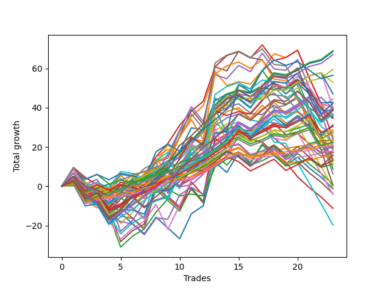

# Short Wallace 012 
- Symbol: ES
- Date Range: 03/18/2022 - 07/15/2022
- Trading Period: 7:20-12:30
- Number of Trades: 23



| Name | Win Percent | Profit | Avg Profit / Trade | Avg Time / Trade |      | Name | Win Percent | Profit | Avg Profit / Trade | Avg Time / Trade |
| ---- | ----------- | ------ | ------------------ | ---------------- | ---- | ---- | ----------- | ------ | ------------------ | ---------------- |
| Sorted By <br> Profit | | | | | | Sorted By <br> Win Percentage ||||
| Sixty-Four | 82.61 | 34500.00 | 1500.00 | 05:03 |     | Eighty-One | 91.30 | 11750.00 | 510.87 | 04:09 |
| Zero | 82.61 | 34250.00 | 1489.13 | 06:00 |     | One Hundred Twenty-Six | 91.30 | 10875.00 | 472.83 | 03:22 |
| Fifty-Six | 82.61 | 33500.00 | 1456.52 | 05:09 |     | One Hundred Twenty-One | 91.30 | 10375.00 | 451.09 | 03:27 |
| Forty | 78.26 | 29750.00 | 1293.48 | 03:28 |     | One Hundred Eleven | 86.96 | 9000.00 | 391.30 | 01:19 |
| Seventy-Three | 65.22 | 28250.00 | 1228.26 | 09:31 |     | Sixty-Four | 82.61 | 34500.00 | 1500.00 | 05:03 |
| Seventy | 69.57 | 26375.00 | 1146.74 | 04:21 |     | Zero | 82.61 | 34250.00 | 1489.13 | 06:00 |
| Sixty-Two | 69.57 | 23500.00 | 1021.74 | 04:33 |     | Fifty-Six | 82.61 | 33500.00 | 1456.52 | 05:09 |
| Forty-Eight | 65.22 | 22250.00 | 967.39 | 03:01 |     | One Hundred Twenty-Seven | 82.61 | 11250.00 | 489.13 | 04:30 |
| Fifty-Two | 52.17 | 21375.00 | 929.35 | 05:58 |     | Eighty-Two | 82.61 | 10125.00 | 440.22 | 06:16 |
| One Hundred Twenty-Five | 69.57 | 21125.00 | 918.48 | 09:15 |     | One Hundred Twenty-Two | 82.61 | 10000.00 | 434.78 | 04:37 |
| One Hundred Twenty-Nine | 73.91 | 20000.00 | 869.57 | 07:56 |     | One Hundred Sixteen | 82.61 | 7875.00 | 342.39 | 01:19 |
| Six | 69.57 | 20000.00 | 869.57 | 05:23 |     | Forty | 78.26 | 29750.00 | 1293.48 | 03:28 |
| One | 65.22 | 20000.00 | 869.57 | 14:12 |     | One Hundred Twenty-Eight | 78.26 | 15250.00 | 663.04 | 06:43 |
| Forty-Six | 65.22 | 19750.00 | 858.70 | 03:31 |     | Eighty-Three | 78.26 | 13625.00 | 592.39 | 08:51 |
| One Hundred Thirty | 65.22 | 19625.00 | 853.26 | 08:27 |     | One Hundred Twenty-Three | 78.26 | 13500.00 | 586.96 | 06:53 |
| Fifty-One | 56.52 | 19375.00 | 842.39 | 04:28 |     | One Hundred Twelve | 78.26 | 8500.00 | 369.57 | 01:52 |
| Eighty-Five | 69.57 | 19250.00 | 836.96 | 11:55 |     | One Hundred Twenty-Nine | 73.91 | 20000.00 | 869.57 | 07:56 |
| Eighty-Four | 73.91 | 18375.00 | 798.91 | 10:04 |     | Eighty-Four | 73.91 | 18375.00 | 798.91 | 10:04 |
| One Hundred Twenty-Four | 73.91 | 18250.00 | 793.48 | 08:05 |     | One Hundred Twenty-Four | 73.91 | 18250.00 | 793.48 | 08:05 |
| One Hundred Fourteen | 69.57 | 18250.00 | 793.48 | 04:42 |     | One Hundred Thirteen | 73.91 | 14375.00 | 625.00 | 03:29 |
| Sixty-Eight | 39.13 | 18250.00 | 793.48 | 11:00 |     | Seventy | 69.57 | 26375.00 | 1146.74 | 04:21 |
| Forty-Nine | 56.52 | 17875.00 | 777.17 | 04:50 |     | Sixty-Two | 69.57 | 23500.00 | 1021.74 | 04:33 |
| Sixty-Seven | 56.52 | 17500.00 | 760.87 | 08:35 |     | One Hundred Twenty-Five | 69.57 | 21125.00 | 918.48 | 09:15 |
| Sixty-Five | 52.17 | 17250.00 | 750.00 | 08:10 |     | Six | 69.57 | 20000.00 | 869.57 | 05:23 |
| One Hundred Fifteen | 60.87 | 15625.00 | 679.35 | 05:12 |     | Eighty-Five | 69.57 | 19250.00 | 836.96 | 11:55 |
| One Hundred Twenty-Eight | 78.26 | 15250.00 | 663.04 | 06:43 |     | One Hundred Fourteen | 69.57 | 18250.00 | 793.48 | 04:42 |
| One Hundred Thirteen | 73.91 | 14375.00 | 625.00 | 03:29 |     | Three | 69.57 | 12125.00 | 527.17 | 15:14 |
| Fifty-Three | 47.83 | 14000.00 | 608.70 | 07:53 |     | One Hundred Seventeen | 69.57 | 5625.00 | 244.57 | 01:50 |
| Eighty-Three | 78.26 | 13625.00 | 592.39 | 08:51 |     | Seventy-Three | 65.22 | 28250.00 | 1228.26 | 09:31 |
| One Hundred Twenty-Three | 78.26 | 13500.00 | 586.96 | 06:53 |     | Forty-Eight | 65.22 | 22250.00 | 967.39 | 03:01 |
| Fifty | 47.83 | 13000.00 | 565.22 | 06:02 |     | One | 65.22 | 20000.00 | 869.57 | 14:12 |
| Seventy-One | 47.83 | 12750.00 | 554.35 | 10:16 |     | Forty-Six | 65.22 | 19750.00 | 858.70 | 03:31 |
| Three | 69.57 | 12125.00 | 527.17 | 15:14 |     | One Hundred Thirty | 65.22 | 19625.00 | 853.26 | 08:27 |
| Eighty-One | 91.30 | 11750.00 | 510.87 | 04:09 |     | Fifty-Nine | 65.22 | 6750.00 | 293.48 | 11:07 |
| Fifty-Four | 60.87 | 11750.00 | 510.87 | 02:30 |     | One Hundred Fifteen | 60.87 | 15625.00 | 679.35 | 05:12 |
| One Hundred Twenty-Seven | 82.61 | 11250.00 | 489.13 | 04:30 |     | Fifty-Four | 60.87 | 11750.00 | 510.87 | 02:30 |
| Forty-One | 52.17 | 11125.00 | 483.70 | 06:24 |     | Fifty-Seven | 60.87 | 6875.00 | 298.91 | 10:17 |
| One Hundred Twenty-Six | 91.30 | 10875.00 | 472.83 | 03:22 |     | One Hundred Eighteen | 60.87 | 6625.00 | 288.04 | 03:11 |
| One Hundred Twenty-One | 91.30 | 10375.00 | 451.09 | 03:27 |     | Fifty-One | 56.52 | 19375.00 | 842.39 | 04:28 |
| One Hundred Ninteen | 56.52 | 10375.00 | 451.09 | 03:44 |     | Forty-Nine | 56.52 | 17875.00 | 777.17 | 04:50 |
| Eighty-Two | 82.61 | 10125.00 | 440.22 | 06:16 |     | Sixty-Seven | 56.52 | 17500.00 | 760.87 | 08:35 |
| One Hundred Twenty-Two | 82.61 | 10000.00 | 434.78 | 04:37 |     | One Hundred Ninteen | 56.52 | 10375.00 | 451.09 | 03:44 |
| Four | 52.17 | 9750.00 | 423.91 | 20:43 |     | Fifty-Five | 56.52 | 8625.00 | 375.00 | 04:56 |
| Forty-Three | 52.17 | 9375.00 | 407.61 | 06:07 |     | Sixty-Three | 56.52 | 6125.00 | 266.30 | 13:20 |
| Sixty-Nine | 30.43 | 9375.00 | 407.61 | 14:27 |     | Seven | 56.52 | 3125.00 | 135.87 | 17:19 |
| One Hundred Eleven | 86.96 | 9000.00 | 391.30 | 01:19 |     | Fifty-Two | 52.17 | 21375.00 | 929.35 | 05:58 |
| Fifty-Five | 56.52 | 8625.00 | 375.00 | 04:56 |     | Sixty-Five | 52.17 | 17250.00 | 750.00 | 08:10 |
| One Hundred Twelve | 78.26 | 8500.00 | 369.57 | 01:52 |     | Forty-One | 52.17 | 11125.00 | 483.70 | 06:24 |
| One Hundred Sixteen | 82.61 | 7875.00 | 342.39 | 01:19 |     | Four | 52.17 | 9750.00 | 423.91 | 20:43 |
| One Hundred Twenty | 47.83 | 7875.00 | 342.39 | 04:00 |     | Forty-Three | 52.17 | 9375.00 | 407.61 | 06:07 |
| Sixty-Six | 34.78 | 7750.00 | 336.96 | 11:17 |     | Two | 52.17 | 4375.00 | 190.22 | 20:33 |
| Fifty-Seven | 60.87 | 6875.00 | 298.91 | 10:17 |     | Fifty-Three | 47.83 | 14000.00 | 608.70 | 07:53 |
| Fifty-Nine | 65.22 | 6750.00 | 293.48 | 11:07 |     | Fifty | 47.83 | 13000.00 | 565.22 | 06:02 |
| One Hundred Eighteen | 60.87 | 6625.00 | 288.04 | 03:11 |     | Seventy-One | 47.83 | 12750.00 | 554.35 | 10:16 |
| Sixty-Three | 56.52 | 6125.00 | 266.30 | 13:20 |     | One Hundred Twenty | 47.83 | 7875.00 | 342.39 | 04:00 |
| One Hundred Seventeen | 69.57 | 5625.00 | 244.57 | 01:50 |     | Sixty | 47.83 | -375.00 | -16.30 | 14:49 |
| Two | 52.17 | 4375.00 | 190.22 | 20:33 |     | Fifty-Eight | 47.83 | -2125.00 | -92.39 | 15:23 |
| Seven | 56.52 | 3125.00 | 135.87 | 17:19 |     | Forty-Seven | 43.48 | -1875.00 | -81.52 | 08:29 |
| Forty-Four | 34.78 | 375.00 | 16.30 | 08:45 |     | Sixty-Eight | 39.13 | 18250.00 | 793.48 | 11:00 |
| Five | 39.13 | 250.00 | 10.87 | 25:57 |     | Five | 39.13 | 250.00 | 10.87 | 25:57 |
| Sixty | 47.83 | -375.00 | -16.30 | 14:49 |     | Sixty-Six | 34.78 | 7750.00 | 336.96 | 11:17 |
| Forty-Two | 34.78 | -625.00 | -27.17 | 10:03 |     | Forty-Four | 34.78 | 375.00 | 16.30 | 08:45 |
| Forty-Seven | 43.48 | -1875.00 | -81.52 | 08:29 |     | Forty-Two | 34.78 | -625.00 | -27.17 | 10:03 |
| Fifty-Eight | 47.83 | -2125.00 | -92.39 | 15:23 |     | Sixty-One | 34.78 | -9875.00 | -429.35 | 20:00 |
| Forty-Five | 21.74 | -5625.00 | -244.57 | 13:20 |     | Sixty-Nine | 30.43 | 9375.00 | 407.61 | 14:27 |
| Sixty-One | 34.78 | -9875.00 | -429.35 | 20:00 |     | Forty-Five | 21.74 | -5625.00 | -244.57 | 13:20 |

## NO STOPLOSS

### Test Zero
* Sell when price hits the middle line of the 20p bollinger
* No Stoploss
* Results:
```
Total Trades: 23
Percent Up: 17.39
Percent Down: 82.61
Total Points Moved Down: 68.50
Potential Profit: 34250.00
Total Points Ups: 21.00 Count Ups: 4
Total Points Downs: 89.50 Count Downs: 19
```

<details><summary>Trades</summary>

<code>In: 2022-03-23 11:51:00		Out: 2022-03-23 11:55:45		Total Position Time: 04:45		Total Move Down: 2.50		Total to Date: 2.50</code> <br />
<code>In: 2022-03-25 10:52:00		Out: 2022-03-25 11:18:10		Total Position Time: 26:10		Total Move Down: -8.75		Total to Date: -6.25</code> <br />
<code>In: 2022-03-28 11:12:00		Out: 2022-03-28 11:12:10		Total Position Time: 00:10		Total Move Down: 2.00		Total to Date: -4.25</code> <br />
<code>In: 2022-04-14 10:38:00		Out: 2022-04-14 11:07:55		Total Position Time: 29:55		Total Move Down: -10.00		Total to Date: -14.25</code> <br />
<code>In: 2022-04-18 10:13:00		Out: 2022-04-18 10:17:50		Total Position Time: 04:50		Total Move Down: 4.25		Total to Date: -10.00</code> <br />
<code>In: 2022-04-25 09:27:00		Out: 2022-04-25 09:31:05		Total Position Time: 04:05		Total Move Down: 7.25		Total to Date: -2.75</code> <br />
<code>In: 2022-04-26 11:23:00		Out: 2022-04-26 11:31:40		Total Position Time: 08:40		Total Move Down: 0.75		Total to Date: -2.00</code> <br />
<code>In: 2022-04-29 10:39:00		Out: 2022-04-29 10:40:30		Total Position Time: 01:30		Total Move Down: 4.50		Total to Date: 2.50</code> <br />
<code>In: 2022-05-11 11:27:00		Out: 2022-05-11 11:30:55		Total Position Time: 03:55		Total Move Down: 9.50		Total to Date: 12.00</code> <br />
<code>In: 2022-05-25 11:04:00		Out: 2022-05-25 11:06:25		Total Position Time: 02:25		Total Move Down: 4.50		Total to Date: 16.50</code> <br />
<code>In: 2022-06-09 08:45:00		Out: 2022-06-09 08:48:20		Total Position Time: 03:20		Total Move Down: 6.50		Total to Date: 23.00</code> <br />
<code>In: 2022-06-13 09:14:00		Out: 2022-06-13 09:17:05		Total Position Time: 03:05		Total Move Down: 6.00		Total to Date: 29.00</code> <br />
<code>In: 2022-06-13 09:40:00		Out: 2022-06-13 09:43:15		Total Position Time: 03:15		Total Move Down: 12.00		Total to Date: 41.00</code> <br />
<code>In: 2022-06-14 10:02:00		Out: 2022-06-14 10:02:20		Total Position Time: 00:20		Total Move Down: 5.50		Total to Date: 46.50</code> <br />
<code>In: 2022-06-15 11:02:00		Out: 2022-06-15 11:02:10		Total Position Time: 00:10		Total Move Down: 2.00		Total to Date: 48.50</code> <br />
<code>In: 2022-06-23 10:53:00		Out: 2022-06-23 11:07:10		Total Position Time: 14:10		Total Move Down: -1.25		Total to Date: 47.25</code> <br />
<code>In: 2022-06-29 10:12:00		Out: 2022-06-29 10:13:05		Total Position Time: 01:05		Total Move Down: 3.50		Total to Date: 50.75</code> <br />
<code>In: 2022-06-30 07:36:00		Out: 2022-06-30 07:42:05		Total Position Time: 06:05		Total Move Down: 6.50		Total to Date: 57.25</code> <br />
<code>In: 2022-07-06 10:05:00		Out: 2022-07-06 10:17:05		Total Position Time: 12:05		Total Move Down: -1.00		Total to Date: 56.25</code> <br />
<code>In: 2022-07-11 09:41:00		Out: 2022-07-11 09:44:20		Total Position Time: 03:20		Total Move Down: 2.75		Total to Date: 59.00</code> <br />
<code>In: 2022-07-14 07:56:00		Out: 2022-07-14 07:57:15		Total Position Time: 01:15		Total Move Down: 3.50		Total to Date: 62.50</code> <br />
<code>In: 2022-07-14 08:02:00		Out: 2022-07-14 08:02:10		Total Position Time: 00:10		Total Move Down: 1.50		Total to Date: 64.00</code> <br />
<code>In: 2022-07-14 08:12:00		Out: 2022-07-14 08:15:30		Total Position Time: 03:30		Total Move Down: 4.50		Total to Date: 68.50</code> <br />


</details>

### Test One
* Sell when the price hits the upper line of the 20p 1std bollinger
* No Stoploss
* Results:
```
Total Trades: 23
Percent Up: 34.78
Percent Down: 65.22
Total Points Moved Down: 40.00
Potential Profit: 20000.00
Total Points Ups: 56.75 Count Ups: 8
Total Points Downs: 96.75 Count Downs: 15
```

<details><summary>Trades</summary>

<code>In: 2022-03-23 11:51:00		Out: 2022-03-23 11:56:40		Total Position Time: 05:40		Total Move Down: 4.75		Total to Date: 4.75</code> <br />
<code>In: 2022-03-25 10:52:00		Out: 2022-03-25 11:19:30		Total Position Time: 27:30		Total Move Down: -7.00		Total to Date: -2.25</code> <br />
<code>In: 2022-03-28 11:12:00		Out: 2022-03-28 11:19:30		Total Position Time: 07:30		Total Move Down: 2.00		Total to Date: -0.25</code> <br />
<code>In: 2022-04-14 10:38:00		Out: 2022-04-14 11:07:55		Total Position Time: 29:55		Total Move Down: -10.00		Total to Date: -10.25</code> <br />
<code>In: 2022-04-18 10:13:00		Out: 2022-04-18 10:18:45		Total Position Time: 05:45		Total Move Down: 7.00		Total to Date: -3.25</code> <br />
<code>In: 2022-04-25 09:27:00		Out: 2022-04-25 09:42:35		Total Position Time: 15:35		Total Move Down: 4.75		Total to Date: 1.50</code> <br />
<code>In: 2022-04-26 11:23:00		Out: 2022-04-26 11:33:45		Total Position Time: 10:45		Total Move Down: 4.50		Total to Date: 6.00</code> <br />
<code>In: 2022-04-29 10:39:00		Out: 2022-04-29 10:41:00		Total Position Time: 02:00		Total Move Down: 6.50		Total to Date: 12.50</code> <br />
<code>In: 2022-05-11 11:27:00		Out: 2022-05-11 11:50:35		Total Position Time: 23:35		Total Move Down: 3.00		Total to Date: 15.50</code> <br />
<code>In: 2022-05-25 11:04:00		Out: 2022-05-25 11:06:35		Total Position Time: 02:35		Total Move Down: 9.25		Total to Date: 24.75</code> <br />
<code>In: 2022-06-09 08:45:00		Out: 2022-06-09 08:49:35		Total Position Time: 04:35		Total Move Down: 10.75		Total to Date: 35.50</code> <br />
<code>In: 2022-06-13 09:14:00		Out: 2022-06-13 09:24:05		Total Position Time: 10:05		Total Move Down: 5.50		Total to Date: 41.00</code> <br />
<code>In: 2022-06-13 09:40:00		Out: 2022-06-13 09:47:50		Total Position Time: 07:50		Total Move Down: 17.50		Total to Date: 58.50</code> <br />
<code>In: 2022-06-14 10:02:00		Out: 2022-06-14 10:29:05		Total Position Time: 27:05		Total Move Down: -7.25		Total to Date: 51.25</code> <br />
<code>In: 2022-06-15 11:02:00		Out: 2022-06-15 11:02:10		Total Position Time: 00:10		Total Move Down: 2.00		Total to Date: 53.25</code> <br />
<code>In: 2022-06-23 10:53:00		Out: 2022-06-23 11:11:10		Total Position Time: 18:10		Total Move Down: -1.25		Total to Date: 52.00</code> <br />
<code>In: 2022-06-29 10:12:00		Out: 2022-06-29 10:14:00		Total Position Time: 02:00		Total Move Down: 6.75		Total to Date: 58.75</code> <br />
<code>In: 2022-06-30 07:36:00		Out: 2022-06-30 07:49:05		Total Position Time: 13:05		Total Move Down: 8.75		Total to Date: 67.50</code> <br />
<code>In: 2022-07-06 10:05:00		Out: 2022-07-06 10:24:30		Total Position Time: 19:30		Total Move Down: -2.00		Total to Date: 65.50</code> <br />
<code>In: 2022-07-11 09:41:00		Out: 2022-07-11 09:50:50		Total Position Time: 09:50		Total Move Down: 3.75		Total to Date: 69.25</code> <br />
<code>In: 2022-07-14 07:56:00		Out: 2022-07-14 08:25:55		Total Position Time: 29:55		Total Move Down: -14.25		Total to Date: 55.00</code> <br />
<code>In: 2022-07-14 08:02:00		Out: 2022-07-14 08:31:55		Total Position Time: 29:55		Total Move Down: -13.00		Total to Date: 42.00</code> <br />
<code>In: 2022-07-14 08:12:00		Out: 2022-07-14 08:35:50		Total Position Time: 23:50		Total Move Down: -2.00		Total to Date: 40.00</code> <br />


</details>

### Test Two
* Sell when the price hits the upper line of the 20p 2std bollinger
* No Stoploss
* Results:
```
Total Trades: 23
Percent Up: 47.83
Percent Down: 52.17
Total Points Moved Down: 8.75
Potential Profit: 4375.00
Total Points Ups: 97.25 Count Ups: 11
Total Points Downs: 106.00 Count Downs: 12
```

<details><summary>Trades</summary>

<code>In: 2022-03-23 11:51:00		Out: 2022-03-23 11:57:20		Total Position Time: 06:20		Total Move Down: 6.75		Total to Date: 6.75</code> <br />
<code>In: 2022-03-25 10:52:00		Out: 2022-03-25 11:21:55		Total Position Time: 29:55		Total Move Down: -7.50		Total to Date: -0.75</code> <br />
<code>In: 2022-03-28 11:12:00		Out: 2022-03-28 11:41:55		Total Position Time: 29:55		Total Move Down: -3.75		Total to Date: -4.50</code> <br />
<code>In: 2022-04-14 10:38:00		Out: 2022-04-14 11:07:55		Total Position Time: 29:55		Total Move Down: -10.00		Total to Date: -14.50</code> <br />
<code>In: 2022-04-18 10:13:00		Out: 2022-04-18 10:42:55		Total Position Time: 29:55		Total Move Down: -16.50		Total to Date: -31.00</code> <br />
<code>In: 2022-04-25 09:27:00		Out: 2022-04-25 09:56:55		Total Position Time: 29:55		Total Move Down: 5.50		Total to Date: -25.50</code> <br />
<code>In: 2022-04-26 11:23:00		Out: 2022-04-26 11:41:25		Total Position Time: 18:25		Total Move Down: 3.75		Total to Date: -21.75</code> <br />
<code>In: 2022-04-29 10:39:00		Out: 2022-04-29 10:43:20		Total Position Time: 04:20		Total Move Down: 8.50		Total to Date: -13.25</code> <br />
<code>In: 2022-05-11 11:27:00		Out: 2022-05-11 11:51:20		Total Position Time: 24:20		Total Move Down: 6.75		Total to Date: -6.50</code> <br />
<code>In: 2022-05-25 11:04:00		Out: 2022-05-25 11:06:40		Total Position Time: 02:40		Total Move Down: 12.25		Total to Date: 5.75</code> <br />
<code>In: 2022-06-09 08:45:00		Out: 2022-06-09 09:11:05		Total Position Time: 26:05		Total Move Down: 12.75		Total to Date: 18.50</code> <br />
<code>In: 2022-06-13 09:14:00		Out: 2022-06-13 09:30:15		Total Position Time: 16:15		Total Move Down: 4.00		Total to Date: 22.50</code> <br />
<code>In: 2022-06-13 09:40:00		Out: 2022-06-13 09:54:20		Total Position Time: 14:20		Total Move Down: 22.25		Total to Date: 44.75</code> <br />
<code>In: 2022-06-14 10:02:00		Out: 2022-06-14 10:31:00		Total Position Time: 29:00		Total Move Down: -3.25		Total to Date: 41.50</code> <br />
<code>In: 2022-06-15 11:02:00		Out: 2022-06-15 11:03:05		Total Position Time: 01:05		Total Move Down: 10.00		Total to Date: 51.50</code> <br />
<code>In: 2022-06-23 10:53:00		Out: 2022-06-23 11:18:15		Total Position Time: 25:15		Total Move Down: -2.00		Total to Date: 49.50</code> <br />
<code>In: 2022-06-29 10:12:00		Out: 2022-06-29 10:16:00		Total Position Time: 04:00		Total Move Down: 9.50		Total to Date: 59.00</code> <br />
<code>In: 2022-06-30 07:36:00		Out: 2022-06-30 08:05:55		Total Position Time: 29:55		Total Move Down: -8.00		Total to Date: 51.00</code> <br />
<code>In: 2022-07-06 10:05:00		Out: 2022-07-06 10:26:25		Total Position Time: 21:25		Total Move Down: -1.25		Total to Date: 49.75</code> <br />
<code>In: 2022-07-11 09:41:00		Out: 2022-07-11 09:51:15		Total Position Time: 10:15		Total Move Down: 4.00		Total to Date: 53.75</code> <br />
<code>In: 2022-07-14 07:56:00		Out: 2022-07-14 08:25:55		Total Position Time: 29:55		Total Move Down: -14.25		Total to Date: 39.50</code> <br />
<code>In: 2022-07-14 08:02:00		Out: 2022-07-14 08:31:55		Total Position Time: 29:55		Total Move Down: -13.00		Total to Date: 26.50</code> <br />
<code>In: 2022-07-14 08:12:00		Out: 2022-07-14 08:41:55		Total Position Time: 29:55		Total Move Down: -17.75		Total to Date: 8.75</code> <br />


</details>

### Test Three
* Sell when price hits the middle line of the 50p bollinger
* No Stoploss
* Results:
```
Total Trades: 23
Percent Up: 30.43
Percent Down: 69.57
Total Points Moved Down: 24.25
Potential Profit: 12125.00
Total Points Ups: 73.75 Count Ups: 7
Total Points Downs: 98.00 Count Downs: 16
```

<details><summary>Trades</summary>

<code>In: 2022-03-23 11:51:00		Out: 2022-03-23 11:56:45		Total Position Time: 05:45		Total Move Down: 5.00		Total to Date: 5.00</code> <br />
<code>In: 2022-03-25 10:52:00		Out: 2022-03-25 11:21:55		Total Position Time: 29:55		Total Move Down: -7.50		Total to Date: -2.50</code> <br />
<code>In: 2022-03-28 11:12:00		Out: 2022-03-28 11:12:10		Total Position Time: 00:10		Total Move Down: 2.00		Total to Date: -0.50</code> <br />
<code>In: 2022-04-14 10:38:00		Out: 2022-04-14 11:07:55		Total Position Time: 29:55		Total Move Down: -10.00		Total to Date: -10.50</code> <br />
<code>In: 2022-04-18 10:13:00		Out: 2022-04-18 10:20:35		Total Position Time: 07:35		Total Move Down: 8.25		Total to Date: -2.25</code> <br />
<code>In: 2022-04-25 09:27:00		Out: 2022-04-25 09:55:05		Total Position Time: 28:05		Total Move Down: 4.00		Total to Date: 1.75</code> <br />
<code>In: 2022-04-26 11:23:00		Out: 2022-04-26 11:34:25		Total Position Time: 11:25		Total Move Down: 4.00		Total to Date: 5.75</code> <br />
<code>In: 2022-04-29 10:39:00		Out: 2022-04-29 10:43:40		Total Position Time: 04:40		Total Move Down: 9.25		Total to Date: 15.00</code> <br />
<code>In: 2022-05-11 11:27:00		Out: 2022-05-11 11:51:20		Total Position Time: 24:20		Total Move Down: 6.75		Total to Date: 21.75</code> <br />
<code>In: 2022-05-25 11:04:00		Out: 2022-05-25 11:06:35		Total Position Time: 02:35		Total Move Down: 9.25		Total to Date: 31.00</code> <br />
<code>In: 2022-06-09 08:45:00		Out: 2022-06-09 08:48:40		Total Position Time: 03:40		Total Move Down: 7.25		Total to Date: 38.25</code> <br />
<code>In: 2022-06-13 09:14:00		Out: 2022-06-13 09:23:45		Total Position Time: 09:45		Total Move Down: 5.00		Total to Date: 43.25</code> <br />
<code>In: 2022-06-13 09:40:00		Out: 2022-06-13 09:47:50		Total Position Time: 07:50		Total Move Down: 17.50		Total to Date: 60.75</code> <br />
<code>In: 2022-06-14 10:02:00		Out: 2022-06-14 10:02:25		Total Position Time: 00:25		Total Move Down: 5.75		Total to Date: 66.50</code> <br />
<code>In: 2022-06-15 11:02:00		Out: 2022-06-15 11:02:10		Total Position Time: 00:10		Total Move Down: 2.00		Total to Date: 68.50</code> <br />
<code>In: 2022-06-23 10:53:00		Out: 2022-06-23 11:22:55		Total Position Time: 29:55		Total Move Down: -3.25		Total to Date: 65.25</code> <br />
<code>In: 2022-06-29 10:12:00		Out: 2022-06-29 10:14:00		Total Position Time: 02:00		Total Move Down: 6.75		Total to Date: 72.00</code> <br />
<code>In: 2022-06-30 07:36:00		Out: 2022-06-30 08:05:55		Total Position Time: 29:55		Total Move Down: -8.00		Total to Date: 64.00</code> <br />
<code>In: 2022-07-06 10:05:00		Out: 2022-07-06 10:28:00		Total Position Time: 23:00		Total Move Down: 1.50		Total to Date: 65.50</code> <br />
<code>In: 2022-07-11 09:41:00		Out: 2022-07-11 09:50:50		Total Position Time: 09:50		Total Move Down: 3.75		Total to Date: 69.25</code> <br />
<code>In: 2022-07-14 07:56:00		Out: 2022-07-14 08:25:55		Total Position Time: 29:55		Total Move Down: -14.25		Total to Date: 55.00</code> <br />
<code>In: 2022-07-14 08:02:00		Out: 2022-07-14 08:31:55		Total Position Time: 29:55		Total Move Down: -13.00		Total to Date: 42.00</code> <br />
<code>In: 2022-07-14 08:12:00		Out: 2022-07-14 08:41:55		Total Position Time: 29:55		Total Move Down: -17.75		Total to Date: 24.25</code> <br />


</details>

### Test Four
* Sell when the price hits the upper line of the 50p 1std bollinger
* No Stoploss
* Results:
```
Total Trades: 23
Percent Up: 47.83
Percent Down: 52.17
Total Points Moved Down: 19.50
Potential Profit: 9750.00
Total Points Ups: 100.50 Count Ups: 11
Total Points Downs: 120.00 Count Downs: 12
```

<details><summary>Trades</summary>

<code>In: 2022-03-23 11:51:00		Out: 2022-03-23 12:00:05		Total Position Time: 09:05		Total Move Down: 8.50		Total to Date: 8.50</code> <br />
<code>In: 2022-03-25 10:52:00		Out: 2022-03-25 11:21:55		Total Position Time: 29:55		Total Move Down: -7.50		Total to Date: 1.00</code> <br />
<code>In: 2022-03-28 11:12:00		Out: 2022-03-28 11:19:35		Total Position Time: 07:35		Total Move Down: 2.50		Total to Date: 3.50</code> <br />
<code>In: 2022-04-14 10:38:00		Out: 2022-04-14 11:07:55		Total Position Time: 29:55		Total Move Down: -10.00		Total to Date: -6.50</code> <br />
<code>In: 2022-04-18 10:13:00		Out: 2022-04-18 10:42:55		Total Position Time: 29:55		Total Move Down: -16.50		Total to Date: -23.00</code> <br />
<code>In: 2022-04-25 09:27:00		Out: 2022-04-25 09:56:55		Total Position Time: 29:55		Total Move Down: 5.50		Total to Date: -17.50</code> <br />
<code>In: 2022-04-26 11:23:00		Out: 2022-04-26 11:45:00		Total Position Time: 22:00		Total Move Down: 9.25		Total to Date: -8.25</code> <br />
<code>In: 2022-04-29 10:39:00		Out: 2022-04-29 10:47:20		Total Position Time: 08:20		Total Move Down: 14.50		Total to Date: 6.25</code> <br />
<code>In: 2022-05-11 11:27:00		Out: 2022-05-11 11:56:55		Total Position Time: 29:55		Total Move Down: 10.00		Total to Date: 16.25</code> <br />
<code>In: 2022-05-25 11:04:00		Out: 2022-05-25 11:06:40		Total Position Time: 02:40		Total Move Down: 12.25		Total to Date: 28.50</code> <br />
<code>In: 2022-06-09 08:45:00		Out: 2022-06-09 08:50:20		Total Position Time: 05:20		Total Move Down: 12.00		Total to Date: 40.50</code> <br />
<code>In: 2022-06-13 09:14:00		Out: 2022-06-13 09:43:55		Total Position Time: 29:55		Total Move Down: -7.50		Total to Date: 33.00</code> <br />
<code>In: 2022-06-13 09:40:00		Out: 2022-06-13 09:54:40		Total Position Time: 14:40		Total Move Down: 23.75		Total to Date: 56.75</code> <br />
<code>In: 2022-06-14 10:02:00		Out: 2022-06-14 10:31:55		Total Position Time: 29:55		Total Move Down: -2.00		Total to Date: 54.75</code> <br />
<code>In: 2022-06-15 11:02:00		Out: 2022-06-15 11:03:00		Total Position Time: 01:00		Total Move Down: 6.75		Total to Date: 61.50</code> <br />
<code>In: 2022-06-23 10:53:00		Out: 2022-06-23 11:22:55		Total Position Time: 29:55		Total Move Down: -3.25		Total to Date: 58.25</code> <br />
<code>In: 2022-06-29 10:12:00		Out: 2022-06-29 10:16:00		Total Position Time: 04:00		Total Move Down: 9.50		Total to Date: 67.75</code> <br />
<code>In: 2022-06-30 07:36:00		Out: 2022-06-30 08:05:55		Total Position Time: 29:55		Total Move Down: -8.00		Total to Date: 59.75</code> <br />
<code>In: 2022-07-06 10:05:00		Out: 2022-07-06 10:34:55		Total Position Time: 29:55		Total Move Down: -0.75		Total to Date: 59.00</code> <br />
<code>In: 2022-07-11 09:41:00		Out: 2022-07-11 09:54:05		Total Position Time: 13:05		Total Move Down: 5.50		Total to Date: 64.50</code> <br />
<code>In: 2022-07-14 07:56:00		Out: 2022-07-14 08:25:55		Total Position Time: 29:55		Total Move Down: -14.25		Total to Date: 50.25</code> <br />
<code>In: 2022-07-14 08:02:00		Out: 2022-07-14 08:31:55		Total Position Time: 29:55		Total Move Down: -13.00		Total to Date: 37.25</code> <br />
<code>In: 2022-07-14 08:12:00		Out: 2022-07-14 08:41:55		Total Position Time: 29:55		Total Move Down: -17.75		Total to Date: 19.50</code> <br />


</details>

### Test Five
* Sell when the price hits the upper line of the 50p 2std bollinger
* No Stoploss
* Results:
```
Total Trades: 23
Percent Up: 60.87
Percent Down: 39.13
Total Points Moved Down: 0.50
Potential Profit: 250.00
Total Points Ups: 115.50 Count Ups: 14
Total Points Downs: 116.00 Count Downs: 9
```

<details><summary>Trades</summary>

<code>In: 2022-03-23 11:51:00		Out: 2022-03-23 12:09:15		Total Position Time: 18:15		Total Move Down: 9.50		Total to Date: 9.50</code> <br />
<code>In: 2022-03-25 10:52:00		Out: 2022-03-25 11:21:55		Total Position Time: 29:55		Total Move Down: -7.50		Total to Date: 2.00</code> <br />
<code>In: 2022-03-28 11:12:00		Out: 2022-03-28 11:41:55		Total Position Time: 29:55		Total Move Down: -3.75		Total to Date: -1.75</code> <br />
<code>In: 2022-04-14 10:38:00		Out: 2022-04-14 11:07:55		Total Position Time: 29:55		Total Move Down: -10.00		Total to Date: -11.75</code> <br />
<code>In: 2022-04-18 10:13:00		Out: 2022-04-18 10:42:55		Total Position Time: 29:55		Total Move Down: -16.50		Total to Date: -28.25</code> <br />
<code>In: 2022-04-25 09:27:00		Out: 2022-04-25 09:56:55		Total Position Time: 29:55		Total Move Down: 5.50		Total to Date: -22.75</code> <br />
<code>In: 2022-04-26 11:23:00		Out: 2022-04-26 11:52:55		Total Position Time: 29:55		Total Move Down: 3.50		Total to Date: -19.25</code> <br />
<code>In: 2022-04-29 10:39:00		Out: 2022-04-29 11:01:10		Total Position Time: 22:10		Total Move Down: 21.00		Total to Date: 1.75</code> <br />
<code>In: 2022-05-11 11:27:00		Out: 2022-05-11 11:56:55		Total Position Time: 29:55		Total Move Down: 10.00		Total to Date: 11.75</code> <br />
<code>In: 2022-05-25 11:04:00		Out: 2022-05-25 11:06:45		Total Position Time: 02:45		Total Move Down: 13.50		Total to Date: 25.25</code> <br />
<code>In: 2022-06-09 08:45:00		Out: 2022-06-09 09:11:10		Total Position Time: 26:10		Total Move Down: 13.75		Total to Date: 39.00</code> <br />
<code>In: 2022-06-13 09:14:00		Out: 2022-06-13 09:43:55		Total Position Time: 29:55		Total Move Down: -7.50		Total to Date: 31.50</code> <br />
<code>In: 2022-06-13 09:40:00		Out: 2022-06-13 09:58:05		Total Position Time: 18:05		Total Move Down: 29.25		Total to Date: 60.75</code> <br />
<code>In: 2022-06-14 10:02:00		Out: 2022-06-14 10:31:55		Total Position Time: 29:55		Total Move Down: -2.00		Total to Date: 58.75</code> <br />
<code>In: 2022-06-15 11:02:00		Out: 2022-06-15 11:03:05		Total Position Time: 01:05		Total Move Down: 10.00		Total to Date: 68.75</code> <br />
<code>In: 2022-06-23 10:53:00		Out: 2022-06-23 11:22:55		Total Position Time: 29:55		Total Move Down: -3.25		Total to Date: 65.50</code> <br />
<code>In: 2022-06-29 10:12:00		Out: 2022-06-29 10:41:55		Total Position Time: 29:55		Total Move Down: -1.25		Total to Date: 64.25</code> <br />
<code>In: 2022-06-30 07:36:00		Out: 2022-06-30 08:05:55		Total Position Time: 29:55		Total Move Down: -8.00		Total to Date: 56.25</code> <br />
<code>In: 2022-07-06 10:05:00		Out: 2022-07-06 10:34:55		Total Position Time: 29:55		Total Move Down: -0.75		Total to Date: 55.50</code> <br />
<code>In: 2022-07-11 09:41:00		Out: 2022-07-11 10:10:55		Total Position Time: 29:55		Total Move Down: -10.00		Total to Date: 45.50</code> <br />
<code>In: 2022-07-14 07:56:00		Out: 2022-07-14 08:25:55		Total Position Time: 29:55		Total Move Down: -14.25		Total to Date: 31.25</code> <br />
<code>In: 2022-07-14 08:02:00		Out: 2022-07-14 08:31:55		Total Position Time: 29:55		Total Move Down: -13.00		Total to Date: 18.25</code> <br />
<code>In: 2022-07-14 08:12:00		Out: 2022-07-14 08:41:55		Total Position Time: 29:55		Total Move Down: -17.75		Total to Date: 0.50</code> <br />


</details>

### Test Six
* Sell when the price hits the middle line of the 1std VWAP
* No Stoploss
* Results:
```
Total Trades: 23
Percent Up: 30.43
Percent Down: 69.57
Total Points Moved Down: 40.00
Potential Profit: 20000.00
Total Points Ups: 23.00 Count Ups: 7
Total Points Downs: 63.00 Count Downs: 16
```

<details><summary>Trades</summary>

<code>In: 2022-03-23 11:51:00		Out: 2022-03-23 11:51:10		Total Position Time: 00:10		Total Move Down: 0.25		Total to Date: 0.25</code> <br />
<code>In: 2022-03-25 10:52:00		Out: 2022-03-25 10:52:55		Total Position Time: 00:55		Total Move Down: 0.25		Total to Date: 0.50</code> <br />
<code>In: 2022-03-28 11:12:00		Out: 2022-03-28 11:41:55		Total Position Time: 29:55		Total Move Down: -3.75		Total to Date: -3.25</code> <br />
<code>In: 2022-04-14 10:38:00		Out: 2022-04-14 10:38:10		Total Position Time: 00:10		Total Move Down: 0.25		Total to Date: -3.00</code> <br />
<code>In: 2022-04-18 10:13:00		Out: 2022-04-18 10:13:10		Total Position Time: 00:10		Total Move Down: -0.00		Total to Date: -3.00</code> <br />
<code>In: 2022-04-25 09:27:00		Out: 2022-04-25 09:31:05		Total Position Time: 04:05		Total Move Down: 7.25		Total to Date: 4.25</code> <br />
<code>In: 2022-04-26 11:23:00		Out: 2022-04-26 11:23:10		Total Position Time: 00:10		Total Move Down: -1.00		Total to Date: 3.25</code> <br />
<code>In: 2022-04-29 10:39:00		Out: 2022-04-29 10:39:10		Total Position Time: 00:10		Total Move Down: -0.00		Total to Date: 3.25</code> <br />
<code>In: 2022-05-11 11:27:00		Out: 2022-05-11 11:27:10		Total Position Time: 00:10		Total Move Down: 2.00		Total to Date: 5.25</code> <br />
<code>In: 2022-05-25 11:04:00		Out: 2022-05-25 11:05:45		Total Position Time: 01:45		Total Move Down: 2.25		Total to Date: 7.50</code> <br />
<code>In: 2022-06-09 08:45:00		Out: 2022-06-09 08:45:10		Total Position Time: 00:10		Total Move Down: 1.00		Total to Date: 8.50</code> <br />
<code>In: 2022-06-13 09:14:00		Out: 2022-06-13 09:17:15		Total Position Time: 03:15		Total Move Down: 5.25		Total to Date: 13.75</code> <br />
<code>In: 2022-06-13 09:40:00		Out: 2022-06-13 09:54:45		Total Position Time: 14:45		Total Move Down: 24.75		Total to Date: 38.50</code> <br />
<code>In: 2022-06-14 10:02:00		Out: 2022-06-14 10:02:10		Total Position Time: 00:10		Total Move Down: 4.00		Total to Date: 42.50</code> <br />
<code>In: 2022-06-15 11:02:00		Out: 2022-06-15 11:02:10		Total Position Time: 00:10		Total Move Down: 2.00		Total to Date: 44.50</code> <br />
<code>In: 2022-06-23 10:53:00		Out: 2022-06-23 10:53:10		Total Position Time: 00:10		Total Move Down: 0.25		Total to Date: 44.75</code> <br />
<code>In: 2022-06-29 10:12:00		Out: 2022-06-29 10:12:10		Total Position Time: 00:10		Total Move Down: -0.50		Total to Date: 44.25</code> <br />
<code>In: 2022-06-30 07:36:00		Out: 2022-06-30 07:39:55		Total Position Time: 03:55		Total Move Down: 4.75		Total to Date: 49.00</code> <br />
<code>In: 2022-07-06 10:05:00		Out: 2022-07-06 10:27:25		Total Position Time: 22:25		Total Move Down: -0.00		Total to Date: 49.00</code> <br />
<code>In: 2022-07-11 09:41:00		Out: 2022-07-11 09:50:50		Total Position Time: 09:50		Total Move Down: 3.75		Total to Date: 52.75</code> <br />
<code>In: 2022-07-14 07:56:00		Out: 2022-07-14 07:57:15		Total Position Time: 01:15		Total Move Down: 3.50		Total to Date: 56.25</code> <br />
<code>In: 2022-07-14 08:02:00		Out: 2022-07-14 08:02:10		Total Position Time: 00:10		Total Move Down: 1.50		Total to Date: 57.75</code> <br />
<code>In: 2022-07-14 08:12:00		Out: 2022-07-14 08:41:55		Total Position Time: 29:55		Total Move Down: -17.75		Total to Date: 40.00</code> <br />


</details>

### Test Seven
* Sell when the price hits the upper line of the 1std VWAP
* No Stoploss
* Results:
```
Total Trades: 23
Percent Up: 43.48
Percent Down: 56.52
Total Points Moved Down: 6.25
Potential Profit: 3125.00
Total Points Ups: 85.75 Count Ups: 10
Total Points Downs: 92.00 Count Downs: 13
```

<details><summary>Trades</summary>

<code>In: 2022-03-23 11:51:00		Out: 2022-03-23 11:56:25		Total Position Time: 05:25		Total Move Down: 3.00		Total to Date: 3.00</code> <br />
<code>In: 2022-03-25 10:52:00		Out: 2022-03-25 11:21:55		Total Position Time: 29:55		Total Move Down: -7.50		Total to Date: -4.50</code> <br />
<code>In: 2022-03-28 11:12:00		Out: 2022-03-28 11:41:55		Total Position Time: 29:55		Total Move Down: -3.75		Total to Date: -8.25</code> <br />
<code>In: 2022-04-14 10:38:00		Out: 2022-04-14 10:38:20		Total Position Time: 00:20		Total Move Down: 1.00		Total to Date: -7.25</code> <br />
<code>In: 2022-04-18 10:13:00		Out: 2022-04-18 10:18:00		Total Position Time: 05:00		Total Move Down: 5.00		Total to Date: -2.25</code> <br />
<code>In: 2022-04-25 09:27:00		Out: 2022-04-25 09:56:55		Total Position Time: 29:55		Total Move Down: 5.50		Total to Date: 3.25</code> <br />
<code>In: 2022-04-26 11:23:00		Out: 2022-04-26 11:42:05		Total Position Time: 19:05		Total Move Down: 5.75		Total to Date: 9.00</code> <br />
<code>In: 2022-04-29 10:39:00		Out: 2022-04-29 10:40:25		Total Position Time: 01:25		Total Move Down: 3.25		Total to Date: 12.25</code> <br />
<code>In: 2022-05-11 11:27:00		Out: 2022-05-11 11:27:10		Total Position Time: 00:10		Total Move Down: 2.00		Total to Date: 14.25</code> <br />
<code>In: 2022-05-25 11:04:00		Out: 2022-05-25 11:06:45		Total Position Time: 02:45		Total Move Down: 13.50		Total to Date: 27.75</code> <br />
<code>In: 2022-06-09 08:45:00		Out: 2022-06-09 08:48:50		Total Position Time: 03:50		Total Move Down: 9.00		Total to Date: 36.75</code> <br />
<code>In: 2022-06-13 09:14:00		Out: 2022-06-13 09:43:55		Total Position Time: 29:55		Total Move Down: -7.50		Total to Date: 29.25</code> <br />
<code>In: 2022-06-13 09:40:00		Out: 2022-06-13 10:09:55		Total Position Time: 29:55		Total Move Down: 33.50		Total to Date: 62.75</code> <br />
<code>In: 2022-06-14 10:02:00		Out: 2022-06-14 10:02:10		Total Position Time: 00:10		Total Move Down: 4.00		Total to Date: 66.75</code> <br />
<code>In: 2022-06-15 11:02:00		Out: 2022-06-15 11:02:10		Total Position Time: 00:10		Total Move Down: 2.00		Total to Date: 68.75</code> <br />
<code>In: 2022-06-23 10:53:00		Out: 2022-06-23 11:22:55		Total Position Time: 29:55		Total Move Down: -3.25		Total to Date: 65.50</code> <br />
<code>In: 2022-06-29 10:12:00		Out: 2022-06-29 10:13:10		Total Position Time: 01:10		Total Move Down: 4.50		Total to Date: 70.00</code> <br />
<code>In: 2022-06-30 07:36:00		Out: 2022-06-30 08:05:55		Total Position Time: 29:55		Total Move Down: -8.00		Total to Date: 62.00</code> <br />
<code>In: 2022-07-06 10:05:00		Out: 2022-07-06 10:34:55		Total Position Time: 29:55		Total Move Down: -0.75		Total to Date: 61.25</code> <br />
<code>In: 2022-07-11 09:41:00		Out: 2022-07-11 10:10:55		Total Position Time: 29:55		Total Move Down: -10.00		Total to Date: 51.25</code> <br />
<code>In: 2022-07-14 07:56:00		Out: 2022-07-14 08:25:55		Total Position Time: 29:55		Total Move Down: -14.25		Total to Date: 37.00</code> <br />
<code>In: 2022-07-14 08:02:00		Out: 2022-07-14 08:31:55		Total Position Time: 29:55		Total Move Down: -13.00		Total to Date: 24.00</code> <br />
<code>In: 2022-07-14 08:12:00		Out: 2022-07-14 08:41:55		Total Position Time: 29:55		Total Move Down: -17.75		Total to Date: 6.25</code> <br />


</details>

## STOPLOSS OF 5

### Test Forty
* Sell when price hits the middle line of the 20p bollinger
* Stoploss is -5 points
* Results:
```
Total Trades: 23
Percent Up: 21.74
Percent Down: 78.26
Total Points Moved Down: 59.50
Potential Profit: 29750.00
Total Points Ups: 25.50 Count Ups: 5
Total Points Downs: 85.00 Count Downs: 18
```

<details><summary>Trades</summary>

<code>In: 2022-03-23 11:51:00		Out: 2022-03-23 11:55:45		Total Position Time: 04:45		Total Move Down: 2.50		Total to Date: 2.50</code> <br />
<code>In: 2022-03-25 10:52:00		Out: 2022-03-25 10:57:10		Total Position Time: 05:10		Total Move Down: -5.00		Total to Date: -2.50</code> <br />
<code>In: 2022-03-28 11:12:00		Out: 2022-03-28 11:12:10		Total Position Time: 00:10		Total Move Down: 2.00		Total to Date: -0.50</code> <br />
<code>In: 2022-04-14 10:38:00		Out: 2022-04-14 10:46:25		Total Position Time: 08:25		Total Move Down: -4.75		Total to Date: -5.25</code> <br />
<code>In: 2022-04-18 10:13:00		Out: 2022-04-18 10:17:50		Total Position Time: 04:50		Total Move Down: 4.25		Total to Date: -1.00</code> <br />
<code>In: 2022-04-25 09:27:00		Out: 2022-04-25 09:31:05		Total Position Time: 04:05		Total Move Down: 7.25		Total to Date: 6.25</code> <br />
<code>In: 2022-04-26 11:23:00		Out: 2022-04-26 11:31:40		Total Position Time: 08:40		Total Move Down: 0.75		Total to Date: 7.00</code> <br />
<code>In: 2022-04-29 10:39:00		Out: 2022-04-29 10:40:30		Total Position Time: 01:30		Total Move Down: 4.50		Total to Date: 11.50</code> <br />
<code>In: 2022-05-11 11:27:00		Out: 2022-05-11 11:30:55		Total Position Time: 03:55		Total Move Down: 9.50		Total to Date: 21.00</code> <br />
<code>In: 2022-05-25 11:04:00		Out: 2022-05-25 11:04:40		Total Position Time: 00:40		Total Move Down: -5.50		Total to Date: 15.50</code> <br />
<code>In: 2022-06-09 08:45:00		Out: 2022-06-09 08:48:20		Total Position Time: 03:20		Total Move Down: 6.50		Total to Date: 22.00</code> <br />
<code>In: 2022-06-13 09:14:00		Out: 2022-06-13 09:17:05		Total Position Time: 03:05		Total Move Down: 6.00		Total to Date: 28.00</code> <br />
<code>In: 2022-06-13 09:40:00		Out: 2022-06-13 09:43:15		Total Position Time: 03:15		Total Move Down: 12.00		Total to Date: 40.00</code> <br />
<code>In: 2022-06-14 10:02:00		Out: 2022-06-14 10:02:20		Total Position Time: 00:20		Total Move Down: 5.50		Total to Date: 45.50</code> <br />
<code>In: 2022-06-15 11:02:00		Out: 2022-06-15 11:02:10		Total Position Time: 00:10		Total Move Down: 2.00		Total to Date: 47.50</code> <br />
<code>In: 2022-06-23 10:53:00		Out: 2022-06-23 11:02:40		Total Position Time: 09:40		Total Move Down: -5.50		Total to Date: 42.00</code> <br />
<code>In: 2022-06-29 10:12:00		Out: 2022-06-29 10:13:05		Total Position Time: 01:05		Total Move Down: 3.50		Total to Date: 45.50</code> <br />
<code>In: 2022-06-30 07:36:00		Out: 2022-06-30 07:42:05		Total Position Time: 06:05		Total Move Down: 6.50		Total to Date: 52.00</code> <br />
<code>In: 2022-07-06 10:05:00		Out: 2022-07-06 10:07:30		Total Position Time: 02:30		Total Move Down: -4.75		Total to Date: 47.25</code> <br />
<code>In: 2022-07-11 09:41:00		Out: 2022-07-11 09:44:20		Total Position Time: 03:20		Total Move Down: 2.75		Total to Date: 50.00</code> <br />
<code>In: 2022-07-14 07:56:00		Out: 2022-07-14 07:57:15		Total Position Time: 01:15		Total Move Down: 3.50		Total to Date: 53.50</code> <br />
<code>In: 2022-07-14 08:02:00		Out: 2022-07-14 08:02:10		Total Position Time: 00:10		Total Move Down: 1.50		Total to Date: 55.00</code> <br />
<code>In: 2022-07-14 08:12:00		Out: 2022-07-14 08:15:30		Total Position Time: 03:30		Total Move Down: 4.50		Total to Date: 59.50</code> <br />


</details>

### Test Forty-One
* Sell when the price hits the upper line of the 20p 1std bollinger
* Stoploss is -5 points
* Results:
```
Total Trades: 23
Percent Up: 47.83
Percent Down: 52.17
Total Points Moved Down: 22.25
Potential Profit: 11125.00
Total Points Ups: 57.50 Count Ups: 11
Total Points Downs: 79.75 Count Downs: 12
```

<details><summary>Trades</summary>

<code>In: 2022-03-23 11:51:00		Out: 2022-03-23 11:56:40		Total Position Time: 05:40		Total Move Down: 4.75		Total to Date: 4.75</code> <br />
<code>In: 2022-03-25 10:52:00		Out: 2022-03-25 10:57:10		Total Position Time: 05:10		Total Move Down: -5.00		Total to Date: -0.25</code> <br />
<code>In: 2022-03-28 11:12:00		Out: 2022-03-28 11:19:30		Total Position Time: 07:30		Total Move Down: 2.00		Total to Date: 1.75</code> <br />
<code>In: 2022-04-14 10:38:00		Out: 2022-04-14 10:46:25		Total Position Time: 08:25		Total Move Down: -4.75		Total to Date: -3.00</code> <br />
<code>In: 2022-04-18 10:13:00		Out: 2022-04-18 10:18:45		Total Position Time: 05:45		Total Move Down: 7.00		Total to Date: 4.00</code> <br />
<code>In: 2022-04-25 09:27:00		Out: 2022-04-25 09:38:20		Total Position Time: 11:20		Total Move Down: -5.25		Total to Date: -1.25</code> <br />
<code>In: 2022-04-26 11:23:00		Out: 2022-04-26 11:33:45		Total Position Time: 10:45		Total Move Down: 4.50		Total to Date: 3.25</code> <br />
<code>In: 2022-04-29 10:39:00		Out: 2022-04-29 10:41:00		Total Position Time: 02:00		Total Move Down: 6.50		Total to Date: 9.75</code> <br />
<code>In: 2022-05-11 11:27:00		Out: 2022-05-11 11:34:55		Total Position Time: 07:55		Total Move Down: -5.50		Total to Date: 4.25</code> <br />
<code>In: 2022-05-25 11:04:00		Out: 2022-05-25 11:04:40		Total Position Time: 00:40		Total Move Down: -5.50		Total to Date: -1.25</code> <br />
<code>In: 2022-06-09 08:45:00		Out: 2022-06-09 08:49:35		Total Position Time: 04:35		Total Move Down: 10.75		Total to Date: 9.50</code> <br />
<code>In: 2022-06-13 09:14:00		Out: 2022-06-13 09:24:05		Total Position Time: 10:05		Total Move Down: 5.50		Total to Date: 15.00</code> <br />
<code>In: 2022-06-13 09:40:00		Out: 2022-06-13 09:47:50		Total Position Time: 07:50		Total Move Down: 17.50		Total to Date: 32.50</code> <br />
<code>In: 2022-06-14 10:02:00		Out: 2022-06-14 10:09:55		Total Position Time: 07:55		Total Move Down: -5.25		Total to Date: 27.25</code> <br />
<code>In: 2022-06-15 11:02:00		Out: 2022-06-15 11:02:10		Total Position Time: 00:10		Total Move Down: 2.00		Total to Date: 29.25</code> <br />
<code>In: 2022-06-23 10:53:00		Out: 2022-06-23 11:02:40		Total Position Time: 09:40		Total Move Down: -5.50		Total to Date: 23.75</code> <br />
<code>In: 2022-06-29 10:12:00		Out: 2022-06-29 10:14:00		Total Position Time: 02:00		Total Move Down: 6.75		Total to Date: 30.50</code> <br />
<code>In: 2022-06-30 07:36:00		Out: 2022-06-30 07:49:05		Total Position Time: 13:05		Total Move Down: 8.75		Total to Date: 39.25</code> <br />
<code>In: 2022-07-06 10:05:00		Out: 2022-07-06 10:07:30		Total Position Time: 02:30		Total Move Down: -4.75		Total to Date: 34.50</code> <br />
<code>In: 2022-07-11 09:41:00		Out: 2022-07-11 09:50:50		Total Position Time: 09:50		Total Move Down: 3.75		Total to Date: 38.25</code> <br />
<code>In: 2022-07-14 07:56:00		Out: 2022-07-14 08:00:05		Total Position Time: 04:05		Total Move Down: -5.50		Total to Date: 32.75</code> <br />
<code>In: 2022-07-14 08:02:00		Out: 2022-07-14 08:04:10		Total Position Time: 02:10		Total Move Down: -4.75		Total to Date: 28.00</code> <br />
<code>In: 2022-07-14 08:12:00		Out: 2022-07-14 08:20:10		Total Position Time: 08:10		Total Move Down: -5.75		Total to Date: 22.25</code> <br />


</details>

### Test Forty-Two
* Sell when the price hits the upper line of the 20p 2std bollinger
* Stoploss is -5 points
* Results:
```
Total Trades: 23
Percent Up: 65.22
Percent Down: 34.78
Total Points Moved Down: -1.25
Potential Profit: -625.00
Total Points Ups: 79.00 Count Ups: 15
Total Points Downs: 77.75 Count Downs: 8
```

<details><summary>Trades</summary>

<code>In: 2022-03-23 11:51:00		Out: 2022-03-23 11:57:20		Total Position Time: 06:20		Total Move Down: 6.75		Total to Date: 6.75</code> <br />
<code>In: 2022-03-25 10:52:00		Out: 2022-03-25 10:57:10		Total Position Time: 05:10		Total Move Down: -5.00		Total to Date: 1.75</code> <br />
<code>In: 2022-03-28 11:12:00		Out: 2022-03-28 11:41:55		Total Position Time: 29:55		Total Move Down: -3.75		Total to Date: -2.00</code> <br />
<code>In: 2022-04-14 10:38:00		Out: 2022-04-14 10:46:25		Total Position Time: 08:25		Total Move Down: -4.75		Total to Date: -6.75</code> <br />
<code>In: 2022-04-18 10:13:00		Out: 2022-04-18 10:32:10		Total Position Time: 19:10		Total Move Down: -7.00		Total to Date: -13.75</code> <br />
<code>In: 2022-04-25 09:27:00		Out: 2022-04-25 09:38:20		Total Position Time: 11:20		Total Move Down: -5.25		Total to Date: -19.00</code> <br />
<code>In: 2022-04-26 11:23:00		Out: 2022-04-26 11:37:00		Total Position Time: 14:00		Total Move Down: -5.25		Total to Date: -24.25</code> <br />
<code>In: 2022-04-29 10:39:00		Out: 2022-04-29 10:43:20		Total Position Time: 04:20		Total Move Down: 8.50		Total to Date: -15.75</code> <br />
<code>In: 2022-05-11 11:27:00		Out: 2022-05-11 11:34:55		Total Position Time: 07:55		Total Move Down: -5.50		Total to Date: -21.25</code> <br />
<code>In: 2022-05-25 11:04:00		Out: 2022-05-25 11:04:40		Total Position Time: 00:40		Total Move Down: -5.50		Total to Date: -26.75</code> <br />
<code>In: 2022-06-09 08:45:00		Out: 2022-06-09 09:11:05		Total Position Time: 26:05		Total Move Down: 12.75		Total to Date: -14.00</code> <br />
<code>In: 2022-06-13 09:14:00		Out: 2022-06-13 09:30:15		Total Position Time: 16:15		Total Move Down: 4.00		Total to Date: -10.00</code> <br />
<code>In: 2022-06-13 09:40:00		Out: 2022-06-13 09:54:20		Total Position Time: 14:20		Total Move Down: 22.25		Total to Date: 12.25</code> <br />
<code>In: 2022-06-14 10:02:00		Out: 2022-06-14 10:09:55		Total Position Time: 07:55		Total Move Down: -5.25		Total to Date: 7.00</code> <br />
<code>In: 2022-06-15 11:02:00		Out: 2022-06-15 11:03:05		Total Position Time: 01:05		Total Move Down: 10.00		Total to Date: 17.00</code> <br />
<code>In: 2022-06-23 10:53:00		Out: 2022-06-23 11:02:40		Total Position Time: 09:40		Total Move Down: -5.50		Total to Date: 11.50</code> <br />
<code>In: 2022-06-29 10:12:00		Out: 2022-06-29 10:16:00		Total Position Time: 04:00		Total Move Down: 9.50		Total to Date: 21.00</code> <br />
<code>In: 2022-06-30 07:36:00		Out: 2022-06-30 07:53:25		Total Position Time: 17:25		Total Move Down: -5.50		Total to Date: 15.50</code> <br />
<code>In: 2022-07-06 10:05:00		Out: 2022-07-06 10:07:30		Total Position Time: 02:30		Total Move Down: -4.75		Total to Date: 10.75</code> <br />
<code>In: 2022-07-11 09:41:00		Out: 2022-07-11 09:51:15		Total Position Time: 10:15		Total Move Down: 4.00		Total to Date: 14.75</code> <br />
<code>In: 2022-07-14 07:56:00		Out: 2022-07-14 08:00:05		Total Position Time: 04:05		Total Move Down: -5.50		Total to Date: 9.25</code> <br />
<code>In: 2022-07-14 08:02:00		Out: 2022-07-14 08:04:10		Total Position Time: 02:10		Total Move Down: -4.75		Total to Date: 4.50</code> <br />
<code>In: 2022-07-14 08:12:00		Out: 2022-07-14 08:20:10		Total Position Time: 08:10		Total Move Down: -5.75		Total to Date: -1.25</code> <br />


</details>

### Test Forty-Three
* Sell when price hits the middle line of the 50p bollinger
* Stoploss is -5 points
* Results:
```
Total Trades: 23
Percent Up: 47.83
Percent Down: 52.17
Total Points Moved Down: 18.75
Potential Profit: 9375.00
Total Points Ups: 57.75 Count Ups: 11
Total Points Downs: 76.50 Count Downs: 12
```

<details><summary>Trades</summary>

<code>In: 2022-03-23 11:51:00		Out: 2022-03-23 11:56:45		Total Position Time: 05:45		Total Move Down: 5.00		Total to Date: 5.00</code> <br />
<code>In: 2022-03-25 10:52:00		Out: 2022-03-25 10:57:10		Total Position Time: 05:10		Total Move Down: -5.00		Total to Date: 0.00</code> <br />
<code>In: 2022-03-28 11:12:00		Out: 2022-03-28 11:12:10		Total Position Time: 00:10		Total Move Down: 2.00		Total to Date: 2.00</code> <br />
<code>In: 2022-04-14 10:38:00		Out: 2022-04-14 10:46:25		Total Position Time: 08:25		Total Move Down: -4.75		Total to Date: -2.75</code> <br />
<code>In: 2022-04-18 10:13:00		Out: 2022-04-18 10:20:35		Total Position Time: 07:35		Total Move Down: 8.25		Total to Date: 5.50</code> <br />
<code>In: 2022-04-25 09:27:00		Out: 2022-04-25 09:38:20		Total Position Time: 11:20		Total Move Down: -5.25		Total to Date: 0.25</code> <br />
<code>In: 2022-04-26 11:23:00		Out: 2022-04-26 11:34:25		Total Position Time: 11:25		Total Move Down: 4.00		Total to Date: 4.25</code> <br />
<code>In: 2022-04-29 10:39:00		Out: 2022-04-29 10:43:40		Total Position Time: 04:40		Total Move Down: 9.25		Total to Date: 13.50</code> <br />
<code>In: 2022-05-11 11:27:00		Out: 2022-05-11 11:34:55		Total Position Time: 07:55		Total Move Down: -5.50		Total to Date: 8.00</code> <br />
<code>In: 2022-05-25 11:04:00		Out: 2022-05-25 11:04:40		Total Position Time: 00:40		Total Move Down: -5.50		Total to Date: 2.50</code> <br />
<code>In: 2022-06-09 08:45:00		Out: 2022-06-09 08:48:40		Total Position Time: 03:40		Total Move Down: 7.25		Total to Date: 9.75</code> <br />
<code>In: 2022-06-13 09:14:00		Out: 2022-06-13 09:23:45		Total Position Time: 09:45		Total Move Down: 5.00		Total to Date: 14.75</code> <br />
<code>In: 2022-06-13 09:40:00		Out: 2022-06-13 09:47:50		Total Position Time: 07:50		Total Move Down: 17.50		Total to Date: 32.25</code> <br />
<code>In: 2022-06-14 10:02:00		Out: 2022-06-14 10:02:25		Total Position Time: 00:25		Total Move Down: 5.75		Total to Date: 38.00</code> <br />
<code>In: 2022-06-15 11:02:00		Out: 2022-06-15 11:02:10		Total Position Time: 00:10		Total Move Down: 2.00		Total to Date: 40.00</code> <br />
<code>In: 2022-06-23 10:53:00		Out: 2022-06-23 11:02:40		Total Position Time: 09:40		Total Move Down: -5.50		Total to Date: 34.50</code> <br />
<code>In: 2022-06-29 10:12:00		Out: 2022-06-29 10:14:00		Total Position Time: 02:00		Total Move Down: 6.75		Total to Date: 41.25</code> <br />
<code>In: 2022-06-30 07:36:00		Out: 2022-06-30 07:53:25		Total Position Time: 17:25		Total Move Down: -5.50		Total to Date: 35.75</code> <br />
<code>In: 2022-07-06 10:05:00		Out: 2022-07-06 10:07:30		Total Position Time: 02:30		Total Move Down: -4.75		Total to Date: 31.00</code> <br />
<code>In: 2022-07-11 09:41:00		Out: 2022-07-11 09:50:50		Total Position Time: 09:50		Total Move Down: 3.75		Total to Date: 34.75</code> <br />
<code>In: 2022-07-14 07:56:00		Out: 2022-07-14 08:00:05		Total Position Time: 04:05		Total Move Down: -5.50		Total to Date: 29.25</code> <br />
<code>In: 2022-07-14 08:02:00		Out: 2022-07-14 08:04:10		Total Position Time: 02:10		Total Move Down: -4.75		Total to Date: 24.50</code> <br />
<code>In: 2022-07-14 08:12:00		Out: 2022-07-14 08:20:10		Total Position Time: 08:10		Total Move Down: -5.75		Total to Date: 18.75</code> <br />


</details>

### Test Forty-Four
* Sell when the price hits the upper line of the 50p 1std bollinger
* Stoploss is -5 points
* Results:
```
Total Trades: 23
Percent Up: 65.22
Percent Down: 34.78
Total Points Moved Down: 0.75
Potential Profit: 375.00
Total Points Ups: 82.25 Count Ups: 15
Total Points Downs: 83.00 Count Downs: 8
```

<details><summary>Trades</summary>

<code>In: 2022-03-23 11:51:00		Out: 2022-03-23 12:00:05		Total Position Time: 09:05		Total Move Down: 8.50		Total to Date: 8.50</code> <br />
<code>In: 2022-03-25 10:52:00		Out: 2022-03-25 10:57:10		Total Position Time: 05:10		Total Move Down: -5.00		Total to Date: 3.50</code> <br />
<code>In: 2022-03-28 11:12:00		Out: 2022-03-28 11:19:35		Total Position Time: 07:35		Total Move Down: 2.50		Total to Date: 6.00</code> <br />
<code>In: 2022-04-14 10:38:00		Out: 2022-04-14 10:46:25		Total Position Time: 08:25		Total Move Down: -4.75		Total to Date: 1.25</code> <br />
<code>In: 2022-04-18 10:13:00		Out: 2022-04-18 10:32:10		Total Position Time: 19:10		Total Move Down: -7.00		Total to Date: -5.75</code> <br />
<code>In: 2022-04-25 09:27:00		Out: 2022-04-25 09:38:20		Total Position Time: 11:20		Total Move Down: -5.25		Total to Date: -11.00</code> <br />
<code>In: 2022-04-26 11:23:00		Out: 2022-04-26 11:37:00		Total Position Time: 14:00		Total Move Down: -5.25		Total to Date: -16.25</code> <br />
<code>In: 2022-04-29 10:39:00		Out: 2022-04-29 10:47:20		Total Position Time: 08:20		Total Move Down: 14.50		Total to Date: -1.75</code> <br />
<code>In: 2022-05-11 11:27:00		Out: 2022-05-11 11:34:55		Total Position Time: 07:55		Total Move Down: -5.50		Total to Date: -7.25</code> <br />
<code>In: 2022-05-25 11:04:00		Out: 2022-05-25 11:04:40		Total Position Time: 00:40		Total Move Down: -5.50		Total to Date: -12.75</code> <br />
<code>In: 2022-06-09 08:45:00		Out: 2022-06-09 08:50:20		Total Position Time: 05:20		Total Move Down: 12.00		Total to Date: -0.75</code> <br />
<code>In: 2022-06-13 09:14:00		Out: 2022-06-13 09:33:50		Total Position Time: 19:50		Total Move Down: -7.00		Total to Date: -7.75</code> <br />
<code>In: 2022-06-13 09:40:00		Out: 2022-06-13 09:54:40		Total Position Time: 14:40		Total Move Down: 23.75		Total to Date: 16.00</code> <br />
<code>In: 2022-06-14 10:02:00		Out: 2022-06-14 10:09:55		Total Position Time: 07:55		Total Move Down: -5.25		Total to Date: 10.75</code> <br />
<code>In: 2022-06-15 11:02:00		Out: 2022-06-15 11:03:00		Total Position Time: 01:00		Total Move Down: 6.75		Total to Date: 17.50</code> <br />
<code>In: 2022-06-23 10:53:00		Out: 2022-06-23 11:02:40		Total Position Time: 09:40		Total Move Down: -5.50		Total to Date: 12.00</code> <br />
<code>In: 2022-06-29 10:12:00		Out: 2022-06-29 10:16:00		Total Position Time: 04:00		Total Move Down: 9.50		Total to Date: 21.50</code> <br />
<code>In: 2022-06-30 07:36:00		Out: 2022-06-30 07:53:25		Total Position Time: 17:25		Total Move Down: -5.50		Total to Date: 16.00</code> <br />
<code>In: 2022-07-06 10:05:00		Out: 2022-07-06 10:07:30		Total Position Time: 02:30		Total Move Down: -4.75		Total to Date: 11.25</code> <br />
<code>In: 2022-07-11 09:41:00		Out: 2022-07-11 09:54:05		Total Position Time: 13:05		Total Move Down: 5.50		Total to Date: 16.75</code> <br />
<code>In: 2022-07-14 07:56:00		Out: 2022-07-14 08:00:05		Total Position Time: 04:05		Total Move Down: -5.50		Total to Date: 11.25</code> <br />
<code>In: 2022-07-14 08:02:00		Out: 2022-07-14 08:04:10		Total Position Time: 02:10		Total Move Down: -4.75		Total to Date: 6.50</code> <br />
<code>In: 2022-07-14 08:12:00		Out: 2022-07-14 08:20:10		Total Position Time: 08:10		Total Move Down: -5.75		Total to Date: 0.75</code> <br />


</details>

### Test Forty-Five
* Sell when the price hits the upper line of the 50p 2std bollinger
* Stoploss is -5 points
* Results:
```
Total Trades: 23
Percent Up: 78.26
Percent Down: 21.74
Total Points Moved Down: -11.25
Potential Profit: -5625.00
Total Points Ups: 94.75 Count Ups: 18
Total Points Downs: 83.50 Count Downs: 5
```

<details><summary>Trades</summary>

<code>In: 2022-03-23 11:51:00		Out: 2022-03-23 12:09:15		Total Position Time: 18:15		Total Move Down: 9.50		Total to Date: 9.50</code> <br />
<code>In: 2022-03-25 10:52:00		Out: 2022-03-25 10:57:10		Total Position Time: 05:10		Total Move Down: -5.00		Total to Date: 4.50</code> <br />
<code>In: 2022-03-28 11:12:00		Out: 2022-03-28 11:41:55		Total Position Time: 29:55		Total Move Down: -3.75		Total to Date: 0.75</code> <br />
<code>In: 2022-04-14 10:38:00		Out: 2022-04-14 10:46:25		Total Position Time: 08:25		Total Move Down: -4.75		Total to Date: -4.00</code> <br />
<code>In: 2022-04-18 10:13:00		Out: 2022-04-18 10:32:10		Total Position Time: 19:10		Total Move Down: -7.00		Total to Date: -11.00</code> <br />
<code>In: 2022-04-25 09:27:00		Out: 2022-04-25 09:38:20		Total Position Time: 11:20		Total Move Down: -5.25		Total to Date: -16.25</code> <br />
<code>In: 2022-04-26 11:23:00		Out: 2022-04-26 11:37:00		Total Position Time: 14:00		Total Move Down: -5.25		Total to Date: -21.50</code> <br />
<code>In: 2022-04-29 10:39:00		Out: 2022-04-29 11:01:10		Total Position Time: 22:10		Total Move Down: 21.00		Total to Date: -0.50</code> <br />
<code>In: 2022-05-11 11:27:00		Out: 2022-05-11 11:34:55		Total Position Time: 07:55		Total Move Down: -5.50		Total to Date: -6.00</code> <br />
<code>In: 2022-05-25 11:04:00		Out: 2022-05-25 11:04:40		Total Position Time: 00:40		Total Move Down: -5.50		Total to Date: -11.50</code> <br />
<code>In: 2022-06-09 08:45:00		Out: 2022-06-09 09:11:10		Total Position Time: 26:10		Total Move Down: 13.75		Total to Date: 2.25</code> <br />
<code>In: 2022-06-13 09:14:00		Out: 2022-06-13 09:33:50		Total Position Time: 19:50		Total Move Down: -7.00		Total to Date: -4.75</code> <br />
<code>In: 2022-06-13 09:40:00		Out: 2022-06-13 09:58:05		Total Position Time: 18:05		Total Move Down: 29.25		Total to Date: 24.50</code> <br />
<code>In: 2022-06-14 10:02:00		Out: 2022-06-14 10:09:55		Total Position Time: 07:55		Total Move Down: -5.25		Total to Date: 19.25</code> <br />
<code>In: 2022-06-15 11:02:00		Out: 2022-06-15 11:03:05		Total Position Time: 01:05		Total Move Down: 10.00		Total to Date: 29.25</code> <br />
<code>In: 2022-06-23 10:53:00		Out: 2022-06-23 11:02:40		Total Position Time: 09:40		Total Move Down: -5.50		Total to Date: 23.75</code> <br />
<code>In: 2022-06-29 10:12:00		Out: 2022-06-29 10:41:55		Total Position Time: 29:55		Total Move Down: -1.25		Total to Date: 22.50</code> <br />
<code>In: 2022-06-30 07:36:00		Out: 2022-06-30 07:53:25		Total Position Time: 17:25		Total Move Down: -5.50		Total to Date: 17.00</code> <br />
<code>In: 2022-07-06 10:05:00		Out: 2022-07-06 10:07:30		Total Position Time: 02:30		Total Move Down: -4.75		Total to Date: 12.25</code> <br />
<code>In: 2022-07-11 09:41:00		Out: 2022-07-11 10:03:40		Total Position Time: 22:40		Total Move Down: -7.50		Total to Date: 4.75</code> <br />
<code>In: 2022-07-14 07:56:00		Out: 2022-07-14 08:00:05		Total Position Time: 04:05		Total Move Down: -5.50		Total to Date: -0.75</code> <br />
<code>In: 2022-07-14 08:02:00		Out: 2022-07-14 08:04:10		Total Position Time: 02:10		Total Move Down: -4.75		Total to Date: -5.50</code> <br />
<code>In: 2022-07-14 08:12:00		Out: 2022-07-14 08:20:10		Total Position Time: 08:10		Total Move Down: -5.75		Total to Date: -11.25</code> <br />


</details>

### Test Forty-Six
* Sell when the price hits the middle line of the 1std VWAP
* Stoploss is -5 points
* Results:
```
Total Trades: 23
Percent Up: 34.78
Percent Down: 65.22
Total Points Moved Down: 39.50
Potential Profit: 19750.00
Total Points Ups: 21.25 Count Ups: 8
Total Points Downs: 60.75 Count Downs: 15
```

<details><summary>Trades</summary>

<code>In: 2022-03-23 11:51:00		Out: 2022-03-23 11:51:10		Total Position Time: 00:10		Total Move Down: 0.25		Total to Date: 0.25</code> <br />
<code>In: 2022-03-25 10:52:00		Out: 2022-03-25 10:52:55		Total Position Time: 00:55		Total Move Down: 0.25		Total to Date: 0.50</code> <br />
<code>In: 2022-03-28 11:12:00		Out: 2022-03-28 11:41:55		Total Position Time: 29:55		Total Move Down: -3.75		Total to Date: -3.25</code> <br />
<code>In: 2022-04-14 10:38:00		Out: 2022-04-14 10:38:10		Total Position Time: 00:10		Total Move Down: 0.25		Total to Date: -3.00</code> <br />
<code>In: 2022-04-18 10:13:00		Out: 2022-04-18 10:13:10		Total Position Time: 00:10		Total Move Down: -0.00		Total to Date: -3.00</code> <br />
<code>In: 2022-04-25 09:27:00		Out: 2022-04-25 09:31:05		Total Position Time: 04:05		Total Move Down: 7.25		Total to Date: 4.25</code> <br />
<code>In: 2022-04-26 11:23:00		Out: 2022-04-26 11:23:10		Total Position Time: 00:10		Total Move Down: -1.00		Total to Date: 3.25</code> <br />
<code>In: 2022-04-29 10:39:00		Out: 2022-04-29 10:39:10		Total Position Time: 00:10		Total Move Down: -0.00		Total to Date: 3.25</code> <br />
<code>In: 2022-05-11 11:27:00		Out: 2022-05-11 11:27:10		Total Position Time: 00:10		Total Move Down: 2.00		Total to Date: 5.25</code> <br />
<code>In: 2022-05-25 11:04:00		Out: 2022-05-25 11:04:40		Total Position Time: 00:40		Total Move Down: -5.50		Total to Date: -0.25</code> <br />
<code>In: 2022-06-09 08:45:00		Out: 2022-06-09 08:45:10		Total Position Time: 00:10		Total Move Down: 1.00		Total to Date: 0.75</code> <br />
<code>In: 2022-06-13 09:14:00		Out: 2022-06-13 09:17:15		Total Position Time: 03:15		Total Move Down: 5.25		Total to Date: 6.00</code> <br />
<code>In: 2022-06-13 09:40:00		Out: 2022-06-13 09:54:45		Total Position Time: 14:45		Total Move Down: 24.75		Total to Date: 30.75</code> <br />
<code>In: 2022-06-14 10:02:00		Out: 2022-06-14 10:02:10		Total Position Time: 00:10		Total Move Down: 4.00		Total to Date: 34.75</code> <br />
<code>In: 2022-06-15 11:02:00		Out: 2022-06-15 11:02:10		Total Position Time: 00:10		Total Move Down: 2.00		Total to Date: 36.75</code> <br />
<code>In: 2022-06-23 10:53:00		Out: 2022-06-23 10:53:10		Total Position Time: 00:10		Total Move Down: 0.25		Total to Date: 37.00</code> <br />
<code>In: 2022-06-29 10:12:00		Out: 2022-06-29 10:12:10		Total Position Time: 00:10		Total Move Down: -0.50		Total to Date: 36.50</code> <br />
<code>In: 2022-06-30 07:36:00		Out: 2022-06-30 07:39:55		Total Position Time: 03:55		Total Move Down: 4.75		Total to Date: 41.25</code> <br />
<code>In: 2022-07-06 10:05:00		Out: 2022-07-06 10:07:30		Total Position Time: 02:30		Total Move Down: -4.75		Total to Date: 36.50</code> <br />
<code>In: 2022-07-11 09:41:00		Out: 2022-07-11 09:50:50		Total Position Time: 09:50		Total Move Down: 3.75		Total to Date: 40.25</code> <br />
<code>In: 2022-07-14 07:56:00		Out: 2022-07-14 07:57:15		Total Position Time: 01:15		Total Move Down: 3.50		Total to Date: 43.75</code> <br />
<code>In: 2022-07-14 08:02:00		Out: 2022-07-14 08:02:10		Total Position Time: 00:10		Total Move Down: 1.50		Total to Date: 45.25</code> <br />
<code>In: 2022-07-14 08:12:00		Out: 2022-07-14 08:20:10		Total Position Time: 08:10		Total Move Down: -5.75		Total to Date: 39.50</code> <br />


</details>

### Test Forty-Seven
* Sell when the price hits the upper line of the 1std VWAP
* Stoploss is -5 points
* Results:
```
Total Trades: 23
Percent Up: 56.52
Percent Down: 43.48
Total Points Moved Down: -3.75
Potential Profit: -1875.00
Total Points Ups: 71.00 Count Ups: 13
Total Points Downs: 67.25 Count Downs: 10
```

<details><summary>Trades</summary>

<code>In: 2022-03-23 11:51:00		Out: 2022-03-23 11:56:25		Total Position Time: 05:25		Total Move Down: 3.00		Total to Date: 3.00</code> <br />
<code>In: 2022-03-25 10:52:00		Out: 2022-03-25 10:57:10		Total Position Time: 05:10		Total Move Down: -5.00		Total to Date: -2.00</code> <br />
<code>In: 2022-03-28 11:12:00		Out: 2022-03-28 11:41:55		Total Position Time: 29:55		Total Move Down: -3.75		Total to Date: -5.75</code> <br />
<code>In: 2022-04-14 10:38:00		Out: 2022-04-14 10:38:20		Total Position Time: 00:20		Total Move Down: 1.00		Total to Date: -4.75</code> <br />
<code>In: 2022-04-18 10:13:00		Out: 2022-04-18 10:18:00		Total Position Time: 05:00		Total Move Down: 5.00		Total to Date: 0.25</code> <br />
<code>In: 2022-04-25 09:27:00		Out: 2022-04-25 09:38:20		Total Position Time: 11:20		Total Move Down: -5.25		Total to Date: -5.00</code> <br />
<code>In: 2022-04-26 11:23:00		Out: 2022-04-26 11:37:00		Total Position Time: 14:00		Total Move Down: -5.25		Total to Date: -10.25</code> <br />
<code>In: 2022-04-29 10:39:00		Out: 2022-04-29 10:40:25		Total Position Time: 01:25		Total Move Down: 3.25		Total to Date: -7.00</code> <br />
<code>In: 2022-05-11 11:27:00		Out: 2022-05-11 11:27:10		Total Position Time: 00:10		Total Move Down: 2.00		Total to Date: -5.00</code> <br />
<code>In: 2022-05-25 11:04:00		Out: 2022-05-25 11:04:40		Total Position Time: 00:40		Total Move Down: -5.50		Total to Date: -10.50</code> <br />
<code>In: 2022-06-09 08:45:00		Out: 2022-06-09 08:48:50		Total Position Time: 03:50		Total Move Down: 9.00		Total to Date: -1.50</code> <br />
<code>In: 2022-06-13 09:14:00		Out: 2022-06-13 09:33:50		Total Position Time: 19:50		Total Move Down: -7.00		Total to Date: -8.50</code> <br />
<code>In: 2022-06-13 09:40:00		Out: 2022-06-13 10:09:55		Total Position Time: 29:55		Total Move Down: 33.50		Total to Date: 25.00</code> <br />
<code>In: 2022-06-14 10:02:00		Out: 2022-06-14 10:02:10		Total Position Time: 00:10		Total Move Down: 4.00		Total to Date: 29.00</code> <br />
<code>In: 2022-06-15 11:02:00		Out: 2022-06-15 11:02:10		Total Position Time: 00:10		Total Move Down: 2.00		Total to Date: 31.00</code> <br />
<code>In: 2022-06-23 10:53:00		Out: 2022-06-23 11:02:40		Total Position Time: 09:40		Total Move Down: -5.50		Total to Date: 25.50</code> <br />
<code>In: 2022-06-29 10:12:00		Out: 2022-06-29 10:13:10		Total Position Time: 01:10		Total Move Down: 4.50		Total to Date: 30.00</code> <br />
<code>In: 2022-06-30 07:36:00		Out: 2022-06-30 07:53:25		Total Position Time: 17:25		Total Move Down: -5.50		Total to Date: 24.50</code> <br />
<code>In: 2022-07-06 10:05:00		Out: 2022-07-06 10:07:30		Total Position Time: 02:30		Total Move Down: -4.75		Total to Date: 19.75</code> <br />
<code>In: 2022-07-11 09:41:00		Out: 2022-07-11 10:03:40		Total Position Time: 22:40		Total Move Down: -7.50		Total to Date: 12.25</code> <br />
<code>In: 2022-07-14 07:56:00		Out: 2022-07-14 08:00:05		Total Position Time: 04:05		Total Move Down: -5.50		Total to Date: 6.75</code> <br />
<code>In: 2022-07-14 08:02:00		Out: 2022-07-14 08:04:10		Total Position Time: 02:10		Total Move Down: -4.75		Total to Date: 2.00</code> <br />
<code>In: 2022-07-14 08:12:00		Out: 2022-07-14 08:20:10		Total Position Time: 08:10		Total Move Down: -5.75		Total to Date: -3.75</code> <br />


</details>

## TRAIL STOP OF 5

### Test Forty-Eight
* Sell when price hits the middle line of the 20p bollinger
* Trailing Stop is -5 points
* Results:
```
Total Trades: 23
Percent Up: 34.78
Percent Down: 65.22
Total Points Moved Down: 44.50
Potential Profit: 22250.00
Total Points Ups: 26.50 Count Ups: 8
Total Points Downs: 71.00 Count Downs: 15
```

<details><summary>Trades</summary>

<code>In: 2022-03-23 11:51:00		Out: 2022-03-23 11:55:45		Total Position Time: 04:45		Total Move Down: 2.50		Total to Date: 2.50</code> <br />
<code>In: 2022-03-25 10:52:00		Out: 2022-03-25 10:57:10		Total Position Time: 05:10		Total Move Down: -5.00		Total to Date: -2.50</code> <br />
<code>In: 2022-03-28 11:12:00		Out: 2022-03-28 11:12:10		Total Position Time: 00:10		Total Move Down: 2.00		Total to Date: -0.50</code> <br />
<code>In: 2022-04-14 10:38:00		Out: 2022-04-14 10:43:50		Total Position Time: 05:50		Total Move Down: -2.75		Total to Date: -3.25</code> <br />
<code>In: 2022-04-18 10:13:00		Out: 2022-04-18 10:17:50		Total Position Time: 04:50		Total Move Down: 4.25		Total to Date: 1.00</code> <br />
<code>In: 2022-04-25 09:27:00		Out: 2022-04-25 09:27:10		Total Position Time: 00:10		Total Move Down: -1.00		Total to Date: 0.00</code> <br />
<code>In: 2022-04-26 11:23:00		Out: 2022-04-26 11:29:15		Total Position Time: 06:15		Total Move Down: -2.50		Total to Date: -2.50</code> <br />
<code>In: 2022-04-29 10:39:00		Out: 2022-04-29 10:40:30		Total Position Time: 01:30		Total Move Down: 4.50		Total to Date: 2.00</code> <br />
<code>In: 2022-05-11 11:27:00		Out: 2022-05-11 11:30:55		Total Position Time: 03:55		Total Move Down: 9.50		Total to Date: 11.50</code> <br />
<code>In: 2022-05-25 11:04:00		Out: 2022-05-25 11:04:35		Total Position Time: 00:35		Total Move Down: -3.75		Total to Date: 7.75</code> <br />
<code>In: 2022-06-09 08:45:00		Out: 2022-06-09 08:48:20		Total Position Time: 03:20		Total Move Down: 6.50		Total to Date: 14.25</code> <br />
<code>In: 2022-06-13 09:14:00		Out: 2022-06-13 09:15:25		Total Position Time: 01:25		Total Move Down: -1.00		Total to Date: 13.25</code> <br />
<code>In: 2022-06-13 09:40:00		Out: 2022-06-13 09:43:15		Total Position Time: 03:15		Total Move Down: 12.00		Total to Date: 25.25</code> <br />
<code>In: 2022-06-14 10:02:00		Out: 2022-06-14 10:02:20		Total Position Time: 00:20		Total Move Down: 5.50		Total to Date: 30.75</code> <br />
<code>In: 2022-06-15 11:02:00		Out: 2022-06-15 11:02:10		Total Position Time: 00:10		Total Move Down: 2.00		Total to Date: 32.75</code> <br />
<code>In: 2022-06-23 10:53:00		Out: 2022-06-23 11:02:35		Total Position Time: 09:35		Total Move Down: -4.75		Total to Date: 28.00</code> <br />
<code>In: 2022-06-29 10:12:00		Out: 2022-06-29 10:13:05		Total Position Time: 01:05		Total Move Down: 3.50		Total to Date: 31.50</code> <br />
<code>In: 2022-06-30 07:36:00		Out: 2022-06-30 07:42:05		Total Position Time: 06:05		Total Move Down: 6.50		Total to Date: 38.00</code> <br />
<code>In: 2022-07-06 10:05:00		Out: 2022-07-06 10:08:05		Total Position Time: 03:05		Total Move Down: -5.75		Total to Date: 32.25</code> <br />
<code>In: 2022-07-11 09:41:00		Out: 2022-07-11 09:44:20		Total Position Time: 03:20		Total Move Down: 2.75		Total to Date: 35.00</code> <br />
<code>In: 2022-07-14 07:56:00		Out: 2022-07-14 07:57:15		Total Position Time: 01:15		Total Move Down: 3.50		Total to Date: 38.50</code> <br />
<code>In: 2022-07-14 08:02:00		Out: 2022-07-14 08:02:10		Total Position Time: 00:10		Total Move Down: 1.50		Total to Date: 40.00</code> <br />
<code>In: 2022-07-14 08:12:00		Out: 2022-07-14 08:15:30		Total Position Time: 03:30		Total Move Down: 4.50		Total to Date: 44.50</code> <br />


</details>

### Test Forty-Nine
* Sell when the price hits the upper line of the 20p 1std bollinger
* Trailing Stop is -5 points
* Results:
```
Total Trades: 23
Percent Up: 43.48
Percent Down: 56.52
Total Points Moved Down: 35.75
Potential Profit: 17875.00
Total Points Ups: 36.50 Count Ups: 10
Total Points Downs: 72.25 Count Downs: 13
```

<details><summary>Trades</summary>

<code>In: 2022-03-23 11:51:00		Out: 2022-03-23 11:56:40		Total Position Time: 05:40		Total Move Down: 4.75		Total to Date: 4.75</code> <br />
<code>In: 2022-03-25 10:52:00		Out: 2022-03-25 10:57:10		Total Position Time: 05:10		Total Move Down: -5.00		Total to Date: -0.25</code> <br />
<code>In: 2022-03-28 11:12:00		Out: 2022-03-28 11:19:30		Total Position Time: 07:30		Total Move Down: 2.00		Total to Date: 1.75</code> <br />
<code>In: 2022-04-14 10:38:00		Out: 2022-04-14 10:43:50		Total Position Time: 05:50		Total Move Down: -2.75		Total to Date: -1.00</code> <br />
<code>In: 2022-04-18 10:13:00		Out: 2022-04-18 10:18:45		Total Position Time: 05:45		Total Move Down: 7.00		Total to Date: 6.00</code> <br />
<code>In: 2022-04-25 09:27:00		Out: 2022-04-25 09:27:10		Total Position Time: 00:10		Total Move Down: -1.00		Total to Date: 5.00</code> <br />
<code>In: 2022-04-26 11:23:00		Out: 2022-04-26 11:29:15		Total Position Time: 06:15		Total Move Down: -2.50		Total to Date: 2.50</code> <br />
<code>In: 2022-04-29 10:39:00		Out: 2022-04-29 10:41:00		Total Position Time: 02:00		Total Move Down: 6.50		Total to Date: 9.00</code> <br />
<code>In: 2022-05-11 11:27:00		Out: 2022-05-11 11:32:25		Total Position Time: 05:25		Total Move Down: 4.00		Total to Date: 13.00</code> <br />
<code>In: 2022-05-25 11:04:00		Out: 2022-05-25 11:04:35		Total Position Time: 00:35		Total Move Down: -3.75		Total to Date: 9.25</code> <br />
<code>In: 2022-06-09 08:45:00		Out: 2022-06-09 08:49:35		Total Position Time: 04:35		Total Move Down: 10.75		Total to Date: 20.00</code> <br />
<code>In: 2022-06-13 09:14:00		Out: 2022-06-13 09:15:25		Total Position Time: 01:25		Total Move Down: -1.00		Total to Date: 19.00</code> <br />
<code>In: 2022-06-13 09:40:00		Out: 2022-06-13 09:47:50		Total Position Time: 07:50		Total Move Down: 17.50		Total to Date: 36.50</code> <br />
<code>In: 2022-06-14 10:02:00		Out: 2022-06-14 10:06:55		Total Position Time: 04:55		Total Move Down: 3.50		Total to Date: 40.00</code> <br />
<code>In: 2022-06-15 11:02:00		Out: 2022-06-15 11:02:10		Total Position Time: 00:10		Total Move Down: 2.00		Total to Date: 42.00</code> <br />
<code>In: 2022-06-23 10:53:00		Out: 2022-06-23 11:02:35		Total Position Time: 09:35		Total Move Down: -4.75		Total to Date: 37.25</code> <br />
<code>In: 2022-06-29 10:12:00		Out: 2022-06-29 10:14:00		Total Position Time: 02:00		Total Move Down: 6.75		Total to Date: 44.00</code> <br />
<code>In: 2022-06-30 07:36:00		Out: 2022-06-30 07:48:15		Total Position Time: 12:15		Total Move Down: 3.50		Total to Date: 47.50</code> <br />
<code>In: 2022-07-06 10:05:00		Out: 2022-07-06 10:08:05		Total Position Time: 03:05		Total Move Down: -5.75		Total to Date: 41.75</code> <br />
<code>In: 2022-07-11 09:41:00		Out: 2022-07-11 09:50:50		Total Position Time: 09:50		Total Move Down: 3.75		Total to Date: 45.50</code> <br />
<code>In: 2022-07-14 07:56:00		Out: 2022-07-14 08:00:05		Total Position Time: 04:05		Total Move Down: -5.50		Total to Date: 40.00</code> <br />
<code>In: 2022-07-14 08:02:00		Out: 2022-07-14 08:03:50		Total Position Time: 01:50		Total Move Down: -4.50		Total to Date: 35.50</code> <br />
<code>In: 2022-07-14 08:12:00		Out: 2022-07-14 08:17:15		Total Position Time: 05:15		Total Move Down: 0.25		Total to Date: 35.75</code> <br />


</details>

### Test Fifty
* Sell when the price hits the upper line of the 20p 2std bollinger
* Trailing Stop is -5 points
* Results:
```
Total Trades: 23
Percent Up: 52.17
Percent Down: 47.83
Total Points Moved Down: 26.00
Potential Profit: 13000.00
Total Points Ups: 41.00 Count Ups: 12
Total Points Downs: 67.00 Count Downs: 11
```

<details><summary>Trades</summary>

<code>In: 2022-03-23 11:51:00		Out: 2022-03-23 11:57:20		Total Position Time: 06:20		Total Move Down: 6.75		Total to Date: 6.75</code> <br />
<code>In: 2022-03-25 10:52:00		Out: 2022-03-25 10:57:10		Total Position Time: 05:10		Total Move Down: -5.00		Total to Date: 1.75</code> <br />
<code>In: 2022-03-28 11:12:00		Out: 2022-03-28 11:28:15		Total Position Time: 16:15		Total Move Down: -2.00		Total to Date: -0.25</code> <br />
<code>In: 2022-04-14 10:38:00		Out: 2022-04-14 10:43:50		Total Position Time: 05:50		Total Move Down: -2.75		Total to Date: -3.00</code> <br />
<code>In: 2022-04-18 10:13:00		Out: 2022-04-18 10:24:05		Total Position Time: 11:05		Total Move Down: 3.25		Total to Date: 0.25</code> <br />
<code>In: 2022-04-25 09:27:00		Out: 2022-04-25 09:27:10		Total Position Time: 00:10		Total Move Down: -1.00		Total to Date: -0.75</code> <br />
<code>In: 2022-04-26 11:23:00		Out: 2022-04-26 11:29:15		Total Position Time: 06:15		Total Move Down: -2.50		Total to Date: -3.25</code> <br />
<code>In: 2022-04-29 10:39:00		Out: 2022-04-29 10:43:20		Total Position Time: 04:20		Total Move Down: 8.50		Total to Date: 5.25</code> <br />
<code>In: 2022-05-11 11:27:00		Out: 2022-05-11 11:32:25		Total Position Time: 05:25		Total Move Down: 4.00		Total to Date: 9.25</code> <br />
<code>In: 2022-05-25 11:04:00		Out: 2022-05-25 11:04:35		Total Position Time: 00:35		Total Move Down: -3.75		Total to Date: 5.50</code> <br />
<code>In: 2022-06-09 08:45:00		Out: 2022-06-09 08:52:35		Total Position Time: 07:35		Total Move Down: 9.00		Total to Date: 14.50</code> <br />
<code>In: 2022-06-13 09:14:00		Out: 2022-06-13 09:15:25		Total Position Time: 01:25		Total Move Down: -1.00		Total to Date: 13.50</code> <br />
<code>In: 2022-06-13 09:40:00		Out: 2022-06-13 09:53:00		Total Position Time: 13:00		Total Move Down: 14.75		Total to Date: 28.25</code> <br />
<code>In: 2022-06-14 10:02:00		Out: 2022-06-14 10:06:55		Total Position Time: 04:55		Total Move Down: 3.50		Total to Date: 31.75</code> <br />
<code>In: 2022-06-15 11:02:00		Out: 2022-06-15 11:02:15		Total Position Time: 00:15		Total Move Down: -2.50		Total to Date: 29.25</code> <br />
<code>In: 2022-06-23 10:53:00		Out: 2022-06-23 11:02:35		Total Position Time: 09:35		Total Move Down: -4.75		Total to Date: 24.50</code> <br />
<code>In: 2022-06-29 10:12:00		Out: 2022-06-29 10:16:00		Total Position Time: 04:00		Total Move Down: 9.50		Total to Date: 34.00</code> <br />
<code>In: 2022-06-30 07:36:00		Out: 2022-06-30 07:48:15		Total Position Time: 12:15		Total Move Down: 3.50		Total to Date: 37.50</code> <br />
<code>In: 2022-07-06 10:05:00		Out: 2022-07-06 10:08:05		Total Position Time: 03:05		Total Move Down: -5.75		Total to Date: 31.75</code> <br />
<code>In: 2022-07-11 09:41:00		Out: 2022-07-11 09:51:15		Total Position Time: 10:15		Total Move Down: 4.00		Total to Date: 35.75</code> <br />
<code>In: 2022-07-14 07:56:00		Out: 2022-07-14 08:00:05		Total Position Time: 04:05		Total Move Down: -5.50		Total to Date: 30.25</code> <br />
<code>In: 2022-07-14 08:02:00		Out: 2022-07-14 08:03:50		Total Position Time: 01:50		Total Move Down: -4.50		Total to Date: 25.75</code> <br />
<code>In: 2022-07-14 08:12:00		Out: 2022-07-14 08:17:15		Total Position Time: 05:15		Total Move Down: 0.25		Total to Date: 26.00</code> <br />


</details>

### Test Fifty-One
* Sell when price hits the middle line of the 50p bollinger
* Trailing Stop is -5 points
* Results:
```
Total Trades: 23
Percent Up: 43.48
Percent Down: 56.52
Total Points Moved Down: 38.75
Potential Profit: 19375.00
Total Points Ups: 36.50 Count Ups: 10
Total Points Downs: 75.25 Count Downs: 13
```

<details><summary>Trades</summary>

<code>In: 2022-03-23 11:51:00		Out: 2022-03-23 11:56:45		Total Position Time: 05:45		Total Move Down: 5.00		Total to Date: 5.00</code> <br />
<code>In: 2022-03-25 10:52:00		Out: 2022-03-25 10:57:10		Total Position Time: 05:10		Total Move Down: -5.00		Total to Date: 0.00</code> <br />
<code>In: 2022-03-28 11:12:00		Out: 2022-03-28 11:12:10		Total Position Time: 00:10		Total Move Down: 2.00		Total to Date: 2.00</code> <br />
<code>In: 2022-04-14 10:38:00		Out: 2022-04-14 10:43:50		Total Position Time: 05:50		Total Move Down: -2.75		Total to Date: -0.75</code> <br />
<code>In: 2022-04-18 10:13:00		Out: 2022-04-18 10:20:35		Total Position Time: 07:35		Total Move Down: 8.25		Total to Date: 7.50</code> <br />
<code>In: 2022-04-25 09:27:00		Out: 2022-04-25 09:27:10		Total Position Time: 00:10		Total Move Down: -1.00		Total to Date: 6.50</code> <br />
<code>In: 2022-04-26 11:23:00		Out: 2022-04-26 11:29:15		Total Position Time: 06:15		Total Move Down: -2.50		Total to Date: 4.00</code> <br />
<code>In: 2022-04-29 10:39:00		Out: 2022-04-29 10:43:40		Total Position Time: 04:40		Total Move Down: 9.25		Total to Date: 13.25</code> <br />
<code>In: 2022-05-11 11:27:00		Out: 2022-05-11 11:32:25		Total Position Time: 05:25		Total Move Down: 4.00		Total to Date: 17.25</code> <br />
<code>In: 2022-05-25 11:04:00		Out: 2022-05-25 11:04:35		Total Position Time: 00:35		Total Move Down: -3.75		Total to Date: 13.50</code> <br />
<code>In: 2022-06-09 08:45:00		Out: 2022-06-09 08:48:40		Total Position Time: 03:40		Total Move Down: 7.25		Total to Date: 20.75</code> <br />
<code>In: 2022-06-13 09:14:00		Out: 2022-06-13 09:15:25		Total Position Time: 01:25		Total Move Down: -1.00		Total to Date: 19.75</code> <br />
<code>In: 2022-06-13 09:40:00		Out: 2022-06-13 09:47:50		Total Position Time: 07:50		Total Move Down: 17.50		Total to Date: 37.25</code> <br />
<code>In: 2022-06-14 10:02:00		Out: 2022-06-14 10:02:25		Total Position Time: 00:25		Total Move Down: 5.75		Total to Date: 43.00</code> <br />
<code>In: 2022-06-15 11:02:00		Out: 2022-06-15 11:02:10		Total Position Time: 00:10		Total Move Down: 2.00		Total to Date: 45.00</code> <br />
<code>In: 2022-06-23 10:53:00		Out: 2022-06-23 11:02:35		Total Position Time: 09:35		Total Move Down: -4.75		Total to Date: 40.25</code> <br />
<code>In: 2022-06-29 10:12:00		Out: 2022-06-29 10:14:00		Total Position Time: 02:00		Total Move Down: 6.75		Total to Date: 47.00</code> <br />
<code>In: 2022-06-30 07:36:00		Out: 2022-06-30 07:48:15		Total Position Time: 12:15		Total Move Down: 3.50		Total to Date: 50.50</code> <br />
<code>In: 2022-07-06 10:05:00		Out: 2022-07-06 10:08:05		Total Position Time: 03:05		Total Move Down: -5.75		Total to Date: 44.75</code> <br />
<code>In: 2022-07-11 09:41:00		Out: 2022-07-11 09:50:50		Total Position Time: 09:50		Total Move Down: 3.75		Total to Date: 48.50</code> <br />
<code>In: 2022-07-14 07:56:00		Out: 2022-07-14 08:00:05		Total Position Time: 04:05		Total Move Down: -5.50		Total to Date: 43.00</code> <br />
<code>In: 2022-07-14 08:02:00		Out: 2022-07-14 08:03:50		Total Position Time: 01:50		Total Move Down: -4.50		Total to Date: 38.50</code> <br />
<code>In: 2022-07-14 08:12:00		Out: 2022-07-14 08:17:15		Total Position Time: 05:15		Total Move Down: 0.25		Total to Date: 38.75</code> <br />


</details>

### Test Fifty-Two
* Sell when the price hits the upper line of the 50p 1std bollinger
* Trailing Stop is -5 points
* Results:
```
Total Trades: 23
Percent Up: 47.83
Percent Down: 52.17
Total Points Moved Down: 42.75
Potential Profit: 21375.00
Total Points Ups: 39.00 Count Ups: 11
Total Points Downs: 81.75 Count Downs: 12
```

<details><summary>Trades</summary>

<code>In: 2022-03-23 11:51:00		Out: 2022-03-23 12:00:05		Total Position Time: 09:05		Total Move Down: 8.50		Total to Date: 8.50</code> <br />
<code>In: 2022-03-25 10:52:00		Out: 2022-03-25 10:57:10		Total Position Time: 05:10		Total Move Down: -5.00		Total to Date: 3.50</code> <br />
<code>In: 2022-03-28 11:12:00		Out: 2022-03-28 11:19:35		Total Position Time: 07:35		Total Move Down: 2.50		Total to Date: 6.00</code> <br />
<code>In: 2022-04-14 10:38:00		Out: 2022-04-14 10:43:50		Total Position Time: 05:50		Total Move Down: -2.75		Total to Date: 3.25</code> <br />
<code>In: 2022-04-18 10:13:00		Out: 2022-04-18 10:24:05		Total Position Time: 11:05		Total Move Down: 3.25		Total to Date: 6.50</code> <br />
<code>In: 2022-04-25 09:27:00		Out: 2022-04-25 09:27:10		Total Position Time: 00:10		Total Move Down: -1.00		Total to Date: 5.50</code> <br />
<code>In: 2022-04-26 11:23:00		Out: 2022-04-26 11:29:15		Total Position Time: 06:15		Total Move Down: -2.50		Total to Date: 3.00</code> <br />
<code>In: 2022-04-29 10:39:00		Out: 2022-04-29 10:47:20		Total Position Time: 08:20		Total Move Down: 14.50		Total to Date: 17.50</code> <br />
<code>In: 2022-05-11 11:27:00		Out: 2022-05-11 11:32:25		Total Position Time: 05:25		Total Move Down: 4.00		Total to Date: 21.50</code> <br />
<code>In: 2022-05-25 11:04:00		Out: 2022-05-25 11:04:35		Total Position Time: 00:35		Total Move Down: -3.75		Total to Date: 17.75</code> <br />
<code>In: 2022-06-09 08:45:00		Out: 2022-06-09 08:50:20		Total Position Time: 05:20		Total Move Down: 12.00		Total to Date: 29.75</code> <br />
<code>In: 2022-06-13 09:14:00		Out: 2022-06-13 09:15:25		Total Position Time: 01:25		Total Move Down: -1.00		Total to Date: 28.75</code> <br />
<code>In: 2022-06-13 09:40:00		Out: 2022-06-13 09:53:00		Total Position Time: 13:00		Total Move Down: 14.75		Total to Date: 43.50</code> <br />
<code>In: 2022-06-14 10:02:00		Out: 2022-06-14 10:06:55		Total Position Time: 04:55		Total Move Down: 3.50		Total to Date: 47.00</code> <br />
<code>In: 2022-06-15 11:02:00		Out: 2022-06-15 11:02:15		Total Position Time: 00:15		Total Move Down: -2.50		Total to Date: 44.50</code> <br />
<code>In: 2022-06-23 10:53:00		Out: 2022-06-23 11:02:35		Total Position Time: 09:35		Total Move Down: -4.75		Total to Date: 39.75</code> <br />
<code>In: 2022-06-29 10:12:00		Out: 2022-06-29 10:16:00		Total Position Time: 04:00		Total Move Down: 9.50		Total to Date: 49.25</code> <br />
<code>In: 2022-06-30 07:36:00		Out: 2022-06-30 07:48:15		Total Position Time: 12:15		Total Move Down: 3.50		Total to Date: 52.75</code> <br />
<code>In: 2022-07-06 10:05:00		Out: 2022-07-06 10:08:05		Total Position Time: 03:05		Total Move Down: -5.75		Total to Date: 47.00</code> <br />
<code>In: 2022-07-11 09:41:00		Out: 2022-07-11 09:54:05		Total Position Time: 13:05		Total Move Down: 5.50		Total to Date: 52.50</code> <br />
<code>In: 2022-07-14 07:56:00		Out: 2022-07-14 08:00:05		Total Position Time: 04:05		Total Move Down: -5.50		Total to Date: 47.00</code> <br />
<code>In: 2022-07-14 08:02:00		Out: 2022-07-14 08:03:50		Total Position Time: 01:50		Total Move Down: -4.50		Total to Date: 42.50</code> <br />
<code>In: 2022-07-14 08:12:00		Out: 2022-07-14 08:17:15		Total Position Time: 05:15		Total Move Down: 0.25		Total to Date: 42.75</code> <br />


</details>

### Test Fifty-Three
* Sell when the price hits the upper line of the 50p 2std bollinger
* Trailing Stop is -5 points
* Results:
```
Total Trades: 23
Percent Up: 52.17
Percent Down: 47.83
Total Points Moved Down: 28.00
Potential Profit: 14000.00
Total Points Ups: 41.00 Count Ups: 12
Total Points Downs: 69.00 Count Downs: 11
```

<details><summary>Trades</summary>

<code>In: 2022-03-23 11:51:00		Out: 2022-03-23 12:01:55		Total Position Time: 10:55		Total Move Down: 3.75		Total to Date: 3.75</code> <br />
<code>In: 2022-03-25 10:52:00		Out: 2022-03-25 10:57:10		Total Position Time: 05:10		Total Move Down: -5.00		Total to Date: -1.25</code> <br />
<code>In: 2022-03-28 11:12:00		Out: 2022-03-28 11:28:15		Total Position Time: 16:15		Total Move Down: -2.00		Total to Date: -3.25</code> <br />
<code>In: 2022-04-14 10:38:00		Out: 2022-04-14 10:43:50		Total Position Time: 05:50		Total Move Down: -2.75		Total to Date: -6.00</code> <br />
<code>In: 2022-04-18 10:13:00		Out: 2022-04-18 10:24:05		Total Position Time: 11:05		Total Move Down: 3.25		Total to Date: -2.75</code> <br />
<code>In: 2022-04-25 09:27:00		Out: 2022-04-25 09:27:10		Total Position Time: 00:10		Total Move Down: -1.00		Total to Date: -3.75</code> <br />
<code>In: 2022-04-26 11:23:00		Out: 2022-04-26 11:29:15		Total Position Time: 06:15		Total Move Down: -2.50		Total to Date: -6.25</code> <br />
<code>In: 2022-04-29 10:39:00		Out: 2022-04-29 11:01:10		Total Position Time: 22:10		Total Move Down: 21.00		Total to Date: 14.75</code> <br />
<code>In: 2022-05-11 11:27:00		Out: 2022-05-11 11:32:25		Total Position Time: 05:25		Total Move Down: 4.00		Total to Date: 18.75</code> <br />
<code>In: 2022-05-25 11:04:00		Out: 2022-05-25 11:04:35		Total Position Time: 00:35		Total Move Down: -3.75		Total to Date: 15.00</code> <br />
<code>In: 2022-06-09 08:45:00		Out: 2022-06-09 08:52:35		Total Position Time: 07:35		Total Move Down: 9.00		Total to Date: 24.00</code> <br />
<code>In: 2022-06-13 09:14:00		Out: 2022-06-13 09:15:25		Total Position Time: 01:25		Total Move Down: -1.00		Total to Date: 23.00</code> <br />
<code>In: 2022-06-13 09:40:00		Out: 2022-06-13 09:53:00		Total Position Time: 13:00		Total Move Down: 14.75		Total to Date: 37.75</code> <br />
<code>In: 2022-06-14 10:02:00		Out: 2022-06-14 10:06:55		Total Position Time: 04:55		Total Move Down: 3.50		Total to Date: 41.25</code> <br />
<code>In: 2022-06-15 11:02:00		Out: 2022-06-15 11:02:15		Total Position Time: 00:15		Total Move Down: -2.50		Total to Date: 38.75</code> <br />
<code>In: 2022-06-23 10:53:00		Out: 2022-06-23 11:02:35		Total Position Time: 09:35		Total Move Down: -4.75		Total to Date: 34.00</code> <br />
<code>In: 2022-06-29 10:12:00		Out: 2022-06-29 10:29:20		Total Position Time: 17:20		Total Move Down: 5.25		Total to Date: 39.25</code> <br />
<code>In: 2022-06-30 07:36:00		Out: 2022-06-30 07:48:15		Total Position Time: 12:15		Total Move Down: 3.50		Total to Date: 42.75</code> <br />
<code>In: 2022-07-06 10:05:00		Out: 2022-07-06 10:08:05		Total Position Time: 03:05		Total Move Down: -5.75		Total to Date: 37.00</code> <br />
<code>In: 2022-07-11 09:41:00		Out: 2022-07-11 09:58:15		Total Position Time: 17:15		Total Move Down: 0.75		Total to Date: 37.75</code> <br />
<code>In: 2022-07-14 07:56:00		Out: 2022-07-14 08:00:05		Total Position Time: 04:05		Total Move Down: -5.50		Total to Date: 32.25</code> <br />
<code>In: 2022-07-14 08:02:00		Out: 2022-07-14 08:03:50		Total Position Time: 01:50		Total Move Down: -4.50		Total to Date: 27.75</code> <br />
<code>In: 2022-07-14 08:12:00		Out: 2022-07-14 08:17:15		Total Position Time: 05:15		Total Move Down: 0.25		Total to Date: 28.00</code> <br />


</details>

### Test Fifty-Four
* Sell when the price hits the middle line of the 1std VWAP
* Trailing Stop is -5 points
* Results:
```
Total Trades: 23
Percent Up: 39.13
Percent Down: 60.87
Total Points Moved Down: 23.50
Potential Profit: 11750.00
Total Points Ups: 15.00 Count Ups: 9
Total Points Downs: 38.50 Count Downs: 14
```

<details><summary>Trades</summary>

<code>In: 2022-03-23 11:51:00		Out: 2022-03-23 11:51:10		Total Position Time: 00:10		Total Move Down: 0.25		Total to Date: 0.25</code> <br />
<code>In: 2022-03-25 10:52:00		Out: 2022-03-25 10:52:55		Total Position Time: 00:55		Total Move Down: 0.25		Total to Date: 0.50</code> <br />
<code>In: 2022-03-28 11:12:00		Out: 2022-03-28 11:28:15		Total Position Time: 16:15		Total Move Down: -2.00		Total to Date: -1.50</code> <br />
<code>In: 2022-04-14 10:38:00		Out: 2022-04-14 10:38:10		Total Position Time: 00:10		Total Move Down: 0.25		Total to Date: -1.25</code> <br />
<code>In: 2022-04-18 10:13:00		Out: 2022-04-18 10:13:10		Total Position Time: 00:10		Total Move Down: -0.00		Total to Date: -1.25</code> <br />
<code>In: 2022-04-25 09:27:00		Out: 2022-04-25 09:27:10		Total Position Time: 00:10		Total Move Down: -1.00		Total to Date: -2.25</code> <br />
<code>In: 2022-04-26 11:23:00		Out: 2022-04-26 11:23:10		Total Position Time: 00:10		Total Move Down: -1.00		Total to Date: -3.25</code> <br />
<code>In: 2022-04-29 10:39:00		Out: 2022-04-29 10:39:10		Total Position Time: 00:10		Total Move Down: -0.00		Total to Date: -3.25</code> <br />
<code>In: 2022-05-11 11:27:00		Out: 2022-05-11 11:27:10		Total Position Time: 00:10		Total Move Down: 2.00		Total to Date: -1.25</code> <br />
<code>In: 2022-05-25 11:04:00		Out: 2022-05-25 11:04:35		Total Position Time: 00:35		Total Move Down: -3.75		Total to Date: -5.00</code> <br />
<code>In: 2022-06-09 08:45:00		Out: 2022-06-09 08:45:10		Total Position Time: 00:10		Total Move Down: 1.00		Total to Date: -4.00</code> <br />
<code>In: 2022-06-13 09:14:00		Out: 2022-06-13 09:15:25		Total Position Time: 01:25		Total Move Down: -1.00		Total to Date: -5.00</code> <br />
<code>In: 2022-06-13 09:40:00		Out: 2022-06-13 09:53:00		Total Position Time: 13:00		Total Move Down: 14.75		Total to Date: 9.75</code> <br />
<code>In: 2022-06-14 10:02:00		Out: 2022-06-14 10:02:10		Total Position Time: 00:10		Total Move Down: 4.00		Total to Date: 13.75</code> <br />
<code>In: 2022-06-15 11:02:00		Out: 2022-06-15 11:02:10		Total Position Time: 00:10		Total Move Down: 2.00		Total to Date: 15.75</code> <br />
<code>In: 2022-06-23 10:53:00		Out: 2022-06-23 10:53:10		Total Position Time: 00:10		Total Move Down: 0.25		Total to Date: 16.00</code> <br />
<code>In: 2022-06-29 10:12:00		Out: 2022-06-29 10:12:10		Total Position Time: 00:10		Total Move Down: -0.50		Total to Date: 15.50</code> <br />
<code>In: 2022-06-30 07:36:00		Out: 2022-06-30 07:39:55		Total Position Time: 03:55		Total Move Down: 4.75		Total to Date: 20.25</code> <br />
<code>In: 2022-07-06 10:05:00		Out: 2022-07-06 10:08:05		Total Position Time: 03:05		Total Move Down: -5.75		Total to Date: 14.50</code> <br />
<code>In: 2022-07-11 09:41:00		Out: 2022-07-11 09:50:50		Total Position Time: 09:50		Total Move Down: 3.75		Total to Date: 18.25</code> <br />
<code>In: 2022-07-14 07:56:00		Out: 2022-07-14 07:57:15		Total Position Time: 01:15		Total Move Down: 3.50		Total to Date: 21.75</code> <br />
<code>In: 2022-07-14 08:02:00		Out: 2022-07-14 08:02:10		Total Position Time: 00:10		Total Move Down: 1.50		Total to Date: 23.25</code> <br />
<code>In: 2022-07-14 08:12:00		Out: 2022-07-14 08:17:15		Total Position Time: 05:15		Total Move Down: 0.25		Total to Date: 23.50</code> <br />


</details>

### Test Fifty-Five
* Sell when the price hits the upper line of the 1std VWAP
* Trailing Stop is -5 points
* Results:
```
Total Trades: 23
Percent Up: 43.48
Percent Down: 56.52
Total Points Moved Down: 17.25
Potential Profit: 8625.00
Total Points Ups: 35.75 Count Ups: 10
Total Points Downs: 53.00 Count Downs: 13
```

<details><summary>Trades</summary>

<code>In: 2022-03-23 11:51:00		Out: 2022-03-23 11:56:25		Total Position Time: 05:25		Total Move Down: 3.00		Total to Date: 3.00</code> <br />
<code>In: 2022-03-25 10:52:00		Out: 2022-03-25 10:57:10		Total Position Time: 05:10		Total Move Down: -5.00		Total to Date: -2.00</code> <br />
<code>In: 2022-03-28 11:12:00		Out: 2022-03-28 11:28:15		Total Position Time: 16:15		Total Move Down: -2.00		Total to Date: -4.00</code> <br />
<code>In: 2022-04-14 10:38:00		Out: 2022-04-14 10:38:20		Total Position Time: 00:20		Total Move Down: 1.00		Total to Date: -3.00</code> <br />
<code>In: 2022-04-18 10:13:00		Out: 2022-04-18 10:18:00		Total Position Time: 05:00		Total Move Down: 5.00		Total to Date: 2.00</code> <br />
<code>In: 2022-04-25 09:27:00		Out: 2022-04-25 09:27:10		Total Position Time: 00:10		Total Move Down: -1.00		Total to Date: 1.00</code> <br />
<code>In: 2022-04-26 11:23:00		Out: 2022-04-26 11:29:15		Total Position Time: 06:15		Total Move Down: -2.50		Total to Date: -1.50</code> <br />
<code>In: 2022-04-29 10:39:00		Out: 2022-04-29 10:40:25		Total Position Time: 01:25		Total Move Down: 3.25		Total to Date: 1.75</code> <br />
<code>In: 2022-05-11 11:27:00		Out: 2022-05-11 11:27:10		Total Position Time: 00:10		Total Move Down: 2.00		Total to Date: 3.75</code> <br />
<code>In: 2022-05-25 11:04:00		Out: 2022-05-25 11:04:35		Total Position Time: 00:35		Total Move Down: -3.75		Total to Date: 0.00</code> <br />
<code>In: 2022-06-09 08:45:00		Out: 2022-06-09 08:48:50		Total Position Time: 03:50		Total Move Down: 9.00		Total to Date: 9.00</code> <br />
<code>In: 2022-06-13 09:14:00		Out: 2022-06-13 09:15:25		Total Position Time: 01:25		Total Move Down: -1.00		Total to Date: 8.00</code> <br />
<code>In: 2022-06-13 09:40:00		Out: 2022-06-13 09:53:00		Total Position Time: 13:00		Total Move Down: 14.75		Total to Date: 22.75</code> <br />
<code>In: 2022-06-14 10:02:00		Out: 2022-06-14 10:02:10		Total Position Time: 00:10		Total Move Down: 4.00		Total to Date: 26.75</code> <br />
<code>In: 2022-06-15 11:02:00		Out: 2022-06-15 11:02:10		Total Position Time: 00:10		Total Move Down: 2.00		Total to Date: 28.75</code> <br />
<code>In: 2022-06-23 10:53:00		Out: 2022-06-23 11:02:35		Total Position Time: 09:35		Total Move Down: -4.75		Total to Date: 24.00</code> <br />
<code>In: 2022-06-29 10:12:00		Out: 2022-06-29 10:13:10		Total Position Time: 01:10		Total Move Down: 4.50		Total to Date: 28.50</code> <br />
<code>In: 2022-06-30 07:36:00		Out: 2022-06-30 07:48:15		Total Position Time: 12:15		Total Move Down: 3.50		Total to Date: 32.00</code> <br />
<code>In: 2022-07-06 10:05:00		Out: 2022-07-06 10:08:05		Total Position Time: 03:05		Total Move Down: -5.75		Total to Date: 26.25</code> <br />
<code>In: 2022-07-11 09:41:00		Out: 2022-07-11 09:58:15		Total Position Time: 17:15		Total Move Down: 0.75		Total to Date: 27.00</code> <br />
<code>In: 2022-07-14 07:56:00		Out: 2022-07-14 08:00:05		Total Position Time: 04:05		Total Move Down: -5.50		Total to Date: 21.50</code> <br />
<code>In: 2022-07-14 08:02:00		Out: 2022-07-14 08:03:50		Total Position Time: 01:50		Total Move Down: -4.50		Total to Date: 17.00</code> <br />
<code>In: 2022-07-14 08:12:00		Out: 2022-07-14 08:17:15		Total Position Time: 05:15		Total Move Down: 0.25		Total to Date: 17.25</code> <br />


</details>

## STOPLOSS OF 10

### Test Fifty-Six
* Sell when price hits the middle line of the 20p bollinger
* Stoploss is -10 points
* Results:
```
Total Trades: 23
Percent Up: 17.39
Percent Down: 82.61
Total Points Moved Down: 67.00
Potential Profit: 33500.00
Total Points Ups: 22.50 Count Ups: 4
Total Points Downs: 89.50 Count Downs: 19
```

<details><summary>Trades</summary>

<code>In: 2022-03-23 11:51:00		Out: 2022-03-23 11:55:45		Total Position Time: 04:45		Total Move Down: 2.50		Total to Date: 2.50</code> <br />
<code>In: 2022-03-25 10:52:00		Out: 2022-03-25 11:06:05		Total Position Time: 14:05		Total Move Down: -10.25		Total to Date: -7.75</code> <br />
<code>In: 2022-03-28 11:12:00		Out: 2022-03-28 11:12:10		Total Position Time: 00:10		Total Move Down: 2.00		Total to Date: -5.75</code> <br />
<code>In: 2022-04-14 10:38:00		Out: 2022-04-14 11:00:25		Total Position Time: 22:25		Total Move Down: -10.00		Total to Date: -15.75</code> <br />
<code>In: 2022-04-18 10:13:00		Out: 2022-04-18 10:17:50		Total Position Time: 04:50		Total Move Down: 4.25		Total to Date: -11.50</code> <br />
<code>In: 2022-04-25 09:27:00		Out: 2022-04-25 09:31:05		Total Position Time: 04:05		Total Move Down: 7.25		Total to Date: -4.25</code> <br />
<code>In: 2022-04-26 11:23:00		Out: 2022-04-26 11:31:40		Total Position Time: 08:40		Total Move Down: 0.75		Total to Date: -3.50</code> <br />
<code>In: 2022-04-29 10:39:00		Out: 2022-04-29 10:40:30		Total Position Time: 01:30		Total Move Down: 4.50		Total to Date: 1.00</code> <br />
<code>In: 2022-05-11 11:27:00		Out: 2022-05-11 11:30:55		Total Position Time: 03:55		Total Move Down: 9.50		Total to Date: 10.50</code> <br />
<code>In: 2022-05-25 11:04:00		Out: 2022-05-25 11:06:25		Total Position Time: 02:25		Total Move Down: 4.50		Total to Date: 15.00</code> <br />
<code>In: 2022-06-09 08:45:00		Out: 2022-06-09 08:48:20		Total Position Time: 03:20		Total Move Down: 6.50		Total to Date: 21.50</code> <br />
<code>In: 2022-06-13 09:14:00		Out: 2022-06-13 09:17:05		Total Position Time: 03:05		Total Move Down: 6.00		Total to Date: 27.50</code> <br />
<code>In: 2022-06-13 09:40:00		Out: 2022-06-13 09:43:15		Total Position Time: 03:15		Total Move Down: 12.00		Total to Date: 39.50</code> <br />
<code>In: 2022-06-14 10:02:00		Out: 2022-06-14 10:02:20		Total Position Time: 00:20		Total Move Down: 5.50		Total to Date: 45.00</code> <br />
<code>In: 2022-06-15 11:02:00		Out: 2022-06-15 11:02:10		Total Position Time: 00:10		Total Move Down: 2.00		Total to Date: 47.00</code> <br />
<code>In: 2022-06-23 10:53:00		Out: 2022-06-23 11:07:10		Total Position Time: 14:10		Total Move Down: -1.25		Total to Date: 45.75</code> <br />
<code>In: 2022-06-29 10:12:00		Out: 2022-06-29 10:13:05		Total Position Time: 01:05		Total Move Down: 3.50		Total to Date: 49.25</code> <br />
<code>In: 2022-06-30 07:36:00		Out: 2022-06-30 07:42:05		Total Position Time: 06:05		Total Move Down: 6.50		Total to Date: 55.75</code> <br />
<code>In: 2022-07-06 10:05:00		Out: 2022-07-06 10:17:05		Total Position Time: 12:05		Total Move Down: -1.00		Total to Date: 54.75</code> <br />
<code>In: 2022-07-11 09:41:00		Out: 2022-07-11 09:44:20		Total Position Time: 03:20		Total Move Down: 2.75		Total to Date: 57.50</code> <br />
<code>In: 2022-07-14 07:56:00		Out: 2022-07-14 07:57:15		Total Position Time: 01:15		Total Move Down: 3.50		Total to Date: 61.00</code> <br />
<code>In: 2022-07-14 08:02:00		Out: 2022-07-14 08:02:10		Total Position Time: 00:10		Total Move Down: 1.50		Total to Date: 62.50</code> <br />
<code>In: 2022-07-14 08:12:00		Out: 2022-07-14 08:15:30		Total Position Time: 03:30		Total Move Down: 4.50		Total to Date: 67.00</code> <br />


</details>

### Test Fifty-Seven
* Sell when the price hits the upper line of the 20p 1std bollinger
* Stoploss is -10 points
* Results:
```
Total Trades: 23
Percent Up: 39.13
Percent Down: 60.87
Total Points Moved Down: 13.75
Potential Profit: 6875.00
Total Points Ups: 80.00 Count Ups: 9
Total Points Downs: 93.75 Count Downs: 14
```

<details><summary>Trades</summary>

<code>In: 2022-03-23 11:51:00		Out: 2022-03-23 11:56:40		Total Position Time: 05:40		Total Move Down: 4.75		Total to Date: 4.75</code> <br />
<code>In: 2022-03-25 10:52:00		Out: 2022-03-25 11:06:05		Total Position Time: 14:05		Total Move Down: -10.25		Total to Date: -5.50</code> <br />
<code>In: 2022-03-28 11:12:00		Out: 2022-03-28 11:19:30		Total Position Time: 07:30		Total Move Down: 2.00		Total to Date: -3.50</code> <br />
<code>In: 2022-04-14 10:38:00		Out: 2022-04-14 11:00:25		Total Position Time: 22:25		Total Move Down: -10.00		Total to Date: -13.50</code> <br />
<code>In: 2022-04-18 10:13:00		Out: 2022-04-18 10:18:45		Total Position Time: 05:45		Total Move Down: 7.00		Total to Date: -6.50</code> <br />
<code>In: 2022-04-25 09:27:00		Out: 2022-04-25 09:42:35		Total Position Time: 15:35		Total Move Down: 4.75		Total to Date: -1.75</code> <br />
<code>In: 2022-04-26 11:23:00		Out: 2022-04-26 11:33:45		Total Position Time: 10:45		Total Move Down: 4.50		Total to Date: 2.75</code> <br />
<code>In: 2022-04-29 10:39:00		Out: 2022-04-29 10:41:00		Total Position Time: 02:00		Total Move Down: 6.50		Total to Date: 9.25</code> <br />
<code>In: 2022-05-11 11:27:00		Out: 2022-05-11 11:44:25		Total Position Time: 17:25		Total Move Down: -12.75		Total to Date: -3.50</code> <br />
<code>In: 2022-05-25 11:04:00		Out: 2022-05-25 11:06:35		Total Position Time: 02:35		Total Move Down: 9.25		Total to Date: 5.75</code> <br />
<code>In: 2022-06-09 08:45:00		Out: 2022-06-09 08:49:35		Total Position Time: 04:35		Total Move Down: 10.75		Total to Date: 16.50</code> <br />
<code>In: 2022-06-13 09:14:00		Out: 2022-06-13 09:24:05		Total Position Time: 10:05		Total Move Down: 5.50		Total to Date: 22.00</code> <br />
<code>In: 2022-06-13 09:40:00		Out: 2022-06-13 09:47:50		Total Position Time: 07:50		Total Move Down: 17.50		Total to Date: 39.50</code> <br />
<code>In: 2022-06-14 10:02:00		Out: 2022-06-14 10:17:15		Total Position Time: 15:15		Total Move Down: -12.25		Total to Date: 27.25</code> <br />
<code>In: 2022-06-15 11:02:00		Out: 2022-06-15 11:02:10		Total Position Time: 00:10		Total Move Down: 2.00		Total to Date: 29.25</code> <br />
<code>In: 2022-06-23 10:53:00		Out: 2022-06-23 11:11:10		Total Position Time: 18:10		Total Move Down: -1.25		Total to Date: 28.00</code> <br />
<code>In: 2022-06-29 10:12:00		Out: 2022-06-29 10:14:00		Total Position Time: 02:00		Total Move Down: 6.75		Total to Date: 34.75</code> <br />
<code>In: 2022-06-30 07:36:00		Out: 2022-06-30 07:49:05		Total Position Time: 13:05		Total Move Down: 8.75		Total to Date: 43.50</code> <br />
<code>In: 2022-07-06 10:05:00		Out: 2022-07-06 10:24:30		Total Position Time: 19:30		Total Move Down: -2.00		Total to Date: 41.50</code> <br />
<code>In: 2022-07-11 09:41:00		Out: 2022-07-11 09:50:50		Total Position Time: 09:50		Total Move Down: 3.75		Total to Date: 45.25</code> <br />
<code>In: 2022-07-14 07:56:00		Out: 2022-07-14 08:10:10		Total Position Time: 14:10		Total Move Down: -10.25		Total to Date: 35.00</code> <br />
<code>In: 2022-07-14 08:02:00		Out: 2022-07-14 08:09:50		Total Position Time: 07:50		Total Move Down: -10.50		Total to Date: 24.50</code> <br />
<code>In: 2022-07-14 08:12:00		Out: 2022-07-14 08:22:35		Total Position Time: 10:35		Total Move Down: -10.75		Total to Date: 13.75</code> <br />


</details>

### Test Fifty-Eight
* Sell when the price hits the upper line of the 20p 2std bollinger
* Stoploss is -10 points
* Results:
```
Total Trades: 23
Percent Up: 52.17
Percent Down: 47.83
Total Points Moved Down: -4.25
Potential Profit: -2125.00
Total Points Ups: 103.50 Count Ups: 12
Total Points Downs: 99.25 Count Downs: 11
```

<details><summary>Trades</summary>

<code>In: 2022-03-23 11:51:00		Out: 2022-03-23 11:57:20		Total Position Time: 06:20		Total Move Down: 6.75		Total to Date: 6.75</code> <br />
<code>In: 2022-03-25 10:52:00		Out: 2022-03-25 11:06:05		Total Position Time: 14:05		Total Move Down: -10.25		Total to Date: -3.50</code> <br />
<code>In: 2022-03-28 11:12:00		Out: 2022-03-28 11:41:55		Total Position Time: 29:55		Total Move Down: -3.75		Total to Date: -7.25</code> <br />
<code>In: 2022-04-14 10:38:00		Out: 2022-04-14 11:00:25		Total Position Time: 22:25		Total Move Down: -10.00		Total to Date: -17.25</code> <br />
<code>In: 2022-04-18 10:13:00		Out: 2022-04-18 10:32:30		Total Position Time: 19:30		Total Move Down: -9.75		Total to Date: -27.00</code> <br />
<code>In: 2022-04-25 09:27:00		Out: 2022-04-25 09:56:55		Total Position Time: 29:55		Total Move Down: 5.50		Total to Date: -21.50</code> <br />
<code>In: 2022-04-26 11:23:00		Out: 2022-04-26 11:41:25		Total Position Time: 18:25		Total Move Down: 3.75		Total to Date: -17.75</code> <br />
<code>In: 2022-04-29 10:39:00		Out: 2022-04-29 10:43:20		Total Position Time: 04:20		Total Move Down: 8.50		Total to Date: -9.25</code> <br />
<code>In: 2022-05-11 11:27:00		Out: 2022-05-11 11:44:25		Total Position Time: 17:25		Total Move Down: -12.75		Total to Date: -22.00</code> <br />
<code>In: 2022-05-25 11:04:00		Out: 2022-05-25 11:06:40		Total Position Time: 02:40		Total Move Down: 12.25		Total to Date: -9.75</code> <br />
<code>In: 2022-06-09 08:45:00		Out: 2022-06-09 09:11:05		Total Position Time: 26:05		Total Move Down: 12.75		Total to Date: 3.00</code> <br />
<code>In: 2022-06-13 09:14:00		Out: 2022-06-13 09:30:15		Total Position Time: 16:15		Total Move Down: 4.00		Total to Date: 7.00</code> <br />
<code>In: 2022-06-13 09:40:00		Out: 2022-06-13 09:54:20		Total Position Time: 14:20		Total Move Down: 22.25		Total to Date: 29.25</code> <br />
<code>In: 2022-06-14 10:02:00		Out: 2022-06-14 10:17:15		Total Position Time: 15:15		Total Move Down: -12.25		Total to Date: 17.00</code> <br />
<code>In: 2022-06-15 11:02:00		Out: 2022-06-15 11:03:05		Total Position Time: 01:05		Total Move Down: 10.00		Total to Date: 27.00</code> <br />
<code>In: 2022-06-23 10:53:00		Out: 2022-06-23 11:18:15		Total Position Time: 25:15		Total Move Down: -2.00		Total to Date: 25.00</code> <br />
<code>In: 2022-06-29 10:12:00		Out: 2022-06-29 10:16:00		Total Position Time: 04:00		Total Move Down: 9.50		Total to Date: 34.50</code> <br />
<code>In: 2022-06-30 07:36:00		Out: 2022-06-30 07:58:25		Total Position Time: 22:25		Total Move Down: -10.00		Total to Date: 24.50</code> <br />
<code>In: 2022-07-06 10:05:00		Out: 2022-07-06 10:26:25		Total Position Time: 21:25		Total Move Down: -1.25		Total to Date: 23.25</code> <br />
<code>In: 2022-07-11 09:41:00		Out: 2022-07-11 09:51:15		Total Position Time: 10:15		Total Move Down: 4.00		Total to Date: 27.25</code> <br />
<code>In: 2022-07-14 07:56:00		Out: 2022-07-14 08:10:10		Total Position Time: 14:10		Total Move Down: -10.25		Total to Date: 17.00</code> <br />
<code>In: 2022-07-14 08:02:00		Out: 2022-07-14 08:09:50		Total Position Time: 07:50		Total Move Down: -10.50		Total to Date: 6.50</code> <br />
<code>In: 2022-07-14 08:12:00		Out: 2022-07-14 08:22:35		Total Position Time: 10:35		Total Move Down: -10.75		Total to Date: -4.25</code> <br />


</details>

### Test Fifty-Nine
* Sell when price hits the middle line of the 50p bollinger
* Stoploss is -10 points
* Results:
```
Total Trades: 23
Percent Up: 34.78
Percent Down: 65.22
Total Points Moved Down: 13.50
Potential Profit: 6750.00
Total Points Ups: 77.75 Count Ups: 8
Total Points Downs: 91.25 Count Downs: 15
```

<details><summary>Trades</summary>

<code>In: 2022-03-23 11:51:00		Out: 2022-03-23 11:56:45		Total Position Time: 05:45		Total Move Down: 5.00		Total to Date: 5.00</code> <br />
<code>In: 2022-03-25 10:52:00		Out: 2022-03-25 11:06:05		Total Position Time: 14:05		Total Move Down: -10.25		Total to Date: -5.25</code> <br />
<code>In: 2022-03-28 11:12:00		Out: 2022-03-28 11:12:10		Total Position Time: 00:10		Total Move Down: 2.00		Total to Date: -3.25</code> <br />
<code>In: 2022-04-14 10:38:00		Out: 2022-04-14 11:00:25		Total Position Time: 22:25		Total Move Down: -10.00		Total to Date: -13.25</code> <br />
<code>In: 2022-04-18 10:13:00		Out: 2022-04-18 10:20:35		Total Position Time: 07:35		Total Move Down: 8.25		Total to Date: -5.00</code> <br />
<code>In: 2022-04-25 09:27:00		Out: 2022-04-25 09:55:05		Total Position Time: 28:05		Total Move Down: 4.00		Total to Date: -1.00</code> <br />
<code>In: 2022-04-26 11:23:00		Out: 2022-04-26 11:34:25		Total Position Time: 11:25		Total Move Down: 4.00		Total to Date: 3.00</code> <br />
<code>In: 2022-04-29 10:39:00		Out: 2022-04-29 10:43:40		Total Position Time: 04:40		Total Move Down: 9.25		Total to Date: 12.25</code> <br />
<code>In: 2022-05-11 11:27:00		Out: 2022-05-11 11:44:25		Total Position Time: 17:25		Total Move Down: -12.75		Total to Date: -0.50</code> <br />
<code>In: 2022-05-25 11:04:00		Out: 2022-05-25 11:06:35		Total Position Time: 02:35		Total Move Down: 9.25		Total to Date: 8.75</code> <br />
<code>In: 2022-06-09 08:45:00		Out: 2022-06-09 08:48:40		Total Position Time: 03:40		Total Move Down: 7.25		Total to Date: 16.00</code> <br />
<code>In: 2022-06-13 09:14:00		Out: 2022-06-13 09:23:45		Total Position Time: 09:45		Total Move Down: 5.00		Total to Date: 21.00</code> <br />
<code>In: 2022-06-13 09:40:00		Out: 2022-06-13 09:47:50		Total Position Time: 07:50		Total Move Down: 17.50		Total to Date: 38.50</code> <br />
<code>In: 2022-06-14 10:02:00		Out: 2022-06-14 10:02:25		Total Position Time: 00:25		Total Move Down: 5.75		Total to Date: 44.25</code> <br />
<code>In: 2022-06-15 11:02:00		Out: 2022-06-15 11:02:10		Total Position Time: 00:10		Total Move Down: 2.00		Total to Date: 46.25</code> <br />
<code>In: 2022-06-23 10:53:00		Out: 2022-06-23 11:22:55		Total Position Time: 29:55		Total Move Down: -3.25		Total to Date: 43.00</code> <br />
<code>In: 2022-06-29 10:12:00		Out: 2022-06-29 10:14:00		Total Position Time: 02:00		Total Move Down: 6.75		Total to Date: 49.75</code> <br />
<code>In: 2022-06-30 07:36:00		Out: 2022-06-30 07:58:25		Total Position Time: 22:25		Total Move Down: -10.00		Total to Date: 39.75</code> <br />
<code>In: 2022-07-06 10:05:00		Out: 2022-07-06 10:28:00		Total Position Time: 23:00		Total Move Down: 1.50		Total to Date: 41.25</code> <br />
<code>In: 2022-07-11 09:41:00		Out: 2022-07-11 09:50:50		Total Position Time: 09:50		Total Move Down: 3.75		Total to Date: 45.00</code> <br />
<code>In: 2022-07-14 07:56:00		Out: 2022-07-14 08:10:10		Total Position Time: 14:10		Total Move Down: -10.25		Total to Date: 34.75</code> <br />
<code>In: 2022-07-14 08:02:00		Out: 2022-07-14 08:09:50		Total Position Time: 07:50		Total Move Down: -10.50		Total to Date: 24.25</code> <br />
<code>In: 2022-07-14 08:12:00		Out: 2022-07-14 08:22:35		Total Position Time: 10:35		Total Move Down: -10.75		Total to Date: 13.50</code> <br />


</details>

### Test Sixty
* Sell when the price hits the upper line of the 50p 1std bollinger
* Stoploss is -10 points
* Results:
```
Total Trades: 23
Percent Up: 52.17
Percent Down: 47.83
Total Points Moved Down: -0.75
Potential Profit: -375.00
Total Points Ups: 110.75 Count Ups: 12
Total Points Downs: 110.00 Count Downs: 11
```

<details><summary>Trades</summary>

<code>In: 2022-03-23 11:51:00		Out: 2022-03-23 12:00:05		Total Position Time: 09:05		Total Move Down: 8.50		Total to Date: 8.50</code> <br />
<code>In: 2022-03-25 10:52:00		Out: 2022-03-25 11:06:05		Total Position Time: 14:05		Total Move Down: -10.25		Total to Date: -1.75</code> <br />
<code>In: 2022-03-28 11:12:00		Out: 2022-03-28 11:19:35		Total Position Time: 07:35		Total Move Down: 2.50		Total to Date: 0.75</code> <br />
<code>In: 2022-04-14 10:38:00		Out: 2022-04-14 11:00:25		Total Position Time: 22:25		Total Move Down: -10.00		Total to Date: -9.25</code> <br />
<code>In: 2022-04-18 10:13:00		Out: 2022-04-18 10:32:30		Total Position Time: 19:30		Total Move Down: -9.75		Total to Date: -19.00</code> <br />
<code>In: 2022-04-25 09:27:00		Out: 2022-04-25 09:56:55		Total Position Time: 29:55		Total Move Down: 5.50		Total to Date: -13.50</code> <br />
<code>In: 2022-04-26 11:23:00		Out: 2022-04-26 11:45:00		Total Position Time: 22:00		Total Move Down: 9.25		Total to Date: -4.25</code> <br />
<code>In: 2022-04-29 10:39:00		Out: 2022-04-29 10:47:20		Total Position Time: 08:20		Total Move Down: 14.50		Total to Date: 10.25</code> <br />
<code>In: 2022-05-11 11:27:00		Out: 2022-05-11 11:44:25		Total Position Time: 17:25		Total Move Down: -12.75		Total to Date: -2.50</code> <br />
<code>In: 2022-05-25 11:04:00		Out: 2022-05-25 11:06:40		Total Position Time: 02:40		Total Move Down: 12.25		Total to Date: 9.75</code> <br />
<code>In: 2022-06-09 08:45:00		Out: 2022-06-09 08:50:20		Total Position Time: 05:20		Total Move Down: 12.00		Total to Date: 21.75</code> <br />
<code>In: 2022-06-13 09:14:00		Out: 2022-06-13 09:33:55		Total Position Time: 19:55		Total Move Down: -10.25		Total to Date: 11.50</code> <br />
<code>In: 2022-06-13 09:40:00		Out: 2022-06-13 09:54:40		Total Position Time: 14:40		Total Move Down: 23.75		Total to Date: 35.25</code> <br />
<code>In: 2022-06-14 10:02:00		Out: 2022-06-14 10:17:15		Total Position Time: 15:15		Total Move Down: -12.25		Total to Date: 23.00</code> <br />
<code>In: 2022-06-15 11:02:00		Out: 2022-06-15 11:03:00		Total Position Time: 01:00		Total Move Down: 6.75		Total to Date: 29.75</code> <br />
<code>In: 2022-06-23 10:53:00		Out: 2022-06-23 11:22:55		Total Position Time: 29:55		Total Move Down: -3.25		Total to Date: 26.50</code> <br />
<code>In: 2022-06-29 10:12:00		Out: 2022-06-29 10:16:00		Total Position Time: 04:00		Total Move Down: 9.50		Total to Date: 36.00</code> <br />
<code>In: 2022-06-30 07:36:00		Out: 2022-06-30 07:58:25		Total Position Time: 22:25		Total Move Down: -10.00		Total to Date: 26.00</code> <br />
<code>In: 2022-07-06 10:05:00		Out: 2022-07-06 10:34:55		Total Position Time: 29:55		Total Move Down: -0.75		Total to Date: 25.25</code> <br />
<code>In: 2022-07-11 09:41:00		Out: 2022-07-11 09:54:05		Total Position Time: 13:05		Total Move Down: 5.50		Total to Date: 30.75</code> <br />
<code>In: 2022-07-14 07:56:00		Out: 2022-07-14 08:10:10		Total Position Time: 14:10		Total Move Down: -10.25		Total to Date: 20.50</code> <br />
<code>In: 2022-07-14 08:02:00		Out: 2022-07-14 08:09:50		Total Position Time: 07:50		Total Move Down: -10.50		Total to Date: 10.00</code> <br />
<code>In: 2022-07-14 08:12:00		Out: 2022-07-14 08:22:35		Total Position Time: 10:35		Total Move Down: -10.75		Total to Date: -0.75</code> <br />


</details>

### Test Sixty-One
* Sell when the price hits the upper line of the 50p 2std bollinger
* Stoploss is -10 points
* Results:
```
Total Trades: 23
Percent Up: 65.22
Percent Down: 34.78
Total Points Moved Down: -19.75
Potential Profit: -9875.00
Total Points Ups: 125.75 Count Ups: 15
Total Points Downs: 106.00 Count Downs: 8
```

<details><summary>Trades</summary>

<code>In: 2022-03-23 11:51:00		Out: 2022-03-23 12:09:15		Total Position Time: 18:15		Total Move Down: 9.50		Total to Date: 9.50</code> <br />
<code>In: 2022-03-25 10:52:00		Out: 2022-03-25 11:06:05		Total Position Time: 14:05		Total Move Down: -10.25		Total to Date: -0.75</code> <br />
<code>In: 2022-03-28 11:12:00		Out: 2022-03-28 11:41:55		Total Position Time: 29:55		Total Move Down: -3.75		Total to Date: -4.50</code> <br />
<code>In: 2022-04-14 10:38:00		Out: 2022-04-14 11:00:25		Total Position Time: 22:25		Total Move Down: -10.00		Total to Date: -14.50</code> <br />
<code>In: 2022-04-18 10:13:00		Out: 2022-04-18 10:32:30		Total Position Time: 19:30		Total Move Down: -9.75		Total to Date: -24.25</code> <br />
<code>In: 2022-04-25 09:27:00		Out: 2022-04-25 09:56:55		Total Position Time: 29:55		Total Move Down: 5.50		Total to Date: -18.75</code> <br />
<code>In: 2022-04-26 11:23:00		Out: 2022-04-26 11:52:55		Total Position Time: 29:55		Total Move Down: 3.50		Total to Date: -15.25</code> <br />
<code>In: 2022-04-29 10:39:00		Out: 2022-04-29 11:01:10		Total Position Time: 22:10		Total Move Down: 21.00		Total to Date: 5.75</code> <br />
<code>In: 2022-05-11 11:27:00		Out: 2022-05-11 11:44:25		Total Position Time: 17:25		Total Move Down: -12.75		Total to Date: -7.00</code> <br />
<code>In: 2022-05-25 11:04:00		Out: 2022-05-25 11:06:45		Total Position Time: 02:45		Total Move Down: 13.50		Total to Date: 6.50</code> <br />
<code>In: 2022-06-09 08:45:00		Out: 2022-06-09 09:11:10		Total Position Time: 26:10		Total Move Down: 13.75		Total to Date: 20.25</code> <br />
<code>In: 2022-06-13 09:14:00		Out: 2022-06-13 09:33:55		Total Position Time: 19:55		Total Move Down: -10.25		Total to Date: 10.00</code> <br />
<code>In: 2022-06-13 09:40:00		Out: 2022-06-13 09:58:05		Total Position Time: 18:05		Total Move Down: 29.25		Total to Date: 39.25</code> <br />
<code>In: 2022-06-14 10:02:00		Out: 2022-06-14 10:17:15		Total Position Time: 15:15		Total Move Down: -12.25		Total to Date: 27.00</code> <br />
<code>In: 2022-06-15 11:02:00		Out: 2022-06-15 11:03:05		Total Position Time: 01:05		Total Move Down: 10.00		Total to Date: 37.00</code> <br />
<code>In: 2022-06-23 10:53:00		Out: 2022-06-23 11:22:55		Total Position Time: 29:55		Total Move Down: -3.25		Total to Date: 33.75</code> <br />
<code>In: 2022-06-29 10:12:00		Out: 2022-06-29 10:41:55		Total Position Time: 29:55		Total Move Down: -1.25		Total to Date: 32.50</code> <br />
<code>In: 2022-06-30 07:36:00		Out: 2022-06-30 07:58:25		Total Position Time: 22:25		Total Move Down: -10.00		Total to Date: 22.50</code> <br />
<code>In: 2022-07-06 10:05:00		Out: 2022-07-06 10:34:55		Total Position Time: 29:55		Total Move Down: -0.75		Total to Date: 21.75</code> <br />
<code>In: 2022-07-11 09:41:00		Out: 2022-07-11 10:09:40		Total Position Time: 28:40		Total Move Down: -10.00		Total to Date: 11.75</code> <br />
<code>In: 2022-07-14 07:56:00		Out: 2022-07-14 08:10:10		Total Position Time: 14:10		Total Move Down: -10.25		Total to Date: 1.50</code> <br />
<code>In: 2022-07-14 08:02:00		Out: 2022-07-14 08:09:50		Total Position Time: 07:50		Total Move Down: -10.50		Total to Date: -9.00</code> <br />
<code>In: 2022-07-14 08:12:00		Out: 2022-07-14 08:22:35		Total Position Time: 10:35		Total Move Down: -10.75		Total to Date: -19.75</code> <br />


</details>

### Test Sixty-Two
* Sell when the price hits the middle line of the 1std VWAP
* Stoploss is -10 points
* Results:
```
Total Trades: 23
Percent Up: 30.43
Percent Down: 69.57
Total Points Moved Down: 47.00
Potential Profit: 23500.00
Total Points Ups: 16.00 Count Ups: 7
Total Points Downs: 63.00 Count Downs: 16
```

<details><summary>Trades</summary>

<code>In: 2022-03-23 11:51:00		Out: 2022-03-23 11:51:10		Total Position Time: 00:10		Total Move Down: 0.25		Total to Date: 0.25</code> <br />
<code>In: 2022-03-25 10:52:00		Out: 2022-03-25 10:52:55		Total Position Time: 00:55		Total Move Down: 0.25		Total to Date: 0.50</code> <br />
<code>In: 2022-03-28 11:12:00		Out: 2022-03-28 11:41:55		Total Position Time: 29:55		Total Move Down: -3.75		Total to Date: -3.25</code> <br />
<code>In: 2022-04-14 10:38:00		Out: 2022-04-14 10:38:10		Total Position Time: 00:10		Total Move Down: 0.25		Total to Date: -3.00</code> <br />
<code>In: 2022-04-18 10:13:00		Out: 2022-04-18 10:13:10		Total Position Time: 00:10		Total Move Down: -0.00		Total to Date: -3.00</code> <br />
<code>In: 2022-04-25 09:27:00		Out: 2022-04-25 09:31:05		Total Position Time: 04:05		Total Move Down: 7.25		Total to Date: 4.25</code> <br />
<code>In: 2022-04-26 11:23:00		Out: 2022-04-26 11:23:10		Total Position Time: 00:10		Total Move Down: -1.00		Total to Date: 3.25</code> <br />
<code>In: 2022-04-29 10:39:00		Out: 2022-04-29 10:39:10		Total Position Time: 00:10		Total Move Down: -0.00		Total to Date: 3.25</code> <br />
<code>In: 2022-05-11 11:27:00		Out: 2022-05-11 11:27:10		Total Position Time: 00:10		Total Move Down: 2.00		Total to Date: 5.25</code> <br />
<code>In: 2022-05-25 11:04:00		Out: 2022-05-25 11:05:45		Total Position Time: 01:45		Total Move Down: 2.25		Total to Date: 7.50</code> <br />
<code>In: 2022-06-09 08:45:00		Out: 2022-06-09 08:45:10		Total Position Time: 00:10		Total Move Down: 1.00		Total to Date: 8.50</code> <br />
<code>In: 2022-06-13 09:14:00		Out: 2022-06-13 09:17:15		Total Position Time: 03:15		Total Move Down: 5.25		Total to Date: 13.75</code> <br />
<code>In: 2022-06-13 09:40:00		Out: 2022-06-13 09:54:45		Total Position Time: 14:45		Total Move Down: 24.75		Total to Date: 38.50</code> <br />
<code>In: 2022-06-14 10:02:00		Out: 2022-06-14 10:02:10		Total Position Time: 00:10		Total Move Down: 4.00		Total to Date: 42.50</code> <br />
<code>In: 2022-06-15 11:02:00		Out: 2022-06-15 11:02:10		Total Position Time: 00:10		Total Move Down: 2.00		Total to Date: 44.50</code> <br />
<code>In: 2022-06-23 10:53:00		Out: 2022-06-23 10:53:10		Total Position Time: 00:10		Total Move Down: 0.25		Total to Date: 44.75</code> <br />
<code>In: 2022-06-29 10:12:00		Out: 2022-06-29 10:12:10		Total Position Time: 00:10		Total Move Down: -0.50		Total to Date: 44.25</code> <br />
<code>In: 2022-06-30 07:36:00		Out: 2022-06-30 07:39:55		Total Position Time: 03:55		Total Move Down: 4.75		Total to Date: 49.00</code> <br />
<code>In: 2022-07-06 10:05:00		Out: 2022-07-06 10:27:25		Total Position Time: 22:25		Total Move Down: -0.00		Total to Date: 49.00</code> <br />
<code>In: 2022-07-11 09:41:00		Out: 2022-07-11 09:50:50		Total Position Time: 09:50		Total Move Down: 3.75		Total to Date: 52.75</code> <br />
<code>In: 2022-07-14 07:56:00		Out: 2022-07-14 07:57:15		Total Position Time: 01:15		Total Move Down: 3.50		Total to Date: 56.25</code> <br />
<code>In: 2022-07-14 08:02:00		Out: 2022-07-14 08:02:10		Total Position Time: 00:10		Total Move Down: 1.50		Total to Date: 57.75</code> <br />
<code>In: 2022-07-14 08:12:00		Out: 2022-07-14 08:22:35		Total Position Time: 10:35		Total Move Down: -10.75		Total to Date: 47.00</code> <br />


</details>

### Test Sixty-Three
* Sell when the price hits the upper line of the 1std VWAP
* Stoploss is -10 points
* Results:
```
Total Trades: 23
Percent Up: 43.48
Percent Down: 56.52
Total Points Moved Down: 12.25
Potential Profit: 6125.00
Total Points Ups: 79.75 Count Ups: 10
Total Points Downs: 92.00 Count Downs: 13
```

<details><summary>Trades</summary>

<code>In: 2022-03-23 11:51:00		Out: 2022-03-23 11:56:25		Total Position Time: 05:25		Total Move Down: 3.00		Total to Date: 3.00</code> <br />
<code>In: 2022-03-25 10:52:00		Out: 2022-03-25 11:06:05		Total Position Time: 14:05		Total Move Down: -10.25		Total to Date: -7.25</code> <br />
<code>In: 2022-03-28 11:12:00		Out: 2022-03-28 11:41:55		Total Position Time: 29:55		Total Move Down: -3.75		Total to Date: -11.00</code> <br />
<code>In: 2022-04-14 10:38:00		Out: 2022-04-14 10:38:20		Total Position Time: 00:20		Total Move Down: 1.00		Total to Date: -10.00</code> <br />
<code>In: 2022-04-18 10:13:00		Out: 2022-04-18 10:18:00		Total Position Time: 05:00		Total Move Down: 5.00		Total to Date: -5.00</code> <br />
<code>In: 2022-04-25 09:27:00		Out: 2022-04-25 09:56:55		Total Position Time: 29:55		Total Move Down: 5.50		Total to Date: 0.50</code> <br />
<code>In: 2022-04-26 11:23:00		Out: 2022-04-26 11:42:05		Total Position Time: 19:05		Total Move Down: 5.75		Total to Date: 6.25</code> <br />
<code>In: 2022-04-29 10:39:00		Out: 2022-04-29 10:40:25		Total Position Time: 01:25		Total Move Down: 3.25		Total to Date: 9.50</code> <br />
<code>In: 2022-05-11 11:27:00		Out: 2022-05-11 11:27:10		Total Position Time: 00:10		Total Move Down: 2.00		Total to Date: 11.50</code> <br />
<code>In: 2022-05-25 11:04:00		Out: 2022-05-25 11:06:45		Total Position Time: 02:45		Total Move Down: 13.50		Total to Date: 25.00</code> <br />
<code>In: 2022-06-09 08:45:00		Out: 2022-06-09 08:48:50		Total Position Time: 03:50		Total Move Down: 9.00		Total to Date: 34.00</code> <br />
<code>In: 2022-06-13 09:14:00		Out: 2022-06-13 09:33:55		Total Position Time: 19:55		Total Move Down: -10.25		Total to Date: 23.75</code> <br />
<code>In: 2022-06-13 09:40:00		Out: 2022-06-13 10:09:55		Total Position Time: 29:55		Total Move Down: 33.50		Total to Date: 57.25</code> <br />
<code>In: 2022-06-14 10:02:00		Out: 2022-06-14 10:02:10		Total Position Time: 00:10		Total Move Down: 4.00		Total to Date: 61.25</code> <br />
<code>In: 2022-06-15 11:02:00		Out: 2022-06-15 11:02:10		Total Position Time: 00:10		Total Move Down: 2.00		Total to Date: 63.25</code> <br />
<code>In: 2022-06-23 10:53:00		Out: 2022-06-23 11:22:55		Total Position Time: 29:55		Total Move Down: -3.25		Total to Date: 60.00</code> <br />
<code>In: 2022-06-29 10:12:00		Out: 2022-06-29 10:13:10		Total Position Time: 01:10		Total Move Down: 4.50		Total to Date: 64.50</code> <br />
<code>In: 2022-06-30 07:36:00		Out: 2022-06-30 07:58:25		Total Position Time: 22:25		Total Move Down: -10.00		Total to Date: 54.50</code> <br />
<code>In: 2022-07-06 10:05:00		Out: 2022-07-06 10:34:55		Total Position Time: 29:55		Total Move Down: -0.75		Total to Date: 53.75</code> <br />
<code>In: 2022-07-11 09:41:00		Out: 2022-07-11 10:09:40		Total Position Time: 28:40		Total Move Down: -10.00		Total to Date: 43.75</code> <br />
<code>In: 2022-07-14 07:56:00		Out: 2022-07-14 08:10:10		Total Position Time: 14:10		Total Move Down: -10.25		Total to Date: 33.50</code> <br />
<code>In: 2022-07-14 08:02:00		Out: 2022-07-14 08:09:50		Total Position Time: 07:50		Total Move Down: -10.50		Total to Date: 23.00</code> <br />
<code>In: 2022-07-14 08:12:00		Out: 2022-07-14 08:22:35		Total Position Time: 10:35		Total Move Down: -10.75		Total to Date: 12.25</code> <br />


</details>

## TRAIL STOP OF 10

### Test Sixty-Four
* Sell when price hits the middle line of the 20p bollinger
* Trailing Stop is -10 points
* Results:
```
Total Trades: 23
Percent Up: 17.39
Percent Down: 82.61
Total Points Moved Down: 69.00
Potential Profit: 34500.00
Total Points Ups: 20.50 Count Ups: 4
Total Points Downs: 89.50 Count Downs: 19
```

<details><summary>Trades</summary>

<code>In: 2022-03-23 11:51:00		Out: 2022-03-23 11:55:45		Total Position Time: 04:45		Total Move Down: 2.50		Total to Date: 2.50</code> <br />
<code>In: 2022-03-25 10:52:00		Out: 2022-03-25 11:04:10		Total Position Time: 12:10		Total Move Down: -9.25		Total to Date: -6.75</code> <br />
<code>In: 2022-03-28 11:12:00		Out: 2022-03-28 11:12:10		Total Position Time: 00:10		Total Move Down: 2.00		Total to Date: -4.75</code> <br />
<code>In: 2022-04-14 10:38:00		Out: 2022-04-14 10:59:55		Total Position Time: 21:55		Total Move Down: -9.00		Total to Date: -13.75</code> <br />
<code>In: 2022-04-18 10:13:00		Out: 2022-04-18 10:17:50		Total Position Time: 04:50		Total Move Down: 4.25		Total to Date: -9.50</code> <br />
<code>In: 2022-04-25 09:27:00		Out: 2022-04-25 09:31:05		Total Position Time: 04:05		Total Move Down: 7.25		Total to Date: -2.25</code> <br />
<code>In: 2022-04-26 11:23:00		Out: 2022-04-26 11:31:40		Total Position Time: 08:40		Total Move Down: 0.75		Total to Date: -1.50</code> <br />
<code>In: 2022-04-29 10:39:00		Out: 2022-04-29 10:40:30		Total Position Time: 01:30		Total Move Down: 4.50		Total to Date: 3.00</code> <br />
<code>In: 2022-05-11 11:27:00		Out: 2022-05-11 11:30:55		Total Position Time: 03:55		Total Move Down: 9.50		Total to Date: 12.50</code> <br />
<code>In: 2022-05-25 11:04:00		Out: 2022-05-25 11:06:25		Total Position Time: 02:25		Total Move Down: 4.50		Total to Date: 17.00</code> <br />
<code>In: 2022-06-09 08:45:00		Out: 2022-06-09 08:48:20		Total Position Time: 03:20		Total Move Down: 6.50		Total to Date: 23.50</code> <br />
<code>In: 2022-06-13 09:14:00		Out: 2022-06-13 09:17:05		Total Position Time: 03:05		Total Move Down: 6.00		Total to Date: 29.50</code> <br />
<code>In: 2022-06-13 09:40:00		Out: 2022-06-13 09:43:15		Total Position Time: 03:15		Total Move Down: 12.00		Total to Date: 41.50</code> <br />
<code>In: 2022-06-14 10:02:00		Out: 2022-06-14 10:02:20		Total Position Time: 00:20		Total Move Down: 5.50		Total to Date: 47.00</code> <br />
<code>In: 2022-06-15 11:02:00		Out: 2022-06-15 11:02:10		Total Position Time: 00:10		Total Move Down: 2.00		Total to Date: 49.00</code> <br />
<code>In: 2022-06-23 10:53:00		Out: 2022-06-23 11:07:10		Total Position Time: 14:10		Total Move Down: -1.25		Total to Date: 47.75</code> <br />
<code>In: 2022-06-29 10:12:00		Out: 2022-06-29 10:13:05		Total Position Time: 01:05		Total Move Down: 3.50		Total to Date: 51.25</code> <br />
<code>In: 2022-06-30 07:36:00		Out: 2022-06-30 07:42:05		Total Position Time: 06:05		Total Move Down: 6.50		Total to Date: 57.75</code> <br />
<code>In: 2022-07-06 10:05:00		Out: 2022-07-06 10:17:05		Total Position Time: 12:05		Total Move Down: -1.00		Total to Date: 56.75</code> <br />
<code>In: 2022-07-11 09:41:00		Out: 2022-07-11 09:44:20		Total Position Time: 03:20		Total Move Down: 2.75		Total to Date: 59.50</code> <br />
<code>In: 2022-07-14 07:56:00		Out: 2022-07-14 07:57:15		Total Position Time: 01:15		Total Move Down: 3.50		Total to Date: 63.00</code> <br />
<code>In: 2022-07-14 08:02:00		Out: 2022-07-14 08:02:10		Total Position Time: 00:10		Total Move Down: 1.50		Total to Date: 64.50</code> <br />
<code>In: 2022-07-14 08:12:00		Out: 2022-07-14 08:15:30		Total Position Time: 03:30		Total Move Down: 4.50		Total to Date: 69.00</code> <br />


</details>

### Test Sixty-Five
* Sell when the price hits the upper line of the 20p 1std bollinger
* Trailing Stop is -10 points
* Results:
```
Total Trades: 23
Percent Up: 47.83
Percent Down: 52.17
Total Points Moved Down: 34.50
Potential Profit: 17250.00
Total Points Ups: 49.00 Count Ups: 11
Total Points Downs: 83.50 Count Downs: 12
```

<details><summary>Trades</summary>

<code>In: 2022-03-23 11:51:00		Out: 2022-03-23 11:56:40		Total Position Time: 05:40		Total Move Down: 4.75		Total to Date: 4.75</code> <br />
<code>In: 2022-03-25 10:52:00		Out: 2022-03-25 11:04:10		Total Position Time: 12:10		Total Move Down: -9.25		Total to Date: -4.50</code> <br />
<code>In: 2022-03-28 11:12:00		Out: 2022-03-28 11:19:30		Total Position Time: 07:30		Total Move Down: 2.00		Total to Date: -2.50</code> <br />
<code>In: 2022-04-14 10:38:00		Out: 2022-04-14 10:59:55		Total Position Time: 21:55		Total Move Down: -9.00		Total to Date: -11.50</code> <br />
<code>In: 2022-04-18 10:13:00		Out: 2022-04-18 10:18:45		Total Position Time: 05:45		Total Move Down: 7.00		Total to Date: -4.50</code> <br />
<code>In: 2022-04-25 09:27:00		Out: 2022-04-25 09:32:30		Total Position Time: 05:30		Total Move Down: -1.25		Total to Date: -5.75</code> <br />
<code>In: 2022-04-26 11:23:00		Out: 2022-04-26 11:33:45		Total Position Time: 10:45		Total Move Down: 4.50		Total to Date: -1.25</code> <br />
<code>In: 2022-04-29 10:39:00		Out: 2022-04-29 10:41:00		Total Position Time: 02:00		Total Move Down: 6.50		Total to Date: 5.25</code> <br />
<code>In: 2022-05-11 11:27:00		Out: 2022-05-11 11:34:05		Total Position Time: 07:05		Total Move Down: -0.50		Total to Date: 4.75</code> <br />
<code>In: 2022-05-25 11:04:00		Out: 2022-05-25 11:06:35		Total Position Time: 02:35		Total Move Down: 9.25		Total to Date: 14.00</code> <br />
<code>In: 2022-06-09 08:45:00		Out: 2022-06-09 08:49:35		Total Position Time: 04:35		Total Move Down: 10.75		Total to Date: 24.75</code> <br />
<code>In: 2022-06-13 09:14:00		Out: 2022-06-13 09:22:40		Total Position Time: 08:40		Total Move Down: -3.75		Total to Date: 21.00</code> <br />
<code>In: 2022-06-13 09:40:00		Out: 2022-06-13 09:47:50		Total Position Time: 07:50		Total Move Down: 17.50		Total to Date: 38.50</code> <br />
<code>In: 2022-06-14 10:02:00		Out: 2022-06-14 10:08:10		Total Position Time: 06:10		Total Move Down: -2.50		Total to Date: 36.00</code> <br />
<code>In: 2022-06-15 11:02:00		Out: 2022-06-15 11:02:10		Total Position Time: 00:10		Total Move Down: 2.00		Total to Date: 38.00</code> <br />
<code>In: 2022-06-23 10:53:00		Out: 2022-06-23 11:11:10		Total Position Time: 18:10		Total Move Down: -1.25		Total to Date: 36.75</code> <br />
<code>In: 2022-06-29 10:12:00		Out: 2022-06-29 10:14:00		Total Position Time: 02:00		Total Move Down: 6.75		Total to Date: 43.50</code> <br />
<code>In: 2022-06-30 07:36:00		Out: 2022-06-30 07:49:05		Total Position Time: 13:05		Total Move Down: 8.75		Total to Date: 52.25</code> <br />
<code>In: 2022-07-06 10:05:00		Out: 2022-07-06 10:24:30		Total Position Time: 19:30		Total Move Down: -2.00		Total to Date: 50.25</code> <br />
<code>In: 2022-07-11 09:41:00		Out: 2022-07-11 09:50:50		Total Position Time: 09:50		Total Move Down: 3.75		Total to Date: 54.00</code> <br />
<code>In: 2022-07-14 07:56:00		Out: 2022-07-14 08:00:05		Total Position Time: 04:05		Total Move Down: -5.50		Total to Date: 48.50</code> <br />
<code>In: 2022-07-14 08:02:00		Out: 2022-07-14 08:08:45		Total Position Time: 06:45		Total Move Down: -9.00		Total to Date: 39.50</code> <br />
<code>In: 2022-07-14 08:12:00		Out: 2022-07-14 08:18:10		Total Position Time: 06:10		Total Move Down: -5.00		Total to Date: 34.50</code> <br />


</details>

### Test Sixty-Six
* Sell when the price hits the upper line of the 20p 2std bollinger
* Trailing Stop is -10 points
* Results:
```
Total Trades: 23
Percent Up: 65.22
Percent Down: 34.78
Total Points Moved Down: 15.50
Potential Profit: 7750.00
Total Points Ups: 61.75 Count Ups: 15
Total Points Downs: 77.25 Count Downs: 8
```

<details><summary>Trades</summary>

<code>In: 2022-03-23 11:51:00		Out: 2022-03-23 11:57:20		Total Position Time: 06:20		Total Move Down: 6.75		Total to Date: 6.75</code> <br />
<code>In: 2022-03-25 10:52:00		Out: 2022-03-25 11:04:10		Total Position Time: 12:10		Total Move Down: -9.25		Total to Date: -2.50</code> <br />
<code>In: 2022-03-28 11:12:00		Out: 2022-03-28 11:41:55		Total Position Time: 29:55		Total Move Down: -3.75		Total to Date: -6.25</code> <br />
<code>In: 2022-04-14 10:38:00		Out: 2022-04-14 10:59:55		Total Position Time: 21:55		Total Move Down: -9.00		Total to Date: -15.25</code> <br />
<code>In: 2022-04-18 10:13:00		Out: 2022-04-18 10:31:35		Total Position Time: 18:35		Total Move Down: -2.75		Total to Date: -18.00</code> <br />
<code>In: 2022-04-25 09:27:00		Out: 2022-04-25 09:32:30		Total Position Time: 05:30		Total Move Down: -1.25		Total to Date: -19.25</code> <br />
<code>In: 2022-04-26 11:23:00		Out: 2022-04-26 11:37:15		Total Position Time: 14:15		Total Move Down: -5.50		Total to Date: -24.75</code> <br />
<code>In: 2022-04-29 10:39:00		Out: 2022-04-29 10:43:20		Total Position Time: 04:20		Total Move Down: 8.50		Total to Date: -16.25</code> <br />
<code>In: 2022-05-11 11:27:00		Out: 2022-05-11 11:34:05		Total Position Time: 07:05		Total Move Down: -0.50		Total to Date: -16.75</code> <br />
<code>In: 2022-05-25 11:04:00		Out: 2022-05-25 11:06:40		Total Position Time: 02:40		Total Move Down: 12.25		Total to Date: -4.50</code> <br />
<code>In: 2022-06-09 08:45:00		Out: 2022-06-09 08:57:40		Total Position Time: 12:40		Total Move Down: 4.00		Total to Date: -0.50</code> <br />
<code>In: 2022-06-13 09:14:00		Out: 2022-06-13 09:22:40		Total Position Time: 08:40		Total Move Down: -3.75		Total to Date: -4.25</code> <br />
<code>In: 2022-06-13 09:40:00		Out: 2022-06-13 09:54:20		Total Position Time: 14:20		Total Move Down: 22.25		Total to Date: 18.00</code> <br />
<code>In: 2022-06-14 10:02:00		Out: 2022-06-14 10:08:10		Total Position Time: 06:10		Total Move Down: -2.50		Total to Date: 15.50</code> <br />
<code>In: 2022-06-15 11:02:00		Out: 2022-06-15 11:03:05		Total Position Time: 01:05		Total Move Down: 10.00		Total to Date: 25.50</code> <br />
<code>In: 2022-06-23 10:53:00		Out: 2022-06-23 11:18:15		Total Position Time: 25:15		Total Move Down: -2.00		Total to Date: 23.50</code> <br />
<code>In: 2022-06-29 10:12:00		Out: 2022-06-29 10:16:00		Total Position Time: 04:00		Total Move Down: 9.50		Total to Date: 33.00</code> <br />
<code>In: 2022-06-30 07:36:00		Out: 2022-06-30 07:52:10		Total Position Time: 16:10		Total Move Down: -0.75		Total to Date: 32.25</code> <br />
<code>In: 2022-07-06 10:05:00		Out: 2022-07-06 10:26:25		Total Position Time: 21:25		Total Move Down: -1.25		Total to Date: 31.00</code> <br />
<code>In: 2022-07-11 09:41:00		Out: 2022-07-11 09:51:15		Total Position Time: 10:15		Total Move Down: 4.00		Total to Date: 35.00</code> <br />
<code>In: 2022-07-14 07:56:00		Out: 2022-07-14 08:00:05		Total Position Time: 04:05		Total Move Down: -5.50		Total to Date: 29.50</code> <br />
<code>In: 2022-07-14 08:02:00		Out: 2022-07-14 08:08:45		Total Position Time: 06:45		Total Move Down: -9.00		Total to Date: 20.50</code> <br />
<code>In: 2022-07-14 08:12:00		Out: 2022-07-14 08:18:10		Total Position Time: 06:10		Total Move Down: -5.00		Total to Date: 15.50</code> <br />


</details>

### Test Sixty-Seven
* Sell when price hits the middle line of the 50p bollinger
* Trailing Stop is -10 points
* Results:
```
Total Trades: 23
Percent Up: 43.48
Percent Down: 56.52
Total Points Moved Down: 35.00
Potential Profit: 17500.00
Total Points Ups: 47.25 Count Ups: 10
Total Points Downs: 82.25 Count Downs: 13
```

<details><summary>Trades</summary>

<code>In: 2022-03-23 11:51:00		Out: 2022-03-23 11:56:45		Total Position Time: 05:45		Total Move Down: 5.00		Total to Date: 5.00</code> <br />
<code>In: 2022-03-25 10:52:00		Out: 2022-03-25 11:04:10		Total Position Time: 12:10		Total Move Down: -9.25		Total to Date: -4.25</code> <br />
<code>In: 2022-03-28 11:12:00		Out: 2022-03-28 11:12:10		Total Position Time: 00:10		Total Move Down: 2.00		Total to Date: -2.25</code> <br />
<code>In: 2022-04-14 10:38:00		Out: 2022-04-14 10:59:55		Total Position Time: 21:55		Total Move Down: -9.00		Total to Date: -11.25</code> <br />
<code>In: 2022-04-18 10:13:00		Out: 2022-04-18 10:20:35		Total Position Time: 07:35		Total Move Down: 8.25		Total to Date: -3.00</code> <br />
<code>In: 2022-04-25 09:27:00		Out: 2022-04-25 09:32:30		Total Position Time: 05:30		Total Move Down: -1.25		Total to Date: -4.25</code> <br />
<code>In: 2022-04-26 11:23:00		Out: 2022-04-26 11:34:25		Total Position Time: 11:25		Total Move Down: 4.00		Total to Date: -0.25</code> <br />
<code>In: 2022-04-29 10:39:00		Out: 2022-04-29 10:43:40		Total Position Time: 04:40		Total Move Down: 9.25		Total to Date: 9.00</code> <br />
<code>In: 2022-05-11 11:27:00		Out: 2022-05-11 11:34:05		Total Position Time: 07:05		Total Move Down: -0.50		Total to Date: 8.50</code> <br />
<code>In: 2022-05-25 11:04:00		Out: 2022-05-25 11:06:35		Total Position Time: 02:35		Total Move Down: 9.25		Total to Date: 17.75</code> <br />
<code>In: 2022-06-09 08:45:00		Out: 2022-06-09 08:48:40		Total Position Time: 03:40		Total Move Down: 7.25		Total to Date: 25.00</code> <br />
<code>In: 2022-06-13 09:14:00		Out: 2022-06-13 09:22:40		Total Position Time: 08:40		Total Move Down: -3.75		Total to Date: 21.25</code> <br />
<code>In: 2022-06-13 09:40:00		Out: 2022-06-13 09:47:50		Total Position Time: 07:50		Total Move Down: 17.50		Total to Date: 38.75</code> <br />
<code>In: 2022-06-14 10:02:00		Out: 2022-06-14 10:02:25		Total Position Time: 00:25		Total Move Down: 5.75		Total to Date: 44.50</code> <br />
<code>In: 2022-06-15 11:02:00		Out: 2022-06-15 11:02:10		Total Position Time: 00:10		Total Move Down: 2.00		Total to Date: 46.50</code> <br />
<code>In: 2022-06-23 10:53:00		Out: 2022-06-23 11:22:55		Total Position Time: 29:55		Total Move Down: -3.25		Total to Date: 43.25</code> <br />
<code>In: 2022-06-29 10:12:00		Out: 2022-06-29 10:14:00		Total Position Time: 02:00		Total Move Down: 6.75		Total to Date: 50.00</code> <br />
<code>In: 2022-06-30 07:36:00		Out: 2022-06-30 07:52:10		Total Position Time: 16:10		Total Move Down: -0.75		Total to Date: 49.25</code> <br />
<code>In: 2022-07-06 10:05:00		Out: 2022-07-06 10:28:00		Total Position Time: 23:00		Total Move Down: 1.50		Total to Date: 50.75</code> <br />
<code>In: 2022-07-11 09:41:00		Out: 2022-07-11 09:50:50		Total Position Time: 09:50		Total Move Down: 3.75		Total to Date: 54.50</code> <br />
<code>In: 2022-07-14 07:56:00		Out: 2022-07-14 08:00:05		Total Position Time: 04:05		Total Move Down: -5.50		Total to Date: 49.00</code> <br />
<code>In: 2022-07-14 08:02:00		Out: 2022-07-14 08:08:45		Total Position Time: 06:45		Total Move Down: -9.00		Total to Date: 40.00</code> <br />
<code>In: 2022-07-14 08:12:00		Out: 2022-07-14 08:18:10		Total Position Time: 06:10		Total Move Down: -5.00		Total to Date: 35.00</code> <br />


</details>

### Test Sixty-Eight
* Sell when the price hits the upper line of the 50p 1std bollinger
* Trailing Stop is -10 points
* Results:
```
Total Trades: 23
Percent Up: 60.87
Percent Down: 39.13
Total Points Moved Down: 36.50
Potential Profit: 18250.00
Total Points Ups: 58.75 Count Ups: 14
Total Points Downs: 95.25 Count Downs: 9
```

<details><summary>Trades</summary>

<code>In: 2022-03-23 11:51:00		Out: 2022-03-23 12:00:05		Total Position Time: 09:05		Total Move Down: 8.50		Total to Date: 8.50</code> <br />
<code>In: 2022-03-25 10:52:00		Out: 2022-03-25 11:04:10		Total Position Time: 12:10		Total Move Down: -9.25		Total to Date: -0.75</code> <br />
<code>In: 2022-03-28 11:12:00		Out: 2022-03-28 11:19:35		Total Position Time: 07:35		Total Move Down: 2.50		Total to Date: 1.75</code> <br />
<code>In: 2022-04-14 10:38:00		Out: 2022-04-14 10:59:55		Total Position Time: 21:55		Total Move Down: -9.00		Total to Date: -7.25</code> <br />
<code>In: 2022-04-18 10:13:00		Out: 2022-04-18 10:31:35		Total Position Time: 18:35		Total Move Down: -2.75		Total to Date: -10.00</code> <br />
<code>In: 2022-04-25 09:27:00		Out: 2022-04-25 09:32:30		Total Position Time: 05:30		Total Move Down: -1.25		Total to Date: -11.25</code> <br />
<code>In: 2022-04-26 11:23:00		Out: 2022-04-26 11:37:15		Total Position Time: 14:15		Total Move Down: -5.50		Total to Date: -16.75</code> <br />
<code>In: 2022-04-29 10:39:00		Out: 2022-04-29 10:47:20		Total Position Time: 08:20		Total Move Down: 14.50		Total to Date: -2.25</code> <br />
<code>In: 2022-05-11 11:27:00		Out: 2022-05-11 11:34:05		Total Position Time: 07:05		Total Move Down: -0.50		Total to Date: -2.75</code> <br />
<code>In: 2022-05-25 11:04:00		Out: 2022-05-25 11:06:40		Total Position Time: 02:40		Total Move Down: 12.25		Total to Date: 9.50</code> <br />
<code>In: 2022-06-09 08:45:00		Out: 2022-06-09 08:50:20		Total Position Time: 05:20		Total Move Down: 12.00		Total to Date: 21.50</code> <br />
<code>In: 2022-06-13 09:14:00		Out: 2022-06-13 09:22:40		Total Position Time: 08:40		Total Move Down: -3.75		Total to Date: 17.75</code> <br />
<code>In: 2022-06-13 09:40:00		Out: 2022-06-13 09:54:40		Total Position Time: 14:40		Total Move Down: 23.75		Total to Date: 41.50</code> <br />
<code>In: 2022-06-14 10:02:00		Out: 2022-06-14 10:08:10		Total Position Time: 06:10		Total Move Down: -2.50		Total to Date: 39.00</code> <br />
<code>In: 2022-06-15 11:02:00		Out: 2022-06-15 11:03:00		Total Position Time: 01:00		Total Move Down: 6.75		Total to Date: 45.75</code> <br />
<code>In: 2022-06-23 10:53:00		Out: 2022-06-23 11:22:55		Total Position Time: 29:55		Total Move Down: -3.25		Total to Date: 42.50</code> <br />
<code>In: 2022-06-29 10:12:00		Out: 2022-06-29 10:16:00		Total Position Time: 04:00		Total Move Down: 9.50		Total to Date: 52.00</code> <br />
<code>In: 2022-06-30 07:36:00		Out: 2022-06-30 07:52:10		Total Position Time: 16:10		Total Move Down: -0.75		Total to Date: 51.25</code> <br />
<code>In: 2022-07-06 10:05:00		Out: 2022-07-06 10:34:55		Total Position Time: 29:55		Total Move Down: -0.75		Total to Date: 50.50</code> <br />
<code>In: 2022-07-11 09:41:00		Out: 2022-07-11 09:54:05		Total Position Time: 13:05		Total Move Down: 5.50		Total to Date: 56.00</code> <br />
<code>In: 2022-07-14 07:56:00		Out: 2022-07-14 08:00:05		Total Position Time: 04:05		Total Move Down: -5.50		Total to Date: 50.50</code> <br />
<code>In: 2022-07-14 08:02:00		Out: 2022-07-14 08:08:45		Total Position Time: 06:45		Total Move Down: -9.00		Total to Date: 41.50</code> <br />
<code>In: 2022-07-14 08:12:00		Out: 2022-07-14 08:18:10		Total Position Time: 06:10		Total Move Down: -5.00		Total to Date: 36.50</code> <br />


</details>

### Test Sixty-Nine
* Sell when the price hits the upper line of the 50p 2std bollinger
* Trailing Stop is -10 points
* Results:
```
Total Trades: 23
Percent Up: 69.57
Percent Down: 30.43
Total Points Moved Down: 18.75
Potential Profit: 9375.00
Total Points Ups: 70.00 Count Ups: 16
Total Points Downs: 88.75 Count Downs: 7
```

<details><summary>Trades</summary>

<code>In: 2022-03-23 11:51:00		Out: 2022-03-23 12:09:15		Total Position Time: 18:15		Total Move Down: 9.50		Total to Date: 9.50</code> <br />
<code>In: 2022-03-25 10:52:00		Out: 2022-03-25 11:04:10		Total Position Time: 12:10		Total Move Down: -9.25		Total to Date: 0.25</code> <br />
<code>In: 2022-03-28 11:12:00		Out: 2022-03-28 11:41:55		Total Position Time: 29:55		Total Move Down: -3.75		Total to Date: -3.50</code> <br />
<code>In: 2022-04-14 10:38:00		Out: 2022-04-14 10:59:55		Total Position Time: 21:55		Total Move Down: -9.00		Total to Date: -12.50</code> <br />
<code>In: 2022-04-18 10:13:00		Out: 2022-04-18 10:31:35		Total Position Time: 18:35		Total Move Down: -2.75		Total to Date: -15.25</code> <br />
<code>In: 2022-04-25 09:27:00		Out: 2022-04-25 09:32:30		Total Position Time: 05:30		Total Move Down: -1.25		Total to Date: -16.50</code> <br />
<code>In: 2022-04-26 11:23:00		Out: 2022-04-26 11:37:15		Total Position Time: 14:15		Total Move Down: -5.50		Total to Date: -22.00</code> <br />
<code>In: 2022-04-29 10:39:00		Out: 2022-04-29 11:01:10		Total Position Time: 22:10		Total Move Down: 21.00		Total to Date: -1.00</code> <br />
<code>In: 2022-05-11 11:27:00		Out: 2022-05-11 11:34:05		Total Position Time: 07:05		Total Move Down: -0.50		Total to Date: -1.50</code> <br />
<code>In: 2022-05-25 11:04:00		Out: 2022-05-25 11:06:45		Total Position Time: 02:45		Total Move Down: 13.50		Total to Date: 12.00</code> <br />
<code>In: 2022-06-09 08:45:00		Out: 2022-06-09 08:57:40		Total Position Time: 12:40		Total Move Down: 4.00		Total to Date: 16.00</code> <br />
<code>In: 2022-06-13 09:14:00		Out: 2022-06-13 09:22:40		Total Position Time: 08:40		Total Move Down: -3.75		Total to Date: 12.25</code> <br />
<code>In: 2022-06-13 09:40:00		Out: 2022-06-13 09:58:05		Total Position Time: 18:05		Total Move Down: 29.25		Total to Date: 41.50</code> <br />
<code>In: 2022-06-14 10:02:00		Out: 2022-06-14 10:08:10		Total Position Time: 06:10		Total Move Down: -2.50		Total to Date: 39.00</code> <br />
<code>In: 2022-06-15 11:02:00		Out: 2022-06-15 11:03:05		Total Position Time: 01:05		Total Move Down: 10.00		Total to Date: 49.00</code> <br />
<code>In: 2022-06-23 10:53:00		Out: 2022-06-23 11:22:55		Total Position Time: 29:55		Total Move Down: -3.25		Total to Date: 45.75</code> <br />
<code>In: 2022-06-29 10:12:00		Out: 2022-06-29 10:29:45		Total Position Time: 17:45		Total Move Down: 1.50		Total to Date: 47.25</code> <br />
<code>In: 2022-06-30 07:36:00		Out: 2022-06-30 07:52:10		Total Position Time: 16:10		Total Move Down: -0.75		Total to Date: 46.50</code> <br />
<code>In: 2022-07-06 10:05:00		Out: 2022-07-06 10:34:55		Total Position Time: 29:55		Total Move Down: -0.75		Total to Date: 45.75</code> <br />
<code>In: 2022-07-11 09:41:00		Out: 2022-07-11 10:03:40		Total Position Time: 22:40		Total Move Down: -7.50		Total to Date: 38.25</code> <br />
<code>In: 2022-07-14 07:56:00		Out: 2022-07-14 08:00:05		Total Position Time: 04:05		Total Move Down: -5.50		Total to Date: 32.75</code> <br />
<code>In: 2022-07-14 08:02:00		Out: 2022-07-14 08:08:45		Total Position Time: 06:45		Total Move Down: -9.00		Total to Date: 23.75</code> <br />
<code>In: 2022-07-14 08:12:00		Out: 2022-07-14 08:18:10		Total Position Time: 06:10		Total Move Down: -5.00		Total to Date: 18.75</code> <br />


</details>

### Test Seventy
* Sell when the price hits the middle line of the 1std VWAP
* Trailing Stop is -10 points
* Results:
```
Total Trades: 23
Percent Up: 30.43
Percent Down: 69.57
Total Points Moved Down: 52.75
Potential Profit: 26375.00
Total Points Ups: 10.25 Count Ups: 7
Total Points Downs: 63.00 Count Downs: 16
```

<details><summary>Trades</summary>

<code>In: 2022-03-23 11:51:00		Out: 2022-03-23 11:51:10		Total Position Time: 00:10		Total Move Down: 0.25		Total to Date: 0.25</code> <br />
<code>In: 2022-03-25 10:52:00		Out: 2022-03-25 10:52:55		Total Position Time: 00:55		Total Move Down: 0.25		Total to Date: 0.50</code> <br />
<code>In: 2022-03-28 11:12:00		Out: 2022-03-28 11:41:55		Total Position Time: 29:55		Total Move Down: -3.75		Total to Date: -3.25</code> <br />
<code>In: 2022-04-14 10:38:00		Out: 2022-04-14 10:38:10		Total Position Time: 00:10		Total Move Down: 0.25		Total to Date: -3.00</code> <br />
<code>In: 2022-04-18 10:13:00		Out: 2022-04-18 10:13:10		Total Position Time: 00:10		Total Move Down: -0.00		Total to Date: -3.00</code> <br />
<code>In: 2022-04-25 09:27:00		Out: 2022-04-25 09:31:05		Total Position Time: 04:05		Total Move Down: 7.25		Total to Date: 4.25</code> <br />
<code>In: 2022-04-26 11:23:00		Out: 2022-04-26 11:23:10		Total Position Time: 00:10		Total Move Down: -1.00		Total to Date: 3.25</code> <br />
<code>In: 2022-04-29 10:39:00		Out: 2022-04-29 10:39:10		Total Position Time: 00:10		Total Move Down: -0.00		Total to Date: 3.25</code> <br />
<code>In: 2022-05-11 11:27:00		Out: 2022-05-11 11:27:10		Total Position Time: 00:10		Total Move Down: 2.00		Total to Date: 5.25</code> <br />
<code>In: 2022-05-25 11:04:00		Out: 2022-05-25 11:05:45		Total Position Time: 01:45		Total Move Down: 2.25		Total to Date: 7.50</code> <br />
<code>In: 2022-06-09 08:45:00		Out: 2022-06-09 08:45:10		Total Position Time: 00:10		Total Move Down: 1.00		Total to Date: 8.50</code> <br />
<code>In: 2022-06-13 09:14:00		Out: 2022-06-13 09:17:15		Total Position Time: 03:15		Total Move Down: 5.25		Total to Date: 13.75</code> <br />
<code>In: 2022-06-13 09:40:00		Out: 2022-06-13 09:54:45		Total Position Time: 14:45		Total Move Down: 24.75		Total to Date: 38.50</code> <br />
<code>In: 2022-06-14 10:02:00		Out: 2022-06-14 10:02:10		Total Position Time: 00:10		Total Move Down: 4.00		Total to Date: 42.50</code> <br />
<code>In: 2022-06-15 11:02:00		Out: 2022-06-15 11:02:10		Total Position Time: 00:10		Total Move Down: 2.00		Total to Date: 44.50</code> <br />
<code>In: 2022-06-23 10:53:00		Out: 2022-06-23 10:53:10		Total Position Time: 00:10		Total Move Down: 0.25		Total to Date: 44.75</code> <br />
<code>In: 2022-06-29 10:12:00		Out: 2022-06-29 10:12:10		Total Position Time: 00:10		Total Move Down: -0.50		Total to Date: 44.25</code> <br />
<code>In: 2022-06-30 07:36:00		Out: 2022-06-30 07:39:55		Total Position Time: 03:55		Total Move Down: 4.75		Total to Date: 49.00</code> <br />
<code>In: 2022-07-06 10:05:00		Out: 2022-07-06 10:27:25		Total Position Time: 22:25		Total Move Down: -0.00		Total to Date: 49.00</code> <br />
<code>In: 2022-07-11 09:41:00		Out: 2022-07-11 09:50:50		Total Position Time: 09:50		Total Move Down: 3.75		Total to Date: 52.75</code> <br />
<code>In: 2022-07-14 07:56:00		Out: 2022-07-14 07:57:15		Total Position Time: 01:15		Total Move Down: 3.50		Total to Date: 56.25</code> <br />
<code>In: 2022-07-14 08:02:00		Out: 2022-07-14 08:02:10		Total Position Time: 00:10		Total Move Down: 1.50		Total to Date: 57.75</code> <br />
<code>In: 2022-07-14 08:12:00		Out: 2022-07-14 08:18:10		Total Position Time: 06:10		Total Move Down: -5.00		Total to Date: 52.75</code> <br />


</details>

### Test Seventy-One
* Sell when the price hits the upper line of the 1std VWAP
* Trailing Stop is -10 points
* Results:
```
Total Trades: 23
Percent Up: 52.17
Percent Down: 47.83
Total Points Moved Down: 25.50
Potential Profit: 12750.00
Total Points Ups: 55.25 Count Ups: 12
Total Points Downs: 80.75 Count Downs: 11
```

<details><summary>Trades</summary>

<code>In: 2022-03-23 11:51:00		Out: 2022-03-23 11:56:25		Total Position Time: 05:25		Total Move Down: 3.00		Total to Date: 3.00</code> <br />
<code>In: 2022-03-25 10:52:00		Out: 2022-03-25 11:04:10		Total Position Time: 12:10		Total Move Down: -9.25		Total to Date: -6.25</code> <br />
<code>In: 2022-03-28 11:12:00		Out: 2022-03-28 11:41:55		Total Position Time: 29:55		Total Move Down: -3.75		Total to Date: -10.00</code> <br />
<code>In: 2022-04-14 10:38:00		Out: 2022-04-14 10:38:20		Total Position Time: 00:20		Total Move Down: 1.00		Total to Date: -9.00</code> <br />
<code>In: 2022-04-18 10:13:00		Out: 2022-04-18 10:18:00		Total Position Time: 05:00		Total Move Down: 5.00		Total to Date: -4.00</code> <br />
<code>In: 2022-04-25 09:27:00		Out: 2022-04-25 09:32:30		Total Position Time: 05:30		Total Move Down: -1.25		Total to Date: -5.25</code> <br />
<code>In: 2022-04-26 11:23:00		Out: 2022-04-26 11:37:15		Total Position Time: 14:15		Total Move Down: -5.50		Total to Date: -10.75</code> <br />
<code>In: 2022-04-29 10:39:00		Out: 2022-04-29 10:40:25		Total Position Time: 01:25		Total Move Down: 3.25		Total to Date: -7.50</code> <br />
<code>In: 2022-05-11 11:27:00		Out: 2022-05-11 11:27:10		Total Position Time: 00:10		Total Move Down: 2.00		Total to Date: -5.50</code> <br />
<code>In: 2022-05-25 11:04:00		Out: 2022-05-25 11:06:45		Total Position Time: 02:45		Total Move Down: 13.50		Total to Date: 8.00</code> <br />
<code>In: 2022-06-09 08:45:00		Out: 2022-06-09 08:48:50		Total Position Time: 03:50		Total Move Down: 9.00		Total to Date: 17.00</code> <br />
<code>In: 2022-06-13 09:14:00		Out: 2022-06-13 09:22:40		Total Position Time: 08:40		Total Move Down: -3.75		Total to Date: 13.25</code> <br />
<code>In: 2022-06-13 09:40:00		Out: 2022-06-13 10:09:55		Total Position Time: 29:55		Total Move Down: 33.50		Total to Date: 46.75</code> <br />
<code>In: 2022-06-14 10:02:00		Out: 2022-06-14 10:02:10		Total Position Time: 00:10		Total Move Down: 4.00		Total to Date: 50.75</code> <br />
<code>In: 2022-06-15 11:02:00		Out: 2022-06-15 11:02:10		Total Position Time: 00:10		Total Move Down: 2.00		Total to Date: 52.75</code> <br />
<code>In: 2022-06-23 10:53:00		Out: 2022-06-23 11:22:55		Total Position Time: 29:55		Total Move Down: -3.25		Total to Date: 49.50</code> <br />
<code>In: 2022-06-29 10:12:00		Out: 2022-06-29 10:13:10		Total Position Time: 01:10		Total Move Down: 4.50		Total to Date: 54.00</code> <br />
<code>In: 2022-06-30 07:36:00		Out: 2022-06-30 07:52:10		Total Position Time: 16:10		Total Move Down: -0.75		Total to Date: 53.25</code> <br />
<code>In: 2022-07-06 10:05:00		Out: 2022-07-06 10:34:55		Total Position Time: 29:55		Total Move Down: -0.75		Total to Date: 52.50</code> <br />
<code>In: 2022-07-11 09:41:00		Out: 2022-07-11 10:03:40		Total Position Time: 22:40		Total Move Down: -7.50		Total to Date: 45.00</code> <br />
<code>In: 2022-07-14 07:56:00		Out: 2022-07-14 08:00:05		Total Position Time: 04:05		Total Move Down: -5.50		Total to Date: 39.50</code> <br />
<code>In: 2022-07-14 08:02:00		Out: 2022-07-14 08:08:45		Total Position Time: 06:45		Total Move Down: -9.00		Total to Date: 30.50</code> <br />
<code>In: 2022-07-14 08:12:00		Out: 2022-07-14 08:18:10		Total Position Time: 06:10		Total Move Down: -5.00		Total to Date: 25.50</code> <br />


</details>

## SPECIAL EXIT CONDITIONS 

### Test Seventy-Three
* Sell when the linear regression slope changes to negative
* No Stoploss
* Results:
```
Total Trades: 23
Percent Up: 34.78
Percent Down: 65.22
Total Points Moved Down: 56.50
Potential Profit: 28250.00
Total Points Ups: 35.25 Count Ups: 8
Total Points Downs: 91.75 Count Downs: 15
```

<details><summary>Trades</summary>

<code>In: 2022-03-23 11:51:00		Out: 2022-03-23 11:54:05		Total Position Time: 03:05		Total Move Down: 0.75		Total to Date: 0.75</code> <br />
<code>In: 2022-03-25 10:52:00		Out: 2022-03-25 11:10:05		Total Position Time: 18:05		Total Move Down: -10.75		Total to Date: -10.00</code> <br />
<code>In: 2022-03-28 11:12:00		Out: 2022-03-28 11:14:05		Total Position Time: 02:05		Total Move Down: 1.00		Total to Date: -9.00</code> <br />
<code>In: 2022-04-14 10:38:00		Out: 2022-04-14 10:59:05		Total Position Time: 21:05		Total Move Down: -6.50		Total to Date: -15.50</code> <br />
<code>In: 2022-04-18 10:13:00		Out: 2022-04-18 10:24:05		Total Position Time: 11:05		Total Move Down: 3.25		Total to Date: -12.25</code> <br />
<code>In: 2022-04-25 09:27:00		Out: 2022-04-25 09:33:05		Total Position Time: 06:05		Total Move Down: 0.25		Total to Date: -12.00</code> <br />
<code>In: 2022-04-26 11:23:00		Out: 2022-04-26 11:29:05		Total Position Time: 06:05		Total Move Down: -2.25		Total to Date: -14.25</code> <br />
<code>In: 2022-04-29 10:39:00		Out: 2022-04-29 10:52:05		Total Position Time: 13:05		Total Move Down: 12.50		Total to Date: -1.75</code> <br />
<code>In: 2022-05-11 11:27:00		Out: 2022-05-11 11:34:05		Total Position Time: 07:05		Total Move Down: -0.50		Total to Date: -2.25</code> <br />
<code>In: 2022-05-25 11:04:00		Out: 2022-05-25 11:11:05		Total Position Time: 07:05		Total Move Down: 4.75		Total to Date: 2.50</code> <br />
<code>In: 2022-06-09 08:45:00		Out: 2022-06-09 08:57:05		Total Position Time: 12:05		Total Move Down: 7.00		Total to Date: 9.50</code> <br />
<code>In: 2022-06-13 09:14:00		Out: 2022-06-13 09:21:05		Total Position Time: 07:05		Total Move Down: 0.75		Total to Date: 10.25</code> <br />
<code>In: 2022-06-13 09:40:00		Out: 2022-06-13 09:53:05		Total Position Time: 13:05		Total Move Down: 16.75		Total to Date: 27.00</code> <br />
<code>In: 2022-06-14 10:02:00		Out: 2022-06-14 10:07:05		Total Position Time: 05:05		Total Move Down: 0.75		Total to Date: 27.75</code> <br />
<code>In: 2022-06-15 11:02:00		Out: 2022-06-15 11:12:05		Total Position Time: 10:05		Total Move Down: 24.00		Total to Date: 51.75</code> <br />
<code>In: 2022-06-23 10:53:00		Out: 2022-06-23 11:02:05		Total Position Time: 09:05		Total Move Down: -3.75		Total to Date: 48.00</code> <br />
<code>In: 2022-06-29 10:12:00		Out: 2022-06-29 10:24:05		Total Position Time: 12:05		Total Move Down: 10.75		Total to Date: 58.75</code> <br />
<code>In: 2022-06-30 07:36:00		Out: 2022-06-30 07:48:05		Total Position Time: 12:05		Total Move Down: 5.50		Total to Date: 64.25</code> <br />
<code>In: 2022-07-06 10:05:00		Out: 2022-07-06 10:23:05		Total Position Time: 18:05		Total Move Down: -2.75		Total to Date: 61.50</code> <br />
<code>In: 2022-07-11 09:41:00		Out: 2022-07-11 09:56:05		Total Position Time: 15:05		Total Move Down: 2.00		Total to Date: 63.50</code> <br />
<code>In: 2022-07-14 07:56:00		Out: 2022-07-14 08:01:05		Total Position Time: 05:05		Total Move Down: -4.50		Total to Date: 59.00</code> <br />
<code>In: 2022-07-14 08:02:00		Out: 2022-07-14 08:04:05		Total Position Time: 02:05		Total Move Down: -4.25		Total to Date: 54.75</code> <br />
<code>In: 2022-07-14 08:12:00		Out: 2022-07-14 08:15:05		Total Position Time: 03:05		Total Move Down: 1.75		Total to Date: 56.50</code> <br />


</details>

## TAKE PROFIT

### Test Eighty-One
* Take Profit of 1 Point
* No Stoploss
* Results:
```
Total Trades: 23
Percent Up: 8.70
Percent Down: 91.30
Total Points Moved Down: 23.50
Potential Profit: 11750.00
Total Points Ups: 10.75 Count Ups: 2
Total Points Downs: 34.25 Count Downs: 21
```

<details><summary>Trades</summary>

<code>In: 2022-03-23 11:51:00		Out: 2022-03-23 11:51:25		Total Position Time: 00:25		Total Move Down: 1.25		Total to Date: 1.25</code> <br />
<code>In: 2022-03-25 10:52:00		Out: 2022-03-25 11:21:55		Total Position Time: 29:55		Total Move Down: -7.50		Total to Date: -6.25</code> <br />
<code>In: 2022-03-28 11:12:00		Out: 2022-03-28 11:12:10		Total Position Time: 00:10		Total Move Down: 2.00		Total to Date: -4.25</code> <br />
<code>In: 2022-04-14 10:38:00		Out: 2022-04-14 10:38:25		Total Position Time: 00:25		Total Move Down: 0.75		Total to Date: -3.50</code> <br />
<code>In: 2022-04-18 10:13:00		Out: 2022-04-18 10:13:50		Total Position Time: 00:50		Total Move Down: 1.25		Total to Date: -2.25</code> <br />
<code>In: 2022-04-25 09:27:00		Out: 2022-04-25 09:27:30		Total Position Time: 00:30		Total Move Down: 1.00		Total to Date: -1.25</code> <br />
<code>In: 2022-04-26 11:23:00		Out: 2022-04-26 11:27:25		Total Position Time: 04:25		Total Move Down: 2.00		Total to Date: 0.75</code> <br />
<code>In: 2022-04-29 10:39:00		Out: 2022-04-29 10:39:45		Total Position Time: 00:45		Total Move Down: 1.50		Total to Date: 2.25</code> <br />
<code>In: 2022-05-11 11:27:00		Out: 2022-05-11 11:27:10		Total Position Time: 00:10		Total Move Down: 2.00		Total to Date: 4.25</code> <br />
<code>In: 2022-05-25 11:04:00		Out: 2022-05-25 11:04:10		Total Position Time: 00:10		Total Move Down: 1.25		Total to Date: 5.50</code> <br />
<code>In: 2022-06-09 08:45:00		Out: 2022-06-09 08:45:10		Total Position Time: 00:10		Total Move Down: 1.00		Total to Date: 6.50</code> <br />
<code>In: 2022-06-13 09:14:00		Out: 2022-06-13 09:14:10		Total Position Time: 00:10		Total Move Down: 2.75		Total to Date: 9.25</code> <br />
<code>In: 2022-06-13 09:40:00		Out: 2022-06-13 09:40:10		Total Position Time: 00:10		Total Move Down: 4.00		Total to Date: 13.25</code> <br />
<code>In: 2022-06-14 10:02:00		Out: 2022-06-14 10:02:10		Total Position Time: 00:10		Total Move Down: 4.00		Total to Date: 17.25</code> <br />
<code>In: 2022-06-15 11:02:00		Out: 2022-06-15 11:02:10		Total Position Time: 00:10		Total Move Down: 2.00		Total to Date: 19.25</code> <br />
<code>In: 2022-06-23 10:53:00		Out: 2022-06-23 11:22:55		Total Position Time: 29:55		Total Move Down: -3.25		Total to Date: 16.00</code> <br />
<code>In: 2022-06-29 10:12:00		Out: 2022-06-29 10:12:20		Total Position Time: 00:20		Total Move Down: 1.50		Total to Date: 17.50</code> <br />
<code>In: 2022-06-30 07:36:00		Out: 2022-06-30 07:36:30		Total Position Time: 00:30		Total Move Down: 0.75		Total to Date: 18.25</code> <br />
<code>In: 2022-07-06 10:05:00		Out: 2022-07-06 10:27:40		Total Position Time: 22:40		Total Move Down: 1.00		Total to Date: 19.25</code> <br />
<code>In: 2022-07-11 09:41:00		Out: 2022-07-11 09:43:25		Total Position Time: 02:25		Total Move Down: 1.00		Total to Date: 20.25</code> <br />
<code>In: 2022-07-14 07:56:00		Out: 2022-07-14 07:56:10		Total Position Time: 00:10		Total Move Down: 0.75		Total to Date: 21.00</code> <br />
<code>In: 2022-07-14 08:02:00		Out: 2022-07-14 08:02:10		Total Position Time: 00:10		Total Move Down: 1.50		Total to Date: 22.50</code> <br />
<code>In: 2022-07-14 08:12:00		Out: 2022-07-14 08:12:45		Total Position Time: 00:45		Total Move Down: 1.00		Total to Date: 23.50</code> <br />


</details>

### Test Eighty-Two
* Take Profit of 2 Point
* No Stoploss
* Results:
```
Total Trades: 23
Percent Up: 17.39
Percent Down: 82.61
Total Points Moved Down: 20.25
Potential Profit: 10125.00
Total Points Ups: 24.50 Count Ups: 4
Total Points Downs: 44.75 Count Downs: 19
```

<details><summary>Trades</summary>

<code>In: 2022-03-23 11:51:00		Out: 2022-03-23 11:52:40		Total Position Time: 01:40		Total Move Down: 2.00		Total to Date: 2.00</code> <br />
<code>In: 2022-03-25 10:52:00		Out: 2022-03-25 11:21:55		Total Position Time: 29:55		Total Move Down: -7.50		Total to Date: -5.50</code> <br />
<code>In: 2022-03-28 11:12:00		Out: 2022-03-28 11:12:10		Total Position Time: 00:10		Total Move Down: 2.00		Total to Date: -3.50</code> <br />
<code>In: 2022-04-14 10:38:00		Out: 2022-04-14 10:39:40		Total Position Time: 01:40		Total Move Down: 2.00		Total to Date: -1.50</code> <br />
<code>In: 2022-04-18 10:13:00		Out: 2022-04-18 10:15:10		Total Position Time: 02:10		Total Move Down: 2.00		Total to Date: 0.50</code> <br />
<code>In: 2022-04-25 09:27:00		Out: 2022-04-25 09:27:40		Total Position Time: 00:40		Total Move Down: 2.50		Total to Date: 3.00</code> <br />
<code>In: 2022-04-26 11:23:00		Out: 2022-04-26 11:27:30		Total Position Time: 04:30		Total Move Down: 2.00		Total to Date: 5.00</code> <br />
<code>In: 2022-04-29 10:39:00		Out: 2022-04-29 10:40:00		Total Position Time: 01:00		Total Move Down: 2.25		Total to Date: 7.25</code> <br />
<code>In: 2022-05-11 11:27:00		Out: 2022-05-11 11:27:15		Total Position Time: 00:15		Total Move Down: 2.25		Total to Date: 9.50</code> <br />
<code>In: 2022-05-25 11:04:00		Out: 2022-05-25 11:05:45		Total Position Time: 01:45		Total Move Down: 2.25		Total to Date: 11.75</code> <br />
<code>In: 2022-06-09 08:45:00		Out: 2022-06-09 08:46:45		Total Position Time: 01:45		Total Move Down: 2.50		Total to Date: 14.25</code> <br />
<code>In: 2022-06-13 09:14:00		Out: 2022-06-13 09:14:10		Total Position Time: 00:10		Total Move Down: 2.75		Total to Date: 17.00</code> <br />
<code>In: 2022-06-13 09:40:00		Out: 2022-06-13 09:40:10		Total Position Time: 00:10		Total Move Down: 4.00		Total to Date: 21.00</code> <br />
<code>In: 2022-06-14 10:02:00		Out: 2022-06-14 10:02:10		Total Position Time: 00:10		Total Move Down: 4.00		Total to Date: 25.00</code> <br />
<code>In: 2022-06-15 11:02:00		Out: 2022-06-15 11:02:45		Total Position Time: 00:45		Total Move Down: 1.50		Total to Date: 26.50</code> <br />
<code>In: 2022-06-23 10:53:00		Out: 2022-06-23 11:22:55		Total Position Time: 29:55		Total Move Down: -3.25		Total to Date: 23.25</code> <br />
<code>In: 2022-06-29 10:12:00		Out: 2022-06-29 10:12:30		Total Position Time: 00:30		Total Move Down: 2.25		Total to Date: 25.50</code> <br />
<code>In: 2022-06-30 07:36:00		Out: 2022-06-30 07:39:00		Total Position Time: 03:00		Total Move Down: 3.00		Total to Date: 28.50</code> <br />
<code>In: 2022-07-06 10:05:00		Out: 2022-07-06 10:34:55		Total Position Time: 29:55		Total Move Down: -0.75		Total to Date: 27.75</code> <br />
<code>In: 2022-07-11 09:41:00		Out: 2022-07-11 09:43:40		Total Position Time: 02:40		Total Move Down: 1.75		Total to Date: 29.50</code> <br />
<code>In: 2022-07-14 07:56:00		Out: 2022-07-14 07:56:50		Total Position Time: 00:50		Total Move Down: 2.00		Total to Date: 31.50</code> <br />
<code>In: 2022-07-14 08:02:00		Out: 2022-07-14 08:31:55		Total Position Time: 29:55		Total Move Down: -13.00		Total to Date: 18.50</code> <br />
<code>In: 2022-07-14 08:12:00		Out: 2022-07-14 08:12:55		Total Position Time: 00:55		Total Move Down: 1.75		Total to Date: 20.25</code> <br />


</details>

### Test Eighty-Three
* Take Profit of 3 Point
* No Stoploss
* Results:
```
Total Trades: 23
Percent Up: 21.74
Percent Down: 78.26
Total Points Moved Down: 27.25
Potential Profit: 13625.00
Total Points Ups: 34.50 Count Ups: 5
Total Points Downs: 61.75 Count Downs: 18
```

<details><summary>Trades</summary>

<code>In: 2022-03-23 11:51:00		Out: 2022-03-23 11:56:25		Total Position Time: 05:25		Total Move Down: 3.00		Total to Date: 3.00</code> <br />
<code>In: 2022-03-25 10:52:00		Out: 2022-03-25 11:21:55		Total Position Time: 29:55		Total Move Down: -7.50		Total to Date: -4.50</code> <br />
<code>In: 2022-03-28 11:12:00		Out: 2022-03-28 11:20:40		Total Position Time: 08:40		Total Move Down: 2.75		Total to Date: -1.75</code> <br />
<code>In: 2022-04-14 10:38:00		Out: 2022-04-14 11:07:55		Total Position Time: 29:55		Total Move Down: -10.00		Total to Date: -11.75</code> <br />
<code>In: 2022-04-18 10:13:00		Out: 2022-04-18 10:17:25		Total Position Time: 04:25		Total Move Down: 2.75		Total to Date: -9.00</code> <br />
<code>In: 2022-04-25 09:27:00		Out: 2022-04-25 09:27:50		Total Position Time: 00:50		Total Move Down: 3.75		Total to Date: -5.25</code> <br />
<code>In: 2022-04-26 11:23:00		Out: 2022-04-26 11:32:20		Total Position Time: 09:20		Total Move Down: 2.75		Total to Date: -2.50</code> <br />
<code>In: 2022-04-29 10:39:00		Out: 2022-04-29 10:40:25		Total Position Time: 01:25		Total Move Down: 3.25		Total to Date: 0.75</code> <br />
<code>In: 2022-05-11 11:27:00		Out: 2022-05-11 11:27:25		Total Position Time: 00:25		Total Move Down: 3.50		Total to Date: 4.25</code> <br />
<code>In: 2022-05-25 11:04:00		Out: 2022-05-25 11:06:20		Total Position Time: 02:20		Total Move Down: 2.75		Total to Date: 7.00</code> <br />
<code>In: 2022-06-09 08:45:00		Out: 2022-06-09 08:46:50		Total Position Time: 01:50		Total Move Down: 3.50		Total to Date: 10.50</code> <br />
<code>In: 2022-06-13 09:14:00		Out: 2022-06-13 09:14:15		Total Position Time: 00:15		Total Move Down: 3.25		Total to Date: 13.75</code> <br />
<code>In: 2022-06-13 09:40:00		Out: 2022-06-13 09:40:10		Total Position Time: 00:10		Total Move Down: 4.00		Total to Date: 17.75</code> <br />
<code>In: 2022-06-14 10:02:00		Out: 2022-06-14 10:02:10		Total Position Time: 00:10		Total Move Down: 4.00		Total to Date: 21.75</code> <br />
<code>In: 2022-06-15 11:02:00		Out: 2022-06-15 11:03:00		Total Position Time: 01:00		Total Move Down: 6.75		Total to Date: 28.50</code> <br />
<code>In: 2022-06-23 10:53:00		Out: 2022-06-23 11:22:55		Total Position Time: 29:55		Total Move Down: -3.25		Total to Date: 25.25</code> <br />
<code>In: 2022-06-29 10:12:00		Out: 2022-06-29 10:12:50		Total Position Time: 00:50		Total Move Down: 3.00		Total to Date: 28.25</code> <br />
<code>In: 2022-06-30 07:36:00		Out: 2022-06-30 07:39:00		Total Position Time: 03:00		Total Move Down: 3.00		Total to Date: 31.25</code> <br />
<code>In: 2022-07-06 10:05:00		Out: 2022-07-06 10:34:55		Total Position Time: 29:55		Total Move Down: -0.75		Total to Date: 30.50</code> <br />
<code>In: 2022-07-11 09:41:00		Out: 2022-07-11 09:50:35		Total Position Time: 09:35		Total Move Down: 3.00		Total to Date: 33.50</code> <br />
<code>In: 2022-07-14 07:56:00		Out: 2022-07-14 07:57:15		Total Position Time: 01:15		Total Move Down: 3.50		Total to Date: 37.00</code> <br />
<code>In: 2022-07-14 08:02:00		Out: 2022-07-14 08:31:55		Total Position Time: 29:55		Total Move Down: -13.00		Total to Date: 24.00</code> <br />
<code>In: 2022-07-14 08:12:00		Out: 2022-07-14 08:15:15		Total Position Time: 03:15		Total Move Down: 3.25		Total to Date: 27.25</code> <br />


</details>

### Test Eighty-Four
* Take Profit of 4 Point
* No Stoploss
* Results:
```
Total Trades: 23
Percent Up: 26.09
Percent Down: 73.91
Total Points Moved Down: 36.75
Potential Profit: 18375.00
Total Points Ups: 38.25 Count Ups: 6
Total Points Downs: 75.00 Count Downs: 17
```

<details><summary>Trades</summary>

<code>In: 2022-03-23 11:51:00		Out: 2022-03-23 11:56:35		Total Position Time: 05:35		Total Move Down: 4.50		Total to Date: 4.50</code> <br />
<code>In: 2022-03-25 10:52:00		Out: 2022-03-25 11:21:55		Total Position Time: 29:55		Total Move Down: -7.50		Total to Date: -3.00</code> <br />
<code>In: 2022-03-28 11:12:00		Out: 2022-03-28 11:41:55		Total Position Time: 29:55		Total Move Down: -3.75		Total to Date: -6.75</code> <br />
<code>In: 2022-04-14 10:38:00		Out: 2022-04-14 11:07:55		Total Position Time: 29:55		Total Move Down: -10.00		Total to Date: -16.75</code> <br />
<code>In: 2022-04-18 10:13:00		Out: 2022-04-18 10:17:45		Total Position Time: 04:45		Total Move Down: 3.75		Total to Date: -13.00</code> <br />
<code>In: 2022-04-25 09:27:00		Out: 2022-04-25 09:28:00		Total Position Time: 01:00		Total Move Down: 4.00		Total to Date: -9.00</code> <br />
<code>In: 2022-04-26 11:23:00		Out: 2022-04-26 11:33:45		Total Position Time: 10:45		Total Move Down: 4.50		Total to Date: -4.50</code> <br />
<code>In: 2022-04-29 10:39:00		Out: 2022-04-29 10:40:30		Total Position Time: 01:30		Total Move Down: 4.50		Total to Date: 0.00</code> <br />
<code>In: 2022-05-11 11:27:00		Out: 2022-05-11 11:27:45		Total Position Time: 00:45		Total Move Down: 4.50		Total to Date: 4.50</code> <br />
<code>In: 2022-05-25 11:04:00		Out: 2022-05-25 11:06:25		Total Position Time: 02:25		Total Move Down: 4.50		Total to Date: 9.00</code> <br />
<code>In: 2022-06-09 08:45:00		Out: 2022-06-09 08:48:05		Total Position Time: 03:05		Total Move Down: 4.75		Total to Date: 13.75</code> <br />
<code>In: 2022-06-13 09:14:00		Out: 2022-06-13 09:14:40		Total Position Time: 00:40		Total Move Down: 3.50		Total to Date: 17.25</code> <br />
<code>In: 2022-06-13 09:40:00		Out: 2022-06-13 09:40:10		Total Position Time: 00:10		Total Move Down: 4.00		Total to Date: 21.25</code> <br />
<code>In: 2022-06-14 10:02:00		Out: 2022-06-14 10:02:15		Total Position Time: 00:15		Total Move Down: 4.75		Total to Date: 26.00</code> <br />
<code>In: 2022-06-15 11:02:00		Out: 2022-06-15 11:03:00		Total Position Time: 01:00		Total Move Down: 6.75		Total to Date: 32.75</code> <br />
<code>In: 2022-06-23 10:53:00		Out: 2022-06-23 11:22:55		Total Position Time: 29:55		Total Move Down: -3.25		Total to Date: 29.50</code> <br />
<code>In: 2022-06-29 10:12:00		Out: 2022-06-29 10:13:10		Total Position Time: 01:10		Total Move Down: 4.50		Total to Date: 34.00</code> <br />
<code>In: 2022-06-30 07:36:00		Out: 2022-06-30 07:39:55		Total Position Time: 03:55		Total Move Down: 4.75		Total to Date: 38.75</code> <br />
<code>In: 2022-07-06 10:05:00		Out: 2022-07-06 10:34:55		Total Position Time: 29:55		Total Move Down: -0.75		Total to Date: 38.00</code> <br />
<code>In: 2022-07-11 09:41:00		Out: 2022-07-11 09:50:55		Total Position Time: 09:55		Total Move Down: 3.75		Total to Date: 41.75</code> <br />
<code>In: 2022-07-14 07:56:00		Out: 2022-07-14 07:57:50		Total Position Time: 01:50		Total Move Down: 4.00		Total to Date: 45.75</code> <br />
<code>In: 2022-07-14 08:02:00		Out: 2022-07-14 08:31:55		Total Position Time: 29:55		Total Move Down: -13.00		Total to Date: 32.75</code> <br />
<code>In: 2022-07-14 08:12:00		Out: 2022-07-14 08:15:25		Total Position Time: 03:25		Total Move Down: 4.00		Total to Date: 36.75</code> <br />


</details>

### Test Eighty-Five
* Take Profit of 5 Point
* No Stoploss
* Results:
```
Total Trades: 23
Percent Up: 30.43
Percent Down: 69.57
Total Points Moved Down: 38.50
Potential Profit: 19250.00
Total Points Ups: 52.50 Count Ups: 7
Total Points Downs: 91.00 Count Downs: 16
```

<details><summary>Trades</summary>

<code>In: 2022-03-23 11:51:00		Out: 2022-03-23 11:56:45		Total Position Time: 05:45		Total Move Down: 5.00		Total to Date: 5.00</code> <br />
<code>In: 2022-03-25 10:52:00		Out: 2022-03-25 11:21:55		Total Position Time: 29:55		Total Move Down: -7.50		Total to Date: -2.50</code> <br />
<code>In: 2022-03-28 11:12:00		Out: 2022-03-28 11:41:55		Total Position Time: 29:55		Total Move Down: -3.75		Total to Date: -6.25</code> <br />
<code>In: 2022-04-14 10:38:00		Out: 2022-04-14 11:07:55		Total Position Time: 29:55		Total Move Down: -10.00		Total to Date: -16.25</code> <br />
<code>In: 2022-04-18 10:13:00		Out: 2022-04-18 10:18:00		Total Position Time: 05:00		Total Move Down: 5.00		Total to Date: -11.25</code> <br />
<code>In: 2022-04-25 09:27:00		Out: 2022-04-25 09:28:30		Total Position Time: 01:30		Total Move Down: 6.50		Total to Date: -4.75</code> <br />
<code>In: 2022-04-26 11:23:00		Out: 2022-04-26 11:42:05		Total Position Time: 19:05		Total Move Down: 5.75		Total to Date: 1.00</code> <br />
<code>In: 2022-04-29 10:39:00		Out: 2022-04-29 10:40:40		Total Position Time: 01:40		Total Move Down: 5.75		Total to Date: 6.75</code> <br />
<code>In: 2022-05-11 11:27:00		Out: 2022-05-11 11:27:50		Total Position Time: 00:50		Total Move Down: 4.75		Total to Date: 11.50</code> <br />
<code>In: 2022-05-25 11:04:00		Out: 2022-05-25 11:06:35		Total Position Time: 02:35		Total Move Down: 9.25		Total to Date: 20.75</code> <br />
<code>In: 2022-06-09 08:45:00		Out: 2022-06-09 08:48:10		Total Position Time: 03:10		Total Move Down: 5.00		Total to Date: 25.75</code> <br />
<code>In: 2022-06-13 09:14:00		Out: 2022-06-13 09:17:05		Total Position Time: 03:05		Total Move Down: 6.00		Total to Date: 31.75</code> <br />
<code>In: 2022-06-13 09:40:00		Out: 2022-06-13 09:40:30		Total Position Time: 00:30		Total Move Down: 4.75		Total to Date: 36.50</code> <br />
<code>In: 2022-06-14 10:02:00		Out: 2022-06-14 10:02:20		Total Position Time: 00:20		Total Move Down: 5.50		Total to Date: 42.00</code> <br />
<code>In: 2022-06-15 11:02:00		Out: 2022-06-15 11:03:00		Total Position Time: 01:00		Total Move Down: 6.75		Total to Date: 48.75</code> <br />
<code>In: 2022-06-23 10:53:00		Out: 2022-06-23 11:22:55		Total Position Time: 29:55		Total Move Down: -3.25		Total to Date: 45.50</code> <br />
<code>In: 2022-06-29 10:12:00		Out: 2022-06-29 10:13:55		Total Position Time: 01:55		Total Move Down: 5.25		Total to Date: 50.75</code> <br />
<code>In: 2022-06-30 07:36:00		Out: 2022-06-30 07:40:00		Total Position Time: 04:00		Total Move Down: 5.25		Total to Date: 56.00</code> <br />
<code>In: 2022-07-06 10:05:00		Out: 2022-07-06 10:34:55		Total Position Time: 29:55		Total Move Down: -0.75		Total to Date: 55.25</code> <br />
<code>In: 2022-07-11 09:41:00		Out: 2022-07-11 09:51:35		Total Position Time: 10:35		Total Move Down: 5.00		Total to Date: 60.25</code> <br />
<code>In: 2022-07-14 07:56:00		Out: 2022-07-14 08:25:55		Total Position Time: 29:55		Total Move Down: -14.25		Total to Date: 46.00</code> <br />
<code>In: 2022-07-14 08:02:00		Out: 2022-07-14 08:31:55		Total Position Time: 29:55		Total Move Down: -13.00		Total to Date: 33.00</code> <br />
<code>In: 2022-07-14 08:12:00		Out: 2022-07-14 08:15:45		Total Position Time: 03:45		Total Move Down: 5.50		Total to Date: 38.50</code> <br />


</details>

## TAKE PROFIT Stoploss of Five

### Test One Hundred Eleven
* Take Profit of 1 Point
* Stoploss is -5 points
* Results:
```
Total Trades: 23
Percent Up: 13.04
Percent Down: 86.96
Total Points Moved Down: 18.00
Potential Profit: 9000.00
Total Points Ups: 15.25 Count Ups: 3
Total Points Downs: 33.25 Count Downs: 20
```

<details><summary>Trades</summary>

<code>In: 2022-03-23 11:51:00		Out: 2022-03-23 11:51:25		Total Position Time: 00:25		Total Move Down: 1.25		Total to Date: 1.25</code> <br />
<code>In: 2022-03-25 10:52:00		Out: 2022-03-25 10:57:10		Total Position Time: 05:10		Total Move Down: -5.00		Total to Date: -3.75</code> <br />
<code>In: 2022-03-28 11:12:00		Out: 2022-03-28 11:12:10		Total Position Time: 00:10		Total Move Down: 2.00		Total to Date: -1.75</code> <br />
<code>In: 2022-04-14 10:38:00		Out: 2022-04-14 10:38:25		Total Position Time: 00:25		Total Move Down: 0.75		Total to Date: -1.00</code> <br />
<code>In: 2022-04-18 10:13:00		Out: 2022-04-18 10:13:50		Total Position Time: 00:50		Total Move Down: 1.25		Total to Date: 0.25</code> <br />
<code>In: 2022-04-25 09:27:00		Out: 2022-04-25 09:27:30		Total Position Time: 00:30		Total Move Down: 1.00		Total to Date: 1.25</code> <br />
<code>In: 2022-04-26 11:23:00		Out: 2022-04-26 11:27:25		Total Position Time: 04:25		Total Move Down: 2.00		Total to Date: 3.25</code> <br />
<code>In: 2022-04-29 10:39:00		Out: 2022-04-29 10:39:45		Total Position Time: 00:45		Total Move Down: 1.50		Total to Date: 4.75</code> <br />
<code>In: 2022-05-11 11:27:00		Out: 2022-05-11 11:27:10		Total Position Time: 00:10		Total Move Down: 2.00		Total to Date: 6.75</code> <br />
<code>In: 2022-05-25 11:04:00		Out: 2022-05-25 11:04:10		Total Position Time: 00:10		Total Move Down: 1.25		Total to Date: 8.00</code> <br />
<code>In: 2022-06-09 08:45:00		Out: 2022-06-09 08:45:10		Total Position Time: 00:10		Total Move Down: 1.00		Total to Date: 9.00</code> <br />
<code>In: 2022-06-13 09:14:00		Out: 2022-06-13 09:14:10		Total Position Time: 00:10		Total Move Down: 2.75		Total to Date: 11.75</code> <br />
<code>In: 2022-06-13 09:40:00		Out: 2022-06-13 09:40:10		Total Position Time: 00:10		Total Move Down: 4.00		Total to Date: 15.75</code> <br />
<code>In: 2022-06-14 10:02:00		Out: 2022-06-14 10:02:10		Total Position Time: 00:10		Total Move Down: 4.00		Total to Date: 19.75</code> <br />
<code>In: 2022-06-15 11:02:00		Out: 2022-06-15 11:02:10		Total Position Time: 00:10		Total Move Down: 2.00		Total to Date: 21.75</code> <br />
<code>In: 2022-06-23 10:53:00		Out: 2022-06-23 11:02:40		Total Position Time: 09:40		Total Move Down: -5.50		Total to Date: 16.25</code> <br />
<code>In: 2022-06-29 10:12:00		Out: 2022-06-29 10:12:20		Total Position Time: 00:20		Total Move Down: 1.50		Total to Date: 17.75</code> <br />
<code>In: 2022-06-30 07:36:00		Out: 2022-06-30 07:36:30		Total Position Time: 00:30		Total Move Down: 0.75		Total to Date: 18.50</code> <br />
<code>In: 2022-07-06 10:05:00		Out: 2022-07-06 10:07:30		Total Position Time: 02:30		Total Move Down: -4.75		Total to Date: 13.75</code> <br />
<code>In: 2022-07-11 09:41:00		Out: 2022-07-11 09:43:25		Total Position Time: 02:25		Total Move Down: 1.00		Total to Date: 14.75</code> <br />
<code>In: 2022-07-14 07:56:00		Out: 2022-07-14 07:56:10		Total Position Time: 00:10		Total Move Down: 0.75		Total to Date: 15.50</code> <br />
<code>In: 2022-07-14 08:02:00		Out: 2022-07-14 08:02:10		Total Position Time: 00:10		Total Move Down: 1.50		Total to Date: 17.00</code> <br />
<code>In: 2022-07-14 08:12:00		Out: 2022-07-14 08:12:45		Total Position Time: 00:45		Total Move Down: 1.00		Total to Date: 18.00</code> <br />


</details>

### Test One Hundred Twelve
* Take Profit of 2 Point
* Stoploss is -5 points
* Results:
```
Total Trades: 23
Percent Up: 21.74
Percent Down: 78.26
Total Points Moved Down: 17.00
Potential Profit: 8500.00
Total Points Ups: 25.50 Count Ups: 5
Total Points Downs: 42.50 Count Downs: 18
```

<details><summary>Trades</summary>

<code>In: 2022-03-23 11:51:00		Out: 2022-03-23 11:52:40		Total Position Time: 01:40		Total Move Down: 2.00		Total to Date: 2.00</code> <br />
<code>In: 2022-03-25 10:52:00		Out: 2022-03-25 10:57:10		Total Position Time: 05:10		Total Move Down: -5.00		Total to Date: -3.00</code> <br />
<code>In: 2022-03-28 11:12:00		Out: 2022-03-28 11:12:10		Total Position Time: 00:10		Total Move Down: 2.00		Total to Date: -1.00</code> <br />
<code>In: 2022-04-14 10:38:00		Out: 2022-04-14 10:39:40		Total Position Time: 01:40		Total Move Down: 2.00		Total to Date: 1.00</code> <br />
<code>In: 2022-04-18 10:13:00		Out: 2022-04-18 10:15:10		Total Position Time: 02:10		Total Move Down: 2.00		Total to Date: 3.00</code> <br />
<code>In: 2022-04-25 09:27:00		Out: 2022-04-25 09:27:40		Total Position Time: 00:40		Total Move Down: 2.50		Total to Date: 5.50</code> <br />
<code>In: 2022-04-26 11:23:00		Out: 2022-04-26 11:27:30		Total Position Time: 04:30		Total Move Down: 2.00		Total to Date: 7.50</code> <br />
<code>In: 2022-04-29 10:39:00		Out: 2022-04-29 10:40:00		Total Position Time: 01:00		Total Move Down: 2.25		Total to Date: 9.75</code> <br />
<code>In: 2022-05-11 11:27:00		Out: 2022-05-11 11:27:15		Total Position Time: 00:15		Total Move Down: 2.25		Total to Date: 12.00</code> <br />
<code>In: 2022-05-25 11:04:00		Out: 2022-05-25 11:04:40		Total Position Time: 00:40		Total Move Down: -5.50		Total to Date: 6.50</code> <br />
<code>In: 2022-06-09 08:45:00		Out: 2022-06-09 08:46:45		Total Position Time: 01:45		Total Move Down: 2.50		Total to Date: 9.00</code> <br />
<code>In: 2022-06-13 09:14:00		Out: 2022-06-13 09:14:10		Total Position Time: 00:10		Total Move Down: 2.75		Total to Date: 11.75</code> <br />
<code>In: 2022-06-13 09:40:00		Out: 2022-06-13 09:40:10		Total Position Time: 00:10		Total Move Down: 4.00		Total to Date: 15.75</code> <br />
<code>In: 2022-06-14 10:02:00		Out: 2022-06-14 10:02:10		Total Position Time: 00:10		Total Move Down: 4.00		Total to Date: 19.75</code> <br />
<code>In: 2022-06-15 11:02:00		Out: 2022-06-15 11:02:45		Total Position Time: 00:45		Total Move Down: 1.50		Total to Date: 21.25</code> <br />
<code>In: 2022-06-23 10:53:00		Out: 2022-06-23 11:02:40		Total Position Time: 09:40		Total Move Down: -5.50		Total to Date: 15.75</code> <br />
<code>In: 2022-06-29 10:12:00		Out: 2022-06-29 10:12:30		Total Position Time: 00:30		Total Move Down: 2.25		Total to Date: 18.00</code> <br />
<code>In: 2022-06-30 07:36:00		Out: 2022-06-30 07:39:00		Total Position Time: 03:00		Total Move Down: 3.00		Total to Date: 21.00</code> <br />
<code>In: 2022-07-06 10:05:00		Out: 2022-07-06 10:07:30		Total Position Time: 02:30		Total Move Down: -4.75		Total to Date: 16.25</code> <br />
<code>In: 2022-07-11 09:41:00		Out: 2022-07-11 09:43:40		Total Position Time: 02:40		Total Move Down: 1.75		Total to Date: 18.00</code> <br />
<code>In: 2022-07-14 07:56:00		Out: 2022-07-14 07:56:50		Total Position Time: 00:50		Total Move Down: 2.00		Total to Date: 20.00</code> <br />
<code>In: 2022-07-14 08:02:00		Out: 2022-07-14 08:04:10		Total Position Time: 02:10		Total Move Down: -4.75		Total to Date: 15.25</code> <br />
<code>In: 2022-07-14 08:12:00		Out: 2022-07-14 08:12:55		Total Position Time: 00:55		Total Move Down: 1.75		Total to Date: 17.00</code> <br />


</details>

### Test One Hundred Thirteen
* Take Profit of 3 Point
* Stoploss is -5 points
* Results:
```
Total Trades: 23
Percent Up: 26.09
Percent Down: 73.91
Total Points Moved Down: 28.75
Potential Profit: 14375.00
Total Points Ups: 30.25 Count Ups: 6
Total Points Downs: 59.00 Count Downs: 17
```

<details><summary>Trades</summary>

<code>In: 2022-03-23 11:51:00		Out: 2022-03-23 11:56:25		Total Position Time: 05:25		Total Move Down: 3.00		Total to Date: 3.00</code> <br />
<code>In: 2022-03-25 10:52:00		Out: 2022-03-25 10:57:10		Total Position Time: 05:10		Total Move Down: -5.00		Total to Date: -2.00</code> <br />
<code>In: 2022-03-28 11:12:00		Out: 2022-03-28 11:20:40		Total Position Time: 08:40		Total Move Down: 2.75		Total to Date: 0.75</code> <br />
<code>In: 2022-04-14 10:38:00		Out: 2022-04-14 10:46:25		Total Position Time: 08:25		Total Move Down: -4.75		Total to Date: -4.00</code> <br />
<code>In: 2022-04-18 10:13:00		Out: 2022-04-18 10:17:25		Total Position Time: 04:25		Total Move Down: 2.75		Total to Date: -1.25</code> <br />
<code>In: 2022-04-25 09:27:00		Out: 2022-04-25 09:27:50		Total Position Time: 00:50		Total Move Down: 3.75		Total to Date: 2.50</code> <br />
<code>In: 2022-04-26 11:23:00		Out: 2022-04-26 11:32:20		Total Position Time: 09:20		Total Move Down: 2.75		Total to Date: 5.25</code> <br />
<code>In: 2022-04-29 10:39:00		Out: 2022-04-29 10:40:25		Total Position Time: 01:25		Total Move Down: 3.25		Total to Date: 8.50</code> <br />
<code>In: 2022-05-11 11:27:00		Out: 2022-05-11 11:27:25		Total Position Time: 00:25		Total Move Down: 3.50		Total to Date: 12.00</code> <br />
<code>In: 2022-05-25 11:04:00		Out: 2022-05-25 11:04:40		Total Position Time: 00:40		Total Move Down: -5.50		Total to Date: 6.50</code> <br />
<code>In: 2022-06-09 08:45:00		Out: 2022-06-09 08:46:50		Total Position Time: 01:50		Total Move Down: 3.50		Total to Date: 10.00</code> <br />
<code>In: 2022-06-13 09:14:00		Out: 2022-06-13 09:14:15		Total Position Time: 00:15		Total Move Down: 3.25		Total to Date: 13.25</code> <br />
<code>In: 2022-06-13 09:40:00		Out: 2022-06-13 09:40:10		Total Position Time: 00:10		Total Move Down: 4.00		Total to Date: 17.25</code> <br />
<code>In: 2022-06-14 10:02:00		Out: 2022-06-14 10:02:10		Total Position Time: 00:10		Total Move Down: 4.00		Total to Date: 21.25</code> <br />
<code>In: 2022-06-15 11:02:00		Out: 2022-06-15 11:03:00		Total Position Time: 01:00		Total Move Down: 6.75		Total to Date: 28.00</code> <br />
<code>In: 2022-06-23 10:53:00		Out: 2022-06-23 11:02:40		Total Position Time: 09:40		Total Move Down: -5.50		Total to Date: 22.50</code> <br />
<code>In: 2022-06-29 10:12:00		Out: 2022-06-29 10:12:50		Total Position Time: 00:50		Total Move Down: 3.00		Total to Date: 25.50</code> <br />
<code>In: 2022-06-30 07:36:00		Out: 2022-06-30 07:39:00		Total Position Time: 03:00		Total Move Down: 3.00		Total to Date: 28.50</code> <br />
<code>In: 2022-07-06 10:05:00		Out: 2022-07-06 10:07:30		Total Position Time: 02:30		Total Move Down: -4.75		Total to Date: 23.75</code> <br />
<code>In: 2022-07-11 09:41:00		Out: 2022-07-11 09:50:35		Total Position Time: 09:35		Total Move Down: 3.00		Total to Date: 26.75</code> <br />
<code>In: 2022-07-14 07:56:00		Out: 2022-07-14 07:57:15		Total Position Time: 01:15		Total Move Down: 3.50		Total to Date: 30.25</code> <br />
<code>In: 2022-07-14 08:02:00		Out: 2022-07-14 08:04:10		Total Position Time: 02:10		Total Move Down: -4.75		Total to Date: 25.50</code> <br />
<code>In: 2022-07-14 08:12:00		Out: 2022-07-14 08:15:15		Total Position Time: 03:15		Total Move Down: 3.25		Total to Date: 28.75</code> <br />


</details>

### Test One Hundred Fourteen
* Take Profit of 4 Point
* Stoploss is -5 points
* Results:
```
Total Trades: 23
Percent Up: 30.43
Percent Down: 69.57
Total Points Moved Down: 36.50
Potential Profit: 18250.00
Total Points Ups: 34.00 Count Ups: 7
Total Points Downs: 70.50 Count Downs: 16
```

<details><summary>Trades</summary>

<code>In: 2022-03-23 11:51:00		Out: 2022-03-23 11:56:35		Total Position Time: 05:35		Total Move Down: 4.50		Total to Date: 4.50</code> <br />
<code>In: 2022-03-25 10:52:00		Out: 2022-03-25 10:57:10		Total Position Time: 05:10		Total Move Down: -5.00		Total to Date: -0.50</code> <br />
<code>In: 2022-03-28 11:12:00		Out: 2022-03-28 11:41:55		Total Position Time: 29:55		Total Move Down: -3.75		Total to Date: -4.25</code> <br />
<code>In: 2022-04-14 10:38:00		Out: 2022-04-14 10:46:25		Total Position Time: 08:25		Total Move Down: -4.75		Total to Date: -9.00</code> <br />
<code>In: 2022-04-18 10:13:00		Out: 2022-04-18 10:17:45		Total Position Time: 04:45		Total Move Down: 3.75		Total to Date: -5.25</code> <br />
<code>In: 2022-04-25 09:27:00		Out: 2022-04-25 09:28:00		Total Position Time: 01:00		Total Move Down: 4.00		Total to Date: -1.25</code> <br />
<code>In: 2022-04-26 11:23:00		Out: 2022-04-26 11:33:45		Total Position Time: 10:45		Total Move Down: 4.50		Total to Date: 3.25</code> <br />
<code>In: 2022-04-29 10:39:00		Out: 2022-04-29 10:40:30		Total Position Time: 01:30		Total Move Down: 4.50		Total to Date: 7.75</code> <br />
<code>In: 2022-05-11 11:27:00		Out: 2022-05-11 11:27:45		Total Position Time: 00:45		Total Move Down: 4.50		Total to Date: 12.25</code> <br />
<code>In: 2022-05-25 11:04:00		Out: 2022-05-25 11:04:40		Total Position Time: 00:40		Total Move Down: -5.50		Total to Date: 6.75</code> <br />
<code>In: 2022-06-09 08:45:00		Out: 2022-06-09 08:48:05		Total Position Time: 03:05		Total Move Down: 4.75		Total to Date: 11.50</code> <br />
<code>In: 2022-06-13 09:14:00		Out: 2022-06-13 09:14:40		Total Position Time: 00:40		Total Move Down: 3.50		Total to Date: 15.00</code> <br />
<code>In: 2022-06-13 09:40:00		Out: 2022-06-13 09:40:10		Total Position Time: 00:10		Total Move Down: 4.00		Total to Date: 19.00</code> <br />
<code>In: 2022-06-14 10:02:00		Out: 2022-06-14 10:02:15		Total Position Time: 00:15		Total Move Down: 4.75		Total to Date: 23.75</code> <br />
<code>In: 2022-06-15 11:02:00		Out: 2022-06-15 11:03:00		Total Position Time: 01:00		Total Move Down: 6.75		Total to Date: 30.50</code> <br />
<code>In: 2022-06-23 10:53:00		Out: 2022-06-23 11:02:40		Total Position Time: 09:40		Total Move Down: -5.50		Total to Date: 25.00</code> <br />
<code>In: 2022-06-29 10:12:00		Out: 2022-06-29 10:13:10		Total Position Time: 01:10		Total Move Down: 4.50		Total to Date: 29.50</code> <br />
<code>In: 2022-06-30 07:36:00		Out: 2022-06-30 07:39:55		Total Position Time: 03:55		Total Move Down: 4.75		Total to Date: 34.25</code> <br />
<code>In: 2022-07-06 10:05:00		Out: 2022-07-06 10:07:30		Total Position Time: 02:30		Total Move Down: -4.75		Total to Date: 29.50</code> <br />
<code>In: 2022-07-11 09:41:00		Out: 2022-07-11 09:50:55		Total Position Time: 09:55		Total Move Down: 3.75		Total to Date: 33.25</code> <br />
<code>In: 2022-07-14 07:56:00		Out: 2022-07-14 07:57:50		Total Position Time: 01:50		Total Move Down: 4.00		Total to Date: 37.25</code> <br />
<code>In: 2022-07-14 08:02:00		Out: 2022-07-14 08:04:10		Total Position Time: 02:10		Total Move Down: -4.75		Total to Date: 32.50</code> <br />
<code>In: 2022-07-14 08:12:00		Out: 2022-07-14 08:15:25		Total Position Time: 03:25		Total Move Down: 4.00		Total to Date: 36.50</code> <br />


</details>

### Test One Hundred Fifteen
* Take Profit of 5 Point
* Stoploss is -5 points
* Results:
```
Total Trades: 23
Percent Up: 39.13
Percent Down: 60.87
Total Points Moved Down: 31.25
Potential Profit: 15625.00
Total Points Ups: 44.75 Count Ups: 9
Total Points Downs: 76.00 Count Downs: 14
```

<details><summary>Trades</summary>

<code>In: 2022-03-23 11:51:00		Out: 2022-03-23 11:56:45		Total Position Time: 05:45		Total Move Down: 5.00		Total to Date: 5.00</code> <br />
<code>In: 2022-03-25 10:52:00		Out: 2022-03-25 10:57:10		Total Position Time: 05:10		Total Move Down: -5.00		Total to Date: 0.00</code> <br />
<code>In: 2022-03-28 11:12:00		Out: 2022-03-28 11:41:55		Total Position Time: 29:55		Total Move Down: -3.75		Total to Date: -3.75</code> <br />
<code>In: 2022-04-14 10:38:00		Out: 2022-04-14 10:46:25		Total Position Time: 08:25		Total Move Down: -4.75		Total to Date: -8.50</code> <br />
<code>In: 2022-04-18 10:13:00		Out: 2022-04-18 10:18:00		Total Position Time: 05:00		Total Move Down: 5.00		Total to Date: -3.50</code> <br />
<code>In: 2022-04-25 09:27:00		Out: 2022-04-25 09:28:30		Total Position Time: 01:30		Total Move Down: 6.50		Total to Date: 3.00</code> <br />
<code>In: 2022-04-26 11:23:00		Out: 2022-04-26 11:37:00		Total Position Time: 14:00		Total Move Down: -5.25		Total to Date: -2.25</code> <br />
<code>In: 2022-04-29 10:39:00		Out: 2022-04-29 10:40:40		Total Position Time: 01:40		Total Move Down: 5.75		Total to Date: 3.50</code> <br />
<code>In: 2022-05-11 11:27:00		Out: 2022-05-11 11:27:50		Total Position Time: 00:50		Total Move Down: 4.75		Total to Date: 8.25</code> <br />
<code>In: 2022-05-25 11:04:00		Out: 2022-05-25 11:04:40		Total Position Time: 00:40		Total Move Down: -5.50		Total to Date: 2.75</code> <br />
<code>In: 2022-06-09 08:45:00		Out: 2022-06-09 08:48:10		Total Position Time: 03:10		Total Move Down: 5.00		Total to Date: 7.75</code> <br />
<code>In: 2022-06-13 09:14:00		Out: 2022-06-13 09:17:05		Total Position Time: 03:05		Total Move Down: 6.00		Total to Date: 13.75</code> <br />
<code>In: 2022-06-13 09:40:00		Out: 2022-06-13 09:40:30		Total Position Time: 00:30		Total Move Down: 4.75		Total to Date: 18.50</code> <br />
<code>In: 2022-06-14 10:02:00		Out: 2022-06-14 10:02:20		Total Position Time: 00:20		Total Move Down: 5.50		Total to Date: 24.00</code> <br />
<code>In: 2022-06-15 11:02:00		Out: 2022-06-15 11:03:00		Total Position Time: 01:00		Total Move Down: 6.75		Total to Date: 30.75</code> <br />
<code>In: 2022-06-23 10:53:00		Out: 2022-06-23 11:02:40		Total Position Time: 09:40		Total Move Down: -5.50		Total to Date: 25.25</code> <br />
<code>In: 2022-06-29 10:12:00		Out: 2022-06-29 10:13:55		Total Position Time: 01:55		Total Move Down: 5.25		Total to Date: 30.50</code> <br />
<code>In: 2022-06-30 07:36:00		Out: 2022-06-30 07:40:00		Total Position Time: 04:00		Total Move Down: 5.25		Total to Date: 35.75</code> <br />
<code>In: 2022-07-06 10:05:00		Out: 2022-07-06 10:07:30		Total Position Time: 02:30		Total Move Down: -4.75		Total to Date: 31.00</code> <br />
<code>In: 2022-07-11 09:41:00		Out: 2022-07-11 09:51:35		Total Position Time: 10:35		Total Move Down: 5.00		Total to Date: 36.00</code> <br />
<code>In: 2022-07-14 07:56:00		Out: 2022-07-14 08:00:05		Total Position Time: 04:05		Total Move Down: -5.50		Total to Date: 30.50</code> <br />
<code>In: 2022-07-14 08:02:00		Out: 2022-07-14 08:04:10		Total Position Time: 02:10		Total Move Down: -4.75		Total to Date: 25.75</code> <br />
<code>In: 2022-07-14 08:12:00		Out: 2022-07-14 08:15:45		Total Position Time: 03:45		Total Move Down: 5.50		Total to Date: 31.25</code> <br />


</details>

## TAKE PROFIT Trailstop of Five

### Test One Hundred Sixteen
* Take Profit of 1 Point
* Trailing stop is -5 points
* Results:
```
Total Trades: 23
Percent Up: 17.39
Percent Down: 82.61
Total Points Moved Down: 15.75
Potential Profit: 7875.00
Total Points Ups: 16.50 Count Ups: 4
Total Points Downs: 32.25 Count Downs: 19
```

<details><summary>Trades</summary>

<code>In: 2022-03-23 11:51:00		Out: 2022-03-23 11:51:25		Total Position Time: 00:25		Total Move Down: 1.25		Total to Date: 1.25</code> <br />
<code>In: 2022-03-25 10:52:00		Out: 2022-03-25 10:57:10		Total Position Time: 05:10		Total Move Down: -5.00		Total to Date: -3.75</code> <br />
<code>In: 2022-03-28 11:12:00		Out: 2022-03-28 11:12:10		Total Position Time: 00:10		Total Move Down: 2.00		Total to Date: -1.75</code> <br />
<code>In: 2022-04-14 10:38:00		Out: 2022-04-14 10:38:25		Total Position Time: 00:25		Total Move Down: 0.75		Total to Date: -1.00</code> <br />
<code>In: 2022-04-18 10:13:00		Out: 2022-04-18 10:13:50		Total Position Time: 00:50		Total Move Down: 1.25		Total to Date: 0.25</code> <br />
<code>In: 2022-04-25 09:27:00		Out: 2022-04-25 09:27:10		Total Position Time: 00:10		Total Move Down: -1.00		Total to Date: -0.75</code> <br />
<code>In: 2022-04-26 11:23:00		Out: 2022-04-26 11:27:25		Total Position Time: 04:25		Total Move Down: 2.00		Total to Date: 1.25</code> <br />
<code>In: 2022-04-29 10:39:00		Out: 2022-04-29 10:39:45		Total Position Time: 00:45		Total Move Down: 1.50		Total to Date: 2.75</code> <br />
<code>In: 2022-05-11 11:27:00		Out: 2022-05-11 11:27:10		Total Position Time: 00:10		Total Move Down: 2.00		Total to Date: 4.75</code> <br />
<code>In: 2022-05-25 11:04:00		Out: 2022-05-25 11:04:10		Total Position Time: 00:10		Total Move Down: 1.25		Total to Date: 6.00</code> <br />
<code>In: 2022-06-09 08:45:00		Out: 2022-06-09 08:45:10		Total Position Time: 00:10		Total Move Down: 1.00		Total to Date: 7.00</code> <br />
<code>In: 2022-06-13 09:14:00		Out: 2022-06-13 09:14:10		Total Position Time: 00:10		Total Move Down: 2.75		Total to Date: 9.75</code> <br />
<code>In: 2022-06-13 09:40:00		Out: 2022-06-13 09:40:10		Total Position Time: 00:10		Total Move Down: 4.00		Total to Date: 13.75</code> <br />
<code>In: 2022-06-14 10:02:00		Out: 2022-06-14 10:02:10		Total Position Time: 00:10		Total Move Down: 4.00		Total to Date: 17.75</code> <br />
<code>In: 2022-06-15 11:02:00		Out: 2022-06-15 11:02:10		Total Position Time: 00:10		Total Move Down: 2.00		Total to Date: 19.75</code> <br />
<code>In: 2022-06-23 10:53:00		Out: 2022-06-23 11:02:35		Total Position Time: 09:35		Total Move Down: -4.75		Total to Date: 15.00</code> <br />
<code>In: 2022-06-29 10:12:00		Out: 2022-06-29 10:12:20		Total Position Time: 00:20		Total Move Down: 1.50		Total to Date: 16.50</code> <br />
<code>In: 2022-06-30 07:36:00		Out: 2022-06-30 07:36:30		Total Position Time: 00:30		Total Move Down: 0.75		Total to Date: 17.25</code> <br />
<code>In: 2022-07-06 10:05:00		Out: 2022-07-06 10:08:05		Total Position Time: 03:05		Total Move Down: -5.75		Total to Date: 11.50</code> <br />
<code>In: 2022-07-11 09:41:00		Out: 2022-07-11 09:43:25		Total Position Time: 02:25		Total Move Down: 1.00		Total to Date: 12.50</code> <br />
<code>In: 2022-07-14 07:56:00		Out: 2022-07-14 07:56:10		Total Position Time: 00:10		Total Move Down: 0.75		Total to Date: 13.25</code> <br />
<code>In: 2022-07-14 08:02:00		Out: 2022-07-14 08:02:10		Total Position Time: 00:10		Total Move Down: 1.50		Total to Date: 14.75</code> <br />
<code>In: 2022-07-14 08:12:00		Out: 2022-07-14 08:12:45		Total Position Time: 00:45		Total Move Down: 1.00		Total to Date: 15.75</code> <br />


</details>

### Test One Hundred Seventeen
* Take Profit of 2 Point
* Trailing stop is -5 points
* Results:
```
Total Trades: 23
Percent Up: 30.43
Percent Down: 69.57
Total Points Moved Down: 11.25
Potential Profit: 5625.00
Total Points Ups: 27.25 Count Ups: 7
Total Points Downs: 38.50 Count Downs: 16
```

<details><summary>Trades</summary>

<code>In: 2022-03-23 11:51:00		Out: 2022-03-23 11:52:40		Total Position Time: 01:40		Total Move Down: 2.00		Total to Date: 2.00</code> <br />
<code>In: 2022-03-25 10:52:00		Out: 2022-03-25 10:57:10		Total Position Time: 05:10		Total Move Down: -5.00		Total to Date: -3.00</code> <br />
<code>In: 2022-03-28 11:12:00		Out: 2022-03-28 11:12:10		Total Position Time: 00:10		Total Move Down: 2.00		Total to Date: -1.00</code> <br />
<code>In: 2022-04-14 10:38:00		Out: 2022-04-14 10:39:40		Total Position Time: 01:40		Total Move Down: 2.00		Total to Date: 1.00</code> <br />
<code>In: 2022-04-18 10:13:00		Out: 2022-04-18 10:15:10		Total Position Time: 02:10		Total Move Down: 2.00		Total to Date: 3.00</code> <br />
<code>In: 2022-04-25 09:27:00		Out: 2022-04-25 09:27:10		Total Position Time: 00:10		Total Move Down: -1.00		Total to Date: 2.00</code> <br />
<code>In: 2022-04-26 11:23:00		Out: 2022-04-26 11:27:30		Total Position Time: 04:30		Total Move Down: 2.00		Total to Date: 4.00</code> <br />
<code>In: 2022-04-29 10:39:00		Out: 2022-04-29 10:40:00		Total Position Time: 01:00		Total Move Down: 2.25		Total to Date: 6.25</code> <br />
<code>In: 2022-05-11 11:27:00		Out: 2022-05-11 11:27:15		Total Position Time: 00:15		Total Move Down: 2.25		Total to Date: 8.50</code> <br />
<code>In: 2022-05-25 11:04:00		Out: 2022-05-25 11:04:35		Total Position Time: 00:35		Total Move Down: -3.75		Total to Date: 4.75</code> <br />
<code>In: 2022-06-09 08:45:00		Out: 2022-06-09 08:46:45		Total Position Time: 01:45		Total Move Down: 2.50		Total to Date: 7.25</code> <br />
<code>In: 2022-06-13 09:14:00		Out: 2022-06-13 09:14:10		Total Position Time: 00:10		Total Move Down: 2.75		Total to Date: 10.00</code> <br />
<code>In: 2022-06-13 09:40:00		Out: 2022-06-13 09:40:10		Total Position Time: 00:10		Total Move Down: 4.00		Total to Date: 14.00</code> <br />
<code>In: 2022-06-14 10:02:00		Out: 2022-06-14 10:02:10		Total Position Time: 00:10		Total Move Down: 4.00		Total to Date: 18.00</code> <br />
<code>In: 2022-06-15 11:02:00		Out: 2022-06-15 11:02:15		Total Position Time: 00:15		Total Move Down: -2.50		Total to Date: 15.50</code> <br />
<code>In: 2022-06-23 10:53:00		Out: 2022-06-23 11:02:35		Total Position Time: 09:35		Total Move Down: -4.75		Total to Date: 10.75</code> <br />
<code>In: 2022-06-29 10:12:00		Out: 2022-06-29 10:12:30		Total Position Time: 00:30		Total Move Down: 2.25		Total to Date: 13.00</code> <br />
<code>In: 2022-06-30 07:36:00		Out: 2022-06-30 07:39:00		Total Position Time: 03:00		Total Move Down: 3.00		Total to Date: 16.00</code> <br />
<code>In: 2022-07-06 10:05:00		Out: 2022-07-06 10:08:05		Total Position Time: 03:05		Total Move Down: -5.75		Total to Date: 10.25</code> <br />
<code>In: 2022-07-11 09:41:00		Out: 2022-07-11 09:43:40		Total Position Time: 02:40		Total Move Down: 1.75		Total to Date: 12.00</code> <br />
<code>In: 2022-07-14 07:56:00		Out: 2022-07-14 07:56:50		Total Position Time: 00:50		Total Move Down: 2.00		Total to Date: 14.00</code> <br />
<code>In: 2022-07-14 08:02:00		Out: 2022-07-14 08:03:50		Total Position Time: 01:50		Total Move Down: -4.50		Total to Date: 9.50</code> <br />
<code>In: 2022-07-14 08:12:00		Out: 2022-07-14 08:12:55		Total Position Time: 00:55		Total Move Down: 1.75		Total to Date: 11.25</code> <br />


</details>

### Test One Hundred Eighteen
* Take Profit of 3 Point
* Trailing stop is -5 points
* Results:
```
Total Trades: 23
Percent Up: 39.13
Percent Down: 60.87
Total Points Moved Down: 13.25
Potential Profit: 6625.00
Total Points Ups: 32.50 Count Ups: 9
Total Points Downs: 45.75 Count Downs: 14
```

<details><summary>Trades</summary>

<code>In: 2022-03-23 11:51:00		Out: 2022-03-23 11:56:25		Total Position Time: 05:25		Total Move Down: 3.00		Total to Date: 3.00</code> <br />
<code>In: 2022-03-25 10:52:00		Out: 2022-03-25 10:57:10		Total Position Time: 05:10		Total Move Down: -5.00		Total to Date: -2.00</code> <br />
<code>In: 2022-03-28 11:12:00		Out: 2022-03-28 11:20:40		Total Position Time: 08:40		Total Move Down: 2.75		Total to Date: 0.75</code> <br />
<code>In: 2022-04-14 10:38:00		Out: 2022-04-14 10:43:50		Total Position Time: 05:50		Total Move Down: -2.75		Total to Date: -2.00</code> <br />
<code>In: 2022-04-18 10:13:00		Out: 2022-04-18 10:17:25		Total Position Time: 04:25		Total Move Down: 2.75		Total to Date: 0.75</code> <br />
<code>In: 2022-04-25 09:27:00		Out: 2022-04-25 09:27:10		Total Position Time: 00:10		Total Move Down: -1.00		Total to Date: -0.25</code> <br />
<code>In: 2022-04-26 11:23:00		Out: 2022-04-26 11:29:15		Total Position Time: 06:15		Total Move Down: -2.50		Total to Date: -2.75</code> <br />
<code>In: 2022-04-29 10:39:00		Out: 2022-04-29 10:40:25		Total Position Time: 01:25		Total Move Down: 3.25		Total to Date: 0.50</code> <br />
<code>In: 2022-05-11 11:27:00		Out: 2022-05-11 11:27:25		Total Position Time: 00:25		Total Move Down: 3.50		Total to Date: 4.00</code> <br />
<code>In: 2022-05-25 11:04:00		Out: 2022-05-25 11:04:35		Total Position Time: 00:35		Total Move Down: -3.75		Total to Date: 0.25</code> <br />
<code>In: 2022-06-09 08:45:00		Out: 2022-06-09 08:46:50		Total Position Time: 01:50		Total Move Down: 3.50		Total to Date: 3.75</code> <br />
<code>In: 2022-06-13 09:14:00		Out: 2022-06-13 09:14:15		Total Position Time: 00:15		Total Move Down: 3.25		Total to Date: 7.00</code> <br />
<code>In: 2022-06-13 09:40:00		Out: 2022-06-13 09:40:10		Total Position Time: 00:10		Total Move Down: 4.00		Total to Date: 11.00</code> <br />
<code>In: 2022-06-14 10:02:00		Out: 2022-06-14 10:02:10		Total Position Time: 00:10		Total Move Down: 4.00		Total to Date: 15.00</code> <br />
<code>In: 2022-06-15 11:02:00		Out: 2022-06-15 11:02:15		Total Position Time: 00:15		Total Move Down: -2.50		Total to Date: 12.50</code> <br />
<code>In: 2022-06-23 10:53:00		Out: 2022-06-23 11:02:35		Total Position Time: 09:35		Total Move Down: -4.75		Total to Date: 7.75</code> <br />
<code>In: 2022-06-29 10:12:00		Out: 2022-06-29 10:12:50		Total Position Time: 00:50		Total Move Down: 3.00		Total to Date: 10.75</code> <br />
<code>In: 2022-06-30 07:36:00		Out: 2022-06-30 07:39:00		Total Position Time: 03:00		Total Move Down: 3.00		Total to Date: 13.75</code> <br />
<code>In: 2022-07-06 10:05:00		Out: 2022-07-06 10:08:05		Total Position Time: 03:05		Total Move Down: -5.75		Total to Date: 8.00</code> <br />
<code>In: 2022-07-11 09:41:00		Out: 2022-07-11 09:50:35		Total Position Time: 09:35		Total Move Down: 3.00		Total to Date: 11.00</code> <br />
<code>In: 2022-07-14 07:56:00		Out: 2022-07-14 07:57:15		Total Position Time: 01:15		Total Move Down: 3.50		Total to Date: 14.50</code> <br />
<code>In: 2022-07-14 08:02:00		Out: 2022-07-14 08:03:50		Total Position Time: 01:50		Total Move Down: -4.50		Total to Date: 10.00</code> <br />
<code>In: 2022-07-14 08:12:00		Out: 2022-07-14 08:15:15		Total Position Time: 03:15		Total Move Down: 3.25		Total to Date: 13.25</code> <br />


</details>

### Test One Hundred Ninteen
* Take Profit of 4 Point
* Trailing stop is -5 points
* Results:
```
Total Trades: 23
Percent Up: 43.48
Percent Down: 56.52
Total Points Moved Down: 20.75
Potential Profit: 10375.00
Total Points Ups: 34.50 Count Ups: 10
Total Points Downs: 55.25 Count Downs: 13
```

<details><summary>Trades</summary>

<code>In: 2022-03-23 11:51:00		Out: 2022-03-23 11:56:35		Total Position Time: 05:35		Total Move Down: 4.50		Total to Date: 4.50</code> <br />
<code>In: 2022-03-25 10:52:00		Out: 2022-03-25 10:57:10		Total Position Time: 05:10		Total Move Down: -5.00		Total to Date: -0.50</code> <br />
<code>In: 2022-03-28 11:12:00		Out: 2022-03-28 11:28:15		Total Position Time: 16:15		Total Move Down: -2.00		Total to Date: -2.50</code> <br />
<code>In: 2022-04-14 10:38:00		Out: 2022-04-14 10:43:50		Total Position Time: 05:50		Total Move Down: -2.75		Total to Date: -5.25</code> <br />
<code>In: 2022-04-18 10:13:00		Out: 2022-04-18 10:17:45		Total Position Time: 04:45		Total Move Down: 3.75		Total to Date: -1.50</code> <br />
<code>In: 2022-04-25 09:27:00		Out: 2022-04-25 09:27:10		Total Position Time: 00:10		Total Move Down: -1.00		Total to Date: -2.50</code> <br />
<code>In: 2022-04-26 11:23:00		Out: 2022-04-26 11:29:15		Total Position Time: 06:15		Total Move Down: -2.50		Total to Date: -5.00</code> <br />
<code>In: 2022-04-29 10:39:00		Out: 2022-04-29 10:40:30		Total Position Time: 01:30		Total Move Down: 4.50		Total to Date: -0.50</code> <br />
<code>In: 2022-05-11 11:27:00		Out: 2022-05-11 11:27:45		Total Position Time: 00:45		Total Move Down: 4.50		Total to Date: 4.00</code> <br />
<code>In: 2022-05-25 11:04:00		Out: 2022-05-25 11:04:35		Total Position Time: 00:35		Total Move Down: -3.75		Total to Date: 0.25</code> <br />
<code>In: 2022-06-09 08:45:00		Out: 2022-06-09 08:48:05		Total Position Time: 03:05		Total Move Down: 4.75		Total to Date: 5.00</code> <br />
<code>In: 2022-06-13 09:14:00		Out: 2022-06-13 09:14:40		Total Position Time: 00:40		Total Move Down: 3.50		Total to Date: 8.50</code> <br />
<code>In: 2022-06-13 09:40:00		Out: 2022-06-13 09:40:10		Total Position Time: 00:10		Total Move Down: 4.00		Total to Date: 12.50</code> <br />
<code>In: 2022-06-14 10:02:00		Out: 2022-06-14 10:02:15		Total Position Time: 00:15		Total Move Down: 4.75		Total to Date: 17.25</code> <br />
<code>In: 2022-06-15 11:02:00		Out: 2022-06-15 11:02:15		Total Position Time: 00:15		Total Move Down: -2.50		Total to Date: 14.75</code> <br />
<code>In: 2022-06-23 10:53:00		Out: 2022-06-23 11:02:35		Total Position Time: 09:35		Total Move Down: -4.75		Total to Date: 10.00</code> <br />
<code>In: 2022-06-29 10:12:00		Out: 2022-06-29 10:13:10		Total Position Time: 01:10		Total Move Down: 4.50		Total to Date: 14.50</code> <br />
<code>In: 2022-06-30 07:36:00		Out: 2022-06-30 07:39:55		Total Position Time: 03:55		Total Move Down: 4.75		Total to Date: 19.25</code> <br />
<code>In: 2022-07-06 10:05:00		Out: 2022-07-06 10:08:05		Total Position Time: 03:05		Total Move Down: -5.75		Total to Date: 13.50</code> <br />
<code>In: 2022-07-11 09:41:00		Out: 2022-07-11 09:50:55		Total Position Time: 09:55		Total Move Down: 3.75		Total to Date: 17.25</code> <br />
<code>In: 2022-07-14 07:56:00		Out: 2022-07-14 07:57:50		Total Position Time: 01:50		Total Move Down: 4.00		Total to Date: 21.25</code> <br />
<code>In: 2022-07-14 08:02:00		Out: 2022-07-14 08:03:50		Total Position Time: 01:50		Total Move Down: -4.50		Total to Date: 16.75</code> <br />
<code>In: 2022-07-14 08:12:00		Out: 2022-07-14 08:15:25		Total Position Time: 03:25		Total Move Down: 4.00		Total to Date: 20.75</code> <br />


</details>

### Test One Hundred Twenty
* Take Profit of 5 Point
* Trailing stop is -5 points
* Results:
```
Total Trades: 23
Percent Up: 52.17
Percent Down: 47.83
Total Points Moved Down: 15.75
Potential Profit: 7875.00
Total Points Ups: 41.00 Count Ups: 12
Total Points Downs: 56.75 Count Downs: 11
```

<details><summary>Trades</summary>

<code>In: 2022-03-23 11:51:00		Out: 2022-03-23 11:56:45		Total Position Time: 05:45		Total Move Down: 5.00		Total to Date: 5.00</code> <br />
<code>In: 2022-03-25 10:52:00		Out: 2022-03-25 10:57:10		Total Position Time: 05:10		Total Move Down: -5.00		Total to Date: 0.00</code> <br />
<code>In: 2022-03-28 11:12:00		Out: 2022-03-28 11:28:15		Total Position Time: 16:15		Total Move Down: -2.00		Total to Date: -2.00</code> <br />
<code>In: 2022-04-14 10:38:00		Out: 2022-04-14 10:43:50		Total Position Time: 05:50		Total Move Down: -2.75		Total to Date: -4.75</code> <br />
<code>In: 2022-04-18 10:13:00		Out: 2022-04-18 10:18:00		Total Position Time: 05:00		Total Move Down: 5.00		Total to Date: 0.25</code> <br />
<code>In: 2022-04-25 09:27:00		Out: 2022-04-25 09:27:10		Total Position Time: 00:10		Total Move Down: -1.00		Total to Date: -0.75</code> <br />
<code>In: 2022-04-26 11:23:00		Out: 2022-04-26 11:29:15		Total Position Time: 06:15		Total Move Down: -2.50		Total to Date: -3.25</code> <br />
<code>In: 2022-04-29 10:39:00		Out: 2022-04-29 10:40:40		Total Position Time: 01:40		Total Move Down: 5.75		Total to Date: 2.50</code> <br />
<code>In: 2022-05-11 11:27:00		Out: 2022-05-11 11:27:50		Total Position Time: 00:50		Total Move Down: 4.75		Total to Date: 7.25</code> <br />
<code>In: 2022-05-25 11:04:00		Out: 2022-05-25 11:04:35		Total Position Time: 00:35		Total Move Down: -3.75		Total to Date: 3.50</code> <br />
<code>In: 2022-06-09 08:45:00		Out: 2022-06-09 08:48:10		Total Position Time: 03:10		Total Move Down: 5.00		Total to Date: 8.50</code> <br />
<code>In: 2022-06-13 09:14:00		Out: 2022-06-13 09:15:25		Total Position Time: 01:25		Total Move Down: -1.00		Total to Date: 7.50</code> <br />
<code>In: 2022-06-13 09:40:00		Out: 2022-06-13 09:40:30		Total Position Time: 00:30		Total Move Down: 4.75		Total to Date: 12.25</code> <br />
<code>In: 2022-06-14 10:02:00		Out: 2022-06-14 10:02:20		Total Position Time: 00:20		Total Move Down: 5.50		Total to Date: 17.75</code> <br />
<code>In: 2022-06-15 11:02:00		Out: 2022-06-15 11:02:15		Total Position Time: 00:15		Total Move Down: -2.50		Total to Date: 15.25</code> <br />
<code>In: 2022-06-23 10:53:00		Out: 2022-06-23 11:02:35		Total Position Time: 09:35		Total Move Down: -4.75		Total to Date: 10.50</code> <br />
<code>In: 2022-06-29 10:12:00		Out: 2022-06-29 10:13:55		Total Position Time: 01:55		Total Move Down: 5.25		Total to Date: 15.75</code> <br />
<code>In: 2022-06-30 07:36:00		Out: 2022-06-30 07:40:00		Total Position Time: 04:00		Total Move Down: 5.25		Total to Date: 21.00</code> <br />
<code>In: 2022-07-06 10:05:00		Out: 2022-07-06 10:08:05		Total Position Time: 03:05		Total Move Down: -5.75		Total to Date: 15.25</code> <br />
<code>In: 2022-07-11 09:41:00		Out: 2022-07-11 09:51:35		Total Position Time: 10:35		Total Move Down: 5.00		Total to Date: 20.25</code> <br />
<code>In: 2022-07-14 07:56:00		Out: 2022-07-14 08:00:05		Total Position Time: 04:05		Total Move Down: -5.50		Total to Date: 14.75</code> <br />
<code>In: 2022-07-14 08:02:00		Out: 2022-07-14 08:03:50		Total Position Time: 01:50		Total Move Down: -4.50		Total to Date: 10.25</code> <br />
<code>In: 2022-07-14 08:12:00		Out: 2022-07-14 08:15:45		Total Position Time: 03:45		Total Move Down: 5.50		Total to Date: 15.75</code> <br />


</details>

## TAKE PROFIT Stoploss of Ten

### Test One Hundred Twenty-One
* Take Profit of 1 Point
* Stoploss is -10 points
* Results:
```
Total Trades: 23
Percent Up: 8.70
Percent Down: 91.30
Total Points Moved Down: 20.75
Potential Profit: 10375.00
Total Points Ups: 13.50 Count Ups: 2
Total Points Downs: 34.25 Count Downs: 21
```

<details><summary>Trades</summary>

<code>In: 2022-03-23 11:51:00		Out: 2022-03-23 11:51:25		Total Position Time: 00:25		Total Move Down: 1.25		Total to Date: 1.25</code> <br />
<code>In: 2022-03-25 10:52:00		Out: 2022-03-25 11:06:05		Total Position Time: 14:05		Total Move Down: -10.25		Total to Date: -9.00</code> <br />
<code>In: 2022-03-28 11:12:00		Out: 2022-03-28 11:12:10		Total Position Time: 00:10		Total Move Down: 2.00		Total to Date: -7.00</code> <br />
<code>In: 2022-04-14 10:38:00		Out: 2022-04-14 10:38:25		Total Position Time: 00:25		Total Move Down: 0.75		Total to Date: -6.25</code> <br />
<code>In: 2022-04-18 10:13:00		Out: 2022-04-18 10:13:50		Total Position Time: 00:50		Total Move Down: 1.25		Total to Date: -5.00</code> <br />
<code>In: 2022-04-25 09:27:00		Out: 2022-04-25 09:27:30		Total Position Time: 00:30		Total Move Down: 1.00		Total to Date: -4.00</code> <br />
<code>In: 2022-04-26 11:23:00		Out: 2022-04-26 11:27:25		Total Position Time: 04:25		Total Move Down: 2.00		Total to Date: -2.00</code> <br />
<code>In: 2022-04-29 10:39:00		Out: 2022-04-29 10:39:45		Total Position Time: 00:45		Total Move Down: 1.50		Total to Date: -0.50</code> <br />
<code>In: 2022-05-11 11:27:00		Out: 2022-05-11 11:27:10		Total Position Time: 00:10		Total Move Down: 2.00		Total to Date: 1.50</code> <br />
<code>In: 2022-05-25 11:04:00		Out: 2022-05-25 11:04:10		Total Position Time: 00:10		Total Move Down: 1.25		Total to Date: 2.75</code> <br />
<code>In: 2022-06-09 08:45:00		Out: 2022-06-09 08:45:10		Total Position Time: 00:10		Total Move Down: 1.00		Total to Date: 3.75</code> <br />
<code>In: 2022-06-13 09:14:00		Out: 2022-06-13 09:14:10		Total Position Time: 00:10		Total Move Down: 2.75		Total to Date: 6.50</code> <br />
<code>In: 2022-06-13 09:40:00		Out: 2022-06-13 09:40:10		Total Position Time: 00:10		Total Move Down: 4.00		Total to Date: 10.50</code> <br />
<code>In: 2022-06-14 10:02:00		Out: 2022-06-14 10:02:10		Total Position Time: 00:10		Total Move Down: 4.00		Total to Date: 14.50</code> <br />
<code>In: 2022-06-15 11:02:00		Out: 2022-06-15 11:02:10		Total Position Time: 00:10		Total Move Down: 2.00		Total to Date: 16.50</code> <br />
<code>In: 2022-06-23 10:53:00		Out: 2022-06-23 11:22:55		Total Position Time: 29:55		Total Move Down: -3.25		Total to Date: 13.25</code> <br />
<code>In: 2022-06-29 10:12:00		Out: 2022-06-29 10:12:20		Total Position Time: 00:20		Total Move Down: 1.50		Total to Date: 14.75</code> <br />
<code>In: 2022-06-30 07:36:00		Out: 2022-06-30 07:36:30		Total Position Time: 00:30		Total Move Down: 0.75		Total to Date: 15.50</code> <br />
<code>In: 2022-07-06 10:05:00		Out: 2022-07-06 10:27:40		Total Position Time: 22:40		Total Move Down: 1.00		Total to Date: 16.50</code> <br />
<code>In: 2022-07-11 09:41:00		Out: 2022-07-11 09:43:25		Total Position Time: 02:25		Total Move Down: 1.00		Total to Date: 17.50</code> <br />
<code>In: 2022-07-14 07:56:00		Out: 2022-07-14 07:56:10		Total Position Time: 00:10		Total Move Down: 0.75		Total to Date: 18.25</code> <br />
<code>In: 2022-07-14 08:02:00		Out: 2022-07-14 08:02:10		Total Position Time: 00:10		Total Move Down: 1.50		Total to Date: 19.75</code> <br />
<code>In: 2022-07-14 08:12:00		Out: 2022-07-14 08:12:45		Total Position Time: 00:45		Total Move Down: 1.00		Total to Date: 20.75</code> <br />


</details>

### Test One Hundred Twenty-Two
* Take Profit of 2 Point
* Stoploss is -10 points
* Results:
```
Total Trades: 23
Percent Up: 17.39
Percent Down: 82.61
Total Points Moved Down: 20.00
Potential Profit: 10000.00
Total Points Ups: 24.75 Count Ups: 4
Total Points Downs: 44.75 Count Downs: 19
```

<details><summary>Trades</summary>

<code>In: 2022-03-23 11:51:00		Out: 2022-03-23 11:52:40		Total Position Time: 01:40		Total Move Down: 2.00		Total to Date: 2.00</code> <br />
<code>In: 2022-03-25 10:52:00		Out: 2022-03-25 11:06:05		Total Position Time: 14:05		Total Move Down: -10.25		Total to Date: -8.25</code> <br />
<code>In: 2022-03-28 11:12:00		Out: 2022-03-28 11:12:10		Total Position Time: 00:10		Total Move Down: 2.00		Total to Date: -6.25</code> <br />
<code>In: 2022-04-14 10:38:00		Out: 2022-04-14 10:39:40		Total Position Time: 01:40		Total Move Down: 2.00		Total to Date: -4.25</code> <br />
<code>In: 2022-04-18 10:13:00		Out: 2022-04-18 10:15:10		Total Position Time: 02:10		Total Move Down: 2.00		Total to Date: -2.25</code> <br />
<code>In: 2022-04-25 09:27:00		Out: 2022-04-25 09:27:40		Total Position Time: 00:40		Total Move Down: 2.50		Total to Date: 0.25</code> <br />
<code>In: 2022-04-26 11:23:00		Out: 2022-04-26 11:27:30		Total Position Time: 04:30		Total Move Down: 2.00		Total to Date: 2.25</code> <br />
<code>In: 2022-04-29 10:39:00		Out: 2022-04-29 10:40:00		Total Position Time: 01:00		Total Move Down: 2.25		Total to Date: 4.50</code> <br />
<code>In: 2022-05-11 11:27:00		Out: 2022-05-11 11:27:15		Total Position Time: 00:15		Total Move Down: 2.25		Total to Date: 6.75</code> <br />
<code>In: 2022-05-25 11:04:00		Out: 2022-05-25 11:05:45		Total Position Time: 01:45		Total Move Down: 2.25		Total to Date: 9.00</code> <br />
<code>In: 2022-06-09 08:45:00		Out: 2022-06-09 08:46:45		Total Position Time: 01:45		Total Move Down: 2.50		Total to Date: 11.50</code> <br />
<code>In: 2022-06-13 09:14:00		Out: 2022-06-13 09:14:10		Total Position Time: 00:10		Total Move Down: 2.75		Total to Date: 14.25</code> <br />
<code>In: 2022-06-13 09:40:00		Out: 2022-06-13 09:40:10		Total Position Time: 00:10		Total Move Down: 4.00		Total to Date: 18.25</code> <br />
<code>In: 2022-06-14 10:02:00		Out: 2022-06-14 10:02:10		Total Position Time: 00:10		Total Move Down: 4.00		Total to Date: 22.25</code> <br />
<code>In: 2022-06-15 11:02:00		Out: 2022-06-15 11:02:45		Total Position Time: 00:45		Total Move Down: 1.50		Total to Date: 23.75</code> <br />
<code>In: 2022-06-23 10:53:00		Out: 2022-06-23 11:22:55		Total Position Time: 29:55		Total Move Down: -3.25		Total to Date: 20.50</code> <br />
<code>In: 2022-06-29 10:12:00		Out: 2022-06-29 10:12:30		Total Position Time: 00:30		Total Move Down: 2.25		Total to Date: 22.75</code> <br />
<code>In: 2022-06-30 07:36:00		Out: 2022-06-30 07:39:00		Total Position Time: 03:00		Total Move Down: 3.00		Total to Date: 25.75</code> <br />
<code>In: 2022-07-06 10:05:00		Out: 2022-07-06 10:34:55		Total Position Time: 29:55		Total Move Down: -0.75		Total to Date: 25.00</code> <br />
<code>In: 2022-07-11 09:41:00		Out: 2022-07-11 09:43:40		Total Position Time: 02:40		Total Move Down: 1.75		Total to Date: 26.75</code> <br />
<code>In: 2022-07-14 07:56:00		Out: 2022-07-14 07:56:50		Total Position Time: 00:50		Total Move Down: 2.00		Total to Date: 28.75</code> <br />
<code>In: 2022-07-14 08:02:00		Out: 2022-07-14 08:09:50		Total Position Time: 07:50		Total Move Down: -10.50		Total to Date: 18.25</code> <br />
<code>In: 2022-07-14 08:12:00		Out: 2022-07-14 08:12:55		Total Position Time: 00:55		Total Move Down: 1.75		Total to Date: 20.00</code> <br />


</details>

### Test One Hundred Twenty-Three
* Take Profit of 3 Point
* Stoploss is -10 points
* Results:
```
Total Trades: 23
Percent Up: 21.74
Percent Down: 78.26
Total Points Moved Down: 27.00
Potential Profit: 13500.00
Total Points Ups: 34.75 Count Ups: 5
Total Points Downs: 61.75 Count Downs: 18
```

<details><summary>Trades</summary>

<code>In: 2022-03-23 11:51:00		Out: 2022-03-23 11:56:25		Total Position Time: 05:25		Total Move Down: 3.00		Total to Date: 3.00</code> <br />
<code>In: 2022-03-25 10:52:00		Out: 2022-03-25 11:06:05		Total Position Time: 14:05		Total Move Down: -10.25		Total to Date: -7.25</code> <br />
<code>In: 2022-03-28 11:12:00		Out: 2022-03-28 11:20:40		Total Position Time: 08:40		Total Move Down: 2.75		Total to Date: -4.50</code> <br />
<code>In: 2022-04-14 10:38:00		Out: 2022-04-14 11:00:25		Total Position Time: 22:25		Total Move Down: -10.00		Total to Date: -14.50</code> <br />
<code>In: 2022-04-18 10:13:00		Out: 2022-04-18 10:17:25		Total Position Time: 04:25		Total Move Down: 2.75		Total to Date: -11.75</code> <br />
<code>In: 2022-04-25 09:27:00		Out: 2022-04-25 09:27:50		Total Position Time: 00:50		Total Move Down: 3.75		Total to Date: -8.00</code> <br />
<code>In: 2022-04-26 11:23:00		Out: 2022-04-26 11:32:20		Total Position Time: 09:20		Total Move Down: 2.75		Total to Date: -5.25</code> <br />
<code>In: 2022-04-29 10:39:00		Out: 2022-04-29 10:40:25		Total Position Time: 01:25		Total Move Down: 3.25		Total to Date: -2.00</code> <br />
<code>In: 2022-05-11 11:27:00		Out: 2022-05-11 11:27:25		Total Position Time: 00:25		Total Move Down: 3.50		Total to Date: 1.50</code> <br />
<code>In: 2022-05-25 11:04:00		Out: 2022-05-25 11:06:20		Total Position Time: 02:20		Total Move Down: 2.75		Total to Date: 4.25</code> <br />
<code>In: 2022-06-09 08:45:00		Out: 2022-06-09 08:46:50		Total Position Time: 01:50		Total Move Down: 3.50		Total to Date: 7.75</code> <br />
<code>In: 2022-06-13 09:14:00		Out: 2022-06-13 09:14:15		Total Position Time: 00:15		Total Move Down: 3.25		Total to Date: 11.00</code> <br />
<code>In: 2022-06-13 09:40:00		Out: 2022-06-13 09:40:10		Total Position Time: 00:10		Total Move Down: 4.00		Total to Date: 15.00</code> <br />
<code>In: 2022-06-14 10:02:00		Out: 2022-06-14 10:02:10		Total Position Time: 00:10		Total Move Down: 4.00		Total to Date: 19.00</code> <br />
<code>In: 2022-06-15 11:02:00		Out: 2022-06-15 11:03:00		Total Position Time: 01:00		Total Move Down: 6.75		Total to Date: 25.75</code> <br />
<code>In: 2022-06-23 10:53:00		Out: 2022-06-23 11:22:55		Total Position Time: 29:55		Total Move Down: -3.25		Total to Date: 22.50</code> <br />
<code>In: 2022-06-29 10:12:00		Out: 2022-06-29 10:12:50		Total Position Time: 00:50		Total Move Down: 3.00		Total to Date: 25.50</code> <br />
<code>In: 2022-06-30 07:36:00		Out: 2022-06-30 07:39:00		Total Position Time: 03:00		Total Move Down: 3.00		Total to Date: 28.50</code> <br />
<code>In: 2022-07-06 10:05:00		Out: 2022-07-06 10:34:55		Total Position Time: 29:55		Total Move Down: -0.75		Total to Date: 27.75</code> <br />
<code>In: 2022-07-11 09:41:00		Out: 2022-07-11 09:50:35		Total Position Time: 09:35		Total Move Down: 3.00		Total to Date: 30.75</code> <br />
<code>In: 2022-07-14 07:56:00		Out: 2022-07-14 07:57:15		Total Position Time: 01:15		Total Move Down: 3.50		Total to Date: 34.25</code> <br />
<code>In: 2022-07-14 08:02:00		Out: 2022-07-14 08:09:50		Total Position Time: 07:50		Total Move Down: -10.50		Total to Date: 23.75</code> <br />
<code>In: 2022-07-14 08:12:00		Out: 2022-07-14 08:15:15		Total Position Time: 03:15		Total Move Down: 3.25		Total to Date: 27.00</code> <br />


</details>

### Test One Hundred Twenty-Four
* Take Profit of 4 Point
* Stoploss is -10 points
* Results:
```
Total Trades: 23
Percent Up: 26.09
Percent Down: 73.91
Total Points Moved Down: 36.50
Potential Profit: 18250.00
Total Points Ups: 38.50 Count Ups: 6
Total Points Downs: 75.00 Count Downs: 17
```

<details><summary>Trades</summary>

<code>In: 2022-03-23 11:51:00		Out: 2022-03-23 11:56:35		Total Position Time: 05:35		Total Move Down: 4.50		Total to Date: 4.50</code> <br />
<code>In: 2022-03-25 10:52:00		Out: 2022-03-25 11:06:05		Total Position Time: 14:05		Total Move Down: -10.25		Total to Date: -5.75</code> <br />
<code>In: 2022-03-28 11:12:00		Out: 2022-03-28 11:41:55		Total Position Time: 29:55		Total Move Down: -3.75		Total to Date: -9.50</code> <br />
<code>In: 2022-04-14 10:38:00		Out: 2022-04-14 11:00:25		Total Position Time: 22:25		Total Move Down: -10.00		Total to Date: -19.50</code> <br />
<code>In: 2022-04-18 10:13:00		Out: 2022-04-18 10:17:45		Total Position Time: 04:45		Total Move Down: 3.75		Total to Date: -15.75</code> <br />
<code>In: 2022-04-25 09:27:00		Out: 2022-04-25 09:28:00		Total Position Time: 01:00		Total Move Down: 4.00		Total to Date: -11.75</code> <br />
<code>In: 2022-04-26 11:23:00		Out: 2022-04-26 11:33:45		Total Position Time: 10:45		Total Move Down: 4.50		Total to Date: -7.25</code> <br />
<code>In: 2022-04-29 10:39:00		Out: 2022-04-29 10:40:30		Total Position Time: 01:30		Total Move Down: 4.50		Total to Date: -2.75</code> <br />
<code>In: 2022-05-11 11:27:00		Out: 2022-05-11 11:27:45		Total Position Time: 00:45		Total Move Down: 4.50		Total to Date: 1.75</code> <br />
<code>In: 2022-05-25 11:04:00		Out: 2022-05-25 11:06:25		Total Position Time: 02:25		Total Move Down: 4.50		Total to Date: 6.25</code> <br />
<code>In: 2022-06-09 08:45:00		Out: 2022-06-09 08:48:05		Total Position Time: 03:05		Total Move Down: 4.75		Total to Date: 11.00</code> <br />
<code>In: 2022-06-13 09:14:00		Out: 2022-06-13 09:14:40		Total Position Time: 00:40		Total Move Down: 3.50		Total to Date: 14.50</code> <br />
<code>In: 2022-06-13 09:40:00		Out: 2022-06-13 09:40:10		Total Position Time: 00:10		Total Move Down: 4.00		Total to Date: 18.50</code> <br />
<code>In: 2022-06-14 10:02:00		Out: 2022-06-14 10:02:15		Total Position Time: 00:15		Total Move Down: 4.75		Total to Date: 23.25</code> <br />
<code>In: 2022-06-15 11:02:00		Out: 2022-06-15 11:03:00		Total Position Time: 01:00		Total Move Down: 6.75		Total to Date: 30.00</code> <br />
<code>In: 2022-06-23 10:53:00		Out: 2022-06-23 11:22:55		Total Position Time: 29:55		Total Move Down: -3.25		Total to Date: 26.75</code> <br />
<code>In: 2022-06-29 10:12:00		Out: 2022-06-29 10:13:10		Total Position Time: 01:10		Total Move Down: 4.50		Total to Date: 31.25</code> <br />
<code>In: 2022-06-30 07:36:00		Out: 2022-06-30 07:39:55		Total Position Time: 03:55		Total Move Down: 4.75		Total to Date: 36.00</code> <br />
<code>In: 2022-07-06 10:05:00		Out: 2022-07-06 10:34:55		Total Position Time: 29:55		Total Move Down: -0.75		Total to Date: 35.25</code> <br />
<code>In: 2022-07-11 09:41:00		Out: 2022-07-11 09:50:55		Total Position Time: 09:55		Total Move Down: 3.75		Total to Date: 39.00</code> <br />
<code>In: 2022-07-14 07:56:00		Out: 2022-07-14 07:57:50		Total Position Time: 01:50		Total Move Down: 4.00		Total to Date: 43.00</code> <br />
<code>In: 2022-07-14 08:02:00		Out: 2022-07-14 08:09:50		Total Position Time: 07:50		Total Move Down: -10.50		Total to Date: 32.50</code> <br />
<code>In: 2022-07-14 08:12:00		Out: 2022-07-14 08:15:25		Total Position Time: 03:25		Total Move Down: 4.00		Total to Date: 36.50</code> <br />


</details>

### Test One Hundred Twenty-Five
* Take Profit of 5 Point
* Stoploss is -10 points
* Results:
```
Total Trades: 23
Percent Up: 30.43
Percent Down: 69.57
Total Points Moved Down: 42.25
Potential Profit: 21125.00
Total Points Ups: 48.75 Count Ups: 7
Total Points Downs: 91.00 Count Downs: 16
```

<details><summary>Trades</summary>

<code>In: 2022-03-23 11:51:00		Out: 2022-03-23 11:56:45		Total Position Time: 05:45		Total Move Down: 5.00		Total to Date: 5.00</code> <br />
<code>In: 2022-03-25 10:52:00		Out: 2022-03-25 11:06:05		Total Position Time: 14:05		Total Move Down: -10.25		Total to Date: -5.25</code> <br />
<code>In: 2022-03-28 11:12:00		Out: 2022-03-28 11:41:55		Total Position Time: 29:55		Total Move Down: -3.75		Total to Date: -9.00</code> <br />
<code>In: 2022-04-14 10:38:00		Out: 2022-04-14 11:00:25		Total Position Time: 22:25		Total Move Down: -10.00		Total to Date: -19.00</code> <br />
<code>In: 2022-04-18 10:13:00		Out: 2022-04-18 10:18:00		Total Position Time: 05:00		Total Move Down: 5.00		Total to Date: -14.00</code> <br />
<code>In: 2022-04-25 09:27:00		Out: 2022-04-25 09:28:30		Total Position Time: 01:30		Total Move Down: 6.50		Total to Date: -7.50</code> <br />
<code>In: 2022-04-26 11:23:00		Out: 2022-04-26 11:42:05		Total Position Time: 19:05		Total Move Down: 5.75		Total to Date: -1.75</code> <br />
<code>In: 2022-04-29 10:39:00		Out: 2022-04-29 10:40:40		Total Position Time: 01:40		Total Move Down: 5.75		Total to Date: 4.00</code> <br />
<code>In: 2022-05-11 11:27:00		Out: 2022-05-11 11:27:50		Total Position Time: 00:50		Total Move Down: 4.75		Total to Date: 8.75</code> <br />
<code>In: 2022-05-25 11:04:00		Out: 2022-05-25 11:06:35		Total Position Time: 02:35		Total Move Down: 9.25		Total to Date: 18.00</code> <br />
<code>In: 2022-06-09 08:45:00		Out: 2022-06-09 08:48:10		Total Position Time: 03:10		Total Move Down: 5.00		Total to Date: 23.00</code> <br />
<code>In: 2022-06-13 09:14:00		Out: 2022-06-13 09:17:05		Total Position Time: 03:05		Total Move Down: 6.00		Total to Date: 29.00</code> <br />
<code>In: 2022-06-13 09:40:00		Out: 2022-06-13 09:40:30		Total Position Time: 00:30		Total Move Down: 4.75		Total to Date: 33.75</code> <br />
<code>In: 2022-06-14 10:02:00		Out: 2022-06-14 10:02:20		Total Position Time: 00:20		Total Move Down: 5.50		Total to Date: 39.25</code> <br />
<code>In: 2022-06-15 11:02:00		Out: 2022-06-15 11:03:00		Total Position Time: 01:00		Total Move Down: 6.75		Total to Date: 46.00</code> <br />
<code>In: 2022-06-23 10:53:00		Out: 2022-06-23 11:22:55		Total Position Time: 29:55		Total Move Down: -3.25		Total to Date: 42.75</code> <br />
<code>In: 2022-06-29 10:12:00		Out: 2022-06-29 10:13:55		Total Position Time: 01:55		Total Move Down: 5.25		Total to Date: 48.00</code> <br />
<code>In: 2022-06-30 07:36:00		Out: 2022-06-30 07:40:00		Total Position Time: 04:00		Total Move Down: 5.25		Total to Date: 53.25</code> <br />
<code>In: 2022-07-06 10:05:00		Out: 2022-07-06 10:34:55		Total Position Time: 29:55		Total Move Down: -0.75		Total to Date: 52.50</code> <br />
<code>In: 2022-07-11 09:41:00		Out: 2022-07-11 09:51:35		Total Position Time: 10:35		Total Move Down: 5.00		Total to Date: 57.50</code> <br />
<code>In: 2022-07-14 07:56:00		Out: 2022-07-14 08:10:10		Total Position Time: 14:10		Total Move Down: -10.25		Total to Date: 47.25</code> <br />
<code>In: 2022-07-14 08:02:00		Out: 2022-07-14 08:09:50		Total Position Time: 07:50		Total Move Down: -10.50		Total to Date: 36.75</code> <br />
<code>In: 2022-07-14 08:12:00		Out: 2022-07-14 08:15:45		Total Position Time: 03:45		Total Move Down: 5.50		Total to Date: 42.25</code> <br />


</details>

## TAKE PROFIT Trailstop of Ten

### Test One Hundred Twenty-Six
* Take Profit of 1 Point
* Trailing stop is -10 points
* Results:
```
Total Trades: 23
Percent Up: 8.70
Percent Down: 91.30
Total Points Moved Down: 21.75
Potential Profit: 10875.00
Total Points Ups: 12.50 Count Ups: 2
Total Points Downs: 34.25 Count Downs: 21
```

<details><summary>Trades</summary>

<code>In: 2022-03-23 11:51:00		Out: 2022-03-23 11:51:25		Total Position Time: 00:25		Total Move Down: 1.25		Total to Date: 1.25</code> <br />
<code>In: 2022-03-25 10:52:00		Out: 2022-03-25 11:04:10		Total Position Time: 12:10		Total Move Down: -9.25		Total to Date: -8.00</code> <br />
<code>In: 2022-03-28 11:12:00		Out: 2022-03-28 11:12:10		Total Position Time: 00:10		Total Move Down: 2.00		Total to Date: -6.00</code> <br />
<code>In: 2022-04-14 10:38:00		Out: 2022-04-14 10:38:25		Total Position Time: 00:25		Total Move Down: 0.75		Total to Date: -5.25</code> <br />
<code>In: 2022-04-18 10:13:00		Out: 2022-04-18 10:13:50		Total Position Time: 00:50		Total Move Down: 1.25		Total to Date: -4.00</code> <br />
<code>In: 2022-04-25 09:27:00		Out: 2022-04-25 09:27:30		Total Position Time: 00:30		Total Move Down: 1.00		Total to Date: -3.00</code> <br />
<code>In: 2022-04-26 11:23:00		Out: 2022-04-26 11:27:25		Total Position Time: 04:25		Total Move Down: 2.00		Total to Date: -1.00</code> <br />
<code>In: 2022-04-29 10:39:00		Out: 2022-04-29 10:39:45		Total Position Time: 00:45		Total Move Down: 1.50		Total to Date: 0.50</code> <br />
<code>In: 2022-05-11 11:27:00		Out: 2022-05-11 11:27:10		Total Position Time: 00:10		Total Move Down: 2.00		Total to Date: 2.50</code> <br />
<code>In: 2022-05-25 11:04:00		Out: 2022-05-25 11:04:10		Total Position Time: 00:10		Total Move Down: 1.25		Total to Date: 3.75</code> <br />
<code>In: 2022-06-09 08:45:00		Out: 2022-06-09 08:45:10		Total Position Time: 00:10		Total Move Down: 1.00		Total to Date: 4.75</code> <br />
<code>In: 2022-06-13 09:14:00		Out: 2022-06-13 09:14:10		Total Position Time: 00:10		Total Move Down: 2.75		Total to Date: 7.50</code> <br />
<code>In: 2022-06-13 09:40:00		Out: 2022-06-13 09:40:10		Total Position Time: 00:10		Total Move Down: 4.00		Total to Date: 11.50</code> <br />
<code>In: 2022-06-14 10:02:00		Out: 2022-06-14 10:02:10		Total Position Time: 00:10		Total Move Down: 4.00		Total to Date: 15.50</code> <br />
<code>In: 2022-06-15 11:02:00		Out: 2022-06-15 11:02:10		Total Position Time: 00:10		Total Move Down: 2.00		Total to Date: 17.50</code> <br />
<code>In: 2022-06-23 10:53:00		Out: 2022-06-23 11:22:55		Total Position Time: 29:55		Total Move Down: -3.25		Total to Date: 14.25</code> <br />
<code>In: 2022-06-29 10:12:00		Out: 2022-06-29 10:12:20		Total Position Time: 00:20		Total Move Down: 1.50		Total to Date: 15.75</code> <br />
<code>In: 2022-06-30 07:36:00		Out: 2022-06-30 07:36:30		Total Position Time: 00:30		Total Move Down: 0.75		Total to Date: 16.50</code> <br />
<code>In: 2022-07-06 10:05:00		Out: 2022-07-06 10:27:40		Total Position Time: 22:40		Total Move Down: 1.00		Total to Date: 17.50</code> <br />
<code>In: 2022-07-11 09:41:00		Out: 2022-07-11 09:43:25		Total Position Time: 02:25		Total Move Down: 1.00		Total to Date: 18.50</code> <br />
<code>In: 2022-07-14 07:56:00		Out: 2022-07-14 07:56:10		Total Position Time: 00:10		Total Move Down: 0.75		Total to Date: 19.25</code> <br />
<code>In: 2022-07-14 08:02:00		Out: 2022-07-14 08:02:10		Total Position Time: 00:10		Total Move Down: 1.50		Total to Date: 20.75</code> <br />
<code>In: 2022-07-14 08:12:00		Out: 2022-07-14 08:12:45		Total Position Time: 00:45		Total Move Down: 1.00		Total to Date: 21.75</code> <br />


</details>

### Test One Hundred Twenty-Seven
* Take Profit of 2 Point
* Trailing stop is -10 points
* Results:
```
Total Trades: 23
Percent Up: 17.39
Percent Down: 82.61
Total Points Moved Down: 22.50
Potential Profit: 11250.00
Total Points Ups: 22.25 Count Ups: 4
Total Points Downs: 44.75 Count Downs: 19
```

<details><summary>Trades</summary>

<code>In: 2022-03-23 11:51:00		Out: 2022-03-23 11:52:40		Total Position Time: 01:40		Total Move Down: 2.00		Total to Date: 2.00</code> <br />
<code>In: 2022-03-25 10:52:00		Out: 2022-03-25 11:04:10		Total Position Time: 12:10		Total Move Down: -9.25		Total to Date: -7.25</code> <br />
<code>In: 2022-03-28 11:12:00		Out: 2022-03-28 11:12:10		Total Position Time: 00:10		Total Move Down: 2.00		Total to Date: -5.25</code> <br />
<code>In: 2022-04-14 10:38:00		Out: 2022-04-14 10:39:40		Total Position Time: 01:40		Total Move Down: 2.00		Total to Date: -3.25</code> <br />
<code>In: 2022-04-18 10:13:00		Out: 2022-04-18 10:15:10		Total Position Time: 02:10		Total Move Down: 2.00		Total to Date: -1.25</code> <br />
<code>In: 2022-04-25 09:27:00		Out: 2022-04-25 09:27:40		Total Position Time: 00:40		Total Move Down: 2.50		Total to Date: 1.25</code> <br />
<code>In: 2022-04-26 11:23:00		Out: 2022-04-26 11:27:30		Total Position Time: 04:30		Total Move Down: 2.00		Total to Date: 3.25</code> <br />
<code>In: 2022-04-29 10:39:00		Out: 2022-04-29 10:40:00		Total Position Time: 01:00		Total Move Down: 2.25		Total to Date: 5.50</code> <br />
<code>In: 2022-05-11 11:27:00		Out: 2022-05-11 11:27:15		Total Position Time: 00:15		Total Move Down: 2.25		Total to Date: 7.75</code> <br />
<code>In: 2022-05-25 11:04:00		Out: 2022-05-25 11:05:45		Total Position Time: 01:45		Total Move Down: 2.25		Total to Date: 10.00</code> <br />
<code>In: 2022-06-09 08:45:00		Out: 2022-06-09 08:46:45		Total Position Time: 01:45		Total Move Down: 2.50		Total to Date: 12.50</code> <br />
<code>In: 2022-06-13 09:14:00		Out: 2022-06-13 09:14:10		Total Position Time: 00:10		Total Move Down: 2.75		Total to Date: 15.25</code> <br />
<code>In: 2022-06-13 09:40:00		Out: 2022-06-13 09:40:10		Total Position Time: 00:10		Total Move Down: 4.00		Total to Date: 19.25</code> <br />
<code>In: 2022-06-14 10:02:00		Out: 2022-06-14 10:02:10		Total Position Time: 00:10		Total Move Down: 4.00		Total to Date: 23.25</code> <br />
<code>In: 2022-06-15 11:02:00		Out: 2022-06-15 11:02:45		Total Position Time: 00:45		Total Move Down: 1.50		Total to Date: 24.75</code> <br />
<code>In: 2022-06-23 10:53:00		Out: 2022-06-23 11:22:55		Total Position Time: 29:55		Total Move Down: -3.25		Total to Date: 21.50</code> <br />
<code>In: 2022-06-29 10:12:00		Out: 2022-06-29 10:12:30		Total Position Time: 00:30		Total Move Down: 2.25		Total to Date: 23.75</code> <br />
<code>In: 2022-06-30 07:36:00		Out: 2022-06-30 07:39:00		Total Position Time: 03:00		Total Move Down: 3.00		Total to Date: 26.75</code> <br />
<code>In: 2022-07-06 10:05:00		Out: 2022-07-06 10:34:55		Total Position Time: 29:55		Total Move Down: -0.75		Total to Date: 26.00</code> <br />
<code>In: 2022-07-11 09:41:00		Out: 2022-07-11 09:43:40		Total Position Time: 02:40		Total Move Down: 1.75		Total to Date: 27.75</code> <br />
<code>In: 2022-07-14 07:56:00		Out: 2022-07-14 07:56:50		Total Position Time: 00:50		Total Move Down: 2.00		Total to Date: 29.75</code> <br />
<code>In: 2022-07-14 08:02:00		Out: 2022-07-14 08:08:45		Total Position Time: 06:45		Total Move Down: -9.00		Total to Date: 20.75</code> <br />
<code>In: 2022-07-14 08:12:00		Out: 2022-07-14 08:12:55		Total Position Time: 00:55		Total Move Down: 1.75		Total to Date: 22.50</code> <br />


</details>

### Test One Hundred Twenty-Eight
* Take Profit of 3 Point
* Trailing stop is -10 points
* Results:
```
Total Trades: 23
Percent Up: 21.74
Percent Down: 78.26
Total Points Moved Down: 30.50
Potential Profit: 15250.00
Total Points Ups: 31.25 Count Ups: 5
Total Points Downs: 61.75 Count Downs: 18
```

<details><summary>Trades</summary>

<code>In: 2022-03-23 11:51:00		Out: 2022-03-23 11:56:25		Total Position Time: 05:25		Total Move Down: 3.00		Total to Date: 3.00</code> <br />
<code>In: 2022-03-25 10:52:00		Out: 2022-03-25 11:04:10		Total Position Time: 12:10		Total Move Down: -9.25		Total to Date: -6.25</code> <br />
<code>In: 2022-03-28 11:12:00		Out: 2022-03-28 11:20:40		Total Position Time: 08:40		Total Move Down: 2.75		Total to Date: -3.50</code> <br />
<code>In: 2022-04-14 10:38:00		Out: 2022-04-14 10:59:55		Total Position Time: 21:55		Total Move Down: -9.00		Total to Date: -12.50</code> <br />
<code>In: 2022-04-18 10:13:00		Out: 2022-04-18 10:17:25		Total Position Time: 04:25		Total Move Down: 2.75		Total to Date: -9.75</code> <br />
<code>In: 2022-04-25 09:27:00		Out: 2022-04-25 09:27:50		Total Position Time: 00:50		Total Move Down: 3.75		Total to Date: -6.00</code> <br />
<code>In: 2022-04-26 11:23:00		Out: 2022-04-26 11:32:20		Total Position Time: 09:20		Total Move Down: 2.75		Total to Date: -3.25</code> <br />
<code>In: 2022-04-29 10:39:00		Out: 2022-04-29 10:40:25		Total Position Time: 01:25		Total Move Down: 3.25		Total to Date: 0.00</code> <br />
<code>In: 2022-05-11 11:27:00		Out: 2022-05-11 11:27:25		Total Position Time: 00:25		Total Move Down: 3.50		Total to Date: 3.50</code> <br />
<code>In: 2022-05-25 11:04:00		Out: 2022-05-25 11:06:20		Total Position Time: 02:20		Total Move Down: 2.75		Total to Date: 6.25</code> <br />
<code>In: 2022-06-09 08:45:00		Out: 2022-06-09 08:46:50		Total Position Time: 01:50		Total Move Down: 3.50		Total to Date: 9.75</code> <br />
<code>In: 2022-06-13 09:14:00		Out: 2022-06-13 09:14:15		Total Position Time: 00:15		Total Move Down: 3.25		Total to Date: 13.00</code> <br />
<code>In: 2022-06-13 09:40:00		Out: 2022-06-13 09:40:10		Total Position Time: 00:10		Total Move Down: 4.00		Total to Date: 17.00</code> <br />
<code>In: 2022-06-14 10:02:00		Out: 2022-06-14 10:02:10		Total Position Time: 00:10		Total Move Down: 4.00		Total to Date: 21.00</code> <br />
<code>In: 2022-06-15 11:02:00		Out: 2022-06-15 11:03:00		Total Position Time: 01:00		Total Move Down: 6.75		Total to Date: 27.75</code> <br />
<code>In: 2022-06-23 10:53:00		Out: 2022-06-23 11:22:55		Total Position Time: 29:55		Total Move Down: -3.25		Total to Date: 24.50</code> <br />
<code>In: 2022-06-29 10:12:00		Out: 2022-06-29 10:12:50		Total Position Time: 00:50		Total Move Down: 3.00		Total to Date: 27.50</code> <br />
<code>In: 2022-06-30 07:36:00		Out: 2022-06-30 07:39:00		Total Position Time: 03:00		Total Move Down: 3.00		Total to Date: 30.50</code> <br />
<code>In: 2022-07-06 10:05:00		Out: 2022-07-06 10:34:55		Total Position Time: 29:55		Total Move Down: -0.75		Total to Date: 29.75</code> <br />
<code>In: 2022-07-11 09:41:00		Out: 2022-07-11 09:50:35		Total Position Time: 09:35		Total Move Down: 3.00		Total to Date: 32.75</code> <br />
<code>In: 2022-07-14 07:56:00		Out: 2022-07-14 07:57:15		Total Position Time: 01:15		Total Move Down: 3.50		Total to Date: 36.25</code> <br />
<code>In: 2022-07-14 08:02:00		Out: 2022-07-14 08:08:45		Total Position Time: 06:45		Total Move Down: -9.00		Total to Date: 27.25</code> <br />
<code>In: 2022-07-14 08:12:00		Out: 2022-07-14 08:15:15		Total Position Time: 03:15		Total Move Down: 3.25		Total to Date: 30.50</code> <br />


</details>

### Test One Hundred Twenty-Nine
* Take Profit of 4 Point
* Trailing stop is -10 points
* Results:
```
Total Trades: 23
Percent Up: 26.09
Percent Down: 73.91
Total Points Moved Down: 40.00
Potential Profit: 20000.00
Total Points Ups: 35.00 Count Ups: 6
Total Points Downs: 75.00 Count Downs: 17
```

<details><summary>Trades</summary>

<code>In: 2022-03-23 11:51:00		Out: 2022-03-23 11:56:35		Total Position Time: 05:35		Total Move Down: 4.50		Total to Date: 4.50</code> <br />
<code>In: 2022-03-25 10:52:00		Out: 2022-03-25 11:04:10		Total Position Time: 12:10		Total Move Down: -9.25		Total to Date: -4.75</code> <br />
<code>In: 2022-03-28 11:12:00		Out: 2022-03-28 11:41:55		Total Position Time: 29:55		Total Move Down: -3.75		Total to Date: -8.50</code> <br />
<code>In: 2022-04-14 10:38:00		Out: 2022-04-14 10:59:55		Total Position Time: 21:55		Total Move Down: -9.00		Total to Date: -17.50</code> <br />
<code>In: 2022-04-18 10:13:00		Out: 2022-04-18 10:17:45		Total Position Time: 04:45		Total Move Down: 3.75		Total to Date: -13.75</code> <br />
<code>In: 2022-04-25 09:27:00		Out: 2022-04-25 09:28:00		Total Position Time: 01:00		Total Move Down: 4.00		Total to Date: -9.75</code> <br />
<code>In: 2022-04-26 11:23:00		Out: 2022-04-26 11:33:45		Total Position Time: 10:45		Total Move Down: 4.50		Total to Date: -5.25</code> <br />
<code>In: 2022-04-29 10:39:00		Out: 2022-04-29 10:40:30		Total Position Time: 01:30		Total Move Down: 4.50		Total to Date: -0.75</code> <br />
<code>In: 2022-05-11 11:27:00		Out: 2022-05-11 11:27:45		Total Position Time: 00:45		Total Move Down: 4.50		Total to Date: 3.75</code> <br />
<code>In: 2022-05-25 11:04:00		Out: 2022-05-25 11:06:25		Total Position Time: 02:25		Total Move Down: 4.50		Total to Date: 8.25</code> <br />
<code>In: 2022-06-09 08:45:00		Out: 2022-06-09 08:48:05		Total Position Time: 03:05		Total Move Down: 4.75		Total to Date: 13.00</code> <br />
<code>In: 2022-06-13 09:14:00		Out: 2022-06-13 09:14:40		Total Position Time: 00:40		Total Move Down: 3.50		Total to Date: 16.50</code> <br />
<code>In: 2022-06-13 09:40:00		Out: 2022-06-13 09:40:10		Total Position Time: 00:10		Total Move Down: 4.00		Total to Date: 20.50</code> <br />
<code>In: 2022-06-14 10:02:00		Out: 2022-06-14 10:02:15		Total Position Time: 00:15		Total Move Down: 4.75		Total to Date: 25.25</code> <br />
<code>In: 2022-06-15 11:02:00		Out: 2022-06-15 11:03:00		Total Position Time: 01:00		Total Move Down: 6.75		Total to Date: 32.00</code> <br />
<code>In: 2022-06-23 10:53:00		Out: 2022-06-23 11:22:55		Total Position Time: 29:55		Total Move Down: -3.25		Total to Date: 28.75</code> <br />
<code>In: 2022-06-29 10:12:00		Out: 2022-06-29 10:13:10		Total Position Time: 01:10		Total Move Down: 4.50		Total to Date: 33.25</code> <br />
<code>In: 2022-06-30 07:36:00		Out: 2022-06-30 07:39:55		Total Position Time: 03:55		Total Move Down: 4.75		Total to Date: 38.00</code> <br />
<code>In: 2022-07-06 10:05:00		Out: 2022-07-06 10:34:55		Total Position Time: 29:55		Total Move Down: -0.75		Total to Date: 37.25</code> <br />
<code>In: 2022-07-11 09:41:00		Out: 2022-07-11 09:50:55		Total Position Time: 09:55		Total Move Down: 3.75		Total to Date: 41.00</code> <br />
<code>In: 2022-07-14 07:56:00		Out: 2022-07-14 07:57:50		Total Position Time: 01:50		Total Move Down: 4.00		Total to Date: 45.00</code> <br />
<code>In: 2022-07-14 08:02:00		Out: 2022-07-14 08:08:45		Total Position Time: 06:45		Total Move Down: -9.00		Total to Date: 36.00</code> <br />
<code>In: 2022-07-14 08:12:00		Out: 2022-07-14 08:15:25		Total Position Time: 03:25		Total Move Down: 4.00		Total to Date: 40.00</code> <br />


</details>

### Test One Hundred Thirty
* Take Profit of 5 Point
* Trailing stop is -10 points
* Results:
```
Total Trades: 23
Percent Up: 34.78
Percent Down: 65.22
Total Points Moved Down: 39.25
Potential Profit: 19625.00
Total Points Ups: 46.00 Count Ups: 8
Total Points Downs: 85.25 Count Downs: 15
```

<details><summary>Trades</summary>

<code>In: 2022-03-23 11:51:00		Out: 2022-03-23 11:56:45		Total Position Time: 05:45		Total Move Down: 5.00		Total to Date: 5.00</code> <br />
<code>In: 2022-03-25 10:52:00		Out: 2022-03-25 11:04:10		Total Position Time: 12:10		Total Move Down: -9.25		Total to Date: -4.25</code> <br />
<code>In: 2022-03-28 11:12:00		Out: 2022-03-28 11:41:55		Total Position Time: 29:55		Total Move Down: -3.75		Total to Date: -8.00</code> <br />
<code>In: 2022-04-14 10:38:00		Out: 2022-04-14 10:59:55		Total Position Time: 21:55		Total Move Down: -9.00		Total to Date: -17.00</code> <br />
<code>In: 2022-04-18 10:13:00		Out: 2022-04-18 10:18:00		Total Position Time: 05:00		Total Move Down: 5.00		Total to Date: -12.00</code> <br />
<code>In: 2022-04-25 09:27:00		Out: 2022-04-25 09:28:30		Total Position Time: 01:30		Total Move Down: 6.50		Total to Date: -5.50</code> <br />
<code>In: 2022-04-26 11:23:00		Out: 2022-04-26 11:37:15		Total Position Time: 14:15		Total Move Down: -5.50		Total to Date: -11.00</code> <br />
<code>In: 2022-04-29 10:39:00		Out: 2022-04-29 10:40:40		Total Position Time: 01:40		Total Move Down: 5.75		Total to Date: -5.25</code> <br />
<code>In: 2022-05-11 11:27:00		Out: 2022-05-11 11:27:50		Total Position Time: 00:50		Total Move Down: 4.75		Total to Date: -0.50</code> <br />
<code>In: 2022-05-25 11:04:00		Out: 2022-05-25 11:06:35		Total Position Time: 02:35		Total Move Down: 9.25		Total to Date: 8.75</code> <br />
<code>In: 2022-06-09 08:45:00		Out: 2022-06-09 08:48:10		Total Position Time: 03:10		Total Move Down: 5.00		Total to Date: 13.75</code> <br />
<code>In: 2022-06-13 09:14:00		Out: 2022-06-13 09:17:05		Total Position Time: 03:05		Total Move Down: 6.00		Total to Date: 19.75</code> <br />
<code>In: 2022-06-13 09:40:00		Out: 2022-06-13 09:40:30		Total Position Time: 00:30		Total Move Down: 4.75		Total to Date: 24.50</code> <br />
<code>In: 2022-06-14 10:02:00		Out: 2022-06-14 10:02:20		Total Position Time: 00:20		Total Move Down: 5.50		Total to Date: 30.00</code> <br />
<code>In: 2022-06-15 11:02:00		Out: 2022-06-15 11:03:00		Total Position Time: 01:00		Total Move Down: 6.75		Total to Date: 36.75</code> <br />
<code>In: 2022-06-23 10:53:00		Out: 2022-06-23 11:22:55		Total Position Time: 29:55		Total Move Down: -3.25		Total to Date: 33.50</code> <br />
<code>In: 2022-06-29 10:12:00		Out: 2022-06-29 10:13:55		Total Position Time: 01:55		Total Move Down: 5.25		Total to Date: 38.75</code> <br />
<code>In: 2022-06-30 07:36:00		Out: 2022-06-30 07:40:00		Total Position Time: 04:00		Total Move Down: 5.25		Total to Date: 44.00</code> <br />
<code>In: 2022-07-06 10:05:00		Out: 2022-07-06 10:34:55		Total Position Time: 29:55		Total Move Down: -0.75		Total to Date: 43.25</code> <br />
<code>In: 2022-07-11 09:41:00		Out: 2022-07-11 09:51:35		Total Position Time: 10:35		Total Move Down: 5.00		Total to Date: 48.25</code> <br />
<code>In: 2022-07-14 07:56:00		Out: 2022-07-14 08:00:05		Total Position Time: 04:05		Total Move Down: -5.50		Total to Date: 42.75</code> <br />
<code>In: 2022-07-14 08:02:00		Out: 2022-07-14 08:08:45		Total Position Time: 06:45		Total Move Down: -9.00		Total to Date: 33.75</code> <br />
<code>In: 2022-07-14 08:12:00		Out: 2022-07-14 08:15:45		Total Position Time: 03:45		Total Move Down: 5.50		Total to Date: 39.25</code> <br />


</details>