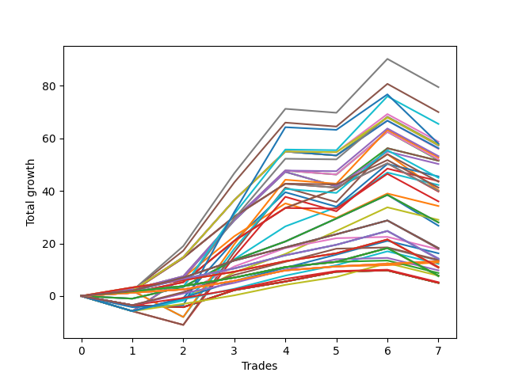

# Short Wallace 013 
- Symbol: ES
- Date Range: 03/18/2022 - 07/15/2022
- Trading Period: 7:20-12:30
- Number of Trades: 7



| Name | Win Percent | Profit | Avg Profit / Trade | Avg Time / Trade |      | Name | Win Percent | Profit | Avg Profit / Trade | Avg Time / Trade |
| ---- | ----------- | ------ | ------------------ | ---------------- | ---- | ---- | ----------- | ------ | ------------------ | ---------------- |
| Sorted By <br> Profit | | | | | | Sorted By <br> Win Percentage ||||
| Seven | 71.43 | 39750.00 | 5678.57 | 18:35 |     | One Hundred Twenty-Six | 100.00 | 6625.00 | 946.43 | 01:20 |
| Five | 71.43 | 35000.00 | 5000.00 | 18:28 |     | One Hundred Twenty-One | 100.00 | 6625.00 | 946.43 | 01:20 |
| Seventy-One | 71.43 | 32750.00 | 4678.57 | 10:12 |     | One Hundred Eleven | 100.00 | 6625.00 | 946.43 | 01:20 |
| Sixty-Eight | 71.43 | 29375.00 | 4196.43 | 09:37 |     | Eighty-One | 100.00 | 6625.00 | 946.43 | 01:20 |
| Seventy-Three | 57.14 | 29000.00 | 4142.86 | 11:30 |     | One Hundred Sixteen | 100.00 | 6375.00 | 910.71 | 01:19 |
| Sixty-Nine | 71.43 | 28875.00 | 4125.00 | 10:06 |     | Fifty-Seven | 85.71 | 21750.00 | 3107.14 | 07:46 |
| Seventy | 71.43 | 28750.00 | 4107.14 | 09:34 |     | One | 85.71 | 20125.00 | 2875.00 | 11:41 |
| Sixty | 71.43 | 28750.00 | 4107.14 | 12:42 |     | One Hundred Thirty | 85.71 | 9125.00 | 1303.57 | 05:34 |
| Four | 71.43 | 28625.00 | 4089.29 | 16:41 |     | One Hundred Twenty-Five | 85.71 | 9125.00 | 1303.57 | 05:34 |
| Sixty-Two | 71.43 | 28125.00 | 4017.86 | 12:39 |     | Eighty-Five | 85.71 | 9000.00 | 1285.71 | 09:32 |
| Six | 71.43 | 28000.00 | 4000.00 | 16:37 |     | One Hundred Twenty-Nine | 85.71 | 7125.00 | 1017.86 | 05:30 |
| Sixty-Six | 71.43 | 26625.00 | 3803.57 | 07:54 |     | One Hundred Twenty-Four | 85.71 | 7125.00 | 1017.86 | 05:30 |
| Sixty-Three | 57.14 | 26375.00 | 3767.86 | 13:31 |     | Eighty-Four | 85.71 | 7000.00 | 1000.00 | 09:28 |
| Fifty-Eight | 71.43 | 26000.00 | 3714.29 | 10:59 |     | One Hundred Twelve | 85.71 | 6750.00 | 964.29 | 01:55 |
| Two | 71.43 | 25875.00 | 3696.43 | 14:57 |     | One Hundred Twenty-Eight | 85.71 | 5500.00 | 785.71 | 05:17 |
| Forty-Four | 57.14 | 25750.00 | 3678.57 | 08:51 |     | One Hundred Twenty-Three | 85.71 | 5500.00 | 785.71 | 05:17 |
| Forty-Seven | 42.86 | 25750.00 | 3678.57 | 09:37 |     | Eighty-Three | 85.71 | 5375.00 | 767.86 | 09:16 |
| Forty-Six | 57.14 | 25125.00 | 3589.29 | 08:47 |     | One Hundred Seventeen | 85.71 | 4375.00 | 625.00 | 01:45 |
| Forty-Two | 57.14 | 22750.00 | 3250.00 | 08:28 |     | One Hundred Twenty-Seven | 85.71 | 3875.00 | 553.57 | 01:58 |
| Sixty-One | 57.14 | 22500.00 | 3214.29 | 13:25 |     | One Hundred Twenty-Two | 85.71 | 3875.00 | 553.57 | 01:58 |
| Forty-Five | 42.86 | 21875.00 | 3125.00 | 09:31 |     | Eighty-Two | 85.71 | 3750.00 | 535.71 | 05:57 |
| Fifty-Seven | 85.71 | 21750.00 | 3107.14 | 07:46 |     | Seven | 71.43 | 39750.00 | 5678.57 | 18:35 |
| Forty-One | 71.43 | 21125.00 | 3017.86 | 06:50 |     | Five | 71.43 | 35000.00 | 5000.00 | 18:28 |
| Sixty-Seven | 71.43 | 20625.00 | 2946.43 | 08:52 |     | Seventy-One | 71.43 | 32750.00 | 4678.57 | 10:12 |
| One | 85.71 | 20125.00 | 2875.00 | 11:41 |     | Sixty-Eight | 71.43 | 29375.00 | 4196.43 | 09:37 |
| Fifty-Nine | 71.43 | 20000.00 | 2857.14 | 11:57 |     | Sixty-Nine | 71.43 | 28875.00 | 4125.00 | 10:06 |
| Three | 71.43 | 19875.00 | 2839.29 | 15:56 |     | Seventy | 71.43 | 28750.00 | 4107.14 | 09:34 |
| Sixty-Five | 71.43 | 18000.00 | 2571.43 | 06:48 |     | Sixty | 71.43 | 28750.00 | 4107.14 | 12:42 |
| Forty-Three | 57.14 | 17125.00 | 2446.43 | 08:26 |     | Four | 71.43 | 28625.00 | 4089.29 | 16:41 |
| Forty | 71.43 | 14500.00 | 2071.43 | 03:40 |     | Sixty-Two | 71.43 | 28125.00 | 4017.86 | 12:39 |
| Sixty-Four | 71.43 | 14000.00 | 2000.00 | 04:32 |     | Six | 71.43 | 28000.00 | 4000.00 | 16:37 |
| Fifty-Six | 71.43 | 14000.00 | 2000.00 | 04:32 |     | Sixty-Six | 71.43 | 26625.00 | 3803.57 | 07:54 |
| Zero | 71.43 | 13375.00 | 1910.71 | 06:57 |     | Fifty-Eight | 71.43 | 26000.00 | 3714.29 | 10:59 |
| One Hundred Thirty | 85.71 | 9125.00 | 1303.57 | 05:34 |     | Two | 71.43 | 25875.00 | 3696.43 | 14:57 |
| One Hundred Twenty-Five | 85.71 | 9125.00 | 1303.57 | 05:34 |     | Forty-One | 71.43 | 21125.00 | 3017.86 | 06:50 |
| Eighty-Five | 85.71 | 9000.00 | 1285.71 | 09:32 |     | Sixty-Seven | 71.43 | 20625.00 | 2946.43 | 08:52 |
| Forty-Eight | 71.43 | 8875.00 | 1267.86 | 03:01 |     | Fifty-Nine | 71.43 | 20000.00 | 2857.14 | 11:57 |
| One Hundred Fifteen | 71.43 | 8125.00 | 1160.71 | 02:35 |     | Three | 71.43 | 19875.00 | 2839.29 | 15:56 |
| One Hundred Twenty-Nine | 85.71 | 7125.00 | 1017.86 | 05:30 |     | Sixty-Five | 71.43 | 18000.00 | 2571.43 | 06:48 |
| One Hundred Twenty-Four | 85.71 | 7125.00 | 1017.86 | 05:30 |     | Forty | 71.43 | 14500.00 | 2071.43 | 03:40 |
| Eighty-Four | 85.71 | 7000.00 | 1000.00 | 09:28 |     | Sixty-Four | 71.43 | 14000.00 | 2000.00 | 04:32 |
| One Hundred Twenty | 71.43 | 6875.00 | 982.14 | 02:20 |     | Fifty-Six | 71.43 | 14000.00 | 2000.00 | 04:32 |
| One Hundred Twelve | 85.71 | 6750.00 | 964.29 | 01:55 |     | Zero | 71.43 | 13375.00 | 1910.71 | 06:57 |
| One Hundred Twenty-Six | 100.00 | 6625.00 | 946.43 | 01:20 |     | Forty-Eight | 71.43 | 8875.00 | 1267.86 | 03:01 |
| One Hundred Twenty-One | 100.00 | 6625.00 | 946.43 | 01:20 |     | One Hundred Fifteen | 71.43 | 8125.00 | 1160.71 | 02:35 |
| One Hundred Eleven | 100.00 | 6625.00 | 946.43 | 01:20 |     | One Hundred Twenty | 71.43 | 6875.00 | 982.14 | 02:20 |
| Eighty-One | 100.00 | 6625.00 | 946.43 | 01:20 |     | One Hundred Fourteen | 71.43 | 6125.00 | 875.00 | 02:30 |
| One Hundred Sixteen | 100.00 | 6375.00 | 910.71 | 01:19 |     | One Hundred Ninteen | 71.43 | 4875.00 | 696.43 | 02:15 |
| One Hundred Fourteen | 71.43 | 6125.00 | 875.00 | 02:30 |     | One Hundred Thirteen | 71.43 | 3875.00 | 553.57 | 02:21 |
| One Hundred Twenty-Eight | 85.71 | 5500.00 | 785.71 | 05:17 |     | One Hundred Eighteen | 71.43 | 2625.00 | 375.00 | 02:06 |
| One Hundred Twenty-Three | 85.71 | 5500.00 | 785.71 | 05:17 |     | Seventy-Three | 57.14 | 29000.00 | 4142.86 | 11:30 |
| Eighty-Three | 85.71 | 5375.00 | 767.86 | 09:16 |     | Sixty-Three | 57.14 | 26375.00 | 3767.86 | 13:31 |
| One Hundred Ninteen | 71.43 | 4875.00 | 696.43 | 02:15 |     | Forty-Four | 57.14 | 25750.00 | 3678.57 | 08:51 |
| One Hundred Seventeen | 85.71 | 4375.00 | 625.00 | 01:45 |     | Forty-Six | 57.14 | 25125.00 | 3589.29 | 08:47 |
| One Hundred Twenty-Seven | 85.71 | 3875.00 | 553.57 | 01:58 |     | Forty-Two | 57.14 | 22750.00 | 3250.00 | 08:28 |
| One Hundred Twenty-Two | 85.71 | 3875.00 | 553.57 | 01:58 |     | Sixty-One | 57.14 | 22500.00 | 3214.29 | 13:25 |
| One Hundred Thirteen | 71.43 | 3875.00 | 553.57 | 02:21 |     | Forty-Three | 57.14 | 17125.00 | 2446.43 | 08:26 |
| Eighty-Two | 85.71 | 3750.00 | 535.71 | 05:57 |     | Fifty-Five | 57.14 | 2500.00 | 357.14 | 03:40 |
| One Hundred Eighteen | 71.43 | 2625.00 | 375.00 | 02:06 |     | Fifty-Four | 57.14 | 2500.00 | 357.14 | 03:40 |
| Fifty-Five | 57.14 | 2500.00 | 357.14 | 03:40 |     | Fifty-Three | 57.14 | 2500.00 | 357.14 | 03:40 |
| Fifty-Four | 57.14 | 2500.00 | 357.14 | 03:40 |     | Fifty-Two | 57.14 | 2500.00 | 357.14 | 03:40 |
| Fifty-Three | 57.14 | 2500.00 | 357.14 | 03:40 |     | Fifty-One | 57.14 | 2500.00 | 357.14 | 03:40 |
| Fifty-Two | 57.14 | 2500.00 | 357.14 | 03:40 |     | Fifty | 57.14 | 2500.00 | 357.14 | 03:40 |
| Fifty-One | 57.14 | 2500.00 | 357.14 | 03:40 |     | Forty-Nine | 57.14 | 2500.00 | 357.14 | 03:40 |
| Fifty | 57.14 | 2500.00 | 357.14 | 03:40 |     | Forty-Seven | 42.86 | 25750.00 | 3678.57 | 09:37 |
| Forty-Nine | 57.14 | 2500.00 | 357.14 | 03:40 |     | Forty-Five | 42.86 | 21875.00 | 3125.00 | 09:31 |

## NO STOPLOSS

### Test Zero
* Sell when price hits the middle line of the 20p bollinger
* No Stoploss
* Results:
```
Total Trades: 7
Percent Up: 28.57
Percent Down: 71.43
Total Points Moved Down: 26.75
Potential Profit: 13375.00
Total Points Ups: 12.75 Count Ups: 2
Total Points Downs: 39.50 Count Downs: 5
```

<details><summary>Trades</summary>

<code>In: 2022-03-31 07:48:00		Out: 2022-03-31 08:03:05		Total Position Time: 15:05		Total Move Down: -1.00		Total to Date: -1.00</code> <br />
<code>In: 2022-04-06 10:43:00		Out: 2022-04-06 10:47:10		Total Position Time: 04:10		Total Move Down: 4.50		Total to Date: 3.50</code> <br />
<code>In: 2022-04-06 11:04:00		Out: 2022-04-06 11:05:35		Total Position Time: 01:35		Total Move Down: 10.25		Total to Date: 13.75</code> <br />
<code>In: 2022-04-06 11:05:00		Out: 2022-04-06 11:05:35		Total Position Time: 00:35		Total Move Down: 7.00		Total to Date: 20.75</code> <br />
<code>In: 2022-05-31 07:23:00		Out: 2022-05-31 07:30:05		Total Position Time: 07:05		Total Move Down: 8.75		Total to Date: 29.50</code> <br />
<code>In: 2022-07-06 11:09:00		Out: 2022-07-06 11:10:10		Total Position Time: 01:10		Total Move Down: 9.00		Total to Date: 38.50</code> <br />
<code>In: 2022-07-06 11:31:00		Out: 2022-07-06 11:50:00		Total Position Time: 19:00		Total Move Down: -11.75		Total to Date: 26.75</code> <br />


</details>

### Test One
* Sell when the price hits the upper line of the 20p 1std bollinger
* No Stoploss
* Results:
```
Total Trades: 7
Percent Up: 14.29
Percent Down: 85.71
Total Points Moved Down: 40.25
Potential Profit: 20125.00
Total Points Ups: 13.75 Count Ups: 1
Total Points Downs: 54.00 Count Downs: 6
```

<details><summary>Trades</summary>

<code>In: 2022-03-31 07:48:00		Out: 2022-03-31 08:03:30		Total Position Time: 15:30		Total Move Down: 1.25		Total to Date: 1.25</code> <br />
<code>In: 2022-04-06 10:43:00		Out: 2022-04-06 10:56:55		Total Position Time: 13:55		Total Move Down: 4.00		Total to Date: 5.25</code> <br />
<code>In: 2022-04-06 11:04:00		Out: 2022-04-06 11:07:20		Total Position Time: 03:20		Total Move Down: 15.75		Total to Date: 21.00</code> <br />
<code>In: 2022-04-06 11:05:00		Out: 2022-04-06 11:07:20		Total Position Time: 02:20		Total Move Down: 12.50		Total to Date: 33.50</code> <br />
<code>In: 2022-05-31 07:23:00		Out: 2022-05-31 07:38:05		Total Position Time: 15:05		Total Move Down: 7.25		Total to Date: 40.75</code> <br />
<code>In: 2022-07-06 11:09:00		Out: 2022-07-06 11:11:10		Total Position Time: 02:10		Total Move Down: 13.25		Total to Date: 54.00</code> <br />
<code>In: 2022-07-06 11:31:00		Out: 2022-07-06 12:00:30		Total Position Time: 29:30		Total Move Down: -13.75		Total to Date: 40.25</code> <br />


</details>

### Test Two
* Sell when the price hits the upper line of the 20p 2std bollinger
* No Stoploss
* Results:
```
Total Trades: 7
Percent Up: 28.57
Percent Down: 71.43
Total Points Moved Down: 51.75
Potential Profit: 25875.00
Total Points Ups: 12.25 Count Ups: 2
Total Points Downs: 64.00 Count Downs: 5
```

<details><summary>Trades</summary>

<code>In: 2022-03-31 07:48:00		Out: 2022-03-31 08:08:30		Total Position Time: 20:30		Total Move Down: 2.50		Total to Date: 2.50</code> <br />
<code>In: 2022-04-06 10:43:00		Out: 2022-04-06 10:57:20		Total Position Time: 14:20		Total Move Down: 5.00		Total to Date: 7.50</code> <br />
<code>In: 2022-04-06 11:04:00		Out: 2022-04-06 11:08:10		Total Position Time: 04:10		Total Move Down: 21.75		Total to Date: 29.25</code> <br />
<code>In: 2022-04-06 11:05:00		Out: 2022-04-06 11:08:10		Total Position Time: 03:10		Total Move Down: 18.50		Total to Date: 47.75</code> <br />
<code>In: 2022-05-31 07:23:00		Out: 2022-05-31 07:52:55		Total Position Time: 29:55		Total Move Down: -1.50		Total to Date: 46.25</code> <br />
<code>In: 2022-07-06 11:09:00		Out: 2022-07-06 11:11:45		Total Position Time: 02:45		Total Move Down: 16.25		Total to Date: 62.50</code> <br />
<code>In: 2022-07-06 11:31:00		Out: 2022-07-06 12:00:55		Total Position Time: 29:55		Total Move Down: -10.75		Total to Date: 51.75</code> <br />


</details>

### Test Three
* Sell when price hits the middle line of the 50p bollinger
* No Stoploss
* Results:
```
Total Trades: 7
Percent Up: 28.57
Percent Down: 71.43
Total Points Moved Down: 39.75
Potential Profit: 19875.00
Total Points Ups: 12.25 Count Ups: 2
Total Points Downs: 52.00 Count Downs: 5
```

<details><summary>Trades</summary>

<code>In: 2022-03-31 07:48:00		Out: 2022-03-31 08:15:35		Total Position Time: 27:35		Total Move Down: 1.75		Total to Date: 1.75</code> <br />
<code>In: 2022-04-06 10:43:00		Out: 2022-04-06 11:00:10		Total Position Time: 17:10		Total Move Down: 12.75		Total to Date: 14.50</code> <br />
<code>In: 2022-04-06 11:04:00		Out: 2022-04-06 11:07:20		Total Position Time: 03:20		Total Move Down: 15.75		Total to Date: 30.25</code> <br />
<code>In: 2022-04-06 11:05:00		Out: 2022-04-06 11:07:20		Total Position Time: 02:20		Total Move Down: 12.50		Total to Date: 42.75</code> <br />
<code>In: 2022-05-31 07:23:00		Out: 2022-05-31 07:52:55		Total Position Time: 29:55		Total Move Down: -1.50		Total to Date: 41.25</code> <br />
<code>In: 2022-07-06 11:09:00		Out: 2022-07-06 11:10:20		Total Position Time: 01:20		Total Move Down: 9.25		Total to Date: 50.50</code> <br />
<code>In: 2022-07-06 11:31:00		Out: 2022-07-06 12:00:55		Total Position Time: 29:55		Total Move Down: -10.75		Total to Date: 39.75</code> <br />


</details>

### Test Four
* Sell when the price hits the upper line of the 50p 1std bollinger
* No Stoploss
* Results:
```
Total Trades: 7
Percent Up: 28.57
Percent Down: 71.43
Total Points Moved Down: 57.25
Potential Profit: 28625.00
Total Points Ups: 12.25 Count Ups: 2
Total Points Downs: 69.50 Count Downs: 5
```

<details><summary>Trades</summary>

<code>In: 2022-03-31 07:48:00		Out: 2022-03-31 08:17:55		Total Position Time: 29:55		Total Move Down: 2.00		Total to Date: 2.00</code> <br />
<code>In: 2022-04-06 10:43:00		Out: 2022-04-06 11:00:10		Total Position Time: 17:10		Total Move Down: 12.75		Total to Date: 14.75</code> <br />
<code>In: 2022-04-06 11:04:00		Out: 2022-04-06 11:08:10		Total Position Time: 04:10		Total Move Down: 21.75		Total to Date: 36.50</code> <br />
<code>In: 2022-04-06 11:05:00		Out: 2022-04-06 11:08:10		Total Position Time: 03:10		Total Move Down: 18.50		Total to Date: 55.00</code> <br />
<code>In: 2022-05-31 07:23:00		Out: 2022-05-31 07:52:55		Total Position Time: 29:55		Total Move Down: -1.50		Total to Date: 53.50</code> <br />
<code>In: 2022-07-06 11:09:00		Out: 2022-07-06 11:11:35		Total Position Time: 02:35		Total Move Down: 14.50		Total to Date: 68.00</code> <br />
<code>In: 2022-07-06 11:31:00		Out: 2022-07-06 12:00:55		Total Position Time: 29:55		Total Move Down: -10.75		Total to Date: 57.25</code> <br />


</details>

### Test Five
* Sell when the price hits the upper line of the 50p 2std bollinger
* No Stoploss
* Results:
```
Total Trades: 7
Percent Up: 28.57
Percent Down: 71.43
Total Points Moved Down: 70.00
Potential Profit: 35000.00
Total Points Ups: 12.25 Count Ups: 2
Total Points Downs: 82.25 Count Downs: 5
```

<details><summary>Trades</summary>

<code>In: 2022-03-31 07:48:00		Out: 2022-03-31 08:17:55		Total Position Time: 29:55		Total Move Down: 2.00		Total to Date: 2.00</code> <br />
<code>In: 2022-04-06 10:43:00		Out: 2022-04-06 11:09:35		Total Position Time: 26:35		Total Move Down: 15.25		Total to Date: 17.25</code> <br />
<code>In: 2022-04-06 11:04:00		Out: 2022-04-06 11:09:35		Total Position Time: 05:35		Total Move Down: 26.00		Total to Date: 43.25</code> <br />
<code>In: 2022-04-06 11:05:00		Out: 2022-04-06 11:09:35		Total Position Time: 04:35		Total Move Down: 22.75		Total to Date: 66.00</code> <br />
<code>In: 2022-05-31 07:23:00		Out: 2022-05-31 07:52:55		Total Position Time: 29:55		Total Move Down: -1.50		Total to Date: 64.50</code> <br />
<code>In: 2022-07-06 11:09:00		Out: 2022-07-06 11:11:50		Total Position Time: 02:50		Total Move Down: 16.25		Total to Date: 80.75</code> <br />
<code>In: 2022-07-06 11:31:00		Out: 2022-07-06 12:00:55		Total Position Time: 29:55		Total Move Down: -10.75		Total to Date: 70.00</code> <br />


</details>

### Test Six
* Sell when the price hits the middle line of the 1std VWAP
* No Stoploss
* Results:
```
Total Trades: 7
Percent Up: 28.57
Percent Down: 71.43
Total Points Moved Down: 56.00
Potential Profit: 28000.00
Total Points Ups: 12.25 Count Ups: 2
Total Points Downs: 68.25 Count Downs: 5
```

<details><summary>Trades</summary>

<code>In: 2022-03-31 07:48:00		Out: 2022-03-31 08:17:55		Total Position Time: 29:55		Total Move Down: 2.00		Total to Date: 2.00</code> <br />
<code>In: 2022-04-06 10:43:00		Out: 2022-04-06 11:00:10		Total Position Time: 17:10		Total Move Down: 12.75		Total to Date: 14.75</code> <br />
<code>In: 2022-04-06 11:04:00		Out: 2022-04-06 11:08:10		Total Position Time: 04:10		Total Move Down: 21.75		Total to Date: 36.50</code> <br />
<code>In: 2022-04-06 11:05:00		Out: 2022-04-06 11:08:10		Total Position Time: 03:10		Total Move Down: 18.50		Total to Date: 55.00</code> <br />
<code>In: 2022-05-31 07:23:00		Out: 2022-05-31 07:52:55		Total Position Time: 29:55		Total Move Down: -1.50		Total to Date: 53.50</code> <br />
<code>In: 2022-07-06 11:09:00		Out: 2022-07-06 11:11:10		Total Position Time: 02:10		Total Move Down: 13.25		Total to Date: 66.75</code> <br />
<code>In: 2022-07-06 11:31:00		Out: 2022-07-06 12:00:55		Total Position Time: 29:55		Total Move Down: -10.75		Total to Date: 56.00</code> <br />


</details>

### Test Seven
* Sell when the price hits the upper line of the 1std VWAP
* No Stoploss
* Results:
```
Total Trades: 7
Percent Up: 28.57
Percent Down: 71.43
Total Points Moved Down: 79.50
Potential Profit: 39750.00
Total Points Ups: 12.25 Count Ups: 2
Total Points Downs: 91.75 Count Downs: 5
```

<details><summary>Trades</summary>

<code>In: 2022-03-31 07:48:00		Out: 2022-03-31 08:17:55		Total Position Time: 29:55		Total Move Down: 2.00		Total to Date: 2.00</code> <br />
<code>In: 2022-04-06 10:43:00		Out: 2022-04-06 11:09:40		Total Position Time: 26:40		Total Move Down: 17.00		Total to Date: 19.00</code> <br />
<code>In: 2022-04-06 11:04:00		Out: 2022-04-06 11:09:40		Total Position Time: 05:40		Total Move Down: 27.75		Total to Date: 46.75</code> <br />
<code>In: 2022-04-06 11:05:00		Out: 2022-04-06 11:09:40		Total Position Time: 04:40		Total Move Down: 24.50		Total to Date: 71.25</code> <br />
<code>In: 2022-05-31 07:23:00		Out: 2022-05-31 07:52:55		Total Position Time: 29:55		Total Move Down: -1.50		Total to Date: 69.75</code> <br />
<code>In: 2022-07-06 11:09:00		Out: 2022-07-06 11:12:20		Total Position Time: 03:20		Total Move Down: 20.50		Total to Date: 90.25</code> <br />
<code>In: 2022-07-06 11:31:00		Out: 2022-07-06 12:00:55		Total Position Time: 29:55		Total Move Down: -10.75		Total to Date: 79.50</code> <br />


</details>

## STOPLOSS OF 5

### Test Forty
* Sell when price hits the middle line of the 20p bollinger
* Stoploss is -5 points
* Results:
```
Total Trades: 7
Percent Up: 28.57
Percent Down: 71.43
Total Points Moved Down: 29.00
Potential Profit: 14500.00
Total Points Ups: 10.50 Count Ups: 2
Total Points Downs: 39.50 Count Downs: 5
```

<details><summary>Trades</summary>

<code>In: 2022-03-31 07:48:00		Out: 2022-03-31 07:57:20		Total Position Time: 09:20		Total Move Down: -5.75		Total to Date: -5.75</code> <br />
<code>In: 2022-04-06 10:43:00		Out: 2022-04-06 10:47:10		Total Position Time: 04:10		Total Move Down: 4.50		Total to Date: -1.25</code> <br />
<code>In: 2022-04-06 11:04:00		Out: 2022-04-06 11:05:35		Total Position Time: 01:35		Total Move Down: 10.25		Total to Date: 9.00</code> <br />
<code>In: 2022-04-06 11:05:00		Out: 2022-04-06 11:05:35		Total Position Time: 00:35		Total Move Down: 7.00		Total to Date: 16.00</code> <br />
<code>In: 2022-05-31 07:23:00		Out: 2022-05-31 07:30:05		Total Position Time: 07:05		Total Move Down: 8.75		Total to Date: 24.75</code> <br />
<code>In: 2022-07-06 11:09:00		Out: 2022-07-06 11:10:10		Total Position Time: 01:10		Total Move Down: 9.00		Total to Date: 33.75</code> <br />
<code>In: 2022-07-06 11:31:00		Out: 2022-07-06 11:32:45		Total Position Time: 01:45		Total Move Down: -4.75		Total to Date: 29.00</code> <br />


</details>

### Test Forty-One
* Sell when the price hits the upper line of the 20p 1std bollinger
* Stoploss is -5 points
* Results:
```
Total Trades: 7
Percent Up: 28.57
Percent Down: 71.43
Total Points Moved Down: 42.25
Potential Profit: 21125.00
Total Points Ups: 10.50 Count Ups: 2
Total Points Downs: 52.75 Count Downs: 5
```

<details><summary>Trades</summary>

<code>In: 2022-03-31 07:48:00		Out: 2022-03-31 07:57:20		Total Position Time: 09:20		Total Move Down: -5.75		Total to Date: -5.75</code> <br />
<code>In: 2022-04-06 10:43:00		Out: 2022-04-06 10:56:55		Total Position Time: 13:55		Total Move Down: 4.00		Total to Date: -1.75</code> <br />
<code>In: 2022-04-06 11:04:00		Out: 2022-04-06 11:07:20		Total Position Time: 03:20		Total Move Down: 15.75		Total to Date: 14.00</code> <br />
<code>In: 2022-04-06 11:05:00		Out: 2022-04-06 11:07:20		Total Position Time: 02:20		Total Move Down: 12.50		Total to Date: 26.50</code> <br />
<code>In: 2022-05-31 07:23:00		Out: 2022-05-31 07:38:05		Total Position Time: 15:05		Total Move Down: 7.25		Total to Date: 33.75</code> <br />
<code>In: 2022-07-06 11:09:00		Out: 2022-07-06 11:11:10		Total Position Time: 02:10		Total Move Down: 13.25		Total to Date: 47.00</code> <br />
<code>In: 2022-07-06 11:31:00		Out: 2022-07-06 11:32:45		Total Position Time: 01:45		Total Move Down: -4.75		Total to Date: 42.25</code> <br />


</details>

### Test Forty-Two
* Sell when the price hits the upper line of the 20p 2std bollinger
* Stoploss is -5 points
* Results:
```
Total Trades: 7
Percent Up: 42.86
Percent Down: 57.14
Total Points Moved Down: 45.50
Potential Profit: 22750.00
Total Points Ups: 16.00 Count Ups: 3
Total Points Downs: 61.50 Count Downs: 4
```

<details><summary>Trades</summary>

<code>In: 2022-03-31 07:48:00		Out: 2022-03-31 07:57:20		Total Position Time: 09:20		Total Move Down: -5.75		Total to Date: -5.75</code> <br />
<code>In: 2022-04-06 10:43:00		Out: 2022-04-06 10:57:20		Total Position Time: 14:20		Total Move Down: 5.00		Total to Date: -0.75</code> <br />
<code>In: 2022-04-06 11:04:00		Out: 2022-04-06 11:08:10		Total Position Time: 04:10		Total Move Down: 21.75		Total to Date: 21.00</code> <br />
<code>In: 2022-04-06 11:05:00		Out: 2022-04-06 11:08:10		Total Position Time: 03:10		Total Move Down: 18.50		Total to Date: 39.50</code> <br />
<code>In: 2022-05-31 07:23:00		Out: 2022-05-31 07:46:50		Total Position Time: 23:50		Total Move Down: -5.50		Total to Date: 34.00</code> <br />
<code>In: 2022-07-06 11:09:00		Out: 2022-07-06 11:11:45		Total Position Time: 02:45		Total Move Down: 16.25		Total to Date: 50.25</code> <br />
<code>In: 2022-07-06 11:31:00		Out: 2022-07-06 11:32:45		Total Position Time: 01:45		Total Move Down: -4.75		Total to Date: 45.50</code> <br />


</details>

### Test Forty-Three
* Sell when price hits the middle line of the 50p bollinger
* Stoploss is -5 points
* Results:
```
Total Trades: 7
Percent Up: 42.86
Percent Down: 57.14
Total Points Moved Down: 34.25
Potential Profit: 17125.00
Total Points Ups: 16.00 Count Ups: 3
Total Points Downs: 50.25 Count Downs: 4
```

<details><summary>Trades</summary>

<code>In: 2022-03-31 07:48:00		Out: 2022-03-31 07:57:20		Total Position Time: 09:20		Total Move Down: -5.75		Total to Date: -5.75</code> <br />
<code>In: 2022-04-06 10:43:00		Out: 2022-04-06 11:00:10		Total Position Time: 17:10		Total Move Down: 12.75		Total to Date: 7.00</code> <br />
<code>In: 2022-04-06 11:04:00		Out: 2022-04-06 11:07:20		Total Position Time: 03:20		Total Move Down: 15.75		Total to Date: 22.75</code> <br />
<code>In: 2022-04-06 11:05:00		Out: 2022-04-06 11:07:20		Total Position Time: 02:20		Total Move Down: 12.50		Total to Date: 35.25</code> <br />
<code>In: 2022-05-31 07:23:00		Out: 2022-05-31 07:46:50		Total Position Time: 23:50		Total Move Down: -5.50		Total to Date: 29.75</code> <br />
<code>In: 2022-07-06 11:09:00		Out: 2022-07-06 11:10:20		Total Position Time: 01:20		Total Move Down: 9.25		Total to Date: 39.00</code> <br />
<code>In: 2022-07-06 11:31:00		Out: 2022-07-06 11:32:45		Total Position Time: 01:45		Total Move Down: -4.75		Total to Date: 34.25</code> <br />


</details>

### Test Forty-Four
* Sell when the price hits the upper line of the 50p 1std bollinger
* Stoploss is -5 points
* Results:
```
Total Trades: 7
Percent Up: 42.86
Percent Down: 57.14
Total Points Moved Down: 51.50
Potential Profit: 25750.00
Total Points Ups: 16.00 Count Ups: 3
Total Points Downs: 67.50 Count Downs: 4
```

<details><summary>Trades</summary>

<code>In: 2022-03-31 07:48:00		Out: 2022-03-31 07:57:20		Total Position Time: 09:20		Total Move Down: -5.75		Total to Date: -5.75</code> <br />
<code>In: 2022-04-06 10:43:00		Out: 2022-04-06 11:00:10		Total Position Time: 17:10		Total Move Down: 12.75		Total to Date: 7.00</code> <br />
<code>In: 2022-04-06 11:04:00		Out: 2022-04-06 11:08:10		Total Position Time: 04:10		Total Move Down: 21.75		Total to Date: 28.75</code> <br />
<code>In: 2022-04-06 11:05:00		Out: 2022-04-06 11:08:10		Total Position Time: 03:10		Total Move Down: 18.50		Total to Date: 47.25</code> <br />
<code>In: 2022-05-31 07:23:00		Out: 2022-05-31 07:46:50		Total Position Time: 23:50		Total Move Down: -5.50		Total to Date: 41.75</code> <br />
<code>In: 2022-07-06 11:09:00		Out: 2022-07-06 11:11:35		Total Position Time: 02:35		Total Move Down: 14.50		Total to Date: 56.25</code> <br />
<code>In: 2022-07-06 11:31:00		Out: 2022-07-06 11:32:45		Total Position Time: 01:45		Total Move Down: -4.75		Total to Date: 51.50</code> <br />


</details>

### Test Forty-Five
* Sell when the price hits the upper line of the 50p 2std bollinger
* Stoploss is -5 points
* Results:
```
Total Trades: 7
Percent Up: 57.14
Percent Down: 42.86
Total Points Moved Down: 43.75
Potential Profit: 21875.00
Total Points Ups: 21.25 Count Ups: 4
Total Points Downs: 65.00 Count Downs: 3
```

<details><summary>Trades</summary>

<code>In: 2022-03-31 07:48:00		Out: 2022-03-31 07:57:20		Total Position Time: 09:20		Total Move Down: -5.75		Total to Date: -5.75</code> <br />
<code>In: 2022-04-06 10:43:00		Out: 2022-04-06 11:01:45		Total Position Time: 18:45		Total Move Down: -5.25		Total to Date: -11.00</code> <br />
<code>In: 2022-04-06 11:04:00		Out: 2022-04-06 11:09:35		Total Position Time: 05:35		Total Move Down: 26.00		Total to Date: 15.00</code> <br />
<code>In: 2022-04-06 11:05:00		Out: 2022-04-06 11:09:35		Total Position Time: 04:35		Total Move Down: 22.75		Total to Date: 37.75</code> <br />
<code>In: 2022-05-31 07:23:00		Out: 2022-05-31 07:46:50		Total Position Time: 23:50		Total Move Down: -5.50		Total to Date: 32.25</code> <br />
<code>In: 2022-07-06 11:09:00		Out: 2022-07-06 11:11:50		Total Position Time: 02:50		Total Move Down: 16.25		Total to Date: 48.50</code> <br />
<code>In: 2022-07-06 11:31:00		Out: 2022-07-06 11:32:45		Total Position Time: 01:45		Total Move Down: -4.75		Total to Date: 43.75</code> <br />


</details>

### Test Forty-Six
* Sell when the price hits the middle line of the 1std VWAP
* Stoploss is -5 points
* Results:
```
Total Trades: 7
Percent Up: 42.86
Percent Down: 57.14
Total Points Moved Down: 50.25
Potential Profit: 25125.00
Total Points Ups: 16.00 Count Ups: 3
Total Points Downs: 66.25 Count Downs: 4
```

<details><summary>Trades</summary>

<code>In: 2022-03-31 07:48:00		Out: 2022-03-31 07:57:20		Total Position Time: 09:20		Total Move Down: -5.75		Total to Date: -5.75</code> <br />
<code>In: 2022-04-06 10:43:00		Out: 2022-04-06 11:00:10		Total Position Time: 17:10		Total Move Down: 12.75		Total to Date: 7.00</code> <br />
<code>In: 2022-04-06 11:04:00		Out: 2022-04-06 11:08:10		Total Position Time: 04:10		Total Move Down: 21.75		Total to Date: 28.75</code> <br />
<code>In: 2022-04-06 11:05:00		Out: 2022-04-06 11:08:10		Total Position Time: 03:10		Total Move Down: 18.50		Total to Date: 47.25</code> <br />
<code>In: 2022-05-31 07:23:00		Out: 2022-05-31 07:46:50		Total Position Time: 23:50		Total Move Down: -5.50		Total to Date: 41.75</code> <br />
<code>In: 2022-07-06 11:09:00		Out: 2022-07-06 11:11:10		Total Position Time: 02:10		Total Move Down: 13.25		Total to Date: 55.00</code> <br />
<code>In: 2022-07-06 11:31:00		Out: 2022-07-06 11:32:45		Total Position Time: 01:45		Total Move Down: -4.75		Total to Date: 50.25</code> <br />


</details>

### Test Forty-Seven
* Sell when the price hits the upper line of the 1std VWAP
* Stoploss is -5 points
* Results:
```
Total Trades: 7
Percent Up: 57.14
Percent Down: 42.86
Total Points Moved Down: 51.50
Potential Profit: 25750.00
Total Points Ups: 21.25 Count Ups: 4
Total Points Downs: 72.75 Count Downs: 3
```

<details><summary>Trades</summary>

<code>In: 2022-03-31 07:48:00		Out: 2022-03-31 07:57:20		Total Position Time: 09:20		Total Move Down: -5.75		Total to Date: -5.75</code> <br />
<code>In: 2022-04-06 10:43:00		Out: 2022-04-06 11:01:45		Total Position Time: 18:45		Total Move Down: -5.25		Total to Date: -11.00</code> <br />
<code>In: 2022-04-06 11:04:00		Out: 2022-04-06 11:09:40		Total Position Time: 05:40		Total Move Down: 27.75		Total to Date: 16.75</code> <br />
<code>In: 2022-04-06 11:05:00		Out: 2022-04-06 11:09:40		Total Position Time: 04:40		Total Move Down: 24.50		Total to Date: 41.25</code> <br />
<code>In: 2022-05-31 07:23:00		Out: 2022-05-31 07:46:50		Total Position Time: 23:50		Total Move Down: -5.50		Total to Date: 35.75</code> <br />
<code>In: 2022-07-06 11:09:00		Out: 2022-07-06 11:12:20		Total Position Time: 03:20		Total Move Down: 20.50		Total to Date: 56.25</code> <br />
<code>In: 2022-07-06 11:31:00		Out: 2022-07-06 11:32:45		Total Position Time: 01:45		Total Move Down: -4.75		Total to Date: 51.50</code> <br />


</details>

## TRAIL STOP OF 5

### Test Forty-Eight
* Sell when price hits the middle line of the 20p bollinger
* Trailing Stop is -5 points
* Results:
```
Total Trades: 7
Percent Up: 28.57
Percent Down: 71.43
Total Points Moved Down: 17.75
Potential Profit: 8875.00
Total Points Ups: 8.25 Count Ups: 2
Total Points Downs: 26.00 Count Downs: 5
```

<details><summary>Trades</summary>

<code>In: 2022-03-31 07:48:00		Out: 2022-03-31 07:56:50		Total Position Time: 08:50		Total Move Down: -3.50		Total to Date: -3.50</code> <br />
<code>In: 2022-04-06 10:43:00		Out: 2022-04-06 10:47:10		Total Position Time: 04:10		Total Move Down: 4.50		Total to Date: 1.00</code> <br />
<code>In: 2022-04-06 11:04:00		Out: 2022-04-06 11:05:35		Total Position Time: 01:35		Total Move Down: 10.25		Total to Date: 11.25</code> <br />
<code>In: 2022-04-06 11:05:00		Out: 2022-04-06 11:05:35		Total Position Time: 00:35		Total Move Down: 7.00		Total to Date: 18.25</code> <br />
<code>In: 2022-05-31 07:23:00		Out: 2022-05-31 07:28:05		Total Position Time: 05:05		Total Move Down: 3.75		Total to Date: 22.00</code> <br />
<code>In: 2022-07-06 11:09:00		Out: 2022-07-06 11:09:10		Total Position Time: 00:10		Total Move Down: 0.50		Total to Date: 22.50</code> <br />
<code>In: 2022-07-06 11:31:00		Out: 2022-07-06 11:31:45		Total Position Time: 00:45		Total Move Down: -4.75		Total to Date: 17.75</code> <br />


</details>

### Test Forty-Nine
* Sell when the price hits the upper line of the 20p 1std bollinger
* Trailing Stop is -5 points
* Results:
```
Total Trades: 7
Percent Up: 42.86
Percent Down: 57.14
Total Points Moved Down: 5.00
Potential Profit: 2500.00
Total Points Ups: 9.00 Count Ups: 3
Total Points Downs: 14.00 Count Downs: 4
```

<details><summary>Trades</summary>

<code>In: 2022-03-31 07:48:00		Out: 2022-03-31 07:56:50		Total Position Time: 08:50		Total Move Down: -3.50		Total to Date: -3.50</code> <br />
<code>In: 2022-04-06 10:43:00		Out: 2022-04-06 10:49:50		Total Position Time: 06:50		Total Move Down: -0.75		Total to Date: -4.25</code> <br />
<code>In: 2022-04-06 11:04:00		Out: 2022-04-06 11:06:30		Total Position Time: 02:30		Total Move Down: 6.50		Total to Date: 2.25</code> <br />
<code>In: 2022-04-06 11:05:00		Out: 2022-04-06 11:06:30		Total Position Time: 01:30		Total Move Down: 3.25		Total to Date: 5.50</code> <br />
<code>In: 2022-05-31 07:23:00		Out: 2022-05-31 07:28:05		Total Position Time: 05:05		Total Move Down: 3.75		Total to Date: 9.25</code> <br />
<code>In: 2022-07-06 11:09:00		Out: 2022-07-06 11:09:10		Total Position Time: 00:10		Total Move Down: 0.50		Total to Date: 9.75</code> <br />
<code>In: 2022-07-06 11:31:00		Out: 2022-07-06 11:31:45		Total Position Time: 00:45		Total Move Down: -4.75		Total to Date: 5.00</code> <br />


</details>

### Test Fifty
* Sell when the price hits the upper line of the 20p 2std bollinger
* Trailing Stop is -5 points
* Results:
```
Total Trades: 7
Percent Up: 42.86
Percent Down: 57.14
Total Points Moved Down: 5.00
Potential Profit: 2500.00
Total Points Ups: 9.00 Count Ups: 3
Total Points Downs: 14.00 Count Downs: 4
```

<details><summary>Trades</summary>

<code>In: 2022-03-31 07:48:00		Out: 2022-03-31 07:56:50		Total Position Time: 08:50		Total Move Down: -3.50		Total to Date: -3.50</code> <br />
<code>In: 2022-04-06 10:43:00		Out: 2022-04-06 10:49:50		Total Position Time: 06:50		Total Move Down: -0.75		Total to Date: -4.25</code> <br />
<code>In: 2022-04-06 11:04:00		Out: 2022-04-06 11:06:30		Total Position Time: 02:30		Total Move Down: 6.50		Total to Date: 2.25</code> <br />
<code>In: 2022-04-06 11:05:00		Out: 2022-04-06 11:06:30		Total Position Time: 01:30		Total Move Down: 3.25		Total to Date: 5.50</code> <br />
<code>In: 2022-05-31 07:23:00		Out: 2022-05-31 07:28:05		Total Position Time: 05:05		Total Move Down: 3.75		Total to Date: 9.25</code> <br />
<code>In: 2022-07-06 11:09:00		Out: 2022-07-06 11:09:10		Total Position Time: 00:10		Total Move Down: 0.50		Total to Date: 9.75</code> <br />
<code>In: 2022-07-06 11:31:00		Out: 2022-07-06 11:31:45		Total Position Time: 00:45		Total Move Down: -4.75		Total to Date: 5.00</code> <br />


</details>

### Test Fifty-One
* Sell when price hits the middle line of the 50p bollinger
* Trailing Stop is -5 points
* Results:
```
Total Trades: 7
Percent Up: 42.86
Percent Down: 57.14
Total Points Moved Down: 5.00
Potential Profit: 2500.00
Total Points Ups: 9.00 Count Ups: 3
Total Points Downs: 14.00 Count Downs: 4
```

<details><summary>Trades</summary>

<code>In: 2022-03-31 07:48:00		Out: 2022-03-31 07:56:50		Total Position Time: 08:50		Total Move Down: -3.50		Total to Date: -3.50</code> <br />
<code>In: 2022-04-06 10:43:00		Out: 2022-04-06 10:49:50		Total Position Time: 06:50		Total Move Down: -0.75		Total to Date: -4.25</code> <br />
<code>In: 2022-04-06 11:04:00		Out: 2022-04-06 11:06:30		Total Position Time: 02:30		Total Move Down: 6.50		Total to Date: 2.25</code> <br />
<code>In: 2022-04-06 11:05:00		Out: 2022-04-06 11:06:30		Total Position Time: 01:30		Total Move Down: 3.25		Total to Date: 5.50</code> <br />
<code>In: 2022-05-31 07:23:00		Out: 2022-05-31 07:28:05		Total Position Time: 05:05		Total Move Down: 3.75		Total to Date: 9.25</code> <br />
<code>In: 2022-07-06 11:09:00		Out: 2022-07-06 11:09:10		Total Position Time: 00:10		Total Move Down: 0.50		Total to Date: 9.75</code> <br />
<code>In: 2022-07-06 11:31:00		Out: 2022-07-06 11:31:45		Total Position Time: 00:45		Total Move Down: -4.75		Total to Date: 5.00</code> <br />


</details>

### Test Fifty-Two
* Sell when the price hits the upper line of the 50p 1std bollinger
* Trailing Stop is -5 points
* Results:
```
Total Trades: 7
Percent Up: 42.86
Percent Down: 57.14
Total Points Moved Down: 5.00
Potential Profit: 2500.00
Total Points Ups: 9.00 Count Ups: 3
Total Points Downs: 14.00 Count Downs: 4
```

<details><summary>Trades</summary>

<code>In: 2022-03-31 07:48:00		Out: 2022-03-31 07:56:50		Total Position Time: 08:50		Total Move Down: -3.50		Total to Date: -3.50</code> <br />
<code>In: 2022-04-06 10:43:00		Out: 2022-04-06 10:49:50		Total Position Time: 06:50		Total Move Down: -0.75		Total to Date: -4.25</code> <br />
<code>In: 2022-04-06 11:04:00		Out: 2022-04-06 11:06:30		Total Position Time: 02:30		Total Move Down: 6.50		Total to Date: 2.25</code> <br />
<code>In: 2022-04-06 11:05:00		Out: 2022-04-06 11:06:30		Total Position Time: 01:30		Total Move Down: 3.25		Total to Date: 5.50</code> <br />
<code>In: 2022-05-31 07:23:00		Out: 2022-05-31 07:28:05		Total Position Time: 05:05		Total Move Down: 3.75		Total to Date: 9.25</code> <br />
<code>In: 2022-07-06 11:09:00		Out: 2022-07-06 11:09:10		Total Position Time: 00:10		Total Move Down: 0.50		Total to Date: 9.75</code> <br />
<code>In: 2022-07-06 11:31:00		Out: 2022-07-06 11:31:45		Total Position Time: 00:45		Total Move Down: -4.75		Total to Date: 5.00</code> <br />


</details>

### Test Fifty-Three
* Sell when the price hits the upper line of the 50p 2std bollinger
* Trailing Stop is -5 points
* Results:
```
Total Trades: 7
Percent Up: 42.86
Percent Down: 57.14
Total Points Moved Down: 5.00
Potential Profit: 2500.00
Total Points Ups: 9.00 Count Ups: 3
Total Points Downs: 14.00 Count Downs: 4
```

<details><summary>Trades</summary>

<code>In: 2022-03-31 07:48:00		Out: 2022-03-31 07:56:50		Total Position Time: 08:50		Total Move Down: -3.50		Total to Date: -3.50</code> <br />
<code>In: 2022-04-06 10:43:00		Out: 2022-04-06 10:49:50		Total Position Time: 06:50		Total Move Down: -0.75		Total to Date: -4.25</code> <br />
<code>In: 2022-04-06 11:04:00		Out: 2022-04-06 11:06:30		Total Position Time: 02:30		Total Move Down: 6.50		Total to Date: 2.25</code> <br />
<code>In: 2022-04-06 11:05:00		Out: 2022-04-06 11:06:30		Total Position Time: 01:30		Total Move Down: 3.25		Total to Date: 5.50</code> <br />
<code>In: 2022-05-31 07:23:00		Out: 2022-05-31 07:28:05		Total Position Time: 05:05		Total Move Down: 3.75		Total to Date: 9.25</code> <br />
<code>In: 2022-07-06 11:09:00		Out: 2022-07-06 11:09:10		Total Position Time: 00:10		Total Move Down: 0.50		Total to Date: 9.75</code> <br />
<code>In: 2022-07-06 11:31:00		Out: 2022-07-06 11:31:45		Total Position Time: 00:45		Total Move Down: -4.75		Total to Date: 5.00</code> <br />


</details>

### Test Fifty-Four
* Sell when the price hits the middle line of the 1std VWAP
* Trailing Stop is -5 points
* Results:
```
Total Trades: 7
Percent Up: 42.86
Percent Down: 57.14
Total Points Moved Down: 5.00
Potential Profit: 2500.00
Total Points Ups: 9.00 Count Ups: 3
Total Points Downs: 14.00 Count Downs: 4
```

<details><summary>Trades</summary>

<code>In: 2022-03-31 07:48:00		Out: 2022-03-31 07:56:50		Total Position Time: 08:50		Total Move Down: -3.50		Total to Date: -3.50</code> <br />
<code>In: 2022-04-06 10:43:00		Out: 2022-04-06 10:49:50		Total Position Time: 06:50		Total Move Down: -0.75		Total to Date: -4.25</code> <br />
<code>In: 2022-04-06 11:04:00		Out: 2022-04-06 11:06:30		Total Position Time: 02:30		Total Move Down: 6.50		Total to Date: 2.25</code> <br />
<code>In: 2022-04-06 11:05:00		Out: 2022-04-06 11:06:30		Total Position Time: 01:30		Total Move Down: 3.25		Total to Date: 5.50</code> <br />
<code>In: 2022-05-31 07:23:00		Out: 2022-05-31 07:28:05		Total Position Time: 05:05		Total Move Down: 3.75		Total to Date: 9.25</code> <br />
<code>In: 2022-07-06 11:09:00		Out: 2022-07-06 11:09:10		Total Position Time: 00:10		Total Move Down: 0.50		Total to Date: 9.75</code> <br />
<code>In: 2022-07-06 11:31:00		Out: 2022-07-06 11:31:45		Total Position Time: 00:45		Total Move Down: -4.75		Total to Date: 5.00</code> <br />


</details>

### Test Fifty-Five
* Sell when the price hits the upper line of the 1std VWAP
* Trailing Stop is -5 points
* Results:
```
Total Trades: 7
Percent Up: 42.86
Percent Down: 57.14
Total Points Moved Down: 5.00
Potential Profit: 2500.00
Total Points Ups: 9.00 Count Ups: 3
Total Points Downs: 14.00 Count Downs: 4
```

<details><summary>Trades</summary>

<code>In: 2022-03-31 07:48:00		Out: 2022-03-31 07:56:50		Total Position Time: 08:50		Total Move Down: -3.50		Total to Date: -3.50</code> <br />
<code>In: 2022-04-06 10:43:00		Out: 2022-04-06 10:49:50		Total Position Time: 06:50		Total Move Down: -0.75		Total to Date: -4.25</code> <br />
<code>In: 2022-04-06 11:04:00		Out: 2022-04-06 11:06:30		Total Position Time: 02:30		Total Move Down: 6.50		Total to Date: 2.25</code> <br />
<code>In: 2022-04-06 11:05:00		Out: 2022-04-06 11:06:30		Total Position Time: 01:30		Total Move Down: 3.25		Total to Date: 5.50</code> <br />
<code>In: 2022-05-31 07:23:00		Out: 2022-05-31 07:28:05		Total Position Time: 05:05		Total Move Down: 3.75		Total to Date: 9.25</code> <br />
<code>In: 2022-07-06 11:09:00		Out: 2022-07-06 11:09:10		Total Position Time: 00:10		Total Move Down: 0.50		Total to Date: 9.75</code> <br />
<code>In: 2022-07-06 11:31:00		Out: 2022-07-06 11:31:45		Total Position Time: 00:45		Total Move Down: -4.75		Total to Date: 5.00</code> <br />


</details>

## STOPLOSS OF 10

### Test Fifty-Six
* Sell when price hits the middle line of the 20p bollinger
* Stoploss is -10 points
* Results:
```
Total Trades: 7
Percent Up: 28.57
Percent Down: 71.43
Total Points Moved Down: 28.00
Potential Profit: 14000.00
Total Points Ups: 11.50 Count Ups: 2
Total Points Downs: 39.50 Count Downs: 5
```

<details><summary>Trades</summary>

<code>In: 2022-03-31 07:48:00		Out: 2022-03-31 08:03:05		Total Position Time: 15:05		Total Move Down: -1.00		Total to Date: -1.00</code> <br />
<code>In: 2022-04-06 10:43:00		Out: 2022-04-06 10:47:10		Total Position Time: 04:10		Total Move Down: 4.50		Total to Date: 3.50</code> <br />
<code>In: 2022-04-06 11:04:00		Out: 2022-04-06 11:05:35		Total Position Time: 01:35		Total Move Down: 10.25		Total to Date: 13.75</code> <br />
<code>In: 2022-04-06 11:05:00		Out: 2022-04-06 11:05:35		Total Position Time: 00:35		Total Move Down: 7.00		Total to Date: 20.75</code> <br />
<code>In: 2022-05-31 07:23:00		Out: 2022-05-31 07:30:05		Total Position Time: 07:05		Total Move Down: 8.75		Total to Date: 29.50</code> <br />
<code>In: 2022-07-06 11:09:00		Out: 2022-07-06 11:10:10		Total Position Time: 01:10		Total Move Down: 9.00		Total to Date: 38.50</code> <br />
<code>In: 2022-07-06 11:31:00		Out: 2022-07-06 11:33:05		Total Position Time: 02:05		Total Move Down: -10.50		Total to Date: 28.00</code> <br />


</details>

### Test Fifty-Seven
* Sell when the price hits the upper line of the 20p 1std bollinger
* Stoploss is -10 points
* Results:
```
Total Trades: 7
Percent Up: 14.29
Percent Down: 85.71
Total Points Moved Down: 43.50
Potential Profit: 21750.00
Total Points Ups: 10.50 Count Ups: 1
Total Points Downs: 54.00 Count Downs: 6
```

<details><summary>Trades</summary>

<code>In: 2022-03-31 07:48:00		Out: 2022-03-31 08:03:30		Total Position Time: 15:30		Total Move Down: 1.25		Total to Date: 1.25</code> <br />
<code>In: 2022-04-06 10:43:00		Out: 2022-04-06 10:56:55		Total Position Time: 13:55		Total Move Down: 4.00		Total to Date: 5.25</code> <br />
<code>In: 2022-04-06 11:04:00		Out: 2022-04-06 11:07:20		Total Position Time: 03:20		Total Move Down: 15.75		Total to Date: 21.00</code> <br />
<code>In: 2022-04-06 11:05:00		Out: 2022-04-06 11:07:20		Total Position Time: 02:20		Total Move Down: 12.50		Total to Date: 33.50</code> <br />
<code>In: 2022-05-31 07:23:00		Out: 2022-05-31 07:38:05		Total Position Time: 15:05		Total Move Down: 7.25		Total to Date: 40.75</code> <br />
<code>In: 2022-07-06 11:09:00		Out: 2022-07-06 11:11:10		Total Position Time: 02:10		Total Move Down: 13.25		Total to Date: 54.00</code> <br />
<code>In: 2022-07-06 11:31:00		Out: 2022-07-06 11:33:05		Total Position Time: 02:05		Total Move Down: -10.50		Total to Date: 43.50</code> <br />


</details>

### Test Fifty-Eight
* Sell when the price hits the upper line of the 20p 2std bollinger
* Stoploss is -10 points
* Results:
```
Total Trades: 7
Percent Up: 28.57
Percent Down: 71.43
Total Points Moved Down: 52.00
Potential Profit: 26000.00
Total Points Ups: 12.00 Count Ups: 2
Total Points Downs: 64.00 Count Downs: 5
```

<details><summary>Trades</summary>

<code>In: 2022-03-31 07:48:00		Out: 2022-03-31 08:08:30		Total Position Time: 20:30		Total Move Down: 2.50		Total to Date: 2.50</code> <br />
<code>In: 2022-04-06 10:43:00		Out: 2022-04-06 10:57:20		Total Position Time: 14:20		Total Move Down: 5.00		Total to Date: 7.50</code> <br />
<code>In: 2022-04-06 11:04:00		Out: 2022-04-06 11:08:10		Total Position Time: 04:10		Total Move Down: 21.75		Total to Date: 29.25</code> <br />
<code>In: 2022-04-06 11:05:00		Out: 2022-04-06 11:08:10		Total Position Time: 03:10		Total Move Down: 18.50		Total to Date: 47.75</code> <br />
<code>In: 2022-05-31 07:23:00		Out: 2022-05-31 07:52:55		Total Position Time: 29:55		Total Move Down: -1.50		Total to Date: 46.25</code> <br />
<code>In: 2022-07-06 11:09:00		Out: 2022-07-06 11:11:45		Total Position Time: 02:45		Total Move Down: 16.25		Total to Date: 62.50</code> <br />
<code>In: 2022-07-06 11:31:00		Out: 2022-07-06 11:33:05		Total Position Time: 02:05		Total Move Down: -10.50		Total to Date: 52.00</code> <br />


</details>

### Test Fifty-Nine
* Sell when price hits the middle line of the 50p bollinger
* Stoploss is -10 points
* Results:
```
Total Trades: 7
Percent Up: 28.57
Percent Down: 71.43
Total Points Moved Down: 40.00
Potential Profit: 20000.00
Total Points Ups: 12.00 Count Ups: 2
Total Points Downs: 52.00 Count Downs: 5
```

<details><summary>Trades</summary>

<code>In: 2022-03-31 07:48:00		Out: 2022-03-31 08:15:35		Total Position Time: 27:35		Total Move Down: 1.75		Total to Date: 1.75</code> <br />
<code>In: 2022-04-06 10:43:00		Out: 2022-04-06 11:00:10		Total Position Time: 17:10		Total Move Down: 12.75		Total to Date: 14.50</code> <br />
<code>In: 2022-04-06 11:04:00		Out: 2022-04-06 11:07:20		Total Position Time: 03:20		Total Move Down: 15.75		Total to Date: 30.25</code> <br />
<code>In: 2022-04-06 11:05:00		Out: 2022-04-06 11:07:20		Total Position Time: 02:20		Total Move Down: 12.50		Total to Date: 42.75</code> <br />
<code>In: 2022-05-31 07:23:00		Out: 2022-05-31 07:52:55		Total Position Time: 29:55		Total Move Down: -1.50		Total to Date: 41.25</code> <br />
<code>In: 2022-07-06 11:09:00		Out: 2022-07-06 11:10:20		Total Position Time: 01:20		Total Move Down: 9.25		Total to Date: 50.50</code> <br />
<code>In: 2022-07-06 11:31:00		Out: 2022-07-06 11:33:05		Total Position Time: 02:05		Total Move Down: -10.50		Total to Date: 40.00</code> <br />


</details>

### Test Sixty
* Sell when the price hits the upper line of the 50p 1std bollinger
* Stoploss is -10 points
* Results:
```
Total Trades: 7
Percent Up: 28.57
Percent Down: 71.43
Total Points Moved Down: 57.50
Potential Profit: 28750.00
Total Points Ups: 12.00 Count Ups: 2
Total Points Downs: 69.50 Count Downs: 5
```

<details><summary>Trades</summary>

<code>In: 2022-03-31 07:48:00		Out: 2022-03-31 08:17:55		Total Position Time: 29:55		Total Move Down: 2.00		Total to Date: 2.00</code> <br />
<code>In: 2022-04-06 10:43:00		Out: 2022-04-06 11:00:10		Total Position Time: 17:10		Total Move Down: 12.75		Total to Date: 14.75</code> <br />
<code>In: 2022-04-06 11:04:00		Out: 2022-04-06 11:08:10		Total Position Time: 04:10		Total Move Down: 21.75		Total to Date: 36.50</code> <br />
<code>In: 2022-04-06 11:05:00		Out: 2022-04-06 11:08:10		Total Position Time: 03:10		Total Move Down: 18.50		Total to Date: 55.00</code> <br />
<code>In: 2022-05-31 07:23:00		Out: 2022-05-31 07:52:55		Total Position Time: 29:55		Total Move Down: -1.50		Total to Date: 53.50</code> <br />
<code>In: 2022-07-06 11:09:00		Out: 2022-07-06 11:11:35		Total Position Time: 02:35		Total Move Down: 14.50		Total to Date: 68.00</code> <br />
<code>In: 2022-07-06 11:31:00		Out: 2022-07-06 11:33:05		Total Position Time: 02:05		Total Move Down: -10.50		Total to Date: 57.50</code> <br />


</details>

### Test Sixty-One
* Sell when the price hits the upper line of the 50p 2std bollinger
* Stoploss is -10 points
* Results:
```
Total Trades: 7
Percent Up: 42.86
Percent Down: 57.14
Total Points Moved Down: 45.00
Potential Profit: 22500.00
Total Points Ups: 22.00 Count Ups: 3
Total Points Downs: 67.00 Count Downs: 4
```

<details><summary>Trades</summary>

<code>In: 2022-03-31 07:48:00		Out: 2022-03-31 08:17:55		Total Position Time: 29:55		Total Move Down: 2.00		Total to Date: 2.00</code> <br />
<code>In: 2022-04-06 10:43:00		Out: 2022-04-06 11:02:05		Total Position Time: 19:05		Total Move Down: -10.00		Total to Date: -8.00</code> <br />
<code>In: 2022-04-06 11:04:00		Out: 2022-04-06 11:09:35		Total Position Time: 05:35		Total Move Down: 26.00		Total to Date: 18.00</code> <br />
<code>In: 2022-04-06 11:05:00		Out: 2022-04-06 11:09:35		Total Position Time: 04:35		Total Move Down: 22.75		Total to Date: 40.75</code> <br />
<code>In: 2022-05-31 07:23:00		Out: 2022-05-31 07:52:55		Total Position Time: 29:55		Total Move Down: -1.50		Total to Date: 39.25</code> <br />
<code>In: 2022-07-06 11:09:00		Out: 2022-07-06 11:11:50		Total Position Time: 02:50		Total Move Down: 16.25		Total to Date: 55.50</code> <br />
<code>In: 2022-07-06 11:31:00		Out: 2022-07-06 11:33:05		Total Position Time: 02:05		Total Move Down: -10.50		Total to Date: 45.00</code> <br />


</details>

### Test Sixty-Two
* Sell when the price hits the middle line of the 1std VWAP
* Stoploss is -10 points
* Results:
```
Total Trades: 7
Percent Up: 28.57
Percent Down: 71.43
Total Points Moved Down: 56.25
Potential Profit: 28125.00
Total Points Ups: 12.00 Count Ups: 2
Total Points Downs: 68.25 Count Downs: 5
```

<details><summary>Trades</summary>

<code>In: 2022-03-31 07:48:00		Out: 2022-03-31 08:17:55		Total Position Time: 29:55		Total Move Down: 2.00		Total to Date: 2.00</code> <br />
<code>In: 2022-04-06 10:43:00		Out: 2022-04-06 11:00:10		Total Position Time: 17:10		Total Move Down: 12.75		Total to Date: 14.75</code> <br />
<code>In: 2022-04-06 11:04:00		Out: 2022-04-06 11:08:10		Total Position Time: 04:10		Total Move Down: 21.75		Total to Date: 36.50</code> <br />
<code>In: 2022-04-06 11:05:00		Out: 2022-04-06 11:08:10		Total Position Time: 03:10		Total Move Down: 18.50		Total to Date: 55.00</code> <br />
<code>In: 2022-05-31 07:23:00		Out: 2022-05-31 07:52:55		Total Position Time: 29:55		Total Move Down: -1.50		Total to Date: 53.50</code> <br />
<code>In: 2022-07-06 11:09:00		Out: 2022-07-06 11:11:10		Total Position Time: 02:10		Total Move Down: 13.25		Total to Date: 66.75</code> <br />
<code>In: 2022-07-06 11:31:00		Out: 2022-07-06 11:33:05		Total Position Time: 02:05		Total Move Down: -10.50		Total to Date: 56.25</code> <br />


</details>

### Test Sixty-Three
* Sell when the price hits the upper line of the 1std VWAP
* Stoploss is -10 points
* Results:
```
Total Trades: 7
Percent Up: 42.86
Percent Down: 57.14
Total Points Moved Down: 52.75
Potential Profit: 26375.00
Total Points Ups: 22.00 Count Ups: 3
Total Points Downs: 74.75 Count Downs: 4
```

<details><summary>Trades</summary>

<code>In: 2022-03-31 07:48:00		Out: 2022-03-31 08:17:55		Total Position Time: 29:55		Total Move Down: 2.00		Total to Date: 2.00</code> <br />
<code>In: 2022-04-06 10:43:00		Out: 2022-04-06 11:02:05		Total Position Time: 19:05		Total Move Down: -10.00		Total to Date: -8.00</code> <br />
<code>In: 2022-04-06 11:04:00		Out: 2022-04-06 11:09:40		Total Position Time: 05:40		Total Move Down: 27.75		Total to Date: 19.75</code> <br />
<code>In: 2022-04-06 11:05:00		Out: 2022-04-06 11:09:40		Total Position Time: 04:40		Total Move Down: 24.50		Total to Date: 44.25</code> <br />
<code>In: 2022-05-31 07:23:00		Out: 2022-05-31 07:52:55		Total Position Time: 29:55		Total Move Down: -1.50		Total to Date: 42.75</code> <br />
<code>In: 2022-07-06 11:09:00		Out: 2022-07-06 11:12:20		Total Position Time: 03:20		Total Move Down: 20.50		Total to Date: 63.25</code> <br />
<code>In: 2022-07-06 11:31:00		Out: 2022-07-06 11:33:05		Total Position Time: 02:05		Total Move Down: -10.50		Total to Date: 52.75</code> <br />


</details>

## TRAIL STOP OF 10

### Test Sixty-Four
* Sell when price hits the middle line of the 20p bollinger
* Trailing Stop is -10 points
* Results:
```
Total Trades: 7
Percent Up: 28.57
Percent Down: 71.43
Total Points Moved Down: 28.00
Potential Profit: 14000.00
Total Points Ups: 11.50 Count Ups: 2
Total Points Downs: 39.50 Count Downs: 5
```

<details><summary>Trades</summary>

<code>In: 2022-03-31 07:48:00		Out: 2022-03-31 08:03:05		Total Position Time: 15:05		Total Move Down: -1.00		Total to Date: -1.00</code> <br />
<code>In: 2022-04-06 10:43:00		Out: 2022-04-06 10:47:10		Total Position Time: 04:10		Total Move Down: 4.50		Total to Date: 3.50</code> <br />
<code>In: 2022-04-06 11:04:00		Out: 2022-04-06 11:05:35		Total Position Time: 01:35		Total Move Down: 10.25		Total to Date: 13.75</code> <br />
<code>In: 2022-04-06 11:05:00		Out: 2022-04-06 11:05:35		Total Position Time: 00:35		Total Move Down: 7.00		Total to Date: 20.75</code> <br />
<code>In: 2022-05-31 07:23:00		Out: 2022-05-31 07:30:05		Total Position Time: 07:05		Total Move Down: 8.75		Total to Date: 29.50</code> <br />
<code>In: 2022-07-06 11:09:00		Out: 2022-07-06 11:10:10		Total Position Time: 01:10		Total Move Down: 9.00		Total to Date: 38.50</code> <br />
<code>In: 2022-07-06 11:31:00		Out: 2022-07-06 11:33:05		Total Position Time: 02:05		Total Move Down: -10.50		Total to Date: 28.00</code> <br />


</details>

### Test Sixty-Five
* Sell when the price hits the upper line of the 20p 1std bollinger
* Trailing Stop is -10 points
* Results:
```
Total Trades: 7
Percent Up: 28.57
Percent Down: 71.43
Total Points Moved Down: 36.00
Potential Profit: 18000.00
Total Points Ups: 10.75 Count Ups: 2
Total Points Downs: 46.75 Count Downs: 5
```

<details><summary>Trades</summary>

<code>In: 2022-03-31 07:48:00		Out: 2022-03-31 08:03:30		Total Position Time: 15:30		Total Move Down: 1.25		Total to Date: 1.25</code> <br />
<code>In: 2022-04-06 10:43:00		Out: 2022-04-06 10:56:55		Total Position Time: 13:55		Total Move Down: 4.00		Total to Date: 5.25</code> <br />
<code>In: 2022-04-06 11:04:00		Out: 2022-04-06 11:07:20		Total Position Time: 03:20		Total Move Down: 15.75		Total to Date: 21.00</code> <br />
<code>In: 2022-04-06 11:05:00		Out: 2022-04-06 11:07:20		Total Position Time: 02:20		Total Move Down: 12.50		Total to Date: 33.50</code> <br />
<code>In: 2022-05-31 07:23:00		Out: 2022-05-31 07:31:20		Total Position Time: 08:20		Total Move Down: -0.25		Total to Date: 33.25</code> <br />
<code>In: 2022-07-06 11:09:00		Out: 2022-07-06 11:11:10		Total Position Time: 02:10		Total Move Down: 13.25		Total to Date: 46.50</code> <br />
<code>In: 2022-07-06 11:31:00		Out: 2022-07-06 11:33:05		Total Position Time: 02:05		Total Move Down: -10.50		Total to Date: 36.00</code> <br />


</details>

### Test Sixty-Six
* Sell when the price hits the upper line of the 20p 2std bollinger
* Trailing Stop is -10 points
* Results:
```
Total Trades: 7
Percent Up: 28.57
Percent Down: 71.43
Total Points Moved Down: 53.25
Potential Profit: 26625.00
Total Points Ups: 10.75 Count Ups: 2
Total Points Downs: 64.00 Count Downs: 5
```

<details><summary>Trades</summary>

<code>In: 2022-03-31 07:48:00		Out: 2022-03-31 08:08:30		Total Position Time: 20:30		Total Move Down: 2.50		Total to Date: 2.50</code> <br />
<code>In: 2022-04-06 10:43:00		Out: 2022-04-06 10:57:20		Total Position Time: 14:20		Total Move Down: 5.00		Total to Date: 7.50</code> <br />
<code>In: 2022-04-06 11:04:00		Out: 2022-04-06 11:08:10		Total Position Time: 04:10		Total Move Down: 21.75		Total to Date: 29.25</code> <br />
<code>In: 2022-04-06 11:05:00		Out: 2022-04-06 11:08:10		Total Position Time: 03:10		Total Move Down: 18.50		Total to Date: 47.75</code> <br />
<code>In: 2022-05-31 07:23:00		Out: 2022-05-31 07:31:20		Total Position Time: 08:20		Total Move Down: -0.25		Total to Date: 47.50</code> <br />
<code>In: 2022-07-06 11:09:00		Out: 2022-07-06 11:11:45		Total Position Time: 02:45		Total Move Down: 16.25		Total to Date: 63.75</code> <br />
<code>In: 2022-07-06 11:31:00		Out: 2022-07-06 11:33:05		Total Position Time: 02:05		Total Move Down: -10.50		Total to Date: 53.25</code> <br />


</details>

### Test Sixty-Seven
* Sell when price hits the middle line of the 50p bollinger
* Trailing Stop is -10 points
* Results:
```
Total Trades: 7
Percent Up: 28.57
Percent Down: 71.43
Total Points Moved Down: 41.25
Potential Profit: 20625.00
Total Points Ups: 10.75 Count Ups: 2
Total Points Downs: 52.00 Count Downs: 5
```

<details><summary>Trades</summary>

<code>In: 2022-03-31 07:48:00		Out: 2022-03-31 08:15:35		Total Position Time: 27:35		Total Move Down: 1.75		Total to Date: 1.75</code> <br />
<code>In: 2022-04-06 10:43:00		Out: 2022-04-06 11:00:10		Total Position Time: 17:10		Total Move Down: 12.75		Total to Date: 14.50</code> <br />
<code>In: 2022-04-06 11:04:00		Out: 2022-04-06 11:07:20		Total Position Time: 03:20		Total Move Down: 15.75		Total to Date: 30.25</code> <br />
<code>In: 2022-04-06 11:05:00		Out: 2022-04-06 11:07:20		Total Position Time: 02:20		Total Move Down: 12.50		Total to Date: 42.75</code> <br />
<code>In: 2022-05-31 07:23:00		Out: 2022-05-31 07:31:20		Total Position Time: 08:20		Total Move Down: -0.25		Total to Date: 42.50</code> <br />
<code>In: 2022-07-06 11:09:00		Out: 2022-07-06 11:10:20		Total Position Time: 01:20		Total Move Down: 9.25		Total to Date: 51.75</code> <br />
<code>In: 2022-07-06 11:31:00		Out: 2022-07-06 11:33:05		Total Position Time: 02:05		Total Move Down: -10.50		Total to Date: 41.25</code> <br />


</details>

### Test Sixty-Eight
* Sell when the price hits the upper line of the 50p 1std bollinger
* Trailing Stop is -10 points
* Results:
```
Total Trades: 7
Percent Up: 28.57
Percent Down: 71.43
Total Points Moved Down: 58.75
Potential Profit: 29375.00
Total Points Ups: 10.75 Count Ups: 2
Total Points Downs: 69.50 Count Downs: 5
```

<details><summary>Trades</summary>

<code>In: 2022-03-31 07:48:00		Out: 2022-03-31 08:17:55		Total Position Time: 29:55		Total Move Down: 2.00		Total to Date: 2.00</code> <br />
<code>In: 2022-04-06 10:43:00		Out: 2022-04-06 11:00:10		Total Position Time: 17:10		Total Move Down: 12.75		Total to Date: 14.75</code> <br />
<code>In: 2022-04-06 11:04:00		Out: 2022-04-06 11:08:10		Total Position Time: 04:10		Total Move Down: 21.75		Total to Date: 36.50</code> <br />
<code>In: 2022-04-06 11:05:00		Out: 2022-04-06 11:08:10		Total Position Time: 03:10		Total Move Down: 18.50		Total to Date: 55.00</code> <br />
<code>In: 2022-05-31 07:23:00		Out: 2022-05-31 07:31:20		Total Position Time: 08:20		Total Move Down: -0.25		Total to Date: 54.75</code> <br />
<code>In: 2022-07-06 11:09:00		Out: 2022-07-06 11:11:35		Total Position Time: 02:35		Total Move Down: 14.50		Total to Date: 69.25</code> <br />
<code>In: 2022-07-06 11:31:00		Out: 2022-07-06 11:33:05		Total Position Time: 02:05		Total Move Down: -10.50		Total to Date: 58.75</code> <br />


</details>

### Test Sixty-Nine
* Sell when the price hits the upper line of the 50p 2std bollinger
* Trailing Stop is -10 points
* Results:
```
Total Trades: 7
Percent Up: 28.57
Percent Down: 71.43
Total Points Moved Down: 57.75
Potential Profit: 28875.00
Total Points Ups: 10.75 Count Ups: 2
Total Points Downs: 68.50 Count Downs: 5
```

<details><summary>Trades</summary>

<code>In: 2022-03-31 07:48:00		Out: 2022-03-31 08:17:55		Total Position Time: 29:55		Total Move Down: 2.00		Total to Date: 2.00</code> <br />
<code>In: 2022-04-06 10:43:00		Out: 2022-04-06 11:00:25		Total Position Time: 17:25		Total Move Down: 1.50		Total to Date: 3.50</code> <br />
<code>In: 2022-04-06 11:04:00		Out: 2022-04-06 11:09:35		Total Position Time: 05:35		Total Move Down: 26.00		Total to Date: 29.50</code> <br />
<code>In: 2022-04-06 11:05:00		Out: 2022-04-06 11:09:35		Total Position Time: 04:35		Total Move Down: 22.75		Total to Date: 52.25</code> <br />
<code>In: 2022-05-31 07:23:00		Out: 2022-05-31 07:31:20		Total Position Time: 08:20		Total Move Down: -0.25		Total to Date: 52.00</code> <br />
<code>In: 2022-07-06 11:09:00		Out: 2022-07-06 11:11:50		Total Position Time: 02:50		Total Move Down: 16.25		Total to Date: 68.25</code> <br />
<code>In: 2022-07-06 11:31:00		Out: 2022-07-06 11:33:05		Total Position Time: 02:05		Total Move Down: -10.50		Total to Date: 57.75</code> <br />


</details>

### Test Seventy
* Sell when the price hits the middle line of the 1std VWAP
* Trailing Stop is -10 points
* Results:
```
Total Trades: 7
Percent Up: 28.57
Percent Down: 71.43
Total Points Moved Down: 57.50
Potential Profit: 28750.00
Total Points Ups: 10.75 Count Ups: 2
Total Points Downs: 68.25 Count Downs: 5
```

<details><summary>Trades</summary>

<code>In: 2022-03-31 07:48:00		Out: 2022-03-31 08:17:55		Total Position Time: 29:55		Total Move Down: 2.00		Total to Date: 2.00</code> <br />
<code>In: 2022-04-06 10:43:00		Out: 2022-04-06 11:00:10		Total Position Time: 17:10		Total Move Down: 12.75		Total to Date: 14.75</code> <br />
<code>In: 2022-04-06 11:04:00		Out: 2022-04-06 11:08:10		Total Position Time: 04:10		Total Move Down: 21.75		Total to Date: 36.50</code> <br />
<code>In: 2022-04-06 11:05:00		Out: 2022-04-06 11:08:10		Total Position Time: 03:10		Total Move Down: 18.50		Total to Date: 55.00</code> <br />
<code>In: 2022-05-31 07:23:00		Out: 2022-05-31 07:31:20		Total Position Time: 08:20		Total Move Down: -0.25		Total to Date: 54.75</code> <br />
<code>In: 2022-07-06 11:09:00		Out: 2022-07-06 11:11:10		Total Position Time: 02:10		Total Move Down: 13.25		Total to Date: 68.00</code> <br />
<code>In: 2022-07-06 11:31:00		Out: 2022-07-06 11:33:05		Total Position Time: 02:05		Total Move Down: -10.50		Total to Date: 57.50</code> <br />


</details>

### Test Seventy-One
* Sell when the price hits the upper line of the 1std VWAP
* Trailing Stop is -10 points
* Results:
```
Total Trades: 7
Percent Up: 28.57
Percent Down: 71.43
Total Points Moved Down: 65.50
Potential Profit: 32750.00
Total Points Ups: 10.75 Count Ups: 2
Total Points Downs: 76.25 Count Downs: 5
```

<details><summary>Trades</summary>

<code>In: 2022-03-31 07:48:00		Out: 2022-03-31 08:17:55		Total Position Time: 29:55		Total Move Down: 2.00		Total to Date: 2.00</code> <br />
<code>In: 2022-04-06 10:43:00		Out: 2022-04-06 11:00:25		Total Position Time: 17:25		Total Move Down: 1.50		Total to Date: 3.50</code> <br />
<code>In: 2022-04-06 11:04:00		Out: 2022-04-06 11:09:40		Total Position Time: 05:40		Total Move Down: 27.75		Total to Date: 31.25</code> <br />
<code>In: 2022-04-06 11:05:00		Out: 2022-04-06 11:09:40		Total Position Time: 04:40		Total Move Down: 24.50		Total to Date: 55.75</code> <br />
<code>In: 2022-05-31 07:23:00		Out: 2022-05-31 07:31:20		Total Position Time: 08:20		Total Move Down: -0.25		Total to Date: 55.50</code> <br />
<code>In: 2022-07-06 11:09:00		Out: 2022-07-06 11:12:20		Total Position Time: 03:20		Total Move Down: 20.50		Total to Date: 76.00</code> <br />
<code>In: 2022-07-06 11:31:00		Out: 2022-07-06 11:33:05		Total Position Time: 02:05		Total Move Down: -10.50		Total to Date: 65.50</code> <br />


</details>

## SPECIAL EXIT CONDITIONS 

### Test Seventy-Three
* Sell when the linear regression slope changes to negative
* No Stoploss
* Results:
```
Total Trades: 7
Percent Up: 42.86
Percent Down: 57.14
Total Points Moved Down: 58.00
Potential Profit: 29000.00
Total Points Ups: 24.00 Count Ups: 3
Total Points Downs: 82.00 Count Downs: 4
```

<details><summary>Trades</summary>

<code>In: 2022-03-31 07:48:00		Out: 2022-03-31 07:57:05		Total Position Time: 09:05		Total Move Down: -4.25		Total to Date: -4.25</code> <br />
<code>In: 2022-04-06 10:43:00		Out: 2022-04-06 10:50:05		Total Position Time: 07:05		Total Move Down: 0.75		Total to Date: -3.50</code> <br />
<code>In: 2022-04-06 11:04:00		Out: 2022-04-06 11:21:05		Total Position Time: 17:05		Total Move Down: 35.50		Total to Date: 32.00</code> <br />
<code>In: 2022-04-06 11:05:00		Out: 2022-04-06 11:21:05		Total Position Time: 16:05		Total Move Down: 32.25		Total to Date: 64.25</code> <br />
<code>In: 2022-05-31 07:23:00		Out: 2022-05-31 07:32:05		Total Position Time: 09:05		Total Move Down: -1.00		Total to Date: 63.25</code> <br />
<code>In: 2022-07-06 11:09:00		Out: 2022-07-06 11:21:05		Total Position Time: 12:05		Total Move Down: 13.50		Total to Date: 76.75</code> <br />
<code>In: 2022-07-06 11:31:00		Out: 2022-07-06 11:41:05		Total Position Time: 10:05		Total Move Down: -18.75		Total to Date: 58.00</code> <br />


</details>

## TAKE PROFIT

### Test Eighty-One
* Take Profit of 1 Point
* No Stoploss
* Results:
```
Total Trades: 7
Percent Up: 0.00
Percent Down: 100.00
Total Points Moved Down: 13.25
Potential Profit: 6625.00
Total Points Ups: 0.00 Count Ups: 0
Total Points Downs: 13.25 Count Downs: 7
```

<details><summary>Trades</summary>

<code>In: 2022-03-31 07:48:00		Out: 2022-03-31 07:53:10		Total Position Time: 05:10		Total Move Down: 1.25		Total to Date: 1.25</code> <br />
<code>In: 2022-04-06 10:43:00		Out: 2022-04-06 10:46:05		Total Position Time: 03:05		Total Move Down: 1.25		Total to Date: 2.50</code> <br />
<code>In: 2022-04-06 11:04:00		Out: 2022-04-06 11:04:10		Total Position Time: 00:10		Total Move Down: 3.25		Total to Date: 5.75</code> <br />
<code>In: 2022-04-06 11:05:00		Out: 2022-04-06 11:05:10		Total Position Time: 00:10		Total Move Down: 4.00		Total to Date: 9.75</code> <br />
<code>In: 2022-05-31 07:23:00		Out: 2022-05-31 07:23:15		Total Position Time: 00:15		Total Move Down: 1.50		Total to Date: 11.25</code> <br />
<code>In: 2022-07-06 11:09:00		Out: 2022-07-06 11:09:15		Total Position Time: 00:15		Total Move Down: 1.00		Total to Date: 12.25</code> <br />
<code>In: 2022-07-06 11:31:00		Out: 2022-07-06 11:31:15		Total Position Time: 00:15		Total Move Down: 1.00		Total to Date: 13.25</code> <br />


</details>

### Test Eighty-Two
* Take Profit of 2 Point
* No Stoploss
* Results:
```
Total Trades: 7
Percent Up: 14.29
Percent Down: 85.71
Total Points Moved Down: 7.50
Potential Profit: 3750.00
Total Points Ups: 10.75 Count Ups: 1
Total Points Downs: 18.25 Count Downs: 6
```

<details><summary>Trades</summary>

<code>In: 2022-03-31 07:48:00		Out: 2022-03-31 07:54:45		Total Position Time: 06:45		Total Move Down: 1.75		Total to Date: 1.75</code> <br />
<code>In: 2022-04-06 10:43:00		Out: 2022-04-06 10:46:40		Total Position Time: 03:40		Total Move Down: 2.00		Total to Date: 3.75</code> <br />
<code>In: 2022-04-06 11:04:00		Out: 2022-04-06 11:04:10		Total Position Time: 00:10		Total Move Down: 3.25		Total to Date: 7.00</code> <br />
<code>In: 2022-04-06 11:05:00		Out: 2022-04-06 11:05:10		Total Position Time: 00:10		Total Move Down: 4.00		Total to Date: 11.00</code> <br />
<code>In: 2022-05-31 07:23:00		Out: 2022-05-31 07:23:35		Total Position Time: 00:35		Total Move Down: 2.00		Total to Date: 13.00</code> <br />
<code>In: 2022-07-06 11:09:00		Out: 2022-07-06 11:09:25		Total Position Time: 00:25		Total Move Down: 5.25		Total to Date: 18.25</code> <br />
<code>In: 2022-07-06 11:31:00		Out: 2022-07-06 12:00:55		Total Position Time: 29:55		Total Move Down: -10.75		Total to Date: 7.50</code> <br />


</details>

### Test Eighty-Three
* Take Profit of 3 Point
* No Stoploss
* Results:
```
Total Trades: 7
Percent Up: 14.29
Percent Down: 85.71
Total Points Moved Down: 10.75
Potential Profit: 5375.00
Total Points Ups: 10.75 Count Ups: 1
Total Points Downs: 21.50 Count Downs: 6
```

<details><summary>Trades</summary>

<code>In: 2022-03-31 07:48:00		Out: 2022-03-31 08:17:35		Total Position Time: 29:35		Total Move Down: 3.25		Total to Date: 3.25</code> <br />
<code>In: 2022-04-06 10:43:00		Out: 2022-04-06 10:47:00		Total Position Time: 04:00		Total Move Down: 2.75		Total to Date: 6.00</code> <br />
<code>In: 2022-04-06 11:04:00		Out: 2022-04-06 11:04:10		Total Position Time: 00:10		Total Move Down: 3.25		Total to Date: 9.25</code> <br />
<code>In: 2022-04-06 11:05:00		Out: 2022-04-06 11:05:10		Total Position Time: 00:10		Total Move Down: 4.00		Total to Date: 13.25</code> <br />
<code>In: 2022-05-31 07:23:00		Out: 2022-05-31 07:23:40		Total Position Time: 00:40		Total Move Down: 3.00		Total to Date: 16.25</code> <br />
<code>In: 2022-07-06 11:09:00		Out: 2022-07-06 11:09:25		Total Position Time: 00:25		Total Move Down: 5.25		Total to Date: 21.50</code> <br />
<code>In: 2022-07-06 11:31:00		Out: 2022-07-06 12:00:55		Total Position Time: 29:55		Total Move Down: -10.75		Total to Date: 10.75</code> <br />


</details>

### Test Eighty-Four
* Take Profit of 4 Point
* No Stoploss
* Results:
```
Total Trades: 7
Percent Up: 14.29
Percent Down: 85.71
Total Points Moved Down: 14.00
Potential Profit: 7000.00
Total Points Ups: 10.75 Count Ups: 1
Total Points Downs: 24.75 Count Downs: 6
```

<details><summary>Trades</summary>

<code>In: 2022-03-31 07:48:00		Out: 2022-03-31 08:17:55		Total Position Time: 29:55		Total Move Down: 2.00		Total to Date: 2.00</code> <br />
<code>In: 2022-04-06 10:43:00		Out: 2022-04-06 10:47:10		Total Position Time: 04:10		Total Move Down: 4.50		Total to Date: 6.50</code> <br />
<code>In: 2022-04-06 11:04:00		Out: 2022-04-06 11:04:25		Total Position Time: 00:25		Total Move Down: 4.00		Total to Date: 10.50</code> <br />
<code>In: 2022-04-06 11:05:00		Out: 2022-04-06 11:05:25		Total Position Time: 00:25		Total Move Down: 5.00		Total to Date: 15.50</code> <br />
<code>In: 2022-05-31 07:23:00		Out: 2022-05-31 07:24:05		Total Position Time: 01:05		Total Move Down: 4.00		Total to Date: 19.50</code> <br />
<code>In: 2022-07-06 11:09:00		Out: 2022-07-06 11:09:25		Total Position Time: 00:25		Total Move Down: 5.25		Total to Date: 24.75</code> <br />
<code>In: 2022-07-06 11:31:00		Out: 2022-07-06 12:00:55		Total Position Time: 29:55		Total Move Down: -10.75		Total to Date: 14.00</code> <br />


</details>

### Test Eighty-Five
* Take Profit of 5 Point
* No Stoploss
* Results:
```
Total Trades: 7
Percent Up: 14.29
Percent Down: 85.71
Total Points Moved Down: 18.00
Potential Profit: 9000.00
Total Points Ups: 10.75 Count Ups: 1
Total Points Downs: 28.75 Count Downs: 6
```

<details><summary>Trades</summary>

<code>In: 2022-03-31 07:48:00		Out: 2022-03-31 08:17:55		Total Position Time: 29:55		Total Move Down: 2.00		Total to Date: 2.00</code> <br />
<code>In: 2022-04-06 10:43:00		Out: 2022-04-06 10:47:20		Total Position Time: 04:20		Total Move Down: 5.00		Total to Date: 7.00</code> <br />
<code>In: 2022-04-06 11:04:00		Out: 2022-04-06 11:04:35		Total Position Time: 00:35		Total Move Down: 6.50		Total to Date: 13.50</code> <br />
<code>In: 2022-04-06 11:05:00		Out: 2022-04-06 11:05:25		Total Position Time: 00:25		Total Move Down: 5.00		Total to Date: 18.50</code> <br />
<code>In: 2022-05-31 07:23:00		Out: 2022-05-31 07:24:15		Total Position Time: 01:15		Total Move Down: 5.00		Total to Date: 23.50</code> <br />
<code>In: 2022-07-06 11:09:00		Out: 2022-07-06 11:09:25		Total Position Time: 00:25		Total Move Down: 5.25		Total to Date: 28.75</code> <br />
<code>In: 2022-07-06 11:31:00		Out: 2022-07-06 12:00:55		Total Position Time: 29:55		Total Move Down: -10.75		Total to Date: 18.00</code> <br />


</details>

## TAKE PROFIT Stoploss of Five

### Test One Hundred Eleven
* Take Profit of 1 Point
* Stoploss is -5 points
* Results:
```
Total Trades: 7
Percent Up: 0.00
Percent Down: 100.00
Total Points Moved Down: 13.25
Potential Profit: 6625.00
Total Points Ups: 0.00 Count Ups: 0
Total Points Downs: 13.25 Count Downs: 7
```

<details><summary>Trades</summary>

<code>In: 2022-03-31 07:48:00		Out: 2022-03-31 07:53:10		Total Position Time: 05:10		Total Move Down: 1.25		Total to Date: 1.25</code> <br />
<code>In: 2022-04-06 10:43:00		Out: 2022-04-06 10:46:05		Total Position Time: 03:05		Total Move Down: 1.25		Total to Date: 2.50</code> <br />
<code>In: 2022-04-06 11:04:00		Out: 2022-04-06 11:04:10		Total Position Time: 00:10		Total Move Down: 3.25		Total to Date: 5.75</code> <br />
<code>In: 2022-04-06 11:05:00		Out: 2022-04-06 11:05:10		Total Position Time: 00:10		Total Move Down: 4.00		Total to Date: 9.75</code> <br />
<code>In: 2022-05-31 07:23:00		Out: 2022-05-31 07:23:15		Total Position Time: 00:15		Total Move Down: 1.50		Total to Date: 11.25</code> <br />
<code>In: 2022-07-06 11:09:00		Out: 2022-07-06 11:09:15		Total Position Time: 00:15		Total Move Down: 1.00		Total to Date: 12.25</code> <br />
<code>In: 2022-07-06 11:31:00		Out: 2022-07-06 11:31:15		Total Position Time: 00:15		Total Move Down: 1.00		Total to Date: 13.25</code> <br />


</details>

### Test One Hundred Twelve
* Take Profit of 2 Point
* Stoploss is -5 points
* Results:
```
Total Trades: 7
Percent Up: 14.29
Percent Down: 85.71
Total Points Moved Down: 13.50
Potential Profit: 6750.00
Total Points Ups: 4.75 Count Ups: 1
Total Points Downs: 18.25 Count Downs: 6
```

<details><summary>Trades</summary>

<code>In: 2022-03-31 07:48:00		Out: 2022-03-31 07:54:45		Total Position Time: 06:45		Total Move Down: 1.75		Total to Date: 1.75</code> <br />
<code>In: 2022-04-06 10:43:00		Out: 2022-04-06 10:46:40		Total Position Time: 03:40		Total Move Down: 2.00		Total to Date: 3.75</code> <br />
<code>In: 2022-04-06 11:04:00		Out: 2022-04-06 11:04:10		Total Position Time: 00:10		Total Move Down: 3.25		Total to Date: 7.00</code> <br />
<code>In: 2022-04-06 11:05:00		Out: 2022-04-06 11:05:10		Total Position Time: 00:10		Total Move Down: 4.00		Total to Date: 11.00</code> <br />
<code>In: 2022-05-31 07:23:00		Out: 2022-05-31 07:23:35		Total Position Time: 00:35		Total Move Down: 2.00		Total to Date: 13.00</code> <br />
<code>In: 2022-07-06 11:09:00		Out: 2022-07-06 11:09:25		Total Position Time: 00:25		Total Move Down: 5.25		Total to Date: 18.25</code> <br />
<code>In: 2022-07-06 11:31:00		Out: 2022-07-06 11:32:45		Total Position Time: 01:45		Total Move Down: -4.75		Total to Date: 13.50</code> <br />


</details>

### Test One Hundred Thirteen
* Take Profit of 3 Point
* Stoploss is -5 points
* Results:
```
Total Trades: 7
Percent Up: 28.57
Percent Down: 71.43
Total Points Moved Down: 7.75
Potential Profit: 3875.00
Total Points Ups: 10.50 Count Ups: 2
Total Points Downs: 18.25 Count Downs: 5
```

<details><summary>Trades</summary>

<code>In: 2022-03-31 07:48:00		Out: 2022-03-31 07:57:20		Total Position Time: 09:20		Total Move Down: -5.75		Total to Date: -5.75</code> <br />
<code>In: 2022-04-06 10:43:00		Out: 2022-04-06 10:47:00		Total Position Time: 04:00		Total Move Down: 2.75		Total to Date: -3.00</code> <br />
<code>In: 2022-04-06 11:04:00		Out: 2022-04-06 11:04:10		Total Position Time: 00:10		Total Move Down: 3.25		Total to Date: 0.25</code> <br />
<code>In: 2022-04-06 11:05:00		Out: 2022-04-06 11:05:10		Total Position Time: 00:10		Total Move Down: 4.00		Total to Date: 4.25</code> <br />
<code>In: 2022-05-31 07:23:00		Out: 2022-05-31 07:23:40		Total Position Time: 00:40		Total Move Down: 3.00		Total to Date: 7.25</code> <br />
<code>In: 2022-07-06 11:09:00		Out: 2022-07-06 11:09:25		Total Position Time: 00:25		Total Move Down: 5.25		Total to Date: 12.50</code> <br />
<code>In: 2022-07-06 11:31:00		Out: 2022-07-06 11:32:45		Total Position Time: 01:45		Total Move Down: -4.75		Total to Date: 7.75</code> <br />


</details>

### Test One Hundred Fourteen
* Take Profit of 4 Point
* Stoploss is -5 points
* Results:
```
Total Trades: 7
Percent Up: 28.57
Percent Down: 71.43
Total Points Moved Down: 12.25
Potential Profit: 6125.00
Total Points Ups: 10.50 Count Ups: 2
Total Points Downs: 22.75 Count Downs: 5
```

<details><summary>Trades</summary>

<code>In: 2022-03-31 07:48:00		Out: 2022-03-31 07:57:20		Total Position Time: 09:20		Total Move Down: -5.75		Total to Date: -5.75</code> <br />
<code>In: 2022-04-06 10:43:00		Out: 2022-04-06 10:47:10		Total Position Time: 04:10		Total Move Down: 4.50		Total to Date: -1.25</code> <br />
<code>In: 2022-04-06 11:04:00		Out: 2022-04-06 11:04:25		Total Position Time: 00:25		Total Move Down: 4.00		Total to Date: 2.75</code> <br />
<code>In: 2022-04-06 11:05:00		Out: 2022-04-06 11:05:25		Total Position Time: 00:25		Total Move Down: 5.00		Total to Date: 7.75</code> <br />
<code>In: 2022-05-31 07:23:00		Out: 2022-05-31 07:24:05		Total Position Time: 01:05		Total Move Down: 4.00		Total to Date: 11.75</code> <br />
<code>In: 2022-07-06 11:09:00		Out: 2022-07-06 11:09:25		Total Position Time: 00:25		Total Move Down: 5.25		Total to Date: 17.00</code> <br />
<code>In: 2022-07-06 11:31:00		Out: 2022-07-06 11:32:45		Total Position Time: 01:45		Total Move Down: -4.75		Total to Date: 12.25</code> <br />


</details>

### Test One Hundred Fifteen
* Take Profit of 5 Point
* Stoploss is -5 points
* Results:
```
Total Trades: 7
Percent Up: 28.57
Percent Down: 71.43
Total Points Moved Down: 16.25
Potential Profit: 8125.00
Total Points Ups: 10.50 Count Ups: 2
Total Points Downs: 26.75 Count Downs: 5
```

<details><summary>Trades</summary>

<code>In: 2022-03-31 07:48:00		Out: 2022-03-31 07:57:20		Total Position Time: 09:20		Total Move Down: -5.75		Total to Date: -5.75</code> <br />
<code>In: 2022-04-06 10:43:00		Out: 2022-04-06 10:47:20		Total Position Time: 04:20		Total Move Down: 5.00		Total to Date: -0.75</code> <br />
<code>In: 2022-04-06 11:04:00		Out: 2022-04-06 11:04:35		Total Position Time: 00:35		Total Move Down: 6.50		Total to Date: 5.75</code> <br />
<code>In: 2022-04-06 11:05:00		Out: 2022-04-06 11:05:25		Total Position Time: 00:25		Total Move Down: 5.00		Total to Date: 10.75</code> <br />
<code>In: 2022-05-31 07:23:00		Out: 2022-05-31 07:24:15		Total Position Time: 01:15		Total Move Down: 5.00		Total to Date: 15.75</code> <br />
<code>In: 2022-07-06 11:09:00		Out: 2022-07-06 11:09:25		Total Position Time: 00:25		Total Move Down: 5.25		Total to Date: 21.00</code> <br />
<code>In: 2022-07-06 11:31:00		Out: 2022-07-06 11:32:45		Total Position Time: 01:45		Total Move Down: -4.75		Total to Date: 16.25</code> <br />


</details>

## TAKE PROFIT Trailstop of Five

### Test One Hundred Sixteen
* Take Profit of 1 Point
* Trailing stop is -5 points
* Results:
```
Total Trades: 7
Percent Up: 0.00
Percent Down: 100.00
Total Points Moved Down: 12.75
Potential Profit: 6375.00
Total Points Ups: 0.00 Count Ups: 0
Total Points Downs: 12.75 Count Downs: 7
```

<details><summary>Trades</summary>

<code>In: 2022-03-31 07:48:00		Out: 2022-03-31 07:53:10		Total Position Time: 05:10		Total Move Down: 1.25		Total to Date: 1.25</code> <br />
<code>In: 2022-04-06 10:43:00		Out: 2022-04-06 10:46:05		Total Position Time: 03:05		Total Move Down: 1.25		Total to Date: 2.50</code> <br />
<code>In: 2022-04-06 11:04:00		Out: 2022-04-06 11:04:10		Total Position Time: 00:10		Total Move Down: 3.25		Total to Date: 5.75</code> <br />
<code>In: 2022-04-06 11:05:00		Out: 2022-04-06 11:05:10		Total Position Time: 00:10		Total Move Down: 4.00		Total to Date: 9.75</code> <br />
<code>In: 2022-05-31 07:23:00		Out: 2022-05-31 07:23:15		Total Position Time: 00:15		Total Move Down: 1.50		Total to Date: 11.25</code> <br />
<code>In: 2022-07-06 11:09:00		Out: 2022-07-06 11:09:10		Total Position Time: 00:10		Total Move Down: 0.50		Total to Date: 11.75</code> <br />
<code>In: 2022-07-06 11:31:00		Out: 2022-07-06 11:31:15		Total Position Time: 00:15		Total Move Down: 1.00		Total to Date: 12.75</code> <br />


</details>

### Test One Hundred Seventeen
* Take Profit of 2 Point
* Trailing stop is -5 points
* Results:
```
Total Trades: 7
Percent Up: 14.29
Percent Down: 85.71
Total Points Moved Down: 8.75
Potential Profit: 4375.00
Total Points Ups: 4.75 Count Ups: 1
Total Points Downs: 13.50 Count Downs: 6
```

<details><summary>Trades</summary>

<code>In: 2022-03-31 07:48:00		Out: 2022-03-31 07:54:45		Total Position Time: 06:45		Total Move Down: 1.75		Total to Date: 1.75</code> <br />
<code>In: 2022-04-06 10:43:00		Out: 2022-04-06 10:46:40		Total Position Time: 03:40		Total Move Down: 2.00		Total to Date: 3.75</code> <br />
<code>In: 2022-04-06 11:04:00		Out: 2022-04-06 11:04:10		Total Position Time: 00:10		Total Move Down: 3.25		Total to Date: 7.00</code> <br />
<code>In: 2022-04-06 11:05:00		Out: 2022-04-06 11:05:10		Total Position Time: 00:10		Total Move Down: 4.00		Total to Date: 11.00</code> <br />
<code>In: 2022-05-31 07:23:00		Out: 2022-05-31 07:23:35		Total Position Time: 00:35		Total Move Down: 2.00		Total to Date: 13.00</code> <br />
<code>In: 2022-07-06 11:09:00		Out: 2022-07-06 11:09:10		Total Position Time: 00:10		Total Move Down: 0.50		Total to Date: 13.50</code> <br />
<code>In: 2022-07-06 11:31:00		Out: 2022-07-06 11:31:45		Total Position Time: 00:45		Total Move Down: -4.75		Total to Date: 8.75</code> <br />


</details>

### Test One Hundred Eighteen
* Take Profit of 3 Point
* Trailing stop is -5 points
* Results:
```
Total Trades: 7
Percent Up: 28.57
Percent Down: 71.43
Total Points Moved Down: 5.25
Potential Profit: 2625.00
Total Points Ups: 8.25 Count Ups: 2
Total Points Downs: 13.50 Count Downs: 5
```

<details><summary>Trades</summary>

<code>In: 2022-03-31 07:48:00		Out: 2022-03-31 07:56:50		Total Position Time: 08:50		Total Move Down: -3.50		Total to Date: -3.50</code> <br />
<code>In: 2022-04-06 10:43:00		Out: 2022-04-06 10:47:00		Total Position Time: 04:00		Total Move Down: 2.75		Total to Date: -0.75</code> <br />
<code>In: 2022-04-06 11:04:00		Out: 2022-04-06 11:04:10		Total Position Time: 00:10		Total Move Down: 3.25		Total to Date: 2.50</code> <br />
<code>In: 2022-04-06 11:05:00		Out: 2022-04-06 11:05:10		Total Position Time: 00:10		Total Move Down: 4.00		Total to Date: 6.50</code> <br />
<code>In: 2022-05-31 07:23:00		Out: 2022-05-31 07:23:40		Total Position Time: 00:40		Total Move Down: 3.00		Total to Date: 9.50</code> <br />
<code>In: 2022-07-06 11:09:00		Out: 2022-07-06 11:09:10		Total Position Time: 00:10		Total Move Down: 0.50		Total to Date: 10.00</code> <br />
<code>In: 2022-07-06 11:31:00		Out: 2022-07-06 11:31:45		Total Position Time: 00:45		Total Move Down: -4.75		Total to Date: 5.25</code> <br />


</details>

### Test One Hundred Ninteen
* Take Profit of 4 Point
* Trailing stop is -5 points
* Results:
```
Total Trades: 7
Percent Up: 28.57
Percent Down: 71.43
Total Points Moved Down: 9.75
Potential Profit: 4875.00
Total Points Ups: 8.25 Count Ups: 2
Total Points Downs: 18.00 Count Downs: 5
```

<details><summary>Trades</summary>

<code>In: 2022-03-31 07:48:00		Out: 2022-03-31 07:56:50		Total Position Time: 08:50		Total Move Down: -3.50		Total to Date: -3.50</code> <br />
<code>In: 2022-04-06 10:43:00		Out: 2022-04-06 10:47:10		Total Position Time: 04:10		Total Move Down: 4.50		Total to Date: 1.00</code> <br />
<code>In: 2022-04-06 11:04:00		Out: 2022-04-06 11:04:25		Total Position Time: 00:25		Total Move Down: 4.00		Total to Date: 5.00</code> <br />
<code>In: 2022-04-06 11:05:00		Out: 2022-04-06 11:05:25		Total Position Time: 00:25		Total Move Down: 5.00		Total to Date: 10.00</code> <br />
<code>In: 2022-05-31 07:23:00		Out: 2022-05-31 07:24:05		Total Position Time: 01:05		Total Move Down: 4.00		Total to Date: 14.00</code> <br />
<code>In: 2022-07-06 11:09:00		Out: 2022-07-06 11:09:10		Total Position Time: 00:10		Total Move Down: 0.50		Total to Date: 14.50</code> <br />
<code>In: 2022-07-06 11:31:00		Out: 2022-07-06 11:31:45		Total Position Time: 00:45		Total Move Down: -4.75		Total to Date: 9.75</code> <br />


</details>

### Test One Hundred Twenty
* Take Profit of 5 Point
* Trailing stop is -5 points
* Results:
```
Total Trades: 7
Percent Up: 28.57
Percent Down: 71.43
Total Points Moved Down: 13.75
Potential Profit: 6875.00
Total Points Ups: 8.25 Count Ups: 2
Total Points Downs: 22.00 Count Downs: 5
```

<details><summary>Trades</summary>

<code>In: 2022-03-31 07:48:00		Out: 2022-03-31 07:56:50		Total Position Time: 08:50		Total Move Down: -3.50		Total to Date: -3.50</code> <br />
<code>In: 2022-04-06 10:43:00		Out: 2022-04-06 10:47:20		Total Position Time: 04:20		Total Move Down: 5.00		Total to Date: 1.50</code> <br />
<code>In: 2022-04-06 11:04:00		Out: 2022-04-06 11:04:35		Total Position Time: 00:35		Total Move Down: 6.50		Total to Date: 8.00</code> <br />
<code>In: 2022-04-06 11:05:00		Out: 2022-04-06 11:05:25		Total Position Time: 00:25		Total Move Down: 5.00		Total to Date: 13.00</code> <br />
<code>In: 2022-05-31 07:23:00		Out: 2022-05-31 07:24:15		Total Position Time: 01:15		Total Move Down: 5.00		Total to Date: 18.00</code> <br />
<code>In: 2022-07-06 11:09:00		Out: 2022-07-06 11:09:10		Total Position Time: 00:10		Total Move Down: 0.50		Total to Date: 18.50</code> <br />
<code>In: 2022-07-06 11:31:00		Out: 2022-07-06 11:31:45		Total Position Time: 00:45		Total Move Down: -4.75		Total to Date: 13.75</code> <br />


</details>

## TAKE PROFIT Stoploss of Ten

### Test One Hundred Twenty-One
* Take Profit of 1 Point
* Stoploss is -10 points
* Results:
```
Total Trades: 7
Percent Up: 0.00
Percent Down: 100.00
Total Points Moved Down: 13.25
Potential Profit: 6625.00
Total Points Ups: 0.00 Count Ups: 0
Total Points Downs: 13.25 Count Downs: 7
```

<details><summary>Trades</summary>

<code>In: 2022-03-31 07:48:00		Out: 2022-03-31 07:53:10		Total Position Time: 05:10		Total Move Down: 1.25		Total to Date: 1.25</code> <br />
<code>In: 2022-04-06 10:43:00		Out: 2022-04-06 10:46:05		Total Position Time: 03:05		Total Move Down: 1.25		Total to Date: 2.50</code> <br />
<code>In: 2022-04-06 11:04:00		Out: 2022-04-06 11:04:10		Total Position Time: 00:10		Total Move Down: 3.25		Total to Date: 5.75</code> <br />
<code>In: 2022-04-06 11:05:00		Out: 2022-04-06 11:05:10		Total Position Time: 00:10		Total Move Down: 4.00		Total to Date: 9.75</code> <br />
<code>In: 2022-05-31 07:23:00		Out: 2022-05-31 07:23:15		Total Position Time: 00:15		Total Move Down: 1.50		Total to Date: 11.25</code> <br />
<code>In: 2022-07-06 11:09:00		Out: 2022-07-06 11:09:15		Total Position Time: 00:15		Total Move Down: 1.00		Total to Date: 12.25</code> <br />
<code>In: 2022-07-06 11:31:00		Out: 2022-07-06 11:31:15		Total Position Time: 00:15		Total Move Down: 1.00		Total to Date: 13.25</code> <br />


</details>

### Test One Hundred Twenty-Two
* Take Profit of 2 Point
* Stoploss is -10 points
* Results:
```
Total Trades: 7
Percent Up: 14.29
Percent Down: 85.71
Total Points Moved Down: 7.75
Potential Profit: 3875.00
Total Points Ups: 10.50 Count Ups: 1
Total Points Downs: 18.25 Count Downs: 6
```

<details><summary>Trades</summary>

<code>In: 2022-03-31 07:48:00		Out: 2022-03-31 07:54:45		Total Position Time: 06:45		Total Move Down: 1.75		Total to Date: 1.75</code> <br />
<code>In: 2022-04-06 10:43:00		Out: 2022-04-06 10:46:40		Total Position Time: 03:40		Total Move Down: 2.00		Total to Date: 3.75</code> <br />
<code>In: 2022-04-06 11:04:00		Out: 2022-04-06 11:04:10		Total Position Time: 00:10		Total Move Down: 3.25		Total to Date: 7.00</code> <br />
<code>In: 2022-04-06 11:05:00		Out: 2022-04-06 11:05:10		Total Position Time: 00:10		Total Move Down: 4.00		Total to Date: 11.00</code> <br />
<code>In: 2022-05-31 07:23:00		Out: 2022-05-31 07:23:35		Total Position Time: 00:35		Total Move Down: 2.00		Total to Date: 13.00</code> <br />
<code>In: 2022-07-06 11:09:00		Out: 2022-07-06 11:09:25		Total Position Time: 00:25		Total Move Down: 5.25		Total to Date: 18.25</code> <br />
<code>In: 2022-07-06 11:31:00		Out: 2022-07-06 11:33:05		Total Position Time: 02:05		Total Move Down: -10.50		Total to Date: 7.75</code> <br />


</details>

### Test One Hundred Twenty-Three
* Take Profit of 3 Point
* Stoploss is -10 points
* Results:
```
Total Trades: 7
Percent Up: 14.29
Percent Down: 85.71
Total Points Moved Down: 11.00
Potential Profit: 5500.00
Total Points Ups: 10.50 Count Ups: 1
Total Points Downs: 21.50 Count Downs: 6
```

<details><summary>Trades</summary>

<code>In: 2022-03-31 07:48:00		Out: 2022-03-31 08:17:35		Total Position Time: 29:35		Total Move Down: 3.25		Total to Date: 3.25</code> <br />
<code>In: 2022-04-06 10:43:00		Out: 2022-04-06 10:47:00		Total Position Time: 04:00		Total Move Down: 2.75		Total to Date: 6.00</code> <br />
<code>In: 2022-04-06 11:04:00		Out: 2022-04-06 11:04:10		Total Position Time: 00:10		Total Move Down: 3.25		Total to Date: 9.25</code> <br />
<code>In: 2022-04-06 11:05:00		Out: 2022-04-06 11:05:10		Total Position Time: 00:10		Total Move Down: 4.00		Total to Date: 13.25</code> <br />
<code>In: 2022-05-31 07:23:00		Out: 2022-05-31 07:23:40		Total Position Time: 00:40		Total Move Down: 3.00		Total to Date: 16.25</code> <br />
<code>In: 2022-07-06 11:09:00		Out: 2022-07-06 11:09:25		Total Position Time: 00:25		Total Move Down: 5.25		Total to Date: 21.50</code> <br />
<code>In: 2022-07-06 11:31:00		Out: 2022-07-06 11:33:05		Total Position Time: 02:05		Total Move Down: -10.50		Total to Date: 11.00</code> <br />


</details>

### Test One Hundred Twenty-Four
* Take Profit of 4 Point
* Stoploss is -10 points
* Results:
```
Total Trades: 7
Percent Up: 14.29
Percent Down: 85.71
Total Points Moved Down: 14.25
Potential Profit: 7125.00
Total Points Ups: 10.50 Count Ups: 1
Total Points Downs: 24.75 Count Downs: 6
```

<details><summary>Trades</summary>

<code>In: 2022-03-31 07:48:00		Out: 2022-03-31 08:17:55		Total Position Time: 29:55		Total Move Down: 2.00		Total to Date: 2.00</code> <br />
<code>In: 2022-04-06 10:43:00		Out: 2022-04-06 10:47:10		Total Position Time: 04:10		Total Move Down: 4.50		Total to Date: 6.50</code> <br />
<code>In: 2022-04-06 11:04:00		Out: 2022-04-06 11:04:25		Total Position Time: 00:25		Total Move Down: 4.00		Total to Date: 10.50</code> <br />
<code>In: 2022-04-06 11:05:00		Out: 2022-04-06 11:05:25		Total Position Time: 00:25		Total Move Down: 5.00		Total to Date: 15.50</code> <br />
<code>In: 2022-05-31 07:23:00		Out: 2022-05-31 07:24:05		Total Position Time: 01:05		Total Move Down: 4.00		Total to Date: 19.50</code> <br />
<code>In: 2022-07-06 11:09:00		Out: 2022-07-06 11:09:25		Total Position Time: 00:25		Total Move Down: 5.25		Total to Date: 24.75</code> <br />
<code>In: 2022-07-06 11:31:00		Out: 2022-07-06 11:33:05		Total Position Time: 02:05		Total Move Down: -10.50		Total to Date: 14.25</code> <br />


</details>

### Test One Hundred Twenty-Five
* Take Profit of 5 Point
* Stoploss is -10 points
* Results:
```
Total Trades: 7
Percent Up: 14.29
Percent Down: 85.71
Total Points Moved Down: 18.25
Potential Profit: 9125.00
Total Points Ups: 10.50 Count Ups: 1
Total Points Downs: 28.75 Count Downs: 6
```

<details><summary>Trades</summary>

<code>In: 2022-03-31 07:48:00		Out: 2022-03-31 08:17:55		Total Position Time: 29:55		Total Move Down: 2.00		Total to Date: 2.00</code> <br />
<code>In: 2022-04-06 10:43:00		Out: 2022-04-06 10:47:20		Total Position Time: 04:20		Total Move Down: 5.00		Total to Date: 7.00</code> <br />
<code>In: 2022-04-06 11:04:00		Out: 2022-04-06 11:04:35		Total Position Time: 00:35		Total Move Down: 6.50		Total to Date: 13.50</code> <br />
<code>In: 2022-04-06 11:05:00		Out: 2022-04-06 11:05:25		Total Position Time: 00:25		Total Move Down: 5.00		Total to Date: 18.50</code> <br />
<code>In: 2022-05-31 07:23:00		Out: 2022-05-31 07:24:15		Total Position Time: 01:15		Total Move Down: 5.00		Total to Date: 23.50</code> <br />
<code>In: 2022-07-06 11:09:00		Out: 2022-07-06 11:09:25		Total Position Time: 00:25		Total Move Down: 5.25		Total to Date: 28.75</code> <br />
<code>In: 2022-07-06 11:31:00		Out: 2022-07-06 11:33:05		Total Position Time: 02:05		Total Move Down: -10.50		Total to Date: 18.25</code> <br />


</details>

## TAKE PROFIT Trailstop of Ten

### Test One Hundred Twenty-Six
* Take Profit of 1 Point
* Trailing stop is -10 points
* Results:
```
Total Trades: 7
Percent Up: 0.00
Percent Down: 100.00
Total Points Moved Down: 13.25
Potential Profit: 6625.00
Total Points Ups: 0.00 Count Ups: 0
Total Points Downs: 13.25 Count Downs: 7
```

<details><summary>Trades</summary>

<code>In: 2022-03-31 07:48:00		Out: 2022-03-31 07:53:10		Total Position Time: 05:10		Total Move Down: 1.25		Total to Date: 1.25</code> <br />
<code>In: 2022-04-06 10:43:00		Out: 2022-04-06 10:46:05		Total Position Time: 03:05		Total Move Down: 1.25		Total to Date: 2.50</code> <br />
<code>In: 2022-04-06 11:04:00		Out: 2022-04-06 11:04:10		Total Position Time: 00:10		Total Move Down: 3.25		Total to Date: 5.75</code> <br />
<code>In: 2022-04-06 11:05:00		Out: 2022-04-06 11:05:10		Total Position Time: 00:10		Total Move Down: 4.00		Total to Date: 9.75</code> <br />
<code>In: 2022-05-31 07:23:00		Out: 2022-05-31 07:23:15		Total Position Time: 00:15		Total Move Down: 1.50		Total to Date: 11.25</code> <br />
<code>In: 2022-07-06 11:09:00		Out: 2022-07-06 11:09:15		Total Position Time: 00:15		Total Move Down: 1.00		Total to Date: 12.25</code> <br />
<code>In: 2022-07-06 11:31:00		Out: 2022-07-06 11:31:15		Total Position Time: 00:15		Total Move Down: 1.00		Total to Date: 13.25</code> <br />


</details>

### Test One Hundred Twenty-Seven
* Take Profit of 2 Point
* Trailing stop is -10 points
* Results:
```
Total Trades: 7
Percent Up: 14.29
Percent Down: 85.71
Total Points Moved Down: 7.75
Potential Profit: 3875.00
Total Points Ups: 10.50 Count Ups: 1
Total Points Downs: 18.25 Count Downs: 6
```

<details><summary>Trades</summary>

<code>In: 2022-03-31 07:48:00		Out: 2022-03-31 07:54:45		Total Position Time: 06:45		Total Move Down: 1.75		Total to Date: 1.75</code> <br />
<code>In: 2022-04-06 10:43:00		Out: 2022-04-06 10:46:40		Total Position Time: 03:40		Total Move Down: 2.00		Total to Date: 3.75</code> <br />
<code>In: 2022-04-06 11:04:00		Out: 2022-04-06 11:04:10		Total Position Time: 00:10		Total Move Down: 3.25		Total to Date: 7.00</code> <br />
<code>In: 2022-04-06 11:05:00		Out: 2022-04-06 11:05:10		Total Position Time: 00:10		Total Move Down: 4.00		Total to Date: 11.00</code> <br />
<code>In: 2022-05-31 07:23:00		Out: 2022-05-31 07:23:35		Total Position Time: 00:35		Total Move Down: 2.00		Total to Date: 13.00</code> <br />
<code>In: 2022-07-06 11:09:00		Out: 2022-07-06 11:09:25		Total Position Time: 00:25		Total Move Down: 5.25		Total to Date: 18.25</code> <br />
<code>In: 2022-07-06 11:31:00		Out: 2022-07-06 11:33:05		Total Position Time: 02:05		Total Move Down: -10.50		Total to Date: 7.75</code> <br />


</details>

### Test One Hundred Twenty-Eight
* Take Profit of 3 Point
* Trailing stop is -10 points
* Results:
```
Total Trades: 7
Percent Up: 14.29
Percent Down: 85.71
Total Points Moved Down: 11.00
Potential Profit: 5500.00
Total Points Ups: 10.50 Count Ups: 1
Total Points Downs: 21.50 Count Downs: 6
```

<details><summary>Trades</summary>

<code>In: 2022-03-31 07:48:00		Out: 2022-03-31 08:17:35		Total Position Time: 29:35		Total Move Down: 3.25		Total to Date: 3.25</code> <br />
<code>In: 2022-04-06 10:43:00		Out: 2022-04-06 10:47:00		Total Position Time: 04:00		Total Move Down: 2.75		Total to Date: 6.00</code> <br />
<code>In: 2022-04-06 11:04:00		Out: 2022-04-06 11:04:10		Total Position Time: 00:10		Total Move Down: 3.25		Total to Date: 9.25</code> <br />
<code>In: 2022-04-06 11:05:00		Out: 2022-04-06 11:05:10		Total Position Time: 00:10		Total Move Down: 4.00		Total to Date: 13.25</code> <br />
<code>In: 2022-05-31 07:23:00		Out: 2022-05-31 07:23:40		Total Position Time: 00:40		Total Move Down: 3.00		Total to Date: 16.25</code> <br />
<code>In: 2022-07-06 11:09:00		Out: 2022-07-06 11:09:25		Total Position Time: 00:25		Total Move Down: 5.25		Total to Date: 21.50</code> <br />
<code>In: 2022-07-06 11:31:00		Out: 2022-07-06 11:33:05		Total Position Time: 02:05		Total Move Down: -10.50		Total to Date: 11.00</code> <br />


</details>

### Test One Hundred Twenty-Nine
* Take Profit of 4 Point
* Trailing stop is -10 points
* Results:
```
Total Trades: 7
Percent Up: 14.29
Percent Down: 85.71
Total Points Moved Down: 14.25
Potential Profit: 7125.00
Total Points Ups: 10.50 Count Ups: 1
Total Points Downs: 24.75 Count Downs: 6
```

<details><summary>Trades</summary>

<code>In: 2022-03-31 07:48:00		Out: 2022-03-31 08:17:55		Total Position Time: 29:55		Total Move Down: 2.00		Total to Date: 2.00</code> <br />
<code>In: 2022-04-06 10:43:00		Out: 2022-04-06 10:47:10		Total Position Time: 04:10		Total Move Down: 4.50		Total to Date: 6.50</code> <br />
<code>In: 2022-04-06 11:04:00		Out: 2022-04-06 11:04:25		Total Position Time: 00:25		Total Move Down: 4.00		Total to Date: 10.50</code> <br />
<code>In: 2022-04-06 11:05:00		Out: 2022-04-06 11:05:25		Total Position Time: 00:25		Total Move Down: 5.00		Total to Date: 15.50</code> <br />
<code>In: 2022-05-31 07:23:00		Out: 2022-05-31 07:24:05		Total Position Time: 01:05		Total Move Down: 4.00		Total to Date: 19.50</code> <br />
<code>In: 2022-07-06 11:09:00		Out: 2022-07-06 11:09:25		Total Position Time: 00:25		Total Move Down: 5.25		Total to Date: 24.75</code> <br />
<code>In: 2022-07-06 11:31:00		Out: 2022-07-06 11:33:05		Total Position Time: 02:05		Total Move Down: -10.50		Total to Date: 14.25</code> <br />


</details>

### Test One Hundred Thirty
* Take Profit of 5 Point
* Trailing stop is -10 points
* Results:
```
Total Trades: 7
Percent Up: 14.29
Percent Down: 85.71
Total Points Moved Down: 18.25
Potential Profit: 9125.00
Total Points Ups: 10.50 Count Ups: 1
Total Points Downs: 28.75 Count Downs: 6
```

<details><summary>Trades</summary>

<code>In: 2022-03-31 07:48:00		Out: 2022-03-31 08:17:55		Total Position Time: 29:55		Total Move Down: 2.00		Total to Date: 2.00</code> <br />
<code>In: 2022-04-06 10:43:00		Out: 2022-04-06 10:47:20		Total Position Time: 04:20		Total Move Down: 5.00		Total to Date: 7.00</code> <br />
<code>In: 2022-04-06 11:04:00		Out: 2022-04-06 11:04:35		Total Position Time: 00:35		Total Move Down: 6.50		Total to Date: 13.50</code> <br />
<code>In: 2022-04-06 11:05:00		Out: 2022-04-06 11:05:25		Total Position Time: 00:25		Total Move Down: 5.00		Total to Date: 18.50</code> <br />
<code>In: 2022-05-31 07:23:00		Out: 2022-05-31 07:24:15		Total Position Time: 01:15		Total Move Down: 5.00		Total to Date: 23.50</code> <br />
<code>In: 2022-07-06 11:09:00		Out: 2022-07-06 11:09:25		Total Position Time: 00:25		Total Move Down: 5.25		Total to Date: 28.75</code> <br />
<code>In: 2022-07-06 11:31:00		Out: 2022-07-06 11:33:05		Total Position Time: 02:05		Total Move Down: -10.50		Total to Date: 18.25</code> <br />


</details>