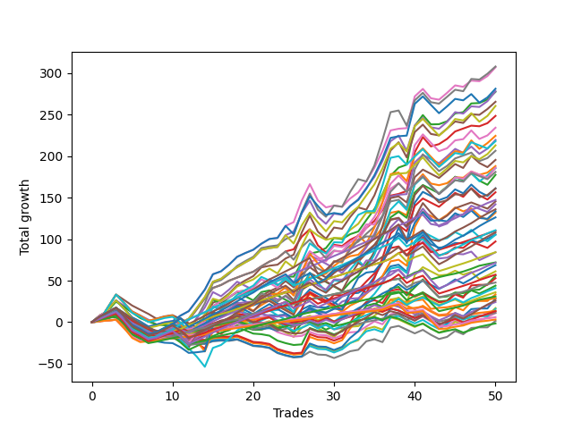

# Short Wallace 019 
- Symbol: ES
- Date Range: 03/18/2022 - 07/15/2022
- Trading Period: 7:20-12:30
- Number of Trades: 50



| Name | Win Percent | Profit | Avg Profit / Trade | Avg Time / Trade |      | Name | Win Percent | Profit | Avg Profit / Trade | Avg Time / Trade |
| ---- | ----------- | ------ | ------------------ | ---------------- | ---- | ---- | ----------- | ------ | ------------------ | ---------------- |
| Sorted By <br> Profit | | | | | | Sorted By <br> Win Percentage ||||
| Seven | 70.00 | 154000.00 | 3080.00 | 26:27 |     | Eighty-One | 92.00 | 14375.00 | 287.50 | 04:33 |
| Six | 78.00 | 153500.00 | 3070.00 | 20:26 |     | Eighty-Three | 90.00 | 55000.00 | 1100.00 | 08:43 |
| Sixty-Two | 76.00 | 140625.00 | 2812.50 | 18:04 |     | Eighty-Two | 90.00 | 36000.00 | 720.00 | 07:03 |
| Four | 76.00 | 139125.00 | 2782.50 | 21:53 |     | Eighty-Four | 88.00 | 73625.00 | 1472.50 | 10:41 |
| Two | 82.00 | 138750.00 | 2775.00 | 16:23 |     | One Hundred Twenty-One | 88.00 | 3000.00 | 60.00 | 03:03 |
| Five | 70.00 | 132750.00 | 2655.00 | 24:20 |     | One Hundred Twenty-Six | 88.00 | 1625.00 | 32.50 | 03:06 |
| Sixty | 74.00 | 130250.00 | 2605.00 | 18:56 |     | One Hundred Twenty-Three | 86.00 | 42125.00 | 842.50 | 07:12 |
| Three | 82.00 | 124250.00 | 2485.00 | 17:22 |     | One Hundred Twenty-Two | 86.00 | 23875.00 | 477.50 | 05:32 |
| Fifty-Eight | 76.00 | 117125.00 | 2342.50 | 14:15 |     | One Hundred Twenty-Four | 84.00 | 55375.00 | 1107.50 | 08:36 |
| Sixty-Three | 64.00 | 112250.00 | 2245.00 | 23:00 |     | One Hundred Twenty-Seven | 84.00 | 15500.00 | 310.00 | 05:16 |
| Forty-Six | 58.00 | 109750.00 | 2195.00 | 12:36 |     | One Hundred Sixteen | 84.00 | 6875.00 | 137.50 | 01:29 |
| Seventy-One | 60.00 | 109000.00 | 2180.00 | 19:14 |     | One Hundred Eleven | 84.00 | 6625.00 | 132.50 | 01:30 |
| Seventy | 66.00 | 106500.00 | 2130.00 | 15:35 |     | Two | 82.00 | 138750.00 | 2775.00 | 16:23 |
| Fifty-Nine | 76.00 | 103250.00 | 2065.00 | 14:53 |     | Three | 82.00 | 124250.00 | 2485.00 | 17:22 |
| Forty-Seven | 48.00 | 97750.00 | 1955.00 | 16:55 |     | Eighty-Five | 82.00 | 68000.00 | 1360.00 | 13:23 |
| One | 78.00 | 94000.00 | 1880.00 | 14:21 |     | One Hundred Twenty-Eight | 82.00 | 28625.00 | 572.50 | 06:45 |
| Sixty-Eight | 60.00 | 93000.00 | 1860.00 | 15:39 |     | One Hundred Twenty-Five | 80.00 | 63125.00 | 1262.50 | 10:54 |
| Sixty-One | 64.00 | 92750.00 | 1855.00 | 20:52 |     | Six | 78.00 | 153500.00 | 3070.00 | 20:26 |
| Sixty-Nine | 60.00 | 90500.00 | 1810.00 | 17:07 |     | One | 78.00 | 94000.00 | 1880.00 | 14:21 |
| Forty-Four | 54.00 | 88750.00 | 1775.00 | 13:00 |     | Fifty-Seven | 78.00 | 80500.00 | 1610.00 | 12:25 |
| Forty-Two | 56.00 | 80625.00 | 1612.50 | 10:04 |     | One Hundred Twenty-Nine | 78.00 | 35750.00 | 715.00 | 07:47 |
| Fifty-Seven | 78.00 | 80500.00 | 1610.00 | 12:25 |     | Sixty-Two | 76.00 | 140625.00 | 2812.50 | 18:04 |
| Forty-Five | 48.00 | 78250.00 | 1565.00 | 14:48 |     | Four | 76.00 | 139125.00 | 2782.50 | 21:53 |
| Eighty-Four | 88.00 | 73625.00 | 1472.50 | 10:41 |     | Fifty-Eight | 76.00 | 117125.00 | 2342.50 | 14:15 |
| Sixty-Seven | 68.00 | 72750.00 | 1455.00 | 12:41 |     | Fifty-Nine | 76.00 | 103250.00 | 2065.00 | 14:53 |
| Sixty-Six | 66.00 | 71000.00 | 1420.00 | 12:23 |     | One Hundred Thirty | 76.00 | 54000.00 | 1080.00 | 09:48 |
| Eighty-Five | 82.00 | 68000.00 | 1360.00 | 13:23 |     | Sixty | 74.00 | 130250.00 | 2605.00 | 18:56 |
| Seventy-Three | 52.00 | 66875.00 | 1337.50 | 13:15 |     | One Hundred Twelve | 72.00 | 5625.00 | 112.50 | 03:02 |
| Forty-Three | 54.00 | 66000.00 | 1320.00 | 10:04 |     | Seven | 70.00 | 154000.00 | 3080.00 | 26:27 |
| One Hundred Twenty-Five | 80.00 | 63125.00 | 1262.50 | 10:54 |     | Five | 70.00 | 132750.00 | 2655.00 | 24:20 |
| One Hundred Twenty-Four | 84.00 | 55375.00 | 1107.50 | 08:36 |     | Sixty-Five | 70.00 | 48625.00 | 972.50 | 11:06 |
| Eighty-Three | 90.00 | 55000.00 | 1100.00 | 08:43 |     | One Hundred Thirteen | 70.00 | 18000.00 | 360.00 | 03:56 |
| One Hundred Thirty | 76.00 | 54000.00 | 1080.00 | 09:48 |     | Sixty-Seven | 68.00 | 72750.00 | 1455.00 | 12:41 |
| Zero | 66.00 | 52750.00 | 1055.00 | 09:33 |     | Seventy | 66.00 | 106500.00 | 2130.00 | 15:35 |
| Forty-One | 60.00 | 52625.00 | 1052.50 | 08:51 |     | Sixty-Six | 66.00 | 71000.00 | 1420.00 | 12:23 |
| Sixty-Five | 70.00 | 48625.00 | 972.50 | 11:06 |     | Zero | 66.00 | 52750.00 | 1055.00 | 09:33 |
| One Hundred Twenty-Three | 86.00 | 42125.00 | 842.50 | 07:12 |     | Fifty-Six | 66.00 | 42125.00 | 842.50 | 08:16 |
| Fifty-Six | 66.00 | 42125.00 | 842.50 | 08:16 |     | Sixty-Four | 66.00 | 22000.00 | 440.00 | 07:46 |
| Eighty-Two | 90.00 | 36000.00 | 720.00 | 07:03 |     | One Hundred Seventeen | 66.00 | -750.00 | -15.00 | 02:32 |
| One Hundred Twenty-Nine | 78.00 | 35750.00 | 715.00 | 07:47 |     | Sixty-Three | 64.00 | 112250.00 | 2245.00 | 23:00 |
| One Hundred Fifteen | 62.00 | 34375.00 | 687.50 | 06:35 |     | Sixty-One | 64.00 | 92750.00 | 1855.00 | 20:52 |
| Forty | 62.00 | 30625.00 | 612.50 | 05:45 |     | One Hundred Fourteen | 64.00 | 20500.00 | 410.00 | 04:40 |
| One Hundred Twenty-Eight | 82.00 | 28625.00 | 572.50 | 06:45 |     | One Hundred Fifteen | 62.00 | 34375.00 | 687.50 | 06:35 |
| Fifty-Four | 46.00 | 28000.00 | 560.00 | 06:21 |     | Forty | 62.00 | 30625.00 | 612.50 | 05:45 |
| Fifty-Five | 42.00 | 26500.00 | 530.00 | 07:49 |     | One Hundred Eighteen | 62.00 | 6625.00 | 132.50 | 03:18 |
| One Hundred Twenty-Two | 86.00 | 23875.00 | 477.50 | 05:32 |     | Seventy-One | 60.00 | 109000.00 | 2180.00 | 19:14 |
| Sixty-Four | 66.00 | 22000.00 | 440.00 | 07:46 |     | Sixty-Eight | 60.00 | 93000.00 | 1860.00 | 15:39 |
| One Hundred Fourteen | 64.00 | 20500.00 | 410.00 | 04:40 |     | Sixty-Nine | 60.00 | 90500.00 | 1810.00 | 17:07 |
| One Hundred Thirteen | 70.00 | 18000.00 | 360.00 | 03:56 |     | Forty-One | 60.00 | 52625.00 | 1052.50 | 08:51 |
| Fifty-Three | 40.00 | 16750.00 | 335.00 | 07:03 |     | Forty-Six | 58.00 | 109750.00 | 2195.00 | 12:36 |
| One Hundred Twenty-Seven | 84.00 | 15500.00 | 310.00 | 05:16 |     | Forty-Two | 56.00 | 80625.00 | 1612.50 | 10:04 |
| Eighty-One | 92.00 | 14375.00 | 287.50 | 04:33 |     | One Hundred Ninteen | 56.00 | 12125.00 | 242.50 | 03:50 |
| Fifty-Two | 40.00 | 14250.00 | 285.00 | 06:21 |     | Forty-Four | 54.00 | 88750.00 | 1775.00 | 13:00 |
| One Hundred Twenty | 46.00 | 13125.00 | 262.50 | 04:37 |     | Forty-Three | 54.00 | 66000.00 | 1320.00 | 10:04 |
| One Hundred Ninteen | 56.00 | 12125.00 | 242.50 | 03:50 |     | Seventy-Three | 52.00 | 66875.00 | 1337.50 | 13:15 |
| Fifty | 40.00 | 8500.00 | 170.00 | 05:44 |     | Forty-Eight | 52.00 | 5500.00 | 110.00 | 04:12 |
| Fifty-One | 42.00 | 8000.00 | 160.00 | 05:37 |     | Forty-Seven | 48.00 | 97750.00 | 1955.00 | 16:55 |
| One Hundred Sixteen | 84.00 | 6875.00 | 137.50 | 01:29 |     | Forty-Five | 48.00 | 78250.00 | 1565.00 | 14:48 |
| One Hundred Eleven | 84.00 | 6625.00 | 132.50 | 01:30 |     | Fifty-Four | 46.00 | 28000.00 | 560.00 | 06:21 |
| One Hundred Eighteen | 62.00 | 6625.00 | 132.50 | 03:18 |     | One Hundred Twenty | 46.00 | 13125.00 | 262.50 | 04:37 |
| One Hundred Twelve | 72.00 | 5625.00 | 112.50 | 03:02 |     | Fifty-Five | 42.00 | 26500.00 | 530.00 | 07:49 |
| Forty-Eight | 52.00 | 5500.00 | 110.00 | 04:12 |     | Fifty-One | 42.00 | 8000.00 | 160.00 | 05:37 |
| One Hundred Twenty-One | 88.00 | 3000.00 | 60.00 | 03:03 |     | Forty-Nine | 42.00 | 750.00 | 15.00 | 05:25 |
| One Hundred Twenty-Six | 88.00 | 1625.00 | 32.50 | 03:06 |     | Fifty-Three | 40.00 | 16750.00 | 335.00 | 07:03 |
| Forty-Nine | 42.00 | 750.00 | 15.00 | 05:25 |     | Fifty-Two | 40.00 | 14250.00 | 285.00 | 06:21 |
| One Hundred Seventeen | 66.00 | -750.00 | -15.00 | 02:32 |     | Fifty | 40.00 | 8500.00 | 170.00 | 05:44 |

## NO STOPLOSS

### Test Zero
* Sell when price hits the middle line of the 20p bollinger
* No Stoploss
* Results:
```
Total Trades: 50
Percent Up: 34.00
Percent Down: 66.00
Total Points Moved Down: 105.50
Potential Profit: 52750.00
Total Points Ups: 68.50 Count Ups: 17
Total Points Downs: 174.00 Count Downs: 33
```

<details><summary>Trades</summary>

<code>In: 2022-03-21 08:26:00		Out: 2022-03-21 08:32:35		Total Position Time: 06:35		Total Move Down: 4.00		Total to Date: 4.00</code> <br />
<code>In: 2022-03-25 11:55:00		Out: 2022-03-25 11:57:15		Total Position Time: 02:15		Total Move Down: 1.75		Total to Date: 5.75</code> <br />
<code>In: 2022-03-25 11:57:00		Out: 2022-03-25 11:57:15		Total Position Time: 00:15		Total Move Down: 0.25		Total to Date: 6.00</code> <br />
<code>In: 2022-03-28 11:42:00		Out: 2022-03-28 12:06:45		Total Position Time: 24:45		Total Move Down: -9.50		Total to Date: -3.50</code> <br />
<code>In: 2022-03-28 11:43:00		Out: 2022-03-28 12:06:45		Total Position Time: 23:45		Total Move Down: -9.75		Total to Date: -13.25</code> <br />
<code>In: 2022-03-28 11:50:00		Out: 2022-03-28 12:06:45		Total Position Time: 16:45		Total Move Down: -4.25		Total to Date: -17.50</code> <br />
<code>In: 2022-03-29 11:38:00		Out: 2022-03-29 11:50:50		Total Position Time: 12:50		Total Move Down: 1.00		Total to Date: -16.50</code> <br />
<code>In: 2022-03-31 07:48:00		Out: 2022-03-31 08:03:05		Total Position Time: 15:05		Total Move Down: -1.00		Total to Date: -17.50</code> <br />
<code>In: 2022-03-31 07:49:00		Out: 2022-03-31 08:03:05		Total Position Time: 14:05		Total Move Down: 1.50		Total to Date: -16.00</code> <br />
<code>In: 2022-04-01 11:34:00		Out: 2022-04-01 11:43:00		Total Position Time: 09:00		Total Move Down: 1.25		Total to Date: -14.75</code> <br />
<code>In: 2022-04-06 10:35:00		Out: 2022-04-06 10:47:10		Total Position Time: 12:10		Total Move Down: -1.25		Total to Date: -16.00</code> <br />
<code>In: 2022-04-06 10:36:00		Out: 2022-04-06 10:47:10		Total Position Time: 11:10		Total Move Down: -3.00		Total to Date: -19.00</code> <br />
<code>In: 2022-04-06 10:43:00		Out: 2022-04-06 10:47:10		Total Position Time: 04:10		Total Move Down: 4.50		Total to Date: -14.50</code> <br />
<code>In: 2022-04-06 10:44:00		Out: 2022-04-06 10:47:10		Total Position Time: 03:10		Total Move Down: 5.00		Total to Date: -9.50</code> <br />
<code>In: 2022-04-06 11:05:00		Out: 2022-04-06 11:05:35		Total Position Time: 00:35		Total Move Down: 7.00		Total to Date: -2.50</code> <br />
<code>In: 2022-04-07 11:03:00		Out: 2022-04-07 11:15:20		Total Position Time: 12:20		Total Move Down: 4.00		Total to Date: 1.50</code> <br />
<code>In: 2022-04-18 07:27:00		Out: 2022-04-18 07:36:45		Total Position Time: 09:45		Total Move Down: 3.00		Total to Date: 4.50</code> <br />
<code>In: 2022-04-18 11:26:00		Out: 2022-04-18 11:28:05		Total Position Time: 02:05		Total Move Down: 6.00		Total to Date: 10.50</code> <br />
<code>In: 2022-04-20 07:39:00		Out: 2022-04-20 08:00:10		Total Position Time: 21:10		Total Move Down: -2.50		Total to Date: 8.00</code> <br />
<code>In: 2022-04-20 07:40:00		Out: 2022-04-20 08:00:10		Total Position Time: 20:10		Total Move Down: -3.00		Total to Date: 5.00</code> <br />
<code>In: 2022-04-20 07:42:00		Out: 2022-04-20 08:00:10		Total Position Time: 18:10		Total Move Down: 0.25		Total to Date: 5.25</code> <br />
<code>In: 2022-04-20 09:54:00		Out: 2022-04-20 09:59:15		Total Position Time: 05:15		Total Move Down: 3.25		Total to Date: 8.50</code> <br />
<code>In: 2022-04-25 10:14:00		Out: 2022-04-25 10:26:25		Total Position Time: 12:25		Total Move Down: -0.50		Total to Date: 8.00</code> <br />
<code>In: 2022-04-27 08:34:00		Out: 2022-04-27 08:45:05		Total Position Time: 11:05		Total Move Down: 1.25		Total to Date: 9.25</code> <br />
<code>In: 2022-05-16 08:48:00		Out: 2022-05-16 09:05:45		Total Position Time: 17:45		Total Move Down: -5.00		Total to Date: 4.25</code> <br />
<code>In: 2022-05-24 09:17:00		Out: 2022-05-24 09:21:35		Total Position Time: 04:35		Total Move Down: 11.00		Total to Date: 15.25</code> <br />
<code>In: 2022-05-24 09:18:00		Out: 2022-05-24 09:21:35		Total Position Time: 03:35		Total Move Down: 4.75		Total to Date: 20.00</code> <br />
<code>In: 2022-05-24 10:43:00		Out: 2022-05-24 11:01:15		Total Position Time: 18:15		Total Move Down: -2.25		Total to Date: 17.75</code> <br />
<code>In: 2022-05-24 10:47:00		Out: 2022-05-24 11:01:15		Total Position Time: 14:15		Total Move Down: -0.00		Total to Date: 17.75</code> <br />
<code>In: 2022-05-25 11:04:00		Out: 2022-05-25 11:06:25		Total Position Time: 02:25		Total Move Down: 4.50		Total to Date: 22.25</code> <br />
<code>In: 2022-05-31 07:23:00		Out: 2022-05-31 07:30:05		Total Position Time: 07:05		Total Move Down: 8.75		Total to Date: 31.00</code> <br />
<code>In: 2022-06-09 10:07:00		Out: 2022-06-09 10:16:15		Total Position Time: 09:15		Total Move Down: 3.50		Total to Date: 34.50</code> <br />
<code>In: 2022-06-09 10:08:00		Out: 2022-06-09 10:16:15		Total Position Time: 08:15		Total Move Down: 0.75		Total to Date: 35.25</code> <br />
<code>In: 2022-06-10 12:00:00		Out: 2022-06-10 12:03:25		Total Position Time: 03:25		Total Move Down: 6.25		Total to Date: 41.50</code> <br />
<code>In: 2022-06-10 12:29:00		Out: 2022-06-10 12:30:30		Total Position Time: 01:30		Total Move Down: 6.25		Total to Date: 47.75</code> <br />
<code>In: 2022-06-13 09:38:00		Out: 2022-06-13 09:43:15		Total Position Time: 05:15		Total Move Down: 7.50		Total to Date: 55.25</code> <br />
<code>In: 2022-06-13 09:40:00		Out: 2022-06-13 09:43:15		Total Position Time: 03:15		Total Move Down: 12.00		Total to Date: 67.25</code> <br />
<code>In: 2022-06-15 11:02:00		Out: 2022-06-15 11:02:10		Total Position Time: 00:10		Total Move Down: 2.00		Total to Date: 69.25</code> <br />
<code>In: 2022-06-15 11:40:00		Out: 2022-06-15 11:52:30		Total Position Time: 12:30		Total Move Down: -8.50		Total to Date: 60.75</code> <br />
<code>In: 2022-06-15 11:45:00		Out: 2022-06-15 11:52:30		Total Position Time: 07:30		Total Move Down: 34.75		Total to Date: 95.50</code> <br />
<code>In: 2022-06-17 10:13:00		Out: 2022-06-17 10:22:05		Total Position Time: 09:05		Total Move Down: 9.50		Total to Date: 105.00</code> <br />
<code>In: 2022-06-23 12:30:00		Out: 2022-06-23 12:46:00		Total Position Time: 16:00		Total Move Down: -11.25		Total to Date: 93.75</code> <br />
<code>In: 2022-06-27 07:49:00		Out: 2022-06-27 08:02:15		Total Position Time: 13:15		Total Move Down: -4.00		Total to Date: 89.75</code> <br />
<code>In: 2022-06-29 11:06:00		Out: 2022-06-29 11:20:00		Total Position Time: 14:00		Total Move Down: 1.00		Total to Date: 90.75</code> <br />
<code>In: 2022-06-29 12:31:00		Out: 2022-06-29 12:33:20		Total Position Time: 02:20		Total Move Down: 4.75		Total to Date: 95.50</code> <br />
<code>In: 2022-07-01 10:47:00		Out: 2022-07-01 10:58:45		Total Position Time: 11:45		Total Move Down: -0.75		Total to Date: 94.75</code> <br />
<code>In: 2022-07-06 11:10:00		Out: 2022-07-06 11:10:10		Total Position Time: 00:10		Total Move Down: 3.25		Total to Date: 98.00</code> <br />
<code>In: 2022-07-06 11:35:00		Out: 2022-07-06 11:50:00		Total Position Time: 15:00		Total Move Down: -2.00		Total to Date: 96.00</code> <br />
<code>In: 2022-07-12 08:14:00		Out: 2022-07-12 08:16:20		Total Position Time: 02:20		Total Move Down: 4.50		Total to Date: 100.50</code> <br />
<code>In: 2022-07-12 08:31:00		Out: 2022-07-12 08:36:55		Total Position Time: 05:55		Total Move Down: 5.00		Total to Date: 105.50</code> <br />


</details>

### Test One
* Sell when the price hits the upper line of the 20p 1std bollinger
* No Stoploss
* Results:
```
Total Trades: 50
Percent Up: 22.00
Percent Down: 78.00
Total Points Moved Down: 188.00
Potential Profit: 94000.00
Total Points Ups: 55.25 Count Ups: 11
Total Points Downs: 243.25 Count Downs: 39
```

<details><summary>Trades</summary>

<code>In: 2022-03-21 08:26:00		Out: 2022-03-21 08:36:00		Total Position Time: 10:00		Total Move Down: 4.75		Total to Date: 4.75</code> <br />
<code>In: 2022-03-25 11:55:00		Out: 2022-03-25 12:00:45		Total Position Time: 05:45		Total Move Down: 3.25		Total to Date: 8.00</code> <br />
<code>In: 2022-03-25 11:57:00		Out: 2022-03-25 12:00:45		Total Position Time: 03:45		Total Move Down: 1.75		Total to Date: 9.75</code> <br />
<code>In: 2022-03-28 11:42:00		Out: 2022-03-28 12:11:55		Total Position Time: 29:55		Total Move Down: -10.25		Total to Date: -0.50</code> <br />
<code>In: 2022-03-28 11:43:00		Out: 2022-03-28 12:12:55		Total Position Time: 29:55		Total Move Down: -10.25		Total to Date: -10.75</code> <br />
<code>In: 2022-03-28 11:50:00		Out: 2022-03-28 12:19:55		Total Position Time: 29:55		Total Move Down: -5.00		Total to Date: -15.75</code> <br />
<code>In: 2022-03-29 11:38:00		Out: 2022-03-29 12:00:25		Total Position Time: 22:25		Total Move Down: 0.25		Total to Date: -15.50</code> <br />
<code>In: 2022-03-31 07:48:00		Out: 2022-03-31 08:03:30		Total Position Time: 15:30		Total Move Down: 1.25		Total to Date: -14.25</code> <br />
<code>In: 2022-03-31 07:49:00		Out: 2022-03-31 08:03:30		Total Position Time: 14:30		Total Move Down: 3.75		Total to Date: -10.50</code> <br />
<code>In: 2022-04-01 11:34:00		Out: 2022-04-01 11:50:15		Total Position Time: 16:15		Total Move Down: 3.25		Total to Date: -7.25</code> <br />
<code>In: 2022-04-06 10:35:00		Out: 2022-04-06 10:56:55		Total Position Time: 21:55		Total Move Down: -1.75		Total to Date: -9.00</code> <br />
<code>In: 2022-04-06 10:36:00		Out: 2022-04-06 10:56:55		Total Position Time: 20:55		Total Move Down: -3.50		Total to Date: -12.50</code> <br />
<code>In: 2022-04-06 10:43:00		Out: 2022-04-06 10:56:55		Total Position Time: 13:55		Total Move Down: 4.00		Total to Date: -8.50</code> <br />
<code>In: 2022-04-06 10:44:00		Out: 2022-04-06 10:56:55		Total Position Time: 12:55		Total Move Down: 4.50		Total to Date: -4.00</code> <br />
<code>In: 2022-04-06 11:05:00		Out: 2022-04-06 11:07:20		Total Position Time: 02:20		Total Move Down: 12.50		Total to Date: 8.50</code> <br />
<code>In: 2022-04-07 11:03:00		Out: 2022-04-07 11:16:10		Total Position Time: 13:10		Total Move Down: 4.00		Total to Date: 12.50</code> <br />
<code>In: 2022-04-18 07:27:00		Out: 2022-04-18 07:51:15		Total Position Time: 24:15		Total Move Down: 1.75		Total to Date: 14.25</code> <br />
<code>In: 2022-04-18 11:26:00		Out: 2022-04-18 11:41:15		Total Position Time: 15:15		Total Move Down: 6.50		Total to Date: 20.75</code> <br />
<code>In: 2022-04-20 07:39:00		Out: 2022-04-20 08:00:40		Total Position Time: 21:40		Total Move Down: 0.75		Total to Date: 21.50</code> <br />
<code>In: 2022-04-20 07:40:00		Out: 2022-04-20 08:00:40		Total Position Time: 20:40		Total Move Down: 0.25		Total to Date: 21.75</code> <br />
<code>In: 2022-04-20 07:42:00		Out: 2022-04-20 08:00:40		Total Position Time: 18:40		Total Move Down: 3.50		Total to Date: 25.25</code> <br />
<code>In: 2022-04-20 09:54:00		Out: 2022-04-20 10:08:15		Total Position Time: 14:15		Total Move Down: 4.25		Total to Date: 29.50</code> <br />
<code>In: 2022-04-25 10:14:00		Out: 2022-04-25 10:27:10		Total Position Time: 13:10		Total Move Down: 3.25		Total to Date: 32.75</code> <br />
<code>In: 2022-04-27 08:34:00		Out: 2022-04-27 08:48:05		Total Position Time: 14:05		Total Move Down: 3.75		Total to Date: 36.50</code> <br />
<code>In: 2022-05-16 08:48:00		Out: 2022-05-16 09:06:10		Total Position Time: 18:10		Total Move Down: -1.50		Total to Date: 35.00</code> <br />
<code>In: 2022-05-24 09:17:00		Out: 2022-05-24 09:28:55		Total Position Time: 11:55		Total Move Down: 12.50		Total to Date: 47.50</code> <br />
<code>In: 2022-05-24 09:18:00		Out: 2022-05-24 09:28:55		Total Position Time: 10:55		Total Move Down: 6.25		Total to Date: 53.75</code> <br />
<code>In: 2022-05-24 10:43:00		Out: 2022-05-24 11:01:40		Total Position Time: 18:40		Total Move Down: 1.25		Total to Date: 55.00</code> <br />
<code>In: 2022-05-24 10:47:00		Out: 2022-05-24 11:01:40		Total Position Time: 14:40		Total Move Down: 3.50		Total to Date: 58.50</code> <br />
<code>In: 2022-05-25 11:04:00		Out: 2022-05-25 11:06:35		Total Position Time: 02:35		Total Move Down: 9.25		Total to Date: 67.75</code> <br />
<code>In: 2022-05-31 07:23:00		Out: 2022-05-31 07:38:05		Total Position Time: 15:05		Total Move Down: 7.25		Total to Date: 75.00</code> <br />
<code>In: 2022-06-09 10:07:00		Out: 2022-06-09 10:18:10		Total Position Time: 11:10		Total Move Down: 4.50		Total to Date: 79.50</code> <br />
<code>In: 2022-06-09 10:08:00		Out: 2022-06-09 10:18:10		Total Position Time: 10:10		Total Move Down: 1.75		Total to Date: 81.25</code> <br />
<code>In: 2022-06-10 12:00:00		Out: 2022-06-10 12:04:35		Total Position Time: 04:35		Total Move Down: 10.25		Total to Date: 91.50</code> <br />
<code>In: 2022-06-10 12:29:00		Out: 2022-06-10 12:35:45		Total Position Time: 06:45		Total Move Down: 9.75		Total to Date: 101.25</code> <br />
<code>In: 2022-06-13 09:38:00		Out: 2022-06-13 09:47:50		Total Position Time: 09:50		Total Move Down: 13.00		Total to Date: 114.25</code> <br />
<code>In: 2022-06-13 09:40:00		Out: 2022-06-13 09:47:50		Total Position Time: 07:50		Total Move Down: 17.50		Total to Date: 131.75</code> <br />
<code>In: 2022-06-15 11:02:00		Out: 2022-06-15 11:02:10		Total Position Time: 00:10		Total Move Down: 2.00		Total to Date: 133.75</code> <br />
<code>In: 2022-06-15 11:40:00		Out: 2022-06-15 11:57:35		Total Position Time: 17:35		Total Move Down: -5.00		Total to Date: 128.75</code> <br />
<code>In: 2022-06-15 11:45:00		Out: 2022-06-15 11:57:35		Total Position Time: 12:35		Total Move Down: 38.25		Total to Date: 167.00</code> <br />
<code>In: 2022-06-17 10:13:00		Out: 2022-06-17 10:26:05		Total Position Time: 13:05		Total Move Down: 11.25		Total to Date: 178.25</code> <br />
<code>In: 2022-06-23 12:30:00		Out: 2022-06-23 12:46:00		Total Position Time: 16:00		Total Move Down: -11.25		Total to Date: 167.00</code> <br />
<code>In: 2022-06-27 07:49:00		Out: 2022-06-27 08:07:15		Total Position Time: 18:15		Total Move Down: -2.00		Total to Date: 165.00</code> <br />
<code>In: 2022-06-29 11:06:00		Out: 2022-06-29 11:20:25		Total Position Time: 14:25		Total Move Down: 2.50		Total to Date: 167.50</code> <br />
<code>In: 2022-06-29 12:31:00		Out: 2022-06-29 12:34:10		Total Position Time: 03:10		Total Move Down: 7.25		Total to Date: 174.75</code> <br />
<code>In: 2022-07-01 10:47:00		Out: 2022-07-01 11:04:25		Total Position Time: 17:25		Total Move Down: -0.75		Total to Date: 174.00</code> <br />
<code>In: 2022-07-06 11:10:00		Out: 2022-07-06 11:11:10		Total Position Time: 01:10		Total Move Down: 7.50		Total to Date: 181.50</code> <br />
<code>In: 2022-07-06 11:35:00		Out: 2022-07-06 12:00:30		Total Position Time: 25:30		Total Move Down: -4.00		Total to Date: 177.50</code> <br />
<code>In: 2022-07-12 08:14:00		Out: 2022-07-12 08:38:05		Total Position Time: 24:05		Total Move Down: 2.75		Total to Date: 180.25</code> <br />
<code>In: 2022-07-12 08:31:00		Out: 2022-07-12 08:38:05		Total Position Time: 07:05		Total Move Down: 7.75		Total to Date: 188.00</code> <br />


</details>

### Test Two
* Sell when the price hits the upper line of the 20p 2std bollinger
* No Stoploss
* Results:
```
Total Trades: 50
Percent Up: 18.00
Percent Down: 82.00
Total Points Moved Down: 277.50
Potential Profit: 138750.00
Total Points Ups: 48.00 Count Ups: 9
Total Points Downs: 325.50 Count Downs: 41
```

<details><summary>Trades</summary>

<code>In: 2022-03-21 08:26:00		Out: 2022-03-21 08:36:05		Total Position Time: 10:05		Total Move Down: 6.75		Total to Date: 6.75</code> <br />
<code>In: 2022-03-25 11:55:00		Out: 2022-03-25 12:00:55		Total Position Time: 05:55		Total Move Down: 4.25		Total to Date: 11.00</code> <br />
<code>In: 2022-03-25 11:57:00		Out: 2022-03-25 12:00:55		Total Position Time: 03:55		Total Move Down: 2.75		Total to Date: 13.75</code> <br />
<code>In: 2022-03-28 11:42:00		Out: 2022-03-28 12:11:55		Total Position Time: 29:55		Total Move Down: -10.25		Total to Date: 3.50</code> <br />
<code>In: 2022-03-28 11:43:00		Out: 2022-03-28 12:12:55		Total Position Time: 29:55		Total Move Down: -10.25		Total to Date: -6.75</code> <br />
<code>In: 2022-03-28 11:50:00		Out: 2022-03-28 12:19:55		Total Position Time: 29:55		Total Move Down: -5.00		Total to Date: -11.75</code> <br />
<code>In: 2022-03-29 11:38:00		Out: 2022-03-29 12:07:55		Total Position Time: 29:55		Total Move Down: -6.00		Total to Date: -17.75</code> <br />
<code>In: 2022-03-31 07:48:00		Out: 2022-03-31 08:08:30		Total Position Time: 20:30		Total Move Down: 2.50		Total to Date: -15.25</code> <br />
<code>In: 2022-03-31 07:49:00		Out: 2022-03-31 08:08:30		Total Position Time: 19:30		Total Move Down: 5.00		Total to Date: -10.25</code> <br />
<code>In: 2022-04-01 11:34:00		Out: 2022-04-01 11:50:20		Total Position Time: 16:20		Total Move Down: 3.75		Total to Date: -6.50</code> <br />
<code>In: 2022-04-06 10:35:00		Out: 2022-04-06 10:57:20		Total Position Time: 22:20		Total Move Down: -0.75		Total to Date: -7.25</code> <br />
<code>In: 2022-04-06 10:36:00		Out: 2022-04-06 10:57:20		Total Position Time: 21:20		Total Move Down: -2.50		Total to Date: -9.75</code> <br />
<code>In: 2022-04-06 10:43:00		Out: 2022-04-06 10:57:20		Total Position Time: 14:20		Total Move Down: 5.00		Total to Date: -4.75</code> <br />
<code>In: 2022-04-06 10:44:00		Out: 2022-04-06 10:57:20		Total Position Time: 13:20		Total Move Down: 5.50		Total to Date: 0.75</code> <br />
<code>In: 2022-04-06 11:05:00		Out: 2022-04-06 11:08:10		Total Position Time: 03:10		Total Move Down: 18.50		Total to Date: 19.25</code> <br />
<code>In: 2022-04-07 11:03:00		Out: 2022-04-07 11:18:20		Total Position Time: 15:20		Total Move Down: 6.00		Total to Date: 25.25</code> <br />
<code>In: 2022-04-18 07:27:00		Out: 2022-04-18 07:51:45		Total Position Time: 24:45		Total Move Down: 4.75		Total to Date: 30.00</code> <br />
<code>In: 2022-04-18 11:26:00		Out: 2022-04-18 11:44:10		Total Position Time: 18:10		Total Move Down: 6.75		Total to Date: 36.75</code> <br />
<code>In: 2022-04-20 07:39:00		Out: 2022-04-20 08:00:45		Total Position Time: 21:45		Total Move Down: 1.25		Total to Date: 38.00</code> <br />
<code>In: 2022-04-20 07:40:00		Out: 2022-04-20 08:00:45		Total Position Time: 20:45		Total Move Down: 0.75		Total to Date: 38.75</code> <br />
<code>In: 2022-04-20 07:42:00		Out: 2022-04-20 08:00:45		Total Position Time: 18:45		Total Move Down: 4.00		Total to Date: 42.75</code> <br />
<code>In: 2022-04-20 09:54:00		Out: 2022-04-20 10:08:15		Total Position Time: 14:15		Total Move Down: 4.25		Total to Date: 47.00</code> <br />
<code>In: 2022-04-25 10:14:00		Out: 2022-04-25 10:33:35		Total Position Time: 19:35		Total Move Down: 4.25		Total to Date: 51.25</code> <br />
<code>In: 2022-04-27 08:34:00		Out: 2022-04-27 08:50:10		Total Position Time: 16:10		Total Move Down: 4.00		Total to Date: 55.25</code> <br />
<code>In: 2022-05-16 08:48:00		Out: 2022-05-16 09:11:35		Total Position Time: 23:35		Total Move Down: -0.50		Total to Date: 54.75</code> <br />
<code>In: 2022-05-24 09:17:00		Out: 2022-05-24 09:31:20		Total Position Time: 14:20		Total Move Down: 17.00		Total to Date: 71.75</code> <br />
<code>In: 2022-05-24 09:18:00		Out: 2022-05-24 09:31:20		Total Position Time: 13:20		Total Move Down: 10.75		Total to Date: 82.50</code> <br />
<code>In: 2022-05-24 10:43:00		Out: 2022-05-24 11:01:50		Total Position Time: 18:50		Total Move Down: 2.25		Total to Date: 84.75</code> <br />
<code>In: 2022-05-24 10:47:00		Out: 2022-05-24 11:01:50		Total Position Time: 14:50		Total Move Down: 4.50		Total to Date: 89.25</code> <br />
<code>In: 2022-05-25 11:04:00		Out: 2022-05-25 11:06:40		Total Position Time: 02:40		Total Move Down: 12.25		Total to Date: 101.50</code> <br />
<code>In: 2022-05-31 07:23:00		Out: 2022-05-31 07:52:55		Total Position Time: 29:55		Total Move Down: -1.50		Total to Date: 100.00</code> <br />
<code>In: 2022-06-09 10:07:00		Out: 2022-06-09 10:18:55		Total Position Time: 11:55		Total Move Down: 6.00		Total to Date: 106.00</code> <br />
<code>In: 2022-06-09 10:08:00		Out: 2022-06-09 10:18:55		Total Position Time: 10:55		Total Move Down: 3.25		Total to Date: 109.25</code> <br />
<code>In: 2022-06-10 12:00:00		Out: 2022-06-10 12:05:55		Total Position Time: 05:55		Total Move Down: 13.75		Total to Date: 123.00</code> <br />
<code>In: 2022-06-10 12:29:00		Out: 2022-06-10 12:42:45		Total Position Time: 13:45		Total Move Down: 13.25		Total to Date: 136.25</code> <br />
<code>In: 2022-06-13 09:38:00		Out: 2022-06-13 09:54:20		Total Position Time: 16:20		Total Move Down: 17.75		Total to Date: 154.00</code> <br />
<code>In: 2022-06-13 09:40:00		Out: 2022-06-13 09:54:20		Total Position Time: 14:20		Total Move Down: 22.25		Total to Date: 176.25</code> <br />
<code>In: 2022-06-15 11:02:00		Out: 2022-06-15 11:03:05		Total Position Time: 01:05		Total Move Down: 10.00		Total to Date: 186.25</code> <br />
<code>In: 2022-06-15 11:40:00		Out: 2022-06-15 11:58:05		Total Position Time: 18:05		Total Move Down: 3.50		Total to Date: 189.75</code> <br />
<code>In: 2022-06-15 11:45:00		Out: 2022-06-15 11:58:05		Total Position Time: 13:05		Total Move Down: 46.75		Total to Date: 236.50</code> <br />
<code>In: 2022-06-17 10:13:00		Out: 2022-06-17 10:27:05		Total Position Time: 14:05		Total Move Down: 13.00		Total to Date: 249.50</code> <br />
<code>In: 2022-06-23 12:30:00		Out: 2022-06-23 12:46:00		Total Position Time: 16:00		Total Move Down: -11.25		Total to Date: 238.25</code> <br />
<code>In: 2022-06-27 07:49:00		Out: 2022-06-27 08:09:45		Total Position Time: 20:45		Total Move Down: 0.25		Total to Date: 238.50</code> <br />
<code>In: 2022-06-29 11:06:00		Out: 2022-06-29 11:20:45		Total Position Time: 14:45		Total Move Down: 3.50		Total to Date: 242.00</code> <br />
<code>In: 2022-06-29 12:31:00		Out: 2022-06-29 12:35:20		Total Position Time: 04:20		Total Move Down: 9.50		Total to Date: 251.50</code> <br />
<code>In: 2022-07-01 10:47:00		Out: 2022-07-01 11:07:55		Total Position Time: 20:55		Total Move Down: 1.50		Total to Date: 253.00</code> <br />
<code>In: 2022-07-06 11:10:00		Out: 2022-07-06 11:11:45		Total Position Time: 01:45		Total Move Down: 10.50		Total to Date: 263.50</code> <br />
<code>In: 2022-07-06 11:35:00		Out: 2022-07-06 12:01:25		Total Position Time: 26:25		Total Move Down: 0.50		Total to Date: 264.00</code> <br />
<code>In: 2022-07-12 08:14:00		Out: 2022-07-12 08:41:10		Total Position Time: 27:10		Total Move Down: 4.25		Total to Date: 268.25</code> <br />
<code>In: 2022-07-12 08:31:00		Out: 2022-07-12 08:41:10		Total Position Time: 10:10		Total Move Down: 9.25		Total to Date: 277.50</code> <br />


</details>

### Test Three
* Sell when price hits the middle line of the 50p bollinger
* No Stoploss
* Results:
```
Total Trades: 50
Percent Up: 18.00
Percent Down: 82.00
Total Points Moved Down: 248.50
Potential Profit: 124250.00
Total Points Ups: 73.00 Count Ups: 9
Total Points Downs: 321.50 Count Downs: 41
```

<details><summary>Trades</summary>

<code>In: 2022-03-21 08:26:00		Out: 2022-03-21 08:36:10		Total Position Time: 10:10		Total Move Down: 6.50		Total to Date: 6.50</code> <br />
<code>In: 2022-03-25 11:55:00		Out: 2022-03-25 12:00:45		Total Position Time: 05:45		Total Move Down: 3.25		Total to Date: 9.75</code> <br />
<code>In: 2022-03-25 11:57:00		Out: 2022-03-25 12:00:45		Total Position Time: 03:45		Total Move Down: 1.75		Total to Date: 11.50</code> <br />
<code>In: 2022-03-28 11:42:00		Out: 2022-03-28 12:11:55		Total Position Time: 29:55		Total Move Down: -10.25		Total to Date: 1.25</code> <br />
<code>In: 2022-03-28 11:43:00		Out: 2022-03-28 12:12:55		Total Position Time: 29:55		Total Move Down: -10.25		Total to Date: -9.00</code> <br />
<code>In: 2022-03-28 11:50:00		Out: 2022-03-28 12:19:55		Total Position Time: 29:55		Total Move Down: -5.00		Total to Date: -14.00</code> <br />
<code>In: 2022-03-29 11:38:00		Out: 2022-03-29 12:07:55		Total Position Time: 29:55		Total Move Down: -6.00		Total to Date: -20.00</code> <br />
<code>In: 2022-03-31 07:48:00		Out: 2022-03-31 08:15:35		Total Position Time: 27:35		Total Move Down: 1.75		Total to Date: -18.25</code> <br />
<code>In: 2022-03-31 07:49:00		Out: 2022-03-31 08:15:35		Total Position Time: 26:35		Total Move Down: 4.25		Total to Date: -14.00</code> <br />
<code>In: 2022-04-01 11:34:00		Out: 2022-04-01 11:57:50		Total Position Time: 23:50		Total Move Down: 4.50		Total to Date: -9.50</code> <br />
<code>In: 2022-04-06 10:35:00		Out: 2022-04-06 11:00:10		Total Position Time: 25:10		Total Move Down: 7.00		Total to Date: -2.50</code> <br />
<code>In: 2022-04-06 10:36:00		Out: 2022-04-06 11:00:10		Total Position Time: 24:10		Total Move Down: 5.25		Total to Date: 2.75</code> <br />
<code>In: 2022-04-06 10:43:00		Out: 2022-04-06 11:00:10		Total Position Time: 17:10		Total Move Down: 12.75		Total to Date: 15.50</code> <br />
<code>In: 2022-04-06 10:44:00		Out: 2022-04-06 11:00:10		Total Position Time: 16:10		Total Move Down: 13.25		Total to Date: 28.75</code> <br />
<code>In: 2022-04-06 11:05:00		Out: 2022-04-06 11:07:20		Total Position Time: 02:20		Total Move Down: 12.50		Total to Date: 41.25</code> <br />
<code>In: 2022-04-07 11:03:00		Out: 2022-04-07 11:32:55		Total Position Time: 29:55		Total Move Down: 3.50		Total to Date: 44.75</code> <br />
<code>In: 2022-04-18 07:27:00		Out: 2022-04-18 07:51:50		Total Position Time: 24:50		Total Move Down: 5.25		Total to Date: 50.00</code> <br />
<code>In: 2022-04-18 11:26:00		Out: 2022-04-18 11:27:45		Total Position Time: 01:45		Total Move Down: 3.75		Total to Date: 53.75</code> <br />
<code>In: 2022-04-20 07:39:00		Out: 2022-04-20 08:01:10		Total Position Time: 22:10		Total Move Down: 3.75		Total to Date: 57.50</code> <br />
<code>In: 2022-04-20 07:40:00		Out: 2022-04-20 08:01:10		Total Position Time: 21:10		Total Move Down: 3.25		Total to Date: 60.75</code> <br />
<code>In: 2022-04-20 07:42:00		Out: 2022-04-20 08:01:10		Total Position Time: 19:10		Total Move Down: 6.50		Total to Date: 67.25</code> <br />
<code>In: 2022-04-20 09:54:00		Out: 2022-04-20 10:08:35		Total Position Time: 14:35		Total Move Down: 5.75		Total to Date: 73.00</code> <br />
<code>In: 2022-04-25 10:14:00		Out: 2022-04-25 10:28:15		Total Position Time: 14:15		Total Move Down: 4.25		Total to Date: 77.25</code> <br />
<code>In: 2022-04-27 08:34:00		Out: 2022-04-27 08:52:30		Total Position Time: 18:30		Total Move Down: 8.00		Total to Date: 85.25</code> <br />
<code>In: 2022-05-16 08:48:00		Out: 2022-05-16 09:15:30		Total Position Time: 27:30		Total Move Down: 2.50		Total to Date: 87.75</code> <br />
<code>In: 2022-05-24 09:17:00		Out: 2022-05-24 09:31:15		Total Position Time: 14:15		Total Move Down: 15.25		Total to Date: 103.00</code> <br />
<code>In: 2022-05-24 09:18:00		Out: 2022-05-24 09:31:15		Total Position Time: 13:15		Total Move Down: 9.00		Total to Date: 112.00</code> <br />
<code>In: 2022-05-24 10:43:00		Out: 2022-05-24 11:12:55		Total Position Time: 29:55		Total Move Down: -19.50		Total to Date: 92.50</code> <br />
<code>In: 2022-05-24 10:47:00		Out: 2022-05-24 11:16:55		Total Position Time: 29:55		Total Move Down: -8.50		Total to Date: 84.00</code> <br />
<code>In: 2022-05-25 11:04:00		Out: 2022-05-25 11:06:35		Total Position Time: 02:35		Total Move Down: 9.25		Total to Date: 93.25</code> <br />
<code>In: 2022-05-31 07:23:00		Out: 2022-05-31 07:52:55		Total Position Time: 29:55		Total Move Down: -1.50		Total to Date: 91.75</code> <br />
<code>In: 2022-06-09 10:07:00		Out: 2022-06-09 10:22:05		Total Position Time: 15:05		Total Move Down: 7.50		Total to Date: 99.25</code> <br />
<code>In: 2022-06-09 10:08:00		Out: 2022-06-09 10:22:05		Total Position Time: 14:05		Total Move Down: 4.75		Total to Date: 104.00</code> <br />
<code>In: 2022-06-10 12:00:00		Out: 2022-06-10 12:03:40		Total Position Time: 03:40		Total Move Down: 9.50		Total to Date: 113.50</code> <br />
<code>In: 2022-06-10 12:29:00		Out: 2022-06-10 12:33:15		Total Position Time: 04:15		Total Move Down: 8.50		Total to Date: 122.00</code> <br />
<code>In: 2022-06-13 09:38:00		Out: 2022-06-13 09:47:50		Total Position Time: 09:50		Total Move Down: 13.00		Total to Date: 135.00</code> <br />
<code>In: 2022-06-13 09:40:00		Out: 2022-06-13 09:47:50		Total Position Time: 07:50		Total Move Down: 17.50		Total to Date: 152.50</code> <br />
<code>In: 2022-06-15 11:02:00		Out: 2022-06-15 11:02:10		Total Position Time: 00:10		Total Move Down: 2.00		Total to Date: 154.50</code> <br />
<code>In: 2022-06-15 11:40:00		Out: 2022-06-15 11:58:05		Total Position Time: 18:05		Total Move Down: 3.50		Total to Date: 158.00</code> <br />
<code>In: 2022-06-15 11:45:00		Out: 2022-06-15 11:58:05		Total Position Time: 13:05		Total Move Down: 46.75		Total to Date: 204.75</code> <br />
<code>In: 2022-06-17 10:13:00		Out: 2022-06-17 10:32:20		Total Position Time: 19:20		Total Move Down: 18.25		Total to Date: 223.00</code> <br />
<code>In: 2022-06-23 12:30:00		Out: 2022-06-23 12:46:00		Total Position Time: 16:00		Total Move Down: -11.25		Total to Date: 211.75</code> <br />
<code>In: 2022-06-27 07:49:00		Out: 2022-06-27 08:10:10		Total Position Time: 21:10		Total Move Down: 2.75		Total to Date: 214.50</code> <br />
<code>In: 2022-06-29 11:06:00		Out: 2022-06-29 11:27:35		Total Position Time: 21:35		Total Move Down: 6.25		Total to Date: 220.75</code> <br />
<code>In: 2022-06-29 12:31:00		Out: 2022-06-29 12:34:15		Total Position Time: 03:15		Total Move Down: 9.00		Total to Date: 229.75</code> <br />
<code>In: 2022-07-01 10:47:00		Out: 2022-07-01 11:10:55		Total Position Time: 23:55		Total Move Down: 3.50		Total to Date: 233.25</code> <br />
<code>In: 2022-07-06 11:10:00		Out: 2022-07-06 11:10:20		Total Position Time: 00:20		Total Move Down: 3.50		Total to Date: 236.75</code> <br />
<code>In: 2022-07-06 11:35:00		Out: 2022-07-06 12:04:55		Total Position Time: 29:55		Total Move Down: -0.75		Total to Date: 236.00</code> <br />
<code>In: 2022-07-12 08:14:00		Out: 2022-07-12 08:38:15		Total Position Time: 24:15		Total Move Down: 3.75		Total to Date: 239.75</code> <br />
<code>In: 2022-07-12 08:31:00		Out: 2022-07-12 08:38:15		Total Position Time: 07:15		Total Move Down: 8.75		Total to Date: 248.50</code> <br />


</details>

### Test Four
* Sell when the price hits the upper line of the 50p 1std bollinger
* No Stoploss
* Results:
```
Total Trades: 50
Percent Up: 24.00
Percent Down: 76.00
Total Points Moved Down: 278.25
Potential Profit: 139125.00
Total Points Ups: 94.75 Count Ups: 12
Total Points Downs: 373.00 Count Downs: 38
```

<details><summary>Trades</summary>

<code>In: 2022-03-21 08:26:00		Out: 2022-03-21 08:44:50		Total Position Time: 18:50		Total Move Down: 8.25		Total to Date: 8.25</code> <br />
<code>In: 2022-03-25 11:55:00		Out: 2022-03-25 12:01:35		Total Position Time: 06:35		Total Move Down: 5.25		Total to Date: 13.50</code> <br />
<code>In: 2022-03-25 11:57:00		Out: 2022-03-25 12:01:35		Total Position Time: 04:35		Total Move Down: 3.75		Total to Date: 17.25</code> <br />
<code>In: 2022-03-28 11:42:00		Out: 2022-03-28 12:11:55		Total Position Time: 29:55		Total Move Down: -10.25		Total to Date: 7.00</code> <br />
<code>In: 2022-03-28 11:43:00		Out: 2022-03-28 12:12:55		Total Position Time: 29:55		Total Move Down: -10.25		Total to Date: -3.25</code> <br />
<code>In: 2022-03-28 11:50:00		Out: 2022-03-28 12:19:55		Total Position Time: 29:55		Total Move Down: -5.00		Total to Date: -8.25</code> <br />
<code>In: 2022-03-29 11:38:00		Out: 2022-03-29 12:07:55		Total Position Time: 29:55		Total Move Down: -6.00		Total to Date: -14.25</code> <br />
<code>In: 2022-03-31 07:48:00		Out: 2022-03-31 08:17:55		Total Position Time: 29:55		Total Move Down: 2.00		Total to Date: -12.25</code> <br />
<code>In: 2022-03-31 07:49:00		Out: 2022-03-31 08:18:55		Total Position Time: 29:55		Total Move Down: 2.75		Total to Date: -9.50</code> <br />
<code>In: 2022-04-01 11:34:00		Out: 2022-04-01 12:03:55		Total Position Time: 29:55		Total Move Down: 1.50		Total to Date: -8.00</code> <br />
<code>In: 2022-04-06 10:35:00		Out: 2022-04-06 11:00:10		Total Position Time: 25:10		Total Move Down: 7.00		Total to Date: -1.00</code> <br />
<code>In: 2022-04-06 10:36:00		Out: 2022-04-06 11:00:10		Total Position Time: 24:10		Total Move Down: 5.25		Total to Date: 4.25</code> <br />
<code>In: 2022-04-06 10:43:00		Out: 2022-04-06 11:00:10		Total Position Time: 17:10		Total Move Down: 12.75		Total to Date: 17.00</code> <br />
<code>In: 2022-04-06 10:44:00		Out: 2022-04-06 11:00:10		Total Position Time: 16:10		Total Move Down: 13.25		Total to Date: 30.25</code> <br />
<code>In: 2022-04-06 11:05:00		Out: 2022-04-06 11:08:10		Total Position Time: 03:10		Total Move Down: 18.50		Total to Date: 48.75</code> <br />
<code>In: 2022-04-07 11:03:00		Out: 2022-04-07 11:32:55		Total Position Time: 29:55		Total Move Down: 3.50		Total to Date: 52.25</code> <br />
<code>In: 2022-04-18 07:27:00		Out: 2022-04-18 07:56:55		Total Position Time: 29:55		Total Move Down: 7.50		Total to Date: 59.75</code> <br />
<code>In: 2022-04-18 11:26:00		Out: 2022-04-18 11:41:20		Total Position Time: 15:20		Total Move Down: 6.50		Total to Date: 66.25</code> <br />
<code>In: 2022-04-20 07:39:00		Out: 2022-04-20 08:08:55		Total Position Time: 29:55		Total Move Down: 5.75		Total to Date: 72.00</code> <br />
<code>In: 2022-04-20 07:40:00		Out: 2022-04-20 08:09:55		Total Position Time: 29:55		Total Move Down: 5.25		Total to Date: 77.25</code> <br />
<code>In: 2022-04-20 07:42:00		Out: 2022-04-20 08:10:40		Total Position Time: 28:40		Total Move Down: 10.00		Total to Date: 87.25</code> <br />
<code>In: 2022-04-20 09:54:00		Out: 2022-04-20 10:23:55		Total Position Time: 29:55		Total Move Down: 2.00		Total to Date: 89.25</code> <br />
<code>In: 2022-04-25 10:14:00		Out: 2022-04-25 10:43:55		Total Position Time: 29:55		Total Move Down: 1.25		Total to Date: 90.50</code> <br />
<code>In: 2022-04-27 08:34:00		Out: 2022-04-27 09:01:45		Total Position Time: 27:45		Total Move Down: 14.25		Total to Date: 104.75</code> <br />
<code>In: 2022-05-16 08:48:00		Out: 2022-05-16 09:17:55		Total Position Time: 29:55		Total Move Down: 4.50		Total to Date: 109.25</code> <br />
<code>In: 2022-05-24 09:17:00		Out: 2022-05-24 09:33:20		Total Position Time: 16:20		Total Move Down: 21.75		Total to Date: 131.00</code> <br />
<code>In: 2022-05-24 09:18:00		Out: 2022-05-24 09:33:20		Total Position Time: 15:20		Total Move Down: 15.50		Total to Date: 146.50</code> <br />
<code>In: 2022-05-24 10:43:00		Out: 2022-05-24 11:12:55		Total Position Time: 29:55		Total Move Down: -19.50		Total to Date: 127.00</code> <br />
<code>In: 2022-05-24 10:47:00		Out: 2022-05-24 11:16:55		Total Position Time: 29:55		Total Move Down: -8.50		Total to Date: 118.50</code> <br />
<code>In: 2022-05-25 11:04:00		Out: 2022-05-25 11:06:40		Total Position Time: 02:40		Total Move Down: 12.25		Total to Date: 130.75</code> <br />
<code>In: 2022-05-31 07:23:00		Out: 2022-05-31 07:52:55		Total Position Time: 29:55		Total Move Down: -1.50		Total to Date: 129.25</code> <br />
<code>In: 2022-06-09 10:07:00		Out: 2022-06-09 10:23:50		Total Position Time: 16:50		Total Move Down: 10.75		Total to Date: 140.00</code> <br />
<code>In: 2022-06-09 10:08:00		Out: 2022-06-09 10:23:50		Total Position Time: 15:50		Total Move Down: 8.00		Total to Date: 148.00</code> <br />
<code>In: 2022-06-10 12:00:00		Out: 2022-06-10 12:05:55		Total Position Time: 05:55		Total Move Down: 13.75		Total to Date: 161.75</code> <br />
<code>In: 2022-06-10 12:29:00		Out: 2022-06-10 12:42:40		Total Position Time: 13:40		Total Move Down: 13.25		Total to Date: 175.00</code> <br />
<code>In: 2022-06-13 09:38:00		Out: 2022-06-13 09:54:40		Total Position Time: 16:40		Total Move Down: 19.25		Total to Date: 194.25</code> <br />
<code>In: 2022-06-13 09:40:00		Out: 2022-06-13 09:54:40		Total Position Time: 14:40		Total Move Down: 23.75		Total to Date: 218.00</code> <br />
<code>In: 2022-06-15 11:02:00		Out: 2022-06-15 11:03:00		Total Position Time: 01:00		Total Move Down: 6.75		Total to Date: 224.75</code> <br />
<code>In: 2022-06-15 11:40:00		Out: 2022-06-15 12:09:55		Total Position Time: 29:55		Total Move Down: -18.25		Total to Date: 206.50</code> <br />
<code>In: 2022-06-15 11:45:00		Out: 2022-06-15 12:14:55		Total Position Time: 29:55		Total Move Down: 30.50		Total to Date: 237.00</code> <br />
<code>In: 2022-06-17 10:13:00		Out: 2022-06-17 10:42:55		Total Position Time: 29:55		Total Move Down: 9.00		Total to Date: 246.00</code> <br />
<code>In: 2022-06-23 12:30:00		Out: 2022-06-23 12:46:00		Total Position Time: 16:00		Total Move Down: -11.25		Total to Date: 234.75</code> <br />
<code>In: 2022-06-27 07:49:00		Out: 2022-06-27 08:18:55		Total Position Time: 29:55		Total Move Down: -1.75		Total to Date: 233.00</code> <br />
<code>In: 2022-06-29 11:06:00		Out: 2022-06-29 11:35:55		Total Position Time: 29:55		Total Move Down: 8.25		Total to Date: 241.25</code> <br />
<code>In: 2022-06-29 12:31:00		Out: 2022-06-29 12:41:00		Total Position Time: 10:00		Total Move Down: 11.75		Total to Date: 253.00</code> <br />
<code>In: 2022-07-01 10:47:00		Out: 2022-07-01 11:16:55		Total Position Time: 29:55		Total Move Down: -1.75		Total to Date: 251.25</code> <br />
<code>In: 2022-07-06 11:10:00		Out: 2022-07-06 11:11:35		Total Position Time: 01:35		Total Move Down: 8.75		Total to Date: 260.00</code> <br />
<code>In: 2022-07-06 11:35:00		Out: 2022-07-06 12:04:55		Total Position Time: 29:55		Total Move Down: -0.75		Total to Date: 259.25</code> <br />
<code>In: 2022-07-12 08:14:00		Out: 2022-07-12 08:43:40		Total Position Time: 29:40		Total Move Down: 7.00		Total to Date: 266.25</code> <br />
<code>In: 2022-07-12 08:31:00		Out: 2022-07-12 08:43:40		Total Position Time: 12:40		Total Move Down: 12.00		Total to Date: 278.25</code> <br />


</details>

### Test Five
* Sell when the price hits the upper line of the 50p 2std bollinger
* No Stoploss
* Results:
```
Total Trades: 50
Percent Up: 30.00
Percent Down: 70.00
Total Points Moved Down: 265.50
Potential Profit: 132750.00
Total Points Ups: 117.25 Count Ups: 15
Total Points Downs: 382.75 Count Downs: 35
```

<details><summary>Trades</summary>

<code>In: 2022-03-21 08:26:00		Out: 2022-03-21 08:55:55		Total Position Time: 29:55		Total Move Down: 2.75		Total to Date: 2.75</code> <br />
<code>In: 2022-03-25 11:55:00		Out: 2022-03-25 12:01:55		Total Position Time: 06:55		Total Move Down: 6.75		Total to Date: 9.50</code> <br />
<code>In: 2022-03-25 11:57:00		Out: 2022-03-25 12:01:55		Total Position Time: 04:55		Total Move Down: 5.25		Total to Date: 14.75</code> <br />
<code>In: 2022-03-28 11:42:00		Out: 2022-03-28 12:11:55		Total Position Time: 29:55		Total Move Down: -10.25		Total to Date: 4.50</code> <br />
<code>In: 2022-03-28 11:43:00		Out: 2022-03-28 12:12:55		Total Position Time: 29:55		Total Move Down: -10.25		Total to Date: -5.75</code> <br />
<code>In: 2022-03-28 11:50:00		Out: 2022-03-28 12:19:55		Total Position Time: 29:55		Total Move Down: -5.00		Total to Date: -10.75</code> <br />
<code>In: 2022-03-29 11:38:00		Out: 2022-03-29 12:07:55		Total Position Time: 29:55		Total Move Down: -6.00		Total to Date: -16.75</code> <br />
<code>In: 2022-03-31 07:48:00		Out: 2022-03-31 08:17:55		Total Position Time: 29:55		Total Move Down: 2.00		Total to Date: -14.75</code> <br />
<code>In: 2022-03-31 07:49:00		Out: 2022-03-31 08:18:55		Total Position Time: 29:55		Total Move Down: 2.75		Total to Date: -12.00</code> <br />
<code>In: 2022-04-01 11:34:00		Out: 2022-04-01 12:03:55		Total Position Time: 29:55		Total Move Down: 1.50		Total to Date: -10.50</code> <br />
<code>In: 2022-04-06 10:35:00		Out: 2022-04-06 11:04:55		Total Position Time: 29:55		Total Move Down: -12.75		Total to Date: -23.25</code> <br />
<code>In: 2022-04-06 10:36:00		Out: 2022-04-06 11:05:55		Total Position Time: 29:55		Total Move Down: -7.00		Total to Date: -30.25</code> <br />
<code>In: 2022-04-06 10:43:00		Out: 2022-04-06 11:09:35		Total Position Time: 26:35		Total Move Down: 15.25		Total to Date: -15.00</code> <br />
<code>In: 2022-04-06 10:44:00		Out: 2022-04-06 11:09:35		Total Position Time: 25:35		Total Move Down: 15.75		Total to Date: 0.75</code> <br />
<code>In: 2022-04-06 11:05:00		Out: 2022-04-06 11:09:35		Total Position Time: 04:35		Total Move Down: 22.75		Total to Date: 23.50</code> <br />
<code>In: 2022-04-07 11:03:00		Out: 2022-04-07 11:32:55		Total Position Time: 29:55		Total Move Down: 3.50		Total to Date: 27.00</code> <br />
<code>In: 2022-04-18 07:27:00		Out: 2022-04-18 07:56:55		Total Position Time: 29:55		Total Move Down: 7.50		Total to Date: 34.50</code> <br />
<code>In: 2022-04-18 11:26:00		Out: 2022-04-18 11:47:00		Total Position Time: 21:00		Total Move Down: 10.00		Total to Date: 44.50</code> <br />
<code>In: 2022-04-20 07:39:00		Out: 2022-04-20 08:08:55		Total Position Time: 29:55		Total Move Down: 5.75		Total to Date: 50.25</code> <br />
<code>In: 2022-04-20 07:40:00		Out: 2022-04-20 08:09:55		Total Position Time: 29:55		Total Move Down: 5.25		Total to Date: 55.50</code> <br />
<code>In: 2022-04-20 07:42:00		Out: 2022-04-20 08:11:55		Total Position Time: 29:55		Total Move Down: 10.50		Total to Date: 66.00</code> <br />
<code>In: 2022-04-20 09:54:00		Out: 2022-04-20 10:23:55		Total Position Time: 29:55		Total Move Down: 2.00		Total to Date: 68.00</code> <br />
<code>In: 2022-04-25 10:14:00		Out: 2022-04-25 10:43:55		Total Position Time: 29:55		Total Move Down: 1.25		Total to Date: 69.25</code> <br />
<code>In: 2022-04-27 08:34:00		Out: 2022-04-27 09:03:55		Total Position Time: 29:55		Total Move Down: 7.50		Total to Date: 76.75</code> <br />
<code>In: 2022-05-16 08:48:00		Out: 2022-05-16 09:17:55		Total Position Time: 29:55		Total Move Down: 4.50		Total to Date: 81.25</code> <br />
<code>In: 2022-05-24 09:17:00		Out: 2022-05-24 09:36:50		Total Position Time: 19:50		Total Move Down: 26.75		Total to Date: 108.00</code> <br />
<code>In: 2022-05-24 09:18:00		Out: 2022-05-24 09:36:50		Total Position Time: 18:50		Total Move Down: 20.50		Total to Date: 128.50</code> <br />
<code>In: 2022-05-24 10:43:00		Out: 2022-05-24 11:12:55		Total Position Time: 29:55		Total Move Down: -19.50		Total to Date: 109.00</code> <br />
<code>In: 2022-05-24 10:47:00		Out: 2022-05-24 11:16:55		Total Position Time: 29:55		Total Move Down: -8.50		Total to Date: 100.50</code> <br />
<code>In: 2022-05-25 11:04:00		Out: 2022-05-25 11:06:45		Total Position Time: 02:45		Total Move Down: 13.50		Total to Date: 114.00</code> <br />
<code>In: 2022-05-31 07:23:00		Out: 2022-05-31 07:52:55		Total Position Time: 29:55		Total Move Down: -1.50		Total to Date: 112.50</code> <br />
<code>In: 2022-06-09 10:07:00		Out: 2022-06-09 10:27:20		Total Position Time: 20:20		Total Move Down: 14.25		Total to Date: 126.75</code> <br />
<code>In: 2022-06-09 10:08:00		Out: 2022-06-09 10:27:20		Total Position Time: 19:20		Total Move Down: 11.50		Total to Date: 138.25</code> <br />
<code>In: 2022-06-10 12:00:00		Out: 2022-06-10 12:29:55		Total Position Time: 29:55		Total Move Down: -2.75		Total to Date: 135.50</code> <br />
<code>In: 2022-06-10 12:29:00		Out: 2022-06-10 12:45:35		Total Position Time: 16:35		Total Move Down: 17.25		Total to Date: 152.75</code> <br />
<code>In: 2022-06-13 09:38:00		Out: 2022-06-13 09:58:05		Total Position Time: 20:05		Total Move Down: 24.75		Total to Date: 177.50</code> <br />
<code>In: 2022-06-13 09:40:00		Out: 2022-06-13 09:58:05		Total Position Time: 18:05		Total Move Down: 29.25		Total to Date: 206.75</code> <br />
<code>In: 2022-06-15 11:02:00		Out: 2022-06-15 11:03:05		Total Position Time: 01:05		Total Move Down: 10.00		Total to Date: 216.75</code> <br />
<code>In: 2022-06-15 11:40:00		Out: 2022-06-15 12:09:55		Total Position Time: 29:55		Total Move Down: -18.25		Total to Date: 198.50</code> <br />
<code>In: 2022-06-15 11:45:00		Out: 2022-06-15 12:14:55		Total Position Time: 29:55		Total Move Down: 30.50		Total to Date: 229.00</code> <br />
<code>In: 2022-06-17 10:13:00		Out: 2022-06-17 10:42:55		Total Position Time: 29:55		Total Move Down: 9.00		Total to Date: 238.00</code> <br />
<code>In: 2022-06-23 12:30:00		Out: 2022-06-23 12:46:00		Total Position Time: 16:00		Total Move Down: -11.25		Total to Date: 226.75</code> <br />
<code>In: 2022-06-27 07:49:00		Out: 2022-06-27 08:18:55		Total Position Time: 29:55		Total Move Down: -1.75		Total to Date: 225.00</code> <br />
<code>In: 2022-06-29 11:06:00		Out: 2022-06-29 11:35:55		Total Position Time: 29:55		Total Move Down: 8.25		Total to Date: 233.25</code> <br />
<code>In: 2022-06-29 12:31:00		Out: 2022-06-29 12:46:00		Total Position Time: 15:00		Total Move Down: 8.50		Total to Date: 241.75</code> <br />
<code>In: 2022-07-01 10:47:00		Out: 2022-07-01 11:16:55		Total Position Time: 29:55		Total Move Down: -1.75		Total to Date: 240.00</code> <br />
<code>In: 2022-07-06 11:10:00		Out: 2022-07-06 11:11:50		Total Position Time: 01:50		Total Move Down: 10.50		Total to Date: 250.50</code> <br />
<code>In: 2022-07-06 11:35:00		Out: 2022-07-06 12:04:55		Total Position Time: 29:55		Total Move Down: -0.75		Total to Date: 249.75</code> <br />
<code>In: 2022-07-12 08:14:00		Out: 2022-07-12 08:43:55		Total Position Time: 29:55		Total Move Down: 7.00		Total to Date: 256.75</code> <br />
<code>In: 2022-07-12 08:31:00		Out: 2022-07-12 09:00:55		Total Position Time: 29:55		Total Move Down: 8.75		Total to Date: 265.50</code> <br />


</details>

### Test Six
* Sell when the price hits the middle line of the 1std VWAP
* No Stoploss
* Results:
```
Total Trades: 50
Percent Up: 22.00
Percent Down: 78.00
Total Points Moved Down: 307.00
Potential Profit: 153500.00
Total Points Ups: 76.50 Count Ups: 11
Total Points Downs: 383.50 Count Downs: 39
```

<details><summary>Trades</summary>

<code>In: 2022-03-21 08:26:00		Out: 2022-03-21 08:55:55		Total Position Time: 29:55		Total Move Down: 2.75		Total to Date: 2.75</code> <br />
<code>In: 2022-03-25 11:55:00		Out: 2022-03-25 12:07:35		Total Position Time: 12:35		Total Move Down: 12.50		Total to Date: 15.25</code> <br />
<code>In: 2022-03-25 11:57:00		Out: 2022-03-25 12:07:35		Total Position Time: 10:35		Total Move Down: 11.00		Total to Date: 26.25</code> <br />
<code>In: 2022-03-28 11:42:00		Out: 2022-03-28 12:11:55		Total Position Time: 29:55		Total Move Down: -10.25		Total to Date: 16.00</code> <br />
<code>In: 2022-03-28 11:43:00		Out: 2022-03-28 12:12:55		Total Position Time: 29:55		Total Move Down: -10.25		Total to Date: 5.75</code> <br />
<code>In: 2022-03-28 11:50:00		Out: 2022-03-28 12:19:55		Total Position Time: 29:55		Total Move Down: -5.00		Total to Date: 0.75</code> <br />
<code>In: 2022-03-29 11:38:00		Out: 2022-03-29 12:07:55		Total Position Time: 29:55		Total Move Down: -6.00		Total to Date: -5.25</code> <br />
<code>In: 2022-03-31 07:48:00		Out: 2022-03-31 08:17:55		Total Position Time: 29:55		Total Move Down: 2.00		Total to Date: -3.25</code> <br />
<code>In: 2022-03-31 07:49:00		Out: 2022-03-31 08:18:55		Total Position Time: 29:55		Total Move Down: 2.75		Total to Date: -0.50</code> <br />
<code>In: 2022-04-01 11:34:00		Out: 2022-04-01 12:03:55		Total Position Time: 29:55		Total Move Down: 1.50		Total to Date: 1.00</code> <br />
<code>In: 2022-04-06 10:35:00		Out: 2022-04-06 11:00:10		Total Position Time: 25:10		Total Move Down: 7.00		Total to Date: 8.00</code> <br />
<code>In: 2022-04-06 10:36:00		Out: 2022-04-06 11:00:10		Total Position Time: 24:10		Total Move Down: 5.25		Total to Date: 13.25</code> <br />
<code>In: 2022-04-06 10:43:00		Out: 2022-04-06 11:00:10		Total Position Time: 17:10		Total Move Down: 12.75		Total to Date: 26.00</code> <br />
<code>In: 2022-04-06 10:44:00		Out: 2022-04-06 11:00:10		Total Position Time: 16:10		Total Move Down: 13.25		Total to Date: 39.25</code> <br />
<code>In: 2022-04-06 11:05:00		Out: 2022-04-06 11:08:10		Total Position Time: 03:10		Total Move Down: 18.50		Total to Date: 57.75</code> <br />
<code>In: 2022-04-07 11:03:00		Out: 2022-04-07 11:32:55		Total Position Time: 29:55		Total Move Down: 3.50		Total to Date: 61.25</code> <br />
<code>In: 2022-04-18 07:27:00		Out: 2022-04-18 07:55:15		Total Position Time: 28:15		Total Move Down: 8.00		Total to Date: 69.25</code> <br />
<code>In: 2022-04-18 11:26:00		Out: 2022-04-18 11:55:55		Total Position Time: 29:55		Total Move Down: 9.50		Total to Date: 78.75</code> <br />
<code>In: 2022-04-20 07:39:00		Out: 2022-04-20 08:05:05		Total Position Time: 26:05		Total Move Down: 4.50		Total to Date: 83.25</code> <br />
<code>In: 2022-04-20 07:40:00		Out: 2022-04-20 08:05:05		Total Position Time: 25:05		Total Move Down: 4.00		Total to Date: 87.25</code> <br />
<code>In: 2022-04-20 07:42:00		Out: 2022-04-20 08:05:05		Total Position Time: 23:05		Total Move Down: 7.25		Total to Date: 94.50</code> <br />
<code>In: 2022-04-20 09:54:00		Out: 2022-04-20 10:08:35		Total Position Time: 14:35		Total Move Down: 5.75		Total to Date: 100.25</code> <br />
<code>In: 2022-04-25 10:14:00		Out: 2022-04-25 10:43:55		Total Position Time: 29:55		Total Move Down: 1.25		Total to Date: 101.50</code> <br />
<code>In: 2022-04-27 08:34:00		Out: 2022-04-27 09:01:55		Total Position Time: 27:55		Total Move Down: 14.50		Total to Date: 116.00</code> <br />
<code>In: 2022-05-16 08:48:00		Out: 2022-05-16 09:17:55		Total Position Time: 29:55		Total Move Down: 4.50		Total to Date: 120.50</code> <br />
<code>In: 2022-05-24 09:17:00		Out: 2022-05-24 09:36:45		Total Position Time: 19:45		Total Move Down: 26.00		Total to Date: 146.50</code> <br />
<code>In: 2022-05-24 09:18:00		Out: 2022-05-24 09:36:45		Total Position Time: 18:45		Total Move Down: 19.75		Total to Date: 166.25</code> <br />
<code>In: 2022-05-24 10:43:00		Out: 2022-05-24 11:12:55		Total Position Time: 29:55		Total Move Down: -19.50		Total to Date: 146.75</code> <br />
<code>In: 2022-05-24 10:47:00		Out: 2022-05-24 11:16:55		Total Position Time: 29:55		Total Move Down: -8.50		Total to Date: 138.25</code> <br />
<code>In: 2022-05-25 11:04:00		Out: 2022-05-25 11:05:45		Total Position Time: 01:45		Total Move Down: 2.25		Total to Date: 140.50</code> <br />
<code>In: 2022-05-31 07:23:00		Out: 2022-05-31 07:52:55		Total Position Time: 29:55		Total Move Down: -1.50		Total to Date: 139.00</code> <br />
<code>In: 2022-06-09 10:07:00		Out: 2022-06-09 10:23:45		Total Position Time: 16:45		Total Move Down: 10.00		Total to Date: 149.00</code> <br />
<code>In: 2022-06-09 10:08:00		Out: 2022-06-09 10:23:45		Total Position Time: 15:45		Total Move Down: 7.25		Total to Date: 156.25</code> <br />
<code>In: 2022-06-10 12:00:00		Out: 2022-06-10 12:05:30		Total Position Time: 05:30		Total Move Down: 13.50		Total to Date: 169.75</code> <br />
<code>In: 2022-06-10 12:29:00		Out: 2022-06-10 12:43:55		Total Position Time: 14:55		Total Move Down: 16.25		Total to Date: 186.00</code> <br />
<code>In: 2022-06-13 09:38:00		Out: 2022-06-13 09:54:45		Total Position Time: 16:45		Total Move Down: 20.25		Total to Date: 206.25</code> <br />
<code>In: 2022-06-13 09:40:00		Out: 2022-06-13 09:54:45		Total Position Time: 14:45		Total Move Down: 24.75		Total to Date: 231.00</code> <br />
<code>In: 2022-06-15 11:02:00		Out: 2022-06-15 11:02:10		Total Position Time: 00:10		Total Move Down: 2.00		Total to Date: 233.00</code> <br />
<code>In: 2022-06-15 11:40:00		Out: 2022-06-15 11:40:10		Total Position Time: 00:10		Total Move Down: 0.75		Total to Date: 233.75</code> <br />
<code>In: 2022-06-15 11:45:00		Out: 2022-06-15 11:54:50		Total Position Time: 09:50		Total Move Down: 38.25		Total to Date: 272.00</code> <br />
<code>In: 2022-06-17 10:13:00		Out: 2022-06-17 10:42:55		Total Position Time: 29:55		Total Move Down: 9.00		Total to Date: 281.00</code> <br />
<code>In: 2022-06-23 12:30:00		Out: 2022-06-23 12:46:00		Total Position Time: 16:00		Total Move Down: -11.25		Total to Date: 269.75</code> <br />
<code>In: 2022-06-27 07:49:00		Out: 2022-06-27 08:18:55		Total Position Time: 29:55		Total Move Down: -1.75		Total to Date: 268.00</code> <br />
<code>In: 2022-06-29 11:06:00		Out: 2022-06-29 11:35:55		Total Position Time: 29:55		Total Move Down: 8.25		Total to Date: 276.25</code> <br />
<code>In: 2022-06-29 12:31:00		Out: 2022-06-29 12:34:15		Total Position Time: 03:15		Total Move Down: 9.00		Total to Date: 285.25</code> <br />
<code>In: 2022-07-01 10:47:00		Out: 2022-07-01 11:16:55		Total Position Time: 29:55		Total Move Down: -1.75		Total to Date: 283.50</code> <br />
<code>In: 2022-07-06 11:10:00		Out: 2022-07-06 11:11:10		Total Position Time: 01:10		Total Move Down: 7.50		Total to Date: 291.00</code> <br />
<code>In: 2022-07-06 11:35:00		Out: 2022-07-06 12:04:55		Total Position Time: 29:55		Total Move Down: -0.75		Total to Date: 290.25</code> <br />
<code>In: 2022-07-12 08:14:00		Out: 2022-07-12 08:17:45		Total Position Time: 03:45		Total Move Down: 6.25		Total to Date: 296.50</code> <br />
<code>In: 2022-07-12 08:31:00		Out: 2022-07-12 08:41:50		Total Position Time: 10:50		Total Move Down: 10.50		Total to Date: 307.00</code> <br />


</details>

### Test Seven
* Sell when the price hits the upper line of the 1std VWAP
* No Stoploss
* Results:
```
Total Trades: 50
Percent Up: 30.00
Percent Down: 70.00
Total Points Moved Down: 308.00
Potential Profit: 154000.00
Total Points Ups: 117.25 Count Ups: 15
Total Points Downs: 425.25 Count Downs: 35
```

<details><summary>Trades</summary>

<code>In: 2022-03-21 08:26:00		Out: 2022-03-21 08:55:55		Total Position Time: 29:55		Total Move Down: 2.75		Total to Date: 2.75</code> <br />
<code>In: 2022-03-25 11:55:00		Out: 2022-03-25 12:24:55		Total Position Time: 29:55		Total Move Down: 15.25		Total to Date: 18.00</code> <br />
<code>In: 2022-03-25 11:57:00		Out: 2022-03-25 12:26:55		Total Position Time: 29:55		Total Move Down: 15.25		Total to Date: 33.25</code> <br />
<code>In: 2022-03-28 11:42:00		Out: 2022-03-28 12:11:55		Total Position Time: 29:55		Total Move Down: -10.25		Total to Date: 23.00</code> <br />
<code>In: 2022-03-28 11:43:00		Out: 2022-03-28 12:12:55		Total Position Time: 29:55		Total Move Down: -10.25		Total to Date: 12.75</code> <br />
<code>In: 2022-03-28 11:50:00		Out: 2022-03-28 12:19:55		Total Position Time: 29:55		Total Move Down: -5.00		Total to Date: 7.75</code> <br />
<code>In: 2022-03-29 11:38:00		Out: 2022-03-29 12:07:55		Total Position Time: 29:55		Total Move Down: -6.00		Total to Date: 1.75</code> <br />
<code>In: 2022-03-31 07:48:00		Out: 2022-03-31 08:17:55		Total Position Time: 29:55		Total Move Down: 2.00		Total to Date: 3.75</code> <br />
<code>In: 2022-03-31 07:49:00		Out: 2022-03-31 08:18:55		Total Position Time: 29:55		Total Move Down: 2.75		Total to Date: 6.50</code> <br />
<code>In: 2022-04-01 11:34:00		Out: 2022-04-01 12:03:55		Total Position Time: 29:55		Total Move Down: 1.50		Total to Date: 8.00</code> <br />
<code>In: 2022-04-06 10:35:00		Out: 2022-04-06 11:04:55		Total Position Time: 29:55		Total Move Down: -12.75		Total to Date: -4.75</code> <br />
<code>In: 2022-04-06 10:36:00		Out: 2022-04-06 11:05:55		Total Position Time: 29:55		Total Move Down: -7.00		Total to Date: -11.75</code> <br />
<code>In: 2022-04-06 10:43:00		Out: 2022-04-06 11:09:40		Total Position Time: 26:40		Total Move Down: 17.00		Total to Date: 5.25</code> <br />
<code>In: 2022-04-06 10:44:00		Out: 2022-04-06 11:09:40		Total Position Time: 25:40		Total Move Down: 17.50		Total to Date: 22.75</code> <br />
<code>In: 2022-04-06 11:05:00		Out: 2022-04-06 11:09:40		Total Position Time: 04:40		Total Move Down: 24.50		Total to Date: 47.25</code> <br />
<code>In: 2022-04-07 11:03:00		Out: 2022-04-07 11:32:55		Total Position Time: 29:55		Total Move Down: 3.50		Total to Date: 50.75</code> <br />
<code>In: 2022-04-18 07:27:00		Out: 2022-04-18 07:56:55		Total Position Time: 29:55		Total Move Down: 7.50		Total to Date: 58.25</code> <br />
<code>In: 2022-04-18 11:26:00		Out: 2022-04-18 11:55:55		Total Position Time: 29:55		Total Move Down: 9.50		Total to Date: 67.75</code> <br />
<code>In: 2022-04-20 07:39:00		Out: 2022-04-20 08:08:55		Total Position Time: 29:55		Total Move Down: 5.75		Total to Date: 73.50</code> <br />
<code>In: 2022-04-20 07:40:00		Out: 2022-04-20 08:09:55		Total Position Time: 29:55		Total Move Down: 5.25		Total to Date: 78.75</code> <br />
<code>In: 2022-04-20 07:42:00		Out: 2022-04-20 08:11:55		Total Position Time: 29:55		Total Move Down: 10.50		Total to Date: 89.25</code> <br />
<code>In: 2022-04-20 09:54:00		Out: 2022-04-20 10:23:55		Total Position Time: 29:55		Total Move Down: 2.00		Total to Date: 91.25</code> <br />
<code>In: 2022-04-25 10:14:00		Out: 2022-04-25 10:43:55		Total Position Time: 29:55		Total Move Down: 1.25		Total to Date: 92.50</code> <br />
<code>In: 2022-04-27 08:34:00		Out: 2022-04-27 09:03:55		Total Position Time: 29:55		Total Move Down: 7.50		Total to Date: 100.00</code> <br />
<code>In: 2022-05-16 08:48:00		Out: 2022-05-16 09:17:55		Total Position Time: 29:55		Total Move Down: 4.50		Total to Date: 104.50</code> <br />
<code>In: 2022-05-24 09:17:00		Out: 2022-05-24 09:46:55		Total Position Time: 29:55		Total Move Down: 28.25		Total to Date: 132.75</code> <br />
<code>In: 2022-05-24 09:18:00		Out: 2022-05-24 09:47:55		Total Position Time: 29:55		Total Move Down: 22.25		Total to Date: 155.00</code> <br />
<code>In: 2022-05-24 10:43:00		Out: 2022-05-24 11:12:55		Total Position Time: 29:55		Total Move Down: -19.50		Total to Date: 135.50</code> <br />
<code>In: 2022-05-24 10:47:00		Out: 2022-05-24 11:16:55		Total Position Time: 29:55		Total Move Down: -8.50		Total to Date: 127.00</code> <br />
<code>In: 2022-05-25 11:04:00		Out: 2022-05-25 11:06:45		Total Position Time: 02:45		Total Move Down: 13.50		Total to Date: 140.50</code> <br />
<code>In: 2022-05-31 07:23:00		Out: 2022-05-31 07:52:55		Total Position Time: 29:55		Total Move Down: -1.50		Total to Date: 139.00</code> <br />
<code>In: 2022-06-09 10:07:00		Out: 2022-06-09 10:30:30		Total Position Time: 23:30		Total Move Down: 18.00		Total to Date: 157.00</code> <br />
<code>In: 2022-06-09 10:08:00		Out: 2022-06-09 10:30:30		Total Position Time: 22:30		Total Move Down: 15.25		Total to Date: 172.25</code> <br />
<code>In: 2022-06-10 12:00:00		Out: 2022-06-10 12:29:55		Total Position Time: 29:55		Total Move Down: -2.75		Total to Date: 169.50</code> <br />
<code>In: 2022-06-10 12:29:00		Out: 2022-06-10 12:46:00		Total Position Time: 17:00		Total Move Down: 19.25		Total to Date: 188.75</code> <br />
<code>In: 2022-06-13 09:38:00		Out: 2022-06-13 10:07:55		Total Position Time: 29:55		Total Move Down: 30.75		Total to Date: 219.50</code> <br />
<code>In: 2022-06-13 09:40:00		Out: 2022-06-13 10:09:55		Total Position Time: 29:55		Total Move Down: 33.50		Total to Date: 253.00</code> <br />
<code>In: 2022-06-15 11:02:00		Out: 2022-06-15 11:02:10		Total Position Time: 00:10		Total Move Down: 2.00		Total to Date: 255.00</code> <br />
<code>In: 2022-06-15 11:40:00		Out: 2022-06-15 12:09:55		Total Position Time: 29:55		Total Move Down: -18.25		Total to Date: 236.75</code> <br />
<code>In: 2022-06-15 11:45:00		Out: 2022-06-15 12:14:55		Total Position Time: 29:55		Total Move Down: 30.50		Total to Date: 267.25</code> <br />
<code>In: 2022-06-17 10:13:00		Out: 2022-06-17 10:42:55		Total Position Time: 29:55		Total Move Down: 9.00		Total to Date: 276.25</code> <br />
<code>In: 2022-06-23 12:30:00		Out: 2022-06-23 12:46:00		Total Position Time: 16:00		Total Move Down: -11.25		Total to Date: 265.00</code> <br />
<code>In: 2022-06-27 07:49:00		Out: 2022-06-27 08:18:55		Total Position Time: 29:55		Total Move Down: -1.75		Total to Date: 263.25</code> <br />
<code>In: 2022-06-29 11:06:00		Out: 2022-06-29 11:35:55		Total Position Time: 29:55		Total Move Down: 8.25		Total to Date: 271.50</code> <br />
<code>In: 2022-06-29 12:31:00		Out: 2022-06-29 12:46:00		Total Position Time: 15:00		Total Move Down: 8.50		Total to Date: 280.00</code> <br />
<code>In: 2022-07-01 10:47:00		Out: 2022-07-01 11:16:55		Total Position Time: 29:55		Total Move Down: -1.75		Total to Date: 278.25</code> <br />
<code>In: 2022-07-06 11:10:00		Out: 2022-07-06 11:12:20		Total Position Time: 02:20		Total Move Down: 14.75		Total to Date: 293.00</code> <br />
<code>In: 2022-07-06 11:35:00		Out: 2022-07-06 12:04:55		Total Position Time: 29:55		Total Move Down: -0.75		Total to Date: 292.25</code> <br />
<code>In: 2022-07-12 08:14:00		Out: 2022-07-12 08:43:55		Total Position Time: 29:55		Total Move Down: 7.00		Total to Date: 299.25</code> <br />
<code>In: 2022-07-12 08:31:00		Out: 2022-07-12 09:00:55		Total Position Time: 29:55		Total Move Down: 8.75		Total to Date: 308.00</code> <br />


</details>

## STOPLOSS OF 5

### Test Forty
* Sell when price hits the middle line of the 20p bollinger
* Stoploss is -5 points
* Results:
```
Total Trades: 50
Percent Up: 38.00
Percent Down: 62.00
Total Points Moved Down: 61.25
Potential Profit: 30625.00
Total Points Ups: 107.00 Count Ups: 19
Total Points Downs: 168.25 Count Downs: 31
```

<details><summary>Trades</summary>

<code>In: 2022-03-21 08:26:00		Out: 2022-03-21 08:32:35		Total Position Time: 06:35		Total Move Down: 4.00		Total to Date: 4.00</code> <br />
<code>In: 2022-03-25 11:55:00		Out: 2022-03-25 11:57:15		Total Position Time: 02:15		Total Move Down: 1.75		Total to Date: 5.75</code> <br />
<code>In: 2022-03-25 11:57:00		Out: 2022-03-25 11:57:15		Total Position Time: 00:15		Total Move Down: 0.25		Total to Date: 6.00</code> <br />
<code>In: 2022-03-28 11:42:00		Out: 2022-03-28 11:44:35		Total Position Time: 02:35		Total Move Down: -6.50		Total to Date: -0.50</code> <br />
<code>In: 2022-03-28 11:43:00		Out: 2022-03-28 11:44:35		Total Position Time: 01:35		Total Move Down: -6.75		Total to Date: -7.25</code> <br />
<code>In: 2022-03-28 11:50:00		Out: 2022-03-28 11:56:05		Total Position Time: 06:05		Total Move Down: -5.00		Total to Date: -12.25</code> <br />
<code>In: 2022-03-29 11:38:00		Out: 2022-03-29 11:50:50		Total Position Time: 12:50		Total Move Down: 1.00		Total to Date: -11.25</code> <br />
<code>In: 2022-03-31 07:48:00		Out: 2022-03-31 07:57:20		Total Position Time: 09:20		Total Move Down: -5.75		Total to Date: -17.00</code> <br />
<code>In: 2022-03-31 07:49:00		Out: 2022-03-31 08:03:05		Total Position Time: 14:05		Total Move Down: 1.50		Total to Date: -15.50</code> <br />
<code>In: 2022-04-01 11:34:00		Out: 2022-04-01 11:43:00		Total Position Time: 09:00		Total Move Down: 1.25		Total to Date: -14.25</code> <br />
<code>In: 2022-04-06 10:35:00		Out: 2022-04-06 10:41:05		Total Position Time: 06:05		Total Move Down: -4.75		Total to Date: -19.00</code> <br />
<code>In: 2022-04-06 10:36:00		Out: 2022-04-06 10:40:35		Total Position Time: 04:35		Total Move Down: -5.00		Total to Date: -24.00</code> <br />
<code>In: 2022-04-06 10:43:00		Out: 2022-04-06 10:47:10		Total Position Time: 04:10		Total Move Down: 4.50		Total to Date: -19.50</code> <br />
<code>In: 2022-04-06 10:44:00		Out: 2022-04-06 10:47:10		Total Position Time: 03:10		Total Move Down: 5.00		Total to Date: -14.50</code> <br />
<code>In: 2022-04-06 11:05:00		Out: 2022-04-06 11:05:35		Total Position Time: 00:35		Total Move Down: 7.00		Total to Date: -7.50</code> <br />
<code>In: 2022-04-07 11:03:00		Out: 2022-04-07 11:15:20		Total Position Time: 12:20		Total Move Down: 4.00		Total to Date: -3.50</code> <br />
<code>In: 2022-04-18 07:27:00		Out: 2022-04-18 07:36:45		Total Position Time: 09:45		Total Move Down: 3.00		Total to Date: -0.50</code> <br />
<code>In: 2022-04-18 11:26:00		Out: 2022-04-18 11:28:05		Total Position Time: 02:05		Total Move Down: 6.00		Total to Date: 5.50</code> <br />
<code>In: 2022-04-20 07:39:00		Out: 2022-04-20 07:52:15		Total Position Time: 13:15		Total Move Down: -5.00		Total to Date: 0.50</code> <br />
<code>In: 2022-04-20 07:40:00		Out: 2022-04-20 07:52:10		Total Position Time: 12:10		Total Move Down: -5.00		Total to Date: -4.50</code> <br />
<code>In: 2022-04-20 07:42:00		Out: 2022-04-20 08:00:10		Total Position Time: 18:10		Total Move Down: 0.25		Total to Date: -4.25</code> <br />
<code>In: 2022-04-20 09:54:00		Out: 2022-04-20 09:59:15		Total Position Time: 05:15		Total Move Down: 3.25		Total to Date: -1.00</code> <br />
<code>In: 2022-04-25 10:14:00		Out: 2022-04-25 10:15:15		Total Position Time: 01:15		Total Move Down: -6.00		Total to Date: -7.00</code> <br />
<code>In: 2022-04-27 08:34:00		Out: 2022-04-27 08:43:05		Total Position Time: 09:05		Total Move Down: -5.25		Total to Date: -12.25</code> <br />
<code>In: 2022-05-16 08:48:00		Out: 2022-05-16 08:52:35		Total Position Time: 04:35		Total Move Down: -5.50		Total to Date: -17.75</code> <br />
<code>In: 2022-05-24 09:17:00		Out: 2022-05-24 09:21:35		Total Position Time: 04:35		Total Move Down: 11.00		Total to Date: -6.75</code> <br />
<code>In: 2022-05-24 09:18:00		Out: 2022-05-24 09:21:35		Total Position Time: 03:35		Total Move Down: 4.75		Total to Date: -2.00</code> <br />
<code>In: 2022-05-24 10:43:00		Out: 2022-05-24 10:46:15		Total Position Time: 03:15		Total Move Down: -5.25		Total to Date: -7.25</code> <br />
<code>In: 2022-05-24 10:47:00		Out: 2022-05-24 10:56:00		Total Position Time: 09:00		Total Move Down: -5.00		Total to Date: -12.25</code> <br />
<code>In: 2022-05-25 11:04:00		Out: 2022-05-25 11:04:40		Total Position Time: 00:40		Total Move Down: -5.50		Total to Date: -17.75</code> <br />
<code>In: 2022-05-31 07:23:00		Out: 2022-05-31 07:30:05		Total Position Time: 07:05		Total Move Down: 8.75		Total to Date: -9.00</code> <br />
<code>In: 2022-06-09 10:07:00		Out: 2022-06-09 10:16:15		Total Position Time: 09:15		Total Move Down: 3.50		Total to Date: -5.50</code> <br />
<code>In: 2022-06-09 10:08:00		Out: 2022-06-09 10:16:15		Total Position Time: 08:15		Total Move Down: 0.75		Total to Date: -4.75</code> <br />
<code>In: 2022-06-10 12:00:00		Out: 2022-06-10 12:03:25		Total Position Time: 03:25		Total Move Down: 6.25		Total to Date: 1.50</code> <br />
<code>In: 2022-06-10 12:29:00		Out: 2022-06-10 12:30:30		Total Position Time: 01:30		Total Move Down: 6.25		Total to Date: 7.75</code> <br />
<code>In: 2022-06-13 09:38:00		Out: 2022-06-13 09:43:15		Total Position Time: 05:15		Total Move Down: 7.50		Total to Date: 15.25</code> <br />
<code>In: 2022-06-13 09:40:00		Out: 2022-06-13 09:43:15		Total Position Time: 03:15		Total Move Down: 12.00		Total to Date: 27.25</code> <br />
<code>In: 2022-06-15 11:02:00		Out: 2022-06-15 11:02:10		Total Position Time: 00:10		Total Move Down: 2.00		Total to Date: 29.25</code> <br />
<code>In: 2022-06-15 11:40:00		Out: 2022-06-15 11:40:45		Total Position Time: 00:45		Total Move Down: -7.25		Total to Date: 22.00</code> <br />
<code>In: 2022-06-15 11:45:00		Out: 2022-06-15 11:52:30		Total Position Time: 07:30		Total Move Down: 34.75		Total to Date: 56.75</code> <br />
<code>In: 2022-06-17 10:13:00		Out: 2022-06-17 10:22:05		Total Position Time: 09:05		Total Move Down: 9.50		Total to Date: 66.25</code> <br />
<code>In: 2022-06-23 12:30:00		Out: 2022-06-23 12:31:35		Total Position Time: 01:35		Total Move Down: -5.00		Total to Date: 61.25</code> <br />
<code>In: 2022-06-27 07:49:00		Out: 2022-06-27 07:50:50		Total Position Time: 01:50		Total Move Down: -5.00		Total to Date: 56.25</code> <br />
<code>In: 2022-06-29 11:06:00		Out: 2022-06-29 11:20:00		Total Position Time: 14:00		Total Move Down: 1.00		Total to Date: 57.25</code> <br />
<code>In: 2022-06-29 12:31:00		Out: 2022-06-29 12:33:20		Total Position Time: 02:20		Total Move Down: 4.75		Total to Date: 62.00</code> <br />
<code>In: 2022-07-01 10:47:00		Out: 2022-07-01 10:53:40		Total Position Time: 06:40		Total Move Down: -4.75		Total to Date: 57.25</code> <br />
<code>In: 2022-07-06 11:10:00		Out: 2022-07-06 11:10:10		Total Position Time: 00:10		Total Move Down: 3.25		Total to Date: 60.50</code> <br />
<code>In: 2022-07-06 11:35:00		Out: 2022-07-06 11:40:10		Total Position Time: 05:10		Total Move Down: -8.75		Total to Date: 51.75</code> <br />
<code>In: 2022-07-12 08:14:00		Out: 2022-07-12 08:16:20		Total Position Time: 02:20		Total Move Down: 4.50		Total to Date: 56.25</code> <br />
<code>In: 2022-07-12 08:31:00		Out: 2022-07-12 08:36:55		Total Position Time: 05:55		Total Move Down: 5.00		Total to Date: 61.25</code> <br />


</details>

### Test Forty-One
* Sell when the price hits the upper line of the 20p 1std bollinger
* Stoploss is -5 points
* Results:
```
Total Trades: 50
Percent Up: 40.00
Percent Down: 60.00
Total Points Moved Down: 105.25
Potential Profit: 52625.00
Total Points Ups: 112.00 Count Ups: 20
Total Points Downs: 217.25 Count Downs: 30
```

<details><summary>Trades</summary>

<code>In: 2022-03-21 08:26:00		Out: 2022-03-21 08:36:00		Total Position Time: 10:00		Total Move Down: 4.75		Total to Date: 4.75</code> <br />
<code>In: 2022-03-25 11:55:00		Out: 2022-03-25 12:00:45		Total Position Time: 05:45		Total Move Down: 3.25		Total to Date: 8.00</code> <br />
<code>In: 2022-03-25 11:57:00		Out: 2022-03-25 12:00:45		Total Position Time: 03:45		Total Move Down: 1.75		Total to Date: 9.75</code> <br />
<code>In: 2022-03-28 11:42:00		Out: 2022-03-28 11:44:35		Total Position Time: 02:35		Total Move Down: -6.50		Total to Date: 3.25</code> <br />
<code>In: 2022-03-28 11:43:00		Out: 2022-03-28 11:44:35		Total Position Time: 01:35		Total Move Down: -6.75		Total to Date: -3.50</code> <br />
<code>In: 2022-03-28 11:50:00		Out: 2022-03-28 11:56:05		Total Position Time: 06:05		Total Move Down: -5.00		Total to Date: -8.50</code> <br />
<code>In: 2022-03-29 11:38:00		Out: 2022-03-29 12:00:25		Total Position Time: 22:25		Total Move Down: 0.25		Total to Date: -8.25</code> <br />
<code>In: 2022-03-31 07:48:00		Out: 2022-03-31 07:57:20		Total Position Time: 09:20		Total Move Down: -5.75		Total to Date: -14.00</code> <br />
<code>In: 2022-03-31 07:49:00		Out: 2022-03-31 08:03:30		Total Position Time: 14:30		Total Move Down: 3.75		Total to Date: -10.25</code> <br />
<code>In: 2022-04-01 11:34:00		Out: 2022-04-01 11:50:15		Total Position Time: 16:15		Total Move Down: 3.25		Total to Date: -7.00</code> <br />
<code>In: 2022-04-06 10:35:00		Out: 2022-04-06 10:41:05		Total Position Time: 06:05		Total Move Down: -4.75		Total to Date: -11.75</code> <br />
<code>In: 2022-04-06 10:36:00		Out: 2022-04-06 10:40:35		Total Position Time: 04:35		Total Move Down: -5.00		Total to Date: -16.75</code> <br />
<code>In: 2022-04-06 10:43:00		Out: 2022-04-06 10:56:55		Total Position Time: 13:55		Total Move Down: 4.00		Total to Date: -12.75</code> <br />
<code>In: 2022-04-06 10:44:00		Out: 2022-04-06 10:56:55		Total Position Time: 12:55		Total Move Down: 4.50		Total to Date: -8.25</code> <br />
<code>In: 2022-04-06 11:05:00		Out: 2022-04-06 11:07:20		Total Position Time: 02:20		Total Move Down: 12.50		Total to Date: 4.25</code> <br />
<code>In: 2022-04-07 11:03:00		Out: 2022-04-07 11:16:10		Total Position Time: 13:10		Total Move Down: 4.00		Total to Date: 8.25</code> <br />
<code>In: 2022-04-18 07:27:00		Out: 2022-04-18 07:51:15		Total Position Time: 24:15		Total Move Down: 1.75		Total to Date: 10.00</code> <br />
<code>In: 2022-04-18 11:26:00		Out: 2022-04-18 11:41:15		Total Position Time: 15:15		Total Move Down: 6.50		Total to Date: 16.50</code> <br />
<code>In: 2022-04-20 07:39:00		Out: 2022-04-20 07:52:15		Total Position Time: 13:15		Total Move Down: -5.00		Total to Date: 11.50</code> <br />
<code>In: 2022-04-20 07:40:00		Out: 2022-04-20 07:52:10		Total Position Time: 12:10		Total Move Down: -5.00		Total to Date: 6.50</code> <br />
<code>In: 2022-04-20 07:42:00		Out: 2022-04-20 08:00:40		Total Position Time: 18:40		Total Move Down: 3.50		Total to Date: 10.00</code> <br />
<code>In: 2022-04-20 09:54:00		Out: 2022-04-20 10:08:15		Total Position Time: 14:15		Total Move Down: 4.25		Total to Date: 14.25</code> <br />
<code>In: 2022-04-25 10:14:00		Out: 2022-04-25 10:15:15		Total Position Time: 01:15		Total Move Down: -6.00		Total to Date: 8.25</code> <br />
<code>In: 2022-04-27 08:34:00		Out: 2022-04-27 08:43:05		Total Position Time: 09:05		Total Move Down: -5.25		Total to Date: 3.00</code> <br />
<code>In: 2022-05-16 08:48:00		Out: 2022-05-16 08:52:35		Total Position Time: 04:35		Total Move Down: -5.50		Total to Date: -2.50</code> <br />
<code>In: 2022-05-24 09:17:00		Out: 2022-05-24 09:28:55		Total Position Time: 11:55		Total Move Down: 12.50		Total to Date: 10.00</code> <br />
<code>In: 2022-05-24 09:18:00		Out: 2022-05-24 09:28:55		Total Position Time: 10:55		Total Move Down: 6.25		Total to Date: 16.25</code> <br />
<code>In: 2022-05-24 10:43:00		Out: 2022-05-24 10:46:15		Total Position Time: 03:15		Total Move Down: -5.25		Total to Date: 11.00</code> <br />
<code>In: 2022-05-24 10:47:00		Out: 2022-05-24 10:56:00		Total Position Time: 09:00		Total Move Down: -5.00		Total to Date: 6.00</code> <br />
<code>In: 2022-05-25 11:04:00		Out: 2022-05-25 11:04:40		Total Position Time: 00:40		Total Move Down: -5.50		Total to Date: 0.50</code> <br />
<code>In: 2022-05-31 07:23:00		Out: 2022-05-31 07:38:05		Total Position Time: 15:05		Total Move Down: 7.25		Total to Date: 7.75</code> <br />
<code>In: 2022-06-09 10:07:00		Out: 2022-06-09 10:18:10		Total Position Time: 11:10		Total Move Down: 4.50		Total to Date: 12.25</code> <br />
<code>In: 2022-06-09 10:08:00		Out: 2022-06-09 10:18:10		Total Position Time: 10:10		Total Move Down: 1.75		Total to Date: 14.00</code> <br />
<code>In: 2022-06-10 12:00:00		Out: 2022-06-10 12:04:35		Total Position Time: 04:35		Total Move Down: 10.25		Total to Date: 24.25</code> <br />
<code>In: 2022-06-10 12:29:00		Out: 2022-06-10 12:35:45		Total Position Time: 06:45		Total Move Down: 9.75		Total to Date: 34.00</code> <br />
<code>In: 2022-06-13 09:38:00		Out: 2022-06-13 09:47:50		Total Position Time: 09:50		Total Move Down: 13.00		Total to Date: 47.00</code> <br />
<code>In: 2022-06-13 09:40:00		Out: 2022-06-13 09:47:50		Total Position Time: 07:50		Total Move Down: 17.50		Total to Date: 64.50</code> <br />
<code>In: 2022-06-15 11:02:00		Out: 2022-06-15 11:02:10		Total Position Time: 00:10		Total Move Down: 2.00		Total to Date: 66.50</code> <br />
<code>In: 2022-06-15 11:40:00		Out: 2022-06-15 11:40:45		Total Position Time: 00:45		Total Move Down: -7.25		Total to Date: 59.25</code> <br />
<code>In: 2022-06-15 11:45:00		Out: 2022-06-15 11:57:35		Total Position Time: 12:35		Total Move Down: 38.25		Total to Date: 97.50</code> <br />
<code>In: 2022-06-17 10:13:00		Out: 2022-06-17 10:26:05		Total Position Time: 13:05		Total Move Down: 11.25		Total to Date: 108.75</code> <br />
<code>In: 2022-06-23 12:30:00		Out: 2022-06-23 12:31:35		Total Position Time: 01:35		Total Move Down: -5.00		Total to Date: 103.75</code> <br />
<code>In: 2022-06-27 07:49:00		Out: 2022-06-27 07:50:50		Total Position Time: 01:50		Total Move Down: -5.00		Total to Date: 98.75</code> <br />
<code>In: 2022-06-29 11:06:00		Out: 2022-06-29 11:20:25		Total Position Time: 14:25		Total Move Down: 2.50		Total to Date: 101.25</code> <br />
<code>In: 2022-06-29 12:31:00		Out: 2022-06-29 12:34:10		Total Position Time: 03:10		Total Move Down: 7.25		Total to Date: 108.50</code> <br />
<code>In: 2022-07-01 10:47:00		Out: 2022-07-01 10:53:40		Total Position Time: 06:40		Total Move Down: -4.75		Total to Date: 103.75</code> <br />
<code>In: 2022-07-06 11:10:00		Out: 2022-07-06 11:11:10		Total Position Time: 01:10		Total Move Down: 7.50		Total to Date: 111.25</code> <br />
<code>In: 2022-07-06 11:35:00		Out: 2022-07-06 11:40:10		Total Position Time: 05:10		Total Move Down: -8.75		Total to Date: 102.50</code> <br />
<code>In: 2022-07-12 08:14:00		Out: 2022-07-12 08:30:05		Total Position Time: 16:05		Total Move Down: -5.00		Total to Date: 97.50</code> <br />
<code>In: 2022-07-12 08:31:00		Out: 2022-07-12 08:38:05		Total Position Time: 07:05		Total Move Down: 7.75		Total to Date: 105.25</code> <br />


</details>

### Test Forty-Two
* Sell when the price hits the upper line of the 20p 2std bollinger
* Stoploss is -5 points
* Results:
```
Total Trades: 50
Percent Up: 44.00
Percent Down: 56.00
Total Points Moved Down: 161.25
Potential Profit: 80625.00
Total Points Ups: 122.50 Count Ups: 22
Total Points Downs: 283.75 Count Downs: 28
```

<details><summary>Trades</summary>

<code>In: 2022-03-21 08:26:00		Out: 2022-03-21 08:36:05		Total Position Time: 10:05		Total Move Down: 6.75		Total to Date: 6.75</code> <br />
<code>In: 2022-03-25 11:55:00		Out: 2022-03-25 12:00:55		Total Position Time: 05:55		Total Move Down: 4.25		Total to Date: 11.00</code> <br />
<code>In: 2022-03-25 11:57:00		Out: 2022-03-25 12:00:55		Total Position Time: 03:55		Total Move Down: 2.75		Total to Date: 13.75</code> <br />
<code>In: 2022-03-28 11:42:00		Out: 2022-03-28 11:44:35		Total Position Time: 02:35		Total Move Down: -6.50		Total to Date: 7.25</code> <br />
<code>In: 2022-03-28 11:43:00		Out: 2022-03-28 11:44:35		Total Position Time: 01:35		Total Move Down: -6.75		Total to Date: 0.50</code> <br />
<code>In: 2022-03-28 11:50:00		Out: 2022-03-28 11:56:05		Total Position Time: 06:05		Total Move Down: -5.00		Total to Date: -4.50</code> <br />
<code>In: 2022-03-29 11:38:00		Out: 2022-03-29 12:04:35		Total Position Time: 26:35		Total Move Down: -5.00		Total to Date: -9.50</code> <br />
<code>In: 2022-03-31 07:48:00		Out: 2022-03-31 07:57:20		Total Position Time: 09:20		Total Move Down: -5.75		Total to Date: -15.25</code> <br />
<code>In: 2022-03-31 07:49:00		Out: 2022-03-31 08:08:30		Total Position Time: 19:30		Total Move Down: 5.00		Total to Date: -10.25</code> <br />
<code>In: 2022-04-01 11:34:00		Out: 2022-04-01 11:50:20		Total Position Time: 16:20		Total Move Down: 3.75		Total to Date: -6.50</code> <br />
<code>In: 2022-04-06 10:35:00		Out: 2022-04-06 10:41:05		Total Position Time: 06:05		Total Move Down: -4.75		Total to Date: -11.25</code> <br />
<code>In: 2022-04-06 10:36:00		Out: 2022-04-06 10:40:35		Total Position Time: 04:35		Total Move Down: -5.00		Total to Date: -16.25</code> <br />
<code>In: 2022-04-06 10:43:00		Out: 2022-04-06 10:57:20		Total Position Time: 14:20		Total Move Down: 5.00		Total to Date: -11.25</code> <br />
<code>In: 2022-04-06 10:44:00		Out: 2022-04-06 10:57:20		Total Position Time: 13:20		Total Move Down: 5.50		Total to Date: -5.75</code> <br />
<code>In: 2022-04-06 11:05:00		Out: 2022-04-06 11:08:10		Total Position Time: 03:10		Total Move Down: 18.50		Total to Date: 12.75</code> <br />
<code>In: 2022-04-07 11:03:00		Out: 2022-04-07 11:18:20		Total Position Time: 15:20		Total Move Down: 6.00		Total to Date: 18.75</code> <br />
<code>In: 2022-04-18 07:27:00		Out: 2022-04-18 07:51:45		Total Position Time: 24:45		Total Move Down: 4.75		Total to Date: 23.50</code> <br />
<code>In: 2022-04-18 11:26:00		Out: 2022-04-18 11:44:10		Total Position Time: 18:10		Total Move Down: 6.75		Total to Date: 30.25</code> <br />
<code>In: 2022-04-20 07:39:00		Out: 2022-04-20 07:52:15		Total Position Time: 13:15		Total Move Down: -5.00		Total to Date: 25.25</code> <br />
<code>In: 2022-04-20 07:40:00		Out: 2022-04-20 07:52:10		Total Position Time: 12:10		Total Move Down: -5.00		Total to Date: 20.25</code> <br />
<code>In: 2022-04-20 07:42:00		Out: 2022-04-20 08:00:45		Total Position Time: 18:45		Total Move Down: 4.00		Total to Date: 24.25</code> <br />
<code>In: 2022-04-20 09:54:00		Out: 2022-04-20 10:08:15		Total Position Time: 14:15		Total Move Down: 4.25		Total to Date: 28.50</code> <br />
<code>In: 2022-04-25 10:14:00		Out: 2022-04-25 10:15:15		Total Position Time: 01:15		Total Move Down: -6.00		Total to Date: 22.50</code> <br />
<code>In: 2022-04-27 08:34:00		Out: 2022-04-27 08:43:05		Total Position Time: 09:05		Total Move Down: -5.25		Total to Date: 17.25</code> <br />
<code>In: 2022-05-16 08:48:00		Out: 2022-05-16 08:52:35		Total Position Time: 04:35		Total Move Down: -5.50		Total to Date: 11.75</code> <br />
<code>In: 2022-05-24 09:17:00		Out: 2022-05-24 09:31:20		Total Position Time: 14:20		Total Move Down: 17.00		Total to Date: 28.75</code> <br />
<code>In: 2022-05-24 09:18:00		Out: 2022-05-24 09:31:20		Total Position Time: 13:20		Total Move Down: 10.75		Total to Date: 39.50</code> <br />
<code>In: 2022-05-24 10:43:00		Out: 2022-05-24 10:46:15		Total Position Time: 03:15		Total Move Down: -5.25		Total to Date: 34.25</code> <br />
<code>In: 2022-05-24 10:47:00		Out: 2022-05-24 10:56:00		Total Position Time: 09:00		Total Move Down: -5.00		Total to Date: 29.25</code> <br />
<code>In: 2022-05-25 11:04:00		Out: 2022-05-25 11:04:40		Total Position Time: 00:40		Total Move Down: -5.50		Total to Date: 23.75</code> <br />
<code>In: 2022-05-31 07:23:00		Out: 2022-05-31 07:46:50		Total Position Time: 23:50		Total Move Down: -5.50		Total to Date: 18.25</code> <br />
<code>In: 2022-06-09 10:07:00		Out: 2022-06-09 10:18:55		Total Position Time: 11:55		Total Move Down: 6.00		Total to Date: 24.25</code> <br />
<code>In: 2022-06-09 10:08:00		Out: 2022-06-09 10:18:55		Total Position Time: 10:55		Total Move Down: 3.25		Total to Date: 27.50</code> <br />
<code>In: 2022-06-10 12:00:00		Out: 2022-06-10 12:05:55		Total Position Time: 05:55		Total Move Down: 13.75		Total to Date: 41.25</code> <br />
<code>In: 2022-06-10 12:29:00		Out: 2022-06-10 12:42:45		Total Position Time: 13:45		Total Move Down: 13.25		Total to Date: 54.50</code> <br />
<code>In: 2022-06-13 09:38:00		Out: 2022-06-13 09:54:20		Total Position Time: 16:20		Total Move Down: 17.75		Total to Date: 72.25</code> <br />
<code>In: 2022-06-13 09:40:00		Out: 2022-06-13 09:54:20		Total Position Time: 14:20		Total Move Down: 22.25		Total to Date: 94.50</code> <br />
<code>In: 2022-06-15 11:02:00		Out: 2022-06-15 11:03:05		Total Position Time: 01:05		Total Move Down: 10.00		Total to Date: 104.50</code> <br />
<code>In: 2022-06-15 11:40:00		Out: 2022-06-15 11:40:45		Total Position Time: 00:45		Total Move Down: -7.25		Total to Date: 97.25</code> <br />
<code>In: 2022-06-15 11:45:00		Out: 2022-06-15 11:58:05		Total Position Time: 13:05		Total Move Down: 46.75		Total to Date: 144.00</code> <br />
<code>In: 2022-06-17 10:13:00		Out: 2022-06-17 10:27:05		Total Position Time: 14:05		Total Move Down: 13.00		Total to Date: 157.00</code> <br />
<code>In: 2022-06-23 12:30:00		Out: 2022-06-23 12:31:35		Total Position Time: 01:35		Total Move Down: -5.00		Total to Date: 152.00</code> <br />
<code>In: 2022-06-27 07:49:00		Out: 2022-06-27 07:50:50		Total Position Time: 01:50		Total Move Down: -5.00		Total to Date: 147.00</code> <br />
<code>In: 2022-06-29 11:06:00		Out: 2022-06-29 11:20:45		Total Position Time: 14:45		Total Move Down: 3.50		Total to Date: 150.50</code> <br />
<code>In: 2022-06-29 12:31:00		Out: 2022-06-29 12:35:20		Total Position Time: 04:20		Total Move Down: 9.50		Total to Date: 160.00</code> <br />
<code>In: 2022-07-01 10:47:00		Out: 2022-07-01 10:53:40		Total Position Time: 06:40		Total Move Down: -4.75		Total to Date: 155.25</code> <br />
<code>In: 2022-07-06 11:10:00		Out: 2022-07-06 11:11:45		Total Position Time: 01:45		Total Move Down: 10.50		Total to Date: 165.75</code> <br />
<code>In: 2022-07-06 11:35:00		Out: 2022-07-06 11:40:10		Total Position Time: 05:10		Total Move Down: -8.75		Total to Date: 157.00</code> <br />
<code>In: 2022-07-12 08:14:00		Out: 2022-07-12 08:30:05		Total Position Time: 16:05		Total Move Down: -5.00		Total to Date: 152.00</code> <br />
<code>In: 2022-07-12 08:31:00		Out: 2022-07-12 08:41:10		Total Position Time: 10:10		Total Move Down: 9.25		Total to Date: 161.25</code> <br />


</details>

### Test Forty-Three
* Sell when price hits the middle line of the 50p bollinger
* Stoploss is -5 points
* Results:
```
Total Trades: 50
Percent Up: 46.00
Percent Down: 54.00
Total Points Moved Down: 132.00
Potential Profit: 66000.00
Total Points Ups: 127.50 Count Ups: 23
Total Points Downs: 259.50 Count Downs: 27
```

<details><summary>Trades</summary>

<code>In: 2022-03-21 08:26:00		Out: 2022-03-21 08:36:10		Total Position Time: 10:10		Total Move Down: 6.50		Total to Date: 6.50</code> <br />
<code>In: 2022-03-25 11:55:00		Out: 2022-03-25 12:00:45		Total Position Time: 05:45		Total Move Down: 3.25		Total to Date: 9.75</code> <br />
<code>In: 2022-03-25 11:57:00		Out: 2022-03-25 12:00:45		Total Position Time: 03:45		Total Move Down: 1.75		Total to Date: 11.50</code> <br />
<code>In: 2022-03-28 11:42:00		Out: 2022-03-28 11:44:35		Total Position Time: 02:35		Total Move Down: -6.50		Total to Date: 5.00</code> <br />
<code>In: 2022-03-28 11:43:00		Out: 2022-03-28 11:44:35		Total Position Time: 01:35		Total Move Down: -6.75		Total to Date: -1.75</code> <br />
<code>In: 2022-03-28 11:50:00		Out: 2022-03-28 11:56:05		Total Position Time: 06:05		Total Move Down: -5.00		Total to Date: -6.75</code> <br />
<code>In: 2022-03-29 11:38:00		Out: 2022-03-29 12:04:35		Total Position Time: 26:35		Total Move Down: -5.00		Total to Date: -11.75</code> <br />
<code>In: 2022-03-31 07:48:00		Out: 2022-03-31 07:57:20		Total Position Time: 09:20		Total Move Down: -5.75		Total to Date: -17.50</code> <br />
<code>In: 2022-03-31 07:49:00		Out: 2022-03-31 08:15:35		Total Position Time: 26:35		Total Move Down: 4.25		Total to Date: -13.25</code> <br />
<code>In: 2022-04-01 11:34:00		Out: 2022-04-01 11:57:50		Total Position Time: 23:50		Total Move Down: 4.50		Total to Date: -8.75</code> <br />
<code>In: 2022-04-06 10:35:00		Out: 2022-04-06 10:41:05		Total Position Time: 06:05		Total Move Down: -4.75		Total to Date: -13.50</code> <br />
<code>In: 2022-04-06 10:36:00		Out: 2022-04-06 10:40:35		Total Position Time: 04:35		Total Move Down: -5.00		Total to Date: -18.50</code> <br />
<code>In: 2022-04-06 10:43:00		Out: 2022-04-06 11:00:10		Total Position Time: 17:10		Total Move Down: 12.75		Total to Date: -5.75</code> <br />
<code>In: 2022-04-06 10:44:00		Out: 2022-04-06 11:00:10		Total Position Time: 16:10		Total Move Down: 13.25		Total to Date: 7.50</code> <br />
<code>In: 2022-04-06 11:05:00		Out: 2022-04-06 11:07:20		Total Position Time: 02:20		Total Move Down: 12.50		Total to Date: 20.00</code> <br />
<code>In: 2022-04-07 11:03:00		Out: 2022-04-07 11:27:05		Total Position Time: 24:05		Total Move Down: -5.00		Total to Date: 15.00</code> <br />
<code>In: 2022-04-18 07:27:00		Out: 2022-04-18 07:51:50		Total Position Time: 24:50		Total Move Down: 5.25		Total to Date: 20.25</code> <br />
<code>In: 2022-04-18 11:26:00		Out: 2022-04-18 11:27:45		Total Position Time: 01:45		Total Move Down: 3.75		Total to Date: 24.00</code> <br />
<code>In: 2022-04-20 07:39:00		Out: 2022-04-20 07:52:15		Total Position Time: 13:15		Total Move Down: -5.00		Total to Date: 19.00</code> <br />
<code>In: 2022-04-20 07:40:00		Out: 2022-04-20 07:52:10		Total Position Time: 12:10		Total Move Down: -5.00		Total to Date: 14.00</code> <br />
<code>In: 2022-04-20 07:42:00		Out: 2022-04-20 08:01:10		Total Position Time: 19:10		Total Move Down: 6.50		Total to Date: 20.50</code> <br />
<code>In: 2022-04-20 09:54:00		Out: 2022-04-20 10:08:35		Total Position Time: 14:35		Total Move Down: 5.75		Total to Date: 26.25</code> <br />
<code>In: 2022-04-25 10:14:00		Out: 2022-04-25 10:15:15		Total Position Time: 01:15		Total Move Down: -6.00		Total to Date: 20.25</code> <br />
<code>In: 2022-04-27 08:34:00		Out: 2022-04-27 08:43:05		Total Position Time: 09:05		Total Move Down: -5.25		Total to Date: 15.00</code> <br />
<code>In: 2022-05-16 08:48:00		Out: 2022-05-16 08:52:35		Total Position Time: 04:35		Total Move Down: -5.50		Total to Date: 9.50</code> <br />
<code>In: 2022-05-24 09:17:00		Out: 2022-05-24 09:31:15		Total Position Time: 14:15		Total Move Down: 15.25		Total to Date: 24.75</code> <br />
<code>In: 2022-05-24 09:18:00		Out: 2022-05-24 09:31:15		Total Position Time: 13:15		Total Move Down: 9.00		Total to Date: 33.75</code> <br />
<code>In: 2022-05-24 10:43:00		Out: 2022-05-24 10:46:15		Total Position Time: 03:15		Total Move Down: -5.25		Total to Date: 28.50</code> <br />
<code>In: 2022-05-24 10:47:00		Out: 2022-05-24 10:56:00		Total Position Time: 09:00		Total Move Down: -5.00		Total to Date: 23.50</code> <br />
<code>In: 2022-05-25 11:04:00		Out: 2022-05-25 11:04:40		Total Position Time: 00:40		Total Move Down: -5.50		Total to Date: 18.00</code> <br />
<code>In: 2022-05-31 07:23:00		Out: 2022-05-31 07:46:50		Total Position Time: 23:50		Total Move Down: -5.50		Total to Date: 12.50</code> <br />
<code>In: 2022-06-09 10:07:00		Out: 2022-06-09 10:22:05		Total Position Time: 15:05		Total Move Down: 7.50		Total to Date: 20.00</code> <br />
<code>In: 2022-06-09 10:08:00		Out: 2022-06-09 10:22:05		Total Position Time: 14:05		Total Move Down: 4.75		Total to Date: 24.75</code> <br />
<code>In: 2022-06-10 12:00:00		Out: 2022-06-10 12:03:40		Total Position Time: 03:40		Total Move Down: 9.50		Total to Date: 34.25</code> <br />
<code>In: 2022-06-10 12:29:00		Out: 2022-06-10 12:33:15		Total Position Time: 04:15		Total Move Down: 8.50		Total to Date: 42.75</code> <br />
<code>In: 2022-06-13 09:38:00		Out: 2022-06-13 09:47:50		Total Position Time: 09:50		Total Move Down: 13.00		Total to Date: 55.75</code> <br />
<code>In: 2022-06-13 09:40:00		Out: 2022-06-13 09:47:50		Total Position Time: 07:50		Total Move Down: 17.50		Total to Date: 73.25</code> <br />
<code>In: 2022-06-15 11:02:00		Out: 2022-06-15 11:02:10		Total Position Time: 00:10		Total Move Down: 2.00		Total to Date: 75.25</code> <br />
<code>In: 2022-06-15 11:40:00		Out: 2022-06-15 11:40:45		Total Position Time: 00:45		Total Move Down: -7.25		Total to Date: 68.00</code> <br />
<code>In: 2022-06-15 11:45:00		Out: 2022-06-15 11:58:05		Total Position Time: 13:05		Total Move Down: 46.75		Total to Date: 114.75</code> <br />
<code>In: 2022-06-17 10:13:00		Out: 2022-06-17 10:32:20		Total Position Time: 19:20		Total Move Down: 18.25		Total to Date: 133.00</code> <br />
<code>In: 2022-06-23 12:30:00		Out: 2022-06-23 12:31:35		Total Position Time: 01:35		Total Move Down: -5.00		Total to Date: 128.00</code> <br />
<code>In: 2022-06-27 07:49:00		Out: 2022-06-27 07:50:50		Total Position Time: 01:50		Total Move Down: -5.00		Total to Date: 123.00</code> <br />
<code>In: 2022-06-29 11:06:00		Out: 2022-06-29 11:27:35		Total Position Time: 21:35		Total Move Down: 6.25		Total to Date: 129.25</code> <br />
<code>In: 2022-06-29 12:31:00		Out: 2022-06-29 12:34:15		Total Position Time: 03:15		Total Move Down: 9.00		Total to Date: 138.25</code> <br />
<code>In: 2022-07-01 10:47:00		Out: 2022-07-01 10:53:40		Total Position Time: 06:40		Total Move Down: -4.75		Total to Date: 133.50</code> <br />
<code>In: 2022-07-06 11:10:00		Out: 2022-07-06 11:10:20		Total Position Time: 00:20		Total Move Down: 3.50		Total to Date: 137.00</code> <br />
<code>In: 2022-07-06 11:35:00		Out: 2022-07-06 11:40:10		Total Position Time: 05:10		Total Move Down: -8.75		Total to Date: 128.25</code> <br />
<code>In: 2022-07-12 08:14:00		Out: 2022-07-12 08:30:05		Total Position Time: 16:05		Total Move Down: -5.00		Total to Date: 123.25</code> <br />
<code>In: 2022-07-12 08:31:00		Out: 2022-07-12 08:38:15		Total Position Time: 07:15		Total Move Down: 8.75		Total to Date: 132.00</code> <br />


</details>

### Test Forty-Four
* Sell when the price hits the upper line of the 50p 1std bollinger
* Stoploss is -5 points
* Results:
```
Total Trades: 50
Percent Up: 46.00
Percent Down: 54.00
Total Points Moved Down: 177.50
Potential Profit: 88750.00
Total Points Ups: 127.50 Count Ups: 23
Total Points Downs: 305.00 Count Downs: 27
```

<details><summary>Trades</summary>

<code>In: 2022-03-21 08:26:00		Out: 2022-03-21 08:44:50		Total Position Time: 18:50		Total Move Down: 8.25		Total to Date: 8.25</code> <br />
<code>In: 2022-03-25 11:55:00		Out: 2022-03-25 12:01:35		Total Position Time: 06:35		Total Move Down: 5.25		Total to Date: 13.50</code> <br />
<code>In: 2022-03-25 11:57:00		Out: 2022-03-25 12:01:35		Total Position Time: 04:35		Total Move Down: 3.75		Total to Date: 17.25</code> <br />
<code>In: 2022-03-28 11:42:00		Out: 2022-03-28 11:44:35		Total Position Time: 02:35		Total Move Down: -6.50		Total to Date: 10.75</code> <br />
<code>In: 2022-03-28 11:43:00		Out: 2022-03-28 11:44:35		Total Position Time: 01:35		Total Move Down: -6.75		Total to Date: 4.00</code> <br />
<code>In: 2022-03-28 11:50:00		Out: 2022-03-28 11:56:05		Total Position Time: 06:05		Total Move Down: -5.00		Total to Date: -1.00</code> <br />
<code>In: 2022-03-29 11:38:00		Out: 2022-03-29 12:04:35		Total Position Time: 26:35		Total Move Down: -5.00		Total to Date: -6.00</code> <br />
<code>In: 2022-03-31 07:48:00		Out: 2022-03-31 07:57:20		Total Position Time: 09:20		Total Move Down: -5.75		Total to Date: -11.75</code> <br />
<code>In: 2022-03-31 07:49:00		Out: 2022-03-31 08:18:55		Total Position Time: 29:55		Total Move Down: 2.75		Total to Date: -9.00</code> <br />
<code>In: 2022-04-01 11:34:00		Out: 2022-04-01 12:03:55		Total Position Time: 29:55		Total Move Down: 1.50		Total to Date: -7.50</code> <br />
<code>In: 2022-04-06 10:35:00		Out: 2022-04-06 10:41:05		Total Position Time: 06:05		Total Move Down: -4.75		Total to Date: -12.25</code> <br />
<code>In: 2022-04-06 10:36:00		Out: 2022-04-06 10:40:35		Total Position Time: 04:35		Total Move Down: -5.00		Total to Date: -17.25</code> <br />
<code>In: 2022-04-06 10:43:00		Out: 2022-04-06 11:00:10		Total Position Time: 17:10		Total Move Down: 12.75		Total to Date: -4.50</code> <br />
<code>In: 2022-04-06 10:44:00		Out: 2022-04-06 11:00:10		Total Position Time: 16:10		Total Move Down: 13.25		Total to Date: 8.75</code> <br />
<code>In: 2022-04-06 11:05:00		Out: 2022-04-06 11:08:10		Total Position Time: 03:10		Total Move Down: 18.50		Total to Date: 27.25</code> <br />
<code>In: 2022-04-07 11:03:00		Out: 2022-04-07 11:27:05		Total Position Time: 24:05		Total Move Down: -5.00		Total to Date: 22.25</code> <br />
<code>In: 2022-04-18 07:27:00		Out: 2022-04-18 07:56:55		Total Position Time: 29:55		Total Move Down: 7.50		Total to Date: 29.75</code> <br />
<code>In: 2022-04-18 11:26:00		Out: 2022-04-18 11:41:20		Total Position Time: 15:20		Total Move Down: 6.50		Total to Date: 36.25</code> <br />
<code>In: 2022-04-20 07:39:00		Out: 2022-04-20 07:52:15		Total Position Time: 13:15		Total Move Down: -5.00		Total to Date: 31.25</code> <br />
<code>In: 2022-04-20 07:40:00		Out: 2022-04-20 07:52:10		Total Position Time: 12:10		Total Move Down: -5.00		Total to Date: 26.25</code> <br />
<code>In: 2022-04-20 07:42:00		Out: 2022-04-20 08:10:40		Total Position Time: 28:40		Total Move Down: 10.00		Total to Date: 36.25</code> <br />
<code>In: 2022-04-20 09:54:00		Out: 2022-04-20 10:23:55		Total Position Time: 29:55		Total Move Down: 2.00		Total to Date: 38.25</code> <br />
<code>In: 2022-04-25 10:14:00		Out: 2022-04-25 10:15:15		Total Position Time: 01:15		Total Move Down: -6.00		Total to Date: 32.25</code> <br />
<code>In: 2022-04-27 08:34:00		Out: 2022-04-27 08:43:05		Total Position Time: 09:05		Total Move Down: -5.25		Total to Date: 27.00</code> <br />
<code>In: 2022-05-16 08:48:00		Out: 2022-05-16 08:52:35		Total Position Time: 04:35		Total Move Down: -5.50		Total to Date: 21.50</code> <br />
<code>In: 2022-05-24 09:17:00		Out: 2022-05-24 09:33:20		Total Position Time: 16:20		Total Move Down: 21.75		Total to Date: 43.25</code> <br />
<code>In: 2022-05-24 09:18:00		Out: 2022-05-24 09:33:20		Total Position Time: 15:20		Total Move Down: 15.50		Total to Date: 58.75</code> <br />
<code>In: 2022-05-24 10:43:00		Out: 2022-05-24 10:46:15		Total Position Time: 03:15		Total Move Down: -5.25		Total to Date: 53.50</code> <br />
<code>In: 2022-05-24 10:47:00		Out: 2022-05-24 10:56:00		Total Position Time: 09:00		Total Move Down: -5.00		Total to Date: 48.50</code> <br />
<code>In: 2022-05-25 11:04:00		Out: 2022-05-25 11:04:40		Total Position Time: 00:40		Total Move Down: -5.50		Total to Date: 43.00</code> <br />
<code>In: 2022-05-31 07:23:00		Out: 2022-05-31 07:46:50		Total Position Time: 23:50		Total Move Down: -5.50		Total to Date: 37.50</code> <br />
<code>In: 2022-06-09 10:07:00		Out: 2022-06-09 10:23:50		Total Position Time: 16:50		Total Move Down: 10.75		Total to Date: 48.25</code> <br />
<code>In: 2022-06-09 10:08:00		Out: 2022-06-09 10:23:50		Total Position Time: 15:50		Total Move Down: 8.00		Total to Date: 56.25</code> <br />
<code>In: 2022-06-10 12:00:00		Out: 2022-06-10 12:05:55		Total Position Time: 05:55		Total Move Down: 13.75		Total to Date: 70.00</code> <br />
<code>In: 2022-06-10 12:29:00		Out: 2022-06-10 12:42:40		Total Position Time: 13:40		Total Move Down: 13.25		Total to Date: 83.25</code> <br />
<code>In: 2022-06-13 09:38:00		Out: 2022-06-13 09:54:40		Total Position Time: 16:40		Total Move Down: 19.25		Total to Date: 102.50</code> <br />
<code>In: 2022-06-13 09:40:00		Out: 2022-06-13 09:54:40		Total Position Time: 14:40		Total Move Down: 23.75		Total to Date: 126.25</code> <br />
<code>In: 2022-06-15 11:02:00		Out: 2022-06-15 11:03:00		Total Position Time: 01:00		Total Move Down: 6.75		Total to Date: 133.00</code> <br />
<code>In: 2022-06-15 11:40:00		Out: 2022-06-15 11:40:45		Total Position Time: 00:45		Total Move Down: -7.25		Total to Date: 125.75</code> <br />
<code>In: 2022-06-15 11:45:00		Out: 2022-06-15 12:14:55		Total Position Time: 29:55		Total Move Down: 30.50		Total to Date: 156.25</code> <br />
<code>In: 2022-06-17 10:13:00		Out: 2022-06-17 10:42:55		Total Position Time: 29:55		Total Move Down: 9.00		Total to Date: 165.25</code> <br />
<code>In: 2022-06-23 12:30:00		Out: 2022-06-23 12:31:35		Total Position Time: 01:35		Total Move Down: -5.00		Total to Date: 160.25</code> <br />
<code>In: 2022-06-27 07:49:00		Out: 2022-06-27 07:50:50		Total Position Time: 01:50		Total Move Down: -5.00		Total to Date: 155.25</code> <br />
<code>In: 2022-06-29 11:06:00		Out: 2022-06-29 11:35:55		Total Position Time: 29:55		Total Move Down: 8.25		Total to Date: 163.50</code> <br />
<code>In: 2022-06-29 12:31:00		Out: 2022-06-29 12:41:00		Total Position Time: 10:00		Total Move Down: 11.75		Total to Date: 175.25</code> <br />
<code>In: 2022-07-01 10:47:00		Out: 2022-07-01 10:53:40		Total Position Time: 06:40		Total Move Down: -4.75		Total to Date: 170.50</code> <br />
<code>In: 2022-07-06 11:10:00		Out: 2022-07-06 11:11:35		Total Position Time: 01:35		Total Move Down: 8.75		Total to Date: 179.25</code> <br />
<code>In: 2022-07-06 11:35:00		Out: 2022-07-06 11:40:10		Total Position Time: 05:10		Total Move Down: -8.75		Total to Date: 170.50</code> <br />
<code>In: 2022-07-12 08:14:00		Out: 2022-07-12 08:30:05		Total Position Time: 16:05		Total Move Down: -5.00		Total to Date: 165.50</code> <br />
<code>In: 2022-07-12 08:31:00		Out: 2022-07-12 08:43:40		Total Position Time: 12:40		Total Move Down: 12.00		Total to Date: 177.50</code> <br />


</details>

### Test Forty-Five
* Sell when the price hits the upper line of the 50p 2std bollinger
* Stoploss is -5 points
* Results:
```
Total Trades: 50
Percent Up: 52.00
Percent Down: 48.00
Total Points Moved Down: 156.50
Potential Profit: 78250.00
Total Points Ups: 145.00 Count Ups: 26
Total Points Downs: 301.50 Count Downs: 24
```

<details><summary>Trades</summary>

<code>In: 2022-03-21 08:26:00		Out: 2022-03-21 08:55:55		Total Position Time: 29:55		Total Move Down: 2.75		Total to Date: 2.75</code> <br />
<code>In: 2022-03-25 11:55:00		Out: 2022-03-25 12:01:55		Total Position Time: 06:55		Total Move Down: 6.75		Total to Date: 9.50</code> <br />
<code>In: 2022-03-25 11:57:00		Out: 2022-03-25 12:01:55		Total Position Time: 04:55		Total Move Down: 5.25		Total to Date: 14.75</code> <br />
<code>In: 2022-03-28 11:42:00		Out: 2022-03-28 11:44:35		Total Position Time: 02:35		Total Move Down: -6.50		Total to Date: 8.25</code> <br />
<code>In: 2022-03-28 11:43:00		Out: 2022-03-28 11:44:35		Total Position Time: 01:35		Total Move Down: -6.75		Total to Date: 1.50</code> <br />
<code>In: 2022-03-28 11:50:00		Out: 2022-03-28 11:56:05		Total Position Time: 06:05		Total Move Down: -5.00		Total to Date: -3.50</code> <br />
<code>In: 2022-03-29 11:38:00		Out: 2022-03-29 12:04:35		Total Position Time: 26:35		Total Move Down: -5.00		Total to Date: -8.50</code> <br />
<code>In: 2022-03-31 07:48:00		Out: 2022-03-31 07:57:20		Total Position Time: 09:20		Total Move Down: -5.75		Total to Date: -14.25</code> <br />
<code>In: 2022-03-31 07:49:00		Out: 2022-03-31 08:18:55		Total Position Time: 29:55		Total Move Down: 2.75		Total to Date: -11.50</code> <br />
<code>In: 2022-04-01 11:34:00		Out: 2022-04-01 12:03:55		Total Position Time: 29:55		Total Move Down: 1.50		Total to Date: -10.00</code> <br />
<code>In: 2022-04-06 10:35:00		Out: 2022-04-06 10:41:05		Total Position Time: 06:05		Total Move Down: -4.75		Total to Date: -14.75</code> <br />
<code>In: 2022-04-06 10:36:00		Out: 2022-04-06 10:40:35		Total Position Time: 04:35		Total Move Down: -5.00		Total to Date: -19.75</code> <br />
<code>In: 2022-04-06 10:43:00		Out: 2022-04-06 11:01:45		Total Position Time: 18:45		Total Move Down: -5.25		Total to Date: -25.00</code> <br />
<code>In: 2022-04-06 10:44:00		Out: 2022-04-06 11:02:00		Total Position Time: 18:00		Total Move Down: -7.00		Total to Date: -32.00</code> <br />
<code>In: 2022-04-06 11:05:00		Out: 2022-04-06 11:09:35		Total Position Time: 04:35		Total Move Down: 22.75		Total to Date: -9.25</code> <br />
<code>In: 2022-04-07 11:03:00		Out: 2022-04-07 11:27:05		Total Position Time: 24:05		Total Move Down: -5.00		Total to Date: -14.25</code> <br />
<code>In: 2022-04-18 07:27:00		Out: 2022-04-18 07:56:55		Total Position Time: 29:55		Total Move Down: 7.50		Total to Date: -6.75</code> <br />
<code>In: 2022-04-18 11:26:00		Out: 2022-04-18 11:47:00		Total Position Time: 21:00		Total Move Down: 10.00		Total to Date: 3.25</code> <br />
<code>In: 2022-04-20 07:39:00		Out: 2022-04-20 07:52:15		Total Position Time: 13:15		Total Move Down: -5.00		Total to Date: -1.75</code> <br />
<code>In: 2022-04-20 07:40:00		Out: 2022-04-20 07:52:10		Total Position Time: 12:10		Total Move Down: -5.00		Total to Date: -6.75</code> <br />
<code>In: 2022-04-20 07:42:00		Out: 2022-04-20 08:11:55		Total Position Time: 29:55		Total Move Down: 10.50		Total to Date: 3.75</code> <br />
<code>In: 2022-04-20 09:54:00		Out: 2022-04-20 10:23:55		Total Position Time: 29:55		Total Move Down: 2.00		Total to Date: 5.75</code> <br />
<code>In: 2022-04-25 10:14:00		Out: 2022-04-25 10:15:15		Total Position Time: 01:15		Total Move Down: -6.00		Total to Date: -0.25</code> <br />
<code>In: 2022-04-27 08:34:00		Out: 2022-04-27 08:43:05		Total Position Time: 09:05		Total Move Down: -5.25		Total to Date: -5.50</code> <br />
<code>In: 2022-05-16 08:48:00		Out: 2022-05-16 08:52:35		Total Position Time: 04:35		Total Move Down: -5.50		Total to Date: -11.00</code> <br />
<code>In: 2022-05-24 09:17:00		Out: 2022-05-24 09:36:50		Total Position Time: 19:50		Total Move Down: 26.75		Total to Date: 15.75</code> <br />
<code>In: 2022-05-24 09:18:00		Out: 2022-05-24 09:36:50		Total Position Time: 18:50		Total Move Down: 20.50		Total to Date: 36.25</code> <br />
<code>In: 2022-05-24 10:43:00		Out: 2022-05-24 10:46:15		Total Position Time: 03:15		Total Move Down: -5.25		Total to Date: 31.00</code> <br />
<code>In: 2022-05-24 10:47:00		Out: 2022-05-24 10:56:00		Total Position Time: 09:00		Total Move Down: -5.00		Total to Date: 26.00</code> <br />
<code>In: 2022-05-25 11:04:00		Out: 2022-05-25 11:04:40		Total Position Time: 00:40		Total Move Down: -5.50		Total to Date: 20.50</code> <br />
<code>In: 2022-05-31 07:23:00		Out: 2022-05-31 07:46:50		Total Position Time: 23:50		Total Move Down: -5.50		Total to Date: 15.00</code> <br />
<code>In: 2022-06-09 10:07:00		Out: 2022-06-09 10:27:20		Total Position Time: 20:20		Total Move Down: 14.25		Total to Date: 29.25</code> <br />
<code>In: 2022-06-09 10:08:00		Out: 2022-06-09 10:27:20		Total Position Time: 19:20		Total Move Down: 11.50		Total to Date: 40.75</code> <br />
<code>In: 2022-06-10 12:00:00		Out: 2022-06-10 12:25:35		Total Position Time: 25:35		Total Move Down: -5.25		Total to Date: 35.50</code> <br />
<code>In: 2022-06-10 12:29:00		Out: 2022-06-10 12:45:35		Total Position Time: 16:35		Total Move Down: 17.25		Total to Date: 52.75</code> <br />
<code>In: 2022-06-13 09:38:00		Out: 2022-06-13 09:58:05		Total Position Time: 20:05		Total Move Down: 24.75		Total to Date: 77.50</code> <br />
<code>In: 2022-06-13 09:40:00		Out: 2022-06-13 09:58:05		Total Position Time: 18:05		Total Move Down: 29.25		Total to Date: 106.75</code> <br />
<code>In: 2022-06-15 11:02:00		Out: 2022-06-15 11:03:05		Total Position Time: 01:05		Total Move Down: 10.00		Total to Date: 116.75</code> <br />
<code>In: 2022-06-15 11:40:00		Out: 2022-06-15 11:40:45		Total Position Time: 00:45		Total Move Down: -7.25		Total to Date: 109.50</code> <br />
<code>In: 2022-06-15 11:45:00		Out: 2022-06-15 12:14:55		Total Position Time: 29:55		Total Move Down: 30.50		Total to Date: 140.00</code> <br />
<code>In: 2022-06-17 10:13:00		Out: 2022-06-17 10:42:55		Total Position Time: 29:55		Total Move Down: 9.00		Total to Date: 149.00</code> <br />
<code>In: 2022-06-23 12:30:00		Out: 2022-06-23 12:31:35		Total Position Time: 01:35		Total Move Down: -5.00		Total to Date: 144.00</code> <br />
<code>In: 2022-06-27 07:49:00		Out: 2022-06-27 07:50:50		Total Position Time: 01:50		Total Move Down: -5.00		Total to Date: 139.00</code> <br />
<code>In: 2022-06-29 11:06:00		Out: 2022-06-29 11:35:55		Total Position Time: 29:55		Total Move Down: 8.25		Total to Date: 147.25</code> <br />
<code>In: 2022-06-29 12:31:00		Out: 2022-06-29 12:46:00		Total Position Time: 15:00		Total Move Down: 8.50		Total to Date: 155.75</code> <br />
<code>In: 2022-07-01 10:47:00		Out: 2022-07-01 10:53:40		Total Position Time: 06:40		Total Move Down: -4.75		Total to Date: 151.00</code> <br />
<code>In: 2022-07-06 11:10:00		Out: 2022-07-06 11:11:50		Total Position Time: 01:50		Total Move Down: 10.50		Total to Date: 161.50</code> <br />
<code>In: 2022-07-06 11:35:00		Out: 2022-07-06 11:40:10		Total Position Time: 05:10		Total Move Down: -8.75		Total to Date: 152.75</code> <br />
<code>In: 2022-07-12 08:14:00		Out: 2022-07-12 08:30:05		Total Position Time: 16:05		Total Move Down: -5.00		Total to Date: 147.75</code> <br />
<code>In: 2022-07-12 08:31:00		Out: 2022-07-12 09:00:55		Total Position Time: 29:55		Total Move Down: 8.75		Total to Date: 156.50</code> <br />


</details>

### Test Forty-Six
* Sell when the price hits the middle line of the 1std VWAP
* Stoploss is -5 points
* Results:
```
Total Trades: 50
Percent Up: 42.00
Percent Down: 58.00
Total Points Moved Down: 219.50
Potential Profit: 109750.00
Total Points Ups: 115.25 Count Ups: 21
Total Points Downs: 334.75 Count Downs: 29
```

<details><summary>Trades</summary>

<code>In: 2022-03-21 08:26:00		Out: 2022-03-21 08:55:55		Total Position Time: 29:55		Total Move Down: 2.75		Total to Date: 2.75</code> <br />
<code>In: 2022-03-25 11:55:00		Out: 2022-03-25 12:07:35		Total Position Time: 12:35		Total Move Down: 12.50		Total to Date: 15.25</code> <br />
<code>In: 2022-03-25 11:57:00		Out: 2022-03-25 12:07:35		Total Position Time: 10:35		Total Move Down: 11.00		Total to Date: 26.25</code> <br />
<code>In: 2022-03-28 11:42:00		Out: 2022-03-28 11:44:35		Total Position Time: 02:35		Total Move Down: -6.50		Total to Date: 19.75</code> <br />
<code>In: 2022-03-28 11:43:00		Out: 2022-03-28 11:44:35		Total Position Time: 01:35		Total Move Down: -6.75		Total to Date: 13.00</code> <br />
<code>In: 2022-03-28 11:50:00		Out: 2022-03-28 11:56:05		Total Position Time: 06:05		Total Move Down: -5.00		Total to Date: 8.00</code> <br />
<code>In: 2022-03-29 11:38:00		Out: 2022-03-29 12:04:35		Total Position Time: 26:35		Total Move Down: -5.00		Total to Date: 3.00</code> <br />
<code>In: 2022-03-31 07:48:00		Out: 2022-03-31 07:57:20		Total Position Time: 09:20		Total Move Down: -5.75		Total to Date: -2.75</code> <br />
<code>In: 2022-03-31 07:49:00		Out: 2022-03-31 08:18:55		Total Position Time: 29:55		Total Move Down: 2.75		Total to Date: 0.00</code> <br />
<code>In: 2022-04-01 11:34:00		Out: 2022-04-01 12:03:55		Total Position Time: 29:55		Total Move Down: 1.50		Total to Date: 1.50</code> <br />
<code>In: 2022-04-06 10:35:00		Out: 2022-04-06 10:41:05		Total Position Time: 06:05		Total Move Down: -4.75		Total to Date: -3.25</code> <br />
<code>In: 2022-04-06 10:36:00		Out: 2022-04-06 10:40:35		Total Position Time: 04:35		Total Move Down: -5.00		Total to Date: -8.25</code> <br />
<code>In: 2022-04-06 10:43:00		Out: 2022-04-06 11:00:10		Total Position Time: 17:10		Total Move Down: 12.75		Total to Date: 4.50</code> <br />
<code>In: 2022-04-06 10:44:00		Out: 2022-04-06 11:00:10		Total Position Time: 16:10		Total Move Down: 13.25		Total to Date: 17.75</code> <br />
<code>In: 2022-04-06 11:05:00		Out: 2022-04-06 11:08:10		Total Position Time: 03:10		Total Move Down: 18.50		Total to Date: 36.25</code> <br />
<code>In: 2022-04-07 11:03:00		Out: 2022-04-07 11:27:05		Total Position Time: 24:05		Total Move Down: -5.00		Total to Date: 31.25</code> <br />
<code>In: 2022-04-18 07:27:00		Out: 2022-04-18 07:55:15		Total Position Time: 28:15		Total Move Down: 8.00		Total to Date: 39.25</code> <br />
<code>In: 2022-04-18 11:26:00		Out: 2022-04-18 11:55:55		Total Position Time: 29:55		Total Move Down: 9.50		Total to Date: 48.75</code> <br />
<code>In: 2022-04-20 07:39:00		Out: 2022-04-20 07:52:15		Total Position Time: 13:15		Total Move Down: -5.00		Total to Date: 43.75</code> <br />
<code>In: 2022-04-20 07:40:00		Out: 2022-04-20 07:52:10		Total Position Time: 12:10		Total Move Down: -5.00		Total to Date: 38.75</code> <br />
<code>In: 2022-04-20 07:42:00		Out: 2022-04-20 08:05:05		Total Position Time: 23:05		Total Move Down: 7.25		Total to Date: 46.00</code> <br />
<code>In: 2022-04-20 09:54:00		Out: 2022-04-20 10:08:35		Total Position Time: 14:35		Total Move Down: 5.75		Total to Date: 51.75</code> <br />
<code>In: 2022-04-25 10:14:00		Out: 2022-04-25 10:15:15		Total Position Time: 01:15		Total Move Down: -6.00		Total to Date: 45.75</code> <br />
<code>In: 2022-04-27 08:34:00		Out: 2022-04-27 08:43:05		Total Position Time: 09:05		Total Move Down: -5.25		Total to Date: 40.50</code> <br />
<code>In: 2022-05-16 08:48:00		Out: 2022-05-16 08:52:35		Total Position Time: 04:35		Total Move Down: -5.50		Total to Date: 35.00</code> <br />
<code>In: 2022-05-24 09:17:00		Out: 2022-05-24 09:36:45		Total Position Time: 19:45		Total Move Down: 26.00		Total to Date: 61.00</code> <br />
<code>In: 2022-05-24 09:18:00		Out: 2022-05-24 09:36:45		Total Position Time: 18:45		Total Move Down: 19.75		Total to Date: 80.75</code> <br />
<code>In: 2022-05-24 10:43:00		Out: 2022-05-24 10:46:15		Total Position Time: 03:15		Total Move Down: -5.25		Total to Date: 75.50</code> <br />
<code>In: 2022-05-24 10:47:00		Out: 2022-05-24 10:56:00		Total Position Time: 09:00		Total Move Down: -5.00		Total to Date: 70.50</code> <br />
<code>In: 2022-05-25 11:04:00		Out: 2022-05-25 11:04:40		Total Position Time: 00:40		Total Move Down: -5.50		Total to Date: 65.00</code> <br />
<code>In: 2022-05-31 07:23:00		Out: 2022-05-31 07:46:50		Total Position Time: 23:50		Total Move Down: -5.50		Total to Date: 59.50</code> <br />
<code>In: 2022-06-09 10:07:00		Out: 2022-06-09 10:23:45		Total Position Time: 16:45		Total Move Down: 10.00		Total to Date: 69.50</code> <br />
<code>In: 2022-06-09 10:08:00		Out: 2022-06-09 10:23:45		Total Position Time: 15:45		Total Move Down: 7.25		Total to Date: 76.75</code> <br />
<code>In: 2022-06-10 12:00:00		Out: 2022-06-10 12:05:30		Total Position Time: 05:30		Total Move Down: 13.50		Total to Date: 90.25</code> <br />
<code>In: 2022-06-10 12:29:00		Out: 2022-06-10 12:43:55		Total Position Time: 14:55		Total Move Down: 16.25		Total to Date: 106.50</code> <br />
<code>In: 2022-06-13 09:38:00		Out: 2022-06-13 09:54:45		Total Position Time: 16:45		Total Move Down: 20.25		Total to Date: 126.75</code> <br />
<code>In: 2022-06-13 09:40:00		Out: 2022-06-13 09:54:45		Total Position Time: 14:45		Total Move Down: 24.75		Total to Date: 151.50</code> <br />
<code>In: 2022-06-15 11:02:00		Out: 2022-06-15 11:02:10		Total Position Time: 00:10		Total Move Down: 2.00		Total to Date: 153.50</code> <br />
<code>In: 2022-06-15 11:40:00		Out: 2022-06-15 11:40:10		Total Position Time: 00:10		Total Move Down: 0.75		Total to Date: 154.25</code> <br />
<code>In: 2022-06-15 11:45:00		Out: 2022-06-15 11:54:50		Total Position Time: 09:50		Total Move Down: 38.25		Total to Date: 192.50</code> <br />
<code>In: 2022-06-17 10:13:00		Out: 2022-06-17 10:42:55		Total Position Time: 29:55		Total Move Down: 9.00		Total to Date: 201.50</code> <br />
<code>In: 2022-06-23 12:30:00		Out: 2022-06-23 12:31:35		Total Position Time: 01:35		Total Move Down: -5.00		Total to Date: 196.50</code> <br />
<code>In: 2022-06-27 07:49:00		Out: 2022-06-27 07:50:50		Total Position Time: 01:50		Total Move Down: -5.00		Total to Date: 191.50</code> <br />
<code>In: 2022-06-29 11:06:00		Out: 2022-06-29 11:35:55		Total Position Time: 29:55		Total Move Down: 8.25		Total to Date: 199.75</code> <br />
<code>In: 2022-06-29 12:31:00		Out: 2022-06-29 12:34:15		Total Position Time: 03:15		Total Move Down: 9.00		Total to Date: 208.75</code> <br />
<code>In: 2022-07-01 10:47:00		Out: 2022-07-01 10:53:40		Total Position Time: 06:40		Total Move Down: -4.75		Total to Date: 204.00</code> <br />
<code>In: 2022-07-06 11:10:00		Out: 2022-07-06 11:11:10		Total Position Time: 01:10		Total Move Down: 7.50		Total to Date: 211.50</code> <br />
<code>In: 2022-07-06 11:35:00		Out: 2022-07-06 11:40:10		Total Position Time: 05:10		Total Move Down: -8.75		Total to Date: 202.75</code> <br />
<code>In: 2022-07-12 08:14:00		Out: 2022-07-12 08:17:45		Total Position Time: 03:45		Total Move Down: 6.25		Total to Date: 209.00</code> <br />
<code>In: 2022-07-12 08:31:00		Out: 2022-07-12 08:41:50		Total Position Time: 10:50		Total Move Down: 10.50		Total to Date: 219.50</code> <br />


</details>

### Test Forty-Seven
* Sell when the price hits the upper line of the 1std VWAP
* Stoploss is -5 points
* Results:
```
Total Trades: 50
Percent Up: 52.00
Percent Down: 48.00
Total Points Moved Down: 195.50
Potential Profit: 97750.00
Total Points Ups: 145.00 Count Ups: 26
Total Points Downs: 340.50 Count Downs: 24
```

<details><summary>Trades</summary>

<code>In: 2022-03-21 08:26:00		Out: 2022-03-21 08:55:55		Total Position Time: 29:55		Total Move Down: 2.75		Total to Date: 2.75</code> <br />
<code>In: 2022-03-25 11:55:00		Out: 2022-03-25 12:24:55		Total Position Time: 29:55		Total Move Down: 15.25		Total to Date: 18.00</code> <br />
<code>In: 2022-03-25 11:57:00		Out: 2022-03-25 12:26:55		Total Position Time: 29:55		Total Move Down: 15.25		Total to Date: 33.25</code> <br />
<code>In: 2022-03-28 11:42:00		Out: 2022-03-28 11:44:35		Total Position Time: 02:35		Total Move Down: -6.50		Total to Date: 26.75</code> <br />
<code>In: 2022-03-28 11:43:00		Out: 2022-03-28 11:44:35		Total Position Time: 01:35		Total Move Down: -6.75		Total to Date: 20.00</code> <br />
<code>In: 2022-03-28 11:50:00		Out: 2022-03-28 11:56:05		Total Position Time: 06:05		Total Move Down: -5.00		Total to Date: 15.00</code> <br />
<code>In: 2022-03-29 11:38:00		Out: 2022-03-29 12:04:35		Total Position Time: 26:35		Total Move Down: -5.00		Total to Date: 10.00</code> <br />
<code>In: 2022-03-31 07:48:00		Out: 2022-03-31 07:57:20		Total Position Time: 09:20		Total Move Down: -5.75		Total to Date: 4.25</code> <br />
<code>In: 2022-03-31 07:49:00		Out: 2022-03-31 08:18:55		Total Position Time: 29:55		Total Move Down: 2.75		Total to Date: 7.00</code> <br />
<code>In: 2022-04-01 11:34:00		Out: 2022-04-01 12:03:55		Total Position Time: 29:55		Total Move Down: 1.50		Total to Date: 8.50</code> <br />
<code>In: 2022-04-06 10:35:00		Out: 2022-04-06 10:41:05		Total Position Time: 06:05		Total Move Down: -4.75		Total to Date: 3.75</code> <br />
<code>In: 2022-04-06 10:36:00		Out: 2022-04-06 10:40:35		Total Position Time: 04:35		Total Move Down: -5.00		Total to Date: -1.25</code> <br />
<code>In: 2022-04-06 10:43:00		Out: 2022-04-06 11:01:45		Total Position Time: 18:45		Total Move Down: -5.25		Total to Date: -6.50</code> <br />
<code>In: 2022-04-06 10:44:00		Out: 2022-04-06 11:02:00		Total Position Time: 18:00		Total Move Down: -7.00		Total to Date: -13.50</code> <br />
<code>In: 2022-04-06 11:05:00		Out: 2022-04-06 11:09:40		Total Position Time: 04:40		Total Move Down: 24.50		Total to Date: 11.00</code> <br />
<code>In: 2022-04-07 11:03:00		Out: 2022-04-07 11:27:05		Total Position Time: 24:05		Total Move Down: -5.00		Total to Date: 6.00</code> <br />
<code>In: 2022-04-18 07:27:00		Out: 2022-04-18 07:56:55		Total Position Time: 29:55		Total Move Down: 7.50		Total to Date: 13.50</code> <br />
<code>In: 2022-04-18 11:26:00		Out: 2022-04-18 11:55:55		Total Position Time: 29:55		Total Move Down: 9.50		Total to Date: 23.00</code> <br />
<code>In: 2022-04-20 07:39:00		Out: 2022-04-20 07:52:15		Total Position Time: 13:15		Total Move Down: -5.00		Total to Date: 18.00</code> <br />
<code>In: 2022-04-20 07:40:00		Out: 2022-04-20 07:52:10		Total Position Time: 12:10		Total Move Down: -5.00		Total to Date: 13.00</code> <br />
<code>In: 2022-04-20 07:42:00		Out: 2022-04-20 08:11:55		Total Position Time: 29:55		Total Move Down: 10.50		Total to Date: 23.50</code> <br />
<code>In: 2022-04-20 09:54:00		Out: 2022-04-20 10:23:55		Total Position Time: 29:55		Total Move Down: 2.00		Total to Date: 25.50</code> <br />
<code>In: 2022-04-25 10:14:00		Out: 2022-04-25 10:15:15		Total Position Time: 01:15		Total Move Down: -6.00		Total to Date: 19.50</code> <br />
<code>In: 2022-04-27 08:34:00		Out: 2022-04-27 08:43:05		Total Position Time: 09:05		Total Move Down: -5.25		Total to Date: 14.25</code> <br />
<code>In: 2022-05-16 08:48:00		Out: 2022-05-16 08:52:35		Total Position Time: 04:35		Total Move Down: -5.50		Total to Date: 8.75</code> <br />
<code>In: 2022-05-24 09:17:00		Out: 2022-05-24 09:46:55		Total Position Time: 29:55		Total Move Down: 28.25		Total to Date: 37.00</code> <br />
<code>In: 2022-05-24 09:18:00		Out: 2022-05-24 09:47:55		Total Position Time: 29:55		Total Move Down: 22.25		Total to Date: 59.25</code> <br />
<code>In: 2022-05-24 10:43:00		Out: 2022-05-24 10:46:15		Total Position Time: 03:15		Total Move Down: -5.25		Total to Date: 54.00</code> <br />
<code>In: 2022-05-24 10:47:00		Out: 2022-05-24 10:56:00		Total Position Time: 09:00		Total Move Down: -5.00		Total to Date: 49.00</code> <br />
<code>In: 2022-05-25 11:04:00		Out: 2022-05-25 11:04:40		Total Position Time: 00:40		Total Move Down: -5.50		Total to Date: 43.50</code> <br />
<code>In: 2022-05-31 07:23:00		Out: 2022-05-31 07:46:50		Total Position Time: 23:50		Total Move Down: -5.50		Total to Date: 38.00</code> <br />
<code>In: 2022-06-09 10:07:00		Out: 2022-06-09 10:30:30		Total Position Time: 23:30		Total Move Down: 18.00		Total to Date: 56.00</code> <br />
<code>In: 2022-06-09 10:08:00		Out: 2022-06-09 10:30:30		Total Position Time: 22:30		Total Move Down: 15.25		Total to Date: 71.25</code> <br />
<code>In: 2022-06-10 12:00:00		Out: 2022-06-10 12:25:35		Total Position Time: 25:35		Total Move Down: -5.25		Total to Date: 66.00</code> <br />
<code>In: 2022-06-10 12:29:00		Out: 2022-06-10 12:46:00		Total Position Time: 17:00		Total Move Down: 19.25		Total to Date: 85.25</code> <br />
<code>In: 2022-06-13 09:38:00		Out: 2022-06-13 10:07:55		Total Position Time: 29:55		Total Move Down: 30.75		Total to Date: 116.00</code> <br />
<code>In: 2022-06-13 09:40:00		Out: 2022-06-13 10:09:55		Total Position Time: 29:55		Total Move Down: 33.50		Total to Date: 149.50</code> <br />
<code>In: 2022-06-15 11:02:00		Out: 2022-06-15 11:02:10		Total Position Time: 00:10		Total Move Down: 2.00		Total to Date: 151.50</code> <br />
<code>In: 2022-06-15 11:40:00		Out: 2022-06-15 11:40:45		Total Position Time: 00:45		Total Move Down: -7.25		Total to Date: 144.25</code> <br />
<code>In: 2022-06-15 11:45:00		Out: 2022-06-15 12:14:55		Total Position Time: 29:55		Total Move Down: 30.50		Total to Date: 174.75</code> <br />
<code>In: 2022-06-17 10:13:00		Out: 2022-06-17 10:42:55		Total Position Time: 29:55		Total Move Down: 9.00		Total to Date: 183.75</code> <br />
<code>In: 2022-06-23 12:30:00		Out: 2022-06-23 12:31:35		Total Position Time: 01:35		Total Move Down: -5.00		Total to Date: 178.75</code> <br />
<code>In: 2022-06-27 07:49:00		Out: 2022-06-27 07:50:50		Total Position Time: 01:50		Total Move Down: -5.00		Total to Date: 173.75</code> <br />
<code>In: 2022-06-29 11:06:00		Out: 2022-06-29 11:35:55		Total Position Time: 29:55		Total Move Down: 8.25		Total to Date: 182.00</code> <br />
<code>In: 2022-06-29 12:31:00		Out: 2022-06-29 12:46:00		Total Position Time: 15:00		Total Move Down: 8.50		Total to Date: 190.50</code> <br />
<code>In: 2022-07-01 10:47:00		Out: 2022-07-01 10:53:40		Total Position Time: 06:40		Total Move Down: -4.75		Total to Date: 185.75</code> <br />
<code>In: 2022-07-06 11:10:00		Out: 2022-07-06 11:12:20		Total Position Time: 02:20		Total Move Down: 14.75		Total to Date: 200.50</code> <br />
<code>In: 2022-07-06 11:35:00		Out: 2022-07-06 11:40:10		Total Position Time: 05:10		Total Move Down: -8.75		Total to Date: 191.75</code> <br />
<code>In: 2022-07-12 08:14:00		Out: 2022-07-12 08:30:05		Total Position Time: 16:05		Total Move Down: -5.00		Total to Date: 186.75</code> <br />
<code>In: 2022-07-12 08:31:00		Out: 2022-07-12 09:00:55		Total Position Time: 29:55		Total Move Down: 8.75		Total to Date: 195.50</code> <br />


</details>

## TRAIL STOP OF 5

### Test Forty-Eight
* Sell when price hits the middle line of the 20p bollinger
* Trailing Stop is -5 points
* Results:
```
Total Trades: 50
Percent Up: 48.00
Percent Down: 52.00
Total Points Moved Down: 11.00
Potential Profit: 5500.00
Total Points Ups: 86.00 Count Ups: 24
Total Points Downs: 97.00 Count Downs: 26
```

<details><summary>Trades</summary>

<code>In: 2022-03-21 08:26:00		Out: 2022-03-21 08:32:35		Total Position Time: 06:35		Total Move Down: 4.00		Total to Date: 4.00</code> <br />
<code>In: 2022-03-25 11:55:00		Out: 2022-03-25 11:57:15		Total Position Time: 02:15		Total Move Down: 1.75		Total to Date: 5.75</code> <br />
<code>In: 2022-03-25 11:57:00		Out: 2022-03-25 11:57:15		Total Position Time: 00:15		Total Move Down: 0.25		Total to Date: 6.00</code> <br />
<code>In: 2022-03-28 11:42:00		Out: 2022-03-28 11:44:35		Total Position Time: 02:35		Total Move Down: -6.50		Total to Date: -0.50</code> <br />
<code>In: 2022-03-28 11:43:00		Out: 2022-03-28 11:44:35		Total Position Time: 01:35		Total Move Down: -6.75		Total to Date: -7.25</code> <br />
<code>In: 2022-03-28 11:50:00		Out: 2022-03-28 11:58:05		Total Position Time: 08:05		Total Move Down: -6.50		Total to Date: -13.75</code> <br />
<code>In: 2022-03-29 11:38:00		Out: 2022-03-29 11:50:50		Total Position Time: 12:50		Total Move Down: 1.00		Total to Date: -12.75</code> <br />
<code>In: 2022-03-31 07:48:00		Out: 2022-03-31 07:56:50		Total Position Time: 08:50		Total Move Down: -3.50		Total to Date: -16.25</code> <br />
<code>In: 2022-03-31 07:49:00		Out: 2022-03-31 07:56:50		Total Position Time: 07:50		Total Move Down: -1.00		Total to Date: -17.25</code> <br />
<code>In: 2022-04-01 11:34:00		Out: 2022-04-01 11:41:10		Total Position Time: 07:10		Total Move Down: -0.75		Total to Date: -18.00</code> <br />
<code>In: 2022-04-06 10:35:00		Out: 2022-04-06 10:39:20		Total Position Time: 04:20		Total Move Down: -2.00		Total to Date: -20.00</code> <br />
<code>In: 2022-04-06 10:36:00		Out: 2022-04-06 10:39:20		Total Position Time: 03:20		Total Move Down: -3.75		Total to Date: -23.75</code> <br />
<code>In: 2022-04-06 10:43:00		Out: 2022-04-06 10:47:10		Total Position Time: 04:10		Total Move Down: 4.50		Total to Date: -19.25</code> <br />
<code>In: 2022-04-06 10:44:00		Out: 2022-04-06 10:47:10		Total Position Time: 03:10		Total Move Down: 5.00		Total to Date: -14.25</code> <br />
<code>In: 2022-04-06 11:05:00		Out: 2022-04-06 11:05:35		Total Position Time: 00:35		Total Move Down: 7.00		Total to Date: -7.25</code> <br />
<code>In: 2022-04-07 11:03:00		Out: 2022-04-07 11:09:45		Total Position Time: 06:45		Total Move Down: 0.75		Total to Date: -6.50</code> <br />
<code>In: 2022-04-18 07:27:00		Out: 2022-04-18 07:35:00		Total Position Time: 08:00		Total Move Down: -0.25		Total to Date: -6.75</code> <br />
<code>In: 2022-04-18 11:26:00		Out: 2022-04-18 11:28:05		Total Position Time: 02:05		Total Move Down: 6.00		Total to Date: -0.75</code> <br />
<code>In: 2022-04-20 07:39:00		Out: 2022-04-20 07:41:25		Total Position Time: 02:25		Total Move Down: -3.75		Total to Date: -4.50</code> <br />
<code>In: 2022-04-20 07:40:00		Out: 2022-04-20 07:51:45		Total Position Time: 11:45		Total Move Down: -4.00		Total to Date: -8.50</code> <br />
<code>In: 2022-04-20 07:42:00		Out: 2022-04-20 07:51:45		Total Position Time: 09:45		Total Move Down: -0.75		Total to Date: -9.25</code> <br />
<code>In: 2022-04-20 09:54:00		Out: 2022-04-20 09:59:15		Total Position Time: 05:15		Total Move Down: 3.25		Total to Date: -6.00</code> <br />
<code>In: 2022-04-25 10:14:00		Out: 2022-04-25 10:15:15		Total Position Time: 01:15		Total Move Down: -6.00		Total to Date: -12.00</code> <br />
<code>In: 2022-04-27 08:34:00		Out: 2022-04-27 08:34:55		Total Position Time: 00:55		Total Move Down: -3.00		Total to Date: -15.00</code> <br />
<code>In: 2022-05-16 08:48:00		Out: 2022-05-16 08:51:25		Total Position Time: 03:25		Total Move Down: -2.25		Total to Date: -17.25</code> <br />
<code>In: 2022-05-24 09:17:00		Out: 2022-05-24 09:17:10		Total Position Time: 00:10		Total Move Down: 0.75		Total to Date: -16.50</code> <br />
<code>In: 2022-05-24 09:18:00		Out: 2022-05-24 09:21:35		Total Position Time: 03:35		Total Move Down: 4.75		Total to Date: -11.75</code> <br />
<code>In: 2022-05-24 10:43:00		Out: 2022-05-24 10:46:00		Total Position Time: 03:00		Total Move Down: -3.50		Total to Date: -15.25</code> <br />
<code>In: 2022-05-24 10:47:00		Out: 2022-05-24 10:51:20		Total Position Time: 04:20		Total Move Down: -0.50		Total to Date: -15.75</code> <br />
<code>In: 2022-05-25 11:04:00		Out: 2022-05-25 11:04:35		Total Position Time: 00:35		Total Move Down: -3.75		Total to Date: -19.50</code> <br />
<code>In: 2022-05-31 07:23:00		Out: 2022-05-31 07:28:05		Total Position Time: 05:05		Total Move Down: 3.75		Total to Date: -15.75</code> <br />
<code>In: 2022-06-09 10:07:00		Out: 2022-06-09 10:16:15		Total Position Time: 09:15		Total Move Down: 3.50		Total to Date: -12.25</code> <br />
<code>In: 2022-06-09 10:08:00		Out: 2022-06-09 10:16:15		Total Position Time: 08:15		Total Move Down: 0.75		Total to Date: -11.50</code> <br />
<code>In: 2022-06-10 12:00:00		Out: 2022-06-10 12:03:25		Total Position Time: 03:25		Total Move Down: 6.25		Total to Date: -5.25</code> <br />
<code>In: 2022-06-10 12:29:00		Out: 2022-06-10 12:30:30		Total Position Time: 01:30		Total Move Down: 6.25		Total to Date: 1.00</code> <br />
<code>In: 2022-06-13 09:38:00		Out: 2022-06-13 09:38:55		Total Position Time: 00:55		Total Move Down: -3.50		Total to Date: -2.50</code> <br />
<code>In: 2022-06-13 09:40:00		Out: 2022-06-13 09:43:15		Total Position Time: 03:15		Total Move Down: 12.00		Total to Date: 9.50</code> <br />
<code>In: 2022-06-15 11:02:00		Out: 2022-06-15 11:02:10		Total Position Time: 00:10		Total Move Down: 2.00		Total to Date: 11.50</code> <br />
<code>In: 2022-06-15 11:40:00		Out: 2022-06-15 11:40:35		Total Position Time: 00:35		Total Move Down: -4.50		Total to Date: 7.00</code> <br />
<code>In: 2022-06-15 11:45:00		Out: 2022-06-15 11:45:35		Total Position Time: 00:35		Total Move Down: -4.50		Total to Date: 2.50</code> <br />
<code>In: 2022-06-17 10:13:00		Out: 2022-06-17 10:17:55		Total Position Time: 04:55		Total Move Down: 4.25		Total to Date: 6.75</code> <br />
<code>In: 2022-06-23 12:30:00		Out: 2022-06-23 12:32:40		Total Position Time: 02:40		Total Move Down: -6.00		Total to Date: 0.75</code> <br />
<code>In: 2022-06-27 07:49:00		Out: 2022-06-27 07:50:50		Total Position Time: 01:50		Total Move Down: -5.00		Total to Date: -4.25</code> <br />
<code>In: 2022-06-29 11:06:00		Out: 2022-06-29 11:20:00		Total Position Time: 14:00		Total Move Down: 1.00		Total to Date: -3.25</code> <br />
<code>In: 2022-06-29 12:31:00		Out: 2022-06-29 12:33:20		Total Position Time: 02:20		Total Move Down: 4.75		Total to Date: 1.50</code> <br />
<code>In: 2022-07-01 10:47:00		Out: 2022-07-01 10:49:55		Total Position Time: 02:55		Total Move Down: -4.00		Total to Date: -2.50</code> <br />
<code>In: 2022-07-06 11:10:00		Out: 2022-07-06 11:10:10		Total Position Time: 00:10		Total Move Down: 3.25		Total to Date: 0.75</code> <br />
<code>In: 2022-07-06 11:35:00		Out: 2022-07-06 11:38:15		Total Position Time: 03:15		Total Move Down: 0.75		Total to Date: 1.50</code> <br />
<code>In: 2022-07-12 08:14:00		Out: 2022-07-12 08:16:20		Total Position Time: 02:20		Total Move Down: 4.50		Total to Date: 6.00</code> <br />
<code>In: 2022-07-12 08:31:00		Out: 2022-07-12 08:36:55		Total Position Time: 05:55		Total Move Down: 5.00		Total to Date: 11.00</code> <br />


</details>

### Test Forty-Nine
* Sell when the price hits the upper line of the 20p 1std bollinger
* Trailing Stop is -5 points
* Results:
```
Total Trades: 50
Percent Up: 58.00
Percent Down: 42.00
Total Points Moved Down: 1.50
Potential Profit: 750.00
Total Points Ups: 93.00 Count Ups: 29
Total Points Downs: 94.50 Count Downs: 21
```

<details><summary>Trades</summary>

<code>In: 2022-03-21 08:26:00		Out: 2022-03-21 08:36:00		Total Position Time: 10:00		Total Move Down: 4.75		Total to Date: 4.75</code> <br />
<code>In: 2022-03-25 11:55:00		Out: 2022-03-25 12:00:45		Total Position Time: 05:45		Total Move Down: 3.25		Total to Date: 8.00</code> <br />
<code>In: 2022-03-25 11:57:00		Out: 2022-03-25 12:00:45		Total Position Time: 03:45		Total Move Down: 1.75		Total to Date: 9.75</code> <br />
<code>In: 2022-03-28 11:42:00		Out: 2022-03-28 11:44:35		Total Position Time: 02:35		Total Move Down: -6.50		Total to Date: 3.25</code> <br />
<code>In: 2022-03-28 11:43:00		Out: 2022-03-28 11:44:35		Total Position Time: 01:35		Total Move Down: -6.75		Total to Date: -3.50</code> <br />
<code>In: 2022-03-28 11:50:00		Out: 2022-03-28 11:58:05		Total Position Time: 08:05		Total Move Down: -6.50		Total to Date: -10.00</code> <br />
<code>In: 2022-03-29 11:38:00		Out: 2022-03-29 11:56:55		Total Position Time: 18:55		Total Move Down: -4.25		Total to Date: -14.25</code> <br />
<code>In: 2022-03-31 07:48:00		Out: 2022-03-31 07:56:50		Total Position Time: 08:50		Total Move Down: -3.50		Total to Date: -17.75</code> <br />
<code>In: 2022-03-31 07:49:00		Out: 2022-03-31 07:56:50		Total Position Time: 07:50		Total Move Down: -1.00		Total to Date: -18.75</code> <br />
<code>In: 2022-04-01 11:34:00		Out: 2022-04-01 11:41:10		Total Position Time: 07:10		Total Move Down: -0.75		Total to Date: -19.50</code> <br />
<code>In: 2022-04-06 10:35:00		Out: 2022-04-06 10:39:20		Total Position Time: 04:20		Total Move Down: -2.00		Total to Date: -21.50</code> <br />
<code>In: 2022-04-06 10:36:00		Out: 2022-04-06 10:39:20		Total Position Time: 03:20		Total Move Down: -3.75		Total to Date: -25.25</code> <br />
<code>In: 2022-04-06 10:43:00		Out: 2022-04-06 10:49:50		Total Position Time: 06:50		Total Move Down: -0.75		Total to Date: -26.00</code> <br />
<code>In: 2022-04-06 10:44:00		Out: 2022-04-06 10:49:50		Total Position Time: 05:50		Total Move Down: -0.25		Total to Date: -26.25</code> <br />
<code>In: 2022-04-06 11:05:00		Out: 2022-04-06 11:06:30		Total Position Time: 01:30		Total Move Down: 3.25		Total to Date: -23.00</code> <br />
<code>In: 2022-04-07 11:03:00		Out: 2022-04-07 11:09:45		Total Position Time: 06:45		Total Move Down: 0.75		Total to Date: -22.25</code> <br />
<code>In: 2022-04-18 07:27:00		Out: 2022-04-18 07:35:00		Total Position Time: 08:00		Total Move Down: -0.25		Total to Date: -22.50</code> <br />
<code>In: 2022-04-18 11:26:00		Out: 2022-04-18 11:33:25		Total Position Time: 07:25		Total Move Down: 1.50		Total to Date: -21.00</code> <br />
<code>In: 2022-04-20 07:39:00		Out: 2022-04-20 07:41:25		Total Position Time: 02:25		Total Move Down: -3.75		Total to Date: -24.75</code> <br />
<code>In: 2022-04-20 07:40:00		Out: 2022-04-20 07:51:45		Total Position Time: 11:45		Total Move Down: -4.00		Total to Date: -28.75</code> <br />
<code>In: 2022-04-20 07:42:00		Out: 2022-04-20 07:51:45		Total Position Time: 09:45		Total Move Down: -0.75		Total to Date: -29.50</code> <br />
<code>In: 2022-04-20 09:54:00		Out: 2022-04-20 10:04:10		Total Position Time: 10:10		Total Move Down: -1.75		Total to Date: -31.25</code> <br />
<code>In: 2022-04-25 10:14:00		Out: 2022-04-25 10:15:15		Total Position Time: 01:15		Total Move Down: -6.00		Total to Date: -37.25</code> <br />
<code>In: 2022-04-27 08:34:00		Out: 2022-04-27 08:34:55		Total Position Time: 00:55		Total Move Down: -3.00		Total to Date: -40.25</code> <br />
<code>In: 2022-05-16 08:48:00		Out: 2022-05-16 08:51:25		Total Position Time: 03:25		Total Move Down: -2.25		Total to Date: -42.50</code> <br />
<code>In: 2022-05-24 09:17:00		Out: 2022-05-24 09:17:10		Total Position Time: 00:10		Total Move Down: 0.75		Total to Date: -41.75</code> <br />
<code>In: 2022-05-24 09:18:00		Out: 2022-05-24 09:28:55		Total Position Time: 10:55		Total Move Down: 6.25		Total to Date: -35.50</code> <br />
<code>In: 2022-05-24 10:43:00		Out: 2022-05-24 10:46:00		Total Position Time: 03:00		Total Move Down: -3.50		Total to Date: -39.00</code> <br />
<code>In: 2022-05-24 10:47:00		Out: 2022-05-24 10:51:20		Total Position Time: 04:20		Total Move Down: -0.50		Total to Date: -39.50</code> <br />
<code>In: 2022-05-25 11:04:00		Out: 2022-05-25 11:04:35		Total Position Time: 00:35		Total Move Down: -3.75		Total to Date: -43.25</code> <br />
<code>In: 2022-05-31 07:23:00		Out: 2022-05-31 07:28:05		Total Position Time: 05:05		Total Move Down: 3.75		Total to Date: -39.50</code> <br />
<code>In: 2022-06-09 10:07:00		Out: 2022-06-09 10:18:10		Total Position Time: 11:10		Total Move Down: 4.50		Total to Date: -35.00</code> <br />
<code>In: 2022-06-09 10:08:00		Out: 2022-06-09 10:18:10		Total Position Time: 10:10		Total Move Down: 1.75		Total to Date: -33.25</code> <br />
<code>In: 2022-06-10 12:00:00		Out: 2022-06-10 12:04:35		Total Position Time: 04:35		Total Move Down: 10.25		Total to Date: -23.00</code> <br />
<code>In: 2022-06-10 12:29:00		Out: 2022-06-10 12:31:30		Total Position Time: 02:30		Total Move Down: 2.50		Total to Date: -20.50</code> <br />
<code>In: 2022-06-13 09:38:00		Out: 2022-06-13 09:38:55		Total Position Time: 00:55		Total Move Down: -3.50		Total to Date: -24.00</code> <br />
<code>In: 2022-06-13 09:40:00		Out: 2022-06-13 09:47:50		Total Position Time: 07:50		Total Move Down: 17.50		Total to Date: -6.50</code> <br />
<code>In: 2022-06-15 11:02:00		Out: 2022-06-15 11:02:10		Total Position Time: 00:10		Total Move Down: 2.00		Total to Date: -4.50</code> <br />
<code>In: 2022-06-15 11:40:00		Out: 2022-06-15 11:40:35		Total Position Time: 00:35		Total Move Down: -4.50		Total to Date: -9.00</code> <br />
<code>In: 2022-06-15 11:45:00		Out: 2022-06-15 11:45:35		Total Position Time: 00:35		Total Move Down: -4.50		Total to Date: -13.50</code> <br />
<code>In: 2022-06-17 10:13:00		Out: 2022-06-17 10:17:55		Total Position Time: 04:55		Total Move Down: 4.25		Total to Date: -9.25</code> <br />
<code>In: 2022-06-23 12:30:00		Out: 2022-06-23 12:32:40		Total Position Time: 02:40		Total Move Down: -6.00		Total to Date: -15.25</code> <br />
<code>In: 2022-06-27 07:49:00		Out: 2022-06-27 07:50:50		Total Position Time: 01:50		Total Move Down: -5.00		Total to Date: -20.25</code> <br />
<code>In: 2022-06-29 11:06:00		Out: 2022-06-29 11:20:25		Total Position Time: 14:25		Total Move Down: 2.50		Total to Date: -17.75</code> <br />
<code>In: 2022-06-29 12:31:00		Out: 2022-06-29 12:34:10		Total Position Time: 03:10		Total Move Down: 7.25		Total to Date: -10.50</code> <br />
<code>In: 2022-07-01 10:47:00		Out: 2022-07-01 10:49:55		Total Position Time: 02:55		Total Move Down: -4.00		Total to Date: -14.50</code> <br />
<code>In: 2022-07-06 11:10:00		Out: 2022-07-06 11:11:10		Total Position Time: 01:10		Total Move Down: 7.50		Total to Date: -7.00</code> <br />
<code>In: 2022-07-06 11:35:00		Out: 2022-07-06 11:38:15		Total Position Time: 03:15		Total Move Down: 0.75		Total to Date: -6.25</code> <br />
<code>In: 2022-07-12 08:14:00		Out: 2022-07-12 08:23:05		Total Position Time: 09:05		Total Move Down: -0.00		Total to Date: -6.25</code> <br />
<code>In: 2022-07-12 08:31:00		Out: 2022-07-12 08:38:05		Total Position Time: 07:05		Total Move Down: 7.75		Total to Date: 1.50</code> <br />


</details>

### Test Fifty
* Sell when the price hits the upper line of the 20p 2std bollinger
* Trailing Stop is -5 points
* Results:
```
Total Trades: 50
Percent Up: 60.00
Percent Down: 40.00
Total Points Moved Down: 17.00
Potential Profit: 8500.00
Total Points Ups: 95.50 Count Ups: 30
Total Points Downs: 112.50 Count Downs: 20
```

<details><summary>Trades</summary>

<code>In: 2022-03-21 08:26:00		Out: 2022-03-21 08:36:05		Total Position Time: 10:05		Total Move Down: 6.75		Total to Date: 6.75</code> <br />
<code>In: 2022-03-25 11:55:00		Out: 2022-03-25 12:00:55		Total Position Time: 05:55		Total Move Down: 4.25		Total to Date: 11.00</code> <br />
<code>In: 2022-03-25 11:57:00		Out: 2022-03-25 12:00:55		Total Position Time: 03:55		Total Move Down: 2.75		Total to Date: 13.75</code> <br />
<code>In: 2022-03-28 11:42:00		Out: 2022-03-28 11:44:35		Total Position Time: 02:35		Total Move Down: -6.50		Total to Date: 7.25</code> <br />
<code>In: 2022-03-28 11:43:00		Out: 2022-03-28 11:44:35		Total Position Time: 01:35		Total Move Down: -6.75		Total to Date: 0.50</code> <br />
<code>In: 2022-03-28 11:50:00		Out: 2022-03-28 11:58:05		Total Position Time: 08:05		Total Move Down: -6.50		Total to Date: -6.00</code> <br />
<code>In: 2022-03-29 11:38:00		Out: 2022-03-29 11:56:55		Total Position Time: 18:55		Total Move Down: -4.25		Total to Date: -10.25</code> <br />
<code>In: 2022-03-31 07:48:00		Out: 2022-03-31 07:56:50		Total Position Time: 08:50		Total Move Down: -3.50		Total to Date: -13.75</code> <br />
<code>In: 2022-03-31 07:49:00		Out: 2022-03-31 07:56:50		Total Position Time: 07:50		Total Move Down: -1.00		Total to Date: -14.75</code> <br />
<code>In: 2022-04-01 11:34:00		Out: 2022-04-01 11:41:10		Total Position Time: 07:10		Total Move Down: -0.75		Total to Date: -15.50</code> <br />
<code>In: 2022-04-06 10:35:00		Out: 2022-04-06 10:39:20		Total Position Time: 04:20		Total Move Down: -2.00		Total to Date: -17.50</code> <br />
<code>In: 2022-04-06 10:36:00		Out: 2022-04-06 10:39:20		Total Position Time: 03:20		Total Move Down: -3.75		Total to Date: -21.25</code> <br />
<code>In: 2022-04-06 10:43:00		Out: 2022-04-06 10:49:50		Total Position Time: 06:50		Total Move Down: -0.75		Total to Date: -22.00</code> <br />
<code>In: 2022-04-06 10:44:00		Out: 2022-04-06 10:49:50		Total Position Time: 05:50		Total Move Down: -0.25		Total to Date: -22.25</code> <br />
<code>In: 2022-04-06 11:05:00		Out: 2022-04-06 11:06:30		Total Position Time: 01:30		Total Move Down: 3.25		Total to Date: -19.00</code> <br />
<code>In: 2022-04-07 11:03:00		Out: 2022-04-07 11:09:45		Total Position Time: 06:45		Total Move Down: 0.75		Total to Date: -18.25</code> <br />
<code>In: 2022-04-18 07:27:00		Out: 2022-04-18 07:35:00		Total Position Time: 08:00		Total Move Down: -0.25		Total to Date: -18.50</code> <br />
<code>In: 2022-04-18 11:26:00		Out: 2022-04-18 11:33:25		Total Position Time: 07:25		Total Move Down: 1.50		Total to Date: -17.00</code> <br />
<code>In: 2022-04-20 07:39:00		Out: 2022-04-20 07:41:25		Total Position Time: 02:25		Total Move Down: -3.75		Total to Date: -20.75</code> <br />
<code>In: 2022-04-20 07:40:00		Out: 2022-04-20 07:51:45		Total Position Time: 11:45		Total Move Down: -4.00		Total to Date: -24.75</code> <br />
<code>In: 2022-04-20 07:42:00		Out: 2022-04-20 07:51:45		Total Position Time: 09:45		Total Move Down: -0.75		Total to Date: -25.50</code> <br />
<code>In: 2022-04-20 09:54:00		Out: 2022-04-20 10:04:10		Total Position Time: 10:10		Total Move Down: -1.75		Total to Date: -27.25</code> <br />
<code>In: 2022-04-25 10:14:00		Out: 2022-04-25 10:15:15		Total Position Time: 01:15		Total Move Down: -6.00		Total to Date: -33.25</code> <br />
<code>In: 2022-04-27 08:34:00		Out: 2022-04-27 08:34:55		Total Position Time: 00:55		Total Move Down: -3.00		Total to Date: -36.25</code> <br />
<code>In: 2022-05-16 08:48:00		Out: 2022-05-16 08:51:25		Total Position Time: 03:25		Total Move Down: -2.25		Total to Date: -38.50</code> <br />
<code>In: 2022-05-24 09:17:00		Out: 2022-05-24 09:17:10		Total Position Time: 00:10		Total Move Down: 0.75		Total to Date: -37.75</code> <br />
<code>In: 2022-05-24 09:18:00		Out: 2022-05-24 09:31:20		Total Position Time: 13:20		Total Move Down: 10.75		Total to Date: -27.00</code> <br />
<code>In: 2022-05-24 10:43:00		Out: 2022-05-24 10:46:00		Total Position Time: 03:00		Total Move Down: -3.50		Total to Date: -30.50</code> <br />
<code>In: 2022-05-24 10:47:00		Out: 2022-05-24 10:51:20		Total Position Time: 04:20		Total Move Down: -0.50		Total to Date: -31.00</code> <br />
<code>In: 2022-05-25 11:04:00		Out: 2022-05-25 11:04:35		Total Position Time: 00:35		Total Move Down: -3.75		Total to Date: -34.75</code> <br />
<code>In: 2022-05-31 07:23:00		Out: 2022-05-31 07:28:05		Total Position Time: 05:05		Total Move Down: 3.75		Total to Date: -31.00</code> <br />
<code>In: 2022-06-09 10:07:00		Out: 2022-06-09 10:18:55		Total Position Time: 11:55		Total Move Down: 6.00		Total to Date: -25.00</code> <br />
<code>In: 2022-06-09 10:08:00		Out: 2022-06-09 10:18:55		Total Position Time: 10:55		Total Move Down: 3.25		Total to Date: -21.75</code> <br />
<code>In: 2022-06-10 12:00:00		Out: 2022-06-10 12:05:55		Total Position Time: 05:55		Total Move Down: 13.75		Total to Date: -8.00</code> <br />
<code>In: 2022-06-10 12:29:00		Out: 2022-06-10 12:31:30		Total Position Time: 02:30		Total Move Down: 2.50		Total to Date: -5.50</code> <br />
<code>In: 2022-06-13 09:38:00		Out: 2022-06-13 09:38:55		Total Position Time: 00:55		Total Move Down: -3.50		Total to Date: -9.00</code> <br />
<code>In: 2022-06-13 09:40:00		Out: 2022-06-13 09:53:00		Total Position Time: 13:00		Total Move Down: 14.75		Total to Date: 5.75</code> <br />
<code>In: 2022-06-15 11:02:00		Out: 2022-06-15 11:02:15		Total Position Time: 00:15		Total Move Down: -2.50		Total to Date: 3.25</code> <br />
<code>In: 2022-06-15 11:40:00		Out: 2022-06-15 11:40:35		Total Position Time: 00:35		Total Move Down: -4.50		Total to Date: -1.25</code> <br />
<code>In: 2022-06-15 11:45:00		Out: 2022-06-15 11:45:35		Total Position Time: 00:35		Total Move Down: -4.50		Total to Date: -5.75</code> <br />
<code>In: 2022-06-17 10:13:00		Out: 2022-06-17 10:17:55		Total Position Time: 04:55		Total Move Down: 4.25		Total to Date: -1.50</code> <br />
<code>In: 2022-06-23 12:30:00		Out: 2022-06-23 12:32:40		Total Position Time: 02:40		Total Move Down: -6.00		Total to Date: -7.50</code> <br />
<code>In: 2022-06-27 07:49:00		Out: 2022-06-27 07:50:50		Total Position Time: 01:50		Total Move Down: -5.00		Total to Date: -12.50</code> <br />
<code>In: 2022-06-29 11:06:00		Out: 2022-06-29 11:20:45		Total Position Time: 14:45		Total Move Down: 3.50		Total to Date: -9.00</code> <br />
<code>In: 2022-06-29 12:31:00		Out: 2022-06-29 12:35:20		Total Position Time: 04:20		Total Move Down: 9.50		Total to Date: 0.50</code> <br />
<code>In: 2022-07-01 10:47:00		Out: 2022-07-01 10:49:55		Total Position Time: 02:55		Total Move Down: -4.00		Total to Date: -3.50</code> <br />
<code>In: 2022-07-06 11:10:00		Out: 2022-07-06 11:11:45		Total Position Time: 01:45		Total Move Down: 10.50		Total to Date: 7.00</code> <br />
<code>In: 2022-07-06 11:35:00		Out: 2022-07-06 11:38:15		Total Position Time: 03:15		Total Move Down: 0.75		Total to Date: 7.75</code> <br />
<code>In: 2022-07-12 08:14:00		Out: 2022-07-12 08:23:05		Total Position Time: 09:05		Total Move Down: -0.00		Total to Date: 7.75</code> <br />
<code>In: 2022-07-12 08:31:00		Out: 2022-07-12 08:41:10		Total Position Time: 10:10		Total Move Down: 9.25		Total to Date: 17.00</code> <br />


</details>

### Test Fifty-One
* Sell when price hits the middle line of the 50p bollinger
* Trailing Stop is -5 points
* Results:
```
Total Trades: 50
Percent Up: 58.00
Percent Down: 42.00
Total Points Moved Down: 16.00
Potential Profit: 8000.00
Total Points Ups: 93.00 Count Ups: 29
Total Points Downs: 109.00 Count Downs: 21
```

<details><summary>Trades</summary>

<code>In: 2022-03-21 08:26:00		Out: 2022-03-21 08:36:10		Total Position Time: 10:10		Total Move Down: 6.50		Total to Date: 6.50</code> <br />
<code>In: 2022-03-25 11:55:00		Out: 2022-03-25 12:00:45		Total Position Time: 05:45		Total Move Down: 3.25		Total to Date: 9.75</code> <br />
<code>In: 2022-03-25 11:57:00		Out: 2022-03-25 12:00:45		Total Position Time: 03:45		Total Move Down: 1.75		Total to Date: 11.50</code> <br />
<code>In: 2022-03-28 11:42:00		Out: 2022-03-28 11:44:35		Total Position Time: 02:35		Total Move Down: -6.50		Total to Date: 5.00</code> <br />
<code>In: 2022-03-28 11:43:00		Out: 2022-03-28 11:44:35		Total Position Time: 01:35		Total Move Down: -6.75		Total to Date: -1.75</code> <br />
<code>In: 2022-03-28 11:50:00		Out: 2022-03-28 11:58:05		Total Position Time: 08:05		Total Move Down: -6.50		Total to Date: -8.25</code> <br />
<code>In: 2022-03-29 11:38:00		Out: 2022-03-29 11:56:55		Total Position Time: 18:55		Total Move Down: -4.25		Total to Date: -12.50</code> <br />
<code>In: 2022-03-31 07:48:00		Out: 2022-03-31 07:56:50		Total Position Time: 08:50		Total Move Down: -3.50		Total to Date: -16.00</code> <br />
<code>In: 2022-03-31 07:49:00		Out: 2022-03-31 07:56:50		Total Position Time: 07:50		Total Move Down: -1.00		Total to Date: -17.00</code> <br />
<code>In: 2022-04-01 11:34:00		Out: 2022-04-01 11:41:10		Total Position Time: 07:10		Total Move Down: -0.75		Total to Date: -17.75</code> <br />
<code>In: 2022-04-06 10:35:00		Out: 2022-04-06 10:39:20		Total Position Time: 04:20		Total Move Down: -2.00		Total to Date: -19.75</code> <br />
<code>In: 2022-04-06 10:36:00		Out: 2022-04-06 10:39:20		Total Position Time: 03:20		Total Move Down: -3.75		Total to Date: -23.50</code> <br />
<code>In: 2022-04-06 10:43:00		Out: 2022-04-06 10:49:50		Total Position Time: 06:50		Total Move Down: -0.75		Total to Date: -24.25</code> <br />
<code>In: 2022-04-06 10:44:00		Out: 2022-04-06 10:49:50		Total Position Time: 05:50		Total Move Down: -0.25		Total to Date: -24.50</code> <br />
<code>In: 2022-04-06 11:05:00		Out: 2022-04-06 11:06:30		Total Position Time: 01:30		Total Move Down: 3.25		Total to Date: -21.25</code> <br />
<code>In: 2022-04-07 11:03:00		Out: 2022-04-07 11:09:45		Total Position Time: 06:45		Total Move Down: 0.75		Total to Date: -20.50</code> <br />
<code>In: 2022-04-18 07:27:00		Out: 2022-04-18 07:35:00		Total Position Time: 08:00		Total Move Down: -0.25		Total to Date: -20.75</code> <br />
<code>In: 2022-04-18 11:26:00		Out: 2022-04-18 11:27:45		Total Position Time: 01:45		Total Move Down: 3.75		Total to Date: -17.00</code> <br />
<code>In: 2022-04-20 07:39:00		Out: 2022-04-20 07:41:25		Total Position Time: 02:25		Total Move Down: -3.75		Total to Date: -20.75</code> <br />
<code>In: 2022-04-20 07:40:00		Out: 2022-04-20 07:51:45		Total Position Time: 11:45		Total Move Down: -4.00		Total to Date: -24.75</code> <br />
<code>In: 2022-04-20 07:42:00		Out: 2022-04-20 07:51:45		Total Position Time: 09:45		Total Move Down: -0.75		Total to Date: -25.50</code> <br />
<code>In: 2022-04-20 09:54:00		Out: 2022-04-20 10:04:10		Total Position Time: 10:10		Total Move Down: -1.75		Total to Date: -27.25</code> <br />
<code>In: 2022-04-25 10:14:00		Out: 2022-04-25 10:15:15		Total Position Time: 01:15		Total Move Down: -6.00		Total to Date: -33.25</code> <br />
<code>In: 2022-04-27 08:34:00		Out: 2022-04-27 08:34:55		Total Position Time: 00:55		Total Move Down: -3.00		Total to Date: -36.25</code> <br />
<code>In: 2022-05-16 08:48:00		Out: 2022-05-16 08:51:25		Total Position Time: 03:25		Total Move Down: -2.25		Total to Date: -38.50</code> <br />
<code>In: 2022-05-24 09:17:00		Out: 2022-05-24 09:17:10		Total Position Time: 00:10		Total Move Down: 0.75		Total to Date: -37.75</code> <br />
<code>In: 2022-05-24 09:18:00		Out: 2022-05-24 09:31:15		Total Position Time: 13:15		Total Move Down: 9.00		Total to Date: -28.75</code> <br />
<code>In: 2022-05-24 10:43:00		Out: 2022-05-24 10:46:00		Total Position Time: 03:00		Total Move Down: -3.50		Total to Date: -32.25</code> <br />
<code>In: 2022-05-24 10:47:00		Out: 2022-05-24 10:51:20		Total Position Time: 04:20		Total Move Down: -0.50		Total to Date: -32.75</code> <br />
<code>In: 2022-05-25 11:04:00		Out: 2022-05-25 11:04:35		Total Position Time: 00:35		Total Move Down: -3.75		Total to Date: -36.50</code> <br />
<code>In: 2022-05-31 07:23:00		Out: 2022-05-31 07:28:05		Total Position Time: 05:05		Total Move Down: 3.75		Total to Date: -32.75</code> <br />
<code>In: 2022-06-09 10:07:00		Out: 2022-06-09 10:22:05		Total Position Time: 15:05		Total Move Down: 7.50		Total to Date: -25.25</code> <br />
<code>In: 2022-06-09 10:08:00		Out: 2022-06-09 10:22:05		Total Position Time: 14:05		Total Move Down: 4.75		Total to Date: -20.50</code> <br />
<code>In: 2022-06-10 12:00:00		Out: 2022-06-10 12:03:40		Total Position Time: 03:40		Total Move Down: 9.50		Total to Date: -11.00</code> <br />
<code>In: 2022-06-10 12:29:00		Out: 2022-06-10 12:31:30		Total Position Time: 02:30		Total Move Down: 2.50		Total to Date: -8.50</code> <br />
<code>In: 2022-06-13 09:38:00		Out: 2022-06-13 09:38:55		Total Position Time: 00:55		Total Move Down: -3.50		Total to Date: -12.00</code> <br />
<code>In: 2022-06-13 09:40:00		Out: 2022-06-13 09:47:50		Total Position Time: 07:50		Total Move Down: 17.50		Total to Date: 5.50</code> <br />
<code>In: 2022-06-15 11:02:00		Out: 2022-06-15 11:02:10		Total Position Time: 00:10		Total Move Down: 2.00		Total to Date: 7.50</code> <br />
<code>In: 2022-06-15 11:40:00		Out: 2022-06-15 11:40:35		Total Position Time: 00:35		Total Move Down: -4.50		Total to Date: 3.00</code> <br />
<code>In: 2022-06-15 11:45:00		Out: 2022-06-15 11:45:35		Total Position Time: 00:35		Total Move Down: -4.50		Total to Date: -1.50</code> <br />
<code>In: 2022-06-17 10:13:00		Out: 2022-06-17 10:17:55		Total Position Time: 04:55		Total Move Down: 4.25		Total to Date: 2.75</code> <br />
<code>In: 2022-06-23 12:30:00		Out: 2022-06-23 12:32:40		Total Position Time: 02:40		Total Move Down: -6.00		Total to Date: -3.25</code> <br />
<code>In: 2022-06-27 07:49:00		Out: 2022-06-27 07:50:50		Total Position Time: 01:50		Total Move Down: -5.00		Total to Date: -8.25</code> <br />
<code>In: 2022-06-29 11:06:00		Out: 2022-06-29 11:27:35		Total Position Time: 21:35		Total Move Down: 6.25		Total to Date: -2.00</code> <br />
<code>In: 2022-06-29 12:31:00		Out: 2022-06-29 12:34:15		Total Position Time: 03:15		Total Move Down: 9.00		Total to Date: 7.00</code> <br />
<code>In: 2022-07-01 10:47:00		Out: 2022-07-01 10:49:55		Total Position Time: 02:55		Total Move Down: -4.00		Total to Date: 3.00</code> <br />
<code>In: 2022-07-06 11:10:00		Out: 2022-07-06 11:10:20		Total Position Time: 00:20		Total Move Down: 3.50		Total to Date: 6.50</code> <br />
<code>In: 2022-07-06 11:35:00		Out: 2022-07-06 11:38:15		Total Position Time: 03:15		Total Move Down: 0.75		Total to Date: 7.25</code> <br />
<code>In: 2022-07-12 08:14:00		Out: 2022-07-12 08:23:05		Total Position Time: 09:05		Total Move Down: -0.00		Total to Date: 7.25</code> <br />
<code>In: 2022-07-12 08:31:00		Out: 2022-07-12 08:38:15		Total Position Time: 07:15		Total Move Down: 8.75		Total to Date: 16.00</code> <br />


</details>

### Test Fifty-Two
* Sell when the price hits the upper line of the 50p 1std bollinger
* Trailing Stop is -5 points
* Results:
```
Total Trades: 50
Percent Up: 60.00
Percent Down: 40.00
Total Points Moved Down: 28.50
Potential Profit: 14250.00
Total Points Ups: 95.50 Count Ups: 30
Total Points Downs: 124.00 Count Downs: 20
```

<details><summary>Trades</summary>

<code>In: 2022-03-21 08:26:00		Out: 2022-03-21 08:37:20		Total Position Time: 11:20		Total Move Down: 1.25		Total to Date: 1.25</code> <br />
<code>In: 2022-03-25 11:55:00		Out: 2022-03-25 12:01:35		Total Position Time: 06:35		Total Move Down: 5.25		Total to Date: 6.50</code> <br />
<code>In: 2022-03-25 11:57:00		Out: 2022-03-25 12:01:35		Total Position Time: 04:35		Total Move Down: 3.75		Total to Date: 10.25</code> <br />
<code>In: 2022-03-28 11:42:00		Out: 2022-03-28 11:44:35		Total Position Time: 02:35		Total Move Down: -6.50		Total to Date: 3.75</code> <br />
<code>In: 2022-03-28 11:43:00		Out: 2022-03-28 11:44:35		Total Position Time: 01:35		Total Move Down: -6.75		Total to Date: -3.00</code> <br />
<code>In: 2022-03-28 11:50:00		Out: 2022-03-28 11:58:05		Total Position Time: 08:05		Total Move Down: -6.50		Total to Date: -9.50</code> <br />
<code>In: 2022-03-29 11:38:00		Out: 2022-03-29 11:56:55		Total Position Time: 18:55		Total Move Down: -4.25		Total to Date: -13.75</code> <br />
<code>In: 2022-03-31 07:48:00		Out: 2022-03-31 07:56:50		Total Position Time: 08:50		Total Move Down: -3.50		Total to Date: -17.25</code> <br />
<code>In: 2022-03-31 07:49:00		Out: 2022-03-31 07:56:50		Total Position Time: 07:50		Total Move Down: -1.00		Total to Date: -18.25</code> <br />
<code>In: 2022-04-01 11:34:00		Out: 2022-04-01 11:41:10		Total Position Time: 07:10		Total Move Down: -0.75		Total to Date: -19.00</code> <br />
<code>In: 2022-04-06 10:35:00		Out: 2022-04-06 10:39:20		Total Position Time: 04:20		Total Move Down: -2.00		Total to Date: -21.00</code> <br />
<code>In: 2022-04-06 10:36:00		Out: 2022-04-06 10:39:20		Total Position Time: 03:20		Total Move Down: -3.75		Total to Date: -24.75</code> <br />
<code>In: 2022-04-06 10:43:00		Out: 2022-04-06 10:49:50		Total Position Time: 06:50		Total Move Down: -0.75		Total to Date: -25.50</code> <br />
<code>In: 2022-04-06 10:44:00		Out: 2022-04-06 10:49:50		Total Position Time: 05:50		Total Move Down: -0.25		Total to Date: -25.75</code> <br />
<code>In: 2022-04-06 11:05:00		Out: 2022-04-06 11:06:30		Total Position Time: 01:30		Total Move Down: 3.25		Total to Date: -22.50</code> <br />
<code>In: 2022-04-07 11:03:00		Out: 2022-04-07 11:09:45		Total Position Time: 06:45		Total Move Down: 0.75		Total to Date: -21.75</code> <br />
<code>In: 2022-04-18 07:27:00		Out: 2022-04-18 07:35:00		Total Position Time: 08:00		Total Move Down: -0.25		Total to Date: -22.00</code> <br />
<code>In: 2022-04-18 11:26:00		Out: 2022-04-18 11:33:25		Total Position Time: 07:25		Total Move Down: 1.50		Total to Date: -20.50</code> <br />
<code>In: 2022-04-20 07:39:00		Out: 2022-04-20 07:41:25		Total Position Time: 02:25		Total Move Down: -3.75		Total to Date: -24.25</code> <br />
<code>In: 2022-04-20 07:40:00		Out: 2022-04-20 07:51:45		Total Position Time: 11:45		Total Move Down: -4.00		Total to Date: -28.25</code> <br />
<code>In: 2022-04-20 07:42:00		Out: 2022-04-20 07:51:45		Total Position Time: 09:45		Total Move Down: -0.75		Total to Date: -29.00</code> <br />
<code>In: 2022-04-20 09:54:00		Out: 2022-04-20 10:04:10		Total Position Time: 10:10		Total Move Down: -1.75		Total to Date: -30.75</code> <br />
<code>In: 2022-04-25 10:14:00		Out: 2022-04-25 10:15:15		Total Position Time: 01:15		Total Move Down: -6.00		Total to Date: -36.75</code> <br />
<code>In: 2022-04-27 08:34:00		Out: 2022-04-27 08:34:55		Total Position Time: 00:55		Total Move Down: -3.00		Total to Date: -39.75</code> <br />
<code>In: 2022-05-16 08:48:00		Out: 2022-05-16 08:51:25		Total Position Time: 03:25		Total Move Down: -2.25		Total to Date: -42.00</code> <br />
<code>In: 2022-05-24 09:17:00		Out: 2022-05-24 09:17:10		Total Position Time: 00:10		Total Move Down: 0.75		Total to Date: -41.25</code> <br />
<code>In: 2022-05-24 09:18:00		Out: 2022-05-24 09:33:20		Total Position Time: 15:20		Total Move Down: 15.50		Total to Date: -25.75</code> <br />
<code>In: 2022-05-24 10:43:00		Out: 2022-05-24 10:46:00		Total Position Time: 03:00		Total Move Down: -3.50		Total to Date: -29.25</code> <br />
<code>In: 2022-05-24 10:47:00		Out: 2022-05-24 10:51:20		Total Position Time: 04:20		Total Move Down: -0.50		Total to Date: -29.75</code> <br />
<code>In: 2022-05-25 11:04:00		Out: 2022-05-25 11:04:35		Total Position Time: 00:35		Total Move Down: -3.75		Total to Date: -33.50</code> <br />
<code>In: 2022-05-31 07:23:00		Out: 2022-05-31 07:28:05		Total Position Time: 05:05		Total Move Down: 3.75		Total to Date: -29.75</code> <br />
<code>In: 2022-06-09 10:07:00		Out: 2022-06-09 10:23:50		Total Position Time: 16:50		Total Move Down: 10.75		Total to Date: -19.00</code> <br />
<code>In: 2022-06-09 10:08:00		Out: 2022-06-09 10:23:50		Total Position Time: 15:50		Total Move Down: 8.00		Total to Date: -11.00</code> <br />
<code>In: 2022-06-10 12:00:00		Out: 2022-06-10 12:05:55		Total Position Time: 05:55		Total Move Down: 13.75		Total to Date: 2.75</code> <br />
<code>In: 2022-06-10 12:29:00		Out: 2022-06-10 12:31:30		Total Position Time: 02:30		Total Move Down: 2.50		Total to Date: 5.25</code> <br />
<code>In: 2022-06-13 09:38:00		Out: 2022-06-13 09:38:55		Total Position Time: 00:55		Total Move Down: -3.50		Total to Date: 1.75</code> <br />
<code>In: 2022-06-13 09:40:00		Out: 2022-06-13 09:53:00		Total Position Time: 13:00		Total Move Down: 14.75		Total to Date: 16.50</code> <br />
<code>In: 2022-06-15 11:02:00		Out: 2022-06-15 11:02:15		Total Position Time: 00:15		Total Move Down: -2.50		Total to Date: 14.00</code> <br />
<code>In: 2022-06-15 11:40:00		Out: 2022-06-15 11:40:35		Total Position Time: 00:35		Total Move Down: -4.50		Total to Date: 9.50</code> <br />
<code>In: 2022-06-15 11:45:00		Out: 2022-06-15 11:45:35		Total Position Time: 00:35		Total Move Down: -4.50		Total to Date: 5.00</code> <br />
<code>In: 2022-06-17 10:13:00		Out: 2022-06-17 10:17:55		Total Position Time: 04:55		Total Move Down: 4.25		Total to Date: 9.25</code> <br />
<code>In: 2022-06-23 12:30:00		Out: 2022-06-23 12:32:40		Total Position Time: 02:40		Total Move Down: -6.00		Total to Date: 3.25</code> <br />
<code>In: 2022-06-27 07:49:00		Out: 2022-06-27 07:50:50		Total Position Time: 01:50		Total Move Down: -5.00		Total to Date: -1.75</code> <br />
<code>In: 2022-06-29 11:06:00		Out: 2022-06-29 11:29:15		Total Position Time: 23:15		Total Move Down: 1.00		Total to Date: -0.75</code> <br />
<code>In: 2022-06-29 12:31:00		Out: 2022-06-29 12:41:00		Total Position Time: 10:00		Total Move Down: 11.75		Total to Date: 11.00</code> <br />
<code>In: 2022-07-01 10:47:00		Out: 2022-07-01 10:49:55		Total Position Time: 02:55		Total Move Down: -4.00		Total to Date: 7.00</code> <br />
<code>In: 2022-07-06 11:10:00		Out: 2022-07-06 11:11:35		Total Position Time: 01:35		Total Move Down: 8.75		Total to Date: 15.75</code> <br />
<code>In: 2022-07-06 11:35:00		Out: 2022-07-06 11:38:15		Total Position Time: 03:15		Total Move Down: 0.75		Total to Date: 16.50</code> <br />
<code>In: 2022-07-12 08:14:00		Out: 2022-07-12 08:23:05		Total Position Time: 09:05		Total Move Down: -0.00		Total to Date: 16.50</code> <br />
<code>In: 2022-07-12 08:31:00		Out: 2022-07-12 08:43:40		Total Position Time: 12:40		Total Move Down: 12.00		Total to Date: 28.50</code> <br />


</details>

### Test Fifty-Three
* Sell when the price hits the upper line of the 50p 2std bollinger
* Trailing Stop is -5 points
* Results:
```
Total Trades: 50
Percent Up: 60.00
Percent Down: 40.00
Total Points Moved Down: 33.50
Potential Profit: 16750.00
Total Points Ups: 95.50 Count Ups: 30
Total Points Downs: 129.00 Count Downs: 20
```

<details><summary>Trades</summary>

<code>In: 2022-03-21 08:26:00		Out: 2022-03-21 08:37:20		Total Position Time: 11:20		Total Move Down: 1.25		Total to Date: 1.25</code> <br />
<code>In: 2022-03-25 11:55:00		Out: 2022-03-25 12:01:55		Total Position Time: 06:55		Total Move Down: 6.75		Total to Date: 8.00</code> <br />
<code>In: 2022-03-25 11:57:00		Out: 2022-03-25 12:01:55		Total Position Time: 04:55		Total Move Down: 5.25		Total to Date: 13.25</code> <br />
<code>In: 2022-03-28 11:42:00		Out: 2022-03-28 11:44:35		Total Position Time: 02:35		Total Move Down: -6.50		Total to Date: 6.75</code> <br />
<code>In: 2022-03-28 11:43:00		Out: 2022-03-28 11:44:35		Total Position Time: 01:35		Total Move Down: -6.75		Total to Date: 0.00</code> <br />
<code>In: 2022-03-28 11:50:00		Out: 2022-03-28 11:58:05		Total Position Time: 08:05		Total Move Down: -6.50		Total to Date: -6.50</code> <br />
<code>In: 2022-03-29 11:38:00		Out: 2022-03-29 11:56:55		Total Position Time: 18:55		Total Move Down: -4.25		Total to Date: -10.75</code> <br />
<code>In: 2022-03-31 07:48:00		Out: 2022-03-31 07:56:50		Total Position Time: 08:50		Total Move Down: -3.50		Total to Date: -14.25</code> <br />
<code>In: 2022-03-31 07:49:00		Out: 2022-03-31 07:56:50		Total Position Time: 07:50		Total Move Down: -1.00		Total to Date: -15.25</code> <br />
<code>In: 2022-04-01 11:34:00		Out: 2022-04-01 11:41:10		Total Position Time: 07:10		Total Move Down: -0.75		Total to Date: -16.00</code> <br />
<code>In: 2022-04-06 10:35:00		Out: 2022-04-06 10:39:20		Total Position Time: 04:20		Total Move Down: -2.00		Total to Date: -18.00</code> <br />
<code>In: 2022-04-06 10:36:00		Out: 2022-04-06 10:39:20		Total Position Time: 03:20		Total Move Down: -3.75		Total to Date: -21.75</code> <br />
<code>In: 2022-04-06 10:43:00		Out: 2022-04-06 10:49:50		Total Position Time: 06:50		Total Move Down: -0.75		Total to Date: -22.50</code> <br />
<code>In: 2022-04-06 10:44:00		Out: 2022-04-06 10:49:50		Total Position Time: 05:50		Total Move Down: -0.25		Total to Date: -22.75</code> <br />
<code>In: 2022-04-06 11:05:00		Out: 2022-04-06 11:06:30		Total Position Time: 01:30		Total Move Down: 3.25		Total to Date: -19.50</code> <br />
<code>In: 2022-04-07 11:03:00		Out: 2022-04-07 11:09:45		Total Position Time: 06:45		Total Move Down: 0.75		Total to Date: -18.75</code> <br />
<code>In: 2022-04-18 07:27:00		Out: 2022-04-18 07:35:00		Total Position Time: 08:00		Total Move Down: -0.25		Total to Date: -19.00</code> <br />
<code>In: 2022-04-18 11:26:00		Out: 2022-04-18 11:33:25		Total Position Time: 07:25		Total Move Down: 1.50		Total to Date: -17.50</code> <br />
<code>In: 2022-04-20 07:39:00		Out: 2022-04-20 07:41:25		Total Position Time: 02:25		Total Move Down: -3.75		Total to Date: -21.25</code> <br />
<code>In: 2022-04-20 07:40:00		Out: 2022-04-20 07:51:45		Total Position Time: 11:45		Total Move Down: -4.00		Total to Date: -25.25</code> <br />
<code>In: 2022-04-20 07:42:00		Out: 2022-04-20 07:51:45		Total Position Time: 09:45		Total Move Down: -0.75		Total to Date: -26.00</code> <br />
<code>In: 2022-04-20 09:54:00		Out: 2022-04-20 10:04:10		Total Position Time: 10:10		Total Move Down: -1.75		Total to Date: -27.75</code> <br />
<code>In: 2022-04-25 10:14:00		Out: 2022-04-25 10:15:15		Total Position Time: 01:15		Total Move Down: -6.00		Total to Date: -33.75</code> <br />
<code>In: 2022-04-27 08:34:00		Out: 2022-04-27 08:34:55		Total Position Time: 00:55		Total Move Down: -3.00		Total to Date: -36.75</code> <br />
<code>In: 2022-05-16 08:48:00		Out: 2022-05-16 08:51:25		Total Position Time: 03:25		Total Move Down: -2.25		Total to Date: -39.00</code> <br />
<code>In: 2022-05-24 09:17:00		Out: 2022-05-24 09:17:10		Total Position Time: 00:10		Total Move Down: 0.75		Total to Date: -38.25</code> <br />
<code>In: 2022-05-24 09:18:00		Out: 2022-05-24 09:36:50		Total Position Time: 18:50		Total Move Down: 20.50		Total to Date: -17.75</code> <br />
<code>In: 2022-05-24 10:43:00		Out: 2022-05-24 10:46:00		Total Position Time: 03:00		Total Move Down: -3.50		Total to Date: -21.25</code> <br />
<code>In: 2022-05-24 10:47:00		Out: 2022-05-24 10:51:20		Total Position Time: 04:20		Total Move Down: -0.50		Total to Date: -21.75</code> <br />
<code>In: 2022-05-25 11:04:00		Out: 2022-05-25 11:04:35		Total Position Time: 00:35		Total Move Down: -3.75		Total to Date: -25.50</code> <br />
<code>In: 2022-05-31 07:23:00		Out: 2022-05-31 07:28:05		Total Position Time: 05:05		Total Move Down: 3.75		Total to Date: -21.75</code> <br />
<code>In: 2022-06-09 10:07:00		Out: 2022-06-09 10:27:20		Total Position Time: 20:20		Total Move Down: 14.25		Total to Date: -7.50</code> <br />
<code>In: 2022-06-09 10:08:00		Out: 2022-06-09 10:27:20		Total Position Time: 19:20		Total Move Down: 11.50		Total to Date: 4.00</code> <br />
<code>In: 2022-06-10 12:00:00		Out: 2022-06-10 12:07:45		Total Position Time: 07:45		Total Move Down: 9.25		Total to Date: 13.25</code> <br />
<code>In: 2022-06-10 12:29:00		Out: 2022-06-10 12:31:30		Total Position Time: 02:30		Total Move Down: 2.50		Total to Date: 15.75</code> <br />
<code>In: 2022-06-13 09:38:00		Out: 2022-06-13 09:38:55		Total Position Time: 00:55		Total Move Down: -3.50		Total to Date: 12.25</code> <br />
<code>In: 2022-06-13 09:40:00		Out: 2022-06-13 09:53:00		Total Position Time: 13:00		Total Move Down: 14.75		Total to Date: 27.00</code> <br />
<code>In: 2022-06-15 11:02:00		Out: 2022-06-15 11:02:15		Total Position Time: 00:15		Total Move Down: -2.50		Total to Date: 24.50</code> <br />
<code>In: 2022-06-15 11:40:00		Out: 2022-06-15 11:40:35		Total Position Time: 00:35		Total Move Down: -4.50		Total to Date: 20.00</code> <br />
<code>In: 2022-06-15 11:45:00		Out: 2022-06-15 11:45:35		Total Position Time: 00:35		Total Move Down: -4.50		Total to Date: 15.50</code> <br />
<code>In: 2022-06-17 10:13:00		Out: 2022-06-17 10:17:55		Total Position Time: 04:55		Total Move Down: 4.25		Total to Date: 19.75</code> <br />
<code>In: 2022-06-23 12:30:00		Out: 2022-06-23 12:32:40		Total Position Time: 02:40		Total Move Down: -6.00		Total to Date: 13.75</code> <br />
<code>In: 2022-06-27 07:49:00		Out: 2022-06-27 07:50:50		Total Position Time: 01:50		Total Move Down: -5.00		Total to Date: 8.75</code> <br />
<code>In: 2022-06-29 11:06:00		Out: 2022-06-29 11:29:15		Total Position Time: 23:15		Total Move Down: 1.00		Total to Date: 9.75</code> <br />
<code>In: 2022-06-29 12:31:00		Out: 2022-06-29 12:46:00		Total Position Time: 15:00		Total Move Down: 8.50		Total to Date: 18.25</code> <br />
<code>In: 2022-07-01 10:47:00		Out: 2022-07-01 10:49:55		Total Position Time: 02:55		Total Move Down: -4.00		Total to Date: 14.25</code> <br />
<code>In: 2022-07-06 11:10:00		Out: 2022-07-06 11:11:50		Total Position Time: 01:50		Total Move Down: 10.50		Total to Date: 24.75</code> <br />
<code>In: 2022-07-06 11:35:00		Out: 2022-07-06 11:38:15		Total Position Time: 03:15		Total Move Down: 0.75		Total to Date: 25.50</code> <br />
<code>In: 2022-07-12 08:14:00		Out: 2022-07-12 08:23:05		Total Position Time: 09:05		Total Move Down: -0.00		Total to Date: 25.50</code> <br />
<code>In: 2022-07-12 08:31:00		Out: 2022-07-12 09:00:05		Total Position Time: 29:05		Total Move Down: 8.00		Total to Date: 33.50</code> <br />


</details>

### Test Fifty-Four
* Sell when the price hits the middle line of the 1std VWAP
* Trailing Stop is -5 points
* Results:
```
Total Trades: 50
Percent Up: 54.00
Percent Down: 46.00
Total Points Moved Down: 56.00
Potential Profit: 28000.00
Total Points Ups: 88.50 Count Ups: 27
Total Points Downs: 144.50 Count Downs: 23
```

<details><summary>Trades</summary>

<code>In: 2022-03-21 08:26:00		Out: 2022-03-21 08:37:20		Total Position Time: 11:20		Total Move Down: 1.25		Total to Date: 1.25</code> <br />
<code>In: 2022-03-25 11:55:00		Out: 2022-03-25 12:07:35		Total Position Time: 12:35		Total Move Down: 12.50		Total to Date: 13.75</code> <br />
<code>In: 2022-03-25 11:57:00		Out: 2022-03-25 12:07:35		Total Position Time: 10:35		Total Move Down: 11.00		Total to Date: 24.75</code> <br />
<code>In: 2022-03-28 11:42:00		Out: 2022-03-28 11:44:35		Total Position Time: 02:35		Total Move Down: -6.50		Total to Date: 18.25</code> <br />
<code>In: 2022-03-28 11:43:00		Out: 2022-03-28 11:44:35		Total Position Time: 01:35		Total Move Down: -6.75		Total to Date: 11.50</code> <br />
<code>In: 2022-03-28 11:50:00		Out: 2022-03-28 11:58:05		Total Position Time: 08:05		Total Move Down: -6.50		Total to Date: 5.00</code> <br />
<code>In: 2022-03-29 11:38:00		Out: 2022-03-29 11:56:55		Total Position Time: 18:55		Total Move Down: -4.25		Total to Date: 0.75</code> <br />
<code>In: 2022-03-31 07:48:00		Out: 2022-03-31 07:56:50		Total Position Time: 08:50		Total Move Down: -3.50		Total to Date: -2.75</code> <br />
<code>In: 2022-03-31 07:49:00		Out: 2022-03-31 07:56:50		Total Position Time: 07:50		Total Move Down: -1.00		Total to Date: -3.75</code> <br />
<code>In: 2022-04-01 11:34:00		Out: 2022-04-01 11:41:10		Total Position Time: 07:10		Total Move Down: -0.75		Total to Date: -4.50</code> <br />
<code>In: 2022-04-06 10:35:00		Out: 2022-04-06 10:39:20		Total Position Time: 04:20		Total Move Down: -2.00		Total to Date: -6.50</code> <br />
<code>In: 2022-04-06 10:36:00		Out: 2022-04-06 10:39:20		Total Position Time: 03:20		Total Move Down: -3.75		Total to Date: -10.25</code> <br />
<code>In: 2022-04-06 10:43:00		Out: 2022-04-06 10:49:50		Total Position Time: 06:50		Total Move Down: -0.75		Total to Date: -11.00</code> <br />
<code>In: 2022-04-06 10:44:00		Out: 2022-04-06 10:49:50		Total Position Time: 05:50		Total Move Down: -0.25		Total to Date: -11.25</code> <br />
<code>In: 2022-04-06 11:05:00		Out: 2022-04-06 11:06:30		Total Position Time: 01:30		Total Move Down: 3.25		Total to Date: -8.00</code> <br />
<code>In: 2022-04-07 11:03:00		Out: 2022-04-07 11:09:45		Total Position Time: 06:45		Total Move Down: 0.75		Total to Date: -7.25</code> <br />
<code>In: 2022-04-18 07:27:00		Out: 2022-04-18 07:35:00		Total Position Time: 08:00		Total Move Down: -0.25		Total to Date: -7.50</code> <br />
<code>In: 2022-04-18 11:26:00		Out: 2022-04-18 11:33:25		Total Position Time: 07:25		Total Move Down: 1.50		Total to Date: -6.00</code> <br />
<code>In: 2022-04-20 07:39:00		Out: 2022-04-20 07:41:25		Total Position Time: 02:25		Total Move Down: -3.75		Total to Date: -9.75</code> <br />
<code>In: 2022-04-20 07:40:00		Out: 2022-04-20 07:51:45		Total Position Time: 11:45		Total Move Down: -4.00		Total to Date: -13.75</code> <br />
<code>In: 2022-04-20 07:42:00		Out: 2022-04-20 07:51:45		Total Position Time: 09:45		Total Move Down: -0.75		Total to Date: -14.50</code> <br />
<code>In: 2022-04-20 09:54:00		Out: 2022-04-20 10:04:10		Total Position Time: 10:10		Total Move Down: -1.75		Total to Date: -16.25</code> <br />
<code>In: 2022-04-25 10:14:00		Out: 2022-04-25 10:15:15		Total Position Time: 01:15		Total Move Down: -6.00		Total to Date: -22.25</code> <br />
<code>In: 2022-04-27 08:34:00		Out: 2022-04-27 08:34:55		Total Position Time: 00:55		Total Move Down: -3.00		Total to Date: -25.25</code> <br />
<code>In: 2022-05-16 08:48:00		Out: 2022-05-16 08:51:25		Total Position Time: 03:25		Total Move Down: -2.25		Total to Date: -27.50</code> <br />
<code>In: 2022-05-24 09:17:00		Out: 2022-05-24 09:17:10		Total Position Time: 00:10		Total Move Down: 0.75		Total to Date: -26.75</code> <br />
<code>In: 2022-05-24 09:18:00		Out: 2022-05-24 09:36:45		Total Position Time: 18:45		Total Move Down: 19.75		Total to Date: -7.00</code> <br />
<code>In: 2022-05-24 10:43:00		Out: 2022-05-24 10:46:00		Total Position Time: 03:00		Total Move Down: -3.50		Total to Date: -10.50</code> <br />
<code>In: 2022-05-24 10:47:00		Out: 2022-05-24 10:51:20		Total Position Time: 04:20		Total Move Down: -0.50		Total to Date: -11.00</code> <br />
<code>In: 2022-05-25 11:04:00		Out: 2022-05-25 11:04:35		Total Position Time: 00:35		Total Move Down: -3.75		Total to Date: -14.75</code> <br />
<code>In: 2022-05-31 07:23:00		Out: 2022-05-31 07:28:05		Total Position Time: 05:05		Total Move Down: 3.75		Total to Date: -11.00</code> <br />
<code>In: 2022-06-09 10:07:00		Out: 2022-06-09 10:23:45		Total Position Time: 16:45		Total Move Down: 10.00		Total to Date: -1.00</code> <br />
<code>In: 2022-06-09 10:08:00		Out: 2022-06-09 10:23:45		Total Position Time: 15:45		Total Move Down: 7.25		Total to Date: 6.25</code> <br />
<code>In: 2022-06-10 12:00:00		Out: 2022-06-10 12:05:30		Total Position Time: 05:30		Total Move Down: 13.50		Total to Date: 19.75</code> <br />
<code>In: 2022-06-10 12:29:00		Out: 2022-06-10 12:31:30		Total Position Time: 02:30		Total Move Down: 2.50		Total to Date: 22.25</code> <br />
<code>In: 2022-06-13 09:38:00		Out: 2022-06-13 09:38:55		Total Position Time: 00:55		Total Move Down: -3.50		Total to Date: 18.75</code> <br />
<code>In: 2022-06-13 09:40:00		Out: 2022-06-13 09:53:00		Total Position Time: 13:00		Total Move Down: 14.75		Total to Date: 33.50</code> <br />
<code>In: 2022-06-15 11:02:00		Out: 2022-06-15 11:02:10		Total Position Time: 00:10		Total Move Down: 2.00		Total to Date: 35.50</code> <br />
<code>In: 2022-06-15 11:40:00		Out: 2022-06-15 11:40:10		Total Position Time: 00:10		Total Move Down: 0.75		Total to Date: 36.25</code> <br />
<code>In: 2022-06-15 11:45:00		Out: 2022-06-15 11:45:35		Total Position Time: 00:35		Total Move Down: -4.50		Total to Date: 31.75</code> <br />
<code>In: 2022-06-17 10:13:00		Out: 2022-06-17 10:17:55		Total Position Time: 04:55		Total Move Down: 4.25		Total to Date: 36.00</code> <br />
<code>In: 2022-06-23 12:30:00		Out: 2022-06-23 12:32:40		Total Position Time: 02:40		Total Move Down: -6.00		Total to Date: 30.00</code> <br />
<code>In: 2022-06-27 07:49:00		Out: 2022-06-27 07:50:50		Total Position Time: 01:50		Total Move Down: -5.00		Total to Date: 25.00</code> <br />
<code>In: 2022-06-29 11:06:00		Out: 2022-06-29 11:29:15		Total Position Time: 23:15		Total Move Down: 1.00		Total to Date: 26.00</code> <br />
<code>In: 2022-06-29 12:31:00		Out: 2022-06-29 12:34:15		Total Position Time: 03:15		Total Move Down: 9.00		Total to Date: 35.00</code> <br />
<code>In: 2022-07-01 10:47:00		Out: 2022-07-01 10:49:55		Total Position Time: 02:55		Total Move Down: -4.00		Total to Date: 31.00</code> <br />
<code>In: 2022-07-06 11:10:00		Out: 2022-07-06 11:11:10		Total Position Time: 01:10		Total Move Down: 7.50		Total to Date: 38.50</code> <br />
<code>In: 2022-07-06 11:35:00		Out: 2022-07-06 11:38:15		Total Position Time: 03:15		Total Move Down: 0.75		Total to Date: 39.25</code> <br />
<code>In: 2022-07-12 08:14:00		Out: 2022-07-12 08:17:45		Total Position Time: 03:45		Total Move Down: 6.25		Total to Date: 45.50</code> <br />
<code>In: 2022-07-12 08:31:00		Out: 2022-07-12 08:41:50		Total Position Time: 10:50		Total Move Down: 10.50		Total to Date: 56.00</code> <br />


</details>

### Test Fifty-Five
* Sell when the price hits the upper line of the 1std VWAP
* Trailing Stop is -5 points
* Results:
```
Total Trades: 50
Percent Up: 58.00
Percent Down: 42.00
Total Points Moved Down: 53.00
Potential Profit: 26500.00
Total Points Ups: 93.00 Count Ups: 29
Total Points Downs: 146.00 Count Downs: 21
```

<details><summary>Trades</summary>

<code>In: 2022-03-21 08:26:00		Out: 2022-03-21 08:37:20		Total Position Time: 11:20		Total Move Down: 1.25		Total to Date: 1.25</code> <br />
<code>In: 2022-03-25 11:55:00		Out: 2022-03-25 12:12:00		Total Position Time: 17:00		Total Move Down: 7.50		Total to Date: 8.75</code> <br />
<code>In: 2022-03-25 11:57:00		Out: 2022-03-25 12:12:00		Total Position Time: 15:00		Total Move Down: 6.00		Total to Date: 14.75</code> <br />
<code>In: 2022-03-28 11:42:00		Out: 2022-03-28 11:44:35		Total Position Time: 02:35		Total Move Down: -6.50		Total to Date: 8.25</code> <br />
<code>In: 2022-03-28 11:43:00		Out: 2022-03-28 11:44:35		Total Position Time: 01:35		Total Move Down: -6.75		Total to Date: 1.50</code> <br />
<code>In: 2022-03-28 11:50:00		Out: 2022-03-28 11:58:05		Total Position Time: 08:05		Total Move Down: -6.50		Total to Date: -5.00</code> <br />
<code>In: 2022-03-29 11:38:00		Out: 2022-03-29 11:56:55		Total Position Time: 18:55		Total Move Down: -4.25		Total to Date: -9.25</code> <br />
<code>In: 2022-03-31 07:48:00		Out: 2022-03-31 07:56:50		Total Position Time: 08:50		Total Move Down: -3.50		Total to Date: -12.75</code> <br />
<code>In: 2022-03-31 07:49:00		Out: 2022-03-31 07:56:50		Total Position Time: 07:50		Total Move Down: -1.00		Total to Date: -13.75</code> <br />
<code>In: 2022-04-01 11:34:00		Out: 2022-04-01 11:41:10		Total Position Time: 07:10		Total Move Down: -0.75		Total to Date: -14.50</code> <br />
<code>In: 2022-04-06 10:35:00		Out: 2022-04-06 10:39:20		Total Position Time: 04:20		Total Move Down: -2.00		Total to Date: -16.50</code> <br />
<code>In: 2022-04-06 10:36:00		Out: 2022-04-06 10:39:20		Total Position Time: 03:20		Total Move Down: -3.75		Total to Date: -20.25</code> <br />
<code>In: 2022-04-06 10:43:00		Out: 2022-04-06 10:49:50		Total Position Time: 06:50		Total Move Down: -0.75		Total to Date: -21.00</code> <br />
<code>In: 2022-04-06 10:44:00		Out: 2022-04-06 10:49:50		Total Position Time: 05:50		Total Move Down: -0.25		Total to Date: -21.25</code> <br />
<code>In: 2022-04-06 11:05:00		Out: 2022-04-06 11:06:30		Total Position Time: 01:30		Total Move Down: 3.25		Total to Date: -18.00</code> <br />
<code>In: 2022-04-07 11:03:00		Out: 2022-04-07 11:09:45		Total Position Time: 06:45		Total Move Down: 0.75		Total to Date: -17.25</code> <br />
<code>In: 2022-04-18 07:27:00		Out: 2022-04-18 07:35:00		Total Position Time: 08:00		Total Move Down: -0.25		Total to Date: -17.50</code> <br />
<code>In: 2022-04-18 11:26:00		Out: 2022-04-18 11:33:25		Total Position Time: 07:25		Total Move Down: 1.50		Total to Date: -16.00</code> <br />
<code>In: 2022-04-20 07:39:00		Out: 2022-04-20 07:41:25		Total Position Time: 02:25		Total Move Down: -3.75		Total to Date: -19.75</code> <br />
<code>In: 2022-04-20 07:40:00		Out: 2022-04-20 07:51:45		Total Position Time: 11:45		Total Move Down: -4.00		Total to Date: -23.75</code> <br />
<code>In: 2022-04-20 07:42:00		Out: 2022-04-20 07:51:45		Total Position Time: 09:45		Total Move Down: -0.75		Total to Date: -24.50</code> <br />
<code>In: 2022-04-20 09:54:00		Out: 2022-04-20 10:04:10		Total Position Time: 10:10		Total Move Down: -1.75		Total to Date: -26.25</code> <br />
<code>In: 2022-04-25 10:14:00		Out: 2022-04-25 10:15:15		Total Position Time: 01:15		Total Move Down: -6.00		Total to Date: -32.25</code> <br />
<code>In: 2022-04-27 08:34:00		Out: 2022-04-27 08:34:55		Total Position Time: 00:55		Total Move Down: -3.00		Total to Date: -35.25</code> <br />
<code>In: 2022-05-16 08:48:00		Out: 2022-05-16 08:51:25		Total Position Time: 03:25		Total Move Down: -2.25		Total to Date: -37.50</code> <br />
<code>In: 2022-05-24 09:17:00		Out: 2022-05-24 09:17:10		Total Position Time: 00:10		Total Move Down: 0.75		Total to Date: -36.75</code> <br />
<code>In: 2022-05-24 09:18:00		Out: 2022-05-24 09:47:55		Total Position Time: 29:55		Total Move Down: 22.25		Total to Date: -14.50</code> <br />
<code>In: 2022-05-24 10:43:00		Out: 2022-05-24 10:46:00		Total Position Time: 03:00		Total Move Down: -3.50		Total to Date: -18.00</code> <br />
<code>In: 2022-05-24 10:47:00		Out: 2022-05-24 10:51:20		Total Position Time: 04:20		Total Move Down: -0.50		Total to Date: -18.50</code> <br />
<code>In: 2022-05-25 11:04:00		Out: 2022-05-25 11:04:35		Total Position Time: 00:35		Total Move Down: -3.75		Total to Date: -22.25</code> <br />
<code>In: 2022-05-31 07:23:00		Out: 2022-05-31 07:28:05		Total Position Time: 05:05		Total Move Down: 3.75		Total to Date: -18.50</code> <br />
<code>In: 2022-06-09 10:07:00		Out: 2022-06-09 10:30:30		Total Position Time: 23:30		Total Move Down: 18.00		Total to Date: -0.50</code> <br />
<code>In: 2022-06-09 10:08:00		Out: 2022-06-09 10:30:30		Total Position Time: 22:30		Total Move Down: 15.25		Total to Date: 14.75</code> <br />
<code>In: 2022-06-10 12:00:00		Out: 2022-06-10 12:07:45		Total Position Time: 07:45		Total Move Down: 9.25		Total to Date: 24.00</code> <br />
<code>In: 2022-06-10 12:29:00		Out: 2022-06-10 12:31:30		Total Position Time: 02:30		Total Move Down: 2.50		Total to Date: 26.50</code> <br />
<code>In: 2022-06-13 09:38:00		Out: 2022-06-13 09:38:55		Total Position Time: 00:55		Total Move Down: -3.50		Total to Date: 23.00</code> <br />
<code>In: 2022-06-13 09:40:00		Out: 2022-06-13 09:53:00		Total Position Time: 13:00		Total Move Down: 14.75		Total to Date: 37.75</code> <br />
<code>In: 2022-06-15 11:02:00		Out: 2022-06-15 11:02:10		Total Position Time: 00:10		Total Move Down: 2.00		Total to Date: 39.75</code> <br />
<code>In: 2022-06-15 11:40:00		Out: 2022-06-15 11:40:35		Total Position Time: 00:35		Total Move Down: -4.50		Total to Date: 35.25</code> <br />
<code>In: 2022-06-15 11:45:00		Out: 2022-06-15 11:45:35		Total Position Time: 00:35		Total Move Down: -4.50		Total to Date: 30.75</code> <br />
<code>In: 2022-06-17 10:13:00		Out: 2022-06-17 10:17:55		Total Position Time: 04:55		Total Move Down: 4.25		Total to Date: 35.00</code> <br />
<code>In: 2022-06-23 12:30:00		Out: 2022-06-23 12:32:40		Total Position Time: 02:40		Total Move Down: -6.00		Total to Date: 29.00</code> <br />
<code>In: 2022-06-27 07:49:00		Out: 2022-06-27 07:50:50		Total Position Time: 01:50		Total Move Down: -5.00		Total to Date: 24.00</code> <br />
<code>In: 2022-06-29 11:06:00		Out: 2022-06-29 11:29:15		Total Position Time: 23:15		Total Move Down: 1.00		Total to Date: 25.00</code> <br />
<code>In: 2022-06-29 12:31:00		Out: 2022-06-29 12:46:00		Total Position Time: 15:00		Total Move Down: 8.50		Total to Date: 33.50</code> <br />
<code>In: 2022-07-01 10:47:00		Out: 2022-07-01 10:49:55		Total Position Time: 02:55		Total Move Down: -4.00		Total to Date: 29.50</code> <br />
<code>In: 2022-07-06 11:10:00		Out: 2022-07-06 11:12:20		Total Position Time: 02:20		Total Move Down: 14.75		Total to Date: 44.25</code> <br />
<code>In: 2022-07-06 11:35:00		Out: 2022-07-06 11:38:15		Total Position Time: 03:15		Total Move Down: 0.75		Total to Date: 45.00</code> <br />
<code>In: 2022-07-12 08:14:00		Out: 2022-07-12 08:23:05		Total Position Time: 09:05		Total Move Down: -0.00		Total to Date: 45.00</code> <br />
<code>In: 2022-07-12 08:31:00		Out: 2022-07-12 09:00:05		Total Position Time: 29:05		Total Move Down: 8.00		Total to Date: 53.00</code> <br />


</details>

## STOPLOSS OF 10

### Test Fifty-Six
* Sell when price hits the middle line of the 20p bollinger
* Stoploss is -10 points
* Results:
```
Total Trades: 50
Percent Up: 34.00
Percent Down: 66.00
Total Points Moved Down: 84.25
Potential Profit: 42125.00
Total Points Ups: 89.75 Count Ups: 17
Total Points Downs: 174.00 Count Downs: 33
```

<details><summary>Trades</summary>

<code>In: 2022-03-21 08:26:00		Out: 2022-03-21 08:32:35		Total Position Time: 06:35		Total Move Down: 4.00		Total to Date: 4.00</code> <br />
<code>In: 2022-03-25 11:55:00		Out: 2022-03-25 11:57:15		Total Position Time: 02:15		Total Move Down: 1.75		Total to Date: 5.75</code> <br />
<code>In: 2022-03-25 11:57:00		Out: 2022-03-25 11:57:15		Total Position Time: 00:15		Total Move Down: 0.25		Total to Date: 6.00</code> <br />
<code>In: 2022-03-28 11:42:00		Out: 2022-03-28 11:56:05		Total Position Time: 14:05		Total Move Down: -10.25		Total to Date: -4.25</code> <br />
<code>In: 2022-03-28 11:43:00		Out: 2022-03-28 11:55:50		Total Position Time: 12:50		Total Move Down: -10.25		Total to Date: -14.50</code> <br />
<code>In: 2022-03-28 11:50:00		Out: 2022-03-28 12:06:45		Total Position Time: 16:45		Total Move Down: -4.25		Total to Date: -18.75</code> <br />
<code>In: 2022-03-29 11:38:00		Out: 2022-03-29 11:50:50		Total Position Time: 12:50		Total Move Down: 1.00		Total to Date: -17.75</code> <br />
<code>In: 2022-03-31 07:48:00		Out: 2022-03-31 08:03:05		Total Position Time: 15:05		Total Move Down: -1.00		Total to Date: -18.75</code> <br />
<code>In: 2022-03-31 07:49:00		Out: 2022-03-31 08:03:05		Total Position Time: 14:05		Total Move Down: 1.50		Total to Date: -17.25</code> <br />
<code>In: 2022-04-01 11:34:00		Out: 2022-04-01 11:43:00		Total Position Time: 09:00		Total Move Down: 1.25		Total to Date: -16.00</code> <br />
<code>In: 2022-04-06 10:35:00		Out: 2022-04-06 10:47:10		Total Position Time: 12:10		Total Move Down: -1.25		Total to Date: -17.25</code> <br />
<code>In: 2022-04-06 10:36:00		Out: 2022-04-06 10:47:10		Total Position Time: 11:10		Total Move Down: -3.00		Total to Date: -20.25</code> <br />
<code>In: 2022-04-06 10:43:00		Out: 2022-04-06 10:47:10		Total Position Time: 04:10		Total Move Down: 4.50		Total to Date: -15.75</code> <br />
<code>In: 2022-04-06 10:44:00		Out: 2022-04-06 10:47:10		Total Position Time: 03:10		Total Move Down: 5.00		Total to Date: -10.75</code> <br />
<code>In: 2022-04-06 11:05:00		Out: 2022-04-06 11:05:35		Total Position Time: 00:35		Total Move Down: 7.00		Total to Date: -3.75</code> <br />
<code>In: 2022-04-07 11:03:00		Out: 2022-04-07 11:15:20		Total Position Time: 12:20		Total Move Down: 4.00		Total to Date: 0.25</code> <br />
<code>In: 2022-04-18 07:27:00		Out: 2022-04-18 07:36:45		Total Position Time: 09:45		Total Move Down: 3.00		Total to Date: 3.25</code> <br />
<code>In: 2022-04-18 11:26:00		Out: 2022-04-18 11:28:05		Total Position Time: 02:05		Total Move Down: 6.00		Total to Date: 9.25</code> <br />
<code>In: 2022-04-20 07:39:00		Out: 2022-04-20 08:00:10		Total Position Time: 21:10		Total Move Down: -2.50		Total to Date: 6.75</code> <br />
<code>In: 2022-04-20 07:40:00		Out: 2022-04-20 08:00:10		Total Position Time: 20:10		Total Move Down: -3.00		Total to Date: 3.75</code> <br />
<code>In: 2022-04-20 07:42:00		Out: 2022-04-20 08:00:10		Total Position Time: 18:10		Total Move Down: 0.25		Total to Date: 4.00</code> <br />
<code>In: 2022-04-20 09:54:00		Out: 2022-04-20 09:59:15		Total Position Time: 05:15		Total Move Down: 3.25		Total to Date: 7.25</code> <br />
<code>In: 2022-04-25 10:14:00		Out: 2022-04-25 10:26:25		Total Position Time: 12:25		Total Move Down: -0.50		Total to Date: 6.75</code> <br />
<code>In: 2022-04-27 08:34:00		Out: 2022-04-27 08:45:05		Total Position Time: 11:05		Total Move Down: 1.25		Total to Date: 8.00</code> <br />
<code>In: 2022-05-16 08:48:00		Out: 2022-05-16 08:56:05		Total Position Time: 08:05		Total Move Down: -10.00		Total to Date: -2.00</code> <br />
<code>In: 2022-05-24 09:17:00		Out: 2022-05-24 09:21:35		Total Position Time: 04:35		Total Move Down: 11.00		Total to Date: 9.00</code> <br />
<code>In: 2022-05-24 09:18:00		Out: 2022-05-24 09:21:35		Total Position Time: 03:35		Total Move Down: 4.75		Total to Date: 13.75</code> <br />
<code>In: 2022-05-24 10:43:00		Out: 2022-05-24 11:01:15		Total Position Time: 18:15		Total Move Down: -2.25		Total to Date: 11.50</code> <br />
<code>In: 2022-05-24 10:47:00		Out: 2022-05-24 11:01:15		Total Position Time: 14:15		Total Move Down: -0.00		Total to Date: 11.50</code> <br />
<code>In: 2022-05-25 11:04:00		Out: 2022-05-25 11:06:25		Total Position Time: 02:25		Total Move Down: 4.50		Total to Date: 16.00</code> <br />
<code>In: 2022-05-31 07:23:00		Out: 2022-05-31 07:30:05		Total Position Time: 07:05		Total Move Down: 8.75		Total to Date: 24.75</code> <br />
<code>In: 2022-06-09 10:07:00		Out: 2022-06-09 10:16:15		Total Position Time: 09:15		Total Move Down: 3.50		Total to Date: 28.25</code> <br />
<code>In: 2022-06-09 10:08:00		Out: 2022-06-09 10:16:15		Total Position Time: 08:15		Total Move Down: 0.75		Total to Date: 29.00</code> <br />
<code>In: 2022-06-10 12:00:00		Out: 2022-06-10 12:03:25		Total Position Time: 03:25		Total Move Down: 6.25		Total to Date: 35.25</code> <br />
<code>In: 2022-06-10 12:29:00		Out: 2022-06-10 12:30:30		Total Position Time: 01:30		Total Move Down: 6.25		Total to Date: 41.50</code> <br />
<code>In: 2022-06-13 09:38:00		Out: 2022-06-13 09:43:15		Total Position Time: 05:15		Total Move Down: 7.50		Total to Date: 49.00</code> <br />
<code>In: 2022-06-13 09:40:00		Out: 2022-06-13 09:43:15		Total Position Time: 03:15		Total Move Down: 12.00		Total to Date: 61.00</code> <br />
<code>In: 2022-06-15 11:02:00		Out: 2022-06-15 11:02:10		Total Position Time: 00:10		Total Move Down: 2.00		Total to Date: 63.00</code> <br />
<code>In: 2022-06-15 11:40:00		Out: 2022-06-15 11:40:55		Total Position Time: 00:55		Total Move Down: -10.25		Total to Date: 52.75</code> <br />
<code>In: 2022-06-15 11:45:00		Out: 2022-06-15 11:52:30		Total Position Time: 07:30		Total Move Down: 34.75		Total to Date: 87.50</code> <br />
<code>In: 2022-06-17 10:13:00		Out: 2022-06-17 10:22:05		Total Position Time: 09:05		Total Move Down: 9.50		Total to Date: 97.00</code> <br />
<code>In: 2022-06-23 12:30:00		Out: 2022-06-23 12:33:40		Total Position Time: 03:40		Total Move Down: -10.25		Total to Date: 86.75</code> <br />
<code>In: 2022-06-27 07:49:00		Out: 2022-06-27 07:57:05		Total Position Time: 08:05		Total Move Down: -10.00		Total to Date: 76.75</code> <br />
<code>In: 2022-06-29 11:06:00		Out: 2022-06-29 11:20:00		Total Position Time: 14:00		Total Move Down: 1.00		Total to Date: 77.75</code> <br />
<code>In: 2022-06-29 12:31:00		Out: 2022-06-29 12:33:20		Total Position Time: 02:20		Total Move Down: 4.75		Total to Date: 82.50</code> <br />
<code>In: 2022-07-01 10:47:00		Out: 2022-07-01 10:58:45		Total Position Time: 11:45		Total Move Down: -0.75		Total to Date: 81.75</code> <br />
<code>In: 2022-07-06 11:10:00		Out: 2022-07-06 11:10:10		Total Position Time: 00:10		Total Move Down: 3.25		Total to Date: 85.00</code> <br />
<code>In: 2022-07-06 11:35:00		Out: 2022-07-06 11:46:05		Total Position Time: 11:05		Total Move Down: -10.25		Total to Date: 74.75</code> <br />
<code>In: 2022-07-12 08:14:00		Out: 2022-07-12 08:16:20		Total Position Time: 02:20		Total Move Down: 4.50		Total to Date: 79.25</code> <br />
<code>In: 2022-07-12 08:31:00		Out: 2022-07-12 08:36:55		Total Position Time: 05:55		Total Move Down: 5.00		Total to Date: 84.25</code> <br />


</details>

### Test Fifty-Seven
* Sell when the price hits the upper line of the 20p 1std bollinger
* Stoploss is -10 points
* Results:
```
Total Trades: 50
Percent Up: 22.00
Percent Down: 78.00
Total Points Moved Down: 161.00
Potential Profit: 80500.00
Total Points Ups: 82.25 Count Ups: 11
Total Points Downs: 243.25 Count Downs: 39
```

<details><summary>Trades</summary>

<code>In: 2022-03-21 08:26:00		Out: 2022-03-21 08:36:00		Total Position Time: 10:00		Total Move Down: 4.75		Total to Date: 4.75</code> <br />
<code>In: 2022-03-25 11:55:00		Out: 2022-03-25 12:00:45		Total Position Time: 05:45		Total Move Down: 3.25		Total to Date: 8.00</code> <br />
<code>In: 2022-03-25 11:57:00		Out: 2022-03-25 12:00:45		Total Position Time: 03:45		Total Move Down: 1.75		Total to Date: 9.75</code> <br />
<code>In: 2022-03-28 11:42:00		Out: 2022-03-28 11:56:05		Total Position Time: 14:05		Total Move Down: -10.25		Total to Date: -0.50</code> <br />
<code>In: 2022-03-28 11:43:00		Out: 2022-03-28 11:55:50		Total Position Time: 12:50		Total Move Down: -10.25		Total to Date: -10.75</code> <br />
<code>In: 2022-03-28 11:50:00		Out: 2022-03-28 12:19:55		Total Position Time: 29:55		Total Move Down: -5.00		Total to Date: -15.75</code> <br />
<code>In: 2022-03-29 11:38:00		Out: 2022-03-29 12:00:25		Total Position Time: 22:25		Total Move Down: 0.25		Total to Date: -15.50</code> <br />
<code>In: 2022-03-31 07:48:00		Out: 2022-03-31 08:03:30		Total Position Time: 15:30		Total Move Down: 1.25		Total to Date: -14.25</code> <br />
<code>In: 2022-03-31 07:49:00		Out: 2022-03-31 08:03:30		Total Position Time: 14:30		Total Move Down: 3.75		Total to Date: -10.50</code> <br />
<code>In: 2022-04-01 11:34:00		Out: 2022-04-01 11:50:15		Total Position Time: 16:15		Total Move Down: 3.25		Total to Date: -7.25</code> <br />
<code>In: 2022-04-06 10:35:00		Out: 2022-04-06 10:56:55		Total Position Time: 21:55		Total Move Down: -1.75		Total to Date: -9.00</code> <br />
<code>In: 2022-04-06 10:36:00		Out: 2022-04-06 10:56:55		Total Position Time: 20:55		Total Move Down: -3.50		Total to Date: -12.50</code> <br />
<code>In: 2022-04-06 10:43:00		Out: 2022-04-06 10:56:55		Total Position Time: 13:55		Total Move Down: 4.00		Total to Date: -8.50</code> <br />
<code>In: 2022-04-06 10:44:00		Out: 2022-04-06 10:56:55		Total Position Time: 12:55		Total Move Down: 4.50		Total to Date: -4.00</code> <br />
<code>In: 2022-04-06 11:05:00		Out: 2022-04-06 11:07:20		Total Position Time: 02:20		Total Move Down: 12.50		Total to Date: 8.50</code> <br />
<code>In: 2022-04-07 11:03:00		Out: 2022-04-07 11:16:10		Total Position Time: 13:10		Total Move Down: 4.00		Total to Date: 12.50</code> <br />
<code>In: 2022-04-18 07:27:00		Out: 2022-04-18 07:51:15		Total Position Time: 24:15		Total Move Down: 1.75		Total to Date: 14.25</code> <br />
<code>In: 2022-04-18 11:26:00		Out: 2022-04-18 11:41:15		Total Position Time: 15:15		Total Move Down: 6.50		Total to Date: 20.75</code> <br />
<code>In: 2022-04-20 07:39:00		Out: 2022-04-20 08:00:40		Total Position Time: 21:40		Total Move Down: 0.75		Total to Date: 21.50</code> <br />
<code>In: 2022-04-20 07:40:00		Out: 2022-04-20 08:00:40		Total Position Time: 20:40		Total Move Down: 0.25		Total to Date: 21.75</code> <br />
<code>In: 2022-04-20 07:42:00		Out: 2022-04-20 08:00:40		Total Position Time: 18:40		Total Move Down: 3.50		Total to Date: 25.25</code> <br />
<code>In: 2022-04-20 09:54:00		Out: 2022-04-20 10:08:15		Total Position Time: 14:15		Total Move Down: 4.25		Total to Date: 29.50</code> <br />
<code>In: 2022-04-25 10:14:00		Out: 2022-04-25 10:27:10		Total Position Time: 13:10		Total Move Down: 3.25		Total to Date: 32.75</code> <br />
<code>In: 2022-04-27 08:34:00		Out: 2022-04-27 08:48:05		Total Position Time: 14:05		Total Move Down: 3.75		Total to Date: 36.50</code> <br />
<code>In: 2022-05-16 08:48:00		Out: 2022-05-16 08:56:05		Total Position Time: 08:05		Total Move Down: -10.00		Total to Date: 26.50</code> <br />
<code>In: 2022-05-24 09:17:00		Out: 2022-05-24 09:28:55		Total Position Time: 11:55		Total Move Down: 12.50		Total to Date: 39.00</code> <br />
<code>In: 2022-05-24 09:18:00		Out: 2022-05-24 09:28:55		Total Position Time: 10:55		Total Move Down: 6.25		Total to Date: 45.25</code> <br />
<code>In: 2022-05-24 10:43:00		Out: 2022-05-24 11:01:40		Total Position Time: 18:40		Total Move Down: 1.25		Total to Date: 46.50</code> <br />
<code>In: 2022-05-24 10:47:00		Out: 2022-05-24 11:01:40		Total Position Time: 14:40		Total Move Down: 3.50		Total to Date: 50.00</code> <br />
<code>In: 2022-05-25 11:04:00		Out: 2022-05-25 11:06:35		Total Position Time: 02:35		Total Move Down: 9.25		Total to Date: 59.25</code> <br />
<code>In: 2022-05-31 07:23:00		Out: 2022-05-31 07:38:05		Total Position Time: 15:05		Total Move Down: 7.25		Total to Date: 66.50</code> <br />
<code>In: 2022-06-09 10:07:00		Out: 2022-06-09 10:18:10		Total Position Time: 11:10		Total Move Down: 4.50		Total to Date: 71.00</code> <br />
<code>In: 2022-06-09 10:08:00		Out: 2022-06-09 10:18:10		Total Position Time: 10:10		Total Move Down: 1.75		Total to Date: 72.75</code> <br />
<code>In: 2022-06-10 12:00:00		Out: 2022-06-10 12:04:35		Total Position Time: 04:35		Total Move Down: 10.25		Total to Date: 83.00</code> <br />
<code>In: 2022-06-10 12:29:00		Out: 2022-06-10 12:35:45		Total Position Time: 06:45		Total Move Down: 9.75		Total to Date: 92.75</code> <br />
<code>In: 2022-06-13 09:38:00		Out: 2022-06-13 09:47:50		Total Position Time: 09:50		Total Move Down: 13.00		Total to Date: 105.75</code> <br />
<code>In: 2022-06-13 09:40:00		Out: 2022-06-13 09:47:50		Total Position Time: 07:50		Total Move Down: 17.50		Total to Date: 123.25</code> <br />
<code>In: 2022-06-15 11:02:00		Out: 2022-06-15 11:02:10		Total Position Time: 00:10		Total Move Down: 2.00		Total to Date: 125.25</code> <br />
<code>In: 2022-06-15 11:40:00		Out: 2022-06-15 11:40:55		Total Position Time: 00:55		Total Move Down: -10.25		Total to Date: 115.00</code> <br />
<code>In: 2022-06-15 11:45:00		Out: 2022-06-15 11:57:35		Total Position Time: 12:35		Total Move Down: 38.25		Total to Date: 153.25</code> <br />
<code>In: 2022-06-17 10:13:00		Out: 2022-06-17 10:26:05		Total Position Time: 13:05		Total Move Down: 11.25		Total to Date: 164.50</code> <br />
<code>In: 2022-06-23 12:30:00		Out: 2022-06-23 12:33:40		Total Position Time: 03:40		Total Move Down: -10.25		Total to Date: 154.25</code> <br />
<code>In: 2022-06-27 07:49:00		Out: 2022-06-27 07:57:05		Total Position Time: 08:05		Total Move Down: -10.00		Total to Date: 144.25</code> <br />
<code>In: 2022-06-29 11:06:00		Out: 2022-06-29 11:20:25		Total Position Time: 14:25		Total Move Down: 2.50		Total to Date: 146.75</code> <br />
<code>In: 2022-06-29 12:31:00		Out: 2022-06-29 12:34:10		Total Position Time: 03:10		Total Move Down: 7.25		Total to Date: 154.00</code> <br />
<code>In: 2022-07-01 10:47:00		Out: 2022-07-01 11:04:25		Total Position Time: 17:25		Total Move Down: -0.75		Total to Date: 153.25</code> <br />
<code>In: 2022-07-06 11:10:00		Out: 2022-07-06 11:11:10		Total Position Time: 01:10		Total Move Down: 7.50		Total to Date: 160.75</code> <br />
<code>In: 2022-07-06 11:35:00		Out: 2022-07-06 11:46:05		Total Position Time: 11:05		Total Move Down: -10.25		Total to Date: 150.50</code> <br />
<code>In: 2022-07-12 08:14:00		Out: 2022-07-12 08:38:05		Total Position Time: 24:05		Total Move Down: 2.75		Total to Date: 153.25</code> <br />
<code>In: 2022-07-12 08:31:00		Out: 2022-07-12 08:38:05		Total Position Time: 07:05		Total Move Down: 7.75		Total to Date: 161.00</code> <br />


</details>

### Test Fifty-Eight
* Sell when the price hits the upper line of the 20p 2std bollinger
* Stoploss is -10 points
* Results:
```
Total Trades: 50
Percent Up: 24.00
Percent Down: 76.00
Total Points Moved Down: 234.25
Potential Profit: 117125.00
Total Points Ups: 87.00 Count Ups: 12
Total Points Downs: 321.25 Count Downs: 38
```

<details><summary>Trades</summary>

<code>In: 2022-03-21 08:26:00		Out: 2022-03-21 08:36:05		Total Position Time: 10:05		Total Move Down: 6.75		Total to Date: 6.75</code> <br />
<code>In: 2022-03-25 11:55:00		Out: 2022-03-25 12:00:55		Total Position Time: 05:55		Total Move Down: 4.25		Total to Date: 11.00</code> <br />
<code>In: 2022-03-25 11:57:00		Out: 2022-03-25 12:00:55		Total Position Time: 03:55		Total Move Down: 2.75		Total to Date: 13.75</code> <br />
<code>In: 2022-03-28 11:42:00		Out: 2022-03-28 11:56:05		Total Position Time: 14:05		Total Move Down: -10.25		Total to Date: 3.50</code> <br />
<code>In: 2022-03-28 11:43:00		Out: 2022-03-28 11:55:50		Total Position Time: 12:50		Total Move Down: -10.25		Total to Date: -6.75</code> <br />
<code>In: 2022-03-28 11:50:00		Out: 2022-03-28 12:19:55		Total Position Time: 29:55		Total Move Down: -5.00		Total to Date: -11.75</code> <br />
<code>In: 2022-03-29 11:38:00		Out: 2022-03-29 12:07:55		Total Position Time: 29:55		Total Move Down: -6.00		Total to Date: -17.75</code> <br />
<code>In: 2022-03-31 07:48:00		Out: 2022-03-31 08:08:30		Total Position Time: 20:30		Total Move Down: 2.50		Total to Date: -15.25</code> <br />
<code>In: 2022-03-31 07:49:00		Out: 2022-03-31 08:08:30		Total Position Time: 19:30		Total Move Down: 5.00		Total to Date: -10.25</code> <br />
<code>In: 2022-04-01 11:34:00		Out: 2022-04-01 11:50:20		Total Position Time: 16:20		Total Move Down: 3.75		Total to Date: -6.50</code> <br />
<code>In: 2022-04-06 10:35:00		Out: 2022-04-06 10:57:20		Total Position Time: 22:20		Total Move Down: -0.75		Total to Date: -7.25</code> <br />
<code>In: 2022-04-06 10:36:00		Out: 2022-04-06 10:57:20		Total Position Time: 21:20		Total Move Down: -2.50		Total to Date: -9.75</code> <br />
<code>In: 2022-04-06 10:43:00		Out: 2022-04-06 10:57:20		Total Position Time: 14:20		Total Move Down: 5.00		Total to Date: -4.75</code> <br />
<code>In: 2022-04-06 10:44:00		Out: 2022-04-06 10:57:20		Total Position Time: 13:20		Total Move Down: 5.50		Total to Date: 0.75</code> <br />
<code>In: 2022-04-06 11:05:00		Out: 2022-04-06 11:08:10		Total Position Time: 03:10		Total Move Down: 18.50		Total to Date: 19.25</code> <br />
<code>In: 2022-04-07 11:03:00		Out: 2022-04-07 11:18:20		Total Position Time: 15:20		Total Move Down: 6.00		Total to Date: 25.25</code> <br />
<code>In: 2022-04-18 07:27:00		Out: 2022-04-18 07:51:45		Total Position Time: 24:45		Total Move Down: 4.75		Total to Date: 30.00</code> <br />
<code>In: 2022-04-18 11:26:00		Out: 2022-04-18 11:44:10		Total Position Time: 18:10		Total Move Down: 6.75		Total to Date: 36.75</code> <br />
<code>In: 2022-04-20 07:39:00		Out: 2022-04-20 08:00:45		Total Position Time: 21:45		Total Move Down: 1.25		Total to Date: 38.00</code> <br />
<code>In: 2022-04-20 07:40:00		Out: 2022-04-20 08:00:45		Total Position Time: 20:45		Total Move Down: 0.75		Total to Date: 38.75</code> <br />
<code>In: 2022-04-20 07:42:00		Out: 2022-04-20 08:00:45		Total Position Time: 18:45		Total Move Down: 4.00		Total to Date: 42.75</code> <br />
<code>In: 2022-04-20 09:54:00		Out: 2022-04-20 10:08:15		Total Position Time: 14:15		Total Move Down: 4.25		Total to Date: 47.00</code> <br />
<code>In: 2022-04-25 10:14:00		Out: 2022-04-25 10:33:35		Total Position Time: 19:35		Total Move Down: 4.25		Total to Date: 51.25</code> <br />
<code>In: 2022-04-27 08:34:00		Out: 2022-04-27 08:50:10		Total Position Time: 16:10		Total Move Down: 4.00		Total to Date: 55.25</code> <br />
<code>In: 2022-05-16 08:48:00		Out: 2022-05-16 08:56:05		Total Position Time: 08:05		Total Move Down: -10.00		Total to Date: 45.25</code> <br />
<code>In: 2022-05-24 09:17:00		Out: 2022-05-24 09:31:20		Total Position Time: 14:20		Total Move Down: 17.00		Total to Date: 62.25</code> <br />
<code>In: 2022-05-24 09:18:00		Out: 2022-05-24 09:31:20		Total Position Time: 13:20		Total Move Down: 10.75		Total to Date: 73.00</code> <br />
<code>In: 2022-05-24 10:43:00		Out: 2022-05-24 11:01:50		Total Position Time: 18:50		Total Move Down: 2.25		Total to Date: 75.25</code> <br />
<code>In: 2022-05-24 10:47:00		Out: 2022-05-24 11:01:50		Total Position Time: 14:50		Total Move Down: 4.50		Total to Date: 79.75</code> <br />
<code>In: 2022-05-25 11:04:00		Out: 2022-05-25 11:06:40		Total Position Time: 02:40		Total Move Down: 12.25		Total to Date: 92.00</code> <br />
<code>In: 2022-05-31 07:23:00		Out: 2022-05-31 07:52:55		Total Position Time: 29:55		Total Move Down: -1.50		Total to Date: 90.50</code> <br />
<code>In: 2022-06-09 10:07:00		Out: 2022-06-09 10:18:55		Total Position Time: 11:55		Total Move Down: 6.00		Total to Date: 96.50</code> <br />
<code>In: 2022-06-09 10:08:00		Out: 2022-06-09 10:18:55		Total Position Time: 10:55		Total Move Down: 3.25		Total to Date: 99.75</code> <br />
<code>In: 2022-06-10 12:00:00		Out: 2022-06-10 12:05:55		Total Position Time: 05:55		Total Move Down: 13.75		Total to Date: 113.50</code> <br />
<code>In: 2022-06-10 12:29:00		Out: 2022-06-10 12:42:45		Total Position Time: 13:45		Total Move Down: 13.25		Total to Date: 126.75</code> <br />
<code>In: 2022-06-13 09:38:00		Out: 2022-06-13 09:54:20		Total Position Time: 16:20		Total Move Down: 17.75		Total to Date: 144.50</code> <br />
<code>In: 2022-06-13 09:40:00		Out: 2022-06-13 09:54:20		Total Position Time: 14:20		Total Move Down: 22.25		Total to Date: 166.75</code> <br />
<code>In: 2022-06-15 11:02:00		Out: 2022-06-15 11:03:05		Total Position Time: 01:05		Total Move Down: 10.00		Total to Date: 176.75</code> <br />
<code>In: 2022-06-15 11:40:00		Out: 2022-06-15 11:40:55		Total Position Time: 00:55		Total Move Down: -10.25		Total to Date: 166.50</code> <br />
<code>In: 2022-06-15 11:45:00		Out: 2022-06-15 11:58:05		Total Position Time: 13:05		Total Move Down: 46.75		Total to Date: 213.25</code> <br />
<code>In: 2022-06-17 10:13:00		Out: 2022-06-17 10:27:05		Total Position Time: 14:05		Total Move Down: 13.00		Total to Date: 226.25</code> <br />
<code>In: 2022-06-23 12:30:00		Out: 2022-06-23 12:33:40		Total Position Time: 03:40		Total Move Down: -10.25		Total to Date: 216.00</code> <br />
<code>In: 2022-06-27 07:49:00		Out: 2022-06-27 07:57:05		Total Position Time: 08:05		Total Move Down: -10.00		Total to Date: 206.00</code> <br />
<code>In: 2022-06-29 11:06:00		Out: 2022-06-29 11:20:45		Total Position Time: 14:45		Total Move Down: 3.50		Total to Date: 209.50</code> <br />
<code>In: 2022-06-29 12:31:00		Out: 2022-06-29 12:35:20		Total Position Time: 04:20		Total Move Down: 9.50		Total to Date: 219.00</code> <br />
<code>In: 2022-07-01 10:47:00		Out: 2022-07-01 11:07:55		Total Position Time: 20:55		Total Move Down: 1.50		Total to Date: 220.50</code> <br />
<code>In: 2022-07-06 11:10:00		Out: 2022-07-06 11:11:45		Total Position Time: 01:45		Total Move Down: 10.50		Total to Date: 231.00</code> <br />
<code>In: 2022-07-06 11:35:00		Out: 2022-07-06 11:46:05		Total Position Time: 11:05		Total Move Down: -10.25		Total to Date: 220.75</code> <br />
<code>In: 2022-07-12 08:14:00		Out: 2022-07-12 08:41:10		Total Position Time: 27:10		Total Move Down: 4.25		Total to Date: 225.00</code> <br />
<code>In: 2022-07-12 08:31:00		Out: 2022-07-12 08:41:10		Total Position Time: 10:10		Total Move Down: 9.25		Total to Date: 234.25</code> <br />


</details>

### Test Fifty-Nine
* Sell when price hits the middle line of the 50p bollinger
* Stoploss is -10 points
* Results:
```
Total Trades: 50
Percent Up: 24.00
Percent Down: 76.00
Total Points Moved Down: 206.50
Potential Profit: 103250.00
Total Points Ups: 106.25 Count Ups: 12
Total Points Downs: 312.75 Count Downs: 38
```

<details><summary>Trades</summary>

<code>In: 2022-03-21 08:26:00		Out: 2022-03-21 08:36:10		Total Position Time: 10:10		Total Move Down: 6.50		Total to Date: 6.50</code> <br />
<code>In: 2022-03-25 11:55:00		Out: 2022-03-25 12:00:45		Total Position Time: 05:45		Total Move Down: 3.25		Total to Date: 9.75</code> <br />
<code>In: 2022-03-25 11:57:00		Out: 2022-03-25 12:00:45		Total Position Time: 03:45		Total Move Down: 1.75		Total to Date: 11.50</code> <br />
<code>In: 2022-03-28 11:42:00		Out: 2022-03-28 11:56:05		Total Position Time: 14:05		Total Move Down: -10.25		Total to Date: 1.25</code> <br />
<code>In: 2022-03-28 11:43:00		Out: 2022-03-28 11:55:50		Total Position Time: 12:50		Total Move Down: -10.25		Total to Date: -9.00</code> <br />
<code>In: 2022-03-28 11:50:00		Out: 2022-03-28 12:19:55		Total Position Time: 29:55		Total Move Down: -5.00		Total to Date: -14.00</code> <br />
<code>In: 2022-03-29 11:38:00		Out: 2022-03-29 12:07:55		Total Position Time: 29:55		Total Move Down: -6.00		Total to Date: -20.00</code> <br />
<code>In: 2022-03-31 07:48:00		Out: 2022-03-31 08:15:35		Total Position Time: 27:35		Total Move Down: 1.75		Total to Date: -18.25</code> <br />
<code>In: 2022-03-31 07:49:00		Out: 2022-03-31 08:15:35		Total Position Time: 26:35		Total Move Down: 4.25		Total to Date: -14.00</code> <br />
<code>In: 2022-04-01 11:34:00		Out: 2022-04-01 11:57:50		Total Position Time: 23:50		Total Move Down: 4.50		Total to Date: -9.50</code> <br />
<code>In: 2022-04-06 10:35:00		Out: 2022-04-06 11:00:10		Total Position Time: 25:10		Total Move Down: 7.00		Total to Date: -2.50</code> <br />
<code>In: 2022-04-06 10:36:00		Out: 2022-04-06 11:00:10		Total Position Time: 24:10		Total Move Down: 5.25		Total to Date: 2.75</code> <br />
<code>In: 2022-04-06 10:43:00		Out: 2022-04-06 11:00:10		Total Position Time: 17:10		Total Move Down: 12.75		Total to Date: 15.50</code> <br />
<code>In: 2022-04-06 10:44:00		Out: 2022-04-06 11:00:10		Total Position Time: 16:10		Total Move Down: 13.25		Total to Date: 28.75</code> <br />
<code>In: 2022-04-06 11:05:00		Out: 2022-04-06 11:07:20		Total Position Time: 02:20		Total Move Down: 12.50		Total to Date: 41.25</code> <br />
<code>In: 2022-04-07 11:03:00		Out: 2022-04-07 11:32:55		Total Position Time: 29:55		Total Move Down: 3.50		Total to Date: 44.75</code> <br />
<code>In: 2022-04-18 07:27:00		Out: 2022-04-18 07:51:50		Total Position Time: 24:50		Total Move Down: 5.25		Total to Date: 50.00</code> <br />
<code>In: 2022-04-18 11:26:00		Out: 2022-04-18 11:27:45		Total Position Time: 01:45		Total Move Down: 3.75		Total to Date: 53.75</code> <br />
<code>In: 2022-04-20 07:39:00		Out: 2022-04-20 08:01:10		Total Position Time: 22:10		Total Move Down: 3.75		Total to Date: 57.50</code> <br />
<code>In: 2022-04-20 07:40:00		Out: 2022-04-20 08:01:10		Total Position Time: 21:10		Total Move Down: 3.25		Total to Date: 60.75</code> <br />
<code>In: 2022-04-20 07:42:00		Out: 2022-04-20 08:01:10		Total Position Time: 19:10		Total Move Down: 6.50		Total to Date: 67.25</code> <br />
<code>In: 2022-04-20 09:54:00		Out: 2022-04-20 10:08:35		Total Position Time: 14:35		Total Move Down: 5.75		Total to Date: 73.00</code> <br />
<code>In: 2022-04-25 10:14:00		Out: 2022-04-25 10:28:15		Total Position Time: 14:15		Total Move Down: 4.25		Total to Date: 77.25</code> <br />
<code>In: 2022-04-27 08:34:00		Out: 2022-04-27 08:52:30		Total Position Time: 18:30		Total Move Down: 8.00		Total to Date: 85.25</code> <br />
<code>In: 2022-05-16 08:48:00		Out: 2022-05-16 08:56:05		Total Position Time: 08:05		Total Move Down: -10.00		Total to Date: 75.25</code> <br />
<code>In: 2022-05-24 09:17:00		Out: 2022-05-24 09:31:15		Total Position Time: 14:15		Total Move Down: 15.25		Total to Date: 90.50</code> <br />
<code>In: 2022-05-24 09:18:00		Out: 2022-05-24 09:31:15		Total Position Time: 13:15		Total Move Down: 9.00		Total to Date: 99.50</code> <br />
<code>In: 2022-05-24 10:43:00		Out: 2022-05-24 11:09:30		Total Position Time: 26:30		Total Move Down: -11.75		Total to Date: 87.75</code> <br />
<code>In: 2022-05-24 10:47:00		Out: 2022-05-24 11:09:35		Total Position Time: 22:35		Total Move Down: -10.75		Total to Date: 77.00</code> <br />
<code>In: 2022-05-25 11:04:00		Out: 2022-05-25 11:06:35		Total Position Time: 02:35		Total Move Down: 9.25		Total to Date: 86.25</code> <br />
<code>In: 2022-05-31 07:23:00		Out: 2022-05-31 07:52:55		Total Position Time: 29:55		Total Move Down: -1.50		Total to Date: 84.75</code> <br />
<code>In: 2022-06-09 10:07:00		Out: 2022-06-09 10:22:05		Total Position Time: 15:05		Total Move Down: 7.50		Total to Date: 92.25</code> <br />
<code>In: 2022-06-09 10:08:00		Out: 2022-06-09 10:22:05		Total Position Time: 14:05		Total Move Down: 4.75		Total to Date: 97.00</code> <br />
<code>In: 2022-06-10 12:00:00		Out: 2022-06-10 12:03:40		Total Position Time: 03:40		Total Move Down: 9.50		Total to Date: 106.50</code> <br />
<code>In: 2022-06-10 12:29:00		Out: 2022-06-10 12:33:15		Total Position Time: 04:15		Total Move Down: 8.50		Total to Date: 115.00</code> <br />
<code>In: 2022-06-13 09:38:00		Out: 2022-06-13 09:47:50		Total Position Time: 09:50		Total Move Down: 13.00		Total to Date: 128.00</code> <br />
<code>In: 2022-06-13 09:40:00		Out: 2022-06-13 09:47:50		Total Position Time: 07:50		Total Move Down: 17.50		Total to Date: 145.50</code> <br />
<code>In: 2022-06-15 11:02:00		Out: 2022-06-15 11:02:10		Total Position Time: 00:10		Total Move Down: 2.00		Total to Date: 147.50</code> <br />
<code>In: 2022-06-15 11:40:00		Out: 2022-06-15 11:40:55		Total Position Time: 00:55		Total Move Down: -10.25		Total to Date: 137.25</code> <br />
<code>In: 2022-06-15 11:45:00		Out: 2022-06-15 11:58:05		Total Position Time: 13:05		Total Move Down: 46.75		Total to Date: 184.00</code> <br />
<code>In: 2022-06-17 10:13:00		Out: 2022-06-17 10:32:20		Total Position Time: 19:20		Total Move Down: 18.25		Total to Date: 202.25</code> <br />
<code>In: 2022-06-23 12:30:00		Out: 2022-06-23 12:33:40		Total Position Time: 03:40		Total Move Down: -10.25		Total to Date: 192.00</code> <br />
<code>In: 2022-06-27 07:49:00		Out: 2022-06-27 07:57:05		Total Position Time: 08:05		Total Move Down: -10.00		Total to Date: 182.00</code> <br />
<code>In: 2022-06-29 11:06:00		Out: 2022-06-29 11:27:35		Total Position Time: 21:35		Total Move Down: 6.25		Total to Date: 188.25</code> <br />
<code>In: 2022-06-29 12:31:00		Out: 2022-06-29 12:34:15		Total Position Time: 03:15		Total Move Down: 9.00		Total to Date: 197.25</code> <br />
<code>In: 2022-07-01 10:47:00		Out: 2022-07-01 11:10:55		Total Position Time: 23:55		Total Move Down: 3.50		Total to Date: 200.75</code> <br />
<code>In: 2022-07-06 11:10:00		Out: 2022-07-06 11:10:20		Total Position Time: 00:20		Total Move Down: 3.50		Total to Date: 204.25</code> <br />
<code>In: 2022-07-06 11:35:00		Out: 2022-07-06 11:46:05		Total Position Time: 11:05		Total Move Down: -10.25		Total to Date: 194.00</code> <br />
<code>In: 2022-07-12 08:14:00		Out: 2022-07-12 08:38:15		Total Position Time: 24:15		Total Move Down: 3.75		Total to Date: 197.75</code> <br />
<code>In: 2022-07-12 08:31:00		Out: 2022-07-12 08:38:15		Total Position Time: 07:15		Total Move Down: 8.75		Total to Date: 206.50</code> <br />


</details>

### Test Sixty
* Sell when the price hits the upper line of the 50p 1std bollinger
* Stoploss is -10 points
* Results:
```
Total Trades: 50
Percent Up: 26.00
Percent Down: 74.00
Total Points Moved Down: 260.50
Potential Profit: 130250.00
Total Points Ups: 108.00 Count Ups: 13
Total Points Downs: 368.50 Count Downs: 37
```

<details><summary>Trades</summary>

<code>In: 2022-03-21 08:26:00		Out: 2022-03-21 08:44:50		Total Position Time: 18:50		Total Move Down: 8.25		Total to Date: 8.25</code> <br />
<code>In: 2022-03-25 11:55:00		Out: 2022-03-25 12:01:35		Total Position Time: 06:35		Total Move Down: 5.25		Total to Date: 13.50</code> <br />
<code>In: 2022-03-25 11:57:00		Out: 2022-03-25 12:01:35		Total Position Time: 04:35		Total Move Down: 3.75		Total to Date: 17.25</code> <br />
<code>In: 2022-03-28 11:42:00		Out: 2022-03-28 11:56:05		Total Position Time: 14:05		Total Move Down: -10.25		Total to Date: 7.00</code> <br />
<code>In: 2022-03-28 11:43:00		Out: 2022-03-28 11:55:50		Total Position Time: 12:50		Total Move Down: -10.25		Total to Date: -3.25</code> <br />
<code>In: 2022-03-28 11:50:00		Out: 2022-03-28 12:19:55		Total Position Time: 29:55		Total Move Down: -5.00		Total to Date: -8.25</code> <br />
<code>In: 2022-03-29 11:38:00		Out: 2022-03-29 12:07:55		Total Position Time: 29:55		Total Move Down: -6.00		Total to Date: -14.25</code> <br />
<code>In: 2022-03-31 07:48:00		Out: 2022-03-31 08:17:55		Total Position Time: 29:55		Total Move Down: 2.00		Total to Date: -12.25</code> <br />
<code>In: 2022-03-31 07:49:00		Out: 2022-03-31 08:18:55		Total Position Time: 29:55		Total Move Down: 2.75		Total to Date: -9.50</code> <br />
<code>In: 2022-04-01 11:34:00		Out: 2022-04-01 12:03:55		Total Position Time: 29:55		Total Move Down: 1.50		Total to Date: -8.00</code> <br />
<code>In: 2022-04-06 10:35:00		Out: 2022-04-06 11:00:10		Total Position Time: 25:10		Total Move Down: 7.00		Total to Date: -1.00</code> <br />
<code>In: 2022-04-06 10:36:00		Out: 2022-04-06 11:00:10		Total Position Time: 24:10		Total Move Down: 5.25		Total to Date: 4.25</code> <br />
<code>In: 2022-04-06 10:43:00		Out: 2022-04-06 11:00:10		Total Position Time: 17:10		Total Move Down: 12.75		Total to Date: 17.00</code> <br />
<code>In: 2022-04-06 10:44:00		Out: 2022-04-06 11:00:10		Total Position Time: 16:10		Total Move Down: 13.25		Total to Date: 30.25</code> <br />
<code>In: 2022-04-06 11:05:00		Out: 2022-04-06 11:08:10		Total Position Time: 03:10		Total Move Down: 18.50		Total to Date: 48.75</code> <br />
<code>In: 2022-04-07 11:03:00		Out: 2022-04-07 11:32:55		Total Position Time: 29:55		Total Move Down: 3.50		Total to Date: 52.25</code> <br />
<code>In: 2022-04-18 07:27:00		Out: 2022-04-18 07:56:55		Total Position Time: 29:55		Total Move Down: 7.50		Total to Date: 59.75</code> <br />
<code>In: 2022-04-18 11:26:00		Out: 2022-04-18 11:41:20		Total Position Time: 15:20		Total Move Down: 6.50		Total to Date: 66.25</code> <br />
<code>In: 2022-04-20 07:39:00		Out: 2022-04-20 08:08:55		Total Position Time: 29:55		Total Move Down: 5.75		Total to Date: 72.00</code> <br />
<code>In: 2022-04-20 07:40:00		Out: 2022-04-20 08:09:55		Total Position Time: 29:55		Total Move Down: 5.25		Total to Date: 77.25</code> <br />
<code>In: 2022-04-20 07:42:00		Out: 2022-04-20 08:10:40		Total Position Time: 28:40		Total Move Down: 10.00		Total to Date: 87.25</code> <br />
<code>In: 2022-04-20 09:54:00		Out: 2022-04-20 10:23:55		Total Position Time: 29:55		Total Move Down: 2.00		Total to Date: 89.25</code> <br />
<code>In: 2022-04-25 10:14:00		Out: 2022-04-25 10:43:55		Total Position Time: 29:55		Total Move Down: 1.25		Total to Date: 90.50</code> <br />
<code>In: 2022-04-27 08:34:00		Out: 2022-04-27 09:01:45		Total Position Time: 27:45		Total Move Down: 14.25		Total to Date: 104.75</code> <br />
<code>In: 2022-05-16 08:48:00		Out: 2022-05-16 08:56:05		Total Position Time: 08:05		Total Move Down: -10.00		Total to Date: 94.75</code> <br />
<code>In: 2022-05-24 09:17:00		Out: 2022-05-24 09:33:20		Total Position Time: 16:20		Total Move Down: 21.75		Total to Date: 116.50</code> <br />
<code>In: 2022-05-24 09:18:00		Out: 2022-05-24 09:33:20		Total Position Time: 15:20		Total Move Down: 15.50		Total to Date: 132.00</code> <br />
<code>In: 2022-05-24 10:43:00		Out: 2022-05-24 11:09:30		Total Position Time: 26:30		Total Move Down: -11.75		Total to Date: 120.25</code> <br />
<code>In: 2022-05-24 10:47:00		Out: 2022-05-24 11:09:35		Total Position Time: 22:35		Total Move Down: -10.75		Total to Date: 109.50</code> <br />
<code>In: 2022-05-25 11:04:00		Out: 2022-05-25 11:06:40		Total Position Time: 02:40		Total Move Down: 12.25		Total to Date: 121.75</code> <br />
<code>In: 2022-05-31 07:23:00		Out: 2022-05-31 07:52:55		Total Position Time: 29:55		Total Move Down: -1.50		Total to Date: 120.25</code> <br />
<code>In: 2022-06-09 10:07:00		Out: 2022-06-09 10:23:50		Total Position Time: 16:50		Total Move Down: 10.75		Total to Date: 131.00</code> <br />
<code>In: 2022-06-09 10:08:00		Out: 2022-06-09 10:23:50		Total Position Time: 15:50		Total Move Down: 8.00		Total to Date: 139.00</code> <br />
<code>In: 2022-06-10 12:00:00		Out: 2022-06-10 12:05:55		Total Position Time: 05:55		Total Move Down: 13.75		Total to Date: 152.75</code> <br />
<code>In: 2022-06-10 12:29:00		Out: 2022-06-10 12:42:40		Total Position Time: 13:40		Total Move Down: 13.25		Total to Date: 166.00</code> <br />
<code>In: 2022-06-13 09:38:00		Out: 2022-06-13 09:54:40		Total Position Time: 16:40		Total Move Down: 19.25		Total to Date: 185.25</code> <br />
<code>In: 2022-06-13 09:40:00		Out: 2022-06-13 09:54:40		Total Position Time: 14:40		Total Move Down: 23.75		Total to Date: 209.00</code> <br />
<code>In: 2022-06-15 11:02:00		Out: 2022-06-15 11:03:00		Total Position Time: 01:00		Total Move Down: 6.75		Total to Date: 215.75</code> <br />
<code>In: 2022-06-15 11:40:00		Out: 2022-06-15 11:40:55		Total Position Time: 00:55		Total Move Down: -10.25		Total to Date: 205.50</code> <br />
<code>In: 2022-06-15 11:45:00		Out: 2022-06-15 12:14:55		Total Position Time: 29:55		Total Move Down: 30.50		Total to Date: 236.00</code> <br />
<code>In: 2022-06-17 10:13:00		Out: 2022-06-17 10:42:55		Total Position Time: 29:55		Total Move Down: 9.00		Total to Date: 245.00</code> <br />
<code>In: 2022-06-23 12:30:00		Out: 2022-06-23 12:33:40		Total Position Time: 03:40		Total Move Down: -10.25		Total to Date: 234.75</code> <br />
<code>In: 2022-06-27 07:49:00		Out: 2022-06-27 07:57:05		Total Position Time: 08:05		Total Move Down: -10.00		Total to Date: 224.75</code> <br />
<code>In: 2022-06-29 11:06:00		Out: 2022-06-29 11:35:55		Total Position Time: 29:55		Total Move Down: 8.25		Total to Date: 233.00</code> <br />
<code>In: 2022-06-29 12:31:00		Out: 2022-06-29 12:41:00		Total Position Time: 10:00		Total Move Down: 11.75		Total to Date: 244.75</code> <br />
<code>In: 2022-07-01 10:47:00		Out: 2022-07-01 11:16:55		Total Position Time: 29:55		Total Move Down: -1.75		Total to Date: 243.00</code> <br />
<code>In: 2022-07-06 11:10:00		Out: 2022-07-06 11:11:35		Total Position Time: 01:35		Total Move Down: 8.75		Total to Date: 251.75</code> <br />
<code>In: 2022-07-06 11:35:00		Out: 2022-07-06 11:46:05		Total Position Time: 11:05		Total Move Down: -10.25		Total to Date: 241.50</code> <br />
<code>In: 2022-07-12 08:14:00		Out: 2022-07-12 08:43:40		Total Position Time: 29:40		Total Move Down: 7.00		Total to Date: 248.50</code> <br />
<code>In: 2022-07-12 08:31:00		Out: 2022-07-12 08:43:40		Total Position Time: 12:40		Total Move Down: 12.00		Total to Date: 260.50</code> <br />


</details>

### Test Sixty-One
* Sell when the price hits the upper line of the 50p 2std bollinger
* Stoploss is -10 points
* Results:
```
Total Trades: 50
Percent Up: 36.00
Percent Down: 64.00
Total Points Moved Down: 185.50
Potential Profit: 92750.00
Total Points Ups: 161.75 Count Ups: 18
Total Points Downs: 347.25 Count Downs: 32
```

<details><summary>Trades</summary>

<code>In: 2022-03-21 08:26:00		Out: 2022-03-21 08:55:55		Total Position Time: 29:55		Total Move Down: 2.75		Total to Date: 2.75</code> <br />
<code>In: 2022-03-25 11:55:00		Out: 2022-03-25 12:01:55		Total Position Time: 06:55		Total Move Down: 6.75		Total to Date: 9.50</code> <br />
<code>In: 2022-03-25 11:57:00		Out: 2022-03-25 12:01:55		Total Position Time: 04:55		Total Move Down: 5.25		Total to Date: 14.75</code> <br />
<code>In: 2022-03-28 11:42:00		Out: 2022-03-28 11:56:05		Total Position Time: 14:05		Total Move Down: -10.25		Total to Date: 4.50</code> <br />
<code>In: 2022-03-28 11:43:00		Out: 2022-03-28 11:55:50		Total Position Time: 12:50		Total Move Down: -10.25		Total to Date: -5.75</code> <br />
<code>In: 2022-03-28 11:50:00		Out: 2022-03-28 12:19:55		Total Position Time: 29:55		Total Move Down: -5.00		Total to Date: -10.75</code> <br />
<code>In: 2022-03-29 11:38:00		Out: 2022-03-29 12:07:55		Total Position Time: 29:55		Total Move Down: -6.00		Total to Date: -16.75</code> <br />
<code>In: 2022-03-31 07:48:00		Out: 2022-03-31 08:17:55		Total Position Time: 29:55		Total Move Down: 2.00		Total to Date: -14.75</code> <br />
<code>In: 2022-03-31 07:49:00		Out: 2022-03-31 08:18:55		Total Position Time: 29:55		Total Move Down: 2.75		Total to Date: -12.00</code> <br />
<code>In: 2022-04-01 11:34:00		Out: 2022-04-01 12:03:55		Total Position Time: 29:55		Total Move Down: 1.50		Total to Date: -10.50</code> <br />
<code>In: 2022-04-06 10:35:00		Out: 2022-04-06 11:01:40		Total Position Time: 26:40		Total Move Down: -10.50		Total to Date: -21.00</code> <br />
<code>In: 2022-04-06 10:36:00		Out: 2022-04-06 11:00:55		Total Position Time: 24:55		Total Move Down: -10.50		Total to Date: -31.50</code> <br />
<code>In: 2022-04-06 10:43:00		Out: 2022-04-06 11:02:05		Total Position Time: 19:05		Total Move Down: -10.00		Total to Date: -41.50</code> <br />
<code>In: 2022-04-06 10:44:00		Out: 2022-04-06 11:02:10		Total Position Time: 18:10		Total Move Down: -12.25		Total to Date: -53.75</code> <br />
<code>In: 2022-04-06 11:05:00		Out: 2022-04-06 11:09:35		Total Position Time: 04:35		Total Move Down: 22.75		Total to Date: -31.00</code> <br />
<code>In: 2022-04-07 11:03:00		Out: 2022-04-07 11:32:55		Total Position Time: 29:55		Total Move Down: 3.50		Total to Date: -27.50</code> <br />
<code>In: 2022-04-18 07:27:00		Out: 2022-04-18 07:56:55		Total Position Time: 29:55		Total Move Down: 7.50		Total to Date: -20.00</code> <br />
<code>In: 2022-04-18 11:26:00		Out: 2022-04-18 11:47:00		Total Position Time: 21:00		Total Move Down: 10.00		Total to Date: -10.00</code> <br />
<code>In: 2022-04-20 07:39:00		Out: 2022-04-20 08:08:55		Total Position Time: 29:55		Total Move Down: 5.75		Total to Date: -4.25</code> <br />
<code>In: 2022-04-20 07:40:00		Out: 2022-04-20 08:09:55		Total Position Time: 29:55		Total Move Down: 5.25		Total to Date: 1.00</code> <br />
<code>In: 2022-04-20 07:42:00		Out: 2022-04-20 08:11:55		Total Position Time: 29:55		Total Move Down: 10.50		Total to Date: 11.50</code> <br />
<code>In: 2022-04-20 09:54:00		Out: 2022-04-20 10:23:55		Total Position Time: 29:55		Total Move Down: 2.00		Total to Date: 13.50</code> <br />
<code>In: 2022-04-25 10:14:00		Out: 2022-04-25 10:43:55		Total Position Time: 29:55		Total Move Down: 1.25		Total to Date: 14.75</code> <br />
<code>In: 2022-04-27 08:34:00		Out: 2022-04-27 09:03:55		Total Position Time: 29:55		Total Move Down: 7.50		Total to Date: 22.25</code> <br />
<code>In: 2022-05-16 08:48:00		Out: 2022-05-16 08:56:05		Total Position Time: 08:05		Total Move Down: -10.00		Total to Date: 12.25</code> <br />
<code>In: 2022-05-24 09:17:00		Out: 2022-05-24 09:36:50		Total Position Time: 19:50		Total Move Down: 26.75		Total to Date: 39.00</code> <br />
<code>In: 2022-05-24 09:18:00		Out: 2022-05-24 09:36:50		Total Position Time: 18:50		Total Move Down: 20.50		Total to Date: 59.50</code> <br />
<code>In: 2022-05-24 10:43:00		Out: 2022-05-24 11:09:30		Total Position Time: 26:30		Total Move Down: -11.75		Total to Date: 47.75</code> <br />
<code>In: 2022-05-24 10:47:00		Out: 2022-05-24 11:09:35		Total Position Time: 22:35		Total Move Down: -10.75		Total to Date: 37.00</code> <br />
<code>In: 2022-05-25 11:04:00		Out: 2022-05-25 11:06:45		Total Position Time: 02:45		Total Move Down: 13.50		Total to Date: 50.50</code> <br />
<code>In: 2022-05-31 07:23:00		Out: 2022-05-31 07:52:55		Total Position Time: 29:55		Total Move Down: -1.50		Total to Date: 49.00</code> <br />
<code>In: 2022-06-09 10:07:00		Out: 2022-06-09 10:27:20		Total Position Time: 20:20		Total Move Down: 14.25		Total to Date: 63.25</code> <br />
<code>In: 2022-06-09 10:08:00		Out: 2022-06-09 10:27:20		Total Position Time: 19:20		Total Move Down: 11.50		Total to Date: 74.75</code> <br />
<code>In: 2022-06-10 12:00:00		Out: 2022-06-10 12:28:00		Total Position Time: 28:00		Total Move Down: -10.50		Total to Date: 64.25</code> <br />
<code>In: 2022-06-10 12:29:00		Out: 2022-06-10 12:45:35		Total Position Time: 16:35		Total Move Down: 17.25		Total to Date: 81.50</code> <br />
<code>In: 2022-06-13 09:38:00		Out: 2022-06-13 09:58:05		Total Position Time: 20:05		Total Move Down: 24.75		Total to Date: 106.25</code> <br />
<code>In: 2022-06-13 09:40:00		Out: 2022-06-13 09:58:05		Total Position Time: 18:05		Total Move Down: 29.25		Total to Date: 135.50</code> <br />
<code>In: 2022-06-15 11:02:00		Out: 2022-06-15 11:03:05		Total Position Time: 01:05		Total Move Down: 10.00		Total to Date: 145.50</code> <br />
<code>In: 2022-06-15 11:40:00		Out: 2022-06-15 11:40:55		Total Position Time: 00:55		Total Move Down: -10.25		Total to Date: 135.25</code> <br />
<code>In: 2022-06-15 11:45:00		Out: 2022-06-15 12:14:55		Total Position Time: 29:55		Total Move Down: 30.50		Total to Date: 165.75</code> <br />
<code>In: 2022-06-17 10:13:00		Out: 2022-06-17 10:42:55		Total Position Time: 29:55		Total Move Down: 9.00		Total to Date: 174.75</code> <br />
<code>In: 2022-06-23 12:30:00		Out: 2022-06-23 12:33:40		Total Position Time: 03:40		Total Move Down: -10.25		Total to Date: 164.50</code> <br />
<code>In: 2022-06-27 07:49:00		Out: 2022-06-27 07:57:05		Total Position Time: 08:05		Total Move Down: -10.00		Total to Date: 154.50</code> <br />
<code>In: 2022-06-29 11:06:00		Out: 2022-06-29 11:35:55		Total Position Time: 29:55		Total Move Down: 8.25		Total to Date: 162.75</code> <br />
<code>In: 2022-06-29 12:31:00		Out: 2022-06-29 12:46:00		Total Position Time: 15:00		Total Move Down: 8.50		Total to Date: 171.25</code> <br />
<code>In: 2022-07-01 10:47:00		Out: 2022-07-01 11:16:55		Total Position Time: 29:55		Total Move Down: -1.75		Total to Date: 169.50</code> <br />
<code>In: 2022-07-06 11:10:00		Out: 2022-07-06 11:11:50		Total Position Time: 01:50		Total Move Down: 10.50		Total to Date: 180.00</code> <br />
<code>In: 2022-07-06 11:35:00		Out: 2022-07-06 11:46:05		Total Position Time: 11:05		Total Move Down: -10.25		Total to Date: 169.75</code> <br />
<code>In: 2022-07-12 08:14:00		Out: 2022-07-12 08:43:55		Total Position Time: 29:55		Total Move Down: 7.00		Total to Date: 176.75</code> <br />
<code>In: 2022-07-12 08:31:00		Out: 2022-07-12 09:00:55		Total Position Time: 29:55		Total Move Down: 8.75		Total to Date: 185.50</code> <br />


</details>

### Test Sixty-Two
* Sell when the price hits the middle line of the 1std VWAP
* Stoploss is -10 points
* Results:
```
Total Trades: 50
Percent Up: 24.00
Percent Down: 76.00
Total Points Moved Down: 281.25
Potential Profit: 140625.00
Total Points Ups: 97.75 Count Ups: 12
Total Points Downs: 379.00 Count Downs: 38
```

<details><summary>Trades</summary>

<code>In: 2022-03-21 08:26:00		Out: 2022-03-21 08:55:55		Total Position Time: 29:55		Total Move Down: 2.75		Total to Date: 2.75</code> <br />
<code>In: 2022-03-25 11:55:00		Out: 2022-03-25 12:07:35		Total Position Time: 12:35		Total Move Down: 12.50		Total to Date: 15.25</code> <br />
<code>In: 2022-03-25 11:57:00		Out: 2022-03-25 12:07:35		Total Position Time: 10:35		Total Move Down: 11.00		Total to Date: 26.25</code> <br />
<code>In: 2022-03-28 11:42:00		Out: 2022-03-28 11:56:05		Total Position Time: 14:05		Total Move Down: -10.25		Total to Date: 16.00</code> <br />
<code>In: 2022-03-28 11:43:00		Out: 2022-03-28 11:55:50		Total Position Time: 12:50		Total Move Down: -10.25		Total to Date: 5.75</code> <br />
<code>In: 2022-03-28 11:50:00		Out: 2022-03-28 12:19:55		Total Position Time: 29:55		Total Move Down: -5.00		Total to Date: 0.75</code> <br />
<code>In: 2022-03-29 11:38:00		Out: 2022-03-29 12:07:55		Total Position Time: 29:55		Total Move Down: -6.00		Total to Date: -5.25</code> <br />
<code>In: 2022-03-31 07:48:00		Out: 2022-03-31 08:17:55		Total Position Time: 29:55		Total Move Down: 2.00		Total to Date: -3.25</code> <br />
<code>In: 2022-03-31 07:49:00		Out: 2022-03-31 08:18:55		Total Position Time: 29:55		Total Move Down: 2.75		Total to Date: -0.50</code> <br />
<code>In: 2022-04-01 11:34:00		Out: 2022-04-01 12:03:55		Total Position Time: 29:55		Total Move Down: 1.50		Total to Date: 1.00</code> <br />
<code>In: 2022-04-06 10:35:00		Out: 2022-04-06 11:00:10		Total Position Time: 25:10		Total Move Down: 7.00		Total to Date: 8.00</code> <br />
<code>In: 2022-04-06 10:36:00		Out: 2022-04-06 11:00:10		Total Position Time: 24:10		Total Move Down: 5.25		Total to Date: 13.25</code> <br />
<code>In: 2022-04-06 10:43:00		Out: 2022-04-06 11:00:10		Total Position Time: 17:10		Total Move Down: 12.75		Total to Date: 26.00</code> <br />
<code>In: 2022-04-06 10:44:00		Out: 2022-04-06 11:00:10		Total Position Time: 16:10		Total Move Down: 13.25		Total to Date: 39.25</code> <br />
<code>In: 2022-04-06 11:05:00		Out: 2022-04-06 11:08:10		Total Position Time: 03:10		Total Move Down: 18.50		Total to Date: 57.75</code> <br />
<code>In: 2022-04-07 11:03:00		Out: 2022-04-07 11:32:55		Total Position Time: 29:55		Total Move Down: 3.50		Total to Date: 61.25</code> <br />
<code>In: 2022-04-18 07:27:00		Out: 2022-04-18 07:55:15		Total Position Time: 28:15		Total Move Down: 8.00		Total to Date: 69.25</code> <br />
<code>In: 2022-04-18 11:26:00		Out: 2022-04-18 11:55:55		Total Position Time: 29:55		Total Move Down: 9.50		Total to Date: 78.75</code> <br />
<code>In: 2022-04-20 07:39:00		Out: 2022-04-20 08:05:05		Total Position Time: 26:05		Total Move Down: 4.50		Total to Date: 83.25</code> <br />
<code>In: 2022-04-20 07:40:00		Out: 2022-04-20 08:05:05		Total Position Time: 25:05		Total Move Down: 4.00		Total to Date: 87.25</code> <br />
<code>In: 2022-04-20 07:42:00		Out: 2022-04-20 08:05:05		Total Position Time: 23:05		Total Move Down: 7.25		Total to Date: 94.50</code> <br />
<code>In: 2022-04-20 09:54:00		Out: 2022-04-20 10:08:35		Total Position Time: 14:35		Total Move Down: 5.75		Total to Date: 100.25</code> <br />
<code>In: 2022-04-25 10:14:00		Out: 2022-04-25 10:43:55		Total Position Time: 29:55		Total Move Down: 1.25		Total to Date: 101.50</code> <br />
<code>In: 2022-04-27 08:34:00		Out: 2022-04-27 09:01:55		Total Position Time: 27:55		Total Move Down: 14.50		Total to Date: 116.00</code> <br />
<code>In: 2022-05-16 08:48:00		Out: 2022-05-16 08:56:05		Total Position Time: 08:05		Total Move Down: -10.00		Total to Date: 106.00</code> <br />
<code>In: 2022-05-24 09:17:00		Out: 2022-05-24 09:36:45		Total Position Time: 19:45		Total Move Down: 26.00		Total to Date: 132.00</code> <br />
<code>In: 2022-05-24 09:18:00		Out: 2022-05-24 09:36:45		Total Position Time: 18:45		Total Move Down: 19.75		Total to Date: 151.75</code> <br />
<code>In: 2022-05-24 10:43:00		Out: 2022-05-24 11:09:30		Total Position Time: 26:30		Total Move Down: -11.75		Total to Date: 140.00</code> <br />
<code>In: 2022-05-24 10:47:00		Out: 2022-05-24 11:09:35		Total Position Time: 22:35		Total Move Down: -10.75		Total to Date: 129.25</code> <br />
<code>In: 2022-05-25 11:04:00		Out: 2022-05-25 11:05:45		Total Position Time: 01:45		Total Move Down: 2.25		Total to Date: 131.50</code> <br />
<code>In: 2022-05-31 07:23:00		Out: 2022-05-31 07:52:55		Total Position Time: 29:55		Total Move Down: -1.50		Total to Date: 130.00</code> <br />
<code>In: 2022-06-09 10:07:00		Out: 2022-06-09 10:23:45		Total Position Time: 16:45		Total Move Down: 10.00		Total to Date: 140.00</code> <br />
<code>In: 2022-06-09 10:08:00		Out: 2022-06-09 10:23:45		Total Position Time: 15:45		Total Move Down: 7.25		Total to Date: 147.25</code> <br />
<code>In: 2022-06-10 12:00:00		Out: 2022-06-10 12:05:30		Total Position Time: 05:30		Total Move Down: 13.50		Total to Date: 160.75</code> <br />
<code>In: 2022-06-10 12:29:00		Out: 2022-06-10 12:43:55		Total Position Time: 14:55		Total Move Down: 16.25		Total to Date: 177.00</code> <br />
<code>In: 2022-06-13 09:38:00		Out: 2022-06-13 09:54:45		Total Position Time: 16:45		Total Move Down: 20.25		Total to Date: 197.25</code> <br />
<code>In: 2022-06-13 09:40:00		Out: 2022-06-13 09:54:45		Total Position Time: 14:45		Total Move Down: 24.75		Total to Date: 222.00</code> <br />
<code>In: 2022-06-15 11:02:00		Out: 2022-06-15 11:02:10		Total Position Time: 00:10		Total Move Down: 2.00		Total to Date: 224.00</code> <br />
<code>In: 2022-06-15 11:40:00		Out: 2022-06-15 11:40:10		Total Position Time: 00:10		Total Move Down: 0.75		Total to Date: 224.75</code> <br />
<code>In: 2022-06-15 11:45:00		Out: 2022-06-15 11:54:50		Total Position Time: 09:50		Total Move Down: 38.25		Total to Date: 263.00</code> <br />
<code>In: 2022-06-17 10:13:00		Out: 2022-06-17 10:42:55		Total Position Time: 29:55		Total Move Down: 9.00		Total to Date: 272.00</code> <br />
<code>In: 2022-06-23 12:30:00		Out: 2022-06-23 12:33:40		Total Position Time: 03:40		Total Move Down: -10.25		Total to Date: 261.75</code> <br />
<code>In: 2022-06-27 07:49:00		Out: 2022-06-27 07:57:05		Total Position Time: 08:05		Total Move Down: -10.00		Total to Date: 251.75</code> <br />
<code>In: 2022-06-29 11:06:00		Out: 2022-06-29 11:35:55		Total Position Time: 29:55		Total Move Down: 8.25		Total to Date: 260.00</code> <br />
<code>In: 2022-06-29 12:31:00		Out: 2022-06-29 12:34:15		Total Position Time: 03:15		Total Move Down: 9.00		Total to Date: 269.00</code> <br />
<code>In: 2022-07-01 10:47:00		Out: 2022-07-01 11:16:55		Total Position Time: 29:55		Total Move Down: -1.75		Total to Date: 267.25</code> <br />
<code>In: 2022-07-06 11:10:00		Out: 2022-07-06 11:11:10		Total Position Time: 01:10		Total Move Down: 7.50		Total to Date: 274.75</code> <br />
<code>In: 2022-07-06 11:35:00		Out: 2022-07-06 11:46:05		Total Position Time: 11:05		Total Move Down: -10.25		Total to Date: 264.50</code> <br />
<code>In: 2022-07-12 08:14:00		Out: 2022-07-12 08:17:45		Total Position Time: 03:45		Total Move Down: 6.25		Total to Date: 270.75</code> <br />
<code>In: 2022-07-12 08:31:00		Out: 2022-07-12 08:41:50		Total Position Time: 10:50		Total Move Down: 10.50		Total to Date: 281.25</code> <br />


</details>

### Test Sixty-Three
* Sell when the price hits the upper line of the 1std VWAP
* Stoploss is -10 points
* Results:
```
Total Trades: 50
Percent Up: 36.00
Percent Down: 64.00
Total Points Moved Down: 224.50
Potential Profit: 112250.00
Total Points Ups: 161.75 Count Ups: 18
Total Points Downs: 386.25 Count Downs: 32
```

<details><summary>Trades</summary>

<code>In: 2022-03-21 08:26:00		Out: 2022-03-21 08:55:55		Total Position Time: 29:55		Total Move Down: 2.75		Total to Date: 2.75</code> <br />
<code>In: 2022-03-25 11:55:00		Out: 2022-03-25 12:24:55		Total Position Time: 29:55		Total Move Down: 15.25		Total to Date: 18.00</code> <br />
<code>In: 2022-03-25 11:57:00		Out: 2022-03-25 12:26:55		Total Position Time: 29:55		Total Move Down: 15.25		Total to Date: 33.25</code> <br />
<code>In: 2022-03-28 11:42:00		Out: 2022-03-28 11:56:05		Total Position Time: 14:05		Total Move Down: -10.25		Total to Date: 23.00</code> <br />
<code>In: 2022-03-28 11:43:00		Out: 2022-03-28 11:55:50		Total Position Time: 12:50		Total Move Down: -10.25		Total to Date: 12.75</code> <br />
<code>In: 2022-03-28 11:50:00		Out: 2022-03-28 12:19:55		Total Position Time: 29:55		Total Move Down: -5.00		Total to Date: 7.75</code> <br />
<code>In: 2022-03-29 11:38:00		Out: 2022-03-29 12:07:55		Total Position Time: 29:55		Total Move Down: -6.00		Total to Date: 1.75</code> <br />
<code>In: 2022-03-31 07:48:00		Out: 2022-03-31 08:17:55		Total Position Time: 29:55		Total Move Down: 2.00		Total to Date: 3.75</code> <br />
<code>In: 2022-03-31 07:49:00		Out: 2022-03-31 08:18:55		Total Position Time: 29:55		Total Move Down: 2.75		Total to Date: 6.50</code> <br />
<code>In: 2022-04-01 11:34:00		Out: 2022-04-01 12:03:55		Total Position Time: 29:55		Total Move Down: 1.50		Total to Date: 8.00</code> <br />
<code>In: 2022-04-06 10:35:00		Out: 2022-04-06 11:01:40		Total Position Time: 26:40		Total Move Down: -10.50		Total to Date: -2.50</code> <br />
<code>In: 2022-04-06 10:36:00		Out: 2022-04-06 11:00:55		Total Position Time: 24:55		Total Move Down: -10.50		Total to Date: -13.00</code> <br />
<code>In: 2022-04-06 10:43:00		Out: 2022-04-06 11:02:05		Total Position Time: 19:05		Total Move Down: -10.00		Total to Date: -23.00</code> <br />
<code>In: 2022-04-06 10:44:00		Out: 2022-04-06 11:02:10		Total Position Time: 18:10		Total Move Down: -12.25		Total to Date: -35.25</code> <br />
<code>In: 2022-04-06 11:05:00		Out: 2022-04-06 11:09:40		Total Position Time: 04:40		Total Move Down: 24.50		Total to Date: -10.75</code> <br />
<code>In: 2022-04-07 11:03:00		Out: 2022-04-07 11:32:55		Total Position Time: 29:55		Total Move Down: 3.50		Total to Date: -7.25</code> <br />
<code>In: 2022-04-18 07:27:00		Out: 2022-04-18 07:56:55		Total Position Time: 29:55		Total Move Down: 7.50		Total to Date: 0.25</code> <br />
<code>In: 2022-04-18 11:26:00		Out: 2022-04-18 11:55:55		Total Position Time: 29:55		Total Move Down: 9.50		Total to Date: 9.75</code> <br />
<code>In: 2022-04-20 07:39:00		Out: 2022-04-20 08:08:55		Total Position Time: 29:55		Total Move Down: 5.75		Total to Date: 15.50</code> <br />
<code>In: 2022-04-20 07:40:00		Out: 2022-04-20 08:09:55		Total Position Time: 29:55		Total Move Down: 5.25		Total to Date: 20.75</code> <br />
<code>In: 2022-04-20 07:42:00		Out: 2022-04-20 08:11:55		Total Position Time: 29:55		Total Move Down: 10.50		Total to Date: 31.25</code> <br />
<code>In: 2022-04-20 09:54:00		Out: 2022-04-20 10:23:55		Total Position Time: 29:55		Total Move Down: 2.00		Total to Date: 33.25</code> <br />
<code>In: 2022-04-25 10:14:00		Out: 2022-04-25 10:43:55		Total Position Time: 29:55		Total Move Down: 1.25		Total to Date: 34.50</code> <br />
<code>In: 2022-04-27 08:34:00		Out: 2022-04-27 09:03:55		Total Position Time: 29:55		Total Move Down: 7.50		Total to Date: 42.00</code> <br />
<code>In: 2022-05-16 08:48:00		Out: 2022-05-16 08:56:05		Total Position Time: 08:05		Total Move Down: -10.00		Total to Date: 32.00</code> <br />
<code>In: 2022-05-24 09:17:00		Out: 2022-05-24 09:46:55		Total Position Time: 29:55		Total Move Down: 28.25		Total to Date: 60.25</code> <br />
<code>In: 2022-05-24 09:18:00		Out: 2022-05-24 09:47:55		Total Position Time: 29:55		Total Move Down: 22.25		Total to Date: 82.50</code> <br />
<code>In: 2022-05-24 10:43:00		Out: 2022-05-24 11:09:30		Total Position Time: 26:30		Total Move Down: -11.75		Total to Date: 70.75</code> <br />
<code>In: 2022-05-24 10:47:00		Out: 2022-05-24 11:09:35		Total Position Time: 22:35		Total Move Down: -10.75		Total to Date: 60.00</code> <br />
<code>In: 2022-05-25 11:04:00		Out: 2022-05-25 11:06:45		Total Position Time: 02:45		Total Move Down: 13.50		Total to Date: 73.50</code> <br />
<code>In: 2022-05-31 07:23:00		Out: 2022-05-31 07:52:55		Total Position Time: 29:55		Total Move Down: -1.50		Total to Date: 72.00</code> <br />
<code>In: 2022-06-09 10:07:00		Out: 2022-06-09 10:30:30		Total Position Time: 23:30		Total Move Down: 18.00		Total to Date: 90.00</code> <br />
<code>In: 2022-06-09 10:08:00		Out: 2022-06-09 10:30:30		Total Position Time: 22:30		Total Move Down: 15.25		Total to Date: 105.25</code> <br />
<code>In: 2022-06-10 12:00:00		Out: 2022-06-10 12:28:00		Total Position Time: 28:00		Total Move Down: -10.50		Total to Date: 94.75</code> <br />
<code>In: 2022-06-10 12:29:00		Out: 2022-06-10 12:46:00		Total Position Time: 17:00		Total Move Down: 19.25		Total to Date: 114.00</code> <br />
<code>In: 2022-06-13 09:38:00		Out: 2022-06-13 10:07:55		Total Position Time: 29:55		Total Move Down: 30.75		Total to Date: 144.75</code> <br />
<code>In: 2022-06-13 09:40:00		Out: 2022-06-13 10:09:55		Total Position Time: 29:55		Total Move Down: 33.50		Total to Date: 178.25</code> <br />
<code>In: 2022-06-15 11:02:00		Out: 2022-06-15 11:02:10		Total Position Time: 00:10		Total Move Down: 2.00		Total to Date: 180.25</code> <br />
<code>In: 2022-06-15 11:40:00		Out: 2022-06-15 11:40:55		Total Position Time: 00:55		Total Move Down: -10.25		Total to Date: 170.00</code> <br />
<code>In: 2022-06-15 11:45:00		Out: 2022-06-15 12:14:55		Total Position Time: 29:55		Total Move Down: 30.50		Total to Date: 200.50</code> <br />
<code>In: 2022-06-17 10:13:00		Out: 2022-06-17 10:42:55		Total Position Time: 29:55		Total Move Down: 9.00		Total to Date: 209.50</code> <br />
<code>In: 2022-06-23 12:30:00		Out: 2022-06-23 12:33:40		Total Position Time: 03:40		Total Move Down: -10.25		Total to Date: 199.25</code> <br />
<code>In: 2022-06-27 07:49:00		Out: 2022-06-27 07:57:05		Total Position Time: 08:05		Total Move Down: -10.00		Total to Date: 189.25</code> <br />
<code>In: 2022-06-29 11:06:00		Out: 2022-06-29 11:35:55		Total Position Time: 29:55		Total Move Down: 8.25		Total to Date: 197.50</code> <br />
<code>In: 2022-06-29 12:31:00		Out: 2022-06-29 12:46:00		Total Position Time: 15:00		Total Move Down: 8.50		Total to Date: 206.00</code> <br />
<code>In: 2022-07-01 10:47:00		Out: 2022-07-01 11:16:55		Total Position Time: 29:55		Total Move Down: -1.75		Total to Date: 204.25</code> <br />
<code>In: 2022-07-06 11:10:00		Out: 2022-07-06 11:12:20		Total Position Time: 02:20		Total Move Down: 14.75		Total to Date: 219.00</code> <br />
<code>In: 2022-07-06 11:35:00		Out: 2022-07-06 11:46:05		Total Position Time: 11:05		Total Move Down: -10.25		Total to Date: 208.75</code> <br />
<code>In: 2022-07-12 08:14:00		Out: 2022-07-12 08:43:55		Total Position Time: 29:55		Total Move Down: 7.00		Total to Date: 215.75</code> <br />
<code>In: 2022-07-12 08:31:00		Out: 2022-07-12 09:00:55		Total Position Time: 29:55		Total Move Down: 8.75		Total to Date: 224.50</code> <br />


</details>

## TRAIL STOP OF 10

### Test Sixty-Four
* Sell when price hits the middle line of the 20p bollinger
* Trailing Stop is -10 points
* Results:
```
Total Trades: 50
Percent Up: 34.00
Percent Down: 66.00
Total Points Moved Down: 44.00
Potential Profit: 22000.00
Total Points Ups: 105.00 Count Ups: 17
Total Points Downs: 149.00 Count Downs: 33
```

<details><summary>Trades</summary>

<code>In: 2022-03-21 08:26:00		Out: 2022-03-21 08:32:35		Total Position Time: 06:35		Total Move Down: 4.00		Total to Date: 4.00</code> <br />
<code>In: 2022-03-25 11:55:00		Out: 2022-03-25 11:57:15		Total Position Time: 02:15		Total Move Down: 1.75		Total to Date: 5.75</code> <br />
<code>In: 2022-03-25 11:57:00		Out: 2022-03-25 11:57:15		Total Position Time: 00:15		Total Move Down: 0.25		Total to Date: 6.00</code> <br />
<code>In: 2022-03-28 11:42:00		Out: 2022-03-28 11:55:50		Total Position Time: 13:50		Total Move Down: -10.00		Total to Date: -4.00</code> <br />
<code>In: 2022-03-28 11:43:00		Out: 2022-03-28 11:58:05		Total Position Time: 15:05		Total Move Down: -12.00		Total to Date: -16.00</code> <br />
<code>In: 2022-03-28 11:50:00		Out: 2022-03-28 12:06:45		Total Position Time: 16:45		Total Move Down: -4.25		Total to Date: -20.25</code> <br />
<code>In: 2022-03-29 11:38:00		Out: 2022-03-29 11:50:50		Total Position Time: 12:50		Total Move Down: 1.00		Total to Date: -19.25</code> <br />
<code>In: 2022-03-31 07:48:00		Out: 2022-03-31 08:03:05		Total Position Time: 15:05		Total Move Down: -1.00		Total to Date: -20.25</code> <br />
<code>In: 2022-03-31 07:49:00		Out: 2022-03-31 08:03:05		Total Position Time: 14:05		Total Move Down: 1.50		Total to Date: -18.75</code> <br />
<code>In: 2022-04-01 11:34:00		Out: 2022-04-01 11:43:00		Total Position Time: 09:00		Total Move Down: 1.25		Total to Date: -17.50</code> <br />
<code>In: 2022-04-06 10:35:00		Out: 2022-04-06 10:43:30		Total Position Time: 08:30		Total Move Down: -7.00		Total to Date: -24.50</code> <br />
<code>In: 2022-04-06 10:36:00		Out: 2022-04-06 10:43:30		Total Position Time: 07:30		Total Move Down: -8.75		Total to Date: -33.25</code> <br />
<code>In: 2022-04-06 10:43:00		Out: 2022-04-06 10:47:10		Total Position Time: 04:10		Total Move Down: 4.50		Total to Date: -28.75</code> <br />
<code>In: 2022-04-06 10:44:00		Out: 2022-04-06 10:47:10		Total Position Time: 03:10		Total Move Down: 5.00		Total to Date: -23.75</code> <br />
<code>In: 2022-04-06 11:05:00		Out: 2022-04-06 11:05:35		Total Position Time: 00:35		Total Move Down: 7.00		Total to Date: -16.75</code> <br />
<code>In: 2022-04-07 11:03:00		Out: 2022-04-07 11:15:20		Total Position Time: 12:20		Total Move Down: 4.00		Total to Date: -12.75</code> <br />
<code>In: 2022-04-18 07:27:00		Out: 2022-04-18 07:36:45		Total Position Time: 09:45		Total Move Down: 3.00		Total to Date: -9.75</code> <br />
<code>In: 2022-04-18 11:26:00		Out: 2022-04-18 11:28:05		Total Position Time: 02:05		Total Move Down: 6.00		Total to Date: -3.75</code> <br />
<code>In: 2022-04-20 07:39:00		Out: 2022-04-20 08:00:10		Total Position Time: 21:10		Total Move Down: -2.50		Total to Date: -6.25</code> <br />
<code>In: 2022-04-20 07:40:00		Out: 2022-04-20 08:00:10		Total Position Time: 20:10		Total Move Down: -3.00		Total to Date: -9.25</code> <br />
<code>In: 2022-04-20 07:42:00		Out: 2022-04-20 08:00:10		Total Position Time: 18:10		Total Move Down: 0.25		Total to Date: -9.00</code> <br />
<code>In: 2022-04-20 09:54:00		Out: 2022-04-20 09:59:15		Total Position Time: 05:15		Total Move Down: 3.25		Total to Date: -5.75</code> <br />
<code>In: 2022-04-25 10:14:00		Out: 2022-04-25 10:26:25		Total Position Time: 12:25		Total Move Down: -0.50		Total to Date: -6.25</code> <br />
<code>In: 2022-04-27 08:34:00		Out: 2022-04-27 08:45:05		Total Position Time: 11:05		Total Move Down: 1.25		Total to Date: -5.00</code> <br />
<code>In: 2022-05-16 08:48:00		Out: 2022-05-16 08:55:00		Total Position Time: 07:00		Total Move Down: -7.50		Total to Date: -12.50</code> <br />
<code>In: 2022-05-24 09:17:00		Out: 2022-05-24 09:21:35		Total Position Time: 04:35		Total Move Down: 11.00		Total to Date: -1.50</code> <br />
<code>In: 2022-05-24 09:18:00		Out: 2022-05-24 09:21:35		Total Position Time: 03:35		Total Move Down: 4.75		Total to Date: 3.25</code> <br />
<code>In: 2022-05-24 10:43:00		Out: 2022-05-24 10:56:00		Total Position Time: 13:00		Total Move Down: -7.25		Total to Date: -4.00</code> <br />
<code>In: 2022-05-24 10:47:00		Out: 2022-05-24 10:56:00		Total Position Time: 09:00		Total Move Down: -5.00		Total to Date: -9.00</code> <br />
<code>In: 2022-05-25 11:04:00		Out: 2022-05-25 11:06:25		Total Position Time: 02:25		Total Move Down: 4.50		Total to Date: -4.50</code> <br />
<code>In: 2022-05-31 07:23:00		Out: 2022-05-31 07:30:05		Total Position Time: 07:05		Total Move Down: 8.75		Total to Date: 4.25</code> <br />
<code>In: 2022-06-09 10:07:00		Out: 2022-06-09 10:16:15		Total Position Time: 09:15		Total Move Down: 3.50		Total to Date: 7.75</code> <br />
<code>In: 2022-06-09 10:08:00		Out: 2022-06-09 10:16:15		Total Position Time: 08:15		Total Move Down: 0.75		Total to Date: 8.50</code> <br />
<code>In: 2022-06-10 12:00:00		Out: 2022-06-10 12:03:25		Total Position Time: 03:25		Total Move Down: 6.25		Total to Date: 14.75</code> <br />
<code>In: 2022-06-10 12:29:00		Out: 2022-06-10 12:30:30		Total Position Time: 01:30		Total Move Down: 6.25		Total to Date: 21.00</code> <br />
<code>In: 2022-06-13 09:38:00		Out: 2022-06-13 09:43:15		Total Position Time: 05:15		Total Move Down: 7.50		Total to Date: 28.50</code> <br />
<code>In: 2022-06-13 09:40:00		Out: 2022-06-13 09:43:15		Total Position Time: 03:15		Total Move Down: 12.00		Total to Date: 40.50</code> <br />
<code>In: 2022-06-15 11:02:00		Out: 2022-06-15 11:02:10		Total Position Time: 00:10		Total Move Down: 2.00		Total to Date: 42.50</code> <br />
<code>In: 2022-06-15 11:40:00		Out: 2022-06-15 11:40:55		Total Position Time: 00:55		Total Move Down: -10.25		Total to Date: 32.25</code> <br />
<code>In: 2022-06-15 11:45:00		Out: 2022-06-15 11:51:05		Total Position Time: 06:05		Total Move Down: 9.75		Total to Date: 42.00</code> <br />
<code>In: 2022-06-17 10:13:00		Out: 2022-06-17 10:22:05		Total Position Time: 09:05		Total Move Down: 9.50		Total to Date: 51.50</code> <br />
<code>In: 2022-06-23 12:30:00		Out: 2022-06-23 12:34:15		Total Position Time: 04:15		Total Move Down: -11.50		Total to Date: 40.00</code> <br />
<code>In: 2022-06-27 07:49:00		Out: 2022-06-27 07:57:05		Total Position Time: 08:05		Total Move Down: -10.00		Total to Date: 30.00</code> <br />
<code>In: 2022-06-29 11:06:00		Out: 2022-06-29 11:20:00		Total Position Time: 14:00		Total Move Down: 1.00		Total to Date: 31.00</code> <br />
<code>In: 2022-06-29 12:31:00		Out: 2022-06-29 12:33:20		Total Position Time: 02:20		Total Move Down: 4.75		Total to Date: 35.75</code> <br />
<code>In: 2022-07-01 10:47:00		Out: 2022-07-01 10:58:45		Total Position Time: 11:45		Total Move Down: -0.75		Total to Date: 35.00</code> <br />
<code>In: 2022-07-06 11:10:00		Out: 2022-07-06 11:10:10		Total Position Time: 00:10		Total Move Down: 3.25		Total to Date: 38.25</code> <br />
<code>In: 2022-07-06 11:35:00		Out: 2022-07-06 11:39:05		Total Position Time: 04:05		Total Move Down: -3.75		Total to Date: 34.50</code> <br />
<code>In: 2022-07-12 08:14:00		Out: 2022-07-12 08:16:20		Total Position Time: 02:20		Total Move Down: 4.50		Total to Date: 39.00</code> <br />
<code>In: 2022-07-12 08:31:00		Out: 2022-07-12 08:36:55		Total Position Time: 05:55		Total Move Down: 5.00		Total to Date: 44.00</code> <br />


</details>

### Test Sixty-Five
* Sell when the price hits the upper line of the 20p 1std bollinger
* Trailing Stop is -10 points
* Results:
```
Total Trades: 50
Percent Up: 30.00
Percent Down: 70.00
Total Points Moved Down: 97.25
Potential Profit: 48625.00
Total Points Ups: 102.75 Count Ups: 15
Total Points Downs: 200.00 Count Downs: 35
```

<details><summary>Trades</summary>

<code>In: 2022-03-21 08:26:00		Out: 2022-03-21 08:36:00		Total Position Time: 10:00		Total Move Down: 4.75		Total to Date: 4.75</code> <br />
<code>In: 2022-03-25 11:55:00		Out: 2022-03-25 12:00:45		Total Position Time: 05:45		Total Move Down: 3.25		Total to Date: 8.00</code> <br />
<code>In: 2022-03-25 11:57:00		Out: 2022-03-25 12:00:45		Total Position Time: 03:45		Total Move Down: 1.75		Total to Date: 9.75</code> <br />
<code>In: 2022-03-28 11:42:00		Out: 2022-03-28 11:55:50		Total Position Time: 13:50		Total Move Down: -10.00		Total to Date: -0.25</code> <br />
<code>In: 2022-03-28 11:43:00		Out: 2022-03-28 11:58:05		Total Position Time: 15:05		Total Move Down: -12.00		Total to Date: -12.25</code> <br />
<code>In: 2022-03-28 11:50:00		Out: 2022-03-28 12:19:55		Total Position Time: 29:55		Total Move Down: -5.00		Total to Date: -17.25</code> <br />
<code>In: 2022-03-29 11:38:00		Out: 2022-03-29 12:00:25		Total Position Time: 22:25		Total Move Down: 0.25		Total to Date: -17.00</code> <br />
<code>In: 2022-03-31 07:48:00		Out: 2022-03-31 08:03:30		Total Position Time: 15:30		Total Move Down: 1.25		Total to Date: -15.75</code> <br />
<code>In: 2022-03-31 07:49:00		Out: 2022-03-31 08:03:30		Total Position Time: 14:30		Total Move Down: 3.75		Total to Date: -12.00</code> <br />
<code>In: 2022-04-01 11:34:00		Out: 2022-04-01 11:50:15		Total Position Time: 16:15		Total Move Down: 3.25		Total to Date: -8.75</code> <br />
<code>In: 2022-04-06 10:35:00		Out: 2022-04-06 10:43:30		Total Position Time: 08:30		Total Move Down: -7.00		Total to Date: -15.75</code> <br />
<code>In: 2022-04-06 10:36:00		Out: 2022-04-06 10:43:30		Total Position Time: 07:30		Total Move Down: -8.75		Total to Date: -24.50</code> <br />
<code>In: 2022-04-06 10:43:00		Out: 2022-04-06 10:56:55		Total Position Time: 13:55		Total Move Down: 4.00		Total to Date: -20.50</code> <br />
<code>In: 2022-04-06 10:44:00		Out: 2022-04-06 10:56:55		Total Position Time: 12:55		Total Move Down: 4.50		Total to Date: -16.00</code> <br />
<code>In: 2022-04-06 11:05:00		Out: 2022-04-06 11:07:20		Total Position Time: 02:20		Total Move Down: 12.50		Total to Date: -3.50</code> <br />
<code>In: 2022-04-07 11:03:00		Out: 2022-04-07 11:16:10		Total Position Time: 13:10		Total Move Down: 4.00		Total to Date: 0.50</code> <br />
<code>In: 2022-04-18 07:27:00		Out: 2022-04-18 07:51:15		Total Position Time: 24:15		Total Move Down: 1.75		Total to Date: 2.25</code> <br />
<code>In: 2022-04-18 11:26:00		Out: 2022-04-18 11:41:15		Total Position Time: 15:15		Total Move Down: 6.50		Total to Date: 8.75</code> <br />
<code>In: 2022-04-20 07:39:00		Out: 2022-04-20 08:00:40		Total Position Time: 21:40		Total Move Down: 0.75		Total to Date: 9.50</code> <br />
<code>In: 2022-04-20 07:40:00		Out: 2022-04-20 08:00:40		Total Position Time: 20:40		Total Move Down: 0.25		Total to Date: 9.75</code> <br />
<code>In: 2022-04-20 07:42:00		Out: 2022-04-20 08:00:40		Total Position Time: 18:40		Total Move Down: 3.50		Total to Date: 13.25</code> <br />
<code>In: 2022-04-20 09:54:00		Out: 2022-04-20 10:08:15		Total Position Time: 14:15		Total Move Down: 4.25		Total to Date: 17.50</code> <br />
<code>In: 2022-04-25 10:14:00		Out: 2022-04-25 10:27:10		Total Position Time: 13:10		Total Move Down: 3.25		Total to Date: 20.75</code> <br />
<code>In: 2022-04-27 08:34:00		Out: 2022-04-27 08:48:05		Total Position Time: 14:05		Total Move Down: 3.75		Total to Date: 24.50</code> <br />
<code>In: 2022-05-16 08:48:00		Out: 2022-05-16 08:55:00		Total Position Time: 07:00		Total Move Down: -7.50		Total to Date: 17.00</code> <br />
<code>In: 2022-05-24 09:17:00		Out: 2022-05-24 09:28:55		Total Position Time: 11:55		Total Move Down: 12.50		Total to Date: 29.50</code> <br />
<code>In: 2022-05-24 09:18:00		Out: 2022-05-24 09:28:55		Total Position Time: 10:55		Total Move Down: 6.25		Total to Date: 35.75</code> <br />
<code>In: 2022-05-24 10:43:00		Out: 2022-05-24 10:56:00		Total Position Time: 13:00		Total Move Down: -7.25		Total to Date: 28.50</code> <br />
<code>In: 2022-05-24 10:47:00		Out: 2022-05-24 10:56:00		Total Position Time: 09:00		Total Move Down: -5.00		Total to Date: 23.50</code> <br />
<code>In: 2022-05-25 11:04:00		Out: 2022-05-25 11:06:35		Total Position Time: 02:35		Total Move Down: 9.25		Total to Date: 32.75</code> <br />
<code>In: 2022-05-31 07:23:00		Out: 2022-05-31 07:31:20		Total Position Time: 08:20		Total Move Down: -0.25		Total to Date: 32.50</code> <br />
<code>In: 2022-06-09 10:07:00		Out: 2022-06-09 10:18:10		Total Position Time: 11:10		Total Move Down: 4.50		Total to Date: 37.00</code> <br />
<code>In: 2022-06-09 10:08:00		Out: 2022-06-09 10:18:10		Total Position Time: 10:10		Total Move Down: 1.75		Total to Date: 38.75</code> <br />
<code>In: 2022-06-10 12:00:00		Out: 2022-06-10 12:04:35		Total Position Time: 04:35		Total Move Down: 10.25		Total to Date: 49.00</code> <br />
<code>In: 2022-06-10 12:29:00		Out: 2022-06-10 12:35:45		Total Position Time: 06:45		Total Move Down: 9.75		Total to Date: 58.75</code> <br />
<code>In: 2022-06-13 09:38:00		Out: 2022-06-13 09:47:50		Total Position Time: 09:50		Total Move Down: 13.00		Total to Date: 71.75</code> <br />
<code>In: 2022-06-13 09:40:00		Out: 2022-06-13 09:47:50		Total Position Time: 07:50		Total Move Down: 17.50		Total to Date: 89.25</code> <br />
<code>In: 2022-06-15 11:02:00		Out: 2022-06-15 11:02:10		Total Position Time: 00:10		Total Move Down: 2.00		Total to Date: 91.25</code> <br />
<code>In: 2022-06-15 11:40:00		Out: 2022-06-15 11:40:55		Total Position Time: 00:55		Total Move Down: -10.25		Total to Date: 81.00</code> <br />
<code>In: 2022-06-15 11:45:00		Out: 2022-06-15 11:51:05		Total Position Time: 06:05		Total Move Down: 9.75		Total to Date: 90.75</code> <br />
<code>In: 2022-06-17 10:13:00		Out: 2022-06-17 10:26:05		Total Position Time: 13:05		Total Move Down: 11.25		Total to Date: 102.00</code> <br />
<code>In: 2022-06-23 12:30:00		Out: 2022-06-23 12:34:15		Total Position Time: 04:15		Total Move Down: -11.50		Total to Date: 90.50</code> <br />
<code>In: 2022-06-27 07:49:00		Out: 2022-06-27 07:57:05		Total Position Time: 08:05		Total Move Down: -10.00		Total to Date: 80.50</code> <br />
<code>In: 2022-06-29 11:06:00		Out: 2022-06-29 11:20:25		Total Position Time: 14:25		Total Move Down: 2.50		Total to Date: 83.00</code> <br />
<code>In: 2022-06-29 12:31:00		Out: 2022-06-29 12:34:10		Total Position Time: 03:10		Total Move Down: 7.25		Total to Date: 90.25</code> <br />
<code>In: 2022-07-01 10:47:00		Out: 2022-07-01 11:04:25		Total Position Time: 17:25		Total Move Down: -0.75		Total to Date: 89.50</code> <br />
<code>In: 2022-07-06 11:10:00		Out: 2022-07-06 11:11:10		Total Position Time: 01:10		Total Move Down: 7.50		Total to Date: 97.00</code> <br />
<code>In: 2022-07-06 11:35:00		Out: 2022-07-06 11:39:05		Total Position Time: 04:05		Total Move Down: -3.75		Total to Date: 93.25</code> <br />
<code>In: 2022-07-12 08:14:00		Out: 2022-07-12 08:29:20		Total Position Time: 15:20		Total Move Down: -3.75		Total to Date: 89.50</code> <br />
<code>In: 2022-07-12 08:31:00		Out: 2022-07-12 08:38:05		Total Position Time: 07:05		Total Move Down: 7.75		Total to Date: 97.25</code> <br />


</details>

### Test Sixty-Six
* Sell when the price hits the upper line of the 20p 2std bollinger
* Trailing Stop is -10 points
* Results:
```
Total Trades: 50
Percent Up: 34.00
Percent Down: 66.00
Total Points Moved Down: 142.00
Potential Profit: 71000.00
Total Points Ups: 113.75 Count Ups: 17
Total Points Downs: 255.75 Count Downs: 33
```

<details><summary>Trades</summary>

<code>In: 2022-03-21 08:26:00		Out: 2022-03-21 08:36:05		Total Position Time: 10:05		Total Move Down: 6.75		Total to Date: 6.75</code> <br />
<code>In: 2022-03-25 11:55:00		Out: 2022-03-25 12:00:55		Total Position Time: 05:55		Total Move Down: 4.25		Total to Date: 11.00</code> <br />
<code>In: 2022-03-25 11:57:00		Out: 2022-03-25 12:00:55		Total Position Time: 03:55		Total Move Down: 2.75		Total to Date: 13.75</code> <br />
<code>In: 2022-03-28 11:42:00		Out: 2022-03-28 11:55:50		Total Position Time: 13:50		Total Move Down: -10.00		Total to Date: 3.75</code> <br />
<code>In: 2022-03-28 11:43:00		Out: 2022-03-28 11:58:05		Total Position Time: 15:05		Total Move Down: -12.00		Total to Date: -8.25</code> <br />
<code>In: 2022-03-28 11:50:00		Out: 2022-03-28 12:19:55		Total Position Time: 29:55		Total Move Down: -5.00		Total to Date: -13.25</code> <br />
<code>In: 2022-03-29 11:38:00		Out: 2022-03-29 12:07:55		Total Position Time: 29:55		Total Move Down: -6.00		Total to Date: -19.25</code> <br />
<code>In: 2022-03-31 07:48:00		Out: 2022-03-31 08:08:30		Total Position Time: 20:30		Total Move Down: 2.50		Total to Date: -16.75</code> <br />
<code>In: 2022-03-31 07:49:00		Out: 2022-03-31 08:08:30		Total Position Time: 19:30		Total Move Down: 5.00		Total to Date: -11.75</code> <br />
<code>In: 2022-04-01 11:34:00		Out: 2022-04-01 11:50:20		Total Position Time: 16:20		Total Move Down: 3.75		Total to Date: -8.00</code> <br />
<code>In: 2022-04-06 10:35:00		Out: 2022-04-06 10:43:30		Total Position Time: 08:30		Total Move Down: -7.00		Total to Date: -15.00</code> <br />
<code>In: 2022-04-06 10:36:00		Out: 2022-04-06 10:43:30		Total Position Time: 07:30		Total Move Down: -8.75		Total to Date: -23.75</code> <br />
<code>In: 2022-04-06 10:43:00		Out: 2022-04-06 10:57:20		Total Position Time: 14:20		Total Move Down: 5.00		Total to Date: -18.75</code> <br />
<code>In: 2022-04-06 10:44:00		Out: 2022-04-06 10:57:20		Total Position Time: 13:20		Total Move Down: 5.50		Total to Date: -13.25</code> <br />
<code>In: 2022-04-06 11:05:00		Out: 2022-04-06 11:08:10		Total Position Time: 03:10		Total Move Down: 18.50		Total to Date: 5.25</code> <br />
<code>In: 2022-04-07 11:03:00		Out: 2022-04-07 11:18:20		Total Position Time: 15:20		Total Move Down: 6.00		Total to Date: 11.25</code> <br />
<code>In: 2022-04-18 07:27:00		Out: 2022-04-18 07:51:45		Total Position Time: 24:45		Total Move Down: 4.75		Total to Date: 16.00</code> <br />
<code>In: 2022-04-18 11:26:00		Out: 2022-04-18 11:44:10		Total Position Time: 18:10		Total Move Down: 6.75		Total to Date: 22.75</code> <br />
<code>In: 2022-04-20 07:39:00		Out: 2022-04-20 08:00:45		Total Position Time: 21:45		Total Move Down: 1.25		Total to Date: 24.00</code> <br />
<code>In: 2022-04-20 07:40:00		Out: 2022-04-20 08:00:45		Total Position Time: 20:45		Total Move Down: 0.75		Total to Date: 24.75</code> <br />
<code>In: 2022-04-20 07:42:00		Out: 2022-04-20 08:00:45		Total Position Time: 18:45		Total Move Down: 4.00		Total to Date: 28.75</code> <br />
<code>In: 2022-04-20 09:54:00		Out: 2022-04-20 10:08:15		Total Position Time: 14:15		Total Move Down: 4.25		Total to Date: 33.00</code> <br />
<code>In: 2022-04-25 10:14:00		Out: 2022-04-25 10:30:25		Total Position Time: 16:25		Total Move Down: -5.75		Total to Date: 27.25</code> <br />
<code>In: 2022-04-27 08:34:00		Out: 2022-04-27 08:50:10		Total Position Time: 16:10		Total Move Down: 4.00		Total to Date: 31.25</code> <br />
<code>In: 2022-05-16 08:48:00		Out: 2022-05-16 08:55:00		Total Position Time: 07:00		Total Move Down: -7.50		Total to Date: 23.75</code> <br />
<code>In: 2022-05-24 09:17:00		Out: 2022-05-24 09:31:20		Total Position Time: 14:20		Total Move Down: 17.00		Total to Date: 40.75</code> <br />
<code>In: 2022-05-24 09:18:00		Out: 2022-05-24 09:31:20		Total Position Time: 13:20		Total Move Down: 10.75		Total to Date: 51.50</code> <br />
<code>In: 2022-05-24 10:43:00		Out: 2022-05-24 10:56:00		Total Position Time: 13:00		Total Move Down: -7.25		Total to Date: 44.25</code> <br />
<code>In: 2022-05-24 10:47:00		Out: 2022-05-24 10:56:00		Total Position Time: 09:00		Total Move Down: -5.00		Total to Date: 39.25</code> <br />
<code>In: 2022-05-25 11:04:00		Out: 2022-05-25 11:06:40		Total Position Time: 02:40		Total Move Down: 12.25		Total to Date: 51.50</code> <br />
<code>In: 2022-05-31 07:23:00		Out: 2022-05-31 07:31:20		Total Position Time: 08:20		Total Move Down: -0.25		Total to Date: 51.25</code> <br />
<code>In: 2022-06-09 10:07:00		Out: 2022-06-09 10:18:55		Total Position Time: 11:55		Total Move Down: 6.00		Total to Date: 57.25</code> <br />
<code>In: 2022-06-09 10:08:00		Out: 2022-06-09 10:18:55		Total Position Time: 10:55		Total Move Down: 3.25		Total to Date: 60.50</code> <br />
<code>In: 2022-06-10 12:00:00		Out: 2022-06-10 12:05:55		Total Position Time: 05:55		Total Move Down: 13.75		Total to Date: 74.25</code> <br />
<code>In: 2022-06-10 12:29:00		Out: 2022-06-10 12:37:20		Total Position Time: 08:20		Total Move Down: -0.00		Total to Date: 74.25</code> <br />
<code>In: 2022-06-13 09:38:00		Out: 2022-06-13 09:54:20		Total Position Time: 16:20		Total Move Down: 17.75		Total to Date: 92.00</code> <br />
<code>In: 2022-06-13 09:40:00		Out: 2022-06-13 09:54:20		Total Position Time: 14:20		Total Move Down: 22.25		Total to Date: 114.25</code> <br />
<code>In: 2022-06-15 11:02:00		Out: 2022-06-15 11:03:05		Total Position Time: 01:05		Total Move Down: 10.00		Total to Date: 124.25</code> <br />
<code>In: 2022-06-15 11:40:00		Out: 2022-06-15 11:40:55		Total Position Time: 00:55		Total Move Down: -10.25		Total to Date: 114.00</code> <br />
<code>In: 2022-06-15 11:45:00		Out: 2022-06-15 11:51:05		Total Position Time: 06:05		Total Move Down: 9.75		Total to Date: 123.75</code> <br />
<code>In: 2022-06-17 10:13:00		Out: 2022-06-17 10:27:05		Total Position Time: 14:05		Total Move Down: 13.00		Total to Date: 136.75</code> <br />
<code>In: 2022-06-23 12:30:00		Out: 2022-06-23 12:34:15		Total Position Time: 04:15		Total Move Down: -11.50		Total to Date: 125.25</code> <br />
<code>In: 2022-06-27 07:49:00		Out: 2022-06-27 07:57:05		Total Position Time: 08:05		Total Move Down: -10.00		Total to Date: 115.25</code> <br />
<code>In: 2022-06-29 11:06:00		Out: 2022-06-29 11:20:45		Total Position Time: 14:45		Total Move Down: 3.50		Total to Date: 118.75</code> <br />
<code>In: 2022-06-29 12:31:00		Out: 2022-06-29 12:35:20		Total Position Time: 04:20		Total Move Down: 9.50		Total to Date: 128.25</code> <br />
<code>In: 2022-07-01 10:47:00		Out: 2022-07-01 11:07:55		Total Position Time: 20:55		Total Move Down: 1.50		Total to Date: 129.75</code> <br />
<code>In: 2022-07-06 11:10:00		Out: 2022-07-06 11:11:45		Total Position Time: 01:45		Total Move Down: 10.50		Total to Date: 140.25</code> <br />
<code>In: 2022-07-06 11:35:00		Out: 2022-07-06 11:39:05		Total Position Time: 04:05		Total Move Down: -3.75		Total to Date: 136.50</code> <br />
<code>In: 2022-07-12 08:14:00		Out: 2022-07-12 08:29:20		Total Position Time: 15:20		Total Move Down: -3.75		Total to Date: 132.75</code> <br />
<code>In: 2022-07-12 08:31:00		Out: 2022-07-12 08:41:10		Total Position Time: 10:10		Total Move Down: 9.25		Total to Date: 142.00</code> <br />


</details>

### Test Sixty-Seven
* Sell when price hits the middle line of the 50p bollinger
* Trailing Stop is -10 points
* Results:
```
Total Trades: 50
Percent Up: 32.00
Percent Down: 68.00
Total Points Moved Down: 145.50
Potential Profit: 72750.00
Total Points Ups: 110.75 Count Ups: 16
Total Points Downs: 256.25 Count Downs: 34
```

<details><summary>Trades</summary>

<code>In: 2022-03-21 08:26:00		Out: 2022-03-21 08:36:10		Total Position Time: 10:10		Total Move Down: 6.50		Total to Date: 6.50</code> <br />
<code>In: 2022-03-25 11:55:00		Out: 2022-03-25 12:00:45		Total Position Time: 05:45		Total Move Down: 3.25		Total to Date: 9.75</code> <br />
<code>In: 2022-03-25 11:57:00		Out: 2022-03-25 12:00:45		Total Position Time: 03:45		Total Move Down: 1.75		Total to Date: 11.50</code> <br />
<code>In: 2022-03-28 11:42:00		Out: 2022-03-28 11:55:50		Total Position Time: 13:50		Total Move Down: -10.00		Total to Date: 1.50</code> <br />
<code>In: 2022-03-28 11:43:00		Out: 2022-03-28 11:58:05		Total Position Time: 15:05		Total Move Down: -12.00		Total to Date: -10.50</code> <br />
<code>In: 2022-03-28 11:50:00		Out: 2022-03-28 12:19:55		Total Position Time: 29:55		Total Move Down: -5.00		Total to Date: -15.50</code> <br />
<code>In: 2022-03-29 11:38:00		Out: 2022-03-29 12:07:55		Total Position Time: 29:55		Total Move Down: -6.00		Total to Date: -21.50</code> <br />
<code>In: 2022-03-31 07:48:00		Out: 2022-03-31 08:15:35		Total Position Time: 27:35		Total Move Down: 1.75		Total to Date: -19.75</code> <br />
<code>In: 2022-03-31 07:49:00		Out: 2022-03-31 08:15:35		Total Position Time: 26:35		Total Move Down: 4.25		Total to Date: -15.50</code> <br />
<code>In: 2022-04-01 11:34:00		Out: 2022-04-01 11:57:50		Total Position Time: 23:50		Total Move Down: 4.50		Total to Date: -11.00</code> <br />
<code>In: 2022-04-06 10:35:00		Out: 2022-04-06 10:43:30		Total Position Time: 08:30		Total Move Down: -7.00		Total to Date: -18.00</code> <br />
<code>In: 2022-04-06 10:36:00		Out: 2022-04-06 10:43:30		Total Position Time: 07:30		Total Move Down: -8.75		Total to Date: -26.75</code> <br />
<code>In: 2022-04-06 10:43:00		Out: 2022-04-06 11:00:10		Total Position Time: 17:10		Total Move Down: 12.75		Total to Date: -14.00</code> <br />
<code>In: 2022-04-06 10:44:00		Out: 2022-04-06 11:00:10		Total Position Time: 16:10		Total Move Down: 13.25		Total to Date: -0.75</code> <br />
<code>In: 2022-04-06 11:05:00		Out: 2022-04-06 11:07:20		Total Position Time: 02:20		Total Move Down: 12.50		Total to Date: 11.75</code> <br />
<code>In: 2022-04-07 11:03:00		Out: 2022-04-07 11:26:10		Total Position Time: 23:10		Total Move Down: -2.75		Total to Date: 9.00</code> <br />
<code>In: 2022-04-18 07:27:00		Out: 2022-04-18 07:51:50		Total Position Time: 24:50		Total Move Down: 5.25		Total to Date: 14.25</code> <br />
<code>In: 2022-04-18 11:26:00		Out: 2022-04-18 11:27:45		Total Position Time: 01:45		Total Move Down: 3.75		Total to Date: 18.00</code> <br />
<code>In: 2022-04-20 07:39:00		Out: 2022-04-20 08:01:10		Total Position Time: 22:10		Total Move Down: 3.75		Total to Date: 21.75</code> <br />
<code>In: 2022-04-20 07:40:00		Out: 2022-04-20 08:01:10		Total Position Time: 21:10		Total Move Down: 3.25		Total to Date: 25.00</code> <br />
<code>In: 2022-04-20 07:42:00		Out: 2022-04-20 08:01:10		Total Position Time: 19:10		Total Move Down: 6.50		Total to Date: 31.50</code> <br />
<code>In: 2022-04-20 09:54:00		Out: 2022-04-20 10:08:35		Total Position Time: 14:35		Total Move Down: 5.75		Total to Date: 37.25</code> <br />
<code>In: 2022-04-25 10:14:00		Out: 2022-04-25 10:28:15		Total Position Time: 14:15		Total Move Down: 4.25		Total to Date: 41.50</code> <br />
<code>In: 2022-04-27 08:34:00		Out: 2022-04-27 08:52:30		Total Position Time: 18:30		Total Move Down: 8.00		Total to Date: 49.50</code> <br />
<code>In: 2022-05-16 08:48:00		Out: 2022-05-16 08:55:00		Total Position Time: 07:00		Total Move Down: -7.50		Total to Date: 42.00</code> <br />
<code>In: 2022-05-24 09:17:00		Out: 2022-05-24 09:31:15		Total Position Time: 14:15		Total Move Down: 15.25		Total to Date: 57.25</code> <br />
<code>In: 2022-05-24 09:18:00		Out: 2022-05-24 09:31:15		Total Position Time: 13:15		Total Move Down: 9.00		Total to Date: 66.25</code> <br />
<code>In: 2022-05-24 10:43:00		Out: 2022-05-24 10:56:00		Total Position Time: 13:00		Total Move Down: -7.25		Total to Date: 59.00</code> <br />
<code>In: 2022-05-24 10:47:00		Out: 2022-05-24 10:56:00		Total Position Time: 09:00		Total Move Down: -5.00		Total to Date: 54.00</code> <br />
<code>In: 2022-05-25 11:04:00		Out: 2022-05-25 11:06:35		Total Position Time: 02:35		Total Move Down: 9.25		Total to Date: 63.25</code> <br />
<code>In: 2022-05-31 07:23:00		Out: 2022-05-31 07:31:20		Total Position Time: 08:20		Total Move Down: -0.25		Total to Date: 63.00</code> <br />
<code>In: 2022-06-09 10:07:00		Out: 2022-06-09 10:22:05		Total Position Time: 15:05		Total Move Down: 7.50		Total to Date: 70.50</code> <br />
<code>In: 2022-06-09 10:08:00		Out: 2022-06-09 10:22:05		Total Position Time: 14:05		Total Move Down: 4.75		Total to Date: 75.25</code> <br />
<code>In: 2022-06-10 12:00:00		Out: 2022-06-10 12:03:40		Total Position Time: 03:40		Total Move Down: 9.50		Total to Date: 84.75</code> <br />
<code>In: 2022-06-10 12:29:00		Out: 2022-06-10 12:33:15		Total Position Time: 04:15		Total Move Down: 8.50		Total to Date: 93.25</code> <br />
<code>In: 2022-06-13 09:38:00		Out: 2022-06-13 09:47:50		Total Position Time: 09:50		Total Move Down: 13.00		Total to Date: 106.25</code> <br />
<code>In: 2022-06-13 09:40:00		Out: 2022-06-13 09:47:50		Total Position Time: 07:50		Total Move Down: 17.50		Total to Date: 123.75</code> <br />
<code>In: 2022-06-15 11:02:00		Out: 2022-06-15 11:02:10		Total Position Time: 00:10		Total Move Down: 2.00		Total to Date: 125.75</code> <br />
<code>In: 2022-06-15 11:40:00		Out: 2022-06-15 11:40:55		Total Position Time: 00:55		Total Move Down: -10.25		Total to Date: 115.50</code> <br />
<code>In: 2022-06-15 11:45:00		Out: 2022-06-15 11:51:05		Total Position Time: 06:05		Total Move Down: 9.75		Total to Date: 125.25</code> <br />
<code>In: 2022-06-17 10:13:00		Out: 2022-06-17 10:32:20		Total Position Time: 19:20		Total Move Down: 18.25		Total to Date: 143.50</code> <br />
<code>In: 2022-06-23 12:30:00		Out: 2022-06-23 12:34:15		Total Position Time: 04:15		Total Move Down: -11.50		Total to Date: 132.00</code> <br />
<code>In: 2022-06-27 07:49:00		Out: 2022-06-27 07:57:05		Total Position Time: 08:05		Total Move Down: -10.00		Total to Date: 122.00</code> <br />
<code>In: 2022-06-29 11:06:00		Out: 2022-06-29 11:27:35		Total Position Time: 21:35		Total Move Down: 6.25		Total to Date: 128.25</code> <br />
<code>In: 2022-06-29 12:31:00		Out: 2022-06-29 12:34:15		Total Position Time: 03:15		Total Move Down: 9.00		Total to Date: 137.25</code> <br />
<code>In: 2022-07-01 10:47:00		Out: 2022-07-01 11:10:55		Total Position Time: 23:55		Total Move Down: 3.50		Total to Date: 140.75</code> <br />
<code>In: 2022-07-06 11:10:00		Out: 2022-07-06 11:10:20		Total Position Time: 00:20		Total Move Down: 3.50		Total to Date: 144.25</code> <br />
<code>In: 2022-07-06 11:35:00		Out: 2022-07-06 11:39:05		Total Position Time: 04:05		Total Move Down: -3.75		Total to Date: 140.50</code> <br />
<code>In: 2022-07-12 08:14:00		Out: 2022-07-12 08:29:20		Total Position Time: 15:20		Total Move Down: -3.75		Total to Date: 136.75</code> <br />
<code>In: 2022-07-12 08:31:00		Out: 2022-07-12 08:38:15		Total Position Time: 07:15		Total Move Down: 8.75		Total to Date: 145.50</code> <br />


</details>

### Test Sixty-Eight
* Sell when the price hits the upper line of the 50p 1std bollinger
* Trailing Stop is -10 points
* Results:
```
Total Trades: 50
Percent Up: 40.00
Percent Down: 60.00
Total Points Moved Down: 186.00
Potential Profit: 93000.00
Total Points Ups: 122.50 Count Ups: 20
Total Points Downs: 308.50 Count Downs: 30
```

<details><summary>Trades</summary>

<code>In: 2022-03-21 08:26:00		Out: 2022-03-21 08:44:50		Total Position Time: 18:50		Total Move Down: 8.25		Total to Date: 8.25</code> <br />
<code>In: 2022-03-25 11:55:00		Out: 2022-03-25 12:01:35		Total Position Time: 06:35		Total Move Down: 5.25		Total to Date: 13.50</code> <br />
<code>In: 2022-03-25 11:57:00		Out: 2022-03-25 12:01:35		Total Position Time: 04:35		Total Move Down: 3.75		Total to Date: 17.25</code> <br />
<code>In: 2022-03-28 11:42:00		Out: 2022-03-28 11:55:50		Total Position Time: 13:50		Total Move Down: -10.00		Total to Date: 7.25</code> <br />
<code>In: 2022-03-28 11:43:00		Out: 2022-03-28 11:58:05		Total Position Time: 15:05		Total Move Down: -12.00		Total to Date: -4.75</code> <br />
<code>In: 2022-03-28 11:50:00		Out: 2022-03-28 12:19:55		Total Position Time: 29:55		Total Move Down: -5.00		Total to Date: -9.75</code> <br />
<code>In: 2022-03-29 11:38:00		Out: 2022-03-29 12:07:55		Total Position Time: 29:55		Total Move Down: -6.00		Total to Date: -15.75</code> <br />
<code>In: 2022-03-31 07:48:00		Out: 2022-03-31 08:17:55		Total Position Time: 29:55		Total Move Down: 2.00		Total to Date: -13.75</code> <br />
<code>In: 2022-03-31 07:49:00		Out: 2022-03-31 08:18:55		Total Position Time: 29:55		Total Move Down: 2.75		Total to Date: -11.00</code> <br />
<code>In: 2022-04-01 11:34:00		Out: 2022-04-01 12:03:55		Total Position Time: 29:55		Total Move Down: 1.50		Total to Date: -9.50</code> <br />
<code>In: 2022-04-06 10:35:00		Out: 2022-04-06 10:43:30		Total Position Time: 08:30		Total Move Down: -7.00		Total to Date: -16.50</code> <br />
<code>In: 2022-04-06 10:36:00		Out: 2022-04-06 10:43:30		Total Position Time: 07:30		Total Move Down: -8.75		Total to Date: -25.25</code> <br />
<code>In: 2022-04-06 10:43:00		Out: 2022-04-06 11:00:10		Total Position Time: 17:10		Total Move Down: 12.75		Total to Date: -12.50</code> <br />
<code>In: 2022-04-06 10:44:00		Out: 2022-04-06 11:00:10		Total Position Time: 16:10		Total Move Down: 13.25		Total to Date: 0.75</code> <br />
<code>In: 2022-04-06 11:05:00		Out: 2022-04-06 11:08:10		Total Position Time: 03:10		Total Move Down: 18.50		Total to Date: 19.25</code> <br />
<code>In: 2022-04-07 11:03:00		Out: 2022-04-07 11:26:10		Total Position Time: 23:10		Total Move Down: -2.75		Total to Date: 16.50</code> <br />
<code>In: 2022-04-18 07:27:00		Out: 2022-04-18 07:56:55		Total Position Time: 29:55		Total Move Down: 7.50		Total to Date: 24.00</code> <br />
<code>In: 2022-04-18 11:26:00		Out: 2022-04-18 11:41:20		Total Position Time: 15:20		Total Move Down: 6.50		Total to Date: 30.50</code> <br />
<code>In: 2022-04-20 07:39:00		Out: 2022-04-20 08:08:55		Total Position Time: 29:55		Total Move Down: 5.75		Total to Date: 36.25</code> <br />
<code>In: 2022-04-20 07:40:00		Out: 2022-04-20 08:09:55		Total Position Time: 29:55		Total Move Down: 5.25		Total to Date: 41.50</code> <br />
<code>In: 2022-04-20 07:42:00		Out: 2022-04-20 08:10:40		Total Position Time: 28:40		Total Move Down: 10.00		Total to Date: 51.50</code> <br />
<code>In: 2022-04-20 09:54:00		Out: 2022-04-20 10:16:40		Total Position Time: 22:40		Total Move Down: -4.25		Total to Date: 47.25</code> <br />
<code>In: 2022-04-25 10:14:00		Out: 2022-04-25 10:30:25		Total Position Time: 16:25		Total Move Down: -5.75		Total to Date: 41.50</code> <br />
<code>In: 2022-04-27 08:34:00		Out: 2022-04-27 09:01:45		Total Position Time: 27:45		Total Move Down: 14.25		Total to Date: 55.75</code> <br />
<code>In: 2022-05-16 08:48:00		Out: 2022-05-16 08:55:00		Total Position Time: 07:00		Total Move Down: -7.50		Total to Date: 48.25</code> <br />
<code>In: 2022-05-24 09:17:00		Out: 2022-05-24 09:33:20		Total Position Time: 16:20		Total Move Down: 21.75		Total to Date: 70.00</code> <br />
<code>In: 2022-05-24 09:18:00		Out: 2022-05-24 09:33:20		Total Position Time: 15:20		Total Move Down: 15.50		Total to Date: 85.50</code> <br />
<code>In: 2022-05-24 10:43:00		Out: 2022-05-24 10:56:00		Total Position Time: 13:00		Total Move Down: -7.25		Total to Date: 78.25</code> <br />
<code>In: 2022-05-24 10:47:00		Out: 2022-05-24 10:56:00		Total Position Time: 09:00		Total Move Down: -5.00		Total to Date: 73.25</code> <br />
<code>In: 2022-05-25 11:04:00		Out: 2022-05-25 11:06:40		Total Position Time: 02:40		Total Move Down: 12.25		Total to Date: 85.50</code> <br />
<code>In: 2022-05-31 07:23:00		Out: 2022-05-31 07:31:20		Total Position Time: 08:20		Total Move Down: -0.25		Total to Date: 85.25</code> <br />
<code>In: 2022-06-09 10:07:00		Out: 2022-06-09 10:23:50		Total Position Time: 16:50		Total Move Down: 10.75		Total to Date: 96.00</code> <br />
<code>In: 2022-06-09 10:08:00		Out: 2022-06-09 10:23:50		Total Position Time: 15:50		Total Move Down: 8.00		Total to Date: 104.00</code> <br />
<code>In: 2022-06-10 12:00:00		Out: 2022-06-10 12:05:55		Total Position Time: 05:55		Total Move Down: 13.75		Total to Date: 117.75</code> <br />
<code>In: 2022-06-10 12:29:00		Out: 2022-06-10 12:37:20		Total Position Time: 08:20		Total Move Down: -0.00		Total to Date: 117.75</code> <br />
<code>In: 2022-06-13 09:38:00		Out: 2022-06-13 09:54:40		Total Position Time: 16:40		Total Move Down: 19.25		Total to Date: 137.00</code> <br />
<code>In: 2022-06-13 09:40:00		Out: 2022-06-13 09:54:40		Total Position Time: 14:40		Total Move Down: 23.75		Total to Date: 160.75</code> <br />
<code>In: 2022-06-15 11:02:00		Out: 2022-06-15 11:03:00		Total Position Time: 01:00		Total Move Down: 6.75		Total to Date: 167.50</code> <br />
<code>In: 2022-06-15 11:40:00		Out: 2022-06-15 11:40:55		Total Position Time: 00:55		Total Move Down: -10.25		Total to Date: 157.25</code> <br />
<code>In: 2022-06-15 11:45:00		Out: 2022-06-15 11:51:05		Total Position Time: 06:05		Total Move Down: 9.75		Total to Date: 167.00</code> <br />
<code>In: 2022-06-17 10:13:00		Out: 2022-06-17 10:37:00		Total Position Time: 24:00		Total Move Down: 9.00		Total to Date: 176.00</code> <br />
<code>In: 2022-06-23 12:30:00		Out: 2022-06-23 12:34:15		Total Position Time: 04:15		Total Move Down: -11.50		Total to Date: 164.50</code> <br />
<code>In: 2022-06-27 07:49:00		Out: 2022-06-27 07:57:05		Total Position Time: 08:05		Total Move Down: -10.00		Total to Date: 154.50</code> <br />
<code>In: 2022-06-29 11:06:00		Out: 2022-06-29 11:35:55		Total Position Time: 29:55		Total Move Down: 8.25		Total to Date: 162.75</code> <br />
<code>In: 2022-06-29 12:31:00		Out: 2022-06-29 12:41:00		Total Position Time: 10:00		Total Move Down: 11.75		Total to Date: 174.50</code> <br />
<code>In: 2022-07-01 10:47:00		Out: 2022-07-01 11:16:55		Total Position Time: 29:55		Total Move Down: -1.75		Total to Date: 172.75</code> <br />
<code>In: 2022-07-06 11:10:00		Out: 2022-07-06 11:11:35		Total Position Time: 01:35		Total Move Down: 8.75		Total to Date: 181.50</code> <br />
<code>In: 2022-07-06 11:35:00		Out: 2022-07-06 11:39:05		Total Position Time: 04:05		Total Move Down: -3.75		Total to Date: 177.75</code> <br />
<code>In: 2022-07-12 08:14:00		Out: 2022-07-12 08:29:20		Total Position Time: 15:20		Total Move Down: -3.75		Total to Date: 174.00</code> <br />
<code>In: 2022-07-12 08:31:00		Out: 2022-07-12 08:43:40		Total Position Time: 12:40		Total Move Down: 12.00		Total to Date: 186.00</code> <br />


</details>

### Test Sixty-Nine
* Sell when the price hits the upper line of the 50p 2std bollinger
* Trailing Stop is -10 points
* Results:
```
Total Trades: 50
Percent Up: 40.00
Percent Down: 60.00
Total Points Moved Down: 181.00
Potential Profit: 90500.00
Total Points Ups: 122.50 Count Ups: 20
Total Points Downs: 303.50 Count Downs: 30
```

<details><summary>Trades</summary>

<code>In: 2022-03-21 08:26:00		Out: 2022-03-21 08:55:55		Total Position Time: 29:55		Total Move Down: 2.75		Total to Date: 2.75</code> <br />
<code>In: 2022-03-25 11:55:00		Out: 2022-03-25 12:01:55		Total Position Time: 06:55		Total Move Down: 6.75		Total to Date: 9.50</code> <br />
<code>In: 2022-03-25 11:57:00		Out: 2022-03-25 12:01:55		Total Position Time: 04:55		Total Move Down: 5.25		Total to Date: 14.75</code> <br />
<code>In: 2022-03-28 11:42:00		Out: 2022-03-28 11:55:50		Total Position Time: 13:50		Total Move Down: -10.00		Total to Date: 4.75</code> <br />
<code>In: 2022-03-28 11:43:00		Out: 2022-03-28 11:58:05		Total Position Time: 15:05		Total Move Down: -12.00		Total to Date: -7.25</code> <br />
<code>In: 2022-03-28 11:50:00		Out: 2022-03-28 12:19:55		Total Position Time: 29:55		Total Move Down: -5.00		Total to Date: -12.25</code> <br />
<code>In: 2022-03-29 11:38:00		Out: 2022-03-29 12:07:55		Total Position Time: 29:55		Total Move Down: -6.00		Total to Date: -18.25</code> <br />
<code>In: 2022-03-31 07:48:00		Out: 2022-03-31 08:17:55		Total Position Time: 29:55		Total Move Down: 2.00		Total to Date: -16.25</code> <br />
<code>In: 2022-03-31 07:49:00		Out: 2022-03-31 08:18:55		Total Position Time: 29:55		Total Move Down: 2.75		Total to Date: -13.50</code> <br />
<code>In: 2022-04-01 11:34:00		Out: 2022-04-01 12:03:55		Total Position Time: 29:55		Total Move Down: 1.50		Total to Date: -12.00</code> <br />
<code>In: 2022-04-06 10:35:00		Out: 2022-04-06 10:43:30		Total Position Time: 08:30		Total Move Down: -7.00		Total to Date: -19.00</code> <br />
<code>In: 2022-04-06 10:36:00		Out: 2022-04-06 10:43:30		Total Position Time: 07:30		Total Move Down: -8.75		Total to Date: -27.75</code> <br />
<code>In: 2022-04-06 10:43:00		Out: 2022-04-06 11:00:25		Total Position Time: 17:25		Total Move Down: 1.50		Total to Date: -26.25</code> <br />
<code>In: 2022-04-06 10:44:00		Out: 2022-04-06 11:00:25		Total Position Time: 16:25		Total Move Down: 2.00		Total to Date: -24.25</code> <br />
<code>In: 2022-04-06 11:05:00		Out: 2022-04-06 11:09:35		Total Position Time: 04:35		Total Move Down: 22.75		Total to Date: -1.50</code> <br />
<code>In: 2022-04-07 11:03:00		Out: 2022-04-07 11:26:10		Total Position Time: 23:10		Total Move Down: -2.75		Total to Date: -4.25</code> <br />
<code>In: 2022-04-18 07:27:00		Out: 2022-04-18 07:56:55		Total Position Time: 29:55		Total Move Down: 7.50		Total to Date: 3.25</code> <br />
<code>In: 2022-04-18 11:26:00		Out: 2022-04-18 11:47:00		Total Position Time: 21:00		Total Move Down: 10.00		Total to Date: 13.25</code> <br />
<code>In: 2022-04-20 07:39:00		Out: 2022-04-20 08:08:55		Total Position Time: 29:55		Total Move Down: 5.75		Total to Date: 19.00</code> <br />
<code>In: 2022-04-20 07:40:00		Out: 2022-04-20 08:09:55		Total Position Time: 29:55		Total Move Down: 5.25		Total to Date: 24.25</code> <br />
<code>In: 2022-04-20 07:42:00		Out: 2022-04-20 08:11:55		Total Position Time: 29:55		Total Move Down: 10.50		Total to Date: 34.75</code> <br />
<code>In: 2022-04-20 09:54:00		Out: 2022-04-20 10:16:40		Total Position Time: 22:40		Total Move Down: -4.25		Total to Date: 30.50</code> <br />
<code>In: 2022-04-25 10:14:00		Out: 2022-04-25 10:30:25		Total Position Time: 16:25		Total Move Down: -5.75		Total to Date: 24.75</code> <br />
<code>In: 2022-04-27 08:34:00		Out: 2022-04-27 09:03:55		Total Position Time: 29:55		Total Move Down: 7.50		Total to Date: 32.25</code> <br />
<code>In: 2022-05-16 08:48:00		Out: 2022-05-16 08:55:00		Total Position Time: 07:00		Total Move Down: -7.50		Total to Date: 24.75</code> <br />
<code>In: 2022-05-24 09:17:00		Out: 2022-05-24 09:36:50		Total Position Time: 19:50		Total Move Down: 26.75		Total to Date: 51.50</code> <br />
<code>In: 2022-05-24 09:18:00		Out: 2022-05-24 09:36:50		Total Position Time: 18:50		Total Move Down: 20.50		Total to Date: 72.00</code> <br />
<code>In: 2022-05-24 10:43:00		Out: 2022-05-24 10:56:00		Total Position Time: 13:00		Total Move Down: -7.25		Total to Date: 64.75</code> <br />
<code>In: 2022-05-24 10:47:00		Out: 2022-05-24 10:56:00		Total Position Time: 09:00		Total Move Down: -5.00		Total to Date: 59.75</code> <br />
<code>In: 2022-05-25 11:04:00		Out: 2022-05-25 11:06:45		Total Position Time: 02:45		Total Move Down: 13.50		Total to Date: 73.25</code> <br />
<code>In: 2022-05-31 07:23:00		Out: 2022-05-31 07:31:20		Total Position Time: 08:20		Total Move Down: -0.25		Total to Date: 73.00</code> <br />
<code>In: 2022-06-09 10:07:00		Out: 2022-06-09 10:27:20		Total Position Time: 20:20		Total Move Down: 14.25		Total to Date: 87.25</code> <br />
<code>In: 2022-06-09 10:08:00		Out: 2022-06-09 10:27:20		Total Position Time: 19:20		Total Move Down: 11.50		Total to Date: 98.75</code> <br />
<code>In: 2022-06-10 12:00:00		Out: 2022-06-10 12:13:20		Total Position Time: 13:20		Total Move Down: 4.50		Total to Date: 103.25</code> <br />
<code>In: 2022-06-10 12:29:00		Out: 2022-06-10 12:37:20		Total Position Time: 08:20		Total Move Down: -0.00		Total to Date: 103.25</code> <br />
<code>In: 2022-06-13 09:38:00		Out: 2022-06-13 09:58:05		Total Position Time: 20:05		Total Move Down: 24.75		Total to Date: 128.00</code> <br />
<code>In: 2022-06-13 09:40:00		Out: 2022-06-13 09:58:05		Total Position Time: 18:05		Total Move Down: 29.25		Total to Date: 157.25</code> <br />
<code>In: 2022-06-15 11:02:00		Out: 2022-06-15 11:03:05		Total Position Time: 01:05		Total Move Down: 10.00		Total to Date: 167.25</code> <br />
<code>In: 2022-06-15 11:40:00		Out: 2022-06-15 11:40:55		Total Position Time: 00:55		Total Move Down: -10.25		Total to Date: 157.00</code> <br />
<code>In: 2022-06-15 11:45:00		Out: 2022-06-15 11:51:05		Total Position Time: 06:05		Total Move Down: 9.75		Total to Date: 166.75</code> <br />
<code>In: 2022-06-17 10:13:00		Out: 2022-06-17 10:37:00		Total Position Time: 24:00		Total Move Down: 9.00		Total to Date: 175.75</code> <br />
<code>In: 2022-06-23 12:30:00		Out: 2022-06-23 12:34:15		Total Position Time: 04:15		Total Move Down: -11.50		Total to Date: 164.25</code> <br />
<code>In: 2022-06-27 07:49:00		Out: 2022-06-27 07:57:05		Total Position Time: 08:05		Total Move Down: -10.00		Total to Date: 154.25</code> <br />
<code>In: 2022-06-29 11:06:00		Out: 2022-06-29 11:35:55		Total Position Time: 29:55		Total Move Down: 8.25		Total to Date: 162.50</code> <br />
<code>In: 2022-06-29 12:31:00		Out: 2022-06-29 12:46:00		Total Position Time: 15:00		Total Move Down: 8.50		Total to Date: 171.00</code> <br />
<code>In: 2022-07-01 10:47:00		Out: 2022-07-01 11:16:55		Total Position Time: 29:55		Total Move Down: -1.75		Total to Date: 169.25</code> <br />
<code>In: 2022-07-06 11:10:00		Out: 2022-07-06 11:11:50		Total Position Time: 01:50		Total Move Down: 10.50		Total to Date: 179.75</code> <br />
<code>In: 2022-07-06 11:35:00		Out: 2022-07-06 11:39:05		Total Position Time: 04:05		Total Move Down: -3.75		Total to Date: 176.00</code> <br />
<code>In: 2022-07-12 08:14:00		Out: 2022-07-12 08:29:20		Total Position Time: 15:20		Total Move Down: -3.75		Total to Date: 172.25</code> <br />
<code>In: 2022-07-12 08:31:00		Out: 2022-07-12 09:00:55		Total Position Time: 29:55		Total Move Down: 8.75		Total to Date: 181.00</code> <br />


</details>

### Test Seventy
* Sell when the price hits the middle line of the 1std VWAP
* Trailing Stop is -10 points
* Results:
```
Total Trades: 50
Percent Up: 34.00
Percent Down: 66.00
Total Points Moved Down: 213.00
Potential Profit: 106500.00
Total Points Ups: 104.25 Count Ups: 17
Total Points Downs: 317.25 Count Downs: 33
```

<details><summary>Trades</summary>

<code>In: 2022-03-21 08:26:00		Out: 2022-03-21 08:55:55		Total Position Time: 29:55		Total Move Down: 2.75		Total to Date: 2.75</code> <br />
<code>In: 2022-03-25 11:55:00		Out: 2022-03-25 12:07:35		Total Position Time: 12:35		Total Move Down: 12.50		Total to Date: 15.25</code> <br />
<code>In: 2022-03-25 11:57:00		Out: 2022-03-25 12:07:35		Total Position Time: 10:35		Total Move Down: 11.00		Total to Date: 26.25</code> <br />
<code>In: 2022-03-28 11:42:00		Out: 2022-03-28 11:55:50		Total Position Time: 13:50		Total Move Down: -10.00		Total to Date: 16.25</code> <br />
<code>In: 2022-03-28 11:43:00		Out: 2022-03-28 11:58:05		Total Position Time: 15:05		Total Move Down: -12.00		Total to Date: 4.25</code> <br />
<code>In: 2022-03-28 11:50:00		Out: 2022-03-28 12:19:55		Total Position Time: 29:55		Total Move Down: -5.00		Total to Date: -0.75</code> <br />
<code>In: 2022-03-29 11:38:00		Out: 2022-03-29 12:07:55		Total Position Time: 29:55		Total Move Down: -6.00		Total to Date: -6.75</code> <br />
<code>In: 2022-03-31 07:48:00		Out: 2022-03-31 08:17:55		Total Position Time: 29:55		Total Move Down: 2.00		Total to Date: -4.75</code> <br />
<code>In: 2022-03-31 07:49:00		Out: 2022-03-31 08:18:55		Total Position Time: 29:55		Total Move Down: 2.75		Total to Date: -2.00</code> <br />
<code>In: 2022-04-01 11:34:00		Out: 2022-04-01 12:03:55		Total Position Time: 29:55		Total Move Down: 1.50		Total to Date: -0.50</code> <br />
<code>In: 2022-04-06 10:35:00		Out: 2022-04-06 10:43:30		Total Position Time: 08:30		Total Move Down: -7.00		Total to Date: -7.50</code> <br />
<code>In: 2022-04-06 10:36:00		Out: 2022-04-06 10:43:30		Total Position Time: 07:30		Total Move Down: -8.75		Total to Date: -16.25</code> <br />
<code>In: 2022-04-06 10:43:00		Out: 2022-04-06 11:00:10		Total Position Time: 17:10		Total Move Down: 12.75		Total to Date: -3.50</code> <br />
<code>In: 2022-04-06 10:44:00		Out: 2022-04-06 11:00:10		Total Position Time: 16:10		Total Move Down: 13.25		Total to Date: 9.75</code> <br />
<code>In: 2022-04-06 11:05:00		Out: 2022-04-06 11:08:10		Total Position Time: 03:10		Total Move Down: 18.50		Total to Date: 28.25</code> <br />
<code>In: 2022-04-07 11:03:00		Out: 2022-04-07 11:26:10		Total Position Time: 23:10		Total Move Down: -2.75		Total to Date: 25.50</code> <br />
<code>In: 2022-04-18 07:27:00		Out: 2022-04-18 07:55:15		Total Position Time: 28:15		Total Move Down: 8.00		Total to Date: 33.50</code> <br />
<code>In: 2022-04-18 11:26:00		Out: 2022-04-18 11:55:55		Total Position Time: 29:55		Total Move Down: 9.50		Total to Date: 43.00</code> <br />
<code>In: 2022-04-20 07:39:00		Out: 2022-04-20 08:05:05		Total Position Time: 26:05		Total Move Down: 4.50		Total to Date: 47.50</code> <br />
<code>In: 2022-04-20 07:40:00		Out: 2022-04-20 08:05:05		Total Position Time: 25:05		Total Move Down: 4.00		Total to Date: 51.50</code> <br />
<code>In: 2022-04-20 07:42:00		Out: 2022-04-20 08:05:05		Total Position Time: 23:05		Total Move Down: 7.25		Total to Date: 58.75</code> <br />
<code>In: 2022-04-20 09:54:00		Out: 2022-04-20 10:08:35		Total Position Time: 14:35		Total Move Down: 5.75		Total to Date: 64.50</code> <br />
<code>In: 2022-04-25 10:14:00		Out: 2022-04-25 10:30:25		Total Position Time: 16:25		Total Move Down: -5.75		Total to Date: 58.75</code> <br />
<code>In: 2022-04-27 08:34:00		Out: 2022-04-27 09:01:55		Total Position Time: 27:55		Total Move Down: 14.50		Total to Date: 73.25</code> <br />
<code>In: 2022-05-16 08:48:00		Out: 2022-05-16 08:55:00		Total Position Time: 07:00		Total Move Down: -7.50		Total to Date: 65.75</code> <br />
<code>In: 2022-05-24 09:17:00		Out: 2022-05-24 09:36:45		Total Position Time: 19:45		Total Move Down: 26.00		Total to Date: 91.75</code> <br />
<code>In: 2022-05-24 09:18:00		Out: 2022-05-24 09:36:45		Total Position Time: 18:45		Total Move Down: 19.75		Total to Date: 111.50</code> <br />
<code>In: 2022-05-24 10:43:00		Out: 2022-05-24 10:56:00		Total Position Time: 13:00		Total Move Down: -7.25		Total to Date: 104.25</code> <br />
<code>In: 2022-05-24 10:47:00		Out: 2022-05-24 10:56:00		Total Position Time: 09:00		Total Move Down: -5.00		Total to Date: 99.25</code> <br />
<code>In: 2022-05-25 11:04:00		Out: 2022-05-25 11:05:45		Total Position Time: 01:45		Total Move Down: 2.25		Total to Date: 101.50</code> <br />
<code>In: 2022-05-31 07:23:00		Out: 2022-05-31 07:31:20		Total Position Time: 08:20		Total Move Down: -0.25		Total to Date: 101.25</code> <br />
<code>In: 2022-06-09 10:07:00		Out: 2022-06-09 10:23:45		Total Position Time: 16:45		Total Move Down: 10.00		Total to Date: 111.25</code> <br />
<code>In: 2022-06-09 10:08:00		Out: 2022-06-09 10:23:45		Total Position Time: 15:45		Total Move Down: 7.25		Total to Date: 118.50</code> <br />
<code>In: 2022-06-10 12:00:00		Out: 2022-06-10 12:05:30		Total Position Time: 05:30		Total Move Down: 13.50		Total to Date: 132.00</code> <br />
<code>In: 2022-06-10 12:29:00		Out: 2022-06-10 12:37:20		Total Position Time: 08:20		Total Move Down: -0.00		Total to Date: 132.00</code> <br />
<code>In: 2022-06-13 09:38:00		Out: 2022-06-13 09:54:45		Total Position Time: 16:45		Total Move Down: 20.25		Total to Date: 152.25</code> <br />
<code>In: 2022-06-13 09:40:00		Out: 2022-06-13 09:54:45		Total Position Time: 14:45		Total Move Down: 24.75		Total to Date: 177.00</code> <br />
<code>In: 2022-06-15 11:02:00		Out: 2022-06-15 11:02:10		Total Position Time: 00:10		Total Move Down: 2.00		Total to Date: 179.00</code> <br />
<code>In: 2022-06-15 11:40:00		Out: 2022-06-15 11:40:10		Total Position Time: 00:10		Total Move Down: 0.75		Total to Date: 179.75</code> <br />
<code>In: 2022-06-15 11:45:00		Out: 2022-06-15 11:51:05		Total Position Time: 06:05		Total Move Down: 9.75		Total to Date: 189.50</code> <br />
<code>In: 2022-06-17 10:13:00		Out: 2022-06-17 10:37:00		Total Position Time: 24:00		Total Move Down: 9.00		Total to Date: 198.50</code> <br />
<code>In: 2022-06-23 12:30:00		Out: 2022-06-23 12:34:15		Total Position Time: 04:15		Total Move Down: -11.50		Total to Date: 187.00</code> <br />
<code>In: 2022-06-27 07:49:00		Out: 2022-06-27 07:57:05		Total Position Time: 08:05		Total Move Down: -10.00		Total to Date: 177.00</code> <br />
<code>In: 2022-06-29 11:06:00		Out: 2022-06-29 11:35:55		Total Position Time: 29:55		Total Move Down: 8.25		Total to Date: 185.25</code> <br />
<code>In: 2022-06-29 12:31:00		Out: 2022-06-29 12:34:15		Total Position Time: 03:15		Total Move Down: 9.00		Total to Date: 194.25</code> <br />
<code>In: 2022-07-01 10:47:00		Out: 2022-07-01 11:16:55		Total Position Time: 29:55		Total Move Down: -1.75		Total to Date: 192.50</code> <br />
<code>In: 2022-07-06 11:10:00		Out: 2022-07-06 11:11:10		Total Position Time: 01:10		Total Move Down: 7.50		Total to Date: 200.00</code> <br />
<code>In: 2022-07-06 11:35:00		Out: 2022-07-06 11:39:05		Total Position Time: 04:05		Total Move Down: -3.75		Total to Date: 196.25</code> <br />
<code>In: 2022-07-12 08:14:00		Out: 2022-07-12 08:17:45		Total Position Time: 03:45		Total Move Down: 6.25		Total to Date: 202.50</code> <br />
<code>In: 2022-07-12 08:31:00		Out: 2022-07-12 08:41:50		Total Position Time: 10:50		Total Move Down: 10.50		Total to Date: 213.00</code> <br />


</details>

### Test Seventy-One
* Sell when the price hits the upper line of the 1std VWAP
* Trailing Stop is -10 points
* Results:
```
Total Trades: 50
Percent Up: 40.00
Percent Down: 60.00
Total Points Moved Down: 218.00
Potential Profit: 109000.00
Total Points Ups: 122.50 Count Ups: 20
Total Points Downs: 340.50 Count Downs: 30
```

<details><summary>Trades</summary>

<code>In: 2022-03-21 08:26:00		Out: 2022-03-21 08:55:55		Total Position Time: 29:55		Total Move Down: 2.75		Total to Date: 2.75</code> <br />
<code>In: 2022-03-25 11:55:00		Out: 2022-03-25 12:24:55		Total Position Time: 29:55		Total Move Down: 15.25		Total to Date: 18.00</code> <br />
<code>In: 2022-03-25 11:57:00		Out: 2022-03-25 12:26:55		Total Position Time: 29:55		Total Move Down: 15.25		Total to Date: 33.25</code> <br />
<code>In: 2022-03-28 11:42:00		Out: 2022-03-28 11:55:50		Total Position Time: 13:50		Total Move Down: -10.00		Total to Date: 23.25</code> <br />
<code>In: 2022-03-28 11:43:00		Out: 2022-03-28 11:58:05		Total Position Time: 15:05		Total Move Down: -12.00		Total to Date: 11.25</code> <br />
<code>In: 2022-03-28 11:50:00		Out: 2022-03-28 12:19:55		Total Position Time: 29:55		Total Move Down: -5.00		Total to Date: 6.25</code> <br />
<code>In: 2022-03-29 11:38:00		Out: 2022-03-29 12:07:55		Total Position Time: 29:55		Total Move Down: -6.00		Total to Date: 0.25</code> <br />
<code>In: 2022-03-31 07:48:00		Out: 2022-03-31 08:17:55		Total Position Time: 29:55		Total Move Down: 2.00		Total to Date: 2.25</code> <br />
<code>In: 2022-03-31 07:49:00		Out: 2022-03-31 08:18:55		Total Position Time: 29:55		Total Move Down: 2.75		Total to Date: 5.00</code> <br />
<code>In: 2022-04-01 11:34:00		Out: 2022-04-01 12:03:55		Total Position Time: 29:55		Total Move Down: 1.50		Total to Date: 6.50</code> <br />
<code>In: 2022-04-06 10:35:00		Out: 2022-04-06 10:43:30		Total Position Time: 08:30		Total Move Down: -7.00		Total to Date: -0.50</code> <br />
<code>In: 2022-04-06 10:36:00		Out: 2022-04-06 10:43:30		Total Position Time: 07:30		Total Move Down: -8.75		Total to Date: -9.25</code> <br />
<code>In: 2022-04-06 10:43:00		Out: 2022-04-06 11:00:25		Total Position Time: 17:25		Total Move Down: 1.50		Total to Date: -7.75</code> <br />
<code>In: 2022-04-06 10:44:00		Out: 2022-04-06 11:00:25		Total Position Time: 16:25		Total Move Down: 2.00		Total to Date: -5.75</code> <br />
<code>In: 2022-04-06 11:05:00		Out: 2022-04-06 11:09:40		Total Position Time: 04:40		Total Move Down: 24.50		Total to Date: 18.75</code> <br />
<code>In: 2022-04-07 11:03:00		Out: 2022-04-07 11:26:10		Total Position Time: 23:10		Total Move Down: -2.75		Total to Date: 16.00</code> <br />
<code>In: 2022-04-18 07:27:00		Out: 2022-04-18 07:56:55		Total Position Time: 29:55		Total Move Down: 7.50		Total to Date: 23.50</code> <br />
<code>In: 2022-04-18 11:26:00		Out: 2022-04-18 11:55:55		Total Position Time: 29:55		Total Move Down: 9.50		Total to Date: 33.00</code> <br />
<code>In: 2022-04-20 07:39:00		Out: 2022-04-20 08:08:55		Total Position Time: 29:55		Total Move Down: 5.75		Total to Date: 38.75</code> <br />
<code>In: 2022-04-20 07:40:00		Out: 2022-04-20 08:09:55		Total Position Time: 29:55		Total Move Down: 5.25		Total to Date: 44.00</code> <br />
<code>In: 2022-04-20 07:42:00		Out: 2022-04-20 08:11:55		Total Position Time: 29:55		Total Move Down: 10.50		Total to Date: 54.50</code> <br />
<code>In: 2022-04-20 09:54:00		Out: 2022-04-20 10:16:40		Total Position Time: 22:40		Total Move Down: -4.25		Total to Date: 50.25</code> <br />
<code>In: 2022-04-25 10:14:00		Out: 2022-04-25 10:30:25		Total Position Time: 16:25		Total Move Down: -5.75		Total to Date: 44.50</code> <br />
<code>In: 2022-04-27 08:34:00		Out: 2022-04-27 09:03:55		Total Position Time: 29:55		Total Move Down: 7.50		Total to Date: 52.00</code> <br />
<code>In: 2022-05-16 08:48:00		Out: 2022-05-16 08:55:00		Total Position Time: 07:00		Total Move Down: -7.50		Total to Date: 44.50</code> <br />
<code>In: 2022-05-24 09:17:00		Out: 2022-05-24 09:46:55		Total Position Time: 29:55		Total Move Down: 28.25		Total to Date: 72.75</code> <br />
<code>In: 2022-05-24 09:18:00		Out: 2022-05-24 09:47:55		Total Position Time: 29:55		Total Move Down: 22.25		Total to Date: 95.00</code> <br />
<code>In: 2022-05-24 10:43:00		Out: 2022-05-24 10:56:00		Total Position Time: 13:00		Total Move Down: -7.25		Total to Date: 87.75</code> <br />
<code>In: 2022-05-24 10:47:00		Out: 2022-05-24 10:56:00		Total Position Time: 09:00		Total Move Down: -5.00		Total to Date: 82.75</code> <br />
<code>In: 2022-05-25 11:04:00		Out: 2022-05-25 11:06:45		Total Position Time: 02:45		Total Move Down: 13.50		Total to Date: 96.25</code> <br />
<code>In: 2022-05-31 07:23:00		Out: 2022-05-31 07:31:20		Total Position Time: 08:20		Total Move Down: -0.25		Total to Date: 96.00</code> <br />
<code>In: 2022-06-09 10:07:00		Out: 2022-06-09 10:30:30		Total Position Time: 23:30		Total Move Down: 18.00		Total to Date: 114.00</code> <br />
<code>In: 2022-06-09 10:08:00		Out: 2022-06-09 10:30:30		Total Position Time: 22:30		Total Move Down: 15.25		Total to Date: 129.25</code> <br />
<code>In: 2022-06-10 12:00:00		Out: 2022-06-10 12:13:20		Total Position Time: 13:20		Total Move Down: 4.50		Total to Date: 133.75</code> <br />
<code>In: 2022-06-10 12:29:00		Out: 2022-06-10 12:37:20		Total Position Time: 08:20		Total Move Down: -0.00		Total to Date: 133.75</code> <br />
<code>In: 2022-06-13 09:38:00		Out: 2022-06-13 10:07:55		Total Position Time: 29:55		Total Move Down: 30.75		Total to Date: 164.50</code> <br />
<code>In: 2022-06-13 09:40:00		Out: 2022-06-13 10:09:55		Total Position Time: 29:55		Total Move Down: 33.50		Total to Date: 198.00</code> <br />
<code>In: 2022-06-15 11:02:00		Out: 2022-06-15 11:02:10		Total Position Time: 00:10		Total Move Down: 2.00		Total to Date: 200.00</code> <br />
<code>In: 2022-06-15 11:40:00		Out: 2022-06-15 11:40:55		Total Position Time: 00:55		Total Move Down: -10.25		Total to Date: 189.75</code> <br />
<code>In: 2022-06-15 11:45:00		Out: 2022-06-15 11:51:05		Total Position Time: 06:05		Total Move Down: 9.75		Total to Date: 199.50</code> <br />
<code>In: 2022-06-17 10:13:00		Out: 2022-06-17 10:37:00		Total Position Time: 24:00		Total Move Down: 9.00		Total to Date: 208.50</code> <br />
<code>In: 2022-06-23 12:30:00		Out: 2022-06-23 12:34:15		Total Position Time: 04:15		Total Move Down: -11.50		Total to Date: 197.00</code> <br />
<code>In: 2022-06-27 07:49:00		Out: 2022-06-27 07:57:05		Total Position Time: 08:05		Total Move Down: -10.00		Total to Date: 187.00</code> <br />
<code>In: 2022-06-29 11:06:00		Out: 2022-06-29 11:35:55		Total Position Time: 29:55		Total Move Down: 8.25		Total to Date: 195.25</code> <br />
<code>In: 2022-06-29 12:31:00		Out: 2022-06-29 12:46:00		Total Position Time: 15:00		Total Move Down: 8.50		Total to Date: 203.75</code> <br />
<code>In: 2022-07-01 10:47:00		Out: 2022-07-01 11:16:55		Total Position Time: 29:55		Total Move Down: -1.75		Total to Date: 202.00</code> <br />
<code>In: 2022-07-06 11:10:00		Out: 2022-07-06 11:12:20		Total Position Time: 02:20		Total Move Down: 14.75		Total to Date: 216.75</code> <br />
<code>In: 2022-07-06 11:35:00		Out: 2022-07-06 11:39:05		Total Position Time: 04:05		Total Move Down: -3.75		Total to Date: 213.00</code> <br />
<code>In: 2022-07-12 08:14:00		Out: 2022-07-12 08:29:20		Total Position Time: 15:20		Total Move Down: -3.75		Total to Date: 209.25</code> <br />
<code>In: 2022-07-12 08:31:00		Out: 2022-07-12 09:00:55		Total Position Time: 29:55		Total Move Down: 8.75		Total to Date: 218.00</code> <br />


</details>

## SPECIAL EXIT CONDITIONS 

### Test Seventy-Three
* Sell when the linear regression slope changes to negative
* No Stoploss
* Results:
```
Total Trades: 50
Percent Up: 48.00
Percent Down: 52.00
Total Points Moved Down: 133.75
Potential Profit: 66875.00
Total Points Ups: 117.00 Count Ups: 24
Total Points Downs: 250.75 Count Downs: 26
```

<details><summary>Trades</summary>

<code>In: 2022-03-21 08:26:00		Out: 2022-03-21 08:32:05		Total Position Time: 06:05		Total Move Down: 0.75		Total to Date: 0.75</code> <br />
<code>In: 2022-03-25 11:55:00		Out: 2022-03-25 12:12:05		Total Position Time: 17:05		Total Move Down: 7.00		Total to Date: 7.75</code> <br />
<code>In: 2022-03-25 11:57:00		Out: 2022-03-25 12:12:05		Total Position Time: 15:05		Total Move Down: 5.50		Total to Date: 13.25</code> <br />
<code>In: 2022-03-28 11:42:00		Out: 2022-03-28 12:11:05		Total Position Time: 29:05		Total Move Down: -11.75		Total to Date: 1.50</code> <br />
<code>In: 2022-03-28 11:43:00		Out: 2022-03-28 12:11:05		Total Position Time: 28:05		Total Move Down: -12.00		Total to Date: -10.50</code> <br />
<code>In: 2022-03-28 11:50:00		Out: 2022-03-28 12:11:05		Total Position Time: 21:05		Total Move Down: -6.50		Total to Date: -17.00</code> <br />
<code>In: 2022-03-29 11:38:00		Out: 2022-03-29 11:44:05		Total Position Time: 06:05		Total Move Down: -1.75		Total to Date: -18.75</code> <br />
<code>In: 2022-03-31 07:48:00		Out: 2022-03-31 07:57:05		Total Position Time: 09:05		Total Move Down: -4.25		Total to Date: -23.00</code> <br />
<code>In: 2022-03-31 07:49:00		Out: 2022-03-31 07:57:05		Total Position Time: 08:05		Total Move Down: -1.75		Total to Date: -24.75</code> <br />
<code>In: 2022-04-01 11:34:00		Out: 2022-04-01 11:45:05		Total Position Time: 11:05		Total Move Down: -0.50		Total to Date: -25.25</code> <br />
<code>In: 2022-04-06 10:35:00		Out: 2022-04-06 10:50:05		Total Position Time: 15:05		Total Move Down: -5.00		Total to Date: -30.25</code> <br />
<code>In: 2022-04-06 10:36:00		Out: 2022-04-06 10:50:05		Total Position Time: 14:05		Total Move Down: -6.75		Total to Date: -37.00</code> <br />
<code>In: 2022-04-06 10:43:00		Out: 2022-04-06 10:50:05		Total Position Time: 07:05		Total Move Down: 0.75		Total to Date: -36.25</code> <br />
<code>In: 2022-04-06 10:44:00		Out: 2022-04-06 10:50:05		Total Position Time: 06:05		Total Move Down: 1.25		Total to Date: -35.00</code> <br />
<code>In: 2022-04-06 11:05:00		Out: 2022-04-06 11:21:05		Total Position Time: 16:05		Total Move Down: 32.25		Total to Date: -2.75</code> <br />
<code>In: 2022-04-07 11:03:00		Out: 2022-04-07 11:10:05		Total Position Time: 07:05		Total Move Down: 1.00		Total to Date: -1.75</code> <br />
<code>In: 2022-04-18 07:27:00		Out: 2022-04-18 07:35:05		Total Position Time: 08:05		Total Move Down: -0.50		Total to Date: -2.25</code> <br />
<code>In: 2022-04-18 11:26:00		Out: 2022-04-18 11:34:05		Total Position Time: 08:05		Total Move Down: 2.75		Total to Date: 0.50</code> <br />
<code>In: 2022-04-20 07:39:00		Out: 2022-04-20 07:52:05		Total Position Time: 13:05		Total Move Down: -3.50		Total to Date: -3.00</code> <br />
<code>In: 2022-04-20 07:40:00		Out: 2022-04-20 07:52:05		Total Position Time: 12:05		Total Move Down: -4.00		Total to Date: -7.00</code> <br />
<code>In: 2022-04-20 07:42:00		Out: 2022-04-20 07:52:05		Total Position Time: 10:05		Total Move Down: -0.75		Total to Date: -7.75</code> <br />
<code>In: 2022-04-20 09:54:00		Out: 2022-04-20 10:01:05		Total Position Time: 07:05		Total Move Down: 0.50		Total to Date: -7.25</code> <br />
<code>In: 2022-04-25 10:14:00		Out: 2022-04-25 10:26:05		Total Position Time: 12:05		Total Move Down: -3.00		Total to Date: -10.25</code> <br />
<code>In: 2022-04-27 08:34:00		Out: 2022-04-27 09:00:05		Total Position Time: 26:05		Total Move Down: 8.00		Total to Date: -2.25</code> <br />
<code>In: 2022-05-16 08:48:00		Out: 2022-05-16 08:52:05		Total Position Time: 04:05		Total Move Down: -2.75		Total to Date: -5.00</code> <br />
<code>In: 2022-05-24 09:17:00		Out: 2022-05-24 09:30:05		Total Position Time: 13:05		Total Move Down: 14.50		Total to Date: 9.50</code> <br />
<code>In: 2022-05-24 09:18:00		Out: 2022-05-24 09:30:05		Total Position Time: 12:05		Total Move Down: 8.25		Total to Date: 17.75</code> <br />
<code>In: 2022-05-24 10:43:00		Out: 2022-05-24 10:52:05		Total Position Time: 09:05		Total Move Down: -4.25		Total to Date: 13.50</code> <br />
<code>In: 2022-05-24 10:47:00		Out: 2022-05-24 10:52:05		Total Position Time: 05:05		Total Move Down: -2.00		Total to Date: 11.50</code> <br />
<code>In: 2022-05-25 11:04:00		Out: 2022-05-25 11:11:05		Total Position Time: 07:05		Total Move Down: 4.75		Total to Date: 16.25</code> <br />
<code>In: 2022-05-31 07:23:00		Out: 2022-05-31 07:32:05		Total Position Time: 09:05		Total Move Down: -1.00		Total to Date: 15.25</code> <br />
<code>In: 2022-06-09 10:07:00		Out: 2022-06-09 10:36:55		Total Position Time: 29:55		Total Move Down: 20.50		Total to Date: 35.75</code> <br />
<code>In: 2022-06-09 10:08:00		Out: 2022-06-09 10:37:55		Total Position Time: 29:55		Total Move Down: 17.75		Total to Date: 53.50</code> <br />
<code>In: 2022-06-10 12:00:00		Out: 2022-06-10 12:12:05		Total Position Time: 12:05		Total Move Down: 6.25		Total to Date: 59.75</code> <br />
<code>In: 2022-06-10 12:29:00		Out: 2022-06-10 12:39:05		Total Position Time: 10:05		Total Move Down: 1.25		Total to Date: 61.00</code> <br />
<code>In: 2022-06-13 09:38:00		Out: 2022-06-13 09:53:05		Total Position Time: 15:05		Total Move Down: 12.25		Total to Date: 73.25</code> <br />
<code>In: 2022-06-13 09:40:00		Out: 2022-06-13 09:53:05		Total Position Time: 13:05		Total Move Down: 16.75		Total to Date: 90.00</code> <br />
<code>In: 2022-06-15 11:02:00		Out: 2022-06-15 11:12:05		Total Position Time: 10:05		Total Move Down: 24.00		Total to Date: 114.00</code> <br />
<code>In: 2022-06-15 11:40:00		Out: 2022-06-15 12:01:05		Total Position Time: 21:05		Total Move Down: -18.75		Total to Date: 95.25</code> <br />
<code>In: 2022-06-15 11:45:00		Out: 2022-06-15 12:01:05		Total Position Time: 16:05		Total Move Down: 24.50		Total to Date: 119.75</code> <br />
<code>In: 2022-06-17 10:13:00		Out: 2022-06-17 10:34:05		Total Position Time: 21:05		Total Move Down: 13.00		Total to Date: 132.75</code> <br />
<code>In: 2022-06-23 12:30:00		Out: 2022-06-23 12:41:05		Total Position Time: 11:05		Total Move Down: -10.50		Total to Date: 122.25</code> <br />
<code>In: 2022-06-27 07:49:00		Out: 2022-06-27 08:15:05		Total Position Time: 26:05		Total Move Down: 0.50		Total to Date: 122.75</code> <br />
<code>In: 2022-06-29 11:06:00		Out: 2022-06-29 11:16:05		Total Position Time: 10:05		Total Move Down: -1.25		Total to Date: 121.50</code> <br />
<code>In: 2022-06-29 12:31:00		Out: 2022-06-29 12:44:05		Total Position Time: 13:05		Total Move Down: 9.75		Total to Date: 131.25</code> <br />
<code>In: 2022-07-01 10:47:00		Out: 2022-07-01 10:53:05		Total Position Time: 06:05		Total Move Down: -4.50		Total to Date: 126.75</code> <br />
<code>In: 2022-07-06 11:10:00		Out: 2022-07-06 11:21:05		Total Position Time: 11:05		Total Move Down: 7.75		Total to Date: 134.50</code> <br />
<code>In: 2022-07-06 11:35:00		Out: 2022-07-06 11:41:05		Total Position Time: 06:05		Total Move Down: -9.00		Total to Date: 125.50</code> <br />
<code>In: 2022-07-12 08:14:00		Out: 2022-07-12 08:24:05		Total Position Time: 10:05		Total Move Down: -1.00		Total to Date: 124.50</code> <br />
<code>In: 2022-07-12 08:31:00		Out: 2022-07-12 08:49:05		Total Position Time: 18:05		Total Move Down: 9.25		Total to Date: 133.75</code> <br />


</details>

## TAKE PROFIT

### Test Eighty-One
* Take Profit of 1 Point
* No Stoploss
* Results:
```
Total Trades: 50
Percent Up: 8.00
Percent Down: 92.00
Total Points Moved Down: 28.75
Potential Profit: 14375.00
Total Points Ups: 36.75 Count Ups: 4
Total Points Downs: 65.50 Count Downs: 46
```

<details><summary>Trades</summary>

<code>In: 2022-03-21 08:26:00		Out: 2022-03-21 08:30:25		Total Position Time: 04:25		Total Move Down: 1.25		Total to Date: 1.25</code> <br />
<code>In: 2022-03-25 11:55:00		Out: 2022-03-25 11:56:25		Total Position Time: 01:25		Total Move Down: 0.75		Total to Date: 2.00</code> <br />
<code>In: 2022-03-25 11:57:00		Out: 2022-03-25 11:58:45		Total Position Time: 01:45		Total Move Down: 1.00		Total to Date: 3.00</code> <br />
<code>In: 2022-03-28 11:42:00		Out: 2022-03-28 12:11:55		Total Position Time: 29:55		Total Move Down: -10.25		Total to Date: -7.25</code> <br />
<code>In: 2022-03-28 11:43:00		Out: 2022-03-28 12:12:55		Total Position Time: 29:55		Total Move Down: -10.25		Total to Date: -17.50</code> <br />
<code>In: 2022-03-28 11:50:00		Out: 2022-03-28 12:19:55		Total Position Time: 29:55		Total Move Down: -5.00		Total to Date: -22.50</code> <br />
<code>In: 2022-03-29 11:38:00		Out: 2022-03-29 11:42:10		Total Position Time: 04:10		Total Move Down: 1.00		Total to Date: -21.50</code> <br />
<code>In: 2022-03-31 07:48:00		Out: 2022-03-31 07:53:10		Total Position Time: 05:10		Total Move Down: 1.25		Total to Date: -20.25</code> <br />
<code>In: 2022-03-31 07:49:00		Out: 2022-03-31 07:49:25		Total Position Time: 00:25		Total Move Down: 1.25		Total to Date: -19.00</code> <br />
<code>In: 2022-04-01 11:34:00		Out: 2022-04-01 11:36:40		Total Position Time: 02:40		Total Move Down: 1.00		Total to Date: -18.00</code> <br />
<code>In: 2022-04-06 10:35:00		Out: 2022-04-06 10:35:25		Total Position Time: 00:25		Total Move Down: 1.25		Total to Date: -16.75</code> <br />
<code>In: 2022-04-06 10:36:00		Out: 2022-04-06 10:36:10		Total Position Time: 00:10		Total Move Down: 1.00		Total to Date: -15.75</code> <br />
<code>In: 2022-04-06 10:43:00		Out: 2022-04-06 10:46:05		Total Position Time: 03:05		Total Move Down: 1.25		Total to Date: -14.50</code> <br />
<code>In: 2022-04-06 10:44:00		Out: 2022-04-06 10:45:45		Total Position Time: 01:45		Total Move Down: 1.25		Total to Date: -13.25</code> <br />
<code>In: 2022-04-06 11:05:00		Out: 2022-04-06 11:05:10		Total Position Time: 00:10		Total Move Down: 4.00		Total to Date: -9.25</code> <br />
<code>In: 2022-04-07 11:03:00		Out: 2022-04-07 11:04:00		Total Position Time: 01:00		Total Move Down: 0.75		Total to Date: -8.50</code> <br />
<code>In: 2022-04-18 07:27:00		Out: 2022-04-18 07:27:20		Total Position Time: 00:20		Total Move Down: 1.50		Total to Date: -7.00</code> <br />
<code>In: 2022-04-18 11:26:00		Out: 2022-04-18 11:26:20		Total Position Time: 00:20		Total Move Down: 1.50		Total to Date: -5.50</code> <br />
<code>In: 2022-04-20 07:39:00		Out: 2022-04-20 07:39:15		Total Position Time: 00:15		Total Move Down: 1.50		Total to Date: -4.00</code> <br />
<code>In: 2022-04-20 07:40:00		Out: 2022-04-20 07:48:05		Total Position Time: 08:05		Total Move Down: 1.00		Total to Date: -3.00</code> <br />
<code>In: 2022-04-20 07:42:00		Out: 2022-04-20 07:43:00		Total Position Time: 01:00		Total Move Down: 1.75		Total to Date: -1.25</code> <br />
<code>In: 2022-04-20 09:54:00		Out: 2022-04-20 09:54:30		Total Position Time: 00:30		Total Move Down: 1.25		Total to Date: 0.00</code> <br />
<code>In: 2022-04-25 10:14:00		Out: 2022-04-25 10:23:05		Total Position Time: 09:05		Total Move Down: 1.00		Total to Date: 1.00</code> <br />
<code>In: 2022-04-27 08:34:00		Out: 2022-04-27 08:34:10		Total Position Time: 00:10		Total Move Down: 1.25		Total to Date: 2.25</code> <br />
<code>In: 2022-05-16 08:48:00		Out: 2022-05-16 08:50:45		Total Position Time: 02:45		Total Move Down: 1.25		Total to Date: 3.50</code> <br />
<code>In: 2022-05-24 09:17:00		Out: 2022-05-24 09:17:15		Total Position Time: 00:15		Total Move Down: 1.25		Total to Date: 4.75</code> <br />
<code>In: 2022-05-24 09:18:00		Out: 2022-05-24 09:18:50		Total Position Time: 00:50		Total Move Down: 1.25		Total to Date: 6.00</code> <br />
<code>In: 2022-05-24 10:43:00		Out: 2022-05-24 10:43:10		Total Position Time: 00:10		Total Move Down: 1.50		Total to Date: 7.50</code> <br />
<code>In: 2022-05-24 10:47:00		Out: 2022-05-24 10:47:10		Total Position Time: 00:10		Total Move Down: 1.00		Total to Date: 8.50</code> <br />
<code>In: 2022-05-25 11:04:00		Out: 2022-05-25 11:04:10		Total Position Time: 00:10		Total Move Down: 1.25		Total to Date: 9.75</code> <br />
<code>In: 2022-05-31 07:23:00		Out: 2022-05-31 07:23:15		Total Position Time: 00:15		Total Move Down: 1.50		Total to Date: 11.25</code> <br />
<code>In: 2022-06-09 10:07:00		Out: 2022-06-09 10:07:45		Total Position Time: 00:45		Total Move Down: 1.25		Total to Date: 12.50</code> <br />
<code>In: 2022-06-09 10:08:00		Out: 2022-06-09 10:10:15		Total Position Time: 02:15		Total Move Down: 0.75		Total to Date: 13.25</code> <br />
<code>In: 2022-06-10 12:00:00		Out: 2022-06-10 12:02:05		Total Position Time: 02:05		Total Move Down: 1.00		Total to Date: 14.25</code> <br />
<code>In: 2022-06-10 12:29:00		Out: 2022-06-10 12:29:10		Total Position Time: 00:10		Total Move Down: 1.00		Total to Date: 15.25</code> <br />
<code>In: 2022-06-13 09:38:00		Out: 2022-06-13 09:38:10		Total Position Time: 00:10		Total Move Down: 1.50		Total to Date: 16.75</code> <br />
<code>In: 2022-06-13 09:40:00		Out: 2022-06-13 09:40:10		Total Position Time: 00:10		Total Move Down: 4.00		Total to Date: 20.75</code> <br />
<code>In: 2022-06-15 11:02:00		Out: 2022-06-15 11:02:10		Total Position Time: 00:10		Total Move Down: 2.00		Total to Date: 22.75</code> <br />
<code>In: 2022-06-15 11:40:00		Out: 2022-06-15 11:57:55		Total Position Time: 17:55		Total Move Down: 2.25		Total to Date: 25.00</code> <br />
<code>In: 2022-06-15 11:45:00		Out: 2022-06-15 11:45:15		Total Position Time: 00:15		Total Move Down: 0.75		Total to Date: 25.75</code> <br />
<code>In: 2022-06-17 10:13:00		Out: 2022-06-17 10:13:30		Total Position Time: 00:30		Total Move Down: 1.50		Total to Date: 27.25</code> <br />
<code>In: 2022-06-23 12:30:00		Out: 2022-06-23 12:46:00		Total Position Time: 16:00		Total Move Down: -11.25		Total to Date: 16.00</code> <br />
<code>In: 2022-06-27 07:49:00		Out: 2022-06-27 08:09:50		Total Position Time: 20:50		Total Move Down: 1.25		Total to Date: 17.25</code> <br />
<code>In: 2022-06-29 11:06:00		Out: 2022-06-29 11:07:45		Total Position Time: 01:45		Total Move Down: 0.75		Total to Date: 18.00</code> <br />
<code>In: 2022-06-29 12:31:00		Out: 2022-06-29 12:31:10		Total Position Time: 00:10		Total Move Down: 2.00		Total to Date: 20.00</code> <br />
<code>In: 2022-07-01 10:47:00		Out: 2022-07-01 11:07:55		Total Position Time: 20:55		Total Move Down: 1.50		Total to Date: 21.50</code> <br />
<code>In: 2022-07-06 11:10:00		Out: 2022-07-06 11:10:10		Total Position Time: 00:10		Total Move Down: 3.25		Total to Date: 24.75</code> <br />
<code>In: 2022-07-06 11:35:00		Out: 2022-07-06 11:36:10		Total Position Time: 01:10		Total Move Down: 1.50		Total to Date: 26.25</code> <br />
<code>In: 2022-07-12 08:14:00		Out: 2022-07-12 08:15:25		Total Position Time: 01:25		Total Move Down: 1.00		Total to Date: 27.25</code> <br />
<code>In: 2022-07-12 08:31:00		Out: 2022-07-12 08:31:20		Total Position Time: 00:20		Total Move Down: 1.50		Total to Date: 28.75</code> <br />


</details>

### Test Eighty-Two
* Take Profit of 2 Point
* No Stoploss
* Results:
```
Total Trades: 50
Percent Up: 10.00
Percent Down: 90.00
Total Points Moved Down: 72.00
Potential Profit: 36000.00
Total Points Ups: 42.75 Count Ups: 5
Total Points Downs: 114.75 Count Downs: 45
```

<details><summary>Trades</summary>

<code>In: 2022-03-21 08:26:00		Out: 2022-03-21 08:30:55		Total Position Time: 04:55		Total Move Down: 2.75		Total to Date: 2.75</code> <br />
<code>In: 2022-03-25 11:55:00		Out: 2022-03-25 11:57:20		Total Position Time: 02:20		Total Move Down: 2.25		Total to Date: 5.00</code> <br />
<code>In: 2022-03-25 11:57:00		Out: 2022-03-25 12:00:50		Total Position Time: 03:50		Total Move Down: 2.75		Total to Date: 7.75</code> <br />
<code>In: 2022-03-28 11:42:00		Out: 2022-03-28 12:11:55		Total Position Time: 29:55		Total Move Down: -10.25		Total to Date: -2.50</code> <br />
<code>In: 2022-03-28 11:43:00		Out: 2022-03-28 12:12:55		Total Position Time: 29:55		Total Move Down: -10.25		Total to Date: -12.75</code> <br />
<code>In: 2022-03-28 11:50:00		Out: 2022-03-28 12:19:55		Total Position Time: 29:55		Total Move Down: -5.00		Total to Date: -17.75</code> <br />
<code>In: 2022-03-29 11:38:00		Out: 2022-03-29 12:07:55		Total Position Time: 29:55		Total Move Down: -6.00		Total to Date: -23.75</code> <br />
<code>In: 2022-03-31 07:48:00		Out: 2022-03-31 07:54:45		Total Position Time: 06:45		Total Move Down: 1.75		Total to Date: -22.00</code> <br />
<code>In: 2022-03-31 07:49:00		Out: 2022-03-31 07:51:30		Total Position Time: 02:30		Total Move Down: 2.25		Total to Date: -19.75</code> <br />
<code>In: 2022-04-01 11:34:00		Out: 2022-04-01 11:36:55		Total Position Time: 02:55		Total Move Down: 2.00		Total to Date: -17.75</code> <br />
<code>In: 2022-04-06 10:35:00		Out: 2022-04-06 10:35:35		Total Position Time: 00:35		Total Move Down: 2.00		Total to Date: -15.75</code> <br />
<code>In: 2022-04-06 10:36:00		Out: 2022-04-06 11:00:10		Total Position Time: 24:10		Total Move Down: 5.25		Total to Date: -10.50</code> <br />
<code>In: 2022-04-06 10:43:00		Out: 2022-04-06 10:46:40		Total Position Time: 03:40		Total Move Down: 2.00		Total to Date: -8.50</code> <br />
<code>In: 2022-04-06 10:44:00		Out: 2022-04-06 10:46:05		Total Position Time: 02:05		Total Move Down: 1.75		Total to Date: -6.75</code> <br />
<code>In: 2022-04-06 11:05:00		Out: 2022-04-06 11:05:10		Total Position Time: 00:10		Total Move Down: 4.00		Total to Date: -2.75</code> <br />
<code>In: 2022-04-07 11:03:00		Out: 2022-04-07 11:04:05		Total Position Time: 01:05		Total Move Down: 2.00		Total to Date: -0.75</code> <br />
<code>In: 2022-04-18 07:27:00		Out: 2022-04-18 07:27:30		Total Position Time: 00:30		Total Move Down: 2.25		Total to Date: 1.50</code> <br />
<code>In: 2022-04-18 11:26:00		Out: 2022-04-18 11:26:25		Total Position Time: 00:25		Total Move Down: 1.75		Total to Date: 3.25</code> <br />
<code>In: 2022-04-20 07:39:00		Out: 2022-04-20 08:01:10		Total Position Time: 22:10		Total Move Down: 3.75		Total to Date: 7.00</code> <br />
<code>In: 2022-04-20 07:40:00		Out: 2022-04-20 08:01:10		Total Position Time: 21:10		Total Move Down: 3.25		Total to Date: 10.25</code> <br />
<code>In: 2022-04-20 07:42:00		Out: 2022-04-20 07:43:10		Total Position Time: 01:10		Total Move Down: 2.50		Total to Date: 12.75</code> <br />
<code>In: 2022-04-20 09:54:00		Out: 2022-04-20 09:57:25		Total Position Time: 03:25		Total Move Down: 2.25		Total to Date: 15.00</code> <br />
<code>In: 2022-04-25 10:14:00		Out: 2022-04-25 10:27:05		Total Position Time: 13:05		Total Move Down: 2.25		Total to Date: 17.25</code> <br />
<code>In: 2022-04-27 08:34:00		Out: 2022-04-27 08:34:25		Total Position Time: 00:25		Total Move Down: 2.00		Total to Date: 19.25</code> <br />
<code>In: 2022-05-16 08:48:00		Out: 2022-05-16 08:50:55		Total Position Time: 02:55		Total Move Down: 3.00		Total to Date: 22.25</code> <br />
<code>In: 2022-05-24 09:17:00		Out: 2022-05-24 09:17:35		Total Position Time: 00:35		Total Move Down: 3.00		Total to Date: 25.25</code> <br />
<code>In: 2022-05-24 09:18:00		Out: 2022-05-24 09:20:10		Total Position Time: 02:10		Total Move Down: 2.00		Total to Date: 27.25</code> <br />
<code>In: 2022-05-24 10:43:00		Out: 2022-05-24 10:47:50		Total Position Time: 04:50		Total Move Down: 2.25		Total to Date: 29.50</code> <br />
<code>In: 2022-05-24 10:47:00		Out: 2022-05-24 10:47:30		Total Position Time: 00:30		Total Move Down: 2.00		Total to Date: 31.50</code> <br />
<code>In: 2022-05-25 11:04:00		Out: 2022-05-25 11:05:45		Total Position Time: 01:45		Total Move Down: 2.25		Total to Date: 33.75</code> <br />
<code>In: 2022-05-31 07:23:00		Out: 2022-05-31 07:23:35		Total Position Time: 00:35		Total Move Down: 2.00		Total to Date: 35.75</code> <br />
<code>In: 2022-06-09 10:07:00		Out: 2022-06-09 10:08:00		Total Position Time: 01:00		Total Move Down: 2.75		Total to Date: 38.50</code> <br />
<code>In: 2022-06-09 10:08:00		Out: 2022-06-09 10:16:55		Total Position Time: 08:55		Total Move Down: 2.00		Total to Date: 40.50</code> <br />
<code>In: 2022-06-10 12:00:00		Out: 2022-06-10 12:02:15		Total Position Time: 02:15		Total Move Down: 2.25		Total to Date: 42.75</code> <br />
<code>In: 2022-06-10 12:29:00		Out: 2022-06-10 12:29:20		Total Position Time: 00:20		Total Move Down: 2.00		Total to Date: 44.75</code> <br />
<code>In: 2022-06-13 09:38:00		Out: 2022-06-13 09:40:55		Total Position Time: 02:55		Total Move Down: 2.00		Total to Date: 46.75</code> <br />
<code>In: 2022-06-13 09:40:00		Out: 2022-06-13 09:40:10		Total Position Time: 00:10		Total Move Down: 4.00		Total to Date: 50.75</code> <br />
<code>In: 2022-06-15 11:02:00		Out: 2022-06-15 11:02:45		Total Position Time: 00:45		Total Move Down: 1.50		Total to Date: 52.25</code> <br />
<code>In: 2022-06-15 11:40:00		Out: 2022-06-15 11:57:55		Total Position Time: 17:55		Total Move Down: 2.25		Total to Date: 54.50</code> <br />
<code>In: 2022-06-15 11:45:00		Out: 2022-06-15 11:46:30		Total Position Time: 01:30		Total Move Down: 5.25		Total to Date: 59.75</code> <br />
<code>In: 2022-06-17 10:13:00		Out: 2022-06-17 10:13:45		Total Position Time: 00:45		Total Move Down: 3.00		Total to Date: 62.75</code> <br />
<code>In: 2022-06-23 12:30:00		Out: 2022-06-23 12:46:00		Total Position Time: 16:00		Total Move Down: -11.25		Total to Date: 51.50</code> <br />
<code>In: 2022-06-27 07:49:00		Out: 2022-06-27 08:10:10		Total Position Time: 21:10		Total Move Down: 2.75		Total to Date: 54.25</code> <br />
<code>In: 2022-06-29 11:06:00		Out: 2022-06-29 11:08:05		Total Position Time: 02:05		Total Move Down: 2.25		Total to Date: 56.50</code> <br />
<code>In: 2022-06-29 12:31:00		Out: 2022-06-29 12:31:10		Total Position Time: 00:10		Total Move Down: 2.00		Total to Date: 58.50</code> <br />
<code>In: 2022-07-01 10:47:00		Out: 2022-07-01 11:08:30		Total Position Time: 21:30		Total Move Down: 2.50		Total to Date: 61.00</code> <br />
<code>In: 2022-07-06 11:10:00		Out: 2022-07-06 11:10:10		Total Position Time: 00:10		Total Move Down: 3.25		Total to Date: 64.25</code> <br />
<code>In: 2022-07-06 11:35:00		Out: 2022-07-06 11:36:35		Total Position Time: 01:35		Total Move Down: 3.75		Total to Date: 68.00</code> <br />
<code>In: 2022-07-12 08:14:00		Out: 2022-07-12 08:16:00		Total Position Time: 02:00		Total Move Down: 2.00		Total to Date: 70.00</code> <br />
<code>In: 2022-07-12 08:31:00		Out: 2022-07-12 08:32:15		Total Position Time: 01:15		Total Move Down: 2.00		Total to Date: 72.00</code> <br />


</details>

### Test Eighty-Three
* Take Profit of 3 Point
* No Stoploss
* Results:
```
Total Trades: 50
Percent Up: 10.00
Percent Down: 90.00
Total Points Moved Down: 110.00
Potential Profit: 55000.00
Total Points Ups: 42.75 Count Ups: 5
Total Points Downs: 152.75 Count Downs: 45
```

<details><summary>Trades</summary>

<code>In: 2022-03-21 08:26:00		Out: 2022-03-21 08:32:35		Total Position Time: 06:35		Total Move Down: 4.00		Total to Date: 4.00</code> <br />
<code>In: 2022-03-25 11:55:00		Out: 2022-03-25 12:00:45		Total Position Time: 05:45		Total Move Down: 3.25		Total to Date: 7.25</code> <br />
<code>In: 2022-03-25 11:57:00		Out: 2022-03-25 12:01:00		Total Position Time: 04:00		Total Move Down: 3.00		Total to Date: 10.25</code> <br />
<code>In: 2022-03-28 11:42:00		Out: 2022-03-28 12:11:55		Total Position Time: 29:55		Total Move Down: -10.25		Total to Date: 0.00</code> <br />
<code>In: 2022-03-28 11:43:00		Out: 2022-03-28 12:12:55		Total Position Time: 29:55		Total Move Down: -10.25		Total to Date: -10.25</code> <br />
<code>In: 2022-03-28 11:50:00		Out: 2022-03-28 12:19:55		Total Position Time: 29:55		Total Move Down: -5.00		Total to Date: -15.25</code> <br />
<code>In: 2022-03-29 11:38:00		Out: 2022-03-29 12:07:55		Total Position Time: 29:55		Total Move Down: -6.00		Total to Date: -21.25</code> <br />
<code>In: 2022-03-31 07:48:00		Out: 2022-03-31 08:17:35		Total Position Time: 29:35		Total Move Down: 3.25		Total to Date: -18.00</code> <br />
<code>In: 2022-03-31 07:49:00		Out: 2022-03-31 07:53:10		Total Position Time: 04:10		Total Move Down: 3.75		Total to Date: -14.25</code> <br />
<code>In: 2022-04-01 11:34:00		Out: 2022-04-01 11:37:40		Total Position Time: 03:40		Total Move Down: 3.25		Total to Date: -11.00</code> <br />
<code>In: 2022-04-06 10:35:00		Out: 2022-04-06 10:36:05		Total Position Time: 01:05		Total Move Down: 2.75		Total to Date: -8.25</code> <br />
<code>In: 2022-04-06 10:36:00		Out: 2022-04-06 11:00:10		Total Position Time: 24:10		Total Move Down: 5.25		Total to Date: -3.00</code> <br />
<code>In: 2022-04-06 10:43:00		Out: 2022-04-06 10:47:00		Total Position Time: 04:00		Total Move Down: 2.75		Total to Date: -0.25</code> <br />
<code>In: 2022-04-06 10:44:00		Out: 2022-04-06 10:46:45		Total Position Time: 02:45		Total Move Down: 3.00		Total to Date: 2.75</code> <br />
<code>In: 2022-04-06 11:05:00		Out: 2022-04-06 11:05:10		Total Position Time: 00:10		Total Move Down: 4.00		Total to Date: 6.75</code> <br />
<code>In: 2022-04-07 11:03:00		Out: 2022-04-07 11:04:20		Total Position Time: 01:20		Total Move Down: 3.00		Total to Date: 9.75</code> <br />
<code>In: 2022-04-18 07:27:00		Out: 2022-04-18 07:27:45		Total Position Time: 00:45		Total Move Down: 2.75		Total to Date: 12.50</code> <br />
<code>In: 2022-04-18 11:26:00		Out: 2022-04-18 11:27:35		Total Position Time: 01:35		Total Move Down: 3.25		Total to Date: 15.75</code> <br />
<code>In: 2022-04-20 07:39:00		Out: 2022-04-20 08:01:10		Total Position Time: 22:10		Total Move Down: 3.75		Total to Date: 19.50</code> <br />
<code>In: 2022-04-20 07:40:00		Out: 2022-04-20 08:01:10		Total Position Time: 21:10		Total Move Down: 3.25		Total to Date: 22.75</code> <br />
<code>In: 2022-04-20 07:42:00		Out: 2022-04-20 07:47:45		Total Position Time: 05:45		Total Move Down: 3.75		Total to Date: 26.50</code> <br />
<code>In: 2022-04-20 09:54:00		Out: 2022-04-20 09:59:05		Total Position Time: 05:05		Total Move Down: 2.75		Total to Date: 29.25</code> <br />
<code>In: 2022-04-25 10:14:00		Out: 2022-04-25 10:27:10		Total Position Time: 13:10		Total Move Down: 3.25		Total to Date: 32.50</code> <br />
<code>In: 2022-04-27 08:34:00		Out: 2022-04-27 08:40:30		Total Position Time: 06:30		Total Move Down: 3.25		Total to Date: 35.75</code> <br />
<code>In: 2022-05-16 08:48:00		Out: 2022-05-16 08:50:55		Total Position Time: 02:55		Total Move Down: 3.00		Total to Date: 38.75</code> <br />
<code>In: 2022-05-24 09:17:00		Out: 2022-05-24 09:17:35		Total Position Time: 00:35		Total Move Down: 3.00		Total to Date: 41.75</code> <br />
<code>In: 2022-05-24 09:18:00		Out: 2022-05-24 09:21:05		Total Position Time: 03:05		Total Move Down: 3.25		Total to Date: 45.00</code> <br />
<code>In: 2022-05-24 10:43:00		Out: 2022-05-24 11:04:55		Total Position Time: 21:55		Total Move Down: 3.00		Total to Date: 48.00</code> <br />
<code>In: 2022-05-24 10:47:00		Out: 2022-05-24 10:47:45		Total Position Time: 00:45		Total Move Down: 3.75		Total to Date: 51.75</code> <br />
<code>In: 2022-05-25 11:04:00		Out: 2022-05-25 11:06:20		Total Position Time: 02:20		Total Move Down: 2.75		Total to Date: 54.50</code> <br />
<code>In: 2022-05-31 07:23:00		Out: 2022-05-31 07:23:40		Total Position Time: 00:40		Total Move Down: 3.00		Total to Date: 57.50</code> <br />
<code>In: 2022-06-09 10:07:00		Out: 2022-06-09 10:08:05		Total Position Time: 01:05		Total Move Down: 3.00		Total to Date: 60.50</code> <br />
<code>In: 2022-06-09 10:08:00		Out: 2022-06-09 10:18:55		Total Position Time: 10:55		Total Move Down: 3.25		Total to Date: 63.75</code> <br />
<code>In: 2022-06-10 12:00:00		Out: 2022-06-10 12:02:30		Total Position Time: 02:30		Total Move Down: 3.00		Total to Date: 66.75</code> <br />
<code>In: 2022-06-10 12:29:00		Out: 2022-06-10 12:30:10		Total Position Time: 01:10		Total Move Down: 3.00		Total to Date: 69.75</code> <br />
<code>In: 2022-06-13 09:38:00		Out: 2022-06-13 09:41:10		Total Position Time: 03:10		Total Move Down: 2.75		Total to Date: 72.50</code> <br />
<code>In: 2022-06-13 09:40:00		Out: 2022-06-13 09:40:10		Total Position Time: 00:10		Total Move Down: 4.00		Total to Date: 76.50</code> <br />
<code>In: 2022-06-15 11:02:00		Out: 2022-06-15 11:03:00		Total Position Time: 01:00		Total Move Down: 6.75		Total to Date: 83.25</code> <br />
<code>In: 2022-06-15 11:40:00		Out: 2022-06-15 11:58:05		Total Position Time: 18:05		Total Move Down: 3.50		Total to Date: 86.75</code> <br />
<code>In: 2022-06-15 11:45:00		Out: 2022-06-15 11:46:30		Total Position Time: 01:30		Total Move Down: 5.25		Total to Date: 92.00</code> <br />
<code>In: 2022-06-17 10:13:00		Out: 2022-06-17 10:13:50		Total Position Time: 00:50		Total Move Down: 3.50		Total to Date: 95.50</code> <br />
<code>In: 2022-06-23 12:30:00		Out: 2022-06-23 12:46:00		Total Position Time: 16:00		Total Move Down: -11.25		Total to Date: 84.25</code> <br />
<code>In: 2022-06-27 07:49:00		Out: 2022-06-27 08:10:20		Total Position Time: 21:20		Total Move Down: 3.00		Total to Date: 87.25</code> <br />
<code>In: 2022-06-29 11:06:00		Out: 2022-06-29 11:20:35		Total Position Time: 14:35		Total Move Down: 3.00		Total to Date: 90.25</code> <br />
<code>In: 2022-06-29 12:31:00		Out: 2022-06-29 12:32:15		Total Position Time: 01:15		Total Move Down: 3.25		Total to Date: 93.50</code> <br />
<code>In: 2022-07-01 10:47:00		Out: 2022-07-01 11:08:50		Total Position Time: 21:50		Total Move Down: 3.00		Total to Date: 96.50</code> <br />
<code>In: 2022-07-06 11:10:00		Out: 2022-07-06 11:10:10		Total Position Time: 00:10		Total Move Down: 3.25		Total to Date: 99.75</code> <br />
<code>In: 2022-07-06 11:35:00		Out: 2022-07-06 11:36:35		Total Position Time: 01:35		Total Move Down: 3.75		Total to Date: 103.50</code> <br />
<code>In: 2022-07-12 08:14:00		Out: 2022-07-12 08:16:10		Total Position Time: 02:10		Total Move Down: 3.25		Total to Date: 106.75</code> <br />
<code>In: 2022-07-12 08:31:00		Out: 2022-07-12 08:32:40		Total Position Time: 01:40		Total Move Down: 3.25		Total to Date: 110.00</code> <br />


</details>

### Test Eighty-Four
* Take Profit of 4 Point
* No Stoploss
* Results:
```
Total Trades: 50
Percent Up: 12.00
Percent Down: 88.00
Total Points Moved Down: 147.25
Potential Profit: 73625.00
Total Points Ups: 44.50 Count Ups: 6
Total Points Downs: 191.75 Count Downs: 44
```

<details><summary>Trades</summary>

<code>In: 2022-03-21 08:26:00		Out: 2022-03-21 08:32:35		Total Position Time: 06:35		Total Move Down: 4.00		Total to Date: 4.00</code> <br />
<code>In: 2022-03-25 11:55:00		Out: 2022-03-25 12:00:50		Total Position Time: 05:50		Total Move Down: 4.25		Total to Date: 8.25</code> <br />
<code>In: 2022-03-25 11:57:00		Out: 2022-03-25 12:01:45		Total Position Time: 04:45		Total Move Down: 4.00		Total to Date: 12.25</code> <br />
<code>In: 2022-03-28 11:42:00		Out: 2022-03-28 12:11:55		Total Position Time: 29:55		Total Move Down: -10.25		Total to Date: 2.00</code> <br />
<code>In: 2022-03-28 11:43:00		Out: 2022-03-28 12:12:55		Total Position Time: 29:55		Total Move Down: -10.25		Total to Date: -8.25</code> <br />
<code>In: 2022-03-28 11:50:00		Out: 2022-03-28 12:19:55		Total Position Time: 29:55		Total Move Down: -5.00		Total to Date: -13.25</code> <br />
<code>In: 2022-03-29 11:38:00		Out: 2022-03-29 12:07:55		Total Position Time: 29:55		Total Move Down: -6.00		Total to Date: -19.25</code> <br />
<code>In: 2022-03-31 07:48:00		Out: 2022-03-31 08:17:55		Total Position Time: 29:55		Total Move Down: 2.00		Total to Date: -17.25</code> <br />
<code>In: 2022-03-31 07:49:00		Out: 2022-03-31 07:54:45		Total Position Time: 05:45		Total Move Down: 4.25		Total to Date: -13.00</code> <br />
<code>In: 2022-04-01 11:34:00		Out: 2022-04-01 11:37:50		Total Position Time: 03:50		Total Move Down: 4.00		Total to Date: -9.00</code> <br />
<code>In: 2022-04-06 10:35:00		Out: 2022-04-06 11:00:10		Total Position Time: 25:10		Total Move Down: 7.00		Total to Date: -2.00</code> <br />
<code>In: 2022-04-06 10:36:00		Out: 2022-04-06 11:00:10		Total Position Time: 24:10		Total Move Down: 5.25		Total to Date: 3.25</code> <br />
<code>In: 2022-04-06 10:43:00		Out: 2022-04-06 10:47:10		Total Position Time: 04:10		Total Move Down: 4.50		Total to Date: 7.75</code> <br />
<code>In: 2022-04-06 10:44:00		Out: 2022-04-06 10:47:05		Total Position Time: 03:05		Total Move Down: 4.25		Total to Date: 12.00</code> <br />
<code>In: 2022-04-06 11:05:00		Out: 2022-04-06 11:05:25		Total Position Time: 00:25		Total Move Down: 5.00		Total to Date: 17.00</code> <br />
<code>In: 2022-04-07 11:03:00		Out: 2022-04-07 11:06:10		Total Position Time: 03:10		Total Move Down: 4.50		Total to Date: 21.50</code> <br />
<code>In: 2022-04-18 07:27:00		Out: 2022-04-18 07:28:45		Total Position Time: 01:45		Total Move Down: 4.25		Total to Date: 25.75</code> <br />
<code>In: 2022-04-18 11:26:00		Out: 2022-04-18 11:27:55		Total Position Time: 01:55		Total Move Down: 4.00		Total to Date: 29.75</code> <br />
<code>In: 2022-04-20 07:39:00		Out: 2022-04-20 08:03:05		Total Position Time: 24:05		Total Move Down: 4.00		Total to Date: 33.75</code> <br />
<code>In: 2022-04-20 07:40:00		Out: 2022-04-20 08:03:50		Total Position Time: 23:50		Total Move Down: 4.00		Total to Date: 37.75</code> <br />
<code>In: 2022-04-20 07:42:00		Out: 2022-04-20 07:47:45		Total Position Time: 05:45		Total Move Down: 3.75		Total to Date: 41.50</code> <br />
<code>In: 2022-04-20 09:54:00		Out: 2022-04-20 10:08:15		Total Position Time: 14:15		Total Move Down: 4.25		Total to Date: 45.75</code> <br />
<code>In: 2022-04-25 10:14:00		Out: 2022-04-25 10:27:50		Total Position Time: 13:50		Total Move Down: 4.00		Total to Date: 49.75</code> <br />
<code>In: 2022-04-27 08:34:00		Out: 2022-04-27 08:45:25		Total Position Time: 11:25		Total Move Down: 4.25		Total to Date: 54.00</code> <br />
<code>In: 2022-05-16 08:48:00		Out: 2022-05-16 09:16:05		Total Position Time: 28:05		Total Move Down: 4.75		Total to Date: 58.75</code> <br />
<code>In: 2022-05-24 09:17:00		Out: 2022-05-24 09:17:50		Total Position Time: 00:50		Total Move Down: 3.75		Total to Date: 62.50</code> <br />
<code>In: 2022-05-24 09:18:00		Out: 2022-05-24 09:21:15		Total Position Time: 03:15		Total Move Down: 4.50		Total to Date: 67.00</code> <br />
<code>In: 2022-05-24 10:43:00		Out: 2022-05-24 11:05:25		Total Position Time: 22:25		Total Move Down: 3.75		Total to Date: 70.75</code> <br />
<code>In: 2022-05-24 10:47:00		Out: 2022-05-24 10:47:50		Total Position Time: 00:50		Total Move Down: 4.50		Total to Date: 75.25</code> <br />
<code>In: 2022-05-25 11:04:00		Out: 2022-05-25 11:06:25		Total Position Time: 02:25		Total Move Down: 4.50		Total to Date: 79.75</code> <br />
<code>In: 2022-05-31 07:23:00		Out: 2022-05-31 07:24:05		Total Position Time: 01:05		Total Move Down: 4.00		Total to Date: 83.75</code> <br />
<code>In: 2022-06-09 10:07:00		Out: 2022-06-09 10:10:30		Total Position Time: 03:30		Total Move Down: 4.25		Total to Date: 88.00</code> <br />
<code>In: 2022-06-09 10:08:00		Out: 2022-06-09 10:22:05		Total Position Time: 14:05		Total Move Down: 4.75		Total to Date: 92.75</code> <br />
<code>In: 2022-06-10 12:00:00		Out: 2022-06-10 12:03:00		Total Position Time: 03:00		Total Move Down: 4.00		Total to Date: 96.75</code> <br />
<code>In: 2022-06-10 12:29:00		Out: 2022-06-10 12:30:20		Total Position Time: 01:20		Total Move Down: 4.25		Total to Date: 101.00</code> <br />
<code>In: 2022-06-13 09:38:00		Out: 2022-06-13 09:41:20		Total Position Time: 03:20		Total Move Down: 4.50		Total to Date: 105.50</code> <br />
<code>In: 2022-06-13 09:40:00		Out: 2022-06-13 09:40:10		Total Position Time: 00:10		Total Move Down: 4.00		Total to Date: 109.50</code> <br />
<code>In: 2022-06-15 11:02:00		Out: 2022-06-15 11:03:00		Total Position Time: 01:00		Total Move Down: 6.75		Total to Date: 116.25</code> <br />
<code>In: 2022-06-15 11:40:00		Out: 2022-06-15 11:58:10		Total Position Time: 18:10		Total Move Down: 4.25		Total to Date: 120.50</code> <br />
<code>In: 2022-06-15 11:45:00		Out: 2022-06-15 11:46:30		Total Position Time: 01:30		Total Move Down: 5.25		Total to Date: 125.75</code> <br />
<code>In: 2022-06-17 10:13:00		Out: 2022-06-17 10:13:55		Total Position Time: 00:55		Total Move Down: 3.75		Total to Date: 129.50</code> <br />
<code>In: 2022-06-23 12:30:00		Out: 2022-06-23 12:46:00		Total Position Time: 16:00		Total Move Down: -11.25		Total to Date: 118.25</code> <br />
<code>In: 2022-06-27 07:49:00		Out: 2022-06-27 08:18:55		Total Position Time: 29:55		Total Move Down: -1.75		Total to Date: 116.50</code> <br />
<code>In: 2022-06-29 11:06:00		Out: 2022-06-29 11:21:10		Total Position Time: 15:10		Total Move Down: 4.00		Total to Date: 120.50</code> <br />
<code>In: 2022-06-29 12:31:00		Out: 2022-06-29 12:33:20		Total Position Time: 02:20		Total Move Down: 4.75		Total to Date: 125.25</code> <br />
<code>In: 2022-07-01 10:47:00		Out: 2022-07-01 11:11:05		Total Position Time: 24:05		Total Move Down: 4.75		Total to Date: 130.00</code> <br />
<code>In: 2022-07-06 11:10:00		Out: 2022-07-06 11:11:05		Total Position Time: 01:05		Total Move Down: 5.25		Total to Date: 135.25</code> <br />
<code>In: 2022-07-06 11:35:00		Out: 2022-07-06 11:36:45		Total Position Time: 01:45		Total Move Down: 3.75		Total to Date: 139.00</code> <br />
<code>In: 2022-07-12 08:14:00		Out: 2022-07-12 08:16:20		Total Position Time: 02:20		Total Move Down: 4.50		Total to Date: 143.50</code> <br />
<code>In: 2022-07-12 08:31:00		Out: 2022-07-12 08:33:50		Total Position Time: 02:50		Total Move Down: 3.75		Total to Date: 147.25</code> <br />


</details>

### Test Eighty-Five
* Take Profit of 5 Point
* No Stoploss
* Results:
```
Total Trades: 50
Percent Up: 18.00
Percent Down: 82.00
Total Points Moved Down: 136.00
Potential Profit: 68000.00
Total Points Ups: 89.25 Count Ups: 9
Total Points Downs: 225.25 Count Downs: 41
```

<details><summary>Trades</summary>

<code>In: 2022-03-21 08:26:00		Out: 2022-03-21 08:36:05		Total Position Time: 10:05		Total Move Down: 6.75		Total to Date: 6.75</code> <br />
<code>In: 2022-03-25 11:55:00		Out: 2022-03-25 12:01:40		Total Position Time: 06:40		Total Move Down: 5.25		Total to Date: 12.00</code> <br />
<code>In: 2022-03-25 11:57:00		Out: 2022-03-25 12:01:55		Total Position Time: 04:55		Total Move Down: 5.25		Total to Date: 17.25</code> <br />
<code>In: 2022-03-28 11:42:00		Out: 2022-03-28 12:11:55		Total Position Time: 29:55		Total Move Down: -10.25		Total to Date: 7.00</code> <br />
<code>In: 2022-03-28 11:43:00		Out: 2022-03-28 12:12:55		Total Position Time: 29:55		Total Move Down: -10.25		Total to Date: -3.25</code> <br />
<code>In: 2022-03-28 11:50:00		Out: 2022-03-28 12:19:55		Total Position Time: 29:55		Total Move Down: -5.00		Total to Date: -8.25</code> <br />
<code>In: 2022-03-29 11:38:00		Out: 2022-03-29 12:07:55		Total Position Time: 29:55		Total Move Down: -6.00		Total to Date: -14.25</code> <br />
<code>In: 2022-03-31 07:48:00		Out: 2022-03-31 08:17:55		Total Position Time: 29:55		Total Move Down: 2.00		Total to Date: -12.25</code> <br />
<code>In: 2022-03-31 07:49:00		Out: 2022-03-31 08:08:30		Total Position Time: 19:30		Total Move Down: 5.00		Total to Date: -7.25</code> <br />
<code>In: 2022-04-01 11:34:00		Out: 2022-04-01 11:54:00		Total Position Time: 20:00		Total Move Down: 5.00		Total to Date: -2.25</code> <br />
<code>In: 2022-04-06 10:35:00		Out: 2022-04-06 11:00:10		Total Position Time: 25:10		Total Move Down: 7.00		Total to Date: 4.75</code> <br />
<code>In: 2022-04-06 10:36:00		Out: 2022-04-06 11:05:55		Total Position Time: 29:55		Total Move Down: -7.00		Total to Date: -2.25</code> <br />
<code>In: 2022-04-06 10:43:00		Out: 2022-04-06 10:47:20		Total Position Time: 04:20		Total Move Down: 5.00		Total to Date: 2.75</code> <br />
<code>In: 2022-04-06 10:44:00		Out: 2022-04-06 10:47:10		Total Position Time: 03:10		Total Move Down: 5.00		Total to Date: 7.75</code> <br />
<code>In: 2022-04-06 11:05:00		Out: 2022-04-06 11:05:25		Total Position Time: 00:25		Total Move Down: 5.00		Total to Date: 12.75</code> <br />
<code>In: 2022-04-07 11:03:00		Out: 2022-04-07 11:06:15		Total Position Time: 03:15		Total Move Down: 4.75		Total to Date: 17.50</code> <br />
<code>In: 2022-04-18 07:27:00		Out: 2022-04-18 07:51:50		Total Position Time: 24:50		Total Move Down: 5.25		Total to Date: 22.75</code> <br />
<code>In: 2022-04-18 11:26:00		Out: 2022-04-18 11:28:05		Total Position Time: 02:05		Total Move Down: 6.00		Total to Date: 28.75</code> <br />
<code>In: 2022-04-20 07:39:00		Out: 2022-04-20 08:04:55		Total Position Time: 25:55		Total Move Down: 5.50		Total to Date: 34.25</code> <br />
<code>In: 2022-04-20 07:40:00		Out: 2022-04-20 08:04:55		Total Position Time: 24:55		Total Move Down: 5.00		Total to Date: 39.25</code> <br />
<code>In: 2022-04-20 07:42:00		Out: 2022-04-20 08:01:10		Total Position Time: 19:10		Total Move Down: 6.50		Total to Date: 45.75</code> <br />
<code>In: 2022-04-20 09:54:00		Out: 2022-04-20 10:08:35		Total Position Time: 14:35		Total Move Down: 5.75		Total to Date: 51.50</code> <br />
<code>In: 2022-04-25 10:14:00		Out: 2022-04-25 10:28:20		Total Position Time: 14:20		Total Move Down: 4.75		Total to Date: 56.25</code> <br />
<code>In: 2022-04-27 08:34:00		Out: 2022-04-27 08:45:35		Total Position Time: 11:35		Total Move Down: 5.00		Total to Date: 61.25</code> <br />
<code>In: 2022-05-16 08:48:00		Out: 2022-05-16 09:16:05		Total Position Time: 28:05		Total Move Down: 4.75		Total to Date: 66.00</code> <br />
<code>In: 2022-05-24 09:17:00		Out: 2022-05-24 09:18:00		Total Position Time: 01:00		Total Move Down: 6.25		Total to Date: 72.25</code> <br />
<code>In: 2022-05-24 09:18:00		Out: 2022-05-24 09:21:30		Total Position Time: 03:30		Total Move Down: 5.00		Total to Date: 77.25</code> <br />
<code>In: 2022-05-24 10:43:00		Out: 2022-05-24 11:12:55		Total Position Time: 29:55		Total Move Down: -19.50		Total to Date: 57.75</code> <br />
<code>In: 2022-05-24 10:47:00		Out: 2022-05-24 11:04:55		Total Position Time: 17:55		Total Move Down: 5.25		Total to Date: 63.00</code> <br />
<code>In: 2022-05-25 11:04:00		Out: 2022-05-25 11:06:35		Total Position Time: 02:35		Total Move Down: 9.25		Total to Date: 72.25</code> <br />
<code>In: 2022-05-31 07:23:00		Out: 2022-05-31 07:24:15		Total Position Time: 01:15		Total Move Down: 5.00		Total to Date: 77.25</code> <br />
<code>In: 2022-06-09 10:07:00		Out: 2022-06-09 10:18:50		Total Position Time: 11:50		Total Move Down: 5.50		Total to Date: 82.75</code> <br />
<code>In: 2022-06-09 10:08:00		Out: 2022-06-09 10:22:35		Total Position Time: 14:35		Total Move Down: 5.75		Total to Date: 88.50</code> <br />
<code>In: 2022-06-10 12:00:00		Out: 2022-06-10 12:03:15		Total Position Time: 03:15		Total Move Down: 5.25		Total to Date: 93.75</code> <br />
<code>In: 2022-06-10 12:29:00		Out: 2022-06-10 12:30:30		Total Position Time: 01:30		Total Move Down: 6.25		Total to Date: 100.00</code> <br />
<code>In: 2022-06-13 09:38:00		Out: 2022-06-13 09:41:55		Total Position Time: 03:55		Total Move Down: 6.25		Total to Date: 106.25</code> <br />
<code>In: 2022-06-13 09:40:00		Out: 2022-06-13 09:40:30		Total Position Time: 00:30		Total Move Down: 4.75		Total to Date: 111.00</code> <br />
<code>In: 2022-06-15 11:02:00		Out: 2022-06-15 11:03:00		Total Position Time: 01:00		Total Move Down: 6.75		Total to Date: 117.75</code> <br />
<code>In: 2022-06-15 11:40:00		Out: 2022-06-15 12:09:55		Total Position Time: 29:55		Total Move Down: -18.25		Total to Date: 99.50</code> <br />
<code>In: 2022-06-15 11:45:00		Out: 2022-06-15 11:46:30		Total Position Time: 01:30		Total Move Down: 5.25		Total to Date: 104.75</code> <br />
<code>In: 2022-06-17 10:13:00		Out: 2022-06-17 10:14:05		Total Position Time: 01:05		Total Move Down: 6.00		Total to Date: 110.75</code> <br />
<code>In: 2022-06-23 12:30:00		Out: 2022-06-23 12:46:00		Total Position Time: 16:00		Total Move Down: -11.25		Total to Date: 99.50</code> <br />
<code>In: 2022-06-27 07:49:00		Out: 2022-06-27 08:18:55		Total Position Time: 29:55		Total Move Down: -1.75		Total to Date: 97.75</code> <br />
<code>In: 2022-06-29 11:06:00		Out: 2022-06-29 11:21:55		Total Position Time: 15:55		Total Move Down: 5.00		Total to Date: 102.75</code> <br />
<code>In: 2022-06-29 12:31:00		Out: 2022-06-29 12:33:25		Total Position Time: 02:25		Total Move Down: 6.50		Total to Date: 109.25</code> <br />
<code>In: 2022-07-01 10:47:00		Out: 2022-07-01 11:12:00		Total Position Time: 25:00		Total Move Down: 4.75		Total to Date: 114.00</code> <br />
<code>In: 2022-07-06 11:10:00		Out: 2022-07-06 11:11:05		Total Position Time: 01:05		Total Move Down: 5.25		Total to Date: 119.25</code> <br />
<code>In: 2022-07-06 11:35:00		Out: 2022-07-06 11:37:10		Total Position Time: 02:10		Total Move Down: 6.25		Total to Date: 125.50</code> <br />
<code>In: 2022-07-12 08:14:00		Out: 2022-07-12 08:17:20		Total Position Time: 03:20		Total Move Down: 5.50		Total to Date: 131.00</code> <br />
<code>In: 2022-07-12 08:31:00		Out: 2022-07-12 08:36:55		Total Position Time: 05:55		Total Move Down: 5.00		Total to Date: 136.00</code> <br />


</details>

## TAKE PROFIT Stoploss of Five

### Test One Hundred Eleven
* Take Profit of 1 Point
* Stoploss is -5 points
* Results:
```
Total Trades: 50
Percent Up: 16.00
Percent Down: 84.00
Total Points Moved Down: 13.25
Potential Profit: 6625.00
Total Points Ups: 46.25 Count Ups: 8
Total Points Downs: 59.50 Count Downs: 42
```

<details><summary>Trades</summary>

<code>In: 2022-03-21 08:26:00		Out: 2022-03-21 08:30:25		Total Position Time: 04:25		Total Move Down: 1.25		Total to Date: 1.25</code> <br />
<code>In: 2022-03-25 11:55:00		Out: 2022-03-25 11:56:25		Total Position Time: 01:25		Total Move Down: 0.75		Total to Date: 2.00</code> <br />
<code>In: 2022-03-25 11:57:00		Out: 2022-03-25 11:58:45		Total Position Time: 01:45		Total Move Down: 1.00		Total to Date: 3.00</code> <br />
<code>In: 2022-03-28 11:42:00		Out: 2022-03-28 11:44:35		Total Position Time: 02:35		Total Move Down: -6.50		Total to Date: -3.50</code> <br />
<code>In: 2022-03-28 11:43:00		Out: 2022-03-28 11:44:35		Total Position Time: 01:35		Total Move Down: -6.75		Total to Date: -10.25</code> <br />
<code>In: 2022-03-28 11:50:00		Out: 2022-03-28 11:56:05		Total Position Time: 06:05		Total Move Down: -5.00		Total to Date: -15.25</code> <br />
<code>In: 2022-03-29 11:38:00		Out: 2022-03-29 11:42:10		Total Position Time: 04:10		Total Move Down: 1.00		Total to Date: -14.25</code> <br />
<code>In: 2022-03-31 07:48:00		Out: 2022-03-31 07:53:10		Total Position Time: 05:10		Total Move Down: 1.25		Total to Date: -13.00</code> <br />
<code>In: 2022-03-31 07:49:00		Out: 2022-03-31 07:49:25		Total Position Time: 00:25		Total Move Down: 1.25		Total to Date: -11.75</code> <br />
<code>In: 2022-04-01 11:34:00		Out: 2022-04-01 11:36:40		Total Position Time: 02:40		Total Move Down: 1.00		Total to Date: -10.75</code> <br />
<code>In: 2022-04-06 10:35:00		Out: 2022-04-06 10:35:25		Total Position Time: 00:25		Total Move Down: 1.25		Total to Date: -9.50</code> <br />
<code>In: 2022-04-06 10:36:00		Out: 2022-04-06 10:36:10		Total Position Time: 00:10		Total Move Down: 1.00		Total to Date: -8.50</code> <br />
<code>In: 2022-04-06 10:43:00		Out: 2022-04-06 10:46:05		Total Position Time: 03:05		Total Move Down: 1.25		Total to Date: -7.25</code> <br />
<code>In: 2022-04-06 10:44:00		Out: 2022-04-06 10:45:45		Total Position Time: 01:45		Total Move Down: 1.25		Total to Date: -6.00</code> <br />
<code>In: 2022-04-06 11:05:00		Out: 2022-04-06 11:05:10		Total Position Time: 00:10		Total Move Down: 4.00		Total to Date: -2.00</code> <br />
<code>In: 2022-04-07 11:03:00		Out: 2022-04-07 11:04:00		Total Position Time: 01:00		Total Move Down: 0.75		Total to Date: -1.25</code> <br />
<code>In: 2022-04-18 07:27:00		Out: 2022-04-18 07:27:20		Total Position Time: 00:20		Total Move Down: 1.50		Total to Date: 0.25</code> <br />
<code>In: 2022-04-18 11:26:00		Out: 2022-04-18 11:26:20		Total Position Time: 00:20		Total Move Down: 1.50		Total to Date: 1.75</code> <br />
<code>In: 2022-04-20 07:39:00		Out: 2022-04-20 07:39:15		Total Position Time: 00:15		Total Move Down: 1.50		Total to Date: 3.25</code> <br />
<code>In: 2022-04-20 07:40:00		Out: 2022-04-20 07:48:05		Total Position Time: 08:05		Total Move Down: 1.00		Total to Date: 4.25</code> <br />
<code>In: 2022-04-20 07:42:00		Out: 2022-04-20 07:43:00		Total Position Time: 01:00		Total Move Down: 1.75		Total to Date: 6.00</code> <br />
<code>In: 2022-04-20 09:54:00		Out: 2022-04-20 09:54:30		Total Position Time: 00:30		Total Move Down: 1.25		Total to Date: 7.25</code> <br />
<code>In: 2022-04-25 10:14:00		Out: 2022-04-25 10:15:15		Total Position Time: 01:15		Total Move Down: -6.00		Total to Date: 1.25</code> <br />
<code>In: 2022-04-27 08:34:00		Out: 2022-04-27 08:34:10		Total Position Time: 00:10		Total Move Down: 1.25		Total to Date: 2.50</code> <br />
<code>In: 2022-05-16 08:48:00		Out: 2022-05-16 08:50:45		Total Position Time: 02:45		Total Move Down: 1.25		Total to Date: 3.75</code> <br />
<code>In: 2022-05-24 09:17:00		Out: 2022-05-24 09:17:15		Total Position Time: 00:15		Total Move Down: 1.25		Total to Date: 5.00</code> <br />
<code>In: 2022-05-24 09:18:00		Out: 2022-05-24 09:18:50		Total Position Time: 00:50		Total Move Down: 1.25		Total to Date: 6.25</code> <br />
<code>In: 2022-05-24 10:43:00		Out: 2022-05-24 10:43:10		Total Position Time: 00:10		Total Move Down: 1.50		Total to Date: 7.75</code> <br />
<code>In: 2022-05-24 10:47:00		Out: 2022-05-24 10:47:10		Total Position Time: 00:10		Total Move Down: 1.00		Total to Date: 8.75</code> <br />
<code>In: 2022-05-25 11:04:00		Out: 2022-05-25 11:04:10		Total Position Time: 00:10		Total Move Down: 1.25		Total to Date: 10.00</code> <br />
<code>In: 2022-05-31 07:23:00		Out: 2022-05-31 07:23:15		Total Position Time: 00:15		Total Move Down: 1.50		Total to Date: 11.50</code> <br />
<code>In: 2022-06-09 10:07:00		Out: 2022-06-09 10:07:45		Total Position Time: 00:45		Total Move Down: 1.25		Total to Date: 12.75</code> <br />
<code>In: 2022-06-09 10:08:00		Out: 2022-06-09 10:10:15		Total Position Time: 02:15		Total Move Down: 0.75		Total to Date: 13.50</code> <br />
<code>In: 2022-06-10 12:00:00		Out: 2022-06-10 12:02:05		Total Position Time: 02:05		Total Move Down: 1.00		Total to Date: 14.50</code> <br />
<code>In: 2022-06-10 12:29:00		Out: 2022-06-10 12:29:10		Total Position Time: 00:10		Total Move Down: 1.00		Total to Date: 15.50</code> <br />
<code>In: 2022-06-13 09:38:00		Out: 2022-06-13 09:38:10		Total Position Time: 00:10		Total Move Down: 1.50		Total to Date: 17.00</code> <br />
<code>In: 2022-06-13 09:40:00		Out: 2022-06-13 09:40:10		Total Position Time: 00:10		Total Move Down: 4.00		Total to Date: 21.00</code> <br />
<code>In: 2022-06-15 11:02:00		Out: 2022-06-15 11:02:10		Total Position Time: 00:10		Total Move Down: 2.00		Total to Date: 23.00</code> <br />
<code>In: 2022-06-15 11:40:00		Out: 2022-06-15 11:40:45		Total Position Time: 00:45		Total Move Down: -7.25		Total to Date: 15.75</code> <br />
<code>In: 2022-06-15 11:45:00		Out: 2022-06-15 11:45:15		Total Position Time: 00:15		Total Move Down: 0.75		Total to Date: 16.50</code> <br />
<code>In: 2022-06-17 10:13:00		Out: 2022-06-17 10:13:30		Total Position Time: 00:30		Total Move Down: 1.50		Total to Date: 18.00</code> <br />
<code>In: 2022-06-23 12:30:00		Out: 2022-06-23 12:31:35		Total Position Time: 01:35		Total Move Down: -5.00		Total to Date: 13.00</code> <br />
<code>In: 2022-06-27 07:49:00		Out: 2022-06-27 07:50:50		Total Position Time: 01:50		Total Move Down: -5.00		Total to Date: 8.00</code> <br />
<code>In: 2022-06-29 11:06:00		Out: 2022-06-29 11:07:45		Total Position Time: 01:45		Total Move Down: 0.75		Total to Date: 8.75</code> <br />
<code>In: 2022-06-29 12:31:00		Out: 2022-06-29 12:31:10		Total Position Time: 00:10		Total Move Down: 2.00		Total to Date: 10.75</code> <br />
<code>In: 2022-07-01 10:47:00		Out: 2022-07-01 10:53:40		Total Position Time: 06:40		Total Move Down: -4.75		Total to Date: 6.00</code> <br />
<code>In: 2022-07-06 11:10:00		Out: 2022-07-06 11:10:10		Total Position Time: 00:10		Total Move Down: 3.25		Total to Date: 9.25</code> <br />
<code>In: 2022-07-06 11:35:00		Out: 2022-07-06 11:36:10		Total Position Time: 01:10		Total Move Down: 1.50		Total to Date: 10.75</code> <br />
<code>In: 2022-07-12 08:14:00		Out: 2022-07-12 08:15:25		Total Position Time: 01:25		Total Move Down: 1.00		Total to Date: 11.75</code> <br />
<code>In: 2022-07-12 08:31:00		Out: 2022-07-12 08:31:20		Total Position Time: 00:20		Total Move Down: 1.50		Total to Date: 13.25</code> <br />


</details>

### Test One Hundred Twelve
* Take Profit of 2 Point
* Stoploss is -5 points
* Results:
```
Total Trades: 50
Percent Up: 28.00
Percent Down: 72.00
Total Points Moved Down: 11.25
Potential Profit: 5625.00
Total Points Ups: 77.00 Count Ups: 14
Total Points Downs: 88.25 Count Downs: 36
```

<details><summary>Trades</summary>

<code>In: 2022-03-21 08:26:00		Out: 2022-03-21 08:30:55		Total Position Time: 04:55		Total Move Down: 2.75		Total to Date: 2.75</code> <br />
<code>In: 2022-03-25 11:55:00		Out: 2022-03-25 11:57:20		Total Position Time: 02:20		Total Move Down: 2.25		Total to Date: 5.00</code> <br />
<code>In: 2022-03-25 11:57:00		Out: 2022-03-25 12:00:50		Total Position Time: 03:50		Total Move Down: 2.75		Total to Date: 7.75</code> <br />
<code>In: 2022-03-28 11:42:00		Out: 2022-03-28 11:44:35		Total Position Time: 02:35		Total Move Down: -6.50		Total to Date: 1.25</code> <br />
<code>In: 2022-03-28 11:43:00		Out: 2022-03-28 11:44:35		Total Position Time: 01:35		Total Move Down: -6.75		Total to Date: -5.50</code> <br />
<code>In: 2022-03-28 11:50:00		Out: 2022-03-28 11:56:05		Total Position Time: 06:05		Total Move Down: -5.00		Total to Date: -10.50</code> <br />
<code>In: 2022-03-29 11:38:00		Out: 2022-03-29 12:04:35		Total Position Time: 26:35		Total Move Down: -5.00		Total to Date: -15.50</code> <br />
<code>In: 2022-03-31 07:48:00		Out: 2022-03-31 07:54:45		Total Position Time: 06:45		Total Move Down: 1.75		Total to Date: -13.75</code> <br />
<code>In: 2022-03-31 07:49:00		Out: 2022-03-31 07:51:30		Total Position Time: 02:30		Total Move Down: 2.25		Total to Date: -11.50</code> <br />
<code>In: 2022-04-01 11:34:00		Out: 2022-04-01 11:36:55		Total Position Time: 02:55		Total Move Down: 2.00		Total to Date: -9.50</code> <br />
<code>In: 2022-04-06 10:35:00		Out: 2022-04-06 10:35:35		Total Position Time: 00:35		Total Move Down: 2.00		Total to Date: -7.50</code> <br />
<code>In: 2022-04-06 10:36:00		Out: 2022-04-06 10:40:35		Total Position Time: 04:35		Total Move Down: -5.00		Total to Date: -12.50</code> <br />
<code>In: 2022-04-06 10:43:00		Out: 2022-04-06 10:46:40		Total Position Time: 03:40		Total Move Down: 2.00		Total to Date: -10.50</code> <br />
<code>In: 2022-04-06 10:44:00		Out: 2022-04-06 10:46:05		Total Position Time: 02:05		Total Move Down: 1.75		Total to Date: -8.75</code> <br />
<code>In: 2022-04-06 11:05:00		Out: 2022-04-06 11:05:10		Total Position Time: 00:10		Total Move Down: 4.00		Total to Date: -4.75</code> <br />
<code>In: 2022-04-07 11:03:00		Out: 2022-04-07 11:04:05		Total Position Time: 01:05		Total Move Down: 2.00		Total to Date: -2.75</code> <br />
<code>In: 2022-04-18 07:27:00		Out: 2022-04-18 07:27:30		Total Position Time: 00:30		Total Move Down: 2.25		Total to Date: -0.50</code> <br />
<code>In: 2022-04-18 11:26:00		Out: 2022-04-18 11:26:25		Total Position Time: 00:25		Total Move Down: 1.75		Total to Date: 1.25</code> <br />
<code>In: 2022-04-20 07:39:00		Out: 2022-04-20 07:52:15		Total Position Time: 13:15		Total Move Down: -5.00		Total to Date: -3.75</code> <br />
<code>In: 2022-04-20 07:40:00		Out: 2022-04-20 07:52:10		Total Position Time: 12:10		Total Move Down: -5.00		Total to Date: -8.75</code> <br />
<code>In: 2022-04-20 07:42:00		Out: 2022-04-20 07:43:10		Total Position Time: 01:10		Total Move Down: 2.50		Total to Date: -6.25</code> <br />
<code>In: 2022-04-20 09:54:00		Out: 2022-04-20 09:57:25		Total Position Time: 03:25		Total Move Down: 2.25		Total to Date: -4.00</code> <br />
<code>In: 2022-04-25 10:14:00		Out: 2022-04-25 10:15:15		Total Position Time: 01:15		Total Move Down: -6.00		Total to Date: -10.00</code> <br />
<code>In: 2022-04-27 08:34:00		Out: 2022-04-27 08:34:25		Total Position Time: 00:25		Total Move Down: 2.00		Total to Date: -8.00</code> <br />
<code>In: 2022-05-16 08:48:00		Out: 2022-05-16 08:50:55		Total Position Time: 02:55		Total Move Down: 3.00		Total to Date: -5.00</code> <br />
<code>In: 2022-05-24 09:17:00		Out: 2022-05-24 09:17:35		Total Position Time: 00:35		Total Move Down: 3.00		Total to Date: -2.00</code> <br />
<code>In: 2022-05-24 09:18:00		Out: 2022-05-24 09:20:10		Total Position Time: 02:10		Total Move Down: 2.00		Total to Date: 0.00</code> <br />
<code>In: 2022-05-24 10:43:00		Out: 2022-05-24 10:46:15		Total Position Time: 03:15		Total Move Down: -5.25		Total to Date: -5.25</code> <br />
<code>In: 2022-05-24 10:47:00		Out: 2022-05-24 10:47:30		Total Position Time: 00:30		Total Move Down: 2.00		Total to Date: -3.25</code> <br />
<code>In: 2022-05-25 11:04:00		Out: 2022-05-25 11:04:40		Total Position Time: 00:40		Total Move Down: -5.50		Total to Date: -8.75</code> <br />
<code>In: 2022-05-31 07:23:00		Out: 2022-05-31 07:23:35		Total Position Time: 00:35		Total Move Down: 2.00		Total to Date: -6.75</code> <br />
<code>In: 2022-06-09 10:07:00		Out: 2022-06-09 10:08:00		Total Position Time: 01:00		Total Move Down: 2.75		Total to Date: -4.00</code> <br />
<code>In: 2022-06-09 10:08:00		Out: 2022-06-09 10:16:55		Total Position Time: 08:55		Total Move Down: 2.00		Total to Date: -2.00</code> <br />
<code>In: 2022-06-10 12:00:00		Out: 2022-06-10 12:02:15		Total Position Time: 02:15		Total Move Down: 2.25		Total to Date: 0.25</code> <br />
<code>In: 2022-06-10 12:29:00		Out: 2022-06-10 12:29:20		Total Position Time: 00:20		Total Move Down: 2.00		Total to Date: 2.25</code> <br />
<code>In: 2022-06-13 09:38:00		Out: 2022-06-13 09:40:55		Total Position Time: 02:55		Total Move Down: 2.00		Total to Date: 4.25</code> <br />
<code>In: 2022-06-13 09:40:00		Out: 2022-06-13 09:40:10		Total Position Time: 00:10		Total Move Down: 4.00		Total to Date: 8.25</code> <br />
<code>In: 2022-06-15 11:02:00		Out: 2022-06-15 11:02:45		Total Position Time: 00:45		Total Move Down: 1.50		Total to Date: 9.75</code> <br />
<code>In: 2022-06-15 11:40:00		Out: 2022-06-15 11:40:45		Total Position Time: 00:45		Total Move Down: -7.25		Total to Date: 2.50</code> <br />
<code>In: 2022-06-15 11:45:00		Out: 2022-06-15 11:46:30		Total Position Time: 01:30		Total Move Down: 5.25		Total to Date: 7.75</code> <br />
<code>In: 2022-06-17 10:13:00		Out: 2022-06-17 10:13:45		Total Position Time: 00:45		Total Move Down: 3.00		Total to Date: 10.75</code> <br />
<code>In: 2022-06-23 12:30:00		Out: 2022-06-23 12:31:35		Total Position Time: 01:35		Total Move Down: -5.00		Total to Date: 5.75</code> <br />
<code>In: 2022-06-27 07:49:00		Out: 2022-06-27 07:50:50		Total Position Time: 01:50		Total Move Down: -5.00		Total to Date: 0.75</code> <br />
<code>In: 2022-06-29 11:06:00		Out: 2022-06-29 11:08:05		Total Position Time: 02:05		Total Move Down: 2.25		Total to Date: 3.00</code> <br />
<code>In: 2022-06-29 12:31:00		Out: 2022-06-29 12:31:10		Total Position Time: 00:10		Total Move Down: 2.00		Total to Date: 5.00</code> <br />
<code>In: 2022-07-01 10:47:00		Out: 2022-07-01 10:53:40		Total Position Time: 06:40		Total Move Down: -4.75		Total to Date: 0.25</code> <br />
<code>In: 2022-07-06 11:10:00		Out: 2022-07-06 11:10:10		Total Position Time: 00:10		Total Move Down: 3.25		Total to Date: 3.50</code> <br />
<code>In: 2022-07-06 11:35:00		Out: 2022-07-06 11:36:35		Total Position Time: 01:35		Total Move Down: 3.75		Total to Date: 7.25</code> <br />
<code>In: 2022-07-12 08:14:00		Out: 2022-07-12 08:16:00		Total Position Time: 02:00		Total Move Down: 2.00		Total to Date: 9.25</code> <br />
<code>In: 2022-07-12 08:31:00		Out: 2022-07-12 08:32:15		Total Position Time: 01:15		Total Move Down: 2.00		Total to Date: 11.25</code> <br />


</details>

### Test One Hundred Thirteen
* Take Profit of 3 Point
* Stoploss is -5 points
* Results:
```
Total Trades: 50
Percent Up: 30.00
Percent Down: 70.00
Total Points Moved Down: 36.00
Potential Profit: 18000.00
Total Points Ups: 82.75 Count Ups: 15
Total Points Downs: 118.75 Count Downs: 35
```

<details><summary>Trades</summary>

<code>In: 2022-03-21 08:26:00		Out: 2022-03-21 08:32:35		Total Position Time: 06:35		Total Move Down: 4.00		Total to Date: 4.00</code> <br />
<code>In: 2022-03-25 11:55:00		Out: 2022-03-25 12:00:45		Total Position Time: 05:45		Total Move Down: 3.25		Total to Date: 7.25</code> <br />
<code>In: 2022-03-25 11:57:00		Out: 2022-03-25 12:01:00		Total Position Time: 04:00		Total Move Down: 3.00		Total to Date: 10.25</code> <br />
<code>In: 2022-03-28 11:42:00		Out: 2022-03-28 11:44:35		Total Position Time: 02:35		Total Move Down: -6.50		Total to Date: 3.75</code> <br />
<code>In: 2022-03-28 11:43:00		Out: 2022-03-28 11:44:35		Total Position Time: 01:35		Total Move Down: -6.75		Total to Date: -3.00</code> <br />
<code>In: 2022-03-28 11:50:00		Out: 2022-03-28 11:56:05		Total Position Time: 06:05		Total Move Down: -5.00		Total to Date: -8.00</code> <br />
<code>In: 2022-03-29 11:38:00		Out: 2022-03-29 12:04:35		Total Position Time: 26:35		Total Move Down: -5.00		Total to Date: -13.00</code> <br />
<code>In: 2022-03-31 07:48:00		Out: 2022-03-31 07:57:20		Total Position Time: 09:20		Total Move Down: -5.75		Total to Date: -18.75</code> <br />
<code>In: 2022-03-31 07:49:00		Out: 2022-03-31 07:53:10		Total Position Time: 04:10		Total Move Down: 3.75		Total to Date: -15.00</code> <br />
<code>In: 2022-04-01 11:34:00		Out: 2022-04-01 11:37:40		Total Position Time: 03:40		Total Move Down: 3.25		Total to Date: -11.75</code> <br />
<code>In: 2022-04-06 10:35:00		Out: 2022-04-06 10:36:05		Total Position Time: 01:05		Total Move Down: 2.75		Total to Date: -9.00</code> <br />
<code>In: 2022-04-06 10:36:00		Out: 2022-04-06 10:40:35		Total Position Time: 04:35		Total Move Down: -5.00		Total to Date: -14.00</code> <br />
<code>In: 2022-04-06 10:43:00		Out: 2022-04-06 10:47:00		Total Position Time: 04:00		Total Move Down: 2.75		Total to Date: -11.25</code> <br />
<code>In: 2022-04-06 10:44:00		Out: 2022-04-06 10:46:45		Total Position Time: 02:45		Total Move Down: 3.00		Total to Date: -8.25</code> <br />
<code>In: 2022-04-06 11:05:00		Out: 2022-04-06 11:05:10		Total Position Time: 00:10		Total Move Down: 4.00		Total to Date: -4.25</code> <br />
<code>In: 2022-04-07 11:03:00		Out: 2022-04-07 11:04:20		Total Position Time: 01:20		Total Move Down: 3.00		Total to Date: -1.25</code> <br />
<code>In: 2022-04-18 07:27:00		Out: 2022-04-18 07:27:45		Total Position Time: 00:45		Total Move Down: 2.75		Total to Date: 1.50</code> <br />
<code>In: 2022-04-18 11:26:00		Out: 2022-04-18 11:27:35		Total Position Time: 01:35		Total Move Down: 3.25		Total to Date: 4.75</code> <br />
<code>In: 2022-04-20 07:39:00		Out: 2022-04-20 07:52:15		Total Position Time: 13:15		Total Move Down: -5.00		Total to Date: -0.25</code> <br />
<code>In: 2022-04-20 07:40:00		Out: 2022-04-20 07:52:10		Total Position Time: 12:10		Total Move Down: -5.00		Total to Date: -5.25</code> <br />
<code>In: 2022-04-20 07:42:00		Out: 2022-04-20 07:47:45		Total Position Time: 05:45		Total Move Down: 3.75		Total to Date: -1.50</code> <br />
<code>In: 2022-04-20 09:54:00		Out: 2022-04-20 09:59:05		Total Position Time: 05:05		Total Move Down: 2.75		Total to Date: 1.25</code> <br />
<code>In: 2022-04-25 10:14:00		Out: 2022-04-25 10:15:15		Total Position Time: 01:15		Total Move Down: -6.00		Total to Date: -4.75</code> <br />
<code>In: 2022-04-27 08:34:00		Out: 2022-04-27 08:40:30		Total Position Time: 06:30		Total Move Down: 3.25		Total to Date: -1.50</code> <br />
<code>In: 2022-05-16 08:48:00		Out: 2022-05-16 08:50:55		Total Position Time: 02:55		Total Move Down: 3.00		Total to Date: 1.50</code> <br />
<code>In: 2022-05-24 09:17:00		Out: 2022-05-24 09:17:35		Total Position Time: 00:35		Total Move Down: 3.00		Total to Date: 4.50</code> <br />
<code>In: 2022-05-24 09:18:00		Out: 2022-05-24 09:21:05		Total Position Time: 03:05		Total Move Down: 3.25		Total to Date: 7.75</code> <br />
<code>In: 2022-05-24 10:43:00		Out: 2022-05-24 10:46:15		Total Position Time: 03:15		Total Move Down: -5.25		Total to Date: 2.50</code> <br />
<code>In: 2022-05-24 10:47:00		Out: 2022-05-24 10:47:45		Total Position Time: 00:45		Total Move Down: 3.75		Total to Date: 6.25</code> <br />
<code>In: 2022-05-25 11:04:00		Out: 2022-05-25 11:04:40		Total Position Time: 00:40		Total Move Down: -5.50		Total to Date: 0.75</code> <br />
<code>In: 2022-05-31 07:23:00		Out: 2022-05-31 07:23:40		Total Position Time: 00:40		Total Move Down: 3.00		Total to Date: 3.75</code> <br />
<code>In: 2022-06-09 10:07:00		Out: 2022-06-09 10:08:05		Total Position Time: 01:05		Total Move Down: 3.00		Total to Date: 6.75</code> <br />
<code>In: 2022-06-09 10:08:00		Out: 2022-06-09 10:18:55		Total Position Time: 10:55		Total Move Down: 3.25		Total to Date: 10.00</code> <br />
<code>In: 2022-06-10 12:00:00		Out: 2022-06-10 12:02:30		Total Position Time: 02:30		Total Move Down: 3.00		Total to Date: 13.00</code> <br />
<code>In: 2022-06-10 12:29:00		Out: 2022-06-10 12:30:10		Total Position Time: 01:10		Total Move Down: 3.00		Total to Date: 16.00</code> <br />
<code>In: 2022-06-13 09:38:00		Out: 2022-06-13 09:41:10		Total Position Time: 03:10		Total Move Down: 2.75		Total to Date: 18.75</code> <br />
<code>In: 2022-06-13 09:40:00		Out: 2022-06-13 09:40:10		Total Position Time: 00:10		Total Move Down: 4.00		Total to Date: 22.75</code> <br />
<code>In: 2022-06-15 11:02:00		Out: 2022-06-15 11:03:00		Total Position Time: 01:00		Total Move Down: 6.75		Total to Date: 29.50</code> <br />
<code>In: 2022-06-15 11:40:00		Out: 2022-06-15 11:40:45		Total Position Time: 00:45		Total Move Down: -7.25		Total to Date: 22.25</code> <br />
<code>In: 2022-06-15 11:45:00		Out: 2022-06-15 11:46:30		Total Position Time: 01:30		Total Move Down: 5.25		Total to Date: 27.50</code> <br />
<code>In: 2022-06-17 10:13:00		Out: 2022-06-17 10:13:50		Total Position Time: 00:50		Total Move Down: 3.50		Total to Date: 31.00</code> <br />
<code>In: 2022-06-23 12:30:00		Out: 2022-06-23 12:31:35		Total Position Time: 01:35		Total Move Down: -5.00		Total to Date: 26.00</code> <br />
<code>In: 2022-06-27 07:49:00		Out: 2022-06-27 07:50:50		Total Position Time: 01:50		Total Move Down: -5.00		Total to Date: 21.00</code> <br />
<code>In: 2022-06-29 11:06:00		Out: 2022-06-29 11:20:35		Total Position Time: 14:35		Total Move Down: 3.00		Total to Date: 24.00</code> <br />
<code>In: 2022-06-29 12:31:00		Out: 2022-06-29 12:32:15		Total Position Time: 01:15		Total Move Down: 3.25		Total to Date: 27.25</code> <br />
<code>In: 2022-07-01 10:47:00		Out: 2022-07-01 10:53:40		Total Position Time: 06:40		Total Move Down: -4.75		Total to Date: 22.50</code> <br />
<code>In: 2022-07-06 11:10:00		Out: 2022-07-06 11:10:10		Total Position Time: 00:10		Total Move Down: 3.25		Total to Date: 25.75</code> <br />
<code>In: 2022-07-06 11:35:00		Out: 2022-07-06 11:36:35		Total Position Time: 01:35		Total Move Down: 3.75		Total to Date: 29.50</code> <br />
<code>In: 2022-07-12 08:14:00		Out: 2022-07-12 08:16:10		Total Position Time: 02:10		Total Move Down: 3.25		Total to Date: 32.75</code> <br />
<code>In: 2022-07-12 08:31:00		Out: 2022-07-12 08:32:40		Total Position Time: 01:40		Total Move Down: 3.25		Total to Date: 36.00</code> <br />


</details>

### Test One Hundred Fourteen
* Take Profit of 4 Point
* Stoploss is -5 points
* Results:
```
Total Trades: 50
Percent Up: 36.00
Percent Down: 64.00
Total Points Moved Down: 41.00
Potential Profit: 20500.00
Total Points Ups: 98.25 Count Ups: 18
Total Points Downs: 139.25 Count Downs: 32
```

<details><summary>Trades</summary>

<code>In: 2022-03-21 08:26:00		Out: 2022-03-21 08:32:35		Total Position Time: 06:35		Total Move Down: 4.00		Total to Date: 4.00</code> <br />
<code>In: 2022-03-25 11:55:00		Out: 2022-03-25 12:00:50		Total Position Time: 05:50		Total Move Down: 4.25		Total to Date: 8.25</code> <br />
<code>In: 2022-03-25 11:57:00		Out: 2022-03-25 12:01:45		Total Position Time: 04:45		Total Move Down: 4.00		Total to Date: 12.25</code> <br />
<code>In: 2022-03-28 11:42:00		Out: 2022-03-28 11:44:35		Total Position Time: 02:35		Total Move Down: -6.50		Total to Date: 5.75</code> <br />
<code>In: 2022-03-28 11:43:00		Out: 2022-03-28 11:44:35		Total Position Time: 01:35		Total Move Down: -6.75		Total to Date: -1.00</code> <br />
<code>In: 2022-03-28 11:50:00		Out: 2022-03-28 11:56:05		Total Position Time: 06:05		Total Move Down: -5.00		Total to Date: -6.00</code> <br />
<code>In: 2022-03-29 11:38:00		Out: 2022-03-29 12:04:35		Total Position Time: 26:35		Total Move Down: -5.00		Total to Date: -11.00</code> <br />
<code>In: 2022-03-31 07:48:00		Out: 2022-03-31 07:57:20		Total Position Time: 09:20		Total Move Down: -5.75		Total to Date: -16.75</code> <br />
<code>In: 2022-03-31 07:49:00		Out: 2022-03-31 07:54:45		Total Position Time: 05:45		Total Move Down: 4.25		Total to Date: -12.50</code> <br />
<code>In: 2022-04-01 11:34:00		Out: 2022-04-01 11:37:50		Total Position Time: 03:50		Total Move Down: 4.00		Total to Date: -8.50</code> <br />
<code>In: 2022-04-06 10:35:00		Out: 2022-04-06 10:41:05		Total Position Time: 06:05		Total Move Down: -4.75		Total to Date: -13.25</code> <br />
<code>In: 2022-04-06 10:36:00		Out: 2022-04-06 10:40:35		Total Position Time: 04:35		Total Move Down: -5.00		Total to Date: -18.25</code> <br />
<code>In: 2022-04-06 10:43:00		Out: 2022-04-06 10:47:10		Total Position Time: 04:10		Total Move Down: 4.50		Total to Date: -13.75</code> <br />
<code>In: 2022-04-06 10:44:00		Out: 2022-04-06 10:47:05		Total Position Time: 03:05		Total Move Down: 4.25		Total to Date: -9.50</code> <br />
<code>In: 2022-04-06 11:05:00		Out: 2022-04-06 11:05:25		Total Position Time: 00:25		Total Move Down: 5.00		Total to Date: -4.50</code> <br />
<code>In: 2022-04-07 11:03:00		Out: 2022-04-07 11:06:10		Total Position Time: 03:10		Total Move Down: 4.50		Total to Date: 0.00</code> <br />
<code>In: 2022-04-18 07:27:00		Out: 2022-04-18 07:28:45		Total Position Time: 01:45		Total Move Down: 4.25		Total to Date: 4.25</code> <br />
<code>In: 2022-04-18 11:26:00		Out: 2022-04-18 11:27:55		Total Position Time: 01:55		Total Move Down: 4.00		Total to Date: 8.25</code> <br />
<code>In: 2022-04-20 07:39:00		Out: 2022-04-20 07:52:15		Total Position Time: 13:15		Total Move Down: -5.00		Total to Date: 3.25</code> <br />
<code>In: 2022-04-20 07:40:00		Out: 2022-04-20 07:52:10		Total Position Time: 12:10		Total Move Down: -5.00		Total to Date: -1.75</code> <br />
<code>In: 2022-04-20 07:42:00		Out: 2022-04-20 07:47:45		Total Position Time: 05:45		Total Move Down: 3.75		Total to Date: 2.00</code> <br />
<code>In: 2022-04-20 09:54:00		Out: 2022-04-20 10:08:15		Total Position Time: 14:15		Total Move Down: 4.25		Total to Date: 6.25</code> <br />
<code>In: 2022-04-25 10:14:00		Out: 2022-04-25 10:15:15		Total Position Time: 01:15		Total Move Down: -6.00		Total to Date: 0.25</code> <br />
<code>In: 2022-04-27 08:34:00		Out: 2022-04-27 08:43:05		Total Position Time: 09:05		Total Move Down: -5.25		Total to Date: -5.00</code> <br />
<code>In: 2022-05-16 08:48:00		Out: 2022-05-16 08:52:35		Total Position Time: 04:35		Total Move Down: -5.50		Total to Date: -10.50</code> <br />
<code>In: 2022-05-24 09:17:00		Out: 2022-05-24 09:17:50		Total Position Time: 00:50		Total Move Down: 3.75		Total to Date: -6.75</code> <br />
<code>In: 2022-05-24 09:18:00		Out: 2022-05-24 09:21:15		Total Position Time: 03:15		Total Move Down: 4.50		Total to Date: -2.25</code> <br />
<code>In: 2022-05-24 10:43:00		Out: 2022-05-24 10:46:15		Total Position Time: 03:15		Total Move Down: -5.25		Total to Date: -7.50</code> <br />
<code>In: 2022-05-24 10:47:00		Out: 2022-05-24 10:47:50		Total Position Time: 00:50		Total Move Down: 4.50		Total to Date: -3.00</code> <br />
<code>In: 2022-05-25 11:04:00		Out: 2022-05-25 11:04:40		Total Position Time: 00:40		Total Move Down: -5.50		Total to Date: -8.50</code> <br />
<code>In: 2022-05-31 07:23:00		Out: 2022-05-31 07:24:05		Total Position Time: 01:05		Total Move Down: 4.00		Total to Date: -4.50</code> <br />
<code>In: 2022-06-09 10:07:00		Out: 2022-06-09 10:10:30		Total Position Time: 03:30		Total Move Down: 4.25		Total to Date: -0.25</code> <br />
<code>In: 2022-06-09 10:08:00		Out: 2022-06-09 10:22:05		Total Position Time: 14:05		Total Move Down: 4.75		Total to Date: 4.50</code> <br />
<code>In: 2022-06-10 12:00:00		Out: 2022-06-10 12:03:00		Total Position Time: 03:00		Total Move Down: 4.00		Total to Date: 8.50</code> <br />
<code>In: 2022-06-10 12:29:00		Out: 2022-06-10 12:30:20		Total Position Time: 01:20		Total Move Down: 4.25		Total to Date: 12.75</code> <br />
<code>In: 2022-06-13 09:38:00		Out: 2022-06-13 09:41:20		Total Position Time: 03:20		Total Move Down: 4.50		Total to Date: 17.25</code> <br />
<code>In: 2022-06-13 09:40:00		Out: 2022-06-13 09:40:10		Total Position Time: 00:10		Total Move Down: 4.00		Total to Date: 21.25</code> <br />
<code>In: 2022-06-15 11:02:00		Out: 2022-06-15 11:03:00		Total Position Time: 01:00		Total Move Down: 6.75		Total to Date: 28.00</code> <br />
<code>In: 2022-06-15 11:40:00		Out: 2022-06-15 11:40:45		Total Position Time: 00:45		Total Move Down: -7.25		Total to Date: 20.75</code> <br />
<code>In: 2022-06-15 11:45:00		Out: 2022-06-15 11:46:30		Total Position Time: 01:30		Total Move Down: 5.25		Total to Date: 26.00</code> <br />
<code>In: 2022-06-17 10:13:00		Out: 2022-06-17 10:13:55		Total Position Time: 00:55		Total Move Down: 3.75		Total to Date: 29.75</code> <br />
<code>In: 2022-06-23 12:30:00		Out: 2022-06-23 12:31:35		Total Position Time: 01:35		Total Move Down: -5.00		Total to Date: 24.75</code> <br />
<code>In: 2022-06-27 07:49:00		Out: 2022-06-27 07:50:50		Total Position Time: 01:50		Total Move Down: -5.00		Total to Date: 19.75</code> <br />
<code>In: 2022-06-29 11:06:00		Out: 2022-06-29 11:21:10		Total Position Time: 15:10		Total Move Down: 4.00		Total to Date: 23.75</code> <br />
<code>In: 2022-06-29 12:31:00		Out: 2022-06-29 12:33:20		Total Position Time: 02:20		Total Move Down: 4.75		Total to Date: 28.50</code> <br />
<code>In: 2022-07-01 10:47:00		Out: 2022-07-01 10:53:40		Total Position Time: 06:40		Total Move Down: -4.75		Total to Date: 23.75</code> <br />
<code>In: 2022-07-06 11:10:00		Out: 2022-07-06 11:11:05		Total Position Time: 01:05		Total Move Down: 5.25		Total to Date: 29.00</code> <br />
<code>In: 2022-07-06 11:35:00		Out: 2022-07-06 11:36:45		Total Position Time: 01:45		Total Move Down: 3.75		Total to Date: 32.75</code> <br />
<code>In: 2022-07-12 08:14:00		Out: 2022-07-12 08:16:20		Total Position Time: 02:20		Total Move Down: 4.50		Total to Date: 37.25</code> <br />
<code>In: 2022-07-12 08:31:00		Out: 2022-07-12 08:33:50		Total Position Time: 02:50		Total Move Down: 3.75		Total to Date: 41.00</code> <br />


</details>

### Test One Hundred Fifteen
* Take Profit of 5 Point
* Stoploss is -5 points
* Results:
```
Total Trades: 50
Percent Up: 38.00
Percent Down: 62.00
Total Points Moved Down: 68.75
Potential Profit: 34375.00
Total Points Ups: 103.25 Count Ups: 19
Total Points Downs: 172.00 Count Downs: 31
```

<details><summary>Trades</summary>

<code>In: 2022-03-21 08:26:00		Out: 2022-03-21 08:36:05		Total Position Time: 10:05		Total Move Down: 6.75		Total to Date: 6.75</code> <br />
<code>In: 2022-03-25 11:55:00		Out: 2022-03-25 12:01:40		Total Position Time: 06:40		Total Move Down: 5.25		Total to Date: 12.00</code> <br />
<code>In: 2022-03-25 11:57:00		Out: 2022-03-25 12:01:55		Total Position Time: 04:55		Total Move Down: 5.25		Total to Date: 17.25</code> <br />
<code>In: 2022-03-28 11:42:00		Out: 2022-03-28 11:44:35		Total Position Time: 02:35		Total Move Down: -6.50		Total to Date: 10.75</code> <br />
<code>In: 2022-03-28 11:43:00		Out: 2022-03-28 11:44:35		Total Position Time: 01:35		Total Move Down: -6.75		Total to Date: 4.00</code> <br />
<code>In: 2022-03-28 11:50:00		Out: 2022-03-28 11:56:05		Total Position Time: 06:05		Total Move Down: -5.00		Total to Date: -1.00</code> <br />
<code>In: 2022-03-29 11:38:00		Out: 2022-03-29 12:04:35		Total Position Time: 26:35		Total Move Down: -5.00		Total to Date: -6.00</code> <br />
<code>In: 2022-03-31 07:48:00		Out: 2022-03-31 07:57:20		Total Position Time: 09:20		Total Move Down: -5.75		Total to Date: -11.75</code> <br />
<code>In: 2022-03-31 07:49:00		Out: 2022-03-31 08:08:30		Total Position Time: 19:30		Total Move Down: 5.00		Total to Date: -6.75</code> <br />
<code>In: 2022-04-01 11:34:00		Out: 2022-04-01 11:54:00		Total Position Time: 20:00		Total Move Down: 5.00		Total to Date: -1.75</code> <br />
<code>In: 2022-04-06 10:35:00		Out: 2022-04-06 10:41:05		Total Position Time: 06:05		Total Move Down: -4.75		Total to Date: -6.50</code> <br />
<code>In: 2022-04-06 10:36:00		Out: 2022-04-06 10:40:35		Total Position Time: 04:35		Total Move Down: -5.00		Total to Date: -11.50</code> <br />
<code>In: 2022-04-06 10:43:00		Out: 2022-04-06 10:47:20		Total Position Time: 04:20		Total Move Down: 5.00		Total to Date: -6.50</code> <br />
<code>In: 2022-04-06 10:44:00		Out: 2022-04-06 10:47:10		Total Position Time: 03:10		Total Move Down: 5.00		Total to Date: -1.50</code> <br />
<code>In: 2022-04-06 11:05:00		Out: 2022-04-06 11:05:25		Total Position Time: 00:25		Total Move Down: 5.00		Total to Date: 3.50</code> <br />
<code>In: 2022-04-07 11:03:00		Out: 2022-04-07 11:06:15		Total Position Time: 03:15		Total Move Down: 4.75		Total to Date: 8.25</code> <br />
<code>In: 2022-04-18 07:27:00		Out: 2022-04-18 07:51:50		Total Position Time: 24:50		Total Move Down: 5.25		Total to Date: 13.50</code> <br />
<code>In: 2022-04-18 11:26:00		Out: 2022-04-18 11:28:05		Total Position Time: 02:05		Total Move Down: 6.00		Total to Date: 19.50</code> <br />
<code>In: 2022-04-20 07:39:00		Out: 2022-04-20 07:52:15		Total Position Time: 13:15		Total Move Down: -5.00		Total to Date: 14.50</code> <br />
<code>In: 2022-04-20 07:40:00		Out: 2022-04-20 07:52:10		Total Position Time: 12:10		Total Move Down: -5.00		Total to Date: 9.50</code> <br />
<code>In: 2022-04-20 07:42:00		Out: 2022-04-20 08:01:10		Total Position Time: 19:10		Total Move Down: 6.50		Total to Date: 16.00</code> <br />
<code>In: 2022-04-20 09:54:00		Out: 2022-04-20 10:08:35		Total Position Time: 14:35		Total Move Down: 5.75		Total to Date: 21.75</code> <br />
<code>In: 2022-04-25 10:14:00		Out: 2022-04-25 10:15:15		Total Position Time: 01:15		Total Move Down: -6.00		Total to Date: 15.75</code> <br />
<code>In: 2022-04-27 08:34:00		Out: 2022-04-27 08:43:05		Total Position Time: 09:05		Total Move Down: -5.25		Total to Date: 10.50</code> <br />
<code>In: 2022-05-16 08:48:00		Out: 2022-05-16 08:52:35		Total Position Time: 04:35		Total Move Down: -5.50		Total to Date: 5.00</code> <br />
<code>In: 2022-05-24 09:17:00		Out: 2022-05-24 09:18:00		Total Position Time: 01:00		Total Move Down: 6.25		Total to Date: 11.25</code> <br />
<code>In: 2022-05-24 09:18:00		Out: 2022-05-24 09:21:30		Total Position Time: 03:30		Total Move Down: 5.00		Total to Date: 16.25</code> <br />
<code>In: 2022-05-24 10:43:00		Out: 2022-05-24 10:46:15		Total Position Time: 03:15		Total Move Down: -5.25		Total to Date: 11.00</code> <br />
<code>In: 2022-05-24 10:47:00		Out: 2022-05-24 10:56:00		Total Position Time: 09:00		Total Move Down: -5.00		Total to Date: 6.00</code> <br />
<code>In: 2022-05-25 11:04:00		Out: 2022-05-25 11:04:40		Total Position Time: 00:40		Total Move Down: -5.50		Total to Date: 0.50</code> <br />
<code>In: 2022-05-31 07:23:00		Out: 2022-05-31 07:24:15		Total Position Time: 01:15		Total Move Down: 5.00		Total to Date: 5.50</code> <br />
<code>In: 2022-06-09 10:07:00		Out: 2022-06-09 10:18:50		Total Position Time: 11:50		Total Move Down: 5.50		Total to Date: 11.00</code> <br />
<code>In: 2022-06-09 10:08:00		Out: 2022-06-09 10:22:35		Total Position Time: 14:35		Total Move Down: 5.75		Total to Date: 16.75</code> <br />
<code>In: 2022-06-10 12:00:00		Out: 2022-06-10 12:03:15		Total Position Time: 03:15		Total Move Down: 5.25		Total to Date: 22.00</code> <br />
<code>In: 2022-06-10 12:29:00		Out: 2022-06-10 12:30:30		Total Position Time: 01:30		Total Move Down: 6.25		Total to Date: 28.25</code> <br />
<code>In: 2022-06-13 09:38:00		Out: 2022-06-13 09:41:55		Total Position Time: 03:55		Total Move Down: 6.25		Total to Date: 34.50</code> <br />
<code>In: 2022-06-13 09:40:00		Out: 2022-06-13 09:40:30		Total Position Time: 00:30		Total Move Down: 4.75		Total to Date: 39.25</code> <br />
<code>In: 2022-06-15 11:02:00		Out: 2022-06-15 11:03:00		Total Position Time: 01:00		Total Move Down: 6.75		Total to Date: 46.00</code> <br />
<code>In: 2022-06-15 11:40:00		Out: 2022-06-15 11:40:45		Total Position Time: 00:45		Total Move Down: -7.25		Total to Date: 38.75</code> <br />
<code>In: 2022-06-15 11:45:00		Out: 2022-06-15 11:46:30		Total Position Time: 01:30		Total Move Down: 5.25		Total to Date: 44.00</code> <br />
<code>In: 2022-06-17 10:13:00		Out: 2022-06-17 10:14:05		Total Position Time: 01:05		Total Move Down: 6.00		Total to Date: 50.00</code> <br />
<code>In: 2022-06-23 12:30:00		Out: 2022-06-23 12:31:35		Total Position Time: 01:35		Total Move Down: -5.00		Total to Date: 45.00</code> <br />
<code>In: 2022-06-27 07:49:00		Out: 2022-06-27 07:50:50		Total Position Time: 01:50		Total Move Down: -5.00		Total to Date: 40.00</code> <br />
<code>In: 2022-06-29 11:06:00		Out: 2022-06-29 11:21:55		Total Position Time: 15:55		Total Move Down: 5.00		Total to Date: 45.00</code> <br />
<code>In: 2022-06-29 12:31:00		Out: 2022-06-29 12:33:25		Total Position Time: 02:25		Total Move Down: 6.50		Total to Date: 51.50</code> <br />
<code>In: 2022-07-01 10:47:00		Out: 2022-07-01 10:53:40		Total Position Time: 06:40		Total Move Down: -4.75		Total to Date: 46.75</code> <br />
<code>In: 2022-07-06 11:10:00		Out: 2022-07-06 11:11:05		Total Position Time: 01:05		Total Move Down: 5.25		Total to Date: 52.00</code> <br />
<code>In: 2022-07-06 11:35:00		Out: 2022-07-06 11:37:10		Total Position Time: 02:10		Total Move Down: 6.25		Total to Date: 58.25</code> <br />
<code>In: 2022-07-12 08:14:00		Out: 2022-07-12 08:17:20		Total Position Time: 03:20		Total Move Down: 5.50		Total to Date: 63.75</code> <br />
<code>In: 2022-07-12 08:31:00		Out: 2022-07-12 08:36:55		Total Position Time: 05:55		Total Move Down: 5.00		Total to Date: 68.75</code> <br />


</details>

## TAKE PROFIT Trailstop of Five

### Test One Hundred Sixteen
* Take Profit of 1 Point
* Trailing stop is -5 points
* Results:
```
Total Trades: 50
Percent Up: 16.00
Percent Down: 84.00
Total Points Moved Down: 13.75
Potential Profit: 6875.00
Total Points Ups: 45.25 Count Ups: 8
Total Points Downs: 59.00 Count Downs: 42
```

<details><summary>Trades</summary>

<code>In: 2022-03-21 08:26:00		Out: 2022-03-21 08:30:25		Total Position Time: 04:25		Total Move Down: 1.25		Total to Date: 1.25</code> <br />
<code>In: 2022-03-25 11:55:00		Out: 2022-03-25 11:56:25		Total Position Time: 01:25		Total Move Down: 0.75		Total to Date: 2.00</code> <br />
<code>In: 2022-03-25 11:57:00		Out: 2022-03-25 11:58:45		Total Position Time: 01:45		Total Move Down: 1.00		Total to Date: 3.00</code> <br />
<code>In: 2022-03-28 11:42:00		Out: 2022-03-28 11:44:35		Total Position Time: 02:35		Total Move Down: -6.50		Total to Date: -3.50</code> <br />
<code>In: 2022-03-28 11:43:00		Out: 2022-03-28 11:44:35		Total Position Time: 01:35		Total Move Down: -6.75		Total to Date: -10.25</code> <br />
<code>In: 2022-03-28 11:50:00		Out: 2022-03-28 11:58:05		Total Position Time: 08:05		Total Move Down: -6.50		Total to Date: -16.75</code> <br />
<code>In: 2022-03-29 11:38:00		Out: 2022-03-29 11:42:10		Total Position Time: 04:10		Total Move Down: 1.00		Total to Date: -15.75</code> <br />
<code>In: 2022-03-31 07:48:00		Out: 2022-03-31 07:53:10		Total Position Time: 05:10		Total Move Down: 1.25		Total to Date: -14.50</code> <br />
<code>In: 2022-03-31 07:49:00		Out: 2022-03-31 07:49:25		Total Position Time: 00:25		Total Move Down: 1.25		Total to Date: -13.25</code> <br />
<code>In: 2022-04-01 11:34:00		Out: 2022-04-01 11:36:40		Total Position Time: 02:40		Total Move Down: 1.00		Total to Date: -12.25</code> <br />
<code>In: 2022-04-06 10:35:00		Out: 2022-04-06 10:35:25		Total Position Time: 00:25		Total Move Down: 1.25		Total to Date: -11.00</code> <br />
<code>In: 2022-04-06 10:36:00		Out: 2022-04-06 10:36:10		Total Position Time: 00:10		Total Move Down: 1.00		Total to Date: -10.00</code> <br />
<code>In: 2022-04-06 10:43:00		Out: 2022-04-06 10:46:05		Total Position Time: 03:05		Total Move Down: 1.25		Total to Date: -8.75</code> <br />
<code>In: 2022-04-06 10:44:00		Out: 2022-04-06 10:45:45		Total Position Time: 01:45		Total Move Down: 1.25		Total to Date: -7.50</code> <br />
<code>In: 2022-04-06 11:05:00		Out: 2022-04-06 11:05:10		Total Position Time: 00:10		Total Move Down: 4.00		Total to Date: -3.50</code> <br />
<code>In: 2022-04-07 11:03:00		Out: 2022-04-07 11:04:00		Total Position Time: 01:00		Total Move Down: 0.75		Total to Date: -2.75</code> <br />
<code>In: 2022-04-18 07:27:00		Out: 2022-04-18 07:27:20		Total Position Time: 00:20		Total Move Down: 1.50		Total to Date: -1.25</code> <br />
<code>In: 2022-04-18 11:26:00		Out: 2022-04-18 11:26:20		Total Position Time: 00:20		Total Move Down: 1.50		Total to Date: 0.25</code> <br />
<code>In: 2022-04-20 07:39:00		Out: 2022-04-20 07:39:15		Total Position Time: 00:15		Total Move Down: 1.50		Total to Date: 1.75</code> <br />
<code>In: 2022-04-20 07:40:00		Out: 2022-04-20 07:48:05		Total Position Time: 08:05		Total Move Down: 1.00		Total to Date: 2.75</code> <br />
<code>In: 2022-04-20 07:42:00		Out: 2022-04-20 07:43:00		Total Position Time: 01:00		Total Move Down: 1.75		Total to Date: 4.50</code> <br />
<code>In: 2022-04-20 09:54:00		Out: 2022-04-20 09:54:30		Total Position Time: 00:30		Total Move Down: 1.25		Total to Date: 5.75</code> <br />
<code>In: 2022-04-25 10:14:00		Out: 2022-04-25 10:15:15		Total Position Time: 01:15		Total Move Down: -6.00		Total to Date: -0.25</code> <br />
<code>In: 2022-04-27 08:34:00		Out: 2022-04-27 08:34:10		Total Position Time: 00:10		Total Move Down: 1.25		Total to Date: 1.00</code> <br />
<code>In: 2022-05-16 08:48:00		Out: 2022-05-16 08:50:45		Total Position Time: 02:45		Total Move Down: 1.25		Total to Date: 2.25</code> <br />
<code>In: 2022-05-24 09:17:00		Out: 2022-05-24 09:17:10		Total Position Time: 00:10		Total Move Down: 0.75		Total to Date: 3.00</code> <br />
<code>In: 2022-05-24 09:18:00		Out: 2022-05-24 09:18:50		Total Position Time: 00:50		Total Move Down: 1.25		Total to Date: 4.25</code> <br />
<code>In: 2022-05-24 10:43:00		Out: 2022-05-24 10:43:10		Total Position Time: 00:10		Total Move Down: 1.50		Total to Date: 5.75</code> <br />
<code>In: 2022-05-24 10:47:00		Out: 2022-05-24 10:47:10		Total Position Time: 00:10		Total Move Down: 1.00		Total to Date: 6.75</code> <br />
<code>In: 2022-05-25 11:04:00		Out: 2022-05-25 11:04:10		Total Position Time: 00:10		Total Move Down: 1.25		Total to Date: 8.00</code> <br />
<code>In: 2022-05-31 07:23:00		Out: 2022-05-31 07:23:15		Total Position Time: 00:15		Total Move Down: 1.50		Total to Date: 9.50</code> <br />
<code>In: 2022-06-09 10:07:00		Out: 2022-06-09 10:07:45		Total Position Time: 00:45		Total Move Down: 1.25		Total to Date: 10.75</code> <br />
<code>In: 2022-06-09 10:08:00		Out: 2022-06-09 10:10:15		Total Position Time: 02:15		Total Move Down: 0.75		Total to Date: 11.50</code> <br />
<code>In: 2022-06-10 12:00:00		Out: 2022-06-10 12:02:05		Total Position Time: 02:05		Total Move Down: 1.00		Total to Date: 12.50</code> <br />
<code>In: 2022-06-10 12:29:00		Out: 2022-06-10 12:29:10		Total Position Time: 00:10		Total Move Down: 1.00		Total to Date: 13.50</code> <br />
<code>In: 2022-06-13 09:38:00		Out: 2022-06-13 09:38:10		Total Position Time: 00:10		Total Move Down: 1.50		Total to Date: 15.00</code> <br />
<code>In: 2022-06-13 09:40:00		Out: 2022-06-13 09:40:10		Total Position Time: 00:10		Total Move Down: 4.00		Total to Date: 19.00</code> <br />
<code>In: 2022-06-15 11:02:00		Out: 2022-06-15 11:02:10		Total Position Time: 00:10		Total Move Down: 2.00		Total to Date: 21.00</code> <br />
<code>In: 2022-06-15 11:40:00		Out: 2022-06-15 11:40:35		Total Position Time: 00:35		Total Move Down: -4.50		Total to Date: 16.50</code> <br />
<code>In: 2022-06-15 11:45:00		Out: 2022-06-15 11:45:15		Total Position Time: 00:15		Total Move Down: 0.75		Total to Date: 17.25</code> <br />
<code>In: 2022-06-17 10:13:00		Out: 2022-06-17 10:13:30		Total Position Time: 00:30		Total Move Down: 1.50		Total to Date: 18.75</code> <br />
<code>In: 2022-06-23 12:30:00		Out: 2022-06-23 12:32:40		Total Position Time: 02:40		Total Move Down: -6.00		Total to Date: 12.75</code> <br />
<code>In: 2022-06-27 07:49:00		Out: 2022-06-27 07:50:50		Total Position Time: 01:50		Total Move Down: -5.00		Total to Date: 7.75</code> <br />
<code>In: 2022-06-29 11:06:00		Out: 2022-06-29 11:07:45		Total Position Time: 01:45		Total Move Down: 0.75		Total to Date: 8.50</code> <br />
<code>In: 2022-06-29 12:31:00		Out: 2022-06-29 12:31:10		Total Position Time: 00:10		Total Move Down: 2.00		Total to Date: 10.50</code> <br />
<code>In: 2022-07-01 10:47:00		Out: 2022-07-01 10:49:55		Total Position Time: 02:55		Total Move Down: -4.00		Total to Date: 6.50</code> <br />
<code>In: 2022-07-06 11:10:00		Out: 2022-07-06 11:10:10		Total Position Time: 00:10		Total Move Down: 3.25		Total to Date: 9.75</code> <br />
<code>In: 2022-07-06 11:35:00		Out: 2022-07-06 11:36:10		Total Position Time: 01:10		Total Move Down: 1.50		Total to Date: 11.25</code> <br />
<code>In: 2022-07-12 08:14:00		Out: 2022-07-12 08:15:25		Total Position Time: 01:25		Total Move Down: 1.00		Total to Date: 12.25</code> <br />
<code>In: 2022-07-12 08:31:00		Out: 2022-07-12 08:31:20		Total Position Time: 00:20		Total Move Down: 1.50		Total to Date: 13.75</code> <br />


</details>

### Test One Hundred Seventeen
* Take Profit of 2 Point
* Trailing stop is -5 points
* Results:
```
Total Trades: 50
Percent Up: 34.00
Percent Down: 66.00
Total Points Moved Down: -1.50
Potential Profit: -750.00
Total Points Ups: 78.75 Count Ups: 17
Total Points Downs: 77.25 Count Downs: 33
```

<details><summary>Trades</summary>

<code>In: 2022-03-21 08:26:00		Out: 2022-03-21 08:30:55		Total Position Time: 04:55		Total Move Down: 2.75		Total to Date: 2.75</code> <br />
<code>In: 2022-03-25 11:55:00		Out: 2022-03-25 11:57:20		Total Position Time: 02:20		Total Move Down: 2.25		Total to Date: 5.00</code> <br />
<code>In: 2022-03-25 11:57:00		Out: 2022-03-25 12:00:50		Total Position Time: 03:50		Total Move Down: 2.75		Total to Date: 7.75</code> <br />
<code>In: 2022-03-28 11:42:00		Out: 2022-03-28 11:44:35		Total Position Time: 02:35		Total Move Down: -6.50		Total to Date: 1.25</code> <br />
<code>In: 2022-03-28 11:43:00		Out: 2022-03-28 11:44:35		Total Position Time: 01:35		Total Move Down: -6.75		Total to Date: -5.50</code> <br />
<code>In: 2022-03-28 11:50:00		Out: 2022-03-28 11:58:05		Total Position Time: 08:05		Total Move Down: -6.50		Total to Date: -12.00</code> <br />
<code>In: 2022-03-29 11:38:00		Out: 2022-03-29 11:56:55		Total Position Time: 18:55		Total Move Down: -4.25		Total to Date: -16.25</code> <br />
<code>In: 2022-03-31 07:48:00		Out: 2022-03-31 07:54:45		Total Position Time: 06:45		Total Move Down: 1.75		Total to Date: -14.50</code> <br />
<code>In: 2022-03-31 07:49:00		Out: 2022-03-31 07:51:30		Total Position Time: 02:30		Total Move Down: 2.25		Total to Date: -12.25</code> <br />
<code>In: 2022-04-01 11:34:00		Out: 2022-04-01 11:36:55		Total Position Time: 02:55		Total Move Down: 2.00		Total to Date: -10.25</code> <br />
<code>In: 2022-04-06 10:35:00		Out: 2022-04-06 10:35:35		Total Position Time: 00:35		Total Move Down: 2.00		Total to Date: -8.25</code> <br />
<code>In: 2022-04-06 10:36:00		Out: 2022-04-06 10:39:20		Total Position Time: 03:20		Total Move Down: -3.75		Total to Date: -12.00</code> <br />
<code>In: 2022-04-06 10:43:00		Out: 2022-04-06 10:46:40		Total Position Time: 03:40		Total Move Down: 2.00		Total to Date: -10.00</code> <br />
<code>In: 2022-04-06 10:44:00		Out: 2022-04-06 10:46:05		Total Position Time: 02:05		Total Move Down: 1.75		Total to Date: -8.25</code> <br />
<code>In: 2022-04-06 11:05:00		Out: 2022-04-06 11:05:10		Total Position Time: 00:10		Total Move Down: 4.00		Total to Date: -4.25</code> <br />
<code>In: 2022-04-07 11:03:00		Out: 2022-04-07 11:04:05		Total Position Time: 01:05		Total Move Down: 2.00		Total to Date: -2.25</code> <br />
<code>In: 2022-04-18 07:27:00		Out: 2022-04-18 07:27:30		Total Position Time: 00:30		Total Move Down: 2.25		Total to Date: 0.00</code> <br />
<code>In: 2022-04-18 11:26:00		Out: 2022-04-18 11:26:25		Total Position Time: 00:25		Total Move Down: 1.75		Total to Date: 1.75</code> <br />
<code>In: 2022-04-20 07:39:00		Out: 2022-04-20 07:41:25		Total Position Time: 02:25		Total Move Down: -3.75		Total to Date: -2.00</code> <br />
<code>In: 2022-04-20 07:40:00		Out: 2022-04-20 07:51:45		Total Position Time: 11:45		Total Move Down: -4.00		Total to Date: -6.00</code> <br />
<code>In: 2022-04-20 07:42:00		Out: 2022-04-20 07:43:10		Total Position Time: 01:10		Total Move Down: 2.50		Total to Date: -3.50</code> <br />
<code>In: 2022-04-20 09:54:00		Out: 2022-04-20 09:57:25		Total Position Time: 03:25		Total Move Down: 2.25		Total to Date: -1.25</code> <br />
<code>In: 2022-04-25 10:14:00		Out: 2022-04-25 10:15:15		Total Position Time: 01:15		Total Move Down: -6.00		Total to Date: -7.25</code> <br />
<code>In: 2022-04-27 08:34:00		Out: 2022-04-27 08:34:25		Total Position Time: 00:25		Total Move Down: 2.00		Total to Date: -5.25</code> <br />
<code>In: 2022-05-16 08:48:00		Out: 2022-05-16 08:50:55		Total Position Time: 02:55		Total Move Down: 3.00		Total to Date: -2.25</code> <br />
<code>In: 2022-05-24 09:17:00		Out: 2022-05-24 09:17:10		Total Position Time: 00:10		Total Move Down: 0.75		Total to Date: -1.50</code> <br />
<code>In: 2022-05-24 09:18:00		Out: 2022-05-24 09:20:10		Total Position Time: 02:10		Total Move Down: 2.00		Total to Date: 0.50</code> <br />
<code>In: 2022-05-24 10:43:00		Out: 2022-05-24 10:46:00		Total Position Time: 03:00		Total Move Down: -3.50		Total to Date: -3.00</code> <br />
<code>In: 2022-05-24 10:47:00		Out: 2022-05-24 10:47:30		Total Position Time: 00:30		Total Move Down: 2.00		Total to Date: -1.00</code> <br />
<code>In: 2022-05-25 11:04:00		Out: 2022-05-25 11:04:35		Total Position Time: 00:35		Total Move Down: -3.75		Total to Date: -4.75</code> <br />
<code>In: 2022-05-31 07:23:00		Out: 2022-05-31 07:23:35		Total Position Time: 00:35		Total Move Down: 2.00		Total to Date: -2.75</code> <br />
<code>In: 2022-06-09 10:07:00		Out: 2022-06-09 10:08:00		Total Position Time: 01:00		Total Move Down: 2.75		Total to Date: 0.00</code> <br />
<code>In: 2022-06-09 10:08:00		Out: 2022-06-09 10:16:55		Total Position Time: 08:55		Total Move Down: 2.00		Total to Date: 2.00</code> <br />
<code>In: 2022-06-10 12:00:00		Out: 2022-06-10 12:02:15		Total Position Time: 02:15		Total Move Down: 2.25		Total to Date: 4.25</code> <br />
<code>In: 2022-06-10 12:29:00		Out: 2022-06-10 12:29:20		Total Position Time: 00:20		Total Move Down: 2.00		Total to Date: 6.25</code> <br />
<code>In: 2022-06-13 09:38:00		Out: 2022-06-13 09:38:55		Total Position Time: 00:55		Total Move Down: -3.50		Total to Date: 2.75</code> <br />
<code>In: 2022-06-13 09:40:00		Out: 2022-06-13 09:40:10		Total Position Time: 00:10		Total Move Down: 4.00		Total to Date: 6.75</code> <br />
<code>In: 2022-06-15 11:02:00		Out: 2022-06-15 11:02:15		Total Position Time: 00:15		Total Move Down: -2.50		Total to Date: 4.25</code> <br />
<code>In: 2022-06-15 11:40:00		Out: 2022-06-15 11:40:35		Total Position Time: 00:35		Total Move Down: -4.50		Total to Date: -0.25</code> <br />
<code>In: 2022-06-15 11:45:00		Out: 2022-06-15 11:45:35		Total Position Time: 00:35		Total Move Down: -4.50		Total to Date: -4.75</code> <br />
<code>In: 2022-06-17 10:13:00		Out: 2022-06-17 10:13:45		Total Position Time: 00:45		Total Move Down: 3.00		Total to Date: -1.75</code> <br />
<code>In: 2022-06-23 12:30:00		Out: 2022-06-23 12:32:40		Total Position Time: 02:40		Total Move Down: -6.00		Total to Date: -7.75</code> <br />
<code>In: 2022-06-27 07:49:00		Out: 2022-06-27 07:50:50		Total Position Time: 01:50		Total Move Down: -5.00		Total to Date: -12.75</code> <br />
<code>In: 2022-06-29 11:06:00		Out: 2022-06-29 11:08:05		Total Position Time: 02:05		Total Move Down: 2.25		Total to Date: -10.50</code> <br />
<code>In: 2022-06-29 12:31:00		Out: 2022-06-29 12:31:10		Total Position Time: 00:10		Total Move Down: 2.00		Total to Date: -8.50</code> <br />
<code>In: 2022-07-01 10:47:00		Out: 2022-07-01 10:49:55		Total Position Time: 02:55		Total Move Down: -4.00		Total to Date: -12.50</code> <br />
<code>In: 2022-07-06 11:10:00		Out: 2022-07-06 11:10:10		Total Position Time: 00:10		Total Move Down: 3.25		Total to Date: -9.25</code> <br />
<code>In: 2022-07-06 11:35:00		Out: 2022-07-06 11:36:35		Total Position Time: 01:35		Total Move Down: 3.75		Total to Date: -5.50</code> <br />
<code>In: 2022-07-12 08:14:00		Out: 2022-07-12 08:16:00		Total Position Time: 02:00		Total Move Down: 2.00		Total to Date: -3.50</code> <br />
<code>In: 2022-07-12 08:31:00		Out: 2022-07-12 08:32:15		Total Position Time: 01:15		Total Move Down: 2.00		Total to Date: -1.50</code> <br />


</details>

### Test One Hundred Eighteen
* Take Profit of 3 Point
* Trailing stop is -5 points
* Results:
```
Total Trades: 50
Percent Up: 38.00
Percent Down: 62.00
Total Points Moved Down: 13.25
Potential Profit: 6625.00
Total Points Ups: 85.25 Count Ups: 19
Total Points Downs: 98.50 Count Downs: 31
```

<details><summary>Trades</summary>

<code>In: 2022-03-21 08:26:00		Out: 2022-03-21 08:32:35		Total Position Time: 06:35		Total Move Down: 4.00		Total to Date: 4.00</code> <br />
<code>In: 2022-03-25 11:55:00		Out: 2022-03-25 12:00:45		Total Position Time: 05:45		Total Move Down: 3.25		Total to Date: 7.25</code> <br />
<code>In: 2022-03-25 11:57:00		Out: 2022-03-25 12:01:00		Total Position Time: 04:00		Total Move Down: 3.00		Total to Date: 10.25</code> <br />
<code>In: 2022-03-28 11:42:00		Out: 2022-03-28 11:44:35		Total Position Time: 02:35		Total Move Down: -6.50		Total to Date: 3.75</code> <br />
<code>In: 2022-03-28 11:43:00		Out: 2022-03-28 11:44:35		Total Position Time: 01:35		Total Move Down: -6.75		Total to Date: -3.00</code> <br />
<code>In: 2022-03-28 11:50:00		Out: 2022-03-28 11:58:05		Total Position Time: 08:05		Total Move Down: -6.50		Total to Date: -9.50</code> <br />
<code>In: 2022-03-29 11:38:00		Out: 2022-03-29 11:56:55		Total Position Time: 18:55		Total Move Down: -4.25		Total to Date: -13.75</code> <br />
<code>In: 2022-03-31 07:48:00		Out: 2022-03-31 07:56:50		Total Position Time: 08:50		Total Move Down: -3.50		Total to Date: -17.25</code> <br />
<code>In: 2022-03-31 07:49:00		Out: 2022-03-31 07:53:10		Total Position Time: 04:10		Total Move Down: 3.75		Total to Date: -13.50</code> <br />
<code>In: 2022-04-01 11:34:00		Out: 2022-04-01 11:37:40		Total Position Time: 03:40		Total Move Down: 3.25		Total to Date: -10.25</code> <br />
<code>In: 2022-04-06 10:35:00		Out: 2022-04-06 10:36:05		Total Position Time: 01:05		Total Move Down: 2.75		Total to Date: -7.50</code> <br />
<code>In: 2022-04-06 10:36:00		Out: 2022-04-06 10:39:20		Total Position Time: 03:20		Total Move Down: -3.75		Total to Date: -11.25</code> <br />
<code>In: 2022-04-06 10:43:00		Out: 2022-04-06 10:47:00		Total Position Time: 04:00		Total Move Down: 2.75		Total to Date: -8.50</code> <br />
<code>In: 2022-04-06 10:44:00		Out: 2022-04-06 10:46:45		Total Position Time: 02:45		Total Move Down: 3.00		Total to Date: -5.50</code> <br />
<code>In: 2022-04-06 11:05:00		Out: 2022-04-06 11:05:10		Total Position Time: 00:10		Total Move Down: 4.00		Total to Date: -1.50</code> <br />
<code>In: 2022-04-07 11:03:00		Out: 2022-04-07 11:04:20		Total Position Time: 01:20		Total Move Down: 3.00		Total to Date: 1.50</code> <br />
<code>In: 2022-04-18 07:27:00		Out: 2022-04-18 07:27:45		Total Position Time: 00:45		Total Move Down: 2.75		Total to Date: 4.25</code> <br />
<code>In: 2022-04-18 11:26:00		Out: 2022-04-18 11:27:35		Total Position Time: 01:35		Total Move Down: 3.25		Total to Date: 7.50</code> <br />
<code>In: 2022-04-20 07:39:00		Out: 2022-04-20 07:41:25		Total Position Time: 02:25		Total Move Down: -3.75		Total to Date: 3.75</code> <br />
<code>In: 2022-04-20 07:40:00		Out: 2022-04-20 07:51:45		Total Position Time: 11:45		Total Move Down: -4.00		Total to Date: -0.25</code> <br />
<code>In: 2022-04-20 07:42:00		Out: 2022-04-20 07:47:45		Total Position Time: 05:45		Total Move Down: 3.75		Total to Date: 3.50</code> <br />
<code>In: 2022-04-20 09:54:00		Out: 2022-04-20 09:59:05		Total Position Time: 05:05		Total Move Down: 2.75		Total to Date: 6.25</code> <br />
<code>In: 2022-04-25 10:14:00		Out: 2022-04-25 10:15:15		Total Position Time: 01:15		Total Move Down: -6.00		Total to Date: 0.25</code> <br />
<code>In: 2022-04-27 08:34:00		Out: 2022-04-27 08:34:55		Total Position Time: 00:55		Total Move Down: -3.00		Total to Date: -2.75</code> <br />
<code>In: 2022-05-16 08:48:00		Out: 2022-05-16 08:50:55		Total Position Time: 02:55		Total Move Down: 3.00		Total to Date: 0.25</code> <br />
<code>In: 2022-05-24 09:17:00		Out: 2022-05-24 09:17:10		Total Position Time: 00:10		Total Move Down: 0.75		Total to Date: 1.00</code> <br />
<code>In: 2022-05-24 09:18:00		Out: 2022-05-24 09:21:05		Total Position Time: 03:05		Total Move Down: 3.25		Total to Date: 4.25</code> <br />
<code>In: 2022-05-24 10:43:00		Out: 2022-05-24 10:46:00		Total Position Time: 03:00		Total Move Down: -3.50		Total to Date: 0.75</code> <br />
<code>In: 2022-05-24 10:47:00		Out: 2022-05-24 10:47:45		Total Position Time: 00:45		Total Move Down: 3.75		Total to Date: 4.50</code> <br />
<code>In: 2022-05-25 11:04:00		Out: 2022-05-25 11:04:35		Total Position Time: 00:35		Total Move Down: -3.75		Total to Date: 0.75</code> <br />
<code>In: 2022-05-31 07:23:00		Out: 2022-05-31 07:23:40		Total Position Time: 00:40		Total Move Down: 3.00		Total to Date: 3.75</code> <br />
<code>In: 2022-06-09 10:07:00		Out: 2022-06-09 10:08:05		Total Position Time: 01:05		Total Move Down: 3.00		Total to Date: 6.75</code> <br />
<code>In: 2022-06-09 10:08:00		Out: 2022-06-09 10:18:55		Total Position Time: 10:55		Total Move Down: 3.25		Total to Date: 10.00</code> <br />
<code>In: 2022-06-10 12:00:00		Out: 2022-06-10 12:02:30		Total Position Time: 02:30		Total Move Down: 3.00		Total to Date: 13.00</code> <br />
<code>In: 2022-06-10 12:29:00		Out: 2022-06-10 12:30:10		Total Position Time: 01:10		Total Move Down: 3.00		Total to Date: 16.00</code> <br />
<code>In: 2022-06-13 09:38:00		Out: 2022-06-13 09:38:55		Total Position Time: 00:55		Total Move Down: -3.50		Total to Date: 12.50</code> <br />
<code>In: 2022-06-13 09:40:00		Out: 2022-06-13 09:40:10		Total Position Time: 00:10		Total Move Down: 4.00		Total to Date: 16.50</code> <br />
<code>In: 2022-06-15 11:02:00		Out: 2022-06-15 11:02:15		Total Position Time: 00:15		Total Move Down: -2.50		Total to Date: 14.00</code> <br />
<code>In: 2022-06-15 11:40:00		Out: 2022-06-15 11:40:35		Total Position Time: 00:35		Total Move Down: -4.50		Total to Date: 9.50</code> <br />
<code>In: 2022-06-15 11:45:00		Out: 2022-06-15 11:45:35		Total Position Time: 00:35		Total Move Down: -4.50		Total to Date: 5.00</code> <br />
<code>In: 2022-06-17 10:13:00		Out: 2022-06-17 10:13:50		Total Position Time: 00:50		Total Move Down: 3.50		Total to Date: 8.50</code> <br />
<code>In: 2022-06-23 12:30:00		Out: 2022-06-23 12:32:40		Total Position Time: 02:40		Total Move Down: -6.00		Total to Date: 2.50</code> <br />
<code>In: 2022-06-27 07:49:00		Out: 2022-06-27 07:50:50		Total Position Time: 01:50		Total Move Down: -5.00		Total to Date: -2.50</code> <br />
<code>In: 2022-06-29 11:06:00		Out: 2022-06-29 11:20:35		Total Position Time: 14:35		Total Move Down: 3.00		Total to Date: 0.50</code> <br />
<code>In: 2022-06-29 12:31:00		Out: 2022-06-29 12:32:15		Total Position Time: 01:15		Total Move Down: 3.25		Total to Date: 3.75</code> <br />
<code>In: 2022-07-01 10:47:00		Out: 2022-07-01 10:49:55		Total Position Time: 02:55		Total Move Down: -4.00		Total to Date: -0.25</code> <br />
<code>In: 2022-07-06 11:10:00		Out: 2022-07-06 11:10:10		Total Position Time: 00:10		Total Move Down: 3.25		Total to Date: 3.00</code> <br />
<code>In: 2022-07-06 11:35:00		Out: 2022-07-06 11:36:35		Total Position Time: 01:35		Total Move Down: 3.75		Total to Date: 6.75</code> <br />
<code>In: 2022-07-12 08:14:00		Out: 2022-07-12 08:16:10		Total Position Time: 02:10		Total Move Down: 3.25		Total to Date: 10.00</code> <br />
<code>In: 2022-07-12 08:31:00		Out: 2022-07-12 08:32:40		Total Position Time: 01:40		Total Move Down: 3.25		Total to Date: 13.25</code> <br />


</details>

### Test One Hundred Ninteen
* Take Profit of 4 Point
* Trailing stop is -5 points
* Results:
```
Total Trades: 50
Percent Up: 44.00
Percent Down: 56.00
Total Points Moved Down: 24.25
Potential Profit: 12125.00
Total Points Ups: 91.25 Count Ups: 22
Total Points Downs: 115.50 Count Downs: 28
```

<details><summary>Trades</summary>

<code>In: 2022-03-21 08:26:00		Out: 2022-03-21 08:32:35		Total Position Time: 06:35		Total Move Down: 4.00		Total to Date: 4.00</code> <br />
<code>In: 2022-03-25 11:55:00		Out: 2022-03-25 12:00:50		Total Position Time: 05:50		Total Move Down: 4.25		Total to Date: 8.25</code> <br />
<code>In: 2022-03-25 11:57:00		Out: 2022-03-25 12:01:45		Total Position Time: 04:45		Total Move Down: 4.00		Total to Date: 12.25</code> <br />
<code>In: 2022-03-28 11:42:00		Out: 2022-03-28 11:44:35		Total Position Time: 02:35		Total Move Down: -6.50		Total to Date: 5.75</code> <br />
<code>In: 2022-03-28 11:43:00		Out: 2022-03-28 11:44:35		Total Position Time: 01:35		Total Move Down: -6.75		Total to Date: -1.00</code> <br />
<code>In: 2022-03-28 11:50:00		Out: 2022-03-28 11:58:05		Total Position Time: 08:05		Total Move Down: -6.50		Total to Date: -7.50</code> <br />
<code>In: 2022-03-29 11:38:00		Out: 2022-03-29 11:56:55		Total Position Time: 18:55		Total Move Down: -4.25		Total to Date: -11.75</code> <br />
<code>In: 2022-03-31 07:48:00		Out: 2022-03-31 07:56:50		Total Position Time: 08:50		Total Move Down: -3.50		Total to Date: -15.25</code> <br />
<code>In: 2022-03-31 07:49:00		Out: 2022-03-31 07:54:45		Total Position Time: 05:45		Total Move Down: 4.25		Total to Date: -11.00</code> <br />
<code>In: 2022-04-01 11:34:00		Out: 2022-04-01 11:37:50		Total Position Time: 03:50		Total Move Down: 4.00		Total to Date: -7.00</code> <br />
<code>In: 2022-04-06 10:35:00		Out: 2022-04-06 10:39:20		Total Position Time: 04:20		Total Move Down: -2.00		Total to Date: -9.00</code> <br />
<code>In: 2022-04-06 10:36:00		Out: 2022-04-06 10:39:20		Total Position Time: 03:20		Total Move Down: -3.75		Total to Date: -12.75</code> <br />
<code>In: 2022-04-06 10:43:00		Out: 2022-04-06 10:47:10		Total Position Time: 04:10		Total Move Down: 4.50		Total to Date: -8.25</code> <br />
<code>In: 2022-04-06 10:44:00		Out: 2022-04-06 10:47:05		Total Position Time: 03:05		Total Move Down: 4.25		Total to Date: -4.00</code> <br />
<code>In: 2022-04-06 11:05:00		Out: 2022-04-06 11:05:25		Total Position Time: 00:25		Total Move Down: 5.00		Total to Date: 1.00</code> <br />
<code>In: 2022-04-07 11:03:00		Out: 2022-04-07 11:06:10		Total Position Time: 03:10		Total Move Down: 4.50		Total to Date: 5.50</code> <br />
<code>In: 2022-04-18 07:27:00		Out: 2022-04-18 07:28:45		Total Position Time: 01:45		Total Move Down: 4.25		Total to Date: 9.75</code> <br />
<code>In: 2022-04-18 11:26:00		Out: 2022-04-18 11:27:55		Total Position Time: 01:55		Total Move Down: 4.00		Total to Date: 13.75</code> <br />
<code>In: 2022-04-20 07:39:00		Out: 2022-04-20 07:41:25		Total Position Time: 02:25		Total Move Down: -3.75		Total to Date: 10.00</code> <br />
<code>In: 2022-04-20 07:40:00		Out: 2022-04-20 07:51:45		Total Position Time: 11:45		Total Move Down: -4.00		Total to Date: 6.00</code> <br />
<code>In: 2022-04-20 07:42:00		Out: 2022-04-20 07:47:45		Total Position Time: 05:45		Total Move Down: 3.75		Total to Date: 9.75</code> <br />
<code>In: 2022-04-20 09:54:00		Out: 2022-04-20 10:04:10		Total Position Time: 10:10		Total Move Down: -1.75		Total to Date: 8.00</code> <br />
<code>In: 2022-04-25 10:14:00		Out: 2022-04-25 10:15:15		Total Position Time: 01:15		Total Move Down: -6.00		Total to Date: 2.00</code> <br />
<code>In: 2022-04-27 08:34:00		Out: 2022-04-27 08:34:55		Total Position Time: 00:55		Total Move Down: -3.00		Total to Date: -1.00</code> <br />
<code>In: 2022-05-16 08:48:00		Out: 2022-05-16 08:51:25		Total Position Time: 03:25		Total Move Down: -2.25		Total to Date: -3.25</code> <br />
<code>In: 2022-05-24 09:17:00		Out: 2022-05-24 09:17:10		Total Position Time: 00:10		Total Move Down: 0.75		Total to Date: -2.50</code> <br />
<code>In: 2022-05-24 09:18:00		Out: 2022-05-24 09:21:15		Total Position Time: 03:15		Total Move Down: 4.50		Total to Date: 2.00</code> <br />
<code>In: 2022-05-24 10:43:00		Out: 2022-05-24 10:46:00		Total Position Time: 03:00		Total Move Down: -3.50		Total to Date: -1.50</code> <br />
<code>In: 2022-05-24 10:47:00		Out: 2022-05-24 10:47:50		Total Position Time: 00:50		Total Move Down: 4.50		Total to Date: 3.00</code> <br />
<code>In: 2022-05-25 11:04:00		Out: 2022-05-25 11:04:35		Total Position Time: 00:35		Total Move Down: -3.75		Total to Date: -0.75</code> <br />
<code>In: 2022-05-31 07:23:00		Out: 2022-05-31 07:24:05		Total Position Time: 01:05		Total Move Down: 4.00		Total to Date: 3.25</code> <br />
<code>In: 2022-06-09 10:07:00		Out: 2022-06-09 10:10:30		Total Position Time: 03:30		Total Move Down: 4.25		Total to Date: 7.50</code> <br />
<code>In: 2022-06-09 10:08:00		Out: 2022-06-09 10:22:05		Total Position Time: 14:05		Total Move Down: 4.75		Total to Date: 12.25</code> <br />
<code>In: 2022-06-10 12:00:00		Out: 2022-06-10 12:03:00		Total Position Time: 03:00		Total Move Down: 4.00		Total to Date: 16.25</code> <br />
<code>In: 2022-06-10 12:29:00		Out: 2022-06-10 12:30:20		Total Position Time: 01:20		Total Move Down: 4.25		Total to Date: 20.50</code> <br />
<code>In: 2022-06-13 09:38:00		Out: 2022-06-13 09:38:55		Total Position Time: 00:55		Total Move Down: -3.50		Total to Date: 17.00</code> <br />
<code>In: 2022-06-13 09:40:00		Out: 2022-06-13 09:40:10		Total Position Time: 00:10		Total Move Down: 4.00		Total to Date: 21.00</code> <br />
<code>In: 2022-06-15 11:02:00		Out: 2022-06-15 11:02:15		Total Position Time: 00:15		Total Move Down: -2.50		Total to Date: 18.50</code> <br />
<code>In: 2022-06-15 11:40:00		Out: 2022-06-15 11:40:35		Total Position Time: 00:35		Total Move Down: -4.50		Total to Date: 14.00</code> <br />
<code>In: 2022-06-15 11:45:00		Out: 2022-06-15 11:45:35		Total Position Time: 00:35		Total Move Down: -4.50		Total to Date: 9.50</code> <br />
<code>In: 2022-06-17 10:13:00		Out: 2022-06-17 10:13:55		Total Position Time: 00:55		Total Move Down: 3.75		Total to Date: 13.25</code> <br />
<code>In: 2022-06-23 12:30:00		Out: 2022-06-23 12:32:40		Total Position Time: 02:40		Total Move Down: -6.00		Total to Date: 7.25</code> <br />
<code>In: 2022-06-27 07:49:00		Out: 2022-06-27 07:50:50		Total Position Time: 01:50		Total Move Down: -5.00		Total to Date: 2.25</code> <br />
<code>In: 2022-06-29 11:06:00		Out: 2022-06-29 11:21:10		Total Position Time: 15:10		Total Move Down: 4.00		Total to Date: 6.25</code> <br />
<code>In: 2022-06-29 12:31:00		Out: 2022-06-29 12:33:20		Total Position Time: 02:20		Total Move Down: 4.75		Total to Date: 11.00</code> <br />
<code>In: 2022-07-01 10:47:00		Out: 2022-07-01 10:49:55		Total Position Time: 02:55		Total Move Down: -4.00		Total to Date: 7.00</code> <br />
<code>In: 2022-07-06 11:10:00		Out: 2022-07-06 11:11:05		Total Position Time: 01:05		Total Move Down: 5.25		Total to Date: 12.25</code> <br />
<code>In: 2022-07-06 11:35:00		Out: 2022-07-06 11:36:45		Total Position Time: 01:45		Total Move Down: 3.75		Total to Date: 16.00</code> <br />
<code>In: 2022-07-12 08:14:00		Out: 2022-07-12 08:16:20		Total Position Time: 02:20		Total Move Down: 4.50		Total to Date: 20.50</code> <br />
<code>In: 2022-07-12 08:31:00		Out: 2022-07-12 08:33:50		Total Position Time: 02:50		Total Move Down: 3.75		Total to Date: 24.25</code> <br />


</details>

### Test One Hundred Twenty
* Take Profit of 5 Point
* Trailing stop is -5 points
* Results:
```
Total Trades: 50
Percent Up: 54.00
Percent Down: 46.00
Total Points Moved Down: 26.25
Potential Profit: 13125.00
Total Points Ups: 94.50 Count Ups: 27
Total Points Downs: 120.75 Count Downs: 23
```

<details><summary>Trades</summary>

<code>In: 2022-03-21 08:26:00		Out: 2022-03-21 08:36:05		Total Position Time: 10:05		Total Move Down: 6.75		Total to Date: 6.75</code> <br />
<code>In: 2022-03-25 11:55:00		Out: 2022-03-25 12:01:40		Total Position Time: 06:40		Total Move Down: 5.25		Total to Date: 12.00</code> <br />
<code>In: 2022-03-25 11:57:00		Out: 2022-03-25 12:01:55		Total Position Time: 04:55		Total Move Down: 5.25		Total to Date: 17.25</code> <br />
<code>In: 2022-03-28 11:42:00		Out: 2022-03-28 11:44:35		Total Position Time: 02:35		Total Move Down: -6.50		Total to Date: 10.75</code> <br />
<code>In: 2022-03-28 11:43:00		Out: 2022-03-28 11:44:35		Total Position Time: 01:35		Total Move Down: -6.75		Total to Date: 4.00</code> <br />
<code>In: 2022-03-28 11:50:00		Out: 2022-03-28 11:58:05		Total Position Time: 08:05		Total Move Down: -6.50		Total to Date: -2.50</code> <br />
<code>In: 2022-03-29 11:38:00		Out: 2022-03-29 11:56:55		Total Position Time: 18:55		Total Move Down: -4.25		Total to Date: -6.75</code> <br />
<code>In: 2022-03-31 07:48:00		Out: 2022-03-31 07:56:50		Total Position Time: 08:50		Total Move Down: -3.50		Total to Date: -10.25</code> <br />
<code>In: 2022-03-31 07:49:00		Out: 2022-03-31 07:56:50		Total Position Time: 07:50		Total Move Down: -1.00		Total to Date: -11.25</code> <br />
<code>In: 2022-04-01 11:34:00		Out: 2022-04-01 11:41:10		Total Position Time: 07:10		Total Move Down: -0.75		Total to Date: -12.00</code> <br />
<code>In: 2022-04-06 10:35:00		Out: 2022-04-06 10:39:20		Total Position Time: 04:20		Total Move Down: -2.00		Total to Date: -14.00</code> <br />
<code>In: 2022-04-06 10:36:00		Out: 2022-04-06 10:39:20		Total Position Time: 03:20		Total Move Down: -3.75		Total to Date: -17.75</code> <br />
<code>In: 2022-04-06 10:43:00		Out: 2022-04-06 10:47:20		Total Position Time: 04:20		Total Move Down: 5.00		Total to Date: -12.75</code> <br />
<code>In: 2022-04-06 10:44:00		Out: 2022-04-06 10:47:10		Total Position Time: 03:10		Total Move Down: 5.00		Total to Date: -7.75</code> <br />
<code>In: 2022-04-06 11:05:00		Out: 2022-04-06 11:05:25		Total Position Time: 00:25		Total Move Down: 5.00		Total to Date: -2.75</code> <br />
<code>In: 2022-04-07 11:03:00		Out: 2022-04-07 11:06:15		Total Position Time: 03:15		Total Move Down: 4.75		Total to Date: 2.00</code> <br />
<code>In: 2022-04-18 07:27:00		Out: 2022-04-18 07:35:00		Total Position Time: 08:00		Total Move Down: -0.25		Total to Date: 1.75</code> <br />
<code>In: 2022-04-18 11:26:00		Out: 2022-04-18 11:28:05		Total Position Time: 02:05		Total Move Down: 6.00		Total to Date: 7.75</code> <br />
<code>In: 2022-04-20 07:39:00		Out: 2022-04-20 07:41:25		Total Position Time: 02:25		Total Move Down: -3.75		Total to Date: 4.00</code> <br />
<code>In: 2022-04-20 07:40:00		Out: 2022-04-20 07:51:45		Total Position Time: 11:45		Total Move Down: -4.00		Total to Date: 0.00</code> <br />
<code>In: 2022-04-20 07:42:00		Out: 2022-04-20 07:51:45		Total Position Time: 09:45		Total Move Down: -0.75		Total to Date: -0.75</code> <br />
<code>In: 2022-04-20 09:54:00		Out: 2022-04-20 10:04:10		Total Position Time: 10:10		Total Move Down: -1.75		Total to Date: -2.50</code> <br />
<code>In: 2022-04-25 10:14:00		Out: 2022-04-25 10:15:15		Total Position Time: 01:15		Total Move Down: -6.00		Total to Date: -8.50</code> <br />
<code>In: 2022-04-27 08:34:00		Out: 2022-04-27 08:34:55		Total Position Time: 00:55		Total Move Down: -3.00		Total to Date: -11.50</code> <br />
<code>In: 2022-05-16 08:48:00		Out: 2022-05-16 08:51:25		Total Position Time: 03:25		Total Move Down: -2.25		Total to Date: -13.75</code> <br />
<code>In: 2022-05-24 09:17:00		Out: 2022-05-24 09:17:10		Total Position Time: 00:10		Total Move Down: 0.75		Total to Date: -13.00</code> <br />
<code>In: 2022-05-24 09:18:00		Out: 2022-05-24 09:21:30		Total Position Time: 03:30		Total Move Down: 5.00		Total to Date: -8.00</code> <br />
<code>In: 2022-05-24 10:43:00		Out: 2022-05-24 10:46:00		Total Position Time: 03:00		Total Move Down: -3.50		Total to Date: -11.50</code> <br />
<code>In: 2022-05-24 10:47:00		Out: 2022-05-24 10:51:20		Total Position Time: 04:20		Total Move Down: -0.50		Total to Date: -12.00</code> <br />
<code>In: 2022-05-25 11:04:00		Out: 2022-05-25 11:04:35		Total Position Time: 00:35		Total Move Down: -3.75		Total to Date: -15.75</code> <br />
<code>In: 2022-05-31 07:23:00		Out: 2022-05-31 07:24:15		Total Position Time: 01:15		Total Move Down: 5.00		Total to Date: -10.75</code> <br />
<code>In: 2022-06-09 10:07:00		Out: 2022-06-09 10:18:50		Total Position Time: 11:50		Total Move Down: 5.50		Total to Date: -5.25</code> <br />
<code>In: 2022-06-09 10:08:00		Out: 2022-06-09 10:22:35		Total Position Time: 14:35		Total Move Down: 5.75		Total to Date: 0.50</code> <br />
<code>In: 2022-06-10 12:00:00		Out: 2022-06-10 12:03:15		Total Position Time: 03:15		Total Move Down: 5.25		Total to Date: 5.75</code> <br />
<code>In: 2022-06-10 12:29:00		Out: 2022-06-10 12:30:30		Total Position Time: 01:30		Total Move Down: 6.25		Total to Date: 12.00</code> <br />
<code>In: 2022-06-13 09:38:00		Out: 2022-06-13 09:38:55		Total Position Time: 00:55		Total Move Down: -3.50		Total to Date: 8.50</code> <br />
<code>In: 2022-06-13 09:40:00		Out: 2022-06-13 09:40:30		Total Position Time: 00:30		Total Move Down: 4.75		Total to Date: 13.25</code> <br />
<code>In: 2022-06-15 11:02:00		Out: 2022-06-15 11:02:15		Total Position Time: 00:15		Total Move Down: -2.50		Total to Date: 10.75</code> <br />
<code>In: 2022-06-15 11:40:00		Out: 2022-06-15 11:40:35		Total Position Time: 00:35		Total Move Down: -4.50		Total to Date: 6.25</code> <br />
<code>In: 2022-06-15 11:45:00		Out: 2022-06-15 11:45:35		Total Position Time: 00:35		Total Move Down: -4.50		Total to Date: 1.75</code> <br />
<code>In: 2022-06-17 10:13:00		Out: 2022-06-17 10:14:05		Total Position Time: 01:05		Total Move Down: 6.00		Total to Date: 7.75</code> <br />
<code>In: 2022-06-23 12:30:00		Out: 2022-06-23 12:32:40		Total Position Time: 02:40		Total Move Down: -6.00		Total to Date: 1.75</code> <br />
<code>In: 2022-06-27 07:49:00		Out: 2022-06-27 07:50:50		Total Position Time: 01:50		Total Move Down: -5.00		Total to Date: -3.25</code> <br />
<code>In: 2022-06-29 11:06:00		Out: 2022-06-29 11:21:55		Total Position Time: 15:55		Total Move Down: 5.00		Total to Date: 1.75</code> <br />
<code>In: 2022-06-29 12:31:00		Out: 2022-06-29 12:33:25		Total Position Time: 02:25		Total Move Down: 6.50		Total to Date: 8.25</code> <br />
<code>In: 2022-07-01 10:47:00		Out: 2022-07-01 10:49:55		Total Position Time: 02:55		Total Move Down: -4.00		Total to Date: 4.25</code> <br />
<code>In: 2022-07-06 11:10:00		Out: 2022-07-06 11:11:05		Total Position Time: 01:05		Total Move Down: 5.25		Total to Date: 9.50</code> <br />
<code>In: 2022-07-06 11:35:00		Out: 2022-07-06 11:37:10		Total Position Time: 02:10		Total Move Down: 6.25		Total to Date: 15.75</code> <br />
<code>In: 2022-07-12 08:14:00		Out: 2022-07-12 08:17:20		Total Position Time: 03:20		Total Move Down: 5.50		Total to Date: 21.25</code> <br />
<code>In: 2022-07-12 08:31:00		Out: 2022-07-12 08:36:55		Total Position Time: 05:55		Total Move Down: 5.00		Total to Date: 26.25</code> <br />


</details>

## TAKE PROFIT Stoploss of Ten

### Test One Hundred Twenty-One
* Take Profit of 1 Point
* Stoploss is -10 points
* Results:
```
Total Trades: 50
Percent Up: 12.00
Percent Down: 88.00
Total Points Moved Down: 6.00
Potential Profit: 3000.00
Total Points Ups: 56.00 Count Ups: 6
Total Points Downs: 62.00 Count Downs: 44
```

<details><summary>Trades</summary>

<code>In: 2022-03-21 08:26:00		Out: 2022-03-21 08:30:25		Total Position Time: 04:25		Total Move Down: 1.25		Total to Date: 1.25</code> <br />
<code>In: 2022-03-25 11:55:00		Out: 2022-03-25 11:56:25		Total Position Time: 01:25		Total Move Down: 0.75		Total to Date: 2.00</code> <br />
<code>In: 2022-03-25 11:57:00		Out: 2022-03-25 11:58:45		Total Position Time: 01:45		Total Move Down: 1.00		Total to Date: 3.00</code> <br />
<code>In: 2022-03-28 11:42:00		Out: 2022-03-28 11:56:05		Total Position Time: 14:05		Total Move Down: -10.25		Total to Date: -7.25</code> <br />
<code>In: 2022-03-28 11:43:00		Out: 2022-03-28 11:55:50		Total Position Time: 12:50		Total Move Down: -10.25		Total to Date: -17.50</code> <br />
<code>In: 2022-03-28 11:50:00		Out: 2022-03-28 12:19:55		Total Position Time: 29:55		Total Move Down: -5.00		Total to Date: -22.50</code> <br />
<code>In: 2022-03-29 11:38:00		Out: 2022-03-29 11:42:10		Total Position Time: 04:10		Total Move Down: 1.00		Total to Date: -21.50</code> <br />
<code>In: 2022-03-31 07:48:00		Out: 2022-03-31 07:53:10		Total Position Time: 05:10		Total Move Down: 1.25		Total to Date: -20.25</code> <br />
<code>In: 2022-03-31 07:49:00		Out: 2022-03-31 07:49:25		Total Position Time: 00:25		Total Move Down: 1.25		Total to Date: -19.00</code> <br />
<code>In: 2022-04-01 11:34:00		Out: 2022-04-01 11:36:40		Total Position Time: 02:40		Total Move Down: 1.00		Total to Date: -18.00</code> <br />
<code>In: 2022-04-06 10:35:00		Out: 2022-04-06 10:35:25		Total Position Time: 00:25		Total Move Down: 1.25		Total to Date: -16.75</code> <br />
<code>In: 2022-04-06 10:36:00		Out: 2022-04-06 10:36:10		Total Position Time: 00:10		Total Move Down: 1.00		Total to Date: -15.75</code> <br />
<code>In: 2022-04-06 10:43:00		Out: 2022-04-06 10:46:05		Total Position Time: 03:05		Total Move Down: 1.25		Total to Date: -14.50</code> <br />
<code>In: 2022-04-06 10:44:00		Out: 2022-04-06 10:45:45		Total Position Time: 01:45		Total Move Down: 1.25		Total to Date: -13.25</code> <br />
<code>In: 2022-04-06 11:05:00		Out: 2022-04-06 11:05:10		Total Position Time: 00:10		Total Move Down: 4.00		Total to Date: -9.25</code> <br />
<code>In: 2022-04-07 11:03:00		Out: 2022-04-07 11:04:00		Total Position Time: 01:00		Total Move Down: 0.75		Total to Date: -8.50</code> <br />
<code>In: 2022-04-18 07:27:00		Out: 2022-04-18 07:27:20		Total Position Time: 00:20		Total Move Down: 1.50		Total to Date: -7.00</code> <br />
<code>In: 2022-04-18 11:26:00		Out: 2022-04-18 11:26:20		Total Position Time: 00:20		Total Move Down: 1.50		Total to Date: -5.50</code> <br />
<code>In: 2022-04-20 07:39:00		Out: 2022-04-20 07:39:15		Total Position Time: 00:15		Total Move Down: 1.50		Total to Date: -4.00</code> <br />
<code>In: 2022-04-20 07:40:00		Out: 2022-04-20 07:48:05		Total Position Time: 08:05		Total Move Down: 1.00		Total to Date: -3.00</code> <br />
<code>In: 2022-04-20 07:42:00		Out: 2022-04-20 07:43:00		Total Position Time: 01:00		Total Move Down: 1.75		Total to Date: -1.25</code> <br />
<code>In: 2022-04-20 09:54:00		Out: 2022-04-20 09:54:30		Total Position Time: 00:30		Total Move Down: 1.25		Total to Date: 0.00</code> <br />
<code>In: 2022-04-25 10:14:00		Out: 2022-04-25 10:23:05		Total Position Time: 09:05		Total Move Down: 1.00		Total to Date: 1.00</code> <br />
<code>In: 2022-04-27 08:34:00		Out: 2022-04-27 08:34:10		Total Position Time: 00:10		Total Move Down: 1.25		Total to Date: 2.25</code> <br />
<code>In: 2022-05-16 08:48:00		Out: 2022-05-16 08:50:45		Total Position Time: 02:45		Total Move Down: 1.25		Total to Date: 3.50</code> <br />
<code>In: 2022-05-24 09:17:00		Out: 2022-05-24 09:17:15		Total Position Time: 00:15		Total Move Down: 1.25		Total to Date: 4.75</code> <br />
<code>In: 2022-05-24 09:18:00		Out: 2022-05-24 09:18:50		Total Position Time: 00:50		Total Move Down: 1.25		Total to Date: 6.00</code> <br />
<code>In: 2022-05-24 10:43:00		Out: 2022-05-24 10:43:10		Total Position Time: 00:10		Total Move Down: 1.50		Total to Date: 7.50</code> <br />
<code>In: 2022-05-24 10:47:00		Out: 2022-05-24 10:47:10		Total Position Time: 00:10		Total Move Down: 1.00		Total to Date: 8.50</code> <br />
<code>In: 2022-05-25 11:04:00		Out: 2022-05-25 11:04:10		Total Position Time: 00:10		Total Move Down: 1.25		Total to Date: 9.75</code> <br />
<code>In: 2022-05-31 07:23:00		Out: 2022-05-31 07:23:15		Total Position Time: 00:15		Total Move Down: 1.50		Total to Date: 11.25</code> <br />
<code>In: 2022-06-09 10:07:00		Out: 2022-06-09 10:07:45		Total Position Time: 00:45		Total Move Down: 1.25		Total to Date: 12.50</code> <br />
<code>In: 2022-06-09 10:08:00		Out: 2022-06-09 10:10:15		Total Position Time: 02:15		Total Move Down: 0.75		Total to Date: 13.25</code> <br />
<code>In: 2022-06-10 12:00:00		Out: 2022-06-10 12:02:05		Total Position Time: 02:05		Total Move Down: 1.00		Total to Date: 14.25</code> <br />
<code>In: 2022-06-10 12:29:00		Out: 2022-06-10 12:29:10		Total Position Time: 00:10		Total Move Down: 1.00		Total to Date: 15.25</code> <br />
<code>In: 2022-06-13 09:38:00		Out: 2022-06-13 09:38:10		Total Position Time: 00:10		Total Move Down: 1.50		Total to Date: 16.75</code> <br />
<code>In: 2022-06-13 09:40:00		Out: 2022-06-13 09:40:10		Total Position Time: 00:10		Total Move Down: 4.00		Total to Date: 20.75</code> <br />
<code>In: 2022-06-15 11:02:00		Out: 2022-06-15 11:02:10		Total Position Time: 00:10		Total Move Down: 2.00		Total to Date: 22.75</code> <br />
<code>In: 2022-06-15 11:40:00		Out: 2022-06-15 11:40:55		Total Position Time: 00:55		Total Move Down: -10.25		Total to Date: 12.50</code> <br />
<code>In: 2022-06-15 11:45:00		Out: 2022-06-15 11:45:15		Total Position Time: 00:15		Total Move Down: 0.75		Total to Date: 13.25</code> <br />
<code>In: 2022-06-17 10:13:00		Out: 2022-06-17 10:13:30		Total Position Time: 00:30		Total Move Down: 1.50		Total to Date: 14.75</code> <br />
<code>In: 2022-06-23 12:30:00		Out: 2022-06-23 12:33:40		Total Position Time: 03:40		Total Move Down: -10.25		Total to Date: 4.50</code> <br />
<code>In: 2022-06-27 07:49:00		Out: 2022-06-27 07:57:05		Total Position Time: 08:05		Total Move Down: -10.00		Total to Date: -5.50</code> <br />
<code>In: 2022-06-29 11:06:00		Out: 2022-06-29 11:07:45		Total Position Time: 01:45		Total Move Down: 0.75		Total to Date: -4.75</code> <br />
<code>In: 2022-06-29 12:31:00		Out: 2022-06-29 12:31:10		Total Position Time: 00:10		Total Move Down: 2.00		Total to Date: -2.75</code> <br />
<code>In: 2022-07-01 10:47:00		Out: 2022-07-01 11:07:55		Total Position Time: 20:55		Total Move Down: 1.50		Total to Date: -1.25</code> <br />
<code>In: 2022-07-06 11:10:00		Out: 2022-07-06 11:10:10		Total Position Time: 00:10		Total Move Down: 3.25		Total to Date: 2.00</code> <br />
<code>In: 2022-07-06 11:35:00		Out: 2022-07-06 11:36:10		Total Position Time: 01:10		Total Move Down: 1.50		Total to Date: 3.50</code> <br />
<code>In: 2022-07-12 08:14:00		Out: 2022-07-12 08:15:25		Total Position Time: 01:25		Total Move Down: 1.00		Total to Date: 4.50</code> <br />
<code>In: 2022-07-12 08:31:00		Out: 2022-07-12 08:31:20		Total Position Time: 00:20		Total Move Down: 1.50		Total to Date: 6.00</code> <br />


</details>

### Test One Hundred Twenty-Two
* Take Profit of 2 Point
* Stoploss is -10 points
* Results:
```
Total Trades: 50
Percent Up: 14.00
Percent Down: 86.00
Total Points Moved Down: 47.75
Potential Profit: 23875.00
Total Points Ups: 62.00 Count Ups: 7
Total Points Downs: 109.75 Count Downs: 43
```

<details><summary>Trades</summary>

<code>In: 2022-03-21 08:26:00		Out: 2022-03-21 08:30:55		Total Position Time: 04:55		Total Move Down: 2.75		Total to Date: 2.75</code> <br />
<code>In: 2022-03-25 11:55:00		Out: 2022-03-25 11:57:20		Total Position Time: 02:20		Total Move Down: 2.25		Total to Date: 5.00</code> <br />
<code>In: 2022-03-25 11:57:00		Out: 2022-03-25 12:00:50		Total Position Time: 03:50		Total Move Down: 2.75		Total to Date: 7.75</code> <br />
<code>In: 2022-03-28 11:42:00		Out: 2022-03-28 11:56:05		Total Position Time: 14:05		Total Move Down: -10.25		Total to Date: -2.50</code> <br />
<code>In: 2022-03-28 11:43:00		Out: 2022-03-28 11:55:50		Total Position Time: 12:50		Total Move Down: -10.25		Total to Date: -12.75</code> <br />
<code>In: 2022-03-28 11:50:00		Out: 2022-03-28 12:19:55		Total Position Time: 29:55		Total Move Down: -5.00		Total to Date: -17.75</code> <br />
<code>In: 2022-03-29 11:38:00		Out: 2022-03-29 12:07:55		Total Position Time: 29:55		Total Move Down: -6.00		Total to Date: -23.75</code> <br />
<code>In: 2022-03-31 07:48:00		Out: 2022-03-31 07:54:45		Total Position Time: 06:45		Total Move Down: 1.75		Total to Date: -22.00</code> <br />
<code>In: 2022-03-31 07:49:00		Out: 2022-03-31 07:51:30		Total Position Time: 02:30		Total Move Down: 2.25		Total to Date: -19.75</code> <br />
<code>In: 2022-04-01 11:34:00		Out: 2022-04-01 11:36:55		Total Position Time: 02:55		Total Move Down: 2.00		Total to Date: -17.75</code> <br />
<code>In: 2022-04-06 10:35:00		Out: 2022-04-06 10:35:35		Total Position Time: 00:35		Total Move Down: 2.00		Total to Date: -15.75</code> <br />
<code>In: 2022-04-06 10:36:00		Out: 2022-04-06 11:00:10		Total Position Time: 24:10		Total Move Down: 5.25		Total to Date: -10.50</code> <br />
<code>In: 2022-04-06 10:43:00		Out: 2022-04-06 10:46:40		Total Position Time: 03:40		Total Move Down: 2.00		Total to Date: -8.50</code> <br />
<code>In: 2022-04-06 10:44:00		Out: 2022-04-06 10:46:05		Total Position Time: 02:05		Total Move Down: 1.75		Total to Date: -6.75</code> <br />
<code>In: 2022-04-06 11:05:00		Out: 2022-04-06 11:05:10		Total Position Time: 00:10		Total Move Down: 4.00		Total to Date: -2.75</code> <br />
<code>In: 2022-04-07 11:03:00		Out: 2022-04-07 11:04:05		Total Position Time: 01:05		Total Move Down: 2.00		Total to Date: -0.75</code> <br />
<code>In: 2022-04-18 07:27:00		Out: 2022-04-18 07:27:30		Total Position Time: 00:30		Total Move Down: 2.25		Total to Date: 1.50</code> <br />
<code>In: 2022-04-18 11:26:00		Out: 2022-04-18 11:26:25		Total Position Time: 00:25		Total Move Down: 1.75		Total to Date: 3.25</code> <br />
<code>In: 2022-04-20 07:39:00		Out: 2022-04-20 08:01:10		Total Position Time: 22:10		Total Move Down: 3.75		Total to Date: 7.00</code> <br />
<code>In: 2022-04-20 07:40:00		Out: 2022-04-20 08:01:10		Total Position Time: 21:10		Total Move Down: 3.25		Total to Date: 10.25</code> <br />
<code>In: 2022-04-20 07:42:00		Out: 2022-04-20 07:43:10		Total Position Time: 01:10		Total Move Down: 2.50		Total to Date: 12.75</code> <br />
<code>In: 2022-04-20 09:54:00		Out: 2022-04-20 09:57:25		Total Position Time: 03:25		Total Move Down: 2.25		Total to Date: 15.00</code> <br />
<code>In: 2022-04-25 10:14:00		Out: 2022-04-25 10:27:05		Total Position Time: 13:05		Total Move Down: 2.25		Total to Date: 17.25</code> <br />
<code>In: 2022-04-27 08:34:00		Out: 2022-04-27 08:34:25		Total Position Time: 00:25		Total Move Down: 2.00		Total to Date: 19.25</code> <br />
<code>In: 2022-05-16 08:48:00		Out: 2022-05-16 08:50:55		Total Position Time: 02:55		Total Move Down: 3.00		Total to Date: 22.25</code> <br />
<code>In: 2022-05-24 09:17:00		Out: 2022-05-24 09:17:35		Total Position Time: 00:35		Total Move Down: 3.00		Total to Date: 25.25</code> <br />
<code>In: 2022-05-24 09:18:00		Out: 2022-05-24 09:20:10		Total Position Time: 02:10		Total Move Down: 2.00		Total to Date: 27.25</code> <br />
<code>In: 2022-05-24 10:43:00		Out: 2022-05-24 10:47:50		Total Position Time: 04:50		Total Move Down: 2.25		Total to Date: 29.50</code> <br />
<code>In: 2022-05-24 10:47:00		Out: 2022-05-24 10:47:30		Total Position Time: 00:30		Total Move Down: 2.00		Total to Date: 31.50</code> <br />
<code>In: 2022-05-25 11:04:00		Out: 2022-05-25 11:05:45		Total Position Time: 01:45		Total Move Down: 2.25		Total to Date: 33.75</code> <br />
<code>In: 2022-05-31 07:23:00		Out: 2022-05-31 07:23:35		Total Position Time: 00:35		Total Move Down: 2.00		Total to Date: 35.75</code> <br />
<code>In: 2022-06-09 10:07:00		Out: 2022-06-09 10:08:00		Total Position Time: 01:00		Total Move Down: 2.75		Total to Date: 38.50</code> <br />
<code>In: 2022-06-09 10:08:00		Out: 2022-06-09 10:16:55		Total Position Time: 08:55		Total Move Down: 2.00		Total to Date: 40.50</code> <br />
<code>In: 2022-06-10 12:00:00		Out: 2022-06-10 12:02:15		Total Position Time: 02:15		Total Move Down: 2.25		Total to Date: 42.75</code> <br />
<code>In: 2022-06-10 12:29:00		Out: 2022-06-10 12:29:20		Total Position Time: 00:20		Total Move Down: 2.00		Total to Date: 44.75</code> <br />
<code>In: 2022-06-13 09:38:00		Out: 2022-06-13 09:40:55		Total Position Time: 02:55		Total Move Down: 2.00		Total to Date: 46.75</code> <br />
<code>In: 2022-06-13 09:40:00		Out: 2022-06-13 09:40:10		Total Position Time: 00:10		Total Move Down: 4.00		Total to Date: 50.75</code> <br />
<code>In: 2022-06-15 11:02:00		Out: 2022-06-15 11:02:45		Total Position Time: 00:45		Total Move Down: 1.50		Total to Date: 52.25</code> <br />
<code>In: 2022-06-15 11:40:00		Out: 2022-06-15 11:40:55		Total Position Time: 00:55		Total Move Down: -10.25		Total to Date: 42.00</code> <br />
<code>In: 2022-06-15 11:45:00		Out: 2022-06-15 11:46:30		Total Position Time: 01:30		Total Move Down: 5.25		Total to Date: 47.25</code> <br />
<code>In: 2022-06-17 10:13:00		Out: 2022-06-17 10:13:45		Total Position Time: 00:45		Total Move Down: 3.00		Total to Date: 50.25</code> <br />
<code>In: 2022-06-23 12:30:00		Out: 2022-06-23 12:33:40		Total Position Time: 03:40		Total Move Down: -10.25		Total to Date: 40.00</code> <br />
<code>In: 2022-06-27 07:49:00		Out: 2022-06-27 07:57:05		Total Position Time: 08:05		Total Move Down: -10.00		Total to Date: 30.00</code> <br />
<code>In: 2022-06-29 11:06:00		Out: 2022-06-29 11:08:05		Total Position Time: 02:05		Total Move Down: 2.25		Total to Date: 32.25</code> <br />
<code>In: 2022-06-29 12:31:00		Out: 2022-06-29 12:31:10		Total Position Time: 00:10		Total Move Down: 2.00		Total to Date: 34.25</code> <br />
<code>In: 2022-07-01 10:47:00		Out: 2022-07-01 11:08:30		Total Position Time: 21:30		Total Move Down: 2.50		Total to Date: 36.75</code> <br />
<code>In: 2022-07-06 11:10:00		Out: 2022-07-06 11:10:10		Total Position Time: 00:10		Total Move Down: 3.25		Total to Date: 40.00</code> <br />
<code>In: 2022-07-06 11:35:00		Out: 2022-07-06 11:36:35		Total Position Time: 01:35		Total Move Down: 3.75		Total to Date: 43.75</code> <br />
<code>In: 2022-07-12 08:14:00		Out: 2022-07-12 08:16:00		Total Position Time: 02:00		Total Move Down: 2.00		Total to Date: 45.75</code> <br />
<code>In: 2022-07-12 08:31:00		Out: 2022-07-12 08:32:15		Total Position Time: 01:15		Total Move Down: 2.00		Total to Date: 47.75</code> <br />


</details>

### Test One Hundred Twenty-Three
* Take Profit of 3 Point
* Stoploss is -10 points
* Results:
```
Total Trades: 50
Percent Up: 14.00
Percent Down: 86.00
Total Points Moved Down: 84.25
Potential Profit: 42125.00
Total Points Ups: 62.00 Count Ups: 7
Total Points Downs: 146.25 Count Downs: 43
```

<details><summary>Trades</summary>

<code>In: 2022-03-21 08:26:00		Out: 2022-03-21 08:32:35		Total Position Time: 06:35		Total Move Down: 4.00		Total to Date: 4.00</code> <br />
<code>In: 2022-03-25 11:55:00		Out: 2022-03-25 12:00:45		Total Position Time: 05:45		Total Move Down: 3.25		Total to Date: 7.25</code> <br />
<code>In: 2022-03-25 11:57:00		Out: 2022-03-25 12:01:00		Total Position Time: 04:00		Total Move Down: 3.00		Total to Date: 10.25</code> <br />
<code>In: 2022-03-28 11:42:00		Out: 2022-03-28 11:56:05		Total Position Time: 14:05		Total Move Down: -10.25		Total to Date: 0.00</code> <br />
<code>In: 2022-03-28 11:43:00		Out: 2022-03-28 11:55:50		Total Position Time: 12:50		Total Move Down: -10.25		Total to Date: -10.25</code> <br />
<code>In: 2022-03-28 11:50:00		Out: 2022-03-28 12:19:55		Total Position Time: 29:55		Total Move Down: -5.00		Total to Date: -15.25</code> <br />
<code>In: 2022-03-29 11:38:00		Out: 2022-03-29 12:07:55		Total Position Time: 29:55		Total Move Down: -6.00		Total to Date: -21.25</code> <br />
<code>In: 2022-03-31 07:48:00		Out: 2022-03-31 08:17:35		Total Position Time: 29:35		Total Move Down: 3.25		Total to Date: -18.00</code> <br />
<code>In: 2022-03-31 07:49:00		Out: 2022-03-31 07:53:10		Total Position Time: 04:10		Total Move Down: 3.75		Total to Date: -14.25</code> <br />
<code>In: 2022-04-01 11:34:00		Out: 2022-04-01 11:37:40		Total Position Time: 03:40		Total Move Down: 3.25		Total to Date: -11.00</code> <br />
<code>In: 2022-04-06 10:35:00		Out: 2022-04-06 10:36:05		Total Position Time: 01:05		Total Move Down: 2.75		Total to Date: -8.25</code> <br />
<code>In: 2022-04-06 10:36:00		Out: 2022-04-06 11:00:10		Total Position Time: 24:10		Total Move Down: 5.25		Total to Date: -3.00</code> <br />
<code>In: 2022-04-06 10:43:00		Out: 2022-04-06 10:47:00		Total Position Time: 04:00		Total Move Down: 2.75		Total to Date: -0.25</code> <br />
<code>In: 2022-04-06 10:44:00		Out: 2022-04-06 10:46:45		Total Position Time: 02:45		Total Move Down: 3.00		Total to Date: 2.75</code> <br />
<code>In: 2022-04-06 11:05:00		Out: 2022-04-06 11:05:10		Total Position Time: 00:10		Total Move Down: 4.00		Total to Date: 6.75</code> <br />
<code>In: 2022-04-07 11:03:00		Out: 2022-04-07 11:04:20		Total Position Time: 01:20		Total Move Down: 3.00		Total to Date: 9.75</code> <br />
<code>In: 2022-04-18 07:27:00		Out: 2022-04-18 07:27:45		Total Position Time: 00:45		Total Move Down: 2.75		Total to Date: 12.50</code> <br />
<code>In: 2022-04-18 11:26:00		Out: 2022-04-18 11:27:35		Total Position Time: 01:35		Total Move Down: 3.25		Total to Date: 15.75</code> <br />
<code>In: 2022-04-20 07:39:00		Out: 2022-04-20 08:01:10		Total Position Time: 22:10		Total Move Down: 3.75		Total to Date: 19.50</code> <br />
<code>In: 2022-04-20 07:40:00		Out: 2022-04-20 08:01:10		Total Position Time: 21:10		Total Move Down: 3.25		Total to Date: 22.75</code> <br />
<code>In: 2022-04-20 07:42:00		Out: 2022-04-20 07:47:45		Total Position Time: 05:45		Total Move Down: 3.75		Total to Date: 26.50</code> <br />
<code>In: 2022-04-20 09:54:00		Out: 2022-04-20 09:59:05		Total Position Time: 05:05		Total Move Down: 2.75		Total to Date: 29.25</code> <br />
<code>In: 2022-04-25 10:14:00		Out: 2022-04-25 10:27:10		Total Position Time: 13:10		Total Move Down: 3.25		Total to Date: 32.50</code> <br />
<code>In: 2022-04-27 08:34:00		Out: 2022-04-27 08:40:30		Total Position Time: 06:30		Total Move Down: 3.25		Total to Date: 35.75</code> <br />
<code>In: 2022-05-16 08:48:00		Out: 2022-05-16 08:50:55		Total Position Time: 02:55		Total Move Down: 3.00		Total to Date: 38.75</code> <br />
<code>In: 2022-05-24 09:17:00		Out: 2022-05-24 09:17:35		Total Position Time: 00:35		Total Move Down: 3.00		Total to Date: 41.75</code> <br />
<code>In: 2022-05-24 09:18:00		Out: 2022-05-24 09:21:05		Total Position Time: 03:05		Total Move Down: 3.25		Total to Date: 45.00</code> <br />
<code>In: 2022-05-24 10:43:00		Out: 2022-05-24 11:04:55		Total Position Time: 21:55		Total Move Down: 3.00		Total to Date: 48.00</code> <br />
<code>In: 2022-05-24 10:47:00		Out: 2022-05-24 10:47:45		Total Position Time: 00:45		Total Move Down: 3.75		Total to Date: 51.75</code> <br />
<code>In: 2022-05-25 11:04:00		Out: 2022-05-25 11:06:20		Total Position Time: 02:20		Total Move Down: 2.75		Total to Date: 54.50</code> <br />
<code>In: 2022-05-31 07:23:00		Out: 2022-05-31 07:23:40		Total Position Time: 00:40		Total Move Down: 3.00		Total to Date: 57.50</code> <br />
<code>In: 2022-06-09 10:07:00		Out: 2022-06-09 10:08:05		Total Position Time: 01:05		Total Move Down: 3.00		Total to Date: 60.50</code> <br />
<code>In: 2022-06-09 10:08:00		Out: 2022-06-09 10:18:55		Total Position Time: 10:55		Total Move Down: 3.25		Total to Date: 63.75</code> <br />
<code>In: 2022-06-10 12:00:00		Out: 2022-06-10 12:02:30		Total Position Time: 02:30		Total Move Down: 3.00		Total to Date: 66.75</code> <br />
<code>In: 2022-06-10 12:29:00		Out: 2022-06-10 12:30:10		Total Position Time: 01:10		Total Move Down: 3.00		Total to Date: 69.75</code> <br />
<code>In: 2022-06-13 09:38:00		Out: 2022-06-13 09:41:10		Total Position Time: 03:10		Total Move Down: 2.75		Total to Date: 72.50</code> <br />
<code>In: 2022-06-13 09:40:00		Out: 2022-06-13 09:40:10		Total Position Time: 00:10		Total Move Down: 4.00		Total to Date: 76.50</code> <br />
<code>In: 2022-06-15 11:02:00		Out: 2022-06-15 11:03:00		Total Position Time: 01:00		Total Move Down: 6.75		Total to Date: 83.25</code> <br />
<code>In: 2022-06-15 11:40:00		Out: 2022-06-15 11:40:55		Total Position Time: 00:55		Total Move Down: -10.25		Total to Date: 73.00</code> <br />
<code>In: 2022-06-15 11:45:00		Out: 2022-06-15 11:46:30		Total Position Time: 01:30		Total Move Down: 5.25		Total to Date: 78.25</code> <br />
<code>In: 2022-06-17 10:13:00		Out: 2022-06-17 10:13:50		Total Position Time: 00:50		Total Move Down: 3.50		Total to Date: 81.75</code> <br />
<code>In: 2022-06-23 12:30:00		Out: 2022-06-23 12:33:40		Total Position Time: 03:40		Total Move Down: -10.25		Total to Date: 71.50</code> <br />
<code>In: 2022-06-27 07:49:00		Out: 2022-06-27 07:57:05		Total Position Time: 08:05		Total Move Down: -10.00		Total to Date: 61.50</code> <br />
<code>In: 2022-06-29 11:06:00		Out: 2022-06-29 11:20:35		Total Position Time: 14:35		Total Move Down: 3.00		Total to Date: 64.50</code> <br />
<code>In: 2022-06-29 12:31:00		Out: 2022-06-29 12:32:15		Total Position Time: 01:15		Total Move Down: 3.25		Total to Date: 67.75</code> <br />
<code>In: 2022-07-01 10:47:00		Out: 2022-07-01 11:08:50		Total Position Time: 21:50		Total Move Down: 3.00		Total to Date: 70.75</code> <br />
<code>In: 2022-07-06 11:10:00		Out: 2022-07-06 11:10:10		Total Position Time: 00:10		Total Move Down: 3.25		Total to Date: 74.00</code> <br />
<code>In: 2022-07-06 11:35:00		Out: 2022-07-06 11:36:35		Total Position Time: 01:35		Total Move Down: 3.75		Total to Date: 77.75</code> <br />
<code>In: 2022-07-12 08:14:00		Out: 2022-07-12 08:16:10		Total Position Time: 02:10		Total Move Down: 3.25		Total to Date: 81.00</code> <br />
<code>In: 2022-07-12 08:31:00		Out: 2022-07-12 08:32:40		Total Position Time: 01:40		Total Move Down: 3.25		Total to Date: 84.25</code> <br />


</details>

### Test One Hundred Twenty-Four
* Take Profit of 4 Point
* Stoploss is -10 points
* Results:
```
Total Trades: 50
Percent Up: 16.00
Percent Down: 84.00
Total Points Moved Down: 110.75
Potential Profit: 55375.00
Total Points Ups: 72.00 Count Ups: 8
Total Points Downs: 182.75 Count Downs: 42
```

<details><summary>Trades</summary>

<code>In: 2022-03-21 08:26:00		Out: 2022-03-21 08:32:35		Total Position Time: 06:35		Total Move Down: 4.00		Total to Date: 4.00</code> <br />
<code>In: 2022-03-25 11:55:00		Out: 2022-03-25 12:00:50		Total Position Time: 05:50		Total Move Down: 4.25		Total to Date: 8.25</code> <br />
<code>In: 2022-03-25 11:57:00		Out: 2022-03-25 12:01:45		Total Position Time: 04:45		Total Move Down: 4.00		Total to Date: 12.25</code> <br />
<code>In: 2022-03-28 11:42:00		Out: 2022-03-28 11:56:05		Total Position Time: 14:05		Total Move Down: -10.25		Total to Date: 2.00</code> <br />
<code>In: 2022-03-28 11:43:00		Out: 2022-03-28 11:55:50		Total Position Time: 12:50		Total Move Down: -10.25		Total to Date: -8.25</code> <br />
<code>In: 2022-03-28 11:50:00		Out: 2022-03-28 12:19:55		Total Position Time: 29:55		Total Move Down: -5.00		Total to Date: -13.25</code> <br />
<code>In: 2022-03-29 11:38:00		Out: 2022-03-29 12:07:55		Total Position Time: 29:55		Total Move Down: -6.00		Total to Date: -19.25</code> <br />
<code>In: 2022-03-31 07:48:00		Out: 2022-03-31 08:17:55		Total Position Time: 29:55		Total Move Down: 2.00		Total to Date: -17.25</code> <br />
<code>In: 2022-03-31 07:49:00		Out: 2022-03-31 07:54:45		Total Position Time: 05:45		Total Move Down: 4.25		Total to Date: -13.00</code> <br />
<code>In: 2022-04-01 11:34:00		Out: 2022-04-01 11:37:50		Total Position Time: 03:50		Total Move Down: 4.00		Total to Date: -9.00</code> <br />
<code>In: 2022-04-06 10:35:00		Out: 2022-04-06 11:00:10		Total Position Time: 25:10		Total Move Down: 7.00		Total to Date: -2.00</code> <br />
<code>In: 2022-04-06 10:36:00		Out: 2022-04-06 11:00:10		Total Position Time: 24:10		Total Move Down: 5.25		Total to Date: 3.25</code> <br />
<code>In: 2022-04-06 10:43:00		Out: 2022-04-06 10:47:10		Total Position Time: 04:10		Total Move Down: 4.50		Total to Date: 7.75</code> <br />
<code>In: 2022-04-06 10:44:00		Out: 2022-04-06 10:47:05		Total Position Time: 03:05		Total Move Down: 4.25		Total to Date: 12.00</code> <br />
<code>In: 2022-04-06 11:05:00		Out: 2022-04-06 11:05:25		Total Position Time: 00:25		Total Move Down: 5.00		Total to Date: 17.00</code> <br />
<code>In: 2022-04-07 11:03:00		Out: 2022-04-07 11:06:10		Total Position Time: 03:10		Total Move Down: 4.50		Total to Date: 21.50</code> <br />
<code>In: 2022-04-18 07:27:00		Out: 2022-04-18 07:28:45		Total Position Time: 01:45		Total Move Down: 4.25		Total to Date: 25.75</code> <br />
<code>In: 2022-04-18 11:26:00		Out: 2022-04-18 11:27:55		Total Position Time: 01:55		Total Move Down: 4.00		Total to Date: 29.75</code> <br />
<code>In: 2022-04-20 07:39:00		Out: 2022-04-20 08:03:05		Total Position Time: 24:05		Total Move Down: 4.00		Total to Date: 33.75</code> <br />
<code>In: 2022-04-20 07:40:00		Out: 2022-04-20 08:03:50		Total Position Time: 23:50		Total Move Down: 4.00		Total to Date: 37.75</code> <br />
<code>In: 2022-04-20 07:42:00		Out: 2022-04-20 07:47:45		Total Position Time: 05:45		Total Move Down: 3.75		Total to Date: 41.50</code> <br />
<code>In: 2022-04-20 09:54:00		Out: 2022-04-20 10:08:15		Total Position Time: 14:15		Total Move Down: 4.25		Total to Date: 45.75</code> <br />
<code>In: 2022-04-25 10:14:00		Out: 2022-04-25 10:27:50		Total Position Time: 13:50		Total Move Down: 4.00		Total to Date: 49.75</code> <br />
<code>In: 2022-04-27 08:34:00		Out: 2022-04-27 08:45:25		Total Position Time: 11:25		Total Move Down: 4.25		Total to Date: 54.00</code> <br />
<code>In: 2022-05-16 08:48:00		Out: 2022-05-16 08:56:05		Total Position Time: 08:05		Total Move Down: -10.00		Total to Date: 44.00</code> <br />
<code>In: 2022-05-24 09:17:00		Out: 2022-05-24 09:17:50		Total Position Time: 00:50		Total Move Down: 3.75		Total to Date: 47.75</code> <br />
<code>In: 2022-05-24 09:18:00		Out: 2022-05-24 09:21:15		Total Position Time: 03:15		Total Move Down: 4.50		Total to Date: 52.25</code> <br />
<code>In: 2022-05-24 10:43:00		Out: 2022-05-24 11:05:25		Total Position Time: 22:25		Total Move Down: 3.75		Total to Date: 56.00</code> <br />
<code>In: 2022-05-24 10:47:00		Out: 2022-05-24 10:47:50		Total Position Time: 00:50		Total Move Down: 4.50		Total to Date: 60.50</code> <br />
<code>In: 2022-05-25 11:04:00		Out: 2022-05-25 11:06:25		Total Position Time: 02:25		Total Move Down: 4.50		Total to Date: 65.00</code> <br />
<code>In: 2022-05-31 07:23:00		Out: 2022-05-31 07:24:05		Total Position Time: 01:05		Total Move Down: 4.00		Total to Date: 69.00</code> <br />
<code>In: 2022-06-09 10:07:00		Out: 2022-06-09 10:10:30		Total Position Time: 03:30		Total Move Down: 4.25		Total to Date: 73.25</code> <br />
<code>In: 2022-06-09 10:08:00		Out: 2022-06-09 10:22:05		Total Position Time: 14:05		Total Move Down: 4.75		Total to Date: 78.00</code> <br />
<code>In: 2022-06-10 12:00:00		Out: 2022-06-10 12:03:00		Total Position Time: 03:00		Total Move Down: 4.00		Total to Date: 82.00</code> <br />
<code>In: 2022-06-10 12:29:00		Out: 2022-06-10 12:30:20		Total Position Time: 01:20		Total Move Down: 4.25		Total to Date: 86.25</code> <br />
<code>In: 2022-06-13 09:38:00		Out: 2022-06-13 09:41:20		Total Position Time: 03:20		Total Move Down: 4.50		Total to Date: 90.75</code> <br />
<code>In: 2022-06-13 09:40:00		Out: 2022-06-13 09:40:10		Total Position Time: 00:10		Total Move Down: 4.00		Total to Date: 94.75</code> <br />
<code>In: 2022-06-15 11:02:00		Out: 2022-06-15 11:03:00		Total Position Time: 01:00		Total Move Down: 6.75		Total to Date: 101.50</code> <br />
<code>In: 2022-06-15 11:40:00		Out: 2022-06-15 11:40:55		Total Position Time: 00:55		Total Move Down: -10.25		Total to Date: 91.25</code> <br />
<code>In: 2022-06-15 11:45:00		Out: 2022-06-15 11:46:30		Total Position Time: 01:30		Total Move Down: 5.25		Total to Date: 96.50</code> <br />
<code>In: 2022-06-17 10:13:00		Out: 2022-06-17 10:13:55		Total Position Time: 00:55		Total Move Down: 3.75		Total to Date: 100.25</code> <br />
<code>In: 2022-06-23 12:30:00		Out: 2022-06-23 12:33:40		Total Position Time: 03:40		Total Move Down: -10.25		Total to Date: 90.00</code> <br />
<code>In: 2022-06-27 07:49:00		Out: 2022-06-27 07:57:05		Total Position Time: 08:05		Total Move Down: -10.00		Total to Date: 80.00</code> <br />
<code>In: 2022-06-29 11:06:00		Out: 2022-06-29 11:21:10		Total Position Time: 15:10		Total Move Down: 4.00		Total to Date: 84.00</code> <br />
<code>In: 2022-06-29 12:31:00		Out: 2022-06-29 12:33:20		Total Position Time: 02:20		Total Move Down: 4.75		Total to Date: 88.75</code> <br />
<code>In: 2022-07-01 10:47:00		Out: 2022-07-01 11:11:05		Total Position Time: 24:05		Total Move Down: 4.75		Total to Date: 93.50</code> <br />
<code>In: 2022-07-06 11:10:00		Out: 2022-07-06 11:11:05		Total Position Time: 01:05		Total Move Down: 5.25		Total to Date: 98.75</code> <br />
<code>In: 2022-07-06 11:35:00		Out: 2022-07-06 11:36:45		Total Position Time: 01:45		Total Move Down: 3.75		Total to Date: 102.50</code> <br />
<code>In: 2022-07-12 08:14:00		Out: 2022-07-12 08:16:20		Total Position Time: 02:20		Total Move Down: 4.50		Total to Date: 107.00</code> <br />
<code>In: 2022-07-12 08:31:00		Out: 2022-07-12 08:33:50		Total Position Time: 02:50		Total Move Down: 3.75		Total to Date: 110.75</code> <br />


</details>

### Test One Hundred Twenty-Five
* Take Profit of 5 Point
* Stoploss is -10 points
* Results:
```
Total Trades: 50
Percent Up: 20.00
Percent Down: 80.00
Total Points Moved Down: 126.25
Potential Profit: 63125.00
Total Points Ups: 94.25 Count Ups: 10
Total Points Downs: 220.50 Count Downs: 40
```

<details><summary>Trades</summary>

<code>In: 2022-03-21 08:26:00		Out: 2022-03-21 08:36:05		Total Position Time: 10:05		Total Move Down: 6.75		Total to Date: 6.75</code> <br />
<code>In: 2022-03-25 11:55:00		Out: 2022-03-25 12:01:40		Total Position Time: 06:40		Total Move Down: 5.25		Total to Date: 12.00</code> <br />
<code>In: 2022-03-25 11:57:00		Out: 2022-03-25 12:01:55		Total Position Time: 04:55		Total Move Down: 5.25		Total to Date: 17.25</code> <br />
<code>In: 2022-03-28 11:42:00		Out: 2022-03-28 11:56:05		Total Position Time: 14:05		Total Move Down: -10.25		Total to Date: 7.00</code> <br />
<code>In: 2022-03-28 11:43:00		Out: 2022-03-28 11:55:50		Total Position Time: 12:50		Total Move Down: -10.25		Total to Date: -3.25</code> <br />
<code>In: 2022-03-28 11:50:00		Out: 2022-03-28 12:19:55		Total Position Time: 29:55		Total Move Down: -5.00		Total to Date: -8.25</code> <br />
<code>In: 2022-03-29 11:38:00		Out: 2022-03-29 12:07:55		Total Position Time: 29:55		Total Move Down: -6.00		Total to Date: -14.25</code> <br />
<code>In: 2022-03-31 07:48:00		Out: 2022-03-31 08:17:55		Total Position Time: 29:55		Total Move Down: 2.00		Total to Date: -12.25</code> <br />
<code>In: 2022-03-31 07:49:00		Out: 2022-03-31 08:08:30		Total Position Time: 19:30		Total Move Down: 5.00		Total to Date: -7.25</code> <br />
<code>In: 2022-04-01 11:34:00		Out: 2022-04-01 11:54:00		Total Position Time: 20:00		Total Move Down: 5.00		Total to Date: -2.25</code> <br />
<code>In: 2022-04-06 10:35:00		Out: 2022-04-06 11:00:10		Total Position Time: 25:10		Total Move Down: 7.00		Total to Date: 4.75</code> <br />
<code>In: 2022-04-06 10:36:00		Out: 2022-04-06 11:00:55		Total Position Time: 24:55		Total Move Down: -10.50		Total to Date: -5.75</code> <br />
<code>In: 2022-04-06 10:43:00		Out: 2022-04-06 10:47:20		Total Position Time: 04:20		Total Move Down: 5.00		Total to Date: -0.75</code> <br />
<code>In: 2022-04-06 10:44:00		Out: 2022-04-06 10:47:10		Total Position Time: 03:10		Total Move Down: 5.00		Total to Date: 4.25</code> <br />
<code>In: 2022-04-06 11:05:00		Out: 2022-04-06 11:05:25		Total Position Time: 00:25		Total Move Down: 5.00		Total to Date: 9.25</code> <br />
<code>In: 2022-04-07 11:03:00		Out: 2022-04-07 11:06:15		Total Position Time: 03:15		Total Move Down: 4.75		Total to Date: 14.00</code> <br />
<code>In: 2022-04-18 07:27:00		Out: 2022-04-18 07:51:50		Total Position Time: 24:50		Total Move Down: 5.25		Total to Date: 19.25</code> <br />
<code>In: 2022-04-18 11:26:00		Out: 2022-04-18 11:28:05		Total Position Time: 02:05		Total Move Down: 6.00		Total to Date: 25.25</code> <br />
<code>In: 2022-04-20 07:39:00		Out: 2022-04-20 08:04:55		Total Position Time: 25:55		Total Move Down: 5.50		Total to Date: 30.75</code> <br />
<code>In: 2022-04-20 07:40:00		Out: 2022-04-20 08:04:55		Total Position Time: 24:55		Total Move Down: 5.00		Total to Date: 35.75</code> <br />
<code>In: 2022-04-20 07:42:00		Out: 2022-04-20 08:01:10		Total Position Time: 19:10		Total Move Down: 6.50		Total to Date: 42.25</code> <br />
<code>In: 2022-04-20 09:54:00		Out: 2022-04-20 10:08:35		Total Position Time: 14:35		Total Move Down: 5.75		Total to Date: 48.00</code> <br />
<code>In: 2022-04-25 10:14:00		Out: 2022-04-25 10:28:20		Total Position Time: 14:20		Total Move Down: 4.75		Total to Date: 52.75</code> <br />
<code>In: 2022-04-27 08:34:00		Out: 2022-04-27 08:45:35		Total Position Time: 11:35		Total Move Down: 5.00		Total to Date: 57.75</code> <br />
<code>In: 2022-05-16 08:48:00		Out: 2022-05-16 08:56:05		Total Position Time: 08:05		Total Move Down: -10.00		Total to Date: 47.75</code> <br />
<code>In: 2022-05-24 09:17:00		Out: 2022-05-24 09:18:00		Total Position Time: 01:00		Total Move Down: 6.25		Total to Date: 54.00</code> <br />
<code>In: 2022-05-24 09:18:00		Out: 2022-05-24 09:21:30		Total Position Time: 03:30		Total Move Down: 5.00		Total to Date: 59.00</code> <br />
<code>In: 2022-05-24 10:43:00		Out: 2022-05-24 11:09:30		Total Position Time: 26:30		Total Move Down: -11.75		Total to Date: 47.25</code> <br />
<code>In: 2022-05-24 10:47:00		Out: 2022-05-24 11:04:55		Total Position Time: 17:55		Total Move Down: 5.25		Total to Date: 52.50</code> <br />
<code>In: 2022-05-25 11:04:00		Out: 2022-05-25 11:06:35		Total Position Time: 02:35		Total Move Down: 9.25		Total to Date: 61.75</code> <br />
<code>In: 2022-05-31 07:23:00		Out: 2022-05-31 07:24:15		Total Position Time: 01:15		Total Move Down: 5.00		Total to Date: 66.75</code> <br />
<code>In: 2022-06-09 10:07:00		Out: 2022-06-09 10:18:50		Total Position Time: 11:50		Total Move Down: 5.50		Total to Date: 72.25</code> <br />
<code>In: 2022-06-09 10:08:00		Out: 2022-06-09 10:22:35		Total Position Time: 14:35		Total Move Down: 5.75		Total to Date: 78.00</code> <br />
<code>In: 2022-06-10 12:00:00		Out: 2022-06-10 12:03:15		Total Position Time: 03:15		Total Move Down: 5.25		Total to Date: 83.25</code> <br />
<code>In: 2022-06-10 12:29:00		Out: 2022-06-10 12:30:30		Total Position Time: 01:30		Total Move Down: 6.25		Total to Date: 89.50</code> <br />
<code>In: 2022-06-13 09:38:00		Out: 2022-06-13 09:41:55		Total Position Time: 03:55		Total Move Down: 6.25		Total to Date: 95.75</code> <br />
<code>In: 2022-06-13 09:40:00		Out: 2022-06-13 09:40:30		Total Position Time: 00:30		Total Move Down: 4.75		Total to Date: 100.50</code> <br />
<code>In: 2022-06-15 11:02:00		Out: 2022-06-15 11:03:00		Total Position Time: 01:00		Total Move Down: 6.75		Total to Date: 107.25</code> <br />
<code>In: 2022-06-15 11:40:00		Out: 2022-06-15 11:40:55		Total Position Time: 00:55		Total Move Down: -10.25		Total to Date: 97.00</code> <br />
<code>In: 2022-06-15 11:45:00		Out: 2022-06-15 11:46:30		Total Position Time: 01:30		Total Move Down: 5.25		Total to Date: 102.25</code> <br />
<code>In: 2022-06-17 10:13:00		Out: 2022-06-17 10:14:05		Total Position Time: 01:05		Total Move Down: 6.00		Total to Date: 108.25</code> <br />
<code>In: 2022-06-23 12:30:00		Out: 2022-06-23 12:33:40		Total Position Time: 03:40		Total Move Down: -10.25		Total to Date: 98.00</code> <br />
<code>In: 2022-06-27 07:49:00		Out: 2022-06-27 07:57:05		Total Position Time: 08:05		Total Move Down: -10.00		Total to Date: 88.00</code> <br />
<code>In: 2022-06-29 11:06:00		Out: 2022-06-29 11:21:55		Total Position Time: 15:55		Total Move Down: 5.00		Total to Date: 93.00</code> <br />
<code>In: 2022-06-29 12:31:00		Out: 2022-06-29 12:33:25		Total Position Time: 02:25		Total Move Down: 6.50		Total to Date: 99.50</code> <br />
<code>In: 2022-07-01 10:47:00		Out: 2022-07-01 11:12:00		Total Position Time: 25:00		Total Move Down: 4.75		Total to Date: 104.25</code> <br />
<code>In: 2022-07-06 11:10:00		Out: 2022-07-06 11:11:05		Total Position Time: 01:05		Total Move Down: 5.25		Total to Date: 109.50</code> <br />
<code>In: 2022-07-06 11:35:00		Out: 2022-07-06 11:37:10		Total Position Time: 02:10		Total Move Down: 6.25		Total to Date: 115.75</code> <br />
<code>In: 2022-07-12 08:14:00		Out: 2022-07-12 08:17:20		Total Position Time: 03:20		Total Move Down: 5.50		Total to Date: 121.25</code> <br />
<code>In: 2022-07-12 08:31:00		Out: 2022-07-12 08:36:55		Total Position Time: 05:55		Total Move Down: 5.00		Total to Date: 126.25</code> <br />


</details>

## TAKE PROFIT Trailstop of Ten

### Test One Hundred Twenty-Six
* Take Profit of 1 Point
* Trailing stop is -10 points
* Results:
```
Total Trades: 50
Percent Up: 12.00
Percent Down: 88.00
Total Points Moved Down: 3.25
Potential Profit: 1625.00
Total Points Ups: 58.75 Count Ups: 6
Total Points Downs: 62.00 Count Downs: 44
```

<details><summary>Trades</summary>

<code>In: 2022-03-21 08:26:00		Out: 2022-03-21 08:30:25		Total Position Time: 04:25		Total Move Down: 1.25		Total to Date: 1.25</code> <br />
<code>In: 2022-03-25 11:55:00		Out: 2022-03-25 11:56:25		Total Position Time: 01:25		Total Move Down: 0.75		Total to Date: 2.00</code> <br />
<code>In: 2022-03-25 11:57:00		Out: 2022-03-25 11:58:45		Total Position Time: 01:45		Total Move Down: 1.00		Total to Date: 3.00</code> <br />
<code>In: 2022-03-28 11:42:00		Out: 2022-03-28 11:55:50		Total Position Time: 13:50		Total Move Down: -10.00		Total to Date: -7.00</code> <br />
<code>In: 2022-03-28 11:43:00		Out: 2022-03-28 11:58:05		Total Position Time: 15:05		Total Move Down: -12.00		Total to Date: -19.00</code> <br />
<code>In: 2022-03-28 11:50:00		Out: 2022-03-28 12:19:55		Total Position Time: 29:55		Total Move Down: -5.00		Total to Date: -24.00</code> <br />
<code>In: 2022-03-29 11:38:00		Out: 2022-03-29 11:42:10		Total Position Time: 04:10		Total Move Down: 1.00		Total to Date: -23.00</code> <br />
<code>In: 2022-03-31 07:48:00		Out: 2022-03-31 07:53:10		Total Position Time: 05:10		Total Move Down: 1.25		Total to Date: -21.75</code> <br />
<code>In: 2022-03-31 07:49:00		Out: 2022-03-31 07:49:25		Total Position Time: 00:25		Total Move Down: 1.25		Total to Date: -20.50</code> <br />
<code>In: 2022-04-01 11:34:00		Out: 2022-04-01 11:36:40		Total Position Time: 02:40		Total Move Down: 1.00		Total to Date: -19.50</code> <br />
<code>In: 2022-04-06 10:35:00		Out: 2022-04-06 10:35:25		Total Position Time: 00:25		Total Move Down: 1.25		Total to Date: -18.25</code> <br />
<code>In: 2022-04-06 10:36:00		Out: 2022-04-06 10:36:10		Total Position Time: 00:10		Total Move Down: 1.00		Total to Date: -17.25</code> <br />
<code>In: 2022-04-06 10:43:00		Out: 2022-04-06 10:46:05		Total Position Time: 03:05		Total Move Down: 1.25		Total to Date: -16.00</code> <br />
<code>In: 2022-04-06 10:44:00		Out: 2022-04-06 10:45:45		Total Position Time: 01:45		Total Move Down: 1.25		Total to Date: -14.75</code> <br />
<code>In: 2022-04-06 11:05:00		Out: 2022-04-06 11:05:10		Total Position Time: 00:10		Total Move Down: 4.00		Total to Date: -10.75</code> <br />
<code>In: 2022-04-07 11:03:00		Out: 2022-04-07 11:04:00		Total Position Time: 01:00		Total Move Down: 0.75		Total to Date: -10.00</code> <br />
<code>In: 2022-04-18 07:27:00		Out: 2022-04-18 07:27:20		Total Position Time: 00:20		Total Move Down: 1.50		Total to Date: -8.50</code> <br />
<code>In: 2022-04-18 11:26:00		Out: 2022-04-18 11:26:20		Total Position Time: 00:20		Total Move Down: 1.50		Total to Date: -7.00</code> <br />
<code>In: 2022-04-20 07:39:00		Out: 2022-04-20 07:39:15		Total Position Time: 00:15		Total Move Down: 1.50		Total to Date: -5.50</code> <br />
<code>In: 2022-04-20 07:40:00		Out: 2022-04-20 07:48:05		Total Position Time: 08:05		Total Move Down: 1.00		Total to Date: -4.50</code> <br />
<code>In: 2022-04-20 07:42:00		Out: 2022-04-20 07:43:00		Total Position Time: 01:00		Total Move Down: 1.75		Total to Date: -2.75</code> <br />
<code>In: 2022-04-20 09:54:00		Out: 2022-04-20 09:54:30		Total Position Time: 00:30		Total Move Down: 1.25		Total to Date: -1.50</code> <br />
<code>In: 2022-04-25 10:14:00		Out: 2022-04-25 10:23:05		Total Position Time: 09:05		Total Move Down: 1.00		Total to Date: -0.50</code> <br />
<code>In: 2022-04-27 08:34:00		Out: 2022-04-27 08:34:10		Total Position Time: 00:10		Total Move Down: 1.25		Total to Date: 0.75</code> <br />
<code>In: 2022-05-16 08:48:00		Out: 2022-05-16 08:50:45		Total Position Time: 02:45		Total Move Down: 1.25		Total to Date: 2.00</code> <br />
<code>In: 2022-05-24 09:17:00		Out: 2022-05-24 09:17:15		Total Position Time: 00:15		Total Move Down: 1.25		Total to Date: 3.25</code> <br />
<code>In: 2022-05-24 09:18:00		Out: 2022-05-24 09:18:50		Total Position Time: 00:50		Total Move Down: 1.25		Total to Date: 4.50</code> <br />
<code>In: 2022-05-24 10:43:00		Out: 2022-05-24 10:43:10		Total Position Time: 00:10		Total Move Down: 1.50		Total to Date: 6.00</code> <br />
<code>In: 2022-05-24 10:47:00		Out: 2022-05-24 10:47:10		Total Position Time: 00:10		Total Move Down: 1.00		Total to Date: 7.00</code> <br />
<code>In: 2022-05-25 11:04:00		Out: 2022-05-25 11:04:10		Total Position Time: 00:10		Total Move Down: 1.25		Total to Date: 8.25</code> <br />
<code>In: 2022-05-31 07:23:00		Out: 2022-05-31 07:23:15		Total Position Time: 00:15		Total Move Down: 1.50		Total to Date: 9.75</code> <br />
<code>In: 2022-06-09 10:07:00		Out: 2022-06-09 10:07:45		Total Position Time: 00:45		Total Move Down: 1.25		Total to Date: 11.00</code> <br />
<code>In: 2022-06-09 10:08:00		Out: 2022-06-09 10:10:15		Total Position Time: 02:15		Total Move Down: 0.75		Total to Date: 11.75</code> <br />
<code>In: 2022-06-10 12:00:00		Out: 2022-06-10 12:02:05		Total Position Time: 02:05		Total Move Down: 1.00		Total to Date: 12.75</code> <br />
<code>In: 2022-06-10 12:29:00		Out: 2022-06-10 12:29:10		Total Position Time: 00:10		Total Move Down: 1.00		Total to Date: 13.75</code> <br />
<code>In: 2022-06-13 09:38:00		Out: 2022-06-13 09:38:10		Total Position Time: 00:10		Total Move Down: 1.50		Total to Date: 15.25</code> <br />
<code>In: 2022-06-13 09:40:00		Out: 2022-06-13 09:40:10		Total Position Time: 00:10		Total Move Down: 4.00		Total to Date: 19.25</code> <br />
<code>In: 2022-06-15 11:02:00		Out: 2022-06-15 11:02:10		Total Position Time: 00:10		Total Move Down: 2.00		Total to Date: 21.25</code> <br />
<code>In: 2022-06-15 11:40:00		Out: 2022-06-15 11:40:55		Total Position Time: 00:55		Total Move Down: -10.25		Total to Date: 11.00</code> <br />
<code>In: 2022-06-15 11:45:00		Out: 2022-06-15 11:45:15		Total Position Time: 00:15		Total Move Down: 0.75		Total to Date: 11.75</code> <br />
<code>In: 2022-06-17 10:13:00		Out: 2022-06-17 10:13:30		Total Position Time: 00:30		Total Move Down: 1.50		Total to Date: 13.25</code> <br />
<code>In: 2022-06-23 12:30:00		Out: 2022-06-23 12:34:15		Total Position Time: 04:15		Total Move Down: -11.50		Total to Date: 1.75</code> <br />
<code>In: 2022-06-27 07:49:00		Out: 2022-06-27 07:57:05		Total Position Time: 08:05		Total Move Down: -10.00		Total to Date: -8.25</code> <br />
<code>In: 2022-06-29 11:06:00		Out: 2022-06-29 11:07:45		Total Position Time: 01:45		Total Move Down: 0.75		Total to Date: -7.50</code> <br />
<code>In: 2022-06-29 12:31:00		Out: 2022-06-29 12:31:10		Total Position Time: 00:10		Total Move Down: 2.00		Total to Date: -5.50</code> <br />
<code>In: 2022-07-01 10:47:00		Out: 2022-07-01 11:07:55		Total Position Time: 20:55		Total Move Down: 1.50		Total to Date: -4.00</code> <br />
<code>In: 2022-07-06 11:10:00		Out: 2022-07-06 11:10:10		Total Position Time: 00:10		Total Move Down: 3.25		Total to Date: -0.75</code> <br />
<code>In: 2022-07-06 11:35:00		Out: 2022-07-06 11:36:10		Total Position Time: 01:10		Total Move Down: 1.50		Total to Date: 0.75</code> <br />
<code>In: 2022-07-12 08:14:00		Out: 2022-07-12 08:15:25		Total Position Time: 01:25		Total Move Down: 1.00		Total to Date: 1.75</code> <br />
<code>In: 2022-07-12 08:31:00		Out: 2022-07-12 08:31:20		Total Position Time: 00:20		Total Move Down: 1.50		Total to Date: 3.25</code> <br />


</details>

### Test One Hundred Twenty-Seven
* Take Profit of 2 Point
* Trailing stop is -10 points
* Results:
```
Total Trades: 50
Percent Up: 16.00
Percent Down: 84.00
Total Points Moved Down: 31.00
Potential Profit: 15500.00
Total Points Ups: 73.50 Count Ups: 8
Total Points Downs: 104.50 Count Downs: 42
```

<details><summary>Trades</summary>

<code>In: 2022-03-21 08:26:00		Out: 2022-03-21 08:30:55		Total Position Time: 04:55		Total Move Down: 2.75		Total to Date: 2.75</code> <br />
<code>In: 2022-03-25 11:55:00		Out: 2022-03-25 11:57:20		Total Position Time: 02:20		Total Move Down: 2.25		Total to Date: 5.00</code> <br />
<code>In: 2022-03-25 11:57:00		Out: 2022-03-25 12:00:50		Total Position Time: 03:50		Total Move Down: 2.75		Total to Date: 7.75</code> <br />
<code>In: 2022-03-28 11:42:00		Out: 2022-03-28 11:55:50		Total Position Time: 13:50		Total Move Down: -10.00		Total to Date: -2.25</code> <br />
<code>In: 2022-03-28 11:43:00		Out: 2022-03-28 11:58:05		Total Position Time: 15:05		Total Move Down: -12.00		Total to Date: -14.25</code> <br />
<code>In: 2022-03-28 11:50:00		Out: 2022-03-28 12:19:55		Total Position Time: 29:55		Total Move Down: -5.00		Total to Date: -19.25</code> <br />
<code>In: 2022-03-29 11:38:00		Out: 2022-03-29 12:07:55		Total Position Time: 29:55		Total Move Down: -6.00		Total to Date: -25.25</code> <br />
<code>In: 2022-03-31 07:48:00		Out: 2022-03-31 07:54:45		Total Position Time: 06:45		Total Move Down: 1.75		Total to Date: -23.50</code> <br />
<code>In: 2022-03-31 07:49:00		Out: 2022-03-31 07:51:30		Total Position Time: 02:30		Total Move Down: 2.25		Total to Date: -21.25</code> <br />
<code>In: 2022-04-01 11:34:00		Out: 2022-04-01 11:36:55		Total Position Time: 02:55		Total Move Down: 2.00		Total to Date: -19.25</code> <br />
<code>In: 2022-04-06 10:35:00		Out: 2022-04-06 10:35:35		Total Position Time: 00:35		Total Move Down: 2.00		Total to Date: -17.25</code> <br />
<code>In: 2022-04-06 10:36:00		Out: 2022-04-06 10:43:30		Total Position Time: 07:30		Total Move Down: -8.75		Total to Date: -26.00</code> <br />
<code>In: 2022-04-06 10:43:00		Out: 2022-04-06 10:46:40		Total Position Time: 03:40		Total Move Down: 2.00		Total to Date: -24.00</code> <br />
<code>In: 2022-04-06 10:44:00		Out: 2022-04-06 10:46:05		Total Position Time: 02:05		Total Move Down: 1.75		Total to Date: -22.25</code> <br />
<code>In: 2022-04-06 11:05:00		Out: 2022-04-06 11:05:10		Total Position Time: 00:10		Total Move Down: 4.00		Total to Date: -18.25</code> <br />
<code>In: 2022-04-07 11:03:00		Out: 2022-04-07 11:04:05		Total Position Time: 01:05		Total Move Down: 2.00		Total to Date: -16.25</code> <br />
<code>In: 2022-04-18 07:27:00		Out: 2022-04-18 07:27:30		Total Position Time: 00:30		Total Move Down: 2.25		Total to Date: -14.00</code> <br />
<code>In: 2022-04-18 11:26:00		Out: 2022-04-18 11:26:25		Total Position Time: 00:25		Total Move Down: 1.75		Total to Date: -12.25</code> <br />
<code>In: 2022-04-20 07:39:00		Out: 2022-04-20 08:01:10		Total Position Time: 22:10		Total Move Down: 3.75		Total to Date: -8.50</code> <br />
<code>In: 2022-04-20 07:40:00		Out: 2022-04-20 08:01:10		Total Position Time: 21:10		Total Move Down: 3.25		Total to Date: -5.25</code> <br />
<code>In: 2022-04-20 07:42:00		Out: 2022-04-20 07:43:10		Total Position Time: 01:10		Total Move Down: 2.50		Total to Date: -2.75</code> <br />
<code>In: 2022-04-20 09:54:00		Out: 2022-04-20 09:57:25		Total Position Time: 03:25		Total Move Down: 2.25		Total to Date: -0.50</code> <br />
<code>In: 2022-04-25 10:14:00		Out: 2022-04-25 10:27:05		Total Position Time: 13:05		Total Move Down: 2.25		Total to Date: 1.75</code> <br />
<code>In: 2022-04-27 08:34:00		Out: 2022-04-27 08:34:25		Total Position Time: 00:25		Total Move Down: 2.00		Total to Date: 3.75</code> <br />
<code>In: 2022-05-16 08:48:00		Out: 2022-05-16 08:50:55		Total Position Time: 02:55		Total Move Down: 3.00		Total to Date: 6.75</code> <br />
<code>In: 2022-05-24 09:17:00		Out: 2022-05-24 09:17:35		Total Position Time: 00:35		Total Move Down: 3.00		Total to Date: 9.75</code> <br />
<code>In: 2022-05-24 09:18:00		Out: 2022-05-24 09:20:10		Total Position Time: 02:10		Total Move Down: 2.00		Total to Date: 11.75</code> <br />
<code>In: 2022-05-24 10:43:00		Out: 2022-05-24 10:47:50		Total Position Time: 04:50		Total Move Down: 2.25		Total to Date: 14.00</code> <br />
<code>In: 2022-05-24 10:47:00		Out: 2022-05-24 10:47:30		Total Position Time: 00:30		Total Move Down: 2.00		Total to Date: 16.00</code> <br />
<code>In: 2022-05-25 11:04:00		Out: 2022-05-25 11:05:45		Total Position Time: 01:45		Total Move Down: 2.25		Total to Date: 18.25</code> <br />
<code>In: 2022-05-31 07:23:00		Out: 2022-05-31 07:23:35		Total Position Time: 00:35		Total Move Down: 2.00		Total to Date: 20.25</code> <br />
<code>In: 2022-06-09 10:07:00		Out: 2022-06-09 10:08:00		Total Position Time: 01:00		Total Move Down: 2.75		Total to Date: 23.00</code> <br />
<code>In: 2022-06-09 10:08:00		Out: 2022-06-09 10:16:55		Total Position Time: 08:55		Total Move Down: 2.00		Total to Date: 25.00</code> <br />
<code>In: 2022-06-10 12:00:00		Out: 2022-06-10 12:02:15		Total Position Time: 02:15		Total Move Down: 2.25		Total to Date: 27.25</code> <br />
<code>In: 2022-06-10 12:29:00		Out: 2022-06-10 12:29:20		Total Position Time: 00:20		Total Move Down: 2.00		Total to Date: 29.25</code> <br />
<code>In: 2022-06-13 09:38:00		Out: 2022-06-13 09:40:55		Total Position Time: 02:55		Total Move Down: 2.00		Total to Date: 31.25</code> <br />
<code>In: 2022-06-13 09:40:00		Out: 2022-06-13 09:40:10		Total Position Time: 00:10		Total Move Down: 4.00		Total to Date: 35.25</code> <br />
<code>In: 2022-06-15 11:02:00		Out: 2022-06-15 11:02:45		Total Position Time: 00:45		Total Move Down: 1.50		Total to Date: 36.75</code> <br />
<code>In: 2022-06-15 11:40:00		Out: 2022-06-15 11:40:55		Total Position Time: 00:55		Total Move Down: -10.25		Total to Date: 26.50</code> <br />
<code>In: 2022-06-15 11:45:00		Out: 2022-06-15 11:46:30		Total Position Time: 01:30		Total Move Down: 5.25		Total to Date: 31.75</code> <br />
<code>In: 2022-06-17 10:13:00		Out: 2022-06-17 10:13:45		Total Position Time: 00:45		Total Move Down: 3.00		Total to Date: 34.75</code> <br />
<code>In: 2022-06-23 12:30:00		Out: 2022-06-23 12:34:15		Total Position Time: 04:15		Total Move Down: -11.50		Total to Date: 23.25</code> <br />
<code>In: 2022-06-27 07:49:00		Out: 2022-06-27 07:57:05		Total Position Time: 08:05		Total Move Down: -10.00		Total to Date: 13.25</code> <br />
<code>In: 2022-06-29 11:06:00		Out: 2022-06-29 11:08:05		Total Position Time: 02:05		Total Move Down: 2.25		Total to Date: 15.50</code> <br />
<code>In: 2022-06-29 12:31:00		Out: 2022-06-29 12:31:10		Total Position Time: 00:10		Total Move Down: 2.00		Total to Date: 17.50</code> <br />
<code>In: 2022-07-01 10:47:00		Out: 2022-07-01 11:08:30		Total Position Time: 21:30		Total Move Down: 2.50		Total to Date: 20.00</code> <br />
<code>In: 2022-07-06 11:10:00		Out: 2022-07-06 11:10:10		Total Position Time: 00:10		Total Move Down: 3.25		Total to Date: 23.25</code> <br />
<code>In: 2022-07-06 11:35:00		Out: 2022-07-06 11:36:35		Total Position Time: 01:35		Total Move Down: 3.75		Total to Date: 27.00</code> <br />
<code>In: 2022-07-12 08:14:00		Out: 2022-07-12 08:16:00		Total Position Time: 02:00		Total Move Down: 2.00		Total to Date: 29.00</code> <br />
<code>In: 2022-07-12 08:31:00		Out: 2022-07-12 08:32:15		Total Position Time: 01:15		Total Move Down: 2.00		Total to Date: 31.00</code> <br />


</details>

### Test One Hundred Twenty-Eight
* Take Profit of 3 Point
* Trailing stop is -10 points
* Results:
```
Total Trades: 50
Percent Up: 18.00
Percent Down: 82.00
Total Points Moved Down: 57.25
Potential Profit: 28625.00
Total Points Ups: 80.75 Count Ups: 9
Total Points Downs: 138.00 Count Downs: 41
```

<details><summary>Trades</summary>

<code>In: 2022-03-21 08:26:00		Out: 2022-03-21 08:32:35		Total Position Time: 06:35		Total Move Down: 4.00		Total to Date: 4.00</code> <br />
<code>In: 2022-03-25 11:55:00		Out: 2022-03-25 12:00:45		Total Position Time: 05:45		Total Move Down: 3.25		Total to Date: 7.25</code> <br />
<code>In: 2022-03-25 11:57:00		Out: 2022-03-25 12:01:00		Total Position Time: 04:00		Total Move Down: 3.00		Total to Date: 10.25</code> <br />
<code>In: 2022-03-28 11:42:00		Out: 2022-03-28 11:55:50		Total Position Time: 13:50		Total Move Down: -10.00		Total to Date: 0.25</code> <br />
<code>In: 2022-03-28 11:43:00		Out: 2022-03-28 11:58:05		Total Position Time: 15:05		Total Move Down: -12.00		Total to Date: -11.75</code> <br />
<code>In: 2022-03-28 11:50:00		Out: 2022-03-28 12:19:55		Total Position Time: 29:55		Total Move Down: -5.00		Total to Date: -16.75</code> <br />
<code>In: 2022-03-29 11:38:00		Out: 2022-03-29 12:07:55		Total Position Time: 29:55		Total Move Down: -6.00		Total to Date: -22.75</code> <br />
<code>In: 2022-03-31 07:48:00		Out: 2022-03-31 08:17:35		Total Position Time: 29:35		Total Move Down: 3.25		Total to Date: -19.50</code> <br />
<code>In: 2022-03-31 07:49:00		Out: 2022-03-31 07:53:10		Total Position Time: 04:10		Total Move Down: 3.75		Total to Date: -15.75</code> <br />
<code>In: 2022-04-01 11:34:00		Out: 2022-04-01 11:37:40		Total Position Time: 03:40		Total Move Down: 3.25		Total to Date: -12.50</code> <br />
<code>In: 2022-04-06 10:35:00		Out: 2022-04-06 10:36:05		Total Position Time: 01:05		Total Move Down: 2.75		Total to Date: -9.75</code> <br />
<code>In: 2022-04-06 10:36:00		Out: 2022-04-06 10:43:30		Total Position Time: 07:30		Total Move Down: -8.75		Total to Date: -18.50</code> <br />
<code>In: 2022-04-06 10:43:00		Out: 2022-04-06 10:47:00		Total Position Time: 04:00		Total Move Down: 2.75		Total to Date: -15.75</code> <br />
<code>In: 2022-04-06 10:44:00		Out: 2022-04-06 10:46:45		Total Position Time: 02:45		Total Move Down: 3.00		Total to Date: -12.75</code> <br />
<code>In: 2022-04-06 11:05:00		Out: 2022-04-06 11:05:10		Total Position Time: 00:10		Total Move Down: 4.00		Total to Date: -8.75</code> <br />
<code>In: 2022-04-07 11:03:00		Out: 2022-04-07 11:04:20		Total Position Time: 01:20		Total Move Down: 3.00		Total to Date: -5.75</code> <br />
<code>In: 2022-04-18 07:27:00		Out: 2022-04-18 07:27:45		Total Position Time: 00:45		Total Move Down: 2.75		Total to Date: -3.00</code> <br />
<code>In: 2022-04-18 11:26:00		Out: 2022-04-18 11:27:35		Total Position Time: 01:35		Total Move Down: 3.25		Total to Date: 0.25</code> <br />
<code>In: 2022-04-20 07:39:00		Out: 2022-04-20 08:01:10		Total Position Time: 22:10		Total Move Down: 3.75		Total to Date: 4.00</code> <br />
<code>In: 2022-04-20 07:40:00		Out: 2022-04-20 08:01:10		Total Position Time: 21:10		Total Move Down: 3.25		Total to Date: 7.25</code> <br />
<code>In: 2022-04-20 07:42:00		Out: 2022-04-20 07:47:45		Total Position Time: 05:45		Total Move Down: 3.75		Total to Date: 11.00</code> <br />
<code>In: 2022-04-20 09:54:00		Out: 2022-04-20 09:59:05		Total Position Time: 05:05		Total Move Down: 2.75		Total to Date: 13.75</code> <br />
<code>In: 2022-04-25 10:14:00		Out: 2022-04-25 10:27:10		Total Position Time: 13:10		Total Move Down: 3.25		Total to Date: 17.00</code> <br />
<code>In: 2022-04-27 08:34:00		Out: 2022-04-27 08:40:30		Total Position Time: 06:30		Total Move Down: 3.25		Total to Date: 20.25</code> <br />
<code>In: 2022-05-16 08:48:00		Out: 2022-05-16 08:50:55		Total Position Time: 02:55		Total Move Down: 3.00		Total to Date: 23.25</code> <br />
<code>In: 2022-05-24 09:17:00		Out: 2022-05-24 09:17:35		Total Position Time: 00:35		Total Move Down: 3.00		Total to Date: 26.25</code> <br />
<code>In: 2022-05-24 09:18:00		Out: 2022-05-24 09:21:05		Total Position Time: 03:05		Total Move Down: 3.25		Total to Date: 29.50</code> <br />
<code>In: 2022-05-24 10:43:00		Out: 2022-05-24 10:56:00		Total Position Time: 13:00		Total Move Down: -7.25		Total to Date: 22.25</code> <br />
<code>In: 2022-05-24 10:47:00		Out: 2022-05-24 10:47:45		Total Position Time: 00:45		Total Move Down: 3.75		Total to Date: 26.00</code> <br />
<code>In: 2022-05-25 11:04:00		Out: 2022-05-25 11:06:20		Total Position Time: 02:20		Total Move Down: 2.75		Total to Date: 28.75</code> <br />
<code>In: 2022-05-31 07:23:00		Out: 2022-05-31 07:23:40		Total Position Time: 00:40		Total Move Down: 3.00		Total to Date: 31.75</code> <br />
<code>In: 2022-06-09 10:07:00		Out: 2022-06-09 10:08:05		Total Position Time: 01:05		Total Move Down: 3.00		Total to Date: 34.75</code> <br />
<code>In: 2022-06-09 10:08:00		Out: 2022-06-09 10:18:55		Total Position Time: 10:55		Total Move Down: 3.25		Total to Date: 38.00</code> <br />
<code>In: 2022-06-10 12:00:00		Out: 2022-06-10 12:02:30		Total Position Time: 02:30		Total Move Down: 3.00		Total to Date: 41.00</code> <br />
<code>In: 2022-06-10 12:29:00		Out: 2022-06-10 12:30:10		Total Position Time: 01:10		Total Move Down: 3.00		Total to Date: 44.00</code> <br />
<code>In: 2022-06-13 09:38:00		Out: 2022-06-13 09:41:10		Total Position Time: 03:10		Total Move Down: 2.75		Total to Date: 46.75</code> <br />
<code>In: 2022-06-13 09:40:00		Out: 2022-06-13 09:40:10		Total Position Time: 00:10		Total Move Down: 4.00		Total to Date: 50.75</code> <br />
<code>In: 2022-06-15 11:02:00		Out: 2022-06-15 11:03:00		Total Position Time: 01:00		Total Move Down: 6.75		Total to Date: 57.50</code> <br />
<code>In: 2022-06-15 11:40:00		Out: 2022-06-15 11:40:55		Total Position Time: 00:55		Total Move Down: -10.25		Total to Date: 47.25</code> <br />
<code>In: 2022-06-15 11:45:00		Out: 2022-06-15 11:46:30		Total Position Time: 01:30		Total Move Down: 5.25		Total to Date: 52.50</code> <br />
<code>In: 2022-06-17 10:13:00		Out: 2022-06-17 10:13:50		Total Position Time: 00:50		Total Move Down: 3.50		Total to Date: 56.00</code> <br />
<code>In: 2022-06-23 12:30:00		Out: 2022-06-23 12:34:15		Total Position Time: 04:15		Total Move Down: -11.50		Total to Date: 44.50</code> <br />
<code>In: 2022-06-27 07:49:00		Out: 2022-06-27 07:57:05		Total Position Time: 08:05		Total Move Down: -10.00		Total to Date: 34.50</code> <br />
<code>In: 2022-06-29 11:06:00		Out: 2022-06-29 11:20:35		Total Position Time: 14:35		Total Move Down: 3.00		Total to Date: 37.50</code> <br />
<code>In: 2022-06-29 12:31:00		Out: 2022-06-29 12:32:15		Total Position Time: 01:15		Total Move Down: 3.25		Total to Date: 40.75</code> <br />
<code>In: 2022-07-01 10:47:00		Out: 2022-07-01 11:08:50		Total Position Time: 21:50		Total Move Down: 3.00		Total to Date: 43.75</code> <br />
<code>In: 2022-07-06 11:10:00		Out: 2022-07-06 11:10:10		Total Position Time: 00:10		Total Move Down: 3.25		Total to Date: 47.00</code> <br />
<code>In: 2022-07-06 11:35:00		Out: 2022-07-06 11:36:35		Total Position Time: 01:35		Total Move Down: 3.75		Total to Date: 50.75</code> <br />
<code>In: 2022-07-12 08:14:00		Out: 2022-07-12 08:16:10		Total Position Time: 02:10		Total Move Down: 3.25		Total to Date: 54.00</code> <br />
<code>In: 2022-07-12 08:31:00		Out: 2022-07-12 08:32:40		Total Position Time: 01:40		Total Move Down: 3.25		Total to Date: 57.25</code> <br />


</details>

### Test One Hundred Twenty-Nine
* Take Profit of 4 Point
* Trailing stop is -10 points
* Results:
```
Total Trades: 50
Percent Up: 22.00
Percent Down: 78.00
Total Points Moved Down: 71.50
Potential Profit: 35750.00
Total Points Ups: 95.25 Count Ups: 11
Total Points Downs: 166.75 Count Downs: 39
```

<details><summary>Trades</summary>

<code>In: 2022-03-21 08:26:00		Out: 2022-03-21 08:32:35		Total Position Time: 06:35		Total Move Down: 4.00		Total to Date: 4.00</code> <br />
<code>In: 2022-03-25 11:55:00		Out: 2022-03-25 12:00:50		Total Position Time: 05:50		Total Move Down: 4.25		Total to Date: 8.25</code> <br />
<code>In: 2022-03-25 11:57:00		Out: 2022-03-25 12:01:45		Total Position Time: 04:45		Total Move Down: 4.00		Total to Date: 12.25</code> <br />
<code>In: 2022-03-28 11:42:00		Out: 2022-03-28 11:55:50		Total Position Time: 13:50		Total Move Down: -10.00		Total to Date: 2.25</code> <br />
<code>In: 2022-03-28 11:43:00		Out: 2022-03-28 11:58:05		Total Position Time: 15:05		Total Move Down: -12.00		Total to Date: -9.75</code> <br />
<code>In: 2022-03-28 11:50:00		Out: 2022-03-28 12:19:55		Total Position Time: 29:55		Total Move Down: -5.00		Total to Date: -14.75</code> <br />
<code>In: 2022-03-29 11:38:00		Out: 2022-03-29 12:07:55		Total Position Time: 29:55		Total Move Down: -6.00		Total to Date: -20.75</code> <br />
<code>In: 2022-03-31 07:48:00		Out: 2022-03-31 08:17:55		Total Position Time: 29:55		Total Move Down: 2.00		Total to Date: -18.75</code> <br />
<code>In: 2022-03-31 07:49:00		Out: 2022-03-31 07:54:45		Total Position Time: 05:45		Total Move Down: 4.25		Total to Date: -14.50</code> <br />
<code>In: 2022-04-01 11:34:00		Out: 2022-04-01 11:37:50		Total Position Time: 03:50		Total Move Down: 4.00		Total to Date: -10.50</code> <br />
<code>In: 2022-04-06 10:35:00		Out: 2022-04-06 10:43:30		Total Position Time: 08:30		Total Move Down: -7.00		Total to Date: -17.50</code> <br />
<code>In: 2022-04-06 10:36:00		Out: 2022-04-06 10:43:30		Total Position Time: 07:30		Total Move Down: -8.75		Total to Date: -26.25</code> <br />
<code>In: 2022-04-06 10:43:00		Out: 2022-04-06 10:47:10		Total Position Time: 04:10		Total Move Down: 4.50		Total to Date: -21.75</code> <br />
<code>In: 2022-04-06 10:44:00		Out: 2022-04-06 10:47:05		Total Position Time: 03:05		Total Move Down: 4.25		Total to Date: -17.50</code> <br />
<code>In: 2022-04-06 11:05:00		Out: 2022-04-06 11:05:25		Total Position Time: 00:25		Total Move Down: 5.00		Total to Date: -12.50</code> <br />
<code>In: 2022-04-07 11:03:00		Out: 2022-04-07 11:06:10		Total Position Time: 03:10		Total Move Down: 4.50		Total to Date: -8.00</code> <br />
<code>In: 2022-04-18 07:27:00		Out: 2022-04-18 07:28:45		Total Position Time: 01:45		Total Move Down: 4.25		Total to Date: -3.75</code> <br />
<code>In: 2022-04-18 11:26:00		Out: 2022-04-18 11:27:55		Total Position Time: 01:55		Total Move Down: 4.00		Total to Date: 0.25</code> <br />
<code>In: 2022-04-20 07:39:00		Out: 2022-04-20 08:03:05		Total Position Time: 24:05		Total Move Down: 4.00		Total to Date: 4.25</code> <br />
<code>In: 2022-04-20 07:40:00		Out: 2022-04-20 08:03:50		Total Position Time: 23:50		Total Move Down: 4.00		Total to Date: 8.25</code> <br />
<code>In: 2022-04-20 07:42:00		Out: 2022-04-20 07:47:45		Total Position Time: 05:45		Total Move Down: 3.75		Total to Date: 12.00</code> <br />
<code>In: 2022-04-20 09:54:00		Out: 2022-04-20 10:08:15		Total Position Time: 14:15		Total Move Down: 4.25		Total to Date: 16.25</code> <br />
<code>In: 2022-04-25 10:14:00		Out: 2022-04-25 10:27:50		Total Position Time: 13:50		Total Move Down: 4.00		Total to Date: 20.25</code> <br />
<code>In: 2022-04-27 08:34:00		Out: 2022-04-27 08:45:25		Total Position Time: 11:25		Total Move Down: 4.25		Total to Date: 24.50</code> <br />
<code>In: 2022-05-16 08:48:00		Out: 2022-05-16 08:55:00		Total Position Time: 07:00		Total Move Down: -7.50		Total to Date: 17.00</code> <br />
<code>In: 2022-05-24 09:17:00		Out: 2022-05-24 09:17:50		Total Position Time: 00:50		Total Move Down: 3.75		Total to Date: 20.75</code> <br />
<code>In: 2022-05-24 09:18:00		Out: 2022-05-24 09:21:15		Total Position Time: 03:15		Total Move Down: 4.50		Total to Date: 25.25</code> <br />
<code>In: 2022-05-24 10:43:00		Out: 2022-05-24 10:56:00		Total Position Time: 13:00		Total Move Down: -7.25		Total to Date: 18.00</code> <br />
<code>In: 2022-05-24 10:47:00		Out: 2022-05-24 10:47:50		Total Position Time: 00:50		Total Move Down: 4.50		Total to Date: 22.50</code> <br />
<code>In: 2022-05-25 11:04:00		Out: 2022-05-25 11:06:25		Total Position Time: 02:25		Total Move Down: 4.50		Total to Date: 27.00</code> <br />
<code>In: 2022-05-31 07:23:00		Out: 2022-05-31 07:24:05		Total Position Time: 01:05		Total Move Down: 4.00		Total to Date: 31.00</code> <br />
<code>In: 2022-06-09 10:07:00		Out: 2022-06-09 10:10:30		Total Position Time: 03:30		Total Move Down: 4.25		Total to Date: 35.25</code> <br />
<code>In: 2022-06-09 10:08:00		Out: 2022-06-09 10:22:05		Total Position Time: 14:05		Total Move Down: 4.75		Total to Date: 40.00</code> <br />
<code>In: 2022-06-10 12:00:00		Out: 2022-06-10 12:03:00		Total Position Time: 03:00		Total Move Down: 4.00		Total to Date: 44.00</code> <br />
<code>In: 2022-06-10 12:29:00		Out: 2022-06-10 12:30:20		Total Position Time: 01:20		Total Move Down: 4.25		Total to Date: 48.25</code> <br />
<code>In: 2022-06-13 09:38:00		Out: 2022-06-13 09:41:20		Total Position Time: 03:20		Total Move Down: 4.50		Total to Date: 52.75</code> <br />
<code>In: 2022-06-13 09:40:00		Out: 2022-06-13 09:40:10		Total Position Time: 00:10		Total Move Down: 4.00		Total to Date: 56.75</code> <br />
<code>In: 2022-06-15 11:02:00		Out: 2022-06-15 11:03:00		Total Position Time: 01:00		Total Move Down: 6.75		Total to Date: 63.50</code> <br />
<code>In: 2022-06-15 11:40:00		Out: 2022-06-15 11:40:55		Total Position Time: 00:55		Total Move Down: -10.25		Total to Date: 53.25</code> <br />
<code>In: 2022-06-15 11:45:00		Out: 2022-06-15 11:46:30		Total Position Time: 01:30		Total Move Down: 5.25		Total to Date: 58.50</code> <br />
<code>In: 2022-06-17 10:13:00		Out: 2022-06-17 10:13:55		Total Position Time: 00:55		Total Move Down: 3.75		Total to Date: 62.25</code> <br />
<code>In: 2022-06-23 12:30:00		Out: 2022-06-23 12:34:15		Total Position Time: 04:15		Total Move Down: -11.50		Total to Date: 50.75</code> <br />
<code>In: 2022-06-27 07:49:00		Out: 2022-06-27 07:57:05		Total Position Time: 08:05		Total Move Down: -10.00		Total to Date: 40.75</code> <br />
<code>In: 2022-06-29 11:06:00		Out: 2022-06-29 11:21:10		Total Position Time: 15:10		Total Move Down: 4.00		Total to Date: 44.75</code> <br />
<code>In: 2022-06-29 12:31:00		Out: 2022-06-29 12:33:20		Total Position Time: 02:20		Total Move Down: 4.75		Total to Date: 49.50</code> <br />
<code>In: 2022-07-01 10:47:00		Out: 2022-07-01 11:11:05		Total Position Time: 24:05		Total Move Down: 4.75		Total to Date: 54.25</code> <br />
<code>In: 2022-07-06 11:10:00		Out: 2022-07-06 11:11:05		Total Position Time: 01:05		Total Move Down: 5.25		Total to Date: 59.50</code> <br />
<code>In: 2022-07-06 11:35:00		Out: 2022-07-06 11:36:45		Total Position Time: 01:45		Total Move Down: 3.75		Total to Date: 63.25</code> <br />
<code>In: 2022-07-12 08:14:00		Out: 2022-07-12 08:16:20		Total Position Time: 02:20		Total Move Down: 4.50		Total to Date: 67.75</code> <br />
<code>In: 2022-07-12 08:31:00		Out: 2022-07-12 08:33:50		Total Position Time: 02:50		Total Move Down: 3.75		Total to Date: 71.50</code> <br />


</details>

### Test One Hundred Thirty
* Take Profit of 5 Point
* Trailing stop is -10 points
* Results:
```
Total Trades: 50
Percent Up: 24.00
Percent Down: 76.00
Total Points Moved Down: 108.00
Potential Profit: 54000.00
Total Points Ups: 100.25 Count Ups: 12
Total Points Downs: 208.25 Count Downs: 38
```

<details><summary>Trades</summary>

<code>In: 2022-03-21 08:26:00		Out: 2022-03-21 08:36:05		Total Position Time: 10:05		Total Move Down: 6.75		Total to Date: 6.75</code> <br />
<code>In: 2022-03-25 11:55:00		Out: 2022-03-25 12:01:40		Total Position Time: 06:40		Total Move Down: 5.25		Total to Date: 12.00</code> <br />
<code>In: 2022-03-25 11:57:00		Out: 2022-03-25 12:01:55		Total Position Time: 04:55		Total Move Down: 5.25		Total to Date: 17.25</code> <br />
<code>In: 2022-03-28 11:42:00		Out: 2022-03-28 11:55:50		Total Position Time: 13:50		Total Move Down: -10.00		Total to Date: 7.25</code> <br />
<code>In: 2022-03-28 11:43:00		Out: 2022-03-28 11:58:05		Total Position Time: 15:05		Total Move Down: -12.00		Total to Date: -4.75</code> <br />
<code>In: 2022-03-28 11:50:00		Out: 2022-03-28 12:19:55		Total Position Time: 29:55		Total Move Down: -5.00		Total to Date: -9.75</code> <br />
<code>In: 2022-03-29 11:38:00		Out: 2022-03-29 12:07:55		Total Position Time: 29:55		Total Move Down: -6.00		Total to Date: -15.75</code> <br />
<code>In: 2022-03-31 07:48:00		Out: 2022-03-31 08:17:55		Total Position Time: 29:55		Total Move Down: 2.00		Total to Date: -13.75</code> <br />
<code>In: 2022-03-31 07:49:00		Out: 2022-03-31 08:08:30		Total Position Time: 19:30		Total Move Down: 5.00		Total to Date: -8.75</code> <br />
<code>In: 2022-04-01 11:34:00		Out: 2022-04-01 11:54:00		Total Position Time: 20:00		Total Move Down: 5.00		Total to Date: -3.75</code> <br />
<code>In: 2022-04-06 10:35:00		Out: 2022-04-06 10:43:30		Total Position Time: 08:30		Total Move Down: -7.00		Total to Date: -10.75</code> <br />
<code>In: 2022-04-06 10:36:00		Out: 2022-04-06 10:43:30		Total Position Time: 07:30		Total Move Down: -8.75		Total to Date: -19.50</code> <br />
<code>In: 2022-04-06 10:43:00		Out: 2022-04-06 10:47:20		Total Position Time: 04:20		Total Move Down: 5.00		Total to Date: -14.50</code> <br />
<code>In: 2022-04-06 10:44:00		Out: 2022-04-06 10:47:10		Total Position Time: 03:10		Total Move Down: 5.00		Total to Date: -9.50</code> <br />
<code>In: 2022-04-06 11:05:00		Out: 2022-04-06 11:05:25		Total Position Time: 00:25		Total Move Down: 5.00		Total to Date: -4.50</code> <br />
<code>In: 2022-04-07 11:03:00		Out: 2022-04-07 11:06:15		Total Position Time: 03:15		Total Move Down: 4.75		Total to Date: 0.25</code> <br />
<code>In: 2022-04-18 07:27:00		Out: 2022-04-18 07:51:50		Total Position Time: 24:50		Total Move Down: 5.25		Total to Date: 5.50</code> <br />
<code>In: 2022-04-18 11:26:00		Out: 2022-04-18 11:28:05		Total Position Time: 02:05		Total Move Down: 6.00		Total to Date: 11.50</code> <br />
<code>In: 2022-04-20 07:39:00		Out: 2022-04-20 08:04:55		Total Position Time: 25:55		Total Move Down: 5.50		Total to Date: 17.00</code> <br />
<code>In: 2022-04-20 07:40:00		Out: 2022-04-20 08:04:55		Total Position Time: 24:55		Total Move Down: 5.00		Total to Date: 22.00</code> <br />
<code>In: 2022-04-20 07:42:00		Out: 2022-04-20 08:01:10		Total Position Time: 19:10		Total Move Down: 6.50		Total to Date: 28.50</code> <br />
<code>In: 2022-04-20 09:54:00		Out: 2022-04-20 10:08:35		Total Position Time: 14:35		Total Move Down: 5.75		Total to Date: 34.25</code> <br />
<code>In: 2022-04-25 10:14:00		Out: 2022-04-25 10:28:20		Total Position Time: 14:20		Total Move Down: 4.75		Total to Date: 39.00</code> <br />
<code>In: 2022-04-27 08:34:00		Out: 2022-04-27 08:45:35		Total Position Time: 11:35		Total Move Down: 5.00		Total to Date: 44.00</code> <br />
<code>In: 2022-05-16 08:48:00		Out: 2022-05-16 08:55:00		Total Position Time: 07:00		Total Move Down: -7.50		Total to Date: 36.50</code> <br />
<code>In: 2022-05-24 09:17:00		Out: 2022-05-24 09:18:00		Total Position Time: 01:00		Total Move Down: 6.25		Total to Date: 42.75</code> <br />
<code>In: 2022-05-24 09:18:00		Out: 2022-05-24 09:21:30		Total Position Time: 03:30		Total Move Down: 5.00		Total to Date: 47.75</code> <br />
<code>In: 2022-05-24 10:43:00		Out: 2022-05-24 10:56:00		Total Position Time: 13:00		Total Move Down: -7.25		Total to Date: 40.50</code> <br />
<code>In: 2022-05-24 10:47:00		Out: 2022-05-24 10:56:00		Total Position Time: 09:00		Total Move Down: -5.00		Total to Date: 35.50</code> <br />
<code>In: 2022-05-25 11:04:00		Out: 2022-05-25 11:06:35		Total Position Time: 02:35		Total Move Down: 9.25		Total to Date: 44.75</code> <br />
<code>In: 2022-05-31 07:23:00		Out: 2022-05-31 07:24:15		Total Position Time: 01:15		Total Move Down: 5.00		Total to Date: 49.75</code> <br />
<code>In: 2022-06-09 10:07:00		Out: 2022-06-09 10:18:50		Total Position Time: 11:50		Total Move Down: 5.50		Total to Date: 55.25</code> <br />
<code>In: 2022-06-09 10:08:00		Out: 2022-06-09 10:22:35		Total Position Time: 14:35		Total Move Down: 5.75		Total to Date: 61.00</code> <br />
<code>In: 2022-06-10 12:00:00		Out: 2022-06-10 12:03:15		Total Position Time: 03:15		Total Move Down: 5.25		Total to Date: 66.25</code> <br />
<code>In: 2022-06-10 12:29:00		Out: 2022-06-10 12:30:30		Total Position Time: 01:30		Total Move Down: 6.25		Total to Date: 72.50</code> <br />
<code>In: 2022-06-13 09:38:00		Out: 2022-06-13 09:41:55		Total Position Time: 03:55		Total Move Down: 6.25		Total to Date: 78.75</code> <br />
<code>In: 2022-06-13 09:40:00		Out: 2022-06-13 09:40:30		Total Position Time: 00:30		Total Move Down: 4.75		Total to Date: 83.50</code> <br />
<code>In: 2022-06-15 11:02:00		Out: 2022-06-15 11:03:00		Total Position Time: 01:00		Total Move Down: 6.75		Total to Date: 90.25</code> <br />
<code>In: 2022-06-15 11:40:00		Out: 2022-06-15 11:40:55		Total Position Time: 00:55		Total Move Down: -10.25		Total to Date: 80.00</code> <br />
<code>In: 2022-06-15 11:45:00		Out: 2022-06-15 11:46:30		Total Position Time: 01:30		Total Move Down: 5.25		Total to Date: 85.25</code> <br />
<code>In: 2022-06-17 10:13:00		Out: 2022-06-17 10:14:05		Total Position Time: 01:05		Total Move Down: 6.00		Total to Date: 91.25</code> <br />
<code>In: 2022-06-23 12:30:00		Out: 2022-06-23 12:34:15		Total Position Time: 04:15		Total Move Down: -11.50		Total to Date: 79.75</code> <br />
<code>In: 2022-06-27 07:49:00		Out: 2022-06-27 07:57:05		Total Position Time: 08:05		Total Move Down: -10.00		Total to Date: 69.75</code> <br />
<code>In: 2022-06-29 11:06:00		Out: 2022-06-29 11:21:55		Total Position Time: 15:55		Total Move Down: 5.00		Total to Date: 74.75</code> <br />
<code>In: 2022-06-29 12:31:00		Out: 2022-06-29 12:33:25		Total Position Time: 02:25		Total Move Down: 6.50		Total to Date: 81.25</code> <br />
<code>In: 2022-07-01 10:47:00		Out: 2022-07-01 11:12:00		Total Position Time: 25:00		Total Move Down: 4.75		Total to Date: 86.00</code> <br />
<code>In: 2022-07-06 11:10:00		Out: 2022-07-06 11:11:05		Total Position Time: 01:05		Total Move Down: 5.25		Total to Date: 91.25</code> <br />
<code>In: 2022-07-06 11:35:00		Out: 2022-07-06 11:37:10		Total Position Time: 02:10		Total Move Down: 6.25		Total to Date: 97.50</code> <br />
<code>In: 2022-07-12 08:14:00		Out: 2022-07-12 08:17:20		Total Position Time: 03:20		Total Move Down: 5.50		Total to Date: 103.00</code> <br />
<code>In: 2022-07-12 08:31:00		Out: 2022-07-12 08:36:55		Total Position Time: 05:55		Total Move Down: 5.00		Total to Date: 108.00</code> <br />


</details>