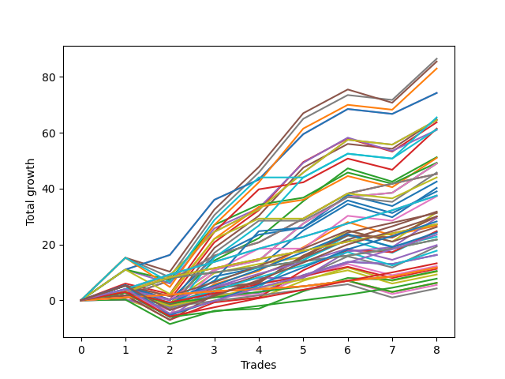

# Short Wallace 020 
- Symbol: ES
- Date Range: 03/18/2022 - 07/15/2022
- Trading Period: 7:20-12:30
- Number of Trades: 8



| Name | Win Percent | Profit | Avg Profit / Trade | Avg Time / Trade |      | Name | Win Percent | Profit | Avg Profit / Trade | Avg Time / Trade |
| ---- | ----------- | ------ | ------------------ | ---------------- | ---- | ---- | ----------- | ------ | ------------------ | ---------------- |
| Sorted By <br> Profit | | | | | | Sorted By <br> Win Percentage ||||
| Seven | 75.00 | 43250.00 | 5406.25 | 22:03 |     | Fifty-Nine | 100.00 | 22625.00 | 2828.12 | 10:52 |
| Forty-Seven | 75.00 | 42750.00 | 5343.75 | 15:59 |     | Three | 100.00 | 22625.00 | 2828.12 | 10:52 |
| Sixty-Three | 75.00 | 41500.00 | 5187.50 | 21:26 |     | One Hundred Twenty-Four | 100.00 | 18750.00 | 2343.75 | 09:23 |
| Sixty-Two | 87.50 | 37125.00 | 4640.62 | 14:48 |     | Eighty-Four | 100.00 | 18750.00 | 2343.75 | 09:23 |
| Six | 87.50 | 37125.00 | 4640.62 | 14:48 |     | One Hundred Twenty-Three | 100.00 | 13625.00 | 1703.12 | 08:19 |
| Seventy-One | 62.50 | 32750.00 | 4093.75 | 18:10 |     | Eighty-Three | 100.00 | 13625.00 | 1703.12 | 08:19 |
| Five | 75.00 | 32375.00 | 4046.88 | 17:02 |     | One Hundred Twenty-Two | 100.00 | 10875.00 | 1359.38 | 07:39 |
| Sixty | 87.50 | 32250.00 | 4031.25 | 14:23 |     | Eighty-Two | 100.00 | 10875.00 | 1359.38 | 07:39 |
| Four | 87.50 | 32250.00 | 4031.25 | 14:23 |     | One Hundred Twenty-Six | 100.00 | 5875.00 | 734.38 | 03:18 |
| Forty-Five | 75.00 | 31875.00 | 3984.38 | 10:58 |     | One Hundred Twenty-One | 100.00 | 5875.00 | 734.38 | 03:18 |
| Fifty-Five | 75.00 | 30750.00 | 3843.75 | 11:41 |     | Eighty-One | 100.00 | 5875.00 | 734.38 | 03:18 |
| Sixty-One | 75.00 | 30625.00 | 3828.12 | 16:25 |     | Sixty-Two | 87.50 | 37125.00 | 4640.62 | 14:48 |
| Forty-Six | 75.00 | 30500.00 | 3812.50 | 09:27 |     | Six | 87.50 | 37125.00 | 4640.62 | 14:48 |
| Forty-Four | 75.00 | 25625.00 | 3203.12 | 09:01 |     | Sixty | 87.50 | 32250.00 | 4031.25 | 14:23 |
| Fifty-Three | 75.00 | 25500.00 | 3187.50 | 08:35 |     | Four | 87.50 | 32250.00 | 4031.25 | 14:23 |
| Fifty-Four | 75.00 | 24625.00 | 3078.12 | 07:16 |     | Fifty-Eight | 87.50 | 24500.00 | 3062.50 | 11:16 |
| Fifty-Eight | 87.50 | 24500.00 | 3062.50 | 11:16 |     | Two | 87.50 | 24500.00 | 3062.50 | 11:16 |
| Two | 87.50 | 24500.00 | 3062.50 | 11:16 |     | Eighty-Five | 87.50 | 15875.00 | 1984.38 | 10:21 |
| Sixty-Nine | 62.50 | 22875.00 | 2859.38 | 13:12 |     | Sixty-Seven | 87.50 | 15625.00 | 1953.12 | 08:47 |
| Fifty-Nine | 100.00 | 22625.00 | 2828.12 | 10:52 |     | One Hundred Thirty | 87.50 | 15000.00 | 1875.00 | 07:33 |
| Three | 100.00 | 22625.00 | 2828.12 | 10:52 |     | One Hundred Twenty-Five | 87.50 | 14125.00 | 1765.62 | 09:44 |
| Seventy | 62.50 | 22000.00 | 2750.00 | 11:54 |     | One Hundred Twenty-Nine | 87.50 | 11750.00 | 1468.75 | 07:18 |
| Fifty-Two | 75.00 | 21250.00 | 2656.25 | 07:00 |     | One Hundred Twenty-Eight | 87.50 | 6625.00 | 828.12 | 06:14 |
| Forty-Two | 75.00 | 20125.00 | 2515.62 | 07:24 |     | One Hundred Twenty-Seven | 87.50 | 3875.00 | 484.38 | 05:34 |
| Seventy-Three | 75.00 | 19500.00 | 2437.50 | 13:56 |     | One Hundred Sixteen | 87.50 | 3125.00 | 390.62 | 01:03 |
| One Hundred Twenty-Four | 100.00 | 18750.00 | 2343.75 | 09:23 |     | One Hundred Eleven | 87.50 | 2750.00 | 343.75 | 01:31 |
| Eighty-Four | 100.00 | 18750.00 | 2343.75 | 09:23 |     | Seven | 75.00 | 43250.00 | 5406.25 | 22:03 |
| Sixty-Eight | 62.50 | 18625.00 | 2328.12 | 11:38 |     | Forty-Seven | 75.00 | 42750.00 | 5343.75 | 15:59 |
| Eighty-Five | 87.50 | 15875.00 | 1984.38 | 10:21 |     | Sixty-Three | 75.00 | 41500.00 | 5187.50 | 21:26 |
| Fifty | 75.00 | 15750.00 | 1968.75 | 05:22 |     | Five | 75.00 | 32375.00 | 4046.88 | 17:02 |
| Sixty-Seven | 87.50 | 15625.00 | 1953.12 | 08:47 |     | Forty-Five | 75.00 | 31875.00 | 3984.38 | 10:58 |
| One Hundred Thirty | 87.50 | 15000.00 | 1875.00 | 07:33 |     | Fifty-Five | 75.00 | 30750.00 | 3843.75 | 11:41 |
| Fifty-Seven | 75.00 | 15000.00 | 1875.00 | 09:16 |     | Sixty-One | 75.00 | 30625.00 | 3828.12 | 16:25 |
| One | 75.00 | 15000.00 | 1875.00 | 09:16 |     | Forty-Six | 75.00 | 30500.00 | 3812.50 | 09:27 |
| Sixty-Six | 75.00 | 14750.00 | 1843.75 | 08:52 |     | Forty-Four | 75.00 | 25625.00 | 3203.12 | 09:01 |
| One Hundred Twenty-Five | 87.50 | 14125.00 | 1765.62 | 09:44 |     | Fifty-Three | 75.00 | 25500.00 | 3187.50 | 08:35 |
| One Hundred Twenty-Three | 100.00 | 13625.00 | 1703.12 | 08:19 |     | Fifty-Four | 75.00 | 24625.00 | 3078.12 | 07:16 |
| Eighty-Three | 100.00 | 13625.00 | 1703.12 | 08:19 |     | Fifty-Two | 75.00 | 21250.00 | 2656.25 | 07:00 |
| Forty-Three | 75.00 | 13375.00 | 1671.88 | 06:16 |     | Forty-Two | 75.00 | 20125.00 | 2515.62 | 07:24 |
| One Hundred Twenty | 75.00 | 13125.00 | 1640.62 | 04:16 |     | Seventy-Three | 75.00 | 19500.00 | 2437.50 | 13:56 |
| Sixty-Five | 75.00 | 12375.00 | 1546.88 | 07:36 |     | Fifty | 75.00 | 15750.00 | 1968.75 | 05:22 |
| Forty-One | 75.00 | 12250.00 | 1531.25 | 05:53 |     | Fifty-Seven | 75.00 | 15000.00 | 1875.00 | 09:16 |
| One Hundred Fifteen | 75.00 | 12125.00 | 1515.62 | 04:54 |     | One | 75.00 | 15000.00 | 1875.00 | 09:16 |
| One Hundred Twenty-Nine | 87.50 | 11750.00 | 1468.75 | 07:18 |     | Sixty-Six | 75.00 | 14750.00 | 1843.75 | 08:52 |
| Fifty-One | 75.00 | 11375.00 | 1421.88 | 05:25 |     | Forty-Three | 75.00 | 13375.00 | 1671.88 | 06:16 |
| One Hundred Twenty-Two | 100.00 | 10875.00 | 1359.38 | 07:39 |     | One Hundred Twenty | 75.00 | 13125.00 | 1640.62 | 04:16 |
| Eighty-Two | 100.00 | 10875.00 | 1359.38 | 07:39 |     | Sixty-Five | 75.00 | 12375.00 | 1546.88 | 07:36 |
| One Hundred Ninteen | 75.00 | 9875.00 | 1234.38 | 04:08 |     | Forty-One | 75.00 | 12250.00 | 1531.25 | 05:53 |
| Forty-Nine | 75.00 | 9625.00 | 1203.12 | 04:44 |     | One Hundred Fifteen | 75.00 | 12125.00 | 1515.62 | 04:54 |
| One Hundred Fourteen | 75.00 | 8875.00 | 1109.38 | 04:45 |     | Fifty-One | 75.00 | 11375.00 | 1421.88 | 05:25 |
| Fifty-Six | 75.00 | 8125.00 | 1015.62 | 04:52 |     | One Hundred Ninteen | 75.00 | 9875.00 | 1234.38 | 04:08 |
| Zero | 75.00 | 8125.00 | 1015.62 | 04:52 |     | Forty-Nine | 75.00 | 9625.00 | 1203.12 | 04:44 |
| One Hundred Twenty-Eight | 87.50 | 6625.00 | 828.12 | 06:14 |     | One Hundred Fourteen | 75.00 | 8875.00 | 1109.38 | 04:45 |
| Forty-Eight | 75.00 | 6125.00 | 765.62 | 02:47 |     | Fifty-Six | 75.00 | 8125.00 | 1015.62 | 04:52 |
| One Hundred Twenty-Six | 100.00 | 5875.00 | 734.38 | 03:18 |     | Zero | 75.00 | 8125.00 | 1015.62 | 04:52 |
| One Hundred Twenty-One | 100.00 | 5875.00 | 734.38 | 03:18 |     | Forty-Eight | 75.00 | 6125.00 | 765.62 | 02:47 |
| Eighty-One | 100.00 | 5875.00 | 734.38 | 03:18 |     | One Hundred Eighteen | 75.00 | 5625.00 | 703.12 | 03:21 |
| One Hundred Eighteen | 75.00 | 5625.00 | 703.12 | 03:21 |     | Sixty-Four | 75.00 | 5250.00 | 656.25 | 04:25 |
| Sixty-Four | 75.00 | 5250.00 | 656.25 | 04:25 |     | Forty | 75.00 | 5125.00 | 640.62 | 03:25 |
| Forty | 75.00 | 5125.00 | 640.62 | 03:25 |     | One Hundred Thirteen | 75.00 | 4625.00 | 578.12 | 03:58 |
| One Hundred Thirteen | 75.00 | 4625.00 | 578.12 | 03:58 |     | One Hundred Seventeen | 75.00 | 3125.00 | 390.62 | 02:43 |
| One Hundred Twenty-Seven | 87.50 | 3875.00 | 484.38 | 05:34 |     | One Hundred Twelve | 75.00 | 2125.00 | 265.62 | 03:21 |
| One Hundred Sixteen | 87.50 | 3125.00 | 390.62 | 01:03 |     | Seventy-One | 62.50 | 32750.00 | 4093.75 | 18:10 |
| One Hundred Seventeen | 75.00 | 3125.00 | 390.62 | 02:43 |     | Sixty-Nine | 62.50 | 22875.00 | 2859.38 | 13:12 |
| One Hundred Eleven | 87.50 | 2750.00 | 343.75 | 01:31 |     | Seventy | 62.50 | 22000.00 | 2750.00 | 11:54 |
| One Hundred Twelve | 75.00 | 2125.00 | 265.62 | 03:21 |     | Sixty-Eight | 62.50 | 18625.00 | 2328.12 | 11:38 |

## NO STOPLOSS

### Test Zero
* Sell when price hits the middle line of the 20p bollinger
* No Stoploss
* Results:
```
Total Trades: 8
Percent Up: 25.00
Percent Down: 75.00
Total Points Moved Down: 16.25
Potential Profit: 8125.00
Total Points Ups: 3.75 Count Ups: 2
Total Points Downs: 20.00 Count Downs: 6
```

<details><summary>Trades</summary>

<code>In: 2022-03-25 11:57:00		Out: 2022-03-25 11:57:15		Total Position Time: 00:15		Total Move Down: 0.25		Total to Date: 0.25</code> <br />
<code>In: 2022-04-06 10:36:00		Out: 2022-04-06 10:47:10		Total Position Time: 11:10		Total Move Down: -3.00		Total to Date: -2.75</code> <br />
<code>In: 2022-05-24 09:18:00		Out: 2022-05-24 09:21:35		Total Position Time: 03:35		Total Move Down: 4.75		Total to Date: 2.00</code> <br />
<code>In: 2022-06-09 10:08:00		Out: 2022-06-09 10:16:15		Total Position Time: 08:15		Total Move Down: 0.75		Total to Date: 2.75</code> <br />
<code>In: 2022-06-10 12:29:00		Out: 2022-06-10 12:30:30		Total Position Time: 01:30		Total Move Down: 6.25		Total to Date: 9.00</code> <br />
<code>In: 2022-06-29 12:31:00		Out: 2022-06-29 12:33:20		Total Position Time: 02:20		Total Move Down: 4.75		Total to Date: 13.75</code> <br />
<code>In: 2022-07-01 10:47:00		Out: 2022-07-01 10:58:45		Total Position Time: 11:45		Total Move Down: -0.75		Total to Date: 13.00</code> <br />
<code>In: 2022-07-06 11:10:00		Out: 2022-07-06 11:10:10		Total Position Time: 00:10		Total Move Down: 3.25		Total to Date: 16.25</code> <br />


</details>

### Test One
* Sell when the price hits the upper line of the 20p 1std bollinger
* No Stoploss
* Results:
```
Total Trades: 8
Percent Up: 25.00
Percent Down: 75.00
Total Points Moved Down: 30.00
Potential Profit: 15000.00
Total Points Ups: 4.25 Count Ups: 2
Total Points Downs: 34.25 Count Downs: 6
```

<details><summary>Trades</summary>

<code>In: 2022-03-25 11:57:00		Out: 2022-03-25 12:00:45		Total Position Time: 03:45		Total Move Down: 1.75		Total to Date: 1.75</code> <br />
<code>In: 2022-04-06 10:36:00		Out: 2022-04-06 10:56:55		Total Position Time: 20:55		Total Move Down: -3.50		Total to Date: -1.75</code> <br />
<code>In: 2022-05-24 09:18:00		Out: 2022-05-24 09:28:55		Total Position Time: 10:55		Total Move Down: 6.25		Total to Date: 4.50</code> <br />
<code>In: 2022-06-09 10:08:00		Out: 2022-06-09 10:18:10		Total Position Time: 10:10		Total Move Down: 1.75		Total to Date: 6.25</code> <br />
<code>In: 2022-06-10 12:29:00		Out: 2022-06-10 12:35:45		Total Position Time: 06:45		Total Move Down: 9.75		Total to Date: 16.00</code> <br />
<code>In: 2022-06-29 12:31:00		Out: 2022-06-29 12:34:10		Total Position Time: 03:10		Total Move Down: 7.25		Total to Date: 23.25</code> <br />
<code>In: 2022-07-01 10:47:00		Out: 2022-07-01 11:04:25		Total Position Time: 17:25		Total Move Down: -0.75		Total to Date: 22.50</code> <br />
<code>In: 2022-07-06 11:10:00		Out: 2022-07-06 11:11:10		Total Position Time: 01:10		Total Move Down: 7.50		Total to Date: 30.00</code> <br />


</details>

### Test Two
* Sell when the price hits the upper line of the 20p 2std bollinger
* No Stoploss
* Results:
```
Total Trades: 8
Percent Up: 12.50
Percent Down: 87.50
Total Points Moved Down: 49.00
Potential Profit: 24500.00
Total Points Ups: 2.50 Count Ups: 1
Total Points Downs: 51.50 Count Downs: 7
```

<details><summary>Trades</summary>

<code>In: 2022-03-25 11:57:00		Out: 2022-03-25 12:00:55		Total Position Time: 03:55		Total Move Down: 2.75		Total to Date: 2.75</code> <br />
<code>In: 2022-04-06 10:36:00		Out: 2022-04-06 10:57:20		Total Position Time: 21:20		Total Move Down: -2.50		Total to Date: 0.25</code> <br />
<code>In: 2022-05-24 09:18:00		Out: 2022-05-24 09:31:20		Total Position Time: 13:20		Total Move Down: 10.75		Total to Date: 11.00</code> <br />
<code>In: 2022-06-09 10:08:00		Out: 2022-06-09 10:18:55		Total Position Time: 10:55		Total Move Down: 3.25		Total to Date: 14.25</code> <br />
<code>In: 2022-06-10 12:29:00		Out: 2022-06-10 12:42:45		Total Position Time: 13:45		Total Move Down: 13.25		Total to Date: 27.50</code> <br />
<code>In: 2022-06-29 12:31:00		Out: 2022-06-29 12:35:20		Total Position Time: 04:20		Total Move Down: 9.50		Total to Date: 37.00</code> <br />
<code>In: 2022-07-01 10:47:00		Out: 2022-07-01 11:07:55		Total Position Time: 20:55		Total Move Down: 1.50		Total to Date: 38.50</code> <br />
<code>In: 2022-07-06 11:10:00		Out: 2022-07-06 11:11:45		Total Position Time: 01:45		Total Move Down: 10.50		Total to Date: 49.00</code> <br />


</details>

### Test Three
* Sell when price hits the middle line of the 50p bollinger
* No Stoploss
* Results:
```
Total Trades: 8
Percent Up: 0.00
Percent Down: 100.00
Total Points Moved Down: 45.25
Potential Profit: 22625.00
Total Points Ups: 0.00 Count Ups: 0
Total Points Downs: 45.25 Count Downs: 8
```

<details><summary>Trades</summary>

<code>In: 2022-03-25 11:57:00		Out: 2022-03-25 12:00:45		Total Position Time: 03:45		Total Move Down: 1.75		Total to Date: 1.75</code> <br />
<code>In: 2022-04-06 10:36:00		Out: 2022-04-06 11:00:10		Total Position Time: 24:10		Total Move Down: 5.25		Total to Date: 7.00</code> <br />
<code>In: 2022-05-24 09:18:00		Out: 2022-05-24 09:31:15		Total Position Time: 13:15		Total Move Down: 9.00		Total to Date: 16.00</code> <br />
<code>In: 2022-06-09 10:08:00		Out: 2022-06-09 10:22:05		Total Position Time: 14:05		Total Move Down: 4.75		Total to Date: 20.75</code> <br />
<code>In: 2022-06-10 12:29:00		Out: 2022-06-10 12:33:15		Total Position Time: 04:15		Total Move Down: 8.50		Total to Date: 29.25</code> <br />
<code>In: 2022-06-29 12:31:00		Out: 2022-06-29 12:34:15		Total Position Time: 03:15		Total Move Down: 9.00		Total to Date: 38.25</code> <br />
<code>In: 2022-07-01 10:47:00		Out: 2022-07-01 11:10:55		Total Position Time: 23:55		Total Move Down: 3.50		Total to Date: 41.75</code> <br />
<code>In: 2022-07-06 11:10:00		Out: 2022-07-06 11:10:20		Total Position Time: 00:20		Total Move Down: 3.50		Total to Date: 45.25</code> <br />


</details>

### Test Four
* Sell when the price hits the upper line of the 50p 1std bollinger
* No Stoploss
* Results:
```
Total Trades: 8
Percent Up: 12.50
Percent Down: 87.50
Total Points Moved Down: 64.50
Potential Profit: 32250.00
Total Points Ups: 1.75 Count Ups: 1
Total Points Downs: 66.25 Count Downs: 7
```

<details><summary>Trades</summary>

<code>In: 2022-03-25 11:57:00		Out: 2022-03-25 12:01:35		Total Position Time: 04:35		Total Move Down: 3.75		Total to Date: 3.75</code> <br />
<code>In: 2022-04-06 10:36:00		Out: 2022-04-06 11:00:10		Total Position Time: 24:10		Total Move Down: 5.25		Total to Date: 9.00</code> <br />
<code>In: 2022-05-24 09:18:00		Out: 2022-05-24 09:33:20		Total Position Time: 15:20		Total Move Down: 15.50		Total to Date: 24.50</code> <br />
<code>In: 2022-06-09 10:08:00		Out: 2022-06-09 10:23:50		Total Position Time: 15:50		Total Move Down: 8.00		Total to Date: 32.50</code> <br />
<code>In: 2022-06-10 12:29:00		Out: 2022-06-10 12:42:40		Total Position Time: 13:40		Total Move Down: 13.25		Total to Date: 45.75</code> <br />
<code>In: 2022-06-29 12:31:00		Out: 2022-06-29 12:41:00		Total Position Time: 10:00		Total Move Down: 11.75		Total to Date: 57.50</code> <br />
<code>In: 2022-07-01 10:47:00		Out: 2022-07-01 11:16:55		Total Position Time: 29:55		Total Move Down: -1.75		Total to Date: 55.75</code> <br />
<code>In: 2022-07-06 11:10:00		Out: 2022-07-06 11:11:35		Total Position Time: 01:35		Total Move Down: 8.75		Total to Date: 64.50</code> <br />


</details>

### Test Five
* Sell when the price hits the upper line of the 50p 2std bollinger
* No Stoploss
* Results:
```
Total Trades: 8
Percent Up: 25.00
Percent Down: 75.00
Total Points Moved Down: 64.75
Potential Profit: 32375.00
Total Points Ups: 8.75 Count Ups: 2
Total Points Downs: 73.50 Count Downs: 6
```

<details><summary>Trades</summary>

<code>In: 2022-03-25 11:57:00		Out: 2022-03-25 12:01:55		Total Position Time: 04:55		Total Move Down: 5.25		Total to Date: 5.25</code> <br />
<code>In: 2022-04-06 10:36:00		Out: 2022-04-06 11:05:55		Total Position Time: 29:55		Total Move Down: -7.00		Total to Date: -1.75</code> <br />
<code>In: 2022-05-24 09:18:00		Out: 2022-05-24 09:36:50		Total Position Time: 18:50		Total Move Down: 20.50		Total to Date: 18.75</code> <br />
<code>In: 2022-06-09 10:08:00		Out: 2022-06-09 10:27:20		Total Position Time: 19:20		Total Move Down: 11.50		Total to Date: 30.25</code> <br />
<code>In: 2022-06-10 12:29:00		Out: 2022-06-10 12:45:35		Total Position Time: 16:35		Total Move Down: 17.25		Total to Date: 47.50</code> <br />
<code>In: 2022-06-29 12:31:00		Out: 2022-06-29 12:46:00		Total Position Time: 15:00		Total Move Down: 8.50		Total to Date: 56.00</code> <br />
<code>In: 2022-07-01 10:47:00		Out: 2022-07-01 11:16:55		Total Position Time: 29:55		Total Move Down: -1.75		Total to Date: 54.25</code> <br />
<code>In: 2022-07-06 11:10:00		Out: 2022-07-06 11:11:50		Total Position Time: 01:50		Total Move Down: 10.50		Total to Date: 64.75</code> <br />


</details>

### Test Six
* Sell when the price hits the middle line of the 1std VWAP
* No Stoploss
* Results:
```
Total Trades: 8
Percent Up: 12.50
Percent Down: 87.50
Total Points Moved Down: 74.25
Potential Profit: 37125.00
Total Points Ups: 1.75 Count Ups: 1
Total Points Downs: 76.00 Count Downs: 7
```

<details><summary>Trades</summary>

<code>In: 2022-03-25 11:57:00		Out: 2022-03-25 12:07:35		Total Position Time: 10:35		Total Move Down: 11.00		Total to Date: 11.00</code> <br />
<code>In: 2022-04-06 10:36:00		Out: 2022-04-06 11:00:10		Total Position Time: 24:10		Total Move Down: 5.25		Total to Date: 16.25</code> <br />
<code>In: 2022-05-24 09:18:00		Out: 2022-05-24 09:36:45		Total Position Time: 18:45		Total Move Down: 19.75		Total to Date: 36.00</code> <br />
<code>In: 2022-06-09 10:08:00		Out: 2022-06-09 10:23:45		Total Position Time: 15:45		Total Move Down: 7.25		Total to Date: 43.25</code> <br />
<code>In: 2022-06-10 12:29:00		Out: 2022-06-10 12:43:55		Total Position Time: 14:55		Total Move Down: 16.25		Total to Date: 59.50</code> <br />
<code>In: 2022-06-29 12:31:00		Out: 2022-06-29 12:34:15		Total Position Time: 03:15		Total Move Down: 9.00		Total to Date: 68.50</code> <br />
<code>In: 2022-07-01 10:47:00		Out: 2022-07-01 11:16:55		Total Position Time: 29:55		Total Move Down: -1.75		Total to Date: 66.75</code> <br />
<code>In: 2022-07-06 11:10:00		Out: 2022-07-06 11:11:10		Total Position Time: 01:10		Total Move Down: 7.50		Total to Date: 74.25</code> <br />


</details>

### Test Seven
* Sell when the price hits the upper line of the 1std VWAP
* No Stoploss
* Results:
```
Total Trades: 8
Percent Up: 25.00
Percent Down: 75.00
Total Points Moved Down: 86.50
Potential Profit: 43250.00
Total Points Ups: 8.75 Count Ups: 2
Total Points Downs: 95.25 Count Downs: 6
```

<details><summary>Trades</summary>

<code>In: 2022-03-25 11:57:00		Out: 2022-03-25 12:26:55		Total Position Time: 29:55		Total Move Down: 15.25		Total to Date: 15.25</code> <br />
<code>In: 2022-04-06 10:36:00		Out: 2022-04-06 11:05:55		Total Position Time: 29:55		Total Move Down: -7.00		Total to Date: 8.25</code> <br />
<code>In: 2022-05-24 09:18:00		Out: 2022-05-24 09:47:55		Total Position Time: 29:55		Total Move Down: 22.25		Total to Date: 30.50</code> <br />
<code>In: 2022-06-09 10:08:00		Out: 2022-06-09 10:30:30		Total Position Time: 22:30		Total Move Down: 15.25		Total to Date: 45.75</code> <br />
<code>In: 2022-06-10 12:29:00		Out: 2022-06-10 12:46:00		Total Position Time: 17:00		Total Move Down: 19.25		Total to Date: 65.00</code> <br />
<code>In: 2022-06-29 12:31:00		Out: 2022-06-29 12:46:00		Total Position Time: 15:00		Total Move Down: 8.50		Total to Date: 73.50</code> <br />
<code>In: 2022-07-01 10:47:00		Out: 2022-07-01 11:16:55		Total Position Time: 29:55		Total Move Down: -1.75		Total to Date: 71.75</code> <br />
<code>In: 2022-07-06 11:10:00		Out: 2022-07-06 11:12:20		Total Position Time: 02:20		Total Move Down: 14.75		Total to Date: 86.50</code> <br />


</details>

## STOPLOSS OF 5

### Test Forty
* Sell when price hits the middle line of the 20p bollinger
* Stoploss is -5 points
* Results:
```
Total Trades: 8
Percent Up: 25.00
Percent Down: 75.00
Total Points Moved Down: 10.25
Potential Profit: 5125.00
Total Points Ups: 9.75 Count Ups: 2
Total Points Downs: 20.00 Count Downs: 6
```

<details><summary>Trades</summary>

<code>In: 2022-03-25 11:57:00		Out: 2022-03-25 11:57:15		Total Position Time: 00:15		Total Move Down: 0.25		Total to Date: 0.25</code> <br />
<code>In: 2022-04-06 10:36:00		Out: 2022-04-06 10:40:35		Total Position Time: 04:35		Total Move Down: -5.00		Total to Date: -4.75</code> <br />
<code>In: 2022-05-24 09:18:00		Out: 2022-05-24 09:21:35		Total Position Time: 03:35		Total Move Down: 4.75		Total to Date: 0.00</code> <br />
<code>In: 2022-06-09 10:08:00		Out: 2022-06-09 10:16:15		Total Position Time: 08:15		Total Move Down: 0.75		Total to Date: 0.75</code> <br />
<code>In: 2022-06-10 12:29:00		Out: 2022-06-10 12:30:30		Total Position Time: 01:30		Total Move Down: 6.25		Total to Date: 7.00</code> <br />
<code>In: 2022-06-29 12:31:00		Out: 2022-06-29 12:33:20		Total Position Time: 02:20		Total Move Down: 4.75		Total to Date: 11.75</code> <br />
<code>In: 2022-07-01 10:47:00		Out: 2022-07-01 10:53:40		Total Position Time: 06:40		Total Move Down: -4.75		Total to Date: 7.00</code> <br />
<code>In: 2022-07-06 11:10:00		Out: 2022-07-06 11:10:10		Total Position Time: 00:10		Total Move Down: 3.25		Total to Date: 10.25</code> <br />


</details>

### Test Forty-One
* Sell when the price hits the upper line of the 20p 1std bollinger
* Stoploss is -5 points
* Results:
```
Total Trades: 8
Percent Up: 25.00
Percent Down: 75.00
Total Points Moved Down: 24.50
Potential Profit: 12250.00
Total Points Ups: 9.75 Count Ups: 2
Total Points Downs: 34.25 Count Downs: 6
```

<details><summary>Trades</summary>

<code>In: 2022-03-25 11:57:00		Out: 2022-03-25 12:00:45		Total Position Time: 03:45		Total Move Down: 1.75		Total to Date: 1.75</code> <br />
<code>In: 2022-04-06 10:36:00		Out: 2022-04-06 10:40:35		Total Position Time: 04:35		Total Move Down: -5.00		Total to Date: -3.25</code> <br />
<code>In: 2022-05-24 09:18:00		Out: 2022-05-24 09:28:55		Total Position Time: 10:55		Total Move Down: 6.25		Total to Date: 3.00</code> <br />
<code>In: 2022-06-09 10:08:00		Out: 2022-06-09 10:18:10		Total Position Time: 10:10		Total Move Down: 1.75		Total to Date: 4.75</code> <br />
<code>In: 2022-06-10 12:29:00		Out: 2022-06-10 12:35:45		Total Position Time: 06:45		Total Move Down: 9.75		Total to Date: 14.50</code> <br />
<code>In: 2022-06-29 12:31:00		Out: 2022-06-29 12:34:10		Total Position Time: 03:10		Total Move Down: 7.25		Total to Date: 21.75</code> <br />
<code>In: 2022-07-01 10:47:00		Out: 2022-07-01 10:53:40		Total Position Time: 06:40		Total Move Down: -4.75		Total to Date: 17.00</code> <br />
<code>In: 2022-07-06 11:10:00		Out: 2022-07-06 11:11:10		Total Position Time: 01:10		Total Move Down: 7.50		Total to Date: 24.50</code> <br />


</details>

### Test Forty-Two
* Sell when the price hits the upper line of the 20p 2std bollinger
* Stoploss is -5 points
* Results:
```
Total Trades: 8
Percent Up: 25.00
Percent Down: 75.00
Total Points Moved Down: 40.25
Potential Profit: 20125.00
Total Points Ups: 9.75 Count Ups: 2
Total Points Downs: 50.00 Count Downs: 6
```

<details><summary>Trades</summary>

<code>In: 2022-03-25 11:57:00		Out: 2022-03-25 12:00:55		Total Position Time: 03:55		Total Move Down: 2.75		Total to Date: 2.75</code> <br />
<code>In: 2022-04-06 10:36:00		Out: 2022-04-06 10:40:35		Total Position Time: 04:35		Total Move Down: -5.00		Total to Date: -2.25</code> <br />
<code>In: 2022-05-24 09:18:00		Out: 2022-05-24 09:31:20		Total Position Time: 13:20		Total Move Down: 10.75		Total to Date: 8.50</code> <br />
<code>In: 2022-06-09 10:08:00		Out: 2022-06-09 10:18:55		Total Position Time: 10:55		Total Move Down: 3.25		Total to Date: 11.75</code> <br />
<code>In: 2022-06-10 12:29:00		Out: 2022-06-10 12:42:45		Total Position Time: 13:45		Total Move Down: 13.25		Total to Date: 25.00</code> <br />
<code>In: 2022-06-29 12:31:00		Out: 2022-06-29 12:35:20		Total Position Time: 04:20		Total Move Down: 9.50		Total to Date: 34.50</code> <br />
<code>In: 2022-07-01 10:47:00		Out: 2022-07-01 10:53:40		Total Position Time: 06:40		Total Move Down: -4.75		Total to Date: 29.75</code> <br />
<code>In: 2022-07-06 11:10:00		Out: 2022-07-06 11:11:45		Total Position Time: 01:45		Total Move Down: 10.50		Total to Date: 40.25</code> <br />


</details>

### Test Forty-Three
* Sell when price hits the middle line of the 50p bollinger
* Stoploss is -5 points
* Results:
```
Total Trades: 8
Percent Up: 25.00
Percent Down: 75.00
Total Points Moved Down: 26.75
Potential Profit: 13375.00
Total Points Ups: 9.75 Count Ups: 2
Total Points Downs: 36.50 Count Downs: 6
```

<details><summary>Trades</summary>

<code>In: 2022-03-25 11:57:00		Out: 2022-03-25 12:00:45		Total Position Time: 03:45		Total Move Down: 1.75		Total to Date: 1.75</code> <br />
<code>In: 2022-04-06 10:36:00		Out: 2022-04-06 10:40:35		Total Position Time: 04:35		Total Move Down: -5.00		Total to Date: -3.25</code> <br />
<code>In: 2022-05-24 09:18:00		Out: 2022-05-24 09:31:15		Total Position Time: 13:15		Total Move Down: 9.00		Total to Date: 5.75</code> <br />
<code>In: 2022-06-09 10:08:00		Out: 2022-06-09 10:22:05		Total Position Time: 14:05		Total Move Down: 4.75		Total to Date: 10.50</code> <br />
<code>In: 2022-06-10 12:29:00		Out: 2022-06-10 12:33:15		Total Position Time: 04:15		Total Move Down: 8.50		Total to Date: 19.00</code> <br />
<code>In: 2022-06-29 12:31:00		Out: 2022-06-29 12:34:15		Total Position Time: 03:15		Total Move Down: 9.00		Total to Date: 28.00</code> <br />
<code>In: 2022-07-01 10:47:00		Out: 2022-07-01 10:53:40		Total Position Time: 06:40		Total Move Down: -4.75		Total to Date: 23.25</code> <br />
<code>In: 2022-07-06 11:10:00		Out: 2022-07-06 11:10:20		Total Position Time: 00:20		Total Move Down: 3.50		Total to Date: 26.75</code> <br />


</details>

### Test Forty-Four
* Sell when the price hits the upper line of the 50p 1std bollinger
* Stoploss is -5 points
* Results:
```
Total Trades: 8
Percent Up: 25.00
Percent Down: 75.00
Total Points Moved Down: 51.25
Potential Profit: 25625.00
Total Points Ups: 9.75 Count Ups: 2
Total Points Downs: 61.00 Count Downs: 6
```

<details><summary>Trades</summary>

<code>In: 2022-03-25 11:57:00		Out: 2022-03-25 12:01:35		Total Position Time: 04:35		Total Move Down: 3.75		Total to Date: 3.75</code> <br />
<code>In: 2022-04-06 10:36:00		Out: 2022-04-06 10:40:35		Total Position Time: 04:35		Total Move Down: -5.00		Total to Date: -1.25</code> <br />
<code>In: 2022-05-24 09:18:00		Out: 2022-05-24 09:33:20		Total Position Time: 15:20		Total Move Down: 15.50		Total to Date: 14.25</code> <br />
<code>In: 2022-06-09 10:08:00		Out: 2022-06-09 10:23:50		Total Position Time: 15:50		Total Move Down: 8.00		Total to Date: 22.25</code> <br />
<code>In: 2022-06-10 12:29:00		Out: 2022-06-10 12:42:40		Total Position Time: 13:40		Total Move Down: 13.25		Total to Date: 35.50</code> <br />
<code>In: 2022-06-29 12:31:00		Out: 2022-06-29 12:41:00		Total Position Time: 10:00		Total Move Down: 11.75		Total to Date: 47.25</code> <br />
<code>In: 2022-07-01 10:47:00		Out: 2022-07-01 10:53:40		Total Position Time: 06:40		Total Move Down: -4.75		Total to Date: 42.50</code> <br />
<code>In: 2022-07-06 11:10:00		Out: 2022-07-06 11:11:35		Total Position Time: 01:35		Total Move Down: 8.75		Total to Date: 51.25</code> <br />


</details>

### Test Forty-Five
* Sell when the price hits the upper line of the 50p 2std bollinger
* Stoploss is -5 points
* Results:
```
Total Trades: 8
Percent Up: 25.00
Percent Down: 75.00
Total Points Moved Down: 63.75
Potential Profit: 31875.00
Total Points Ups: 9.75 Count Ups: 2
Total Points Downs: 73.50 Count Downs: 6
```

<details><summary>Trades</summary>

<code>In: 2022-03-25 11:57:00		Out: 2022-03-25 12:01:55		Total Position Time: 04:55		Total Move Down: 5.25		Total to Date: 5.25</code> <br />
<code>In: 2022-04-06 10:36:00		Out: 2022-04-06 10:40:35		Total Position Time: 04:35		Total Move Down: -5.00		Total to Date: 0.25</code> <br />
<code>In: 2022-05-24 09:18:00		Out: 2022-05-24 09:36:50		Total Position Time: 18:50		Total Move Down: 20.50		Total to Date: 20.75</code> <br />
<code>In: 2022-06-09 10:08:00		Out: 2022-06-09 10:27:20		Total Position Time: 19:20		Total Move Down: 11.50		Total to Date: 32.25</code> <br />
<code>In: 2022-06-10 12:29:00		Out: 2022-06-10 12:45:35		Total Position Time: 16:35		Total Move Down: 17.25		Total to Date: 49.50</code> <br />
<code>In: 2022-06-29 12:31:00		Out: 2022-06-29 12:46:00		Total Position Time: 15:00		Total Move Down: 8.50		Total to Date: 58.00</code> <br />
<code>In: 2022-07-01 10:47:00		Out: 2022-07-01 10:53:40		Total Position Time: 06:40		Total Move Down: -4.75		Total to Date: 53.25</code> <br />
<code>In: 2022-07-06 11:10:00		Out: 2022-07-06 11:11:50		Total Position Time: 01:50		Total Move Down: 10.50		Total to Date: 63.75</code> <br />


</details>

### Test Forty-Six
* Sell when the price hits the middle line of the 1std VWAP
* Stoploss is -5 points
* Results:
```
Total Trades: 8
Percent Up: 25.00
Percent Down: 75.00
Total Points Moved Down: 61.00
Potential Profit: 30500.00
Total Points Ups: 9.75 Count Ups: 2
Total Points Downs: 70.75 Count Downs: 6
```

<details><summary>Trades</summary>

<code>In: 2022-03-25 11:57:00		Out: 2022-03-25 12:07:35		Total Position Time: 10:35		Total Move Down: 11.00		Total to Date: 11.00</code> <br />
<code>In: 2022-04-06 10:36:00		Out: 2022-04-06 10:40:35		Total Position Time: 04:35		Total Move Down: -5.00		Total to Date: 6.00</code> <br />
<code>In: 2022-05-24 09:18:00		Out: 2022-05-24 09:36:45		Total Position Time: 18:45		Total Move Down: 19.75		Total to Date: 25.75</code> <br />
<code>In: 2022-06-09 10:08:00		Out: 2022-06-09 10:23:45		Total Position Time: 15:45		Total Move Down: 7.25		Total to Date: 33.00</code> <br />
<code>In: 2022-06-10 12:29:00		Out: 2022-06-10 12:43:55		Total Position Time: 14:55		Total Move Down: 16.25		Total to Date: 49.25</code> <br />
<code>In: 2022-06-29 12:31:00		Out: 2022-06-29 12:34:15		Total Position Time: 03:15		Total Move Down: 9.00		Total to Date: 58.25</code> <br />
<code>In: 2022-07-01 10:47:00		Out: 2022-07-01 10:53:40		Total Position Time: 06:40		Total Move Down: -4.75		Total to Date: 53.50</code> <br />
<code>In: 2022-07-06 11:10:00		Out: 2022-07-06 11:11:10		Total Position Time: 01:10		Total Move Down: 7.50		Total to Date: 61.00</code> <br />


</details>

### Test Forty-Seven
* Sell when the price hits the upper line of the 1std VWAP
* Stoploss is -5 points
* Results:
```
Total Trades: 8
Percent Up: 25.00
Percent Down: 75.00
Total Points Moved Down: 85.50
Potential Profit: 42750.00
Total Points Ups: 9.75 Count Ups: 2
Total Points Downs: 95.25 Count Downs: 6
```

<details><summary>Trades</summary>

<code>In: 2022-03-25 11:57:00		Out: 2022-03-25 12:26:55		Total Position Time: 29:55		Total Move Down: 15.25		Total to Date: 15.25</code> <br />
<code>In: 2022-04-06 10:36:00		Out: 2022-04-06 10:40:35		Total Position Time: 04:35		Total Move Down: -5.00		Total to Date: 10.25</code> <br />
<code>In: 2022-05-24 09:18:00		Out: 2022-05-24 09:47:55		Total Position Time: 29:55		Total Move Down: 22.25		Total to Date: 32.50</code> <br />
<code>In: 2022-06-09 10:08:00		Out: 2022-06-09 10:30:30		Total Position Time: 22:30		Total Move Down: 15.25		Total to Date: 47.75</code> <br />
<code>In: 2022-06-10 12:29:00		Out: 2022-06-10 12:46:00		Total Position Time: 17:00		Total Move Down: 19.25		Total to Date: 67.00</code> <br />
<code>In: 2022-06-29 12:31:00		Out: 2022-06-29 12:46:00		Total Position Time: 15:00		Total Move Down: 8.50		Total to Date: 75.50</code> <br />
<code>In: 2022-07-01 10:47:00		Out: 2022-07-01 10:53:40		Total Position Time: 06:40		Total Move Down: -4.75		Total to Date: 70.75</code> <br />
<code>In: 2022-07-06 11:10:00		Out: 2022-07-06 11:12:20		Total Position Time: 02:20		Total Move Down: 14.75		Total to Date: 85.50</code> <br />


</details>

## TRAIL STOP OF 5

### Test Forty-Eight
* Sell when price hits the middle line of the 20p bollinger
* Trailing Stop is -5 points
* Results:
```
Total Trades: 8
Percent Up: 25.00
Percent Down: 75.00
Total Points Moved Down: 12.25
Potential Profit: 6125.00
Total Points Ups: 7.75 Count Ups: 2
Total Points Downs: 20.00 Count Downs: 6
```

<details><summary>Trades</summary>

<code>In: 2022-03-25 11:57:00		Out: 2022-03-25 11:57:15		Total Position Time: 00:15		Total Move Down: 0.25		Total to Date: 0.25</code> <br />
<code>In: 2022-04-06 10:36:00		Out: 2022-04-06 10:39:20		Total Position Time: 03:20		Total Move Down: -3.75		Total to Date: -3.50</code> <br />
<code>In: 2022-05-24 09:18:00		Out: 2022-05-24 09:21:35		Total Position Time: 03:35		Total Move Down: 4.75		Total to Date: 1.25</code> <br />
<code>In: 2022-06-09 10:08:00		Out: 2022-06-09 10:16:15		Total Position Time: 08:15		Total Move Down: 0.75		Total to Date: 2.00</code> <br />
<code>In: 2022-06-10 12:29:00		Out: 2022-06-10 12:30:30		Total Position Time: 01:30		Total Move Down: 6.25		Total to Date: 8.25</code> <br />
<code>In: 2022-06-29 12:31:00		Out: 2022-06-29 12:33:20		Total Position Time: 02:20		Total Move Down: 4.75		Total to Date: 13.00</code> <br />
<code>In: 2022-07-01 10:47:00		Out: 2022-07-01 10:49:55		Total Position Time: 02:55		Total Move Down: -4.00		Total to Date: 9.00</code> <br />
<code>In: 2022-07-06 11:10:00		Out: 2022-07-06 11:10:10		Total Position Time: 00:10		Total Move Down: 3.25		Total to Date: 12.25</code> <br />


</details>

### Test Forty-Nine
* Sell when the price hits the upper line of the 20p 1std bollinger
* Trailing Stop is -5 points
* Results:
```
Total Trades: 8
Percent Up: 25.00
Percent Down: 75.00
Total Points Moved Down: 19.25
Potential Profit: 9625.00
Total Points Ups: 7.75 Count Ups: 2
Total Points Downs: 27.00 Count Downs: 6
```

<details><summary>Trades</summary>

<code>In: 2022-03-25 11:57:00		Out: 2022-03-25 12:00:45		Total Position Time: 03:45		Total Move Down: 1.75		Total to Date: 1.75</code> <br />
<code>In: 2022-04-06 10:36:00		Out: 2022-04-06 10:39:20		Total Position Time: 03:20		Total Move Down: -3.75		Total to Date: -2.00</code> <br />
<code>In: 2022-05-24 09:18:00		Out: 2022-05-24 09:28:55		Total Position Time: 10:55		Total Move Down: 6.25		Total to Date: 4.25</code> <br />
<code>In: 2022-06-09 10:08:00		Out: 2022-06-09 10:18:10		Total Position Time: 10:10		Total Move Down: 1.75		Total to Date: 6.00</code> <br />
<code>In: 2022-06-10 12:29:00		Out: 2022-06-10 12:31:30		Total Position Time: 02:30		Total Move Down: 2.50		Total to Date: 8.50</code> <br />
<code>In: 2022-06-29 12:31:00		Out: 2022-06-29 12:34:10		Total Position Time: 03:10		Total Move Down: 7.25		Total to Date: 15.75</code> <br />
<code>In: 2022-07-01 10:47:00		Out: 2022-07-01 10:49:55		Total Position Time: 02:55		Total Move Down: -4.00		Total to Date: 11.75</code> <br />
<code>In: 2022-07-06 11:10:00		Out: 2022-07-06 11:11:10		Total Position Time: 01:10		Total Move Down: 7.50		Total to Date: 19.25</code> <br />


</details>

### Test Fifty
* Sell when the price hits the upper line of the 20p 2std bollinger
* Trailing Stop is -5 points
* Results:
```
Total Trades: 8
Percent Up: 25.00
Percent Down: 75.00
Total Points Moved Down: 31.50
Potential Profit: 15750.00
Total Points Ups: 7.75 Count Ups: 2
Total Points Downs: 39.25 Count Downs: 6
```

<details><summary>Trades</summary>

<code>In: 2022-03-25 11:57:00		Out: 2022-03-25 12:00:55		Total Position Time: 03:55		Total Move Down: 2.75		Total to Date: 2.75</code> <br />
<code>In: 2022-04-06 10:36:00		Out: 2022-04-06 10:39:20		Total Position Time: 03:20		Total Move Down: -3.75		Total to Date: -1.00</code> <br />
<code>In: 2022-05-24 09:18:00		Out: 2022-05-24 09:31:20		Total Position Time: 13:20		Total Move Down: 10.75		Total to Date: 9.75</code> <br />
<code>In: 2022-06-09 10:08:00		Out: 2022-06-09 10:18:55		Total Position Time: 10:55		Total Move Down: 3.25		Total to Date: 13.00</code> <br />
<code>In: 2022-06-10 12:29:00		Out: 2022-06-10 12:31:30		Total Position Time: 02:30		Total Move Down: 2.50		Total to Date: 15.50</code> <br />
<code>In: 2022-06-29 12:31:00		Out: 2022-06-29 12:35:20		Total Position Time: 04:20		Total Move Down: 9.50		Total to Date: 25.00</code> <br />
<code>In: 2022-07-01 10:47:00		Out: 2022-07-01 10:49:55		Total Position Time: 02:55		Total Move Down: -4.00		Total to Date: 21.00</code> <br />
<code>In: 2022-07-06 11:10:00		Out: 2022-07-06 11:11:45		Total Position Time: 01:45		Total Move Down: 10.50		Total to Date: 31.50</code> <br />


</details>

### Test Fifty-One
* Sell when price hits the middle line of the 50p bollinger
* Trailing Stop is -5 points
* Results:
```
Total Trades: 8
Percent Up: 25.00
Percent Down: 75.00
Total Points Moved Down: 22.75
Potential Profit: 11375.00
Total Points Ups: 7.75 Count Ups: 2
Total Points Downs: 30.50 Count Downs: 6
```

<details><summary>Trades</summary>

<code>In: 2022-03-25 11:57:00		Out: 2022-03-25 12:00:45		Total Position Time: 03:45		Total Move Down: 1.75		Total to Date: 1.75</code> <br />
<code>In: 2022-04-06 10:36:00		Out: 2022-04-06 10:39:20		Total Position Time: 03:20		Total Move Down: -3.75		Total to Date: -2.00</code> <br />
<code>In: 2022-05-24 09:18:00		Out: 2022-05-24 09:31:15		Total Position Time: 13:15		Total Move Down: 9.00		Total to Date: 7.00</code> <br />
<code>In: 2022-06-09 10:08:00		Out: 2022-06-09 10:22:05		Total Position Time: 14:05		Total Move Down: 4.75		Total to Date: 11.75</code> <br />
<code>In: 2022-06-10 12:29:00		Out: 2022-06-10 12:31:30		Total Position Time: 02:30		Total Move Down: 2.50		Total to Date: 14.25</code> <br />
<code>In: 2022-06-29 12:31:00		Out: 2022-06-29 12:34:15		Total Position Time: 03:15		Total Move Down: 9.00		Total to Date: 23.25</code> <br />
<code>In: 2022-07-01 10:47:00		Out: 2022-07-01 10:49:55		Total Position Time: 02:55		Total Move Down: -4.00		Total to Date: 19.25</code> <br />
<code>In: 2022-07-06 11:10:00		Out: 2022-07-06 11:10:20		Total Position Time: 00:20		Total Move Down: 3.50		Total to Date: 22.75</code> <br />


</details>

### Test Fifty-Two
* Sell when the price hits the upper line of the 50p 1std bollinger
* Trailing Stop is -5 points
* Results:
```
Total Trades: 8
Percent Up: 25.00
Percent Down: 75.00
Total Points Moved Down: 42.50
Potential Profit: 21250.00
Total Points Ups: 7.75 Count Ups: 2
Total Points Downs: 50.25 Count Downs: 6
```

<details><summary>Trades</summary>

<code>In: 2022-03-25 11:57:00		Out: 2022-03-25 12:01:35		Total Position Time: 04:35		Total Move Down: 3.75		Total to Date: 3.75</code> <br />
<code>In: 2022-04-06 10:36:00		Out: 2022-04-06 10:39:20		Total Position Time: 03:20		Total Move Down: -3.75		Total to Date: 0.00</code> <br />
<code>In: 2022-05-24 09:18:00		Out: 2022-05-24 09:33:20		Total Position Time: 15:20		Total Move Down: 15.50		Total to Date: 15.50</code> <br />
<code>In: 2022-06-09 10:08:00		Out: 2022-06-09 10:23:50		Total Position Time: 15:50		Total Move Down: 8.00		Total to Date: 23.50</code> <br />
<code>In: 2022-06-10 12:29:00		Out: 2022-06-10 12:31:30		Total Position Time: 02:30		Total Move Down: 2.50		Total to Date: 26.00</code> <br />
<code>In: 2022-06-29 12:31:00		Out: 2022-06-29 12:41:00		Total Position Time: 10:00		Total Move Down: 11.75		Total to Date: 37.75</code> <br />
<code>In: 2022-07-01 10:47:00		Out: 2022-07-01 10:49:55		Total Position Time: 02:55		Total Move Down: -4.00		Total to Date: 33.75</code> <br />
<code>In: 2022-07-06 11:10:00		Out: 2022-07-06 11:11:35		Total Position Time: 01:35		Total Move Down: 8.75		Total to Date: 42.50</code> <br />


</details>

### Test Fifty-Three
* Sell when the price hits the upper line of the 50p 2std bollinger
* Trailing Stop is -5 points
* Results:
```
Total Trades: 8
Percent Up: 25.00
Percent Down: 75.00
Total Points Moved Down: 51.00
Potential Profit: 25500.00
Total Points Ups: 7.75 Count Ups: 2
Total Points Downs: 58.75 Count Downs: 6
```

<details><summary>Trades</summary>

<code>In: 2022-03-25 11:57:00		Out: 2022-03-25 12:01:55		Total Position Time: 04:55		Total Move Down: 5.25		Total to Date: 5.25</code> <br />
<code>In: 2022-04-06 10:36:00		Out: 2022-04-06 10:39:20		Total Position Time: 03:20		Total Move Down: -3.75		Total to Date: 1.50</code> <br />
<code>In: 2022-05-24 09:18:00		Out: 2022-05-24 09:36:50		Total Position Time: 18:50		Total Move Down: 20.50		Total to Date: 22.00</code> <br />
<code>In: 2022-06-09 10:08:00		Out: 2022-06-09 10:27:20		Total Position Time: 19:20		Total Move Down: 11.50		Total to Date: 33.50</code> <br />
<code>In: 2022-06-10 12:29:00		Out: 2022-06-10 12:31:30		Total Position Time: 02:30		Total Move Down: 2.50		Total to Date: 36.00</code> <br />
<code>In: 2022-06-29 12:31:00		Out: 2022-06-29 12:46:00		Total Position Time: 15:00		Total Move Down: 8.50		Total to Date: 44.50</code> <br />
<code>In: 2022-07-01 10:47:00		Out: 2022-07-01 10:49:55		Total Position Time: 02:55		Total Move Down: -4.00		Total to Date: 40.50</code> <br />
<code>In: 2022-07-06 11:10:00		Out: 2022-07-06 11:11:50		Total Position Time: 01:50		Total Move Down: 10.50		Total to Date: 51.00</code> <br />


</details>

### Test Fifty-Four
* Sell when the price hits the middle line of the 1std VWAP
* Trailing Stop is -5 points
* Results:
```
Total Trades: 8
Percent Up: 25.00
Percent Down: 75.00
Total Points Moved Down: 49.25
Potential Profit: 24625.00
Total Points Ups: 7.75 Count Ups: 2
Total Points Downs: 57.00 Count Downs: 6
```

<details><summary>Trades</summary>

<code>In: 2022-03-25 11:57:00		Out: 2022-03-25 12:07:35		Total Position Time: 10:35		Total Move Down: 11.00		Total to Date: 11.00</code> <br />
<code>In: 2022-04-06 10:36:00		Out: 2022-04-06 10:39:20		Total Position Time: 03:20		Total Move Down: -3.75		Total to Date: 7.25</code> <br />
<code>In: 2022-05-24 09:18:00		Out: 2022-05-24 09:36:45		Total Position Time: 18:45		Total Move Down: 19.75		Total to Date: 27.00</code> <br />
<code>In: 2022-06-09 10:08:00		Out: 2022-06-09 10:23:45		Total Position Time: 15:45		Total Move Down: 7.25		Total to Date: 34.25</code> <br />
<code>In: 2022-06-10 12:29:00		Out: 2022-06-10 12:31:30		Total Position Time: 02:30		Total Move Down: 2.50		Total to Date: 36.75</code> <br />
<code>In: 2022-06-29 12:31:00		Out: 2022-06-29 12:34:15		Total Position Time: 03:15		Total Move Down: 9.00		Total to Date: 45.75</code> <br />
<code>In: 2022-07-01 10:47:00		Out: 2022-07-01 10:49:55		Total Position Time: 02:55		Total Move Down: -4.00		Total to Date: 41.75</code> <br />
<code>In: 2022-07-06 11:10:00		Out: 2022-07-06 11:11:10		Total Position Time: 01:10		Total Move Down: 7.50		Total to Date: 49.25</code> <br />


</details>

### Test Fifty-Five
* Sell when the price hits the upper line of the 1std VWAP
* Trailing Stop is -5 points
* Results:
```
Total Trades: 8
Percent Up: 25.00
Percent Down: 75.00
Total Points Moved Down: 61.50
Potential Profit: 30750.00
Total Points Ups: 7.75 Count Ups: 2
Total Points Downs: 69.25 Count Downs: 6
```

<details><summary>Trades</summary>

<code>In: 2022-03-25 11:57:00		Out: 2022-03-25 12:12:00		Total Position Time: 15:00		Total Move Down: 6.00		Total to Date: 6.00</code> <br />
<code>In: 2022-04-06 10:36:00		Out: 2022-04-06 10:39:20		Total Position Time: 03:20		Total Move Down: -3.75		Total to Date: 2.25</code> <br />
<code>In: 2022-05-24 09:18:00		Out: 2022-05-24 09:47:55		Total Position Time: 29:55		Total Move Down: 22.25		Total to Date: 24.50</code> <br />
<code>In: 2022-06-09 10:08:00		Out: 2022-06-09 10:30:30		Total Position Time: 22:30		Total Move Down: 15.25		Total to Date: 39.75</code> <br />
<code>In: 2022-06-10 12:29:00		Out: 2022-06-10 12:31:30		Total Position Time: 02:30		Total Move Down: 2.50		Total to Date: 42.25</code> <br />
<code>In: 2022-06-29 12:31:00		Out: 2022-06-29 12:46:00		Total Position Time: 15:00		Total Move Down: 8.50		Total to Date: 50.75</code> <br />
<code>In: 2022-07-01 10:47:00		Out: 2022-07-01 10:49:55		Total Position Time: 02:55		Total Move Down: -4.00		Total to Date: 46.75</code> <br />
<code>In: 2022-07-06 11:10:00		Out: 2022-07-06 11:12:20		Total Position Time: 02:20		Total Move Down: 14.75		Total to Date: 61.50</code> <br />


</details>

## STOPLOSS OF 10

### Test Fifty-Six
* Sell when price hits the middle line of the 20p bollinger
* Stoploss is -10 points
* Results:
```
Total Trades: 8
Percent Up: 25.00
Percent Down: 75.00
Total Points Moved Down: 16.25
Potential Profit: 8125.00
Total Points Ups: 3.75 Count Ups: 2
Total Points Downs: 20.00 Count Downs: 6
```

<details><summary>Trades</summary>

<code>In: 2022-03-25 11:57:00		Out: 2022-03-25 11:57:15		Total Position Time: 00:15		Total Move Down: 0.25		Total to Date: 0.25</code> <br />
<code>In: 2022-04-06 10:36:00		Out: 2022-04-06 10:47:10		Total Position Time: 11:10		Total Move Down: -3.00		Total to Date: -2.75</code> <br />
<code>In: 2022-05-24 09:18:00		Out: 2022-05-24 09:21:35		Total Position Time: 03:35		Total Move Down: 4.75		Total to Date: 2.00</code> <br />
<code>In: 2022-06-09 10:08:00		Out: 2022-06-09 10:16:15		Total Position Time: 08:15		Total Move Down: 0.75		Total to Date: 2.75</code> <br />
<code>In: 2022-06-10 12:29:00		Out: 2022-06-10 12:30:30		Total Position Time: 01:30		Total Move Down: 6.25		Total to Date: 9.00</code> <br />
<code>In: 2022-06-29 12:31:00		Out: 2022-06-29 12:33:20		Total Position Time: 02:20		Total Move Down: 4.75		Total to Date: 13.75</code> <br />
<code>In: 2022-07-01 10:47:00		Out: 2022-07-01 10:58:45		Total Position Time: 11:45		Total Move Down: -0.75		Total to Date: 13.00</code> <br />
<code>In: 2022-07-06 11:10:00		Out: 2022-07-06 11:10:10		Total Position Time: 00:10		Total Move Down: 3.25		Total to Date: 16.25</code> <br />


</details>

### Test Fifty-Seven
* Sell when the price hits the upper line of the 20p 1std bollinger
* Stoploss is -10 points
* Results:
```
Total Trades: 8
Percent Up: 25.00
Percent Down: 75.00
Total Points Moved Down: 30.00
Potential Profit: 15000.00
Total Points Ups: 4.25 Count Ups: 2
Total Points Downs: 34.25 Count Downs: 6
```

<details><summary>Trades</summary>

<code>In: 2022-03-25 11:57:00		Out: 2022-03-25 12:00:45		Total Position Time: 03:45		Total Move Down: 1.75		Total to Date: 1.75</code> <br />
<code>In: 2022-04-06 10:36:00		Out: 2022-04-06 10:56:55		Total Position Time: 20:55		Total Move Down: -3.50		Total to Date: -1.75</code> <br />
<code>In: 2022-05-24 09:18:00		Out: 2022-05-24 09:28:55		Total Position Time: 10:55		Total Move Down: 6.25		Total to Date: 4.50</code> <br />
<code>In: 2022-06-09 10:08:00		Out: 2022-06-09 10:18:10		Total Position Time: 10:10		Total Move Down: 1.75		Total to Date: 6.25</code> <br />
<code>In: 2022-06-10 12:29:00		Out: 2022-06-10 12:35:45		Total Position Time: 06:45		Total Move Down: 9.75		Total to Date: 16.00</code> <br />
<code>In: 2022-06-29 12:31:00		Out: 2022-06-29 12:34:10		Total Position Time: 03:10		Total Move Down: 7.25		Total to Date: 23.25</code> <br />
<code>In: 2022-07-01 10:47:00		Out: 2022-07-01 11:04:25		Total Position Time: 17:25		Total Move Down: -0.75		Total to Date: 22.50</code> <br />
<code>In: 2022-07-06 11:10:00		Out: 2022-07-06 11:11:10		Total Position Time: 01:10		Total Move Down: 7.50		Total to Date: 30.00</code> <br />


</details>

### Test Fifty-Eight
* Sell when the price hits the upper line of the 20p 2std bollinger
* Stoploss is -10 points
* Results:
```
Total Trades: 8
Percent Up: 12.50
Percent Down: 87.50
Total Points Moved Down: 49.00
Potential Profit: 24500.00
Total Points Ups: 2.50 Count Ups: 1
Total Points Downs: 51.50 Count Downs: 7
```

<details><summary>Trades</summary>

<code>In: 2022-03-25 11:57:00		Out: 2022-03-25 12:00:55		Total Position Time: 03:55		Total Move Down: 2.75		Total to Date: 2.75</code> <br />
<code>In: 2022-04-06 10:36:00		Out: 2022-04-06 10:57:20		Total Position Time: 21:20		Total Move Down: -2.50		Total to Date: 0.25</code> <br />
<code>In: 2022-05-24 09:18:00		Out: 2022-05-24 09:31:20		Total Position Time: 13:20		Total Move Down: 10.75		Total to Date: 11.00</code> <br />
<code>In: 2022-06-09 10:08:00		Out: 2022-06-09 10:18:55		Total Position Time: 10:55		Total Move Down: 3.25		Total to Date: 14.25</code> <br />
<code>In: 2022-06-10 12:29:00		Out: 2022-06-10 12:42:45		Total Position Time: 13:45		Total Move Down: 13.25		Total to Date: 27.50</code> <br />
<code>In: 2022-06-29 12:31:00		Out: 2022-06-29 12:35:20		Total Position Time: 04:20		Total Move Down: 9.50		Total to Date: 37.00</code> <br />
<code>In: 2022-07-01 10:47:00		Out: 2022-07-01 11:07:55		Total Position Time: 20:55		Total Move Down: 1.50		Total to Date: 38.50</code> <br />
<code>In: 2022-07-06 11:10:00		Out: 2022-07-06 11:11:45		Total Position Time: 01:45		Total Move Down: 10.50		Total to Date: 49.00</code> <br />


</details>

### Test Fifty-Nine
* Sell when price hits the middle line of the 50p bollinger
* Stoploss is -10 points
* Results:
```
Total Trades: 8
Percent Up: 0.00
Percent Down: 100.00
Total Points Moved Down: 45.25
Potential Profit: 22625.00
Total Points Ups: 0.00 Count Ups: 0
Total Points Downs: 45.25 Count Downs: 8
```

<details><summary>Trades</summary>

<code>In: 2022-03-25 11:57:00		Out: 2022-03-25 12:00:45		Total Position Time: 03:45		Total Move Down: 1.75		Total to Date: 1.75</code> <br />
<code>In: 2022-04-06 10:36:00		Out: 2022-04-06 11:00:10		Total Position Time: 24:10		Total Move Down: 5.25		Total to Date: 7.00</code> <br />
<code>In: 2022-05-24 09:18:00		Out: 2022-05-24 09:31:15		Total Position Time: 13:15		Total Move Down: 9.00		Total to Date: 16.00</code> <br />
<code>In: 2022-06-09 10:08:00		Out: 2022-06-09 10:22:05		Total Position Time: 14:05		Total Move Down: 4.75		Total to Date: 20.75</code> <br />
<code>In: 2022-06-10 12:29:00		Out: 2022-06-10 12:33:15		Total Position Time: 04:15		Total Move Down: 8.50		Total to Date: 29.25</code> <br />
<code>In: 2022-06-29 12:31:00		Out: 2022-06-29 12:34:15		Total Position Time: 03:15		Total Move Down: 9.00		Total to Date: 38.25</code> <br />
<code>In: 2022-07-01 10:47:00		Out: 2022-07-01 11:10:55		Total Position Time: 23:55		Total Move Down: 3.50		Total to Date: 41.75</code> <br />
<code>In: 2022-07-06 11:10:00		Out: 2022-07-06 11:10:20		Total Position Time: 00:20		Total Move Down: 3.50		Total to Date: 45.25</code> <br />


</details>

### Test Sixty
* Sell when the price hits the upper line of the 50p 1std bollinger
* Stoploss is -10 points
* Results:
```
Total Trades: 8
Percent Up: 12.50
Percent Down: 87.50
Total Points Moved Down: 64.50
Potential Profit: 32250.00
Total Points Ups: 1.75 Count Ups: 1
Total Points Downs: 66.25 Count Downs: 7
```

<details><summary>Trades</summary>

<code>In: 2022-03-25 11:57:00		Out: 2022-03-25 12:01:35		Total Position Time: 04:35		Total Move Down: 3.75		Total to Date: 3.75</code> <br />
<code>In: 2022-04-06 10:36:00		Out: 2022-04-06 11:00:10		Total Position Time: 24:10		Total Move Down: 5.25		Total to Date: 9.00</code> <br />
<code>In: 2022-05-24 09:18:00		Out: 2022-05-24 09:33:20		Total Position Time: 15:20		Total Move Down: 15.50		Total to Date: 24.50</code> <br />
<code>In: 2022-06-09 10:08:00		Out: 2022-06-09 10:23:50		Total Position Time: 15:50		Total Move Down: 8.00		Total to Date: 32.50</code> <br />
<code>In: 2022-06-10 12:29:00		Out: 2022-06-10 12:42:40		Total Position Time: 13:40		Total Move Down: 13.25		Total to Date: 45.75</code> <br />
<code>In: 2022-06-29 12:31:00		Out: 2022-06-29 12:41:00		Total Position Time: 10:00		Total Move Down: 11.75		Total to Date: 57.50</code> <br />
<code>In: 2022-07-01 10:47:00		Out: 2022-07-01 11:16:55		Total Position Time: 29:55		Total Move Down: -1.75		Total to Date: 55.75</code> <br />
<code>In: 2022-07-06 11:10:00		Out: 2022-07-06 11:11:35		Total Position Time: 01:35		Total Move Down: 8.75		Total to Date: 64.50</code> <br />


</details>

### Test Sixty-One
* Sell when the price hits the upper line of the 50p 2std bollinger
* Stoploss is -10 points
* Results:
```
Total Trades: 8
Percent Up: 25.00
Percent Down: 75.00
Total Points Moved Down: 61.25
Potential Profit: 30625.00
Total Points Ups: 12.25 Count Ups: 2
Total Points Downs: 73.50 Count Downs: 6
```

<details><summary>Trades</summary>

<code>In: 2022-03-25 11:57:00		Out: 2022-03-25 12:01:55		Total Position Time: 04:55		Total Move Down: 5.25		Total to Date: 5.25</code> <br />
<code>In: 2022-04-06 10:36:00		Out: 2022-04-06 11:00:55		Total Position Time: 24:55		Total Move Down: -10.50		Total to Date: -5.25</code> <br />
<code>In: 2022-05-24 09:18:00		Out: 2022-05-24 09:36:50		Total Position Time: 18:50		Total Move Down: 20.50		Total to Date: 15.25</code> <br />
<code>In: 2022-06-09 10:08:00		Out: 2022-06-09 10:27:20		Total Position Time: 19:20		Total Move Down: 11.50		Total to Date: 26.75</code> <br />
<code>In: 2022-06-10 12:29:00		Out: 2022-06-10 12:45:35		Total Position Time: 16:35		Total Move Down: 17.25		Total to Date: 44.00</code> <br />
<code>In: 2022-06-29 12:31:00		Out: 2022-06-29 12:46:00		Total Position Time: 15:00		Total Move Down: 8.50		Total to Date: 52.50</code> <br />
<code>In: 2022-07-01 10:47:00		Out: 2022-07-01 11:16:55		Total Position Time: 29:55		Total Move Down: -1.75		Total to Date: 50.75</code> <br />
<code>In: 2022-07-06 11:10:00		Out: 2022-07-06 11:11:50		Total Position Time: 01:50		Total Move Down: 10.50		Total to Date: 61.25</code> <br />


</details>

### Test Sixty-Two
* Sell when the price hits the middle line of the 1std VWAP
* Stoploss is -10 points
* Results:
```
Total Trades: 8
Percent Up: 12.50
Percent Down: 87.50
Total Points Moved Down: 74.25
Potential Profit: 37125.00
Total Points Ups: 1.75 Count Ups: 1
Total Points Downs: 76.00 Count Downs: 7
```

<details><summary>Trades</summary>

<code>In: 2022-03-25 11:57:00		Out: 2022-03-25 12:07:35		Total Position Time: 10:35		Total Move Down: 11.00		Total to Date: 11.00</code> <br />
<code>In: 2022-04-06 10:36:00		Out: 2022-04-06 11:00:10		Total Position Time: 24:10		Total Move Down: 5.25		Total to Date: 16.25</code> <br />
<code>In: 2022-05-24 09:18:00		Out: 2022-05-24 09:36:45		Total Position Time: 18:45		Total Move Down: 19.75		Total to Date: 36.00</code> <br />
<code>In: 2022-06-09 10:08:00		Out: 2022-06-09 10:23:45		Total Position Time: 15:45		Total Move Down: 7.25		Total to Date: 43.25</code> <br />
<code>In: 2022-06-10 12:29:00		Out: 2022-06-10 12:43:55		Total Position Time: 14:55		Total Move Down: 16.25		Total to Date: 59.50</code> <br />
<code>In: 2022-06-29 12:31:00		Out: 2022-06-29 12:34:15		Total Position Time: 03:15		Total Move Down: 9.00		Total to Date: 68.50</code> <br />
<code>In: 2022-07-01 10:47:00		Out: 2022-07-01 11:16:55		Total Position Time: 29:55		Total Move Down: -1.75		Total to Date: 66.75</code> <br />
<code>In: 2022-07-06 11:10:00		Out: 2022-07-06 11:11:10		Total Position Time: 01:10		Total Move Down: 7.50		Total to Date: 74.25</code> <br />


</details>

### Test Sixty-Three
* Sell when the price hits the upper line of the 1std VWAP
* Stoploss is -10 points
* Results:
```
Total Trades: 8
Percent Up: 25.00
Percent Down: 75.00
Total Points Moved Down: 83.00
Potential Profit: 41500.00
Total Points Ups: 12.25 Count Ups: 2
Total Points Downs: 95.25 Count Downs: 6
```

<details><summary>Trades</summary>

<code>In: 2022-03-25 11:57:00		Out: 2022-03-25 12:26:55		Total Position Time: 29:55		Total Move Down: 15.25		Total to Date: 15.25</code> <br />
<code>In: 2022-04-06 10:36:00		Out: 2022-04-06 11:00:55		Total Position Time: 24:55		Total Move Down: -10.50		Total to Date: 4.75</code> <br />
<code>In: 2022-05-24 09:18:00		Out: 2022-05-24 09:47:55		Total Position Time: 29:55		Total Move Down: 22.25		Total to Date: 27.00</code> <br />
<code>In: 2022-06-09 10:08:00		Out: 2022-06-09 10:30:30		Total Position Time: 22:30		Total Move Down: 15.25		Total to Date: 42.25</code> <br />
<code>In: 2022-06-10 12:29:00		Out: 2022-06-10 12:46:00		Total Position Time: 17:00		Total Move Down: 19.25		Total to Date: 61.50</code> <br />
<code>In: 2022-06-29 12:31:00		Out: 2022-06-29 12:46:00		Total Position Time: 15:00		Total Move Down: 8.50		Total to Date: 70.00</code> <br />
<code>In: 2022-07-01 10:47:00		Out: 2022-07-01 11:16:55		Total Position Time: 29:55		Total Move Down: -1.75		Total to Date: 68.25</code> <br />
<code>In: 2022-07-06 11:10:00		Out: 2022-07-06 11:12:20		Total Position Time: 02:20		Total Move Down: 14.75		Total to Date: 83.00</code> <br />


</details>

## TRAIL STOP OF 10

### Test Sixty-Four
* Sell when price hits the middle line of the 20p bollinger
* Trailing Stop is -10 points
* Results:
```
Total Trades: 8
Percent Up: 25.00
Percent Down: 75.00
Total Points Moved Down: 10.50
Potential Profit: 5250.00
Total Points Ups: 9.50 Count Ups: 2
Total Points Downs: 20.00 Count Downs: 6
```

<details><summary>Trades</summary>

<code>In: 2022-03-25 11:57:00		Out: 2022-03-25 11:57:15		Total Position Time: 00:15		Total Move Down: 0.25		Total to Date: 0.25</code> <br />
<code>In: 2022-04-06 10:36:00		Out: 2022-04-06 10:43:30		Total Position Time: 07:30		Total Move Down: -8.75		Total to Date: -8.50</code> <br />
<code>In: 2022-05-24 09:18:00		Out: 2022-05-24 09:21:35		Total Position Time: 03:35		Total Move Down: 4.75		Total to Date: -3.75</code> <br />
<code>In: 2022-06-09 10:08:00		Out: 2022-06-09 10:16:15		Total Position Time: 08:15		Total Move Down: 0.75		Total to Date: -3.00</code> <br />
<code>In: 2022-06-10 12:29:00		Out: 2022-06-10 12:30:30		Total Position Time: 01:30		Total Move Down: 6.25		Total to Date: 3.25</code> <br />
<code>In: 2022-06-29 12:31:00		Out: 2022-06-29 12:33:20		Total Position Time: 02:20		Total Move Down: 4.75		Total to Date: 8.00</code> <br />
<code>In: 2022-07-01 10:47:00		Out: 2022-07-01 10:58:45		Total Position Time: 11:45		Total Move Down: -0.75		Total to Date: 7.25</code> <br />
<code>In: 2022-07-06 11:10:00		Out: 2022-07-06 11:10:10		Total Position Time: 00:10		Total Move Down: 3.25		Total to Date: 10.50</code> <br />


</details>

### Test Sixty-Five
* Sell when the price hits the upper line of the 20p 1std bollinger
* Trailing Stop is -10 points
* Results:
```
Total Trades: 8
Percent Up: 25.00
Percent Down: 75.00
Total Points Moved Down: 24.75
Potential Profit: 12375.00
Total Points Ups: 9.50 Count Ups: 2
Total Points Downs: 34.25 Count Downs: 6
```

<details><summary>Trades</summary>

<code>In: 2022-03-25 11:57:00		Out: 2022-03-25 12:00:45		Total Position Time: 03:45		Total Move Down: 1.75		Total to Date: 1.75</code> <br />
<code>In: 2022-04-06 10:36:00		Out: 2022-04-06 10:43:30		Total Position Time: 07:30		Total Move Down: -8.75		Total to Date: -7.00</code> <br />
<code>In: 2022-05-24 09:18:00		Out: 2022-05-24 09:28:55		Total Position Time: 10:55		Total Move Down: 6.25		Total to Date: -0.75</code> <br />
<code>In: 2022-06-09 10:08:00		Out: 2022-06-09 10:18:10		Total Position Time: 10:10		Total Move Down: 1.75		Total to Date: 1.00</code> <br />
<code>In: 2022-06-10 12:29:00		Out: 2022-06-10 12:35:45		Total Position Time: 06:45		Total Move Down: 9.75		Total to Date: 10.75</code> <br />
<code>In: 2022-06-29 12:31:00		Out: 2022-06-29 12:34:10		Total Position Time: 03:10		Total Move Down: 7.25		Total to Date: 18.00</code> <br />
<code>In: 2022-07-01 10:47:00		Out: 2022-07-01 11:04:25		Total Position Time: 17:25		Total Move Down: -0.75		Total to Date: 17.25</code> <br />
<code>In: 2022-07-06 11:10:00		Out: 2022-07-06 11:11:10		Total Position Time: 01:10		Total Move Down: 7.50		Total to Date: 24.75</code> <br />


</details>

### Test Sixty-Six
* Sell when the price hits the upper line of the 20p 2std bollinger
* Trailing Stop is -10 points
* Results:
```
Total Trades: 8
Percent Up: 25.00
Percent Down: 75.00
Total Points Moved Down: 29.50
Potential Profit: 14750.00
Total Points Ups: 8.75 Count Ups: 2
Total Points Downs: 38.25 Count Downs: 6
```

<details><summary>Trades</summary>

<code>In: 2022-03-25 11:57:00		Out: 2022-03-25 12:00:55		Total Position Time: 03:55		Total Move Down: 2.75		Total to Date: 2.75</code> <br />
<code>In: 2022-04-06 10:36:00		Out: 2022-04-06 10:43:30		Total Position Time: 07:30		Total Move Down: -8.75		Total to Date: -6.00</code> <br />
<code>In: 2022-05-24 09:18:00		Out: 2022-05-24 09:31:20		Total Position Time: 13:20		Total Move Down: 10.75		Total to Date: 4.75</code> <br />
<code>In: 2022-06-09 10:08:00		Out: 2022-06-09 10:18:55		Total Position Time: 10:55		Total Move Down: 3.25		Total to Date: 8.00</code> <br />
<code>In: 2022-06-10 12:29:00		Out: 2022-06-10 12:37:20		Total Position Time: 08:20		Total Move Down: -0.00		Total to Date: 8.00</code> <br />
<code>In: 2022-06-29 12:31:00		Out: 2022-06-29 12:35:20		Total Position Time: 04:20		Total Move Down: 9.50		Total to Date: 17.50</code> <br />
<code>In: 2022-07-01 10:47:00		Out: 2022-07-01 11:07:55		Total Position Time: 20:55		Total Move Down: 1.50		Total to Date: 19.00</code> <br />
<code>In: 2022-07-06 11:10:00		Out: 2022-07-06 11:11:45		Total Position Time: 01:45		Total Move Down: 10.50		Total to Date: 29.50</code> <br />


</details>

### Test Sixty-Seven
* Sell when price hits the middle line of the 50p bollinger
* Trailing Stop is -10 points
* Results:
```
Total Trades: 8
Percent Up: 12.50
Percent Down: 87.50
Total Points Moved Down: 31.25
Potential Profit: 15625.00
Total Points Ups: 8.75 Count Ups: 1
Total Points Downs: 40.00 Count Downs: 7
```

<details><summary>Trades</summary>

<code>In: 2022-03-25 11:57:00		Out: 2022-03-25 12:00:45		Total Position Time: 03:45		Total Move Down: 1.75		Total to Date: 1.75</code> <br />
<code>In: 2022-04-06 10:36:00		Out: 2022-04-06 10:43:30		Total Position Time: 07:30		Total Move Down: -8.75		Total to Date: -7.00</code> <br />
<code>In: 2022-05-24 09:18:00		Out: 2022-05-24 09:31:15		Total Position Time: 13:15		Total Move Down: 9.00		Total to Date: 2.00</code> <br />
<code>In: 2022-06-09 10:08:00		Out: 2022-06-09 10:22:05		Total Position Time: 14:05		Total Move Down: 4.75		Total to Date: 6.75</code> <br />
<code>In: 2022-06-10 12:29:00		Out: 2022-06-10 12:33:15		Total Position Time: 04:15		Total Move Down: 8.50		Total to Date: 15.25</code> <br />
<code>In: 2022-06-29 12:31:00		Out: 2022-06-29 12:34:15		Total Position Time: 03:15		Total Move Down: 9.00		Total to Date: 24.25</code> <br />
<code>In: 2022-07-01 10:47:00		Out: 2022-07-01 11:10:55		Total Position Time: 23:55		Total Move Down: 3.50		Total to Date: 27.75</code> <br />
<code>In: 2022-07-06 11:10:00		Out: 2022-07-06 11:10:20		Total Position Time: 00:20		Total Move Down: 3.50		Total to Date: 31.25</code> <br />


</details>

### Test Sixty-Eight
* Sell when the price hits the upper line of the 50p 1std bollinger
* Trailing Stop is -10 points
* Results:
```
Total Trades: 8
Percent Up: 37.50
Percent Down: 62.50
Total Points Moved Down: 37.25
Potential Profit: 18625.00
Total Points Ups: 10.50 Count Ups: 3
Total Points Downs: 47.75 Count Downs: 5
```

<details><summary>Trades</summary>

<code>In: 2022-03-25 11:57:00		Out: 2022-03-25 12:01:35		Total Position Time: 04:35		Total Move Down: 3.75		Total to Date: 3.75</code> <br />
<code>In: 2022-04-06 10:36:00		Out: 2022-04-06 10:43:30		Total Position Time: 07:30		Total Move Down: -8.75		Total to Date: -5.00</code> <br />
<code>In: 2022-05-24 09:18:00		Out: 2022-05-24 09:33:20		Total Position Time: 15:20		Total Move Down: 15.50		Total to Date: 10.50</code> <br />
<code>In: 2022-06-09 10:08:00		Out: 2022-06-09 10:23:50		Total Position Time: 15:50		Total Move Down: 8.00		Total to Date: 18.50</code> <br />
<code>In: 2022-06-10 12:29:00		Out: 2022-06-10 12:37:20		Total Position Time: 08:20		Total Move Down: -0.00		Total to Date: 18.50</code> <br />
<code>In: 2022-06-29 12:31:00		Out: 2022-06-29 12:41:00		Total Position Time: 10:00		Total Move Down: 11.75		Total to Date: 30.25</code> <br />
<code>In: 2022-07-01 10:47:00		Out: 2022-07-01 11:16:55		Total Position Time: 29:55		Total Move Down: -1.75		Total to Date: 28.50</code> <br />
<code>In: 2022-07-06 11:10:00		Out: 2022-07-06 11:11:35		Total Position Time: 01:35		Total Move Down: 8.75		Total to Date: 37.25</code> <br />


</details>

### Test Sixty-Nine
* Sell when the price hits the upper line of the 50p 2std bollinger
* Trailing Stop is -10 points
* Results:
```
Total Trades: 8
Percent Up: 37.50
Percent Down: 62.50
Total Points Moved Down: 45.75
Potential Profit: 22875.00
Total Points Ups: 10.50 Count Ups: 3
Total Points Downs: 56.25 Count Downs: 5
```

<details><summary>Trades</summary>

<code>In: 2022-03-25 11:57:00		Out: 2022-03-25 12:01:55		Total Position Time: 04:55		Total Move Down: 5.25		Total to Date: 5.25</code> <br />
<code>In: 2022-04-06 10:36:00		Out: 2022-04-06 10:43:30		Total Position Time: 07:30		Total Move Down: -8.75		Total to Date: -3.50</code> <br />
<code>In: 2022-05-24 09:18:00		Out: 2022-05-24 09:36:50		Total Position Time: 18:50		Total Move Down: 20.50		Total to Date: 17.00</code> <br />
<code>In: 2022-06-09 10:08:00		Out: 2022-06-09 10:27:20		Total Position Time: 19:20		Total Move Down: 11.50		Total to Date: 28.50</code> <br />
<code>In: 2022-06-10 12:29:00		Out: 2022-06-10 12:37:20		Total Position Time: 08:20		Total Move Down: -0.00		Total to Date: 28.50</code> <br />
<code>In: 2022-06-29 12:31:00		Out: 2022-06-29 12:46:00		Total Position Time: 15:00		Total Move Down: 8.50		Total to Date: 37.00</code> <br />
<code>In: 2022-07-01 10:47:00		Out: 2022-07-01 11:16:55		Total Position Time: 29:55		Total Move Down: -1.75		Total to Date: 35.25</code> <br />
<code>In: 2022-07-06 11:10:00		Out: 2022-07-06 11:11:50		Total Position Time: 01:50		Total Move Down: 10.50		Total to Date: 45.75</code> <br />


</details>

### Test Seventy
* Sell when the price hits the middle line of the 1std VWAP
* Trailing Stop is -10 points
* Results:
```
Total Trades: 8
Percent Up: 37.50
Percent Down: 62.50
Total Points Moved Down: 44.00
Potential Profit: 22000.00
Total Points Ups: 10.50 Count Ups: 3
Total Points Downs: 54.50 Count Downs: 5
```

<details><summary>Trades</summary>

<code>In: 2022-03-25 11:57:00		Out: 2022-03-25 12:07:35		Total Position Time: 10:35		Total Move Down: 11.00		Total to Date: 11.00</code> <br />
<code>In: 2022-04-06 10:36:00		Out: 2022-04-06 10:43:30		Total Position Time: 07:30		Total Move Down: -8.75		Total to Date: 2.25</code> <br />
<code>In: 2022-05-24 09:18:00		Out: 2022-05-24 09:36:45		Total Position Time: 18:45		Total Move Down: 19.75		Total to Date: 22.00</code> <br />
<code>In: 2022-06-09 10:08:00		Out: 2022-06-09 10:23:45		Total Position Time: 15:45		Total Move Down: 7.25		Total to Date: 29.25</code> <br />
<code>In: 2022-06-10 12:29:00		Out: 2022-06-10 12:37:20		Total Position Time: 08:20		Total Move Down: -0.00		Total to Date: 29.25</code> <br />
<code>In: 2022-06-29 12:31:00		Out: 2022-06-29 12:34:15		Total Position Time: 03:15		Total Move Down: 9.00		Total to Date: 38.25</code> <br />
<code>In: 2022-07-01 10:47:00		Out: 2022-07-01 11:16:55		Total Position Time: 29:55		Total Move Down: -1.75		Total to Date: 36.50</code> <br />
<code>In: 2022-07-06 11:10:00		Out: 2022-07-06 11:11:10		Total Position Time: 01:10		Total Move Down: 7.50		Total to Date: 44.00</code> <br />


</details>

### Test Seventy-One
* Sell when the price hits the upper line of the 1std VWAP
* Trailing Stop is -10 points
* Results:
```
Total Trades: 8
Percent Up: 37.50
Percent Down: 62.50
Total Points Moved Down: 65.50
Potential Profit: 32750.00
Total Points Ups: 10.50 Count Ups: 3
Total Points Downs: 76.00 Count Downs: 5
```

<details><summary>Trades</summary>

<code>In: 2022-03-25 11:57:00		Out: 2022-03-25 12:26:55		Total Position Time: 29:55		Total Move Down: 15.25		Total to Date: 15.25</code> <br />
<code>In: 2022-04-06 10:36:00		Out: 2022-04-06 10:43:30		Total Position Time: 07:30		Total Move Down: -8.75		Total to Date: 6.50</code> <br />
<code>In: 2022-05-24 09:18:00		Out: 2022-05-24 09:47:55		Total Position Time: 29:55		Total Move Down: 22.25		Total to Date: 28.75</code> <br />
<code>In: 2022-06-09 10:08:00		Out: 2022-06-09 10:30:30		Total Position Time: 22:30		Total Move Down: 15.25		Total to Date: 44.00</code> <br />
<code>In: 2022-06-10 12:29:00		Out: 2022-06-10 12:37:20		Total Position Time: 08:20		Total Move Down: -0.00		Total to Date: 44.00</code> <br />
<code>In: 2022-06-29 12:31:00		Out: 2022-06-29 12:46:00		Total Position Time: 15:00		Total Move Down: 8.50		Total to Date: 52.50</code> <br />
<code>In: 2022-07-01 10:47:00		Out: 2022-07-01 11:16:55		Total Position Time: 29:55		Total Move Down: -1.75		Total to Date: 50.75</code> <br />
<code>In: 2022-07-06 11:10:00		Out: 2022-07-06 11:12:20		Total Position Time: 02:20		Total Move Down: 14.75		Total to Date: 65.50</code> <br />


</details>

## SPECIAL EXIT CONDITIONS 

### Test Seventy-Three
* Sell when the linear regression slope changes to negative
* No Stoploss
* Results:
```
Total Trades: 8
Percent Up: 25.00
Percent Down: 75.00
Total Points Moved Down: 39.00
Potential Profit: 19500.00
Total Points Ups: 11.25 Count Ups: 2
Total Points Downs: 50.25 Count Downs: 6
```

<details><summary>Trades</summary>

<code>In: 2022-03-25 11:57:00		Out: 2022-03-25 12:12:05		Total Position Time: 15:05		Total Move Down: 5.50		Total to Date: 5.50</code> <br />
<code>In: 2022-04-06 10:36:00		Out: 2022-04-06 10:50:05		Total Position Time: 14:05		Total Move Down: -6.75		Total to Date: -1.25</code> <br />
<code>In: 2022-05-24 09:18:00		Out: 2022-05-24 09:30:05		Total Position Time: 12:05		Total Move Down: 8.25		Total to Date: 7.00</code> <br />
<code>In: 2022-06-09 10:08:00		Out: 2022-06-09 10:37:55		Total Position Time: 29:55		Total Move Down: 17.75		Total to Date: 24.75</code> <br />
<code>In: 2022-06-10 12:29:00		Out: 2022-06-10 12:39:05		Total Position Time: 10:05		Total Move Down: 1.25		Total to Date: 26.00</code> <br />
<code>In: 2022-06-29 12:31:00		Out: 2022-06-29 12:44:05		Total Position Time: 13:05		Total Move Down: 9.75		Total to Date: 35.75</code> <br />
<code>In: 2022-07-01 10:47:00		Out: 2022-07-01 10:53:05		Total Position Time: 06:05		Total Move Down: -4.50		Total to Date: 31.25</code> <br />
<code>In: 2022-07-06 11:10:00		Out: 2022-07-06 11:21:05		Total Position Time: 11:05		Total Move Down: 7.75		Total to Date: 39.00</code> <br />


</details>

## TAKE PROFIT

### Test Eighty-One
* Take Profit of 1 Point
* No Stoploss
* Results:
```
Total Trades: 8
Percent Up: 0.00
Percent Down: 100.00
Total Points Moved Down: 11.75
Potential Profit: 5875.00
Total Points Ups: 0.00 Count Ups: 0
Total Points Downs: 11.75 Count Downs: 8
```

<details><summary>Trades</summary>

<code>In: 2022-03-25 11:57:00		Out: 2022-03-25 11:58:45		Total Position Time: 01:45		Total Move Down: 1.00		Total to Date: 1.00</code> <br />
<code>In: 2022-04-06 10:36:00		Out: 2022-04-06 10:36:10		Total Position Time: 00:10		Total Move Down: 1.00		Total to Date: 2.00</code> <br />
<code>In: 2022-05-24 09:18:00		Out: 2022-05-24 09:18:50		Total Position Time: 00:50		Total Move Down: 1.25		Total to Date: 3.25</code> <br />
<code>In: 2022-06-09 10:08:00		Out: 2022-06-09 10:10:15		Total Position Time: 02:15		Total Move Down: 0.75		Total to Date: 4.00</code> <br />
<code>In: 2022-06-10 12:29:00		Out: 2022-06-10 12:29:10		Total Position Time: 00:10		Total Move Down: 1.00		Total to Date: 5.00</code> <br />
<code>In: 2022-06-29 12:31:00		Out: 2022-06-29 12:31:10		Total Position Time: 00:10		Total Move Down: 2.00		Total to Date: 7.00</code> <br />
<code>In: 2022-07-01 10:47:00		Out: 2022-07-01 11:07:55		Total Position Time: 20:55		Total Move Down: 1.50		Total to Date: 8.50</code> <br />
<code>In: 2022-07-06 11:10:00		Out: 2022-07-06 11:10:10		Total Position Time: 00:10		Total Move Down: 3.25		Total to Date: 11.75</code> <br />


</details>

### Test Eighty-Two
* Take Profit of 2 Point
* No Stoploss
* Results:
```
Total Trades: 8
Percent Up: 0.00
Percent Down: 100.00
Total Points Moved Down: 21.75
Potential Profit: 10875.00
Total Points Ups: 0.00 Count Ups: 0
Total Points Downs: 21.75 Count Downs: 8
```

<details><summary>Trades</summary>

<code>In: 2022-03-25 11:57:00		Out: 2022-03-25 12:00:50		Total Position Time: 03:50		Total Move Down: 2.75		Total to Date: 2.75</code> <br />
<code>In: 2022-04-06 10:36:00		Out: 2022-04-06 11:00:10		Total Position Time: 24:10		Total Move Down: 5.25		Total to Date: 8.00</code> <br />
<code>In: 2022-05-24 09:18:00		Out: 2022-05-24 09:20:10		Total Position Time: 02:10		Total Move Down: 2.00		Total to Date: 10.00</code> <br />
<code>In: 2022-06-09 10:08:00		Out: 2022-06-09 10:16:55		Total Position Time: 08:55		Total Move Down: 2.00		Total to Date: 12.00</code> <br />
<code>In: 2022-06-10 12:29:00		Out: 2022-06-10 12:29:20		Total Position Time: 00:20		Total Move Down: 2.00		Total to Date: 14.00</code> <br />
<code>In: 2022-06-29 12:31:00		Out: 2022-06-29 12:31:10		Total Position Time: 00:10		Total Move Down: 2.00		Total to Date: 16.00</code> <br />
<code>In: 2022-07-01 10:47:00		Out: 2022-07-01 11:08:30		Total Position Time: 21:30		Total Move Down: 2.50		Total to Date: 18.50</code> <br />
<code>In: 2022-07-06 11:10:00		Out: 2022-07-06 11:10:10		Total Position Time: 00:10		Total Move Down: 3.25		Total to Date: 21.75</code> <br />


</details>

### Test Eighty-Three
* Take Profit of 3 Point
* No Stoploss
* Results:
```
Total Trades: 8
Percent Up: 0.00
Percent Down: 100.00
Total Points Moved Down: 27.25
Potential Profit: 13625.00
Total Points Ups: 0.00 Count Ups: 0
Total Points Downs: 27.25 Count Downs: 8
```

<details><summary>Trades</summary>

<code>In: 2022-03-25 11:57:00		Out: 2022-03-25 12:01:00		Total Position Time: 04:00		Total Move Down: 3.00		Total to Date: 3.00</code> <br />
<code>In: 2022-04-06 10:36:00		Out: 2022-04-06 11:00:10		Total Position Time: 24:10		Total Move Down: 5.25		Total to Date: 8.25</code> <br />
<code>In: 2022-05-24 09:18:00		Out: 2022-05-24 09:21:05		Total Position Time: 03:05		Total Move Down: 3.25		Total to Date: 11.50</code> <br />
<code>In: 2022-06-09 10:08:00		Out: 2022-06-09 10:18:55		Total Position Time: 10:55		Total Move Down: 3.25		Total to Date: 14.75</code> <br />
<code>In: 2022-06-10 12:29:00		Out: 2022-06-10 12:30:10		Total Position Time: 01:10		Total Move Down: 3.00		Total to Date: 17.75</code> <br />
<code>In: 2022-06-29 12:31:00		Out: 2022-06-29 12:32:15		Total Position Time: 01:15		Total Move Down: 3.25		Total to Date: 21.00</code> <br />
<code>In: 2022-07-01 10:47:00		Out: 2022-07-01 11:08:50		Total Position Time: 21:50		Total Move Down: 3.00		Total to Date: 24.00</code> <br />
<code>In: 2022-07-06 11:10:00		Out: 2022-07-06 11:10:10		Total Position Time: 00:10		Total Move Down: 3.25		Total to Date: 27.25</code> <br />


</details>

### Test Eighty-Four
* Take Profit of 4 Point
* No Stoploss
* Results:
```
Total Trades: 8
Percent Up: 0.00
Percent Down: 100.00
Total Points Moved Down: 37.50
Potential Profit: 18750.00
Total Points Ups: 0.00 Count Ups: 0
Total Points Downs: 37.50 Count Downs: 8
```

<details><summary>Trades</summary>

<code>In: 2022-03-25 11:57:00		Out: 2022-03-25 12:01:45		Total Position Time: 04:45		Total Move Down: 4.00		Total to Date: 4.00</code> <br />
<code>In: 2022-04-06 10:36:00		Out: 2022-04-06 11:00:10		Total Position Time: 24:10		Total Move Down: 5.25		Total to Date: 9.25</code> <br />
<code>In: 2022-05-24 09:18:00		Out: 2022-05-24 09:21:15		Total Position Time: 03:15		Total Move Down: 4.50		Total to Date: 13.75</code> <br />
<code>In: 2022-06-09 10:08:00		Out: 2022-06-09 10:22:05		Total Position Time: 14:05		Total Move Down: 4.75		Total to Date: 18.50</code> <br />
<code>In: 2022-06-10 12:29:00		Out: 2022-06-10 12:30:20		Total Position Time: 01:20		Total Move Down: 4.25		Total to Date: 22.75</code> <br />
<code>In: 2022-06-29 12:31:00		Out: 2022-06-29 12:33:20		Total Position Time: 02:20		Total Move Down: 4.75		Total to Date: 27.50</code> <br />
<code>In: 2022-07-01 10:47:00		Out: 2022-07-01 11:11:05		Total Position Time: 24:05		Total Move Down: 4.75		Total to Date: 32.25</code> <br />
<code>In: 2022-07-06 11:10:00		Out: 2022-07-06 11:11:05		Total Position Time: 01:05		Total Move Down: 5.25		Total to Date: 37.50</code> <br />


</details>

### Test Eighty-Five
* Take Profit of 5 Point
* No Stoploss
* Results:
```
Total Trades: 8
Percent Up: 12.50
Percent Down: 87.50
Total Points Moved Down: 31.75
Potential Profit: 15875.00
Total Points Ups: 7.00 Count Ups: 1
Total Points Downs: 38.75 Count Downs: 7
```

<details><summary>Trades</summary>

<code>In: 2022-03-25 11:57:00		Out: 2022-03-25 12:01:55		Total Position Time: 04:55		Total Move Down: 5.25		Total to Date: 5.25</code> <br />
<code>In: 2022-04-06 10:36:00		Out: 2022-04-06 11:05:55		Total Position Time: 29:55		Total Move Down: -7.00		Total to Date: -1.75</code> <br />
<code>In: 2022-05-24 09:18:00		Out: 2022-05-24 09:21:30		Total Position Time: 03:30		Total Move Down: 5.00		Total to Date: 3.25</code> <br />
<code>In: 2022-06-09 10:08:00		Out: 2022-06-09 10:22:35		Total Position Time: 14:35		Total Move Down: 5.75		Total to Date: 9.00</code> <br />
<code>In: 2022-06-10 12:29:00		Out: 2022-06-10 12:30:30		Total Position Time: 01:30		Total Move Down: 6.25		Total to Date: 15.25</code> <br />
<code>In: 2022-06-29 12:31:00		Out: 2022-06-29 12:33:25		Total Position Time: 02:25		Total Move Down: 6.50		Total to Date: 21.75</code> <br />
<code>In: 2022-07-01 10:47:00		Out: 2022-07-01 11:12:00		Total Position Time: 25:00		Total Move Down: 4.75		Total to Date: 26.50</code> <br />
<code>In: 2022-07-06 11:10:00		Out: 2022-07-06 11:11:05		Total Position Time: 01:05		Total Move Down: 5.25		Total to Date: 31.75</code> <br />


</details>

## TAKE PROFIT Stoploss of Five

### Test One Hundred Eleven
* Take Profit of 1 Point
* Stoploss is -5 points
* Results:
```
Total Trades: 8
Percent Up: 12.50
Percent Down: 87.50
Total Points Moved Down: 5.50
Potential Profit: 2750.00
Total Points Ups: 4.75 Count Ups: 1
Total Points Downs: 10.25 Count Downs: 7
```

<details><summary>Trades</summary>

<code>In: 2022-03-25 11:57:00		Out: 2022-03-25 11:58:45		Total Position Time: 01:45		Total Move Down: 1.00		Total to Date: 1.00</code> <br />
<code>In: 2022-04-06 10:36:00		Out: 2022-04-06 10:36:10		Total Position Time: 00:10		Total Move Down: 1.00		Total to Date: 2.00</code> <br />
<code>In: 2022-05-24 09:18:00		Out: 2022-05-24 09:18:50		Total Position Time: 00:50		Total Move Down: 1.25		Total to Date: 3.25</code> <br />
<code>In: 2022-06-09 10:08:00		Out: 2022-06-09 10:10:15		Total Position Time: 02:15		Total Move Down: 0.75		Total to Date: 4.00</code> <br />
<code>In: 2022-06-10 12:29:00		Out: 2022-06-10 12:29:10		Total Position Time: 00:10		Total Move Down: 1.00		Total to Date: 5.00</code> <br />
<code>In: 2022-06-29 12:31:00		Out: 2022-06-29 12:31:10		Total Position Time: 00:10		Total Move Down: 2.00		Total to Date: 7.00</code> <br />
<code>In: 2022-07-01 10:47:00		Out: 2022-07-01 10:53:40		Total Position Time: 06:40		Total Move Down: -4.75		Total to Date: 2.25</code> <br />
<code>In: 2022-07-06 11:10:00		Out: 2022-07-06 11:10:10		Total Position Time: 00:10		Total Move Down: 3.25		Total to Date: 5.50</code> <br />


</details>

### Test One Hundred Twelve
* Take Profit of 2 Point
* Stoploss is -5 points
* Results:
```
Total Trades: 8
Percent Up: 25.00
Percent Down: 75.00
Total Points Moved Down: 4.25
Potential Profit: 2125.00
Total Points Ups: 9.75 Count Ups: 2
Total Points Downs: 14.00 Count Downs: 6
```

<details><summary>Trades</summary>

<code>In: 2022-03-25 11:57:00		Out: 2022-03-25 12:00:50		Total Position Time: 03:50		Total Move Down: 2.75		Total to Date: 2.75</code> <br />
<code>In: 2022-04-06 10:36:00		Out: 2022-04-06 10:40:35		Total Position Time: 04:35		Total Move Down: -5.00		Total to Date: -2.25</code> <br />
<code>In: 2022-05-24 09:18:00		Out: 2022-05-24 09:20:10		Total Position Time: 02:10		Total Move Down: 2.00		Total to Date: -0.25</code> <br />
<code>In: 2022-06-09 10:08:00		Out: 2022-06-09 10:16:55		Total Position Time: 08:55		Total Move Down: 2.00		Total to Date: 1.75</code> <br />
<code>In: 2022-06-10 12:29:00		Out: 2022-06-10 12:29:20		Total Position Time: 00:20		Total Move Down: 2.00		Total to Date: 3.75</code> <br />
<code>In: 2022-06-29 12:31:00		Out: 2022-06-29 12:31:10		Total Position Time: 00:10		Total Move Down: 2.00		Total to Date: 5.75</code> <br />
<code>In: 2022-07-01 10:47:00		Out: 2022-07-01 10:53:40		Total Position Time: 06:40		Total Move Down: -4.75		Total to Date: 1.00</code> <br />
<code>In: 2022-07-06 11:10:00		Out: 2022-07-06 11:10:10		Total Position Time: 00:10		Total Move Down: 3.25		Total to Date: 4.25</code> <br />


</details>

### Test One Hundred Thirteen
* Take Profit of 3 Point
* Stoploss is -5 points
* Results:
```
Total Trades: 8
Percent Up: 25.00
Percent Down: 75.00
Total Points Moved Down: 9.25
Potential Profit: 4625.00
Total Points Ups: 9.75 Count Ups: 2
Total Points Downs: 19.00 Count Downs: 6
```

<details><summary>Trades</summary>

<code>In: 2022-03-25 11:57:00		Out: 2022-03-25 12:01:00		Total Position Time: 04:00		Total Move Down: 3.00		Total to Date: 3.00</code> <br />
<code>In: 2022-04-06 10:36:00		Out: 2022-04-06 10:40:35		Total Position Time: 04:35		Total Move Down: -5.00		Total to Date: -2.00</code> <br />
<code>In: 2022-05-24 09:18:00		Out: 2022-05-24 09:21:05		Total Position Time: 03:05		Total Move Down: 3.25		Total to Date: 1.25</code> <br />
<code>In: 2022-06-09 10:08:00		Out: 2022-06-09 10:18:55		Total Position Time: 10:55		Total Move Down: 3.25		Total to Date: 4.50</code> <br />
<code>In: 2022-06-10 12:29:00		Out: 2022-06-10 12:30:10		Total Position Time: 01:10		Total Move Down: 3.00		Total to Date: 7.50</code> <br />
<code>In: 2022-06-29 12:31:00		Out: 2022-06-29 12:32:15		Total Position Time: 01:15		Total Move Down: 3.25		Total to Date: 10.75</code> <br />
<code>In: 2022-07-01 10:47:00		Out: 2022-07-01 10:53:40		Total Position Time: 06:40		Total Move Down: -4.75		Total to Date: 6.00</code> <br />
<code>In: 2022-07-06 11:10:00		Out: 2022-07-06 11:10:10		Total Position Time: 00:10		Total Move Down: 3.25		Total to Date: 9.25</code> <br />


</details>

### Test One Hundred Fourteen
* Take Profit of 4 Point
* Stoploss is -5 points
* Results:
```
Total Trades: 8
Percent Up: 25.00
Percent Down: 75.00
Total Points Moved Down: 17.75
Potential Profit: 8875.00
Total Points Ups: 9.75 Count Ups: 2
Total Points Downs: 27.50 Count Downs: 6
```

<details><summary>Trades</summary>

<code>In: 2022-03-25 11:57:00		Out: 2022-03-25 12:01:45		Total Position Time: 04:45		Total Move Down: 4.00		Total to Date: 4.00</code> <br />
<code>In: 2022-04-06 10:36:00		Out: 2022-04-06 10:40:35		Total Position Time: 04:35		Total Move Down: -5.00		Total to Date: -1.00</code> <br />
<code>In: 2022-05-24 09:18:00		Out: 2022-05-24 09:21:15		Total Position Time: 03:15		Total Move Down: 4.50		Total to Date: 3.50</code> <br />
<code>In: 2022-06-09 10:08:00		Out: 2022-06-09 10:22:05		Total Position Time: 14:05		Total Move Down: 4.75		Total to Date: 8.25</code> <br />
<code>In: 2022-06-10 12:29:00		Out: 2022-06-10 12:30:20		Total Position Time: 01:20		Total Move Down: 4.25		Total to Date: 12.50</code> <br />
<code>In: 2022-06-29 12:31:00		Out: 2022-06-29 12:33:20		Total Position Time: 02:20		Total Move Down: 4.75		Total to Date: 17.25</code> <br />
<code>In: 2022-07-01 10:47:00		Out: 2022-07-01 10:53:40		Total Position Time: 06:40		Total Move Down: -4.75		Total to Date: 12.50</code> <br />
<code>In: 2022-07-06 11:10:00		Out: 2022-07-06 11:11:05		Total Position Time: 01:05		Total Move Down: 5.25		Total to Date: 17.75</code> <br />


</details>

### Test One Hundred Fifteen
* Take Profit of 5 Point
* Stoploss is -5 points
* Results:
```
Total Trades: 8
Percent Up: 25.00
Percent Down: 75.00
Total Points Moved Down: 24.25
Potential Profit: 12125.00
Total Points Ups: 9.75 Count Ups: 2
Total Points Downs: 34.00 Count Downs: 6
```

<details><summary>Trades</summary>

<code>In: 2022-03-25 11:57:00		Out: 2022-03-25 12:01:55		Total Position Time: 04:55		Total Move Down: 5.25		Total to Date: 5.25</code> <br />
<code>In: 2022-04-06 10:36:00		Out: 2022-04-06 10:40:35		Total Position Time: 04:35		Total Move Down: -5.00		Total to Date: 0.25</code> <br />
<code>In: 2022-05-24 09:18:00		Out: 2022-05-24 09:21:30		Total Position Time: 03:30		Total Move Down: 5.00		Total to Date: 5.25</code> <br />
<code>In: 2022-06-09 10:08:00		Out: 2022-06-09 10:22:35		Total Position Time: 14:35		Total Move Down: 5.75		Total to Date: 11.00</code> <br />
<code>In: 2022-06-10 12:29:00		Out: 2022-06-10 12:30:30		Total Position Time: 01:30		Total Move Down: 6.25		Total to Date: 17.25</code> <br />
<code>In: 2022-06-29 12:31:00		Out: 2022-06-29 12:33:25		Total Position Time: 02:25		Total Move Down: 6.50		Total to Date: 23.75</code> <br />
<code>In: 2022-07-01 10:47:00		Out: 2022-07-01 10:53:40		Total Position Time: 06:40		Total Move Down: -4.75		Total to Date: 19.00</code> <br />
<code>In: 2022-07-06 11:10:00		Out: 2022-07-06 11:11:05		Total Position Time: 01:05		Total Move Down: 5.25		Total to Date: 24.25</code> <br />


</details>

## TAKE PROFIT Trailstop of Five

### Test One Hundred Sixteen
* Take Profit of 1 Point
* Trailing stop is -5 points
* Results:
```
Total Trades: 8
Percent Up: 12.50
Percent Down: 87.50
Total Points Moved Down: 6.25
Potential Profit: 3125.00
Total Points Ups: 4.00 Count Ups: 1
Total Points Downs: 10.25 Count Downs: 7
```

<details><summary>Trades</summary>

<code>In: 2022-03-25 11:57:00		Out: 2022-03-25 11:58:45		Total Position Time: 01:45		Total Move Down: 1.00		Total to Date: 1.00</code> <br />
<code>In: 2022-04-06 10:36:00		Out: 2022-04-06 10:36:10		Total Position Time: 00:10		Total Move Down: 1.00		Total to Date: 2.00</code> <br />
<code>In: 2022-05-24 09:18:00		Out: 2022-05-24 09:18:50		Total Position Time: 00:50		Total Move Down: 1.25		Total to Date: 3.25</code> <br />
<code>In: 2022-06-09 10:08:00		Out: 2022-06-09 10:10:15		Total Position Time: 02:15		Total Move Down: 0.75		Total to Date: 4.00</code> <br />
<code>In: 2022-06-10 12:29:00		Out: 2022-06-10 12:29:10		Total Position Time: 00:10		Total Move Down: 1.00		Total to Date: 5.00</code> <br />
<code>In: 2022-06-29 12:31:00		Out: 2022-06-29 12:31:10		Total Position Time: 00:10		Total Move Down: 2.00		Total to Date: 7.00</code> <br />
<code>In: 2022-07-01 10:47:00		Out: 2022-07-01 10:49:55		Total Position Time: 02:55		Total Move Down: -4.00		Total to Date: 3.00</code> <br />
<code>In: 2022-07-06 11:10:00		Out: 2022-07-06 11:10:10		Total Position Time: 00:10		Total Move Down: 3.25		Total to Date: 6.25</code> <br />


</details>

### Test One Hundred Seventeen
* Take Profit of 2 Point
* Trailing stop is -5 points
* Results:
```
Total Trades: 8
Percent Up: 25.00
Percent Down: 75.00
Total Points Moved Down: 6.25
Potential Profit: 3125.00
Total Points Ups: 7.75 Count Ups: 2
Total Points Downs: 14.00 Count Downs: 6
```

<details><summary>Trades</summary>

<code>In: 2022-03-25 11:57:00		Out: 2022-03-25 12:00:50		Total Position Time: 03:50		Total Move Down: 2.75		Total to Date: 2.75</code> <br />
<code>In: 2022-04-06 10:36:00		Out: 2022-04-06 10:39:20		Total Position Time: 03:20		Total Move Down: -3.75		Total to Date: -1.00</code> <br />
<code>In: 2022-05-24 09:18:00		Out: 2022-05-24 09:20:10		Total Position Time: 02:10		Total Move Down: 2.00		Total to Date: 1.00</code> <br />
<code>In: 2022-06-09 10:08:00		Out: 2022-06-09 10:16:55		Total Position Time: 08:55		Total Move Down: 2.00		Total to Date: 3.00</code> <br />
<code>In: 2022-06-10 12:29:00		Out: 2022-06-10 12:29:20		Total Position Time: 00:20		Total Move Down: 2.00		Total to Date: 5.00</code> <br />
<code>In: 2022-06-29 12:31:00		Out: 2022-06-29 12:31:10		Total Position Time: 00:10		Total Move Down: 2.00		Total to Date: 7.00</code> <br />
<code>In: 2022-07-01 10:47:00		Out: 2022-07-01 10:49:55		Total Position Time: 02:55		Total Move Down: -4.00		Total to Date: 3.00</code> <br />
<code>In: 2022-07-06 11:10:00		Out: 2022-07-06 11:10:10		Total Position Time: 00:10		Total Move Down: 3.25		Total to Date: 6.25</code> <br />


</details>

### Test One Hundred Eighteen
* Take Profit of 3 Point
* Trailing stop is -5 points
* Results:
```
Total Trades: 8
Percent Up: 25.00
Percent Down: 75.00
Total Points Moved Down: 11.25
Potential Profit: 5625.00
Total Points Ups: 7.75 Count Ups: 2
Total Points Downs: 19.00 Count Downs: 6
```

<details><summary>Trades</summary>

<code>In: 2022-03-25 11:57:00		Out: 2022-03-25 12:01:00		Total Position Time: 04:00		Total Move Down: 3.00		Total to Date: 3.00</code> <br />
<code>In: 2022-04-06 10:36:00		Out: 2022-04-06 10:39:20		Total Position Time: 03:20		Total Move Down: -3.75		Total to Date: -0.75</code> <br />
<code>In: 2022-05-24 09:18:00		Out: 2022-05-24 09:21:05		Total Position Time: 03:05		Total Move Down: 3.25		Total to Date: 2.50</code> <br />
<code>In: 2022-06-09 10:08:00		Out: 2022-06-09 10:18:55		Total Position Time: 10:55		Total Move Down: 3.25		Total to Date: 5.75</code> <br />
<code>In: 2022-06-10 12:29:00		Out: 2022-06-10 12:30:10		Total Position Time: 01:10		Total Move Down: 3.00		Total to Date: 8.75</code> <br />
<code>In: 2022-06-29 12:31:00		Out: 2022-06-29 12:32:15		Total Position Time: 01:15		Total Move Down: 3.25		Total to Date: 12.00</code> <br />
<code>In: 2022-07-01 10:47:00		Out: 2022-07-01 10:49:55		Total Position Time: 02:55		Total Move Down: -4.00		Total to Date: 8.00</code> <br />
<code>In: 2022-07-06 11:10:00		Out: 2022-07-06 11:10:10		Total Position Time: 00:10		Total Move Down: 3.25		Total to Date: 11.25</code> <br />


</details>

### Test One Hundred Ninteen
* Take Profit of 4 Point
* Trailing stop is -5 points
* Results:
```
Total Trades: 8
Percent Up: 25.00
Percent Down: 75.00
Total Points Moved Down: 19.75
Potential Profit: 9875.00
Total Points Ups: 7.75 Count Ups: 2
Total Points Downs: 27.50 Count Downs: 6
```

<details><summary>Trades</summary>

<code>In: 2022-03-25 11:57:00		Out: 2022-03-25 12:01:45		Total Position Time: 04:45		Total Move Down: 4.00		Total to Date: 4.00</code> <br />
<code>In: 2022-04-06 10:36:00		Out: 2022-04-06 10:39:20		Total Position Time: 03:20		Total Move Down: -3.75		Total to Date: 0.25</code> <br />
<code>In: 2022-05-24 09:18:00		Out: 2022-05-24 09:21:15		Total Position Time: 03:15		Total Move Down: 4.50		Total to Date: 4.75</code> <br />
<code>In: 2022-06-09 10:08:00		Out: 2022-06-09 10:22:05		Total Position Time: 14:05		Total Move Down: 4.75		Total to Date: 9.50</code> <br />
<code>In: 2022-06-10 12:29:00		Out: 2022-06-10 12:30:20		Total Position Time: 01:20		Total Move Down: 4.25		Total to Date: 13.75</code> <br />
<code>In: 2022-06-29 12:31:00		Out: 2022-06-29 12:33:20		Total Position Time: 02:20		Total Move Down: 4.75		Total to Date: 18.50</code> <br />
<code>In: 2022-07-01 10:47:00		Out: 2022-07-01 10:49:55		Total Position Time: 02:55		Total Move Down: -4.00		Total to Date: 14.50</code> <br />
<code>In: 2022-07-06 11:10:00		Out: 2022-07-06 11:11:05		Total Position Time: 01:05		Total Move Down: 5.25		Total to Date: 19.75</code> <br />


</details>

### Test One Hundred Twenty
* Take Profit of 5 Point
* Trailing stop is -5 points
* Results:
```
Total Trades: 8
Percent Up: 25.00
Percent Down: 75.00
Total Points Moved Down: 26.25
Potential Profit: 13125.00
Total Points Ups: 7.75 Count Ups: 2
Total Points Downs: 34.00 Count Downs: 6
```

<details><summary>Trades</summary>

<code>In: 2022-03-25 11:57:00		Out: 2022-03-25 12:01:55		Total Position Time: 04:55		Total Move Down: 5.25		Total to Date: 5.25</code> <br />
<code>In: 2022-04-06 10:36:00		Out: 2022-04-06 10:39:20		Total Position Time: 03:20		Total Move Down: -3.75		Total to Date: 1.50</code> <br />
<code>In: 2022-05-24 09:18:00		Out: 2022-05-24 09:21:30		Total Position Time: 03:30		Total Move Down: 5.00		Total to Date: 6.50</code> <br />
<code>In: 2022-06-09 10:08:00		Out: 2022-06-09 10:22:35		Total Position Time: 14:35		Total Move Down: 5.75		Total to Date: 12.25</code> <br />
<code>In: 2022-06-10 12:29:00		Out: 2022-06-10 12:30:30		Total Position Time: 01:30		Total Move Down: 6.25		Total to Date: 18.50</code> <br />
<code>In: 2022-06-29 12:31:00		Out: 2022-06-29 12:33:25		Total Position Time: 02:25		Total Move Down: 6.50		Total to Date: 25.00</code> <br />
<code>In: 2022-07-01 10:47:00		Out: 2022-07-01 10:49:55		Total Position Time: 02:55		Total Move Down: -4.00		Total to Date: 21.00</code> <br />
<code>In: 2022-07-06 11:10:00		Out: 2022-07-06 11:11:05		Total Position Time: 01:05		Total Move Down: 5.25		Total to Date: 26.25</code> <br />


</details>

## TAKE PROFIT Stoploss of Ten

### Test One Hundred Twenty-One
* Take Profit of 1 Point
* Stoploss is -10 points
* Results:
```
Total Trades: 8
Percent Up: 0.00
Percent Down: 100.00
Total Points Moved Down: 11.75
Potential Profit: 5875.00
Total Points Ups: 0.00 Count Ups: 0
Total Points Downs: 11.75 Count Downs: 8
```

<details><summary>Trades</summary>

<code>In: 2022-03-25 11:57:00		Out: 2022-03-25 11:58:45		Total Position Time: 01:45		Total Move Down: 1.00		Total to Date: 1.00</code> <br />
<code>In: 2022-04-06 10:36:00		Out: 2022-04-06 10:36:10		Total Position Time: 00:10		Total Move Down: 1.00		Total to Date: 2.00</code> <br />
<code>In: 2022-05-24 09:18:00		Out: 2022-05-24 09:18:50		Total Position Time: 00:50		Total Move Down: 1.25		Total to Date: 3.25</code> <br />
<code>In: 2022-06-09 10:08:00		Out: 2022-06-09 10:10:15		Total Position Time: 02:15		Total Move Down: 0.75		Total to Date: 4.00</code> <br />
<code>In: 2022-06-10 12:29:00		Out: 2022-06-10 12:29:10		Total Position Time: 00:10		Total Move Down: 1.00		Total to Date: 5.00</code> <br />
<code>In: 2022-06-29 12:31:00		Out: 2022-06-29 12:31:10		Total Position Time: 00:10		Total Move Down: 2.00		Total to Date: 7.00</code> <br />
<code>In: 2022-07-01 10:47:00		Out: 2022-07-01 11:07:55		Total Position Time: 20:55		Total Move Down: 1.50		Total to Date: 8.50</code> <br />
<code>In: 2022-07-06 11:10:00		Out: 2022-07-06 11:10:10		Total Position Time: 00:10		Total Move Down: 3.25		Total to Date: 11.75</code> <br />


</details>

### Test One Hundred Twenty-Two
* Take Profit of 2 Point
* Stoploss is -10 points
* Results:
```
Total Trades: 8
Percent Up: 0.00
Percent Down: 100.00
Total Points Moved Down: 21.75
Potential Profit: 10875.00
Total Points Ups: 0.00 Count Ups: 0
Total Points Downs: 21.75 Count Downs: 8
```

<details><summary>Trades</summary>

<code>In: 2022-03-25 11:57:00		Out: 2022-03-25 12:00:50		Total Position Time: 03:50		Total Move Down: 2.75		Total to Date: 2.75</code> <br />
<code>In: 2022-04-06 10:36:00		Out: 2022-04-06 11:00:10		Total Position Time: 24:10		Total Move Down: 5.25		Total to Date: 8.00</code> <br />
<code>In: 2022-05-24 09:18:00		Out: 2022-05-24 09:20:10		Total Position Time: 02:10		Total Move Down: 2.00		Total to Date: 10.00</code> <br />
<code>In: 2022-06-09 10:08:00		Out: 2022-06-09 10:16:55		Total Position Time: 08:55		Total Move Down: 2.00		Total to Date: 12.00</code> <br />
<code>In: 2022-06-10 12:29:00		Out: 2022-06-10 12:29:20		Total Position Time: 00:20		Total Move Down: 2.00		Total to Date: 14.00</code> <br />
<code>In: 2022-06-29 12:31:00		Out: 2022-06-29 12:31:10		Total Position Time: 00:10		Total Move Down: 2.00		Total to Date: 16.00</code> <br />
<code>In: 2022-07-01 10:47:00		Out: 2022-07-01 11:08:30		Total Position Time: 21:30		Total Move Down: 2.50		Total to Date: 18.50</code> <br />
<code>In: 2022-07-06 11:10:00		Out: 2022-07-06 11:10:10		Total Position Time: 00:10		Total Move Down: 3.25		Total to Date: 21.75</code> <br />


</details>

### Test One Hundred Twenty-Three
* Take Profit of 3 Point
* Stoploss is -10 points
* Results:
```
Total Trades: 8
Percent Up: 0.00
Percent Down: 100.00
Total Points Moved Down: 27.25
Potential Profit: 13625.00
Total Points Ups: 0.00 Count Ups: 0
Total Points Downs: 27.25 Count Downs: 8
```

<details><summary>Trades</summary>

<code>In: 2022-03-25 11:57:00		Out: 2022-03-25 12:01:00		Total Position Time: 04:00		Total Move Down: 3.00		Total to Date: 3.00</code> <br />
<code>In: 2022-04-06 10:36:00		Out: 2022-04-06 11:00:10		Total Position Time: 24:10		Total Move Down: 5.25		Total to Date: 8.25</code> <br />
<code>In: 2022-05-24 09:18:00		Out: 2022-05-24 09:21:05		Total Position Time: 03:05		Total Move Down: 3.25		Total to Date: 11.50</code> <br />
<code>In: 2022-06-09 10:08:00		Out: 2022-06-09 10:18:55		Total Position Time: 10:55		Total Move Down: 3.25		Total to Date: 14.75</code> <br />
<code>In: 2022-06-10 12:29:00		Out: 2022-06-10 12:30:10		Total Position Time: 01:10		Total Move Down: 3.00		Total to Date: 17.75</code> <br />
<code>In: 2022-06-29 12:31:00		Out: 2022-06-29 12:32:15		Total Position Time: 01:15		Total Move Down: 3.25		Total to Date: 21.00</code> <br />
<code>In: 2022-07-01 10:47:00		Out: 2022-07-01 11:08:50		Total Position Time: 21:50		Total Move Down: 3.00		Total to Date: 24.00</code> <br />
<code>In: 2022-07-06 11:10:00		Out: 2022-07-06 11:10:10		Total Position Time: 00:10		Total Move Down: 3.25		Total to Date: 27.25</code> <br />


</details>

### Test One Hundred Twenty-Four
* Take Profit of 4 Point
* Stoploss is -10 points
* Results:
```
Total Trades: 8
Percent Up: 0.00
Percent Down: 100.00
Total Points Moved Down: 37.50
Potential Profit: 18750.00
Total Points Ups: 0.00 Count Ups: 0
Total Points Downs: 37.50 Count Downs: 8
```

<details><summary>Trades</summary>

<code>In: 2022-03-25 11:57:00		Out: 2022-03-25 12:01:45		Total Position Time: 04:45		Total Move Down: 4.00		Total to Date: 4.00</code> <br />
<code>In: 2022-04-06 10:36:00		Out: 2022-04-06 11:00:10		Total Position Time: 24:10		Total Move Down: 5.25		Total to Date: 9.25</code> <br />
<code>In: 2022-05-24 09:18:00		Out: 2022-05-24 09:21:15		Total Position Time: 03:15		Total Move Down: 4.50		Total to Date: 13.75</code> <br />
<code>In: 2022-06-09 10:08:00		Out: 2022-06-09 10:22:05		Total Position Time: 14:05		Total Move Down: 4.75		Total to Date: 18.50</code> <br />
<code>In: 2022-06-10 12:29:00		Out: 2022-06-10 12:30:20		Total Position Time: 01:20		Total Move Down: 4.25		Total to Date: 22.75</code> <br />
<code>In: 2022-06-29 12:31:00		Out: 2022-06-29 12:33:20		Total Position Time: 02:20		Total Move Down: 4.75		Total to Date: 27.50</code> <br />
<code>In: 2022-07-01 10:47:00		Out: 2022-07-01 11:11:05		Total Position Time: 24:05		Total Move Down: 4.75		Total to Date: 32.25</code> <br />
<code>In: 2022-07-06 11:10:00		Out: 2022-07-06 11:11:05		Total Position Time: 01:05		Total Move Down: 5.25		Total to Date: 37.50</code> <br />


</details>

### Test One Hundred Twenty-Five
* Take Profit of 5 Point
* Stoploss is -10 points
* Results:
```
Total Trades: 8
Percent Up: 12.50
Percent Down: 87.50
Total Points Moved Down: 28.25
Potential Profit: 14125.00
Total Points Ups: 10.50 Count Ups: 1
Total Points Downs: 38.75 Count Downs: 7
```

<details><summary>Trades</summary>

<code>In: 2022-03-25 11:57:00		Out: 2022-03-25 12:01:55		Total Position Time: 04:55		Total Move Down: 5.25		Total to Date: 5.25</code> <br />
<code>In: 2022-04-06 10:36:00		Out: 2022-04-06 11:00:55		Total Position Time: 24:55		Total Move Down: -10.50		Total to Date: -5.25</code> <br />
<code>In: 2022-05-24 09:18:00		Out: 2022-05-24 09:21:30		Total Position Time: 03:30		Total Move Down: 5.00		Total to Date: -0.25</code> <br />
<code>In: 2022-06-09 10:08:00		Out: 2022-06-09 10:22:35		Total Position Time: 14:35		Total Move Down: 5.75		Total to Date: 5.50</code> <br />
<code>In: 2022-06-10 12:29:00		Out: 2022-06-10 12:30:30		Total Position Time: 01:30		Total Move Down: 6.25		Total to Date: 11.75</code> <br />
<code>In: 2022-06-29 12:31:00		Out: 2022-06-29 12:33:25		Total Position Time: 02:25		Total Move Down: 6.50		Total to Date: 18.25</code> <br />
<code>In: 2022-07-01 10:47:00		Out: 2022-07-01 11:12:00		Total Position Time: 25:00		Total Move Down: 4.75		Total to Date: 23.00</code> <br />
<code>In: 2022-07-06 11:10:00		Out: 2022-07-06 11:11:05		Total Position Time: 01:05		Total Move Down: 5.25		Total to Date: 28.25</code> <br />


</details>

## TAKE PROFIT Trailstop of Ten

### Test One Hundred Twenty-Six
* Take Profit of 1 Point
* Trailing stop is -10 points
* Results:
```
Total Trades: 8
Percent Up: 0.00
Percent Down: 100.00
Total Points Moved Down: 11.75
Potential Profit: 5875.00
Total Points Ups: 0.00 Count Ups: 0
Total Points Downs: 11.75 Count Downs: 8
```

<details><summary>Trades</summary>

<code>In: 2022-03-25 11:57:00		Out: 2022-03-25 11:58:45		Total Position Time: 01:45		Total Move Down: 1.00		Total to Date: 1.00</code> <br />
<code>In: 2022-04-06 10:36:00		Out: 2022-04-06 10:36:10		Total Position Time: 00:10		Total Move Down: 1.00		Total to Date: 2.00</code> <br />
<code>In: 2022-05-24 09:18:00		Out: 2022-05-24 09:18:50		Total Position Time: 00:50		Total Move Down: 1.25		Total to Date: 3.25</code> <br />
<code>In: 2022-06-09 10:08:00		Out: 2022-06-09 10:10:15		Total Position Time: 02:15		Total Move Down: 0.75		Total to Date: 4.00</code> <br />
<code>In: 2022-06-10 12:29:00		Out: 2022-06-10 12:29:10		Total Position Time: 00:10		Total Move Down: 1.00		Total to Date: 5.00</code> <br />
<code>In: 2022-06-29 12:31:00		Out: 2022-06-29 12:31:10		Total Position Time: 00:10		Total Move Down: 2.00		Total to Date: 7.00</code> <br />
<code>In: 2022-07-01 10:47:00		Out: 2022-07-01 11:07:55		Total Position Time: 20:55		Total Move Down: 1.50		Total to Date: 8.50</code> <br />
<code>In: 2022-07-06 11:10:00		Out: 2022-07-06 11:10:10		Total Position Time: 00:10		Total Move Down: 3.25		Total to Date: 11.75</code> <br />


</details>

### Test One Hundred Twenty-Seven
* Take Profit of 2 Point
* Trailing stop is -10 points
* Results:
```
Total Trades: 8
Percent Up: 12.50
Percent Down: 87.50
Total Points Moved Down: 7.75
Potential Profit: 3875.00
Total Points Ups: 8.75 Count Ups: 1
Total Points Downs: 16.50 Count Downs: 7
```

<details><summary>Trades</summary>

<code>In: 2022-03-25 11:57:00		Out: 2022-03-25 12:00:50		Total Position Time: 03:50		Total Move Down: 2.75		Total to Date: 2.75</code> <br />
<code>In: 2022-04-06 10:36:00		Out: 2022-04-06 10:43:30		Total Position Time: 07:30		Total Move Down: -8.75		Total to Date: -6.00</code> <br />
<code>In: 2022-05-24 09:18:00		Out: 2022-05-24 09:20:10		Total Position Time: 02:10		Total Move Down: 2.00		Total to Date: -4.00</code> <br />
<code>In: 2022-06-09 10:08:00		Out: 2022-06-09 10:16:55		Total Position Time: 08:55		Total Move Down: 2.00		Total to Date: -2.00</code> <br />
<code>In: 2022-06-10 12:29:00		Out: 2022-06-10 12:29:20		Total Position Time: 00:20		Total Move Down: 2.00		Total to Date: 0.00</code> <br />
<code>In: 2022-06-29 12:31:00		Out: 2022-06-29 12:31:10		Total Position Time: 00:10		Total Move Down: 2.00		Total to Date: 2.00</code> <br />
<code>In: 2022-07-01 10:47:00		Out: 2022-07-01 11:08:30		Total Position Time: 21:30		Total Move Down: 2.50		Total to Date: 4.50</code> <br />
<code>In: 2022-07-06 11:10:00		Out: 2022-07-06 11:10:10		Total Position Time: 00:10		Total Move Down: 3.25		Total to Date: 7.75</code> <br />


</details>

### Test One Hundred Twenty-Eight
* Take Profit of 3 Point
* Trailing stop is -10 points
* Results:
```
Total Trades: 8
Percent Up: 12.50
Percent Down: 87.50
Total Points Moved Down: 13.25
Potential Profit: 6625.00
Total Points Ups: 8.75 Count Ups: 1
Total Points Downs: 22.00 Count Downs: 7
```

<details><summary>Trades</summary>

<code>In: 2022-03-25 11:57:00		Out: 2022-03-25 12:01:00		Total Position Time: 04:00		Total Move Down: 3.00		Total to Date: 3.00</code> <br />
<code>In: 2022-04-06 10:36:00		Out: 2022-04-06 10:43:30		Total Position Time: 07:30		Total Move Down: -8.75		Total to Date: -5.75</code> <br />
<code>In: 2022-05-24 09:18:00		Out: 2022-05-24 09:21:05		Total Position Time: 03:05		Total Move Down: 3.25		Total to Date: -2.50</code> <br />
<code>In: 2022-06-09 10:08:00		Out: 2022-06-09 10:18:55		Total Position Time: 10:55		Total Move Down: 3.25		Total to Date: 0.75</code> <br />
<code>In: 2022-06-10 12:29:00		Out: 2022-06-10 12:30:10		Total Position Time: 01:10		Total Move Down: 3.00		Total to Date: 3.75</code> <br />
<code>In: 2022-06-29 12:31:00		Out: 2022-06-29 12:32:15		Total Position Time: 01:15		Total Move Down: 3.25		Total to Date: 7.00</code> <br />
<code>In: 2022-07-01 10:47:00		Out: 2022-07-01 11:08:50		Total Position Time: 21:50		Total Move Down: 3.00		Total to Date: 10.00</code> <br />
<code>In: 2022-07-06 11:10:00		Out: 2022-07-06 11:10:10		Total Position Time: 00:10		Total Move Down: 3.25		Total to Date: 13.25</code> <br />


</details>

### Test One Hundred Twenty-Nine
* Take Profit of 4 Point
* Trailing stop is -10 points
* Results:
```
Total Trades: 8
Percent Up: 12.50
Percent Down: 87.50
Total Points Moved Down: 23.50
Potential Profit: 11750.00
Total Points Ups: 8.75 Count Ups: 1
Total Points Downs: 32.25 Count Downs: 7
```

<details><summary>Trades</summary>

<code>In: 2022-03-25 11:57:00		Out: 2022-03-25 12:01:45		Total Position Time: 04:45		Total Move Down: 4.00		Total to Date: 4.00</code> <br />
<code>In: 2022-04-06 10:36:00		Out: 2022-04-06 10:43:30		Total Position Time: 07:30		Total Move Down: -8.75		Total to Date: -4.75</code> <br />
<code>In: 2022-05-24 09:18:00		Out: 2022-05-24 09:21:15		Total Position Time: 03:15		Total Move Down: 4.50		Total to Date: -0.25</code> <br />
<code>In: 2022-06-09 10:08:00		Out: 2022-06-09 10:22:05		Total Position Time: 14:05		Total Move Down: 4.75		Total to Date: 4.50</code> <br />
<code>In: 2022-06-10 12:29:00		Out: 2022-06-10 12:30:20		Total Position Time: 01:20		Total Move Down: 4.25		Total to Date: 8.75</code> <br />
<code>In: 2022-06-29 12:31:00		Out: 2022-06-29 12:33:20		Total Position Time: 02:20		Total Move Down: 4.75		Total to Date: 13.50</code> <br />
<code>In: 2022-07-01 10:47:00		Out: 2022-07-01 11:11:05		Total Position Time: 24:05		Total Move Down: 4.75		Total to Date: 18.25</code> <br />
<code>In: 2022-07-06 11:10:00		Out: 2022-07-06 11:11:05		Total Position Time: 01:05		Total Move Down: 5.25		Total to Date: 23.50</code> <br />


</details>

### Test One Hundred Thirty
* Take Profit of 5 Point
* Trailing stop is -10 points
* Results:
```
Total Trades: 8
Percent Up: 12.50
Percent Down: 87.50
Total Points Moved Down: 30.00
Potential Profit: 15000.00
Total Points Ups: 8.75 Count Ups: 1
Total Points Downs: 38.75 Count Downs: 7
```

<details><summary>Trades</summary>

<code>In: 2022-03-25 11:57:00		Out: 2022-03-25 12:01:55		Total Position Time: 04:55		Total Move Down: 5.25		Total to Date: 5.25</code> <br />
<code>In: 2022-04-06 10:36:00		Out: 2022-04-06 10:43:30		Total Position Time: 07:30		Total Move Down: -8.75		Total to Date: -3.50</code> <br />
<code>In: 2022-05-24 09:18:00		Out: 2022-05-24 09:21:30		Total Position Time: 03:30		Total Move Down: 5.00		Total to Date: 1.50</code> <br />
<code>In: 2022-06-09 10:08:00		Out: 2022-06-09 10:22:35		Total Position Time: 14:35		Total Move Down: 5.75		Total to Date: 7.25</code> <br />
<code>In: 2022-06-10 12:29:00		Out: 2022-06-10 12:30:30		Total Position Time: 01:30		Total Move Down: 6.25		Total to Date: 13.50</code> <br />
<code>In: 2022-06-29 12:31:00		Out: 2022-06-29 12:33:25		Total Position Time: 02:25		Total Move Down: 6.50		Total to Date: 20.00</code> <br />
<code>In: 2022-07-01 10:47:00		Out: 2022-07-01 11:12:00		Total Position Time: 25:00		Total Move Down: 4.75		Total to Date: 24.75</code> <br />
<code>In: 2022-07-06 11:10:00		Out: 2022-07-06 11:11:05		Total Position Time: 01:05		Total Move Down: 5.25		Total to Date: 30.00</code> <br />


</details>