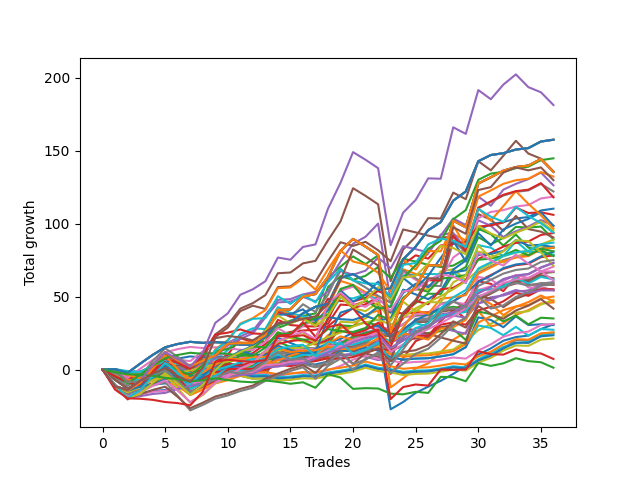

# Short Wallace 1226_003 
- Symbol: ES
- Date Range: 3/19/22 - 5/22/22
- Trading Period: 7:20-12:30
- Number of Trades: 36


| Name | Win Percent | Profit | Avg Profit / Trade |     | Name | Win Percent | Profit | Avg Profit / Trade |
| ---- | ----------- | ------ | ------------------ | --- | ---- | ----------- | ------ | ------------------ |
| Sorted By <br> Profit | | | | | Sorted By <br> Win Percentage ||||
| Thirty-Six | 61.11 | 90625.00 | 2517.36 |     | Nineteen | 91.67 | 44500.00 | 1236.11 |
| Four | 80.56 | 78750.00 | 2187.50 |     | Eighteen | 91.67 | 40375.00 | 1121.53 |
| Five | 69.44 | 67750.00 | 1881.94 |     | One | 91.67 | 15500.00 | 430.56 |
| Three | 72.22 | 44625.00 | 1239.58 |     | Twelve | 88.89 | 36625.00 | 1017.36 |
| Nineteen | 91.67 | 44500.00 | 1236.11 |     | Two | 83.33 | 23000.00 | 638.89 |
| Twenty-Three | 58.33 | 41875.00 | 1163.19 |     | Four | 80.56 | 78750.00 | 2187.50 |
| Eighteen | 91.67 | 40375.00 | 1121.53 |     | Thirteen | 80.56 | 33375.00 | 927.08 |
| Twenty-Two | 58.33 | 38875.00 | 1079.86 |     | Six | 77.78 | 23875.00 | 663.19 |
| Twelve | 88.89 | 36625.00 | 1017.36 |     | Three | 72.22 | 44625.00 | 1239.58 |
| Thirteen | 80.56 | 33375.00 | 927.08 |     | Five | 69.44 | 67750.00 | 1881.94 |
| Twenty-One | 66.67 | 30875.00 | 857.64 |     | Twenty-One | 66.67 | 30875.00 | 857.64 |
| Fifteen | 63.89 | 27500.00 | 763.89 |     | Fourteen | 66.67 | 27250.00 | 756.94 |
| Fourteen | 66.67 | 27250.00 | 756.94 |     | Twenty | 66.67 | 23375.00 | 649.31 |
| Seventeen | 61.11 | 27125.00 | 753.47 |     | Fifteen | 63.89 | 27500.00 | 763.89 |
| Sixteen | 52.78 | 27125.00 | 753.47 |     | Seven | 63.89 | 15625.00 | 434.03 |
| Six | 77.78 | 23875.00 | 663.19 |     | Thirty-Three | 63.89 | 14875.00 | 413.19 |
| Twenty | 66.67 | 23375.00 | 649.31 |     | Thirty-Two | 63.89 | 14875.00 | 413.19 |
| Two | 83.33 | 23000.00 | 638.89 |     | Thirty-One | 63.89 | 14875.00 | 413.19 |
| Seven | 63.89 | 15625.00 | 434.03 |     | Thirty | 63.89 | 14875.00 | 413.19 |
| One | 91.67 | 15500.00 | 430.56 |     | Twenty-Nine | 63.89 | 14875.00 | 413.19 |
| Ten | 47.22 | 15250.00 | 423.61 |     | Twenty-Eight | 63.89 | 14875.00 | 413.19 |
| Thirty-Three | 63.89 | 14875.00 | 413.19 |     | Twenty-Seven | 63.89 | 14875.00 | 413.19 |
| Thirty-Two | 63.89 | 14875.00 | 413.19 |     | Twenty-Six | 63.89 | 14875.00 | 413.19 |
| Thirty-One | 63.89 | 14875.00 | 413.19 |     | Twenty-Five | 63.89 | 14875.00 | 413.19 |
| Thirty | 63.89 | 14875.00 | 413.19 |     | Twenty-Four | 63.89 | 14875.00 | 413.19 |
| Twenty-Nine | 63.89 | 14875.00 | 413.19 |     | Thirty-Six | 61.11 | 90625.00 | 2517.36 |
| Twenty-Eight | 63.89 | 14875.00 | 413.19 |     | Seventeen | 61.11 | 27125.00 | 753.47 |
| Twenty-Seven | 63.89 | 14875.00 | 413.19 |     | Twenty-Three | 58.33 | 41875.00 | 1163.19 |
| Twenty-Six | 63.89 | 14875.00 | 413.19 |     | Twenty-Two | 58.33 | 38875.00 | 1079.86 |
| Twenty-Five | 63.89 | 14875.00 | 413.19 |     | Eight | 55.56 | 13625.00 | 378.47 |
| Twenty-Four | 63.89 | 14875.00 | 413.19 |     | Nine | 55.56 | 12625.00 | 350.69 |
| Eight | 55.56 | 13625.00 | 378.47 |     | Eleven | 55.56 | 10625.00 | 295.14 |
| Nine | 55.56 | 12625.00 | 350.69 |     | Sixteen | 52.78 | 27125.00 | 753.47 |
| Eleven | 55.56 | 10625.00 | 295.14 |     | Ten | 47.22 | 15250.00 | 423.61 |
| Thirty-Five | 44.44 | 3625.00 | 100.69 |     | Thirty-Five | 44.44 | 3625.00 | 100.69 |
| Thirty-Four | 30.56 | 625.00 | 17.36 |     | Thirty-Four | 30.56 | 625.00 | 17.36 |

### Test One
* Sell when price hits the middle line of the 20p bollinger
* No Stoploss
* Results:
```
Total Trades: 36
Percent Up: 8.33
Percent Down: 91.67
Total Points Moved Down: 31.00
Potential Profit: 15500.00
Total Points Ups: 70.25 Count Ups: 3
Total Points Downs: 101.25 Count Downs: 33
```

<details><summary>Trades</summary>

<code>In: 2022-03-21 07:44:00		Out: 2022-03-21 08:06:30		Total Position Time: 22:30		Total Move Down: -11.50		Total to Date: 11.50</code> <br />
<code>In: 2022-03-25 07:26:00		Out: 2022-03-25 07:51:05		Total Position Time: 25:05		Total Move Down: -6.00		Total to Date: 17.50</code> <br />
<code>In: 2022-03-25 11:34:00		Out: 2022-03-25 11:35:15		Total Position Time: 01:15		Total Move Down: 1.25		Total to Date: 16.25</code> <br />
<code>In: 2022-03-29 08:52:00		Out: 2022-03-29 08:56:20		Total Position Time: 04:20		Total Move Down: 1.50		Total to Date: 14.75</code> <br />
<code>In: 2022-03-29 08:53:00		Out: 2022-03-29 08:56:20		Total Position Time: 03:20		Total Move Down: 0.75		Total to Date: 14.00</code> <br />
<code>In: 2022-03-31 07:38:00		Out: 2022-03-31 07:42:05		Total Position Time: 04:05		Total Move Down: 2.75		Total to Date: 11.25</code> <br />
<code>In: 2022-03-31 07:39:00		Out: 2022-03-31 07:42:05		Total Position Time: 03:05		Total Move Down: 2.00		Total to Date: 9.25</code> <br />
<code>In: 2022-03-31 10:54:00		Out: 2022-03-31 10:58:25		Total Position Time: 04:25		Total Move Down: 1.75		Total to Date: 7.50</code> <br />
<code>In: 2022-03-31 12:05:00		Out: 2022-03-31 12:11:20		Total Position Time: 06:20		Total Move Down: 2.50		Total to Date: 5.00</code> <br />
<code>In: 2022-04-05 07:56:00		Out: 2022-04-05 08:04:00		Total Position Time: 08:00		Total Move Down: 1.75		Total to Date: 3.25</code> <br />
<code>In: 2022-04-07 08:04:00		Out: 2022-04-07 08:07:35		Total Position Time: 03:35		Total Move Down: 1.50		Total to Date: 1.75</code> <br />
<code>In: 2022-04-07 09:13:00		Out: 2022-04-07 09:17:05		Total Position Time: 04:05		Total Move Down: 0.75		Total to Date: 1.00</code> <br />
<code>In: 2022-04-18 10:59:00		Out: 2022-04-18 10:59:30		Total Position Time: 00:30		Total Move Down: 4.50		Total to Date: -3.50</code> <br />
<code>In: 2022-04-20 07:58:00		Out: 2022-04-20 08:00:20		Total Position Time: 02:20		Total Move Down: 0.50		Total to Date: -4.00</code> <br />
<code>In: 2022-04-20 09:55:00		Out: 2022-04-20 09:59:05		Total Position Time: 04:05		Total Move Down: 1.75		Total to Date: -5.75</code> <br />
<code>In: 2022-04-20 10:50:00		Out: 2022-04-20 10:50:10		Total Position Time: 00:10		Total Move Down: 0.50		Total to Date: -6.25</code> <br />
<code>In: 2022-04-25 09:28:00		Out: 2022-04-25 09:31:05		Total Position Time: 03:05		Total Move Down: 3.25		Total to Date: -9.50</code> <br />
<code>In: 2022-04-26 10:02:00		Out: 2022-04-26 10:02:25		Total Position Time: 00:25		Total Move Down: 4.00		Total to Date: -13.50</code> <br />
<code>In: 2022-04-27 09:46:00		Out: 2022-04-27 09:46:10		Total Position Time: 00:10		Total Move Down: 3.00		Total to Date: -16.50</code> <br />
<code>In: 2022-05-09 12:04:00		Out: 2022-05-09 12:04:30		Total Position Time: 00:30		Total Move Down: 4.25		Total to Date: -20.75</code> <br />
<code>In: 2022-05-10 11:47:00		Out: 2022-05-10 11:47:10		Total Position Time: 00:10		Total Move Down: 2.75		Total to Date: -23.50</code> <br />
<code>In: 2022-05-17 09:49:00		Out: 2022-05-17 09:51:20		Total Position Time: 02:20		Total Move Down: 2.00		Total to Date: -25.50</code> <br />
<code>In: 2022-05-20 12:24:00		Out: 2022-05-20 12:53:55		Total Position Time: 29:55		Total Move Down: -52.75		Total to Date: 27.25</code> <br />
<code>In: 2022-05-24 09:18:00		Out: 2022-05-24 09:21:30		Total Position Time: 03:30		Total Move Down: 5.00		Total to Date: 22.25</code> <br />
<code>In: 2022-05-24 11:15:00		Out: 2022-05-24 11:18:25		Total Position Time: 03:25		Total Move Down: 6.25		Total to Date: 16.00</code> <br />
<code>In: 2022-05-31 07:49:00		Out: 2022-05-31 07:50:05		Total Position Time: 01:05		Total Move Down: 4.25		Total to Date: 11.75</code> <br />
<code>In: 2022-06-10 10:53:00		Out: 2022-06-10 10:54:30		Total Position Time: 01:30		Total Move Down: 4.00		Total to Date: 7.75</code> <br />
<code>In: 2022-06-10 12:30:00		Out: 2022-06-10 12:30:30		Total Position Time: 00:30		Total Move Down: 4.75		Total to Date: 3.00</code> <br />
<code>In: 2022-06-13 09:15:00		Out: 2022-06-13 09:17:05		Total Position Time: 02:05		Total Move Down: 5.50		Total to Date: -2.50</code> <br />
<code>In: 2022-06-13 09:41:00		Out: 2022-06-13 09:43:15		Total Position Time: 02:15		Total Move Down: 7.75		Total to Date: -10.25</code> <br />
<code>In: 2022-06-14 10:03:00		Out: 2022-06-14 10:03:10		Total Position Time: 00:10		Total Move Down: 4.25		Total to Date: -14.50</code> <br />
<code>In: 2022-06-16 08:18:00		Out: 2022-06-16 08:20:25		Total Position Time: 02:25		Total Move Down: 5.25		Total to Date: -19.75</code> <br />
<code>In: 2022-06-16 09:02:00		Out: 2022-06-16 09:02:10		Total Position Time: 00:10		Total Move Down: 2.50		Total to Date: -22.25</code> <br />
<code>In: 2022-06-16 09:32:00		Out: 2022-06-16 09:32:10		Total Position Time: 00:10		Total Move Down: 1.00		Total to Date: -23.25</code> <br />
<code>In: 2022-06-16 09:36:00		Out: 2022-06-16 09:36:10		Total Position Time: 00:10		Total Move Down: 4.50		Total to Date: -27.75</code> <br />
<code>In: 2022-06-17 09:19:00		Out: 2022-06-17 09:21:15		Total Position Time: 02:15		Total Move Down: 3.25		Total to Date: -31.00</code> <br />


</details>

### Test Two
* Sell when the price hits the lower line of the 20p 1std bollinger
* No Stoploss
* Results:
```
Total Trades: 36
Percent Up: 16.67
Percent Down: 83.33
Total Points Moved Down: 46.00
Potential Profit: 23000.00
Total Points Ups: 87.25 Count Ups: 6
Total Points Downs: 133.25 Count Downs: 30
```

<details><summary>Trades</summary>

<code>In: 2022-03-21 07:44:00		Out: 2022-03-21 08:13:55		Total Position Time: 29:55		Total Move Down: -11.50		Total to Date: 11.50</code> <br />
<code>In: 2022-03-25 07:26:00		Out: 2022-03-25 07:53:50		Total Position Time: 27:50		Total Move Down: -4.50		Total to Date: 16.00</code> <br />
<code>In: 2022-03-25 11:34:00		Out: 2022-03-25 11:41:25		Total Position Time: 07:25		Total Move Down: 2.50		Total to Date: 13.50</code> <br />
<code>In: 2022-03-29 08:52:00		Out: 2022-03-29 08:58:40		Total Position Time: 06:40		Total Move Down: 3.00		Total to Date: 10.50</code> <br />
<code>In: 2022-03-29 08:53:00		Out: 2022-03-29 08:58:40		Total Position Time: 05:40		Total Move Down: 2.25		Total to Date: 8.25</code> <br />
<code>In: 2022-03-31 07:38:00		Out: 2022-03-31 08:03:25		Total Position Time: 25:25		Total Move Down: -3.50		Total to Date: 11.75</code> <br />
<code>In: 2022-03-31 07:39:00		Out: 2022-03-31 08:03:25		Total Position Time: 24:25		Total Move Down: -4.25		Total to Date: 16.00</code> <br />
<code>In: 2022-03-31 10:54:00		Out: 2022-03-31 11:00:10		Total Position Time: 06:10		Total Move Down: 3.75		Total to Date: 12.25</code> <br />
<code>In: 2022-03-31 12:05:00		Out: 2022-03-31 12:15:25		Total Position Time: 10:25		Total Move Down: 4.25		Total to Date: 8.00</code> <br />
<code>In: 2022-04-05 07:56:00		Out: 2022-04-05 08:07:05		Total Position Time: 11:05		Total Move Down: 2.25		Total to Date: 5.75</code> <br />
<code>In: 2022-04-07 08:04:00		Out: 2022-04-07 08:09:35		Total Position Time: 05:35		Total Move Down: 3.00		Total to Date: 2.75</code> <br />
<code>In: 2022-04-07 09:13:00		Out: 2022-04-07 09:20:20		Total Position Time: 07:20		Total Move Down: 2.25		Total to Date: 0.50</code> <br />
<code>In: 2022-04-18 10:59:00		Out: 2022-04-18 11:06:35		Total Position Time: 07:35		Total Move Down: 4.75		Total to Date: -4.25</code> <br />
<code>In: 2022-04-20 07:58:00		Out: 2022-04-20 08:00:40		Total Position Time: 02:40		Total Move Down: 3.50		Total to Date: -7.75</code> <br />
<code>In: 2022-04-20 09:55:00		Out: 2022-04-20 10:08:15		Total Position Time: 13:15		Total Move Down: 3.25		Total to Date: -11.00</code> <br />
<code>In: 2022-04-20 10:50:00		Out: 2022-04-20 10:54:05		Total Position Time: 04:05		Total Move Down: 2.50		Total to Date: -13.50</code> <br />
<code>In: 2022-04-25 09:28:00		Out: 2022-04-25 09:42:40		Total Position Time: 14:40		Total Move Down: 1.25		Total to Date: -14.75</code> <br />
<code>In: 2022-04-26 10:02:00		Out: 2022-04-26 10:03:55		Total Position Time: 01:55		Total Move Down: 8.75		Total to Date: -23.50</code> <br />
<code>In: 2022-04-27 09:46:00		Out: 2022-04-27 09:51:25		Total Position Time: 05:25		Total Move Down: 5.00		Total to Date: -28.50</code> <br />
<code>In: 2022-05-09 12:04:00		Out: 2022-05-09 12:18:05		Total Position Time: 14:05		Total Move Down: 1.25		Total to Date: -29.75</code> <br />
<code>In: 2022-05-10 11:47:00		Out: 2022-05-10 11:47:20		Total Position Time: 00:20		Total Move Down: 7.75		Total to Date: -37.50</code> <br />
<code>In: 2022-05-17 09:49:00		Out: 2022-05-17 09:54:40		Total Position Time: 05:40		Total Move Down: 3.00		Total to Date: -40.50</code> <br />
<code>In: 2022-05-20 12:24:00		Out: 2022-05-20 12:53:55		Total Position Time: 29:55		Total Move Down: -52.75		Total to Date: 12.25</code> <br />
<code>In: 2022-05-24 09:18:00		Out: 2022-05-24 09:29:00		Total Position Time: 11:00		Total Move Down: 6.25		Total to Date: 6.00</code> <br />
<code>In: 2022-05-24 11:15:00		Out: 2022-05-24 11:31:25		Total Position Time: 16:25		Total Move Down: 6.75		Total to Date: -0.75</code> <br />
<code>In: 2022-05-31 07:49:00		Out: 2022-05-31 07:58:10		Total Position Time: 09:10		Total Move Down: 3.50		Total to Date: -4.25</code> <br />
<code>In: 2022-06-10 10:53:00		Out: 2022-06-10 10:56:15		Total Position Time: 03:15		Total Move Down: 7.50		Total to Date: -11.75</code> <br />
<code>In: 2022-06-10 12:30:00		Out: 2022-06-10 12:35:55		Total Position Time: 05:55		Total Move Down: 8.75		Total to Date: -20.50</code> <br />
<code>In: 2022-06-13 09:15:00		Out: 2022-06-13 09:24:05		Total Position Time: 09:05		Total Move Down: 5.00		Total to Date: -25.50</code> <br />
<code>In: 2022-06-13 09:41:00		Out: 2022-06-13 09:47:55		Total Position Time: 06:55		Total Move Down: 14.75		Total to Date: -40.25</code> <br />
<code>In: 2022-06-14 10:03:00		Out: 2022-06-14 10:28:55		Total Position Time: 25:55		Total Move Down: -10.75		Total to Date: -29.50</code> <br />
<code>In: 2022-06-16 08:18:00		Out: 2022-06-16 08:30:50		Total Position Time: 12:50		Total Move Down: 2.25		Total to Date: -31.75</code> <br />
<code>In: 2022-06-16 09:02:00		Out: 2022-06-16 09:02:55		Total Position Time: 00:55		Total Move Down: 5.75		Total to Date: -37.50</code> <br />
<code>In: 2022-06-16 09:32:00		Out: 2022-06-16 09:36:05		Total Position Time: 04:05		Total Move Down: 3.25		Total to Date: -40.75</code> <br />
<code>In: 2022-06-16 09:36:00		Out: 2022-06-16 09:36:10		Total Position Time: 00:10		Total Move Down: 4.50		Total to Date: -45.25</code> <br />
<code>In: 2022-06-17 09:19:00		Out: 2022-06-17 09:36:10		Total Position Time: 17:10		Total Move Down: 0.75		Total to Date: -46.00</code> <br />


</details>

### Test Three
* Sell when the price hits the lower line of the 20p 2std bollinger
* No Stoploss
* Results:
```
Total Trades: 36
Percent Up: 27.78
Percent Down: 72.22
Total Points Moved Down: 89.25
Potential Profit: 44625.00
Total Points Ups: 96.00 Count Ups: 10
Total Points Downs: 185.25 Count Downs: 26
```

<details><summary>Trades</summary>

<code>In: 2022-03-21 07:44:00		Out: 2022-03-21 08:13:55		Total Position Time: 29:55		Total Move Down: -11.50		Total to Date: 11.50</code> <br />
<code>In: 2022-03-25 07:26:00		Out: 2022-03-25 07:54:10		Total Position Time: 28:10		Total Move Down: -3.50		Total to Date: 15.00</code> <br />
<code>In: 2022-03-25 11:34:00		Out: 2022-03-25 12:01:50		Total Position Time: 27:50		Total Move Down: 3.75		Total to Date: 11.25</code> <br />
<code>In: 2022-03-29 08:52:00		Out: 2022-03-29 09:01:40		Total Position Time: 09:40		Total Move Down: 4.50		Total to Date: 6.75</code> <br />
<code>In: 2022-03-29 08:53:00		Out: 2022-03-29 09:01:40		Total Position Time: 08:40		Total Move Down: 3.75		Total to Date: 3.00</code> <br />
<code>In: 2022-03-31 07:38:00		Out: 2022-03-31 08:07:55		Total Position Time: 29:55		Total Move Down: -5.50		Total to Date: 8.50</code> <br />
<code>In: 2022-03-31 07:39:00		Out: 2022-03-31 08:08:30		Total Position Time: 29:30		Total Move Down: -3.00		Total to Date: 11.50</code> <br />
<code>In: 2022-03-31 10:54:00		Out: 2022-03-31 11:00:25		Total Position Time: 06:25		Total Move Down: 5.25		Total to Date: 6.25</code> <br />
<code>In: 2022-03-31 12:05:00		Out: 2022-03-31 12:19:40		Total Position Time: 14:40		Total Move Down: 8.00		Total to Date: -1.75</code> <br />
<code>In: 2022-04-05 07:56:00		Out: 2022-04-05 08:09:35		Total Position Time: 13:35		Total Move Down: 4.00		Total to Date: -5.75</code> <br />
<code>In: 2022-04-07 08:04:00		Out: 2022-04-07 08:11:50		Total Position Time: 07:50		Total Move Down: 5.75		Total to Date: -11.50</code> <br />
<code>In: 2022-04-07 09:13:00		Out: 2022-04-07 09:28:20		Total Position Time: 15:20		Total Move Down: 3.75		Total to Date: -15.25</code> <br />
<code>In: 2022-04-18 10:59:00		Out: 2022-04-18 11:17:00		Total Position Time: 18:00		Total Move Down: 8.50		Total to Date: -23.75</code> <br />
<code>In: 2022-04-20 07:58:00		Out: 2022-04-20 08:01:10		Total Position Time: 03:10		Total Move Down: 6.50		Total to Date: -30.25</code> <br />
<code>In: 2022-04-20 09:55:00		Out: 2022-04-20 10:08:15		Total Position Time: 13:15		Total Move Down: 3.25		Total to Date: -33.50</code> <br />
<code>In: 2022-04-20 10:50:00		Out: 2022-04-20 11:13:55		Total Position Time: 23:55		Total Move Down: 3.25		Total to Date: -36.75</code> <br />
<code>In: 2022-04-25 09:28:00		Out: 2022-04-25 09:57:55		Total Position Time: 29:55		Total Move Down: 1.75		Total to Date: -38.50</code> <br />
<code>In: 2022-04-26 10:02:00		Out: 2022-04-26 10:31:55		Total Position Time: 29:55		Total Move Down: 24.50		Total to Date: -63.00</code> <br />
<code>In: 2022-04-27 09:46:00		Out: 2022-04-27 10:00:20		Total Position Time: 14:20		Total Move Down: 7.50		Total to Date: -70.50</code> <br />
<code>In: 2022-05-09 12:04:00		Out: 2022-05-09 12:21:00		Total Position Time: 17:00		Total Move Down: 7.00		Total to Date: -77.50</code> <br />
<code>In: 2022-05-10 11:47:00		Out: 2022-05-10 12:16:55		Total Position Time: 29:55		Total Move Down: -5.25		Total to Date: -72.25</code> <br />
<code>In: 2022-05-17 09:49:00		Out: 2022-05-17 10:01:50		Total Position Time: 12:50		Total Move Down: 6.00		Total to Date: -78.25</code> <br />
<code>In: 2022-05-20 12:24:00		Out: 2022-05-20 12:53:55		Total Position Time: 29:55		Total Move Down: -52.75		Total to Date: -25.50</code> <br />
<code>In: 2022-05-24 09:18:00		Out: 2022-05-24 09:32:35		Total Position Time: 14:35		Total Move Down: 13.25		Total to Date: -38.75</code> <br />
<code>In: 2022-05-24 11:15:00		Out: 2022-05-24 11:44:00		Total Position Time: 29:00		Total Move Down: 6.75		Total to Date: -45.50</code> <br />
<code>In: 2022-05-31 07:49:00		Out: 2022-05-31 08:08:30		Total Position Time: 19:30		Total Move Down: 6.50		Total to Date: -52.00</code> <br />
<code>In: 2022-06-10 10:53:00		Out: 2022-06-10 11:22:55		Total Position Time: 29:55		Total Move Down: -0.25		Total to Date: -51.75</code> <br />
<code>In: 2022-06-10 12:30:00		Out: 2022-06-10 12:43:25		Total Position Time: 13:25		Total Move Down: 13.75		Total to Date: -65.50</code> <br />
<code>In: 2022-06-13 09:15:00		Out: 2022-06-13 09:30:35		Total Position Time: 15:35		Total Move Down: 4.75		Total to Date: -70.25</code> <br />
<code>In: 2022-06-13 09:41:00		Out: 2022-06-13 09:54:45		Total Position Time: 13:45		Total Move Down: 20.50		Total to Date: -90.75</code> <br />
<code>In: 2022-06-14 10:03:00		Out: 2022-06-14 10:31:10		Total Position Time: 28:10		Total Move Down: -5.00		Total to Date: -85.75</code> <br />
<code>In: 2022-06-16 08:18:00		Out: 2022-06-16 08:41:30		Total Position Time: 23:30		Total Move Down: 4.50		Total to Date: -90.25</code> <br />
<code>In: 2022-06-16 09:02:00		Out: 2022-06-16 09:06:55		Total Position Time: 04:55		Total Move Down: 7.50		Total to Date: -97.75</code> <br />
<code>In: 2022-06-16 09:32:00		Out: 2022-06-16 09:59:35		Total Position Time: 27:35		Total Move Down: -0.50		Total to Date: -97.25</code> <br />
<code>In: 2022-06-16 09:36:00		Out: 2022-06-16 09:59:35		Total Position Time: 23:35		Total Move Down: 0.75		Total to Date: -98.00</code> <br />
<code>In: 2022-06-17 09:19:00		Out: 2022-06-17 09:48:55		Total Position Time: 29:55		Total Move Down: -8.75		Total to Date: -89.25</code> <br />


</details>

### Test Four
* Sell when the price hits the middle line of the 1std VWAP
* No Stoploss
* Results:
```
Total Trades: 36
Percent Up: 19.44
Percent Down: 80.56
Total Points Moved Down: 157.50
Potential Profit: 78750.00
Total Points Ups: 16.00 Count Ups: 7
Total Points Downs: 173.50 Count Downs: 29
```

<details><summary>Trades</summary>

<code>In: 2022-03-21 07:44:00		Out: 2022-03-21 07:44:10		Total Position Time: 00:10		Total Move Down: 0.25		Total to Date: -0.25</code> <br />
<code>In: 2022-03-25 07:26:00		Out: 2022-03-25 07:55:55		Total Position Time: 29:55		Total Move Down: -2.50		Total to Date: 2.25</code> <br />
<code>In: 2022-03-25 11:34:00		Out: 2022-03-25 12:03:55		Total Position Time: 29:55		Total Move Down: 6.25		Total to Date: -4.00</code> <br />
<code>In: 2022-03-29 08:52:00		Out: 2022-03-29 09:02:10		Total Position Time: 10:10		Total Move Down: 6.00		Total to Date: -10.00</code> <br />
<code>In: 2022-03-29 08:53:00		Out: 2022-03-29 09:02:10		Total Position Time: 09:10		Total Move Down: 5.25		Total to Date: -15.25</code> <br />
<code>In: 2022-03-31 07:38:00		Out: 2022-03-31 07:41:35		Total Position Time: 03:35		Total Move Down: 2.25		Total to Date: -17.50</code> <br />
<code>In: 2022-03-31 07:39:00		Out: 2022-03-31 07:41:35		Total Position Time: 02:35		Total Move Down: 1.50		Total to Date: -19.00</code> <br />
<code>In: 2022-03-31 10:54:00		Out: 2022-03-31 10:54:10		Total Position Time: 00:10		Total Move Down: -0.75		Total to Date: -18.25</code> <br />
<code>In: 2022-03-31 12:05:00		Out: 2022-03-31 12:05:10		Total Position Time: 00:10		Total Move Down: 0.50		Total to Date: -18.75</code> <br />
<code>In: 2022-04-05 07:56:00		Out: 2022-04-05 07:56:10		Total Position Time: 00:10		Total Move Down: -0.50		Total to Date: -18.25</code> <br />
<code>In: 2022-04-07 08:04:00		Out: 2022-04-07 08:04:10		Total Position Time: 00:10		Total Move Down: -1.25		Total to Date: -17.00</code> <br />
<code>In: 2022-04-07 09:13:00		Out: 2022-04-07 09:13:10		Total Position Time: 00:10		Total Move Down: -0.00		Total to Date: -17.00</code> <br />
<code>In: 2022-04-18 10:59:00		Out: 2022-04-18 11:28:55		Total Position Time: 29:55		Total Move Down: 5.50		Total to Date: -22.50</code> <br />
<code>In: 2022-04-20 07:58:00		Out: 2022-04-20 08:08:10		Total Position Time: 10:10		Total Move Down: 9.25		Total to Date: -31.75</code> <br />
<code>In: 2022-04-20 09:55:00		Out: 2022-04-20 10:24:55		Total Position Time: 29:55		Total Move Down: 0.50		Total to Date: -32.25</code> <br />
<code>In: 2022-04-20 10:50:00		Out: 2022-04-20 11:18:20		Total Position Time: 28:20		Total Move Down: 6.25		Total to Date: -38.50</code> <br />
<code>In: 2022-04-25 09:28:00		Out: 2022-04-25 09:31:10		Total Position Time: 03:10		Total Move Down: 4.50		Total to Date: -43.00</code> <br />
<code>In: 2022-04-26 10:02:00		Out: 2022-04-26 10:02:10		Total Position Time: 00:10		Total Move Down: 2.00		Total to Date: -45.00</code> <br />
<code>In: 2022-04-27 09:46:00		Out: 2022-04-27 10:15:55		Total Position Time: 29:55		Total Move Down: 17.75		Total to Date: -62.75</code> <br />
<code>In: 2022-05-09 12:04:00		Out: 2022-05-09 12:04:10		Total Position Time: 00:10		Total Move Down: 2.75		Total to Date: -65.50</code> <br />
<code>In: 2022-05-10 11:47:00		Out: 2022-05-10 12:16:55		Total Position Time: 29:55		Total Move Down: -5.25		Total to Date: -60.25</code> <br />
<code>In: 2022-05-17 09:49:00		Out: 2022-05-17 10:18:55		Total Position Time: 29:55		Total Move Down: -5.75		Total to Date: -54.50</code> <br />
<code>In: 2022-05-20 12:24:00		Out: 2022-05-20 12:24:10		Total Position Time: 00:10		Total Move Down: 1.25		Total to Date: -55.75</code> <br />
<code>In: 2022-05-24 09:18:00		Out: 2022-05-24 09:36:45		Total Position Time: 18:45		Total Move Down: 19.75		Total to Date: -75.50</code> <br />
<code>In: 2022-05-24 11:15:00		Out: 2022-05-24 11:44:55		Total Position Time: 29:55		Total Move Down: 8.75		Total to Date: -84.25</code> <br />
<code>In: 2022-05-31 07:49:00		Out: 2022-05-31 08:14:20		Total Position Time: 25:20		Total Move Down: 11.25		Total to Date: -95.50</code> <br />
<code>In: 2022-06-10 10:53:00		Out: 2022-06-10 10:55:10		Total Position Time: 02:10		Total Move Down: 5.50		Total to Date: -101.00</code> <br />
<code>In: 2022-06-10 12:30:00		Out: 2022-06-10 12:44:00		Total Position Time: 14:00		Total Move Down: 14.75		Total to Date: -115.75</code> <br />
<code>In: 2022-06-13 09:15:00		Out: 2022-06-13 09:17:20		Total Position Time: 02:20		Total Move Down: 6.25		Total to Date: -122.00</code> <br />
<code>In: 2022-06-13 09:41:00		Out: 2022-06-13 09:55:05		Total Position Time: 14:05		Total Move Down: 20.75		Total to Date: -142.75</code> <br />
<code>In: 2022-06-14 10:03:00		Out: 2022-06-14 10:03:10		Total Position Time: 00:10		Total Move Down: 4.25		Total to Date: -147.00</code> <br />
<code>In: 2022-06-16 08:18:00		Out: 2022-06-16 08:18:10		Total Position Time: 00:10		Total Move Down: 1.25		Total to Date: -148.25</code> <br />
<code>In: 2022-06-16 09:02:00		Out: 2022-06-16 09:02:10		Total Position Time: 00:10		Total Move Down: 2.50		Total to Date: -150.75</code> <br />
<code>In: 2022-06-16 09:32:00		Out: 2022-06-16 09:32:10		Total Position Time: 00:10		Total Move Down: 1.00		Total to Date: -151.75</code> <br />
<code>In: 2022-06-16 09:36:00		Out: 2022-06-16 09:36:10		Total Position Time: 00:10		Total Move Down: 4.50		Total to Date: -156.25</code> <br />
<code>In: 2022-06-17 09:19:00		Out: 2022-06-17 09:19:10		Total Position Time: 00:10		Total Move Down: 1.25		Total to Date: -157.50</code> <br />


</details>

### Test Five
* Sell when the price hits the lower line of the 1std VWAP
* No Stoploss
* Results:
```
Total Trades: 36
Percent Up: 30.56
Percent Down: 69.44
Total Points Moved Down: 135.50
Potential Profit: 67750.00
Total Points Ups: 100.75 Count Ups: 11
Total Points Downs: 236.25 Count Downs: 25
```

<details><summary>Trades</summary>

<code>In: 2022-03-21 07:44:00		Out: 2022-03-21 08:13:55		Total Position Time: 29:55		Total Move Down: -11.50		Total to Date: 11.50</code> <br />
<code>In: 2022-03-25 07:26:00		Out: 2022-03-25 07:55:55		Total Position Time: 29:55		Total Move Down: -2.50		Total to Date: 14.00</code> <br />
<code>In: 2022-03-25 11:34:00		Out: 2022-03-25 12:03:55		Total Position Time: 29:55		Total Move Down: 6.25		Total to Date: 7.75</code> <br />
<code>In: 2022-03-29 08:52:00		Out: 2022-03-29 09:21:55		Total Position Time: 29:55		Total Move Down: 10.75		Total to Date: -3.00</code> <br />
<code>In: 2022-03-29 08:53:00		Out: 2022-03-29 09:22:55		Total Position Time: 29:55		Total Move Down: 8.75		Total to Date: -11.75</code> <br />
<code>In: 2022-03-31 07:38:00		Out: 2022-03-31 08:07:55		Total Position Time: 29:55		Total Move Down: -5.50		Total to Date: -6.25</code> <br />
<code>In: 2022-03-31 07:39:00		Out: 2022-03-31 08:08:55		Total Position Time: 29:55		Total Move Down: -4.00		Total to Date: -2.25</code> <br />
<code>In: 2022-03-31 10:54:00		Out: 2022-03-31 11:00:10		Total Position Time: 06:10		Total Move Down: 3.75		Total to Date: -6.00</code> <br />
<code>In: 2022-03-31 12:05:00		Out: 2022-03-31 12:12:45		Total Position Time: 07:45		Total Move Down: 3.75		Total to Date: -9.75</code> <br />
<code>In: 2022-04-05 07:56:00		Out: 2022-04-05 08:19:25		Total Position Time: 23:25		Total Move Down: 8.00		Total to Date: -17.75</code> <br />
<code>In: 2022-04-07 08:04:00		Out: 2022-04-07 08:04:30		Total Position Time: 00:30		Total Move Down: 0.25		Total to Date: -18.00</code> <br />
<code>In: 2022-04-07 09:13:00		Out: 2022-04-07 09:13:10		Total Position Time: 00:10		Total Move Down: -0.00		Total to Date: -18.00</code> <br />
<code>In: 2022-04-18 10:59:00		Out: 2022-04-18 11:28:55		Total Position Time: 29:55		Total Move Down: 5.50		Total to Date: -23.50</code> <br />
<code>In: 2022-04-20 07:58:00		Out: 2022-04-20 08:23:25		Total Position Time: 25:25		Total Move Down: 17.25		Total to Date: -40.75</code> <br />
<code>In: 2022-04-20 09:55:00		Out: 2022-04-20 10:24:55		Total Position Time: 29:55		Total Move Down: 0.50		Total to Date: -41.25</code> <br />
<code>In: 2022-04-20 10:50:00		Out: 2022-04-20 11:19:55		Total Position Time: 29:55		Total Move Down: 8.75		Total to Date: -50.00</code> <br />
<code>In: 2022-04-25 09:28:00		Out: 2022-04-25 09:57:55		Total Position Time: 29:55		Total Move Down: 1.75		Total to Date: -51.75</code> <br />
<code>In: 2022-04-26 10:02:00		Out: 2022-04-26 10:14:15		Total Position Time: 12:15		Total Move Down: 11.75		Total to Date: -63.50</code> <br />
<code>In: 2022-04-27 09:46:00		Out: 2022-04-27 10:15:55		Total Position Time: 29:55		Total Move Down: 17.75		Total to Date: -81.25</code> <br />
<code>In: 2022-05-09 12:04:00		Out: 2022-05-09 12:21:30		Total Position Time: 17:30		Total Move Down: 8.25		Total to Date: -89.50</code> <br />
<code>In: 2022-05-10 11:47:00		Out: 2022-05-10 12:16:55		Total Position Time: 29:55		Total Move Down: -5.25		Total to Date: -84.25</code> <br />
<code>In: 2022-05-17 09:49:00		Out: 2022-05-17 10:18:55		Total Position Time: 29:55		Total Move Down: -5.75		Total to Date: -78.50</code> <br />
<code>In: 2022-05-20 12:24:00		Out: 2022-05-20 12:53:55		Total Position Time: 29:55		Total Move Down: -52.75		Total to Date: -25.75</code> <br />
<code>In: 2022-05-24 09:18:00		Out: 2022-05-24 09:47:55		Total Position Time: 29:55		Total Move Down: 22.25		Total to Date: -48.00</code> <br />
<code>In: 2022-05-24 11:15:00		Out: 2022-05-24 11:44:55		Total Position Time: 29:55		Total Move Down: 8.75		Total to Date: -56.75</code> <br />
<code>In: 2022-05-31 07:49:00		Out: 2022-05-31 08:18:55		Total Position Time: 29:55		Total Move Down: 14.75		Total to Date: -71.50</code> <br />
<code>In: 2022-06-10 10:53:00		Out: 2022-06-10 11:22:55		Total Position Time: 29:55		Total Move Down: -0.25		Total to Date: -71.25</code> <br />
<code>In: 2022-06-10 12:30:00		Out: 2022-06-10 12:59:20		Total Position Time: 29:20		Total Move Down: 30.75		Total to Date: -102.00</code> <br />
<code>In: 2022-06-13 09:15:00		Out: 2022-06-13 09:44:55		Total Position Time: 29:55		Total Move Down: -4.50		Total to Date: -97.50</code> <br />
<code>In: 2022-06-13 09:41:00		Out: 2022-06-13 10:10:55		Total Position Time: 29:55		Total Move Down: 30.00		Total to Date: -127.50</code> <br />
<code>In: 2022-06-14 10:03:00		Out: 2022-06-14 10:03:10		Total Position Time: 00:10		Total Move Down: 4.25		Total to Date: -131.75</code> <br />
<code>In: 2022-06-16 08:18:00		Out: 2022-06-16 08:19:55		Total Position Time: 01:55		Total Move Down: 4.50		Total to Date: -136.25</code> <br />
<code>In: 2022-06-16 09:02:00		Out: 2022-06-16 09:02:10		Total Position Time: 00:10		Total Move Down: 2.50		Total to Date: -138.75</code> <br />
<code>In: 2022-06-16 09:32:00		Out: 2022-06-16 09:32:10		Total Position Time: 00:10		Total Move Down: 1.00		Total to Date: -139.75</code> <br />
<code>In: 2022-06-16 09:36:00		Out: 2022-06-16 09:36:10		Total Position Time: 00:10		Total Move Down: 4.50		Total to Date: -144.25</code> <br />
<code>In: 2022-06-17 09:19:00		Out: 2022-06-17 09:48:55		Total Position Time: 29:55		Total Move Down: -8.75		Total to Date: -135.50</code> <br />


</details>

### Test Six
* Sell when the price hits the middle line of the 20p bollinger
* Stoploss is -2 points
* Results:
```
Total Trades: 36
Percent Up: 22.22
Percent Down: 77.78
Total Points Moved Down: 47.75
Potential Profit: 23875.00
Total Points Ups: 17.50 Count Ups: 8
Total Points Downs: 65.25 Count Downs: 28
```

<details><summary>Trades</summary>

<code>In: 2022-03-21 07:44:00		Out: 2022-03-21 07:46:35		Total Position Time: 02:35		Total Move Down: -4.00		Total to Date: 4.00</code> <br />
<code>In: 2022-03-25 07:26:00		Out: 2022-03-25 07:33:35		Total Position Time: 07:35		Total Move Down: -2.75		Total to Date: 6.75</code> <br />
<code>In: 2022-03-25 11:34:00		Out: 2022-03-25 11:35:15		Total Position Time: 01:15		Total Move Down: 1.25		Total to Date: 5.50</code> <br />
<code>In: 2022-03-29 08:52:00		Out: 2022-03-29 08:54:15		Total Position Time: 02:15		Total Move Down: -1.25		Total to Date: 6.75</code> <br />
<code>In: 2022-03-29 08:53:00		Out: 2022-03-29 08:56:20		Total Position Time: 03:20		Total Move Down: 0.75		Total to Date: 6.00</code> <br />
<code>In: 2022-03-31 07:38:00		Out: 2022-03-31 07:42:05		Total Position Time: 04:05		Total Move Down: 2.75		Total to Date: 3.25</code> <br />
<code>In: 2022-03-31 07:39:00		Out: 2022-03-31 07:42:05		Total Position Time: 03:05		Total Move Down: 2.00		Total to Date: 1.25</code> <br />
<code>In: 2022-03-31 10:54:00		Out: 2022-03-31 10:58:25		Total Position Time: 04:25		Total Move Down: 1.75		Total to Date: -0.50</code> <br />
<code>In: 2022-03-31 12:05:00		Out: 2022-03-31 12:06:40		Total Position Time: 01:40		Total Move Down: -0.75		Total to Date: 0.25</code> <br />
<code>In: 2022-04-05 07:56:00		Out: 2022-04-05 08:04:00		Total Position Time: 08:00		Total Move Down: 1.75		Total to Date: -1.50</code> <br />
<code>In: 2022-04-07 08:04:00		Out: 2022-04-07 08:07:35		Total Position Time: 03:35		Total Move Down: 1.50		Total to Date: -3.00</code> <br />
<code>In: 2022-04-07 09:13:00		Out: 2022-04-07 09:17:05		Total Position Time: 04:05		Total Move Down: 0.75		Total to Date: -3.75</code> <br />
<code>In: 2022-04-18 10:59:00		Out: 2022-04-18 10:59:10		Total Position Time: 00:10		Total Move Down: 0.25		Total to Date: -4.00</code> <br />
<code>In: 2022-04-20 07:58:00		Out: 2022-04-20 08:00:20		Total Position Time: 02:20		Total Move Down: 0.50		Total to Date: -4.50</code> <br />
<code>In: 2022-04-20 09:55:00		Out: 2022-04-20 09:59:05		Total Position Time: 04:05		Total Move Down: 1.75		Total to Date: -6.25</code> <br />
<code>In: 2022-04-20 10:50:00		Out: 2022-04-20 10:50:10		Total Position Time: 00:10		Total Move Down: 0.50		Total to Date: -6.75</code> <br />
<code>In: 2022-04-25 09:28:00		Out: 2022-04-25 09:28:10		Total Position Time: 00:10		Total Move Down: -0.25		Total to Date: -6.50</code> <br />
<code>In: 2022-04-26 10:02:00		Out: 2022-04-26 10:02:10		Total Position Time: 00:10		Total Move Down: 2.00		Total to Date: -8.50</code> <br />
<code>In: 2022-04-27 09:46:00		Out: 2022-04-27 09:46:10		Total Position Time: 00:10		Total Move Down: 3.00		Total to Date: -11.50</code> <br />
<code>In: 2022-05-09 12:04:00		Out: 2022-05-09 12:04:30		Total Position Time: 00:30		Total Move Down: 4.25		Total to Date: -15.75</code> <br />
<code>In: 2022-05-10 11:47:00		Out: 2022-05-10 11:47:10		Total Position Time: 00:10		Total Move Down: 2.75		Total to Date: -18.50</code> <br />
<code>In: 2022-05-17 09:49:00		Out: 2022-05-17 09:49:20		Total Position Time: 00:20		Total Move Down: -2.25		Total to Date: -16.25</code> <br />
<code>In: 2022-05-20 12:24:00		Out: 2022-05-20 12:26:05		Total Position Time: 02:05		Total Move Down: -4.50		Total to Date: -11.75</code> <br />
<code>In: 2022-05-24 09:18:00		Out: 2022-05-24 09:18:20		Total Position Time: 00:20		Total Move Down: -1.75		Total to Date: -10.00</code> <br />
<code>In: 2022-05-24 11:15:00		Out: 2022-05-24 11:15:10		Total Position Time: 00:10		Total Move Down: 0.75		Total to Date: -10.75</code> <br />
<code>In: 2022-05-31 07:49:00		Out: 2022-05-31 07:49:10		Total Position Time: 00:10		Total Move Down: 0.25		Total to Date: -11.00</code> <br />
<code>In: 2022-06-10 10:53:00		Out: 2022-06-10 10:53:10		Total Position Time: 00:10		Total Move Down: 1.25		Total to Date: -12.25</code> <br />
<code>In: 2022-06-10 12:30:00		Out: 2022-06-10 12:30:10		Total Position Time: 00:10		Total Move Down: 1.50		Total to Date: -13.75</code> <br />
<code>In: 2022-06-13 09:15:00		Out: 2022-06-13 09:17:05		Total Position Time: 02:05		Total Move Down: 5.50		Total to Date: -19.25</code> <br />
<code>In: 2022-06-13 09:41:00		Out: 2022-06-13 09:43:15		Total Position Time: 02:15		Total Move Down: 7.75		Total to Date: -27.00</code> <br />
<code>In: 2022-06-14 10:03:00		Out: 2022-06-14 10:03:10		Total Position Time: 00:10		Total Move Down: 4.25		Total to Date: -31.25</code> <br />
<code>In: 2022-06-16 08:18:00		Out: 2022-06-16 08:20:25		Total Position Time: 02:25		Total Move Down: 5.25		Total to Date: -36.50</code> <br />
<code>In: 2022-06-16 09:02:00		Out: 2022-06-16 09:02:10		Total Position Time: 00:10		Total Move Down: 2.50		Total to Date: -39.00</code> <br />
<code>In: 2022-06-16 09:32:00		Out: 2022-06-16 09:32:10		Total Position Time: 00:10		Total Move Down: 1.00		Total to Date: -40.00</code> <br />
<code>In: 2022-06-16 09:36:00		Out: 2022-06-16 09:36:10		Total Position Time: 00:10		Total Move Down: 4.50		Total to Date: -44.50</code> <br />
<code>In: 2022-06-17 09:19:00		Out: 2022-06-17 09:21:15		Total Position Time: 02:15		Total Move Down: 3.25		Total to Date: -47.75</code> <br />


</details>

### Test Seven
* Sell when the price hits the middle line of the 20p bollinger
* Trailing Stop is -2 points
* Results:
```
Total Trades: 36
Percent Up: 36.11
Percent Down: 63.89
Total Points Moved Down: 31.25
Potential Profit: 15625.00
Total Points Ups: 19.25 Count Ups: 13
Total Points Downs: 50.50 Count Downs: 23
```

<details><summary>Trades</summary>

<code>In: 2022-03-21 07:44:00		Out: 2022-03-21 07:44:40		Total Position Time: 00:40		Total Move Down: -2.00		Total to Date: 2.00</code> <br />
<code>In: 2022-03-25 07:26:00		Out: 2022-03-25 07:26:45		Total Position Time: 00:45		Total Move Down: -1.25		Total to Date: 3.25</code> <br />
<code>In: 2022-03-25 11:34:00		Out: 2022-03-25 11:35:15		Total Position Time: 01:15		Total Move Down: 1.25		Total to Date: 2.00</code> <br />
<code>In: 2022-03-29 08:52:00		Out: 2022-03-29 08:53:50		Total Position Time: 01:50		Total Move Down: -1.00		Total to Date: 3.00</code> <br />
<code>In: 2022-03-29 08:53:00		Out: 2022-03-29 08:56:20		Total Position Time: 03:20		Total Move Down: 0.75		Total to Date: 2.25</code> <br />
<code>In: 2022-03-31 07:38:00		Out: 2022-03-31 07:42:05		Total Position Time: 04:05		Total Move Down: 2.75		Total to Date: -0.50</code> <br />
<code>In: 2022-03-31 07:39:00		Out: 2022-03-31 07:42:05		Total Position Time: 03:05		Total Move Down: 2.00		Total to Date: -2.50</code> <br />
<code>In: 2022-03-31 10:54:00		Out: 2022-03-31 10:58:25		Total Position Time: 04:25		Total Move Down: 1.75		Total to Date: -4.25</code> <br />
<code>In: 2022-03-31 12:05:00		Out: 2022-03-31 12:06:35		Total Position Time: 01:35		Total Move Down: -0.50		Total to Date: -3.75</code> <br />
<code>In: 2022-04-05 07:56:00		Out: 2022-04-05 07:59:05		Total Position Time: 03:05		Total Move Down: -2.50		Total to Date: -1.25</code> <br />
<code>In: 2022-04-07 08:04:00		Out: 2022-04-07 08:05:00		Total Position Time: 01:00		Total Move Down: -2.50		Total to Date: 1.25</code> <br />
<code>In: 2022-04-07 09:13:00		Out: 2022-04-07 09:15:05		Total Position Time: 02:05		Total Move Down: -2.00		Total to Date: 3.25</code> <br />
<code>In: 2022-04-18 10:59:00		Out: 2022-04-18 10:59:10		Total Position Time: 00:10		Total Move Down: 0.25		Total to Date: 3.00</code> <br />
<code>In: 2022-04-20 07:58:00		Out: 2022-04-20 08:00:00		Total Position Time: 02:00		Total Move Down: -1.50		Total to Date: 4.50</code> <br />
<code>In: 2022-04-20 09:55:00		Out: 2022-04-20 09:59:05		Total Position Time: 04:05		Total Move Down: 1.75		Total to Date: 2.75</code> <br />
<code>In: 2022-04-20 10:50:00		Out: 2022-04-20 10:50:10		Total Position Time: 00:10		Total Move Down: 0.50		Total to Date: 2.25</code> <br />
<code>In: 2022-04-25 09:28:00		Out: 2022-04-25 09:28:10		Total Position Time: 00:10		Total Move Down: -0.25		Total to Date: 2.50</code> <br />
<code>In: 2022-04-26 10:02:00		Out: 2022-04-26 10:02:10		Total Position Time: 00:10		Total Move Down: 2.00		Total to Date: 0.50</code> <br />
<code>In: 2022-04-27 09:46:00		Out: 2022-04-27 09:46:10		Total Position Time: 00:10		Total Move Down: 3.00		Total to Date: -2.50</code> <br />
<code>In: 2022-05-09 12:04:00		Out: 2022-05-09 12:04:30		Total Position Time: 00:30		Total Move Down: 4.25		Total to Date: -6.75</code> <br />
<code>In: 2022-05-10 11:47:00		Out: 2022-05-10 11:47:10		Total Position Time: 00:10		Total Move Down: 2.75		Total to Date: -9.50</code> <br />
<code>In: 2022-05-17 09:49:00		Out: 2022-05-17 09:49:20		Total Position Time: 00:20		Total Move Down: -2.25		Total to Date: -7.25</code> <br />
<code>In: 2022-05-20 12:24:00		Out: 2022-05-20 12:24:35		Total Position Time: 00:35		Total Move Down: -1.00		Total to Date: -6.25</code> <br />
<code>In: 2022-05-24 09:18:00		Out: 2022-05-24 09:18:20		Total Position Time: 00:20		Total Move Down: -1.75		Total to Date: -4.50</code> <br />
<code>In: 2022-05-24 11:15:00		Out: 2022-05-24 11:15:10		Total Position Time: 00:10		Total Move Down: 0.75		Total to Date: -5.25</code> <br />
<code>In: 2022-05-31 07:49:00		Out: 2022-05-31 07:49:10		Total Position Time: 00:10		Total Move Down: 0.25		Total to Date: -5.50</code> <br />
<code>In: 2022-06-10 10:53:00		Out: 2022-06-10 10:53:10		Total Position Time: 00:10		Total Move Down: 1.25		Total to Date: -6.75</code> <br />
<code>In: 2022-06-10 12:30:00		Out: 2022-06-10 12:30:10		Total Position Time: 00:10		Total Move Down: 1.50		Total to Date: -8.25</code> <br />
<code>In: 2022-06-13 09:15:00		Out: 2022-06-13 09:15:20		Total Position Time: 00:20		Total Move Down: -0.75		Total to Date: -7.50</code> <br />
<code>In: 2022-06-13 09:41:00		Out: 2022-06-13 09:43:00		Total Position Time: 02:00		Total Move Down: 5.50		Total to Date: -13.00</code> <br />
<code>In: 2022-06-14 10:03:00		Out: 2022-06-14 10:03:10		Total Position Time: 00:10		Total Move Down: 4.25		Total to Date: -17.25</code> <br />
<code>In: 2022-06-16 08:18:00		Out: 2022-06-16 08:20:25		Total Position Time: 02:25		Total Move Down: 5.25		Total to Date: -22.50</code> <br />
<code>In: 2022-06-16 09:02:00		Out: 2022-06-16 09:02:10		Total Position Time: 00:10		Total Move Down: 2.50		Total to Date: -25.00</code> <br />
<code>In: 2022-06-16 09:32:00		Out: 2022-06-16 09:32:10		Total Position Time: 00:10		Total Move Down: 1.00		Total to Date: -26.00</code> <br />
<code>In: 2022-06-16 09:36:00		Out: 2022-06-16 09:36:10		Total Position Time: 00:10		Total Move Down: 4.50		Total to Date: -30.50</code> <br />
<code>In: 2022-06-17 09:19:00		Out: 2022-06-17 09:19:30		Total Position Time: 00:30		Total Move Down: 0.75		Total to Date: -31.25</code> <br />


</details>

### Test Eight
* Sell when the price hits the lower line of the 20p 1std bollinger
* Stoploss is -2 points
* Results:
```
Total Trades: 36
Percent Up: 44.44
Percent Down: 55.56
Total Points Moved Down: 27.25
Potential Profit: 13625.00
Total Points Ups: 38.50 Count Ups: 16
Total Points Downs: 65.75 Count Downs: 20
```

<details><summary>Trades</summary>

<code>In: 2022-03-21 07:44:00		Out: 2022-03-21 07:46:35		Total Position Time: 02:35		Total Move Down: -4.00		Total to Date: 4.00</code> <br />
<code>In: 2022-03-25 07:26:00		Out: 2022-03-25 07:33:35		Total Position Time: 07:35		Total Move Down: -2.75		Total to Date: 6.75</code> <br />
<code>In: 2022-03-25 11:34:00		Out: 2022-03-25 11:41:25		Total Position Time: 07:25		Total Move Down: 2.50		Total to Date: 4.25</code> <br />
<code>In: 2022-03-29 08:52:00		Out: 2022-03-29 08:54:15		Total Position Time: 02:15		Total Move Down: -1.25		Total to Date: 5.50</code> <br />
<code>In: 2022-03-29 08:53:00		Out: 2022-03-29 08:58:40		Total Position Time: 05:40		Total Move Down: 2.25		Total to Date: 3.25</code> <br />
<code>In: 2022-03-31 07:38:00		Out: 2022-03-31 07:43:10		Total Position Time: 05:10		Total Move Down: -1.50		Total to Date: 4.75</code> <br />
<code>In: 2022-03-31 07:39:00		Out: 2022-03-31 07:43:10		Total Position Time: 04:10		Total Move Down: -2.25		Total to Date: 7.00</code> <br />
<code>In: 2022-03-31 10:54:00		Out: 2022-03-31 11:00:10		Total Position Time: 06:10		Total Move Down: 3.75		Total to Date: 3.25</code> <br />
<code>In: 2022-03-31 12:05:00		Out: 2022-03-31 12:06:40		Total Position Time: 01:40		Total Move Down: -0.75		Total to Date: 4.00</code> <br />
<code>In: 2022-04-05 07:56:00		Out: 2022-04-05 08:07:05		Total Position Time: 11:05		Total Move Down: 2.25		Total to Date: 1.75</code> <br />
<code>In: 2022-04-07 08:04:00		Out: 2022-04-07 08:09:35		Total Position Time: 05:35		Total Move Down: 3.00		Total to Date: -1.25</code> <br />
<code>In: 2022-04-07 09:13:00		Out: 2022-04-07 09:20:20		Total Position Time: 07:20		Total Move Down: 2.25		Total to Date: -3.50</code> <br />
<code>In: 2022-04-18 10:59:00		Out: 2022-04-18 10:59:10		Total Position Time: 00:10		Total Move Down: 0.25		Total to Date: -3.75</code> <br />
<code>In: 2022-04-20 07:58:00		Out: 2022-04-20 08:00:40		Total Position Time: 02:40		Total Move Down: 3.50		Total to Date: -7.25</code> <br />
<code>In: 2022-04-20 09:55:00		Out: 2022-04-20 10:04:15		Total Position Time: 09:15		Total Move Down: -3.50		Total to Date: -3.75</code> <br />
<code>In: 2022-04-20 10:50:00		Out: 2022-04-20 10:54:05		Total Position Time: 04:05		Total Move Down: 2.50		Total to Date: -6.25</code> <br />
<code>In: 2022-04-25 09:28:00		Out: 2022-04-25 09:28:10		Total Position Time: 00:10		Total Move Down: -0.25		Total to Date: -6.00</code> <br />
<code>In: 2022-04-26 10:02:00		Out: 2022-04-26 10:02:10		Total Position Time: 00:10		Total Move Down: 2.00		Total to Date: -8.00</code> <br />
<code>In: 2022-04-27 09:46:00		Out: 2022-04-27 09:51:25		Total Position Time: 05:25		Total Move Down: 5.00		Total to Date: -13.00</code> <br />
<code>In: 2022-05-09 12:04:00		Out: 2022-05-09 12:05:15		Total Position Time: 01:15		Total Move Down: -0.50		Total to Date: -12.50</code> <br />
<code>In: 2022-05-10 11:47:00		Out: 2022-05-10 11:47:10		Total Position Time: 00:10		Total Move Down: 2.75		Total to Date: -15.25</code> <br />
<code>In: 2022-05-17 09:49:00		Out: 2022-05-17 09:49:20		Total Position Time: 00:20		Total Move Down: -2.25		Total to Date: -13.00</code> <br />
<code>In: 2022-05-20 12:24:00		Out: 2022-05-20 12:26:05		Total Position Time: 02:05		Total Move Down: -4.50		Total to Date: -8.50</code> <br />
<code>In: 2022-05-24 09:18:00		Out: 2022-05-24 09:18:20		Total Position Time: 00:20		Total Move Down: -1.75		Total to Date: -6.75</code> <br />
<code>In: 2022-05-24 11:15:00		Out: 2022-05-24 11:15:10		Total Position Time: 00:10		Total Move Down: 0.75		Total to Date: -7.50</code> <br />
<code>In: 2022-05-31 07:49:00		Out: 2022-05-31 07:49:10		Total Position Time: 00:10		Total Move Down: 0.25		Total to Date: -7.75</code> <br />
<code>In: 2022-06-10 10:53:00		Out: 2022-06-10 10:53:10		Total Position Time: 00:10		Total Move Down: 1.25		Total to Date: -9.00</code> <br />
<code>In: 2022-06-10 12:30:00		Out: 2022-06-10 12:30:10		Total Position Time: 00:10		Total Move Down: 1.50		Total to Date: -10.50</code> <br />
<code>In: 2022-06-13 09:15:00		Out: 2022-06-13 09:24:05		Total Position Time: 09:05		Total Move Down: 5.00		Total to Date: -15.50</code> <br />
<code>In: 2022-06-13 09:41:00		Out: 2022-06-13 09:47:55		Total Position Time: 06:55		Total Move Down: 14.75		Total to Date: -30.25</code> <br />
<code>In: 2022-06-14 10:03:00		Out: 2022-06-14 10:07:00		Total Position Time: 04:00		Total Move Down: -1.75		Total to Date: -28.50</code> <br />
<code>In: 2022-06-16 08:18:00		Out: 2022-06-16 08:26:50		Total Position Time: 08:50		Total Move Down: -5.00		Total to Date: -23.50</code> <br />
<code>In: 2022-06-16 09:02:00		Out: 2022-06-16 09:02:55		Total Position Time: 00:55		Total Move Down: 5.75		Total to Date: -29.25</code> <br />
<code>In: 2022-06-16 09:32:00		Out: 2022-06-16 09:34:20		Total Position Time: 02:20		Total Move Down: -6.00		Total to Date: -23.25</code> <br />
<code>In: 2022-06-16 09:36:00		Out: 2022-06-16 09:36:10		Total Position Time: 00:10		Total Move Down: 4.50		Total to Date: -27.75</code> <br />
<code>In: 2022-06-17 09:19:00		Out: 2022-06-17 09:23:20		Total Position Time: 04:20		Total Move Down: -0.50		Total to Date: -27.25</code> <br />


</details>

### Test Nine
* Sell when the price hits the lower line of the 20p 1std bollinger
* Trailing Stop is -2 points
* Results:
```
Total Trades: 36
Percent Up: 44.44
Percent Down: 55.56
Total Points Moved Down: 25.25
Potential Profit: 12625.00
Total Points Ups: 20.25 Count Ups: 16
Total Points Downs: 45.50 Count Downs: 20
```

<details><summary>Trades</summary>

<code>In: 2022-03-21 07:44:00		Out: 2022-03-21 07:44:40		Total Position Time: 00:40		Total Move Down: -2.00		Total to Date: 2.00</code> <br />
<code>In: 2022-03-25 07:26:00		Out: 2022-03-25 07:26:45		Total Position Time: 00:45		Total Move Down: -1.25		Total to Date: 3.25</code> <br />
<code>In: 2022-03-25 11:34:00		Out: 2022-03-25 11:36:25		Total Position Time: 02:25		Total Move Down: -0.25		Total to Date: 3.50</code> <br />
<code>In: 2022-03-29 08:52:00		Out: 2022-03-29 08:53:50		Total Position Time: 01:50		Total Move Down: -1.00		Total to Date: 4.50</code> <br />
<code>In: 2022-03-29 08:53:00		Out: 2022-03-29 08:58:40		Total Position Time: 05:40		Total Move Down: 2.25		Total to Date: 2.25</code> <br />
<code>In: 2022-03-31 07:38:00		Out: 2022-03-31 07:42:40		Total Position Time: 04:40		Total Move Down: 0.25		Total to Date: 2.00</code> <br />
<code>In: 2022-03-31 07:39:00		Out: 2022-03-31 07:42:40		Total Position Time: 03:40		Total Move Down: -0.50		Total to Date: 2.50</code> <br />
<code>In: 2022-03-31 10:54:00		Out: 2022-03-31 11:00:10		Total Position Time: 06:10		Total Move Down: 3.75		Total to Date: -1.25</code> <br />
<code>In: 2022-03-31 12:05:00		Out: 2022-03-31 12:06:35		Total Position Time: 01:35		Total Move Down: -0.50		Total to Date: -0.75</code> <br />
<code>In: 2022-04-05 07:56:00		Out: 2022-04-05 07:59:05		Total Position Time: 03:05		Total Move Down: -2.50		Total to Date: 1.75</code> <br />
<code>In: 2022-04-07 08:04:00		Out: 2022-04-07 08:05:00		Total Position Time: 01:00		Total Move Down: -2.50		Total to Date: 4.25</code> <br />
<code>In: 2022-04-07 09:13:00		Out: 2022-04-07 09:15:05		Total Position Time: 02:05		Total Move Down: -2.00		Total to Date: 6.25</code> <br />
<code>In: 2022-04-18 10:59:00		Out: 2022-04-18 10:59:10		Total Position Time: 00:10		Total Move Down: 0.25		Total to Date: 6.00</code> <br />
<code>In: 2022-04-20 07:58:00		Out: 2022-04-20 08:00:00		Total Position Time: 02:00		Total Move Down: -1.50		Total to Date: 7.50</code> <br />
<code>In: 2022-04-20 09:55:00		Out: 2022-04-20 10:00:35		Total Position Time: 05:35		Total Move Down: 0.50		Total to Date: 7.00</code> <br />
<code>In: 2022-04-20 10:50:00		Out: 2022-04-20 10:54:05		Total Position Time: 04:05		Total Move Down: 2.50		Total to Date: 4.50</code> <br />
<code>In: 2022-04-25 09:28:00		Out: 2022-04-25 09:28:10		Total Position Time: 00:10		Total Move Down: -0.25		Total to Date: 4.75</code> <br />
<code>In: 2022-04-26 10:02:00		Out: 2022-04-26 10:02:10		Total Position Time: 00:10		Total Move Down: 2.00		Total to Date: 2.75</code> <br />
<code>In: 2022-04-27 09:46:00		Out: 2022-04-27 09:46:30		Total Position Time: 00:30		Total Move Down: 1.25		Total to Date: 1.50</code> <br />
<code>In: 2022-05-09 12:04:00		Out: 2022-05-09 12:04:50		Total Position Time: 00:50		Total Move Down: 1.50		Total to Date: -0.00</code> <br />
<code>In: 2022-05-10 11:47:00		Out: 2022-05-10 11:47:10		Total Position Time: 00:10		Total Move Down: 2.75		Total to Date: -2.75</code> <br />
<code>In: 2022-05-17 09:49:00		Out: 2022-05-17 09:49:20		Total Position Time: 00:20		Total Move Down: -2.25		Total to Date: -0.50</code> <br />
<code>In: 2022-05-20 12:24:00		Out: 2022-05-20 12:24:35		Total Position Time: 00:35		Total Move Down: -1.00		Total to Date: 0.50</code> <br />
<code>In: 2022-05-24 09:18:00		Out: 2022-05-24 09:18:20		Total Position Time: 00:20		Total Move Down: -1.75		Total to Date: 2.25</code> <br />
<code>In: 2022-05-24 11:15:00		Out: 2022-05-24 11:15:10		Total Position Time: 00:10		Total Move Down: 0.75		Total to Date: 1.50</code> <br />
<code>In: 2022-05-31 07:49:00		Out: 2022-05-31 07:49:10		Total Position Time: 00:10		Total Move Down: 0.25		Total to Date: 1.25</code> <br />
<code>In: 2022-06-10 10:53:00		Out: 2022-06-10 10:53:10		Total Position Time: 00:10		Total Move Down: 1.25		Total to Date: -0.00</code> <br />
<code>In: 2022-06-10 12:30:00		Out: 2022-06-10 12:30:10		Total Position Time: 00:10		Total Move Down: 1.50		Total to Date: -1.50</code> <br />
<code>In: 2022-06-13 09:15:00		Out: 2022-06-13 09:15:20		Total Position Time: 00:20		Total Move Down: -0.75		Total to Date: -0.75</code> <br />
<code>In: 2022-06-13 09:41:00		Out: 2022-06-13 09:43:00		Total Position Time: 02:00		Total Move Down: 5.50		Total to Date: -6.25</code> <br />
<code>In: 2022-06-14 10:03:00		Out: 2022-06-14 10:04:10		Total Position Time: 01:10		Total Move Down: 3.25		Total to Date: -9.50</code> <br />
<code>In: 2022-06-16 08:18:00		Out: 2022-06-16 08:21:40		Total Position Time: 03:40		Total Move Down: 5.00		Total to Date: -14.50</code> <br />
<code>In: 2022-06-16 09:02:00		Out: 2022-06-16 09:02:55		Total Position Time: 00:55		Total Move Down: 5.75		Total to Date: -20.25</code> <br />
<code>In: 2022-06-16 09:32:00		Out: 2022-06-16 09:32:55		Total Position Time: 00:55		Total Move Down: -0.25		Total to Date: -20.00</code> <br />
<code>In: 2022-06-16 09:36:00		Out: 2022-06-16 09:36:10		Total Position Time: 00:10		Total Move Down: 4.50		Total to Date: -24.50</code> <br />
<code>In: 2022-06-17 09:19:00		Out: 2022-06-17 09:19:30		Total Position Time: 00:30		Total Move Down: 0.75		Total to Date: -25.25</code> <br />


</details>

### Test Ten
* Sell when the price hits the lower line of the 20p 2std bollinger
* Stoploss is -2 points
* Results:
```
Total Trades: 36
Percent Up: 52.78
Percent Down: 47.22
Total Points Moved Down: 30.50
Potential Profit: 15250.00
Total Points Ups: 44.25 Count Ups: 19
Total Points Downs: 74.75 Count Downs: 17
```

<details><summary>Trades</summary>

<code>In: 2022-03-21 07:44:00		Out: 2022-03-21 07:46:35		Total Position Time: 02:35		Total Move Down: -4.00		Total to Date: 4.00</code> <br />
<code>In: 2022-03-25 07:26:00		Out: 2022-03-25 07:33:35		Total Position Time: 07:35		Total Move Down: -2.75		Total to Date: 6.75</code> <br />
<code>In: 2022-03-25 11:34:00		Out: 2022-03-25 11:47:10		Total Position Time: 13:10		Total Move Down: -2.25		Total to Date: 9.00</code> <br />
<code>In: 2022-03-29 08:52:00		Out: 2022-03-29 08:54:15		Total Position Time: 02:15		Total Move Down: -1.25		Total to Date: 10.25</code> <br />
<code>In: 2022-03-29 08:53:00		Out: 2022-03-29 09:01:40		Total Position Time: 08:40		Total Move Down: 3.75		Total to Date: 6.50</code> <br />
<code>In: 2022-03-31 07:38:00		Out: 2022-03-31 07:43:10		Total Position Time: 05:10		Total Move Down: -1.50		Total to Date: 8.00</code> <br />
<code>In: 2022-03-31 07:39:00		Out: 2022-03-31 07:43:10		Total Position Time: 04:10		Total Move Down: -2.25		Total to Date: 10.25</code> <br />
<code>In: 2022-03-31 10:54:00		Out: 2022-03-31 11:00:25		Total Position Time: 06:25		Total Move Down: 5.25		Total to Date: 5.00</code> <br />
<code>In: 2022-03-31 12:05:00		Out: 2022-03-31 12:06:40		Total Position Time: 01:40		Total Move Down: -0.75		Total to Date: 5.75</code> <br />
<code>In: 2022-04-05 07:56:00		Out: 2022-04-05 08:09:35		Total Position Time: 13:35		Total Move Down: 4.00		Total to Date: 1.75</code> <br />
<code>In: 2022-04-07 08:04:00		Out: 2022-04-07 08:11:50		Total Position Time: 07:50		Total Move Down: 5.75		Total to Date: -4.00</code> <br />
<code>In: 2022-04-07 09:13:00		Out: 2022-04-07 09:22:05		Total Position Time: 09:05		Total Move Down: -2.75		Total to Date: -1.25</code> <br />
<code>In: 2022-04-18 10:59:00		Out: 2022-04-18 10:59:10		Total Position Time: 00:10		Total Move Down: 0.25		Total to Date: -1.50</code> <br />
<code>In: 2022-04-20 07:58:00		Out: 2022-04-20 08:01:10		Total Position Time: 03:10		Total Move Down: 6.50		Total to Date: -8.00</code> <br />
<code>In: 2022-04-20 09:55:00		Out: 2022-04-20 10:04:15		Total Position Time: 09:15		Total Move Down: -3.50		Total to Date: -4.50</code> <br />
<code>In: 2022-04-20 10:50:00		Out: 2022-04-20 10:58:55		Total Position Time: 08:55		Total Move Down: -0.75		Total to Date: -3.75</code> <br />
<code>In: 2022-04-25 09:28:00		Out: 2022-04-25 09:28:10		Total Position Time: 00:10		Total Move Down: -0.25		Total to Date: -3.50</code> <br />
<code>In: 2022-04-26 10:02:00		Out: 2022-04-26 10:02:10		Total Position Time: 00:10		Total Move Down: 2.00		Total to Date: -5.50</code> <br />
<code>In: 2022-04-27 09:46:00		Out: 2022-04-27 10:00:20		Total Position Time: 14:20		Total Move Down: 7.50		Total to Date: -13.00</code> <br />
<code>In: 2022-05-09 12:04:00		Out: 2022-05-09 12:05:15		Total Position Time: 01:15		Total Move Down: -0.50		Total to Date: -12.50</code> <br />
<code>In: 2022-05-10 11:47:00		Out: 2022-05-10 11:47:10		Total Position Time: 00:10		Total Move Down: 2.75		Total to Date: -15.25</code> <br />
<code>In: 2022-05-17 09:49:00		Out: 2022-05-17 09:49:20		Total Position Time: 00:20		Total Move Down: -2.25		Total to Date: -13.00</code> <br />
<code>In: 2022-05-20 12:24:00		Out: 2022-05-20 12:26:05		Total Position Time: 02:05		Total Move Down: -4.50		Total to Date: -8.50</code> <br />
<code>In: 2022-05-24 09:18:00		Out: 2022-05-24 09:18:20		Total Position Time: 00:20		Total Move Down: -1.75		Total to Date: -6.75</code> <br />
<code>In: 2022-05-24 11:15:00		Out: 2022-05-24 11:15:10		Total Position Time: 00:10		Total Move Down: 0.75		Total to Date: -7.50</code> <br />
<code>In: 2022-05-31 07:49:00		Out: 2022-05-31 07:49:10		Total Position Time: 00:10		Total Move Down: 0.25		Total to Date: -7.75</code> <br />
<code>In: 2022-06-10 10:53:00		Out: 2022-06-10 10:53:10		Total Position Time: 00:10		Total Move Down: 1.25		Total to Date: -9.00</code> <br />
<code>In: 2022-06-10 12:30:00		Out: 2022-06-10 12:30:10		Total Position Time: 00:10		Total Move Down: 1.50		Total to Date: -10.50</code> <br />
<code>In: 2022-06-13 09:15:00		Out: 2022-06-13 09:30:35		Total Position Time: 15:35		Total Move Down: 4.75		Total to Date: -15.25</code> <br />
<code>In: 2022-06-13 09:41:00		Out: 2022-06-13 09:54:45		Total Position Time: 13:45		Total Move Down: 20.50		Total to Date: -35.75</code> <br />
<code>In: 2022-06-14 10:03:00		Out: 2022-06-14 10:07:00		Total Position Time: 04:00		Total Move Down: -1.75		Total to Date: -34.00</code> <br />
<code>In: 2022-06-16 08:18:00		Out: 2022-06-16 08:26:50		Total Position Time: 08:50		Total Move Down: -5.00		Total to Date: -29.00</code> <br />
<code>In: 2022-06-16 09:02:00		Out: 2022-06-16 09:06:55		Total Position Time: 04:55		Total Move Down: 7.50		Total to Date: -36.50</code> <br />
<code>In: 2022-06-16 09:32:00		Out: 2022-06-16 09:34:20		Total Position Time: 02:20		Total Move Down: -6.00		Total to Date: -30.50</code> <br />
<code>In: 2022-06-16 09:36:00		Out: 2022-06-16 09:38:50		Total Position Time: 02:50		Total Move Down: 0.50		Total to Date: -31.00</code> <br />
<code>In: 2022-06-17 09:19:00		Out: 2022-06-17 09:23:20		Total Position Time: 04:20		Total Move Down: -0.50		Total to Date: -30.50</code> <br />


</details>

### Test Eleven
* Sell when the price hits the lower line of the 20p 2std bollinger
* Trailing Stop is -2 points
* Results:
```
Total Trades: 36
Percent Up: 44.44
Percent Down: 55.56
Total Points Moved Down: 21.25
Potential Profit: 10625.00
Total Points Ups: 20.25 Count Ups: 16
Total Points Downs: 41.50 Count Downs: 20
```

<details><summary>Trades</summary>

<code>In: 2022-03-21 07:44:00		Out: 2022-03-21 07:44:40		Total Position Time: 00:40		Total Move Down: -2.00		Total to Date: 2.00</code> <br />
<code>In: 2022-03-25 07:26:00		Out: 2022-03-25 07:26:45		Total Position Time: 00:45		Total Move Down: -1.25		Total to Date: 3.25</code> <br />
<code>In: 2022-03-25 11:34:00		Out: 2022-03-25 11:36:25		Total Position Time: 02:25		Total Move Down: -0.25		Total to Date: 3.50</code> <br />
<code>In: 2022-03-29 08:52:00		Out: 2022-03-29 08:53:50		Total Position Time: 01:50		Total Move Down: -1.00		Total to Date: 4.50</code> <br />
<code>In: 2022-03-29 08:53:00		Out: 2022-03-29 09:00:10		Total Position Time: 07:10		Total Move Down: 0.75		Total to Date: 3.75</code> <br />
<code>In: 2022-03-31 07:38:00		Out: 2022-03-31 07:42:40		Total Position Time: 04:40		Total Move Down: 0.25		Total to Date: 3.50</code> <br />
<code>In: 2022-03-31 07:39:00		Out: 2022-03-31 07:42:40		Total Position Time: 03:40		Total Move Down: -0.50		Total to Date: 4.00</code> <br />
<code>In: 2022-03-31 10:54:00		Out: 2022-03-31 11:00:25		Total Position Time: 06:25		Total Move Down: 5.25		Total to Date: -1.25</code> <br />
<code>In: 2022-03-31 12:05:00		Out: 2022-03-31 12:06:35		Total Position Time: 01:35		Total Move Down: -0.50		Total to Date: -0.75</code> <br />
<code>In: 2022-04-05 07:56:00		Out: 2022-04-05 07:59:05		Total Position Time: 03:05		Total Move Down: -2.50		Total to Date: 1.75</code> <br />
<code>In: 2022-04-07 08:04:00		Out: 2022-04-07 08:05:00		Total Position Time: 01:00		Total Move Down: -2.50		Total to Date: 4.25</code> <br />
<code>In: 2022-04-07 09:13:00		Out: 2022-04-07 09:15:05		Total Position Time: 02:05		Total Move Down: -2.00		Total to Date: 6.25</code> <br />
<code>In: 2022-04-18 10:59:00		Out: 2022-04-18 10:59:10		Total Position Time: 00:10		Total Move Down: 0.25		Total to Date: 6.00</code> <br />
<code>In: 2022-04-20 07:58:00		Out: 2022-04-20 08:00:00		Total Position Time: 02:00		Total Move Down: -1.50		Total to Date: 7.50</code> <br />
<code>In: 2022-04-20 09:55:00		Out: 2022-04-20 10:00:35		Total Position Time: 05:35		Total Move Down: 0.50		Total to Date: 7.00</code> <br />
<code>In: 2022-04-20 10:50:00		Out: 2022-04-20 10:57:00		Total Position Time: 07:00		Total Move Down: 1.00		Total to Date: 6.00</code> <br />
<code>In: 2022-04-25 09:28:00		Out: 2022-04-25 09:28:10		Total Position Time: 00:10		Total Move Down: -0.25		Total to Date: 6.25</code> <br />
<code>In: 2022-04-26 10:02:00		Out: 2022-04-26 10:02:10		Total Position Time: 00:10		Total Move Down: 2.00		Total to Date: 4.25</code> <br />
<code>In: 2022-04-27 09:46:00		Out: 2022-04-27 09:46:30		Total Position Time: 00:30		Total Move Down: 1.25		Total to Date: 3.00</code> <br />
<code>In: 2022-05-09 12:04:00		Out: 2022-05-09 12:04:50		Total Position Time: 00:50		Total Move Down: 1.50		Total to Date: 1.50</code> <br />
<code>In: 2022-05-10 11:47:00		Out: 2022-05-10 11:47:10		Total Position Time: 00:10		Total Move Down: 2.75		Total to Date: -1.25</code> <br />
<code>In: 2022-05-17 09:49:00		Out: 2022-05-17 09:49:20		Total Position Time: 00:20		Total Move Down: -2.25		Total to Date: 1.00</code> <br />
<code>In: 2022-05-20 12:24:00		Out: 2022-05-20 12:24:35		Total Position Time: 00:35		Total Move Down: -1.00		Total to Date: 2.00</code> <br />
<code>In: 2022-05-24 09:18:00		Out: 2022-05-24 09:18:20		Total Position Time: 00:20		Total Move Down: -1.75		Total to Date: 3.75</code> <br />
<code>In: 2022-05-24 11:15:00		Out: 2022-05-24 11:15:10		Total Position Time: 00:10		Total Move Down: 0.75		Total to Date: 3.00</code> <br />
<code>In: 2022-05-31 07:49:00		Out: 2022-05-31 07:49:10		Total Position Time: 00:10		Total Move Down: 0.25		Total to Date: 2.75</code> <br />
<code>In: 2022-06-10 10:53:00		Out: 2022-06-10 10:53:10		Total Position Time: 00:10		Total Move Down: 1.25		Total to Date: 1.50</code> <br />
<code>In: 2022-06-10 12:30:00		Out: 2022-06-10 12:30:10		Total Position Time: 00:10		Total Move Down: 1.50		Total to Date: -0.00</code> <br />
<code>In: 2022-06-13 09:15:00		Out: 2022-06-13 09:15:20		Total Position Time: 00:20		Total Move Down: -0.75		Total to Date: 0.75</code> <br />
<code>In: 2022-06-13 09:41:00		Out: 2022-06-13 09:43:00		Total Position Time: 02:00		Total Move Down: 5.50		Total to Date: -4.75</code> <br />
<code>In: 2022-06-14 10:03:00		Out: 2022-06-14 10:04:10		Total Position Time: 01:10		Total Move Down: 3.25		Total to Date: -8.00</code> <br />
<code>In: 2022-06-16 08:18:00		Out: 2022-06-16 08:21:40		Total Position Time: 03:40		Total Move Down: 5.00		Total to Date: -13.00</code> <br />
<code>In: 2022-06-16 09:02:00		Out: 2022-06-16 09:03:35		Total Position Time: 01:35		Total Move Down: 3.50		Total to Date: -16.50</code> <br />
<code>In: 2022-06-16 09:32:00		Out: 2022-06-16 09:32:55		Total Position Time: 00:55		Total Move Down: -0.25		Total to Date: -16.25</code> <br />
<code>In: 2022-06-16 09:36:00		Out: 2022-06-16 09:37:30		Total Position Time: 01:30		Total Move Down: 4.25		Total to Date: -20.50</code> <br />
<code>In: 2022-06-17 09:19:00		Out: 2022-06-17 09:19:30		Total Position Time: 00:30		Total Move Down: 0.75		Total to Date: -21.25</code> <br />


</details>

### Test Twelve
* Sell when the price hits the middle line of the 20p bollinger
* Stoploss is -3 points
* Results:
```
Total Trades: 36
Percent Up: 11.11
Percent Down: 88.89
Total Points Moved Down: 73.25
Potential Profit: 36625.00
Total Points Ups: 16.25 Count Ups: 4
Total Points Downs: 89.50 Count Downs: 32
```

<details><summary>Trades</summary>

<code>In: 2022-03-21 07:44:00		Out: 2022-03-21 07:47:15		Total Position Time: 03:15		Total Move Down: -5.25		Total to Date: 5.25</code> <br />
<code>In: 2022-03-25 07:26:00		Out: 2022-03-25 07:34:45		Total Position Time: 08:45		Total Move Down: -3.50		Total to Date: 8.75</code> <br />
<code>In: 2022-03-25 11:34:00		Out: 2022-03-25 11:35:15		Total Position Time: 01:15		Total Move Down: 1.25		Total to Date: 7.50</code> <br />
<code>In: 2022-03-29 08:52:00		Out: 2022-03-29 08:56:20		Total Position Time: 04:20		Total Move Down: 1.50		Total to Date: 6.00</code> <br />
<code>In: 2022-03-29 08:53:00		Out: 2022-03-29 08:56:20		Total Position Time: 03:20		Total Move Down: 0.75		Total to Date: 5.25</code> <br />
<code>In: 2022-03-31 07:38:00		Out: 2022-03-31 07:42:05		Total Position Time: 04:05		Total Move Down: 2.75		Total to Date: 2.50</code> <br />
<code>In: 2022-03-31 07:39:00		Out: 2022-03-31 07:42:05		Total Position Time: 03:05		Total Move Down: 2.00		Total to Date: 0.50</code> <br />
<code>In: 2022-03-31 10:54:00		Out: 2022-03-31 10:58:25		Total Position Time: 04:25		Total Move Down: 1.75		Total to Date: -1.25</code> <br />
<code>In: 2022-03-31 12:05:00		Out: 2022-03-31 12:06:45		Total Position Time: 01:45		Total Move Down: -2.25		Total to Date: 1.00</code> <br />
<code>In: 2022-04-05 07:56:00		Out: 2022-04-05 08:04:00		Total Position Time: 08:00		Total Move Down: 1.75		Total to Date: -0.75</code> <br />
<code>In: 2022-04-07 08:04:00		Out: 2022-04-07 08:07:35		Total Position Time: 03:35		Total Move Down: 1.50		Total to Date: -2.25</code> <br />
<code>In: 2022-04-07 09:13:00		Out: 2022-04-07 09:17:05		Total Position Time: 04:05		Total Move Down: 0.75		Total to Date: -3.00</code> <br />
<code>In: 2022-04-18 10:59:00		Out: 2022-04-18 10:59:30		Total Position Time: 00:30		Total Move Down: 4.50		Total to Date: -7.50</code> <br />
<code>In: 2022-04-20 07:58:00		Out: 2022-04-20 08:00:20		Total Position Time: 02:20		Total Move Down: 0.50		Total to Date: -8.00</code> <br />
<code>In: 2022-04-20 09:55:00		Out: 2022-04-20 09:59:05		Total Position Time: 04:05		Total Move Down: 1.75		Total to Date: -9.75</code> <br />
<code>In: 2022-04-20 10:50:00		Out: 2022-04-20 10:50:10		Total Position Time: 00:10		Total Move Down: 0.50		Total to Date: -10.25</code> <br />
<code>In: 2022-04-25 09:28:00		Out: 2022-04-25 09:31:05		Total Position Time: 03:05		Total Move Down: 3.25		Total to Date: -13.50</code> <br />
<code>In: 2022-04-26 10:02:00		Out: 2022-04-26 10:02:10		Total Position Time: 00:10		Total Move Down: 2.00		Total to Date: -15.50</code> <br />
<code>In: 2022-04-27 09:46:00		Out: 2022-04-27 09:46:10		Total Position Time: 00:10		Total Move Down: 3.00		Total to Date: -18.50</code> <br />
<code>In: 2022-05-09 12:04:00		Out: 2022-05-09 12:04:30		Total Position Time: 00:30		Total Move Down: 4.25		Total to Date: -22.75</code> <br />
<code>In: 2022-05-10 11:47:00		Out: 2022-05-10 11:47:10		Total Position Time: 00:10		Total Move Down: 2.75		Total to Date: -25.50</code> <br />
<code>In: 2022-05-17 09:49:00		Out: 2022-05-17 09:51:20		Total Position Time: 02:20		Total Move Down: 2.00		Total to Date: -27.50</code> <br />
<code>In: 2022-05-20 12:24:00		Out: 2022-05-20 12:26:30		Total Position Time: 02:30		Total Move Down: -5.25		Total to Date: -22.25</code> <br />
<code>In: 2022-05-24 09:18:00		Out: 2022-05-24 09:21:30		Total Position Time: 03:30		Total Move Down: 5.00		Total to Date: -27.25</code> <br />
<code>In: 2022-05-24 11:15:00		Out: 2022-05-24 11:18:25		Total Position Time: 03:25		Total Move Down: 6.25		Total to Date: -33.50</code> <br />
<code>In: 2022-05-31 07:49:00		Out: 2022-05-31 07:49:10		Total Position Time: 00:10		Total Move Down: 0.25		Total to Date: -33.75</code> <br />
<code>In: 2022-06-10 10:53:00		Out: 2022-06-10 10:54:30		Total Position Time: 01:30		Total Move Down: 4.00		Total to Date: -37.75</code> <br />
<code>In: 2022-06-10 12:30:00		Out: 2022-06-10 12:30:10		Total Position Time: 00:10		Total Move Down: 1.50		Total to Date: -39.25</code> <br />
<code>In: 2022-06-13 09:15:00		Out: 2022-06-13 09:17:05		Total Position Time: 02:05		Total Move Down: 5.50		Total to Date: -44.75</code> <br />
<code>In: 2022-06-13 09:41:00		Out: 2022-06-13 09:43:15		Total Position Time: 02:15		Total Move Down: 7.75		Total to Date: -52.50</code> <br />
<code>In: 2022-06-14 10:03:00		Out: 2022-06-14 10:03:10		Total Position Time: 00:10		Total Move Down: 4.25		Total to Date: -56.75</code> <br />
<code>In: 2022-06-16 08:18:00		Out: 2022-06-16 08:20:25		Total Position Time: 02:25		Total Move Down: 5.25		Total to Date: -62.00</code> <br />
<code>In: 2022-06-16 09:02:00		Out: 2022-06-16 09:02:10		Total Position Time: 00:10		Total Move Down: 2.50		Total to Date: -64.50</code> <br />
<code>In: 2022-06-16 09:32:00		Out: 2022-06-16 09:32:10		Total Position Time: 00:10		Total Move Down: 1.00		Total to Date: -65.50</code> <br />
<code>In: 2022-06-16 09:36:00		Out: 2022-06-16 09:36:10		Total Position Time: 00:10		Total Move Down: 4.50		Total to Date: -70.00</code> <br />
<code>In: 2022-06-17 09:19:00		Out: 2022-06-17 09:21:15		Total Position Time: 02:15		Total Move Down: 3.25		Total to Date: -73.25</code> <br />


</details>

### Test Thirteen
* Sell when the price hits the middle line of the 20p bollinger
* Trailing Stop is -3 points
* Results:
```
Total Trades: 36
Percent Up: 19.44
Percent Down: 80.56
Total Points Moved Down: 66.75
Potential Profit: 33375.00
Total Points Ups: 12.50 Count Ups: 7
Total Points Downs: 79.25 Count Downs: 29
```

<details><summary>Trades</summary>

<code>In: 2022-03-21 07:44:00		Out: 2022-03-21 07:44:50		Total Position Time: 00:50		Total Move Down: -2.50		Total to Date: 2.50</code> <br />
<code>In: 2022-03-25 07:26:00		Out: 2022-03-25 07:33:35		Total Position Time: 07:35		Total Move Down: -2.75		Total to Date: 5.25</code> <br />
<code>In: 2022-03-25 11:34:00		Out: 2022-03-25 11:35:15		Total Position Time: 01:15		Total Move Down: 1.25		Total to Date: 4.00</code> <br />
<code>In: 2022-03-29 08:52:00		Out: 2022-03-29 08:56:20		Total Position Time: 04:20		Total Move Down: 1.50		Total to Date: 2.50</code> <br />
<code>In: 2022-03-29 08:53:00		Out: 2022-03-29 08:56:20		Total Position Time: 03:20		Total Move Down: 0.75		Total to Date: 1.75</code> <br />
<code>In: 2022-03-31 07:38:00		Out: 2022-03-31 07:42:05		Total Position Time: 04:05		Total Move Down: 2.75		Total to Date: -1.00</code> <br />
<code>In: 2022-03-31 07:39:00		Out: 2022-03-31 07:42:05		Total Position Time: 03:05		Total Move Down: 2.00		Total to Date: -3.00</code> <br />
<code>In: 2022-03-31 10:54:00		Out: 2022-03-31 10:58:25		Total Position Time: 04:25		Total Move Down: 1.75		Total to Date: -4.75</code> <br />
<code>In: 2022-03-31 12:05:00		Out: 2022-03-31 12:06:45		Total Position Time: 01:45		Total Move Down: -2.25		Total to Date: -2.50</code> <br />
<code>In: 2022-04-05 07:56:00		Out: 2022-04-05 08:04:00		Total Position Time: 08:00		Total Move Down: 1.75		Total to Date: -4.25</code> <br />
<code>In: 2022-04-07 08:04:00		Out: 2022-04-07 08:05:00		Total Position Time: 01:00		Total Move Down: -2.50		Total to Date: -1.75</code> <br />
<code>In: 2022-04-07 09:13:00		Out: 2022-04-07 09:17:05		Total Position Time: 04:05		Total Move Down: 0.75		Total to Date: -2.50</code> <br />
<code>In: 2022-04-18 10:59:00		Out: 2022-04-18 10:59:30		Total Position Time: 00:30		Total Move Down: 4.50		Total to Date: -7.00</code> <br />
<code>In: 2022-04-20 07:58:00		Out: 2022-04-20 08:00:20		Total Position Time: 02:20		Total Move Down: 0.50		Total to Date: -7.50</code> <br />
<code>In: 2022-04-20 09:55:00		Out: 2022-04-20 09:59:05		Total Position Time: 04:05		Total Move Down: 1.75		Total to Date: -9.25</code> <br />
<code>In: 2022-04-20 10:50:00		Out: 2022-04-20 10:50:10		Total Position Time: 00:10		Total Move Down: 0.50		Total to Date: -9.75</code> <br />
<code>In: 2022-04-25 09:28:00		Out: 2022-04-25 09:31:05		Total Position Time: 03:05		Total Move Down: 3.25		Total to Date: -13.00</code> <br />
<code>In: 2022-04-26 10:02:00		Out: 2022-04-26 10:02:10		Total Position Time: 00:10		Total Move Down: 2.00		Total to Date: -15.00</code> <br />
<code>In: 2022-04-27 09:46:00		Out: 2022-04-27 09:46:10		Total Position Time: 00:10		Total Move Down: 3.00		Total to Date: -18.00</code> <br />
<code>In: 2022-05-09 12:04:00		Out: 2022-05-09 12:04:30		Total Position Time: 00:30		Total Move Down: 4.25		Total to Date: -22.25</code> <br />
<code>In: 2022-05-10 11:47:00		Out: 2022-05-10 11:47:10		Total Position Time: 00:10		Total Move Down: 2.75		Total to Date: -25.00</code> <br />
<code>In: 2022-05-17 09:49:00		Out: 2022-05-17 09:51:20		Total Position Time: 02:20		Total Move Down: 2.00		Total to Date: -27.00</code> <br />
<code>In: 2022-05-20 12:24:00		Out: 2022-05-20 12:24:35		Total Position Time: 00:35		Total Move Down: -1.00		Total to Date: -26.00</code> <br />
<code>In: 2022-05-24 09:18:00		Out: 2022-05-24 09:21:30		Total Position Time: 03:30		Total Move Down: 5.00		Total to Date: -31.00</code> <br />
<code>In: 2022-05-24 11:15:00		Out: 2022-05-24 11:18:25		Total Position Time: 03:25		Total Move Down: 6.25		Total to Date: -37.25</code> <br />
<code>In: 2022-05-31 07:49:00		Out: 2022-05-31 07:49:10		Total Position Time: 00:10		Total Move Down: 0.25		Total to Date: -37.50</code> <br />
<code>In: 2022-06-10 10:53:00		Out: 2022-06-10 10:54:30		Total Position Time: 01:30		Total Move Down: 4.00		Total to Date: -41.50</code> <br />
<code>In: 2022-06-10 12:30:00		Out: 2022-06-10 12:30:10		Total Position Time: 00:10		Total Move Down: 1.50		Total to Date: -43.00</code> <br />
<code>In: 2022-06-13 09:15:00		Out: 2022-06-13 09:15:30		Total Position Time: 00:30		Total Move Down: -1.50		Total to Date: -41.50</code> <br />
<code>In: 2022-06-13 09:41:00		Out: 2022-06-13 09:43:15		Total Position Time: 02:15		Total Move Down: 7.75		Total to Date: -49.25</code> <br />
<code>In: 2022-06-14 10:03:00		Out: 2022-06-14 10:03:10		Total Position Time: 00:10		Total Move Down: 4.25		Total to Date: -53.50</code> <br />
<code>In: 2022-06-16 08:18:00		Out: 2022-06-16 08:20:25		Total Position Time: 02:25		Total Move Down: 5.25		Total to Date: -58.75</code> <br />
<code>In: 2022-06-16 09:02:00		Out: 2022-06-16 09:02:10		Total Position Time: 00:10		Total Move Down: 2.50		Total to Date: -61.25</code> <br />
<code>In: 2022-06-16 09:32:00		Out: 2022-06-16 09:32:10		Total Position Time: 00:10		Total Move Down: 1.00		Total to Date: -62.25</code> <br />
<code>In: 2022-06-16 09:36:00		Out: 2022-06-16 09:36:10		Total Position Time: 00:10		Total Move Down: 4.50		Total to Date: -66.75</code> <br />
<code>In: 2022-06-17 09:19:00		Out: 2022-06-17 09:20:40		Total Position Time: 01:40		Total Move Down: -0.00		Total to Date: -66.75</code> <br />


</details>

### Test Fourteen
* Sell when the price hits the lower line of the 20p 1std bollinger
* Stoploss is -3 points
* Results:
```
Total Trades: 36
Percent Up: 33.33
Percent Down: 66.67
Total Points Moved Down: 54.50
Potential Profit: 27250.00
Total Points Ups: 36.00 Count Ups: 12
Total Points Downs: 90.50 Count Downs: 24
```

<details><summary>Trades</summary>

<code>In: 2022-03-21 07:44:00		Out: 2022-03-21 07:47:15		Total Position Time: 03:15		Total Move Down: -5.25		Total to Date: 5.25</code> <br />
<code>In: 2022-03-25 07:26:00		Out: 2022-03-25 07:34:45		Total Position Time: 08:45		Total Move Down: -3.50		Total to Date: 8.75</code> <br />
<code>In: 2022-03-25 11:34:00		Out: 2022-03-25 11:41:25		Total Position Time: 07:25		Total Move Down: 2.50		Total to Date: 6.25</code> <br />
<code>In: 2022-03-29 08:52:00		Out: 2022-03-29 08:58:40		Total Position Time: 06:40		Total Move Down: 3.00		Total to Date: 3.25</code> <br />
<code>In: 2022-03-29 08:53:00		Out: 2022-03-29 08:58:40		Total Position Time: 05:40		Total Move Down: 2.25		Total to Date: 1.00</code> <br />
<code>In: 2022-03-31 07:38:00		Out: 2022-03-31 07:46:05		Total Position Time: 08:05		Total Move Down: -3.25		Total to Date: 4.25</code> <br />
<code>In: 2022-03-31 07:39:00		Out: 2022-03-31 07:46:05		Total Position Time: 07:05		Total Move Down: -4.00		Total to Date: 8.25</code> <br />
<code>In: 2022-03-31 10:54:00		Out: 2022-03-31 11:00:10		Total Position Time: 06:10		Total Move Down: 3.75		Total to Date: 4.50</code> <br />
<code>In: 2022-03-31 12:05:00		Out: 2022-03-31 12:06:45		Total Position Time: 01:45		Total Move Down: -2.25		Total to Date: 6.75</code> <br />
<code>In: 2022-04-05 07:56:00		Out: 2022-04-05 08:07:05		Total Position Time: 11:05		Total Move Down: 2.25		Total to Date: 4.50</code> <br />
<code>In: 2022-04-07 08:04:00		Out: 2022-04-07 08:09:35		Total Position Time: 05:35		Total Move Down: 3.00		Total to Date: 1.50</code> <br />
<code>In: 2022-04-07 09:13:00		Out: 2022-04-07 09:20:20		Total Position Time: 07:20		Total Move Down: 2.25		Total to Date: -0.75</code> <br />
<code>In: 2022-04-18 10:59:00		Out: 2022-04-18 11:01:55		Total Position Time: 02:55		Total Move Down: -0.50		Total to Date: -0.25</code> <br />
<code>In: 2022-04-20 07:58:00		Out: 2022-04-20 08:00:40		Total Position Time: 02:40		Total Move Down: 3.50		Total to Date: -3.75</code> <br />
<code>In: 2022-04-20 09:55:00		Out: 2022-04-20 10:08:15		Total Position Time: 13:15		Total Move Down: 3.25		Total to Date: -7.00</code> <br />
<code>In: 2022-04-20 10:50:00		Out: 2022-04-20 10:54:05		Total Position Time: 04:05		Total Move Down: 2.50		Total to Date: -9.50</code> <br />
<code>In: 2022-04-25 09:28:00		Out: 2022-04-25 09:32:10		Total Position Time: 04:10		Total Move Down: -2.25		Total to Date: -7.25</code> <br />
<code>In: 2022-04-26 10:02:00		Out: 2022-04-26 10:02:10		Total Position Time: 00:10		Total Move Down: 2.00		Total to Date: -9.25</code> <br />
<code>In: 2022-04-27 09:46:00		Out: 2022-04-27 09:51:25		Total Position Time: 05:25		Total Move Down: 5.00		Total to Date: -14.25</code> <br />
<code>In: 2022-05-09 12:04:00		Out: 2022-05-09 12:05:15		Total Position Time: 01:15		Total Move Down: -0.50		Total to Date: -13.75</code> <br />
<code>In: 2022-05-10 11:47:00		Out: 2022-05-10 11:47:10		Total Position Time: 00:10		Total Move Down: 2.75		Total to Date: -16.50</code> <br />
<code>In: 2022-05-17 09:49:00		Out: 2022-05-17 09:54:40		Total Position Time: 05:40		Total Move Down: 3.00		Total to Date: -19.50</code> <br />
<code>In: 2022-05-20 12:24:00		Out: 2022-05-20 12:26:30		Total Position Time: 02:30		Total Move Down: -5.25		Total to Date: -14.25</code> <br />
<code>In: 2022-05-24 09:18:00		Out: 2022-05-24 09:29:00		Total Position Time: 11:00		Total Move Down: 6.25		Total to Date: -20.50</code> <br />
<code>In: 2022-05-24 11:15:00		Out: 2022-05-24 11:25:00		Total Position Time: 10:00		Total Move Down: 0.75		Total to Date: -21.25</code> <br />
<code>In: 2022-05-31 07:49:00		Out: 2022-05-31 07:49:10		Total Position Time: 00:10		Total Move Down: 0.25		Total to Date: -21.50</code> <br />
<code>In: 2022-06-10 10:53:00		Out: 2022-06-10 10:56:15		Total Position Time: 03:15		Total Move Down: 7.50		Total to Date: -29.00</code> <br />
<code>In: 2022-06-10 12:30:00		Out: 2022-06-10 12:30:10		Total Position Time: 00:10		Total Move Down: 1.50		Total to Date: -30.50</code> <br />
<code>In: 2022-06-13 09:15:00		Out: 2022-06-13 09:24:05		Total Position Time: 09:05		Total Move Down: 5.00		Total to Date: -35.50</code> <br />
<code>In: 2022-06-13 09:41:00		Out: 2022-06-13 09:47:55		Total Position Time: 06:55		Total Move Down: 14.75		Total to Date: -50.25</code> <br />
<code>In: 2022-06-14 10:03:00		Out: 2022-06-14 10:07:00		Total Position Time: 04:00		Total Move Down: -1.75		Total to Date: -48.50</code> <br />
<code>In: 2022-06-16 08:18:00		Out: 2022-06-16 08:27:10		Total Position Time: 09:10		Total Move Down: -5.75		Total to Date: -42.75</code> <br />
<code>In: 2022-06-16 09:02:00		Out: 2022-06-16 09:02:55		Total Position Time: 00:55		Total Move Down: 5.75		Total to Date: -48.50</code> <br />
<code>In: 2022-06-16 09:32:00		Out: 2022-06-16 09:36:05		Total Position Time: 04:05		Total Move Down: 3.25		Total to Date: -51.75</code> <br />
<code>In: 2022-06-16 09:36:00		Out: 2022-06-16 09:36:10		Total Position Time: 00:10		Total Move Down: 4.50		Total to Date: -56.25</code> <br />
<code>In: 2022-06-17 09:19:00		Out: 2022-06-17 09:23:35		Total Position Time: 04:35		Total Move Down: -1.75		Total to Date: -54.50</code> <br />


</details>

### Test Fifteen
* Sell when the price hits the lower line of the 20p 1std bollinger
* Trailing Stop is -3 points
* Results:
```
Total Trades: 36
Percent Up: 36.11
Percent Down: 63.89
Total Points Moved Down: 55.00
Potential Profit: 27500.00
Total Points Ups: 19.25 Count Ups: 13
Total Points Downs: 74.25 Count Downs: 23
```

<details><summary>Trades</summary>

<code>In: 2022-03-21 07:44:00		Out: 2022-03-21 07:44:50		Total Position Time: 00:50		Total Move Down: -2.50		Total to Date: 2.50</code> <br />
<code>In: 2022-03-25 07:26:00		Out: 2022-03-25 07:33:35		Total Position Time: 07:35		Total Move Down: -2.75		Total to Date: 5.25</code> <br />
<code>In: 2022-03-25 11:34:00		Out: 2022-03-25 11:38:05		Total Position Time: 04:05		Total Move Down: -2.00		Total to Date: 7.25</code> <br />
<code>In: 2022-03-29 08:52:00		Out: 2022-03-29 08:58:40		Total Position Time: 06:40		Total Move Down: 3.00		Total to Date: 4.25</code> <br />
<code>In: 2022-03-29 08:53:00		Out: 2022-03-29 08:58:40		Total Position Time: 05:40		Total Move Down: 2.25		Total to Date: 2.00</code> <br />
<code>In: 2022-03-31 07:38:00		Out: 2022-03-31 07:43:00		Total Position Time: 05:00		Total Move Down: -0.25		Total to Date: 2.25</code> <br />
<code>In: 2022-03-31 07:39:00		Out: 2022-03-31 07:43:00		Total Position Time: 04:00		Total Move Down: -1.00		Total to Date: 3.25</code> <br />
<code>In: 2022-03-31 10:54:00		Out: 2022-03-31 11:00:10		Total Position Time: 06:10		Total Move Down: 3.75		Total to Date: -0.50</code> <br />
<code>In: 2022-03-31 12:05:00		Out: 2022-03-31 12:06:45		Total Position Time: 01:45		Total Move Down: -2.25		Total to Date: 1.75</code> <br />
<code>In: 2022-04-05 07:56:00		Out: 2022-04-05 08:05:00		Total Position Time: 09:00		Total Move Down: 0.50		Total to Date: 1.25</code> <br />
<code>In: 2022-04-07 08:04:00		Out: 2022-04-07 08:05:00		Total Position Time: 01:00		Total Move Down: -2.50		Total to Date: 3.75</code> <br />
<code>In: 2022-04-07 09:13:00		Out: 2022-04-07 09:20:20		Total Position Time: 07:20		Total Move Down: 2.25		Total to Date: 1.50</code> <br />
<code>In: 2022-04-18 10:59:00		Out: 2022-04-18 11:01:35		Total Position Time: 02:35		Total Move Down: 1.25		Total to Date: 0.25</code> <br />
<code>In: 2022-04-20 07:58:00		Out: 2022-04-20 08:00:40		Total Position Time: 02:40		Total Move Down: 3.50		Total to Date: -3.25</code> <br />
<code>In: 2022-04-20 09:55:00		Out: 2022-04-20 10:01:00		Total Position Time: 06:00		Total Move Down: -1.00		Total to Date: -2.25</code> <br />
<code>In: 2022-04-20 10:50:00		Out: 2022-04-20 10:54:05		Total Position Time: 04:05		Total Move Down: 2.50		Total to Date: -4.75</code> <br />
<code>In: 2022-04-25 09:28:00		Out: 2022-04-25 09:31:40		Total Position Time: 03:40		Total Move Down: 1.00		Total to Date: -5.75</code> <br />
<code>In: 2022-04-26 10:02:00		Out: 2022-04-26 10:02:10		Total Position Time: 00:10		Total Move Down: 2.00		Total to Date: -7.75</code> <br />
<code>In: 2022-04-27 09:46:00		Out: 2022-04-27 09:46:40		Total Position Time: 00:40		Total Move Down: -0.50		Total to Date: -7.25</code> <br />
<code>In: 2022-05-09 12:04:00		Out: 2022-05-09 12:05:10		Total Position Time: 01:10		Total Move Down: 1.25		Total to Date: -8.50</code> <br />
<code>In: 2022-05-10 11:47:00		Out: 2022-05-10 11:47:10		Total Position Time: 00:10		Total Move Down: 2.75		Total to Date: -11.25</code> <br />
<code>In: 2022-05-17 09:49:00		Out: 2022-05-17 09:54:40		Total Position Time: 05:40		Total Move Down: 3.00		Total to Date: -14.25</code> <br />
<code>In: 2022-05-20 12:24:00		Out: 2022-05-20 12:24:35		Total Position Time: 00:35		Total Move Down: -1.00		Total to Date: -13.25</code> <br />
<code>In: 2022-05-24 09:18:00		Out: 2022-05-24 09:25:20		Total Position Time: 07:20		Total Move Down: 2.75		Total to Date: -16.00</code> <br />
<code>In: 2022-05-24 11:15:00		Out: 2022-05-24 11:19:50		Total Position Time: 04:50		Total Move Down: 7.00		Total to Date: -23.00</code> <br />
<code>In: 2022-05-31 07:49:00		Out: 2022-05-31 07:49:10		Total Position Time: 00:10		Total Move Down: 0.25		Total to Date: -23.25</code> <br />
<code>In: 2022-06-10 10:53:00		Out: 2022-06-10 10:56:15		Total Position Time: 03:15		Total Move Down: 7.50		Total to Date: -30.75</code> <br />
<code>In: 2022-06-10 12:30:00		Out: 2022-06-10 12:30:10		Total Position Time: 00:10		Total Move Down: 1.50		Total to Date: -32.25</code> <br />
<code>In: 2022-06-13 09:15:00		Out: 2022-06-13 09:15:30		Total Position Time: 00:30		Total Move Down: -1.50		Total to Date: -30.75</code> <br />
<code>In: 2022-06-13 09:41:00		Out: 2022-06-13 09:46:10		Total Position Time: 05:10		Total Move Down: 9.75		Total to Date: -40.50</code> <br />
<code>In: 2022-06-14 10:03:00		Out: 2022-06-14 10:04:55		Total Position Time: 01:55		Total Move Down: 2.50		Total to Date: -43.00</code> <br />
<code>In: 2022-06-16 08:18:00		Out: 2022-06-16 08:22:50		Total Position Time: 04:50		Total Move Down: 3.75		Total to Date: -46.75</code> <br />
<code>In: 2022-06-16 09:02:00		Out: 2022-06-16 09:02:55		Total Position Time: 00:55		Total Move Down: 5.75		Total to Date: -52.50</code> <br />
<code>In: 2022-06-16 09:32:00		Out: 2022-06-16 09:33:05		Total Position Time: 01:05		Total Move Down: -2.00		Total to Date: -50.50</code> <br />
<code>In: 2022-06-16 09:36:00		Out: 2022-06-16 09:36:10		Total Position Time: 00:10		Total Move Down: 4.50		Total to Date: -55.00</code> <br />
<code>In: 2022-06-17 09:19:00		Out: 2022-06-17 09:20:40		Total Position Time: 01:40		Total Move Down: -0.00		Total to Date: -55.00</code> <br />


</details>

### Test Sixteen
* Sell when the price hits the lower line of the 20p 2std bollinger
* Stoploss is -3 points
* Results:
```
Total Trades: 36
Percent Up: 47.22
Percent Down: 52.78
Total Points Moved Down: 54.25
Potential Profit: 27125.00
Total Points Ups: 49.25 Count Ups: 17
Total Points Downs: 103.50 Count Downs: 19
```

<details><summary>Trades</summary>

<code>In: 2022-03-21 07:44:00		Out: 2022-03-21 07:47:15		Total Position Time: 03:15		Total Move Down: -5.25		Total to Date: 5.25</code> <br />
<code>In: 2022-03-25 07:26:00		Out: 2022-03-25 07:34:45		Total Position Time: 08:45		Total Move Down: -3.50		Total to Date: 8.75</code> <br />
<code>In: 2022-03-25 11:34:00		Out: 2022-03-25 11:53:50		Total Position Time: 19:50		Total Move Down: -3.25		Total to Date: 12.00</code> <br />
<code>In: 2022-03-29 08:52:00		Out: 2022-03-29 09:01:40		Total Position Time: 09:40		Total Move Down: 4.50		Total to Date: 7.50</code> <br />
<code>In: 2022-03-29 08:53:00		Out: 2022-03-29 09:01:40		Total Position Time: 08:40		Total Move Down: 3.75		Total to Date: 3.75</code> <br />
<code>In: 2022-03-31 07:38:00		Out: 2022-03-31 07:46:05		Total Position Time: 08:05		Total Move Down: -3.25		Total to Date: 7.00</code> <br />
<code>In: 2022-03-31 07:39:00		Out: 2022-03-31 07:46:05		Total Position Time: 07:05		Total Move Down: -4.00		Total to Date: 11.00</code> <br />
<code>In: 2022-03-31 10:54:00		Out: 2022-03-31 11:00:25		Total Position Time: 06:25		Total Move Down: 5.25		Total to Date: 5.75</code> <br />
<code>In: 2022-03-31 12:05:00		Out: 2022-03-31 12:06:45		Total Position Time: 01:45		Total Move Down: -2.25		Total to Date: 8.00</code> <br />
<code>In: 2022-04-05 07:56:00		Out: 2022-04-05 08:09:35		Total Position Time: 13:35		Total Move Down: 4.00		Total to Date: 4.00</code> <br />
<code>In: 2022-04-07 08:04:00		Out: 2022-04-07 08:11:50		Total Position Time: 07:50		Total Move Down: 5.75		Total to Date: -1.75</code> <br />
<code>In: 2022-04-07 09:13:00		Out: 2022-04-07 09:28:20		Total Position Time: 15:20		Total Move Down: 3.75		Total to Date: -5.50</code> <br />
<code>In: 2022-04-18 10:59:00		Out: 2022-04-18 11:01:55		Total Position Time: 02:55		Total Move Down: -0.50		Total to Date: -5.00</code> <br />
<code>In: 2022-04-20 07:58:00		Out: 2022-04-20 08:01:10		Total Position Time: 03:10		Total Move Down: 6.50		Total to Date: -11.50</code> <br />
<code>In: 2022-04-20 09:55:00		Out: 2022-04-20 10:08:15		Total Position Time: 13:15		Total Move Down: 3.25		Total to Date: -14.75</code> <br />
<code>In: 2022-04-20 10:50:00		Out: 2022-04-20 11:01:40		Total Position Time: 11:40		Total Move Down: -2.25		Total to Date: -12.50</code> <br />
<code>In: 2022-04-25 09:28:00		Out: 2022-04-25 09:32:10		Total Position Time: 04:10		Total Move Down: -2.25		Total to Date: -10.25</code> <br />
<code>In: 2022-04-26 10:02:00		Out: 2022-04-26 10:02:10		Total Position Time: 00:10		Total Move Down: 2.00		Total to Date: -12.25</code> <br />
<code>In: 2022-04-27 09:46:00		Out: 2022-04-27 10:00:20		Total Position Time: 14:20		Total Move Down: 7.50		Total to Date: -19.75</code> <br />
<code>In: 2022-05-09 12:04:00		Out: 2022-05-09 12:05:15		Total Position Time: 01:15		Total Move Down: -0.50		Total to Date: -19.25</code> <br />
<code>In: 2022-05-10 11:47:00		Out: 2022-05-10 11:47:10		Total Position Time: 00:10		Total Move Down: 2.75		Total to Date: -22.00</code> <br />
<code>In: 2022-05-17 09:49:00		Out: 2022-05-17 10:01:50		Total Position Time: 12:50		Total Move Down: 6.00		Total to Date: -28.00</code> <br />
<code>In: 2022-05-20 12:24:00		Out: 2022-05-20 12:26:30		Total Position Time: 02:30		Total Move Down: -5.25		Total to Date: -22.75</code> <br />
<code>In: 2022-05-24 09:18:00		Out: 2022-05-24 09:32:35		Total Position Time: 14:35		Total Move Down: 13.25		Total to Date: -36.00</code> <br />
<code>In: 2022-05-24 11:15:00		Out: 2022-05-24 11:25:00		Total Position Time: 10:00		Total Move Down: 0.75		Total to Date: -36.75</code> <br />
<code>In: 2022-05-31 07:49:00		Out: 2022-05-31 07:49:10		Total Position Time: 00:10		Total Move Down: 0.25		Total to Date: -37.00</code> <br />
<code>In: 2022-06-10 10:53:00		Out: 2022-06-10 11:20:30		Total Position Time: 27:30		Total Move Down: -0.25		Total to Date: -36.75</code> <br />
<code>In: 2022-06-10 12:30:00		Out: 2022-06-10 12:30:10		Total Position Time: 00:10		Total Move Down: 1.50		Total to Date: -38.25</code> <br />
<code>In: 2022-06-13 09:15:00		Out: 2022-06-13 09:30:35		Total Position Time: 15:35		Total Move Down: 4.75		Total to Date: -43.00</code> <br />
<code>In: 2022-06-13 09:41:00		Out: 2022-06-13 09:54:45		Total Position Time: 13:45		Total Move Down: 20.50		Total to Date: -63.50</code> <br />
<code>In: 2022-06-14 10:03:00		Out: 2022-06-14 10:07:00		Total Position Time: 04:00		Total Move Down: -1.75		Total to Date: -61.75</code> <br />
<code>In: 2022-06-16 08:18:00		Out: 2022-06-16 08:27:10		Total Position Time: 09:10		Total Move Down: -5.75		Total to Date: -56.00</code> <br />
<code>In: 2022-06-16 09:02:00		Out: 2022-06-16 09:06:55		Total Position Time: 04:55		Total Move Down: 7.50		Total to Date: -63.50</code> <br />
<code>In: 2022-06-16 09:32:00		Out: 2022-06-16 09:44:35		Total Position Time: 12:35		Total Move Down: -7.25		Total to Date: -56.25</code> <br />
<code>In: 2022-06-16 09:36:00		Out: 2022-06-16 09:39:30		Total Position Time: 03:30		Total Move Down: -0.25		Total to Date: -56.00</code> <br />
<code>In: 2022-06-17 09:19:00		Out: 2022-06-17 09:23:35		Total Position Time: 04:35		Total Move Down: -1.75		Total to Date: -54.25</code> <br />


</details>

### Test Seventeen
* Sell when the price hits the lower line of the 20p 2std bollinger
* Trailing Stop is -3 points
* Results:
```
Total Trades: 36
Percent Up: 38.89
Percent Down: 61.11
Total Points Moved Down: 54.25
Potential Profit: 27125.00
Total Points Ups: 20.00 Count Ups: 14
Total Points Downs: 74.25 Count Downs: 22
```

<details><summary>Trades</summary>

<code>In: 2022-03-21 07:44:00		Out: 2022-03-21 07:44:50		Total Position Time: 00:50		Total Move Down: -2.50		Total to Date: 2.50</code> <br />
<code>In: 2022-03-25 07:26:00		Out: 2022-03-25 07:33:35		Total Position Time: 07:35		Total Move Down: -2.75		Total to Date: 5.25</code> <br />
<code>In: 2022-03-25 11:34:00		Out: 2022-03-25 11:38:05		Total Position Time: 04:05		Total Move Down: -2.00		Total to Date: 7.25</code> <br />
<code>In: 2022-03-29 08:52:00		Out: 2022-03-29 09:01:40		Total Position Time: 09:40		Total Move Down: 4.50		Total to Date: 2.75</code> <br />
<code>In: 2022-03-29 08:53:00		Out: 2022-03-29 09:01:40		Total Position Time: 08:40		Total Move Down: 3.75		Total to Date: -1.00</code> <br />
<code>In: 2022-03-31 07:38:00		Out: 2022-03-31 07:43:00		Total Position Time: 05:00		Total Move Down: -0.25		Total to Date: -0.75</code> <br />
<code>In: 2022-03-31 07:39:00		Out: 2022-03-31 07:43:00		Total Position Time: 04:00		Total Move Down: -1.00		Total to Date: 0.25</code> <br />
<code>In: 2022-03-31 10:54:00		Out: 2022-03-31 11:00:25		Total Position Time: 06:25		Total Move Down: 5.25		Total to Date: -5.00</code> <br />
<code>In: 2022-03-31 12:05:00		Out: 2022-03-31 12:06:45		Total Position Time: 01:45		Total Move Down: -2.25		Total to Date: -2.75</code> <br />
<code>In: 2022-04-05 07:56:00		Out: 2022-04-05 08:05:00		Total Position Time: 09:00		Total Move Down: 0.50		Total to Date: -3.25</code> <br />
<code>In: 2022-04-07 08:04:00		Out: 2022-04-07 08:05:00		Total Position Time: 01:00		Total Move Down: -2.50		Total to Date: -0.75</code> <br />
<code>In: 2022-04-07 09:13:00		Out: 2022-04-07 09:21:35		Total Position Time: 08:35		Total Move Down: -0.75		Total to Date: -0.00</code> <br />
<code>In: 2022-04-18 10:59:00		Out: 2022-04-18 11:01:35		Total Position Time: 02:35		Total Move Down: 1.25		Total to Date: -1.25</code> <br />
<code>In: 2022-04-20 07:58:00		Out: 2022-04-20 08:01:10		Total Position Time: 03:10		Total Move Down: 6.50		Total to Date: -7.75</code> <br />
<code>In: 2022-04-20 09:55:00		Out: 2022-04-20 10:01:00		Total Position Time: 06:00		Total Move Down: -1.00		Total to Date: -6.75</code> <br />
<code>In: 2022-04-20 10:50:00		Out: 2022-04-20 10:57:30		Total Position Time: 07:30		Total Move Down: 0.50		Total to Date: -7.25</code> <br />
<code>In: 2022-04-25 09:28:00		Out: 2022-04-25 09:31:40		Total Position Time: 03:40		Total Move Down: 1.00		Total to Date: -8.25</code> <br />
<code>In: 2022-04-26 10:02:00		Out: 2022-04-26 10:02:10		Total Position Time: 00:10		Total Move Down: 2.00		Total to Date: -10.25</code> <br />
<code>In: 2022-04-27 09:46:00		Out: 2022-04-27 09:46:40		Total Position Time: 00:40		Total Move Down: -0.50		Total to Date: -9.75</code> <br />
<code>In: 2022-05-09 12:04:00		Out: 2022-05-09 12:05:10		Total Position Time: 01:10		Total Move Down: 1.25		Total to Date: -11.00</code> <br />
<code>In: 2022-05-10 11:47:00		Out: 2022-05-10 11:47:10		Total Position Time: 00:10		Total Move Down: 2.75		Total to Date: -13.75</code> <br />
<code>In: 2022-05-17 09:49:00		Out: 2022-05-17 10:01:50		Total Position Time: 12:50		Total Move Down: 6.00		Total to Date: -19.75</code> <br />
<code>In: 2022-05-20 12:24:00		Out: 2022-05-20 12:24:35		Total Position Time: 00:35		Total Move Down: -1.00		Total to Date: -18.75</code> <br />
<code>In: 2022-05-24 09:18:00		Out: 2022-05-24 09:25:20		Total Position Time: 07:20		Total Move Down: 2.75		Total to Date: -21.50</code> <br />
<code>In: 2022-05-24 11:15:00		Out: 2022-05-24 11:19:50		Total Position Time: 04:50		Total Move Down: 7.00		Total to Date: -28.50</code> <br />
<code>In: 2022-05-31 07:49:00		Out: 2022-05-31 07:49:10		Total Position Time: 00:10		Total Move Down: 0.25		Total to Date: -28.75</code> <br />
<code>In: 2022-06-10 10:53:00		Out: 2022-06-10 10:58:45		Total Position Time: 05:45		Total Move Down: 6.75		Total to Date: -35.50</code> <br />
<code>In: 2022-06-10 12:30:00		Out: 2022-06-10 12:30:10		Total Position Time: 00:10		Total Move Down: 1.50		Total to Date: -37.00</code> <br />
<code>In: 2022-06-13 09:15:00		Out: 2022-06-13 09:15:30		Total Position Time: 00:30		Total Move Down: -1.50		Total to Date: -35.50</code> <br />
<code>In: 2022-06-13 09:41:00		Out: 2022-06-13 09:46:10		Total Position Time: 05:10		Total Move Down: 9.75		Total to Date: -45.25</code> <br />
<code>In: 2022-06-14 10:03:00		Out: 2022-06-14 10:04:55		Total Position Time: 01:55		Total Move Down: 2.50		Total to Date: -47.75</code> <br />
<code>In: 2022-06-16 08:18:00		Out: 2022-06-16 08:22:50		Total Position Time: 04:50		Total Move Down: 3.75		Total to Date: -51.50</code> <br />
<code>In: 2022-06-16 09:02:00		Out: 2022-06-16 09:03:45		Total Position Time: 01:45		Total Move Down: 3.00		Total to Date: -54.50</code> <br />
<code>In: 2022-06-16 09:32:00		Out: 2022-06-16 09:33:05		Total Position Time: 01:05		Total Move Down: -2.00		Total to Date: -52.50</code> <br />
<code>In: 2022-06-16 09:36:00		Out: 2022-06-16 09:38:30		Total Position Time: 02:30		Total Move Down: 1.75		Total to Date: -54.25</code> <br />
<code>In: 2022-06-17 09:19:00		Out: 2022-06-17 09:20:40		Total Position Time: 01:40		Total Move Down: -0.00		Total to Date: -54.25</code> <br />


</details>

### Test Eighteen
* Sell when the price hits the middle line of the 20p bollinger
* Stoploss is -5 points
* Results:
```
Total Trades: 36
Percent Up: 8.33
Percent Down: 91.67
Total Points Moved Down: 80.75
Potential Profit: 40375.00
Total Points Ups: 20.50 Count Ups: 3
Total Points Downs: 101.25 Count Downs: 33
```

<details><summary>Trades</summary>

<code>In: 2022-03-21 07:44:00		Out: 2022-03-21 07:50:10		Total Position Time: 06:10		Total Move Down: -7.00		Total to Date: 7.00</code> <br />
<code>In: 2022-03-25 07:26:00		Out: 2022-03-25 07:35:05		Total Position Time: 09:05		Total Move Down: -6.00		Total to Date: 13.00</code> <br />
<code>In: 2022-03-25 11:34:00		Out: 2022-03-25 11:35:15		Total Position Time: 01:15		Total Move Down: 1.25		Total to Date: 11.75</code> <br />
<code>In: 2022-03-29 08:52:00		Out: 2022-03-29 08:56:20		Total Position Time: 04:20		Total Move Down: 1.50		Total to Date: 10.25</code> <br />
<code>In: 2022-03-29 08:53:00		Out: 2022-03-29 08:56:20		Total Position Time: 03:20		Total Move Down: 0.75		Total to Date: 9.50</code> <br />
<code>In: 2022-03-31 07:38:00		Out: 2022-03-31 07:42:05		Total Position Time: 04:05		Total Move Down: 2.75		Total to Date: 6.75</code> <br />
<code>In: 2022-03-31 07:39:00		Out: 2022-03-31 07:42:05		Total Position Time: 03:05		Total Move Down: 2.00		Total to Date: 4.75</code> <br />
<code>In: 2022-03-31 10:54:00		Out: 2022-03-31 10:58:25		Total Position Time: 04:25		Total Move Down: 1.75		Total to Date: 3.00</code> <br />
<code>In: 2022-03-31 12:05:00		Out: 2022-03-31 12:11:20		Total Position Time: 06:20		Total Move Down: 2.50		Total to Date: 0.50</code> <br />
<code>In: 2022-04-05 07:56:00		Out: 2022-04-05 08:04:00		Total Position Time: 08:00		Total Move Down: 1.75		Total to Date: -1.25</code> <br />
<code>In: 2022-04-07 08:04:00		Out: 2022-04-07 08:07:35		Total Position Time: 03:35		Total Move Down: 1.50		Total to Date: -2.75</code> <br />
<code>In: 2022-04-07 09:13:00		Out: 2022-04-07 09:17:05		Total Position Time: 04:05		Total Move Down: 0.75		Total to Date: -3.50</code> <br />
<code>In: 2022-04-18 10:59:00		Out: 2022-04-18 10:59:30		Total Position Time: 00:30		Total Move Down: 4.50		Total to Date: -8.00</code> <br />
<code>In: 2022-04-20 07:58:00		Out: 2022-04-20 08:00:20		Total Position Time: 02:20		Total Move Down: 0.50		Total to Date: -8.50</code> <br />
<code>In: 2022-04-20 09:55:00		Out: 2022-04-20 09:59:05		Total Position Time: 04:05		Total Move Down: 1.75		Total to Date: -10.25</code> <br />
<code>In: 2022-04-20 10:50:00		Out: 2022-04-20 10:50:10		Total Position Time: 00:10		Total Move Down: 0.50		Total to Date: -10.75</code> <br />
<code>In: 2022-04-25 09:28:00		Out: 2022-04-25 09:31:05		Total Position Time: 03:05		Total Move Down: 3.25		Total to Date: -14.00</code> <br />
<code>In: 2022-04-26 10:02:00		Out: 2022-04-26 10:02:25		Total Position Time: 00:25		Total Move Down: 4.00		Total to Date: -18.00</code> <br />
<code>In: 2022-04-27 09:46:00		Out: 2022-04-27 09:46:10		Total Position Time: 00:10		Total Move Down: 3.00		Total to Date: -21.00</code> <br />
<code>In: 2022-05-09 12:04:00		Out: 2022-05-09 12:04:30		Total Position Time: 00:30		Total Move Down: 4.25		Total to Date: -25.25</code> <br />
<code>In: 2022-05-10 11:47:00		Out: 2022-05-10 11:47:10		Total Position Time: 00:10		Total Move Down: 2.75		Total to Date: -28.00</code> <br />
<code>In: 2022-05-17 09:49:00		Out: 2022-05-17 09:51:20		Total Position Time: 02:20		Total Move Down: 2.00		Total to Date: -30.00</code> <br />
<code>In: 2022-05-20 12:24:00		Out: 2022-05-20 12:26:55		Total Position Time: 02:55		Total Move Down: -7.50		Total to Date: -22.50</code> <br />
<code>In: 2022-05-24 09:18:00		Out: 2022-05-24 09:21:30		Total Position Time: 03:30		Total Move Down: 5.00		Total to Date: -27.50</code> <br />
<code>In: 2022-05-24 11:15:00		Out: 2022-05-24 11:18:25		Total Position Time: 03:25		Total Move Down: 6.25		Total to Date: -33.75</code> <br />
<code>In: 2022-05-31 07:49:00		Out: 2022-05-31 07:50:05		Total Position Time: 01:05		Total Move Down: 4.25		Total to Date: -38.00</code> <br />
<code>In: 2022-06-10 10:53:00		Out: 2022-06-10 10:54:30		Total Position Time: 01:30		Total Move Down: 4.00		Total to Date: -42.00</code> <br />
<code>In: 2022-06-10 12:30:00		Out: 2022-06-10 12:30:30		Total Position Time: 00:30		Total Move Down: 4.75		Total to Date: -46.75</code> <br />
<code>In: 2022-06-13 09:15:00		Out: 2022-06-13 09:17:05		Total Position Time: 02:05		Total Move Down: 5.50		Total to Date: -52.25</code> <br />
<code>In: 2022-06-13 09:41:00		Out: 2022-06-13 09:43:15		Total Position Time: 02:15		Total Move Down: 7.75		Total to Date: -60.00</code> <br />
<code>In: 2022-06-14 10:03:00		Out: 2022-06-14 10:03:10		Total Position Time: 00:10		Total Move Down: 4.25		Total to Date: -64.25</code> <br />
<code>In: 2022-06-16 08:18:00		Out: 2022-06-16 08:20:25		Total Position Time: 02:25		Total Move Down: 5.25		Total to Date: -69.50</code> <br />
<code>In: 2022-06-16 09:02:00		Out: 2022-06-16 09:02:10		Total Position Time: 00:10		Total Move Down: 2.50		Total to Date: -72.00</code> <br />
<code>In: 2022-06-16 09:32:00		Out: 2022-06-16 09:32:10		Total Position Time: 00:10		Total Move Down: 1.00		Total to Date: -73.00</code> <br />
<code>In: 2022-06-16 09:36:00		Out: 2022-06-16 09:36:10		Total Position Time: 00:10		Total Move Down: 4.50		Total to Date: -77.50</code> <br />
<code>In: 2022-06-17 09:19:00		Out: 2022-06-17 09:21:15		Total Position Time: 02:15		Total Move Down: 3.25		Total to Date: -80.75</code> <br />


</details>

### Test Nineteen
* Sell when the price hits the middle line of the 20p bollinger
* Trailing Stop is -5 points
* Results:
```
Total Trades: 36
Percent Up: 8.33
Percent Down: 91.67
Total Points Moved Down: 89.00
Potential Profit: 44500.00
Total Points Ups: 12.25 Count Ups: 3
Total Points Downs: 101.25 Count Downs: 33
```

<details><summary>Trades</summary>

<code>In: 2022-03-21 07:44:00		Out: 2022-03-21 07:47:10		Total Position Time: 03:10		Total Move Down: -4.75		Total to Date: 4.75</code> <br />
<code>In: 2022-03-25 07:26:00		Out: 2022-03-25 07:35:00		Total Position Time: 09:00		Total Move Down: -4.00		Total to Date: 8.75</code> <br />
<code>In: 2022-03-25 11:34:00		Out: 2022-03-25 11:35:15		Total Position Time: 01:15		Total Move Down: 1.25		Total to Date: 7.50</code> <br />
<code>In: 2022-03-29 08:52:00		Out: 2022-03-29 08:56:20		Total Position Time: 04:20		Total Move Down: 1.50		Total to Date: 6.00</code> <br />
<code>In: 2022-03-29 08:53:00		Out: 2022-03-29 08:56:20		Total Position Time: 03:20		Total Move Down: 0.75		Total to Date: 5.25</code> <br />
<code>In: 2022-03-31 07:38:00		Out: 2022-03-31 07:42:05		Total Position Time: 04:05		Total Move Down: 2.75		Total to Date: 2.50</code> <br />
<code>In: 2022-03-31 07:39:00		Out: 2022-03-31 07:42:05		Total Position Time: 03:05		Total Move Down: 2.00		Total to Date: 0.50</code> <br />
<code>In: 2022-03-31 10:54:00		Out: 2022-03-31 10:58:25		Total Position Time: 04:25		Total Move Down: 1.75		Total to Date: -1.25</code> <br />
<code>In: 2022-03-31 12:05:00		Out: 2022-03-31 12:11:20		Total Position Time: 06:20		Total Move Down: 2.50		Total to Date: -3.75</code> <br />
<code>In: 2022-04-05 07:56:00		Out: 2022-04-05 08:04:00		Total Position Time: 08:00		Total Move Down: 1.75		Total to Date: -5.50</code> <br />
<code>In: 2022-04-07 08:04:00		Out: 2022-04-07 08:07:35		Total Position Time: 03:35		Total Move Down: 1.50		Total to Date: -7.00</code> <br />
<code>In: 2022-04-07 09:13:00		Out: 2022-04-07 09:17:05		Total Position Time: 04:05		Total Move Down: 0.75		Total to Date: -7.75</code> <br />
<code>In: 2022-04-18 10:59:00		Out: 2022-04-18 10:59:30		Total Position Time: 00:30		Total Move Down: 4.50		Total to Date: -12.25</code> <br />
<code>In: 2022-04-20 07:58:00		Out: 2022-04-20 08:00:20		Total Position Time: 02:20		Total Move Down: 0.50		Total to Date: -12.75</code> <br />
<code>In: 2022-04-20 09:55:00		Out: 2022-04-20 09:59:05		Total Position Time: 04:05		Total Move Down: 1.75		Total to Date: -14.50</code> <br />
<code>In: 2022-04-20 10:50:00		Out: 2022-04-20 10:50:10		Total Position Time: 00:10		Total Move Down: 0.50		Total to Date: -15.00</code> <br />
<code>In: 2022-04-25 09:28:00		Out: 2022-04-25 09:31:05		Total Position Time: 03:05		Total Move Down: 3.25		Total to Date: -18.25</code> <br />
<code>In: 2022-04-26 10:02:00		Out: 2022-04-26 10:02:25		Total Position Time: 00:25		Total Move Down: 4.00		Total to Date: -22.25</code> <br />
<code>In: 2022-04-27 09:46:00		Out: 2022-04-27 09:46:10		Total Position Time: 00:10		Total Move Down: 3.00		Total to Date: -25.25</code> <br />
<code>In: 2022-05-09 12:04:00		Out: 2022-05-09 12:04:30		Total Position Time: 00:30		Total Move Down: 4.25		Total to Date: -29.50</code> <br />
<code>In: 2022-05-10 11:47:00		Out: 2022-05-10 11:47:10		Total Position Time: 00:10		Total Move Down: 2.75		Total to Date: -32.25</code> <br />
<code>In: 2022-05-17 09:49:00		Out: 2022-05-17 09:51:20		Total Position Time: 02:20		Total Move Down: 2.00		Total to Date: -34.25</code> <br />
<code>In: 2022-05-20 12:24:00		Out: 2022-05-20 12:25:05		Total Position Time: 01:05		Total Move Down: -3.50		Total to Date: -30.75</code> <br />
<code>In: 2022-05-24 09:18:00		Out: 2022-05-24 09:21:30		Total Position Time: 03:30		Total Move Down: 5.00		Total to Date: -35.75</code> <br />
<code>In: 2022-05-24 11:15:00		Out: 2022-05-24 11:18:25		Total Position Time: 03:25		Total Move Down: 6.25		Total to Date: -42.00</code> <br />
<code>In: 2022-05-31 07:49:00		Out: 2022-05-31 07:50:05		Total Position Time: 01:05		Total Move Down: 4.25		Total to Date: -46.25</code> <br />
<code>In: 2022-06-10 10:53:00		Out: 2022-06-10 10:54:30		Total Position Time: 01:30		Total Move Down: 4.00		Total to Date: -50.25</code> <br />
<code>In: 2022-06-10 12:30:00		Out: 2022-06-10 12:30:30		Total Position Time: 00:30		Total Move Down: 4.75		Total to Date: -55.00</code> <br />
<code>In: 2022-06-13 09:15:00		Out: 2022-06-13 09:17:05		Total Position Time: 02:05		Total Move Down: 5.50		Total to Date: -60.50</code> <br />
<code>In: 2022-06-13 09:41:00		Out: 2022-06-13 09:43:15		Total Position Time: 02:15		Total Move Down: 7.75		Total to Date: -68.25</code> <br />
<code>In: 2022-06-14 10:03:00		Out: 2022-06-14 10:03:10		Total Position Time: 00:10		Total Move Down: 4.25		Total to Date: -72.50</code> <br />
<code>In: 2022-06-16 08:18:00		Out: 2022-06-16 08:20:25		Total Position Time: 02:25		Total Move Down: 5.25		Total to Date: -77.75</code> <br />
<code>In: 2022-06-16 09:02:00		Out: 2022-06-16 09:02:10		Total Position Time: 00:10		Total Move Down: 2.50		Total to Date: -80.25</code> <br />
<code>In: 2022-06-16 09:32:00		Out: 2022-06-16 09:32:10		Total Position Time: 00:10		Total Move Down: 1.00		Total to Date: -81.25</code> <br />
<code>In: 2022-06-16 09:36:00		Out: 2022-06-16 09:36:10		Total Position Time: 00:10		Total Move Down: 4.50		Total to Date: -85.75</code> <br />
<code>In: 2022-06-17 09:19:00		Out: 2022-06-17 09:21:15		Total Position Time: 02:15		Total Move Down: 3.25		Total to Date: -89.00</code> <br />


</details>

### Test Twenty
* Sell when the price hits the lower line of the 20p 1std bollinger
* Stoploss is -5 points
* Results:
```
Total Trades: 36
Percent Up: 33.33
Percent Down: 66.67
Total Points Moved Down: 46.75
Potential Profit: 23375.00
Total Points Ups: 58.00 Count Ups: 12
Total Points Downs: 104.75 Count Downs: 24
```

<details><summary>Trades</summary>

<code>In: 2022-03-21 07:44:00		Out: 2022-03-21 07:50:10		Total Position Time: 06:10		Total Move Down: -7.00		Total to Date: 7.00</code> <br />
<code>In: 2022-03-25 07:26:00		Out: 2022-03-25 07:35:05		Total Position Time: 09:05		Total Move Down: -6.00		Total to Date: 13.00</code> <br />
<code>In: 2022-03-25 11:34:00		Out: 2022-03-25 11:41:25		Total Position Time: 07:25		Total Move Down: 2.50		Total to Date: 10.50</code> <br />
<code>In: 2022-03-29 08:52:00		Out: 2022-03-29 08:58:40		Total Position Time: 06:40		Total Move Down: 3.00		Total to Date: 7.50</code> <br />
<code>In: 2022-03-29 08:53:00		Out: 2022-03-29 08:58:40		Total Position Time: 05:40		Total Move Down: 2.25		Total to Date: 5.25</code> <br />
<code>In: 2022-03-31 07:38:00		Out: 2022-03-31 07:46:45		Total Position Time: 08:45		Total Move Down: -5.75		Total to Date: 11.00</code> <br />
<code>In: 2022-03-31 07:39:00		Out: 2022-03-31 07:46:45		Total Position Time: 07:45		Total Move Down: -6.50		Total to Date: 17.50</code> <br />
<code>In: 2022-03-31 10:54:00		Out: 2022-03-31 11:00:10		Total Position Time: 06:10		Total Move Down: 3.75		Total to Date: 13.75</code> <br />
<code>In: 2022-03-31 12:05:00		Out: 2022-03-31 12:15:25		Total Position Time: 10:25		Total Move Down: 4.25		Total to Date: 9.50</code> <br />
<code>In: 2022-04-05 07:56:00		Out: 2022-04-05 08:07:05		Total Position Time: 11:05		Total Move Down: 2.25		Total to Date: 7.25</code> <br />
<code>In: 2022-04-07 08:04:00		Out: 2022-04-07 08:09:35		Total Position Time: 05:35		Total Move Down: 3.00		Total to Date: 4.25</code> <br />
<code>In: 2022-04-07 09:13:00		Out: 2022-04-07 09:20:20		Total Position Time: 07:20		Total Move Down: 2.25		Total to Date: 2.00</code> <br />
<code>In: 2022-04-18 10:59:00		Out: 2022-04-18 11:06:35		Total Position Time: 07:35		Total Move Down: 4.75		Total to Date: -2.75</code> <br />
<code>In: 2022-04-20 07:58:00		Out: 2022-04-20 08:00:40		Total Position Time: 02:40		Total Move Down: 3.50		Total to Date: -6.25</code> <br />
<code>In: 2022-04-20 09:55:00		Out: 2022-04-20 10:08:15		Total Position Time: 13:15		Total Move Down: 3.25		Total to Date: -9.50</code> <br />
<code>In: 2022-04-20 10:50:00		Out: 2022-04-20 10:54:05		Total Position Time: 04:05		Total Move Down: 2.50		Total to Date: -12.00</code> <br />
<code>In: 2022-04-25 09:28:00		Out: 2022-04-25 09:32:20		Total Position Time: 04:20		Total Move Down: -3.00		Total to Date: -9.00</code> <br />
<code>In: 2022-04-26 10:02:00		Out: 2022-04-26 10:03:55		Total Position Time: 01:55		Total Move Down: 8.75		Total to Date: -17.75</code> <br />
<code>In: 2022-04-27 09:46:00		Out: 2022-04-27 09:51:25		Total Position Time: 05:25		Total Move Down: 5.00		Total to Date: -22.75</code> <br />
<code>In: 2022-05-09 12:04:00		Out: 2022-05-09 12:06:45		Total Position Time: 02:45		Total Move Down: -2.50		Total to Date: -20.25</code> <br />
<code>In: 2022-05-10 11:47:00		Out: 2022-05-10 11:47:10		Total Position Time: 00:10		Total Move Down: 2.75		Total to Date: -23.00</code> <br />
<code>In: 2022-05-17 09:49:00		Out: 2022-05-17 09:54:40		Total Position Time: 05:40		Total Move Down: 3.00		Total to Date: -26.00</code> <br />
<code>In: 2022-05-20 12:24:00		Out: 2022-05-20 12:26:55		Total Position Time: 02:55		Total Move Down: -7.50		Total to Date: -18.50</code> <br />
<code>In: 2022-05-24 09:18:00		Out: 2022-05-24 09:29:00		Total Position Time: 11:00		Total Move Down: 6.25		Total to Date: -24.75</code> <br />
<code>In: 2022-05-24 11:15:00		Out: 2022-05-24 11:25:30		Total Position Time: 10:30		Total Move Down: -2.00		Total to Date: -22.75</code> <br />
<code>In: 2022-05-31 07:49:00		Out: 2022-05-31 07:51:30		Total Position Time: 02:30		Total Move Down: -2.25		Total to Date: -20.50</code> <br />
<code>In: 2022-06-10 10:53:00		Out: 2022-06-10 10:56:15		Total Position Time: 03:15		Total Move Down: 7.50		Total to Date: -28.00</code> <br />
<code>In: 2022-06-10 12:30:00		Out: 2022-06-10 12:31:30		Total Position Time: 01:30		Total Move Down: 1.00		Total to Date: -29.00</code> <br />
<code>In: 2022-06-13 09:15:00		Out: 2022-06-13 09:24:05		Total Position Time: 09:05		Total Move Down: 5.00		Total to Date: -34.00</code> <br />
<code>In: 2022-06-13 09:41:00		Out: 2022-06-13 09:47:55		Total Position Time: 06:55		Total Move Down: 14.75		Total to Date: -48.75</code> <br />
<code>In: 2022-06-14 10:03:00		Out: 2022-06-14 10:07:55		Total Position Time: 04:55		Total Move Down: -3.75		Total to Date: -45.00</code> <br />
<code>In: 2022-06-16 08:18:00		Out: 2022-06-16 08:27:35		Total Position Time: 09:35		Total Move Down: -7.75		Total to Date: -37.25</code> <br />
<code>In: 2022-06-16 09:02:00		Out: 2022-06-16 09:02:55		Total Position Time: 00:55		Total Move Down: 5.75		Total to Date: -43.00</code> <br />
<code>In: 2022-06-16 09:32:00		Out: 2022-06-16 09:36:05		Total Position Time: 04:05		Total Move Down: 3.25		Total to Date: -46.25</code> <br />
<code>In: 2022-06-16 09:36:00		Out: 2022-06-16 09:36:10		Total Position Time: 00:10		Total Move Down: 4.50		Total to Date: -50.75</code> <br />
<code>In: 2022-06-17 09:19:00		Out: 2022-06-17 09:24:10		Total Position Time: 05:10		Total Move Down: -4.00		Total to Date: -46.75</code> <br />


</details>

### Test Twenty-One
* Sell when the price hits the lower line of the 20p 1std bollinger
* Trailing Stop is -5 points
* Results:
```
Total Trades: 36
Percent Up: 33.33
Percent Down: 66.67
Total Points Moved Down: 61.75
Potential Profit: 30875.00
Total Points Ups: 32.50 Count Ups: 12
Total Points Downs: 94.25 Count Downs: 24
```

<details><summary>Trades</summary>

<code>In: 2022-03-21 07:44:00		Out: 2022-03-21 07:47:10		Total Position Time: 03:10		Total Move Down: -4.75		Total to Date: 4.75</code> <br />
<code>In: 2022-03-25 07:26:00		Out: 2022-03-25 07:35:00		Total Position Time: 09:00		Total Move Down: -4.00		Total to Date: 8.75</code> <br />
<code>In: 2022-03-25 11:34:00		Out: 2022-03-25 11:41:25		Total Position Time: 07:25		Total Move Down: 2.50		Total to Date: 6.25</code> <br />
<code>In: 2022-03-29 08:52:00		Out: 2022-03-29 08:58:40		Total Position Time: 06:40		Total Move Down: 3.00		Total to Date: 3.25</code> <br />
<code>In: 2022-03-29 08:53:00		Out: 2022-03-29 08:58:40		Total Position Time: 05:40		Total Move Down: 2.25		Total to Date: 1.00</code> <br />
<code>In: 2022-03-31 07:38:00		Out: 2022-03-31 07:46:05		Total Position Time: 08:05		Total Move Down: -3.25		Total to Date: 4.25</code> <br />
<code>In: 2022-03-31 07:39:00		Out: 2022-03-31 07:46:05		Total Position Time: 07:05		Total Move Down: -4.00		Total to Date: 8.25</code> <br />
<code>In: 2022-03-31 10:54:00		Out: 2022-03-31 11:00:10		Total Position Time: 06:10		Total Move Down: 3.75		Total to Date: 4.50</code> <br />
<code>In: 2022-03-31 12:05:00		Out: 2022-03-31 12:15:25		Total Position Time: 10:25		Total Move Down: 4.25		Total to Date: 0.25</code> <br />
<code>In: 2022-04-05 07:56:00		Out: 2022-04-05 08:07:05		Total Position Time: 11:05		Total Move Down: 2.25		Total to Date: -2.00</code> <br />
<code>In: 2022-04-07 08:04:00		Out: 2022-04-07 08:09:35		Total Position Time: 05:35		Total Move Down: 3.00		Total to Date: -5.00</code> <br />
<code>In: 2022-04-07 09:13:00		Out: 2022-04-07 09:20:20		Total Position Time: 07:20		Total Move Down: 2.25		Total to Date: -7.25</code> <br />
<code>In: 2022-04-18 10:59:00		Out: 2022-04-18 11:02:00		Total Position Time: 03:00		Total Move Down: -0.50		Total to Date: -6.75</code> <br />
<code>In: 2022-04-20 07:58:00		Out: 2022-04-20 08:00:40		Total Position Time: 02:40		Total Move Down: 3.50		Total to Date: -10.25</code> <br />
<code>In: 2022-04-20 09:55:00		Out: 2022-04-20 10:04:10		Total Position Time: 09:10		Total Move Down: -2.75		Total to Date: -7.50</code> <br />
<code>In: 2022-04-20 10:50:00		Out: 2022-04-20 10:54:05		Total Position Time: 04:05		Total Move Down: 2.50		Total to Date: -10.00</code> <br />
<code>In: 2022-04-25 09:28:00		Out: 2022-04-25 09:31:45		Total Position Time: 03:45		Total Move Down: 0.25		Total to Date: -10.25</code> <br />
<code>In: 2022-04-26 10:02:00		Out: 2022-04-26 10:03:55		Total Position Time: 01:55		Total Move Down: 8.75		Total to Date: -19.00</code> <br />
<code>In: 2022-04-27 09:46:00		Out: 2022-04-27 09:46:45		Total Position Time: 00:45		Total Move Down: -1.50		Total to Date: -17.50</code> <br />
<code>In: 2022-05-09 12:04:00		Out: 2022-05-09 12:05:15		Total Position Time: 01:15		Total Move Down: -0.50		Total to Date: -17.00</code> <br />
<code>In: 2022-05-10 11:47:00		Out: 2022-05-10 11:47:10		Total Position Time: 00:10		Total Move Down: 2.75		Total to Date: -19.75</code> <br />
<code>In: 2022-05-17 09:49:00		Out: 2022-05-17 09:54:40		Total Position Time: 05:40		Total Move Down: 3.00		Total to Date: -22.75</code> <br />
<code>In: 2022-05-20 12:24:00		Out: 2022-05-20 12:25:05		Total Position Time: 01:05		Total Move Down: -3.50		Total to Date: -19.25</code> <br />
<code>In: 2022-05-24 09:18:00		Out: 2022-05-24 09:29:00		Total Position Time: 11:00		Total Move Down: 6.25		Total to Date: -25.50</code> <br />
<code>In: 2022-05-24 11:15:00		Out: 2022-05-24 11:21:25		Total Position Time: 06:25		Total Move Down: 6.25		Total to Date: -31.75</code> <br />
<code>In: 2022-05-31 07:49:00		Out: 2022-05-31 07:51:30		Total Position Time: 02:30		Total Move Down: -2.25		Total to Date: -29.50</code> <br />
<code>In: 2022-06-10 10:53:00		Out: 2022-06-10 10:56:15		Total Position Time: 03:15		Total Move Down: 7.50		Total to Date: -37.00</code> <br />
<code>In: 2022-06-10 12:30:00		Out: 2022-06-10 12:31:30		Total Position Time: 01:30		Total Move Down: 1.00		Total to Date: -38.00</code> <br />
<code>In: 2022-06-13 09:15:00		Out: 2022-06-13 09:19:50		Total Position Time: 04:50		Total Move Down: 1.50		Total to Date: -39.50</code> <br />
<code>In: 2022-06-13 09:41:00		Out: 2022-06-13 09:47:55		Total Position Time: 06:55		Total Move Down: 14.75		Total to Date: -54.25</code> <br />
<code>In: 2022-06-14 10:03:00		Out: 2022-06-14 10:06:55		Total Position Time: 03:55		Total Move Down: 0.75		Total to Date: -55.00</code> <br />
<code>In: 2022-06-16 08:18:00		Out: 2022-06-16 08:23:10		Total Position Time: 05:10		Total Move Down: 2.00		Total to Date: -57.00</code> <br />
<code>In: 2022-06-16 09:02:00		Out: 2022-06-16 09:02:55		Total Position Time: 00:55		Total Move Down: 5.75		Total to Date: -62.75</code> <br />
<code>In: 2022-06-16 09:32:00		Out: 2022-06-16 09:33:50		Total Position Time: 01:50		Total Move Down: -3.75		Total to Date: -59.00</code> <br />
<code>In: 2022-06-16 09:36:00		Out: 2022-06-16 09:36:10		Total Position Time: 00:10		Total Move Down: 4.50		Total to Date: -63.50</code> <br />
<code>In: 2022-06-17 09:19:00		Out: 2022-06-17 09:23:35		Total Position Time: 04:35		Total Move Down: -1.75		Total to Date: -61.75</code> <br />


</details>

### Test Twenty-Two
* Sell when the price hits the lower line of the 20p 2std bollinger
* Stoploss is -5 points
* Results:
```
Total Trades: 36
Percent Up: 41.67
Percent Down: 58.33
Total Points Moved Down: 77.75
Potential Profit: 38875.00
Total Points Ups: 70.25 Count Ups: 15
Total Points Downs: 148.00 Count Downs: 21
```

<details><summary>Trades</summary>

<code>In: 2022-03-21 07:44:00		Out: 2022-03-21 07:50:10		Total Position Time: 06:10		Total Move Down: -7.00		Total to Date: 7.00</code> <br />
<code>In: 2022-03-25 07:26:00		Out: 2022-03-25 07:35:05		Total Position Time: 09:05		Total Move Down: -6.00		Total to Date: 13.00</code> <br />
<code>In: 2022-03-25 11:34:00		Out: 2022-03-25 12:01:50		Total Position Time: 27:50		Total Move Down: 3.75		Total to Date: 9.25</code> <br />
<code>In: 2022-03-29 08:52:00		Out: 2022-03-29 09:01:40		Total Position Time: 09:40		Total Move Down: 4.50		Total to Date: 4.75</code> <br />
<code>In: 2022-03-29 08:53:00		Out: 2022-03-29 09:01:40		Total Position Time: 08:40		Total Move Down: 3.75		Total to Date: 1.00</code> <br />
<code>In: 2022-03-31 07:38:00		Out: 2022-03-31 07:46:45		Total Position Time: 08:45		Total Move Down: -5.75		Total to Date: 6.75</code> <br />
<code>In: 2022-03-31 07:39:00		Out: 2022-03-31 07:46:45		Total Position Time: 07:45		Total Move Down: -6.50		Total to Date: 13.25</code> <br />
<code>In: 2022-03-31 10:54:00		Out: 2022-03-31 11:00:25		Total Position Time: 06:25		Total Move Down: 5.25		Total to Date: 8.00</code> <br />
<code>In: 2022-03-31 12:05:00		Out: 2022-03-31 12:19:40		Total Position Time: 14:40		Total Move Down: 8.00		Total to Date: -0.00</code> <br />
<code>In: 2022-04-05 07:56:00		Out: 2022-04-05 08:09:35		Total Position Time: 13:35		Total Move Down: 4.00		Total to Date: -4.00</code> <br />
<code>In: 2022-04-07 08:04:00		Out: 2022-04-07 08:11:50		Total Position Time: 07:50		Total Move Down: 5.75		Total to Date: -9.75</code> <br />
<code>In: 2022-04-07 09:13:00		Out: 2022-04-07 09:28:20		Total Position Time: 15:20		Total Move Down: 3.75		Total to Date: -13.50</code> <br />
<code>In: 2022-04-18 10:59:00		Out: 2022-04-18 11:17:00		Total Position Time: 18:00		Total Move Down: 8.50		Total to Date: -22.00</code> <br />
<code>In: 2022-04-20 07:58:00		Out: 2022-04-20 08:01:10		Total Position Time: 03:10		Total Move Down: 6.50		Total to Date: -28.50</code> <br />
<code>In: 2022-04-20 09:55:00		Out: 2022-04-20 10:08:15		Total Position Time: 13:15		Total Move Down: 3.25		Total to Date: -31.75</code> <br />
<code>In: 2022-04-20 10:50:00		Out: 2022-04-20 11:13:55		Total Position Time: 23:55		Total Move Down: 3.25		Total to Date: -35.00</code> <br />
<code>In: 2022-04-25 09:28:00		Out: 2022-04-25 09:32:20		Total Position Time: 04:20		Total Move Down: -3.00		Total to Date: -32.00</code> <br />
<code>In: 2022-04-26 10:02:00		Out: 2022-04-26 10:31:55		Total Position Time: 29:55		Total Move Down: 24.50		Total to Date: -56.50</code> <br />
<code>In: 2022-04-27 09:46:00		Out: 2022-04-27 10:00:20		Total Position Time: 14:20		Total Move Down: 7.50		Total to Date: -64.00</code> <br />
<code>In: 2022-05-09 12:04:00		Out: 2022-05-09 12:06:45		Total Position Time: 02:45		Total Move Down: -2.50		Total to Date: -61.50</code> <br />
<code>In: 2022-05-10 11:47:00		Out: 2022-05-10 11:47:10		Total Position Time: 00:10		Total Move Down: 2.75		Total to Date: -64.25</code> <br />
<code>In: 2022-05-17 09:49:00		Out: 2022-05-17 10:01:50		Total Position Time: 12:50		Total Move Down: 6.00		Total to Date: -70.25</code> <br />
<code>In: 2022-05-20 12:24:00		Out: 2022-05-20 12:26:55		Total Position Time: 02:55		Total Move Down: -7.50		Total to Date: -62.75</code> <br />
<code>In: 2022-05-24 09:18:00		Out: 2022-05-24 09:32:35		Total Position Time: 14:35		Total Move Down: 13.25		Total to Date: -76.00</code> <br />
<code>In: 2022-05-24 11:15:00		Out: 2022-05-24 11:25:30		Total Position Time: 10:30		Total Move Down: -2.00		Total to Date: -74.00</code> <br />
<code>In: 2022-05-31 07:49:00		Out: 2022-05-31 07:51:30		Total Position Time: 02:30		Total Move Down: -2.25		Total to Date: -71.75</code> <br />
<code>In: 2022-06-10 10:53:00		Out: 2022-06-10 11:20:50		Total Position Time: 27:50		Total Move Down: -1.50		Total to Date: -70.25</code> <br />
<code>In: 2022-06-10 12:30:00		Out: 2022-06-10 12:31:30		Total Position Time: 01:30		Total Move Down: 1.00		Total to Date: -71.25</code> <br />
<code>In: 2022-06-13 09:15:00		Out: 2022-06-13 09:30:35		Total Position Time: 15:35		Total Move Down: 4.75		Total to Date: -76.00</code> <br />
<code>In: 2022-06-13 09:41:00		Out: 2022-06-13 09:54:45		Total Position Time: 13:45		Total Move Down: 20.50		Total to Date: -96.50</code> <br />
<code>In: 2022-06-14 10:03:00		Out: 2022-06-14 10:07:55		Total Position Time: 04:55		Total Move Down: -3.75		Total to Date: -92.75</code> <br />
<code>In: 2022-06-16 08:18:00		Out: 2022-06-16 08:27:35		Total Position Time: 09:35		Total Move Down: -7.75		Total to Date: -85.00</code> <br />
<code>In: 2022-06-16 09:02:00		Out: 2022-06-16 09:06:55		Total Position Time: 04:55		Total Move Down: 7.50		Total to Date: -92.50</code> <br />
<code>In: 2022-06-16 09:32:00		Out: 2022-06-16 09:49:10		Total Position Time: 17:10		Total Move Down: -9.00		Total to Date: -83.50</code> <br />
<code>In: 2022-06-16 09:36:00		Out: 2022-06-16 09:44:20		Total Position Time: 08:20		Total Move Down: -1.75		Total to Date: -81.75</code> <br />
<code>In: 2022-06-17 09:19:00		Out: 2022-06-17 09:24:10		Total Position Time: 05:10		Total Move Down: -4.00		Total to Date: -77.75</code> <br />


</details>

### Test Twenty-Three
* Sell when the price hits the lower line of the 20p 2std bollinger
* Trailing Stop is -5 points
* Results:
```
Total Trades: 36
Percent Up: 41.67
Percent Down: 58.33
Total Points Moved Down: 83.75
Potential Profit: 41875.00
Total Points Ups: 39.75 Count Ups: 15
Total Points Downs: 123.50 Count Downs: 21
```

<details><summary>Trades</summary>

<code>In: 2022-03-21 07:44:00		Out: 2022-03-21 07:47:10		Total Position Time: 03:10		Total Move Down: -4.75		Total to Date: 4.75</code> <br />
<code>In: 2022-03-25 07:26:00		Out: 2022-03-25 07:35:00		Total Position Time: 09:00		Total Move Down: -4.00		Total to Date: 8.75</code> <br />
<code>In: 2022-03-25 11:34:00		Out: 2022-03-25 11:53:35		Total Position Time: 19:35		Total Move Down: -2.25		Total to Date: 11.00</code> <br />
<code>In: 2022-03-29 08:52:00		Out: 2022-03-29 09:01:40		Total Position Time: 09:40		Total Move Down: 4.50		Total to Date: 6.50</code> <br />
<code>In: 2022-03-29 08:53:00		Out: 2022-03-29 09:01:40		Total Position Time: 08:40		Total Move Down: 3.75		Total to Date: 2.75</code> <br />
<code>In: 2022-03-31 07:38:00		Out: 2022-03-31 07:46:05		Total Position Time: 08:05		Total Move Down: -3.25		Total to Date: 6.00</code> <br />
<code>In: 2022-03-31 07:39:00		Out: 2022-03-31 07:46:05		Total Position Time: 07:05		Total Move Down: -4.00		Total to Date: 10.00</code> <br />
<code>In: 2022-03-31 10:54:00		Out: 2022-03-31 11:00:25		Total Position Time: 06:25		Total Move Down: 5.25		Total to Date: 4.75</code> <br />
<code>In: 2022-03-31 12:05:00		Out: 2022-03-31 12:19:40		Total Position Time: 14:40		Total Move Down: 8.00		Total to Date: -3.25</code> <br />
<code>In: 2022-04-05 07:56:00		Out: 2022-04-05 08:09:35		Total Position Time: 13:35		Total Move Down: 4.00		Total to Date: -7.25</code> <br />
<code>In: 2022-04-07 08:04:00		Out: 2022-04-07 08:11:50		Total Position Time: 07:50		Total Move Down: 5.75		Total to Date: -13.00</code> <br />
<code>In: 2022-04-07 09:13:00		Out: 2022-04-07 09:22:05		Total Position Time: 09:05		Total Move Down: -2.75		Total to Date: -10.25</code> <br />
<code>In: 2022-04-18 10:59:00		Out: 2022-04-18 11:02:00		Total Position Time: 03:00		Total Move Down: -0.50		Total to Date: -9.75</code> <br />
<code>In: 2022-04-20 07:58:00		Out: 2022-04-20 08:01:10		Total Position Time: 03:10		Total Move Down: 6.50		Total to Date: -16.25</code> <br />
<code>In: 2022-04-20 09:55:00		Out: 2022-04-20 10:04:10		Total Position Time: 09:10		Total Move Down: -2.75		Total to Date: -13.50</code> <br />
<code>In: 2022-04-20 10:50:00		Out: 2022-04-20 11:01:40		Total Position Time: 11:40		Total Move Down: -2.25		Total to Date: -11.25</code> <br />
<code>In: 2022-04-25 09:28:00		Out: 2022-04-25 09:31:45		Total Position Time: 03:45		Total Move Down: 0.25		Total to Date: -11.50</code> <br />
<code>In: 2022-04-26 10:02:00		Out: 2022-04-26 10:31:55		Total Position Time: 29:55		Total Move Down: 24.50		Total to Date: -36.00</code> <br />
<code>In: 2022-04-27 09:46:00		Out: 2022-04-27 09:46:45		Total Position Time: 00:45		Total Move Down: -1.50		Total to Date: -34.50</code> <br />
<code>In: 2022-05-09 12:04:00		Out: 2022-05-09 12:05:15		Total Position Time: 01:15		Total Move Down: -0.50		Total to Date: -34.00</code> <br />
<code>In: 2022-05-10 11:47:00		Out: 2022-05-10 11:47:10		Total Position Time: 00:10		Total Move Down: 2.75		Total to Date: -36.75</code> <br />
<code>In: 2022-05-17 09:49:00		Out: 2022-05-17 10:01:50		Total Position Time: 12:50		Total Move Down: 6.00		Total to Date: -42.75</code> <br />
<code>In: 2022-05-20 12:24:00		Out: 2022-05-20 12:25:05		Total Position Time: 01:05		Total Move Down: -3.50		Total to Date: -39.25</code> <br />
<code>In: 2022-05-24 09:18:00		Out: 2022-05-24 09:32:35		Total Position Time: 14:35		Total Move Down: 13.25		Total to Date: -52.50</code> <br />
<code>In: 2022-05-24 11:15:00		Out: 2022-05-24 11:21:25		Total Position Time: 06:25		Total Move Down: 6.25		Total to Date: -58.75</code> <br />
<code>In: 2022-05-31 07:49:00		Out: 2022-05-31 07:51:30		Total Position Time: 02:30		Total Move Down: -2.25		Total to Date: -56.50</code> <br />
<code>In: 2022-06-10 10:53:00		Out: 2022-06-10 11:06:40		Total Position Time: 13:40		Total Move Down: 9.00		Total to Date: -65.50</code> <br />
<code>In: 2022-06-10 12:30:00		Out: 2022-06-10 12:31:30		Total Position Time: 01:30		Total Move Down: 1.00		Total to Date: -66.50</code> <br />
<code>In: 2022-06-13 09:15:00		Out: 2022-06-13 09:19:50		Total Position Time: 04:50		Total Move Down: 1.50		Total to Date: -68.00</code> <br />
<code>In: 2022-06-13 09:41:00		Out: 2022-06-13 09:53:00		Total Position Time: 12:00		Total Move Down: 10.50		Total to Date: -78.50</code> <br />
<code>In: 2022-06-14 10:03:00		Out: 2022-06-14 10:06:55		Total Position Time: 03:55		Total Move Down: 0.75		Total to Date: -79.25</code> <br />
<code>In: 2022-06-16 08:18:00		Out: 2022-06-16 08:23:10		Total Position Time: 05:10		Total Move Down: 2.00		Total to Date: -81.25</code> <br />
<code>In: 2022-06-16 09:02:00		Out: 2022-06-16 09:06:55		Total Position Time: 04:55		Total Move Down: 7.50		Total to Date: -88.75</code> <br />
<code>In: 2022-06-16 09:32:00		Out: 2022-06-16 09:33:50		Total Position Time: 01:50		Total Move Down: -3.75		Total to Date: -85.00</code> <br />
<code>In: 2022-06-16 09:36:00		Out: 2022-06-16 09:38:50		Total Position Time: 02:50		Total Move Down: 0.50		Total to Date: -85.50</code> <br />
<code>In: 2022-06-17 09:19:00		Out: 2022-06-17 09:23:35		Total Position Time: 04:35		Total Move Down: -1.75		Total to Date: -83.75</code> <br />


</details>

### Test Twenty-Four
* Sell when the price hits the middle line of the 20p bollinger
* Stoploss is 10 points
* Results:
```
Total Trades: 36
Percent Up: 36.11
Percent Down: 63.89
Total Points Moved Down: 29.75
Potential Profit: 14875.00
Total Points Ups: 7.75 Count Ups: 13
Total Points Downs: 37.50 Count Downs: 23
```

<details><summary>Trades</summary>

<code>In: 2022-03-21 07:44:00		Out: 2022-03-21 07:44:10		Total Position Time: 00:10		Total Move Down: 0.25		Total to Date: -0.25</code> <br />
<code>In: 2022-03-25 07:26:00		Out: 2022-03-25 07:26:10		Total Position Time: 00:10		Total Move Down: 1.00		Total to Date: -1.25</code> <br />
<code>In: 2022-03-25 11:34:00		Out: 2022-03-25 11:34:10		Total Position Time: 00:10		Total Move Down: -0.25		Total to Date: -1.00</code> <br />
<code>In: 2022-03-29 08:52:00		Out: 2022-03-29 08:52:10		Total Position Time: 00:10		Total Move Down: 0.75		Total to Date: -1.75</code> <br />
<code>In: 2022-03-29 08:53:00		Out: 2022-03-29 08:53:10		Total Position Time: 00:10		Total Move Down: -0.75		Total to Date: -1.00</code> <br />
<code>In: 2022-03-31 07:38:00		Out: 2022-03-31 07:38:10		Total Position Time: 00:10		Total Move Down: -0.50		Total to Date: -0.50</code> <br />
<code>In: 2022-03-31 07:39:00		Out: 2022-03-31 07:39:10		Total Position Time: 00:10		Total Move Down: -0.25		Total to Date: -0.25</code> <br />
<code>In: 2022-03-31 10:54:00		Out: 2022-03-31 10:54:10		Total Position Time: 00:10		Total Move Down: -0.75		Total to Date: 0.50</code> <br />
<code>In: 2022-03-31 12:05:00		Out: 2022-03-31 12:05:10		Total Position Time: 00:10		Total Move Down: 0.50		Total to Date: -0.00</code> <br />
<code>In: 2022-04-05 07:56:00		Out: 2022-04-05 07:56:10		Total Position Time: 00:10		Total Move Down: -0.50		Total to Date: 0.50</code> <br />
<code>In: 2022-04-07 08:04:00		Out: 2022-04-07 08:04:10		Total Position Time: 00:10		Total Move Down: -1.25		Total to Date: 1.75</code> <br />
<code>In: 2022-04-07 09:13:00		Out: 2022-04-07 09:13:10		Total Position Time: 00:10		Total Move Down: -0.00		Total to Date: 1.75</code> <br />
<code>In: 2022-04-18 10:59:00		Out: 2022-04-18 10:59:10		Total Position Time: 00:10		Total Move Down: 0.25		Total to Date: 1.50</code> <br />
<code>In: 2022-04-20 07:58:00		Out: 2022-04-20 07:58:10		Total Position Time: 00:10		Total Move Down: -0.50		Total to Date: 2.00</code> <br />
<code>In: 2022-04-20 09:55:00		Out: 2022-04-20 09:55:10		Total Position Time: 00:10		Total Move Down: -0.75		Total to Date: 2.75</code> <br />
<code>In: 2022-04-20 10:50:00		Out: 2022-04-20 10:50:10		Total Position Time: 00:10		Total Move Down: 0.50		Total to Date: 2.25</code> <br />
<code>In: 2022-04-25 09:28:00		Out: 2022-04-25 09:28:10		Total Position Time: 00:10		Total Move Down: -0.25		Total to Date: 2.50</code> <br />
<code>In: 2022-04-26 10:02:00		Out: 2022-04-26 10:02:10		Total Position Time: 00:10		Total Move Down: 2.00		Total to Date: 0.50</code> <br />
<code>In: 2022-04-27 09:46:00		Out: 2022-04-27 09:46:10		Total Position Time: 00:10		Total Move Down: 3.00		Total to Date: -2.50</code> <br />
<code>In: 2022-05-09 12:04:00		Out: 2022-05-09 12:04:10		Total Position Time: 00:10		Total Move Down: 2.75		Total to Date: -5.25</code> <br />
<code>In: 2022-05-10 11:47:00		Out: 2022-05-10 11:47:10		Total Position Time: 00:10		Total Move Down: 2.75		Total to Date: -8.00</code> <br />
<code>In: 2022-05-17 09:49:00		Out: 2022-05-17 09:49:10		Total Position Time: 00:10		Total Move Down: -1.00		Total to Date: -7.00</code> <br />
<code>In: 2022-05-20 12:24:00		Out: 2022-05-20 12:24:10		Total Position Time: 00:10		Total Move Down: 1.25		Total to Date: -8.25</code> <br />
<code>In: 2022-05-24 09:18:00		Out: 2022-05-24 09:18:10		Total Position Time: 00:10		Total Move Down: -1.00		Total to Date: -7.25</code> <br />
<code>In: 2022-05-24 11:15:00		Out: 2022-05-24 11:15:10		Total Position Time: 00:10		Total Move Down: 0.75		Total to Date: -8.00</code> <br />
<code>In: 2022-05-31 07:49:00		Out: 2022-05-31 07:49:10		Total Position Time: 00:10		Total Move Down: 0.25		Total to Date: -8.25</code> <br />
<code>In: 2022-06-10 10:53:00		Out: 2022-06-10 10:53:10		Total Position Time: 00:10		Total Move Down: 1.25		Total to Date: -9.50</code> <br />
<code>In: 2022-06-10 12:30:00		Out: 2022-06-10 12:30:10		Total Position Time: 00:10		Total Move Down: 1.50		Total to Date: -11.00</code> <br />
<code>In: 2022-06-13 09:15:00		Out: 2022-06-13 09:15:10		Total Position Time: 00:10		Total Move Down: 1.00		Total to Date: -12.00</code> <br />
<code>In: 2022-06-13 09:41:00		Out: 2022-06-13 09:41:10		Total Position Time: 00:10		Total Move Down: 3.00		Total to Date: -15.00</code> <br />
<code>In: 2022-06-14 10:03:00		Out: 2022-06-14 10:03:10		Total Position Time: 00:10		Total Move Down: 4.25		Total to Date: -19.25</code> <br />
<code>In: 2022-06-16 08:18:00		Out: 2022-06-16 08:18:10		Total Position Time: 00:10		Total Move Down: 1.25		Total to Date: -20.50</code> <br />
<code>In: 2022-06-16 09:02:00		Out: 2022-06-16 09:02:10		Total Position Time: 00:10		Total Move Down: 2.50		Total to Date: -23.00</code> <br />
<code>In: 2022-06-16 09:32:00		Out: 2022-06-16 09:32:10		Total Position Time: 00:10		Total Move Down: 1.00		Total to Date: -24.00</code> <br />
<code>In: 2022-06-16 09:36:00		Out: 2022-06-16 09:36:10		Total Position Time: 00:10		Total Move Down: 4.50		Total to Date: -28.50</code> <br />
<code>In: 2022-06-17 09:19:00		Out: 2022-06-17 09:19:10		Total Position Time: 00:10		Total Move Down: 1.25		Total to Date: -29.75</code> <br />


</details>

### Test Twenty-Five
* Sell when the price hits the middle line of the 20p bollinger
* Trailing Stop is 10 points
* Results:
```
Total Trades: 36
Percent Up: 36.11
Percent Down: 63.89
Total Points Moved Down: 29.75
Potential Profit: 14875.00
Total Points Ups: 7.75 Count Ups: 13
Total Points Downs: 37.50 Count Downs: 23
```

<details><summary>Trades</summary>

<code>In: 2022-03-21 07:44:00		Out: 2022-03-21 07:44:10		Total Position Time: 00:10		Total Move Down: 0.25		Total to Date: -0.25</code> <br />
<code>In: 2022-03-25 07:26:00		Out: 2022-03-25 07:26:10		Total Position Time: 00:10		Total Move Down: 1.00		Total to Date: -1.25</code> <br />
<code>In: 2022-03-25 11:34:00		Out: 2022-03-25 11:34:10		Total Position Time: 00:10		Total Move Down: -0.25		Total to Date: -1.00</code> <br />
<code>In: 2022-03-29 08:52:00		Out: 2022-03-29 08:52:10		Total Position Time: 00:10		Total Move Down: 0.75		Total to Date: -1.75</code> <br />
<code>In: 2022-03-29 08:53:00		Out: 2022-03-29 08:53:10		Total Position Time: 00:10		Total Move Down: -0.75		Total to Date: -1.00</code> <br />
<code>In: 2022-03-31 07:38:00		Out: 2022-03-31 07:38:10		Total Position Time: 00:10		Total Move Down: -0.50		Total to Date: -0.50</code> <br />
<code>In: 2022-03-31 07:39:00		Out: 2022-03-31 07:39:10		Total Position Time: 00:10		Total Move Down: -0.25		Total to Date: -0.25</code> <br />
<code>In: 2022-03-31 10:54:00		Out: 2022-03-31 10:54:10		Total Position Time: 00:10		Total Move Down: -0.75		Total to Date: 0.50</code> <br />
<code>In: 2022-03-31 12:05:00		Out: 2022-03-31 12:05:10		Total Position Time: 00:10		Total Move Down: 0.50		Total to Date: -0.00</code> <br />
<code>In: 2022-04-05 07:56:00		Out: 2022-04-05 07:56:10		Total Position Time: 00:10		Total Move Down: -0.50		Total to Date: 0.50</code> <br />
<code>In: 2022-04-07 08:04:00		Out: 2022-04-07 08:04:10		Total Position Time: 00:10		Total Move Down: -1.25		Total to Date: 1.75</code> <br />
<code>In: 2022-04-07 09:13:00		Out: 2022-04-07 09:13:10		Total Position Time: 00:10		Total Move Down: -0.00		Total to Date: 1.75</code> <br />
<code>In: 2022-04-18 10:59:00		Out: 2022-04-18 10:59:10		Total Position Time: 00:10		Total Move Down: 0.25		Total to Date: 1.50</code> <br />
<code>In: 2022-04-20 07:58:00		Out: 2022-04-20 07:58:10		Total Position Time: 00:10		Total Move Down: -0.50		Total to Date: 2.00</code> <br />
<code>In: 2022-04-20 09:55:00		Out: 2022-04-20 09:55:10		Total Position Time: 00:10		Total Move Down: -0.75		Total to Date: 2.75</code> <br />
<code>In: 2022-04-20 10:50:00		Out: 2022-04-20 10:50:10		Total Position Time: 00:10		Total Move Down: 0.50		Total to Date: 2.25</code> <br />
<code>In: 2022-04-25 09:28:00		Out: 2022-04-25 09:28:10		Total Position Time: 00:10		Total Move Down: -0.25		Total to Date: 2.50</code> <br />
<code>In: 2022-04-26 10:02:00		Out: 2022-04-26 10:02:10		Total Position Time: 00:10		Total Move Down: 2.00		Total to Date: 0.50</code> <br />
<code>In: 2022-04-27 09:46:00		Out: 2022-04-27 09:46:10		Total Position Time: 00:10		Total Move Down: 3.00		Total to Date: -2.50</code> <br />
<code>In: 2022-05-09 12:04:00		Out: 2022-05-09 12:04:10		Total Position Time: 00:10		Total Move Down: 2.75		Total to Date: -5.25</code> <br />
<code>In: 2022-05-10 11:47:00		Out: 2022-05-10 11:47:10		Total Position Time: 00:10		Total Move Down: 2.75		Total to Date: -8.00</code> <br />
<code>In: 2022-05-17 09:49:00		Out: 2022-05-17 09:49:10		Total Position Time: 00:10		Total Move Down: -1.00		Total to Date: -7.00</code> <br />
<code>In: 2022-05-20 12:24:00		Out: 2022-05-20 12:24:10		Total Position Time: 00:10		Total Move Down: 1.25		Total to Date: -8.25</code> <br />
<code>In: 2022-05-24 09:18:00		Out: 2022-05-24 09:18:10		Total Position Time: 00:10		Total Move Down: -1.00		Total to Date: -7.25</code> <br />
<code>In: 2022-05-24 11:15:00		Out: 2022-05-24 11:15:10		Total Position Time: 00:10		Total Move Down: 0.75		Total to Date: -8.00</code> <br />
<code>In: 2022-05-31 07:49:00		Out: 2022-05-31 07:49:10		Total Position Time: 00:10		Total Move Down: 0.25		Total to Date: -8.25</code> <br />
<code>In: 2022-06-10 10:53:00		Out: 2022-06-10 10:53:10		Total Position Time: 00:10		Total Move Down: 1.25		Total to Date: -9.50</code> <br />
<code>In: 2022-06-10 12:30:00		Out: 2022-06-10 12:30:10		Total Position Time: 00:10		Total Move Down: 1.50		Total to Date: -11.00</code> <br />
<code>In: 2022-06-13 09:15:00		Out: 2022-06-13 09:15:10		Total Position Time: 00:10		Total Move Down: 1.00		Total to Date: -12.00</code> <br />
<code>In: 2022-06-13 09:41:00		Out: 2022-06-13 09:41:10		Total Position Time: 00:10		Total Move Down: 3.00		Total to Date: -15.00</code> <br />
<code>In: 2022-06-14 10:03:00		Out: 2022-06-14 10:03:10		Total Position Time: 00:10		Total Move Down: 4.25		Total to Date: -19.25</code> <br />
<code>In: 2022-06-16 08:18:00		Out: 2022-06-16 08:18:10		Total Position Time: 00:10		Total Move Down: 1.25		Total to Date: -20.50</code> <br />
<code>In: 2022-06-16 09:02:00		Out: 2022-06-16 09:02:10		Total Position Time: 00:10		Total Move Down: 2.50		Total to Date: -23.00</code> <br />
<code>In: 2022-06-16 09:32:00		Out: 2022-06-16 09:32:10		Total Position Time: 00:10		Total Move Down: 1.00		Total to Date: -24.00</code> <br />
<code>In: 2022-06-16 09:36:00		Out: 2022-06-16 09:36:10		Total Position Time: 00:10		Total Move Down: 4.50		Total to Date: -28.50</code> <br />
<code>In: 2022-06-17 09:19:00		Out: 2022-06-17 09:19:10		Total Position Time: 00:10		Total Move Down: 1.25		Total to Date: -29.75</code> <br />


</details>

### Test Twenty-Six
* Sell when the price hits the lower line of the 20p 1std bollinger
* Stoploss is 10 points
* Results:
```
Total Trades: 36
Percent Up: 36.11
Percent Down: 63.89
Total Points Moved Down: 29.75
Potential Profit: 14875.00
Total Points Ups: 7.75 Count Ups: 13
Total Points Downs: 37.50 Count Downs: 23
```

<details><summary>Trades</summary>

<code>In: 2022-03-21 07:44:00		Out: 2022-03-21 07:44:10		Total Position Time: 00:10		Total Move Down: 0.25		Total to Date: -0.25</code> <br />
<code>In: 2022-03-25 07:26:00		Out: 2022-03-25 07:26:10		Total Position Time: 00:10		Total Move Down: 1.00		Total to Date: -1.25</code> <br />
<code>In: 2022-03-25 11:34:00		Out: 2022-03-25 11:34:10		Total Position Time: 00:10		Total Move Down: -0.25		Total to Date: -1.00</code> <br />
<code>In: 2022-03-29 08:52:00		Out: 2022-03-29 08:52:10		Total Position Time: 00:10		Total Move Down: 0.75		Total to Date: -1.75</code> <br />
<code>In: 2022-03-29 08:53:00		Out: 2022-03-29 08:53:10		Total Position Time: 00:10		Total Move Down: -0.75		Total to Date: -1.00</code> <br />
<code>In: 2022-03-31 07:38:00		Out: 2022-03-31 07:38:10		Total Position Time: 00:10		Total Move Down: -0.50		Total to Date: -0.50</code> <br />
<code>In: 2022-03-31 07:39:00		Out: 2022-03-31 07:39:10		Total Position Time: 00:10		Total Move Down: -0.25		Total to Date: -0.25</code> <br />
<code>In: 2022-03-31 10:54:00		Out: 2022-03-31 10:54:10		Total Position Time: 00:10		Total Move Down: -0.75		Total to Date: 0.50</code> <br />
<code>In: 2022-03-31 12:05:00		Out: 2022-03-31 12:05:10		Total Position Time: 00:10		Total Move Down: 0.50		Total to Date: -0.00</code> <br />
<code>In: 2022-04-05 07:56:00		Out: 2022-04-05 07:56:10		Total Position Time: 00:10		Total Move Down: -0.50		Total to Date: 0.50</code> <br />
<code>In: 2022-04-07 08:04:00		Out: 2022-04-07 08:04:10		Total Position Time: 00:10		Total Move Down: -1.25		Total to Date: 1.75</code> <br />
<code>In: 2022-04-07 09:13:00		Out: 2022-04-07 09:13:10		Total Position Time: 00:10		Total Move Down: -0.00		Total to Date: 1.75</code> <br />
<code>In: 2022-04-18 10:59:00		Out: 2022-04-18 10:59:10		Total Position Time: 00:10		Total Move Down: 0.25		Total to Date: 1.50</code> <br />
<code>In: 2022-04-20 07:58:00		Out: 2022-04-20 07:58:10		Total Position Time: 00:10		Total Move Down: -0.50		Total to Date: 2.00</code> <br />
<code>In: 2022-04-20 09:55:00		Out: 2022-04-20 09:55:10		Total Position Time: 00:10		Total Move Down: -0.75		Total to Date: 2.75</code> <br />
<code>In: 2022-04-20 10:50:00		Out: 2022-04-20 10:50:10		Total Position Time: 00:10		Total Move Down: 0.50		Total to Date: 2.25</code> <br />
<code>In: 2022-04-25 09:28:00		Out: 2022-04-25 09:28:10		Total Position Time: 00:10		Total Move Down: -0.25		Total to Date: 2.50</code> <br />
<code>In: 2022-04-26 10:02:00		Out: 2022-04-26 10:02:10		Total Position Time: 00:10		Total Move Down: 2.00		Total to Date: 0.50</code> <br />
<code>In: 2022-04-27 09:46:00		Out: 2022-04-27 09:46:10		Total Position Time: 00:10		Total Move Down: 3.00		Total to Date: -2.50</code> <br />
<code>In: 2022-05-09 12:04:00		Out: 2022-05-09 12:04:10		Total Position Time: 00:10		Total Move Down: 2.75		Total to Date: -5.25</code> <br />
<code>In: 2022-05-10 11:47:00		Out: 2022-05-10 11:47:10		Total Position Time: 00:10		Total Move Down: 2.75		Total to Date: -8.00</code> <br />
<code>In: 2022-05-17 09:49:00		Out: 2022-05-17 09:49:10		Total Position Time: 00:10		Total Move Down: -1.00		Total to Date: -7.00</code> <br />
<code>In: 2022-05-20 12:24:00		Out: 2022-05-20 12:24:10		Total Position Time: 00:10		Total Move Down: 1.25		Total to Date: -8.25</code> <br />
<code>In: 2022-05-24 09:18:00		Out: 2022-05-24 09:18:10		Total Position Time: 00:10		Total Move Down: -1.00		Total to Date: -7.25</code> <br />
<code>In: 2022-05-24 11:15:00		Out: 2022-05-24 11:15:10		Total Position Time: 00:10		Total Move Down: 0.75		Total to Date: -8.00</code> <br />
<code>In: 2022-05-31 07:49:00		Out: 2022-05-31 07:49:10		Total Position Time: 00:10		Total Move Down: 0.25		Total to Date: -8.25</code> <br />
<code>In: 2022-06-10 10:53:00		Out: 2022-06-10 10:53:10		Total Position Time: 00:10		Total Move Down: 1.25		Total to Date: -9.50</code> <br />
<code>In: 2022-06-10 12:30:00		Out: 2022-06-10 12:30:10		Total Position Time: 00:10		Total Move Down: 1.50		Total to Date: -11.00</code> <br />
<code>In: 2022-06-13 09:15:00		Out: 2022-06-13 09:15:10		Total Position Time: 00:10		Total Move Down: 1.00		Total to Date: -12.00</code> <br />
<code>In: 2022-06-13 09:41:00		Out: 2022-06-13 09:41:10		Total Position Time: 00:10		Total Move Down: 3.00		Total to Date: -15.00</code> <br />
<code>In: 2022-06-14 10:03:00		Out: 2022-06-14 10:03:10		Total Position Time: 00:10		Total Move Down: 4.25		Total to Date: -19.25</code> <br />
<code>In: 2022-06-16 08:18:00		Out: 2022-06-16 08:18:10		Total Position Time: 00:10		Total Move Down: 1.25		Total to Date: -20.50</code> <br />
<code>In: 2022-06-16 09:02:00		Out: 2022-06-16 09:02:10		Total Position Time: 00:10		Total Move Down: 2.50		Total to Date: -23.00</code> <br />
<code>In: 2022-06-16 09:32:00		Out: 2022-06-16 09:32:10		Total Position Time: 00:10		Total Move Down: 1.00		Total to Date: -24.00</code> <br />
<code>In: 2022-06-16 09:36:00		Out: 2022-06-16 09:36:10		Total Position Time: 00:10		Total Move Down: 4.50		Total to Date: -28.50</code> <br />
<code>In: 2022-06-17 09:19:00		Out: 2022-06-17 09:19:10		Total Position Time: 00:10		Total Move Down: 1.25		Total to Date: -29.75</code> <br />


</details>

### Test Twenty-Seven
* Sell when the price hits the lower line of the 20p 1std bollinger
* Trailing Stop is 10 points
* Results:
```
Total Trades: 36
Percent Up: 36.11
Percent Down: 63.89
Total Points Moved Down: 29.75
Potential Profit: 14875.00
Total Points Ups: 7.75 Count Ups: 13
Total Points Downs: 37.50 Count Downs: 23
```

<details><summary>Trades</summary>

<code>In: 2022-03-21 07:44:00		Out: 2022-03-21 07:44:10		Total Position Time: 00:10		Total Move Down: 0.25		Total to Date: -0.25</code> <br />
<code>In: 2022-03-25 07:26:00		Out: 2022-03-25 07:26:10		Total Position Time: 00:10		Total Move Down: 1.00		Total to Date: -1.25</code> <br />
<code>In: 2022-03-25 11:34:00		Out: 2022-03-25 11:34:10		Total Position Time: 00:10		Total Move Down: -0.25		Total to Date: -1.00</code> <br />
<code>In: 2022-03-29 08:52:00		Out: 2022-03-29 08:52:10		Total Position Time: 00:10		Total Move Down: 0.75		Total to Date: -1.75</code> <br />
<code>In: 2022-03-29 08:53:00		Out: 2022-03-29 08:53:10		Total Position Time: 00:10		Total Move Down: -0.75		Total to Date: -1.00</code> <br />
<code>In: 2022-03-31 07:38:00		Out: 2022-03-31 07:38:10		Total Position Time: 00:10		Total Move Down: -0.50		Total to Date: -0.50</code> <br />
<code>In: 2022-03-31 07:39:00		Out: 2022-03-31 07:39:10		Total Position Time: 00:10		Total Move Down: -0.25		Total to Date: -0.25</code> <br />
<code>In: 2022-03-31 10:54:00		Out: 2022-03-31 10:54:10		Total Position Time: 00:10		Total Move Down: -0.75		Total to Date: 0.50</code> <br />
<code>In: 2022-03-31 12:05:00		Out: 2022-03-31 12:05:10		Total Position Time: 00:10		Total Move Down: 0.50		Total to Date: -0.00</code> <br />
<code>In: 2022-04-05 07:56:00		Out: 2022-04-05 07:56:10		Total Position Time: 00:10		Total Move Down: -0.50		Total to Date: 0.50</code> <br />
<code>In: 2022-04-07 08:04:00		Out: 2022-04-07 08:04:10		Total Position Time: 00:10		Total Move Down: -1.25		Total to Date: 1.75</code> <br />
<code>In: 2022-04-07 09:13:00		Out: 2022-04-07 09:13:10		Total Position Time: 00:10		Total Move Down: -0.00		Total to Date: 1.75</code> <br />
<code>In: 2022-04-18 10:59:00		Out: 2022-04-18 10:59:10		Total Position Time: 00:10		Total Move Down: 0.25		Total to Date: 1.50</code> <br />
<code>In: 2022-04-20 07:58:00		Out: 2022-04-20 07:58:10		Total Position Time: 00:10		Total Move Down: -0.50		Total to Date: 2.00</code> <br />
<code>In: 2022-04-20 09:55:00		Out: 2022-04-20 09:55:10		Total Position Time: 00:10		Total Move Down: -0.75		Total to Date: 2.75</code> <br />
<code>In: 2022-04-20 10:50:00		Out: 2022-04-20 10:50:10		Total Position Time: 00:10		Total Move Down: 0.50		Total to Date: 2.25</code> <br />
<code>In: 2022-04-25 09:28:00		Out: 2022-04-25 09:28:10		Total Position Time: 00:10		Total Move Down: -0.25		Total to Date: 2.50</code> <br />
<code>In: 2022-04-26 10:02:00		Out: 2022-04-26 10:02:10		Total Position Time: 00:10		Total Move Down: 2.00		Total to Date: 0.50</code> <br />
<code>In: 2022-04-27 09:46:00		Out: 2022-04-27 09:46:10		Total Position Time: 00:10		Total Move Down: 3.00		Total to Date: -2.50</code> <br />
<code>In: 2022-05-09 12:04:00		Out: 2022-05-09 12:04:10		Total Position Time: 00:10		Total Move Down: 2.75		Total to Date: -5.25</code> <br />
<code>In: 2022-05-10 11:47:00		Out: 2022-05-10 11:47:10		Total Position Time: 00:10		Total Move Down: 2.75		Total to Date: -8.00</code> <br />
<code>In: 2022-05-17 09:49:00		Out: 2022-05-17 09:49:10		Total Position Time: 00:10		Total Move Down: -1.00		Total to Date: -7.00</code> <br />
<code>In: 2022-05-20 12:24:00		Out: 2022-05-20 12:24:10		Total Position Time: 00:10		Total Move Down: 1.25		Total to Date: -8.25</code> <br />
<code>In: 2022-05-24 09:18:00		Out: 2022-05-24 09:18:10		Total Position Time: 00:10		Total Move Down: -1.00		Total to Date: -7.25</code> <br />
<code>In: 2022-05-24 11:15:00		Out: 2022-05-24 11:15:10		Total Position Time: 00:10		Total Move Down: 0.75		Total to Date: -8.00</code> <br />
<code>In: 2022-05-31 07:49:00		Out: 2022-05-31 07:49:10		Total Position Time: 00:10		Total Move Down: 0.25		Total to Date: -8.25</code> <br />
<code>In: 2022-06-10 10:53:00		Out: 2022-06-10 10:53:10		Total Position Time: 00:10		Total Move Down: 1.25		Total to Date: -9.50</code> <br />
<code>In: 2022-06-10 12:30:00		Out: 2022-06-10 12:30:10		Total Position Time: 00:10		Total Move Down: 1.50		Total to Date: -11.00</code> <br />
<code>In: 2022-06-13 09:15:00		Out: 2022-06-13 09:15:10		Total Position Time: 00:10		Total Move Down: 1.00		Total to Date: -12.00</code> <br />
<code>In: 2022-06-13 09:41:00		Out: 2022-06-13 09:41:10		Total Position Time: 00:10		Total Move Down: 3.00		Total to Date: -15.00</code> <br />
<code>In: 2022-06-14 10:03:00		Out: 2022-06-14 10:03:10		Total Position Time: 00:10		Total Move Down: 4.25		Total to Date: -19.25</code> <br />
<code>In: 2022-06-16 08:18:00		Out: 2022-06-16 08:18:10		Total Position Time: 00:10		Total Move Down: 1.25		Total to Date: -20.50</code> <br />
<code>In: 2022-06-16 09:02:00		Out: 2022-06-16 09:02:10		Total Position Time: 00:10		Total Move Down: 2.50		Total to Date: -23.00</code> <br />
<code>In: 2022-06-16 09:32:00		Out: 2022-06-16 09:32:10		Total Position Time: 00:10		Total Move Down: 1.00		Total to Date: -24.00</code> <br />
<code>In: 2022-06-16 09:36:00		Out: 2022-06-16 09:36:10		Total Position Time: 00:10		Total Move Down: 4.50		Total to Date: -28.50</code> <br />
<code>In: 2022-06-17 09:19:00		Out: 2022-06-17 09:19:10		Total Position Time: 00:10		Total Move Down: 1.25		Total to Date: -29.75</code> <br />


</details>

### Test Twenty-Eight
* Sell when the price hits the lower line of the 20p 2std bollinger
* Stoploss is 10 points
* Results:
```
Total Trades: 36
Percent Up: 36.11
Percent Down: 63.89
Total Points Moved Down: 29.75
Potential Profit: 14875.00
Total Points Ups: 7.75 Count Ups: 13
Total Points Downs: 37.50 Count Downs: 23
```

<details><summary>Trades</summary>

<code>In: 2022-03-21 07:44:00		Out: 2022-03-21 07:44:10		Total Position Time: 00:10		Total Move Down: 0.25		Total to Date: -0.25</code> <br />
<code>In: 2022-03-25 07:26:00		Out: 2022-03-25 07:26:10		Total Position Time: 00:10		Total Move Down: 1.00		Total to Date: -1.25</code> <br />
<code>In: 2022-03-25 11:34:00		Out: 2022-03-25 11:34:10		Total Position Time: 00:10		Total Move Down: -0.25		Total to Date: -1.00</code> <br />
<code>In: 2022-03-29 08:52:00		Out: 2022-03-29 08:52:10		Total Position Time: 00:10		Total Move Down: 0.75		Total to Date: -1.75</code> <br />
<code>In: 2022-03-29 08:53:00		Out: 2022-03-29 08:53:10		Total Position Time: 00:10		Total Move Down: -0.75		Total to Date: -1.00</code> <br />
<code>In: 2022-03-31 07:38:00		Out: 2022-03-31 07:38:10		Total Position Time: 00:10		Total Move Down: -0.50		Total to Date: -0.50</code> <br />
<code>In: 2022-03-31 07:39:00		Out: 2022-03-31 07:39:10		Total Position Time: 00:10		Total Move Down: -0.25		Total to Date: -0.25</code> <br />
<code>In: 2022-03-31 10:54:00		Out: 2022-03-31 10:54:10		Total Position Time: 00:10		Total Move Down: -0.75		Total to Date: 0.50</code> <br />
<code>In: 2022-03-31 12:05:00		Out: 2022-03-31 12:05:10		Total Position Time: 00:10		Total Move Down: 0.50		Total to Date: -0.00</code> <br />
<code>In: 2022-04-05 07:56:00		Out: 2022-04-05 07:56:10		Total Position Time: 00:10		Total Move Down: -0.50		Total to Date: 0.50</code> <br />
<code>In: 2022-04-07 08:04:00		Out: 2022-04-07 08:04:10		Total Position Time: 00:10		Total Move Down: -1.25		Total to Date: 1.75</code> <br />
<code>In: 2022-04-07 09:13:00		Out: 2022-04-07 09:13:10		Total Position Time: 00:10		Total Move Down: -0.00		Total to Date: 1.75</code> <br />
<code>In: 2022-04-18 10:59:00		Out: 2022-04-18 10:59:10		Total Position Time: 00:10		Total Move Down: 0.25		Total to Date: 1.50</code> <br />
<code>In: 2022-04-20 07:58:00		Out: 2022-04-20 07:58:10		Total Position Time: 00:10		Total Move Down: -0.50		Total to Date: 2.00</code> <br />
<code>In: 2022-04-20 09:55:00		Out: 2022-04-20 09:55:10		Total Position Time: 00:10		Total Move Down: -0.75		Total to Date: 2.75</code> <br />
<code>In: 2022-04-20 10:50:00		Out: 2022-04-20 10:50:10		Total Position Time: 00:10		Total Move Down: 0.50		Total to Date: 2.25</code> <br />
<code>In: 2022-04-25 09:28:00		Out: 2022-04-25 09:28:10		Total Position Time: 00:10		Total Move Down: -0.25		Total to Date: 2.50</code> <br />
<code>In: 2022-04-26 10:02:00		Out: 2022-04-26 10:02:10		Total Position Time: 00:10		Total Move Down: 2.00		Total to Date: 0.50</code> <br />
<code>In: 2022-04-27 09:46:00		Out: 2022-04-27 09:46:10		Total Position Time: 00:10		Total Move Down: 3.00		Total to Date: -2.50</code> <br />
<code>In: 2022-05-09 12:04:00		Out: 2022-05-09 12:04:10		Total Position Time: 00:10		Total Move Down: 2.75		Total to Date: -5.25</code> <br />
<code>In: 2022-05-10 11:47:00		Out: 2022-05-10 11:47:10		Total Position Time: 00:10		Total Move Down: 2.75		Total to Date: -8.00</code> <br />
<code>In: 2022-05-17 09:49:00		Out: 2022-05-17 09:49:10		Total Position Time: 00:10		Total Move Down: -1.00		Total to Date: -7.00</code> <br />
<code>In: 2022-05-20 12:24:00		Out: 2022-05-20 12:24:10		Total Position Time: 00:10		Total Move Down: 1.25		Total to Date: -8.25</code> <br />
<code>In: 2022-05-24 09:18:00		Out: 2022-05-24 09:18:10		Total Position Time: 00:10		Total Move Down: -1.00		Total to Date: -7.25</code> <br />
<code>In: 2022-05-24 11:15:00		Out: 2022-05-24 11:15:10		Total Position Time: 00:10		Total Move Down: 0.75		Total to Date: -8.00</code> <br />
<code>In: 2022-05-31 07:49:00		Out: 2022-05-31 07:49:10		Total Position Time: 00:10		Total Move Down: 0.25		Total to Date: -8.25</code> <br />
<code>In: 2022-06-10 10:53:00		Out: 2022-06-10 10:53:10		Total Position Time: 00:10		Total Move Down: 1.25		Total to Date: -9.50</code> <br />
<code>In: 2022-06-10 12:30:00		Out: 2022-06-10 12:30:10		Total Position Time: 00:10		Total Move Down: 1.50		Total to Date: -11.00</code> <br />
<code>In: 2022-06-13 09:15:00		Out: 2022-06-13 09:15:10		Total Position Time: 00:10		Total Move Down: 1.00		Total to Date: -12.00</code> <br />
<code>In: 2022-06-13 09:41:00		Out: 2022-06-13 09:41:10		Total Position Time: 00:10		Total Move Down: 3.00		Total to Date: -15.00</code> <br />
<code>In: 2022-06-14 10:03:00		Out: 2022-06-14 10:03:10		Total Position Time: 00:10		Total Move Down: 4.25		Total to Date: -19.25</code> <br />
<code>In: 2022-06-16 08:18:00		Out: 2022-06-16 08:18:10		Total Position Time: 00:10		Total Move Down: 1.25		Total to Date: -20.50</code> <br />
<code>In: 2022-06-16 09:02:00		Out: 2022-06-16 09:02:10		Total Position Time: 00:10		Total Move Down: 2.50		Total to Date: -23.00</code> <br />
<code>In: 2022-06-16 09:32:00		Out: 2022-06-16 09:32:10		Total Position Time: 00:10		Total Move Down: 1.00		Total to Date: -24.00</code> <br />
<code>In: 2022-06-16 09:36:00		Out: 2022-06-16 09:36:10		Total Position Time: 00:10		Total Move Down: 4.50		Total to Date: -28.50</code> <br />
<code>In: 2022-06-17 09:19:00		Out: 2022-06-17 09:19:10		Total Position Time: 00:10		Total Move Down: 1.25		Total to Date: -29.75</code> <br />


</details>

### Test Twenty-Nine
* Sell when the price hits the lower line of the 20p 2std bollinger
* Trailing Stop is 10 points
* Results:
```
Total Trades: 36
Percent Up: 36.11
Percent Down: 63.89
Total Points Moved Down: 29.75
Potential Profit: 14875.00
Total Points Ups: 7.75 Count Ups: 13
Total Points Downs: 37.50 Count Downs: 23
```

<details><summary>Trades</summary>

<code>In: 2022-03-21 07:44:00		Out: 2022-03-21 07:44:10		Total Position Time: 00:10		Total Move Down: 0.25		Total to Date: -0.25</code> <br />
<code>In: 2022-03-25 07:26:00		Out: 2022-03-25 07:26:10		Total Position Time: 00:10		Total Move Down: 1.00		Total to Date: -1.25</code> <br />
<code>In: 2022-03-25 11:34:00		Out: 2022-03-25 11:34:10		Total Position Time: 00:10		Total Move Down: -0.25		Total to Date: -1.00</code> <br />
<code>In: 2022-03-29 08:52:00		Out: 2022-03-29 08:52:10		Total Position Time: 00:10		Total Move Down: 0.75		Total to Date: -1.75</code> <br />
<code>In: 2022-03-29 08:53:00		Out: 2022-03-29 08:53:10		Total Position Time: 00:10		Total Move Down: -0.75		Total to Date: -1.00</code> <br />
<code>In: 2022-03-31 07:38:00		Out: 2022-03-31 07:38:10		Total Position Time: 00:10		Total Move Down: -0.50		Total to Date: -0.50</code> <br />
<code>In: 2022-03-31 07:39:00		Out: 2022-03-31 07:39:10		Total Position Time: 00:10		Total Move Down: -0.25		Total to Date: -0.25</code> <br />
<code>In: 2022-03-31 10:54:00		Out: 2022-03-31 10:54:10		Total Position Time: 00:10		Total Move Down: -0.75		Total to Date: 0.50</code> <br />
<code>In: 2022-03-31 12:05:00		Out: 2022-03-31 12:05:10		Total Position Time: 00:10		Total Move Down: 0.50		Total to Date: -0.00</code> <br />
<code>In: 2022-04-05 07:56:00		Out: 2022-04-05 07:56:10		Total Position Time: 00:10		Total Move Down: -0.50		Total to Date: 0.50</code> <br />
<code>In: 2022-04-07 08:04:00		Out: 2022-04-07 08:04:10		Total Position Time: 00:10		Total Move Down: -1.25		Total to Date: 1.75</code> <br />
<code>In: 2022-04-07 09:13:00		Out: 2022-04-07 09:13:10		Total Position Time: 00:10		Total Move Down: -0.00		Total to Date: 1.75</code> <br />
<code>In: 2022-04-18 10:59:00		Out: 2022-04-18 10:59:10		Total Position Time: 00:10		Total Move Down: 0.25		Total to Date: 1.50</code> <br />
<code>In: 2022-04-20 07:58:00		Out: 2022-04-20 07:58:10		Total Position Time: 00:10		Total Move Down: -0.50		Total to Date: 2.00</code> <br />
<code>In: 2022-04-20 09:55:00		Out: 2022-04-20 09:55:10		Total Position Time: 00:10		Total Move Down: -0.75		Total to Date: 2.75</code> <br />
<code>In: 2022-04-20 10:50:00		Out: 2022-04-20 10:50:10		Total Position Time: 00:10		Total Move Down: 0.50		Total to Date: 2.25</code> <br />
<code>In: 2022-04-25 09:28:00		Out: 2022-04-25 09:28:10		Total Position Time: 00:10		Total Move Down: -0.25		Total to Date: 2.50</code> <br />
<code>In: 2022-04-26 10:02:00		Out: 2022-04-26 10:02:10		Total Position Time: 00:10		Total Move Down: 2.00		Total to Date: 0.50</code> <br />
<code>In: 2022-04-27 09:46:00		Out: 2022-04-27 09:46:10		Total Position Time: 00:10		Total Move Down: 3.00		Total to Date: -2.50</code> <br />
<code>In: 2022-05-09 12:04:00		Out: 2022-05-09 12:04:10		Total Position Time: 00:10		Total Move Down: 2.75		Total to Date: -5.25</code> <br />
<code>In: 2022-05-10 11:47:00		Out: 2022-05-10 11:47:10		Total Position Time: 00:10		Total Move Down: 2.75		Total to Date: -8.00</code> <br />
<code>In: 2022-05-17 09:49:00		Out: 2022-05-17 09:49:10		Total Position Time: 00:10		Total Move Down: -1.00		Total to Date: -7.00</code> <br />
<code>In: 2022-05-20 12:24:00		Out: 2022-05-20 12:24:10		Total Position Time: 00:10		Total Move Down: 1.25		Total to Date: -8.25</code> <br />
<code>In: 2022-05-24 09:18:00		Out: 2022-05-24 09:18:10		Total Position Time: 00:10		Total Move Down: -1.00		Total to Date: -7.25</code> <br />
<code>In: 2022-05-24 11:15:00		Out: 2022-05-24 11:15:10		Total Position Time: 00:10		Total Move Down: 0.75		Total to Date: -8.00</code> <br />
<code>In: 2022-05-31 07:49:00		Out: 2022-05-31 07:49:10		Total Position Time: 00:10		Total Move Down: 0.25		Total to Date: -8.25</code> <br />
<code>In: 2022-06-10 10:53:00		Out: 2022-06-10 10:53:10		Total Position Time: 00:10		Total Move Down: 1.25		Total to Date: -9.50</code> <br />
<code>In: 2022-06-10 12:30:00		Out: 2022-06-10 12:30:10		Total Position Time: 00:10		Total Move Down: 1.50		Total to Date: -11.00</code> <br />
<code>In: 2022-06-13 09:15:00		Out: 2022-06-13 09:15:10		Total Position Time: 00:10		Total Move Down: 1.00		Total to Date: -12.00</code> <br />
<code>In: 2022-06-13 09:41:00		Out: 2022-06-13 09:41:10		Total Position Time: 00:10		Total Move Down: 3.00		Total to Date: -15.00</code> <br />
<code>In: 2022-06-14 10:03:00		Out: 2022-06-14 10:03:10		Total Position Time: 00:10		Total Move Down: 4.25		Total to Date: -19.25</code> <br />
<code>In: 2022-06-16 08:18:00		Out: 2022-06-16 08:18:10		Total Position Time: 00:10		Total Move Down: 1.25		Total to Date: -20.50</code> <br />
<code>In: 2022-06-16 09:02:00		Out: 2022-06-16 09:02:10		Total Position Time: 00:10		Total Move Down: 2.50		Total to Date: -23.00</code> <br />
<code>In: 2022-06-16 09:32:00		Out: 2022-06-16 09:32:10		Total Position Time: 00:10		Total Move Down: 1.00		Total to Date: -24.00</code> <br />
<code>In: 2022-06-16 09:36:00		Out: 2022-06-16 09:36:10		Total Position Time: 00:10		Total Move Down: 4.50		Total to Date: -28.50</code> <br />
<code>In: 2022-06-17 09:19:00		Out: 2022-06-17 09:19:10		Total Position Time: 00:10		Total Move Down: 1.25		Total to Date: -29.75</code> <br />


</details>

### Test Thirty
* Sell when the price hits the middle line of the 1std VWAP
* Stoploss is 10 points
* Results:
```
Total Trades: 36
Percent Up: 36.11
Percent Down: 63.89
Total Points Moved Down: 29.75
Potential Profit: 14875.00
Total Points Ups: 7.75 Count Ups: 13
Total Points Downs: 37.50 Count Downs: 23
```

<details><summary>Trades</summary>

<code>In: 2022-03-21 07:44:00		Out: 2022-03-21 07:44:10		Total Position Time: 00:10		Total Move Down: 0.25		Total to Date: -0.25</code> <br />
<code>In: 2022-03-25 07:26:00		Out: 2022-03-25 07:26:10		Total Position Time: 00:10		Total Move Down: 1.00		Total to Date: -1.25</code> <br />
<code>In: 2022-03-25 11:34:00		Out: 2022-03-25 11:34:10		Total Position Time: 00:10		Total Move Down: -0.25		Total to Date: -1.00</code> <br />
<code>In: 2022-03-29 08:52:00		Out: 2022-03-29 08:52:10		Total Position Time: 00:10		Total Move Down: 0.75		Total to Date: -1.75</code> <br />
<code>In: 2022-03-29 08:53:00		Out: 2022-03-29 08:53:10		Total Position Time: 00:10		Total Move Down: -0.75		Total to Date: -1.00</code> <br />
<code>In: 2022-03-31 07:38:00		Out: 2022-03-31 07:38:10		Total Position Time: 00:10		Total Move Down: -0.50		Total to Date: -0.50</code> <br />
<code>In: 2022-03-31 07:39:00		Out: 2022-03-31 07:39:10		Total Position Time: 00:10		Total Move Down: -0.25		Total to Date: -0.25</code> <br />
<code>In: 2022-03-31 10:54:00		Out: 2022-03-31 10:54:10		Total Position Time: 00:10		Total Move Down: -0.75		Total to Date: 0.50</code> <br />
<code>In: 2022-03-31 12:05:00		Out: 2022-03-31 12:05:10		Total Position Time: 00:10		Total Move Down: 0.50		Total to Date: -0.00</code> <br />
<code>In: 2022-04-05 07:56:00		Out: 2022-04-05 07:56:10		Total Position Time: 00:10		Total Move Down: -0.50		Total to Date: 0.50</code> <br />
<code>In: 2022-04-07 08:04:00		Out: 2022-04-07 08:04:10		Total Position Time: 00:10		Total Move Down: -1.25		Total to Date: 1.75</code> <br />
<code>In: 2022-04-07 09:13:00		Out: 2022-04-07 09:13:10		Total Position Time: 00:10		Total Move Down: -0.00		Total to Date: 1.75</code> <br />
<code>In: 2022-04-18 10:59:00		Out: 2022-04-18 10:59:10		Total Position Time: 00:10		Total Move Down: 0.25		Total to Date: 1.50</code> <br />
<code>In: 2022-04-20 07:58:00		Out: 2022-04-20 07:58:10		Total Position Time: 00:10		Total Move Down: -0.50		Total to Date: 2.00</code> <br />
<code>In: 2022-04-20 09:55:00		Out: 2022-04-20 09:55:10		Total Position Time: 00:10		Total Move Down: -0.75		Total to Date: 2.75</code> <br />
<code>In: 2022-04-20 10:50:00		Out: 2022-04-20 10:50:10		Total Position Time: 00:10		Total Move Down: 0.50		Total to Date: 2.25</code> <br />
<code>In: 2022-04-25 09:28:00		Out: 2022-04-25 09:28:10		Total Position Time: 00:10		Total Move Down: -0.25		Total to Date: 2.50</code> <br />
<code>In: 2022-04-26 10:02:00		Out: 2022-04-26 10:02:10		Total Position Time: 00:10		Total Move Down: 2.00		Total to Date: 0.50</code> <br />
<code>In: 2022-04-27 09:46:00		Out: 2022-04-27 09:46:10		Total Position Time: 00:10		Total Move Down: 3.00		Total to Date: -2.50</code> <br />
<code>In: 2022-05-09 12:04:00		Out: 2022-05-09 12:04:10		Total Position Time: 00:10		Total Move Down: 2.75		Total to Date: -5.25</code> <br />
<code>In: 2022-05-10 11:47:00		Out: 2022-05-10 11:47:10		Total Position Time: 00:10		Total Move Down: 2.75		Total to Date: -8.00</code> <br />
<code>In: 2022-05-17 09:49:00		Out: 2022-05-17 09:49:10		Total Position Time: 00:10		Total Move Down: -1.00		Total to Date: -7.00</code> <br />
<code>In: 2022-05-20 12:24:00		Out: 2022-05-20 12:24:10		Total Position Time: 00:10		Total Move Down: 1.25		Total to Date: -8.25</code> <br />
<code>In: 2022-05-24 09:18:00		Out: 2022-05-24 09:18:10		Total Position Time: 00:10		Total Move Down: -1.00		Total to Date: -7.25</code> <br />
<code>In: 2022-05-24 11:15:00		Out: 2022-05-24 11:15:10		Total Position Time: 00:10		Total Move Down: 0.75		Total to Date: -8.00</code> <br />
<code>In: 2022-05-31 07:49:00		Out: 2022-05-31 07:49:10		Total Position Time: 00:10		Total Move Down: 0.25		Total to Date: -8.25</code> <br />
<code>In: 2022-06-10 10:53:00		Out: 2022-06-10 10:53:10		Total Position Time: 00:10		Total Move Down: 1.25		Total to Date: -9.50</code> <br />
<code>In: 2022-06-10 12:30:00		Out: 2022-06-10 12:30:10		Total Position Time: 00:10		Total Move Down: 1.50		Total to Date: -11.00</code> <br />
<code>In: 2022-06-13 09:15:00		Out: 2022-06-13 09:15:10		Total Position Time: 00:10		Total Move Down: 1.00		Total to Date: -12.00</code> <br />
<code>In: 2022-06-13 09:41:00		Out: 2022-06-13 09:41:10		Total Position Time: 00:10		Total Move Down: 3.00		Total to Date: -15.00</code> <br />
<code>In: 2022-06-14 10:03:00		Out: 2022-06-14 10:03:10		Total Position Time: 00:10		Total Move Down: 4.25		Total to Date: -19.25</code> <br />
<code>In: 2022-06-16 08:18:00		Out: 2022-06-16 08:18:10		Total Position Time: 00:10		Total Move Down: 1.25		Total to Date: -20.50</code> <br />
<code>In: 2022-06-16 09:02:00		Out: 2022-06-16 09:02:10		Total Position Time: 00:10		Total Move Down: 2.50		Total to Date: -23.00</code> <br />
<code>In: 2022-06-16 09:32:00		Out: 2022-06-16 09:32:10		Total Position Time: 00:10		Total Move Down: 1.00		Total to Date: -24.00</code> <br />
<code>In: 2022-06-16 09:36:00		Out: 2022-06-16 09:36:10		Total Position Time: 00:10		Total Move Down: 4.50		Total to Date: -28.50</code> <br />
<code>In: 2022-06-17 09:19:00		Out: 2022-06-17 09:19:10		Total Position Time: 00:10		Total Move Down: 1.25		Total to Date: -29.75</code> <br />


</details>

### Test Thirty-One
* Sell when the price hits the middle line of the 1std VWAP
* Trailing Stop is 10 points
* Results:
```
Total Trades: 36
Percent Up: 36.11
Percent Down: 63.89
Total Points Moved Down: 29.75
Potential Profit: 14875.00
Total Points Ups: 7.75 Count Ups: 13
Total Points Downs: 37.50 Count Downs: 23
```

<details><summary>Trades</summary>

<code>In: 2022-03-21 07:44:00		Out: 2022-03-21 07:44:10		Total Position Time: 00:10		Total Move Down: 0.25		Total to Date: -0.25</code> <br />
<code>In: 2022-03-25 07:26:00		Out: 2022-03-25 07:26:10		Total Position Time: 00:10		Total Move Down: 1.00		Total to Date: -1.25</code> <br />
<code>In: 2022-03-25 11:34:00		Out: 2022-03-25 11:34:10		Total Position Time: 00:10		Total Move Down: -0.25		Total to Date: -1.00</code> <br />
<code>In: 2022-03-29 08:52:00		Out: 2022-03-29 08:52:10		Total Position Time: 00:10		Total Move Down: 0.75		Total to Date: -1.75</code> <br />
<code>In: 2022-03-29 08:53:00		Out: 2022-03-29 08:53:10		Total Position Time: 00:10		Total Move Down: -0.75		Total to Date: -1.00</code> <br />
<code>In: 2022-03-31 07:38:00		Out: 2022-03-31 07:38:10		Total Position Time: 00:10		Total Move Down: -0.50		Total to Date: -0.50</code> <br />
<code>In: 2022-03-31 07:39:00		Out: 2022-03-31 07:39:10		Total Position Time: 00:10		Total Move Down: -0.25		Total to Date: -0.25</code> <br />
<code>In: 2022-03-31 10:54:00		Out: 2022-03-31 10:54:10		Total Position Time: 00:10		Total Move Down: -0.75		Total to Date: 0.50</code> <br />
<code>In: 2022-03-31 12:05:00		Out: 2022-03-31 12:05:10		Total Position Time: 00:10		Total Move Down: 0.50		Total to Date: -0.00</code> <br />
<code>In: 2022-04-05 07:56:00		Out: 2022-04-05 07:56:10		Total Position Time: 00:10		Total Move Down: -0.50		Total to Date: 0.50</code> <br />
<code>In: 2022-04-07 08:04:00		Out: 2022-04-07 08:04:10		Total Position Time: 00:10		Total Move Down: -1.25		Total to Date: 1.75</code> <br />
<code>In: 2022-04-07 09:13:00		Out: 2022-04-07 09:13:10		Total Position Time: 00:10		Total Move Down: -0.00		Total to Date: 1.75</code> <br />
<code>In: 2022-04-18 10:59:00		Out: 2022-04-18 10:59:10		Total Position Time: 00:10		Total Move Down: 0.25		Total to Date: 1.50</code> <br />
<code>In: 2022-04-20 07:58:00		Out: 2022-04-20 07:58:10		Total Position Time: 00:10		Total Move Down: -0.50		Total to Date: 2.00</code> <br />
<code>In: 2022-04-20 09:55:00		Out: 2022-04-20 09:55:10		Total Position Time: 00:10		Total Move Down: -0.75		Total to Date: 2.75</code> <br />
<code>In: 2022-04-20 10:50:00		Out: 2022-04-20 10:50:10		Total Position Time: 00:10		Total Move Down: 0.50		Total to Date: 2.25</code> <br />
<code>In: 2022-04-25 09:28:00		Out: 2022-04-25 09:28:10		Total Position Time: 00:10		Total Move Down: -0.25		Total to Date: 2.50</code> <br />
<code>In: 2022-04-26 10:02:00		Out: 2022-04-26 10:02:10		Total Position Time: 00:10		Total Move Down: 2.00		Total to Date: 0.50</code> <br />
<code>In: 2022-04-27 09:46:00		Out: 2022-04-27 09:46:10		Total Position Time: 00:10		Total Move Down: 3.00		Total to Date: -2.50</code> <br />
<code>In: 2022-05-09 12:04:00		Out: 2022-05-09 12:04:10		Total Position Time: 00:10		Total Move Down: 2.75		Total to Date: -5.25</code> <br />
<code>In: 2022-05-10 11:47:00		Out: 2022-05-10 11:47:10		Total Position Time: 00:10		Total Move Down: 2.75		Total to Date: -8.00</code> <br />
<code>In: 2022-05-17 09:49:00		Out: 2022-05-17 09:49:10		Total Position Time: 00:10		Total Move Down: -1.00		Total to Date: -7.00</code> <br />
<code>In: 2022-05-20 12:24:00		Out: 2022-05-20 12:24:10		Total Position Time: 00:10		Total Move Down: 1.25		Total to Date: -8.25</code> <br />
<code>In: 2022-05-24 09:18:00		Out: 2022-05-24 09:18:10		Total Position Time: 00:10		Total Move Down: -1.00		Total to Date: -7.25</code> <br />
<code>In: 2022-05-24 11:15:00		Out: 2022-05-24 11:15:10		Total Position Time: 00:10		Total Move Down: 0.75		Total to Date: -8.00</code> <br />
<code>In: 2022-05-31 07:49:00		Out: 2022-05-31 07:49:10		Total Position Time: 00:10		Total Move Down: 0.25		Total to Date: -8.25</code> <br />
<code>In: 2022-06-10 10:53:00		Out: 2022-06-10 10:53:10		Total Position Time: 00:10		Total Move Down: 1.25		Total to Date: -9.50</code> <br />
<code>In: 2022-06-10 12:30:00		Out: 2022-06-10 12:30:10		Total Position Time: 00:10		Total Move Down: 1.50		Total to Date: -11.00</code> <br />
<code>In: 2022-06-13 09:15:00		Out: 2022-06-13 09:15:10		Total Position Time: 00:10		Total Move Down: 1.00		Total to Date: -12.00</code> <br />
<code>In: 2022-06-13 09:41:00		Out: 2022-06-13 09:41:10		Total Position Time: 00:10		Total Move Down: 3.00		Total to Date: -15.00</code> <br />
<code>In: 2022-06-14 10:03:00		Out: 2022-06-14 10:03:10		Total Position Time: 00:10		Total Move Down: 4.25		Total to Date: -19.25</code> <br />
<code>In: 2022-06-16 08:18:00		Out: 2022-06-16 08:18:10		Total Position Time: 00:10		Total Move Down: 1.25		Total to Date: -20.50</code> <br />
<code>In: 2022-06-16 09:02:00		Out: 2022-06-16 09:02:10		Total Position Time: 00:10		Total Move Down: 2.50		Total to Date: -23.00</code> <br />
<code>In: 2022-06-16 09:32:00		Out: 2022-06-16 09:32:10		Total Position Time: 00:10		Total Move Down: 1.00		Total to Date: -24.00</code> <br />
<code>In: 2022-06-16 09:36:00		Out: 2022-06-16 09:36:10		Total Position Time: 00:10		Total Move Down: 4.50		Total to Date: -28.50</code> <br />
<code>In: 2022-06-17 09:19:00		Out: 2022-06-17 09:19:10		Total Position Time: 00:10		Total Move Down: 1.25		Total to Date: -29.75</code> <br />


</details>

### Test Thirty-Two
* Sell when the price hits the lower line of the 1std VWAP
* Stoploss is 10 points
* Results:
```
Total Trades: 36
Percent Up: 36.11
Percent Down: 63.89
Total Points Moved Down: 29.75
Potential Profit: 14875.00
Total Points Ups: 7.75 Count Ups: 13
Total Points Downs: 37.50 Count Downs: 23
```

<details><summary>Trades</summary>

<code>In: 2022-03-21 07:44:00		Out: 2022-03-21 07:44:10		Total Position Time: 00:10		Total Move Down: 0.25		Total to Date: -0.25</code> <br />
<code>In: 2022-03-25 07:26:00		Out: 2022-03-25 07:26:10		Total Position Time: 00:10		Total Move Down: 1.00		Total to Date: -1.25</code> <br />
<code>In: 2022-03-25 11:34:00		Out: 2022-03-25 11:34:10		Total Position Time: 00:10		Total Move Down: -0.25		Total to Date: -1.00</code> <br />
<code>In: 2022-03-29 08:52:00		Out: 2022-03-29 08:52:10		Total Position Time: 00:10		Total Move Down: 0.75		Total to Date: -1.75</code> <br />
<code>In: 2022-03-29 08:53:00		Out: 2022-03-29 08:53:10		Total Position Time: 00:10		Total Move Down: -0.75		Total to Date: -1.00</code> <br />
<code>In: 2022-03-31 07:38:00		Out: 2022-03-31 07:38:10		Total Position Time: 00:10		Total Move Down: -0.50		Total to Date: -0.50</code> <br />
<code>In: 2022-03-31 07:39:00		Out: 2022-03-31 07:39:10		Total Position Time: 00:10		Total Move Down: -0.25		Total to Date: -0.25</code> <br />
<code>In: 2022-03-31 10:54:00		Out: 2022-03-31 10:54:10		Total Position Time: 00:10		Total Move Down: -0.75		Total to Date: 0.50</code> <br />
<code>In: 2022-03-31 12:05:00		Out: 2022-03-31 12:05:10		Total Position Time: 00:10		Total Move Down: 0.50		Total to Date: -0.00</code> <br />
<code>In: 2022-04-05 07:56:00		Out: 2022-04-05 07:56:10		Total Position Time: 00:10		Total Move Down: -0.50		Total to Date: 0.50</code> <br />
<code>In: 2022-04-07 08:04:00		Out: 2022-04-07 08:04:10		Total Position Time: 00:10		Total Move Down: -1.25		Total to Date: 1.75</code> <br />
<code>In: 2022-04-07 09:13:00		Out: 2022-04-07 09:13:10		Total Position Time: 00:10		Total Move Down: -0.00		Total to Date: 1.75</code> <br />
<code>In: 2022-04-18 10:59:00		Out: 2022-04-18 10:59:10		Total Position Time: 00:10		Total Move Down: 0.25		Total to Date: 1.50</code> <br />
<code>In: 2022-04-20 07:58:00		Out: 2022-04-20 07:58:10		Total Position Time: 00:10		Total Move Down: -0.50		Total to Date: 2.00</code> <br />
<code>In: 2022-04-20 09:55:00		Out: 2022-04-20 09:55:10		Total Position Time: 00:10		Total Move Down: -0.75		Total to Date: 2.75</code> <br />
<code>In: 2022-04-20 10:50:00		Out: 2022-04-20 10:50:10		Total Position Time: 00:10		Total Move Down: 0.50		Total to Date: 2.25</code> <br />
<code>In: 2022-04-25 09:28:00		Out: 2022-04-25 09:28:10		Total Position Time: 00:10		Total Move Down: -0.25		Total to Date: 2.50</code> <br />
<code>In: 2022-04-26 10:02:00		Out: 2022-04-26 10:02:10		Total Position Time: 00:10		Total Move Down: 2.00		Total to Date: 0.50</code> <br />
<code>In: 2022-04-27 09:46:00		Out: 2022-04-27 09:46:10		Total Position Time: 00:10		Total Move Down: 3.00		Total to Date: -2.50</code> <br />
<code>In: 2022-05-09 12:04:00		Out: 2022-05-09 12:04:10		Total Position Time: 00:10		Total Move Down: 2.75		Total to Date: -5.25</code> <br />
<code>In: 2022-05-10 11:47:00		Out: 2022-05-10 11:47:10		Total Position Time: 00:10		Total Move Down: 2.75		Total to Date: -8.00</code> <br />
<code>In: 2022-05-17 09:49:00		Out: 2022-05-17 09:49:10		Total Position Time: 00:10		Total Move Down: -1.00		Total to Date: -7.00</code> <br />
<code>In: 2022-05-20 12:24:00		Out: 2022-05-20 12:24:10		Total Position Time: 00:10		Total Move Down: 1.25		Total to Date: -8.25</code> <br />
<code>In: 2022-05-24 09:18:00		Out: 2022-05-24 09:18:10		Total Position Time: 00:10		Total Move Down: -1.00		Total to Date: -7.25</code> <br />
<code>In: 2022-05-24 11:15:00		Out: 2022-05-24 11:15:10		Total Position Time: 00:10		Total Move Down: 0.75		Total to Date: -8.00</code> <br />
<code>In: 2022-05-31 07:49:00		Out: 2022-05-31 07:49:10		Total Position Time: 00:10		Total Move Down: 0.25		Total to Date: -8.25</code> <br />
<code>In: 2022-06-10 10:53:00		Out: 2022-06-10 10:53:10		Total Position Time: 00:10		Total Move Down: 1.25		Total to Date: -9.50</code> <br />
<code>In: 2022-06-10 12:30:00		Out: 2022-06-10 12:30:10		Total Position Time: 00:10		Total Move Down: 1.50		Total to Date: -11.00</code> <br />
<code>In: 2022-06-13 09:15:00		Out: 2022-06-13 09:15:10		Total Position Time: 00:10		Total Move Down: 1.00		Total to Date: -12.00</code> <br />
<code>In: 2022-06-13 09:41:00		Out: 2022-06-13 09:41:10		Total Position Time: 00:10		Total Move Down: 3.00		Total to Date: -15.00</code> <br />
<code>In: 2022-06-14 10:03:00		Out: 2022-06-14 10:03:10		Total Position Time: 00:10		Total Move Down: 4.25		Total to Date: -19.25</code> <br />
<code>In: 2022-06-16 08:18:00		Out: 2022-06-16 08:18:10		Total Position Time: 00:10		Total Move Down: 1.25		Total to Date: -20.50</code> <br />
<code>In: 2022-06-16 09:02:00		Out: 2022-06-16 09:02:10		Total Position Time: 00:10		Total Move Down: 2.50		Total to Date: -23.00</code> <br />
<code>In: 2022-06-16 09:32:00		Out: 2022-06-16 09:32:10		Total Position Time: 00:10		Total Move Down: 1.00		Total to Date: -24.00</code> <br />
<code>In: 2022-06-16 09:36:00		Out: 2022-06-16 09:36:10		Total Position Time: 00:10		Total Move Down: 4.50		Total to Date: -28.50</code> <br />
<code>In: 2022-06-17 09:19:00		Out: 2022-06-17 09:19:10		Total Position Time: 00:10		Total Move Down: 1.25		Total to Date: -29.75</code> <br />


</details>

### Test Thirty-Three
* Sell when the price hits the lower line of the 1std VWAP
* Trailing Stop is 10 points
* Results:
```
Total Trades: 36
Percent Up: 36.11
Percent Down: 63.89
Total Points Moved Down: 29.75
Potential Profit: 14875.00
Total Points Ups: 7.75 Count Ups: 13
Total Points Downs: 37.50 Count Downs: 23
```

<details><summary>Trades</summary>

<code>In: 2022-03-21 07:44:00		Out: 2022-03-21 07:44:10		Total Position Time: 00:10		Total Move Down: 0.25		Total to Date: -0.25</code> <br />
<code>In: 2022-03-25 07:26:00		Out: 2022-03-25 07:26:10		Total Position Time: 00:10		Total Move Down: 1.00		Total to Date: -1.25</code> <br />
<code>In: 2022-03-25 11:34:00		Out: 2022-03-25 11:34:10		Total Position Time: 00:10		Total Move Down: -0.25		Total to Date: -1.00</code> <br />
<code>In: 2022-03-29 08:52:00		Out: 2022-03-29 08:52:10		Total Position Time: 00:10		Total Move Down: 0.75		Total to Date: -1.75</code> <br />
<code>In: 2022-03-29 08:53:00		Out: 2022-03-29 08:53:10		Total Position Time: 00:10		Total Move Down: -0.75		Total to Date: -1.00</code> <br />
<code>In: 2022-03-31 07:38:00		Out: 2022-03-31 07:38:10		Total Position Time: 00:10		Total Move Down: -0.50		Total to Date: -0.50</code> <br />
<code>In: 2022-03-31 07:39:00		Out: 2022-03-31 07:39:10		Total Position Time: 00:10		Total Move Down: -0.25		Total to Date: -0.25</code> <br />
<code>In: 2022-03-31 10:54:00		Out: 2022-03-31 10:54:10		Total Position Time: 00:10		Total Move Down: -0.75		Total to Date: 0.50</code> <br />
<code>In: 2022-03-31 12:05:00		Out: 2022-03-31 12:05:10		Total Position Time: 00:10		Total Move Down: 0.50		Total to Date: -0.00</code> <br />
<code>In: 2022-04-05 07:56:00		Out: 2022-04-05 07:56:10		Total Position Time: 00:10		Total Move Down: -0.50		Total to Date: 0.50</code> <br />
<code>In: 2022-04-07 08:04:00		Out: 2022-04-07 08:04:10		Total Position Time: 00:10		Total Move Down: -1.25		Total to Date: 1.75</code> <br />
<code>In: 2022-04-07 09:13:00		Out: 2022-04-07 09:13:10		Total Position Time: 00:10		Total Move Down: -0.00		Total to Date: 1.75</code> <br />
<code>In: 2022-04-18 10:59:00		Out: 2022-04-18 10:59:10		Total Position Time: 00:10		Total Move Down: 0.25		Total to Date: 1.50</code> <br />
<code>In: 2022-04-20 07:58:00		Out: 2022-04-20 07:58:10		Total Position Time: 00:10		Total Move Down: -0.50		Total to Date: 2.00</code> <br />
<code>In: 2022-04-20 09:55:00		Out: 2022-04-20 09:55:10		Total Position Time: 00:10		Total Move Down: -0.75		Total to Date: 2.75</code> <br />
<code>In: 2022-04-20 10:50:00		Out: 2022-04-20 10:50:10		Total Position Time: 00:10		Total Move Down: 0.50		Total to Date: 2.25</code> <br />
<code>In: 2022-04-25 09:28:00		Out: 2022-04-25 09:28:10		Total Position Time: 00:10		Total Move Down: -0.25		Total to Date: 2.50</code> <br />
<code>In: 2022-04-26 10:02:00		Out: 2022-04-26 10:02:10		Total Position Time: 00:10		Total Move Down: 2.00		Total to Date: 0.50</code> <br />
<code>In: 2022-04-27 09:46:00		Out: 2022-04-27 09:46:10		Total Position Time: 00:10		Total Move Down: 3.00		Total to Date: -2.50</code> <br />
<code>In: 2022-05-09 12:04:00		Out: 2022-05-09 12:04:10		Total Position Time: 00:10		Total Move Down: 2.75		Total to Date: -5.25</code> <br />
<code>In: 2022-05-10 11:47:00		Out: 2022-05-10 11:47:10		Total Position Time: 00:10		Total Move Down: 2.75		Total to Date: -8.00</code> <br />
<code>In: 2022-05-17 09:49:00		Out: 2022-05-17 09:49:10		Total Position Time: 00:10		Total Move Down: -1.00		Total to Date: -7.00</code> <br />
<code>In: 2022-05-20 12:24:00		Out: 2022-05-20 12:24:10		Total Position Time: 00:10		Total Move Down: 1.25		Total to Date: -8.25</code> <br />
<code>In: 2022-05-24 09:18:00		Out: 2022-05-24 09:18:10		Total Position Time: 00:10		Total Move Down: -1.00		Total to Date: -7.25</code> <br />
<code>In: 2022-05-24 11:15:00		Out: 2022-05-24 11:15:10		Total Position Time: 00:10		Total Move Down: 0.75		Total to Date: -8.00</code> <br />
<code>In: 2022-05-31 07:49:00		Out: 2022-05-31 07:49:10		Total Position Time: 00:10		Total Move Down: 0.25		Total to Date: -8.25</code> <br />
<code>In: 2022-06-10 10:53:00		Out: 2022-06-10 10:53:10		Total Position Time: 00:10		Total Move Down: 1.25		Total to Date: -9.50</code> <br />
<code>In: 2022-06-10 12:30:00		Out: 2022-06-10 12:30:10		Total Position Time: 00:10		Total Move Down: 1.50		Total to Date: -11.00</code> <br />
<code>In: 2022-06-13 09:15:00		Out: 2022-06-13 09:15:10		Total Position Time: 00:10		Total Move Down: 1.00		Total to Date: -12.00</code> <br />
<code>In: 2022-06-13 09:41:00		Out: 2022-06-13 09:41:10		Total Position Time: 00:10		Total Move Down: 3.00		Total to Date: -15.00</code> <br />
<code>In: 2022-06-14 10:03:00		Out: 2022-06-14 10:03:10		Total Position Time: 00:10		Total Move Down: 4.25		Total to Date: -19.25</code> <br />
<code>In: 2022-06-16 08:18:00		Out: 2022-06-16 08:18:10		Total Position Time: 00:10		Total Move Down: 1.25		Total to Date: -20.50</code> <br />
<code>In: 2022-06-16 09:02:00		Out: 2022-06-16 09:02:10		Total Position Time: 00:10		Total Move Down: 2.50		Total to Date: -23.00</code> <br />
<code>In: 2022-06-16 09:32:00		Out: 2022-06-16 09:32:10		Total Position Time: 00:10		Total Move Down: 1.00		Total to Date: -24.00</code> <br />
<code>In: 2022-06-16 09:36:00		Out: 2022-06-16 09:36:10		Total Position Time: 00:10		Total Move Down: 4.50		Total to Date: -28.50</code> <br />
<code>In: 2022-06-17 09:19:00		Out: 2022-06-17 09:19:10		Total Position Time: 00:10		Total Move Down: 1.25		Total to Date: -29.75</code> <br />


</details>

### Test Thirty-Four
* Sell when the linear regression slope is positive
* No Stoploss
* Results:
```
Total Trades: 36
Percent Up: 69.44
Percent Down: 30.56
Total Points Moved Down: 1.25
Potential Profit: 625.00
Total Points Ups: 43.25 Count Ups: 25
Total Points Downs: 44.50 Count Downs: 11
```

<details><summary>Trades</summary>

<code>In: 2022-03-21 07:44:00		Out: 2022-03-21 07:45:05		Total Position Time: 01:05		Total Move Down: -1.75		Total to Date: 1.75</code> <br />
<code>In: 2022-03-25 07:26:00		Out: 2022-03-25 07:27:05		Total Position Time: 01:05		Total Move Down: -1.50		Total to Date: 3.25</code> <br />
<code>In: 2022-03-25 11:34:00		Out: 2022-03-25 11:35:05		Total Position Time: 01:05		Total Move Down: -0.25		Total to Date: 3.50</code> <br />
<code>In: 2022-03-29 08:52:00		Out: 2022-03-29 08:54:05		Total Position Time: 02:05		Total Move Down: -0.75		Total to Date: 4.25</code> <br />
<code>In: 2022-03-29 08:53:00		Out: 2022-03-29 08:54:05		Total Position Time: 01:05		Total Move Down: -1.50		Total to Date: 5.75</code> <br />
<code>In: 2022-03-31 07:38:00		Out: 2022-03-31 07:45:05		Total Position Time: 07:05		Total Move Down: -0.75		Total to Date: 6.50</code> <br />
<code>In: 2022-03-31 07:39:00		Out: 2022-03-31 07:45:05		Total Position Time: 06:05		Total Move Down: -1.50		Total to Date: 8.00</code> <br />
<code>In: 2022-03-31 10:54:00		Out: 2022-03-31 10:55:05		Total Position Time: 01:05		Total Move Down: 0.50		Total to Date: 7.50</code> <br />
<code>In: 2022-03-31 12:05:00		Out: 2022-03-31 12:06:05		Total Position Time: 01:05		Total Move Down: 1.50		Total to Date: 6.00</code> <br />
<code>In: 2022-04-05 07:56:00		Out: 2022-04-05 07:57:05		Total Position Time: 01:05		Total Move Down: -1.25		Total to Date: 7.25</code> <br />
<code>In: 2022-04-07 08:04:00		Out: 2022-04-07 08:05:05		Total Position Time: 01:05		Total Move Down: -1.00		Total to Date: 8.25</code> <br />
<code>In: 2022-04-07 09:13:00		Out: 2022-04-07 09:14:05		Total Position Time: 01:05		Total Move Down: -0.50		Total to Date: 8.75</code> <br />
<code>In: 2022-04-18 10:59:00		Out: 2022-04-18 11:02:05		Total Position Time: 03:05		Total Move Down: 1.25		Total to Date: 7.50</code> <br />
<code>In: 2022-04-20 07:58:00		Out: 2022-04-20 07:59:05		Total Position Time: 01:05		Total Move Down: -1.00		Total to Date: 8.50</code> <br />
<code>In: 2022-04-20 09:55:00		Out: 2022-04-20 09:56:05		Total Position Time: 01:05		Total Move Down: -1.25		Total to Date: 9.75</code> <br />
<code>In: 2022-04-20 10:50:00		Out: 2022-04-20 10:58:05		Total Position Time: 08:05		Total Move Down: 1.00		Total to Date: 8.75</code> <br />
<code>In: 2022-04-25 09:28:00		Out: 2022-04-25 09:33:05		Total Position Time: 05:05		Total Move Down: -3.75		Total to Date: 12.50</code> <br />
<code>In: 2022-04-26 10:02:00		Out: 2022-04-26 10:12:05		Total Position Time: 10:05		Total Move Down: 9.25		Total to Date: 3.25</code> <br />
<code>In: 2022-04-27 09:46:00		Out: 2022-04-27 09:47:05		Total Position Time: 01:05		Total Move Down: -2.25		Total to Date: 5.50</code> <br />
<code>In: 2022-05-09 12:04:00		Out: 2022-05-09 12:07:05		Total Position Time: 03:05		Total Move Down: -7.75		Total to Date: 13.25</code> <br />
<code>In: 2022-05-10 11:47:00		Out: 2022-05-10 11:50:05		Total Position Time: 03:05		Total Move Down: 0.50		Total to Date: 12.75</code> <br />
<code>In: 2022-05-17 09:49:00		Out: 2022-05-17 09:50:05		Total Position Time: 01:05		Total Move Down: -0.25		Total to Date: 13.00</code> <br />
<code>In: 2022-05-20 12:24:00		Out: 2022-05-20 12:25:05		Total Position Time: 01:05		Total Move Down: -3.50		Total to Date: 16.50</code> <br />
<code>In: 2022-05-24 09:18:00		Out: 2022-05-24 09:19:05		Total Position Time: 01:05		Total Move Down: -0.50		Total to Date: 17.00</code> <br />
<code>In: 2022-05-24 11:15:00		Out: 2022-05-24 11:25:05		Total Position Time: 10:05		Total Move Down: 1.75		Total to Date: 15.25</code> <br />
<code>In: 2022-05-31 07:49:00		Out: 2022-05-31 07:55:05		Total Position Time: 06:05		Total Move Down: -0.75		Total to Date: 16.00</code> <br />
<code>In: 2022-06-10 10:53:00		Out: 2022-06-10 11:06:05		Total Position Time: 13:05		Total Move Down: 11.00		Total to Date: 5.00</code> <br />
<code>In: 2022-06-10 12:30:00		Out: 2022-06-10 12:39:05		Total Position Time: 09:05		Total Move Down: -0.25		Total to Date: 5.25</code> <br />
<code>In: 2022-06-13 09:15:00		Out: 2022-06-13 09:16:05		Total Position Time: 01:05		Total Move Down: -2.75		Total to Date: 8.00</code> <br />
<code>In: 2022-06-13 09:41:00		Out: 2022-06-13 09:53:05		Total Position Time: 12:05		Total Move Down: 12.50		Total to Date: -4.50</code> <br />
<code>In: 2022-06-14 10:03:00		Out: 2022-06-14 10:07:05		Total Position Time: 04:05		Total Move Down: -2.00		Total to Date: -2.50</code> <br />
<code>In: 2022-06-16 08:18:00		Out: 2022-06-16 08:19:05		Total Position Time: 01:05		Total Move Down: 1.75		Total to Date: -4.25</code> <br />
<code>In: 2022-06-16 09:02:00		Out: 2022-06-16 09:04:05		Total Position Time: 02:05		Total Move Down: 3.50		Total to Date: -7.75</code> <br />
<code>In: 2022-06-16 09:32:00		Out: 2022-06-16 09:33:05		Total Position Time: 01:05		Total Move Down: -2.00		Total to Date: -5.75</code> <br />
<code>In: 2022-06-16 09:36:00		Out: 2022-06-16 09:41:05		Total Position Time: 05:05		Total Move Down: -0.75		Total to Date: -5.00</code> <br />
<code>In: 2022-06-17 09:19:00		Out: 2022-06-17 09:25:05		Total Position Time: 06:05		Total Move Down: -3.75		Total to Date: -1.25</code> <br />


</details>

### Test Thirty-Five
* Sell when the linear regression slope changes to positive
* No Stoploss
* Results:
```
Total Trades: 36
Percent Up: 55.56
Percent Down: 44.44
Total Points Moved Down: 7.25
Potential Profit: 3625.00
Total Points Ups: 95.25 Count Ups: 20
Total Points Downs: 102.50 Count Downs: 16
```

<details><summary>Trades</summary>

<code>In: 2022-03-21 07:44:00		Out: 2022-03-21 08:12:05		Total Position Time: 28:05		Total Move Down: -13.75		Total to Date: 13.75</code> <br />
<code>In: 2022-03-25 07:26:00		Out: 2022-03-25 07:35:05		Total Position Time: 09:05		Total Move Down: -6.00		Total to Date: 19.75</code> <br />
<code>In: 2022-03-25 11:34:00		Out: 2022-03-25 11:35:05		Total Position Time: 01:05		Total Move Down: -0.25		Total to Date: 20.00</code> <br />
<code>In: 2022-03-29 08:52:00		Out: 2022-03-29 08:54:05		Total Position Time: 02:05		Total Move Down: -0.75		Total to Date: 20.75</code> <br />
<code>In: 2022-03-29 08:53:00		Out: 2022-03-29 08:54:05		Total Position Time: 01:05		Total Move Down: -1.50		Total to Date: 22.25</code> <br />
<code>In: 2022-03-31 07:38:00		Out: 2022-03-31 07:45:05		Total Position Time: 07:05		Total Move Down: -0.75		Total to Date: 23.00</code> <br />
<code>In: 2022-03-31 07:39:00		Out: 2022-03-31 07:45:05		Total Position Time: 06:05		Total Move Down: -1.50		Total to Date: 24.50</code> <br />
<code>In: 2022-03-31 10:54:00		Out: 2022-03-31 11:12:05		Total Position Time: 18:05		Total Move Down: 9.25		Total to Date: 15.25</code> <br />
<code>In: 2022-03-31 12:05:00		Out: 2022-03-31 12:34:55		Total Position Time: 29:55		Total Move Down: 20.50		Total to Date: -5.25</code> <br />
<code>In: 2022-04-05 07:56:00		Out: 2022-04-05 08:13:05		Total Position Time: 17:05		Total Move Down: 1.50		Total to Date: -6.75</code> <br />
<code>In: 2022-04-07 08:04:00		Out: 2022-04-07 08:05:05		Total Position Time: 01:05		Total Move Down: -1.00		Total to Date: -5.75</code> <br />
<code>In: 2022-04-07 09:13:00		Out: 2022-04-07 09:14:05		Total Position Time: 01:05		Total Move Down: -0.50		Total to Date: -5.25</code> <br />
<code>In: 2022-04-18 10:59:00		Out: 2022-04-18 11:02:05		Total Position Time: 03:05		Total Move Down: 1.25		Total to Date: -6.50</code> <br />
<code>In: 2022-04-20 07:58:00		Out: 2022-04-20 08:26:05		Total Position Time: 28:05		Total Move Down: 16.50		Total to Date: -23.00</code> <br />
<code>In: 2022-04-20 09:55:00		Out: 2022-04-20 10:01:05		Total Position Time: 06:05		Total Move Down: -0.50		Total to Date: -22.50</code> <br />
<code>In: 2022-04-20 10:50:00		Out: 2022-04-20 10:58:05		Total Position Time: 08:05		Total Move Down: 1.00		Total to Date: -23.50</code> <br />
<code>In: 2022-04-25 09:28:00		Out: 2022-04-25 09:33:05		Total Position Time: 05:05		Total Move Down: -3.75		Total to Date: -19.75</code> <br />
<code>In: 2022-04-26 10:02:00		Out: 2022-04-26 10:12:05		Total Position Time: 10:05		Total Move Down: 9.25		Total to Date: -29.00</code> <br />
<code>In: 2022-04-27 09:46:00		Out: 2022-04-27 09:58:05		Total Position Time: 12:05		Total Move Down: 2.00		Total to Date: -31.00</code> <br />
<code>In: 2022-05-09 12:04:00		Out: 2022-05-09 12:07:05		Total Position Time: 03:05		Total Move Down: -7.75		Total to Date: -23.25</code> <br />
<code>In: 2022-05-10 11:47:00		Out: 2022-05-10 11:50:05		Total Position Time: 03:05		Total Move Down: 0.50		Total to Date: -23.75</code> <br />
<code>In: 2022-05-17 09:49:00		Out: 2022-05-17 10:01:05		Total Position Time: 12:05		Total Move Down: 3.50		Total to Date: -27.25</code> <br />
<code>In: 2022-05-20 12:24:00		Out: 2022-05-20 12:49:05		Total Position Time: 25:05		Total Move Down: -47.50		Total to Date: 20.25</code> <br />
<code>In: 2022-05-24 09:18:00		Out: 2022-05-24 09:30:05		Total Position Time: 12:05		Total Move Down: 8.25		Total to Date: 12.00</code> <br />
<code>In: 2022-05-24 11:15:00		Out: 2022-05-24 11:25:05		Total Position Time: 10:05		Total Move Down: 1.75		Total to Date: 10.25</code> <br />
<code>In: 2022-05-31 07:49:00		Out: 2022-05-31 07:55:05		Total Position Time: 06:05		Total Move Down: -0.75		Total to Date: 11.00</code> <br />
<code>In: 2022-06-10 10:53:00		Out: 2022-06-10 11:06:05		Total Position Time: 13:05		Total Move Down: 11.00		Total to Date: -0.00</code> <br />
<code>In: 2022-06-10 12:30:00		Out: 2022-06-10 12:39:05		Total Position Time: 09:05		Total Move Down: -0.25		Total to Date: 0.25</code> <br />
<code>In: 2022-06-13 09:15:00		Out: 2022-06-13 09:21:05		Total Position Time: 06:05		Total Move Down: 0.25		Total to Date: -0.00</code> <br />
<code>In: 2022-06-13 09:41:00		Out: 2022-06-13 09:53:05		Total Position Time: 12:05		Total Move Down: 12.50		Total to Date: -12.50</code> <br />
<code>In: 2022-06-14 10:03:00		Out: 2022-06-14 10:07:05		Total Position Time: 04:05		Total Move Down: -2.00		Total to Date: -10.50</code> <br />
<code>In: 2022-06-16 08:18:00		Out: 2022-06-16 08:24:05		Total Position Time: 06:05		Total Move Down: -0.25		Total to Date: -10.25</code> <br />
<code>In: 2022-06-16 09:02:00		Out: 2022-06-16 09:04:05		Total Position Time: 02:05		Total Move Down: 3.50		Total to Date: -13.75</code> <br />
<code>In: 2022-06-16 09:32:00		Out: 2022-06-16 09:33:05		Total Position Time: 01:05		Total Move Down: -2.00		Total to Date: -11.75</code> <br />
<code>In: 2022-06-16 09:36:00		Out: 2022-06-16 09:41:05		Total Position Time: 05:05		Total Move Down: -0.75		Total to Date: -11.00</code> <br />
<code>In: 2022-06-17 09:19:00		Out: 2022-06-17 09:25:05		Total Position Time: 06:05		Total Move Down: -3.75		Total to Date: -7.25</code> <br />


</details>

### Test Thirty-Six
* Sell when the linear regression slope changes to positive
* No Stoploss
* Results:
```
Total Trades: 36
Percent Up: 38.89
Percent Down: 61.11
Total Points Moved Down: 181.25
Potential Profit: 90625.00
Total Points Ups: 121.00 Count Ups: 14
Total Points Downs: 302.25 Count Downs: 22
```

<details><summary>Trades</summary>

<code>In: 2022-03-21 07:44:00		Out: 2022-03-21 08:13:55		Total Position Time: 29:55		Total Move Down: -11.50		Total to Date: 11.50</code> <br />
<code>In: 2022-03-25 07:26:00		Out: 2022-03-25 07:55:55		Total Position Time: 29:55		Total Move Down: -2.50		Total to Date: 14.00</code> <br />
<code>In: 2022-03-25 11:34:00		Out: 2022-03-25 12:03:55		Total Position Time: 29:55		Total Move Down: 6.25		Total to Date: 7.75</code> <br />
<code>In: 2022-03-29 08:52:00		Out: 2022-03-29 09:21:55		Total Position Time: 29:55		Total Move Down: 10.75		Total to Date: -3.00</code> <br />
<code>In: 2022-03-29 08:53:00		Out: 2022-03-29 09:22:55		Total Position Time: 29:55		Total Move Down: 8.75		Total to Date: -11.75</code> <br />
<code>In: 2022-03-31 07:38:00		Out: 2022-03-31 07:54:05		Total Position Time: 16:05		Total Move Down: -4.50		Total to Date: -7.25</code> <br />
<code>In: 2022-03-31 07:39:00		Out: 2022-03-31 07:54:05		Total Position Time: 15:05		Total Move Down: -5.25		Total to Date: -2.00</code> <br />
<code>In: 2022-03-31 10:54:00		Out: 2022-03-31 11:23:55		Total Position Time: 29:55		Total Move Down: 9.50		Total to Date: -11.50</code> <br />
<code>In: 2022-03-31 12:05:00		Out: 2022-03-31 12:34:55		Total Position Time: 29:55		Total Move Down: 20.50		Total to Date: -32.00</code> <br />
<code>In: 2022-04-05 07:56:00		Out: 2022-04-05 08:25:55		Total Position Time: 29:55		Total Move Down: 6.50		Total to Date: -38.50</code> <br />
<code>In: 2022-04-07 08:04:00		Out: 2022-04-07 08:33:55		Total Position Time: 29:55		Total Move Down: 12.75		Total to Date: -51.25</code> <br />
<code>In: 2022-04-07 09:13:00		Out: 2022-04-07 09:42:55		Total Position Time: 29:55		Total Move Down: 3.75		Total to Date: -55.00</code> <br />
<code>In: 2022-04-18 10:59:00		Out: 2022-04-18 11:28:55		Total Position Time: 29:55		Total Move Down: 5.50		Total to Date: -60.50</code> <br />
<code>In: 2022-04-20 07:58:00		Out: 2022-04-20 08:27:55		Total Position Time: 29:55		Total Move Down: 16.25		Total to Date: -76.75</code> <br />
<code>In: 2022-04-20 09:55:00		Out: 2022-04-20 10:03:05		Total Position Time: 08:05		Total Move Down: -1.50		Total to Date: -75.25</code> <br />
<code>In: 2022-04-20 10:50:00		Out: 2022-04-20 11:19:55		Total Position Time: 29:55		Total Move Down: 8.75		Total to Date: -84.00</code> <br />
<code>In: 2022-04-25 09:28:00		Out: 2022-04-25 09:57:55		Total Position Time: 29:55		Total Move Down: 1.75		Total to Date: -85.75</code> <br />
<code>In: 2022-04-26 10:02:00		Out: 2022-04-26 10:31:55		Total Position Time: 29:55		Total Move Down: 24.50		Total to Date: -110.25</code> <br />
<code>In: 2022-04-27 09:46:00		Out: 2022-04-27 10:15:55		Total Position Time: 29:55		Total Move Down: 17.75		Total to Date: -128.00</code> <br />
<code>In: 2022-05-09 12:04:00		Out: 2022-05-09 12:33:55		Total Position Time: 29:55		Total Move Down: 21.00		Total to Date: -149.00</code> <br />
<code>In: 2022-05-10 11:47:00		Out: 2022-05-10 12:16:55		Total Position Time: 29:55		Total Move Down: -5.25		Total to Date: -143.75</code> <br />
<code>In: 2022-05-17 09:49:00		Out: 2022-05-17 10:18:55		Total Position Time: 29:55		Total Move Down: -5.75		Total to Date: -138.00</code> <br />
<code>In: 2022-05-20 12:24:00		Out: 2022-05-20 12:53:55		Total Position Time: 29:55		Total Move Down: -52.75		Total to Date: -85.25</code> <br />
<code>In: 2022-05-24 09:18:00		Out: 2022-05-24 09:47:55		Total Position Time: 29:55		Total Move Down: 22.25		Total to Date: -107.50</code> <br />
<code>In: 2022-05-24 11:15:00		Out: 2022-05-24 11:44:55		Total Position Time: 29:55		Total Move Down: 8.75		Total to Date: -116.25</code> <br />
<code>In: 2022-05-31 07:49:00		Out: 2022-05-31 08:18:55		Total Position Time: 29:55		Total Move Down: 14.75		Total to Date: -131.00</code> <br />
<code>In: 2022-06-10 10:53:00		Out: 2022-06-10 11:22:55		Total Position Time: 29:55		Total Move Down: -0.25		Total to Date: -130.75</code> <br />
<code>In: 2022-06-10 12:30:00		Out: 2022-06-10 12:59:55		Total Position Time: 29:55		Total Move Down: 35.25		Total to Date: -166.00</code> <br />
<code>In: 2022-06-13 09:15:00		Out: 2022-06-13 09:44:55		Total Position Time: 29:55		Total Move Down: -4.50		Total to Date: -161.50</code> <br />
<code>In: 2022-06-13 09:41:00		Out: 2022-06-13 10:10:55		Total Position Time: 29:55		Total Move Down: 30.00		Total to Date: -191.50</code> <br />
<code>In: 2022-06-14 10:03:00		Out: 2022-06-14 10:32:55		Total Position Time: 29:55		Total Move Down: -6.25		Total to Date: -185.25</code> <br />
<code>In: 2022-06-16 08:18:00		Out: 2022-06-16 08:47:55		Total Position Time: 29:55		Total Move Down: 10.00		Total to Date: -195.25</code> <br />
<code>In: 2022-06-16 09:02:00		Out: 2022-06-16 09:31:55		Total Position Time: 29:55		Total Move Down: 7.00		Total to Date: -202.25</code> <br />
<code>In: 2022-06-16 09:32:00		Out: 2022-06-16 10:01:55		Total Position Time: 29:55		Total Move Down: -8.75		Total to Date: -193.50</code> <br />
<code>In: 2022-06-16 09:36:00		Out: 2022-06-16 10:05:55		Total Position Time: 29:55		Total Move Down: -3.50		Total to Date: -190.00</code> <br />
<code>In: 2022-06-17 09:19:00		Out: 2022-06-17 09:48:55		Total Position Time: 29:55		Total Move Down: -8.75		Total to Date: -181.25</code> <br />


</details>