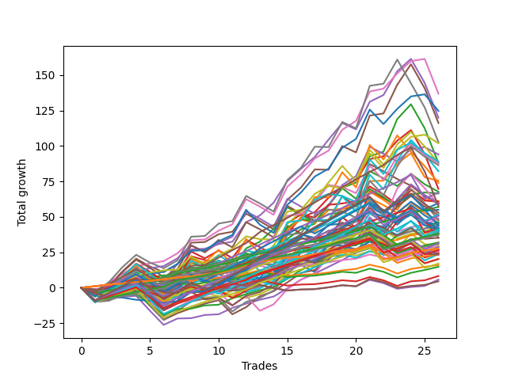

# Short Wallace 1226_003 
- Symbol: ES
- Date Range: 03/18/2022 - 07/08/2022
- Trading Period: 7:20-12:30
- Number of Trades: 24



| Name | Win Percent | Profit | Avg Profit / Trade |     | Name | Win Percent | Profit | Avg Profit / Trade |
| ---- | ----------- | ------ | ------------------ | --- | ---- | ----------- | ------ | ------------------ |
| Sorted By <br> Profit | | | | | Sorted By <br> Win Percentage ||||
| Five | 70.83 | 81750.00 | 3406.25 |     | Fifty-Six | 91.67 | 33125.00 | 1380.21 |
| Four | 83.33 | 80250.00 | 3343.75 |     | Zero | 91.67 | 33125.00 | 1380.21 |
| Seventy-Four | 62.50 | 80125.00 | 3338.54 |     | Forty | 91.67 | 30625.00 | 1276.04 |
| Seventy | 87.50 | 80000.00 | 3333.33 |     | Twenty-Four | 91.67 | 29000.00 | 1208.33 |
| Fifty-Four | 87.50 | 80000.00 | 3333.33 |     | Sixty-Four | 91.67 | 27625.00 | 1151.04 |
| Thirty-Eight | 87.50 | 80000.00 | 3333.33 |     | Seventy | 87.50 | 80000.00 | 3333.33 |
| Twenty-Two | 87.50 | 80000.00 | 3333.33 |     | Fifty-Four | 87.50 | 80000.00 | 3333.33 |
| Six | 87.50 | 80000.00 | 3333.33 |     | Thirty-Eight | 87.50 | 80000.00 | 3333.33 |
| Seventy-One | 66.67 | 79250.00 | 3302.08 |     | Twenty-Two | 87.50 | 80000.00 | 3333.33 |
| Fifty-Five | 66.67 | 79250.00 | 3302.08 |     | Six | 87.50 | 80000.00 | 3333.33 |
| Thirty-Nine | 66.67 | 79250.00 | 3302.08 |     | Three | 87.50 | 55250.00 | 2302.08 |
| Twenty-Three | 66.67 | 79250.00 | 3302.08 |     | One | 87.50 | 49375.00 | 2057.29 |
| Seven | 66.67 | 79250.00 | 3302.08 |     | Forty-Eight | 87.50 | 25250.00 | 1052.08 |
| Seventy-Five | 70.83 | 78250.00 | 3260.42 |     | Four | 83.33 | 80250.00 | 3343.75 |
| Two | 79.17 | 68625.00 | 2859.38 |     | Sixty-Two | 83.33 | 67500.00 | 2812.50 |
| Sixty-Two | 83.33 | 67500.00 | 2812.50 |     | Fifty-Nine | 83.33 | 46250.00 | 1927.08 |
| Sixty-One | 62.50 | 61125.00 | 2546.88 |     | Fifty-Seven | 83.33 | 39125.00 | 1630.21 |
| Sixty | 75.00 | 58000.00 | 2416.67 |     | Thirty-Two | 83.33 | 20750.00 | 864.58 |
| Three | 87.50 | 55250.00 | 2302.08 |     | Two | 79.17 | 68625.00 | 2859.38 |
| Sixty-Three | 58.33 | 54750.00 | 2281.25 |     | Sixty | 75.00 | 58000.00 | 2416.67 |
| Fifty-Eight | 70.83 | 53375.00 | 2223.96 |     | Forty-Three | 75.00 | 39625.00 | 1651.04 |
| Sixty-Nine | 58.33 | 51875.00 | 2161.46 |     | Twenty-Five | 75.00 | 32000.00 | 1333.33 |
| Sixty-Eight | 66.67 | 50250.00 | 2093.75 |     | Sixty-Five | 75.00 | 27750.00 | 1156.25 |
| One | 87.50 | 49375.00 | 2057.29 |     | Eight | 75.00 | 15000.00 | 625.00 |
| Forty-Six | 66.67 | 48875.00 | 2036.46 |     | Five | 70.83 | 81750.00 | 3406.25 |
| Forty-Four | 66.67 | 48625.00 | 2026.04 |     | Seventy-Five | 70.83 | 78250.00 | 3260.42 |
| Twenty-Nine | 50.00 | 47875.00 | 1994.79 |     | Fifty-Eight | 70.83 | 53375.00 | 2223.96 |
| Forty-Five | 54.17 | 46625.00 | 1942.71 |     | Sixty-Seven | 70.83 | 32125.00 | 1338.54 |
| Thirty | 58.33 | 46375.00 | 1932.29 |     | Forty-One | 70.83 | 26875.00 | 1119.79 |
| Fifty-Nine | 83.33 | 46250.00 | 1927.08 |     | Seventy-One | 66.67 | 79250.00 | 3302.08 |
| Forty-Two | 66.67 | 46250.00 | 1927.08 |     | Fifty-Five | 66.67 | 79250.00 | 3302.08 |
| Thirty-One | 33.33 | 45125.00 | 1880.21 |     | Thirty-Nine | 66.67 | 79250.00 | 3302.08 |
| Twenty-Eight | 58.33 | 44250.00 | 1843.75 |     | Twenty-Three | 66.67 | 79250.00 | 3302.08 |
| Twenty-Six | 62.50 | 43875.00 | 1828.12 |     | Seven | 66.67 | 79250.00 | 3302.08 |
| Forty-Seven | 41.67 | 42750.00 | 1781.25 |     | Sixty-Eight | 66.67 | 50250.00 | 2093.75 |
| Sixty-Six | 66.67 | 41500.00 | 1729.17 |     | Forty-Six | 66.67 | 48875.00 | 2036.46 |
| Forty-Three | 75.00 | 39625.00 | 1651.04 |     | Forty-Four | 66.67 | 48625.00 | 2026.04 |
| Fifty-Seven | 83.33 | 39125.00 | 1630.21 |     | Forty-Two | 66.67 | 46250.00 | 1927.08 |
| twenty-Seven | 66.67 | 37625.00 | 1567.71 |     | Sixty-Six | 66.67 | 41500.00 | 1729.17 |
| Thirteen | 50.00 | 37500.00 | 1562.50 |     | twenty-Seven | 66.67 | 37625.00 | 1567.71 |
| Fifty-Three | 54.17 | 35125.00 | 1463.54 |     | Seventy-Four | 62.50 | 80125.00 | 3338.54 |
| Fifty-Six | 91.67 | 33125.00 | 1380.21 |     | Sixty-One | 62.50 | 61125.00 | 2546.88 |
| Zero | 91.67 | 33125.00 | 1380.21 |     | Twenty-Six | 62.50 | 43875.00 | 1828.12 |
| Sixty-Seven | 70.83 | 32125.00 | 1338.54 |     | Thirty-Six | 62.50 | 26500.00 | 1104.17 |
| Twenty-Five | 75.00 | 32000.00 | 1333.33 |     | Thirty-Seven | 62.50 | 25875.00 | 1078.12 |
| Ten | 54.17 | 32000.00 | 1333.33 |     | Thirty-Four | 62.50 | 25500.00 | 1062.50 |
| Forty | 91.67 | 30625.00 | 1276.04 |     | Thirty-Five | 62.50 | 21125.00 | 880.21 |
| Seventy-Three | 54.17 | 30375.00 | 1265.62 |     | Nine | 62.50 | 20750.00 | 864.58 |
| Twenty-Four | 91.67 | 29000.00 | 1208.33 |     | Thirty-Three | 62.50 | 18875.00 | 786.46 |
| Sixty-Five | 75.00 | 27750.00 | 1156.25 |     | Forty-Nine | 62.50 | 16750.00 | 697.92 |
| Sixty-Four | 91.67 | 27625.00 | 1151.04 |     | Sixten | 62.50 | 6250.00 | 260.42 |
| Forty-One | 70.83 | 26875.00 | 1119.79 |     | Sixty-Three | 58.33 | 54750.00 | 2281.25 |
| Fifty-Two | 54.17 | 26625.00 | 1109.38 |     | Sixty-Nine | 58.33 | 51875.00 | 2161.46 |
| Thirty-Six | 62.50 | 26500.00 | 1104.17 |     | Thirty | 58.33 | 46375.00 | 1932.29 |
| Thirty-Seven | 62.50 | 25875.00 | 1078.12 |     | Twenty-Eight | 58.33 | 44250.00 | 1843.75 |
| Twelve | 50.00 | 25750.00 | 1072.92 |     | Fifty-One | 58.33 | 23375.00 | 973.96 |
| Thirty-Four | 62.50 | 25500.00 | 1062.50 |     | Eleven | 58.33 | 19875.00 | 828.12 |
| Forty-Eight | 87.50 | 25250.00 | 1052.08 |     | Forty-Five | 54.17 | 46625.00 | 1942.71 |
| Fifty-One | 58.33 | 23375.00 | 973.96 |     | Fifty-Three | 54.17 | 35125.00 | 1463.54 |
| Fourteen | 37.50 | 22750.00 | 947.92 |     | Ten | 54.17 | 32000.00 | 1333.33 |
| Fifty | 54.17 | 22125.00 | 921.88 |     | Seventy-Three | 54.17 | 30375.00 | 1265.62 |
| Thirty-Five | 62.50 | 21125.00 | 880.21 |     | Fifty-Two | 54.17 | 26625.00 | 1109.38 |
| Thirty-Two | 83.33 | 20750.00 | 864.58 |     | Fifty | 54.17 | 22125.00 | 921.88 |
| Nine | 62.50 | 20750.00 | 864.58 |     | Seventeen | 54.17 | 2250.00 | 93.75 |
| Eleven | 58.33 | 19875.00 | 828.12 |     | Twenty-One | 54.17 | 750.00 | 31.25 |
| Thirty-Three | 62.50 | 18875.00 | 786.46 |     | Twenty | 54.17 | 750.00 | 31.25 |
| Fifteen | 16.67 | 17875.00 | 744.79 |     | Nineteen | 54.17 | 750.00 | 31.25 |
| Forty-Nine | 62.50 | 16750.00 | 697.92 |     | Eighteen | 54.17 | 750.00 | 31.25 |
| Eight | 75.00 | 15000.00 | 625.00 |     | Twenty-Nine | 50.00 | 47875.00 | 1994.79 |
| Sixten | 62.50 | 6250.00 | 260.42 |     | Thirteen | 50.00 | 37500.00 | 1562.50 |
| Seventy-Two | 29.17 | 3625.00 | 151.04 |     | Twelve | 50.00 | 25750.00 | 1072.92 |
| Seventeen | 54.17 | 2250.00 | 93.75 |     | Forty-Seven | 41.67 | 42750.00 | 1781.25 |
| Twenty-One | 54.17 | 750.00 | 31.25 |     | Fourteen | 37.50 | 22750.00 | 947.92 |
| Twenty | 54.17 | 750.00 | 31.25 |     | Thirty-One | 33.33 | 45125.00 | 1880.21 |
| Nineteen | 54.17 | 750.00 | 31.25 |     | Seventy-Two | 29.17 | 3625.00 | 151.04 |
| Eighteen | 54.17 | 750.00 | 31.25 |     | Fifteen | 16.67 | 17875.00 | 744.79 |

## NO STOPLOSS

### Test Zero
* Sell when price hits the middle line of the 20p bollinger
* No Stoploss
* Results:
```
Total Trades: 24
Percent Up: 8.33
Percent Down: 91.67
Total Points Moved Down: 66.25
Potential Profit: 33125.00
Total Points Ups: 8.25 Count Ups: 2
Total Points Downs: 74.50 Count Downs: 22
```

<details><summary>Trades</summary>

<code>In: 2022-03-25 07:26:00		Out: 2022-03-25 07:51:05		Total Position Time: 25:05		Total Move Down: -6.00		Total to Date: -6.00</code> <br />
<code>In: 2022-03-25 11:34:00		Out: 2022-03-25 11:35:15		Total Position Time: 01:15		Total Move Down: 1.25		Total to Date: -4.75</code> <br />
<code>In: 2022-03-29 08:52:00		Out: 2022-03-29 08:56:20		Total Position Time: 04:20		Total Move Down: 1.50		Total to Date: -3.25</code> <br />
<code>In: 2022-03-29 08:53:00		Out: 2022-03-29 08:56:20		Total Position Time: 03:20		Total Move Down: 0.75		Total to Date: -2.50</code> <br />
<code>In: 2022-03-31 07:38:00		Out: 2022-03-31 07:42:05		Total Position Time: 04:05		Total Move Down: 2.75		Total to Date: 0.25</code> <br />
<code>In: 2022-03-31 07:39:00		Out: 2022-03-31 07:42:05		Total Position Time: 03:05		Total Move Down: 2.00		Total to Date: 2.25</code> <br />
<code>In: 2022-04-18 10:59:00		Out: 2022-04-18 10:59:30		Total Position Time: 00:30		Total Move Down: 4.50		Total to Date: 6.75</code> <br />
<code>In: 2022-04-20 07:58:00		Out: 2022-04-20 08:00:20		Total Position Time: 02:20		Total Move Down: 0.50		Total to Date: 7.25</code> <br />
<code>In: 2022-04-20 09:55:00		Out: 2022-04-20 09:59:05		Total Position Time: 04:05		Total Move Down: 1.75		Total to Date: 9.00</code> <br />
<code>In: 2022-04-20 10:50:00		Out: 2022-04-20 10:50:10		Total Position Time: 00:10		Total Move Down: 0.50		Total to Date: 9.50</code> <br />
<code>In: 2022-04-25 09:28:00		Out: 2022-04-25 09:31:05		Total Position Time: 03:05		Total Move Down: 3.25		Total to Date: 12.75</code> <br />
<code>In: 2022-04-27 09:46:00		Out: 2022-04-27 09:46:10		Total Position Time: 00:10		Total Move Down: 3.00		Total to Date: 15.75</code> <br />
<code>In: 2022-05-10 11:47:00		Out: 2022-05-10 11:47:10		Total Position Time: 00:10		Total Move Down: 2.75		Total to Date: 18.50</code> <br />
<code>In: 2022-05-17 09:49:00		Out: 2022-05-17 09:51:20		Total Position Time: 02:20		Total Move Down: 2.00		Total to Date: 20.50</code> <br />
<code>In: 2022-05-24 09:18:00		Out: 2022-05-24 09:21:30		Total Position Time: 03:30		Total Move Down: 5.00		Total to Date: 25.50</code> <br />
<code>In: 2022-05-24 11:15:00		Out: 2022-05-24 11:18:25		Total Position Time: 03:25		Total Move Down: 6.25		Total to Date: 31.75</code> <br />
<code>In: 2022-05-31 07:49:00		Out: 2022-05-31 07:50:05		Total Position Time: 01:05		Total Move Down: 4.25		Total to Date: 36.00</code> <br />
<code>In: 2022-06-10 10:53:00		Out: 2022-06-10 10:54:30		Total Position Time: 01:30		Total Move Down: 4.00		Total to Date: 40.00</code> <br />
<code>In: 2022-06-10 12:30:00		Out: 2022-06-10 12:30:30		Total Position Time: 00:30		Total Move Down: 4.75		Total to Date: 44.75</code> <br />
<code>In: 2022-06-13 09:15:00		Out: 2022-06-13 09:17:05		Total Position Time: 02:05		Total Move Down: 5.50		Total to Date: 50.25</code> <br />
<code>In: 2022-06-13 09:41:00		Out: 2022-06-13 09:43:15		Total Position Time: 02:15		Total Move Down: 7.75		Total to Date: 58.00</code> <br />
<code>In: 2022-06-29 12:21:00		Out: 2022-06-29 12:33:20		Total Position Time: 12:20		Total Move Down: -2.25		Total to Date: 55.75</code> <br />
<code>In: 2022-07-05 07:41:00		Out: 2022-07-05 07:44:30		Total Position Time: 03:30		Total Move Down: 7.25		Total to Date: 63.00</code> <br />
<code>In: 2022-07-06 11:10:00		Out: 2022-07-06 11:10:10		Total Position Time: 00:10		Total Move Down: 3.25		Total to Date: 66.25</code> <br />


</details>

### Test One
* Sell when the price hits the upper line of the 20p 1std bollinger
* No Stoploss
* Results:
```
Total Trades: 24
Percent Up: 12.50
Percent Down: 87.50
Total Points Moved Down: 98.75
Potential Profit: 49375.00
Total Points Ups: 12.25 Count Ups: 3
Total Points Downs: 111.00 Count Downs: 21
```

<details><summary>Trades</summary>

<code>In: 2022-03-25 07:26:00		Out: 2022-03-25 07:53:50		Total Position Time: 27:50		Total Move Down: -4.50		Total to Date: -4.50</code> <br />
<code>In: 2022-03-25 11:34:00		Out: 2022-03-25 11:41:25		Total Position Time: 07:25		Total Move Down: 2.50		Total to Date: -2.00</code> <br />
<code>In: 2022-03-29 08:52:00		Out: 2022-03-29 08:58:40		Total Position Time: 06:40		Total Move Down: 3.00		Total to Date: 1.00</code> <br />
<code>In: 2022-03-29 08:53:00		Out: 2022-03-29 08:58:40		Total Position Time: 05:40		Total Move Down: 2.25		Total to Date: 3.25</code> <br />
<code>In: 2022-03-31 07:38:00		Out: 2022-03-31 08:03:25		Total Position Time: 25:25		Total Move Down: -3.50		Total to Date: -0.25</code> <br />
<code>In: 2022-03-31 07:39:00		Out: 2022-03-31 08:03:25		Total Position Time: 24:25		Total Move Down: -4.25		Total to Date: -4.50</code> <br />
<code>In: 2022-04-18 10:59:00		Out: 2022-04-18 11:06:35		Total Position Time: 07:35		Total Move Down: 4.75		Total to Date: 0.25</code> <br />
<code>In: 2022-04-20 07:58:00		Out: 2022-04-20 08:00:40		Total Position Time: 02:40		Total Move Down: 3.50		Total to Date: 3.75</code> <br />
<code>In: 2022-04-20 09:55:00		Out: 2022-04-20 10:08:15		Total Position Time: 13:15		Total Move Down: 3.25		Total to Date: 7.00</code> <br />
<code>In: 2022-04-20 10:50:00		Out: 2022-04-20 10:54:05		Total Position Time: 04:05		Total Move Down: 2.50		Total to Date: 9.50</code> <br />
<code>In: 2022-04-25 09:28:00		Out: 2022-04-25 09:42:40		Total Position Time: 14:40		Total Move Down: 1.25		Total to Date: 10.75</code> <br />
<code>In: 2022-04-27 09:46:00		Out: 2022-04-27 09:51:25		Total Position Time: 05:25		Total Move Down: 5.00		Total to Date: 15.75</code> <br />
<code>In: 2022-05-10 11:47:00		Out: 2022-05-10 11:47:20		Total Position Time: 00:20		Total Move Down: 7.75		Total to Date: 23.50</code> <br />
<code>In: 2022-05-17 09:49:00		Out: 2022-05-17 09:54:40		Total Position Time: 05:40		Total Move Down: 3.00		Total to Date: 26.50</code> <br />
<code>In: 2022-05-24 09:18:00		Out: 2022-05-24 09:29:00		Total Position Time: 11:00		Total Move Down: 6.25		Total to Date: 32.75</code> <br />
<code>In: 2022-05-24 11:15:00		Out: 2022-05-24 11:31:25		Total Position Time: 16:25		Total Move Down: 6.75		Total to Date: 39.50</code> <br />
<code>In: 2022-05-31 07:49:00		Out: 2022-05-31 07:58:10		Total Position Time: 09:10		Total Move Down: 3.50		Total to Date: 43.00</code> <br />
<code>In: 2022-06-10 10:53:00		Out: 2022-06-10 10:56:15		Total Position Time: 03:15		Total Move Down: 7.50		Total to Date: 50.50</code> <br />
<code>In: 2022-06-10 12:30:00		Out: 2022-06-10 12:35:55		Total Position Time: 05:55		Total Move Down: 8.75		Total to Date: 59.25</code> <br />
<code>In: 2022-06-13 09:15:00		Out: 2022-06-13 09:24:05		Total Position Time: 09:05		Total Move Down: 5.00		Total to Date: 64.25</code> <br />
<code>In: 2022-06-13 09:41:00		Out: 2022-06-13 09:47:55		Total Position Time: 06:55		Total Move Down: 14.75		Total to Date: 79.00</code> <br />
<code>In: 2022-06-29 12:21:00		Out: 2022-06-29 12:34:10		Total Position Time: 13:10		Total Move Down: 0.25		Total to Date: 79.25</code> <br />
<code>In: 2022-07-05 07:41:00		Out: 2022-07-05 07:45:55		Total Position Time: 04:55		Total Move Down: 12.00		Total to Date: 91.25</code> <br />
<code>In: 2022-07-06 11:10:00		Out: 2022-07-06 11:11:10		Total Position Time: 01:10		Total Move Down: 7.50		Total to Date: 98.75</code> <br />


</details>

### Test Two
* Sell when the price hits the upper line of the 20p 2std bollinger
* No Stoploss
* Results:
```
Total Trades: 24
Percent Up: 20.83
Percent Down: 79.17
Total Points Moved Down: 137.25
Potential Profit: 68625.00
Total Points Ups: 17.50 Count Ups: 5
Total Points Downs: 154.75 Count Downs: 19
```

<details><summary>Trades</summary>

<code>In: 2022-03-25 07:26:00		Out: 2022-03-25 07:54:10		Total Position Time: 28:10		Total Move Down: -3.50		Total to Date: -3.50</code> <br />
<code>In: 2022-03-25 11:34:00		Out: 2022-03-25 12:01:50		Total Position Time: 27:50		Total Move Down: 3.75		Total to Date: 0.25</code> <br />
<code>In: 2022-03-29 08:52:00		Out: 2022-03-29 09:01:40		Total Position Time: 09:40		Total Move Down: 4.50		Total to Date: 4.75</code> <br />
<code>In: 2022-03-29 08:53:00		Out: 2022-03-29 09:01:40		Total Position Time: 08:40		Total Move Down: 3.75		Total to Date: 8.50</code> <br />
<code>In: 2022-03-31 07:38:00		Out: 2022-03-31 08:07:55		Total Position Time: 29:55		Total Move Down: -5.50		Total to Date: 3.00</code> <br />
<code>In: 2022-03-31 07:39:00		Out: 2022-03-31 08:08:30		Total Position Time: 29:30		Total Move Down: -3.00		Total to Date: 0.00</code> <br />
<code>In: 2022-04-18 10:59:00		Out: 2022-04-18 11:17:00		Total Position Time: 18:00		Total Move Down: 8.50		Total to Date: 8.50</code> <br />
<code>In: 2022-04-20 07:58:00		Out: 2022-04-20 08:01:10		Total Position Time: 03:10		Total Move Down: 6.50		Total to Date: 15.00</code> <br />
<code>In: 2022-04-20 09:55:00		Out: 2022-04-20 10:08:15		Total Position Time: 13:15		Total Move Down: 3.25		Total to Date: 18.25</code> <br />
<code>In: 2022-04-20 10:50:00		Out: 2022-04-20 11:13:55		Total Position Time: 23:55		Total Move Down: 3.25		Total to Date: 21.50</code> <br />
<code>In: 2022-04-25 09:28:00		Out: 2022-04-25 09:57:55		Total Position Time: 29:55		Total Move Down: 1.75		Total to Date: 23.25</code> <br />
<code>In: 2022-04-27 09:46:00		Out: 2022-04-27 10:00:20		Total Position Time: 14:20		Total Move Down: 7.50		Total to Date: 30.75</code> <br />
<code>In: 2022-05-10 11:47:00		Out: 2022-05-10 12:16:55		Total Position Time: 29:55		Total Move Down: -5.25		Total to Date: 25.50</code> <br />
<code>In: 2022-05-17 09:49:00		Out: 2022-05-17 10:01:50		Total Position Time: 12:50		Total Move Down: 6.00		Total to Date: 31.50</code> <br />
<code>In: 2022-05-24 09:18:00		Out: 2022-05-24 09:32:35		Total Position Time: 14:35		Total Move Down: 13.25		Total to Date: 44.75</code> <br />
<code>In: 2022-05-24 11:15:00		Out: 2022-05-24 11:44:00		Total Position Time: 29:00		Total Move Down: 6.75		Total to Date: 51.50</code> <br />
<code>In: 2022-05-31 07:49:00		Out: 2022-05-31 08:08:30		Total Position Time: 19:30		Total Move Down: 6.50		Total to Date: 58.00</code> <br />
<code>In: 2022-06-10 10:53:00		Out: 2022-06-10 11:22:55		Total Position Time: 29:55		Total Move Down: -0.25		Total to Date: 57.75</code> <br />
<code>In: 2022-06-10 12:30:00		Out: 2022-06-10 12:43:25		Total Position Time: 13:25		Total Move Down: 13.75		Total to Date: 71.50</code> <br />
<code>In: 2022-06-13 09:15:00		Out: 2022-06-13 09:30:35		Total Position Time: 15:35		Total Move Down: 4.75		Total to Date: 76.25</code> <br />
<code>In: 2022-06-13 09:41:00		Out: 2022-06-13 09:54:45		Total Position Time: 13:45		Total Move Down: 20.50		Total to Date: 96.75</code> <br />
<code>In: 2022-06-29 12:21:00		Out: 2022-06-29 12:35:15		Total Position Time: 14:15		Total Move Down: 3.00		Total to Date: 99.75</code> <br />
<code>In: 2022-07-05 07:41:00		Out: 2022-07-05 08:01:10		Total Position Time: 20:10		Total Move Down: 23.00		Total to Date: 122.75</code> <br />
<code>In: 2022-07-06 11:10:00		Out: 2022-07-06 11:12:15		Total Position Time: 02:15		Total Move Down: 14.50		Total to Date: 137.25</code> <br />


</details>

### Test Three
* Sell when price hits the middle line of the 50p bollinger
* No Stoploss
* Results:
```
Total Trades: 24
Percent Up: 12.50
Percent Down: 87.50
Total Points Moved Down: 110.50
Potential Profit: 55250.00
Total Points Ups: 12.00 Count Ups: 3
Total Points Downs: 122.50 Count Downs: 21
```

<details><summary>Trades</summary>

<code>In: 2022-03-25 07:26:00		Out: 2022-03-25 07:55:55		Total Position Time: 29:55		Total Move Down: -2.50		Total to Date: -2.50</code> <br />
<code>In: 2022-03-25 11:34:00		Out: 2022-03-25 12:00:45		Total Position Time: 26:45		Total Move Down: 0.75		Total to Date: -1.75</code> <br />
<code>In: 2022-03-29 08:52:00		Out: 2022-03-29 09:01:35		Total Position Time: 09:35		Total Move Down: 4.00		Total to Date: 2.25</code> <br />
<code>In: 2022-03-29 08:53:00		Out: 2022-03-29 09:01:35		Total Position Time: 08:35		Total Move Down: 3.25		Total to Date: 5.50</code> <br />
<code>In: 2022-03-31 07:38:00		Out: 2022-03-31 08:07:55		Total Position Time: 29:55		Total Move Down: -5.50		Total to Date: 0.00</code> <br />
<code>In: 2022-03-31 07:39:00		Out: 2022-03-31 08:08:55		Total Position Time: 29:55		Total Move Down: -4.00		Total to Date: -4.00</code> <br />
<code>In: 2022-04-18 10:59:00		Out: 2022-04-18 11:16:30		Total Position Time: 17:30		Total Move Down: 6.25		Total to Date: 2.25</code> <br />
<code>In: 2022-04-20 07:58:00		Out: 2022-04-20 08:02:45		Total Position Time: 04:45		Total Move Down: 6.25		Total to Date: 8.50</code> <br />
<code>In: 2022-04-20 09:55:00		Out: 2022-04-20 10:19:10		Total Position Time: 24:10		Total Move Down: 2.00		Total to Date: 10.50</code> <br />
<code>In: 2022-04-20 10:50:00		Out: 2022-04-20 10:50:20		Total Position Time: 00:20		Total Move Down: 1.00		Total to Date: 11.50</code> <br />
<code>In: 2022-04-25 09:28:00		Out: 2022-04-25 09:55:10		Total Position Time: 27:10		Total Move Down: 0.50		Total to Date: 12.00</code> <br />
<code>In: 2022-04-27 09:46:00		Out: 2022-04-27 10:00:10		Total Position Time: 14:10		Total Move Down: 6.75		Total to Date: 18.75</code> <br />
<code>In: 2022-05-10 11:47:00		Out: 2022-05-10 11:47:10		Total Position Time: 00:10		Total Move Down: 2.75		Total to Date: 21.50</code> <br />
<code>In: 2022-05-17 09:49:00		Out: 2022-05-17 10:01:25		Total Position Time: 12:25		Total Move Down: 5.00		Total to Date: 26.50</code> <br />
<code>In: 2022-05-24 09:18:00		Out: 2022-05-24 09:31:20		Total Position Time: 13:20		Total Move Down: 10.75		Total to Date: 37.25</code> <br />
<code>In: 2022-05-24 11:15:00		Out: 2022-05-24 11:20:25		Total Position Time: 05:25		Total Move Down: 11.75		Total to Date: 49.00</code> <br />
<code>In: 2022-05-31 07:49:00		Out: 2022-05-31 08:07:25		Total Position Time: 18:25		Total Move Down: 3.50		Total to Date: 52.50</code> <br />
<code>In: 2022-06-10 10:53:00		Out: 2022-06-10 11:00:50		Total Position Time: 07:50		Total Move Down: 10.25		Total to Date: 62.75</code> <br />
<code>In: 2022-06-10 12:30:00		Out: 2022-06-10 12:33:40		Total Position Time: 03:40		Total Move Down: 7.50		Total to Date: 70.25</code> <br />
<code>In: 2022-06-13 09:15:00		Out: 2022-06-13 09:24:05		Total Position Time: 09:05		Total Move Down: 5.00		Total to Date: 75.25</code> <br />
<code>In: 2022-06-13 09:41:00		Out: 2022-06-13 09:47:55		Total Position Time: 06:55		Total Move Down: 14.75		Total to Date: 90.00</code> <br />
<code>In: 2022-06-29 12:21:00		Out: 2022-06-29 12:34:15		Total Position Time: 13:15		Total Move Down: 2.00		Total to Date: 92.00</code> <br />
<code>In: 2022-07-05 07:41:00		Out: 2022-07-05 07:45:30		Total Position Time: 04:30		Total Move Down: 11.00		Total to Date: 103.00</code> <br />
<code>In: 2022-07-06 11:10:00		Out: 2022-07-06 11:11:10		Total Position Time: 01:10		Total Move Down: 7.50		Total to Date: 110.50</code> <br />


</details>

### Test Four
* Sell when the price hits the upper line of the 50p 1std bollinger
* No Stoploss
* Results:
```
Total Trades: 24
Percent Up: 16.67
Percent Down: 83.33
Total Points Moved Down: 160.50
Potential Profit: 80250.00
Total Points Ups: 16.50 Count Ups: 4
Total Points Downs: 177.00 Count Downs: 20
```

<details><summary>Trades</summary>

<code>In: 2022-03-25 07:26:00		Out: 2022-03-25 07:55:55		Total Position Time: 29:55		Total Move Down: -2.50		Total to Date: -2.50</code> <br />
<code>In: 2022-03-25 11:34:00		Out: 2022-03-25 12:01:40		Total Position Time: 27:40		Total Move Down: 2.75		Total to Date: 0.25</code> <br />
<code>In: 2022-03-29 08:52:00		Out: 2022-03-29 09:02:15		Total Position Time: 10:15		Total Move Down: 7.50		Total to Date: 7.75</code> <br />
<code>In: 2022-03-29 08:53:00		Out: 2022-03-29 09:02:15		Total Position Time: 09:15		Total Move Down: 6.75		Total to Date: 14.50</code> <br />
<code>In: 2022-03-31 07:38:00		Out: 2022-03-31 08:07:55		Total Position Time: 29:55		Total Move Down: -5.50		Total to Date: 9.00</code> <br />
<code>In: 2022-03-31 07:39:00		Out: 2022-03-31 08:08:55		Total Position Time: 29:55		Total Move Down: -4.00		Total to Date: 5.00</code> <br />
<code>In: 2022-04-18 10:59:00		Out: 2022-04-18 11:18:05		Total Position Time: 19:05		Total Move Down: 11.00		Total to Date: 16.00</code> <br />
<code>In: 2022-04-20 07:58:00		Out: 2022-04-20 08:10:45		Total Position Time: 12:45		Total Move Down: 10.25		Total to Date: 26.25</code> <br />
<code>In: 2022-04-20 09:55:00		Out: 2022-04-20 10:24:55		Total Position Time: 29:55		Total Move Down: 0.50		Total to Date: 26.75</code> <br />
<code>In: 2022-04-20 10:50:00		Out: 2022-04-20 11:14:05		Total Position Time: 24:05		Total Move Down: 3.25		Total to Date: 30.00</code> <br />
<code>In: 2022-04-25 09:28:00		Out: 2022-04-25 09:57:55		Total Position Time: 29:55		Total Move Down: 1.75		Total to Date: 31.75</code> <br />
<code>In: 2022-04-27 09:46:00		Out: 2022-04-27 10:01:20		Total Position Time: 15:20		Total Move Down: 13.75		Total to Date: 45.50</code> <br />
<code>In: 2022-05-10 11:47:00		Out: 2022-05-10 11:47:15		Total Position Time: 00:15		Total Move Down: 4.75		Total to Date: 50.25</code> <br />
<code>In: 2022-05-17 09:49:00		Out: 2022-05-17 10:02:15		Total Position Time: 13:15		Total Move Down: 9.00		Total to Date: 59.25</code> <br />
<code>In: 2022-05-24 09:18:00		Out: 2022-05-24 09:33:15		Total Position Time: 15:15		Total Move Down: 15.25		Total to Date: 74.50</code> <br />
<code>In: 2022-05-24 11:15:00		Out: 2022-05-24 11:44:55		Total Position Time: 29:55		Total Move Down: 8.75		Total to Date: 83.25</code> <br />
<code>In: 2022-05-31 07:49:00		Out: 2022-05-31 08:08:40		Total Position Time: 19:40		Total Move Down: 8.25		Total to Date: 91.50</code> <br />
<code>In: 2022-06-10 10:53:00		Out: 2022-06-10 11:15:25		Total Position Time: 22:25		Total Move Down: 12.25		Total to Date: 103.75</code> <br />
<code>In: 2022-06-10 12:30:00		Out: 2022-06-10 12:42:40		Total Position Time: 12:40		Total Move Down: 11.75		Total to Date: 115.50</code> <br />
<code>In: 2022-06-13 09:15:00		Out: 2022-06-13 09:44:55		Total Position Time: 29:55		Total Move Down: -4.50		Total to Date: 111.00</code> <br />
<code>In: 2022-06-13 09:41:00		Out: 2022-06-13 09:54:40		Total Position Time: 13:40		Total Move Down: 19.50		Total to Date: 130.50</code> <br />
<code>In: 2022-06-29 12:21:00		Out: 2022-06-29 12:41:05		Total Position Time: 20:05		Total Move Down: 4.75		Total to Date: 135.25</code> <br />
<code>In: 2022-07-05 07:41:00		Out: 2022-07-05 07:55:15		Total Position Time: 14:15		Total Move Down: 16.50		Total to Date: 151.75</code> <br />
<code>In: 2022-07-06 11:10:00		Out: 2022-07-06 11:11:35		Total Position Time: 01:35		Total Move Down: 8.75		Total to Date: 160.50</code> <br />


</details>

### Test Five
* Sell when the price hits the upper line of the 50p 2std bollinger
* No Stoploss
* Results:
```
Total Trades: 24
Percent Up: 29.17
Percent Down: 70.83
Total Points Moved Down: 163.50
Potential Profit: 81750.00
Total Points Ups: 27.75 Count Ups: 7
Total Points Downs: 191.25 Count Downs: 17
```

<details><summary>Trades</summary>

<code>In: 2022-03-25 07:26:00		Out: 2022-03-25 07:55:55		Total Position Time: 29:55		Total Move Down: -2.50		Total to Date: -2.50</code> <br />
<code>In: 2022-03-25 11:34:00		Out: 2022-03-25 12:02:00		Total Position Time: 28:00		Total Move Down: 5.25		Total to Date: 2.75</code> <br />
<code>In: 2022-03-29 08:52:00		Out: 2022-03-29 09:11:05		Total Position Time: 19:05		Total Move Down: 9.75		Total to Date: 12.50</code> <br />
<code>In: 2022-03-29 08:53:00		Out: 2022-03-29 09:11:05		Total Position Time: 18:05		Total Move Down: 9.00		Total to Date: 21.50</code> <br />
<code>In: 2022-03-31 07:38:00		Out: 2022-03-31 08:07:55		Total Position Time: 29:55		Total Move Down: -5.50		Total to Date: 16.00</code> <br />
<code>In: 2022-03-31 07:39:00		Out: 2022-03-31 08:08:55		Total Position Time: 29:55		Total Move Down: -4.00		Total to Date: 12.00</code> <br />
<code>In: 2022-04-18 10:59:00		Out: 2022-04-18 11:28:55		Total Position Time: 29:55		Total Move Down: 5.50		Total to Date: 17.50</code> <br />
<code>In: 2022-04-20 07:58:00		Out: 2022-04-20 08:16:30		Total Position Time: 18:30		Total Move Down: 15.00		Total to Date: 32.50</code> <br />
<code>In: 2022-04-20 09:55:00		Out: 2022-04-20 10:24:55		Total Position Time: 29:55		Total Move Down: 0.50		Total to Date: 33.00</code> <br />
<code>In: 2022-04-20 10:50:00		Out: 2022-04-20 11:18:20		Total Position Time: 28:20		Total Move Down: 6.25		Total to Date: 39.25</code> <br />
<code>In: 2022-04-25 09:28:00		Out: 2022-04-25 09:57:55		Total Position Time: 29:55		Total Move Down: 1.75		Total to Date: 41.00</code> <br />
<code>In: 2022-04-27 09:46:00		Out: 2022-04-27 10:09:20		Total Position Time: 23:20		Total Move Down: 13.00		Total to Date: 54.00</code> <br />
<code>In: 2022-05-10 11:47:00		Out: 2022-05-10 12:16:55		Total Position Time: 29:55		Total Move Down: -5.25		Total to Date: 48.75</code> <br />
<code>In: 2022-05-17 09:49:00		Out: 2022-05-17 10:18:55		Total Position Time: 29:55		Total Move Down: -5.75		Total to Date: 43.00</code> <br />
<code>In: 2022-05-24 09:18:00		Out: 2022-05-24 09:37:10		Total Position Time: 19:10		Total Move Down: 21.75		Total to Date: 64.75</code> <br />
<code>In: 2022-05-24 11:15:00		Out: 2022-05-24 11:44:55		Total Position Time: 29:55		Total Move Down: 8.75		Total to Date: 73.50</code> <br />
<code>In: 2022-05-31 07:49:00		Out: 2022-05-31 08:14:40		Total Position Time: 25:40		Total Move Down: 12.75		Total to Date: 86.25</code> <br />
<code>In: 2022-06-10 10:53:00		Out: 2022-06-10 11:22:55		Total Position Time: 29:55		Total Move Down: -0.25		Total to Date: 86.00</code> <br />
<code>In: 2022-06-10 12:30:00		Out: 2022-06-10 12:45:50		Total Position Time: 15:50		Total Move Down: 17.75		Total to Date: 103.75</code> <br />
<code>In: 2022-06-13 09:15:00		Out: 2022-06-13 09:44:55		Total Position Time: 29:55		Total Move Down: -4.50		Total to Date: 99.25</code> <br />
<code>In: 2022-06-13 09:41:00		Out: 2022-06-13 09:58:15		Total Position Time: 17:15		Total Move Down: 26.00		Total to Date: 125.25</code> <br />
<code>In: 2022-06-29 12:21:00		Out: 2022-06-29 12:50:55		Total Position Time: 29:55		Total Move Down: 2.25		Total to Date: 127.50</code> <br />
<code>In: 2022-07-05 07:41:00		Out: 2022-07-05 08:01:05		Total Position Time: 20:05		Total Move Down: 21.50		Total to Date: 149.00</code> <br />
<code>In: 2022-07-06 11:10:00		Out: 2022-07-06 11:12:15		Total Position Time: 02:15		Total Move Down: 14.50		Total to Date: 163.50</code> <br />


</details>

### Test Six
* Sell when the price hits the middle line of the 1std VWAP
* No Stoploss
* Results:
```
Total Trades: 24
Percent Up: 12.50
Percent Down: 87.50
Total Points Moved Down: 160.00
Potential Profit: 80000.00
Total Points Ups: 13.50 Count Ups: 3
Total Points Downs: 173.50 Count Downs: 21
```

<details><summary>Trades</summary>

<code>In: 2022-03-25 07:26:00		Out: 2022-03-25 07:55:55		Total Position Time: 29:55		Total Move Down: -2.50		Total to Date: -2.50</code> <br />
<code>In: 2022-03-25 11:34:00		Out: 2022-03-25 12:03:55		Total Position Time: 29:55		Total Move Down: 6.25		Total to Date: 3.75</code> <br />
<code>In: 2022-03-29 08:52:00		Out: 2022-03-29 09:02:10		Total Position Time: 10:10		Total Move Down: 6.00		Total to Date: 9.75</code> <br />
<code>In: 2022-03-29 08:53:00		Out: 2022-03-29 09:02:10		Total Position Time: 09:10		Total Move Down: 5.25		Total to Date: 15.00</code> <br />
<code>In: 2022-03-31 07:38:00		Out: 2022-03-31 07:41:35		Total Position Time: 03:35		Total Move Down: 2.25		Total to Date: 17.25</code> <br />
<code>In: 2022-03-31 07:39:00		Out: 2022-03-31 07:41:35		Total Position Time: 02:35		Total Move Down: 1.50		Total to Date: 18.75</code> <br />
<code>In: 2022-04-18 10:59:00		Out: 2022-04-18 11:28:55		Total Position Time: 29:55		Total Move Down: 5.50		Total to Date: 24.25</code> <br />
<code>In: 2022-04-20 07:58:00		Out: 2022-04-20 08:08:10		Total Position Time: 10:10		Total Move Down: 9.25		Total to Date: 33.50</code> <br />
<code>In: 2022-04-20 09:55:00		Out: 2022-04-20 10:24:55		Total Position Time: 29:55		Total Move Down: 0.50		Total to Date: 34.00</code> <br />
<code>In: 2022-04-20 10:50:00		Out: 2022-04-20 11:18:20		Total Position Time: 28:20		Total Move Down: 6.25		Total to Date: 40.25</code> <br />
<code>In: 2022-04-25 09:28:00		Out: 2022-04-25 09:31:10		Total Position Time: 03:10		Total Move Down: 4.50		Total to Date: 44.75</code> <br />
<code>In: 2022-04-27 09:46:00		Out: 2022-04-27 10:15:55		Total Position Time: 29:55		Total Move Down: 17.75		Total to Date: 62.50</code> <br />
<code>In: 2022-05-10 11:47:00		Out: 2022-05-10 12:16:55		Total Position Time: 29:55		Total Move Down: -5.25		Total to Date: 57.25</code> <br />
<code>In: 2022-05-17 09:49:00		Out: 2022-05-17 10:18:55		Total Position Time: 29:55		Total Move Down: -5.75		Total to Date: 51.50</code> <br />
<code>In: 2022-05-24 09:18:00		Out: 2022-05-24 09:36:45		Total Position Time: 18:45		Total Move Down: 19.75		Total to Date: 71.25</code> <br />
<code>In: 2022-05-24 11:15:00		Out: 2022-05-24 11:44:55		Total Position Time: 29:55		Total Move Down: 8.75		Total to Date: 80.00</code> <br />
<code>In: 2022-05-31 07:49:00		Out: 2022-05-31 08:14:20		Total Position Time: 25:20		Total Move Down: 11.25		Total to Date: 91.25</code> <br />
<code>In: 2022-06-10 10:53:00		Out: 2022-06-10 10:55:10		Total Position Time: 02:10		Total Move Down: 5.50		Total to Date: 96.75</code> <br />
<code>In: 2022-06-10 12:30:00		Out: 2022-06-10 12:44:00		Total Position Time: 14:00		Total Move Down: 14.75		Total to Date: 111.50</code> <br />
<code>In: 2022-06-13 09:15:00		Out: 2022-06-13 09:17:20		Total Position Time: 02:20		Total Move Down: 6.25		Total to Date: 117.75</code> <br />
<code>In: 2022-06-13 09:41:00		Out: 2022-06-13 09:55:05		Total Position Time: 14:05		Total Move Down: 20.75		Total to Date: 138.50</code> <br />
<code>In: 2022-06-29 12:21:00		Out: 2022-06-29 12:34:15		Total Position Time: 13:15		Total Move Down: 2.00		Total to Date: 140.50</code> <br />
<code>In: 2022-07-05 07:41:00		Out: 2022-07-05 07:45:25		Total Position Time: 04:25		Total Move Down: 10.75		Total to Date: 151.25</code> <br />
<code>In: 2022-07-06 11:10:00		Out: 2022-07-06 11:11:35		Total Position Time: 01:35		Total Move Down: 8.75		Total to Date: 160.00</code> <br />


</details>

### Test Seven
* Sell when the price hits the upper line of the 1std VWAP
* No Stoploss
* Results:
```
Total Trades: 24
Percent Up: 33.33
Percent Down: 66.67
Total Points Moved Down: 158.50
Potential Profit: 79250.00
Total Points Ups: 44.50 Count Ups: 8
Total Points Downs: 203.00 Count Downs: 16
```

<details><summary>Trades</summary>

<code>In: 2022-03-25 07:26:00		Out: 2022-03-25 07:55:55		Total Position Time: 29:55		Total Move Down: -2.50		Total to Date: -2.50</code> <br />
<code>In: 2022-03-25 11:34:00		Out: 2022-03-25 12:03:55		Total Position Time: 29:55		Total Move Down: 6.25		Total to Date: 3.75</code> <br />
<code>In: 2022-03-29 08:52:00		Out: 2022-03-29 09:21:55		Total Position Time: 29:55		Total Move Down: 10.75		Total to Date: 14.50</code> <br />
<code>In: 2022-03-29 08:53:00		Out: 2022-03-29 09:22:55		Total Position Time: 29:55		Total Move Down: 8.75		Total to Date: 23.25</code> <br />
<code>In: 2022-03-31 07:38:00		Out: 2022-03-31 08:07:55		Total Position Time: 29:55		Total Move Down: -5.50		Total to Date: 17.75</code> <br />
<code>In: 2022-03-31 07:39:00		Out: 2022-03-31 08:08:55		Total Position Time: 29:55		Total Move Down: -4.00		Total to Date: 13.75</code> <br />
<code>In: 2022-04-18 10:59:00		Out: 2022-04-18 11:28:55		Total Position Time: 29:55		Total Move Down: 5.50		Total to Date: 19.25</code> <br />
<code>In: 2022-04-20 07:58:00		Out: 2022-04-20 08:23:25		Total Position Time: 25:25		Total Move Down: 17.25		Total to Date: 36.50</code> <br />
<code>In: 2022-04-20 09:55:00		Out: 2022-04-20 10:24:55		Total Position Time: 29:55		Total Move Down: 0.50		Total to Date: 37.00</code> <br />
<code>In: 2022-04-20 10:50:00		Out: 2022-04-20 11:19:55		Total Position Time: 29:55		Total Move Down: 8.75		Total to Date: 45.75</code> <br />
<code>In: 2022-04-25 09:28:00		Out: 2022-04-25 09:57:55		Total Position Time: 29:55		Total Move Down: 1.75		Total to Date: 47.50</code> <br />
<code>In: 2022-04-27 09:46:00		Out: 2022-04-27 10:15:55		Total Position Time: 29:55		Total Move Down: 17.75		Total to Date: 65.25</code> <br />
<code>In: 2022-05-10 11:47:00		Out: 2022-05-10 12:16:55		Total Position Time: 29:55		Total Move Down: -5.25		Total to Date: 60.00</code> <br />
<code>In: 2022-05-17 09:49:00		Out: 2022-05-17 10:18:55		Total Position Time: 29:55		Total Move Down: -5.75		Total to Date: 54.25</code> <br />
<code>In: 2022-05-24 09:18:00		Out: 2022-05-24 09:47:55		Total Position Time: 29:55		Total Move Down: 22.25		Total to Date: 76.50</code> <br />
<code>In: 2022-05-24 11:15:00		Out: 2022-05-24 11:44:55		Total Position Time: 29:55		Total Move Down: 8.75		Total to Date: 85.25</code> <br />
<code>In: 2022-05-31 07:49:00		Out: 2022-05-31 08:18:55		Total Position Time: 29:55		Total Move Down: 14.75		Total to Date: 100.00</code> <br />
<code>In: 2022-06-10 10:53:00		Out: 2022-06-10 11:22:55		Total Position Time: 29:55		Total Move Down: -0.25		Total to Date: 99.75</code> <br />
<code>In: 2022-06-10 12:30:00		Out: 2022-06-10 12:59:20		Total Position Time: 29:20		Total Move Down: 30.75		Total to Date: 130.50</code> <br />
<code>In: 2022-06-13 09:15:00		Out: 2022-06-13 09:44:55		Total Position Time: 29:55		Total Move Down: -4.50		Total to Date: 126.00</code> <br />
<code>In: 2022-06-13 09:41:00		Out: 2022-06-13 10:10:55		Total Position Time: 29:55		Total Move Down: 30.00		Total to Date: 156.00</code> <br />
<code>In: 2022-06-29 12:21:00		Out: 2022-06-29 12:50:55		Total Position Time: 29:55		Total Move Down: 2.25		Total to Date: 158.25</code> <br />
<code>In: 2022-07-05 07:41:00		Out: 2022-07-05 07:57:05		Total Position Time: 16:05		Total Move Down: 17.00		Total to Date: 175.25</code> <br />
<code>In: 2022-07-06 11:10:00		Out: 2022-07-06 11:39:55		Total Position Time: 29:55		Total Move Down: -16.75		Total to Date: 158.50</code> <br />


</details>

## STOPLOSS OF 2

### Test Eight
* Sell when price hits the middle line of the 20p bollinger
* Stoploss is -2 points
* Results:
```
Total Trades: 24
Percent Up: 25.00
Percent Down: 75.00
Total Points Moved Down: 30.00
Potential Profit: 15000.00
Total Points Ups: 13.00 Count Ups: 6
Total Points Downs: 43.00 Count Downs: 18
```

<details><summary>Trades</summary>

<code>In: 2022-03-25 07:26:00		Out: 2022-03-25 07:33:35		Total Position Time: 07:35		Total Move Down: -2.75		Total to Date: -2.75</code> <br />
<code>In: 2022-03-25 11:34:00		Out: 2022-03-25 11:35:15		Total Position Time: 01:15		Total Move Down: 1.25		Total to Date: -1.50</code> <br />
<code>In: 2022-03-29 08:52:00		Out: 2022-03-29 08:54:15		Total Position Time: 02:15		Total Move Down: -1.25		Total to Date: -2.75</code> <br />
<code>In: 2022-03-29 08:53:00		Out: 2022-03-29 08:56:20		Total Position Time: 03:20		Total Move Down: 0.75		Total to Date: -2.00</code> <br />
<code>In: 2022-03-31 07:38:00		Out: 2022-03-31 07:42:05		Total Position Time: 04:05		Total Move Down: 2.75		Total to Date: 0.75</code> <br />
<code>In: 2022-03-31 07:39:00		Out: 2022-03-31 07:42:05		Total Position Time: 03:05		Total Move Down: 2.00		Total to Date: 2.75</code> <br />
<code>In: 2022-04-18 10:59:00		Out: 2022-04-18 10:59:10		Total Position Time: 00:10		Total Move Down: 0.25		Total to Date: 3.00</code> <br />
<code>In: 2022-04-20 07:58:00		Out: 2022-04-20 08:00:20		Total Position Time: 02:20		Total Move Down: 0.50		Total to Date: 3.50</code> <br />
<code>In: 2022-04-20 09:55:00		Out: 2022-04-20 09:59:05		Total Position Time: 04:05		Total Move Down: 1.75		Total to Date: 5.25</code> <br />
<code>In: 2022-04-20 10:50:00		Out: 2022-04-20 10:50:10		Total Position Time: 00:10		Total Move Down: 0.50		Total to Date: 5.75</code> <br />
<code>In: 2022-04-25 09:28:00		Out: 2022-04-25 09:28:10		Total Position Time: 00:10		Total Move Down: -0.25		Total to Date: 5.50</code> <br />
<code>In: 2022-04-27 09:46:00		Out: 2022-04-27 09:46:10		Total Position Time: 00:10		Total Move Down: 3.00		Total to Date: 8.50</code> <br />
<code>In: 2022-05-10 11:47:00		Out: 2022-05-10 11:47:10		Total Position Time: 00:10		Total Move Down: 2.75		Total to Date: 11.25</code> <br />
<code>In: 2022-05-17 09:49:00		Out: 2022-05-17 09:49:20		Total Position Time: 00:20		Total Move Down: -2.25		Total to Date: 9.00</code> <br />
<code>In: 2022-05-24 09:18:00		Out: 2022-05-24 09:18:20		Total Position Time: 00:20		Total Move Down: -1.75		Total to Date: 7.25</code> <br />
<code>In: 2022-05-24 11:15:00		Out: 2022-05-24 11:15:10		Total Position Time: 00:10		Total Move Down: 0.75		Total to Date: 8.00</code> <br />
<code>In: 2022-05-31 07:49:00		Out: 2022-05-31 07:49:10		Total Position Time: 00:10		Total Move Down: 0.25		Total to Date: 8.25</code> <br />
<code>In: 2022-06-10 10:53:00		Out: 2022-06-10 10:53:10		Total Position Time: 00:10		Total Move Down: 1.25		Total to Date: 9.50</code> <br />
<code>In: 2022-06-10 12:30:00		Out: 2022-06-10 12:30:10		Total Position Time: 00:10		Total Move Down: 1.50		Total to Date: 11.00</code> <br />
<code>In: 2022-06-13 09:15:00		Out: 2022-06-13 09:17:05		Total Position Time: 02:05		Total Move Down: 5.50		Total to Date: 16.50</code> <br />
<code>In: 2022-06-13 09:41:00		Out: 2022-06-13 09:43:15		Total Position Time: 02:15		Total Move Down: 7.75		Total to Date: 24.25</code> <br />
<code>In: 2022-06-29 12:21:00		Out: 2022-06-29 12:24:50		Total Position Time: 03:50		Total Move Down: -4.75		Total to Date: 19.50</code> <br />
<code>In: 2022-07-05 07:41:00		Out: 2022-07-05 07:44:30		Total Position Time: 03:30		Total Move Down: 7.25		Total to Date: 26.75</code> <br />
<code>In: 2022-07-06 11:10:00		Out: 2022-07-06 11:10:10		Total Position Time: 00:10		Total Move Down: 3.25		Total to Date: 30.00</code> <br />


</details>

### Test Nine
* Sell when the price hits the upper line of the 20p 1std bollinger
* Stoploss is -2 points
* Results:
```
Total Trades: 24
Percent Up: 37.50
Percent Down: 62.50
Total Points Moved Down: 41.50
Potential Profit: 20750.00
Total Points Ups: 20.25 Count Ups: 9
Total Points Downs: 61.75 Count Downs: 15
```

<details><summary>Trades</summary>

<code>In: 2022-03-25 07:26:00		Out: 2022-03-25 07:33:35		Total Position Time: 07:35		Total Move Down: -2.75		Total to Date: -2.75</code> <br />
<code>In: 2022-03-25 11:34:00		Out: 2022-03-25 11:41:25		Total Position Time: 07:25		Total Move Down: 2.50		Total to Date: -0.25</code> <br />
<code>In: 2022-03-29 08:52:00		Out: 2022-03-29 08:54:15		Total Position Time: 02:15		Total Move Down: -1.25		Total to Date: -1.50</code> <br />
<code>In: 2022-03-29 08:53:00		Out: 2022-03-29 08:58:40		Total Position Time: 05:40		Total Move Down: 2.25		Total to Date: 0.75</code> <br />
<code>In: 2022-03-31 07:38:00		Out: 2022-03-31 07:43:10		Total Position Time: 05:10		Total Move Down: -1.50		Total to Date: -0.75</code> <br />
<code>In: 2022-03-31 07:39:00		Out: 2022-03-31 07:43:10		Total Position Time: 04:10		Total Move Down: -2.25		Total to Date: -3.00</code> <br />
<code>In: 2022-04-18 10:59:00		Out: 2022-04-18 10:59:10		Total Position Time: 00:10		Total Move Down: 0.25		Total to Date: -2.75</code> <br />
<code>In: 2022-04-20 07:58:00		Out: 2022-04-20 08:00:40		Total Position Time: 02:40		Total Move Down: 3.50		Total to Date: 0.75</code> <br />
<code>In: 2022-04-20 09:55:00		Out: 2022-04-20 10:04:15		Total Position Time: 09:15		Total Move Down: -3.50		Total to Date: -2.75</code> <br />
<code>In: 2022-04-20 10:50:00		Out: 2022-04-20 10:54:05		Total Position Time: 04:05		Total Move Down: 2.50		Total to Date: -0.25</code> <br />
<code>In: 2022-04-25 09:28:00		Out: 2022-04-25 09:28:10		Total Position Time: 00:10		Total Move Down: -0.25		Total to Date: -0.50</code> <br />
<code>In: 2022-04-27 09:46:00		Out: 2022-04-27 09:51:25		Total Position Time: 05:25		Total Move Down: 5.00		Total to Date: 4.50</code> <br />
<code>In: 2022-05-10 11:47:00		Out: 2022-05-10 11:47:10		Total Position Time: 00:10		Total Move Down: 2.75		Total to Date: 7.25</code> <br />
<code>In: 2022-05-17 09:49:00		Out: 2022-05-17 09:49:20		Total Position Time: 00:20		Total Move Down: -2.25		Total to Date: 5.00</code> <br />
<code>In: 2022-05-24 09:18:00		Out: 2022-05-24 09:18:20		Total Position Time: 00:20		Total Move Down: -1.75		Total to Date: 3.25</code> <br />
<code>In: 2022-05-24 11:15:00		Out: 2022-05-24 11:15:10		Total Position Time: 00:10		Total Move Down: 0.75		Total to Date: 4.00</code> <br />
<code>In: 2022-05-31 07:49:00		Out: 2022-05-31 07:49:10		Total Position Time: 00:10		Total Move Down: 0.25		Total to Date: 4.25</code> <br />
<code>In: 2022-06-10 10:53:00		Out: 2022-06-10 10:53:10		Total Position Time: 00:10		Total Move Down: 1.25		Total to Date: 5.50</code> <br />
<code>In: 2022-06-10 12:30:00		Out: 2022-06-10 12:30:10		Total Position Time: 00:10		Total Move Down: 1.50		Total to Date: 7.00</code> <br />
<code>In: 2022-06-13 09:15:00		Out: 2022-06-13 09:24:05		Total Position Time: 09:05		Total Move Down: 5.00		Total to Date: 12.00</code> <br />
<code>In: 2022-06-13 09:41:00		Out: 2022-06-13 09:47:55		Total Position Time: 06:55		Total Move Down: 14.75		Total to Date: 26.75</code> <br />
<code>In: 2022-06-29 12:21:00		Out: 2022-06-29 12:24:50		Total Position Time: 03:50		Total Move Down: -4.75		Total to Date: 22.00</code> <br />
<code>In: 2022-07-05 07:41:00		Out: 2022-07-05 07:45:55		Total Position Time: 04:55		Total Move Down: 12.00		Total to Date: 34.00</code> <br />
<code>In: 2022-07-06 11:10:00		Out: 2022-07-06 11:11:10		Total Position Time: 01:10		Total Move Down: 7.50		Total to Date: 41.50</code> <br />


</details>

### Test Ten
* Sell when the price hits the upper line of the 20p 2std bollinger
* Stoploss is -2 points
* Results:
```
Total Trades: 24
Percent Up: 45.83
Percent Down: 54.17
Total Points Moved Down: 64.00
Potential Profit: 32000.00
Total Points Ups: 23.25 Count Ups: 11
Total Points Downs: 87.25 Count Downs: 13
```

<details><summary>Trades</summary>

<code>In: 2022-03-25 07:26:00		Out: 2022-03-25 07:33:35		Total Position Time: 07:35		Total Move Down: -2.75		Total to Date: -2.75</code> <br />
<code>In: 2022-03-25 11:34:00		Out: 2022-03-25 11:47:10		Total Position Time: 13:10		Total Move Down: -2.25		Total to Date: -5.00</code> <br />
<code>In: 2022-03-29 08:52:00		Out: 2022-03-29 08:54:15		Total Position Time: 02:15		Total Move Down: -1.25		Total to Date: -6.25</code> <br />
<code>In: 2022-03-29 08:53:00		Out: 2022-03-29 09:01:40		Total Position Time: 08:40		Total Move Down: 3.75		Total to Date: -2.50</code> <br />
<code>In: 2022-03-31 07:38:00		Out: 2022-03-31 07:43:10		Total Position Time: 05:10		Total Move Down: -1.50		Total to Date: -4.00</code> <br />
<code>In: 2022-03-31 07:39:00		Out: 2022-03-31 07:43:10		Total Position Time: 04:10		Total Move Down: -2.25		Total to Date: -6.25</code> <br />
<code>In: 2022-04-18 10:59:00		Out: 2022-04-18 10:59:10		Total Position Time: 00:10		Total Move Down: 0.25		Total to Date: -6.00</code> <br />
<code>In: 2022-04-20 07:58:00		Out: 2022-04-20 08:01:10		Total Position Time: 03:10		Total Move Down: 6.50		Total to Date: 0.50</code> <br />
<code>In: 2022-04-20 09:55:00		Out: 2022-04-20 10:04:15		Total Position Time: 09:15		Total Move Down: -3.50		Total to Date: -3.00</code> <br />
<code>In: 2022-04-20 10:50:00		Out: 2022-04-20 10:58:55		Total Position Time: 08:55		Total Move Down: -0.75		Total to Date: -3.75</code> <br />
<code>In: 2022-04-25 09:28:00		Out: 2022-04-25 09:28:10		Total Position Time: 00:10		Total Move Down: -0.25		Total to Date: -4.00</code> <br />
<code>In: 2022-04-27 09:46:00		Out: 2022-04-27 10:00:20		Total Position Time: 14:20		Total Move Down: 7.50		Total to Date: 3.50</code> <br />
<code>In: 2022-05-10 11:47:00		Out: 2022-05-10 11:47:10		Total Position Time: 00:10		Total Move Down: 2.75		Total to Date: 6.25</code> <br />
<code>In: 2022-05-17 09:49:00		Out: 2022-05-17 09:49:20		Total Position Time: 00:20		Total Move Down: -2.25		Total to Date: 4.00</code> <br />
<code>In: 2022-05-24 09:18:00		Out: 2022-05-24 09:18:20		Total Position Time: 00:20		Total Move Down: -1.75		Total to Date: 2.25</code> <br />
<code>In: 2022-05-24 11:15:00		Out: 2022-05-24 11:15:10		Total Position Time: 00:10		Total Move Down: 0.75		Total to Date: 3.00</code> <br />
<code>In: 2022-05-31 07:49:00		Out: 2022-05-31 07:49:10		Total Position Time: 00:10		Total Move Down: 0.25		Total to Date: 3.25</code> <br />
<code>In: 2022-06-10 10:53:00		Out: 2022-06-10 10:53:10		Total Position Time: 00:10		Total Move Down: 1.25		Total to Date: 4.50</code> <br />
<code>In: 2022-06-10 12:30:00		Out: 2022-06-10 12:30:10		Total Position Time: 00:10		Total Move Down: 1.50		Total to Date: 6.00</code> <br />
<code>In: 2022-06-13 09:15:00		Out: 2022-06-13 09:30:35		Total Position Time: 15:35		Total Move Down: 4.75		Total to Date: 10.75</code> <br />
<code>In: 2022-06-13 09:41:00		Out: 2022-06-13 09:54:45		Total Position Time: 13:45		Total Move Down: 20.50		Total to Date: 31.25</code> <br />
<code>In: 2022-06-29 12:21:00		Out: 2022-06-29 12:24:50		Total Position Time: 03:50		Total Move Down: -4.75		Total to Date: 26.50</code> <br />
<code>In: 2022-07-05 07:41:00		Out: 2022-07-05 08:01:10		Total Position Time: 20:10		Total Move Down: 23.00		Total to Date: 49.50</code> <br />
<code>In: 2022-07-06 11:10:00		Out: 2022-07-06 11:12:15		Total Position Time: 02:15		Total Move Down: 14.50		Total to Date: 64.00</code> <br />


</details>

### Test Eleven
* Sell when price hits the middle line of the 50p bollinger
* Stoploss is -2 points
* Results:
```
Total Trades: 24
Percent Up: 41.67
Percent Down: 58.33
Total Points Moved Down: 39.75
Potential Profit: 19875.00
Total Points Ups: 22.50 Count Ups: 10
Total Points Downs: 62.25 Count Downs: 14
```

<details><summary>Trades</summary>

<code>In: 2022-03-25 07:26:00		Out: 2022-03-25 07:33:35		Total Position Time: 07:35		Total Move Down: -2.75		Total to Date: -2.75</code> <br />
<code>In: 2022-03-25 11:34:00		Out: 2022-03-25 11:47:10		Total Position Time: 13:10		Total Move Down: -2.25		Total to Date: -5.00</code> <br />
<code>In: 2022-03-29 08:52:00		Out: 2022-03-29 08:54:15		Total Position Time: 02:15		Total Move Down: -1.25		Total to Date: -6.25</code> <br />
<code>In: 2022-03-29 08:53:00		Out: 2022-03-29 09:01:35		Total Position Time: 08:35		Total Move Down: 3.25		Total to Date: -3.00</code> <br />
<code>In: 2022-03-31 07:38:00		Out: 2022-03-31 07:43:10		Total Position Time: 05:10		Total Move Down: -1.50		Total to Date: -4.50</code> <br />
<code>In: 2022-03-31 07:39:00		Out: 2022-03-31 07:43:10		Total Position Time: 04:10		Total Move Down: -2.25		Total to Date: -6.75</code> <br />
<code>In: 2022-04-18 10:59:00		Out: 2022-04-18 10:59:10		Total Position Time: 00:10		Total Move Down: 0.25		Total to Date: -6.50</code> <br />
<code>In: 2022-04-20 07:58:00		Out: 2022-04-20 08:02:45		Total Position Time: 04:45		Total Move Down: 6.25		Total to Date: -0.25</code> <br />
<code>In: 2022-04-20 09:55:00		Out: 2022-04-20 10:04:15		Total Position Time: 09:15		Total Move Down: -3.50		Total to Date: -3.75</code> <br />
<code>In: 2022-04-20 10:50:00		Out: 2022-04-20 10:50:20		Total Position Time: 00:20		Total Move Down: 1.00		Total to Date: -2.75</code> <br />
<code>In: 2022-04-25 09:28:00		Out: 2022-04-25 09:28:10		Total Position Time: 00:10		Total Move Down: -0.25		Total to Date: -3.00</code> <br />
<code>In: 2022-04-27 09:46:00		Out: 2022-04-27 10:00:10		Total Position Time: 14:10		Total Move Down: 6.75		Total to Date: 3.75</code> <br />
<code>In: 2022-05-10 11:47:00		Out: 2022-05-10 11:47:10		Total Position Time: 00:10		Total Move Down: 2.75		Total to Date: 6.50</code> <br />
<code>In: 2022-05-17 09:49:00		Out: 2022-05-17 09:49:20		Total Position Time: 00:20		Total Move Down: -2.25		Total to Date: 4.25</code> <br />
<code>In: 2022-05-24 09:18:00		Out: 2022-05-24 09:18:20		Total Position Time: 00:20		Total Move Down: -1.75		Total to Date: 2.50</code> <br />
<code>In: 2022-05-24 11:15:00		Out: 2022-05-24 11:15:10		Total Position Time: 00:10		Total Move Down: 0.75		Total to Date: 3.25</code> <br />
<code>In: 2022-05-31 07:49:00		Out: 2022-05-31 07:49:10		Total Position Time: 00:10		Total Move Down: 0.25		Total to Date: 3.50</code> <br />
<code>In: 2022-06-10 10:53:00		Out: 2022-06-10 10:53:10		Total Position Time: 00:10		Total Move Down: 1.25		Total to Date: 4.75</code> <br />
<code>In: 2022-06-10 12:30:00		Out: 2022-06-10 12:30:10		Total Position Time: 00:10		Total Move Down: 1.50		Total to Date: 6.25</code> <br />
<code>In: 2022-06-13 09:15:00		Out: 2022-06-13 09:24:05		Total Position Time: 09:05		Total Move Down: 5.00		Total to Date: 11.25</code> <br />
<code>In: 2022-06-13 09:41:00		Out: 2022-06-13 09:47:55		Total Position Time: 06:55		Total Move Down: 14.75		Total to Date: 26.00</code> <br />
<code>In: 2022-06-29 12:21:00		Out: 2022-06-29 12:24:50		Total Position Time: 03:50		Total Move Down: -4.75		Total to Date: 21.25</code> <br />
<code>In: 2022-07-05 07:41:00		Out: 2022-07-05 07:45:30		Total Position Time: 04:30		Total Move Down: 11.00		Total to Date: 32.25</code> <br />
<code>In: 2022-07-06 11:10:00		Out: 2022-07-06 11:11:10		Total Position Time: 01:10		Total Move Down: 7.50		Total to Date: 39.75</code> <br />


</details>

### Test Twelve
* Sell when the price hits the upper line of the 50p 1std bollinger
* Stoploss is -2 points
* Results:
```
Total Trades: 24
Percent Up: 50.00
Percent Down: 50.00
Total Points Moved Down: 51.50
Potential Profit: 25750.00
Total Points Ups: 30.75 Count Ups: 12
Total Points Downs: 82.25 Count Downs: 12
```

<details><summary>Trades</summary>

<code>In: 2022-03-25 07:26:00		Out: 2022-03-25 07:33:35		Total Position Time: 07:35		Total Move Down: -2.75		Total to Date: -2.75</code> <br />
<code>In: 2022-03-25 11:34:00		Out: 2022-03-25 11:47:10		Total Position Time: 13:10		Total Move Down: -2.25		Total to Date: -5.00</code> <br />
<code>In: 2022-03-29 08:52:00		Out: 2022-03-29 08:54:15		Total Position Time: 02:15		Total Move Down: -1.25		Total to Date: -6.25</code> <br />
<code>In: 2022-03-29 08:53:00		Out: 2022-03-29 09:02:15		Total Position Time: 09:15		Total Move Down: 6.75		Total to Date: 0.50</code> <br />
<code>In: 2022-03-31 07:38:00		Out: 2022-03-31 07:43:10		Total Position Time: 05:10		Total Move Down: -1.50		Total to Date: -1.00</code> <br />
<code>In: 2022-03-31 07:39:00		Out: 2022-03-31 07:43:10		Total Position Time: 04:10		Total Move Down: -2.25		Total to Date: -3.25</code> <br />
<code>In: 2022-04-18 10:59:00		Out: 2022-04-18 10:59:10		Total Position Time: 00:10		Total Move Down: 0.25		Total to Date: -3.00</code> <br />
<code>In: 2022-04-20 07:58:00		Out: 2022-04-20 08:10:45		Total Position Time: 12:45		Total Move Down: 10.25		Total to Date: 7.25</code> <br />
<code>In: 2022-04-20 09:55:00		Out: 2022-04-20 10:04:15		Total Position Time: 09:15		Total Move Down: -3.50		Total to Date: 3.75</code> <br />
<code>In: 2022-04-20 10:50:00		Out: 2022-04-20 10:58:55		Total Position Time: 08:55		Total Move Down: -0.75		Total to Date: 3.00</code> <br />
<code>In: 2022-04-25 09:28:00		Out: 2022-04-25 09:28:10		Total Position Time: 00:10		Total Move Down: -0.25		Total to Date: 2.75</code> <br />
<code>In: 2022-04-27 09:46:00		Out: 2022-04-27 10:01:20		Total Position Time: 15:20		Total Move Down: 13.75		Total to Date: 16.50</code> <br />
<code>In: 2022-05-10 11:47:00		Out: 2022-05-10 11:47:10		Total Position Time: 00:10		Total Move Down: 2.75		Total to Date: 19.25</code> <br />
<code>In: 2022-05-17 09:49:00		Out: 2022-05-17 09:49:20		Total Position Time: 00:20		Total Move Down: -2.25		Total to Date: 17.00</code> <br />
<code>In: 2022-05-24 09:18:00		Out: 2022-05-24 09:18:20		Total Position Time: 00:20		Total Move Down: -1.75		Total to Date: 15.25</code> <br />
<code>In: 2022-05-24 11:15:00		Out: 2022-05-24 11:15:10		Total Position Time: 00:10		Total Move Down: 0.75		Total to Date: 16.00</code> <br />
<code>In: 2022-05-31 07:49:00		Out: 2022-05-31 07:49:10		Total Position Time: 00:10		Total Move Down: 0.25		Total to Date: 16.25</code> <br />
<code>In: 2022-06-10 10:53:00		Out: 2022-06-10 10:53:10		Total Position Time: 00:10		Total Move Down: 1.25		Total to Date: 17.50</code> <br />
<code>In: 2022-06-10 12:30:00		Out: 2022-06-10 12:30:10		Total Position Time: 00:10		Total Move Down: 1.50		Total to Date: 19.00</code> <br />
<code>In: 2022-06-13 09:15:00		Out: 2022-06-13 09:33:50		Total Position Time: 18:50		Total Move Down: -7.50		Total to Date: 11.50</code> <br />
<code>In: 2022-06-13 09:41:00		Out: 2022-06-13 09:54:40		Total Position Time: 13:40		Total Move Down: 19.50		Total to Date: 31.00</code> <br />
<code>In: 2022-06-29 12:21:00		Out: 2022-06-29 12:24:50		Total Position Time: 03:50		Total Move Down: -4.75		Total to Date: 26.25</code> <br />
<code>In: 2022-07-05 07:41:00		Out: 2022-07-05 07:55:15		Total Position Time: 14:15		Total Move Down: 16.50		Total to Date: 42.75</code> <br />
<code>In: 2022-07-06 11:10:00		Out: 2022-07-06 11:11:35		Total Position Time: 01:35		Total Move Down: 8.75		Total to Date: 51.50</code> <br />


</details>

### Test Thirteen
* Sell when the price hits the upper line of the 50p 2std bollinger
* Stoploss is -2 points
* Results:
```
Total Trades: 24
Percent Up: 50.00
Percent Down: 50.00
Total Points Moved Down: 75.00
Potential Profit: 37500.00
Total Points Ups: 30.75 Count Ups: 12
Total Points Downs: 105.75 Count Downs: 12
```

<details><summary>Trades</summary>

<code>In: 2022-03-25 07:26:00		Out: 2022-03-25 07:33:35		Total Position Time: 07:35		Total Move Down: -2.75		Total to Date: -2.75</code> <br />
<code>In: 2022-03-25 11:34:00		Out: 2022-03-25 11:47:10		Total Position Time: 13:10		Total Move Down: -2.25		Total to Date: -5.00</code> <br />
<code>In: 2022-03-29 08:52:00		Out: 2022-03-29 08:54:15		Total Position Time: 02:15		Total Move Down: -1.25		Total to Date: -6.25</code> <br />
<code>In: 2022-03-29 08:53:00		Out: 2022-03-29 09:11:05		Total Position Time: 18:05		Total Move Down: 9.00		Total to Date: 2.75</code> <br />
<code>In: 2022-03-31 07:38:00		Out: 2022-03-31 07:43:10		Total Position Time: 05:10		Total Move Down: -1.50		Total to Date: 1.25</code> <br />
<code>In: 2022-03-31 07:39:00		Out: 2022-03-31 07:43:10		Total Position Time: 04:10		Total Move Down: -2.25		Total to Date: -1.00</code> <br />
<code>In: 2022-04-18 10:59:00		Out: 2022-04-18 10:59:10		Total Position Time: 00:10		Total Move Down: 0.25		Total to Date: -0.75</code> <br />
<code>In: 2022-04-20 07:58:00		Out: 2022-04-20 08:16:30		Total Position Time: 18:30		Total Move Down: 15.00		Total to Date: 14.25</code> <br />
<code>In: 2022-04-20 09:55:00		Out: 2022-04-20 10:04:15		Total Position Time: 09:15		Total Move Down: -3.50		Total to Date: 10.75</code> <br />
<code>In: 2022-04-20 10:50:00		Out: 2022-04-20 10:58:55		Total Position Time: 08:55		Total Move Down: -0.75		Total to Date: 10.00</code> <br />
<code>In: 2022-04-25 09:28:00		Out: 2022-04-25 09:28:10		Total Position Time: 00:10		Total Move Down: -0.25		Total to Date: 9.75</code> <br />
<code>In: 2022-04-27 09:46:00		Out: 2022-04-27 10:09:20		Total Position Time: 23:20		Total Move Down: 13.00		Total to Date: 22.75</code> <br />
<code>In: 2022-05-10 11:47:00		Out: 2022-05-10 11:47:10		Total Position Time: 00:10		Total Move Down: 2.75		Total to Date: 25.50</code> <br />
<code>In: 2022-05-17 09:49:00		Out: 2022-05-17 09:49:20		Total Position Time: 00:20		Total Move Down: -2.25		Total to Date: 23.25</code> <br />
<code>In: 2022-05-24 09:18:00		Out: 2022-05-24 09:18:20		Total Position Time: 00:20		Total Move Down: -1.75		Total to Date: 21.50</code> <br />
<code>In: 2022-05-24 11:15:00		Out: 2022-05-24 11:15:10		Total Position Time: 00:10		Total Move Down: 0.75		Total to Date: 22.25</code> <br />
<code>In: 2022-05-31 07:49:00		Out: 2022-05-31 07:49:10		Total Position Time: 00:10		Total Move Down: 0.25		Total to Date: 22.50</code> <br />
<code>In: 2022-06-10 10:53:00		Out: 2022-06-10 10:53:10		Total Position Time: 00:10		Total Move Down: 1.25		Total to Date: 23.75</code> <br />
<code>In: 2022-06-10 12:30:00		Out: 2022-06-10 12:30:10		Total Position Time: 00:10		Total Move Down: 1.50		Total to Date: 25.25</code> <br />
<code>In: 2022-06-13 09:15:00		Out: 2022-06-13 09:33:50		Total Position Time: 18:50		Total Move Down: -7.50		Total to Date: 17.75</code> <br />
<code>In: 2022-06-13 09:41:00		Out: 2022-06-13 09:58:15		Total Position Time: 17:15		Total Move Down: 26.00		Total to Date: 43.75</code> <br />
<code>In: 2022-06-29 12:21:00		Out: 2022-06-29 12:24:50		Total Position Time: 03:50		Total Move Down: -4.75		Total to Date: 39.00</code> <br />
<code>In: 2022-07-05 07:41:00		Out: 2022-07-05 08:01:05		Total Position Time: 20:05		Total Move Down: 21.50		Total to Date: 60.50</code> <br />
<code>In: 2022-07-06 11:10:00		Out: 2022-07-06 11:12:15		Total Position Time: 02:15		Total Move Down: 14.50		Total to Date: 75.00</code> <br />


</details>

### Test Fourteen
* Sell when the price hits the middle line of the 1std VWAP
* Stoploss is -2 points
* Results:
```
Total Trades: 24
Percent Up: 62.50
Percent Down: 37.50
Total Points Moved Down: 45.50
Potential Profit: 22750.00
Total Points Ups: 32.75 Count Ups: 15
Total Points Downs: 78.25 Count Downs: 9
```

<details><summary>Trades</summary>

<code>In: 2022-03-25 07:26:00		Out: 2022-03-25 07:33:35		Total Position Time: 07:35		Total Move Down: -2.75		Total to Date: -2.75</code> <br />
<code>In: 2022-03-25 11:34:00		Out: 2022-03-25 11:38:05		Total Position Time: 04:05		Total Move Down: -2.00		Total to Date: -4.75</code> <br />
<code>In: 2022-03-29 08:52:00		Out: 2022-03-29 09:02:10		Total Position Time: 10:10		Total Move Down: 6.00		Total to Date: 1.25</code> <br />
<code>In: 2022-03-29 08:53:00		Out: 2022-03-29 08:54:15		Total Position Time: 01:15		Total Move Down: -2.00		Total to Date: -0.75</code> <br />
<code>In: 2022-03-31 07:38:00		Out: 2022-03-31 07:41:35		Total Position Time: 03:35		Total Move Down: 2.25		Total to Date: 1.50</code> <br />
<code>In: 2022-03-31 07:39:00		Out: 2022-03-31 07:41:35		Total Position Time: 02:35		Total Move Down: 1.50		Total to Date: 3.00</code> <br />
<code>In: 2022-04-18 10:59:00		Out: 2022-04-18 11:25:15		Total Position Time: 26:15		Total Move Down: -2.25		Total to Date: 0.75</code> <br />
<code>In: 2022-04-20 07:58:00		Out: 2022-04-20 08:08:10		Total Position Time: 10:10		Total Move Down: 9.25		Total to Date: 10.00</code> <br />
<code>In: 2022-04-20 09:55:00		Out: 2022-04-20 10:04:00		Total Position Time: 09:00		Total Move Down: -2.25		Total to Date: 7.75</code> <br />
<code>In: 2022-04-20 10:50:00		Out: 2022-04-20 11:01:40		Total Position Time: 11:40		Total Move Down: -2.25		Total to Date: 5.50</code> <br />
<code>In: 2022-04-25 09:28:00		Out: 2022-04-25 09:31:10		Total Position Time: 03:10		Total Move Down: 4.50		Total to Date: 10.00</code> <br />
<code>In: 2022-04-27 09:46:00		Out: 2022-04-27 09:47:00		Total Position Time: 01:00		Total Move Down: -2.25		Total to Date: 7.75</code> <br />
<code>In: 2022-05-10 11:47:00		Out: 2022-05-10 11:50:10		Total Position Time: 03:10		Total Move Down: -2.00		Total to Date: 5.75</code> <br />
<code>In: 2022-05-17 09:49:00		Out: 2022-05-17 09:49:20		Total Position Time: 00:20		Total Move Down: -2.25		Total to Date: 3.50</code> <br />
<code>In: 2022-05-24 09:18:00		Out: 2022-05-24 09:36:45		Total Position Time: 18:45		Total Move Down: 19.75		Total to Date: 23.25</code> <br />
<code>In: 2022-05-24 11:15:00		Out: 2022-05-24 11:25:30		Total Position Time: 10:30		Total Move Down: -2.00		Total to Date: 21.25</code> <br />
<code>In: 2022-05-31 07:49:00		Out: 2022-05-31 07:51:30		Total Position Time: 02:30		Total Move Down: -2.25		Total to Date: 19.00</code> <br />
<code>In: 2022-06-10 10:53:00		Out: 2022-06-10 10:55:10		Total Position Time: 02:10		Total Move Down: 5.50		Total to Date: 24.50</code> <br />
<code>In: 2022-06-10 12:30:00		Out: 2022-06-10 12:37:40		Total Position Time: 07:40		Total Move Down: -2.25		Total to Date: 22.25</code> <br />
<code>In: 2022-06-13 09:15:00		Out: 2022-06-13 09:15:35		Total Position Time: 00:35		Total Move Down: -2.00		Total to Date: 20.25</code> <br />
<code>In: 2022-06-13 09:41:00		Out: 2022-06-13 09:55:05		Total Position Time: 14:05		Total Move Down: 20.75		Total to Date: 41.00</code> <br />
<code>In: 2022-06-29 12:21:00		Out: 2022-06-29 12:21:40		Total Position Time: 00:40		Total Move Down: -2.25		Total to Date: 38.75</code> <br />
<code>In: 2022-07-05 07:41:00		Out: 2022-07-05 07:41:10		Total Position Time: 00:10		Total Move Down: -2.00		Total to Date: 36.75</code> <br />
<code>In: 2022-07-06 11:10:00		Out: 2022-07-06 11:11:35		Total Position Time: 01:35		Total Move Down: 8.75		Total to Date: 45.50</code> <br />


</details>

### Test Fifteen
* Sell when the price hits the upper line of the 1std VWAP
* Stoploss is -2 points
* Results:
```
Total Trades: 24
Percent Up: 83.33
Percent Down: 16.67
Total Points Moved Down: 35.75
Potential Profit: 17875.00
Total Points Ups: 44.50 Count Ups: 20
Total Points Downs: 80.25 Count Downs: 4
```

<details><summary>Trades</summary>

<code>In: 2022-03-25 07:26:00		Out: 2022-03-25 07:33:35		Total Position Time: 07:35		Total Move Down: -2.75		Total to Date: -2.75</code> <br />
<code>In: 2022-03-25 11:34:00		Out: 2022-03-25 11:38:05		Total Position Time: 04:05		Total Move Down: -2.00		Total to Date: -4.75</code> <br />
<code>In: 2022-03-29 08:52:00		Out: 2022-03-29 09:21:55		Total Position Time: 29:55		Total Move Down: 10.75		Total to Date: 6.00</code> <br />
<code>In: 2022-03-29 08:53:00		Out: 2022-03-29 08:54:15		Total Position Time: 01:15		Total Move Down: -2.00		Total to Date: 4.00</code> <br />
<code>In: 2022-03-31 07:38:00		Out: 2022-03-31 07:46:00		Total Position Time: 08:00		Total Move Down: -1.75		Total to Date: 2.25</code> <br />
<code>In: 2022-03-31 07:39:00		Out: 2022-03-31 07:43:10		Total Position Time: 04:10		Total Move Down: -2.25		Total to Date: 0.00</code> <br />
<code>In: 2022-04-18 10:59:00		Out: 2022-04-18 11:25:15		Total Position Time: 26:15		Total Move Down: -2.25		Total to Date: -2.25</code> <br />
<code>In: 2022-04-20 07:58:00		Out: 2022-04-20 08:23:25		Total Position Time: 25:25		Total Move Down: 17.25		Total to Date: 15.00</code> <br />
<code>In: 2022-04-20 09:55:00		Out: 2022-04-20 10:04:00		Total Position Time: 09:00		Total Move Down: -2.25		Total to Date: 12.75</code> <br />
<code>In: 2022-04-20 10:50:00		Out: 2022-04-20 11:01:40		Total Position Time: 11:40		Total Move Down: -2.25		Total to Date: 10.50</code> <br />
<code>In: 2022-04-25 09:28:00		Out: 2022-04-25 09:32:10		Total Position Time: 04:10		Total Move Down: -2.25		Total to Date: 8.25</code> <br />
<code>In: 2022-04-27 09:46:00		Out: 2022-04-27 09:47:00		Total Position Time: 01:00		Total Move Down: -2.25		Total to Date: 6.00</code> <br />
<code>In: 2022-05-10 11:47:00		Out: 2022-05-10 11:50:10		Total Position Time: 03:10		Total Move Down: -2.00		Total to Date: 4.00</code> <br />
<code>In: 2022-05-17 09:49:00		Out: 2022-05-17 09:49:20		Total Position Time: 00:20		Total Move Down: -2.25		Total to Date: 1.75</code> <br />
<code>In: 2022-05-24 09:18:00		Out: 2022-05-24 09:47:55		Total Position Time: 29:55		Total Move Down: 22.25		Total to Date: 24.00</code> <br />
<code>In: 2022-05-24 11:15:00		Out: 2022-05-24 11:25:30		Total Position Time: 10:30		Total Move Down: -2.00		Total to Date: 22.00</code> <br />
<code>In: 2022-05-31 07:49:00		Out: 2022-05-31 07:51:30		Total Position Time: 02:30		Total Move Down: -2.25		Total to Date: 19.75</code> <br />
<code>In: 2022-06-10 10:53:00		Out: 2022-06-10 11:21:50		Total Position Time: 28:50		Total Move Down: -2.50		Total to Date: 17.25</code> <br />
<code>In: 2022-06-10 12:30:00		Out: 2022-06-10 12:37:40		Total Position Time: 07:40		Total Move Down: -2.25		Total to Date: 15.00</code> <br />
<code>In: 2022-06-13 09:15:00		Out: 2022-06-13 09:15:35		Total Position Time: 00:35		Total Move Down: -2.00		Total to Date: 13.00</code> <br />
<code>In: 2022-06-13 09:41:00		Out: 2022-06-13 10:10:55		Total Position Time: 29:55		Total Move Down: 30.00		Total to Date: 43.00</code> <br />
<code>In: 2022-06-29 12:21:00		Out: 2022-06-29 12:21:40		Total Position Time: 00:40		Total Move Down: -2.25		Total to Date: 40.75</code> <br />
<code>In: 2022-07-05 07:41:00		Out: 2022-07-05 07:41:10		Total Position Time: 00:10		Total Move Down: -2.00		Total to Date: 38.75</code> <br />
<code>In: 2022-07-06 11:10:00		Out: 2022-07-06 11:28:20		Total Position Time: 18:20		Total Move Down: -3.00		Total to Date: 35.75</code> <br />


</details>

## TRAIL STOP OF 2

### Test Sixten
* Sell when price hits the middle line of the 20p bollinger
* Trailing Stop is -2 points
* Results:
```
Total Trades: 24
Percent Up: 37.50
Percent Down: 62.50
Total Points Moved Down: 12.50
Potential Profit: 6250.00
Total Points Ups: 15.00 Count Ups: 9
Total Points Downs: 27.50 Count Downs: 15
```

<details><summary>Trades</summary>

<code>In: 2022-03-25 07:26:00		Out: 2022-03-25 07:26:45		Total Position Time: 00:45		Total Move Down: -1.25		Total to Date: -1.25</code> <br />
<code>In: 2022-03-25 11:34:00		Out: 2022-03-25 11:35:15		Total Position Time: 01:15		Total Move Down: 1.25		Total to Date: 0.00</code> <br />
<code>In: 2022-03-29 08:52:00		Out: 2022-03-29 08:53:50		Total Position Time: 01:50		Total Move Down: -1.00		Total to Date: -1.00</code> <br />
<code>In: 2022-03-29 08:53:00		Out: 2022-03-29 08:56:20		Total Position Time: 03:20		Total Move Down: 0.75		Total to Date: -0.25</code> <br />
<code>In: 2022-03-31 07:38:00		Out: 2022-03-31 07:42:05		Total Position Time: 04:05		Total Move Down: 2.75		Total to Date: 2.50</code> <br />
<code>In: 2022-03-31 07:39:00		Out: 2022-03-31 07:42:05		Total Position Time: 03:05		Total Move Down: 2.00		Total to Date: 4.50</code> <br />
<code>In: 2022-04-18 10:59:00		Out: 2022-04-18 10:59:10		Total Position Time: 00:10		Total Move Down: 0.25		Total to Date: 4.75</code> <br />
<code>In: 2022-04-20 07:58:00		Out: 2022-04-20 08:00:00		Total Position Time: 02:00		Total Move Down: -1.50		Total to Date: 3.25</code> <br />
<code>In: 2022-04-20 09:55:00		Out: 2022-04-20 09:59:05		Total Position Time: 04:05		Total Move Down: 1.75		Total to Date: 5.00</code> <br />
<code>In: 2022-04-20 10:50:00		Out: 2022-04-20 10:50:10		Total Position Time: 00:10		Total Move Down: 0.50		Total to Date: 5.50</code> <br />
<code>In: 2022-04-25 09:28:00		Out: 2022-04-25 09:28:10		Total Position Time: 00:10		Total Move Down: -0.25		Total to Date: 5.25</code> <br />
<code>In: 2022-04-27 09:46:00		Out: 2022-04-27 09:46:10		Total Position Time: 00:10		Total Move Down: 3.00		Total to Date: 8.25</code> <br />
<code>In: 2022-05-10 11:47:00		Out: 2022-05-10 11:47:10		Total Position Time: 00:10		Total Move Down: 2.75		Total to Date: 11.00</code> <br />
<code>In: 2022-05-17 09:49:00		Out: 2022-05-17 09:49:20		Total Position Time: 00:20		Total Move Down: -2.25		Total to Date: 8.75</code> <br />
<code>In: 2022-05-24 09:18:00		Out: 2022-05-24 09:18:20		Total Position Time: 00:20		Total Move Down: -1.75		Total to Date: 7.00</code> <br />
<code>In: 2022-05-24 11:15:00		Out: 2022-05-24 11:15:10		Total Position Time: 00:10		Total Move Down: 0.75		Total to Date: 7.75</code> <br />
<code>In: 2022-05-31 07:49:00		Out: 2022-05-31 07:49:10		Total Position Time: 00:10		Total Move Down: 0.25		Total to Date: 8.00</code> <br />
<code>In: 2022-06-10 10:53:00		Out: 2022-06-10 10:53:10		Total Position Time: 00:10		Total Move Down: 1.25		Total to Date: 9.25</code> <br />
<code>In: 2022-06-10 12:30:00		Out: 2022-06-10 12:30:10		Total Position Time: 00:10		Total Move Down: 1.50		Total to Date: 10.75</code> <br />
<code>In: 2022-06-13 09:15:00		Out: 2022-06-13 09:15:20		Total Position Time: 00:20		Total Move Down: -0.75		Total to Date: 10.00</code> <br />
<code>In: 2022-06-13 09:41:00		Out: 2022-06-13 09:43:00		Total Position Time: 02:00		Total Move Down: 5.50		Total to Date: 15.50</code> <br />
<code>In: 2022-06-29 12:21:00		Out: 2022-06-29 12:21:40		Total Position Time: 00:40		Total Move Down: -2.25		Total to Date: 13.25</code> <br />
<code>In: 2022-07-05 07:41:00		Out: 2022-07-05 07:41:40		Total Position Time: 00:40		Total Move Down: -4.00		Total to Date: 9.25</code> <br />
<code>In: 2022-07-06 11:10:00		Out: 2022-07-06 11:10:10		Total Position Time: 00:10		Total Move Down: 3.25		Total to Date: 12.50</code> <br />


</details>

### Test Seventeen
* Sell when the price hits the upper line of the 20p 1std bollinger
* Trailing Stop is -2 points
* Results:
```
Total Trades: 24
Percent Up: 45.83
Percent Down: 54.17
Total Points Moved Down: 4.50
Potential Profit: 2250.00
Total Points Ups: 15.75 Count Ups: 11
Total Points Downs: 20.25 Count Downs: 13
```

<details><summary>Trades</summary>

<code>In: 2022-03-25 07:26:00		Out: 2022-03-25 07:26:45		Total Position Time: 00:45		Total Move Down: -1.25		Total to Date: -1.25</code> <br />
<code>In: 2022-03-25 11:34:00		Out: 2022-03-25 11:36:25		Total Position Time: 02:25		Total Move Down: -0.25		Total to Date: -1.50</code> <br />
<code>In: 2022-03-29 08:52:00		Out: 2022-03-29 08:53:50		Total Position Time: 01:50		Total Move Down: -1.00		Total to Date: -2.50</code> <br />
<code>In: 2022-03-29 08:53:00		Out: 2022-03-29 08:58:40		Total Position Time: 05:40		Total Move Down: 2.25		Total to Date: -0.25</code> <br />
<code>In: 2022-03-31 07:38:00		Out: 2022-03-31 07:42:40		Total Position Time: 04:40		Total Move Down: 0.25		Total to Date: 0.00</code> <br />
<code>In: 2022-03-31 07:39:00		Out: 2022-03-31 07:42:40		Total Position Time: 03:40		Total Move Down: -0.50		Total to Date: -0.50</code> <br />
<code>In: 2022-04-18 10:59:00		Out: 2022-04-18 10:59:10		Total Position Time: 00:10		Total Move Down: 0.25		Total to Date: -0.25</code> <br />
<code>In: 2022-04-20 07:58:00		Out: 2022-04-20 08:00:00		Total Position Time: 02:00		Total Move Down: -1.50		Total to Date: -1.75</code> <br />
<code>In: 2022-04-20 09:55:00		Out: 2022-04-20 10:00:35		Total Position Time: 05:35		Total Move Down: 0.50		Total to Date: -1.25</code> <br />
<code>In: 2022-04-20 10:50:00		Out: 2022-04-20 10:54:05		Total Position Time: 04:05		Total Move Down: 2.50		Total to Date: 1.25</code> <br />
<code>In: 2022-04-25 09:28:00		Out: 2022-04-25 09:28:10		Total Position Time: 00:10		Total Move Down: -0.25		Total to Date: 1.00</code> <br />
<code>In: 2022-04-27 09:46:00		Out: 2022-04-27 09:46:30		Total Position Time: 00:30		Total Move Down: 1.25		Total to Date: 2.25</code> <br />
<code>In: 2022-05-10 11:47:00		Out: 2022-05-10 11:47:10		Total Position Time: 00:10		Total Move Down: 2.75		Total to Date: 5.00</code> <br />
<code>In: 2022-05-17 09:49:00		Out: 2022-05-17 09:49:20		Total Position Time: 00:20		Total Move Down: -2.25		Total to Date: 2.75</code> <br />
<code>In: 2022-05-24 09:18:00		Out: 2022-05-24 09:18:20		Total Position Time: 00:20		Total Move Down: -1.75		Total to Date: 1.00</code> <br />
<code>In: 2022-05-24 11:15:00		Out: 2022-05-24 11:15:10		Total Position Time: 00:10		Total Move Down: 0.75		Total to Date: 1.75</code> <br />
<code>In: 2022-05-31 07:49:00		Out: 2022-05-31 07:49:10		Total Position Time: 00:10		Total Move Down: 0.25		Total to Date: 2.00</code> <br />
<code>In: 2022-06-10 10:53:00		Out: 2022-06-10 10:53:10		Total Position Time: 00:10		Total Move Down: 1.25		Total to Date: 3.25</code> <br />
<code>In: 2022-06-10 12:30:00		Out: 2022-06-10 12:30:10		Total Position Time: 00:10		Total Move Down: 1.50		Total to Date: 4.75</code> <br />
<code>In: 2022-06-13 09:15:00		Out: 2022-06-13 09:15:20		Total Position Time: 00:20		Total Move Down: -0.75		Total to Date: 4.00</code> <br />
<code>In: 2022-06-13 09:41:00		Out: 2022-06-13 09:43:00		Total Position Time: 02:00		Total Move Down: 5.50		Total to Date: 9.50</code> <br />
<code>In: 2022-06-29 12:21:00		Out: 2022-06-29 12:21:40		Total Position Time: 00:40		Total Move Down: -2.25		Total to Date: 7.25</code> <br />
<code>In: 2022-07-05 07:41:00		Out: 2022-07-05 07:41:40		Total Position Time: 00:40		Total Move Down: -4.00		Total to Date: 3.25</code> <br />
<code>In: 2022-07-06 11:10:00		Out: 2022-07-06 11:10:45		Total Position Time: 00:45		Total Move Down: 1.25		Total to Date: 4.50</code> <br />


</details>

### Test Eighteen
* Sell when the price hits the upper line of the 20p 2std bollinger
* Trailing Stop is -2 points
* Results:
```
Total Trades: 24
Percent Up: 45.83
Percent Down: 54.17
Total Points Moved Down: 1.50
Potential Profit: 750.00
Total Points Ups: 15.75 Count Ups: 11
Total Points Downs: 17.25 Count Downs: 13
```

<details><summary>Trades</summary>

<code>In: 2022-03-25 07:26:00		Out: 2022-03-25 07:26:45		Total Position Time: 00:45		Total Move Down: -1.25		Total to Date: -1.25</code> <br />
<code>In: 2022-03-25 11:34:00		Out: 2022-03-25 11:36:25		Total Position Time: 02:25		Total Move Down: -0.25		Total to Date: -1.50</code> <br />
<code>In: 2022-03-29 08:52:00		Out: 2022-03-29 08:53:50		Total Position Time: 01:50		Total Move Down: -1.00		Total to Date: -2.50</code> <br />
<code>In: 2022-03-29 08:53:00		Out: 2022-03-29 09:00:10		Total Position Time: 07:10		Total Move Down: 0.75		Total to Date: -1.75</code> <br />
<code>In: 2022-03-31 07:38:00		Out: 2022-03-31 07:42:40		Total Position Time: 04:40		Total Move Down: 0.25		Total to Date: -1.50</code> <br />
<code>In: 2022-03-31 07:39:00		Out: 2022-03-31 07:42:40		Total Position Time: 03:40		Total Move Down: -0.50		Total to Date: -2.00</code> <br />
<code>In: 2022-04-18 10:59:00		Out: 2022-04-18 10:59:10		Total Position Time: 00:10		Total Move Down: 0.25		Total to Date: -1.75</code> <br />
<code>In: 2022-04-20 07:58:00		Out: 2022-04-20 08:00:00		Total Position Time: 02:00		Total Move Down: -1.50		Total to Date: -3.25</code> <br />
<code>In: 2022-04-20 09:55:00		Out: 2022-04-20 10:00:35		Total Position Time: 05:35		Total Move Down: 0.50		Total to Date: -2.75</code> <br />
<code>In: 2022-04-20 10:50:00		Out: 2022-04-20 10:57:00		Total Position Time: 07:00		Total Move Down: 1.00		Total to Date: -1.75</code> <br />
<code>In: 2022-04-25 09:28:00		Out: 2022-04-25 09:28:10		Total Position Time: 00:10		Total Move Down: -0.25		Total to Date: -2.00</code> <br />
<code>In: 2022-04-27 09:46:00		Out: 2022-04-27 09:46:30		Total Position Time: 00:30		Total Move Down: 1.25		Total to Date: -0.75</code> <br />
<code>In: 2022-05-10 11:47:00		Out: 2022-05-10 11:47:10		Total Position Time: 00:10		Total Move Down: 2.75		Total to Date: 2.00</code> <br />
<code>In: 2022-05-17 09:49:00		Out: 2022-05-17 09:49:20		Total Position Time: 00:20		Total Move Down: -2.25		Total to Date: -0.25</code> <br />
<code>In: 2022-05-24 09:18:00		Out: 2022-05-24 09:18:20		Total Position Time: 00:20		Total Move Down: -1.75		Total to Date: -2.00</code> <br />
<code>In: 2022-05-24 11:15:00		Out: 2022-05-24 11:15:10		Total Position Time: 00:10		Total Move Down: 0.75		Total to Date: -1.25</code> <br />
<code>In: 2022-05-31 07:49:00		Out: 2022-05-31 07:49:10		Total Position Time: 00:10		Total Move Down: 0.25		Total to Date: -1.00</code> <br />
<code>In: 2022-06-10 10:53:00		Out: 2022-06-10 10:53:10		Total Position Time: 00:10		Total Move Down: 1.25		Total to Date: 0.25</code> <br />
<code>In: 2022-06-10 12:30:00		Out: 2022-06-10 12:30:10		Total Position Time: 00:10		Total Move Down: 1.50		Total to Date: 1.75</code> <br />
<code>In: 2022-06-13 09:15:00		Out: 2022-06-13 09:15:20		Total Position Time: 00:20		Total Move Down: -0.75		Total to Date: 1.00</code> <br />
<code>In: 2022-06-13 09:41:00		Out: 2022-06-13 09:43:00		Total Position Time: 02:00		Total Move Down: 5.50		Total to Date: 6.50</code> <br />
<code>In: 2022-06-29 12:21:00		Out: 2022-06-29 12:21:40		Total Position Time: 00:40		Total Move Down: -2.25		Total to Date: 4.25</code> <br />
<code>In: 2022-07-05 07:41:00		Out: 2022-07-05 07:41:40		Total Position Time: 00:40		Total Move Down: -4.00		Total to Date: 0.25</code> <br />
<code>In: 2022-07-06 11:10:00		Out: 2022-07-06 11:10:45		Total Position Time: 00:45		Total Move Down: 1.25		Total to Date: 1.50</code> <br />


</details>

### Test Nineteen
* Sell when price hits the middle line of the 50p bollinger
* Trailing Stop is -2 points
* Results:
```
Total Trades: 24
Percent Up: 45.83
Percent Down: 54.17
Total Points Moved Down: 1.50
Potential Profit: 750.00
Total Points Ups: 15.75 Count Ups: 11
Total Points Downs: 17.25 Count Downs: 13
```

<details><summary>Trades</summary>

<code>In: 2022-03-25 07:26:00		Out: 2022-03-25 07:26:45		Total Position Time: 00:45		Total Move Down: -1.25		Total to Date: -1.25</code> <br />
<code>In: 2022-03-25 11:34:00		Out: 2022-03-25 11:36:25		Total Position Time: 02:25		Total Move Down: -0.25		Total to Date: -1.50</code> <br />
<code>In: 2022-03-29 08:52:00		Out: 2022-03-29 08:53:50		Total Position Time: 01:50		Total Move Down: -1.00		Total to Date: -2.50</code> <br />
<code>In: 2022-03-29 08:53:00		Out: 2022-03-29 09:00:10		Total Position Time: 07:10		Total Move Down: 0.75		Total to Date: -1.75</code> <br />
<code>In: 2022-03-31 07:38:00		Out: 2022-03-31 07:42:40		Total Position Time: 04:40		Total Move Down: 0.25		Total to Date: -1.50</code> <br />
<code>In: 2022-03-31 07:39:00		Out: 2022-03-31 07:42:40		Total Position Time: 03:40		Total Move Down: -0.50		Total to Date: -2.00</code> <br />
<code>In: 2022-04-18 10:59:00		Out: 2022-04-18 10:59:10		Total Position Time: 00:10		Total Move Down: 0.25		Total to Date: -1.75</code> <br />
<code>In: 2022-04-20 07:58:00		Out: 2022-04-20 08:00:00		Total Position Time: 02:00		Total Move Down: -1.50		Total to Date: -3.25</code> <br />
<code>In: 2022-04-20 09:55:00		Out: 2022-04-20 10:00:35		Total Position Time: 05:35		Total Move Down: 0.50		Total to Date: -2.75</code> <br />
<code>In: 2022-04-20 10:50:00		Out: 2022-04-20 10:50:20		Total Position Time: 00:20		Total Move Down: 1.00		Total to Date: -1.75</code> <br />
<code>In: 2022-04-25 09:28:00		Out: 2022-04-25 09:28:10		Total Position Time: 00:10		Total Move Down: -0.25		Total to Date: -2.00</code> <br />
<code>In: 2022-04-27 09:46:00		Out: 2022-04-27 09:46:30		Total Position Time: 00:30		Total Move Down: 1.25		Total to Date: -0.75</code> <br />
<code>In: 2022-05-10 11:47:00		Out: 2022-05-10 11:47:10		Total Position Time: 00:10		Total Move Down: 2.75		Total to Date: 2.00</code> <br />
<code>In: 2022-05-17 09:49:00		Out: 2022-05-17 09:49:20		Total Position Time: 00:20		Total Move Down: -2.25		Total to Date: -0.25</code> <br />
<code>In: 2022-05-24 09:18:00		Out: 2022-05-24 09:18:20		Total Position Time: 00:20		Total Move Down: -1.75		Total to Date: -2.00</code> <br />
<code>In: 2022-05-24 11:15:00		Out: 2022-05-24 11:15:10		Total Position Time: 00:10		Total Move Down: 0.75		Total to Date: -1.25</code> <br />
<code>In: 2022-05-31 07:49:00		Out: 2022-05-31 07:49:10		Total Position Time: 00:10		Total Move Down: 0.25		Total to Date: -1.00</code> <br />
<code>In: 2022-06-10 10:53:00		Out: 2022-06-10 10:53:10		Total Position Time: 00:10		Total Move Down: 1.25		Total to Date: 0.25</code> <br />
<code>In: 2022-06-10 12:30:00		Out: 2022-06-10 12:30:10		Total Position Time: 00:10		Total Move Down: 1.50		Total to Date: 1.75</code> <br />
<code>In: 2022-06-13 09:15:00		Out: 2022-06-13 09:15:20		Total Position Time: 00:20		Total Move Down: -0.75		Total to Date: 1.00</code> <br />
<code>In: 2022-06-13 09:41:00		Out: 2022-06-13 09:43:00		Total Position Time: 02:00		Total Move Down: 5.50		Total to Date: 6.50</code> <br />
<code>In: 2022-06-29 12:21:00		Out: 2022-06-29 12:21:40		Total Position Time: 00:40		Total Move Down: -2.25		Total to Date: 4.25</code> <br />
<code>In: 2022-07-05 07:41:00		Out: 2022-07-05 07:41:40		Total Position Time: 00:40		Total Move Down: -4.00		Total to Date: 0.25</code> <br />
<code>In: 2022-07-06 11:10:00		Out: 2022-07-06 11:10:45		Total Position Time: 00:45		Total Move Down: 1.25		Total to Date: 1.50</code> <br />


</details>

### Test Twenty
* Sell when the price hits the upper line of the 50p 1std bollinger
* Trailing Stop is -2 points
* Results:
```
Total Trades: 24
Percent Up: 45.83
Percent Down: 54.17
Total Points Moved Down: 1.50
Potential Profit: 750.00
Total Points Ups: 15.75 Count Ups: 11
Total Points Downs: 17.25 Count Downs: 13
```

<details><summary>Trades</summary>

<code>In: 2022-03-25 07:26:00		Out: 2022-03-25 07:26:45		Total Position Time: 00:45		Total Move Down: -1.25		Total to Date: -1.25</code> <br />
<code>In: 2022-03-25 11:34:00		Out: 2022-03-25 11:36:25		Total Position Time: 02:25		Total Move Down: -0.25		Total to Date: -1.50</code> <br />
<code>In: 2022-03-29 08:52:00		Out: 2022-03-29 08:53:50		Total Position Time: 01:50		Total Move Down: -1.00		Total to Date: -2.50</code> <br />
<code>In: 2022-03-29 08:53:00		Out: 2022-03-29 09:00:10		Total Position Time: 07:10		Total Move Down: 0.75		Total to Date: -1.75</code> <br />
<code>In: 2022-03-31 07:38:00		Out: 2022-03-31 07:42:40		Total Position Time: 04:40		Total Move Down: 0.25		Total to Date: -1.50</code> <br />
<code>In: 2022-03-31 07:39:00		Out: 2022-03-31 07:42:40		Total Position Time: 03:40		Total Move Down: -0.50		Total to Date: -2.00</code> <br />
<code>In: 2022-04-18 10:59:00		Out: 2022-04-18 10:59:10		Total Position Time: 00:10		Total Move Down: 0.25		Total to Date: -1.75</code> <br />
<code>In: 2022-04-20 07:58:00		Out: 2022-04-20 08:00:00		Total Position Time: 02:00		Total Move Down: -1.50		Total to Date: -3.25</code> <br />
<code>In: 2022-04-20 09:55:00		Out: 2022-04-20 10:00:35		Total Position Time: 05:35		Total Move Down: 0.50		Total to Date: -2.75</code> <br />
<code>In: 2022-04-20 10:50:00		Out: 2022-04-20 10:57:00		Total Position Time: 07:00		Total Move Down: 1.00		Total to Date: -1.75</code> <br />
<code>In: 2022-04-25 09:28:00		Out: 2022-04-25 09:28:10		Total Position Time: 00:10		Total Move Down: -0.25		Total to Date: -2.00</code> <br />
<code>In: 2022-04-27 09:46:00		Out: 2022-04-27 09:46:30		Total Position Time: 00:30		Total Move Down: 1.25		Total to Date: -0.75</code> <br />
<code>In: 2022-05-10 11:47:00		Out: 2022-05-10 11:47:10		Total Position Time: 00:10		Total Move Down: 2.75		Total to Date: 2.00</code> <br />
<code>In: 2022-05-17 09:49:00		Out: 2022-05-17 09:49:20		Total Position Time: 00:20		Total Move Down: -2.25		Total to Date: -0.25</code> <br />
<code>In: 2022-05-24 09:18:00		Out: 2022-05-24 09:18:20		Total Position Time: 00:20		Total Move Down: -1.75		Total to Date: -2.00</code> <br />
<code>In: 2022-05-24 11:15:00		Out: 2022-05-24 11:15:10		Total Position Time: 00:10		Total Move Down: 0.75		Total to Date: -1.25</code> <br />
<code>In: 2022-05-31 07:49:00		Out: 2022-05-31 07:49:10		Total Position Time: 00:10		Total Move Down: 0.25		Total to Date: -1.00</code> <br />
<code>In: 2022-06-10 10:53:00		Out: 2022-06-10 10:53:10		Total Position Time: 00:10		Total Move Down: 1.25		Total to Date: 0.25</code> <br />
<code>In: 2022-06-10 12:30:00		Out: 2022-06-10 12:30:10		Total Position Time: 00:10		Total Move Down: 1.50		Total to Date: 1.75</code> <br />
<code>In: 2022-06-13 09:15:00		Out: 2022-06-13 09:15:20		Total Position Time: 00:20		Total Move Down: -0.75		Total to Date: 1.00</code> <br />
<code>In: 2022-06-13 09:41:00		Out: 2022-06-13 09:43:00		Total Position Time: 02:00		Total Move Down: 5.50		Total to Date: 6.50</code> <br />
<code>In: 2022-06-29 12:21:00		Out: 2022-06-29 12:21:40		Total Position Time: 00:40		Total Move Down: -2.25		Total to Date: 4.25</code> <br />
<code>In: 2022-07-05 07:41:00		Out: 2022-07-05 07:41:40		Total Position Time: 00:40		Total Move Down: -4.00		Total to Date: 0.25</code> <br />
<code>In: 2022-07-06 11:10:00		Out: 2022-07-06 11:10:45		Total Position Time: 00:45		Total Move Down: 1.25		Total to Date: 1.50</code> <br />


</details>

### Test Twenty-One
* Sell when the price hits the upper line of the 50p 2std bollinger
* Trailing Stop is -2 points
* Results:
```
Total Trades: 24
Percent Up: 45.83
Percent Down: 54.17
Total Points Moved Down: 1.50
Potential Profit: 750.00
Total Points Ups: 15.75 Count Ups: 11
Total Points Downs: 17.25 Count Downs: 13
```

<details><summary>Trades</summary>

<code>In: 2022-03-25 07:26:00		Out: 2022-03-25 07:26:45		Total Position Time: 00:45		Total Move Down: -1.25		Total to Date: -1.25</code> <br />
<code>In: 2022-03-25 11:34:00		Out: 2022-03-25 11:36:25		Total Position Time: 02:25		Total Move Down: -0.25		Total to Date: -1.50</code> <br />
<code>In: 2022-03-29 08:52:00		Out: 2022-03-29 08:53:50		Total Position Time: 01:50		Total Move Down: -1.00		Total to Date: -2.50</code> <br />
<code>In: 2022-03-29 08:53:00		Out: 2022-03-29 09:00:10		Total Position Time: 07:10		Total Move Down: 0.75		Total to Date: -1.75</code> <br />
<code>In: 2022-03-31 07:38:00		Out: 2022-03-31 07:42:40		Total Position Time: 04:40		Total Move Down: 0.25		Total to Date: -1.50</code> <br />
<code>In: 2022-03-31 07:39:00		Out: 2022-03-31 07:42:40		Total Position Time: 03:40		Total Move Down: -0.50		Total to Date: -2.00</code> <br />
<code>In: 2022-04-18 10:59:00		Out: 2022-04-18 10:59:10		Total Position Time: 00:10		Total Move Down: 0.25		Total to Date: -1.75</code> <br />
<code>In: 2022-04-20 07:58:00		Out: 2022-04-20 08:00:00		Total Position Time: 02:00		Total Move Down: -1.50		Total to Date: -3.25</code> <br />
<code>In: 2022-04-20 09:55:00		Out: 2022-04-20 10:00:35		Total Position Time: 05:35		Total Move Down: 0.50		Total to Date: -2.75</code> <br />
<code>In: 2022-04-20 10:50:00		Out: 2022-04-20 10:57:00		Total Position Time: 07:00		Total Move Down: 1.00		Total to Date: -1.75</code> <br />
<code>In: 2022-04-25 09:28:00		Out: 2022-04-25 09:28:10		Total Position Time: 00:10		Total Move Down: -0.25		Total to Date: -2.00</code> <br />
<code>In: 2022-04-27 09:46:00		Out: 2022-04-27 09:46:30		Total Position Time: 00:30		Total Move Down: 1.25		Total to Date: -0.75</code> <br />
<code>In: 2022-05-10 11:47:00		Out: 2022-05-10 11:47:10		Total Position Time: 00:10		Total Move Down: 2.75		Total to Date: 2.00</code> <br />
<code>In: 2022-05-17 09:49:00		Out: 2022-05-17 09:49:20		Total Position Time: 00:20		Total Move Down: -2.25		Total to Date: -0.25</code> <br />
<code>In: 2022-05-24 09:18:00		Out: 2022-05-24 09:18:20		Total Position Time: 00:20		Total Move Down: -1.75		Total to Date: -2.00</code> <br />
<code>In: 2022-05-24 11:15:00		Out: 2022-05-24 11:15:10		Total Position Time: 00:10		Total Move Down: 0.75		Total to Date: -1.25</code> <br />
<code>In: 2022-05-31 07:49:00		Out: 2022-05-31 07:49:10		Total Position Time: 00:10		Total Move Down: 0.25		Total to Date: -1.00</code> <br />
<code>In: 2022-06-10 10:53:00		Out: 2022-06-10 10:53:10		Total Position Time: 00:10		Total Move Down: 1.25		Total to Date: 0.25</code> <br />
<code>In: 2022-06-10 12:30:00		Out: 2022-06-10 12:30:10		Total Position Time: 00:10		Total Move Down: 1.50		Total to Date: 1.75</code> <br />
<code>In: 2022-06-13 09:15:00		Out: 2022-06-13 09:15:20		Total Position Time: 00:20		Total Move Down: -0.75		Total to Date: 1.00</code> <br />
<code>In: 2022-06-13 09:41:00		Out: 2022-06-13 09:43:00		Total Position Time: 02:00		Total Move Down: 5.50		Total to Date: 6.50</code> <br />
<code>In: 2022-06-29 12:21:00		Out: 2022-06-29 12:21:40		Total Position Time: 00:40		Total Move Down: -2.25		Total to Date: 4.25</code> <br />
<code>In: 2022-07-05 07:41:00		Out: 2022-07-05 07:41:40		Total Position Time: 00:40		Total Move Down: -4.00		Total to Date: 0.25</code> <br />
<code>In: 2022-07-06 11:10:00		Out: 2022-07-06 11:10:45		Total Position Time: 00:45		Total Move Down: 1.25		Total to Date: 1.50</code> <br />


</details>

### Test Twenty-Two
* Sell when the price hits the middle line of the 1std VWAP
* Trailing Stop is -2 points
* Results:
```
Total Trades: 24
Percent Up: 12.50
Percent Down: 87.50
Total Points Moved Down: 160.00
Potential Profit: 80000.00
Total Points Ups: 13.50 Count Ups: 3
Total Points Downs: 173.50 Count Downs: 21
```

<details><summary>Trades</summary>

<code>In: 2022-03-25 07:26:00		Out: 2022-03-25 07:55:55		Total Position Time: 29:55		Total Move Down: -2.50		Total to Date: -2.50</code> <br />
<code>In: 2022-03-25 11:34:00		Out: 2022-03-25 12:03:55		Total Position Time: 29:55		Total Move Down: 6.25		Total to Date: 3.75</code> <br />
<code>In: 2022-03-29 08:52:00		Out: 2022-03-29 09:02:10		Total Position Time: 10:10		Total Move Down: 6.00		Total to Date: 9.75</code> <br />
<code>In: 2022-03-29 08:53:00		Out: 2022-03-29 09:02:10		Total Position Time: 09:10		Total Move Down: 5.25		Total to Date: 15.00</code> <br />
<code>In: 2022-03-31 07:38:00		Out: 2022-03-31 07:41:35		Total Position Time: 03:35		Total Move Down: 2.25		Total to Date: 17.25</code> <br />
<code>In: 2022-03-31 07:39:00		Out: 2022-03-31 07:41:35		Total Position Time: 02:35		Total Move Down: 1.50		Total to Date: 18.75</code> <br />
<code>In: 2022-04-18 10:59:00		Out: 2022-04-18 11:28:55		Total Position Time: 29:55		Total Move Down: 5.50		Total to Date: 24.25</code> <br />
<code>In: 2022-04-20 07:58:00		Out: 2022-04-20 08:08:10		Total Position Time: 10:10		Total Move Down: 9.25		Total to Date: 33.50</code> <br />
<code>In: 2022-04-20 09:55:00		Out: 2022-04-20 10:24:55		Total Position Time: 29:55		Total Move Down: 0.50		Total to Date: 34.00</code> <br />
<code>In: 2022-04-20 10:50:00		Out: 2022-04-20 11:18:20		Total Position Time: 28:20		Total Move Down: 6.25		Total to Date: 40.25</code> <br />
<code>In: 2022-04-25 09:28:00		Out: 2022-04-25 09:31:10		Total Position Time: 03:10		Total Move Down: 4.50		Total to Date: 44.75</code> <br />
<code>In: 2022-04-27 09:46:00		Out: 2022-04-27 10:15:55		Total Position Time: 29:55		Total Move Down: 17.75		Total to Date: 62.50</code> <br />
<code>In: 2022-05-10 11:47:00		Out: 2022-05-10 12:16:55		Total Position Time: 29:55		Total Move Down: -5.25		Total to Date: 57.25</code> <br />
<code>In: 2022-05-17 09:49:00		Out: 2022-05-17 10:18:55		Total Position Time: 29:55		Total Move Down: -5.75		Total to Date: 51.50</code> <br />
<code>In: 2022-05-24 09:18:00		Out: 2022-05-24 09:36:45		Total Position Time: 18:45		Total Move Down: 19.75		Total to Date: 71.25</code> <br />
<code>In: 2022-05-24 11:15:00		Out: 2022-05-24 11:44:55		Total Position Time: 29:55		Total Move Down: 8.75		Total to Date: 80.00</code> <br />
<code>In: 2022-05-31 07:49:00		Out: 2022-05-31 08:14:20		Total Position Time: 25:20		Total Move Down: 11.25		Total to Date: 91.25</code> <br />
<code>In: 2022-06-10 10:53:00		Out: 2022-06-10 10:55:10		Total Position Time: 02:10		Total Move Down: 5.50		Total to Date: 96.75</code> <br />
<code>In: 2022-06-10 12:30:00		Out: 2022-06-10 12:44:00		Total Position Time: 14:00		Total Move Down: 14.75		Total to Date: 111.50</code> <br />
<code>In: 2022-06-13 09:15:00		Out: 2022-06-13 09:17:20		Total Position Time: 02:20		Total Move Down: 6.25		Total to Date: 117.75</code> <br />
<code>In: 2022-06-13 09:41:00		Out: 2022-06-13 09:55:05		Total Position Time: 14:05		Total Move Down: 20.75		Total to Date: 138.50</code> <br />
<code>In: 2022-06-29 12:21:00		Out: 2022-06-29 12:34:15		Total Position Time: 13:15		Total Move Down: 2.00		Total to Date: 140.50</code> <br />
<code>In: 2022-07-05 07:41:00		Out: 2022-07-05 07:45:25		Total Position Time: 04:25		Total Move Down: 10.75		Total to Date: 151.25</code> <br />
<code>In: 2022-07-06 11:10:00		Out: 2022-07-06 11:11:35		Total Position Time: 01:35		Total Move Down: 8.75		Total to Date: 160.00</code> <br />


</details>

### Test Twenty-Three
* Sell when the price hits the upper line of the 1std VWAP
* Trailing Stop is -2 points
* Results:
```
Total Trades: 24
Percent Up: 33.33
Percent Down: 66.67
Total Points Moved Down: 158.50
Potential Profit: 79250.00
Total Points Ups: 44.50 Count Ups: 8
Total Points Downs: 203.00 Count Downs: 16
```

<details><summary>Trades</summary>

<code>In: 2022-03-25 07:26:00		Out: 2022-03-25 07:55:55		Total Position Time: 29:55		Total Move Down: -2.50		Total to Date: -2.50</code> <br />
<code>In: 2022-03-25 11:34:00		Out: 2022-03-25 12:03:55		Total Position Time: 29:55		Total Move Down: 6.25		Total to Date: 3.75</code> <br />
<code>In: 2022-03-29 08:52:00		Out: 2022-03-29 09:21:55		Total Position Time: 29:55		Total Move Down: 10.75		Total to Date: 14.50</code> <br />
<code>In: 2022-03-29 08:53:00		Out: 2022-03-29 09:22:55		Total Position Time: 29:55		Total Move Down: 8.75		Total to Date: 23.25</code> <br />
<code>In: 2022-03-31 07:38:00		Out: 2022-03-31 08:07:55		Total Position Time: 29:55		Total Move Down: -5.50		Total to Date: 17.75</code> <br />
<code>In: 2022-03-31 07:39:00		Out: 2022-03-31 08:08:55		Total Position Time: 29:55		Total Move Down: -4.00		Total to Date: 13.75</code> <br />
<code>In: 2022-04-18 10:59:00		Out: 2022-04-18 11:28:55		Total Position Time: 29:55		Total Move Down: 5.50		Total to Date: 19.25</code> <br />
<code>In: 2022-04-20 07:58:00		Out: 2022-04-20 08:23:25		Total Position Time: 25:25		Total Move Down: 17.25		Total to Date: 36.50</code> <br />
<code>In: 2022-04-20 09:55:00		Out: 2022-04-20 10:24:55		Total Position Time: 29:55		Total Move Down: 0.50		Total to Date: 37.00</code> <br />
<code>In: 2022-04-20 10:50:00		Out: 2022-04-20 11:19:55		Total Position Time: 29:55		Total Move Down: 8.75		Total to Date: 45.75</code> <br />
<code>In: 2022-04-25 09:28:00		Out: 2022-04-25 09:57:55		Total Position Time: 29:55		Total Move Down: 1.75		Total to Date: 47.50</code> <br />
<code>In: 2022-04-27 09:46:00		Out: 2022-04-27 10:15:55		Total Position Time: 29:55		Total Move Down: 17.75		Total to Date: 65.25</code> <br />
<code>In: 2022-05-10 11:47:00		Out: 2022-05-10 12:16:55		Total Position Time: 29:55		Total Move Down: -5.25		Total to Date: 60.00</code> <br />
<code>In: 2022-05-17 09:49:00		Out: 2022-05-17 10:18:55		Total Position Time: 29:55		Total Move Down: -5.75		Total to Date: 54.25</code> <br />
<code>In: 2022-05-24 09:18:00		Out: 2022-05-24 09:47:55		Total Position Time: 29:55		Total Move Down: 22.25		Total to Date: 76.50</code> <br />
<code>In: 2022-05-24 11:15:00		Out: 2022-05-24 11:44:55		Total Position Time: 29:55		Total Move Down: 8.75		Total to Date: 85.25</code> <br />
<code>In: 2022-05-31 07:49:00		Out: 2022-05-31 08:18:55		Total Position Time: 29:55		Total Move Down: 14.75		Total to Date: 100.00</code> <br />
<code>In: 2022-06-10 10:53:00		Out: 2022-06-10 11:22:55		Total Position Time: 29:55		Total Move Down: -0.25		Total to Date: 99.75</code> <br />
<code>In: 2022-06-10 12:30:00		Out: 2022-06-10 12:59:20		Total Position Time: 29:20		Total Move Down: 30.75		Total to Date: 130.50</code> <br />
<code>In: 2022-06-13 09:15:00		Out: 2022-06-13 09:44:55		Total Position Time: 29:55		Total Move Down: -4.50		Total to Date: 126.00</code> <br />
<code>In: 2022-06-13 09:41:00		Out: 2022-06-13 10:10:55		Total Position Time: 29:55		Total Move Down: 30.00		Total to Date: 156.00</code> <br />
<code>In: 2022-06-29 12:21:00		Out: 2022-06-29 12:50:55		Total Position Time: 29:55		Total Move Down: 2.25		Total to Date: 158.25</code> <br />
<code>In: 2022-07-05 07:41:00		Out: 2022-07-05 07:57:05		Total Position Time: 16:05		Total Move Down: 17.00		Total to Date: 175.25</code> <br />
<code>In: 2022-07-06 11:10:00		Out: 2022-07-06 11:39:55		Total Position Time: 29:55		Total Move Down: -16.75		Total to Date: 158.50</code> <br />


</details>

## STOPLOSS OF 3

### Test Twenty-Four
* Sell when price hits the middle line of the 20p bollinger
* Stoploss is -3 points
* Results:
```
Total Trades: 24
Percent Up: 8.33
Percent Down: 91.67
Total Points Moved Down: 58.00
Potential Profit: 29000.00
Total Points Ups: 9.25 Count Ups: 2
Total Points Downs: 67.25 Count Downs: 22
```

<details><summary>Trades</summary>

<code>In: 2022-03-25 07:26:00		Out: 2022-03-25 07:34:45		Total Position Time: 08:45		Total Move Down: -3.50		Total to Date: -3.50</code> <br />
<code>In: 2022-03-25 11:34:00		Out: 2022-03-25 11:35:15		Total Position Time: 01:15		Total Move Down: 1.25		Total to Date: -2.25</code> <br />
<code>In: 2022-03-29 08:52:00		Out: 2022-03-29 08:56:20		Total Position Time: 04:20		Total Move Down: 1.50		Total to Date: -0.75</code> <br />
<code>In: 2022-03-29 08:53:00		Out: 2022-03-29 08:56:20		Total Position Time: 03:20		Total Move Down: 0.75		Total to Date: 0.00</code> <br />
<code>In: 2022-03-31 07:38:00		Out: 2022-03-31 07:42:05		Total Position Time: 04:05		Total Move Down: 2.75		Total to Date: 2.75</code> <br />
<code>In: 2022-03-31 07:39:00		Out: 2022-03-31 07:42:05		Total Position Time: 03:05		Total Move Down: 2.00		Total to Date: 4.75</code> <br />
<code>In: 2022-04-18 10:59:00		Out: 2022-04-18 10:59:30		Total Position Time: 00:30		Total Move Down: 4.50		Total to Date: 9.25</code> <br />
<code>In: 2022-04-20 07:58:00		Out: 2022-04-20 08:00:20		Total Position Time: 02:20		Total Move Down: 0.50		Total to Date: 9.75</code> <br />
<code>In: 2022-04-20 09:55:00		Out: 2022-04-20 09:59:05		Total Position Time: 04:05		Total Move Down: 1.75		Total to Date: 11.50</code> <br />
<code>In: 2022-04-20 10:50:00		Out: 2022-04-20 10:50:10		Total Position Time: 00:10		Total Move Down: 0.50		Total to Date: 12.00</code> <br />
<code>In: 2022-04-25 09:28:00		Out: 2022-04-25 09:31:05		Total Position Time: 03:05		Total Move Down: 3.25		Total to Date: 15.25</code> <br />
<code>In: 2022-04-27 09:46:00		Out: 2022-04-27 09:46:10		Total Position Time: 00:10		Total Move Down: 3.00		Total to Date: 18.25</code> <br />
<code>In: 2022-05-10 11:47:00		Out: 2022-05-10 11:47:10		Total Position Time: 00:10		Total Move Down: 2.75		Total to Date: 21.00</code> <br />
<code>In: 2022-05-17 09:49:00		Out: 2022-05-17 09:51:20		Total Position Time: 02:20		Total Move Down: 2.00		Total to Date: 23.00</code> <br />
<code>In: 2022-05-24 09:18:00		Out: 2022-05-24 09:21:30		Total Position Time: 03:30		Total Move Down: 5.00		Total to Date: 28.00</code> <br />
<code>In: 2022-05-24 11:15:00		Out: 2022-05-24 11:18:25		Total Position Time: 03:25		Total Move Down: 6.25		Total to Date: 34.25</code> <br />
<code>In: 2022-05-31 07:49:00		Out: 2022-05-31 07:49:10		Total Position Time: 00:10		Total Move Down: 0.25		Total to Date: 34.50</code> <br />
<code>In: 2022-06-10 10:53:00		Out: 2022-06-10 10:54:30		Total Position Time: 01:30		Total Move Down: 4.00		Total to Date: 38.50</code> <br />
<code>In: 2022-06-10 12:30:00		Out: 2022-06-10 12:30:10		Total Position Time: 00:10		Total Move Down: 1.50		Total to Date: 40.00</code> <br />
<code>In: 2022-06-13 09:15:00		Out: 2022-06-13 09:17:05		Total Position Time: 02:05		Total Move Down: 5.50		Total to Date: 45.50</code> <br />
<code>In: 2022-06-13 09:41:00		Out: 2022-06-13 09:43:15		Total Position Time: 02:15		Total Move Down: 7.75		Total to Date: 53.25</code> <br />
<code>In: 2022-06-29 12:21:00		Out: 2022-06-29 12:26:20		Total Position Time: 05:20		Total Move Down: -5.75		Total to Date: 47.50</code> <br />
<code>In: 2022-07-05 07:41:00		Out: 2022-07-05 07:44:30		Total Position Time: 03:30		Total Move Down: 7.25		Total to Date: 54.75</code> <br />
<code>In: 2022-07-06 11:10:00		Out: 2022-07-06 11:10:10		Total Position Time: 00:10		Total Move Down: 3.25		Total to Date: 58.00</code> <br />


</details>

### Test Twenty-Five
* Sell when the price hits the upper line of the 20p 1std bollinger
* Stoploss is -3 points
* Results:
```
Total Trades: 24
Percent Up: 25.00
Percent Down: 75.00
Total Points Moved Down: 64.00
Potential Profit: 32000.00
Total Points Ups: 19.25 Count Ups: 6
Total Points Downs: 83.25 Count Downs: 18
```

<details><summary>Trades</summary>

<code>In: 2022-03-25 07:26:00		Out: 2022-03-25 07:34:45		Total Position Time: 08:45		Total Move Down: -3.50		Total to Date: -3.50</code> <br />
<code>In: 2022-03-25 11:34:00		Out: 2022-03-25 11:41:25		Total Position Time: 07:25		Total Move Down: 2.50		Total to Date: -1.00</code> <br />
<code>In: 2022-03-29 08:52:00		Out: 2022-03-29 08:58:40		Total Position Time: 06:40		Total Move Down: 3.00		Total to Date: 2.00</code> <br />
<code>In: 2022-03-29 08:53:00		Out: 2022-03-29 08:58:40		Total Position Time: 05:40		Total Move Down: 2.25		Total to Date: 4.25</code> <br />
<code>In: 2022-03-31 07:38:00		Out: 2022-03-31 07:46:05		Total Position Time: 08:05		Total Move Down: -3.25		Total to Date: 1.00</code> <br />
<code>In: 2022-03-31 07:39:00		Out: 2022-03-31 07:46:05		Total Position Time: 07:05		Total Move Down: -4.00		Total to Date: -3.00</code> <br />
<code>In: 2022-04-18 10:59:00		Out: 2022-04-18 11:01:55		Total Position Time: 02:55		Total Move Down: -0.50		Total to Date: -3.50</code> <br />
<code>In: 2022-04-20 07:58:00		Out: 2022-04-20 08:00:40		Total Position Time: 02:40		Total Move Down: 3.50		Total to Date: 0.00</code> <br />
<code>In: 2022-04-20 09:55:00		Out: 2022-04-20 10:08:15		Total Position Time: 13:15		Total Move Down: 3.25		Total to Date: 3.25</code> <br />
<code>In: 2022-04-20 10:50:00		Out: 2022-04-20 10:54:05		Total Position Time: 04:05		Total Move Down: 2.50		Total to Date: 5.75</code> <br />
<code>In: 2022-04-25 09:28:00		Out: 2022-04-25 09:32:10		Total Position Time: 04:10		Total Move Down: -2.25		Total to Date: 3.50</code> <br />
<code>In: 2022-04-27 09:46:00		Out: 2022-04-27 09:51:25		Total Position Time: 05:25		Total Move Down: 5.00		Total to Date: 8.50</code> <br />
<code>In: 2022-05-10 11:47:00		Out: 2022-05-10 11:47:10		Total Position Time: 00:10		Total Move Down: 2.75		Total to Date: 11.25</code> <br />
<code>In: 2022-05-17 09:49:00		Out: 2022-05-17 09:54:40		Total Position Time: 05:40		Total Move Down: 3.00		Total to Date: 14.25</code> <br />
<code>In: 2022-05-24 09:18:00		Out: 2022-05-24 09:29:00		Total Position Time: 11:00		Total Move Down: 6.25		Total to Date: 20.50</code> <br />
<code>In: 2022-05-24 11:15:00		Out: 2022-05-24 11:25:00		Total Position Time: 10:00		Total Move Down: 0.75		Total to Date: 21.25</code> <br />
<code>In: 2022-05-31 07:49:00		Out: 2022-05-31 07:49:10		Total Position Time: 00:10		Total Move Down: 0.25		Total to Date: 21.50</code> <br />
<code>In: 2022-06-10 10:53:00		Out: 2022-06-10 10:56:15		Total Position Time: 03:15		Total Move Down: 7.50		Total to Date: 29.00</code> <br />
<code>In: 2022-06-10 12:30:00		Out: 2022-06-10 12:30:10		Total Position Time: 00:10		Total Move Down: 1.50		Total to Date: 30.50</code> <br />
<code>In: 2022-06-13 09:15:00		Out: 2022-06-13 09:24:05		Total Position Time: 09:05		Total Move Down: 5.00		Total to Date: 35.50</code> <br />
<code>In: 2022-06-13 09:41:00		Out: 2022-06-13 09:47:55		Total Position Time: 06:55		Total Move Down: 14.75		Total to Date: 50.25</code> <br />
<code>In: 2022-06-29 12:21:00		Out: 2022-06-29 12:26:20		Total Position Time: 05:20		Total Move Down: -5.75		Total to Date: 44.50</code> <br />
<code>In: 2022-07-05 07:41:00		Out: 2022-07-05 07:45:55		Total Position Time: 04:55		Total Move Down: 12.00		Total to Date: 56.50</code> <br />
<code>In: 2022-07-06 11:10:00		Out: 2022-07-06 11:11:10		Total Position Time: 01:10		Total Move Down: 7.50		Total to Date: 64.00</code> <br />


</details>

### Test Twenty-Six
* Sell when the price hits the upper line of the 20p 2std bollinger
* Stoploss is -3 points
* Results:
```
Total Trades: 24
Percent Up: 37.50
Percent Down: 62.50
Total Points Moved Down: 87.75
Potential Profit: 43875.00
Total Points Ups: 25.00 Count Ups: 9
Total Points Downs: 112.75 Count Downs: 15
```

<details><summary>Trades</summary>

<code>In: 2022-03-25 07:26:00		Out: 2022-03-25 07:34:45		Total Position Time: 08:45		Total Move Down: -3.50		Total to Date: -3.50</code> <br />
<code>In: 2022-03-25 11:34:00		Out: 2022-03-25 11:53:50		Total Position Time: 19:50		Total Move Down: -3.25		Total to Date: -6.75</code> <br />
<code>In: 2022-03-29 08:52:00		Out: 2022-03-29 09:01:40		Total Position Time: 09:40		Total Move Down: 4.50		Total to Date: -2.25</code> <br />
<code>In: 2022-03-29 08:53:00		Out: 2022-03-29 09:01:40		Total Position Time: 08:40		Total Move Down: 3.75		Total to Date: 1.50</code> <br />
<code>In: 2022-03-31 07:38:00		Out: 2022-03-31 07:46:05		Total Position Time: 08:05		Total Move Down: -3.25		Total to Date: -1.75</code> <br />
<code>In: 2022-03-31 07:39:00		Out: 2022-03-31 07:46:05		Total Position Time: 07:05		Total Move Down: -4.00		Total to Date: -5.75</code> <br />
<code>In: 2022-04-18 10:59:00		Out: 2022-04-18 11:01:55		Total Position Time: 02:55		Total Move Down: -0.50		Total to Date: -6.25</code> <br />
<code>In: 2022-04-20 07:58:00		Out: 2022-04-20 08:01:10		Total Position Time: 03:10		Total Move Down: 6.50		Total to Date: 0.25</code> <br />
<code>In: 2022-04-20 09:55:00		Out: 2022-04-20 10:08:15		Total Position Time: 13:15		Total Move Down: 3.25		Total to Date: 3.50</code> <br />
<code>In: 2022-04-20 10:50:00		Out: 2022-04-20 11:01:40		Total Position Time: 11:40		Total Move Down: -2.25		Total to Date: 1.25</code> <br />
<code>In: 2022-04-25 09:28:00		Out: 2022-04-25 09:32:10		Total Position Time: 04:10		Total Move Down: -2.25		Total to Date: -1.00</code> <br />
<code>In: 2022-04-27 09:46:00		Out: 2022-04-27 10:00:20		Total Position Time: 14:20		Total Move Down: 7.50		Total to Date: 6.50</code> <br />
<code>In: 2022-05-10 11:47:00		Out: 2022-05-10 11:47:10		Total Position Time: 00:10		Total Move Down: 2.75		Total to Date: 9.25</code> <br />
<code>In: 2022-05-17 09:49:00		Out: 2022-05-17 10:01:50		Total Position Time: 12:50		Total Move Down: 6.00		Total to Date: 15.25</code> <br />
<code>In: 2022-05-24 09:18:00		Out: 2022-05-24 09:32:35		Total Position Time: 14:35		Total Move Down: 13.25		Total to Date: 28.50</code> <br />
<code>In: 2022-05-24 11:15:00		Out: 2022-05-24 11:25:00		Total Position Time: 10:00		Total Move Down: 0.75		Total to Date: 29.25</code> <br />
<code>In: 2022-05-31 07:49:00		Out: 2022-05-31 07:49:10		Total Position Time: 00:10		Total Move Down: 0.25		Total to Date: 29.50</code> <br />
<code>In: 2022-06-10 10:53:00		Out: 2022-06-10 11:20:30		Total Position Time: 27:30		Total Move Down: -0.25		Total to Date: 29.25</code> <br />
<code>In: 2022-06-10 12:30:00		Out: 2022-06-10 12:30:10		Total Position Time: 00:10		Total Move Down: 1.50		Total to Date: 30.75</code> <br />
<code>In: 2022-06-13 09:15:00		Out: 2022-06-13 09:30:35		Total Position Time: 15:35		Total Move Down: 4.75		Total to Date: 35.50</code> <br />
<code>In: 2022-06-13 09:41:00		Out: 2022-06-13 09:54:45		Total Position Time: 13:45		Total Move Down: 20.50		Total to Date: 56.00</code> <br />
<code>In: 2022-06-29 12:21:00		Out: 2022-06-29 12:26:20		Total Position Time: 05:20		Total Move Down: -5.75		Total to Date: 50.25</code> <br />
<code>In: 2022-07-05 07:41:00		Out: 2022-07-05 08:01:10		Total Position Time: 20:10		Total Move Down: 23.00		Total to Date: 73.25</code> <br />
<code>In: 2022-07-06 11:10:00		Out: 2022-07-06 11:12:15		Total Position Time: 02:15		Total Move Down: 14.50		Total to Date: 87.75</code> <br />


</details>

### Test twenty-Seven
* Sell when price hits the middle line of the 50p bollinger
* Stoploss is -3 points
* Results:
```
Total Trades: 24
Percent Up: 33.33
Percent Down: 66.67
Total Points Moved Down: 75.25
Potential Profit: 37625.00
Total Points Ups: 26.50 Count Ups: 8
Total Points Downs: 101.75 Count Downs: 16
```

<details><summary>Trades</summary>

<code>In: 2022-03-25 07:26:00		Out: 2022-03-25 07:34:45		Total Position Time: 08:45		Total Move Down: -3.50		Total to Date: -3.50</code> <br />
<code>In: 2022-03-25 11:34:00		Out: 2022-03-25 11:53:50		Total Position Time: 19:50		Total Move Down: -3.25		Total to Date: -6.75</code> <br />
<code>In: 2022-03-29 08:52:00		Out: 2022-03-29 09:01:35		Total Position Time: 09:35		Total Move Down: 4.00		Total to Date: -2.75</code> <br />
<code>In: 2022-03-29 08:53:00		Out: 2022-03-29 09:01:35		Total Position Time: 08:35		Total Move Down: 3.25		Total to Date: 0.50</code> <br />
<code>In: 2022-03-31 07:38:00		Out: 2022-03-31 07:46:05		Total Position Time: 08:05		Total Move Down: -3.25		Total to Date: -2.75</code> <br />
<code>In: 2022-03-31 07:39:00		Out: 2022-03-31 07:46:05		Total Position Time: 07:05		Total Move Down: -4.00		Total to Date: -6.75</code> <br />
<code>In: 2022-04-18 10:59:00		Out: 2022-04-18 11:01:55		Total Position Time: 02:55		Total Move Down: -0.50		Total to Date: -7.25</code> <br />
<code>In: 2022-04-20 07:58:00		Out: 2022-04-20 08:02:45		Total Position Time: 04:45		Total Move Down: 6.25		Total to Date: -1.00</code> <br />
<code>In: 2022-04-20 09:55:00		Out: 2022-04-20 10:14:20		Total Position Time: 19:20		Total Move Down: -4.00		Total to Date: -5.00</code> <br />
<code>In: 2022-04-20 10:50:00		Out: 2022-04-20 10:50:20		Total Position Time: 00:20		Total Move Down: 1.00		Total to Date: -4.00</code> <br />
<code>In: 2022-04-25 09:28:00		Out: 2022-04-25 09:32:10		Total Position Time: 04:10		Total Move Down: -2.25		Total to Date: -6.25</code> <br />
<code>In: 2022-04-27 09:46:00		Out: 2022-04-27 10:00:10		Total Position Time: 14:10		Total Move Down: 6.75		Total to Date: 0.50</code> <br />
<code>In: 2022-05-10 11:47:00		Out: 2022-05-10 11:47:10		Total Position Time: 00:10		Total Move Down: 2.75		Total to Date: 3.25</code> <br />
<code>In: 2022-05-17 09:49:00		Out: 2022-05-17 10:01:25		Total Position Time: 12:25		Total Move Down: 5.00		Total to Date: 8.25</code> <br />
<code>In: 2022-05-24 09:18:00		Out: 2022-05-24 09:31:20		Total Position Time: 13:20		Total Move Down: 10.75		Total to Date: 19.00</code> <br />
<code>In: 2022-05-24 11:15:00		Out: 2022-05-24 11:20:25		Total Position Time: 05:25		Total Move Down: 11.75		Total to Date: 30.75</code> <br />
<code>In: 2022-05-31 07:49:00		Out: 2022-05-31 07:49:10		Total Position Time: 00:10		Total Move Down: 0.25		Total to Date: 31.00</code> <br />
<code>In: 2022-06-10 10:53:00		Out: 2022-06-10 11:00:50		Total Position Time: 07:50		Total Move Down: 10.25		Total to Date: 41.25</code> <br />
<code>In: 2022-06-10 12:30:00		Out: 2022-06-10 12:30:10		Total Position Time: 00:10		Total Move Down: 1.50		Total to Date: 42.75</code> <br />
<code>In: 2022-06-13 09:15:00		Out: 2022-06-13 09:24:05		Total Position Time: 09:05		Total Move Down: 5.00		Total to Date: 47.75</code> <br />
<code>In: 2022-06-13 09:41:00		Out: 2022-06-13 09:47:55		Total Position Time: 06:55		Total Move Down: 14.75		Total to Date: 62.50</code> <br />
<code>In: 2022-06-29 12:21:00		Out: 2022-06-29 12:26:20		Total Position Time: 05:20		Total Move Down: -5.75		Total to Date: 56.75</code> <br />
<code>In: 2022-07-05 07:41:00		Out: 2022-07-05 07:45:30		Total Position Time: 04:30		Total Move Down: 11.00		Total to Date: 67.75</code> <br />
<code>In: 2022-07-06 11:10:00		Out: 2022-07-06 11:11:10		Total Position Time: 01:10		Total Move Down: 7.50		Total to Date: 75.25</code> <br />


</details>

### Test Twenty-Eight
* Sell when the price hits the upper line of the 50p 1std bollinger
* Stoploss is -3 points
* Results:
```
Total Trades: 24
Percent Up: 41.67
Percent Down: 58.33
Total Points Moved Down: 88.50
Potential Profit: 44250.00
Total Points Ups: 36.25 Count Ups: 10
Total Points Downs: 124.75 Count Downs: 14
```

<details><summary>Trades</summary>

<code>In: 2022-03-25 07:26:00		Out: 2022-03-25 07:34:45		Total Position Time: 08:45		Total Move Down: -3.50		Total to Date: -3.50</code> <br />
<code>In: 2022-03-25 11:34:00		Out: 2022-03-25 11:53:50		Total Position Time: 19:50		Total Move Down: -3.25		Total to Date: -6.75</code> <br />
<code>In: 2022-03-29 08:52:00		Out: 2022-03-29 09:02:15		Total Position Time: 10:15		Total Move Down: 7.50		Total to Date: 0.75</code> <br />
<code>In: 2022-03-29 08:53:00		Out: 2022-03-29 09:02:15		Total Position Time: 09:15		Total Move Down: 6.75		Total to Date: 7.50</code> <br />
<code>In: 2022-03-31 07:38:00		Out: 2022-03-31 07:46:05		Total Position Time: 08:05		Total Move Down: -3.25		Total to Date: 4.25</code> <br />
<code>In: 2022-03-31 07:39:00		Out: 2022-03-31 07:46:05		Total Position Time: 07:05		Total Move Down: -4.00		Total to Date: 0.25</code> <br />
<code>In: 2022-04-18 10:59:00		Out: 2022-04-18 11:01:55		Total Position Time: 02:55		Total Move Down: -0.50		Total to Date: -0.25</code> <br />
<code>In: 2022-04-20 07:58:00		Out: 2022-04-20 08:10:45		Total Position Time: 12:45		Total Move Down: 10.25		Total to Date: 10.00</code> <br />
<code>In: 2022-04-20 09:55:00		Out: 2022-04-20 10:14:20		Total Position Time: 19:20		Total Move Down: -4.00		Total to Date: 6.00</code> <br />
<code>In: 2022-04-20 10:50:00		Out: 2022-04-20 11:01:40		Total Position Time: 11:40		Total Move Down: -2.25		Total to Date: 3.75</code> <br />
<code>In: 2022-04-25 09:28:00		Out: 2022-04-25 09:32:10		Total Position Time: 04:10		Total Move Down: -2.25		Total to Date: 1.50</code> <br />
<code>In: 2022-04-27 09:46:00		Out: 2022-04-27 10:01:20		Total Position Time: 15:20		Total Move Down: 13.75		Total to Date: 15.25</code> <br />
<code>In: 2022-05-10 11:47:00		Out: 2022-05-10 11:47:10		Total Position Time: 00:10		Total Move Down: 2.75		Total to Date: 18.00</code> <br />
<code>In: 2022-05-17 09:49:00		Out: 2022-05-17 10:02:15		Total Position Time: 13:15		Total Move Down: 9.00		Total to Date: 27.00</code> <br />
<code>In: 2022-05-24 09:18:00		Out: 2022-05-24 09:33:15		Total Position Time: 15:15		Total Move Down: 15.25		Total to Date: 42.25</code> <br />
<code>In: 2022-05-24 11:15:00		Out: 2022-05-24 11:25:00		Total Position Time: 10:00		Total Move Down: 0.75		Total to Date: 43.00</code> <br />
<code>In: 2022-05-31 07:49:00		Out: 2022-05-31 07:49:10		Total Position Time: 00:10		Total Move Down: 0.25		Total to Date: 43.25</code> <br />
<code>In: 2022-06-10 10:53:00		Out: 2022-06-10 11:15:25		Total Position Time: 22:25		Total Move Down: 12.25		Total to Date: 55.50</code> <br />
<code>In: 2022-06-10 12:30:00		Out: 2022-06-10 12:30:10		Total Position Time: 00:10		Total Move Down: 1.50		Total to Date: 57.00</code> <br />
<code>In: 2022-06-13 09:15:00		Out: 2022-06-13 09:33:50		Total Position Time: 18:50		Total Move Down: -7.50		Total to Date: 49.50</code> <br />
<code>In: 2022-06-13 09:41:00		Out: 2022-06-13 09:54:40		Total Position Time: 13:40		Total Move Down: 19.50		Total to Date: 69.00</code> <br />
<code>In: 2022-06-29 12:21:00		Out: 2022-06-29 12:26:20		Total Position Time: 05:20		Total Move Down: -5.75		Total to Date: 63.25</code> <br />
<code>In: 2022-07-05 07:41:00		Out: 2022-07-05 07:55:15		Total Position Time: 14:15		Total Move Down: 16.50		Total to Date: 79.75</code> <br />
<code>In: 2022-07-06 11:10:00		Out: 2022-07-06 11:11:35		Total Position Time: 01:35		Total Move Down: 8.75		Total to Date: 88.50</code> <br />


</details>

### Test Twenty-Nine
* Sell when the price hits the upper line of the 50p 2std bollinger
* Stoploss is -3 points
* Results:
```
Total Trades: 24
Percent Up: 50.00
Percent Down: 50.00
Total Points Moved Down: 95.75
Potential Profit: 47875.00
Total Points Ups: 40.00 Count Ups: 12
Total Points Downs: 135.75 Count Downs: 12
```

<details><summary>Trades</summary>

<code>In: 2022-03-25 07:26:00		Out: 2022-03-25 07:34:45		Total Position Time: 08:45		Total Move Down: -3.50		Total to Date: -3.50</code> <br />
<code>In: 2022-03-25 11:34:00		Out: 2022-03-25 11:53:50		Total Position Time: 19:50		Total Move Down: -3.25		Total to Date: -6.75</code> <br />
<code>In: 2022-03-29 08:52:00		Out: 2022-03-29 09:11:05		Total Position Time: 19:05		Total Move Down: 9.75		Total to Date: 3.00</code> <br />
<code>In: 2022-03-29 08:53:00		Out: 2022-03-29 09:11:05		Total Position Time: 18:05		Total Move Down: 9.00		Total to Date: 12.00</code> <br />
<code>In: 2022-03-31 07:38:00		Out: 2022-03-31 07:46:05		Total Position Time: 08:05		Total Move Down: -3.25		Total to Date: 8.75</code> <br />
<code>In: 2022-03-31 07:39:00		Out: 2022-03-31 07:46:05		Total Position Time: 07:05		Total Move Down: -4.00		Total to Date: 4.75</code> <br />
<code>In: 2022-04-18 10:59:00		Out: 2022-04-18 11:01:55		Total Position Time: 02:55		Total Move Down: -0.50		Total to Date: 4.25</code> <br />
<code>In: 2022-04-20 07:58:00		Out: 2022-04-20 08:16:30		Total Position Time: 18:30		Total Move Down: 15.00		Total to Date: 19.25</code> <br />
<code>In: 2022-04-20 09:55:00		Out: 2022-04-20 10:14:20		Total Position Time: 19:20		Total Move Down: -4.00		Total to Date: 15.25</code> <br />
<code>In: 2022-04-20 10:50:00		Out: 2022-04-20 11:01:40		Total Position Time: 11:40		Total Move Down: -2.25		Total to Date: 13.00</code> <br />
<code>In: 2022-04-25 09:28:00		Out: 2022-04-25 09:32:10		Total Position Time: 04:10		Total Move Down: -2.25		Total to Date: 10.75</code> <br />
<code>In: 2022-04-27 09:46:00		Out: 2022-04-27 10:09:20		Total Position Time: 23:20		Total Move Down: 13.00		Total to Date: 23.75</code> <br />
<code>In: 2022-05-10 11:47:00		Out: 2022-05-10 11:47:10		Total Position Time: 00:10		Total Move Down: 2.75		Total to Date: 26.50</code> <br />
<code>In: 2022-05-17 09:49:00		Out: 2022-05-17 10:13:50		Total Position Time: 24:50		Total Move Down: -3.50		Total to Date: 23.00</code> <br />
<code>In: 2022-05-24 09:18:00		Out: 2022-05-24 09:37:10		Total Position Time: 19:10		Total Move Down: 21.75		Total to Date: 44.75</code> <br />
<code>In: 2022-05-24 11:15:00		Out: 2022-05-24 11:25:00		Total Position Time: 10:00		Total Move Down: 0.75		Total to Date: 45.50</code> <br />
<code>In: 2022-05-31 07:49:00		Out: 2022-05-31 07:49:10		Total Position Time: 00:10		Total Move Down: 0.25		Total to Date: 45.75</code> <br />
<code>In: 2022-06-10 10:53:00		Out: 2022-06-10 11:20:30		Total Position Time: 27:30		Total Move Down: -0.25		Total to Date: 45.50</code> <br />
<code>In: 2022-06-10 12:30:00		Out: 2022-06-10 12:30:10		Total Position Time: 00:10		Total Move Down: 1.50		Total to Date: 47.00</code> <br />
<code>In: 2022-06-13 09:15:00		Out: 2022-06-13 09:33:50		Total Position Time: 18:50		Total Move Down: -7.50		Total to Date: 39.50</code> <br />
<code>In: 2022-06-13 09:41:00		Out: 2022-06-13 09:58:15		Total Position Time: 17:15		Total Move Down: 26.00		Total to Date: 65.50</code> <br />
<code>In: 2022-06-29 12:21:00		Out: 2022-06-29 12:26:20		Total Position Time: 05:20		Total Move Down: -5.75		Total to Date: 59.75</code> <br />
<code>In: 2022-07-05 07:41:00		Out: 2022-07-05 08:01:05		Total Position Time: 20:05		Total Move Down: 21.50		Total to Date: 81.25</code> <br />
<code>In: 2022-07-06 11:10:00		Out: 2022-07-06 11:12:15		Total Position Time: 02:15		Total Move Down: 14.50		Total to Date: 95.75</code> <br />


</details>

### Test Thirty
* Sell when the price hits the middle line of the 1std VWAP
* Stoploss is -3 points
* Results:
```
Total Trades: 24
Percent Up: 41.67
Percent Down: 58.33
Total Points Moved Down: 92.75
Potential Profit: 46375.00
Total Points Ups: 35.00 Count Ups: 10
Total Points Downs: 127.75 Count Downs: 14
```

<details><summary>Trades</summary>

<code>In: 2022-03-25 07:26:00		Out: 2022-03-25 07:34:35		Total Position Time: 08:35		Total Move Down: -3.25		Total to Date: -3.25</code> <br />
<code>In: 2022-03-25 11:34:00		Out: 2022-03-25 11:53:40		Total Position Time: 19:40		Total Move Down: -3.00		Total to Date: -6.25</code> <br />
<code>In: 2022-03-29 08:52:00		Out: 2022-03-29 09:02:10		Total Position Time: 10:10		Total Move Down: 6.00		Total to Date: -0.25</code> <br />
<code>In: 2022-03-29 08:53:00		Out: 2022-03-29 09:02:10		Total Position Time: 09:10		Total Move Down: 5.25		Total to Date: 5.00</code> <br />
<code>In: 2022-03-31 07:38:00		Out: 2022-03-31 07:41:35		Total Position Time: 03:35		Total Move Down: 2.25		Total to Date: 7.25</code> <br />
<code>In: 2022-03-31 07:39:00		Out: 2022-03-31 07:41:35		Total Position Time: 02:35		Total Move Down: 1.50		Total to Date: 8.75</code> <br />
<code>In: 2022-04-18 10:59:00		Out: 2022-04-18 11:28:55		Total Position Time: 29:55		Total Move Down: 5.50		Total to Date: 14.25</code> <br />
<code>In: 2022-04-20 07:58:00		Out: 2022-04-20 08:08:10		Total Position Time: 10:10		Total Move Down: 9.25		Total to Date: 23.50</code> <br />
<code>In: 2022-04-20 09:55:00		Out: 2022-04-20 10:04:15		Total Position Time: 09:15		Total Move Down: -3.50		Total to Date: 20.00</code> <br />
<code>In: 2022-04-20 10:50:00		Out: 2022-04-20 11:01:45		Total Position Time: 11:45		Total Move Down: -3.50		Total to Date: 16.50</code> <br />
<code>In: 2022-04-25 09:28:00		Out: 2022-04-25 09:31:10		Total Position Time: 03:10		Total Move Down: 4.50		Total to Date: 21.00</code> <br />
<code>In: 2022-04-27 09:46:00		Out: 2022-04-27 10:15:55		Total Position Time: 29:55		Total Move Down: 17.75		Total to Date: 38.75</code> <br />
<code>In: 2022-05-10 11:47:00		Out: 2022-05-10 11:50:15		Total Position Time: 03:15		Total Move Down: -5.00		Total to Date: 33.75</code> <br />
<code>In: 2022-05-17 09:49:00		Out: 2022-05-17 10:13:40		Total Position Time: 24:40		Total Move Down: -3.00		Total to Date: 30.75</code> <br />
<code>In: 2022-05-24 09:18:00		Out: 2022-05-24 09:36:45		Total Position Time: 18:45		Total Move Down: 19.75		Total to Date: 50.50</code> <br />
<code>In: 2022-05-24 11:15:00		Out: 2022-05-24 11:25:35		Total Position Time: 10:35		Total Move Down: -3.25		Total to Date: 47.25</code> <br />
<code>In: 2022-05-31 07:49:00		Out: 2022-05-31 08:00:35		Total Position Time: 11:35		Total Move Down: -3.25		Total to Date: 44.00</code> <br />
<code>In: 2022-06-10 10:53:00		Out: 2022-06-10 10:55:10		Total Position Time: 02:10		Total Move Down: 5.50		Total to Date: 49.50</code> <br />
<code>In: 2022-06-10 12:30:00		Out: 2022-06-10 12:44:00		Total Position Time: 14:00		Total Move Down: 14.75		Total to Date: 64.25</code> <br />
<code>In: 2022-06-13 09:15:00		Out: 2022-06-13 09:17:20		Total Position Time: 02:20		Total Move Down: 6.25		Total to Date: 70.50</code> <br />
<code>In: 2022-06-13 09:41:00		Out: 2022-06-13 09:55:05		Total Position Time: 14:05		Total Move Down: 20.75		Total to Date: 91.25</code> <br />
<code>In: 2022-06-29 12:21:00		Out: 2022-06-29 12:24:35		Total Position Time: 03:35		Total Move Down: -3.25		Total to Date: 88.00</code> <br />
<code>In: 2022-07-05 07:41:00		Out: 2022-07-05 07:41:40		Total Position Time: 00:40		Total Move Down: -4.00		Total to Date: 84.00</code> <br />
<code>In: 2022-07-06 11:10:00		Out: 2022-07-06 11:11:35		Total Position Time: 01:35		Total Move Down: 8.75		Total to Date: 92.75</code> <br />


</details>

### Test Thirty-One
* Sell when the price hits the upper line of the 1std VWAP
* Stoploss is -3 points
* Results:
```
Total Trades: 24
Percent Up: 66.67
Percent Down: 33.33
Total Points Moved Down: 90.25
Potential Profit: 45125.00
Total Points Ups: 52.75 Count Ups: 16
Total Points Downs: 143.00 Count Downs: 8
```

<details><summary>Trades</summary>

<code>In: 2022-03-25 07:26:00		Out: 2022-03-25 07:34:35		Total Position Time: 08:35		Total Move Down: -3.25		Total to Date: -3.25</code> <br />
<code>In: 2022-03-25 11:34:00		Out: 2022-03-25 11:53:40		Total Position Time: 19:40		Total Move Down: -3.00		Total to Date: -6.25</code> <br />
<code>In: 2022-03-29 08:52:00		Out: 2022-03-29 09:21:55		Total Position Time: 29:55		Total Move Down: 10.75		Total to Date: 4.50</code> <br />
<code>In: 2022-03-29 08:53:00		Out: 2022-03-29 09:22:55		Total Position Time: 29:55		Total Move Down: 8.75		Total to Date: 13.25</code> <br />
<code>In: 2022-03-31 07:38:00		Out: 2022-03-31 07:46:05		Total Position Time: 08:05		Total Move Down: -3.25		Total to Date: 10.00</code> <br />
<code>In: 2022-03-31 07:39:00		Out: 2022-03-31 07:46:05		Total Position Time: 07:05		Total Move Down: -4.00		Total to Date: 6.00</code> <br />
<code>In: 2022-04-18 10:59:00		Out: 2022-04-18 11:28:55		Total Position Time: 29:55		Total Move Down: 5.50		Total to Date: 11.50</code> <br />
<code>In: 2022-04-20 07:58:00		Out: 2022-04-20 08:23:25		Total Position Time: 25:25		Total Move Down: 17.25		Total to Date: 28.75</code> <br />
<code>In: 2022-04-20 09:55:00		Out: 2022-04-20 10:04:15		Total Position Time: 09:15		Total Move Down: -3.50		Total to Date: 25.25</code> <br />
<code>In: 2022-04-20 10:50:00		Out: 2022-04-20 11:01:45		Total Position Time: 11:45		Total Move Down: -3.50		Total to Date: 21.75</code> <br />
<code>In: 2022-04-25 09:28:00		Out: 2022-04-25 09:32:20		Total Position Time: 04:20		Total Move Down: -3.00		Total to Date: 18.75</code> <br />
<code>In: 2022-04-27 09:46:00		Out: 2022-04-27 10:15:55		Total Position Time: 29:55		Total Move Down: 17.75		Total to Date: 36.50</code> <br />
<code>In: 2022-05-10 11:47:00		Out: 2022-05-10 11:50:15		Total Position Time: 03:15		Total Move Down: -5.00		Total to Date: 31.50</code> <br />
<code>In: 2022-05-17 09:49:00		Out: 2022-05-17 10:13:40		Total Position Time: 24:40		Total Move Down: -3.00		Total to Date: 28.50</code> <br />
<code>In: 2022-05-24 09:18:00		Out: 2022-05-24 09:47:55		Total Position Time: 29:55		Total Move Down: 22.25		Total to Date: 50.75</code> <br />
<code>In: 2022-05-24 11:15:00		Out: 2022-05-24 11:25:35		Total Position Time: 10:35		Total Move Down: -3.25		Total to Date: 47.50</code> <br />
<code>In: 2022-05-31 07:49:00		Out: 2022-05-31 08:00:35		Total Position Time: 11:35		Total Move Down: -3.25		Total to Date: 44.25</code> <br />
<code>In: 2022-06-10 10:53:00		Out: 2022-06-10 11:22:55		Total Position Time: 29:55		Total Move Down: -0.25		Total to Date: 44.00</code> <br />
<code>In: 2022-06-10 12:30:00		Out: 2022-06-10 12:59:20		Total Position Time: 29:20		Total Move Down: 30.75		Total to Date: 74.75</code> <br />
<code>In: 2022-06-13 09:15:00		Out: 2022-06-13 09:22:40		Total Position Time: 07:40		Total Move Down: -4.25		Total to Date: 70.50</code> <br />
<code>In: 2022-06-13 09:41:00		Out: 2022-06-13 10:10:55		Total Position Time: 29:55		Total Move Down: 30.00		Total to Date: 100.50</code> <br />
<code>In: 2022-06-29 12:21:00		Out: 2022-06-29 12:24:35		Total Position Time: 03:35		Total Move Down: -3.25		Total to Date: 97.25</code> <br />
<code>In: 2022-07-05 07:41:00		Out: 2022-07-05 07:41:40		Total Position Time: 00:40		Total Move Down: -4.00		Total to Date: 93.25</code> <br />
<code>In: 2022-07-06 11:10:00		Out: 2022-07-06 11:28:20		Total Position Time: 18:20		Total Move Down: -3.00		Total to Date: 90.25</code> <br />


</details>

## TRAIL STOP OF 3

### Test Thirty-Two
* Sell when price hits the middle line of the 20p bollinger
* Trailing Stop is -3 points
* Results:
```
Total Trades: 24
Percent Up: 16.67
Percent Down: 83.33
Total Points Moved Down: 41.50
Potential Profit: 20750.00
Total Points Ups: 13.00 Count Ups: 4
Total Points Downs: 54.50 Count Downs: 20
```

<details><summary>Trades</summary>

<code>In: 2022-03-25 07:26:00		Out: 2022-03-25 07:33:35		Total Position Time: 07:35		Total Move Down: -2.75		Total to Date: -2.75</code> <br />
<code>In: 2022-03-25 11:34:00		Out: 2022-03-25 11:35:15		Total Position Time: 01:15		Total Move Down: 1.25		Total to Date: -1.50</code> <br />
<code>In: 2022-03-29 08:52:00		Out: 2022-03-29 08:56:20		Total Position Time: 04:20		Total Move Down: 1.50		Total to Date: 0.00</code> <br />
<code>In: 2022-03-29 08:53:00		Out: 2022-03-29 08:56:20		Total Position Time: 03:20		Total Move Down: 0.75		Total to Date: 0.75</code> <br />
<code>In: 2022-03-31 07:38:00		Out: 2022-03-31 07:42:05		Total Position Time: 04:05		Total Move Down: 2.75		Total to Date: 3.50</code> <br />
<code>In: 2022-03-31 07:39:00		Out: 2022-03-31 07:42:05		Total Position Time: 03:05		Total Move Down: 2.00		Total to Date: 5.50</code> <br />
<code>In: 2022-04-18 10:59:00		Out: 2022-04-18 10:59:30		Total Position Time: 00:30		Total Move Down: 4.50		Total to Date: 10.00</code> <br />
<code>In: 2022-04-20 07:58:00		Out: 2022-04-20 08:00:20		Total Position Time: 02:20		Total Move Down: 0.50		Total to Date: 10.50</code> <br />
<code>In: 2022-04-20 09:55:00		Out: 2022-04-20 09:59:05		Total Position Time: 04:05		Total Move Down: 1.75		Total to Date: 12.25</code> <br />
<code>In: 2022-04-20 10:50:00		Out: 2022-04-20 10:50:10		Total Position Time: 00:10		Total Move Down: 0.50		Total to Date: 12.75</code> <br />
<code>In: 2022-04-25 09:28:00		Out: 2022-04-25 09:31:05		Total Position Time: 03:05		Total Move Down: 3.25		Total to Date: 16.00</code> <br />
<code>In: 2022-04-27 09:46:00		Out: 2022-04-27 09:46:10		Total Position Time: 00:10		Total Move Down: 3.00		Total to Date: 19.00</code> <br />
<code>In: 2022-05-10 11:47:00		Out: 2022-05-10 11:47:10		Total Position Time: 00:10		Total Move Down: 2.75		Total to Date: 21.75</code> <br />
<code>In: 2022-05-17 09:49:00		Out: 2022-05-17 09:51:20		Total Position Time: 02:20		Total Move Down: 2.00		Total to Date: 23.75</code> <br />
<code>In: 2022-05-24 09:18:00		Out: 2022-05-24 09:21:30		Total Position Time: 03:30		Total Move Down: 5.00		Total to Date: 28.75</code> <br />
<code>In: 2022-05-24 11:15:00		Out: 2022-05-24 11:18:25		Total Position Time: 03:25		Total Move Down: 6.25		Total to Date: 35.00</code> <br />
<code>In: 2022-05-31 07:49:00		Out: 2022-05-31 07:49:10		Total Position Time: 00:10		Total Move Down: 0.25		Total to Date: 35.25</code> <br />
<code>In: 2022-06-10 10:53:00		Out: 2022-06-10 10:54:30		Total Position Time: 01:30		Total Move Down: 4.00		Total to Date: 39.25</code> <br />
<code>In: 2022-06-10 12:30:00		Out: 2022-06-10 12:30:10		Total Position Time: 00:10		Total Move Down: 1.50		Total to Date: 40.75</code> <br />
<code>In: 2022-06-13 09:15:00		Out: 2022-06-13 09:15:30		Total Position Time: 00:30		Total Move Down: -1.50		Total to Date: 39.25</code> <br />
<code>In: 2022-06-13 09:41:00		Out: 2022-06-13 09:43:15		Total Position Time: 02:15		Total Move Down: 7.75		Total to Date: 47.00</code> <br />
<code>In: 2022-06-29 12:21:00		Out: 2022-06-29 12:24:35		Total Position Time: 03:35		Total Move Down: -3.25		Total to Date: 43.75</code> <br />
<code>In: 2022-07-05 07:41:00		Out: 2022-07-05 07:41:50		Total Position Time: 00:50		Total Move Down: -5.50		Total to Date: 38.25</code> <br />
<code>In: 2022-07-06 11:10:00		Out: 2022-07-06 11:10:10		Total Position Time: 00:10		Total Move Down: 3.25		Total to Date: 41.50</code> <br />


</details>

### Test Thirty-Three
* Sell when the price hits the upper line of the 20p 1std bollinger
* Trailing Stop is -3 points
* Results:
```
Total Trades: 24
Percent Up: 37.50
Percent Down: 62.50
Total Points Moved Down: 37.75
Potential Profit: 18875.00
Total Points Ups: 17.75 Count Ups: 9
Total Points Downs: 55.50 Count Downs: 15
```

<details><summary>Trades</summary>

<code>In: 2022-03-25 07:26:00		Out: 2022-03-25 07:33:35		Total Position Time: 07:35		Total Move Down: -2.75		Total to Date: -2.75</code> <br />
<code>In: 2022-03-25 11:34:00		Out: 2022-03-25 11:38:05		Total Position Time: 04:05		Total Move Down: -2.00		Total to Date: -4.75</code> <br />
<code>In: 2022-03-29 08:52:00		Out: 2022-03-29 08:58:40		Total Position Time: 06:40		Total Move Down: 3.00		Total to Date: -1.75</code> <br />
<code>In: 2022-03-29 08:53:00		Out: 2022-03-29 08:58:40		Total Position Time: 05:40		Total Move Down: 2.25		Total to Date: 0.50</code> <br />
<code>In: 2022-03-31 07:38:00		Out: 2022-03-31 07:43:00		Total Position Time: 05:00		Total Move Down: -0.25		Total to Date: 0.25</code> <br />
<code>In: 2022-03-31 07:39:00		Out: 2022-03-31 07:43:00		Total Position Time: 04:00		Total Move Down: -1.00		Total to Date: -0.75</code> <br />
<code>In: 2022-04-18 10:59:00		Out: 2022-04-18 11:01:35		Total Position Time: 02:35		Total Move Down: 1.25		Total to Date: 0.50</code> <br />
<code>In: 2022-04-20 07:58:00		Out: 2022-04-20 08:00:40		Total Position Time: 02:40		Total Move Down: 3.50		Total to Date: 4.00</code> <br />
<code>In: 2022-04-20 09:55:00		Out: 2022-04-20 10:01:00		Total Position Time: 06:00		Total Move Down: -1.00		Total to Date: 3.00</code> <br />
<code>In: 2022-04-20 10:50:00		Out: 2022-04-20 10:54:05		Total Position Time: 04:05		Total Move Down: 2.50		Total to Date: 5.50</code> <br />
<code>In: 2022-04-25 09:28:00		Out: 2022-04-25 09:31:40		Total Position Time: 03:40		Total Move Down: 1.00		Total to Date: 6.50</code> <br />
<code>In: 2022-04-27 09:46:00		Out: 2022-04-27 09:46:40		Total Position Time: 00:40		Total Move Down: -0.50		Total to Date: 6.00</code> <br />
<code>In: 2022-05-10 11:47:00		Out: 2022-05-10 11:47:10		Total Position Time: 00:10		Total Move Down: 2.75		Total to Date: 8.75</code> <br />
<code>In: 2022-05-17 09:49:00		Out: 2022-05-17 09:54:40		Total Position Time: 05:40		Total Move Down: 3.00		Total to Date: 11.75</code> <br />
<code>In: 2022-05-24 09:18:00		Out: 2022-05-24 09:25:20		Total Position Time: 07:20		Total Move Down: 2.75		Total to Date: 14.50</code> <br />
<code>In: 2022-05-24 11:15:00		Out: 2022-05-24 11:19:50		Total Position Time: 04:50		Total Move Down: 7.00		Total to Date: 21.50</code> <br />
<code>In: 2022-05-31 07:49:00		Out: 2022-05-31 07:49:10		Total Position Time: 00:10		Total Move Down: 0.25		Total to Date: 21.75</code> <br />
<code>In: 2022-06-10 10:53:00		Out: 2022-06-10 10:56:15		Total Position Time: 03:15		Total Move Down: 7.50		Total to Date: 29.25</code> <br />
<code>In: 2022-06-10 12:30:00		Out: 2022-06-10 12:30:10		Total Position Time: 00:10		Total Move Down: 1.50		Total to Date: 30.75</code> <br />
<code>In: 2022-06-13 09:15:00		Out: 2022-06-13 09:15:30		Total Position Time: 00:30		Total Move Down: -1.50		Total to Date: 29.25</code> <br />
<code>In: 2022-06-13 09:41:00		Out: 2022-06-13 09:46:10		Total Position Time: 05:10		Total Move Down: 9.75		Total to Date: 39.00</code> <br />
<code>In: 2022-06-29 12:21:00		Out: 2022-06-29 12:24:35		Total Position Time: 03:35		Total Move Down: -3.25		Total to Date: 35.75</code> <br />
<code>In: 2022-07-05 07:41:00		Out: 2022-07-05 07:41:50		Total Position Time: 00:50		Total Move Down: -5.50		Total to Date: 30.25</code> <br />
<code>In: 2022-07-06 11:10:00		Out: 2022-07-06 11:11:10		Total Position Time: 01:10		Total Move Down: 7.50		Total to Date: 37.75</code> <br />


</details>

### Test Thirty-Four
* Sell when the price hits the upper line of the 20p 2std bollinger
* Trailing Stop is -3 points
* Results:
```
Total Trades: 24
Percent Up: 37.50
Percent Down: 62.50
Total Points Moved Down: 51.00
Potential Profit: 25500.00
Total Points Ups: 17.75 Count Ups: 9
Total Points Downs: 68.75 Count Downs: 15
```

<details><summary>Trades</summary>

<code>In: 2022-03-25 07:26:00		Out: 2022-03-25 07:33:35		Total Position Time: 07:35		Total Move Down: -2.75		Total to Date: -2.75</code> <br />
<code>In: 2022-03-25 11:34:00		Out: 2022-03-25 11:38:05		Total Position Time: 04:05		Total Move Down: -2.00		Total to Date: -4.75</code> <br />
<code>In: 2022-03-29 08:52:00		Out: 2022-03-29 09:01:40		Total Position Time: 09:40		Total Move Down: 4.50		Total to Date: -0.25</code> <br />
<code>In: 2022-03-29 08:53:00		Out: 2022-03-29 09:01:40		Total Position Time: 08:40		Total Move Down: 3.75		Total to Date: 3.50</code> <br />
<code>In: 2022-03-31 07:38:00		Out: 2022-03-31 07:43:00		Total Position Time: 05:00		Total Move Down: -0.25		Total to Date: 3.25</code> <br />
<code>In: 2022-03-31 07:39:00		Out: 2022-03-31 07:43:00		Total Position Time: 04:00		Total Move Down: -1.00		Total to Date: 2.25</code> <br />
<code>In: 2022-04-18 10:59:00		Out: 2022-04-18 11:01:35		Total Position Time: 02:35		Total Move Down: 1.25		Total to Date: 3.50</code> <br />
<code>In: 2022-04-20 07:58:00		Out: 2022-04-20 08:01:10		Total Position Time: 03:10		Total Move Down: 6.50		Total to Date: 10.00</code> <br />
<code>In: 2022-04-20 09:55:00		Out: 2022-04-20 10:01:00		Total Position Time: 06:00		Total Move Down: -1.00		Total to Date: 9.00</code> <br />
<code>In: 2022-04-20 10:50:00		Out: 2022-04-20 10:57:30		Total Position Time: 07:30		Total Move Down: 0.50		Total to Date: 9.50</code> <br />
<code>In: 2022-04-25 09:28:00		Out: 2022-04-25 09:31:40		Total Position Time: 03:40		Total Move Down: 1.00		Total to Date: 10.50</code> <br />
<code>In: 2022-04-27 09:46:00		Out: 2022-04-27 09:46:40		Total Position Time: 00:40		Total Move Down: -0.50		Total to Date: 10.00</code> <br />
<code>In: 2022-05-10 11:47:00		Out: 2022-05-10 11:47:10		Total Position Time: 00:10		Total Move Down: 2.75		Total to Date: 12.75</code> <br />
<code>In: 2022-05-17 09:49:00		Out: 2022-05-17 10:01:50		Total Position Time: 12:50		Total Move Down: 6.00		Total to Date: 18.75</code> <br />
<code>In: 2022-05-24 09:18:00		Out: 2022-05-24 09:25:20		Total Position Time: 07:20		Total Move Down: 2.75		Total to Date: 21.50</code> <br />
<code>In: 2022-05-24 11:15:00		Out: 2022-05-24 11:19:50		Total Position Time: 04:50		Total Move Down: 7.00		Total to Date: 28.50</code> <br />
<code>In: 2022-05-31 07:49:00		Out: 2022-05-31 07:49:10		Total Position Time: 00:10		Total Move Down: 0.25		Total to Date: 28.75</code> <br />
<code>In: 2022-06-10 10:53:00		Out: 2022-06-10 10:58:45		Total Position Time: 05:45		Total Move Down: 6.75		Total to Date: 35.50</code> <br />
<code>In: 2022-06-10 12:30:00		Out: 2022-06-10 12:30:10		Total Position Time: 00:10		Total Move Down: 1.50		Total to Date: 37.00</code> <br />
<code>In: 2022-06-13 09:15:00		Out: 2022-06-13 09:15:30		Total Position Time: 00:30		Total Move Down: -1.50		Total to Date: 35.50</code> <br />
<code>In: 2022-06-13 09:41:00		Out: 2022-06-13 09:46:10		Total Position Time: 05:10		Total Move Down: 9.75		Total to Date: 45.25</code> <br />
<code>In: 2022-06-29 12:21:00		Out: 2022-06-29 12:24:35		Total Position Time: 03:35		Total Move Down: -3.25		Total to Date: 42.00</code> <br />
<code>In: 2022-07-05 07:41:00		Out: 2022-07-05 07:41:50		Total Position Time: 00:50		Total Move Down: -5.50		Total to Date: 36.50</code> <br />
<code>In: 2022-07-06 11:10:00		Out: 2022-07-06 11:12:15		Total Position Time: 02:15		Total Move Down: 14.50		Total to Date: 51.00</code> <br />


</details>

### Test Thirty-Five
* Sell when price hits the middle line of the 50p bollinger
* Trailing Stop is -3 points
* Results:
```
Total Trades: 24
Percent Up: 37.50
Percent Down: 62.50
Total Points Moved Down: 42.25
Potential Profit: 21125.00
Total Points Ups: 17.75 Count Ups: 9
Total Points Downs: 60.00 Count Downs: 15
```

<details><summary>Trades</summary>

<code>In: 2022-03-25 07:26:00		Out: 2022-03-25 07:33:35		Total Position Time: 07:35		Total Move Down: -2.75		Total to Date: -2.75</code> <br />
<code>In: 2022-03-25 11:34:00		Out: 2022-03-25 11:38:05		Total Position Time: 04:05		Total Move Down: -2.00		Total to Date: -4.75</code> <br />
<code>In: 2022-03-29 08:52:00		Out: 2022-03-29 09:01:35		Total Position Time: 09:35		Total Move Down: 4.00		Total to Date: -0.75</code> <br />
<code>In: 2022-03-29 08:53:00		Out: 2022-03-29 09:01:35		Total Position Time: 08:35		Total Move Down: 3.25		Total to Date: 2.50</code> <br />
<code>In: 2022-03-31 07:38:00		Out: 2022-03-31 07:43:00		Total Position Time: 05:00		Total Move Down: -0.25		Total to Date: 2.25</code> <br />
<code>In: 2022-03-31 07:39:00		Out: 2022-03-31 07:43:00		Total Position Time: 04:00		Total Move Down: -1.00		Total to Date: 1.25</code> <br />
<code>In: 2022-04-18 10:59:00		Out: 2022-04-18 11:01:35		Total Position Time: 02:35		Total Move Down: 1.25		Total to Date: 2.50</code> <br />
<code>In: 2022-04-20 07:58:00		Out: 2022-04-20 08:02:45		Total Position Time: 04:45		Total Move Down: 6.25		Total to Date: 8.75</code> <br />
<code>In: 2022-04-20 09:55:00		Out: 2022-04-20 10:01:00		Total Position Time: 06:00		Total Move Down: -1.00		Total to Date: 7.75</code> <br />
<code>In: 2022-04-20 10:50:00		Out: 2022-04-20 10:50:20		Total Position Time: 00:20		Total Move Down: 1.00		Total to Date: 8.75</code> <br />
<code>In: 2022-04-25 09:28:00		Out: 2022-04-25 09:31:40		Total Position Time: 03:40		Total Move Down: 1.00		Total to Date: 9.75</code> <br />
<code>In: 2022-04-27 09:46:00		Out: 2022-04-27 09:46:40		Total Position Time: 00:40		Total Move Down: -0.50		Total to Date: 9.25</code> <br />
<code>In: 2022-05-10 11:47:00		Out: 2022-05-10 11:47:10		Total Position Time: 00:10		Total Move Down: 2.75		Total to Date: 12.00</code> <br />
<code>In: 2022-05-17 09:49:00		Out: 2022-05-17 10:01:25		Total Position Time: 12:25		Total Move Down: 5.00		Total to Date: 17.00</code> <br />
<code>In: 2022-05-24 09:18:00		Out: 2022-05-24 09:25:20		Total Position Time: 07:20		Total Move Down: 2.75		Total to Date: 19.75</code> <br />
<code>In: 2022-05-24 11:15:00		Out: 2022-05-24 11:19:50		Total Position Time: 04:50		Total Move Down: 7.00		Total to Date: 26.75</code> <br />
<code>In: 2022-05-31 07:49:00		Out: 2022-05-31 07:49:10		Total Position Time: 00:10		Total Move Down: 0.25		Total to Date: 27.00</code> <br />
<code>In: 2022-06-10 10:53:00		Out: 2022-06-10 10:58:45		Total Position Time: 05:45		Total Move Down: 6.75		Total to Date: 33.75</code> <br />
<code>In: 2022-06-10 12:30:00		Out: 2022-06-10 12:30:10		Total Position Time: 00:10		Total Move Down: 1.50		Total to Date: 35.25</code> <br />
<code>In: 2022-06-13 09:15:00		Out: 2022-06-13 09:15:30		Total Position Time: 00:30		Total Move Down: -1.50		Total to Date: 33.75</code> <br />
<code>In: 2022-06-13 09:41:00		Out: 2022-06-13 09:46:10		Total Position Time: 05:10		Total Move Down: 9.75		Total to Date: 43.50</code> <br />
<code>In: 2022-06-29 12:21:00		Out: 2022-06-29 12:24:35		Total Position Time: 03:35		Total Move Down: -3.25		Total to Date: 40.25</code> <br />
<code>In: 2022-07-05 07:41:00		Out: 2022-07-05 07:41:50		Total Position Time: 00:50		Total Move Down: -5.50		Total to Date: 34.75</code> <br />
<code>In: 2022-07-06 11:10:00		Out: 2022-07-06 11:11:10		Total Position Time: 01:10		Total Move Down: 7.50		Total to Date: 42.25</code> <br />


</details>

### Test Thirty-Six
* Sell when the price hits the upper line of the 50p 1std bollinger
* Trailing Stop is -3 points
* Results:
```
Total Trades: 24
Percent Up: 37.50
Percent Down: 62.50
Total Points Moved Down: 53.00
Potential Profit: 26500.00
Total Points Ups: 17.75 Count Ups: 9
Total Points Downs: 70.75 Count Downs: 15
```

<details><summary>Trades</summary>

<code>In: 2022-03-25 07:26:00		Out: 2022-03-25 07:33:35		Total Position Time: 07:35		Total Move Down: -2.75		Total to Date: -2.75</code> <br />
<code>In: 2022-03-25 11:34:00		Out: 2022-03-25 11:38:05		Total Position Time: 04:05		Total Move Down: -2.00		Total to Date: -4.75</code> <br />
<code>In: 2022-03-29 08:52:00		Out: 2022-03-29 09:02:15		Total Position Time: 10:15		Total Move Down: 7.50		Total to Date: 2.75</code> <br />
<code>In: 2022-03-29 08:53:00		Out: 2022-03-29 09:02:15		Total Position Time: 09:15		Total Move Down: 6.75		Total to Date: 9.50</code> <br />
<code>In: 2022-03-31 07:38:00		Out: 2022-03-31 07:43:00		Total Position Time: 05:00		Total Move Down: -0.25		Total to Date: 9.25</code> <br />
<code>In: 2022-03-31 07:39:00		Out: 2022-03-31 07:43:00		Total Position Time: 04:00		Total Move Down: -1.00		Total to Date: 8.25</code> <br />
<code>In: 2022-04-18 10:59:00		Out: 2022-04-18 11:01:35		Total Position Time: 02:35		Total Move Down: 1.25		Total to Date: 9.50</code> <br />
<code>In: 2022-04-20 07:58:00		Out: 2022-04-20 08:05:45		Total Position Time: 07:45		Total Move Down: 5.25		Total to Date: 14.75</code> <br />
<code>In: 2022-04-20 09:55:00		Out: 2022-04-20 10:01:00		Total Position Time: 06:00		Total Move Down: -1.00		Total to Date: 13.75</code> <br />
<code>In: 2022-04-20 10:50:00		Out: 2022-04-20 10:57:30		Total Position Time: 07:30		Total Move Down: 0.50		Total to Date: 14.25</code> <br />
<code>In: 2022-04-25 09:28:00		Out: 2022-04-25 09:31:40		Total Position Time: 03:40		Total Move Down: 1.00		Total to Date: 15.25</code> <br />
<code>In: 2022-04-27 09:46:00		Out: 2022-04-27 09:46:40		Total Position Time: 00:40		Total Move Down: -0.50		Total to Date: 14.75</code> <br />
<code>In: 2022-05-10 11:47:00		Out: 2022-05-10 11:47:10		Total Position Time: 00:10		Total Move Down: 2.75		Total to Date: 17.50</code> <br />
<code>In: 2022-05-17 09:49:00		Out: 2022-05-17 10:02:15		Total Position Time: 13:15		Total Move Down: 9.00		Total to Date: 26.50</code> <br />
<code>In: 2022-05-24 09:18:00		Out: 2022-05-24 09:25:20		Total Position Time: 07:20		Total Move Down: 2.75		Total to Date: 29.25</code> <br />
<code>In: 2022-05-24 11:15:00		Out: 2022-05-24 11:19:50		Total Position Time: 04:50		Total Move Down: 7.00		Total to Date: 36.25</code> <br />
<code>In: 2022-05-31 07:49:00		Out: 2022-05-31 07:49:10		Total Position Time: 00:10		Total Move Down: 0.25		Total to Date: 36.50</code> <br />
<code>In: 2022-06-10 10:53:00		Out: 2022-06-10 10:58:45		Total Position Time: 05:45		Total Move Down: 6.75		Total to Date: 43.25</code> <br />
<code>In: 2022-06-10 12:30:00		Out: 2022-06-10 12:30:10		Total Position Time: 00:10		Total Move Down: 1.50		Total to Date: 44.75</code> <br />
<code>In: 2022-06-13 09:15:00		Out: 2022-06-13 09:15:30		Total Position Time: 00:30		Total Move Down: -1.50		Total to Date: 43.25</code> <br />
<code>In: 2022-06-13 09:41:00		Out: 2022-06-13 09:46:10		Total Position Time: 05:10		Total Move Down: 9.75		Total to Date: 53.00</code> <br />
<code>In: 2022-06-29 12:21:00		Out: 2022-06-29 12:24:35		Total Position Time: 03:35		Total Move Down: -3.25		Total to Date: 49.75</code> <br />
<code>In: 2022-07-05 07:41:00		Out: 2022-07-05 07:41:50		Total Position Time: 00:50		Total Move Down: -5.50		Total to Date: 44.25</code> <br />
<code>In: 2022-07-06 11:10:00		Out: 2022-07-06 11:11:35		Total Position Time: 01:35		Total Move Down: 8.75		Total to Date: 53.00</code> <br />


</details>

### Test Thirty-Seven
* Sell when the price hits the upper line of the 50p 2std bollinger
* Trailing Stop is -3 points
* Results:
```
Total Trades: 24
Percent Up: 37.50
Percent Down: 62.50
Total Points Moved Down: 51.75
Potential Profit: 25875.00
Total Points Ups: 17.75 Count Ups: 9
Total Points Downs: 69.50 Count Downs: 15
```

<details><summary>Trades</summary>

<code>In: 2022-03-25 07:26:00		Out: 2022-03-25 07:33:35		Total Position Time: 07:35		Total Move Down: -2.75		Total to Date: -2.75</code> <br />
<code>In: 2022-03-25 11:34:00		Out: 2022-03-25 11:38:05		Total Position Time: 04:05		Total Move Down: -2.00		Total to Date: -4.75</code> <br />
<code>In: 2022-03-29 08:52:00		Out: 2022-03-29 09:03:15		Total Position Time: 11:15		Total Move Down: 5.00		Total to Date: 0.25</code> <br />
<code>In: 2022-03-29 08:53:00		Out: 2022-03-29 09:03:15		Total Position Time: 10:15		Total Move Down: 4.25		Total to Date: 4.50</code> <br />
<code>In: 2022-03-31 07:38:00		Out: 2022-03-31 07:43:00		Total Position Time: 05:00		Total Move Down: -0.25		Total to Date: 4.25</code> <br />
<code>In: 2022-03-31 07:39:00		Out: 2022-03-31 07:43:00		Total Position Time: 04:00		Total Move Down: -1.00		Total to Date: 3.25</code> <br />
<code>In: 2022-04-18 10:59:00		Out: 2022-04-18 11:01:35		Total Position Time: 02:35		Total Move Down: 1.25		Total to Date: 4.50</code> <br />
<code>In: 2022-04-20 07:58:00		Out: 2022-04-20 08:05:45		Total Position Time: 07:45		Total Move Down: 5.25		Total to Date: 9.75</code> <br />
<code>In: 2022-04-20 09:55:00		Out: 2022-04-20 10:01:00		Total Position Time: 06:00		Total Move Down: -1.00		Total to Date: 8.75</code> <br />
<code>In: 2022-04-20 10:50:00		Out: 2022-04-20 10:57:30		Total Position Time: 07:30		Total Move Down: 0.50		Total to Date: 9.25</code> <br />
<code>In: 2022-04-25 09:28:00		Out: 2022-04-25 09:31:40		Total Position Time: 03:40		Total Move Down: 1.00		Total to Date: 10.25</code> <br />
<code>In: 2022-04-27 09:46:00		Out: 2022-04-27 09:46:40		Total Position Time: 00:40		Total Move Down: -0.50		Total to Date: 9.75</code> <br />
<code>In: 2022-05-10 11:47:00		Out: 2022-05-10 11:47:10		Total Position Time: 00:10		Total Move Down: 2.75		Total to Date: 12.50</code> <br />
<code>In: 2022-05-17 09:49:00		Out: 2022-05-17 10:02:40		Total Position Time: 13:40		Total Move Down: 7.00		Total to Date: 19.50</code> <br />
<code>In: 2022-05-24 09:18:00		Out: 2022-05-24 09:25:20		Total Position Time: 07:20		Total Move Down: 2.75		Total to Date: 22.25</code> <br />
<code>In: 2022-05-24 11:15:00		Out: 2022-05-24 11:19:50		Total Position Time: 04:50		Total Move Down: 7.00		Total to Date: 29.25</code> <br />
<code>In: 2022-05-31 07:49:00		Out: 2022-05-31 07:49:10		Total Position Time: 00:10		Total Move Down: 0.25		Total to Date: 29.50</code> <br />
<code>In: 2022-06-10 10:53:00		Out: 2022-06-10 10:58:45		Total Position Time: 05:45		Total Move Down: 6.75		Total to Date: 36.25</code> <br />
<code>In: 2022-06-10 12:30:00		Out: 2022-06-10 12:30:10		Total Position Time: 00:10		Total Move Down: 1.50		Total to Date: 37.75</code> <br />
<code>In: 2022-06-13 09:15:00		Out: 2022-06-13 09:15:30		Total Position Time: 00:30		Total Move Down: -1.50		Total to Date: 36.25</code> <br />
<code>In: 2022-06-13 09:41:00		Out: 2022-06-13 09:46:10		Total Position Time: 05:10		Total Move Down: 9.75		Total to Date: 46.00</code> <br />
<code>In: 2022-06-29 12:21:00		Out: 2022-06-29 12:24:35		Total Position Time: 03:35		Total Move Down: -3.25		Total to Date: 42.75</code> <br />
<code>In: 2022-07-05 07:41:00		Out: 2022-07-05 07:41:50		Total Position Time: 00:50		Total Move Down: -5.50		Total to Date: 37.25</code> <br />
<code>In: 2022-07-06 11:10:00		Out: 2022-07-06 11:12:15		Total Position Time: 02:15		Total Move Down: 14.50		Total to Date: 51.75</code> <br />


</details>

### Test Thirty-Eight
* Sell when the price hits the middle line of the 1std VWAP
* Trailing Stop is -3 points
* Results:
```
Total Trades: 24
Percent Up: 12.50
Percent Down: 87.50
Total Points Moved Down: 160.00
Potential Profit: 80000.00
Total Points Ups: 13.50 Count Ups: 3
Total Points Downs: 173.50 Count Downs: 21
```

<details><summary>Trades</summary>

<code>In: 2022-03-25 07:26:00		Out: 2022-03-25 07:55:55		Total Position Time: 29:55		Total Move Down: -2.50		Total to Date: -2.50</code> <br />
<code>In: 2022-03-25 11:34:00		Out: 2022-03-25 12:03:55		Total Position Time: 29:55		Total Move Down: 6.25		Total to Date: 3.75</code> <br />
<code>In: 2022-03-29 08:52:00		Out: 2022-03-29 09:02:10		Total Position Time: 10:10		Total Move Down: 6.00		Total to Date: 9.75</code> <br />
<code>In: 2022-03-29 08:53:00		Out: 2022-03-29 09:02:10		Total Position Time: 09:10		Total Move Down: 5.25		Total to Date: 15.00</code> <br />
<code>In: 2022-03-31 07:38:00		Out: 2022-03-31 07:41:35		Total Position Time: 03:35		Total Move Down: 2.25		Total to Date: 17.25</code> <br />
<code>In: 2022-03-31 07:39:00		Out: 2022-03-31 07:41:35		Total Position Time: 02:35		Total Move Down: 1.50		Total to Date: 18.75</code> <br />
<code>In: 2022-04-18 10:59:00		Out: 2022-04-18 11:28:55		Total Position Time: 29:55		Total Move Down: 5.50		Total to Date: 24.25</code> <br />
<code>In: 2022-04-20 07:58:00		Out: 2022-04-20 08:08:10		Total Position Time: 10:10		Total Move Down: 9.25		Total to Date: 33.50</code> <br />
<code>In: 2022-04-20 09:55:00		Out: 2022-04-20 10:24:55		Total Position Time: 29:55		Total Move Down: 0.50		Total to Date: 34.00</code> <br />
<code>In: 2022-04-20 10:50:00		Out: 2022-04-20 11:18:20		Total Position Time: 28:20		Total Move Down: 6.25		Total to Date: 40.25</code> <br />
<code>In: 2022-04-25 09:28:00		Out: 2022-04-25 09:31:10		Total Position Time: 03:10		Total Move Down: 4.50		Total to Date: 44.75</code> <br />
<code>In: 2022-04-27 09:46:00		Out: 2022-04-27 10:15:55		Total Position Time: 29:55		Total Move Down: 17.75		Total to Date: 62.50</code> <br />
<code>In: 2022-05-10 11:47:00		Out: 2022-05-10 12:16:55		Total Position Time: 29:55		Total Move Down: -5.25		Total to Date: 57.25</code> <br />
<code>In: 2022-05-17 09:49:00		Out: 2022-05-17 10:18:55		Total Position Time: 29:55		Total Move Down: -5.75		Total to Date: 51.50</code> <br />
<code>In: 2022-05-24 09:18:00		Out: 2022-05-24 09:36:45		Total Position Time: 18:45		Total Move Down: 19.75		Total to Date: 71.25</code> <br />
<code>In: 2022-05-24 11:15:00		Out: 2022-05-24 11:44:55		Total Position Time: 29:55		Total Move Down: 8.75		Total to Date: 80.00</code> <br />
<code>In: 2022-05-31 07:49:00		Out: 2022-05-31 08:14:20		Total Position Time: 25:20		Total Move Down: 11.25		Total to Date: 91.25</code> <br />
<code>In: 2022-06-10 10:53:00		Out: 2022-06-10 10:55:10		Total Position Time: 02:10		Total Move Down: 5.50		Total to Date: 96.75</code> <br />
<code>In: 2022-06-10 12:30:00		Out: 2022-06-10 12:44:00		Total Position Time: 14:00		Total Move Down: 14.75		Total to Date: 111.50</code> <br />
<code>In: 2022-06-13 09:15:00		Out: 2022-06-13 09:17:20		Total Position Time: 02:20		Total Move Down: 6.25		Total to Date: 117.75</code> <br />
<code>In: 2022-06-13 09:41:00		Out: 2022-06-13 09:55:05		Total Position Time: 14:05		Total Move Down: 20.75		Total to Date: 138.50</code> <br />
<code>In: 2022-06-29 12:21:00		Out: 2022-06-29 12:34:15		Total Position Time: 13:15		Total Move Down: 2.00		Total to Date: 140.50</code> <br />
<code>In: 2022-07-05 07:41:00		Out: 2022-07-05 07:45:25		Total Position Time: 04:25		Total Move Down: 10.75		Total to Date: 151.25</code> <br />
<code>In: 2022-07-06 11:10:00		Out: 2022-07-06 11:11:35		Total Position Time: 01:35		Total Move Down: 8.75		Total to Date: 160.00</code> <br />


</details>

### Test Thirty-Nine
* Sell when the price hits the upper line of the 1std VWAP
* Trailing Stop is -3 points
* Results:
```
Total Trades: 24
Percent Up: 33.33
Percent Down: 66.67
Total Points Moved Down: 158.50
Potential Profit: 79250.00
Total Points Ups: 44.50 Count Ups: 8
Total Points Downs: 203.00 Count Downs: 16
```

<details><summary>Trades</summary>

<code>In: 2022-03-25 07:26:00		Out: 2022-03-25 07:55:55		Total Position Time: 29:55		Total Move Down: -2.50		Total to Date: -2.50</code> <br />
<code>In: 2022-03-25 11:34:00		Out: 2022-03-25 12:03:55		Total Position Time: 29:55		Total Move Down: 6.25		Total to Date: 3.75</code> <br />
<code>In: 2022-03-29 08:52:00		Out: 2022-03-29 09:21:55		Total Position Time: 29:55		Total Move Down: 10.75		Total to Date: 14.50</code> <br />
<code>In: 2022-03-29 08:53:00		Out: 2022-03-29 09:22:55		Total Position Time: 29:55		Total Move Down: 8.75		Total to Date: 23.25</code> <br />
<code>In: 2022-03-31 07:38:00		Out: 2022-03-31 08:07:55		Total Position Time: 29:55		Total Move Down: -5.50		Total to Date: 17.75</code> <br />
<code>In: 2022-03-31 07:39:00		Out: 2022-03-31 08:08:55		Total Position Time: 29:55		Total Move Down: -4.00		Total to Date: 13.75</code> <br />
<code>In: 2022-04-18 10:59:00		Out: 2022-04-18 11:28:55		Total Position Time: 29:55		Total Move Down: 5.50		Total to Date: 19.25</code> <br />
<code>In: 2022-04-20 07:58:00		Out: 2022-04-20 08:23:25		Total Position Time: 25:25		Total Move Down: 17.25		Total to Date: 36.50</code> <br />
<code>In: 2022-04-20 09:55:00		Out: 2022-04-20 10:24:55		Total Position Time: 29:55		Total Move Down: 0.50		Total to Date: 37.00</code> <br />
<code>In: 2022-04-20 10:50:00		Out: 2022-04-20 11:19:55		Total Position Time: 29:55		Total Move Down: 8.75		Total to Date: 45.75</code> <br />
<code>In: 2022-04-25 09:28:00		Out: 2022-04-25 09:57:55		Total Position Time: 29:55		Total Move Down: 1.75		Total to Date: 47.50</code> <br />
<code>In: 2022-04-27 09:46:00		Out: 2022-04-27 10:15:55		Total Position Time: 29:55		Total Move Down: 17.75		Total to Date: 65.25</code> <br />
<code>In: 2022-05-10 11:47:00		Out: 2022-05-10 12:16:55		Total Position Time: 29:55		Total Move Down: -5.25		Total to Date: 60.00</code> <br />
<code>In: 2022-05-17 09:49:00		Out: 2022-05-17 10:18:55		Total Position Time: 29:55		Total Move Down: -5.75		Total to Date: 54.25</code> <br />
<code>In: 2022-05-24 09:18:00		Out: 2022-05-24 09:47:55		Total Position Time: 29:55		Total Move Down: 22.25		Total to Date: 76.50</code> <br />
<code>In: 2022-05-24 11:15:00		Out: 2022-05-24 11:44:55		Total Position Time: 29:55		Total Move Down: 8.75		Total to Date: 85.25</code> <br />
<code>In: 2022-05-31 07:49:00		Out: 2022-05-31 08:18:55		Total Position Time: 29:55		Total Move Down: 14.75		Total to Date: 100.00</code> <br />
<code>In: 2022-06-10 10:53:00		Out: 2022-06-10 11:22:55		Total Position Time: 29:55		Total Move Down: -0.25		Total to Date: 99.75</code> <br />
<code>In: 2022-06-10 12:30:00		Out: 2022-06-10 12:59:20		Total Position Time: 29:20		Total Move Down: 30.75		Total to Date: 130.50</code> <br />
<code>In: 2022-06-13 09:15:00		Out: 2022-06-13 09:44:55		Total Position Time: 29:55		Total Move Down: -4.50		Total to Date: 126.00</code> <br />
<code>In: 2022-06-13 09:41:00		Out: 2022-06-13 10:10:55		Total Position Time: 29:55		Total Move Down: 30.00		Total to Date: 156.00</code> <br />
<code>In: 2022-06-29 12:21:00		Out: 2022-06-29 12:50:55		Total Position Time: 29:55		Total Move Down: 2.25		Total to Date: 158.25</code> <br />
<code>In: 2022-07-05 07:41:00		Out: 2022-07-05 07:57:05		Total Position Time: 16:05		Total Move Down: 17.00		Total to Date: 175.25</code> <br />
<code>In: 2022-07-06 11:10:00		Out: 2022-07-06 11:39:55		Total Position Time: 29:55		Total Move Down: -16.75		Total to Date: 158.50</code> <br />


</details>

## STOPLOSS OF 5

### Test Forty
* Sell when price hits the middle line of the 20p bollinger
* Stoploss is -5 points
* Results:
```
Total Trades: 24
Percent Up: 8.33
Percent Down: 91.67
Total Points Moved Down: 61.25
Potential Profit: 30625.00
Total Points Ups: 13.25 Count Ups: 2
Total Points Downs: 74.50 Count Downs: 22
```

<details><summary>Trades</summary>

<code>In: 2022-03-25 07:26:00		Out: 2022-03-25 07:35:05		Total Position Time: 09:05		Total Move Down: -6.00		Total to Date: -6.00</code> <br />
<code>In: 2022-03-25 11:34:00		Out: 2022-03-25 11:35:15		Total Position Time: 01:15		Total Move Down: 1.25		Total to Date: -4.75</code> <br />
<code>In: 2022-03-29 08:52:00		Out: 2022-03-29 08:56:20		Total Position Time: 04:20		Total Move Down: 1.50		Total to Date: -3.25</code> <br />
<code>In: 2022-03-29 08:53:00		Out: 2022-03-29 08:56:20		Total Position Time: 03:20		Total Move Down: 0.75		Total to Date: -2.50</code> <br />
<code>In: 2022-03-31 07:38:00		Out: 2022-03-31 07:42:05		Total Position Time: 04:05		Total Move Down: 2.75		Total to Date: 0.25</code> <br />
<code>In: 2022-03-31 07:39:00		Out: 2022-03-31 07:42:05		Total Position Time: 03:05		Total Move Down: 2.00		Total to Date: 2.25</code> <br />
<code>In: 2022-04-18 10:59:00		Out: 2022-04-18 10:59:30		Total Position Time: 00:30		Total Move Down: 4.50		Total to Date: 6.75</code> <br />
<code>In: 2022-04-20 07:58:00		Out: 2022-04-20 08:00:20		Total Position Time: 02:20		Total Move Down: 0.50		Total to Date: 7.25</code> <br />
<code>In: 2022-04-20 09:55:00		Out: 2022-04-20 09:59:05		Total Position Time: 04:05		Total Move Down: 1.75		Total to Date: 9.00</code> <br />
<code>In: 2022-04-20 10:50:00		Out: 2022-04-20 10:50:10		Total Position Time: 00:10		Total Move Down: 0.50		Total to Date: 9.50</code> <br />
<code>In: 2022-04-25 09:28:00		Out: 2022-04-25 09:31:05		Total Position Time: 03:05		Total Move Down: 3.25		Total to Date: 12.75</code> <br />
<code>In: 2022-04-27 09:46:00		Out: 2022-04-27 09:46:10		Total Position Time: 00:10		Total Move Down: 3.00		Total to Date: 15.75</code> <br />
<code>In: 2022-05-10 11:47:00		Out: 2022-05-10 11:47:10		Total Position Time: 00:10		Total Move Down: 2.75		Total to Date: 18.50</code> <br />
<code>In: 2022-05-17 09:49:00		Out: 2022-05-17 09:51:20		Total Position Time: 02:20		Total Move Down: 2.00		Total to Date: 20.50</code> <br />
<code>In: 2022-05-24 09:18:00		Out: 2022-05-24 09:21:30		Total Position Time: 03:30		Total Move Down: 5.00		Total to Date: 25.50</code> <br />
<code>In: 2022-05-24 11:15:00		Out: 2022-05-24 11:18:25		Total Position Time: 03:25		Total Move Down: 6.25		Total to Date: 31.75</code> <br />
<code>In: 2022-05-31 07:49:00		Out: 2022-05-31 07:50:05		Total Position Time: 01:05		Total Move Down: 4.25		Total to Date: 36.00</code> <br />
<code>In: 2022-06-10 10:53:00		Out: 2022-06-10 10:54:30		Total Position Time: 01:30		Total Move Down: 4.00		Total to Date: 40.00</code> <br />
<code>In: 2022-06-10 12:30:00		Out: 2022-06-10 12:30:30		Total Position Time: 00:30		Total Move Down: 4.75		Total to Date: 44.75</code> <br />
<code>In: 2022-06-13 09:15:00		Out: 2022-06-13 09:17:05		Total Position Time: 02:05		Total Move Down: 5.50		Total to Date: 50.25</code> <br />
<code>In: 2022-06-13 09:41:00		Out: 2022-06-13 09:43:15		Total Position Time: 02:15		Total Move Down: 7.75		Total to Date: 58.00</code> <br />
<code>In: 2022-06-29 12:21:00		Out: 2022-06-29 12:28:15		Total Position Time: 07:15		Total Move Down: -7.25		Total to Date: 50.75</code> <br />
<code>In: 2022-07-05 07:41:00		Out: 2022-07-05 07:44:30		Total Position Time: 03:30		Total Move Down: 7.25		Total to Date: 58.00</code> <br />
<code>In: 2022-07-06 11:10:00		Out: 2022-07-06 11:10:10		Total Position Time: 00:10		Total Move Down: 3.25		Total to Date: 61.25</code> <br />


</details>

### Test Forty-One
* Sell when the price hits the upper line of the 20p 1std bollinger
* Stoploss is -5 points
* Results:
```
Total Trades: 24
Percent Up: 29.17
Percent Down: 70.83
Total Points Moved Down: 53.75
Potential Profit: 26875.00
Total Points Ups: 32.75 Count Ups: 7
Total Points Downs: 86.50 Count Downs: 17
```

<details><summary>Trades</summary>

<code>In: 2022-03-25 07:26:00		Out: 2022-03-25 07:35:05		Total Position Time: 09:05		Total Move Down: -6.00		Total to Date: -6.00</code> <br />
<code>In: 2022-03-25 11:34:00		Out: 2022-03-25 11:41:25		Total Position Time: 07:25		Total Move Down: 2.50		Total to Date: -3.50</code> <br />
<code>In: 2022-03-29 08:52:00		Out: 2022-03-29 08:58:40		Total Position Time: 06:40		Total Move Down: 3.00		Total to Date: -0.50</code> <br />
<code>In: 2022-03-29 08:53:00		Out: 2022-03-29 08:58:40		Total Position Time: 05:40		Total Move Down: 2.25		Total to Date: 1.75</code> <br />
<code>In: 2022-03-31 07:38:00		Out: 2022-03-31 07:46:45		Total Position Time: 08:45		Total Move Down: -5.75		Total to Date: -4.00</code> <br />
<code>In: 2022-03-31 07:39:00		Out: 2022-03-31 07:46:45		Total Position Time: 07:45		Total Move Down: -6.50		Total to Date: -10.50</code> <br />
<code>In: 2022-04-18 10:59:00		Out: 2022-04-18 11:06:35		Total Position Time: 07:35		Total Move Down: 4.75		Total to Date: -5.75</code> <br />
<code>In: 2022-04-20 07:58:00		Out: 2022-04-20 08:00:40		Total Position Time: 02:40		Total Move Down: 3.50		Total to Date: -2.25</code> <br />
<code>In: 2022-04-20 09:55:00		Out: 2022-04-20 10:08:15		Total Position Time: 13:15		Total Move Down: 3.25		Total to Date: 1.00</code> <br />
<code>In: 2022-04-20 10:50:00		Out: 2022-04-20 10:54:05		Total Position Time: 04:05		Total Move Down: 2.50		Total to Date: 3.50</code> <br />
<code>In: 2022-04-25 09:28:00		Out: 2022-04-25 09:32:20		Total Position Time: 04:20		Total Move Down: -3.00		Total to Date: 0.50</code> <br />
<code>In: 2022-04-27 09:46:00		Out: 2022-04-27 09:51:25		Total Position Time: 05:25		Total Move Down: 5.00		Total to Date: 5.50</code> <br />
<code>In: 2022-05-10 11:47:00		Out: 2022-05-10 11:47:10		Total Position Time: 00:10		Total Move Down: 2.75		Total to Date: 8.25</code> <br />
<code>In: 2022-05-17 09:49:00		Out: 2022-05-17 09:54:40		Total Position Time: 05:40		Total Move Down: 3.00		Total to Date: 11.25</code> <br />
<code>In: 2022-05-24 09:18:00		Out: 2022-05-24 09:29:00		Total Position Time: 11:00		Total Move Down: 6.25		Total to Date: 17.50</code> <br />
<code>In: 2022-05-24 11:15:00		Out: 2022-05-24 11:25:30		Total Position Time: 10:30		Total Move Down: -2.00		Total to Date: 15.50</code> <br />
<code>In: 2022-05-31 07:49:00		Out: 2022-05-31 07:51:30		Total Position Time: 02:30		Total Move Down: -2.25		Total to Date: 13.25</code> <br />
<code>In: 2022-06-10 10:53:00		Out: 2022-06-10 10:56:15		Total Position Time: 03:15		Total Move Down: 7.50		Total to Date: 20.75</code> <br />
<code>In: 2022-06-10 12:30:00		Out: 2022-06-10 12:31:30		Total Position Time: 01:30		Total Move Down: 1.00		Total to Date: 21.75</code> <br />
<code>In: 2022-06-13 09:15:00		Out: 2022-06-13 09:24:05		Total Position Time: 09:05		Total Move Down: 5.00		Total to Date: 26.75</code> <br />
<code>In: 2022-06-13 09:41:00		Out: 2022-06-13 09:47:55		Total Position Time: 06:55		Total Move Down: 14.75		Total to Date: 41.50</code> <br />
<code>In: 2022-06-29 12:21:00		Out: 2022-06-29 12:28:15		Total Position Time: 07:15		Total Move Down: -7.25		Total to Date: 34.25</code> <br />
<code>In: 2022-07-05 07:41:00		Out: 2022-07-05 07:45:55		Total Position Time: 04:55		Total Move Down: 12.00		Total to Date: 46.25</code> <br />
<code>In: 2022-07-06 11:10:00		Out: 2022-07-06 11:11:10		Total Position Time: 01:10		Total Move Down: 7.50		Total to Date: 53.75</code> <br />


</details>

### Test Forty-Two
* Sell when the price hits the upper line of the 20p 2std bollinger
* Stoploss is -5 points
* Results:
```
Total Trades: 24
Percent Up: 33.33
Percent Down: 66.67
Total Points Moved Down: 92.50
Potential Profit: 46250.00
Total Points Ups: 34.25 Count Ups: 8
Total Points Downs: 126.75 Count Downs: 16
```

<details><summary>Trades</summary>

<code>In: 2022-03-25 07:26:00		Out: 2022-03-25 07:35:05		Total Position Time: 09:05		Total Move Down: -6.00		Total to Date: -6.00</code> <br />
<code>In: 2022-03-25 11:34:00		Out: 2022-03-25 12:01:50		Total Position Time: 27:50		Total Move Down: 3.75		Total to Date: -2.25</code> <br />
<code>In: 2022-03-29 08:52:00		Out: 2022-03-29 09:01:40		Total Position Time: 09:40		Total Move Down: 4.50		Total to Date: 2.25</code> <br />
<code>In: 2022-03-29 08:53:00		Out: 2022-03-29 09:01:40		Total Position Time: 08:40		Total Move Down: 3.75		Total to Date: 6.00</code> <br />
<code>In: 2022-03-31 07:38:00		Out: 2022-03-31 07:46:45		Total Position Time: 08:45		Total Move Down: -5.75		Total to Date: 0.25</code> <br />
<code>In: 2022-03-31 07:39:00		Out: 2022-03-31 07:46:45		Total Position Time: 07:45		Total Move Down: -6.50		Total to Date: -6.25</code> <br />
<code>In: 2022-04-18 10:59:00		Out: 2022-04-18 11:17:00		Total Position Time: 18:00		Total Move Down: 8.50		Total to Date: 2.25</code> <br />
<code>In: 2022-04-20 07:58:00		Out: 2022-04-20 08:01:10		Total Position Time: 03:10		Total Move Down: 6.50		Total to Date: 8.75</code> <br />
<code>In: 2022-04-20 09:55:00		Out: 2022-04-20 10:08:15		Total Position Time: 13:15		Total Move Down: 3.25		Total to Date: 12.00</code> <br />
<code>In: 2022-04-20 10:50:00		Out: 2022-04-20 11:13:55		Total Position Time: 23:55		Total Move Down: 3.25		Total to Date: 15.25</code> <br />
<code>In: 2022-04-25 09:28:00		Out: 2022-04-25 09:32:20		Total Position Time: 04:20		Total Move Down: -3.00		Total to Date: 12.25</code> <br />
<code>In: 2022-04-27 09:46:00		Out: 2022-04-27 10:00:20		Total Position Time: 14:20		Total Move Down: 7.50		Total to Date: 19.75</code> <br />
<code>In: 2022-05-10 11:47:00		Out: 2022-05-10 11:47:10		Total Position Time: 00:10		Total Move Down: 2.75		Total to Date: 22.50</code> <br />
<code>In: 2022-05-17 09:49:00		Out: 2022-05-17 10:01:50		Total Position Time: 12:50		Total Move Down: 6.00		Total to Date: 28.50</code> <br />
<code>In: 2022-05-24 09:18:00		Out: 2022-05-24 09:32:35		Total Position Time: 14:35		Total Move Down: 13.25		Total to Date: 41.75</code> <br />
<code>In: 2022-05-24 11:15:00		Out: 2022-05-24 11:25:30		Total Position Time: 10:30		Total Move Down: -2.00		Total to Date: 39.75</code> <br />
<code>In: 2022-05-31 07:49:00		Out: 2022-05-31 07:51:30		Total Position Time: 02:30		Total Move Down: -2.25		Total to Date: 37.50</code> <br />
<code>In: 2022-06-10 10:53:00		Out: 2022-06-10 11:20:50		Total Position Time: 27:50		Total Move Down: -1.50		Total to Date: 36.00</code> <br />
<code>In: 2022-06-10 12:30:00		Out: 2022-06-10 12:31:30		Total Position Time: 01:30		Total Move Down: 1.00		Total to Date: 37.00</code> <br />
<code>In: 2022-06-13 09:15:00		Out: 2022-06-13 09:30:35		Total Position Time: 15:35		Total Move Down: 4.75		Total to Date: 41.75</code> <br />
<code>In: 2022-06-13 09:41:00		Out: 2022-06-13 09:54:45		Total Position Time: 13:45		Total Move Down: 20.50		Total to Date: 62.25</code> <br />
<code>In: 2022-06-29 12:21:00		Out: 2022-06-29 12:28:15		Total Position Time: 07:15		Total Move Down: -7.25		Total to Date: 55.00</code> <br />
<code>In: 2022-07-05 07:41:00		Out: 2022-07-05 08:01:10		Total Position Time: 20:10		Total Move Down: 23.00		Total to Date: 78.00</code> <br />
<code>In: 2022-07-06 11:10:00		Out: 2022-07-06 11:12:15		Total Position Time: 02:15		Total Move Down: 14.50		Total to Date: 92.50</code> <br />


</details>

### Test Forty-Three
* Sell when price hits the middle line of the 50p bollinger
* Stoploss is -5 points
* Results:
```
Total Trades: 24
Percent Up: 25.00
Percent Down: 75.00
Total Points Moved Down: 79.25
Potential Profit: 39625.00
Total Points Ups: 30.75 Count Ups: 6
Total Points Downs: 110.00 Count Downs: 18
```

<details><summary>Trades</summary>

<code>In: 2022-03-25 07:26:00		Out: 2022-03-25 07:35:05		Total Position Time: 09:05		Total Move Down: -6.00		Total to Date: -6.00</code> <br />
<code>In: 2022-03-25 11:34:00		Out: 2022-03-25 12:00:45		Total Position Time: 26:45		Total Move Down: 0.75		Total to Date: -5.25</code> <br />
<code>In: 2022-03-29 08:52:00		Out: 2022-03-29 09:01:35		Total Position Time: 09:35		Total Move Down: 4.00		Total to Date: -1.25</code> <br />
<code>In: 2022-03-29 08:53:00		Out: 2022-03-29 09:01:35		Total Position Time: 08:35		Total Move Down: 3.25		Total to Date: 2.00</code> <br />
<code>In: 2022-03-31 07:38:00		Out: 2022-03-31 07:46:45		Total Position Time: 08:45		Total Move Down: -5.75		Total to Date: -3.75</code> <br />
<code>In: 2022-03-31 07:39:00		Out: 2022-03-31 07:46:45		Total Position Time: 07:45		Total Move Down: -6.50		Total to Date: -10.25</code> <br />
<code>In: 2022-04-18 10:59:00		Out: 2022-04-18 11:16:30		Total Position Time: 17:30		Total Move Down: 6.25		Total to Date: -4.00</code> <br />
<code>In: 2022-04-20 07:58:00		Out: 2022-04-20 08:02:45		Total Position Time: 04:45		Total Move Down: 6.25		Total to Date: 2.25</code> <br />
<code>In: 2022-04-20 09:55:00		Out: 2022-04-20 10:19:10		Total Position Time: 24:10		Total Move Down: 2.00		Total to Date: 4.25</code> <br />
<code>In: 2022-04-20 10:50:00		Out: 2022-04-20 10:50:20		Total Position Time: 00:20		Total Move Down: 1.00		Total to Date: 5.25</code> <br />
<code>In: 2022-04-25 09:28:00		Out: 2022-04-25 09:32:20		Total Position Time: 04:20		Total Move Down: -3.00		Total to Date: 2.25</code> <br />
<code>In: 2022-04-27 09:46:00		Out: 2022-04-27 10:00:10		Total Position Time: 14:10		Total Move Down: 6.75		Total to Date: 9.00</code> <br />
<code>In: 2022-05-10 11:47:00		Out: 2022-05-10 11:47:10		Total Position Time: 00:10		Total Move Down: 2.75		Total to Date: 11.75</code> <br />
<code>In: 2022-05-17 09:49:00		Out: 2022-05-17 10:01:25		Total Position Time: 12:25		Total Move Down: 5.00		Total to Date: 16.75</code> <br />
<code>In: 2022-05-24 09:18:00		Out: 2022-05-24 09:31:20		Total Position Time: 13:20		Total Move Down: 10.75		Total to Date: 27.50</code> <br />
<code>In: 2022-05-24 11:15:00		Out: 2022-05-24 11:20:25		Total Position Time: 05:25		Total Move Down: 11.75		Total to Date: 39.25</code> <br />
<code>In: 2022-05-31 07:49:00		Out: 2022-05-31 07:51:30		Total Position Time: 02:30		Total Move Down: -2.25		Total to Date: 37.00</code> <br />
<code>In: 2022-06-10 10:53:00		Out: 2022-06-10 11:00:50		Total Position Time: 07:50		Total Move Down: 10.25		Total to Date: 47.25</code> <br />
<code>In: 2022-06-10 12:30:00		Out: 2022-06-10 12:31:30		Total Position Time: 01:30		Total Move Down: 1.00		Total to Date: 48.25</code> <br />
<code>In: 2022-06-13 09:15:00		Out: 2022-06-13 09:24:05		Total Position Time: 09:05		Total Move Down: 5.00		Total to Date: 53.25</code> <br />
<code>In: 2022-06-13 09:41:00		Out: 2022-06-13 09:47:55		Total Position Time: 06:55		Total Move Down: 14.75		Total to Date: 68.00</code> <br />
<code>In: 2022-06-29 12:21:00		Out: 2022-06-29 12:28:15		Total Position Time: 07:15		Total Move Down: -7.25		Total to Date: 60.75</code> <br />
<code>In: 2022-07-05 07:41:00		Out: 2022-07-05 07:45:30		Total Position Time: 04:30		Total Move Down: 11.00		Total to Date: 71.75</code> <br />
<code>In: 2022-07-06 11:10:00		Out: 2022-07-06 11:11:10		Total Position Time: 01:10		Total Move Down: 7.50		Total to Date: 79.25</code> <br />


</details>

### Test Forty-Four
* Sell when the price hits the upper line of the 50p 1std bollinger
* Stoploss is -5 points
* Results:
```
Total Trades: 24
Percent Up: 33.33
Percent Down: 66.67
Total Points Moved Down: 97.25
Potential Profit: 48625.00
Total Points Ups: 43.50 Count Ups: 8
Total Points Downs: 140.75 Count Downs: 16
```

<details><summary>Trades</summary>

<code>In: 2022-03-25 07:26:00		Out: 2022-03-25 07:35:05		Total Position Time: 09:05		Total Move Down: -6.00		Total to Date: -6.00</code> <br />
<code>In: 2022-03-25 11:34:00		Out: 2022-03-25 12:01:40		Total Position Time: 27:40		Total Move Down: 2.75		Total to Date: -3.25</code> <br />
<code>In: 2022-03-29 08:52:00		Out: 2022-03-29 09:02:15		Total Position Time: 10:15		Total Move Down: 7.50		Total to Date: 4.25</code> <br />
<code>In: 2022-03-29 08:53:00		Out: 2022-03-29 09:02:15		Total Position Time: 09:15		Total Move Down: 6.75		Total to Date: 11.00</code> <br />
<code>In: 2022-03-31 07:38:00		Out: 2022-03-31 07:46:45		Total Position Time: 08:45		Total Move Down: -5.75		Total to Date: 5.25</code> <br />
<code>In: 2022-03-31 07:39:00		Out: 2022-03-31 07:46:45		Total Position Time: 07:45		Total Move Down: -6.50		Total to Date: -1.25</code> <br />
<code>In: 2022-04-18 10:59:00		Out: 2022-04-18 11:18:05		Total Position Time: 19:05		Total Move Down: 11.00		Total to Date: 9.75</code> <br />
<code>In: 2022-04-20 07:58:00		Out: 2022-04-20 08:10:45		Total Position Time: 12:45		Total Move Down: 10.25		Total to Date: 20.00</code> <br />
<code>In: 2022-04-20 09:55:00		Out: 2022-04-20 10:24:55		Total Position Time: 29:55		Total Move Down: 0.50		Total to Date: 20.50</code> <br />
<code>In: 2022-04-20 10:50:00		Out: 2022-04-20 11:14:05		Total Position Time: 24:05		Total Move Down: 3.25		Total to Date: 23.75</code> <br />
<code>In: 2022-04-25 09:28:00		Out: 2022-04-25 09:32:20		Total Position Time: 04:20		Total Move Down: -3.00		Total to Date: 20.75</code> <br />
<code>In: 2022-04-27 09:46:00		Out: 2022-04-27 10:01:20		Total Position Time: 15:20		Total Move Down: 13.75		Total to Date: 34.50</code> <br />
<code>In: 2022-05-10 11:47:00		Out: 2022-05-10 11:47:10		Total Position Time: 00:10		Total Move Down: 2.75		Total to Date: 37.25</code> <br />
<code>In: 2022-05-17 09:49:00		Out: 2022-05-17 10:02:15		Total Position Time: 13:15		Total Move Down: 9.00		Total to Date: 46.25</code> <br />
<code>In: 2022-05-24 09:18:00		Out: 2022-05-24 09:33:15		Total Position Time: 15:15		Total Move Down: 15.25		Total to Date: 61.50</code> <br />
<code>In: 2022-05-24 11:15:00		Out: 2022-05-24 11:25:30		Total Position Time: 10:30		Total Move Down: -2.00		Total to Date: 59.50</code> <br />
<code>In: 2022-05-31 07:49:00		Out: 2022-05-31 07:51:30		Total Position Time: 02:30		Total Move Down: -2.25		Total to Date: 57.25</code> <br />
<code>In: 2022-06-10 10:53:00		Out: 2022-06-10 11:15:25		Total Position Time: 22:25		Total Move Down: 12.25		Total to Date: 69.50</code> <br />
<code>In: 2022-06-10 12:30:00		Out: 2022-06-10 12:31:30		Total Position Time: 01:30		Total Move Down: 1.00		Total to Date: 70.50</code> <br />
<code>In: 2022-06-13 09:15:00		Out: 2022-06-13 09:33:55		Total Position Time: 18:55		Total Move Down: -10.75		Total to Date: 59.75</code> <br />
<code>In: 2022-06-13 09:41:00		Out: 2022-06-13 09:54:40		Total Position Time: 13:40		Total Move Down: 19.50		Total to Date: 79.25</code> <br />
<code>In: 2022-06-29 12:21:00		Out: 2022-06-29 12:28:15		Total Position Time: 07:15		Total Move Down: -7.25		Total to Date: 72.00</code> <br />
<code>In: 2022-07-05 07:41:00		Out: 2022-07-05 07:55:15		Total Position Time: 14:15		Total Move Down: 16.50		Total to Date: 88.50</code> <br />
<code>In: 2022-07-06 11:10:00		Out: 2022-07-06 11:11:35		Total Position Time: 01:35		Total Move Down: 8.75		Total to Date: 97.25</code> <br />


</details>

### Test Forty-Five
* Sell when the price hits the upper line of the 50p 2std bollinger
* Stoploss is -5 points
* Results:
```
Total Trades: 24
Percent Up: 45.83
Percent Down: 54.17
Total Points Moved Down: 93.25
Potential Profit: 46625.00
Total Points Ups: 53.00 Count Ups: 11
Total Points Downs: 146.25 Count Downs: 13
```

<details><summary>Trades</summary>

<code>In: 2022-03-25 07:26:00		Out: 2022-03-25 07:35:05		Total Position Time: 09:05		Total Move Down: -6.00		Total to Date: -6.00</code> <br />
<code>In: 2022-03-25 11:34:00		Out: 2022-03-25 12:02:00		Total Position Time: 28:00		Total Move Down: 5.25		Total to Date: -0.75</code> <br />
<code>In: 2022-03-29 08:52:00		Out: 2022-03-29 09:11:05		Total Position Time: 19:05		Total Move Down: 9.75		Total to Date: 9.00</code> <br />
<code>In: 2022-03-29 08:53:00		Out: 2022-03-29 09:11:05		Total Position Time: 18:05		Total Move Down: 9.00		Total to Date: 18.00</code> <br />
<code>In: 2022-03-31 07:38:00		Out: 2022-03-31 07:46:45		Total Position Time: 08:45		Total Move Down: -5.75		Total to Date: 12.25</code> <br />
<code>In: 2022-03-31 07:39:00		Out: 2022-03-31 07:46:45		Total Position Time: 07:45		Total Move Down: -6.50		Total to Date: 5.75</code> <br />
<code>In: 2022-04-18 10:59:00		Out: 2022-04-18 11:25:15		Total Position Time: 26:15		Total Move Down: -2.25		Total to Date: 3.50</code> <br />
<code>In: 2022-04-20 07:58:00		Out: 2022-04-20 08:16:30		Total Position Time: 18:30		Total Move Down: 15.00		Total to Date: 18.50</code> <br />
<code>In: 2022-04-20 09:55:00		Out: 2022-04-20 10:24:55		Total Position Time: 29:55		Total Move Down: 0.50		Total to Date: 19.00</code> <br />
<code>In: 2022-04-20 10:50:00		Out: 2022-04-20 11:18:20		Total Position Time: 28:20		Total Move Down: 6.25		Total to Date: 25.25</code> <br />
<code>In: 2022-04-25 09:28:00		Out: 2022-04-25 09:32:20		Total Position Time: 04:20		Total Move Down: -3.00		Total to Date: 22.25</code> <br />
<code>In: 2022-04-27 09:46:00		Out: 2022-04-27 10:09:20		Total Position Time: 23:20		Total Move Down: 13.00		Total to Date: 35.25</code> <br />
<code>In: 2022-05-10 11:47:00		Out: 2022-05-10 11:47:10		Total Position Time: 00:10		Total Move Down: 2.75		Total to Date: 38.00</code> <br />
<code>In: 2022-05-17 09:49:00		Out: 2022-05-17 10:15:45		Total Position Time: 26:45		Total Move Down: -5.75		Total to Date: 32.25</code> <br />
<code>In: 2022-05-24 09:18:00		Out: 2022-05-24 09:37:10		Total Position Time: 19:10		Total Move Down: 21.75		Total to Date: 54.00</code> <br />
<code>In: 2022-05-24 11:15:00		Out: 2022-05-24 11:25:30		Total Position Time: 10:30		Total Move Down: -2.00		Total to Date: 52.00</code> <br />
<code>In: 2022-05-31 07:49:00		Out: 2022-05-31 07:51:30		Total Position Time: 02:30		Total Move Down: -2.25		Total to Date: 49.75</code> <br />
<code>In: 2022-06-10 10:53:00		Out: 2022-06-10 11:20:50		Total Position Time: 27:50		Total Move Down: -1.50		Total to Date: 48.25</code> <br />
<code>In: 2022-06-10 12:30:00		Out: 2022-06-10 12:31:30		Total Position Time: 01:30		Total Move Down: 1.00		Total to Date: 49.25</code> <br />
<code>In: 2022-06-13 09:15:00		Out: 2022-06-13 09:33:55		Total Position Time: 18:55		Total Move Down: -10.75		Total to Date: 38.50</code> <br />
<code>In: 2022-06-13 09:41:00		Out: 2022-06-13 09:58:15		Total Position Time: 17:15		Total Move Down: 26.00		Total to Date: 64.50</code> <br />
<code>In: 2022-06-29 12:21:00		Out: 2022-06-29 12:28:15		Total Position Time: 07:15		Total Move Down: -7.25		Total to Date: 57.25</code> <br />
<code>In: 2022-07-05 07:41:00		Out: 2022-07-05 08:01:05		Total Position Time: 20:05		Total Move Down: 21.50		Total to Date: 78.75</code> <br />
<code>In: 2022-07-06 11:10:00		Out: 2022-07-06 11:12:15		Total Position Time: 02:15		Total Move Down: 14.50		Total to Date: 93.25</code> <br />


</details>

### Test Forty-Six
* Sell when the price hits the middle line of the 1std VWAP
* Stoploss is -5 points
* Results:
```
Total Trades: 24
Percent Up: 33.33
Percent Down: 66.67
Total Points Moved Down: 97.75
Potential Profit: 48875.00
Total Points Ups: 42.50 Count Ups: 8
Total Points Downs: 140.25 Count Downs: 16
```

<details><summary>Trades</summary>

<code>In: 2022-03-25 07:26:00		Out: 2022-03-25 07:35:05		Total Position Time: 09:05		Total Move Down: -6.00		Total to Date: -6.00</code> <br />
<code>In: 2022-03-25 11:34:00		Out: 2022-03-25 12:03:55		Total Position Time: 29:55		Total Move Down: 6.25		Total to Date: 0.25</code> <br />
<code>In: 2022-03-29 08:52:00		Out: 2022-03-29 09:02:10		Total Position Time: 10:10		Total Move Down: 6.00		Total to Date: 6.25</code> <br />
<code>In: 2022-03-29 08:53:00		Out: 2022-03-29 09:02:10		Total Position Time: 09:10		Total Move Down: 5.25		Total to Date: 11.50</code> <br />
<code>In: 2022-03-31 07:38:00		Out: 2022-03-31 07:41:35		Total Position Time: 03:35		Total Move Down: 2.25		Total to Date: 13.75</code> <br />
<code>In: 2022-03-31 07:39:00		Out: 2022-03-31 07:41:35		Total Position Time: 02:35		Total Move Down: 1.50		Total to Date: 15.25</code> <br />
<code>In: 2022-04-18 10:59:00		Out: 2022-04-18 11:28:55		Total Position Time: 29:55		Total Move Down: 5.50		Total to Date: 20.75</code> <br />
<code>In: 2022-04-20 07:58:00		Out: 2022-04-20 08:08:10		Total Position Time: 10:10		Total Move Down: 9.25		Total to Date: 30.00</code> <br />
<code>In: 2022-04-20 09:55:00		Out: 2022-04-20 10:16:00		Total Position Time: 21:00		Total Move Down: -4.75		Total to Date: 25.25</code> <br />
<code>In: 2022-04-20 10:50:00		Out: 2022-04-20 11:18:20		Total Position Time: 28:20		Total Move Down: 6.25		Total to Date: 31.50</code> <br />
<code>In: 2022-04-25 09:28:00		Out: 2022-04-25 09:31:10		Total Position Time: 03:10		Total Move Down: 4.50		Total to Date: 36.00</code> <br />
<code>In: 2022-04-27 09:46:00		Out: 2022-04-27 10:15:55		Total Position Time: 29:55		Total Move Down: 17.75		Total to Date: 53.75</code> <br />
<code>In: 2022-05-10 11:47:00		Out: 2022-05-10 11:50:15		Total Position Time: 03:15		Total Move Down: -5.00		Total to Date: 48.75</code> <br />
<code>In: 2022-05-17 09:49:00		Out: 2022-05-17 10:15:45		Total Position Time: 26:45		Total Move Down: -5.75		Total to Date: 43.00</code> <br />
<code>In: 2022-05-24 09:18:00		Out: 2022-05-24 09:36:45		Total Position Time: 18:45		Total Move Down: 19.75		Total to Date: 62.75</code> <br />
<code>In: 2022-05-24 11:15:00		Out: 2022-05-24 11:35:30		Total Position Time: 20:30		Total Move Down: -5.50		Total to Date: 57.25</code> <br />
<code>In: 2022-05-31 07:49:00		Out: 2022-05-31 08:01:25		Total Position Time: 12:25		Total Move Down: -5.00		Total to Date: 52.25</code> <br />
<code>In: 2022-06-10 10:53:00		Out: 2022-06-10 10:55:10		Total Position Time: 02:10		Total Move Down: 5.50		Total to Date: 57.75</code> <br />
<code>In: 2022-06-10 12:30:00		Out: 2022-06-10 12:44:00		Total Position Time: 14:00		Total Move Down: 14.75		Total to Date: 72.50</code> <br />
<code>In: 2022-06-13 09:15:00		Out: 2022-06-13 09:17:20		Total Position Time: 02:20		Total Move Down: 6.25		Total to Date: 78.75</code> <br />
<code>In: 2022-06-13 09:41:00		Out: 2022-06-13 09:55:05		Total Position Time: 14:05		Total Move Down: 20.75		Total to Date: 99.50</code> <br />
<code>In: 2022-06-29 12:21:00		Out: 2022-06-29 12:25:25		Total Position Time: 04:25		Total Move Down: -5.00		Total to Date: 94.50</code> <br />
<code>In: 2022-07-05 07:41:00		Out: 2022-07-05 07:41:50		Total Position Time: 00:50		Total Move Down: -5.50		Total to Date: 89.00</code> <br />
<code>In: 2022-07-06 11:10:00		Out: 2022-07-06 11:11:35		Total Position Time: 01:35		Total Move Down: 8.75		Total to Date: 97.75</code> <br />


</details>

### Test Forty-Seven
* Sell when the price hits the upper line of the 1std VWAP
* Stoploss is -5 points
* Results:
```
Total Trades: 24
Percent Up: 58.33
Percent Down: 41.67
Total Points Moved Down: 85.50
Potential Profit: 42750.00
Total Points Ups: 72.50 Count Ups: 14
Total Points Downs: 158.00 Count Downs: 10
```

<details><summary>Trades</summary>

<code>In: 2022-03-25 07:26:00		Out: 2022-03-25 07:35:05		Total Position Time: 09:05		Total Move Down: -6.00		Total to Date: -6.00</code> <br />
<code>In: 2022-03-25 11:34:00		Out: 2022-03-25 12:03:55		Total Position Time: 29:55		Total Move Down: 6.25		Total to Date: 0.25</code> <br />
<code>In: 2022-03-29 08:52:00		Out: 2022-03-29 09:21:55		Total Position Time: 29:55		Total Move Down: 10.75		Total to Date: 11.00</code> <br />
<code>In: 2022-03-29 08:53:00		Out: 2022-03-29 09:22:55		Total Position Time: 29:55		Total Move Down: 8.75		Total to Date: 19.75</code> <br />
<code>In: 2022-03-31 07:38:00		Out: 2022-03-31 07:46:45		Total Position Time: 08:45		Total Move Down: -5.75		Total to Date: 14.00</code> <br />
<code>In: 2022-03-31 07:39:00		Out: 2022-03-31 07:46:45		Total Position Time: 07:45		Total Move Down: -6.50		Total to Date: 7.50</code> <br />
<code>In: 2022-04-18 10:59:00		Out: 2022-04-18 11:28:55		Total Position Time: 29:55		Total Move Down: 5.50		Total to Date: 13.00</code> <br />
<code>In: 2022-04-20 07:58:00		Out: 2022-04-20 08:23:25		Total Position Time: 25:25		Total Move Down: 17.25		Total to Date: 30.25</code> <br />
<code>In: 2022-04-20 09:55:00		Out: 2022-04-20 10:16:00		Total Position Time: 21:00		Total Move Down: -4.75		Total to Date: 25.50</code> <br />
<code>In: 2022-04-20 10:50:00		Out: 2022-04-20 11:19:55		Total Position Time: 29:55		Total Move Down: 8.75		Total to Date: 34.25</code> <br />
<code>In: 2022-04-25 09:28:00		Out: 2022-04-25 09:32:30		Total Position Time: 04:30		Total Move Down: -5.25		Total to Date: 29.00</code> <br />
<code>In: 2022-04-27 09:46:00		Out: 2022-04-27 10:15:55		Total Position Time: 29:55		Total Move Down: 17.75		Total to Date: 46.75</code> <br />
<code>In: 2022-05-10 11:47:00		Out: 2022-05-10 11:50:15		Total Position Time: 03:15		Total Move Down: -5.00		Total to Date: 41.75</code> <br />
<code>In: 2022-05-17 09:49:00		Out: 2022-05-17 10:15:45		Total Position Time: 26:45		Total Move Down: -5.75		Total to Date: 36.00</code> <br />
<code>In: 2022-05-24 09:18:00		Out: 2022-05-24 09:47:55		Total Position Time: 29:55		Total Move Down: 22.25		Total to Date: 58.25</code> <br />
<code>In: 2022-05-24 11:15:00		Out: 2022-05-24 11:35:30		Total Position Time: 20:30		Total Move Down: -5.50		Total to Date: 52.75</code> <br />
<code>In: 2022-05-31 07:49:00		Out: 2022-05-31 08:01:25		Total Position Time: 12:25		Total Move Down: -5.00		Total to Date: 47.75</code> <br />
<code>In: 2022-06-10 10:53:00		Out: 2022-06-10 11:22:55		Total Position Time: 29:55		Total Move Down: -0.25		Total to Date: 47.50</code> <br />
<code>In: 2022-06-10 12:30:00		Out: 2022-06-10 12:59:20		Total Position Time: 29:20		Total Move Down: 30.75		Total to Date: 78.25</code> <br />
<code>In: 2022-06-13 09:15:00		Out: 2022-06-13 09:33:50		Total Position Time: 18:50		Total Move Down: -7.50		Total to Date: 70.75</code> <br />
<code>In: 2022-06-13 09:41:00		Out: 2022-06-13 10:10:55		Total Position Time: 29:55		Total Move Down: 30.00		Total to Date: 100.75</code> <br />
<code>In: 2022-06-29 12:21:00		Out: 2022-06-29 12:25:25		Total Position Time: 04:25		Total Move Down: -5.00		Total to Date: 95.75</code> <br />
<code>In: 2022-07-05 07:41:00		Out: 2022-07-05 07:41:50		Total Position Time: 00:50		Total Move Down: -5.50		Total to Date: 90.25</code> <br />
<code>In: 2022-07-06 11:10:00		Out: 2022-07-06 11:28:30		Total Position Time: 18:30		Total Move Down: -4.75		Total to Date: 85.50</code> <br />


</details>

## TRAIL STOP OF 5

### Test Forty-Eight
* Sell when price hits the middle line of the 20p bollinger
* Trailing Stop is -5 points
* Results:
```
Total Trades: 24
Percent Up: 12.50
Percent Down: 87.50
Total Points Moved Down: 50.50
Potential Profit: 25250.00
Total Points Ups: 16.75 Count Ups: 3
Total Points Downs: 67.25 Count Downs: 21
```

<details><summary>Trades</summary>

<code>In: 2022-03-25 07:26:00		Out: 2022-03-25 07:35:00		Total Position Time: 09:00		Total Move Down: -4.00		Total to Date: -4.00</code> <br />
<code>In: 2022-03-25 11:34:00		Out: 2022-03-25 11:35:15		Total Position Time: 01:15		Total Move Down: 1.25		Total to Date: -2.75</code> <br />
<code>In: 2022-03-29 08:52:00		Out: 2022-03-29 08:56:20		Total Position Time: 04:20		Total Move Down: 1.50		Total to Date: -1.25</code> <br />
<code>In: 2022-03-29 08:53:00		Out: 2022-03-29 08:56:20		Total Position Time: 03:20		Total Move Down: 0.75		Total to Date: -0.50</code> <br />
<code>In: 2022-03-31 07:38:00		Out: 2022-03-31 07:42:05		Total Position Time: 04:05		Total Move Down: 2.75		Total to Date: 2.25</code> <br />
<code>In: 2022-03-31 07:39:00		Out: 2022-03-31 07:42:05		Total Position Time: 03:05		Total Move Down: 2.00		Total to Date: 4.25</code> <br />
<code>In: 2022-04-18 10:59:00		Out: 2022-04-18 10:59:30		Total Position Time: 00:30		Total Move Down: 4.50		Total to Date: 8.75</code> <br />
<code>In: 2022-04-20 07:58:00		Out: 2022-04-20 08:00:20		Total Position Time: 02:20		Total Move Down: 0.50		Total to Date: 9.25</code> <br />
<code>In: 2022-04-20 09:55:00		Out: 2022-04-20 09:59:05		Total Position Time: 04:05		Total Move Down: 1.75		Total to Date: 11.00</code> <br />
<code>In: 2022-04-20 10:50:00		Out: 2022-04-20 10:50:10		Total Position Time: 00:10		Total Move Down: 0.50		Total to Date: 11.50</code> <br />
<code>In: 2022-04-25 09:28:00		Out: 2022-04-25 09:31:05		Total Position Time: 03:05		Total Move Down: 3.25		Total to Date: 14.75</code> <br />
<code>In: 2022-04-27 09:46:00		Out: 2022-04-27 09:46:10		Total Position Time: 00:10		Total Move Down: 3.00		Total to Date: 17.75</code> <br />
<code>In: 2022-05-10 11:47:00		Out: 2022-05-10 11:47:10		Total Position Time: 00:10		Total Move Down: 2.75		Total to Date: 20.50</code> <br />
<code>In: 2022-05-17 09:49:00		Out: 2022-05-17 09:51:20		Total Position Time: 02:20		Total Move Down: 2.00		Total to Date: 22.50</code> <br />
<code>In: 2022-05-24 09:18:00		Out: 2022-05-24 09:21:30		Total Position Time: 03:30		Total Move Down: 5.00		Total to Date: 27.50</code> <br />
<code>In: 2022-05-24 11:15:00		Out: 2022-05-24 11:18:25		Total Position Time: 03:25		Total Move Down: 6.25		Total to Date: 33.75</code> <br />
<code>In: 2022-05-31 07:49:00		Out: 2022-05-31 07:50:05		Total Position Time: 01:05		Total Move Down: 4.25		Total to Date: 38.00</code> <br />
<code>In: 2022-06-10 10:53:00		Out: 2022-06-10 10:54:30		Total Position Time: 01:30		Total Move Down: 4.00		Total to Date: 42.00</code> <br />
<code>In: 2022-06-10 12:30:00		Out: 2022-06-10 12:30:30		Total Position Time: 00:30		Total Move Down: 4.75		Total to Date: 46.75</code> <br />
<code>In: 2022-06-13 09:15:00		Out: 2022-06-13 09:17:05		Total Position Time: 02:05		Total Move Down: 5.50		Total to Date: 52.25</code> <br />
<code>In: 2022-06-13 09:41:00		Out: 2022-06-13 09:43:15		Total Position Time: 02:15		Total Move Down: 7.75		Total to Date: 60.00</code> <br />
<code>In: 2022-06-29 12:21:00		Out: 2022-06-29 12:26:20		Total Position Time: 05:20		Total Move Down: -5.75		Total to Date: 54.25</code> <br />
<code>In: 2022-07-05 07:41:00		Out: 2022-07-05 07:42:05		Total Position Time: 01:05		Total Move Down: -7.00		Total to Date: 47.25</code> <br />
<code>In: 2022-07-06 11:10:00		Out: 2022-07-06 11:10:10		Total Position Time: 00:10		Total Move Down: 3.25		Total to Date: 50.50</code> <br />


</details>

### Test Forty-Nine
* Sell when the price hits the upper line of the 20p 1std bollinger
* Trailing Stop is -5 points
* Results:
```
Total Trades: 24
Percent Up: 37.50
Percent Down: 62.50
Total Points Moved Down: 33.50
Potential Profit: 16750.00
Total Points Ups: 31.00 Count Ups: 9
Total Points Downs: 64.50 Count Downs: 15
```

<details><summary>Trades</summary>

<code>In: 2022-03-25 07:26:00		Out: 2022-03-25 07:35:00		Total Position Time: 09:00		Total Move Down: -4.00		Total to Date: -4.00</code> <br />
<code>In: 2022-03-25 11:34:00		Out: 2022-03-25 11:41:25		Total Position Time: 07:25		Total Move Down: 2.50		Total to Date: -1.50</code> <br />
<code>In: 2022-03-29 08:52:00		Out: 2022-03-29 08:58:40		Total Position Time: 06:40		Total Move Down: 3.00		Total to Date: 1.50</code> <br />
<code>In: 2022-03-29 08:53:00		Out: 2022-03-29 08:58:40		Total Position Time: 05:40		Total Move Down: 2.25		Total to Date: 3.75</code> <br />
<code>In: 2022-03-31 07:38:00		Out: 2022-03-31 07:46:05		Total Position Time: 08:05		Total Move Down: -3.25		Total to Date: 0.50</code> <br />
<code>In: 2022-03-31 07:39:00		Out: 2022-03-31 07:46:05		Total Position Time: 07:05		Total Move Down: -4.00		Total to Date: -3.50</code> <br />
<code>In: 2022-04-18 10:59:00		Out: 2022-04-18 11:02:00		Total Position Time: 03:00		Total Move Down: -0.50		Total to Date: -4.00</code> <br />
<code>In: 2022-04-20 07:58:00		Out: 2022-04-20 08:00:40		Total Position Time: 02:40		Total Move Down: 3.50		Total to Date: -0.50</code> <br />
<code>In: 2022-04-20 09:55:00		Out: 2022-04-20 10:04:10		Total Position Time: 09:10		Total Move Down: -2.75		Total to Date: -3.25</code> <br />
<code>In: 2022-04-20 10:50:00		Out: 2022-04-20 10:54:05		Total Position Time: 04:05		Total Move Down: 2.50		Total to Date: -0.75</code> <br />
<code>In: 2022-04-25 09:28:00		Out: 2022-04-25 09:31:45		Total Position Time: 03:45		Total Move Down: 0.25		Total to Date: -0.50</code> <br />
<code>In: 2022-04-27 09:46:00		Out: 2022-04-27 09:46:45		Total Position Time: 00:45		Total Move Down: -1.50		Total to Date: -2.00</code> <br />
<code>In: 2022-05-10 11:47:00		Out: 2022-05-10 11:47:10		Total Position Time: 00:10		Total Move Down: 2.75		Total to Date: 0.75</code> <br />
<code>In: 2022-05-17 09:49:00		Out: 2022-05-17 09:54:40		Total Position Time: 05:40		Total Move Down: 3.00		Total to Date: 3.75</code> <br />
<code>In: 2022-05-24 09:18:00		Out: 2022-05-24 09:29:00		Total Position Time: 11:00		Total Move Down: 6.25		Total to Date: 10.00</code> <br />
<code>In: 2022-05-24 11:15:00		Out: 2022-05-24 11:21:25		Total Position Time: 06:25		Total Move Down: 6.25		Total to Date: 16.25</code> <br />
<code>In: 2022-05-31 07:49:00		Out: 2022-05-31 07:51:30		Total Position Time: 02:30		Total Move Down: -2.25		Total to Date: 14.00</code> <br />
<code>In: 2022-06-10 10:53:00		Out: 2022-06-10 10:56:15		Total Position Time: 03:15		Total Move Down: 7.50		Total to Date: 21.50</code> <br />
<code>In: 2022-06-10 12:30:00		Out: 2022-06-10 12:31:30		Total Position Time: 01:30		Total Move Down: 1.00		Total to Date: 22.50</code> <br />
<code>In: 2022-06-13 09:15:00		Out: 2022-06-13 09:19:50		Total Position Time: 04:50		Total Move Down: 1.50		Total to Date: 24.00</code> <br />
<code>In: 2022-06-13 09:41:00		Out: 2022-06-13 09:47:55		Total Position Time: 06:55		Total Move Down: 14.75		Total to Date: 38.75</code> <br />
<code>In: 2022-06-29 12:21:00		Out: 2022-06-29 12:26:20		Total Position Time: 05:20		Total Move Down: -5.75		Total to Date: 33.00</code> <br />
<code>In: 2022-07-05 07:41:00		Out: 2022-07-05 07:42:05		Total Position Time: 01:05		Total Move Down: -7.00		Total to Date: 26.00</code> <br />
<code>In: 2022-07-06 11:10:00		Out: 2022-07-06 11:11:10		Total Position Time: 01:10		Total Move Down: 7.50		Total to Date: 33.50</code> <br />


</details>

### Test Fifty
* Sell when the price hits the upper line of the 20p 2std bollinger
* Trailing Stop is -5 points
* Results:
```
Total Trades: 24
Percent Up: 45.83
Percent Down: 54.17
Total Points Moved Down: 44.25
Potential Profit: 22125.00
Total Points Ups: 35.50 Count Ups: 11
Total Points Downs: 79.75 Count Downs: 13
```

<details><summary>Trades</summary>

<code>In: 2022-03-25 07:26:00		Out: 2022-03-25 07:35:00		Total Position Time: 09:00		Total Move Down: -4.00		Total to Date: -4.00</code> <br />
<code>In: 2022-03-25 11:34:00		Out: 2022-03-25 11:53:35		Total Position Time: 19:35		Total Move Down: -2.25		Total to Date: -6.25</code> <br />
<code>In: 2022-03-29 08:52:00		Out: 2022-03-29 09:01:40		Total Position Time: 09:40		Total Move Down: 4.50		Total to Date: -1.75</code> <br />
<code>In: 2022-03-29 08:53:00		Out: 2022-03-29 09:01:40		Total Position Time: 08:40		Total Move Down: 3.75		Total to Date: 2.00</code> <br />
<code>In: 2022-03-31 07:38:00		Out: 2022-03-31 07:46:05		Total Position Time: 08:05		Total Move Down: -3.25		Total to Date: -1.25</code> <br />
<code>In: 2022-03-31 07:39:00		Out: 2022-03-31 07:46:05		Total Position Time: 07:05		Total Move Down: -4.00		Total to Date: -5.25</code> <br />
<code>In: 2022-04-18 10:59:00		Out: 2022-04-18 11:02:00		Total Position Time: 03:00		Total Move Down: -0.50		Total to Date: -5.75</code> <br />
<code>In: 2022-04-20 07:58:00		Out: 2022-04-20 08:01:10		Total Position Time: 03:10		Total Move Down: 6.50		Total to Date: 0.75</code> <br />
<code>In: 2022-04-20 09:55:00		Out: 2022-04-20 10:04:10		Total Position Time: 09:10		Total Move Down: -2.75		Total to Date: -2.00</code> <br />
<code>In: 2022-04-20 10:50:00		Out: 2022-04-20 11:01:40		Total Position Time: 11:40		Total Move Down: -2.25		Total to Date: -4.25</code> <br />
<code>In: 2022-04-25 09:28:00		Out: 2022-04-25 09:31:45		Total Position Time: 03:45		Total Move Down: 0.25		Total to Date: -4.00</code> <br />
<code>In: 2022-04-27 09:46:00		Out: 2022-04-27 09:46:45		Total Position Time: 00:45		Total Move Down: -1.50		Total to Date: -5.50</code> <br />
<code>In: 2022-05-10 11:47:00		Out: 2022-05-10 11:47:10		Total Position Time: 00:10		Total Move Down: 2.75		Total to Date: -2.75</code> <br />
<code>In: 2022-05-17 09:49:00		Out: 2022-05-17 10:01:50		Total Position Time: 12:50		Total Move Down: 6.00		Total to Date: 3.25</code> <br />
<code>In: 2022-05-24 09:18:00		Out: 2022-05-24 09:32:35		Total Position Time: 14:35		Total Move Down: 13.25		Total to Date: 16.50</code> <br />
<code>In: 2022-05-24 11:15:00		Out: 2022-05-24 11:21:25		Total Position Time: 06:25		Total Move Down: 6.25		Total to Date: 22.75</code> <br />
<code>In: 2022-05-31 07:49:00		Out: 2022-05-31 07:51:30		Total Position Time: 02:30		Total Move Down: -2.25		Total to Date: 20.50</code> <br />
<code>In: 2022-06-10 10:53:00		Out: 2022-06-10 11:06:40		Total Position Time: 13:40		Total Move Down: 9.00		Total to Date: 29.50</code> <br />
<code>In: 2022-06-10 12:30:00		Out: 2022-06-10 12:31:30		Total Position Time: 01:30		Total Move Down: 1.00		Total to Date: 30.50</code> <br />
<code>In: 2022-06-13 09:15:00		Out: 2022-06-13 09:19:50		Total Position Time: 04:50		Total Move Down: 1.50		Total to Date: 32.00</code> <br />
<code>In: 2022-06-13 09:41:00		Out: 2022-06-13 09:53:00		Total Position Time: 12:00		Total Move Down: 10.50		Total to Date: 42.50</code> <br />
<code>In: 2022-06-29 12:21:00		Out: 2022-06-29 12:26:20		Total Position Time: 05:20		Total Move Down: -5.75		Total to Date: 36.75</code> <br />
<code>In: 2022-07-05 07:41:00		Out: 2022-07-05 07:42:05		Total Position Time: 01:05		Total Move Down: -7.00		Total to Date: 29.75</code> <br />
<code>In: 2022-07-06 11:10:00		Out: 2022-07-06 11:12:15		Total Position Time: 02:15		Total Move Down: 14.50		Total to Date: 44.25</code> <br />


</details>

### Test Fifty-One
* Sell when price hits the middle line of the 50p bollinger
* Trailing Stop is -5 points
* Results:
```
Total Trades: 24
Percent Up: 41.67
Percent Down: 58.33
Total Points Moved Down: 46.75
Potential Profit: 23375.00
Total Points Ups: 33.25 Count Ups: 10
Total Points Downs: 80.00 Count Downs: 14
```

<details><summary>Trades</summary>

<code>In: 2022-03-25 07:26:00		Out: 2022-03-25 07:35:00		Total Position Time: 09:00		Total Move Down: -4.00		Total to Date: -4.00</code> <br />
<code>In: 2022-03-25 11:34:00		Out: 2022-03-25 11:53:35		Total Position Time: 19:35		Total Move Down: -2.25		Total to Date: -6.25</code> <br />
<code>In: 2022-03-29 08:52:00		Out: 2022-03-29 09:01:35		Total Position Time: 09:35		Total Move Down: 4.00		Total to Date: -2.25</code> <br />
<code>In: 2022-03-29 08:53:00		Out: 2022-03-29 09:01:35		Total Position Time: 08:35		Total Move Down: 3.25		Total to Date: 1.00</code> <br />
<code>In: 2022-03-31 07:38:00		Out: 2022-03-31 07:46:05		Total Position Time: 08:05		Total Move Down: -3.25		Total to Date: -2.25</code> <br />
<code>In: 2022-03-31 07:39:00		Out: 2022-03-31 07:46:05		Total Position Time: 07:05		Total Move Down: -4.00		Total to Date: -6.25</code> <br />
<code>In: 2022-04-18 10:59:00		Out: 2022-04-18 11:02:00		Total Position Time: 03:00		Total Move Down: -0.50		Total to Date: -6.75</code> <br />
<code>In: 2022-04-20 07:58:00		Out: 2022-04-20 08:02:45		Total Position Time: 04:45		Total Move Down: 6.25		Total to Date: -0.50</code> <br />
<code>In: 2022-04-20 09:55:00		Out: 2022-04-20 10:04:10		Total Position Time: 09:10		Total Move Down: -2.75		Total to Date: -3.25</code> <br />
<code>In: 2022-04-20 10:50:00		Out: 2022-04-20 10:50:20		Total Position Time: 00:20		Total Move Down: 1.00		Total to Date: -2.25</code> <br />
<code>In: 2022-04-25 09:28:00		Out: 2022-04-25 09:31:45		Total Position Time: 03:45		Total Move Down: 0.25		Total to Date: -2.00</code> <br />
<code>In: 2022-04-27 09:46:00		Out: 2022-04-27 09:46:45		Total Position Time: 00:45		Total Move Down: -1.50		Total to Date: -3.50</code> <br />
<code>In: 2022-05-10 11:47:00		Out: 2022-05-10 11:47:10		Total Position Time: 00:10		Total Move Down: 2.75		Total to Date: -0.75</code> <br />
<code>In: 2022-05-17 09:49:00		Out: 2022-05-17 10:01:25		Total Position Time: 12:25		Total Move Down: 5.00		Total to Date: 4.25</code> <br />
<code>In: 2022-05-24 09:18:00		Out: 2022-05-24 09:31:20		Total Position Time: 13:20		Total Move Down: 10.75		Total to Date: 15.00</code> <br />
<code>In: 2022-05-24 11:15:00		Out: 2022-05-24 11:20:25		Total Position Time: 05:25		Total Move Down: 11.75		Total to Date: 26.75</code> <br />
<code>In: 2022-05-31 07:49:00		Out: 2022-05-31 07:51:30		Total Position Time: 02:30		Total Move Down: -2.25		Total to Date: 24.50</code> <br />
<code>In: 2022-06-10 10:53:00		Out: 2022-06-10 11:00:50		Total Position Time: 07:50		Total Move Down: 10.25		Total to Date: 34.75</code> <br />
<code>In: 2022-06-10 12:30:00		Out: 2022-06-10 12:31:30		Total Position Time: 01:30		Total Move Down: 1.00		Total to Date: 35.75</code> <br />
<code>In: 2022-06-13 09:15:00		Out: 2022-06-13 09:19:50		Total Position Time: 04:50		Total Move Down: 1.50		Total to Date: 37.25</code> <br />
<code>In: 2022-06-13 09:41:00		Out: 2022-06-13 09:47:55		Total Position Time: 06:55		Total Move Down: 14.75		Total to Date: 52.00</code> <br />
<code>In: 2022-06-29 12:21:00		Out: 2022-06-29 12:26:20		Total Position Time: 05:20		Total Move Down: -5.75		Total to Date: 46.25</code> <br />
<code>In: 2022-07-05 07:41:00		Out: 2022-07-05 07:42:05		Total Position Time: 01:05		Total Move Down: -7.00		Total to Date: 39.25</code> <br />
<code>In: 2022-07-06 11:10:00		Out: 2022-07-06 11:11:10		Total Position Time: 01:10		Total Move Down: 7.50		Total to Date: 46.75</code> <br />


</details>

### Test Fifty-Two
* Sell when the price hits the upper line of the 50p 1std bollinger
* Trailing Stop is -5 points
* Results:
```
Total Trades: 24
Percent Up: 45.83
Percent Down: 54.17
Total Points Moved Down: 53.25
Potential Profit: 26625.00
Total Points Ups: 35.50 Count Ups: 11
Total Points Downs: 88.75 Count Downs: 13
```

<details><summary>Trades</summary>

<code>In: 2022-03-25 07:26:00		Out: 2022-03-25 07:35:00		Total Position Time: 09:00		Total Move Down: -4.00		Total to Date: -4.00</code> <br />
<code>In: 2022-03-25 11:34:00		Out: 2022-03-25 11:53:35		Total Position Time: 19:35		Total Move Down: -2.25		Total to Date: -6.25</code> <br />
<code>In: 2022-03-29 08:52:00		Out: 2022-03-29 09:02:15		Total Position Time: 10:15		Total Move Down: 7.50		Total to Date: 1.25</code> <br />
<code>In: 2022-03-29 08:53:00		Out: 2022-03-29 09:02:15		Total Position Time: 09:15		Total Move Down: 6.75		Total to Date: 8.00</code> <br />
<code>In: 2022-03-31 07:38:00		Out: 2022-03-31 07:46:05		Total Position Time: 08:05		Total Move Down: -3.25		Total to Date: 4.75</code> <br />
<code>In: 2022-03-31 07:39:00		Out: 2022-03-31 07:46:05		Total Position Time: 07:05		Total Move Down: -4.00		Total to Date: 0.75</code> <br />
<code>In: 2022-04-18 10:59:00		Out: 2022-04-18 11:02:00		Total Position Time: 03:00		Total Move Down: -0.50		Total to Date: 0.25</code> <br />
<code>In: 2022-04-20 07:58:00		Out: 2022-04-20 08:10:45		Total Position Time: 12:45		Total Move Down: 10.25		Total to Date: 10.50</code> <br />
<code>In: 2022-04-20 09:55:00		Out: 2022-04-20 10:04:10		Total Position Time: 09:10		Total Move Down: -2.75		Total to Date: 7.75</code> <br />
<code>In: 2022-04-20 10:50:00		Out: 2022-04-20 11:01:40		Total Position Time: 11:40		Total Move Down: -2.25		Total to Date: 5.50</code> <br />
<code>In: 2022-04-25 09:28:00		Out: 2022-04-25 09:31:45		Total Position Time: 03:45		Total Move Down: 0.25		Total to Date: 5.75</code> <br />
<code>In: 2022-04-27 09:46:00		Out: 2022-04-27 09:46:45		Total Position Time: 00:45		Total Move Down: -1.50		Total to Date: 4.25</code> <br />
<code>In: 2022-05-10 11:47:00		Out: 2022-05-10 11:47:10		Total Position Time: 00:10		Total Move Down: 2.75		Total to Date: 7.00</code> <br />
<code>In: 2022-05-17 09:49:00		Out: 2022-05-17 10:02:15		Total Position Time: 13:15		Total Move Down: 9.00		Total to Date: 16.00</code> <br />
<code>In: 2022-05-24 09:18:00		Out: 2022-05-24 09:33:15		Total Position Time: 15:15		Total Move Down: 15.25		Total to Date: 31.25</code> <br />
<code>In: 2022-05-24 11:15:00		Out: 2022-05-24 11:21:25		Total Position Time: 06:25		Total Move Down: 6.25		Total to Date: 37.50</code> <br />
<code>In: 2022-05-31 07:49:00		Out: 2022-05-31 07:51:30		Total Position Time: 02:30		Total Move Down: -2.25		Total to Date: 35.25</code> <br />
<code>In: 2022-06-10 10:53:00		Out: 2022-06-10 11:06:40		Total Position Time: 13:40		Total Move Down: 9.00		Total to Date: 44.25</code> <br />
<code>In: 2022-06-10 12:30:00		Out: 2022-06-10 12:31:30		Total Position Time: 01:30		Total Move Down: 1.00		Total to Date: 45.25</code> <br />
<code>In: 2022-06-13 09:15:00		Out: 2022-06-13 09:19:50		Total Position Time: 04:50		Total Move Down: 1.50		Total to Date: 46.75</code> <br />
<code>In: 2022-06-13 09:41:00		Out: 2022-06-13 09:53:00		Total Position Time: 12:00		Total Move Down: 10.50		Total to Date: 57.25</code> <br />
<code>In: 2022-06-29 12:21:00		Out: 2022-06-29 12:26:20		Total Position Time: 05:20		Total Move Down: -5.75		Total to Date: 51.50</code> <br />
<code>In: 2022-07-05 07:41:00		Out: 2022-07-05 07:42:05		Total Position Time: 01:05		Total Move Down: -7.00		Total to Date: 44.50</code> <br />
<code>In: 2022-07-06 11:10:00		Out: 2022-07-06 11:11:35		Total Position Time: 01:35		Total Move Down: 8.75		Total to Date: 53.25</code> <br />


</details>

### Test Fifty-Three
* Sell when the price hits the upper line of the 50p 2std bollinger
* Trailing Stop is -5 points
* Results:
```
Total Trades: 24
Percent Up: 45.83
Percent Down: 54.17
Total Points Moved Down: 70.25
Potential Profit: 35125.00
Total Points Ups: 35.50 Count Ups: 11
Total Points Downs: 105.75 Count Downs: 13
```

<details><summary>Trades</summary>

<code>In: 2022-03-25 07:26:00		Out: 2022-03-25 07:35:00		Total Position Time: 09:00		Total Move Down: -4.00		Total to Date: -4.00</code> <br />
<code>In: 2022-03-25 11:34:00		Out: 2022-03-25 11:53:35		Total Position Time: 19:35		Total Move Down: -2.25		Total to Date: -6.25</code> <br />
<code>In: 2022-03-29 08:52:00		Out: 2022-03-29 09:11:05		Total Position Time: 19:05		Total Move Down: 9.75		Total to Date: 3.50</code> <br />
<code>In: 2022-03-29 08:53:00		Out: 2022-03-29 09:11:05		Total Position Time: 18:05		Total Move Down: 9.00		Total to Date: 12.50</code> <br />
<code>In: 2022-03-31 07:38:00		Out: 2022-03-31 07:46:05		Total Position Time: 08:05		Total Move Down: -3.25		Total to Date: 9.25</code> <br />
<code>In: 2022-03-31 07:39:00		Out: 2022-03-31 07:46:05		Total Position Time: 07:05		Total Move Down: -4.00		Total to Date: 5.25</code> <br />
<code>In: 2022-04-18 10:59:00		Out: 2022-04-18 11:02:00		Total Position Time: 03:00		Total Move Down: -0.50		Total to Date: 4.75</code> <br />
<code>In: 2022-04-20 07:58:00		Out: 2022-04-20 08:16:30		Total Position Time: 18:30		Total Move Down: 15.00		Total to Date: 19.75</code> <br />
<code>In: 2022-04-20 09:55:00		Out: 2022-04-20 10:04:10		Total Position Time: 09:10		Total Move Down: -2.75		Total to Date: 17.00</code> <br />
<code>In: 2022-04-20 10:50:00		Out: 2022-04-20 11:01:40		Total Position Time: 11:40		Total Move Down: -2.25		Total to Date: 14.75</code> <br />
<code>In: 2022-04-25 09:28:00		Out: 2022-04-25 09:31:45		Total Position Time: 03:45		Total Move Down: 0.25		Total to Date: 15.00</code> <br />
<code>In: 2022-04-27 09:46:00		Out: 2022-04-27 09:46:45		Total Position Time: 00:45		Total Move Down: -1.50		Total to Date: 13.50</code> <br />
<code>In: 2022-05-10 11:47:00		Out: 2022-05-10 11:47:10		Total Position Time: 00:10		Total Move Down: 2.75		Total to Date: 16.25</code> <br />
<code>In: 2022-05-17 09:49:00		Out: 2022-05-17 10:04:10		Total Position Time: 15:10		Total Move Down: 4.50		Total to Date: 20.75</code> <br />
<code>In: 2022-05-24 09:18:00		Out: 2022-05-24 09:37:10		Total Position Time: 19:10		Total Move Down: 21.75		Total to Date: 42.50</code> <br />
<code>In: 2022-05-24 11:15:00		Out: 2022-05-24 11:21:25		Total Position Time: 06:25		Total Move Down: 6.25		Total to Date: 48.75</code> <br />
<code>In: 2022-05-31 07:49:00		Out: 2022-05-31 07:51:30		Total Position Time: 02:30		Total Move Down: -2.25		Total to Date: 46.50</code> <br />
<code>In: 2022-06-10 10:53:00		Out: 2022-06-10 11:06:40		Total Position Time: 13:40		Total Move Down: 9.00		Total to Date: 55.50</code> <br />
<code>In: 2022-06-10 12:30:00		Out: 2022-06-10 12:31:30		Total Position Time: 01:30		Total Move Down: 1.00		Total to Date: 56.50</code> <br />
<code>In: 2022-06-13 09:15:00		Out: 2022-06-13 09:19:50		Total Position Time: 04:50		Total Move Down: 1.50		Total to Date: 58.00</code> <br />
<code>In: 2022-06-13 09:41:00		Out: 2022-06-13 09:53:00		Total Position Time: 12:00		Total Move Down: 10.50		Total to Date: 68.50</code> <br />
<code>In: 2022-06-29 12:21:00		Out: 2022-06-29 12:26:20		Total Position Time: 05:20		Total Move Down: -5.75		Total to Date: 62.75</code> <br />
<code>In: 2022-07-05 07:41:00		Out: 2022-07-05 07:42:05		Total Position Time: 01:05		Total Move Down: -7.00		Total to Date: 55.75</code> <br />
<code>In: 2022-07-06 11:10:00		Out: 2022-07-06 11:12:15		Total Position Time: 02:15		Total Move Down: 14.50		Total to Date: 70.25</code> <br />


</details>

### Test Fifty-Four
* Sell when the price hits the middle line of the 1std VWAP
* Trailing Stop is -5 points
* Results:
```
Total Trades: 24
Percent Up: 12.50
Percent Down: 87.50
Total Points Moved Down: 160.00
Potential Profit: 80000.00
Total Points Ups: 13.50 Count Ups: 3
Total Points Downs: 173.50 Count Downs: 21
```

<details><summary>Trades</summary>

<code>In: 2022-03-25 07:26:00		Out: 2022-03-25 07:55:55		Total Position Time: 29:55		Total Move Down: -2.50		Total to Date: -2.50</code> <br />
<code>In: 2022-03-25 11:34:00		Out: 2022-03-25 12:03:55		Total Position Time: 29:55		Total Move Down: 6.25		Total to Date: 3.75</code> <br />
<code>In: 2022-03-29 08:52:00		Out: 2022-03-29 09:02:10		Total Position Time: 10:10		Total Move Down: 6.00		Total to Date: 9.75</code> <br />
<code>In: 2022-03-29 08:53:00		Out: 2022-03-29 09:02:10		Total Position Time: 09:10		Total Move Down: 5.25		Total to Date: 15.00</code> <br />
<code>In: 2022-03-31 07:38:00		Out: 2022-03-31 07:41:35		Total Position Time: 03:35		Total Move Down: 2.25		Total to Date: 17.25</code> <br />
<code>In: 2022-03-31 07:39:00		Out: 2022-03-31 07:41:35		Total Position Time: 02:35		Total Move Down: 1.50		Total to Date: 18.75</code> <br />
<code>In: 2022-04-18 10:59:00		Out: 2022-04-18 11:28:55		Total Position Time: 29:55		Total Move Down: 5.50		Total to Date: 24.25</code> <br />
<code>In: 2022-04-20 07:58:00		Out: 2022-04-20 08:08:10		Total Position Time: 10:10		Total Move Down: 9.25		Total to Date: 33.50</code> <br />
<code>In: 2022-04-20 09:55:00		Out: 2022-04-20 10:24:55		Total Position Time: 29:55		Total Move Down: 0.50		Total to Date: 34.00</code> <br />
<code>In: 2022-04-20 10:50:00		Out: 2022-04-20 11:18:20		Total Position Time: 28:20		Total Move Down: 6.25		Total to Date: 40.25</code> <br />
<code>In: 2022-04-25 09:28:00		Out: 2022-04-25 09:31:10		Total Position Time: 03:10		Total Move Down: 4.50		Total to Date: 44.75</code> <br />
<code>In: 2022-04-27 09:46:00		Out: 2022-04-27 10:15:55		Total Position Time: 29:55		Total Move Down: 17.75		Total to Date: 62.50</code> <br />
<code>In: 2022-05-10 11:47:00		Out: 2022-05-10 12:16:55		Total Position Time: 29:55		Total Move Down: -5.25		Total to Date: 57.25</code> <br />
<code>In: 2022-05-17 09:49:00		Out: 2022-05-17 10:18:55		Total Position Time: 29:55		Total Move Down: -5.75		Total to Date: 51.50</code> <br />
<code>In: 2022-05-24 09:18:00		Out: 2022-05-24 09:36:45		Total Position Time: 18:45		Total Move Down: 19.75		Total to Date: 71.25</code> <br />
<code>In: 2022-05-24 11:15:00		Out: 2022-05-24 11:44:55		Total Position Time: 29:55		Total Move Down: 8.75		Total to Date: 80.00</code> <br />
<code>In: 2022-05-31 07:49:00		Out: 2022-05-31 08:14:20		Total Position Time: 25:20		Total Move Down: 11.25		Total to Date: 91.25</code> <br />
<code>In: 2022-06-10 10:53:00		Out: 2022-06-10 10:55:10		Total Position Time: 02:10		Total Move Down: 5.50		Total to Date: 96.75</code> <br />
<code>In: 2022-06-10 12:30:00		Out: 2022-06-10 12:44:00		Total Position Time: 14:00		Total Move Down: 14.75		Total to Date: 111.50</code> <br />
<code>In: 2022-06-13 09:15:00		Out: 2022-06-13 09:17:20		Total Position Time: 02:20		Total Move Down: 6.25		Total to Date: 117.75</code> <br />
<code>In: 2022-06-13 09:41:00		Out: 2022-06-13 09:55:05		Total Position Time: 14:05		Total Move Down: 20.75		Total to Date: 138.50</code> <br />
<code>In: 2022-06-29 12:21:00		Out: 2022-06-29 12:34:15		Total Position Time: 13:15		Total Move Down: 2.00		Total to Date: 140.50</code> <br />
<code>In: 2022-07-05 07:41:00		Out: 2022-07-05 07:45:25		Total Position Time: 04:25		Total Move Down: 10.75		Total to Date: 151.25</code> <br />
<code>In: 2022-07-06 11:10:00		Out: 2022-07-06 11:11:35		Total Position Time: 01:35		Total Move Down: 8.75		Total to Date: 160.00</code> <br />


</details>

### Test Fifty-Five
* Sell when the price hits the upper line of the 1std VWAP
* Trailing Stop is -5 points
* Results:
```
Total Trades: 24
Percent Up: 33.33
Percent Down: 66.67
Total Points Moved Down: 158.50
Potential Profit: 79250.00
Total Points Ups: 44.50 Count Ups: 8
Total Points Downs: 203.00 Count Downs: 16
```

<details><summary>Trades</summary>

<code>In: 2022-03-25 07:26:00		Out: 2022-03-25 07:55:55		Total Position Time: 29:55		Total Move Down: -2.50		Total to Date: -2.50</code> <br />
<code>In: 2022-03-25 11:34:00		Out: 2022-03-25 12:03:55		Total Position Time: 29:55		Total Move Down: 6.25		Total to Date: 3.75</code> <br />
<code>In: 2022-03-29 08:52:00		Out: 2022-03-29 09:21:55		Total Position Time: 29:55		Total Move Down: 10.75		Total to Date: 14.50</code> <br />
<code>In: 2022-03-29 08:53:00		Out: 2022-03-29 09:22:55		Total Position Time: 29:55		Total Move Down: 8.75		Total to Date: 23.25</code> <br />
<code>In: 2022-03-31 07:38:00		Out: 2022-03-31 08:07:55		Total Position Time: 29:55		Total Move Down: -5.50		Total to Date: 17.75</code> <br />
<code>In: 2022-03-31 07:39:00		Out: 2022-03-31 08:08:55		Total Position Time: 29:55		Total Move Down: -4.00		Total to Date: 13.75</code> <br />
<code>In: 2022-04-18 10:59:00		Out: 2022-04-18 11:28:55		Total Position Time: 29:55		Total Move Down: 5.50		Total to Date: 19.25</code> <br />
<code>In: 2022-04-20 07:58:00		Out: 2022-04-20 08:23:25		Total Position Time: 25:25		Total Move Down: 17.25		Total to Date: 36.50</code> <br />
<code>In: 2022-04-20 09:55:00		Out: 2022-04-20 10:24:55		Total Position Time: 29:55		Total Move Down: 0.50		Total to Date: 37.00</code> <br />
<code>In: 2022-04-20 10:50:00		Out: 2022-04-20 11:19:55		Total Position Time: 29:55		Total Move Down: 8.75		Total to Date: 45.75</code> <br />
<code>In: 2022-04-25 09:28:00		Out: 2022-04-25 09:57:55		Total Position Time: 29:55		Total Move Down: 1.75		Total to Date: 47.50</code> <br />
<code>In: 2022-04-27 09:46:00		Out: 2022-04-27 10:15:55		Total Position Time: 29:55		Total Move Down: 17.75		Total to Date: 65.25</code> <br />
<code>In: 2022-05-10 11:47:00		Out: 2022-05-10 12:16:55		Total Position Time: 29:55		Total Move Down: -5.25		Total to Date: 60.00</code> <br />
<code>In: 2022-05-17 09:49:00		Out: 2022-05-17 10:18:55		Total Position Time: 29:55		Total Move Down: -5.75		Total to Date: 54.25</code> <br />
<code>In: 2022-05-24 09:18:00		Out: 2022-05-24 09:47:55		Total Position Time: 29:55		Total Move Down: 22.25		Total to Date: 76.50</code> <br />
<code>In: 2022-05-24 11:15:00		Out: 2022-05-24 11:44:55		Total Position Time: 29:55		Total Move Down: 8.75		Total to Date: 85.25</code> <br />
<code>In: 2022-05-31 07:49:00		Out: 2022-05-31 08:18:55		Total Position Time: 29:55		Total Move Down: 14.75		Total to Date: 100.00</code> <br />
<code>In: 2022-06-10 10:53:00		Out: 2022-06-10 11:22:55		Total Position Time: 29:55		Total Move Down: -0.25		Total to Date: 99.75</code> <br />
<code>In: 2022-06-10 12:30:00		Out: 2022-06-10 12:59:20		Total Position Time: 29:20		Total Move Down: 30.75		Total to Date: 130.50</code> <br />
<code>In: 2022-06-13 09:15:00		Out: 2022-06-13 09:44:55		Total Position Time: 29:55		Total Move Down: -4.50		Total to Date: 126.00</code> <br />
<code>In: 2022-06-13 09:41:00		Out: 2022-06-13 10:10:55		Total Position Time: 29:55		Total Move Down: 30.00		Total to Date: 156.00</code> <br />
<code>In: 2022-06-29 12:21:00		Out: 2022-06-29 12:50:55		Total Position Time: 29:55		Total Move Down: 2.25		Total to Date: 158.25</code> <br />
<code>In: 2022-07-05 07:41:00		Out: 2022-07-05 07:57:05		Total Position Time: 16:05		Total Move Down: 17.00		Total to Date: 175.25</code> <br />
<code>In: 2022-07-06 11:10:00		Out: 2022-07-06 11:39:55		Total Position Time: 29:55		Total Move Down: -16.75		Total to Date: 158.50</code> <br />


</details>

## STOPLOSS OF 10

### Test Fifty-Six
* Sell when price hits the middle line of the 20p bollinger
* Stoploss is -10 points
* Results:
```
Total Trades: 24
Percent Up: 8.33
Percent Down: 91.67
Total Points Moved Down: 66.25
Potential Profit: 33125.00
Total Points Ups: 8.25 Count Ups: 2
Total Points Downs: 74.50 Count Downs: 22
```

<details><summary>Trades</summary>

<code>In: 2022-03-25 07:26:00		Out: 2022-03-25 07:51:05		Total Position Time: 25:05		Total Move Down: -6.00		Total to Date: -6.00</code> <br />
<code>In: 2022-03-25 11:34:00		Out: 2022-03-25 11:35:15		Total Position Time: 01:15		Total Move Down: 1.25		Total to Date: -4.75</code> <br />
<code>In: 2022-03-29 08:52:00		Out: 2022-03-29 08:56:20		Total Position Time: 04:20		Total Move Down: 1.50		Total to Date: -3.25</code> <br />
<code>In: 2022-03-29 08:53:00		Out: 2022-03-29 08:56:20		Total Position Time: 03:20		Total Move Down: 0.75		Total to Date: -2.50</code> <br />
<code>In: 2022-03-31 07:38:00		Out: 2022-03-31 07:42:05		Total Position Time: 04:05		Total Move Down: 2.75		Total to Date: 0.25</code> <br />
<code>In: 2022-03-31 07:39:00		Out: 2022-03-31 07:42:05		Total Position Time: 03:05		Total Move Down: 2.00		Total to Date: 2.25</code> <br />
<code>In: 2022-04-18 10:59:00		Out: 2022-04-18 10:59:30		Total Position Time: 00:30		Total Move Down: 4.50		Total to Date: 6.75</code> <br />
<code>In: 2022-04-20 07:58:00		Out: 2022-04-20 08:00:20		Total Position Time: 02:20		Total Move Down: 0.50		Total to Date: 7.25</code> <br />
<code>In: 2022-04-20 09:55:00		Out: 2022-04-20 09:59:05		Total Position Time: 04:05		Total Move Down: 1.75		Total to Date: 9.00</code> <br />
<code>In: 2022-04-20 10:50:00		Out: 2022-04-20 10:50:10		Total Position Time: 00:10		Total Move Down: 0.50		Total to Date: 9.50</code> <br />
<code>In: 2022-04-25 09:28:00		Out: 2022-04-25 09:31:05		Total Position Time: 03:05		Total Move Down: 3.25		Total to Date: 12.75</code> <br />
<code>In: 2022-04-27 09:46:00		Out: 2022-04-27 09:46:10		Total Position Time: 00:10		Total Move Down: 3.00		Total to Date: 15.75</code> <br />
<code>In: 2022-05-10 11:47:00		Out: 2022-05-10 11:47:10		Total Position Time: 00:10		Total Move Down: 2.75		Total to Date: 18.50</code> <br />
<code>In: 2022-05-17 09:49:00		Out: 2022-05-17 09:51:20		Total Position Time: 02:20		Total Move Down: 2.00		Total to Date: 20.50</code> <br />
<code>In: 2022-05-24 09:18:00		Out: 2022-05-24 09:21:30		Total Position Time: 03:30		Total Move Down: 5.00		Total to Date: 25.50</code> <br />
<code>In: 2022-05-24 11:15:00		Out: 2022-05-24 11:18:25		Total Position Time: 03:25		Total Move Down: 6.25		Total to Date: 31.75</code> <br />
<code>In: 2022-05-31 07:49:00		Out: 2022-05-31 07:50:05		Total Position Time: 01:05		Total Move Down: 4.25		Total to Date: 36.00</code> <br />
<code>In: 2022-06-10 10:53:00		Out: 2022-06-10 10:54:30		Total Position Time: 01:30		Total Move Down: 4.00		Total to Date: 40.00</code> <br />
<code>In: 2022-06-10 12:30:00		Out: 2022-06-10 12:30:30		Total Position Time: 00:30		Total Move Down: 4.75		Total to Date: 44.75</code> <br />
<code>In: 2022-06-13 09:15:00		Out: 2022-06-13 09:17:05		Total Position Time: 02:05		Total Move Down: 5.50		Total to Date: 50.25</code> <br />
<code>In: 2022-06-13 09:41:00		Out: 2022-06-13 09:43:15		Total Position Time: 02:15		Total Move Down: 7.75		Total to Date: 58.00</code> <br />
<code>In: 2022-06-29 12:21:00		Out: 2022-06-29 12:33:20		Total Position Time: 12:20		Total Move Down: -2.25		Total to Date: 55.75</code> <br />
<code>In: 2022-07-05 07:41:00		Out: 2022-07-05 07:44:30		Total Position Time: 03:30		Total Move Down: 7.25		Total to Date: 63.00</code> <br />
<code>In: 2022-07-06 11:10:00		Out: 2022-07-06 11:10:10		Total Position Time: 00:10		Total Move Down: 3.25		Total to Date: 66.25</code> <br />


</details>

### Test Fifty-Seven
* Sell when the price hits the upper line of the 20p 1std bollinger
* Stoploss is -10 points
* Results:
```
Total Trades: 24
Percent Up: 16.67
Percent Down: 83.33
Total Points Moved Down: 78.25
Potential Profit: 39125.00
Total Points Ups: 31.50 Count Ups: 4
Total Points Downs: 109.75 Count Downs: 20
```

<details><summary>Trades</summary>

<code>In: 2022-03-25 07:26:00		Out: 2022-03-25 07:53:50		Total Position Time: 27:50		Total Move Down: -4.50		Total to Date: -4.50</code> <br />
<code>In: 2022-03-25 11:34:00		Out: 2022-03-25 11:41:25		Total Position Time: 07:25		Total Move Down: 2.50		Total to Date: -2.00</code> <br />
<code>In: 2022-03-29 08:52:00		Out: 2022-03-29 08:58:40		Total Position Time: 06:40		Total Move Down: 3.00		Total to Date: 1.00</code> <br />
<code>In: 2022-03-29 08:53:00		Out: 2022-03-29 08:58:40		Total Position Time: 05:40		Total Move Down: 2.25		Total to Date: 3.25</code> <br />
<code>In: 2022-03-31 07:38:00		Out: 2022-03-31 07:57:10		Total Position Time: 19:10		Total Move Down: -9.25		Total to Date: -6.00</code> <br />
<code>In: 2022-03-31 07:39:00		Out: 2022-03-31 07:57:10		Total Position Time: 18:10		Total Move Down: -10.00		Total to Date: -16.00</code> <br />
<code>In: 2022-04-18 10:59:00		Out: 2022-04-18 11:06:35		Total Position Time: 07:35		Total Move Down: 4.75		Total to Date: -11.25</code> <br />
<code>In: 2022-04-20 07:58:00		Out: 2022-04-20 08:00:40		Total Position Time: 02:40		Total Move Down: 3.50		Total to Date: -7.75</code> <br />
<code>In: 2022-04-20 09:55:00		Out: 2022-04-20 10:08:15		Total Position Time: 13:15		Total Move Down: 3.25		Total to Date: -4.50</code> <br />
<code>In: 2022-04-20 10:50:00		Out: 2022-04-20 10:54:05		Total Position Time: 04:05		Total Move Down: 2.50		Total to Date: -2.00</code> <br />
<code>In: 2022-04-25 09:28:00		Out: 2022-04-25 09:36:35		Total Position Time: 08:35		Total Move Down: -7.75		Total to Date: -9.75</code> <br />
<code>In: 2022-04-27 09:46:00		Out: 2022-04-27 09:51:25		Total Position Time: 05:25		Total Move Down: 5.00		Total to Date: -4.75</code> <br />
<code>In: 2022-05-10 11:47:00		Out: 2022-05-10 11:47:20		Total Position Time: 00:20		Total Move Down: 7.75		Total to Date: 3.00</code> <br />
<code>In: 2022-05-17 09:49:00		Out: 2022-05-17 09:54:40		Total Position Time: 05:40		Total Move Down: 3.00		Total to Date: 6.00</code> <br />
<code>In: 2022-05-24 09:18:00		Out: 2022-05-24 09:29:00		Total Position Time: 11:00		Total Move Down: 6.25		Total to Date: 12.25</code> <br />
<code>In: 2022-05-24 11:15:00		Out: 2022-05-24 11:31:25		Total Position Time: 16:25		Total Move Down: 6.75		Total to Date: 19.00</code> <br />
<code>In: 2022-05-31 07:49:00		Out: 2022-05-31 07:58:10		Total Position Time: 09:10		Total Move Down: 3.50		Total to Date: 22.50</code> <br />
<code>In: 2022-06-10 10:53:00		Out: 2022-06-10 10:56:15		Total Position Time: 03:15		Total Move Down: 7.50		Total to Date: 30.00</code> <br />
<code>In: 2022-06-10 12:30:00		Out: 2022-06-10 12:35:55		Total Position Time: 05:55		Total Move Down: 8.75		Total to Date: 38.75</code> <br />
<code>In: 2022-06-13 09:15:00		Out: 2022-06-13 09:24:05		Total Position Time: 09:05		Total Move Down: 5.00		Total to Date: 43.75</code> <br />
<code>In: 2022-06-13 09:41:00		Out: 2022-06-13 09:47:55		Total Position Time: 06:55		Total Move Down: 14.75		Total to Date: 58.50</code> <br />
<code>In: 2022-06-29 12:21:00		Out: 2022-06-29 12:34:10		Total Position Time: 13:10		Total Move Down: 0.25		Total to Date: 58.75</code> <br />
<code>In: 2022-07-05 07:41:00		Out: 2022-07-05 07:45:55		Total Position Time: 04:55		Total Move Down: 12.00		Total to Date: 70.75</code> <br />
<code>In: 2022-07-06 11:10:00		Out: 2022-07-06 11:11:10		Total Position Time: 01:10		Total Move Down: 7.50		Total to Date: 78.25</code> <br />


</details>

### Test Fifty-Eight
* Sell when the price hits the upper line of the 20p 2std bollinger
* Stoploss is -10 points
* Results:
```
Total Trades: 24
Percent Up: 29.17
Percent Down: 70.83
Total Points Moved Down: 106.75
Potential Profit: 53375.00
Total Points Ups: 39.50 Count Ups: 7
Total Points Downs: 146.25 Count Downs: 17
```

<details><summary>Trades</summary>

<code>In: 2022-03-25 07:26:00		Out: 2022-03-25 07:54:10		Total Position Time: 28:10		Total Move Down: -3.50		Total to Date: -3.50</code> <br />
<code>In: 2022-03-25 11:34:00		Out: 2022-03-25 12:01:50		Total Position Time: 27:50		Total Move Down: 3.75		Total to Date: 0.25</code> <br />
<code>In: 2022-03-29 08:52:00		Out: 2022-03-29 09:01:40		Total Position Time: 09:40		Total Move Down: 4.50		Total to Date: 4.75</code> <br />
<code>In: 2022-03-29 08:53:00		Out: 2022-03-29 09:01:40		Total Position Time: 08:40		Total Move Down: 3.75		Total to Date: 8.50</code> <br />
<code>In: 2022-03-31 07:38:00		Out: 2022-03-31 07:57:10		Total Position Time: 19:10		Total Move Down: -9.25		Total to Date: -0.75</code> <br />
<code>In: 2022-03-31 07:39:00		Out: 2022-03-31 07:57:10		Total Position Time: 18:10		Total Move Down: -10.00		Total to Date: -10.75</code> <br />
<code>In: 2022-04-18 10:59:00		Out: 2022-04-18 11:17:00		Total Position Time: 18:00		Total Move Down: 8.50		Total to Date: -2.25</code> <br />
<code>In: 2022-04-20 07:58:00		Out: 2022-04-20 08:01:10		Total Position Time: 03:10		Total Move Down: 6.50		Total to Date: 4.25</code> <br />
<code>In: 2022-04-20 09:55:00		Out: 2022-04-20 10:08:15		Total Position Time: 13:15		Total Move Down: 3.25		Total to Date: 7.50</code> <br />
<code>In: 2022-04-20 10:50:00		Out: 2022-04-20 11:13:55		Total Position Time: 23:55		Total Move Down: 3.25		Total to Date: 10.75</code> <br />
<code>In: 2022-04-25 09:28:00		Out: 2022-04-25 09:36:35		Total Position Time: 08:35		Total Move Down: -7.75		Total to Date: 3.00</code> <br />
<code>In: 2022-04-27 09:46:00		Out: 2022-04-27 10:00:20		Total Position Time: 14:20		Total Move Down: 7.50		Total to Date: 10.50</code> <br />
<code>In: 2022-05-10 11:47:00		Out: 2022-05-10 11:50:10		Total Position Time: 03:10		Total Move Down: -2.00		Total to Date: 8.50</code> <br />
<code>In: 2022-05-17 09:49:00		Out: 2022-05-17 10:01:50		Total Position Time: 12:50		Total Move Down: 6.00		Total to Date: 14.50</code> <br />
<code>In: 2022-05-24 09:18:00		Out: 2022-05-24 09:32:35		Total Position Time: 14:35		Total Move Down: 13.25		Total to Date: 27.75</code> <br />
<code>In: 2022-05-24 11:15:00		Out: 2022-05-24 11:38:55		Total Position Time: 23:55		Total Move Down: -6.75		Total to Date: 21.00</code> <br />
<code>In: 2022-05-31 07:49:00		Out: 2022-05-31 08:08:30		Total Position Time: 19:30		Total Move Down: 6.50		Total to Date: 27.50</code> <br />
<code>In: 2022-06-10 10:53:00		Out: 2022-06-10 11:22:55		Total Position Time: 29:55		Total Move Down: -0.25		Total to Date: 27.25</code> <br />
<code>In: 2022-06-10 12:30:00		Out: 2022-06-10 12:43:25		Total Position Time: 13:25		Total Move Down: 13.75		Total to Date: 41.00</code> <br />
<code>In: 2022-06-13 09:15:00		Out: 2022-06-13 09:30:35		Total Position Time: 15:35		Total Move Down: 4.75		Total to Date: 45.75</code> <br />
<code>In: 2022-06-13 09:41:00		Out: 2022-06-13 09:54:45		Total Position Time: 13:45		Total Move Down: 20.50		Total to Date: 66.25</code> <br />
<code>In: 2022-06-29 12:21:00		Out: 2022-06-29 12:35:15		Total Position Time: 14:15		Total Move Down: 3.00		Total to Date: 69.25</code> <br />
<code>In: 2022-07-05 07:41:00		Out: 2022-07-05 08:01:10		Total Position Time: 20:10		Total Move Down: 23.00		Total to Date: 92.25</code> <br />
<code>In: 2022-07-06 11:10:00		Out: 2022-07-06 11:12:15		Total Position Time: 02:15		Total Move Down: 14.50		Total to Date: 106.75</code> <br />


</details>

### Test Fifty-Nine
* Sell when price hits the middle line of the 50p bollinger
* Stoploss is -10 points
* Results:
```
Total Trades: 24
Percent Up: 16.67
Percent Down: 83.33
Total Points Moved Down: 92.50
Potential Profit: 46250.00
Total Points Ups: 29.50 Count Ups: 4
Total Points Downs: 122.00 Count Downs: 20
```

<details><summary>Trades</summary>

<code>In: 2022-03-25 07:26:00		Out: 2022-03-25 07:55:55		Total Position Time: 29:55		Total Move Down: -2.50		Total to Date: -2.50</code> <br />
<code>In: 2022-03-25 11:34:00		Out: 2022-03-25 12:00:45		Total Position Time: 26:45		Total Move Down: 0.75		Total to Date: -1.75</code> <br />
<code>In: 2022-03-29 08:52:00		Out: 2022-03-29 09:01:35		Total Position Time: 09:35		Total Move Down: 4.00		Total to Date: 2.25</code> <br />
<code>In: 2022-03-29 08:53:00		Out: 2022-03-29 09:01:35		Total Position Time: 08:35		Total Move Down: 3.25		Total to Date: 5.50</code> <br />
<code>In: 2022-03-31 07:38:00		Out: 2022-03-31 07:57:10		Total Position Time: 19:10		Total Move Down: -9.25		Total to Date: -3.75</code> <br />
<code>In: 2022-03-31 07:39:00		Out: 2022-03-31 07:57:10		Total Position Time: 18:10		Total Move Down: -10.00		Total to Date: -13.75</code> <br />
<code>In: 2022-04-18 10:59:00		Out: 2022-04-18 11:16:30		Total Position Time: 17:30		Total Move Down: 6.25		Total to Date: -7.50</code> <br />
<code>In: 2022-04-20 07:58:00		Out: 2022-04-20 08:02:45		Total Position Time: 04:45		Total Move Down: 6.25		Total to Date: -1.25</code> <br />
<code>In: 2022-04-20 09:55:00		Out: 2022-04-20 10:19:10		Total Position Time: 24:10		Total Move Down: 2.00		Total to Date: 0.75</code> <br />
<code>In: 2022-04-20 10:50:00		Out: 2022-04-20 10:50:20		Total Position Time: 00:20		Total Move Down: 1.00		Total to Date: 1.75</code> <br />
<code>In: 2022-04-25 09:28:00		Out: 2022-04-25 09:36:35		Total Position Time: 08:35		Total Move Down: -7.75		Total to Date: -6.00</code> <br />
<code>In: 2022-04-27 09:46:00		Out: 2022-04-27 10:00:10		Total Position Time: 14:10		Total Move Down: 6.75		Total to Date: 0.75</code> <br />
<code>In: 2022-05-10 11:47:00		Out: 2022-05-10 11:47:10		Total Position Time: 00:10		Total Move Down: 2.75		Total to Date: 3.50</code> <br />
<code>In: 2022-05-17 09:49:00		Out: 2022-05-17 10:01:25		Total Position Time: 12:25		Total Move Down: 5.00		Total to Date: 8.50</code> <br />
<code>In: 2022-05-24 09:18:00		Out: 2022-05-24 09:31:20		Total Position Time: 13:20		Total Move Down: 10.75		Total to Date: 19.25</code> <br />
<code>In: 2022-05-24 11:15:00		Out: 2022-05-24 11:20:25		Total Position Time: 05:25		Total Move Down: 11.75		Total to Date: 31.00</code> <br />
<code>In: 2022-05-31 07:49:00		Out: 2022-05-31 08:07:25		Total Position Time: 18:25		Total Move Down: 3.50		Total to Date: 34.50</code> <br />
<code>In: 2022-06-10 10:53:00		Out: 2022-06-10 11:00:50		Total Position Time: 07:50		Total Move Down: 10.25		Total to Date: 44.75</code> <br />
<code>In: 2022-06-10 12:30:00		Out: 2022-06-10 12:33:40		Total Position Time: 03:40		Total Move Down: 7.50		Total to Date: 52.25</code> <br />
<code>In: 2022-06-13 09:15:00		Out: 2022-06-13 09:24:05		Total Position Time: 09:05		Total Move Down: 5.00		Total to Date: 57.25</code> <br />
<code>In: 2022-06-13 09:41:00		Out: 2022-06-13 09:47:55		Total Position Time: 06:55		Total Move Down: 14.75		Total to Date: 72.00</code> <br />
<code>In: 2022-06-29 12:21:00		Out: 2022-06-29 12:34:15		Total Position Time: 13:15		Total Move Down: 2.00		Total to Date: 74.00</code> <br />
<code>In: 2022-07-05 07:41:00		Out: 2022-07-05 07:45:30		Total Position Time: 04:30		Total Move Down: 11.00		Total to Date: 85.00</code> <br />
<code>In: 2022-07-06 11:10:00		Out: 2022-07-06 11:11:10		Total Position Time: 01:10		Total Move Down: 7.50		Total to Date: 92.50</code> <br />


</details>

### Test Sixty
* Sell when the price hits the upper line of the 50p 1std bollinger
* Stoploss is -10 points
* Results:
```
Total Trades: 24
Percent Up: 25.00
Percent Down: 75.00
Total Points Moved Down: 116.00
Potential Profit: 58000.00
Total Points Ups: 50.50 Count Ups: 6
Total Points Downs: 166.50 Count Downs: 18
```

<details><summary>Trades</summary>

<code>In: 2022-03-25 07:26:00		Out: 2022-03-25 07:55:55		Total Position Time: 29:55		Total Move Down: -2.50		Total to Date: -2.50</code> <br />
<code>In: 2022-03-25 11:34:00		Out: 2022-03-25 12:01:40		Total Position Time: 27:40		Total Move Down: 2.75		Total to Date: 0.25</code> <br />
<code>In: 2022-03-29 08:52:00		Out: 2022-03-29 09:02:15		Total Position Time: 10:15		Total Move Down: 7.50		Total to Date: 7.75</code> <br />
<code>In: 2022-03-29 08:53:00		Out: 2022-03-29 09:02:15		Total Position Time: 09:15		Total Move Down: 6.75		Total to Date: 14.50</code> <br />
<code>In: 2022-03-31 07:38:00		Out: 2022-03-31 07:57:10		Total Position Time: 19:10		Total Move Down: -9.25		Total to Date: 5.25</code> <br />
<code>In: 2022-03-31 07:39:00		Out: 2022-03-31 07:57:10		Total Position Time: 18:10		Total Move Down: -10.00		Total to Date: -4.75</code> <br />
<code>In: 2022-04-18 10:59:00		Out: 2022-04-18 11:18:05		Total Position Time: 19:05		Total Move Down: 11.00		Total to Date: 6.25</code> <br />
<code>In: 2022-04-20 07:58:00		Out: 2022-04-20 08:10:45		Total Position Time: 12:45		Total Move Down: 10.25		Total to Date: 16.50</code> <br />
<code>In: 2022-04-20 09:55:00		Out: 2022-04-20 10:24:55		Total Position Time: 29:55		Total Move Down: 0.50		Total to Date: 17.00</code> <br />
<code>In: 2022-04-20 10:50:00		Out: 2022-04-20 11:14:05		Total Position Time: 24:05		Total Move Down: 3.25		Total to Date: 20.25</code> <br />
<code>In: 2022-04-25 09:28:00		Out: 2022-04-25 09:36:35		Total Position Time: 08:35		Total Move Down: -7.75		Total to Date: 12.50</code> <br />
<code>In: 2022-04-27 09:46:00		Out: 2022-04-27 10:01:20		Total Position Time: 15:20		Total Move Down: 13.75		Total to Date: 26.25</code> <br />
<code>In: 2022-05-10 11:47:00		Out: 2022-05-10 11:47:15		Total Position Time: 00:15		Total Move Down: 4.75		Total to Date: 31.00</code> <br />
<code>In: 2022-05-17 09:49:00		Out: 2022-05-17 10:02:15		Total Position Time: 13:15		Total Move Down: 9.00		Total to Date: 40.00</code> <br />
<code>In: 2022-05-24 09:18:00		Out: 2022-05-24 09:33:15		Total Position Time: 15:15		Total Move Down: 15.25		Total to Date: 55.25</code> <br />
<code>In: 2022-05-24 11:15:00		Out: 2022-05-24 11:38:55		Total Position Time: 23:55		Total Move Down: -6.75		Total to Date: 48.50</code> <br />
<code>In: 2022-05-31 07:49:00		Out: 2022-05-31 08:08:40		Total Position Time: 19:40		Total Move Down: 8.25		Total to Date: 56.75</code> <br />
<code>In: 2022-06-10 10:53:00		Out: 2022-06-10 11:15:25		Total Position Time: 22:25		Total Move Down: 12.25		Total to Date: 69.00</code> <br />
<code>In: 2022-06-10 12:30:00		Out: 2022-06-10 12:42:40		Total Position Time: 12:40		Total Move Down: 11.75		Total to Date: 80.75</code> <br />
<code>In: 2022-06-13 09:15:00		Out: 2022-06-13 09:35:55		Total Position Time: 20:55		Total Move Down: -14.25		Total to Date: 66.50</code> <br />
<code>In: 2022-06-13 09:41:00		Out: 2022-06-13 09:54:40		Total Position Time: 13:40		Total Move Down: 19.50		Total to Date: 86.00</code> <br />
<code>In: 2022-06-29 12:21:00		Out: 2022-06-29 12:41:05		Total Position Time: 20:05		Total Move Down: 4.75		Total to Date: 90.75</code> <br />
<code>In: 2022-07-05 07:41:00		Out: 2022-07-05 07:55:15		Total Position Time: 14:15		Total Move Down: 16.50		Total to Date: 107.25</code> <br />
<code>In: 2022-07-06 11:10:00		Out: 2022-07-06 11:11:35		Total Position Time: 01:35		Total Move Down: 8.75		Total to Date: 116.00</code> <br />


</details>

### Test Sixty-One
* Sell when the price hits the upper line of the 50p 2std bollinger
* Stoploss is -10 points
* Results:
```
Total Trades: 24
Percent Up: 37.50
Percent Down: 62.50
Total Points Moved Down: 122.25
Potential Profit: 61125.00
Total Points Ups: 58.50 Count Ups: 9
Total Points Downs: 180.75 Count Downs: 15
```

<details><summary>Trades</summary>

<code>In: 2022-03-25 07:26:00		Out: 2022-03-25 07:55:55		Total Position Time: 29:55		Total Move Down: -2.50		Total to Date: -2.50</code> <br />
<code>In: 2022-03-25 11:34:00		Out: 2022-03-25 12:02:00		Total Position Time: 28:00		Total Move Down: 5.25		Total to Date: 2.75</code> <br />
<code>In: 2022-03-29 08:52:00		Out: 2022-03-29 09:11:05		Total Position Time: 19:05		Total Move Down: 9.75		Total to Date: 12.50</code> <br />
<code>In: 2022-03-29 08:53:00		Out: 2022-03-29 09:11:05		Total Position Time: 18:05		Total Move Down: 9.00		Total to Date: 21.50</code> <br />
<code>In: 2022-03-31 07:38:00		Out: 2022-03-31 07:57:10		Total Position Time: 19:10		Total Move Down: -9.25		Total to Date: 12.25</code> <br />
<code>In: 2022-03-31 07:39:00		Out: 2022-03-31 07:57:10		Total Position Time: 18:10		Total Move Down: -10.00		Total to Date: 2.25</code> <br />
<code>In: 2022-04-18 10:59:00		Out: 2022-04-18 11:28:55		Total Position Time: 29:55		Total Move Down: 5.50		Total to Date: 7.75</code> <br />
<code>In: 2022-04-20 07:58:00		Out: 2022-04-20 08:16:30		Total Position Time: 18:30		Total Move Down: 15.00		Total to Date: 22.75</code> <br />
<code>In: 2022-04-20 09:55:00		Out: 2022-04-20 10:24:55		Total Position Time: 29:55		Total Move Down: 0.50		Total to Date: 23.25</code> <br />
<code>In: 2022-04-20 10:50:00		Out: 2022-04-20 11:18:20		Total Position Time: 28:20		Total Move Down: 6.25		Total to Date: 29.50</code> <br />
<code>In: 2022-04-25 09:28:00		Out: 2022-04-25 09:36:35		Total Position Time: 08:35		Total Move Down: -7.75		Total to Date: 21.75</code> <br />
<code>In: 2022-04-27 09:46:00		Out: 2022-04-27 10:09:20		Total Position Time: 23:20		Total Move Down: 13.00		Total to Date: 34.75</code> <br />
<code>In: 2022-05-10 11:47:00		Out: 2022-05-10 11:50:10		Total Position Time: 03:10		Total Move Down: -2.00		Total to Date: 32.75</code> <br />
<code>In: 2022-05-17 09:49:00		Out: 2022-05-17 10:18:55		Total Position Time: 29:55		Total Move Down: -5.75		Total to Date: 27.00</code> <br />
<code>In: 2022-05-24 09:18:00		Out: 2022-05-24 09:37:10		Total Position Time: 19:10		Total Move Down: 21.75		Total to Date: 48.75</code> <br />
<code>In: 2022-05-24 11:15:00		Out: 2022-05-24 11:38:55		Total Position Time: 23:55		Total Move Down: -6.75		Total to Date: 42.00</code> <br />
<code>In: 2022-05-31 07:49:00		Out: 2022-05-31 08:14:40		Total Position Time: 25:40		Total Move Down: 12.75		Total to Date: 54.75</code> <br />
<code>In: 2022-06-10 10:53:00		Out: 2022-06-10 11:22:55		Total Position Time: 29:55		Total Move Down: -0.25		Total to Date: 54.50</code> <br />
<code>In: 2022-06-10 12:30:00		Out: 2022-06-10 12:45:50		Total Position Time: 15:50		Total Move Down: 17.75		Total to Date: 72.25</code> <br />
<code>In: 2022-06-13 09:15:00		Out: 2022-06-13 09:35:55		Total Position Time: 20:55		Total Move Down: -14.25		Total to Date: 58.00</code> <br />
<code>In: 2022-06-13 09:41:00		Out: 2022-06-13 09:58:15		Total Position Time: 17:15		Total Move Down: 26.00		Total to Date: 84.00</code> <br />
<code>In: 2022-06-29 12:21:00		Out: 2022-06-29 12:50:55		Total Position Time: 29:55		Total Move Down: 2.25		Total to Date: 86.25</code> <br />
<code>In: 2022-07-05 07:41:00		Out: 2022-07-05 08:01:05		Total Position Time: 20:05		Total Move Down: 21.50		Total to Date: 107.75</code> <br />
<code>In: 2022-07-06 11:10:00		Out: 2022-07-06 11:12:15		Total Position Time: 02:15		Total Move Down: 14.50		Total to Date: 122.25</code> <br />


</details>

### Test Sixty-Two
* Sell when the price hits the middle line of the 1std VWAP
* Stoploss is -10 points
* Results:
```
Total Trades: 24
Percent Up: 16.67
Percent Down: 83.33
Total Points Moved Down: 135.00
Potential Profit: 67500.00
Total Points Ups: 36.50 Count Ups: 4
Total Points Downs: 171.50 Count Downs: 20
```

<details><summary>Trades</summary>

<code>In: 2022-03-25 07:26:00		Out: 2022-03-25 07:43:10		Total Position Time: 17:10		Total Move Down: -10.00		Total to Date: -10.00</code> <br />
<code>In: 2022-03-25 11:34:00		Out: 2022-03-25 12:03:55		Total Position Time: 29:55		Total Move Down: 6.25		Total to Date: -3.75</code> <br />
<code>In: 2022-03-29 08:52:00		Out: 2022-03-29 09:02:10		Total Position Time: 10:10		Total Move Down: 6.00		Total to Date: 2.25</code> <br />
<code>In: 2022-03-29 08:53:00		Out: 2022-03-29 09:02:10		Total Position Time: 09:10		Total Move Down: 5.25		Total to Date: 7.50</code> <br />
<code>In: 2022-03-31 07:38:00		Out: 2022-03-31 07:41:35		Total Position Time: 03:35		Total Move Down: 2.25		Total to Date: 9.75</code> <br />
<code>In: 2022-03-31 07:39:00		Out: 2022-03-31 07:41:35		Total Position Time: 02:35		Total Move Down: 1.50		Total to Date: 11.25</code> <br />
<code>In: 2022-04-18 10:59:00		Out: 2022-04-18 11:28:55		Total Position Time: 29:55		Total Move Down: 5.50		Total to Date: 16.75</code> <br />
<code>In: 2022-04-20 07:58:00		Out: 2022-04-20 08:08:10		Total Position Time: 10:10		Total Move Down: 9.25		Total to Date: 26.00</code> <br />
<code>In: 2022-04-20 09:55:00		Out: 2022-04-20 10:24:55		Total Position Time: 29:55		Total Move Down: 0.50		Total to Date: 26.50</code> <br />
<code>In: 2022-04-20 10:50:00		Out: 2022-04-20 11:18:20		Total Position Time: 28:20		Total Move Down: 6.25		Total to Date: 32.75</code> <br />
<code>In: 2022-04-25 09:28:00		Out: 2022-04-25 09:31:10		Total Position Time: 03:10		Total Move Down: 4.50		Total to Date: 37.25</code> <br />
<code>In: 2022-04-27 09:46:00		Out: 2022-04-27 10:15:55		Total Position Time: 29:55		Total Move Down: 17.75		Total to Date: 55.00</code> <br />
<code>In: 2022-05-10 11:47:00		Out: 2022-05-10 12:05:55		Total Position Time: 18:55		Total Move Down: -10.50		Total to Date: 44.50</code> <br />
<code>In: 2022-05-17 09:49:00		Out: 2022-05-17 10:18:55		Total Position Time: 29:55		Total Move Down: -5.75		Total to Date: 38.75</code> <br />
<code>In: 2022-05-24 09:18:00		Out: 2022-05-24 09:36:45		Total Position Time: 18:45		Total Move Down: 19.75		Total to Date: 58.50</code> <br />
<code>In: 2022-05-24 11:15:00		Out: 2022-05-24 11:44:55		Total Position Time: 29:55		Total Move Down: 8.75		Total to Date: 67.25</code> <br />
<code>In: 2022-05-31 07:49:00		Out: 2022-05-31 08:14:20		Total Position Time: 25:20		Total Move Down: 11.25		Total to Date: 78.50</code> <br />
<code>In: 2022-06-10 10:53:00		Out: 2022-06-10 10:55:10		Total Position Time: 02:10		Total Move Down: 5.50		Total to Date: 84.00</code> <br />
<code>In: 2022-06-10 12:30:00		Out: 2022-06-10 12:44:00		Total Position Time: 14:00		Total Move Down: 14.75		Total to Date: 98.75</code> <br />
<code>In: 2022-06-13 09:15:00		Out: 2022-06-13 09:17:20		Total Position Time: 02:20		Total Move Down: 6.25		Total to Date: 105.00</code> <br />
<code>In: 2022-06-13 09:41:00		Out: 2022-06-13 09:55:05		Total Position Time: 14:05		Total Move Down: 20.75		Total to Date: 125.75</code> <br />
<code>In: 2022-06-29 12:21:00		Out: 2022-06-29 12:29:35		Total Position Time: 08:35		Total Move Down: -10.25		Total to Date: 115.50</code> <br />
<code>In: 2022-07-05 07:41:00		Out: 2022-07-05 07:45:25		Total Position Time: 04:25		Total Move Down: 10.75		Total to Date: 126.25</code> <br />
<code>In: 2022-07-06 11:10:00		Out: 2022-07-06 11:11:35		Total Position Time: 01:35		Total Move Down: 8.75		Total to Date: 135.00</code> <br />


</details>

### Test Sixty-Three
* Sell when the price hits the upper line of the 1std VWAP
* Stoploss is -10 points
* Results:
```
Total Trades: 24
Percent Up: 41.67
Percent Down: 58.33
Total Points Moved Down: 109.50
Potential Profit: 54750.00
Total Points Ups: 89.50 Count Ups: 10
Total Points Downs: 199.00 Count Downs: 14
```

<details><summary>Trades</summary>

<code>In: 2022-03-25 07:26:00		Out: 2022-03-25 07:43:10		Total Position Time: 17:10		Total Move Down: -10.00		Total to Date: -10.00</code> <br />
<code>In: 2022-03-25 11:34:00		Out: 2022-03-25 12:03:55		Total Position Time: 29:55		Total Move Down: 6.25		Total to Date: -3.75</code> <br />
<code>In: 2022-03-29 08:52:00		Out: 2022-03-29 09:21:55		Total Position Time: 29:55		Total Move Down: 10.75		Total to Date: 7.00</code> <br />
<code>In: 2022-03-29 08:53:00		Out: 2022-03-29 09:22:55		Total Position Time: 29:55		Total Move Down: 8.75		Total to Date: 15.75</code> <br />
<code>In: 2022-03-31 07:38:00		Out: 2022-03-31 07:57:20		Total Position Time: 19:20		Total Move Down: -10.50		Total to Date: 5.25</code> <br />
<code>In: 2022-03-31 07:39:00		Out: 2022-03-31 07:57:10		Total Position Time: 18:10		Total Move Down: -10.00		Total to Date: -4.75</code> <br />
<code>In: 2022-04-18 10:59:00		Out: 2022-04-18 11:28:55		Total Position Time: 29:55		Total Move Down: 5.50		Total to Date: 0.75</code> <br />
<code>In: 2022-04-20 07:58:00		Out: 2022-04-20 08:23:25		Total Position Time: 25:25		Total Move Down: 17.25		Total to Date: 18.00</code> <br />
<code>In: 2022-04-20 09:55:00		Out: 2022-04-20 10:24:55		Total Position Time: 29:55		Total Move Down: 0.50		Total to Date: 18.50</code> <br />
<code>In: 2022-04-20 10:50:00		Out: 2022-04-20 11:19:55		Total Position Time: 29:55		Total Move Down: 8.75		Total to Date: 27.25</code> <br />
<code>In: 2022-04-25 09:28:00		Out: 2022-04-25 09:38:50		Total Position Time: 10:50		Total Move Down: -10.00		Total to Date: 17.25</code> <br />
<code>In: 2022-04-27 09:46:00		Out: 2022-04-27 10:15:55		Total Position Time: 29:55		Total Move Down: 17.75		Total to Date: 35.00</code> <br />
<code>In: 2022-05-10 11:47:00		Out: 2022-05-10 12:05:55		Total Position Time: 18:55		Total Move Down: -10.50		Total to Date: 24.50</code> <br />
<code>In: 2022-05-17 09:49:00		Out: 2022-05-17 10:18:55		Total Position Time: 29:55		Total Move Down: -5.75		Total to Date: 18.75</code> <br />
<code>In: 2022-05-24 09:18:00		Out: 2022-05-24 09:47:55		Total Position Time: 29:55		Total Move Down: 22.25		Total to Date: 41.00</code> <br />
<code>In: 2022-05-24 11:15:00		Out: 2022-05-24 11:44:55		Total Position Time: 29:55		Total Move Down: 8.75		Total to Date: 49.75</code> <br />
<code>In: 2022-05-31 07:49:00		Out: 2022-05-31 08:18:55		Total Position Time: 29:55		Total Move Down: 14.75		Total to Date: 64.50</code> <br />
<code>In: 2022-06-10 10:53:00		Out: 2022-06-10 11:22:55		Total Position Time: 29:55		Total Move Down: -0.25		Total to Date: 64.25</code> <br />
<code>In: 2022-06-10 12:30:00		Out: 2022-06-10 12:59:20		Total Position Time: 29:20		Total Move Down: 30.75		Total to Date: 95.00</code> <br />
<code>In: 2022-06-13 09:15:00		Out: 2022-06-13 09:33:55		Total Position Time: 18:55		Total Move Down: -10.75		Total to Date: 84.25</code> <br />
<code>In: 2022-06-13 09:41:00		Out: 2022-06-13 10:10:55		Total Position Time: 29:55		Total Move Down: 30.00		Total to Date: 114.25</code> <br />
<code>In: 2022-06-29 12:21:00		Out: 2022-06-29 12:29:35		Total Position Time: 08:35		Total Move Down: -10.25		Total to Date: 104.00</code> <br />
<code>In: 2022-07-05 07:41:00		Out: 2022-07-05 07:57:05		Total Position Time: 16:05		Total Move Down: 17.00		Total to Date: 121.00</code> <br />
<code>In: 2022-07-06 11:10:00		Out: 2022-07-06 11:30:05		Total Position Time: 20:05		Total Move Down: -11.50		Total to Date: 109.50</code> <br />


</details>

## TRAIL STOP OF 10

### Test Sixty-Four
* Sell when price hits the middle line of the 20p bollinger
* Trailing Stop is -10 points
* Results:
```
Total Trades: 24
Percent Up: 8.33
Percent Down: 91.67
Total Points Moved Down: 55.25
Potential Profit: 27625.00
Total Points Ups: 19.25 Count Ups: 2
Total Points Downs: 74.50 Count Downs: 22
```

<details><summary>Trades</summary>

<code>In: 2022-03-25 07:26:00		Out: 2022-03-25 07:42:15		Total Position Time: 16:15		Total Move Down: -9.00		Total to Date: -9.00</code> <br />
<code>In: 2022-03-25 11:34:00		Out: 2022-03-25 11:35:15		Total Position Time: 01:15		Total Move Down: 1.25		Total to Date: -7.75</code> <br />
<code>In: 2022-03-29 08:52:00		Out: 2022-03-29 08:56:20		Total Position Time: 04:20		Total Move Down: 1.50		Total to Date: -6.25</code> <br />
<code>In: 2022-03-29 08:53:00		Out: 2022-03-29 08:56:20		Total Position Time: 03:20		Total Move Down: 0.75		Total to Date: -5.50</code> <br />
<code>In: 2022-03-31 07:38:00		Out: 2022-03-31 07:42:05		Total Position Time: 04:05		Total Move Down: 2.75		Total to Date: -2.75</code> <br />
<code>In: 2022-03-31 07:39:00		Out: 2022-03-31 07:42:05		Total Position Time: 03:05		Total Move Down: 2.00		Total to Date: -0.75</code> <br />
<code>In: 2022-04-18 10:59:00		Out: 2022-04-18 10:59:30		Total Position Time: 00:30		Total Move Down: 4.50		Total to Date: 3.75</code> <br />
<code>In: 2022-04-20 07:58:00		Out: 2022-04-20 08:00:20		Total Position Time: 02:20		Total Move Down: 0.50		Total to Date: 4.25</code> <br />
<code>In: 2022-04-20 09:55:00		Out: 2022-04-20 09:59:05		Total Position Time: 04:05		Total Move Down: 1.75		Total to Date: 6.00</code> <br />
<code>In: 2022-04-20 10:50:00		Out: 2022-04-20 10:50:10		Total Position Time: 00:10		Total Move Down: 0.50		Total to Date: 6.50</code> <br />
<code>In: 2022-04-25 09:28:00		Out: 2022-04-25 09:31:05		Total Position Time: 03:05		Total Move Down: 3.25		Total to Date: 9.75</code> <br />
<code>In: 2022-04-27 09:46:00		Out: 2022-04-27 09:46:10		Total Position Time: 00:10		Total Move Down: 3.00		Total to Date: 12.75</code> <br />
<code>In: 2022-05-10 11:47:00		Out: 2022-05-10 11:47:10		Total Position Time: 00:10		Total Move Down: 2.75		Total to Date: 15.50</code> <br />
<code>In: 2022-05-17 09:49:00		Out: 2022-05-17 09:51:20		Total Position Time: 02:20		Total Move Down: 2.00		Total to Date: 17.50</code> <br />
<code>In: 2022-05-24 09:18:00		Out: 2022-05-24 09:21:30		Total Position Time: 03:30		Total Move Down: 5.00		Total to Date: 22.50</code> <br />
<code>In: 2022-05-24 11:15:00		Out: 2022-05-24 11:18:25		Total Position Time: 03:25		Total Move Down: 6.25		Total to Date: 28.75</code> <br />
<code>In: 2022-05-31 07:49:00		Out: 2022-05-31 07:50:05		Total Position Time: 01:05		Total Move Down: 4.25		Total to Date: 33.00</code> <br />
<code>In: 2022-06-10 10:53:00		Out: 2022-06-10 10:54:30		Total Position Time: 01:30		Total Move Down: 4.00		Total to Date: 37.00</code> <br />
<code>In: 2022-06-10 12:30:00		Out: 2022-06-10 12:30:30		Total Position Time: 00:30		Total Move Down: 4.75		Total to Date: 41.75</code> <br />
<code>In: 2022-06-13 09:15:00		Out: 2022-06-13 09:17:05		Total Position Time: 02:05		Total Move Down: 5.50		Total to Date: 47.25</code> <br />
<code>In: 2022-06-13 09:41:00		Out: 2022-06-13 09:43:15		Total Position Time: 02:15		Total Move Down: 7.75		Total to Date: 55.00</code> <br />
<code>In: 2022-06-29 12:21:00		Out: 2022-06-29 12:29:35		Total Position Time: 08:35		Total Move Down: -10.25		Total to Date: 44.75</code> <br />
<code>In: 2022-07-05 07:41:00		Out: 2022-07-05 07:44:30		Total Position Time: 03:30		Total Move Down: 7.25		Total to Date: 52.00</code> <br />
<code>In: 2022-07-06 11:10:00		Out: 2022-07-06 11:10:10		Total Position Time: 00:10		Total Move Down: 3.25		Total to Date: 55.25</code> <br />


</details>

### Test Sixty-Five
* Sell when the price hits the upper line of the 20p 1std bollinger
* Trailing Stop is -10 points
* Results:
```
Total Trades: 24
Percent Up: 25.00
Percent Down: 75.00
Total Points Moved Down: 55.50
Potential Profit: 27750.00
Total Points Ups: 43.50 Count Ups: 6
Total Points Downs: 99.00 Count Downs: 18
```

<details><summary>Trades</summary>

<code>In: 2022-03-25 07:26:00		Out: 2022-03-25 07:42:15		Total Position Time: 16:15		Total Move Down: -9.00		Total to Date: -9.00</code> <br />
<code>In: 2022-03-25 11:34:00		Out: 2022-03-25 11:41:25		Total Position Time: 07:25		Total Move Down: 2.50		Total to Date: -6.50</code> <br />
<code>In: 2022-03-29 08:52:00		Out: 2022-03-29 08:58:40		Total Position Time: 06:40		Total Move Down: 3.00		Total to Date: -3.50</code> <br />
<code>In: 2022-03-29 08:53:00		Out: 2022-03-29 08:58:40		Total Position Time: 05:40		Total Move Down: 2.25		Total to Date: -1.25</code> <br />
<code>In: 2022-03-31 07:38:00		Out: 2022-03-31 07:46:50		Total Position Time: 08:50		Total Move Down: -7.00		Total to Date: -8.25</code> <br />
<code>In: 2022-03-31 07:39:00		Out: 2022-03-31 07:46:50		Total Position Time: 07:50		Total Move Down: -7.75		Total to Date: -16.00</code> <br />
<code>In: 2022-04-18 10:59:00		Out: 2022-04-18 11:06:35		Total Position Time: 07:35		Total Move Down: 4.75		Total to Date: -11.25</code> <br />
<code>In: 2022-04-20 07:58:00		Out: 2022-04-20 08:00:40		Total Position Time: 02:40		Total Move Down: 3.50		Total to Date: -7.75</code> <br />
<code>In: 2022-04-20 09:55:00		Out: 2022-04-20 10:08:15		Total Position Time: 13:15		Total Move Down: 3.25		Total to Date: -4.50</code> <br />
<code>In: 2022-04-20 10:50:00		Out: 2022-04-20 10:54:05		Total Position Time: 04:05		Total Move Down: 2.50		Total to Date: -2.00</code> <br />
<code>In: 2022-04-25 09:28:00		Out: 2022-04-25 09:32:30		Total Position Time: 04:30		Total Move Down: -5.25		Total to Date: -7.25</code> <br />
<code>In: 2022-04-27 09:46:00		Out: 2022-04-27 09:51:25		Total Position Time: 05:25		Total Move Down: 5.00		Total to Date: -2.25</code> <br />
<code>In: 2022-05-10 11:47:00		Out: 2022-05-10 11:47:20		Total Position Time: 00:20		Total Move Down: 7.75		Total to Date: 5.50</code> <br />
<code>In: 2022-05-17 09:49:00		Out: 2022-05-17 09:54:40		Total Position Time: 05:40		Total Move Down: 3.00		Total to Date: 8.50</code> <br />
<code>In: 2022-05-24 09:18:00		Out: 2022-05-24 09:29:00		Total Position Time: 11:00		Total Move Down: 6.25		Total to Date: 14.75</code> <br />
<code>In: 2022-05-24 11:15:00		Out: 2022-05-24 11:23:25		Total Position Time: 08:25		Total Move Down: 1.25		Total to Date: 16.00</code> <br />
<code>In: 2022-05-31 07:49:00		Out: 2022-05-31 07:58:10		Total Position Time: 09:10		Total Move Down: 3.50		Total to Date: 19.50</code> <br />
<code>In: 2022-06-10 10:53:00		Out: 2022-06-10 10:56:15		Total Position Time: 03:15		Total Move Down: 7.50		Total to Date: 27.00</code> <br />
<code>In: 2022-06-10 12:30:00		Out: 2022-06-10 12:35:55		Total Position Time: 05:55		Total Move Down: 8.75		Total to Date: 35.75</code> <br />
<code>In: 2022-06-13 09:15:00		Out: 2022-06-13 09:22:40		Total Position Time: 07:40		Total Move Down: -4.25		Total to Date: 31.50</code> <br />
<code>In: 2022-06-13 09:41:00		Out: 2022-06-13 09:47:55		Total Position Time: 06:55		Total Move Down: 14.75		Total to Date: 46.25</code> <br />
<code>In: 2022-06-29 12:21:00		Out: 2022-06-29 12:29:35		Total Position Time: 08:35		Total Move Down: -10.25		Total to Date: 36.00</code> <br />
<code>In: 2022-07-05 07:41:00		Out: 2022-07-05 07:45:55		Total Position Time: 04:55		Total Move Down: 12.00		Total to Date: 48.00</code> <br />
<code>In: 2022-07-06 11:10:00		Out: 2022-07-06 11:11:10		Total Position Time: 01:10		Total Move Down: 7.50		Total to Date: 55.50</code> <br />


</details>

### Test Sixty-Six
* Sell when the price hits the upper line of the 20p 2std bollinger
* Trailing Stop is -10 points
* Results:
```
Total Trades: 24
Percent Up: 33.33
Percent Down: 66.67
Total Points Moved Down: 83.00
Potential Profit: 41500.00
Total Points Ups: 47.00 Count Ups: 8
Total Points Downs: 130.00 Count Downs: 16
```

<details><summary>Trades</summary>

<code>In: 2022-03-25 07:26:00		Out: 2022-03-25 07:42:15		Total Position Time: 16:15		Total Move Down: -9.00		Total to Date: -9.00</code> <br />
<code>In: 2022-03-25 11:34:00		Out: 2022-03-25 12:01:50		Total Position Time: 27:50		Total Move Down: 3.75		Total to Date: -5.25</code> <br />
<code>In: 2022-03-29 08:52:00		Out: 2022-03-29 09:01:40		Total Position Time: 09:40		Total Move Down: 4.50		Total to Date: -0.75</code> <br />
<code>In: 2022-03-29 08:53:00		Out: 2022-03-29 09:01:40		Total Position Time: 08:40		Total Move Down: 3.75		Total to Date: 3.00</code> <br />
<code>In: 2022-03-31 07:38:00		Out: 2022-03-31 07:46:50		Total Position Time: 08:50		Total Move Down: -7.00		Total to Date: -4.00</code> <br />
<code>In: 2022-03-31 07:39:00		Out: 2022-03-31 07:46:50		Total Position Time: 07:50		Total Move Down: -7.75		Total to Date: -11.75</code> <br />
<code>In: 2022-04-18 10:59:00		Out: 2022-04-18 11:17:00		Total Position Time: 18:00		Total Move Down: 8.50		Total to Date: -3.25</code> <br />
<code>In: 2022-04-20 07:58:00		Out: 2022-04-20 08:01:10		Total Position Time: 03:10		Total Move Down: 6.50		Total to Date: 3.25</code> <br />
<code>In: 2022-04-20 09:55:00		Out: 2022-04-20 10:08:15		Total Position Time: 13:15		Total Move Down: 3.25		Total to Date: 6.50</code> <br />
<code>In: 2022-04-20 10:50:00		Out: 2022-04-20 11:13:55		Total Position Time: 23:55		Total Move Down: 3.25		Total to Date: 9.75</code> <br />
<code>In: 2022-04-25 09:28:00		Out: 2022-04-25 09:32:30		Total Position Time: 04:30		Total Move Down: -5.25		Total to Date: 4.50</code> <br />
<code>In: 2022-04-27 09:46:00		Out: 2022-04-27 10:00:20		Total Position Time: 14:20		Total Move Down: 7.50		Total to Date: 12.00</code> <br />
<code>In: 2022-05-10 11:47:00		Out: 2022-05-10 11:50:10		Total Position Time: 03:10		Total Move Down: -2.00		Total to Date: 10.00</code> <br />
<code>In: 2022-05-17 09:49:00		Out: 2022-05-17 10:01:50		Total Position Time: 12:50		Total Move Down: 6.00		Total to Date: 16.00</code> <br />
<code>In: 2022-05-24 09:18:00		Out: 2022-05-24 09:32:35		Total Position Time: 14:35		Total Move Down: 13.25		Total to Date: 29.25</code> <br />
<code>In: 2022-05-24 11:15:00		Out: 2022-05-24 11:23:25		Total Position Time: 08:25		Total Move Down: 1.25		Total to Date: 30.50</code> <br />
<code>In: 2022-05-31 07:49:00		Out: 2022-05-31 08:08:30		Total Position Time: 19:30		Total Move Down: 6.50		Total to Date: 37.00</code> <br />
<code>In: 2022-06-10 10:53:00		Out: 2022-06-10 11:19:05		Total Position Time: 26:05		Total Move Down: 4.00		Total to Date: 41.00</code> <br />
<code>In: 2022-06-10 12:30:00		Out: 2022-06-10 12:37:20		Total Position Time: 07:20		Total Move Down: -1.50		Total to Date: 39.50</code> <br />
<code>In: 2022-06-13 09:15:00		Out: 2022-06-13 09:22:40		Total Position Time: 07:40		Total Move Down: -4.25		Total to Date: 35.25</code> <br />
<code>In: 2022-06-13 09:41:00		Out: 2022-06-13 09:54:45		Total Position Time: 13:45		Total Move Down: 20.50		Total to Date: 55.75</code> <br />
<code>In: 2022-06-29 12:21:00		Out: 2022-06-29 12:29:35		Total Position Time: 08:35		Total Move Down: -10.25		Total to Date: 45.50</code> <br />
<code>In: 2022-07-05 07:41:00		Out: 2022-07-05 08:01:10		Total Position Time: 20:10		Total Move Down: 23.00		Total to Date: 68.50</code> <br />
<code>In: 2022-07-06 11:10:00		Out: 2022-07-06 11:12:15		Total Position Time: 02:15		Total Move Down: 14.50		Total to Date: 83.00</code> <br />


</details>

### Test Sixty-Seven
* Sell when price hits the middle line of the 50p bollinger
* Trailing Stop is -10 points
* Results:
```
Total Trades: 24
Percent Up: 29.17
Percent Down: 70.83
Total Points Moved Down: 64.25
Potential Profit: 32125.00
Total Points Ups: 48.75 Count Ups: 7
Total Points Downs: 113.00 Count Downs: 17
```

<details><summary>Trades</summary>

<code>In: 2022-03-25 07:26:00		Out: 2022-03-25 07:42:15		Total Position Time: 16:15		Total Move Down: -9.00		Total to Date: -9.00</code> <br />
<code>In: 2022-03-25 11:34:00		Out: 2022-03-25 12:00:45		Total Position Time: 26:45		Total Move Down: 0.75		Total to Date: -8.25</code> <br />
<code>In: 2022-03-29 08:52:00		Out: 2022-03-29 09:01:35		Total Position Time: 09:35		Total Move Down: 4.00		Total to Date: -4.25</code> <br />
<code>In: 2022-03-29 08:53:00		Out: 2022-03-29 09:01:35		Total Position Time: 08:35		Total Move Down: 3.25		Total to Date: -1.00</code> <br />
<code>In: 2022-03-31 07:38:00		Out: 2022-03-31 07:46:50		Total Position Time: 08:50		Total Move Down: -7.00		Total to Date: -8.00</code> <br />
<code>In: 2022-03-31 07:39:00		Out: 2022-03-31 07:46:50		Total Position Time: 07:50		Total Move Down: -7.75		Total to Date: -15.75</code> <br />
<code>In: 2022-04-18 10:59:00		Out: 2022-04-18 11:16:30		Total Position Time: 17:30		Total Move Down: 6.25		Total to Date: -9.50</code> <br />
<code>In: 2022-04-20 07:58:00		Out: 2022-04-20 08:02:45		Total Position Time: 04:45		Total Move Down: 6.25		Total to Date: -3.25</code> <br />
<code>In: 2022-04-20 09:55:00		Out: 2022-04-20 10:16:40		Total Position Time: 21:40		Total Move Down: -5.25		Total to Date: -8.50</code> <br />
<code>In: 2022-04-20 10:50:00		Out: 2022-04-20 10:50:20		Total Position Time: 00:20		Total Move Down: 1.00		Total to Date: -7.50</code> <br />
<code>In: 2022-04-25 09:28:00		Out: 2022-04-25 09:32:30		Total Position Time: 04:30		Total Move Down: -5.25		Total to Date: -12.75</code> <br />
<code>In: 2022-04-27 09:46:00		Out: 2022-04-27 10:00:10		Total Position Time: 14:10		Total Move Down: 6.75		Total to Date: -6.00</code> <br />
<code>In: 2022-05-10 11:47:00		Out: 2022-05-10 11:47:10		Total Position Time: 00:10		Total Move Down: 2.75		Total to Date: -3.25</code> <br />
<code>In: 2022-05-17 09:49:00		Out: 2022-05-17 10:01:25		Total Position Time: 12:25		Total Move Down: 5.00		Total to Date: 1.75</code> <br />
<code>In: 2022-05-24 09:18:00		Out: 2022-05-24 09:31:20		Total Position Time: 13:20		Total Move Down: 10.75		Total to Date: 12.50</code> <br />
<code>In: 2022-05-24 11:15:00		Out: 2022-05-24 11:20:25		Total Position Time: 05:25		Total Move Down: 11.75		Total to Date: 24.25</code> <br />
<code>In: 2022-05-31 07:49:00		Out: 2022-05-31 08:07:25		Total Position Time: 18:25		Total Move Down: 3.50		Total to Date: 27.75</code> <br />
<code>In: 2022-06-10 10:53:00		Out: 2022-06-10 11:00:50		Total Position Time: 07:50		Total Move Down: 10.25		Total to Date: 38.00</code> <br />
<code>In: 2022-06-10 12:30:00		Out: 2022-06-10 12:33:40		Total Position Time: 03:40		Total Move Down: 7.50		Total to Date: 45.50</code> <br />
<code>In: 2022-06-13 09:15:00		Out: 2022-06-13 09:22:40		Total Position Time: 07:40		Total Move Down: -4.25		Total to Date: 41.25</code> <br />
<code>In: 2022-06-13 09:41:00		Out: 2022-06-13 09:47:55		Total Position Time: 06:55		Total Move Down: 14.75		Total to Date: 56.00</code> <br />
<code>In: 2022-06-29 12:21:00		Out: 2022-06-29 12:29:35		Total Position Time: 08:35		Total Move Down: -10.25		Total to Date: 45.75</code> <br />
<code>In: 2022-07-05 07:41:00		Out: 2022-07-05 07:45:30		Total Position Time: 04:30		Total Move Down: 11.00		Total to Date: 56.75</code> <br />
<code>In: 2022-07-06 11:10:00		Out: 2022-07-06 11:11:10		Total Position Time: 01:10		Total Move Down: 7.50		Total to Date: 64.25</code> <br />


</details>

### Test Sixty-Eight
* Sell when the price hits the upper line of the 50p 1std bollinger
* Trailing Stop is -10 points
* Results:
```
Total Trades: 24
Percent Up: 33.33
Percent Down: 66.67
Total Points Moved Down: 100.50
Potential Profit: 50250.00
Total Points Ups: 50.25 Count Ups: 8
Total Points Downs: 150.75 Count Downs: 16
```

<details><summary>Trades</summary>

<code>In: 2022-03-25 07:26:00		Out: 2022-03-25 07:42:15		Total Position Time: 16:15		Total Move Down: -9.00		Total to Date: -9.00</code> <br />
<code>In: 2022-03-25 11:34:00		Out: 2022-03-25 12:01:40		Total Position Time: 27:40		Total Move Down: 2.75		Total to Date: -6.25</code> <br />
<code>In: 2022-03-29 08:52:00		Out: 2022-03-29 09:02:15		Total Position Time: 10:15		Total Move Down: 7.50		Total to Date: 1.25</code> <br />
<code>In: 2022-03-29 08:53:00		Out: 2022-03-29 09:02:15		Total Position Time: 09:15		Total Move Down: 6.75		Total to Date: 8.00</code> <br />
<code>In: 2022-03-31 07:38:00		Out: 2022-03-31 07:46:50		Total Position Time: 08:50		Total Move Down: -7.00		Total to Date: 1.00</code> <br />
<code>In: 2022-03-31 07:39:00		Out: 2022-03-31 07:46:50		Total Position Time: 07:50		Total Move Down: -7.75		Total to Date: -6.75</code> <br />
<code>In: 2022-04-18 10:59:00		Out: 2022-04-18 11:18:05		Total Position Time: 19:05		Total Move Down: 11.00		Total to Date: 4.25</code> <br />
<code>In: 2022-04-20 07:58:00		Out: 2022-04-20 08:10:45		Total Position Time: 12:45		Total Move Down: 10.25		Total to Date: 14.50</code> <br />
<code>In: 2022-04-20 09:55:00		Out: 2022-04-20 10:16:40		Total Position Time: 21:40		Total Move Down: -5.25		Total to Date: 9.25</code> <br />
<code>In: 2022-04-20 10:50:00		Out: 2022-04-20 11:14:05		Total Position Time: 24:05		Total Move Down: 3.25		Total to Date: 12.50</code> <br />
<code>In: 2022-04-25 09:28:00		Out: 2022-04-25 09:32:30		Total Position Time: 04:30		Total Move Down: -5.25		Total to Date: 7.25</code> <br />
<code>In: 2022-04-27 09:46:00		Out: 2022-04-27 10:01:20		Total Position Time: 15:20		Total Move Down: 13.75		Total to Date: 21.00</code> <br />
<code>In: 2022-05-10 11:47:00		Out: 2022-05-10 11:47:15		Total Position Time: 00:15		Total Move Down: 4.75		Total to Date: 25.75</code> <br />
<code>In: 2022-05-17 09:49:00		Out: 2022-05-17 10:02:15		Total Position Time: 13:15		Total Move Down: 9.00		Total to Date: 34.75</code> <br />
<code>In: 2022-05-24 09:18:00		Out: 2022-05-24 09:33:15		Total Position Time: 15:15		Total Move Down: 15.25		Total to Date: 50.00</code> <br />
<code>In: 2022-05-24 11:15:00		Out: 2022-05-24 11:23:25		Total Position Time: 08:25		Total Move Down: 1.25		Total to Date: 51.25</code> <br />
<code>In: 2022-05-31 07:49:00		Out: 2022-05-31 08:08:40		Total Position Time: 19:40		Total Move Down: 8.25		Total to Date: 59.50</code> <br />
<code>In: 2022-06-10 10:53:00		Out: 2022-06-10 11:15:25		Total Position Time: 22:25		Total Move Down: 12.25		Total to Date: 71.75</code> <br />
<code>In: 2022-06-10 12:30:00		Out: 2022-06-10 12:37:20		Total Position Time: 07:20		Total Move Down: -1.50		Total to Date: 70.25</code> <br />
<code>In: 2022-06-13 09:15:00		Out: 2022-06-13 09:22:40		Total Position Time: 07:40		Total Move Down: -4.25		Total to Date: 66.00</code> <br />
<code>In: 2022-06-13 09:41:00		Out: 2022-06-13 09:54:40		Total Position Time: 13:40		Total Move Down: 19.50		Total to Date: 85.50</code> <br />
<code>In: 2022-06-29 12:21:00		Out: 2022-06-29 12:29:35		Total Position Time: 08:35		Total Move Down: -10.25		Total to Date: 75.25</code> <br />
<code>In: 2022-07-05 07:41:00		Out: 2022-07-05 07:55:15		Total Position Time: 14:15		Total Move Down: 16.50		Total to Date: 91.75</code> <br />
<code>In: 2022-07-06 11:10:00		Out: 2022-07-06 11:11:35		Total Position Time: 01:35		Total Move Down: 8.75		Total to Date: 100.50</code> <br />


</details>

### Test Sixty-Nine
* Sell when the price hits the upper line of the 50p 2std bollinger
* Trailing Stop is -10 points
* Results:
```
Total Trades: 24
Percent Up: 41.67
Percent Down: 58.33
Total Points Moved Down: 103.75
Potential Profit: 51875.00
Total Points Ups: 52.50 Count Ups: 10
Total Points Downs: 156.25 Count Downs: 14
```

<details><summary>Trades</summary>

<code>In: 2022-03-25 07:26:00		Out: 2022-03-25 07:42:15		Total Position Time: 16:15		Total Move Down: -9.00		Total to Date: -9.00</code> <br />
<code>In: 2022-03-25 11:34:00		Out: 2022-03-25 12:02:00		Total Position Time: 28:00		Total Move Down: 5.25		Total to Date: -3.75</code> <br />
<code>In: 2022-03-29 08:52:00		Out: 2022-03-29 09:11:05		Total Position Time: 19:05		Total Move Down: 9.75		Total to Date: 6.00</code> <br />
<code>In: 2022-03-29 08:53:00		Out: 2022-03-29 09:11:05		Total Position Time: 18:05		Total Move Down: 9.00		Total to Date: 15.00</code> <br />
<code>In: 2022-03-31 07:38:00		Out: 2022-03-31 07:46:50		Total Position Time: 08:50		Total Move Down: -7.00		Total to Date: 8.00</code> <br />
<code>In: 2022-03-31 07:39:00		Out: 2022-03-31 07:46:50		Total Position Time: 07:50		Total Move Down: -7.75		Total to Date: 0.25</code> <br />
<code>In: 2022-04-18 10:59:00		Out: 2022-04-18 11:24:30		Total Position Time: 25:30		Total Move Down: 0.50		Total to Date: 0.75</code> <br />
<code>In: 2022-04-20 07:58:00		Out: 2022-04-20 08:16:30		Total Position Time: 18:30		Total Move Down: 15.00		Total to Date: 15.75</code> <br />
<code>In: 2022-04-20 09:55:00		Out: 2022-04-20 10:16:40		Total Position Time: 21:40		Total Move Down: -5.25		Total to Date: 10.50</code> <br />
<code>In: 2022-04-20 10:50:00		Out: 2022-04-20 11:18:20		Total Position Time: 28:20		Total Move Down: 6.25		Total to Date: 16.75</code> <br />
<code>In: 2022-04-25 09:28:00		Out: 2022-04-25 09:32:30		Total Position Time: 04:30		Total Move Down: -5.25		Total to Date: 11.50</code> <br />
<code>In: 2022-04-27 09:46:00		Out: 2022-04-27 10:02:10		Total Position Time: 16:10		Total Move Down: 8.75		Total to Date: 20.25</code> <br />
<code>In: 2022-05-10 11:47:00		Out: 2022-05-10 11:50:10		Total Position Time: 03:10		Total Move Down: -2.00		Total to Date: 18.25</code> <br />
<code>In: 2022-05-17 09:49:00		Out: 2022-05-17 10:06:45		Total Position Time: 17:45		Total Move Down: -0.25		Total to Date: 18.00</code> <br />
<code>In: 2022-05-24 09:18:00		Out: 2022-05-24 09:37:10		Total Position Time: 19:10		Total Move Down: 21.75		Total to Date: 39.75</code> <br />
<code>In: 2022-05-24 11:15:00		Out: 2022-05-24 11:23:25		Total Position Time: 08:25		Total Move Down: 1.25		Total to Date: 41.00</code> <br />
<code>In: 2022-05-31 07:49:00		Out: 2022-05-31 08:14:40		Total Position Time: 25:40		Total Move Down: 12.75		Total to Date: 53.75</code> <br />
<code>In: 2022-06-10 10:53:00		Out: 2022-06-10 11:19:05		Total Position Time: 26:05		Total Move Down: 4.00		Total to Date: 57.75</code> <br />
<code>In: 2022-06-10 12:30:00		Out: 2022-06-10 12:37:20		Total Position Time: 07:20		Total Move Down: -1.50		Total to Date: 56.25</code> <br />
<code>In: 2022-06-13 09:15:00		Out: 2022-06-13 09:22:40		Total Position Time: 07:40		Total Move Down: -4.25		Total to Date: 52.00</code> <br />
<code>In: 2022-06-13 09:41:00		Out: 2022-06-13 09:58:15		Total Position Time: 17:15		Total Move Down: 26.00		Total to Date: 78.00</code> <br />
<code>In: 2022-06-29 12:21:00		Out: 2022-06-29 12:29:35		Total Position Time: 08:35		Total Move Down: -10.25		Total to Date: 67.75</code> <br />
<code>In: 2022-07-05 07:41:00		Out: 2022-07-05 08:01:05		Total Position Time: 20:05		Total Move Down: 21.50		Total to Date: 89.25</code> <br />
<code>In: 2022-07-06 11:10:00		Out: 2022-07-06 11:12:15		Total Position Time: 02:15		Total Move Down: 14.50		Total to Date: 103.75</code> <br />


</details>

### Test Seventy
* Sell when the price hits the middle line of the 1std VWAP
* Trailing Stop is -10 points
* Results:
```
Total Trades: 24
Percent Up: 12.50
Percent Down: 87.50
Total Points Moved Down: 160.00
Potential Profit: 80000.00
Total Points Ups: 13.50 Count Ups: 3
Total Points Downs: 173.50 Count Downs: 21
```

<details><summary>Trades</summary>

<code>In: 2022-03-25 07:26:00		Out: 2022-03-25 07:55:55		Total Position Time: 29:55		Total Move Down: -2.50		Total to Date: -2.50</code> <br />
<code>In: 2022-03-25 11:34:00		Out: 2022-03-25 12:03:55		Total Position Time: 29:55		Total Move Down: 6.25		Total to Date: 3.75</code> <br />
<code>In: 2022-03-29 08:52:00		Out: 2022-03-29 09:02:10		Total Position Time: 10:10		Total Move Down: 6.00		Total to Date: 9.75</code> <br />
<code>In: 2022-03-29 08:53:00		Out: 2022-03-29 09:02:10		Total Position Time: 09:10		Total Move Down: 5.25		Total to Date: 15.00</code> <br />
<code>In: 2022-03-31 07:38:00		Out: 2022-03-31 07:41:35		Total Position Time: 03:35		Total Move Down: 2.25		Total to Date: 17.25</code> <br />
<code>In: 2022-03-31 07:39:00		Out: 2022-03-31 07:41:35		Total Position Time: 02:35		Total Move Down: 1.50		Total to Date: 18.75</code> <br />
<code>In: 2022-04-18 10:59:00		Out: 2022-04-18 11:28:55		Total Position Time: 29:55		Total Move Down: 5.50		Total to Date: 24.25</code> <br />
<code>In: 2022-04-20 07:58:00		Out: 2022-04-20 08:08:10		Total Position Time: 10:10		Total Move Down: 9.25		Total to Date: 33.50</code> <br />
<code>In: 2022-04-20 09:55:00		Out: 2022-04-20 10:24:55		Total Position Time: 29:55		Total Move Down: 0.50		Total to Date: 34.00</code> <br />
<code>In: 2022-04-20 10:50:00		Out: 2022-04-20 11:18:20		Total Position Time: 28:20		Total Move Down: 6.25		Total to Date: 40.25</code> <br />
<code>In: 2022-04-25 09:28:00		Out: 2022-04-25 09:31:10		Total Position Time: 03:10		Total Move Down: 4.50		Total to Date: 44.75</code> <br />
<code>In: 2022-04-27 09:46:00		Out: 2022-04-27 10:15:55		Total Position Time: 29:55		Total Move Down: 17.75		Total to Date: 62.50</code> <br />
<code>In: 2022-05-10 11:47:00		Out: 2022-05-10 12:16:55		Total Position Time: 29:55		Total Move Down: -5.25		Total to Date: 57.25</code> <br />
<code>In: 2022-05-17 09:49:00		Out: 2022-05-17 10:18:55		Total Position Time: 29:55		Total Move Down: -5.75		Total to Date: 51.50</code> <br />
<code>In: 2022-05-24 09:18:00		Out: 2022-05-24 09:36:45		Total Position Time: 18:45		Total Move Down: 19.75		Total to Date: 71.25</code> <br />
<code>In: 2022-05-24 11:15:00		Out: 2022-05-24 11:44:55		Total Position Time: 29:55		Total Move Down: 8.75		Total to Date: 80.00</code> <br />
<code>In: 2022-05-31 07:49:00		Out: 2022-05-31 08:14:20		Total Position Time: 25:20		Total Move Down: 11.25		Total to Date: 91.25</code> <br />
<code>In: 2022-06-10 10:53:00		Out: 2022-06-10 10:55:10		Total Position Time: 02:10		Total Move Down: 5.50		Total to Date: 96.75</code> <br />
<code>In: 2022-06-10 12:30:00		Out: 2022-06-10 12:44:00		Total Position Time: 14:00		Total Move Down: 14.75		Total to Date: 111.50</code> <br />
<code>In: 2022-06-13 09:15:00		Out: 2022-06-13 09:17:20		Total Position Time: 02:20		Total Move Down: 6.25		Total to Date: 117.75</code> <br />
<code>In: 2022-06-13 09:41:00		Out: 2022-06-13 09:55:05		Total Position Time: 14:05		Total Move Down: 20.75		Total to Date: 138.50</code> <br />
<code>In: 2022-06-29 12:21:00		Out: 2022-06-29 12:34:15		Total Position Time: 13:15		Total Move Down: 2.00		Total to Date: 140.50</code> <br />
<code>In: 2022-07-05 07:41:00		Out: 2022-07-05 07:45:25		Total Position Time: 04:25		Total Move Down: 10.75		Total to Date: 151.25</code> <br />
<code>In: 2022-07-06 11:10:00		Out: 2022-07-06 11:11:35		Total Position Time: 01:35		Total Move Down: 8.75		Total to Date: 160.00</code> <br />


</details>

### Test Seventy-One
* Sell when the price hits the upper line of the 1std VWAP
* Trailing Stop is -10 points
* Results:
```
Total Trades: 24
Percent Up: 33.33
Percent Down: 66.67
Total Points Moved Down: 158.50
Potential Profit: 79250.00
Total Points Ups: 44.50 Count Ups: 8
Total Points Downs: 203.00 Count Downs: 16
```

<details><summary>Trades</summary>

<code>In: 2022-03-25 07:26:00		Out: 2022-03-25 07:55:55		Total Position Time: 29:55		Total Move Down: -2.50		Total to Date: -2.50</code> <br />
<code>In: 2022-03-25 11:34:00		Out: 2022-03-25 12:03:55		Total Position Time: 29:55		Total Move Down: 6.25		Total to Date: 3.75</code> <br />
<code>In: 2022-03-29 08:52:00		Out: 2022-03-29 09:21:55		Total Position Time: 29:55		Total Move Down: 10.75		Total to Date: 14.50</code> <br />
<code>In: 2022-03-29 08:53:00		Out: 2022-03-29 09:22:55		Total Position Time: 29:55		Total Move Down: 8.75		Total to Date: 23.25</code> <br />
<code>In: 2022-03-31 07:38:00		Out: 2022-03-31 08:07:55		Total Position Time: 29:55		Total Move Down: -5.50		Total to Date: 17.75</code> <br />
<code>In: 2022-03-31 07:39:00		Out: 2022-03-31 08:08:55		Total Position Time: 29:55		Total Move Down: -4.00		Total to Date: 13.75</code> <br />
<code>In: 2022-04-18 10:59:00		Out: 2022-04-18 11:28:55		Total Position Time: 29:55		Total Move Down: 5.50		Total to Date: 19.25</code> <br />
<code>In: 2022-04-20 07:58:00		Out: 2022-04-20 08:23:25		Total Position Time: 25:25		Total Move Down: 17.25		Total to Date: 36.50</code> <br />
<code>In: 2022-04-20 09:55:00		Out: 2022-04-20 10:24:55		Total Position Time: 29:55		Total Move Down: 0.50		Total to Date: 37.00</code> <br />
<code>In: 2022-04-20 10:50:00		Out: 2022-04-20 11:19:55		Total Position Time: 29:55		Total Move Down: 8.75		Total to Date: 45.75</code> <br />
<code>In: 2022-04-25 09:28:00		Out: 2022-04-25 09:57:55		Total Position Time: 29:55		Total Move Down: 1.75		Total to Date: 47.50</code> <br />
<code>In: 2022-04-27 09:46:00		Out: 2022-04-27 10:15:55		Total Position Time: 29:55		Total Move Down: 17.75		Total to Date: 65.25</code> <br />
<code>In: 2022-05-10 11:47:00		Out: 2022-05-10 12:16:55		Total Position Time: 29:55		Total Move Down: -5.25		Total to Date: 60.00</code> <br />
<code>In: 2022-05-17 09:49:00		Out: 2022-05-17 10:18:55		Total Position Time: 29:55		Total Move Down: -5.75		Total to Date: 54.25</code> <br />
<code>In: 2022-05-24 09:18:00		Out: 2022-05-24 09:47:55		Total Position Time: 29:55		Total Move Down: 22.25		Total to Date: 76.50</code> <br />
<code>In: 2022-05-24 11:15:00		Out: 2022-05-24 11:44:55		Total Position Time: 29:55		Total Move Down: 8.75		Total to Date: 85.25</code> <br />
<code>In: 2022-05-31 07:49:00		Out: 2022-05-31 08:18:55		Total Position Time: 29:55		Total Move Down: 14.75		Total to Date: 100.00</code> <br />
<code>In: 2022-06-10 10:53:00		Out: 2022-06-10 11:22:55		Total Position Time: 29:55		Total Move Down: -0.25		Total to Date: 99.75</code> <br />
<code>In: 2022-06-10 12:30:00		Out: 2022-06-10 12:59:20		Total Position Time: 29:20		Total Move Down: 30.75		Total to Date: 130.50</code> <br />
<code>In: 2022-06-13 09:15:00		Out: 2022-06-13 09:44:55		Total Position Time: 29:55		Total Move Down: -4.50		Total to Date: 126.00</code> <br />
<code>In: 2022-06-13 09:41:00		Out: 2022-06-13 10:10:55		Total Position Time: 29:55		Total Move Down: 30.00		Total to Date: 156.00</code> <br />
<code>In: 2022-06-29 12:21:00		Out: 2022-06-29 12:50:55		Total Position Time: 29:55		Total Move Down: 2.25		Total to Date: 158.25</code> <br />
<code>In: 2022-07-05 07:41:00		Out: 2022-07-05 07:57:05		Total Position Time: 16:05		Total Move Down: 17.00		Total to Date: 175.25</code> <br />
<code>In: 2022-07-06 11:10:00		Out: 2022-07-06 11:39:55		Total Position Time: 29:55		Total Move Down: -16.75		Total to Date: 158.50</code> <br />


</details>

## SPECIAL EXIT CONDITIONS 

### Test Seventy-Two
* Sell when the linear regression slope is negative
* No Stoploss
* Results:
```
Total Trades: 24
Percent Up: 70.83
Percent Down: 29.17
Total Points Moved Down: 7.25
Potential Profit: 3625.00
Total Points Ups: 28.50 Count Ups: 17
Total Points Downs: 35.75 Count Downs: 7
```

<details><summary>Trades</summary>

<code>In: 2022-03-25 07:26:00		Out: 2022-03-25 07:27:05		Total Position Time: 01:05		Total Move Down: -1.50		Total to Date: -1.50</code> <br />
<code>In: 2022-03-25 11:34:00		Out: 2022-03-25 11:35:05		Total Position Time: 01:05		Total Move Down: -0.25		Total to Date: -1.75</code> <br />
<code>In: 2022-03-29 08:52:00		Out: 2022-03-29 08:54:05		Total Position Time: 02:05		Total Move Down: -0.75		Total to Date: -2.50</code> <br />
<code>In: 2022-03-29 08:53:00		Out: 2022-03-29 08:54:05		Total Position Time: 01:05		Total Move Down: -1.50		Total to Date: -4.00</code> <br />
<code>In: 2022-03-31 07:38:00		Out: 2022-03-31 07:45:05		Total Position Time: 07:05		Total Move Down: -0.75		Total to Date: -4.75</code> <br />
<code>In: 2022-03-31 07:39:00		Out: 2022-03-31 07:45:05		Total Position Time: 06:05		Total Move Down: -1.50		Total to Date: -6.25</code> <br />
<code>In: 2022-04-18 10:59:00		Out: 2022-04-18 11:02:05		Total Position Time: 03:05		Total Move Down: 1.25		Total to Date: -5.00</code> <br />
<code>In: 2022-04-20 07:58:00		Out: 2022-04-20 07:59:05		Total Position Time: 01:05		Total Move Down: -1.00		Total to Date: -6.00</code> <br />
<code>In: 2022-04-20 09:55:00		Out: 2022-04-20 09:56:05		Total Position Time: 01:05		Total Move Down: -1.25		Total to Date: -7.25</code> <br />
<code>In: 2022-04-20 10:50:00		Out: 2022-04-20 10:58:05		Total Position Time: 08:05		Total Move Down: 1.00		Total to Date: -6.25</code> <br />
<code>In: 2022-04-25 09:28:00		Out: 2022-04-25 09:33:05		Total Position Time: 05:05		Total Move Down: -3.75		Total to Date: -10.00</code> <br />
<code>In: 2022-04-27 09:46:00		Out: 2022-04-27 09:47:05		Total Position Time: 01:05		Total Move Down: -2.25		Total to Date: -12.25</code> <br />
<code>In: 2022-05-10 11:47:00		Out: 2022-05-10 11:50:05		Total Position Time: 03:05		Total Move Down: 0.50		Total to Date: -11.75</code> <br />
<code>In: 2022-05-17 09:49:00		Out: 2022-05-17 09:50:05		Total Position Time: 01:05		Total Move Down: -0.25		Total to Date: -12.00</code> <br />
<code>In: 2022-05-24 09:18:00		Out: 2022-05-24 09:19:05		Total Position Time: 01:05		Total Move Down: -0.50		Total to Date: -12.50</code> <br />
<code>In: 2022-05-24 11:15:00		Out: 2022-05-24 11:25:05		Total Position Time: 10:05		Total Move Down: 1.75		Total to Date: -10.75</code> <br />
<code>In: 2022-05-31 07:49:00		Out: 2022-05-31 07:55:05		Total Position Time: 06:05		Total Move Down: -0.75		Total to Date: -11.50</code> <br />
<code>In: 2022-06-10 10:53:00		Out: 2022-06-10 11:06:05		Total Position Time: 13:05		Total Move Down: 11.00		Total to Date: -0.50</code> <br />
<code>In: 2022-06-10 12:30:00		Out: 2022-06-10 12:39:05		Total Position Time: 09:05		Total Move Down: -0.25		Total to Date: -0.75</code> <br />
<code>In: 2022-06-13 09:15:00		Out: 2022-06-13 09:16:05		Total Position Time: 01:05		Total Move Down: -2.75		Total to Date: -3.50</code> <br />
<code>In: 2022-06-13 09:41:00		Out: 2022-06-13 09:53:05		Total Position Time: 12:05		Total Move Down: 12.50		Total to Date: 9.00</code> <br />
<code>In: 2022-06-29 12:21:00		Out: 2022-06-29 12:22:05		Total Position Time: 01:05		Total Move Down: -2.50		Total to Date: 6.50</code> <br />
<code>In: 2022-07-05 07:41:00		Out: 2022-07-05 07:42:05		Total Position Time: 01:05		Total Move Down: -7.00		Total to Date: -0.50</code> <br />
<code>In: 2022-07-06 11:10:00		Out: 2022-07-06 11:21:05		Total Position Time: 11:05		Total Move Down: 7.75		Total to Date: 7.25</code> <br />


</details>

### Test Seventy-Three
* Sell when the linear regression slope changes to negative
* No Stoploss
* Results:
```
Total Trades: 24
Percent Up: 45.83
Percent Down: 54.17
Total Points Moved Down: 60.75
Potential Profit: 30375.00
Total Points Ups: 18.50 Count Ups: 11
Total Points Downs: 79.25 Count Downs: 13
```

<details><summary>Trades</summary>

<code>In: 2022-03-25 07:26:00		Out: 2022-03-25 07:35:05		Total Position Time: 09:05		Total Move Down: -6.00		Total to Date: -6.00</code> <br />
<code>In: 2022-03-25 11:34:00		Out: 2022-03-25 11:35:05		Total Position Time: 01:05		Total Move Down: -0.25		Total to Date: -6.25</code> <br />
<code>In: 2022-03-29 08:52:00		Out: 2022-03-29 08:54:05		Total Position Time: 02:05		Total Move Down: -0.75		Total to Date: -7.00</code> <br />
<code>In: 2022-03-29 08:53:00		Out: 2022-03-29 08:54:05		Total Position Time: 01:05		Total Move Down: -1.50		Total to Date: -8.50</code> <br />
<code>In: 2022-03-31 07:38:00		Out: 2022-03-31 07:45:05		Total Position Time: 07:05		Total Move Down: -0.75		Total to Date: -9.25</code> <br />
<code>In: 2022-03-31 07:39:00		Out: 2022-03-31 07:45:05		Total Position Time: 06:05		Total Move Down: -1.50		Total to Date: -10.75</code> <br />
<code>In: 2022-04-18 10:59:00		Out: 2022-04-18 11:02:05		Total Position Time: 03:05		Total Move Down: 1.25		Total to Date: -9.50</code> <br />
<code>In: 2022-04-20 07:58:00		Out: 2022-04-20 08:26:05		Total Position Time: 28:05		Total Move Down: 16.50		Total to Date: 7.00</code> <br />
<code>In: 2022-04-20 09:55:00		Out: 2022-04-20 10:01:05		Total Position Time: 06:05		Total Move Down: -0.50		Total to Date: 6.50</code> <br />
<code>In: 2022-04-20 10:50:00		Out: 2022-04-20 10:58:05		Total Position Time: 08:05		Total Move Down: 1.00		Total to Date: 7.50</code> <br />
<code>In: 2022-04-25 09:28:00		Out: 2022-04-25 09:33:05		Total Position Time: 05:05		Total Move Down: -3.75		Total to Date: 3.75</code> <br />
<code>In: 2022-04-27 09:46:00		Out: 2022-04-27 09:58:05		Total Position Time: 12:05		Total Move Down: 2.00		Total to Date: 5.75</code> <br />
<code>In: 2022-05-10 11:47:00		Out: 2022-05-10 11:50:05		Total Position Time: 03:05		Total Move Down: 0.50		Total to Date: 6.25</code> <br />
<code>In: 2022-05-17 09:49:00		Out: 2022-05-17 10:01:05		Total Position Time: 12:05		Total Move Down: 3.50		Total to Date: 9.75</code> <br />
<code>In: 2022-05-24 09:18:00		Out: 2022-05-24 09:30:05		Total Position Time: 12:05		Total Move Down: 8.25		Total to Date: 18.00</code> <br />
<code>In: 2022-05-24 11:15:00		Out: 2022-05-24 11:25:05		Total Position Time: 10:05		Total Move Down: 1.75		Total to Date: 19.75</code> <br />
<code>In: 2022-05-31 07:49:00		Out: 2022-05-31 07:55:05		Total Position Time: 06:05		Total Move Down: -0.75		Total to Date: 19.00</code> <br />
<code>In: 2022-06-10 10:53:00		Out: 2022-06-10 11:06:05		Total Position Time: 13:05		Total Move Down: 11.00		Total to Date: 30.00</code> <br />
<code>In: 2022-06-10 12:30:00		Out: 2022-06-10 12:39:05		Total Position Time: 09:05		Total Move Down: -0.25		Total to Date: 29.75</code> <br />
<code>In: 2022-06-13 09:15:00		Out: 2022-06-13 09:21:05		Total Position Time: 06:05		Total Move Down: 0.25		Total to Date: 30.00</code> <br />
<code>In: 2022-06-13 09:41:00		Out: 2022-06-13 09:53:05		Total Position Time: 12:05		Total Move Down: 12.50		Total to Date: 42.50</code> <br />
<code>In: 2022-06-29 12:21:00		Out: 2022-06-29 12:22:05		Total Position Time: 01:05		Total Move Down: -2.50		Total to Date: 40.00</code> <br />
<code>In: 2022-07-05 07:41:00		Out: 2022-07-05 07:54:05		Total Position Time: 13:05		Total Move Down: 13.00		Total to Date: 53.00</code> <br />
<code>In: 2022-07-06 11:10:00		Out: 2022-07-06 11:21:05		Total Position Time: 11:05		Total Move Down: 7.75		Total to Date: 60.75</code> <br />


</details>

### Test Seventy-Four
* Sell when the bias changes to negative
* No Stoploss
* Results:
```
Total Trades: 24
Percent Up: 37.50
Percent Down: 62.50
Total Points Moved Down: 160.25
Potential Profit: 80125.00
Total Points Ups: 46.25 Count Ups: 9
Total Points Downs: 206.50 Count Downs: 15
```

<details><summary>Trades</summary>

<code>In: 2022-03-25 07:26:00		Out: 2022-03-25 07:55:55		Total Position Time: 29:55		Total Move Down: -2.50		Total to Date: -2.50</code> <br />
<code>In: 2022-03-25 11:34:00		Out: 2022-03-25 12:03:55		Total Position Time: 29:55		Total Move Down: 6.25		Total to Date: 3.75</code> <br />
<code>In: 2022-03-29 08:52:00		Out: 2022-03-29 09:21:55		Total Position Time: 29:55		Total Move Down: 10.75		Total to Date: 14.50</code> <br />
<code>In: 2022-03-29 08:53:00		Out: 2022-03-29 09:22:55		Total Position Time: 29:55		Total Move Down: 8.75		Total to Date: 23.25</code> <br />
<code>In: 2022-03-31 07:38:00		Out: 2022-03-31 07:54:05		Total Position Time: 16:05		Total Move Down: -4.50		Total to Date: 18.75</code> <br />
<code>In: 2022-03-31 07:39:00		Out: 2022-03-31 07:54:05		Total Position Time: 15:05		Total Move Down: -5.25		Total to Date: 13.50</code> <br />
<code>In: 2022-04-18 10:59:00		Out: 2022-04-18 11:28:55		Total Position Time: 29:55		Total Move Down: 5.50		Total to Date: 19.00</code> <br />
<code>In: 2022-04-20 07:58:00		Out: 2022-04-20 08:27:55		Total Position Time: 29:55		Total Move Down: 16.25		Total to Date: 35.25</code> <br />
<code>In: 2022-04-20 09:55:00		Out: 2022-04-20 10:03:05		Total Position Time: 08:05		Total Move Down: -1.50		Total to Date: 33.75</code> <br />
<code>In: 2022-04-20 10:50:00		Out: 2022-04-20 11:19:55		Total Position Time: 29:55		Total Move Down: 8.75		Total to Date: 42.50</code> <br />
<code>In: 2022-04-25 09:28:00		Out: 2022-04-25 09:57:55		Total Position Time: 29:55		Total Move Down: 1.75		Total to Date: 44.25</code> <br />
<code>In: 2022-04-27 09:46:00		Out: 2022-04-27 10:15:55		Total Position Time: 29:55		Total Move Down: 17.75		Total to Date: 62.00</code> <br />
<code>In: 2022-05-10 11:47:00		Out: 2022-05-10 12:16:55		Total Position Time: 29:55		Total Move Down: -5.25		Total to Date: 56.75</code> <br />
<code>In: 2022-05-17 09:49:00		Out: 2022-05-17 10:18:55		Total Position Time: 29:55		Total Move Down: -5.75		Total to Date: 51.00</code> <br />
<code>In: 2022-05-24 09:18:00		Out: 2022-05-24 09:47:55		Total Position Time: 29:55		Total Move Down: 22.25		Total to Date: 73.25</code> <br />
<code>In: 2022-05-24 11:15:00		Out: 2022-05-24 11:44:55		Total Position Time: 29:55		Total Move Down: 8.75		Total to Date: 82.00</code> <br />
<code>In: 2022-05-31 07:49:00		Out: 2022-05-31 08:18:55		Total Position Time: 29:55		Total Move Down: 14.75		Total to Date: 96.75</code> <br />
<code>In: 2022-06-10 10:53:00		Out: 2022-06-10 11:22:55		Total Position Time: 29:55		Total Move Down: -0.25		Total to Date: 96.50</code> <br />
<code>In: 2022-06-10 12:30:00		Out: 2022-06-10 12:59:55		Total Position Time: 29:55		Total Move Down: 35.25		Total to Date: 131.75</code> <br />
<code>In: 2022-06-13 09:15:00		Out: 2022-06-13 09:44:55		Total Position Time: 29:55		Total Move Down: -4.50		Total to Date: 127.25</code> <br />
<code>In: 2022-06-13 09:41:00		Out: 2022-06-13 10:10:55		Total Position Time: 29:55		Total Move Down: 30.00		Total to Date: 157.25</code> <br />
<code>In: 2022-06-29 12:21:00		Out: 2022-06-29 12:50:55		Total Position Time: 29:55		Total Move Down: 2.25		Total to Date: 159.50</code> <br />
<code>In: 2022-07-05 07:41:00		Out: 2022-07-05 08:10:55		Total Position Time: 29:55		Total Move Down: 17.50		Total to Date: 177.00</code> <br />
<code>In: 2022-07-06 11:10:00		Out: 2022-07-06 11:39:55		Total Position Time: 29:55		Total Move Down: -16.75		Total to Date: 160.25</code> <br />


</details>

### Test Seventy-Five
* Sell when the STDEV slope changes to negative
* No Stoploss
* Results:
```
Total Trades: 24
Percent Up: 29.17
Percent Down: 70.83
Total Points Moved Down: 156.50
Potential Profit: 78250.00
Total Points Ups: 27.75 Count Ups: 7
Total Points Downs: 184.25 Count Downs: 17
```

<details><summary>Trades</summary>

<code>In: 2022-03-25 07:26:00		Out: 2022-03-25 07:55:55		Total Position Time: 29:55		Total Move Down: -2.50		Total to Date: -2.50</code> <br />
<code>In: 2022-03-25 11:34:00		Out: 2022-03-25 12:03:55		Total Position Time: 29:55		Total Move Down: 6.25		Total to Date: 3.75</code> <br />
<code>In: 2022-03-29 08:52:00		Out: 2022-03-29 09:04:05		Total Position Time: 12:05		Total Move Down: 4.75		Total to Date: 8.50</code> <br />
<code>In: 2022-03-29 08:53:00		Out: 2022-03-29 09:04:05		Total Position Time: 11:05		Total Move Down: 4.00		Total to Date: 12.50</code> <br />
<code>In: 2022-03-31 07:38:00		Out: 2022-03-31 08:07:55		Total Position Time: 29:55		Total Move Down: -5.50		Total to Date: 7.00</code> <br />
<code>In: 2022-03-31 07:39:00		Out: 2022-03-31 08:08:55		Total Position Time: 29:55		Total Move Down: -4.00		Total to Date: 3.00</code> <br />
<code>In: 2022-04-18 10:59:00		Out: 2022-04-18 11:28:55		Total Position Time: 29:55		Total Move Down: 5.50		Total to Date: 8.50</code> <br />
<code>In: 2022-04-20 07:58:00		Out: 2022-04-20 08:06:05		Total Position Time: 08:05		Total Move Down: 6.25		Total to Date: 14.75</code> <br />
<code>In: 2022-04-20 09:55:00		Out: 2022-04-20 10:24:55		Total Position Time: 29:55		Total Move Down: 0.50		Total to Date: 15.25</code> <br />
<code>In: 2022-04-20 10:50:00		Out: 2022-04-20 11:16:05		Total Position Time: 26:05		Total Move Down: 2.50		Total to Date: 17.75</code> <br />
<code>In: 2022-04-25 09:28:00		Out: 2022-04-25 09:57:55		Total Position Time: 29:55		Total Move Down: 1.75		Total to Date: 19.50</code> <br />
<code>In: 2022-04-27 09:46:00		Out: 2022-04-27 10:14:05		Total Position Time: 28:05		Total Move Down: 16.50		Total to Date: 36.00</code> <br />
<code>In: 2022-05-10 11:47:00		Out: 2022-05-10 12:16:55		Total Position Time: 29:55		Total Move Down: -5.25		Total to Date: 30.75</code> <br />
<code>In: 2022-05-17 09:49:00		Out: 2022-05-17 10:18:55		Total Position Time: 29:55		Total Move Down: -5.75		Total to Date: 25.00</code> <br />
<code>In: 2022-05-24 09:18:00		Out: 2022-05-24 09:43:05		Total Position Time: 25:05		Total Move Down: 20.50		Total to Date: 45.50</code> <br />
<code>In: 2022-05-24 11:15:00		Out: 2022-05-24 11:44:55		Total Position Time: 29:55		Total Move Down: 8.75		Total to Date: 54.25</code> <br />
<code>In: 2022-05-31 07:49:00		Out: 2022-05-31 08:18:55		Total Position Time: 29:55		Total Move Down: 14.75		Total to Date: 69.00</code> <br />
<code>In: 2022-06-10 10:53:00		Out: 2022-06-10 11:22:55		Total Position Time: 29:55		Total Move Down: -0.25		Total to Date: 68.75</code> <br />
<code>In: 2022-06-10 12:30:00		Out: 2022-06-10 12:59:55		Total Position Time: 29:55		Total Move Down: 35.25		Total to Date: 104.00</code> <br />
<code>In: 2022-06-13 09:15:00		Out: 2022-06-13 09:44:55		Total Position Time: 29:55		Total Move Down: -4.50		Total to Date: 99.50</code> <br />
<code>In: 2022-06-13 09:41:00		Out: 2022-06-13 10:10:55		Total Position Time: 29:55		Total Move Down: 30.00		Total to Date: 129.50</code> <br />
<code>In: 2022-06-29 12:21:00		Out: 2022-06-29 12:38:05		Total Position Time: 17:05		Total Move Down: 1.75		Total to Date: 131.25</code> <br />
<code>In: 2022-07-05 07:41:00		Out: 2022-07-05 08:10:55		Total Position Time: 29:55		Total Move Down: 17.50		Total to Date: 148.75</code> <br />
<code>In: 2022-07-06 11:10:00		Out: 2022-07-06 11:21:05		Total Position Time: 11:05		Total Move Down: 7.75		Total to Date: 156.50</code> <br />


</details>