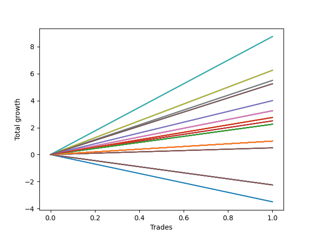

# Short Wallace 1231_002 
- Symbol: ES
- Date Range: 3/18/22 - 6/24/22
- Trading Period: 7:20-12:30
- Number of Trades: 2


| Name | Win Percent | Profit | Avg Profit / Trade |     | Name | Win Percent | Profit | Avg Profit / Trade |
| ---- | ----------- | ------ | ------------------ | --- | ---- | ----------- | ------ | ------------------ |
| Sorted By <br> Profit | | | | | Sorted By <br> Win Percentage ||||
| Thirty-Six | 100.00 | 7500.00 | 3750.00 |     | Thirty-Six | 100.00 | 7500.00 | 3750.00 |
| Five | 100.00 | 7500.00 | 3750.00 |     | Five | 100.00 | 7500.00 | 3750.00 |
| Four | 100.00 | 6250.00 | 3125.00 |     | Four | 100.00 | 6250.00 | 3125.00 |
| Twenty-Two | 100.00 | 3500.00 | 1750.00 |     | Twenty-Two | 100.00 | 3500.00 | 1750.00 |
| Three | 100.00 | 3500.00 | 1750.00 |     | Three | 100.00 | 3500.00 | 1750.00 |
| Twenty-One | 100.00 | 2500.00 | 1250.00 |     | Twenty-One | 100.00 | 2500.00 | 1250.00 |
| Twenty | 100.00 | 2500.00 | 1250.00 |     | Twenty | 100.00 | 2500.00 | 1250.00 |
| Fourteen | 100.00 | 2500.00 | 1250.00 |     | Fourteen | 100.00 | 2500.00 | 1250.00 |
| Eight | 100.00 | 2500.00 | 1250.00 |     | Eight | 100.00 | 2500.00 | 1250.00 |
| Two | 100.00 | 2500.00 | 1250.00 |     | Two | 100.00 | 2500.00 | 1250.00 |
| Nine | 50.00 | 1125.00 | 562.50 |     | Nineteen | 100.00 | 875.00 | 437.50 |
| Nineteen | 100.00 | 875.00 | 437.50 |     | Eighteen | 100.00 | 875.00 | 437.50 |
| Eighteen | 100.00 | 875.00 | 437.50 |     | Thirteen | 100.00 | 875.00 | 437.50 |
| Thirteen | 100.00 | 875.00 | 437.50 |     | Twelve | 100.00 | 875.00 | 437.50 |
| Twelve | 100.00 | 875.00 | 437.50 |     | Seven | 100.00 | 875.00 | 437.50 |
| Seven | 100.00 | 875.00 | 437.50 |     | Six | 100.00 | 875.00 | 437.50 |
| Six | 100.00 | 875.00 | 437.50 |     | One | 100.00 | 875.00 | 437.50 |
| One | 100.00 | 875.00 | 437.50 |     | Nine | 50.00 | 1125.00 | 562.50 |
| Thirty-Five | 50.00 | 375.00 | 187.50 |     | Thirty-Five | 50.00 | 375.00 | 187.50 |
| Thirty-Four | 50.00 | 375.00 | 187.50 |     | Thirty-Four | 50.00 | 375.00 | 187.50 |
| Eleven | 50.00 | 375.00 | 187.50 |     | Eleven | 50.00 | 375.00 | 187.50 |
| Fifteen | 50.00 | 250.00 | 125.00 |     | Fifteen | 50.00 | 250.00 | 125.00 |
| Thirty-Three | 50.00 | 125.00 | 62.50 |     | Thirty-Three | 50.00 | 125.00 | 62.50 |
| Thirty-Two | 50.00 | 125.00 | 62.50 |     | Thirty-Two | 50.00 | 125.00 | 62.50 |
| Thirty-One | 50.00 | 125.00 | 62.50 |     | Thirty-One | 50.00 | 125.00 | 62.50 |
| Thirty | 50.00 | 125.00 | 62.50 |     | Thirty | 50.00 | 125.00 | 62.50 |
| Twenty-Nine | 50.00 | 125.00 | 62.50 |     | Twenty-Nine | 50.00 | 125.00 | 62.50 |
| Twenty-Eight | 50.00 | 125.00 | 62.50 |     | Twenty-Eight | 50.00 | 125.00 | 62.50 |
| Twenty-Seven | 50.00 | 125.00 | 62.50 |     | Twenty-Seven | 50.00 | 125.00 | 62.50 |
| Twenty-Six | 50.00 | 125.00 | 62.50 |     | Twenty-Six | 50.00 | 125.00 | 62.50 |
| Twenty-Five | 50.00 | 125.00 | 62.50 |     | Twenty-Five | 50.00 | 125.00 | 62.50 |
| Twenty-Four | 50.00 | 125.00 | 62.50 |     | Twenty-Four | 50.00 | 125.00 | 62.50 |
| Seventeen | 50.00 | -750.00 | -375.00 |     | Seventeen | 50.00 | -750.00 | -375.00 |
| Ten | 0.00 | -1500.00 | -750.00 |     | Ten | 0.00 | -1500.00 | -750.00 |
| Twenty-Three | 0.00 | -2250.00 | -1125.00 |     | Twenty-Three | 0.00 | -2250.00 | -1125.00 |
| Sixteen | 0.00 | -2750.00 | -1375.00 |     | Sixteen | 0.00 | -2750.00 | -1375.00 |

### Test One
* Sell when price hits the middle line of the 20p bollinger
* No Stoploss
* Results:
```
Total Trades: 2
Percent Up: 0.00
Percent Down: 100.00
Total Points Moved Down: 1.75
Potential Profit: 875.00
Total Points Ups: 0.00 Count Ups: 0
Total Points Downs: 1.75 Count Downs: 2
```

<details><summary>Trades</summary>

<code>In: 2022-03-25 11:34:00		Out: 2022-03-25 11:35:15		Total Position Time: 01:15		Total Move Down: 1.25		Total to Date: -1.25</code> <br />
<code>In: 2022-04-20 10:50:00		Out: 2022-04-20 10:50:10		Total Position Time: 00:10		Total Move Down: 0.50		Total to Date: -1.75</code> <br />


</details>

### Test Two
* Sell when the price hits the lower line of the 20p 1std bollinger
* No Stoploss
* Results:
```
Total Trades: 2
Percent Up: 0.00
Percent Down: 100.00
Total Points Moved Down: 5.00
Potential Profit: 2500.00
Total Points Ups: 0.00 Count Ups: 0
Total Points Downs: 5.00 Count Downs: 2
```

<details><summary>Trades</summary>

<code>In: 2022-03-25 11:34:00		Out: 2022-03-25 11:41:25		Total Position Time: 07:25		Total Move Down: 2.50		Total to Date: -2.50</code> <br />
<code>In: 2022-04-20 10:50:00		Out: 2022-04-20 10:54:05		Total Position Time: 04:05		Total Move Down: 2.50		Total to Date: -5.00</code> <br />


</details>

### Test Three
* Sell when the price hits the lower line of the 20p 2std bollinger
* No Stoploss
* Results:
```
Total Trades: 2
Percent Up: 0.00
Percent Down: 100.00
Total Points Moved Down: 7.00
Potential Profit: 3500.00
Total Points Ups: 0.00 Count Ups: 0
Total Points Downs: 7.00 Count Downs: 2
```

<details><summary>Trades</summary>

<code>In: 2022-03-25 11:34:00		Out: 2022-03-25 12:01:50		Total Position Time: 27:50		Total Move Down: 3.75		Total to Date: -3.75</code> <br />
<code>In: 2022-04-20 10:50:00		Out: 2022-04-20 11:13:55		Total Position Time: 23:55		Total Move Down: 3.25		Total to Date: -7.00</code> <br />


</details>

### Test Four
* Sell when the price hits the middle line of the 1std VWAP
* No Stoploss
* Results:
```
Total Trades: 2
Percent Up: 0.00
Percent Down: 100.00
Total Points Moved Down: 12.50
Potential Profit: 6250.00
Total Points Ups: 0.00 Count Ups: 0
Total Points Downs: 12.50 Count Downs: 2
```

<details><summary>Trades</summary>

<code>In: 2022-03-25 11:34:00		Out: 2022-03-25 12:03:55		Total Position Time: 29:55		Total Move Down: 6.25		Total to Date: -6.25</code> <br />
<code>In: 2022-04-20 10:50:00		Out: 2022-04-20 11:18:20		Total Position Time: 28:20		Total Move Down: 6.25		Total to Date: -12.50</code> <br />


</details>

### Test Five
* Sell when the price hits the lower line of the 1std VWAP
* No Stoploss
* Results:
```
Total Trades: 2
Percent Up: 0.00
Percent Down: 100.00
Total Points Moved Down: 15.00
Potential Profit: 7500.00
Total Points Ups: 0.00 Count Ups: 0
Total Points Downs: 15.00 Count Downs: 2
```

<details><summary>Trades</summary>

<code>In: 2022-03-25 11:34:00		Out: 2022-03-25 12:03:55		Total Position Time: 29:55		Total Move Down: 6.25		Total to Date: -6.25</code> <br />
<code>In: 2022-04-20 10:50:00		Out: 2022-04-20 11:19:55		Total Position Time: 29:55		Total Move Down: 8.75		Total to Date: -15.00</code> <br />


</details>

### Test Six
* Sell when the price hits the middle line of the 20p bollinger
* Stoploss is -2 points
* Results:
```
Total Trades: 2
Percent Up: 0.00
Percent Down: 100.00
Total Points Moved Down: 1.75
Potential Profit: 875.00
Total Points Ups: 0.00 Count Ups: 0
Total Points Downs: 1.75 Count Downs: 2
```

<details><summary>Trades</summary>

<code>In: 2022-03-25 11:34:00		Out: 2022-03-25 11:35:15		Total Position Time: 01:15		Total Move Down: 1.25		Total to Date: -1.25</code> <br />
<code>In: 2022-04-20 10:50:00		Out: 2022-04-20 10:50:10		Total Position Time: 00:10		Total Move Down: 0.50		Total to Date: -1.75</code> <br />


</details>

### Test Seven
* Sell when the price hits the middle line of the 20p bollinger
* Trailing Stop is -2 points
* Results:
```
Total Trades: 2
Percent Up: 0.00
Percent Down: 100.00
Total Points Moved Down: 1.75
Potential Profit: 875.00
Total Points Ups: 0.00 Count Ups: 0
Total Points Downs: 1.75 Count Downs: 2
```

<details><summary>Trades</summary>

<code>In: 2022-03-25 11:34:00		Out: 2022-03-25 11:35:15		Total Position Time: 01:15		Total Move Down: 1.25		Total to Date: -1.25</code> <br />
<code>In: 2022-04-20 10:50:00		Out: 2022-04-20 10:50:10		Total Position Time: 00:10		Total Move Down: 0.50		Total to Date: -1.75</code> <br />


</details>

### Test Eight
* Sell when the price hits the lower line of the 20p 1std bollinger
* Stoploss is -2 points
* Results:
```
Total Trades: 2
Percent Up: 0.00
Percent Down: 100.00
Total Points Moved Down: 5.00
Potential Profit: 2500.00
Total Points Ups: 0.00 Count Ups: 0
Total Points Downs: 5.00 Count Downs: 2
```

<details><summary>Trades</summary>

<code>In: 2022-03-25 11:34:00		Out: 2022-03-25 11:41:25		Total Position Time: 07:25		Total Move Down: 2.50		Total to Date: -2.50</code> <br />
<code>In: 2022-04-20 10:50:00		Out: 2022-04-20 10:54:05		Total Position Time: 04:05		Total Move Down: 2.50		Total to Date: -5.00</code> <br />


</details>

### Test Nine
* Sell when the price hits the lower line of the 20p 1std bollinger
* Trailing Stop is -2 points
* Results:
```
Total Trades: 2
Percent Up: 50.00
Percent Down: 50.00
Total Points Moved Down: 2.25
Potential Profit: 1125.00
Total Points Ups: 0.25 Count Ups: 1
Total Points Downs: 2.50 Count Downs: 1
```

<details><summary>Trades</summary>

<code>In: 2022-03-25 11:34:00		Out: 2022-03-25 11:36:25		Total Position Time: 02:25		Total Move Down: -0.25		Total to Date: 0.25</code> <br />
<code>In: 2022-04-20 10:50:00		Out: 2022-04-20 10:54:05		Total Position Time: 04:05		Total Move Down: 2.50		Total to Date: -2.25</code> <br />


</details>

### Test Ten
* Sell when the price hits the lower line of the 20p 2std bollinger
* Stoploss is -2 points
* Results:
```
Total Trades: 2
Percent Up: 100.00
Percent Down: 0.00
Total Points Moved Down: -3.00
Potential Profit: -1500.00
Total Points Ups: 3.00 Count Ups: 2
Total Points Downs: 0.00 Count Downs: 0
```

<details><summary>Trades</summary>

<code>In: 2022-03-25 11:34:00		Out: 2022-03-25 11:47:10		Total Position Time: 13:10		Total Move Down: -2.25		Total to Date: 2.25</code> <br />
<code>In: 2022-04-20 10:50:00		Out: 2022-04-20 10:58:55		Total Position Time: 08:55		Total Move Down: -0.75		Total to Date: 3.00</code> <br />


</details>

### Test Eleven
* Sell when the price hits the lower line of the 20p 2std bollinger
* Trailing Stop is -2 points
* Results:
```
Total Trades: 2
Percent Up: 50.00
Percent Down: 50.00
Total Points Moved Down: 0.75
Potential Profit: 375.00
Total Points Ups: 0.25 Count Ups: 1
Total Points Downs: 1.00 Count Downs: 1
```

<details><summary>Trades</summary>

<code>In: 2022-03-25 11:34:00		Out: 2022-03-25 11:36:25		Total Position Time: 02:25		Total Move Down: -0.25		Total to Date: 0.25</code> <br />
<code>In: 2022-04-20 10:50:00		Out: 2022-04-20 10:57:00		Total Position Time: 07:00		Total Move Down: 1.00		Total to Date: -0.75</code> <br />


</details>

### Test Twelve
* Sell when the price hits the middle line of the 20p bollinger
* Stoploss is -3 points
* Results:
```
Total Trades: 2
Percent Up: 0.00
Percent Down: 100.00
Total Points Moved Down: 1.75
Potential Profit: 875.00
Total Points Ups: 0.00 Count Ups: 0
Total Points Downs: 1.75 Count Downs: 2
```

<details><summary>Trades</summary>

<code>In: 2022-03-25 11:34:00		Out: 2022-03-25 11:35:15		Total Position Time: 01:15		Total Move Down: 1.25		Total to Date: -1.25</code> <br />
<code>In: 2022-04-20 10:50:00		Out: 2022-04-20 10:50:10		Total Position Time: 00:10		Total Move Down: 0.50		Total to Date: -1.75</code> <br />


</details>

### Test Thirteen
* Sell when the price hits the middle line of the 20p bollinger
* Trailing Stop is -3 points
* Results:
```
Total Trades: 2
Percent Up: 0.00
Percent Down: 100.00
Total Points Moved Down: 1.75
Potential Profit: 875.00
Total Points Ups: 0.00 Count Ups: 0
Total Points Downs: 1.75 Count Downs: 2
```

<details><summary>Trades</summary>

<code>In: 2022-03-25 11:34:00		Out: 2022-03-25 11:35:15		Total Position Time: 01:15		Total Move Down: 1.25		Total to Date: -1.25</code> <br />
<code>In: 2022-04-20 10:50:00		Out: 2022-04-20 10:50:10		Total Position Time: 00:10		Total Move Down: 0.50		Total to Date: -1.75</code> <br />


</details>

### Test Fourteen
* Sell when the price hits the lower line of the 20p 1std bollinger
* Stoploss is -3 points
* Results:
```
Total Trades: 2
Percent Up: 0.00
Percent Down: 100.00
Total Points Moved Down: 5.00
Potential Profit: 2500.00
Total Points Ups: 0.00 Count Ups: 0
Total Points Downs: 5.00 Count Downs: 2
```

<details><summary>Trades</summary>

<code>In: 2022-03-25 11:34:00		Out: 2022-03-25 11:41:25		Total Position Time: 07:25		Total Move Down: 2.50		Total to Date: -2.50</code> <br />
<code>In: 2022-04-20 10:50:00		Out: 2022-04-20 10:54:05		Total Position Time: 04:05		Total Move Down: 2.50		Total to Date: -5.00</code> <br />


</details>

### Test Fifteen
* Sell when the price hits the lower line of the 20p 1std bollinger
* Trailing Stop is -3 points
* Results:
```
Total Trades: 2
Percent Up: 50.00
Percent Down: 50.00
Total Points Moved Down: 0.50
Potential Profit: 250.00
Total Points Ups: 2.00 Count Ups: 1
Total Points Downs: 2.50 Count Downs: 1
```

<details><summary>Trades</summary>

<code>In: 2022-03-25 11:34:00		Out: 2022-03-25 11:38:05		Total Position Time: 04:05		Total Move Down: -2.00		Total to Date: 2.00</code> <br />
<code>In: 2022-04-20 10:50:00		Out: 2022-04-20 10:54:05		Total Position Time: 04:05		Total Move Down: 2.50		Total to Date: -0.50</code> <br />


</details>

### Test Sixteen
* Sell when the price hits the lower line of the 20p 2std bollinger
* Stoploss is -3 points
* Results:
```
Total Trades: 2
Percent Up: 100.00
Percent Down: 0.00
Total Points Moved Down: -5.50
Potential Profit: -2750.00
Total Points Ups: 5.50 Count Ups: 2
Total Points Downs: 0.00 Count Downs: 0
```

<details><summary>Trades</summary>

<code>In: 2022-03-25 11:34:00		Out: 2022-03-25 11:53:50		Total Position Time: 19:50		Total Move Down: -3.25		Total to Date: 3.25</code> <br />
<code>In: 2022-04-20 10:50:00		Out: 2022-04-20 11:01:40		Total Position Time: 11:40		Total Move Down: -2.25		Total to Date: 5.50</code> <br />


</details>

### Test Seventeen
* Sell when the price hits the lower line of the 20p 2std bollinger
* Trailing Stop is -3 points
* Results:
```
Total Trades: 2
Percent Up: 50.00
Percent Down: 50.00
Total Points Moved Down: -1.50
Potential Profit: -750.00
Total Points Ups: 2.00 Count Ups: 1
Total Points Downs: 0.50 Count Downs: 1
```

<details><summary>Trades</summary>

<code>In: 2022-03-25 11:34:00		Out: 2022-03-25 11:38:05		Total Position Time: 04:05		Total Move Down: -2.00		Total to Date: 2.00</code> <br />
<code>In: 2022-04-20 10:50:00		Out: 2022-04-20 10:57:30		Total Position Time: 07:30		Total Move Down: 0.50		Total to Date: 1.50</code> <br />


</details>

### Test Eighteen
* Sell when the price hits the middle line of the 20p bollinger
* Stoploss is -5 points
* Results:
```
Total Trades: 2
Percent Up: 0.00
Percent Down: 100.00
Total Points Moved Down: 1.75
Potential Profit: 875.00
Total Points Ups: 0.00 Count Ups: 0
Total Points Downs: 1.75 Count Downs: 2
```

<details><summary>Trades</summary>

<code>In: 2022-03-25 11:34:00		Out: 2022-03-25 11:35:15		Total Position Time: 01:15		Total Move Down: 1.25		Total to Date: -1.25</code> <br />
<code>In: 2022-04-20 10:50:00		Out: 2022-04-20 10:50:10		Total Position Time: 00:10		Total Move Down: 0.50		Total to Date: -1.75</code> <br />


</details>

### Test Nineteen
* Sell when the price hits the middle line of the 20p bollinger
* Trailing Stop is -5 points
* Results:
```
Total Trades: 2
Percent Up: 0.00
Percent Down: 100.00
Total Points Moved Down: 1.75
Potential Profit: 875.00
Total Points Ups: 0.00 Count Ups: 0
Total Points Downs: 1.75 Count Downs: 2
```

<details><summary>Trades</summary>

<code>In: 2022-03-25 11:34:00		Out: 2022-03-25 11:35:15		Total Position Time: 01:15		Total Move Down: 1.25		Total to Date: -1.25</code> <br />
<code>In: 2022-04-20 10:50:00		Out: 2022-04-20 10:50:10		Total Position Time: 00:10		Total Move Down: 0.50		Total to Date: -1.75</code> <br />


</details>

### Test Twenty
* Sell when the price hits the lower line of the 20p 1std bollinger
* Stoploss is -5 points
* Results:
```
Total Trades: 2
Percent Up: 0.00
Percent Down: 100.00
Total Points Moved Down: 5.00
Potential Profit: 2500.00
Total Points Ups: 0.00 Count Ups: 0
Total Points Downs: 5.00 Count Downs: 2
```

<details><summary>Trades</summary>

<code>In: 2022-03-25 11:34:00		Out: 2022-03-25 11:41:25		Total Position Time: 07:25		Total Move Down: 2.50		Total to Date: -2.50</code> <br />
<code>In: 2022-04-20 10:50:00		Out: 2022-04-20 10:54:05		Total Position Time: 04:05		Total Move Down: 2.50		Total to Date: -5.00</code> <br />


</details>

### Test Twenty-One
* Sell when the price hits the lower line of the 20p 1std bollinger
* Trailing Stop is -5 points
* Results:
```
Total Trades: 2
Percent Up: 0.00
Percent Down: 100.00
Total Points Moved Down: 5.00
Potential Profit: 2500.00
Total Points Ups: 0.00 Count Ups: 0
Total Points Downs: 5.00 Count Downs: 2
```

<details><summary>Trades</summary>

<code>In: 2022-03-25 11:34:00		Out: 2022-03-25 11:41:25		Total Position Time: 07:25		Total Move Down: 2.50		Total to Date: -2.50</code> <br />
<code>In: 2022-04-20 10:50:00		Out: 2022-04-20 10:54:05		Total Position Time: 04:05		Total Move Down: 2.50		Total to Date: -5.00</code> <br />


</details>

### Test Twenty-Two
* Sell when the price hits the lower line of the 20p 2std bollinger
* Stoploss is -5 points
* Results:
```
Total Trades: 2
Percent Up: 0.00
Percent Down: 100.00
Total Points Moved Down: 7.00
Potential Profit: 3500.00
Total Points Ups: 0.00 Count Ups: 0
Total Points Downs: 7.00 Count Downs: 2
```

<details><summary>Trades</summary>

<code>In: 2022-03-25 11:34:00		Out: 2022-03-25 12:01:50		Total Position Time: 27:50		Total Move Down: 3.75		Total to Date: -3.75</code> <br />
<code>In: 2022-04-20 10:50:00		Out: 2022-04-20 11:13:55		Total Position Time: 23:55		Total Move Down: 3.25		Total to Date: -7.00</code> <br />


</details>

### Test Twenty-Three
* Sell when the price hits the lower line of the 20p 2std bollinger
* Trailing Stop is -5 points
* Results:
```
Total Trades: 2
Percent Up: 100.00
Percent Down: 0.00
Total Points Moved Down: -4.50
Potential Profit: -2250.00
Total Points Ups: 4.50 Count Ups: 2
Total Points Downs: 0.00 Count Downs: 0
```

<details><summary>Trades</summary>

<code>In: 2022-03-25 11:34:00		Out: 2022-03-25 11:53:35		Total Position Time: 19:35		Total Move Down: -2.25		Total to Date: 2.25</code> <br />
<code>In: 2022-04-20 10:50:00		Out: 2022-04-20 11:01:40		Total Position Time: 11:40		Total Move Down: -2.25		Total to Date: 4.50</code> <br />


</details>

### Test Twenty-Four
* Sell when the price hits the middle line of the 20p bollinger
* Stoploss is 10 points
* Results:
```
Total Trades: 2
Percent Up: 50.00
Percent Down: 50.00
Total Points Moved Down: 0.25
Potential Profit: 125.00
Total Points Ups: 0.25 Count Ups: 1
Total Points Downs: 0.50 Count Downs: 1
```

<details><summary>Trades</summary>

<code>In: 2022-03-25 11:34:00		Out: 2022-03-25 11:34:10		Total Position Time: 00:10		Total Move Down: -0.25		Total to Date: 0.25</code> <br />
<code>In: 2022-04-20 10:50:00		Out: 2022-04-20 10:50:10		Total Position Time: 00:10		Total Move Down: 0.50		Total to Date: -0.25</code> <br />


</details>

### Test Twenty-Five
* Sell when the price hits the middle line of the 20p bollinger
* Trailing Stop is 10 points
* Results:
```
Total Trades: 2
Percent Up: 50.00
Percent Down: 50.00
Total Points Moved Down: 0.25
Potential Profit: 125.00
Total Points Ups: 0.25 Count Ups: 1
Total Points Downs: 0.50 Count Downs: 1
```

<details><summary>Trades</summary>

<code>In: 2022-03-25 11:34:00		Out: 2022-03-25 11:34:10		Total Position Time: 00:10		Total Move Down: -0.25		Total to Date: 0.25</code> <br />
<code>In: 2022-04-20 10:50:00		Out: 2022-04-20 10:50:10		Total Position Time: 00:10		Total Move Down: 0.50		Total to Date: -0.25</code> <br />


</details>

### Test Twenty-Six
* Sell when the price hits the lower line of the 20p 1std bollinger
* Stoploss is 10 points
* Results:
```
Total Trades: 2
Percent Up: 50.00
Percent Down: 50.00
Total Points Moved Down: 0.25
Potential Profit: 125.00
Total Points Ups: 0.25 Count Ups: 1
Total Points Downs: 0.50 Count Downs: 1
```

<details><summary>Trades</summary>

<code>In: 2022-03-25 11:34:00		Out: 2022-03-25 11:34:10		Total Position Time: 00:10		Total Move Down: -0.25		Total to Date: 0.25</code> <br />
<code>In: 2022-04-20 10:50:00		Out: 2022-04-20 10:50:10		Total Position Time: 00:10		Total Move Down: 0.50		Total to Date: -0.25</code> <br />


</details>

### Test Twenty-Seven
* Sell when the price hits the lower line of the 20p 1std bollinger
* Trailing Stop is 10 points
* Results:
```
Total Trades: 2
Percent Up: 50.00
Percent Down: 50.00
Total Points Moved Down: 0.25
Potential Profit: 125.00
Total Points Ups: 0.25 Count Ups: 1
Total Points Downs: 0.50 Count Downs: 1
```

<details><summary>Trades</summary>

<code>In: 2022-03-25 11:34:00		Out: 2022-03-25 11:34:10		Total Position Time: 00:10		Total Move Down: -0.25		Total to Date: 0.25</code> <br />
<code>In: 2022-04-20 10:50:00		Out: 2022-04-20 10:50:10		Total Position Time: 00:10		Total Move Down: 0.50		Total to Date: -0.25</code> <br />


</details>

### Test Twenty-Eight
* Sell when the price hits the lower line of the 20p 2std bollinger
* Stoploss is 10 points
* Results:
```
Total Trades: 2
Percent Up: 50.00
Percent Down: 50.00
Total Points Moved Down: 0.25
Potential Profit: 125.00
Total Points Ups: 0.25 Count Ups: 1
Total Points Downs: 0.50 Count Downs: 1
```

<details><summary>Trades</summary>

<code>In: 2022-03-25 11:34:00		Out: 2022-03-25 11:34:10		Total Position Time: 00:10		Total Move Down: -0.25		Total to Date: 0.25</code> <br />
<code>In: 2022-04-20 10:50:00		Out: 2022-04-20 10:50:10		Total Position Time: 00:10		Total Move Down: 0.50		Total to Date: -0.25</code> <br />


</details>

### Test Twenty-Nine
* Sell when the price hits the lower line of the 20p 2std bollinger
* Trailing Stop is 10 points
* Results:
```
Total Trades: 2
Percent Up: 50.00
Percent Down: 50.00
Total Points Moved Down: 0.25
Potential Profit: 125.00
Total Points Ups: 0.25 Count Ups: 1
Total Points Downs: 0.50 Count Downs: 1
```

<details><summary>Trades</summary>

<code>In: 2022-03-25 11:34:00		Out: 2022-03-25 11:34:10		Total Position Time: 00:10		Total Move Down: -0.25		Total to Date: 0.25</code> <br />
<code>In: 2022-04-20 10:50:00		Out: 2022-04-20 10:50:10		Total Position Time: 00:10		Total Move Down: 0.50		Total to Date: -0.25</code> <br />


</details>

### Test Thirty
* Sell when the price hits the middle line of the 1std VWAP
* Stoploss is 10 points
* Results:
```
Total Trades: 2
Percent Up: 50.00
Percent Down: 50.00
Total Points Moved Down: 0.25
Potential Profit: 125.00
Total Points Ups: 0.25 Count Ups: 1
Total Points Downs: 0.50 Count Downs: 1
```

<details><summary>Trades</summary>

<code>In: 2022-03-25 11:34:00		Out: 2022-03-25 11:34:10		Total Position Time: 00:10		Total Move Down: -0.25		Total to Date: 0.25</code> <br />
<code>In: 2022-04-20 10:50:00		Out: 2022-04-20 10:50:10		Total Position Time: 00:10		Total Move Down: 0.50		Total to Date: -0.25</code> <br />


</details>

### Test Thirty-One
* Sell when the price hits the middle line of the 1std VWAP
* Trailing Stop is 10 points
* Results:
```
Total Trades: 2
Percent Up: 50.00
Percent Down: 50.00
Total Points Moved Down: 0.25
Potential Profit: 125.00
Total Points Ups: 0.25 Count Ups: 1
Total Points Downs: 0.50 Count Downs: 1
```

<details><summary>Trades</summary>

<code>In: 2022-03-25 11:34:00		Out: 2022-03-25 11:34:10		Total Position Time: 00:10		Total Move Down: -0.25		Total to Date: 0.25</code> <br />
<code>In: 2022-04-20 10:50:00		Out: 2022-04-20 10:50:10		Total Position Time: 00:10		Total Move Down: 0.50		Total to Date: -0.25</code> <br />


</details>

### Test Thirty-Two
* Sell when the price hits the lower line of the 1std VWAP
* Stoploss is 10 points
* Results:
```
Total Trades: 2
Percent Up: 50.00
Percent Down: 50.00
Total Points Moved Down: 0.25
Potential Profit: 125.00
Total Points Ups: 0.25 Count Ups: 1
Total Points Downs: 0.50 Count Downs: 1
```

<details><summary>Trades</summary>

<code>In: 2022-03-25 11:34:00		Out: 2022-03-25 11:34:10		Total Position Time: 00:10		Total Move Down: -0.25		Total to Date: 0.25</code> <br />
<code>In: 2022-04-20 10:50:00		Out: 2022-04-20 10:50:10		Total Position Time: 00:10		Total Move Down: 0.50		Total to Date: -0.25</code> <br />


</details>

### Test Thirty-Three
* Sell when the price hits the lower line of the 1std VWAP
* Trailing Stop is 10 points
* Results:
```
Total Trades: 2
Percent Up: 50.00
Percent Down: 50.00
Total Points Moved Down: 0.25
Potential Profit: 125.00
Total Points Ups: 0.25 Count Ups: 1
Total Points Downs: 0.50 Count Downs: 1
```

<details><summary>Trades</summary>

<code>In: 2022-03-25 11:34:00		Out: 2022-03-25 11:34:10		Total Position Time: 00:10		Total Move Down: -0.25		Total to Date: 0.25</code> <br />
<code>In: 2022-04-20 10:50:00		Out: 2022-04-20 10:50:10		Total Position Time: 00:10		Total Move Down: 0.50		Total to Date: -0.25</code> <br />


</details>

### Test Thirty-Four
* Sell when the linear regression slope is positive
* No Stoploss
* Results:
```
Total Trades: 2
Percent Up: 50.00
Percent Down: 50.00
Total Points Moved Down: 0.75
Potential Profit: 375.00
Total Points Ups: 0.25 Count Ups: 1
Total Points Downs: 1.00 Count Downs: 1
```

<details><summary>Trades</summary>

<code>In: 2022-03-25 11:34:00		Out: 2022-03-25 11:35:05		Total Position Time: 01:05		Total Move Down: -0.25		Total to Date: 0.25</code> <br />
<code>In: 2022-04-20 10:50:00		Out: 2022-04-20 10:58:05		Total Position Time: 08:05		Total Move Down: 1.00		Total to Date: -0.75</code> <br />


</details>

### Test Thirty-Five
* Sell when the linear regression slope changes to positive
* No Stoploss
* Results:
```
Total Trades: 2
Percent Up: 50.00
Percent Down: 50.00
Total Points Moved Down: 0.75
Potential Profit: 375.00
Total Points Ups: 0.25 Count Ups: 1
Total Points Downs: 1.00 Count Downs: 1
```

<details><summary>Trades</summary>

<code>In: 2022-03-25 11:34:00		Out: 2022-03-25 11:35:05		Total Position Time: 01:05		Total Move Down: -0.25		Total to Date: 0.25</code> <br />
<code>In: 2022-04-20 10:50:00		Out: 2022-04-20 10:58:05		Total Position Time: 08:05		Total Move Down: 1.00		Total to Date: -0.75</code> <br />


</details>

### Test Thirty-Six
* Sell when the linear regression slope changes to positive
* No Stoploss
* Results:
```
Total Trades: 2
Percent Up: 0.00
Percent Down: 100.00
Total Points Moved Down: 15.00
Potential Profit: 7500.00
Total Points Ups: 0.00 Count Ups: 0
Total Points Downs: 15.00 Count Downs: 2
```

<details><summary>Trades</summary>

<code>In: 2022-03-25 11:34:00		Out: 2022-03-25 12:03:55		Total Position Time: 29:55		Total Move Down: 6.25		Total to Date: -6.25</code> <br />
<code>In: 2022-04-20 10:50:00		Out: 2022-04-20 11:19:55		Total Position Time: 29:55		Total Move Down: 8.75		Total to Date: -15.00</code> <br />


</details>